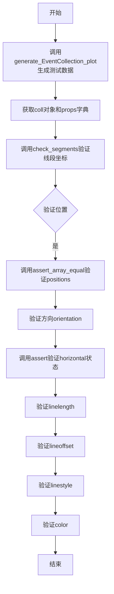
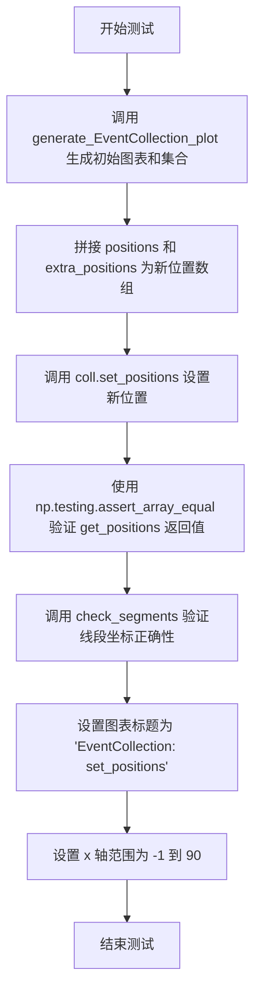
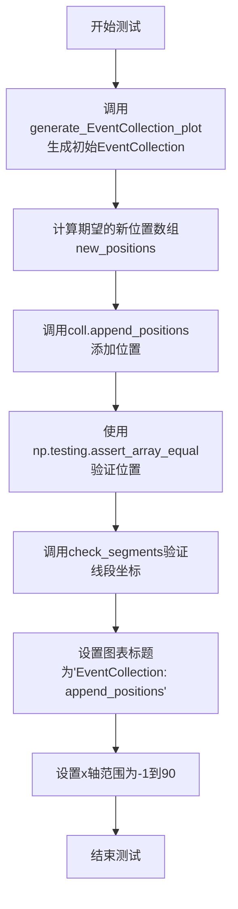
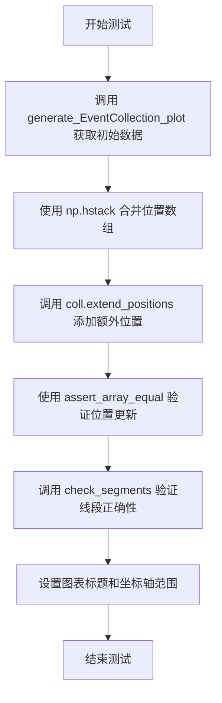
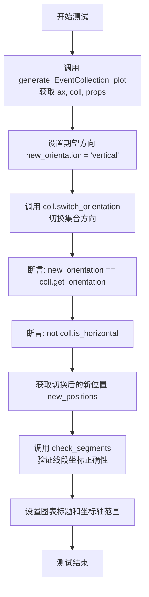
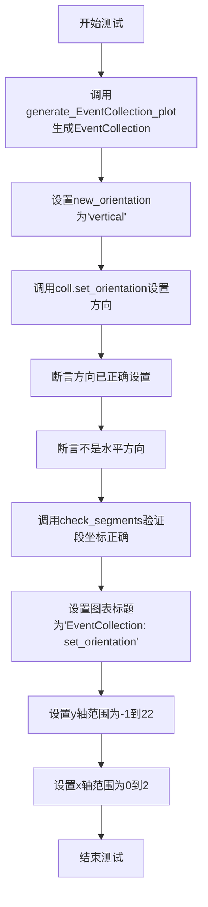
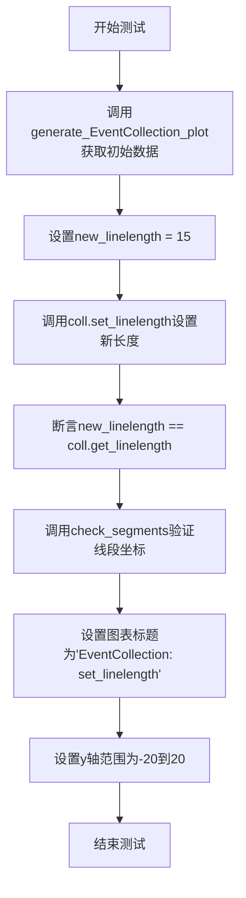
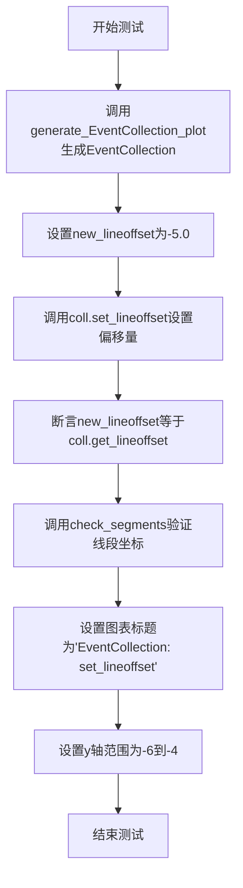
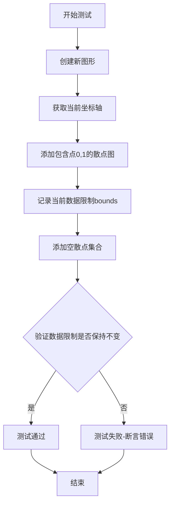
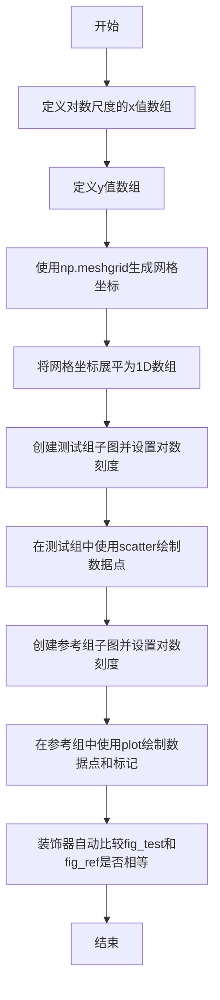

# `matplotlib\lib\matplotlib\tests\test_collections.py` 详细设计文档

该文件是matplotlib集合（Collection）模块的单元测试集，涵盖了EventCollection、LineCollection、PolyCollection、EllipseCollection、PathCollection、QuadMesh、RegularPolyCollection、CircleCollection等多种集合类的功能测试，包括属性设置与获取、数据限制计算、自动缩放、颜色映射、图例元素、遮罩处理、坐标变换等核心功能的验证。

## 整体流程


## 类结构

```
matplotlib.collections (核心模块)
├── Collection (基类)
│   ├── LineCollection
│   ├── EventCollection
│   ├── PolyCollection
│   │   └── FillBetweenPolyCollection
│   ├── EllipseCollection
│   ├── PathCollection
│   ├── RegularPolyCollection
│   ├── CircleCollection
│   └── QuadMesh (通过pcolormesh/pcolor创建)
matplotlib (主模块)
├── pyplot
├── colors (mcolors)
├── transforms (mtransforms)
├── path (mpath)
└── artist (测试中涉及)
```

## 全局变量及字段


### `pcfunc`
    
一个pytest参数化fixture，用于在测试中动态返回pcolormesh或pcolor函数名

类型：`function (pytest fixture)`
    


### `mcollections.RegularPolyCollection.SquareCollection`
    
一个自定义的正方形集合类，继承自RegularPolyCollection，用于绘制正方形并将其面积缩放到数据空间

类型：`class (继承自RegularPolyCollection)`
    
    

## 全局函数及方法


### generate_EventCollection_plot

该函数是 matplotlib 中 EventCollection 类的测试辅助函数，用于生成默认的 EventCollection（事件集合）并将其绘制到图表中，返回包含坐标轴、集合对象和属性字典的元组，供后续测试用例验证 EventCollection 的各项功能。

参数： 无

返回值：`tuple`，返回一个包含三个元素的元组：
- `ax`：matplotlib.axes.Axes 对象，EventCollection 被添加到的坐标轴
- `coll`：matplotlib.collections.EventCollection 对象，创建的事件集合实例
- `props`：dict，包含用于创建 EventCollection 的所有参数（positions、extra_positions、orientation、lineoffset、linelength、linewidth、color、linestyle、antialiased）

#### 流程图

```mermaid
flowchart TD
    A[开始] --> B[定义positions数组: [0., 1., 2., 3., 5., 8., 13., 21.]]
    B --> C[定义extra_positions数组: [34., 55., 89.]]
    C --> D[设置绘图参数: orientation='horizontal', lineoffset=1, linelength=0.5, linewidth=2, color=[1,0,0,1], linestyle='solid', antialiased=True]
    D --> E[创建EventCollection对象coll]
    E --> F[创建子图fig和坐标轴ax]
    F --> G[将EventCollection添加到坐标轴: ax.add_collection]
    G --> H[设置标题: 'EventCollection: default']
    H --> I[构建props字典保存所有参数]
    I --> J[设置坐标轴范围: xlim(-1,22), ylim(0,2)]
    J --> K[返回元组ax, coll, props]
```

#### 带注释源码

```python
def generate_EventCollection_plot():
    """Generate the initial collection and plot it."""
    # 定义事件位置数组，用于表示事件发生的时间点
    positions = np.array([0., 1., 2., 3., 5., 8., 13., 21.])
    # 额外的位置数据，用于后续测试中添加更多事件
    extra_positions = np.array([34., 55., 89.])
    
    # 事件集合的方向：水平方向
    orientation = 'horizontal'
    # 线条偏移量：事件线在垂直于事件方向上的位置
    lineoffset = 1
    # 线条长度：每个事件标记的线段长度
    linelength = .5
    # 线条宽度
    linewidth = 2
    # 颜色：红色（RGBA格式）
    color = [1, 0, 0, 1]
    # 线型：实线
    linestyle = 'solid'
    # 抗锯齿：启用
    antialiased = True

    # 创建EventCollection对象，传入所有参数
    coll = EventCollection(positions,
                           orientation=orientation,
                           lineoffset=lineoffset,
                           linelength=linelength,
                           linewidth=linewidth,
                           color=color,
                           linestyle=linestyle,
                           antialiased=antialiased
                           )

    # 创建图表和坐标轴
    fig, ax = plt.subplots()
    # 将事件集合添加到坐标轴
    ax.add_collection(coll)
    # 设置图表标题
    ax.set_title('EventCollection: default')
    
    # 构建属性字典，保存所有配置参数供测试验证使用
    props = {'positions': positions,
             'extra_positions': extra_positions,
             'orientation': orientation,
             'lineoffset': lineoffset,
             'linelength': linelength,
             'linewidth': linewidth,
             'color': color,
             'linestyle': linestyle,
             'antialiased': antialiased
             }
    
    # 设置坐标轴的显示范围
    ax.set_xlim(-1, 22)
    ax.set_ylim(0, 2)
    
    # 返回坐标轴、事件集合和属性字典的元组
    return ax, coll, props
```


### `check_segments`

这是一个测试辅助函数，用于验证 EventCollection 的线段是否根据给定的位置、线段长度、偏移量和方向正确生成。

参数：

- `coll`：`matplotlib.collections.Collection`，需要检查的集合对象（通常是 EventCollection）
- `positions`：`numpy.ndarray`，事件的位置数组
- `linelength`：`float`，线段的长度
- `lineoffset`：`float`，线段的偏移量
- `orientation`：`str` 或 `None`，方向，值为 'horizontal'、'vertical'、'none' 或 None

返回值：`None`，该函数没有返回值，用于执行断言检查

#### 流程图

```mermaid
graph TD
    A[开始] --> B[获取集合的segments]
    B --> C{orientation}
    C -->|horizontal<br/>none<br/>None| D[设置 pos1=1<br/>pos2=0]
    C -->|vertical| E[设置 pos1=0<br/>pos2=1]
    C -->|其他| F[抛出 ValueError]
    D --> G[遍历 segments]
    E --> G
    G --> H{遍历每个 segment}
    H -->|是| I[断言 segment[0, pos1] == lineoffset + linelength / 2]
    I --> J[断言 segment[1, pos1] == lineoffset - linelength / 2]
    J --> K[断言 segment[0, pos2] == positions[i]]
    K --> L[断言 segment[1, pos2] == positions[i]]
    L --> H
    H -->|否| M[结束]
    F --> M
```

#### 带注释源码

```python
def check_segments(coll, positions, linelength, lineoffset, orientation):
    """
    Test helper checking that all values in the segment are correct, given a
    particular set of inputs.
    
    参数:
        coll: EventCollection 实例，待检查的集合对象
        positions: numpy.ndarray，事件的位置数组
        linelength: float，线段的长度
        lineoffset: float，线段的偏移量
        orientation: str 或 None，方向 ('horizontal'/'vertical'/'none'/None)
    """
    # 获取集合中的所有线段
    segments = coll.get_segments()
    
    # 根据方向确定坐标索引
    # horizontal/none/None: 位置在 y 轴上 (pos1=1, pos2=0)
    if (orientation.lower() == 'horizontal'
            or orientation.lower() == 'none' or orientation is None):
        # if horizontal, the position in is in the y-axis
        pos1 = 1
        pos2 = 0
    # vertical: 位置在 x 轴上 (pos1=0, pos2=1)
    elif orientation.lower() == 'vertical':
        # if vertical, the position in is in the x-axis
        pos1 = 0
        pos2 = 1
    else:
        raise ValueError("orientation must be 'horizontal' or 'vertical'")

    # test to make sure each segment is correct
    # 验证每个线段的坐标是否正确
    for i, segment in enumerate(segments):
        # 检查线段起点的 pos1 坐标是否等于 lineoffset + linelength / 2
        assert segment[0, pos1] == lineoffset + linelength / 2
        # 检查线段终点的 pos1 坐标是否等于 lineoffset - linelength / 2
        assert segment[1, pos1] == lineoffset - linelength / 2
        # 检查线段起点的 pos2 坐标是否等于对应的 positions[i]
        assert segment[0, pos2] == positions[i]
        # 检查线段终点的 pos2 坐标是否等于对应的 positions[i]
        assert segment[1, pos2] == positions[i]
```


### `test__EventCollection__get_props`

这是一个测试函数，用于验证`EventCollection`类的默认属性（位置、方向、线段长度、线段偏移、线条样式和颜色）是否正确初始化。

参数：

- 该函数无显式参数，通过调用`generate_EventCollection_plot()`内部生成测试数据

返回值：`None`，该函数为测试函数，使用断言进行验证，无显式返回值

#### 流程图



#### 带注释源码

```python
@image_comparison(['EventCollection_plot__default.png'])
def test__EventCollection__get_props():
    """
    测试EventCollection的默认属性获取功能。
    验证EventCollection在默认情况下能正确存储和返回
    positions、orientation、linelength、lineoffset、linestyle和color等属性。
    """
    # 生成EventCollection测试数据和图形
    # 返回: (axes对象, EventCollection实例, 属性字典)
    _, coll, props = generate_EventCollection_plot()
    
    # 检查默认线段是否具有正确的坐标
    # 验证线段的起止点是否与预期参数一致
    check_segments(coll,
                   props['positions'],
                   props['linelength'],
                   props['lineoffset'],
                   props['orientation'])
    
    # 检查默认位置是否与输入位置匹配
    # 使用numpy数组相等断言验证
    np.testing.assert_array_equal(props['positions'], coll.get_positions())
    
    # 检查默认方向是否与输入方向匹配
    assert props['orientation'] == coll.get_orientation()
    
    # 检查默认方向是否为水平方向
    assert coll.is_horizontal()
    
    # 检查默认linelength是否与输入linelength匹配
    assert props['linelength'] == coll.get_linelength()
    
    # 检查默认lineoffset是否与输入lineoffset匹配
    assert props['lineoffset'] == coll.get_lineoffset()
    
    # 检查默认linestyle是否为实线
    # 默认linestyle为[(0, None)]表示实线
    assert coll.get_linestyle() == [(0, None)]
    
    # 检查默认颜色是否与输入颜色匹配
    # 遍历单个颜色和颜色列表进行验证
    for color in [coll.get_color(), *coll.get_colors()]:
        np.testing.assert_array_equal(color, props['color'])
```


### `test__EventCollection__set_positions`

这是一个测试函数，用于验证 EventCollection 类的 `set_positions()` 方法能否正确设置事件集合的位置，并在设置后通过 `get_positions()` 方法和 `check_segments` 辅助函数验证设置的值是否正确。

参数：无（该函数不接受任何显式参数，但使用了 pytest 的 `@image_comparison` 装饰器进行图像比较测试）

返回值：`None`，该函数为测试函数，不返回任何值

#### 流程图



#### 带注释源码

```python
@image_comparison(['EventCollection_plot__set_positions.png'])
def test__EventCollection__set_positions():
    """
    测试 EventCollection 的 set_positions 方法。
    
    该测试函数执行以下操作：
    1. 生成一个包含默认位置的 EventCollection 对象
    2. 使用 set_positions 方法更新位置
    3. 验证位置是否正确设置
    4. 验证图形渲染是否正确
    """
    # 调用辅助函数生成初始的 EventCollection 和相关属性
    # 返回: splt (axes), coll (EventCollection), props (dict of properties)
    splt, coll, props = generate_EventCollection_plot()
    
    # 使用 np.hstack 将原始位置数组和额外位置数组合并
    # props['positions'] = [0., 1., 2., 3., 5., 8., 13., 21.]
    # props['extra_positions'] = [34., 55., 89.]
    # 结果: new_positions = [0., 1., 2., 3., 5., 8., 13., 21., 34., 55., 89.]
    new_positions = np.hstack([props['positions'], props['extra_positions']])
    
    # 调用 EventCollection 的 set_positions 方法设置新位置
    coll.set_positions(new_positions)
    
    # 验证 get_positions 方法返回的数组与设置的值相等
    np.testing.assert_array_equal(new_positions, coll.get_positions())
    
    # 调用辅助函数 check_segments 验证所有线段的坐标是否正确
    # 参数: 集合对象, 位置, 线段长度, 线段偏移, 方向
    check_segments(coll, new_positions,
                   props['linelength'],
                   props['lineoffset'],
                   props['orientation'])
    
    # 设置子图的标题
    splt.set_title('EventCollection: set_positions')
    
    # 调整 x 轴范围以容纳新的位置值
    splt.set_xlim(-1, 90)
```


### `test__EventCollection__add_positions`

这是一个测试函数，用于验证 EventCollection 类的 `add_positions` 方法的正确性。测试通过调用 `add_positions` 方法添加单个位置，然后检查内部位置数组和线段是否正确更新，同时覆盖水平方向和垂直方向两种场景。

参数：
- 该函数没有显式参数，使用 pytest 的隐式上下文和 `generate_EventCollection_plot` fixture

返回值：`None`，该函数为测试函数，通过断言进行验证，不返回任何值

#### 流程图

```mermaid
flowchart TD
    A[开始测试] --> B[调用 generate_EventCollection_plot 获取初始状态]
    B --> C[计算期望的新位置数组: positions + extra_positions[0]]
    D[切换方向: switch_orientation] --> E[调用 add_positions 添加额外位置]
    E --> F[再次切换方向: switch_orientation]
    F --> G[断言: new_positions == coll.get_positions]
    G --> H[调用 check_segments 验证线段正确性]
    H --> I[设置图表标题和x轴范围]
    I --> J[结束测试]
    
    D -.->|测试垂直方向| E
```

#### 带注释源码

```python
@image_comparison(['EventCollection_plot__add_positions.png'])
def test__EventCollection__add_positions():
    """
    测试 EventCollection 的 add_positions 方法功能。
    验证点：
    1. add_positions 能正确添加单个位置到集合
    2. 在垂直方向下添加位置也能正常工作
    3. 添加后 get_positions() 返回正确的数组
    4. 线段的几何属性保持正确
    """
    # 获取初始的 EventCollection 和相关属性
    splt, coll, props = generate_EventCollection_plot()
    
    # 计算期望的新位置数组：将原位置与第一个额外位置拼接
    new_positions = np.hstack([props['positions'],
                               props['extra_positions'][0]])
    
    # 切换到垂直方向，测试在垂直 orientation 下添加位置
    coll.switch_orientation()  # Test adding in the vertical orientation, too.
    
    # 调用 add_positions 方法添加第一个额外位置
    coll.add_positions(props['extra_positions'][0])
    
    # 切换回水平方向
    coll.switch_orientation()
    
    # 验证添加后的位置数组与期望值一致
    np.testing.assert_array_equal(new_positions, coll.get_positions())
    
    # 验证线段的几何属性（位置、长度、偏移量、方向）
    check_segments(coll,
                   new_positions,
                   props['linelength'],
                   props['lineoffset'],
                   props['orientation'])
    
    # 设置图表标题和 x 轴范围
    splt.set_title('EventCollection: add_positions')
    splt.set_xlim(-1, 35)
```


### test__EventCollection__append_positions

该测试函数用于验证 EventCollection 类的 append_positions 方法是否正确地将新位置追加到集合中，并确保图形渲染正确。

参数：

- 无

返回值：无返回值（测试函数）

#### 流程图



#### 带注释源码

```python
@image_comparison(['EventCollection_plot__append_positions.png'])  # 图像对比装饰器
def test__EventCollection__append_positions():
    """测试EventCollection的append_positions方法"""
    
    # 第一步：生成初始的EventCollection和绘图对象
    splt, coll, props = generate_EventCollection_plot()
    
    # 第二步：计算期望的新位置
    # 将额外的位置数组的第三个元素[2]追加到原始位置数组
    new_positions = np.hstack([props['positions'],
                               props['extra_positions'][2]])
    
    # 第三步：调用被测试的append_positions方法
    coll.append_positions(props['extra_positions'][2])
    
    # 第四步：验证位置是否正确添加
    np.testing.assert_array_equal(new_positions, coll.get_positions())
    
    # 第五步：验证线段的几何属性是否正确
    check_segments(coll,
                   new_positions,
                   props['linelength'],
                   props['lineoffset'],
                   props['orientation'])
    
    # 第六步：设置图表标题
    splt.set_title('EventCollection: append_positions')
    
    # 第七步：调整x轴范围以适应新数据
    splt.set_xlim(-1, 90)
```


### `test__EventCollection__extend_positions`

该测试函数用于验证 EventCollection 类的 `extend_positions` 方法是否能正确地将多个位置添加到集合中，并通过图像比较验证结果是否符合预期。

参数： 无

返回值： `None`，该测试函数不返回任何值

#### 流程图



#### 带注释源码

```python
@image_comparison(['EventCollection_plot__extend_positions.png'])
def test__EventCollection__extend_positions():
    """
    测试 EventCollection 的 extend_positions 方法功能。
    该测试通过图像比较验证扩展位置后的绘图结果。
    """
    # 获取初始的绘图对象、EventCollection实例和相关属性
    splt, coll, props = generate_EventCollection_plot()
    
    # 将原始位置数组与额外位置数组（从第二个元素开始）水平拼接
    new_positions = np.hstack([props['positions'],
                               props['extra_positions'][1:]])
    
    # 调用 EventCollection 的 extend_positions 方法添加多个位置
    coll.extend_positions(props['extra_positions'][1:])
    
    # 验证扩展后的位置数组与预期数组相等
    np.testing.assert_array_equal(new_positions, coll.get_positions())
    
    # 验证所有线段是否按照给定的位置、线长、偏移和方向正确生成
    check_segments(coll,
                   new_positions,
                   props['linelength'],
                   props['lineoffset'],
                   props['orientation'])
    
    # 设置子图的标题
    splt.set_title('EventCollection: extend_positions')
    
    # 设置x轴的显示范围
    splt.set_xlim(-1, 90)
```


### `test__EventCollection__switch_orientation`

该测试函数用于验证 `EventCollection` 类的 `switch_orientation` 方法是否正确地将集合从水平方向切换到垂直方向，并确保切换后所有属性（如方向、位置、线段）都被正确更新。

参数：
- 该测试函数无显式参数（通过 pytest fixture `generate_EventCollection_plot` 隐式获取测试数据和对象）

返回值：`None`，该测试函数通过断言验证行为，不返回任何值。

#### 流程图



#### 带注释源码

```python
@image_comparison(['EventCollection_plot__switch_orientation.png'])
def test__EventCollection__switch_orientation():
    """
    测试 EventCollection 的 switch_orientation 方法。
    验证从水平方向切换到垂直方向后，集合的方向、位置和线段都被正确更新。
    """
    # 通过 fixture 生成初始的 EventCollection 绘图对象
    # 返回: ax (Axes 对象), coll (EventCollection 对象), props (参数字典)
    splt, coll, props = generate_EventCollection_plot()
    
    # 定义期望的新方向为垂直方向
    new_orientation = 'vertical'
    
    # 调用 switch_orientation 方法切换集合方向
    # 该方法会翻转内部的方向标记，并重新计算线段坐标
    coll.switch_orientation()
    
    # 断言: 切换后的方向应该等于 'vertical'
    assert new_orientation == coll.get_orientation()
    
    # 断言: 切换后集合不再是水平方向
    assert not coll.is_horizontal()
    
    # 获取切换方向后的位置数据
    new_positions = coll.get_positions()
    
    # 验证线段是否正确更新:
    # - 检查每个线段端点的坐标是否符合新的垂直方向
    # - 垂直方向时，位置信息应体现在 x 轴上
    check_segments(coll,
                   new_positions,
                   props['linelength'],
                   props['lineoffset'], new_orientation)
    
    # 设置图表标题
    splt.set_title('EventCollection: switch_orientation')
    
    # 调整 y 轴和 x 轴的显示范围
    # 由于方向切换，原本的 y 轴范围变为 x 轴范围
    splt.set_ylim(-1, 22)
    splt.set_xlim(0, 2)
```


### `test__EventCollection__switch_orientation_2x`

该测试函数用于验证 `EventCollection` 的 `switch_orientation` 方法连续调用两次后，集合的方向能够恢复到初始默认方向（horizontal），同时确保位置坐标也保持不变。

参数：

- 该函数无显式参数（pytest 测试框架隐式注入的参数不计）

返回值：`None`，测试函数无返回值

#### 流程图

```mermaid
flowchart TD
    A[开始测试] --> B[调用 generate_EventCollection_plot<br/>生成初始 EventCollection 和属性]
    B --> C[第一次调用 coll.switch_orientation<br/>切换为 vertical]
    C --> D[第二次调用 coll.switch_orientation<br/>切换回 horizontal]
    D --> E[获取当前 positions: new_positions]
    E --> F{断言检查}
    F --> F1[检查 orientation == props['orientation']<br/>应为 'horizontal']
    F --> F2[检查 coll.is_horizontal() == True]
    F --> F3[检查 new_positions == props['positions']<br/>位置未改变]
    F --> F4[调用 check_segments 验证线段坐标正确]
    F1 --> G[设置图表标题]
    F2 --> G
    F3 --> G
    F4 --> G
    G --> H[结束测试]
```

#### 带注释源码

```python
@image_comparison(['EventCollection_plot__switch_orientation__2x.png'])
def test__EventCollection__switch_orientation_2x():
    """
    Check that calling switch_orientation twice sets the orientation back to
    the default.
    """
    # 生成初始的 EventCollection 和相关属性
    # 返回: (axes, collection, props字典)
    # props 包含: positions, extra_positions, orientation, 
    #             lineoffset, linelength, linewidth, color, linestyle, antialiased
    splt, coll, props = generate_EventCollection_plot()
    
    # 第一次切换: horizontal -> vertical
    coll.switch_orientation()
    
    # 第二次切换: vertical -> horizontal (应恢复到默认值)
    coll.switch_orientation()
    
    # 获取切换后的位置数据
    new_positions = coll.get_positions()
    
    # 断言1: 方向应恢复到初始方向 'horizontal'
    assert props['orientation'] == coll.get_orientation()
    
    # 断言2: is_horizontal() 应返回 True
    assert coll.is_horizontal()
    
    # 断言3: 位置数据应与初始 positions 完全一致
    # 两次切换后位置应保持不变
    np.testing.assert_array_equal(props['positions'], new_positions)
    
    # 断言4: 验证所有线段的几何坐标正确
    # 检查每个线段的端点是否符合 lineoffset 和 linelength 的计算
    check_segments(coll,
                   new_positions,
                   props['linelength'],
                   props['lineoffset'],
                   props['orientation'])
    
    # 设置图表标题用于图像对比测试
    splt.set_title('EventCollection: switch_orientation 2x')
```


### `test__EventCollection__set_orientation`

这是一个测试函数，用于验证 EventCollection 类的 `set_orientation` 方法是否正确设置集合的方向（水平或垂直）。

参数：
- 该测试函数没有显式参数，通过调用 `generate_EventCollection_plot()` fixture 获取所需的测试数据（ax, coll, props）

返回值：`None`，该函数为测试函数，不返回任何值

#### 流程图



#### 带注释源码

```python
@image_comparison(['EventCollection_plot__set_orientation.png'])
def test__EventCollection__set_orientation():
    """
    测试EventCollection的set_orientation方法功能
    
    该测试函数验证：
    1. set_orientation能正确设置集合的方向
    2. get_orientation返回正确的方向值
    3. is_horizontal方法正确反映当前方向状态
    4. 段的坐标在方向改变后仍然正确
    """
    # 生成初始的EventCollection和plot
    splt, coll, props = generate_EventCollection_plot()
    
    # 设置新的方向为垂直方向
    new_orientation = 'vertical'
    
    # 调用set_orientation方法设置新方向
    coll.set_orientation(new_orientation)
    
    # 验证get_orientation返回新方向
    assert new_orientation == coll.get_orientation()
    
    # 验证is_horizontal返回False（因为现在是垂直方向）
    assert not coll.is_horizontal()
    
    # 验证段的坐标是否正确（使用新的方向）
    check_segments(coll,
                   props['positions'],
                   props['linelength'],
                   props['lineoffset'],
                   new_orientation)
    
    # 设置图表标题
    splt.set_title('EventCollection: set_orientation')
    
    # 设置y轴范围
    splt.set_ylim(-1, 22)
    
    # 设置x轴范围
    splt.set_xlim(0, 2)
```


### `test__EventCollection__set_linelength`

该测试函数用于验证 EventCollection 类的 `set_linelength` 方法是否正确设置了事件线的长度，并通过 `check_segments` 辅助函数验证更新后的线段坐标是否符合预期，同时使用图像比较装饰器确保可视化输出正确。

参数：

- 该函数无显式参数，通过调用 `generate_EventCollection_plot()` 获取必要的测试数据

返回值：`None`，该函数为测试函数，不返回任何值

#### 流程图



#### 带注释源码

```python
@image_comparison(['EventCollection_plot__set_linelength.png'])
def test__EventCollection__set_linelength():
    """
    测试EventCollection的set_linelength方法功能。
    
    该测试函数执行以下步骤：
    1. 生成初始的EventCollection和plot
    2. 设置新的linelength值为15
    3. 验证set_linelength方法正确设置了值
    4. 验证更新后的事件线段坐标正确
    5. 更新图表标题和y轴范围以适应新的线段
    """
    # 获取初始的Axes对象、EventCollection实例和属性字典
    splt, coll, props = generate_EventCollection_plot()
    
    # 定义新的linelength值
    new_linelength = 15
    
    # 调用EventCollection的set_linelength方法设置新长度
    coll.set_linelength(new_linelength)
    
    # 断言：验证get_linelength返回的值与设置的值一致
    assert new_linelength == coll.get_linelength()
    
    # 调用辅助函数check_segments，验证所有事件线段的坐标正确
    # 参数：collection对象、位置数组、新的linelength、lineoffset、orientation
    check_segments(coll,
                   props['positions'],
                   new_linelength,
                   props['lineoffset'],
                   props['orientation'])
    
    # 设置子图的标题
    splt.set_title('EventCollection: set_linelength')
    
    # 调整y轴范围以适应更长的事件线（因为linelength从0.5变为15）
    splt.set_ylim(-20, 20)
```


### test__EventCollection__set_lineoffset

该函数是一个测试函数，用于测试EventCollection类的set_lineoffset方法是否正确设置了事件线的偏移量。

参数：
- 该函数没有显式参数，使用generate_EventCollection_plot()辅助函数生成测试所需的ax、coll和props对象

返回值：`None`，该函数为测试函数，不返回任何值

#### 流程图



#### 带注释源码

```python
@image_comparison(['EventCollection_plot__set_lineoffset.png'])
def test__EventCollection__set_lineoffset():
    """
    测试EventCollection的set_lineoffset方法
    
    该测试函数验证：
    1. set_lineoffset方法能正确设置事件线的偏移量
    2. get_lineoffset方法能正确返回设置的偏移量
    3. 线段的几何坐标根据新的偏移量正确计算
    """
    # 调用辅助函数生成EventCollection对象、axes和属性字典
    splt, coll, props = generate_EventCollection_plot()
    
    # 定义新的lineoffset值
    new_lineoffset = -5.
    
    # 调用set_lineoffset方法设置新的偏移量
    coll.set_lineoffset(new_lineoffset)
    
    # 断言：验证get_lineoffset返回的值与设置的值一致
    assert new_lineoffset == coll.get_lineoffset()
    
    # 验证生成的线段坐标是否正确
    # 传入：位置列表、线长度、新的偏移量、方向
    check_segments(coll,
                   props['positions'],
                   props['linelength'],
                   new_lineoffset,
                   props['orientation'])
    
    # 设置图表标题
    splt.set_title('EventCollection: set_lineoffset')
    
    # 调整y轴显示范围以便观察偏移后的效果
    splt.set_ylim(-6, -4)
```


### `test__EventCollection__set_prop`

该测试函数用于验证 EventCollection 类的 `set` 方法能否正确设置 `linestyle` 和 `linewidth` 属性，并通过 `plt.getp` 验证设置后的属性值是否符合预期。

参数：

- 该测试函数无显式参数，通过 pytest 框架隐式接收测试配置参数（如 fixtures）

返回值：`None`，该函数为测试函数，执行一系列断言操作，不返回任何值

#### 流程图

```mermaid
flowchart TD
    A[开始测试 test__EventCollection__set_prop] --> B[定义测试数据: prop, value, expected]
    B --> C{遍历测试数据}
    C -->|第一次迭代| D1[设置 linestyle='dashed']
    C -->|第二次迭代| D2[设置 linestyle=(0, (6., 6.))]
    C -->|第三次迭代| D3[设置 linewidth=5]
    D1 --> E1[generate_EventCollection_plot 创建新实例]
    D2 --> E2[generate_EventCollection_plot 创建新实例]
    D3 --> E3[generate_EventCollection_plot 创建新实例]
    E1 --> F1[coll.set linestyle]
    E2 --> F2[coll.set linestyle]
    E3 --> F3[coll.set linewidth]
    F1 --> G1[plt.getp 验证属性值]
    F2 --> G2[plt.getp 验证属性值]
    F3 --> G3[plt.getp 验证属性值]
    G1 --> H1{断言通过?}
    G2 --> H2{断言通过?}
    G3 --> H3{断言通过?}
    H1 -->|是| I1[设置图表标题]
    H2 --> I2[设置图表标题]
    H3 --> I3[设置图表标题]
    I1 --> C
    I2 --> C
    I3 --> C
    C -->|遍历完成| J[测试结束]
    H1 -->|否| K[抛出 AssertionError]
    H2 --> K
    H3 --> K
```

#### 带注释源码

```python
@image_comparison([
    'EventCollection_plot__set_linestyle.png',
    'EventCollection_plot__set_linestyle.png',
    'EventCollection_plot__set_linewidth.png',
])
def test__EventCollection__set_prop():
    """
    测试 EventCollection 的 set 方法设置 linestyle 和 linewidth 属性。
    
    该测试使用 @image_comparison 装饰器进行图像对比测试，验证设置属性后
    的渲染结果是否符合预期。
    """
    # 定义测试数据：属性名、设置值、预期值
    for prop, value, expected in [
            # 测试设置 linestyle 为字符串 'dashed'
            ('linestyle', 'dashed', [(0, (6.0, 6.0))]),
            # 测试设置 linestyle 为元组格式 (offset, dash_pattern)
            ('linestyle', (0, (6., 6.)), [(0, (6.0, 6.0))]),
            # 测试设置 linewidth 为数值
            ('linewidth', 5, 5),
    ]:
        # 为每个测试用例生成新的 EventCollection 实例和图表
        splt, coll, _ = generate_EventCollection_plot()
        
        # 调用集合的 set 方法动态设置属性
        # 使用 ** 字典解包将 prop 作为关键字参数名
        coll.set(**{prop: value})
        
        # 使用 plt.getp 获取对象的属性值并进行断言验证
        assert plt.getp(coll, prop) == expected
        
        # 设置图表标题，格式为 'EventCollection: set_{prop}'
        splt.set_title(f'EventCollection: set_{prop}')
```


### `test__EventCollection__set_color`

这是一个pytest测试函数，用于验证`EventCollection`类的`set_color`方法是否正确设置颜色，并通过`get_color()`和`get_colors()`方法验证颜色是否正确应用。

参数：
- 该函数无显式参数（测试数据通过内部调用`generate_EventCollection_plot()`生成）

返回值：`None`，该函数为测试函数，不返回任何值

#### 流程图

```mermaid
flowchart TD
    A[开始测试] --> B[调用generate_EventCollection_plot生成图表和集合]
    B --> C[创建新颜色数组 new_color = np.array([0, 1, 1, 1])]
    C --> D[调用coll.set_color设置新颜色]
    D --> E[调用coll.get_color获取颜色]
    E --> F{验证颜色是否匹配}
    F -->|是| G[遍历coll.get_colors]
    G --> H{验证每个颜色是否匹配}
    H -->|是| I[调用splt.set_title设置图表标题]
    I --> J[结束测试]
    F -->|否| K[抛出断言错误]
    H -->|否| K
```

#### 带注释源码

```python
@image_comparison(['EventCollection_plot__set_color.png'])
def test__EventCollection__set_color():
    """
    测试EventCollection的set_color方法功能。
    验证设置新颜色后，get_color和get_colors都能返回正确的颜色值。
    """
    # 生成测试所需的图表和集合对象
    splt, coll, _ = generate_EventCollection_plot()
    
    # 定义新的颜色值 [R, G, B, A] = [0, 1, 1, 1] (青色)
    new_color = np.array([0, 1, 1, 1])
    
    # 调用set_color方法设置新颜色
    coll.set_color(new_color)
    
    # 验证get_color方法返回的颜色与设置的颜色一致
    for color in [coll.get_color(), *coll.get_colors()]:
        np.testing.assert_array_equal(color, new_color)
    
    # 设置图表标题用于图像对比测试
    splt.set_title('EventCollection: set_color')
```


### test_collection_norm_autoscale

该函数是一个测试函数，用于验证集合（Collection）的标准化（norm）自动缩放功能。测试确保当设置数组时，标准化会被自动缩放，而不是延迟到绘制时；同时验证设置新数组后，已经缩放的限制不会被更新。

参数： 无

返回值： 无（该函数为测试函数，通过断言进行验证）

#### 流程图

```mermaid
flowchart TD
    A[开始] --> B[创建lines数组: np.arange(24).reshape((4, 3, 2))]
    B --> C[创建LineCollection对象并设置array为np.arange(4)]
    C --> D[断言: coll.norm(2) == 2/3]
    D --> E[设置新数组: coll.set_array(np.arange(4) + 5)]
    E --> F[断言: coll.norm(2) == 2/3]
    F --> G[结束]
```

#### 带注释源码

```python
def test_collection_norm_autoscale():
    # norm should be autoscaled when array is set, not deferred to draw time
    # 创建一个形状为(4, 3, 2)的数组，表示4条线段，每条线段有3个点，每个点有2个坐标
    lines = np.arange(24).reshape((4, 3, 2))
    
    # 创建LineCollection对象，并同时设置array为[0, 1, 2, 3]
    # 这样会触发norm的自动缩放，将vmin设为0，vmax设为3
    coll = mcollections.LineCollection(lines, array=np.arange(4))
    
    # 验证标准化被正确自动缩放
    # norm(2) = (2 - vmin) / (vmax - vmin) = (2 - 0) / (3 - 0) = 2/3
    assert coll.norm(2) == 2 / 3
    
    # setting a new array shouldn't update the already scaled limits
    # 设置一个新数组[5, 6, 7, 8]，这不应该更新已经缩放的限制
    coll.set_array(np.arange(4) + 5)
    
    # 再次验证norm值不变，说明已缩放的限制没有被新数组更新
    # 仍然使用原来的vmin=0, vmax=3，所以norm(2)仍然等于2/3
    assert coll.norm(2) == 2 / 3
```


### `test_null_collection_datalim`

该测试函数用于验证当 `PathCollection` 为空（即没有路径）时，`get_datalim` 方法能够正确返回空数据的边界（Bbox.null()）。

参数： 无

返回值： `None`，该函数为测试函数，不返回任何值，通过断言验证行为正确性

#### 流程图

```mermaid
flowchart TD
    A[开始测试] --> B[创建空PathCollection: PathCollection]
    B --> C[调用get_datalim方法<br/>参数: IdentityTransform]
    C --> D[获取返回的col_data_lim]
    E[获取Bbox.null的points] --> F[断言: col_data_lim.get_points<br/>等于 Bbox.null().get_points]
    D --> F
    F --> G{断言是否通过}
    G -->|是| H[测试通过]
    G -->|否| I[测试失败]
```

#### 带注释源码

```python
def test_null_collection_datalim():
    """
    测试空PathCollection的get_datalim行为。
    
    该测试验证当Collection对象没有任何路径（空集合）时，
    get_datalim方法能够正确返回表示空数据的Bbox.null()。
    这确保了空集合在计算数据边界时不会导致错误或异常。
    """
    # 创建一个空的PathCollection，没有任何路径
    # 空集合在数据可视化中是一种合法状态，需要正确处理
    col = mcollections.PathCollection([])
    
    # 调用get_datalim方法，传入IdentityTransform作为变换参数
    # IdentityTransform表示不进行任何坐标变换
    # 预期返回空数据的边界（Bbox.null()）
    col_data_lim = col.get_datalim(mtransforms.IdentityTransform())
    
    # 使用assert_array_equal验证返回的边界点与Bbox.null()的边界点完全一致
    # Bbox.null()返回的边界点表示"无效"或"空"的数据范围
    assert_array_equal(col_data_lim.get_points(),
                       mtransforms.Bbox.null().get_points())
```


### test_no_offsets_datalim

该函数是一个测试用例，用于验证当Collection对象没有offsets且使用非transData的transform时，get_datalim方法应返回null bbox（空边界框）。

参数：无

返回值：无（测试函数，通过断言验证正确性）

#### 流程图

```mermaid
flowchart TD
    A[开始] --> B[创建axes]
    --> C[创建PathCollection<br/>包含单个路径[(0,0), (1,0)]]
    --> D[将collection添加到axes]
    --> E[调用get_datalim<br/>参数为IdentityTransform]
    --> F[断言: 返回的bbox points<br/>等于Bbox.null的points]
    --> G[结束]
```

#### 带注释源码

```python
def test_no_offsets_datalim():
    # 测试当collection没有offsets且使用非transData的transform时
    # 应该返回null bbox（空边界框）
    
    # 创建一个新的axes对象
    ax = plt.axes()
    
    # 创建一个PathCollection，包含一个简单的路径从(0,0)到(1,0)
    # 注意：这里没有设置offsets（偏移量）
    coll = mcollections.PathCollection([mpath.Path([(0, 0), (1, 0)])])
    
    # 将collection添加到axes
    ax.add_collection(coll)
    
    # 调用get_datalim方法，传入IdentityTransform（单位变换，非transData）
    # 预期行为：没有offsets且transform不是transData时，应返回null bbox
    coll_data_lim = coll.get_datalim(mtransforms.IdentityTransform())
    
    # 断言验证返回的边界框点等于Bbox.null()的点
    # 即验证确实返回了null/empty边界框
    assert_array_equal(coll_data_lim.get_points(),
                       mtransforms.Bbox.null().get_points())
```


### test_add_collection

该函数是一个测试用例，用于验证在向坐标轴添加空集合时，数据限制（data limits）是否保持不变。这是针对GitHub问题#1490和拉取请求#1497的回归测试。

参数： 无

返回值： `None`，该函数为测试函数，不返回任何值

#### 流程图



#### 带注释源码

```python
def test_add_collection():
    """
    测试如果数据限制在添加空集合时保持不变。
    GitHub问题 #1490, 拉取请求 #1497。
    """
    # 创建一个新的空白图形
    plt.figure()
    
    # 获取当前活动的坐标轴
    ax = plt.axes()
    
    # 向坐标轴添加包含两个点(0,0)和(1,1)的散点集合
    ax.scatter([0, 1], [0, 1])
    
    # 记录当前坐标轴的数据限制边界
    bounds = ax.dataLim.bounds
    
    # 添加一个空的散点集合（无数据点）
    ax.scatter([], [])
    
    # 断言：添加空集合后，数据限制应该保持不变
    assert ax.dataLim.bounds == bounds
```


### test_collection_log_datalim

该测试函数用于验证在使用对数坐标轴（log scale）时，数据 limits（数据范围）是否正确尊重数据的最小 x/y 值。它通过比较使用 scatter 方法和 plot 方法绘制的图形，确保两者在对数坐标下的数据范围一致。

参数：

- `fig_test`：`matplotlib.figure.Figure`，测试组的图形对象，用于放置 scatter 绘制的图形
- `fig_ref`：`matplotlib.figure.Figure`，参考组的图形对象，用于放置 plot 绘制的图形

返回值：`None`，该函数为测试函数，通过 pytest 的 `check_figures_equal` 装饰器自动比较图形是否相等

#### 流程图



#### 带注释源码

```python
@mpl.style.context('mpl20')  # 应用 mpl20 样式上下文
@check_figures_equal()  # 装饰器：自动比较测试图和参考图的渲染结果
def test_collection_log_datalim(fig_test, fig_ref):
    # Data limits should respect the minimum x/y when using log scale.
    # 定义一组对数分布的x值（非常小的数值，用于测试对数刻度）
    x_vals = [4.38462e-6, 5.54929e-6, 7.02332e-6, 8.88889e-6, 1.12500e-5,
              1.42383e-5, 1.80203e-5, 2.28070e-5, 2.88651e-5, 3.65324e-5,
              4.62363e-5, 5.85178e-5, 7.40616e-5, 9.37342e-5, 1.18632e-4]
    
    # 定义y值数组（线性增长的数值）
    y_vals = [0.0, 0.1, 0.182, 0.332, 0.604, 1.1, 2.0, 3.64, 6.64, 12.1, 22.0,
              39.6, 71.3]

    # 使用meshgrid生成网格坐标，x_vals有15个值，y_vals有13个值
    # 结果是15x13的网格
    x, y = np.meshgrid(x_vals, y_vals)
    
    # 将二维网格展平为一维数组，每个x值与每个y值配对
    x = x.flatten()
    y = y.flatten()

    # 创建测试组的子图
    ax_test = fig_test.subplots()
    # 设置x轴为对数刻度
    ax_test.set_xscale('log')
    # 设置y轴为对数刻度
    ax_test.set_yscale('log')
    # 设置边距为0，使数据范围更紧凑
    ax_test.margins = 0
    # 使用scatter方法绘制数据点
    ax_test.scatter(x, y)

    # 创建参考组的子图
    ax_ref = fig_ref.subplots()
    # 同样设置x轴为对数刻度
    ax_ref.set_xscale('log')
    # 同样设置y轴为对数刻度
    ax_ref.set_yscale('log')
    # 使用plot方法绘制数据点和圆圈标记，ls=""表示不连线
    ax_ref.plot(x, y, marker="o", ls="")
```


### test_quiver_limits

该函数是一个测试函数，用于验证matplotlib中quiver（箭头图）的数据边界（datalim）计算是否正确，包括基础场景和带有仿射变换的场景。

参数：
- 无

返回值：`None`，通过断言验证边界计算的准确性

#### 流程图

```mermaid
graph TD
    A[开始测试] --> B[创建第一个坐标系ax]
    B --> C[生成x坐标: 0-7, y坐标: 0-9]
    C --> D[生成u, v向量数据: 10x8矩阵]
    D --> E[调用plt.quiver绘制箭头图]
    E --> F[获取quiver的datalim并验证边界为0,0,7,9]
    F --> G[创建新图形和新坐标系]
    G --> H[生成网格坐标x, y并meshgrid]
    H --> I[创建仿射变换: 平移25,32]
    I --> J[绘制第二个quiver图并应用变换]
    J --> K[验证ax.dataLim边界为20,30,15,6]
    K --> L[测试结束]
```

#### 带注释源码

```python
def test_quiver_limits():
    """
    测试quiver图的数据边界(datalim)计算功能
    
    验证两个场景：
    1. 基础quiver图的数据边界是否正确计算
    2. 带仿射变换的quiver图的数据边界是否正确计算
    """
    # 场景1：测试基础quiver图的数据边界
    ax = plt.axes()  # 创建新的Axes对象
    x, y = np.arange(8), np.arange(10)  # x轴8个点(0-7), y轴10个点(0-9)
    u = v = np.linspace(0, 10, 80).reshape(10, 8)  # 生成10行8列的向量数据
    q = plt.quiver(x, y, u, v)  # 绘制quiver图,返回Quiver对象
    # 验证get_datalim返回的边界bounds格式为(min_x, min_y, width, height)
    assert q.get_datalim(ax.transData).bounds == (0., 0., 7., 9.)

    # 场景2：测试带仿射变换的quiver图的数据边界
    plt.figure()  # 创建新图形
    ax = plt.axes()  # 创建新的Axes对象
    # 生成20个x坐标(-5到10)和10个y坐标(-2到4)
    x = np.linspace(-5, 10, 20)
    y = np.linspace(-2, 4, 10)
    y, x = np.meshgrid(y, x)  # 生成20x10的网格坐标
    # 创建组合变换: 先平移(25,32), 再应用ax.transData
    trans = mtransforms.Affine2D().translate(25, 32) + ax.transData
    # 绘制quiver图, 使用sin和cos作为向量, 应用变换trans
    plt.quiver(x, y, np.sin(x), np.cos(y), transform=trans)
    # 验证变换后的数据边界: x范围20-35, y范围30-36
    assert ax.dataLim.bounds == (20.0, 30.0, 15.0, 6.0)
```


### `test_barb_limits`

该函数是一个单元测试，用于验证风羽图（barbs）在应用仿射变换后的数据边界（datalim）计算是否正确。

参数： 无

返回值： `None`，该函数为测试函数，不返回任何值

#### 流程图

```mermaid
flowchart TD
    A[开始] --> B[创建坐标轴 ax]
    --> C[生成网格数据 x, y]
    --> D[创建仿射变换 trans]
    --> E[调用 plt.barbs 绘制风羽图]
    --> F[验证数据边界 ax.dataLim.bounds]
    --> G[结束]
```

#### 带注释源码

```python
def test_barb_limits():
    """
    测试风羽图在应用仿射变换后的数据边界计算。
    
    该测试函数验证 plt.barbs() 在使用 transform 参数时，
    能否正确计算数据边界（datalim），确保自动缩放功能正常工作。
    """
    # 创建一个新的坐标轴
    ax = plt.axes()
    
    # 生成网格数据：x 从 -5 到 10（20个点），y 从 -2 到 4（10个点）
    x = np.linspace(-5, 10, 20)
    y = np.linspace(-2, 4, 10)
    
    # 使用 meshgrid 生成网格坐标
    y, x = np.meshgrid(y, x)
    
    # 创建仿射变换：先平移 (25, 32)，再应用数据坐标变换
    # 平移后原始数据范围:
    # x: -5+25=20 到 10+25=35 -> 宽度 15
    # y: -2+32=30 到 4+32=36 -> 高度 6
    trans = mtransforms.Affine2D().translate(25, 32) + ax.transData
    
    # 绘制风羽图，传入坐标和风速分量（sin(x), cos(y)）
    # 应用上面定义的 transform
    plt.barbs(x, y, np.sin(x), np.cos(y), transform=trans)
    
    # 验证计算得到的数据边界
    # 注释说明：计算得到的边界大约是原始数据的边界，
    # 这是因为更新 datalim 时考虑了整个路径
    # 预期边界: (20, 30, 15, 6) -> (xmin, ymin, width, height)
    assert_array_almost_equal(ax.dataLim.bounds, (20, 30, 15, 6),
                              decimal=1)
```


### `test_EllipseCollection`

该函数是一个测试函数，用于测试 `EllipseCollection` 的基本功能。测试创建一个椭圆集合，设置其宽度、高度、角度、单位、偏移量和偏移变换，然后将其添加到坐标轴中。

参数： 无（该函数不接受任何参数）

返回值：`None`，该函数没有返回值，仅执行测试逻辑

#### 流程图

```mermaid
flowchart TD
    A[开始测试] --> B[创建子图 fig, ax]
    --> C[生成 x 和 y 坐标范围]
    --> D[创建网格 X, Y]
    --> E[将网格坐标堆叠为偏移量 XY]
    --> F[计算椭圆宽度 ww = X / x[-1]]
    --> G[计算椭圆高度 hh = Y / y[-1]]
    --> H[创建角度数组 aa, 20度]
    --> I[创建 EllipseCollection 对象 ec]
    --> J[将椭圆集合添加到坐标轴]
    --> K[结束测试]
```

#### 带注释源码

```python
@image_comparison(['EllipseCollection_test_image.png'], remove_text=True,
                  tol=0 if platform.machine() == 'x86_64' else 0.021)
def test_EllipseCollection():
    # 测试 EllipseCollection 的基本功能
    # 创建一个新的图形和坐标轴
    fig, ax = plt.subplots()
    
    # 创建 x 和 y 坐标范围 [0, 1, 2, 3] 和 [0, 1, 2]
    x = np.arange(4)
    y = np.arange(3)
    
    # 创建网格
    X, Y = np.meshgrid(x, y)
    
    # 将网格坐标转换为偏移量数组，形状为 (12, 2)
    XY = np.vstack((X.ravel(), Y.ravel())).T

    # 计算相对宽度，基于 x 的最大值归一化
    ww = X / x[-1]
    
    # 计算相对高度，基于 y 的最大值归一化
    hh = Y / y[-1]
    
    # 创建角度数组，所有椭圆角度设为 20 度（逆时针从 x 轴）
    aa = np.ones_like(ww) * 20

    # 创建椭圆集合对象
    # widths: 椭圆宽度
    # heights: 椭圆高度
    # angles: 椭圆旋转角度（度）
    # units: 单位类型，'x' 表示宽度以数据坐标 x 轴为单位
    # offsets: 椭圆中心位置
    # offset_transform: 偏移量的变换方式，ax.transData 表示使用数据坐标变换
    # facecolors: 'none' 表示无填充色（仅显示边框）
    ec = mcollections.EllipseCollection(
        ww, hh, aa, units='x', offsets=XY, offset_transform=ax.transData,
        facecolors='none')
    
    # 将椭圆集合添加到坐标轴
    ax.add_collection(ec)
```


### `test_EllipseCollection_setter_getter`

这是一个测试函数，用于验证 `EllipseCollection` 类的宽度、高度和角度的 setter 和 getter 方法是否正常工作。

参数： 无

返回值： `None`，该函数为测试函数，不返回任何值

#### 流程图

```mermaid
graph TD
    A[开始测试] --> B[创建随机数生成器 rng]
    B --> C[设置初始 widths/heights/angles/offsets]
    C --> D[创建 Figure 和 Axes]
    D --> E[创建 EllipseCollection 实例 ec]
    E --> F[验证内部属性 _widths/_heights/_angles]
    F --> G[验证 getter 方法 get_widths/get_heights/get_angles]
    G --> H[添加 collection 到 Axes]
    H --> I[设置 axes 范围]
    I --> J[生成新的随机 widths/heights/angles]
    J --> K[调用 ec.set 设置新属性]
    K --> L[验证新属性通过 getter 正确获取]
    L --> M[结束测试]
```

#### 带注释源码

```python
def test_EllipseCollection_setter_getter():
    # 测试 EllipseCollection 的宽度、高度和角度的 setter 和 getter 方法
    # 创建一个随机数生成器，种子为 0 以保证测试可重复性
    rng = np.random.default_rng(0)

    # 定义初始的宽度、高度和角度（单元素元组）
    widths = (2, )      # 宽度为 2
    heights = (3, )     # 高度为 3
    angles = (45, )     # 角度为 45 度
    
    # 生成 10 个随机偏移点，范围在 [0, 10) 之间
    offsets = rng.random((10, 2)) * 10

    # 创建图形和坐标轴
    fig, ax = plt.subplots()

    # 创建 EllipseCollection 对象
    # 参数：
    #   widths: 椭圆宽度
    #   heights: 椭圆高度
    #   angles: 椭圆角度（度）
    #   offsets: 椭圆的位置偏移
    #   units: 'x' 表示宽度单位基于 x 轴
    #   offset_transform: 偏移的变换坐标系（ax.transData 表示数据坐标系）
    ec = mcollections.EllipseCollection(
        widths=widths,
        heights=heights,
        angles=angles,
        offsets=offsets,
        units='x',
        offset_transform=ax.transData,
        )

    # 验证内部存储的宽度值
    # EllipseCollection 内部会将宽度除以 2 存储（_widths 属性）
    # 所以原始宽度 2 会被存储为 2 * 0.5 = 1
    assert_array_almost_equal(ec._widths, np.array(widths).ravel() * 0.5)
    
    # 验证内部存储的高度值
    # 内部会将高度除以 2 存储（_heights 属性）
    # 原始高度 3 会被存储为 3 * 0.5 = 1.5
    assert_array_almost_equal(ec._heights, np.array(heights).ravel() * 0.5)
    
    # 验证内部存储的角度值
    # 内部会将角度转换为弧度存储（_angles 属性）
    # 原始角度 45 度会被转换为 π/4 弧度
    assert_array_almost_equal(ec._angles, np.deg2rad(angles).ravel())

    # 验证 getter 方法返回的值与原始输入一致
    # get_widths 返回原始宽度值（不是内部存储的半值）
    assert_array_almost_equal(ec.get_widths(), widths)
    # get_heights 返回原始高度值
    assert_array_almost_equal(ec.get_heights(), heights)
    # get_angles 返回原始角度值（度），不是弧度
    assert_array_almost_equal(ec.get_angles(), angles)

    # 将 ellipse collection 添加到坐标轴
    ax.add_collection(ec)
    
    # 设置坐标轴的显示范围
    ax.set_xlim(-2, 12)
    ax.set_ylim(-2, 12)

    # 生成新的随机属性值（10x2 的数组）
    new_widths = rng.random((10, 2)) * 2    # 新的宽度数组
    new_heights = rng.random((10, 2)) * 3  # 新的高度数组
    new_angles = rng.random((10, 2)) * 180 # 新的角度数组（0-180度）

    # 使用 set 方法批量设置新的宽度、高度和角度
    ec.set(widths=new_widths, heights=new_heights, angles=new_angles)

    # 验证 setter 设置后的 getter 返回值
    # 展平后的新宽度应该与设置的值一致
    assert_array_almost_equal(ec.get_widths(), new_widths.ravel())
    # 展平后的新高度应该与设置的值一致
    assert_array_almost_equal(ec.get_heights(), new_heights.ravel())
    # 展平后的新角度应该与设置的值一致
    assert_array_almost_equal(ec.get_angles(), new_angles.ravel())
```


### `test_polycollection_close`

该函数是一个基于 `pytest` 的图像回归测试（Visual Regression Test），用于验证 `matplotlib.collections.PolyCollection` 在三维坐标系（`Axes3D`）中的渲染正确性。测试通过创建一组重复的多边形数据，设定其Z轴位置和颜色，并确保在3D空间中绘制时的坐标限制和透明度设置正确。

#### 参数

- 无显式参数。（该测试函数依赖 `pytest` 框架注入，以及全局导入的 `matplotlib.pyplot` 等模块。）

#### 返回值

- `None`。该测试函数不返回任何值，其验证逻辑依赖于 `@image_comparison` 装饰器，该装饰器会比较生成的图像与预存的基准图像是否一致。

#### 流程图

```mermaid
graph TD
    A([开始测试]) --> B[导入 Axes3D 组件]
    B --> C[设置 axes3d.automargin 为 True]
    C --> D[定义四个Quad多边形顶点 vertsQuad]
    D --> E[创建Figure和3D Axes]
    E --> F[定义颜色列表和Z轴位置列表]
    F --> G[创建 PolyCollection<br>并复制顶点 5 次]
    G --> H[循环展开 Z坐标 和 颜色<br>以匹配所有多边形实例]
    H --> I[设置多边形颜色和透明度]
    I --> J[使用 add_collection3d<br>将集合添加到3D轴]
    J --> K[设置 3D 轴的 X, Y, Z limits]
    K --> L([结束<br>等待图像对比验证])
```

#### 带注释源码

```python
@image_comparison(['polycollection_close.png'], remove_text=True, style='mpl20')
def test_polycollection_close():
    # 导入 3D 工具包。通常此类导入位于文件顶部，但为了避免不必要的依赖或导入顺序问题，
    # 有时会在测试函数内部导入。
    from mpl_toolkits.mplot3d import Axes3D  # type: ignore[import]
    
    # 设置 3D 轴的自动边距，确保坐标轴标签不会遮挡图形
    plt.rcParams['axes3d.automargin'] = True

    # 定义四个四边形（Quad）的顶点坐标
    # 这代表了在 XY 平面上的 4 个独立多边形
    vertsQuad = [
        [[0., 0.], [0., 1.], [1., 1.], [1., 0.]], # 多边形 1
        [[0., 1.], [2., 3.], [2., 2.], [1., 1.]], # 多边形 2
        [[2., 2.], [2., 3.], [4., 1.], [3., 1.]], # 多边形 3
        [[3., 0.], [3., 1.], [4., 1.], [4., 0.]]] # 多边形 4

    # 创建一个新的 figure 实例
    fig = plt.figure()
    # 向 figure 添加一个 3D 轴
    ax = fig.add_axes(Axes3D(fig))

    # 定义用于着色的颜色列表
    colors = ['r', 'g', 'b', 'y', 'k']
    # 定义 Z 轴位置列表（对应 5 组多边形）
    zpos = list(range(5))

    # 创建 PolyCollection
    # vertsQuad * len(zpos) 意味着我们将这 4 个多边形重复了 5 次
    # 总共得到 20 个多边形 (4 * 5)
    poly = mcollections.PolyCollection(
        vertsQuad * len(zpos), linewidth=0.25)
    # 设置透明度
    poly.set_alpha(0.7)

    # 准备数据：需要为每个多边形分配一个 Z 值和颜色
    # 这里的逻辑是：将 vertsQuad 复制了 5 份，我们需要为每一份分配对应的 Z 和 颜色
    zs = []
    cs = []
    for z, c in zip(zpos, colors):
        # 对每一个 Z 位置（颜色），延伸对应的长度（ vertsQuad 的数量）
        zs.extend([z] * len(vertsQuad))
        cs.extend([c] * len(vertsQuad))

    # 为集合设置颜色
    poly.set_color(cs)

    # 将 3D collection 添加到轴中
    # zs=zs 指定了每个多边形在 Z 轴方向上的位置
    ax.add_collection3d(poly, zs=zs, zdir='y')

    # 设置 3D 轴的显示范围
    ax.set_xlim3d(0, 4)
    ax.set_zlim3d(0, 3)
    ax.set_ylim3d(0, 4)
```

### 关键组件信息

1.  **PolyCollection**: 用于绘制多个多边形的集合类，这里用于在 3D 空间中批量渲染。
2.  **Axes3D**: Matplotlib 的 3D 坐标轴支持，提供了 `add_collection3d` 方法来简化在 3D 环境中添加集合。
3.  **image_comparison**: 这是一个测试装饰器，它自动截取函数生成的图像并与存储在 `baseline_images` 目录中的参考图像进行像素级对比。

### 潜在的技术债务或优化空间

1.  **内部导入 (`import Axes3D`)**: 虽然在测试中很常见，但这通常被视为代码异味（Code Smell）。如果可能，应在模块顶部统一导入，以保证导入失败能被更早发现。
2.  **手动循环展开数据**:
    ```python
    for z, c in zip(zpos, colors):
        zs.extend([z] * len(vertsQuad))
        cs.extend([c] * len(vertsQuad))
    ```
    这一段逻辑可以通过 `numpy.repeat` 或列表推导式更高效、更简洁地实现。不过，出于测试代码的可读性和意图明确性（明确展示数据映射关系），保留现状也是可以接受的。
3.  **Magic Numbers**: 颜色列表 `['r', 'g', 'b', 'y', 'k']` 和坐标轴限制 `0, 4` 是硬编码的。虽然这在视觉测试中很常见，但如果需要泛用性，应考虑参数化这些值。

### 其它项目

*   **设计目标**: 验证 `PolyCollection` 在 3D 模式下能够正确处理大量多边形（20个），并且正确响应 `zdir` (Z方向) 和 `zs` (Z坐标) 的设置，同时保证 `set_alpha` 透明度功能在 3D 渲染中生效。
*   **错误处理**: 如果 `add_collection3d` 的 `zs` 列表长度与多边形数量不匹配，Matplotlib 可能会报错或仅渲染部分多边形。此测试通过精确计算避免了此类逻辑错误。
*   **依赖**: 依赖于 `mpl_toolkits.mplot3d`。


### `test_scalarmap_change_cmap`

该测试函数验证了在绘制3D散点图后更改colormap能够正确更新颜色，确保scalar映射在运行时动态更改colormap时能够刷新显示。

参数：

- `fig_test`：`matplotlib.figure.Figure`，测试用的图形对象，用于创建待测试的3D散点图
- `fig_ref`：`matplotlib.figure.Figure`，参考用的图形对象，用于创建预期结果的3D散点图

返回值：`None`，测试函数无返回值

#### 流程图

```mermaid
flowchart TD
    A[开始] --> B[生成测试数据]
    B --> C[创建测试图形和3D坐标轴]
    C --> D[使用jet colormap创建测试散点图]
    D --> E[绘制测试图形 canvas.draw]
    E --> F[更改测试散点图的colormap为viridis]
    F --> G[创建参考图形和3D坐标轴]
    G --> H[使用viridis colormap创建参考散点图]
    H --> I[结束]
    
    style A fill:#f9f,color:#000
    style I fill:#9f9,color:#000
```

#### 带注释源码

```python
@check_figures_equal()
def test_scalarmap_change_cmap(fig_test, fig_ref):
    # Ensure that changing the colormap of a 3D scatter after draw updates the colors.

    # 生成3D坐标数据：x, y, z 坐标从0到4，c 作为颜色值
    x, y, z = np.array(list(itertools.product(
        np.arange(0, 5, 1),
        np.arange(0, 5, 1),
        np.arange(0, 5, 1)
    ))).T
    c = x + y  # 颜色值为x+y的和

    # test: 测试场景 - 先用jet绘制，再改成viridis
    ax_test = fig_test.add_subplot(111, projection='3d')
    sc_test = ax_test.scatter(x, y, z, c=c, s=40, cmap='jet')
    fig_test.canvas.draw()  # 强制绘制以初始化颜色
    sc_test.set_cmap('viridis')  # 运行时更改colormap

    # ref: 参考场景 - 直接使用viridis
    ax_ref = fig_ref.add_subplot(111, projection='3d')
    ax_ref.scatter(x, y, z, c=c, s=40, cmap='viridis')
```


### `test_regularpolycollection_rotate`

该测试函数用于验证 `RegularPolyCollection` 类的旋转功能，通过创建多个具有不同旋转角度的正多边形并生成图像进行比较测试。

参数：无需显式参数（使用 pytest fixture 和装饰器）

- 无

返回值：`None`，无返回值（pytest 测试函数，副作用为生成测试图像）

#### 流程图

```mermaid
flowchart TD
    A[开始测试] --> B[创建10x10网格坐标]
    B --> C[将网格坐标转置为二维点集]
    C --> D[生成旋转角度数组 0 到 2π]
    D --> E[创建子图和坐标轴]
    E --> F{遍历所有点和旋转角度}
    F -->|循环内| G[创建RegularPolyCollection对象]
    G --> H[设置4边形即正方形]
    H --> I[设置尺寸为100]
    I --> J[设置当前旋转角度alpha]
    J --> K[设置偏移点和坐标变换]
    K --> L[将集合添加到坐标轴]
    L --> F
    F -->|循环结束| M[图像比对验证]
    M --> N[结束测试]
```

#### 带注释源码

```python
@image_comparison(['regularpolycollection_rotate.png'], remove_text=True)
def test_regularpolycollection_rotate():
    """
    测试RegularPolyCollection的旋转功能。
    装饰器@image_comparison用于比较生成的图像与预期图像是否一致。
    """
    
    # 使用np.mgrid创建10x10的网格坐标
    # xx, yy 将是形状为(10, 10)的二维数组
    xx, yy = np.mgrid[:10, :10]
    
    # 将二维网格坐标转换为一维点集
    # xx.flatten() 和 yy.flatten() 展平为长度100的数组
    # np.transpose 组合成形状为(100, 2)的坐标点数组
    xy_points = np.transpose([xx.flatten(), yy.flatten()])
    
    # 生成100个均匀分布的旋转角度，从0到2π（360度）
    # 这将覆盖完整的圆形旋转
    rotations = np.linspace(0, 2*np.pi, len(xy_points))
    
    # 创建图形和坐标轴对象
    fig, ax = plt.subplots()
    
    # 遍历每个坐标点和对应的旋转角度
    for xy, alpha in zip(xy_points, rotations):
        # 创建正多边形集合
        # 参数4表示创建四边形（即正方形）
        # sizes=(100,)设置多边形的大小
        # rotation=alpha设置当前多边形的旋转角度
        # offsets=[xy]设置多边形的位置
        # offset_transform=ax.transData设置偏移的坐标变换
        col = mcollections.RegularPolyCollection(
            4, sizes=(100,), rotation=alpha,
            offsets=[xy], offset_transform=ax.transData)
        
        # 将创建的集合添加到坐标轴
        ax.add_collection(col)
    
    # @image_comparison装饰器会自动比较生成的图像
    # 与baseline图像'regularpolycollection_rotate.png'是否一致
```


### `test_regularpolycollection_scale`

这是一个图像对比测试函数，用于验证 RegularPolyCollection 在缩放时的行为是否符合预期，特别是针对 issue #3860 中描述的问题。

参数： 该函数无显式参数（pytest 隐式注入的参数如 `request` 不在源码中声明）

返回值： `None`，测试函数无返回值

#### 流程图

```mermaid
flowchart TD
    A[开始测试] --> B[定义内部类 SquareCollection]
    B --> C[SquareCollection 继承 RegularPolyCollection]
    C --> D[重写 __init__ 方法<br/>设置边数为4, 旋转角度为 π/4]
    D --> E[重写 get_transform 方法]
    E --> F[获取 axes 和 DPI 信息<br/>计算 pts2pixels 转换比例]
    F --> G[计算 scale_x 和 scale_y<br/>基于 bbox 和 viewLim]
    G --> H[创建 Affine2D 变换对象并返回]
    H --> I[创建 figure 和 axes]
    I --> J[定义单个点坐标 xy = [(0, 0)]]
    J --> K[定义圆面积列表 circle_areas = [π/2]]
    K --> L[实例化 SquareCollection<br/>sizes=circle_areas, offsets=xy]
    L --> M[将 squares 添加到 axes]
    M --> N[设置坐标轴范围 [-1, 1, -1, 1]]
    N --> O[@image_comparison 验证输出图像]
    O --> P[结束测试]
```

#### 带注释源码

```python
@image_comparison(['regularpolycollection_scale.png'], remove_text=True)
def test_regularpolycollection_scale():
    # See issue #3860
    # 测试目的：验证 RegularPolyCollection 的缩放功能是否正确
    # issue #3860 报告了缩放相关的问题

    class SquareCollection(mcollections.RegularPolyCollection):
        """内部测试类：继承 RegularPolyCollection 并自定义变换方法"""
        
        def __init__(self, **kwargs):
            # 调用父类构造函数
            # 参数4表示正方形（4边形），rotation=np.pi/4旋转45度
            super().__init__(4, rotation=np.pi/4., **kwargs)

        def get_transform(self):
            """
            返回将圆面积缩放到数据空间的变换矩阵
            
            这个方法是测试的核心：确保多边形的像素大小能够
            正确映射到数据坐标空间，使得在不同 DPI 和视图范围下
            图形表现一致
            """
            # 获取当前多边形所属的 axes
            ax = self.axes

            # 计算点（磅）到像素的转换比例
            # 72 points = 1 inch, dpi 是每英寸像素数
            pts2pixels = 72.0 / ax.get_figure(root=True).dpi

            # 计算 X 方向的缩放因子
            # bbox.width 是 axes 在像素空间的宽度
            # viewLim.width 是数据空间的宽度
            scale_x = pts2pixels * ax.bbox.width / ax.viewLim.width
            
            # 计算 Y 方向的缩放因子
            scale_y = pts2pixels * ax.bbox.height / ax.viewLim.height
            
            # 返回包含 X 和 Y 缩放的仿射变换对象
            return mtransforms.Affine2D().scale(scale_x, scale_y)

    # 创建图形和坐标轴
    fig, ax = plt.subplots()

    # 定义单个多边形的位置
    xy = [(0, 0)]
    
    # Unit square has a half-diagonal of `1/sqrt(2)`, so `pi * r**2` equals...
    # 注释说明：单位正方形的半对角线长度为 1/sqrt(2)
    # 因此 π * r² = π/2 对应半对角线为1的正方形面积
    circle_areas = [np.pi / 2]
    
    # 创建 SquareCollection 实例
    # sizes: 指定多边形的大小（这里用圆面积表示）
    # offsets: 多边形的位置
    # offset_transform: 偏移量的变换（使用 ax.transData 将数据坐标转换为显示坐标）
    squares = SquareCollection(
        sizes=circle_areas, offsets=xy, offset_transform=ax.transData)
    
    # 将集合添加到坐标轴
    ax.add_collection(squares)
    
    # 设置坐标轴的显示范围
    ax.axis([-1, 1, -1, 1])
```


### test_picking

该函数是一个单元测试，用于验证 Matplotlib 中 Collection 对象的鼠标拾取（picking）功能是否正常工作。测试创建一个散点图，模拟鼠标事件，并断言能够正确检测到鼠标是否选中了图形元素。

参数：此函数没有参数。

返回值：此函数没有返回值（返回 None），因为它是一个测试函数。

#### 流程图

```mermaid
flowchart TD
    A[开始 test_picking 测试] --> B[创建图形窗口和坐标轴: plt.subplots]
    B --> C[在坐标轴上创建散点图: ax.scatter with picker=True]
    C --> D[将图形保存到 BytesIO: fig.savefig to io.BytesIO]
    D --> E[创建模拟鼠标事件: SimpleNamespace x=325, y=240]
    E --> F[调用 col.contains 检查是否选中元素]
    F --> G{found 是否为 True?}
    G -->|是| H{indices['ind'] 是否等于 [0]?}
    H -->|是| I[测试通过, 结束]
    H -->|否| J[断言失败, 抛出 AssertionError]
    G -->|否| J
```

#### 带注释源码

```python
def test_picking():
    """
    测试 Matplotlib Collection 对象的 picking（鼠标拾取）功能。
    
    该测试验证当在散点图上触发鼠标事件时，Collection.contains()
    方法能够正确检测并返回被选中的数据点索引。
    """
    # 1. 创建图形窗口和坐标轴
    # 返回一个包含 (Figure, Axes) 的元组
    fig, ax = plt.subplots()
    
    # 2. 创建一个散点图集合
    # 参数: [0], [0] 表示数据点坐标 (0, 0)
    # [1000] 表示点的大小 (1000 平方像素)
    # picker=True 启用鼠标拾取功能
    col = ax.scatter([0], [0], [1000], picker=True)
    
    # 3. 将图形保存到内存中的 BytesIO 对象
    # 这一步是为了确保图形被正确渲染，picking 依赖于渲染后的坐标
    # dpi=fig.dpi 保持原始分辨率
    fig.savefig(io.BytesIO(), dpi=fig.dpi)
    
    # 4. 创建模拟的鼠标事件对象
    # 使用 SimpleNamespace 模拟鼠标事件
    # x=325, y=240 是鼠标在图形坐标系中的像素位置
    mouse_event = SimpleNamespace(x=325, y=240)
    
    # 5. 调用 Collection 的 contains 方法检查鼠标事件是否选中元素
    # 返回值: (found, indices) 元组
    # - found: bool, 表示是否找到选中元素
    # - indices: dict, 包含 'ind' 键，值为选中的数据点索引列表
    found, indices = col.contains(mouse_event)
    
    # 6. 断言验证结果
    # 断言1: found 应该为 True，表示鼠标位置选中了数据点
    assert found
    
    # 断言2: indices['ind'] 应该等于 [0]
    # 由于只有一个数据点且鼠标在其附近，应该返回索引 0
    assert_array_equal(indices['ind'], [0])
```


### `test_quadmesh_contains`

这是一个测试函数，用于验证 `quadmesh`（四边形网格）对象的 `contains` 方法是否正确检测鼠标事件是否落在网格单元内。

参数： 无

返回值： `None`，该函数为测试函数，不返回任何值

#### 流程图

```mermaid
graph TD
    A[开始测试] --> B[创建测试数据: x = np.arange4]
    B --> C[生成网格数据 X = x[:, None] * x[None, :]]
    C --> D[创建子图和坐标轴]
    D --> E[使用 pcolormesh 创建 quadmesh 对象]
    E --> F[绘制图形而不渲染]
    F --> G1[测试点1: xdata=0.5, ydata=0.5]
    G1 --> H1[转换坐标并创建鼠标事件]
    H1 --> I1[调用 mesh.contains 检查点是否在网格内]
    I1 --> J1[断言 found 为 True]
    J1 --> K1[断言索引为 [0]]
    K1 --> G2[测试点2: xdata=1.5, ydata=1.5]
    G2 --> H2[转换坐标并创建鼠标事件]
    H2 --> I2[调用 mesh.contains 检查点是否在网格内]
    I2 --> J2[断言 found 为 True]
    J2 --> K2[断言索引为 [5]]
    K2 --> L[结束测试]
```

#### 带注释源码

```python
def test_quadmesh_contains():
    """测试 quadmesh 对象的 contains 方法是否正确检测点是否在网格单元内"""
    # 创建一维数组 [0, 1, 2, 3]
    x = np.arange(4)
    # 使用广播机制创建 4x4 网格数据
    # X[i, j] = x[i] * x[j]，结果为外积矩阵
    X = x[:, None] * x[None, :]

    # 创建图形和坐标轴
    fig, ax = plt.subplots()
    # 使用 pcolormesh 创建四边形网格（QuadMesh）对象
    mesh = ax.pcolormesh(X)
    # 执行绘制但不实际渲染，用于初始化内部数据结构
    fig.draw_without_rendering()

    # 第一次测试：测试点 (0.5, 0.5) 位于第一个网格单元内
    xdata, ydata = 0.5, 0.5
    # 将数据坐标转换为显示坐标（像素坐标）
    x, y = mesh.get_transform().transform((xdata, ydata))
    # 创建模拟鼠标事件对象，包含数据坐标和显示坐标
    mouse_event = SimpleNamespace(xdata=xdata, ydata=ydata, x=x, y=y)
    # 调用 contains 方法检测点是否在网格内
    found, indices = mesh.contains(mouse_event)
    # 断言：点应该在网格内
    assert found
    # 断言：返回的索引应该是第一个单元格的索引 [0]
    assert_array_equal(indices['ind'], [0])

    # 第二次测试：测试点 (1.5, 1.5) 位于第五个网格单元内
    xdata, ydata = 1.5, 1.5
    # 转换坐标
    x, y = mesh.get_transform().transform((xdata, ydata))
    # 创建鼠标事件
    mouse_event = SimpleNamespace(xdata=xdata, ydata=ydata, x=x, y=y)
    # 检测点是否在网格内
    found, indices = mesh.contains(mouse_event)
    # 断言：点应该在网格内
    assert found
    # 断言：返回的索引应该是第五个单元格的索引 [5]
    assert_array_equal(indices['ind'], [5])
```


### `test_quadmesh_contains_concave`

该函数是一个测试函数，用于测试 QuadMesh（由 `pcolormesh` 创建）的 `contains` 方法在处理凹多边形（V形）时的正确性。测试通过检查多个测试点是否被正确识别为在凹多边形内部或外部来验证该功能。

参数： 无

返回值： `None`，该函数为测试函数，不返回任何值，仅通过断言验证结果

#### 流程图

```mermaid
flowchart TD
    A[开始测试] --> B[定义凹多边形顶点坐标 x 和 y]
    B --> C[创建子图和 pcolormesh 对象]
    C --> D[调用 fig.draw_without_rendering 初始化渲染]
    D --> E[定义测试点列表 points]
    E --> F{遍历测试点}
    F -->|逐个取出| G[提取 xdata, ydata, expected]
    G --> H[使用 mesh.get_transform 转换坐标]
    H --> I[创建 SimpleNamespace 作为鼠标事件]
    I --> J[调用 mesh.contains 检查点是否在多边形内]
    J --> K{断言 found == expected}
    K -->|通过| L{还有更多测试点?}
    K -->|失败| M[测试失败]
    L -->|是| F
    L -->|否| N[结束测试]
```

#### 带注释源码

```python
def test_quadmesh_contains_concave():
    # 测试一个凹多边形，V形形状
    # 定义V形多边形的x坐标：左翼为0和-1，右翼为1和0
    x = [[0, -1], [1, 0]]
    # 定义V形多边形的y坐标：左翼为0和1，右翼为1和-1
    y = [[0, 1], [1, -1]]
    # 创建子图和坐标轴
    fig, ax = plt.subplots()
    # 使用给定的坐标创建 pcolormesh，返回 QuadMesh 对象
    mesh = ax.pcolormesh(x, y, [[0]])
    # 初始化渲染（不实际渲染到屏幕）
    fig.draw_without_rendering()
    # 测试点列表：每个元素为 (x坐标, y坐标, 期望是否在多边形内)
    points = [(-0.5, 0.25, True),  # 左翼区域，应该在多边形内
              (0, 0.25, False),  # 两翼之间，不在多边形内
              (0.5, 0.25, True),  # 右翼区域，应该在多边形内
              (0, -0.25, True),  # 主身体区域，应该在多边形内
              ]
    # 遍历每个测试点进行验证
    for point in points:
        xdata, ydata, expected = point
        # 将数据坐标转换为显示坐标
        x, y = mesh.get_transform().transform((xdata, ydata))
        # 创建模拟鼠标事件对象
        mouse_event = SimpleNamespace(xdata=xdata, ydata=ydata, x=x, y=y)
        # 调用 QuadMesh 的 contains 方法检查点是否在多边形内
        found, indices = mesh.contains(mouse_event)
        # 断言找到的状态与预期一致
        assert found is expected
```


### `test_quadmesh_cursor_data`

这是一个测试函数，用于验证 QuadMesh 对象的 `get_cursor_data` 方法在处理空数组和非空数组时的行为是否正确。

参数： 无

返回值： 无（测试函数）

#### 流程图

```mermaid
flowchart TD
    A[开始测试] --> B[创建坐标数组 x 和网格数据 X]
    B --> C[创建图形和坐标轴]
    C --> D[使用 pcolormesh 创建 QuadMesh 对象]
    D --> E[设置 mesh._A 为 None 模拟空数组]
    E --> F[执行 fig.draw_without_rendering]
    F --> G[计算鼠标事件的数据坐标和屏幕坐标]
    G --> H[创建 mouse_event 模拟鼠标事件]
    H --> I{检查: get_cursor_data 返回 None?}
    I -->|是| J[调用 set_array 设置非空数组]
    J --> K{检查: get_cursor_data 返回 [1]?}
    K -->|是| L[测试通过]
    K -->|否| M[测试失败]
    I -->|否| M
```

#### 带注释源码

```python
def test_quadmesh_cursor_data():
    """测试 QuadMesh 的 get_cursor_data 方法在不同数据状态下的行为。"""
    # 步骤1: 创建坐标数组 x，值为 [0, 1, 2, 3]
    x = np.arange(4)
    # 步骤2: 创建网格数据 X，通过外积生成 4x4 矩阵
    X = x[:, None] * x[None, :]

    # 步骤3: 创建图形和坐标轴对象
    fig, ax = plt.subplots()
    # 步骤4: 使用 pcolormesh 创建 QuadMesh（四边形网格）对象
    mesh = ax.pcolormesh(X)
    
    # 步骤5: 手动设置 mesh._A 为 None，模拟空数组数据的情况
    mesh._A = None
    # 步骤6: 执行绘制前的初始化操作
    fig.draw_without_rendering()
    
    # 步骤7: 定义测试点的数据坐标
    xdata, ydata = 0.5, 0.5
    # 步骤8: 将数据坐标转换为屏幕坐标（像素坐标）
    x, y = mesh.get_transform().transform((xdata, ydata))
    # 步骤9: 创建模拟鼠标事件对象，包含数据坐标和屏幕坐标
    mouse_event = SimpleNamespace(xdata=xdata, ydata=ydata, x=x, y=y)
    
    # 步骤10: 断言：当数组数据为空时，get_cursor_data 应返回 None
    assert mesh.get_cursor_data(mouse_event) is None

    # 步骤11: 现在测试添加数组数据后的情况
    # 设置数组数据为全 1，形状与 X 相同
    mesh.set_array(np.ones(X.shape))
    # 步骤12: 断言：应返回包含数据值的数组 [1]
    assert_array_equal(mesh.get_cursor_data(mouse_event), [1])
```


### `test_quadmesh_cursor_data_multiple_points`

该函数用于测试 QuadMesh 在多个四边形覆盖同一区域时的光标数据功能，验证当所有单元格覆盖相同区域时，`get_cursor_data` 方法能正确返回所有相关数据点的值。

参数：此函数无参数。

返回值：`None`，该函数为测试函数，不返回任何值，仅通过断言验证行为。

#### 流程图

```mermaid
flowchart TD
    A[开始] --> B[创建坐标数组 x = [1, 2, 1, 2]]
    B --> C[创建子图和坐标轴]
    C --> D[使用 pcolormesh 创建 QuadMesh, 数据为 3x3 全1矩阵]
    D --> E[执行 fig.draw_without_rendering]
    E --> F[设置测试点坐标 xdata=1.5, ydata=1.5]
    F --> G[将数据坐标转换为显示坐标]
    G --> H[创建 mouse_event 模拟鼠标事件]
    H --> I[调用 mesh.get_cursor_data 获取光标数据]
    I --> J{验证结果}
    J --> K[断言返回9个值为1的数据点]
    K --> L[结束]
```

#### 带注释源码

```python
def test_quadmesh_cursor_data_multiple_points():
    """
    测试 QuadMesh 在多个四边形覆盖同一区域时的光标数据功能。
    验证 get_cursor_data 方法能正确返回所有覆盖测试点的单元格数据。
    """
    # 定义坐标数组，包含重复值以创建多个覆盖同一区域的四边形
    x = [1, 2, 1, 2]
    
    # 创建新的图形和坐标轴
    fig, ax = plt.subplots()
    
    # 使用 pcolormesh 创建 QuadMesh
    # x 坐标: [1, 2, 1, 2] 会创建3个单元格
    # 数据数组为 3x3 的全1矩阵
    mesh = ax.pcolormesh(x, x, np.ones((3, 3)))
    
    # 在不渲染的情况下绘制图形，确保所有属性已计算完毕
    fig.draw_without_rendering()
    
    # 设置测试点坐标（数据坐标空间）
    xdata, ydata = 1.5, 1.5
    
    # 将数据坐标转换为显示坐标（像素坐标）
    x, y = mesh.get_transform().transform((xdata, ydata))
    
    # 创建模拟鼠标事件的 SimpleNamespace 对象
    # 包含数据坐标和显示坐标
    mouse_event = SimpleNamespace(xdata=xdata, ydata=ydata, x=x, y=y)
    
    # 由于所有四边形覆盖相同的正方形区域
    # 预期返回9个值为1的数据点（3x3=9）
    # 验证 get_cursor_data 返回正确的数据
    assert_array_equal(mesh.get_cursor_data(mouse_event), np.ones(9))
```


### `test_linestyle_single_dashes`

该函数是一个测试用例，用于验证 matplotlib 在处理单破折号线型（single dashes linestyle）时的正确性。具体而言，它创建一个散点图，并使用一种特定格式的线型元组 `(0., [2., 2.])`，该元组表示自定义虚线样式（dash pattern），其中 0 表示实线部分的长度（或 offset），[2., 2.] 表示虚线和空格的交替长度。随后调用 `plt.draw()` 触发图形渲染，以检查线型设置是否正确应用且不产生错误。

参数：無

返回值：無（返回 `None`）

#### 流程图

```mermaid
graph TD
    A[开始 test_linestyle_single_dashes] --> B[调用 plt.scatter 创建散点图]
    B --> C[设置 linestyle 参数为 (0., [2., 2.])]
    C --> D[调用 plt.draw 渲染图形]
    D --> E[测试通过: 无异常抛出]
    E --> F[结束]
```

#### 带注释源码

```python
def test_linestyle_single_dashes():
    """
    Test function to verify that matplotlib correctly handles
    the single dashes linestyle format (0., [2., 2.]).
    
    This test ensures that the scatter plot can be created with
    a custom dash pattern without raising any errors.
    """
    # 创建一个散点图，包含三个数据点 (0,0), (1,1), (2,2)
    # 参数 linestyle=(0., [2., 2.]) 指定了一个自定义的虚线样式：
    #   - 0.0: 偏移量（offset）
    #   - [2., 2.]: 虚线和空格的交替长度数组
    plt.scatter([0, 1, 2], [0, 1, 2], linestyle=(0., [2., 2.]))
    
    # 调用 draw 方法触发图形渲染，验证线型设置是否正确应用
    plt.draw()
```


### `test_size_in_xy`

该函数是一个测试函数，用于验证 EllipseCollection 在 `units='xy'` 模式下的大小设置是否正确地应用到 xy 坐标空间中。它创建一个包含两个椭圆的椭圆集合，设置坐标轴限制，并使用图像比较来验证输出。

参数： 无

返回值：`None`，无返回值（测试函数）

#### 流程图

```mermaid
flowchart TD
    A[开始测试函数 test_size_in_xy] --> B[创建子图和坐标轴 fig, ax = plt.subplots]
    B --> C[定义椭圆参数: widths, heights, angles]
    C --> D[定义椭圆偏移坐标: coords = [(10, 10), (15, 15)]]
    D --> E[创建 EllipseCollection 对象 e]
    E --> F[设置 units='xy' 表示大小基于数据坐标]
    F --> G[将椭圆集合添加到坐标轴 ax.add_collection(e)]
    G --> H[设置坐标轴限制: xlim(0, 30), ylim(0, 30)]
    H --> I[图像比较装饰器 @image_comparison 验证输出]
    I --> J[结束测试]
```

#### 带注释源码

```python
@image_comparison(['size_in_xy.png'], remove_text=True)
def test_size_in_xy():
    """
    测试 EllipseCollection 在 units='xy' 模式下的尺寸是否正确应用。
    
    该测试验证当 units='xy' 时，椭圆的宽度和高度是基于数据坐标（xy坐标）
    而不是屏幕坐标，从而确保椭圆大小随坐标轴缩放而变化。
    """
    # 创建一个新的图形和坐标轴
    fig, ax = plt.subplots()

    # 定义椭圆的宽度、高度和角度参数
    # widths 和 heights 可以是单个值或元组
    widths, heights, angles = (10, 10), 10, 0
    # 重新赋值 widths 为元组形式
    widths = 10, 10
    
    # 定义椭圆在数据空间中的偏移位置（坐标）
    coords = [(10, 10), (15, 15)]
    
    # 创建 EllipseCollection 对象
    # units='xy' 表示椭圆的宽度和高度以数据坐标为单位
    # offset_transform=ax.transData 表示偏移量也使用数据坐标变换
    e = mcollections.EllipseCollection(
        widths, heights, angles, units='xy',
        offsets=coords, offset_transform=ax.transData)

    # 将椭圆集合添加到坐标轴
    ax.add_collection(e)

    # 设置坐标轴的显示范围
    ax.set_xlim(0, 30)
    ax.set_ylim(0, 30)
```


### `test_pandas_indexing`

#### 描述
该测试函数验证了 `matplotlib.collections.Collection` 类在接收带有非连续或非默认索引（Custom Index）的 `pandas.Series` 对象作为参数（如 `edgecolors`、`facecolors`、`linewidths` 等）时，是否能够正确处理而不抛出异常。

#### 文件整体运行流程
本文件是 matplotlib collections 模块的测试套件（test file）。文件首先定义了一系列辅助函数（如 `generate_EventCollection_plot` 和 `check_segments`）用于生成和校验 EventCollection 图形。接着定义了针对不同 Collection 子类（如 `EventCollection`, `EllipseCollection`, `PolyCollection` 等）功能性测试。`test_pandas_indexing` 位于文件后半部分，专门用于测试 Collection 与 pandas 库的数据接口兼容性，确保在数据索引不连续时系统行为正确。

#### 函数详细信息

- **函数名称**: `test_pandas_indexing`
- **参数**:
  - `pd`: `pandas` (module), pytest fixture，提供了 pandas 库的访问能力，用于创建 Series 对象。
- **返回值**: `None`, 该函数没有返回值，仅通过创建对象来验证兼容性。
- **Mermaid 流程图**:
  ```mermaid
  graph TD
      A([开始 test_pandas_indexing]) --> B[定义自定义索引 index = [11, 12, 13]]
      B --> C[创建 pandas Series: ec, fc (颜色), lw (线宽), ls (线型), aa (抗锯齿)]
      C --> D[实例化 Collection(edgecolors=ec)]
      D --> E[实例化 Collection(facecolors=fc)]
      E --> F[实例化 Collection(linewidths=lw)]
      F --> G[实例化 Collection(linestyles=ls)]
      G --> H[实例化 Collection(antialiaseds=aa)]
      H --> I([测试通过/结束])
  ```
- **带注释源码**:
  ```python
  def test_pandas_indexing(pd):
      # 测试目的：确保在面对非零索引的 pandas Series 时不会崩溃或出错
      # 定义一个非标准的索引列表 [11, 12, 13]
      index = [11, 12, 13]
      
      # 使用自定义索引创建 pandas Series，分别代表不同的 Collection 属性
      ec = fc = pd.Series(['red', 'blue', 'green'], index=index) # 边缘颜色与填充颜色
      lw = pd.Series([1, 2, 3], index=index) # 线宽
      ls = pd.Series(['solid', 'dashed', 'dashdot'], index=index) # 线型
      aa = pd.Series([True, False, True], index=index) # 抗锯齿属性

      # 尝试使用这些 Series 初始化 Collection 对象
      # 如果 Series 的索引处理逻辑有误，这里将会抛出异常
      Collection(edgecolors=ec)
      Collection(facecolors=fc)
      Collection(linewidths=lw)
      Collection(linestyles=ls)
      Collection(antialiaseds=aa)
  ```

#### 关键组件信息
- **Collection**: `matplotlib.collections.Collection`，是所有集合类的基类，负责处理图形元素的属性。
- **pandas.Series**: 带有自定义索引的一维数组，测试确保两者结合使用时的鲁棒性。

#### 潜在的技术债务或优化空间
- **断言不足**: 当前的测试仅检查代码是否“未抛出异常”（即成功创建了对象），但并未验证 Series 中的值是否真正正确地传递给了 Collection 对象（例如，实际绘图时的颜色、线宽是否与 Series 中的值一致）。建议增加 `get_*` 方法的断言来验证属性值是否正确设置。

#### 其它项目
- **依赖**: 该测试依赖于 `pandas` 库（通过 `pd` 参数传入）。
- **设计约束**: 测试设计简单，旨在覆盖基本的集成场景，防止索引处理逻辑的回归。


### `test_lslw_bcast`

这是一个测试函数，用于验证 `PathCollection` 类的 `set_linestyles` 和 `set_linewidths` 方法的广播（broadcasting）行为是否正确。

参数：

- 无

返回值：

- `None`，无返回值

#### 流程图

```mermaid
flowchart TD
    A[开始测试] --> B[创建空的PathCollection]
    B --> C[设置2个linestyle: '-', '-']
    C --> D[设置3个linewidth: 1, 2, 3]
    D --> E{断言验证}
    E --> |get_linestyles| F[验证返回 [(0, None)] * 6]
    E --> |get_linewidths| G[验证返回 [1, 2, 3] * 2]
    F --> H[设置3个linestyle: '-', '-', '-']
    H --> I{断言验证}
    I --> |get_linestyles| J[验证返回 [(0, None)] * 3]
    I --> |get_linewidths| K[验证返回 [1, 2, 3] 全部为真]
    J --> L[测试通过]
    K --> L
```

#### 带注释源码

```python
@mpl.style.context('default')
def test_lslw_bcast():
    # 创建一个空的PathCollection对象，用于测试linestyle和linewidth的广播行为
    col = mcollections.PathCollection([])
    
    # 设置2个linestyle: ['-', '-']
    # 这将触发广播机制，将其扩展以匹配其他属性的数量
    col.set_linestyles(['-', '-'])
    
    # 设置3个linewidth: [1, 2, 3]
    # 这里的数量与上面的linestyle数量不同，会触发广播逻辑
    col.set_linewidths([1, 2, 3])

    # 验证广播后的linestyles是否正确
    # 预期: 2个linestyle被广播成6个 (2 * 3 = 6)
    # 每个'-'被转换为 [(0, None)]，所以结果是 [(0, None)] * 6
    assert col.get_linestyles() == [(0, None)] * 6
    
    # 验证广播后的line widths是否正确
    # 预期: 3个linewidth被广播成6个 (3 * 2 = 6)
    # 结果应该是 [1, 2, 3, 1, 2, 3]，即 [1, 2, 3] * 2
    assert col.get_linewidths() == [1, 2, 3] * 2

    # 重新设置linestyle为3个: ['-', '-', '-']
    # 现在数量与linewidth数量一致(都是3个)
    col.set_linestyles(['-', '-', '-'])
    
    # 验证当数量一致时，不再进行广播
    # 预期: 直接返回3个 [(0, None)]
    assert col.get_linestyles() == [(0, None)] * 3
    
    # 验证linewidth保持不变
    # 预期: 返回原始的 [1, 2, 3]
    assert (col.get_linewidths() == [1, 2, 3]).all()
```


### test_set_wrong_linestyle

该测试函数用于验证 matplotlib 中 `Collection` 类的 `set_linestyle` 方法在接收无效的线型参数（如 'fuzzy'）时，是否能够正确地抛出 `ValueError` 异常。

参数：

- （无）

返回值：`NoneType`，该测试函数执行完成后不返回任何值。

#### 流程图

```mermaid
graph TD
    A[Start: 执行测试] --> B[创建 Collection 实例 c]
    B --> C[调用 c.set_linestyle('fuzzy')]
    C --> D{检查是否抛出 ValueError}
    D -->|是: 匹配错误信息 'fuzzy'| E[End: 测试通过]
    D -->|否| F[End: 测试失败]
```

#### 带注释源码

```python
def test_set_wrong_linestyle():
    """
    测试当传入无效的 linestyle 时，Collection 是否会抛出预期的异常。
    """
    # 1. 创建一个 Collection 实例
    c = Collection()
    
    # 2. 使用 pytest.raises 上下文管理器来捕获并验证异常
    # 预期该调用会引发 ValueError，并且错误信息包含 "Do not know how to convert 'fuzzy'"
    with pytest.raises(ValueError, match="Do not know how to convert 'fuzzy'"):
        c.set_linestyle('fuzzy')
```


### `test_capstyle`

该函数是一个 pytest 测试用例，用于验证 `matplotlib.collections.PathCollection` 类中 `capstyle`（线帽样式）属性的获取（getter）与设置（setter）功能是否正常工作。它涵盖了默认行为、初始化参数传入以及后续属性修改三种场景。

参数： 无

返回值： `None`，该函数不返回任何值，仅通过断言（assert）验证内部逻辑是否符合预期。

#### 流程图

```mermaid
flowchart TD
    A([开始测试]) --> B[创建空 PathCollection (无参数)]
    B --> C{检查 get_capstyle() == None?}
    C -- 是 --> D[创建空 PathCollection (capstyle='round')]
    C -- 否 --> F([测试失败])
    D --> E{检查 get_capstyle() == 'round'?}
    E -- 是 --> G[调用 set_capstyle('butt')]
    E -- 否 --> F
    G --> H{检查 get_capstyle() == 'butt'?}
    H -- 是 --> I([测试通过])
    H -- 否 --> F
```

#### 带注释源码

```python
@mpl.style.context('default')  # 使用默认样式上下文
def test_capstyle():
    """
    测试 PathCollection 的 capstyle 属性的获取和设置。
    """
    # 场景1：测试默认属性值
    # 创建一个空的路径集合，不指定 capstyle
    col = mcollections.PathCollection([])
    # 断言：默认的 capstyle 应该为 None
    assert col.get_capstyle() is None

    # 场景2：测试构造函数传入参数
    # 创建一个空的路径集合，并初始化 capstyle 为 'round' (圆形)
    col = mcollections.PathCollection([], capstyle='round')
    # 断言：获取到的 capstyle 应该是 'round'
    assert col.get_capstyle() == 'round'

    # 场景3：测试 setter 方法
    # 使用 set_capstyle 方法修改属性为 'butt' (平头)
    col.set_capstyle('butt')
    # 断言：获取到的 capstyle 应该是 'butt'
    assert col.get_capstyle() == 'butt'
```


### test_joinstyle

测试 PathCollection 的 joinstyle 属性的获取和设置功能，验证默认值为 None，设置后可正确获取和修改为 'round' 和 'miter' 等值。

参数： 无

返回值： `None`，该函数为测试函数，不返回任何值

#### 流程图

```mermaid
flowchart TD
    A[开始测试] --> B[创建空 PathCollection]
    B --> C[断言 get_joinstyle 返回 None]
    C --> D[创建带 joinstyle='round' 的 PathCollection]
    D --> E[断言 get_joinstyle 返回 'round']
    E --> F[调用 set_joinstyle 设置为 'miter']
    F --> G[断言 get_joinstyle 返回 'miter']
    G --> H[结束测试]
```

#### 带注释源码

```python
@mpl.style.context('default')
def test_joinstyle():
    # 测试1: 创建空 PathCollection，验证默认 joinstyle 为 None
    col = mcollections.PathCollection([])
    assert col.get_joinstyle() is None
    
    # 测试2: 创建时指定 joinstyle='round'，验证能正确获取
    col = mcollections.PathCollection([], joinstyle='round')
    assert col.get_joinstyle() == 'round'
    
    # 测试3: 通过 set_joinstyle 修改为 'miter'，验证修改成功
    col.set_joinstyle('miter')
    assert col.get_joinstyle() == 'miter'
```


### `test_cap_and_joinstyle_image`

该测试函数用于验证 `LineCollection` 的 `capstyle` 和 `joinstyle` 属性是否能够正确设置并渲染，通过创建带有不同线宽的线段集合，设置圆角（round）端点样式和斜接（miter）连接样式，最终生成图像以进行视觉对比。

参数：

- 无

返回值：`无`（该函数为测试函数，使用 `@image_comparison` 装饰器进行图像对比，不返回任何值）

#### 流程图

```mermaid
flowchart TD
    A[开始] --> B[创建图形和坐标轴: plt.subplots]
    C --> D[设置坐标轴x轴范围: -0.5到1.5]
    D --> E[设置坐标轴y轴范围: -0.5到2.5]
    E --> F[创建x坐标数组: [0.0, 1.0, 0.5]]
    F --> G[创建y坐标数组: 通过广播生成3x3矩阵]
    G --> H[初始化3x3x2零数组存储线段数据]
    H --> I[填充线段x坐标]
    I --> J[填充线段y坐标]
    J --> K[创建LineCollection: 指定线宽[10, 15, 20]]
    K --> L[设置capstyle为round]
    L --> M[设置joinstyle为miter]
    M --> N[将线段集合添加到坐标轴]
    N --> O[设置图表标题]
    O --> P[结束]

    style A fill:#f9f,color:#000
    style P fill:#f9f,color:#000
```

#### 带注释源码

```python
@image_comparison(['cap_and_joinstyle.png'])  # 装饰器：用于比较生成的图像与基准图像
def test_cap_and_joinstyle_image():
    """
    测试 LineCollection 的 capstyle 和 joinstyle 属性设置。
    验证不同线宽的线段能够正确应用圆角端点样式和斜接连接样式。
    """
    # 创建图形和坐标轴对象
    fig, ax = plt.subplots()
    
    # 设置坐标轴的显示范围
    ax.set_xlim([-0.5, 1.5])  # x轴范围从-0.5到1.5
    ax.set_ylim([-0.5, 2.5])  # y轴范围从-0.5到2.5

    # 定义线段的x坐标（三个点的x位置）
    x = np.array([0.0, 1.0, 0.5])
    
    # 构建y坐标数组
    # 第一部分：基础y值 [[0.0], [0.5], [1.0]]
    # 第二部分：偏移量 [[0.0, 0.0, 1.0]]
    # 通过广播生成3x3的y坐标矩阵
    ys = np.array([[0.0], [0.5], [1.0]]) + np.array([[0.0, 0.0, 1.0]])

    # 初始化线段数组，形状为(3, 3, 2)
    # 3: 三条线段
    # 3: 每条线段有三个点
    # 2: 每个点有x和y两个坐标
    segs = np.zeros((3, 3, 2))
    
    # 将x坐标填充到线段数组的第一维（所有线段的所有点使用相同的x坐标）
    segs[:, :, 0] = x
    
    # 将y坐标填充到线段数组的第二维
    segs[:, :, 1] = ys
    
    # 创建线段集合，指定三条线段的线宽分别为10, 15, 20
    line_segments = LineCollection(segs, linewidth=[10, 15, 20])
    
    # 设置线段的端点样式为圆角（round）
    # 可选值：'butt', 'round', 'projecting'
    line_segments.set_capstyle("round")
    
    # 设置线段的连接样式为斜接（miter）
    # 可选值：'miter', 'round', 'bevel'
    line_segments.set_joinstyle("miter")

    # 将线段集合添加到坐标轴
    ax.add_collection(line_segments)
    
    # 设置图表标题
    ax.set_title('Line collection with customized caps and joinstyle')
```


### `test_scatter_post_alpha`

该函数是一个图像对比测试，用于验证在创建 scatter 图形后设置透明度（alpha）值的功能是否正常工作。通过比较生成的图像与预期图像，确保 `set_alpha()` 方法在 scatter 创建后调用时能正确更新图形的透明度属性。

参数： 无

返回值：`None`，测试函数无返回值

#### 流程图

```mermaid
flowchart TD
    A[开始测试] --> B[创建子图和坐标轴: plt.subplots]
    C[创建散点图: ax.scatter range5 range5 c=range5] --> D[设置透明度: sc.set_alpha 0.1]
    D --> E[图像对比验证 @image_comparison 装饰器]
    E --> F[测试完成]
    
    B --> C
```

#### 带注释源码

```python
@image_comparison(['scatter_post_alpha.png'],
                  remove_text=True, style='default')
def test_scatter_post_alpha():
    """
    测试在创建 scatter 图形后设置 alpha 值的功能。
    使用 @image_comparison 装饰器自动比较生成的图像与预期图像。
    """
    # 创建一个新的图形和坐标轴
    fig, ax = plt.subplots()
    
    # 创建一个散点图，x 和 y 坐标为 range(5)，颜色值 c 也为 range(5)
    sc = ax.scatter(range(5), range(5), c=range(5))
    
    # 在散点图创建后，设置透明度为 0.1
    # 这是测试的核心：在 scatter 创建之后调用 set_alpha 方法
    sc.set_alpha(.1)
```


### `test_scatter_alpha_array`

该函数用于测试 scatter 绘图时 alpha 值的数组化处理，验证当 alpha 参数为数组时，是否能够正确地将每个数据点映射为不同的透明度值。

参数： 无

返回值： `None`，该函数为测试函数，无返回值

#### 流程图

```mermaid
flowchart TD
    A[开始测试] --> B[创建测试数据 x = np.arange5, alpha = x / 5]
    B --> C[测试场景1: 使用colormapping]
    C --> C1[创建两个子图 ax0, ax1]
    C1 --> C2[sc0 = ax0.scatter with c=x, alpha=alpha]
    C1 --> C3[sc1 = ax1.scatter with c=x, 然后 set_alphaalpha]
    C1 --> C4[plt.draw 渲染]
    C1 --> C5[断言 sc0 和 sc1 的 facecolors alpha 值]
    C --> D[测试场景2: 不使用colormapping-显式颜色]
    D --> D1[创建两个子图]
    D1 --> D2[sc0 = ax0.scatter with color=list, alpha=alpha]
    D1 --> D3[sc1 = ax1.scatter with color='r', alpha=alpha]
    D1 --> D4[plt.draw]
    D1 --> D5[断言 facecolors alpha 值]
    D --> E[测试场景3: 不使用colormapping-后续设置alpha]
    E --> E1[创建两个子图]
    E1 --> E2[sc0 = ax0.scatter color=list, 后 set_alphaalpha]
    E1 --> E3[sc1 = ax1.scatter color='r', 后 set_alphaalpha]
    E1 --> E4[plt.draw]
    E1 --> E5[断言 facecolors alpha 值]
    E --> F[结束测试]
```

#### 带注释源码

```python
def test_scatter_alpha_array():
    """测试scatter中alpha数组的功能"""
    # 创建测试数据: x为0-4, alpha为0-0.8
    x = np.arange(5)
    alpha = x / 5
    
    # --- 测试场景1: 使用colormapping (通过c参数设置颜色映射) ---
    # 验证两种方式设置alpha数组: 初始化时传入 和 后续set_alpha
    fig, (ax0, ax1) = plt.subplots(2)
    sc0 = ax0.scatter(x, x, c=x, alpha=alpha)  # 初始化时传入alpha数组
    sc1 = ax1.scatter(x, x, c=x)                # 不传alpha
    sc1.set_alpha(alpha)                        # 后续通过set_alpha设置
    plt.draw()                                  # 触发渲染以更新内部状态
    
    # 断言: 两种方式设置的alpha应该一致
    assert_array_equal(sc0.get_facecolors()[:, -1], alpha)
    assert_array_equal(sc1.get_facecolors()[:, -1], alpha)
    
    # --- 测试场景2: 不使用colormapping (显式指定颜色) ---
    # 验证在不使用颜色映射时, alpha数组也能正常工作
    fig, (ax0, ax1) = plt.subplots(2)
    # 显式颜色列表 + alpha数组
    sc0 = ax0.scatter(x, x, color=['r', 'g', 'b', 'c', 'm'], alpha=alpha)
    sc1 = ax1.scatter(x, x, color='r', alpha=alpha)  # 单一颜色 + alpha数组
    plt.draw()
    
    # 断言alpha值是否正确应用
    assert_array_equal(sc0.get_facecolors()[:, -1], alpha)
    assert_array_equal(sc1.get_facecolors()[:, -1], alpha)
    
    # --- 测试场景3: 不使用colormapping且后续设置alpha ---
    # 验证先创建scatter再通过set_alpha设置alpha数组的情况
    fig, (ax0, ax1) = plt.subplots(2)
    sc0 = ax0.scatter(x, x, color=['r', 'g', 'b', 'c', 'm'])  # 先不设置alpha
    sc0.set_alpha(alpha)                                        # 后续设置
    sc1 = ax1.scatter(x, x, color='r')                         # 先不设置alpha
    sc1.set_alpha(alpha)                                        # 后续设置
    plt.draw()
    
    # 断言alpha值是否正确应用
    assert_array_equal(sc0.get_facecolors()[:, -1], alpha)
    assert_array_equal(sc1.get_facecolors()[:, -1], alpha)
```


### `test_pathcollection_legend_elements`

该函数是一个集成测试，用于验证matplotlib中PathCollection（散点图）的图例元素（legend elements）功能是否正常工作。测试涵盖图例句柄和标签的生成、颜色映射、大小属性、格式化字符串、自定义函数以及MaxNLocator的使用。

参数： 无

返回值： `None`，该函数无返回值，仅执行测试断言

#### 流程图

```mermaid
flowchart TD
    A[开始测试] --> B[设置随机种子19680801]
    B --> C[生成随机数据: x, y, c, s]
    C --> D[创建figure和axes]
    D --> E[创建scatter散点图]
    E --> F[测试默认legend_elements]
    F --> G[断言返回5个句柄和标签0-4]
    G --> H[验证颜色映射正确性]
    H --> I[创建图例l1]
    I --> J[测试num=9的legend_elements]
    J --> K[创建图例l2]
    K --> L[测试prop=sizes的legend_elements]
    L --> M[验证alpha和color属性]
    M --> N[创建图例l3]
    N --> O[测试带func参数的legend_elements]
    O --> P[验证marker大小与标签转换]
    P --> Q[创建图例l4]
    Q --> R[测试MaxNLocator的legend_elements]
    R --> S[创建图例l5]
    S --> T[测试指定levels的legend_elements]
    T --> U[验证levels正确性]
    U --> V[将所有图例添加到axes]
    V --> W[绘制canvas]
    W --> X[结束测试]
```

#### 带注释源码

```python
def test_pathcollection_legend_elements():
    """
    测试PathCollection的legend_elements功能。
    验证散点图生成的图例句柄、标签、颜色、透明度、大小等属性。
    """
    # 设置随机种子以确保测试结果可重现
    np.random.seed(19680801)
    
    # 生成随机数据：10个点的x坐标和y坐标
    x, y = np.random.rand(2, 10)
    # 重新生成y坐标（覆盖之前的值）
    y = np.random.rand(10)
    # 生成10个随机类别标签（0-4）
    c = np.random.randint(0, 5, size=10)
    # 生成10个随机大小（10-300）
    s = np.random.randint(10, 300, size=10)

    # 创建figure和axes
    fig, ax = plt.subplots()
    
    # 创建散点图：x坐标、y坐标、颜色映射c、大小s、colormap为jet、标记为圆
    sc = ax.scatter(x, y, c=c, s=s, cmap="jet", marker="o", linewidths=0)

    # 测试1：默认的legend_elements（按类别）
    # 返回图例句柄h和标签l
    h, l = sc.legend_elements(fmt="{x:g}")
    # 断言：有5个唯一的类别，因此有5个句柄
    assert len(h) == 5
    # 断言：标签应为["0", "1", "2", "3", "4"]
    assert l == ["0", "1", "2", "3", "4"]
    # 获取每个句柄的颜色
    colors = np.array([line.get_color() for line in h])
    # 获取colormap映射的颜色（0/4, 1/4, 2/4, 3/4, 4/4）
    colors2 = sc.cmap(np.arange(5)/4)
    # 断言颜色一致
    assert_array_equal(colors, colors2)
    # 在位置1创建图例
    l1 = ax.legend(h, l, loc=1)

    # 测试2：指定num=9，获取更多图例项
    h2, lab2 = sc.legend_elements(num=9)
    # 断言有9个句柄
    assert len(h2) == 9
    # 在位置2创建图例
    l2 = ax.legend(h2, lab2, loc=2)

    # 测试3：按大小（sizes）属性的legend_elements
    h, l = sc.legend_elements(prop="sizes", alpha=0.5, color="red")
    # 验证所有句柄的透明度为0.5
    assert all(line.get_alpha() == 0.5 for line in h)
    # 验证所有句柄的标记面颜色为红色
    assert all(line.get_markerfacecolor() == "red" for line in h)
    # 在位置4创建图例
    l3 = ax.legend(h, l, loc=4)

    # 测试4：带自定义格式化函数和num的legend_elements
    h, l = sc.legend_elements(prop="sizes", num=4, fmt="{x:.2f}",
                              func=lambda x: 2*x)
    # 获取实际marker大小
    actsizes = [line.get_markersize() for line in h]
    # 计算期望的marker大小（根据func反向推导）
    labeledsizes = np.sqrt(np.array(l, float) / 2)
    # 断言实际大小与计算大小近似相等
    assert_array_almost_equal(actsizes, labeledsizes)
    # 在位置3创建图例
    l4 = ax.legend(h, l, loc=3)

    # 测试5：使用MaxNLocator控制图例数量
    loc = mpl.ticker.MaxNLocator(nbins=9, min_n_ticks=9-1,
                                 steps=[1, 2, 2.5, 3, 5, 6, 8, 10])
    h5, lab5 = sc.legend_elements(num=loc)
    # 断言h2和h5长度相等
    assert len(h2) == len(h5)

    # 测试6：指定具体的levels
    levels = [-1, 0, 55.4, 260]
    h6, lab6 = sc.legend_elements(num=levels, prop="sizes", fmt="{x:g}")
    # 验证返回的标签与指定的levels对应
    assert [float(l) for l in lab6] == levels[2:]

    # 将所有图例添加到axes（添加多个图例需要使用add_artist）
    for l in [l1, l2, l3, l4]:
        ax.add_artist(l)

    # 绘制canvas以完成渲染
    fig.canvas.draw()
```


### `test_EventCollection_nosort`

**描述**  
该测试函数用于验证 `EventCollection` 在构造时不会修改传入的原始 numpy 数组，即确保输入数组在创建集合后保持不变。

**参数**  
- 无

**返回值**  
- `None`，该函数没有返回值，仅用于执行断言检查。

#### 流程图

```mermaid
flowchart TD
    Start((开始))
    CreateArr[创建 numpy 数组 arr = [3, 2, 1, 10]]
    CreateColl[使用 arr 创建 EventCollection 实例 coll]
    Assert[断言 arr 与原始数组 [3, 2, 1, 10] 相等]
    End((结束))

    Start --> CreateArr
    CreateArr --> CreateColl
    CreateColl --> Assert
    Assert --> End
```

#### 带注释源码

```python
def test_EventCollection_nosort():
    """
    检查 EventCollection 不会在原地修改输入数组。

    步骤：
    1. 创建一个包含 [3, 2, 1, 10] 的 numpy 数组 arr。
    2. 使用 arr 创建一个 EventCollection 实例 coll。
    3. 断言原始数组 arr 在创建集合后仍然等于原始值 [3, 2, 1, 10]，
       以确保 EventCollection 没有对输入进行就地修改。
    """
    # 1. 创建待测试的 numpy 数组
    arr = np.array([3, 2, 1, 10])

    # 2. 使用该数组实例化 EventCollection
    coll = EventCollection(arr)

    # 3. 验证输入数组未被修改
    np.testing.assert_array_equal(arr, np.array([3, 2, 1, 10]))
```


### `test_collection_set_verts_array`

这是一个测试函数，用于验证 PolyCollection 类能够正确处理不同格式的顶点数据（数组、列表和元组），确保内部路径的顶点和代码一致。

参数：此函数没有参数。

返回值：`None`，因为这是一个测试函数，不返回任何值。

#### 流程图

```mermaid
flowchart TD
    A[开始测试] --> B[创建numpy数组verts: 10x4x2]
    B --> C[用数组格式创建PolyCollection: col_arr]
    C --> D[用列表格式创建PolyCollection: col_list]
    D --> E[断言两者路径数量相等]
    E --> F[逐个比较路径的顶点和代码]
    F --> G{所有顶点和代码相等?}
    G -->|是| H[创建元组形式的verts_tuple]
    H --> I[用元组格式创建PolyCollection: col_arr_tuple]
    I --> J[断言数组和元组格式的路径数量相等]
    J --> K[逐个比较数组和元组格式的路径顶点和代码]
    K --> L{所有顶点和代码相等?}
    L -->|是| M[测试通过]
    L -->|否| N[测试失败]
    G -->|否| N
```

#### 带注释源码

```python
def test_collection_set_verts_array():
    """
    测试PolyCollection是否能正确处理不同格式的顶点输入：
    numpy数组、列表、元组。
    """
    # 创建一个形状为(10, 4, 2)的numpy数组，包含0-79的数值
    # 10个多边形，每个多边形4个顶点，每个顶点2个坐标(x, y)
    verts = np.arange(80, dtype=np.double).reshape(10, 4, 2)
    
    # 使用numpy数组作为输入创建PolyCollection
    col_arr = PolyCollection(verts)
    
    # 使用列表（将numpy数组转换为list）作为输入创建PolyCollection
    col_list = PolyCollection(list(verts))
    
    # 断言：数组形式和列表形式创建的集合的路径数量应该相等
    assert len(col_arr._paths) == len(col_list._paths)
    
    # 逐个比较每个路径的顶点和代码是否完全一致
    for ap, lp in zip(col_arr._paths, col_list._paths):
        assert np.array_equal(ap._vertices, lp._vertices)
        assert np.array_equal(ap._codes, lp._codes)

    # 创建一个object类型的数组，每个元素是一个元组结构
    verts_tuple = np.empty(10, dtype=object)
    # 将原始顶点数据转换为嵌套元组形式
    verts_tuple[:] = [tuple(tuple(y) for y in x) for x in verts]
    
    # 使用元组形式创建PolyCollection
    col_arr_tuple = PolyCollection(verts_tuple)
    
    # 断言：数组形式和元组形式创建的集合的路径数量应该相等
    assert len(col_arr._paths) == len(col_arr_tuple._paths)
    
    # 逐个比较每个路径的顶点和代码是否完全一致
    for ap, atp in zip(col_arr._paths, col_arr_tuple._paths):
        assert np.array_equal(ap._vertices, atp._vertices)
        assert np.array_equal(ap._codes, atp._codes)
```


### `test_fill_between_poly_collection_set_data`

#### 描述

该函数是一个**视觉回归测试**，用于验证 `FillBetweenPolyCollection` 类的 `set_data` 方法是否能够正确地更新多边形集合的数据。它通过比对“直接绘制目标数据”与“先绘制占位数据再调用 `set_data` 更新”这两种方式生成的图像是否一致，来确保数据更新逻辑不会破坏图形的渲染结果。

#### 参数

- `fig_test`：`matplotlib.figure.Figure`，测试组的画布对象。
- `fig_ref`：`matplotlib.figure.Figure`，参考组的画布对象，用于与测试组进行像素级比对。
- `kwargs`：`dict`，参数化配置。当前测试了默认无参数和 `{"step": "pre"}` 两种情况，用于验证 `set_data` 在不同填充风格下的兼容性。

#### 局部变量

- `t`：`numpy.ndarray`，时间/横轴数据（0到16的线性空间）。
- `f1`：`numpy.ndarray`，正弦波数据，作为填充的下边界。
- `f2`：`numpy.ndarray`，正弦波数据加上0.2，作为填充的上边界。
- `coll`：`FillBetweenPolyCollection`，通过 `fill_between` 方法返回的集合对象，用于测试 `set_data`。

#### 流程图

```mermaid
graph TD
    A([开始测试]) --> B[生成测试数据: t, f1, f2]
    B --> C[在 fig_ref 上直接绘制: fill_between(t, f1, f2)]
    B --> D[在 fig_test 上绘制占位符: fill_between(t, -1, 1.2)]
    D --> E[调用 coll.set_data(t, f1, f2)]
    E --> F{断言: check_figures_equal}
    C --> F
    F --> G([结束测试])
    
    subgraph "验证逻辑"
    E -.-> |"更新内部路径数据"| D
    end
```

#### 带注释源码

```python
@check_figures_equal()  # 装饰器：自动比对 fig_test 和 fig_ref 渲染后的像素差异
@pytest.mark.parametrize("kwargs", [{}, {"step": "pre"}])  # 参数化：测试普通填充和阶梯填充
def test_fill_between_poly_collection_set_data(fig_test, fig_ref, kwargs):
    t = np.linspace(0, 16)  # 生成横坐标数据
    f1 = np.sin(t)         # 生成下界曲线
    f2 = f1 + 0.2          # 生成上界曲线

    # 1. 生成参考图像 (Reference)
    # 直接使用正确的 (f1, f2) 绘制填充区域
    fig_ref.subplots().fill_between(t, f1, f2, **kwargs)

    # 2. 生成测试图像 (Test)
    # 初始化时使用错误的 Y 范围 (-1 到 1.2)，模拟初始状态不确定的情况
    coll = fig_test.subplots().fill_between(t, -1, 1.2, **kwargs)
    
    # 核心测试步骤：调用 set_data 更新数据
    # 期望行为：内部路径顶点应从 (-1, 1.2) 变更为 (f1, f2)
    coll.set_data(t, f1, f2)
```

#### 关键组件信息

*   **FillBetweenPolyCollection**: 核心被测类，继承自 PolyCollection，专门用于表示两条曲线之间的填充区域。
*   **set_data**: 被测方法，用于动态更新填充区域的上下边界数据。
*   **check_figures_equal**: 测试框架提供的视觉对比工具，确保渲染结果一致。

#### 潜在的技术债务或优化空间

1.  **缺乏单元级数据验证**：该测试完全依赖于图像比对（Pixel Regression Test）。如果 `set_data` 内部逻辑错误（例如计算了错误的顶点坐标），但碰巧渲染时某些模糊算法掩盖了差异，测试可能会误报通过。
    *   *优化建议*：增加断言，直接检查 `coll.get_paths()` 返回的顶点坐标是否与 `f1`, `f2` 的理论坐标一致，而不仅仅依赖视觉。
2.  **测试数据单一**：仅使用了简单的正弦波组合。缺少对以下边界条件的测试：
    *   包含 NaN 或 Inf 的数据。
    *   空数组。
    *   非连续的数组（如带有 masked array 的情况）。

#### 其它项目

*   **设计目标与约束**：
    *   **目标**：验证 `FillBetweenPolyCollection` 在实例化后仍能正确响应数据更新。
    *   **约束**：必须保持与 Axes 初始化时调用 `fill_between` 完全一致的渲染效果。
*   **错误处理与异常设计**：
    *   代码中未显式测试异常情况。参数化部分仅覆盖了渲染参数（如 `step`），未覆盖非法数据输入（如 `t` 与 `f1` 长度不匹配）。
*   **数据流与状态机**：
    *   `coll` 对象创建时处于“脏”状态（Dirty state），因为 Y 轴范围与数据不匹配。
    *   调用 `set_data` 后，对象状态更新为“干净”，数据限制（datalim）应自动重新计算。


### `test_fill_between_poly_collection_raise`

该函数是一个参数化测试用例，用于验证 `FillBetweenPolyCollection` 类在接收无效参数时能否正确抛出 `ValueError` 异常，并通过正则表达式匹配确保异常消息的准确性。

参数：

- `t_direction`：`str`，表示填充方向（'x' 或 'y'），此处传入无效值 'z' 用于测试异常处理
- `f1`：`list` 或 `None`，表示第一个函数的数据，若为 `None` 则使用 `np.sin(t)` 生成
- `shape`：`tuple` 或 `None`，用于重塑数组 `t` 的形状，此处传入 `(-1, 1)` 使其变为二维数组用于测试
- `where`：`list` 或 `None`，表示填充区域的条件布尔数组
- `msg`：`str`，预期的错误消息正则表达式模式

返回值：`None`，该函数为测试用例，无返回值

#### 流程图

```mermaid
flowchart TD
    A[开始测试] --> B[生成基础数据t: np.linspace(0, 16)]
    B --> C{f1是否为None}
    C -->|是| D[f1 = np.sin(t)]
    C -->|否| E[f1 = np.asarray(f1)]
    D --> F[f2 = f1 + 0.2]
    E --> F
    F --> G{shape是否存在}
    G -->|是| H[t = t.reshape(*shape)]
    G -->|否| I[跳过reshape]
    H --> I
    I --> J[调用FillBetweenPolyCollection并期望抛出ValueError]
    J --> K[使用pytest.raises捕获异常]
    K --> L{是否抛出指定异常}
    L -->|是| M[测试通过]
    L -->|否| N[测试失败]
```

#### 带注释源码

```python
@pytest.mark.parametrize(("t_direction", "f1", "shape", "where", "msg"), [
    # 测试用例1：无效的t_direction参数
    ("z", None, None, None, r"t_direction must be 'x' or 'y', got 'z'"),
    # 测试用例2：t不是一维数组
    ("x", None, (-1, 1), None, r"'x' is not 1-dimensional"),
    # 测试用例3：where数组大小与x不匹配
    ("x", None, None, [False] * 3, r"where size \(3\) does not match 'x' size \(\d+\)"),
    # 测试用例4：y和x1大小不匹配
    ("y", [1, 2], None, None, r"'y' has size \d+, but 'x1' has an unequal size of \d+"),
])
def test_fill_between_poly_collection_raise(t_direction, f1, shape, where, msg):
    """
    参数化测试：验证FillBetweenPolyCollection在接收无效参数时抛出正确的ValueError。
    
    参数:
        t_direction: 填充方向，应为'x'或'y'
        f1: 第一个函数的数据数组，None时使用sin(t)
        shape: 可选的形状元组，用于重塑t数组
        where: 可选的布尔数组，指定填充区域
        msg: 期望的错误消息正则表达式
    """
    # 生成基础时间序列数据
    t = np.linspace(0, 16)
    
    # 根据f1参数决定数据来源
    f1 = np.sin(t) if f1 is None else np.asarray(f1)
    
    # 计算第二个函数数据（始终比f1大0.2）
    f2 = f1 + 0.2
    
    # 如果提供了shape参数，重塑数组t为指定形状
    if shape:
        t = t.reshape(*shape)
    
    # 断言：调用FillBetweenPolyCollection应抛出ValueError
    # 且错误消息与预期msg匹配
    with pytest.raises(ValueError, match=msg):
        FillBetweenPolyCollection(t_direction, t, f1, f2, where=where)
```


### `test_collection_set_array`

该函数是一个pytest测试用例，用于验证 `matplotlib.collections.Collection` 类中 `set_array` 方法的三个关键行为：支持列表类型输入、正确拒绝非法数据类型（如字符串），以及确保输入数据被复制而非引用，以避免外部修改影响内部状态。

#### 参数

- 无参数（仅包含测试逻辑所需的局部变量）

#### 返回值

- `None`，表示测试函数的执行完成（Python中无显式返回的函数默认返回None）。

#### 流程图

```mermaid
flowchart TD
    A([开始测试]) --> B[创建列表变量 vals]
    B --> C[实例化 Collection 对象 c]
    C --> D[调用 c.set_array(vals)]
    D --> E{测试基本功能}
    E --> F[调用 c.set_array 传入非法字符串]
    F --> G{捕获 TypeError 异常}
    G --> H[修改原始列表 vals 的值]
    H --> I[断言 c.get_array() 与修改后的 vals 不相等]
    I --> J([测试结束])
```

#### 带注释源码

```python
def test_collection_set_array():
    # 创建一个包含 0 到 9 的列表
    vals = [*range(10)]

    # 测试 1: 测试 set_array 是否能接受列表类型
    # 创建一个 Collection 实例
    c = Collection()
    # 调用 set_array 并传入列表，验证其内部能正确处理列表并转换为数组
    c.set_array(vals)

    # 测试 2: 测试 set_array 对错误数据类型的处理
    # 尝试传入字符串类型，这应该引发 TypeError
    with pytest.raises(TypeError, match="^Image data of dtype"):
        c.set_array("wrong_input")

    # 测试 3: 测试数据是否为浅拷贝（防御性拷贝）
    # 修改原始列表 vals 的第6个元素（索引5）
    vals[5] = 45
    
    # 断言：获取 Collection 内部的数组，验证其值没有被外部修改影响
    # 如果 set_array 内部没有拷贝数据，而是直接引用，那么 vals 被修改后，c.get_array() 也会改变
    # not_equal(...).any() 检查数组中是否存在不相等的元素（预期为 True，即不相等）
    assert np.not_equal(vals, c.get_array()).any()
```


### `test_blended_collection_autolim`

该测试函数用于验证当向 Axes 添加使用混合变换（blended transform）的 LineCollection 时，数据范围（data limits）的自动计算是否正确。混合变换是指在 x 方向使用 transData（参与数据范围计算），在 y 方向使用 transAxes（不参与数据范围计算）。

参数：

- 该函数没有参数

返回值：`None`，该函数为测试函数，不返回任何值

#### 流程图

```mermaid
flowchart TD
    A[开始] --> B[创建图形和 Axes]
    --> C[绘制初始数据建立基础数据范围]
    --> D[记录初始 y 方向数据范围]
    --> E[创建 LineCollection 使用混合变换]
    --> F[添加 LineCollection 到 Axes]
    --> G[断言 x 方向数据范围已更新为 1-5]
    --> H[断言 y 方向数据范围保持不变]
    --> I[结束]
```

#### 带注释源码

```python
def test_blended_collection_autolim():
    """
    测试混合变换下数据范围的自动计算。
    验证当使用 blended_transform_factory 创建的混合变换：
    - transData 方向（x）会参与数据范围计算
    - transAxes 方向（y）不会参与数据范围计算
    """
    # 创建图形和坐标轴
    f, ax = plt.subplots()

    # 绘制示例数据以建立初始数据范围
    # 初始数据范围应为 x: [2, 4], y: [0.4, 0.5]
    ax.plot([2, 3, 4], [0.4, 0.6, 0.5])
    
    # 验证初始 x 方向数据范围
    np.testing.assert_allclose((ax.dataLim.xmin, ax.dataLim.xmax), (2, 4))
    
    # 记录初始 y 方向数据范围（添加 LineCollection 后应保持不变）
    data_ymin, data_ymax = ax.dataLim.ymin, ax.dataLim.ymax

    # 创建 LineCollection，使用垂直线跨越整个 Axes 的 y 方向
    x = [1, 2, 3, 4, 5]
    # 每个垂直线由两个点组成：[xi, 0] 和 [xi, 1]
    # 其中 y 坐标使用 transAxes（0-1 范围），不依赖于数据
    vertical_lines = [np.array([[xi, 0], [xi, 1]]) for xi in x]
    
    # 创建混合变换：x 方向使用 transData，y 方向使用 transAxes
    # transData 参与数据范围计算，transAxes 不参与
    trans = mtransforms.blended_transform_factory(ax.transData, ax.transAxes)
    
    # 将 LineCollection 添加到 Axes
    ax.add_collection(LineCollection(vertical_lines, transform=trans))

    # 验证 x 方向数据范围已更新以包含 LineCollection
    # LineCollection 的 x 坐标为 [1, 5]，所以数据范围应扩展为 [1, 5]
    np.testing.assert_allclose((ax.dataLim.xmin, ax.dataLim.xmax), (1, 5))
    
    # 验证 y 方向数据范围未更新（因为使用 transAxes，不依赖于数据值）
    # y 坐标始终在 [0, 1] 范围内（Axes 相对坐标），不应影响数据范围
    np.testing.assert_allclose((ax.dataLim.ymin, ax.dataLim.ymax),
                               (data_ymin, data_ymax))
```


### `test_singleton_autolim`

该函数用于测试当散点图中仅包含单个数据点（0, 0）时，matplotlib 的自动缩放（autolim）功能是否能正确设置坐标轴的范围。

参数： 无

返回值： 无（该函数为测试函数，使用断言进行验证，不返回任何值）

#### 流程图

```mermaid
flowchart TD
    A[开始测试 test_singleton_autolim] --> B[创建子图: fig, ax = plt.subplots]
    B --> C[添加散点: ax.scatter(0, 0)]
    C --> D[获取Y轴范围: ax.get_ylim]
    D --> E[断言Y轴范围: assert_allclose [-0.06, 0.06]]
    E --> F[获取X轴范围: ax.get_xlim]
    F --> G[断言X轴范围: assert_allclose [-0.06, 0.06]]
    G --> H[测试结束]
```

#### 带注释源码

```python
def test_singleton_autolim():
    """
    测试函数：验证单个数据点的散点图能够正确触发自动缩放。
    
    当散点图仅包含一个点 (0, 0) 时，matplotlib 应该自动计算
    合理的坐标轴范围，而不是返回空的或错误的范围。
    """
    # 创建一个新的图形和一个子图（axes）
    fig, ax = plt.subplots()
    
    # 在坐标 (0, 0) 处添加一个散点
    ax.scatter(0, 0)
    
    # 验证自动计算的 Y 轴范围是否符合预期
    # 默认 margins 为 0.05（5%），对于点 0，范围应为 [-0.06, 0.06]
    np.testing.assert_allclose(ax.get_ylim(), [-0.06, 0.06])
    
    # 验证自动计算的 X 轴范围是否符合预期
    np.testing.assert_allclose(ax.get_xlim(), [-0.06, 0.06])
```


### `test_autolim_with_zeros`

该函数是一个pytest测试函数，用于验证当散点位于坐标原点(0, 0)时，轴的自动缩放（autoscaling）功能是否正确工作，同时区分`transData`和`transAxes`变换对自动缩放的影响。

参数：

- `transform`：`str`，指定散点使用的变换类型，可选值为"transData"或"transAxes"
- `expected`：`tuple`，期望的轴缩放边界值，用于验证测试结果

返回值：`None`，该函数为测试函数，不返回任何值

#### 流程图

```mermaid
flowchart TD
    A[开始测试] --> B[创建子图和坐标轴]
    B --> C[使用指定transform绘制散点(0, 0)]
    C --> D[绘制另一个散点(3, 3)]
    D --> E{判断transform类型}
    E -->|transData| F[期望边界为(-0.5, 3.5)]
    E -->|transAxes| G[期望边界为(2.8, 3.2)]
    F --> H[验证Y轴边界]
    G --> H
    H --> I[验证X轴边界]
    I --> J[测试通过/失败]
```

#### 带注释源码

```python
@pytest.mark.parametrize("transform, expected", [
    # 参数化测试：两种变换类型及其对应的期望边界值
    ("transData", (-0.5, 3.5)),    # 使用数据坐标变换，边界包含原点
    ("transAxes", (2.8, 3.2)),    # 使用轴坐标变换，边界不包含原点
])
def test_autolim_with_zeros(transform, expected):
    # 1) 测试位于(0, 0)的散点是否正确参与自动缩放
    #    即使在offsets为空的情况下也能贡献到数据边界
    # 2) 测试指定transAxes变换不会影响自动缩放
    #    （轴坐标变换不会影响数据坐标的边界计算）
    
    # 创建新的图形和坐标轴
    fig, ax = plt.subplots()
    
    # 绘制第一个散点在原点(0, 0)，使用指定的变换
    ax.scatter(0, 0, transform=getattr(ax, transform))
    
    # 绘制第二个散点在(3, 3)，默认使用transData
    ax.scatter(3, 3)
    
    # 验证Y轴边界是否与预期一致
    np.testing.assert_allclose(ax.get_ylim(), expected)
    
    # 验证X轴边界是否与预期一致
    np.testing.assert_allclose(ax.get_xlim(), expected)
```


### `test_quadmesh_set_array_validation`

该测试函数用于验证 QuadMesh 集合在调用 `set_array` 方法时对输入数组形状的校验功能，确保当输入的数组形状与网格维度不匹配时能够正确抛出 ValueError。

参数：

-  `pcfunc`：字符串，表示要测试的绘图函数名称（"pcolormesh" 或 "pcolor"），通过 pytest fixture 参数化传入

返回值：`None`，该函数为测试函数，不返回任何值

#### 流程图

```mermaid
flowchart TD
    A[开始测试] --> B[创建坐标数组 x=np.arange(11), y=np.arange(8)]
    B --> C[创建数据数组 z=np.random.random((7, 10))]
    C --> D[创建 fig 和 ax, 调用 ax.pcolormesh 或 ax.pcolor 创建集合]
    D --> E[测试错误形状1: z.reshape(10, 7)]
    E --> F{验证抛出 ValueError}
    F -->|是| G[测试错误形状2: z=np.arange(54).reshape((6, 9))]
    F -->|否| H[测试失败]
    G --> I{验证抛出 ValueError}
    I -->|是| J[测试错误形状3: z.ravel() 扁平化]
    J --> K{验证抛出 ValueError}
    K -->|是| L[测试 RGB 错误形状: z=np.ones((9, 6, 3))]
    L --> M{验证抛出 ValueError}
    M -->|是| N[测试 RGBA 错误形状: z=np.ones((9, 6, 4))]
    N --> O{验证抛出 ValueError}
    O -->|是| P[测试第三维错误: z=np.ones((7, 10, 2))]
    P --> Q{验证抛出 ValueError}
    Q -->|是| R[测试 gouraud shading 正常情况]
    R --> S[结束测试]
    
    style H fill:#ffcccc
    style S fill:#ccffcc
```

#### 带注释源码

```python
def test_quadmesh_set_array_validation(pcfunc):
    """
    测试 QuadMesh 集合的 set_array 方法对数组形状的验证功能。
    测试各种非法形状的数组是否能够正确抛出 ValueError。
    
    参数:
        pcfunc: str, 通过 pytest fixture 传入的函数名, 'pcolormesh' 或 'pcolor'
    """
    # 创建 X 坐标数组: [0, 1, 2, ..., 10], 共11个点
    x = np.arange(11)
    # 创建 Y 坐标数组: [0, 1, 2, ..., 7], 共8个点
    y = np.arange(8)
    # 创建 Z 数据数组: 7行10列的随机数矩阵
    # 对应 7x10 个网格单元 (X方向10个区间, Y方向7个区间)
    z = np.random.random((7, 10))
    
    # 创建图形和坐标轴
    fig, ax = plt.subplots()
    # 根据 pcfunc 参数动态调用 pcolormesh 或 pcolor 方法创建 QuadMesh 集合
    coll = getattr(ax, pcfunc)(x, y, z)

    # 测试1: 尝试设置形状为 (10, 7) 的数组 - 应该是 (7, 10)
    # flat shading 模式下, 数组形状应为 (7, 10) 或 (70,) 或 (7, 10, 3) 或 (7, 10, 4)
    with pytest.raises(ValueError, match=re.escape(
            "For X (11) and Y (8) with flat shading, A should have shape "
            "(7, 10, 3) or (7, 10, 4) or (7, 10) or (70,), not (10, 7)")):
        coll.set_array(z.reshape(10, 7))

    # 测试2: 尝试设置形状为 (6, 9) 的数组 - X方向需要10个, Y方向需要7个
    z = np.arange(54).reshape((6, 9))
    with pytest.raises(ValueError, match=re.escape(
            "For X (11) and Y (8) with flat shading, A should have shape "
            "(7, 10, 3) or (7, 10, 4) or (7, 10) or (70,), not (6, 9)")):
        coll.set_array(z)
    
    # 测试3: 尝试设置扁平化后形状为 (54,) 的数组
    with pytest.raises(ValueError, match=re.escape(
            "For X (11) and Y (8) with flat shading, A should have shape "
            "(7, 10, 3) or (7, 10, 4) or (7, 10) or (70,), not (54,)")):
        coll.set_array(z.ravel())

    # RGB(A) 测试: 测试 RGB/RGBA 图像格式的验证
    # 测试4: RGB 数组但 X/Y 维度不匹配
    z = np.ones((9, 6, 3))  # RGB with wrong X/Y dims
    with pytest.raises(ValueError, match=re.escape(
            "For X (11) and Y (8) with flat shading, A should have shape "
            "(7, 10, 3) or (7, 10, 4) or (7, 10) or (70,), not (9, 6, 3)")):
        coll.set_array(z)

    # 测试5: RGBA 数组但 X/Y 维度不匹配
    z = np.ones((9, 6, 4))  # RGBA with wrong X/Y dims
    with pytest.raises(ValueError, match=re.escape(
            "For X (11) and Y (8) with flat shading, A should have shape "
            "(7, 10, 3) or (7, 10, 4) or (7, 10) or (70,), not (9, 6, 4)")):
        coll.set_array(z)

    # 测试6: X/Y 维度正确但第三维不正确 (需要3或4, 传入2)
    z = np.ones((7, 10, 2))  # Right X/Y dims, bad 3rd dim
    with pytest.raises(ValueError, match=re.escape(
            "For X (11) and Y (8) with flat shading, A should have shape "
            "(7, 10, 3) or (7, 10, 4) or (7, 10) or (70,), not (7, 10, 2)")):
        coll.set_array(z)

    # 测试 gouraud shading 模式
    # 使用不同的坐标维度创建新的集合
    x = np.arange(10)  # 10个点
    y = np.arange(7)   # 7个点
    z = np.random.random((7, 10))  # 7x10 数据
    fig, ax = plt.subplots()
    # 使用 gouraud shading 创建集合
    coll = ax.pcolormesh(x, y, z, shading='gouraud')
```


### `test_polyquadmesh_masked_vertices_array`

这是一个测试函数，用于验证 matplotlib 中 `pcolormesh` 和 `pcolor` 在处理掩码数组（masked arrays）时的一致性和正确性，特别是当顶点或单元格数据被掩码时的行为。

参数： 无

返回值： `None`，该函数为测试函数，不返回任何值

#### 流程图

```mermaid
flowchart TD
    A[开始] --> B[创建网格xx, yy和zz数据]
    B --> C[使用pcolormesh创建quadmesh并更新]
    C --> D[获取quadmesh的面颜色]
    D --> E[掩码xx中原点顶点]
    E --> F[使用pcolor创建polymesh并更新]
    F --> G[断言polymesh路径数为5]
    G --> H[断言面颜色一致性]
    H --> I[掩码yy中原点顶点]
    I --> J[重新创建polymesh并更新]
    J --> K[断言路径数和面颜色]
    K --> L[掩码zz中的原点单元格数据]
    L --> M[重新创建polymesh并更新]
    M --> N[测试set_array添加和移除掩码]
    N --> O[结束]
```

#### 带注释源码

```python
def test_polyquadmesh_masked_vertices_array():
    """
    测试pcolormesh和pcolor在处理掩码数组时的一致性。
    验证当顶点或数据被掩码时，pcolor能够正确生成多边形路径。
    """
    # 创建网格数据：xx为2D网格，yy为3x4网格
    xx, yy = np.meshgrid([0, 1, 2], [0, 1, 2, 3])
    # 计算zz，只取到倒数第一行和列（2x3的单元格数据）
    zz = (xx*yy)[:-1, :-1]
    
    # 使用pcolormesh创建QuadMesh对象
    quadmesh = plt.pcolormesh(xx, yy, zz)
    # 更新标量映射（计算颜色等）
    quadmesh.update_scalarmappable()
    # 获取quadmesh的面颜色（从第二个开始）
    quadmesh_fc = quadmesh.get_facecolor()[1:, :]
    
    # 掩码xx中原点(0,0)位置的顶点
    xx = np.ma.masked_where((xx == 0) & (yy == 0), xx)
    # 使用pcolor创建PolyCollection对象
    polymesh = plt.pcolor(xx, yy, zz)
    polymesh.update_scalarmappable()
    # 断言：由于掩码了一个顶点，应该少一个单元格
    assert len(polymesh.get_paths()) == 5
    # 断言：pcolor的面颜色应该与quadmesh的末尾部分一致
    assert_array_equal(quadmesh_fc, polymesh.get_facecolor())

    # 掩码yy中原点(0,0)位置的顶点
    yy = np.ma.masked_where((xx == 0) & (yy == 0), yy)
    polymesh = plt.pcolor(xx, yy, zz)
    polymesh.update_scalarmappable()
    # 同样的断言
    assert len(polymesh.get_paths()) == 5
    assert_array_equal(quadmesh_fc, polymesh.get_facecolor())

    # 掩码zz中原点单元格的数据
    zz = np.ma.masked_where((xx[:-1, :-1] == 0) & (yy[:-1, :-1] == 0), zz)
    polymesh = plt.pcolor(zz)
    polymesh.update_scalarmappable()
    # 断言
    assert len(polymesh.get_paths()) == 5
    assert_array_equal(quadmesh_fc, polymesh.get_facecolor())

    # 测试通过set_array动态修改掩码
    # 移除掩码，应该恢复所有6个多边形
    zz = np.arange(6).reshape((3, 2))
    polymesh.set_array(zz)
    polymesh.update_scalarmappable()
    assert len(polymesh.get_paths()) == 6
    
    # 添加掩码（小于2的值），应该减少多边形
    zz = np.ma.masked_less(zz, 2)
    polymesh.set_array(zz)
    polymesh.update_scalarmappable()
    assert len(polymesh.get_paths()) == 4
```


### `test_quadmesh_get_coordinates`

这是一个测试函数，用于验证 QuadMesh 类的 `get_coordinates` 方法是否正确返回网格坐标。

参数：

- `pcfunc`：`str`，pytest fixture 参数，用于指定使用 `pcolormesh` 还是 `pcolor` 函数进行测试

返回值：`None`，测试函数无返回值，通过断言验证功能正确性

#### 流程图

```mermaid
flowchart TD
    A[开始测试] --> B[定义测试数据: x=[0, 1, 2], y=[2, 4, 6]]
    B --> C[创建z数组: shape=(2, 2), 全为1]
    C --> D[使用np.meshgrid生成xx, yy网格坐标]
    D --> E[根据pcfunc选择plt.pcolormesh或plt.pcolor创建QuadMesh集合]
    E --> F[计算期望坐标: coords = np.stack([xx.T, yy.T]).T]
    F --> G{断言: coll.get_coordinates == coords}
    G -->|通过| H[测试通过]
    G -->|失败| I[抛出AssertionError]
```

#### 带注释源码

```python
def test_quadmesh_get_coordinates(pcfunc):
    """
    测试 QuadMesh 的 get_coordinates 方法是否正确返回网格坐标。
    
    参数:
        pcfunc: pytest fixture 参数，用于参数化测试 pcolormesh 和 pcolor 两种函数
    """
    # 定义x坐标数组 [0, 1, 2]
    x = [0, 1, 2]
    # 定义y坐标数组 [2, 4, 6]
    y = [2, 4, 6]
    # 创建形状为 (2, 2) 的全1数组作为z值（单元格数据）
    z = np.ones(shape=(2, 2))
    # 使用 meshgrid 生成二维网格坐标
    # xx 和 yy 的形状都是 (3, 3)
    xx, yy = np.meshgrid(x, y)
    
    # 根据 pcfunc 参数选择使用 pcolormesh 或 pcolor 创建 QuadMesh 集合
    # 这两种方法都会返回包含网格数据的 QuadMesh 对象
    coll = getattr(plt, pcfunc)(xx, yy, z)

    # 计算期望的坐标数组
    # shape (3, 3, 2) - 3x3个点，每个点有x和y两个坐标
    # xx.T 和 yy.T 是转置后的网格，用于正确排列坐标
    coords = np.stack([xx.T, yy.T]).T
    
    # 使用 assert_array_equal 验证 get_coordinates 方法返回的坐标与期望一致
    assert_array_equal(coll.get_coordinates(), coords)
```


### test_quadmesh_set_array

该函数用于测试QuadMesh集合对象的`set_array`方法是否能正确处理不同形状的数组（2D数组和预先展平的1D数组），同时验证在普通shading和gouraud shading模式下的功能。

参数：无（该函数没有输入参数）

返回值：无（该函数没有返回值，主要通过断言进行测试验证）

#### 流程图

```mermaid
flowchart TD
    A[开始测试] --> B[创建x, y坐标数组]
    B --> C[创建3x3的z数组]
    C --> D[创建figure和axes]
    D --> E[使用pcolormesh创建集合]
    E --> F[测试set_array接受2D数组]
    F --> G[绘制canvas并验证]
    G --> H[测试set_array接受1D展平数组]
    H --> I[绘制canvas并验证]
    I --> J[创建4x4数组和gouraud shading]
    J --> K[测试gouraud模式下set_array]
    K --> L[测试gouraud模式下1D数组]
    L --> M[结束测试]
```

#### 带注释源码

```python
def test_quadmesh_set_array():
    """测试QuadMesh的set_array方法处理不同形状数组的能力"""
    # 创建4x4的坐标网格
    x = np.arange(4)
    y = np.arange(4)
    # 创建3x3的数据数组
    z = np.arange(9).reshape((3, 3))
    
    # 创建图形和坐标轴
    fig, ax = plt.subplots()
    # 创建pcolormesh集合，使用z的形状初始化
    coll = ax.pcolormesh(x, y, np.ones(z.shape))
    
    # 测试1：验证集合能够用2D数组更新
    coll.set_array(z)
    fig.canvas.draw()
    # 断言数组是否正确设置
    assert np.array_equal(coll.get_array(), z)

    # 测试2：验证预先展平的数组也能正常工作
    coll.set_array(np.ones(9))
    fig.canvas.draw()
    assert np.array_equal(coll.get_array(), np.ones(9))

    # 测试3：使用gouraud shading创建新的集合
    z = np.arange(16).reshape((4, 4))
    fig, ax = plt.subplots()
    coll = ax.pcolormesh(x, y, np.ones(z.shape), shading='gouraud')
    
    # 测试gouraud模式下2D数组的设置
    coll.set_array(z)
    fig.canvas.draw()
    assert np.array_equal(coll.get_array(), z)

    # 测试gouraud模式下1D展平数组的设置
    coll.set_array(np.ones(16))
    fig.canvas.draw()
    assert np.array_equal(coll.get_array(), np.ones(16))
```


### `test_quadmesh_vmin_vmax`

该测试函数验证当范数（norm）的 vmin/vmax 发生变化时，quadmesh（四边形网格）的颜色是否能够正确更新。它使用参数化fixture支持 `pcolormesh` 和 `pcolor` 两种函数，确保颜色映射在动态修改归一化参数后能够正确重绘。

参数：

- `pcfunc`：`str`，参数化fixture，值为 "pcolormesh" 或 "pcolor"，指定用于创建四边形网格集合的函数

返回值：`None`，测试函数无返回值

#### 流程图

```mermaid
flowchart TD
    A[开始测试] --> B[创建图形和坐标轴]
    B --> C[获取plasma色彩映射]
    C --> D[创建Normalize对象, vmin=0, vmax=1]
    D --> E[使用pcfunc创建四边形网格集合]
    E --> F[绘制画布]
    F --> G[断言初始颜色等于cmapnorm1的结果]
    G --> H[修改norm的vmin=1, vmax=2]
    H --> I[重新绘制画布]
    I --> J[断言修改后颜色等于新的cmapnorm1结果]
    J --> K[结束测试]
```

#### 带注释源码

```python
def test_quadmesh_vmin_vmax(pcfunc):
    # 测试当norm的vmin/vmax改变时,quadmesh是否更新
    # 创建一个新的图形和坐标轴
    fig, ax = plt.subplots()
    # 获取plasma色彩映射
    cmap = mpl.colormaps['plasma']
    # 创建Normalize对象,初始vmin=0, vmax=1
    norm = mpl.colors.Normalize(vmin=0, vmax=1)
    # 使用参数化的pcfunc创建四边形网格集合,传入单元素数组、色彩映射和归一化对象
    coll = getattr(ax, pcfunc)([[1]], cmap=cmap, norm=norm)
    # 强制绘制画布以确保所有更新生效
    fig.canvas.draw()
    # 断言:初始状态下面[0,:]的颜色应该等于cmap(norm(1))的结果
    assert np.array_equal(coll.get_facecolors()[0, :], cmap(norm(1)))

    # 改变norm的vmin/vmax,使颜色来自色彩映射的底部
    norm.vmin, norm.vmax = 1, 2
    # 重新绘制画布
    fig.canvas.draw()
    # 断言:修改后下面[0,:]的颜色应该等于新的cmap(norm(1))的结果
    assert np.array_equal(coll.get_facecolors()[0, :], cmap(norm(1)))
```


### `test_quadmesh_alpha_array`

#### 1. 概述
该函数是一个自动化测试用例，用于验证 Matplotlib 中 `QuadMesh`（通过 `pcolormesh` 或 `pcolor` 创建）的透明度（Alpha）数组功能是否正常工作。它分别测试了在创建集合时直接传入 Alpha 数组，以及创建后通过 `set_alpha` 方法设置 Alpha 数组两种场景，并确保渲染后的面颜色（FaceColor）的 Alpha 通道与预期值匹配。

#### 2. 函数详细信息

**基本信息**
- **名称**: `test_quadmesh_alpha_array`
- **类型**: 测试函数 (Pytest)
- **位置**: 模块级全局函数

**参数**
- `pcfunc`: `str`
  - 描述：由 pytest fixture 注入的参数，用于动态指定测试所使用的绘图函数（"pcolormesh" 或 "pcolor"），以确保两种绘制方法均支持 Alpha 数组。

**返回值**
- `None`
  - 描述：该函数为测试函数，不返回任何值。测试结果通过内部的 `assert_array_equal` 断言语句判断，若失败则抛出异常。

#### 3. 流程图

```mermaid
graph TD
    A([开始测试]) --> B[生成网格数据 x, y 和颜色数据 z]
    B --> C[根据 z 计算透明度数组 alpha]
    C --> D[将 alpha 扁平化为 1 维数组 alpha_flat]
    D --> E[创建包含 2 个子图的画布]
    E --> F[场景一: 传入 Alpha 参数]
    F --> G[使用 pcfunc 创建 coll1 (传入 alpha=alpha)]
    G --> H[使用 pcfunc 创建 coll2 (无 alpha) 并调用 set_alpha(alpha)]
    H --> I[执行 plt.draw 触发渲染与颜色映射]
    I --> J[断言: 比较 coll1 和 coll2 的 Alpha 通道与 alpha_flat]
    J --> K[创建新的画布 (重复测试逻辑)]
    K --> L[场景二: 再次创建集合并设置 Alpha]
    L --> M[执行 plt.draw]
    M --> N[断言: 再次验证 Alpha 通道]
    N --> O([结束测试])
```

#### 4. 带注释源码

```python
def test_quadmesh_alpha_array(pcfunc):
    """
    测试 QuadMesh (pcolormesh/pcolor) 对数组形式的透明度 (alpha) 的支持。
    
    参数:
        pcfunc (str): 来自 pytest fixture 的参数，决定是使用 pcolormesh 还是 pcolor。
    """
    # 1. 准备测试数据
    x = np.arange(4)  # x 坐标: [0, 1, 2, 3]
    y = np.arange(4) # y 坐标: [0, 1, 2, 3]
    z = np.arange(9).reshape((3, 3)) # 3x3 的颜色数据
    
    # 2. 计算透明度数组 alpha (0到1之间)
    alpha = z / z.max() 
    # 预先计算扁平化的 alpha 用于后续断言比较
    alpha_flat = alpha.ravel() 
    
    # --- 测试用例 1: 传入 2-D alpha (虽然变量是 2D，但在代码逻辑中处理) ---
    fig, (ax0, ax1) = plt.subplots(2)
    
    # 方式 A: 在初始化时传入 alpha 参数
    coll1 = getattr(ax0, pcfunc)(x, y, z, alpha=alpha)
    
    # 方式 B: 先创建集合，再通过 set_alpha 方法设置
    coll2 = getattr(ax0, pcfunc)(x, y, z)
    coll2.set_alpha(alpha)
    
    # 渲染画布以应用颜色和透明度
    plt.draw()
    
    # 验证: 确保 facecolor 的最后一个通道 (Alpha) 与输入的 alpha 扁平值一致
    assert_array_equal(coll1.get_facecolors()[:, -1], alpha_flat)
    assert_array_equal(coll2.get_facecolors()[:, -1], alpha_flat)
    
    # --- 测试用例 2: 再次验证 (代码逻辑重复，确保在不同 Figure 环境下也成立) ---
    fig, (ax0, ax1) = plt.subplots(2)
    coll1 = getattr(ax0, pcfunc)(x, y, z, alpha=alpha)
    coll2 = getattr(ax1, pcfunc)(x, y, z)
    coll2.set_alpha(alpha)
    plt.draw()
    assert_array_equal(coll1.get_facecolors()[:, -1], alpha_flat)
    assert_array_equal(coll2.get_facecolors()[:, -1], alpha_flat)
```

#### 5. 潜在技术债务与优化空间

1.  **代码重复 (Dry Principle Violation)**:
    -  **问题**: 函数内部包含两段几乎完全相同的代码逻辑（创建 Figure，创建 coll1 和 coll2，绘图，断言），分别对应注释中的 "Provide 2-D alpha" 和 "Or provide 1-D alpha" (尽管从源码看，两次都传递了 `alpha` 变量)。
    -  **优化建议**: 可以将重复的逻辑提取为一个内部辅助函数 `check_alpha_handling(ax, pcfunc, x, y, z, alpha)`，然后调用两次，或者使用 `@pytest.mark.parametrize` 配合不同的 fixture 来避免在函数体内重复创建 Figure。

2.  **测试渲染依赖**:
    -  **问题**: 测试依赖于 `plt.draw()` 来触发 `QuadMesh` 的颜色映射更新。在某些无头 (headless) 环境中，或者对于纯逻辑单元测试，这可能较慢或不可行。
    -  **优化建议**: 理论上可以直接调用 `coll.update_scalarmappable()` 来触发颜色计算，而无需调用完整的图形渲染管线 (`draw`)，这样可以提高测试速度。不过，由于测试目标是验证“渲染后的颜色”，当前的实现也是合理的。

3.  **注释与实现不一致**:
    -  **问题**: 注释提到 "Or provide 1-D alpha"，但代码中使用的 `alpha` 变量实际上始终是 `z / z.max()` (shape 为 (3,3))。如果意图是测试 1-D 输入，代码应传入 `alpha_flat`。
    -  **建议**: 需明确注释意图，或修改代码以实际覆盖 1-D Alpha 数组的测试场景。

#### 6. 关键组件与外部依赖

- **依赖库**: `numpy` (数据生成), `matplotlib.pyplot` (绘图), `matplotlib.collections` (集合对象), `numpy.testing` (断言)。
- **核心组件**: `QuadMesh` 类 (Matplotlib 中实现 pcolormesh 的底层数据结构)。
- **接口契约**:
    - 输入: `x, y` (1D 数组), `z` (2D 数组), `alpha` (数组)。
    - 输出: 图形对象 `fig`, `ax`，通过 `get_facecolors()` 获取 RGBA 数组进行验证。


### `test_alpha_validation`

该函数是一个测试函数，用于验证 Matplotlib 中 pcolormesh 和 pcolor 集合的 alpha 值验证功能。测试确保当尝试设置与数据数组形状不匹配的 alpha 值时，会正确抛出 ValueError 异常。

参数：

- `pcfunc`：`str`，要测试的集合类型，可以是 "pcolormesh" 或 "pcolor"（由 pytest fixture 参数化提供）

返回值：`None`，该函数为测试函数，不返回任何值

#### 流程图

```mermaid
graph TD
    A[开始测试] --> B[创建图形和坐标轴: plt.subplots]
    B --> C[使用getattr获取ax的pcfunc方法并创建集合]
    C --> D[调用pc.set_alpha设置不匹配的alpha数组 [0.5, 0.6]]
    D --> E[调用pc.update_scalarmappable更新]
    E --> F{是否抛出ValueError?}
    F -->|是| G[测试通过]
    F -->|否| H[测试失败]
    G --> I[结束]
    H --> I
```

#### 带注释源码

```python
def test_alpha_validation(pcfunc):
    """
    测试函数：验证alpha值验证功能
    
    测试当尝试设置与数据数组形状不匹配的alpha值时，
    pcolormesh/pcolor集合会正确抛出ValueError异常。
    
    参数:
        pcfunc: str, 要测试的集合类型（'pcolormesh'或'pcolor'）
    """
    # 大部分相关测试在test_artist和test_colors中
    # 创建图形和坐标轴
    fig, ax = plt.subplots()
    
    # 使用getattr动态获取ax的pcolormesh或pcolor方法
    # 创建一个3x4的数据数组的集合
    pc = getattr(ax, pcfunc)(np.arange(12).reshape((3, 4)))
    
    # 尝试设置一个长度为2的alpha数组，但数据有12个元素
    # 预期会抛出ValueError异常，错误信息匹配"^Data array shape"
    with pytest.raises(ValueError, match="^Data array shape"):
        pc.set_alpha([0.5, 0.6])  # 设置不匹配的alpha值
        pc.update_scalarmappable()  # 更新集合的标量映射
```


### `test_legend_inverse_size_label_relationship`

该测试函数验证当图例标记的标签与大小成反比时，图例标记是否能正确缩放。具体来说，它创建散点图，其中大小 S = 5 / C（其中 C 是随机值），然后检查从图例元素获取的大小是否与预期的大小列表一致。

参数： 无

返回值： `None`，该函数为测试函数，不返回任何值

#### 流程图

```mermaid
flowchart TD
    A[开始] --> B[设置随机种子 19680801]
    B --> C[生成50个随机X坐标和Y坐标]
    C --> D[生成随机数组C = 1 - random.random<br/>计算S = 5 / C]
    D --> E[创建散点图scatter with size S]
    E --> F[使用legend_elements获取图例句柄和标签<br/>prop='sizes', num=[0.2, 0.4, 0.6, 0.8]<br/>func=lambda s: 5 / s]
    F --> G[提取图例标记的markersize]
    G --> H[将markersize转换为's'尺度: 5 / x**2]
    H --> I[使用assert_array_almost_equal验证转换后的大小与legend_sizes近似相等]
    I --> J[结束]
```

#### 带注释源码

```python
def test_legend_inverse_size_label_relationship():
    """
    Ensure legend markers scale appropriately when label and size are
    inversely related.
    Here label = 5 / size
    """

    # 设置随机种子以确保结果可重复
    np.random.seed(19680801)
    
    # 生成50个随机数据点
    X = np.random.random(50)
    Y = np.random.random(50)
    
    # 生成随机数组C，并计算S = 5 / C（反比关系）
    C = 1 - np.random.random(50)
    S = 5 / C

    # 定义期望的图例大小列表
    legend_sizes = [0.2, 0.4, 0.6, 0.8]
    
    # 创建子图和散点图，使用S作为点的大小
    fig, ax = plt.subplots()
    sc = ax.scatter(X, Y, s=S)
    
    # 获取图例元素，prop='sizes'表示按大小生成图例
    # num指定期望的图例数量，func是将标记大小转换为标签的函数
    handles, labels = sc.legend_elements(
      prop='sizes', num=legend_sizes, func=lambda s: 5 / s
    )

    # 将每个图例标记的markersize提取出来
    # markersize是点大小的平方根刻度，需要转换回's'尺度
    handle_sizes = [x.get_markersize() for x in handles]
    
    # 将markersize转换为's'尺度（面积为s，markersize为sqrt(s)）
    # markersize = sqrt(s)，所以 s = markersize^2
    # 但这里公式是5 / x**2，与注释中的说明略有不同
    handle_sizes = [5 / x**2 for x in handle_sizes]

    # 验证计算得到的大小与期望的图例大小近似相等（精确到小数点后1位）
    assert_array_almost_equal(handle_sizes, legend_sizes, decimal=1)
```


### test_color_logic

该函数是一个pytest测试函数，用于测试matplotlib中pcolormesh和pcolor的颜色逻辑，包括边缘颜色、面颜色、透明度以及颜色映射的各种设置和交互。

参数：

- `pcfunc`：`str`，参数化fixture，提供`"pcolormesh"`或`"pcolor"`字符串，用于指定要测试的函数

返回值：`None`，该函数为测试函数，无返回值

#### 流程图

```mermaid
flowchart TD
    A[开始测试] --> B[获取plt的pcolormesh或pcolor函数]
    B --> C[创建3x4测试数据z]
    C --> D[测试1: 初始化时设置edgecolors='red', facecolors='none']
    D --> E[更新scalarmappable并获取默认面颜色和映射后的颜色]
    E --> F[断言: 边缘颜色为红色]
    F --> G[测试2: 先创建对象再设置颜色属性]
    G --> H[创建默认pc, 设置facecolor='none', edgecolor='red']
    H --> I[更新后断言面颜色为none, 边缘颜色为红色]
    I --> J[测试3: 测试alpha透明度]
    J --> K[设置alpha=0.5, 断言边缘颜色带透明度]
    K --> L[恢复默认alpha, 断言边缘颜色恢复]
    L --> M[测试4: 重置为默认值]
    M --> N[设置edgecolor=None, 断言使用映射颜色]
    N --> O[设置facecolor=None, 断言面颜色使用映射]
    O --> P[测试5: 关闭颜色映射]
    P --> Q[设置array为None, 断言边缘为none, 面为默认]
    Q --> R[恢复array, 断言颜色映射重新生效]
    R --> S[测试6: 使用元组颜色]
    S --> T[使用RGB/RGBA数组]
    T --> U[结束测试]
```

#### 带注释源码

```python
@mpl.style.context('default')
def test_color_logic(pcfunc):
    """
    测试pcolormesh/pcolor的颜色逻辑，包括边缘颜色、面颜色、透明度等。
    
    Args:
        pcfunc: 参数化fixture，提供"pcolormesh"或"pcolor"字符串
    """
    # 获取plt的pcolormesh或pcolor函数（根据pcfunc参数决定）
    pcfunc = getattr(plt, pcfunc)
    
    # 创建3行4列的测试数据，值为0-11
    z = np.arange(12).reshape(3, 4)
    
    # 测试1: 显式设置边缘颜色为红色，面颜色为无
    # Explicitly set an edgecolor.
    pc = pcfunc(z, edgecolors='red', facecolors='none')
    
    # 更新scalarmappable（draw时会自动调用）
    pc.update_scalarmappable()  # This is called in draw().
    
    # 定义两个参考颜色供后续多次使用
    # Define 2 reference "colors" here for multiple use.
    face_default = mcolors.to_rgba_array(pc._get_default_facecolor())  # 获取默认面颜色的RGBA数组
    mapped = pc.get_cmap()(pc.norm(z.ravel()))  # 获取根据norm映射后的颜色
    
    # GitHub issue #1302: 验证边缘颜色正确设置为红色
    # GitHub issue #1302:
    assert mcolors.same_color(pc.get_edgecolor(), 'red')
    
    # 测试2: 检查初始化后设置属性的功能
    # Check setting attributes after initialization:
    pc = pcfunc(z)  # 创建默认颜色的pcolormesh
    pc.set_facecolor('none')  # 设置面颜色为无
    pc.set_edgecolor('red')   # 设置边缘颜色为红色
    pc.update_scalarmappable()
    assert mcolors.same_color(pc.get_facecolor(), 'none')
    assert mcolors.same_color(pc.get_edgecolor(), [[1, 0, 0, 1]])
    
    # 测试3: 测试alpha透明度功能
    pc.set_alpha(0.5)  # 设置透明度为0.5
    pc.update_scalarmappable()
    assert mcolors.same_color(pc.get_edgecolor(), [[1, 0, 0, 0.5]])  # 红色带0.5透明度
    pc.set_alpha(None)  # 恢复默认alpha
    pc.update_scalarmappable()
    assert mcolors.same_color(pc.get_edgecolor(), [[1, 0, 0, 1]])  # 恢复为不透明
    
    # 测试4: 重置边缘颜色为默认值
    # Reset edgecolor to default.
    pc.set_edgecolor(None)  # 设为None使用默认映射
    pc.update_scalarmappable()
    assert np.array_equal(pc.get_edgecolor(), mapped)  # 边缘颜色应为映射后的颜色
    pc.set_facecolor(None)  # restore default for facecolor
    pc.update_scalarmappable()
    assert np.array_equal(pc.get_facecolor(), mapped)  # 面颜色应为映射后的颜色
    assert mcolors.same_color(pc.get_edgecolor(), 'none')  # 边缘颜色应为none
    
    # 测试5: 完全关闭颜色映射
    # Turn off colormapping entirely:
    pc.set_array(None)  # 设置array为None关闭映射
    pc.update_scalarmappable()
    assert mcolors.same_color(pc.get_edgecolor(), 'none')
    assert mcolors.same_color(pc.get_facecolor(), face_default)  # not mapped 使用默认颜色
    
    # 重新开启颜色映射
    # Turn it back on by restoring the array (must be 1D!):
    pc.set_array(z)  # 恢复数组（必须是一维）
    pc.update_scalarmappable()
    assert np.array_equal(pc.get_facecolor(), mapped)
    assert mcolors.same_color(pc.get_edgecolor(), 'none')
    
    # 测试6: 通过元组指定颜色
    # Give color via tuple rather than string.
    pc = pcfunc(z, edgecolors=(1, 0, 0), facecolors=(0, 1, 0))  # 红色边缘，绿色面
    pc.update_scalarmappable()
    assert np.array_equal(pc.get_facecolor(), mapped)  # 面颜色被映射覆盖
    assert mcolors.same_color(pc.get_edgecolor(), [[1, 0, 0, 1]])
    
    # 测试7: 提供RGB数组，映射会覆盖它
    # Provide an RGB array; mapping overrides it.
    pc = pcfunc(z, edgecolors=(1, 0, 0), facecolors=np.ones((12, 3)))  # 白色RGB
    pc.update_scalarmappable()
    assert np.array_equal(pc.get_facecolor(), mapped)  # 映射覆盖RGB数组
    assert mcolors.same_color(pc.get_edgecolor(), [[1, 0, 0, 1]])
    
    # 关闭映射
    # Turn off the mapping.
    pc.set_array(None)
    pc.update_scalarmappable()
    assert mcolors.same_color(pc.get_facecolor(), np.ones((12, 3)))  # 使用设置的RGB
    assert mcolors.same_color(pc.get_edgecolor(), [[1, 0, 0, 1]])
    
    # 测试8: RGBA数组
    # And an RGBA array.
    pc = pcfunc(z, edgecolors=(1, 0, 0), facecolors=np.ones((12, 4)))  # 白色RGBA
    pc.update_scalarmappable()
    assert np.array_equal(pc.get_facecolor(), mapped)
    assert mcolors.same_color(pc.get_edgecolor(), [[1, 0, 0, 1]])
    
    # 再次关闭映射验证
    # Turn off the mapping.
    pc.set_array(None)
    pc.update_scalarmappable()
    assert mcolors.same_color(pc.get_facecolor(), np.ones((12, 4)))  # 使用设置的RGBA
    assert mcolors.same_color(pc.get_edgecolor(), [[1, 0, 0, 1]])
```


### test_LineCollection_args

**描述**  
该测试函数用于验证 `LineCollection` 在不同参数（`linewidth`、`edgecolor`、`zorder`、`facecolors`）下的构造与默认行为是否符合预期，并确保未显式指定 `facecolor` 时内部会正确设置为 `'none'`。

**参数**  
- （无）

**返回值**  
- `None`，该函数没有返回值，仅通过 `assert` 语句进行测试验证。

#### 流程图

```mermaid
flowchart TD
    A([开始 test_LineCollection_args]) --> B[创建 LineCollection，参数 linewidth=2.2, edgecolor='r', zorder=3, facecolors=[0,1,0,1]]
    B --> C{断言 linewidth 为 2.2}
    C -->|通过| D{断言 edgecolor 为 'r'}
    D -->|通过| E{断言 zorder 为 3}
    E -->|通过| F{断言 facecolor 为 [[0,1,0,1]]}
    F -->|通过| G[创建 LineCollection，参数 facecolor=None]
    G --> H{断言 facecolor 为 'none'}
    H -->|通过| I([测试结束])
    C -->|失败| J([测试失败])
    D --> J
    E --> J
    F --> J
    H --> J
```

#### 带注释源码

```python
def test_LineCollection_args():
    """
    测试 LineCollection 的构造参数以及默认 facecolor 的设置行为。
    """
    # 创建一个 LineCollection 实例，传入常见的参数：
    # - segments 为 None（这里仅测试属性设置，不绘制实际线段）
    # - linewidth=2.2 设置线宽
    # - edgecolor='r' 设置边缘颜色为红色
    # - zorder=3 设置绘制层次
    # - facecolors=[0, 1, 0, 1] 设置面颜色（绿色带透明度）
    lc = LineCollection(None, linewidth=2.2, edgecolor='r',
                        zorder=3, facecolors=[0, 1, 0, 1])

    # 验证线宽是否被正确设置为 2.2
    assert lc.get_linewidth()[0] == 2.2

    # 验证边缘颜色是否为红色（'r'）
    assert mcolors.same_color(lc.get_edgecolor(), 'r')

    # 验证 zorder 是否为 3
    assert lc.get_zorder() == 3

    # 验证面颜色是否为 [[0, 1, 0, 1]]（绿色带 alpha）
    assert mcolors.same_color(lc.get_facecolor(), [[0, 1, 0, 1]])

    # 为了避免破坏 mplot3d，LineCollection 在未显式指定 facecolor 时
    # 内部会调用 _set_default() 将 facecolor 设为默认值。
    # 此处测试当显式传入 facecolor=None 时的行为。
    lc = LineCollection(None, facecolor=None)

    # 确认默认的 facecolor 为 'none'（即无填充）
    assert mcolors.same_color(lc.get_facecolor(), 'none')
```


### `test_array_dimensions`

验证 `pcolormesh` 和 `pcolor` 函数能够正确处理 1D、2D 和 3D 数组形状的数据设置。

参数：

- `pcfunc`：`str`，来自 pytest fixture 的参数，值为 `"pcolormesh"` 或 `"pcolor"`，指定要测试的绘图函数

返回值：`None`，无返回值（测试函数）

#### 流程图

```mermaid
flowchart TD
    A[开始 test_array_dimensions] --> B[创建 3x4 的 2D 数组 z]
    B --> C[使用 plt.pcfunc 创建 pcolormesh/pcolor 对象 pc]
    C --> D[将数组展平为 1D 并设置到 pc]
    D --> E[调用 pc.update_scalarmappable]
    E --> F[将原始 2D 数组设置到 pc]
    F --> G[调用 pc.update_scalarmappable]
    G --> H[创建 3x4x3 的 3D RGB 数组]
    H --> I[将 3D 数组设置到 pc]
    I --> J[调用 pc.update_scalarmappable]
    J --> K[结束测试]
```

#### 带注释源码

```python
def test_array_dimensions(pcfunc):
    # 确保可以设置 1D、2D 和 3D 数组形状
    # 创建 3x4 的二维数组，值为 0-11
    z = np.arange(12).reshape(3, 4)
    # 根据 pcfunc 参数选择 pcolormesh 或 pcolor 创建伪彩色图形
    pc = getattr(plt, pcfunc)(z)
    
    # 测试 1D 数组：将 2D 数组展平为 1D 后设置
    pc.set_array(z.ravel())
    # 更新标量映射，使颜色与数据对应
    pc.update_scalarmappable()
    
    # 测试 2D 数组：直接设置原始 2D 数组
    pc.set_array(z)
    pc.update_scalarmappable()
    
    # 测试 3D RGB 数组：创建 3x4x3 的 uint8 数组
    z = np.arange(36, dtype=np.uint8).reshape(3, 4, 3)
    pc.set_array(z)
    pc.update_scalarmappable()
```


### `test_get_segments`

这是一个测试函数，用于验证 `LineCollection` 类的 `get_segments()` 方法能否正确返回未修改的线段数据。

参数：

- 无参数

返回值：

- `None`，无返回值（测试函数）

#### 流程图

```mermaid
graph TD
    A[开始测试] --> B[创建测试线段数据 segments]
    B --> C[创建 LineCollection 实例 lc]
    C --> D[调用 lc.get_segments 获取线段 readback]
    D --> E{验证线段是否未改变}
    E -->|是| F[测试通过]
    E -->|否| G[测试失败]
    F --> H[结束]
    G --> H
```

#### 带注释源码

```python
def test_get_segments():
    """
    测试 LineCollection 的 get_segments 方法是否返回未修改的线段数据。
    该测试验证内部存储的线段数据在获取后保持不变。
    """
    # 创建一个形状为 (256, 2) 的测试线段数组
    # np.linspace(0, 1, 256) 生成 0 到 1 之间的 256 个等间距点
    # np.tile 将其平铺成 (2, 256) 然后转置为 (256, 2)
    segments = np.tile(np.linspace(0, 1, 256), (2, 1)).T
    
    # 使用单个线段数组创建 LineCollection 对象
    lc = LineCollection([segments])
    
    # 从 LineCollection 中获取线段数据
    # 返回值解包为单个线段数组 readback
    readback, = lc.get_segments()
    
    # 断言：验证返回的线段与原始输入完全一致
    # 这确保了 get_segments 方法不会修改内部数据
    assert np.all(segments == readback)
```


### `test_set_offsets_late`

该测试函数用于验证在创建 `CircleCollection` 后通过 `set_offsets` 方法设置偏移量的功能是否正确，特别是确保在初始化时设置偏移量与延迟设置偏移量两种方式产生相同的边界（datalim）结果。

参数：无

返回值：无（该函数为测试函数，使用断言验证行为）

#### 流程图

```mermaid
flowchart TD
    A[开始测试] --> B[创建IdentityTransform]
    B --> C[设置sizes为2]
    C --> D[创建无偏移的null集合]
    D --> E[创建初始化时设置偏移的init集合: offsets=(10,10)]
    E --> F[创建late集合]
    F --> G[调用late.set_offsets((10,10))]
    G --> H[获取null的数据边界: null_bounds]
    H --> I[获取init的数据边界: init_bounds]
    I --> J[获取late的数据边界: late_bounds]
    J --> K[断言: null_bounds != init_bounds]
    K --> L[断言: init_bounds == late_bounds]
    L --> M[测试通过]
```

#### 带注释源码

```python
def test_set_offsets_late():
    """
    测试在创建CircleCollection后设置偏移量的功能。
    
    验证以下两种方式产生相同的结果：
    1. 在构造函数中直接设置offsets参数
    2. 延迟调用set_offsets方法设置偏移量
    """
    # 创建恒等变换，用于后续计算数据边界
    identity = mtransforms.IdentityTransform()
    
    # 定义圆形的大小
    sizes = [2]

    # 创建没有设置偏移的集合作为基准
    null = mcollections.CircleCollection(sizes=sizes)

    # 创建在初始化时就设置偏移的集合
    init = mcollections.CircleCollection(sizes=sizes, offsets=(10, 10))

    # 创建集合，延迟设置偏移
    late = mcollections.CircleCollection(sizes=sizes)
    # 稍后设置偏移
    late.set_offsets((10, 10))

    # Bbox.__eq__ doesn't compare bounds
    # 获取各集合的数据边界（使用bounds属性进行比较）
    null_bounds = null.get_datalim(identity).bounds
    init_bounds = init.get_datalim(identity).bounds
    late_bounds = late.get_datalim(identity).bounds

    # offsets and transform are applied when set after initialization
    # 断言：没有偏移的集合边界应该与有偏移的集合边界不同
    assert null_bounds != init_bounds
    # 断言：初始化时设置偏移与延迟设置偏移应该产生相同的边界
    assert init_bounds == late_bounds
```

#### 关键组件信息

| 组件名称 | 描述 |
|---------|------|
| `CircleCollection` | Matplotlib 中用于绘制圆形集合的类 |
| `set_offsets` | 用于设置集合偏移量的方法 |
| `get_datalim` | 计算集合数据边界的方法 |
| `IdentityTransform` | 恒等变换，不改变坐标 |

#### 潜在的技术债务或优化空间

1. **缺乏对其他集合类型的测试**：当前只测试了 `CircleCollection`，其他集合类（如 `PathCollection`、`LineCollection`）可能存在类似问题
2. **未测试变换的影响**：测试使用了 `IdentityTransform`，未验证在不同变换下延迟设置偏移的行为
3. **边界比较方式**：代码注释提到 `Bbox.__eq__` 不比较边界，使用了 `.bounds` 属性，这是合理的，但可以考虑添加更多边界属性的验证

#### 其它项目

**设计目标与约束**：
- 确保延迟设置偏移（通过 `set_offsets`）与初始化时设置偏移产生一致的内部状态
- 验证数据边界的正确性

**错误处理与异常设计**：
- 该测试函数使用断言进行验证，没有显式的异常处理
- 如果 `set_offsets` 实现有问题，断言会失败并指出问题

**数据流与状态机**：
- 测试创建了三个 `CircleCollection` 实例：`null`（无偏移）、`init`（初始化设置偏移）、`late`（延迟设置偏移）
- 通过 `get_datalim` 获取各实例的数据边界状态
- 最后通过断言验证状态一致性

**外部依赖与接口契约**：
- 依赖 `matplotlib.collections.CircleCollection` 类
- 依赖 `matplotlib.transforms.IdentityTransform` 类
- 依赖 `get_datalim` 方法和 `set_offsets` 方法的接口契约


### `test_set_offset_transform`

这是一个测试函数，用于验证 Collection 类的 `set_offset_transform` 方法能否正确设置偏移变换，确保在初始化时和延迟设置时都能正常工作。

参数：无

返回值：`None`，该函数为测试函数，无返回值

#### 流程图

```mermaid
flowchart TD
    A[开始测试] --> B[创建倾斜变换 skew]
    B --> C[方法1: 初始化时设置变换]
    C --> D[创建 Collection 并在构造时传入 offset_transform]
    D --> E[方法2: 延迟设置变换]
    E --> F[创建 Collection 后调用 set_offset_transform]
    F --> G[获取两个 Collection 的偏移变换]
    G --> H{验证变换是否相等}
    H -->|相等| I[测试通过]
    H -->|不相等| J[测试失败]
```

#### 带注释源码

```python
def test_set_offset_transform():
    """
    测试 set_offset_transform 方法是否能正确设置偏移变换。
    
    该测试验证两种设置偏移变换的方式：
    1. 在 Collection 初始化时通过参数传入
    2. 创建 Collection 后通过 set_offset_transform 方法设置
    """
    # 创建一个 2D 仿射变换对象，并对其进行倾斜操作（skew）
    # skew(2, 2) 表示在 x 和 y 方向上进行倾斜变换
    skew = mtransforms.Affine2D().skew(2, 2)
    
    # 方法1：在 Collection 初始化时直接传入 offset_transform 参数
    init = mcollections.Collection(offset_transform=skew)
    
    # 方法2：先创建 Collection，稍后通过 set_offset_transform 方法设置
    late = mcollections.Collection()
    late.set_offset_transform(skew)
    
    # 断言验证：两种方式设置的变换应该相等
    # 1. 初始化时设置的变换应该等于原始 skew 变换
    # 2. 延迟设置的变换也应该等于原始 skew 变换
    # 3. 两者之间应该相等
    assert skew == init.get_offset_transform() == late.get_offset_transform()
```


### test_set_offset_units

该函数是一个测试函数，用于验证在使用scatter初始化时传递的偏移量（包含时间单位）与后续通过set_offsets方法设置的偏移量是否产生相同的结果，确保时间单位（timedelta和datetime）在两种设置方式下都能正确处理。

参数：无

返回值：无

#### 流程图

```mermaid
flowchart TD
    A[开始测试] --> B[创建x和y数据]
    B --> C[创建包含时间差和日期的数据d]
    C --> D[使用scatter创建散点图sc]
    D --> E[获取初始偏移量off0]
    E --> F[使用set_offsets设置新偏移量]
    F --> G[验证两次偏移量相等]
    G --> H[创建新的figure和axes]
    H --> I[交换x和y顺序创建散点图]
    I --> J[获取初始偏移量off0]
    J --> K[使用set_offsets设置新偏移量]
    K --> L[验证两次偏移量相等]
    L --> M[结束测试]
```

#### 带注释源码

```python
def test_set_offset_units():
    # passing the offsets in initially (i.e. via scatter)
    # should yield the same results as `set_offsets`
    # 测试：通过scatter初始化传递的偏移量应该与set_offsets产生相同结果
    
    # 创建从0到10的5个等间距点
    x = np.linspace(0, 10, 5)
    # 计算对应的sin值
    y = np.sin(x)
    # 创建时间数据：将x转换为24小时的时间差，再加上固定日期
    d = x * np.timedelta64(24, 'h') + np.datetime64('2021-11-29')

    # 使用scatter创建散点图，时间数据在x轴
    sc = plt.scatter(d, y)
    # 获取初始创建的偏移量
    off0 = sc.get_offsets()
    # 使用set_offsets重新设置偏移量，使用list zip形式
    sc.set_offsets(list(zip(d, y)))
    # 验证两种方式设置的偏移量完全一致
    np.testing.assert_allclose(off0, sc.get_offsets())

    # try the other way around
    # 另一种方式：时间数据在y轴
    fig, ax = plt.subplots()
    sc = ax.scatter(y, d)
    off0 = sc.get_offsets()
    sc.set_offsets(list(zip(y, d)))
    np.testing.assert_allclose(off0, sc.get_offsets())
```


### `test_check_masked_offsets`

该函数是一个测试函数，用于验证 matplotlib 的 scatter 方法是否正确处理带有掩码（mask）的数据。具体来说，它测试当 y 轴数据包含掩码时，scatter 能否正确忽略被掩码的数据点并仅绘制未掩码的数据点。

参数： 无显式参数（该函数不接受任何参数）

返回值：`None`，该函数没有返回值，仅执行测试逻辑

#### 流程图

```mermaid
flowchart TD
    A[开始测试 test_check_masked_offsets] --> B[创建 unmasked_x 列表<br/>包含5个 datetime 对象]
    B --> C[创建 masked_y 数组<br/>np.ma.array 掩码 [0, 1, 1, 0, 0]]
    C --> D[创建子图 fig 和 ax]
    D --> E[调用 ax.scatter 绘制散点图<br/>使用 unmasked_x 和 masked_y]
    E --> F[@image_comparison 装饰器<br/>比较生成图像与预期图像]
    F --> G[结束测试]
```

#### 带注释源码

```python
@image_comparison(["test_check_masked_offsets.png"], remove_text=True, style="mpl20")
def test_check_masked_offsets():
    # Check if masked data is respected by scatter
    # Ref: Issue #24545
    
    # 准备测试数据：x 轴为未掩码的 datetime 对象列表
    # 包含5个连续的时间戳（每秒一个）
    unmasked_x = [
        datetime(2022, 12, 15, 4, 49, 52),
        datetime(2022, 12, 15, 4, 49, 53),
        datetime(2022, 12, 15, 4, 49, 54),
        datetime(2022, 12, 15, 4, 49, 55),
        datetime(2022, 12, 15, 4, 49, 56),
    ]

    # 准备测试数据：y 轴为带掩码的 numpy 数组
    # mask=[0, 1, 1, 0, 0] 表示索引 1 和 2 的数据被掩码（不绘制）
    # 索引 0, 3, 4 的数据保持可见
    masked_y = np.ma.array([1, 2, 3, 4, 5], mask=[0, 1, 1, 0, 0])

    # 创建 matplotlib 图形和坐标轴
    fig, ax = plt.subplots()
    
    # 调用 scatter 方法绘制散点图
    # 预期行为：只绘制 x[0], x[3], x[4] 对应的点
    # 对应的 y 值为 y[0]=1, y[3]=4, y[4]=5
    # 被掩码的 y[1]=2 和 y[2]=3 不应该被绘制
    ax.scatter(unmasked_x, masked_y)
    
    # @image_comparison 装饰器会自动比较生成的图像
    # 与预期图像 'test_check_masked_offsets.png' 是否一致
```


### `test_masked_set_offsets`

该函数用于测试当使用带掩码（masked）的数组设置散点图的偏移量时，散点图是否正确忽略被掩码的数据点，只绘制未掩码的数据点。

参数：

- `fig_ref`：`matplotlib.figure.Figure`，作为参考图像，用于与测试图像进行视觉对比
- `fig_test`：`matplotlib.figure.Figure`，作为测试图像，将在其中执行散点图绘制操作

返回值：`None`，该函数为测试函数，不返回任何值

#### 流程图

```mermaid
flowchart TD
    A[开始] --> B[创建带掩码的x数组: mask=[0, 0, 1, 1, 0]]
    --> C[创建y数组: 1到5]
    --> D[在fig_test中创建子图ax_test]
    --> E[使用x和y创建散点图scat]
    --> F[使用column_stack设置带掩码的偏移量]
    --> G[清除ax_test的刻度]
    --> H[在fig_ref中创建子图ax_ref]
    --> I[绘制未掩码的数据点: [1,2,5]对应[1,2,5]]
    --> J[清除ax_ref的刻度]
    --> K[结束,等待比较]
```

#### 带注释源码

```python
@check_figures_equal()
def test_masked_set_offsets(fig_ref, fig_test):
    """
    测试带掩码的偏移量是否被正确处理。
    验证当使用set_offsets设置带掩码的数组时，
    被掩码的数据点不会被绘制出来。
    """
    # 创建带掩码的x数组，第3和第4个元素被掩码（mask=1表示掩码）
    x = np.ma.array([1, 2, 3, 4, 5], mask=[0, 0, 1, 1, 0])
    # 创建y数组，从1到5
    y = np.arange(1, 6)

    # 在测试图中添加子图
    ax_test = fig_test.add_subplot()
    # 使用原始数据创建散点图
    scat = ax_test.scatter(x, y)
    # 使用带掩码的列堆叠数组设置偏移量
    # 这样可以确保被掩码的点不会被绘制
    scat.set_offsets(np.ma.column_stack([x, y]))
    # 清除x和y轴刻度
    ax_test.set_xticks([])
    ax_test.set_yticks([])

    # 在参考图中添加子图
    ax_ref = fig_ref.add_subplot()
    # 只绘制未掩码的数据点：索引0,1,4对应的值[1,2,5]
    ax_ref.scatter([1, 2, 5], [1, 2, 5])
    # 清除x和y轴刻度
    ax_ref.set_xticks([])
    ax_ref.set_yticks([])
```


### `test_check_offsets_dtype`

这是一个测试函数，用于验证在设置散点图的偏移量（offsets）时，数据类型（dtype）不会被改变。该测试分别检查了掩码数组（masked array）和普通数组在设置偏移量后是否能保持原有的数据类型。

参数：无

返回值：`None`，无返回值（测试函数）

#### 流程图

```mermaid
flowchart TD
    A[开始] --> B[创建掩码数组x和普通数组y]
    B --> C[创建图形和坐标轴]
    C --> D[使用x, y创建散点图]
    D --> E[创建掩码偏移量数组masked_offsets]
    E --> F[设置散点图的偏移量为masked_offsets]
    F --> G{检查返回的偏移量类型是否为掩码数组}
    G -->|是| H[创建普通偏移量数组unmasked_offsets]
    G -->|否| I[测试失败]
    H --> J[设置散点图的偏移量为unmasked_offsets]
    J --> K{检查返回的偏移量类型是否为普通数组}
    K -->|是| L[测试通过]
    K -->|否| I[测试失败]
    L --> M[结束]
```

#### 带注释源码

```python
def test_check_offsets_dtype():
    # 检查设置偏移量时不会改变数据类型
    # 创建一个掩码数组x，其中第3和第4个元素被掩码（mask=[0, 0, 1, 1, 0]）
    x = np.ma.array([1, 2, 3, 4, 5], mask=[0, 0, 1, 1, 0])
    # 创建一个普通的numpy数组y，包含1到5
    y = np.arange(1, 6)

    # 创建图形和坐标轴对象
    fig, ax = plt.subplots()
    # 使用x, y数据创建散点图，返回一个PathCollection对象
    scat = ax.scatter(x, y)
    # 使用np.ma.column_stack将x和y堆叠成二维掩码数组
    masked_offsets = np.ma.column_stack([x, y])
    # 设置散点图的偏移量
    scat.set_offsets(masked_offsets)
    # 断言：获取的偏移量类型应该与masked_offsets的类型相同（都是掩码数组）
    assert isinstance(scat.get_offsets(), type(masked_offsets))

    # 使用np.column_stack将x和y堆叠成二维普通数组（不是掩码数组）
    unmasked_offsets = np.column_stack([x, y])
    # 再次设置散点图的偏移量
    scat.set_offsets(unmasked_offsets)
    # 断言：获取的偏移量类型应该与unmasked_offsets的类型相同（都是普通数组）
    assert isinstance(scat.get_offsets(), type(unmasked_offsets))
```


### `test_striped_lines`

该测试函数用于验证matplotlib中`vlines`方法的`gapcolor`参数功能，通过对比测试图像和参考图像确保条纹线的间隙颜色渲染正确。

参数：

- `fig_test`：`matplotlib.figure.Figure`，测试用的图像对象
- `fig_ref`：`matplotlib.figure.Figure`，参考用的图像对象，用于对比验证
- `gapcolor`：`str` 或 `list`，间隙颜色，可以是单一颜色字符串或颜色列表

返回值：`None`，该函数为测试函数，无返回值

#### 流程图

```mermaid
flowchart TD
    A[开始] --> B[创建测试坐标轴 ax_test]
    B --> C[创建参考坐标轴 ax_ref]
    C --> D[设置两个坐标轴的x轴范围0-6和y轴范围0-1]
    D --> E[定义x值范围1-5和线型列表':', '-', '--']
    E --> F[在测试坐标轴上绘制vlines<br/>使用gapcolor参数]
    F --> G{判断gapcolor是否为字符串}
    G -->|是| H[将gapcolor转换为列表]
    H --> I[循环遍历x值<br/>为每个x绘制axvline]
    G -->|否| I
    I --> J[在参考坐标轴上绘制axvline<br/>使用间隙颜色]
    J --> K[结束]
```

#### 带注释源码

```python
@pytest.mark.parametrize('gapcolor', ['orange', ['r', 'k']])
@check_figures_equal()
def test_striped_lines(fig_test, fig_ref, gapcolor):
    """
    测试vlines方法的gapcolor参数功能。
    该测试通过对比测试图像和参考图像来验证间隙颜色的正确渲染。
    
    参数化测试使用两种gapcolor配置：
    1. 单一颜色字符串 'orange'
    2. 颜色列表 ['r', 'k']（红色和黑色循环）
    """
    # 创建测试图的子图axes
    ax_test = fig_test.add_subplot(111)
    # 创建参考图的子图axes
    ax_ref = fig_ref.add_subplot(111)

    # 遍历两个axes设置相同的坐标范围
    for ax in [ax_test, ax_ref]:
        ax.set_xlim(0, 6)
        ax.set_ylim(0, 1)

    # 定义x坐标位置：1, 2, 3, 4, 5
    x = range(1, 6)
    # 定义线型列表：点线、实线、虚线
    linestyles = [':', '-', '--']

    # 使用vlines在测试坐标轴上绘制垂直线
    # 参数：x坐标, y起始, y结束, 线宽20, 线型, 间隙颜色, 透明度0.5
    ax_test.vlines(x, 0, 1, linewidth=20, linestyle=linestyles, gapcolor=gapcolor,
                   alpha=0.5)

    # 如果gapcolor是字符串，转换为列表以便循环
    if isinstance(gapcolor, str):
        gapcolor = [gapcolor]

    # 循环为每个x位置绘制参考的axvline
    # 使用itertools.cycle循环使用gapcolor和linestyles
    for x, gcol, ls in zip(x, itertools.cycle(gapcolor),
                           itertools.cycle(linestyles)):
        ax_ref.axvline(x, 0, 1, linewidth=20, linestyle=ls, gapcolor=gcol, alpha=0.5)
```


### test_hatch_linewidth

该测试函数用于验证 `PolyCollection` 的填充线宽（hatch linewidth）属性在不同设置方式下的一致性。它创建了两个多边形集合：一个通过 `set_hatch_linewidth` 方法显式设置线宽，另一个通过 `mpl.rc_context` 上下文管理器中的 `hatch.linewidth` 参数隐式设置，并断言两者的线宽值相等且符合预期。

参数：

-  `fig_test`：`matplotlib.figure.Figure`，由 `@check_figures_equal` 装饰器注入的测试组 Figure 对象，用于绘制待测图形。
-  `fig_ref`：`matplotlib.figure.Figure`，由 `@check_figures_equal` 装饰器注入的参考组 Figure 对象，用于绘制标准图形以进行图像比对。

返回值：`None`，该函数执行断言验证，不返回任何值。

#### 流程图

```mermaid
graph TD
    A([开始]) --> B[创建测试轴 ax_test 和参考轴 ax_ref]
    B --> C[定义目标线宽 lw = 2.0]
    C --> D[定义多边形坐标列表 polygons]
    D --> E[创建参考集合 ref<br>使用 hatch='x'<br>调用 set_hatch_linewidth(lw)]
    E --> F[在 mpl.rc_context 环境中<br>创建测试集合 test<br>hatch='x', hatch.linewidth=lw]
    F --> G[将 ref 添加到 ax_ref<br>将 test 添加到 ax_test]
    G --> H{断言验证}
    H -->|通过| I([结束])
    H -->|失败| J([抛出 AssertionError])
```

#### 带注释源码

```python
@check_figures_equal(extensions=['png', 'pdf', 'svg', 'eps'])
def test_hatch_linewidth(fig_test, fig_ref):
    """
    测试 hatch_linewidth 属性通过方法设置和通过 rcParams 设置的一致性。
    """
    # 1. 获取测试和参考图的 axes 子图
    ax_test = fig_test.add_subplot()
    ax_ref = fig_ref.add_subplot()

    # 2. 定义预期的线宽值
    lw = 2.0

    # 3. 定义两个矩形多边形的顶点坐标
    polygons = [
        [(0.1, 0.1), (0.1, 0.4), (0.4, 0.4), (0.4, 0.1)],
        [(0.6, 0.6), (0.6, 0.9), (0.9, 0.9), (0.9, 0.6)],
    ]
    
    # 4. 创建参考集合 (ref)，使用 'x' 填充图案，并显式调用 set_hatch_linewidth 设置线宽
    ref = PolyCollection(polygons, hatch="x")
    ref.set_hatch_linewidth(lw)

    # 5. 创建测试集合 (test)，在 rc_context 块内创建，利用上下文中的 hatch.linewidth 参数
    # 这样可以测试默认行为（通过 rcParams 设置）与显式方法调用的结果是否一致
    with mpl.rc_context({"hatch.linewidth": lw}):
        test = PolyCollection(polygons, hatch="x")

    # 6. 将两个集合添加到各自的 axes 中
    ax_ref.add_collection(ref)
    ax_test.add_collection(test)

    # 7. 断言：确保通过 rc_context 创建的集合的线宽等于显式设置的线宽，且都等于目标 lw
    assert test.get_hatch_linewidth() == ref.get_hatch_linewidth() == lw
```


### `test_collection_hatchcolor_inherit_logic`

该函数用于测试Matplotlib中PathCollection的hatchcolor（填充颜色）继承逻辑，验证在不同设置方式下（同时设置、先设置edgecolor后设置hatchcolor、先设置hatchcolor后设置edgecolor）get_hatchcolor()方法是否能正确返回预期的颜色值。

参数： 无

返回值： 无（测试函数）

#### 流程图

```mermaid
flowchart TD
    A[开始测试] --> B[设置edgecolors和hatchcolors列表]
    B --> C[使用rc_context设置hatch.color为'edge']
    C --> D[测试场景1: 同时设置edgecolor和hatchcolor]
    D --> E[创建PathCollection with hatch, edgecolor, hatchcolor]
    E --> F[断言get_hatchcolor返回hatchcolors]
    F --> G[测试场景2: 先设置edgecolor后设置hatchcolor]
    G --> H[创建PathCollection with hatch]
    H --> I[调用set_edgecolor设置edgecolors]
    I --> J[断言get_hatchcolor返回edgecolors]
    J --> K[调用set_hatchcolor设置hatchcolors]
    K --> L[断言get_hatchcolor返回hatchcolors]
    L --> M[测试场景3: 先设置hatchcolor后设置edgecolor]
    M --> N[创建PathCollection with hatch]
    N --> O[调用set_hatchcolor设置hatchcolors]
    O --> P[断言get_hatchcolor返回hatchcolors]
    P --> Q[调用set_edgecolor设置edgecolors]
    Q --> R[断言get_hatchcolor仍返回hatchcolors]
    R --> S[结束测试]
```

#### 带注释源码

```python
def test_collection_hatchcolor_inherit_logic():
    """
    测试PathCollection的hatchcolor继承逻辑。
    验证在不同的颜色设置方式下，get_hatchcolor()的行为是否符合预期。
    """
    # 从matplotlib.collections导入PathCollection类
    from matplotlib.collections import PathCollection
    
    # 获取单位矩形路径
    path = mpath.Path.unit_rectangle()

    # 定义测试用的edgecolors和hatchcolors列表
    edgecolors = ['purple', 'red', 'green', 'yellow']
    hatchcolors = ['orange', 'cyan', 'blue', 'magenta']
    
    # 使用rc_context设置hatch.color为'edge'，表示填充色继承自边框色
    with mpl.rc_context({'hatch.color': 'edge'}):
        # 测试场景1: 同时设置edgecolor和hatchcolor
        # 预期: hatchcolor参数应优先于rcParam设置
        col = PathCollection([path], hatch='//',
                              edgecolor=edgecolors, hatchcolor=hatchcolors)
        # 断言get_hatchcolor返回hatchcolors
        assert_array_equal(col.get_hatchcolor(), mpl.colors.to_rgba_array(hatchcolors))

        # 测试场景2: 先设置edgecolor，后设置hatchcolor
        # 预期: 最后设置的hatchcolor应生效
        col = PathCollection([path], hatch='//')
        col.set_edgecolor(edgecolors)
        # 当只设置edgecolor时，hatchcolor应继承edgecolor（因为rcParam设置hatch.color='edge'）
        assert_array_equal(col.get_hatchcolor(), mpl.colors.to_rgba_array(edgecolors))
        col.set_hatchcolor(hatchcolors)
        # 当显式设置hatchcolor后，应返回hatchcolors
        assert_array_equal(col.get_hatchcolor(), mpl.colors.to_rgba_array(hatchcolors))

        # 测试场景3: 先设置hatchcolor，后设置edgecolor
        # 预期: 先设置的hatchcolor应保持不变，不被后续的edgecolor覆盖
        col = PathCollection([path], hatch='//')
        col.set_hatchcolor(hatchcolors)
        # 显式设置hatchcolor后，应返回hatchcolors
        assert_array_equal(col.get_hatchcolor(), mpl.colors.to_rgba_array(hatchcolors))
        col.set_edgecolor(edgecolors)
        # 即使后续设置了edgecolor，hatchcolor仍应保持为之前设置的值
        assert_array_equal(col.get_hatchcolor(), mpl.colors.to_rgba_array(hatchcolors))
```


### `test_collection_hatchcolor_fallback_logic`

该测试函数验证了 Matplotlib 中 `PathCollection` 的 hatchcolor（阴影颜色）回退逻辑，包括 hatchcolor 参数优先级、rcParam 设置为颜色或 'edge' 时的行为，以及与 edgecolor 的交互逻辑。

参数：无

返回值：无（测试函数，返回 None）

#### 流程图

```mermaid
flowchart TD
    A[开始测试] --> B[设置 edgecolors 和 hatchcolors 列表]
    B --> C1[测试1: hatchcolor参数优先于rcParam<br/>当edgecolor未设置]
    C1 --> C2[测试2: hatchcolor参数优先于rcParam<br/>当edgecolor已设置]
    C2 --> C3[测试3: rcParam='green'时<br/>hatchcolor不被edgecolor覆盖]
    C3 --> C4[测试4: rcParam='edge'时<br/>hatchcolor匹配edgecolor]
    C4 --> C5[测试5: hatchcolor='edge'参数<br/>使hatchcolor匹配edgecolor]
    C5 --> C6[测试6: rcParam='edge'且未设置edgecolor<br/>使用默认patch.edgecolor]
    C6 --> D[结束测试]
    
    C1 -.->|断言| C2
    C2 -.->|断言| C3
    C3 -.->|断言| C4
    C4 -.->|断言| C5
    C5 -.->|断言| C6
```

#### 带注释源码

```python
def test_collection_hatchcolor_fallback_logic():
    """
    测试 PathCollection 的 hatchcolor 回退逻辑。
    
    验证以下场景:
    1. hatchcolor 参数优先于 rcParam 设置
    2. rcParam 'hatch.color' 设置为具体颜色时的行为
    3. rcParam 'hatch.color' 设置为 'edge' 时的行为
    4. edgecolor 对 hatchcolor 的影响
    """
    from matplotlib.collections import PathCollection
    # 创建单位矩形路径用于测试
    path = mpath.Path.unit_rectangle()

    # 定义测试用的 edgecolor 和 hatchcolor 列表
    edgecolors = ['purple', 'red', 'green', 'yellow']
    hatchcolors = ['orange', 'cyan', 'blue', 'magenta']

    # 测试1: hatchcolor 参数应优先于 rcParam
    # 当 edgecolor 未设置时
    with mpl.rc_context({'hatch.color': 'green'}):
        # 创建带有 hatchcolor 的 PathCollection
        col = PathCollection([path], hatch='//', hatchcolor=hatchcolors)
    # 断言: 应返回传入的 hatchcolors，而不是 rcParam 的 'green'
    assert_array_equal(col.get_hatchcolor(), mpl.colors.to_rgba_array(hatchcolors))
    
    # 测试2: 当 edgecolor 已设置时，hatchcolor 参数仍应优先
    with mpl.rc_context({'hatch.color': 'green'}):
        col = PathCollection([path], hatch='//',
                             edgecolor=edgecolors, hatchcolor=hatchcolors)
    # 断言: 即使设置了 edgecolors，hatchcolor 仍应为传入的 hatchcolors
    assert_array_equal(col.get_hatchcolor(), mpl.colors.to_rgba_array(hatchcolors))

    # 测试3: 当未传入 hatchcolor 参数且 rcParam 设置为颜色时
    # hatchcolor 不应被后续设置的 edgecolor 覆盖
    with mpl.rc_context({'hatch.color': 'green'}):
        col = PathCollection([path], hatch='//')
        # 初始状态应使用 rcParam 的 'green'
        assert_array_equal(col.get_hatchcolor(), mpl.colors.to_rgba_array('green'))
        # 设置 edgecolor 后，hatchcolor 应保持为 'green' 不变
        col.set_edgecolor(edgecolors)
        assert_array_equal(col.get_hatchcolor(), mpl.colors.to_rgba_array('green'))

    # 测试4: 当 rcParam 'hatch.color' 设置为 'edge' 时
    # hatchcolor 应匹配 edgecolor（当 edgecolor 已设置）
    with mpl.rc_context({'hatch.color': 'edge'}):
        col = PathCollection([path], hatch='//', edgecolor=edgecolors)
    # 断言: hatchcolor 应等于 edgecolors
    assert_array_equal(col.get_hatchcolor(), mpl.colors.to_rgba_array(edgecolors))
    
    # 测试5: 显式设置 hatchcolor='edge' 参数时
    # 也应使 hatchcolor 匹配 edgecolor
    col = PathCollection([path], hatch='//', edgecolor=edgecolors, hatchcolor='edge')
    assert_array_equal(col.get_hatchcolor(), mpl.colors.to_rgba_array(edgecolors))

    # 测试6: 当 rcParam='edge' 且未设置 edgecolor 时
    # 应使用默认的 patch.edgecolor 作为 hatchcolor
    with mpl.rc_context({'hatch.color': 'edge'}):
        col = PathCollection([path], hatch='//')
    # 断言: 应使用 rcParams 中的 patch.edgecolor 默认值
    assert_array_equal(col.get_hatchcolor(),
                       mpl.colors.to_rgba_array(mpl.rcParams['patch.edgecolor']))
```


### test_draw_path_collection_no_hatchcolor

该测试函数用于验证在不同后端（agg、pdf、svg、ps）下绘制 PathCollection 时，渲染器的 `draw_path_collection` 方法能够正确处理不带 hatchcolor 参数的情况。

参数：

- `backend`：`str`，测试所使用的渲染后端名称（如 'agg', 'pdf', 'svg', 'ps'）

返回值：`None`，该函数为测试函数，无返回值

#### 流程图

```mermaid
flowchart TD
    A[开始测试 test_draw_path_collection_no_hatchcolor] --> B[导入 PathCollection 和相关模块]
    B --> C[使用 plt.switch_backend 切换到指定后端]
    C --> D[创建 Figure 和 Axes 对象]
    D --> E[获取渲染器 renderer]
    E --> F[创建带阴影图案的 PathCollection]
    F --> G[将 PathCollection 添加到 Axes]
    G --> H[获取渲染所需的各种属性]
    H --> I[调用 renderer.draw_path_collection 绘制集合]
    I --> J[结束测试]
```

#### 带注释源码

```python
@pytest.mark.parametrize('backend', ['agg', 'pdf', 'svg', 'ps'])
def test_draw_path_collection_no_hatchcolor(backend):
    """
    测试在不同后端下绘制 PathCollection 时不传递 hatchcolor 参数的情况。
    该测试用于验证渲染器的 draw_path_collection 方法能够正确处理
    不包含 hatchcolor 的调用场景。
    """
    # 从 matplotlib.collections 导入 PathCollection 类
    from matplotlib.collections import PathCollection
    
    # 创建一个单位矩形的路径对象
    path = mpath.Path.unit_rectangle()

    # 切换到指定的渲染后端（agg、pdf、svg 或 ps）
    plt.switch_backend(backend)
    
    # 创建图形和坐标轴对象
    fig, ax = plt.subplots()
    
    # 获取图形对象的渲染器
    renderer = fig._get_renderer()

    # 创建 PathCollection 对象，设置 hatch 图案为斜线
    col = PathCollection([path], hatch='//')
    
    # 将集合添加到坐标轴
    ax.add_collection(col)

    # 创建新的图形上下文（graphics context）
    gc = renderer.new_gc()
    
    # 创建恒等变换
    transform = mtransforms.IdentityTransform()
    
    # 获取 PathCollection 的各种属性
    paths = col.get_paths()           # 获取路径列表
    transforms = col.get_transforms() # 获取变换列表
    offsets = col.get_offsets()       # 获取偏移量
    offset_trf = col.get_offset_transform() # 获取偏移变换
    facecolors = col.get_facecolor()  # 获取面颜色
    edgecolors = col.get_edgecolor()  # 获取边颜色
    linewidths = col.get_linewidth()  # 获取线宽
    linestyles = col.get_linestyle()  # 获取线型
    antialiaseds = col.get_antialiased() # 获取抗锯齿设置
    urls = col.get_urls()            # 获取 URL 列表
    offset_position = "screen"       # 设置偏移位置为屏幕坐标

    # 调用渲染器的 draw_path_collection 方法绘制集合
    # 注意：这里没有传递 hatchcolors 参数，用于测试这种情况
    renderer.draw_path_collection(
        gc, transform, paths, transforms, offsets, offset_trf,
        facecolors, edgecolors, linewidths, linestyles,
        antialiaseds, urls, offset_position
    )
```


### `test_third_party_backend_hatchcolors_arg_fallback`

该测试函数用于验证当第三方后端（如Agg、PDF、SVG、PS等）不支持`draw_path_collection`方法的`hatchcolors`参数时，matplotlib能够正确处理并回退到其他方式绘制带有 hatch 颜色的集合。

参数：

- `monkeypatch`：`pytest.fixture`，Pytest 的 monkeypatch fixture，用于临时替换对象的方法或属性

返回值：`None`，该函数为测试函数，不返回任何值

#### 流程图

```mermaid
flowchart TD
    A[开始测试] --> B[创建图形和坐标轴: plt.subplots]
    B --> C[获取canvas和renderer]
    C --> D[定义mock_draw_path_collection函数<br/>模拟不支持hatchcolors的后端]
    D --> E[使用monkeypatch替换renderer的draw_path_collection方法]
    E --> F[创建PathCollection<br/>设置hatch='//', hatchcolor='red']
    F --> G[将集合添加到坐标轴: ax.add_collection]
    G --> H[触发绘制: plt.draw]
    H --> I[验证回退逻辑是否正常工作]
    I --> J[结束测试]
```

#### 带注释源码

```python
def test_third_party_backend_hatchcolors_arg_fallback(monkeypatch):
    """
    测试当第三方后端不支持hatchcolors参数时的回退逻辑。
    
    该测试模拟了一个不支持draw_path_collection的hatchcolors参数的第三方后端，
    验证matplotlib能够正确处理这种情况而不会崩溃。
    """
    # 创建图形和坐标轴
    fig, ax = plt.subplots()
    canvas = fig.canvas
    renderer = canvas.get_renderer()

    # monkeypatch the `draw_path_collection` method to simulate a third-party backend
    # that does not support the `hatchcolors` argument.
    # 定义一个mock函数，模拟不支持hatchcolors参数的后端
    def mock_draw_path_collection(self, gc, master_transform, paths, all_transforms,
                                  offsets, offset_trans, facecolors, edgecolors,
                                  linewidths, linestyles, antialiaseds, urls,
                                  offset_position):
        # 模拟的后端实现为空，不处理hatchcolors参数
        pass

    # 使用monkeypatch将renderer的draw_path_collection方法替换为mock函数
    monkeypatch.setattr(renderer, 'draw_path_collection', mock_draw_path_collection)

    # Create a PathCollection with hatch colors
    # 从matplotlib.collections导入PathCollection
    from matplotlib.collections import PathCollection
    # 创建一个单位矩形路径
    path = mpath.Path.unit_rectangle()
    # 创建PathCollection对象，设置hatch图案为'//'，hatchcolor为'red'
    coll = PathCollection([path], hatch='//', hatchcolor='red')

    # 将集合添加到坐标轴
    ax.add_collection(coll)

    # 触发绘制，测试在不支持hatchcolors的后端上是否能正常绘制
    plt.draw()
```


### SquareCollection.__init__

初始化一个正方形集合，继承自 RegularPolyCollection，创建一个旋转45度（π/4弧度）的正方形集合，用于可视化。

参数：

- `kwargs`：`任意关键字参数`（可变关键字参数），传递给父类 `RegularPolyCollection` 的关键字参数，如 `sizes`、`offsets`、`offset_transform` 等。

返回值：无（`None`），`__init__` 方法不返回值。

#### 流程图

```mermaid
flowchart TD
    A[开始 __init__] --> B[接收 **kwargs]
    B --> C[调用 super().__init__]
    C --> D[传入旋转角度 4边, rotation=π/4]
    D --> E[传入其他关键字参数]
    E --> F[结束]
```

#### 带注释源码

```python
class SquareCollection(mcollections.RegularPolyCollection):
    def __init__(self, **kwargs):
        """
        初始化 SquareCollection 实例。
        
        参数:
            **kwargs: 可变关键字参数，传递给父类 RegularPolyCollection 的参数。
                     常见参数包括:
                     - sizes: 正方形的大小（面积）
                     - offsets: 正方形的偏移量
                     - offset_transform: 偏移量的变换矩阵
        """
        # 调用父类 RegularPolyCollection 的初始化方法
        # 4 表示正方形有4个顶点
        # rotation=np.pi/4. 表示旋转45度，使正方形的角朝向水平/垂直方向
        super().__init__(4, rotation=np.pi/4., **kwargs)
```


### `SquareCollection.get_transform`

返回用于将圆形面积缩放到数据空间的变换矩阵。

参数：

- `self`：`SquareCollection` 实例，表示调用该方法的集合对象本身

返回值：`mtransforms.Affine2D`，返回一个 2D 仿射变换对象，用于将圆形（正多边形）的显示大小从点单位缩放到数据坐标空间

#### 流程图

```mermaid
flowchart TD
    A[开始 get_transform] --> B[获取关联的 axes 对象]
    B --> C[计算 pts2pixels: 72.0 / figure.dpi]
    C --> D[计算 scale_x: pts2pixels × bbox.width / viewLim.width]
    D --> E[计算 scale_y: pts2pixels × bbox.height / viewLim.height]
    E --> F[创建并返回 Affine2D().scale(scale_x, scale_y)]
```

#### 带注释源码

```python
def get_transform(self):
    """Return transform scaling circle areas to data space."""
    # 获取集合关联的坐标轴对象
    ax = self.axes

    # 计算点（points）到像素的转换比率
    # 72 points = 1 inch, dpi = dots per inch
    # 因此 72.0 / dpi 给出了每像素对应的点数
    pts2pixels = 72.0 / ax.get_figure(root=True).dpi

    # 计算 X 方向的缩放因子：
    # 将轴的宽度（以像素为单位）转换为数据坐标空间
    scale_x = pts2pixels * ax.bbox.width / ax.viewLim.width

    # 计算 Y 方向的缩放因子：
    # 将轴的高度（以像素为单位）转换为数据坐标空间
    scale_y = pts2pixels * ax.bbox.height / ax.viewLim.height

    # 返回一个 2D 仿射变换，该变换使用计算得到的缩放因子
    # 使得圆形的绘制大小能够正确地在数据空间中表示
    return mtransforms.Affine2D().scale(scale_x, scale_y)
```

## 关键组件


### EventCollection

用于在一条水平或垂直线上显示事件位置的集合，支持位置添加、设置、扩展和方向切换等功能。

### LineCollection

用于显示多条线段的集合，支持设置线宽、颜色、线型等属性，可用于绑定数据并自动计算数据范围。

### PolyCollection

用于显示多个多边形的集合，支持顶点数组和数组形式的输入，可用于3D多边形的显示和z方向设置。

### EllipseCollection

用于显示多个椭圆的集合，支持设置宽度、高度、角度、单位和偏移变换等参数。

### PathCollection

用于显示任意路径的集合，支持自定义路径、 hatch 填充样式、边色、面颜色等属性。

### QuadMesh

用于显示四边形网格的核心组件（pcolormesh/pcolor的底层实现），支持数组数据设置、坐标获取、包含检测和游标数据获取等功能。

### RegularPolyCollection

用于显示规则多边形的集合，支持旋转角度、大小和偏移设置，可用于创建自定义形状集合。

### CircleCollection

用于显示圆形的集合，支持大小和偏移设置，可通过set_offsets设置偏移位置。

### FillBetweenPolyCollection

用于填充两条曲线之间区域的多边形集合，支持设置数据和步进方式（pre/step）。

### ScalarMappable

标量映射组件，负责将数值数据映射到颜色，支持设置colormap、norm、vmin、vmax以及alpha数组等。


## 问题及建议


### 已知问题

- **测试代码重复**：多个测试函数中重复调用 `generate_EventCollection_plot()` 生成相似的初始化代码，可通过 pytest fixture 重构减少冗余
- **测试隔离性不足**：测试中修改全局状态（如 rcParams、样式上下文），虽使用 `@mpl.style.context` 装饰器，但某些测试间可能存在隐藏的依赖关系
- **断言风格不一致**：代码中混用了 `np.testing.assert_array_equal`、`np.testing.assert_allclose`、`assert` 等多种断言方式，降低了代码可读性和可维护性
- **类型注解缺失**：整个测试文件缺少类型注解，降低了代码的可读性和 IDE 支持
- **测试命名不规范**：部分测试函数使用双下划线（如 `test__EventCollection__get_props`），与 Python 命名约定不符，应统一为单下划线
- **边界条件处理**：`check_segments` 函数中 `orientation is None` 与 `orientation.lower() == 'none'` 的逻辑判断存在冗余，且 `orientation is None` 使用身份比较而非值比较
- **硬编码平台判断**：图像对比测试中硬编码 `platform.machine() == 'x86_64'`，缺乏跨平台兼容性考虑
- **注释与代码不一致**：测试函数 `test__EventCollection__set_prop` 注释中三次重复检查 linestyle，实际第三次检查的是 linewidth
- **魔法数字**：多处使用硬编码数值（如坐标范围、容差值）而未定义为常量，降低了代码可维护性

### 优化建议

- 将 `generate_EventCollection_plot()` 转换为 pytest fixture，并使用参数化处理不同测试场景
- 统一所有断言语句使用 `np.testing` 包提供的断言方法
- 为测试文件添加类型注解，提升代码质量
- 重命名测试函数，使用一致的命名约定（如全部使用单下划线前缀）
- 提取硬编码值为命名常量，提高代码可读性
- 使用 `pytest.mark.parametrize` 减少重复的测试代码结构
- 清理 `check_segments` 函数中 orientation 的判断逻辑，统一使用值比较
- 为图像对比测试添加环境变量支持平台检测，而非硬编码平台名称


## 其它


### 设计目标与约束

本测试文件的设计目标是全面验证matplotlib中各种Collection类（EventCollection、LineCollection、PolyCollection、EllipseCollection、PathCollection、QuadMesh等）的功能正确性，包括属性设置与获取、数据可视化渲染、坐标变换、交互事件处理等核心功能。测试覆盖水平/垂直方向事件线段生成、多边形集合、椭圆集合、散点图等可视化组件。约束条件包括：依赖matplotlib核心库、numpy用于数值计算、pytest作为测试框架，且测试用例需与图像对比验证（image_comparison）确保渲染一致性。

### 错误处理与异常设计

测试中使用了pytest框架进行异常验证，通过`pytest.raises()`捕获预期异常。主要异常处理场景包括：1) 参数类型验证（如test_set_wrong_linestyle测试无效线型会抛出ValueError）；2) 数组维度检查（如test_quadmesh_set_array_validation验证不同维度数组会抛出对应错误）；3) 数据形状匹配验证（如test_fill_between_poly_collection_raise测试参数不匹配情况）。测试还验证了pandas索引Series的兼容性处理，确保非零索引不会导致错误。

### 数据流与状态机

数据流主要分为三个阶段：初始化阶段（创建Collection对象并设置属性）、渲染阶段（通过add_collection添加到Axes并调用draw方法）、验证阶段（通过getter方法或图像对比验证结果）。状态转换包括：EventCollection的方向切换（horizontal↔vertical）、位置增删操作（set_positions/add_positions/append_positions/extend_positions）、样式属性修改（颜色、线型、线宽、透明度）等。每个测试用例都遵循setup→操作→验证的标准流程。

### 外部依赖与接口契约

核心依赖包括：matplotlib.collections模块提供的各种Collection类、matplotlib.pyplot用于图表创建、numpy用于数值数组操作、pytest用于测试框架、matplotlib.testing.decorators用于图像对比验证。接口契约方面：所有Collection类需实现get/set方法对（如get_positions/set_positions）、需支持add_collection添加到Axes、需实现get_datalim计算数据边界、需支持transform变换。测试还验证了与pandas Series的兼容性接口。

### 性能考虑

测试中包含了性能敏感场景的验证：1) 大数据集处理（如test_collection_log_datalim测试大量数据点的对数缩放）；2) 多次渲染性能（如test_scatter_post_alpha测试透明度数组更新）；3) 批量操作优化（如test_lslw_bcast测试线型线宽广播机制）。测试使用np.random.random和np.arange生成测试数据，平衡测试覆盖与执行效率。

### 安全性考虑

测试代码主要关注功能正确性，安全性方面涉及：1) 输入验证（检查无效参数如't fuzzy'线型会正确报错）；2) 数组操作边界检查（如set_array的shape验证）；3) 数据类型检查（确保dtype兼容性）。测试通过pytest.raises确保错误情况被正确捕获，防止异常泄漏。

### 测试策略

采用多层次测试策略：1) 单元测试（每个getter/setter方法有对应测试用例）；2) 集成测试（测试Collection与Axes的协作）；3) 图像回归测试（使用@image_comparison装饰器确保渲染一致性）；4) 参数化测试（使用@pytest.mark.parametrize覆盖多种场景）；5) 边界条件测试（如空集合、单元素集合、极值等）。测试覆盖了默认属性、修改属性、连续修改、状态重置等多种场景。

### 版本兼容性

测试考虑了平台差异（如test_EllipseCollection中根据platform.machine()设置tol容差）和matplotlib版本特性（如@mpl.style.context('mpl20')使用mplot3d风格）。测试验证了不同后端（agg、pdf、svg、ps）的兼容性，确保Collection的draw_path_collection方法在各种后端上正常工作。

### 配置管理

测试使用多种配置上下文：1) 样式上下文（@mpl.style.context装饰器切换不同样式）；2) rc参数配置（mpl.rc_context用于临时设置参数如hatch.linewidth）；3) 后端切换（plt.switch_backend动态切换渲染后端）。配置管理确保测试在不同环境下的一致性。

### 国际化/本地化

本测试文件主要针对代码功能验证，不涉及用户界面文本或错误消息的国际化测试。测试中的文本内容主要是图表标题（如'EventCollection: default'），用于图像对比验证，不涉及运行时国际化转换。


    