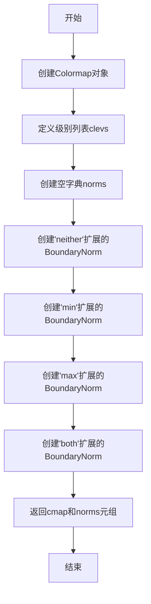
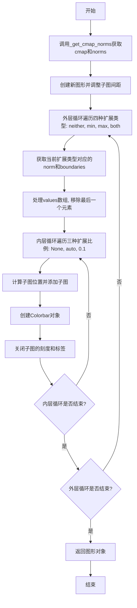
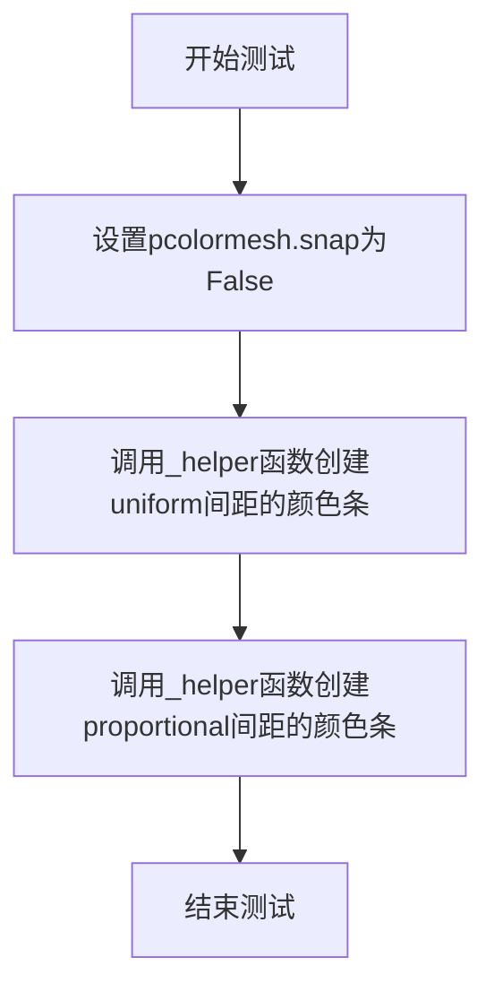
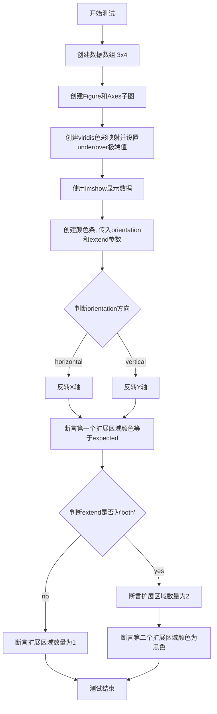
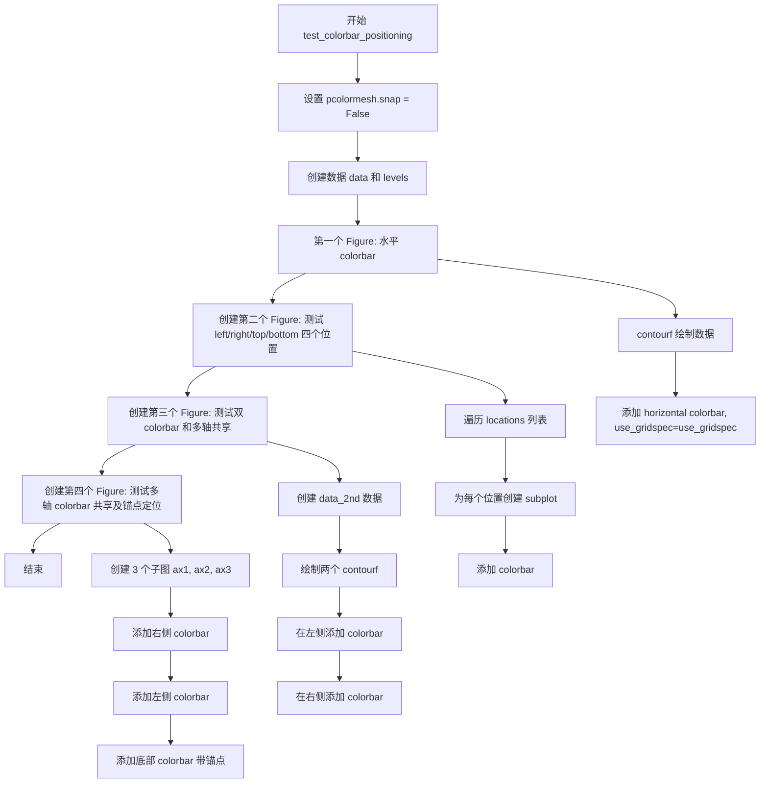
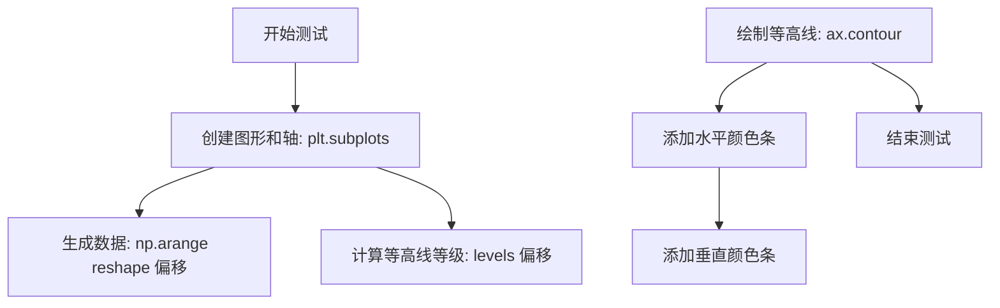
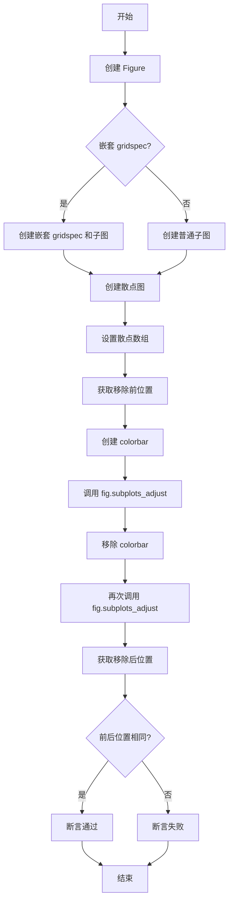
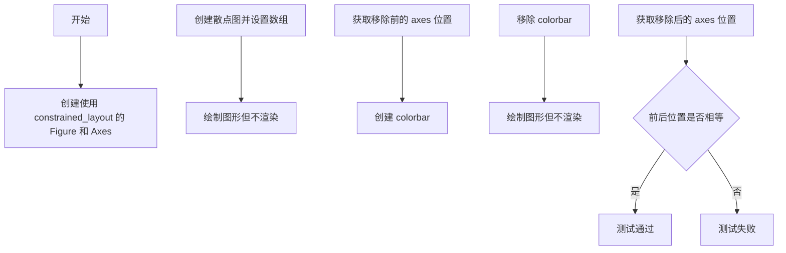
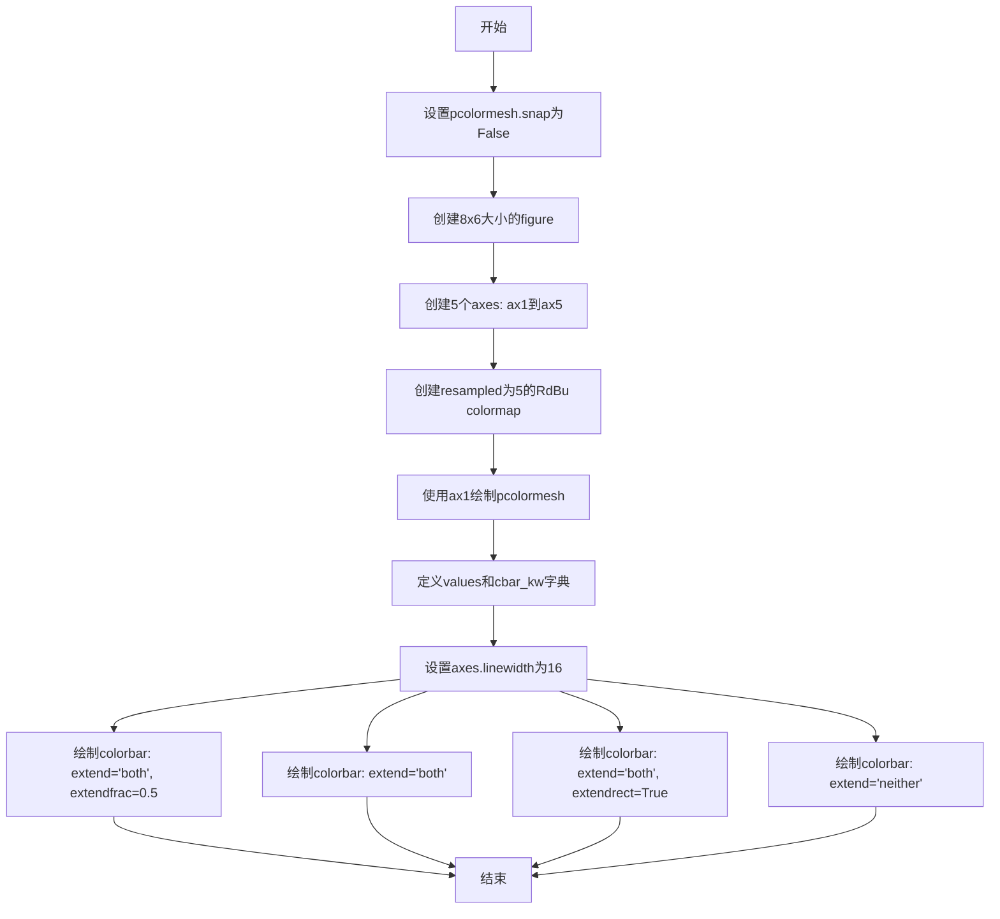
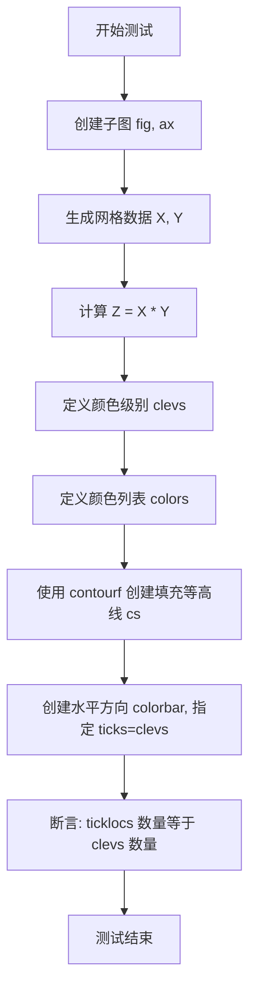

# `matplotlib\lib\matplotlib\tests\test_colorbar.py` 详细设计文档

该文件是 Matplotlib 库的颜色条（Colorbar）功能的测试套件。代码通过 pytest 框架定义了大量测试用例，用于验证颜色条在不同图表类型（imshow, contourf, pcolormesh 等）、不同配置（位置、方向、延伸、刻度、格式化、颜色规范）下的行为和渲染正确性。

## 整体流程

```mermaid
graph TD
    Start[测试运行开始] --> Import[导入依赖 (matplotlib, numpy, pytest)]
    Import --> DefHelpers[定义模块级辅助函数]
    DefHelpers --> TestExecution{执行测试用例}
    TestExecution --> Test1[test_colorbar_extension_shape]
    TestExecution --> Test2[test_colorbar_extension_length]
    TestExecution --> Test3[test_colorbar_extension_inverted_axis]
    TestExecution --> Test4[test_colorbar_positioning]
    TestExecution --> TestN[... (共约50个测试函数)]
    Test1 --> Assert[断言与验证]
    Test2 --> Assert
    Test3 --> Assert
    Test4 --> Assert
    TestN --> Assert
    Assert --> Finish[测试运行结束]

    subgraph 典型测试函数内部逻辑
    T1[plt.figure / plt.subplots]
    T2[生成数据 (np.arange, meshgrid)]
    T3[绘制图表 (ax.contourf, ax.imshow)]
    T4[fig.colorbar / Colorbar 创建颜色条]
    T5[配置属性 (extend, orientation, shrink)]
    T6[断言 (np.testing.assert_allclose, image_comparison)]
    end
    Test1 -.-> 典型测试函数内部逻辑
```

## 类结构

```
TestModule (test_colorbar.py)
└── (无自定义类结构)
    └── 该测试文件不定义类，仅包含测试函数和辅助函数，被测试对象为 matplotlib.colorbar.Colorbar
```

## 全局变量及字段


### `cmap`
    
重新采样的颜色映射(RdBu)

类型：`Colormap`
    


### `clevs`
    
颜色映射的分界级别

类型：`list[float]`
    


### `norms`
    
存储不同扩展类型的标准化规范

类型：`dict`
    


### `fig`
    
matplotlib图形对象

类型：`matplotlib.figure.Figure`
    


### `cax`
    
颜色条的坐标轴

类型：`matplotlib.axes.Axes`
    


### `boundaries`
    
颜色条边界值

类型：`ndarray`
    


### `values`
    
颜色条映射值

类型：`ndarray`
    


### `extension_type`
    
扩展类型('neither', 'min', 'max', 'both')

类型：`str`
    


### `spacing`
    
颜色条间距类型('uniform'或'proportional')

类型：`str`
    


    

## 全局函数及方法


### `_get_cmap_norms`

该函数是一个辅助函数，用于定义颜色图（colormap）和四种不同的归一化（norm）对象，以支持colorbar的不同扩展类型（extend keyword）的测试。

参数：  
无参数

返回值：`tuple`，返回一个元组，包含：
- `cmap`：`matplotlib.colors.Colormap`，重采样后的颜色图（"RdBu"重采样为5级）
- `norms`：`dict`，字典，键为扩展类型（'neither'、'min'、'max'、'both'），值为对应的`BoundaryNorm`对象

#### 流程图



#### 带注释源码

```python
def _get_cmap_norms():
    """
    Define a colormap and appropriate norms for each of the four
    possible settings of the extend keyword.

    Helper function for _colorbar_extension_shape and
    colorbar_extension_length.
    """
    # Create a colormap and specify the levels it represents.
    # 获取'RdBu'颜色图并重采样为5个离散颜色
    cmap = mpl.colormaps["RdBu"].resampled(5)
    
    # 定义颜色级别的边界值
    clevs = [-5., -2.5, -.5, .5, 1.5, 3.5]
    
    # Define norms for the colormaps.
    # 创建字典存储不同扩展类型的归一化对象
    norms = dict()
    
    # 无扩展：使用原始级别
    norms['neither'] = BoundaryNorm(clevs, len(clevs) - 1)
    
    # 最小值扩展：在低端添加-10作为扩展边界
    norms['min'] = BoundaryNorm([-10] + clevs[1:], len(clevs) - 1)
    
    # 最大值扩展：在高端添加10作为扩展边界
    norms['max'] = BoundaryNorm(clevs[:-1] + [10], len(clevs) - 1)
    
    # 双向扩展：两端都添加扩展边界
    norms['both'] = BoundaryNorm([-10] + clevs[1:-1] + [10], len(clevs) - 1)
    
    # 返回颜色图和归一化字典
    return cmap, norms
```


### `_colorbar_extension_shape`

该函数是 matplotlib 颜色条（colorbar）测试的辅助函数，用于生成 4 个具有矩形扩展（extendrect=True）的水平颜色条，支持 uniform（均匀）或 proportional（比例）间距设置。

参数：

- `spacing`：`str`，指定颜色条的间距模式，可选值为 `'uniform'`（均匀间距）或 `'proportional'`（比例间距）

返回值：`matplotlib.figure.Figure`，返回包含 4 个水平颜色条的图形对象

#### 流程图

```mermaid
flowchart TD
    A[开始 _colorbar_extension_shape] --> B[调用 _get_cmap_norms 获取颜色映射和归一化对象]
    B --> C[创建新图形 fig]
    C --> D[调整子图间距 hspace=4]
    D --> E[遍历扩展类型列表<br/>['neither', 'min', 'max', 'both']]
    E --> F[获取当前扩展类型对应的 norm]
    F --> G[提取 boundaries 和 values]
    G --> H[移除最后一个 values 元素]
    H --> I[创建子图 cax = fig.add_subplot 4,1,i+1]
    I --> J[创建 Colorbar 对象]
    J --> K[设置 extendrect=True 矩形扩展<br/>orientation='horizontal']
    K --> L[关闭子图的刻度和标签]
    L --> M{是否还有未处理的扩展类型?}
    M -->|是| E
    M -->|否| N[返回 fig 图形对象]
    N --> O[结束]
```

#### 带注释源码

```python
def _colorbar_extension_shape(spacing):
    """
    Produce 4 colorbars with rectangular extensions for either uniform
    or proportional spacing.

    Helper function for test_colorbar_extension_shape.
    """
    # 获取颜色映射和针对每种扩展类型的归一化对象
    # 调用辅助函数 _get_cmap_norms 创建 colormap 和 BoundaryNorm 对象
    cmap, norms = _get_cmap_norms()
    
    # 创建新图形用于放置颜色条
    fig = plt.figure()
    
    # 调整子图之间的垂直间距为 4（较大间距便于视觉区分）
    fig.subplots_adjust(hspace=4)
    
    # 遍历四种扩展类型：'neither'（无扩展）、'min'（最小值扩展）
    # 'max'（最大值扩展）、'both'（双向扩展）
    for i, extension_type in enumerate(('neither', 'min', 'max', 'both')):
        # 根据扩展类型获取对应的 BoundaryNorm 归一化对象
        norm = norms[extension_type]
        
        # 从 norm 获取颜色条边界值
        boundaries = values = norm.boundaries
        
        # 注意：3.3 版本之前最后一个值会被静默丢弃
        # 移除最后一个边界值以匹配颜色数量
        values = values[:-1]
        
        # 创建子图：4行1列，第 i+1 个位置
        cax = fig.add_subplot(4, 1, i + 1)
        
        # 创建颜色条对象
        # 参数说明：
        # - cax: 子图坐标轴作为颜色条的画布
        # - cmap: 颜色映射（RdBu）
        # - norm: 归一化对象
        # - boundaries: 颜色条边界值
        # - values: 对应每个区间的值
        # - extend: 扩展类型
        # - extendrect=True: 使用矩形扩展（而非三角形）
        # - orientation='horizontal': 水平方向
        # - spacing: 间距模式（uniform 或 proportional）
        Colorbar(cax, cmap=cmap, norm=norm,
                 boundaries=boundaries, values=values,
                 extend=extension_type, extendrect=True,
                 orientation='horizontal', spacing=spacing)
        
        # 关闭子图的刻度和标签显示
        cax.tick_params(left=False, labelleft=False,
                        bottom=False, labelbottom=False)
    
    # 返回包含 4 个颜色条的图形对象给调用者
    return fig
```


### `_colorbar_extension_length`

生成12个具有不同长度扩展的水平颜色条，用于测试颜色条在均匀或比例间距下的扩展效果。

参数：

- `spacing`：`str`，指定颜色条的间距类型，可选值为 `'uniform'`（均匀）或 `'proportional'`（比例）

返回值：`matplotlib.figure.Figure`，返回包含12个颜色条的图形对象

#### 流程图



#### 带注释源码

```python
def _colorbar_extension_length(spacing):
    """
    Produce 12 colorbars with variable length extensions for either
    uniform or proportional spacing.

    Helper function for test_colorbar_extension_length.
    
    参数:
        spacing: str, 指定间距类型，'uniform' 或 'proportional'
    
    返回:
        fig: matplotlib.figure.Figure, 包含12个颜色条的图形对象
    """
    # 获取颜色映射和归一化对象，用于处理四种扩展类型
    cmap, norms = _get_cmap_norms()
    
    # 创建新图形并调整子图之间的垂直间距
    fig = plt.figure()
    fig.subplots_adjust(hspace=.6)
    
    # 外层循环：遍历四种扩展类型
    for i, extension_type in enumerate(('neither', 'min', 'max', 'both')):
        # 获取当前扩展类型对应的归一化对象
        norm = norms[extension_type]
        
        # 从归一化对象获取边界和值
        boundaries = values = norm.boundaries
        
        # 移除最后一个值（颜色条实现细节）
        values = values[:-1]
        
        # 内层循环：遍历三种扩展比例选项
        for j, extendfrac in enumerate((None, 'auto', 0.1)):
            # 计算子图位置 (12行1列，第i*3+j+1个位置)
            cax = fig.add_subplot(12, 1, i*3 + j + 1)
            
            # 创建颜色条，参数包括：
            # - cmap: 颜色映射
            # - norm: 归一化对象
            # - boundaries: 颜色条边界
            # - values: 对应值
            # - extend: 扩展类型
            # - extendfrac: 扩展比例
            # - orientation: 水平方向
            # - spacing: 间距类型
            Colorbar(cax, cmap=cmap, norm=norm,
                     boundaries=boundaries, values=values,
                     extend=extension_type, extendfrac=extendfrac,
                     orientation='horizontal', spacing=spacing)
            
            # 关闭子图的刻度线和刻度标签，使颜色条更简洁
            cax.tick_params(left=False, labelleft=False,
                              bottom=False, labelbottom=False)
    
    # 返回包含所有颜色条的图形对象
    return fig
```


### `test_colorbar_extension_shape`

该函数是一个图像比较测试函数，用于测试颜色条（colorbar）的矩形扩展形状是否正确渲染，通过对比统一间距（uniform）和比例间距（proportional）两种模式下的颜色条扩展图像与基准图像来验证实现正确性。

参数：无

返回值：`None`，该函数不返回任何值，仅执行图像生成和比较操作

#### 流程图

```mermaid
graph TD
    A[开始 test_colorbar_extension_shape] --> B[设置 plt.rcParams['pcolormesh.snap'] = False]
    B --> C[调用 _colorbar_extension_shape('uniform') 生成统一间距颜色条]
    C --> D[调用 _colorbar_extension_shape('proportional') 生成比例间距颜色条]
    D --> E[由 @image_comparison 装饰器自动执行图像比较]
    E --> F[结束]
    
    C --> C1[_colorbar_extension_shape 内部流程]
    C1 --> C2[调用 _get_cmap_norms 获取色彩映射和规范]
    C2 --> C3[创建 Figure 并调整布局]
    C3 --> C4[循环四种扩展类型: neither, min, max, both]
    C4 --> C5[为每种扩展类型创建子图和 Colorbar]
    C5 --> C6[返回 Figure]
    
    D --> D1[_colorbar_extension_shape 内部流程 同 C1-C6]
```

#### 带注释源码

```python
@image_comparison(['colorbar_extensions_shape_uniform.png',
                   'colorbar_extensions_shape_proportional.png'])
def test_colorbar_extension_shape():
    """
    Test rectangular colorbar extensions.
    
    该测试函数验证颜色条在矩形扩展模式下的渲染效果。
    使用 @image_comparison 装饰器自动比较生成的图像与基准图像。
    """
    # Remove this line when this test image is regenerated.
    # 禁用 pcolormesh 的 snap 功能，确保像素对齐以便图像比较
    plt.rcParams['pcolormesh.snap'] = False

    # Create figures for uniform and proportionally spaced colorbars.
    # 调用辅助函数生成两种不同间距模式的颜色条图像
    # 参数 'uniform' 表示统一间距模式
    _colorbar_extension_shape('uniform')
    # 参数 'proportional' 表示比例间距模式
    _colorbar_extension_shape('proportional')
```

#### 关键组件信息

| 组件名称 | 一句话描述 |
|---------|-----------|
| `@image_comparison` | 装饰器，用于自动比较测试生成的图像与预存的基准图像 |
| `_colorbar_extension_shape` | 辅助函数，实际生成具有矩形扩展的颜色条 Figure 对象 |
| `_get_cmap_norms` | 辅助函数，为颜色条创建色彩映射和多种 BoundaryNorm 规范 |
| `plt.rcParams['pcolormesh.snap']` | Matplotlib 配置项，禁用此选项可确保像素精确对齐 |

#### 潜在的技术债务或优化空间

1. **测试图像依赖**：该测试依赖预存的基准图像文件（`colorbar_extensions_shape_uniform.png` 和 `colorbar_extensions_shape_proportional.png`），当 Matplotlib 的渲染引擎更新时可能导致图像需要重新生成
2. **硬编码配置**：测试中直接修改全局 `rcParams`，虽然这是测试中的常见做法，但可能对其他并行测试产生影响
3. **功能验证局限**：该测试仅验证视觉输出，缺乏对颜色条扩展几何属性（如扩展区域尺寸、位置）的数值断言测试

#### 其它项目

**设计目标与约束**：
- 目标：验证颜色条矩形扩展（`extendrect=True`）在统一和比例两种间距模式下的渲染正确性
- 约束：必须与基准图像完全匹配（图像比较测试）

**错误处理与异常设计**：
- 如果图像不匹配，测试将失败并显示差异图像
- 装饰器会捕获并报告具体的像素差异位置

**数据流与状态机**：
- 该测试是端到端的视觉测试，不涉及复杂的内部状态机
- 数据流：测试配置 → 辅助函数生成图像 → 装饰器比较结果

**外部依赖与接口契约**：
- 依赖 `matplotlib.testing.decorators.image_comparison` 装饰器
- 依赖基准图像文件存在于测试数据目录中
- 调用 `_colorbar_extension_shape` 和 `_get_cmap_norms` 两个内部辅助函数


### `test_colorbar_extension_length`

测试函数，用于验证颜色条在不同扩展类型和间距模式下的可变长度扩展是否正确渲染。

参数：无

返回值：`None`，无返回值（测试函数）

#### 流程图



#### 带注释源码

```python
@image_comparison(['colorbar_extensions_uniform.png',
                   'colorbar_extensions_proportional.png'],
                  tol=1.0)
def test_colorbar_extension_length():
    """Test variable length colorbar extensions."""
    # 移除此行当测试图像被重新生成时
    # 设置pcolormesh.snap为False以确保图像一致性
    plt.rcParams['pcolormesh.snap'] = False

    # 为均匀和比例间距的颜色条创建图形
    # 调用_colorbar_extension_length辅助函数生成测试图像
    _colorbar_extension_length('uniform')
    _colorbar_extension_length('proportional')
```


### `test_colorbar_extension_inverted_axis`

该函数是一个pytest测试函数，用于测试在坐标轴反转（inverted axis）情况下，颜色条（colorbar）的扩展区域（extension patches）的颜色是否正确显示。

参数：

- `orientation`：`str`，方向参数，可选值为"horizontal"（水平）或"vertical"（垂直），指定颜色条的排列方向
- `extend`：`str`，扩展类型，可选值为"min"、"max"或"both"，指定颜色条两端的扩展区域类型
- `expected`：`tuple`，期望的RGBA颜色值元组，用于断言验证扩展区域的第一块颜色是否正确

返回值：`None`，该函数为测试函数，无返回值，通过断言进行验证

#### 流程图



#### 带注释源码

```python
@pytest.mark.parametrize("orientation", ["horizontal", "vertical"])
@pytest.mark.parametrize("extend,expected", [("min", (0, 0, 0, 1)),
                                             ("max", (1, 1, 1, 1)),
                                             ("both", (1, 1, 1, 1))])
def test_colorbar_extension_inverted_axis(orientation, extend, expected):
    """Test extension color with an inverted axis"""
    # 创建测试数据: 3x4 的二维数组
    data = np.arange(12).reshape(3, 4)
    
    # 创建图形和坐标轴
    fig, ax = plt.subplots()
    
    # 获取viridis色彩映射，并设置under和over极端值颜色
    # under=(0,0,0,1) 表示低于最小值的颜色为黑色（RGBA）
    # over=(1,1,1,1) 表示高于最大值的颜色为白色（RGBA）
    cmap = mpl.colormaps["viridis"].with_extremes(under=(0, 0, 0, 1),
                                                  over=(1, 1, 1, 1))
    
    # 使用imshow在坐标轴上显示数据
    im = ax.imshow(data, cmap=cmap)
    
    # 创建颜色条，传入图像、方向和扩展类型
    cbar = fig.colorbar(im, orientation=orientation, extend=extend)
    
    # 根据方向反转对应的坐标轴
    if orientation == "horizontal":
        cbar.ax.invert_xaxis()
    else:
        cbar.ax.invert_yaxis()
    
    # 断言：验证第一个扩展区域（_extend_patches[0]）的颜色是否与期望值匹配
    # expected根据extend参数有不同的期望值
    assert cbar._extend_patches[0].get_facecolor() == expected
    
    # 如果扩展类型为'both'，验证有两个扩展区域
    if extend == "both":
        # 断言扩展区域数量为2
        assert len(cbar._extend_patches) == 2
        # 断言第二个扩展区域的颜色为黑色 (0, 0, 0, 1)
        assert cbar._extend_patches[1].get_facecolor() == (0, 0, 0, 1)
    else:
        # 否则只有一个扩展区域
        assert len(cbar._extend_patches) == 1
```


### `test_colorbar_positioning`

该函数是用于测试 matplotlib 中 colorbar 定位功能的测试函数，通过参数化测试验证不同 `use_gridspec` 设置下 colorbar 的水平、垂直定位、多位置摆放、共享以及锚点行为是否符合预期，并使用图像对比来确保渲染结果的正确性。

参数：

- `use_gridspec`：`bool`，控制是否使用 GridSpec 来布局 colorbar，测试 colorbar 定位在两种不同布局引擎下的表现。

返回值：`None`，该函数为测试函数，无返回值，主要通过 `@image_comparison` 装饰器自动比较生成的图像与基准图像是否一致。

#### 流程图



#### 带注释源码

```python
@pytest.mark.parametrize('use_gridspec', [True, False])
@image_comparison(['cbar_with_orientation.png',
                   'cbar_locationing.png',
                   'double_cbar.png',
                   'cbar_sharing.png',
                   ],
                  remove_text=True, savefig_kwarg={'dpi': 40}, tol=0.05)
def test_colorbar_positioning(use_gridspec):
    """
    测试 colorbar 定位功能，包括：
    1. 水平方向的 colorbar 定位
    2. left/right/top/bottom 四个位置的 colorbar
    3. 同一个 figure 中两个 colorbar 的双侧布局
    4. 多个子图共享 colorbar 的布局
    """
    # 移除此行当测试图像需要重新生成时
    plt.rcParams['pcolormesh.snap'] = False

    # 创建测试数据：30x40 的矩阵，值从 0 到 1199
    data = np.arange(1200).reshape(30, 40)
    # 定义等高线填充的级别
    levels = [0, 200, 400, 600, 800, 1000, 1200]

    # -------------------
    # 测试 1: 水平方向的 colorbar
    plt.figure()
    plt.contourf(data, levels=levels)
    plt.colorbar(orientation='horizontal', use_gridspec=use_gridspec)

    # 测试 2: 四个不同位置的 colorbar
    locations = ['left', 'right', 'top', 'bottom']
    plt.figure()
    for i, location in enumerate(locations):
        plt.subplot(2, 2, i + 1)
        plt.contourf(data, levels=levels)
        plt.colorbar(location=location, use_gridspec=use_gridspec)

    # -------------------
    # 测试 3: 同一 figure 中两个 colorbar 的双侧布局
    plt.figure()
    # 创建另一个数据集（随机整数值）
    data_2nd = np.array([[2, 3, 2, 3], [1.5, 2, 2, 3], [2, 3, 3, 4]])
    # 通过重复将数据扩展到与主数据相同形状
    data_2nd = np.repeat(np.repeat(data_2nd, 10, axis=1), 10, axis=0)

    # 主数据的填充等高线
    color_mappable = plt.contourf(data, levels=levels, extend='both')
    # 带有图案的填充等高线
    hatch_mappable = plt.contourf(data_2nd, levels=[1, 2, 3], colors='none',
                                  hatches=['/', 'o', '+'], extend='max')
    plt.contour(hatch_mappable, colors='black')

    # 在左侧添加第一个 colorbar
    plt.colorbar(color_mappable, location='left', label='variable 1',
                 use_gridspec=use_gridspec)
    # 在右侧添加第二个 colorbar
    plt.colorbar(hatch_mappable, location='right', label='variable 2',
                 use_gridspec=use_gridspec)

    # -------------------
    # 测试 4: 多轴共享 colorbar 的布局
    plt.figure()
    # 创建三个子图，使用不同的锚点和布局
    ax1 = plt.subplot(211, anchor='NE', aspect='equal')
    plt.contourf(data, levels=levels)
    ax2 = plt.subplot(223)
    plt.contourf(data, levels=levels)
    ax3 = plt.subplot(224)
    plt.contourf(data, levels=levels)

    # 三个子图共享一个右侧 colorbar
    plt.colorbar(ax=[ax2, ax3, ax1], location='right', pad=0.0, shrink=0.5,
                 panchor=False, use_gridspec=use_gridspec)
    # 另一个左侧 colorbar
    plt.colorbar(ax=[ax2, ax3, ax1], location='left', shrink=0.5,
                 panchor=False, use_gridspec=use_gridspec)
    # 底部 colorbar，带锚点定位
    plt.colorbar(ax=[ax1], location='bottom', panchor=False,
                 anchor=(0.8, 0.5), shrink=0.6, use_gridspec=use_gridspec)
```


### `test_colorbar_single_ax_panchor_false`

该函数是一个测试用例，用于验证当 `plt.colorbar()` 的 `panchor` 参数设置为 `False` 时，主 Axes 的锚点（anchor）不会被改变。该测试创建了一个带有锚点 'N' 的子图，然后添加一个 colorbar，并断言主 axes 的锚点保持为 'N'。

参数：无

返回值：`None`，该函数为测试函数，使用断言进行验证，不返回具体值

#### 流程图

```mermaid
flowchart TD
    A[开始测试] --> B[创建子图 ax = plt.subplot(111, anchor='N')]
    B --> C[使用 plt.imshow 绘制图像 [[0, 1]]]
    C --> D[添加 colorbar, 设置 panchor=False]
    D --> E{断言: ax.get_anchor() == 'N'}
    E -->|通过| F[测试通过]
    E -->|失败| G[测试失败]
```

#### 带注释源码

```python
def test_colorbar_single_ax_panchor_false():
    """
    测试当 panchor=False 时，主 axes 的锚点不会被 colorbar 改变。
    
    注意：此测试与上面使用 panchor=False 的测试不同，因为在那里
    use_gridspec 实际上是无效果的：当 *ax* 作为列表传递时，总是
    会禁用 use_gridspec。
    """
    # 创建一个子图，指定锚点为 'N'（北部/顶部）
    ax = plt.subplot(111, anchor='N')
    
    # 使用 imshow 绘制一个简单的 2x2 图像数据
    plt.imshow([[0, 1]])
    
    # 添加 colorbar，panchor=False 表示不改变主 axes 的锚点
    plt.colorbar(panchor=False)
    
    # 断言：验证主 axes 的锚点仍然保持为 'N'
    assert ax.get_anchor() == 'N'
```


### `test_colorbar_single_ax_panchor_east`

该函数是一个pytest测试函数，用于验证当colorbar的`panchor`参数设置为'E'（东/右侧）时，主坐标轴的锚点是否正确设置为'E'。该测试通过参数化分别验证了标准布局和约束布局两种情况。

参数：

- `constrained`：`bool`，参数化参数，决定是否使用constrained_layout（约束布局）。当为`True`时启用约束布局，为`False`时使用标准布局。

返回值：`None`，该函数为测试函数，不返回任何值，通过assert语句进行断言验证。

#### 流程图

```mermaid
flowchart TD
    A[开始测试] --> B{constrained参数值}
    B -->|False| C[创建标准布局图形<br/>plt.figure constained_layout=False]
    B -->|True| D[创建约束布局图形<br/>plt.figure constained_layout=True]
    C --> E[创建子图<br/>anchor='N']
    D --> E
    E --> F[绘制图像<br/>plt.imshow 2x2数据]
    F --> G[创建colorbar<br/>panchor='E']
    G --> H[断言验证<br/>ax.get_anchor() == 'E']
    H --> I{断言结果}
    I -->|通过| J[测试通过]
    I -->|失败| K[测试失败]
```

#### 带注释源码

```python
@pytest.mark.parametrize('constrained', [False, True],
                         ids=['standard', 'constrained'])
def test_colorbar_single_ax_panchor_east(constrained):
    """
    测试colorbar的panchor参数设置为'E'时，主轴锚点是否正确。
    
    该测试验证当使用panchor='E'（将colorbar锚定在东方/右侧）时，
    主坐标轴的anchor属性是否被正确设置为'E'。
    
    参数:
        constrained: bool参数，通过@pytest.mark.parametrize传入
                   - False: 使用标准布局
                   - True: 使用constrained_layout约束布局
    """
    # 根据constrained参数创建具有相应布局的图形
    fig = plt.figure(constrained_layout=constrained)
    
    # 创建一个子图，锚点设置为'N'（北方/顶部）
    ax = fig.add_subplot(111, anchor='N')
    
    # 使用imshow绘制一个简单的2x2图像数据
    plt.imshow([[0, 1]])
    
    # 创建colorbar，panchor='E'表示将colorbar锚定在东方（右侧）
    plt.colorbar(panchor='E')
    
    # 断言：验证主轴的锚点是否被正确更新为'E'
    # 当panchor='E'时，主轴的anchor应该从'N'变为'E'
    assert ax.get_anchor() == 'E'
```


### `test_contour_colorbar`

这是一个测试函数，用于验证等高线图（contour）与颜色条（colorbar）的集成功能。测试创建了一个带有水平方向和垂直方向颜色条的等高线图，以检查颜色条在两种方向下的正确渲染。

参数： 无（该函数不接受任何显式参数）

返回值： `None`，该函数为测试函数，不返回任何值

#### 流程图



#### 带注释源码

```python
@image_comparison(['contour_colorbar.png'], remove_text=True,
                  tol=0 if platform.machine() == 'x86_64' else 0.054)
def test_contour_colorbar():
    """测试等高线图的颜色条功能，包括水平和垂直方向"""
    # 创建一个4x2英寸的图形和一个轴对象
    fig, ax = plt.subplots(figsize=(4, 2))
    
    # 生成30x40的网格数据，数值范围从-500到700
    data = np.arange(1200).reshape(30, 40) - 500
    
    # 定义等高线等级，范围从-500到700
    levels = np.array([0, 200, 400, 600, 800, 1000, 1200]) - 500

    # 使用扩展选项'both'绘制等高线填充图
    CS = ax.contour(data, levels=levels, extend='both')
    
    # 在图形下方添加水平方向的颜色条，扩展选项为'both'
    fig.colorbar(CS, orientation='horizontal', extend='both')
    
    # 在图形右侧添加垂直方向的颜色条，扩展选项为'both'
    fig.colorbar(CS, orientation='vertical')
```


### `test_gridspec_make_colorbar`

该测试函数用于验证 matplotlib 中使用 gridspec 布局时 colorbar 的定位是否正确。测试创建两个子图，分别放置垂直和水平方向的 colorbar，并使用 `use_gridspec=True` 参数确保 colorbar 使用 gridspec 进行定位，最后通过图像对比验证布局结果是否符合预期。

参数：

- （无显式参数，函数使用 pytest 的 `@image_comparison` 装饰器进行图像对比测试）

返回值：`None`，该函数为测试函数，不返回任何值，仅通过图像对比验证布局正确性

#### 流程图

```mermaid
flowchart TD
    A[开始测试函数] --> B[创建新图形 plt.figure]
    B --> C[生成测试数据 data = np.arange(1200).reshape(30, 40)]
    C --> D[定义等高线级别 levels = [0, 200, 400, 600, 800, 1000, 1200]]
    D --> E[创建第一个子图 plt.subplot 121]
    E --> F[绘制填充等高线 plt.contourf]
    F --> G[添加垂直方向 colorbar use_gridspec=True]
    G --> H[创建第二个子图 plt.subplot 122]
    H --> I[绘制填充等高线 plt.contourf]
    I --> J[添加水平方向 colorbar use_gridspec=True]
    J --> K[调整子图布局 subplots_adjust]
    K --> L[通过 @image_comparison 装饰器进行图像对比]
    L --> M[测试结束]
```

#### 带注释源码

```python
@image_comparison(['cbar_with_subplots_adjust.png'], remove_text=True,
                  savefig_kwarg={'dpi': 40})
def test_gridspec_make_colorbar():
    """
    Test the gridspec colorbar with subplots adjust.
    
    This test verifies that colorbars are correctly positioned when using
    gridspec layout, testing both vertical and horizontal orientations.
    """
    # Create a new figure
    plt.figure()
    
    # Generate test data: 30x40 matrix with values from 0 to 1199
    data = np.arange(1200).reshape(30, 40)
    
    # Define contour levels for the color mapping
    levels = [0, 200, 400, 600, 800, 1000, 1200]

    # Create first subplot (left side)
    plt.subplot(121)
    # Fill contour with the data and levels
    plt.contourf(data, levels=levels)
    # Add vertical colorbar using gridspec for positioning
    plt.colorbar(use_gridspec=True, orientation='vertical')

    # Create second subplot (right side)
    plt.subplot(122)
    # Fill contour with the same data and levels
    plt.contourf(data, levels=levels)
    # Add horizontal colorbar using gridspec for positioning
    plt.colorbar(use_gridspec=True, orientation='horizontal')

    # Adjust subplot layout parameters:
    # top=0.95: leave 5% space at top
    # right=0.95: leave 5% space at right
    # bottom=0.2: leave 20% space at bottom
    # hspace=0.25: horizontal spacing between subplots
    plt.subplots_adjust(top=0.95, right=0.95, bottom=0.2, hspace=0.25)
```


### `test_colorbar_single_scatter`

该测试函数用于验证当散点图（PathCollection）仅包含单个数据点时，颜色条（Colorbar）的归一化缩放是否正确处理，以避免在 `_locate` 函数中出现除以零的错误（Issue #2642）。

参数：
- 该函数无显式参数

返回值：`None`，测试函数无返回值

#### 流程图

```mermaid
graph TD
    A[开始] --> B[创建新图形 plt.figure]
    C[设置数据点 x=[0], y=[0], z=[50]]
    D[获取resampled的jet色 cmap]
    E[绘制散点图 plt.scatter]
    F[创建颜色条 plt.colorbar]
    G[结束]
    
    B --> C
    C --> D
    D --> E
    E --> F
```

#### 带注释源码

```python
@image_comparison(['colorbar_single_scatter.png'], remove_text=True,
                  savefig_kwarg={'dpi': 40})
def test_colorbar_single_scatter():
    # Issue #2642: if a path collection has only one entry,
    # the norm scaling within the colorbar must ensure a
    # finite range, otherwise a zero denominator will occur in _locate.
    # 创建一个新的图形窗口
    plt.figure()
    # 定义单个数据点的坐标和值
    x = y = [0]
    z = [50]
    # 获取 'jet' 色图并重新采样为16个颜色
    cmap = mpl.colormaps['jet'].resampled(16)
    # 绘制散点图，使用 z 值作为颜色映射的依据
    # c=z 指定颜色值，cmap 指定色图
    cs = plt.scatter(x, y, z, c=z, cmap=cmap)
    # 为散点图创建颜色条
    plt.colorbar(cs)
```


### `test_remove_from_figure`

测试 `remove` 方法在指定 `use_gridspec` 设置下的行为，验证移除 colorbar 后 axes 的位置保持不变。

参数：

- `nested_gridspecs`：`bool`，指示是否使用嵌套的 gridspec（通过 `subgridspec` 创建）
- `use_gridspec`：`bool`，指示 colorbar 是否使用 gridspec 进行布局

返回值：`None`，无显式返回值（测试函数）

#### 流程图



#### 带注释源码

```python
@pytest.mark.parametrize('use_gridspec', [True, False])
@pytest.mark.parametrize('nested_gridspecs', [True, False])
def test_remove_from_figure(nested_gridspecs, use_gridspec):
    """Test `remove` with the specified ``use_gridspec`` setting."""
    # 创建一个新的 Figure 对象
    fig = plt.figure()
    
    # 根据 nested_gridspecs 参数决定布局方式
    if nested_gridspecs:
        # 创建嵌套 gridspec：在主 gridspec 的右上角 (1,1) 位置创建一个 2x2 的子 gridspec
        gs = fig.add_gridspec(2, 2)[1, 1].subgridspec(2, 2)
        # 在嵌套 gridspec 的右下角 (1,1) 位置创建子图
        ax = fig.add_subplot(gs[1, 1])
    else:
        # 创建普通子图
        ax = fig.add_subplot()
    
    # 在子图上创建散点图
    sc = ax.scatter([1, 2], [3, 4])
    # 设置散点图的数据值
    sc.set_array(np.array([5, 6]))
    
    # 记录移除 colorbar 前的 axes 位置
    pre_position = ax.get_position()
    
    # 创建 colorbar，use_gridspec 参数控制是否使用 gridspec 布局
    cb = fig.colorbar(sc, use_gridspec=use_gridspec)
    
    # 调整子图布局
    fig.subplots_adjust()
    
    # 移除 colorbar
    cb.remove()
    
    # 再次调整子图布局
    fig.subplots_adjust()
    
    # 记录移除 colorbar 后的 axes 位置
    post_position = ax.get_position()
    
    # 断言：移除 colorbar 后，axes 的位置应该保持不变
    assert (pre_position.get_points() == post_position.get_points()).all()
```


### `test_remove_from_figure_cl`

该函数是一个测试函数，用于验证在 `constrained_layout` 模式下移除 colorbar 后，Axes 的位置是否保持不变。通过比较移除 colorbar 前后的 Axes 位置，确保 colorbar 的移除操作不会意外改变布局。

参数：无

返回值：`None`，该函数为测试函数，使用断言验证结果而非显式返回值

#### 流程图



#### 带注释源码

```python
def test_remove_from_figure_cl():
    """Test `remove` with constrained_layout."""
    # 创建一个使用 constrained_layout 的 figure 和 axes
    fig, ax = plt.subplots(constrained_layout=True)
    
    # 在 axes 上创建散点图
    sc = ax.scatter([1, 2], [3, 4])
    # 设置散点的数值数组
    sc.set_array(np.array([5, 6]))
    
    # 绘制图形但不进行渲染（用于触发布局计算）
    fig.draw_without_rendering()
    
    # 记录移除 colorbar 前的 axes 位置
    pre_position = ax.get_position()
    
    # 为散点图创建 colorbar
    cb = fig.colorbar(sc)
    
    # 移除 colorbar
    cb.remove()
    
    # 再次绘制图形但不进行渲染
    fig.draw_without_rendering()
    
    # 记录移除 colorbar 后的 axes 位置
    post_position = ax.get_position()
    
    # 断言：移除 colorbar 前后 axes 的位置应该保持不变
    # 使用 assert_allclose 进行数值比较
    np.testing.assert_allclose(pre_position.get_points(),
                               post_position.get_points())
```


### `test_colorbarbase`

这是一个基础的冒烟测试（Smoke Test），用于验证 Matplotlib 的 `Colorbar` 类在使用当前活动坐标轴（Axes）和默认 colormap 时能否成功初始化，旨在快速捕获严重的回归问题。

#### 文件整体运行流程

该代码位于 Matplotlib 的测试文件中，文件主要负责测试 `Colorbar` 类的各种功能（如位置、刻度、延长区域等）。`test_colorbarbase` 作为最简单的测试用例，模拟了用户在没有任何显式数据映射的情况下，仅尝试创建一个颜色条的场景。它通常在其他复杂图形测试之前运行，以确保核心类可以被导入和实例化。

#### 函数详细信息

##### 局部变量

- `ax`：`matplotlib.axes.Axes`，通过 `plt.gca()` 获取的当前坐标轴对象。如果当前没有坐标轴，此函数会隐式创建一个。
- `cmap`：`matplotlib.colors.Colormap`，通过 `plt.colormaps["bone"]` 获取的“bone”颜色映射对象。

##### 函数属性

- **名称**：`test_colorbarbase`
- **参数**：无
- **返回值**：`NoneType`，该函数仅执行副作用（创建对象），不返回数据。

#### 流程图

```mermaid
flowchart TD
    A([开始测试]) --> B[获取当前Axes对象: ax = plt.gca]
    B --> C[获取Colormap: cmap = plt.colormaps['bone']]
    C --> D[调用Colorbar构造函数: Colorbarax, cmap=cmap]
    D --> E{是否抛出异常?}
    E -- 否 --> F([测试通过])
    E -- 是 --> G([测试失败/报告错误])
```

#### 带注释源码

```python
def test_colorbarbase():
    # 烟雾测试：源自 issue #3805，用于验证基本功能是否可用
    
    # 步骤 1: 获取当前轴 (Axes)。
    # 如果当前没有 Figure 或 Axes，plt.gca() 会自动创建一个。
    ax = plt.gca()
    
    # 步骤 2: 获取 'bone' 颜色映射。
    cmap = plt.colormaps["bone"]
    
    # 步骤 3: 实例化 Colorbar。
    # 这是一个最低优先级的调用，仅检查 Colorbar 类能否接受 ax 和 cmap 参数
    # 并成功构建对象（可能包含内部的绘制逻辑）。
    Colorbar(ax, cmap=cmap)
```

#### 关键组件信息

- **Colorbar 类**：负责生成颜色条的可视化组件。在此测试中，它被验证能够接收 `ax` 和 `cmap` 参数。
- **plt.gca()**：Matplotlib 的状态栏函数，用于获取当前活跃的绘图区域。
- **plt.colormaps**：颜色映射的注册表，类似于字典，用于根据名称获取颜色方案。

#### 潜在的技术债务或优化空间

1.  **缺乏断言**：该测试完全没有 `assert` 语句。它只能检测到程序崩溃（异常），无法检测逻辑错误（例如颜色条创建了但完全不可见或位置错误）。它严格来说只是一个“运行检查”。
2.  **隐式依赖**：依赖于 `plt` 的全局状态。如果测试运行环境的默认状态不同（例如默认的 backend 不同），可能会影响 `gca()` 的行为。

#### 其它项目

- **错误处理**：如果 `plt.colormaps["bone"]` 不存在，会抛出 `KeyError`；如果 `plt.gca()` 无法获取或创建 Axes，会抛出相关的 Matplotlib 错误。
- **设计约束**：该测试被设计为最简单的集成点，以确保 `Colorbar` 类的构造函数在最小参数集下是可达的。


### `test_parentless_mappable`

该函数用于测试当 mappable 对象没有关联的 Axes 时，`plt.colorbar()` 是否能正确抛出 ValueError 异常。

参数：无

返回值：无（测试函数）

#### 流程图

```mermaid
flowchart TD
    A[开始 test_parentless_mappable] --> B[创建空 PatchCollection 对象 pc]
    B --> C[使用 pytest.raises 捕获 ValueError]
    C --> D[调用 plt.colorbar(pc)]
    D --> E{是否抛出 ValueError?}
    E -->|是| F[验证错误消息为 'Unable to determine Axes to steal']
    E -->|否| G[测试失败]
    F --> H[结束]
    G --> H
```

#### 带注释源码

```python
def test_parentless_mappable():
    """
    测试当 mappable 没有父 axes 时的错误处理。
    
    该测试验证当尝试为没有关联到任何 Axes 的 mappable 对象
    （如空的 PatchCollection）创建 colorbar 时，matplotlib
    能够正确抛出 ValueError 并给出清晰的错误消息。
    """
    # 创建一个空的 PatchCollection 对象，不关联任何 Axes
    # 参数说明：
    # - []: 空的 patches 列表
    # - cmap: 使用 viridis 颜色映射
    # - array: 空的数据数组
    pc = mpl.collections.PatchCollection([], cmap=plt.get_cmap('viridis'), array=[])
    
    # 使用 pytest.raises 上下文管理器验证会抛出 ValueError
    # match 参数用于验证错误消息内容
    with pytest.raises(ValueError, match='Unable to determine Axes to steal'):
        # 尝试为没有父 axes 的 mappable 创建 colorbar
        # 预期行为：抛出 ValueError，提示无法确定要使用的 Axes
        plt.colorbar(pc)
```


### `test_colorbar_closed_patch`

这是一个测试函数，用于验证matplotlib中colorbar在各种扩展（extend）模式和扩展矩形（extendrect）参数下的渲染效果，特别是检查闭合路径（closed patch）的处理是否正确。

参数：- 无

返回值：`None`，该函数为测试函数，没有返回值，主要通过图像比较进行验证

#### 流程图



#### 带注释源码

```python
@image_comparison(['colorbar_closed_patch.png'], remove_text=True)
def test_colorbar_closed_patch():
    # 移除此行当测试图像被重新生成时
    # 设置pcolormesh.snap为False以避免图像对比失败
    plt.rcParams['pcolormesh.snap'] = False

    # 创建一个8x6英寸的图形窗口
    fig = plt.figure(figsize=(8, 6))
    
    # 添加5个axes，位置分别为：
    ax1 = fig.add_axes((0.05, 0.85, 0.9, 0.1))  # 顶部数据 axes
    ax2 = fig.add_axes((0.1, 0.65, 0.75, 0.1))  # 第一个colorbar axes
    ax3 = fig.add_axes((0.05, 0.45, 0.9, 0.1)) # 第二个colorbar axes
    ax4 = fig.add_axes((0.05, 0.25, 0.9, 0.1))  # 第三个colorbar axes
    ax5 = fig.add_axes((0.05, 0.05, 0.9, 0.1))  # 第四个colorbar axes

    # 创建colormap：将RdBu colormap重新采样为5个颜色
    cmap = mpl.colormaps["RdBu"].resampled(5)

    # 在ax1上绘制pcolormesh
    im = ax1.pcolormesh(np.linspace(0, 10, 16).reshape((4, 4)), cmap=cmap)

    # "values" kwarg的使用是不寻常的。它只因为与图像中的数据范围
    # 和LUT中的颜色数量匹配才能工作。
    values = np.linspace(0, 10, 5)
    # 定义colorbar的关键字参数：水平方向，值数组，无刻度
    cbar_kw = dict(orientation='horizontal', values=values, ticks=[])

    # 宽线条用于显示闭合路径被正确处理。参见PR #4186。
    # 使用rc_context设置axes.linewidth为16来突出显示
    with rc_context({'axes.linewidth': 16}):
        # 第一个colorbar: extend='both', extendfrac=0.5（可变长度扩展）
        plt.colorbar(im, cax=ax2, extend='both', extendfrac=0.5, **cbar_kw)
        # 第二个colorbar: extend='both'（默认扩展长度）
        plt.colorbar(im, cax=ax3, extend='both', **cbar_kw)
        # 第三个colorbar: extend='both', extendrect=True（矩形扩展）
        plt.colorbar(im, cax=ax4, extend='both', extendrect=True, **cbar_kw)
        # 第四个colorbar: extend='neither'（无扩展）
        plt.colorbar(im, cax=ax5, extend='neither', **cbar_kw)
```


### `test_colorbar_ticks`

这是一个测试函数，用于验证colorbar的ticks功能是否正确工作，特别是针对GitHub issue #5673的修复。

参数： 无

返回值：`None`，因为这是一个测试函数，没有返回值

#### 流程图



#### 带注释源码

```python
def test_colorbar_ticks():
    # test fix for #5673
    # 创建图形和坐标轴对象
    fig, ax = plt.subplots()
    
    # 生成X轴和Y轴的数据范围
    # x: 从-3.0到4.001, 步长1.0
    # y: 从-4.0到3.001, 步长1.0
    x = np.arange(-3.0, 4.001)
    y = np.arange(-4.0, 3.001)
    
    # 使用meshgrid生成网格坐标矩阵
    X, Y = np.meshgrid(x, y)
    
    # 计算Z值, 为X和Y的乘积
    Z = X * Y
    
    # 定义等高线的级别/阈值
    # 这些值将决定颜色分割的边界
    clevs = np.array([-12, -5, 0, 5, 12], dtype=float)
    
    # 为每个区间定义颜色
    # 区间: [-12, -5], [-5, 0], [0, 5], [5, 12]
    colors = ['r', 'g', 'b', 'c']
    
    # 创建填充等高线图
    # extend='neither' 表示不扩展区间
    cs = ax.contourf(X, Y, Z, clevs, colors=colors, extend='neither')
    
    # 创建水平方向的colorbar
    # 并显式设置ticks为clevs的值
    cbar = fig.colorbar(cs, ax=ax, orientation='horizontal', ticks=clevs)
    
    # 断言验证: colorbar的tick位置数量应该与clevs数量一致
    # 这确保了手动设置的ticks被正确应用
    assert len(cbar.ax.xaxis.get_ticklocs()) == len(clevs)
```


### `test_colorbar_minorticks_on_off`

该函数用于测试 matplotlib 中颜色条（colorbar）的次要刻度线（minor ticks）的开启和关闭功能是否正常工作。测试涵盖了标准线性归一化（Linear Normalization）和对数归一化（LogNorm）两种情况，验证了 `minorticks_on()` 和 `minorticks_off()` 方法的正确性，以及在调整颜色映射范围后次要刻度线的重新计算是否准确。

参数： 无

返回值：`None`，该函数为测试函数，没有返回值

#### 流程图

```mermaid
flowchart TD
    A[开始测试] --> B[设置随机种子 12345]
    B --> C[创建 20x20 随机数据]
    C --> D[使用非经典模式创建图表]
    D --> E[创建 pcolormesh 并设置 vmin=-2.3, vmax=3.3]
    E --> F[添加颜色条 extend='both']
    F --> G[调用 minorticks_on]
    G --> H{验证次要刻度位置是否正确}
    H -->|是| I[调用 minorticks_off]
    I --> J{验证次要刻度是否被清除}
    J -->|是| K[修改 clim 为 vmin=-1.2, vmax=1.2]
    K --> L[再次调用 minorticks_on]
    L --> M{验证新范围下次要刻度位置}
    M -->|是| N[准备对数归一化测试数据]
    N --> O[创建新图表和 pcolormesh 使用 LogNorm]
    O --> P[添加颜色条并绘制]
    Q[保存默认次要刻度位置]
    Q --> R[调用 minorticks_off]
    R --> S{验证次要刻度是否被清除}
    S -->|是| T[调用 minorticks_on]
    T --> U{验证次要刻度是否恢复}
    U -->|是| V[设置固定刻度 [3, 5, 7, 9]]
    V --> W[再次调用 minorticks_off]
    W --> X{验证次要刻度保持关闭}
    X -->|是| Y[结束测试]
    
    H -->|否| Z1[抛出断言错误]
    J -->|否| Z2[抛出断言错误]
    M -->|否| Z3[抛出断言错误]
    S -->|否| Z4[抛出断言错误]
    U -->|否| Z5[抛出断言错误]
    X -->|否| Z6[抛出断言错误]
```

#### 带注释源码

```python
def test_colorbar_minorticks_on_off():
    """
    测试颜色条次要刻度的开启和关闭功能
    
    测试覆盖:
    1. 标准线性归一化下 minorticks_on/off 的基本功能
    2. 调整 vmin/vmax 后次要刻度的重新计算
    3. 对数归一化（LogNorm）下 minorticks_on/off 的功能
    4. 设置固定刻度后 minorticks 的行为
    """
    # test for github issue #11510 and PR #11584
    # 固定随机种子以确保测试可重复
    np.random.seed(seed=12345)
    # 生成 20x20 的随机数据
    data = np.random.randn(20, 20)
    
    # 使用非经典模式进行测试
    with rc_context({'_internal.classic_mode': False}):
        # 创建图表和坐标轴
        fig, ax = plt.subplots()
        # 有意设置 vmin 和 vmax 为奇数分数
        # 以便检查次要刻度的正确位置
        im = ax.pcolormesh(data, vmin=-2.3, vmax=3.3)

        # 创建颜色条，extend='both' 表示两端都延伸
        cbar = fig.colorbar(im, extend='both')
        
        # 测试调用 minorticks_on() 之后
        cbar.minorticks_on()
        # 验证次要刻度位置是否正确
        np.testing.assert_almost_equal(
            cbar.ax.yaxis.get_minorticklocs(),
            [-2.2, -1.8, -1.6, -1.4, -1.2, -0.8, -0.6, -0.4, -0.2,
             0.2, 0.4, 0.6, 0.8, 1.2, 1.4, 1.6, 1.8, 2.2, 2.4, 2.6, 2.8, 3.2])
        
        # 测试调用 minorticks_off() 之后
        cbar.minorticks_off()
        # 验证次要刻度已被清除
        np.testing.assert_almost_equal(cbar.ax.yaxis.get_minorticklocs(), [])

        # 修改颜色映射范围
        im.set_clim(vmin=-1.2, vmax=1.2)
        # 再次开启次要刻度
        cbar.minorticks_on()
        # 验证新范围下的次要刻度位置
        np.testing.assert_almost_equal(
            cbar.ax.yaxis.get_minorticklocs(),
            [-1.2, -1.1, -0.9, -0.8, -0.7, -0.6, -0.4, -0.3, -0.2, -0.1,
             0.1, 0.2, 0.3, 0.4, 0.6, 0.7, 0.8, 0.9, 1.1, 1.2])

    # tests for github issue #13257 and PR #13265
    # 生成 1-10 范围内的均匀分布随机数据
    data = np.random.uniform(low=1, high=10, size=(20, 20))

    # 创建新图表并使用对数归一化
    fig, ax = plt.subplots()
    im = ax.pcolormesh(data, norm=LogNorm())
    cbar = fig.colorbar(im)
    # 强制绘制以更新内部状态
    fig.canvas.draw()
    # 保存默认的次要刻度位置
    default_minorticklocks = cbar.ax.yaxis.get_minorticklocs()
    
    # 测试 LogNorm 下关闭次要刻度
    cbar.minorticks_off()
    np.testing.assert_equal(cbar.ax.yaxis.get_minorticklocs(), [])

    # 测试 LogNorm 下重新开启次要刻度
    cbar.minorticks_on()
    np.testing.assert_equal(cbar.ax.yaxis.get_minorticklocs(),
                            default_minorticklocks)

    # test issue #13339: minorticks for LogNorm should stay off
    # 测试设置固定刻度后次要刻度保持关闭
    cbar.minorticks_off()
    cbar.set_ticks([3, 5, 7, 9])
    np.testing.assert_equal(cbar.ax.yaxis.get_minorticklocs(), [])
```


### `test_cbar_minorticks_for_rc_xyminortickvisible`

该函数是一个测试函数，用于验证当 rcParams 中设置 `xtick.minor.visible` 或 `ytick.minor.visible` 为 True 时，颜色条的次刻度线能够正确地在数据范围内显示而不会溢出到扩展区域（extend regions）。

参数： 无

返回值：`None`，无返回值（测试函数）

#### 流程图

```mermaid
flowchart TD
    A[开始测试] --> B[设置rcParams: ytick.minor.visible = True]
    B --> C[设置rcParams: xtick.minor.visible = True]
    C --> D[定义vmin=0.4, vmax=2.6]
    D --> E[创建子图和pcolormesh]
    E --> F[创建垂直方向颜色条, extend='both']
    F --> G[断言垂直颜色条次刻度起始位置 >= vmin]
    G --> H[断言垂直颜色条次刻度结束位置 <= vmax]
    H --> I[创建水平方向颜色条, extend='both']
    I --> J[断言水平颜色条次刻度起始位置 >= vmin]
    J --> K[断言水平颜色条次刻度结束位置 <= vmax]
    K --> L[结束测试]
```

#### 带注释源码

```python
def test_cbar_minorticks_for_rc_xyminortickvisible():
    """
    issue gh-16468.

    Making sure that minor ticks on the colorbar are turned on
    (internally) using the cbar.minorticks_on() method when
    rcParams['xtick.minor.visible'] = True (for horizontal cbar)
    rcParams['ytick.minor.visible'] = True (for vertical cbar).
    Using cbar.minorticks_on() ensures that the minor ticks
    don't overflow into the extend regions of the colorbar.
    """
    # 启用次刻度线可见性（针对垂直颜色条）
    plt.rcParams['ytick.minor.visible'] = True
    # 启用次刻度线可见性（针对水平颜色条）
    plt.rcParams['xtick.minor.visible'] = True

    # 定义颜色映射的数据范围
    vmin, vmax = 0.4, 2.6
    # 创建图形和轴
    fig, ax = plt.subplots()
    # 创建pcolormesh可视化，指定vmin和vmax
    im = ax.pcolormesh([[1, 2]], vmin=vmin, vmax=vmax)

    # 创建垂直方向颜色条，extend='both'表示两端都扩展
    cbar = fig.colorbar(im, extend='both', orientation='vertical')
    # 断言：垂直颜色条次刻度线的第一个位置应大于等于vmin
    assert cbar.ax.yaxis.get_minorticklocs()[0] >= vmin
    # 断言：垂直颜色条次刻度线的最后一个位置应小于等于vmax
    assert cbar.ax.yaxis.get_minorticklocs()[-1] <= vmax

    # 创建水平方向颜色条，extend='both'表示两端都扩展
    cbar = fig.colorbar(im, extend='both', orientation='horizontal')
    # 断言：水平颜色条次刻度线的第一个位置应大于等于vmin
    assert cbar.ax.xaxis.get_minorticklocs()[0] >= vmin
    # 断言：水平颜色条次刻度线的最后一个位置应小于等于vmax
    assert cbar.ax.xaxis.get_minorticklocs()[-1] <= vmax
```


### `test_colorbar_autoticks`

该测试函数用于验证 matplotlib 中颜色条（colorbar）的自动刻度生成行为，具体测试垂直方向颜色条在不同收缩比例下的自动刻度定位是否正确。

参数：无

返回值：`None`，该测试函数不返回值，仅通过断言验证行为

#### 流程图

```mermaid
graph TD
    A[开始测试] --> B[设置 _internal.classic_mode 为 False]
    B --> C[创建包含2个垂直排列子图的图形]
    C --> D[生成网格数据 X, Y 范围为 -3到4 和 -4到3]
    D --> E[计算 Z = X * Y]
    E --> F[裁剪 Z 以匹配 pcolormesh 维度]
    F --> G[在第一个子图创建 pcolormesh]
    G --> H[添加垂直颜色条, extend='both']
    H --> I[在第二个子图创建 pcolormesh]
    I --> J[添加垂直颜色条, shrink=0.4]
    J --> K[断言第一个颜色条刻度位于 -15 到 15, 步长 5]
    K --> L[断言第二个颜色条刻度位于 -20 到 20, 步长 10]
    L --> M[测试完成]
```

#### 带注释源码

```python
def test_colorbar_autoticks():
    # 测试新的自动刻度模式。需要 classic 模式，
    # 因为非 classic 模式不会走这个代码路径。
    with rc_context({'_internal.classic_mode': False}):
        # 创建一个包含 2x1 子图的图形
        fig, ax = plt.subplots(2, 1)
        
        # 定义 x 和 y 坐标范围
        x = np.arange(-3.0, 4.001)
        y = np.arange(-4.0, 3.001)
        
        # 创建网格
        X, Y = np.meshgrid(x, y)
        
        # 计算 Z 值（用于颜色映射的数据）
        Z = X * Y
        
        # 裁剪 Z 数组以匹配 pcolormesh 所需的维度
        # pcolormesh 需要 (len(x)-1) x (len(y)-1) 的数据
        Z = Z[:-1, :-1]
        
        # 在第一个子图上创建伪彩色网格
        pcm = ax[0].pcolormesh(X, Y, Z)
        
        # 添加垂直颜色条，extend='both' 表示两端都扩展
        cbar = fig.colorbar(pcm, ax=ax[0], extend='both',
                            orientation='vertical')

        # 在第二个子图上创建另一个伪彩色网格
        pcm = ax[1].pcolormesh(X, Y, Z)
        
        # 添加收缩后的垂直颜色条（shrink=0.4）
        cbar2 = fig.colorbar(pcm, ax=ax[1], extend='both',
                             orientation='vertical', shrink=0.4)
        
        # 注意：只显示 -10 到 10 的范围
        # 验证第一个颜色条的刻度位置
        np.testing.assert_almost_equal(cbar.ax.yaxis.get_ticklocs(),
                                       np.arange(-15, 16, 5))
        
        # 注意：只显示 -10 到 10 的范围
        # 验证第二个颜色条（收缩后）的刻度位置
        np.testing.assert_almost_equal(cbar2.ax.yaxis.get_ticklocs(),
                                       np.arange(-20, 21, 10))
```


### `test_colorbar_autotickslog`

测试函数，用于验证颜色条在 LogNorm（对数归一化）下的自动刻度模式是否正常工作。该函数创建两个使用 LogNorm 的 pcolormesh，并检查颜色条的自动刻度是否按照对数尺度的预期方式生成。

参数： 无

返回值： `None`，该函数为测试函数，使用断言进行验证，不返回任何值

#### 流程图

```mermaid
flowchart TD
    A[开始 test_colorbar_autotickslog] --> B[设置 rc_context: _internal.classic_mode = False]
    B --> C[创建 2x1 的子图布局]
    C --> D[生成网格数据 X, Y 和 Z = X*Y]
    D --> E[对 Z 取 10 的幂: 10**Z]
    E --> F[子图0: 创建 pcolormesh 使用 LogNorm]
    F --> G[子图0: 创建颜色条 extend='both', orientation='vertical']
    G --> H[子图1: 创建 pcolormesh 使用 LogNorm]
    H --> I[子图1: 创建颜色条 extend='both', orientation='vertical', shrink=0.4]
    I --> J[调用 fig.draw_without_rendering]
    J --> K[断言: cbar 刻度位置的对数值为 [-18, -12, -6, 0, +6, +12, +18]]
    K --> L[断言: cbar2 刻度位置的对数值为 [-36, -12, 12, +36]]
    L --> M[结束]
```

#### 带注释源码

```python
def test_colorbar_autotickslog():
    """
    测试新的自动刻度模式。
    
    该测试函数验证在使用 LogNorm（对数归一化）时，
    颜色条能否正确生成自动刻度。
    """
    # 使用 rc_context 设置内部经典模式为 False，以启用新的自动刻度模式
    with rc_context({'_internal.classic_mode': False}):
        # 创建一个包含2个子图的图形，垂直排列
        fig, ax = plt.subplots(2, 1)
        
        # 生成网格数据
        x = np.arange(-3.0, 4.001)  # x 范围: -3 到 4
        y = np.arange(-4.0, 3.001)  # y 范围: -4 到 3
        X, Y = np.meshgrid(x, y)     # 创建网格
        Z = X * Y                     # 计算 Z = X * Y
        Z = Z[:-1, :-1]               # 裁剪数组以匹配 pcolormesh 格式
        
        # 第一个子图：创建使用 LogNorm 的 pcolormesh
        # 10**Z 将数据转换为对数尺度
        pcm = ax[0].pcolormesh(X, Y, 10**Z, norm=LogNorm())
        
        # 为第一个子图创建颜色条
        # extend='both' 表示两端都扩展
        # orientation='vertical' 表示垂直方向
        cbar = fig.colorbar(pcm, ax=ax[0], extend='both',
                            orientation='vertical')
        
        # 第二个子图：创建另一个使用 LogNorm 的 pcolormesh
        pcm = ax[1].pcolormesh(X, Y, 10**Z, norm=LogNorm())
        
        # 为第二个子图创建颜色条，shrink=0.4 表示收缩到40%大小
        cbar2 = fig.colorbar(pcm, ax=ax[1], extend='both',
                             orientation='vertical', shrink=0.4)
        
        # 渲染图形但不实际绘制（用于获取刻度信息）
        fig.draw_without_rendering()
        
        # 验证第一个颜色条的刻度位置
        # 注意：只有 -12 到 +12 是可见的
        # 使用 log10 获取刻度位置的对数值
        np.testing.assert_equal(np.log10(cbar.ax.yaxis.get_ticklocs()),
                                [-18, -12, -6, 0, +6, +12, +18])
        
        # 验证第二个颜色条的刻度位置（收缩版本）
        np.testing.assert_equal(np.log10(cbar2.ax.yaxis.get_ticklocs()),
                                [-36, -12, 12, +36])
```

#### 关键点说明

1. **测试目标**：验证 LogNorm 下的自动刻度生成逻辑是否正确
2. **数据变换**：使用 `10**Z` 将线性数据转换为对数尺度
3. **断言验证**：通过 `np.testing.assert_equal` 验证刻度位置是否符合预期
4. **视觉范围**：注释说明只有特定范围（-12 到 +12）的刻度是可见的
5. **两种配置**：测试了标准大小和收缩（shrink=0.4）两种颜色条配置


### `test_colorbar_get_ticks`

该函数是一个测试函数，用于验证matplotlib中colorbar对象的`get_ticks()`方法在不同场景下的正确性，包括用户设置ticks、调用set_ticks后以及未设置ticks时的默认行为，同时测试minor ticks的获取。

参数：无（该测试函数直接使用全局状态，无需显式参数）

返回值：`None`，该函数为测试函数，通过断言验证功能，不返回具体值

#### 流程图

```mermaid
flowchart TD
    A[开始测试] --> B[创建图形和数据]
    B --> C[使用contourf创建填充等高线]
    C --> D[测试用户设置的ticks]
    D --> E[断言get_ticks返回用户设置的ticks]
    E --> F[调用set_ticks设置新ticks]
    F --> G[断言get_ticks返回新设置的ticks]
    G --> H[测试未设置ticks的默认行为]
    H --> I[创建新的图形和pcolormesh]
    I --> J[创建colorbar并获取ticks]
    J --> K[断言ticks值与预期范围匹配]
    K --> L[测试minor ticks]
    L --> M[断言minor ticks为空]
    M --> N[结束测试]
```

#### 带注释源码

```python
def test_colorbar_get_ticks():
    """
    测试colorbar的get_ticks方法的功能。
    验证问题修复 #5792：确保get_ticks能正确返回用户设置的ticks、
    调用set_ticks后的ticks以及默认的ticks。
    """
    # 创建一个新的图形
    plt.figure()
    
    # 创建测试数据：30x40的数组，值为0到1199
    data = np.arange(1200).reshape(30, 40)
    
    # 定义等高线级别
    levels = [0, 200, 400, 600, 800, 1000, 1200]

    # 使用这些级别创建填充等高线
    plt.contourf(data, levels=levels)

    # 测试1：获取用户设置的ticks
    # 创建一个带有指定ticks的colorbar
    userTicks = plt.colorbar(ticks=[0, 600, 1200])
    # 验证get_ticks返回的ticks列表与设置的一致
    assert userTicks.get_ticks().tolist() == [0, 600, 1200]

    # 测试2：在调用set_ticks之后获取ticks
    # 使用set_ticks更改ticks位置
    userTicks.set_ticks([600, 700, 800])
    # 验证get_ticks返回新的ticks列表
    assert userTicks.get_ticks().tolist() == [600, 700, 800]

    # 测试3：测试当没有设置ticks时的默认行为
    # 创建一个水平方向的colorbar，不指定ticks
    defTicks = plt.colorbar(orientation='horizontal')
    # 验证默认ticks与levels匹配
    np.testing.assert_allclose(defTicks.get_ticks().tolist(), levels)

    # 测试4：测试正常ticks和minor ticks
    # 创建新的图形和坐标轴
    fig, ax = plt.subplots()
    # 创建网格数据
    x = np.arange(-3.0, 4.001)
    y = np.arange(-4.0, 3.001)
    X, Y = np.meshgrid(x, y)
    Z = X * Y
    # 移除最后一行和列以匹配pcolormesh的维度
    Z = Z[:-1, :-1]
    # 创建pcolormesh对象
    pcm = ax.pcolormesh(X, Y, Z)
    # 创建带有'both'扩展的垂直colorbar
    cbar = fig.colorbar(pcm, ax=ax, extend='both',
                        orientation='vertical')
    # 获取主ticks
    ticks = cbar.get_ticks()
    # 验证ticks值与预期的自动生成范围匹配
    np.testing.assert_allclose(ticks, np.arange(-15, 16, 5))
    # 验证minor ticks为空（未启用）
    assert len(cbar.get_ticks(minor=True)) == 0
```


### `test_colorbar_lognorm_extension`

测试使用 LogNorm 的颜色条在不同扩展模式下是否正确扩展，验证扩展后的值在合理范围内。

参数：

- `extend`：`str`，扩展类型，可选值为 `'both'`、`'min'` 或 `'max'`，表示颜色条的扩展方向

返回值：`None`，该函数通过断言验证颜色条值的正确性，无显式返回值

#### 流程图

```mermaid
flowchart TD
    A[开始测试] --> B[创建子图 ax]
    B --> C[创建 Colorbar 对象]
    C --> D[设置 LogNorm: vmin=0.1, vmax=1000.0]
    D --> E[设置 orientation='vertical']
    E --> F[设置 extend 参数为传入值]
    F --> G{断言检查}
    G -->|通过| H[测试通过]
    G -->|失败| I[抛出 AssertionError]
    
    style A fill:#f9f,color:#000
    style H fill:#9f9,color:#000
    style I fill:#f99,color:#000
```

#### 带注释源码

```python
@pytest.mark.parametrize("extend", ['both', 'min', 'max'])
def test_colorbar_lognorm_extension(extend):
    """
    测试颜色条使用 LogNorm 归一化时的扩展功能是否正确。
    
    参数:
        extend: str, 扩展类型，可选 'both', 'min', 'max'
    """
    # 创建一个新的图形和坐标轴
    f, ax = plt.subplots()
    
    # 创建使用对数归一化的颜色条，范围从 0.1 到 1000.0
    # 传入 extend 参数测试不同的扩展模式
    cb = Colorbar(ax, norm=LogNorm(vmin=0.1, vmax=1000.0),
                  orientation='vertical', extend=extend)
    
    # 验证扩展后的第一个值 >= 0.0，确保扩展区域值在有效范围内
    # 这是针对 GitHub issue 的回归测试
    assert cb._values[0] >= 0.0
```


### `test_colorbar_powernorm_extension`

该函数是一个冒烟测试，用于验证在使用PowerNorm（幂律归一化）时颜色条能够正确扩展且不会引发错误或警告。

参数： 无

返回值： `None`，该函数没有显式返回值，仅执行测试逻辑

#### 流程图

```mermaid
graph TD
    A[开始测试] --> B[创建图形和坐标轴: plt.subplots]
    B --> C[创建颜色条: Colorbar]
    C --> D[使用PowerNorm参数: gamma=0.5, vmin=0.0, vmax=1.0]
    D --> E[设置扩展模式: extend='both']
    E --> F[结束测试]
```

#### 带注释源码

```python
def test_colorbar_powermorm_extension():
    # 测试颜色条在使用PowerNorm时是否正确扩展
    # 这只是一个冒烟测试，确保添加颜色条不会引发错误或警告
    
    # 创建一个新的图形和坐标轴
    fig, ax = plt.subplots()
    
    # 创建颜色条，使用PowerNorm进行归一化
    # 参数说明：
    # - norm=PowerNorm(gamma=0.5, vmin=0.0, vmax=1.0): 
    #   使用gamma=0.5的幂律归一化，数据范围从0.0到1.0
    # - orientation='vertical': 颜色条垂直放置
    # - extend='both': 在两端都扩展颜色条（用于表示超出范围的数据）
    Colorbar(ax, norm=PowerNorm(gamma=0.5, vmin=0.0, vmax=1.0),
             orientation='vertical', extend='both')
    
    # 测试完成，没有显式的断言或返回值
    # 如果没有异常抛出，则测试通过
```


### `test_colorbar_axes_kw`

该函数是一个测试函数，用于验证颜色条（colorbar）的axes相关关键字参数（如orientation、fraction、pad、shrink、aspect、anchor、panchor）能够正确传递且不会引发异常。该测试修复了GitHub issue #8493中提到的问题。

参数：

- 该函数没有参数

返回值：`None`，无返回值（测试函数）

#### 流程图

```mermaid
flowchart TD
    A[开始测试 test_colorbar_axes_kw] --> B[创建新图形 plt.figure]
    B --> C[使用 plt.imshow 显示 [[1, 2], [3, 4]] 数据]
    C --> D[创建水平方向颜色条<br/>orientation='horizontal'<br/>fraction=0.2<br/>pad=0.2<br/>shrink=0.5<br/>aspect=10<br/>anchor=(0., 0.)<br/>panchor=(0., 1.)]
    D --> E{验证无异常抛出}
    E -->|是| F[测试通过]
    E -->|否| G[测试失败]
    F --> H[结束]
    G --> H
```

#### 带注释源码

```python
def test_colorbar_axes_kw():
    """
    测试颜色条_axes相关关键字参数是否能正确传递。
    
    该测试用于验证修复 GitHub issue #8493：
    确保与 axes 相关的关键字参数能够正确传递给 colorbar，
    不会抛出异常。
    """
    # 创建一个新的图形窗口
    plt.figure()
    
    # 创建一个简单的 2x2 图像数据
    plt.imshow([[1, 2], [3, 4]])
    
    # 创建水平方向的颜色条，传入各种 axes 相关的参数
    # 这些参数应该被正确处理而不抛出异常
    plt.colorbar(
        orientation='horizontal',  # 颜色条方向：水平
        fraction=0.2,              # 颜色条占轴的比例
        pad=0.2,                  # 颜色条与主轴之间的间距
        shrink=0.5,                # 颜色条的收缩比例
        aspect=10,                 # 颜色条的宽高比
        anchor=(0., 0.),          # 颜色条轴的锚点位置
        panchor=(0., 1.)          # 父轴的锚点位置
    )
    # 如果上述调用没有抛出异常，则测试通过
```


### `test_colorbar_log_minortick_labels`

该测试函数用于验证在使用 LogNorm（对数归一化）时，颜色条的次要刻度标签能够正确显示。它创建一个带有对数归一化的图像，获取颜色条轴上的所有刻度标签（包括主刻度和次刻度），并验证预期的标签文本是否存在于实际生成的标签中。

参数： 无

返回值： 无（该函数为测试函数，使用 assert 语句进行断言验证）

#### 流程图

```mermaid
flowchart TD
    A[开始测试] --> B[设置rc_context: _internal.classic_mode = False]
    B --> C[创建Figure和Axes子图]
    C --> D[使用LogNorm创建图像数据[[10000, 50000]]]
    D --> E[为图像创建颜色条colorbar]
    E --> F[执行fig.canvas.draw渲染]
    F --> G[获取颜色条y轴的所有刻度标签both major and minor]
    G --> H[定义预期标签列表: 10^4, 2x10^4, 3x10^4, 4x10^4]
    H --> I[遍历每个预期标签进行断言验证]
    I --> J{所有预期标签都存在?}
    J -->|是| K[测试通过]
    J -->|否| L[测试失败抛出AssertionError]
```

#### 带注释源码

```python
def test_colorbar_log_minortick_labels():
    """
    测试颜色条在使用LogNorm时的次要刻度标签显示。
    
    该测试验证对数刻度颜色条的刻度标签是否正确生成，
    包括主刻度和次刻度的标签。
    """
    # 使用rc_context设置内部经典模式为False
    # 这确保使用新的自动刻度定位逻辑
    with rc_context({'_internal.classic_mode': False}):
        # 创建一个新的图形和坐标轴
        fig, ax = plt.subplots()
        
        # 创建图像数据，使用LogNorm进行对数归一化
        # 数据范围从10000到50000
        pcm = ax.imshow([[10000, 50000]], norm=LogNorm())
        
        # 为图像创建颜色条
        cb = fig.colorbar(pcm)
        
        # 强制绘制画布以生成实际的刻度标签
        # 此时matplotlib会计算并布局所有刻度
        fig.canvas.draw()
        
        # 获取颜色条y轴的所有刻度标签
        # 参数which='both'表示同时获取主刻度和次刻度的标签
        lb = [l.get_text() for l in cb.ax.yaxis.get_ticklabels(which='both')]
        
        # 定义预期的标签文本
        # 这些是使用LaTeX格式的对数刻度标签
        expected = [r'$\mathdefault{10^{4}}$',  # 10^4
                    r'$\mathdefault{2\times10^{4}}$',  # 2x10^4
                    r'$\mathdefault{3\times10^{4}}$',  # 3x10^4
                    r'$\mathdefault{4\times10^{4}}$']  # 4x10^4
        
        # 遍历每个预期标签，验证其是否存在于实际标签列表中
        for exp in expected:
            assert exp in lb
```


### `test_colorbar_renorm`

测试颜色条（colorbar）在更改归一化（norm）后是否正确重新计算刻度位置。

参数： 无

返回值： `None`，该函数为测试函数，无返回值

#### 流程图

```mermaid
flowchart TD
    A[开始] --> B[创建网格数据 x, y 和高斯分布 z]
    B --> C[创建图像和颜色条]
    C --> D[验证默认刻度位置为 0 到 120000，间隔 20000]
    D --> E[设置固定刻度 [1, 2, 3]]
    E --> F[验证 locator 是 FixedLocator]
    F --> G[创建 LogNorm 并应用到图像]
    G --> H[验证对数刻度位置正确]
    H --> I[验证 set_norm 移除了 FixedLocator]
    I --> J[重新设置固定刻度 [1, 2, 3]]
    J --> K[验证 locator 恢复为 FixedLocator]
    K --> L[创建新的 LogNorm 范围放大 1000 倍]
    L --> M[验证 vmin 和 vmax 正确更新]
    M --> N[结束]
```

#### 带注释源码

```python
def test_colorbar_renorm():
    """
    Test colorbar renorm.
    
    测试当更改图像的归一化（norm）后，颜色条是否正确更新。
    特别是测试 LogNorm 下的行为，以及 set_norm 是否正确移除 FixedLocator。
    """
    # 创建网格坐标，范围 -4 到 4，共 31 个点
    x, y = np.ogrid[-4:4:31j, -4:4:31j]
    # 创建高斯分布数据，峰值 120000
    z = 120000*np.exp(-x**2 - y**2)

    # 创建图形和轴
    fig, ax = plt.subplots()
    # 显示图像
    im = ax.imshow(z)
    # 创建颜色条
    cbar = fig.colorbar(im)
    # 验证默认刻度位置：0 到 120000，间隔 20000
    np.testing.assert_allclose(cbar.ax.yaxis.get_majorticklocs(),
                               np.arange(0, 120000.1, 20000))

    # 设置固定刻度
    cbar.set_ticks([1, 2, 3])
    # 验证 locator 变为 FixedLocator
    assert isinstance(cbar.locator, FixedLocator)

    # 创建对数归一化，使用数据的 min 和 max
    norm = LogNorm(z.min(), z.max())
    # 应用新归一化到图像
    im.set_norm(norm)
    # 验证对数刻度位置正确（从 10^-9 到 10^6，共 16 个点）
    np.testing.assert_allclose(cbar.ax.yaxis.get_majorticklocs(),
                               np.logspace(-9, 6, 16))
    # 注意：set_norm 会移除 FixedLocator...
    # 验证 vmin 正确更新
    assert np.isclose(cbar.vmin, z.min())
    # 重新设置固定刻度
    cbar.set_ticks([1, 2, 3])
    # 验证 locator 再次变为 FixedLocator
    assert isinstance(cbar.locator, FixedLocator)
    # 验证刻度位置为 [1.0, 2.0, 3.0]
    np.testing.assert_allclose(cbar.ax.yaxis.get_majorticklocs(),
                               [1.0, 2.0, 3.0])

    # 创建新的 LogNorm，范围放大 1000 倍
    norm = LogNorm(z.min() * 1000, z.max() * 1000)
    im.set_norm(norm)
    # 验证 vmin 和 vmax 正确更新
    assert np.isclose(cbar.vmin, z.min() * 1000)
    assert np.isclose(cbar.vmax, z.max() * 1000)
```


### `test_colorbar_format`

该测试函数通过参数化测试验证颜色条（Colorbar）的格式化功能是否正确工作。它创建测试数据，生成带有颜色条的图像，然后验证格式化字符串（format）是否正确应用于刻度标签，并且在修改颜色映射范围（clim）和归一化（norm）后格式化行为是否符合预期。

参数：

- `fmt`：`str`，参数化参数，表示要测试的格式化字符串，支持 `'%4.2e'` 和 `'{x:.2e}'` 两种格式

返回值：`None`，该函数为测试函数，无返回值，通过断言验证功能正确性

#### 流程图

```mermaid
flowchart TD
    A[开始测试 test_colorbar_format] --> B[创建网格数据 x, y 和高斯分布 z]
    B --> C[创建子图和图像]
    C --> D[创建颜色条并应用格式 fmt]
    D --> E[强制重绘画布]
    E --> F[断言第5个刻度标签文本为 '8.00e+04']
    F --> G[修改图像的颜色范围为 4 到 200]
    G --> H[重绘画布]
    H --> I[断言第5个刻度标签文本更新为 '2.00e+02']
    I --> J[设置新的归一化 LogNorm vmin=0.1, vmax=10]
    J --> K[重绘画布]
    K --> L[断言第1个刻度标签文本为科学计数法 '10^{-2}']
    L --> M[结束测试]
```

#### 带注释源码

```python
@pytest.mark.parametrize('fmt', ['%4.2e', '{x:.2e}'])
def test_colorbar_format(fmt):
    """
    测试颜色条格式化功能是否正确工作。
    
    参数:
        fmt: 格式化字符串，支持 printf 风格和 str.format 风格
    """
    # 创建网格数据：x 和 y 范围从 -4 到 4，共 31 个点
    x, y = np.ogrid[-4:4:31j, -4:4:31j]
    # 创建高斯分布数据，中心在原点，缩放系数 120000
    z = 120000*np.exp(-x**2 - y**2)

    # 创建子图
    fig, ax = plt.subplots()
    # 在轴上显示图像
    im = ax.imshow(z)
    # 创建颜色条，应用传入的格式化字符串
    cbar = fig.colorbar(im, format=fmt)
    # 强制重绘画布以更新所有元素
    fig.canvas.draw()
    # 验证格式化后的刻度标签文本是否正确（索引 4 的标签应为 '8.00e+04'）
    assert cbar.ax.yaxis.get_ticklabels()[4].get_text() == '8.00e+04'

    # 验证修改图像的 clim（颜色范围）后，格式化不会被丢失
    im.set_clim([4, 200])
    fig.canvas.draw()
    # 断言更新后的标签格式仍保持正确（应为 '2.00e+02'）
    assert cbar.ax.yaxis.get_ticklabels()[4].get_text() == '2.00e+02'

    # 但如果修改归一化方式（从默认 Normalize 改为 LogNorm）
    im.set_norm(LogNorm(vmin=0.1, vmax=10))
    fig.canvas.draw()
    # 断言使用对数刻度时的标签格式（应为科学计数法表示的 10^{-2}）
    assert (cbar.ax.yaxis.get_ticklabels()[0].get_text() ==
            '$\\mathdefault{10^{-2}}$')
```


### `test_colorbar_scale_reset`

该函数是一个测试函数，用于验证颜色条（Colorbar）在更改归一化（Norm）时能否正确重置轴的刻度尺度（scale），特别是测试从线性尺度切换到对数尺度再切回线性尺度的过程，以及验证颜色条描边颜色的正确性。

参数：此函数没有参数。

返回值：`None`，该函数为测试函数，通过断言验证行为，不返回任何值。

#### 流程图

```mermaid
flowchart TD
    A[开始测试] --> B[创建网格数据和高斯分布图像数据]
    B --> C[创建图形和坐标轴]
    C --> D[使用pcolormesh创建伪彩色图像]
    D --> E[创建颜色条]
    E --> F[设置颜色条轮廓边为红色]
    F --> G[断言: 颜色条Y轴刻度尺度为'linear']
    G --> H[设置归一化为LogNorm vmin=1 vmax=100]
    H --> I[断言: 颜色条Y轴刻度尺度为'log']
    I --> J[设置归一化为Normalize vmin=-20 vmax=20]
    J --> K[断言: 颜色条Y轴刻度尺度为'linear']
    K --> L[断言: 颜色条轮廓边颜色为红色]
    L --> M[设置归一化为无参数的LogNorm]
    M --> N[断言: LogNorm自动从数据中获取vmin和vmax]
    N --> O[结束测试]
```

#### 带注释源码

```python
def test_colorbar_scale_reset():
    """
    测试颜色条在更改归一化（Norm）时能否正确重置轴的刻度尺度。
    
    该测试验证：
    1. 初始状态下颜色条使用线性刻度
    2. 当mappable的norm改为LogNorm时，颜色条自动切换到对数刻度
    3. 当norm改回Normalize时，颜色条切回线性刻度
    4. 颜色条的自定义属性（如边框颜色）在操作后保持正确
    5. 当LogNorm未指定vmin/vmax时，自动从关联的mappable数据中获取
    """
    # 创建网格坐标 - 从-4到4，共31个点
    x, y = np.ogrid[-4:4:31j, -4:4:31j]
    # 生成高斯分布的图像数据，峰值约为120000
    z = 120000*np.exp(-x**2 - y**2)

    # 创建图形和子图
    fig, ax = plt.subplots()
    # 使用pcolormesh创建伪彩色图，使用RdBu_r colormap
    # rasterized=True会将矢量渲染光栅化以减小文件大小
    pcm = ax.pcolormesh(z, cmap='RdBu_r', rasterized=True)
    # 创建颜色条，关联到ax坐标轴
    cbar = fig.colorbar(pcm, ax=ax)
    # 设置颜色条轮廓边颜色为红色
    cbar.outline.set_edgecolor('red')
    
    # 断言1: 初始状态下，颜色条Y轴使用线性刻度
    assert cbar.ax.yaxis.get_scale() == 'linear'

    # 设置mappable的归一化为对数归一化，指定vmin和vmax
    pcm.set_norm(LogNorm(vmin=1, vmax=100))
    # 断言2: 设置LogNorm后，颜色条Y轴应自动切换到对数刻度
    assert cbar.ax.yaxis.get_scale() == 'log'
    
    # 改回线性归一化
    pcm.set_norm(Normalize(vmin=-20, vmax=20))
    # 断言3: 设置Normalize后，颜色条Y轴应切回线性刻度
    assert cbar.ax.yaxis.get_scale() == 'linear'

    # 断言4: 颜色条轮廓边颜色仍为红色（验证操作没有意外副作用）
    assert cbar.outline.get_edgecolor() == mcolors.to_rgba('red')

    # 测试LogNorm在未指定vmin/vmax时的自动缩放行为
    # 此时没有提供vmin和vmax参数，应该自动使用关联的mappable数据范围
    pcm.norm = LogNorm()
    # 断言5: LogNorm应自动从mappable数据中获取vmin和vmax
    assert pcm.norm.vmin == z.min()
    assert pcm.norm.vmax == z.max()
```


### `test_colorbar_get_ticks_2`

这是一个测试函数，用于验证colorbar的`get_ticks()`方法在默认设置下能否正确返回自动生成的刻度位置。

参数： 无

返回值： `None`，该函数是一个测试用例，使用`np.testing.assert_allclose`验证`get_ticks()`返回的刻度值是否符合预期，不返回任何值。

#### 流程图

```mermaid
flowchart TD
    A[开始] --> B[设置plt.rcParams['_internal.classic_mode'] = False]
    B --> C[创建子图fig和ax]
    C --> D[使用pcolormesh创建伪彩色数据[[0.05, 0.95]]]
    D --> E[为图像创建colorbar]
    E --> F[调用cb.get_ticks获取刻度]
    F --> G{验证刻度值是否正确}
    G -->|是| H[测试通过]
    G -->|否| I[测试失败]
    H --> J[结束]
    I --> J
```

#### 带注释源码

```python
def test_colorbar_get_ticks_2():
    """
    测试colorbar的get_ticks方法在默认设置下返回正确的刻度值。
    该测试验证了colorbar能够自动生成合理的刻度位置。
    """
    # 设置为非经典模式，确保使用现代自动刻度生成逻辑
    plt.rcParams['_internal.classic_mode'] = False
    
    # 创建一个新的图形和一个子图 axes
    fig, ax = plt.subplots()
    
    # 使用 pcolormesh 创建伪彩色图像，数据范围为 [0.05, 0.95]
    # 这将自动设置 colorbar 的 vmin=0.05, vmax=0.95
    pc = ax.pcolormesh([[.05, .95]])
    
    # 为图像创建颜色条 (colorbar)
    cb = fig.colorbar(pc)
    
    # 获取颜色条上的刻度位置
    # 预期返回默认的自动生成的刻度: [0.0, 0.2, 0.4, 0.6, 0.8, 1.0]
    # 使用 np.testing.assert_allclose 验证结果是否接近预期值
    np.testing.assert_allclose(cb.get_ticks(), [0., 0.2, 0.4, 0.6, 0.8, 1.0])
```


### `test_colorbar_inverted_ticks`

该测试函数验证当颜色条的坐标轴被反转时，刻度值（主刻度和次刻度）是否保持不变。测试涵盖两种场景：使用 LogNorm 的对数标准化颜色条和使用默认线性标准化的颜色条。

参数：

- （无参数）

返回值：`None`，该函数为测试函数，无返回值

#### 流程图

```mermaid
flowchart TD
    A[开始测试] --> B[创建2x1子图]
    B --> C[第一个子图: 使用LogNorm]
    C --> D[创建pcolormesh数据]
    E[创建颜色条 extend='both'] --> F[获取主刻度]
    F --> G[反转y轴]
    G --> H[断言刻度不变]
    H --> I[第二个子图: 线性Normalize]
    I --> J[创建pcolormesh数据]
    J --> K[创建颜色条 extend='both']
    K --> L[启用次刻度]
    L --> M[获取主刻度和次刻度]
    M --> N[反转y轴]
    N --> O[断言主刻度不变]
    O --> P[断言次刻度不变]
    P --> Q[结束测试]
```

#### 带注释源码

```python
def test_colorbar_inverted_ticks():
    """
    测试当颜色条轴反转时，刻度值保持不变。
    验证两种情况：
    1. 使用LogNorm的对数标准化颜色条
    2. 使用默认线性标准化的颜色条（含次刻度）
    """
    # 创建包含两个子图的图形
    fig, axs = plt.subplots(2)
    
    # ========== 第一个子图：测试LogNorm ==========
    ax = axs[0]
    # 创建2x2数据，使用对数标准化
    pc = ax.pcolormesh(10**np.arange(1, 5).reshape(2, 2), norm=LogNorm())
    # 创建颜色条，extend='both'表示两端都延伸
    cbar = fig.colorbar(pc, ax=ax, extend='both')
    # 获取当前的主刻度位置
    ticks = cbar.get_ticks()
    # 反转y轴
    cbar.ax.invert_yaxis()
    # 断言：反转轴后刻度值应该保持不变
    np.testing.assert_allclose(ticks, cbar.get_ticks())

    # ========== 第二个子图：测试线性Normalize和次刻度 ==========
    ax = axs[1]
    # 创建2x2数据，使用默认线性标准化
    pc = ax.pcolormesh(np.arange(1, 5).reshape(2, 2))
    # 创建颜色条
    cbar = fig.colorbar(pc, ax=ax, extend='both')
    # 启用次刻度
    cbar.minorticks_on()
    # 获取主刻度和次刻度
    ticks = cbar.get_ticks()
    minorticks = cbar.get_ticks(minor=True)
    # 验证次刻度返回的是numpy数组
    assert isinstance(minorticks, np.ndarray)
    # 反转y轴
    cbar.ax.invert_yaxis()
    # 断言：反转后主刻度和次刻度都应保持不变
    np.testing.assert_allclose(ticks, cbar.get_ticks())
    np.testing.assert_allclose(minorticks, cbar.get_ticks(minor=True))
```


### `test_mappable_no_alpha`

该函数是一个测试函数，用于验证当 ScalarMappable 没有设置 alpha（透明度）时，颜色条能够正确显示，并且在后续修改其颜色映射（colormap）后仍能正常工作。

参数： 无

返回值： `None`，该函数为测试函数，不返回任何值

#### 流程图

```mermaid
graph TD
    A[开始 test_mappable_no_alpha] --> B[创建 Figure 和 Axes 对象: fig, ax = plt.subplots]
    --> C[创建 ScalarMappable: sm = cm.ScalarMappable norm=mcolors.Normalize cmap='viridis']
    --> D[为 Figure 添加颜色条: fig.colorbar sm, ax=ax]
    --> E[修改 ScalarMappable 的颜色映射: sm.set_cmap 'plasma']
    --> F[触发图形重绘: plt.draw]
    --> G[结束函数]
```

#### 带注释源码

```python
def test_mappable_no_alpha():
    """
    测试当 ScalarMappable 未设置 alpha 时的颜色条行为，
    以及在创建颜色条后修改颜色映射的功能。
    """
    # 创建一个新的 Figure 和一个 Axes 子图
    # 这是 matplotlib 中创建绘图环境的标准方式
    fig, ax = plt.subplots()
    
    # 创建一个 ScalarMappable 对象
    # norm: 规范化对象，这里使用默认的 Normalize，将数据映射到 [0, 1] 范围
    # cmap: 颜色映射名称，初始为 'viridis'
    sm = cm.ScalarMappable(norm=mcolors.Normalize(), cmap='viridis')
    
    # 将 ScalarMappable 添加到 Figure 的颜色条中
    # ax 参数指定颜色条所属的 Axes
    fig.colorbar(sm, ax=ax)
    
    # 修改 ScalarMappable 的颜色映射为 'plasma'
    # 这会改变颜色条显示的颜色方案
    # 注意：此时颜色条已经创建，这个调用会更新颜色条
    sm.set_cmap('plasma')
    
    # 强制 matplotlib 重绘图形
    # 这确保所有更改（ 如 set_cmap）都能反映在最终的图像上
    plt.draw()
```


### `test_mappable_2d_alpha`

该函数是一个测试函数，用于验证当二维数据数组同时作为颜色值和透明度值（alpha）传递给 `pcolormesh` 时，颜色条（colorbar）能够正确处理这种情况。具体来说，它确保颜色条的 alpha 值为 None（不覆盖可绘制对象的透明度），同时保持可绘制对象原始的 alpha 数组不变。

参数：空（该函数没有参数）

返回值：`None`，该函数为测试函数，使用断言进行验证，不返回任何值

#### 流程图

```mermaid
flowchart TD
    A[开始测试] --> B[创建图表和坐标轴: fig, ax = plt.subplots]
    C[创建2D数组: x = np.arange(1, 5).reshape(2, 2)/4] --> D[创建pcolormesh并传入alpha数组: pc = ax.pcolormesh x, alpha=x]
    B --> C
    D --> E[创建颜色条: cb = fig.colorbar pc, ax=ax]
    E --> F[断言验证: cb.alpha is None]
    F --> G[断言验证: pc.get_alpha is x]
    G --> H[渲染图表: fig.draw_without_rendering]
    H --> I[结束测试]
```

#### 带注释源码

```python
def test_mappable_2d_alpha():
    """
    测试当2D数组同时作为颜色值和透明度值传递给pcolormesh时,
    颜色条能够正确处理这种情况。
    
    验证点:
    1. 颜色条的alpha属性应为None（不覆盖mappable的透明度）
    2. mappable应保留原始的alpha数组
    """
    # 创建一个新的图形和一个子图
    fig, ax = plt.subplots()
    
    # 创建一个2D数组，值为0.25, 0.5, 0.75, 1.0（排成2x2矩阵）
    # 这个数组将同时用于颜色值和透明度值
    x = np.arange(1, 5).reshape(2, 2)/4
    
    # 使用pcolormesh创建伪彩色网格，alpha参数使用同一个数组x
    # 这意味着每个单元格有不同的透明度
    pc = ax.pcolormesh(x, alpha=x)
    
    # 为pcolormesh创建颜色条，绑定到ax坐标轴
    cb = fig.colorbar(pc, ax=ax)
    
    # 验证颜色条的alpha属性为None
    # 颜色条不应该覆盖mappable本身的透明度设置
    assert cb.alpha is None
    
    # 验证pcolormesh仍然保留原始的alpha数组x
    # 确保不是副本，而是同一个对象
    assert pc.get_alpha() is x
    
    # 渲染图形以确保所有设置正确应用
    fig.draw_without_rendering()
```


### `test_colorbar_label`

测试colorbar的label参数功能，验证label参数是否能正确映射到坐标轴的xlabel或ylabel，取决于colorbar的方向。

参数： 无

返回值：`None`，无返回值

#### 流程图

```mermaid
flowchart TD
    A[开始测试] --> B[创建图形和坐标轴: fig, ax = plt.subplots]
    B --> C[创建图像: im = ax.imshow]
    C --> D[创建垂直colorbar并设置label='cbar']
    D --> E[断言: cbar.ax.get_ylabel == 'cbar']
    E --> F[调用set_label(None)]
    F --> G[断言: cbar.ax.get_ylabel == '']
    G --> H[调用set_label('cbar 2')]
    H --> I[断言: cbar.ax.get_ylabel == 'cbar 2']
    I --> J[创建另一个colorbar, label=None]
    J --> K[断言: cbar2.ax.get_ylabel == '']
    K --> L[创建水平colorbar, label='horizontal cbar']
    L --> M[断言: cbar3.ax.get_xlabel == 'horizontal cbar']
    M --> N[结束测试]
```

#### 带注释源码

```python
def test_colorbar_label():
    """
    Test the label parameter. It should just be mapped to the xlabel/ylabel of
    the axes, depending on the orientation.
    """
    # 创建一个新的图形和坐标轴
    fig, ax = plt.subplots()
    # 使用imshow创建图像对象
    im = ax.imshow([[1, 2], [3, 4]])
    # 创建colorbar并设置label='cbar'
    cbar = fig.colorbar(im, label='cbar')
    # 验证垂直colorbar的ylabel是否正确设置为'cbar'
    assert cbar.ax.get_ylabel() == 'cbar'
    # 调用set_label(None)清除标签
    cbar.set_label(None)
    # 验证标签已被清除
    assert cbar.ax.get_ylabel() == ''
    # 重新设置标签为'cbar 2'
    cbar.set_label('cbar 2')
    # 验证新标签是否正确设置
    assert cbar.ax.get_ylabel() == 'cbar 2'

    # 创建另一个colorbar，直接传入label=None
    cbar2 = fig.colorbar(im, label=None)
    # 验证当label=None时，ylabel为空字符串
    assert cbar2.ax.get_ylabel() == ''

    # 创建水平方向的colorbar，设置label为'horizontal cbar'
    cbar3 = fig.colorbar(im, orientation='horizontal', label='horizontal cbar')
    # 验证水平colorbar的xlabel是否正确设置
    assert cbar3.ax.get_xlabel() == 'horizontal cbar'
```


### test_keeping_xlabel

该函数是一个图像对比测试函数，用于验证 GitHub issue #23398 中提到的 xlabel 在 colorbar 轴上被忽略的问题是否已修复。测试创建一个 5x5 的数组，生成热力图并添加 colorbar，然后设置 xlabel 和 label 来确保这些标签能够正确显示。

参数：此函数无参数。

返回值：`None`，该函数为测试函数，不返回任何值。

#### 流程图

```mermaid
flowchart TD
    A[开始测试] --> B[创建5x5数组 arr = np.arange(25).reshape((5, 5))]
    B --> C[创建子图 fig, ax = plt.subplots]
    C --> D[使用imshow显示数组 im = ax.imshow(arr)]
    D --> E[创建colorbar cbar = plt.colorbar(im)]
    E --> F[设置xlabel cbar.ax.set_xlabel('Visible Xlabel')]
    F --> G[设置ylabel cbar.set_label('YLabel')]
    G --> H[结束测试]
```

#### 带注释源码

```python
@image_comparison(['colorbar_keeping_xlabel.png'], style='mpl20', tol=0.03)
def test_keeping_xlabel():
    # github issue #23398 - xlabels being ignored in colorbar axis
    # 创建5x5的数组用于显示
    arr = np.arange(25).reshape((5, 5))
    # 创建图形和坐标轴
    fig, ax = plt.subplots()
    # 使用imshow显示数据为热力图
    im = ax.imshow(arr)
    # 为图像创建colorbar
    cbar = plt.colorbar(im)
    # 设置colorbar的x轴标签 - 这是issue #23398的核心测试点
    cbar.ax.set_xlabel('Visible Xlabel')
    # 设置colorbar的y轴标签
    cbar.set_label('YLabel')
```


### `test_colorbar_int`

这是一个用于测试颜色条（colorbar）在处理 int16 类型数据时的数值范围的测试函数。它确保颜色映射的最小值和最大值能正确处理 int16 的边界情况，避免整数溢出问题。

参数：

- `clim`：`Tuple[int, int]`，表示颜色映射的数据范围限制（vmin, vmax），使用 int16 类型的数据进行测试

返回值：`None`，该函数是一个测试函数，没有返回值（返回 None）

#### 流程图

```mermaid
flowchart TD
    A[开始 test_colorbar_int] --> B[接收 clim 参数: Tupleint16]
    B --> C[创建子图 fig 和 ax]
    C --> D[使用 int16 类型创建图像数据]
    D --> E[为图像添加颜色条 colorbar]
    E --> F[断言 im.norm.vmin 和 im.norm.vmax 等于原始 clim 值]
    F --> G[测试通过 / 失败]
    
    B --> B1[参数化测试: (-20000, 20000)]
    B --> B2[参数化测试: (-32768, 0)]
    
    D --> D1[使用 map np.int16 转换]
    D1 --> D2[创建 2D 数组作为图像数据]
```

#### 带注释源码

```python
@pytest.mark.parametrize("clim", [(-20000, 20000), (-32768, 0)])
def test_colorbar_int(clim):
    # Check that we cast to float early enough to not
    # overflow ``int16(20000) - int16(-20000)`` or
    # run into ``abs(int16(-32768)) == -32768``.
    # 
    # 这个测试验证颜色条能够正确处理 int16 类型的边界值：
    # - int16 的范围是 -32768 到 32767
    # - 测试 (-20000, 20000) 确保不会发生 int16 溢出
    # - 测试 (-32768, 0) 确保 abs(-32768) 不会返回负数（因为 -32768 在 int16 中是特殊情况）
    
    fig, ax = plt.subplots()  # 创建一个新的图形和坐标轴
    im = ax.imshow([[*map(np.int16, clim)]])  # 使用 int16 类型创建图像数据
    fig.colorbar(im)  # 为图像添加颜色条
    assert (im.norm.vmin, im.norm.vmax) == clim  # 验证颜色映射的 vmin/vmax 正确保存了原始值
```


### `test_anchored_cbar_position_using_specgrid`

该函数是一个测试函数，用于验证在使用 gridspec 时颜色条（colorbar）的锚定和定位是否正确。函数通过四种不同的位置（right、left、top、bottom）测试颜色条的锚点（anchor）和收缩（shrink）参数，计算期望的位置并使用 `np.testing.assert_allclose` 验证实际位置是否符合预期。

参数：无（该函数不接受任何参数）

返回值：`None`，该函数为测试函数，不返回任何值，仅执行断言验证

#### 流程图

```mermaid
flowchart TD
    A[开始测试] --> B[创建测试数据: 30x40数组, levels=[0, 200, 400, 600, 800, 1000, 1200]]
    B --> C[设置shrink=0.5, anchor_y=0.3]
    C --> D[测试位置: right]
    D --> E[创建子图和contourf]
    E --> F[创建colorbar: location='right', anchor=(1, anchor_y), shrink=shrink]
    F --> G[获取axes和colorbar位置]
    G --> H[计算期望的垂直位置p0]
    H --> I[断言验证colorbar位置]
    I --> J[测试位置: left]
    J --> K[创建子图和contourf]
    K --> L[创建colorbar: location='left', anchor=(1, anchor_y), shrink=shrink]
    L --> M[获取axes和colorbar位置]
    M --> N[计算期望的垂直位置p0]
    N --> O[断言验证colorbar位置]
    O --> P[设置anchor_x=0.3]
    P --> Q[测试位置: top]
    Q --> R[创建子图和contourf]
    R --> S[创建colorbar: location='top', anchor=(anchor_x, 1), shrink=shrink]
    S --> T[获取axes和colorbar位置]
    T --> U[计算期望的水平位置p0]
    U --> V[断言验证colorbar位置]
    V --> W[测试位置: bottom]
    W --> X[创建子图和contourf]
    X --> Y[创建colorbar: location='bottom', anchor=(anchor_x, 1), shrink=shrink]
    Y --> Z[获取axes和colorbar位置]
    Z --> AA[计算期望的水平位置p0]
    AA --> AB[断言验证colorbar位置]
    AB --> AC[结束测试]
```

#### 带注释源码

```python
def test_anchored_cbar_position_using_specgrid():
    """
    测试使用gridspec时的颜色条锚定位置是否正确。
    验证right、left、top、bottom四种位置的锚点和收缩计算。
    """
    # 创建测试数据: 30x40的数组，值为0到1199
    data = np.arange(1200).reshape(30, 40)
    # 定义等高线级别
    levels = [0, 200, 400, 600, 800, 1000, 1200]
    # 颜色条收缩比例
    shrink = 0.5
    # 垂直方向锚点位置
    anchor_y = 0.3
    
    # -------------------- 测试 right 位置 --------------------
    # 创建一个新的图形和axes
    fig, ax = plt.subplots()
    # 绘制填充等高线
    cs = ax.contourf(data, levels=levels)
    # 创建颜色条，使用gridspec，位置在右侧
    # anchor=(1, anchor_y)表示锚点位于右侧边缘和0.3高度处
    # shrink=0.5表示颜色条高度为axes高度的50%
    cbar = plt.colorbar(
            cs, ax=ax, use_gridspec=True,
            location='right', anchor=(1, anchor_y), shrink=shrink)

    # 获取axes的位置范围
    # x0, y0: 左下角坐标; x1, y1: 右上角坐标
    x0, y0, x1, y1 = ax.get_position().extents
    # 获取colorbar axes的位置范围
    cx0, cy0, cx1, cy1 = cbar.ax.get_position().extents
    # 计算锚点的垂直位置p0
    # p0 = (y1 - y0) * anchor_y + y0 表示在axes高度范围内anchor_y比例对应的绝对坐标
    p0 = (y1 - y0) * anchor_y + y0

    # 验证colorbar位置是否符合锚点和收缩的计算结果
    # cy1是colorbar顶部坐标，cy0是colorbar底部坐标
    # 期望: 顶部 = y1 * shrink + (1 - shrink) * p0
    # 期望: 底部 = p0 * (1 - shrink) + y0 * shrink
    np.testing.assert_allclose(
            [cy1, cy0],
            [y1 * shrink + (1 - shrink) * p0, p0 * (1 - shrink) + y0 * shrink])

    # -------------------- 测试 left 位置 --------------------
    fig, ax = plt.subplots()
    cs = ax.contourf(data, levels=levels)
    # 创建左侧颜色条，锚点在(1, anchor_y)
    cbar = plt.colorbar(
            cs, ax=ax, use_gridspec=True,
            location='left', anchor=(1, anchor_y), shrink=shrink)

    # 同样获取位置并计算期望值
    x0, y0, x1, y1 = ax.get_position().extents
    cx0, cy0, cx1, cy1 = cbar.ax.get_position().extents
    p0 = (y1 - y0) * anchor_y + y0

    # 验证左侧位置
    np.testing.assert_allclose(
            [cy1, cy0],
            [y1 * shrink + (1 - shrink) * p0, p0 * (1 - shrink) + y0 * shrink])

    # -------------------- 测试 top 位置 --------------------
    shrink = 0.5
    # 水平方向锚点位置
    anchor_x = 0.3
    fig, ax = plt.subplots()
    cs = ax.contourf(data, levels=levels)
    # 创建顶部颜色条，锚点在(anchor_x, 1)
    cbar = plt.colorbar(
            cs, ax=ax, use_gridspec=True,
            location='top', anchor=(anchor_x, 1), shrink=shrink)

    # 获取位置范围
    x0, y0, x1, y1 = ax.get_position().extents
    cx0, cy0, cx1, cy1 = cbar.ax.get_position().extents
    # 计算水平方向的锚点位置p0
    p0 = (x1 - x0) * anchor_x + x0

    # 验证顶部位置（水平方向）
    np.testing.assert_allclose(
            [cx1, cx0],
            [x1 * shrink + (1 - shrink) * p0, p0 * (1 - shrink) + x0 * shrink])

    # -------------------- 测试 bottom 位置 --------------------
    shrink = 0.5
    anchor_x = 0.3
    fig, ax = plt.subplots()
    cs = ax.contourf(data, levels=levels)
    # 创建底部颜色条，锚点在(anchor_x, 1)
    cbar = plt.colorbar(
            cs, ax=ax, use_gridspec=True,
            location='bottom', anchor=(anchor_x, 1), shrink=shrink)

    # 获取位置范围
    x0, y0, x1, y1 = ax.get_position().extents
    cx0, cy0, cx1, cy1 = cbar.ax.get_position().extents
    # 计算水平方向的锚点位置p0
    p0 = (x1 - x0) * anchor_x + x0

    # 验证底部位置（水平方向）
    np.testing.assert_allclose(
            [cx1, cx0],
            [x1 * shrink + (1 - shrink) * p0, p0 * (1 - shrink) + x0 * shrink])
```


### `test_colorbar_change_lim_scale`

该函数是一个图像对比测试，用于验证 colorbar 在更改轴限制和比例尺时的渲染行为是否正确。测试创建两个子图，分别验证在对 colorbar 设置对数刻度（log scale）和设置轴限制（ylim）后，图像渲染结果与基准图像一致。

参数： 无显式参数（pytest 测试函数隐式接收 `self` 或无参数）

返回值：`None`，该函数为测试函数，不返回任何值

#### 流程图

```mermaid
flowchart TD
    A[开始测试] --> B[创建 1x2 子图布局]
    B --> C[第一个子图: 创建 pcolormesh 数据]
    C --> D[添加 colorbar, extend='both']
    D --> E[设置 y 轴为对数刻度 set_yscale]
    E --> F[第二个子图: 创建 pcolormesh 数据]
    F --> G[添加 colorbar, extend='both']
    G --> H[设置 y 轴限制 set_ylim 20-90]
    H --> I[与基准图像对比验证]
    I --> J[结束测试]
```

#### 带注释源码

```python
@image_comparison(['colorbar_change_lim_scale.png'], remove_text=True,
                  style='mpl20')
def test_colorbar_change_lim_scale():
    # 创建一个包含两个子图的图形，使用 constrained_layout 布局管理器
    fig, ax = plt.subplots(1, 2, constrained_layout=True)
    
    # ------ 第一个子图：测试对数刻度 ------
    # 创建 10x10 的网格数据，值从 1 到 100
    pc = ax[0].pcolormesh(np.arange(100).reshape(10, 10)+1)
    # 为第一个子图添加颜色条，extend='both' 表示两端都延伸
    cb = fig.colorbar(pc, ax=ax[0], extend='both')
    # 将颜色条的 y 轴设置为对数刻度
    cb.ax.set_yscale('log')
    
    # ------ 第二个子图：测试轴限制 ------
    # 同样创建 10x10 的网格数据
    pc = ax[1].pcolormesh(np.arange(100).reshape(10, 10)+1)
    # 为第二个子图添加颜色条
    cb = fig.colorbar(pc, ax=ax[1], extend='both')
    # 设置颜色条的 y 轴限制为 20 到 90
    cb.ax.set_ylim(20, 90)
    
    # 注意：该函数使用 @image_comparison 装饰器
    # 会在测试执行后自动将渲染结果与基准图像 colorbar_change_lim_scale.png 进行对比
```


### `test_axes_handles_same_functions`

该函数是一个测试函数，用于验证 colorbar 的 `cax` 参数（用户传入的坐标轴）与 `cb.ax`（colorbar 内部创建的坐标轴）在功能上是否完全相同。函数通过 `@check_figures_equal()` 装饰器比较参考图和测试图的渲染结果是否一致。

参数：

- `fig_ref`：`Figure`，参考 figure 对象，用于对比测试的第一张图
- `fig_test`：`Figure`，测试 figure 对象，用于对比测试的第二张图

返回值：`None`，该函数为测试函数，不返回任何值

#### 流程图

```mermaid
flowchart TD
    A[开始: test_axes_handles_same_functions] --> B[遍历 fig_ref 和 fig_test]
    B --> C[为当前 fig 添加子图 ax]
    C --> D[创建 pcolormesh 数据 pc: 10x30 的全1数组]
    D --> E[添加自定义坐标轴 cax]
    E --> F[创建 colorbar, 绑定到 pc 和 cax]
    F --> G{判断 nn == 0?}
    G -->|是| H[选择 cax 作为操作对象]
    G -->|否| I[选择 cb.ax 作为操作对象]
    H --> J[设置 yticks: 0-19]
    I --> J
    J --> K[设置 yscale 为 log]
    K --> L[设置 position: 0.92, 0.1, 0.02, 0.7]
    L --> M{还有更多 fig?}
    M -->|是| B
    M -->|否| N[结束: @check_figures_equal 验证两图相同]
```

#### 带注释源码

```python
@check_figures_equal()
def test_axes_handles_same_functions(fig_ref, fig_test):
    """
    证明 cax 和 cb.ax 在功能上是相同的。
    
    该测试验证当用户传入 cax 参数创建 colorbar 时，
    colorbar 内部创建的 cb.ax 与用户传入的 cax 实际上是
    同一个对象或者功能完全等价。
    """
    # 遍历参考图和测试图（由 @check_figures_equal 装饰器提供）
    for nn, fig in enumerate([fig_ref, fig_test]):
        # 1. 添加子图
        ax = fig.add_subplot()
        
        # 2. 创建 pcolormesh 数据（10行30列的全1数组）
        pc = ax.pcolormesh(np.ones(300).reshape(10, 30))
        
        # 3. 手动添加 colorbar 的坐标轴（左侧位置）
        cax = fig.add_axes((0.9, 0.1, 0.03, 0.8))
        
        # 4. 创建 colorbar，绑定到 pc 数据和 cax 坐标轴
        cb = fig.colorbar(pc, cax=cax)
        
        # 5. 根据索引选择操作对象：
        #    - nn=0 时操作用户传入的 cax
        #    - nn=1 时操作 colorbar 内部的 cb.ax
        if nn == 0:
            caxx = cax
        else:
            caxx = cb.ax
        
        # 6. 对选中的坐标轴进行相同的操作，验证功能等价性
        caxx.set_yticks(np.arange(0, 20))      # 设置 y 轴刻度
        caxx.set_yscale('log')                  # 设置 y 轴为对数刻度
        caxx.set_position([0.92, 0.1, 0.02, 0.7])  # 设置坐标轴位置
```


### `test_inset_colorbar_layout`

该测试函数用于验证在 constrained_layout 模式下，使用 `inset_axes` 创建的嵌入轴作为 colorbar 的位置时，colorbar 布局是否正确处理。具体来说，它测试 colorbar 是否正确保留在 figure 的子元素列表中，以及位置计算是否准确。

参数：无（测试函数，不接受显式参数）

返回值：`None`，测试函数无返回值

#### 流程图

```mermaid
flowchart TD
    A[开始测试] --> B[创建使用 constrained_layout 的 Figure 和 Axes]
    B --> C[使用 imshow 创建伪彩色图像]
    C --> D[使用 inset_axes 创建嵌入的 colorbar Axes]
    D --> E[创建 colorbar 并绑定到嵌入的 Axes]
    E --> F[执行无渲染绘制]
    F --> G[断言 colorbar 位置正确]
    G --> H[断言 colorbar Axes 是主 Axes 的子 Axes]
    H --> I[测试结束]
```

#### 带注释源码

```python
def test_inset_colorbar_layout():
    """
    测试在 constrained_layout 模式下，嵌入轴上的 colorbar 布局是否正确。
    
    特别关注：colorbar 是否正确保留在 figure 的子元素列表中（之前在 colorbar 
    交换时会被从子元素列表中移除）。
    """
    # 创建使用 constrained_layout 的 figure 和 axes，设置尺寸为 (3, 6)
    fig, ax = plt.subplots(constrained_layout=True, figsize=(3, 6))
    
    # 创建 10x10 的伪彩色图像数据，值从 0 到 99
    pc = ax.imshow(np.arange(100).reshape(10, 10))
    
    # 在主 axes 的右侧创建嵌入的 colorbar axes
    # 位置参数 [1.02, 0.1, 0.03, 0.8] 表示：右侧 2% 偏移，10% 高度起始，3% 宽度，80% 高度
    cax = ax.inset_axes([1.02, 0.1, 0.03, 0.8])
    
    # 创建 colorbar，绑定到嵌入的 axes
    cb = fig.colorbar(pc, cax=cax)

    # 执行无渲染绘制，确保布局计算完成
    fig.draw_without_rendering()
    
    # 验证 colorbar 的位置边界是否符合预期
    # 预期值：[x0, y0, width, height]
    np.testing.assert_allclose(cb.ax.get_position().bounds,
                               [0.87, 0.342, 0.0237, 0.315], atol=0.01)
    
    # 验证 colorbar 的 axes 是否被正确识别为主 axes 的子 axes
    # 这是测试的核心：确保 colorbar 没有被从子元素列表中移除
    assert cb.ax in ax.child_axes
```


### `test_twoslope_colorbar`

这是一个测试函数，用于验证matplotlib中TwoSlopeNorm（双斜率归一化）在颜色条中的正确表现，特别是验证中间值（20）位于颜色条白色区域中心，且底部和顶部没有刻度。

参数：此函数无参数。

返回值：`None`，该函数为测试函数，不返回任何值。

#### 流程图

```mermaid
flowchart TD
    A[开始执行 test_twoslope_colorbar] --> B[创建 Figure 和 Axes]
    B --> C[创建 TwoSlopeNorm 对象: vcenter=20, vmin=5, vmax=95]
    C --> D[使用 pcolormesh 创建伪彩色网格]
    D --> E[应用 TwoSlopeNorm 归一化和 RdBu_r 颜色映射]
    E --> F[使用 fig.colorbar 添加颜色条]
    F --> G[通过 @image_comparison 装饰器比较图像]
    G --> H[结束]
```

#### 带注释源码

```python
@image_comparison(['colorbar_twoslope.png'], remove_text=True,
                  style='mpl20')
def test_twoslope_colorbar():
    """
    测试双斜率颜色条功能。
    
    验证要点：
    - 第二个刻度值 = 20，应该位于颜色条正中间（白色）
    - 底部和顶部不应该有刻度
    """
    # 创建一个新的图形和一个子图 axes
    fig, ax = plt.subplots()

    # 创建 TwoSlopeNorm 对象
    # 参数说明：vcenter=20 表示中间值，vmin=5, vmax=95 定义数据范围
    # 这种归一化方式使低于20的值和高于20的值使用不同的线性映射
    norm = mcolors.TwoSlopeNorm(20, 5, 95)
    
    # 创建 pcolormesh 伪彩色网格
    # x 范围: 1-10, y 范围: 1-10, 数据: 0-99 的 10x10 矩阵
    pc = ax.pcolormesh(np.arange(1, 11), np.arange(1, 11),
                       np.arange(100).reshape(10, 10),
                       norm=norm, cmap='RdBu_r')
    
    # 将颜色条添加到图形中
    fig.colorbar(pc)
    
    # 图像比较由 @image_comparison 装饰器自动处理
    # 它会比较生成的图像与 baseline 图像是否一致
```


### `test_remove_cb_whose_mappable_has_no_figure`

测试当 Colorbar 的 mappable（ScalarMappable）没有关联 figure 时，colorbar 的移除操作能够正常执行。

参数：

- `fig_ref`：`matplotlib.figure.Figure`，测试装饰器传入的参考图像，用于比较渲染结果
- `fig_test`：`matplotlib.figure.Figure`，测试装饰器传入的测试图像，在该图像上创建 colorbar

返回值：`None`，无显式返回值

#### 流程图

```mermaid
flowchart TD
    A[开始] --> B[在fig_test上创建子图ax]
    --> C[创建ScalarMappable但未设置figure]
    --> D[在fig_test上创建colorbar使用该mappable和cax=ax]
    --> E[调用cb.remove移除colorbar]
    --> F[结束]
```

#### 带注释源码

```python
@check_figures_equal()
def test_remove_cb_whose_mappable_has_no_figure(fig_ref, fig_test):
    """
    测试当 mappable 没有关联 figure 时，colorbar 的移除操作能正常执行。
    该测试验证了在这种情况下调用 remove() 方法不会抛出异常。
    """
    # 在测试图像上添加一个子图 axes
    ax = fig_test.add_subplot()
    
    # 创建一个没有关联任何 figure 的 ScalarMappable
    # 这模拟了 mappable.figure 为 None 的边缘情况
    sm = cm.ScalarMappable()
    
    # 使用该 mappable 在指定 cax 上创建 colorbar
    cb = fig_test.colorbar(sm, cax=ax)
    
    # 移除 colorbar，测试在此情况下能否正常清理资源
    cb.remove()
```


### `test_aspects`

该函数用于测试颜色条（colorbar）的`aspect`参数和`extend`参数在不同方向（水平和垂直）下的行为是否正确。它创建一个3x2的子图网格，分别测试不同的长宽比（20、20、10）和扩展类型（'neither'、'both'、'both'），然后通过断言验证颜色条的尺寸比例是否符合预期。

参数：无需参数

返回值：`None`，无返回值（测试函数）

#### 流程图

```mermaid
flowchart TD
    A[开始 test_aspects] --> B[创建 3x2 子图网格]
    B --> C[初始化 aspects=[20, 20, 10] 和 extends=['neither', 'both', 'both']]
    C --> D[外层循环: 遍历 orient in ['vertical', 'horizontal']]
    D --> E[内层循环: 遍历 aspect 和 extend 组合]
    E --> F[在子图上绘制 pcolormesh]
    F --> G[创建 colorbar, 传入 aspect 和 extend]
    G --> H[保存 colorbar 到 cb 数组]
    H --> I{内层循环是否结束?}
    I -->|否| E
    I -->|是| J{外层循环是否结束?}
    J -->|否| D
    J -->|是| K[执行 fig.draw_without_rendering]
    K --> L[断言: extend='both' 的高度/宽度是 extend='neither' 的 0.9 倍]
    L --> M[断言: aspect=20 的垂直颜色条满足 height = width * 20]
    M --> N[断言: aspect=20 的水平颜色条满足 height * 20 = width]
    N --> O[断言: aspect=10 的颜色条尺寸是 aspect=20 的 2 倍]
    O --> P[结束]
```

#### 带注释源码

```python
def test_aspects():
    """
    测试 colorbar 的 aspect 和 extend 参数在不同方向下的行为。
    
    该测试创建了一个 3x2 的子图网格，其中：
    - 行表示不同的 aspect 值（20, 20, 10）
    - 列表示不同的 extend 值（'neither', 'both', 'both'）
    - 外层循环测试垂直和水平两种方向
    """
    # 创建一个 3行2列 的子图网格，图形大小 8x8
    fig, ax = plt.subplots(3, 2, figsize=(8, 8))
    
    # 定义三个测试用例的 aspect 值
    aspects = [20, 20, 10]
    # 定义三个测试用例的 extend 值
    extends = ['neither', 'both', 'both']
    
    # 初始化存储 colorbar 的 2x3 数组
    cb = [[None, None, None], [None, None, None]]
    
    # 外层循环：遍历两种方向（垂直和水平）
    for nn, orient in enumerate(['vertical', 'horizontal']):
        # 内层循环：遍历三种 aspect/extend 组合
        for mm, (aspect, extend) in enumerate(zip(aspects, extends)):
            # 在对应的子图上绘制 pcolormesh 数据
            pc = ax[mm, nn].pcolormesh(np.arange(100).reshape(10, 10))
            
            # 创建颜色条，指定方向、aspect 和 extend 参数
            cb[nn][mm] = fig.colorbar(pc, ax=ax[mm, nn], orientation=orient,
                                      aspect=aspect, extend=extend)
    
    # 渲染图形（不实际显示，用于更新内部状态）
    fig.draw_without_rendering()
    
    # 测试 1: 验证 extend='both' 时颜色条高度为 extend='neither' 的 0.9 倍（垂直方向）
    np.testing.assert_almost_equal(cb[0][1].ax.get_position().height,
                                   cb[0][0].ax.get_position().height * 0.9,
                                   decimal=2)
    
    # 测试 2: 验证 extend='both' 时颜色条宽度为 extend='neither' 的 0.9 倍（水平方向）
    np.testing.assert_almost_equal(cb[1][1].ax.get_position().width,
                                   cb[1][0].ax.get_position().width * 0.9,
                                   decimal=2)
    
    # 测试 3: 验证 aspect=20 的垂直颜色条尺寸关系（高度 = 宽度 * 20）
    pos = cb[0][0].ax.get_position(original=False)
    np.testing.assert_almost_equal(pos.height, pos.width * 20, decimal=2)
    
    # 测试 4: 验证 aspect=20 的水平颜色条尺寸关系（高度 * 20 = 宽度）
    pos = cb[1][0].ax.get_position(original=False)
    np.testing.assert_almost_equal(pos.height * 20, pos.width, decimal=2)
    
    # 测试 5: 验证 aspect=10 的垂直颜色条宽度是 aspect=20 的 2 倍
    np.testing.assert_almost_equal(
        cb[0][0].ax.get_position(original=False).width * 2,
        cb[0][2].ax.get_position(original=False).width, decimal=2)
    
    # 测试 6: 验证 aspect=10 的水平颜色条高度是 aspect=20 的 2 倍
    np.testing.assert_almost_equal(
        cb[1][0].ax.get_position(original=False).height * 2,
        cb[1][2].ax.get_position(original=False).height, decimal=2)
```


### test_proportional_colorbars

该函数是一个测试函数，用于验证比例颜色条（proportional colorbars）的渲染功能。它创建2x2的子图网格，组合两种扩展类型（'neither'和'both'）与两种间距类型（'uniform'和'proportional'），并使用图像比较装饰器验证输出图像是否符合预期。

参数： （无显式参数）

返回值：`None`，该函数为测试函数，不返回任何值

#### 流程图

```mermaid
flowchart TD
    A[开始 test_proportional_colorbars] --> B[创建坐标网格 x, y]
    B --> C[生成网格数据 X, Y]
    C --> D[计算两个高斯分布 Z1, Z2]
    D --> E[计算最终数据 Z = (Z1 - Z2) * 2]
    E --> F[定义颜色级别 levels]
    F --> G[创建 ListedColormap 和 BoundaryNorm]
    G --> H[初始化 extends 和 spacings 列表]
    H --> I[创建 2x2 子图]
    I --> J[外层循环 i in range(2)]
    J --> K[内层循环 j in range(2)]
    K --> L[绘制等高线填充 axs[i,j].contourf]
    L --> M[添加颜色条 fig.colorbar with spacings[j]]
    M --> N{内层循环结束?}
    N -->|否| K
    N -->|是| O{外层循环结束?}
    O -->|否| J
    O -->|是| P[结束, @image_comparison 验证图像]
```

#### 带注释源码

```python
@image_comparison(['proportional_colorbars.png'], remove_text=True,
                  style='mpl20')
def test_proportional_colorbars():
    """
    测试比例颜色条的渲染功能。
    使用 @image_comparison 装饰器将生成的图像与基准图像进行比较。
    remove_text=True 去除文本以避免字体差异
    style='mpl20' 使用 matplotlib 2.0 风格
    """

    # 创建坐标数组，从 -3.0 到 3.0，步长 0.025
    x = y = np.arange(-3.0, 3.01, 0.025)
    
    # 生成网格坐标矩阵
    X, Y = np.meshgrid(x, y)
    
    # 计算两个高斯分布（两个峰值）
    Z1 = np.exp(-X**2 - Y**2)           # 第一个高斯峰在原点
    Z2 = np.exp(-(X - 1)**2 - (Y - 1)**2)  # 第二个高斯峰在 (1,1)
    
    # 计算最终数据：两个峰的差值乘以2
    Z = (Z1 - Z2) * 2

    # 定义颜色分界线级别
    levels = [-1.25, -0.5, -0.125, 0.125, 0.5, 1.25]
    
    # 创建自定义离散颜色映射
    # 5个颜色区间：深灰、浅灰、白色、浅蓝、钢蓝
    cmap = mcolors.ListedColormap(
        ['0.3', '0.5', 'white', 'lightblue', 'steelblue'],
        under='darkred',   # 低于最小值的颜色
        over='crimson',   # 高于最大值的颜色
    )
    
    # 创建边界规范化器
    norm = mcolors.BoundaryNorm(levels, cmap.N)

    # 定义扩展类型和间距类型组合
    extends = ['neither', 'both']      # 不扩展 / 双向扩展
    spacings = ['uniform', 'proportional']  # 均匀 / 比例间距
    
    # 创建 2x2 子图
    fig, axs = plt.subplots(2, 2)
    
    # 遍历所有组合
    for i in range(2):      # 扩展类型索引
        for j in range(2):  # 间距类型索引
            # 绘制等高线填充图
            CS3 = axs[i, j].contourf(X, Y, Z, levels, cmap=cmap, norm=norm,
                                     extend=extends[i])
            # 添加颜色条，spacing 参数决定是均匀还是比例间距
            fig.colorbar(CS3, spacing=spacings[j], ax=axs[i, j])
```


### `test_colorbar_extend_drawedges`

该测试函数用于测试颜色条在不同扩展模式下绘制边缘分隔线的功能，验证当设置 `drawedges=True` 时，颜色条的分隔线能够正确绘制在扩展区域与主颜色区域之间。

参数：无需参数

返回值：无返回值

#### 流程图

```mermaid
flowchart TD
    A[开始测试] --> B[设置axes.linewidth为2]
    B --> C[创建10x4大小的figure]
    C --> D[创建1x2的subfigures]
    D --> E[遍历horizontal和vertical方向]
    E --> F{判断orientation}
    F -->|horizontal| G[创建4x1子图]
    F -->|vertical| H[创建1x4子图]
    G --> I[调整subplots间距]
    H --> I
    I --> J[遍历params列表: both, min, max, neither]
    J --> K[获取colormap和bounds]
    K --> L[根据coloroffset计算颜色数量]
    L --> M[从levels和colors创建colormap和norm]
    M --> N[创建Colorbar, drawedges=True]
    N --> O[设置轴limits聚焦到中间颜色段]
    O --> P[断言dividers.get_segments与预期res匹配]
    P --> J
    P --> Q{还有更多params?}
    Q -->|是| J
    Q -->|否| R[结束测试]
```

#### 带注释源码

```python
@image_comparison(['extend_drawedges.png'], remove_text=True, style='mpl20')
def test_colorbar_extend_drawedges():
    """
    测试颜色条扩展模式和边缘绘制功能。
    验证当设置drawedges=True时，分隔线能正确显示在扩展区域与主区域之间。
    """
    # 定义测试参数：包含扩展类型、颜色偏移量、预期分隔线坐标
    params = [
        ('both', 1, [[[1.1, 0], [1.1, 1]],
                     [[2, 0], [2, 1]],
                     [[2.9, 0], [2.9, 1]]]),
        ('min', 0, [[[1.1, 0], [1.1, 1]],
                    [[2, 0], [2, 1]]]),
        ('max', 0, [[[2, 0], [2, 1]],
                    [[2.9, 0], [2.9, 1]]]),
        ('neither', -1, [[[2, 0], [2, 1]]]),
    ]

    # 设置坐标轴线宽为2
    plt.rcParams['axes.linewidth'] = 2

    # 创建图形，设置尺寸为10x4英寸
    fig = plt.figure(figsize=(10, 4))
    # 创建1行2列的子图容器
    subfigs = fig.subfigures(1, 2)

    # 遍历水平和垂直两种方向
    for orientation, subfig in zip(['horizontal', 'vertical'], subfigs):
        # 根据方向创建子图布局
        if orientation == 'horizontal':
            axs = subfig.subplots(4, 1)  # 4行1列
        else:
            axs = subfig.subplots(1, 4)  # 1行4列
        # 调整子图边距
        fig.subplots_adjust(left=0.05, bottom=0.05, right=0.95, top=0.95)

        # 遍历每种扩展类型进行测试
        for ax, (extend, coloroffset, res) in zip(axs, params):
            # 获取viridis色彩映射
            cmap = mpl.colormaps["viridis"]
            # 定义边界值[0,1,2,3,4]
            bounds = np.arange(5)
            # 计算实际使用的颜色数量（考虑扩展偏移）
            nb_colors = len(bounds) + coloroffset
            # 从colormap中提取相应数量的颜色
            colors = cmap(np.linspace(100, 255, nb_colors).astype(int))
            # 从levels和colors创建colormap和归一化对象
            cmap, norm = mcolors.from_levels_and_colors(bounds, colors,
                                                        extend=extend)

            # 创建颜色条，启用边缘绘制
            cbar = Colorbar(ax, cmap=cmap, norm=norm, orientation=orientation,
                            drawedges=True)
            
            # 设置轴范围使只有中间颜色可见，分隔线在轴外
            # 这样可以测试：1.分隔线不超出轴范围 2.分隔线仍出现在主色和扩展色之间
            if orientation == 'horizontal':
                ax.set_xlim(1.1, 2.9)
            else:
                ax.set_ylim(1.1, 2.9)
                # 垂直方向需要交换坐标顺序
                res = np.array(res)[:, :, [1, 0]]
            
            # 验证分隔线的实际位置是否符合预期
            np.testing.assert_array_equal(cbar.dividers.get_segments(), res)
```


### `test_colorbar_contourf_extend_patches`

该测试函数用于验证 `contourf` 生成的 colorbar 在不同扩展类型（both, min, max, neither）下能否正确绘制扩展补丁（extend patches）以及使用不同的填充图案（hatches）。

参数： 无（该函数没有显式参数，测试参数通过内部 `params` 列表定义）

返回值： 无（该函数无返回值，主要通过 `@image_comparison` 装饰器进行图像对比测试）

#### 流程图

```mermaid
flowchart TD
    A[开始测试] --> B[设置参数列表: extend, levels, hatches]
    B --> C[设置图形宽高和子图布局]
    C --> D[创建数据网格 x, y, z]
    D --> E[遍历两种方向: horizontal, vertical]
    E --> F[创建2x2子图布局]
    F --> G[遍历四种扩展类型参数]
    G --> H[绘制带填充图案的contourf]
    H --> I[添加colorbar并设置扩展参数]
    I --> J[继续下一组参数或方向]
    J --> K[结束测试]
```

#### 带注释源码

```python
@image_comparison(['contourf_extend_patches.png'], remove_text=True,
                  style='mpl20')
def test_colorbar_contourf_extend_patches():
    """
    测试 contourf 扩展补丁的颜色条表现。
    验证不同扩展类型和填充图案下的渲染效果。
    """
    # 定义测试参数：扩展类型、层级数、填充图案
    params = [
        ('both', 5, ['\\', '//']),      # 双向扩展，5个层级，2种填充图案
        ('min', 7, ['+']),               # 最小值扩展，7个层级，1种填充图案
        ('max', 2, ['|', '-', '/', '\\', '//']),  # 最大值扩展，2个层级，5种填充图案
        ('neither', 10, ['//', '\\', '||']),  # 无扩展，10个层级，2种填充图案
    ]

    # 设置坐标轴线宽为2
    plt.rcParams['axes.linewidth'] = 2

    # 创建画布，尺寸10x4英寸
    fig = plt.figure(figsize=(10, 4))
    # 创建1行2列的子图（水平/垂直方向）
    subfigs = fig.subfigures(1, 2)
    # 调整子图边距
    fig.subplots_adjust(left=0.05, bottom=0.05, right=0.95, top=0.95)

    # 创建数据网格
    x = np.linspace(-2, 3, 50)
    y = np.linspace(-2, 3, 30)
    # 计算z = cos(x) + sin(y)
    z = np.cos(x[np.newaxis, :]) + np.sin(y[:, np.newaxis])

    # 获取viridis颜色映射
    cmap = mpl.colormaps["viridis"]
    
    # 遍历两种颜色条方向（水平/垂直）
    for orientation, subfig in zip(['horizontal', 'vertical'], subfigs):
        # 在每个子图中创建2x2网格
        axs = subfig.subplots(2, 2).ravel()
        # 遍历四种扩展类型参数
        for ax, (extend, levels, hatches) in zip(axs, params):
            # 绘制带填充图案的等高线填充图
            cs = ax.contourf(x, y, z, levels, hatches=hatches,
                             cmap=cmap, extend=extend)
            # 添加颜色条，设置扩展长度和长宽比
            subfig.colorbar(cs, ax=ax, orientation=orientation, fraction=0.4,
                            extendfrac=0.2, aspect=5)
```


### `test_negative_boundarynorm`

该函数用于测试 BoundaryNorm 在处理负数边界时的颜色条行为，验证颜色条的 y 轴限制和刻度是否正确对应于给定的边界值。

参数： 无

返回值： `None`，该函数为测试函数，不返回任何值

#### 流程图

```mermaid
flowchart TD
    A[开始测试] --> B[创建图形和坐标轴 figsize=(1, 3)]
    B --> C[获取 viridis 配色方案]
    C --> D[测试用例1: clevs = np.arange(-94, -85)]
    D --> E[创建 BoundaryNorm 和 ScalarMappable]
    E --> F[创建颜色条并验证 ylim 和 yticks]
    F --> G[测试用例2: clevs = np.arange(85, 94)]
    G --> H[创建 BoundaryNorm 和 ScalarMappable]
    H --> I[创建颜色条并验证 ylim 和 yticks]
    I --> J[测试用例3: clevs = np.arange(-3, 3)]
    J --> K[创建 BoundaryNorm 和 ScalarMappable]
    K --> L[创建颜色条并验证 ylim 和 yticks]
    L --> M[测试用例4: clevs = np.arange(-8, 1)]
    M --> N[创建 BoundaryNorm 和 ScalarMappable]
    N --> O[创建颜色条并验证 ylim 和 yticks]
    O --> P[结束测试]
```

#### 带注释源码

```python
def test_negative_boundarynorm():
    """
    测试 BoundaryNorm 在处理负数边界时的颜色条行为。
    验证颜色条的 y 轴限制和刻度是否正确对应于给定的边界值。
    """
    # 创建一个 1x3 英寸的图形和坐标轴
    fig, ax = plt.subplots(figsize=(1, 3))
    # 获取 viridis 配色方案
    cmap = mpl.colormaps["viridis"]

    # 测试用例1: 负数边界范围 [-94, -86)
    clevs = np.arange(-94, -85)  # 生成 [-94, -93, ..., -86]
    norm = BoundaryNorm(clevs, cmap.N)  # 创建边界归一化对象
    # 创建 ScalarMappable 并生成颜色条
    cb = fig.colorbar(cm.ScalarMappable(cmap=cmap, norm=norm), cax=ax)
    # 验证颜色条的 y 轴范围是否正确
    np.testing.assert_allclose(cb.ax.get_ylim(), [clevs[0], clevs[-1]])
    # 验证颜色条的刻度是否正确
    np.testing.assert_allclose(cb.ax.get_yticks(), clevs)

    # 测试用例2: 正数边界范围 [85, 93)
    clevs = np.arange(85, 94)  # 生成 [85, 86, ..., 93]
    norm = BoundaryNorm(clevs, cmap.N)
    cb = fig.colorbar(cm.ScalarMappable(cmap=cmap, norm=norm), cax=ax)
    np.testing.assert_allclose(cb.ax.get_ylim(), [clevs[0], clevs[-1]])
    np.testing.assert_allclose(cb.ax.get_yticks(), clevs)

    # 测试用例3: 跨越零的边界范围 [-3, 2)
    clevs = np.arange(-3, 3)  # 生成 [-3, -2, -1, 0, 1, 2]
    norm = BoundaryNorm(clevs, cmap.N)
    cb = fig.colorbar(cm.ScalarMappable(cmap=cmap, norm=norm), cax=ax)
    np.testing.assert_allclose(cb.ax.get_ylim(), [clevs[0], clevs[-1]])
    np.testing.assert_allclose(cb.ax.get_yticks(), clevs)

    # 测试用例4: 负数边界范围 [-8, 0)
    clevs = np.arange(-8, 1)  # 生成 [-8, -7, ..., 0]
    norm = BoundaryNorm(clevs, cmap.N)
    cb = fig.colorbar(cm.ScalarMappable(cmap=cmap, norm=norm), cax=ax)
    np.testing.assert_allclose(cb.ax.get_ylim(), [clevs[0], clevs[-1]])
    np.testing.assert_allclose(cb.ax.get_yticks(), clevs)
```


### `test_centerednorm`

测试 CenteredNorm 在数据全为相同值（自动缩放 halfrange == 0）时能否正确扩展为非奇异极限（-0.1 到 0.1）。

参数：
- 该函数无参数

返回值：`None`，无返回值；该函数通过断言验证 CenteredNorm 的 vmin 和 vmax 属性是否被正确设置为 (-0.1, 0.1)。

#### 流程图

```mermaid
flowchart TD
    A[开始 test_centerednorm] --> B[创建子图 fig, ax plt.subplots figsize=(1, 3)]
    B --> C[创建 CenteredNorm 实例 norm = mcolors.CenteredNorm]
    C --> D[使用 pcolormesh 创建数据全为0的可映射对象 mappable]
    D --> E[创建颜色条 fig.colorbar mappable]
    E --> F{断言 norm.vmin == -0.1 且 norm.vmax == 0.1}
    F -->|通过| G[结束]
    F -->|失败| H[抛出 AssertionError]
```

#### 带注释源码

```python
def test_centerednorm():
    # 测试默认 centered norm 在绘制数据全相等时（autoscale halfrange == 0）
    # 能否正确扩展为非奇异极限
    fig, ax = plt.subplots(figsize=(1, 3))

    # 创建一个默认的 CenteredNorm 对象
    # CenteredNorm 默认以 0 为中心，自动计算 vmin 和 vmax
    norm = mcolors.CenteredNorm()
    
    # 使用 pcolormesh 创建网格数据，数据全为 0
    # 这会触发 CenteredNorm 的自动缩放逻辑
    mappable = ax.pcolormesh(np.zeros((3, 3)), norm=norm)
    
    # 创建颜色条，这会触发 norm 的 autoscale 方法
    fig.colorbar(mappable)
    
    # 断言：验证当数据全为相同值时，CenteredNorm
    # 能够正确地将 vmin 和 vmax 扩展为非奇异极限 (-0.1, 0.1)
    # 避免出现除零错误或无效的归一化范围
    assert (norm.vmin, norm.vmax) == (-0.1, 0.1)
```


### `test_nonorm`

该函数是一个图像对比测试，用于验证在使用 `NoNorm`（无归一化）时颜色条是否正常工作，通过创建一个水平颜色条来展示离散颜色映射。

参数： 无

返回值： `None`，无返回值（测试函数）

#### 流程图

```mermaid
flowchart TD
    A[开始] --> B[设置SVG字体类型为none]
    B --> C[创建数据列表: 1, 2, 3, 4, 5]
    C --> D[创建6x1大小的Figure和Axes]
    D --> E[调整子图底部边距为0.5]
    E --> F[创建NoNorm归一化器<br/>vmin=1, vmax=5]
    F --> G[创建viridis色图<br/>重采样为5个离散颜色]
    G --> H[创建ScalarMappable对象<br/>包含norm和cmap]
    H --> I[创建水平颜色条<br/>使用mappable]
    I --> J[结束]
```

#### 带注释源码

```python
@image_comparison(['nonorm_colorbars.svg'], style='mpl20')
def test_nonorm():
    """测试使用NoNorm时的颜色条功能."""
    # 设置SVG输出字体类型为none，避免字体转换为路径
    plt.rcParams['svg.fonttype'] = 'none'
    
    # 定义测试数据列表
    data = [1, 2, 3, 4, 5]

    # 创建图形和坐标轴，设置图形尺寸为宽6高1（扁平水平布局）
    fig, ax = plt.subplots(figsize=(6, 1))
    # 调整子图布局，留出底部空间给颜色条
    fig.subplots_adjust(bottom=0.5)

    # 创建NoNorm归一化器，不进行任何数据映射
    # vmin和vmax设置为数据的最小和最大值
    norm = NoNorm(vmin=min(data), vmax=max(data))
    
    # 获取viridis色图并重采样为与数据长度相同的离散颜色数
    cmap = mpl.colormaps["viridis"].resampled(len(data))
    
    # 创建ScalarMappable对象，用于颜色映射
    mappable = cm.ScalarMappable(norm=norm, cmap=cmap)
    
    # 在指定的坐标轴上创建水平颜色条
    cbar = fig.colorbar(mappable, cax=ax, orientation="horizontal")
```


### `test_boundaries`

测试颜色条在使用自定义边界（boundaries）时的渲染功能，验证边界值正确传递给颜色条并生成正确的可视化效果。

参数：此函数无显式参数（使用 pytest 装饰器 `@image_comparison` 进行图像比较测试）

返回值：`None`，此函数为测试函数，不返回任何值

#### 流程图

```mermaid
flowchart TD
    A[开始测试] --> B[设置随机种子 19680808]
    B --> C[创建 2x2 英寸的图表]
    C --> D[生成 10x10 的随机正态分布数据]
    D --> E[使用 pcolormesh 绘制数据<br/>使用 RdBu_r 色彩映射]
    E --> F[创建颜色条<br/>boundaries 设置为从-3到3的7个等间距点]
    F --> G[与基准图像比较]
    G --> H{匹配?}
    H -->|是| I[测试通过]
    H -->|否| J[测试失败]
```

#### 带注释源码

```python
@image_comparison(['test_boundaries.png'], remove_text=True,
                  style='mpl20')
def test_boundaries():
    """测试颜色条边界功能"""
    # 设置随机种子以确保测试结果可重复
    np.random.seed(seed=19680808)
    
    # 创建一个 2x2 英寸大小的图表
    fig, ax = plt.subplots(figsize=(2, 2))
    
    # 生成 10x10 的随机正态分布数据，并使用 pcolormesh 绘制
    # cmap='RdBu_r' 使用红蓝反转的色彩映射（红值低，蓝值高）
    pc = ax.pcolormesh(np.random.randn(10, 10), cmap='RdBu_r')
    
    # 创建颜色条，boundaries 参数指定自定义边界值
    # np.linspace(-3, 3, 7) 生成从-3到3的7个等间距点作为边界
    # 这些边界值定义了颜色条的分段
    cb = fig.colorbar(pc, ax=ax, boundaries=np.linspace(-3, 3, 7))
```


### `test_colorbar_no_warning_rcparams_grid_true`

该函数是一个测试函数，用于验证当 matplotlib 样式中 `axes.grid` 设置为 `True` 时，`fig.colorbar()` 不会产生关于 pcolor() 和 pcolormesh() 自动移除网格的警告。该问题通过 PR #22216 修复。

参数：無

返回值：`None`，该函数没有返回值，仅执行测试逻辑

#### 流程图

```mermaid
flowchart TD
    A[开始] --> B[设置 plt.rcParams['axes.grid'] = True]
    B --> C[创建 fig 和 ax: plt.subplots]
    C --> D[关闭 ax 的网格: ax.grid(False)]
    D --> E[创建 pcolormesh: ax.pcolormesh]
    E --> F[创建 colorbar: fig.colorbar]
    F --> G[结束 - 验证无警告产生]
```

#### 带注释源码

```python
def test_colorbar_no_warning_rcparams_grid_true():
    # github issue #21723 - If mpl style has 'axes.grid' = True,
    # fig.colorbar raises a warning about Auto-removal of grids
    # by pcolor() and pcolormesh(). This is fixed by PR #22216.
    
    # 步骤1: 设置全局 rcParams，将 axes.grid 设为 True
    plt.rcParams['axes.grid'] = True
    
    # 步骤2: 创建一个新的 figure 和 axes
    fig, ax = plt.subplots()
    
    # 步骤3: 显式关闭 axes 的网格（抵消步骤1的影响，聚焦测试 colorbar 行为）
    ax.grid(False)
    
    # 步骤4: 使用 pcolormesh 创建一个图像映射（mappable）
    im = ax.pcolormesh([0, 1], [0, 1], [[1]])
    
    # 步骤5: 为图像添加 colorbar，验证此过程不会产生警告
    # 修复前：此处会触发 "Auto-removal of grids" 警告
    # 修复后：不再产生警告
    fig.colorbar(im)
    
    # 测试结束：若未抛出异常或警告，说明修复有效
```


### `test_colorbar_set_formatter_locator`

该测试函数验证了 Colorbar 对象的定位器（locator）和格式化器（formatter）属性与底层 axes 的 yaxis 之间的同步机制，确保设置和获取操作正确对应。

参数： 无

返回值： `None`，无返回值（测试函数）

#### 流程图

```mermaid
flowchart TD
    A[开始测试] --> B[创建子图和colorbar]
    B --> C[设置major locator]
    C --> D[设置minor locator]
    D --> E[断言cb.locator与yaxis.get_major_locator一致]
    E --> F[断言cb.minorlocator与yaxis.get_minor_locator一致]
    F --> G[设置major formatter]
    G --> H[设置minor formatter]
    H --> I[断言cb.formatter与yaxis.get_major_formatter一致]
    I --> J[断言cb.minorformatter与yaxis.get_minor_formatter一致]
    J --> K[通过setter设置新的locator并验证]
    K --> L[通过setter设置新的minorlocator并验证]
    L --> M[通过setter设置新的formatter并验证]
    M --> N[通过setter设置新的minorformatter并验证]
    N --> O[验证cb.long_axis是yaxis]
    O --> P[结束测试]
```

#### 带注释源码

```python
def test_colorbar_set_formatter_locator():
    """
    测试 Colorbar 的定位器和格式化器属性与 yaxis 之间的同步机制。
    验证以下功能：
    1. Colorbar 的 locator/minorlocator 属性与 yaxis 的 major_locator/minor_locator 同步
    2. Colorbar 的 formatter/minorformatter 属性与 yaxis 的 major_formatter/minor_formatter 同步
    3. 通过 Colorbar 的属性设置器（setter）可以正确更新 yaxis 的定位器和格式化器
    4. long_axis 属性正确返回 yaxis（对于垂直 colorbar）
    """
    # 步骤1: 创建图形和 axes
    fig, ax = plt.subplots()
    
    # 步骤2: 创建一个 pcolormesh 作为 colorbar 的数据源
    pc = ax.pcolormesh(np.random.randn(10, 10))
    
    # 步骤3: 创建 colorbar
    cb = fig.colorbar(pc)
    
    # 步骤4: 设置 yaxis 的 major 和 minor locator
    cb.ax.yaxis.set_major_locator(FixedLocator(np.arange(10)))
    cb.ax.yaxis.set_minor_locator(FixedLocator(np.arange(0, 10, 0.2)))
    
    # 步骤5: 验证 Colorbar.locator 属性返回的是 yaxis 的 major_locator
    assert cb.locator is cb.ax.yaxis.get_major_locator()
    
    # 步骤6: 验证 Colorbar.minorlocator 属性返回的是 yaxis 的 minor_locator
    assert cb.minorlocator is cb.ax.yaxis.get_minor_locator()
    
    # 步骤7: 设置 yaxis 的 major 和 minor formatter
    cb.ax.yaxis.set_major_formatter(LogFormatter())
    cb.ax.yaxis.set_minor_formatter(LogFormatter())
    
    # 步骤8: 验证 Colorbar.formatter 属性返回的是 yaxis 的 major_formatter
    assert cb.formatter is cb.ax.yaxis.get_major_formatter()
    
    # 步骤9: 验证 Colorbar.minorformatter 属性返回的是 yaxis 的 minor_formatter
    assert cb.minorformatter is cb.ax.yaxis.get_minor_formatter()
    
    # 步骤10: 测试通过 Colorbar 的 locator setter 设置新的定位器
    loc = FixedLocator(np.arange(7))
    cb.locator = loc
    assert cb.ax.yaxis.get_major_locator() is loc
    
    # 步骤11: 测试通过 Colorbar 的 minorlocator setter 设置新的 minor locator
    loc = FixedLocator(np.arange(0, 7, 0.1))
    cb.minorlocator = loc
    assert cb.ax.yaxis.get_minor_locator() is loc
    
    # 步骤12: 测试通过 Colorbar 的 formatter setter 设置新的格式化器
    fmt = LogFormatter()
    cb.formatter = fmt
    assert cb.ax.yaxis.get_major_formatter() is fmt
    
    # 步骤13: 测试通过 Colorbar 的 minorformatter setter 设置新的 minor formatter
    fmt = LogFormatter()
    cb.minorformatter = fmt
    assert cb.ax.yaxis.get_minor_formatter() is fmt
    
    # 步骤14: 验证 long_axis 属性返回正确的坐标轴（垂直 colorbar 返回 yaxis）
    assert cb.long_axis is cb.ax.yaxis
```


### `test_colorbar_extend_alpha`

该函数是一个图像对比测试，用于验证颜色条在同时设置扩展区域（extend='both'）和透明度（alpha）时的渲染效果是否正确。

参数： 无

返回值： `None`，无返回值

#### 流程图

```mermaid
flowchart TD
    A[开始执行 test_colorbar_extend_alpha] --> B[创建 Figure 和 Axes 对象: plt.subplots]
    B --> C[使用 imshow 创建图像: alpha=0.3, interpolation='none']
    C --> D[添加颜色条: extend='both', boundaries=[0.5, 1.5, 2.5]]
    D --> E[通过 @image_comparison 装饰器进行图像对比验证]
    E --> F[测试结束]
```

#### 带注释源码

```python
@image_comparison(['colorbar_extend_alpha.png'], remove_text=True,
                  savefig_kwarg={'dpi': 40})
def test_colorbar_extend_alpha():
    """
    测试颜色条在扩展模式和透明度设置下的渲染效果。
    使用 @image_comparison 装饰器将渲染结果与基准图像进行对比。
    """
    # 创建一个新的图形窗口和一个子图
    fig, ax = plt.subplots()
    
    # 创建图像数据 [[0, 1], [2, 3]]
    # alpha=0.3: 设置整体透明度为 30%
    # interpolation="none": 禁用图像插值
    im = ax.imshow([[0, 1], [2, 3]], alpha=0.3, interpolation="none")
    
    # 添加颜色条
    # extend='both': 在颜色条两端都添加扩展区域（三角形）
    # boundaries=[0.5, 1.5, 2.5]: 自定义颜色条边界，用于测试扩展区域渲染
    fig.colorbar(im, extend='both', boundaries=[0.5, 1.5, 2.5])
```


### `test_offset_text_loc`

这是一个测试函数，用于验证颜色条上偏移文本（offsetText）的位置是否正确放置在颜色条轴的上方。

参数：此函数无参数。

返回值：`None`，无返回值（测试函数）。

#### 流程图

```mermaid
flowchart TD
    A[开始] --> B[使用mpl20样式]
    B --> C[创建图形和坐标轴]
    C --> D[设置随机种子19680808]
    D --> E[创建随机数据矩阵 10x10 并乘以1e6]
    E --> F[使用pcolormesh绑定数据到坐标轴]
    F --> G[创建颜色条 位置='right' 扩展='max']
    G --> H[渲染图形 - draw_without_rendering]
    H --> I[获取颜色条轴上的偏移文本位置]
    I --> J{断言: 偏移文本的Y坐标 > 父轴的顶部边界}
    J -->|True| K[测试通过]
    J -->|False| L[测试失败]
```

#### 带注释源码

```python
def test_offset_text_loc():
    """
    测试颜色条上偏移文本（offsetText）的位置是否正确。
    
    该测试验证当使用科学计数法显示大数值时，偏移文本
    （显示在颜色条轴上方，表示10的幂次）是否被正确放置
    在颜色条轴的上方，而不是重叠或错位。
    """
    # 使用MPL 2.0样式，确保测试环境一致性
    plt.style.use('mpl20')
    
    # 创建一个新的图形和子图（坐标轴）
    fig, ax = plt.subplots()
    
    # 设置随机种子以确保可重复性
    np.random.seed(seed=19680808)
    
    # 创建10x10的随机数据矩阵，数值乘以1e6（百万）
    # 这样的大数值会触发matplotlib使用科学计数法显示
    # 从而在颜色条上显示offsetText（偏移文本/指数文本）
    pc = ax.pcolormesh(np.random.randn(10, 10)*1e6)
    
    # 创建颜色条，位于右侧，扩展模式为'max'（向最大值方向延伸）
    cb = fig.colorbar(pc, location='right', extend='max')
    
    # 执行图形渲染（不显示），这会计算所有元素的位置
    fig.draw_without_rendering()
    
    # 检查偏移文本是否在正确的位置
    # 验证偏移文本的Y坐标位置 > 父坐标轴的顶部边界（y1）
    # 在这个测试用例中，颜色条轴与父轴高度相同，所以使用父轴的边界
    assert cb.ax.yaxis.offsetText.get_position()[1] > ax.bbox.y1
```


### `test_title_text_loc`

该测试函数用于验证颜色条（colorbar）的标题文本是否正确放置在颜色条轴的扩展三角形之上。它通过创建一个带有随机数据的 pcolormesh，添加颜色条并设置标题，然后检查标题的垂直位置是否高于颜色条的边框。

参数：无

返回值：无（该函数为测试函数，使用 assert 语句进行断言，不返回具体值）

#### 流程图

```mermaid
flowchart TD
    A[开始] --> B[设置matplotlib样式为'mpl20']
    B --> C[创建图形和坐标轴]
    C --> D[设置随机种子为19680808]
    D --> E[创建10x10随机数据网格]
    E --> F[使用pcolormesh绘制数据]
    F --> G[在右侧创建颜色条, extend='max']
    G --> H[设置颜色条标题为'Aardvark']
    H --> I[渲染图形而不显示]
    I --> J[获取标题的窗口范围]
    J --> K[获取颜色条边框的窗口范围]
    K --> L{检查标题顶部是否高于边框顶部}
    L -->|是| M[测试通过]
    L -->|否| N[测试失败]
```

#### 带注释源码

```python
def test_title_text_loc():
    """
    测试颜色条标题文本的位置是否正确。
    
    验证标题是否位于颜色条轴及其扩展三角形的上方。
    """
    # 使用mpl20样式
    plt.style.use('mpl20')
    
    # 创建图形和坐标轴
    fig, ax = plt.subplots()
    
    # 设置随机种子以确保可重复性
    np.random.seed(seed=19680808)
    
    # 创建10x10的随机数据矩阵
    pc = ax.pcolormesh(np.random.randn(10, 10))
    
    # 在图形右侧添加颜色条，extend='max'表示在最大值方向有扩展
    cb = fig.colorbar(pc, location='right', extend='max')
    
    # 设置颜色条轴的标题
    cb.ax.set_title('Aardvark')
    
    # 执行渲染但不显示，用于获取准确的几何信息
    fig.draw_without_rendering()
    
    # 检查标题是否在正确的位置：
    # 获取标题的窗口范围（y轴最大值）
    title_ymax = cb.ax.title.get_window_extent(fig.canvas.get_renderer()).ymax
    
    # 获取颜色条边框的窗口范围（y轴最大值）
    spines_ymax = cb.ax.spines['outline'].get_window_extent(fig.canvas.get_renderer()).ymax
    
    # 断言：标题的顶部应该高于边框的顶部（包括扩展三角形区域）
    assert (title_ymax > spines_ymax), \
        "Title should be above the colorbar axes, including its extend triangles"
```


### `test_passing_location`

该测试函数用于验证使用 `location` 参数设置 colorbar 位置的功能是否与使用传统的 `orientation` 和 `ticklocation` 参数组合效果一致。通过对比两种方式生成的 colorbar 图像，确保新引入的 `location` 参数能够正确工作。

参数：

- `fig_ref`：Figure 对象，参考图像对象，用于渲染传统方式（orientation + ticklocation）的 colorbar
- `fig_test`：Figure 对象，测试图像对象，用于渲染使用新方式（location 参数）的 colorbar

返回值：`None`，测试函数无返回值

#### 流程图

```mermaid
flowchart TD
    A[开始 test_passing_location] --> B[在 fig_ref 上创建子图 ax_ref]
    B --> C[在 ax_ref 上显示图像 im]
    C --> D[使用传统方式添加 colorbar: orientation=horizontal, ticklocation=top]
    D --> E[在 fig_test 上创建子图 ax_test]
    E --> F[在 ax_test 上显示图像 im]
    F --> G[使用新方式添加 colorbar: location=top]
    G --> H[装饰器 @check_figures_equal 比较两图是否相等]
    H --> I[结束]
```

#### 带注释源码

```python
@check_figures_equal()
def test_passing_location(fig_ref, fig_test):
    # 在参考图中创建一个子图
    ax_ref = fig_ref.add_subplot()
    
    # 创建一个 2x2 的图像数据并显示
    im = ax_ref.imshow([[0, 1], [2, 3]])
    
    # 使用传统方式：设置 orientation="horizontal" 和 ticklocation="top"
    # 来将 colorbar 放置在顶部
    ax_ref.get_figure().colorbar(
        im, 
        cax=ax_ref.inset_axes([0, 1.05, 1, 0.05]),  # 在顶部创建一个小axes
        orientation="horizontal", 
        ticklocation="top"
    )
    
    # 在测试图中创建一个子图
    ax_test = fig_test.add_subplot()
    
    # 创建一个 2x2 的图像数据并显示
    im = ax_test.imshow([[0, 1], [2, 3]])
    
    # 使用新方式：直接通过 location="top" 参数设置 colorbar 位置
    ax_test.get_figure().colorbar(
        im, 
        cax=ax_test.inset_axes([0, 1.05, 1, 0.05]),
        location="top"  # 新参数，与上面传统方式效果等价
    )
```


### `test_colorbar_errors`

该函数是一个 pytest 测试函数，用于验证 `fig.colorbar()` 方法在接收无效参数组合时能够正确抛出预期的异常（TypeError 或 ValueError），并确保异常消息与预期相符。

参数：

- `kwargs`：`dict`，包含要传递给 `fig.colorbar()` 的关键字参数字典，用于测试不同的无效参数组合
- `error`：`type`（TypeError 或 ValueError），预期抛出的异常类型
- `message`：`str`，预期异常消息的匹配模式

返回值：`None`，该函数为测试函数，不返回任何值

#### 流程图

```mermaid
flowchart TD
    A[开始测试] --> B[创建图表和坐标轴: fig, ax = plt.subplots]
    C[创建图像数据: im = ax.imshow]
    D{检查 kwargs 中是否有 cax=True?}
    D -->|是| E[将 cax 替换为实际坐标轴: ax.inset_axes]
    D -->|否| F[跳过替换]
    E --> G[调用 fig.colorbar 并捕获异常]
    F --> G
    G --> H[使用 pytest.raises 验证异常类型和消息]
    H --> I[测试通过或失败]
    I --> J[结束测试]
```

#### 带注释源码

```python
@pytest.mark.parametrize("kwargs,error,message", [
    # 测试场景1: location='top' 与 orientation='vertical' 冲突
    ({'location': 'top', 'orientation': 'vertical'}, TypeError,
     "location and orientation are mutually exclusive"),
    # 测试场景2: 同样冲突但带有 cax 参数
    ({'location': 'top', 'orientation': 'vertical', 'cax': True}, TypeError,
     "location and orientation are mutually exclusive"),
    # 测试场景3: ticklocation='top' 与 orientation='vertical' 冲突
    ({'ticklocation': 'top', 'orientation': 'vertical', 'cax': True},
     ValueError, "'top' is not a valid value for position"),
    # 测试场景4: location='top' 与 extendfrac=(0, None) 冲突
    ({'location': 'top', 'extendfrac': (0, None)}, ValueError,
     "invalid value for extendfrac"),
    ])
def test_colorbar_errors(kwargs, error, message):
    """测试 fig.colorbar() 在接收无效参数时的错误处理"""
    # 创建新的图表和坐标轴
    fig, ax = plt.subplots()
    # 创建示例图像数据
    im = ax.imshow([[0, 1], [2, 3]])
    # 如果 kwargs 中 cax 为 True，则创建实际的 inset_axes
    if kwargs.get('cax', None) is True:
        kwargs['cax'] = ax.inset_axes([0, 1.05, 1, 0.05])
    # 使用 pytest.raises 验证是否抛出预期的异常
    with pytest.raises(error, match=message):
        fig.colorbar(im, **kwargs)
```


### `test_colorbar_axes_parameters`

该测试函数用于验证 `colorbar` 方法能否正确接受各种形式的 `ax` 参数（包括列表、元组、单个 Axes 对象以及字典的 values()），确保颜色条在处理不同 Axes 输入时都能正常工作。

参数：无（该测试函数不接受任何显式参数）

返回值：`None`，该函数仅执行测试断言，不返回任何值

#### 流程图

```mermaid
flowchart TD
    A[开始测试] --> B[创建包含2个子图的Figure对象]
    B --> C[在第一个子图上显示图像数据]
    C --> D[测试1: 传入ax参数为完整Axes数组]
    D --> E[测试2: 传入ax参数为单个Axes对象]
    E --> F[测试3: 传入ax参数为列表推导式]
    F --> G[测试4: 传入ax参数为元组]
    G --> H[测试5: 传入ax参数为字典的values]
    H --> I[执行无渲染绘制以验证结果]
    I --> J[结束测试]
```

#### 带注释源码

```python
def test_colorbar_axes_parameters():
    """
    测试 colorbar 方法接受各种形式的 ax 参数。
    
    该测试验证 fig.colorbar() 能够正确处理以下几种 ax 参数形式：
    1. 完整的 Axes 数组 (np.ndarray)
    2. 单个 Axes 对象
    3. 列表 (list)
    4. 元组 (tuple)
    5. 字典的值 (dict.values())
    """
    # 创建一个包含2个子图的Figure对象
    fig, ax = plt.subplots(2)
    
    # 在第一个子图上显示2x2的图像数据
    im = ax[0].imshow([[0, 1], [2, 3]])
    
    # 测试1: 传入ax参数为完整的Axes数组（subplot返回的Axes数组）
    fig.colorbar(im, ax=ax)
    
    # 测试2: 传入ax参数为单个Axes对象
    fig.colorbar(im, ax=ax[0])
    
    # 测试3: 传入ax参数为列表推导式生成的列表
    fig.colorbar(im, ax=[_ax for _ax in ax])
    
    # 测试4: 传入ax参数为元组形式
    fig.colorbar(im, ax=(ax[0], ax[1]))
    
    # 测试5: 传入ax参数为字典的values()（字典枚举方式）
    fig.colorbar(im, ax={i: _ax for i, _ax in enumerate(ax)}.values())
    
    # 执行无渲染绘制，确保所有测试用例都能正确执行而不报错
    fig.draw_without_rendering()
```


### `test_colorbar_wrong_figure`

该测试函数用于验证当在错误的 Figure 对象上调用 `colorbar()` 方法时（即在 `fig_tl` 上为 `fig_cl` 中的图像创建颜色条），系统能够正确发出警告信息，并确保不会尝试在受 gridspec 控制的颜色条上设置布局管理器而导致崩溃。

参数：

- 无

返回值：`None`，该函数不返回任何值，仅执行测试逻辑

#### 流程图

```mermaid
flowchart TD
    A[开始] --> B[创建布局为tight的Figure: fig_tl]
    B --> C[创建布局为constrained的Figure: fig_cl]
    C --> D[在fig_cl上添加子图并显示图像im]
    E[尝试在fig_tl上为im创建colorbar]
    D --> E
    E --> F{检查是否产生UserWarning}
    F -->|是| G[匹配警告消息: 'different Figure']
    G --> H[执行fig_tl.draw_without_rendering]
    H --> I[执行fig_cl.draw_without_rendering]
    I --> J[结束]
    F -->|否| K[测试失败]
```

#### 带注释源码

```python
def test_colorbar_wrong_figure():
    """
    测试当在错误的Figure上调用colorbar()时是否能正确处理。
    
    背景说明：如果未来决定不允许在"错误的"Figure上调用colorbar()，
    则可以删除此测试。
    """
    # 创建一个使用tight布局的Figure对象
    fig_tl = plt.figure(layout="tight")
    
    # 创建一个使用constrained布局的Figure对象
    fig_cl = plt.figure(layout="constrained")
    
    # 在fig_cl上添加子图并显示图像，该图像将用于创建颜色条
    im = fig_cl.add_subplot().imshow([[0, 1]])
    
    # 确保此操作不会尝试在fig_cl上设置gridspec控制的颜色条，
    # 这在constrained布局下会导致崩溃
    # 使用pytest.warns捕获UserWarning，并验证警告消息包含"different Figure"
    with pytest.warns(UserWarning, match="different Figure"):
        # 尝试在fig_tl上为属于fig_cl的图像创建颜色条
        fig_tl.colorbar(im)
    
    # 渲染fig_tl以验证没有崩溃
    fig_tl.draw_without_rendering()
    
    # 渲染fig_cl以验证没有崩溃
    fig_cl.draw_without_rendering()
```


### `test_colorbar_format_string_and_old`

该函数是一个测试函数，用于验证 colorbar 的格式化字符串功能。它创建一个简单的图像，添加颜色条，并使用格式化字符串"{x}%"作为格式，然后断言颜色条的格式化器是StrMethodFormatter的实例。

参数： 无

返回值：`None`，该函数为测试函数，没有显式返回值

#### 流程图

```mermaid
flowchart TD
    A[开始] --> B[调用plt.imshow创建图像]
    B --> C[调用plt.colorbar并传入format='{x}%']
    C --> D[获取colorbar的_formatter属性]
    D --> E{断言formatter是否为StrMethodFormatter实例}
    E -->|是| F[测试通过]
    E -->|否| G[测试失败]
```

#### 带注释源码

```python
def test_colorbar_format_string_and_old():
    """
    测试colorbar的格式化字符串功能是否正确工作。
    验证使用格式化字符串'{x}%'时，colorbar内部使用的是StrMethodFormatter。
    """
    # 创建一个简单的2x2图像数据
    plt.imshow([[0, 1]])
    
    # 创建colorbar并指定格式化字符串
    # format参数使用Python的格式化字符串语法
    cb = plt.colorbar(format="{x}%")
    
    # 验证colorbar的_formatter属性是StrMethodFormatter的实例
    # 这确保了格式化字符串被正确解析和应用
    assert isinstance(cb._formatter, StrMethodFormatter)
```

## 关键组件


### BoundaryNorm（边界归一化）

用于将数据值映射到离散的颜色区间，是分箱量化（quantization）的核心策略，支持`extend`参数控制边界外颜色。

### LogNorm（对数归一化）

支持对数尺度的颜色映射，用于处理跨越多个数量级的数据，实现反量化支持。

### PowerNorm（幂律归一化）

支持非线性幂律变换的颜色映射，提供更灵活的数据到颜色的映射策略。

### Normalize（标准归一化）

基础归一化类，将数据线性映射到[0,1]区间，是其他高级归一化策略的基类。

### NoNorm（无归一化）

直接使用数据的整数值作为颜色索引，适用于离散颜色映射场景。

### TwoSlopeNorm（双斜率归一化）

在数据范围内使用不同斜率进行归一化，常用于突出显示特定阈值附近的变化。

### CenteredNorm（中心化归一化）

以零为中心进行对称归一化，适用于需要强调正负差异的数据。

### Colorbar（颜色条组件）

matplotlib的颜色条实现，支持水平/垂直方向、可配置扩展区域、边界绘制、刻度定位等核心功能。

### 颜色条扩展区域（extend patches）

通过`extend`参数（'min'/'max'/'both'）和`extendfrac`控制颜色条两端的延长区域，实现数据边界外的可视化。

### 颜色条定位系统

支持通过`use_gridspec`、`location`、`anchor`、`shrink`、`aspect`、`fraction`等参数精确控制颜色条在图表中的位置和尺寸。

### 刻度定位与格式化系统

使用`FixedLocator`、`LogFormatter`、`StrMethodFormatter`等类实现颜色条刻度的精确控制，支持主刻度和次刻度管理。

### 图像比较测试框架

使用`@image_comparison`和`@check_figures_equal`装饰器进行可视化回归测试，确保颜色条渲染的一致性。


## 问题及建议


### 已知问题

-   **TODO标记过多**：代码中存在多处"# Remove this line when this test image is regenerated."注释，表明存在大量待更新的基线图像，技术债务明显
-   **硬编码的配置值**：多处直接修改`plt.rcParams`（如`plt.rcParams['pcolormesh.snap'] = False`），影响测试隔离性
-   **平台依赖**：test_contour_colorbar中根据`platform.machine() == 'x86_64'`设置不同tol值，引入平台相关逻辑
-   **测试函数过长**：test_colorbar_positioning函数超过100行，包含多个测试场景，应拆分为独立测试用例
- **重复代码模式**：多处重复创建相同的数据生成逻辑（如`np.arange(1200).reshape(30, 40)`），未提取为共享fixture
- **魔法数值**：大量使用硬编码的数值（如dpi=40, tol=0.05, spacing=0.6）缺乏解释
- **测试与实现耦合**：测试代码直接使用内部属性（如`cbar._extend_patches`、`cb._formatter`），暴露实现细节
- **警告处理作为测试**：test_colorbar_wrong_figure中使用pytest.warns验证行为，说明API设计存在歧义

### 优化建议

-   **使用pytest fixtures**：将常用的数据生成逻辑（data, levels, cmap等）提取为session/module级别的fixture，减少重复
-   **参数化测试扩展**：对test_colorbar_positioning等长函数进行拆分为多个独立的参数化测试
-   **集中配置管理**：创建conftest.py统一管理测试配置，避免在每个测试中修改rcParams
- **提取常量**：将魔法数值（dpi, tolerance, spacing等）定义为模块级常量并添加文档说明
- **封装内部属性访问**：通过公共API方法访问colorbar状态，减少对`_`开头的私有属性依赖
- **清理TODO**：集中处理基线图像更新TODO，生成统一的高分辨率基准图像集
- **分离图像测试与单元测试**：考虑将@image_comparison测试与纯逻辑断言测试分离到不同文件

## 其它


### 设计目标与约束

本测试文件的设计目标是全面验证matplotlib中colorbar组件的功能正确性，包括扩展形状、位置布局、刻度管理、格式化、标签设置等核心功能。测试覆盖了水平/垂直方向、不同扩展模式（neither/min/max/both）、不同间距方式（uniform/proportional）等多种组合场景。约束条件方面，测试主要针对matplotlib 3.3+版本，部分测试使用@image_comparison装饰器进行视觉回归测试，部分测试设置了tol=1.0等容差值以适应不同平台的渲染差异。

### 错误处理与异常设计

测试文件中包含专门的错误测试用例test_colorbar_errors，使用@pytest.mark.parametrize参数化测试不同的错误场景。该测试验证了location和orientation参数互斥、ticklocation的有效值验证、extendfrac参数的范围检查等错误处理逻辑。当传入无效参数组合时，代码应抛出TypeError或ValueError异常，并通过pytest.raises捕获验证异常类型和错误信息匹配。此外，test_parentless_mappable测试验证了当mappable没有关联的Axes时，plt.colorbar应抛出ValueError并提示"Unable to determine Axes to steal"。

### 数据流与状态机

测试代码主要通过两种方式创建测试数据：使用np.arange和reshape创建规则网格数据（如np.arange(1200).reshape(30, 40)），以及使用np.random创建随机数据（如np.random.randn(20, 20)）。数据流路径为：测试数据 → matplotlib可视化函数（imshow/pcolormesh/contourf）→ ScalarMappable/ContourSet → fig.colorbar() → Colorbar对象。状态机方面，测试覆盖了colorbar的不同状态转换：初始创建 → set_norm/set_ticks → minorticks_on/minorticks_off → invert_xaxis/invert_yaxis → remove等操作。

### 外部依赖与接口契约

本测试文件依赖以下外部包和模块：numpy提供数值计算功能，pytest提供测试框架和参数化装饰器，matplotlib核心库（cm, colors, colorbar, pyplot等）提供绘图功能。接口契约方面，测试验证了fig.colorbar()方法接受mappable参数并返回Colorbar对象，Colorbar对象应提供get_ticks()、set_ticks()、locator、formatter、minorticks_on()、minorticks_off()等方法。测试还验证了与axes对象的交互，包括ax.get_position()、ax.set_anchor()、ax.invert_xaxis()等方法的行为。

### 性能考虑

部分测试使用plt.rcParams['pcolormesh.snap'] = False来避免snap操作带来的性能开销。test_colorbar_extension_length测试生成12个colorbar子图，test_colorbar_positioning测试生成多个复杂布局场景，这些测试在视觉回归测试中可能耗时较长。测试中使用了np.testing.assert_allclose和np.testing.assert_almost_equal进行数值比较，避免了不必要的精确浮点比较。部分测试使用fig.draw_without_rendering()来验证状态变更而不触发完整的渲染流程。

### 安全性考虑

测试代码本身主要关注功能验证，安全性风险较低。但需要注意test_colorbar_wrong_figure测试中验证的场景：当在错误的Figure上调用colorbar时可能产生警告而非错误，测试使用pytest.warns捕获UserWarning。此外，测试代码不涉及用户输入处理、网络请求或文件操作等高风险操作，安全性主要体现在对matplotlib内部API的正确调用和参数验证上。

### 测试策略

测试采用多层次的策略：单元测试覆盖独立功能点（如test_colorbar_ticks测试刻度设置），集成测试验证组件协作（如test_colorbar_positioning测试多colorbar布局），视觉回归测试使用@image_comparison确保渲染一致性。参数化测试使用@pytest.mark.parametrize减少重复代码，覆盖边界条件。测试隔离性方面，每个测试函数创建独立的figure对象，避免状态污染。部分测试使用@check_figures_equal装饰器进行双向图像比较验证。

### 版本兼容性

测试代码考虑了版本差异：注释中提到"note that the last value was silently dropped pre 3.3"，表明代码已适应3.3版本的变化。test_contour_colorbar中根据platform.machine()=='x86_64'设置不同的tol值，适应不同硬件平台的数值精度差异。部分测试使用style='mpl20'参数指定特定的matplotlib样式，确保测试在不同版本间的稳定性。代码中使用了较新的matplotlib API如mpl.colormaps["viridis"].with_extremes()，这表明测试针对较新版本的matplotlib。

### 配置管理

测试使用plt.rcParams和rc_context进行运行时配置：plt.rcParams['pcolormesh.snap'] = False用于控制pcolormesh的snap行为，plt.rcParams['_internal.classic_mode'] = False用于切换到新版自动刻度模式，plt.rcParams['ytick.minor.visible']和plt.rcParams['xtick.minor.visible']控制次刻度线可见性，plt.rcParams['axes.grid']和plt.rcParams['axes.linewidth']控制绘图样式。配置管理采用上下文管理器方式（如with rc_context({...})）确保配置变更后的恢复。测试还验证了plt.style.use('mpl20')等样式设置的效果。

### 日志与监控

测试代码本身不直接包含日志记录逻辑，但通过pytest的断言机制实现了测试结果的监控。np.testing.assert_allclose等断言在失败时会提供详细的数值差异信息，便于问题定位。图像比较测试（@image_comparison）在失败时会生成差异图像，帮助开发者定位渲染问题。测试中使用fig.canvas.draw()强制更新画布内容，确保状态变更生效后再进行验证，这种模式有助于调试颜色条渲染相关的问题。

    