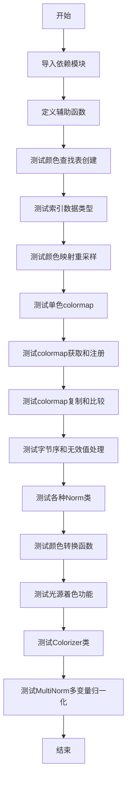
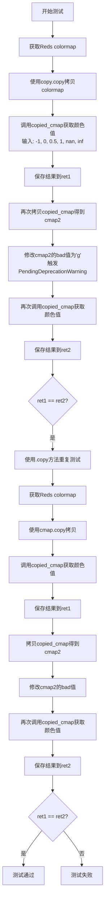
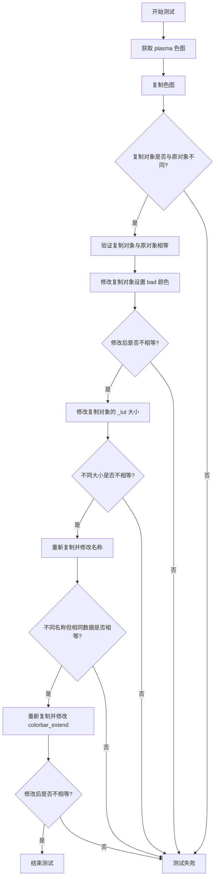
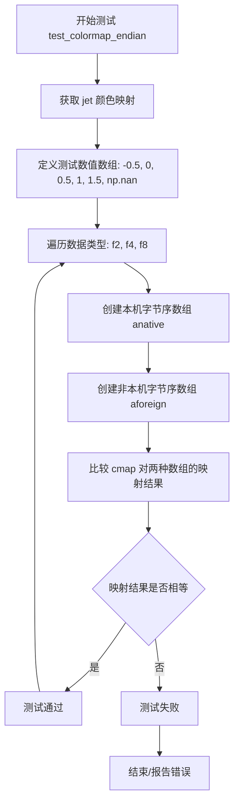
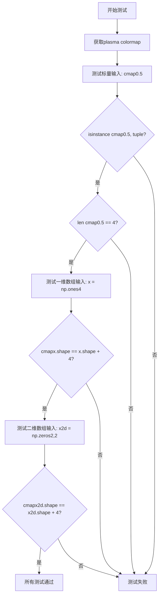
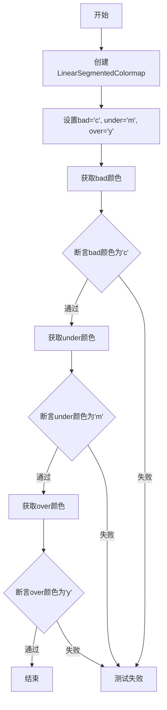
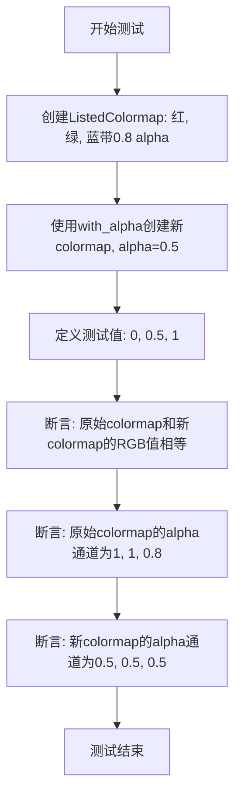
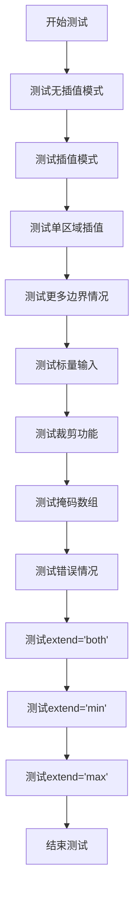

# `matplotlib\lib\matplotlib\tests\test_colors.py` 详细设计文档

这是一个matplotlib颜色映射（colormap）和颜色归一化（normalization）功能的综合测试文件，包含了大量针对颜色处理、颜色转换、各种归一化类（如Normalize、LogNorm、PowerNorm、TwoSlopeNorm、SymLogNorm、CenteredNorm、BoundaryNorm、AsinhNorm、MultiNorm等）以及Colorizer类的单元测试和图像比较测试。

## 整体流程



## 类结构

```
TestAsinhNorm (测试类)
├── test_init
└── test_norm
```

## 全局变量及字段


### `N`
    
测试函数参数，表示lookup table中的颜色数量

类型：`int`
    


### `result`
    
期望的lookup table结果列表

类型：`list`
    


### `data`
    
测试用的数据数组

类型：`numpy.ndarray`
    


### `dtype`
    
numpy数据类型，用于测试索引类型支持

类型：`numpy.dtype`
    


### `cm`
    
matplotlib的颜色映射对象

类型：`Colormap`
    


### `cmap`
    
matplotlib的颜色映射对象

类型：`Colormap`
    


### `copied_cmap`
    
复制的颜色映射对象

类型：`Colormap`
    


### `cm2`
    
另一个颜色映射对象副本

类型：`Colormap`
    


### `cm_copy`
    
颜色映射的副本对象

类型：`Colormap`
    


### `lsc`
    
线性分段颜色映射对象

类型：`LinearSegmentedColormap`
    


### `lc`
    
列表颜色映射对象

类型：`ListedColormap`
    


### `lsc3`
    
重采样后的线性分段颜色映射

类型：`LinearSegmentedColormap`
    


### `lc3`
    
重采样后的列表颜色映射

类型：`ListedColormap`
    


### `expected`
    
测试期望值数组

类型：`numpy.ndarray`
    


### `colorlist`
    
颜色列表数组

类型：`numpy.ndarray`
    


### `n`
    
数量或大小参数

类型：`int`
    


### `bounds`
    
边界值列表

类型：`list`
    


### `vals`
    
测试值数组

类型：`numpy.ndarray`
    


### `bn`
    
边界归一化对象

类型：`BoundaryNorm`
    


### `norm`
    
归一化对象基类

类型：`Norm`
    


### `norm_ref`
    
参考归一化对象

类型：`Normalize`
    


### `x`
    
输入数据数组

类型：`numpy.ndarray`
    


### `x_maxabs`
    
最大绝对值

类型：`float`
    


### `vcenter`
    
中心值参数

类型：`float`
    


### `pnorm`
    
幂律归一化对象

类型：`PowerNorm`
    


### `ln`
    
对数归一化对象

类型：`LogNorm`
    


### `a`
    
测试数组

类型：`numpy.ndarray`
    


### `input`
    
输入数组

类型：`numpy.ndarray`
    


### `fig`
    
matplotlib图形对象

类型：`matplotlib.figure.Figure`
    


### `ax`
    
matplotlib坐标轴对象

类型：`matplotlib.axes.Axes`
    


### `axs`
    
坐标轴数组

类型：`numpy.ndarray`
    


### `ls`
    
光源对象

类型：`LightSource`
    


### `cmap_r`
    
反转后的颜色映射

类型：`Colormap`
    


### `z`
    
高度/深度数据数组

类型：`numpy.ndarray`
    


### `z0`
    
原始高度数据

类型：`numpy.ndarray`
    


### `z1`
    
掩码后的高度数据

类型：`numpy.ndarray`
    


### `rgb`
    
RGB颜色数组

类型：`numpy.ndarray`
    


### `rgb0`
    
原始RGB结果

类型：`numpy.ndarray`
    


### `rgb1`
    
掩码后RGB结果

类型：`numpy.ndarray`
    


### `expect`
    
期望的RGB值数组

类型：`numpy.ndarray`
    


### `h1`
    
hillshade结果1

类型：`numpy.ndarray`
    


### `h2`
    
hillshade结果2

类型：`numpy.ndarray`
    


### `x2d`
    
二维输入数组

类型：`numpy.ndarray`
    


### `a_shape`
    
数组形状元组

类型：`tuple`
    


### `tt`
    
测试用随机数组

类型：`numpy.ndarray`
    


### `color_mapping`
    
颜色映射字典

类型：`dict`
    


### `k`
    
字典键/颜色名称

类型：`str`
    


### `dflt_cycle`
    
默认颜色循环列表

类型：`list`
    


### `mydata`
    
自定义数组子类

类型：`numpy.ndarray`
    


### `norm_instance`
    
归一化实例对象

类型：`Norm`
    


### `scalar_result`
    
标量结果列表

类型：`list`
    


### `masked_array`
    
掩码数组对象

类型：`numpy.ma.MaskedArray`
    


### `elev`
    
高程数据数组

类型：`numpy.ndarray`
    


### `dx`
    
X方向间距

类型：`float`
    


### `dy`
    
Y方向间距

类型：`float`
    


### `dem`
    
数字高程模型数据

类型：`numpy.ndarray`
    


### `row`
    
坐标轴行数组

类型：`numpy.ndarray`
    


### `mode`
    
混合模式字符串

类型：`str`
    


### `ve`
    
垂直 exaggeration 参数

类型：`float`
    


### `c`
    
颜色数组

类型：`numpy.ndarray`
    


### `c1`
    
颜色数组1

类型：`numpy.ndarray`
    


### `c2`
    
颜色数组2

类型：`numpy.ndarray`
    


### `c3`
    
颜色数组3

类型：`numpy.ndarray`
    


### `sm`
    
标量可映射对象

类型：`cm.ScalarMappable`
    


### `callback`
    
模拟回调对象

类型：`unittest.mock.Mock`
    


### `image`
    
图像对象

类型：`matplotlib.image.AxesImage`
    


### `increment`
    
模拟增量函数

类型：`unittest.mock.Mock`
    


### `test_cmap`
    
测试用颜色映射

类型：`Colormap`
    


### `logitnorm`
    
logit归一化对象

类型：`Norm`
    


### `palette`
    
调色板字典

类型：`dict`
    


### `res`
    
结果数组

类型：`numpy.ndarray`
    


### `exp`
    
期望数组

类型：`numpy.ndarray`
    


### `tab_colors`
    
表格颜色列表

类型：`list`
    


### `seq_color`
    
序列颜色字符串

类型：`str`
    


### `tab_color`
    
表格颜色名称

类型：`str`
    


### `rgb_colors`
    
RGB颜色列表

类型：`list`
    


### `bad_cmap`
    
错误颜色映射名称

类型：`str`
    


### `cmap_returned`
    
返回的颜色映射

类型：`Colormap`
    


### `ca`
    
颜色着色器对象

类型：`Colorizer`
    


### `norm0`
    
双斜率归一化对象

类型：`TwoSlopeNorm`
    


### `norm1`
    
归一化对象1

类型：`Norm`
    


### `colors`
    
颜色列表

类型：`list`
    


### `value_color_tuples`
    
值颜色元组列表

类型：`list`
    


### `r`
    
范围数组

类型：`numpy.ndarray`
    


### `colorizer`
    
颜色着色器对象

类型：`Colorizer`
    


### `target`
    
目标数组

类型：`numpy.ndarray`
    


### `data_transposed`
    
转置后的数据

类型：`numpy.ndarray`
    


### `from_mn`
    
MultiNorm输出

类型：`numpy.ndarray`
    


### `no_norm_out`
    
NoNorm输出

类型：`list`
    


### `mn`
    
多范数对象

类型：`MultiNorm`
    


### `mn_no_norm`
    
包含NoNorm的MultiNorm

类型：`MultiNorm`
    


### `mdata`
    
多变量数据

类型：`numpy.ndarray`
    


    

## 全局函数及方法


### `test_create_lookup_table`

该测试函数用于验证 `matplotlib.colors` 模块中 `_create_lookup_table` 函数的正确性，通过参数化测试检查不同数量节点（N）的查找表生成是否按预期工作。

参数：

- `N`：`int`，查找表的节点数量，指定要生成的查找表中有多少个颜色值
- `result`：`list`，期望的查找表输出结果，用于与实际生成的结果进行比对

返回值：`None`，该函数为测试函数，不返回任何值，仅通过 `assert_array_almost_equal` 断言验证结果

#### 流程图

```mermaid
graph TD
    A[开始测试] --> B[参数化测试: N=5, result=1, .6, .2, .1, 0]
    B --> C[参数化测试: N=2, result=1, 0]
    C --> D[参数化测试: N=1, result=0]
    D --> E[定义测试数据: data = [(0.0, 1.0, 1.0), (0.5, 0.2, 0.2), (1.0, 0.0, 0.0)]]
    E --> F[调用 mcolors._create_lookup_table(N, data)]
    F --> G{断言: 实际结果 ≈ 预期结果}
    G -->|通过| H[测试通过]
    G -->|失败| I[抛出 AssertionError]
    H --> I
```

#### 带注释源码

```python
# 使用 pytest.mark.parametrize 进行参数化测试
# 测试三组不同的 N 值及其对应的期望结果
@pytest.mark.parametrize('N, result', [
    (5, [1, .6, .2, .1, 0]),  # N=5 时，期望返回 5 个值
    (2, [1, 0]),               # N=2 时，期望返回 2 个值
    (1, [0]),                  # N=1 时，期望返回 1 个值
])
def test_create_lookup_table(N, result):
    # 定义输入数据：三个控制点的 (x, y, z) 坐标
    # 控制点格式为 (位置, 起始值, 结束值)
    data = [(0.0, 1.0, 1.0), (0.5, 0.2, 0.2), (1.0, 0.0, 0.0)]
    
    # 调用被测试的内部函数 _create_lookup_table
    # 该函数根据 N 个节点和控制点数据生成查找表
    # 使用 assert_array_almost_equal 进行近似相等断言（允许微小浮点误差）
    assert_array_almost_equal(mcolors._create_lookup_table(N, data), result)
```


### `test_index_dtype`

该测试函数验证 matplotlib 的 colormap（色彩映射）在使用不同数据类型（如 `uint8`、`int`、`float16`、`float`）进行索引时能否正确工作，特别关注 uint8 类型，因为内部实现中使用了减法操作。

参数：

- `dtype`：`np.uint8 | int | np.float16 | float`，通过 `@pytest.mark.parametrize` 参数化的数据类型，用于测试 colormap 索引操作

返回值：`None`，该函数通过 `assert_array_equal` 断言验证结果，不返回任何值

#### 流程图

```mermaid
flowchart TD
    A[开始测试] --> B[获取 viridis 色彩映射]
    B --> C[将 dtype 类型的值 0 转换为对应类型]
    C --> D[调用 colormap 对 dtype(0) 进行索引]
    D --> E[调用 colormap 对 0 进行索引]
    E --> F{断言两者结果相等}
    F -->|相等| G[测试通过]
    F -->|不等| H[测试失败]
```

#### 带注释源码

```python
@pytest.mark.parametrize("dtype", [np.uint8, int, np.float16, float])
def test_index_dtype(dtype):
    # 我们在索引时使用减法操作，所以需要验证 uint8 类型能正常工作
    # （uint8 在减法时可能会出现环绕问题）
    cm = mpl.colormaps["viridis"]
    # 验证将 dtype 类型的 0 传入 colormap 与传入普通整数 0 的结果一致
    assert_array_equal(cm(dtype(0)), cm(0))
```


### `test_resampled`

该函数用于测试 `LinearSegmentedColormap` 和 `ListedColormap` 的 `resampled` 方法是否正确工作，特别关注 GitHub issue #6025 中指出的 `ListedColormap.resampled` 的问题，以及验证重采样后 over/under/bad 颜色的正确复制。

参数：
- 该函数没有显式参数（但内部使用 pytest 参数化测试中的参数）

返回值：该函数没有返回值（返回类型为 `None`），通过断言验证正确性

#### 流程图

```mermaid
flowchart TD
    A[开始 test_resampled] --> B[创建测试数据: n=101]
    B --> C[构建 colorlist 数组 shape=(101, 4)]
    C --> D[设置 colorlist 各列的值]
    D --> E[创建 LinearSegmentedColormap: lsc]
    E --> F[创建 ListedColormap: lc]
    F --> G[调用 resampled(3) 重采样到3色: lsc3, lc3]
    G --> H[定义期望输出 expected 数组]
    H --> I[断言 lsc3([0, 0.5, 1]) ≈ expected]
    I --> J[断言 lc3([0, 0.5, 1]) ≈ expected]
    J --> K[测试 over/under/bad 颜色复制正确性]
    K --> L[结束]
```

#### 带注释源码

```python
def test_resampled():
    """
    GitHub issue #6025 pointed to incorrect ListedColormap.resampled;
    here we test the method for LinearSegmentedColormap as well.
    """
    # 定义颜色列表的长度
    n = 101
    # 创建一个形状为 (101, 4) 的 float 数组，用于存储 RGBA 颜色
    colorlist = np.empty((n, 4), float)
    # 第一列（红色通道）从 0 线性插值到 1
    colorlist[:, 0] = np.linspace(0, 1, n)
    # 第二列（绿色通道）固定为 0.2
    colorlist[:, 1] = 0.2
    # 第三列（蓝色通道）从 1 线性插值到 0
    colorlist[:, 2] = np.linspace(1, 0, n)
    # 第四列（alpha 通道）固定为 0.7
    colorlist[:, 3] = 0.7
    
    # 使用颜色列表创建 LinearSegmentedColormap，指定 under/over/bad 颜色
    lsc = mcolors.LinearSegmentedColormap.from_list(
        'lsc', colorlist, under='red', over='green', bad='blue')
    
    # 使用相同的颜色列表创建 ListedColormap
    lc = mcolors.ListedColormap(colorlist, under='red', over='green', bad='blue')
    
    # 将两个 colormap 重采样到 3 个颜色
    lsc3 = lsc.resampled(3)
    lc3 = lc.resampled(3)
    
    # 定义期望的重采样结果数组
    expected = np.array([[0.0, 0.2, 1.0, 0.7],
                         [0.5, 0.2, 0.5, 0.7],
                         [1.0, 0.2, 0.0, 0.7]], float)
    
    # 断言 LinearSegmentedColormap 重采样结果正确
    assert_array_almost_equal(lsc3([0, 0.5, 1]), expected)
    
    # 断言 ListedColormap 重采样结果正确
    assert_array_almost_equal(lc3([0, 0.5, 1]), expected)
    
    # 测试 over/under/bad 颜色是否被正确复制
    # 正无穷应该映射到 over 颜色（绿色）
    assert_array_almost_equal(lsc(np.inf), lsc3(np.inf))
    # 负无穷应该映射到 under 颜色（红色）
    assert_array_almost_equal(lsc(-np.inf), lsc3(-np.inf))
    # NaN 应该映射到 bad 颜色（蓝色）
    assert_array_almost_equal(lsc(np.nan), lsc3(np.nan))
    
    # 对 ListedColormap 进行相同的测试
    assert_array_almost_equal(lc(np.inf), lc3(np.inf))
    assert_array_almost_equal(lc(-np.inf), lc3(-np.inf))
    assert_array_almost_equal(lc(np.nan), lc3(np.nan))
```


### `test_monochrome`

该函数用于测试 `ListedColormap` 类的 `monochrome` 属性，验证其能否正确识别单色（仅包含一种颜色）和多色（包含多种颜色）配色方案。

参数：无

返回值：`None`，测试函数无返回值

#### 流程图

```mermaid
flowchart TD
    A[开始测试] --> B[测试单色列表: ["red"]]
    B --> C{monochrome属性是否为True}
    C -->|是| D[测试重复单色: ["red"] * 5]
    C -->|否| E[测试失败]
    D --> F{monochrome属性是否为True}
    F -->|是| G[测试多色列表: ["red", "green"]}
    F -->|否| H[测试失败]
    G --> I{monochrome属性是否为False}
    I -->|是| J[所有测试通过]
    I -->|否| K[测试失败]
```

#### 带注释源码

```python
def test_monochrome():
    """
    测试 ListedColormap 的 monochrome 属性
    
    验证逻辑：
    - 单色（只有一种颜色）应该返回 True
    - 多种颜色应该返回 False
    """
    # 测试1：单色列表 ["red"] 应该是单色的
    assert mcolors.ListedColormap(["red"]).monochrome
    
    # 测试2：重复颜色 ["red"] * 5 仍然是单色的
    assert mcolors.ListedColormap(["red"] * 5).monochrome
    
    # 测试3：多色列表 ["red", "green"] 不是单色的
    assert not mcolors.ListedColormap(["red", "green"]).monochrome
```


### `test_colormaps_get_cmap`

这是一个测试函数，用于验证 `matplotlib.colormaps` 中 `get_cmap` 方法的功能，包括通过字符串名称获取colormap、通过Colormap对象直接传递、获取默认colormap，以及错误处理（无效名称和无效类型）。

参数： 无

返回值：`None`，无返回值（测试函数）

#### 流程图

```mermaid
flowchart TD
    A[开始] --> B[获取mpl.colormaps对象cr]
    B --> C[测试字符串名称获取: cr.get_cmap('plasma')]
    C --> D[验证返回值等于cr['plasma']]
    D --> E[测试Colormap对象直接传递: cr.get_cmap(cr['magma'])]
    E --> F[验证返回值等于cr['magma']]
    F --> G[测试默认colormap: cr.get_cmap(None)]
    G --> H[验证返回值等于rcParams中的image.cmap]
    H --> I[测试无效名称抛出ValueError]
    I --> J[创建无效名称'AardvarksAreAwkward']
    J --> K[调用cr.get_cmap验证抛出ValueError]
    K --> L[测试无效类型抛出TypeError]
    L --> M[创建object对象]
    M --> N[调用cr.get_cmap验证抛出TypeError]
    N --> O[结束]
```

#### 带注释源码

```python
def test_colormaps_get_cmap():
    """
    测试matplotlib.colormaps的get_cmap方法的各种调用方式：
    1. 通过字符串名称获取colormap
    2. 通过Colormap对象直接传递
    3. 获取默认colormap
    4. 验证无效输入的正确异常处理
    """
    # 获取matplotlib的colormaps注册表
    cr = mpl.colormaps

    # check str, and Colormap pass
    # 测试1: 通过字符串名称获取colormap，验证结果与索引访问一致
    assert cr.get_cmap('plasma') == cr["plasma"]
    # 测试2: 直接传递Colormap对象，验证返回相同的colormap
    assert cr.get_cmap(cr["magma"]) == cr["magma"]

    # check default
    # 测试3: 传递None时，返回rcParams中配置的默认colormap
    assert cr.get_cmap(None) == cr[mpl.rcParams['image.cmap']]

    # check ValueError on bad name
    # 测试4: 无效的colormap名称应抛出ValueError
    bad_cmap = 'AardvarksAreAwkward'
    with pytest.raises(ValueError, match=bad_cmap):
        cr.get_cmap(bad_cmap)

    # check TypeError on bad type
    # 测试5: 传递无效类型（非字符串非Colormap对象）应抛出TypeError
    with pytest.raises(TypeError, match='object'):
        cr.get_cmap(object())
```


### `test_double_register_builtin_cmap`

该测试函数验证了当尝试使用 `force=True` 参数重新注册一个内置的颜色映射表（如 "viridis"）时，会正确地抛出 `ValueError` 异常，并包含适当的错误消息。这是 matplotlib 颜色映射表注册机制的保护性测试，确保内置颜色映射表不会被意外覆盖。

参数：

- 该函数无参数

返回值：`None`，无返回值（测试函数）

#### 流程图

```mermaid
flowchart TD
    A[开始测试] --> B[定义name = "viridis"]
    B --> C[构造期望的错误消息: 'Re-registering the builtin cmap viridis.']
    C --> D[调用 matplotlib.colormaps.register 注册 viridis, 设置 name='viridis', force=True]
    D --> E{验证是否抛出 ValueError}
    E -->|是| F[验证错误消息匹配]
    E -->|否| G[测试失败]
    F -->|匹配| H[测试通过]
    F -->|不匹配| I[测试失败]
    H --> J[结束测试]
```

#### 带注释源码

```python
def test_double_register_builtin_cmap():
    """
    测试尝试重新注册内置颜色映射表时是否会正确抛出异常。
    
    该测试验证了 matplotlib.colormaps.register 在 force=True 时，
    尝试重新注册一个已存在的内置颜色映射表会引发 ValueError。
    """
    # 定义要测试的内置颜色映射表名称
    name = "viridis"
    
    # 构造期望的错误消息，使用 f-string 和 !r 来获取名称的 repr 表示
    match = f"Re-registering the builtin cmap {name!r}."
    
    # 使用 pytest.raises 上下文管理器验证:
    # 1. 调用 matplotlib.colormaps.register 时会抛出 ValueError
    # 2. 抛出的异常消息与预期的 match 字符串匹配
    with pytest.raises(ValueError, match=match):
        # 尝试使用 force=True 重新注册 viridis 颜色映射表
        # 这应该失败并抛出 ValueError，因为 viridis 是内置的颜色映射表
        matplotlib.colormaps.register(mpl.colormaps[name], name=name, force=True)
```


### `test_colormap_copy`

该测试函数验证 matplotlib 中 Colormap 对象的浅拷贝（`copy.copy`）和深拷贝（`.copy()` 方法）功能是否正常工作，确保拷贝后的 colormap 在修改 bad 值后原始对象不受影响。

参数：
- 该函数没有参数

返回值：`None`，无返回值（测试函数）

#### 流程图



#### 带注释源码

```python
def test_colormap_copy():
    """
    测试Colormap对象的浅拷贝和深拷贝功能
    验证修改拷贝后的colormap不会影响原始colormap
    """
    # 第一部分：测试copy.copy（浅拷贝）
    
    # 获取名为"Reds"的colormap
    cmap = plt.colormaps["Reds"]
    
    # 使用copy.copy对colormap进行浅拷贝
    copied_cmap = copy.copy(cmap)
    
    # 使用errstate忽略无效值的警告（如nan和inf）
    with np.errstate(invalid='ignore'):
        # 调用colormap获取颜色值，输入包含各种边界情况：
        # -1: 低于范围（under）
        # 0: 范围下限
        # 0.5: 中间值
        # 1: 范围上限
        # nan: 无效值（bad）
        # inf: 超出范围（over）
        ret1 = copied_cmap([-1, 0, .5, 1, np.nan, np.inf])
    
    # 对copied_cmap再次进行浅拷贝
    cmap2 = copy.copy(copied_cmap)
    
    # 修改cmap2的bad值（无效值映射的颜色）为'g'（绿色）
    # 这会触发PendingDeprecationWarning因为set_bad可能已弃用
    with pytest.warns(PendingDeprecationWarning):
        cmap2.set_bad('g')
    
    # 再次调用原始copied_cmap获取颜色值
    with np.errstate(invalid='ignore'):
        ret2 = copied_cmap([-1, 0, .5, 1, np.nan, np.inf])
    
    # 断言两次结果相等，说明修改cmap2不影响copied_cmap
    assert_array_equal(ret1, ret2)
    
    # 第二部分：测试.copy方法（深拷贝）
    # 重复上述测试流程，但使用colormap的.copy()方法
    
    cmap = plt.colormaps["Reds"]
    
    # 使用colormap的copy方法进行拷贝
    copied_cmap = cmap.copy()
    
    with np.errstate(invalid='ignore'):
        ret1 = copied_cmap([-1, 0, .5, 1, np.nan, np.inf])
    
    cmap2 = copy.copy(copied_cmap)
    
    with pytest.warns(PendingDeprecationWarning):
        cmap2.set_bad('g')
    
    with np.errstate(invalid='ignore'):
        ret2 = copied_cmap([-1, 0, .5, 1, np.nan, np.inf])
    
    assert_array_equal(ret1, ret2)
```


### `test_colormap_equals`

该测试函数用于验证 Colormap 对象的相等性比较逻辑是否正确，包括测试复制对象与原对象的相等性、修改后不相等、不同名称但相同查找表的相等性，以及颜色条扩展属性的影响。

参数： 无

返回值： `None`，测试函数无返回值

#### 流程图



#### 带注释源码

```python
def test_colormap_equals():
    """
    测试 Colormap 对象的相等性比较 (__eq__ 方法)
    验证复制、修改属性等场景下的相等性逻辑
    """
    # 获取 plasma 色图对象
    cmap = mpl.colormaps["plasma"]
    # 使用 copy 方法创建色图的副本
    cm_copy = cmap.copy()
    
    # 验证：不同的对象标识
    # assert 确保 cm_copy 和 cmap 是不同的 Python 对象
    assert cm_copy is not cmap
    
    # 验证：相同的数据应该被判定为相等
    # 尽管对象不同，但内容相同，应该返回 True
    assert cm_copy == cmap
    
    # 修改复制对象的 'bad' 颜色（无效值的颜色）
    # 使用 pytest.warns 捕获 PendingDeprecationWarning 警告
    with pytest.warns(PendingDeprecationWarning):
        cm_copy.set_bad('y')  # 设置为黄色
    
    # 验证：修改后应该不再相等
    assert cm_copy != cmap
    
    # 调整复制对象的查找表大小
    # 截取前10行，保留所有列
    cm_copy._lut = cm_copy._lut[:10, :]
    
    # 验证：不同大小的查找表应该不相等
    assert cm_copy != cmap
    
    # 重新复制色图
    cm_copy = cmap.copy()
    # 修改复制对象的名称
    cm_copy.name = "Test"
    
    # 验证：不同的名称但相同的数据应该仍然相等
    assert cm_copy == cmap
    
    # 重新复制色图
    cm_copy = cmap.copy()
    # 修改颜色条扩展属性（取反）
    cm_copy.colorbar_extend = not cmap.colorbar_extend
    
    # 验证：不同的扩展属性应该不相等
    assert cm_copy != cmap
```


### `test_colormap_endian`

该函数是用于测试 Matplotlib 颜色映射（Colormap）在处理非本机字节序（non-native byte order）数组时的正确性。测试验证当输入数组的字节序与系统本机字节序不同时，颜色映射能够正确映射数值，避免因 `putmask` 函数的 bug 导致 1.0 映射错误。

参数：
- 该函数无参数

返回值：`None`，该函数为测试函数，不返回任何值

#### 流程图



#### 带注释源码

```python
def test_colormap_endian():
    """
    GitHub issue #1005: a bug in putmask caused erroneous
    mapping of 1.0 when input from a non-native-byteorder
    array.
    """
    # 获取名为 "jet" 的颜色映射对象
    cmap = mpl.colormaps["jet"]
    
    # 定义测试数据：包含欠采样值(-0.5)、有效值(0, 0.5, 1)、
    # 过采样值(1.5)和无效值(np.nan)
    a = [-0.5, 0, 0.5, 1, 1.5, np.nan]
    
    # 遍历不同的浮点数数据类型进行测试
    # f2: float16, f4: float32, f8: float64
    for dt in ["f2", "f4", "f8"]:
        # 将数据转换为指定 dtype 的数组，并 masked_invalid 处理无效值
        anative = np.ma.masked_invalid(np.array(a, dtype=dt))
        
        # 通过 byteswap 和 view 创建非本机字节序的数组
        # 1. byteswap(): 交换字节顺序
        # 2. view(dtype.newbyteorder()): 以新字节序解释数据
        aforeign = anative.byteswap().view(anative.dtype.newbyteorder())
        
        # 断言：无论输入是本机字节序还是非本机字节序，
        # 颜色映射的输出结果应该完全一致
        assert_array_equal(cmap(anative), cmap(aforeign))
```


### `test_colormap_invalid`

该测试函数验证了 Colormap 对无效值（-inf、nan、inf）的处理是否正确，确保这些值分别映射到 under、bad、over 颜色。

参数：

- 无

返回值：无（`None`），该函数为测试函数，使用 `assert_array_equal` 进行断言验证

#### 流程图

```mermaid
graph TD
    A[开始] --> B[获取 plasma 颜色映射]
    C[创建测试数组 x = [-inf, -1, 0, nan, 0.7, 2, inf]]
    B --> C
    C --> D[定义期望的 RGBA 数组 expected]
    D --> E[断言 cmap&#40;x&#41; 等于 expected]
    E --> F[测试带掩码的数组表示]
    F --> G[定义新的 expected 数组]
    G --> H[断言 cmap&#40;masked_invalid&#40;x&#41;&#41; 等于 expected]
    H --> I[测试标量表示: cmap&#40;-inf&#41;, cmap&#40;inf&#41;, cmap&#40;nan&#41;]
    I --> J[结束]
```

#### 带注释源码

```python
def test_colormap_invalid():
    """
    GitHub issue #9892: Handling of nan's were getting mapped to under
    rather than bad. This tests to make sure all invalid values
    (-inf, nan, inf) are mapped respectively to (under, bad, over).
    """
    # 获取 plasma 颜色映射
    cmap = mpl.colormaps["plasma"]
    
    # 创建包含各种无效值的测试数组: [-inf, -1, 0, nan, 0.7, 2, inf]
    x = np.array([-np.inf, -1, 0, np.nan, .7, 2, np.inf])

    # 定义期望的 RGBA 输出数组
    # -inf, -1, 0 -> under 颜色 (索引 0 的值)
    # nan -> bad 颜色 (全 0)
    # 0.7 -> 正常颜色
    # 2 -> 正常颜色
    # inf -> over 颜色 (索引 1 的值)
    expected = np.array([[0.050383, 0.029803, 0.527975, 1.],
                         [0.050383, 0.029803, 0.527975, 1.],
                         [0.050383, 0.029803, 0.527975, 1.],
                         [0.,       0.,       0.,       0.],
                         [0.949217, 0.517763, 0.295662, 1.],
                         [0.940015, 0.975158, 0.131326, 1.],
                         [0.940015, 0.975158, 0.131326, 1.]])
    
    # 断言数组输入的输出是否符合预期
    assert_array_equal(cmap(x), expected)

    # 测试带掩码表示的情况 (-inf, inf 应该被掩码)
    expected = np.array([[0.,       0.,       0.,       0.],
                         [0.050383, 0.029803, 0.527975, 1.],
                         [0.050383, 0.029803, 0.527975, 1.],
                         [0.,       0.,       0.,       0.],
                         [0.949217, 0.517763, 0.295662, 1.],
                         [0.940015, 0.975158, 0.131326, 1.],
                         [0.,       0.,       0.,       0.]])
    assert_array_equal(cmap(np.ma.masked_invalid(x)), expected)

    # 测试标量输入的处理方式
    assert_array_equal(cmap(-np.inf), cmap(0))       # -inf 映射到底部 (under)
    assert_array_equal(cmap(np.inf), cmap(1.0))     # inf 映射到顶部 (over)
    assert_array_equal(cmap(np.nan), [0., 0., 0., 0.])  # nan 映射到无效值 (bad)
```


### test_colormap_return_types

这是一个测试函数，用于验证Colormap对象在处理标量输入时返回元组，处理数组输入时返回正确形状的ndarray。

参数：
- 该函数没有参数

返回值：`None`，该函数为测试函数，使用断言进行验证，不返回具体数值

#### 流程图



#### 带注释源码

```python
def test_colormap_return_types():
    """
    Make sure that tuples are returned for scalar input and
    that the proper shapes are returned for ndarrays.
    """
    # 获取plasma颜色映射对象
    cmap = mpl.colormaps["plasma"]
    
    # 测试返回类型和形状
    # 标量输入需要返回长度为4的元组
    assert isinstance(cmap(0.5), tuple)
    assert len(cmap(0.5)) == 4

    # 输入数组返回形状为x.shape + (4,)的ndarray
    x = np.ones(4)
    assert cmap(x).shape == x.shape + (4,)

    # 多维数组输入
    x2d = np.zeros((2, 2))
    assert cmap(x2d).shape == x2d.shape + (4,)
```


### `test_ListedColormap_bad_under_over`

这是一个测试函数，用于验证 `ListedColormap` 类在创建时可以正确设置 `bad`（无效值）、`under`（低于最小值）和 `over`（高于最大值）三种特殊颜色，并通过相应的 getter 方法正确返回这些颜色值。

参数：

- （无参数）

返回值：`None`，该函数为测试函数，使用 `assert` 语句进行断言验证，不返回具体值

#### 流程图

```mermaid
flowchart TD
    A[开始测试] --> B[创建 ListedColormap 对象<br/>colors=['r','g','b'], bad='c', under='m', over='y']
    B --> C[调用 cmap.get_bad 获取无效值颜色]
    C --> D{断言: get_bad 返回颜色 'c'}
    D -->|通过| E[调用 cmap.get_under 获取低于最小值颜色]
    D -->|失败| F[测试失败]
    E --> G{断言: get_under 返回颜色 'm'}
    G -->|通过| H[调用 cmap.get_over 获取高于最大值颜色]
    G -->|失败| F
    H --> I{断言: get_over 返回颜色 'y'}
    I -->|通过| J[测试通过]
    I -->|失败| F
```

#### 带注释源码

```python
def test_ListedColormap_bad_under_over():
    """
    测试 ListedColormap 类的 bad、under、over 颜色设置功能。
    
    该测试验证：
    1. 创建 ListedColormap 时可以指定 bad、under、over 颜色
    2. 通过 get_bad()、get_under()、get_over() 方法可以正确获取这些颜色
    """
    # 创建一个 ListedColormap 对象，指定:
    # - 基础颜色: 红色、绿色、蓝色
    # - bad 颜色 (无效值/NaN): 青色 'c'
    # - under 颜色 (低于最小值): 洋红色 'm'
    # - over 颜色 (高于最大值): 黄色 'y'
    cmap = mcolors.ListedColormap(["r", "g", "b"], bad="c", under="m", over="y")
    
    # 验证 get_bad() 方法返回正确的无效值颜色 'c'
    assert mcolors.same_color(cmap.get_bad(), "c")
    
    # 验证 get_under() 方法返回正确的低于最小值颜色 'm'
    assert mcolors.same_color(cmap.get_under(), "m")
    
    # 验证 get_over() 方法返回正确的高于最大值颜色 'y'
    assert mcolors.same_color(cmap.get_over(), "y")
```


### `test_LinearSegmentedColormap_bad_under_over`

该测试函数用于验证 `LinearSegmentedColormap` 在设置 `bad`（无效值）、`under`（下限外）和 `over`（上限外）颜色时的正确性，确保通过 `get_bad()`、`get_under()` 和 `get_over()` 方法获取的颜色与设置的颜色一致。

参数：无

返回值：无

#### 流程图

```mermaid
flowchart TD
    A[开始测试] --> B[定义颜色字典 cdict]
    B --> C[创建 LinearSegmentedColormap 对象, 设置 bad='c', under='m', over='y']
    C --> D{断言 cmap.get_bad() 返回 'c'}
    D -->|通过| E{断言 cmap.get_under() 返回 'm'}
    E -->|通过| F{断言 cmap.get_over() 返回 'y'}
    F -->|通过| G[测试通过]
    D -->|失败| H[抛出 AssertionError]
    E -->|失败| H
    F -->|失败| H
```

#### 带注释源码

```python
def test_LinearSegmentedColormap_bad_under_over():
    """
    测试 LinearSegmentedColormap 的 bad、under、over 颜色设置。
    
    该测试验证:
    - bad 颜色: 用于表示无效值（如 NaN）
    - under 颜色: 用于表示低于下限的值
    - over 颜色: 用于表示高于上限的值
    """
    # 定义颜色字典，包含 red、green、blue 通道的分段数据
    # 格式为: [(位置, 起始值, 结束值), ...]
    cdict = {
        'red': [(0., 0., 0.), (0.5, 1., 1.), (1., 1., 1.)],
        'green': [(0., 0., 0.), (0.25, 0., 0.), (0.75, 1., 1.), (1., 1., 1.)],
        'blue': [(0., 0., 0.), (0.5, 0., 0.), (1., 1., 1.)],
    }
    
    # 创建 LinearSegmentedColormap:
    # - 名称: "lsc"
    # - 颜色字典: cdict
    # - bad 颜色: "c" (青色)
    # - under 颜色: "m" (洋红色)
    # - over 颜色: "y" (黄色)
    cmap = mcolors.LinearSegmentedColormap("lsc", cdict, bad="c", under="m", over="y")
    
    # 断言: 验证 bad 颜色是否正确设置为青色 "c"
    assert mcolors.same_color(cmap.get_bad(), "c")
    
    # 断言: 验证 under 颜色是否正确设置为洋红色 "m"
    assert mcolors.same_color(cmap.get_under(), "m")
    
    # 断言: 验证 over 颜色是否正确设置为黄色 "y"
    assert mcolors.same_color(cmap.get_over(), "y")
```


### `test_LinearSegmentedColormap_from_list_bad_under_over`

这是一个测试函数，用于验证 `LinearSegmentedColormap.from_list` 方法在创建颜色映射时能否正确处理 `bad`、`under` 和 `over` 参数，并确保这些特殊颜色值被正确设置。

参数：

- 无

返回值：`None`，该函数通过断言验证功能，不返回任何值

#### 流程图



#### 带注释源码

```python
def test_LinearSegmentedColormap_from_list_bad_under_over():
    """
    测试 LinearSegmentedColormap.from_list 方法的 bad、under、over 参数功能
    
    该测试验证：
    1. 可以通过 from_list 方法创建带有 bad、under、over 颜色配置的 LinearSegmentedColormap
    2. 创建后可以通过 get_bad()、get_under()、get_over() 方法正确获取这些颜色
    """
    # 使用 from_list 静态方法创建颜色映射
    # 参数：名称="lsc", 颜色列表=["r", "g", "b"], bad="c", under="m", over="y"
    cmap = mcolors.LinearSegmentedColormap.from_list(
        "lsc", ["r", "g", "b"], bad="c", under="m", over="y")
    
    # 断言：验证 bad 颜色（无效值/NaN 的颜色）被正确设置为青色 "c"
    assert mcolors.same_color(cmap.get_bad(), "c")
    
    # 断言：验证 under 颜色（低于范围的颜色）被正确设置为洋红色 "m"
    assert mcolors.same_color(cmap.get_under(), "m")
    
    # 断言：验证 over 颜色（高于范围的颜色）被正确设置为黄色 "y"
    assert mcolors.same_color(cmap.get_over(), "y")
```


### test_colormap_with_alpha

这是一个测试函数，用于验证ListedColormap类的with_alpha方法能否正确地在保留RGB颜色的同时修改alpha值。

参数： 无

返回值： 无（None），该函数为测试函数，不返回任何值

#### 流程图



#### 带注释源码

```python
def test_colormap_with_alpha():
    """
    测试ListedColormap的with_alpha方法功能。
    验证在修改alpha值时，RGB颜色分量保持不变。
    """
    # 创建一个ListedColormap，包含三个颜色：
    # "red" (默认alpha=1.0), "green" (默认alpha=1.0), ("blue", 0.8) (指定alpha=0.8)
    cmap = ListedColormap(["red", "green", ("blue", 0.8)])
    
    # 使用with_alpha方法创建一个新的colormap，将所有颜色的alpha设置为0.5
    cmap2 = cmap.with_alpha(0.5)
    
    # 定义测试用的数值位置，这些位置映射到上面定义的listed colors
    # 0 -> red, 0.5 -> green, 1 -> blue
    vals = [0, 0.5, 1]  # numeric positions that map to the listed colors
    
    # 断言1：验证新colormap的RGB颜色与原始colormap完全相同
    # 通过比较前三个通道（RGB）来验证
    assert_array_equal(cmap(vals)[:, :3], cmap2(vals)[:, :3])
    
    # 断言2：验证原始colormap的alpha通道值
    # red默认alpha=1.0, green默认alpha=1.0, blue指定alpha=0.8
    assert_array_equal(cmap(vals)[:, 3], [1, 1, 0.8])
    
    # 断言3：验证新colormap的alpha通道值全部为0.5
    # 因为我们使用with_alpha(0.5)创建了新colormap
    assert_array_equal(cmap2(vals)[:, 3], [0.5, 0.5, 0.5])
```


### test_BoundaryNorm

该测试函数用于验证matplotlib中BoundaryNorm类的功能，包括边界规范的颜色映射、插值行为、裁剪功能、掩码数组处理以及不同扩展模式（extend）的正确性。

参数：
- 该函数无显式参数，但通过内部变量进行测试

返回值：该函数无返回值，通过断言进行验证

#### 流程图



#### 带注释源码

```python
def test_BoundaryNorm():
    """
    GitHub issue #1258: interpolation was failing with numpy
    1.7 pre-release.
    """

    # 定义边界和测试值
    boundaries = [0, 1.1, 2.2]
    vals = [-1, 0, 1, 2, 2.2, 4]

    # 测试1：无插值模式（ncolors = len(boundaries) - 1）
    expected = [-1, 0, 0, 1, 2, 2]
    ncolors = len(boundaries) - 1
    bn = mcolors.BoundaryNorm(boundaries, ncolors)
    assert_array_equal(bn(vals), expected)

    # 测试2：触发插值（ncolors != len(boundaries) - 1）
    expected = [-1, 0, 0, 2, 3, 3]
    ncolors = len(boundaries)
    bn = mcolors.BoundaryNorm(boundaries, ncolors)
    assert_array_equal(bn(vals), expected)

    # 测试3：单区域带插值
    expected = [-1, 1, 1, 1, 3, 3]
    bn = mcolors.BoundaryNorm([0, 2.2], ncolors)
    assert_array_equal(bn(vals), expected)

    # 测试4：更多边界用于第三个颜色
    boundaries = [0, 1, 2, 3]
    vals = [-1, 0.1, 1.1, 2.2, 4]
    ncolors = 5
    expected = [-1, 0, 2, 4, 5]
    bn = mcolors.BoundaryNorm(boundaries, ncolors)
    assert_array_equal(bn(vals), expected)

    # 测试5：标量输入应返回标量且不触发错误
    boundaries = [0, 1, 2]
    vals = [-1, 0.1, 1.1, 2.2]
    bn = mcolors.BoundaryNorm(boundaries, 2)
    expected = [-1, 0, 1, 2]
    for v, ex in zip(vals, expected):
        ret = bn(v)
        assert isinstance(ret, int)
        assert_array_equal(ret, ex)
        assert_array_equal(bn([v]), ex)

    # 测试6：带插值的标量测试
    bn = mcolors.BoundaryNorm(boundaries, 3)
    expected = [-1, 0, 2, 3]
    for v, ex in zip(vals, expected):
        ret = bn(v)
        assert isinstance(ret, int)
        assert_array_equal(ret, ex)
        assert_array_equal(bn([v]), ex)

    # 测试7：裁剪功能
    bn = mcolors.BoundaryNorm(boundaries, 3, clip=True)
    expected = [0, 0, 2, 2]
    for v, ex in zip(vals, expected):
        ret = bn(v)
        assert isinstance(ret, int)
        assert_array_equal(ret, ex)
        assert_array_equal(bn([v]), ex)

    # 测试8：掩码数组
    boundaries = [0, 1.1, 2.2]
    vals = np.ma.masked_invalid([-1., np.nan, 0, 1.4, 9])

    # 无插值
    ncolors = len(boundaries) - 1
    bn = mcolors.BoundaryNorm(boundaries, ncolors)
    expected = np.ma.masked_array([-1, -99, 0, 1, 2], mask=[0, 1, 0, 0, 0])
    assert_array_equal(bn(vals), expected)

    # 带插值
    bn = mcolors.BoundaryNorm(boundaries, len(boundaries))
    expected = np.ma.masked_array([-1, -99, 0, 2, 3], mask=[0, 1, 0, 0, 0])
    assert_array_equal(bn(vals), expected)

    # 非平凡掩码数组
    vals = np.ma.masked_invalid([np.inf, np.nan])
    assert np.all(bn(vals).mask)
    vals = np.ma.masked_invalid([np.inf])
    assert np.all(bn(vals).mask)

    # 测试9：不兼容的extend和clip
    with pytest.raises(ValueError, match="not compatible"):
        mcolors.BoundaryNorm(np.arange(4), 5, extend='both', clip=True)

    # 测试10：ncolors参数过小
    with pytest.raises(ValueError, match="ncolors must equal or exceed"):
        mcolors.BoundaryNorm(np.arange(4), 2)

    with pytest.raises(ValueError, match="ncolors must equal or exceed"):
        mcolors.BoundaryNorm(np.arange(4), 3, extend='min')

    with pytest.raises(ValueError, match="ncolors must equal or exceed"):
        mcolors.BoundaryNorm(np.arange(4), 4, extend='both')

    # 测试11：extend关键字，带插值（大cmap）
    bounds = [1, 2, 3]
    cmap = mpl.colormaps['viridis']
    mynorm = mcolors.BoundaryNorm(bounds, cmap.N, extend='both')
    refnorm = mcolors.BoundaryNorm([0] + bounds + [4], cmap.N)
    x = np.random.randn(100) * 10 + 2
    ref = refnorm(x)
    ref[ref == 0] = -1
    ref[ref == cmap.N - 1] = cmap.N
    assert_array_equal(mynorm(x), ref)

    # 测试12：无插值的extend
    cmref = mcolors.ListedColormap(['blue', 'red'], under='white', over='black')
    cmshould = mcolors.ListedColormap(['white', 'blue', 'red', 'black'])

    assert mcolors.same_color(cmref.get_over(), 'black')
    assert mcolors.same_color(cmref.get_under(), 'white')

    refnorm = mcolors.BoundaryNorm(bounds, cmref.N)
    mynorm = mcolors.BoundaryNorm(bounds, cmshould.N, extend='both')
    assert mynorm.vmin == refnorm.vmin
    assert mynorm.vmax == refnorm.vmax

    assert mynorm(bounds[0] - 0.1) == -1  # under
    assert mynorm(bounds[0] + 0.1) == 1   # first bin -> second color
    assert mynorm(bounds[-1] - 0.1) == cmshould.N - 2  # next-to-last color
    assert mynorm(bounds[-1] + 0.1) == cmshould.N  # over

    x = [-1, 1.2, 2.3, 9.6]
    assert_array_equal(cmshould(mynorm(x)), cmshould([0, 1, 2, 3]))
    x = np.random.randn(100) * 10 + 2
    assert_array_equal(cmshould(mynorm(x)), cmref(refnorm(x)))

    # 测试13：仅min扩展
    cmref = mcolors.ListedColormap(['blue', 'red'], under='white')
    cmshould = mcolors.ListedColormap(['white', 'blue', 'red'])

    assert mcolors.same_color(cmref.get_under(), 'white')

    assert cmref.N == 2
    assert cmshould.N == 3
    refnorm = mcolors.BoundaryNorm(bounds, cmref.N)
    mynorm = mcolors.BoundaryNorm(bounds, cmshould.N, extend='min')
    assert mynorm.vmin == refnorm.vmin
    assert mynorm.vmax == refnorm.vmax
    x = [-1, 1.2, 2.3]
    assert_array_equal(cmshould(mynorm(x)), cmshould([0, 1, 2]))
    x = np.random.randn(100) * 10 + 2
    assert_array_equal(cmshould(mynorm(x)), cmref(refnorm(x)))

    # 测试14：仅max扩展
    cmref = mcolors.ListedColormap(['blue', 'red'], over='black')
    cmshould = mcolors.ListedColormap(['blue', 'red', 'black'])

    assert mcolors.same_color(cmref.get_over(), 'black')

    assert cmref.N == 2
    assert cmshould.N == 3
    refnorm = mcolors.BoundaryNorm(bounds, cmref.N)
    mynorm = mcolors.BoundaryNorm(bounds, cmshould.N, extend='max')
    assert mynorm.vmin == refnorm.vmin
    assert mynorm.vmax == refnorm.vmax
    x = [1.2, 2.3, 4]
    assert_array_equal(cmshould(mynorm(x)), cmshould([0, 1, 2]))
    x = np.random.randn(100) * 10 + 2
    assert_array_equal(cmshould(mynorm(x)), cmref(refnorm(x)))
```


### `test_CenteredNorm`

这是一个测试函数，用于验证 `matplotlib.colors.CenteredNorm` 类的功能正确性。

参数： 无（该函数不接受任何参数）

返回值： 无返回值（该函数为测试函数，使用断言进行验证）

#### 流程图

```mermaid
flowchart TD
    A[开始测试] --> B[设置随机种子 np.random.seed(0)]
    B --> C[生成100个随机数并测试与对称Normalize等价性]
    C --> D[测试vcenter设置后是否在vmin和vmax中心]
    D --> E[测试halfrange设置不被autoscale_None重置]
    E --> F[测试halfrange输入正确性-使用vcenter和halfrange构造]
    F --> G[测试halfrange输入正确性-使用setters设置]
    G --> H[测试设置halfrange顺序不影响结果]
    H --> I[测试手动改变vcenter调整halfrange]
    I --> J[测试直接设置vmin更新halfrange和vmax]
    J --> K[测试直接设置vmax更新halfrange和vmin]
    K --> L[结束测试]
```

#### 带注释源码

```python
def test_CenteredNorm():
    """
    测试 CenteredNorm 类的各种功能
    """
    np.random.seed(0)  # 设置随机种子以确保可重复性

    # 1. 断言与对称Normalize等价
    # 生成100个随机数，计算最大绝对值
    x = np.random.normal(size=100)
    x_maxabs = np.max(np.abs(x))
    # 创建对称的Normalize，vmin和vmax关于0对称
    norm_ref = mcolors.Normalize(vmin=-x_maxabs, vmax=x_maxabs)
    # 创建CenteredNorm，默认vcenter=0
    norm = mcolors.CenteredNorm()
    # 断言两者结果几乎相等
    assert_array_almost_equal(norm_ref(x), norm(x))

    # 2. 检查vcenter设置后是否在vmin和vmax的中心
    # 生成随机vcenter值
    vcenter = int(np.random.normal(scale=50))
    norm = mcolors.CenteredNorm(vcenter=vcenter)
    norm.autoscale_None([1, 2])  # 自动设置vmin和vmax
    # 断言：vmax + vmin = 2 * vcenter
    assert norm.vmax + norm.vmin == 2 * vcenter

    # 3. 检查halfrange可以独立设置且不被autoscale_None重置
    norm = mcolors.CenteredNorm(halfrange=1.0)
    norm.autoscale_None([1, 3000])
    # 断言halfrange保持为1.0
    assert norm.halfrange == 1.0

    # 4. 检查halfrange输入是否正确工作
    x = np.random.normal(size=10)
    # vcenter=0.5, halfrange=0.5 意味着范围是[0, 1]
    norm = mcolors.CenteredNorm(vcenter=0.5, halfrange=0.5)
    assert_array_almost_equal(x, norm(x))
    # vcenter=1, halfrange=1 意味着范围是[0, 2]
    norm = mcolors.CenteredNorm(vcenter=1, halfrange=1)
    assert_array_almost_equal(x, 2 * norm(x))

    # 5. 检查使用setters设置halfrange
    norm = mcolors.CenteredNorm()
    norm.vcenter = 2
    norm.halfrange = 2
    assert_array_almost_equal(x, 4 * norm(x))

    # 6. 检查先设置halfrange再设置vcenter有相同效果
    norm = mcolors.CenteredNorm()
    norm.halfrange = 2
    norm.vcenter = 2
    assert_array_almost_equal(x, 4 * norm(x))

    # 7. 检查手动改变vcenter会相应调整halfrange
    norm = mcolors.CenteredNorm()
    assert norm.vcenter == 0  # 默认vcenter为0
    # 添加数据：范围[-1, 0]
    norm(np.linspace(-1.0, 0.0, 10))
    assert norm.vmax == 1.0
    assert norm.halfrange == 1.0
    # 设置vcenter为1，移动中心但保持halfrange不变
    norm.vcenter = 1
    assert norm.vmin == 0
    assert norm.vmax == 2
    assert norm.halfrange == 1

    # 8. 检查直接设置vmin更新halfrange和vmax，但保留vcenter
    norm.vmin = -1
    assert norm.halfrange == 2
    assert norm.vmax == 3
    assert norm.vcenter == 1

    # 9. 检查直接设置vmax更新halfrange和vmin
    norm.vmax = 2
    assert norm.halfrange == 1
    assert norm.vmin == 0
    assert norm.vcenter == 1
```


### `test_lognorm_invalid`

该测试函数用于验证 `LogNorm` 在无效的 vmin/vmax 参数组合（vmin >= vmax 或负数）下能否正确抛出 `ValueError`。

参数：

- `vmin`：`int`，测试用的最小值参数
- `vmax`：`int`，测试用的最大值参数

返回值：`None`，测试函数无返回值

#### 流程图

```mermaid
flowchart TD
    A[开始测试] --> B[接收参数 vmin, vmax]
    B --> C[创建 LogNorm 对象: mcolors.LogNorm vmin=vmin, vmax=vmax]
    C --> D[调用 norm(1) 期望抛出 ValueError]
    D --> E{是否抛出 ValueError?}
    E -->|是| F[调用 norm.inverse(1) 期望抛出 ValueError]
    E -->|否| G[测试失败]
    F --> H{是否抛出 ValueError?}
    H -->|是| I[测试通过]
    H -->|否| J[测试失败]
    
    style A fill:#f9f,stroke:#333
    style I fill:#9f9,stroke:#333
    style G fill:#f99,stroke:#333
    style J fill:#f99,stroke:#333
```

#### 带注释源码

```python
@pytest.mark.parametrize("vmin,vmax", [[-1, 2], [3, 1]])
def test_lognorm_invalid(vmin, vmax):
    # Check that invalid limits in LogNorm error
    # 创建 LogNorm 对象，传入可能无效的 vmin/vmax 组合
    # 测试两种无效情况：
    # 1. vmin=-1, vmax=2 (vmin 为负数，对数规范化不支持)
    # 2. vmin=3, vmax=1 (vmin >= vmax，违反正常规范)
    norm = mcolors.LogNorm(vmin=vmin, vmax=vmax)
    
    # 尝试调用 norm(1)，应该抛出 ValueError
    with pytest.raises(ValueError):
        norm(1)
    
    # 尝试调用 norm.inverse(1)，应该抛出 ValueError
    with pytest.raises(ValueError):
        norm.inverse(1)
```


### `test_LogNorm`

该测试函数用于验证 `LogNorm` 类的 `clip` 参数行为，确保在 `clip=True` 时，值大于 `vmax` 的结果被限制为 1，与 `Normalize` 类的行为一致。

参数：

- 无

返回值：`None`，测试函数无返回值

#### 流程图

```mermaid
flowchart TD
    A[开始] --> B[创建LogNorm实例<br/>clip=True, vmax=5]
    B --> C[调用ln: 1和6]
    C --> D{clip=True}
    D -->|值1 ≤ vmax| E[结果为0]
    D -->|值6 > vmax| F[结果被clip为1.0]
    E --> G[assert_array_equal<br/>验证结果为[0, 1.0]]
    F --> G
    G --> H[结束]
```

#### 带注释源码

```python
def test_LogNorm():
    """
    LogNorm ignored clip, now it has the same
    behavior as Normalize, e.g., values > vmax are bigger than 1
    without clip, with clip they are 1.
    """
    # 创建一个 LogNorm 标准化器，设置 clip=True 和 vmax=5
    # clip=True 表示将超过 [0, 1] 范围的值裁剪到边界
    ln = mcolors.LogNorm(clip=True, vmax=5)
    
    # 测试输入 [1, 6]：
    # - 1 在 [vmin, vmax] 范围内，标准化为 0（因为未设置vmin，默认从数据中推断）
    # - 6 超过 vmax=5，由于 clip=True，被裁剪为 1.0
    assert_array_equal(ln([1, 6]), [0, 1.0])
```


### `test_LogNorm_inverse`

该测试函数用于验证 `LogNorm` 归一化类的逆函数（inverse）是否正确工作，包括对列表输入和标量输入的逆变换进行测试。

参数：无

返回值：`None`（测试函数无返回值，通过断言验证正确性）

#### 流程图

```mermaid
flowchart TD
    A[开始测试] --> B[创建LogNorm对象: vmin=0.1, vmax=10]
    B --> C[测试正向变换: norm([0.5, 0.4])]
    C --> D[断言结果接近 [0.349485, 0.30103]]
    D --> E[测试逆变换: norm.inverse([0.349485, 0.30103])]
    E --> F[断言逆变换结果接近 [0.5, 0.4]]
    F --> G[测试标量输入: norm(0.4)]
    G --> H[断言标量结果接近 [0.30103]]
    H --> I[测试标量逆变换: norm.inverse([0.30103])]
    I --> J[断言标量逆变换结果接近 [0.4]]
    J --> K[结束测试]
```

#### 带注释源码

```python
def test_LogNorm_inverse():
    """
    Test that lists work, and that the inverse works
    测试LogNorm的inverse方法是否正确工作，包括列表和标量输入
    """
    # 创建一个LogNorm对象，设置vmin=0.1, vmax=10
    # LogNorm使用对数尺度进行归一化
    norm = mcolors.LogNorm(vmin=0.1, vmax=10)
    
    # 测试正向变换：将数据[0.5, 0.4]映射到[0.349485, 0.30103]
    # 这相当于 log10(0.5/0.1) / log10(10/0.1) ≈ 0.349485
    assert_array_almost_equal(norm([0.5, 0.4]), [0.349485, 0.30103])
    
    # 测试逆变换：从归一化后的值[0.349485, 0.30103]反推原始值
    # 应该是原始的[0.5, 0.4]
    assert_array_almost_equal([0.5, 0.4], norm.inverse([0.349485, 0.30103]))
    
    # 测试标量输入的正向变换：norm(0.4)应返回[0.30103]
    assert_array_almost_equal(norm(0.4), [0.30103])
    
    # 测试标量输入的逆变换：norm.inverse([0.30103])应返回[0.4]
    assert_array_almost_equal([0.4], norm.inverse([0.30103]))
```


### `test_PowerNorm`

这是一个测试函数，用于验证 `matplotlib.colors.PowerNorm` 类的各种功能，包括幂律归一化、vmin/vmax 自动初始化、逆操作、裁剪功能以及掩码值处理。

参数： 无

返回值： 无（`None`，测试函数不返回任何值）

#### 流程图

```mermaid
flowchart TD
    A[开始测试] --> B[测试指数为1时的线性归一化等价性]
    B --> C[测试幂律变换和逆变换]
    C --> D[测试clip=True在创建时]
    D --> E[测试clip=True在调用时]
    E --> F[测试clip=True保留掩码值]
    F --> G[结束测试]
```

#### 带注释源码

```python
def test_PowerNorm():
    # 测试幂律归一化 (PowerNorm) 的各种功能
    
    # 1. 检查指数为1时是否与普通线性归一化结果相同
    # 同时隐式检查 vmin/vmax 是否从第一个数组输入自动初始化
    a = np.array([0, 0.5, 1, 1.5], dtype=float)
    pnorm = mcolors.PowerNorm(1)  # gamma=1 应该是线性的
    norm = mcolors.Normalize()
    assert_array_almost_equal(norm(a), pnorm(a))

    # 2. 测试幂律变换的具体数值和逆操作
    a = np.array([-0.5, 0, 2, 4, 8], dtype=float)
    expected = [-1/16, 0, 1/16, 1/4, 1]  # 期望的归一化结果
    pnorm = mcolors.PowerNorm(2, vmin=0, vmax=8)  # gamma=2
    assert_array_almost_equal(pnorm(a), expected)
    assert pnorm(a[0]) == expected[0]
    assert pnorm(a[2]) == expected[2]
    # 检查逆操作
    a_roundtrip = pnorm.inverse(pnorm(a))
    assert_array_almost_equal(a, a_roundtrip)
    # PowerNorm 逆操作会添加掩码，所以也检查掩码是否正确
    assert_array_equal(a_roundtrip.mask, np.zeros(a.shape, dtype=bool))

    # 3. 测试 clip=True 参数（创建时设置）
    a = np.array([-0.5, 0, 1, 8, 16], dtype=float)
    expected = [0, 0, 0, 1, 1]  # 裁剪后的期望值
    pnorm = mcolors.PowerNorm(2, vmin=2, vmax=8, clip=True)
    assert_array_almost_equal(pnorm(a), expected)
    assert pnorm(a[0]) == expected[0]
    assert pnorm(a[-1]) == expected[-1]
    
    # 4. 测试 clip=True 参数（调用时设置）
    pnorm = mcolors.PowerNorm(2, vmin=2, vmax=8, clip=False)
    assert_array_almost_equal(pnorm(a, clip=True), expected)
    assert pnorm(a[0], clip=True) == expected[0]
    assert pnorm(a[-1], clip=True) == expected[-1]

    # 5. 测试 clip=True 保留掩码值
    a = np.ma.array([5, 2], mask=[True, False])
    out = pnorm(a, clip=True)
    assert_array_equal(out.mask, [True, False])
```


### `test_PowerNorm_translation_invariance`

该测试函数用于验证 `PowerNorm`（幂律归一化）的平移不变性（translation invariance）特性。测试通过创建两个不同参数范围的 `PowerNorm` 实例，验证当输入数据平移相应距离后，得到的归一化结果应该一致。

参数： 无

返回值： 无（测试函数，通过断言验证，不返回具体值）

#### 流程图

```mermaid
flowchart TD
    A[开始测试] --> B[创建测试数组 a = [0, 0.5, 1]]
    B --> C[定义期望结果 expected = [0, 0.125, 1]]
    C --> D[创建 PowerNorm 实例: vmin=0, vmax=1, gamma=3]
    D --> E[调用 pnorm(a) 并断言结果等于 expected]
    E --> F[创建第二个 PowerNorm 实例: vmin=-2, vmax=-1, gamma=3]
    F --> G[调用 pnorm(a - 2) 并断言结果等于 expected]
    G --> H{断言是否全部通过?}
    H -->|是| I[测试通过]
    H -->|否| J[抛出 AssertionError]
    I --> K[结束]
    J --> K
```

#### 带注释源码

```python
def test_PowerNorm_translation_invariance():
    """
    测试 PowerNorm 的平移不变性。
    验证当输入数据平移时，归一化结果保持一致。
    """
    # 准备测试数据：输入数组 [0, 0.5, 1]
    a = np.array([0, 1/2, 1], dtype=float)
    
    # 期望的归一化结果（对于 gamma=3, vmin=0, vmax=1）
    # 计算过程: (0-0)/(1-0)^3 = 0, (0.5-0)/(1-0)^3 = 0.125, (1-0)/(1-0)^3 = 1
    expected = [0, 1/8, 1]
    
    # 第一个测试：标准范围 [0, 1] 的 PowerNorm
    pnorm = mcolors.PowerNorm(vmin=0, vmax=1, gamma=3)
    assert_array_almost_equal(pnorm(a), expected)
    
    # 第二个测试：平移后的范围 [-2, -1] 的 PowerNorm
    # 输入数据也需要相应平移：a - 2 = [-2, -1.5, -1]
    # 归一化计算：(x - (-2)) / ((-1) - (-2))^3 = (x+2)/1^3
    # 即：(-2+2)/1=0, (-1.5+2)/1=0.5, (-1+2)/1=1
    # 再经过 gamma=3 的幂运算：0^3=0, 0.5^3=0.125, 1^3=1
    pnorm = mcolors.PowerNorm(vmin=-2, vmax=-1, gamma=3)
    assert_array_almost_equal(pnorm(a - 2), expected)
```


### `test_powernorm_cbar_limits`

该函数是一个测试用例，用于验证在使用 `PowerNorm` 归一化时，颜色条（colorbar）的显示范围是否正确对应于 `vmin` 和 `vmax` 参数。具体流程为：创建图形和坐标轴 → 定义数据范围 → 使用 `PowerNorm` 应用非线性 gamma 变换 → 添加颜色条 → 断言颜色条的限制范围是否与预期一致。

参数：  
该函数没有参数。

返回值：`None`，该函数通过 `assert` 语句进行断言验证，不返回任何值。

#### 流程图

```mermaid
graph TD
    A[开始] --> B[创建图形和坐标轴: fig, ax = plt.subplots]
    C[定义vmin=300和vmax=1000] --> D[生成10x10数据数组: data = np.arange(100).reshape(10, 10) + vmin]
    E[使用PowerNorm创建图像: im = ax.imshow with gamma=0.2] --> F[添加颜色条: cbar = fig.colorbar]
    G[断言颜色条y轴范围: assert cbar.ax.get_ylim == (vmin, vmax)] --> H[结束]
    B --> C
    D --> E
    F --> G
```

#### 带注释源码

```python
def test_powernorm_cbar_limits():
    """
    测试PowerNorm在颜色条中的限制是否正确对应vmin和vmax。
    
    该测试验证当使用PowerNorm（幂律归一化）时，颜色条的显示范围
    能够正确地反映用户指定的vmin和vmax值，而不是被gamma变换所影响。
    """
    # 创建一个新的图形和坐标轴
    fig, ax = plt.subplots()
    
    # 定义数据的最小值和最大值
    vmin, vmax = 300, 1000
    
    # 创建10x10的数据矩阵，值从vmin到vmax+99
    # np.arange(10*10) 生成 0-99 的数组
    # reshape(10, 10) 转换为 10x10 矩阵
    # + vmin 将范围平移到 300-399
    data = np.arange(10*10).reshape(10, 10) + vmin
    
    # 创建图像，使用PowerNorm进行非线性归一化
    # gamma=0.2 表示进行幂律变换 (x/vmax)^0.2
    # vmin和vmax定义了数据的映射范围
    im = ax.imshow(data, norm=mcolors.PowerNorm(gamma=0.2, vmin=vmin, vmax=vmax))
    
    # 为图像添加颜色条
    cbar = fig.colorbar(im)
    
    # 断言：颜色条的y轴范围应该等于(vmin, vmax)
    # 这验证了颜色条正确反映了数据的原始范围，而不是gamma变换后的范围
    assert cbar.ax.get_ylim() == (vmin, vmax)
```


### `test_Normalize`

该测试函数用于验证 `matplotlib.colors.Normalize` 类的核心功能，包括基本的归一化逆操作、标量处理、掩码处理、整数输入处理（避免溢出）以及长双精度浮点数的精度保持。

参数： 无

返回值：`None`，该函数为测试函数，仅执行断言验证，不返回任何值。

#### 流程图

```mermaid
flowchart TD
    A[开始 test_Normalize] --> B[创建默认 Normalize 实例: mcolors.Normalize]
    B --> C[生成测试数据: vals = np.arange(-10, 10, 1, dtype=float)]
    C --> D[调用 _inverse_tester 验证逆操作]
    D --> E[调用 _scalar_tester 验证标量处理]
    E --> F[调用 _mask_tester 验证掩码处理]
    F --> G[测试整数输入处理: vals = [-128, 127], dtype=np.int8]
    G --> H[创建 Normalize 实例 norm = mcolors.Normalize vals.min, vals.max]
    H --> I[断言 norm vals 等于 0, 1]
    I --> J[测试长双精度: vals = [1.2345678901, 9.8765432109], dtype=np.longdouble]
    J --> K[创建 Normalize: norm = mcolors.Normalize vals[0], vals[1]]
    K --> L[断言返回值 dtype 为 np.longdouble]
    L --> M[断言 norm vals 等于 0, 1]
    M --> N[测试标量精度: eps = np.finfo np.longdouble .resolution]
    N --> O[norm = plt.Normalize 1, 1 + 100*eps]
    O --> P[断言 norm 1 + 50*eps 约等于 0.5, 精度 3 位小数]
    P --> Q[结束测试]
```

#### 带注释源码

```python
def test_Normalize():
    """
    测试 matplotlib.colors.Normalize 类的核心功能
    验证：逆操作、标量处理、掩码处理、整数输入、长双精度保持
    """
    # 1. 创建默认 Normalize 对象，测试基本功能
    norm = mcolors.Normalize()
    vals = np.arange(-10, 10, 1, dtype=float)
    _inverse_tester(norm, vals)  # 验证逆操作：inverse(normalize(x)) ≈ x
    _scalar_tester(norm, vals)   # 验证标量与数组处理一致性
    _mask_tester(norm, vals)     # 验证掩码数组正确传播掩码

    # 2. 测试整数输入处理（避免溢出）
    # 例如 int8 范围 -128 到 127，差值为 255，不会溢出
    vals = np.array([-128, 127], dtype=np.int8)
    norm = mcolors.Normalize(vals.min(), vals.max())
    assert_array_equal(norm(vals), [0, 1])

    # 3. 测试长双精度（float128）精度保持
    # 验证数组输入时精度不丢失
    vals = np.array([1.2345678901, 9.8765432109], dtype=np.longdouble)
    norm = mcolors.Normalize(vals[0], vals[1])
    assert norm(vals).dtype == np.longdouble  # 保持 dtype
    assert_array_equal(norm(vals), [0, 1])

    # 4. 测试标量输入的精度处理
    # 在扩展精度（80-bit）系统上恰好返回 0.5，
    # 在四精度（128-bit）系统上返回近似值
    eps = np.finfo(np.longdouble).resolution
    norm = plt.Normalize(1, 1 + 100 * eps)
    assert_array_almost_equal(norm(1 + 50 * eps), 0.5, decimal=3)
```


### test_FuncNorm

测试FuncNorm类的功能，验证自定义变换函数的归一化是否正确工作，包括正向变换、逆向变换以及与LogNorm的等价性验证。

参数： 无

返回值： 无

#### 流程图

```mermaid
flowchart TD
    A[开始测试] --> B[定义forward函数: x²]
    B --> C[定义inverse函数: √x]
    C --> D[创建FuncNorm实例<br/>forward=forward<br/>inverse=inverse<br/>vmin=0, vmax=10]
    D --> E[输入数组: [0, 5, 10]]
    E --> F[预期输出: [0, 0.25, 1]]
    F --> G{断言: norm(input) ≈ expected}
    G -->|通过| H[断言: norm.inverse(expected) ≈ input]
    H --> I[定义新的forward: log10(x)]
    I --> J[定义新的inverse: 10^x]
    J --> K[创建FuncNorm实例<br/>vmin=0.1, vmax=10]
    K --> L[创建LogNorm实例<br/>vmin=0.1, vmax=10]
    L --> M{断言: FuncNorm ≈ LogNorm}
    M -->|通过| N{断言: inverse也近似}
    N -->|通过| O[测试通过]
    
    G -->|失败| P[抛出AssertionError]
    M -->|失败| P
    N -->|失败| P
```

#### 带注释源码

```python
def test_FuncNorm():
    """
    测试FuncNorm类的自定义变换函数功能
    
    验证以下场景:
    1. 平方变换: forward=x², inverse=√x
    2. 对数变换: forward=log10(x), inverse=10^x 与LogNorm等价
    """
    
    # 定义第一个正向变换函数: 平方
    def forward(x):
        return (x**2)
    
    # 定义对应的逆变换函数: 平方根
    def inverse(x):
        return np.sqrt(x)

    # 创建FuncNorm实例，使用自定义的平方/平方根变换
    # vmin=0, vmax=10 定义数据范围
    norm = mcolors.FuncNorm((forward, inverse), vmin=0, vmax=10)
    
    # 期望的归一化结果: [0, 5, 10] -> [0, 0.25, 1]
    # 计算过程: 0²/10²=0, 5²/10²=0.25, 10²/10²=1
    expected = np.array([0, 0.25, 1])
    
    # 测试输入
    input = np.array([0, 5, 10])
    
    # 断言归一化结果正确
    assert_array_almost_equal(norm(input), expected)
    
    # 断言逆变换可以恢复原值
    assert_array_almost_equal(norm.inverse(expected), input)

    # 定义第二个测试: 对数变换
    def forward(x):
        return np.log10(x)
    
    def inverse(x):
        return 10**x
    
    # 创建FuncNorm实例，模拟LogNorm的行为
    norm = mcolors.FuncNorm((forward, inverse), vmin=0.1, vmax=10)
    
    # 创建标准的LogNorm用于对比
    lognorm = mcolors.LogNorm(vmin=0.1, vmax=10)
    
    # 断言FuncNorm与LogNorm的结果一致
    assert_array_almost_equal(norm([0.2, 5, 10]), lognorm([0.2, 5, 10]))
    
    # 使用assert_allclose允许更大的相对误差容限
    # 因为对数逆变换在大数值时可能有舍入误差
    np.testing.assert_allclose(norm.inverse([0.2, 5, 10]),
                               lognorm.inverse([0.2, 5, 10]))
```


### test_TwoSlopeNorm_autoscale

这是一个测试函数，用于验证 TwoSlopeNorm 的 autoscale 方法是否能够根据输入数据正确自动设置 vmin 和 vmax 属性。

参数：

- 该函数没有参数

返回值：`None`，这是一个测试函数，不返回任何值

#### 流程图

```mermaid
flowchart TD
    A[开始] --> B[创建 TwoSlopeNorm 实例, vcenter=20]
    B --> C[调用 autoscale 方法, 输入数据 [10, 20, 30, 40]]
    C --> D{验证结果}
    D -->|vmin == 10.0| E[第一个断言通过]
    D -->|vmax == 40.0| F[第二个断言通过]
    E --> G[测试通过]
    F --> G
    G --> H[结束]
```

#### 带注释源码

```python
def test_TwoSlopeNorm_autoscale():
    """
    测试 TwoSlopeNorm 的 autoscale 方法是否正确设置 vmin 和 vmax
    
    该测试验证了：
    1. TwoSlopeNorm 可以通过 vcenter 参数指定中心点
    2. autoscale 方法能够根据输入数据自动推断 vmin 和 vmax
    """
    # 创建一个 TwoSlopeNorm 对象，中心点(vcenter)设置为20
    norm = mcolors.TwoSlopeNorm(vcenter=20)
    
    # 调用 autoscale 方法，传入数据 [10, 20, 30, 40]
    # 期望 autoscale 根据数据的最小值和最大值设置 vmin 和 vmax
    norm.autoscale([10, 20, 30, 40])
    
    # 断言：验证 vmin 被正确设置为数据的最小值 10.0
    assert norm.vmin == 10.
    
    # 断言：验证 vmax 被正确设置为数据的最大值 40.0
    assert norm.vmax == 40.
```


### `test_TwoSlopeNorm_autoscale_None_vmin`

该函数是一个测试用例，用于验证 `TwoSlopeNorm` 类的 `autoscale_None` 方法在仅设置 `vmin` 参数（`vmin=0`）而 `vmax` 为 `None` 时的自动缩放行为。具体来说，它测试当 `vmax` 为 `None` 时，`autoscale_None` 方法能否正确地从给定数据中自动推断并设置 `vmax` 值。

参数：无

返回值：无（测试函数，不返回任何值）

#### 流程图

```mermaid
flowchart TD
    A[开始测试] --> B[创建 TwoSlopeNorm 实例: vcenter=2, vmin=0, vmax=None]
    B --> C[调用 autoscale_None 方法, 输入数据 [1, 2, 3, 4, 5]]
    C --> D{检查 vmax 是否被正确设置为 5}
    D -->|是| E[调用 norm 函数验证 norm(5) == 1]
    D -->|否| F[测试失败]
    E --> G{检查 norm(5) 是否返回 1}
    G -->|是| H[测试通过]
    G -->|否| I[测试失败]
    H --> J[结束测试]
    F --> J
    I --> J
```

#### 带注释源码

```python
def test_TwoSlopeNorm_autoscale_None_vmin():
    """
    测试 TwoSlopeNorm 的 autoscale_None 方法在 vmin 已设置但 vmax 为 None 时的行为。
    
    该测试验证：
    1. 当 vmax 为 None 时，autoscale_None 能从数据中自动推断 vmax
    2. 归一化后的值正确映射（最大值 5 应映射到 1.0）
    """
    # 创建一个 TwoSlopeNorm 实例
    # vcenter=2: 中心点设置在值 2 处
    # vmin=0: 最小值预先设置为 0
    # vmax=None: 最大值未设置，等待自动推断
    norm = mcolors.TwoSlopeNorm(2, vmin=0, vmax=None)
    
    # 调用 autoscale_None 方法，传入数据 [1, 2, 3, 4, 5]
    # 该方法应该在 vmax 为 None 时自动设置 vmax 为数据的最大值 (5)
    norm.autoscale_None([1, 2, 3, 4, 5])
    
    # 断言验证 norm(5) 的返回值是否为 1
    # 因为 5 是数据的最大值，应该被归一化到 1.0
    assert norm(5) == 1
    
    # 断言验证 vmax 是否被正确设置为 5
    assert norm.vmax == 5
```


### `test_TwoSlopeNorm_autoscale_None_vmax`

这是一个测试函数，用于验证 `TwoSlopeNorm` 类的 `autoscale_None` 方法在仅设置 `vmax` 而未设置 `vmin` 时的自动缩放行为。

参数：

- 无

返回值：无返回值（测试函数）

#### 流程图

```mermaid
flowchart TD
    A[开始测试] --> B[创建TwoSlopeNorm实例<br/>vcenter=2, vmin=None, vmax=10]
    B --> C[调用autoscale_None方法<br/>输入数据[1, 2, 3, 4, 5]]
    C --> D{执行自动缩放}
    D -->|设置vmin| E[vmin被设置为1]
    D -->|保持vmax| F[vmax保持为10]
    E --> G[验证norm1返回0]
    F --> G
    G --> H[验证norm.vmin等于1]
    H --> I[测试通过]
```

#### 带注释源码

```python
def test_TwoSlopeNorm_autoscale_None_vmax():
    """
    测试 TwoSlopeNorm 的 autoscale_None 方法在只设置 vmax 时的行为。
    
    验证点：
    1. 当 vmin 为 None 且 vmax 已设置时，autoscale_None 会自动从数据中推断 vmin
    2. 验证归一化后的值是否正确
    3. 验证 vmin 属性是否被正确设置
    """
    # 创建一个 TwoSlopeNorm 实例
    # vcenter=2: 中心点设为2
    # vmin=None: 最小值未设置，需要自动推断
    # vmax=10: 最大值设为10
    norm = mcolors.TwoSlopeNorm(2, vmin=None, vmax=10)
    
    # 调用 autoscale_None 方法，传入数据 [1, 2, 3, 4, 5]
    # 该方法应该自动设置 vmin（因为初始为 None）
    # 同时保持 vmax 不变（因为已有值）
    norm.autoscale_None([1, 2, 3, 4, 5])
    
    # 验证归一化结果：输入 1 应该被映射到 0
    # 因为数据最小值是 1，vcenter 是 2，所以 1 位于 vcenter 左侧
    # 根据 TwoSlopeNorm 的线性映射规则：(1 - vmin) / (vcenter - vmin)
    # = (1 - 1) / (2 - 1) = 0
    assert norm(1) == 0
    
    # 验证自动设置的 vmin 是否正确
    # 数据的最小值是 1，所以 vmin 应该被设置为 1
    assert norm.vmin == 1
```


### `test_TwoSlopeNorm_scale`

该测试函数用于验证 `TwoSlopeNorm` 类的 `scaled()` 方法的正确性。通过创建 `TwoSlopeNorm` 实例，测试在调用 `__call__` 方法前后，`scaled()` 方法的返回值变化，确保归一化器在首次调用数据时能够正确标记已缩放状态。

参数：- 无

返回值：`None`，无返回值（测试函数）

#### 流程图

```mermaid
flowchart TD
    A[开始] --> B[创建TwoSlopeNorm实例, vcenter=2]
    B --> C[断言 norm.scaled() 返回 False]
    C --> D[调用 norm([1, 2, 3, 4]) 触发自动缩放]
    D --> E[断言 norm.scaled() 返回 True]
    E --> F[结束]
```

#### 带注释源码

```python
def test_TwoSlopeNorm_scale():
    """
    测试 TwoSlopeNorm 的 scaled() 方法.
    
    验证逻辑：
    1. 创建 TwoSlopeNorm 实例时，scaled() 应返回 False（尚未进行数据缩放）
    2. 当调用 norm(data) 时，会自动调用 autoscale 方法设置 vmin/vmax
    3. 之后 scaled() 应返回 True（表示已完成缩放）
    """
    # 步骤1: 创建 TwoSlopeNorm 实例，指定 vcenter=2
    # 此时 vmin 和 vmax 尚未设置，需要通过 autoscale 自动确定
    norm = mcolors.TwoSlopeNorm(2)
    
    # 步骤2: 验证初始状态下 scaled() 返回 False
    # 因为还没有调用 norm() 进行数据处理，尚未执行自动缩放
    assert norm.scaled() is False
    
    # 步骤3: 调用 norm 对象，传入数据 [1, 2, 3, 4]
    # 这会触发 autoscale_None 方法，自动将 vmin=1, vmax=4
    # 并将内部标记设置为已缩放状态
    norm([1, 2, 3, 4])
    
    # 步骤4: 验证调用后 scaled() 返回 True
    # 此时 norm 已完成自动缩放，scaled() 应返回 True
    assert norm.scaled() is True
```


### `test_TwoSlopeNorm_scaleout_center`

该测试函数用于验证 `TwoSlopeNorm` 在缩放输出时，`vmin` 永远不会超过 `vcenter` 的行为。

参数：
- 无

返回值：`None`，无返回值（测试函数）

#### 流程图

```mermaid
graph TD
    A[开始] --> B[创建TwoSlopeNorm实例<br/>vcenter=0]
    B --> C[调用norm对象<br/>输入数据: [0, 1, 2, 3, 5]]
    C --> D{自动缩放vmin和vmax}
    D --> E[断言 norm.vmin == -5]
    E --> F[断言 norm.vmax == 5]
    F --> G[结束]
```

#### 带注释源码

```python
def test_TwoSlopeNorm_scaleout_center():
    """
    测试 TwoSlopeNorm 缩放时 vmin 不会超过 vcenter 的行为。
    
    该测试验证当数据包含正值且以 vcenter 为中心时，
    负半轴的范围会被自动扩展以保持对称性。
    """
    # 创建一个 vcenter=0 的 TwoSlopeNorm 实例
    # 此时 vmin 和 vmax 尚未设置，将通过调用自动确定
    norm = mcolors.TwoSlopeNorm(vcenter=0)
    
    # 调用 norm 对象，传入数据 [0, 1, 2, 3, 5]
    # 这会触发自动缩放，根据数据确定 vmin 和 vmax
    # 数据范围是 [0, 5]，vcenter 是 0
    # 为了保持对称性，vmin 应该是 -5，vmax 应该是 5
    norm([0, 1, 2, 3, 5])
    
    # 断言 vmin 等于 -5
    # 验证负半轴的扩展范围等于正半轴
    assert norm.vmin == -5
    
    # 断言 vmax 等于 5
    # 验证正半轴的扩展范围
    assert norm.vmax == 5
```


### `test_TwoSlopeNorm_scaleout_center_max`

这是一个测试函数，用于验证 `TwoSlopeNorm` 在处理全部小于 `vcenter` 的数据时，能够正确自动调整 `vmax` 和 `vmin`，确保 `vcenter` 位于范围中心，且 `vmax` 不会低于 `vcenter`。

参数： 无

返回值：`None`，此测试函数不返回任何值，仅通过断言验证行为

#### 流程图

```mermaid
graph TD
    A[开始] --> B[创建 TwoSlopeNorm vcenter=0]
    B --> C[调用 norm 传入负数数组 0, -1, -2, -3, -5]
    C --> D[触发自动缩放计算]
    D --> E[计算 vmax = 5, vmin = -5]
    E --> F{断言 vmax == 5}
    E --> G{断言 vmin == -5}
    F --> H[测试通过]
    G --> H
    H --> I[结束]
```

#### 带注释源码

```python
def test_TwoSlopeNorm_scaleout_center_max():
    # test the vmax never goes below vcenter
    # 创建一个 vcenter=0 的 TwoSlopeNorm 实例
    norm = mcolors.TwoSlopeNorm(vcenter=0)
    # 传入全部小于 vcenter 的数据 [0, -1, -2, -3, -5]
    # 这会触发自动缩放功能
    norm([0, -1, -2, -3, -5])
    # 断言：vmax 应该是 5（最大值的绝对值）
    assert norm.vmax == 5
    # 断言：vmin 应该是 -5（最小值）
    assert norm.vmin == -5
```


### test_TwoSlopeNorm_Even

该函数是一个单元测试，用于验证 TwoSlopeNorm 在特定参数配置下（vmin=-1, vcenter=0, vmax=4）的归一化计算是否正确。通过对输入数组进行归一化处理，并比对预期结果，确保 TwoSlopeNorm 类在处理"偶数"（或对称）区间时的数学映射符合预期。

参数：此函数无参数。

返回值：`None`，该函数为测试函数，使用 `assert_array_equal` 进行断言验证，不返回任何值。

#### 流程图

```mermaid
flowchart TD
    A[开始] --> B[创建 TwoSlopeNorm 实例: vmin=-1, vcenter=0, vmax=4]
    B --> C[定义测试数据 vals: [-1.0, -0.5, 0.0, 1.0, 2.0, 3.0, 4.0]]
    C --> D[定义预期结果 expected: [0.0, 0.25, 0.5, 0.625, 0.75, 0.875, 1.0]]
    D --> E[调用 norm(vals) 进行归一化]
    E --> F{断言: norm(vals) == expected?}
    F -->|是| G[测试通过]
    F -->|否| H[测试失败, 抛出 AssertionError]
```

#### 带注释源码

```python
def test_TwoSlopeNorm_Even():
    """
    测试 TwoSlopeNorm 在对称区间（vmin=-1, vcenter=0, vmax=4）下的归一化行为。
    
    该测试验证了：
    1. vmin (-1) 映射到 0.0
    2. vcenter (0) 映射到 0.5
    3. vmax (4) 映射到 1.0
    4. 中间值通过线性插值正确计算
    """
    # 创建 TwoSlopeNorm 实例，设置最小值、中心值和最大值
    # vmin=-1: 数据范围的下界
    # vcenter=0: 归一化映射的中心点，映射到 0.5
    # vmax=4: 数据范围的上界
    norm = mcolors.TwoSlopeNorm(vmin=-1, vcenter=0, vmax=4)
    
    # 定义测试输入数据，包含边界值和中间值
    # 覆盖了三个区间：vmin到vcenter之间、vcenter处、vcenter到vmax之间
    vals = np.array([-1.0, -0.5, 0.0, 1.0, 2.0, 3.0, 4.0])
    
    # 定义预期归一化结果
    # 计算逻辑：
    #   对于 val < vcenter: result = 0.5 * (val - vmin) / (vcenter - vmin)
    #   对于 val >= vcenter: result = 0.5 + 0.5 * (val - vcenter) / (vmax - vcenter)
    # 
    # 验证：
    #   -1.0 -> 0.5 * (-1 - (-1)) / (0 - (-1)) = 0.0
    #   -0.5 -> 0.5 * (-0.5 - (-1)) / (0 - (-1)) = 0.25
    #    0.0 -> 0.5 + 0.5 * (0 - 0) / (4 - 0) = 0.5
    #    1.0 -> 0.5 + 0.5 * (1 - 0) / (4 - 0) = 0.625
    #    2.0 -> 0.5 + 0.5 * (2 - 0) / (4 - 0) = 0.75
    #    3.0 -> 0.5 + 0.5 * (3 - 0) / (4 - 0) = 0.875
    #    4.0 -> 0.5 + 0.5 * (4 - 0) / (4 - 0) = 1.0
    expected = np.array([0.0, 0.25, 0.5, 0.625, 0.75, 0.875, 1.0])
    
    # 使用 numpy.testing.assert_array_equal 进行数组比较
    # 如果结果不匹配，会抛出 AssertionError 并显示差异
    assert_array_equal(norm(vals), expected)
```


### `test_TwoSlopeNorm_Odd`

这是一个测试函数，用于验证 `TwoSlopeNorm` 在 vcenter 两边范围不对称（"奇数"情况）时的归一化行为。测试创建了一个 vmin=-2、vcenter=0、vmax=5 的 TwoSlopeNorm 实例，并验证其对给定值数组的归一化结果是否符合预期。

参数： 无

返回值： `None`，该函数不返回值，仅通过断言验证结果

#### 流程图

```mermaid
flowchart TD
    A[开始测试] --> B[创建 TwoSlopeNorm 实例<br/>vmin=-2, vcenter=0, vmax=5]
    B --> C[定义测试值数组<br/>vals = [-2.0, -1.0, 0.0, 1.0, 2.0, 3.0, 4.0, 5.0]]
    C --> D[定义期望结果数组<br/>expected = [0.0, 0.25, 0.5, 0.6, 0.7, 0.8, 0.9, 1.0]]
    D --> E[调用 norm.vals 进行归一化]
    E --> F{assert_array_equal<br/>norm(vals) == expected?}
    F -->|是| G[测试通过]
    F -->|否| H[测试失败]
```

#### 带注释源码

```python
def test_TwoSlopeNorm_Odd():
    """
    测试 TwoSlopeNorm 在 'Odd' 模式下的行为。
    'Odd' 指的是 vcenter 两边的范围不对称（一边范围大，一边范围小）。
    """
    # 创建一个 TwoSlopeNorm 实例，参数如下：
    # vmin = -2（最小值）
    # vcenter = 0（中心值，对称点）
    # vmax = 5（最大值）
    # 注意：vcenter 左边的范围是 |0 - (-2)| = 2
    #       vcenter 右边的范围是 |5 - 0| = 5
    #       两边范围不对称，所以是 'Odd' 模式
    norm = mcolors.TwoSlopeNorm(vmin=-2, vcenter=0, vmax=5)
    
    # 定义测试用的输入值数组
    # 包含：最小值、负值、中心值、正值、最大值
    vals = np.array([-2.0, -1.0, 0.0, 1.0, 2.0, 3.0, 4.0, 5.0])
    
    # 定义期望的归一化结果
    # - vmin (-2) 映射到 0.0
    # - vcenter (0) 映射到 0.5
    # - vmax (5) 映射到 1.0
    # - 左侧每单位变化映射到 0.25 (0.5 / 2)
    # - 右侧每单位变化映射到 0.1 (0.5 / 5)
    expected = np.array([0.0, 0.25, 0.5, 0.6, 0.7, 0.8, 0.9, 1.0])
    
    # 使用 assert_array_equal 验证归一化结果
    # 如果结果不符合预期，会抛出 AssertionError
    assert_array_equal(norm(vals), expected)
```


### `test_TwoSlopeNorm_VminEqualsVcenter`

该测试函数用于验证 `TwoSlopeNorm` 类在 `vmin` 参数等于 `vcenter` 参数时是否正确抛出 `ValueError` 异常。这是 `TwoSlopeNorm` 的一种边界情况测试，确保归一化器在参数非法组合时能够正确地进行错误处理。

参数：
- 该函数没有显式参数

返回值：`None`，该函数为测试函数，使用 `pytest.raises` 捕获并验证异常，不返回任何值

#### 流程图

```mermaid
flowchart TD
    A[开始测试] --> B[调用TwoSlopeNorm vmin=-2, vcenter=-2, vmax=2]
    B --> C{是否抛出ValueError异常?}
    C -->|是| D[测试通过]
    C -->|否| E[测试失败]
```

#### 带注释源码

```python
def test_TwoSlopeNorm_VminEqualsVcenter():
    """
    测试 TwoSlopeNorm 在 vmin 等于 vcenter 时是否抛出 ValueError。
    
    当 vmin == vcenter 时，归一化器的双斜率逻辑无法正常工作，
    因为无法确定从 vmin 到 vcenter 的映射关系（分母为零），
    因此应该抛出异常以防止后续计算错误。
    """
    # 使用 pytest.raises 上下文管理器捕获异常
    # 如果 TwoSlopeNorm(vmin=-2, vcenter=-2, vmax=2) 没有抛出 ValueError，
    # 则测试失败；如果抛出了 ValueError，则测试通过
    with pytest.raises(ValueError):
        mcolors.TwoSlopeNorm(vmin=-2, vcenter=-2, vmax=2)
```


### `test_TwoSlopeNorm_VmaxEqualsVcenter`

这是一个测试函数，用于验证 `matplotlib.colors.TwoSlopeNorm` 类在 `vmax` 参数等于 `vcenter` 参数时是否正确抛出 `ValueError` 异常。该测试确保 TwoSlopeNorm 的构造函数能够正确处理这种无效的参数组合。

参数：

- 该函数没有参数

返回值：`None`，该函数不返回任何值，仅用于验证异常抛出行为

#### 流程图

```mermaid
graph TD
    A[开始测试] --> B[执行 mcolors.TwoSlopeNorm vmin=-2, vcenter=2, vmax=2]
    B --> C{是否抛出 ValueError 异常?}
    C -->|是| D[测试通过 - 异常被正确捕获]
    C -->|否| E[测试失败 - 异常未被抛出]
    D --> F[结束]
    E --> F
```

#### 带注释源码

```python
def test_TwoSlopeNorm_VmaxEqualsVcenter():
    """
    测试 TwoSlopeNorm 在 vmax 等于 vcenter 时是否抛出 ValueError。
    
    此测试用例验证了 TwoSlopeNorm 类的参数验证逻辑：
    当用户尝试创建一个 vmax 等于 vcenter 的 TwoSlopeNorm 实例时，
    应该抛出 ValueError 异常，因为这种配置会导致归一化逻辑中的除零错误
    （在计算斜率时会出现 vcenter - vmax 或 vmax - vcenter 为 0 的情况）。
    """
    # 使用 pytest.raises 上下文管理器验证 ValueError 被正确抛出
    with pytest.raises(ValueError):
        # 尝试创建 vmax 等于 vcenter 的 TwoSlopeNorm 实例
        # 期望行为：抛出 ValueError 异常
        mcolors.TwoSlopeNorm(vmin=-2, vcenter=2, vmax=2)
```


### `test_TwoSlopeNorm_VminGTVcenter`

该测试函数用于验证 `TwoSlopeNorm` 类的构造函数在传入非法参数组合（vmin > vcenter）时能够正确抛出 `ValueError` 异常。这确保了数据归一化过程中参数的有效性，防止后续计算出现逻辑错误。

参数：此函数无参数。

返回值：`None`，通过 `pytest.raises` 上下文管理器验证异常抛出。

#### 流程图

```mermaid
flowchart TD
    A[开始测试] --> B{调用 mcolors.TwoSlopeNorm<br/>vmin=10, vcenter=0, vmax=20}
    B --> C{是否抛出 ValueError?}
    C -->|是| D[测试通过]
    C -->|否| E[测试失败]
```

#### 带注释源码

```python
def test_TwoSlopeNorm_VminGTVcenter():
    """
    测试 TwoSlopeNorm 在 vmin 大于 vcenter 时是否抛出 ValueError。
    
    TwoSlopeNorm 是一种双斜率归一化器，用于在 vcenter 处创建不对称的颜色映射：
    - vmin 到 vcenter 使用一个线性映射
    - vcenter 到 vmax 使用另一个线性映射
    
    当 vmin > vcenter 时，这种映射在数学上没有意义，因此应该抛出异常。
    """
    # 使用 pytest.raises 验证 ValueError 被正确抛出
    with pytest.raises(ValueError):
        # 传入非法参数组合：vmin=10 > vcenter=0
        # 这应该触发 ValueError 异常
        mcolors.TwoSlopeNorm(vmin=10, vcenter=0, vmax=20)
```


### `test_TwoSlopeNorm_TwoSlopeNorm_VminGTVmax`

这是一个测试函数，用于验证 `matplotlib.colors.TwoSlopeNorm` 类在传入无效参数组合（vmin > vmax）时能够正确抛出 `ValueError` 异常。该测试确保了 TwoSlopeNorm 在构造时进行了参数有效性检查，防止后续使用中出现逻辑错误。

参数：无

返回值：无

#### 流程图

```mermaid
flowchart TD
    A[开始测试] --> B[调用 mcolors.TwoSlopeNorm vmin=10, vcenter=0, vmax=5]
    B --> C{是否抛出 ValueError?}
    C -->|是| D[测试通过]
    C -->|否| E[测试失败]
```

#### 带注释源码

```python
def test_TwoSlopeNorm_TwoSlopeNorm_VminGTVmax():
    # 测试 TwoSlopeNorm 在 vmin > vmax 时的行为
    # 参数 vmin=10, vcenter=0, vmax=5 满足 vmin > vmax 的无效条件
    # 预期行为：应该抛出 ValueError 异常
    with pytest.raises(ValueError):
        # 尝试创建无效的 TwoSlopeNorm 实例
        # 这应该触发 ValueError 因为 vmin (10) > vmax (5)
        mcolors.TwoSlopeNorm(vmin=10, vcenter=0, vmax=5)
```


### `test_TwoSlopeNorm_VcenterGTVmax`

该测试函数用于验证 `TwoSlopeNorm` 类在 `vcenter`（中心值）大于 `vmax`（最大值）时是否正确抛出 `ValueError` 异常，确保归一化参数的合法性。

参数：- 无

返回值：`None`，该函数不返回值，仅执行异常测试

#### 流程图

```mermaid
flowchart TD
    A[开始测试] --> B[调用 TwoSlopeNorm vmin=10, vcenter=25, vmax=20]
    B --> C{vcenter > vmax?}
    C -->|是| D[抛出 ValueError 异常]
    D --> E[测试通过]
    C -->|否| F[测试失败]
    
    style D fill:#90EE90
    style E fill:#90EE90
    style F fill:#FFB6C1
```

#### 带注释源码

```python
def test_TwoSlopeNorm_VcenterGTVmax():
    """
    测试 TwoSlopeNorm 在 vcenter 大于 vmax 时是否抛出 ValueError。
    
    测试场景：vmin=10, vcenter=25, vmax=20
    - vmin = 10 (最小值)
    - vcenter = 25 (中心值) 
    - vmax = 20 (最大值)
    
    由于 vcenter (25) > vmax (20)，这是一个不合法的参数组合，
    应该抛出 ValueError 异常。
    """
    # 使用 pytest.raises 验证是否抛出 ValueError 异常
    with pytest.raises(ValueError):
        # 尝试创建不合法的 TwoSlopeNorm 对象
        # 参数: vmin=10, vcenter=25, vmax=20
        # 预期: 抛出 ValueError 因为 vcenter > vmax
        mcolors.TwoSlopeNorm(vmin=10, vcenter=25, vmax=20)
```

#### 附加信息

**测试目的**：验证 `TwoSlopeNorm` 类的参数合法性检查机制，确保在创建归一化对象时，如果 `vcenter` 大于 `vmax`，能够正确地抛出异常并给出提示，避免后续计算出现逻辑错误。

**相关测试**：该测试与以下测试函数相关，共同构成 `TwoSlopeNorm` 参数验证的完整测试用例：
- `test_TwoSlopeNorm_VminEqualsVcenter`: 测试 vmin == vcenter 的情况
- `test_TwoSlopeNorm_VmaxEqualsVcenter`: 测试 vmax == vcenter 的情况
- `test_TwoSlopeNorm_VminGTVcenter`: 测试 vmin > vcenter 的情况
- `test_TwoSlopeNorm_TwoSlopeNorm_VminGTVmax`: 测试 vmin > vmax 的情况


### `test_TwoSlopeNorm_premature_scaling`

这是一个测试函数，用于验证 `TwoSlopeNorm` 在未进行缩放（即 `vmin` 和 `vmax` 未被设置）时调用 `inverse` 方法会抛出 `ValueError`。

参数：

- 该函数没有参数

返回值：`None`，测试函数不返回任何值

#### 流程图

```mermaid
flowchart TD
    A[开始] --> B[创建 TwoSlopeNorm 对象<br/>vcenter=2]
    B --> C[调用 norm.inverse<br/>参数: np.array([0.1, 0.5, 0.9])]
    C --> D{是否抛出 ValueError?}
    D -->|是| E[测试通过]
    D -->|否| F[测试失败]
    
    style E fill:#90EE90
    style F fill:#FFB6C1
```

#### 带注释源码

```python
def test_TwoSlopeNorm_premature_scaling():
    """
    测试 TwoSlopeNorm 在未进行缩放时调用 inverse 方法会抛出异常。
    
    此测试验证了当 TwoSlopeNorm 对象尚未设置 vmin 和 vmax（即未进行缩放）时，
    调用 inverse 方法是不合法的，应该抛出 ValueError。
    """
    # 创建一个 vcenter=2 的 TwoSlopeNorm 对象，但不设置 vmin 和 vmax
    # 此时 norm 处于未缩放状态
    norm = mcolors.TwoSlopeNorm(vcenter=2)
    
    # 尝试对一个未缩放的 norm 调用 inverse 方法
    # 应该抛出 ValueError，因为没有 vmin/vmax 无法进行逆变换
    with pytest.raises(ValueError):
        norm.inverse(np.array([0.1, 0.5, 0.9]))
```


### test_SymLogNorm

该函数是用于测试 matplotlib 中 `SymLogNorm`（对称对数归一化器）功能的测试用例，验证其在不同参数配置下的正确性，包括归一化数值、逆变换、标量处理和掩码处理。

参数：
- 该函数没有显式参数，通过内部逻辑使用预设的测试数据

返回值：该函数不返回值（None），通过断言验证测试结果

#### 流程图

```mermaid
flowchart TD
    A[开始测试] --> B[创建SymLogNorm实例: linthresh=3, vmax=5, linscale=1.2, base=np.e]
    B --> C[定义测试数据: vals=[-30, -1, 2, 6]]
    C --> D[执行归一化: normed_vals = norm(vals)]
    D --> E{验证结果是否匹配}
    E -->|是| F[调用_inverse_tester验证逆变换]
    E -->|否| G[测试失败]
    F --> H[调用_scalar_tester验证标量处理]
    H --> I[调用_mask_tester验证掩码处理]
    I --> J[使用vmin参数重新创建norm并验证]
    J --> K[测试不同base的对数: base=np.e和base=10]
    K --> L[结束测试]
```

#### 带注释源码

```python
def test_SymLogNorm():
    """
    Test SymLogNorm behavior
    """
    # 创建SymLogNorm实例，设置线性阈值=3，最大值=5，线性缩放=1.2，底数=e
    norm = mcolors.SymLogNorm(3, vmax=5, linscale=1.2, base=np.e)
    # 定义测试用的数值数组
    vals = np.array([-30, -1, 2, 6], dtype=float)
    # 对数值进行归一化
    normed_vals = norm(vals)
    # 期望的归一化结果
    expected = [0., 0.53980074, 0.826991, 1.02758204]
    # 使用近似相等断言验证结果
    assert_array_almost_equal(normed_vals, expected)
    # 测试逆变换功能
    _inverse_tester(norm, vals)
    # 测试标量处理
    _scalar_tester(norm, vals)
    # 测试掩码处理
    _mask_tester(norm, vals)

    # 确保指定vmin参数时返回与上面相同的结果
    norm = mcolors.SymLogNorm(3, vmin=-30, vmax=5, linscale=1.2, base=np.e)
    normed_vals = norm(vals)
    assert_array_almost_equal(normed_vals, expected)

    # 测试更易验证的情况：使用e的幂作为范围
    norm = mcolors.SymLogNorm(1, vmin=-np.e**3, vmax=np.e**3, base=np.e)
    nn = norm([-np.e**3, -np.e**2, -np.e**1, -1,
              0, 1, np.e**1, np.e**2, np.e**3])
    xx = np.array([0., 0.109123, 0.218246, 0.32737, 0.5, 0.67263,
                   0.781754, 0.890877, 1.])
    assert_array_almost_equal(nn, xx)
    
    # 测试使用底数10的情况
    norm = mcolors.SymLogNorm(1, vmin=-10**3, vmax=10**3, base=10)
    nn = norm([-10**3, -10**2, -10**1, -1,
              0, 1, 10**1, 10**2, 10**3])
    xx = np.array([0., 0.121622, 0.243243, 0.364865, 0.5, 0.635135,
                   0.756757, 0.878378, 1.])
    assert_array_almost_equal(nn, xx)
```


### `test_SymLogNorm_colorbar`

这是一个单元测试函数，用于验证 SymLogNorm（对称对数归一化）在 colorbar 中的渲染是否正确。它创建一个 SymLogNorm 实例并将其应用到 ColorbarBase，以确保在使用该归一化方式时 colorbar 能够正确生成而不产生错误。

参数：
- 该函数没有参数

返回值：`None`，该函数不返回任何值，仅执行测试逻辑

#### 流程图

```mermaid
flowchart TD
    A[开始测试] --> B[创建 SymLogNorm 实例<br/>linthresh=0.1, vmin=-1, vmax=1<br/>linscale=1, base=np.e]
    B --> C[创建新的 matplotlib 图形]
    C --> D[获取图形的一个子图区域]
    D --> E[使用创建的 norm 创建 ColorbarBase]
    E --> F[关闭图形以释放资源]
    F --> G[测试结束]
```

#### 带注释源码

```python
def test_SymLogNorm_colorbar():
    """
    Test un-called SymLogNorm in a colorbar.
    """
    # 创建一个 SymLogNorm（对称对数归一化）实例
    # 参数说明：
    #   - linthresh=0.1: 线性区域的阈值
    #   - vmin=-1: 数据范围的最小值
    #   - vmax=1: 数据范围的最大值
    #   - linscale=1: 线性区域的缩放因子
    #   - base=np.e: 对数部分的底数（自然常数 e）
    norm = mcolors.SymLogNorm(0.1, vmin=-1, vmax=1, linscale=1, base=np.e)
    
    # 创建一个新的 matplotlib 图形（figure）
    fig = plt.figure()
    
    # 在图形中添加一个子图，并创建 ColorbarBase
    # 将之前创建的 SymLogNorm 应用到 colorbar 上
    # 这会触发 SymLogNorm 的相关计算和 colorbar 的渲染
    mcolorbar.ColorbarBase(fig.add_subplot(), norm=norm)
    
    # 关闭图形，释放内存资源
    plt.close(fig)
```


### `test_SymLogNorm_single_zero`

这是一个测试函数，用于验证 `SymLogNorm` 在零值处不会添加子刻度（sub-ticks），确保颜色条的零刻度标签正确显示。

参数：无

返回值：`None`，该函数为测试函数，不返回任何值

#### 流程图

```mermaid
flowchart TD
    A[开始测试] --> B[创建新图形窗口 plt.figure]
    B --> C[创建SymLogNorm对象<br/>linthresh=1e-5, vmin=-1, vmax=1, base=np.e]
    C --> D[使用SymLogNorm创建ColorbarBase]
    D --> E[获取颜色条的刻度 ticks = cbar.get_ticks]
    E --> F{验证零刻度数量<br/>np.count_nonzero(ticks == 0) <= 1}
    F -->|通过| G[关闭图形 plt.close]
    F -->|失败| H[抛出AssertionError]
    G --> I[测试结束]
```

#### 带注释源码

```python
def test_SymLogNorm_single_zero():
    """
    Test SymLogNorm to ensure it is not adding sub-ticks to zero label
    """
    # 创建一个新的图形窗口
    fig = plt.figure()
    
    # 创建SymLogNorm归一化器
    # 参数说明:
    # - linthresh=1e-5: 线性阈值，低于此值使用线性缩放
    # - vmin=-1: 数据最小值
    # - vmax=1: 数据最大值
    # - base=np.e: 对数基数，使用自然常数e
    norm = mcolors.SymLogNorm(1e-5, vmin=-1, vmax=1, base=np.e)
    
    # 使用创建的SymLogNorm归一化器创建颜色条
    # fig.add_subplot()创建并添加一个子图 Axes
    cbar = mcolorbar.ColorbarBase(fig.add_subplot(), norm=norm)
    
    # 获取颜色条的刻度位置
    ticks = cbar.get_ticks()
    
    # 断言验证: 确保刻度中零值的数量不超过1个
    # 这是为了验证SymLogNorm不会为0添加多余的子刻度
    assert np.count_nonzero(ticks == 0) <= 1
    
    # 关闭图形窗口，释放资源
    plt.close(fig)
```


### `_inverse_tester`

该函数用于验证归一化（Normalization）对象的逆操作是否正确工作，通过将值进行归一化后再逆向转换，然后与原始值进行比较。

参数：

- `norm_instance`：`object`，需要测试的归一化（Norm）实例，例如 `mcolors.Normalize`、`mcolors.LogNorm` 等
- `vals`：`numpy.ndarray`，用于测试的数值数组

返回值：`None`，该函数通过 `assert_array_almost_equal` 断言进行验证，不返回具体值

#### 流程图

```mermaid
flowchart TD
    A[开始 _inverse_tester] --> B[调用 norm_instance(vals) 进行归一化]
    B --> C[调用 norm_instance.inverse 逆向转换]
    C --> D[使用 assert_array_almost_equal 比较逆转换结果与原始 vals]
    D --> E{断言是否通过}
    E -->|通过| F[测试通过, 函数结束]
    E -->|不通过| G[抛出 AssertionError 异常]
```

#### 带注释源码

```python
def _inverse_tester(norm_instance, vals):
    """
    Checks if the inverse of the given normalization is working.
    
    该函数用于验证归一化对象的 inverse 方法是否正确实现了逆变换。
    逻辑是：将原始值 vals 进行归一化得到 norm_vals，然后调用 inverse
    方法逆向变换，最后与原始 vals 比较，应该完全相等（或近似相等）。
    
    Parameters
    ----------
    norm_instance : object
        一个归一化对象，需要具有 __call__ 方法和 inverse 方法。
        例如 mcolors.Normalize, mcolors.LogNorm, mcolors.SymLogNorm 等。
    vals : numpy.ndarray
        用于测试的数值数组，通常是浮点数数组。
    """
    # 核心逻辑：
    # 1. 使用归一化实例对 vals 进行归一化（映射到 [0, 1] 范围或其他范围）
    # 2. 使用 inverse 方法尝试将归一化后的值逆向映射回原始值
    # 3. 断言逆转换后的值与原始 vals 近似相等
    assert_array_almost_equal(norm_instance.inverse(norm_instance(vals)), vals)
```


### `_scalar_tester`

该函数是一个测试辅助函数，用于验证归一化（Normalization）实例对标量值和数组值的处理是否一致。它通过将输入值转换为浮点数并逐一传递给归一化实例，然后将结果与直接传入数组的结果进行比较，以确保标量处理和数组处理返回相同的数值。

参数：

- `norm_instance`：`matplotlib.colors.Normalize` 或类似的归一化实例，要测试的归一化对象
- `vals`：numpy 数组或列表，包含用于测试的数值

返回值：`None`，该函数没有返回值（通过 `assert_array_almost_equal` 进行断言验证）

#### 流程图

```mermaid
flowchart TD
    A[开始 _scalar_tester] --> B[接收 norm_instance 和 vals]
    B --> C[使用列表推导将 vals 中的每个值转换为 float]
    C --> D[对每个 float 值调用 norm_instance 得到 scalar_result]
    D --> E[直接对 vals 数组调用 norm_instance]
    E --> F[使用 assert_array_almost_equal 比较两者结果]
    F --> G{结果是否几乎相等?}
    G -->|是| H[测试通过, 函数结束]
    G -->|否| I[断言失败, 抛出异常]
```

#### 带注释源码

```python
def _scalar_tester(norm_instance, vals):
    """
    Checks if scalars and arrays are handled the same way.
    Tests only for float.
    """
    # 将数组中的每个值转换为 float 类型，并逐一传入归一化实例
    # 这样可以得到标量输入时的结果列表
    scalar_result = [norm_instance(float(v)) for v in vals]
    
    # 将整个数组传入归一化实例，得到数组输入时的结果
    # 使用 assert_array_almost_equal 比较两种方式的结果是否一致
    # 如果不一致，测试将失败并抛出 AssertionError
    assert_array_almost_equal(scalar_result, norm_instance(vals))
```


### `_mask_tester`

该函数是一个测试辅助函数，用于验证归一化类（Norm）是否正确处理 NumPy 掩码数组（Masked Array）。它通过创建一个带有掩码元素的测试数组，检查归一化实例在处理该数组时是否能正确保留掩码信息。

参数：

- `norm_instance`：任意 `Norm` 子类的实例（如 `Normalize`、`LogNorm` 等），用于执行归一化操作
- `vals`：numpy 数组，类型为 `np.ndarray`，包含用于测试的数值数据

返回值：`None`，该函数通过 `assert_array_equal` 断言进行验证，不返回任何值

#### 流程图

```mermaid
flowchart TD
    A[开始 _mask_tester] --> B[创建掩码数组: np.ma.array(vals)]
    B --> C[掩码第一个元素: masked_array[0] = np.ma.masked]
    C --> D[调用 norm_instance 处理: norm_instance(masked_array)]
    D --> E[获取掩码结果: .mask]
    E --> F{断言验证: masked_array.mask == result.mask}
    F -->|相等| G[测试通过]
    F -->|不相等| H[测试失败 - 抛出 AssertionError]
    G --> I[结束]
    H --> I
```

#### 带注释源码

```python
def _mask_tester(norm_instance, vals):
    """
    Checks mask handling
    
    验证归一化实例是否正确处理掩码数组。
    该函数测试当输入是带有掩码元素的数组时，
    归一化处理是否能正确保留掩码信息。
    
    Parameters
    ----------
    norm_instance : matplotlib.colors.Norm
        任意 Norm 子类的实例，用于执行归一化操作
    vals : np.ndarray
        用于测试的数值数组
        
    Returns
    -------
    None
        通过 assert_array_equal 断言进行验证，不返回具体值
        
    Raises
    ------
    AssertionError
        如果掩码未被正确保留，则测试失败
    """
    # 使用输入值创建一个掩码数组
    # 掩码数组是 NumPy 的一种特殊数组类型，可以标记特定元素为无效/缺失
    masked_array = np.ma.array(vals)
    
    # 将数组的第一个元素设置为掩码状态
    # 这模拟了数据中存在缺失值的情况
    masked_array[0] = np.ma.masked
    
    # 调用归一化实例处理掩码数组
    # 正确的实现应该保留输入数组的掩码状态
    result = norm_instance(masked_array)
    
    # 验证输入数组的掩码与归一化结果
    # 的掩码是否完全一致
    # 如果不一致，说明归一化实现没有正确处理掩码
    assert_array_equal(masked_array.mask, result.mask)
```


### `test_cmap_and_norm_from_levels_and_colors`

#### 描述
该测试函数通过使用 `matplotlib.colors.from_levels_and_colors` 创建离散的颜色映射（Colormap）和归一化对象（Norm），并将其应用于 `pcolormesh` 可视化，生成图像以验证颜色映射与边界处理的正确性。

#### 参数
- 无显式参数（内部使用硬编码的测试数据 `data`, `levels`, `colors`）。

#### 返回值
- `None`。该函数为测试函数，没有返回值，主要通过 `@image_comparison` 装饰器进行视觉验证。

#### 流程图

```mermaid
graph TD
    A([开始测试]) --> B[设置全局配置: pcolormesh.snap = False]
    B --> C[生成测试数据: 7x7 矩阵, 范围 -2 到 4]
    C --> D[定义分级 Levels: -1, 2, 2.5, 3]
    D --> E[定义颜色列表: Red, Green, Blue, Yellow, Black]
    E --> F[调用 mcolors.from_levels_and_colors]
    F --> G[获取返回的 cmap 和 norm]
    G --> H[创建 Axes 坐标轴]
    H --> I[调用 plt.pcolormesh 绘制网格数据]
    I --> J[添加 colorbar 色条]
    J --> K[隐藏 Axes 刻度标签]
    K --> L([结束测试])
```

#### 带注释源码

```python
@image_comparison(['levels_and_colors.png'])
def test_cmap_and_norm_from_levels_and_colors():
    """
    测试从给定的 levels 和 colors 创建 Colormap 和 Norm 的功能。
    """
    # 1. 设置渲染参数，关闭 pcolormesh 的 snap 行为以确保像素对齐
    # Remove this line when this test image is regenerated.
    plt.rcParams['pcolormesh.snap'] = False

    # 2. 准备测试数据：生成一个 7x7 的数组，值域在 [-2, 4] 之间
    data = np.linspace(-2, 4, 49).reshape(7, 7)
    
    # 3. 定义分箱边界 (Boundaries)
    levels = [-1, 2, 2.5, 3]
    
    # 4. 定义对应的颜色列表
    colors = ['red', 'green', 'blue', 'yellow', 'black']
    
    # 5. 指定 extend 模式为 'both'，表示超出范围的值需要特殊颜色处理
    extend = 'both'
    
    # 6. 调用核心被测函数：根据分级和颜色生成 Colormap 和 Norm
    cmap, norm = mcolors.from_levels_and_colors(levels, colors, extend=extend)

    # 7. 创建绘图区域
    ax = plt.axes()
    
    # 8. 使用生成的 cmap 和 norm 绘制热力图
    m = plt.pcolormesh(data, cmap=cmap, norm=norm)
    
    # 9. 添加颜色条
    plt.colorbar(m)

    # 10. 隐藏坐标轴的刻度标签（保留颜色条的标签，因为它们有用）
    ax.tick_params(labelleft=False, labelbottom=False)
```

#### 关键组件信息
- **`mcolors.from_levels_and_colors`**: 核心被测函数，用于根据离散的数值区间（levels）和对应的颜色列表构造颜色映射。
- **`plt.pcolormesh`**: Matplotlib 用于绘制二维热力图的函数。
- **`plt.colorbar`**: 用于显示数值与颜色对应关系的颜色条。

#### 潜在的技术债务或优化空间
1. **图像对比测试的脆弱性**：该测试依赖于 `@image_comparison` 进行像素级对比，在不同操作系统或后端（如 Wayland vs X11）可能导致渲染细微差异（抗锯齿、坐标轴宽度等），从而产生误报（Flaky tests）。
2. **全局状态污染**：直接修改 `plt.rcParams['pcolormesh.snap']`，如果测试失败或中断，可能会影响后续测试的执行环境。
3. **数据硬编码**：测试数据 (`data`, `levels`, `colors`) 直接写死在函数内部，不利于参数化测试和代码复用。

#### 其它项目
- **设计目标与约束**：验证 `from_levels_and_colors` 在处理 `extend='both'`（即同时包含 under 和 over 区域）时的正确性，并确保可视化输出符合预期。
- **错误处理与异常设计**：未在函数内显式处理错误，错误通常由底层的 `from_levels_and_colors` 抛出或由 pytest 框架捕获。
- **外部依赖与接口契约**：依赖于 `matplotlib.colors` 模块的接口稳定性以及 `numpy` 的数值计算稳定性。


### `test_boundarynorm_and_colorbarbase`

该函数是一个图像对比测试函数，用于测试 `BoundaryNorm` 与 `ColorbarBase` 的集成功能。它创建三个不同配置的 colorbar，验证默认行为、新行为（extend='both'）以及用户强制指定 extend 参数的行为。

参数：该函数没有参数。

返回值：`None`，该函数为测试函数，直接执行验证逻辑，不返回任何值。

#### 流程图

```mermaid
graph TD
    A[开始执行 test_boundarynorm_and_colorbarbase] --> B[设置 pcolormesh.snap 为 False]
    B --> C[创建 Figure 对象]
    C --> D[添加三个子图 Axes: ax1, ax2, ax3]
    D --> E[定义边界 bounds = -1, 2, 5, 7, 12, 15]
    E --> F[获取 viridis 调色板]
    F --> G[创建第一个 ColorbarBase cb1: 默认行为, extend='both']
    G --> H[创建第二个 ColorbarBase cb2: extend='both']
    H --> I[创建第三个 ColorbarBase cb3: 强制 extend='neither']
    I --> J[结束测试]
```

#### 带注释源码

```python
@image_comparison(['boundarynorm_and_colorbar.png'], tol=1.0)
def test_boundarynorm_and_colorbarbase():
    # 移除此行 when this test image is regenerated.
    # 设置 pcolormesh.snap 为 False，避免图像比较时的细微差异
    plt.rcParams['pcolormesh.snap'] = False

    # 创建一个新的图形窗口
    fig = plt.figure()
    # 添加三个水平排列的子图，位置分别为顶部、中部和底部
    ax1 = fig.add_axes((0.05, 0.80, 0.9, 0.15))
    ax2 = fig.add_axes((0.05, 0.475, 0.9, 0.15))
    ax3 = fig.add_axes((0.05, 0.15, 0.9, 0.15))

    # 设置分界线边界值，用于 BoundaryNorm
    bounds = [-1, 2, 5, 7, 12, 15]
    # 获取 viridis 调色板
    cmap = mpl.colormaps['viridis']

    # 测试 1: 默认行为
    # 创建 BoundaryNorm，不指定 extend 参数，使用默认的 ncolors
    norm = mcolors.BoundaryNorm(bounds, cmap.N)
    # 创建水平方向的 colorbar，extend='both', spacing='uniform'
    cb1 = mcolorbar.ColorbarBase(ax1, cmap=cmap, norm=norm, extend='both',
                                 orientation='horizontal', spacing='uniform')
    
    # 测试 2: 新行为
    # 创建 BoundaryNorm，指定 extend='both'
    norm = mcolors.BoundaryNorm(bounds, cmap.N, extend='both')
    # 创建水平方向的 colorbar，不传递 extend 参数
    cb2 = mcolorbar.ColorbarBase(ax2, cmap=cmap, norm=norm,
                                 orientation='horizontal')

    # 测试 3: 用户强制指定 extend='' 的情况
    # 即使 norm 已经设置 extend='both'，用户仍可强制覆盖为 'neither'
    norm = mcolors.BoundaryNorm(bounds, cmap.N, extend='both')
    cb3 = mcolorbar.ColorbarBase(ax3, cmap=cmap, norm=norm,
                                 extend='neither', orientation='horizontal')
```


### `test_cmap_and_norm_from_levels_and_colors2`

这是一个测试函数，用于验证 `matplotlib.colors.from_levels_and_colors` 函数在不同 `extend` 参数（'both'、'min'、'max'、'neither'）下的颜色映射行为，包括边界值、掩码值的正确处理，以及异常情况的抛出。

该函数为测试函数，没有输入参数，返回值为 `None`，通过 `assert_array_equal` 进行断言验证。

#### 流程图

```mermaid
flowchart TD
    A[开始] --> B[定义levels和colors]
    B --> C[转换为RGBA数组clr]
    C --> D[定义bad/no_color掩码值]
    D --> E[构建4个测试用例字典tests]
    E --> F{遍历每个测试用例}
    F -->|extend, i1, cases| G[调用from_levels_and_colors生成cmap和norm]
    G --> H[设置bad颜色极端值]
    H --> I{遍历每个测试值和期望颜色}
    I --> J{判断是否为masked_value}
    J -->|是| K[创建掩码数组]
    J -->|否| L[包装为列表]
    K --> M[调用cmap(norm进行映射)]
    L --> M
    M --> N[断言颜色相等]
    N --> I
    I --> F
    F --> O[验证异常抛出]
    O --> P[结束]
```

#### 带注释源码

```python
def test_cmap_and_norm_from_levels_and_colors2():
    """
    测试 from_levels_and_colors 函数在不同 extend 模式下的行为
    
    验证点：
    1. extend='both' - 超出范围的值映射到边界颜色
    2. extend='min' - 小于最小值的映射到边界颜色
    3. extend='max' - 大于最大值的映射到边界颜色
    4. extend='neither' - 超出范围不映射到特殊颜色
    5. 掩码值（bad）正确映射
    6. 非法参数抛出 ValueError
    """
    # 定义层级边界：-1, 2, 2.5, 3 形成4个区间
    levels = [-1, 2, 2.5, 3]
    
    # 定义5种颜色用于测试
    # 索引0-3对应levels划分的区间，索引4用于over情况
    colors = ['red', (0, 1, 0), 'blue', (0.5, 0.5, 0.5), (0.0, 0.0, 0.0, 1.0)]
    
    # 将颜色列表转换为RGBA数组
    clr = mcolors.to_rgba_array(colors)
    
    # 定义bad值的颜色（用于掩码/无效值）
    bad = (0.1, 0.1, 0.1, 0.1)
    
    # 定义无颜色（透明）用于超出范围且不扩展的情况
    no_color = (0.0, 0.0, 0.0, 0.0)
    
    # 标记用于表示掩码值的字符串标识
    masked_value = 'masked_value'

    # 定义测试用例：每个元素为(extend模式, 颜色索引, 期望映射字典)
    # levels划分：[-1, 2), [2, 2.5), [2.5, 3), [3, +∞)
    # 负区间：(-∞, -1)
    tests = [
        # extend='both': 前后都扩展，-2和-1用clr[0]，2和2.25用clr[2]，3和3.5用clr[4]
        ('both', None, {
            -2: clr[0],      # under区间 -> 第一个颜色
            -1: clr[1],      # 区间[-1,2)的起始 -> 第二个颜色  
            2: clr[2],      # 区间[2, 2.5) -> 第三个颜色
            2.25: clr[2],   # 区间[2, 2.5)内 -> 第三个颜色
            3: clr[4],      # over区间 -> 最后一个颜色(黑色)
            3.5: clr[4],    # over区间 -> 最后一个颜色
            masked_value: bad  # 掩码值 -> bad颜色
        }),

        # extend='min': 只向前扩展，-2和-1用clr[0]，3和3.5用no_color
        ('min', -1, {
            -2: clr[0],
            -1: clr[1],
            2: clr[2],
            2.25: clr[2],
            3: no_color,    # 超出最大边界 -> 透明
            3.5: no_color,
            masked_value: bad
        }),

        # extend='max': 只向后扩展，-2用no_color，3和3.5用clr[3]
        ('max', -1, {
            -2: no_color,    # 超出最小边界 -> 透明
            -1: clr[0],
            2: clr[1],
            2.25: clr[1],
            3: clr[3],      # 区间[2.5, 3)的颜色
            3.5: clr[3],
            masked_value: bad
        }),

        # extend='neither': 不扩展，超出边界的都映射为透明
        ('neither', -2, {
            -2: no_color,   # 区间外 -> 透明
            -1: clr[0],
            2: clr[1],
            2.25: clr[1],
            3: no_color,    # 区间外 -> 透明
            3.5: no_color,
            masked_value: bad
        }),
    ]

    # 遍历每个测试用例
    for extend, i1, cases in tests:
        # 调用待测试函数生成colormap和normalization
        # i1为None时colors[0:None]取全部，为-1时取第一个
        cmap, norm = mcolors.from_levels_and_colors(
            levels, 
            colors[0:i1],  # 根据i1截取颜色列表
            extend=extend
        )
        
        # 设置bad（无效值/掩码）的颜色
        cmap = cmap.with_extremes(bad=bad)
        
        # 遍历每个测试值和期望颜色
        for d_val, expected_color in cases.items():
            if d_val == masked_value:
                # 创建掩码数组模拟无效值
                d_val = np.ma.array([1], mask=True)
            else:
                # 普通值包装为列表
                d_val = [d_val]
            
            # 验证颜色映射正确
            # norm将数据值归一化，cmap将归一化值映射到颜色
            assert_array_equal(
                expected_color, 
                cmap(norm(d_val))[0],
                err_msg=f'With extend={extend!r} and data value={d_val!r}'
            )

    # 验证非法调用抛出ValueError
    # 当colors数量与levels区间不匹配时应抛出异常
    with pytest.raises(ValueError):
        mcolors.from_levels_and_colors(levels, colors)
```


### `test_rgb_hsv_round_trip`

该函数是一个测试函数，用于验证 RGB 与 HSV 颜色空间之间的转换往返（round-trip）是否保持数值一致性。它通过随机生成不同形状的数组，执行 RGB->HSV->RGB 和 HSV->RGB->HSV 的转换，并使用 `assert_array_almost_equal` 断言转换前后的数组近似相等。

参数： 无

返回值： `None`，该函数为测试函数，不返回任何值

#### 流程图

```mermaid
flowchart TD
    A[开始测试] --> B{遍历形状列表}
    B -->|形状1: (500, 500, 3)| C[设置随机种子0]
    B -->|形状2: (500, 3)| C
    B -->|形状3: (1, 3)| C
    B -->|形状4: (3,)| C
    
    C --> D[生成随机数组 tt]
    D --> E[执行 rgb_to_hsv(tt)]
    E --> F[执行 hsv_to_rgb(结果)]
    F --> G{断言 tt ≈ hsv_to_rgb(rgb_to_hsv(tt))}
    
    H[执行 hsv_to_rgb(tt)]
    H --> I[执行 rgb_to_hsv(结果)]
    I --> J{断言 tt ≈ rgb_to_hsv(hsv_to_rgb(tt))}
    
    G --> K{所有形状测试完成?}
    J --> K
    K -->|是| L[测试通过]
    K -->|否| B
```

#### 带注释源码

```python
def test_rgb_hsv_round_trip():
    """
    测试 RGB 和 HSV 颜色空间之间的往返转换是否保持数据一致性。
    
    该测试函数验证以下两个转换路径:
    1. RGB -> HSV -> RGB
    2. HSV -> RGB -> HSV
    
    对于每个转换路径,转换前后的数组应该近似相等。
    """
    # 定义要测试的不同数组形状
    # (500, 500, 3): 500x500 像素的 RGB 图像
    # (500, 3): 500 个 RGB 颜色值
    # (1, 3): 单个 RGB 颜色
    # (3,): 展平的单个 RGB 颜色
    for a_shape in [(500, 500, 3), (500, 3), (1, 3), (3,)]:
        # 设置随机种子以确保可重复性
        np.random.seed(0)
        
        # 生成指定形状的随机浮点数数组,值域为 [0.0, 1.0)
        tt = np.random.random(a_shape)
        
        # 测试路径1: RGB -> HSV -> RGB
        # 将 RGB 转换为 HSV,再转换回 RGB,应与原始值近似相等
        assert_array_almost_equal(
            tt, mcolors.hsv_to_rgb(mcolors.rgb_to_hsv(tt)))
        
        # 测试路径2: HSV -> RGB -> HSV
        # 将 HSV 转换为 RGB,再转换回 HSV,应与原始值近似相等
        assert_array_almost_equal(
            tt, mcolors.rgb_to_hsv(mcolors.hsv_to_rgb(tt)))
```


### `test_rgb_to_hsv_int`

该函数是一个单元测试，用于验证 `matplotlib.colors.rgb_to_hsv` 函数能正确处理整数形式的 RGB 值（取值范围在 0-1 之间）。

参数： 无

返回值： 无（该函数为测试函数，使用 `assert_array_equal` 进行断言验证，不返回任何值）

#### 流程图

```mermaid
graph TD
    A[开始] --> B[调用 mcolors.rgb_to_hsv((0, 1, 0))]
    B --> C{验证结果是否等于 (1/3, 1, 1)}
    C -->|是| D[测试通过]
    C -->|否| E[测试失败抛出异常]
    D --> F[结束]
    E --> F
```

#### 带注释源码

```python
def test_rgb_to_hsv_int():
    # Test that int rgb values (still range 0-1) are processed correctly.
    # 验证 rgb_to_hsv 函数能够正确处理整数形式的 RGB 输入
    # 输入: (0, 1, 0) 代表绿色
    # 预期输出: (1/3, 1, 1) 代表 HSV 色彩空间下的绿色 (Hue=1/3, Saturation=1, Value=1)
    assert_array_equal(mcolors.rgb_to_hsv((0, 1, 0)), (1/3, 1, 1))  # green
```


### `test_autoscale_masked`

该测试函数用于验证 matplotlib 在处理完全被掩盖（masked）的数据时能够正确运行，而不会触发 ValueError 异常。这是针对 GitHub issue #2336 的回归测试。

参数：无需参数

返回值：`None`，该函数为测试函数，不返回任何值

#### 流程图

```mermaid
flowchart TD
    A[开始测试] --> B[创建完全掩盖的数据数组]
    B --> C[调用 plt.pcolor 绘制掩盖数据]
    C --> D{检查是否抛出异常}
    D -->|无异常| E[调用 plt.draw 完成渲染]
    E --> F[测试通过]
    D -->|有异常| G[测试失败 - 报告错误]
```

#### 带注释源码

```python
def test_autoscale_masked():
    # Test for #2336. Previously fully masked data would trigger a ValueError.
    # 创建一个12x20的全掩盖数组（所有元素都被标记为掩盖状态）
    data = np.ma.masked_all((12, 20))
    # 使用pcolor绘制完全掩盖的数据，之前版本会抛出ValueError
    plt.pcolor(data)
    # 执行绘图渲染，验证整个流程能够正常完成
    plt.draw()
```


### `test_light_source_topo_surface`

该函数是一个测试函数，用于使用不同的垂直 exaggeration 值和混合模式对数字高程模型 (DEM) 进行着色，验证 `LightSource.shade()` 方法在不同参数下的正确性。

参数： 无参数

返回值： 无返回值

#### 流程图

```mermaid
flowchart TD
    A[开始] --> B[加载 DEM 数据 jacksboro_fault_dem.npz]
    B --> C[获取高程数据 elevation]
    C --> D[获取网格间距 dx, dy]
    D --> E[将 dx, dy 从十进制度转换为米]
    E --> F[创建 LightSource 实例: 方位角 315°, 仰角 45°]
    F --> G[获取 gist_earth 色图]
    G --> H[创建 3x3 子图网格]
    H --> I[遍历混合模式: hsv, overlay, soft]
    I --> J[遍历垂直 exaggeration: 0.1, 1, 10]
    J --> K[调用 ls.shade 进行着色]
    K --> L[在对应子图中显示结果]
    L --> M{是否还有更多垂直 exaggeration 值?}
    M -->|是| J
    M -->|否| N{是否还有更多混合模式?}
    N -->|是| I
    N -->|否| O[结束]
```

#### 带注释源码

```python
@image_comparison(['light_source_shading_topo.png'])
def test_light_source_topo_surface():
    """Shades a DEM using different v.e.'s and blend modes."""
    # 从样本数据中加载数字高程模型 (DEM) 数据
    dem = cbook.get_sample_data('jacksboro_fault_dem.npz')
    # 提取高程数组
    elev = dem['elevation']
    # 获取网格在 x 和 y 方向的间距
    dx, dy = dem['dx'], dem['dy']
    
    # 获取真实的像元大小（以米为单位）以进行准确的垂直夸大
    # 将十进制度转换为米
    # 111320.0 是每十进制度的米数
    # dx 需要根据纬度进行余弦校正
    dx = 111320.0 * dx * np.cos(dem['ymin'])
    dy = 111320.0 * dy

    # 创建光源对象: 315° 方位角 (西北方向), 45° 仰角
    ls = mcolors.LightSource(315, 45)
    # 获取 gist_earth 色图用于地形可视化
    cmap = cm.gist_earth

    # 创建 3 行 3 列的子图
    fig, axs = plt.subplots(nrows=3, ncols=3)
    
    # 遍历三种混合模式: hsv, overlay, soft
    for row, mode in zip(axs, ['hsv', 'overlay', 'soft']):
        # 遍历三种垂直 exaggeration 值: 0.1, 1, 10
        for ax, ve in zip(row, [0.1, 1, 10]):
            # 使用指定参数对高程数据进行着色
            rgb = ls.shade(elev, cmap, vert_exag=ve, dx=dx, dy=dy,
                           blend_mode=mode)
            # 在子图中显示 RGB 图像
            ax.imshow(rgb)
            # 隐藏坐标轴刻度
            ax.set(xticks=[], yticks=[])
```


### test_light_source_shading_default

这是一个单元测试函数，用于验证LightSource类的shade方法在使用默认"hsv"混合模式时的输出结果是否符合预期，确保默认渲染结果不会在未警告的情况下发生变化。

参数： 无（该函数不接受任何参数）

返回值： 无（该函数为测试函数，使用assert语句进行断言，不返回任何值）

#### 流程图

```mermaid
flowchart TD
    A[开始] --> B[创建网格坐标 y, x]
    B --> C[计算高度数据 z = 10 * cos(x² + y²)]
    C --> D[获取copper色 cmap]
    D --> E[创建LightSource对象 az=315, elev=45]
    E --> F[调用ls.shade进行着色]
    F --> G[定义预期结果数组 expect]
    G --> H[断言实际结果与预期近似相等]
    H --> I[结束]
```

#### 带注释源码

```python
def test_light_source_shading_default():
    """
    Array comparison test for the default "hsv" blend mode. Ensure the
    default result doesn't change without warning.
    """
    # 创建一个8x8的网格，范围从-1.2到1.2
    # y, x 为坐标矩阵，用于后续计算高度值
    y, x = np.mgrid[-1.2:1.2:8j, -1.2:1.2:8j]
    
    # 使用余弦函数创建起伏的地形高度数据
    # 这个函数会创建一个类似山丘/山谷的表面
    z = 10 * np.cos(x**2 + y**2)

    # 获取matplotlib的copper调色板
    cmap = plt.colormaps["copper"]
    
    # 创建LightSource对象，设置方位角315度（西北方向）和高度角45度
    ls = mcolors.LightSource(315, 45)
    
    # 调用shade方法对高度数据进行着色处理
    # 使用默认的hsv混合模式，将高度数据转换为RGB颜色
    rgb = ls.shade(z, cmap)

    # 预期的RGB结果数组（已转置以便更紧凑显示）
    # 这些值是预先计算好的标准结果，用于验证算法正确性
    expect = np.array(
        [[[0.00, 0.45, 0.90, 0.90, 0.82, 0.62, 0.28, 0.00],
          [0.45, 0.94, 0.99, 1.00, 1.00, 0.96, 0.65, 0.17],
          [0.90, 0.99, 1.00, 1.00, 1.00, 1.00, 0.94, 0.35],
          [0.90, 1.00, 1.00, 1.00, 1.00, 1.00, 1.00, 0.49],
          [0.82, 1.00, 1.00, 1.00, 1.00, 1.00, 1.00, 0.41],
          [0.62, 0.96, 1.00, 1.00, 1.00, 1.00, 0.90, 0.07],
          [0.28, 0.65, 0.94, 1.00, 1.00, 0.90, 0.35, 0.01],
          [0.00, 0.17, 0.35, 0.49, 0.41, 0.07, 0.01, 0.00]],

         [[0.00, 0.28, 0.59, 0.72, 0.62, 0.40, 0.18, 0.00],
          [0.28, 0.78, 0.93, 0.92, 0.83, 0.66, 0.39, 0.11],
          [0.59, 0.93, 0.99, 1.00, 0.92, 0.75, 0.50, 0.21],
          [0.72, 0.92, 1.00, 0.99, 0.93, 0.76, 0.51, 0.18],
          [0.62, 0.83, 0.92, 0.93, 0.87, 0.68, 0.42, 0.08],
          [0.40, 0.66, 0.75, 0.76, 0.68, 0.52, 0.23, 0.02],
          [0.18, 0.39, 0.50, 0.51, 0.42, 0.23, 0.00, 0.00],
          [0.00, 0.11, 0.21, 0.18, 0.08, 0.02, 0.00, 0.00]],

         [[0.00, 0.18, 0.38, 0.46, 0.39, 0.26, 0.11, 0.00],
          [0.18, 0.50, 0.70, 0.75, 0.64, 0.44, 0.25, 0.07],
          [0.38, 0.70, 0.91, 0.98, 0.81, 0.51, 0.29, 0.13],
          [0.46, 0.75, 0.98, 0.96, 0.84, 0.48, 0.22, 0.12],
          [0.39, 0.64, 0.81, 0.84, 0.71, 0.31, 0.11, 0.05],
          [0.26, 0.44, 0.51, 0.48, 0.31, 0.10, 0.03, 0.01],
          [0.11, 0.25, 0.29, 0.22, 0.11, 0.03, 0.00, 0.00],
          [0.00, 0.07, 0.13, 0.12, 0.05, 0.01, 0.00, 0.00]],

         [[1.00, 1.00, 1.00, 1.00, 1.00, 1.00, 1.00, 1.00],
          [1.00, 1.00, 1.00, 1.00, 1.00, 1.00, 1.00, 1.00],
          [1.00, 1.00, 1.00, 1.00, 1.00, 1.00, 1.00, 1.00],
          [1.00, 1.00, 1.00, 1.00, 1.00, 1.00, 1.00, 1.00],
          [1.00, 1.00, 1.00, 1.00, 1.00, 1.00, 1.00, 1.00],
          [1.00, 1.00, 1.00, 1.00, 1.00, 1.00, 1.00, 1.00],
          [1.00, 1.00, 1.00, 1.00, 1.00, 1.00, 1.00, 1.00],
          [1.00, 1.00, 1.00, 1.00, 1.00, 1.00, 1.00, 1.00]]
         ]).T

    # 断言实际计算的RGB结果与预期结果近似相等
    # 允许小数点后2位的误差
    assert_array_almost_equal(rgb, expect, decimal=2)
```


### `test_light_source_shading_empty_mask`

这是一个测试函数，用于验证当输入数据是一个空的掩码数组（即一个普通数组被 `np.ma.array` 包装但没有任何掩码元素）时，`LightSource.shade` 方法是否能产生与普通数组相同的结果。

参数： 无

返回值： 无（测试函数无返回值）

#### 流程图

```mermaid
flowchart TD
    A[开始] --> B[创建网格坐标 y, x]
    B --> C[计算 z0 = 10 * cos(x² + y²)]
    C --> D[创建掩码数组 z1 = np.ma.array(z0)]
    D --> E[获取 copper 颜色映射]
    E --> F[创建 LightSource 对象 ls]
    F --> G[对 z0 着色: rgb0 = ls.shade(z0, cmap)]
    G --> H[对 z1 着色: rgb1 = ls.shade(z1, cmap)]
    H --> I{断言 rgb0 与 rgb1 几乎相等}
    I --> J[结束]
```

#### 带注释源码

```python
def test_light_source_shading_empty_mask():
    """
    测试当输入是空掩码数组时，LightSource.shade 的行为是否与普通数组一致。
    空掩码数组指的是用 np.ma.array 将普通数组包装后得到的数组，
    但该数组实际上没有任何被掩码的元素。
    """
    # 创建网格坐标，范围从 -1.2 到 1.2，共 8 个点
    y, x = np.mgrid[-1.2:1.2:8j, -1.2:1.2:8j]
    
    # 计算高度值，形成一个二维余弦波曲面
    z0 = 10 * np.cos(x**2 + y**2)
    
    # 将 z0 转换为掩码数组（但没有任何掩码元素，即空掩码）
    z1 = np.ma.array(z0)
    
    # 获取 copper 颜色映射
    cmap = plt.colormaps["copper"]
    
    # 创建光源对象， azimuth=315度， elevation=45度
    ls = mcolors.LightSource(315, 45)
    
    # 对普通数组进行着色
    rgb0 = ls.shade(z0, cmap)
    
    # 对空掩码数组进行着色
    rgb1 = ls.shade(z1, cmap)
    
    # 断言两种情况下的着色结果应该几乎相等
    # 验证空掩码数组不会导致着色结果发生变化
    assert_array_almost_equal(rgb0, rgb1)
```


### test_light_source_masked_shading

该函数是一个单元测试，用于测试 matplotlib 中 LightSource 类的 shade 方法对带有掩码（masked）区域的表面进行着色时的正确性。它确保在掩码区域周围不会出现奇怪的边缘颜色（"fringes"）。

参数： 无

返回值： 无（测试函数，不返回值）

#### 流程图

```mermaid
flowchart TD
    A[开始测试] --> B[创建网格坐标 y, x]
    B --> C[计算高度值 z = 10 * cos(x² + y²)]
    C --> D[使用 np.ma.masked_greater 将 z > 9.9 的值掩码]
    D --> E[获取 copper 颜色映射]
    E --> F[创建 LightSource 实例: 方位角315°, 仰角45°]
    F --> G[调用 ls.shade 对带掩码的表面进行着色]
    G --> H[定义期望的RGB结果数组]
    H --> I[使用 assert_array_almost_equal 断言结果接近期望值]
    I --> J[测试通过/失败]
```

#### 带注释源码

```python
# Numpy 1.9.1 fixed a bug in masked arrays which resulted in
# additional elements being masked when calculating the gradient thus
# the output is different with earlier numpy versions.
def test_light_source_masked_shading():
    """
    Array comparison test for a surface with a masked portion. Ensures that
    we don't wind up with "fringes" of odd colors around masked regions.
    """
    # 创建网格坐标，范围从 -1.2 到 1.2，共 8 个点
    y, x = np.mgrid[-1.2:1.2:8j, -1.2:1.2:8j]
    # 计算高度值：这是一个余弦波表面
    z = 10 * np.cos(x**2 + y**2)

    # 将高度值大于 9.9 的部分标记为掩码（无效值）
    # 这模拟了表面上有缺失数据的区域
    z = np.ma.masked_greater(z, 9.9)

    # 获取 copper 颜色映射
    cmap = plt.colormaps["copper"]
    # 创建光源对象：方位角 315°（西北方向），仰角 45°
    ls = mcolors.LightSource(315, 45)
    # 对带掩码的表面进行着色，返回 RGB 图像
    rgb = ls.shade(z, cmap)

    # 期望的 RGB 结果（已转置以更紧凑显示）
    # 这些值是预先计算的正确结果，用于验证算法正确性
    expect = np.array(
        [[[0.00, 0.46, 0.91, 0.91, 0.84, 0.64, 0.29, 0.00],
          [0.46, 0.96, 1.00, 1.00, 1.00, 0.97, 0.67, 0.18],
          [0.91, 1.00, 1.00, 1.00, 1.00, 1.00, 0.96, 0.36],
          [0.91, 1.00, 1.00, 0.00, 0.00, 1.00, 1.00, 0.51],
          [0.84, 1.00, 1.00, 0.00, 0.00, 1.00, 1.00, 0.44],
          [0.64, 0.97, 1.00, 1.00, 1.00, 1.00, 0.94, 0.09],
          [0.29, 0.67, 0.96, 1.00, 1.00, 0.94, 0.38, 0.01],
          [0.00, 0.18, 0.36, 0.51, 0.44, 0.09, 0.01, 0.00]],

         [[0.00, 0.29, 0.61, 0.75, 0.64, 0.41, 0.18, 0.00],
          [0.29, 0.81, 0.95, 0.93, 0.85, 0.68, 0.40, 0.11],
          [0.61, 0.95, 1.00, 0.78, 0.78, 0.77, 0.52, 0.22],
          [0.75, 0.93, 0.78, 0.00, 0.00, 0.78, 0.54, 0.19],
          [0.64, 0.85, 0.78, 0.00, 0.00, 0.78, 0.45, 0.08],
          [0.41, 0.68, 0.77, 0.78, 0.78, 0.55, 0.25, 0.02],
          [0.18, 0.40, 0.52, 0.54, 0.45, 0.25, 0.00, 0.00],
          [0.00, 0.11, 0.22, 0.19, 0.08, 0.02, 0.00, 0.00]],

         [[0.00, 0.19, 0.39, 0.48, 0.41, 0.26, 0.12, 0.00],
          [0.19, 0.52, 0.73, 0.78, 0.66, 0.46, 0.26, 0.07],
          [0.39, 0.73, 0.95, 0.50, 0.50, 0.53, 0.30, 0.14],
          [0.48, 0.78, 0.50, 0.00, 0.00, 0.50, 0.23, 0.12],
          [0.41, 0.66, 0.50, 0.00, 0.00, 0.50, 0.11, 0.05],
          [0.26, 0.46, 0.53, 0.50, 0.50, 0.11, 0.03, 0.01],
          [0.12, 0.26, 0.30, 0.23, 0.11, 0.03, 0.00, 0.00],
          [0.00, 0.07, 0.14, 0.12, 0.05, 0.01, 0.00, 0.00]],

         [[1.00, 1.00, 1.00, 1.00, 1.00, 1.00, 1.00, 1.00],
          [1.00, 1.00, 1.00, 1.00, 1.00, 1.00, 1.00, 1.00],
          [1.00, 1.00, 1.00, 1.00, 1.00, 1.00, 1.00, 1.00],
          [1.00, 1.00, 1.00, 0.00, 0.00, 1.00, 1.00, 1.00],
          [1.00, 1.00, 1.00, 0.00, 0.00, 1.00, 1.00, 1.00],
          [1.00, 1.00, 1.00, 1.00, 1.00, 1.00, 1.00, 1.00],
          [1.00, 1.00, 1.00, 1.00, 1.00, 1.00, 1.00, 1.00],
          [1.00, 1.00, 1.00, 1.00, 1.00, 1.00, 1.00, 1.00]]
         ]).T

    # 断言实际结果与期望值在小数点后2位精度内相等
    assert_array_almost_equal(rgb, expect, decimal=2)
```


### `test_light_source_hillshading`

这是一个测试函数，用于验证matplotlib中hillshading（山体阴影）算法的正确性，通过与数学上等效的替代实现进行比较来测试不同方位角和仰角下的山体阴影效果。

参数： 无

返回值： 无（此函数不返回任何值，仅执行断言测试）

#### 流程图

```mermaid
flowchart TD
    A[开始测试] --> B[定义替代hillshade函数]
    B --> C[创建测试数据: 锥形表面]
    C --> D[遍历方位角0°到360°, 步长30°]
    D --> E[遍历仰角0°到90°, 步长15°]
    E --> F[创建LightSource对象]
    F --> G[调用ls.hillshade计算山体阴影h1]
    G --> H[调用alternative_hillshade计算山体阴影h2]
    H --> I[断言h1与h2几乎相等]
    I --> J{还有更多角度组合?}
    J -->|是| E
    J -->|否| K[测试结束]
```

#### 带注释源码

```python
def test_light_source_hillshading():
    """
    Compare the current hillshading method against one that should be
    mathematically equivalent. Illuminates a cone from a range of angles.
    """

    def alternative_hillshade(azimuth, elev, z):
        """
        替代的山体阴影计算方法，用于验证主方法的正确性
        
        参数:
            azimuth: 方位角（度）
            elev: 仰角（度）
            z: 高度数据数组
        """
        # 将球坐标转换为笛卡尔坐标，得到光照方向向量
        illum = _sph2cart(*_azimuth2math(azimuth, elev))
        # 转换为numpy数组以便后续计算
        illum = np.array(illum)

        # 计算高度数据的梯度
        dy, dx = np.gradient(-z)
        # 调整梯度方向以匹配光照约定
        dy = -dy
        # 创建与梯度形状相同的单位向量（z方向）
        dz = np.ones_like(dy)
        # 组合梯度分量形成法向量
        normals = np.dstack([dx, dy, dz])
        # 归一化法向量
        normals /= np.linalg.norm(normals, axis=2)[..., None]

        # 计算光照强度：法向量与光照向量的点积
        intensity = np.tensordot(normals, illum, axes=(2, 0))
        # 归一化强度到[0, 1]范围
        intensity -= intensity.min()
        intensity /= np.ptp(intensity)
        return intensity

    # 创建测试用的锥形表面数据
    y, x = np.mgrid[5:0:-1, :5]
    # 计算到中心点的距离，取负值形成锥形凹陷
    z = -np.hypot(x - x.mean(), y - y.mean())

    # 遍历所有方位角和仰角组合
    for az, elev in itertools.product(range(0, 390, 30), range(0, 105, 15)):
        # 创建LightSource对象
        ls = mcolors.LightSource(az, elev)
        # 使用matplotlib的hillshade方法计算
        h1 = ls.hillshade(z)
        # 使用替代方法计算
        h2 = alternative_hillshade(az, elev, z)
        # 断言两种方法的结果几乎相等
        assert_array_almost_equal(h1, h2)
```


### test_light_source_planar_hillshading

确保平面表面的照明强度计算正确。通过创建具有不同法向角度的平面，并验证山体阴影算法的输出是否与理论余弦值匹配。

参数：

- 无（此函数不接受任何参数，它是一个独立的测试函数）

返回值：无返回值（测试函数，使用断言验证结果）

#### 流程图

```mermaid
flowchart TD
    A[开始测试] --> B[创建坐标网格 y, x]
    B --> C[遍历方位角 az: 0到360度, 步长30]
    C --> D[遍历仰角 elev: 0到90度, 步长15]
    D --> E[创建LightSource对象 ls]
    E --> F[遍历角度 angle: 0到90度, 步长15]
    F --> G[调用angled_plane生成倾斜平面 z]
    G --> H[调用ls.hillshade计算山体阴影 h]
    H --> I[计算理论值 np.cos radians angle]
    I --> J{断言: h ≈ cos(angle)}
    J -->|通过| K[继续下一个angle]
    J -->|失败| L[抛出断言错误]
    K --> M[继续下一个elev]
    M --> N[继续下一个az]
    N --> O[测试完成]
```

#### 带注释源码

```python
def test_light_source_planar_hillshading():
    """
    Ensure that the illumination intensity is correct for planar surfaces.
    测试函数：验证平面表面的照明强度计算是否正确
    """
    # 定义内部函数：创建具有给定方位角和仰角的平面
    def plane(azimuth, elevation, x, y):
        """
        Create a plane whose normal vector is at the given azimuth and
        elevation.
        创建一个法向量在给定方位角和仰角的平面
        """
        # 将方位角和仰角转换为数学坐标系
        theta, phi = _azimuth2math(azimuth, elevation)
        # 将球坐标转换为笛卡尔坐标
        a, b, c = _sph2cart(theta, phi)
        # 计算平面高度 z = -(ax + by) / c
        z = -(a*x + b*y) / c
        return z

    # 定义内部函数：创建相对于照明方向倾斜的平面
    def angled_plane(azimuth, elevation, angle, x, y):
        """
        Create a plane whose normal vector is at an angle from the given
        azimuth and elevation.
        创建一个法向量相对于给定方位角和仰角偏移一定角度的平面
        """
        # 将角度添加到仰角上
        elevation = elevation + angle
        # 处理仰角超过90度的情况（需要调整方位角）
        if elevation > 90:
            azimuth = (azimuth + 180) % 360
            elevation = (90 - elevation) % 90
        # 调用plane函数创建平面
        return plane(azimuth, elevation, x, y)

    # 创建坐标网格：5x5的网格，y从5到0，x从0到4
    y, x = np.mgrid[5:0:-1, :5]
    
    # 嵌套循环：遍历各种方位角和仰角组合
    for az, elev in itertools.product(range(0, 390, 30), range(0, 105, 15)):
        # 创建LightSource对象，设置方位角和仰角
        ls = mcolors.LightSource(az, elev)

        # 遍历各种倾斜角度
        for angle in range(0, 105, 15):
            # 生成倾斜平面
            z = angled_plane(az, elev, angle, x, y)
            # 计算山体阴影
            h = ls.hillshade(z)
            # 验证结果：山体阴影应该等于倾斜角余弦值
            # 当平面与光线方向夹角为angle时，照明强度应为cos(angle)
            assert_array_almost_equal(h, np.cos(np.radians(angle)))
```


### `test_color_names`

该函数是一个测试函数，用于验证 `matplotlib.colors` 模块中颜色名称到十六进制颜色值的转换功能是否正确。它通过断言检查内置颜色名称、xkcd 颜色名称和 tab 颜色名称的转换结果是否符合预期。

参数：空（该函数无参数）

返回值：`None`，该函数为测试函数，不返回任何值，仅通过断言验证颜色转换的正确性

#### 流程图

```mermaid
flowchart TD
    A[开始] --> B{调用 mcolors.to_hex<br/>验证 "blue" → "#0000ff"}
    B --> C{调用 mcolors.to_hex<br/>验证 "xkcd:blue" → "#0343df"}
    C --> D{调用 mcolors.to_hex<br/>验证 "tab:blue" → "#1f77b4"}
    D --> E[结束]
    
    B -->|断言失败| F[抛出 AssertionError]
    C -->|断言失败| F
    D -->|断言失败| F
```

#### 带注释源码

```python
def test_color_names():
    """
    测试颜色名称到十六进制颜色值的转换功能。
    
    该测试函数验证三种不同颜色名称格式的转换：
    1. 内置颜色名称（如 "blue"）
    2. xkcd 颜色名称（如 "xkcd:blue"）
    3. tab 颜色名称（如 "tab:blue"）
    """
    # 验证内置颜色名称 "blue" 转换为正确的十六进制值
    assert mcolors.to_hex("blue") == "#0000ff"
    
    # 验证 xkcd 颜色名称 "xkcd:blue" 转换为正确的十六进制值
    assert mcolors.to_hex("xkcd:blue") == "#0343df"
    
    # 验证 tab 颜色名称 "tab:blue" 转换为正确的十六进制值
    assert mcolors.to_hex("tab:blue") == "#1f77b4"
```


### `_sph2cart`

该函数实现球坐标系到笛卡尔坐标系的转换，将球坐标（theta, phi）转换为三维笛卡尔坐标（x, y, z）。这在光照计算和地形阴影处理中非常有用，用于将方位角和极角转换为空间向量。

参数：

- `theta`：`float` 或 `np.ndarray`，表示球坐标中的方位角（azimuth）
- `phi`：`float` 或 `np.ndarray`，表示球坐标中的极角（polar angle）

返回值：`tuple`，包含三个坐标分量 (x, y, z)

#### 流程图

```mermaid
flowchart TD
    A[开始] --> B[输入theta和phi]
    B --> C[计算x = cosθ × sinφ]
    C --> D[计算y = sinθ × sinφ]
    D --> E[计算z = cosφ]
    E --> F[返回x, y, z]
```

#### 带注释源码

```python
def _sph2cart(theta, phi):
    """
    将球坐标系转换为笛卡尔坐标系
    
    参数:
        theta: 方位角 (azimuth angle)
        phi: 极角 (polar angle)
    
    返回:
        x, y, z: 笛卡尔坐标分量
    """
    # 计算x坐标：theta方向的余弦乘以phi方向的正弦
    x = np.cos(theta) * np.sin(phi)
    
    # 计算y坐标：theta方向的正弦乘以phi方向的正弦
    y = np.sin(theta) * np.sin(phi)
    
    # 计算z坐标：phi方向的余弦（即球坐标中的r*cosφ）
    z = np.cos(phi)
    
    # 返回三个坐标分量
    return x, y, z
```


### `_azimuth2math`

将方位角（clockwise-from-north）和仰角（up-from-horizontal）转换为数学球坐标系统中的theta和phi角度。

参数：

- `azimuth`：`数值类型`，方位角，表示从正北顺时针测量的角度（度）
- `elevation`：`数值类型`，仰角，表示从水平面向上测量的角度（度）

返回值：`tuple`，包含两个浮点数元组 (theta, phi)，分别表示数学球坐标中的方位角（弧度）和极角（弧度）

#### 流程图

```mermaid
flowchart TD
    A[开始] --> B[输入 azimuth 和 elevation]
    B --> C[计算 theta = np.radians((90 - azimuth) % 360)]
    C --> D[计算 phi = np.radians(90 - elevation)]
    D --> E[返回 (theta, phi)]
    
    style A fill:#f9f,stroke:#333
    style E fill:#9f9,stroke:#333
```

#### 带注释源码

```python
def _azimuth2math(azimuth, elevation):
    """
    Convert from clockwise-from-north and up-from-horizontal to mathematical
    conventions.
    
    将地理坐标系（方位角从北顺时针，仰角从水平向上）
    转换为数学球坐标系（数学惯例）
    
    参数:
        azimuth: 方位角，度为单位，从正北顺时针测量
        elevation: 仰角，度为单位，从水平面向上测量
    
    返回:
        tuple: (theta, phi)
            theta: 数学坐标系中的方位角（弧度），0度对应正东
            phi: 数学坐标系中的极角（弧度），0度对应正Z轴（正上方）
    """
    # 将方位角转换为数学坐标系中的theta角
    # (90 - azimuth) % 360 将方位角转换为数学角度（0度在东）
    # 然后转换为弧度
    theta = np.radians((90 - azimuth) % 360)
    
    # 将仰角转换为数学坐标系中的phi角
    # 90 - elevation 将仰角转换为与Z轴的夹角
    # 然后转换为弧度
    phi = np.radians(90 - elevation)
    
    return theta, phi
```


### `alternative_hillshade`

这是一个在测试函数内部定义的辅助函数，用于通过数学计算方法模拟山体阴影（hillshade），以验证 `LightSource.hillshade` 方法的正确性。该函数将方位角和仰角转换为三维光照向量，计算地形表面的法向量，并通过点积计算光照强度，最后对强度进行归一化处理。

参数：

- `azimuth`：`float` 或 `int`，太阳 azimuth 方位角（以度为单位，遵循时钟方向且从北顺时针测量的约定）
- `elev`：`float` 或 `int`，太阳 elevation 仰角（以度为单位，从水平面向上测量）
- `z`：`numpy.ndarray`，二维高度数组，表示地形表面的高程数据

返回值：`numpy.ndarray`，归一化后的光照强度数组，值域在 [0, 1] 范围内

#### 流程图

```mermaid
flowchart TD
    A[开始: 输入 azimuth, elev, z] --> B[调用 _azimuth2math 转换方位角和仰角]
    B --> C[调用 _sph2cart 计算三维光照向量 illum]
    C --> D[将 illum 转换为 numpy 数组]
    D --> E[计算 z 的负梯度: dy, dx = np.gradient]
    E --> F[反转 dy 方向: dy = -dy]
    F --> G[创建 dz 全 1 数组, 形状与 dy 相同]
    G --> H[堆叠法向量: normals = np.dstack([dx, dy, dz])]
    H --> I[归一化法向量]
    I --> J[计算光照强度: tensordot]
    J --> K[强度减去最小值]
    K --> L[强度除以峰值范围 ptp]
    L --> M[返回归一化强度]
```

#### 带注释源码

```python
def alternative_hillshade(azimuth, elev, z):
    """
    计算山体阴影的替代方法，用于测试验证
    
    参数:
        azimuth: 太阳方位角（度）
        elev: 太阳仰角（度）
        z: 地形高度数组
    """
    # 第一步：将方位角/仰角转换为数学坐标系（θ, φ）
    # _azimuth2math 函数将地理坐标系（顺时针从北）转换为数学坐标系（逆时针从x轴）
    illum = _sph2cart(*_azimuth2math(azimuth, elev))
    
    # 将光照向量转换为 numpy 数组，便于后续计算
    illum = np.array(illum)

    # 第二步：计算地形表面的法向量
    # 计算 z 的负梯度（因为图像中 y 轴向下）
    dy, dx = np.gradient(-z)
    
    # 反转 dy 方向以匹配光照模型
    dy = -dy
    
    # 创建 z 方向的单位向量（与 dx, dy 形状相同）
    dz = np.ones_like(dy)
    
    # 堆叠成法向量数组 [dx, dy, dz]，形状为 (H, W, 3)
    normals = np.dstack([dx, dy, dz])
    
    # 归一化法向量（每个像素的法向量单位化）
    normals /= np.linalg.norm(normals, axis=2)[..., None]

    # 第三步：计算光照强度
    # 使用张量点积计算法向量与光照向量的点积
    # axes=(2, 0) 表示沿最后一个轴与第一个轴进行点积
    intensity = np.tensordot(normals, illum, axes=(2, 0))
    
    # 第四步：归一化强度到 [0, 1] 范围
    # 减去最小值使强度非负
    intensity -= intensity.min()
    
    # 除以峰值范围（ptp = peak to peak = max - min）
    intensity /= np.ptp(intensity)
    
    return intensity
```


### `plane`

该函数用于根据给定的方位角（azimuth）和仰角（elevation）创建一个平面，其法向量指向指定的方向。函数通过坐标变换将地理坐标系转换为数学坐标系，计算平面的法向量，并据此计算平面上各点的高度值。

参数：

- `azimuth`：`float`，方位角，表示从正北方向顺时针测量的角度（度）
- `elevation`：`float`，仰角，表示从水平面向上测量的角度（度）
- `x`：`numpy.ndarray` 或 `float`，平面上的 x 坐标
- `y`：`numpy.ndarray` 或 `float`，平面上的 y 坐标

返回值：`numpy.ndarray` 或 `float`，平面在各 (x, y) 位置的高度值 z

#### 流程图

```mermaid
flowchart TD
    A[开始: 输入 azimuth, elevation, x, y] --> B[调用 _azimuth2math 转换坐标]
    B --> C{将方位角转换为数学坐标系}
    C --> D[计算 theta = radians&#40;90 - azimuth&#41; % 360]
    C --> E[计算 phi = radians&#40;90 - elevation&#41;]
    D --> F[调用 _sph2cart 转换球坐标到笛卡尔坐标]
    E --> F
    F --> G[计算 a = cos&#40;theta&#41; * sin&#40;phi&#41;]
    F --> H[计算 b = sin&#40;theta&#41; * sin&#40;phi&#41;]
    F --> I[计算 c = cos&#40;phi&#41;]
    G --> J[计算平面高度: z = -&#40;a*x + b*y&#41; / c]
    H --> J
    I --> J
    J --> K[返回 z 值]
```

#### 带注释源码

```python
def plane(azimuth, elevation, x, y):
    """
    Create a plane whose normal vector is at the given azimuth and
    elevation.
    
    该函数创建一个平面，使得该平面的法向量指向由方位角(azimuth)
    和仰角(elevation)指定的方向。这在测试平面山体遮蔽时非常有用，
    用于生成已知坡度的地形表面。
    
    Parameters
    ----------
    azimuth : float
        方位角，从正北方向顺时针测量的角度（度）
    elevation : float
        仰角，从水平面向上测量的角度（度）
    x : array-like
        平面上的 x 坐标
    y : array-like
        平面上的 y 坐标
    
    Returns
    -------
    z : array-like
        平面上对应 (x, y) 位置的高度值
    """
    # 第一步：将地理坐标系统（方位角从北顺时针，仰角从水平向上）
    # 转换为数学坐标系统（方位角从东逆时针，仰角从垂直向上）
    # _azimuth2math 函数执行这个转换：
    #   - theta: 转换为弧度并调整到 [0, 2π) 范围
    #   - phi: 仰角的余角（从垂直向下测量）
    theta, phi = _azimuth2math(azimuth, elevation)
    
    # 第二步：将球面坐标 (theta, phi) 转换为笛卡尔坐标 (a, b, c)
    # 这是平面的法向量分量
    #   a = x 分量（东向）
    #   b = y 分量（北向）
    #   c = z 分量（向上）
    a, b, c = _sph2cart(theta, phi)
    
    # 第三步：计算平面上各点的高度 z
    # 平面方程: a*x + b*y + c*z = 0
    # 解出 z: z = -(a*x + b*y) / c
    # 这个平面在 (x, y) 位置的高度由法向量决定
    z = -(a*x + b*y) / c
    
    return z
```


### `angled_plane`

该函数是测试函数 `test_light_source_planar_hillshading` 内部的局部辅助函数，用于创建一个与给定方位角和仰角成一定角度的平面，以测试山体阴影算法的正确性。

参数：

- `azimuth`：`float`，光源的方位角（从北顺时针方向）
- `elevation`：`float`，光源的仰角（从水平面向上）
- `angle`：`float`，平面法向量相对于光源方向的角度
- `x`：`ndarray`，x 坐标网格
- `y`：`ndarray`，y 坐标网格

返回值：`ndarray`，返回创建的平面在 (x, y) 位置的高度值

#### 流程图

```mermaid
graph TD
    A[开始] --> B[计算 elevation = elevation + angle]
    B --> C{elevation > 90?}
    C -->|是| D[azimuth = (azimuth + 180) % 360]
    D --> E[elevation = (90 - elevation) % 90]
    C -->|否| F[调用 plane 函数]
    E --> F
    F --> G[返回平面高度数据]
```

#### 带注释源码

```python
def angled_plane(azimuth, elevation, angle, x, y):
    """
    Create a plane whose normal vector is at an angle from the given
    azimuth and elevation.
    
    这个辅助函数用于创建一个测试平面，其法向量与给定光源方向
    成指定角度，用于验证 hillshade 算法的正确性。
    """
    # 将角度加到仰角上，计算新的仰角
    elevation = elevation + angle
    
    # 如果仰角超过90度，需要调整方位角和仰角
    # 这是因为当平面旋转超过90度时，法向量会指向相反方向
    if elevation > 90:
        # 方位角旋转180度
        azimuth = (azimuth + 180) % 360
        # 仰角调整为相对于水平面的补角
        elevation = (90 - elevation) % 90
    
    # 调用 plane 函数生成平面高度数据
    return plane(azimuth, elevation, x, y)
```


### `test_pandas_iterable`

该测试函数验证了在创建 `ListedColormap` 时，使用 Python 列表和 pandas Series 对象作为颜色输入时能够产生等效的 colormap，确保 Series 不会被误认为是单个颜色值。

参数：

- `pd`：`pytest.fixture`，pandas 模块的测试夹具，用于在测试中注入 pandas 库

返回值：`None`，该函数为测试函数，不返回任何值，仅通过断言验证逻辑

#### 流程图

```mermaid
flowchart TD
    A[开始测试] --> B[定义颜色列表 lst = ['red', 'blue', 'green']]
    B --> C[使用 lst 创建 pandas Series: s = pd.Series(lst)]
    C --> D[使用列表创建 Colormap: cm1 = mcolors.ListedColormap(lst)]
    D --> E[使用 Series 创建 Colormap: cm2 = mcolors.ListedColormap(s)]
    E --> F{验证两个 Colormap 的颜色数组是否相等}
    F -->|相等| G[测试通过]
    F -->|不相等| H[测试失败]
    G --> I[结束]
    H --> I
```

#### 带注释源码

```python
def test_pandas_iterable(pd):
    """
    测试 pandas Series 是否能被正确识别为颜色序列而不是单个颜色。
    
    参数:
        pd: pytest fixture，提供 pandas 模块的访问
    """
    # 定义一个包含三种颜色的列表
    lst = ['red', 'blue', 'green']
    
    # 将列表转换为 pandas Series 对象
    s = pd.Series(lst)
    
    # 使用原始列表创建 ListedColormap
    cm1 = mcolors.ListedColormap(lst)
    
    # 使用 pandas Series 创建 ListedColormap
    # 关键点：这里Series应该被展开为颜色序列，而不是被当作单个颜色值
    cm2 = mcolors.ListedColormap(s)
    
    # 断言两个 colormap 的颜色数组完全相等
    # 如果 Series 被误认为单个颜色，这里会失败
    assert_array_equal(cm1.colors, cm2.colors)
```


### `test_colormap_reversing`

该函数是 matplotlib 色彩映射表（colormap）的反向测试函数，通过参数化测试验证每个内置色彩映射表的反转功能是否正确工作。它检查反转后的色彩映射表的查找表（_lut）数据、.bad、.over 和 .under 值是否与原始色彩映射表正确对应。

参数：

- `name`：`str`，色彩映射表的名称，通过 pytest.mark.parametrize 参数化从所有已注册的 matplotlib 色彩映射表中遍历获取

返回值：`None`，该函数为测试函数，使用断言进行验证，不返回任何值

#### 流程图

```mermaid
flowchart TD
    A[开始: 接收色彩映射表名称 name] --> B[获取原始色彩映射表: cmap = mpl.colormaps[name]]
    B --> C[创建反转色彩映射表: cmap_r = cmap.reversed()]
    C --> D{检查反转色彩映射表是否已初始化}
    D -->|未初始化| E[初始化原始色彩映射表: cmap._init]
    D -->|未初始化| F[初始化反转色彩映射表: cmap_r._init]
    D -->|已初始化| G[继续执行]
    E --> G
    F --> G
    G --> H[验证查找表数据: assert_array_almost_equal cmap._lut[:-3] 与 cmap_r._lut[-4::-1]]
    H --> I[验证 under 值映射: cmap(-∞) ≈ cmap_r(∞)]
    I --> J[验证 over 值映射: cmap(∞) ≈ cmap_r(-∞)]
    J --> K[验证 bad 值映射: cmap(NaN) ≈ cmap_r(NaN)]
    K --> L[结束: 所有断言通过]
```

#### 带注释源码

```python
@pytest.mark.parametrize('name', sorted(mpl.colormaps()))
def test_colormap_reversing(name):
    """
    Check the generated _lut data of a colormap and corresponding reversed
    colormap if they are almost the same.
    """
    # 从 matplotlib 的色彩映射表注册表中获取指定名称的色彩映射表对象
    cmap = mpl.colormaps[name]
    
    # 调用 reversed() 方法创建该色彩映射表的反转版本
    cmap_r = cmap.reversed()
    
    # 检查反转色彩映射表是否已经初始化
    # 如果未初始化，则需要手动调用 _init() 方法进行初始化
    # 以确保后续的 _lut 数据访问是有效的
    if not cmap_r._isinit:
        cmap._init()
        cmap_r._init()
    
    # 验证主色彩映射表的查找表数据与反转版本的查找表数据是否近似相等
    # cmap._lut[:-3] 排除最后三个特殊值（bad, over, under）
    # cmap_r._lut[-4::-1] 从后往前取，包括最后一个颜色但排除最后的特殊值
    # 这验证了颜色序列是否正确反转
    assert_array_almost_equal(cmap._lut[:-3], cmap_r._lut[-4::-1])
    
    # 测试 bad、over、under 值在反转后是否正确映射
    # under 值 (-∞) 在原始中映射到 under 颜色，在反转中应映射到 over 颜色
    assert_array_almost_equal(cmap(-np.inf), cmap_r(np.inf))
    
    # over 值 (∞) 在原始中映射到 over 颜色，在反转中应映射到 under 颜色
    assert_array_almost_equal(cmap(np.inf), cmap_r(-np.inf))
    
    # bad 值 (NaN) 在原始和反转中都应映射到 bad 颜色
    assert_array_almost_equal(cmap(np.nan), cmap_r(np.nan))
```


### test_has_alpha_channel

这是一个测试函数，用于验证 `matplotlib.colors._has_alpha_channel` 函数是否正确判断给定的颜色表示是否包含 alpha 通道（透明度信息）。

参数： 无

返回值：无（`None`），该函数通过 `assert` 语句进行断言验证，不返回任何值

#### 流程图

```mermaid
flowchart TD
    A[开始测试] --> B{测试各种颜色表示}
    B --> C[元组4元素<br/>mcolors._has_alpha_channel((0, 0, 0, 0)]
    C --> D[列表4元素<br/>mcolors._has_alpha_channel([1, 1, 1, 1]]
    D --> E[8位十六进制颜色<br/>mcolors._has_alpha_channel('#fff8']
    E --> F[8位十六进制颜色<br/>mcolors._has_alpha_channel('#0f0f0f80']
    F --> G[颜色名称+alpha元组<br/>mcolors._has_alpha_channel(('r', 0.5)]
    G --> H[数组+None元组<br/>mcolors._has_alpha_channel(([1, 1, 1, 1], None)]
    H --> I{验证无alpha通道的情况}
    I --> J[字符串'blue'<br/>mcolors._has_alpha_channel('blue']
    J --> K[浮点数字符串'0.25'<br/>mcolors._has_alpha_channel('0.25']
    K --> L[单字符'r'<br/>mcolors._has_alpha_channel('r']
    L --> M[3元素元组<br/>mcolors._has_alpha_channel((1, 0, 0)]
    M --> N[3位十六进制颜色<br/>mcolors._has_alpha_channel('#fff']
    N --> O[6位十六进制颜色<br/>mcolors._has_alpha_channel('#0f0f0f']
    O --> P[颜色名称+None元组<br/>mcolors._has_alpha_channel(('r', None)]
    P --> Q[3元素数组+None<br/>mcolors._has_alpha_channel(([1, 1, 1], None)]
    Q --> R[结束测试]
    
    style C fill:#90EE90
    style D fill:#90EE90
    style E fill:#90EE90
    style F fill:#90EE90
    style G fill:#90EE90
    style H fill:#90EE90
    style J fill:#FFB6C1
    style K fill:#FFB6C1
    style L fill:#FFB6C1
    style M fill:#FFB6C1
    style N fill:#FFB6C1
    style O fill:#FFB6C1
    style P fill:#FFB6C1
    style Q fill:#FFB6C1
```

#### 带注释源码

```python
def test_has_alpha_channel():
    # 测试有alpha通道的情况（应返回True）
    assert mcolors._has_alpha_channel((0, 0, 0, 0))          # RGBA元组，4个元素
    assert mcolors._has_alpha_channel([1, 1, 1, 1])          # RGBA列表，4个元素
    assert mcolors._has_alpha_channel('#fff8')              # 8位十六进制（含alpha）
    assert mcolors._has_alpha_channel('#0f0f0f80')           # 8位十六进制（含alpha）
    assert mcolors._has_alpha_channel(('r', 0.5))           # 颜色名称+alpha值元组
    assert mcolors._has_alpha_channel(([1, 1, 1, 1], None))  # 数组+alpha元组
    
    # 测试无alpha通道的情况（应返回False）
    assert not mcolors._has_alpha_channel('blue')            # 4字符颜色名不是alpha
    assert not mcolors._has_alpha_channel('0.25')            # 灰度值字符串
    assert not mcolors._has_alpha_channel('r')               # 单字符颜色缩写
    assert not mcolors._has_alpha_channel((1, 0, 0))          # RGB元组，仅3元素
    assert not mcolors._has_alpha_channel('#fff')            # 3位十六进制颜色
    assert not mcolors._has_alpha_channel('#0f0f0f')          # 6位十六进制颜色
    assert not mcolors._has_alpha_channel(('r', None))       # 颜色名称+None
    assert not mcolors._has_alpha_channel(([1, 1, 1], None))  # 3元素数组+None
```


### test_cn

该函数测试 matplotlib 中 "CN" 颜色表示法（`C0`, `C1`, `C10` 等）的解析和转换功能，验证 `to_hex` 和 `to_rgb` 函数能正确处理基于当前颜色循环（prop_cycle）的颜色索引。

参数：无需参数

返回值：无返回值（`None`），该函数为测试函数，使用断言验证行为

#### 流程图

```mermaid
flowchart TD
    A[开始测试] --> B[设置颜色循环为蓝色和红色]
    B --> C[断言 C0 对应蓝色 #0000ff]
    C --> D[断言 C1 对应红色 #ff0000]
    D --> E[设置颜色循环为 xkcd:blue 和 红色]
    E --> F[断言 C0 对应 xkcd:blue #0343df]
    F --> G[断言 C1 对应红色 #ff0000]
    G --> H[断言 C10 对应 xkcd:blue]
    H --> I[断言 C11 对应红色]
    I --> J[设置颜色循环为 #8e4585 和 红色]
    J --> K[断言 C0 对应 #8e4585]
    K --> L[断言 C0 的 RGB 值不是无穷大]
    L --> M[结束测试]
```

#### 带注释源码

```python
def test_cn():
    """
    测试 matplotlib 中的 CN 颜色表示法（C0, C1, C10 等）的解析和转换。
    CN 表示法允许用户通过索引引用当前颜色循环中的颜色。
    """
    # 第一组测试：使用默认颜色循环 ['blue', 'r']
    matplotlib.rcParams['axes.prop_cycle'] = cycler('color',
                                                    ['blue', 'r'])
    # C0 应该解析为循环中的第一个颜色（蓝色）
    assert mcolors.to_hex("C0") == '#0000ff'
    # C1 应该解析为循环中的第二个颜色（红色）
    assert mcolors.to_hex("C1") == '#ff0000'

    # 第二组测试：使用 xkcd:blue 和 红色作为颜色循环
    matplotlib.rcParams['axes.prop_cycle'] = cycler('color',
                                                    ['xkcd:blue', 'r'])
    # 现在 C0 应该解析为 xkcd:blue
    assert mcolors.to_hex("C0") == '#0343df'
    # C1 仍然是红色
    assert mcolors.to_hex("C1") == '#ff0000'
    # C10 应该解析为循环中的第 10 个颜色（索引 10 % 2 = 0，即 xkcd:blue）
    assert mcolors.to_hex("C10") == '#0343df'
    # C11 应该解析为循环中的第 11 个颜色（索引 11 % 2 = 1，即红色）
    assert mcolors.to_hex("C11") == '#ff0000'

    # 第三组测试：使用十六进制颜色代码作为颜色循环
    matplotlib.rcParams['axes.prop_cycle'] = cycler('color', ['8e4585', 'r'])

    # C0 现在应该解析为 #8e4585
    assert mcolors.to_hex("C0") == '#8e4585'
    # 重要测试：如果 '8e4585' 在被检测为十六进制颜色之前被解析为浮点数，
    # 它会被解释为一个非常大的数。这不应该发生。
    assert mcolors.to_rgb("C0")[0] != np.inf
```


### `test_conversions`

该测试函数用于验证 `matplotlib.colors` 模块中各种颜色转换功能的核心行为，包括 `to_rgba_array`、`to_rgba` 和 `to_hex` 函数对不同输入的处理是否正确。

参数： 无

返回值： 无返回值（测试函数）

#### 流程图

```mermaid
graph TD
    A[开始测试] --> B[测试 to_rgba_array 处理 'none' 返回空数组]
    B --> C[测试 to_rgba_array 处理空列表返回空数组]
    C --> D[测试灰度颜色列表 '.2', '.5', '.8' 正确转换]
    D --> E[测试 to_rgba 处理带 alpha 的白色]
    E --> F[测试 to_rgba 处理带 alpha 的灰色 '.1']
    F --> G[测试 to_hex 处理颜色到十六进制字符串]
    G --> H[测试十六进制颜色往返转换保持一致性]
    H --> I[测试结束]
```

#### 带注释源码

```python
def test_conversions():
    """
    测试 matplotlib.colors 模块的颜色转换功能
    
    测试内容包括：
    1. to_rgba_array 处理特殊值 'none' 和空列表
    2. to_rgba_array 处理灰度颜色列表
    3. to_rgba 处理 alpha 透明度设置
    4. to_hex 颜色到十六进制转换
    5. 十六进制颜色的往返转换
    """
    # 测试 to_rgba_array 处理字符串 'none'，应返回 (0, 4) 形状的空数组
    # 这是因为 'none' 表示无颜色，不同于黑色
    assert_array_equal(mcolors.to_rgba_array("none"), np.zeros((0, 4)))
    
    # 测试 to_rgba_array 处理空列表，同样返回 (0, 4) 空数组
    assert_array_equal(mcolors.to_rgba_array([]), np.zeros((0, 4)))
    
    # 测试灰度颜色列表的转换
    # 注意：这不是单个颜色，而是多个灰度值组成的列表
    # 每个灰度值应被转换为独立的 RGBA 元组
    assert_array_equal(
        mcolors.to_rgba_array([".2", ".5", ".8"]),
        np.vstack([mcolors.to_rgba(c) for c in [".2", ".5", ".8"]]))
    
    # 测试 to_rgba 处理带 alpha 值的白色 (1,1,1) 和透明度 0.5
    # 应返回包含 alpha 通道的元组 (1, 1, 1, 0.5)
    assert mcolors.to_rgba((1, 1, 1), .5) == (1, 1, 1, .5)
    
    # 测试 to_rgba 处理灰度颜色字符串 '.1' 带 alpha 值
    # .1 表示 10% 灰度，即 (0.1, 0.1, 0.1)，加上 alpha 0.5
    assert mcolors.to_rgba(".1", .5) == (.1, .1, .1, .5)
    
    # 测试 to_hex 转换 (0.7, 0.7, 0.7) 到十六进制字符串
    # 注意：Python 2 和 3 的内置 round 函数行为不同
    assert mcolors.to_hex((.7, .7, .7)) == "#b2b2b2"
    
    # 测试十六进制颜色的往返转换
    # 带 alpha 通道的八位十六进制颜色 #1234abcd
    hex_color = "#1234abcd"
    # 先将十六进制转为 RGBA，再转回十六进制，应保持不变
    assert mcolors.to_hex(mcolors.to_rgba(hex_color), keep_alpha=True) == \
        hex_color
```


### `test_conversions_masked`

该函数是一个测试函数，用于验证 `matplotlib.colors` 模块中颜色转换功能对掩码数组（MaskedArray）的处理是否正确。它测试了掩码数组在颜色名称解析和颜色数组转换中的行为，确保被掩码的元素能正确映射为透明色。

参数： 无

返回值： 无（`None`，测试函数不返回任何值）

#### 流程图

```mermaid
graph TD
    A[开始] --> B[创建掩码数组x1: ['k', 'b'], mask=[True, False]]
    B --> C[创建掩码数组x2: 2x4矩阵, 第一行被掩码]
    C --> D[断言: to_rgba(x1[0]) 返回 (0,0,0,0) - 黑色对应透明]
    D --> E[断言: to_rgba_array(x1) 返回 [[0,0,0,0], [0,0,1,1]]]
    E --> F[断言: to_rgba_array(x2) 等于 to_rgba_array(x1)]
    F --> G[结束]
    
    style A fill:#f9f,stroke:#333
    style G fill:#9f9,stroke:#333
```

#### 带注释源码

```python
def test_conversions_masked():
    """
    测试颜色转换函数对掩码数组（MaskedArray）的处理。
    验证掩码元素能正确映射为透明色（RGBA: 0,0,0,0）。
    """
    # 创建掩码数组x1: 包含两个颜色名称'k'(黑色)和'b'(蓝色)
    # mask=[True, False]表示第一个元素被掩码，第二个元素有效
    x1 = np.ma.array(['k', 'b'], mask=[True, False])
    
    # 创建二维掩码数组x2: 2行4列
    # 第一行 [0,0,0,1] 被完全掩码
    x2 = np.ma.array([[0, 0, 0, 1], [0, 0, 1, 1]])
    x2[0] = np.ma.masked  # 将第一行设置为掩码状态
    
    # 测试单个掩码元素的转换：'k'被掩码，应返回透明黑色(0,0,0,0)
    assert mcolors.to_rgba(x1[0]) == (0, 0, 0, 0)
    
    # 测试掩码数组的整体转换：
    # 第一个元素被掩码->透明黑色(0,0,0,0)
    # 第二个元素'b'->蓝色(0,0,1,1)
    assert_array_equal(mcolors.to_rgba_array(x1),
                       [[0, 0, 0, 0], [0, 0, 1, 1]])
    
    # 验证二维掩码数组x2转换后与x1结果一致
    # x2的第一行被掩码->透明黑色，第二行[0,0,1,1]保持原样
    assert_array_equal(mcolors.to_rgba_array(x2), mcolors.to_rgba_array(x1))
```


### `test_to_rgba_array_single_str`

这是一个测试函数，用于验证 `to_rgba_array` 函数在处理单个颜色字符串时的正确行为。它测试两个场景：单个有效颜色名称应返回正确的 RGBA 值，而单个无效颜色序列（如 "rgb"）应抛出 ValueError。

参数：此函数没有参数

返回值：`None`，因为这是一个测试函数，不返回任何值

#### 流程图

```mermaid
flowchart TD
    A[开始测试] --> B[测试场景1: 单个颜色名称]
    B --> C{调用 mcolors.to_rgba_array<br/>参数: 'red'}
    C --> D[验证返回值为<br/>[(1, 0, 0, 1)]]
    D --> E[测试场景2: 无效颜色序列]
    E --> F{调用 mcolors.to_rgba_array<br/>参数: 'rgb'}
    F --> G[验证抛出 ValueError<br/>错误信息包含 'rgb is not a valid color value']
    G --> H[结束测试]
```

#### 带注释源码

```python
def test_to_rgba_array_single_str():
    # 测试场景1: 单个颜色名称应该是有效的
    # 验证 "red" 被正确转换为 RGBA 数组 [(1, 0, 0, 1)]
    # 其中 (1, 0, 0, 1) 表示红色 (R=1, G=0, B=0, A=1)
    assert_array_equal(mcolors.to_rgba_array("red"), [(1, 0, 0, 1)])

    # 测试场景2: 单个字符颜色序列应该是无效的
    # "rgb" 会被误解为颜色名称而非颜色序列，因此应抛出 ValueError
    # 错误信息应包含 "'rgb' is not a valid color value."
    with pytest.raises(ValueError,
                       match="'rgb' is not a valid color value."):
        array = mcolors.to_rgba_array("rgb")
```


### `test_to_rgba_array_2tuple_str`

该测试函数验证 `to_rgba_array` 函数能正确处理包含两个颜色字符串（如 "k" 和 "w"）的元组输入，并返回对应的 RGBA 数组。

参数： 无

返回值： 无（测试函数，无返回值）

#### 流程图

```mermaid
graph TD
    A[开始测试] --> B[定义期望结果数组]
    B --> C[调用 to_rgba_array]
    C --> D[("k", "w")]
    D --> E{验证结果是否匹配}
    E -->|是| F[测试通过]
    E -->|否| G[测试失败]
```

#### 带注释源码

```python
def test_to_rgba_array_2tuple_str():
    """
    测试 to_rgba_array 函数处理包含两个字符串的元组输入。
    验证 ("k", "w") 即 (黑色, 白色) 能正确转换为 RGBA 数组。
    """
    # 定义期望的 RGBA 结果：黑色 [0,0,0,1] 和 白色 [1,1,1,1]
    expected = np.array([[0, 0, 0, 1], [1, 1, 1, 1]])
    
    # 调用被测函数，传入包含两个颜色名称的元组
    # "k" 表示黑色 (0,0,0,1)
    # "w" 表示白色 (1,1,1,1)
    assert_array_equal(mcolors.to_rgba_array(("k", "w")), expected)
```


### `test_to_rgba_array_alpha_array`

这是一个测试函数，用于验证 `to_rgba_array` 函数正确处理 alpha 数组参数的功能。

参数：无

返回值：`None`，测试函数无返回值

#### 流程图

```mermaid
graph TD
    A[开始测试] --> B[测试1: alpha数量与颜色数量不匹配时应抛出ValueError]
    B --> C[测试2: 使用2个颜色的RGB数组配合2个alpha值]
    C --> D[验证返回数组的第4列等于alpha数组]
    D --> E[测试3: 使用颜色名称列表配合alpha数组]
    E --> F[验证返回数组的第4列等于alpha数组]
    F --> G[结束测试]
```

#### 带注释源码

```python
def test_to_rgba_array_alpha_array():
    """
    测试 to_rgba_array 函数处理 alpha 数组参数的功能。
    
    验证以下场景:
    1. 当 alpha 数组长度与颜色数量不匹配时抛出 ValueError
    2. 可以通过 alpha 参数为每个颜色指定不同的透明度
    3. alpha 参数可以与颜色名称列表一起使用
    """
    # 测试1: 当 alpha 数组长度与颜色数量不匹配时应抛出 ValueError
    # 这里提供了5个颜色的空间(5x3数组)但只提供了2个alpha值
    with pytest.raises(ValueError, match="The number of colors must match"):
        mcolors.to_rgba_array(np.ones((5, 3), float), alpha=np.ones((2,)))
    
    # 测试2: 正确使用 alpha 数组
    # 定义两个 alpha 值
    alpha = [0.5, 0.6]
    # 创建一个2x3的RGB数组(2个颜色，每个颜色3个通道)
    c = mcolors.to_rgba_array(np.ones((2, 3), float), alpha=alpha)
    # 验证返回的RGBA数组的第4列(索引为3，即alpha通道)等于输入的alpha数组
    assert_array_equal(c[:, 3], alpha)
    
    # 测试3: alpha 数组也可以与颜色名称列表一起使用
    c = mcolors.to_rgba_array(['r', 'g'], alpha=alpha)
    # 同样验证第4列等于 alpha 数组
    assert_array_equal(c[:, 3], alpha)
```


### `test_to_rgba_array_accepts_color_alpha_tuple`

这是一个测试函数，用于验证 `to_rgba_array` 函数能否正确接受包含颜色和 alpha 值的元组作为输入。

参数： 无

返回值： `None`，测试函数无返回值，通过断言验证功能

#### 流程图

```mermaid
flowchart TD
    A[开始测试] --> B[调用 mcolors.to_rgba_array 传入元组 ('black', 0.9)]
    B --> C{验证结果}
    C -->|成功| D[断言通过: 预期 [[0, 0, 0, 0.9]]]
    C -->|失败| E[测试失败]
    D --> F[结束测试]
    E --> F
```

#### 带注释源码

```python
def test_to_rgba_array_accepts_color_alpha_tuple():
    """
    测试 to_rgba_array 函数是否接受颜色和 alpha 值组成的元组。
    
    该测试验证了当传入一个元组 ('black', 0.9) 时，
    to_rgba_array 能够正确解析并返回对应的 RGBA 数组。
    """
    # 使用 assert_array_equal 验证转换结果
    # 输入: ('black', 0.9) - 颜色为黑色，alpha 为 0.9
    # 期望输出: [[0, 0, 0, 0.9]] - RGBA 格式的二维数组
    assert_array_equal(
        mcolors.to_rgba_array(('black', 0.9)),  # 调用待测试函数
        [[0, 0, 0, 0.9]]                        # 期望的 RGBA 结果
    )
```


### `test_to_rgba_array_explicit_alpha_overrides_tuple_alpha`

这是一个测试函数，用于验证 `to_rgba_array` 函数在同时接收颜色元组中的 alpha 值和显式 alpha 参数时，显式参数能够正确覆盖元组中的 alpha 值。

参数：

- （无参数）

返回值：`None`，该函数通过 `assert_array_equal` 进行断言，不返回任何值

#### 流程图

```mermaid
flowchart TD
    A[开始测试] --> B[调用 mcolors.to_rgba_array 传入颜色元组 ('black', 0.9) 和 alpha=0.5]
    B --> C[期望返回结果: [[0, 0, 0, 0.5]]]
    C --> D{实际结果是否等于期望结果?}
    D -->|是| E[测试通过]
    D -->|否| F[测试失败]
    E --> G[结束]
    F --> G
```

#### 带注释源码

```python
def test_to_rgba_array_explicit_alpha_overrides_tuple_alpha():
    """
    测试函数：验证显式 alpha 参数能够覆盖颜色元组中的 alpha 值
    
    测试场景：
    - 输入颜色元组 ('black', 0.9)，其中 0.9 是元组中的 alpha 值
    - 同时传入显式参数 alpha=0.5
    - 期望结果：alpha 值应该被显式参数覆盖，即返回 0.5 而不是 0.9
    """
    # 使用 assert_array_equal 验证 to_rgba_array 的行为
    # 参数1: ('black', 0.9) - 颜色元组，黑色带 alpha=0.9
    # 参数2: alpha=0.5 - 显式指定的 alpha 值
    # 期望结果: [[0, 0, 0, 0.5]] - RGB 为黑色(0,0,0)，alpha 为 0.5（被覆盖后的值）
    assert_array_equal(
        mcolors.to_rgba_array(('black', 0.9), alpha=0.5),
        [[0, 0, 0, 0.5]])
```


### `test_to_rgba_array_accepts_color_alpha_tuple_with_multiple_colors`

该测试函数验证 `matplotlib.colors.to_rgba_array` 函数能够正确接受包含多个颜色的元组 `(颜色数组, alpha值)` 格式输入，并将统一的 alpha 值应用于所有颜色。

参数： 无（测试函数不接受参数）

返回值： 无（测试函数不返回任何值）

#### 流程图

```mermaid
flowchart TD
    A[开始测试] --> B[定义颜色数组<br/>color_array = [[1.,1.,1.,1.], [0.,0.,1.,0.]]]
    B --> C[调用 to_rgba_array<br/>输入: (color_array, 0.2)]
    C --> D{验证结果}
    D -->|通过| E[定义颜色序列列表<br/>color_sequence = [[1.,1.,1.,1.], [0.,0.,1.,0.]]]
    E --> F[调用 to_rgba_array<br/>输入: (color_sequence, 0.4)]
    F --> G{验证结果}
    G -->|通过| H[测试通过]
    D -->|失败| I[测试失败]
    G -->|失败| I
```

#### 带注释源码

```python
def test_to_rgba_array_accepts_color_alpha_tuple_with_multiple_colors():
    """
    测试 to_rgba_array 接受包含多个颜色的 (颜色, alpha) 元组格式输入。
    
    该测试验证:
    1. 可以传入 numpy 数组格式的颜色和 alpha 值组成的元组
    2. 可以传入 Python 列表格式的颜色和 alpha 值组成的元组
    3. alpha 值会被统一应用到所有颜色
    """
    
    # 测试用例 1: 使用 numpy 数组作为颜色输入
    # 定义一个 2x4 的 numpy 数组，每行代表一个颜色 (RGBA 格式)
    # 第一行: [1,1,1,1] = 白色, 不透明度 1.0
    # 第二行: [0,0,1,0] = 蓝色, 不透明度 0.0 (完全透明)
    color_array = np.array([[1., 1., 1., 1.], [0., 0., 1., 0.]])
    
    # 调用 to_rgba_array，传入 (颜色数组, alpha) 元组
    # 预期结果: 每个颜色的 alpha 通道被替换为 0.2
    # 第一行: [1,1,1,0.2]
    # 第二行: [0,0,1,0.2]
    assert_array_equal(
        mcolors.to_rgba_array((color_array, 0.2)),
        [[1., 1., 1., 0.2], [0., 0., 1., 0.2]])

    # 测试用例 2: 使用 Python 列表作为颜色输入
    # 定义一个颜色序列列表，格式与 numpy 数组相同
    color_sequence = [[1., 1., 1., 1.], [0., 0., 1., 0.]]
    
    # 调用 to_rgba_array，传入 (颜色列表, alpha) 元组
    # 预期结果: 每个颜色的 alpha 通道被替换为 0.4
    # 第一行: [1,1,1,0.4]
    # 第二行: [0,0,1,0.4]
    assert_array_equal(
        mcolors.to_rgba_array((color_sequence, 0.4)),
        [[1., 1., 1., 0.4], [0., 0., 1., 0.4]])
```


### `test_to_rgba_array_error_with_color_invalid_alpha_tuple`

这是一个测试函数，用于验证当向 `to_rgba_array` 函数传递无效的 alpha 值（大于1的值）时，系统能够正确抛出 `ValueError` 异常。

参数： 无

返回值： `None`，该函数为测试函数，不返回任何值，仅用于验证异常行为

#### 流程图

```mermaid
flowchart TD
    A[开始测试] --> B[调用 mcolors.to_rgba_array with ('black', 2.0)]
    B --> C{是否抛出 ValueError?}
    C -->|是| D[验证错误消息包含 'alpha' must be between 0 and 1]
    C -->|否| E[测试失败]
    D --> F[结束测试]
    E --> F
```

#### 带注释源码

```python
def test_to_rgba_array_error_with_color_invalid_alpha_tuple():
    """
    测试函数：验证 to_rgba_array 对无效 alpha 元组的错误处理
    
    该测试验证当传入颜色名称与超过有效范围 [0, 1] 的 alpha 值组成的元组时，
    to_rgba_array 函数能够正确抛出 ValueError 异常。
    
    测试场景：
    - 输入: ('black', 2.0) - alpha 值为 2.0，超出有效范围 (0, 1)
    - 预期: 抛出 ValueError，错误消息包含 "'alpha' must be between 0 and 1,"
    """
    # 使用 pytest.raises 上下文管理器验证异常抛出
    # match 参数用于验证错误消息中包含指定的字符串
    with pytest.raises(ValueError, match="'alpha' must be between 0 and 1,"):
        # 传入无效的 alpha 元组: (颜色名称, 无效的 alpha 值)
        mcolors.to_rgba_array(('black', 2.0))
```


### `test_to_rgba_accepts_color_alpha_tuple`

该测试函数用于验证 `matplotlib.colors.to_rgba` 函数能够正确接受包含颜色和 alpha 值的元组作为输入，并能处理多种颜色格式（颜色名称、十六进制颜色、RGBA 元组）。

参数：

- `rgba_alpha`：`tuple`，由颜色值和 alpha 值组成的元组。例如：`('white', 0.5)`、`('#ffffff', 0.5)`、`('#ffffff00', 0.5)`、`((1.0, 1.0, 1.0, 1.0), 0.5)`

返回值：`None`，该函数为测试函数，使用 assert 断言验证结果

#### 流程图

```mermaid
flowchart TD
    A[开始测试] --> B[接收参数化输入 rgba_alpha]
    B --> C[调用 mcolors.to_rgba 函数]
    C --> D[获取返回的 RGBA 元组]
    D --> E{断言结果是否等于预期值}
    E -->|是| F[测试通过]
    E -->|否| G[测试失败]
    F --> H[结束]
    G --> H
    
    B -.-> B1[('white', 0.5)]
    B -.-> B2[('#ffffff', 0.5)]
    B -.-> B3[('#ffffff00', 0.5)]
    B -.-> B4[((1.0, 1.0, 1.0, 1.0), 0.5)]
```

#### 带注释源码

```python
@pytest.mark.parametrize('rgba_alpha',
                         [('white', 0.5), ('#ffffff', 0.5), ('#ffffff00', 0.5),
                          ((1.0, 1.0, 1.0, 1.0), 0.5)])
def test_to_rgba_accepts_color_alpha_tuple(rgba_alpha):
    """
    测试 to_rgba 函数接受颜色和 alpha 值组成的元组。
    
    参数化测试使用四种不同的输入格式：
    1. 颜色名称 + alpha 值元组: ('white', 0.5)
    2. 十六进制颜色 + alpha 值元组: ('#ffffff', 0.5)
    3. 带 alpha 的十六进制颜色 + alpha 值元组: ('#ffffff00', 0.5)
    4. RGBA 元组 + alpha 值元组: ((1.0, 1.0, 1.0, 1.0), 0.5)
    """
    # 验证 to_rgba 函数能够正确处理颜色和 alpha 值元组
    # 预期返回 (1, 1, 1, 0.5)，即白色带 50% 透明度
    assert mcolors.to_rgba(rgba_alpha) == (1, 1, 1, 0.5)
```


### `test_to_rgba_explicit_alpha_overrides_tuple_alpha`

这是一个测试函数，用于验证在 `to_rgba` 函数中，当同时提供颜色元组中的 alpha 值和显式的 `alpha` 参数时，显式的 `alpha` 参数能够正确覆盖元组中的 alpha 值。

参数：无

返回值：`None`，测试函数通过断言进行验证，无显式返回值

#### 流程图

```mermaid
flowchart TD
    A[开始测试] --> B[调用 mcolors.to_rgba<br/>参数: color=('red', 0.1)<br/>alpha=0.9]
    B --> C{执行颜色转换}
    C --> D[返回结果 (1, 0, 0, 0.9)]
    D --> E{断言验证}
    E -->|通过| F[测试通过]
    E -->|失败| G[抛出 AssertionError]
```

#### 带注释源码

```python
def test_to_rgba_explicit_alpha_overrides_tuple_alpha():
    """
    测试函数：验证显式 alpha 参数覆盖颜色元组中的 alpha 值
    
    测试场景：
    - 输入颜色元组 ('red', 0.1)：红色 + 0.1 的 alpha 值
    - 显式 alpha 参数：0.9
    - 期望结果：(1, 0, 0, 0.9)，即红色使用显式的 0.9 alpha 值
    
    验证逻辑：
    assert 会检查 to_rgba 返回值是否等于预期元组 (1, 0, 0, 0.9)
    如果相等，测试通过；如果不相等，抛出 AssertionError
    """
    assert mcolors.to_rgba(('red', 0.1), alpha=0.9) == (1, 0, 0, 0.9)
```


### test_to_rgba_error_with_color_invalid_alpha_tuple

该函数是一个测试函数，用于验证当向 `to_rgba` 函数传递无效的 alpha 值（元组中 alpha 值超过 1 时）时，是否正确抛出 ValueError 异常。

参数： 无

返回值： 无（测试函数，不返回任何值，主要通过 pytest 断言验证异常行为）

#### 流程图

```mermaid
flowchart TD
    A[开始测试] --> B[调用 mcolors.to_rgba with ('blue', 2.0)]
    B --> C{是否抛出 ValueError?}
    C -->|是| D[验证错误消息包含 'alpha' must be between 0 and 1]
    D --> E[测试通过]
    C -->|否| F[测试失败]
```

#### 带注释源码

```python
def test_to_rgba_error_with_color_invalid_alpha_tuple():
    """
    测试函数：验证 to_rgba 在接收无效的 alpha 元组时抛出正确的 ValueError
    
    该测试验证当传入的 alpha 值超过有效范围 [0, 1] 时，
    mcolors.to_rgba 函数能够正确抛出 ValueError 并包含适当的错误消息。
    """
    # 使用 pytest.raises 上下文管理器验证异常抛出
    # 预期抛出 ValueError，且错误消息匹配 'alpha' must be between 0 and 1
    with pytest.raises(ValueError, match="'alpha' must be between 0 and 1"):
        # 传入一个元组，其中 alpha 值为 2.0（超出有效范围 0-1）
        mcolors.to_rgba(('blue', 2.0))
```


### `test_scalarmappable_to_rgba`

这是一个测试函数，用于验证 `ScalarMappable.to_rgba()` 方法在处理不同数据类型（uint8、float）、不同维度（RGBA、RGB）以及带掩码数组时的行为是否正确。

参数：

-  `bytes`：`bool`，控制返回值的类型。当 `bytes=True` 时返回 uint8 类型的数组，当 `bytes=False` 时返回 float32 类型的数组

返回值：`None`，该函数为测试函数，无返回值

#### 流程图

```mermaid
flowchart TD
    A[开始测试] --> B[创建ScalarMappable实例]
    B --> C{bytes参数}
    C -->|True| D[设置alpha_1=255]
    C -->|False| E[设置alpha_1=1]
    D --> F[测试uint8 RGBA输入]
    E --> F
    F --> G[测试uint8 RGB输入]
    G --> H[测试uint8带掩码RGBA]
    H --> I[测试uint8带掩码RGB]
    I --> J[测试float RGBA输入]
    J --> K[测试float RGB输入]
    K --> L[测试float带掩码RGBA]
    L --> M[测试float带掩码RGB]
    M --> N[结束测试]
```

#### 带注释源码

```python
@pytest.mark.parametrize("bytes", (True, False))
def test_scalarmappable_to_rgba(bytes):
    """
    测试 ScalarMappable.to_rgba() 方法在不同数据类型和bytes参数下的行为
    
    参数:
        bytes: bool - 控制输出格式,True返回uint8,False返回float32
    """
    # 创建一个ScalarMappable实例,使用默认的colormap和norm
    sm = cm.ScalarMappable()
    
    # 根据bytes参数设置alpha通道的期望值
    # bytes=True时alpha为255,bytes=False时alpha为1.0
    alpha_1 = 255 if bytes else 1

    # --- uint8 类型测试 ---
    
    # 测试uint8 RGBA输入 (形状: 2x3x4)
    x = np.ones((2, 3, 4), dtype=np.uint8)
    # 期望结果:bytes=True时为原始拷贝,bytes=False时转换为float32并除以255
    expected = x.copy() if bytes else x.astype(np.float32)/255
    # 验证to_rgba方法的输出
    np.testing.assert_almost_equal(sm.to_rgba(x, bytes=bytes), expected)
    
    # 测试uint8 RGB输入 (形状: 2x3x3),应该自动添加alpha通道
    expected[..., 3] = alpha_1  # 添加alpha通道
    np.testing.assert_almost_equal(sm.to_rgba(x[..., :3], bytes=bytes), expected)
    
    # 测试uint8带掩码的RGBA输入
    xm = np.ma.masked_array(x, mask=np.zeros_like(x))
    xm.mask[0, 0, 0] = True  # 掩码第一个像素
    expected = x.copy() if bytes else x.astype(np.float32)/255
    expected[0, 0, 3] = 0  # 掩码位置alpha设为0
    np.testing.assert_almost_equal(sm.to_rgba(xm, bytes=bytes), expected)
    
    # 测试uint8带掩码的RGB输入
    expected[..., 3] = alpha_1
    expected[0, 0, 3] = 0
    np.testing.assert_almost_equal(sm.to_rgba(xm[..., :3], bytes=bytes), expected)

    # --- float 类型测试 ---
    
    # 测试float RGBA输入
    x = np.ones((2, 3, 4), dtype=float) * 0.5
    # bytes=True时转换为uint8,bytes=False时保持原样
    expected = (x * 255).astype(np.uint8) if bytes else x.copy()
    np.testing.assert_almost_equal(sm.to_rgba(x, bytes=bytes), expected)
    
    # 测试float RGB输入
    expected[..., 3] = alpha_1
    np.testing.assert_almost_equal(sm.to_rgba(x[..., :3], bytes=bytes), expected)
    
    # 测试float带掩码的RGBA输入
    xm = np.ma.masked_array(x, mask=np.zeros_like(x))
    xm.mask[0, 0, 0] = True
    expected = (x * 255).astype(np.uint8) if bytes else x.copy()
    expected[0, 0, 3] = 0
    np.testing.assert_almost_equal(sm.to_rgba(xm, bytes=bytes), expected)
    
    # 测试float带掩码的RGB输入
    expected[..., 3] = alpha_1
    expected[0, 0, 3] = 0
    np.testing.assert_almost_equal(sm.to_rgba(xm[..., :3], bytes=bytes), expected)
```


### `test_scalarmappable_nan_to_rgba`

该测试函数用于验证 `ScalarMappable.to_rgba()` 方法在处理包含 NaN 值的输入数组时的正确性，测试确保 NaN 值被正确映射为透明黑色（RGBA 中的 (0,0,0,0)），同时验证输入数组本身不被修改，并且对超出 [0,1] 范围的值能正确抛出异常。

参数：

-  `bytes`：`bool`，指定输出格式。`True` 表示返回 uint8 类型的字节数据（0-255），`False` 表示返回 float32 类型的归一化数据（0-1）

返回值：`None`，该函数无返回值，仅通过断言进行测试验证

#### 流程图

```mermaid
flowchart TD
    A[开始测试] --> B[创建ScalarMappable实例sm]
    B --> C[创建2x3x4数组x, 值为0.5]
    C --> D[将x[0,0,0]设为np.nan]
    D --> E[复制x到expected]
    E --> F[将expected[0,0,:]设为0]
    F --> G{"bytes=True?"}
    G -->|Yes| H[将expected转换为uint8类型]
    G -->|No| I[保持expected为float类型]
    H --> J[调用sm.to_rgba并验证结果]
    I --> J
    J --> K[验证x中仍包含NaN]
    K --> L[测试RGB输入: 预期第4通道为255或1]
    L --> M[再次验证x中仍包含NaN]
    M --> N[设置x[1,0,0]=42超出范围]
    N --> O[验证抛出ValueError异常]
    O --> P[结束测试]
```

#### 带注释源码

```python
@pytest.mark.parametrize("bytes", (True, False))
def test_scalarmappable_nan_to_rgba(bytes):
    """测试ScalarMappable在处理NaN值时的to_rgba转换"""
    # 创建一个ScalarMappable实例,使用默认的colormap和norm
    sm = cm.ScalarMappable()

    # ====== 测试RGBA (4通道) ======
    # 创建一个2x3x4的浮点数组,初始值为0.5
    x = np.ones((2, 3, 4), dtype=float) * 0.5
    # 将第一个像素的第一个通道设置为NaN
    x[0, 0, 0] = np.nan
    
    # 复制数组作为预期结果
    expected = x.copy()
    # 将包含NaN的像素的所有通道设置为0 (透明黑色)
    expected[0, 0, :] = 0
    
    # 根据bytes参数决定输出格式
    if bytes:
        # 转换为uint8类型 (0-255范围)
        expected = (expected * 255).astype(np.uint8)
    
    # 调用to_rgba方法并验证结果
    np.testing.assert_almost_equal(sm.to_rgba(x, bytes=bytes), expected)
    # 验证输入数组x没有被修改,仍然包含NaN
    assert np.any(np.isnan(x))

    # ====== 测试RGB (3通道) ======
    # 设置预期的alpha通道值
    expected[..., 3] = 255 if bytes else 1
    # NaN位置设置为透明
    expected[0, 0, 3] = 0
    
    # 测试只传入RGB (不含alpha) 的情况
    np.testing.assert_almost_equal(sm.to_rgba(x[..., :3], bytes=bytes), expected)
    # 再次验证输入数组没有被修改
    assert np.any(np.isnan(x))

    # ====== 测试超出范围的值 ======
    # 设置一个超出[0,1]范围的值
    x[1, 0, 0] = 42
    # 验证会抛出ValueError异常
    with pytest.raises(ValueError, match=r'\[0,1\] range'):
        sm.to_rgba(x[..., :3], bytes=bytes)
```


### `test_failed_conversions`

该测试函数用于验证 `mcolors.to_rgba` 在处理无效输入（如数字字符串、未知颜色名称、数值类型的灰度值等）时能够正确抛出 `ValueError` 异常。

参数：
- 无

返回值：
- 无返回值（测试函数，执行断言验证）

#### 流程图

```mermaid
flowchart TD
    A[开始测试 test_failed_conversions] --> B[测试 to_rgba('5')]
    B --> C{是否抛出 ValueError?}
    C -->|是| D[测试 to_rgba('-1')]
    C -->|否| E[测试失败]
    D --> F{是否抛出 ValueError?}
    F -->|是| G[测试 to_rgba('nan')]
    F -->|否| E
    G --> H{是否抛出 ValueError?}
    H -->|是| I[测试 to_rgba('unknown_color')]
    H -->|否| E
    I --> J{是否抛出 ValueError?}
    J -->|是| K[测试 to_rgba(0.4)]
    J -->|否| E
    K --> L{是否抛出 ValueError?}
    L -->|是| M[所有测试通过]
    L -->|否| E
    E --> N[测试失败]
    M --> N
```

#### 带注释源码

```python
def test_failed_conversions():
    """
    测试 mcolors.to_rgba 对无效输入的处理。
    验证以下情况会抛出 ValueError:
    1. 数字字符串 '5' - 超出有效范围 [0,1] 的数字
    2. 负数字符串 '-1' - 超出有效范围 [0,1] 的数字
    3. 'nan' 字符串 - 不是有效的颜色
    4. 'unknown_color' - 不存在的颜色名称
    5. 数值 0.4 - 灰度值必须是字符串类型，以区分 RGB/RGBA
    """
    # 测试数字字符串 '5' 应该抛出 ValueError
    with pytest.raises(ValueError):
        mcolors.to_rgba('5')
    
    # 测试负数字符串 '-1' 应该抛出 ValueError
    with pytest.raises(ValueError):
        mcolors.to_rgba('-1')
    
    # 测试 'nan' 字符串应该抛出 ValueError
    with pytest.raises(ValueError):
        mcolors.to_rgba('nan')
    
    # 测试未知颜色名称应该抛出 ValueError
    with pytest.raises(ValueError):
        mcolors.to_rgba('unknown_color')
    
    # 测试数值类型的灰度值应该抛出 ValueError
    # 原因：Gray 必须是字符串类型，以区分 3-4 位灰度值和 RGB 或 RGBA
    with pytest.raises(ValueError):
        # Gray must be a string to distinguish 3-4 grays from RGB or RGBA.
        mcolors.to_rgba(0.4)
```


### `test_grey_gray`

验证颜色映射中"grey"和"gray"两种拼写方式是否映射到相同的颜色值，确保颜色名称的英美拼写一致性。

参数：无

返回值：`None`，无返回值

#### 流程图

```mermaid
flowchart TD
    A[开始] --> B[获取颜色映射字典 mcolors._colors_full_map]
    B --> C[遍历所有颜色键 k]
    C --> D{键中是否包含 'grey'}
    D -->|是| E[将 'grey' 替换为 'gray' 比较颜色值]
    E --> F{assert color_mapping[k] == color_mapping[替换后]}
    F -->|通过| G{键中是否包含 'gray'}
    F -->|失败| H[测试失败]
    D -->|否| G
    G -->|是| I[将 'gray' 替换为 'grey' 比较颜色值]
    I --> J{assert color_mapping[k] == color_mapping[替换后]}
    J -->|通过| K{是否还有更多键}
    J -->|失败| H
    G -->|否| K
    K -->|是| C
    K -->|否| L[结束]
```

#### 带注释源码

```python
def test_grey_gray():
    """
    测试函数：验证 'grey' 和 'gray' 颜色名称的等价性
    
    该测试确保颜色映射中所有包含 'grey' 的颜色名称与其对应的
    'gray' 拼写版本映射到相同的 RGBA 颜色值，反之亦然。
    这保证了颜色名称的英美拼写变体都能正常工作。
    """
    # 获取 matplotlib 颜色模块的完整颜色映射字典
    # 包含所有支持的颜色名称及其对应的 RGBA 值
    color_mapping = mcolors._colors_full_map
    
    # 遍历颜色映射中的每一个颜色键
    for k in color_mapping.keys():
        # 如果键中包含 'grey'（英式拼写）
        if 'grey' in k:
            # 将 'grey' 替换为 'gray'（美式拼写）
            gray_key = k.replace('grey', 'gray')
            # 断言两种拼写的颜色值完全相同
            assert color_mapping[k] == color_mapping[gray_key], \
                f"颜色 '{k}' 和 '{gray_key}' 的映射值不一致"
        
        # 如果键中包含 'gray'（美式拼写）
        if 'gray' in k:
            # 将 'gray' 替换为 'grey'（英式拼写）
            grey_key = k.replace('gray', 'grey')
            # 断言两种拼写的颜色值完全相同
            assert color_mapping[k] == color_mapping[grey_key], \
                f"颜色 '{k}' 和 '{grey_key}' 的映射值不一致"
```


### `test_tableau_order`

该测试函数用于验证 Matplotlib 中 TABLEAU_COLORS 颜色映射表的默认顺序是否正确，确保 Tableau 颜色系列按照预定义的顺序排列。

参数： 无

返回值： 无（该函数为测试函数，使用 assert 语句进行断言验证，不返回任何值）

#### 流程图

```mermaid
flowchart TD
    A[开始测试] --> B[定义预期颜色列表 dflt_cycle]
    B --> C[获取 mcolors.TABLEAU_COLORS.values 的列表形式]
    C --> D{断言: 列表是否等于预期}
    D -->|是| E[测试通过]
    D -->|否| F[测试失败]
```

#### 带注释源码

```python
def test_tableau_order():
    """
    测试 TABLEAU_COLORS 的默认颜色顺序是否符合预期。
    该测试验证 Matplotlib 内置的 Tableau 颜色系列顺序是否正确。
    """
    # 定义预期的 Tableau 颜色顺序（十六进制颜色码）
    dflt_cycle = ['#1f77b4', '#ff7f0e', '#2ca02c', '#d62728',
                  '#9467bd', '#8c564b', '#e377c2', '#7f7f7f',
                  '#bcbd22', '#17becf']

    # 断言: 验证 TABLEAU_COLORS 的颜色值顺序与预期完全一致
    # TABLEAU_COLORS 是 matplotlib.colors 模块中的一个字典，
    # 存储了 Tableau 风格的默认颜色
    assert list(mcolors.TABLEAU_COLORS.values()) == dflt_cycle
```


### `test_ndarray_subclass_norm`

该测试函数用于验证 matplotlib 的各种归一化类（Normalize、LogNorm、SymLogNorm、PowerNorm）能够正确处理 numpy ndarray 子类，特别是那些在执行加法或减法操作时会抛出异常的类（如处理单位的数组）。测试确保在使用这些归一化方法对 ndarray 子类进行归一化时不会产生警告，并且结果与普通 numpy 数组一致。

参数： 无

返回值： 无（测试函数，无返回值）

#### 流程图

```mermaid
flowchart TD
    A[开始] --> B[定义 MyArray 子类, 覆盖 __isub__ 和 __add__ 方法抛出 RuntimeError]
    B --> C[创建 float 类型数组 data: -10 到 10]
    C --> D[将 data 视图转换为 MyArray 类型: mydata]
    D --> E[初始化归一化列表: Normalize, LogNorm, SymLogNorm, Normalize with vmin/vmax, SymLogNorm with vmin/vmax, PowerNorm]
    E --> F{遍历每个 norm}
    F -->|对于每个 norm| G[断言 norm(mydata 等于 norm(data)]
    G --> H[创建 fig 和 ax]
    H --> I[使用 imshow 绘制 mydata 并应用 norm]
    I --> J[执行 fig.canvas.draw 检查无警告]
    J --> F
    F -->|遍历完成| K[结束]
```

#### 带注释源码

```python
def test_ndarray_subclass_norm():
    # Emulate an ndarray subclass that handles units
    # which objects when adding or subtracting with other
    # arrays. See #6622 and #8696
    class MyArray(np.ndarray):
        def __isub__(self, other):  # type: ignore[misc]
            # 重写 __isub__ 方法,当执行减法赋值操作时抛出 RuntimeError
            # 用于模拟处理单位的数组类型
            raise RuntimeError

        def __add__(self, other):
            # 重写 __add__ 方法,当执行加法操作时抛出 RuntimeError
            # 用于模拟处理单位的数组类型
            raise RuntimeError

    # 创建测试数据: 从 -10 到 9 的浮点数数组, reshape 为 (10, 2)
    data = np.arange(-10, 10, 1, dtype=float).reshape((10, 2))
    # 将 data 视图转换为 MyArray 类型的数组
    mydata = data.view(MyArray)

    # 测试多种归一化类
    for norm in [mcolors.Normalize(), mcolors.LogNorm(),
                 mcolors.SymLogNorm(3, vmax=5, linscale=1, base=np.e),
                 mcolors.Normalize(vmin=mydata.min(), vmax=mydata.max()),
                 mcolors.SymLogNorm(3, vmin=mydata.min(), vmax=mydata.max(),
                                    base=np.e),
                 mcolors.PowerNorm(1)]:
        # 断言: 对 MyArray 数组的归一化结果应与普通数组相同
        assert_array_equal(norm(mydata), norm(data))
        # 创建图形和坐标轴
        fig, ax = plt.subplots()
        # 使用 imshow 绘制数据,应用归一化
        ax.imshow(mydata, norm=norm)
        # 绘制画布,检查是否发出任何警告
        fig.canvas.draw()  # Check that no warning is emitted.
```


### `test_same_color`

该函数是 `matplotlib.colors` 模块中 `same_color` 函数的单元测试，用于验证颜色比较功能是否正确工作。

参数：

- 无（测试函数不接受外部参数）

返回值：`None`，该函数使用断言进行验证，不返回具体值

#### 流程图

```mermaid
flowchart TD
    A[开始测试] --> B[测试字符串颜色 'k' 与元组 (0,0,0)]
    B --> C{断言结果}
    C -->|通过| D[测试 'w' 与 (1,1,0) 不相等]
    C -->|失败| E[测试失败]
    D --> F{断言结果}
    F -->|通过| G[测试列表颜色 ['red', 'blue'] 与 ['r', 'b']]
    F -->|失败| E
    G --> H[测试 'none' 与 'none']
    H --> I[测试 'none' 与 'red']
    I --> J[测试不同长度列表抛出 ValueError]
    J --> K[测试颜色列表与 'none' 抛出 ValueError]
    K --> L[所有测试通过]
```

#### 带注释源码

```python
def test_same_color():
    """
    测试 matplotlib.colors.same_color 函数的多种场景
    """
    # 测试1: 字符串颜色 'k' (黑色) 与 RGB 元组 (0, 0, 0) 比较
    # 预期结果: True (两者都表示黑色)
    assert mcolors.same_color('k', (0, 0, 0))
    
    # 测试2: 字符串颜色 'w' (白色) 与 RGB 元组 (1, 1, 0) 比较
    # 预期结果: False (白色是 (1,1,1)，而 (1,1,0) 是黄色)
    assert not mcolors.same_color('w', (1, 1, 0))
    
    # 测试3: 颜色名称列表与简写列表比较
    # 预期结果: True ('red' 等于 'r', 'blue' 等于 'b')
    assert mcolors.same_color(['red', 'blue'], ['r', 'b'])
    
    # 测试4: 特殊颜色 'none' (透明/无色) 与自身比较
    # 预期结果: True
    assert mcolors.same_color('none', 'none')
    
    # 测试5: 特殊颜色 'none' 与普通颜色 'red' 比较
    # 预期结果: False
    assert not mcolors.same_color('none', 'red')
    
    # 测试6: 长度不匹配的颜色列表应抛出 ValueError
    # 预期结果: 抛出 ValueError 异常
    with pytest.raises(ValueError):
        mcolors.same_color(['r', 'g', 'b'], ['r'])
    
    # 测试7: 颜色列表与单个特殊颜色比较应抛出 ValueError
    # 预期结果: 抛出 ValueError 异常
    with pytest.raises(ValueError):
        mcolors.same_color(['red', 'green'], 'none')
```


### `test_hex_shorthand_notation`

该函数用于测试十六进制简写符号（hex shorthand notation）的解析功能，验证 matplotlib 的颜色处理模块能否正确将简写的十六进制颜色字符串（如 "#123"）扩展为完整的十六进制形式（如 "#112233"），同时测试带 alpha 通道的简写形式（如 "#123a" 扩展为 "#112233aa"）。

参数：无需参数

返回值：`None`，该函数通过断言进行验证，不返回任何值

#### 流程图

```mermaid
flowchart TD
    A[开始测试] --> B{断言 #123 等于 #112233}
    B -->|通过| C{断言 #123a 等于 #112233aa}
    C -->|通过| D[测试通过]
    B -->|失败| E[抛出 AssertionError]
    C -->|失败| E
```

#### 带注释源码

```python
def test_hex_shorthand_notation():
    """
    测试十六进制简写符号notation的解析功能。
    
    该测试函数验证matplotlib.colors模块中的same_color函数
    能够正确处理两种十六进制颜色表示形式：
    1. 简写形式：如 #123
    2. 完整形式：如 #112233
    
    同时也测试带alpha通道的简写形式：
    1. 简写形式带alpha：如 #123a
    2. 完整形式带alpha：如 #112233aa
    """
    # 验证简写形式 "#123" 被正确解析为 "#112233"
    # 简写规则：每两位相同，如 #123 -> #112233
    assert mcolors.same_color("#123", "#112233")
    
    # 验证带alpha通道的简写形式 "#123a" 被正确解析为 "#112233aa"
    # 最后的 'a' 表示 alpha 值为 0xa/255 ≈ 0.67
    assert mcolors.same_color("#123a", "#112233aa")
```


### `test_repr_png`

该函数是一个测试用例，用于验证colormap（色彩映射）的PNG表示功能是否正常工作。它通过获取viridis色彩映射的PNG表示，检查PNG数据是否有效，并验证PNG元数据中包含必要的文本信息。

参数： 无

返回值： `None`，该函数为测试函数，不返回任何值

#### 流程图

```mermaid
flowchart TD
    A[开始执行test_repr_png] --> B[获取viridis色彩映射对象]
    B --> C[调用_repr_png_方法生成PNG数据]
    C --> D{检查PNG数据长度是否大于0}
    D -->|是| E[使用PIL打开PNG图像]
    D -->|否| F[测试失败: PNG数据为空]
    E --> G{检查图像宽度和高度是否大于0}
    G -->|是| H[检查PNG元数据中的Title字段]
    G -->|否| I[测试失败: 图像尺寸无效]
    H --> J{检查PNG元数据中的Description字段}
    J --> K{检查PNG元数据中的Author字段}
    K --> L{检查PNG元数据中的Software字段}
    L --> M[所有断言通过, 测试成功]
    J -->|否| N[测试失败: 缺少Description]
    H -->|否| O[测试失败: 缺少Title]
    K -->|否| P[测试失败: 缺少Author]
    L -->|否| Q[测试失败: 缺少Software]
```

#### 带注释源码

```python
def test_repr_png():
    """
    测试colormap的PNG表示功能
    
    该测试验证:
    1. _repr_png_方法能生成有效的PNG数据
    2. 生成的PNG图像具有正确的尺寸
    3. PNG元数据包含必要的文本信息(Title, Description, Author, Software)
    """
    # 获取viridis色彩映射对象
    cmap = mpl.colormaps['viridis']
    
    # 调用私有方法生成PNG表示
    # _repr_png_方法将colormap渲染为PNG图像并返回字节数据
    png = cmap._repr_png_()
    
    # 断言1: 验证PNG数据非空
    # 确保_repr_png_方法返回了有效的数据
    assert len(png) > 0
    
    # 使用PIL库打开PNG图像进行进一步验证
    # BytesIO将字节数据转换为文件-like对象供PIL读取
    img = Image.open(BytesIO(png))
    
    # 断言2: 验证图像宽度大于0
    assert img.width > 0
    
    # 断言3: 验证图像高度大于0
    assert img.height > 0
    
    # 断言4-7: 验证PNG元数据包含必要的文本字段
    # 这些字段对于colormap的可视化表示非常重要
    assert 'Title' in img.text       # 标题字段
    assert 'Description' in img.text  # 描述字段
    assert 'Author' in img.text       # 作者字段
    assert 'Software' in img.text    # 软件字段
```


### `test_repr_html`

这是一个测试函数，用于验证 Colormap 对象的 HTML 表示方法是否正确生成包含 PNG 图像、颜色映射名称的有效 HTML 内容。

参数：此函数无显式参数（测试函数）

返回值：`None`，通过 `assert` 语句进行验证，若失败则抛出 `AssertionError`

#### 流程图

```mermaid
flowchart TD
    A[开始] --> B[获取 viridis 颜色映射]
    B --> C[调用 _repr_html_ 方法获取 HTML 字符串]
    C --> D[断言 HTML 长度大于 0]
    D --> E[调用 _repr_png_ 方法获取 PNG 数据]
    E --> F[将 PNG 编码为 base64 字符串]
    F --> G[断言 base64 字符串在 HTML 中]
    H[断言颜色映射名称在 HTML 中]
    G --> H
    H --> I[断言 HTML 以 '<div' 开头]
    I --> J[断言 HTML 以 '</div>' 结尾]
    J --> K[结束]
```

#### 带注释源码

```python
def test_repr_html():
    """
    测试 Colormap 对象的 HTML 表示方法。
    
    验证 _repr_html_ 方法能正确生成：
    - 非空的 HTML 字符串
    - 包含对应的 PNG 图像（base64 编码）
    - 包含颜色映射名称
    - HTML 结构以 <div> 开头和结尾
    """
    # 获取 viridis 颜色映射对象
    cmap = mpl.colormaps['viridis']
    
    # 调用颜色映射的 HTML 表示方法
    html = cmap._repr_html_()
    
    # 断言：HTML 字符串不为空
    assert len(html) > 0
    
    # 获取颜色映射的 PNG 表示
    png = cmap._repr_png_()
    
    # 断言：PNG 的 base64 编码在 HTML 中（图像被嵌入到 HTML 中）
    assert base64.b64encode(png).decode('ascii') in html
    
    # 断言：颜色映射名称在 HTML 中
    assert cmap.name in html
    
    # 断言：HTML 结构完整（以 div 元素包裹）
    assert html.startswith('<div')
    assert html.endswith('</div>')
```


### `test_get_under_over_bad`

该测试函数验证了 colormap 的 `get_under()`、`get_over()` 和 `get_bad()` 方法是否正确返回与特殊值（负无穷、正无穷、NaN）对应的颜色值。

参数：无

返回值：`None`，该函数为测试函数，使用 `assert_array_equal` 验证行为

#### 流程图

```mermaid
flowchart TD
    A[开始测试] --> B[获取 viridis colormap]
    B --> C[调用 cmap.get_under]
    C --> D[调用 cmap(-np.inf) 获取负无穷颜色]
    D --> E{断言: get_under == -np.inf 颜色?}
    E -->|是| F[调用 cmap.get_over]
    E -->|否| I[测试失败]
    F --> G[调用 cmap(np.inf) 获取正无穷颜色]
    G --> H{断言: get_over == +np.inf 颜色?}
    H -->|是| J[调用 cmap.get_bad]
    H -->|否| I
    J --> K[调用 cmap(np.nan) 获取 NaN 颜色]
    K --> L{断言: get_bad == NaN 颜色?}
    L -->|是| M[测试通过]
    L -->|否| I
```

#### 带注释源码

```python
def test_get_under_over_bad():
    """
    测试 colormap 的 get_under(), get_over() 和 get_bad() 方法。
    
    验证这些方法返回的颜色值与直接调用 colormap 处理特殊值
    (负无穷、正无穷、NaN) 时的颜色值一致。
    """
    # 获取 viridis 调色板
    cmap = mpl.colormaps['viridis']
    
    # 断言: get_under() 返回的颜色应与 cmap(-np.inf) 相同
    # -np.inf 代表低于 colormap 范围的值，应该映射到 'under' 颜色
    assert_array_equal(cmap.get_under(), cmap(-np.inf))
    
    # 断言: get_over() 返回的颜色应与 cmap(np.inf) 相同
    # +np.inf 代表高于 colormap 范围的值，应该映射到 'over' 颜色
    assert_array_equal(cmap.get_over(), cmap(np.inf))
    
    # 断言: get_bad() 返回的颜色应与 cmap(np.nan) 相同
    # np.nan 代表无效/缺失数据，应该映射到 'bad' 颜色
    assert_array_equal(cmap.get_bad(), cmap(np.nan))
```


### `test_non_mutable_get_values`

该测试函数验证了colormap的极值（over/under/bad）在通过setter设置后，原始值不会被修改，确保了colormap对象的不可变性。

参数：

- `kind`：`str`，要测试的极值类型，可选值为 'over'（超过范围）、'under'（低于范围）或 'bad'（无效值）

返回值：`None`，测试函数无返回值

#### 流程图

```mermaid
flowchart TD
    A[开始测试] --> B[创建viridis colormap的浅拷贝]
    B --> C[获取kind类型极值的初始值]
    C --> D[使用set_{kind}设置新值'k'黑色]
    D --> E[获取设置后的极值]
    E --> F{验证新值是否为黑色}
    F -->|是| G[验证新值不等于初始值]
    G --> H[测试通过]
    F -->|否| I[测试失败]
```

#### 带注释源码

```python
@pytest.mark.parametrize('kind', ('over', 'under', 'bad'))  # 参数化测试，三种极值类型
def test_non_mutable_get_values(kind):
    """
    测试colormap的极值设置不会改变原始值，确保不可变性。
    
    Parameters:
        kind: str - 要测试的极值类型，'over'、'under' 或 'bad' 之一
    """
    # 1. 创建viridis colormap的浅拷贝，避免修改原始colormap
    cmap = copy.copy(mpl.colormaps['viridis'])
    
    # 2. 获取该类型极值的初始值
    # 使用getattr动态调用get_over/get_under/get_bad方法
    init_value = getattr(cmap, f'get_{kind}')()
    
    # 3. 使用setter设置新值，传入颜色'k'（黑色）
    # 预期会触发PendingDeprecationWarning警告
    with pytest.warns(PendingDeprecationWarning):
        getattr(cmap, f'set_{kind}')('k')
    
    # 4. 获取设置后的极值
    black_value = getattr(cmap, f'get_{kind}')()
    
    # 5. 断言：验证新值确实是黑色 [0, 0, 0, 1] (RGBA格式)
    assert np.all(black_value == [0, 0, 0, 1])
    
    # 6. 断言：验证新值与初始值不同，确保不可变性
    assert not np.all(init_value == black_value)
```


### test_colormap_alpha_array

该测试函数用于验证Colormap在处理数组形式的alpha参数时的正确行为，包括异常检测、正常数组alpha应用以及bytes参数的转换功能。

参数：
- 无（此为测试函数，无显式参数）

返回值：`None`，此函数为测试函数，通过pytest断言验证功能，不返回任何值

#### 流程图

```mermaid
flowchart TD
    A[开始测试] --> B[获取viridis colormap]
    B --> C[设置测试值: vals = -1, 0.5, 2]
    C --> D{测试1: 验证异常抛出}
    D --> E[使用4元素alpha数组调用colormap]
    E --> F[捕获ValueError异常]
    F --> G{测试2: 验证正常数组alpha}
    G --> H[创建3元素alpha数组: 0.1, 0.2, 0.3]
    H --> I[调用cmap with alpha参数]
    I --> J[断言返回值的alpha通道等于输入alpha]
    J --> K{测试3: 验证bytes参数}
    K --> L[使用bytes=True参数调用cmap]
    L --> M[断言返回值alpha通道为uint8类型]
    M --> N[结束测试]
    
    style D fill:#ffcccc
    style G fill:#ccffcc
    style K fill:#ccffcc
```

#### 带注释源码

```python
def test_colormap_alpha_array():
    """
    测试Colormap处理数组形式alpha参数的功能。
    
    验证以下场景：
    1. 当alpha数组长度与输入值不匹配时抛出ValueError
    2. 正常情况下数组alpha可以正确应用到返回值
    3. bytes参数将alpha值转换为uint8格式
    """
    # 获取viridis colormap实例
    cmap = mpl.colormaps['viridis']
    
    # 定义测试值：包含under(-1)、valid(0.5)、over(2)三种情况
    vals = [-1, 0.5, 2]  # under, valid, over
    
    # 测试1：验证当alpha数组长度与vals不匹配时抛出ValueError
    # 这里vals有3个元素，但alpha有4个元素，应该报错
    with pytest.raises(ValueError, match="alpha is array-like but"):
        cmap(vals, alpha=[1, 1, 1, 1])
    
    # 测试2：验证正常情况下数组alpha可以正确应用
    # 创建与vals长度匹配的alpha数组
    alpha = np.array([0.1, 0.2, 0.3])
    
    # 调用colormap，传入alpha参数
    c = cmap(vals, alpha=alpha)
    
    # 断言返回值的最后一个通道（alpha通道）等于输入的alpha数组
    assert_array_equal(c[:, -1], alpha)
    
    # 测试3：验证bytes=True参数的功能
    # 当bytes=True时，alpha值应该被转换为uint8格式 (0-255)
    c = cmap(vals, alpha=alpha, bytes=True)
    
    # 断言返回值的alpha通道等于alpha数组乘以255并转换为uint8
    assert_array_equal(c[:, -1], (alpha * 255).astype(np.uint8))
```


### `test_colormap_bad_data_with_alpha`

该函数是matplotlib色彩映射模块的测试函数，验证在使用alpha参数时，colormap能正确处理无效数据（NaN值），确保NaN值被映射为透明黑色(0,0,0,0)而不是其他颜色。

参数：
- 无

返回值：
- 无（测试函数，不返回任何值）

#### 流程图

```mermaid
flowchart TD
    A[开始测试] --> B[获取viridis colormap]
    B --> C1[测试单个NaN值 with alpha=0.5]
    C1 --> C2[测试数组中的NaN with scalar alpha]
    C2 --> C3[测试数组中的NaN with array alpha]
    C3 --> C4[测试2D数组中的NaN with scalar alpha]
    C4 --> C5[测试2D数组中的NaN with 2D array alpha]
    C5 --> D[结束测试]
    
    C1 --> V1{验证NaN映射为<br/>透明黑色}
    C2 --> V2{验证NaN映射为<br/>透明黑色}
    C3 --> V3{验证NaN映射为<br/>透明黑色}
    C4 --> V4{验证NaN映射为<br/>透明黑色}
    C5 --> V5{验证NaN映射为<br/>透明黑色}
    
    V1 --> C2
    V2 --> C3
    V3 --> C4
    V4 --> C5
    V5 --> D
```

#### 带注释源码

```python
def test_colormap_bad_data_with_alpha():
    """
    测试函数：验证colormap在处理alpha参数时能正确处理无效数据(NaN)
    
    测试场景：
    1. 标量NaN输入
    2. 数组中的NaN输入（标量alpha）
    3. 数组中的NaN输入（数组alpha）
    4. 2D数组中的NaN输入（标量alpha）
    5. 2D数组中的NaN输入（2D数组alpha）
    """
    # 获取viridis色彩映射对象
    cmap = mpl.colormaps['viridis']
    
    # 场景1：单个NaN值配合标量alpha
    c = cmap(np.nan, alpha=0.5)
    # 验证NaN应该被映射为透明黑色(0,0,0,0)
    assert c == (0, 0, 0, 0)
    
    # 场景2：数组中包含NaN，配合标量alpha
    c = cmap([0.5, np.nan], alpha=0.5)
    # 验证数组中NaN位置的返回值是透明黑色
    assert_array_equal(c[1], (0, 0, 0, 0))
    
    # 场景3：数组中包含NaN，配合数组alpha
    c = cmap([0.5, np.nan], alpha=[0.1, 0.2])
    # 验证即使alpha是数组，NaN位置仍映射为透明黑色
    assert_array_equal(c[1], (0, 0, 0, 0))
    
    # 场景4：2D数组中的NaN，配合标量alpha
    c = cmap([[np.nan, 0.5], [0, 0]], alpha=0.5)
    # 验证2D数组中NaN位置映射为透明黑色
    assert_array_equal(c[0, 0], (0, 0, 0, 0))
    
    # 场景5：2D数组中的NaN，配合2D数组alpha
    c = cmap([[np.nan, 0.5], [0, 0]], alpha=np.full((2, 2), 0.5))
    # 验证2D alpha数组情况下NaN仍映射为透明黑色
    assert_array_equal(c[0, 0], (0, 0, 0, 0))
```


### `test_2d_to_rgba`

该测试函数用于验证 `matplotlib.colors.to_rgba` 方法能够正确处理不同形状（如 1D 和 2D）的输入数组，确保无论输入是展平的 1D 数组还是reshape后的 2D 数组，都能返回一致的 RGBA 结果。

参数： 无

返回值：`None`，这是测试函数，没有返回值

#### 流程图

```mermaid
flowchart TD
    A[开始测试] --> B[创建颜色数组: np.array0.1<br/>0.2<br/>0.3]
    B --> C[使用reshape-1将数组转换为1D]
    C --> D[调用mcolors.to_rgba处理1D数组]
    B --> E[使用reshape1<br/>-1将数组转换为2D]
    E --> F[调用mcolors.to_rgba处理2D数组]
    D --> G{比较1D和2D结果是否相等}
    E --> G
    G -->|相等| H[测试通过]
    G -->|不相等| I[测试失败]
```

#### 带注释源码

```python
def test_2d_to_rgba():
    """
    测试 to_rgba 函数处理不同维度输入的能力
    
    该测试验证 mcolors.to_rgba 能够正确处理:
    - 1D 数组 (通过 reshape(-1) 展平)
    - 2D 单行数组 (通过 reshape((1, -1)) 创建)
    两者应返回相同的 RGBA 结果
    """
    # 定义测试用的 RGB 颜色数组 [R, G, B]
    color = np.array([0.1, 0.2, 0.3])
    
    # 将颜色数组 reshape 为 1D 数组 (-1 表示自动计算维度大小)
    # 这里将 [0.1, 0.2, 0.3] 保持为 1D: array([0.1, 0.2, 0.3])
    rgba_1d = mcolors.to_rgba(color.reshape(-1))
    
    # 将颜色数组 reshape 为 2D 单行数组 (1 行, 自动计算列数)
    # 这里将 [0.1, 0.2, 0.3] 转换为 2D: array([[0.1, 0.2, 0.3]])
    rgba_2d = mcolors.to_rgba(color.reshape((1, -1)))
    
    # 断言两种不同形状的输入应产生相同的 RGBA 输出
    # 这是为了确保 to_rgba 函数对输入形状不敏感
    assert rgba_1d == rgba_2d
```


### `test_set_dict_to_rgba`

该函数是matplotlib颜色模块的测试用例，用于验证`to_rgba_array`函数能够正确处理集合（set）和字典值（dict values）形式的颜色输入，并确保返回值符合预期。

参数： 无

返回值：`None`，该函数为测试函数，不返回任何值

#### 流程图

```mermaid
flowchart TD
    A[开始测试] --> B[创建颜色集合colors]
    B --> C[调用mcolors.to_rgba_array转换集合]
    C --> D[创建颜色字典palette]
    D --> E[获取palette.values并调用to_rgba_array]
    E --> F[创建期望的3x3单位矩阵exp]
    F --> G[使用assert_array_almost_equal比较结果]
    G --> H{比较结果是否相等}
    H -->|是| I[测试通过]
    H -->|否| J[抛出AssertionError]
```

#### 带注释源码

```python
def test_set_dict_to_rgba():
    """
    测试 to_rgba_array 函数处理集合和字典值的能力。
    
    这是一个烟雾测试（smoke test），用于验证基本功能是否正常工作。
    注意：无法测试集合的精确顺序，因为集合是无序的。
    """
    # downstream libraries do this...
    # note we can't test this because it is not well-ordered
    # so just smoketest:
    
    # 步骤1：创建一个包含RGB元组的集合
    colors = {(0, .5, 1), (1, .2, .5), (.4, 1, .2)}
    
    # 调用to_rgba_array处理集合（测试集合输入）
    res = mcolors.to_rgba_array(colors)
    
    # 步骤2：创建一个颜色名称到RGB值的字典
    palette = {"red": (1, 0, 0), "green": (0, 1, 0), "blue": (0, 0, 1)}
    
    # 步骤3：获取字典的值（RGB元组），并转换为RGBA数组
    # 测试字典值的处理能力
    res = mcolors.to_rgba_array(palette.values())
    
    # 步骤4：创建期望的输出（3x3单位矩阵，不包含alpha通道）
    exp = np.eye(3)
    
    # 步骤5：验证转换结果与期望值是否近似相等
    # 只比较RGB通道，忽略alpha通道（最后一列）
    np.testing.assert_array_almost_equal(res[:, :-1], exp)
```


### `test_norm_deepcopy`

该函数用于测试 matplotlib 中 `Normalize` 对象的深拷贝（deepcopy）功能，验证 `LogNorm` 和普通 `Normalize` 在深拷贝后属性（如 `vmin`、`_scale`）的正确性。

参数：
- 该函数没有参数

返回值：`None`，该函数为测试函数，使用断言验证深拷贝行为，不返回任何值。

#### 流程图

```mermaid
flowchart TD
    A[开始测试] --> B[创建LogNorm实例]
    B --> C[设置vmin=0.0002]
    C --> D[对norm进行deepcopy]
    D --> E{验证norm2.vmin == norm.vmin}
    E -->|通过| F{验证norm2._scale是LogScale实例}
    F -->|通过| G[创建普通Normalize实例]
    G --> H[设置vmin=0.0002]
    H --> I[对norm进行deepcopy]
    I --> J{验证norm2._scale is None}
    J -->|通过| K{验证norm2.vmin == norm.vmin}
    K -->|通过| L[结束测试 - 所有断言通过]
    
    E -->|失败| M[抛出AssertionError]
    F -->|失败| M
    J -->|失败| M
    K -->|失败| M
```

#### 带注释源码

```python
def test_norm_deepcopy():
    """
    测试Normalize对象的深拷贝功能。
    验证LogNorm和普通Normalize在深拷贝后属性的正确性。
    """
    # 测试LogNorm的深拷贝
    # 创建一个LogNorm对象（对数归一化器）
    norm = mcolors.LogNorm()
    # 设置最小值为0.0002
    norm.vmin = 0.0002
    # 使用deepcopy复制norm对象
    norm2 = copy.deepcopy(norm)
    # 验证深拷贝后的vmin值与原对象相同
    assert norm2.vmin == norm.vmin
    # 验证深拷贝后的_scale属性是LogScale类型
    assert isinstance(norm2._scale, mscale.LogScale)
    
    # 测试普通Normalize的深拷贝
    # 创建一个普通Normalize对象
    norm = mcolors.Normalize()
    # 设置最小值为0.0002
    norm.vmin = 0.0002
    # 使用deepcopy复制norm对象
    norm2 = copy.deepcopy(norm)
    # 验证普通Normalize的_scale属性在深拷贝后为None
    assert norm2._scale is None
    # 验证深拷贝后的vmin值与原对象相同
    assert norm2.vmin == norm.vmin
```


### `test_set_clim_emits_single_callback`

该测试函数验证了在 matplotlib 图像上调用 `set_clim()` 方法时，仅会触发一次 "changed" 回调，确保不会发出多个不必要的回调。

参数：无

返回值：`None`，该函数为测试函数，使用断言进行验证

#### 流程图

```mermaid
flowchart TD
    A[开始] --> B[创建数据数组 data = [[1, 2], [3, 4]]]
    B --> C[创建图形和坐标轴 fig, ax = plt.subplots]
    C --> D[使用 imshow 创建图像并指定 colormap='viridis']
    D --> E[创建 Mock 回调函数 callback]
    E --> F[将回调连接到 image.norm.callbacks 的 'changed' 事件]
    F --> G[断言回调未被调用: callback.assert_not_called]
    G --> H[调用 image.set_clim(1, 5) 更新色彩映射范围]
    H --> I[断言回调仅被调用一次: callback.assert_called_once]
    I --> J[结束测试]
```

#### 带注释源码

```python
def test_set_clim_emits_single_callback():
    """
    测试 set_clim() 方法是否仅发出单个回调。
    
    该测试验证了当调用 set_clim() 更新图像的色彩映射范围时，
    norm 的回调机制能够正确地只触发一次 'changed' 信号，
    避免因多次更新导致的性能问题或不必要的重绘。
    """
    
    # 1. 创建测试用的 2x2 数据数组
    data = np.array([[1, 2], [3, 4]])
    
    # 2. 创建 matplotlib 图形和坐标轴
    fig, ax = plt.subplots()
    
    # 3. 在坐标轴上创建图像，使用 viridis 色图
    image = ax.imshow(data, cmap='viridis')
    
    # 4. 创建一个 Mock 对象作为回调函数
    #    unittest.mock.Mock 用于模拟回调，便于验证调用次数
    callback = unittest.mock.Mock()
    
    # 5. 将回调连接到图像归一化器的 'changed' 事件
    #    当 norm 的参数（如 vmin, vmax）发生变化时，会触发此回调
    image.norm.callbacks.connect('changed', callback)
    
    # 6. 验证回调尚未被调用（初始状态检查）
    callback.assert_not_called()
    
    # 7. 调用 set_clim() 更新色彩映射的显示范围
    #    将 vmin 设为 1, vmax 设为 5
    image.set_clim(1, 5)
    
    # 8. 验证回调仅被调用一次
    #    这是测试的核心目的：确保 set_clim 不会触发多次回调
    callback.assert_called_once()
```


### `test_norm_callback`

这是一个测试函数，用于验证 matplotlib 中 `Normalize` 对象的回调机制是否正常工作。测试确保当 `vmin`、`vmax` 属性改变或调用 `autoscale()` 方法时，注册的回调函数能够被正确触发，并且不会对相同的值进行重复调用。

#### 流程图

```mermaid
flowchart TD
    A[开始测试] --> B[创建Mock对象 increment]
    B --> C[创建 Normalize 对象 norm]
    C --> D[将 increment 回调连接到 norm 的 'changed' 事件]
    D --> E{验证初始状态}
    E -->|call_count == 0| F[设置 norm.vmin = 1]
    F --> G{验证回调触发}
    G -->|call_count == 1| H[设置 norm.vmax = 5]
    H --> I{验证回调触发}
    I -->|call_count == 2| J[再次设置 norm.vmin = 1]
    J --> K{验证重复设置不触发}
    K -->|call_count == 2| L[再次设置 norm.vmax = 5]
    L --> M{验证重复设置不触发}
    M -->|call_count == 2| N[重置 Mock 对象]
    N --> O[调用 norm.autoscale]
    O --> P{验证autoscale触发}
    P -->|call_count == 1| Q[测试结束]
```

#### 带注释源码

```python
def test_norm_callback():
    """
    测试 Normalize 对象的回调机制是否正常工作。
    
    验证以下场景：
    1. 设置 vmin 值时触发回调
    2. 设置 vmax 值时触发回调
    3. 设置相同值时不触发回调
    4. autoscale() 调用只触发一次回调
    """
    # 创建一个 Mock 对象，用于模拟回调函数
    # return_value=None 表示回调函数不返回任何值
    increment = unittest.mock.Mock(return_value=None)

    # 创建 matplotlib 的 Normalize 对象
    norm = mcolors.Normalize()
    
    # 将 increment 回调连接到 norm 的 'changed' 事件
    # 这样当 norm 的属性发生变化时，increment 会被调用
    norm.callbacks.connect('changed', increment)
    
    # Haven't updated anything, so call count should be 0
    # 验证初始状态：还没有进行任何更新，回调应该没有被调用
    assert increment.call_count == 0

    # Now change vmin and vmax to test callbacks
    # 设置 vmin = 1，这应该触发一次回调
    norm.vmin = 1
    assert increment.call_count == 1
    
    # 设置 vmax = 5，这应该触发第二次回调
    norm.vmax = 5
    assert increment.call_count == 2
    
    # callback shouldn't be called if setting to the same value
    # 再次设置相同的值，不应该触发回调
    norm.vmin = 1
    assert increment.call_count == 2
    norm.vmax = 5
    assert increment.call_count == 2

    # We only want autoscale() calls to send out one update signal
    # 重置 Mock 对象以测试 autoscale 方法
    increment.reset_mock()
    
    # 调用 autoscale 方法，验证只触发一次回调
    norm.autoscale([0, 1, 2])
    assert increment.call_count == 1
```


### `test_scalarmappable_norm_update`

这是一个测试函数，用于验证 ScalarMappable 对象在规范化（Norm）对象的属性（如 vmin、vmax、vcenter、clip）发生变化时，是否正确地将自身标记为"stale"（过时）状态，以确保相关组件能够及时更新。

参数：

- 无参数

返回值：`None`，无返回值

#### 流程图

```mermaid
graph TD
    A[开始测试] --> B[创建Normalize实例norm]
    B --> C[创建ScalarMappable sm, 关联norm和colormap]
    C --> D[设置sm.stale=False]
    D --> E[设置norm.vmin=5]
    E --> F{检查 sm.stale == True}
    F -->|是| G[设置sm.stale=False]
    F -->|否| H[测试失败]
    G --> I[设置norm.vmax=5]
    I --> J{检查 sm.stale == True}
    J -->|是| K[设置sm.stale=False]
    J -->|否| H
    K --> L[设置norm.clip=True]
    L --> M{检查 sm.stale == True}
    M -->|是| N[创建CenteredNorm]
    M -->|否| H
    N --> O[设置sm.norm = norm]
    O --> P[设置sm.stale=False]
    P --> Q[设置norm.vcenter=1]
    Q --> R{检查 sm.stale == True}
    R -->|是| S[创建TwoSlopeNorm vcenter=0, vmin=-1, vmax=1]
    R -->|否| H
    S --> T[调用sm.set_norm(norm)]
    T --> U[设置sm.stale=False]
    U --> V[设置norm.vcenter=1]
    V --> W{检查 sm.stale == True}
    W -->|是| X[测试通过]
    W -->|否| H
```

#### 带注释源码

```python
def test_scalarmappable_norm_update():
    """
    测试 ScalarMappable 在规范化对象更新时是否正确标记为 stale 状态。
    
    测试场景：
    1. Normalize 的 vmin/vmax/clip 属性变化时 ScalarMappable.stale 变为 True
    2. CenteredNorm 的 vcenter 属性变化时 ScalarMappable.stale 变为 True
    3. TwoSlopeNorm 的 vcenter 属性变化时 ScalarMappable.stale 变为 True
    """
    # 创建基础 Normalize 对象
    norm = mcolors.Normalize()
    
    # 创建 ScalarMappable, 关联 Normalize 和 colormap
    sm = matplotlib.cm.ScalarMappable(norm=norm, cmap='plasma')
    
    # sm 最初没有 stale 属性，先设置为 False
    sm.stale = False
    
    # 测试 1: 更新 vmin 后, ScalarMappable 应该变为 stale
    norm.vmin = 5
    assert sm.stale
    
    # 重置 stale 状态
    sm.stale = False
    
    # 测试 2: 更新 vmax 后, ScalarMappable 应该变为 stale
    norm.vmax = 5
    assert sm.stale
    
    # 重置 stale 状态
    sm.stale = False
    
    # 测试 3: 更新 clip 后, ScalarMappable 应该变为 stale
    norm.clip = True
    assert sm.stale
    
    # 测试 4: 切换到 CenteredNorm 类型
    norm = mcolors.CenteredNorm()
    # 通过属性赋值方式更新 norm
    sm.norm = norm
    sm.stale = False
    
    # 测试 4a: CenteredNorm 的 vcenter 变化时触发 stale
    norm.vcenter = 1
    assert sm.stale
    
    # 测试 5: 切换到 TwoSlopeNorm 类型
    norm = mcolors.TwoSlopeNorm(vcenter=0, vmin=-1, vmax=1)
    # 通过 set_norm 方法更新 norm
    sm.set_norm(norm)
    sm.stale = False
    
    # 测试 5a: TwoSlopeNorm 的 vcenter 变化时触发 stale
    norm.vcenter = 1
    assert sm.stale
```


### `test_norm_update_figs`

这是一个测试函数，用于验证当 `Normalize` 对象的 `vmin` 和 `vmax` 属性在图像绘制后被更新时，图形能够正确重新渲染并与预期结果一致。

参数：

- `fig_test`：`matplotlib.figure.Figure`，测试用的图形对象，用于验证更新后的渲染结果
- `fig_ref`：`matplotlib.figure.Figure`，参考用的图形对象，预先设置正确的 norm 限制

返回值：`None`，测试函数不返回任何值

#### 流程图

```mermaid
flowchart TD
    A[开始] --> B[为 fig_ref 添加子图 ax_ref]
    B --> C[为 fig_test 添加子图 ax_test]
    C --> D[创建 10x10 数据数组 z]
    D --> E[使用固定 norm 在 ax_ref 上绘制图像]
    E --> F[创建初始 norm 0-1 范围]
    F --> G[使用可更新 norm 在 ax_test 上绘制图像]
    G --> H[强制刷新 fig_test 画布确保初始渲染完成]
    H --> I[更新 norm 的 vmin=10, vmax=90]
    I --> J[自动触发重新渲染]
    J --> K[比较 fig_test 和 fig_ref 是否相等]
    K --> L[结束]
```

#### 带注释源码

```python
@check_figures_equal()  # 装饰器：比较测试图和参考图的渲染结果是否一致
def test_norm_update_figs(fig_test, fig_ref):
    ax_ref = fig_ref.add_subplot()  # 为参考图形添加子图
    ax_test = fig_test.add_subplot()  # 为测试图形添加子图

    # 创建 10x10 的测试数据，值为 0-99
    z = np.arange(100).reshape((10, 10))
    
    # 参考图形：直接使用正确的 norm 限制 (10, 90) 绘制
    ax_ref.imshow(z, norm=mcolors.Normalize(10, 90))

    # 创建 norm 对象，初始范围为 (0, 1)
    norm = mcolors.Normalize(0, 1)
    
    # 测试图形：使用初始 norm 绘制图像
    ax_test.imshow(z, norm=norm)
    
    # 强制初始绘制，确保图形不是已经过时(stale)的状态
    fig_test.canvas.draw()
    
    # 关键步骤：更新 norm 的 vmin 和 vmax
    # 这应该触发图形自动重新渲染
    norm.vmin, norm.vmax = 10, 90
```


### `test_make_norm_from_scale_name`

这是一个测试函数，用于验证 `make_norm_from_scale` 函数能够正确生成归一化类的名称（`__name__` 和 `__qualname__` 属性）。

参数： 无

返回值： 无（`None`），该函数为测试函数，不返回任何值

#### 流程图

```mermaid
flowchart TD
    A[开始测试] --> B[调用make_norm_from_scale创建LogitScaleNorm]
    B --> C{验证__name__属性}
    C -->|通过| D{验证__qualname__属性}
    D -->|通过| E[测试通过]
    C -->|失败| F[抛出AssertionError]
    D -->|失败| F
```

#### 带注释源码

```python
def test_make_norm_from_scale_name():
    """
    测试 make_norm_from_scale 函数能否正确生成归一化类的名称。
    
    该测试验证通过 make_norm_from_scale 创建的归一化类具有正确的
    __name__ 和 __qualname__ 属性，类名应为 "LogitScaleNorm"。
    """
    # 使用 make_norm_from_scale 创建基于 LogitScale 的归一化类
    # 参数1: LogitScale 类 (来自 matplotlib.scale)
    # 参数2: 基础 Normalize 类 (来自 matplotlib.colors)
    logitnorm = mcolors.make_norm_from_scale(
        mscale.LogitScale, mcolors.Normalize)
    
    # 断言验证归一化类的名称属性
    # __name__ 是函数的简单名称
    # __qualname__ 是函数的限定名称（包含类作用域信息）
    # 两者都应该等于 "LogitScaleNorm"
    assert logitnorm.__name__ == logitnorm.__qualname__ == "LogitScaleNorm"
```


### `test_color_sequences`

该函数用于测试 matplotlib 中颜色序列（color sequences）的注册、访问、注销等功能，验证颜色序列注册表的完整性和边界情况处理。

参数： 无

返回值： `None`，该函数为测试函数，无返回值，通过 assert 语句验证各种条件

#### 流程图

```mermaid
flowchart TD
    A[开始测试] --> B[验证基本访问: plt.color_sequences is matplotlib.color_sequences]
    B --> C[验证内置序列列表]
    C --> D[验证tab10长度为10, tab20长度为20]
    D --> E[验证tab10颜色与tab:颜色一致]
    E --> F[测试注册: 尝试注册保留名称tab10应抛出ValueError]
    F --> G[测试注册: 尝试注册无效颜色应抛出ValueError]
    G --> H[注册自定义序列'rgb']
    H --> I[验证注册成功]
    I --> J[修改原始列表rgb_colors,验证注册表不受影响]
    J --> K[修改返回的列表,验证注册表不受影响]
    K --> L[注销自定义序列'rgb']
    L --> M[验证KeyError抛出]
    M --> N[多次注销应正常]
    N --> O[尝试注销内置序列应抛出ValueError]
    O --> P[结束测试]
```

#### 带注释源码

```python
def test_color_sequences():
    """
    测试颜色序列（color sequences）的注册、访问、注销等功能。
    验证颜色序列注册表的完整性和各种边界情况处理。
    """
    # basic access
    # 验证 plt.color_sequences 和 matplotlib.color_sequences 是同一个注册表
    assert plt.color_sequences is matplotlib.color_sequences  # same registry
    
    # 验证内置颜色序列列表
    assert list(plt.color_sequences) == [
        'tab10', 'tab20', 'tab20b', 'tab20c', 'Pastel1', 'Pastel2', 'Paired',
        'Accent', 'okabe_ito', 'Dark2', 'Set1', 'Set2', 'Set3', 'petroff6',
        'petroff8', 'petroff10']
    
    # 验证内置序列的长度
    assert len(plt.color_sequences['tab10']) == 10
    assert len(plt.color_sequences['tab20']) == 20

    # 验证tab10序列中的颜色与对应的tab:颜色一致
    tab_colors = [
        'tab:blue', 'tab:orange', 'tab:green', 'tab:red', 'tab:purple',
        'tab:brown', 'tab:pink', 'tab:gray', 'tab:olive', 'tab:cyan']
    for seq_color, tab_color in zip(plt.color_sequences['tab10'], tab_colors):
        assert mcolors.same_color(seq_color, tab_color)

    # registering
    # 测试注册保留名称应抛出ValueError
    with pytest.raises(ValueError, match="reserved name"):
        plt.color_sequences.register('tab10', ['r', 'g', 'b'])
    
    # 测试注册无效颜色规范应抛出ValueError
    with pytest.raises(ValueError, match="not a valid color specification"):
        plt.color_sequences.register('invalid', ['not a color'])

    # 注册自定义颜色序列
    rgb_colors = ['r', 'g', 'b']
    plt.color_sequences.register('rgb', rgb_colors)
    assert plt.color_sequences['rgb'] == ['r', 'g', 'b']
    
    # 验证修改原始列表不会影响已注册的序列（因为内部会复制）
    rgb_colors.append('c')
    assert plt.color_sequences['rgb'] == ['r', 'g', 'b']
    
    # 验证返回的列表是副本，修改它不会影响注册表
    plt.color_sequences['rgb'].append('c')
    assert plt.color_sequences['rgb'] == ['r', 'g', 'b']

    # unregister
    # 注销自定义序列
    plt.color_sequences.unregister('rgb')
    
    # 验证注销后访问会抛出KeyError
    with pytest.raises(KeyError):
        plt.color_sequences['rgb']  # rgb is gone
    
    # 多次注销是允许的
    plt.color_sequences.unregister('rgb')  # multiple unregisters are ok
    
    # 尝试注销内置序列应抛出ValueError
    with pytest.raises(ValueError, match="Cannot unregister builtin"):
        plt.color_sequences.unregister('tab10')
```


### `test_cm_set_cmap_error`

该函数是一个测试函数，用于验证当为 `ScalarMappable` 设置一个不存在的颜色映射（colormap）名称时，是否会正确地抛出 `ValueError` 异常。

参数： 无

返回值： `None`，该函数为测试函数，不返回任何值

#### 流程图

```mermaid
flowchart TD
    A[开始测试] --> B[创建ScalarMappable对象sm]
    B --> C[定义无效的颜色映射名称bad_cmap = 'AardvarksAreAwkward']
    C --> D[调用sm.set_cmap并传入bad_cmap]
    D --> E{是否抛出ValueError?}
    E -->|是| F[测试通过]
    E -->|否| G[测试失败]
```

#### 带注释源码

```python
def test_cm_set_cmap_error():
    """
    测试 ScalarMappable.set_cmap 在传入无效颜色映射名称时是否正确抛出 ValueError。
    这是一个回归测试，用于确保错误处理正常工作。
    """
    # 创建一个 ScalarMappable 对象
    # ScalarMappable 是 matplotlib 中用于将数值映射到颜色的类
    sm = cm.ScalarMappable()
    
    # 选择一个确定不是有效颜色映射名称的字符串
    # 'AardvarksAreAwkward' 这个名字不太可能成为合法的颜色映射
    bad_cmap = 'AardvarksAreAwkward'
    
    # 使用 pytest.raises 上下文管理器验证 set_cmap 会抛出 ValueError
    # match 参数确保异常消息中包含我们预期的错误信息（即无效的颜色映射名称）
    with pytest.raises(ValueError, match=bad_cmap):
        sm.set_cmap(bad_cmap)
```


### `test_set_cmap_mismatched_name`

这是一个测试函数，用于验证当 colormap 使用与其内部名称不同的名称注册后，`plt.set_cmap()` 和 `plt.get_cmap()` 能否正确处理这种名称不匹配的情况。

参数：无

返回值：`None`，无返回值（测试函数）

#### 流程图

```mermaid
graph TD
    A[开始] --> B[获取 viridis colormap 并设置 over 颜色为红色]
    B --> C[将 colormap 的内部名称设置为 'test-cmap']
    C --> D[使用名称 'wrong-cmap' 注册该 colormap]
    D --> E[调用 plt.set_cmap 设置当前 colormap 为 'wrong-cmap']
    E --> F[调用 plt.get_cmap 获取名为 'wrong-cmap' 的 colormap]
    F --> G{验证返回的 colormap 是否与原始 colormap 相等}
    G --> H{验证返回的 colormap 名称是否为 'wrong-cmap'}
    H --> I[结束]
    
    style G fill:#90EE90
    style H fill:#90EE90
```

#### 带注释源码

```python
def test_set_cmap_mismatched_name():
    # 创建一个基于 viridis 的 colormap，并将 over 区域（超过最大值的区域）设置为红色
    cmap = matplotlib.colormaps["viridis"].with_extremes(over='r')
    
    # 注册它，使用不同的名称
    # 将 colormap 对象的内部 name 属性设置为 "test-cmap"
    cmap.name = "test-cmap"
    
    # 使用名称 'wrong-cmap' 注册该 colormap 到 matplotlib 的 colormaps 字典中
    # 注意：这里注册的名称与 cmap.name 不同
    matplotlib.colormaps.register(name='wrong-cmap', cmap=cmap)

    # 使用 plt.set_cmap 设置当前默认 colormap 为 "wrong-cmap"
    plt.set_cmap("wrong-cmap")
    
    # 通过名称 "wrong-cmap" 获取 colormap
    cmap_returned = plt.get_cmap("wrong-cmap")
    
    # 断言：返回的 colormap 对象应该与原始的 cmap 对象相同
    assert cmap_returned == cmap
    
    # 断言：返回的 colormap 的名称应该是注册时使用的名称 "wrong-cmap"
    # 而不是内部存储的名称 "test-cmap"
    assert cmap_returned.name == "wrong-cmap"
```


### `test_cmap_alias_names`

测试函数，用于验证颜色映射别名名称是否正确工作。具体来说，测试 "gray" 和 "grey" 都能正确引用灰度颜色映射。

参数：
- 无

返回值：`None`，无返回值（测试函数，使用断言验证）

#### 流程图

```mermaid
flowchart TD
    A[开始测试] --> B[获取 colormaps['gray'] 的 name 属性]
    B --> C{验证 name == 'gray'}
    C -->|通过| D[获取 colormaps['grey'] 的 name 属性]
    D --> E{验证 name == 'grey'}
    E -->|通过| F[测试通过]
    C -->|失败| G[抛出 AssertionError]
    E -->|失败| G
```

#### 带注释源码

```python
def test_cmap_alias_names():
    """
    测试颜色映射别名名称功能。
    
    验证 matplotlib 的颜色映射注册表中：
    - "gray" 作为原始名称可以正确访问
    - "grey" 作为 "gray" 的别名也可以正确访问
    两者应该返回相同的颜色映射对象，但 name 属性应该保持各自的大小写。
    """
    # 验证原始名称 'gray' 的 name 属性为 'gray'
    assert matplotlib.colormaps["gray"].name == "gray"  # original
    
    # 验证别名 'grey' 的 name 属性为 'grey'（保持别名的大小写）
    assert matplotlib.colormaps["grey"].name == "grey"  # alias
```


### `test_to_rgba_array_none_color_with_alpha_param`

该测试函数用于验证当颜色为 "none" 时，即使显式传入 alpha 参数，最终的 alpha 值也必须为 0，以实现透明消失效果。

参数：该测试函数无显式参数（内部使用硬编码的测试数据）

返回值：`None`（测试函数无返回值）

#### 流程图

```mermaid
flowchart TD
    A[开始测试] --> B[定义颜色列表 c = ['blue', 'none']]
    B --> C[定义 alpha 列表 alpha = [1, 1]]
    C --> D[调用 to_rgba_array 函数]
    D --> E{验证结果}
    E -->|通过| F[测试通过 - 'none' 颜色的 alpha 被强制设为 0]
    E -->|失败| G[抛出 AssertionError]
    F --> H[结束]
    G --> H
```

#### 带注释源码

```python
def test_to_rgba_array_none_color_with_alpha_param():
    """
    测试函数：验证 'none' 颜色的 alpha 值处理
    
    核心功能：
    当颜色为 'none' 时，无论显式传入的 alpha 值是多少，
    最终的 alpha 值都必须为 0，以实现透明/消失的效果。
    """
    # 定义测试颜色列表：包含一个有效颜色 'blue' 和一个 'none' 颜色
    c = ["blue", "none"]
    
    # 定义 alpha 列表：为两个颜色都指定 alpha=1
    # 对于 'none' 颜色，即使指定 alpha=1，也应该被忽略并设为 0
    alpha = [1, 1]
    
    # 使用 assert_array_equal 验证 to_rgba_array 的返回值
    # 期望结果：
    # - 'blue' (1,1): RGBA = [0., 0., 1., 1.] (蓝色，完全不透明)
    # - 'none' (1,1): RGBA = [0., 0., 0., 0.] (完全透明，alpha 被强制设为 0)
    assert_array_equal(
        to_rgba_array(c, alpha), [[0., 0., 1., 1.], [0., 0., 0., 0.]]
    )
```


### `test_is_color_like`

该测试函数通过参数化测试验证 `is_color_like` 函数对不同格式输入的颜色识别能力，检查函数是否能正确区分有效颜色值和无效颜色值。

参数：

- `input`：任意类型，待测试的颜色输入值，可以是字符串颜色名称、元组、列表等格式
- `expected`：布尔值，期望 `is_color_like(input)` 返回的预期结果

返回值：无（使用 assert 断言进行验证）

#### 流程图

```mermaid
flowchart TD
    A[开始测试] --> B[获取参数化输入 input]
    B --> C{遍历所有测试用例}
    C -->|用例1| D[input='red', expected=True]
    C -->|用例2| E[input=('red', 0.5), expected=True]
    C -->|用例3| F[input=('red', 2), expected=False]
    C -->|用例4| G[input=['red', 0.5], expected=False]
    C -->|用例5| H[input=('red', 'blue'), expected=False]
    C -->|用例6| I[input=['red', 'blue'], expected=False]
    C -->|用例7| J[input='C3', expected=True]
    C -->|用例8| K[input=('C3', 0.5), expected=True]
    
    D --> L[调用 is_color_like]
    E --> L
    F --> L
    G --> L
    H --> L
    I --> L
    J --> L
    K --> L
    
    L --> M{assert is_color_like(input) is expected}
    M -->|通过| N[测试通过]
    M -->|失败| O[抛出 AssertionError]
    N --> C
    O --> P[结束]
    
    C -->|全部完成| P
```

#### 带注释源码

```python
@pytest.mark.parametrize('input, expected',
                         [('red', True),                        # 字符串颜色名称，应返回 True
                          (('red', 0.5), True),                 # 颜色名+alpha值，应返回 True
                          (('red', 2), False),                  # alpha值超过1，无效，返回 False
                          (['red', 0.5], False),                # 列表格式无效，返回 False
                          (('red', 'blue'), False),            # 元组元素不合法，返回 False
                          (['red', 'blue'], False),            # 列表元素不合法，返回 False
                          ('C3', True),                         # Tableau颜色，应返回 True
                          (('C3', 0.5), True)])                 # Tableau颜色+alpha，应返回 True
def test_is_color_like(input, expected):
    """
    参数化测试：验证 is_color_like 函数对各种输入的处理是否正确
    
    测试用例覆盖了：
    - 简单颜色名称字符串
    - 带alpha值的颜色元组
    - 无效的alpha值（超过范围）
    - 各种无效输入格式
    - Tableau颜色表示法
    """
    assert is_color_like(input) is expected
```


### `test_colorizer_vmin_vmax`

这是一个测试函数，用于验证 `Colorizer` 类的 `vmin` 和 `vmax` 属性的设置和获取功能是否正常工作。

参数： 无

返回值：`None`，该函数为测试函数，不返回任何值，仅通过断言验证行为

#### 流程图

```mermaid
flowchart TD
    A[开始测试] --> B[创建 Colorizer 实例]
    B --> C[断言 ca.vmin is None]
    C --> D[断言 ca.vmax is None]
    D --> E[设置 ca.vmin = 1]
    E --> F[设置 ca.vmax = 3]
    F --> G[断言 ca.vmin == 1.0]
    G --> H[断言 ca.vmax == 3.0]
    H --> I[断言 ca.norm.vmin == 1.0]
    I --> J[断言 ca.norm.vmax == 3.0]
    J --> K[测试结束]
```

#### 带注释源码

```python
def test_colorizer_vmin_vmax():
    """
    测试 Colorizer 类的 vmin 和 vmax 属性的设置和获取功能。
    验证以下几点：
    1. 初始状态下 vmin 和 vmax 为 None
    2. 设置 vmin 和 vmax 后，属性值被正确保存
    3. 设置的值会同步到内部 norm 对象的 vmin 和 vmax
    """
    # 创建一个 Colorizer 实例，验证默认行为
    ca = mcolorizer.Colorizer()
    
    # 验证初始状态下 vmin 为 None
    assert ca.vmin is None
    
    # 验证初始状态下 vmax 为 None
    assert ca.vmax is None
    
    # 设置 vmin 为 1
    ca.vmin = 1
    
    # 设置 vmax 为 3
    ca.vmax = 3
    
    # 验证 vmin 被正确设置为 1.0（转换为浮点数）
    assert ca.vmin == 1.0
    
    # 验证 vmax 被正确设置为 3.0（转换为浮点数）
    assert ca.vmax == 3.0
    
    # 验证 vmin 的值同步到了内部 norm 对象
    assert ca.norm.vmin == 1.0
    
    # 验证 vmax 的值同步到了内部 norm 对象
    assert ca.norm.vmax == 3.0
```


### `test_LinearSegmentedColormap_from_list_color_alpha_tuple`

这是一个测试函数，用于验证 `LinearSegmentedColormap.from_list` 方法能够正确处理包含颜色名称或灰度值与透明度值的元组列表。

参数：

- 无显式参数（测试框架隐式参数如 `self` 等）

返回值：`None`，该函数为测试函数，通过断言验证功能，不返回具体值

#### 流程图

```mermaid
flowchart TD
    A[开始测试] --> B[定义测试颜色列表]
    B --> C[调用from_list创建colormap]
    C --> D[调用colormap映射[0, 0.5, 1]三个点]
    D --> E[将颜色列表转换为RGBA数组]
    E --> F[使用assert_array_almost_equal比较结果]
    F --> G[测试通过/失败]
```

#### 带注释源码

```python
def test_LinearSegmentedColormap_from_list_color_alpha_tuple():
    """
    GitHub issue #29042: A bug in 'from_list' causes an error
    when passing a tuple (str, float) where the string is a
    color name or grayscale value and float is an alpha value.
    
    该测试函数验证了LinearSegmentedColormap.from_list方法
    能否正确处理包含元组(color, alpha)的颜色列表，其中color
    可以是颜色名称或灰度值字符串，alpha是透明度值(0-1之间)。
    """
    # 定义测试颜色列表：包含两种元组格式和一种纯字符串格式
    # ("red", 0.3): 颜色名称 + 透明度
    # ("0.42", 0.1): 灰度值字符串 + 透明度
    # "green": 普通颜色名称
    colors = [("red", 0.3), ("0.42", 0.1), "green"]
    
    # 调用from_list方法创建LinearSegmentedColormap
    # 参数: name="lsc", colors=colors, N=3(生成3个颜色等级)
    cmap = mcolors.LinearSegmentedColormap.from_list("lsc", colors, N=3)
    
    # 使用colormap对三个归一化值[0.0, 0.5, 1.0]进行映射
    # 期望得到与原始colors列表对应的RGBA颜色
    # 0.0 -> ("red", 0.3) 的RGBA
    # 0.5 -> ("0.42", 0.1) 的RGBA
    # 1.0 -> "green" 的RGBA
    assert_array_almost_equal(cmap([.0, 0.5, 1.]), to_rgba_array(colors))
    # 如果映射结果与直接转换的RGBA数组一致，则测试通过
```


### `test_LinearSegmentedColormap_from_list_invalid_inputs`

这是一个测试函数，用于验证 `LinearSegmentedColormap.from_list` 方法在接收无效颜色输入时能否正确抛出 `ValueError` 异常。

参数：

- `colors`：`list`，参数化测试中的无效颜色列表，包含多种无效的颜色元组组合形式

返回值：`None`，测试函数无返回值，仅通过 pytest 断言验证异常抛出

#### 流程图

```mermaid
flowchart TD
    A[开始测试] --> B[获取参数化的colors列表]
    B --> C[调用 mcolors.LinearSegmentedColormap.from_list]
    C --> D{是否抛出ValueError?}
    D -->|是| E[测试通过]
    D -->|否| F[测试失败]
```

#### 带注释源码

```python
@pytest.mark.parametrize("colors",
                         # 定义5种无效的颜色输入组合
                         [[(0.42, "blue"), (.1, .1, .1, .1)],  # 无效: 数值与颜色名称混合
                          ["blue", (0.42, "red")],              # 无效: 颜色字符串与元组混合
                          ["blue", (.1, .1, .1, .1), ("red", 2)], # 无效: alpha值超出范围
                          [(0, "red"), (1.1, "blue")],           # 无效: 数值超出[0,1]范围
                          [(0.52, "red"), (0.42, "blue")]])      # 无效: 数值未归一化
def test_LinearSegmentedColormap_from_list_invalid_inputs(colors):
    """
    测试 LinearSegmentedColormap.from_list 方法对无效输入的错误处理。
    
    该测试函数验证以下无效输入场景：
    1. 数值与颜色名称混合的元组
    2. 颜色字符串与数值元组混合
    3. alpha值超出[0,1]范围的颜色元组
    4. 归一化数值超出[0,1]范围的元组
    5. 未正确归一化的颜色位置值
    """
    # 预期抛出ValueError异常
    with pytest.raises(ValueError):
        # 调用from_list方法，传入无效的colors参数
        mcolors.LinearSegmentedColormap.from_list("lsc", colors)
```


### `test_LinearSegmentedColormap_from_list_value_color_tuple`

该函数是一个测试函数，用于验证 `LinearSegmentedColormap.from_list` 方法能够正确处理值-颜色元组列表（即每个元素为 (数值, 颜色) 的元组列表），并确保在给定数值处能正确映射到对应的颜色。

参数：

- 该函数无显式参数（由 pytest 框架调用）

返回值：`None`，该函数为测试函数，使用断言验证结果，不返回任何值

#### 流程图

```mermaid
flowchart TD
    A[开始测试] --> B[创建值-颜色元组列表]
    B --> C[调用from_list创建colormap]
    C --> D[提取元组中的值列表: [0, 0.6, 1]]
    D --> E[提取元组中的颜色列表: ['red', 'blue', 'green']]
    E --> F[使用colormap映射值]
    F --> G[使用to_rgba_array转换预期颜色]
    H[断言两者相等] --> I[测试通过]
    G --> H
```

#### 带注释源码

```python
def test_LinearSegmentedColormap_from_list_value_color_tuple():
    """
    测试 LinearSegmentedColormap.from_list 方法处理值-颜色元组的功能。
    
    GitHub issue #29042: 之前的 from_list 方法在传入 (str, float) 元组时
    会出错，此测试验证了修复后的功能。
    """
    # 定义值-颜色元组列表：数值在0-1之间，颜色为颜色名称
    value_color_tuples = [(0, "red"), (0.6, "blue"), (1, "green")]
    
    # 使用 from_list 创建 LinearSegmentedColormap
    # 参数 "lsc" 为colormap名称
    # value_color_tuples 为颜色数据
    # N=11 表示创建11个离散的颜色级别
    cmap = mcolors.LinearSegmentedColormap.from_list("lsc", value_color_tuples, N=11)
    
    # 使用列表推导式提取值列表 [0, 0.6, 1]
    values = [value for value, _ in value_color_tuples]
    
    # 使用列表推导式提取颜色列表 ['red', 'blue', 'green']
    colors = [color for _, color in value_color_tuples]
    
    # 断言：colormap在给定值处的颜色输出
    # 应该与直接使用to_rgba_array转换颜色列表的结果一致
    assert_array_almost_equal(
        cmap(values),          # colormap映射结果
        to_rgba_array(colors)  # 预期结果
    )
```


### `test_norm_abc`

该函数是一个图像比较测试，用于验证自定义归一化类（CustomHalfNorm）与Matplotlib的颜色映射（colormap）和颜色izer功能的集成是否正常工作。测试通过创建自定义的Norm子类并使用四种不同的绘图方法（imshow、pcolor、contour、contourf）来展示数据，以确认归一化在各种场景下都能正确应用。

参数： 无

返回值：`None`，测试函数不返回任何值

#### 流程图

```mermaid
flowchart TD
    A[开始测试 test_norm_abc] --> B[定义 CustomHalfNorm 内部类]
    B --> C[继承 mcolors.Norm 基类]
    C --> D[实现 vmin 属性: 返回 0]
    D --> E[实现 vmax 属性: 返回 1]
    E --> F[实现 clip 属性: 返回 False]
    F --> G[实现 __call__ 方法: 返回 value / 2]
    G --> H[实现 inverse 方法: 返回 2 * value]
    H --> I[实现 autoscale 和 autoscale_None 方法: 空操作]
    I --> J[实现 scaled 方法: 返回 True]
    J --> K[实现 n_components 属性: 返回 1]
    K --> L[创建 16x16 测试数据数组 r]
    L --> M[实例化 CustomHalfNorm]
    M --> N[创建 Colorizer: cmap='viridis', norm=CustomHalfNorm]
    N --> O[使用 4 种方法绘图测试]
    O --> P[imshow 显示]
    O --> Q[pcolor 显示]
    O --> R[contour 显示]
    O --> S[contourf 显示]
    P --> T[图像比对验证]
    Q --> T
    R --> T
    S --> T
    T --> U[结束测试]
```

#### 带注释源码

```python
@image_comparison(['test_norm_abc.png'], remove_text=True,
                   tol=0 if platform.machine() == 'x86_64' else 0.05)
def test_norm_abc():
    """
    图像比较测试：验证自定义归一化类与颜色映射的集成
    
    该测试创建一个自定义的Norm子类（CustomHalfNorm），
    并通过四种不同的绘图方法（imshow、pcolor、contour、contourf）
    来验证自定义归一化在各种场景下的正确性。
    """
    
    # 定义自定义归一化类，继承自 mcolors.Norm
    class CustomHalfNorm(mcolors.Norm):
        def __init__(self):
            # 调用父类构造函数
            super().__init__()
        
        # vmin 属性：返回归一化的最小值
        @property
        def vmin(self):
            return 0
        
        # vmax 属性：返回归一化的最大值
        @property
        def vmax(self):
            return 1
        
        # clip 属性：返回是否裁剪数据
        @property
        def clip(self):
            return False
        
        # __call__ 方法：执行归一化转换，将值除以2
        def __call__(self, value, clip=None):
            return value / 2
        
        # inverse 方法：反向转换，将归一化后的值还原
        def inverse(self, value):
            return 2 * value
        
        # autoscale 方法：根据数据自动设置 vmin 和 vmax（空实现）
        def autoscale(self, A):
            pass
        
        # autoscale_None 方法：自动设置 None 值（空实现）
        def autoscale_None(self, A):
            pass
        
        # scaled 方法：返回是否已经进行过自动缩放
        def scaled(self):
            return True
        
        # n_components 属性：返回颜色组件数量
        @property
        def n_components(self):
            return 1

    # 创建 2x2 的子图布局
    fig, axes = plt.subplots(2, 2)
    
    # 生成测试数据：16x16 的数组，值域为 [-1, 3]
    r = np.linspace(-1, 3, 16*16).reshape((16, 16))
    
    # 实例化自定义归一化
    norm = CustomHalfNorm()
    
    # 创建颜色izer，使用 viridis 色图和自定义归一化
    colorizer = mpl.colorizer.Colorizer(cmap='viridis', norm=norm)
    
    # 四种不同的绘图方法测试：
    
    # 1. imshow：图像显示
    c = axes[0, 0].imshow(r, colorizer=colorizer)
    
    # 2. pcolor：伪彩色图
    axes[0, 1].pcolor(r, colorizer=colorizer)
    
    # 3. contour：等高线图
    axes[1, 0].contour(r, colorizer=colorizer)
    
    # 4. contourf：填充等高线图
    axes[1, 1].contourf(r, colorizer=colorizer)
```


### `test_close_error_name`

这是一个测试函数，用于验证当使用不存在的colormap名称"grays"时，系统会抛出`KeyError`并给出正确的建议信息。

参数：  
（无参数）

返回值：`None`，此函数使用`pytest.raises`验证异常抛出，不返回任何值。

#### 流程图

```mermaid
flowchart TD
    A[开始测试] --> B[执行 matplotlib.colormaps['grays']]
    B --> C{是否抛出 KeyError?}
    C -->|是| D[验证错误消息]
    C -->|否| E[测试失败]
    D --> F{错误消息是否匹配?}
    F -->|是| G[测试通过]
    F -->|否| H[测试失败]
    
    style A fill:#f9f,color:#000
    style G fill:#9f9,color:#000
    style E fill:#f99,color:#000
    style H fill:#f99,color:#000
```

#### 带注释源码

```python
def test_close_error_name():
    """
    测试验证当访问不存在的colormap名称时，
    会抛出KeyError并提供正确的建议名称。
    """
    # 使用pytest.raises上下文管理器来捕获并验证异常
    # 期望抛出KeyError，并且错误消息匹配指定的正则表达式
    with pytest.raises(
        KeyError,  # 期望抛出的异常类型
        match=(    # 期望匹配的错误消息模式
            "'grays' is not a valid value for colormap. "
            "Did you mean one of ['gray', 'Grays', 'gray_r']?"
        )
    ):
        # 尝试访问不存在的colormap名称"grays"
        # 这应该触发KeyError
        matplotlib.colormaps["grays"]
```


### `test_multi_norm_creation`

测试 `MultiNorm` 类的创建行为，验证对各种无效输入（如非可迭代对象、空列表、无效的归一化名称等）是否正确抛出 `ValueError`，并测试成功创建包含两个线性归一化的 `MultiNorm` 实例。

参数：此函数没有参数。

返回值：`None`，此函数仅执行测试断言，不返回任何值。

#### 流程图

```mermaid
flowchart TD
    A[开始测试] --> B[测试非可迭代输入: "linear"]
    B --> C{是否抛出 ValueError?}
    C -->|是| D[测试空列表: []]
    C -->|否| E[测试失败]
    D --> F{是否抛出 ValueError?}
    F -->|是| G[测试 None 输入]
    F -->|否| E
    G --> H{是否抛出 ValueError?}
    H -->|是| I[测试无效归一化名称]
    H -->|否| E
    I --> J{是否抛出 ValueError?}
    J -->|是| K[测试无效对象作为归一化]
    J -->|否| E
    K --> L{是否抛出 ValueError?}
    L -->|是| M[测试成功创建 MultiNorm]
    L -->|否| E
    M --> N[结束测试]
    E --> N
```

#### 带注释源码

```python
def test_multi_norm_creation():
    """
    测试 mcolors.MultiNorm 类的创建行为。
    
    该测试函数验证 MultiNorm 构造函数对各种无效输入
    是否能正确抛出 ValueError 异常。
    """
    # tests for mcolors.MultiNorm

    # 测试错误输入1：传入字符串（非可迭代对象）
    # 期望抛出 ValueError，错误信息包含 "MultiNorm must be assigned an iterable"
    with pytest.raises(ValueError,
                       match="MultiNorm must be assigned an iterable"):
        mcolors.MultiNorm("linear")
    
    # 测试错误输入2：传入空列表
    # 期望抛出 ValueError，错误信息包含 "MultiNorm must be assigned at least one"
    with pytest.raises(ValueError,
                       match="MultiNorm must be assigned at least one"):
        mcolors.MultiNorm([])
    
    # 测试错误输入3：传入 None
    # 期望抛出 ValueError，错误信息包含 "MultiNorm must be assigned an iterable"
    with pytest.raises(ValueError,
                       match="MultiNorm must be assigned an iterable"):
        mcolors.MultiNorm(None)
    
    # 测试错误输入4：传入包含无效归一化名称的列表
    # 期望抛出 ValueError，错误信息包含 "not a valid"
    with pytest.raises(ValueError,
                       match="not a valid"):
        mcolors.MultiNorm(["linear", "bad_norm_name"])
    
    # 测试错误输入5：传入包含无效对象（不是归一化实例）的列表
    # 期望抛出 ValueError，错误信息包含 "Each norm assigned to MultiNorm"
    with pytest.raises(ValueError,
                       match="Each norm assigned to MultiNorm"):
        mcolors.MultiNorm(["linear", object()])

    # 测试正确输入：成功创建一个包含两个线性归一化的 MultiNorm 实例
    norm = mpl.colors.MultiNorm(['linear', 'linear'])
```


### `test_multi_norm_call_vmin_vmax`

这是一个测试函数，用于验证 `MultiNorm` 类的 `vmin` 和 `vmax` 属性的获取和设置行为。

参数：

- 无

返回值：`None`，无返回值（测试函数）

#### 流程图

```mermaid
flowchart TD
    A[开始] --> B[创建MultiNorm实例, 包含'linear'和'log'两种归一化方法]
    B --> C[设置norm.vmin = (1, 1)]
    C --> D[设置norm.vmax = (2, 2)]
    D --> E[断言norm.vmin == (1, 1)]
    E --> F[断言norm.vmax == (2, 2)]
    F --> G[测试异常情况: 设置vmin为非迭代类型1]
    G --> H[测试异常情况: 设置vmax为非迭代类型1]
    I --> J[测试异常情况: 设置vmin为长度3的元组]
    J --> K[测试异常情况: 设置vmax为长度3的元组]
    K --> L[结束]
    
    G --> H
    H --> J
```

#### 带注释源码

```python
def test_multi_norm_call_vmin_vmax():
    """
    测试 MultiNorm 类的 vmin 和 vmax 属性的获取和设置功能。
    验证属性值的正确存储以及无效输入时抛出预期的 ValueError。
    """
    # test get vmin, vmax
    # 创建一个包含两种归一化方法的 MultiNorm 实例
    norm = mpl.colors.MultiNorm(['linear', 'log'])
    
    # 设置 vmin 为长度为2的元组 (1, 1)
    norm.vmin = (1, 1)
    
    # 设置 vmax 为长度为2的元组 (2, 2)
    norm.vmax = (2, 2)
    
    # 验证 vmin 被正确存储
    assert norm.vmin == (1, 1)
    
    # 验证 vmax 被正确存储
    assert norm.vmax == (2, 2)

    # 测试无效输入: 非迭代类型应抛出 ValueError
    with pytest.raises(ValueError, match="Expected an iterable of length 2"):
        norm.vmin = 1
    
    with pytest.raises(ValueError, match="Expected an iterable of length 2"):
        norm.vmax = 1
    
    # 测试无效输入: 长度不为2的迭代类型应抛出 ValueError
    with pytest.raises(ValueError, match="Expected an iterable of length 2"):
        norm.vmin = (1, 2, 3)
    
    with pytest.raises(ValueError, match="Expected an iterable of length 2"):
        norm.vmax = (1, 2, 3)
```


### `test_multi_norm_call_clip_inverse`

这是一个测试函数，用于验证 `MultiNorm` 类的 `clip` 参数和 `inverse` 方法的正确性。

参数： 无

返回值：`None`，该函数为测试函数，使用断言进行验证，不返回任何值

#### 流程图

```mermaid
flowchart TD
    A[开始测试] --> B[创建MultiNorm实例: linear和log]
    B --> C[设置vmin=(1,1), vmax=(2,2)]
    C --> D{测试clip参数的不同组合}
    D --> D1[clip=[False, False]]
    D --> D2[clip=[True, True]]
    D --> D3[clip=[True, False]]
    D --> D4[设置norm.clip属性]
    D1 --> E[断言norm调用结果]
    D2 --> E
    D3 --> E
    D4 --> E
    E --> F{测试异常情况}
    F --> F1[clip=True]
    F --> F2[clip=[True, False, True]]
    F --> F3[norm调用时clip=True]
    F --> F4[norm调用时clip=[True, True, True]]
    F1 --> G[验证抛出ValueError]
    F2 --> G
    F3 --> G
    F4 --> G
    G --> H[测试inverse方法]
    H --> I[断言inverse结果]
    I --> J[结束测试]
```

#### 带注释源码

```python
def test_multi_norm_call_clip_inverse():
    """
    测试MultiNorm的clip参数和inverse方法的功能
    """
    # 创建MultiNorm实例，包含线性和对数归一化
    norm = mpl.colors.MultiNorm(['linear', 'log'])
    # 设置各组件的vmin和vmax
    norm.vmin = (1, 1)
    norm.vmax = (2, 2)

    # 测试调用时传入clip参数的不同组合
    # clip=[False, False]: 两个组件都不裁剪
    assert_array_equal(norm([3, 3], clip=[False, False]), [2.0, 1.584962500721156])
    # clip=[True, True]: 两个组件都裁剪到[0,1]
    assert_array_equal(norm([3, 3], clip=[True, True]), [1.0, 1.0])
    # clip=[True, False]: 第一个裁剪，第二个不裁剪
    assert_array_equal(norm([3, 3], clip=[True, False]), [1.0, 1.584962500721156])
    
    # 测试通过属性设置clip参数
    norm.clip = [False, False]
    assert_array_equal(norm([3, 3]), [2.0, 1.584962500721156])
    norm.clip = [True, True]
    assert_array_equal(norm([3, 3]), [1.0, 1.0])
    norm.clip = [True, False]
    assert_array_equal(norm([3, 3]), [1.0, 1.584962500721156])
    norm.clip = [True, True]

    # 测试异常情况：clip参数必须为长度2的迭代对象
    with pytest.raises(ValueError, match="Expected an iterable of length 2"):
        norm.clip = True
    with pytest.raises(ValueError, match="Expected an iterable of length 2"):
        norm.clip = [True, False, True]
    with pytest.raises(ValueError, match="Expected an iterable of length 2"):
        norm([3, 3], clip=True)
    with pytest.raises(ValueError, match="Expected an iterable of length 2"):
        norm([3, 3], clip=[True, True, True])

    # 测试inverse方法：从归一化值反算原始值
    assert_array_almost_equal(norm.inverse([0.5, 0.5849625007211562]), [1.5, 1.5])
```


### `test_multi_norm_autoscale`

这是一个测试函数，用于验证 `MultiNorm` 类的自动缩放功能（`autoscale` 和 `autoscale_None` 方法）。测试创建了一个包含线性范数和對數范数的多范数对象，并验证其自动计算 vmin 和 vmax 的正确性。

参数：无需参数

返回值：`None`，无返回值（测试函数）

#### 流程图

```mermaid
flowchart TD
    A[开始测试] --> B[创建MultiNorm实例<br/>norm = MultiNorm(['linear', 'log'])]
    B --> C[调用autoscale方法<br/>norm.autoscale([[0,1,2,3], [0.1,1,2,3]])]
    C --> D{验证vmin和vmax}
    D -->|通过| E[创建TwoSlopeNorm实例<br/>norm0 = TwoSlopeNorm(2, vmin=0, vmax=None)]
    E --> F[创建带vmax的MultiNorm<br/>norm = MultiNorm([norm0, 'linear'], vmax=[None, 50])]
    F --> G[调用autoscale_None方法<br/>norm.autoscale_None([[1,2,3,4,5], [-50,1,0,1,500]])]
    G --> H{验证norm调用结果和vmin/vmax}
    H --> I[结束测试]
    
    D -->|失败| J[抛出AssertionError]
    H -->|失败| J
```

#### 带注释源码

```python
def test_multi_norm_autoscale():
    """
    测试 MultiNorm 的自动缩放功能。
    验证 autoscale 和 autoscale_None 方法能正确计算多范数的 vmin 和 vmax。
    """
    # 创建一个包含两个子范数（线性范数和对数范数）的 MultiNorm 实例
    norm = mpl.colors.MultiNorm(['linear', 'log'])
    
    # 测试 autoscale 方法：根据输入数据自动计算 vmin 和 vmax
    # 输入数据为两个数组，第一个数组范围 [0,3]，第二个数组范围 [0.1,3]
    norm.autoscale([[0, 1, 2, 3], [0.1, 1, 2, 3]])
    
    # 验证自动计算的 vmin：第一个子范数取0，第二个子范数取0.1
    assert_array_equal(norm.vmin, [0, 0.1])
    # 验证自动计算的 vmax：两个子范数都取3
    assert_array_equal(norm.vmax, [3, 3])

    # 测试 autoscale_None 方法：仅在未设置值时才自动计算
    # 创建一个预配置 vmin=0 的 TwoSlopeNorm 作为第一个子范数
    norm0 = mcolors.TwoSlopeNorm(2, vmin=0, vmax=None)
    # 创建 MultiNorm，第一个子范数使用预配置的 norm0，第二个使用线性范数
    # 第二个子范数预设 vmax=50
    norm = mcolors.MultiNorm([norm0, 'linear'], vmax=[None, 50])
    
    # 调用 autoscale_None：根据数据自动设置未预先设置的参数
    norm.autoscale_None([[1, 2, 3, 4, 5], [-50, 1, 0, 1, 500]])
    
    # 验证归一化调用结果：norm([5, 0]) 应返回 [1, 0.5]
    # 第一个值5对应第一个范数(范围0-5)归一化为1
    # 第二个值0对应第二个范数(范围-50到50)归一化为0.5
    assert_array_equal(norm([5, 0]), [1, 0.5])
    # 验证最终的 vmin 和 vmax：第一个范数 vmin=0, vmax=5；第二个范数 vmin=-50, vmax=50
    assert_array_equal(norm.vmin, (0, -50))
    assert_array_equal(norm.vmax, (5, 50))
```


### `test_mult_norm_call_types`

这是一个测试函数，用于验证 `MultiNorm` 类对不同输入类型的处理能力，包括结构化数组、列表、元组、NumPy 数组等各种数据形式的归一化调用，并测试各种错误输入情况下的异常处理。

参数：此函数无参数。

返回值：`None`，该函数为测试函数，不返回任何值。

#### 流程图

```mermaid
flowchart TD
    A[开始测试] --> B[创建MultiNorm实例: vmin=-2, vmax=2]
    B --> C[创建测试数据 vals: 3x2数组]
    C --> D[测试结构化数组输入]
    D --> E[测试列表数组输入]
    E --> F[测试浮点数列表输入]
    F --> G[测试元组数组输入]
    G --> H[测试兼容形状的NumPy数组]
    H --> I[测试包含NoNorm的MultiNorm]
    I --> J[测试单整数输入-应抛出异常]
    J --> K[测试不兼容大小的列表-应抛出异常]
    K --> L[测试维度不匹配-应抛出异常]
    L --> M[测试不兼容类输入-应抛出异常]
    M --> N[结束测试]
```

#### 带注释源码

```python
def test_mult_norm_call_types():
    """
    测试MultiNorm类对不同输入类型的处理能力，包括：
    1. 结构化数组输入
    2. 列表、元组、NumPy数组等各种输入形式
    3. 各种错误输入的异常处理
    """
    # 创建MultiNorm实例，设置vmin和vmax为(-2, -2)和(2, 2)
    # 这样输入值0应该映射到0.5（归一化到[-2,2]范围）
    mn = mpl.colors.MultiNorm(['linear', 'linear'])
    mn.vmin = (-2, -2)
    mn.vmax = (2, 2)

    # 创建测试数据：3行2列的数组，值为0到5
    vals = np.arange(6).reshape((3,2))
    # 目标输出：归一化后的值
    # 第一列: (0-(-2))/(2-(-2)) = 0.5, 1.0, 1.5
    # 第二列: (1-(-2))/(2-(-2)) = 0.75, 1.25, 1.75
    target = np.ma.array([(0.5, 0.75),
                          (1., 1.25),
                          (1.5, 1.75)])

    # 测试1：结构化数组作为输入
    # 使用unstructured_to_structured将普通数组转换为结构化数组
    from_mn = mn(rfn.unstructured_to_structured(vals))
    assert_array_almost_equal(from_mn, target.T)

    # 测试2：列表形式的数组作为输入
    # vals.T是2个长度为3的数组的列表
    assert_array_almost_equal(mn(list(vals.T)), list(target.T))

    # 测试3：浮点数列表作为输入
    # vals[0]是[0, 1]，期望输出[0.5, 0.75]
    assert_array_almost_equal(mn(list(vals[0])), list(target[0]))

    # 测试4：元组形式的数组作为输入
    assert_array_almost_equal(mn(tuple(vals.T)), list(target.T))

    # 测试5：不同形状的NumPy数组输入
    # 验证对不同维度数组的归一化处理
    assert_array_almost_equal(mn(np.zeros(2)), 0.5*np.ones(2))
    assert_array_almost_equal(mn(np.zeros((2, 3))), 0.5*np.ones((2, 3)))
    assert_array_almost_equal(mn(np.zeros((2, 3, 4))), 0.5*np.ones((2, 3, 4)))

    # 测试6：包含NoNorm的MultiNorm（列表输入）
    # NoNorm不进行归一化，直接传递原始值
    mn_no_norm = mpl.colors.MultiNorm(['linear', mcolors.NoNorm()])
    no_norm_out = mn_no_norm(list(vals.T))
    assert_array_almost_equal(no_norm_out, [[0., 0.5, 1.], [1, 3, 5]])
    assert no_norm_out[0].dtype == np.dtype('float64')
    assert no_norm_out[1].dtype == vals.dtype

    # 测试7：包含NoNorm的MultiNorm（结构化数组输入）
    mn_no_norm = mpl.colors.MultiNorm(['linear', mcolors.NoNorm()])
    no_norm_out = mn_no_norm(rfn.unstructured_to_structured(vals))
    assert_array_almost_equal(no_norm_out, [[0., 0.5, 1.], [1, 3, 5]])

    # 测试8：单个整数输入应抛出异常
    with pytest.raises(ValueError, match="component as input, but got 1 instead"):
        mn(1)

    # 测试9：不兼容大小的列表输入应抛出异常
    with pytest.raises(ValueError, match="but got a sequence with 3 elements"):
        mn([3, 2, 1])

    # 测试10：最后一轴匹配但维度大于2时应抛出异常
    with pytest.raises(ValueError, match=(r"`data_as_list = \[data\[..., i\] for i in "
                           r"range\(data.shape\[-1\]\)\]`")):
        mn(np.zeros((3, 3, 2)))

    # 测试11：最后一轴匹配但维度等于2时应抛出异常（需要转置）
    with pytest.raises(ValueError, match=r"You can use `data_transposed = data.T` to convert"):
        mn(np.zeros((3, 2)))

    # 测试12：不兼容的数组形状（无相关轴匹配）
    for data in [np.zeros(3), np.zeros((3, 2, 3))]:
        with pytest.raises(ValueError, match=r"but got a sequence with 3 elements"):
            mn(data)

    # 测试13：不兼容的类输入应抛出异常
    with pytest.raises(ValueError, match="but got <object object"):
        mn(object())
```


### `test_ensure_multivariate_data`

这是一个测试函数，用于验证 `mcolorizer._ensure_multivariate_data` 函数在处理各种多变量数据输入时的正确性，包括复数数据类型、掩码数组、元组输入、整数/浮点数列表以及多维数组等场景。

参数： 无（此函数不接受任何参数）

返回值： 无（此函数为 `void`，不返回任何值）

#### 流程图

```mermaid
graph TD
    A[开始测试] --> B[测试复数输入 complex64 和 complex128]
    B --> C{验证 shape, dtype 和数据值}
    C --> D[测试复数掩码数组]
    D --> E[验证掩码是否正确传播]
    E --> F[测试元组数据输入]
    F --> G[测试错误输入: 缺少复数]
    G --> H[测试错误输入: 维度不匹配]
    H --> I[测试整数列表输入]
    I --> J[验证 dtype 为 np.int_]
    J --> K[测试浮点数和整数元组输入]
    K --> L[验证 dtype 转换正确]
    L --> M[测试浮点数数组输入]
    M --> N[验证 dtype 为 np.float64]
    N --> O[测试多维数组输入]
    O --> P[验证 shape 正确]
    P --> Q[结束测试]
```

#### 带注释源码

```python
def test_ensure_multivariate_data():
    """
    测试 _ensure_multivariate_data 函数的各种输入场景
    """

    # 测试复数输入: complex64 和 complex128
    for dtype, target in zip(["complex64", "complex128"], [np.float32, np.float64]):
        # 创建复数数据类型的多维数组
        data = np.arange(12).reshape((4, 3)).astype(dtype)
        # 调用被测试函数，转换为多变量数据格式
        mdata = mcolorizer._ensure_multivariate_data(data, 2)
        # 验证输出 shape 保持不变
        assert mdata.shape == (4, 3)
        # 验证复数的实部和虚部字段类型
        assert mdata.dtype.fields['f0'][0] == target
        assert mdata.dtype.fields['f1'][0] == target
        # 验证实部数据正确
        assert_array_almost_equal(mdata["f0"], np.arange(12).reshape((4, 3)))
        # 验证虚部数据全为零
        assert_array_almost_equal(mdata["f1"], np.zeros(12).reshape((4, 3)))

    # 测试复数掩码数组: 验证掩码传播
    data = np.arange(12).reshape((4, 3)).astype('complex128')
    data = np.ma.masked_where(data > 5, data)  # 掩码大于5的值
    mdata = mcolorizer._ensure_multivariate_data(data, 2)
    # 验证前两行未掩码
    assert np.all(mdata["f0"].mask[:2] == 0)
    assert np.all(mdata["f0"].mask[2:] == 1)
    # 验证后两行被掩码
    assert np.all(mdata["f1"].mask[:2] == 0)
    assert np.all(mdata["f1"].mask[2:] == 1)

    # 测试元组数据输入
    data = [0, 1]
    mdata = mcolorizer._ensure_multivariate_data(data, 2)
    # 标量输入应返回空 shape
    assert mdata.shape == ()

    # 测试错误输入: 数据不包含复数
    data = [[0, 1]]
    with pytest.raises(ValueError, match="must contain complex numbers"):
        mcolorizer._ensure_multivariate_data(data, 2)
    
    # 测试错误输入: 第一维度大小不匹配
    data = [[0, 1]]
    with pytest.raises(ValueError, match="have a first dimension 3"):
        mcolorizer._ensure_multivariate_data(data, 3)

    # 测试整数列表输入
    data = [[0, 0, 0], [1, 1, 1]]
    mdata = mcolorizer._ensure_multivariate_data(data, 2)
    # 2行3列 -> shape (3,)
    assert mdata.shape == (3,)
    # 验证字段 dtype 为 np.int_
    assert mdata.dtype.fields['f0'][0] == np.int_
    assert mdata.dtype.fields['f1'][0] == np.int_

    # 测试浮点数和整数元组输入
    data = ([0.0, 0.0], [1, 1])
    mdata = mcolorizer._ensure_multivariate_data(data, 2)
    assert mdata.shape == (2,)
    # 验证 dtype 推断正确
    assert mdata.dtype.fields['f0'][0] == np.float64
    assert mdata.dtype.fields['f1'][0] == np.int_

    # 测试浮点数数组输入
    data = np.array([[0.0, 0, 0], [1, 1, 1]])
    mdata = mcolorizer._ensure_multivariate_data(data, 2)
    assert mdata.shape == (3,)
    assert mdata.dtype.fields['f0'][0] == np.float64
    assert mdata.dtype.fields['f1'][0] == np.float64

    # 测试高维数组输入: (3, 4, 5, 6) -> (4, 5, 6)
    data = np.zeros((3, 4, 5, 6))
    mdata = mcolorizer._ensure_multivariate_data(data, 3)
    assert mdata.shape == (4, 5, 6)
```


### `test_colorizer_multinorm_implicit`

该函数是一个测试函数，用于测试 matplotlib 中 Colorizer 类对多变量(colormap with multiple variates)的隐式 MultiNorm 支持。测试涵盖了双变量(BiOrangeBlue)和三变量(3VarAddA)色彩映射在不同数据维度下的颜色转换功能，验证了 vmin/vmax 设置、单值输入、1D 数组、2D 数组以及错误处理等场景。

参数： 该函数没有参数，为无参数测试函数

返回值：`None`，该函数为测试函数，通过断言进行验证，不返回任何值

#### 流程图

```mermaid
flowchart TD
    A[开始测试] --> B[创建Colorizer使用BiOrangeBlue双变量colormap]
    B --> C[设置vmin=(0, 0), vmax=(1, 1)]
    C --> D[测试单值输入: data=[0.1, 0.2]]
    D --> E{验证结果}
    E -->|通过| F[测试1D数组输入: data=[[0.1, 0.2], [0.3, 0.4]]]
    E -->|失败| Z[测试失败]
    F --> G{验证结果}
    G -->|通过| H[测试2D数组输入]
    G -->|失败| Z
    H --> I{验证结果}
    I -->|通过| J[测试错误输入: 3个元素应抛出ValueError]
    I -->|失败| Z
    J --> K[测试错误输入: 1个元素应抛出ValueError]
    K --> L[创建Colorizer使用3VarAddA三变量colormap]
    L --> M[设置vmin=(-0.1, -0.2, -0.3), vmax=(0.1, 0.2, 0.3)]
    M --> N[测试三变量输入: data=[0.1, 0.1, 0.1]]
    N --> O{验证结果}
    O -->|通过| P[结束测试]
    O -->|失败| Z
```

#### 带注释源码

```python
def test_colorizer_multinorm_implicit():
    """
    测试Colorizer类对多变量colormap的隐式MultiNorm支持
    包括双变量(BiOrangeBlue)和三变量(3VarAddA)色彩映射
    """
    # 创建一个使用BiOrangeBlue双变量色彩映射的Colorizer
    # MultiNorm会自动从colormap创建
    ca = mcolorizer.Colorizer('BiOrangeBlue')
    # 设置双变量的归一化范围
    ca.vmin = (0, 0)
    ca.vmax = (1, 1)

    # 测试1: 调用to_rgba方法，传入两个单值
    # 验证双变量色彩映射对标量数据的处理
    data = [0.1, 0.2]
    res = (0.098039, 0.149020, 0.2, 1.0)
    assert_array_almost_equal(ca.to_rgba(data), res)

    # 测试2: 调用to_rgba方法，传入两个1D数组
    # 验证双变量色彩映射对1D数组数据的处理
    data = [[0.1, 0.2], [0.3, 0.4]]
    res = [[0.09803922, 0.19803922, 0.29803922, 1.],
           [0.2, 0.3, 0.4, 1.]]
    assert_array_almost_equal(ca.to_rgba(data), res)

    # 测试3: 调用to_rgba方法，传入两个2D数组
    # 验证双变量色彩映射对2D数组数据的处理
    # 创建两个3x4的2D数组，值从0到1和从1到0
    data = [np.linspace(0, 1, 12).reshape(3, 4),
            np.linspace(1, 0, 12).reshape(3, 4)]
    # 期望的RGBA结果数组
    res = np.array([[[0., 0.5, 1., 1.],
                     [0.09019608, 0.5, 0.90980392, 1.],
                     [0.18039216, 0.5, 0.81960784, 1.],
                     [0.27058824, 0.5, 0.72941176, 1.]],
                    [[0.36470588, 0.5, 0.63529412, 1.],
                     [0.45490196, 0.5, 0.54509804, 1.],
                     [0.54509804, 0.5, 0.45490196, 1.],
                     [0.63529412, 0.5, 0.36470588, 1.]],
                    [[0.72941176, 0.5, 0.27058824, 1.],
                     [0.81960784, 0.5, 0.18039216, 1.],
                     [0.90980392, 0.5, 0.09019608, 1.],
                     [1., 0.5, 0., 1.]]])
    assert_array_almost_equal(ca.to_rgba(data), res)

    # 测试4: 错误处理 - 输入元素数量与MultiNorm组件数不匹配
    # MultiNorm有2个组件，但传入3个元素，应抛出ValueError
    with pytest.raises(ValueError, match=("This MultiNorm has 2 components, "
                                          "but got a sequence with 3 elements")):
        ca.to_rgba([0.1, 0.2, 0.3])
    
    # 测试5: 错误处理 - 输入元素数量不足
    # MultiNorm有2个组件，但只传入1个元素，应抛出ValueError
    with pytest.raises(ValueError, match=("This MultiNorm has 2 components, "
                                          "but got a sequence with 1 elements")):
        ca.to_rgba([[0.1]])

    # 测试6: 三变量色彩映射测试
    # 创建使用3VarAddA三变量色彩映射的Colorizer
    ca = mcolorizer.Colorizer('3VarAddA')
    # 设置三变量的归一化范围
    ca.vmin = (-0.1, -0.2, -0.3)
    ca.vmax = (0.1, 0.2, 0.3)

    # 测试7: 三变量输入
    data = [0.1, 0.1, 0.1]
    res = (0.712612, 0.896847, 0.954494, 1.0)
    assert_array_almost_equal(ca.to_rgba(data), res)
```


### test_colorizer_multinorm_explicit

这是一个测试函数，用于验证 `Colorizer` 类在多变量（多规范）场景下的显式构造行为。该函数通过多个测试用例检查 Colorizer 对不同规范组合的错误处理和正确构造。

参数：

- 该函数没有显式参数（使用 pytest 的参数化机制和内部测试数据）

返回值：`None`，该函数为测试函数，使用断言进行验证，不返回任何值

#### 流程图

```mermaid
flowchart TD
    A[开始测试] --> B[测试错误情况1: 单个字符串作为norm]
    B --> C{检查ValueError}
    C -->|匹配| D[测试错误情况2: 列表作为norm]
    D --> E{检查TypeError}
    E -->|匹配| F[测试错误情况3: norm数量不匹配]
    F --> G{检查ValueError}
    G -->|匹配| H[正确构造Colorizer]
    H --> I[设置vmin和vmax]
    I --> J[测试调用 with two single values]
    J --> K[断言to_rgba结果]
    K --> L[结束测试]
```

#### 带注释源码

```python
def test_colorizer_multinorm_explicit():
    """
    测试 Colorizer 类的多变量（MultiNorm）显式构造功能
    
    该测试函数验证：
    1. 错误情况处理：norm参数类型错误时的异常抛出
    2. 正确构造：使用显式的norm列表构造多变量Colorizer
    3. 功能验证：验证to_rgba方法对多变量数据的正确映射
    """
    
    # 测试情况1：传入单个字符串而非列表，应抛出ValueError
    # MultiNorm需要一个可迭代对象来指定多个规范
    with pytest.raises(ValueError, match="MultiNorm must be assigned"):
        ca = mcolorizer.Colorizer('BiOrangeBlue', 'linear')

    # 测试情况2：传入列表类型作为norm参数，应抛出TypeError
    # norm必须是Norm实例、字符串或None，不能是列表
    with pytest.raises(TypeError,
                       match=("'norm' must be an instance of matplotlib.colors.Norm"
                              ", str or None, not a list")):
        ca = mcolorizer.Colorizer('viridis', ['linear', 'linear'])

    # 测试情况3：norm数量与colormap的变量数不匹配
    # BiOrangeBlue是双变量colormap，只能接受2个norm
    with pytest.raises(ValueError,
                       match=("Invalid norm for multivariate colormap with 2 inputs")):
        ca = mcolorizer.Colorizer('BiOrangeBlue', ['linear', 'linear', 'log'])

    # 正确构造：使用包含两个norm的列表
    # 第一个变量使用Linear Normalize，第二个使用Log Normalize
    ca = mcolorizer.Colorizer('BiOrangeBlue', [mcolors.Normalize(), 'log'])
    
    # 设置每个变量的范围
    ca.vmin = (0, 0.01)   # 第一个变量最小值0，第二个变量最小值0.01
    ca.vmax = (1, 1)      # 两个变量的最大值都是1

    # 测试调用：传入两个单一值 [0.1, 0.2]
    # 期望得到RGBA颜色值
    data = [0.1, 0.2]
    res = (0.098039, 0.374510, 0.65098, 1.)
    
    # 断言验证to_rgba方法的输出是否符合预期
    assert_array_almost_equal(ca.to_rgba(data), res)
```


### `test_invalid_cmap_n_components_zero`

该函数是一个测试函数，用于验证当自定义Colormap的`n_variates`属性设置为0时，创建`Colorizer`对象是否会正确抛出ValueError异常。

参数：此函数无参数

返回值：此函数无返回值（测试函数）

#### 流程图

```mermaid
flowchart TD
    A[开始测试 test_invalid_cmap_n_components_zero] --> B[定义内部类 CustomColormap]
    B --> C[继承自 mcolors.Colormap]
    C --> D[重写 __init__ 方法]
    D --> E[调用父类构造函数, 传入名称 'custom']
    E --> F[设置 self.n_variates = 0]
    F --> G[使用 pytest.raises 期望捕获 ValueError]
    G --> H[创建 Colorizer 实例, 传入 CustomColormap 实例]
    H --> I{是否抛出 ValueError?}
    I -->|是| J[测试通过]
    I -->|否| K[测试失败]
    
    style G fill:#f9f,stroke:#333
    style J fill:#9f9,stroke:#333
    style K fill:#f99,stroke:#333
```

#### 带注释源码

```python
def test_invalid_cmap_n_components_zero():
    """
    测试函数：验证当Colormap的n_variates为0时，Colorizer会抛出ValueError
    
    该测试确保Colorizer在接收一个无效的多变量colormap（即n_variates < 1）
    时能够正确地抛出异常，并给出明确的错误信息。
    """
    # 定义一个内部自定义Colormap类，继承自matplotlib.colors.Colormap
    class CustomColormap(mcolors.Colormap):
        def __init__(self):
            # 调用父类的初始化方法，设置colormap名称为"custom"
            super().__init__("custom")
            # 设置n_variates为0，这是一个无效值（必须 >= 1）
            self.n_variates = 0

    # 使用pytest.raises上下文管理器，期望捕获ValueError异常
    # match参数指定了期望的错误消息内容
    with pytest.raises(ValueError, match='`n_variates` >= 1'):
        # 尝试创建Colorizer实例，传入自定义的无效Colormap
        # 这应该会触发ValueError，因为n_variates为0不满足要求
        ca = mcolorizer.Colorizer(CustomColormap())
```


### `test_colorizer_bivar_cmap`

这是一个测试函数，用于验证双变量（Bivariate）色彩映射器的功能，包括colormap设置、数据数组验证、掩码传播等核心功能。

参数：

- 无参数

返回值：`None`，该函数为测试函数，不返回任何值

#### 流程图

```mermaid
flowchart TD
    A[开始测试] --> B[创建双变量Colorizer]
    B --> C[测试colormap类型检查]
    C --> D{colormap是viridis?}
    D -->|是| E[抛出ValueError]
    D -->|否| F[继续执行]
    F --> G[创建ColorizingArtist]
    G --> H[设置2x4x4数据数组]
    H --> I{数据维度为3?}
    I -->|是| J[抛出ValueError]
    I -->|否| K[继续执行]
    K --> L[测试dtype检查]
    L --> M{ dtype包含object?}
    M -->|是| N[抛出TypeError]
    M -->|否| O[继续执行]
    O --> P{两个数组形状相同?}
    P -->|否| Q[抛出ValueError]
    P -->|是| R[测试掩码传播]
    R --> S[验证f0掩码]
    S --> T[验证f1掩码]
    T --> U[测试清除数据]
    U --> V[结束测试]
```

#### 带注释源码

```python
def test_colorizer_bivar_cmap():
    """
    测试双变量（Bivariate）色彩映射器的核心功能
    """
    # 1. 创建双变量Colorizer，使用BiOrangeBlue colormap和混合归一化方法
    #    第一个变量使用线性归一化，第二个变量使用对数归一化
    ca = mcolorizer.Colorizer('BiOrangeBlue', [mcolors.Normalize(), 'log'])

    # 2. 测试colormap类型检查 - 双变量colormap不能使用单变量colormap
    #    验证当尝试将cmap设置为viridis时抛出ValueError
    with pytest.raises(ValueError, match='The colormap viridis'):
        ca.cmap = 'viridis'

    # 3. 创建ColorizingArtist对象，用于处理色彩映射的绘制
    cartist = mcolorizer.ColorizingArtist(ca)
    
    # 4. 测试有效的数据数组形状 - 2x4x4表示2个变量，每个变量4x4
    cartist.set_array(np.zeros((2, 4, 4)))

    # 5. 测试无效的数据维度 - 3个变量应该报错
    with pytest.raises(ValueError, match='Invalid data entry for multivariate'):
        cartist.set_array(np.zeros((3, 4, 4)))

    # 6. 测试无效的dtype - 包含object类型的dtype应该报错
    dt = np.dtype([('x', 'f4'), ('', 'object')])
    with pytest.raises(TypeError, match='converted to a sequence of floats'):
        cartist.set_array(np.zeros((2, 4, 4), dtype=dt))

    # 7. 测试形状不匹配 - 两个变量的数组形状不同应该报错
    with pytest.raises(ValueError, match='all variates must have same shape'):
        cartist.set_array((np.zeros(3), np.zeros(4)))

    # 8. 测试掩码传播功能 - 验证输入中的掩码能正确传播到输出
    a = np.arange(3)
    cartist.set_array((a, np.ma.masked_where(a > 1, a)))
    
    # 验证第一个变量(f0)没有掩码
    assert np.all(cartist.get_array()['f0'].mask == np.array([0, 0, 0], dtype=bool))
    
    # 验证第二个变量(f1)的掩码：a > 1的位置为True，即索引2的位置
    assert np.all(cartist.get_array()['f1'].mask == np.array([0, 0, 1], dtype=bool))

    # 9. 测试清除数据功能 - 设置None应该清除数据
    cartist.set_array(None)
    cartist.get_array() is None
```


### `test_colorizer_multivar_cmap`

这是一个测试函数，用于验证多变量colormap（Colorizer）的功能，特别是测试复数数据类型的不兼容性处理。

参数： 无

返回值：`None`，此函数为测试函数，不返回任何值

#### 流程图

```mermaid
flowchart TD
    A[开始测试] --> B[创建Colorizer对象]
    B --> C[使用3VarAddA colormap和3个norms]
    C --> D[创建ColorizingArtist对象]
    D --> E[设置数组np.zeros3,5,5]
    E --> F[测试复数数据类型]
    F --> G{是否抛出ValueError?}
    G -->|是| H[测试通过]
    G -->|否| I[测试失败]
```

#### 带注释源码

```python
def test_colorizer_multivar_cmap():
    """
    测试多变量colormap的功能，特别是复数数据类型的不兼容性处理
    """
    # 创建一个Colorizer实例，使用'3VarAddA'多变量colormap
    # 并指定三个归一化方法：两个Normalize和一个'log'
    ca = mcolorizer.Colorizer('3VarAddA', [mcolors.Normalize(),
                                           mcolors.Normalize(),
                                           'log'])
    
    # 创建一个ColorizingArtist对象，传入上述Colorizer
    cartist = mcolorizer.ColorizingArtist(ca)
    
    # 设置一个形状为(3, 5, 5)的零数组作为数据
    cartist.set_array(np.zeros((3, 5, 5)))
    
    # 测试：当尝试使用complex128数据类型时，应该抛出ValueError
    # 并匹配错误消息'Complex numbers are incompatible with'
    with pytest.raises(ValueError, match='Complex numbers are incompatible with'):
        cartist.set_array(np.zeros((5, 5), dtype='complex128'))
```


### `TestAsinhNorm.test_init`

该方法是 `TestAsinhNorm` 类的初始化测试方法，用于验证 `AsinhNorm` 类的构造函数能否正确初始化默认参数和自定义参数。具体来说，它测试了当不传参时 `linear_width` 默认值为 1，以及传入 `linear_width=5` 时该属性是否被正确设置为 5。

参数：

- 无显式参数（`self` 为隐式参数，表示测试类实例本身）

返回值：`None`，该方法为测试方法，不返回任何值，主要通过断言验证对象的内部状态。

#### 流程图

```mermaid
flowchart TD
    A[开始 test_init] --> B[创建默认 AsinhNorm 实例 norm0]
    B --> C[断言 norm0.linear_width == 1]
    C --> D[创建自定义 AsinhNorm 实例 norm5, linear_width=5]
    D --> E[断言 norm5.linear_width == 5]
    E --> F[结束测试]
```

#### 带注释源码

```python
def test_init(self):
    """
    测试 AsinhNorm 类的初始化功能。
    
    该测试方法验证 AsinhNorm 类的构造函数在以下两种情况下的行为：
    1. 不传入任何参数时，linear_width 属性默认为 1
    2. 传入 linear_width 参数时，该属性被正确设置
    """
    # 情况1：测试默认初始化
    # 创建 AsinhNorm 实例，不传递任何参数
    norm0 = mcolors.AsinhNorm()
    
    # 断言验证：默认情况下 linear_width 应该等于 1
    assert norm0.linear_width == 1

    # 情况2：测试自定义参数初始化
    # 创建 AsinhNorm 实例，并指定 linear_width=5
    norm5 = mcolors.AsinhNorm(linear_width=5)
    
    # 断言验证：传入参数后 linear_width 应该等于 5
    assert norm5.linear_width == 5
```


### `TestAsinhNorm.test_norm`

该方法是 `TestAsinhNorm` 类中的测试方法，用于测试 `AsinhNorm` 归一化类的核心功能。它创建一个 `AsinhNorm` 实例，应用到一组数值上，并验证归一化结果是否符合预期的数学公式计算结果。

参数：

- `self`：`TestAsinhNorm` 实例，测试方法的标准参数

返回值：`None`（测试方法无返回值，通过断言验证正确性）

#### 流程图

```mermaid
flowchart TD
    A[开始测试] --> B[创建 AsinhNorm 实例]
    B --> C[设置 linear_width=2, vmin=-4, vmax=4]
    C --> D[生成测试数据 vals = np.arange(-3.5, 3.5, 10)]
    D --> E[调用 norm(vals) 进行归一化]
    E --> F[计算 asinh2 = np.arcsinh(2)]
    F --> G[根据公式计算预期结果]
    G --> H{验证: normed_vals ≈ expected}
    H -->|通过| I[测试通过]
    H -->|失败| J[抛出 AssertionError]
```

#### 带注释源码

```python
def test_norm(self):
    """
    测试 AsinhNorm 的归一化功能是否正确
    验证公式: (2 * asinh(vals/2) + 2*asinh(2)) / (4 * asinh(2))
    """
    # 1. 创建 AsinhNorm 实例，设置 linear_width=2, 范围 [-4, 4]
    norm = mcolors.AsinhNorm(2, vmin=-4, vmax=4)
    
    # 2. 生成测试数据：从 -3.5 开始，步长 10，生成一个值 [−3.5]
    vals = np.arange(-3.5, 3.5, 10)
    
    # 3. 对数据进行归一化处理
    normed_vals = norm(vals)
    
    # 4. 计算 asinh(2) 的参考值
    asinh2 = np.arcsinh(2)
    
    # 5. 根据 AsinhNorm 的数学公式计算预期结果
    # 公式: (2 * asinh(vals / 2) + 2 * asinh2) / (4 * asinh2)
    expected = (2 * np.arcsinh(vals / 2) + 2 * asinh2) / (4 * asinh2)
    
    # 6. 断言归一化结果与预期几乎相等
    assert_array_almost_equal(normed_vals, expected)
```


### `MyArray.__isub__`

该方法定义了一个不可减的 ndarray 子类，当尝试使用 `-=` 运算符进行减法操作时，会抛出 RuntimeError 异常。这是用于测试 matplotlib 的 Normalize 类能否正确处理不支持减法操作的数组子类。

参数：

- `self`：`MyArray`，表示当前数组实例本身
- `other`：`Any`，尝试减去的另一个值（任意类型）

返回值：`NoReturn`，该方法不返回任何值，因为会直接抛出 RuntimeError 异常

#### 流程图

```mermaid
flowchart TD
    A[开始 __isub__] --> B{检查操作}
    B --> C[抛出 RuntimeError]
    C --> D[结束 - 不返回]
```

#### 带注释源码

```python
class MyArray(np.ndarray):
    def __isub__(self, other):  # type: ignore[misc]
        """
        原地减法操作 (__isub__) 的实现。
        
        此方法覆盖了 numpy.ndarray 的默认 __isub__ 行为，
        使得任何对此类数组的 -= 操作都会抛出 RuntimeError。
        这用于测试 matplotlib 的归一化功能是否能正确处理
        不支持减法操作的数组子类。
        
        参数:
            other: 尝试从数组中减去的值
            
        返回:
            不返回任何值，直接抛出异常
        """
        raise RuntimeError

    def __add__(self, other):
        """
        原地加法操作 (__add__) 的实现。
        
        类似地禁用加法操作，用于测试目的。
        
        参数:
            other: 尝试加到数组上的值
            
        返回:
            不返回任何值，直接抛出异常
        """
        raise RuntimeError
```


### `MyArray.__add__`

该方法是 `test_ndarray_subclass_norm` 测试函数内部定义的 `MyArray` 类的加法运算符重载方法。当尝试对该自定义数组子类执行加法操作时，会主动抛出 `RuntimeError`，用于模拟某些不支持加法操作的数组子类场景，以测试 matplotlib 颜色归一化功能是否能正确处理这类特殊情况。

参数：

- `self`：`MyArray` 类型，表示数组子类实例本身
- `other`：任意类型，表示加法操作的另一个操作数

返回值：`None` 类型（该方法通过抛出异常终止，不返回任何值）

#### 流程图

```mermaid
flowchart TD
    A[接收 __add__ 调用] --> B{检查 other 参数}
    B --> C[raise RuntimeError]
    C --> D[异常终止, 不返回任何值]
    
    style C fill:#ffcccc
    style D fill:#ffcccc
```

#### 带注释源码

```python
class MyArray(np.ndarray):
    def __isub__(self, other):  # type: ignore[misc]
        """
        模拟不支持的减法赋值操作
        当执行 -= 操作时抛出 RuntimeError
        """
        raise RuntimeError

    def __add__(self, other):
        """
        模拟不支持的加法操作
        
        参数:
            self: MyArray 实例，numpy 数组子类
            other: 任意类型，加法操作的另一个操作数
        
        返回:
            无返回值（抛出异常）
        
        说明:
            此方法故意抛出 RuntimeError，用于测试 matplotlib 的归一化类
            (如 Normalize, LogNorm, SymLogNorm, PowerNorm 等) 在处理
            具有特殊算术行为的数组子类时是否能正常工作。
            参见 GitHub issues #6622 和 #8696
        """
        raise RuntimeError
```


### CustomHalfNorm.__init__

这是一个自定义颜色归一化类的初始化方法，继承自 matplotlib.colors.Norm，用于创建半值归一化（将输入值减半）。

参数：

- `self`：CustomHalfNorm 实例，当前对象本身

返回值：`None`，无返回值

#### 流程图

```mermaid
flowchart TD
    A[开始 __init__] --> B[调用super().__init__初始化基类]
    B --> C[结束并返回None]
```

#### 带注释源码

```python
def __init__(self):
    """
    初始化 CustomHalfNorm 实例。
    
    该方法调用父类 mcolors.Norm 的构造函数，
    用于设置归一化对象的基础状态。
    """
    super().__init__()  # 调用父类 Norm 的 __init__ 方法，完成基类初始化
```


### CustomHalfNorm.vmin

这是 `CustomHalfNorm` 类中的一个属性，用于返回归一化对象的最小值（vmin）。该类继承自 `matplotlib.colors.Norm`，并实现了自定义的半值归一化逻辑。

参数： 无

返回值：`int`，返回最小值 0，固定为 0，表示归一化范围的最小边界。

#### 流程图

```mermaid
graph LR
    A[访问 vmin 属性] --> B{返回固定值}
    B --> C[返回 0]
```

#### 带注释源码

```python
@property
def vmin(self):
    """
    返回归一化范围的最小值。
    在 CustomHalfNorm 中，vmin 被硬编码为 0，
    用于定义数据值到 [0, 1] 范围的映射下界。
    
    Returns:
        int: 最小值，始终返回 0
    """
    return 0
```


### CustomHalfNorm.vmax

这是一个属性方法，返回归一化值的上界（最大值）。

参数： 无

返回值： `int`，返回1，表示归一化值的上界为1

#### 流程图

```mermaid
flowchart TD
    A[访问vmax属性] --> B{是否已初始化}
    B -->|是| C[返回缓存值1]
    B -->|否| D[返回默认值1]
```

#### 带注释源码

```python
@property
def vmax(self):
    """
    返回归一化值的上界（最大值）。
    
    此属性定义了归一化操作能够映射的最大值。
    在CustomHalfNorm中，vmax固定返回1，表示
    输入值被归一化到[0, 1]范围内。
    
    Returns:
        int: 归一化上界值，始终为1
    """
    return 1
```


### `CustomHalfNorm.clip`

这是一个只读属性，用于返回裁剪标志的状态。

参数： 无

返回值： `bool`，表示是否对数据进行裁剪。当返回 `False` 时，表示不进行裁剪。

#### 流程图

```mermaid
flowchart TD
    A[访问 clip 属性] --> B{返回属性值}
    B --> C[返回 False]
```

#### 带注释源码

```python
@property
def clip(self):
    """
    返回裁剪标志的状态。
    
    该属性继承自 Norm 基类，用于控制数据在归一化过程中是否被裁剪到 [0, 1] 范围内。
    当返回 False 时，表示不进行裁剪操作。
    """
    return False
```


### CustomHalfNorm.__call__

该方法是 `CustomHalfNorm` 类的核心调用方法，继承自 `matplotlib.colors.Norm` 类。它接受输入值并通过将值除以 2 来执行简单的半归一化操作，将输入数据的范围减半。

**参数：**

- `value`：数值或数组，表示需要归一化的输入值
- `clip`：布尔值或 None（可选），用于控制是否裁剪输出值到 [0, 1] 范围

**返回值：** 与输入类型相同（标量或数组），返回输入值除以 2 的结果

#### 流程图

```mermaid
flowchart TD
    A[开始 __call__] --> B{检查 clip 参数}
    B --> C[直接计算 value / 2]
    C --> D[返回归一化结果]
    
    style A fill:#f9f,stroke:#333
    style D fill:#9f9,stroke:#333
```

#### 带注释源码

```python
def __call__(self, value, clip=None):
    """
    执行归一化操作，将输入值除以 2
    
    参数:
        value: 需要归一化的数值或数组
        clip: 可选的裁剪标志（在此实现中未使用）
    
    返回:
        输入值除以 2 的结果
    """
    # 核心逻辑：将输入值减半，实现半归一化
    # 这是一个简化实现，直接返回 value/2
    # 不处理 clip 参数，也不进行 vmin/vmax 的边界检查
    return value / 2
```

#### 备注

此方法是测试代码中定义的简单自定义归一化类的一部分，用于验证 matplotlib 的归一化机制能否正常工作。该实现有以下特点：

1. **简化实现**：忽略了 clip 参数，不进行边界裁剪
2. **固定范围**：vmin 固定为 0，vmax 固定为 1（通过属性定义）
3. **线性映射**：使用简单的除法操作，将输入值映射到 [0, 0.5] 范围（假设输入在 [0,1] 之间）
4. **inverse 方法**：对应的逆方法将值乘以 2 以恢复原始 scale


### `CustomHalfNorm.inverse`

该方法是 `CustomHalfNorm` 类的逆变换方法，用于将归一化后的值反向映射到原始数值范围。由于 `__call__` 方法将输入值除以 2 进行归一化，因此 `inverse` 方法通过乘以 2 来恢复原始值。

#### 参数

- `value`：标量或 numpy 数组，需要反归一化的值（经过归一化处理后的值）

#### 返回值

- 返回值类型：与输入类型相同（标量或 numpy 数组）
- 返回值描述：返回原始尺度的值，即输入值乘以 2

#### 流程图

```mermaid
graph TD
    A[开始 inverse] --> B{输入 value}
    B --> C[计算 result = 2 * value]
    C --> D[返回 result]
```

#### 带注释源码

```python
def inverse(self, value):
    """
    逆归一化操作，将归一化后的值转换回原始尺度。
    
    由于 CustomHalfNorm 在 __call__ 方法中执行 value / 2，
    这里需要执行相反的操作：value * 2，以恢复原始数值。
    
    参数:
        value: 标量或数组，经过归一化处理的值
        
    返回:
        原始尺度的值（输入值乘以2）
    """
    return 2 * value
```


### CustomHalfNorm.autoscale

该方法是 CustomHalfNorm 类中的一个方法，用于自动设置归一化的最小值和最大值。在此自定义实现中，该方法为空操作（pass），不执行任何自动缩放逻辑，直接返回。

参数：
- `A`：任意类型，输入数据数组，但在当前实现中未使用

返回值：`None`，由于方法体为空，直接返回 None

#### 流程图

```mermaid
graph TD
    A[开始 autoscale] --> B[接收参数 A]
    B --> C[不执行任何操作]
    C --> D[返回 None]
```

#### 带注释源码

```python
def autoscale(self, A):
    """
    自动缩放方法，用于根据输入数据 A 自动设置归一化的 vmin 和 vmax。
    
    参数:
        A: 任意类型
            输入数据数组，用于计算最小值和最大值，但在当前实现中被忽略。
            
    返回:
        None
            该方法不执行任何操作，直接返回。
    """
    pass  # 空操作，不执行自动缩放
```


### CustomHalfNorm.autoscale_None

该方法是自定义归一化类 `CustomHalfNorm` 中的一个方法，用于在数据值存在时自动设置归一化的最小值和最大值，但当前实现为空操作（pass），不执行任何自动缩放逻辑。

参数：

- `A`：任意类型，待处理的数据数组或值，用于计算归一化所需的 vmin 和 vmax，但在当前实现中未被使用

返回值：`None`，该方法不返回任何值

#### 流程图

```mermaid
flowchart TD
    A[接收数据参数 A] --> B{方法调用}
    B --> C[直接返回 不进行任何操作]
    C --> D[结束]
```

#### 带注释源码

```python
def autoscale_None(self, A):
    """
    自动缩放方法，但在此自定义实现中为空操作。
    
    参数:
        A: 任意类型
            待处理的数据数组或值，用于确定归一化的范围。
            在当前实现中，此参数被忽略，不影响对象的内部状态。
    
    返回:
        None
    """
    pass  # 空实现，不执行任何自动缩放操作
```


### CustomHalfNorm.scaled

该方法是自定义归一化类 `CustomHalfNorm` 的成员方法，用于指示归一化对象是否已完成缩放（autoscale）操作。在 `CustomHalfNorm` 实现中，该方法直接返回 `True`，表示该归一化器始终处于"已缩放"状态，因为它实现了固定的 `vmin=0` 和 `vmax=1` 范围，不需要根据数据自动计算范围。

参数： 无

返回值：`bool`，返回 `True` 表示归一化器已缩放（或者说不需要自动缩放）

#### 流程图

```mermaid
flowchart TD
    A[开始 scaled 方法] --> B{方法被调用}
    B --> C[返回 True]
    C --> D[结束]
```

#### 带注释源码

```python
def scaled(self):
    """
    检查归一化器是否已完成缩放。
    
    在 CustomHalfNorm 中，该方法始终返回 True，因为 vmin 和 vmax
    是硬编码的属性（分别为 0 和 1），不需要根据输入数据自动计算范围。
    
    返回值:
        bool: 始终返回 True，表示归一化器已处于缩放完成状态
    """
    return True
```


### CustomHalfNorm.n_components

该属性是 CustomHalfNorm 类的只读属性，用于返回颜色归一化处理的组件数量。在多变量颜色映射场景中，n_components 表示每个数据点对应的颜色分量数量。此处固定返回 1，表示单变量颜色映射（即传统的 RGBA 颜色映射）。

参数： 无（这是一个属性 getter，不接受参数）

返回值： `int`，返回颜色组件数量，此处固定返回 1，表示单分量（单变量）颜色映射

#### 流程图

```mermaid
flowchart TD
    A[访问 n_components 属性] --> B{属性类型}
    B -->|property| C[调用 __get__ 方法]
    C --> D[返回 self._n_components 值]
    D --> E[返回值类型: int]
    E --> F[返回值: 1]
```

#### 带注释源码

```python
@property
def n_components(self):
    """
    返回颜色映射的组件数量。
    
    在 matplotlib 的颜色映射系统中：
    - n_components = 1 表示单变量映射（传统 RGBA）
    - n_components > 1 表示多变量映射（如双变量颜色映射）
    
    Returns:
        int: 固定返回 1，表示这是一个单变量归一化器
    """
    return 1
```


### `CustomColormap.__init__`

这是 `CustomColormap` 类的构造函数，用于初始化一个自定义的色标（Colormap）对象。该方法继承自 `matplotlib.colors.Colormap` 基类，并在测试中用于创建一个 `n_variates` 为 0 的无效色标，以测试 `Colorizer` 类的错误处理逻辑。

参数：

- `self`：`CustomColormap`，当前正在初始化的自定义色标对象实例

返回值：`None`，构造函数不返回值，通过修改对象自身状态完成初始化

#### 流程图

```mermaid
graph TD
    A[开始 __init__] --> B[调用 super().__init__ 方法]
    B --> C[设置色标名称为 'custom']
    C --> D[设置 self.n_variates = 0]
    D --> E[结束 __init__]
```

#### 带注释源码

```python
def __init__(self):
    # 调用父类 Colormap 的构造函数，传入色标名称 "custom"
    super().__init__("custom")
    
    # 设置 n_variates 为 0，这在后续 Colorizer 验证时会导致错误
    # 因为 n_variates 必须 >= 1
    self.n_variates = 0
```

## 关键组件


### 张量索引与惰性加载

代码中通过 `test_colormap_reversing` 测试展示了颜色映射的惰性加载机制。颜色映射的 `_lut` 数据结构采用惰性初始化模式，只有在首次访问时才进行初始化。反转颜色映射 `cmap_r = cmap.reversed()` 不会立即计算完整的查找表，而是通过延迟计算实现优化。索引操作通过 `cmap._lut[:-3]` 和 `cmap_r._lut[-4::-1]` 的切片方式高效实现。

### 反量化支持

`test_index_dtype` 验证了 uint8 数据类型的索引处理，使用减法操作进行索引查询。`test_scalarmappable_to_rgba` 测试了多种数据类型（uint8, float）的反量化转换，支持 `bytes` 参数控制输出格式（uint8 或 float32）。`test_colormap_with_alpha` 展示了 alpha 值的量化处理，通过 `with_alpha` 方法设置透明度。

### 量化策略

代码测试了多种归一化策略：
- **Normalize**: 基础线性归一化
- **LogNorm**: 对数归一化 (`test_LogNorm`)
- **PowerNorm**: 幂律归一化 (`test_PowerNorm`)
- **SymLogNorm**: 对称对数归一化 (`test_SymLogNorm`)
- **TwoSlopeNorm**: 双斜率归一化，处理分段线性映射
- **CenteredNorm**: 中心化归一化，以某点为中心
- **BoundaryNorm**: 边界归一化，用于离散颜色映射
- **FuncNorm**: 函数归一化，支持自定义变换函数
- **AsinhNorm**: 反双曲正弦归一化
- **MultiNorm**: 多变量归一化，支持多个独立归一化器组合

### ListedColormap 和 LinearSegmentedColormap

`test_resampled` 测试了 `ListedColormap` 和 `LinearSegmentedColormap` 的重采样功能，支持 under/over/bad 颜色的处理。`test_ListedColormap_bad_under_over` 和 `test_LinearSegmentedColormap_bad_under_over` 验证了特殊值的设置。

### 颜色转换与验证

`test_conversions` 系列测试涵盖了 `to_rgba`、`to_hex`、`to_rgba_array` 等颜色转换函数。`test_is_color_like` 验证了颜色识别逻辑。`test_color_names` 测试了颜色名称解析，包括 xkcd 和 tab 颜色别名。

### LightSource 光照渲染

`test_light_source_shading_default`、`test_light_source_masked_shading` 和 `test_light_source_hillshading` 测试了光照渲染功能，支持多种混合模式（hsv, overlay, soft）和山体阴影计算。

### Colorizer 多变量颜色映射

`test_colorizer_multinorm_implicit` 和 `test_colorizer_multinorm_explicit` 测试了新的 `Colorizer` 类，支持多变量颜色映射和 `MultiNorm` 组合。`test_ensure_multivariate_data` 验证了复杂数据结构的处理能力。

### 颜色序列管理

`test_color_sequences` 测试了颜色序列的注册、访问和注销功能，支持内置序列（tab10, tab20 等）和自定义序列。


## 问题及建议


### 已知问题

-   **测试文件过于庞大**：单个测试文件包含数百个测试函数，导致维护困难、测试隔离性差、运行时间长。
-   **硬编码测试数据**：大量使用硬编码的数值和数组（如`expected = [0., 0.53980074, 0.826991, 1.02758204]`），降低了测试可读性和可维护性。
-   **重复测试逻辑**：`_inverse_tester`、`_scalar_tester`、`_mask_tester`等辅助函数在多个测试中重复使用，但未形成统一的测试框架。
-   **过时测试标记**：`# Remove this line when this test image is regenerated.`注释表明某些图像比较测试需要更新维护。
-   **平台依赖代码**：使用`platform.machine() == 'x86_64'`进行条件判断，引入平台特异性，降低了测试的可移植性。
-   **资源未充分释放**：测试中频繁调用`plt.figure()`、`plt.subplots()`创建图形，但部分测试使用`plt.close(fig)`而有些未使用，可能导致资源泄漏。
-   **数值精度敏感**：大量使用`assert_array_almost_equal`进行浮点数比较，在不同精度环境下可能产生不一致结果。
-   **测试覆盖不均**：某些新功能（如`MultiNorm`、`Colorizer`）的测试相对简单，边界条件和错误处理覆盖不足。
-   **过度依赖实现细节**：部分测试直接访问私有属性（如`cmap._lut`、`cmap._isinit`），使得测试与实现耦合过紧。
-   **缺乏测试文档**：大部分测试函数缺少docstring说明测试目的和预期行为。

### 优化建议

-   **拆分测试模块**：按功能将测试拆分为多个模块（如`test_colormap.py`、`test_norm.py`、`test_colors.py`），提高可维护性。
-   **提取测试数据**：使用pytest fixtures或外部数据文件存储测试数据，减少硬编码。
-   **建立测试基类**：为常见测试模式创建基类或pytest插件，提高代码复用。
-   **清理过时测试**：定期更新或移除标记为需要重新生成的图像测试。
-   **消除平台依赖**：使用pytest抽象平台检测，或通过配置而非代码判断处理平台差异。
-   **统一资源管理**：使用pytest的setup/teardown或fixture确保图形资源始终被正确释放。
-   **增加误差容忍度**：对数值测试使用`assert_allclose`并设置合理的rtol/atol参数。
-   **增强错误测试**：为`MultiNorm`、`Colorizer`等新增功能添加更多边界条件和异常情况测试。
-   **使用公共API**：优先通过公共方法进行测试，减少对私有属性的直接访问。
-   **添加文档注释**：为关键测试函数添加docstring说明测试目的、输入输出和预期结果。
-   **并行化测试**：配置pytest支持并行执行以缩短测试时间。
-   **添加性能基准**：对关键路径添加性能回归测试，防止功能变更导致性能下降。


## 其它


### 设计目标与约束
本代码的核心目标是验证matplotlib的颜色映射(Color Mapping)、颜色规范(Color Specification)和颜色归一化(Normalization)功能是否正确工作。测试覆盖了ListedColormap、LinearSegmentedColormap、BoundaryNorm、CenteredNorm、LogNorm、PowerNorm、SymLogNorm、TwoSlopeNorm、AsinhNorm、FuncNorm等多种颜色映射和归一化类的功能，以及颜色转换、颜色序列、颜色名称解析等辅助功能。约束条件包括：必须兼容numpy数组操作、支持掩码数组处理、处理边界情况(无效值、极端值)、保持与旧版本的向后兼容性。

### 错误处理与异常设计
代码中通过pytest.raises测试了多种错误场景：无效的颜色名称会抛出ValueError(如'AardvarksAreAwkward')；无效的类型参数会抛出TypeError；边界规范不兼容时抛出ValueError(如BoundaryNorm的extend和clip不兼容)；vmin/vmax关系不正确时抛出错误；MultiNorm的输入必须是可迭代对象且长度匹配；colormap注册冲突会抛出错误。这些异常设计确保了API的健壮性和用户输入的有效性验证。

### 数据流与状态机
颜色映射的数据流遵循以下流程：输入数据→归一化处理(Normalize)→颜色映射(Colormap)→RGBA输出。对于MultiNorm，数据流更为复杂：多变量输入→分割为各分量→各分量独立归一化→合并归一化结果→映射到多变量颜色映射。状态机方面，Colormap对象有未初始化(init)、已初始化(ready)、已反转(reversed)等状态；Norm对象有未缩放(unscaled)、已缩放(scaled)等状态，通过autoscale()和autoscale_None()方法进行状态转换。

### 外部依赖与接口契约
主要依赖包括：numpy提供数组操作和数值计算；PIL(Pillow)用于图像处理；matplotlib内部模块如cm(颜色映射管理)、colors(颜色处理)、colorbar、colorizer、scale等；pytest框架用于测试。接口契约方面：所有Colormap对象必须实现__call__方法接受数值输入并返回RGBA数组；所有Norm对象必须实现__call__、inverse、autoscale、autoscale_None方法；Colormap注册表(matplotlib.colormaps)提供get_cmap、register、unregister等方法；颜色序列注册表(color_sequences)提供访问、注册、注销颜色序列的功能。

### 性能考虑与基准
代码中包含了对特定操作性能的隐含测试，如test_light_source_shading_default中对比了不同blend_mode的性能；test_colormap_return_types测试了返回类型的性能影响；大规模数组(如100个随机数的测试)的处理性能也是关注点。性能约束要求颜色映射操作应该向量化(vectorized)，避免Python循环；归一化操作应该支持in-place修改以减少内存分配。

### 平台兼容性与边界条件
代码使用platform.machine()检查平台差异(如test_norm_abc中的tol参数)；处理字节序问题(test_colormap_endian)；处理不同数据类型(uint8、int、float16、float、longdouble)；处理边界值(无穷大、NaN、负数)；处理掩码数组和完全掩码的数据。兼容性要求支持Python 3.x版本、支持numpy的各种数据类型、支持不同的操作系统(Windows、Linux、MacOS)。

### 关键算法说明
_create_lookup_table算法用于生成离散颜色查找表；BoundaryNorm使用区间划分和插值处理连续数据；CenteredNorm通过halfrange机制实现以vcenter为中心的归一化；LightSource的shade算法使用梯度和法向量计算山体阴影效果；MultiNorm通过组合多个独立的Norm实现多变量数据的归一化。算法复杂度方面，大多数颜色映射操作是O(n)时间复杂度，n为输入数据点数量。

### 测试覆盖范围与边界案例
测试覆盖了：空数组、单值输入、标量输入、多维数组输入；完全掩码的数据、 部分掩码的数据；无效值(NaN、正负无穷)；极端值(非常大或非常小的数)；颜色名称的各种格式(hex、rgb、named colors、xkcd、tab colors)；颜色反转和复制；colormap的bad/under/over值处理；alpha通道的处理。边界案例测试包括：完全相同vmin/vmax、vmin=vcenter、vmax=vcenter、vmin>vcenter等无效配置。

    