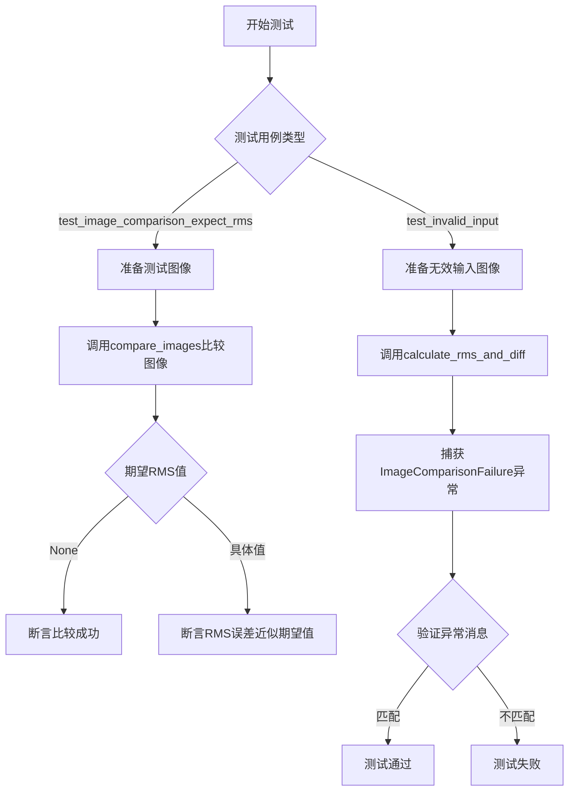
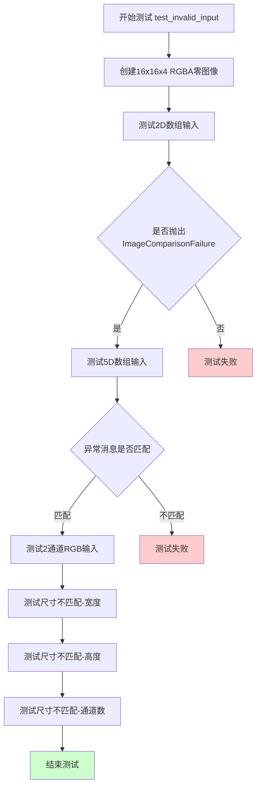

# `matplotlib\lib\matplotlib\tests\test_compare_images.py` 详细设计文档

该文件包含matplotlib图像比较算法的测试用例，验证compare_images函数和calculate_rms_and_diff函数在各种场景下的正确性，包括正常比较、像素偏移、图像置乱和无效输入处理。

## 整体流程



## 类结构

```
该文件为测试模块，无类定义
```

## 全局变量及字段


    

## 全局函数及方法


### `test_image_comparison_expect_rms`

该函数是一个图像比较测试函数，用于比较两个图像文件并验证它们之间的RMS（均方根）误差是否符合预期值。它通过matplotlib的`compare_images`函数进行图像对比，并根据传入的期望RMS值（`expect_rms`）判断测试是否通过。

参数：

- `im1`：`str`，基准图像文件名，相对于baseline_dir目录
- `im2`：`str`，待比较图像文件名，相对于baseline_dir目录
- `tol`：`int`，传递给`compare_images`的容差值
- `expect_rms`：`float`或`None`，期望的RMS值。如果为None，测试将在比较成功时通过；如果为具体数值，则验证返回的RMS误差是否近似等于该值
- `tmp_path`：`py.path.local`，pytest的临时目录fixture，提供测试专用的临时工作目录
- `monkeypatch`：`pytest.MonkeyPatch`，pytest的monkeypatch fixture，用于动态修改环境

返回值：`None`，测试函数无返回值，通过assert语句进行断言验证

#### 流程图

```mermaid
flowchart TD
    A[开始测试] --> B[使用monkeypatch.chdir切换到tmp_path]
    B --> C[获取baseline_dir和result_dir路径]
    C --> D[复制im2图像到result_dir/result_im2]
    D --> E[调用compare_images比较基准图像和结果图像]
    E --> F{expect_rms是否为None?}
    F -->|是| G[断言results必须为None]
    F -->|否| H[断言results不为None]
    H --> I[断言results['rms']约等于expect_rms]
    G --> J[测试通过]
    I --> J
    J --> K[结束测试]
```

#### 带注释源码

```python
@pytest.mark.parametrize(
    'im1, im2, tol, expect_rms',
    [
        # 基准图像与轻微修改的图像比较
        # 在正常容差下应相等，RMS值很小
        ('basn3p02.png', 'basn3p02-minorchange.png', 10, None),
        # 无容差时，期望特定RMS值
        ('basn3p02.png', 'basn3p02-minorchange.png', 0, 6.50646),
        # 与X轴平移1像素的图像比较
        ('basn3p02.png', 'basn3p02-1px-offset.png', 0, 90.15611),
        # 与一半像素X轴平移1像素的图像比较
        ('basn3p02.png', 'basn3p02-half-1px-offset.png', 0, 63.75),
        # 与完全打乱的图像比较，RMS值很大
        # 图像中每个像素的每个颜色分量被随机放置到图像其他位置
        # 但包含完全相同数量的R、G、B颜色值
        ('basn3p02.png', 'basn3p02-scrambled.png', 0, 172.63582),
        # 与稍亮的图像比较（颜色值刚好大1）
        # 在正常容差下应相等，RMS恰好为1
        ('all127.png', 'all128.png', 0, 1),
        # 反向比较
        ('all128.png', 'all127.png', 0, 1),
    ])
def test_image_comparison_expect_rms(im1, im2, tol, expect_rms, tmp_path,
                                     monkeypatch):
    """
    Compare two images, expecting a particular RMS error.

    im1 and im2 are filenames relative to the baseline_dir directory.

    tol is the tolerance to pass to compare_images.

    expect_rms is the expected RMS value, or None. If None, the test will
    succeed if compare_images succeeds. Otherwise, the test will succeed if
    compare_images fails and returns an RMS error almost equal to this value.
    """
    # 使用monkeypatch将工作目录切换到测试专用的临时目录
    monkeypatch.chdir(tmp_path)
    # 获取基准目录和结果目录的路径
    baseline_dir, result_dir = map(Path, _image_directories(lambda: "dummy"))
    # 将"测试"图像复制到result_dir，使compare_images将差异写入result_dir
    # 而非源树目录
    result_im2 = result_dir / im1
    shutil.copyfile(baseline_dir / im2, result_im2)
    # 调用compare_images进行图像比较
    # 返回值为None表示图像在容差范围内相等
    # 返回值包含rms等差异信息表示图像不相等
    results = compare_images(
        baseline_dir / im1, result_im2, tol=tol, in_decorator=True)

    # 如果没有期望的RMS值，则比较应成功（返回None）
    if expect_rms is None:
        assert results is None
    else:
        # 期望比较失败并返回特定的RMS值
        assert results is not None
        # 验证RMS值在1e-4的绝对误差范围内匹配期望值
        assert results['rms'] == approx(expect_rms, abs=1e-4)
```


### `test_invalid_input`

该测试函数用于验证图像比较模块（`_image.calculate_rms_and_diff`）在接收无效输入时能否正确抛出 `ImageComparisonFailure` 异常，涵盖维度错误、通道数错误和尺寸不匹配等场景。

参数： 无

返回值：`None`，该函数为测试函数，通过 `pytest.raises` 断言异常抛出，无显式返回值

#### 流程图



#### 带注释源码

```python
def test_invalid_input():
    """
    测试图像比较函数对无效输入的错误处理能力。
    
    该测试验证 _image.calculate_rms_and_diff 在接收到
    维度错误、通道数错误或尺寸不匹配的图像时能正确抛出异常。
    """
    # 创建一个16x16像素、4通道(RGBA)的零值图像
    # dtype=np.uint8 确保图像数据为无符号8位整数
    img = np.zeros((16, 16, 4), dtype=np.uint8)

    # 测试用例1: 输入为2维数组而非3维
    # 期望抛出异常，提示"must be 3-dimensional, but is 2-dimensional"
    # img[:, :, 0] 将4通道图像切片为单通道(2维)
    with pytest.raises(ImageComparisonFailure,
                       match='must be 3-dimensional, but is 2-dimensional'):
        _image.calculate_rms_and_diff(img[:, :, 0], img)

    # 测试用例2: 输入为5维数组而非3维
    # 期望抛出异常，提示"must be 3-dimensional, but is 5-dimensional"
    # 使用 np.newaxis 增加维度到5维
    with pytest.raises(ImageComparisonFailure,
                       match='must be 3-dimensional, but is 5-dimensional'):
        _image.calculate_rms_and_diff(img, img[:, :, :, np.newaxis, np.newaxis])

    # 测试用例3: 输入通道数为2(RG)而非3(RGB)或4(RGBA)
    # 期望抛出异常，提示"must be RGB or RGBA but has depth 2"
    with pytest.raises(ImageComparisonFailure,
                       match='must be RGB or RGBA but has depth 2'):
        _image.calculate_rms_and_diff(img[:, :, :2], img)

    # 测试用例4: 图像宽度不匹配
    # 期望尺寸(16, 16, 4)，实际尺寸(8, 16, 4)
    with pytest.raises(ImageComparisonFailure,
                       match=r'expected size: \(16, 16, 4\) actual size \(8, 16, 4\)'):
        _image.calculate_rms_and_diff(img, img[:8, :, :])

    # 测试用例5: 图像高度不匹配
    # 期望尺寸(16, 16, 4)，实际尺寸(16, 6, 4)
    with pytest.raises(ImageComparisonFailure,
                       match=r'expected size: \(16, 16, 4\) actual size \(16, 6, 4\)'):
        _image.calculate_rms_and_diff(img, img[:, :6, :])

    # 测试用例6: 图像通道数不匹配
    # 期望尺寸(16, 16, 4)，实际尺寸(16, 16, 3)
    with pytest.raises(ImageComparisonFailure,
                       match=r'expected size: \(16, 16, 4\) actual size \(16, 16, 3\)'):
        _image.calculate_rms_and_diff(img, img[:, :, :3])
```

---

### 补充信息

#### 关键组件

| 组件名称 | 描述 |
|---------|------|
| `_image.calculate_rms_and_diff` | Matplotlib底层图像比较函数，负责计算两张图像的RMS误差并生成差异图像 |
| `ImageComparisonFailure` | 图像比较失败时抛出的异常类型 |
| `np.zeros((16, 16, 4), dtype=np.uint8)` | 创建测试用的RGBA图像数据 |

#### 技术债务与优化空间

1. **测试覆盖范围**: 可增加对负数维度、超大尺寸图像、数据类型不匹配（如float32 vs uint8）等边界情况的测试
2. **硬编码值**: 图像尺寸(16,16,4)可考虑参数化，提高测试复用性
3. **错误消息匹配**: 使用正则表达式匹配，可考虑提取为常量避免字符串硬编码

#### 设计目标与约束

- **目标**: 验证图像比较模块对无效输入的健壮性，确保用户得到明确的错误提示
- **约束**: 测试仅验证异常抛出，不验证正常功能路径

## 关键组件


### 图像比较算法测试框架

使用pytest参数化测试比较两张图像的RMS误差，验证不同场景下的图像相似度计算逻辑，包括微小差异、像素偏移、部分偏移、图像置乱和亮度变化等情况。

### RMS误差计算与差异生成

调用matplotlib._image模块的calculate_rms_and_diff函数计算两张图像的均方根误差，并生成差异图像，用于自动化图形测试中的视觉回归验证。

### 无效输入验证与异常处理

测试图像维度必须是3维（RGB或RGBA），深度必须为3或4，以及图像尺寸必须完全匹配，否则抛出ImageComparisonFailure异常，确保图像比较函数的健壮性。

### 测试数据参数化

通过pytest.mark.parametrize定义多组测试用例，包括基准图像、比较图像、容差值和预期RMS值，覆盖相等、微小差异、1像素偏移、半像素偏移、置乱和1亮度单位差异等场景。

### 临时目录与文件操作

使用monkeypatch.chdir和tmp_path隔离测试环境，将测试图像复制到临时目录执行比较，避免污染源代码树。


## 问题及建议


### 已知问题

-   **魔法数字和硬编码值**：精度比较使用硬编码的 `abs=1e-4`，RMS期望值直接写在测试数据中，缺乏配置化管理
-   **测试数据文件依赖**：测试依赖特定图像文件存在于 `baseline_dir`，未验证测试数据是否存在，若文件缺失会导致测试失败但信息不明确
-   **不完整的返回值验证**：在 `test_image_comparison_expect_rms` 中，仅验证 `results['rms']`，未检查返回字典中其他可能的字段（如 `'diff'`、`'equal_images'` 等）
-   **文件操作缺乏错误处理**：`shutil.copyfile` 和 `baseline_dir / im2` 等文件操作未捕获可能的 `FileNotFoundError` 或 `IOError`
-   **测试隔离性问题**：使用 `monkeypatch.chdir` 全局改变工作目录，在并行测试时可能产生副作用
-   **测试覆盖不全面**：`test_invalid_input` 仅测试了部分维度错误和尺寸错误场景，未覆盖空图像、极端尺寸、NaN/Inf值等边界情况
-   **内部API直接调用**：直接调用 `_image.calculate_rms_and_diff` 私有函数，暴露了实现细节，限制了后续重构灵活性

### 优化建议

-   将RMS精度阈值、测试图像路径等配置提取为模块级常量或配置文件
-   在测试开始前添加测试数据文件存在性检查，提供清晰的失败信息
-   扩展返回值验证逻辑，检查返回字典的完整结构和类型
-   为文件操作添加 try-except 包装，提供更有意义的错误信息
-   考虑使用 pytest 的 `tmp_path` fixture 而非全局修改工作目录
-   增加边界条件测试用例：空数组、单像素图像、极端尺寸图像、无效数值等
-   封装 `_image` 模块的调用，通过公共API间接测试，降低耦合度
-   为重复的 `pytest.raises` 调用考虑使用 pytest 装饰器或参数化减少代码冗余


## 其它


### 设计目标与约束

本代码的设计目标是验证matplotlib图像比较算法的正确性，确保在各种图像差异场景下（如微小变化、像素偏移、半数像素偏移、图像置乱、亮度变化等）能准确计算RMS误差。约束条件包括：测试图像必须为PNG格式且符合特定尺寸和通道要求（RGB或RGBA），RMS误差计算仅支持3维图像数据，测试必须在临时目录中运行以避免污染源代码树。

### 错误处理与异常设计

代码通过pytest框架进行异常验证，主要捕获ImageComparisonFailure异常。测试验证了以下异常场景：维度错误（图像必须是3维，否则抛出"must be 3-dimensional"异常）、深度错误（必须是RGB或RGBA，深度为2时抛出"must be RGB or RGBA but has depth 2"异常）、尺寸错误（期望尺寸与实际尺寸不匹配时抛出"expected size"相关异常）。所有异常都携带详细的错误消息，便于快速定位问题。

### 数据流与状态机

测试数据流为：准备测试图像（从baseline_dir复制到result_dir）→ 调用compare_images函数进行图像比较 → 根据expect_rms值验证结果。状态机转换：无RMS期望值时（expect_rms=None），compare_images成功返回None则测试通过；有RMS期望值时，compare_images返回包含'rms'键的字典，且rms值在允许误差范围内则测试通过。

### 外部依赖与接口契约

本模块依赖以下外部组件：matplotlib._image模块（提供calculate_rms_and_diff函数进行底层RMS计算）、matplotlib.testing.compare模块（提供compare_images函数进行完整图像比较流程）、matplotlib.testing.decorators模块（提供_image_directories获取测试图像目录）、pytest框架（提供测试参数化和断言功能）、numpy库（提供数组操作）、shutil和pathlib模块（提供文件操作）。接口契约规定compare_images接受baseline_path、result_path和tol参数，返回None（图像相似）或包含'rms'键的字典（图像不相似）；calculate_rms_and_diff接受两个图像数组参数，返回RMS值和差异图像。

### 测试覆盖范围与边界条件

测试覆盖了多种图像差异场景：相同图像微小差异（10像素容差）、无容差微小差异（精确RMS 6.50646）、1像素X轴偏移（精确RMS 90.15611）、半数像素1px偏移（精确RMS 63.75）、完全置乱图像（精确RMS 172.63582）、亮度增加1（精确RMS 1）、亮度降低1（双向验证）。边界条件测试包括2维图像、5维图像、深度为2的图像、尺寸不匹配的图像等无效输入场景。

### 性能考虑与基准

代码本身为测试代码，不涉及运行时性能优化。测试中使用的小尺寸图像（16x16、PNG格式）确保测试执行速度。RMS计算采用均方根算法，数值精度要求为绝对误差1e-4（通过approx(expect_rms, abs=1e-4)实现），确保浮点数比较的准确性。

### 可维护性与扩展性

代码采用参数化测试设计（@pytest.mark.parametrize），便于添加新的测试场景。图像文件命名规范（basn3p02-*、all12*）清晰标识测试类型。临时目录使用（tmp_path和monkeypatch.chdir）确保测试隔离性。扩展方向可包括：添加更多图像格式支持、增加视频帧比较、添加性能基准测试等。

    