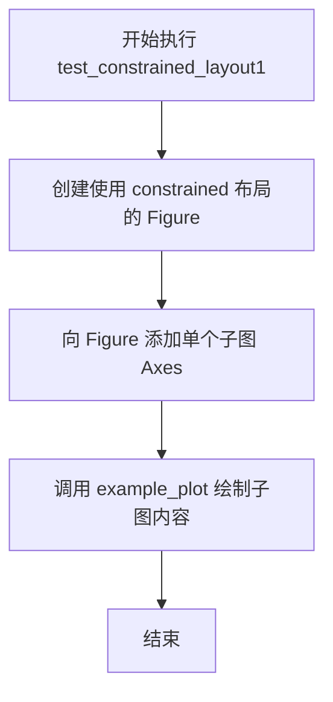
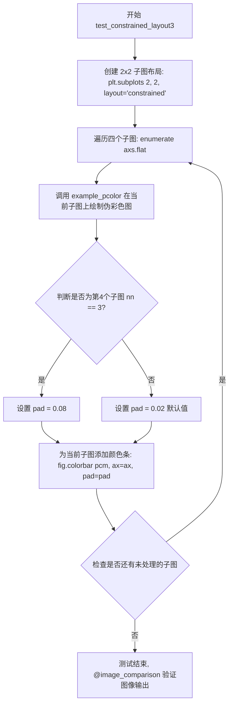
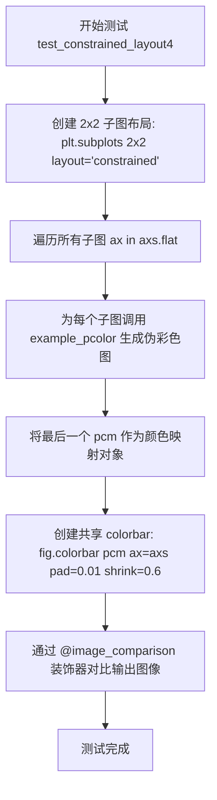
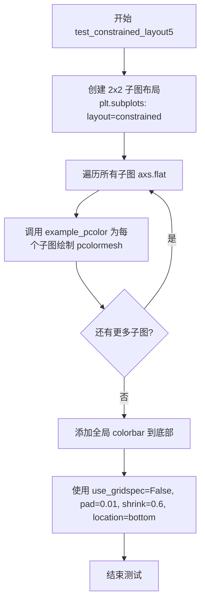
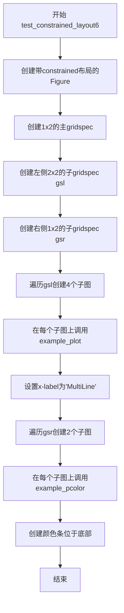
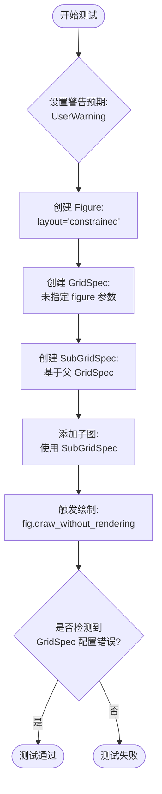
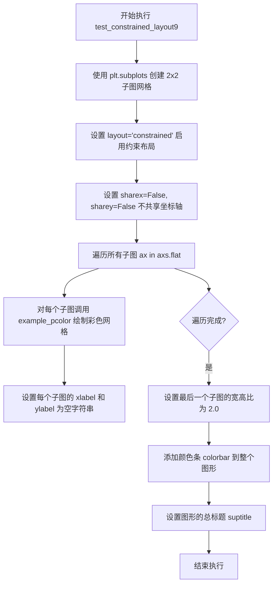
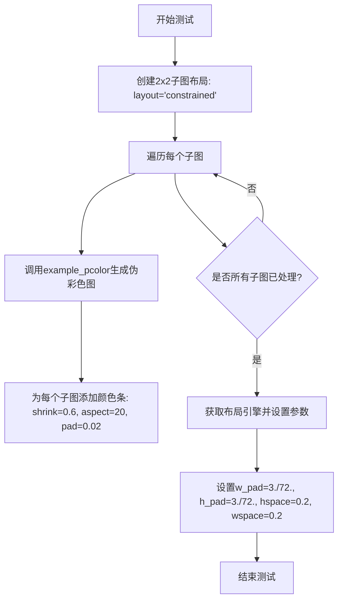

# `matplotlib\lib\matplotlib\tests\test_constrainedlayout.py` 详细设计文档

这是一个pytest测试文件，用于测试Matplotlib的constrained_layout布局引擎的各种功能，包括子图布局、颜色条处理、嵌套gridspec、图例、超标题、双轴等场景下的布局计算和渲染正确性。

## 整体流程

```mermaid
graph TD
    A[开始] --> B[导入依赖模块]
    B --> C[定义辅助函数]
    C --> D{执行测试用例}
    D --> E[test_constrained_layout1: 单子图布局]
    D --> F[test_constrained_layout2: 2x2子图布局]
    D --> G[test_constrained_layout3: 带颜色条的子图]
    D --> H[test_constrained_layout4-6: 颜色条位置变化]
    D --> I[test_constrained_layout6: 嵌套gridspec]
    D --> J[test_identical_subgridspec: 子gridspec验证]
    D --> K[test_constrained_layout7: GridSpec警告测试]
    D --> L[test_constrained_layout8-9: 不完全填充gridspec和suptitle]
    D --> M[test_constrained_layout10: 图例外置]
    D --> N[test_constrained_layout11-12: 多重嵌套gridspec]
    D --> O[test_constrained_layout13-14: padding设置]
    D --> P[test_constrained_layout15: rcParams配置]
    D --> Q[test_constrained_layout16: set_position测试]
    D --> R[test_constrained_layout17-19: 不规则布局和双轴]
    D --> S[test_constrained_layout20-23: 特殊场景测试]
    D --> T[test_colorbar_location: 颜色条位置]
    D --> U[test_hidden_axes: 隐藏轴布局]
    D --> V[test_colorbar_align: 颜色条对齐]
    D --> W[test_compressed*: 压缩布局测试]
    D --> X[test_align_labels: 标签对齐]
    D --> Y[test_suplabels: 超标签测试]
    D --> Z[其他边界测试]
    Z --> AA[结束]
    E -.-> AA
    F -.-> AA
    G -.-> AA
    H -.-> AA
    I -.-> AA
    J -.-> AA
    K -.-> AA
    L -.-> AA
    M -.-> AA
    N -.-> AA
    O -.-> AA
    P -.-> AA
    Q -.-> AA
    R -.-> AA
    S -.-> AA
    T -.-> AA
    U -.-> AA
    V -.-> AA
    W -.-> AA
    X -.-> AA
    Y -.-> AA
```



## 类结构

```
模块: test_constrainedlayout (测试模块)
├── 辅助函数
│   ├── example_plot (创建示例折线图)
│   └── example_pcolor (创建示例pcolormesh图)
├── 测试函数集 (共约40+个测试函数)
│   ├── test_constrained_layout1-23
│   ├── test_identical_subgridspec
│   ├── test_colorbar_location
│   ├── test_hidden_axes
│   ├── test_colorbar_align
│   ├── test_colorbars_no_overlapV/H
│   ├── test_manually_set_position
│   ├── test_bboxtight
│   ├── test_bbox
│   ├── test_align_labels
│   ├── test_suplabels
│   ├── test_gridspec_addressing
│   ├── test_discouraged_api
│   ├── test_kwargs
│   ├── test_rect
│   ├── test_compressed1
│   ├── test_compressed_suptitle
│   ├── test_compressed_suptitle_colorbar
│   ├── test_compressed_supylabel_colorbar
│   ├── test_set_constrained_layout
│   ├── test_constrained_toggle
│   ├── test_layout_leak
│   └── test_submerged_subfig
```

## 全局变量及字段


### `pytestmark`
    
全局pytest标记列表，使用text_placeholders fixture

类型：`list`
    


### `mpl`
    
matplotlib主模块别名，提供matplotlib库的核心功能

类型：`module`
    


### `plt`
    
matplotlib.pyplot模块别名，提供MATLAB风格的绘图接口

类型：`module`
    


### `np`
    
numpy模块别名，提供高性能数值计算功能

类型：`module`
    


### `mtransforms`
    
matplotlib.transforms模块别名，提供坐标变换功能

类型：`module`
    


### `gridspec`
    
matplotlib.gridspec模块别名，提供网格规范布局功能

类型：`module`
    


### `ticker`
    
matplotlib.ticker模块别名，提供刻度格式化功能

类型：`module`
    


    

## 全局函数及方法


### `example_plot`

该函数用于在给定的 matplotlib Axes 对象上绘制一个简单的示例折线图，并可选地设置坐标轴标签、标题和刻度标签。

参数：

- `ax`：`matplotlib.axes.Axes`，要绑定的 Axes 实例，函数将在此 Axes 上绘制图形
- `fontsize`：`int`，默认值为 `12`，标签和标题的字体大小
- `nodec`：`bool`，默认值为 `False`，若为 `True` 则不绘制坐标轴标签和标题，仅显示空刻度

返回值：`None`，该函数无返回值

#### 流程图

```mermaid
flowchart TD
    A[开始 example_plot] --> B[在ax上绘制折线图 plot[1, 2]]
    --> C[设置ax的locator参数 nbins=3]
    --> D{判断 nodec 是否为 True?}
    -->|是| E[清空x轴刻度标签 set_xticklabels[]]
    --> E1[清空y轴刻度标签 set_yticklabels[]]
    --> F[结束]
    -->|否| G[设置x轴标签 'x-label']
    --> H[设置y轴标签 'y-label']
    --> I[设置标题 'Title']
    --> F
```

#### 带注释源码

```python
def example_plot(ax, fontsize=12, nodec=False):
    """
    在给定的 Axes 上绘制示例图
    
    参数:
        ax: matplotlib.axes.Axes 对象
        fontsize: 标签和标题的字体大小
        nodec: 是否省略坐标轴标签和标题
    """
    # 在 Axes 上绘制简单的折线图 [1, 2]
    ax.plot([1, 2])
    
    # 设置坐标轴刻度数量为 3
    ax.locator_params(nbins=3)
    
    # 根据 nodec 参数决定是否设置标签和标题
    if not nodec:
        # 设置 x 轴标签
        ax.set_xlabel('x-label', fontsize=fontsize)
        # 设置 y 轴标签
        ax.set_ylabel('y-label', fontsize=fontsize)
        # 设置图表标题
        ax.set_title('Title', fontsize=fontsize)
    else:
        # 清空 x 轴刻度标签
        ax.set_xticklabels([])
        # 清空 y 轴刻度标签
        ax.set_yticklabels([])
```


### `example_pcolor`

该函数用于在给定的matplotlib Axes对象上创建一个基于数学表达式计算结果的伪彩色网格图（pcolormesh），并设置坐标轴标签和标题。

参数：

- `ax`：`matplotlib.axes.Axes`，要进行绘图的坐标轴对象
- `fontsize`：`int`，默认为12，坐标轴标签和标题的字体大小

返回值：`matplotlib.collections.QuadMesh`，返回创建的pcolormesh对象，可用于添加颜色条

#### 流程图

```mermaid
flowchart TD
    A[开始] --> B[设置网格间距 dx=0.6, dy=0.6]
    B --> C[使用 np.mgrid 创建网格坐标 x 和 y]
    C --> D[使用数学公式计算 z 值: z = (1 - x/2 + x^5 + y^3) * exp(-x^2 - y^2)]
    D --> E[调用 ax.pcolormesh 创建伪彩色图]
    E --> F[设置 x 轴标签: 'x-label']
    F --> G[设置 y 轴标签: 'y-label']
    G --> H[设置标题: 'Title']
    H --> I[返回 pcolormesh 对象]
```

#### 带注释源码

```python
def example_pcolor(ax, fontsize=12):
    """
    在指定坐标轴上创建伪彩色网格图示例
    
    参数:
        ax: matplotlib.axes.Axes, 要绑定的坐标轴对象
        fontsize: int, 标签和标题的字体大小
    
    返回:
        matplotlib.collections.QuadMesh: 创建的pcolormesh对象
    """
    # 定义网格间距（水平和垂直方向）
    dx, dy = 0.6, 0.6
    
    # 使用numpy.mgrid创建网格坐标
    # 生成从-3到3+dx/dy的网格，步长为dx/dy
    y, x = np.mgrid[slice(-3, 3 + dy, dy),
                    slice(-3, 3 + dx, dx)]
    
    # 计算z值：使用一个数学函数生成测试数据
    # 该函数产生一个具有峰谷特征的二维函数
    z = (1 - x / 2. + x ** 5 + y ** 3) * np.exp(-x ** 2 - y ** 2)
    
    # 创建pcolormesh图
    # 使用红蓝色调(RdBu_r)，限制值范围在-1到1之间
    # rasterized=True将矢量图转换为栅格以减小文件体积
    pcm = ax.pcolormesh(x, y, z[:-1, :-1], cmap='RdBu_r', vmin=-1., vmax=1.,
                        rasterized=True)
    
    # 设置坐标轴标签和标题的字体大小
    ax.set_xlabel('x-label', fontsize=fontsize)
    ax.set_ylabel('y-label', fontsize=fontsize)
    ax.set_title('Title', fontsize=fontsize)
    
    # 返回pcolormesh对象，可用于后续添加颜色条
    return pcm
```


### `test_constrained_layout1`

测试函数，用于验证 constrained_layout 在单个子图场景下的布局效果。

参数： 无

返回值： `None`，该函数为测试函数，不返回任何值

#### 流程图



#### 带注释源码

```python
@image_comparison(['constrained_layout1.png'], style='mpl20')
def test_constrained_layout1():
    """
    Test constrained_layout for a single subplot
    
    该测试函数验证 matplotlib 的 constrained_layout 管理器
    在仅包含单个子图时的正确工作原理
    """
    # 创建一个启用 constrained 布局的 Figure 对象
    # layout="constrained" 启用约束布局引擎,自动调整子图间距
    fig = plt.figure(layout="constrained")
    
    # 向 Figure 添加一个子图,返回 Axes 对象
    # add_subplot() 不传参数默认为 111,即占据整个 figure 的单个子图
    ax = fig.add_subplot()
    
    # 调用 example_plot 辅助函数绘制测试图表
    # 使用较大的字体 size=24 以便验证布局边界处理
    example_plot(ax, fontsize=24)
    
    # 隐式返回 None,@image_comparison 装饰器会自动捕获渲染结果进行图像比对
```


### `test_constrained_layout2`

该函数是一个图像对比测试函数，用于测试 Matplotlib 的 constrained_layout 在 2x2 子图布局下的渲染效果。函数创建一个采用 constrained 布局的 2x2 子图网格，然后对每个子图应用统一的绘图配置。

参数：无

返回值：`None`，无返回值（测试函数）

#### 流程图

```mermaid
flowchart TD
    A[开始] --> B[创建2x2子图网格<br/>fig, axs = plt.subplots(2, 2, layout='constrained')]
    B --> C{遍历子图}
    C -->|遍历axs.flat| D[调用example_plot<br/>example_plot(ax, fontsize=24)]
    D --> C
    C -->|遍历完成| E[结束]
    
    style A fill:#f9f,color:#000
    style E fill:#9f9,color:#000
```

#### 带注释源码

```python
@image_comparison(['constrained_layout2.png'], style='mpl20')
def test_constrained_layout2():
    """
    测试 constrained_layout 在 2x2 子图布局下的渲染效果
    
    该测试函数验证 Matplotlib 的 constrained_layout 管理器能否正确处理
    2x2 的子图网格布局，确保各子图之间的间距、标签等元素能够合理安排，
    不会发生重叠。测试通过与预生成的参考图像进行对比来验证渲染正确性。
    """
    # 创建一个使用 constrained 布局的 2x2 子图网格
    # layout="constrained" 参数启用 ConstrainedLayout 引擎
    # 返回值 fig 为 Figure 对象，axs 为 2x2 的 Axes 数组
    fig, axs = plt.subplots(2, 2, layout="constrained")
    
    # 遍历所有子图（flat 将二维数组展平为一维，方便迭代）
    for ax in axs.flat:
        # 对每个子图调用 example_plot 函数进行绘图
        # fontsize=24 设置较大的字体以便验证布局间距是否充足
        example_plot(ax, fontsize=24)
```


### `test_constrained_layout3`

测试 constrained_layout 在包含颜色条的子图布局中的功能，验证四个子图网格中每个子图的颜色条布局是否正确，特别是最后一个子图使用较大的填充值。

参数： 无

返回值： `None`，无返回值（测试函数）

#### 流程图



#### 带注释源码

```python
@image_comparison(['constrained_layout3.png'], style='mpl20')
def test_constrained_layout3():
    """
    测试 constrained_layout 用于颜色条与子图组合的场景
    
    该测试函数验证:
    1. 在 2x2 子图网格中正确应用 constrained layout
    2. 每个子图上颜色条的布局管理
    3. 不同填充值(pad)对颜色条位置的影响
    """
    
    # 创建一个 2x2 的子图布局，使用 constrained 布局引擎
    # layout="constrained" 启用约束布局以优化子图和颜色条的空间分配
    fig, axs = plt.subplots(2, 2, layout="constrained")
    
    # 遍历所有子图（按行优先顺序: [0,0], [0,1], [1,0], [1,1]）
    for nn, ax in enumerate(axs.flat):
        # 调用辅助函数在当前子图上创建伪彩色图(pcolormesh)
        # 返回的 pcm (PseudoColorMesh) 对象将用于创建颜色条
        pcm = example_pcolor(ax, fontsize=24)
        
        # 判断当前子图的索引，决定颜色条的填充值
        # 索引 3 (即右下角子图) 使用较大的填充值 0.08
        # 其他子图使用默认填充值 0.02
        if nn == 3:
            pad = 0.08
        else:
            pad = 0.02  # default
        
        # 为当前子图添加颜色条
        # 参数说明:
        #   pcm: 伪彩色图对象，提供颜色映射数据
        #   ax=ax: 将颜色条关联到当前子图
        #   pad=pad: 颜色条与子图边缘之间的填充距离（英寸）
        fig.colorbar(pcm, ax=ax, pad=pad)
    
    # 测试完成后，@image_comparison 装饰器会自动比较生成的图像
    # 与基准图像 'constrained_layout3.png' 是否匹配
```


### `test_constrained_layout4`

该函数用于测试 Matplotlib 的 constrained_layout 在包含单个 colorbar 且存在多个子图（2x2）的情况下的布局效果。

参数： 无（该测试函数不接受任何显式参数，但隐式依赖模块级 pytestmark 中定义的 `text_placeholders` fixture）

返回值：`None`，该函数为测试函数，不返回任何值，主要通过 `@image_comparison` 装饰器进行图像对比测试

#### 流程图



#### 带注释源码

```python
@image_comparison(['constrained_layout4.png'], style='mpl20')
def test_constrained_layout4():
    """Test constrained_layout for a single colorbar with subplots"""

    # 创建一个 2x2 的子图布局，使用 constrained_layout 约束布局引擎
    fig, axs = plt.subplots(2, 2, layout="constrained")
    
    # 遍历所有子图（flat 将 2x2 数组展平为 1D 迭代器）
    for ax in axs.flat:
        # 为每个子图生成伪彩色图（pcolormesh）并返回最后一个 pcm 对象
        # example_pcolor 函数内部设置_xlabel, _ylabel, _title
        pcm = example_pcolor(ax, fontsize=24)
    
    # 在整个图形上创建一个共享的 colorbar
    # ax=axs 将 colorbar 关联到所有子图
    # pad=0.01 设置 colorbar 与子图区域的间距
    # shrink=0.6 缩放 colorbar 为子图高度的 60%
    fig.colorbar(pcm, ax=axs, pad=0.01, shrink=0.6)
```


### `test_constrained_layout5`

测试 constrained_layout 功能，具体是测试带有子图的单个 colorbar（位于底部）的布局处理。

参数：

- 该函数无参数

返回值：`None`，该测试函数不返回任何值，仅执行测试逻辑

#### 流程图



#### 带注释源码

```
@image_comparison(['constrained_layout5.png'], style='mpl20')  # 图像对比装饰器，预期输出为 constrained_layout5.png
def test_constrained_layout5():
    """
    Test constrained_layout for a single colorbar with subplots,
    colorbar bottom
    """
    # 创建一个 2x2 的子图布局，使用 constrained 布局引擎
    fig, axs = plt.subplots(2, 2, layout="constrained")
    
    # 遍历所有子图（按行优先顺序）
    for ax in axs.flat:
        # 为每个子图创建 pcolormesh 图形并获取 pcm 对象
        # example_pcolor 函数返回 pcm 用于后续 colorbar 创建
        pcm = example_pcolor(ax, fontsize=24)
    
    # 在图形底部添加一个共享的 colorbar
    # 参数说明：
    #   ax=axs: 将 colorbar 关联到所有子图
    #   use_gridspec=False: 不使用 gridspec 方式进行布局
    #   pad=0.01: colorbar 与子图之间的间距
    #   shrink=0.6: colorbar 的缩放因子
    #   location='bottom': colorbar 放置在子图底部
    fig.colorbar(pcm, ax=axs,
                 use_gridspec=False, pad=0.01, shrink=0.6,
                 location='bottom')
```


### `test_constrained_layout6`

该函数用于测试 constrained_layout 在嵌套 gridspecs 场景下的布局效果，创建一个包含多层嵌套 gridspec 的图形，并验证颜色条与子图的正确对齐。

参数：无

返回值：`None`，该函数为测试函数，不返回任何值

#### 流程图



#### 带注释源码

```python
@image_comparison(['constrained_layout6.png'], style='mpl20')
def test_constrained_layout6():
    """Test constrained_layout for nested gridspecs"""
    # 创建一个使用 constrained 布局的图形
    fig = plt.figure(layout="constrained")
    
    # 创建主 gridspec：1行2列
    gs = fig.add_gridspec(1, 2, figure=fig)
    
    # 创建左侧嵌套 gridspec：2x2
    gsl = gs[0].subgridspec(2, 2)
    
    # 创建右侧嵌套 gridspec：1x2
    gsr = gs[1].subgridspec(1, 2)
    
    # 存储左侧子图的列表
    axsl = []
    
    # 遍历左侧 gridspec，创建子图并绑定示例数据
    for gs in gsl:
        ax = fig.add_subplot(gs)
        axsl += [ax]
        example_plot(ax, fontsize=12)
    
    # 设置最后一个子图的x标签为多行文本
    ax.set_xlabel('x-label\nMultiLine')
    
    # 存储右侧子图的列表
    axsr = []
    
    # 遍历右侧 gridspec，创建子图并绑定示例数据
    for gs in gsr:
        ax = fig.add_subplot(gs)
        axsr += [ax]
        pcm = example_pcolor(ax, fontsize=12)

    # 在底部添加颜色条，使用指定的刻度定位器
    fig.colorbar(pcm, ax=axsr,
                 pad=0.01, shrink=0.99, location='bottom',
                 ticks=ticker.MaxNLocator(nbins=5))
```


### `test_identical_subgridspec`

该测试函数用于验证 Matplotlib 的 constrained_layout 引擎能够正确处理具有相同结构的不同子 gridspec（子网格规格），特别检查上层子图的垂直位置是否位于下层子图之上，确保嵌套 gridspec 布局的正确性。

参数： 无

返回值：`None`，该函数为测试函数，通过 `assert` 语句进行断言验证，不返回具体值

#### 流程图

```mermaid
flowchart TD
    A[开始] --> B[创建支持constrained_layout的Figure]
    B --> C[创建主GridSpec: 2行1列]
    C --> D[创建上层子GridSpec: 1行3列]
    D --> E[创建下层子GridSpec: 1行3列]
    E --> F[循环创建6个子图]
    F --> G[调用fig.draw_without_rendering执行布局计算]
    G --> H{断言验证}
    H --> I[检查axa[0]的y0坐标是否大于axb[0]的y1坐标]
    I --> J{断言结果}
    J -->|True| K[测试通过]
    J -->|False| L[测试失败]
```

#### 带注释源码

```python
def test_identical_subgridspec():
    """
    测试具有相同结构的子gridspec布局是否正确。
    验证上层子图的y0坐标大于下层子图的y1坐标。
    """
    
    # 创建一个启用constrained_layout的Figure对象
    fig = plt.figure(constrained_layout=True)

    # 创建主GridSpec：2行1列
    # GS[0] 用于上层区域，GS[1] 用于下层区域
    GS = fig.add_gridspec(2, 1)

    # 为上层区域创建子GridSpec：1行3列
    # 这将创建3个等宽的子区域
    GSA = GS[0].subgridspec(1, 3)
    
    # 为下层区域创建子GridSpec：1行3列
    # 结构与GSA相同
    GSB = GS[1].subgridspec(1, 3)

    # 初始化子图列表
    axa = []  # 上层子图列表
    axb = []  # 下层子图列表
    
    # 循环创建6个子图（上层3个，下层3个）
    for i in range(3):
        # 在上层GridSpec的第i个位置添加子图
        axa += [fig.add_subplot(GSA[i])]
        # 在下层GridSpec的第i个位置添加子图
        axb += [fig.add_subplot(GSB[i])]

    # 执行布局计算而不进行实际渲染
    # 这会触发constrained_layout算法计算所有子图的位置
    fig.draw_without_rendering()
    
    # 验证断言：检查第一行子图是否在第二行子图之上
    # axa[0].get_position().y0 表示上层子图左下角的y坐标
    # axb[0].get_position().y1 表示下层子图右上角的y坐标
    # 如果布局正确，上层子图的底部应该在下层子图的顶部之上
    assert axa[0].get_position().y0 > axb[0].get_position().y1
```


### `test_constrained_layout7`

该函数是一个单元测试，用于验证 Matplotlib 的约束布局（Constrained Layout）引擎在检测到用户未将 GridSpec（网格规范）与 Figure（图形）关联时的错误处理能力。具体来说，它创建了一个未绑定 Figure 的 GridSpec，尝试将其用于子图生成，并断言系统会抛出特定的 UserWarning。

#### 参数

无参数。

#### 返回值

无返回值（`None`）。该测试通过 `pytest` 的 `warns` 上下文管理器来验证副作用（警告的产生）。

#### 流程图



#### 带注释源码

```python
def test_constrained_layout7():
    """Test for proper warning if fig not set in GridSpec"""
    # 使用 pytest.warns 上下文管理器来捕获并验证 UserWarning
    with pytest.warns(
        UserWarning, match=('There are no gridspecs with layoutgrids. '
                            'Possibly did not call parent GridSpec with '
                            'the "figure" keyword')):
        # 1. 创建一个启用了约束布局的 Figure
        fig = plt.figure(layout="constrained")
        
        # 2. 创建一个 GridSpec，但故意不传入 figure 参数
        # 这是错误配置的根源：GridSpec 不知道它属于哪个 Figure
        gs = gridspec.GridSpec(1, 2)
        
        # 3. 基于父 GridSpec 创建子 GridSpec
        gsl = gridspec.GridSpecFromSubplotSpec(2, 2, gs[0])
        gsr = gridspec.GridSpecFromSubplotSpec(1, 2, gs[1])
        
        # 4. 遍历子 GridSpec 并将子图添加到 Figure 中
        for gs in gsl:
            fig.add_subplot(gs)
            
        # 5. 触发绘制操作。
        # 约束布局引擎在计算布局时会检查 GridSpec 的完整性，
        # 此时会发现 GridSpec 缺少 figure 引用，从而触发警告。
        fig.draw_without_rendering()
```

---

### 全局上下文信息

虽然 `test_constrained_layout7` 本身是一个独立函数，但它位于一个大型测试文件中。以下是该文件与本测试相关的全局信息：

#### 全局函数与依赖

*   **导入的库**:
    *   `pytest`: 用于测试断言和警告捕获。
    *   `matplotlib.pyplot` (`plt`): 用于创建 Figure 和 Axes。
    *   `matplotlib.gridspec` (`gridspec`): 用于创建和管理网格布局。
*   **文件内的辅助函数** (该测试未直接使用，但存在于文件中):
    *   `example_plot(ax, fontsize, nodec)`: 用于生成标准测试图表的辅助函数。
    *   `example_pcolor(ax, fontsize)`: 用于生成 pcolormesh 测试数据的辅助函数。

#### 关键组件信息

*   **`gridspec.GridSpec`**: 核心测试对象。此处测试了它的“弱引用”特性，即如果不显式绑定 Figure，约束布局算法将无法构建完整的布局网格（LayoutGrid），从而触发警告。
*   **`fig.draw_without_rendering()`**: 触发布局引擎计算的关键方法。只有在调用绘图（或渲染）时，约束布局算法才会尝试求解子图位置，此时才会检测到配置错误。

#### 潜在的技术债务或优化空间

*   **测试覆盖**: 当前测试仅覆盖了“未绑定 Figure”这一种错误场景。GridSpec 在约束布局中还有其他可能的误用场景（如嵌套层级过深但未正确传递 figure），可以考虑增加类似的边界测试。
*   **错误提示**: 警告信息虽然指出了问题，但如果能直接指出是哪一个 GridSpec 实例（通过 ID 或索引）会更好，不过这属于 Matplotlib 核心库的实现细节，而非测试代码的问题。

#### 其它项目

*   **设计目标**: 确保约束布局的容错性。当用户配置 GridSpec 时，如果不遵循 `figure=fig` 的约定，系统应提供清晰的警告，而不是默默产生错误的布局（如重叠）。
*   **错误处理**: 该测试本质上是对错误处理（Warning机制）的回归测试。它确保了未来修改 GridSpec 或布局算法时，不会意外丢失这一重要的用户提示。


### `test_constrained_layout8`

测试GridSpec不完全填充的情况。

参数：
- 无

返回值：
- 无

#### 流程图

```mermaid
graph TD
A[开始] --> B[创建图形fig]
B --> C[创建GridSpec gs]
C --> D[初始化axs]
D --> E[外层循环j=0,1]
E --> F{判断j}
F -->|j=0| G[ilist=[1]]
F -->|j=1| G2[ilist=[0,4]]
G --> H[内层循环i in ilist]
G2 --> H
H --> I[添加子图ax]
I --> J[axs追加ax]
J --> K[调用example_pcolor]
K --> L{判断i>0}
L -->|是| M[set_ylabel空]
L -->|否| N[继续]
M --> O{判断j<1}
N --> O
O -->|是| P[set_xlabel空]
O -->|否| Q[继续]
P --> Q
Q --> R[set_title空]
R --> S[内层循环结束]
H --> S
E --> T[添加子图ax = fig.add_subplot(gs[2,:])]
S --> T
T --> U[axs追加ax]
U --> V[调用example_pcolor获取pcm]
V --> W[添加颜色条]
W --> X[结束]
```

#### 带注释源码

```
@image_comparison(['constrained_layout8.png'], style='mpl20')
def test_constrained_layout8():
    """Test for gridspecs that are not completely full"""

    # 创建一个图形，设置布局为constrained，大小为10x5
    fig = plt.figure(figsize=(10, 5), layout="constrained")
    
    # 创建一个3行5列的GridSpec，关联到fig
    gs = gridspec.GridSpec(3, 5, figure=fig)
    
    # 初始化一个空列表用于存储axes
    axs = []
    
    # 外层循环遍历j=0和1
    for j in [0, 1]:
        # 根据j的值选择ilist：j=0时为[1]，j=1时为[0,4]
        if j == 0:
            ilist = [1]
        else:
            ilist = [0, 4]
        
        # 内层循环遍历ilist中的每个i
        for i in ilist:
            # 在gs[j, i]位置添加子图
            ax = fig.add_subplot(gs[j, i])
            
            # 将ax添加到axs列表
            axs += [ax]
            
            # 调用example_pcolor绘制pcolormesh
            example_pcolor(ax, fontsize=9)
            
            # 如果i>0，设置ylabel为空
            if i > 0:
                ax.set_ylabel('')
            
            # 如果j<1，设置xlabel为空
            if j < 1:
                ax.set_xlabel('')
            
            # 设置标题为空
            ax.set_title('')
    
    # 在gs[2, :]位置添加子图（第三行，占所有列）
    ax = fig.add_subplot(gs[2, :])
    
    # 将ax添加到axs列表
    axs += [ax]
    
    # 调用example_pcolor获取pcm（pcolormesh对象）
    pcm = example_pcolor(ax, fontsize=9)
    
    # 添加颜色条，pad=0.01，shrink=0.6
    fig.colorbar(pcm, ax=axs, pad=0.01, shrink=0.6)
```


### `test_constrained_layout9`

测试函数，用于验证 constrained_layout 对 suptitle（总标题）以及 sharex 和 sharey（坐标轴共享）属性的处理是否正确。

参数：

- 该函数无显式参数

返回值：`None`，因为它是一个测试函数，不返回任何值

#### 流程图



#### 带注释源码

```python
@image_comparison(['constrained_layout9.png'], style='mpl20')
def test_constrained_layout9():
    """Test for handling suptitle and for sharex and sharey"""
    # 创建一个 2x2 的子图网格，使用 constrained 布局方式
    # sharex=False 和 sharey=False 表示不共享 x 轴和 y 轴
    fig, axs = plt.subplots(2, 2, layout="constrained",
                            sharex=False, sharey=False)
    
    # 遍历所有子图（flat 将二维数组展平为一维）
    for ax in axs.flat:
        # 调用 example_pcolor 函数为每个子图添加彩色网格数据
        # fontsize=24 设置较大的字体以便图像对比
        pcm = example_pcolor(ax, fontsize=24)
        
        # 清空每个子图的 x 轴和 y 轴标签
        ax.set_xlabel('')
        ax.set_ylabel('')
    
    # 获取最后一个子图（遍历顺序的最后一个）
    # 设置其宽高比为 2.0（宽度是高度的两倍）
    ax.set_aspect(2.)
    
    # 为图形添加颜色条
    # ax=axs 表示颜色条关联到所有子图
    # pad=0.01 设置颜色条与子图之间的间距
    # shrink=0.6 设置颜色条的收缩系数
    fig.colorbar(pcm, ax=axs, pad=0.01, shrink=0.6)
    
    # 为整个图形添加总标题（suptitle）
    # fontsize=28 设置较大的标题字体
    fig.suptitle('Test Suptitle', fontsize=28)
```


### `test_constrained_layout10`

该函数是一个图像比较测试函数，用于测试constrained_layout布局引擎处理图例放置在轴外部的场景。

参数： 无

返回值：`None`，该函数没有返回值

#### 流程图

```mermaid
flowchart TD
    A[开始] --> B[创建2x2子图布局: layout='constrained']
    B --> C[遍历axs.flat中的每个子图]
    C --> D[在子图上绘制线条: ax.plot]
    D --> E[为线条添加标签: label='This is a label']
    E --> F{遍历完成?}
    F -->|否| C
    F --> G[获取最后一个子图ax]
    G --> H[创建图例: loc='center left'<br/>bbox_to_anchor=(0.8, 0.5)]
    H --> I[结束: 等待图像比较验证]
```

#### 带注释源码

```python
@image_comparison(['constrained_layout10.png'], style='mpl20',
                  tol=0 if platform.machine() == 'x86_64' else 0.032)
def test_constrained_layout10():
    """Test for handling legend outside axis"""
    # 创建一个2x2的子图布局，使用constrained布局引擎
    fig, axs = plt.subplots(2, 2, layout="constrained")
    
    # 遍历所有子图（按行优先顺序）
    for ax in axs.flat:
        # 在每个子图上绘制一条线，数据为0到11的整数
        ax.plot(np.arange(12), label='This is a label')
    
    # 在最后一个子图上创建图例
    # loc='center left': 图例的锚点位于左侧居中位置
    # bbox_to_anchor=(0.8, 0.5): 将图例放置在轴坐标(0.8, 0.5)处
    # 这表示图例将部分位于轴外部，测试constrained_layout是否能正确处理
    ax.legend(loc='center left', bbox_to_anchor=(0.8, 0.5))
```


### `test_constrained_layout11`

测试函数，用于验证多个嵌套 gridspec（网格规格）在 constrained_layout 模式下的正确渲染和布局。

参数：

- 该函数无参数

返回值：`None`，无返回值（测试函数）

#### 流程图

```mermaid
flowchart TD
    A[开始 test_constrained_layout11] --> B[创建画布: fig figsize=(13, 3), layout=constrained]
    B --> C[创建顶层GridSpec: gs0 1x2]
    C --> D[创建嵌套GridSpec: gsl 从 gs0[0] 子网格 1x2]
    D --> E[创建更嵌套GridSpec: gsl0 从 gsl[1] 子网格 2x2]
    E --> F[在 gs0[1] 位置添加子图 ax]
    F --> G[调用 example_plot(ax, fontsize=9)]
    G --> H[遍历 gsl0 创建子图列表 axs]
    H --> I[在每个子图上调用 example_pcolor]
    I --> J[添加 colorbar: pcm 绑定到 axs, shrink=0.6, aspect=70]
    J --> K[在 gsl[0] 位置添加子图 ax]
    K --> L[调用 example_plot(ax, fontsize=9)]
    L --> M[结束 - 通过 @image_comparison 验证输出图像]
```

#### 带注释源码

```python
@image_comparison(['constrained_layout11.png'], style='mpl20')
def test_constrained_layout11():
    """Test for multiple nested gridspecs"""
    # 创建一个使用constrained_layout的画布，尺寸为13x3英寸
    fig = plt.figure(layout="constrained", figsize=(13, 3))
    
    # 创建顶层GridSpec：1行2列
    gs0 = gridspec.GridSpec(1, 2, figure=fig)
    
    # 从顶层GridSpec的第一个格子创建嵌套GridSpec：1行2列
    gsl = gridspec.GridSpecFromSubplotSpec(1, 2, gs0[0])
    
    # 从gsl的第二个格子创建更嵌套的GridSpec：2行2列
    gsl0 = gridspec.GridSpecFromSubplotSpec(2, 2, gsl[1])
    
    # 在顶层GridSpec的第二个格子位置添加子图
    ax = fig.add_subplot(gs0[1])
    
    # 调用辅助函数绘制示例图
    example_plot(ax, fontsize=9)
    
    # 初始化子图列表
    axs = []
    
    # 遍历gsl0（2x2的嵌套GridSpec），为每个格子添加子图
    for gs in gsl0:
        ax = fig.add_subplot(gs)
        axs += [ax]
        # 调用示例pcolor函数绘制伪彩色图
        pcm = example_pcolor(ax, fontsize=9)
    
    # 为pcm添加颜色条，绑定到所有axs子图，设置收缩系数0.6和长宽比70
    fig.colorbar(pcm, ax=axs, shrink=0.6, aspect=70.)
    
    # 在gsl的第一个格子位置添加另一个子图
    ax = fig.add_subplot(gsl[0])
    
    # 再次调用示例绘图函数
    example_plot(ax, fontsize=9)
```


### `test_constrained_layout11rat`

该测试函数用于验证 Matplotlib 中 constrained_layout 对多个嵌套 gridspec（网格规格）的支持，特别是带有宽度比例（width_ratios）和高度比例（height_ratios）的复杂布局场景。

参数： 无显式参数（测试函数）

返回值： 无显式返回值（测试函数，通过图像比较验证）

#### 流程图

```mermaid
flowchart TD
    A[开始测试] --> B[创建10x3英寸的Figure并启用constrained布局]
    B --> C[创建顶层GridSpec: 1行2列, 宽度比例6:1]
    C --> D[从gs0[0]创建嵌套GridSpec: 1行2列]
    D --> E[从gsl[1]创建嵌套GridSpec: 2行2列, 高度比例2:1]
    E --> F[在gs0[1]位置添加子图并绘制example_plot]
    F --> G[遍历gsl0创建4个子图]
    G --> H[为每个子图调用example_pcolor并收集]
    H --> I[添加共享colorbar]
    I --> J[在gsl[0]位置添加子图并绘制example_plot]
    J --> K[通过image_comparison装饰器验证输出图像]
```

#### 带注释源码

```python
@image_comparison(['constrained_layout11rat.png'], style='mpl20')
def test_constrained_layout11rat():
    """Test for multiple nested gridspecs with width_ratios"""

    # 创建一个10x3英寸的图形，使用constrained布局
    fig = plt.figure(layout="constrained", figsize=(10, 3))
    
    # 创建顶层GridSpec：1行2列，宽度比例为6:1
    # 左侧区域占6份，右侧区域占1份
    gs0 = gridspec.GridSpec(1, 2, figure=fig, width_ratios=[6, 1])
    
    # 从顶层GridSpec的第一个格子创建嵌套GridSpec（左侧区域分为1行2列）
    gsl = gridspec.GridSpecFromSubplotSpec(1, 2, gs0[0])
    
    # 从gsl的第二个格子创建更深层的嵌套GridSpec（2行2列，高度比例为2:1）
    # 顶部占2份，底部占1份
    gsl0 = gridspec.GridSpecFromSubplotSpec(2, 2, gsl[1], height_ratios=[2, 1])
    
    # 在顶层GridSpec的第二个格子（右侧窄条区域）添加子图
    ax = fig.add_subplot(gs0[1])
    # 绘制示例图表，设置字体大小为9
    example_plot(ax, fontsize=9)
    
    # 初始化子图列表
    axs = []
    # 遍历嵌套的gsl0（2x2网格），为每个格子添加子图
    for gs in gsl0:
        ax = fig.add_subplot(gs)
        axs += [ax]
        # 为每个子图绘制pcolormesh并收集pcm对象用于colorbar
        pcm = example_pcolor(ax, fontsize=9)
    
    # 添加共享colorbar
    # shrink=0.6: 收缩比例, aspect=70: 宽高比
    fig.colorbar(pcm, ax=axs, shrink=0.6, aspect=70.)
    
    # 在gsl的第一个格子（左侧区域的左侧）添加另一个子图
    ax = fig.add_subplot(gsl[0])
    example_plot(ax, fontsize=9)
```


### `test_constrained_layout12`

该函数用于测试当存在非常不平衡的标签布局时，constrained_layout 仍然能够正确工作。它创建一个 6 行 2 列的 gridspec，在右侧放置两个子图（跨度不同），在左侧放置三个不带装饰的子图，验证布局算法能够正确处理这种不平衡的标签情况。

参数： 无

返回值： `None`，该函数为测试函数，不返回任何值

#### 流程图

```mermaid
flowchart TD
    A[开始 test_constrained_layout12] --> B[创建使用constrained布局的Figure<br/>figsize=(6, 8)]
    B --> C[创建6行2列的GridSpec]
    C --> D[在右侧区域添加两个子图<br/>ax1: 行0-2, ax2: 行3-5]
    D --> E[使用example_plot绘制ax1和ax2<br/>fontsize=18]
    E --> F[在左侧区域添加三个子图<br/>分别占用行0-2, 2-4, 4-6]
    F --> G[使用example_plot绘制左侧子图<br/>nodec=True无装饰]
    G --> H[为最下方子图设置x轴标签<br/>x-label]
    H --> I[结束测试函数]
```

#### 带注释源码

```python
@image_comparison(['constrained_layout12.png'], style='mpl20')
def test_constrained_layout12():
    """Test that very unbalanced labeling still works."""
    # 创建一个使用constrained布局的Figure，尺寸为6x8英寸
    fig = plt.figure(layout="constrained", figsize=(6, 8))

    # 创建一个6行2列的GridSpec，关联到当前figure
    gs0 = gridspec.GridSpec(6, 2, figure=fig)

    # 在右侧列（索引1）添加两个子图
    # 第一个子图占据上方3行 (行索引0-2)
    ax1 = fig.add_subplot(gs0[:3, 1])
    # 第二个子图占据下方3行 (行索引3-5)
    ax2 = fig.add_subplot(gs0[3:, 1])

    # 使用较大字体(18)绘制右侧两个子图
    example_plot(ax1, fontsize=18)
    example_plot(ax2, fontsize=18)

    # 在左侧列（索引0）添加三个子图，每个占用2行
    # 第一个左侧子图：行0-2，无装饰
    ax = fig.add_subplot(gs0[0:2, 0])
    example_plot(ax, nodec=True)
    # 第二个左侧子图：行2-4，无装饰
    ax = fig.add_subplot(gs0[2:4, 0])
    example_plot(ax, nodec=True)
    # 第三个左侧子图：行4-6，无装饰
    ax = fig.add_subplot(gs0[4:, 0])
    example_plot(ax, nodec=True)
    
    # 为最下方（第三个）左侧子图设置x轴标签
    # 这个测试主要验证unbalanced labeling场景下布局是否正常
    ax.set_xlabel('x-label')
```


### `test_constrained_layout13`

测试 constrained layout 的填充（padding）参数功能，验证布局引擎对不同填充设置的响应。

参数：

- 无

返回值：`None`，无返回值（测试函数）

#### 流程图

```mermaid
flowchart TD
    A[开始测试] --> B[创建2x2子图布局: plt.subplots 2x2 layout=constrained]
    B --> C{遍历 axs.flat 中的每个 ax}
    C -->|对每个 ax| D[调用 example_pcolor 添加 pcolormesh]
    D --> E[添加 colorbar: shrink=0.6, aspect=20, pad=0.02]
    E --> C
    C -->|遍历完成| F[验证异常: pytest.raises TypeError]
    F --> G[调用 fig.get_layout_engine().set w_pad/h_pad]
    G --> H[结束测试]
    
    F -.->|预期抛出| I[TypeError: wpad/hpad 参数无效]
```

#### 带注释源码

```python
@image_comparison(['constrained_layout13.png'], style='mpl20')
def test_constrained_layout13():
    """Test that padding works."""
    # 创建一个 2x2 的子图网格，使用 constrained layout 约束布局
    fig, axs = plt.subplots(2, 2, layout="constrained")
    
    # 遍历所有子图（flat 将二维数组展平为一维）
    for ax in axs.flat:
        # 在每个子图上创建伪彩色网格（pcolormesh）
        pcm = example_pcolor(ax, fontsize=12)
        # 为每个子图添加颜色条，设置收缩因子、宽高比和填充
        fig.colorbar(pcm, ax=ax, shrink=0.6, aspect=20., pad=0.02)
    
    # 验证使用错误的参数名（wpad/hpad）会抛出 TypeError
    # 这是为了确保 API 的正确性：参数名应该是 w_pad/h_pad
    with pytest.raises(TypeError):
        fig.get_layout_engine().set(wpad=1, hpad=2)
    
    # 使用正确的参数名设置水平和垂直填充（24/72 英寸 = 24 磅）
    fig.get_layout_engine().set(w_pad=24./72., h_pad=24./72.)
```


### `test_constrained_layout14`

测试函数，用于验证 constrained layout 中的内边距（padding）设置是否正常工作。

参数： 无

返回值： `None`，测试函数不返回任何值

#### 流程图



#### 带注释源码

```python
@image_comparison(['constrained_layout14.png'], style='mpl20')
def test_constrained_layout14():
    """Test that padding works."""
    # 创建一个2x2的子图布局，使用constrained布局管理器
    fig, axs = plt.subplots(2, 2, layout="constrained")
    
    # 遍历所有子图（axs.flat将2D数组展平为1D迭代器）
    for ax in axs.flat:
        # 为每个子图调用example_pcolor生成伪彩色数据
        pcm = example_pcolor(ax, fontsize=12)
        # 为每个子图添加颜色条，设置缩放、宽高比和内边距
        fig.colorbar(pcm, ax=ax, shrink=0.6, aspect=20., pad=0.02)
    
    # 获取布局引擎并设置详细参数
    fig.get_layout_engine().set(
            w_pad=3./72.,    # 水平内边距：3磅（72磅=1英寸）
            h_pad=3./72.,    # 垂直内边距：3磅
            hspace=0.2,      # 子图之间的水平间距比例
            wspace=0.2)      # 子图之间的垂直间距比例
```


### `test_constrained_layout15`

测试通过 rcParams 配置来启用 constrained layout，并验证 2x2 子图布局是否正确渲染。

参数：此函数无参数。

返回值：`None`，该函数为测试用例，不返回任何值。

#### 流程图

```mermaid
flowchart TD
    A[开始] --> B[设置rcParams: figure.constrained_layout.use = True]
    B --> C[创建2x2子图: plt.subplots(2, 2)]
    C --> D[遍历所有子图 ax in axs.flat]
    D --> E[对每个子图调用 example_plot ax, fontsize=12]
    E --> F{还有更多子图?}
    F -->|是| D
    F -->|否| G[结束]
```

#### 带注释源码

```python
@image_comparison(['constrained_layout15.png'], style='mpl20')
def test_constrained_layout15():
    """Test that rcparams work."""
    # 通过rcParams全局配置启用constrained layout功能
    mpl.rcParams['figure.constrained_layout.use'] = True
    
    # 创建2x2的子图布局（未显式指定layout参数）
    fig, axs = plt.subplots(2, 2)
    
    # 遍历所有子图（flat将2D数组展平为1D）
    for ax in axs.flat:
        # 调用example_plot绘制示例图表
        example_plot(ax, fontsize=12)
```


### `test_constrained_layout16`

测试 `ax.set_position` 方法在 constrained_layout 模式下的功能，验证手动设置的坐标轴位置是否能正确应用。

参数：无

返回值：无（`None`，测试函数无返回值）

#### 流程图

```mermaid
flowchart TD
    A[开始] --> B[创建使用 constrained_layout 的 Figure 和 Axes]
    B --> C[调用 example_plot 绘制示例图表]
    C --> D[使用 add_axes 添加第二个 Axes, 位置为 (0.2, 0.2, 0.4, 0.4)]
    D --> E[结束 - 通过 @image_comparison 装饰器进行图像比对]
```

#### 带注释源码

```python
@image_comparison(['constrained_layout16.png'], style='mpl20')
def test_constrained_layout16():
    """Test ax.set_position."""
    # 创建一个使用 constrained_layout 的 Figure 和单个 Axes
    fig, ax = plt.subplots(layout="constrained")
    
    # 调用示例绘图函数，绘制基本图表元素（坐标轴标签、标题等）
    example_plot(ax, fontsize=12)
    
    # 手动添加第二个 Axes，位置为 (0.2, 0.2, 0.4, 0.4)
    # 即左下角为 (0.2, 0.2)，宽度为 0.4，高度为 0.4
    ax2 = fig.add_axes((0.2, 0.2, 0.4, 0.4))
```


### `test_constrained_layout17`

该函数是一个测试函数，用于测试 matplotlib 中 constrained_layout 对不均匀 gridspec（网格规格）的处理能力。函数创建一个 3x3 的网格，并在不同的网格区域放置四个子图，验证布局算法能否正确处理不均匀的网格布局。

参数：

- 该函数无参数

返回值：`None`，该函数不返回任何值，仅执行测试逻辑

#### 流程图

```mermaid
graph TD
    A[开始 test_constrained_layout17] --> B[创建使用constrained布局的Figure对象]
    B --> C[创建3x3的GridSpec, 关联到figure]
    C --> D[在gs0, 0位置创建子图ax1]
    D --> E[在gs0, 1:位置创建子图ax2]
    E --> F[在gs1:, 0:2位置创建子图ax3]
    F --> G[在gs1:, -1位置创建子图ax4]
    G --> H[调用example_plot绘制ax1]
    H --> I[调用example_plot绘制ax2]
    I --> J[调用example_plot绘制ax3]
    J --> K[调用example_plot绘制ax4]
    K --> L[结束]
```

#### 带注释源码

```python
@image_comparison(['constrained_layout17.png'], style='mpl20')
def test_constrained_layout17():
    """
    Test uneven gridspecs
    
    该测试函数验证constrained_layout能够正确处理不均匀的gridspec布局。
    通过创建一个3x3的网格，并在不同的网格区域放置子图来测试布局算法。
    """
    # 创建一个使用constrained布局的Figure对象
    # constrained布局会自动调整子图位置以避免重叠
    fig = plt.figure(layout="constrained")
    
    # 创建一个3x3的GridSpec网格规格
    # figure=fig参数将网格规格与图形关联
    gs = gridspec.GridSpec(3, 3, figure=fig)

    # 在网格的第一行第一列位置添加子图
    ax1 = fig.add_subplot(gs[0, 0])
    
    # 在网格的第一行，第1列和第2列（跨两列）位置添加子图
    ax2 = fig.add_subplot(gs[0, 1:])
    
    # 在网格的第1行和第2行，第0列和第1列（跨两行两列）位置添加子图
    ax3 = fig.add_subplot(gs[1:, 0:2])
    
    # 在网格的第1行和第2行，最后一列位置添加子图
    ax4 = fig.add_subplot(gs[1:, -1])

    # 使用example_plot函数为每个子图添加示例数据和标签
    example_plot(ax1)
    example_plot(ax2)
    example_plot(ax3)
    example_plot(ax4)
```


### `test_constrained_layout18`

该函数用于测试 Matplotlib 中 constrained_layout 布局管理器在处理 twinx（共享x轴的双y轴）时的正确性，验证共享轴的子图位置在constrained布局下能够正确对齐。

参数： 无

返回值：`None`，该函数为测试函数，不返回任何值，仅通过断言验证布局正确性

#### 流程图

```mermaid
flowchart TD
    A[开始执行 test_constrained_layout18] --> B[创建使用 constrained 布局的 Figure 和 Axes]
    B --> C[使用 twinx 创建共享x轴的第二个 Axes]
    C --> D[在第一个 Axes 上绘制示例图]
    D --> E[在第二个 Axes 上绘制示例图 - fontsize=24]
    E --> F[调用 fig.draw_without_rendering 执行布局计算]
    F --> G{断言验证}
    G --> H[检查 ax 和 ax2 的位置 extents 是否完全相等]
    H --> |相等| I[测试通过 - 无异常]
    H --> |不相等| J[断言失败 - 抛出 AssertionError]
    I --> K[结束]
    J --> K
```

#### 带注释源码

```python
def test_constrained_layout18():
    """Test twinx"""
    # 创建一个使用 constrained 布局引擎的 Figure 和 Axes 对象
    # constrained 布局会自动调整子图之间的间距以避免重叠
    fig, ax = plt.subplots(layout="constrained")
    
    # 使用 twinx() 创建一个共享 x 轴的第二个 Axes 对象
    # 这常用于在同一图表上绘制两条具有不同 y 刻度的曲线
    ax2 = ax.twinx()
    
    # 在第一个 Axes 上绘制示例图表（默认字体大小）
    example_plot(ax)
    
    # 在第二个 Axes（twinx）上绘制示例图表，使用较大字体
    example_plot(ax2, fontsize=24)
    
    # 执行布局计算但不进行实际渲染
    # 这会触发 constrained_layout 的布局算法
    fig.draw_without_rendering()
    
    # 断言验证：在 constrained_layout 下，原始 Axes 和 twinx Axes
    # 的位置应该完全一致（因为它们共享相同的坐标空间）
    # get_position() 返回 Bbox 对象，.extents 属性返回 [x0, y0, x1, y1]
    assert all(ax.get_position().extents == ax2.get_position().extents)
```


### `test_constrained_layout19`

测试 twiny（共享 x 轴的双 y 轴）功能在 constrained_layout 下是否正常工作。

参数：无

返回值：`None`，该函数为测试函数，无返回值（返回 None）

#### 流程图

```mermaid
flowchart TD
    A[开始测试] --> B[创建使用 constrained_layout 的Figure和Axes]
    --> C[使用 twiny 创建第二个 Axes 共享 x 轴]
    --> D[在第一个 Axes 上绘制示例图]
    --> E[在第二个 Axes 上绘制示例图 fontsize=24]
    --> F[清除两个 Axes 的标题]
    --> G[调用 draw_without_rendering 执行布局]
    --> H[断言两个 Axes 的位置范围完全相等]
    --> I[结束测试]
```

#### 带注释源码

```python
def test_constrained_layout19():
    """Test twiny"""
    # 创建一个使用 constrained_layout 的 figure 和 axes
    fig, ax = plt.subplots(layout="constrained")
    
    # 使用 twiny 创建第二个 axes，它会共享第一个 axes 的 x 轴
    ax2 = ax.twiny()
    
    # 在第一个 axes 上绘制示例图（默认字体大小）
    example_plot(ax)
    
    # 在第二个 axes 上绘制示例图（较大字体大小 24）
    example_plot(ax2, fontsize=24)
    
    # 清除两个 axes 的标题
    ax2.set_title('')
    ax.set_title('')
    
    # 执行渲染前的布局计算
    fig.draw_without_rendering()
    
    # 断言：验证 twiny 创建的第二个 axes 与原始 axes 的位置范围完全相同
    # 这是 constrained_layout 正确处理 twiny 的关键验证
    assert all(ax.get_position().extents == ax2.get_position().extents)
```


### `test_constrained_layout20`

该函数是一个冒烟测试（smoke test），用于验证 constrained layout 不会干扰通过 `add_axes` 手动添加的 Axes 对象。测试创建一个 Figure 和一个手动定位的 Axes，使用 pcolormesh 绘制数据，并添加颜色条，以确保布局引擎正确处理手动添加的轴。

参数：無

返回值：`None`，测试函数无返回值

#### 流程图

```mermaid
flowchart TD
    A[开始] --> B[创建数据点: gx = np.linspace(-5, 5, 4)]
    B --> C[计算图像数据: img = np.hypot(gx, gx[:, None])]
    C --> D[创建Figure: fig = plt.figure]
    D --> E[手动添加Axes: ax = fig.add_axes((0, 0, 1, 1))]
    E --> F[绘制pcolormesh: mesh = ax.pcolormesh(gx, gx, img[:-1, :-1])]
    F --> G[添加颜色条: fig.colorbar(mesh)]
    G --> H[结束]
```

#### 带注释源码

```python
def test_constrained_layout20():
    """
    Smoke test cl does not mess up added Axes
    
    该测试验证 constrained layout 引擎能够正确处理
    通过 fig.add_axes() 手动添加的 Axes，而不是仅支持
    通过 subplots 或 add_subplot 添加的轴。
    """
    # 创建一维数据点序列，用于后续计算图像数据
    gx = np.linspace(-5, 5, 4)
    
    # 计算二维图像数据，使用欧几里得距离公式
    # gx[:, None] 将 gx 转换为列向量，hypot 计算每对点的距离
    img = np.hypot(gx, gx[:, None])
    
    # 创建一个新的 Figure（未指定 layout 参数）
    fig = plt.figure()
    
    # 手动添加一个 Axes，位置为 (0, 0, 1, 1)，即占据整个图形区域
    # 这是对 add_axes 的直接测试，与 subplots 不同
    ax = fig.add_axes((0, 0, 1, 1))
    
    # 使用 pcolormesh 绘制图像数据
    # img[:-1, :-1] 裁剪数据以匹配网格单元
    mesh = ax.pcolormesh(gx, gx, img[:-1, :-1])
    
    # 为图像添加颜色条
    # 验证颜色条能正确添加到包含手动Axes的图形中
    fig.colorbar(mesh)
```


### `test_constrained_layout21`

该测试函数用于验证在 constrained layout 模式下，反复调用 `fig.suptitle()` 设置不同的标题时，不应改变已存在子图的布局位置（对应 GitHub issue #11035）。

参数：空（无参数）

返回值：`None`，该函数为测试函数，不返回任何值，主要通过断言进行验证

#### 流程图

```mermaid
flowchart TD
    A[开始测试] --> B[创建使用 constrained layout 的图表和子图]
    B --> C[设置第一个标题 'Suptitle0']
    C --> D[执行无渲染绘制]
    D --> E[获取子图位置 extents0]
    E --> F[设置第二个标题 'Suptitle1']
    F --> G[执行无渲染绘制]
    G --> H[获取子图位置 extents1]
    H --> I{断言: extents0 == extents1}
    I -->|通过| J[测试通过]
    I -->|失败| K[测试失败]
```

#### 带注释源码

```python
def test_constrained_layout21():
    """
    #11035: repeated calls to suptitle should not alter the layout
    
    该测试用于验证 issue #11035：
    当在同一图表上重复调用 suptitle() 时，
    不应导致子图的布局位置发生改变。
    """
    # 创建一个使用 constrained layout 的图表和一个子图
    fig, ax = plt.subplots(layout="constrained")

    # 第一次设置标题 "Suptitle0"
    fig.suptitle("Suptitle0")
    # 执行无渲染绘制以触发布局计算
    fig.draw_without_rendering()
    # 复制当前子图的位置边界 [x0, y0, x1, y1]
    extents0 = np.copy(ax.get_position().extents)

    # 第二次设置标题 "Suptitle1"（更换标题内容）
    fig.suptitle("Suptitle1")
    # 再次执行无渲染绘制
    fig.draw_without_rendering()
    # 获取更换标题后的子图位置边界
    extents1 = np.copy(ax.get_position().extents)

    # 断言：两次获取的子图位置应该完全相同
    # 即反复调用 suptitle 不应改变子图的布局
    np.testing.assert_allclose(extents0, extents1)
```


### `test_constrained_layout22`

该函数用于测试当手动设置 suptitle 位置时（如 y=0.5），constrained_layout 不应将 suptitle 纳入布局计算中，即轴的位置在添加手动定位的 suptitle 前后应保持不变。

参数： 无

返回值： `None`，无返回值（测试函数）

#### 流程图

```mermaid
flowchart TD
    A[开始] --> B[创建使用 constrained layout 的Figure和Axes]
    B --> C[执行 fig.draw_without_rendering]
    C --> D[获取轴的位置 extents0]
    D --> E[添加手动定位的Suptitle: fig.suptitle, y=0.5]
    E --> F[再次执行 fig.draw_without_rendering]
    F --> G[获取轴的位置 extents1]
    G --> H{断言: extents0 == extents1}
    H -->|通过| I[测试通过]
    H -->|失败| J[测试失败]
```

#### 带注释源码

```python
def test_constrained_layout22():
    """
    #11035: suptitle should not be include in CL if manually positioned
    
    该测试用于验证：当用户手动设置 suptitle 的位置参数（如 y=0.5）时，
    constrained_layout 不应将 suptitle 纳入布局计算，确保轴的位置保持不变。
    """
    # 创建一个使用 constrained layout 的 Figure 和单个 Axes
    fig, ax = plt.subplots(layout="constrained")

    # 首次渲染以获取初始布局
    fig.draw_without_rendering()
    # 记录添加 suptitle 前的轴位置
    extents0 = np.copy(ax.get_position().extents)

    # 添加手动定位的 suptitle（y=0.5 表示手动设置位置）
    fig.suptitle("Suptitle", y=0.5)
    
    # 再次渲染以获取添加 suptitle 后的布局
    fig.draw_without_rendering()
    # 记录添加 suptitle 后的轴位置
    extents1 = np.copy(ax.get_position().extents)

    # 断言：手动定位的 suptitle 不应影响轴的布局位置
    # 如果 extents0 == extents1，说明 constrained_layout 正确地忽略了手动定位的 suptitle
    np.testing.assert_allclose(extents0, extents1)
```


### `test_constrained_layout23`

该函数用于测试在 `constrained_layout` 模式下，使用 `clear=True` 重复利用同一个图形（通过 `num="123"` 指定）时，`suptitle` 功能是否正常工作。这是对 GitHub issue #11035 中报告的 bug 的回归测试。

参数： 无

返回值：`None`，该函数不返回任何值，仅执行测试逻辑

#### 流程图

```mermaid
flowchart TD
    A[开始] --> B{i = 0 to 1}
    B -->|i=0| C[创建Figure对象: layout='constrained', clear=True, num='123']
    C --> D[添加Gridspec: 1行2列]
    D --> E[从gs[0]创建Subgridspec: 2x2]
    E --> F[设置Suptitle: 'Suptitle{i}']
    F --> G{i < 1?}
    G -->|Yes| B
    G -->|No| H[结束]
    
    style B fill:#f9f,stroke:#333
    style C fill:#9ff,stroke:#333
    style F fill:#ff9,stroke:#333
```

#### 带注释源码

```python
def test_constrained_layout23():
    """
    Comment in #11035: suptitle used to cause an exception when
    reusing a figure w/ CL with ``clear=True``.
    """

    # 循环执行两次，测试重复创建和清除图形时的布局行为
    for i in range(2):
        # 创建一个使用constrained_layout的Figure对象
        # clear=True: 每次循环清除图形内容
        # num='123': 使用固定编号，允许重复利用同一个图形对象
        fig = plt.figure(layout="constrained", clear=True, num="123")
        
        # 添加一个1行2列的Gridspec
        gs = fig.add_gridspec(1, 2)
        
        # 从Gridspec的第一个位置创建一个2x2的子网格
        sub = gs[0].subgridspec(2, 2)
        
        # 为图形设置标题，标题内容包含循环索引i
        # 此处测试在clear=True的情况下suptitle是否正常显示
        fig.suptitle(f"Suptitle{i}")
        
        # 注意：此测试函数没有assert语句
        # 其目的是验证在上述操作过程中不会抛出异常
        # 如果存在bug（如#11035中描述的），则会在执行时崩溃
```


### `test_colorbar_location`

测试函数，用于验证在复杂布局情况下colorbar的处理是否符合预期，包括验证不同位置的colorbar（顶部、底部、左侧、右侧）是否正确显示。

参数： 无

返回值： `None`，该函数为测试函数，不返回任何值

#### 流程图

```mermaid
flowchart TD
    A[开始 test_colorbar_location] --> B[设置 pcolormesh.snap 为 False]
    B --> C[创建 4x5 的子图布局 constrained]
    C --> D[遍历所有子图]
    D --> E[在每个子图上绘制 pcolormesh]
    E --> F[隐藏所有子图的 xlabel 和 ylabel]
    F --> G[在 axs[:, 1] 位置添加垂直 colorbar]
    G --> H[在 axs[-1, :2] 位置添加底部 colorbar]
    H --> I[在 axs[0, 2:] 位置添加底部 colorbar with pad]
    I --> J[在 axs[-2, 3:] 位置添加顶部 colorbar]
    J --> K[在 axs[0, 0] 位置添加左侧 colorbar]
    K --> L[在 axs[1:3, 2] 位置添加右侧 colorbar]
    L --> M[结束]
```

#### 带注释源码

```python
@image_comparison(['test_colorbar_location.png'],
                  remove_text=True, style='mpl20')
def test_colorbar_location():
    """
    Test that colorbar handling is as expected for various complicated
    cases...
    """
    # 当重新生成测试图像时移除此行
    # Remove this line when this test image is regenerated.
    plt.rcParams['pcolormesh.snap'] = False

    # 创建一个4行5列的子图网格，使用constrained布局
    fig, axs = plt.subplots(4, 5, layout="constrained")
    
    # 遍历所有子图（flat将多维数组展平为一维）
    for ax in axs.flat:
        # 调用example_pcolor在每个子图上绘制pcolormesh
        pcm = example_pcolor(ax)
        # 隐藏坐标轴标签
        ax.set_xlabel('')
        ax.set_ylabel('')
    
    # 在第二列添加垂直colorbar
    fig.colorbar(pcm, ax=axs[:, 1], shrink=0.4)
    
    # 在底部左侧2列添加水平colorbar
    fig.colorbar(pcm, ax=axs[-1, :2], shrink=0.5, location='bottom')
    
    # 在顶部右侧3列添加带pad的底部colorbar
    fig.colorbar(pcm, ax=axs[0, 2:], shrink=0.5, location='bottom', pad=0.05)
    
    # 在右侧顶部2行添加顶部colorbar
    fig.colorbar(pcm, ax=axs[-2, 3:], shrink=0.5, location='top')
    
    # 在左上角添加左侧colorbar
    fig.colorbar(pcm, ax=axs[0, 0], shrink=0.5, location='left')
    
    # 在中间右侧添加垂直colorbar
    fig.colorbar(pcm, ax=axs[1:3, 2], shrink=0.5, location='right')
```


### `test_hidden_axes`

该函数用于测试当 Axes 设置为不可见时，constrained_layout 布局引擎是否仍能正确工作。测试创建一个 2x2 的子图网格，将其中一个子图设为不可见，然后验证其他可见子图的位置 extents 是否符合预期。

参数：无

返回值：`None`，该函数为测试函数，使用 `np.testing.assert_allclose` 进行断言验证

#### 流程图

```mermaid
flowchart TD
    A[开始] --> B[创建 2x2 子图网格<br/>layout='constrained']
    B --> C[设置 axs[0,1] 不可见<br/>set_visible(False)]
    C --> D[执行 fig.draw_without_rendering<br/>触发布局计算]
    D --> E[获取 axs[0,0] 的位置 extents]
    E --> F{断言验证}
    F -->|通过| G[测试通过]
    F -->|失败| H[抛出 AssertionError]
    
    style C fill:#ffcccc
    style D fill:#ffffcc
    style F fill:#ccffcc
```

#### 带注释源码

```python
def test_hidden_axes():
    """
    测试当 Axes 不可见时 constrained_layout 是否仍能正常工作。
    注意：不可见的 axes 仍然在布局中占用空间（类似于空的 gridspec 槽位）。
    """
    # 步骤1: 创建一个 2x2 的子图网格，使用 constrained_layout 布局
    fig, axs = plt.subplots(2, 2, layout="constrained")
    
    # 步骤2: 将位置 [0, 1] 的子图设置为不可见
    # 验证布局系统能否正确处理这种情况
    axs[0, 1].set_visible(False)
    
    # 步骤3: 触发布局计算和渲染准备
    # 注意：此时不会真正渲染图形，只会计算布局
    fig.draw_without_rendering()
    
    # 步骤4: 获取位置 [0, 0] 处子图的位置信息
    # extents 格式为 [x0, y0, x1, y1]，表示子图的边界框
    extents1 = np.copy(axs[0, 0].get_position().extents)
    
    # 步骤5: 验证布局结果是否符合预期
    # 即使有一个子图不可见，其他子图的位置应该保持正确
    # 预期值: [0.046918, 0.541204, 0.477409, 0.980555]
    np.testing.assert_allclose(
        extents1, [0.046918, 0.541204, 0.477409, 0.980555], rtol=1e-5)
```


### `test_colorbar_align`

该测试函数用于验证在 constrained_layout 模式下，颜色条（colorbar）是否正确对齐。它遍历四种位置（右侧、左侧、顶部、底部），创建 2x2 的子图布局，并为每个子图添加颜色条，然后通过断言验证同一列或同一行的颜色条是否对齐。

参数： 无

返回值：`None`，该函数为测试函数，不返回任何值

#### 流程图

```mermaid
flowchart TD
    A[开始测试] --> B[遍历位置: right, left, top, bottom]
    B --> C[创建2x2子图布局 constrained]
    C --> D[遍历每个子图]
    D --> E[设置子图刻度方向为in]
    E --> F[调用example_pcolor生成颜色数据]
    F --> G[创建颜色条并设置位置、shrink、pad]
    G --> H[设置颜色条刻度方向为in]
    H --> I{nn != 1?}
    I -->|是| J[隐藏颜色条刻度和子图刻度标签]
    I -->|否| K[继续]
    J --> K
    K --> L{子图遍历完成?}
    L -->|否| D
    L -->|是| M[设置布局引擎参数: w_pad, h_pad, hspace, wspace]
    M --> N[执行无渲染绘制]
    N --> O{位置 in [left, right]?}
    O -->|是| P[断言: cbs[0].x0 == cbs[2].x0]
    P --> Q[断言: cbs[1].x0 == cbs[3].x0]
    O -->|否| R[断言: cbs[0].y0 == cbs[1].y0]
    R --> S[断言: cbs[2].y0 == cbs[3].y0]
    Q --> T{位置遍历完成?}
    S --> T
    T -->|否| B
    T -->|是| U[结束测试]
```

#### 带注释源码

```python
def test_colorbar_align():
    """
    测试在constrained_layout模式下，颜色条是否正确对齐。
    验证同一列或同一行的颜色条位置坐标是否一致。
    """
    # 遍历四种颜色条位置：右侧、左侧、顶部、底部
    for location in ['right', 'left', 'top', 'bottom']:
        # 创建一个2x2的子图布局，使用constrained布局
        fig, axs = plt.subplots(2, 2, layout="constrained")
        
        # 用于存储所有颜色条对象
        cbs = []
        
        # 遍历所有子图（2x2 = 4个）
        for nn, ax in enumerate(axs.flat):
            # 设置子图刻度方向向内
            ax.tick_params(direction='in')
            
            # 调用example_pcolor生成示例颜色数据并绘制pcolormesh
            pc = example_pcolor(ax)
            
            # 创建颜色条，绑定到当前子图，设置位置、收缩比例和间距
            cb = fig.colorbar(pc, ax=ax, location=location, shrink=0.6,
                              pad=0.04)
            
            # 将颜色条添加到列表
            cbs += [cb]
            
            # 设置颜色条子图刻度方向向内
            cb.ax.tick_params(direction='in')
            
            # 除了索引为1的子图外，其他子图的颜色条和轴隐藏刻度
            if nn != 1:
                cb.ax.xaxis.set_ticks([])  # 隐藏x轴刻度
                cb.ax.yaxis.set_ticks([])  # 隐藏y轴刻度
                ax.set_xticklabels([])     # 隐藏x轴刻度标签
                ax.set_yticklabels([])     # 隐藏y轴刻度标签
        
        # 配置布局引擎的间距参数
        # w_pad和h_pad设置为4/72英寸（约0.056英寸）
        # hspace和wspace设置为0.1
        fig.get_layout_engine().set(w_pad=4 / 72, h_pad=4 / 72,
                                    hspace=0.1, wspace=0.1)

        # 执行无渲染绘制，以触发布局计算
        fig.draw_without_rendering()
        
        # 根据颜色条位置验证对齐
        if location in ['left', 'right']:
            # 垂直位置的颜色条：验证同一列的颜色条x0坐标相同
            # 第一列：cbs[0]和cbs[2]的x0应该对齐
            np.testing.assert_allclose(cbs[0].ax.get_position().x0,
                                       cbs[2].ax.get_position().x0)
            # 第二列：cbs[1]和cbs[3]的x0应该对齐
            np.testing.assert_allclose(cbs[1].ax.get_position().x0,
                                       cbs[3].ax.get_position().x0)
        else:
            # 水平位置的颜色条：验证同一行的颜色条y0坐标相同
            # 第一行：cbs[0]和cbs[1]的y0应该对齐
            np.testing.assert_allclose(cbs[0].ax.get_position().y0,
                                       cbs[1].ax.get_position().y0)
            # 第二行：cbs[2]和cbs[3]的y0应该对齐
            np.testing.assert_allclose(cbs[2].ax.get_position().y0,
                                       cbs[3].ax.get_position().y0)
```


### `test_colorbars_no_overlapV`

该函数用于测试在 constrained_layout 模式下，多个垂直方向的颜色条（colorbar）不会与共享坐标轴的子图发生重叠，确保布局正确。

参数：无需参数

返回值：`None`，无返回值（测试函数）

#### 流程图

```mermaid
flowchart TD
    A[开始] --> B[创建 figsize 为 2x4 的 Figure, 使用 constrained 布局]
    B --> C[使用 subplots 创建 2行1列的子图, 共享 x 和 y 轴]
    C --> D[遍历每个子图]
    D --> E[设置 y 轴主格式化器为 NullFormatter]
    E --> F[设置刻度参数, 方向为 in]
    F --> G[使用 imshow 绘制 2x2 图像数据]
    G --> H[为当前子图添加垂直方向的 colorbar]
    D --> I[循环结束后设置总标题为 'foo']
    I --> J[结束]
```

#### 带注释源码

```python
@image_comparison(['test_colorbars_no_overlapV.png'], style='mpl20')
def test_colorbars_no_overlapV():
    """测试垂直colorbar在constrained布局下不会与子图重叠"""
    # 创建一个 2x4 大小的图形，使用 constrained 布局引擎
    fig = plt.figure(figsize=(2, 4), layout="constrained")
    
    # 创建 2行1列的子图，共享x轴和y轴
    axs = fig.subplots(2, 1, sharex=True, sharey=True)
    
    # 遍历每个子图进行配置
    for ax in axs:
        # 设置y轴主格式化器为空格式化器（不显示刻度标签）
        ax.yaxis.set_major_formatter(ticker.NullFormatter())
        
        # 设置刻度参数，刻度方向向内
        ax.tick_params(axis='both', direction='in')
        
        # 使用 imshow 绘制 2x2 的图像数据
        im = ax.imshow([[1, 2], [3, 4]])
        
        # 为当前子图添加垂直方向的 colorbar
        fig.colorbar(im, ax=ax, orientation="vertical")
    
    # 设置图形的总标题
    fig.suptitle("foo")
```


### `test_colorbars_no_overlapH`

该函数是一个pytest测试函数，用于验证在使用constrained_layout时，水平方向的colorbar不会与子图重叠。测试创建一个包含两个共享x和y轴的子图的图形，并为每个子图添加水平colorbar，确保布局引擎正确处理colorbar的位置。

参数： 无（该函数不接受任何参数）

返回值：`None`，pytest测试函数不返回具体值

#### 流程图

```mermaid
flowchart TD
    A[开始测试] --> B[创建4x2大小的Figure, 使用constrained布局]
    B --> C[设置Figure的标题为'foo']
    C --> D[创建1x2的子图数组, 共享x和y轴]
    D --> E{遍历每个子图}
    E -->|对于每个ax| F[设置y轴主格式化器为NullFormatter]
    F --> G[设置刻度参数为'in']
    G --> H[使用imshow添加图像数据]
    H --> I[添加水平方向的colorbar]
    I --> E
    E -->|完成| J[测试结束]
```

#### 带注释源码

```python
@image_comparison(['test_colorbars_no_overlapH.png'], style='mpl20')
def test_colorbars_no_overlapH():
    """
    测试水平colorbar在constrained_layout下不会与子图重叠
    
    该测试函数验证当使用constrained_layout时，水平方向的colorbar
    能够正确布局，不会与主轴重叠或相互重叠。
    """
    # 创建一个宽度4英寸、高度2英寸的图形，使用constrained布局引擎
    fig = plt.figure(figsize=(4, 2), layout="constrained")
    
    # 为图形设置总标题
    fig.suptitle("foo")
    
    # 创建1行2列的子图，共享x轴和y轴
    axs = fig.subplots(1, 2, sharex=True, sharey=True)
    
    # 遍历每个子图进行设置
    for ax in axs:
        # 设置y轴主格式化器为空格式化器（不显示y轴刻度标签）
        ax.yaxis.set_major_formatter(ticker.NullFormatter())
        
        # 设置刻度方向向内
        ax.tick_params(axis='both', direction='in')
        
        # 为每个子图添加2x2的图像数据
        im = ax.imshow([[1, 2], [3, 4]])
        
        # 为每个子图添加水平方向的colorbar
        fig.colorbar(im, ax=ax, orientation="horizontal")
```


### `test_manually_set_position`

该测试函数用于验证在 constrained_layout 模式下手动设置 Axes 位置的功能是否正常工作，包括验证 colorbar 能够正确调整布局而不会与手动设置的位置冲突。

参数：

- 该函数无参数

返回值：`None`，因为这是一个测试函数，没有返回值

#### 流程图

```mermaid
flowchart TD
    A[开始] --> B[创建1x2子图布局, 使用constrained_layout]
    B --> C[手动设置第一个子图位置为0.2, 0.2, 0.3, 0.3]
    C --> D[执行draw_without_rendering渲染]
    D --> E[获取子图实际位置]
    E --> F{断言验证位置}
    F -->|通过| G[重新创建1x2子图布局]
    G --> H[再次设置第一个子图位置]
    H --> I[添加pcolormesh数据]
    I --> J[添加colorbar]
    J --> K[执行draw_without_rendering渲染]
    K --> L[获取带colorbar的子图位置]
    L --> M{断言验证位置}
    M -->|通过| N[结束]
    
    style F fill:#90EE90
    style M fill:#90EE90
```

#### 带注释源码

```python
def test_manually_set_position():
    """测试在constrained_layout模式下手动设置Axes位置的功能"""
    # 第一次测试：验证手动设置位置后，位置保持不变
    fig, axs = plt.subplots(1, 2, layout="constrained")
    # 设置第一个子图的位置 [x0, y0, width, height]
    axs[0].set_position([0.2, 0.2, 0.3, 0.3])
    # 触发布局计算
    fig.draw_without_rendering()
    # 获取实际位置
    pp = axs[0].get_position()
    # 验证位置是否符合预期 [[x0, y0], [x1, y1]]
    np.testing.assert_allclose(pp, [[0.2, 0.2], [0.5, 0.5]])

    # 第二次测试：验证添加colorbar后，布局能正确调整
    fig, axs = plt.subplots(1, 2, layout="constrained")
    axs[0].set_position([0.2, 0.2, 0.3, 0.3])
    # 创建随机数据并绘制pcolormesh
    pc = axs[0].pcolormesh(np.random.rand(20, 20))
    # 添加colorbar
    fig.colorbar(pc, ax=axs[0])
    # 触发布局计算
    fig.draw_without_rendering()
    # 获取实际位置
    pp = axs[0].get_position()
    # 验证colorbar正确调整了布局（y1从0.5缩小到0.44以容纳colorbar）
    np.testing.assert_allclose(pp, [[0.2, 0.2], [0.44, 0.5]])
```


### `test_bbbox_tight`

该测试函数用于验证 constrained_layout 在配合 `bbox_inches='tight'` 参数时的渲染效果，创建一个具有固定长宽比的单子图场景。

参数：无需参数

返回值：`None`，无返回值

#### 流程图

```mermaid
graph TD
    A[开始测试] --> B[创建布局为constrained的Figure和Axes]
    B --> C[设置Axes宽高比为1:1]
    C --> D[应用@image_comparison装饰器进行图像比对]
    D --> E[测试完成]
```

#### 带注释源码

```python
@image_comparison(['test_bbbox_tight.png'],  # 期望输出的基准图像文件名
                  remove_text=True,           # 移除所有文本后进行比对
                  style='mpl20',              # 使用matplotlib 2.0风格
                  savefig_kwarg={'bbox_inches': 'tight'})  # 保存时使用紧凑边界框
def test_bbbox_tight():
    """
    测试constrained_layout与bbox_inches='tight'的兼容性
    
    此测试验证当使用constrained_layout布局引擎时，
    tight bounding box功能能够正确计算并应用边界
    """
    fig, ax = plt.subplots(layout="constrained")  # 创建使用constrained布局的图表和坐标轴
    ax.set_aspect(1.)  # 设置坐标轴宽高比为1:1，确保正方形外观
```


### `test_bbox`

该测试函数用于验证在使用 constrained_layout 布局引擎时，`bbox_inches` 参数能够正确应用。它创建一个使用 constrained 布局的图形，设置坐标轴的宽高比为1，然后通过图像比较装饰器验证输出图像的正确性。

参数：

- 该函数无参数

返回值：`None`，无返回值，该函数仅用于测试验证

#### 流程图

```mermaid
graph TD
    A[开始] --> B[装饰器 @image_comparison 预处理]
    B --> C[创建使用 constrained 布局的图形和坐标轴: plt.subplots layout='constrained']
    C --> D[设置坐标轴宽高比为1: ax.set_aspect 1.]
    D --> E[装饰器进行图像比较验证]
    E --> F[结束]
```

#### 带注释源码

```python
@image_comparison(['test_bbox.png'],  # 装饰器：指定期望的参考图像文件名
                  remove_text=True,    # 装饰器参数：移除所有文本进行图像比较
                  style='mpl20',       # 装饰器参数：使用 mpl20 样式
                  savefig_kwarg={'bbox_inches':  # 保存图像时的参数：指定边界框
                                  mtransforms.Bbox([[0.5, 0], [2.5, 2]])})
def test_bbox():
    """
    测试 constrained_layout 与 bbox_inches 参数的兼容性。
    
    该测试验证在使用 constrained 布局引擎时，
    能够正确应用 bbox_inches 参数来限制输出图像的边界框。
    """
    # 创建一个使用 constrained 布局的图形和单个坐标轴
    fig, ax = plt.subplots(layout="constrained")
    
    # 设置坐标轴的宽高比为1，即正方形坐标系
    ax.set_aspect(1.)
```


### `test_align_labels`

该测试函数用于验证在 constrained layout 模式下，当三个不均匀大小的子图（其中一个子图的 y 刻度标签包含负数）对齐 y 轴标签时，非负子图的 y 标签不会超出图表边缘。

参数： 无

返回值：`None`，该测试函数不返回任何值，仅通过断言验证标签对齐和位置是否符合预期

#### 流程图

```mermaid
flowchart TD
    A[开始测试] --> B[创建3x1子图布局<br/>使用constrained布局<br/>设置高度比例1:1:0.7]
    B --> C[配置ax1: ylim 0-1<br/>设置ylabel 'Label']
    C --> D[配置ax2: ylim -1.5至1.5<br/>设置ylabel 'Label'<br/>含负数刻度]
    D --> E[配置ax3: ylim 0-1<br/>设置ylabel 'Label']
    E --> F[调用fig.align_ylabels<br/>对齐三个子图的y标签]
    F --> G[执行fig.draw_without_rendering<br/>渲染图形以获取标签位置]
    G --> H[获取三个子图y标签的<br/>window_extent坐标]
    H --> I{断言验证}
    I --> J[验证标签近似对齐<br/>比较ax1和ax3的x0坐标<br/>与ax2的x0坐标接近]
    I --> K[验证标签不超出边缘<br/>确保ax1标签x0 >= 1]
    J --> L[测试通过]
    K --> L
```

#### 带注释源码

```python
def test_align_labels():
    """
    Tests for a bug in which constrained layout and align_ylabels on
    three unevenly sized subplots, one of whose y tick labels include
    negative numbers, drives the non-negative subplots' y labels off
    the edge of the plot
    """
    # 创建一个具有3行1列子图的图形，使用constrained布局
    # 图形尺寸为6.4x8英寸，子图高度比例为1:1:0.7
    fig, (ax3, ax1, ax2) = plt.subplots(3, 1, layout="constrained",
                                        figsize=(6.4, 8),
                                        gridspec_kw={"height_ratios": (1, 1,
                                                                       0.7)})

    # 设置第一个子图的y轴范围为0到1，并设置y轴标签
    ax1.set_ylim(0, 1)
    ax1.set_ylabel("Label")

    # 设置第二个子图的y轴范围包含负数(-1.5到1.5)，这会触发原始bug
    ax2.set_ylim(-1.5, 1.5)
    ax2.set_ylabel("Label")

    # 设置第三个子图的y轴范围为0到1
    ax3.set_ylim(0, 1)
    ax3.set_ylabel("Label")

    # 调用align_ylabels对齐三个子图的y轴标签
    fig.align_ylabels(axs=(ax3, ax1, ax2))

    # 渲染图形以计算布局，但不显示
    fig.draw_without_rendering()
    
    # 获取三个子图y轴标签的窗口扩展区域
    after_align = [ax1.yaxis.label.get_window_extent(),
                   ax2.yaxis.label.get_window_extent(),
                   ax3.yaxis.label.get_window_extent()]
    
    # 确保标签近似对齐：ax1和ax3的x0坐标应该与ax2的x0坐标接近
    np.testing.assert_allclose([after_align[0].x0, after_align[2].x0],
                               after_align[1].x0, rtol=0, atol=1e-05)
    
    # 确保标签不会超出图表边缘（x0 >= 1）
    assert after_align[0].x0 >= 1
```


### `test_suplabels`

该函数用于测试 `fig.supxlabel()` 和 `fig.supylabel()` 方法在 constrained layout 模式下是否能正确调整子图位置，确保超级标签（x轴和y轴标签）不会与子图内容重叠，并验证指定坐标参数不会破坏布局。

参数：
- 无

返回值：`None`，无返回值

#### 流程图

```mermaid
flowchart TD
    A[开始 test_suplabels] --> B[创建第一个图, layout=constrained]
    B --> C[渲染图形获取基准位置 pos0]
    C --> D[添加 supxlabel 'Boo' 和 supylabel 'Booy']
    D --> E[重新渲染图形获取新位置 pos]
    E --> F{验证 pos.y0 > pos0.y0 + 10}
    F --> |是| G{验证 pos.x0 > pos0.x0 + 10}
    F --> |否| H[测试失败]
    G --> |是| I[创建第二个图, layout=constrained]
    G --> |否| H
    I --> J[渲染图形获取基准位置 pos0]
    J --> K[添加带坐标的 supxlabel和supylabel]
    K --> L[重新渲染获取新位置 pos]
    L --> M{验证 pos.y0 > pos0.y0 + 10}
    M --> |是| N{验证 pos.x0 > pos0.x0 + 10}
    M --> |否| H
    N --> |是| O[测试通过]
    N --> |否| H
```

#### 带注释源码

```python
def test_suplabels():
    """
    测试 supxlabel 和 supylabel 在 constrained layout 下的行为
    
    测试内容：
    1. 添加 supxlabel 和 supylabel 后，子图位置是否正确调整
    2. 指定 x/y 坐标参数后，布局是否仍然正确
    """
    # ===== 第一次测试：基本功能 =====
    # 创建一个使用 constrained layout 的图形和一个子图
    fig, ax = plt.subplots(layout="constrained")
    
    # 在添加标签前先渲染，获取子图的原始边界框位置
    fig.draw_without_rendering()
    pos0 = ax.get_tightbbox(fig.canvas.get_renderer())
    
    # 添加 x 轴超级标签（supxlabel）和 y 轴超级标签（supylabel）
    fig.supxlabel('Boo')    # 在子图上方添加 x 轴标签
    fig.supylabel('Booy')   # 在子图左侧添加 y 轴标签
    
    # 重新渲染图形，使布局生效
    fig.draw_without_rendering()
    # 获取添加标签后的子图边界框位置
    pos = ax.get_tightbbox(fig.canvas.get_renderer())
    
    # 断言：添加 supxlabel 后，子图 y 起始位置应该向上移动超过 10 个单位
    # 这确保标签不会与子图内容重叠
    assert pos.y0 > pos0.y0 + 10.0
    # 断言：添加 supylabel 后，子图 x 起始位置应该向右移动超过 10 个单位
    assert pos.x0 > pos0.x0 + 10.0

    # ===== 第二次测试：指定坐标参数 =====
    # 创建另一个使用 constrained layout 的图形
    fig, ax = plt.subplots(layout="constrained")
    
    # 渲染并获取基准位置
    fig.draw_without_rendering()
    pos0 = ax.get_tightbbox(fig.canvas.get_renderer())
    
    # 测试指定 x 参数的 supxlabel 和 y 参数的 supylabel
    # 验证指定位置参数不会破坏 constrained layout 的布局计算
    fig.supxlabel('Boo', x=0.5)   # x=0.5 表示标签在水平中间位置
    fig.supylabel('Boo', y=0.5)   # y=0.5 表示标签在垂直中间位置
    
    # 重新渲染并获取新位置
    fig.draw_without_rendering()
    pos = ax.get_tightbbox(fig.canvas.get_renderer())
    
    # 同样的断言验证布局是否正确调整
    assert pos.y0 > pos0.y0 + 10.0
    assert pos.x0 > pos0.x0 + 10.0
```


### `test_gridspec_addressing`

该函数用于测试 gridspec（网格规格）的寻址功能，验证使用 gridspec 的切片语法来创建跨越多行多列的子图是否正常工作。

参数：

- 无

返回值：`None`，该函数没有返回值，仅执行图形绘制操作

#### 流程图

```mermaid
flowchart TD
    A[开始 test_gridspec_addressing] --> B[创建新图形 fig]
    B --> C[创建 3x3 的 gridspec]
    C --> D[使用 gridspec 切片 gs[0:, 1:] 创建子图]
    D --> E[执行 fig.draw_without_rendering]
    E --> F[结束]
```

#### 带注释源码

```python
def test_gridspec_addressing():
    """
    测试 gridspec 寻址功能
    
    该测试函数验证了如何使用 GridSpec 的切片语法来创建子图。
    具体来说，它测试了 gs[0:, 1:] 这种切片表示法，
    表示从第0行开始到最后一行的所有行，以及从第1列开始的所有列。
    """
    # 创建一个新的空白图形
    fig = plt.figure()
    
    # 向图形添加一个 3x3 的 GridSpec（网格规格）
    gs = fig.add_gridspec(3, 3)
    
    # 使用 GridSpec 的切片寻址创建子图
    # gs[0:, 1:] 表示：
    #   - 0: 从第0行开始（包含）
    #   - : 到最后一行（包含）
    #   - 1: 从第1列开始（包含）
    #   - : 到最后一行（包含）
    # 这样创建的子图将占据第1列和第2列的所有行
    sp = fig.add_subplot(gs[0:, 1:])
    
    # 渲染图形但不保存，用于触发布局计算
    fig.draw_without_rendering()
```


### `test_discouraged_api`

该函数用于测试matplotlib中关于constrained_layout的已弃用API（set_constrained_layout方法），验证这些旧API是否会正确触发PendingDeprecationWarning警告。

参数：无

返回值：`None`，测试函数没有返回值

#### 流程图

```mermaid
flowchart TD
    A[开始] --> B[创建使用constrained_layout的子图]
    B --> C[调用fig.draw_without_rendering渲染图形]
    C --> D[进入pytest.warns上下文管理器<br/>期望捕获PendingDeprecationWarning]
    D --> E[创建新子图<br/>调用fig.set_constrained_layout(True)]
    E --> F[调用fig.draw_without_rendering渲染图形]
    F --> G[进入第二个pytest.warns上下文管理器<br/>期望捕获PendingDeprecationWarning]
    G --> H[创建新子图<br/>调用fig.set_constrained_layout字典参数]
    H --> I[调用fig.draw_without_rendering渲染图形]
    I --> J[结束]
```

#### 带注释源码

```python
def test_discouraged_api():
    """测试已弃用的constrained_layout API是否正确发出警告"""
    
    # 测试1：使用constrained_layout=True创建子图
    # 这是新的推荐方式
    fig, ax = plt.subplots(constrained_layout=True)
    
    # 渲染图形以触发布局计算
    fig.draw_without_rendering()

    # 测试2：测试旧的set_constrained_layout(True) API
    # 期望触发PendingDeprecationWarning警告
    with pytest.warns(PendingDeprecationWarning,
                      match="will be deprecated"):
        # 创建不使用constrained_layout的新子图
        fig, ax = plt.subplots()
        
        # 使用旧的已弃用API设置constrained_layout
        fig.set_constrained_layout(True)
        
        # 渲染图形
        fig.draw_without_rendering()

    # 测试3：测试旧的set_constrained_layout字典参数 API
    # 期望触发PendingDeprecationWarning警告
    with pytest.warns(PendingDeprecationWarning,
                      match="will be deprecated"):
        # 创建不使用constrained_layout的新子图
        fig, ax = plt.subplots()
        
        # 使用旧的已弃用API设置padding参数
        fig.set_constrained_layout({'w_pad': 0.02, 'h_pad': 0.02})
        
        # 渲染图形
        fig.draw_without_rendering()
```


### `test_kwargs`

该函数用于测试 `constrained_layout` 参数可以通过字典形式传递给 `plt.subplots()`，验证布局引擎能够正确处理字典形式的配置参数。

参数：无

返回值：`None`，无返回值

#### 流程图

```mermaid
graph TD
    A[开始 test_kwargs] --> B[调用 plt.subplots 创建图表]
    B --> C{传入 constrained_layout={'h_pad': 0.02}}
    C --> D[创建 Figure 和 Axes 对象]
    D --> E[调用 fig.draw_without_rendering 渲染]
    E --> F[结束测试]
```

#### 带注释源码

```python
def test_kwargs():
    """测试 constrained_layout 可以接受字典形式的参数"""
    # 使用字典形式传递 constrained_layout 参数
    # h_pad 指定水平方向的 padding 为 0.02 英寸
    fig, ax = plt.subplots(constrained_layout={'h_pad': 0.02})
    
    # 渲染图形但不输出，用于验证布局计算正确
    fig.draw_without_rendering()
```

#### 其它项目

**设计目标与约束**：
- 该测试验证了 `constrained_layout` 参数的灵活性，支持布尔值和字典两种形式
- 字典形式允许更细粒度的布局控制

**错误处理与异常设计**：
- 如果 `constrained_layout` 参数格式错误，`plt.subplots()` 会抛出相应异常

**数据流与状态机**：
- 该函数独立运行，不依赖其他测试的状态
- 主要验证布局引擎的参数解析逻辑

**潜在优化空间**：
- 可以扩展测试用例，验证更多布局参数的组合
- 可以添加对返回值（如 Figure 对象）的断言验证


### `test_rect`

该函数用于测试 Matplotlib 中 constrained layout 布局引擎的 `rect` 参数功能，验证通过设置不同的矩形区域（rect）能够正确控制子图在 figure 中的位置和大小。

参数：

- 无

返回值：`None`，该函数为测试函数，不返回任何值

#### 流程图

```mermaid
flowchart TD
    A[开始测试] --> B[创建第一个子图, 使用 constrained layout]
    B --> C[设置 rect=[0, 0, 0.5, 0.5]]
    C --> D[渲染图形]
    D --> E[获取子图位置 ppos]
    E --> F{验证 x1 < 0.5}
    F --> G{验证 y1 < 0.5}
    G --> H[创建第二个子图, 使用 constrained layout]
    H --> I[设置 rect=[0.2, 0.2, 0.3, 0.3]]
    I --> J[渲染图形]
    J --> K[获取子图位置 ppos]
    K --> L{验证 x1 < 0.5}
    L --> M{验证 y1 < 0.5}
    M --> N{验证 x0 > 0.2}
    N --> O{验证 y0 > 0.2}
    O --> P[测试通过]
```

#### 带注释源码

```python
def test_rect():
    """测试 constrained layout 的 rect 参数功能"""
    
    # 测试场景1：验证 rect=[0, 0, 0.5, 0.5] 的效果
    # 创建使用 constrained layout 的图表和子图
    fig, ax = plt.subplots(layout='constrained')
    
    # 设置布局引擎的矩形区域为 [左下角x, 左下角y, 宽度, 高度]
    # [0, 0, 0.5, 0.5] 表示从(0,0)开始，宽度0.5，高度0.5
    fig.get_layout_engine().set(rect=[0, 0, 0.5, 0.5])
    
    # 执行布局计算但不渲染
    fig.draw_without_rendering()
    
    # 获取子图在 figure 中的位置 [x0, y0, x1, y1]
    ppos = ax.get_position()
    
    # 验证子图的右边界 x1 小于 0.5（受 rect 宽度限制）
    assert ppos.x1 < 0.5
    # 验证子图的上边界 y1 小于 0.5（受 rect 高度限制）
    assert ppos.y1 < 0.5

    # 测试场景2：验证 rect=[0.2, 0.2, 0.3, 0.3] 的效果
    # 创建另一个使用 constrained layout 的图表和子图
    fig, ax = plt.subplots(layout='constrained')
    
    # 设置布局引擎的矩形区域
    # [0.2, 0.2, 0.3, 0.3] 表示从(0.2,0.2)开始，宽度0.3，高度0.3
    fig.get_layout_engine().set(rect=[0.2, 0.2, 0.3, 0.3])
    
    # 执行布局计算但不渲染
    fig.draw_without_rendering()
    
    # 获取子图位置
    ppos = ax.get_position()
    
    # 验证子图右边界受 rect 限制
    assert ppos.x1 < 0.5
    # 验证子图上边界受 rect 限制
    assert ppos.y1 < 0.5
    # 验证子图左边界大于 rect 的起始 x 坐标 0.2
    assert ppos.x0 > 0.2
    # 验证子图下边界大于 rect 的起始 y 坐标 0.2
    assert ppos.y0 > 0.2
```


### `test_compressed1`

该函数用于测试 Matplotlib 中 `compressed` 布局引擎在处理不同纵横比子图时的布局计算正确性，验证子图位置和颜色条对齐是否符合预期。

参数： 无

返回值： 无（`None`），该函数为测试函数，主要通过断言验证布局计算结果

#### 流程图

```mermaid
flowchart TD
    A[开始 test_compressed1] --> B[创建 3x2 子图, layout='compressed', sharex=True, sharey=True]
    B --> C[为每个子图生成随机图像]
    C --> D[添加共享颜色条]
    D --> E[执行无渲染绘制]
    E --> F[验证第一个子图位置 x0 ≈ 0.2381]
    F --> G[验证第二个子图位置 x1 ≈ 0.7024]
    G --> H[创建 2x3 子图, layout='compressed', figsize=(5,4) 宽大于高]
    H --> I[为每个子图生成随机图像]
    I --> J[添加共享颜色条]
    J --> K[执行无渲染绘制]
    K --> L[验证子图位置坐标多个断言]
    L --> M[结束]
```

#### 带注释源码

```python
def test_compressed1():
    """Test compressed layout for subplots with different aspect ratios."""
    
    # 测试场景1：3行2列的子图布局，共享x轴和y轴
    # layout='compressed' 使用压缩布局引擎，会根据子图内容自动调整间距
    fig, axs = plt.subplots(3, 2, layout='compressed',
                            sharex=True, sharey=True)
    
    # 为每个子图创建随机噪声图像，使用 imshow 显示
    # axs.flat 将二维数组展平为一维，便于迭代
    for ax in axs.flat:
        pc = ax.imshow(np.random.randn(20, 20))
    
    # 为所有子图添加一个共享的颜色条
    # 颜色条会根据子图大小自动调整位置
    fig.colorbar(pc, ax=axs)
    
    # 执行无渲染绘制，触发布局计算但不实际渲染
    # 这样可以获取子图的计算位置
    fig.draw_without_rendering()
    
    # 验证布局计算结果：获取第一个子图的位置
    # 位置由 [x0, y0, width, height] 或 [x0, y0, x1, y1] 表示
    pos = axs[0, 0].get_position()
    # 断言 x0 坐标约等于 0.2381，容差为 0.01
    np.testing.assert_allclose(pos.x0, 0.2381, atol=1e-2)
    
    # 获取第一行第二列的子图位置
    pos = axs[0, 1].get_position()
    # 断言 x1 坐标约等于 0.7024，容差为 0.001
    np.testing.assert_allclose(pos.x1, 0.7024, atol=1e-3)
    
    # 测试场景2：2行3列的子图布局，图形宽度大于高度 (5, 4)
    # wider than tall
    fig, axs = plt.subplots(2, 3, layout='compressed',
                            sharex=True, sharey=True, figsize=(5, 4))
    
    # 同样为每个子图创建随机图像
    for ax in axs.flat:
        pc = ax.imshow(np.random.randn(20, 20))
    
    # 添加颜色条
    fig.colorbar(pc, ax=axs)
    
    # 触发布局计算
    fig.draw_without_rendering()
    
    # 验证左上角子图位置
    pos = axs[0, 0].get_position()
    # 验证 x0 ≈ 0.05653
    np.testing.assert_allclose(pos.x0, 0.05653, atol=1e-3)
    # 验证 y1 ≈ 0.8603
    np.testing.assert_allclose(pos.y1, 0.8603, atol=1e-2)
    
    # 验证右下角子图位置
    pos = axs[1, 2].get_position()
    # 验证 x1 ≈ 0.8728
    np.testing.assert_allclose(pos.x1, 0.8728, atol=1e-3)
    # 验证 y0 ≈ 0.1808
    np.testing.assert_allclose(pos.y0, 0.1808, atol=1e-2)
```


### `test_compressed_suptitle`

该测试函数用于验证在压缩布局（compressed layout）模式下，图的 suptitle（总标题）的位置行为是否正确，包括默认位置、手动设置 y 坐标以及设置 in_layout=False 时的位置。

参数： 无

返回值：`None`，该函数为测试函数，不返回任何值

#### 流程图

```mermaid
flowchart TD
    A[开始测试] --> B[创建2行子图, layout=compressed, 高度比例1:3]
    --> C[设置ax0.axis equal和box_aspect 1/3]
    --> D[设置ax1.axis equal和box_aspect 1]
    --> E[添加suptitle默认标题]
    --> F[执行draw_without_rendering]
    --> G{断言标题y坐标约为0.7491}
    G -->|通过| H[更新suptitle, y=0.98]
    --> I[执行draw_without_rendering]
    --> J{断言标题y坐标等于0.98}
    J -->|通过| K[更新suptitle, in_layout=False]
    --> L[执行draw_without_rendering]
    --> M{断言标题y坐标等于0.98}
    M -->|通过| N[测试通过]
    G -->|失败| O[测试失败]
    J -->|失败| O
    M -->|失败| O
```

#### 带注释源码

```python
def test_compressed_suptitle():
    """
    测试在压缩布局下 suptitle 的位置行为
    """
    # 创建一个2行子图，布局模式为compressed（压缩布局）
    # height_ratios设置上下子图高度比例为1:3，hspace=0表示无垂直间距
    fig, (ax0, ax1) = plt.subplots(
        nrows=2, figsize=(4, 10), layout="compressed",
        gridspec_kw={"height_ratios": (1 / 4, 3 / 4), "hspace": 0})

    # 设置第一个子图（上方）为equal轴和1/3的宽高比
    ax0.axis("equal")
    ax0.set_box_aspect(1/3)

    # 设置第二个子图（下方）为equal轴和1的宽高比
    ax1.axis("equal")
    ax1.set_box_aspect(1)

    # 添加默认suptitle（总标题）
    title = fig.suptitle("Title")
    # 触发布局计算但不渲染
    fig.draw_without_rendering()
    # 验证默认y坐标位置（约0.7491）
    assert title.get_position()[1] == pytest.approx(0.7491, abs=1e-3)

    # 手动设置suptitle的y坐标为0.98
    title = fig.suptitle("Title", y=0.98)
    fig.draw_without_rendering()
    # 验证y坐标等于设置的0.98
    assert title.get_position()[1] == 0.98

    # 设置in_layout=False使suptitle不参与布局计算
    title = fig.suptitle("Title", in_layout=False)
    fig.draw_without_rendering()
    # 验证即使不参与布局，y坐标仍为设置的0.98
    assert title.get_position()[1] == 0.98
```


### `test_compressed_suptitle_colorbar`

该函数是一个测试函数，用于验证在压缩布局（compressed layout）下，当存在主标题（suptitle）时，颜色条（colorbar）是否与坐标轴正确对齐，特别是高度和垂直位置。

参数：此函数无显式参数。

返回值：`None`，因为这是一个测试函数，不返回任何值。

#### 流程图

```mermaid
flowchart TD
    A[开始] --> B[创建10x10数组]
    B --> C[创建2列子图布局: 'compressed']
    C --> D[为第一个子图添加imshow图像]
    D --> E[为第二个子图添加imshow图像]
    E --> F[为第一个子图创建垂直颜色条]
    F --> G[为第二个子图创建垂直颜色条]
    G --> H[设置图形主标题为'Title']
    H --> I[绘制画布以更新布局]
    I --> J[循环遍历每个坐标轴和颜色条]
    J --> K[获取坐标轴位置]
    K --> L[获取颜色条位置]
    L --> M{检查颜色条高度与坐标轴高度差异}
    M -->|大于0.01| N[断言失败: 报告高度不匹配]
    M -->|小于等于0.01| O{检查y0坐标是否对齐}
    O -->|大于0.01| P[断言失败: 报告y0不匹配]
    O -->|小于等于0.01| Q{检查y1坐标是否对齐}
    Q -->|大于0.01| R[断言失败: 报告y1不匹配]
    Q -->|小于等于0.01| S[所有检查通过]
    N --> T[测试失败]
    P --> T
    R --> T
    S --> T
    T --> U[结束]
```

#### 带注释源码

```python
@image_comparison(['test_compressed_suptitle_colorbar.png'], style='mpl20')
def test_compressed_suptitle_colorbar():
    """Test that colorbars align with axes in compressed layout with suptitle."""
    # 创建一个10x10的数组，数据范围为0-99
    arr = np.arange(100).reshape((10, 10))
    
    # 创建一个包含2列的子图，布局模式为'compressed'（压缩布局）
    # figsize设置图形大小为(4, 2)英寸
    fig, axs = plt.subplots(ncols=2, figsize=(4, 2), layout='compressed')

    # 在第一个子图上显示图像数据
    im0 = axs[0].imshow(arr)
    
    # 在第二个子图上显示相同的图像数据
    im1 = axs[1].imshow(arr)

    # 为第一个子图创建垂直颜色条
    cb0 = plt.colorbar(im0, ax=axs[0])
    
    # 为第二个子图创建垂直颜色条
    cb1 = plt.colorbar(im1, ax=axs[1])

    # 设置图形的主标题
    fig.suptitle('Title')

    # 验证颜色条高度与坐标轴高度匹配
    # 布局后，颜色条应该具有与父坐标轴相同的高度
    # 调用draw方法来触发布局计算
    fig.canvas.draw()

    # 遍历每个坐标轴及其对应的颜色条
    for ax, cb in zip(axs, [cb0, cb1]):
        # 获取坐标轴在图形中的位置（以分数坐标表示）
        ax_pos = ax.get_position()
        
        # 获取颜色条子图的位置
        cb_pos = cb.ax.get_position()

        # 检查颜色条高度是否与坐标轴高度匹配（在容差范围内）
        # 注意：检查的是实际渲染的位置，而不是边界框
        assert abs(cb_pos.height - ax_pos.height) < 0.01, \
            f"Colorbar height {cb_pos.height} doesn't match axes height {ax_pos.height}"

        # 还要验证垂直对齐（y0和y1应该匹配）
        assert abs(cb_pos.y0 - ax_pos.y0) < 0.01, \
            f"Colorbar y0 {cb_pos.y0} doesn't match axes y0 {ax_pos.y0}"
        assert abs(cb_pos.y1 - ax_pos.y1) < 0.01, \
            f"Colorbar y1 {cb_pos.y1} doesn't match axes y1 {ax_pos.y1}"
```


### `test_compressed_supylabel_colorbar`

该测试函数用于验证在压缩布局（compressed layout）下，水平方向的颜色条（colorbar）是否与坐标轴正确对齐，特别是当图形包含supylabel（超级y轴标签）时。

参数： 无

返回值：无返回值（`None`），该函数为测试函数，主要通过断言验证颜色条与坐标轴的对齐情况

#### 流程图

```mermaid
flowchart TD
    A[开始] --> B[创建2x1子图布局: figsize=(3,4), layout='compressed']
    B --> C[生成100个元素的数组并重塑为10x10]
    C --> D[在两个子图上分别显示图像im0和im1]
    D --> E[为两个子图创建水平方向颜色条cb0和cb1]
    E --> F[设置图形的supylabel为'Title']
    F --> G[调用fig.canvas.draw渲染图形]
    G --> H[遍历每个子图和对应颜色条]
    H --> I[获取子轴位置ax_pos和颜色条位置cb_pos]
    I --> J{断言: 颜色条宽度与子轴宽度差值 < 0.01}
    J --> |是| K{断言: 颜色条x0与子轴x0差值 < 0.01}
    K --> |是| L{断言: 颜色条x1与子轴x1差值 < 0.01}
    L --> |是| M[结束, 所有断言通过]
    J --> |否| N[抛出AssertionError: 颜色条宽度不匹配]
    K --> |否| O[抛出AssertionError: 颜色条x0不对齐]
    L --> |否| P[抛出AssertionError: 颜色条x1不对齐]
```

#### 带注释源码

```python
@image_comparison(['test_compressed_supylabel_colorbar.png'], style='mpl20')
def test_compressed_supylabel_colorbar():
    """
    Test that horizontal colorbars align with axes
    in compressed layout with supylabel.
    """
    # 创建一个10x10的数组用于显示图像
    arr = np.arange(100).reshape((10, 10))
    
    # 创建一个2行1列的子图布局，使用压缩布局模式
    # figsize设置图形大小为3x4英寸
    fig, axs = plt.subplots(nrows=2, figsize=(3, 4), layout='compressed')

    # 在两个子图上分别显示图像数据
    im0 = axs[0].imshow(arr)
    im1 = axs[1].imshow(arr)

    # 为两个子图创建水平方向的颜色条
    cb0 = plt.colorbar(im0, ax=axs[0], orientation='horizontal')
    cb1 = plt.colorbar(im1, ax=axs[1], orientation='horizontal')

    # 设置图形的超级y轴标签（supylabel）
    fig.supylabel('Title')

    # 验证颜色条宽度是否与子轴宽度匹配
    # 布局后，颜色条应该具有与父子轴相同的宽度
    fig.canvas.draw()

    # 遍历每个子图及其对应的颜色条进行验证
    for ax, cb in zip(axs, [cb0, cb1]):
        # 获取子轴的位置信息
        ax_pos = ax.get_position()
        # 获取颜色条轴的位置信息
        cb_pos = cb.ax.get_position()

        # 检查颜色条宽度是否与子轴宽度匹配（允许一定容差）
        # 注意：检查的是实际渲染后的位置，而非bbox
        assert abs(cb_pos.width - ax_pos.width) < 0.01, \
            f"Colorbar width {cb_pos.width} doesn't match axes width {ax_pos.width}"

        # 还要验证水平对齐（x0和x1应该匹配）
        assert abs(cb_pos.x0 - ax_pos.x0) < 0.01, \
            f"Colorbar x0 {cb_pos.x0} doesn't match axes x0 {ax_pos.x0}"
        assert abs(cb_pos.x1 - ax_pos.x1) < 0.01, \
            f"Colorbar x1 {cb_pos.x1} doesn't match axes x1 {ax_pos.x1}"
```


### `test_set_constrained_layout`

该函数通过参数化测试验证 `plt.subplots()` 的 `constrained_layout` 参数能否正确转换为布尔值，并确保 `fig.get_constrained_layout()` 返回预期的状态。

参数：

-  `arg`：`bool | dict`，传递给 `plt.subplots()` 的 `constrained_layout` 参数，支持布尔值或字典类型
-  `state`：`bool`，期望 `fig.get_constrained_layout()` 返回的布尔结果

返回值：`None`，该函数为测试函数，使用 `assert` 进行断言验证

#### 流程图

```mermaid
flowchart TD
    A[开始测试] --> B[接收参数 arg 和 state]
    B --> C[调用 plt.subplots constraind_layout=arg]
    C --> D[创建 Figure 和 Axes 对象]
    D --> E[调用 fig.get_constrained_layout 获取实际状态]
    E --> F{actual_state == state?}
    F -->|是| G[断言通过 - 测试通过]
    F -->|否| H[断言失败 - 抛出 AssertionError]
    G --> I[结束测试]
    H --> I
```

#### 带注释源码

```python
@pytest.mark.parametrize('arg, state', [
    (True, True),        # 测试布尔值 True
    (False, False),      # 测试布尔值 False
    ({}, True),          # 测试空字典 - 应转换为 True
    ({'rect': None}, True) # 测试包含 rect 键的字典 - 应转换为 True
])
def test_set_constrained_layout(arg, state):
    """
    测试 constrained_layout 参数的布尔转换逻辑。
    
    参数:
        arg: 传递给 plt.subplots() 的 constrained_layout 参数
        state: 期望 get_constrained_layout() 返回的布尔值
    """
    # 创建带 constrained_layout 参数的 figure 和 axes
    fig, ax = plt.subplots(constrained_layout=arg)
    
    # 验证 figure 的 constrained_layout 状态是否与预期一致
    assert fig.get_constrained_layout() is state
```


### `test_constrained_toggle`

该函数用于测试 Figure 的 `set_constrained_layout` 方法在启用、禁用和重新启用 constrained layout 时的行为，并验证该方法会发出 PendingDeprecationWarning 警告。

参数：

- 该函数没有显式参数（使用了 `@pytest.mark.parametrize` 装饰器定义测试参数，但装饰器参数不属于函数签名）

返回值：`None`，该函数没有显式返回值

#### 流程图

```mermaid
flowchart TD
    A[开始测试] --> B[创建Figure和Axes: plt.subplots]
    B --> C[使用pytest.warns捕获PendingDeprecationWarning]
    C --> D[调用set_constrained_layout True]
    D --> E{检查get_constrained_layout是否为True}
    E -->|是| F[调用set_constrained_layout False]
    E -->|否| G[测试失败]
    F --> H{检查get_constrained_layout是否为False}
    H -->|是| I[再次调用set_constrained_layout True]
    H -->|否| G
    I --> J{检查get_constrained_layout是否为True}
    J -->|是| K[测试通过]
    J -->|否| G
    G --> L[断言失败]
    K --> L
```

#### 带注释源码

```python
@pytest.mark.parametrize('arg, state', [
    (True, True),          # 参数1: 启用constrained layout, 期望状态为True
    (False, False),       # 参数2: 禁用constrained layout, 期望状态为False
    ({}, True),           # 参数3: 空字典作为参数, 期望状态为True
    ({'rect': None}, True) # 参数4: 包含rect的字典, 期望状态为True
])
def test_constrained_toggle():
    """测试constrained layout的开关功能，验证set_constrained_layout方法能正确启用和禁用constrained layout，并确保会发出PendingDeprecationWarning警告"""
    # 创建一个新的Figure和Axes
    fig, ax = plt.subplots()
    
    # 使用pytest.warns捕获PendingDeprecationWarning警告
    # 因为set_constrained_layout是即将废弃的API
    with pytest.warns(PendingDeprecationWarning):
        # 测试设置为True
        fig.set_constrained_layout(True)
        # 验证constrained layout已启用
        assert fig.get_constrained_layout()
        
        # 测试设置为False
        fig.set_constrained_layout(False)
        # 验证constrained layout已禁用
        assert not fig.get_constrained_layout()
        
        # 再次测试设置为True
        fig.set_constrained_layout(True)
        # 验证constrained layout已重新启用
        assert fig.get_constrained_layout()
```


### `test_layout_leak`

此函数用于测试在使用 LayoutGrid 时是否存在循环引用内存泄漏，确保在关闭图形后 LayoutGrid 对象被正确回收（GH #25853）。

参数：

- （无参数）

返回值：无返回值，该函数为测试用例，执行一系列操作后通过 assert 断言验证无内存泄漏。

#### 流程图

```mermaid
flowchart TD
    A[开始] --> B[创建图形: plt.figure constrained_layout=True]
    B --> C[添加子图: fig.add_subplot]
    C --> D[触发布局计算: fig.draw_without_rendering]
    D --> E[关闭所有图形: plt.close all]
    E --> F[删除图形引用: del fig]
    F --> G[手动垃圾回收: gc.collect]
    G --> H{检查是否存在 LayoutGrid 对象}
    H -->|是| I[断言失败 - 存在内存泄漏]
    H -->|否| J[断言通过 - 无内存泄漏]
    I --> K[测试失败]
    J --> L[测试通过]
```

#### 带注释源码

```python
def test_layout_leak():
    # Make sure there aren't any cyclic references when using LayoutGrid
    # GH #25853
    # 创建一个使用 constrained_layout 的图形，设置尺寸为 10x10
    fig = plt.figure(constrained_layout=True, figsize=(10, 10))
    # 向图形中添加一个子图
    fig.add_subplot()
    # 执行布局计算但不进行实际渲染，用于触发 LayoutGrid 的创建
    fig.draw_without_rendering()
    # 关闭所有打开的图形，释放图形资源
    plt.close("all")
    # 删除图形引用，帮助垃圾回收器识别可回收对象
    del fig
    # 手动调用垃圾回收器，确保回收过程立即执行
    gc.collect()
    # 断言：检查 gc.get_objects() 返回的所有对象中，
    # 不应存在任何 LayoutGrid 实例（若有则说明存在循环引用泄漏）
    assert not any(isinstance(obj, mpl._layoutgrid.LayoutGrid)
                   for obj in gc.get_objects())
```


### `test_submerged_subfig`

测试当子图（subfigure）中的轴（axes）已经处于子图内部时，沉没边距逻辑（submerged margin logic）不会在同一轴上多次被调用。

参数：

- 无

返回值：`None`，无返回值（该函数为测试函数，执行断言但不返回结果）

#### 流程图

```mermaid
graph TD
    A[开始] --> B[创建Figure: figsize=(4,5), layout='constrained']
    B --> C[创建3x1个子图: fig.subfigures(3, 1)]
    C --> D[遍历每个子图]
    D --> E[在子图中添加2x2 gridspec]
    E --> F[在gridspec左侧添加2个axes]
    F --> G[在gridspec右侧添加1个axis]
    G --> H[调用fig.draw_without_rendering执行布局]
    H --> I[断言: 验证所有axes的高度一致]
    I --> J[结束]
```

#### 带注释源码

```
def test_submerged_subfig():
    """
    Test that the submerged margin logic does not get called multiple times
    on same axes if it is already in a subfigure
    """
    # 创建一个使用constrained布局的Figure，大小为4x5英寸
    fig = plt.figure(figsize=(4, 5), layout='constrained')
    
    # 创建3行1列的子图（subfigures）
    figures = fig.subfigures(3, 1)
    
    # 用于存储所有创建的axes
    axs = []
    
    # 遍历每个子图
    for f in figures.flatten():
        # 在每个子图中添加2x2的gridspec
        gs = f.add_gridspec(2, 2)
        
        # 在gridspec的左侧两行各添加一个子图
        for i in range(2):
            axs += [f.add_subplot(gs[i, 0])]
            axs[-1].plot()  # 绘制空图
        
        # 在gridspec的右侧整列添加一个子图
        f.add_subplot(gs[:, 1]).plot()
    
    # 执行布局计算但不渲染
    fig.draw_without_rendering()
    
    # 验证所有axes的高度（bounds[-1]表示高度）一致
    # 确保子图中的沉没边距逻辑没有重复调用导致高度不一致
    for ax in axs[1:]:
        assert np.allclose(ax.get_position().bounds[-1],
                           axs[0].get_position().bounds[-1], atol=1e-6)
```

## 关键组件


### constrained_layout基本测试

测试matplotlib的constrained_layout功能在不同场景下的表现，包括单子图、多子图、颜色条等布局场景

### 颜色条(Colorbar)布局

测试颜色条在约束布局中的位置、对齐和共享场景的处理

### GridSpec网格规格

测试嵌套GridSpec、GridSpecFromSubplotSpec的使用，以及不完整网格的处理

### 压缩布局(Compressed Layout)

测试compressed布局模式下子图和颜色条的对齐方式，包括垂直和水平颜色条

### 辅助绘图函数

包含example_plot和example_pcolor两个辅助函数，用于生成测试用的示例图表数据

### 布局引擎配置

测试布局引擎的参数设置，包括w_pad、h_pad、hspace、wspace等间距参数的调整

### 子图(Subfigures)支持

测试子图在约束布局中的使用，包括subfigures的创建和嵌套布局

### 特殊场景测试

包括twinx/twiny共享坐标轴、隐藏轴、图例位置、对齐标签、suptitle/suplabel等特殊布局场景


## 问题及建议


### 已知问题

-   **测试文件过长且难以维护**：单个测试文件超过 700 行，包含超过 50 个测试函数，缺乏模块化组织，建议按功能拆分为多个测试模块。
-   **魔法数字和硬编码值泛滥**：多处使用硬编码数值如 `0.046918, 0.541204, 0.477409, 0.980555`、`24./72.`、`3./72.` 等，缺乏常量定义和解释性注释。
-   **平台相关性测试**：代码中包含 `platform.machine() == 'x86_64'` 条件判断，导致测试行为依赖运行平台，可移植性差。
-   **图像对比测试维护成本高**：大量使用 `@image_comparison` 装饰器，任何 UI 变化都需重新生成参考图像，且 `remove_text=True` 和 `style='mpl20'` 等参数在多处重复。
-   **重复代码未提取**：多个测试中的设置代码高度相似（如 `ax.set_xlabel('')`、`ax.set_ylabel('')`、`ax.tick_params(direction='in')` 等），未封装为公共方法。
-   **测试断言缺乏可读性**：大量使用 `np.testing.assert_allclose(..., rtol=1e-5)` 等断言，失败时难以快速定位问题，建议添加自定义错误消息。
-   **全局状态污染**：`test_constrained_layout15` 中修改 `mpl.rcParams['figure.constrained_layout.use']` 可能影响其他测试的执行顺序和结果。
-   **弃用 API 混用**：在 `test_discouraged_api` 中既测试了弃用警告，又使用了被弃用的 `set_constrained_layout` 方法，测试逻辑自相矛盾。
-   **异常处理覆盖不足**：大多数测试未验证边界情况和异常场景，仅 `test_constrained_layout7` 测试了警告情况。
-   **循环引用风险**：虽然 `test_layout_leak` 测试了 LayoutGrid 的循环引用问题，但代码中仍可能存在其他未检测到的内存泄漏风险。

### 优化建议

-   **提取公共辅助函数**：将重复的测试设置代码封装为模块级函数，如创建 `setup_axes`、`apply_default_style` 等工具函数。
-   **定义测试常量类**：创建 `TestConstants` 类集中管理所有魔法数字和硬编码阈值，提高可维护性。
-   **移除平台依赖**：将平台相关测试移至单独的测试类或使用 `pytest.mark.skipif` 明确标记，避免条件分支。
-   **重构图像对比测试**：将 `@image_comparison` 装饰器的公共参数提取为配置文件或基类装饰器，减少代码重复。
-   **添加测试隔离机制**：每个测试前后使用 `plt.close('all')` 并考虑使用 pytest fixtures 管理 matplotlib 状态。
-   **改进断言信息**：为关键断言添加 `err_msg` 参数，如 `np.testing.assert_allclose(..., err_msg="Colorbar alignment failed")`。
-   **补充边界测试**：增加空 gridspec、极端宽高比、嵌套过深等边界场景的测试覆盖。
-   **统一错误处理测试模式**：使用 `pytest.raises` 和 `pytest.warns` 的标准模式，并添加清晰的错误消息匹配。

## 其它


### 设计目标与约束

该测试文件旨在验证 matplotlib 的 constrained_layout 和 compressed layout 布局引擎的正确性，确保在各种复杂的子图、嵌套 gridspec、colorbar、共享坐标轴等场景下布局计算正确。约束条件包括：布局计算需在图形渲染前完成，支持单图和多子图场景，兼容嵌套 gridspec，处理不同类型的坐标轴（普通坐标轴、共享坐标轴、双坐标轴），以及正确处理图例、suptitle、supxlabel、supylabel 等元素。

### 错误处理与异常设计

测试代码中使用 pytest.warns 捕获预期的警告信息，包括：GridSpec 未关联 figure 时的 UserWarning，以及 deprecated API 使用时的 PendingDeprecationWarning。测试通过 pytest.raises 验证 set 方法在错误参数时会抛出 TypeError。关键断言使用 np.testing.assert_allclose 进行浮点数近似比较，允许一定的数值误差。

### 数据流与状态机

该测试文件不涉及复杂的状态机，主要流程为：创建 Figure 对象并指定 layout 参数（constrained 或 compressed），通过 add_subplot、add_gridspec、subplots 等方法添加子图和 gridspec，调用 draw_without_rendering 触发布局计算，最后通过 get_position 获取子图位置进行断言验证。布局引擎状态包含：layout mode（None/constrained/compressed）、layoutgrid 层次结构、padding 和 spacing 参数。

### 外部依赖与接口契约

主要依赖：matplotlib.pyplot（Figure、subplots、add_subplot 等）、matplotlib.gridspec（GridSpec、GridSpecFromSubplotSpec）、matplotlib.transforms（Bbox）、numpy（数组操作、数值比较）、pytest（测试框架）。核心接口契约：plt.figure(layout="constrained") 返回支持 constrained_layout 的 Figure 对象，fig.add_gridspec() 返回 GridSpec 对象且可嵌套，fig.get_layout_engine().set() 用于配置布局参数，ax.get_position() 返回子图的绝对位置（Bbox）。

### 性能考虑

测试中使用 gc.collect() 和 gc.get_objects() 检测内存泄漏（test_layout_leak）。测试覆盖大规模子图场景（test_compressed1 创建 3x2 和 2x3 子图）。draw_without_rendering() 方法用于避免实际渲染，提高测试速度。

### 安全性考虑

该测试文件主要涉及数值计算和图形布局，不涉及用户输入处理、网络通信或文件操作，安全性风险较低。主要关注点：数值比较使用 rtol 和 atol 参数避免浮点精度问题，平台相关测试使用 platform.machine() 区分 x86_64 和其他架构。

### 可测试性分析

测试采用图像对比（@image_comparison 装饰器）验证视觉输出，使用数值断言验证布局计算的数学正确性。测试函数命名规范（test_constrained_layout*、test_compressed*），便于分类和选择性运行。每个测试函数聚焦单一功能点，便于定位问题。共享的辅助函数 example_plot 和 example_pcolor 提供一致的测试数据。

### 兼容性考虑

测试代码兼容 matplotlib 2.0+ 风格（style='mpl20'），部分测试使用平台条件判断（platform.machine()）处理不同架构的数值差异。测试验证了 deprecated API（fig.set_constrained_layout）的向后兼容性，同时检测了新 API 的正确行为。测试覆盖 rcParams 配置（test_constrained_layout15）和不同 figsize 参数，确保多环境适配。

### 配置管理

测试涉及多个可配置参数：layout 类型（constrained、compressed）、gridspec 参数（width_ratios、height_ratios、hspace、wspace）、padding 参数（w_pad、h_pad、pad）、colorbar 参数（shrink、aspect、location）、图例位置（bbox_to_anchor）、rect 参数（布局区域限制）。通过 fig.get_layout_engine().set() 动态修改布局配置，验证配置变更的正确性。

### 资源管理

测试文件验证了循环引用检测（test_layout_leak 使用 gc.collect()），确保 LayoutGrid 对象在关闭图形后被正确回收。测试使用 plt.close("all") 清理图形资源。每个测试独立创建图形，避免测试间相互影响。

### 版本与变更记录

测试代码覆盖了多个约束布局相关的 Issue 和 PR：#11035（suptitle 相关问题）、#25853（LayoutGrid 循环引用）。测试验证了 constrained_layout 从单子图到复杂嵌套场景的功能演进，以及从 deprecated API（set_constrained_layout）到新 API（layout="constrained" 参数）的迁移过程。

    