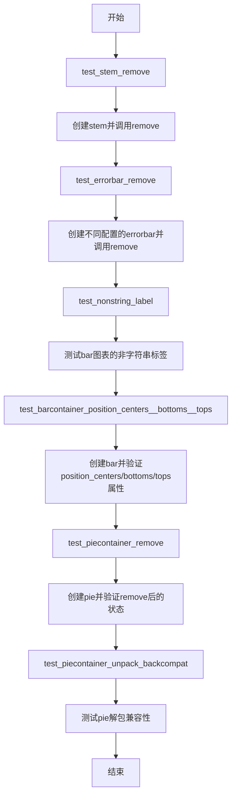
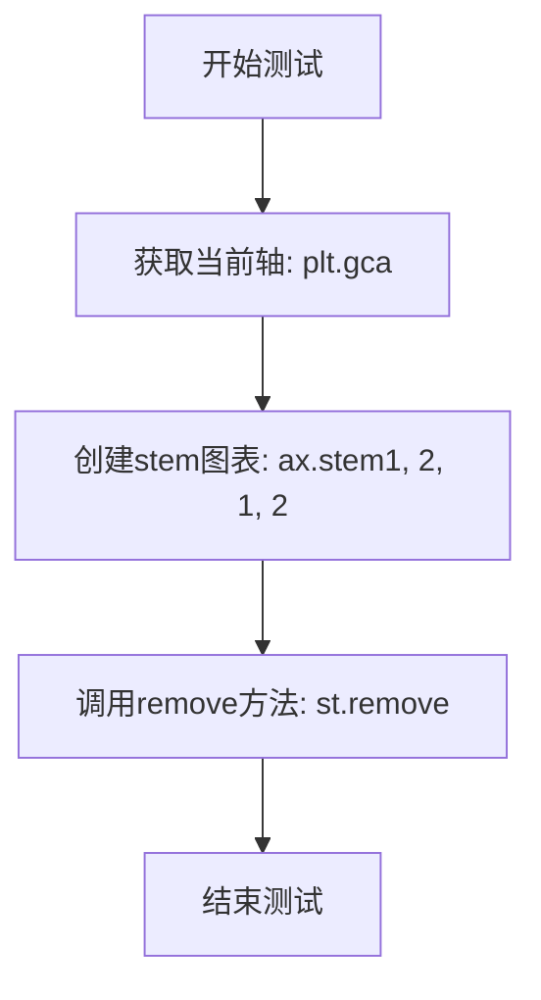
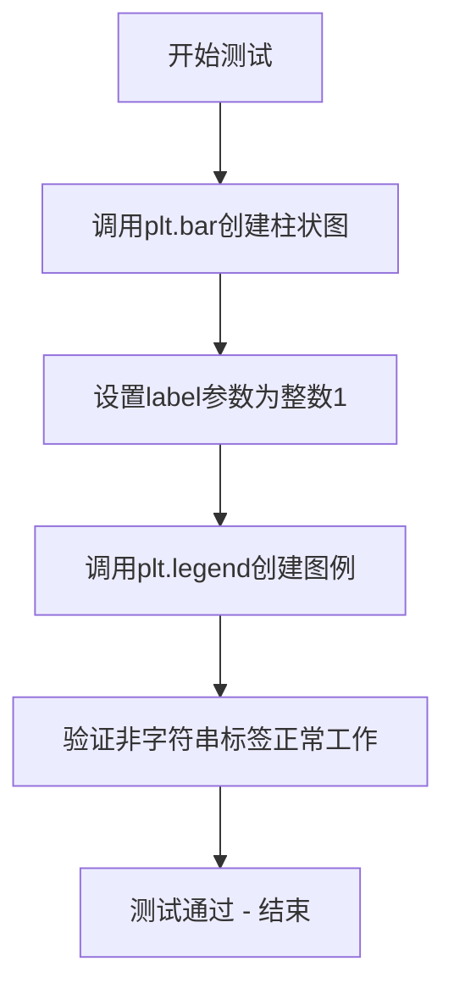

# `matplotlib\lib\matplotlib\tests\test_container.py` 详细设计文档

这是matplotlib的测试代码文件，包含多个单元测试函数，用于测试不同图表容器对象（StemContainer、ErrorbarContainer、BarContainer、PieContainer）的remove()方法、属性访问以及解包兼容性等功能。

## 整体流程



## 类结构

```
无自定义类层次结构
主要测试matplotlib内置容器类：
├── StemContainer (stem图表容器)
├── ErrorbarContainer (errorbar图表容器)
├── BarContainer (bar图表容器)
└── PieContainer (pie图表容器)
```

## 全局变量及字段


### `ax`
    
图表的坐标轴区域

类型：`matplotlib Axes对象`
    


### `st`
    
stem图表容器

类型：`StemContainer对象`
    


### `eb`
    
errorbar图表容器

类型：`ErrorbarContainer对象`
    


### `fig`
    
图表画布

类型：`matplotlib Figure对象`
    


### `pos`
    
柱状图位置

类型：`numpy数组`
    


### `bottoms`
    
柱状图底部坐标

类型：`numpy数组`
    


### `heights`
    
柱状图高度

类型：`numpy数组`
    


### `container`
    
柱状图容器

类型：`BarContainer对象`
    


### `pie`
    
饼图容器

类型：`tuple或PieContainer对象`
    


### `wedges`
    
饼图扇区对象列表

类型：`list`
    


### `texts`
    
饼图标签文本列表

类型：`list`
    


### `autotexts`
    
饼图百分比文本列表

类型：`list`
    


    

## 全局函数及方法


### `test_stem_remove`

该函数是一个测试用例，用于验证matplotlib中stem图表容器的remove()方法能否正确地从轴上移除stem图形元素。

参数：

- 无参数

返回值：`None`，该测试函数不返回任何值，仅用于执行测试操作

#### 流程图



#### 带注释源码

```python
def test_stem_remove():
    """
    测试stem图表容器的remove()方法
    
    该测试函数验证matplotlib中StemContainer对象的remove()方法
    是否能够正确地从当前轴上移除stem图形元素。
    这是针对stem容器生命周期管理的基本功能测试。
    """
    # 获取当前的axes对象
    # plt.gca()返回当前活动的Axes对象，如果没有则创建一个
    ax = plt.gca()
    
    # 创建stem图表
    # ax.stem()返回一个StemContainer对象，包含stem图形的所有组件
    # 参数: (x坐标数组, y坐标数组)
    st = ax.stem([1, 2], [1, 2])
    
    # 调用remove方法从axes中移除stem容器
    # 这会删除所有与该stem图表相关的艺术家对象（线、标记等）
    st.remove()
```


### `test_errorbar_remove`

该函数是一个回归测试，用于验证 `errorbar` 容器对象在不同 `fmt` 参数配置下的 `remove()` 方法能否正确执行，特别是针对之前使用 `fmt='none'` 时导致 remove 失败的 bug。

参数：无

返回值：`None`，该测试函数不返回任何值，仅用于验证行为

#### 流程图

```mermaid
flowchart TD
    A[开始测试] --> B[获取当前 axes: ax = plt.gca]
    B --> C1[创建无误差线 errorbar: eb = ax.errorbar[1], [1]]
    C1 --> C2[调用 remove: eb.remove]
    C2 --> D1[创建带 xerr 的 errorbar: eb = ax.errorbar[1], [1], xerr=1]
    D1 --> D2[调用 remove: eb.remove]
    D2 --> E1[创建带 yerr 的 errorbar: eb = ax.errorbar[1], [1], yerr=2]
    E1 --> E2[调用 remove: eb.remove]
    E2 --> F1[创建同时带 xerr 和 yerr 的 errorbar: eb = ax.errorbar[1], [1], xerr=[2], yerr=2]
    F1 --> F2[调用 remove: eb.remove]
    F2 --> G1[创建 fmt='none' 的 errorbar: eb = ax.errorbar[1], [1], fmt='none']
    G1 --> G2[调用 remove: eb.remove]
    G2 --> H[测试结束]
    
    style C1 fill:#e1f5fe
    style D1 fill:#e1f5fe
    style E1 fill:#e1f5fe
    style F1 fill:#e1f5fe
    style G1 fill:#fff3e0
```

#### 带注释源码

```python
def test_errorbar_remove():
    """
    Regression test for a bug that caused remove to fail when using
    fmt='none'
    """
    
    # 获取当前 axes 对象
    ax = plt.gca()

    # 测试用例 1：创建基本的 errorbar（无误差线）并移除
    eb = ax.errorbar([1], [1])
    eb.remove()

    # 测试用例 2：创建带 x 轴误差线的 errorbar 并移除
    eb = ax.errorbar([1], [1], xerr=1)
    eb.remove()

    # 测试用例 3：创建带 y 轴误差线的 errorbar 并移除
    eb = ax.errorbar([1], [1], yerr=2)
    eb.remove()

    # 测试用例 4：创建同时带 x 轴和 y 轴误差线的 errorbar 并移除
    eb = ax.errorbar([1], [1], xerr=[2], yerr=2)
    eb.remove()

    # 测试用例 5（关键回归测试）：创建 fmt='none' 的 errorbar 并移除
    # 这是之前存在 bug 的场景，remove 方法会失败
    eb = ax.errorbar([1], [1], fmt='none')
    eb.remove()
```


### `test_nonstring_label`

测试bar图表支持非字符串类型的标签（回归测试 #26824）

参数：

- 无

返回值：`None`，无返回值，仅执行测试断言

#### 流程图



#### 带注释源码

```python
def test_nonstring_label():
    # Test for #26824
    # 回归测试：验证bar图表支持非字符串类型的标签（如整数）
    # 之前版本可能无法正确处理非字符串标签
    
    plt.bar(np.arange(10), np.random.rand(10), label=1)
    # 创建10个柱状条，y值为随机数
    # 关键：将label参数设置为整数1而非字符串
    
    plt.legend()
    # 创建图例，验证非字符串标签能被正确处理并显示
```


### 函数概述

本设计文档描述了matplotlib测试套件中的`test_barcontainer_position_centers__bottoms__tops`测试函数，该函数用于验证BarContainer容器对象的`position_centers`、`bottoms`和`tops`属性的正确性，涵盖垂直条形图(ax.bar)和水平条形图(ax.barh)两种场景。

#### 文件整体运行流程

该Python文件包含多个独立的测试函数，均为回归测试或功能验证测试：

1. **test_stem_remove** - 测试stem图的remove方法
2. **test_errorbar_remove** - 测试errorbar的remove方法（针对fmt='none'的回归测试）
3. **test_nonstring_label** - 测试非字符串标签功能(#26824)
4. **test_barcontainer_position_centers__bottoms__tops** - 验证BarContainer属性（本函数）
5. **test_piecontainer_remove** - 测试饼图容器移除功能
6. **test_piecontainer_unpack_backcompat** - 测试饼图容器解包后向兼容性

#### 全局函数详细信息

| 函数名 | 参数 | 功能描述 |
|--------|------|----------|
| test_stem_remove | 无 | 测试ax.stem创建的stem图形是否可正常移除 |
| test_errorbar_remove | 无 | 回归测试errorbar使用fmt='none'时的remove失败问题 |
| test_nonstring_label | 无 | 测试条形图使用数字类型label时图例的正常显示 |
| test_barcontainer_position_centers__bottoms__tops | 无 | 验证BarContainer的position_centers、bottoms、tops属性正确性 |
| test_piecontainer_remove | 无 | 测试饼图容器移除后axes的patches和texts清空 |
| test_piecontainer_unpack_backcompat | 无 | 测试饼图容器解包的后向兼容性 |

### test_barcontainer_position_centers__bottoms__tops

该测试函数验证matplotlib中BarContainer容器类的三个核心属性`position_centers`（条形位置中心）、`bottoms`（底部坐标）、`tops`（顶部坐标）的计算正确性，分别在垂直条形图(ax.bar)和水平条形图(ax.barh)两种模式下进行验证。

参数：此函数无参数

返回值：无返回值（None），该函数为单元测试，使用assert_array_equal进行断言验证

#### 流程图

```mermaid
flowchart TD
    A[开始测试] --> B[创建Figure和Axes对象: fig, ax = plt.subplots]
    C[定义测试数据: pos = [1, 2, 4], bottoms = np.array([1, 5, 3]), heights = np.array([2, 3, 4]]] --> D[调用ax.bar创建垂直条形图]
    D --> E[断言: container.position_centers == pos]
    E --> F[断言: container.bottoms == bottoms]
    F --> G[断言: container.tops == bottoms + heights]
    G --> H[调用ax.barh创建水平条形图]
    H --> I[断言: container.position_centers == pos]
    I --> J[断言: container.bottoms == bottoms]
    J --> K[断言: container.tops == bottoms + heights]
    K --> L[测试结束]
    B --> C
```

#### 带注释源码

```python
def test_barcontainer_position_centers__bottoms__tops():
    """
    测试BarContainer的position_centers、bottoms、tops属性
    
    验证内容：
    1. position_centers返回条形的中心位置坐标
    2. bottoms返回条形的底部坐标
    3. tops返回条形的顶部坐标（bottom + height）
    
    测试场景：垂直条形图(ax.bar)和水平条形图(ax.barh)
    """
    # 创建一个新的figure和axes对象
    fig, ax = plt.subplots()
    
    # 定义条形图的位置参数
    pos = [1, 2, 4]  # 条形的x坐标位置
    bottoms = np.array([1, 5, 3])  # 每个条形的底部y坐标
    heights = np.array([2, 3, 4])  # 每个条形的高度
    
    # 创建垂直条形图，bottom参数指定条形底部起始位置
    container = ax.bar(pos, heights, bottom=bottoms)
    
    # 验证position_centers属性：返回条形的中心x坐标
    assert_array_equal(container.position_centers, pos)
    
    # 验证bottoms属性：返回条形的底部y坐标
    assert_array_equal(container.bottoms, bottoms)
    
    # 验证tops属性：返回条形的顶部y坐标（底部 + 高度）
    assert_array_equal(container.tops, bottoms + heights)
    
    # 创建水平条形图，left参数指定条形左侧起始位置（对应垂直的bottom）
    container = ax.barh(pos, heights, left=bottoms)
    
    # 水平条形图同样验证三个属性
    assert_array_equal(container.position_centers, pos)
    assert_array_equal(container.bottoms, bottoms)
    assert_array_equal(container.tops, bottoms + heights)
```

### 关键组件信息

| 组件名称 | 描述 |
|----------|------|
| BarContainer | matplotlib条形图容器类，用于存储和管理条形图元素 |
| ax.bar() | 创建垂直条形图的方法，返回BarContainer对象 |
| ax.barh() | 创建水平条形图的方法，返回BarContainer对象 |
| position_centers | BarContainer属性，返回条形的中心位置 |
| bottoms | BarContainer属性，返回条形的底部坐标 |
| tops | BarContainer属性，返回条形的顶部坐标 |
| assert_array_equal | NumPy测试工具，用于比较数组是否相等 |

### 潜在的技术债务或优化空间

1. **测试数据硬编码**：测试中的位置、高度等数据直接硬编码，缺乏参数化测试设计，可考虑使用pytest参数化改进
2. **缺少异常情况测试**：未测试边界情况如空数组、负值高度、单元素情况等
3. **图形资源未显式关闭**：使用plt.subplots()创建fig但未显式调用close()，可能导致资源泄漏
4. **属性验证覆盖不全**：仅验证了三个属性的数值正确性，未测试属性只读性、类型一致性等

### 其它项目

**设计目标与约束：**
- 验证BarContainer容器属性与输入参数的一致性
- 确保垂直和水平条形图行为一致性

**错误处理与异常设计：**
- 使用numpy.testing.assert_array_equal进行精确数组比较
- 测试设计为无异常抛出型，通过断言验证正确性

**数据流与状态机：**
- 输入：位置数组、底部坐标数组、高度数组
- 处理：BarContainer计算position_centers、bottoms、tops
- 输出：属性数组验证

**外部依赖与接口契约：**
- 依赖matplotlib.pyplot、numpy、numpy.testing
- 依赖BarContainer类的position_centers、bottoms、tops属性实现


### `test_piecontainer_remove`

该测试函数用于验证 PieContainer 的 remove() 方法是否正确清理图表中的 patches（饼图扇区）和 texts（标签文本），确保调用 remove() 后 ax.patches 和 ax.texts 均为空。

参数：此函数无参数。

返回值：`None`，该函数为测试函数，不返回任何值。

#### 流程图

```mermaid
flowchart TD
    A[开始测试] --> B[创建图形和坐标轴: fig, ax = plt.subplots]
    B --> C[创建饼图: pie = ax.pie2, 3, labels=['foo', 'bar'], autopct='%1.0f%%']
    C --> D[添加额外标签: ax.pie_label pie, ['baz', 'qux']]
    D --> E[断言验证: ax.patches 长度为 2]
    E --> F[断言验证: ax.texts 长度为 6]
    F --> G[调用 pie.remove 清理饼图]
    G --> H[断言验证: ax.patches 为空]
    H --> I[断言验证: ax.texts 为空]
    I --> J[测试结束]
```

#### 带注释源码

```python
def test_piecontainer_remove():
    """
    测试 PieContainer 的 remove() 方法是否正确清理 patches 和 texts。
    这是一个回归测试，用于确保移除饼图容器时正确释放图形元素。
    """
    # 步骤1: 创建一个新的图形和坐标轴
    # plt.subplots() 返回一个 figure 对象和一个 axes 对象
    fig, ax = plt.subplots()
    
    # 步骤2: 在坐标轴上创建饼图
    # ax.pie() 接收数据 [2, 3]，添加标签 ['foo', 'bar']，
    # 并使用 autopct 参数设置百分比显示格式为整数百分比
    pie = ax.pie([2, 3], labels=['foo', 'bar'], autopct="%1.0f%%")
    
    # 步骤3: 为饼图添加额外的标签
    # ax.pie_label() 方法用于添加额外的标签文本
    ax.pie_label(pie, ['baz', 'qux'])
    
    # 步骤4: 验证当前 patches 数量
    # 饼图会创建 2 个 patches（两个扇区）
    assert len(ax.patches) == 2
    
    # 步骤5: 验证当前 texts 数量
    # 共有6个文本元素：
    # - 2个主标签 ('foo', 'bar')
    # - 2个百分比文本
    # - 2个额外标签 ('baz', 'qux')
    assert len(ax.texts) == 6
    
    # 步骤6: 调用 remove() 方法移除饼图
    # 这应该清理所有相关的 patches 和 texts
    pie.remove()
    
    # 步骤7: 验证 patches 已被完全清理
    assert not ax.patches
    
    # 步骤8: 验证 texts 已被完全清理
    assert not ax.texts
```


### `test_piecontainer_unpack_backcompat`

该函数是一个回归测试，用于验证 `ax.pie()` 方法返回值的解包向后兼容性，确保返回值可以正确解包为 `(wedges, texts, autotexts)` 元组，且各组件的数量和类型符合预期。

参数： 无

返回值： `None`，测试函数无返回值，仅通过断言验证行为

#### 流程图

```mermaid
flowchart TD
    A[开始测试] --> B[创建图形和坐标轴: fig, ax = plt.subplots]
    B --> C[调用 ax.pie 方法并解包返回值]
    C --> D[断言: len(wedges) == 2]
    D --> E[断言: isinstance(texts, list)]
    E --> F[断言: not texts 即 texts 为空列表]
    F --> G[断言: len(autotexts) == 2]
    G --> H[结束测试]
```

#### 带注释源码

```python
def test_piecontainer_unpack_backcompat():
    """
    测试 pie 方法返回值解包的向后兼容性。
    
    该测试验证 ax.pie() 返回的容器对象可以正确解包为
    (wedges, texts, autotexts) 三元组，且各组件的数量和类型正确。
    """
    # 创建一个新的图形和坐标轴
    fig, ax = plt.subplots()
    
    # 调用 pie 方法并解包返回值
    # 返回值应为一个可迭代对象，包含三个元素：
    # - wedges: 饼图扇形对象列表
    # - texts: 标签文本对象列表
    # - autotexts: 自动文本（如百分比）对象列表
    wedges, texts, autotexts = ax.pie(
        [2, 3],                      # 数据：两个扇形，比例分别为2和3
        labels=['foo', 'bar'],       # 标签：'foo' 和 'bar'
        autopct="%1.0f%%",           # 自动显示百分比格式
        labeldistance=None           # 标签距离设为None，使用默认行为
    )
    
    # 验证 wedges 数量为2（对应两个数据点）
    assert len(wedges) == 2
    
    # 验证 texts 是列表类型
    assert isinstance(texts, list)
    
    # 验证 texts 为空列表（因为 labeldistance=None 时不生成标签文本）
    assert not texts
    
    # 验证 autotexts 数量为2（每个扇形一个百分比文本）
    assert len(autotexts) == 2
```

## 关键组件


### 茎图(Stem Plot)组件

负责创建茎图并测试其remove方法的功能，确保移除茎图元素时不会产生内存泄漏或错误。

### 误差棒图(Errorbar)组件

负责创建误差棒图并测试其remove方法，特别关注使用fmt='none'参数时的回归bug修复。

### 条形图(Bar Container)组件

负责创建垂直/水平条形图，提供BarContainer对象用于访问position_centers（位置中心）、bottoms（底部）和tops（顶部）属性，支持解包操作。

### 饼图(Pie Chart)组件

负责创建饼图并测试其remove方法，验证饼图容器的元素（wedges、texts、autotexts）管理及解包兼容性。

### 标签处理组件

负责处理图表中的标签，支持非字符串类型的标签（如数字），确保legend能正确显示数值类型标签。

### 容器移除(Container Remove)机制

通用组件，负责从Axes中安全移除各种容器对象（如StemContainer、ErrorbarContainer、BarContainer、PieContainer），清理相关的patches和texts元素。


## 问题及建议


### 已知问题

-   **重复代码模式**：`test_errorbar_remove()`函数中多次重复`eb.remove()`调用模式，可通过参数化测试简化
-   **测试覆盖不足**：缺少对边界条件和异常输入的测试，如空列表输入、NaN/Inf值、负数坐标等
-   **硬编码数值**：代码中存在魔法数字如`[1, 2]`、`[1]`、`2`、`3`等，缺乏常量定义
-   **命名不规范**：函数名`test_barcontainer_position_centers__bottoms__tops`过长且使用双下划线，不符合Python命名惯例
-   **缺少cleanup机制**：部分测试修改了全局状态(plt.gca())但未显式清理，可能影响测试隔离性
-   **断言信息不充分**：使用`assert_array_equal`但未提供自定义错误消息，调试时定位问题较困难

### 优化建议

-   使用`@pytest.mark.parametrize`重构`test_errorbar_remove`，将不同的参数组合(如xerr/yerr/fmt)参数化
-   添加参数常量类或配置文件，将硬编码数值定义为有意义的常量
-   重命名函数为更简洁的名称，如`test_barcontainer_position_attributes`
-   在每个测试函数末尾添加显式的cleanup代码(如`plt.close(fig)`)确保测试隔离
-   为关键断言添加描述性错误消息，如`assert_array_equal(..., err_msg="position_centers mismatch")`
-   添加更多边界测试用例：空输入、无效类型、极端值等
-   考虑使用`pytest.fixture`管理matplotlib的Figure/Axis对象生命周期


## 其它


### 设计目标与约束

本测试文件的设计目标是通过自动化测试用例验证matplotlib中各类图表组件（stem、errorbar、bar、pie）的remove方法正常工作，以及验证BarContainer和PieContainer的属性访问和后向兼容性。测试约束包括仅使用matplotlib官方推荐的API，不涉及第三方库，所有测试用例必须能够在matplotlib现有版本上通过，不引入新的外部依赖。

### 错误处理与异常设计

代码中主要测试了remove方法在各种调用场景下的行为，包括正常调用（st.remove()、eb.remove()、pie.remove()）以及特定参数组合下的调用（fmt='none'的errorbar）。测试通过assert语句验证预期结果（如ax.patches和ax.texts在remove后为空），确保方法在失败时能够被正确识别。回归测试test_errorbar_remove专门针对fmt='none'参数导致的remove失败bug进行验证。

### 数据流与状态机

测试数据流涉及两个主要场景：一是图表对象的创建到移除的完整生命周期，验证remove方法能够正确清理图形元素（axes.patches和axes.texts）；二是BarContainer对象的属性计算流程，验证position_centers、bottoms、tops三个属性根据输入参数（pos、heights、bottom）正确计算。状态转换包括：创建状态（容器包含元素）-> 移除后状态（容器清空）。

### 外部依赖与接口契约

代码依赖三个外部模块：numpy提供数值数组和assert_array_equal断言，matplotlib.pyplot提供图形API（stem、errorbar、bar、pie等），matplotlib.testing提供测试辅助。接口契约包括：ax.stem()返回包含lines和markers的容器对象，ax.errorbar()返回ErrorbarContainer对象，ax.bar()返回BarContainer对象，ax.pie()返回元组（wedges, texts, autotexts），所有容器对象都必须实现remove()方法。

### 性能要求与基准

本测试文件不涉及性能基准测试，属于功能正确性验证。测试执行时间应保持在毫秒级，不应包含sleep或大量循环操作。每个测试函数独立运行，使用plt.subplots()创建独立的Figure和Axes对象，避免测试间状态污染。

### 兼容性设计

test_piecontainer_unpack_backcompat测试专门验证后向兼容性，确保ax.pie()返回值的解包方式（wedges, texts, autotexts = ax.pie(...)）在版本升级后仍然有效。测试验证当labeldistance=None时texts列表为空但结构保留，兼容旧代码的解包习惯。

### 测试覆盖范围

当前测试覆盖了6个主要场景：stem图的remove、errorbar的remove（包括5种参数组合）、非字符串label的图例显示、BarContainer的位置计算（垂直和水平条形图）、PieContainer的remove、PieContainer的解包后向兼容性。覆盖了最常用的图表类型和操作，但未覆盖3D图表、多子图场景、动画更新等高级用例。

### 边界条件与极端值

代码测试的边界条件包括：空数组输入（[1]单元素数组）、多维误差值（xerr=[2], yerr=2混合）、不同条形图方向（bar vs barh）、饼图标签和自动标签同时存在等。未测试的边界条件包括：空数据（空列表输入）、极大数值、NaN/Inf值、负数坐标等。


    