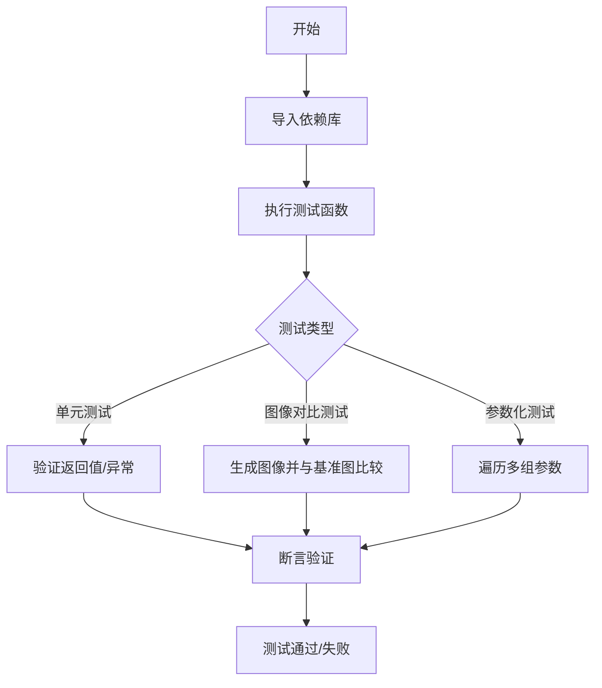
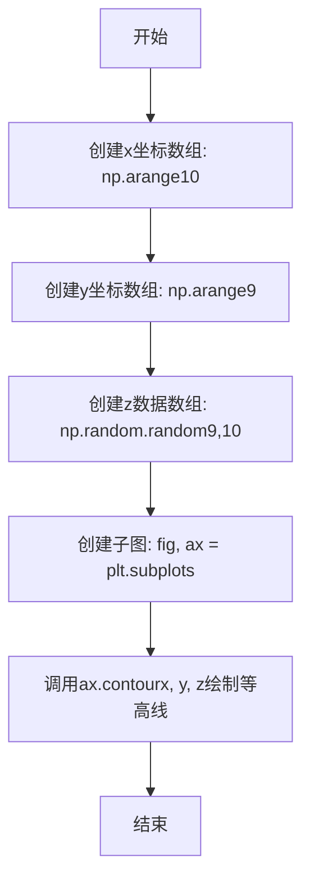
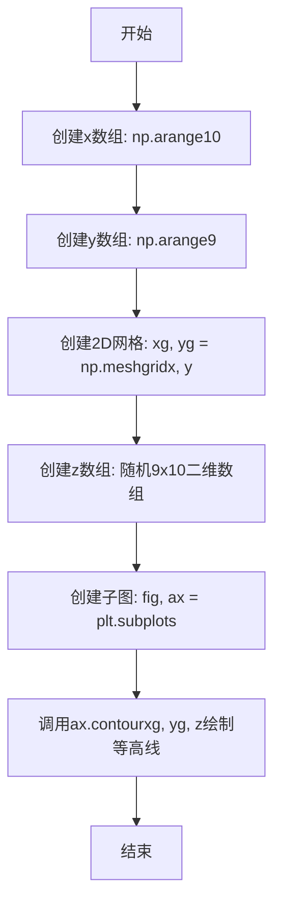
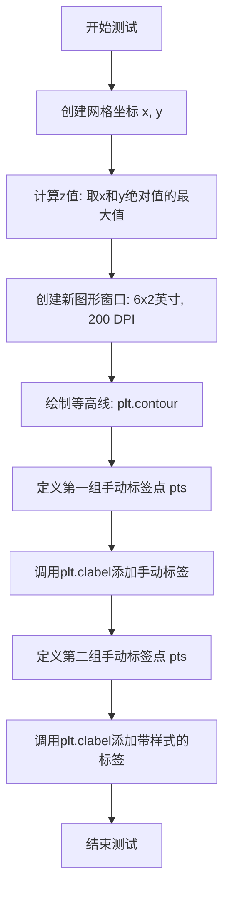
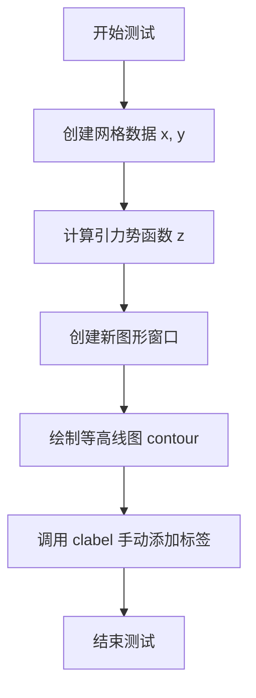
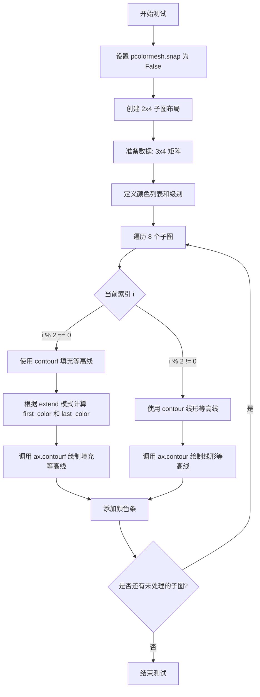
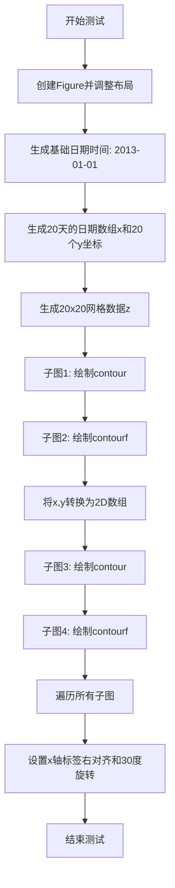
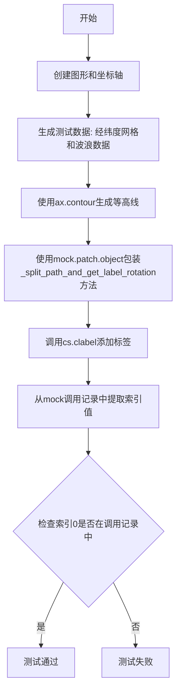

# `matplotlib\lib\matplotlib\tests\test_contour.py` 详细设计文档

该文件是matplotlib的等高线（contour）和填充等高线（contourf）功能的综合测试套件，涵盖了形状验证、标签管理、颜色样式、算法支持、坐标轴处理等多个方面的单元测试和图像对比测试。

## 整体流程



## 类结构

```
TestModule (测试模块)
└── test_contour.py
    ├── 导入依赖
    │   ├── contourpy (等高线算法库)
    │   ├── numpy (数值计算)
    │   ├── matplotlib (绘图库)
    │   └── pytest (测试框架)
    └── 测试函数集合 (约60+个)
        ├── 形状验证测试
        ├── 标签测试
        ├── 颜色/样式测试
        ├── 算法测试
        └── 坐标轴测试
```

## 全局变量及字段


### `datetime`
    
Python standard library module for manipulating dates and times

类型：`module`
    


### `platform`
    
Python standard library module for accessing platform-specific information

类型：`module`
    


### `re`
    
Python standard library module for regular expression operations

类型：`module`
    


### `mock`
    
Python unittest module for creating mock objects to replace real ones in tests

类型：`module`
    


### `contourpy`
    
Third-party library for generating contour lines and filled contours from 2D data

类型：`module`
    


### `np`
    
NumPy library alias for numerical computing with multi-dimensional arrays

类型：`module`
    


### `mpl`
    
Matplotlib library alias for creating visualizations and plots

类型：`module`
    


### `plt`
    
Matplotlib pyplot module alias for MATLAB-style plotting interface

类型：`module`
    


### `mpatches`
    
Matplotlib patches module for creating geometric shapes and patches

类型：`module`
    


### `pytest`
    
Testing framework for writing and running unit tests in Python

类型：`module`
    


    

## 全局函数及方法


### `test_contour_shape_1d_valid`

该函数是一个测试函数，用于验证在使用一维数组作为 `contour` 方法的 x 和 y 坐标参数时的有效性。具体来说，它创建了长度为 10 的 x 数组、长度为 9 的 y 数组，以及对应的 9×10 维度的 z 数据，然后调用 `ax.contour(x, y, z)` 来测试一维坐标输入是否能够正确绘制等高线图。

参数： 无

返回值：`None`，该函数为测试函数，不返回任何值

#### 流程图



#### 带注释源码

```python
def test_contour_shape_1d_valid():
    """
    测试函数：验证1D数组作为contour的x和y坐标参数时的有效性
    
    该测试用例用于确保matplotlib的contour方法能够正确处理
    1D数组形式的x和y坐标输入，并正确匹配z数据的形状
    """
    
    # 创建一维x坐标数组，长度为10
    # 对应z数据的列数（10列）
    x = np.arange(10)
    
    # 创建一维y坐标数组，长度为9
    # 对应z数据的行数（9行）
    y = np.arange(9)
    
    # 创建9×10的二维z数据数组
    # 行数=9（与y长度匹配），列数=10（与x长度匹配）
    z = np.random.random((9, 10))
    
    # 创建图形和坐标轴对象
    fig, ax = plt.subplots()
    
    # 调用contour方法绘制等高线图
    # 验证1D坐标数组能否正确工作
    ax.contour(x, y, z)
```


### `test_contour_shape_2d_valid`

该函数是一个测试函数，用于验证当输入坐标为2D（网格）形式时，`contour`函数能够正确处理并生成等高线图。

参数： 无

返回值： `None`，该测试函数不返回任何值，仅执行测试逻辑

#### 流程图



#### 带注释源码

```python
def test_contour_shape_2d_valid():
    """
    测试函数：验证2D网格坐标输入的contour形状处理
    
    该测试验证当x和y坐标以2D数组（meshgrid形式）传入时，
    matplotlib的contour函数能够正确处理并生成等高线。
    """
    
    # 创建1D x坐标数组，值为0-9
    x = np.arange(10)
    
    # 创建1D y坐标数组，值为0-8
    y = np.arange(9)
    
    # 将1D坐标转换为2D网格坐标
    # xg和yg的形状均为(9, 10)
    xg, yg = np.meshgrid(x, y)
    
    # 创建形状为(9, 10)的随机z值数组
    # 注意：z的行数(9)对应y的长度，列数(10)对应x的长度
    z = np.random.random((9, 10))
    
    # 创建matplotlib图形和坐标轴
    fig, ax = plt.subplots()
    
    # 调用contour方法绘制等高线
    # 参数：xg, yg为2D坐标网格，z为对应的数值
    ax.contour(xg, yg, z)
```


### `test_contour_shape_error`

该测试函数通过参数化测试验证 `ax.contour()` 方法在接收不同非法参数组合时的错误处理能力，确保在输入数据的维度、长度或形状不匹配时抛出正确的 `TypeError` 异常。

#### 参数

- `args`：`tuple`，表示传递给 `ax.contour()` 的参数组合，包含 (x, y, z) 三个数组
- `message`：`str`，期望抛出的错误信息内容

#### 返回值

- `None`，该函数为测试函数，无返回值

#### 流程图

```mermaid
flowchart TD
    A[测试开始] --> B[创建子图 ax]
    B --> C[根据参数化用例构建 args 和 message]
    C --> D[调用 ax.contour展开args)]
    D --> E{是否抛出 TypeError?}
    E -->|是| F{错误信息是否匹配?}
    E -->|否| I[测试失败 - 未抛出异常]
    F -->|是| G[测试通过]
    F -->|否| J[测试失败 - 错误信息不匹配]
    G --> H[测试结束]
    I --> H
    J --> H
```

#### 带注释源码

```python
@pytest.mark.parametrize("args, message", [
    # 测试用例1: x长度与z列数不匹配
    ((np.arange(9), np.arange(9), np.empty((9, 10))),
     'Length of x (9) must match number of columns in z (10)'),
    # 测试用例2: y长度与z行数不匹配
    ((np.arange(10), np.arange(10), np.empty((9, 10))),
     'Length of y (10) must match number of rows in z (9)'),
    # 测试用例3: x为2D但y为1D，维度不匹配
    ((np.empty((10, 10)), np.arange(10), np.empty((9, 10))),
     'Number of dimensions of x (2) and y (1) do not match'),
    # 测试用例4: x为1D但y为2D，维度不匹配
    ((np.arange(10), np.empty((10, 10)), np.empty((9, 10))),
     'Number of dimensions of x (1) and y (2) do not match'),
    # 测试用例5: x与z的形状不匹配
    ((np.empty((9, 9)), np.empty((9, 10)), np.empty((9, 10))),
     'Shapes of x (9, 9) and z (9, 10) do not match'),
    # 测试用例6: y与z的形状不匹配
    ((np.empty((9, 10)), np.empty((9, 9)), np.empty((9, 10))),
     'Shapes of y (9, 9) and z (9, 10) do not match'),
    # 测试用例7: x和y为3D数组（不支持）
    ((np.empty((3, 3, 3)), np.empty((3, 3, 3)), np.empty((9, 10))),
     'Inputs x and y must be 1D or 2D, not 3D'),
    # 测试用例8: z为3D数组（不支持）
    ((np.empty((3, 3, 3)), np.empty((3, 3, 3)), np.empty((3, 3, 3))),
     'Input z must be 2D, not 3D'),
    # 测试用例9: z为1x1数组（太小）
    (([[0]],),  # github issue 8197
     'Input z must be at least a (2, 2) shaped array, but has shape (1, 1)'),
    # 测试用例10: 另一个z为1x1数组的用例
    (([0], [0], [[0]]),
     'Input z must be at least a (2, 2) shaped array, but has shape (1, 1)'),
])
def test_contour_shape_error(args, message):
    """
    参数化测试函数，验证ax.contour在不同非法输入情况下的错误处理。
    
    参数:
        args: tuple, 传递给ax.contour的参数(x, y, z)
        message: str, 期望的错误信息
    
    返回:
        None
    """
    # 创建新的图形和轴对象
    fig, ax = plt.subplots()
    # 使用pytest.raises上下文管理器验证异常抛出
    # re.escape确保特殊字符被正确转义匹配
    with pytest.raises(TypeError, match=re.escape(message)):
        ax.contour(*args)
```


### `test_contour_no_valid_levels`

该函数是一个测试函数，用于验证在绘制等高线图时，当输入数据不存在有效等高线级别（如空级别列表、级别超出数据范围、数据值 uniform 等情况）时不会产生警告。

参数：此函数没有参数。

返回值：`None`，该函数不返回任何值，仅执行测试逻辑。

#### 流程图

```mermaid
flowchart TD
    A[开始测试] --> B[创建子图: fig, ax = plt.subplots]
    B --> C[测试1: 空级别列表不产生警告<br/>ax.contour(np.random.rand(9, 9), levels=[])]
    C --> D[测试2: 级别超出数据范围不产生警告<br/>cs = ax.contour(np.arange(81).reshape((9, 9)), levels=[100])]
    D --> E[测试3: 提供fmt参数时也不产生警告<br/>ax.clabel(cs, fmt={100: '%1.2f'})]
    E --> F[测试4: 数据均匀时不产生警告<br/>ax.contour(np.ones((9, 9)))]
    F --> G[结束测试]
```

#### 带注释源码

```python
def test_contour_no_valid_levels():
    """
    测试等高线图中没有有效级别的情况不会产生警告。
    
    该测试函数验证以下场景：
    1. 空级别列表
    2. 级别超出数据范围
    3. 数据值全部相同（uniform）
    """
    
    # 创建一个新的图形和坐标轴
    fig, ax = plt.subplots()
    
    # 测试1: 空级别列表不产生警告
    # 使用随机数据(9x9)和空级别列表[]调用contour，验证不会产生警告
    ax.contour(np.random.rand(9, 9), levels=[])
    
    # 测试2: 如果给定的级别不在z的范围内，不产生警告
    # 创建0-80的9x9矩阵，级别设为100（超出数据范围0-80）
    cs = ax.contour(np.arange(81).reshape((9, 9)), levels=[100])
    
    # 测试3: 即使提供fmt参数也不产生警告
    # 为级别100的等高线设置标签格式为两位小数
    ax.clabel(cs, fmt={100: '%1.2f'})
    
    # 测试4: 如果z是均匀的（所有值相同），不产生警告
    # 创建全为1的9x9矩阵，不产生有效等高线
    ax.contour(np.ones((9, 9)))
```


### `test_contour_Nlevels`

该函数是一个测试函数，用于验证当 `contour` 函数的 `levels` 参数为标量（整数）时，是否能够正确触发自动级别生成功能，并且 positional 参数和 keyword 参数传递的标量 levels 应该产生相同的结果。

参数：此函数没有参数。

返回值：`None`，该函数为测试函数，不返回任何值。

#### 流程图

```mermaid
flowchart TD
    A[开始 test_contour_Nlevels] --> B[创建测试数据<br/>z = np.arange(12).reshape((3, 4))]
    B --> C[创建子图和坐标轴<br/>fig, ax = plt.subplots]
    C --> D[调用 ax.contour 传入标量 5 作为位置参数<br/>cs1 = ax.contour(z, 5)]
    D --> E[断言验证<br/>assert len(cs1.levels) > 1]
    E --> F[调用 ax.contour 传入 levels=5 作为关键字参数<br/>cs2 = ax.contour(z, levels=5)]
    F --> G[断言验证两种方式生成的 levels 一致<br/>assert cs1.levels == cs2.levels]
    G --> H[测试结束]
```

#### 带注释源码

```python
def test_contour_Nlevels():
    """
    测试当 levels 参数为标量时，contour 函数是否触发自动级别生成。
    
    该测试验证了以下两种调用方式是否产生相同的结果：
    1. 使用位置参数：ax.contour(z, 5)
    2. 使用关键字参数：ax.contour(z, levels=5)
    
    参见 GitHub issue: https://github.com/matplotlib/matplotlib/issues/11913
    """
    # 创建一个 3x4 的测试数据矩阵，值为 0 到 11
    z = np.arange(12).reshape((3, 4))
    
    # 创建一个新的图形和坐标轴
    fig, ax = plt.subplots()
    
    # 方式1：使用位置参数传入标量 levels=5
    # 应该触发自动级别生成，产生多个级别
    cs1 = ax.contour(z, 5)
    
    # 验证：确保自动生成了多个级别（而不是只有1个）
    assert len(cs1.levels) > 1
    
    # 方式2：使用关键字参数传入 levels=5
    # 应该产生与方式1相同的结果
    cs2 = ax.contour(z, levels=5)
    
    # 验证：确保两种方式产生的级别完全相同
    assert (cs1.levels == cs2.levels).all()
```


### `test_contour_set_paths`

该函数是一个测试函数，用于验证 `QuadContourSet` 对象的 `set_paths` 方法能否正确设置轮廓路径。测试通过 `@check_figures_equal` 装饰器比较两个figure的渲染结果：一个使用 `set_paths` 方法将路径设置为另一个contour的路径，验证两者渲染结果一致。

参数：

- `fig_test`：`matplotlib.figure.Figure`，测试用的Figure对象，由`@check_figures_equal`装饰器注入
- `fig_ref`：`matplotlib.figure.Figure`，参考用的Figure对象，由`@check_figures_equal`装饰器注入

返回值：`None`，测试函数无返回值

#### 流程图

```mermaid
flowchart TD
    A[开始] --> B[创建fig_test子图并绘制contour: [[0,1],[1,2]]]
    B --> C[创建fig_ref子图并绘制contour: [[1,0],[2,1]]]
    C --> D[从cs_ref获取paths]
    E[调用cs_test.set_paths设置paths] --> F[装饰器比较fig_test和fig_ref渲染结果]
    D --> E
    F --> G{渲染结果是否相等}
    G -->|是| H[测试通过]
    G -->|否| I[测试失败]
```

#### 带注释源码

```python
@check_figures_equal()
def test_contour_set_paths(fig_test, fig_ref):
    """
    测试QuadContourSet.set_paths()方法的功能。
    验证将一个contour的路径设置到另一个contour上后，
    两者渲染结果一致（通过@check_figures_equal装饰器验证）。
    """
    # 在测试figure中创建一个子图，并绘制contour
    # 数据: z = [[0, 1], [1, 2]]
    cs_test = fig_test.subplots().contour([[0, 1], [1, 2]])
    
    # 在参考figure中创建一个子图，并绘制不同的contour
    # 数据: z = [[1, 0], [2, 1]]
    cs_ref = fig_ref.subplots().contour([[1, 0], [2, 1]])
    
    # 从参考contour获取路径
    # get_paths()返回包含所有轮廓线的列表
    # set_paths()用于设置轮廓路径
    cs_test.set_paths(cs_ref.get_paths())
```


### `test_contour_manual_labels`

这是一个测试函数，用于验证matplotlib中等高线手动标签的功能。该函数通过创建网格数据、绘制等高线，并手动指定标签位置来测试`clabel`函数的`manual`参数是否正常工作。

参数：无需参数

返回值：`None`，该函数为测试函数，不返回任何值

#### 流程图



#### 带注释源码

```python
@image_comparison(['contour_manual_labels'], remove_text=True, style='mpl20', tol=0.26)
def test_contour_manual_labels():
    """
    测试手动设置等高线标签的功能
    使用@image_comparison装饰器比较生成的图像与基准图像
    """
    # 创建网格坐标：x和y为0-9的整数
    x, y = np.meshgrid(np.arange(0, 10), np.arange(0, 10))
    
    # 计算z值：取x和y绝对值的最大值，形成对角线状的等高线
    z = np.max(np.dstack([abs(x), abs(y)]), 2)

    # 创建新图形，设置大小为6x2英寸，分辨率为200 DPI
    plt.figure(figsize=(6, 2), dpi=200)
    
    # 绘制等高线，返回ContourSet对象
    cs = plt.contour(x, y, z)

    # 定义第一组手动标签位置点 (x, y坐标)
    pts = np.array([(1.0, 3.0), (1.0, 4.4), (1.0, 6.0)])
    
    # 使用manual参数手动设置标签位置
    plt.clabel(cs, manual=pts)
    
    # 定义第二组手动标签位置点
    pts = np.array([(2.0, 3.0), (2.0, 4.4), (2.0, 6.0)])
    
    # 再次手动设置标签，使用小字体和红绿两种颜色
    plt.clabel(cs, manual=pts, fontsize='small', colors=('r', 'g'))
```


### `test_contour_manual_moveto`

该测试函数验证了手动 contour 标签放置时的正确行为：当一个点位于某个 contour 的 `MOVETO` 线上，但实际距离另一个 contour 更近时，系统应选择最近的 contour 而非 `MOVETO` 所在的 contour。

参数：

- 无参数

返回值：无返回值（测试函数，使用断言验证）

#### 流程图

```mermaid
flowchart TD
    A[开始] --> B[创建x数组: np.linspace(-10, 10)]
    B --> C[创建y数组: np.linspace(-10, 10)]
    C --> D[创建网格: np.meshgrid(x, y)]
    D --> E[计算Z = X²/Y² - 1]
    E --> F[绘制等高线: plt.contour with levels=[0, 100]]
    F --> G[定义测试点: point = (1.3, 1)]
    G --> H[手动标签: plt.clabel with manual=[point]]
    H --> I[断言: clabels[0].get_text() == '0']
    I --> J[结束]
    
    style F fill:#f9f,stroke:#333
    style H fill:#ff9,stroke:#333
    style I fill:#9f9,stroke:#333
```

#### 带注释源码

```python
def test_contour_manual_moveto():
    """
    测试手动 contour 标签放置时，当点位于某 contour 的 MOVETO 线上，
    但实际距离另一个 contour 更近时的正确行为。
    """
    
    # 步骤1: 创建 x 和 y 坐标数组，范围从 -10 到 10
    x = np.linspace(-10, 10)
    y = np.linspace(-10, 10)

    # 步骤2: 创建二维网格坐标矩阵
    X, Y = np.meshgrid(x, y)

    # 步骤3: 计算 Z 值，使用函数 Z = X²/Y² - 1
    # 这个函数会在 Y=0 处产生奇点，形成特殊的等高线形态
    Z = X**2 * 1 / Y**2 - 1

    # 步骤4: 绘制等高线，levels=[0, 100] 表示绘制值为 0 和 100 的等高线
    contours = plt.contour(X, Y, Z, levels=[0, 100])

    # 步骤5: 定义测试点 (1.3, 1)
    # 注释说明：这个点位于 100 等高线的 MOVETO 线上，
    # 但实际上距离 0 等高线更近
    point = (1.3, 1)
    
    # 步骤6: 使用手动模式放置标签，传入测试点
    clabels = plt.clabel(contours, manual=[point])

    # 步骤7: 断言验证
    # 确保选择了 0 等高线（最近的），而不是 100 等高线（MOVETO 所在）
    assert clabels[0].get_text() == "0"
```


### `test_contour_label_with_disconnected_segments`

该测试函数用于验证matplotlib在处理具有断开片段的轮廓线时正确放置标签的能力，通过创建两个相距较近的引力势源产生的等高线，并手动指定标签位置来测试clabel功能的正确性。

参数： 无

返回值： `None`，该测试函数不返回任何值，仅用于图像比较验证

#### 流程图



#### 带注释源码

```python
@image_comparison(['contour_disconnected_segments.png'],
                  remove_text=True, style='mpl20', tol=0.01)
def test_contour_label_with_disconnected_segments():
    """
    测试在轮廓具有断开片段时标签的正确放置。
    该测试创建一个具有两个峰值的数据集，这两个峰值会产生
    断开的轮廓线段，然后手动指定标签位置进行验证。
    """
    # 创建网格数据，范围从-1到1，步长为21个点
    x, y = np.mgrid[-1:1:21j, -1:1:21j]
    
    # 计算第一个引力势源（位于-0.3, 0）
    z = 1 / np.sqrt(0.01 + (x + 0.3) ** 2 + y ** 2)
    
    # 添加第二个引力势源（位于+0.3, 0），产生双峰结构
    z += 1 / np.sqrt(0.01 + (x - 0.3) ** 2 + y ** 2)
    
    # 创建新图形窗口
    plt.figure()
    
    # 绘制值为7的等高线
    cs = plt.contour(x, y, z, levels=[7])
    
    # 手动指定标签位置为(0.2, 0.1)
    # 测试当标签位置附近有多个断开轮廓段时的处理逻辑
    cs.clabel(manual=[(0.2, 0.1)])
```


### `test_given_colors_levels_and_extends`

这是一个测试函数，用于验证 Matplotlib 中 `contour` 和 `contourf` 在不同颜色数量、级别和扩展模式下的渲染行为是否符合预期。

参数：此函数没有显式参数（使用 pytest 的 `@image_comparison` 装饰器隐式接收 `fig_test` 和 `fig_ref` 参数）

返回值：`None`，此函数为测试函数，不返回任何值

#### 流程图



#### 带注释源码

```python
@image_comparison(['contour_manual_colors_and_levels.png'], remove_text=True,
                  tol=0 if platform.machine() == 'x86_64' else 0.018)
def test_given_colors_levels_and_extends():
    """
    测试函数：验证 contour/contourf 在不同颜色、级别和扩展模式下的行为
    
    测试场景：
    - 8个子图 (2行4列)
    - 填充模式 (contourf) 和线形模式 (contour) 交替
    - 扩展模式: 'neither', 'min', 'max', 'both'
    """
    
    # 设置 pcolormesh.snap 为 False，避免图像比较时的像素对齐问题
    # Remove this line when this test image is regenerated.
    plt.rcParams['pcolormesh.snap'] = False

    # 创建 2行4列的子图布局
    _, axs = plt.subplots(2, 4)

    # 准备测试数据：3x4 的矩阵，值为 0-11
    data = np.arange(12).reshape(3, 4)

    # 定义测试用的颜色列表和级别
    colors = ['red', 'yellow', 'pink', 'blue', 'black']
    levels = [2, 4, 8, 10]

    # 遍历所有子图 (0-7)
    for i, ax in enumerate(axs.flat):
        # 偶数索引使用填充模式 (contourf)，奇数使用线形模式 (contour)
        filled = i % 2 == 0.
        # 扩展模式: [0,1] -> 'neither', [2,3] -> 'min', [4,5] -> 'max', [6,7] -> 'both'
        extend = ['neither', 'min', 'max', 'both'][i // 2]

        if filled:
            # 如果是填充模式，根据扩展模式确定颜色切片范围
            # 扩展模式为 'neither' 或 'max' 时，从索引1开始
            # 扩展模式为 'min' 或 'both' 时，从头开始
            first_color = 1 if extend in ['max', 'neither'] else None
            # 扩展模式为 'min' 或 'neither' 时，到索引-1结束
            # 扩展模式为 'max' 或 'both' 时，到最后
            last_color = -1 if extend in ['min', 'neither'] else None
            
            # 绘制填充等高线
            c = ax.contourf(data, colors=colors[first_color:last_color],
                            levels=levels, extend=extend)
        else:
            # 如果是线形模式，使用除最后一个外的所有颜色
            # 4个级别对应4个颜色
            c = ax.contour(data, colors=colors[:-1],
                           levels=levels, extend=extend)

        # 为每个子图添加颜色条
        plt.colorbar(c, ax=ax)
```


### `test_hatch_colors`

该函数是一个图像比较测试，用于验证 Matplotlib 中填充等高线（contourf）的阴影图案（hatches）和边缘颜色（edgecolors）功能是否正确渲染。

参数：

- 无显式函数参数（依赖装饰器 `@image_comparison` 的配置）

返回值：

- 无返回值（测试函数）

#### 流程图

```mermaid
flowchart TD
    A[开始执行 test_hatch_colors] --> B[调用 @image_comparison 装饰器<br/>配置基线图像: contourf_hatch_colors.png<br/>样式: mpl20]
    B --> C[创建 Figure 和 Axes 对象<br/>fig, ax = plt.subplots]
    D[调用 ax.contourf 方法<br/>创建填充等高线] --> E[设置 hatches 参数<br/>['-', '/', '\\\\', '//']]
    D --> F[设置 cmap 参数<br/>'gray']
    E & F --> G[调用 cf.set_edgecolors 方法<br/>设置边缘颜色<br/>['blue', 'grey', 'yellow', 'red']]
    G --> H[生成测试图像并与基线图像比较]
    H --> I[结束]
```

#### 带注释源码

```python
@image_comparison(['contourf_hatch_colors.png'], remove_text=True, style='mpl20')
def test_hatch_colors():
    """
    测试填充等高线的阴影图案和边缘颜色功能
    
    验证:
    1. contourf 支持不同的 hatches 图案
    2. set_edgecolors 能正确设置每个区域的边缘颜色
    """
    
    # 创建一个新的 figure 和 axes 对象
    fig, ax = plt.subplots()
    
    # 调用 contourf 创建填充等高线
    # 参数说明:
    #   [[0, 1], [1, 2]]: 2x2 的测试数据矩阵
    #   hatches: 阴影图案列表，对应不同等高线层级
    #            '-' = 水平线, '/' = 斜线, '\\' = 反斜线, '//' = 交叉线
    #   cmap: 颜色映射为灰色
    cf = ax.contourf([[0, 1], [1, 2]], hatches=['-', '/', '\\', '//'], cmap='gray')
    
    # 设置填充等高线的边缘颜色
    # 颜色列表对应 hatches 列表中的四个图案
    #   "blue" -> '-'
    #   "grey" -> '/'
    #   "yellow" -> '\\'
    #   "red" -> '//'
    cf.set_edgecolors(["blue", "grey", "yellow", "red"])
```


### `test_single_color_and_extend`

该函数是一个参数化测试函数，用于验证 matplotlib 中 `contour` 方法在指定单色和不同扩展模式时的颜色处理是否正确。测试通过创建简单的 2x2 数据网格，使用不同的颜色格式（命名颜色和 RGBA 元组）以及不同的扩展模式（'neither'、'both'），并断言返回的轮廓边缘颜色与指定的颜色一致。

参数：

- `color`：`str` 或 `tuple`，轮廓线的颜色，可以是命名颜色字符串（如 'darkred'）或 RGBA 元组（如 ('r', 0.5) 表示半红色，(0.1, 0.2, 0.5, 0.3) 表示带透明度的 RGBA）
- `extend`：`str`，扩展模式，控制轮廓的扩展方式，可选值为 'neither'、'min'、'max'、'both'

返回值：`None`，该函数为测试函数，不返回任何值，主要通过断言进行验证

#### 流程图

```mermaid
flowchart TD
    A[开始测试] --> B[定义测试数据 z = [[0, 1], [1, 2]]]
    B --> C[创建子图 ax = plt.subplots]
    C --> D[定义 levels = [0.5, 0.75, 1, 1.25, 1.5]]
    D --> E[调用 ax.contour 创建轮廓, 传入 color 和 extend 参数]
    E --> F[获取轮廓的边缘颜色列表 cs.get_edgecolors]
    F --> G{遍历每个边缘颜色}
    G --> H[使用 same_color 断言颜色匹配]
    H --> I[测试通过]
    
    style A fill:#f9f,stroke:#333
    style I fill:#9f9,stroke:#333
```

#### 带注释源码

```python
@pytest.mark.parametrize('color, extend', [('darkred', 'neither'),
                                           ('darkred', 'both'),
                                           (('r', 0.5), 'neither'),
                                           ((0.1, 0.2, 0.5, 0.3), 'neither')])
def test_single_color_and_extend(color, extend):
    """
    测试 contour 在单色和不同扩展模式下的颜色处理。
    
    参数化测试使用4种不同的颜色/扩展组合:
    1. 命名颜色 'darkred' + 'neither' 扩展
    2. 命名颜色 'darkred' + 'both' 扩展
    3. RGB元组 ('r', 0.5) 半红色 + 'neither' 扩展
    4. RGBA元组 (0.1, 0.2, 0.5, 0.3) + 'neither' 扩展
    """
    # 定义2x2测试数据网格
    z = [[0, 1], [1, 2]]

    # 创建新的子图，返回(fig, ax)元组，fig不使用用_忽略
    _, ax = plt.subplots()
    
    # 定义轮廓级别
    levels = [0.5, 0.75, 1, 1.25, 1.5]
    
    # 调用contour方法创建轮廓对象，指定颜色和扩展模式
    # colors参数: 指定轮廓线的颜色
    # extend参数: 控制轮廓的扩展方式('neither','min','max','both')
    cs = ax.contour(z, levels=levels, colors=color, extend=extend)
    
    # 遍历轮廓的所有边缘颜色
    for c in cs.get_edgecolors():
        # 断言每个边缘颜色与指定的color一致
        # same_color函数来自matplotlib.colors模块
        assert same_color(c, color)
```


### test_log_locator_levels

这是一个测试函数，用于验证 matplotlib 中 contourf 使用 LogLocator（对数定位器）时能够正确生成对数级别的等高线，并确保颜色条（colorbar）的刻度与等高线级别正确匹配。

参数：

- 该函数没有显式参数（作为 pytest 测试函数）

返回值：`None`，无返回值（测试函数）

#### 流程图

```mermaid
graph TD
    A[开始 test_log_locator_levels] --> B[创建子图: fig, ax = plt.subplots]
    B --> C[生成网格数据: x, y = np.linspace]
    C --> D[创建网格: X, Y = np.meshgridx, y]
    D --> E[计算高斯函数: Z1 = exp(-X² - Y²)]
    E --> F[计算窄高斯: Z2 = exp(-(10X)² - (10Y)²)]
    F --> G[组合数据: data = Z1 + 50*Z2]
    G --> H[绘制等高线填充: contourf with LogLocator]
    H --> I[断言验证: c.levels == 10^(-6 to 2)]
    I --> J[创建颜色条: fig.colorbar]
    J --> K[断言验证: colorbar ticks == contour levels]
    K --> L[结束]
```

#### 带注释源码

```python
@image_comparison(['contour_log_locator.svg'], style='mpl20', remove_text=False)
def test_log_locator_levels():
    """
    测试函数：验证 contourf 使用 LogLocator 时的正确性
    
    测试内容：
    1. 等高线级别是否正确生成为对数级别
    2. 颜色条刻度是否与等高线级别匹配
    """

    # 创建一个新的图形和坐标轴
    fig, ax = plt.subplots()

    # 设置采样点数
    N = 100
    # 创建 x 坐标范围：-3.0 到 3.0，共 100 个点
    x = np.linspace(-3.0, 3.0, N)
    # 创建 y 坐标范围：-2.0 到 2.0，共 100 个点
    y = np.linspace(-2.0, 2.0, N)

    # 生成二维网格
    X, Y = np.meshgrid(x, y)

    # 计算第一个高斯分布（较宽的峰）
    Z1 = np.exp(-X**2 - Y**2)
    # 计算第二个高斯分布（较窄的峰，放大 10 倍）
    Z2 = np.exp(-(X * 10)**2 - (Y * 10)**2)
    # 组合数据：较宽的峰 + 50 倍的较窄峰
    data = Z1 + 50 * Z2

    # 使用对数定位器创建等高线填充图
    c = ax.contourf(data, locator=ticker.LogLocator())
    
    # 断言验证：等高线级别应该是 10 的 -6 次方到 2 次方
    assert_array_almost_equal(c.levels, np.power(10.0, np.arange(-6, 3)))
    
    # 为图形添加颜色条
    cb = fig.colorbar(c, ax=ax)
    
    # 断言验证：颜色条的 y 轴刻度应该与等高线级别一致
    assert_array_almost_equal(cb.ax.get_yticks(), c.levels)
```


### `test_lognorm_levels`

**描述**  
该测试函数用于验证在使用 `LogNorm` 归一化时，`ax.contour`（或 `ax.contourf`）生成的等高线层级数量不会超过请求的 `n_levels` 加上 1 个“友好”层级。函数通过构造一个对数尺度的网格数据、绘制等高线、获取实际层级并过滤出在数据范围内的可见层级，最后用断言检查可见层级数是否满足约定。

**参数**

- `n_levels`：`int`，由 `@pytest.mark.parametrize` 参数化传入的目标层级数（即期望的等高线层级数）。

**返回值**：`None`，该测试函数不返回任何值，仅通过 `assert` 进行验证。

#### 流程图

```mermaid
flowchart TD
    A([开始 test_lognorm_levels]) --> B[创建网格 x, y<br>np.mgrid[1:10:0.1, 1:10:0.1]]
    B --> C[计算数据 data<br>data = np.abs(np.sin(x) * np.exp(y))]
    C --> D[创建 Figure 与 Axes<br>fig, ax = plt.subplots()]
    D --> E[绘制等高线<br>ax.contour(x, y, data, norm=LogNorm(), levels=n_levels)]
    E --> F[添加颜色条<br>fig.colorbar(im, ax=ax)]
    F --> G[获取实际层级<br>levels = im.levels]
    G --> H[过滤可见层级<br>visible_levels = levels[(levels <= data.max()) & (levels >= data.min())]]
    H --> I{len(visible_levels) <= n_levels + 1?}
    I -->|是| J([测试通过])
    I -->|否| K([断言失败])
    J --> L([结束])
    K --> L
```

#### 带注释源码

```python
@pytest.mark.parametrize("n_levels", [2, 3, 4, 5, 6])  # 参数化多个层级数进行测试
def test_lognorm_levels(n_levels):
    """
    验证在使用 LogNorm 归一化时，生成的等高线层级数不超过 n_levels+1。
    """
    # 1. 生成网格坐标 x, y，范围 1~10，步长 0.1
    x, y = np.mgrid[1:10:0.1, 1:10:0.1]

    # 2. 计算示例数据：|sin(x) * exp(y)|，产生正数且跨度较大
    data = np.abs(np.sin(x) * np.exp(y))

    # 3. 创建图形和坐标轴
    fig, ax = plt.subplots()

    # 4. 使用 LogNorm 归一化绘制等高线，levels 参数指定期望的层级数
    im = ax.contour(x, y, data, norm=LogNorm(), levels=n_levels)

    # 5. 为等高线添加颜色条（便于视觉检查）
    fig.colorbar(im, ax=ax)

    # 6. 取得实际生成的等高线层级
    levels = im.levels

    # 7. 过滤出在数据最小值和最大值之间的可见层级
    visible_levels = levels[(levels <= data.max()) & (levels >= data.min())]

    # 8. 断言：可见层级数应不超过 n_levels+1（"友好"层级可能多出一个）
    assert len(visible_levels) <= n_levels + 1
```


### `test_contour_datetime_axis`

该函数是一个图像比较测试，用于验证 Matplotlib 的 `contour` 和 `contourf` 函数能否正确处理日期时间（datetime）类型的数据作为坐标轴。

参数： 无

返回值： `None`，该测试函数不返回任何值，仅通过图像比较验证结果

#### 流程图



#### 带注释源码

```python
@image_comparison(['contour_datetime_axis.png'], style='mpl20', tol=0.3)
def test_contour_datetime_axis():
    """
    测试 contour 和 contourf 对日期时间轴的处理能力
    验证日期时间类型数据能正确显示在坐标轴上
    """
    # 创建一个新的 Figure 对象，并调整子图布局参数
    fig = plt.figure()
    fig.subplots_adjust(hspace=0.4, top=0.98, bottom=.15)
    
    # 设置基础日期为 2013年1月1日
    base = datetime.datetime(2013, 1, 1)
    
    # 生成从基础日期开始的20天日期数组
    x = np.array([base + datetime.timedelta(days=d) for d in range(20)])
    
    # 生成0到19的整数数组作为y坐标
    y = np.arange(20)
    
    # 创建20x20的网格数据
    z1, z2 = np.meshgrid(np.arange(20), np.arange(20))
    z = z1 * z2  # z = x*y，形成辐射状数据
    
    # 在221位置创建子图，绘制普通contour
    plt.subplot(221)
    plt.contour(x, y, z)
    
    # 在222位置创建子图，绘制填充contourf
    plt.subplot(222)
    plt.contourf(x, y, z)
    
    # 将x和y转换为2D数组形式（每个子图使用相同的20x20坐标网格）
    x = np.repeat(x[np.newaxis], 20, axis=0)   # 复制20行
    y = np.repeat(y[:, np.newaxis], 20, axis=1)  # 复制20列
    
    # 在223位置创建子图，使用2D数组坐标绘制contour
    plt.subplot(223)
    plt.contour(x, y, z)
    
    # 在224位置创建子图，使用2D数组坐标绘制contourf
    plt.subplot(224)
    plt.contourf(x, y, z)
    
    # 遍历所有子图，调整x轴刻度标签的显示方式
    for ax in fig.get_axes():
        for label in ax.get_xticklabels():
            label.set_ha('right')      # 设置水平对齐为右对齐
            label.set_rotation(30)     # 设置旋转角度为30度
```


### `test_labels`

该测试函数用于验证matplotlib中等高线标签（clabel）在不同坐标转换下的正确性，通过创建两个高斯函数的差异作为测试数据，分别在数据坐标和显示坐标下添加标签，并使用图像比较验证输出结果。

参数：此函数无显式参数（使用pytest的 `@image_comparison` 装饰器进行参数化）

返回值：此函数无显式返回值（pytest测试函数）

#### 流程图

```mermaid
flowchart TD
    A[开始测试] --> B[设置delta参数为0.025]
    B --> C[创建x和y坐标数组: x从-3.0到3.0, y从-2.0到2.0]
    C --> D[使用meshgrid生成网格坐标X, Y]
    D --> E[计算第一个高斯函数Z1]
    E --> F[计算第二个高斯函数Z2]
    F --> G[计算高斯差异Z = 10.0 * (Z2 - Z1)]
    G --> H[创建图形和坐标轴]
    H --> I[使用contour生成等高线CS]
    I --> J[定义显示坐标点disp_units]
    J --> K[定义数据坐标点data_units]
    K --> L[调用CS.clabel进行自动标签放置]
    L --> M[遍历data_units并使用add_label_near添加标签- transform=None]
    M --> N[遍历disp_units并使用add_label_near添加标签- transform=False]
    N --> O[结束测试 - 图像比较验证]
```

#### 带注释源码

```python
@image_comparison(['contour_test_label_transforms.png'],
                  remove_text=True, style='mpl20', tol=1.1)
def test_labels():
    """
    测试等高线标签在不同坐标转换下的行为。
    验证数据坐标和显示坐标下的标签放置是否正确。
    
    适配自pylab_examples示例代码: contour_demo.py
    参见 issues #2475, #2843, 和 #2818
    """
    # 设置网格间距delta = 0.025
    delta = 0.025
    # 创建x坐标数组: 从-3.0到3.0，步长0.025
    x = np.arange(-3.0, 3.0, delta)
    # 创建y坐标数组: 从-2.0到2.0，步长0.025
    y = np.arange(-2.0, 2.0, delta)
    # 使用meshgrid生成二维网格坐标X和Y
    X, Y = np.meshgrid(x, y)
    
    # 计算第一个高斯函数Z1 (中心在原点)
    # 公式: exp(-(X^2 + Y^2)/2) / (2*pi)
    Z1 = np.exp(-(X**2 + Y**2) / 2) / (2 * np.pi)
    
    # 计算第二个高斯函数Z2 (中心在(1,1)，不同标准差)
    # X方向标准差1.5, Y方向标准差0.5
    Z2 = (np.exp(-(((X - 1) / 1.5)**2 + ((Y - 1) / 0.5)**2) / 2) /
          (2 * np.pi * 0.5 * 1.5))
    
    # 计算两个高斯函数的差异，形成复杂的等高线图案
    Z = 10.0 * (Z2 - Z1)
    
    # 创建图形和坐标轴 (1x1的子图)
    fig, ax = plt.subplots(1, 1)
    # 使用contour生成等高线对象CS
    CS = ax.contour(X, Y, Z)
    
    # 定义显示坐标(像素坐标)下的标签位置点
    disp_units = [(216, 177), (359, 290), (521, 406)]
    # 定义数据坐标下的标签位置点
    data_units = [(-2, .5), (0, -1.5), (2.8, 1)]
    
    # 首先调用clabel使用默认自动标签放置
    CS.clabel()
    
    # 遍历数据坐标点，在每个点附近添加标签
    # transform=None 表示使用数据坐标
    for x, y in data_units:
        CS.add_label_near(x, y, inline=True, transform=None)
    
    # 遍历显示坐标点，在每个点附近添加标签
    # transform=False 表示使用显示坐标(像素坐标)
    for x, y in disp_units:
        CS.add_label_near(x, y, inline=True, transform=False)
```


### test_label_contour_start

这是一个测试函数，用于验证matplotlib中等高线标签的自动标注功能能否正确将标签添加到等高线的起点位置。

参数：

- 无

返回值：

- 无（该函数为测试函数，使用assert进行断言验证）

#### 流程图



#### 带注释源码

```python
def test_label_contour_start():
    """
    测试等高线标签能否正确添加到等高线的起点位置
    
    该测试函数验证以下功能:
    1. 自动标签生成功能正常工作
    2. 标签能够被添加到等高线的起始位置
    3. _split_path_and_get_label_rotation方法在添加起点标签时被调用
    """
    
    # 创建图形和坐标轴，dpi设为100以确保清晰的渲染
    _, ax = plt.subplots(dpi=100)
    
    # 生成经纬度测试数据
    # 从-pi/2到pi/2生成50个等间距点
    lats = lons = np.linspace(-np.pi / 2, np.pi / 2, 50)
    
    # 创建网格坐标
    lons, lats = np.meshgrid(lons, lats)
    
    # 生成波浪形式的测试数据
    # wave: 周期性波动成分
    wave = 0.75 * (np.sin(2 * lats) ** 8) * np.cos(4 * lons)
    
    # mean: 平均值成分，使数据具有特定的分布特征
    mean = 0.5 * np.cos(2 * lats) * ((np.sin(2 * lats)) ** 2 + 2)
    
    # 组合数据
    data = wave + mean

    # 使用ax.contour生成等高线对象cs
    cs = ax.contour(lons, lats, data)

    # 使用mock.patch.object来包装和监控_split_path_and_get_label_rotation方法
    # wraps参数确保原方法功能仍然正常工作，同时可以捕获调用信息
    with mock.patch.object(
            cs, '_split_path_and_get_label_rotation',
            wraps=cs._split_path_and_get_label_rotation) as mocked_splitter:
        
        # 烟雾测试：调用clabel添加标签，fontsize=9
        # 这会触发_split_path_and_get_label_rotation的调用
        cs.clabel(fontsize=9)

    # 从mock调用记录中提取所有调用的索引参数
    # mocked_splitter.call_args_list包含所有调用的参数元组
    # cargs[0][1]获取第二个位置参数（即idx参数）
    idxs = [cargs[0][1] for cargs in mocked_splitter.call_args_list]
    
    # 断言：验证至少有一次调用使用了idx=0，即标签被添加到等高线起点
    assert 0 in idxs
```


### `test_corner_mask`

该函数是 matplotlib 中用于测试 `contourf` 函数的 `corner_mask` 参数的测试用例，通过生成带噪声的网格数据并分别使用 `corner_mask=False` 和 `corner_mask=True` 两种模式绘制填充等高线图，验证不同角落掩码策略的正确性。

参数： 无

返回值： 无

#### 流程图

```mermaid
flowchart TD
    A[开始测试] --> B[设置参数: n=60, mask_level=0.95, noise_amp=1.0]
    B --> C[设置随机种子: np.random.seed([1])]
    C --> D[创建网格: x, y = meshgrid linspace0to2]
    D --> E[生成数据: z = cos7x*sin8y + noise]
    E --> F[生成随机掩码: mask = random >= 0.95]
    F --> G[创建带掩码数组: z = ma.arrayz, mask=mask]
    G --> H{遍历 corner_mask}
    H -->|corner_mask=False| I[调用 contourf z, corner_mask=False]
    H -->|corner_mask=True| J[调用 contourf z, corner_mask=True]
    I --> K[保存图像用于比对]
    J --> K
    K --> L[结束测试]
```

#### 带注释源码

```python
@image_comparison(['contour_corner_mask_False.png', 'contour_corner_mask_True.png'],
                  remove_text=True, tol=1.88)
def test_corner_mask():
    """
    测试 contourf 函数的 corner_mask 参数,验证不同角落掩码策略的正确性
    """
    # 设置网格分辨率
    n = 60
    
    # 设置掩码概率阈值,只有5%的数据点会被掩码
    mask_level = 0.95
    
    # 设置噪声振幅
    noise_amp = 1.0
    
    # 设置随机种子以确保测试可重复性
    np.random.seed([1])
    
    # 创建60x60的网格,x和y范围均为0到2
    x, y = np.meshgrid(np.linspace(0, 2.0, n), np.linspace(0, 2.0, n))
    
    # 生成测试数据:基础函数cos7x*sin8y加上随机噪声
    z = np.cos(7*x)*np.sin(8*y) + noise_amp*np.random.rand(n, n)
    
    # 生成随机布尔掩码,95%的值为True,5%为False
    mask = np.random.rand(n, n) >= mask_level
    
    # 创建带掩码的numpy数组,被掩码的位置将在等高线图中显示为缺失区域
    z = np.ma.array(z, mask=mask)

    # 遍历两种corner_mask模式进行测试
    for corner_mask in [False, True]:
        # 创建新图形
        plt.figure()
        
        # 调用contourf绘制填充等高线,corner_mask控制角落掩码策略
        plt.contourf(z, corner_mask=corner_mask)
```

#### 关键组件信息

- **np.meshgrid**: 用于创建二维网格坐标
- **np.ma.array**: 用于创建带掩码的数组,支持掩码缺失数据
- **plt.contourf**: matplotlib的填充等高线绘图函数
- **@image_comparison**: pytest装饰器,用于比对生成的图像与基准图像

#### 潜在的技术债务或优化空间

1. **测试数据硬编码**: 网格大小、噪声参数等均为硬编码,可考虑参数化以提高测试覆盖率
2. **缺乏边界条件测试**: 仅测试了60x60的网格,未覆盖不同尺寸的输入
3. **随机性依赖**: 虽然设置了种子,但测试仍依赖随机数生成,可能导致某些边界情况未被覆盖

#### 其它项目

- **设计目标**: 验证 `corner_mask` 参数在 `True` 和 `False` 两种模式下的正确行为,确保等高线生成算法在处理角落掩码时的正确性
- **约束**: 图像比对容差设为1.88,说明该测试对渲染一致性有一定要求
- **错误处理**: 测试通过 `@image_comparison` 装饰器自动捕获渲染错误,无需显式异常处理


### `test_contourf_decreasing_levels`

**描述**  
该测试函数用于验证 `plt.contourf` 在传入递减的等高线层级（即 levels 列表从大到小）时能够正确抛出 `ValueError`（对应 GitHub issue 5477）。函数创建一个简单的 2×2 数据矩阵 `z`，新建一个图形，并使用 `pytest.raises` 上下文管理器检查调用 `plt.contourf(z, [1.0, 0.0])` 是否抛出异常；若抛出则测试通过。

**参数**  
- （无参数）

**返回值**  
- `None`，该函数仅用于单元测试，不返回任何值。

---

#### 流程图

```mermaid
graph TD
    A([开始]) --> B[创建测试数据 z = [[0.1, 0.3], [0.5, 0.7]]]
    B --> C[调用 plt.figure() 创建新图形]
    C --> D[使用 pytest.raises( ValueError ) 捕获异常]
    D --> E[调用 plt.contourf(z, [1.0, 0.0])]
    E -->|捕获到 ValueError| F([测试通过])
    E -->|未捕获到异常| G([测试失败])
    F --> H([结束])
    G --> H
```

---

#### 带注释源码

```python
def test_contourf_decreasing_levels():
    # GitHub issue 5477: 检验 contourf 在 levels 递减时抛出 ValueError
    z = [[0.1, 0.3], [0.5, 0.7]]   # 简单的 2x2 测试数据
    plt.figure()                  # 创建新的空白图形（防止污染其他测试）
    with pytest.raises(ValueError):   # 预期此处抛出 ValueError
        plt.contourf(z, [1.0, 0.0])   # 调用 contourf，levels 为递减列表
```


### `test_contourf_symmetric_locator`

该函数是一个测试用例，用于验证 `contourf` 在使用对称定位器（symmetric locator）时是否能正确生成对称的层级（levels）。

参数： 无

返回值： `None`，该函数为测试函数，使用断言验证结果，不返回任何值。

#### 流程图

```mermaid
flowchart TD
    A[开始] --> B[创建测试数据: z = np.arange(12).reshape((3, 4))]
    B --> C[创建对称定位器: locator = plt.MaxNLocator(nbins=4, symmetric=True)]
    C --> D[调用 contourf: cs = plt.contourf(z, locator=locator)]
    D --> E{断言验证}
    E -->|通过| F[测试通过]
    E -->|失败| G[抛出 AssertionError]
    
    style A fill:#f9f,stroke:#333
    style F fill:#9f9,stroke:#333
    style G fill:#f99,stroke:#333
```

#### 带注释源码

```python
def test_contourf_symmetric_locator():
    # github issue 7271
    # 该测试用例用于验证 issue #7271，关于 contourf 对称定位器的功能
    
    # 步骤1: 创建测试数据
    # 生成一个 3x4 的矩阵，值为 0 到 11
    z = np.arange(12).reshape((3, 4))
    
    # 步骤2: 创建对称定位器
    # 使用 MaxNLocator，设置最大区间数为 4，启用对称模式
    # symmetric=True 确保生成的层级以 0 为中心对称分布
    locator = plt.MaxNLocator(nbins=4, symmetric=True)
    
    # 步骤3: 调用 contourf 并传入自定义定位器
    # contourf 会使用 locator 生成层级，而非自动生成
    cs = plt.contourf(z, locator=locator)
    
    # 步骤4: 断言验证结果
    # 验证生成的层级是否对称分布
    # 期望值: 从 -12 到 12 的 5 个等间距点 (包括端点)
    # 即: [-12, -6, 0, 6, 12]
    assert_array_almost_equal(cs.levels, np.linspace(-12, 12, 5))
```


### `test_circular_contour_warning`

该函数是一个测试函数，用于验证在绘制近似圆形等值线时不会触发警告。它创建网格坐标，计算到原点的距离（形成圆形等值线），然后绘制等值线并添加标签，以确保这类近乎圆形的等值线能够正常渲染而不会产生警告。

参数：

- 该函数无参数

返回值：`None`，该函数为测试函数，不返回任何值

#### 流程图

```mermaid
flowchart TD
    A[开始] --> B[创建网格坐标 x, y]
    B --> C[计算距离 r = sqrt(x² + y²)]
    C --> D[创建新图形 plt.figure]
    D --> E[绘制等值线 cs = plt.contour]
    E --> F[添加标签 plt.clabel]
    F --> G[结束]
```

#### 带注释源码

```python
def test_circular_contour_warning():
    # 检查近乎圆形的等值线不会抛出警告
    # 使用 np.linspace 创建从 -2 到 2 的 4 个点的网格
    x, y = np.meshgrid(np.linspace(-2, 2, 4), np.linspace(-2, 2, 4))
    # 计算每个点到原点的距离，形成圆形等值线
    r = np.hypot(x, y)
    # 创建新图形
    plt.figure()
    # 绘制等值线，返回等值线对象 cs
    cs = plt.contour(x, y, r)
    # 为等值线添加标签
    plt.clabel(cs)
```


### `test_clabel_zorder`

该测试函数用于验证 matplotlib 中等高线标签（clabel）的 z-order（绘制顺序）是否正确设置，包括当未指定 clabel_zorder 时的默认行为，以及区分使用 clabeltext 和不使用时的渲染效果。

参数：

- `use_clabeltext`：`bool`，控制使用 clabeltext 方式还是传统方式渲染标签
- `contour_zorder`：`int`，设置等高线的 z-order 值
- `clabel_zorder`：`int | None`，设置标签的 z-order 值，None 表示使用默认值

返回值：`None`，该函数为测试函数，不返回任何值

#### 流程图

```mermaid
flowchart TD
    A[开始测试] --> B[创建网格数据 x, y 和 z]
    B --> C[创建包含两个子图的 figure]
    C --> D[绘制普通等高线 contour, 设置 zorder=contour_zorder]
    C --> E[绘制填充等高线 contourf, 设置 zorder=contour_zorder]
    D --> F[调用 clabel 添加标签, 参数为 zorder 和 use_clabeltext]
    E --> G[调用 clabel 添加标签, 参数为 zorder 和 use_clabeltext]
    F --> H{clabel_zorder is None?}
    G --> H
    H -->|是| I[expected_clabel_zorder = 2 + contour_zorder]
    H -->|否| J[expected_clabel_zorder = clabel_zorder]
    I --> K[遍历 clabels1 验证每个标签的 zorder]
    J --> K
    K --> L[遍历 clabels2 验证每个标签的 zorder]
    L --> M[结束测试]
```

#### 带注释源码

```python
@pytest.mark.parametrize("use_clabeltext, contour_zorder, clabel_zorder",
                         [(True, 123, 1234), (False, 123, 1234),
                          (True, 123, None), (False, 123, None)])
def test_clabel_zorder(use_clabeltext, contour_zorder, clabel_zorder):
    """
    测试等高线标签的 z-order 设置是否正确。
    
    参数:
        use_clabeltext: bool - 是否使用 clabeltext 方式渲染标签
        contour_zorder: int - 等高线的 z-order 值
        clabel_zorder: int | None - 标签的 z-order 值，None 时使用默认值
    """
    # 创建 10x10 的网格坐标
    x, y = np.meshgrid(np.arange(0, 10), np.arange(0, 10))
    # 计算 z 值，取 x 和 y 绝对值的最大值
    z = np.max(np.dstack([abs(x), abs(y)]), 2)

    # 创建包含两个子图的 figure（左右布局）
    fig, (ax1, ax2) = plt.subplots(ncols=2)
    
    # 在第一个子图绘制普通等高线，设置 zorder
    cs = ax1.contour(x, y, z, zorder=contour_zorder)
    # 在第二个子图绘制填充等高线，设置 zorder
    cs_filled = ax2.contourf(x, y, z, zorder=contour_zorder)
    
    # 为普通等高线添加标签，传入指定的 zorder 和 use_clabeltext
    clabels1 = cs.clabel(zorder=clabel_zorder, use_clabeltext=use_clabeltext)
    # 为填充等高线添加标签，传入指定的 zorder 和 use_clabeltext
    clabels2 = cs_filled.clabel(zorder=clabel_zorder,
                                use_clabeltext=use_clabeltext)

    # 确定期望的 zorder 值
    if clabel_zorder is None:
        # 当未指定标签 zorder 时，默认值为 contour_zorder + 2
        expected_clabel_zorder = 2+contour_zorder
    else:
        # 当指定了标签 zorder 时，使用指定值
        expected_clabel_zorder = clabel_zorder

    # 验证普通等高线的所有标签 zorder 是否正确
    for clabel in clabels1:
        assert clabel.get_zorder() == expected_clabel_zorder
    # 验证填充等高线的所有标签 zorder 是否正确
    for clabel in clabels2:
        assert clabel.get_zorder() == expected_clabel_zorder
```


### test_clabel_with_large_spacing

测试函数，验证当轮廓标签的内联间距（inline_spacing）相对于轮廓线本身过大时，不会产生无效路径导致错误。该测试创建高斯分布数据，绘制等高线，并使用极大的inline_spacing值（100）来触发边界情况。

参数：
- 该函数无参数

返回值：`None`，该函数为测试函数，不返回任何值

#### 流程图

```mermaid
flowchart TD
    A[开始] --> B[创建数据网格: x = y = np.arange(-3.0, 3.01, 0.05)]
    B --> C[生成网格: X, Y = np.meshgrid(x, y)]
    C --> D[计算高斯分布: Z = np.exp(-X² - Y²)]
    D --> E[创建子图: fig, ax = plt.subplots]
    E --> F[绘制等高线: contourset = ax.contour(X, Y, Z, levels=[0.01, 0.2, 0.5, 0.8])]
    F --> G[添加标签并使用大inline_spacing: ax.clabel(contourset, inline_spacing=100)]
    G --> H[结束 - 验证无异常抛出]
```

#### 带注释源码

```python
def test_clabel_with_large_spacing():
    # 当内联间距相对于轮廓较大时，可能导致整个轮廓被移除。
    # 在当前实现中，在识别出的点之间会保留一条线段。
    # 这种行为值得重新考虑，但需要确保不会产生无效路径，
    # 否则会在clabel调用时导致错误。
    # 参见 gh-27045 获取更多信息
    
    # 创建x和y坐标数组，从-3.0到3.0，步长0.05
    x = y = np.arange(-3.0, 3.01, 0.05)
    
    # 生成二维网格坐标矩阵
    X, Y = np.meshgrid(x, y)
    
    # 计算高斯分布函数值 Z = exp(-X² - Y²)
    # 这会创建一个以(0,0)为中心的高斯峰
    Z = np.exp(-X**2 - Y**2)

    # 创建新的图形和坐标轴
    fig, ax = plt.subplots()
    
    # 绘制等高线图，levels指定要绘制的等高线值
    # 包含4个level: 0.01, 0.2, 0.5, 0.8
    contourset = ax.contour(X, Y, Z, levels=[0.01, 0.2, .5, .8])
    
    # 为等高线添加标签
    # inline_spacing=100 是一个很大的值，会导致大部分轮廓被移除
    # 关键测试点：确保不会因为inline_spacing过大而产生无效路径崩溃
    ax.clabel(contourset, inline_spacing=100)
```


### test_contourf_log_extension

该函数是一个图像对比测试函数，用于验证 matplotlib 中 `contourf`（填充等高线图）在对数归一化（LogNorm）下的扩展行为是否正确。测试创建了跨越多个数量级（从 1e-8 到 1e10）的数据，验证三种扩展模式（'neither'、'both'）的颜色条刻度是否与预期值匹配。

参数：无（测试函数，pytest 自动处理 fixture 参数）

返回值：`None`，该函数为测试函数，不返回任何值

#### 流程图

```mermaid
flowchart TD
    A[开始测试] --> B[设置 rcParams['pcolormesh.snap'] = False]
    B --> C[创建 1x3 子图, figsize=(10, 5)]
    C --> D[生成大数据集: 30x40 数组<br/>值域 1e-8 到 1e10]
    D --> E[手动设置等高线级别<br/>1e-4 到 1e6]
    E --> F[绘制 ax1: contourf + LogNorm + FixedLocator]
    F --> G[绘制 ax2: contourf + levels + extend='neither']
    G --> H[绘制 ax3: contourf + levels + extend='both']
    H --> I[为 ax1 添加 colorbar 并断言 ylim]
    I --> J[为 ax2 添加 colorbar 并断言 ylim]
    J --> K[为 ax3 添加 colorbar]
    K --> L[结束测试]
```

#### 带注释源码

```python
@image_comparison(['contour_log_extension.png'],
                  remove_text=True, style='mpl20',
                  tol=1.444)
def test_contourf_log_extension():
    """
    测试 contourf 在对数归一化下的扩展行为是否正确。
    验证三种扩展模式下 colorbar 的刻度范围是否符合预期。
    """
    # 当测试图像重新生成时移除此行
    # 禁用 pcolormesh 的 snap 功能以确保图像一致性
    plt.rcParams['pcolormesh.snap'] = False

    # 创建一个包含三个子图的图形，用于展示不同的扩展模式
    fig, (ax1, ax2, ax3) = plt.subplots(1, 3, figsize=(10, 5))
    fig.subplots_adjust(left=0.05, right=0.95)

    # 创建具有大范围的数据集（例如 1e-8 到 1e10）
    # 使用线性间隔生成指数，然后取幂得到对数分布的数据
    data_exp = np.linspace(-7.5, 9.5, 1200)  # 指数范围 -7.5 到 9.5
    data = np.power(10, data_exp).reshape(30, 40)  # 转换为 10 的幂并重塑

    # 手动设置等高线级别（例如 1e-4 到 1e6）
    levels_exp = np.arange(-4., 7.)  # 级别指数范围
    levels = np.power(10., levels_exp)  # 转换为实际的级别值

    # 原始数据：使用 LogNorm 和 FixedLocator 控制颜色映射
    # FIXME: 目前强制设置刻度位置以与旧测试保持一致
    # （对数颜色条扩展本身并不是最优的）
    c1 = ax1.contourf(data,
                      norm=LogNorm(vmin=data.min(), vmax=data.max()),
                      locator=mpl.ticker.FixedLocator(10.**np.arange(-8, 12, 2)))

    # 仅显示级别范围内的数据
    c2 = ax2.contourf(data, levels=levels,
                      norm=LogNorm(vmin=levels.min(), vmax=levels.max()),
                      extend='neither')

    # 从级别扩展数据（两端都扩展）
    c3 = ax3.contourf(data, levels=levels,
                      norm=LogNorm(vmin=levels.min(), vmax=levels.max()),
                      extend='both')

    # 为第一个子图添加颜色条并验证刻度范围
    cb = plt.colorbar(c1, ax=ax1)
    assert cb.ax.get_ylim() == (1e-8, 1e10)  # 验证原始数据范围

    # 为第二个子图添加颜色条并验证刻度范围（不扩展）
    cb = plt.colorbar(c2, ax=ax2)
    # 使用 assert_array_almost_equal_nulp 进行浮点数近似比较
    assert_array_almost_equal_nulp(cb.ax.get_ylim(), np.array((1e-4, 1e6)))

    # 为第三个子图添加颜色条（扩展模式）
    cb = plt.colorbar(c3, ax=ax3)
```


### `test_contour_addlines`

这是一个测试函数，用于验证matplotlib中colorbar的`add_lines`方法是否能正确将等高线添加到颜色条上，并检查颜色条的极限值是否正确。

参数：
- 该函数没有参数

返回值：`None`，该函数为测试函数，不返回任何值

#### 流程图

```mermaid
flowchart TD
    A[开始] --> B[设置随机种子 19680812]
    B --> C[生成10x10随机数组并乘以10000]
    C --> D[创建子图和坐标轴]
    D --> E[使用pcolormesh绘制数组X]
    E --> F[添加1000到数组X并绘制等高线]
    F --> G[为pcolormesh创建colorbar]
    G --> H[调用cb.add_lines添加等高线到colorbar]
    H --> I[断言colorbar的ylim接近预期值]
    I --> J[结束]
```

#### 带注释源码

```python
@image_comparison(['contour_addlines.png'], remove_text=True, style='mpl20',
                  tol=0.03 if platform.machine() == 'x86_64' else 0.15)
# 图像比较装饰器，用于与参考图像比较
# remove_text=True移除文本，style='mpl20'使用matplotlib 2.0风格
# tol设置容差，x86_64架构为0.03，其他为0.15

def test_contour_addlines():
    # 测试colorbar的add_lines方法功能
    
    # 禁用pcolormesh的snap功能以确保图像一致性
    plt.rcParams['pcolormesh.snap'] = False

    # 创建图形和坐标轴
    fig, ax = plt.subplots()
    
    # 设置随机种子以确保可重复性
    np.random.seed(19680812)
    
    # 生成10x10的随机数组，值域在0-10000之间
    X = np.random.rand(10, 10)*10000
    
    # 使用pcolormesh绘制数据矩阵
    pcm = ax.pcolormesh(X)
    
    # 为等高线添加偏移量使颜色更明显
    cont = ax.contour(X+1000)
    
    # 为pcolormesh创建颜色条
    cb = fig.colorbar(pcm)
    
    # 将等高线添加到颜色条上
    cb.add_lines(cont)
    
    # 验证颜色条的y轴范围是否符合预期
    assert_array_almost_equal(cb.ax.get_ylim(), [114.3091, 9972.30735], 3)
```


### `test_contour_uneven`

该测试函数用于验证matplotlib中等高线填充图（contourf）在使用不同颜色条刻度间距配置（proportional和uniform）时的渲染效果，确保在不平坦（uneven）的级别设置下，颜色条能够正确显示。

参数：

- 该函数无显式参数（使用pytest的`@image_comparison`装饰器进行图像比较）

返回值：`None`，测试函数无返回值

#### 流程图

```mermaid
graph TD
    A[开始测试] --> B[设置pcolormesh.snap为False]
    B --> C[创建数据矩阵z: 4x6数组]
    C --> D[创建1行2列的子图]
    D --> E[左图: 绘制contourf并添加proportional间距的颜色条]
    E --> F[右图: 绘制contourf并添加uniform间距的颜色条]
    F --> G[通过@image_comparison装饰器比较生成的图像]
    G --> H[结束测试]
```

#### 带注释源码

```python
@image_comparison(['contour_uneven.png'], remove_text=True, style='mpl20')
def test_contour_uneven():
    # 移除此行当测试图像被重新生成时
    # 设置pcolormesh.snap为False以确保图像一致性
    plt.rcParams['pcolormesh.snap'] = False

    # 创建4x6的数据矩阵，值为0-23
    z = np.arange(24).reshape(4, 6)
    
    # 创建1行2列的子图布局
    fig, axs = plt.subplots(1, 2)
    
    # ===== 左图：使用proportional间距 =====
    ax = axs[0]
    # 绘制等高线填充图，指定非均匀的层级[2, 4, 6, 10, 20]
    cs = ax.contourf(z, levels=[2, 4, 6, 10, 20])
    # 添加颜色条，spacing='proportional'表示颜色条刻度与数据范围成比例
    fig.colorbar(cs, ax=ax, spacing='proportional')
    
    # ===== 右图：使用uniform间距 =====
    ax = axs[1]
    # 再次绘制相同数据的等高线填充图
    cs = ax.contourf(z, levels=[2, 4, 6, 10, 20])
    # 添加颜色条，spacing='uniform'表示颜色条刻度均匀分布
    fig.colorbar(cs, ax=ax, spacing='uniform')
    
    # @image_comparison装饰器会自动比较生成的图像与基准图像
    # remove_text=True: 移除所有文本（刻度标签等）
    # style='mpl20': 使用mpl20样式
```


### `test_contour_linewidth`

该函数是一个参数化测试函数，用于验证 Matplotlib 中轮廓线（contour）的线宽设置是否正确处理了多个来源的线宽值：rcParams 中的 `lines.linewidth`、`contour.linewidth` 以及调用 `contour()` 时传入的 `linewidths` 参数。

参数：

- `rc_lines_linewidth`：`float`，来自 parametrize 装饰器，表示 `rcParams["lines.linewidth"]` 的值，用于设置全局的线条线宽默认值
- `rc_contour_linewidth`：`float`，来自 parametrize 装饰器，表示 `rcParams["contour.linewidth"]` 的值，用于设置轮廓专用的线宽（可能为 None）
- `call_linewidths`：`float`，来自 parametrize 装饰器，表示调用 `ax.contour()` 时直接传入的 `linewidths` 参数（可能为 None）
- `expected`：`float`，来自 parametrize 装饰器，表示期望的最终线宽值

返回值：无（测试函数，通过断言验证）

#### 流程图

```mermaid
graph TD
    A[开始] --> B[使用rc_context设置rc参数: lines.linewidth和contour.linewidth]
    B --> C[创建画布: fig, ax = plt.subplots]
    C --> D[生成测试数据: X = np.arange(12).reshape(4, 3)]
    D --> E[调用ax.contour绘制等高线: cs = ax.contour(X, linewidths=call_linewidths)]
    E --> F[获取实际线宽: actual_linewidth = cs.get_linewidths()[0]]
    F --> G{断言: actual_linewidth == expected}
    G -->|通过| H[测试通过]
    G -->|失败| I[测试失败]
    
    style A fill:#f9f,stroke:#333
    style H fill:#9f9,stroke:#333
    style I fill:#f99,stroke:#333
```

#### 带注释源码

```python
@pytest.mark.parametrize(
    "rc_lines_linewidth, rc_contour_linewidth, call_linewidths, expected", [
        # 场景1: 只设置lines.linewidth，未设置contour.linewidth和call_linewidths
        # 期望使用rc_lines_linewidth的值1.23
        (1.23, None, None, 1.23),
        # 场景2: 设置了lines.linewidth和contour.linewidth，但未设置call_linewidths
        # 期望优先使用contour.linewidth的值4.24
        (1.23, 4.24, None, 4.24),
        # 场景3: 三个值都设置了
        # 期望优先使用call_linewidths的值5.02
        (1.23, 4.24, 5.02, 5.02)
        ])
def test_contour_linewidth(
        rc_lines_linewidth, rc_contour_linewidth, call_linewidths, expected):
    """
    测试轮廓线宽的优先级：call_linewidths > contour.linewidth > lines.linewidth
    
    参数:
        rc_lines_linewidth: rcParams中lines.linewidth的值
        rc_contour_linewidth: rcParams中contour.linewidth的值，可能为None
        call_linewidths: 调用contour()时传入的linewidths参数，可能为None
        expected: 期望的最终线宽值
    """
    
    # 使用rc_context临时设置rc参数
    with rc_context(rc={"lines.linewidth": rc_lines_linewidth,
                        "contour.linewidth": rc_contour_linewidth}):
        # 创建画布和坐标轴
        fig, ax = plt.subplots()
        
        # 生成4x3的测试数据
        X = np.arange(4*3).reshape(4, 3)
        
        # 调用contour绘制等高线，传入call_linewidths参数
        cs = ax.contour(X, linewidths=call_linewidths)
        
        # 获取实际的线宽列表，并验证第一个等高线的线宽
        assert cs.get_linewidths()[0] == expected
```


### test_label_nonagg

这个测试函数用于验证在使用PDF后端时，即使canvas没有get_renderer()方法，clabel（ contour label）操作也不会崩溃。该测试创建一个简单的2x2数据矩阵的轮廓，并尝试对其添加标签。

参数：
- 无

返回值：`None`，因为函数没有显式的return语句，Python默认返回None

#### 流程图

```mermaid
flowchart TD
    A[开始测试] --> B[调用plt.contour创建轮廓<br/>输入数据: [[1, 2], [3, 4]]]
    B --> C[调用plt.clabel为轮廓添加标签]
    C --> D{检查是否崩溃}
    D -->|未崩溃| E[测试通过]
    D -->|崩溃| F[测试失败]
```

#### 带注释源码

```python
@pytest.mark.backend("pdf")  # 标记该测试仅在PDF后端运行
def test_label_nonagg():
    # This should not crash even if the canvas doesn't have a get_renderer().
    # 验证在PDF后端下，即使canvas没有get_renderer()方法，clabel也不会崩溃
    
    plt.clabel(plt.contour([[1, 2], [3, 4]]))  # 创建简单2x2轮廓并添加标签
```


### `test_contour_closed_line_loop`

这是一个测试函数，用于验证 matplotlib 中轮廓线（contour）在处理闭合曲线时的渲染是否正确。该测试通过创建一个简单的 4x3 数据矩阵，绘制指定 level 的轮廓线，并检查输出的图像是否符合预期，主要用于回归测试 GitHub issue 19568 中关于闭合轮廓线的问题。

参数： 无（此函数不接受任何显式参数，但通过装饰器 `@image_comparison` 接收隐式参数 `fig_test` 和 `fig_ref`）

返回值：`None`，此函数为测试函数，不返回任何值

#### 流程图

```mermaid
flowchart TD
    A[开始测试] --> B[定义测试数据矩阵 z]
    B --> C[创建 2x2 大小的图形和坐标轴]
    C --> D[调用 ax.contour 绘制轮廓线]
    D --> E[设置线宽为 20, 透明度为 0.7]
    E --> F[设置坐标轴范围 x: -0.1~2.1, y: -0.1~3.1]
    F --> G[通过 @image_comparison 装饰器比较图像]
    G --> H[结束测试]
```

#### 带注释源码

```python
@image_comparison(['contour_closed_line_loop.png'], remove_text=True)
def test_contour_closed_line_loop():
    # github issue 19568.
    # 定义一个 4x3 的测试数据矩阵，用于绘制轮廓
    z = [[0, 0, 0], [0, 2, 0], [0, 0, 0], [2, 1, 2]]

    # 创建一个大小为 2x2 英寸的图形和一个坐标轴
    fig, ax = plt.subplots(figsize=(2, 2))
    
    # 绘制 level 为 0.5 的轮廓线，设置线宽为 20，透明度为 0.7
    ax.contour(z, [0.5], linewidths=[20], alpha=0.7)
    
    # 设置坐标轴的显示范围，留出一定的边距
    ax.set_xlim(-0.1, 2.1)
    ax.set_ylim(-0.1, 3.1)
```


### `test_quadcontourset_reuse`

该函数是一个测试函数，用于验证当 QuadContourSet 对象作为第一个参数传递给另一个 contour(f) 调用时，底层的 C++ 轮廓生成器会被正确复用。

参数：无

返回值：`None`，无返回值（测试函数，通过断言验证逻辑）

#### 流程图

```mermaid
flowchart TD
    A([开始]) --> B[创建网格坐标 x, y 和数据 z]
    B --> C[创建子图 fig, ax]
    C --> D[调用 ax.contourf 创建 qcs1]
    D --> E[调用 ax.contour 创建 qcs2]
    E --> F{断言: qcs2._contour_generator != qcs1._contour_generator}
    F -->|通过| G[调用 ax.contour 传入 qcs1 创建 qcs3]
    G --> H{断言: qcs3._contour_generator == qcs1._contour_generator}
    H -->|通过| I([测试通过])
    F -->|失败| J([测试失败])
    H -->|失败| J
```

#### 带注释源码

```python
def test_quadcontourset_reuse():
    # 如果从一次 contour(f) 调用返回的 QuadContourSet 作为第一个参数
    # 传递给另一次调用，底层的 C++ 轮廓生成器将会被复用。
    
    # 创建网格坐标：x 和 y 都是 [0.0, 1.0] 的 2x2 网格
    x, y = np.meshgrid([0.0, 1.0], [0.0, 1.0])
    # z = x + y，形成对角线数据
    z = x + y
    
    # 创建 matplotlib 子图
    fig, ax = plt.subplots()
    
    # 第一次调用 contourf，创建填充轮廓 qcs1
    qcs1 = ax.contourf(x, y, z)
    
    # 第二次调用 contour（注意：这里没有传入 qcs1 作为第一个参数）
    # 创建一个新的轮廓 qcs2
    qcs2 = ax.contour(x, y, z)
    
    # 断言1：验证 qcs2 的轮廓生成器与 qcs1 不同（因为没有复用）
    assert qcs2._contour_generator != qcs1._contour_generator
    
    # 第三次调用 contour，将 qcs1 作为第一个参数传入
    # 期望复用 qcs1 的底层轮廓生成器
    qcs3 = ax.contour(qcs1, z)
    
    # 断言2：验证 qcs3 的轮廓生成器与 qcs1 相同（复用成功）
    assert qcs3._contour_generator == qcs1._contour_generator
```


### `test_contour_manual`

该函数是一个图像对比测试用例，用于验证手动指定等值线（轮廓）线段和多边形的绘图功能是否正确。测试通过比较生成的图像与基准图像来确保 ContourSet 手动指定路径的功能正常工作。

参数：无需显式参数（测试函数，由 pytest 和图像比较装饰器管理）

返回值：`None`，测试函数无返回值

#### 流程图

```mermaid
flowchart TD
    A[开始 test_contour_manual] --> B[导入 ContourSet 类]
    B --> C[创建 4x4 英寸的图形和坐标轴]
    C --> D[设置 colormap 为 viridis]
    D --> E[定义只包含线段的数据 - lines0: 单条线]
    E --> F[定义只包含线段的数据 - lines1: 两条线]
    F --> G[定义填充多边形数据 - filled01]
    G --> H[定义填充多边形数据 - filled12: 两个多边形]
    H --> I[使用 ContourSet 绘制填充等值线]
    I --> J[使用 ContourSet 绘制线框等值线]
    J --> K[定义带 kind 码的线段和类型数据]
    K --> L[绘制带孔洞的多边形填充等值线]
    L --> M[绘制单色线框等值线]
    M --> N[结束 - 由图像比较装饰器验证输出]
```

#### 带注释源码

```python
@image_comparison(['contour_manual.png'], remove_text=True, tol=0.89)
def test_contour_manual():
    # Manually specifying contour lines/polygons to plot.
    # 该测试验证 ContourSet 类手动指定等值线路径的功能
    from matplotlib.contour import ContourSet

    # 创建图形和坐标轴，设置尺寸为 4x4 英寸
    fig, ax = plt.subplots(figsize=(4, 4))
    cmap = 'viridis'  # 设置颜色映射

    # Segments only (no 'kind' codes).
    # 定义只有线段数据的等值线（无 kind 编码）
    lines0 = [[[2, 0], [1, 2], [1, 3]]]  # 单条线段
    lines1 = [[[3, 0], [3, 2]], [[3, 3], [3, 4]]]  # 两条独立的线段
    
    # 填充等值线数据
    filled01 = [[[0, 0], [0, 4], [1, 3], [1, 2], [2, 0]]]  # 单个多边形
    filled12 = [[[2, 0], [3, 0], [3, 2], [1, 3], [1, 2]],  # 第一个多边形
                [[1, 4], [3, 4], [3, 3]]]  # 第二个多边形
    
    # 绘制填充等值线，使用 filled01 和 filled12 数据
    ContourSet(ax, [0, 1, 2], [filled01, filled12], filled=True, cmap=cmap)
    
    # 绘制线框等值线（轮廓线），使用 lines0 和 lines1 数据
    # 设置线宽为 3，颜色为红色和黑色
    ContourSet(ax, [1, 2], [lines0, lines1], linewidths=3, colors=['r', 'k'])

    # Segments and kind codes (1 = MOVETO, 2 = LINETO, 79 = CLOSEPOLY).
    # 定义带 kind 编码的线段数据
    # kind 编码含义: 1=MOVETO 移动到, 2=LINETO 画线到, 79=CLOSEPOLY 闭合多边形
    segs = [[[4, 0], [7, 0], [7, 3], [4, 3], [4, 0],  # 外矩形
             [5, 1], [5, 2], [6, 2], [6, 1], [5, 1]]]  # 内矩形（孔洞）
    kinds = [[1, 2, 2, 2, 79, 1, 2, 2, 2, 79]]  # 定义绘制指令序列
    
    # 绘制带孔洞的多边形填充等值线
    ContourSet(ax, [2, 3], [segs], [kinds], filled=True, cmap=cmap)
    
    # 绘制单色线框等值线
    ContourSet(ax, [2], [segs], [kinds], colors='k', linewidths=3)
```


### `test_contour_line_start_on_corner_edge`

这是一个测试函数，用于验证当等高线（contour line）的起点位于数据网格的角落或边缘位置时，Matplotlib 的等高线绘制功能是否能够正确处理和渲染。

参数： 无

返回值： `None`，该函数为测试函数，不返回任何值

#### 流程图

```mermaid
flowchart TD
    A[开始测试] --> B[创建图形和坐标轴<br/>fig, ax = plt.subplots(figsize=(6, 5))]
    B --> C[生成网格坐标<br/>x, y = np.meshgrid([0,1,2,3,4], [0,1,2])]
    C --> D[计算z值<br/>z = 1.2 - (x-2)² + (y-1)²]
    D --> E[创建布尔掩码<br/>mask[1,1] = mask[1,3] = True]
    E --> F[创建掩码数组<br/>z = np.ma.array(z, mask=mask)]
    F --> G[绘制填充等高线<br/>filled = ax.contourf(x, y, z, corner_mask=True)]
    G --> H[添加颜色条<br/>cbar = fig.colorbar(filled)]
    H --> I[绘制等高线<br/>lines = ax.contour(x, y, z, corner_mask=True, colors='k')]
    I --> J[将等高线添加到颜色条<br/>cbar.add_lines(lines)]
    J --> K[结束测试]
```

#### 带注释源码

```python
@image_comparison(['contour_line_start_on_corner_edge.png'], remove_text=True)
def test_contour_line_start_on_corner_edge():
    """
    测试当等高线起点位于角落/边缘时的渲染行为
    
    该测试验证以下场景：
    1. 使用 corner_mask=True 参数
    2. 等高线数据的掩码位于特定位置
    3. 等高线绘制和颜色条的正确集成
    """
    # 创建一个 6x5 大小的图形和坐标轴
    fig, ax = plt.subplots(figsize=(6, 5))

    # 生成二维网格坐标
    # x 范围: [0, 1, 2, 3, 4] (5列)
    # y 范围: [0, 1, 2]       (3行)
    x, y = np.meshgrid([0, 1, 2, 3, 4], [0, 1, 2])
    
    # 计算 z 值，形成一个抛物面形状
    # z = 1.2 - (x-2)² + (y-1)²
    z = 1.2 - (x - 2)**2 + (y - 1)**2
    
    # 创建与 z 形状相同的布尔掩码数组，初始值为 False
    mask = np.zeros_like(z, dtype=bool)
    
    # 设置特定位置的掩码为 True
    # 这会在 (1,1) 和 (1,3) 位置创建数据空洞
    mask[1, 1] = mask[1, 3] = True
    
    # 使用掩码创建 NumPy 掩码数组
    # 这会隐藏指定位置的数据点
    z = np.ma.array(z, mask=mask)

    # 绘制填充等高线图
    # corner_mask=True 表示使用角点掩码算法处理等高线
    filled = ax.contourf(x, y, z, corner_mask=True)
    
    # 为填充等高线添加颜色条
    cbar = fig.colorbar(filled)
    
    # 绘制等高线（线条）
    # 使用黑色线条，corner_mask=True
    lines = ax.contour(x, y, z, corner_mask=True, colors='k')
    
    # 将等高线添加到颜色条上
    # 这会在颜色条旁边显示等高线的值
    cbar.add_lines(lines)
```


### `test_find_nearest_contour`

这是一个测试函数，用于验证 `QuadContourSet` 类的 `find_nearest_contour` 方法是否正确找到最近的等高线。

参数：

- 该函数无参数

返回值：`None`，该函数执行断言测试，无返回值

#### 流程图

```mermaid
flowchart TD
    A[开始测试] --> B[创建15x15网格索引坐标]
    B --> C[生成高斯分布图像img]
    C --> D[使用plt.contour创建10个等高线]
    D --> E[调用find_nearest_contour查找点1,1最近等高线]
    E --> F[断言验证结果]
    F --> G[调用find_nearest_contour查找点8,1最近等高线]
    G --> H[断言验证结果]
    H --> I[调用find_nearest_contour查找点2,5最近等高线]
    I --> J[断言验证结果]
    J --> K[调用find_nearest_contour查找点2,5最近等高线-指定索引范围]
    K --> L[断言验证结果]
    L --> M[测试结束]
```

#### 带注释源码

```python
def test_find_nearest_contour():
    # 创建一个15x15的网格索引坐标数组
    # 返回一个形状为(2, 15, 15)的数组，第一维是x和y坐标
    xy = np.indices((15, 15))
    
    # 生成一个高斯分布形式的图像
    # 计算每个点到中心(5,5)的距离的平方，除以5的平方
    # 然后用exp(-pi * distance)生成高斯型衰减图像
    img = np.exp(-np.pi * (np.sum((xy - 5)**2, 0)/5.**2))
    
    # 使用plt.contour创建等高线，10个等高线级别
    cs = plt.contour(img, 10)

    # 测试1：查找点(1,1)最近的等高线
    # pixel=False表示使用数据坐标而非像素坐标
    nearest_contour = cs.find_nearest_contour(1, 1, pixel=False)
    # 预期返回结果：(轮廓级别索引, 轮廓线索引, 线段索引, x坐标, y坐标, 距离)
    expected_nearest = (1, 0, 33, 1.965966, 1.965966, 1.866183)
    # 验证结果是否接近预期值
    assert_array_almost_equal(nearest_contour, expected_nearest)

    # 测试2：查找点(8,1)最近的等高线
    nearest_contour = cs.find_nearest_contour(8, 1, pixel=False)
    expected_nearest = (1, 0, 5, 7.550173, 1.587542, 0.547550)
    assert_array_almost_equal(nearest_contour, expected_nearest)

    # 测试3：查找点(2,5)最近的等高线
    nearest_contour = cs.find_nearest_contour(2, 5, pixel=False)
    expected_nearest = (3, 0, 21, 1.884384, 5.023335, 0.013911)
    assert_array_almost_equal(nearest_contour, expected_nearest)

    # 测试4：查找点(2,5)最近的等高线，但只考虑索引5到7的等高线级别
    nearest_contour = cs.find_nearest_contour(2, 5, indices=(5, 7), pixel=False)
    expected_nearest = (5, 0, 16, 2.628202, 5.0, 0.394638)
    assert_array_almost_equal(nearest_contour, expected_nearest)
```


### `test_find_nearest_contour_no_filled`

该测试函数用于验证 `QuadContourSet.find_nearest_contour` 方法在处理填充等高线（filled contours）时是否正确抛出 `ValueError` 异常，确保该方法不支持填充等高线场景。

参数： 无

返回值： `None`，该测试函数无返回值，仅通过 pytest 断言验证异常行为

#### 流程图

```mermaid
flowchart TD
    A[开始测试] --> B[创建15x15网格坐标]
    B --> C[生成高斯分布图像数据]
    C --> D[使用contourf创建填充等高线]
    D --> E[测试1: 调用find_nearest_contour 1, 1 pixel=False]
    E --> F{是否抛出ValueError?}
    F -->|是| G[断言异常消息包含'Method does not support filled contours']
    G --> H[测试2: 调用find_nearest_contour 1, 10 indices=5,7 pixel=False]
    H --> I{是否抛出ValueError?}
    I -->|是| J[断言异常消息]
    J --> K[测试3: 调用find_nearest_contour 2, 5 indices=2,7 pixel=True]
    K --> L{是否抛出ValueError?}
    L -->|是| M[断言异常消息]
    M --> N[测试通过]
    F -->|否| O[测试失败]
    I -->|否| O
    L -->|否| O
```

#### 带注释源码

```python
def test_find_nearest_contour_no_filled():
    """
    测试 find_nearest_contour 方法不支持 filled contours（填充等高线）的情况。
    
    该测试验证当对填充等高线调用 find_nearest_contour 方法时，
    会正确抛出 ValueError 异常并提示该方法不支持填充等高线。
    """
    # 创建15x15的网格索引坐标
    xy = np.indices((15, 15))
    
    # 生成高斯分布的图像数据，中心在(5,5)点
    # img[x, y] = exp(-π * ((x-5)² + (y-5)²) / 5²)
    img = np.exp(-np.pi * (np.sum((xy - 5)**2, 0)/5.**2))
    
    # 使用 contourf 创建填充等高线（10个层级）
    # 注意：这里是 contourf 而非 contour，返回的是填充后的 QuadContourSet
    cs = plt.contourf(img, 10)

    # 测试用例1: 基本的 find_nearest_contour 调用
    # 验证在 filled contour 上调用该方法会抛出 ValueError
    with pytest.raises(ValueError, match="Method does not support filled contours"):
        cs.find_nearest_contour(1, 1, pixel=False)

    # 测试用例2: 带 indices 参数的调用
    # 验证指定特定等高线索引时同样会抛出异常
    with pytest.raises(ValueError, match="Method does not support filled contours"):
        cs.find_nearest_contour(1, 10, indices=(5, 7), pixel=False)

    # 测试用例3: 使用 pixel=True 参数的调用
    # 验证在像素坐标模式下同样不支持 filled contours
    with pytest.raises(ValueError, match="Method does not support filled contours"):
        cs.find_nearest_contour(2, 5, indices=(2, 7), pixel=True)
```


### `test_contour_autolabel_beyond_powerlimits`

测试函数，用于验证当等高线标签的值超出常规幂次范围（如 1e-5 量级）时，自动标签功能能否正确渲染标签文本（当前版本缺失指数部分，但未来可能会修复）。

参数：

- 该函数无参数

返回值：`None`，无返回值（测试函数）

#### 流程图

```mermaid
flowchart TD
    A[开始测试] --> B[创建Figure和Axes子图]
    B --> C[生成geomspace数组: 1e-6到1e-4, 共100个点, reshape为10x10]
    C --> D[使用plt.contour创建等高线, 指定levels=[.25e-5, 1e-5, 4e-5]]
    D --> E[调用ax.clabel添加等高线标签]
    E --> F[从ax.texts获取所有标签文本]
    F --> G{断言验证}
    G -->|通过| H[测试通过]
    G -->|失败| I[抛出AssertionError]
    H --> J[结束测试]
    I --> J
```

#### 带注释源码

```python
@mpl.style.context("default")  # 应用默认matplotlib样式上下文
def test_contour_autolabel_beyond_powerlimits():
    """
    测试等高线自动标签功能在超出常规幂次范围时的表现。
    验证标签文本是否正确格式化（当前版本缺失指数表示）。
    """
    # 创建一个新的Figure并获取其axes子图对象
    ax = plt.figure().add_subplot()
    
    # 生成从1e-6到1e-4的100个对数间隔数值，并reshape成10x10矩阵
    # 这些是非常小的数值（10^-6到10^-5量级）
    data = np.geomspace(1e-6, 1e-4, 100).reshape(10, 10)
    
    # 创建等高线图，levels指定了三个人工等高线值：
    # .25e-5 = 0.25e-5 = 2.5e-6
    # 1e-5 = 1.0e-5
    # 4e-5 = 4.0e-5
    cs = plt.contour(data, levels=[.25e-5, 1e-5, 4e-5])
    
    # 为等高线添加自动标签
    ax.clabel(cs)
    
    # 收集axes中所有文本对象的文本内容
    # 当前实现只显示数值部分，缺少指数部分（如"0.25"而非"0.25e-5"）
    # 这个断言验证当前的行为（仅显示数值部分）
    label_texts = {text.get_text() for text in ax.texts}
    
    # 验证标签文本是否为预期的格式（仅数值部分，无指数）
    assert label_texts == {"0.25", "1.00", "4.00"}
```


### `test_contourf_legend_elements`

这是一个测试函数，用于验证 `contourf`（填充等值线图）的图例元素生成功能是否正确。函数创建了一个简单的数值网格，绘制填充等值线图，并测试图例元素（artists 和 labels）的生成是否符合预期。

参数：

- 无

返回值：`None`，该函数为测试函数，无显式返回值

#### 流程图

```mermaid
flowchart TD
    A[开始] --> B[导入Rectangle]
    B --> C[创建数据: x = np.arange1到9]
    C --> D[创建网格: y = x.reshape-1, 1]
    D --> E[计算高度: h = x * y]
    E --> F[绘制填充等值线图: plt.contourf]
    F --> G[设置colormap的极端值: over='red', under='blue']
    G --> H[调用changed通知更新]
    H --> I[获取图例元素: cs.legend_elements]
    I --> J[断言labels内容]
    J --> K[定义期望颜色]
    K --> L[断言artists为Rectangle实例]
    L --> M[断言颜色匹配]
    M --> N[结束]
```

#### 带注释源码

```python
def test_contourf_legend_elements():
    """
    测试 contourf 的 legend_elements 方法能否正确生成图例元素。
    验证填充等值线图的图例标签、艺术家类型和颜色是否正确。
    """
    # 导入 Rectangle，用于后续验证图例元素类型
    from matplotlib.patches import Rectangle
    
    # 创建 1D 数组 x，值为 1 到 9
    x = np.arange(1, 10)
    
    # 将 x 转换为列向量 (9, 1)
    y = x.reshape(-1, 1)
    
    # 计算高度矩阵 h = x * y，形成 9x9 网格
    h = x * y
    
    # 绘制填充等值线图
    # levels 定义等值线的阈值: [10, 30, 50]
    # colors 定义每个区间的颜色: 黄、紫、青
    # extend='both' 表示区间外部也显示颜色
    cs = plt.contourf(h, levels=[10, 30, 50],
                      colors=['#FFFF00', '#FF00FF', '#00FFFF'],
                      extend='both')
    
    # 设置 colormap 的极端值颜色
    # under: 低于最小 level 的颜色设为蓝色
    # over: 高于最大 level 的颜色设为红色
    cs.cmap = cs.cmap.with_extremes(over='red', under='blue')
    
    # 通知 colormap 已更改，更新映射
    cs.changed()
    
    # 获取图例元素
    # artists: 图例的艺术家对象列表（Rectangle 或 Patch）
    # labels: 图例的标签文本列表
    artists, labels = cs.legend_elements()
    
    # 验证标签内容
    # 包含4个标签：under、三个区间、over
    assert labels == ['$x \\leq -1e+250s$',
                      '$10.0 < x \\leq 30.0$',
                      '$30.0 < x \\leq 50.0$',
                      '$x > 1e+250s$']
    
    # 定义期望的颜色顺序
    # blue (under) -> 黄 -> 紫 -> red (over)
    expected_colors = ('blue', '#FFFF00', '#FF00FF', 'red')
    
    # 验证所有艺术家对象都是 Rectangle 实例
    assert all(isinstance(a, Rectangle) for a in artists)
    
    # 验证每个艺术家的面颜色与期望颜色一致
    assert all(same_color(a.get_facecolor(), c)
               for a, c in zip(artists, expected_colors))
```


### `test_contour_legend_elements`

这是一个测试函数，用于验证等高线图（contour）的 `legend_elements()` 方法能否正确返回用于图例的艺术家对象（artists）和标签（labels）。该测试创建了一个简单的网格数据，绘制等高线图，然后检查返回的图例元素是否符合预期。

参数： 无

返回值： 无（测试函数，通过断言验证）

#### 流程图

```mermaid
flowchart TD
    A[开始] --> B[创建数据: x = np.arange(1, 10)]
    B --> C[创建网格: y = x.reshape(-1, 1)]
    C --> D[计算高度: h = x * y]
    D --> E[定义颜色: colors = ['blue', '#00FF00', 'red']]
    E --> F[绘制等高线: cs = plt.contour h, levels=[10, 30, 50], colors=colors, extend='both']
    F --> G[获取图例元素: artists, labels = cs.legend_elements]
    G --> H[断言 labels 等于预期值]
    H --> I[断言所有 artists 都是 Line2D 实例]
    I --> J[断言所有 artists 颜色与预期一致]
    J --> K[结束]
```

#### 带注释源码

```python
def test_contour_legend_elements():
    """
    测试函数：验证 contour 对象的 legend_elements() 方法返回正确的图例元素。
    该测试创建等高线图，检查返回的艺术家对象和标签是否符合预期。
    """
    # 创建一维数组 x，值为 1 到 9
    x = np.arange(1, 10)
    
    # 将 x 重塑为列向量，得到 9x1 的二维数组
    y = x.reshape(-1, 1)
    
    # 计算外积 h = x * y，得到 9x9 的网格数据
    h = x * y

    # 定义等高线的颜色列表：蓝色、绿色、红色
    colors = ['blue', '#00FF00', 'red']
    
    # 使用 plt.contour 绘制等高线图
    # levels=[10, 30, 50] 指定等高线的级别
    # colors=colors 指定等高线的颜色
    # extend='both' 表示在最小值以下和最大值以上都进行扩展
    cs = plt.contour(h, levels=[10, 30, 50],
                     colors=colors,
                     extend='both')
    
    # 调用 contour 对象的 legend_elements() 方法获取图例元素
    # 返回 artists: 艺术家对象列表（这里是 Line2D 对象）
    # 返回 labels: 标签字符串列表
    artists, labels = cs.legend_elements()
    
    # 断言验证返回的标签是否与预期一致
    # 预期格式：'$x = 10.0$', '$x = 30.0$', '$x = 50.0$'
    assert labels == ['$x = 10.0$', '$x = 30.0$', '$x = 50.0$']
    
    # 断言验证所有返回的艺术家对象都是 Line2D 类型
    assert all(isinstance(a, mpl.lines.Line2D) for a in artists)
    
    # 断言验证所有艺术家对象的颜色与预期颜色一致
    # 使用 same_color 函数比较颜色
    assert all(same_color(a.get_color(), c)
               for a, c in zip(artists, colors))
```


### `test_algorithm_name`

该测试函数用于验证 matplotlib 的 contour 和 contourf 函数能否正确使用不同的轮廓生成算法（algorithm），并确保返回的轮廓生成器是相应的类类型。

参数：

- `algorithm`：`str`，轮廓算法的名称，可选值为 'mpl2005'、'mpl2014'、'serial'、'threaded' 或 'invalid'
- `klass`：类型，预期的轮廓生成器类，对应为 `contourpy.Mpl2005ContourGenerator`、`contourpy.Mpl2014ContourGenerator`、`contourpy.SerialContourGenerator`、`contourpy.ThreadedContourGenerator` 或 `None`（用于测试无效算法）

返回值：`None`，该函数为测试函数，不返回任何值

#### 流程图

```mermaid
flowchart TD
    A[开始测试] --> B{klass 是否为 None}
    B -->|是| C[调用 plt.contourf 触发 ValueError]
    B -->|否| D[创建测试数据 z = [[1.0, 2.0], [3.0, 4.0]]]
    D --> E[调用 plt.contourf 传入 algorithm 参数]
    E --> F[获取返回的 contour 对象 cs]
    F --> G[检查 cs._contour_generator 是否为 klass 的实例]
    G --> H{instanceof 检查通过?}
    H -->|是| I[测试通过]
    H -->|否| J[测试失败]
    C --> K[验证确实抛出 ValueError 异常]
    K --> I
```

#### 带注释源码

```python
# 使用 pytest.mark.parametrize 装饰器定义多组测试参数
# 参数1: algorithm - 轮廓算法名称字符串
# 参数2: klass - 预期的 contourpy 轮廓生成器类
@pytest.mark.parametrize(
    "algorithm, klass",
    [('mpl2005', contourpy.Mpl2005ContourGenerator),  # Matplotlib 2005 算法
     ('mpl2014', contourpy.Mpl2014ContourGenerator),  # Matplotlib 2014 算法
     ('serial', contourpy.SerialContourGenerator),     # 串行算法
     ('threaded', contourpy.ThreadedContourGenerator), # 多线程算法
     ('invalid', None)])                                # 无效算法测试
def test_algorithm_name(algorithm, klass):
    # 创建 2x2 的测试数据矩阵
    z = np.array([[1.0, 2.0], [3.0, 4.0]])
    
    # 如果 klass 不为 None，则验证有效算法
    if klass is not None:
        # 调用 contourf 并传入 algorithm 参数
        cs = plt.contourf(z, algorithm=algorithm)
        
        # 断言轮廓生成器的类型与预期类一致
        assert isinstance(cs._contour_generator, klass)
    else:
        # 如果 klass 为 None，则测试无效算法应抛出 ValueError
        with pytest.raises(ValueError):
            plt.contourf(z, algorithm=algorithm)
```


### `test_algorithm_supports_corner_mask`

**描述**  
该测试函数使用 `pytest.mark.parametrize` 对四条不同的等值线生成算法（`mpl2005、mpl2014、serial、threaded`）进行参数化检验，验证它们对 `corner_mask` 参数的支持情况。函数首先调用 `plt.contourf` 并显式指定 `corner_mask=False`（所有算法均支持），随后在算法不为 `'mpl2005'` 的前提下再调用 `corner_mask=True`；若算法为 `'mpl2005'` 则预期抛出 `ValueError`。

参数：

- `algorithm`：`str`，要测试的等值线生成算法标识，可选 `'mpl2005'`, `'mpl2014'`, `'serial'`, `'threaded'`。

返回值：`None`，测试函数不返回任何值（返回类型 `None`）。

#### 流程图

```mermaid
flowchart TD
    A([开始]) --> B[创建测试数据 z = np.array([[1.0, 2.0], [3.0, 4.0]])]
    B --> C[调用 plt.contourf(z, algorithm=algorithm, corner_mask=False)]
    C --> D{algorithm != 'mpl2005'?}
    D -- 是 --> E[调用 plt.contourf(z, algorithm=algorithm, corner_mask=True)]
    D -- 否 --> F[使用 pytest.raises 捕获 ValueError: plt.contourf(z, algorithm='mpl2005', corner_mask=True)]
    E --> G([结束])
    F --> G
```

#### 带注释源码

```python
@pytest.mark.parametrize(
    "algorithm", ['mpl2005', 'mpl2014', 'serial', 'threaded'])
def test_algorithm_supports_corner_mask(algorithm):
    """
    测试不同等值线算法对 corner_mask 参数的支持情况。

    Parameters
    ----------
    algorithm : str
        预取的等值线生成算法名称，可选 'mpl2005', 'mpl2014', 'serial', 'threaded'。
    """
    # 1. 创建 2×2 的测试数组
    z = np.array([[1.0, 2.0], [3.0, 4.0]])

    # 2. 所有算法均支持 corner_mask=False，直接调用 contourf
    plt.contourf(z, algorithm=algorithm, corner_mask=False)

    # 3. 根据算法判断是否支持 corner_mask=True
    if algorithm != 'mpl2005':
        # 除了 mpl2005 外，其他算法均支持 corner_mask=True
        plt.contourf(z, algorithm=algorithm, corner_mask=True)
    else:
        # mpl2005 不支持 corner_mask=True，应当抛出 ValueError
        with pytest.raises(ValueError):
            plt.contourf(z, algorithm=algorithm, corner_mask=True)
```


### `test_all_algorithms`

该函数是一个测试函数，用于验证和比较 matplotlib 中四种不同的等高线生成算法（mpl2005、mpl2014、serial、threaded）的输出结果。它通过创建测试数据、分别为每种算法绘制填充等高线（contourf）和轮廓线（contour），并将结果与基准图像进行对比，以确保各种算法产生一致的输出。

参数：

- 该函数无显式参数（使用 `@image_comparison` 装饰器进行图像对比测试）

返回值：`None`，测试函数无返回值

#### 流程图

```mermaid
flowchart TD
    A[开始: test_all_algorithms] --> B[定义算法列表: mpl2005, mpl2014, serial, threaded]
    B --> C[创建随机数生成器 rng]
    C --> D[生成网格数据 x, y 和测试数据 z]
    D --> E[创建布尔掩膜 mask]
    E --> F[将 z 转换为带掩膜的数组]
    F --> G[创建 2x2 子图布局]
    G --> H{遍历算法列表}
    H -->|当前算法| I[在当前子图上绘制填充等高线 contourf]
    I --> J[在当前子图上绘制轮廓线 contour]
    J --> K[设置子图标题为算法名称]
    K --> H
    H -->|完成| L[结束: 图像对比验证]
```

#### 带注释源码

```python
@image_comparison(['contour_all_algorithms.png'], remove_text=True, tol=0.06)
def test_all_algorithms():
    # 定义要测试的四种等高线生成算法
    algorithms = ['mpl2005', 'mpl2014', 'serial', 'threaded']

    # 创建随机数生成器，种子固定为 2981 以保证结果可复现
    rng = np.random.default_rng(2981)
    
    # 生成网格数据：x 为 10 个点在 [0,1] 区间，y 为 6 个点在 [0,1] 区间
    x, y = np.meshgrid(np.linspace(0.0, 1.0, 10), np.linspace(0.0, 1.0, 6))
    
    # 生成测试数据 z：基于正弦余弦函数叠加随机噪声
    # shape: (6, 10)，对应 y 方向 6 个点，x 方向 10 个点
    z = np.sin(15*x)*np.cos(10*y) + rng.normal(scale=0.5, size=(6, 10))
    
    # 创建与 z 形状相同的布尔掩膜数组，初始全为 False
    mask = np.zeros_like(z, dtype=bool)
    
    # 设置特定位置的掩膜为 True（创建一个被遮罩的数据点）
    mask[3, 7] = True
    
    # 将 z 转换为带掩膜的 NumPy 数组，用于测试掩膜处理功能
    z = np.ma.array(z, mask=mask)

    # 创建 2x2 的子图布局，返回 Figure 和 Axes 数组
    _, axs = plt.subplots(2, 2)
    
    # 遍历每个子图和对应的算法名称
    for ax, algorithm in zip(axs.ravel(), algorithms):
        # 使用指定算法绘制填充等高线
        ax.contourf(x, y, z, algorithm=algorithm)
        
        # 使用指定算法绘制轮廓线（黑色）
        ax.contour(x, y, z, algorithm=algorithm, colors='k')
        
        # 设置子图标题为当前算法名称
        ax.set_title(algorithm)
```


### `test_subfigure_clabel`

该函数是一个烟雾测试（Smoke Test），用于验证在 Matplotlib 的子图（subfigures）功能中，等高线标签（clabel）是否能正确渲染和工作。

参数：

- 该函数无显式参数

返回值：`None`，该函数为测试函数，不返回任何值

#### 流程图

```mermaid
graph TD
    A[开始 test_subfigure_clabel] --> B[创建网格数据 x, y]
    B --> C[使用 meshgrid 生成 X, Y]
    C --> D[计算两个高斯分布 Z1 和 Z2]
    D --> E[计算 Z = (Z1 - Z2) * 2]
    E --> F[创建 figure 对象]
    F --> G[使用 subfigures 创建 1行2列的子图]
    G --> H[遍历每个子图]
    H --> I[在子图中创建 axes]
    I --> J[绘制等高线 contour]
    J --> K[添加等高线标签 clabel]
    K --> L[设置子图标题]
    L --> M{是否还有更多子图?}
    M -->|是| H
    M -->|否| N[结束]
```

#### 带注释源码

```python
def test_subfigure_clabel():
    """
    Smoke test for gh#23173 - 验证子图中等高线标签功能
    """
    # 定义网格步长
    delta = 0.025
    
    # 创建 x 坐标范围: -3.0 到 3.0，步长 0.025
    x = np.arange(-3.0, 3.0, delta)
    
    # 创建 y 坐标范围: -2.0 到 2.0，步长 0.025
    y = np.arange(-2.0, 2.0, delta)
    
    # 使用 meshgrid 生成二维网格坐标矩阵 X 和 Y
    X, Y = np.meshgrid(x, y)
    
    # 计算第一个高斯分布（中心在原点）
    Z1 = np.exp(-(X**2) - Y**2)
    
    # 计算第二个高斯分布（中心在 (1, 1)）
    Z2 = np.exp(-((X - 1) ** 2) - (Y - 1) ** 2)
    
    # 计算最终的 Z 值：两个高斯分布的差值乘以 2
    Z = (Z1 - Z2) * 2

    # 创建一个新的 figure 对象
    fig = plt.figure()
    
    # 使用 subfigures 创建 1 行 2 列的子图布局
    figs = fig.subfigures(nrows=1, ncols=2)

    # 遍历每个子图
    for f in figs:
        # 在当前子图中创建一个 axes
        ax = f.subplots()
        
        # 绘制等高线，返回 ContourSet 对象
        CS = ax.contour(X, Y, Z)
        
        # 为等高线添加标签
        # inline=True 表示标签会被内嵌到等高线中
        # fontsize=10 设置标签字体大小
        ax.clabel(CS, inline=True, fontsize=10)
        
        # 设置子图标题
        ax.set_title("Simplest default with labels")
```


### `test_linestyles`

该函数通过参数化测试验证matplotlib中轮廓线（positive contours）的线型（linestyles）设置是否正确工作，包括默认线型、通过`linestyles`参数指定线型，以及确保`negative_linestyles`的设置不会影响`linestyles`属性的值。

参数：

-  `style`：`str`，由`@pytest.mark.parametrize`装饰器提供，取值为`'solid'`、`'dashed'`、`'dashdot'`或`'dotted'`，表示要测试的轮廓线线型样式

返回值：`None`，该函数为测试函数，使用断言验证功能，不返回任何值

#### 流程图

```mermaid
graph TD
    A[开始 test_linestyles] --> B[创建网格坐标 X, Y 和数据 Z]
    B --> C[测试1: 创建默认轮廓, 验证 linestyles 为 None]
    C --> D[测试2: 使用 linestyles=style 创建轮廓]
    D --> E[断言 CS2.linestyles == style]
    E --> F[测试3: 同时设置 linestyles 和 negative_linestyles]
    F --> G[断言 CS3.linestyles == style 未被 negative_linestyles 影响]
    G --> H[结束测试]
```

#### 带注释源码

```python
@pytest.mark.parametrize(
    "style", ['solid', 'dashed', 'dashdot', 'dotted'])
def test_linestyles(style):
    """
    测试matplotlib轮廓图的线型（linestyles）功能。
    
    参数:
        style: 要测试的线型样式，包括 'solid', 'dashed', 'dashdot', 'dotted'
    """
    # 创建用于绘制轮廓的网格数据
    delta = 0.025
    x = np.arange(-3.0, 3.0, delta)
    y = np.arange(-2.0, 2.0, delta)
    X, Y = np.meshgrid(x, y)
    
    # 创建两个高斯分布的差异作为测试数据
    Z1 = np.exp(-X**2 - Y**2)
    Z2 = np.exp(-(X - 1)**2 - (Y - 1)**2)
    Z = (Z1 - Z2) * 2

    # 测试1: 验证默认情况下正轮廓线使用实线(solid)样式
    # 默认情况下 linestyles 属性应为 None
    fig1, ax1 = plt.subplots()
    CS1 = ax1.contour(X, Y, Z, 6, colors='k')
    ax1.clabel(CS1, fontsize=9, inline=True)
    ax1.set_title('Single color - positive contours solid (default)')
    assert CS1.linestyles is None  # default

    # 测试2: 验证可以通过 linestyles 参数更改轮廓线样式
    fig2, ax2 = plt.subplots()
    CS2 = ax2.contour(X, Y, Z, 6, colors='k', linestyles=style)
    ax2.clabel(CS2, fontsize=9, inline=True)
    ax2.set_title(f'Single color - positive contours {style}')
    assert CS2.linestyles == style

    # 测试3: 确保设置 negative_linestyles 不会影响 linestyles 属性
    fig3, ax3 = plt.subplots()
    CS3 = ax3.contour(X, Y, Z, 6, colors='k', linestyles=style,
                      negative_linestyles='dashdot')
    ax3.clabel(CS3, fontsize=9, inline=True)
    ax3.set_title(f'Single color - positive contours {style}')
    assert CS3.linestyles == style
```


### `test_negative_linestyles`

该函数是一个 pytest 测试函数，用于验证 matplotlib 中轮廓图（contour）的负轮廓线样式（negative_linestyles）功能是否正确工作。测试覆盖了默认行为、通过 rcParams 设置以及通过参数直接指定等多种场景。

参数：

- `style`：`str`，参数化测试的样式名称，可选值为 'solid'、'dashed'、'dashdot'、'dotted'，用于测试不同的负轮廓线样式

返回值：`None`，该函数为测试函数，不返回任何值

#### 流程图

```mermaid
flowchart TD
    A[开始测试 test_negative_linestyles] --> B[生成测试数据 X, Y, Z]
    B --> C[测试1: 验证默认负轮廓线样式为 dashed]
    C --> D[测试2: 通过 rcParams 设置负轮廓线样式为 style]
    D --> E[测试3: 通过 negative_linestyles 参数直接设置]
    E --> F[测试4: 验证同时设置 linestyles 和 negative_linestyles 时，negative_linestyles 不受影响]
    F --> G[结束测试]
```

#### 带注释源码

```python
@pytest.mark.parametrize(
    "style", ['solid', 'dashed', 'dashdot', 'dotted'])
def test_negative_linestyles(style):
    """
    测试负轮廓线样式（negative_linestyles）的各种设置方式。
    
    参数:
        style: str, 要测试的负轮廓线样式，可选 'solid', 'dashed', 'dashdot', 'dotted'
    """
    # 创建测试数据 - 生成二维网格和高斯差分数据
    delta = 0.025
    x = np.arange(-3.0, 3.0, delta)
    y = np.arange(-2.0, 2.0, delta)
    X, Y = np.meshgrid(x, y)
    Z1 = np.exp(-X**2 - Y**2)
    Z2 = np.exp(-(X - 1)**2 - (Y - 1)**2)
    Z = (Z1 - Z2) * 2

    # ===== 测试1: 验证默认负轮廓线样式 =====
    # 负轮廓（值为负的等值线）默认应该使用 dashed 样式
    fig1, ax1 = plt.subplots()
    CS1 = ax1.contour(X, Y, Z, 6, colors='k')  # 创建轮廓图
    ax1.clabel(CS1, fontsize=9, inline=True)   # 添加标签
    ax1.set_title('Single color - negative contours dashed (default)')
    assert CS1.negative_linestyles == 'dashed'  # 验证默认值为 dashed

    # ===== 测试2: 通过 rcParams 全局设置负轮廓线样式 =====
    # 使用 matplotlib rcParams 修改全局默认的负轮廓线样式
    plt.rcParams['contour.negative_linestyle'] = style
    fig2, ax2 = plt.subplots()
    CS2 = ax2.contour(X, Y, Z, 6, colors='k')
    ax2.clabel(CS2, fontsize=9, inline=True)
    ax2.set_title(f'Single color - negative contours {style}'
                   '(using rcParams)')
    assert CS2.negative_linestyles == style  # 验证 rcParams 设置生效

    # ===== 测试3: 通过 negative_linestyles 参数直接设置 =====
    # 直接在 contour() 调用时指定负轮廓线样式
    fig3, ax3 = plt.subplots()
    CS3 = ax3.contour(X, Y, Z, 6, colors='k', negative_linestyles=style)
    ax3.clabel(CS3, fontsize=9, inline=True)
    ax3.set_title(f'Single color - negative contours {style}')
    assert CS3.negative_linestyles == style  # 验证参数设置生效

    # ===== 测试4: 验证 linestyles 和 negative_linestyles 同时设置 =====
    # 确保设置正轮廓线样式（linestyles）不会影响负轮廓线样式（negative_linestyles）
    fig4, ax4 = plt.subplots()
    CS4 = ax4.contour(X, Y, Z, 6, colors='k', linestyles='dashdot',
                      negative_linestyles=style)
    ax4.clabel(CS4, fontsize=9, inline=True)
    ax4.set_title(f'Single color - negative contours {style}')
    assert CS4.negative_linestyles == style  # 验证 negative_linestyles 独立生效
```


### `test_contour_remove`

该函数是一个单元测试，用于验证 Matplotlib 中等高线（Contour）对象的 `remove()` 方法能否正确地将等高线从坐标轴中移除。

参数： 无

返回值： `None`，无返回值（测试函数）

#### 流程图

```mermaid
flowchart TD
    A[Start test_contour_remove] --> B[创建figure和axes子图]
    B --> C[获取axes的原始子元素列表]
    C --> D[使用ax.contour创建4x4数组的等高线]
    D --> E[调用cs.clabel添加标签]
    E --> F{断言: 子元素列表已改变?}
    F -->|是| G[调用cs.remove移除等高线]
    G --> H{断言: 子元素列表恢复原状?}
    H -->|是| I[测试通过]
    F -->|否| J[测试失败]
    H -->|否| J
```

#### 带注释源码

```python
def test_contour_remove():
    # 创建一个新的figure并添加一个subplot，返回axes对象
    ax = plt.figure().add_subplot()
    
    # 获取axes的原始子元素（children）列表
    orig_children = ax.get_children()
    
    # 创建一个4x4的等高线数据，使用np.arange生成0-15的数组并reshape成4x4
    cs = ax.contour(np.arange(16).reshape((4, 4)))
    
    # 为等高线添加标签（这会向axes添加更多的子元素）
    cs.clabel()
    
    # 断言：添加等高线和标签后，axes的子元素列表应该发生变化
    # （不再等于原始的子元素列表）
    assert ax.get_children() != orig_children
    
    # 调用remove方法，将等高线对象从axes中移除
    cs.remove()
    
    # 断言：移除等高线后，axes的子元素列表应该恢复到原始状态
    assert ax.get_children() == orig_children
```


### `test_contour_no_args`

该测试函数验证当`ax.contour()`仅传递Z参数而缺少X和Y参数时，会抛出正确的TypeError异常。

参数：なし（无参数）

返回值：`None`，该函数为测试函数，不返回任何值

#### 流程图

```mermaid
flowchart TD
    A[开始测试] --> B[创建图形和坐标轴: fig, ax = plt.subplots]
    B --> C[定义测试数据: data = [[0, 1], [1, 0]]]
    C --> D[调用ax.contour仅传递Z参数]
    D --> E{是否抛出TypeError?}
    E -->|是| F[验证错误消息匹配: 'contour() takes from 1 to 4']
    F --> G[测试通过]
    E -->|否| H[测试失败]
    G --> I[结束测试]
    H --> I
```

#### 带注释源码

```python
def test_contour_no_args():
    """
    测试ax.contour()在缺少X和Y参数时的错误处理。
    
    该测试验证当只传递Z参数而缺少X和Y坐标参数时，
    contour方法会抛出TypeError并给出正确的错误消息。
    """
    # 创建新的图形和坐标轴对象
    fig, ax = plt.subplots()
    
    # 定义2x2的测试数据矩阵
    data = [[0, 1], [1, 0]]
    
    # 使用pytest.raises期望抛出TypeError
    # 验证错误消息包含'contour() takes from 1 to 4'
    with pytest.raises(TypeError, match=r"contour\(\) takes from 1 to 4"):
        # 仅传递Z参数调用contour，缺少X和Y参数
        ax.contour(Z=data)
```


### `test_contour_clip_path`

该测试函数用于验证 matplotlib 的 `contour` 方法能够正确接收并应用 `clip_path` 参数，确保轮廓图可以按照给定的裁剪路径（如圆形）进行裁剪，并通过断言验证裁剪路径已被正确关联到轮廓对象上。

参数：无

返回值：`None`，测试函数无返回值，通过断言验证功能

#### 流程图

```mermaid
flowchart TD
    A[开始 test_contour_clip_path] --> B[创建子图: fig, ax = plt.subplots]
    B --> C[定义数据: data = [[0, 1], [1, 0]]]
    C --> D[创建圆形裁剪路径: circle = mpatches.Circle<br/>[0.5, 0.5], 0.5, transform=ax.transAxes]
    D --> E[创建轮廓并应用裁剪路径: cs = ax.contour<br/>data, clip_path=circle]
    E --> F{断言检查}
    F -->|cs.get_clip_path() is not None| G[测试通过]
    F -->|cs.get_clip_path() is None| H[测试失败]
    G --> I[结束]
    H --> I
```

#### 带注释源码

```python
def test_contour_clip_path():
    """
    测试 contour 方法的 clip_path 参数功能。
    验证轮廓图能够正确应用裁剪路径。
    """
    # 创建一个新的图形和坐标轴
    fig, ax = plt.subplots()
    
    # 定义 2x2 的轮廓数据
    data = [[0, 1], [1, 0]]
    
    # 创建一个圆形补丁对象，作为裁剪路径
    # 圆心位于 (0.5, 0.5)，半径为 0.5
    # transform=ax.transAxes 表示使用轴坐标系统（0-1范围）
    circle = mpatches.Circle([0.5, 0.5], 0.5, transform=ax.transAxes)
    
    # 调用 contour 方法创建轮廓图，并传入 clip_path 参数
    # 这将限制轮廓只在圆形区域内绘制
    cs = ax.contour(data, clip_path=circle)
    
    # 断言验证裁剪路径已被正确设置到轮廓对象上
    # get_clip_path() 返回 None 表示裁剪路径未正确应用
    assert cs.get_clip_path() is not None
```


### `test_bool_autolevel`

该函数是一个测试函数，用于验证 Matplotlib 在处理布尔类型数据时能够正确自动生成等高线等级（levels）。它测试了 `contour`、`contourf`、`tricontour` 和 `tricontourf` 四种等高线绘图方法对布尔数据的支持，并验证了带掩码的数组也能正确处理。

参数： 无

返回值： 无（`None`），该函数为测试函数，使用 `assert` 语句进行断言验证，不返回任何值

#### 流程图

```mermaid
flowchart TD
    A[开始测试 test_bool_autolevel] --> B[生成随机坐标 x, y]
    B --> C[创建3x3布尔数组 z]
    C --> D[创建掩码数组 m]
    D --> E[测试 contour with list: z.tolist]
    E --> F{assert levels == [0.5]}
    F --> G[测试 contour with array: z]
    G --> H{assert levels == [0.5]}
    H --> I[测试 contour with masked array]
    I --> J{assert levels == [0.5]}
    J --> K[测试 contourf with list]
    K --> L{assert levels == [0, 0.5, 1]}
    L --> M[测试 contourf with array]
    M --> N{assert levels == [0, 0.5, 1]}
    N --> O[测试 contourf with masked array]
    O --> P{assert levels == [0, 0.5, 1]}
    P --> Q[将 z 展平为一维数组]
    Q --> R[测试 tricontour with list]
    R --> S{assert levels == [0.5]}
    S --> T[测试 tricontour with array]
    T --> U{assert levels == [0.5]}
    U --> V[测试 tricontourf with list]
    V --> W{assert levels == [0, 0.5, 1]}
    W --> X[测试 tricontourf with array]
    X --> Y{assert levels == [0, 0.5, 1]}
    Y --> Z[测试完成]
```

#### 带注释源码

```python
def test_bool_autolevel():
    """
    测试布尔数据的自动等级生成功能
    验证 contour, contourf, tricontour, tricontourf 对布尔数据的处理
    """
    # 生成2x9的随机坐标数组，用于 tricontour/tricontourf 测试
    x, y = np.random.rand(2, 9)
    
    # 创建3x3的布尔数组，值为 [False, True, False, True, False, True, False, True, False]
    # reshape 后:
    # [[False, True, False],
    #  [True, False, True],
    #  [False, True, False]]
    z = (np.arange(9) % 2).reshape((3, 3)).astype(bool)
    
    # 创建掩码数组，只掩码中心点
    m = [[False, False, False], [False, True, False], [False, False, False]]
    
    # ========== 测试 contour (非填充等高线) ==========
    # contour 对布尔数据应自动生成单个等级 0.5
    assert plt.contour(z.tolist()).levels.tolist() == [.5]
    assert plt.contour(z).levels.tolist() == [.5]
    # 测试带掩码的数组
    assert plt.contour(np.ma.array(z, mask=m)).levels.tolist() == [.5]
    
    # ========== 测试 contourf (填充等高线) ==========
    # contourf 对布尔数据应自动生成三个等级: 0, 0.5, 1
    assert plt.contourf(z.tolist()).levels.tolist() == [0, .5, 1]
    assert plt.contourf(z).levels.tolist() == [0, .5, 1]
    assert plt.contourf(np.ma.array(z, mask=m)).levels.tolist() == [0, .5, 1]
    
    # 将 z 展平为一维数组，用于三角网格等高线测试
    z = z.ravel()
    
    # ========== 测试 tricontour (三角网格非填充等高线) ==========
    assert plt.tricontour(x, y, z.tolist()).levels.tolist() == [.5]
    assert plt.tricontour(x, y, z).levels.tolist() == [.5]
    
    # ========== 测试 tricontourf (三角网格填充等高线) ==========
    assert plt.tricontourf(x, y, z.tolist()).levels.tolist() == [0, .5, 1]
    assert plt.tricontourf(x, y, z).levels.tolist() == [0, .5, 1]
```


### `test_all_nan`

该函数是一个测试用例，用于验证当输入数据全部为 NaN 值时，`plt.contour()` 函数能够正确处理并返回预期的等高线层级（levels）。

参数：

- 该函数无参数

返回值：`None`，该函数为测试用例，使用 `assert_array_almost_equal` 进行断言验证，不返回具体数值

#### 流程图

```mermaid
flowchart TD
    A[开始] --> B[创建2x2的全NaN数组: np.array([[np.nan, np.nan], [np.nan, np.nan]])]
    B --> C[调用plt.contour函数处理全NaN数据]
    C --> D[获取返回的contour对象的levels属性]
    D --> E{断言: 实际levels ≈ 预期levels}
    E -->|通过| F[测试通过]
    E -->|失败| G[抛出AssertionError]
    F --> H[结束]
    G --> H
```

#### 带注释源码

```python
def test_all_nan():
    """
    测试当输入数据全部为NaN时,contour函数的处理行为。
    验证返回的levels是否符合预期的微小数值范围(包含正负值和0)。
    """
    # 创建一个2x2的numpy数组,所有元素均为NaN (非数值)
    x = np.array([[np.nan, np.nan], [np.nan, np.nan]])
    
    # 调用matplotlib的contour函数处理全NaN数据
    # 期望返回的contour对象包含特定的levels
    # 预期levels包含从负到正的一系列微小数值,接近于0
    assert_array_almost_equal(plt.contour(x).levels,
                              [-1e-13, -7.5e-14, -5e-14, -2.4e-14, 0.0,
                                2.4e-14, 5e-14, 7.5e-14, 1e-13])
```


### `test_allsegs_allkinds`

这是一个测试函数，用于验证 `contour` 对象的 `allsegs` 和 `allkinds` 属性返回正确的分段数据。该函数创建网格数据，计算等高线，并检查每个级别的分段数量是否符合预期。

参数： 无

返回值： `None`，无返回值

#### 流程图

```mermaid
flowchart TD
    A[开始测试] --> B[创建网格坐标 x, y]
    B --> C[计算 z = sin x * cos y]
    C --> D[调用 plt.contour 绘制等高线, levels=[0, 0.5]]
    D --> E[获取 cs.allsegs 和 cs.allkinds]
    E --> F{遍历结果}
    F -->|对于每个结果| G[断言 result 长度为 2]
    G --> H[断言 result[0] 长度为 5]
    H --> I[断言 result[1] 长度为 4]
    I --> J[测试结束]
```

#### 带注释源码

```python
def test_allsegs_allkinds():
    # 创建网格坐标，x 和 y 从 0 到 10，步长为 2
    x, y = np.meshgrid(np.arange(0, 10, 2), np.arange(0, 10, 2))
    # 计算 z 值，基于 x 和 y 的三角函数
    z = np.sin(x) * np.cos(y)

    # 使用 matplotlib 绘制等高线，指定两个层级：0 和 0.5
    cs = plt.contour(x, y, z, levels=[0, 0.5])

    # 期望有两个级别的等高线数据
    # 第一个级别有 5 个线段，第二个级别有 4 个线段
    # 遍历 allsegs 和 allkinds 两个属性进行验证
    for result in [cs.allsegs, cs.allkinds]:
        assert len(result) == 2  # 验证有两个级别
        assert len(result[0]) == 5  # 验证第一个级别有 5 个线段
        assert len(result[1]) == 4  # 验证第二个级别有 4 个线段
```


### `test_contourf_rasterize`

该函数是一个 pytest 测试用例，用于验证 Matplotlib 的 `contourf` 函数在使用 `clip_path` 参数时能够正确地将生成的等高线集合（ContourSet）光栅化。

参数： 无（该函数不接受任何参数）

返回值：`None`，该函数是一个测试用例，通过断言验证结果，不返回任何值。

#### 流程图

```mermaid
flowchart TD
    A[开始测试] --> B[创建 Figure 和 Axes]
    B --> C[定义 2x2 测试数据矩阵]
    C --> D[创建圆形裁剪路径 Circle]
    D --> E[调用 contourf 进行填充等高线绘制]
    E --> F[传入 clip_path 参数和 rasterized=True]
    F --> G{验证结果}
    G -->|断言通过| H[测试通过]
    G -->|断言失败| I[测试失败]
```

#### 带注释源码

```python
@image_comparison(['contour_rasterization.pdf'], savefig_kwarg={'dpi': 25},
                  style='mpl20')
def test_contourf_rasterize():
    """
    测试 contourf 函数在给定 clip_path 时能否正确启用光栅化。
    
    该测试用例验证以下功能：
    1. contourf 接受 clip_path 参数
    2. contourf 接受 rasterized 参数
    3. 设置 rasterized=True 后，生成的 ContourSet 对象的 _rasterized 属性为 True
    """
    # 创建一个新的 figure 和 axis 对象
    fig, ax = plt.subplots()
    
    # 定义简单的 2x2 测试数据矩阵
    data = [[0, 1], [1, 0]]
    
    # 创建一个圆形裁剪区域，中心在 (0.5, 0.5)，半径为 0.5
    # 使用 axis 坐标变换
    circle = mpatches.Circle([0.5, 0.5], 0.5, transform=ax.transAxes)
    
    # 调用 contourf 进行填充等高线绘制
    # clip_path: 指定裁剪路径
    # rasterized=True: 启用光栅化（将矢量图形转换为位图）
    cs = ax.contourf(data, clip_path=circle, rasterized=True)
    
    # 断言验证：确认 contourf 返回的 ContourSet 对象的 _rasterized 属性为 True
    assert cs._rasterized
```


### `test_contour_aliases`

该函数是一个测试函数，用于验证 Matplotlib 中 `contour` 方法的 `linestyle` 参数与 `linestyles` 参数的别名关系。具体来说，它测试 `linestyle=":"` 和 `linestyles="dotted"` 是否产生相同的可视化结果。

参数：

- `fig_test`：`matplotlib.figure.Figure`，测试图形对象，用于添加子图并绘制轮廓线
- `fig_ref`：`matplotlib.figure.Figure`，参考图形对象，用于添加子图并绘制轮廓线作为比较基准

返回值：`None`，测试函数不返回任何值

#### 流程图

```mermaid
flowchart TD
    A[开始测试] --> B[创建测试数据]
    B --> C[在fig_test上绘制轮廓线: linestyle=':' ]
    C --> D[在fig_ref上绘制轮廓线: linestyles='dotted']
    D --> E{使用check_figures_equal比较}
    E -->|相等| F[测试通过]
    E -->|不相等| G[测试失败]
```

#### 带注释源码

```python
@check_figures_equal()  # 装饰器：自动比较测试图和参考图的输出是否一致
def test_contour_aliases(fig_test, fig_ref):
    """
    测试 contour 的 linestyle 和 linestyles 参数别名关系。
    验证 linestyle=":" 等同于 linestyles="dotted"
    """
    # 创建10x10的数组，值为0到99的平方
    data = np.arange(100).reshape((10, 10)) ** 2
    
    # 在测试图上使用linestyle=":"绘制等高线
    fig_test.add_subplot().contour(data, linestyle=":")
    
    # 在参考图上使用linestyles="dotted"绘制等高线
    # 期望结果与上面相同，证明":"是"dotted"的别名
    fig_ref.add_subplot().contour(data, linestyles="dotted")
```


### `test_contour_singular_color`

该函数用于测试当向 `contour` 方法传递单个颜色字符串（如 "r"）而不是颜色列表时，是否会正确抛出 `TypeError` 异常。

参数： 无

返回值： `None`，该函数不返回任何值，仅用于验证异常抛出

#### 流程图

```mermaid
graph TD
    A[开始测试] --> B[调用 pytest.raises 期望捕获 TypeError]
    B --> C[创建新图形和子图]
    C --> D[调用 contour 方法传入单色字符串 'r']
    D --> E{是否抛出 TypeError?}
    E -->|是| F[测试通过]
    E -->|否| G[测试失败]
```

#### 带注释源码

```python
def test_contour_singular_color():
    # 使用 pytest.raises 上下文管理器来捕获 TypeError
    # 如果 contour 方法没有抛出 TypeError，则测试失败
    with pytest.raises(TypeError):
        # 创建新图形
        plt.figure().add_subplot().contour([[0, 1], [2, 3]], color="r")
        # 传入参数 color="r" 是单个颜色字符串
        # contour 方法期望颜色参数为颜色列表或数组
        # 当传入单个字符串时，应抛出 TypeError
```

## 关键组件


### 等高线绘制模块 (Contour/Contourf)

用于绘制二维数据的等高线（contour）和填充等高线（contourf），支持多种数据输入格式、颜色映射、级别控制和标签标注。

### QuadContourSet 类

matplotlib中等高线集合的核心类，封装了等高线的所有属性（级别、路径、颜色、标签等），提供获取路径、设置样式、添加标签等方法。

### 等高线标签系统 (clabel)

在等高线上自动或手动放置文本标签的功能，支持内联、旋转、字体样式等配置，以及通过坐标或像素位置手动指定标签位置。

### 级别生成与Locator机制

根据数据自动生成等高线级别的机制，支持LogLocator、MaxNLocator、自定义Locator等，用于控制等高线的数量和分布。

### 颜色映射与归一化 (Colormap/Norm)

处理数据值到颜色映射的系统，支持LogNorm等归一化方式，处理颜色扩展（extend参数）和图例元素生成。

### 等高线算法 (contourpy)

底层等高线计算库，提供多种算法实现：mpl2005、mpl2014、serial、threaded，支持corner_mask参数控制角落掩码处理。

### 手动标签放置 (manual labels)

通过指定坐标点来精确放置等高线标签的功能，支持MOVETO等特殊标记点，用于控制标签位置和轮廓选择。

### 日期时间轴支持

等高线图对datetime对象作为坐标轴数据的支持，能够正确处理时间序列数据的可视化。

### 线型与样式控制

支持正负等高线的不同线型设置（solid、dashed、dashdot、dotted），可通过参数或rcParams配置。

### 裁剪与遮罩 (clip_path/mask)

通过clip_path参数裁剪等高线到指定形状，以及通过mask数组遮盖部分数据区域的功能。

### 栅格化支持

对等高线进行栅格化处理的能力，用于优化大型图形的渲染性能和文件大小。

### 坐标变换与单位

处理数据坐标、显示坐标和轴坐标之间的变换，支持不同坐标系间的等高线绘制。

## 问题及建议


### 已知问题

- **随机性导致测试不稳定**：多处使用`np.random.random`、`np.random.rand`、`np.random.default_rng`等生成测试数据但未设置随机种子，导致测试结果不可预测且难以复现（如`test_contour_shape_1d_valid`、`test_contour_shape_2d_valid`、`test_corner_mask`、`test_contour_addlines`、`test_all_algorithms`等）
- **平台相关的图像容差**：多个`@image_comparison`测试根据`platform.machine() == 'x86_64'`设置不同的容差值，表明测试在不同硬件环境下结果不一致，存在跨平台兼容性问题
- **全局状态修改未恢复**：`test_negative_linestyles`修改了全局配置`plt.rcParams['contour.negative_linestyle']`但未在测试后恢复，可能影响其他测试的独立性
- **过大的图像比较容差**：部分测试使用较大的容差值（如`test_contour_manual_labels`的`tol=0.26`、`test_contour_line_start_on_corner_edge`的`tol=0.89`），表明测试验证不够严格，可能掩盖潜在的回归问题
- **资源未正确释放**：大量测试使用`plt.figure()`、`plt.subplots()`创建图形但未显式关闭，可能导致内存泄漏和测试间的隐式耦合
- **FIXME技术债务**：代码中存在`# FIXME: Force tick locations for now for backcompat with old test`注释，表明存在已知的临时解决方案需要后续重构
- **测试过度依赖图像比较**：大量使用`@image_comparison`装饰器进行像素级比对而非功能验证，降低了测试的可维护性和执行效率
- **注释暗示的设计问题**：`test_clabel_with_large_spacing`中的注释"This behavior may be worth reconsidering"表明存在可能需要重新审视的实现逻辑

### 优化建议

- 为所有使用随机数的测试添加固定随机种子（如`np.random.seed()`或`np.random.default_rng(seed)`），确保测试可复现
- 移除平台相关的条件逻辑，统一跨平台的测试容差，或考虑使用更鲁棒的图像比对算法
- 使用pytest的`yield`fixture或`request.addfinalizer`确保全局状态修改后可恢复
- 将图像比较测试重构为功能性验证测试，减少对外部测试图像的依赖
- 显式关闭图形对象（使用`plt.close(fig)`或在fixture中管理）以确保资源释放
- 将FIXME项加入待办列表并安排重构计划
- 为复杂测试添加更详细的功能级断言，减少对视觉输出的依赖

## 其它


### 设计目标与约束

本测试文件旨在验证matplotlib轮廓（contour）功能的正确性，包括contour()和contourf()方法的输入验证、渲染效果、标签处理、颜色映射、算法兼容性等。测试覆盖1D/2D坐标输入、维度匹配、层级生成、填充与非填充轮廓、标签手动与自动放置、颜色与样式定制、以及与外部库contourpy的集成。

### 错误处理与异常设计

测试文件包含大量错误场景验证：维度不匹配错误（x/y维度不一致）、形状不匹配错误（x/y与z的行列数不匹配）、维度限制错误（输入必须为1D或2D，z必须为2D）、最小尺寸错误（z必须至少为(2,2)形状）、层级递减错误（levels必须递增）、filled轮廓不支持方法错误（find_nearest_contour不支持filled contours）等。所有错误通过pytest.raises捕获并验证错误消息。

### 数据流与状态机

轮廓数据流经过以下状态：输入数据准备（x, y, z坐标）→ 验证层（维度、形状检查）→ 轮廓生成器调用（contourpy库）→ 轮廓对象创建（QuadContourSet）→ 渲染层（Axes添加）→ 标签处理（clabel）→ 颜色条添加（colorbar）。状态转换包括：valid input → validated → generated → rendered → labeled。

### 外部依赖与接口契约

核心依赖包括：contourpy（提供轮廓生成算法实现）、numpy（数组操作）、matplotlib（绘图库，含pyplot、patches、colors等模块）、pytest（测试框架）。与contourpy的接口契约：接受z数据、算法名称、corner_mask参数，返回符合contourpy.ContourGenerator协议的对象。

### 性能考虑与基准

测试涵盖不同算法性能对比（mpl2005, mpl2014, serial, threaded），大数据集渲染测试（100x100网格），LogNorm归一化下的轮廓绘制。性能测试包括：test_log_locator_levels（100点网格）、test_all_algorithms（10x6网格+噪声）、test_contourf_log_extension（30x40大数据集）。

### 并发与线程安全

test_algorithm_name和test_algorithm_supports_corner_mask验证threaded算法的正确性。threaded算法使用多线程生成轮廓，测试验证其在不同corner_mask设置下的行为。测试确认serial和threaded算法支持所有corner_mask选项，而mpl2005仅支持False。

### 边界条件与极端情况

测试覆盖多种边界条件：最小尺寸数组（2x2）、全NaN数组、布尔数组、单颜色轮廓、空levels列表、uniform vs proportional spacing、非常小/大的层级值（1e-8到1e10）、几乎圆形轮廓（避免警告）、极端inline_spacing（导致轮廓被完全移除的风险）。

### 版本兼容性与平台差异

测试包含平台特定判断：platform.machine()用于x86_64的图像容差调整（tol值不同）。测试验证不同matplotlib版本间的行为兼容性，如zorder默认值（2+contour_zorder）、线条宽度继承机制（rcParams → contour.linewidth → explicit linewidths）。

### 图像回归测试策略

大量使用@image_comparison装饰器进行视觉回归测试，移除文字（remove_text=True）以避免字体差异，比较不同算法（mpl2005/mpl2014/serial/threaded）、不同参数（corner_mask True/False）、不同样式（linestyles、colors、extends）的渲染结果。容差（tol）设置从0到1.88不等，反映不同测试的敏感性。

### 配置管理与 rcParams 测试

测试覆盖多个rcParams配置项：pcolormesh.snap、contour.linewidth、lines.linewidth、contour.negative_linestyle。通过@mpl.style.context和rc_context装饰器/上下文管理器验证配置继承与覆盖机制。test_linestyles和test_negative_linestyles专门验证样式参数与rcParams的交互。

### API 变更与兼容性验证

测试验证API别名（linestyles="dotted"等同于linestyle=":"）、参数兼容性（linewidths vs linewidth）、方法废弃与替代（clabel的zorder计算逻辑）。test_contour_aliases验证样式别名转换，test_clabel_zorder验证zorder计算的向后兼容性。

    