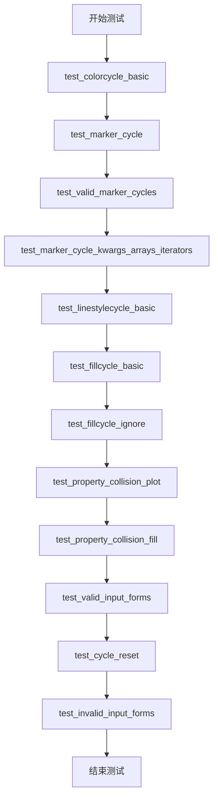
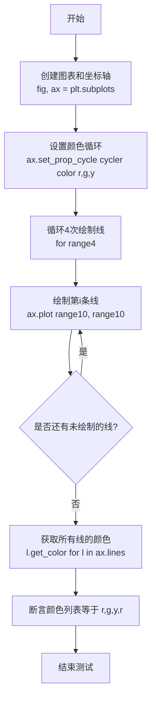
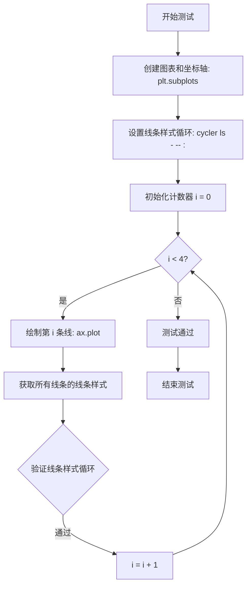
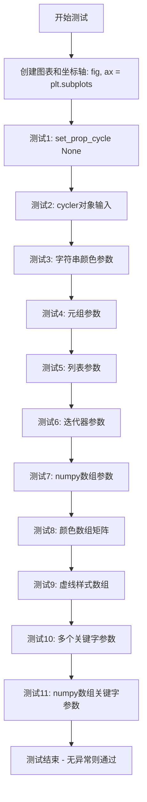

# `matplotlib\lib\matplotlib\tests\test_cycles.py` 详细设计文档

这是一个matplotlib cycler功能的测试套件，验证属性循环器在不同场景下的行为，包括颜色、标记、线型、填充等属性的循环逻辑、参数形式和属性冲突处理。

## 整体流程



## 类结构

```
无自定义类 - 纯测试模块文件
└── 测试函数集合 (12个测试函数)
```

## 全局变量及字段


    

## 全局函数及方法


### `test_colorcycle_basic`

该测试函数用于验证 Matplotlib 中颜色属性循环（color cycle）的基本功能，通过创建一个包含3种颜色的循环器（cycler），绘制4条线，并断言颜色按预期循环（当循环次数超过颜色数量时，颜色应从头重新开始）。

参数：

- （无参数）

返回值：`None`，该函数为测试函数，不返回任何值，仅通过断言验证颜色循环行为。

#### 流程图



#### 带注释源码

```python
def test_colorcycle_basic():
    """
    测试颜色循环（color cycle）的基本功能。
    
    该测试验证当设置一个包含3种颜色的属性循环器后，
    绘制4条线时颜色会按顺序循环使用，超过3条后从头重新开始。
    """
    # 步骤1：创建图形和坐标轴对象
    # 使用 matplotlib 的 subplots 创建一个新的图形窗口和一个坐标轴
    fig, ax = plt.subplots()
    
    # 步骤2：设置属性循环器
    # 创建一个颜色循环器，包含三种颜色：红色(r)、绿色(g)、黄色(y)
    # cycler 函数来自 cycler 库，用于创建属性循环器
    ax.set_prop_cycle(cycler('color', ['r', 'g', 'y']))
    
    # 步骤3：循环绘制4条线
    # 由于只设置了3种颜色，第4条线应从头开始使用第一种颜色
    for _ in range(4):
        # 每次循环绘制一条线，x和y都使用 range(10) 即 0-9
        ax.plot(range(10), range(10))
    
    # 步骤4：验证颜色循环结果
    # 获取所有已绘制线条的颜色，检查是否符合预期的循环顺序
    # 预期：第1条线红色(r)，第2条线绿色(g)，第3条线黄色(y)，第4条线重新循环为红色(r)
    assert [l.get_color() for l in ax.lines] == ['r', 'g', 'y', 'r']
```


### `test_marker_cycle`

该测试函数验证matplotlib中属性循环器（prop_cycler）同时循环颜色（color）和标记（marker）属性的功能，确保在多次绘图时颜色和标记能够正确地循环复用。

参数： 无

返回值：`None`，测试函数不返回任何值

#### 流程图

```mermaid
flowchart TD
    A[开始: test_marker_cycle] --> B[创建图形和坐标轴: fig, ax = plt.subplots]
    B --> C[设置属性循环: ax.set_prop_cycle cycler组合]
    C --> D[循环4次绘制数据: for _ in range(4)]
    D --> E[绘制线条: ax.plot]
    E --> D
    D --> F[断言验证颜色列表: assert colors == ['r', 'g', 'y', 'r']]
    F --> G[断言验证标记列表: assert markers == ['.', '*', 'x', '.']]
    G --> H[结束测试]
```

#### 带注释源码

```python
def test_marker_cycle():
    """
    测试属性循环器同时循环颜色和标记属性的功能。
    验证在多次plot调用时，颜色和标记能够正确地循环复用。
    """
    # 创建一个新的图形和坐标轴对象
    fig, ax = plt.subplots()
    
    # 设置属性循环器，组合两个cycler：
    # 1. 颜色cycler: 使用'c'键，循环['r', 'g', 'y']
    # 2. 标记cycler: 使用'marker'键，循环['.', '*', 'x']
    ax.set_prop_cycle(cycler('c', ['r', 'g', 'y']) +
                      cycler('marker', ['.', '*', 'x']))
    
    # 循环4次调用plot，每次绘制10个点
    # 期望的循环顺序：
    # 第1次: color='r', marker='.'
    # 第2次: color='g', marker='*'
    # 第3次: color='y', marker='x'
    # 第4次: color='r', marker='.' (循环回到开头)
    for _ in range(4):
        ax.plot(range(10), range(10))
    
    # 断言验证：获取所有线条的颜色列表
    # 预期: ['r', 'g', 'y', 'r'] (第4次循环回到'r')
    assert [l.get_color() for l in ax.lines] == ['r', 'g', 'y', 'r']
    
    # 断言验证：获取所有线条的标记样式列表
    # 预期: ['.', '*', 'x', '.'] (第4次循环回到'.')
    assert [l.get_marker() for l in ax.lines] == ['.', '*', 'x', '.']
```


### `test_valid_marker_cycles`

该函数用于测试matplotlib的prop_cycle功能是否能正确接受不同格式的marker属性值（整数、字符串等），验证cycler对marker属性的解析能力。

参数：
- 无

返回值：`None`，无返回值（测试函数）

#### 流程图

```mermaid
flowchart TD
    A[开始测试] --> B[创建子图和轴: fig, ax = plt.subplots]
    B --> C[设置marker属性循环: ax.set_prop_cycle(cycler(marker=[1, '+', '.', 4]))]
    C --> D[测试结束]
```

#### 带注释源码

```python
def test_valid_marker_cycles():
    """
    测试有效的marker循环配置
    
    验证set_prop_cycle能够接受不同格式的marker属性值：
    - 整数（如1, 4）
    - 字符串（如'+', '.'）
    """
    # 创建一个新的图形窗口和坐标轴
    # fig: Figure对象，表示整个图形
    # ax: Axes对象，表示坐标轴区域
    fig, ax = plt.subplots()
    
    # 设置属性循环，使用cycler指定marker属性
    # marker参数接受多种格式：数字、字符串等
    # [1, "+", ".", 4] 表示4个不同的marker样式
    ax.set_prop_cycle(cycler(marker=[1, "+", ".", 4]))
```


### `test_marker_cycle_kwargs_arrays_iterators`

该测试函数用于验证 Matplotlib 中 `set_prop_cycle` 方法支持使用 numpy 数组作为颜色值和使用迭代器作为标记值的属性循环功能，确保在绘制多条线时颜色和标记能够正确循环。

参数： 无

返回值：`None`，该函数为测试函数，不返回任何值

#### 流程图

```mermaid
flowchart TD
    A[开始测试] --> B[创建图形和坐标轴: plt.subplots]
    B --> C[设置属性循环: set_prop_cycle c=np.array, marker=iter]
    C --> D[循环4次绘制线条]
    D --> E[第1次循环: 绘制 range(10), range(10)]
    E --> F[第2次循环: 绘制 range(10), range(10)]
    F --> G[第3次循环: 绘制 range(10), range(10)]
    G --> H[第4次循环: 绘制 range(10), range(10)]
    H --> I[断言颜色列表: ['r', 'g', 'y', 'r']]
    I --> J[断言标记列表: ['.', '*', 'x', '.']]
    J --> K[测试通过]
```

#### 带注释源码

```python
def test_marker_cycle_kwargs_arrays_iterators():
    """
    测试 set_prop_cycle 支持 kwargs 形式的数组和迭代器参数
    验证颜色和标记属性的循环功能
    """
    # 创建图形和坐标轴对象
    fig, ax = plt.subplots()
    
    # 设置属性循环:
    # - c 参数使用 numpy 数组: ['r', 'g', 'y']
    # - marker 参数使用迭代器: iter(['.', '*', 'x'])
    ax.set_prop_cycle(c=np.array(['r', 'g', 'y']),
                      marker=iter(['.', '*', 'x']))
    
    # 循环4次绘制线条，验证循环机制
    for _ in range(4):
        ax.plot(range(10), range(10))
    
    # 断言验证:
    # 1. 颜色应该循环: ['r', 'g', 'y', 'r']
    #    (第4次循环回到第一个颜色 'r')
    assert [l.get_color() for l in ax.lines] == ['r', 'g', 'y', 'r']
    
    # 2. 标记应该循环: ['.', '*', 'x', '.']
    #    (第4次循环回到第一个标记 '.')
    assert [l.get_marker() for l in ax.lines] == ['.', '*', 'x', '.']
```


### `test_linestylecycle_basic`

该测试函数用于验证matplotlib中线条样式（linestyle）的循环功能是否正常工作，通过创建一个图表、设置线条样式循环、绘制多条线并验证每条线的线条样式是否符合预期的循环顺序（'-', '--', ':', '-'）。

参数：空（无参数）

返回值：`None`，因为这是一个测试函数，不返回任何值

#### 流程图



#### 带注释源码

```python
def test_linestylecycle_basic():
    """
    测试线条样式（linestyle）循环功能的基本测试函数。
    
    该测试验证当使用cycler设置线条样式循环时，
    每次调用plot会自动使用下一个线条样式，
    并且在达到循环末尾后能够正确回到第一个样式。
    """
    # 创建一个新的图表窗口和坐标轴对象
    # fig: Figure对象，表示整个图表
    # ax: Axes对象，表示坐标轴及其内容
    fig, ax = plt.subplots()
    
    # 设置属性循环器，指定'ls'（linestyle）属性
    # 循环顺序为: 实线('-') -> 虚线('--') -> 点线(':')
    # 循环器会在每次plot调用时自动切换到下一个样式
    ax.set_prop_cycle(cycler('ls', ['-', '--', ':']))
    
    # 循环4次绘制线条，验证循环功能
    # 由于只设置了3个样式，第4次应该循环回第一个样式('-')
    for _ in range(4):
        # 绘制一条从(0,0)到(9,9)的线
        # 每次plot调用会自动从cycler中获取下一个线条样式
        ax.plot(range(10), range(10))
    
    # 断言验证：获取所有线条的线条样式列表
    # 预期结果: ['-', '--', ':', '-']
    # 即: 第1条线用实线，第2条用虚线，第3条用点线，第4条循环回实线
    assert [l.get_linestyle() for l in ax.lines] == ['-', '--', ':', '-']
```


### `test_fillcycle_basic`

该测试函数用于验证 matplotlib 中 `ax.fill` 的属性循环（cycler）功能，通过设置颜色、阴影和线型的循环，检验填充图形时属性是否按预期顺序循环应用。

参数：
- 无

返回值：`None`，因为这是一个测试函数，不返回任何值。

#### 流程图

```mermaid
graph TD
    A[开始] --> B[创建图形和轴: fig, ax = plt.subplots]
    B --> C[设置属性循环: ax.set_prop_cycle 结合 cycler 设置颜色、阴影、线型]
    C --> D[循环 4 次: for _ in range(4)]
    D --> E[调用 ax.fill 填充图形: ax.fill(range(10), range(10))]
    E --> F[断言填充颜色列表正确]
    F --> G[断言填充阴影列表正确]
    G --> H[断言填充线型列表正确]
    H --> I[结束]
```

#### 带注释源码

```python
def test_fillcycle_basic():
    # 创建一个新的图形和坐标轴对象
    fig, ax = plt.subplots()
    # 设置属性循环器，指定颜色、阴影和线型的循环序列
    # cycler('c', ['r', 'g', 'y']) 定义颜色循环：红、绿、黄
    # cycler('hatch', ['xx', 'O', '|-']) 定义阴影循环：交叉线、圆点、竖线
    # cycler('linestyle', ['-', '--', ':']) 定义线型循环：实线、虚线、点线
    ax.set_prop_cycle(cycler('c',  ['r', 'g', 'y']) +
                      cycler('hatch', ['xx', 'O', '|-']) +
                      cycler('linestyle', ['-', '--', ':']))
    # 循环 4 次调用 fill 方法，每次填充一个多边形
    for _ in range(4):
        ax.fill(range(10), range(10))
    # 断言：验证填充图形的颜色列表等于预期的循环颜色列表
    # 使用 mpl.colors.to_rgba 将颜色名称转换为 RGBA 格式
    assert ([p.get_facecolor() for p in ax.patches]
            == [mpl.colors.to_rgba(c) for c in ['r', 'g', 'y', 'r']])
    # 断言：验证填充图形的阴影列表等于预期的循环阴影列表
    assert [p.get_hatch() for p in ax.patches] == ['xx', 'O', '|-', 'xx']
    # 断言：验证填充图形的线型列表等于预期的循环线型列表
    assert [p.get_linestyle() for p in ax.patches] == ['-', '--', ':', '-']
```


### `test_fillcycle_ignore`

该测试函数用于验证 matplotlib 中属性循环器（cycler）在处理不适用于特定绘图方法的属性时的行为。具体来说，当 cycler 包含不适用于 `fill` 方法的属性（如 marker）时，该属性应被忽略，而不会推进 cycler 的状态。

参数： 无

返回值：`None`，该函数为测试函数，不返回任何值

#### 流程图

```mermaid
flowchart TD
    A[开始测试] --> B[创建子图 fig, ax]
    B --> C[设置属性循环: color=['r','g','y'], hatch=['xx','O','|-'], marker=['.','*','D']]
    C --> D[调用 ax.fill with color='r', hatch='xx']
    D --> E{检查 marker 属性是否被忽略}
    E -->|是| F[调用 ax.fill with hatch='O']
    F --> G[调用 ax.fill 不指定属性]
    G --> H[调用 ax.fill 不指定属性]
    H --> I[验证 fill 后的颜色序列: ['r','r','g','y']]
    I --> J[验证 fill 后的填充图案: ['xx','O','O','|-']]
    J --> K[测试结束]
```

#### 带注释源码

```python
def test_fillcycle_ignore():
    # 创建一个新的图形和坐标轴
    fig, ax = plt.subplots()
    
    # 设置属性循环器，包含三个属性：
    # 1. color: 颜色循环 ['r', 'g', 'y']
    # 2. hatch: 填充图案循环 ['xx', 'O', '|-']
    # 3. marker: 标记循环 ['.', '*', 'D']
    # 注意：marker 不是 Polygon（fill 的返回类型）的属性，应该被忽略
    ax.set_prop_cycle(cycler('color',  ['r', 'g', 'y']) +
                      cycler('hatch', ['xx', 'O', '|-']) +
                      cycler('marker', ['.', '*', 'D']))
    
    t = range(10)
    
    # 第一次 fill：显式指定 color='r', hatch='xx'
    # 应该不推进 cycler，即使 cycler 中有 'marker' 属性
    # 因为 'marker' 不是 Polygon 属性，应该被忽略
    ax.fill(t, t, 'r', hatch='xx')
    
    # 第二次 fill：只指定 hatch='O'，color 从 cycler 获取
    # 允许 cycler 推进，但显式指定某些属性
    ax.fill(t, t, hatch='O')
    
    # 第三次 fill：不指定任何属性，完全使用 cycler 的值
    ax.fill(t, t)
    
    # 第四次 fill：不指定任何属性，完全使用 cycler 的值
    ax.fill(t, t)
    
    # 断言验证：
    # 1. 填充区域的颜色应该是 ['r', 'r', 'g', 'y']
    #    第一次：显式指定 'r'
    #    第二次：由于显式指定了 hatch='O'，color 未推进，仍为 'r'
    #    第三次：color 推进到 'g'
    #    第四次：color 推进到 'y'，然后循环回 'r'（但这里是 'y'）
    assert ([p.get_facecolor() for p in ax.patches]
            == [mpl.colors.to_rgba(c) for c in ['r', 'r', 'g', 'y']])
    
    # 2. 填充区域的图案应该是 ['xx', 'O', 'O', '|-']
    #    第一次：显式指定 'xx'
    #    第二次：显式指定 'O'
    #    第三次：使用 cycler 的 'O'（因为第二次显式指定了 hatch，但没有推进）
    #    第四次：使用 cycler 的 '|-'
    assert [p.get_hatch() for p in ax.patches] == ['xx', 'O', 'O', '|-']
```


### `test_property_collision_plot`

该函数用于测试 matplotlib 中属性循环（property cycle）的冲突处理机制，验证当显式指定的线条属性（如 `lw`）与通过 `set_prop_cycle` 设置的循环属性发生冲突时，优先使用显式指定值的正确行为。

参数： 无

返回值： `None`，该函数为测试函数，通过 `assert` 语句进行断言验证，不返回具体值

#### 流程图

```mermaid
flowchart TD
    A[开始测试] --> B[创建图形和坐标轴: plt.subplots]
    C[设置属性循环: set_prop_cycle<br/>'linewidth' 列表为 [2, 4]]
    B --> C
    C --> D[创建数据: t = range(10)]
    D --> E[循环3次绘制线条<br/>每次显式指定 lw=0.1]
    E --> F[绘制第4条线<br/>使用循环的线宽值 2]
    F --> G[绘制第5条线<br/>使用循环的线宽值 4]
    G --> H[获取所有线条的线宽列表]
    H --> I{断言验证}
    I --> |通过| J[测试通过]
    I --> |失败| K[抛出 AssertionError]
    J --> L[结束测试]
    
    style I fill:#f9f,stroke:#333
    style J fill:#9f9,stroke:#333
    style K fill:#f99,stroke:#333
```

#### 带注释源码

```python
def test_property_collision_plot():
    """
    测试属性循环冲突场景：验证显式指定的属性值优先于循环属性
    
    该测试验证当调用 ax.plot() 时显式传入属性参数（如 lw=0.1），
    会覆盖 set_prop_cycle() 中设置的循环属性
    """
    # 创建新的图形和坐标轴对象
    fig, ax = plt.subplots()
    
    # 设置线条宽度的属性循环，循环值为 [2, 4]
    # 注意：第一个参数使用字符串 'linewidth'，第二个参数为列表
    ax.set_prop_cycle('linewidth', [2, 4])
    
    # 创建数据序列 t，值为 0-9
    t = range(10)
    
    # 循环3次，每次绘制线条并显式指定 lw=0.1
    # 关键点：即使设置了属性循环，显式指定的 lw=0.1 会优先使用
    for c in range(1, 4):
        ax.plot(t, t, lw=0.1)  # lw=0.1 覆盖了循环中的 linewidth
    
    # 绘制第4条线，不指定 lw，使用循环中的第一个值 2
    ax.plot(t, t)
    
    # 绘制第5条线，不指定 lw，使用循环中的第二个值 4
    ax.plot(t, t)
    
    # 断言验证：
    # 前3条线使用了显式指定的 lw=0.1
    # 第4条线使用循环值 2
    # 第5条线使用循环值 4
    # 循环结束后会循环回到第一个值，但由于只有2个循环值且用了2次，
    # 所以第4次是2，第5次是4
    assert [l.get_linewidth() for l in ax.lines] == [0.1, 0.1, 0.1, 2, 4]
```


### `test_property_collision_fill`

描述：该测试函数用于验证 Matplotlib 中 `Axes.fill` 方法在属性循环器（Property Cycler）启用时的冲突处理机制。测试重点在于当显式指定 `fill` 的参数（如 `lw`）时，是否能正确覆盖循环器中的默认值，同时未指定的属性（如 `facecolor`）是否能够按照循环器正确推进。

参数：
- 无（此函数不接受任何显式参数）

返回值：`None`。该函数通过内部的断言语句来判定测试成功，若断言失败则抛出异常。

#### 流程图

```mermaid
graph TD
    A([开始]) --> B[创建 fig, ax]
    B --> C[设置属性循环器: linewidth=[2..6], facecolor='bgcmy']
    C --> D[定义数据 t=range(10)]
    D --> E{循环 3 次}
    E -->|是| F[调用 ax.fill(t, t, lw=0.1)]
    F --> G[cycler 推进 facecolor, 但 linewidth 被显式覆盖为 0.1]
    G --> E
    E -->|否| H[调用 ax.fill(t, t) - 无参数]
    H --> I[cycler 推进 facecolor='m', linewidth='5']
    I --> J[调用 ax.fill(t, t) - 无参数]
    J --> K[cycler 推进 facecolor='y', linewidth='6']
    K --> L[断言 facecolor 序列为 'bgcmy']
    L --> M[断言 linewidth 序列为 0.1, 0.1, 0.1, 5, 6]
    M --> N([结束])
```

#### 带注释源码

```python
def test_property_collision_fill():
    # 初始化测试环境：创建一个新的图形和坐标轴
    fig, ax = plt.subplots()
    
    # 配置属性循环器
    # 设定线宽循环: [2, 3, 4, 5, 6]
    # 设定面颜色循环: 'bgcmy' (蓝, 绿, 青, 红, 黄)
    ax.set_prop_cycle(linewidth=[2, 3, 4, 5, 6], facecolor='bgcmy')
    
    # 准备绘图数据
    t = range(10)
    
    # 第一次循环：显式覆盖线宽
    # 循环3次调用 fill，每次显式传入 lw=0.1
    # 预期：linewdith 固定为 0.1 (不受 cycler 影响)
    # 预期：facecolor 依次变为 'b', 'g', 'c' (cycler 正常推进)
    for c in range(1, 4):
        ax.fill(t, t, lw=0.1)
        
    # 第二次调用：不带任何显式参数
    # 预期：使用 cycler 下一个值，facecolor 变为 'm' (洋红), linewidth 变为 5
    ax.fill(t, t)
    
    # 第三次调用：不带任何显式参数
    # 预期：使用 cycler 下一个值，facecolor 变为 'y' (黄), linewidth 变为 6
    ax.fill(t, t)
    
    # 断言验证：检查所有填充块(patches)的颜色序列是否符合预期
    # 预期顺序：b, g, c, m, y
    assert ([p.get_facecolor() for p in ax.patches]
            == [mpl.colors.to_rgba(c) for c in 'bgcmy'])
            
    # 断言验证：检查所有填充块的线宽序列是否符合预期
    # 预期顺序：前3次被显式覆盖为 0.1，后2次使用 cycler 值 5 和 6
    assert [p.get_linewidth() for p in ax.patches] == [0.1, 0.1, 0.1, 5, 6]
```


### `test_valid_input_forms`

该测试函数用于验证matplotlib的`set_prop_cycle`方法能够正确处理各种有效的输入形式，包括None、cycler对象、字符串、列表、元组、迭代器和numpy数组等不同参数形式，确保属性循环设置功能的健壮性和灵活性。

参数：此函数无显式参数

返回值：`None`，测试函数通过验证所有`set_prop_cycle`调用不抛出异常来表示测试通过

#### 流程图



#### 带注释源码

```python
def test_valid_input_forms():
    """测试set_prop_cycle方法接受各种有效输入形式"""
    # 创建图表和坐标轴对象
    fig, ax = plt.subplots()
    
    # 测试1: 传入None应该重置属性循环
    ax.set_prop_cycle(None)
    
    # 测试2: 使用cycler对象设置线宽属性循环
    ax.set_prop_cycle(cycler('linewidth', [1, 2]))
    
    # 测试3: 使用字符串设置颜色循环 (单参数形式)
    ax.set_prop_cycle('color', 'rgywkbcm')
    
    # 测试4: 使用元组设置线宽循环
    ax.set_prop_cycle('lw', (1, 2))
    
    # 测试5: 使用列表设置线宽循环
    ax.set_prop_cycle('linewidth', [1, 2])
    
    # 测试6: 使用迭代器设置线宽循环
    ax.set_prop_cycle('linewidth', iter([1, 2]))
    
    # 测试7: 使用numpy数组设置线宽循环
    ax.set_prop_cycle('linewidth', np.array([1, 2]))
    
    # 测试8: 使用numpy数组设置RGB颜色矩阵
    ax.set_prop_cycle('color', np.array([[1, 0, 0],
                                         [0, 1, 0],
                                         [0, 0, 1]]))
    
    # 测试9: 设置虚线样式循环
    ax.set_prop_cycle('dashes', [[], [13, 2], [8, 3, 1, 3]])
    
    # 测试10: 使用多个关键字参数 (list形式)
    ax.set_prop_cycle(lw=[1, 2], color=['k', 'w'], ls=['-', '--'])
    
    # 测试11: 使用多个关键字参数 (numpy array形式)
    ax.set_prop_cycle(lw=np.array([1, 2]),
                      color=np.array(['k', 'w']),
                      ls=np.array(['-', '--']))
```


### `test_cycle_reset`

该测试函数用于验证 matplotlib 中 `set_prop_cycle` 方法的重置功能，通过比较设置自定义属性循环前后以及重置为默认属性后的输出，确认重置操作能够正确恢复默认属性。

参数：
- 无

返回值：`None`，该函数为测试函数，通过 assert 语句进行断言验证

#### 流程图

```mermaid
flowchart TD
    A[开始测试] --> B[创建fig和ax对象]
    B --> C[创建三个StringIO对象 prop0, prop1, prop2]
    C --> D[捕获默认属性输出 prop0]
    D --> E[调用ax.set_prop_cycle设置linewidth=[10, 9, 4]]
    E --> F[捕获设置后的属性输出 prop1]
    F --> G{断言: prop1 != prop0?}
    G -->|是| H[断言通过: 自定义cycle生效]
    G -->|否| I[测试失败]
    H --> J[调用ax.set_prop_cycle None重置]
    J --> K[捕获重置后的属性输出 prop2]
    K --> L{断言: prop2 == prop0?}
    L -->|是| M[断言通过: reset成功恢复默认]
    L -->|否| N[测试失败]
    M --> O[结束测试]
```

#### 带注释源码

```python
def test_cycle_reset():
    """
    测试 set_prop_cycle 重置功能。
    验证通过 set_prop_cycle(None) 可以重置属性循环为默认值。
    """
    # 创建图形和坐标轴对象
    fig, ax = plt.subplots()
    
    # 创建三个 StringIO 对象用于捕获标准输出
    # prop0: 存储默认属性的输出
    # prop1: 存储设置自定义 cycle 后的属性输出
    # prop2: 存储重置后的属性输出
    prop0 = StringIO()
    prop1 = StringIO()
    prop2 = StringIO()

    # 步骤1: 获取默认属性并捕获输出
    # 使用 contextlib.redirect_stdout 将 stdout 重定向到 prop0
    with contextlib.redirect_stdout(prop0):
        # 绘制一条线并获取其属性
        plt.getp(ax.plot([1, 2], label="label")[0])

    # 步骤2: 设置自定义的属性循环 (linewidth)
    ax.set_prop_cycle(linewidth=[10, 9, 4])
    
    # 捕获设置自定义 cycle 后的属性输出
    with contextlib.redirect_stdout(prop1):
        plt.getp(ax.plot([1, 2], label="label")[0])
    
    # 断言: 自定义 cycle 的输出应该与默认不同
    assert prop1.getvalue() != prop0.getvalue()

    # 步骤3: 重置属性循环为默认值 (传入 None)
    ax.set_prop_cycle(None)
    
    # 捕获重置后的属性输出
    with contextlib.redirect_stdout(prop2):
        plt.getp(ax.plot([1, 2], label="label")[0])
    
    # 断言: 重置后的输出应该与默认相同
    assert prop2.getvalue() == prop0.getvalue()
```


### `test_invalid_input_forms`

该函数是一个单元测试函数，用于验证 `ax.set_prop_cycle()` 方法在接收无效输入时是否正确抛出 `TypeError` 或 `ValueError` 异常。测试覆盖了多种无效输入场景，包括整数、列表、字符串、集合、字典、关键字参数、cycler 对象等不合法的参数形式。

参数：

- 无

返回值：`None`，无返回值（测试函数）

#### 流程图

```mermaid
flowchart TD
    A[开始测试 test_invalid_input_forms] --> B[创建 fig 和 ax]
    B --> C1[测试: ax.set_prop_cycle(1)]
    C1 --> C2[测试: ax.set_prop_cycle([1, 2])]
    C2 --> C3[测试: ax.set_prop_cycle('color', 'fish')]
    C3 --> C4[测试: ax.set_prop_cycle('linewidth', 1)]
    C4 --> C5[测试: ax.set_prop_cycle('linewidth', {1, 2})]
    C5 --> C6[测试: ax.set_prop_cycle(linewidth=1, color='r')]
    C6 --> C7[测试: ax.set_prop_cycle('foobar', [1, 2])]
    C7 --> C8[测试: ax.set_prop_cycle(foobar=[1, 2])]
    C8 --> C9[测试: ax.set_prop_cycle(cycler(foobar=[1, 2]))]
    C9 --> C10[测试: ax.set_prop_cycle(cycler(color='rgb', c='cmy'))]
    C10 --> D[测试结束]
    
    C1 -.-> E1[期望抛出 TypeError 或 ValueError]
    C2 -.-> E2[期望抛出 TypeError 或 ValueError]
    C3 -.-> E3[期望抛出 TypeError 或 ValueError]
    C4 -.-> E4[期望抛出 TypeError 或 ValueError]
    C5 -.-> E5[期望抛出 TypeError 或 ValueError]
    C6 -.-> E6[期望抛出 TypeError 或 ValueError]
    C7 -.-> E7[期望抛出 TypeError 或 ValueError]
    C8 -.-> E8[期望抛出 TypeError 或 ValueError]
    C9 -.-> E9[期望抛出 TypeError 或 ValueError]
    C10 -.-> E10[期望抛出 ValueError]
```

#### 带注释源码

```python
def test_invalid_input_forms():
    """
    测试 ax.set_prop_cycle() 在接收无效输入时是否正确抛出异常。
    该测试函数验证了各种无效的参数形式，确保库能够正确处理错误输入。
    """
    # 创建一个新的图形和轴对象，用于测试
    fig, ax = plt.subplots()

    # 测试场景1: 传入整数参数
    # 期望: 抛出 TypeError 或 ValueError
    with pytest.raises((TypeError, ValueError)):
        ax.set_prop_cycle(1)

    # 测试场景2: 传入列表参数（非 cycler 对象）
    # 期望: 抛出 TypeError 或 ValueError
    with pytest.raises((TypeError, ValueError)):
        ax.set_prop_cycle([1, 2])

    # 测试场景3: 传入无效的颜色字符串
    # 'fish' 不是有效的颜色名称，期望抛出 TypeError 或 ValueError
    with pytest.raises((TypeError, ValueError)):
        ax.set_prop_cycle('color', 'fish')

    # 测试场景4: 传入整数作为线宽值（需要可迭代对象）
    # 期望: 抛出 TypeError 或 ValueError
    with pytest.raises((TypeError, ValueError)):
        ax.set_prop_cycle('linewidth', 1)

    # 测试场景5: 传入集合作为线宽值
    # 集合不是有效的可迭代类型，期望抛出 TypeError 或 ValueError
    with pytest.raises((TypeError, ValueError)):
        ax.set_prop_cycle('linewidth', {1, 2})

    # 测试场景6: 使用关键字参数时传入非可迭代值
    # linewidth=1 不是可迭代对象，期望抛出 TypeError 或 ValueError
    with pytest.raises((TypeError, ValueError)):
        ax.set_prop_cycle(linewidth=1, color='r')

    # 测试场景7: 使用未知的属性名称（字符串形式）
    # 'foobar' 不是有效的属性名，期望抛出 TypeError 或 ValueError
    with pytest.raises((TypeError, ValueError)):
        ax.set_prop_cycle('foobar', [1, 2])

    # 测试场景8: 使用未知的属性名称（关键字参数形式）
    # foobar 不是有效的属性名，期望抛出 TypeError 或 ValueError
    with pytest.raises((TypeError, ValueError)):
        ax.set_prop_cycle(foobar=[1, 2])

    # 测试场景9: 使用 cycler 对象时传入未知的属性名
    # cycler(foobar=[1, 2]) 创建了一个包含未知属性的 cycler，期望抛出异常
    with pytest.raises((TypeError, ValueError)):
        ax.set_prop_cycle(cycler(foobar=[1, 2]))

    # 测试场景10: 使用 cycler 对象时传入重复的属性（颜色参数重复）
    # cycler(color='rgb', c='cmy') 同时指定了 color 和 c，两者都表示颜色，冲突
    # 期望: 抛出 ValueError
    with pytest.raises(ValueError):
        ax.set_prop_cycle(cycler(color='rgb', c='cmy'))
```

## 关键组件


### Property Cycler (cycler)

matplotlib的属性循环器，用于在连续绘图时自动循环遍历预设的属性值列表（如颜色、标记、线型等）

### Color Cycling（颜色循环）

通过set_prop_cycle设置颜色列表，实现图表颜色的自动轮换，支持基本颜色名称和RGBA数组

### Marker Cycling（标记循环）

循环遍历不同的标记类型（如'.', '*', 'x'等），与颜色cycler组合使用实现多属性联合循环

### Linestyle Cycling（线型循环）

循环遍历不同的线型样式（如'-', '--', ':'等），用于控制图表线条的显示样式

### Fill/Hatch Cycling（填充/阴影循环）

针对fill操作设置循环属性，包括facecolor、hatch（阴影图案）和linestyle的联合循环

### Property Collision Handling（属性冲突处理）

当cycler中的属性与plot/fill调用中直接指定的属性冲突时，系统优先使用直接指定的值，避免属性覆盖

### Input Validation（输入验证）

set_prop_cycle支持多种输入形式（cycler对象、关键字参数、字符串参数、数组、迭代器等），并对无效输入抛出TypeError或ValueError异常

### Cycle Reset（循环重置）

通过set_prop_cycle(None)将属性cycler重置为默认状态，恢复到初始属性配置

### Multiple Cycler Combination（多cycler组合）

使用+运算符合并多个cycler对象，实现属性组合循环（如颜色+标记+线型的同时循环）


## 问题及建议


### 已知问题

- **资源未释放**：所有测试函数都创建了图形对象（`fig, ax = plt.subplots()`），但从未调用 `plt.close()` 释放资源，可能导致内存泄漏和资源浪费
- **测试隔离性不足**：测试之间共享全局matplotlib状态，可能存在隐式依赖，后续测试可能受前面测试的影响
- **`test_valid_marker_cycles` 函数无效**：该函数只设置了属性循环但没有任何断言语句，无法验证任何功能，测试形同虚设
- **重复代码模式**：多个测试函数中重复出现 `fig, ax = plt.subplots()` 和 `for _ in range(4): ax.plot(range(10), range(10))` 的模式
- **硬编码断言**：断言中大量使用硬编码的预期值（如 `['r', 'g', 'y', 'r']`），降低了测试的可维护性
- **测试方法可复用性低**：未使用pytest fixtures来共享setup逻辑，导致代码冗余

### 优化建议

- 使用 `@pytest.fixture` 创建图形fixture并在测试结束后自动清理资源：`@pytest.fixture def fig_and_ax(): fig, ax = plt.subplots(); yield fig, ax; plt.close(fig)`
- 为 `test_valid_marker_cycles` 添加有效的断言逻辑，或删除该测试函数
- 使用 pytest 的 `parametrize` 装饰器重构 `test_invalid_input_forms`，减少重复代码
- 考虑使用pytest参数化测试来合并相似的测试场景，减少代码重复
- 将通用的测试数据和断言逻辑提取为辅助函数或fixtures，提高代码复用性

## 其它


### 设计目标与约束

验证 matplotlib 中 Axes.set_prop_cycle() 方法的功能正确性，确保属性循环（cycler）能够正确地在绘图操作中按预期顺序迭代和应用各种绘图属性（颜色、标记、线型、填充等），同时验证无效输入能够被正确拒绝。

### 错误处理与异常设计

测试代码使用 pytest.raises() 验证了多种无效输入场景：传入整数（TypeError/ValueError）、列表而非 cycler 对象（TypeError/ValueError）、无效颜色字符串（TypeError/ValueError）、无效线宽类型（TypeError/ValueError）、集合类型（TypeError/ValueError）、同时传入标量和关键字参数（TypeError/ValueError）、无效属性名（TypeError/ValueError）以及 cycler 内部属性冲突（ValueError）。

### 数据流与状态机

属性cycler维护一个内部状态指针，每次plot()或fill()调用后自动前进到下一个属性组合。测试验证了循环的周期性行为：属性用尽后从第一个开始重新循环。set_prop_cycle(None)可重置为默认属性状态。

### 外部依赖与接口契约

依赖matplotlib、numpy、pytest、cycler库。核心接口为ax.set_prop_cycle()，接受cycler对象、None、属性名+值序列或关键字参数等形式。返回None。调用plot()和fill()方法时会消费cycler状态。

### 性能考虑

测试仅验证功能正确性，未包含性能基准测试。当前实现每次绘图操作都需要查询当前cycler状态，可能存在优化空间。

### 可维护性与扩展性

测试按功能模块划分（颜色循环、标记循环、线型循环、填充循环、属性冲突、输入验证、重置功能），每个测试函数聚焦单一场景，便于维护和扩展新属性类型的测试。

### 测试覆盖与质量标准

覆盖基本循环、多属性组合循环、数组/迭代器输入、循环重置、属性冲突处理、无效输入拒绝等场景。使用assert精确验证预期值，测试失败时能快速定位问题。

### 版本兼容性与迁移考虑

测试验证了set_prop_cycle(None)重置功能，确保与默认属性状态的兼容性。cycler库版本兼容性需关注，API稳定性良好。


    