# `matplotlib\lib\matplotlib\tests\test_dates.py` 详细设计文档

这是一个pytest测试文件，用于测试matplotlib中与日期相关的功能，包括numpy日期数组兼容性、日期转换、日期格式化器、日期定位器、时区处理以及各种日期绘图功能。

## 整体流程

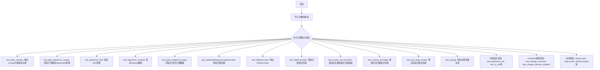

## 类结构

```
测试文件 (无类结构)
├── 辅助函数
│   ├── _new_epoch_decorator (装饰器)
│   ├── _test_date2num_dst (内部测试函数)
│   ├── dt_tzaware (内部datetime子类)
│   ├── date_range (内部辅助函数)
│   ├── tz_convert (内部辅助函数)
│   └── _test_rrulewrapper (内部测试函数)
└── 测试函数 (约50+个test_xxx函数)
```

## 全局变量及字段


### `dt_tzaware`
    
用于复现pandas Timestamp的时区规范化行为，特别是在处理夏令时转换时的日期时间减法操作

类型：`datetime.datetime subclass`
    


### `dt_tzaware.dt_tzaware`
    
继承自datetime.datetime，用于复现pandas时区规范化行为

类型：`datetime.datetime`
    


### `dt_tzaware.__sub__`
    
重写减法操作，在结果上应用时区规范化

类型：`method`
    


### `dt_tzaware.__add__`
    
重写加法操作，返回带时区的日期时间对象

类型：`method`
    


### `dt_tzaware.astimezone`
    
将日期时间转换到不同时区并保持时区信息

类型：`method`
    


### `dt_tzaware.mk_tzaware`
    
类方法，根据给定属性创建新的dt_tzaware实例

类型：`classmethod`
    
    

## 全局函数及方法


### `test_date_numpyx`

该测试函数验证 numpy 的 `datetime64` 类型与 Python 标准库 `datetime` 对象在 matplotlib 绘图中的兼容性和一致性。通过分别在 x 轴和 y 轴上绘制两种时间类型，并比较其底层数据是否相等，确保 matplotlib 能正确处理 numpy 日期时间类型。

参数： 无

返回值： `None`，该函数为测试函数，无返回值

#### 流程图

```mermaid
flowchart TD
    A[开始] --> B[创建基准日期 datetime.datetime 2017-01-01]
    B --> C[生成包含3个元素的日期列表 time]
    C --> D[将日期列表转换为 numpy datetime64 数组 timenp]
    D --> E[创建数据数组 data = [0., 2., 1.]]
    E --> F[创建第一个子图 ax1]
    F --> G[在 ax1 上绘制 time vs data 和 timenp vs data]
    G --> H[断言比较两条曲线的 xdata 是否相等]
    H --> I[创建第二个子图 ax2]
    I --> J[在 ax2 上绘制 data vs time 和 data vs timenp]
    J --> K[断言比较两条曲线的 ydata 是否相等]
    K --> L[结束]
```

#### 带注释源码

```python
def test_date_numpyx():
    """
    测试 numpy datetime64 类型与 Python datetime 对象在 matplotlib 绘图中的兼容性。
    验证两种时间类型在坐标轴上的数据表现一致。
    """
    # 创建基准日期：2017年1月1日
    base = datetime.datetime(2017, 1, 1)
    
    # 使用列表推导式生成连续三天的日期列表
    # 结果：[datetime(2017,1,1), datetime(2017,1,2), datetime(2017,1,3)]
    time = [base + datetime.timedelta(days=x) for x in range(0, 3)]
    
    # 将 Python datetime 列表转换为 numpy datetime64 数组，精度为纳秒
    timenp = np.array(time, dtype='datetime64[ns]')
    
    # 创建对应的数据值数组
    data = np.array([0., 2., 1.])
    
    # 创建第一个图形，尺寸为 10x2 英寸
    fig = plt.figure(figsize=(10, 2))
    # 添加 1x1 网格的第1个子图
    ax = fig.add_subplot(1, 1, 1)
    
    # 绘制 Python datetime 列表作为 x 轴，数据作为 y 轴
    h, = ax.plot(time, data)
    # 绘制 numpy datetime64 数组作为 x 轴，数据作为 y 轴
    hnp, = ax.plot(timenp, data)
    
    # 验证两种时间类型绘制的 x 轴数据完全一致
    # orig=False 表示获取原始传入的数据，而非转换后的数据
    np.testing.assert_equal(h.get_xdata(orig=False), hnp.get_xdata(orig=False))
    
    # 创建第二个图形，测试将时间类型作为 y 轴的情况
    fig = plt.figure(figsize=(10, 2))
    ax = fig.add_subplot(1, 1, 1)
    
    # 绘制数据作为 x 轴，Python datetime 作为 y 轴
    h, = ax.plot(data, time)
    # 绘制数据作为 x 轴，numpy datetime64 作为 y 轴
    hnp, = ax.plot(data, timenp)
    
    # 验证两种时间类型绘制的 y 轴数据完全一致
    np.testing.assert_equal(h.get_ydata(orig=False), hnp.get_ydata(orig=False))
```


### `test_date_date2num_numpy`

该测试函数用于验证 matplotlib 的 `date2num` 函数能够正确处理 numpy 的 datetime64 数组类型，确保不同精度（秒、微秒、毫秒、纳秒）的 datetime64 数据转换结果与 Python datetime 对象转换结果一致。

参数：

- `t0`：`datetime.datetime` 或 `list`，待转换的原始时间数据，可以是单个 datetime 对象、datetime 列表或嵌套列表
- `dtype`：`str`，numpy datetime64 的精度类型，可选值为 `'datetime64[s]'`、`'datetime64[us]'`、`'datetime64[ms]'`、`'datetime64[ns]'`

返回值：`None`，该函数为测试函数，无返回值，通过 `np.testing.assert_equal` 断言验证转换结果一致性

#### 流程图

```mermaid
flowchart TD
    A[开始测试] --> B[参数化: t0 三种形式<br/>datetime / list / 嵌套list]
    B --> C[参数化: dtype 四种精度<br/>s / us / ms / ns]
    C --> D[使用 datetime 对象转换<br/>time = mdates.date2num(t0)]
    D --> E[转换为 numpy datetime64<br/>tnp = np.array(t0, dtype=dtype)]
    E --> F[使用 datetime64 转换<br/>nptime = mdates.date2num(tnp)]
    F --> G{验证结果一致性<br/>np.testing.assert_equal}
    G -->|通过| H[测试通过]
    G -->|失败| I[抛出断言错误]
```

#### 带注释源码

```python
@pytest.mark.parametrize('t0', [
    # 测试单个 datetime 对象
    datetime.datetime(2017, 1, 1, 0, 1, 1),
    # 测试 datetime 对象列表（一维）
    [datetime.datetime(2017, 1, 1, 0, 1, 1),
     datetime.datetime(2017, 1, 1, 1, 1, 1)],
    # 测试嵌套 datetime 对象列表（二维）
    [[datetime.datetime(2017, 1, 1, 0, 1, 1),
      datetime.datetime(2017, 1, 1, 1, 1, 1)],
     [datetime.datetime(2017, 1, 1, 2, 1, 1),
      datetime.datetime(2017, 1, 1, 3, 1, 1)]]])
@pytest.mark.parametrize('dtype', [
    # 测试不同精度的 datetime64 类型
    'datetime64[s]',   # 秒级精度
    'datetime64[us]',  # 微秒级精度
    'datetime64[ms]',  # 毫秒级精度
    'datetime64[ns]']) # 纳秒级精度
def test_date_date2num_numpy(t0, dtype):
    # 第一步：使用 Python datetime 对象进行转换
    # 获取基准转换结果
    time = mdates.date2num(t0)
    
    # 第二步：将输入转换为 numpy datetime64 数组
    # 使用指定的精度类型进行转换
    tnp = np.array(t0, dtype=dtype)
    
    # 第三步：使用 matplotlib 的 date2num 函数转换 datetime64
    # 验证其处理 numpy datetime64 类型的能力
    nptime = mdates.date2num(tnp)
    
    # 第四步：断言两种转换方式的结果完全相等
    # 确保 datetime64 转换与 datetime 转换结果一致
    np.testing.assert_equal(time, nptime)
```


### `test_date2num_NaT`

该函数是一个 pytest 测试用例，用于验证 `matplotlib.dates.date2num` 函数能够正确处理包含 NaT（Not a Time）值的 numpy datetime64 数组。

参数：

- `dtype`：`str`，numpy datetime64 的时间精度类型（如 'datetime64[s]'、'datetime64[us]'、'datetime64[ms]'、'datetime64[ns]'）

返回值：`None`，该函数为测试函数，无返回值

#### 流程图

```mermaid
flowchart TD
    A[开始] --> B[接收dtype参数]
    B --> C[创建datetime对象 t0 = datetime.datetime(2017, 1, 1, 0, 1, 1)]
    C --> D[计算期望结果模板 tmpl = [mdates.date2num(t0), np.nan]]
    D --> E[创建numpy数组 tnp = np.array([t0, 'NaT'], dtype=dtype)]
    E --> F[调用 mdates.date2num(tnp) 转换数组]
    F --> G[使用 np.testing.assert_array_equal 比较结果与模板]
    G --> H{断言是否通过}
    H -->|通过| I[测试通过]
    H -->|失败| J[抛出断言错误]
```

#### 带注释源码

```python
@pytest.mark.parametrize('dtype', ['datetime64[s]',
                                   'datetime64[us]',
                                   'datetime64[ms]',
                                   'datetime64[ns]'])
def test_date2num_NaT(dtype):
    """
    测试 date2num 函数能否正确处理包含 NaT 值的 numpy datetime64 数组。
    
    该测试覆盖多种 datetime64 时间精度：秒、毫秒、微秒、纳秒。
    """
    # 创建一个基准 datetime 对象
    t0 = datetime.datetime(2017, 1, 1, 0, 1, 1)
    
    # 期望的转换结果：第一个元素是 datetime 转换为数字，第二个元素是 NaT 应转换为 nan
    tmpl = [mdates.date2num(t0), np.nan]
    
    # 创建一个包含有效 datetime 和 'NaT' 的 numpy 数组，使用指定的时间精度 dtype
    tnp = np.array([t0, 'NaT'], dtype=dtype)
    
    # 调用 matplotlib 的 date2num 函数进行转换
    nptime = mdates.date2num(tnp)
    
    # 验证转换结果与期望模板一致
    np.testing.assert_array_equal(tmpl, nptime)
```


### `test_date2num_NaT_scalar`

该测试函数验证 matplotlib 的 `date2num` 函数能够正确处理不同时间精度单位下的 NumPy datetime64 NaT（Not a Time）标量值，并确保转换结果为 NaN。

参数：

- `units`：`str`，时间单位参数，通过 pytest parametrize 装饰器提供可选值 `'s'`（秒）、`'ms'`（毫秒）、`'us'`（微秒）、`'ns'`（纳秒），用于指定 numpy datetime64 的时间精度

返回值：`None`，该函数为测试函数，无返回值，使用 assert 断言验证转换结果的正确性

#### 流程图

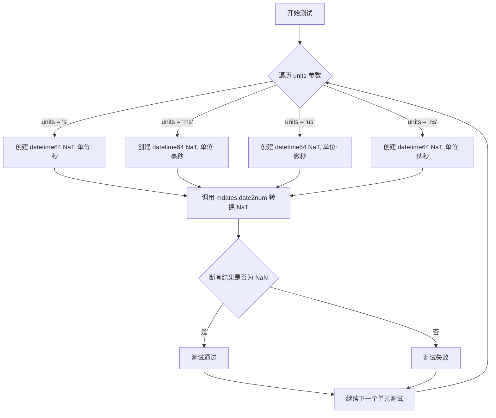

#### 带注释源码

```python
@pytest.mark.parametrize('units', ['s', 'ms', 'us', 'ns'])
def test_date2num_NaT_scalar(units):
    """
    测试 date2num 处理 NaT 标量的能力。
    
    该测试验证当输入为 numpy datetime64 类型的 NaT (Not a Time) 值时，
    date2num 函数能够正确将其转换为浮点数表示的 NaN。
    
    参数:
        units (str): 时间单位，可选 's', 'ms', 'us', 'ns'
                    对应秒、毫秒、微秒、纳秒精度
    """
    # 使用指定单位创建 NaT (Not a Time) 标量值
    # NaT 是 numpy datetime64 中表示"非时间"的特殊值
    nat_value = np.datetime64('NaT', units)
    
    # 调用 matplotlib.dates.date2num 将 NaT 转换为数值表示
    # 期望返回 NaN (Not a Number)
    tmpl = mdates.date2num(nat_value)
    
    # 断言转换结果为 NaN
    # 这是测试的关键验证点：NaT 应该被转换为数值的 NaN
    assert np.isnan(tmpl)
```


### `test_date2num_masked`

该函数是 `matplotlib.dates` 模块中的一个测试函数，用于验证 `date2num` 函数在处理带有掩码的 NumPy 数组（Masked Array）时能否正确保留掩码信息。测试覆盖了两种场景：不带时区信息和带时区信息（UTC）的情况。

参数： 无

返回值： 无（测试函数无返回值，通过 `np.testing.assert_array_equal` 断言验证结果）

#### 流程图

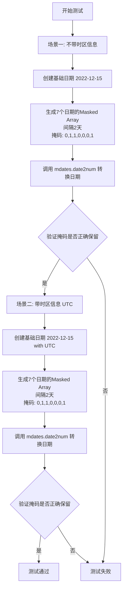

#### 带注释源码

```python
def test_date2num_masked():
    """
    测试 date2num 函数处理 Masked Array 时是否能正确保留掩码信息
    
    该测试验证了 matplotlib.dates.date2num 函数在转换包含掩码的日期数组时，
    能够正确保留掩码（mask）信息，确保被掩码遮挡的数据点在转换后依然保持掩码状态。
    """
    
    # ============================================================
    # 场景一：不带时区信息 (tzinfo) 的测试
    # ============================================================
    
    # 创建基础日期：2022年12月15日
    base = datetime.datetime(2022, 12, 15)
    
    # 生成7个日期的Masked Array：
    # - 日期间隔：每2天递增 (0, 2, 4, 6, 8, 10, 12天)
    # - 掩码配置：[0,1,1,0,0,0,1]
    #   - 索引0: 不掩码 (False) -> 2022-12-15
    #   - 索引1: 掩码 (True)    -> 2022-12-17
    #   - 索引2: 掩码 (True)    -> 2022-12-19
    #   - 索引3: 不掩码 (False) -> 2022-12-21
    #   - 索引4: 不掩码 (False) -> 2022-12-23
    #   - 索引5: 不掩码 (False) -> 2022-12-25
    #   - 索引6: 掩码 (True)    -> 2022-12-27
    dates = np.ma.array([base + datetime.timedelta(days=(2 * i))
                         for i in range(7)], mask=[0, 1, 1, 0, 0, 0, 1])
    
    # 调用 mdates.date2num 将日期转换为数值格式（matplotlib内部使用的日期序列号）
    npdates = mdates.date2num(dates)
    
    # 验证转换后的掩码是否与原始掩码一致
    # 预期掩码：(False, True, True, False, False, False, True)
    np.testing.assert_array_equal(np.ma.getmask(npdates),
                                  (False, True, True, False, False, False,
                                   True))

    # ============================================================
    # 场景二：带时区信息 (UTC) 的测试
    # ============================================================
    
    # 创建带UTC时区的基础日期：2022年12月15日 00:00:00+00:00
    base = datetime.datetime(2022, 12, 15, tzinfo=mdates.UTC)
    
    # 生成与场景一相同结构的Masked Array，但带有时区信息
    dates = np.ma.array([base + datetime.timedelta(days=(2 * i))
                         for i in range(7)], mask=[0, 1, 1, 0, 0, 0, 1])
    
    # 同样调用 date2num 进行转换
    npdates = mdates.date2num(dates)
    
    # 验证带时区的日期转换后掩码信息仍然正确保留
    np.testing.assert_array_equal(np.ma.getmask(npdates),
                                  (False, True, True, False, False, False,
                                   True))
```


### `test_date_empty`

该测试函数用于验证在没有提供日期数据的情况下，当告知Matplotlib要绘制日期轴时的默认行为是否符合预期。它测试两种不同的epoch设置情况，确保x轴的默认范围被正确设置为从"1970-01-01"到"1970-01-02"。

参数： 无

返回值： 无（测试函数，不返回任何值）

#### 流程图

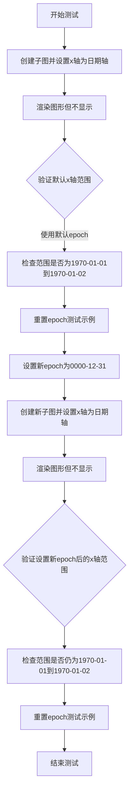

#### 带注释源码

```python
def test_date_empty():
    """
    测试在没有日期数据时，xaxis_date() 的默认行为。
    验证当没有提供任何日期数据时，x轴的默认范围是否正确设置为
    从 1970-01-01 到 1970-01-02。
    
    参考：http://sourceforge.net/tracker/?func=detail&aid=2850075&group_id=80706&atid=560720
    """
    # 第一次测试：使用默认epoch (1970-01-01)
    # 创建一个新的图形和一个子图 axes
    fig, ax = plt.subplots()
    # 将 x 轴设置为日期轴
    ax.xaxis_date()
    # 执行渲染但不显示图形（用于触发自动limits计算）
    fig.draw_without_rendering()
    # 验证 x 轴的默认 limits 是否为 1970-01-01 到 1970-01-02
    np.testing.assert_allclose(ax.get_xlim(),
                               [mdates.date2num(np.datetime64('1970-01-01')),
                                mdates.date2num(np.datetime64('1970-01-02'))])

    # 第二次测试：使用自定义 epoch (0000-12-31)
    # 重置 epoch 测试示例，清除之前设置的任何 epoch
    mdates._reset_epoch_test_example()
    # 设置新的 epoch 为 '0000-12-31'
    mdates.set_epoch('0000-12-31')
    # 创建新的图形和子图
    fig, ax = plt.subplots()
    # 将 x 轴设置为日期轴
    ax.xaxis_date()
    # 执行渲染
    fig.draw_without_rendering()
    # 再次验证即使改变了 epoch，x 轴的默认范围仍然正确
    np.testing.assert_allclose(ax.get_xlim(),
                               [mdates.date2num(np.datetime64('1970-01-01')),
                                mdates.date2num(np.datetime64('1970-01-02'))])
    # 清理：重置 epoch 测试示例
    mdates._reset_epoch_test_example()
```


### `test_date_not_empty`

该测试函数验证在轴上存在非日期数据（非空数据）时，`xaxis.axis_date()` 方法能够正确处理，并且保持原有的轴限制不变。

参数：

- 该函数没有参数

返回值：`None`，该函数为测试函数，不返回任何值

#### 流程图

```mermaid
flowchart TD
    A[开始测试] --> B[创建图形窗口]
    B --> C[添加子图坐标轴]
    C --> D[绘制数值数据: x=[50, 70], y=[1, 2]]
    D --> E[调用 axis_date 将 x 轴转换为日期轴]
    E --> F[获取轴的限制范围 get_xlim]
    F --> G{验证结果}
    G -->|通过| H[测试通过]
    G -->|失败| I[抛出断言错误]
    H --> J[结束]
    I --> J
```

#### 带注释源码

```python
def test_date_not_empty():
    """
    测试当轴上存在非日期数据时，axis_date() 方法的处理是否正确。
    
    该测试确保在数据已经存在的情况下调用 axis_date() 不会错误地
    更改轴的限制范围。参考: http://sourceforge.net/tracker/?func=detail&aid=2850075&group_id=80706&atid=560720
    """
    # 创建一个新的图形窗口
    fig = plt.figure()
    # 添加一个子图到图形中
    ax = fig.add_subplot()

    # 绘制数值型数据（非日期类型）
    # x 轴使用数值 50 和 70，而非日期对象
    ax.plot([50, 70], [1, 2])
    
    # 将 x 轴配置为日期轴
    # 这是测试的核心：确保已有数据时不会改变 x 轴范围
    ax.xaxis.axis_date()
    
    # 验证 x 轴的限制范围保持不变
    # 预期范围应该是原始数据范围 [50, 70]，而不是被错误地转换为日期范围
    np.testing.assert_allclose(ax.get_xlim(), [50, 70])
```


### `test_axhline`

该测试函数用于验证 `axhline` 方法在绘制水平线时不会错误地修改 X 轴的 limits 范围，确保即使在添加水平线后，X 轴的日期范围仍然保持为绘制日期数据时设置的正确范围。

参数：无需参数

返回值：`None`，该函数为测试函数，不返回任何值

#### 流程图

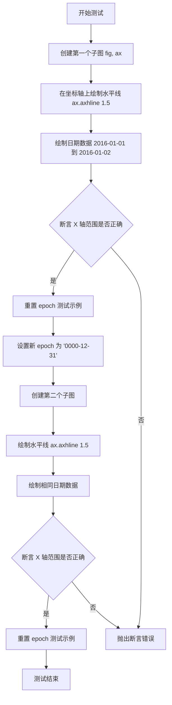

#### 带注释源码

```python
def test_axhline():
    """
    测试 axhline 不会设置/修改 xlimits。
    验证当在坐标轴上添加水平线时，X轴的日期范围不会被错误地改变。
    """
    # 创建第一个子图，使用默认的 epoch 设置
    fig, ax = plt.subplots()
    
    # 在 y=1.5 处绘制一条水平线
    ax.axhline(1.5)
    
    # 绘制包含两个日期的折线图
    # 这会设置 X 轴的范围为这两个日期
    ax.plot([np.datetime64('2016-01-01'), np.datetime64('2016-01-02')], [1, 2])
    
    # 断言：X轴的范围应该保持为绘制日期数据时的范围
    # 而不应该被 axhline 影响
    np.testing.assert_allclose(
        ax.get_xlim(),
        [mdates.date2num(np.datetime64('2016-01-01')),
         mdates.date2num(np.datetime64('2016-01-02'))]
    )

    # 重置 epoch 到测试前的状态
    mdates._reset_epoch_test_example()
    
    # 设置新的 epoch 为 '0000-12-31'，这是一个特殊的历史日期
    mdates.set_epoch('0000-12-31')
    
    # 重复上述测试，使用不同的 epoch 设置
    fig, ax = plt.subplots()
    ax.axhline(1.5)
    ax.plot([np.datetime64('2016-01-01'), np.datetime64('2016-01-02')], [1, 2])
    
    # 再次验证 X 轴范围正确性
    np.testing.assert_allclose(
        ax.get_xlim(),
        [mdates.date2num(np.datetime64('2016-01-01')),
         mdates.date2num(np.datetime64('2016-01-02'))]
    )
    
    # 清理：重置 epoch 到测试前的状态
    mdates._reset_epoch_test_example()
```


### `test_date_axhspan`

该函数是一个 pytest 测试用例，用于验证 matplotlib 的 `axhspan` 方法能否正确处理 datetime 对象作为 y 轴的上下限，并通过图像比较确保渲染结果符合预期。

参数：无需显式参数（使用 `@image_comparison` 装饰器配置测试）

返回值：`None`，测试函数无返回值

#### 流程图

```mermaid
flowchart TD
    A[开始测试] --> B[定义测试日期范围: t0=2009-01-20, tf=2009-01-21]
    B --> C[创建图形和坐标轴: plt.subplots]
    C --> D[调用axhspan绘制水平区间: ax.axhspant0, tf, facecolor='blue', alpha=0.25]
    D --> E[设置y轴范围: ylim = t0-5天 至 tf+5天]
    E --> F[调整图形布局: fig.subplots_adjustleft=0.25]
    F --> G[@image_comparison装饰器自动比对生成的图像与基准图像]
    G --> H[结束测试]
```

#### 带注释源码

```python
@image_comparison(['date_axhspan.png'])  # 装饰器：比对生成的图像与基准图像 'date_axhspan.png' 是否一致
def test_date_axhspan():
    # test axhspan with date inputs
    # 测试目标：验证 axhspan 方法能否正确处理 datetime 对象作为 y 轴上下限
    
    t0 = datetime.datetime(2009, 1, 20)  # 起始时间：2009年1月20日
    tf = datetime.datetime(2009, 1, 21)  # 结束时间：2009年1月21日
    
    fig, ax = plt.subplots()  # 创建图形窗口和坐标轴对象
    
    # 绘制水平区间，y 轴使用日期时间对象
    ax.axhspan(t0, tf, facecolor="blue", alpha=0.25)
    
    # 设置 y 轴范围，留出5天的边距以便观察
    ax.set_ylim(t0 - datetime.timedelta(days=5),
                tf + datetime.timedelta(days=5))
    
    fig.subplots_adjust(left=0.25)  # 调整左侧边距，为日期标签留出空间
```


### test_date_axvspan

该函数是一个 pytest 测试函数，用于测试 matplotlib 的 `axvspan` 方法是否能正确处理日期时间（datetime）类型的输入参数。通过 `@image_comparison` 装饰器将生成的图表与基准图像进行比较，验证日期相关功能的正确性。

参数： 无显式参数（测试函数通过 pytest 框架调用）

返回值： 无返回值（测试函数）

#### 流程图

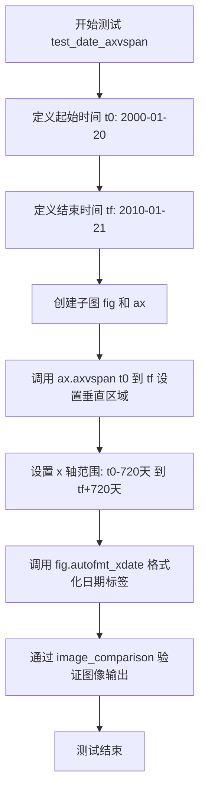

#### 带注释源码

```python
@image_comparison(['date_axvspan.png'], tol=0.07)  # 图像比较装饰器，允许0.07的容差
def test_date_axvspan():
    # test axvspan with date inputs  # 测试 axvspan 方法接受日期时间输入
    t0 = datetime.datetime(2000, 1, 20)  # 定义起始日期: 2000年1月20日
    tf = datetime.datetime(2010, 1, 21)  # 定义结束日期: 2010年1月21日
    fig, ax = plt.subplots()  # 创建图形和坐标轴对象
    ax.axvspan(t0, tf, facecolor="blue", alpha=0.25)  # 在指定日期区间绘制半透明蓝色垂直区域
    ax.set_xlim(t0 - datetime.timedelta(days=720),  # 设置 x 轴左边界为起始日期前720天
                tf + datetime.timedelta(days=720))   # 设置 x 轴右边界为结束日期后720天
    fig.autofmt_xdate()  # 自动格式化 x 轴的日期标签
```


### `test_date_axhline`

该测试函数用于验证 matplotlib 的 `axhline` 方法是否正确支持日期类型（datetime）作为输入参数，通过绘制一条基于日期的水平线并检查图像输出来确保功能正常。

参数：无需参数

返回值：`None`，该函数为测试函数，不返回任何值

#### 流程图

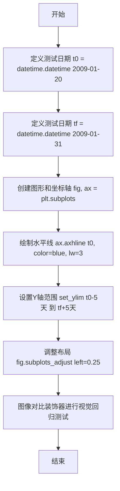

#### 带注释源码

```python
@image_comparison(['date_axhline.png'])  # 装饰器：比较生成的图像与基准图像 'date_axhline.png'
def test_date_axhline():
    # 测试 axhline 是否支持日期输入
    t0 = datetime.datetime(2009, 1, 20)  # 定义测试起始日期：2009年1月20日
    tf = datetime.datetime(2009, 1, 31)  # 定义测试结束日期：2009年1月31日
    
    fig, ax = plt.subplots()  # 创建图形窗口和一个子坐标轴
    
    # 在坐标轴上绘制水平线，y值使用日期对象
    ax.axhline(t0, color="blue", lw=3)
    
    # 设置Y轴的显示范围，在日期前后各留5天余量
    ax.set_ylim(t0 - datetime.timedelta(days=5),
                tf + datetime.timedelta(days=5))
    
    # 调整子图的左边距为0.25，确保标签不被截断
    fig.subplots_adjust(left=0.25)
```


### `test_date_axvline`

该函数是一个pytest测试函数，用于验证matplotlib的`axvline`方法是否正确支持日期类型的输入参数，并通过图像比较来确保输出的垂直线图形符合预期。

参数：

- 该函数没有显式输入参数
- 隐式参数：`t0`（datetime.datetime，测试用起始日期，值为2000年1月20日）
- 隐式参数：`tf`（datetime.datetime，测试用结束日期，值为2000年1月21日）

返回值：`None`，该函数为测试函数，不返回任何值，主要通过`@image_comparison`装饰器进行图像验证

#### 流程图

```mermaid
flowchart TD
    A[开始执行test_date_axvline] --> B[创建测试日期t0=2000-01-20]
    B --> C[创建测试日期tf=2000-01-21]
    C --> D[创建图表和坐标轴fig, ax = plt.subplots]
    D --> E[在坐标轴上绘制垂直线ax.axvtline t0, color=red, lw=3]
    E --> F[设置x轴范围: t0-5天 到 tf+5天]
    F --> G[自动格式化x轴日期fig.autofmt_xdate]
    G --> H[@image_comparison装饰器比较生成的图像与基准图像]
    H --> I[结束]
```

#### 带注释源码

```python
@image_comparison(['date_axvline.png'], tol=0.09)
def test_date_axvline():
    # test axvline with date inputs
    # 定义测试用的起始日期
    t0 = datetime.datetime(2000, 1, 20)
    # 定义测试用的结束日期
    tf = datetime.datetime(2000, 1, 21)
    # 创建图形和坐标轴对象
    fig, ax = plt.subplots()
    # 在坐标轴上绘制一条垂直线，使用日期作为x位置，红色线宽3
    ax.axvline(t0, color="red", lw=3)
    # 设置x轴的显示范围，起始日期往前5天，结束日期往后5天
    ax.set_xlim(t0 - datetime.timedelta(days=5),
                tf + datetime.timedelta(days=5))
    # 自动格式化x轴日期标签，使其倾斜以避免重叠
    fig.autofmt_xdate()
```


### `test_too_many_date_ticks`

该测试函数用于验证当尝试设置相同的时间范围（开始时间和结束时间相同）时，matplotlib 会产生过多的日期刻度标记（DayLocator），并正确发出警告。这是一个回归测试，用于检验 sourceforge 上的 issue SF 2715172。

参数：

- `caplog`：`pytest.LogCaptureFixture`，pytest 的日志捕获 fixture，用于验证日志记录功能

返回值：`None`，该函数为测试函数，无返回值

#### 流程图

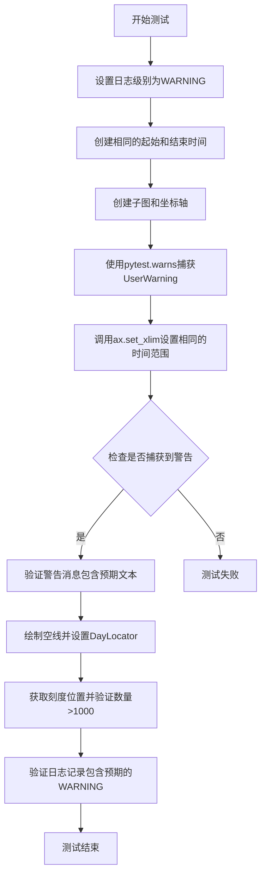

#### 带注释源码

```python
def test_too_many_date_ticks(caplog):
    # Attempt to test SF 2715172, see
    # https://sourceforge.net/tracker/?func=detail&aid=2715172&group_id=80706&atid=560720
    # setting equal datetimes triggers an expander call in
    # transforms.nonsingular which results in too many ticks in the
    # DayLocator. This should emit a log at WARNING level.
    # 目的：测试当设置相同的时间上下限时，DayLocator会产生过多刻度的bug
    
    # 设置日志捕获器级别为WARNING，用于后续验证日志输出
    caplog.set_level("WARNING")
    
    # 创建相同的时间点（起始和结束时间相同）
    t0 = datetime.datetime(2000, 1, 20)
    tf = datetime.datetime(2000, 1, 20)
    
    # 创建matplotlib子图和坐标轴
    fig, ax = plt.subplots()
    
    # 使用pytest.warns上下文管理器捕获UserWarning
    with pytest.warns(UserWarning) as rec:
        # 尝试设置相同的时间上下限，auto=True允许自动扩展
        ax.set_xlim(t0, tf, auto=True)
        
        # 验证捕获到1条警告
        assert len(rec) == 1
        
        # 验证警告消息包含预期文本
        assert ('Attempting to set identical low and high xlims'
                in str(rec[0].message))
    
    # 绘制空线（为后续设置刻度定位器做准备）
    ax.plot([], [])
    
    # 设置x轴的主要刻度定位器为DayLocator
    ax.xaxis.set_major_locator(mdates.DayLocator())
    
    # 获取生成的刻度位置
    v = ax.xaxis.get_major_locator()()
    
    # 验证生成的刻度数量超过1000（表明产生了过多刻度）
    assert len(v) > 1000
    
    # The warning is emitted multiple times because the major locator is also
    # called both when placing the minor ticks (for overstriking detection) and
    # during tick label positioning.
    # 注释说明：警告会被多次发出，因为major locator在放置次要刻度（防重叠检测）
    # 和刻度标签定位期间都会被调用
    
    # 验证日志记录存在且都是来自matplotlib.ticker的WARNING级别
    assert caplog.records and all(
        record.name == "matplotlib.ticker" and record.levelname == "WARNING"
        for record in caplog.records)
    
    # 验证至少有1条日志记录
    assert len(caplog.records) > 0
```


### `_new_epoch_decorator`

该函数是一个装饰器，用于在测试函数执行前后重置matplotlib的日期epoch，以确保测试之间的隔离性。

参数：

- `thefunc`：`Callable`，被装饰的测试函数

返回值：`Callable`，返回包装后的函数

#### 流程图

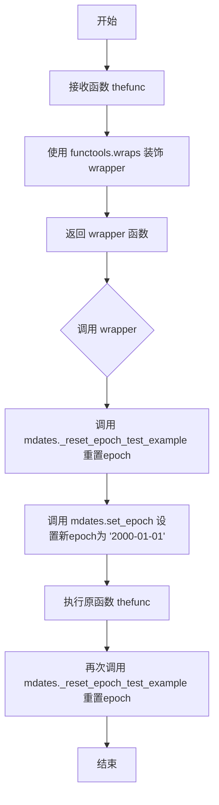

#### 带注释源码

```python
def _new_epoch_decorator(thefunc):
    """
    装饰器：为测试函数设置和重置matplotlib的日期epoch。
    
    参数:
        thefunc: 被装饰的函数，通常是测试函数。
    
    返回:
        wrapper: 包装后的函数，在调用原函数前后重置epoch。
    """
    @functools.wraps(thefunc)  # 保留原函数的元数据
    def wrapper():
        # 在测试前重置epoch到默认状态
        mdates._reset_epoch_test_example()
        # 设置epoch为特定日期 '2000-01-01'，以便测试
        mdates.set_epoch('2000-01-01')
        # 执行被装饰的测试函数
        thefunc()
        # 测试后再次重置epoch，防止影响其他测试
        mdates._reset_epoch_test_example()
    return wrapper
```


### test_RRuleLocator

这是一个测试函数，用于验证RRuleLocator（基于重复规则的日期定位器）在处理极端日期范围（公元1000年到公元6000年）时的行为，特别是边界处理和自动缩放功能是否正常工作。

参数： 无显式参数（测试函数使用pytest参数化机制，但该函数无参数）

返回值： `None`，测试函数不返回值，仅执行验证操作

#### 流程图

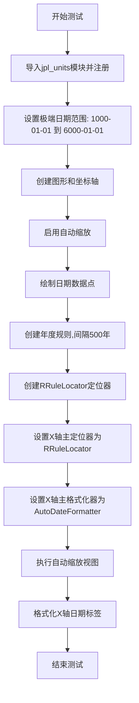

#### 带注释源码

```python
@image_comparison(['RRuleLocator_bounds.png'], tol=0.07)
def test_RRuleLocator():
    """
    测试RRuleLocator在极端日期范围下的边界处理能力。
    
    测试目的：
    1. 验证RRuleLocator在处理极大日期范围时不会溢出
    2. 验证边界值能够正确 capping（限制）在合理范围内
    3. 验证自动日期格式化器能够正确工作
    """
    # 导入matplotlib的jpl_units模块用于日期处理
    import matplotlib.testing.jpl_units as units
    units.register()  # 注册单位处理器
    
    # 设置极端的日期范围（公元1000年到公元6000年）
    # 这将测试RRuleLocator在处理超出常规范围日期时的行为
    t0 = datetime.datetime(1000, 1, 1)  # 开始日期：公元1000年1月1日
    tf = datetime.datetime(6000, 1, 1)  # 结束日期：公元6000年1月1日
    
    # 创建图形和坐标轴
    fig = plt.figure()  # 创建新图形
    ax = plt.subplot()  # 创建子图（等价于add_subplot(1,1,1)）
    
    # 启用自动缩放功能
    ax.set_autoscale_on(True)
    
    # 绘制数据点，使用日期作为X轴数据
    ax.plot([t0, tf], [0.0, 1.0], marker='o')
    
    # 创建重复规则包装器：每500年一个刻度
    rrule = mdates.rrulewrapper(dateutil.rrule.YEARLY, interval=500)
    
    # 创建RRuleLocator定位器，使用上述规则
    locator = mdates.RRuleLocator(rrule)
    
    # 设置X轴的主定位器和格式化器
    ax.xaxis.set_major_locator(locator)  # 设置定位器
    ax.xaxis.set_major_formatter(mdates.AutoDateFormatter(locator))  # 设置格式化器
    
    # 执行自动缩放以调整视图范围
    ax.autoscale_view()
    
    # 自动格式化X轴日期标签
    fig.autofmt_xdate()
```


### `test_RRuleLocator_dayrange`

该函数是一个测试用例，用于验证 `DayLocator` 在处理大范围日期（从公元1年1月1日到公元1年1月16日）时不会发生溢出错误。

参数： 无

返回值： 无（`None`），该测试函数不返回任何值，仅通过是否抛出异常来判定测试是否通过

#### 流程图

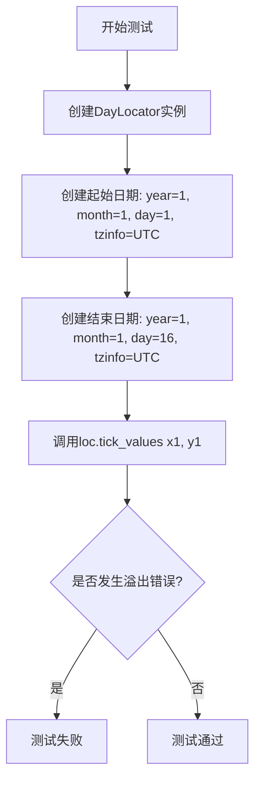

#### 带注释源码

```python
def test_RRuleLocator_dayrange():
    """
    测试 DayLocator 在处理大范围日期时不会发生溢出错误。
    该测试针对 GitHub issue #11723 的修复进行验证。
    """
    # 创建一个 DayLocator 实例，用于按天计算刻度位置
    loc = mdates.DayLocator()
    
    # 创建起始日期：公元1年1月1日，UTC时区
    x1 = datetime.datetime(year=1, month=1, day=1, tzinfo=mdates.UTC)
    
    # 创建结束日期：公元1年1月16日，UTC时区
    # 注意：这里使用 year=1 是为了测试极端边界情况
    y1 = datetime.datetime(year=1, month=1, day=16, tzinfo=mdates.UTC)
    
    # 调用 tick_values 方法计算在给定日期范围内的刻度值
    # 如果发生溢出错误（如 OverflowError），则测试失败
    # 如果正常返回，则测试通过
    loc.tick_values(x1, y1)
    
    # On success, no overflow error shall be thrown
    # 注释说明：测试成功时不应抛出溢出错误
```


### `test_RRuleLocator_close_minmax`

该测试函数用于验证当两个日期非常接近时（仅相差1微秒），RRuleLocator 能够正确生成合理的刻度值，确保边缘情况得到正确处理。

参数：无

返回值：无返回值（测试函数，使用 assert 断言进行验证）

#### 流程图

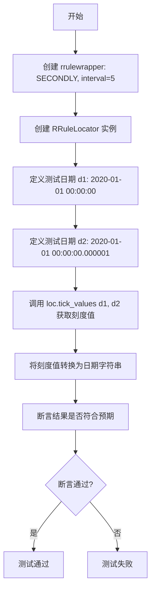

#### 带注释源码

```python
def test_RRuleLocator_close_minmax():
    # 测试目的：当两个日期非常接近时，rrule 无法创建合理的刻度间隔；
    # 确保这种情况得到正确处理
    # ---------------------------------------------------------------
    # 步骤1: 创建一个 rrulewrapper，使用 SECONDLY（每秒）频率，间隔为5秒
    rrule = mdates.rrulewrapper(dateutil.rrule.SECONDLY, interval=5)
    
    # 步骤2: 使用上述 rrule 创建一个 RRuleLocator 实例
    loc = mdates.RRuleLocator(rrule)
    
    # 步骤3: 定义两个非常接近的日期时间对象
    # d1: 2020年1月1日 00:00:00（无微秒）
    d1 = datetime.datetime(year=2020, month=1, day=1)
    # d2: 2020年1月1日 00:00:00.000001（仅1微秒之差）
    d2 = datetime.datetime(year=2020, month=1, day=1, microsecond=1)
    
    # 步骤4: 定义期望的输出结果列表
    # 预期生成两个刻度值：d1 和 d2 本身
    expected = ['2020-01-01 00:00:00+00:00',
                '2020-01-01 00:00:00.000001+00:00']
    
    # 步骤5: 调用 tick_values 方法获取刻度值
    # 然后使用 num2date 转换为日期时间对象
    # 最后转换为字符串进行比较
    # ---------------------------------------------------------------
    # assert 断言：验证实际输出与预期结果一致
    assert list(map(str, mdates.num2date(loc.tick_values(d1, d2)))) == expected
```


### `test_DateFormatter`

该测试函数验证 `DateFormatter` 能够正确处理秒以下的刻度标记（分数秒），通过创建包含 1 秒时间跨度的图形并自动调整坐标轴来测试日期格式化功能。

参数：此函数没有参数（作为测试函数直接调用）

返回值：`None`，该函数执行绘图操作但不返回任何值

#### 流程图

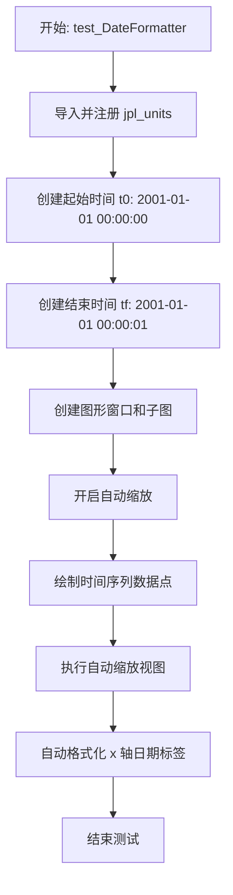

#### 带注释源码

```python
@image_comparison(['DateFormatter_fractionalSeconds.png'], tol=0.11)
def test_DateFormatter():
    """
    测试 DateFormatter 是否支持分数秒（小于1秒）的刻度标记。
    使用图像比较装饰器验证输出与预期图像的匹配程度（容差0.11）。
    """
    # 导入并注册 JPL 单位系统，用于处理日期单位
    import matplotlib.testing.jpl_units as units
    units.register()

    # 定义测试时间范围：起始时间为 2001年1月1日 00:00:00
    t0 = datetime.datetime(2001, 1, 1, 0, 0, 0)
    # 结束时间为 2001年1月1日 00:00:01（仅1秒跨度，用于测试分数秒精度）
    tf = datetime.datetime(2001, 1, 1, 0, 0, 1)

    # 创建图形窗口
    fig = plt.figure()
    # 添加子图（等同于 plt.subplot()，返回 Axes 对象）
    ax = plt.subplot()
    # 开启自动缩放功能
    ax.set_autoscale_on(True)
    # 绘制数据点：时间在 x 轴，数值 0.0-1.0 在 y 轴，使用圆形标记
    ax.plot([t0, tf], [0.0, 1.0], marker='o')

    # 以下为注释掉的代码，原本可能用于设置特定的定位器和格式化器
    # rrule = mpldates.rrulewrapper( dateutil.rrule.YEARLY, interval=500 )
    # locator = mpldates.RRuleLocator( rrule )
    # ax.xaxis.set_major_locator( locator )
    # ax.xaxis.set_major_formatter( mpldates.AutoDateFormatter(locator) )

    # 根据数据自动调整坐标轴范围
    ax.autoscale_view()
    # 自动格式化 x 轴日期标签（倾斜以避免重叠）
    fig.autofmt_xdate()
```


### `test_locator_set_formatter`

该测试函数用于验证当设置定位器（Locator）后，AutoDateFormatter 是否会自动更新以使用新的定位器进行格式化。

参数： 无

返回值： 无

#### 流程图

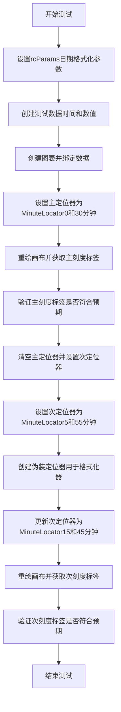

#### 带注释源码

```python
def test_locator_set_formatter():
    """
    Test if setting the locator only will update the AutoDateFormatter to use
    the new locator.
    """
    # 设置全局参数，指定分钟级别的自动格式化模板为"日期 小时:分钟"
    plt.rcParams["date.autoformatter.minute"] = "%d %H:%M"
    
    # 定义测试用的时间数据：三个不同时刻
    t = [datetime.datetime(2018, 9, 30, 8, 0),
         datetime.datetime(2018, 9, 30, 8, 59),
         datetime.datetime(2018, 9, 30, 10, 30)]
    
    # 对应的数值数据
    x = [2, 3, 1]

    # 创建图形和坐标轴
    fig, ax = plt.subplots()
    
    # 绘制时间-数值曲线
    ax.plot(t, x)
    
    # 设置主刻度定位器为分钟定位器，每隔30分钟一个刻度（0和30分）
    ax.xaxis.set_major_locator(mdates.MinuteLocator((0, 30)))
    
    # 重绘画布以计算刻度标签
    fig.canvas.draw()
    
    # 获取当前的主刻度标签文本
    ticklabels = [tl.get_text() for tl in ax.get_xticklabels()]
    
    # 预期的主刻度标签：覆盖从08:00到10:30的30分钟间隔
    expected = ['30 08:00', '30 08:30', '30 09:00',
                '30 09:30', '30 10:00', '30 10:30']
    
    # 断言刻度标签是否符合预期
    assert ticklabels == expected

    # 清空主定位器（设为空定位器）
    ax.xaxis.set_major_locator(mticker.NullLocator())
    
    # 设置次刻度定位器为分钟定位器，间隔为5到55分钟（每50分钟一个刻度）
    ax.xaxis.set_minor_locator(mdates.MinuteLocator((5, 55)))
    
    # 创建一个伪装定位器（decoy_loc），用于测试格式化器是否会使用它
    decoy_loc = mdates.MinuteLocator((12, 27))
    
    # 设置次刻度格式化器为自动日期格式化器，使用伪装定位器
    ax.xaxis.set_minor_formatter(mdates.AutoDateFormatter(decoy_loc))

    # 再次更改次刻度定位器为新的分钟定位器，间隔为15到45分钟（每30分钟一个刻度）
    ax.xaxis.set_minor_locator(mdates.MinuteLocator((15, 45)))
    
    # 重绘画布
    fig.canvas.draw()
    
    # 获取次刻度标签文本
    ticklabels = [tl.get_text() for tl in ax.get_xticklabels(which="minor")]
    
    # 预期的次刻度标签：08:15到10:15，每30分钟一个
    expected = ['30 08:15', '30 08:45', '30 09:15', '30 09:45', '30 10:15']
    
    # 断言次刻度标签是否符合预期
    assert ticklabels == expected
```


### `test_date_formatter_callable`

这是一个测试函数，用于验证 `AutoDateFormatter` 是否支持可调用对象（callable）作为格式化函数。

参数：
- 无

返回值：`None`（测试函数无返回值，仅通过 assert 断言验证）

#### 流程图

```mermaid
graph TD
    A[开始测试 test_date_formatter_callable] --> B[创建 _Locator 内部类]
    B --> C[定义 callable_formatting_function 可调用格式化函数]
    C --> D[使用 _Locator 实例化 AutoDateFormatter]
    D --> E[将 callable_formatting_function 赋值给 formatter.scaled[-10]]
    E --> F[调用 formatter 格式化单个日期 datetime.datetime(2014, 12, 25)]
    F --> G{断言结果是否为 ['25-12//2014']}
    G -->|是| H[测试通过]
    G -->|否| I[测试失败]
    H --> J[结束]
    I --> J
```

#### 带注释源码

```python
def test_date_formatter_callable():
    """
    测试 AutoDateFormatter 是否支持可调用对象（callable）作为格式化函数。
    该测试验证用户可以通过传入自定义函数来自定义日期格式化行为。
    """
    
    # 定义一个内部 Locator 类，用于模拟日期定位器
    class _Locator:
        def _get_unit(self): 
            # 返回 -11，表示某种时间单位（可能是微秒级别）
            return -11

    # 定义一个可调用的格式化函数，接受日期列表和第二个参数（下划线表示忽略）
    def callable_formatting_function(dates, _):
        # 使用 strftime 将每个日期格式化为 'DD-MM//YYYY' 格式
        return [dt.strftime('%d-%m//%Y') for dt in dates]

    # 使用自定义的 _Locator 创建 AutoDateFormatter 实例
    formatter = mdates.AutoDateFormatter(_Locator())
    
    # 将自定义的可调用函数赋值给 scaled 字典的 -10 键
    # scaled 字典存储不同时间尺度对应的格式化函数
    formatter.scaled[-10] = callable_formatting_function
    
    # 断言：调用 formatter 对单个日期进行格式化，应该返回自定义格式的日期字符串列表
    assert formatter([datetime.datetime(2014, 12, 25)]) == ['25-12//2014']
```


### test_date_formatter_usetex

该函数通过参数化测试验证AutoDateFormatter在使用LaTeX渲染（usetex=True）时，对不同时间间隔（年、月、日、小时、分钟）的日期进行格式化输出的正确性。

参数：

- `delta`：`datetime.timedelta`，测试用例的时间增量参数，定义从基准日期1990-01-01开始的日期范围
- `expected`：`list`，期望的格式化字符串列表，包含使用LaTeX数学模式渲染的日期标签

返回值：`None`，该函数为测试函数，通过assert语句进行断言验证

#### 流程图

```mermaid
flowchart TD
    A[开始] --> B[设置默认样式 style.use]
    C[创建基准日期 d1 = datetime.datetime(1990, 1, 1)]
    D[计算结束日期 d2 = d1 + delta]
    E[创建AutoDateLocator interval_multiples=False]
    F[创建虚拟坐标轴 create_dummy_axis]
    G[设置视图区间 set_view_interval]
    H[创建AutoDateFormatter usetex=True]
    I[获取定位器的所有刻度位置 locator]
    J[格式化每个刻度位置 formatter]
    K[断言格式化结果与期望匹配]
    
    B --> C
    C --> D
    D --> E
    E --> F
    F --> G
    G --> H
    H --> I
    I --> J
    J --> K
    K --> L[结束]
```

#### 带注释源码

```python
@pytest.mark.parametrize('delta, expected', [
    # 测试200年跨度，每年20年一个刻度
    (datetime.timedelta(weeks=52 * 200),
     [r'$\mathdefault{%d}$' % year for year in range(1990, 2171, 20)]),
    # 测试30天跨度，每3天一个刻度
    (datetime.timedelta(days=30),
     [r'$\mathdefault{1990{-}01{-}%02d}$' % day for day in range(1, 32, 3)]),
    # 测试20小时跨度，每2小时一个刻度
    (datetime.timedelta(hours=20),
     [r'$\mathdefault{01{-}01\;%02d}$' % hour for hour in range(0, 21, 2)]),
    # 测试10分钟跨度，每分钟一个刻度
    (datetime.timedelta(minutes=10),
     [r'$\mathdefault{01\;00{:}%02d}$' % minu for minu in range(0, 11)]),
])
def test_date_formatter_usetex(delta, expected):
    """测试AutoDateFormatter在usetex=True模式下的格式化输出"""
    # 重置matplotlib样式为默认，确保测试环境一致
    style.use("default")

    # 创建起始日期1990年1月1日
    d1 = datetime.datetime(1990, 1, 1)
    # 根据delta参数计算结束日期
    d2 = d1 + delta

    # 创建自动日期定位器，interval_multiples=False表示不强制使用间隔的倍数
    locator = mdates.AutoDateLocator(interval_multiples=False)
    # 创建虚拟坐标轴，用于定位器的内部计算
    locator.create_dummy_axis()
    # 设置坐标轴的视图区间，将日期转换为数值后设置
    locator.axis.set_view_interval(mdates.date2num(d1), mdates.date2num(d2))

    # 创建自动日期格式化器，usetex=True启用LaTeX渲染
    formatter = mdates.AutoDateFormatter(locator, usetex=True)
    # 获取定位器生成的所有刻度位置，并对每个位置进行格式化
    # 断言格式化结果与期望的LaTeX字符串列表相等
    assert [formatter(loc) for loc in locator()] == expected
```


### test_drange

该测试函数用于验证 `mdates.drange` 函数在生成日期序列时的正确性，特别关注浮点数精度问题和边界条件的处理。

参数： 无

返回值： 无（该函数为测试函数，使用断言进行验证）

#### 流程图

```mermaid
flowchart TD
    A[开始测试] --> B[设置开始时间 start = 2011-01-01 00:00:00 UTC]
    B --> C[设置结束时间 end = 2011-01-02 00:00:00 UTC]
    C --> D[设置步长 delta = 1小时]
    D --> E{断言: drange返回24个元素}
    E --> F[将end减少1微秒]
    F --> G{断言: drange仍返回24个元素}
    G --> H[将end增加2微秒]
    H --> I{断言: drange返回25个元素}
    I --> J[重置end为2011-01-02 00:00:00 UTC]
    J --> K[设置步长delta = 4小时 危险的浮点数]
    K --> L[调用drange生成日期序列]
    L --> M{断言: 序列长度为6}
    M --> N{断言: 最后一个日期 = end - delta}
    N --> O[测试结束]
```

#### 带注释源码

```python
def test_drange():
    """
    This test should check if drange works as expected, and if all the
    rounding errors are fixed
    """
    # 定义测试的开始时间，指定为UTC时区
    start = datetime.datetime(2011, 1, 1, tzinfo=mdates.UTC)
    
    # 定义测试的结束时间，指定为UTC时区
    end = datetime.datetime(2011, 1, 2, tzinfo=mdates.UTC)
    
    # 定义时间步长为1小时
    delta = datetime.timedelta(hours=1)
    
    # 验证drange返回24个元素
    # drange返回半开区间[start, end)的日期序列
    # 从00:00到24:00，每隔1小时，共24个时间点
    assert len(mdates.drange(start, end, delta)) == 24

    # 测试当结束时间稍微提前（减少1微秒）的情况
    # 仍然应该返回24个元素，因为仍在半开区间内
    end = end - datetime.timedelta(microseconds=1)
    assert len(mdates.drange(start, end, delta)) == 24

    # 测试当结束时间稍微延后（增加2微秒）的情况
    # 此时应该返回25个元素，因为包含了新的时间点
    end = end + datetime.timedelta(microseconds=2)
    assert len(mdates.drange(start, end, delta)) == 25

    # 重置结束时间
    end = datetime.datetime(2011, 1, 2, tzinfo=mdates.UTC)

    # 测试使用"复杂"浮点数的情况
    # 4小时 = 1/6天，这是一个存在浮点数精度问题的"危险"值
    delta = datetime.timedelta(hours=4)
    
    # 调用drange生成日期序列
    daterange = mdates.drange(start, end, delta)
    
    # 验证序列长度为6 (24小时 / 4小时 = 6)
    assert len(daterange) == 6
    
    # 验证最后一个日期等于结束时间减去步长
    # 这是drange的重要特性：返回的序列不包含end本身
    assert mdates.num2date(daterange[-1]) == (end - delta)
```


### test_auto_date_locator

这是一个测试函数，用于验证 AutoDateLocator 在不同时间间隔下的行为是否符合预期，包括年份、月份、天数、小时、分钟、秒和微秒级别的日期定位功能。

参数： 无（该函数不接受任何参数）

返回值： 无（该函数为测试函数，使用 assert 语句进行验证，不返回值）

#### 流程图

```mermaid
flowchart TD
    A[开始测试] --> B[定义内部函数_create_auto_date_locator]
    B --> C[设置起始日期d1为1990-01-01]
    C --> D[定义多组测试结果包含不同时间间隔和预期日期]
    E[循环遍历每组测试数据] --> F[计算结束日期d2 = d1 + t_delta]
    F --> G[创建AutoDateLocator并设置视图区间]
    G --> H[调用locator获取实际日期]
    H --> I{验证实际日期是否等于预期}
    I -->|是| J[继续下一组测试]
    I -->|否| K[断言失败]
    J --> L{是否还有更多测试数据}
    L -->|是| E
    L -->|否| M[测试默认maxticks配置]
    M --> N[测试自定义maxticks参数]
    N --> O[测试统一maxticks值]
    O --> P[结束测试]
    K --> P
```

#### 带注释源码

```python
@_new_epoch_decorator  # 装饰器：重置epoch为测试值，测试后再恢复
def test_auto_date_locator():
    """
    测试AutoDateLocator在不同时间间隔下的行为
    
    该测试验证AutoDateLocator能否正确地为各种时间范围生成
    合适的日期刻度，包括从数十年到微秒的各种精度
    """
    
    def _create_auto_date_locator(date1, date2):
        """
        内部辅助函数：创建配置好的AutoDateLocator
        
        参数:
            date1: 起始日期 datetime对象
            date2: 结束日期 datetime对象
        
        返回:
            配置好的AutoDateLocator实例
        """
        # 创建AutoDateLocator，interval_multiples=False表示不强制使用整数倍数
        locator = mdates.AutoDateLocator(interval_multiples=False)
        # 创建虚拟轴用于计算
        locator.create_dummy_axis()
        # 设置视图区间
        locator.axis.set_view_interval(*mdates.date2num([date1, date2]))
        return locator

    # 设置测试的起始日期
    d1 = datetime.datetime(1990, 1, 1)
    
    # 定义多组测试用例，每组包含时间间隔和对应的预期日期列表
    results = (
        # 测试用例1: 200年跨度 (52周 * 200)
        [datetime.timedelta(weeks=52 * 200),
         ['1990-01-01 00:00:00+00:00', '2010-01-01 00:00:00+00:00',
          '2030-01-01 00:00:00+00:00', '2050-01-01 00:00:00+00:00',
          '2070-01-01 00:00:00+00:00', '2090-01-01 00:00:00+00:00',
          '2110-01-01 00:00:00+00:00', '2130-01-01 00:00:00+00:00',
          '2150-01-01 00:00:00+00:00', '2170-01-01 00:00:00+00:00']
        ],
        
        # 测试用例2: 1年跨度 (52周)
        [datetime.timedelta(weeks=52),
         ['1990-01-01 00:00:00+00:00', '1990-02-01 00:00:00+00:00',
          '1990-03-01 00:00:00+00:00', '1990-04-01 00:00:00+00:00',
          '1990-05-01 00:00:00+00:00', '1990-06-01 00:00:00+00:00',
          '1990-07-01 00:00:00+00:00', '1990-08-01 00:00:00+00:00',
          '1990-09-01 00:00:00+00:00', '1990-10-01 00:00:00+00:00',
          '1990-11-01 00:00:00+00:00', '1990-12-01 00:00:00+00:00']
        ],
        
        # 测试用例3: 141天跨度
        [datetime.timedelta(days=141),
         ['1990-01-05 00:00:00+00:00', '1990-01-26 00:00:00+00:00',
          '1990-02-16 00:00:00+00:00', '1990-03-09 00:00:00+00:00',
          '1990-03-30 00:00:00+00:00', '1990-04-20 00:00:00+00:00',
          '1990-05-11 00:00:00+00:00']
        ],
        
        # 测试用例4: 40天跨度
        [datetime.timedelta(days=40),
         ['1990-01-03 00:00:00+00:00', '1990-01-10 00:00:00+00:00',
          '1990-01-17 00:00:00+00:00', '1990-01-24 00:00:00+00:00',
          '1990-01-31 00:00:00+00:00', '1990-02-07 00:00:00+00:00']
        ],
        
        # 测试用例5: 40小时跨度
        [datetime.timedelta(hours=40),
         ['1990-01-01 00:00:00+00:00', '1990-01-01 04:00:00+00:00',
          '1990-01-01 08:00:00+00:00', '1990-01-01 12:00:00+00:00',
          '1990-01-01 16:00:00+00:00', '1990-01-01 20:00:00+00:00',
          '1990-01-02 00:00:00+00:00', '1990-01-02 04:00:00+00:00',
          '1990-01-02 08:00:00+00:00', '1990-01-02 12:00:00+00:00',
          '1990-01-02 16:00:00+00:00']
        ],
        
        # 测试用例6: 20分钟跨度
        [datetime.timedelta(minutes=20),
         ['1990-01-01 00:00:00+00:00', '1990-01-01 00:05:00+00:00',
          '1990-01-01 00:10:00+00:00', '1990-01-01 00:15:00+00:00',
          '1990-01-01 00:20:00+00:00']
        ],
        
        # 测试用例7: 40秒跨度
        [datetime.timedelta(seconds=40),
         ['1990-01-01 00:00:00+00:00', '1990-01-01 00:00:05+00:00',
          '1990-01-01 00:00:10+00:00', '1990-01-01 00:00:15+00:00',
          '1990-01-01 00:00:20+00:00', '1990-01-01 00:00:25+00:00',
          '1990-01-01 00:00:30+00:00', '1990-01-01 00:00:35+00:00',
          '1990-01-01 00:00:40+00:00']
        ],
        
        # 测试用例8: 1500微秒跨度
        [datetime.timedelta(microseconds=1500),
         ['1989-12-31 23:59:59.999500+00:00',
          '1990-01-01 00:00:00+00:00',
          '1990-01-01 00:00:00.000500+00:00',
          '1990-01-01 00:00:00.001000+00:00',
          '1990-01-01 00:00:00.001500+00:00',
          '1990-01-01 00:00:00.002000+00:00']
        ],
    )

    # 遍历所有测试用例进行验证
    for t_delta, expected in results:
        # 计算结束日期
        d2 = d1 + t_delta
        # 创建定位器
        locator = _create_auto_date_locator(d1, d2)
        # 获取实际生成的日期并转换为字符串进行比对
        assert list(map(str, mdates.num2date(locator()))) == expected

    # 测试默认maxticks配置
    locator = mdates.AutoDateLocator(interval_multiples=False)
    assert locator.maxticks == {0: 11, 1: 12, 3: 11, 4: 12, 5: 11, 6: 11, 7: 8}

    # 测试仅针对MONTHLY设置自定义maxticks
    locator = mdates.AutoDateLocator(maxticks={dateutil.rrule.MONTHLY: 5})
    assert locator.maxticks == {0: 11, 1: 5, 3: 11, 4: 12, 5: 11, 6: 11, 7: 8}

    # 测试对所有时间单位设置统一的maxticks值
    locator = mdates.AutoDateLocator(maxticks=5)
    assert locator.maxticks == {0: 5, 1: 5, 3: 5, 4: 5, 5: 5, 6: 5, 7: 5}
```


### test_auto_date_locator_intmult

该函数是一个测试函数，用于验证 `AutoDateLocator` 在 `interval_multiples=True` 参数下的正确性，确保日期定位器能够正确生成符合间隔倍数要求的刻度值。

参数： 无（该函数不接受任何参数）

返回值： 无（该函数为测试函数，使用 `assert` 进行断言验证）

#### 流程图

```mermaid
flowchart TD
    A[开始] --> B[设置测试 epoch 为 2000-01-01]
    B --> C[定义内部函数_create_auto_date_locator]
    C --> D[定义results测试数据列表<br/>包含多个时间间隔和对应期望日期]
    D --> E[设置起始日期 d1 = datetime.datetime(1997, 1, 1)]
    E --> F[遍历 results 中的每个 t_delta 和 expected]
    F --> G[计算结束日期 d2 = d1 + t_delta]
    G --> H[调用 _create_auto_date_locator<br/>创建 AutoDateLocator]
    H --> I[调用 locator() 获取实际日期列表]
    I --> J{验证实际日期 == 期望日期}
    J -->|是| K[继续下一个测试用例]
    J -->|否| L[断言失败抛出异常]
    K --> F
    L --> M[结束]
    F --> N[测试完成恢复 epoch]
    N --> M
```

#### 带注释源码

```python
@_new_epoch_decorator  # 装饰器：设置 epoch 为 2000-01-01，测试后恢复
def test_auto_date_locator_intmult():
    """
    测试 AutoDateLocator 在 interval_multiples=True 时的行为。
    验证各种时间间隔下定位器生成的刻度是否符合预期。
    """
    
    def _create_auto_date_locator(date1, date2):
        """
        内部辅助函数：创建配置好的 AutoDateLocator
        
        参数:
            date1: 起始日期 datetime 对象
            date2: 结束日期 datetime 对象
        返回:
            配置好的 AutoDateLocator 实例
        """
        # 创建 AutoDateLocator，interval_multiples=True 表示生成间隔倍数刻度
        locator = mdates.AutoDateLocator(interval_multiples=True)
        locator.create_dummy_axis()  # 创建虚拟轴用于计算
        # 设置视图区间为日期对应的数值
        locator.axis.set_view_interval(*mdates.date2num([date1, date2]))
        return locator

    # 测试数据：包含 (时间间隔, 期望的刻度日期列表)
    results = (
        # 200年跨度 → 每20年一个刻度
        [datetime.timedelta(weeks=52 * 200),
         ['1980-01-01 00:00:00+00:00', '2000-01-01 00:00:00+00:00',
          '2020-01-01 00:00:00+00:00', '2040-01-01 00:00:00+00:00',
          '2060-01-01 00:00:00+00:00', '2080-01-01 00:00:00+00:00',
          '2100-01-01 00:00:00+00:00', '2120-01-01 00:00:00+00:00',
          '2140-01-01 00:00:00+00:00', '2160-01-01 00:00:00+00:00',
          '2180-01-01 00:00:00+00:00', '2200-01-01 00:00:00+00:00']
        ],
        # 1年跨度 → 每月一个刻度
        [datetime.timedelta(weeks=52),
         ['1997-01-01 00:00:00+00:00', '1997-02-01 00:00:00+00:00',
          '1997-03-01 00:00:00+00:00', '1997-04-01 00:00:00+00:00',
          '1997-05-01 00:00:00+00:00', '1997-06-01 00:00:00+00:00',
          '1997-07-01 00:00:00+00:00', '1997-08-01 00:00:00+00:00',
          '1997-09-01 00:00:00+00:00', '1997-10-01 00:00:00+00:00',
          '1997-11-01 00:00:00+00:00', '1997-12-01 00:00:00+00:00']
        ],
        # 141天跨度 → 每月15日为一个刻度（间隔倍数）
        [datetime.timedelta(days=141),
         ['1997-01-01 00:00:00+00:00', '1997-01-15 00:00:00+00:00',
          '1997-02-01 00:00:00+00:00', '1997-02-15 00:00:00+00:00',
          '1997-03-01 00:00:00+00:00', '1997-03-15 00:00:00+00:00',
          '1997-04-01 00:00:00+00:00', '1997-04-15 00:00:00+00:00',
          '1997-05-01 00:00:00+00:00', '1997-05-15 00:00:00+00:00']
        ],
        # 40天跨度 → 每4天一个刻度
        [datetime.timedelta(days=40),
         ['1997-01-01 00:00:00+00:00', '1997-01-05 00:00:00+00:00',
          '1997-01-09 00:00:00+00:00', '1997-01-13 00:00:00+00:00',
          '1997-01-17 00:00:00+00:00', '1997-01-21 00:00:00+00:00',
          '1997-01-25 00:00:00+00:00', '1997-01-29 00:00:00+00:00',
          '1997-02-01 00:00:00+00:00', '1997-02-05 00:00:00+00:00',
          '1997-02-09 00:00:00+00:00']
        ],
        # 40小时跨度 → 每4小时一个刻度
        [datetime.timedelta(hours=40),
         ['1997-01-01 00:00:00+00:00', '1997-01-01 04:00:00+00:00',
          '1997-01-01 08:00:00+00:00', '1997-01-01 12:00:00+00:00',
          '1997-01-01 16:00:00+00:00', '1997-01-01 20:00:00+00:00',
          '1997-01-02 00:00:00+00:00', '1997-01-02 04:00:00+00:00',
          '1997-01-02 08:00:00+00:00', '1997-01-02 12:00:00+00:00',
          '1997-01-02 16:00:00+00:00']
        ],
        # 20分钟跨度 → 每5分钟一个刻度
        [datetime.timedelta(minutes=20),
         ['1997-01-01 00:00:00+00:00', '1997-01-01 00:05:00+00:00',
          '1997-01-01 00:10:00+00:00', '1997-01-01 00:15:00+00:00',
          '1997-01-01 00:20:00+00:00']
        ],
        # 40秒跨度 → 每5秒一个刻度
        [datetime.timedelta(seconds=40),
         ['1997-01-01 00:00:00+00:00', '1997-01-01 00:00:05+00:00',
          '1997-01-01 00:00:10+00:00', '1997-01-01 00:00:15+00:00',
          '1997-01-01 00:00:20+00:00', '1997-01-01 00:00:25+00:00',
          '1997-01-01 00:00:30+00:00', '1997-01-01 00:00:35+00:00',
          '1997-01-01 00:00:40+00:00']
        ],
        # 微秒级跨度 → 验证微秒精度
        [datetime.timedelta(microseconds=1500),
         ['1996-12-31 23:59:59.999500+00:00',
          '1997-01-01 00:00:00+00:00',
          '1997-01-01 00:00:00.000500+00:00',
          '1997-01-01 00:00:00.001000+00:00',
          '1997-01-01 00:00:00.001500+00:00',
          '1997-01-01 00:00:00.002000+00:00']
        ],
    )

    d1 = datetime.datetime(1997, 1, 1)  # 固定起始日期
    for t_delta, expected in results:
        d2 = d1 + t_delta  # 计算结束日期
        locator = _create_auto_date_locator(d1, d2)  # 创建定位器
        # 断言：实际生成的刻度列表与期望列表一致
        assert list(map(str, mdates.num2date(locator()))) == expected
```


### `test_concise_formatter_subsecond`

这是一个测试函数，用于验证 `ConciseDateFormatter` 在处理亚秒级时间刻度时的正确性。它创建一个自动日期定位器和一个简洁日期格式化器，然后测试格式化器能否正确地将包含亚秒偏移的日期数值格式化为正确的字符串表示。

参数：此函数无参数。

返回值：`None`，此函数为测试函数，不返回任何值，仅通过断言验证计算结果。

#### 流程图

```mermaid
flowchart TD
    A[开始测试] --> B[创建AutoDateLocator]
    B --> C[创建ConciseDateFormatter]
    C --> D[定义year_1996 = 9861.0]
    D --> E[构造测试数据列表]
    E --> F[调用formatter.format_ticks格式化时间刻度]
    F --> G{断言结果是否等于预期}
    G -->|是| H[测试通过]
    G -->|否| I[测试失败]
```

#### 带注释源码

```python
def test_concise_formatter_subsecond():
    """
    测试 ConciseDateFormatter 在处理亚秒级时间刻度时的正确性。
    验证当时间间隔非常小（小于1秒）时，格式化器能够正确显示毫秒或微秒级别的精度。
    """
    # 创建一个自动日期定位器，interval_multiples=True 表示使用默认的间隔倍数
    locator = mdates.AutoDateLocator(interval_multiples=True)
    
    # 使用上述定位器创建一个简洁日期格式化器
    formatter = mdates.ConciseDateFormatter(locator)
    
    # 定义一个表示1996年的日期数值（MATLAB风格的日期序号）
    year_1996 = 9861.0
    
    # 构造测试数据：
    # 1. year_1996 - 基准时间 00:00
    # 2. year_1996 + 500/MUSECONDS_PER_DAY - 加上500微秒
    # 3. year_1996 + 900/MUSECONDS_PER_DAY - 加上900微秒
    # MUSECONDS_PER_DAY 是每天的微秒数，用于将微秒转换为日期序列中的小数部分
    strings = formatter.format_ticks([
        year_1996,
        year_1996 + 500 / mdates.MUSECONDS_PER_DAY,
        year_1996 + 900 / mdates.MUSECONDS_PER_DAY])
    
    # 断言格式化后的字符串列表等于预期结果
    # 预期：['00:00', '00.0005', '00.0009']
    # 即：基准时间显示为时分，500微秒显示为00.0005，900微秒显示为00.0009
    assert strings == ['00:00', '00.0005', '00.0009']
```


### test_concise_formatter

该函数是一个测试 ConciseDateFormatter（简洁日期格式化器）的单元测试，通过创建不同时间跨度的日期轴，验证格式化器能否正确生成预期的刻度标签字符串。

#### 参数

该函数无参数。

返回值：`None`，该函数为测试函数，使用 assert 语句进行断言验证。

#### 流程图

```mermaid
flowchart TD
    A[开始执行 test_concise_formatter] --> B[定义内部函数 _create_auto_date_locator]
    B --> C[设置初始日期 d1 = 1997-01-01]
    D[定义测试结果数据集 results] --> E[遍历每个 t_delta 和 expected]
    E --> F[计算结束日期 d2 = d1 + t_delta]
    F --> G[调用 _create_auto_date_locator 获取实际字符串列表]
    G --> H{断言 strings == expected}
    H -->|通过| I[继续下一个测试用例]
    H -->|失败| J[抛出 AssertionError]
    I --> K{还有更多测试用例?}
    K -->|是| E
    K -->|否| L[测试结束]
    J --> L
```

#### 带注释源码

```python
def test_concise_formatter():
    """
    测试 ConciseDateFormatter 在不同时间跨度下的格式化行为
    
    该测试验证 ConciseDateFormatter 能够根据日期范围自动选择
    合适的格式，并在坐标轴上生成正确的刻度标签
    """
    
    def _create_auto_date_locator(date1, date2):
        """
        内部辅助函数：创建带有 ConciseDateFormatter 的坐标轴并获取刻度标签
        
        参数:
            date1: 起始日期 datetime 对象
            date2: 结束日期 datetime 对象
        
        返回:
            刻度标签文本列表
        """
        # 创建图形和坐标轴
        fig, ax = plt.subplots()

        # 创建自动日期定位器，interval_multiples=True 表示使用倍数间隔
        locator = mdates.AutoDateLocator(interval_multiples=True)
        
        # 创建简洁日期格式化器
        formatter = mdates.ConciseDateFormatter(locator)
        
        # 设置坐标轴的定位器和格式化器
        ax.yaxis.set_major_locator(locator)
        ax.yaxis.set_major_formatter(formatter)
        
        # 设置y轴范围
        ax.set_ylim(date1, date2)
        
        # 强制绘制以生成刻度标签
        fig.canvas.draw()
        
        # 获取所有y轴刻度标签文本
        sts = [st.get_text() for st in ax.get_yticklabels()]
        return sts

    # 起始日期
    d1 = datetime.datetime(1997, 1, 1)
    
    # 测试数据：包含不同时间跨度和对应的预期刻度标签
    # 格式: (时间增量, 预期刻度标签列表)
    results = (
        # 跨度200年（52周 * 200），预期显示每隔20年的年份
        [datetime.timedelta(weeks=52 * 200),
         [str(t) for t in range(1980, 2201, 20)]
         ],
        # 跨度1年，显示月份名称
        [datetime.timedelta(weeks=52),
         ['1997', 'Feb', 'Mar', 'Apr', 'May', 'Jun', 'Jul', 'Aug',
          'Sep', 'Oct', 'Nov', 'Dec']
         ],
        # 跨度141天，显示月份和日期
        [datetime.timedelta(days=141),
         ['Jan', '15', 'Feb', '15', 'Mar', '15', 'Apr', '15',
          'May', '15']
         ],
        # 跨度40天，显示更细的日期
        [datetime.timedelta(days=40),
         ['Jan', '05', '09', '13', '17', '21', '25', '29', 'Feb',
          '05', '09']
         ],
        # 跨度40小时，显示日期和时间
        [datetime.timedelta(hours=40),
         ['Jan-01', '04:00', '08:00', '12:00', '16:00', '20:00',
          'Jan-02', '04:00', '08:00', '12:00', '16:00']
         ],
        # 跨度20分钟，显示分
        [datetime.timedelta(minutes=20),
         ['00:00', '00:05', '00:10', '00:15', '00:20']
         ],
        # 跨度40秒，显示秒
        [datetime.timedelta(seconds=40),
         ['00:00', '05', '10', '15', '20', '25', '30', '35', '40']
         ],
        # 跨度2秒，显示带毫秒的秒
        [datetime.timedelta(seconds=2),
         ['59.5', '00:00', '00.5', '01.0', '01.5', '02.0', '02.5']
         ],
    )
    
    # 遍历所有测试用例进行验证
    for t_delta, expected in results:
        # 计算结束日期
        d2 = d1 + t_delta
        
        # 获取实际生成的刻度标签
        strings = _create_auto_date_locator(d1, d2)
        
        # 断言实际结果与预期一致
        assert strings == expected
```


### `test_concise_formatter_show_offset`

这是一个测试函数，用于验证`ConciseDateFormatter`的`get_offset()`方法能否根据不同的时间范围返回正确的时间偏移量字符串。

参数：

- `t_delta`：`datetime.timedelta`，测试用例的时间增量参数，定义从起始日期到结束日期的时间跨度
- `expected`：`str`，期望的时间偏移量字符串，用于与实际结果进行断言比较

返回值：`None`，该函数为测试函数，使用`assert`语句进行验证，不返回具体值

#### 流程图

```mermaid
flowchart TD
    A[开始测试] --> B[设置起始日期 d1 = datetime.datetime(1997, 1, 1)]
    B --> C[计算结束日期 d2 = d1 + t_delta]
    C --> D[创建图形 fig 和坐标轴 ax]
    D --> E[创建 AutoDateLocator 定位器]
    E --> F[创建 ConciseDateFormatter 格式化器]
    F --> G[设置坐标轴的定位器和格式化器]
    G --> H[在坐标轴上绘制日期数据]
    H --> I[刷新画布 fig.canvas.draw]
    I --> J{断言}
    J -->|通过| K[测试通过]
    J -->|失败| L[抛出 AssertionError]
    
    style A fill:#f9f,color:#333
    style K fill:#9f9,color:#333
    style L fill:#f99,color:#333
```

#### 带注释源码

```python
@pytest.mark.parametrize('t_delta, expected', [
    (datetime.timedelta(seconds=0.01), '1997-Jan-01 00:00'),
    (datetime.timedelta(minutes=1), '1997-Jan-01 00:01'),
    (datetime.timedelta(hours=1), '1997-Jan-01'),
    (datetime.timedelta(days=1), '1997-Jan-02'),
    (datetime.timedelta(weeks=1), '1997-Jan'),
    (datetime.timedelta(weeks=26), ''),
    (datetime.timedelta(weeks=520), '')
])
def test_concise_formatter_show_offset(t_delta, expected):
    """
    测试 ConciseDateFormatter 在不同时间跨度下的 offset 显示功能。
    
    参数:
        t_delta: datetime.timedelta，时间增量
        expected: str，期望的 offset 字符串
    """
    # 设置起始日期为1997年1月1日
    d1 = datetime.datetime(1997, 1, 1)
    # 根据时间增量计算结束日期
    d2 = d1 + t_delta

    # 创建图形和坐标轴
    fig, ax = plt.subplots()
    # 创建自动日期定位器
    locator = mdates.AutoDateLocator()
    # 创建简洁日期格式化器
    formatter = mdates.ConciseDateFormatter(locator)
    # 设置x轴的定位器和格式化器
    ax.xaxis.set_major_locator(locator)
    ax.xaxis.set_major_formatter(formatter)

    # 绘制日期数据到坐标轴
    ax.plot([d1, d2], [0, 0])
    # 刷新画布以触发格式化器的实际计算
    fig.canvas.draw()
    # 断言格式化器的 offset 与期望值相等
    assert formatter.get_offset() == expected
```


### `test_concise_formatter_show_offset_inverted`

该函数是一个测试函数，用于验证当x轴被反转（invert_xaxis）时，ConciseDateFormatter能够正确返回偏移量文本。此测试针对GitHub issue #28481。

参数：
- 该函数没有参数

返回值：该函数没有返回值（测试函数使用assert进行断言验证）

#### 流程图

```mermaid
flowchart TD
    A[开始] --> B[创建日期d1 = 1997-01-01]
    B --> C[计算日期d2 = d1 + 60天]
    C --> D[创建图形和坐标轴]
    D --> E[创建AutoDateLocator]
    E --> F[创建ConciseDateFormatter]
    F --> G[设置x轴major locator和formatter]
    G --> H[反转x轴 invert_xaxis]
    H --> I[绑制日期数据]
    I --> J[刷新画布 canvas.draw]
    J --> K{断言 offset == '1997-Jan'}
    K -->|通过| L[测试通过]
    K -->|失败| M[测试失败]
```

#### 带注释源码

```python
def test_concise_formatter_show_offset_inverted():
    # Test for github issue #28481
    # 该测试验证当x轴反转时，ConciseDateFormatter能正确显示偏移量
    
    # 1. 设置测试日期范围
    d1 = datetime.datetime(1997, 1, 1)
    d2 = d1 + datetime.timedelta(days=60)  # 60天后
    
    # 2. 创建matplotlib图形和坐标轴
    fig, ax = plt.subplots()
    
    # 3. 创建日期定位器和格式化器
    locator = mdates.AutoDateLocator()
    formatter = mdates.ConciseDateFormatter(locator)
    
    # 4. 将定位器和格式化器应用到x轴
    ax.xaxis.set_major_locator(locator)
    ax.xaxis.set_major_formatter(formatter)
    
    # 5. 反转x轴 - 这是测试的关键点
    ax.invert_xaxis()
    
    # 6. 绑制数据触发格式化器更新
    ax.plot([d1, d2], [0, 0])
    
    # 7. 刷新画布以触发格式化
    fig.canvas.draw()
    
    # 8. 验证偏移量文本
    assert formatter.get_offset() == '1997-Jan'
```


### `test_concise_converter_stays`

该测试函数用于验证在设置 `xlim` 后，已应用的日期转换器不会被 matplotlib 的自动日期转换机制覆盖，确保下游库（如 Pandas）自定义的转换器得以保留。

参数：无

返回值：无（`None`，测试函数无返回值）

#### 流程图

```mermaid
flowchart TD
    A[开始测试] --> B[创建测试数据: 两个datetime对象]
    B --> C[创建y轴数据: 0, 1]
    C --> D[创建子图 fig, ax]
    D --> E[在ax上绘制x, y数据]
    E --> F[创建ConciseDateConverter实例 conv]
    F --> G[使用pytest.warns捕获UserWarning设置转换器]
    G --> H[断言ax.xaxis.units为None]
    H --> I[调用ax.set_xlim设置x轴范围]
    J[断言转换器未被覆盖<br/>ax.xaxis.get_converter返回conv]
    I --> J
    G -->|警告触发| H
```

#### 带注释源码

```python
def test_concise_converter_stays():
    # 该测试展示了gh-23417引入的问题（后在gh-25278中回滚）
    # 具体来说，像Pandas这样的下游库，其指定的转换器会被以下操作覆盖：
    # 设置xlim（或使用标准库/numpy日期和字符串日期表示绘制额外点，
    # 这些操作本来可以与日期转换器正常工作）
    # 虽然这有点像个不寻常的示例，但它展示了相同的概念
    # （即已经应用了有效的转换器并希望保留它）
    # 另见gh-25219讨论了解Pandas如何受影响
    
    # 定义测试用的日期数据：2000年1月1日到2020年2月20日
    x = [datetime.datetime(2000, 1, 1), datetime.datetime(2020, 2, 20)]
    # 定义对应的y值
    y = [0, 1]
    # 创建图形和子图
    fig, ax = plt.subplots()
    # 绘制数据
    ax.plot(x, y)
    # 创建一个ConciseDateConverter实例用于绕过Switchable日期转换器
    conv = mdates.ConciseDateConverter()
    # 尝试设置转换器，应该触发UserWarning（因为已经存在转换器）
    with pytest.warns(UserWarning, match="already has a converter"):
        ax.xaxis.set_converter(conv)
    # 断言：设置转换器后units应该为None
    assert ax.xaxis.units is None
    # 设置x轴范围（这步操作原本可能覆盖转换器）
    ax.set_xlim(*x)
    # 关键断言：验证转换器没有被覆盖，应该仍然是我们设置的conv
    assert ax.xaxis.get_converter() == conv
```


### `test_offset_changes`

该测试函数用于验证 `ConciseDateFormatter` 在不同时间范围下偏移量（offset）的正确性，通过多次设置 x 轴范围并检查偏移量是否按预期变化。

参数：无

返回值：`None`，该函数为测试函数，使用断言验证行为，不返回任何值。

#### 流程图

```mermaid
flowchart TD
    A[开始测试] --> B[创建图表和坐标轴]
    B --> C[设置起始日期 d1 = 1997-01-01]
    C --> D[计算结束日期 d2 = d1 + 520周]
    D --> E[创建 AutoDateLocator 和 ConciseDateFormatter]
    E --> F[设置坐标轴的定位器和格式化器]
    F --> G[绘制日期数据]
    G --> H[首次绘制: offset应为空字符串'']
    H --> I[设置x轴范围为3周: offset应为'1997-Jan']
    I --> J[设置x轴范围为7-30周: offset应为'1997']
    J --> K[设置x轴范围为520周: offset应为空字符串'']
    K --> L[测试结束]
```

#### 带注释源码

```python
def test_offset_changes():
    """
    测试 ConciseDateFormatter 在不同时间范围下偏移量的变化行为。
    验证当视图范围改变时，格式化器的 offset 会相应更新。
    """
    # 创建图表和坐标轴
    fig, ax = plt.subplots()

    # 定义起始日期
    d1 = datetime.datetime(1997, 1, 1)
    # 计算结束日期：起始日期加520周（约10年）
    d2 = d1 + datetime.timedelta(weeks=520)

    # 创建自动日期定位器和简洁日期格式化器
    locator = mdates.AutoDateLocator()
    formatter = mdates.ConciseDateFormatter(locator)
    
    # 将定位器和格式化器设置到 x 轴
    ax.xaxis.set_major_locator(locator)
    ax.xaxis.set_major_formatter(formatter)

    # 绘制日期数据（覆盖整个范围）
    ax.plot([d1, d2], [0, 0])
    
    # 第一次绘制：视图范围很大时，offset应为空
    fig.draw_without_rendering()
    assert formatter.get_offset() == ''
    
    # 第二次：缩小到3周范围，应显示年月
    ax.set_xlim(d1, d1 + datetime.timedelta(weeks=3))
    fig.draw_without_rendering()
    assert formatter.get_offset() == '1997-Jan'
    
    # 第三次：设置为7-30周范围，应只显示年份
    ax.set_xlim(d1 + datetime.timedelta(weeks=7),
                d1 + datetime.timedelta(weeks=30))
    fig.draw_without_rendering()
    assert formatter.get_offset() == '1997'
    
    # 第四次：恢复到520周大范围，offset再次为空
    ax.set_xlim(d1, d1 + datetime.timedelta(weeks=520))
    fig.draw_without_rendering()
    assert formatter.get_offset() == ''
```


### `test_concise_formatter_usetex`

该测试函数用于验证 ConciseDateFormatter 在启用 LaTeX 渲染（usetex=True）时的格式化功能，通过不同的时间增量（年、月、日、小时、秒）测试格式化输出的正确性。

参数：

- `t_delta`：`datetime.timedelta`，测试用例的时间增量参数
- `expected`：`list`，期望的格式化结果列表

返回值：`None`，该函数为测试函数，使用 pytest 的断言进行验证

#### 流程图

```mermaid
flowchart TD
    A[开始测试] --> B[设置初始日期 d1 = 1997-01-01]
    B --> C[计算结束日期 d2 = d1 + t_delta]
    C --> D[创建 AutoDateLocator interval_multiples=True]
    E[创建虚拟轴并设置视图区间] --> F[创建 ConciseDateFormatter usetex=True]
    F --> G[调用 format_ticks 格式化刻度]
    G --> H{断言验证}
    H -->|通过| I[测试通过]
    H -->|失败| J[抛出 AssertionError]
```

#### 带注释源码

```python
@pytest.mark.parametrize('t_delta, expected', [
    # 测试用例1: 200年的周增量, 跨度从1980到2200年, 每20年一个刻度
    (datetime.timedelta(weeks=52 * 200),
     ['$\\mathdefault{%d}$' % (t, ) for t in range(1980, 2201, 20)]),
    # 测试用例2: 40天的增量, 验证月份和日期的LaTeX格式化
    (datetime.timedelta(days=40),
     ['Jan', '$\\mathdefault{05}$', '$\\mathdefault{09}$',
      '$\\mathdefault{13}$', '$\\mathdefault{17}$', '$\\mathdefault{21}$',
      '$\\mathdefault{25}$', '$\\mathdefault{29}$', 'Feb',
      '$\\mathdefault{05}$', '$\\mathdefault{09}$']),
    # 测试用例3: 40小时的增量, 验证小时和日期的LaTeX格式化
    (datetime.timedelta(hours=40),
     ['Jan$\\mathdefault{{-}01}$', '$\\mathdefault{04{:}00}$',
      '$\\mathdefault{08{:}00}$', '$\\mathdefault{12{:}00}$',
      '$\\mathdefault{16{:}00}$', '$\\mathdefault{20{:}00}$',
      'Jan$\\mathdefault{{-}02}$', '$\\mathdefault{04{:}00}$',
      '$\\mathdefault{08{:}00}$', '$\\mathdefault{12{:}00}$',
      '$\\mathdefault{16{:}00}$']),
    # 测试用例4: 2秒的增量, 验证秒级时间格式化
    (datetime.timedelta(seconds=2),
     ['$\\mathdefault{59.5}$', '$\\mathdefault{00{:}00}$',
      '$\\mathdefault{00.5}$', '$\\mathdefault{01.0}$',
      '$\\mathdefault{01.5}$', '$\\mathdefault{02.0}$',
      '$\\mathdefault{02.5}$']),
])
def test_concise_formatter_usetex(t_delta, expected):
    # 1. 设置初始日期
    d1 = datetime.datetime(1997, 1, 1)
    # 2. 根据时间增量计算结束日期
    d2 = d1 + t_delta

    # 3. 创建自动日期定位器, interval_multiples=True 表示使用倍数间隔
    locator = mdates.AutoDateLocator(interval_multiples=True)
    # 4. 创建虚拟轴用于测试
    locator.create_dummy_axis()
    # 5. 设置视图区间, 将日期转换为数值
    locator.axis.set_view_interval(mdates.date2num(d1), mdates.date2num(d2))

    # 6. 创建带 LaTeX 支持的简洁日期格式化器
    formatter = mdates.ConciseDateFormatter(locator, usetex=True)
    # 7. 格式化刻度并验证结果是否符合预期
    assert formatter.format_ticks(locator()) == expected
```


### test_concise_formatter_formats

该测试函数用于验证 `ConciseDateFormatter` 在提供自定义格式（formats 参数）时能否正确生成不同时间尺度的日期刻度标签。

参数：
- 该函数无显式参数

返回值：`None`，该函数为测试函数，通过断言验证功能正确性

#### 流程图

```mermaid
flowchart TD
    A[开始测试] --> B[定义自定义格式列表 formats]
    B --> C[定义内部辅助函数 _create_auto_date_locator]
    C --> D[设置测试起始日期 d1 = 1997-01-01]
    D --> E[定义测试结果数据 results]
    E --> F[遍历每个测试用例 t_delta 和 expected]
    F --> G[计算结束日期 d2 = d1 + t_delta]
    G --> H[调用 _create_auto_date_locator 获取实际标签]
    H --> I{断言 strings == expected}
    I -->|通过| J[继续下一个测试用例]
    I -->|失败| K[测试失败]
    J --> F
    F --> L[测试结束]
```

#### 带注释源码

```python
def test_concise_formatter_formats():
    """
    测试 ConciseDateFormatter 使用自定义 formats 参数时的格式化功能。
    验证不同时间尺度（年、月、日、时、分、秒）的刻度标签是否按指定格式生成。
    """
    # 定义自定义格式化字符串列表，分别对应不同时间尺度的格式
    # 索引0-5对应不同的自动检测时间尺度
    formats = ['%Y', '%m/%Y', 'day: %d',
               '%H hr %M min', '%H hr %M min', '%S.%f sec']

    def _create_auto_date_locator(date1, date2):
        """
        内部辅助函数：创建日期定位器并获取格式化后的刻度标签文本
        
        参数:
            date1: 起始日期 datetime 对象
            date2: 结束日期 datetime 对象
        
        返回:
            刻度标签文本列表
        """
        # 创建图形和坐标轴
        fig, ax = plt.subplots()

        # 创建自动日期定位器，interval_multiples=True 表示使用倍数间隔
        locator = mdates.AutoDateLocator(interval_multiples=True)
        
        # 创建简洁日期格式化器，传入自定义 formats 列表
        formatter = mdates.ConciseDateFormatter(locator, formats=formats)
        
        # 设置坐标轴的定位器和格式化器
        ax.yaxis.set_major_locator(locator)
        ax.yaxis.set_major_formatter(formatter)
        
        # 设置Y轴显示范围
        ax.set_ylim(date1, date2)
        
        # 强制重绘画布以触发格式化计算
        fig.canvas.draw()
        
        # 获取Y轴刻度标签文本
        sts = [st.get_text() for st in ax.get_yticklabels()]
        return sts

    # 测试起始日期
    d1 = datetime.datetime(1997, 1, 1)
    
    # 测试结果数据：包含不同时间增量对应的期望标签列表
    results = (
        # 200周（约20年）：期望年份列表
        [datetime.timedelta(weeks=52 * 200), [str(t) for t in range(1980,
         2201, 20)]],
        
        # 52周（1年）：期望月份格式化字符串
        [datetime.timedelta(weeks=52), [
            '1997', '02/1997', '03/1997', '04/1997', '05/1997', '06/1997',
            '07/1997', '08/1997', '09/1997', '10/1997', '11/1997', '12/1997',
            ]],
        
        # 141天（约5个月）：期望日期和月份混合格式
        [datetime.timedelta(days=141), [
            '01/1997', 'day: 15', '02/1997', 'day: 15', '03/1997', 'day: 15',
            '04/1997', 'day: 15', '05/1997', 'day: 15',
            ]],
        
        # 40天：期望日期格式
        [datetime.timedelta(days=40), [
            '01/1997', 'day: 05', 'day: 09', 'day: 13', 'day: 17', 'day: 21',
            'day: 25', 'day: 29', '02/1997', 'day: 05', 'day: 09',
            ]],
        
        # 40小时：期望小时分钟格式
        [datetime.timedelta(hours=40), [
            'day: 01', '04 hr 00 min', '08 hr 00 min', '12 hr 00 min',
            '16 hr 00 min', '20 hr 00 min', 'day: 02', '04 hr 00 min',
            '08 hr 00 min', '12 hr 00 min', '16 hr 00 min',
            ]],
        
        # 20分钟：期望小时分钟格式
        [datetime.timedelta(minutes=20), ['00 hr 00 min', '00 hr 05 min',
         '00 hr 10 min', '00 hr 15 min', '00 hr 20 min']],
        
        # 40秒：期望秒格式
        [datetime.timedelta(seconds=40), [
            '00 hr 00 min', '05.000000 sec', '10.000000 sec',
            '15.000000 sec', '20.000000 sec', '25.000000 sec',
            '30.000000 sec', '35.000000 sec', '40.000000 sec',
            ]],
        
        # 2秒：期望带毫秒的秒格式
        [datetime.timedelta(seconds=2), [
            '59.500000 sec', '00 hr 00 min', '00.500000 sec', '01.000000 sec',
            '01.500000 sec', '02.000000 sec', '02.500000 sec',
            ]],
        )
    
    # 遍历所有测试用例进行验证
    for t_delta, expected in results:
        d2 = d1 + t_delta
        strings = _create_auto_date_locator(d1, d2)
        assert strings == expected
```


### `test_concise_formatter_zformats`

该测试函数用于验证 `ConciseDateFormatter` 在使用自定义 `zero_formats` 参数时的格式化行为，确保对于不同时间跨度的日期数据，能够正确生成零位（zero）格式化字符串。

参数： 无（该函数无显式参数）

返回值： 无（该函数为 `void`，使用 `assert` 进行断言验证）

#### 流程图

```mermaid
flowchart TD
    A[开始测试] --> B[定义 zero_formats 列表]
    B --> C[定义内部函数 _create_auto_date_locator]
    C --> D[创建图形和坐标轴]
    D --> E[创建 AutoDateLocator]
    E --> F[创建 ConciseDateFormatter 并传入 zero_formats]
    F --> G[设置坐标轴的定位器和格式化器]
    G --> H[设置 y 轴范围]
    H --> I[绘制画布]
    I --> J[获取刻度标签文本]
    J --> K[定义测试结果数据]
    K --> L{遍历所有测试用例}
    L -->|是| M[计算结束日期 d2 = d1 + t_delta]
    M --> N[调用 _create_auto_date_locator 获取实际结果]
    N --> O{断言 strings == expected}
    O -->|通过| L
    O -->|失败| P[抛出 AssertionError]
    L -->|否| Q[测试结束]
```

#### 带注释源码

```python
def test_concise_formatter_zformats():
    """
    测试 ConciseDateFormatter 使用自定义 zero_formats 时的格式化行为。
    zero_formats 用于指定在时间刻度为零值时的格式化字符串。
    """
    # 定义零位格式化字符串列表，分别对应不同的时间级别
    # 索引 0: 年份, 1: 月份, 2: 天, 3: 小时, 4: 分钟, 5: 秒
    zero_formats = ['', "'%y", '%B', '%m-%d', '%S', '%S.%f']

    def _create_auto_date_locator(date1, date2):
        """
        内部辅助函数：创建并配置日期定位器和格式化器，返回刻度标签文本列表。
        
        参数:
            date1: 起始日期 (datetime 对象)
            date2: 结束日期 (datetime 对象)
        返回:
            刻度标签文本列表 (list of str)
        """
        # 创建新的图形和坐标轴
        fig, ax = plt.subplots()

        # 创建自动日期定位器，interval_multiples=True 表示使用友好的时间间隔
        locator = mdates.AutoDateLocator(interval_multiples=True)
        
        # 创建简洁日期格式化器，传入自定义的 zero_formats
        formatter = mdates.ConciseDateFormatter(
            locator, zero_formats=zero_formats)
        
        # 设置 y 轴的定位器和格式化器
        ax.yaxis.set_major_locator(locator)
        ax.yaxis.set_major_formatter(formatter)
        
        # 设置 y 轴的显示范围
        ax.set_ylim(date1, date2)
        
        # 强制绘制画布以生成刻度标签
        fig.canvas.draw()
        
        # 获取所有 y 轴刻度标签的文本
        sts = [st.get_text() for st in ax.get_yticklabels()]
        return sts

    # 基础起始日期
    d1 = datetime.datetime(1997, 1, 1)
    
    # 测试结果数据集，包含多个时间跨度和对应的预期格式化结果
    results = (
        # 测试用例1: 200 周（约 4 年），应显示年份
        [datetime.timedelta(weeks=52 * 200),
         [str(t) for t in range(1980, 2201, 20)]
        ],
        # 测试用例2: 52 周（1 年），应显示月份简称
        [datetime.timedelta(weeks=52),
         ["'97", 'Feb', 'Mar', 'Apr', 'May', 'Jun',
          'Jul', 'Aug', 'Sep', 'Oct', 'Nov', 'Dec']
        ],
        # 测试用例3: 141 天，应显示月份全名
        [datetime.timedelta(days=141),
         ['January', '15', 'February', '15', 'March',
          '15', 'April', '15', 'May', '15']
        ],
        # 测试用例4: 40 天，应显示月份全名
        [datetime.timedelta(days=40),
         ['January', '05', '09', '13', '17', '21',
          '25', '29', 'February', '05', '09']
        ],
        # 测试用例5: 40 小时，应显示月-日 和 时:分
        [datetime.timedelta(hours=40),
         ['01-01', '04:00', '08:00', '12:00', '16:00', '20:00',
          '01-02', '04:00', '08:00', '12:00', '16:00']
        ],
        # 测试用例6: 20 分钟，应显示分:秒
        [datetime.timedelta(minutes=20),
         ['00', '00:05', '00:10', '00:15', '00:20']
        ],
        # 测试用例7: 40 秒，应显示秒
        [datetime.timedelta(seconds=40),
         ['00', '05', '10', '15', '20', '25', '30', '35', '40']
        ],
        # 测试用例8: 2 秒，应显示秒.毫秒
        [datetime.timedelta(seconds=2),
         ['59.5', '00.0', '00.5', '01.0', '01.5', '02.0', '02.5']
        ],
    )
    
    # 遍历所有测试用例，验证格式化结果
    for t_delta, expected in results:
        d2 = d1 + t_delta  # 计算结束日期
        strings = _create_auto_date_locator(d1, d2)  # 获取实际格式化结果
        assert strings == expected  # 断言验证
```


### test_concise_formatter_tz

该测试函数用于验证 ConciseDateFormatter 在不同时区下的行为，特别是格式化日期刻度标签和偏移量的正确性。

参数： 无（该函数无直接参数，通过@pytest.mark.parametrize在内部使用参数化测试）

返回值：无（该函数为测试函数，使用assert进行断言验证，不返回具体值）

#### 流程图

```mermaid
flowchart TD
    A[开始] --> B[定义内部函数_create_auto_date_locator]
    B --> C[设置初始日期d1为1997-01-01 UTC时区]
    D[定义测试结果数据results<br/>包含4个测试场景]
    C --> D
    D --> E[创建新时区new_tz为UTC+3]
    E --> F[遍历results中的每个测试场景]
    F --> G[计算结束日期d2 = d1 + t_delta]
    G --> H[调用_create_auto_date_locator<br/>传入d1, d2, new_tz]
    H --> I[获取返回的strings和offset]
    I --> J[断言strings等于expected_strings]
    J --> K{断言通过?}
    K -->|是| L[继续下一个测试场景]
    K -->|否| M[抛出AssertionError]
    F --> L
    L --> N{还有更多场景?}
    N -->|是| F
    N -->|否| O[测试结束]
    M --> O
```

#### 带注释源码

```python
def test_concise_formatter_tz():
    """
    测试 ConciseDateFormatter 在不同时区下的格式化行为。
    验证时区转换后的刻度标签和偏移量显示是否正确。
    """
    def _create_auto_date_locator(date1, date2, tz):
        """
        内部辅助函数：创建并配置日期定位器和格式化器
        
        参数:
            date1: 起始日期时间
            date2: 结束日期时间  
            tz: 时区信息
        
        返回:
            tuple: (刻度标签列表, 偏移量文本)
        """
        # 创建图形和坐标轴
        fig, ax = plt.subplots()

        # 创建自动日期定位器，启用间隔倍数
        locator = mdates.AutoDateLocator(interval_multiples=True)
        # 创建简洁日期格式化器，指定时区
        formatter = mdates.ConciseDateFormatter(locator, tz=tz)
        
        # 设置坐标轴的定位器和格式化器
        ax.yaxis.set_major_locator(locator)
        ax.yaxis.set_major_formatter(formatter)
        
        # 设置y轴范围
        ax.set_ylim(date1, date2)
        
        # 渲染画布以生成刻度标签
        fig.canvas.draw()
        
        # 获取所有y轴刻度标签文本
        sts = [st.get_text() for st in ax.get_yticklabels()]
        
        # 返回刻度标签和偏移量文本
        return sts, ax.yaxis.get_offset_text().get_text()

    # 初始日期：1997年1月1日，UTC时区
    d1 = datetime.datetime(1997, 1, 1).replace(tzinfo=datetime.timezone.utc)
    
    # 测试结果数据：包含不同时长和对应的预期标签及偏移量
    # 格式: (时间增量, 预期刻度标签列表, 预期偏移量)
    results = (
        # 40小时：跨两天的刻度
        [datetime.timedelta(hours=40),
         ['03:00', '07:00', '11:00', '15:00', '19:00', '23:00',
          '03:00', '07:00', '11:00', '15:00', '19:00'],
         "1997-Jan-02"  # 偏移量显示第二天
        ],
        # 20分钟：当天内的分钟刻度
        [datetime.timedelta(minutes=20),
         ['03:00', '03:05', '03:10', '03:15', '03:20'],
         "1997-Jan-01"  # 偏移量显示当天
        ],
        # 40秒：秒级刻度
        [datetime.timedelta(seconds=40),
         ['03:00', '05', '10', '15', '20', '25', '30', '35', '40'],
         "1997-Jan-01 03:00"  # 包含具体时间
        ],
        # 2秒：亚秒级刻度
        [datetime.timedelta(seconds=2),
         ['59.5', '03:00', '00.5', '01.0', '01.5', '02.0', '02.5'],
         "1997-Jan-01 03:00"  # 包含具体时间
        ],
    )

    # 创建测试时区：UTC+3
    new_tz = datetime.timezone(datetime.timedelta(hours=3))
    
    # 遍历所有测试场景
    for t_delta, expected_strings, expected_offset in results:
        # 计算结束日期
        d2 = d1 + t_delta
        
        # 调用辅助函数获取实际结果
        strings, offset = _create_auto_date_locator(d1, d2, new_tz)
        
        # 验证刻度标签正确
        assert strings == expected_strings
        # 验证偏移量正确
        assert offset == expected_offset
```


### `test_auto_date_locator_intmult_tz`

该函数用于测试 `AutoDateLocator` 在启用 interval_multiples 模式且指定时区的情况下，是否能正确生成跨越多个时间跨度的日期刻度，并验证 DST（夏令时）转换时区时的正确性。

参数：
- 该函数无直接参数（通过内部嵌套函数 `_create_auto_date_locator` 间接接收参数）

返回值：`None`（测试函数无返回值，通过 `assert` 语句验证结果）

#### 流程图

```mermaid
flowchart TD
    A[开始测试] --> B[获取加拿大/太平洋时区]
    B --> C[设置起始日期 1997-01-01]
    C --> D[遍历预定义的timedelta和期望结果列表]
    D --> E{是否还有未测试的t_delta?}
    E -->|是| F[计算结束日期 d2 = d1 + t_delta]
    F --> G[创建AutoDateLocator<br/>interval_multiples=True, tz=tz]
    G --> H[设置视图区间]
    H --> I[调用locator获取刻度值]
    I --> J[将刻度值转换为带时区的日期字符串]
    J --> K{验证结果是否等于期望?}
    K -->|是| E
    K -->|否| L[抛出AssertionError]
    E -->|否| M[测试结束]
```

#### 带注释源码

```python
def test_auto_date_locator_intmult_tz():
    """
    测试 AutoDateLocator 在启用 interval_multiples=True 且指定时区时，
    能否正确处理各种时间跨度的日期刻度生成，特别是 DST（夏令时）转换。
    """
    
    def _create_auto_date_locator(date1, date2, tz):
        """
        内部辅助函数：创建配置好的 AutoDateLocator
        
        参数:
            date1: 起始日期（datetime对象，可带时区）
            date2: 结束日期（datetime对象，可带时区）
            tz: 时区对象
        返回值:
            配置完成的 AutoDateLocator 实例
        """
        # 创建自动日期定位器，interval_multiples=True 表示
        # 让定位器尽量生成"整齐"的刻度间隔（如每5分钟、每小时等）
        locator = mdates.AutoDateLocator(interval_multiples=True, tz=tz)
        
        # 创建虚拟轴对象，用于设置视图区间
        locator.create_dummy_axis()
        
        # 将日期转换为数值并设置轴的视图范围
        locator.axis.set_view_interval(*mdates.date2num([date1, date2]))
        
        return locator

    # 测试结果数据：每组包含时间增量(timedelta)和期望的日期字符串列表
    results = (
        # 跨度200年，每20年一个刻度
        [datetime.timedelta(weeks=52*200),
         ['1980-01-01 00:00:00-08:00', '2000-01-01 00:00:00-08:00',
          '2020-01-01 00:00:00-08:00', '2040-01-01 00:00:00-08:00',
          '2060-01-01 00:00:00-08:00', '2080-01-01 00:00:00-08:00',
          '2100-01-01 00:00:00-08:00', '2120-01-01 00:00:00-08:00',
          '2140-01-01 00:00:00-08:00', '2160-01-01 00:00:00-08:00',
          '2180-01-01 00:00:00-08:00', '2200-01-01 00:00:00-08:00']
        ],
        
        # 跨度1年，每月一个刻度，注意5月和10月之间的时区变化（夏令时）
        [datetime.timedelta(weeks=52),
         ['1997-01-01 00:00:00-08:00', '1997-02-01 00:00:00-08:00',
          '1997-03-01 00:00:00-08:00', '1997-04-01 00:00:00-08:00',
          '1997-05-01 00:00:00-07:00', '1997-06-01 00:00:00-07:00',
          '1997-07-01 00:00:00-07:00', '1997-08-01 00:00:00-07:00',
          '1997-09-01 00:00:00-07:00', '1997-10-01 00:00:00-07:00',
          '1997-11-01 00:00:00-08:00', '1997-12-01 00:00:00-08:00']
        ],
        
        # 跨度141天，半个月一个刻度
        [datetime.timedelta(days=141),
         ['1997-01-01 00:00:00-08:00', '1997-01-15 00:00:00-08:00',
          '1997-02-01 00:00:00-08:00', '1997-02-15 00:00:00-08:00',
          '1997-03-01 00:00:00-08:00', '1997-03-15 00:00:00-08:00',
          '1997-04-01 00:00:00-08:00', '1997-04-15 00:00:00-07:00',
          '1997-05-01 00:00:00-07:00', '1997-05-15 00:00:00-07:00']
        ],
        
        # 跨度40天，每4天一个刻度
        [datetime.timedelta(days=40),
         ['1997-01-01 00:00:00-08:00', '1997-01-05 00:00:00-08:00',
          '1997-01-09 00:00:00-08:00', '1997-01-13 00:00:00-08:00',
          '1997-01-17 00:00:00-08:00', '1997-01-21 00:00:00-08:00',
          '1997-01-25 00:00:00-08:00', '1997-01-29 00:00:00-08:00',
          '1997-02-01 00:00:00-08:00', '1997-02-05 00:00:00-08:00',
          '1997-02-09 00:00:00-08:00']
        ],
        
        # 跨度40小时，每4小时一个刻度
        [datetime.timedelta(hours=40),
         ['1997-01-01 00:00:00-08:00', '1997-01-01 04:00:00-08:00',
          '1997-01-01 08:00:00-08:00', '1997-01-01 12:00:00-08:00',
          '1997-01-01 16:00:00-08:00', '1997-01-01 20:00:00-08:00',
          '1997-01-02 00:00:00-08:00', '1997-01-02 04:00:00-08:00',
          '1997-01-02 08:00:00-08:00', '1997-01-02 12:00:00-08:00',
          '1997-01-02 16:00:00-08:00']
        ],
        
        # 跨度20分钟，每5分钟一个刻度
        [datetime.timedelta(minutes=20),
         ['1997-01-01 00:00:00-08:00', '1997-01-01 00:05:00-08:00',
          '1997-01-01 00:10:00-08:00', '1997-01-01 00:15:00-08:00',
          '1997-01-01 00:20:00-08:00']
        ],
        
        # 跨度40秒，每5秒一个刻度
        [datetime.timedelta(seconds=40),
         ['1997-01-01 00:00:00-08:00', '1997-01-01 00:00:05-08:00',
          '1997-01-01 00:00:10-08:00', '1997-01-01 00:00:15-08:00',
          '1997-01-01 00:00:20-08:00', '1997-01-01 00:00:25-08:00',
          '1997-01-01 00:00:30-08:00', '1997-01-01 00:00:35-08:00',
          '1997-01-01 00:00:40-08:00']
        ]
    )

    # 获取加拿大/太平洋时区（该时区有夏令时转换）
    tz = dateutil.tz.gettz('Canada/Pacific')
    
    # 设置起始日期为1997年1月1日，带时区信息
    d1 = datetime.datetime(1997, 1, 1, tzinfo=tz)
    
    # 遍历所有测试用例
    for t_delta, expected in results:
        # 使用rc_context设置内部经典模式为False，确保使用新的行为
        with rc_context({'_internal.classic_mode': False}):
            # 计算结束日期
            d2 = d1 + t_delta
            
            # 创建定位器
            locator = _create_auto_date_locator(d1, d2, tz)
            
            # 获取刻度值并转换为指定时区的日期字符串
            st = list(map(str, mdates.num2date(locator(), tz=tz)))
            
            # 验证结果
            assert st == expected
```


### `test_date_inverted_limit`

该函数是一个测试用例，用于验证在使用日期类型输入时，水平线（axhline）和轴限制（axis limits）能否正确处理，同时测试反转 Y 轴（invert_yaxis）的功能。

参数：
- 该函数没有显式参数（通过 pytest 框架隐式调用）

返回值：`None`，该函数为测试函数，没有返回值（pytest 测试用例）

#### 流程图

```mermaid
flowchart TD
    A[开始测试] --> B[创建日期对象 t0 和 tf]
    B --> C[创建子图和 axes]
    C --> D[在 ax 上绘制水平线 axhline t0]
    D --> E[设置 Y 轴范围: t0-5天 到 tf+5天]
    E --> F[反转 Y 轴 invert_yaxis]
    F --> G[调整子图布局 left=0.25]
    G --> H[通过 @image_comparison 验证图像输出]
    H --> I[结束测试]
```

#### 带注释源码

```python
@image_comparison(['date_inverted_limit.png'])
def test_date_inverted_limit():
    # test ax hline with date inputs
    # 准备两个日期：起始日期和结束日期
    t0 = datetime.datetime(2009, 1, 20)
    tf = datetime.datetime(2009, 1, 31)
    
    # 创建图形和子图
    fig, ax = plt.subplots()
    
    # 绘制水平线，使用日期作为 y 值
    ax.axhline(t0, color="blue", lw=3)
    
    # 设置 Y 轴范围，日期前后各扩展 5 天
    ax.set_ylim(t0 - datetime.timedelta(days=5),
                tf + datetime.timedelta(days=5))
    
    # 反转 Y 轴，测试反向坐标轴的处理
    ax.invert_yaxis()
    
    # 调整子图布局，左边距设为 0.25
    fig.subplots_adjust(left=0.25)
```


### `_test_date2num_dst`

该函数是一个内部测试辅助函数，用于验证 `date2num` 函数在夏令时（DST）转换期间处理时区感知 datetime 对象时的正确性。它通过生成带有时区信息的时间序列，转换到另一个时区，然后比较转换前后的数值表示是否一致。

参数：

- `date_range`：`Callable[[start, freq, periods], List[datetime]]`，用于生成日期范围的函数，类似于 pandas 的 `date_range`
- `tz_convert`：`Callable[[List[datetime], tzinfo], List[datetime]]`，用于将日期列表从一个时区转换到另一个时区的函数

返回值：`None`，该函数通过断言验证数据一致性

#### 流程图

```mermaid
flowchart TD
    A[开始] --> B[获取布鲁塞尔时区信息]
    B --> C[获取UTC时区]
    C --> D[创建UTC起始时间 2014-03-30 00:00]
    D --> E[设置时间间隔为33分45秒]
    E --> F[计算间隔天数: interval_seconds / 86400]
    F --> G[使用date_range生成8个UTC时间点]
    G --> H[使用tz_convert将时间转换为布鲁塞尔时区]
    H --> I[计算基准数值t0<br/>735322.0 + date2num<br/>np.datetime64<br/>'0000-12-31']
    I --> J[生成期望的数值列表<br/>t0 + i * interval_days]
    J --> K[调用date2num转换布鲁塞尔时间<br/>得到实际数值列表]
    K --> L{断言验证}
    L -->|通过| M[测试通过]
    L -->|失败| N[抛出AssertionError]
```

#### 带注释源码

```python
def _test_date2num_dst(date_range, tz_convert):
    # Timezones
    # 获取欧洲/布鲁塞尔时区信息，用于测试夏令时转换
    BRUSSELS = dateutil.tz.gettz('Europe/Brussels')
    # 获取matplotlib中定义的UTC时区
    UTC = mdates.UTC

    # Create a list of timezone-aware datetime objects in UTC
    # Interval is 0b0.0000011 days, to prevent float rounding issues
    # 创建一个UTC时区的起始时间：2014年3月30日午夜
    dtstart = datetime.datetime(2014, 3, 30, 0, 0, tzinfo=UTC)
    # 设置时间间隔为33分45秒，用于测试DST转换边界情况
    interval = datetime.timedelta(minutes=33, seconds=45)
    # 将间隔转换为天数（用于数值计算）
    # 33分45秒 = 2025秒，2025/86400 ≈ 0.0234375天
    interval_days = interval.seconds / 86400
    # 生成8个时间点
    N = 8

    # 使用传入的date_range函数生成UTC时间序列
    dt_utc = date_range(start=dtstart, freq=interval, periods=N)
    # 将UTC时间序列转换为布鲁塞尔时区
    # 布鲁塞尔在2014年3月30日切换到夏令时（CEST，CET+1）
    dt_bxl = tz_convert(dt_utc, BRUSSELS)
    
    # 计算基准数值：
    # 735322.0 是某个历史日期的数值表示
    # 加上从公元0年12月31日到基准日期的数值偏移
    t0 = 735322.0 + mdates.date2num(np.datetime64('0000-12-31'))
    # 根据时间间隔计算期望的数值序列
    expected_ordinalf = [t0 + (i * interval_days) for i in range(N)]
    # 使用date2num将布鲁塞尔时区的时间转换为数值
    actual_ordinalf = list(mdates.date2num(dt_bxl))

    # 断言验证：实际数值应等于期望数值
    # 这里的测试重点是DST转换时的正确处理
    assert actual_ordinalf == expected_ordinalf
```


### test_date2num_dst

该测试函数用于验证 `mdates.date2num` 函数在夏令时（DST）转换期间处理时区感知日期时的正确性。它通过创建一个自定义的 datetime 类来模拟 pandas Timestamp 的行为，确保在时区转换过程中日期数值计算准确。

参数：

- 无参数（该函数不接受任何参数）

返回值：`None`，该函数为测试函数，使用断言验证结果，不返回任何值

#### 流程图

```mermaid
flowchart TD
    A[开始 test_date2num_dst] --> B[定义 dt_tzaware 类]
    B --> C[实现 __sub__ 方法]
    C --> D[实现 __add__ 方法]
    D --> E[实现 astimezone 方法]
    E --> F[实现 mk_tzaware 类方法]
    F --> G[定义 date_range 函数]
    G --> H[定义 tz_convert 函数]
    H --> I[调用 _test_date2num_dst]
    I --> J[断言 actual_ordinalf == expected_ordinalf]
    J --> K[结束]
```

#### 带注释源码

```python
def test_date2num_dst():
    # Test for github issue #3896, but in date2num around DST transitions
    # with a timezone-aware pandas date_range object.
    # 目的：测试 GitHub issue #3896，验证 date2num 在 DST 转换期间处理时区感知日期的正确性

    class dt_tzaware(datetime.datetime):
        """
        This bug specifically occurs because of the normalization behavior of
        pandas Timestamp objects, so in order to replicate it, we need a
        datetime-like object that applies timezone normalization after
        subtraction.
        """
        # 创建一个类似于 pandas Timestamp 的 datetime 子类
        # 该 bug 是由于 pandas Timestamp 对象的规范化行为导致的

        def __sub__(self, other):
            # 重写减法操作，实现时区规范化
            r = super().__sub__(other)
            tzinfo = getattr(r, 'tzinfo', None)

            if tzinfo is not None:
                localizer = getattr(tzinfo, 'normalize', None)
                if localizer is not None:
                    # 调用时区的 normalize 方法进行规范化
                    r = tzinfo.normalize(r)

            if isinstance(r, datetime.datetime):
                r = self.mk_tzaware(r)

            return r

        def __add__(self, other):
            # 重写加法操作，返回时区感知的 datetime
            return self.mk_tzaware(super().__add__(other))

        def astimezone(self, tzinfo):
            # 重写 astimezone 方法，将 datetime 转换到指定时区
            dt = super().astimezone(tzinfo)
            return self.mk_tzaware(dt)

        @classmethod
        def mk_tzaware(cls, datetime_obj):
            # 类方法：从普通 datetime 对象创建时区感知的 datetime
            kwargs = {}
            attrs = ('year',
                     'month',
                     'day',
                     'hour',
                     'minute',
                     'second',
                     'microsecond',
                     'tzinfo')

            for attr in attrs:
                val = getattr(datetime_obj, attr, None)
                if val is not None:
                    kwargs[attr] = val

            return cls(**kwargs)

    # Define a date_range function similar to pandas.date_range
    # 定义一个类似于 pandas.date_range 的 date_range 函数
    def date_range(start, freq, periods):
        dtstart = dt_tzaware.mk_tzaware(start)

        return [dtstart + (i * freq) for i in range(periods)]

    # Define a tz_convert function that converts a list to a new timezone.
    # 定义一个 tz_convert 函数，将列表转换到新时区
    def tz_convert(dt_list, tzinfo):
        return [d.astimezone(tzinfo) for d in dt_list]

    # 调用内部测试函数
    _test_date2num_dst(date_range, tz_convert)
```


### `test_date2num_dst_pandas`

该函数是一个测试函数，用于验证 `date2num` 在处理带有时区的 pandas date_range 对象时，在夏令时（DST）转换期间是否能正确工作。它通过调用内部辅助函数 `_test_date2num_dst` 来执行具体的测试逻辑。

参数：

- `pd`：`pandas` 模块（pytest fixture），用于提供 pandas 相关的功能

返回值：`None`，该函数为测试函数，通过断言验证正确性，无显式返回值

#### 流程图

```mermaid
flowchart TD
    A[开始 test_date2num_dst_pandas] --> B[定义内部函数 tz_convert]
    B --> C[调用 _test_date2num_dst 函数]
    C --> D[传入 pd.date_range 和 tz_convert 作为参数]
    D --> E[在 _test_date2num_dst 中执行具体测试逻辑]
    E --> F{验证结果是否正确}
    F -->|正确| G[测试通过]
    F -->|错误| H[抛出断言错误]
    G --> I[结束]
    H --> I
```

#### 带注释源码

```python
def test_date2num_dst_pandas(pd):
    # Test for github issue #3896, but in date2num around DST transitions
    # with a timezone-aware pandas date_range object.
    # 此测试针对 GitHub issue #3896，验证 date2num 在处理时区感知的
    # pandas date_range 对象时是否能正确处理 DST 转换

    def tz_convert(*args):
        # 定义一个内部 tz_convert 函数
        # 使用 pandas 的 DatetimeIndex.tz_convert 方法进行时区转换
        # 并将结果转换为 Python 对象类型
        return pd.DatetimeIndex.tz_convert(*args).astype(object)

    # 调用通用的测试辅助函数 _test_date2num_dst
    # 传入 pandas 的 date_range 函数和自定义的 tz_convert 函数
    _test_date2num_dst(pd.date_range, tz_convert)
```


### `_test_rrulewrapper`

该函数是一个测试辅助函数，用于验证 `mdates.rrulewrapper` 类的 `between` 方法在处理不同时区（尤其是夏令时切换期间）时的正确性。

参数：

- `attach_tz`：函数，用于将时区信息附加到 datetime 对象上（例如使用 `dt.replace(tzinfo=zi)` 或 `zi.localize(dt)`）
- `get_tz`：函数，用于获取时区对象（例如 `dateutil.tz.gettz` 或 `pytz.timezone`）

返回值：`None`，该函数仅执行断言测试，无返回值

#### 流程图

```mermaid
flowchart TD
    A[开始] --> B[通过get_tz获取Australia/Sydney时区]
    B --> C[使用attach_tz将时区附加到起始时间2017-04-01 00:00]
    C --> D[使用attach_tz将时区附加到结束时间2017-04-04 00:00]
    D --> E[创建rrulewrapper实例, 频率为DAILY, 起始日期为dtstart]
    E --> F[调用rule.between获取dtstart和dtend之间的日期]
    F --> G[定义期望结果: 2017-04-01 13:00 UTC 和 2017-04-02 14:00 UTC]
    G --> H{act == exp?}
    H -->|是| I[测试通过]
    H -->|否| J[测试失败, 抛出AssertionError]
```

#### 带注释源码

```python
def _test_rrulewrapper(attach_tz, get_tz):
    """
    测试 rrulewrapper 的 between 方法在处理时区时的正确性。
    
    Parameters:
    -----------
    attach_tz : callable
        用于将时区信息附加到 datetime 对象的函数。
        签名应为: datetime -> timezone -> datetime with timezone
    get_tz : callable
        用于获取时区对象的函数。
        签名应为: str -> timezone
    """
    
    # 获取澳大利亚悉尼时区
    SYD = get_tz('Australia/Sydney')

    # 创建带有悉尼时区的起始和结束 datetime 对象
    # 2017年4月澳大利亚正处于夏令时结束后的转换期
    dtstart = attach_tz(datetime.datetime(2017, 4, 1, 0), SYD)
    dtend = attach_tz(datetime.datetime(2017, 4, 4, 0), SYD)

    # 创建每日重复规则包装器，起始日期为 dtstart
    rule = mdates.rrulewrapper(freq=dateutil.rrule.DAILY, dtstart=dtstart)

    # 获取 dtstart 和 dtend 之间的所有日期
    act = rule.between(dtstart, dtend)
    
    # 期望的结果列表，转换为 UTC 时区
    # 由于悉尼在2017年4月1日结束夏令时（从 AEDT 变为 AEST），
    // 所以时差从+11小时变为+10小时
    exp = [datetime.datetime(2017, 4, 1, 13, tzinfo=dateutil.tz.tzutc()),
           datetime.datetime(2017, 4, 2, 14, tzinfo=dateutil.tz.tzutc())]

    # 断言实际结果与期望结果相等
    assert act == exp
```


### `test_rrulewrapper`

这是一个测试函数，用于验证 `matplotlib.dates.rrulewrapper` 类的功能，包括时区处理、日期范围计算（between、after、before 方法）以及属性访问（__getattr__）。

参数：

- 无参数

返回值：`None`，此函数为测试函数，不返回任何值，仅通过断言验证正确性

#### 流程图

```mermaid
flowchart TD
    A[开始 test_rrulewrapper] --> B[定义内部函数 attach_tz]
    B --> C[调用 _test_rrulewrapper 进行基础测试]
    C --> D[获取 Australia/Sydney 时区]
    D --> E[创建 dtstart 和 dtend 日期时间对象]
    E --> F[创建 rrulewrapper 实例]
    F --> G[断言 rule.after 方法返回正确日期]
    G --> H[断言 rule.before 方法返回正确日期]
    H --> I[断言 rule._base_tzinfo 属性]
    I --> J[断言 rule._interval 属性]
    J --> K[结束测试]
```

#### 带注释源码

```python
def test_rrulewrapper():
    """
    测试 rrulewrapper 类的各种功能:
    1. 使用 attach_tz 和 dateutil.tz.gettz 进行基础测试
    2. 测试 after() 方法 - 获取指定日期之后的下一次出现
    3. 测试 before() 方法 - 获取指定日期之前的最后一次出现
    4. 测试 __getattr__ 访问的内部属性 _base_tzinfo 和 _interval
    """
    # 内部辅助函数: 将时区信息附加到 datetime 对象
    def attach_tz(dt, zi):
        return dt.replace(tzinfo=zi)

    # 调用通用的 _test_rrulewrapper 测试函数
    # 验证 between() 方法和时区转换功能
    _test_rrulewrapper(attach_tz, dateutil.tz.gettz)

    # 获取澳大利亚悉尼时区
    SYD = dateutil.tz.gettz('Australia/Sydney')
    
    # 设置测试的起始和结束日期 (2017年4月1日至4日)
    dtstart = datetime.datetime(2017, 4, 1, 0)
    dtend = datetime.datetime(2017, 4, 4, 0)
    
    # 创建每日重复规则包装器，包含时区和结束时间
    # 参数:
    #   freq: 重复频率 (DAILY 每日)
    #   dtstart: 起始日期时间
    #   tzinfo: 时区信息 (Sydney)
    #   until: 结束日期时间
    rule = mdates.rrulewrapper(freq=dateutil.rrule.DAILY, dtstart=dtstart,
                               tzinfo=SYD, until=dtend)
    
    # 测试 after() 方法: 获取 dtstart 之后的下一个日期
    # 预期结果: 2017-04-02 00:00 Sydney 时区
    assert rule.after(dtstart) == datetime.datetime(2017, 4, 2, 0, 0,
                                                    tzinfo=SYD)
    
    # 测试 before() 方法: 获取 dtend 之前的最后一个日期
    # 预期结果: 2017-04-03 00:00 Sydney 时区
    assert rule.before(dtend) == datetime.datetime(2017, 4, 3, 0, 0,
                                                   tzinfo=SYD)

    # 测试 __getattr__ 方法访问的内部属性
    # 验证 _base_tzinfo 属性正确存储时区信息
    assert rule._base_tzinfo == SYD
    
    # 验证 _interval 属性默认为 1
    assert rule._interval == 1
```


### `test_rrulewrapper_pytz`

该测试函数用于验证 `rrulewrapper` 类是否支持 pytz 时区。在测试中，通过导入 pytz 库，定义时区附加函数，并调用 `_test_rrulewrapper` 辅助函数来测试使用 pytz 时区（Australia/Sydney）的日期递归规则的 `between()` 方法是否返回正确的结果。

参数： 无

返回值： 无（测试函数，无返回值）

#### 流程图

```mermaid
flowchart TD
    A[开始测试] --> B{检查pytz是否可用}
    B -->|不可用| C[跳过测试]
    B -->|可用| D[定义attach_tz函数<br/>使用pytz.localize方法]
    D --> E[调用_test_rrulewrapper函数<br/>传入attach_tz和pytz.timezone]
    E --> F[创建Sydney时区对象]
    F --> G[创建本地化的开始和结束时间]
    G --> H[创建rrulewrapper实例<br/>DAILY频率]
    H --> I[调用between方法<br/>获取范围时间]
    I --> J[验证结果是否符合预期<br/>包含两个UTC时间点]
    J --> K[测试结束]
```

#### 带注释源码

```python
@pytest.mark.pytz
def test_rrulewrapper_pytz():
    # 测试确保pytz时区在rrules中得到支持
    # 使用pytest标记确保只有在pytz可用时运行此测试
    
    # 尝试导入pytz，如果不存在则跳过测试
    pytz = pytest.importorskip("pytz")

    # 定义一个内部函数，用于将pytz时区附加到datetime对象上
    # pytz的localize方法与dateutil的replace方法不同
    # 它会正确处理夏令时转换等时区细节
    def attach_tz(dt, zi):
        return zi.localize(dt)

    # 调用通用的rrulewrapper测试函数
    # 传入pytz特定的attach_tz函数和pytz.timezone获取器
    _test_rrulewrapper(attach_tz, pytz.timezone)
```


### test_yearlocator_pytz

该测试函数用于验证 `pytz` 库提供的时区在 `AutoDateLocator` 中的正常工作，特别是处理美国纽约时区（America/New_York）下的日期定位和转换功能。

参数： 无

返回值： 无（测试函数，无返回值）

#### 流程图

```mermaid
flowchart TD
    A[开始测试] --> B[导入pytz库]
    B --> C[创建America/New_York时区对象]
    C --> D[生成2000个日期序列从2010-01-01开始]
    D --> E[创建AutoDateLocator使用pytz时区]
    E --> F[设置视图区间]
    F --> G[转换旧epoch到新epoch]
    G --> H[断言locator生成的数值接近预期]
    H --> I[断言转换后的日期字符串正确]
    I --> J[断言tick_values返回正确的刻度值]
    J --> K[断言get_locator返回正确的定位器]
    K --> L[结束测试]
```

#### 带注释源码

```python
@pytest.mark.pytz
def test_yearlocator_pytz():
    # 导入pytz库，如果不存在则跳过测试
    pytz = pytest.importorskip("pytz")

    # 创建美国纽约时区对象
    tz = pytz.timezone('America/New_York')
    
    # 生成2000个连续的日期，从2010-01-01开始，每天增加1天
    x = [tz.localize(datetime.datetime(2010, 1, 1))
         + datetime.timedelta(i) for i in range(2000)]
    
    # 创建自动日期定位器，启用间隔倍数，指定时区
    locator = mdates.AutoDateLocator(interval_multiples=True, tz=tz)
    locator.create_dummy_axis()
    
    # 设置视图区间，为首尾日期各留1天的边距
    locator.axis.set_view_interval(mdates.date2num(x[0])-1.0,
                                   mdates.date2num(x[-1])+1.0)
    
    # 定义预期的数值（基于旧epoch）
    t = np.array([733408.208333, 733773.208333, 734138.208333,
                  734503.208333, 734869.208333, 735234.208333, 735599.208333])
    
    # 将数值从旧epoch转换到新epoch（ Matplotlib 2.0+ 使用的 epoch）
    t = t + mdates.date2num(np.datetime64('0000-12-31'))
    
    # 断言1：验证定位器生成的数值与预期接近
    np.testing.assert_allclose(t, locator())
    
    # 定义预期的日期字符串列表
    expected = ['2009-01-01 00:00:00-05:00',
                '2010-01-01 00:00:00-05:00', '2011-01-01 00:00:00-05:00',
                '2012-01-01 00:00:00-05:00', '2013-01-01 00:00:00-05:00',
                '2014-01-01 00:00:00-05:00', '2015-01-01 00:00:00-05:00']
    
    # 断言2：验证转换后的日期字符串与预期一致
    st = list(map(str, mdates.num2date(locator(), tz=tz)))
    assert st == expected
    
    # 断言3：验证tick_values方法返回正确的刻度值
    assert np.allclose(locator.tick_values(x[0], x[1]), np.array(
        [14610.20833333, 14610.33333333, 14610.45833333, 14610.58333333,
         14610.70833333, 14610.83333333, 14610.95833333, 14611.08333333,
         14611.20833333]))
    
    # 断言4：验证get_locator方法返回的定位器也能产生正确的刻度值
    assert np.allclose(locator.get_locator(x[1], x[0]).tick_values(x[0], x[1]),
                       np.array(
        [14610.20833333, 14610.33333333, 14610.45833333, 14610.58333333,
         14610.70833333, 14610.83333333, 14610.95833333, 14611.08333333,
         14611.20833333]))
```


### `test_YearLocator`

这是一个测试函数，用于验证 `YearLocator` 类在不同参数配置下的行为是否符合预期，包括不同的时间间隔、基础年份、月份和日期组合。

参数： 无（该函数不接受任何外部参数）

返回值： 无返回值（该函数为测试函数，使用 `assert` 语句进行断言验证）

#### 流程图

```mermaid
flowchart TD
    A[开始测试] --> B[定义内部函数_create_year_locator]
    B --> C[设置初始日期1990-01-01]
    C --> D[定义测试用例数据results]
    D --> E[遍历测试用例]
    E --> F[计算结束日期d2 = d1 + delta]
    F --> G[创建YearLocator实例]
    G --> H[调用locator获取定位点]
    H --> I[将数字转换为日期字符串]
    I --> J{断言结果是否匹配}
    J -->|是| K[继续下一个测试用例]
    J -->|否| L[测试失败]
    K --> E
    E --> M[所有测试通过]
```

#### 带注释源码

```python
def test_YearLocator():
    """
    测试YearLocator类在不同参数配置下的行为
    验证年定位器能否正确生成指定时间范围内的年份刻度
    """
    def _create_year_locator(date1, date2, **kwargs):
        """
        内部辅助函数：创建并配置YearLocator实例
        
        参数：
            date1: 起始日期
            date2: 结束日期
            **kwargs: 传递给YearLocator的可变参数（如base, month, day等）
        
        返回：
            配置好的YearLocator实例
        """
        # 使用提供的关键字参数创建YearLocator
        locator = mdates.YearLocator(**kwargs)
        # 为定位器创建虚拟轴对象
        locator.create_dummy_axis()
        # 设置轴的视图区间为指定日期范围
        locator.axis.set_view_interval(mdates.date2num(date1),
                                       mdates.date2num(date2))
        return locator

    # 定义测试的起始日期
    d1 = datetime.datetime(1990, 1, 1)
    
    # 定义多组测试用例：每个元组包含(时间增量, YearLocator参数, 预期结果)
    results = (
        # 测试用例1：200年跨度，base=20, 1月1日
        [datetime.timedelta(weeks=52 * 200),
         {'base': 20, 'month': 1, 'day': 1},
         ['1980-01-01 00:00:00+00:00', '2000-01-01 00:00:00+00:00',
          '2020-01-01 00:00:00+00:00', '2040-01-01 00:00:00+00:00',
          '2060-01-01 00:00:00+00:00', '2080-01-01 00:00:00+00:00',
          '2100-01-01 00:00:00+00:00', '2120-01-01 00:00:00+00:00',
          '2140-01-01 00:00:00+00:00', '2160-01-01 00:00:00+00:00',
          '2180-01-01 00:00:00+00:00', '2200-01-01 00:00:00+00:00']
        ],
        # 测试用例2：200年跨度，base=20, 5月16日
        [datetime.timedelta(weeks=52 * 200),
         {'base': 20, 'month': 5, 'day': 16},
         ['1980-05-16 00:00:00+00:00', '2000-05-16 00:00:00+00:00',
          '2020-05-16 00:00:00+00:00', '2040-05-16 00:00:00+00:00',
          '2060-05-16 00:00:00+00:00', '2080-05-16 00:00:00+00:00',
          '2100-05-16 00:00:00+00:00', '2120-05-16 00:00:00+00:00',
          '2140-05-16 00:00:00+00:00', '2160-05-16 00:00:00+00:00',
          '2180-05-16 00:00:00+00:00', '2200-05-16 00:00:00+00:00']
        ],
        # 测试用例3：5年跨度，base=20, 9月25日
        [datetime.timedelta(weeks=52 * 5),
         {'base': 20, 'month': 9, 'day': 25},
         ['1980-09-25 00:00:00+00:00', '2000-09-25 00:00:00+00:00']
        ],
    )

    # 遍历所有测试用例进行验证
    for delta, arguments, expected in results:
        # 根据时间增量计算结束日期
        d2 = d1 + delta
        # 使用指定参数创建YearLocator
        locator = _create_year_locator(d1, d2, **arguments)
        # 获取定位器生成的刻度位置并转换为日期字符串列表
        # 使用map(str, ...)将datetime对象转换为字符串
        actual = list(map(str, mdates.num2date(locator())))
        # 断言实际结果与预期结果一致
        assert actual == expected, f"Expected {expected}, but got {actual}"
```


### `test_DayLocator`

该函数是matplotlib库中对`DayLocator`类构造方法的单元测试，验证`DayLocator`在接收无效interval参数时能够正确抛出`ValueError`异常，并在接收有效参数时能够正常实例化。

参数：
- 该函数没有参数

返回值：`None`，该函数为测试函数，不返回任何值

#### 流程图

```mermaid
graph TD
    A[开始测试 test_DayLocator] --> B{测试 interval=-1}
    B -->|抛出 ValueError| C[测试通过]
    B -->|未抛出异常| D[测试失败]
    
    C --> E{测试 interval=-1.5}
    E -->|抛出 ValueError| F[测试通过]
    E -->|未抛出异常| G[测试失败]
    
    F --> H{测试 interval=0}
    H -->|抛出 ValueError| I[测试通过]
    H -->|未抛出异常| J[测试失败]
    
    I --> K{测试 interval=1.3}
    K -->|抛出 ValueError| L[测试通过]
    K -->|未抛出异常| M[测试失败]
    
    L --> N{测试 interval=1.0}
    N -->|成功创建实例| O[所有测试通过]
    N -->|创建失败| P[测试失败]
    
    style O fill:#90EE90
    style D fill:#FFB6C1
    style G fill:#FFB6C1
    style J fill:#FFB6C1
    style M fill:#FFB6C1
    style P fill:#FFB6C1
```

#### 带注释源码

```python
def test_DayLocator():
    """测试 DayLocator 类对无效 interval 参数的异常处理"""
    
    # 测试1: 负整数 interval 应该抛出 ValueError
    with pytest.raises(ValueError):
        mdates.DayLocator(interval=-1)
    
    # 测试2: 负浮点数 interval 应该抛出 ValueError
    with pytest.raises(ValueError):
        mdates.DayLocator(interval=-1.5)
    
    # 测试3: 零值 interval 应该抛出 ValueError
    with pytest.raises(ValueError):
        mdates.DayLocator(interval=0)
    
    # 测试4: 非整数浮点数 interval 应该抛出 ValueError
    # DayLocator 仅支持整数 interval
    with pytest.raises(ValueError):
        mdates.DayLocator(interval=1.3)
    
    # 测试5: 有效的整数 interval 应该能够成功创建实例
    # interval=1.0 等同于 interval=1，表示每隔1天放置一个刻度
    mdates.DayLocator(interval=1.0)
```


### `test_tz_utc`

验证 UTC 时区对象是否正确配置，确保 `datetime` 对象的 `tzname()` 方法返回字符串 `'UTC'`。

参数：None

返回值：`None`，该函数为测试函数，使用 pytest 断言验证时区名称，无返回值。

#### 流程图

```mermaid
flowchart TD
    A[开始测试] --> B[创建datetime对象: datetime.datetime(1970, 1, 1, tzinfo=mdates.UTC)]
    B --> C[断言: dt.tzname() == 'UTC']
    C --> D{断言是否通过?}
    D -->|是| E[测试通过]
    D -->|否| F[测试失败]
```

#### 带注释源码

```python
def test_tz_utc():
    """
    测试 UTC 时区是否正确配置。
    
    该测试验证 matplotlib.dates 模块中的 UTC 时区对象（mdates.UTC）
    是否正确设置，以确保在使用 timezone-aware datetime 对象时，
    tzname() 方法能够返回正确的时区名称 'UTC'。
    """
    # 创建一个带有 UTC 时区信息的 datetime 对象
    # 使用 1970-01-01 作为测试日期（Unix 纪元时间）
    dt = datetime.datetime(1970, 1, 1, tzinfo=mdates.UTC)
    
    # 断言验证 datetime 对象的时区名称为 'UTC'
    assert dt.tzname() == 'UTC'
```


### `test_num2timedelta`

该函数是一个 pytest 测试函数，用于验证 `matplotlib.dates.num2timedelta()` 方法将数值（ matplotlib 日期序列）正确转换为 `datetime.timedelta` 对象的功能。

参数：

- `x`：`int` 或 `list`，输入的数值或数值列表，表示 matplotlib 日期序列值
- `tdelta`：`datetime.timedelta` 或 `list`，期望的 timedelta 对象或列表，用于与转换结果进行比较

返回值：`datetime.timedelta` 或 `list`，`num2timedelta(x)` 的返回值，即转换后的 timedelta 对象

#### 流程图

```mermaid
flowchart TD
    A[开始测试] --> B{参数化测试: x=1}
    B --> C[调用 mdates.num2timedelta]
    C --> D[验证结果 dt == datetime.timedelta(days=1)]
    D --> E{参数化测试: x=[1, 1.5]}
    E --> F[调用 mdates.num2timedelta]
    F --> G[验证结果 dt == [datetime.timedelta(days=1), datetime.timedelta(days=1.5)]]
    G --> H[测试通过]
```

#### 带注释源码

```python
# 使用 pytest 参数化装饰器，定义多组测试输入和期望输出
@pytest.mark.parametrize("x, tdelta",
                         [(1, datetime.timedelta(days=1)),  # 测试单个数值输入
                          ([1, 1.5], [datetime.timedelta(days=1),  # 测试列表输入
                                      datetime.timedelta(days=1.5)])])
def test_num2timedelta(x, tdelta):
    """
    测试 mdates.num2timedelta 函数将数值转换为 timedelta 的正确性
    
    参数:
        x: 数值或数值列表（matplotlib 日期序列值）
        tdelta: 期望的 timedelta 或列表
    """
    # 调用被测试的函数，将数值转换为 timedelta
    dt = mdates.num2timedelta(x)
    # 断言转换结果与期望值相等
    assert dt == tdelta
```


### `test_datetime64_in_list`

该函数用于测试 matplotlib 的 `date2num` 函数是否能正确将 numpy datetime64 列表转换为数值形式，并验证转换结果与预期值一致。

参数：  
无

返回值：`None`，该函数为测试函数，使用断言验证结果，不返回任何值。

#### 流程图

```mermaid
graph TD
    A[开始] --> B[创建 datetime64 列表: 2000-01-01, 2001-01-01]
    B --> C[调用 mdates.date2num 转换列表]
    C --> D[计算预期数值: 730120.0 和 730486.0 加上 epoch 偏移]
    D --> E[使用 np.testing.assert_equal 验证结果]
    E --> F[结束]
```

#### 带注释源码

```python
def test_datetime64_in_list():
    """
    测试 date2num 函数处理 numpy datetime64 列表的能力
    
    该测试验证:
    1. date2num 能够处理 Python list 容器中的 datetime64 对象
    2. 转换结果与基于固定 epoch 的预期值一致
    """
    # 创建包含两个 datetime64 对象的列表
    dt = [np.datetime64('2000-01-01'), np.datetime64('2001-01-01')]
    
    # 使用 mdates.date2num 将 datetime64 列表转换为数值形式
    dn = mdates.date2num(dt)
    
    # 计算预期结果：基于旧的 epoch (0000-12-31) 的固定值
    # 730120.0 对应 2000-01-01
    # 730486.0 对应 2001-01-01
    # 加上 date2num(np.datetime64('0000-12-31')) 是为了适应新 epoch
    t = (np.array([730120.,  730486.]) +
         mdates.date2num(np.datetime64('0000-12-31')))
    
    # 断言转换结果与预期值相等
    np.testing.assert_equal(dn, t)
```


### `test_change_epoch`

该函数用于测试 matplotlib 中日期时间 epoch（基准时间）的设置和 `date2num` 转换功能的正确性。测试涵盖了 epoch 锁定机制、不同 epoch 基准日期的设置以及日期转数值的计算结果。

参数： 无

返回值： 无（测试函数，无返回值）

#### 流程图

```mermaid
flowchart TD
    A[开始测试] --> B[创建测试日期: 2000-01-01]
    B --> C[重置epoch测试环境 _reset_epoch_test_example]
    C --> D[获取默认epoch]
    D --> E{测试epoch锁定}
    E --> F[尝试设置新epoch '0000-01-01']
    F --> G[预期抛出RuntimeError]
    G --> H[重置epoch]
    H --> I[设置epoch为'1970-01-01']
    I --> J[计算日期差值并转换为天数]
    J --> K[断言date2num结果正确]
    K --> L[重置epoch]
    L --> M[设置epoch为'0000-12-31']
    M --> N[断言date2num返回730120.0]
    N --> O[重置epoch]
    O --> P[设置epoch为'1970-01-01T01:00:00']
    P --> Q[断言date2num考虑时区偏移]
    Q --> R[重置epoch]
    R --> S[设置epoch为'1970-01-01T00:00:00']
    S --> T[断言中午12点对应0.5]
    T --> U[测试结束]
```

#### 带注释源码

```python
def test_change_epoch():
    """
    测试matplotlib中日期epoch的设置功能。
    验证不同epoch基准下date2num转换的正确性。
    """
    # 创建测试用日期：2000年1月1日
    date = np.datetime64('2000-01-01')

    # 使用私有方法清除epoch，允许重新设置
    # 这是一个测试辅助函数，用于重置matplotlib的epoch状态
    mdates._reset_epoch_test_example()
    
    # 获取默认epoch并设置其为默认状态
    # 在matplotlib中，默认epoch通常是'0000-12-31'
    mdates.get_epoch()  # Set default.

    # 测试epoch的锁定机制
    # 如果epoch已经被使用过（存在sentinel），则不应该允许更改
    with pytest.raises(RuntimeError):
        # 尝试在epoch被使用后设置新epoch，这应该失败
        mdates.set_epoch('0000-01-01')

    # 测试场景1：设置epoch为Unix纪元 '1970-01-01'
    mdates._reset_epoch_test_example()
    mdates.set_epoch('1970-01-01')
    
    # 计算从1970-01-01到2000-01-01的天数差
    dt = (date - np.datetime64('1970-01-01')).astype('datetime64[D]')
    dt = dt.astype('int')
    
    # 验证date2num转换结果与计算的天数一致
    np.testing.assert_equal(mdates.date2num(date), float(dt))

    # 测试场景2：设置epoch为matplotlib的默认epoch '0000-12-31'
    mdates._reset_epoch_test_example()
    mdates.set_epoch('0000-12-31')
    
    # 验证对于特定日期的转换结果
    # 2000-01-01相对于0000-12-31的数值应该是730120.0
    np.testing.assert_equal(mdates.date2num(date), 730120.0)

    # 测试场景3：设置epoch为带时区的 '1970-01-01T01:00:00'
    # 这会引入1小时的时区偏移
    mdates._reset_epoch_test_example()
    mdates.set_epoch('1970-01-01T01:00:00')
    
    # 验证date2num考虑了时区偏移（减去1/24天）
    np.testing.assert_allclose(mdates.date2num(date), dt - 1./24.)
    
    # 测试场景4：重新设置回标准Unix epoch
    mdates._reset_epoch_test_example()
    mdates.set_epoch('1970-01-01T00:00:00')
    
    # 验证1970-01-01T12:00:00（中午）对应数值0.5
    # 这测试了epoch设置后date2num对一天中小数部分的处理
    np.testing.assert_allclose(
        mdates.date2num(np.datetime64('1970-01-01T12:00:00')),
        0.5)
```


### test_warn_notintervals

该测试函数用于验证 `AutoDateLocator` 在无法根据指定的间隔找到合适的刻度位置时是否正确发出 `UserWarning` 警告。

参数：暂无显式参数

返回值：`None`，该函数为测试函数，通过 `pytest.warns` 上下文管理器验证警告行为，不返回具体值

#### 流程图

```mermaid
flowchart TD
    A[开始测试] --> B[创建日期数组: 2001-01-10 至 2001-03-04]
    B --> C[创建 AutoDateLocator, interval_multiples=False]
    C --> D[设置 locator.intervald[3] = [2]]
    D --> E[创建虚拟轴并设置视图间隔]
    E --> F[使用 pytest.warns 捕获 UserWarning]
    F --> G{是否捕获到警告?}
    G -->|是| H[测试通过]
    G -->|否| I[测试失败]
    H --> J[调用 locator 获取刻度位置]
    J --> K[结束测试]
```

#### 带注释源码

```python
def test_warn_notintervals():
    """
    测试 AutoDateLocator 在无法找到合适间隔时是否发出警告
    
    该测试验证当 AutoDateLocator 的 intervald 设置导致无法在指定时间范围内
    找到合适的刻度位置时，会产生 UserWarning 警告。
    """
    # 创建日期范围: 从 2001-01-10 到 2001-03-04 的天数数组
    dates = np.arange('2001-01-10', '2001-03-04', dtype='datetime64[D]')
    
    # 创建 AutoDateLocator 实例，interval_multiples=False 表示不强制使用间隔的倍数
    locator = mdates.AutoDateLocator(interval_multiples=False)
    
    # 手动设置 intervald[3] (对应月份级别) 的间隔为 [2]
    # 这是一个可能导致无法找到合适刻度的设置
    locator.intervald[3] = [2]
    
    # 创建虚拟轴，这是 AutoDateLocator 正常工作所必需的
    locator.create_dummy_axis()
    
    # 设置视图间隔，将日期转换为数值后设置
    locator.axis.set_view_interval(mdates.date2num(dates[0]),
                                   mdates.date2num(dates[-1]))
    
    # 使用 pytest.warns 上下文管理器验证是否产生了 UserWarning
    # match 参数指定警告消息中应包含的文本
    with pytest.warns(UserWarning, match="AutoDateLocator was unable"):
        # 调用 locator() 会触发警告的产生
        locs = locator()
```


### `test_change_converter`

该测试函数用于验证 matplotlib 中日期转换器（date.converter）在不同配置模式（'concise' 和 'auto'）之间的切换功能，并确保无效的转换器配置会抛出 ValueError 异常。

参数：空（无参数）

返回值：`None`，该函数为测试函数，不返回任何值

#### 流程图

```mermaid
flowchart TD
    A[开始测试] --> B[设置rcParams为'concise']
    B --> C[创建日期数组2020-01-01至2020-05-01]
    C --> D[创建figure和axes]
    D --> E[绘制日期vs数值图表]
    E --> F[刷新画布渲染]
    F --> G[断言第一个xtick标签为'Jan']
    G --> H[断言第二个xtick标签为'15']
    H --> I[设置rcParams为'auto']
    I --> J[创建新的figure和axes]
    J --> K[绘制日期vs数值图表]
    K --> L[刷新画布渲染]
    L --> M[断言第一个xtick标签为'Jan 01 2020']
    M --> N[断言第二个xtick标签为'Jan 15 2020']
    N --> O[设置rcParams为无效值'boo']
    O --> P[断言抛出ValueError异常]
    P --> Q[测试结束]
```

#### 带注释源码

```python
def test_change_converter():
    """
    测试日期转换器在不同配置间的切换功能
    
    测试流程：
    1. 使用'concise'模式验证简洁日期格式
    2. 使用'auto'模式验证完整日期格式
    3. 验证无效转换器会抛出异常
    """
    # 步骤1: 设置日期转换器为'concise'（简洁格式）
    plt.rcParams['date.converter'] = 'concise'
    
    # 创建日期范围：从2020-01-01到2020-05-01的每日日期
    dates = np.arange('2020-01-01', '2020-05-01', dtype='datetime64[D]')
    
    # 创建图形和坐标轴
    fig, ax = plt.subplots()
    
    # 在坐标轴上绘制日期数据，x轴为日期，y轴为对应的索引值
    ax.plot(dates, np.arange(len(dates)))
    
    # 强制渲染画布以生成刻度标签
    fig.canvas.draw()
    
    # 断言：验证'concise'模式下第一个刻度标签为'Jan'（月份缩写）
    assert ax.get_xticklabels()[0].get_text() == 'Jan'
    # 断言：验证'concise'模式下第二个刻度标签为'15'（日期数字）
    assert ax.get_xticklabels()[1].get_text() == '15'

    # 步骤2: 切换日期转换器为'auto'（自动/完整格式）
    plt.rcParams['date.converter'] = 'auto'
    
    # 创建新的图形和坐标轴
    fig, ax = plt.subplots()
    
    # 重新绘制相同的日期数据
    ax.plot(dates, np.arange(len(dates)))
    
    # 强制渲染画布
    fig.canvas.draw()
    
    # 断言：验证'auto'模式下第一个刻度标签为'Jan 01 2020'（完整日期格式）
    assert ax.get_xticklabels()[0].get_text() == 'Jan 01 2020'
    # 断言：验证'auto'模式下第二个刻度标签为'Jan 15 2020'
    assert ax.get_xticklabels()[1].get_text() == 'Jan 15 2020'
    
    # 步骤3: 验证无效的转换器配置会抛出ValueError异常
    with pytest.raises(ValueError):
        # 尝试设置无效的转换器值'boo'，应抛出异常
        plt.rcParams['date.converter'] = 'boo'
```


### `test_change_interval_multiples`

该函数是一个测试函数，用于验证 matplotlib 中 `date.interval_multiples` rcParams 参数的行为。该参数控制日期刻度定位器是否将刻度间隔四舍五入为友好的时间间隔（如每15天、每月等）。测试分别设置该参数为 `False` 和 `'True'`，验证在不同设置下绘图的 x 轴刻度标签显示不同的日期格式。

参数： 无

返回值： 无（`None`），该函数为测试函数，通过断言验证行为，不返回任何值。

#### 流程图

```mermaid
flowchart TD
    A[开始测试] --> B[设置 rcParams['date.interval_multiples'] = False]
    B --> C[创建日期数据 2020-01-10 到 2020-05-01]
    C --> D[创建子图并绑制折线图]
    D --> E[刷新画布获取刻度标签]
    E --> F{验证第一个刻度标签为 'Jan 10 2020'}
    F --> G{验证第二个刻度标签为 'Jan 24 2020'}
    G --> H[设置 rcParams['date.interval_multiples'] = 'True']
    H --> I[创建新子图并绑制折线图]
    I --> J[刷新画布获取刻度标签]
    J --> K{验证第一个刻度标签为 'Jan 15 2020'}
    K --> L{验证第二个刻度标签为 'Feb 01 2020'}
    L --> M[测试结束]
```

#### 带注释源码

```python
def test_change_interval_multiples():
    """
    测试 date.interval_multiples rcParams 参数的行为。
    该参数控制 AutoDateLocator 是否将刻度间隔四舍五入为"友好"的时间间隔。
    """
    # 第一部分：测试 interval_multiples = False 的情况
    # 关闭间隔倍数约束，允许显示精确的日期刻度
    plt.rcParams['date.interval_multiples'] = False
    
    # 创建从 2020-01-10 到 2020-04-30 的日期数组
    dates = np.arange('2020-01-10', '2020-05-01', dtype='datetime64[D]')
    
    # 创建图形和子图
    fig, ax = plt.subplots()
    
    # 绑制日期数据
    ax.plot(dates, np.arange(len(dates)))
    
    # 刷新画布以触发刻度标签计算
    fig.canvas.draw()
    
    # 验证：当 interval_multiples=False 时，显示原始日期（不四舍五入）
    # 第一个刻度应为 1月10日
    assert ax.get_xticklabels()[0].get_text() == 'Jan 10 2020'
    # 第二个刻度应为 1月24日（日期差14天）
    assert ax.get_xticklabels()[1].get_text() == 'Jan 24 2020'

    # 第二部分：测试 interval_multiples = 'True' 的情况
    # 开启间隔倍数约束，刻度会四舍五入到友好的时间间隔
    plt.rcParams['date.interval_multiples'] = 'True'
    
    # 创建新图形和子图
    fig, ax = plt.subplots()
    
    # 绑制相同的日期数据
    ax.plot(dates, np.arange(len(dates)))
    
    # 刷新画布
    fig.canvas.draw()
    
    # 验证：当 interval_multiples='True' 时，显示四舍五入后的日期
    # 第一个刻度四舍五入到 1月15日（月中）
    assert ax.get_xticklabels()[0].get_text() == 'Jan 15 2020'
    # 第二个刻度四舍五入到 2月1日（月初）
    assert ax.get_xticklabels()[1].get_text() == 'Feb 01 2020'
```


### test_DateLocator

该测试函数用于验证 `DateLocator` 类的核心功能，包括非奇异化（nonsingular）方法、时区（tz）处理、数据区间转换以及错误处理等。

参数：
- 该函数没有显式参数，通过调用 `mdates.DateLocator()` 创建实例进行测试

返回值：该函数没有返回值（`None`），通过断言验证各项功能

#### 流程图

```mermaid
flowchart TD
    A[开始 test_DateLocator] --> B[创建 DateLocator 实例]
    B --> C[测试 nonsingular 方法 - 无穷大边界]
    C --> D[测试 nonsingular 方法 - 正常边界]
    D --> E[测试 nonsingular 方法 - 反转边界]
    E --> F[测试 nonsingular 方法 - 相同边界]
    F --> G[创建 dummy axis]
    G --> H[测试 datalim_to_dt 默认值]
    H --> I[验证默认时区为 UTC]
    I --> J[获取 Iceland 时区]
    J --> K[设置时区为 Iceland]
    K --> L[验证时区设置成功]
    L --> M[设置数据区间并验证]
    M --> N[通过 rcParams 设置时区]
    N --> O[创建新实例验证全局设置]
    O --> P[测试无效时区值抛出异常]
    P --> Q[结束]
```

#### 带注释源码

```python
def test_DateLocator():
    """
    测试 DateLocator 类的核心功能：
    1. nonsingular 方法的行为
    2. 时区（tz）属性的设置和获取
    3. datalim_to_dt 方法的数据转换
    4. 错误处理（无效时区值）
    """
    # 创建一个 DateLocator 实例
    locator = mdates.DateLocator()
    
    # Test nonsingular - 测试当上界为无穷大时的处理
    # 期望返回默认的合理范围 (0, 1)
    assert locator.nonsingular(0, np.inf) == (0, 1)
    
    # Test nonsingular - 测试正常范围
    # 期望保持原范围 (0, 1)
    assert locator.nonsingular(0, 1) == (0, 1)
    
    # Test nonsingular - 测试下界大于上界的情况
    # 自动反转并返回默认范围 (0, 1)
    assert locator.nonsingular(1, 0) == (0, 1)
    
    # Test nonsingular - 测试上下界相同的情况
    # 返回扩展的范围 (-2, 2) 以避免除零等问题
    assert locator.nonsingular(0, 0) == (-2, 2)
    
    # 创建虚拟 axis，用于后续测试
    locator.create_dummy_axis()
    
    # default values - 测试默认的数据边界转换
    # 期望返回 1970年1月1日 到 1970年1月2日（UTC时区）
    assert locator.datalim_to_dt() == (
        datetime.datetime(1970, 1, 1, 0, 0, tzinfo=datetime.timezone.utc),
        datetime.datetime(1970, 1, 2, 0, 0, tzinfo=datetime.timezone.utc))
    
    # Check default is UTC - 验证默认时区是 UTC
    assert locator.tz == mdates.UTC
    
    # 定义时区字符串
    tz_str = 'Iceland'
    # 获取 Iceland 时区对象
    iceland_tz = dateutil.tz.gettz(tz_str)
    
    # Check not Iceland - 确认当前时区不是 Iceland
    assert locator.tz != iceland_tz
    
    # Set it to Iceland - 设置时区为 Iceland
    locator.set_tzinfo('Iceland')
    
    # Check now it is Iceland - 确认时区设置成功
    assert locator.tz == iceland_tz
    
    # 重新创建 dummy axis
    locator.create_dummy_axis()
    # 设置数据区间（注意：这里上下界是反的，2022-01-10 > 2022-01-08）
    # set_data_interval 会自动处理这种边界
    locator.axis.set_data_interval(*mdates.date2num(["2022-01-10",
                                                     "2022-01-08"]))
    # 验证 datalim_to_dt 能正确处理反转的区间
    # 期望返回 2022-01-08 到 2022-01-10（Iceland 时区）
    assert locator.datalim_to_dt() == (
        datetime.datetime(2022, 1, 8, 0, 0, tzinfo=iceland_tz),
        datetime.datetime(2022, 1, 10, 0, 0, tzinfo=iceland_tz))
    
    # Set rcParam - 通过 rcParams 全局设置时区
    plt.rcParams['timezone'] = tz_str
    
    # Create a new one in a similar way - 创建新的 DateLocator 实例
    locator = mdates.DateLocator()
    # Check now it is Iceland - 验证新实例继承了全局时区设置
    assert locator.tz == iceland_tz
    
    # Test invalid tz values - 测试无效时区值的错误处理
    # 传入无效时区字符串应抛出 ValueError
    with pytest.raises(ValueError, match="Aiceland is not a valid timezone"):
        mdates.DateLocator(tz="Aiceland")
    
    # 传入无效类型（整数）的 tz 参数应抛出 TypeError
    with pytest.raises(TypeError,
                       match="tz must be string or tzinfo subclass."):
        mdates.DateLocator(tz=1)
```


### `test_datestr2num`

这是一个测试函数，用于验证 `matplotlib.dates.datestr2num` 函数的各种功能，包括处理日期字符串、默认日期、日期列表和空列表的情况。

参数：此函数没有显式参数

返回值：`None`，此函数仅用于执行测试断言，不返回任何值

#### 流程图

```mermaid
graph TD
    A[开始测试] --> B[测试单个日期字符串 '2022-01-10']
    B --> C{断言结果是否等于 19002.0}
    C -->|是| D[创建 datetime.date 对象]
    C -->|否| E[测试失败]
    D --> F[测试带默认日期的字符串 '2022-01']
    F --> G{断言结果是否等于 19002.0}
    G -->|是| H[测试日期字符串列表]
    G -->|否| E
    H --> I{断言结果数组是否等于 [19002., 19033.]}
    I -->|是| J[测试空列表]
    I -->|否| E
    J --> K{断言空列表处理结果}
    K -->|是| L[测试带默认日期的空列表]
    K -->|否| E
    L --> M{断言结果大小为 0}
    M -->|是| N[所有测试通过]
    M -->|否| E
    E --> O[抛出 AssertionError]
```

#### 带注释源码

```python
def test_datestr2num():
    """
    测试 mdates.datestr2num 函数的各种输入情况
    
    测试场景：
    1. 标准的日期字符串转换
    2. 带默认值的日期字符串转换
    3. 日期字符串列表转换
    4. 空列表处理
    """
    # 测试1: 基本日期字符串转换为数字
    # 验证 '2022-01-10' 转换为 matplotlib 的日期数值 19002.0
    assert mdates.datestr2num('2022-01-10') == 19002.0
    
    # 创建默认日期对象，用于不完整日期字符串的解析
    dt = datetime.date(year=2022, month=1, day=10)
    
    # 测试2: 带默认值的日期字符串转换
    # 当输入 '2022-01' 缺少日期部分时，使用 default 参数填充
    assert mdates.datestr2num('2022-01', default=dt) == 19002.0
    
    # 测试3: 批量转换日期字符串列表
    # 验证 ['2022-01', '2022-02'] 批量转换为数值数组
    assert np.all(mdates.datestr2num(
        ['2022-01', '2022-02'], default=dt
        ) == np.array([19002., 19033.]))
    
    # 测试4: 空列表处理
    # 验证空输入返回空数组且 size 属性为 0
    assert mdates.datestr2num([]).size == 0
    
    # 测试5: 带默认日期的空列表处理
    # 即使提供 default 参数，空列表仍应返回空结果
    assert mdates.datestr2num([], datetime.date(year=2022,
                                                month=1, day=10)).size == 0
```


### `test_concise_formatter_exceptions`

该测试函数用于验证 `ConciseDateFormatter` 类在接收非法参数类型（而非列表）时能够正确抛出 `ValueError` 异常。通过参数化测试，分别检验 `formats`、`zero_formats` 和 `offset_formats` 三个参数类型的异常处理逻辑。

参数：

-  `kwarg`：`str`，来自 pytest 参数化装饰器，指定要测试的参数字段名称（'formats'、'zero_formats' 或 'offset_formats' 之一）

返回值：`None`，测试函数无返回值

#### 流程图

```mermaid
flowchart TD
    A[开始测试] --> B[创建 AutoDateLocator 实例]
    B --> C[构建 kwargs 字典: {kwarg: ['', '%Y']}]
    C --> D[预期抛出 ValueError 异常]
    D --> E[调用 ConciseDateFormatter(locator, **kwargs)]
    E --> F{是否抛出 ValueError?}
    F -->|是| G[测试通过]
    F -->|否| H[测试失败]
```

#### 带注释源码

```python
@pytest.mark.parametrize('kwarg',
                         ('formats', 'zero_formats', 'offset_formats'))
def test_concise_formatter_exceptions(kwarg):
    """
    测试 ConciseDateFormatter 在接收非列表类型的 formats、zero_formats 
    或 offset_formats 参数时是否抛出 ValueError 异常
    """
    # 创建一个 AutoDateLocator 实例，作为 ConciseDateFormatter 的参数
    locator = mdates.AutoDateLocator()
    
    # 构建关键字参数字典，将参数字段名作为键，非法值（列表）作为值
    # 注意：这里实际上传入的是列表，但测试框架期望检测到传入非列表时的异常
    # 根据测试逻辑，此处是要验证当传入列表而非期望的字符串元组时的异常处理
    kwargs = {kwarg: ['', '%Y']}
    
    # 构建期望的错误消息
    match = f"{kwarg} argument must be a list"
    
    # 使用 pytest.raises 验证是否抛出 ValueError 异常
    with pytest.raises(ValueError, match=match):
        mdates.ConciseDateFormatter(locator, **kwargs)
```


### test_concise_formatter_call

这是一个测试函数，用于验证 ConciseDateFormatter 的调用功能和数据格式化功能。

参数：
- 无

返回值：`None`，此函数为测试函数，无显式返回值

#### 流程图

```mermaid
flowchart TD
    A[开始] --> B[创建 AutoDateLocator 实例]
    B --> C[使用 locator 创建 ConciseDateFormatter 实例]
    C --> D[调用 formatter 19002.0]
    D --> E{断言结果 == '2022'}
    E -->|通过| F[调用 formatter.format_data_short 19002.0]
    E -->|失败| I[测试失败]
    F --> G{断言结果 == '2022-01-10 00:00:00'}
    G -->|通过| H[结束 - 测试通过]
    G -->|失败| I
```

#### 带注释源码

```python
def test_concise_formatter_call():
    # 创建一个 AutoDateLocator 实例，用于自动确定日期刻度的位置
    locator = mdates.AutoDateLocator()
    
    # 使用 locator 创建 ConciseDateFormatter 实例
    # ConciseDateFormatter 是一个简洁的日期格式化器
    formatter = mdates.ConciseDateFormatter(locator)
    
    # 测试格式化器的 __call__ 方法
    # 19002.0 是一个日期序列值（从 epoch 开始的天数）
    # 期望返回 '2022'（年份字符串）
    assert formatter(19002.0) == '2022'
    
    # 测试格式化器的 format_data_short 方法
    # 期望返回完整日期时间字符串 '2022-01-10 00:00:00'
    assert formatter.format_data_short(19002.0) == '2022-01-10 00:00:00'
```


### `test_datetime_masked`

该测试函数验证当图表中所有数据都被遮罩（masked）时，日志x轴的视图限制会回退到 convert.axisinfo 中设置的默认视图限制。

参数：无

返回值：`None`，该函数为测试函数，通过断言验证行为，不返回任何值。

#### 流程图

```mermaid
flowchart TD
    A[开始] --> B[创建datetime数组 x = [2017-01-01 到 2017-01-05]]
    B --> C[创建数值数组 y = [1, 2, 3, 4, 5]]
    C --> D[使用 masked_greater 创建全遮罩数组 m]
    D --> E[创建子图 fig, ax = plt.subplots]
    E --> F[绘制 ax.plot(x, m)]
    F --> G{验证 xlim 是否为默认视图限制}
    G -->|是| H[断言通过: ax.get_xlim() == (0, 1)]
    G -->|否| I[断言失败]
    H --> J[结束]
    I --> J
```

#### 带注释源码

```python
def test_datetime_masked():
    # 确保当所有数据都被遮罩时，视图限制会回退到 convert.axisinfo 中设置的默认值
    # 创建 datetime 对象数组：2017年1月1日至5日
    x = np.array([datetime.datetime(2017, 1, n) for n in range(1, 6)])
    # 创建数值数据数组
    y = np.array([1, 2, 3, 4, 5])
    # 创建一个全部被遮罩的数组（所有 y > 0 的元素都被遮罩）
    m = np.ma.masked_greater(y, 0)

    # 创建图形和坐标轴
    fig, ax = plt.subplots()
    # 绘制数据（全遮罩）
    ax.plot(x, m)
    # 验证 x 轴限制是否为默认的 (0, 1)
    assert ax.get_xlim() == (0, 1)
```


### `test_num2date_error`

该测试函数通过参数化测试验证 `mdates.num2date` 函数在处理超出有效范围的日期序数值时能否正确抛出 `ValueError` 异常。

参数：

- `val`：`int`，需要测试的日期序数值（参数化为 -1000000 和 10000000）

返回值：`None`，测试函数无返回值，通过 `pytest.raises` 验证异常

#### 流程图

```mermaid
flowchart TD
    A[开始测试] --> B{参数化 val 值}
    B --> C[-1000000]
    B --> D[10000000]
    C --> E[调用 mdates.num2date val]
    D --> E
    E --> F{检查是否抛出 ValueError}
    F -->|是| G[验证异常消息匹配]
    G --> H[测试通过]
    F -->|否| I[测试失败]
    
    style A fill:#f9f,color:#333
    style H fill:#9f9,color:#333
    style I fill:#f99,color:#333
```

#### 带注释源码

```python
@pytest.mark.parametrize('val', (-1000000, 10000000))  # 参数化测试：测试两个极端无效值
def test_num2date_error(val):
    # 使用 pytest.raises 验证 num2date 对无效值抛出 ValueError
    with pytest.raises(ValueError, match=f"Date ordinal {val} converts"):
        mdates.num2date(val)  # 调用被测试的函数，传入无效的日期序数
```


### `test_num2date_roundoff`

该测试函数验证 `matplotlib.dates.num2date` 函数在处理高精度浮点数日期值时的舍入行为是否正确。通过两个断言检查微秒级别的数值转换是否产生预期的 datetime 对象。

参数：

- （无参数）

返回值：`None`，测试函数无返回值，通过断言验证逻辑

#### 流程图

```mermaid
flowchart TD
    A[开始测试 test_num2date_roundoff] --> B[调用 mdates.num2date 100000.0000578702]
    B --> C{验证返回值是否等于预期 datetime}
    C -->|是| D[调用 mdates.num2date 100000.0000578703]
    D --> E{验证返回值是否等于预期 datetime}
    E -->|是| F[测试通过]
    E -->|否| G[测试失败]
    C -->|否| G
```

#### 带注释源码

```python
def test_num2date_roundoff():
    """
    测试 num2date 函数在处理高精度浮点数时的舍入行为。
    
    该测试验证当日期数值具有非常小的分数部分时，
    num2date 函数能够正确处理微秒级别的精度。
    """
    # 第一个测试用例：数值 100000.0000578702
    # 预期返回：2243年10月17日 00:00:04.999980 UTC
    # 这是一个接近整数的浮点数，小数部分代表微秒级别的时间
    assert mdates.num2date(100000.0000578702) == datetime.datetime(
        2243, 10, 17, 0, 0, 4, 999980, tzinfo=datetime.timezone.utc)
    
    # 第二个测试用例：数值 100000.0000578703
    # 预期返回：2243年10月17日 00:00:05.000000 UTC
    # 当数值稍微增大时，舍入到最近的整秒
    # Slightly larger, steps of 20 microseconds
    assert mdates.num2date(100000.0000578703) == datetime.datetime(
        2243, 10, 17, 0, 0, 5, tzinfo=datetime.timezone.utc)
```


### `test_DateFormatter_settz`

该函数是一个测试函数，用于验证 `DateFormatter` 类的 `set_tzinfo` 方法能够正确设置时区信息，并在格式化日期时正确应用不同时区的时间转换。

参数： 无显式参数（测试函数使用闭包变量）

返回值： 无显式返回值（使用 `assert` 进行断言验证）

#### 流程图

```mermaid
flowchart TD
    A[开始测试] --> B[创建UTC时间对象]
    B --> C[使用date2num转换为数值]
    C --> D[创建DateFormatter实例]
    D --> E[验证默认时区UTC的格式化结果]
    E --> F{验证是否等于'2011-Jan-01 00:00'}
    F -->|是| G[调用set_tzinfo设置太平洋/基里蒂马蒂时区]
    F -->|否| H[测试失败]
    G --> I[验证设置时区后的格式化结果]
    I --> J{验证是否等于'2011-Jan-01 14:00'}
    J -->|是| K[测试通过]
    J -->|否| L[测试失败]
```

#### 带注释源码

```python
def test_DateFormatter_settz():
    # 将带有UTC时区信息的datetime对象转换为matplotlib内部的数值格式
    # 2011-01-01 00:00:00 UTC 对应的数值
    time = mdates.date2num(datetime.datetime(2011, 1, 1, 0, 0,
                                             tzinfo=mdates.UTC))
    
    # 创建一个日期格式化器，使用指定的格式字符串
    # %Y: 4位年份, %b: 月份缩写, %d: 日期, %H: 小时, %M: 分钟
    formatter = mdates.DateFormatter('%Y-%b-%d %H:%M')
    
    # 默认时区应该是UTC，验证格式化输出
    # 期望输出: '2011-Jan-01 00:00'
    assert formatter(time) == '2011-Jan-01 00:00'

    # 调用set_tzinfo方法设置新的时区为太平洋/基里蒂马蒂
    # 该时区比UTC早14小时（UTC+14）
    formatter.set_tzinfo('Pacific/Kiritimati')
    
    # 验证设置时区后，格式化输出应该反映新时区的时间
    # UTC 00:00 对应 Kiritimati 14:00
    assert formatter(time) == '2011-Jan-01 14:00'
```


### `dt_tzaware.__sub__`

实现时区感知的datetime对象的减法操作，重现pandas Timestamp的规范化行为，确保在夏令时转换期间正确处理时区。

参数：

- `self`：`dt_tzaware`，执行减法的datetime对象实例
- `other`：`datetime.datetime` 或 `datetime.timedelta`，要从self中减去的值

返回值：`dt_tzaware` 或 `datetime.timedelta`，返回相减后的结果，如果是datetime对象则包装为时区感知的dt_tzaware对象

#### 流程图

```mermaid
flowchart TD
    A[开始 __sub__] --> B[调用父类__sub__计算结果]
    B --> C{结果有tzinfo属性?}
    C -->|是| D{结果有tzinfo值?}
    C -->|否| G{结果是datetime?}
    D -->|是| E{ tzinfo有normalize方法?}
    D -->|否| G
    E -->|是| F[调用tzinfo.normalize规范化结果]
    E -->|否| G
    F --> G
    G --> H{结果是datetime实例?}
    H -->|是| I[调用mk_tzaware包装结果]
    H -->|否| J[返回原始结果]
    I --> K[返回包装后的dt_tzaware]
    J --> K
```

#### 带注释源码

```python
def __sub__(self, other):
    """
    减去操作符实现，处理时区规范化
    
    参数:
        self: dt_tzaware实例，被减数
        other: 要减去的值，可以是datetime或timedelta
    
    返回:
        减去后的结果，如果是datetime则保持时区感知
    """
    # 首先调用父类的__sub__进行基本减法运算
    r = super().__sub__(other)
    
    # 获取结果的tzinfo属性（如果存在）
    tzinfo = getattr(r, 'tzinfo', None)

    # 如果结果有时区信息
    if tzinfo is not None:
        # 检查时区是否有normalize方法（用于处理DST转换）
        localizer = getattr(tzinfo, 'normalize', None)
        if localizer is not None:
            # 调用时区的normalize方法进行规范化
            r = tzinfo.normalize(r)

    # 如果结果仍然是datetime对象，用mk_tzaware包装为dt_tzaware
    if isinstance(r, datetime.datetime):
        r = self.mk_tzaware(r)

    return r
```


### dt_tzaware.__add__

该方法是一个时区感知的 datetime 类的加法操作符重写，用于在执行加法运算后自动将结果转换为时区感知的 datetime 对象，确保时区信息在日期时间运算后不会丢失。

参数：

- `other`：`datetime.timedelta`，要加上的时间增量

返回值：`dt_tzaware`，返回一个新的时区感知的 datetime 对象

#### 流程图

```mermaid
flowchart TD
    A[开始 __add__] --> B{调用父类 __add__}
    B --> C[获取结果 datetime 对象]
    C --> D[调用 mk_tzaware 方法]
    D --> E[提取 datetime_obj 的属性]
    E --> F[构建 kwargs 字典]
    F --> G[检查每个属性是否存在]
    G --> H{属性值不为 None?}
    H -->|是| I[添加到 kwargs]
    H -->|否| J[跳过该属性]
    I --> K{所有属性检查完毕?}
    J --> K
    K -->|否| G
    K -->|是| L[创建新的 dt_tzaware 实例]
    L --> M[返回时区感知的 datetime]
    M --> N[结束]
```

#### 带注释源码

```python
def __add__(self, other):
    """
    重写加法运算符，确保结果为时区感知型 datetime
    
    参数:
        other: datetime.timedelta - 要加上的时间增量
    
    返回:
        dt_tzaware - 新的时区感知 datetime 对象
    """
    # 调用父类的 __add__ 方法进行基本的日期时间加法运算
    # super().__add__(other) 会返回一个基础的 datetime 对象
    return self.mk_tzaware(super().__add__(other))
    # mk_tzaware 方法会将结果转换为当前的 dt_tzaware 类型
    # 这样可以保留时区信息，确保返回的对象也是时区感知的
```


### `dt_tzaware.astimezone`

将一个 **dt_tzaware**（datetime 的子类）实例从当前时区转换到指定的时区，并返回仍然保持 **dt_tzaware** 类型的对象。

#### 参数

- **`tzinfo`**：`datetime.tzinfo`，目标时区对象，指定要转换到的时区。

#### 返回值

- **`dt_tzaware`**（`datetime.datetime` 的子类），返回转换到目标时区后的时间对象，仍然是 **dt_tzaware** 实例。

#### 流程图

```mermaid
flowchart TD
    A([开始 astimezone]) --> B[输入目标时区 tzinfo]
    B --> C[调用父类 astimezone 完成时区转换]
    C --> D[得到目标时区的 datetime 对象]
    D --> E[调用 mk_tzaware 包装为 dt_tzaware]
    E --> F([返回 dt_tzaware 实例])
```

#### 带注释源码

```python
def astimezone(self, tzinfo):
    """
    将 datetime 转换到指定的时区，并返回一个 dt_tzaware 实例。

    参数:
        tzinfo (datetime.tzinfo): 目标时区对象。

    返回:
        dt_tzaware: 转换后的时区感知 datetime，仍为 dt_tzaware 子类。
    """
    # 1. 调用父类（datetime.datetime）的 astimezone 方法，完成基本的时区转换
    dt = super().astimezone(tzinfo)

    # 2. 使用 mk_tzaware 将返回的 datetime 包装为 dt_tzaware，以保持类型一致性
    return self.mk_tzaware(dt)
```


### `dt_tzaware.mk_tzaware`

这是一个类方法，用于将传入的 `datetime.datetime` 对象转换为时区感知的 `dt_tzaware` 实例。它通过提取原 datetime 对象的属性（年、月、日、时、分、秒、微秒和时区信息），然后用这些属性构造一个新的 `dt_tzaware` 实例。

参数：

- `datetime_obj`：`datetime.datetime`，需要转换为时区感知对象的原始日期时间对象

返回值：`dt_tzaware`，返回一个新的 `dt_tzaware` 类实例，包含了原 datetime 对象的所有属性信息

#### 流程图

```mermaid
flowchart TD
    A[开始 mk_tzaware] --> B[创建空 kwargs 字典]
    B --> C[定义属性列表: year, month, day, hour, minute, second, microsecond, tzinfo]
    C --> D{遍历属性列表}
    D -->|对于每个属性| E{获取属性值}
    E -->|属性值不为 None| F[将属性加入 kwargs]
    E -->|属性值为 None| G[跳过]
    F --> H{继续遍历}
    G --> H
    H -->|遍历完成| I[使用 kwargs 调用 cls 创建新实例]
    I --> J[返回新实例]
```

#### 带注释源码

```python
@classmethod
def mk_tzaware(cls, datetime_obj):
    """
    类方法：将 datetime 对象转换为时区感知的 dt_tzaware 实例
    
    参数:
        cls: 类本身 (隐式参数)
        datetime_obj: 需要转换的 datetime.datetime 对象
    
    返回值:
        dt_tzaware: 新的时区感知实例
    """
    # 初始化用于存储转换后属性的字典
    kwargs = {}
    
    # 定义需要提取的 datetime 属性列表
    attrs = ('year',
             'month',
             'day',
             'hour',
             'minute',
             'second',
             'microsecond',
             'tzinfo')
    
    # 遍历所有属性，提取非 None 的值
    for attr in attrs:
        # 获取 datetime_obj 的指定属性值
        val = getattr(datetime_obj, attr, None)
        # 仅当属性值不为 None 时才添加到 kwargs 中
        if val is not None:
            kwargs[attr] = val
    
    # 使用提取的属性构造新的 dt_tzaware 实例并返回
    return cls(**kwargs)
```

## 关键组件


### 日期时间转换模块 (matplotlib.dates)

负责日期与数值之间的相互转换，是整个日期可视化的基础

### NumPy datetime64 支持

测试代码验证了对NumPy datetime64数组的处理能力，支持不同精度（s, us, ms, ns）

### 时区处理 (Timezone Handling)

处理不同时区间的日期转换，特别是DST（夏令时）转换的处理

### 自动日期定位器 (AutoDateLocator)

根据日期范围自动决定合适的tick间隔和位置，支持多时区

### RRuleLocator

基于dateutil.rrule的灵活日期定位器，支持自定义重复规则

### ConciseDateFormatter

紧凑型日期格式化器，提供人类可读的日期标签，支持多种格式化模板

### drange 函数

生成日期范围数组，返回浮点数表示的日期序列

### Epoch 管理

支持自定义参考纪元（epoch），用于日期数值转换的基准计算


## 问题及建议


### 已知问题

- 测试函数`test_auto_date_locator`和`test_auto_date_locator_intmult`函数体过长（超过150行），难以维护，应拆分为多个独立测试函数
- 多个测试函数中重复出现创建`figure`、`axes`和`locator`的代码，如`_create_auto_date_locator`函数在约8个测试中重复定义，应提取为共享工具函数
- 使用全局状态`mdates.set_epoch()`和`mdates._reset_epoch_test_example()`管理测试环境，存在测试间相互影响的风险，应使用pytest fixtures或mock来隔离
- 图像比较测试（`@image_comparison`装饰器）中硬编码了tolerance值（`tol=0.07`、`tol=0.09`、`tol=0.11`），代码注释表明这是临时的TODO，应该在baseline图像重新生成后收紧公差
- 某些测试如`test_date_formatter_usetex`使用`style.use("default")`修改全局样式，但未在测试后恢复，可能影响后续测试
- `test_date_not_empty`中使用了已弃用的`ax.xaxis.axis_date()`方法，应使用`ax.xaxis_date()`
- 测试中存在对内部API的直接调用，如`mdates._reset_epoch_test_example()`、`<locator>.create_dummy_axis()`、`<locator>.axis.set_view_interval()`等，这些属于私有API，可能在版本升级时破坏

### 优化建议

- 将大型测试函数按功能拆分为多个小型、专注的测试函数，每个测试验证一个具体行为
- 使用pytest fixture创建可复用的测试辅助函数，统一管理figure/axes的创建和清理
- 使用`@pytest.fixture`配合`monkeypatch`或`mock`来隔离全局状态的修改，确保每个测试后状态正确恢复
- 将图像比较测试的tolerance值移至配置文件或使用pytest参数化，以便在修复后统一调整
- 使用`pytest.warns`或`pytest.deprecated_call`来明确测试警告和弃用信息，并添加文档说明预期行为
- 将直接调用私有API的代码封装在辅助函数中，并在代码注释中标注依赖关系和风险
- 对于需要外部依赖（pytz、pandas）的测试，考虑使用`pytest.importorskip`的包装函数统一处理，提高代码可读性

## 其它


### 设计目标与约束

本测试文件旨在全面验证 matplotlib.dates 模块的功能正确性，包括日期与数值之间的转换、时区处理、各种日期定位器（Locator）和格式化器（Formatter）的行为。测试覆盖 datetime、numpy datetime64 以及 pandas DatetimeIndex 等多种日期类型，并验证与 Matplotlib 的 Axes 和 Ticker 系统的集成。约束条件包括：必须使用 Matplotlib 测试框架（pytest），部分测试依赖外部库（如 pandas、pytz），图像对比测试需要预生成的基线图像。

### 错误处理与异常设计

测试中验证了多种错误场景：无效的 DayLocator 参数（负数、零、非整数间隔）应抛出 ValueError；无效的时区字符串应抛出 ValueError；无效的 tz 参数类型应抛出 TypeError；无效的日期转换器配置应抛出 ValueError；超出范围的日期序数应抛出 ValueError。测试使用 pytest.raises 上下文管理器来验证这些异常的正确抛出，并检查错误消息内容以确保提供有意义的诊断信息。

### 数据流与状态机

数据流主要涉及日期数据的输入、处理和输出三个阶段。输入阶段接受多种日期格式（datetime 对象、numpy datetime64、pandas DatetimeIndex），通过 mdates.date2num 转换为浮点数序数。处理阶段由 AutoDateLocator 根据日期范围自动选择合适的刻度间隔，或使用特定定位器（YearLocator、DayLocator、RRuleLocator）。输出阶段由格式化器（DateFormatter、AutoDateFormatter、ConciseDateFormatter）将序数转换回可读的日期字符串。状态机体现在 AutoDateFormatter 根据日期尺度自动切换格式化规则，以及 ConciseDateFormatter 根据时间范围选择显示偏移量。

### 外部依赖与接口契约

核心依赖包括：datetime 模块提供基础日期时间类型；numpy 提供数值数组和 datetime64 类型；dateutil 提供时区处理和日期规则；matplotlib.pyplot 和 matplotlib.axes 提供绘图接口；matplotlib.ticker 提供刻度定位基类；matplotlib.dates 提供日期处理核心功能。测试还依赖 pytest 框架执行测试，以及可选的 pandas 和 pytz 库（通过 pytest.importorskip 条件导入）。接口契约要求：所有日期转换函数返回浮点序数；定位器的 tick_values 方法返回刻度值数组；格式化器的 __call__ 方法返回格式化后的字符串列表；时区感知函数接受 tzinfo 参数并返回带时区的 datetime 对象。

### 性能考虑

测试覆盖了大量日期点的场景（如 test_auto_date_locator 测试 52*200 周的时间跨度），以验证在大数据量下的性能。test_RRuleLocator_dayrange 测试了 DayLocator 在极端日期范围（公元 1 年到 1 月 16 日）下的行为，确保不会发生整数溢出。图像对比测试使用了 tol 参数来容忍微小的渲染差异，这对于跨平台的性能测试很重要。

### 安全性考虑

测试代码本身不直接涉及安全敏感操作，但验证了时区处理的正确性，这对于涉及时间数据的应用程序的安全性至关重要。测试确保 DST（夏令时）转换正确处理（test_date2num_dst），防止时区相关的安全漏洞。测试还验证了无效时区名称的拒绝，防止潜在的时间欺骗攻击。

### 可扩展性设计

测试框架使用参数化测试（@pytest.mark.parametrize）来扩展测试覆盖范围，例如测试多种 datetime64 精度（秒、毫秒、微秒、纳秒）。自定义的 _Locator 类用于测试可调用格式化函数，展示了格式化系统的可扩展性。_new_epoch_decorator 装饰器用于在测试间重置 epoch 状态，确保测试的隔离性和可组合性。

### 测试策略

采用多层次的测试策略：单元测试验证独立函数行为（如 date2num、num2date）；集成测试验证组件协作（如 Locator 与 Formatter 的配合）；图像测试验证可视化输出（如 @image_comparison 装饰器）；边界测试验证极端情况（如最小/最大日期、超长时间跨度）。部分测试标记为特定条件执行（如 @pytest.mark.pytz 仅在 pytz 可用时运行）。

### 版本兼容性

测试验证了与不同 numpy datetime64 精度版本的兼容性，支持从秒到纳秒的多种精度。测试还覆盖了旧版 Matplotlib epoch（'0000-12-31'）和新版 epoch（'1970-01-01'）的兼容性，通过 mdates._reset_epoch_test_example 和 mdates.set_epoch 进行切换。测试还验证了与不同日期库（标准库 datetime、numpy、pandas）的互操作性。

### 国际化与本地化

测试验证了不同语言环境的日期格式化，例如测试 DateFormatter 的不同格式字符串（'%Y-%b-%d %H:%M'）。ConciseDateFormatter 测试覆盖了月份名称在不同语言下的显示，以及不同日期格式的本地化行为。测试还验证了不同时区显示的正确性。

### 配置管理

测试使用 rc_context 和 plt.rcParams 来验证 Matplotlib 的全局配置对日期处理的影响。例如测试 date.converter 配置切换自动和简洁格式，测试 date.interval_multiples 配置影响刻度间隔计算，测试 timezone 配置影响默认时区选择。这些测试确保配置更改能够正确影响日期处理行为。

### 资源管理

测试创建了大量的图形对象（fig、ax），但通过 pytest 的测试隔离机制确保每个测试后资源被正确释放。测试中使用 with 语句确保上下文管理器的正确使用。图像对比测试使用 @image_comparison 装饰器自动管理测试图像的生成和比较。

### 并发考虑

测试代码本身是顺序执行的，但 Matplotlib 的底层实现需要考虑线程安全性。测试验证了在多时区场景下（test_date2num_dst、test_auto_date_locator_intmult_tz）的日期转换正确性，这对于并发环境下的时间处理很重要。测试还验证了日期数据的掩码处理（test_date2num_masked），这在处理来自多个数据源的日期数据时很重要。

### 缓存策略

测试验证了 AutoDateFormatter 的缓存行为，特别是在更改定位器后格式化器是否正确更新（test_locator_set_formatter）。这确保了缓存机制不会导致过期格式的持续使用。测试还验证了 ConciseDateFormatter 的偏移量缓存行为（test_offset_changes），确保在更改图表限制后偏移量正确更新。

### 日志记录

test_too_many_date_ticks 测试验证了 Matplotlib 的日志系统是否正确记录警告信息。测试检查日志记录器的名称、级别和消息内容，确保在设置相同的高地和低 xlim 时发出适当的警告。这对于调试日期处理中的问题很重要。

### 监控与指标

测试虽然没有直接测试监控功能，但通过各种断言验证了日期转换的精度（如 test_num2date_roundoff 验证微秒级精度）。这确保了时间相关指标计算的准确性。测试还验证了 MUSECONDS_PER_DAY 常量的正确性，这对于时间跨度计算至关重要。

### 部署考虑

测试代码作为 Matplotlib 测试套件的一部分，通常通过 pytest 运行。测试依赖项在文件头部明确声明，包括必需的核心库和可选的库（pandas、pytz）。测试使用 pytest 的条件跳过机制（importorskip）来处理可选依赖，确保测试套件在不同部署环境下的可用性。

### 代码质量与规范

测试代码遵循 Matplotlib 的编码规范，使用清晰的函数命名和注释。测试使用参数化来减少代码重复，提高可维护性。装饰器的使用（如 @image_comparison、@pytest.mark.parametrize）展示了测试代码的最佳实践。每个测试函数都有文档字符串说明其目的，复杂测试还包含详细的注释解释测试逻辑。


    