# `matplotlib\lib\matplotlib\tests\test_datetime.py` 详细设计文档

这是matplotlib的测试文件，验证各种绘图函数（如plot、scatter、bar、hist等）对datetime和numpy datetime64数据的兼容性测试套件。

## 整体流程

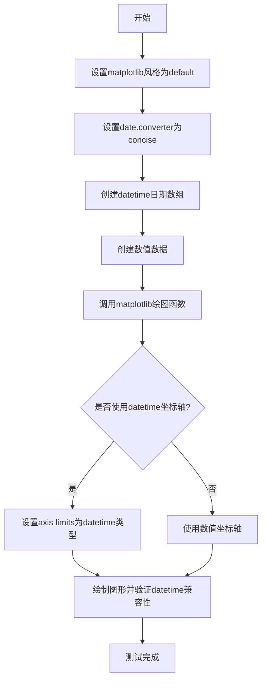

## 类结构

```
TestDatetimePlotting (测试类)
├── test_annotate - 测试annotate方法
├── test_arrow - 测试arrow方法 (xfail)
├── test_axhline - 测试axhline方法
├── test_axhspan - 测试axhspan方法
├── test_axline - 测试axline方法 (xfail)
├── test_axvline - 测试axvline方法
├── test_axvspan - 测试axvspan方法
├── test_bar - 测试bar方法
├── test_bar_label - 测试bar_label方法
├── test_barbs - 测试barbs方法
├── test_barh - 测试barh方法
├── test_boxplot - 测试boxplot方法 (xfail)
├── test_broken_barh - 测试broken_barh方法
├── test_bxp - 测试bxp方法
├── test_clabel - 测试clabel方法 (xfail)
├── test_contour - 测试contour方法
├── test_contourf - 测试contourf方法
├── test_errorbar - 测试errorbar方法
├── test_eventplot - 测试eventplot方法
├── test_fill - 测试fill方法
├── test_fill_between - 测试fill_between方法
├── test_fill_betweenx - 测试fill_betweenx方法
├── test_hexbin - 测试hexbin方法 (xfail)
├── test_hist - 测试hist方法
├── test_hist2d - 测试hist2d方法 (xfail)
├── test_hlines - 测试hlines方法
├── test_imshow - 测试imshow方法
├── test_loglog - 测试loglog方法 (xfail)
├── test_matshow - 测试matshow方法
├── test_pcolor - 测试pcolor方法 (xfail)
├── test_pcolorfast - 测试pcolorfast方法 (xfail)
├── test_pcolormesh - 测试pcolormesh方法 (xfail)
├── test_plot - 测试plot方法
├── test_quiver - 测试quiver方法 (xfail)
├── test_scatter - 测试scatter方法
├── test_semilogx - 测试semilogx方法 (xfail)
├── test_semilogy - 测试semilogy方法 (xfail)
├── test_stackplot - 测试stackplot方法
├── test_stairs - 测试stairs方法
├── test_stem - 测试stem方法
├── test_step - 测试step方法
├── test_streamplot - 测试streamplot方法 (xfail)
├── test_text - 测试text方法
├── test_tricontour - 测试tricontour方法 (xfail)
├── test_tricontourf - 测试tricontourf方法 (xfail)
├── test_tripcolor - 测试tripcolor方法 (xfail)
├── test_triplot - 测试triplot方法 (xfail)
├── test_violin - 测试violin方法
└── test_violinplot - 测试violinplot方法 (xfail)
```

## 全局变量及字段


### `datetime`
    
Python标准库datetime模块，用于处理日期和时间

类型：`module`
    


### `np`
    
numpy库别名，提供高效的数值计算功能

类型：`module`
    


### `pytest`
    
Python测试框架，用于编写和运行单元测试

类型：`module`
    


### `plt`
    
matplotlib.pyplot模块别名，用于创建可视化图表

类型：`module`
    


### `mpl`
    
matplotlib主模块，提供matplotlib库的核心功能

类型：`module`
    


### `start_date`
    
测试用的起始日期，通常为某个具体的时间点

类型：`datetime.datetime`
    


### `dates`
    
由起始日期递增组成的日期列表

类型：`list[datetime.datetime]`
    


### `data`
    
整数数据列表，通常表示数值型y轴数据

类型：`list[int]`
    


### `test_text`
    
测试用的字符串文本，用于注释和标注

类型：`str`
    


### `x_dates`
    
numpy数组，包含datetime对象，用作x轴日期数据

类型：`np.ndarray`
    


### `y_dates`
    
numpy数组，包含datetime对象，用作y轴日期数据

类型：`np.ndarray`
    


### `x_values`
    
numpy数组，包含数值型数据，用作x轴

类型：`np.ndarray`
    


### `y_values`
    
numpy数组，包含数值型数据，用作y轴

类型：`np.ndarray`
    


### `numbers`
    
数值列表或数组，用于图表的数据表示

类型：`list[int] 或 np.ndarray`
    


### `x_ranges`
    
数值范围列表，表示x轴的数据范围或宽度

类型：`list[int] 或 np.ndarray`
    


### `y_ranges`
    
数值范围列表，表示y轴的数据范围或高度

类型：`list[int] 或 np.ndarray`
    


### `TestDatetimePlotting.TestDatetimePlotting`
    
测试类，包含多个matplotlib datetime绑定的绘图功能测试方法

类型：`class`
    
    

## 全局函数及方法


### mpl.style.context

该函数是 matplotlib 库中的一个样式上下文管理器，用于临时应用指定的样式（通常是 "default"）到代码块或函数，并在执行结束后自动恢复之前的样式。它既可以作为装饰器使用，也可以作为上下文管理器使用。

参数：
- `style`：字符串或字典列表，表示要应用的样式名称（如 "default"）。

返回值：返回一个装饰器函数或上下文管理器，用于临时设置 matplotlib 的 RC 参数。

#### 流程图

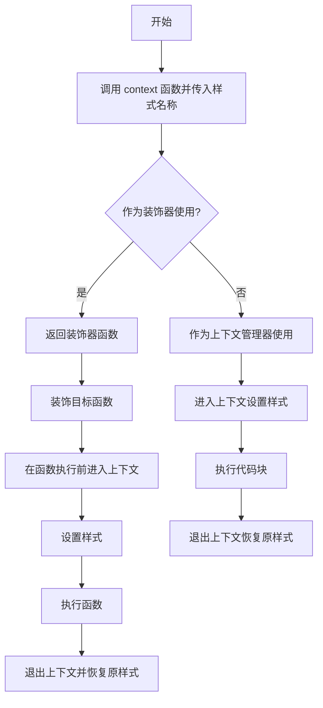

#### 带注释源码

```python
# 注意：以下代码为基于使用推断的示意实现，实际实现位于 matplotlib 库中
def context(style):
    """
    临时应用样式的上下文管理器或装饰器。
    
    参数：
        style (str 或 dict 或 list): 样式名称、样式字典或样式字典列表。
    
    返回值：
        返回一个装饰器函数或上下文管理器。
    """
    from matplotlib import rc_context
    
    # 返回一个装饰器函数
    def decorator(func):
        def wrapper(*args, **kwargs):
            # 使用 rc_context 临时应用样式
            with rc_context(style=style):
                return func(*args, **kwargs)
        # 复制原始函数的元数据
        wrapper.__name__ = func.__name__
        wrapper.__doc__ = func.__doc__
        return wrapper
    return decorator

# 在代码中通常直接使用 @mpl.style.context("default") 形式
# 其效果类似于：
# @context("default")
# def test_annotate(self):
#     ...
```


### mpl.rcParams

这是matplotlib的运行时配置参数对象，用于获取或设置matplotlib的全局默认配置。它是一个类似字典的`RcParams`实例，包含了绘图样式的各种默认参数。

参数：

- `key`：`str`，配置参数的键名（如"date.converter"、"lines.linewidth"等）
- `value`：（可选），任何类型，要设置的参数值

返回值：`any`，返回指定键对应的参数值；如果设置新值则返回新值。

#### 流程图

```mermaid
graph TD
    A[访问mpl.rcParams] --> B{是否提供key?}
    B -->|是| C{是否提供value?}
    C -->|否| D[读取操作: 返回mpl.rcParams[key]对应的值]
    C -->|是| E[写入操作: 设置mpl.rcParams[key] = value]
    B -->|否| F[返回整个RcParams字典对象]
    
    D --> G[影响后续matplotlib绘图行为]
    E --> G
    F --> G
```

#### 带注释源码

```
# mpl.rcParams 是 matplotlib 模块级的全局配置对象
# 它是 matplotlib.RcParams 类的实例，继承自 OrderedDict
# 用于存储和管理 matplotlib 的各种默认配置参数

import matplotlib as mpl

# 读取操作：获取当前配置值
current_converter = mpl.rcParams["date.converter"]
# 返回值：str，例如 'concise' 或 'default'

# 写入操作：修改配置值
mpl.rcParams["date.converter"] = 'concise'
# 设置后会影响后续所有图表的日期显示格式

# 可用的一些常用配置参数：
# - date.converter: 日期转换器样式
# - lines.linewidth: 线条宽度
# - axes.titlesize: 标题字体大小
# - figure.figsize: 图表默认尺寸
# - font.family: 字体家族
```

---

### 补充说明

#### 设计目标与约束

- **设计目标**：提供统一的matplotlib外观和行为配置管理
- **约束**：修改`rcParams`会影响全局后续绘图，需注意使用场景

#### 常见配置参数示例

| 参数名 | 类型 | 说明 |
|--------|------|------|
| `date.converter` | str | 日期转换器样式('concise'/'default') |
| `lines.linewidth` | float | 线条宽度 |
| `axes.titlesize` | int/str | 坐标轴标题字体大小 |
| `figure.figsize` | tuple | 图表默认尺寸(宽, 高) |
| `font.family` | str/list | 字体家族 |

#### 技术债务与优化空间

1. 频繁修改`rcParams`可能导致行为不可预测，建议使用`matplotlib.style.context()`临时更改样式
2. 部分测试中硬编码了特定的`rcParams`值，缺少对不同配置下行为的测试覆盖


### `plt.subplots`

`plt.subplots` 是 matplotlib 库中的核心函数，用于创建一个新的图形窗口（Figure）及一个或多个子图（Axes）。它是最常用的 Matplotlib 编程接口之一，支持灵活的行列网格布局，能够一次性生成复杂的子图阵列，并返回 Figure 对象和对应的 Axes 对象（或数组），便于后续绑定数据进行可视化绑制。

参数：

- `nrows`：`int`，默认值 1，表示子图的行数
- `ncols`：`int`，默认值 1，表示子图的列数
- `sharex`：`bool` 或 `str`，默认值 False，是否共享 x 轴
- `sharey`：`bool` 或 `str`，默认值 False，是否共享 y 轴
- `squeeze`：`bool`，默认值 True，是否压缩返回的 Axes 数组维度
- `width_ratios`：`array-like`，可选，表示各列宽度比例
- `height_ratios`：`array-like`，可选，表示各行高度比例
- `**fig_kw`：传递给 `plt.figure()` 的额外关键字参数，如 `figsize`、`dpi`、`layout` 等

返回值：`tuple(Figure, Axes or array of Axes)`，返回创建的图形对象和一个或多个子图坐标轴对象

#### 流程图

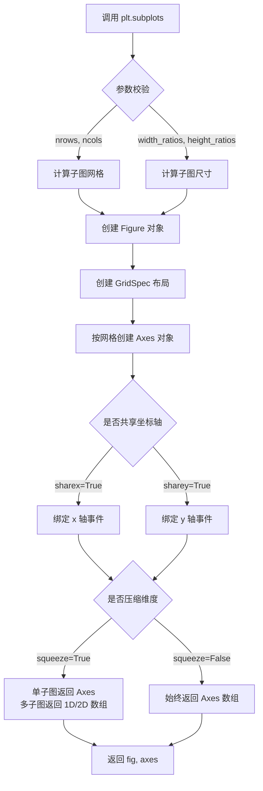

#### 带注释源码

```python
# 以下为 plt.subplots 的核心实现逻辑（简化版）
def subplots(nrows=1, ncols=1, *, sharex=False, sharey=False, 
             squeeze=True, width_ratios=None, height_ratios=None, **fig_kw):
    """
    创建一个包含子图的图形窗口
    
    参数:
        nrows: 子图行数，默认1
        ncols: 子图列数，默认1
        sharex: 是否共享x轴，可选 'all', 'none', 'row', 'col', True/False
        sharey: 是否共享y轴，可选 'all', 'none', 'row', 'col', True/False
        squeeze: 是否压缩返回的axes维度
        width_ratios: 各列宽度比例数组
        height_ratios: 各行高度比例数组
        **fig_kw: 传递给Figure构造函数的参数
    
    返回:
        fig: Figure图形对象
        axes: Axes对象或Axes数组
    """
    
    # 1. 创建Figure对象，传入fig_kw参数如figsize, dpi等
    fig = figure(**fig_kw)
    
    # 2. 创建GridSpec网格布局对象
    gs = GridSpec(nrows, ncols, width_ratios=width_ratios, 
                  height_ratios=height_ratios)
    
    # 3. 根据nrows和ncols循环创建子图
    axes_arr = []
    for i in range(nrows):
        row_axes = []
        for j in range(ncols):
            # 使用add_subplot添加子图
            ax = fig.add_subplot(gs[i, j])
            
            # 4. 处理坐标轴共享逻辑
            if sharex or sharey:
                # 从已创建的axes中查找需要共享的轴
                pass  # 共享逻辑实现
                
            row_axes.append(ax)
        axes_arr.append(row_axes)
    
    # 5. 转换为numpy数组便于索引
    axes_arr = np.array(axes_arr)
    
    # 6. 根据squeeze参数处理返回形式
    if squeeze:
        # 单个子图时返回Axes对象
        if nrows == 1 and ncols == 1:
            return fig, axes_arr[0, 0]
        # 多行多列时尝试降维
        elif nrows == 1:
            return fig, axes_arr[0]
        elif ncols == 1:
            return fig, axes_arr[:, 0]
    
    # 7. 返回(fig, axes)元组
    return fig, axes_arr
```

#### 实际使用示例（从代码中提取）

```python
# 示例1：创建4行1列的子图布局，带约束布局
fig, (ax1, ax2, ax3, ax4) = plt.subplots(4, 1, layout="constrained")

# 示例2：创建单个子图
fig, ax = plt.subplots()

# 示例3：创建3行1列，带约束布局和图形尺寸
fig, (ax1, ax2, ax3) = plt.subplots(3, 1, 
                                    constrained_layout=True,
                                    figsize=(10, 12))

# 示例4：创建1行2列，带图形尺寸
fig, axes = plt.subplots(nrows=1, ncols=2, figsize=(12, 6))
```


# plt.rcParams 提取结果

### plt.rcParams / mpl.rcParams

matplotlib 的运行时配置字典，用于获取和设置 matplotlib 的全局默认参数（如线条宽度、颜色、字体、日期格式等）。在代码中主要用于设置日期转换器为 'concise' 模式。

参数：

- 无（这是属性访问，不是函数调用）

返回值：`dict`，返回包含所有 rcParams 的字典对象

#### 流程图

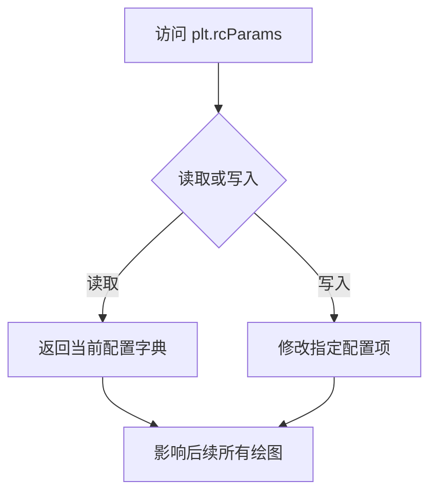

#### 带注释源码

```python
# 代码中 plt.rcParams / mpl.rcParams 的典型用法

# 1. 写入操作 - 设置日期转换器为简洁模式
mpl.rcParams["date.converter"] = 'concise'
# 等价于：
plt.rcParams["date.converter"] = 'concise'

# 2. 读取操作示例（代码中未出现，但常见用法）
current_converter = mpl.rcParams["date.converter"]  # 获取当前值

# 说明：
# - mpl 是 matplotlib 模块的别名
# - plt 是 matplotlib.pyplot 模块的别名
# - plt.rcParams 是指向 mpl.rcParams 的引用，两者等价
# - rcParams 本质上是一个 RcParams 字典对象
# - 可用键包括：'date.converter', 'lines.linewidth', 'font.size' 等数百种配置
```

### 相关代码片段

```python
# 示例1：test_annotate 方法中的使用
mpl.rcParams["date.converter"] = 'concise'

# 示例2：test_bar 方法中的使用  
mpl.rcParams["date.converter"] = "concise"

# 示例3：test_barbs 方法中的使用
plt.rcParams["date.converter"] = 'concise'

# 说明：
# 这些语句的作用是将 matplotlib 的日期转换器设置为 'concise' 模式
# 该模式会使日期标签以更简洁的方式显示
# 配置在当前测试方法内生效，测试结束后恢复默认
```


### `ax.plot`

这是matplotlib Axes对象的plot方法，用于在坐标轴上绘制线图。该方法接受x和y数据作为主要参数，支持多种数据类型（包括datetime），并返回包含Line2D对象的列表。

参数：

- `x`：array-like，x轴数据，可以是数值、datetime或其他可迭代类型
- `y`：array-like，y轴数据，可以是数值、datetime或其他可迭代类型
- `**kwargs`：关键字参数传递给Line2D，如color、marker、linewidth等

返回值：`list`，返回Line2D对象列表

#### 流程图

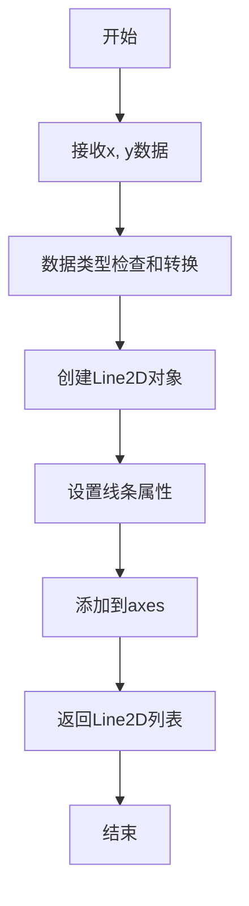

#### 带注释源码

```python
def plot(self, *args, **kwargs):
    """
    Plot y versus x as lines and/or markers.
    
    Parameters
    ----------
    x, y : array-like
        The x and y data points. Both arguments can be datetime objects,
        numeric values, or array-like data.
    
    Returns
    -------
    list of ~matplotlib.lines.Line2D
        A list of lines representing the plotted data.
    """
    # 获取axes的axesartist实例
    ax = self._get_axes()
    
    # 处理数据格式
    # 支持多种输入格式：
    # - plot(y) : x自动生成为range(len(y))
    # - plot(x, y) : 显式指定x和y
    # - plot(x, y, format_string) : 指定格式字符串
    
    # 创建Line2D对象
    lines = []
    
    # 遍历所有数据对
    for idx in range(0, len(args), 2):
        x_data = args[idx] if idx < len(args) else None
        y_data = args[idx + 1] if idx + 1 < len(args) else args[idx]
        
        # 如果只提供一个参数，则作为y值，x自动生成
        if x_data is None:
            x_data = range(len(y_data))
        
        # 转换数据为numpy数组
        x = np.asanyarray(x_data)
        y = np.asanyarray(y_data)
        
        # 创建Line2D对象
        line = mpl.lines.Line2D(x, y, **kwargs)
        
        # 设置线条属性（颜色、标记、线型等）
        self._update_line_props(line, **kwargs)
        
        # 将线条添加到axes
        self.add_line(line)
        
        # 返回线条列表
        lines.append(line)
    
    return lines
```


### `ax.annotate`

该方法用于在matplotlib图表的指定位置添加文本注释，支持可选的箭头指向被注释的点。

参数：

- `text`：`str`，注释显示的文本内容
- `xy`：`tuple`，被注释的点的坐标(x, y)
- `xytext`：`tuple`，可选，注释文本的坐标(x, y)，默认为与`xy`相同
- `arrowprops`：`dict`，可选，箭头的属性字典，用于指定箭头的样式、颜色等

返回值：`matplotlib.text.Annotation`，返回创建的注释对象

#### 流程图

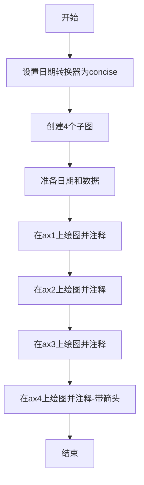

#### 带注释源码

```python
# 设置日期转换器为concise模式，使日期显示更简洁
mpl.rcParams["date.converter"] = 'concise'

# 创建一个包含4个垂直子图的图表，布局采用constrained模式
fig, (ax1, ax2, ax3, ax4) = plt.subplots(4, 1, layout="constrained")

# 创建2023年10月的日期列表，共31天
start_date = datetime.datetime(2023, 10, 1)
dates = [start_date + datetime.timedelta(days=i) for i in range(31)]

# 创建数据列表，1到31
data = list(range(1, 32))

# 注释文本内容
test_text = "Test Text"

# 子图1：日期在x轴，数据在y轴
ax1.plot(dates, data)
# 添加注释：文本为test_text，注释点为第15天的日期和对应的数据值
ax1.annotate(text=test_text, xy=(dates[15], data[15]))

# 子图2：数据在x轴，日期在y轴
ax2.plot(data, dates)
# 添加注释：文本为test_text，注释点为第5个数据值和第26天的日期
ax2.annotate(text=test_text, xy=(data[5], dates[26]))

# 子图3：日期在x轴和y轴（两者都是日期）
ax3.plot(dates, dates)
# 添加注释：文本为test_text，注释点为第15天的日期和第3天的日期
ax3.annotate(text=test_text, xy=(dates[15], dates[3]))

# 子图4：日期在x轴和y轴，带箭头注释
ax4.plot(dates, dates)
# 添加注释：文本为test_text，注释点为第5天和第30天的日期
# xytext指定注释文本的位置为第1天和第7天的日期
# arrowprops设置箭头属性，facecolor为红色
ax4.annotate(text=test_text, xy=(dates[5], dates[30]),
             xytext=(dates[1], dates[7]), arrowprops=dict(facecolor='red'))
```


### `Axes.axhline`

在 matplotlib 中，`axhline` 是 Axes 类的一个方法，用于在图表上绘制一条水平线。该方法接受 y 坐标位置以及 x 轴的起始和结束位置（相对于坐标轴宽度的比例），支持 datetime 和 numpy datetime64 类型，能够在带有时间轴的图表中绘制水平参考线。

参数：

- `y`：`float` 或 `datetime` 或 `np.datetime64`，水平线的 y 坐标位置
- `xmin`：`float`，水平线起始的 x 位置（相对于坐标轴，范围 0-1），默认为 0
- `xmax`：`float`，水平线结束的 x 位置（相对于坐标轴，范围 0-1），默认为 1

返回值：`matplotlib.lines.Line2D`，绘制出的水平线对象

#### 流程图

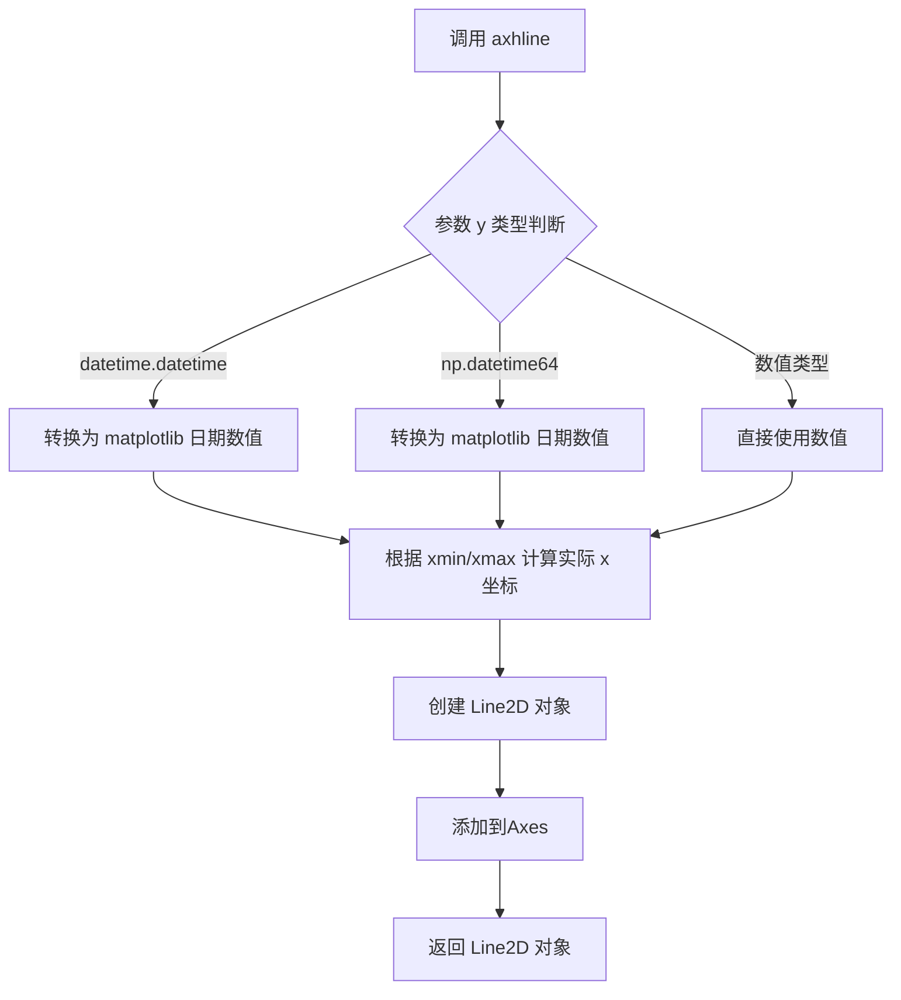

#### 带注释源码

```python
def axhline(self, y=0, xmin=0, xmax=1, **kwargs):
    """
    在 Axes 上绘制一条水平线。
    
    参数:
        y : float 或 datetime 或 np.datetime64
            水平线的 y 坐标位置
            
        xmin : float, 默认为 0
            水平线起始的 x 位置，相对于坐标轴宽度的比例（0-1）
            
        xmax : float, 默认为 1
            水平线结束的 x 位置，相对于坐标轴宽度的比例（0-1）
            
        **kwargs : 
            传递给 Line2D 的关键字参数，如 color, linewidth, linestyle 等
            
    返回:
        Line2D 对象
    """
    # 将 y 转换为数据坐标（如果是 datetime 类型会自动转换）
    # 根据 xmin/xmax 计算实际的 x 坐标
    # 创建 Line2D 对象并添加到 Axes
    # 返回绘制的水平线对象
```


### `ax.axhspan`

该方法用于在Axes对象上绘制水平跨度区域（horizontal span），即在y轴方向上填充一个矩形区域，常用于高亮显示数据中的特定范围。支持数字和日期时间类型的y轴数据。

参数：

- `ymin`：`float` 或 `datetime`，y轴起始位置，可以是数值或日期时间对象
- `ymax`：`float` 或 `datetime`，y轴结束位置，可以是数值或日期时间对象  
- `xmin`：可选参数，`float`，x轴起始位置，默认为0
- `xmax`：可选参数，`float`，x轴结束位置，默认为1
- `facecolor`：可选参数，`str` 或 `color`，填充区域的前景颜色
- `edgecolor`：可选参数，`str` 或 `color`，填充区域的边框颜色
- `alpha`：可选参数，`float`，透明度，范围0-1
- `label`：可选参数，`str`，图例标签
- `**kwargs`：其他传递给`Patch`的属性

返回值：`PolyCollection`，返回创建的填充多边形对象

#### 流程图

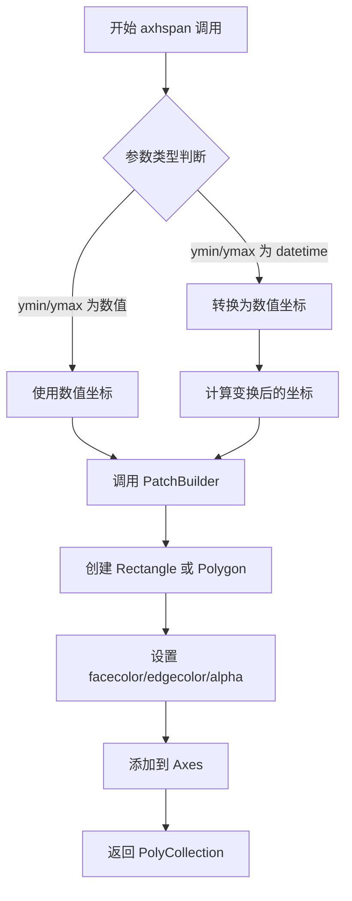

#### 带注释源码

```python
# 测试代码中 axhspan 的使用示例

# 场景1: y轴为数字类型
ax1.plot(dates, numbers, marker='o', color='blue')
for i in range(0, 31, 2):
    # ymin 和 ymax 为数字类型
    ax1.axhspan(ymin=i+1, ymax=i+2, facecolor='green', alpha=0.5)

# 场景2: y轴为日期时间类型
ax2.plot(numbers, dates, marker='o', color='blue')
for i in range(0, 31, 2):
    # 将 timedelta 转换为日期时间对象
    ymin = start_date + datetime.timedelta(days=i)
    ymax = ymin + datetime.timedelta(days=1)
    # ymin 和 ymax 为 datetime 类型
    ax2.axhspan(ymin=ymin, ymax=ymax, facecolor='green', alpha=0.5)

# 场景3: y轴和x轴都为日期时间类型
ax3.plot(dates, dates, marker='o', color='blue')
for i in range(0, 31, 2):
    ymin = start_date + datetime.timedelta(days=i)
    ymax = ymin + datetime.timedelta(days=1)
    ax3.axhspan(ymin=ymin, ymax=ymax, facecolor='green', alpha=0.5)
```


### `ax.axvline`

在matplotlib中，`axvline`用于在图表上绘制垂直线，支持datetime、numpy.datetime64以及数值类型，能够在x轴指定位置绘制跨越y轴范围的垂直线，常用于时间序列可视化中标注文本时间点或划分时间区间。

参数：

- `x`：`float` 或 `datetime` 或 `np.datetime64`，垂直线的x轴位置
- `ymin`：`float`（默认为0），垂直线在y轴方向的起始位置（相对于y轴范围的比例，0-1之间）
- `ymax`：`float`（默认为1），垂直线在y轴方向的结束位置（相对于y轴范围的比例，0-1之间）
- `**kwargs`：其他matplotlib支持的线属性参数，如color、linestyle、linewidth等

返回值：`matplotlib.lines.Line2D`，返回绘制的垂直线对象，可用于进一步设置样式或添加标注

#### 流程图

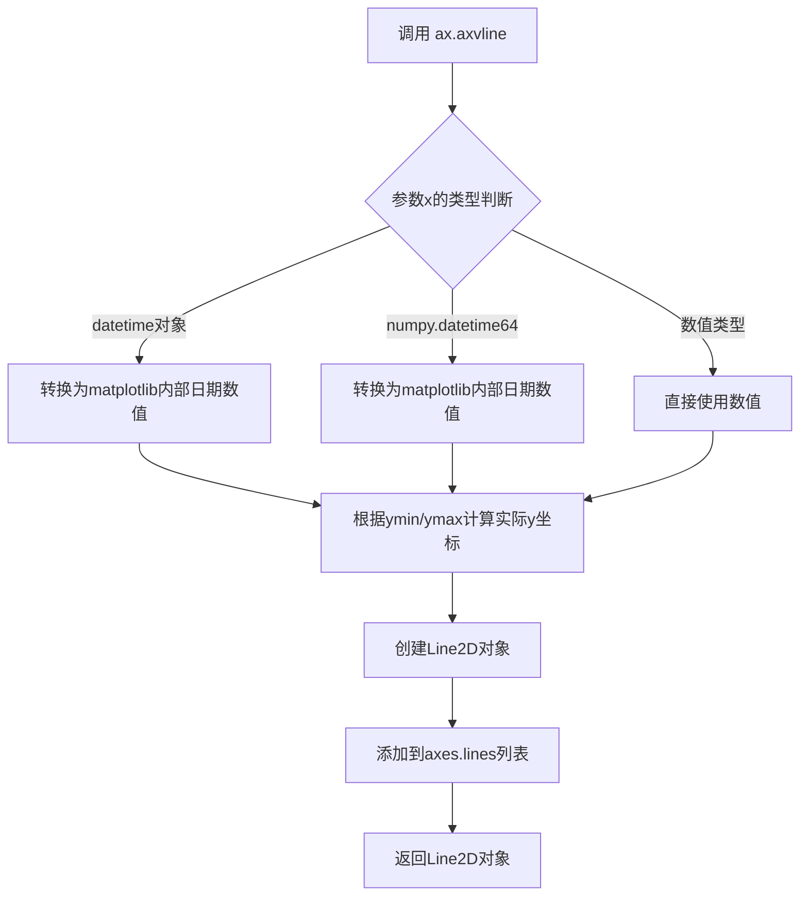

#### 带注释源码

```python
# test_axvline 方法展示了 axvline 在 datetime 图表中的应用
@mpl.style.context("default")
def test_axvline(self):
    # 设置日期转换器为'concise'，使用简洁的日期格式
    mpl.rcParams["date.converter"] = 'concise'
    
    # 创建3行1列的子图布局
    fig, (ax1, ax2, ax3) = plt.subplots(3, 1, layout='constrained')
    
    # ======= 子图1：使用datetime对象设置x轴范围 =======
    ax1.set_xlim(left=datetime.datetime(2020, 4, 1),
                 right=datetime.datetime(2020, 8, 1))
    # 绘制垂直线：在指定datetime位置绘制垂直线，y轴范围0.5-0.7
    ax1.axvline(x=datetime.datetime(2020, 6, 3), ymin=0.5, ymax=0.7)
    
    # ======= 子图2：使用numpydatetime64设置x轴范围 =======
    ax2.set_xlim(left=np.datetime64('2005-01-01'),
                 right=np.datetime64('2005-04-01'))
    # 绘制垂直线：使用numpy.datetime64类型，y轴范围0.1-0.9
    ax2.axvline(np.datetime64('2005-02-25T03:30'), ymin=0.1, ymax=0.9)
    
    # ======= 子图3：再次使用datetime对象 =======
    ax3.set_xlim(left=datetime.datetime(2023, 9, 1),
                 right=datetime.datetime(2023, 11, 1))
    # 绘制垂直线：y轴范围0.4-0.7
    ax3.axvline(x=datetime.datetime(2023, 10, 24), ymin=0.4, ymax=0.7)
```

#### 调用示例与扩展

```python
# 完整调用示例（带注释说明）
ax.axvline(
    x=datetime.datetime(2020, 6, 3),  # 垂直线x轴位置（支持datetime/numpy.datetime64/float）
    ymin=0.5,    # 垂直线起始位置（相对于y轴范围的50%处）
    ymax=0.7,    # 垂直线结束位置（相对于y轴范围的70%处）
    color='red',        # 线条颜色
    linestyle='--',     # 线条样式（实线/虚线/点划线等）
    linewidth=2,        # 线条宽度
    label='Event Date'  # 图例标签
)
ax.legend()  # 显示图例
```


### `Axes.axvspan`

该方法用于在图表上绘制垂直区域（从 xmin 到 xmax，跨越整个 y 轴范围），常用于高亮显示特定时间区间或数值区间。

参数：

- `xmin`：`float` 或 `datetime`，垂直区域的起始 x 坐标（可以是数值或日期时间）
- `xmax`：`float` 或 `datetime`，垂直区域的结束 x 坐标（可以是数值或日期时间）
- `facecolor`：`str`，填充颜色，默认为 'none'（无填充）
- `alpha`：`float`，透明度，范围 0-1
- `edgecolor`：`str`，边框颜色
- `linewidth`：`float`，边框线宽
- `linestyle`：`str`，边框线型
- `**kwargs`：其他传递给 `Patch` 的参数

返回值：`PolySelector` 或 `Rectangle`，返回创建的补丁对象

#### 流程图

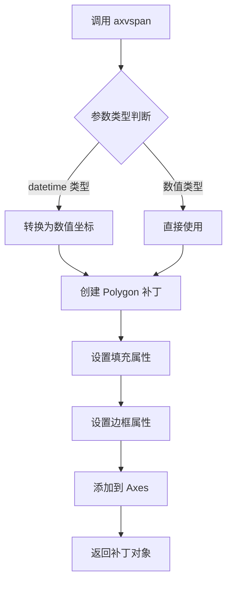

#### 带注释源码

```python
# test_axvspan 方法展示了 axvspan 的三种典型使用场景
@mpl.style.context("default")
def test_axvspan(self):
    # 设置日期转换器为简洁模式
    mpl.rcParams["date.converter"] = 'concise'

    # 创建日期序列和数据
    start_date = datetime.datetime(2023, 1, 1)
    dates = [start_date + datetime.timedelta(days=i) for i in range(31)]
    numbers = list(range(1, 32))

    # 创建三个子图
    fig, (ax1, ax2, ax3) = plt.subplots(3, 1,
                                        constrained_layout=True,
                                        figsize=(10, 12))

    # 场景1: x轴为日期, y轴为数字
    ax1.plot(dates, numbers, marker='o', color='blue')
    for i in range(0, 31, 2):
        xmin = start_date + datetime.timedelta(days=i)
        xmax = xmin + datetime.timedelta(days=1)
        # 绘制半透明红色垂直区域
        ax1.axvspan(xmin=xmin, xmax=xmax, facecolor='red', alpha=0.5)
    ax1.set_title('Datetime vs. Number')
    ax1.set_xlabel('Date')
    ax1.set_ylabel('Number')

    # 场景2: x轴为数字, y轴为日期
    ax2.plot(numbers, dates, marker='o', color='blue')
    for i in range(0, 31, 2):
        # 直接使用数值作为 x 范围
        ax2.axvspan(xmin=i+1, xmax=i+2, facecolor='red', alpha=0.5)
    ax2.set_title('Number vs. Datetime')
    ax2.set_xlabel('Number')
    ax2.set_ylabel('Date')

    # 场景3: x轴和y轴都为日期
    ax3.plot(dates, dates, marker='o', color='blue')
    for i in range(0, 31, 2):
        xmin = start_date + datetime.timedelta(days=i)
        xmax = xmin + datetime.timedelta(days=1)
        ax3.axvspan(xmin=xmin, xmax=xmax, facecolor='red', alpha=0.5)
    ax3.set_title('Datetime vs. Datetime')
    ax3.set_xlabel('Date')
    ax3.set_ylabel('Date')
```


### `TestDatetimePlotting.test_bar`

该方法是一个单元测试函数，用于测试 `matplotlib.axes.Axes` 的 `bar` 方法在处理日期时间（datetime）数据时的功能。它分别验证了在 X 轴使用日期时间以及在 Y 轴（通过 `bottom` 参数）使用日期时间的绘图场景，并确保 timedelta 类型可以作为条形的宽度和高度。

参数：

-  `self`：`TestDatetimePlotting`，指向测试类实例本身的引用。

返回值：`None`，该方法不返回任何值，仅执行绘图操作。

#### 流程图

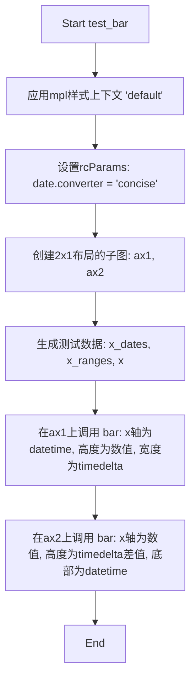

#### 带注释源码

```python
    @mpl.style.context("default")  # 应用默认样式上下文
    def test_bar(self):
        # 设置日期转换器为 'concise'（简洁）模式，以便更好地显示日期刻度
        mpl.rcParams["date.converter"] = "concise"

        # 创建一个包含两个子图的图形，布局方式为 constrained
        fig, (ax1, ax2) = plt.subplots(2, 1, layout="constrained")

        # 定义 datetime 类型的 x 轴数据
        x_dates = np.array(
            [
                datetime.datetime(2020, 6, 30),
                datetime.datetime(2020, 7, 22),
                datetime.datetime(2020, 8, 3),
                datetime.datetime(2020, 9, 14),
            ],
            dtype=np.datetime64,
        )
        # 定义对应的数值型高度数据
        x_ranges = [8800, 2600, 8500, 7400]

        # 定义一个基础的 datetime 对象，用于计算时间差
        x = np.datetime64(datetime.datetime(2020, 6, 1))
        
        # 测试场景1：在 X 轴上使用 datetime，宽度使用 timedelta
        ax1.bar(x_dates, x_ranges, width=np.timedelta64(4, "D"))
        
        # 测试场景2：在 Y 轴上使用 datetime (通过 bottom 参数)
        # x 轴为数值索引 (0,1,2,3)，高度为 datetime 差值 (timedelta)，底部 (bottom) 为 datetime
        ax2.bar(np.arange(4), x_dates - x, bottom=x)
```

### 其它项目信息

**关键组件信息：**
- `TestDatetimePlotting`：测试类，包含了大量关于 Matplotlib  datetime 绑定的测试用例。
- `mpl.rcParams["date.converter"]`：全局配置项，控制日期刻度的转换格式，本测试将其设为 'concise'。
- `ax.bar`：Matplotlib Axes 对象的核心绘图方法，本测试重点验证其对 datetime 类型输入的处理能力。

**潜在的技术债务或优化空间：**
- 测试数据是硬编码的，如果能通过参数化（parametrize）注入不同的时间范围和数值，测试覆盖率会更高。
- 目前仅覆盖了基本的 `bar` 调用，对于 `bar` 的其他参数如 `color`, `edgecolor` 等未进行测试。

**设计目标与约束：**
- **目标**：验证 Matplotlib 的 `bar` 图表方法能够正确识别并处理 `numpy.datetime64` 和 `datetime.datetime` 对象，将其转换为绘图坐标。
- **约束**：依赖 `matplotlib` 和 `numpy` 库的具体版本实现。

**错误处理与异常设计：**
- 本测试用例未显式编写断言（assert），属于“冒烟测试”或“视觉回归测试”范畴，主要通过运行不报错且生成图形来验证功能。


### `ax.bar_label`

`ax.bar_label` 是 matplotlib 中 `Axes` 类的一个方法，用于为柱状图（bar chart）的每个条形添加标签（如数值标签）。它支持自定义标签文本、格式字符串、标签位置（边缘或中心）以及丰富的文本样式选项。

参数：

- `container`：`BarContainer`，从 `ax.bar()` 返回的条形容器对象，包含所有条形的信息。
- `labels`：数组型，可选，自定义标签文本列表。如果为 `None`，则自动根据数值生成标签。
- `fmt`：字符串，可选，格式字符串，用于格式化自动生成的标签，默认值为 `'%g'`（通用数字格式）。
- `label_type`：字符串，可选，指定标签的位置类型，可选值为 `'edge'`（条形边缘）或 `'center'`（条形中心），默认值为 `'edge'`。
- `padding`：浮点数，可选，标签与条形边缘之间的间距（仅当 `label_type='edge'` 时有效），默认值为 `0`。
- `**kwargs`：关键字参数，可选，用于设置文本对象的属性，如 `color`（颜色）、`fontsize`（字体大小）、`fontweight`（字体粗细）等。

返回值：`list[matplotlib.text.Text]`，返回创建的文本标签对象列表。

#### 流程图

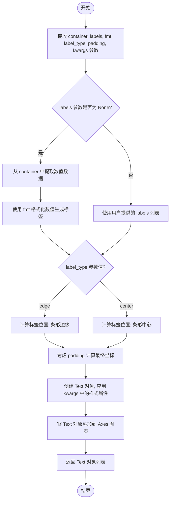

#### 带注释源码

```python
def bar_label(self, container, labels=None, *, fmt='%g', label_type='edge',
              padding=0, **kwargs):
    """
    为柱状图的条形添加标签。

    参数:
        container : BarContainer
            从 ax.bar() 返回的条形容器对象。
        labels : array-like, optional
            自定义标签文本列表。如果为 None，则自动生成。
        fmt : str, default: '%g'
            格式字符串，用于格式化自动生成的标签。
        label_type : {'edge', 'center'}, default: 'edge'
            标签位置：'edge' 表示在条形边缘，'center' 表示在条形中心。
        padding : float, default: 0
            标签与条形边缘之间的间距（仅 label_type='edge' 时有效）。
        **kwargs
            传递给 Text 对象的属性，如 color, fontsize, fontweight 等。

    返回:
        list of Text
            创建的文本标签对象列表。
    """
    # 1. 获取条形数据
    # 从 container (BarContainer) 中获取所有条形的属性
    datavalues = container.datavalues  # 条形的数值
    patches = container.patches        # 条形Patch对象列表

    # 2. 生成标签文本
    if labels is None:
        # 如果未提供 labels，则根据数值自动生成标签
        if isinstance(fmt, str):
            labels = [fmt % val for val in datavalues]
        else:
            # fmt 可能是函数或可调用对象
            labels = [fmt(val) for val in datavalues]

    # 3. 计算标签位置
    if label_type == 'center':
        # 标签居中显示：计算每个条形的中心坐标
        x_coords = [patch.get_x() + patch.get_width() / 2 for patch in patches]
        y_coords = [patch.get_y() + patch.get_height() / 2 for patch in patches]
    else:
        # 标签边缘显示（默认）
        # padding 控制标签与条形顶部的距离
        x_coords = [patch.get_x() + patch.get_width() / 2 for patch in patches]
        y_coords = [patch.get_y() + patch.get_height() + padding for patch in patches]

    # 4. 创建并添加文本标签到图表
    text_objects = []
    for x, y, label in zip(x_coords, y_coords, labels):
        # 创建 Text 对象，设置文本和位置
        text = self.text(x, y, label, **kwargs)
        text_objects.append(text)

    # 5. 调整坐标轴范围以确保标签不被裁剪
    self.autoscale_view()

    return text_objects
```


### `ax.barbs`

该方法是 Matplotlib 中 Axes 类的成员，用于绘制风羽图（barbs），这是一种常用于气象学中表示风速和风向的矢量图。它可以接受日期时间对象作为坐标，支持在同一个图表中同时展示日期时间与数值数据。

参数：

- `x`：`array_like`，x 坐标，可以是数值或 datetime 类型
- `y`：`array_like`，y 坐标，可以是数值或 datetime 类型
- `U`：`array_like`，x 方向的风速分量（或风力大小）
- `V`：`array_like`，y 方向的风速分量（或风向角度）
- `length`：`float`，风羽的长度，默认为 7
- `pivot`：`str`，风羽的支点位置，可选 'tip' 或 'middle'
- `barbcolor`：`color`，风羽的颜色
- `flagcolor`：`color`，风旗的颜色
- `linewidth`：`float`，线宽
- `linestyle`：线条样式

返回值：`PolyCollection`，返回创建的风羽图形的 PolyCollection 对象

#### 流程图

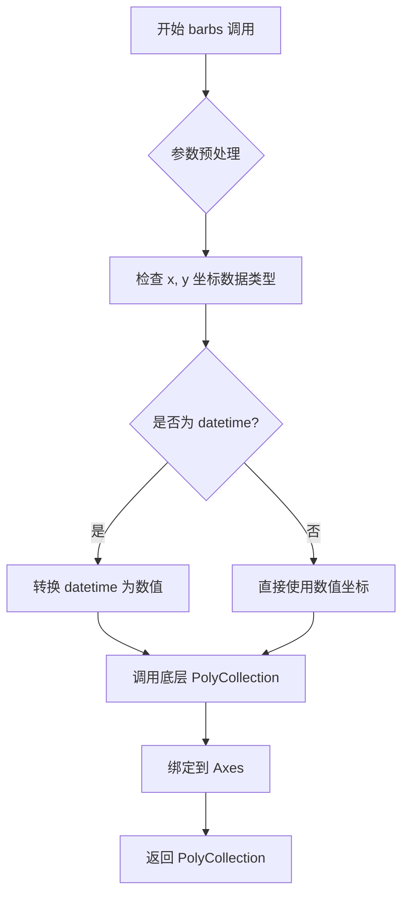

#### 带注释源码

```python
def barbs(self, *args, **kwargs):
    """
    绘制风羽图（barbs），用于表示风速和风向。
    
    参数:
    -----
    x, y : array_like
        数据点的坐标位置
    U, V : array_like
        矢量分量，U 为 x 方向，V 为 y 方向
    length : float, optional
        风羽的长度，默认为 7
    pivot : str, optional
        支点位置，可选 'tip' 或 'middle'
    barbcolor : color, optional
        风羽颜色
    flagcolor : color, optional
        风旗颜色
    linewidth : float, optional
        线宽
    """
    # 内部调用 _barbs 或 barbs 方法
    # 处理日期时间转换
    # 返回 PolyCollection 对象
```


### `ax.barh`

绘制水平条形图，支持 datetime 类型数据在 y 轴上的可视化，可通过 width 参数指定条形宽度，height 参数指定条形高度。

参数：

- `y`：`array-like`，y 轴位置（此测试用例中使用 datetime 类型日期作为 y 坐标）
- `width`：`array-like`，条形的宽度（水平长度）
- `height`：`array-like` 或 `scalar`，条形的垂直高度（可选，默认 0.8）
- `left`：`array-like` 或 `scalar`，条形左边界 x 坐标（可选）
- `**kwargs`：`关键字参数`，传递给 `bar` 方法的其他参数，如 color、edgecolor、alpha 等

返回值：`matplotlib.container.BarContainer`，包含所有绘制的条形艺术的容器对象

#### 流程图

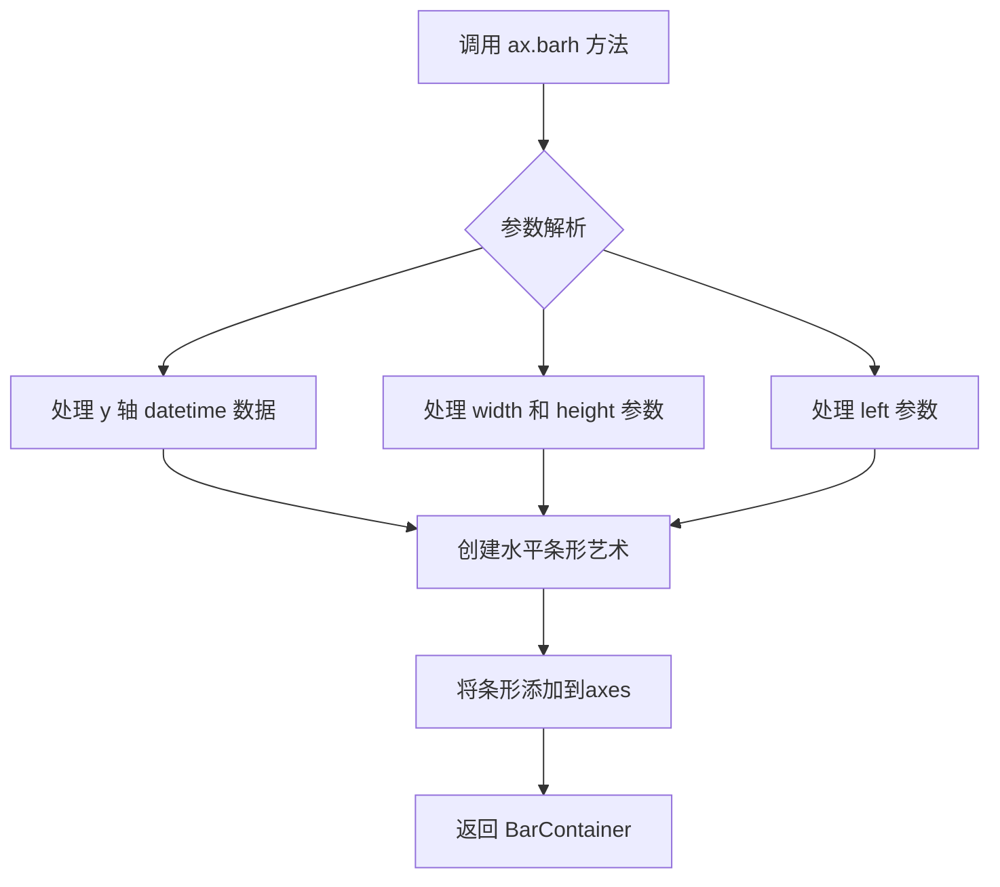

#### 带注释源码

```python
# 测试方法：test_barh
# 用途：测试 matplotlib 中 barh 方法对 datetime 数据的支持

@mpl.style.context("default")
def test_barh(self):
    # 设置日期转换器为 'concise'，使日期显示更简洁
    mpl.rcParams["date.converter"] = 'concise'
    
    # 创建包含两个子图的图表
    fig, (ax1, ax2) = plt.subplots(2, 1, layout='constrained')
    
    # 定义出生日期数组（datetime 类型）
    birth_date = np.array([
        datetime.datetime(2020, 4, 10),
        datetime.datetime(2020, 5, 30),
        datetime.datetime(2020, 10, 12),
        datetime.datetime(2020, 11, 15)
    ])
    
    # 定义年份范围
    year_start = datetime.datetime(2020, 1, 1)
    year_end = datetime.datetime(2020, 12, 31)
    
    # 定义年龄数组
    age = [21, 53, 20, 24]
    
    # 设置第一个子图的标签
    ax1.set_xlabel('Age')
    ax1.set_ylabel('Birth Date')
    
    # 调用 barh 方法：y 轴为出生日期，宽度为年龄，高度为10天
    # 语法：barh(y, width, height, left, **kwargs)
    ax1.barh(birth_date, width=age, height=datetime.timedelta(days=10))
    
    # 设置第二个子图的 x 轴范围
    ax2.set_xlim(left=year_start, right=year_end)
    ax2.set_xlabel('Birth Date')
    ax2.set_ylabel('Order of Birth Dates')
    
    # 第二个子图：使用位置索引作为 y 轴，出生日期与年初的差值作为宽度
    # left 参数指定条形的起始 x 位置（year_start）
    ax2.barh(np.arange(4), birth_date - year_start, left=year_start)
```


### Axes.broken_barh

用于在水平方向绘制带有间隙的条形图（broken bar plot），常用于展示时间区间或持续时间。该方法接受一组 x 轴区间（起始点、宽度）以及 y 轴位置和高度，生成多个矩形块并返回 PolyCollection。

参数：

-  `self`：`matplotlib.axes.Axes`，matplotlib 的 Axes 对象（隐式参数）。
-  `xranges`：`list[tuple]` 或 `tuple`，水平区间的起止位置和宽度，形式为 (x, width) 的序列。在测试代码中使用了 (datetime, timedelta) 对来表示日期区间的起始和持续时间。
-  `yrange`：`tuple`，y 轴位置和条形高度，形式为 (y, height)。
-  `**kwargs`：`dict`，关键字参数，用于传递 `PolyCollection` 的属性，如 `facecolor`、`edgecolor`、`alpha` 等。

返回值：`matplotlib.collections.PolyCollection`，返回的对象是一个包含所有条形段（矩形）的 PolyCollection，可用于进一步定制外观。

#### 流程图

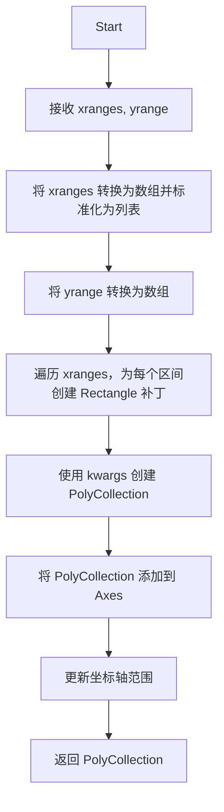

#### 带注释源码

```python
def broken_barh(self, xranges, yrange, **kwargs):
    """
    Plot a horizontal bar plot with gaps.

    Parameters
    ----------
    xranges : sequence of (scalar, scalar) pairs
        The x locations of the bars, expressed as (left, width) pairs.
    yrange : tuple of (scalar, scalar)
        The y location of the bars, expressed as (bottom, height).

    **kwargs
        Additional keyword arguments passed to `PolyCollection`.

    Returns
    -------
    poly : `matplotlib.collections.PolyCollection`
        A collection of the horizontal bars.
    """
    # 把 xranges 转换成 numpy 数组，以便后续处理
    xranges = np.asanyarray(xranges)
    # 如果 xranges 只是一维数组（即单个区间），则包装成列表
    if xranges.ndim == 1:
        xranges = [xranges]

    # 把 yrange 转换成数组，获取底部坐标和高度
    yrange = np.asanyarray(yrange)

    # 为每个 x 区间创建矩形补丁
    patches = [
        mpatches.Rectangle((x, yrange[0]), width, yrange[1])
        for x, width in xranges
    ]

    # 使用矩形补丁创建 PolyCollection，额外的关键字参数传入集合属性
    col = PolyCollection(patches, **kwargs)

    # 把集合添加到 Axes 中，并自动更新limits
    self.add_collection(col, autolim=True)

    # 自动调整坐标轴视图，以适配新绘制的内容
    self.autoscale_view()

    # 返回包含所有条形段的 PolyCollection 对象
    return col
```


### `ax.bxp` (或 `Axes.bxp`)

绘制箱线图（boxplot），支持 datetime 类型数据，能够在水平或垂直方向上展示基于时间数据的统计分布（包含中位数、四分位数、胡须范围和离群点）。

参数：

- `data`：`list[dict]`，包含统计数据的字典列表，每个字典的键包括 med（中位数）、q1（第一四分位）、q3（第三四分位）、whislo（胡须下限）、whishi（胡须上限）、fliers（离群点）等，值可以为 datetime 类型
- `orientation`：`str`，箱线图方向，可选 `'vertical'`（默认值）或 `'horizontal'`（水平）
- `\*\*kwargs`：其他matplotlib支持的箱线图参数，如 `positions`、`widths`、`patch_artist`、`showmeans`、`meanprops`、`medianprops` 等

返回值：`list[dict]`，返回包含箱线图各部件（boxes、whiskers、caps、fliers、medians、means 等）艺术对象的列表

#### 流程图

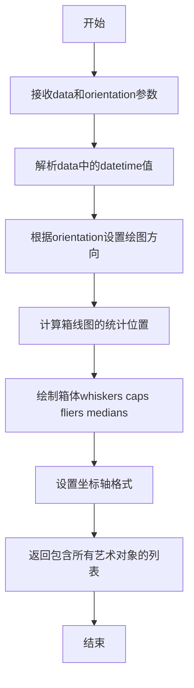

#### 带注释源码

```python
# 示例调用代码（来自test_bxp方法）
@mpl.style.context("default")
def test_bxp(self):
    # 设置日期转换器为简洁模式
    mpl.rcParams["date.converter"] = 'concise'
    
    # 创建画布和坐标轴
    fig, ax = plt.subplots()
    
    # 定义箱线图数据，字典键对应统计量
    data = [{
        "med": datetime.datetime(2020, 1, 15),      # 中位数
        "q1": datetime.datetime(2020, 1, 10),        # 第一四分位数
        "q3": datetime.datetime(2020, 1, 20),        # 第三四分位数
        "whislo": datetime.datetime(2020, 1, 5),     # 胡须下限
        "whishi": datetime.datetime(2020, 1, 25),   # 胡须上限
        "fliers": [                                  # 离群点
            datetime.datetime(2020, 1, 3),
            datetime.datetime(2020, 1, 27)
        ]
    }]
    
    # 调用bxp方法绘制水平箱线图
    ax.bxp(data, orientation='horizontal')
    
    # 设置x轴日期格式
    ax.xaxis.set_major_formatter(mpl.dates.DateFormatter("%Y-%m-%d"))
    
    # 设置图表标题
    ax.set_title('Box plot with datetime data')
```


### `ax.contour`

该函数是 Matplotlib 中 Axes 对象的等高线绘制方法，用于在二维图形上绘制等高线。在给定的测试代码中，展示了使用日期时间（datetime）和数值（numeric）数组作为 X、Y 坐标绘制等高线的功能，测试了三种不同的坐标组合场景：日期-日期、日期-数值、数值-日期。

参数：

- `X`：array-like，X 坐标数据，可以是数值数组或日期时间数组
- `Y`：array-like，Y 坐标数据，可以是数值数组或日期时间数组
- `Z`：array-like，Z 坐标数据（高度值），决定等高线的层级

返回值：`~matplotlib.contour.QuadContourSet`，返回等高线集合对象，包含绘制等高线所需的所有数据

#### 流程图

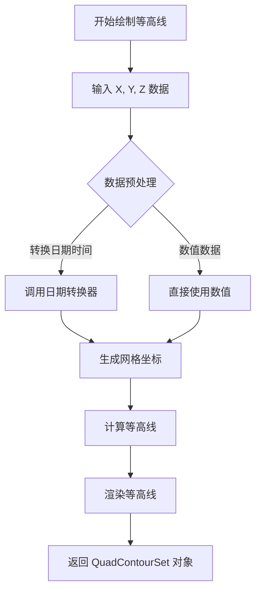

#### 带注释源码

```python
# test_contour 方法 - 展示 ax.contour 在不同日期时间/数值组合下的使用
@mpl.style.context("default")
def test_contour(self):
    # 设置日期转换器为 'concise' 模式，使日期显示更简洁
    mpl.rcParams["date.converter"] = "concise"
    
    # 定义数据范围阈值
    range_threshold = 10
    
    # 创建 3 行 1 列的子图布局
    fig, (ax1, ax2, ax3) = plt.subplots(3, 1, layout="constrained")

    # 创建日期数组 (2023年10月1日到9日)
    x_dates = np.array(
        [datetime.datetime(2023, 10, delta) for delta in range(1, range_threshold)]
    )
    y_dates = np.array(
        [datetime.datetime(2023, 10, delta) for delta in range(1, range_threshold)]
    )
    
    # 创建数值数组 (1到9)
    x_ranges = np.array(range(1, range_threshold))
    y_ranges = np.array(range(1, range_threshold))

    # 生成网格坐标
    X_dates, Y_dates = np.meshgrid(x_dates, y_dates)
    X_ranges, Y_ranges = np.meshgrid(x_ranges, y_ranges)

    # 计算 Z 值 (用于生成等高线的高度数据)
    Z_ranges = np.cos(X_ranges / 4) + np.sin(Y_ranges / 4)

    # 场景1: X和Y都使用日期时间数组
    ax1.contour(X_dates, Y_dates, Z_ranges)
    
    # 场景2: X使用日期时间数组，Y使用数值数组
    ax2.contour(X_dates, Y_ranges, Z_ranges)
    
    # 场景3: X使用数值数组，Y使用日期时间数组
    ax3.contour(X_ranges, Y_dates, Z_ranges)
```


### `ax.contourf`

`ax.contourf` 是 Matplotlib 中 Axes 类的成员方法，用于在二维坐标系中绘制填充等值线图（filled contour），常用于可视化三维数据在二维平面上的分布情况。该方法通过接收 X、Y 坐标网格和对应的 Z 值数据，生成颜色填充的等值线区域，支持日期时间型、数值型等多种数据格式的混合绘图。

参数：

- `X`：数组型，X 坐标数据，可为日期时间数组、数值数组或网格坐标矩阵
- `Y`：数组型，Y 坐标数据，可为日期时间数组、数值数组或网格坐标矩阵
- `Z`：数组型，填充等值线的高度值矩阵，与 X、Y 维度匹配
- `levels`：整数或数组型（可选），等值线的层级数量或具体阈值，默认为自动计算
- `cmap`：字符串或 Colormap（可选），颜色映射表，默认为 None
- `norm`：Normalize（可选），数据归一化方式，默认为 None
- `vmin, vmax`：浮点数（可选），颜色映射的最小值和最大值
- `alpha`：浮点数（可选），填充区域的透明度，范围 0-1
- `locator`：Locator（可选），等值线级别的定位器
- `extend`：字符串（可选），扩展域，可选 'neither'、'min'、'max'、'both'
- `**kwargs`：其他关键字参数传递给 `QuadContourSet` 对象

返回值：`QuadContourSet`，返回填充等值线集合对象，包含等值线的数据和属性

#### 流程图

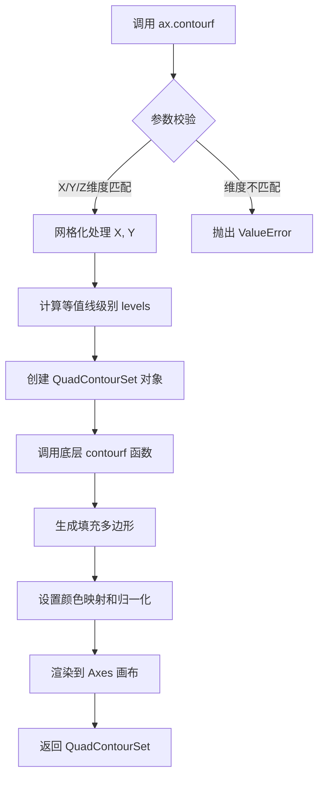

#### 带注释源码

```python
# test_contourf 方法源码
@mpl.style.context("default")
def test_contourf(self):
    # 设置日期转换器为简洁模式
    mpl.rcParams["date.converter"] = "concise"
    
    # 定义数据范围阈值
    range_threshold = 10
    
    # 创建 3 行 1 列的子图布局
    fig, (ax1, ax2, ax3) = plt.subplots(3, 1, layout="constrained")

    # 生成 X 轴日期数组 (2023年10月1日至9日)
    x_dates = np.array(
        [datetime.datetime(2023, 10, delta) for delta in range(1, range_threshold)]
    )
    
    # 生成 Y 轴日期数组 (2023年10月1日至9日)
    y_dates = np.array(
        [datetime.datetime(2023, 10, delta) for delta in range(1, range_threshold)]
    )
    
    # 生成 X 轴数值数组 (1到9)
    x_ranges = np.array(range(1, range_threshold))
    
    # 生成 Y 轴数值数组 (1到9)
    y_ranges = np.array(range(1, range_threshold))

    # 使用 meshgrid 生成网格坐标矩阵
    X_dates, Y_dates = np.meshgrid(x_dates, y_dates)
    X_ranges, Y_ranges = np.meshgrid(x_ranges, y_ranges)

    # 计算 Z 值矩阵 (基于三角函数的测试数据)
    Z_ranges = np.cos(X_ranges / 4) + np.sin(Y_ranges / 4)

    # 绘制填充等值线图 - 场景1: X日期 Y日期
    ax1.contourf(X_dates, Y_dates, Z_ranges)
    
    # 绘制填充等值线图 - 场景2: X日期 Y数值
    ax2.contourf(X_dates, Y_ranges, Z_ranges)
    
    # 绘制填充等值线图 - 场景3: X数值 Y日期
    ax3.contourf(X_ranges, Y_dates, Z_ranges)
```


### `ax.errorbar`

该方法是Matplotlib Axes对象的成员方法，用于绘制带误差线的图表，支持datetime数据类型在x轴或y轴上的展示，并提供多种误差线样式选项（如误差线位置、线型、标签等）。

参数：

- `x`：`array_like`，x轴数据，支持datetime或数值类型
- `y`：`array_like`，y轴数据，支持datetime或数值类型
- `yerr`：`scalar` 或 `array_like`，可选，y轴误差值
- `xerr`：`scalar` 或 `array_like`，可选，x轴误差值
- `fmt`：`str`，可选，线条格式字符串（如'-o'）
- `capsize`：`int`，可选，误差线端点cap的长度
- `errorevery`：`int` 或 `(int, int)`，可选，每隔多少个点显示一次误差线
- `barsabove`：`bool`，可选，是否将误差线画在数据点上方
- `lolims`、`xlolims`、`uplims`、`xuplims`：`bool`，可选，控制哪些边界显示下限/上限标记
- `label`：`str`，可选，图例标签
- `**kwargs`：其他关键字参数传递给底层Line2D对象

返回值：`ErrorbarContainer`，包含数据线(line)、误差线(caps)和误差条(errbar)的管理容器

#### 流程图

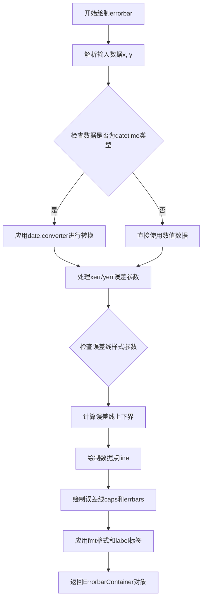

#### 带注释源码

```python
# 示例代码展示ax.errorbar的典型用法
def test_errorbar(self):
    # 设置日期转换器为concise模式
    mpl.rcParams["date.converter"] = "concise"
    
    # 创建4个子图
    fig, (ax1, ax2, ax3, ax4) = plt.subplots(4, 1, layout="constrained")
    limit = 7
    start_date = datetime.datetime(2023, 1, 1)

    # 生成datetime类型的x和y数据
    x_dates = np.array([datetime.datetime(2023, 10, d) for d in range(1, limit)])
    y_dates = np.array([datetime.datetime(2023, 10, d) for d in range(1, limit)])
    
    # datetime类型的误差值
    x_date_error = datetime.timedelta(days=1)
    y_date_error = datetime.timedelta(days=1)

    # 数值类型的数据
    x_values = list(range(1, limit))
    y_values = list(range(1, limit))
    x_value_error = 0.5
    y_value_error = 0.5

    # 场景1：x轴为datetime，y轴为数值，仅y方向有误差
    ax1.errorbar(x_dates, y_values,
                 yerr=y_value_error,
                 capsize=10,
                 barsabove=True,
                 label='Data')
    
    # 场景2：x轴为数值，y轴为datetime，x和y方向都有误差，每隔1个点显示误差
    ax2.errorbar(x_values, y_dates,
                 xerr=x_value_error, yerr=y_date_error,
                 errorevery=(1, 2),
                 fmt='-o', label='Data')
    
    # 场景3：x和y轴都是datetime，显示下限标记
    ax3.errorbar(x_dates, y_dates,
                 xerr=x_date_error, yerr=y_date_error,
                 lolims=True, xlolims=True,
                 label='Data')
    
    # 场景4：x轴datetime，y轴数值，显示上限标记
    ax4.errorbar(x_dates, y_values,
                 xerr=x_date_error, yerr=y_value_error,
                 uplims=True, xuplims=True,
                 label='Data')
```


### `ax.eventplot`

该函数是 Matplotlib 中 Axes 类的一个方法，用于在图表上绘制事件序列（垂直或水平线段），特别适用于显示离散事件的时间分布。

参数：

- `positions`：位置参数，接受一个数组或数组列表，表示事件发生的位置（可以是数值、日期时间或 datetime64 类型）
- `offsets`：可选参数，用于偏移每个事件序列的基线位置
- `linelengths`：可选参数，指定事件线段的长度
- `linewidths`：可选参数，指定线段的线宽
- `colors`：可选参数，指定线段的颜色
- `marker`：可选参数，指定是否在事件位置添加标记
- `markersize`：可选参数，指定标记的大小
- `orientation`：可选参数，指定事件线的方向（'vertical' 或 'horizontal'，默认为 'vertical'）
- `phase`：可选参数，用于错开同一位置的多个事件

返回值：返回一个包含 LineCollection 对象的列表，每个事件序列对应一个 collection。

#### 流程图

```mermaid
graph TD
    A[开始 eventplot] --> B{positions 参数类型}
    B -->|单个数组| C[创建单个事件序列]
    B -->|数组列表| D[创建多个事件序列]
    C --> E[应用 offsets 偏移]
    D --> E
    E --> F[应用 colors 颜色]
    F --> G[应用 linelengths 长度]
    G --> H[应用 linewidths 线宽]
    H --> I[应用 orientation 方向]
    I --> J[应用 marker 标记]
    J --> K[绘制事件线到 Axes]
    K --> L[返回 LineCollection 列表]
```

#### 带注释源码

```python
# 从测试代码中提取的 eventplot 使用示例

# 示例 1: 基本的 datetime 数组事件图
x_dates1 = np.array([
    datetime.datetime(2020, 6, 30),
    datetime.datetime(2020, 7, 22),
    datetime.datetime(2020, 8, 3),
    datetime.datetime(2020, 9, 14),
], dtype=np.datetime64)

ax1.eventplot(x_dates1)  # 在默认位置绘制单一事件序列

# 示例 2: 多事件序列，带颜色和偏移量
np.random.seed(19680801)
start_date = datetime.datetime(2020, 7, 1)
end_date = datetime.datetime(2020, 10, 15)
date_range = end_date - start_date

# 生成三组随机日期数据
dates1 = start_date + np.random.rand(30) * date_range
dates2 = start_date + np.random.rand(10) * date_range
dates3 = start_date + np.random.rand(50) * date_range

colors1 = ['C1', 'C2', 'C3']  # 三个事件序列的颜色
lineoffsets1 = np.array([1, 6, 8])  # 三个事件序列的垂直偏移
linelengths1 = [5, 2, 3]  # 三个事件序列的线段长度

# 绘制多事件序列
ax2.eventplot(
    [dates1, dates2, dates3],  # 三个事件序列的数据
    colors=colors1,  # 对应颜色
    lineoffsets=lineoffsets1,  # 对应偏移量
    linelengths=linelengths1  # 对应长度
)

# 示例 3: 使用 datetime64 类型的偏移量
lineoffsets2 = np.array([
    datetime.datetime(2020, 7, 1),
    datetime.datetime(2020, 7, 15),
    datetime.datetime(2020, 8, 1)
], dtype=np.datetime64)

ax3.eventplot(
    [dates1, dates2, dates3],
    colors=colors1,
    lineoffsets=lineoffsets2,  # 使用日期时间作为偏移量
    linelengths=linelengths1
)
```


### `ax.fill`

`ax.fill` 是 matplotlib 中 `Axes` 类的方法，用于在图表中填充曲线与坐标轴之间的区域。该方法接受 x 和 y 坐标数据作为参数，可以处理数值型数据、日期时间型数据或两者的组合，并返回一个或多个 `Polygon` 对象表示填充的区域。

#### 参数

- `*args`：`可变位置参数`，用于指定填充的数据。可以是以下形式之一：
  - 单个 y 值数组（填充曲线与 x 轴之间的区域）
  - 多个 (x, y) 数据对（填充多条曲线与 x 轴之间的区域）
  - 在代码示例中包括：`x_dates`（日期列表）、`y_values`（数值列表）、`x_values`（数值列表）、`y_dates`（日期列表）等不同组合
- `color`：`str` 或 `tuple`，可选，颜色规格，可以是颜色名称、RGB 元组等
- `alpha`：`float`，可选，透明度，范围 0（透明）到 1（不透明）
- `label`：`str`，可选，图例标签，用于标识填充区域
- `**kwargs`：其他关键字参数，将传递给底层的 `PolyCollection` 对象

#### 返回值

`matplotlib.collections.PolyCollection` 或 `list of Polygon`，返回填充区域对应的多边形对象，可用于进一步自定义样式。

#### 流程图

```mermaid
flowchart TD
    A[调用 ax.fill 方法] --> B{参数类型判断}
    B --> C[单个数组参数]
    B --> D[两个数组参数]
    B --> E[多个数组参数]
    
    C --> F[将数组作为 y 值<br/>x 默认为索引 0 到 n-1]
    D --> G[第一个数组作为 x<br/>第二个数组作为 y]
    E --> H[按对处理每组 x, y]
    
    F --> I[创建 Polygon 对象]
    G --> I
    H --> I
    
    I --> J[设置填充属性<br/>color, alpha 等]
    J --> K[将多边形添加到图表]
    K --> L[返回 Polygon 对象]
    
    style A fill:#f9f,stroke:#333
    style L fill:#9f9,stroke:#333
```

#### 带注释源码

```python
# test_fill 方法展示了 ax.fill 的多种用法
@mpl.style.context("default")
def test_fill(self):
    """测试 ax.fill 方法处理日期时间数据的能力"""
    
    # 设置日期转换器为简洁模式
    mpl.rcParams["date.converter"] = "concise"
    
    # 创建包含4个子图的画布
    fig, (ax1, ax2, ax3, ax4) = plt.subplots(4, 1, layout="constrained")

    # 设置随机种子以确保可重复性
    np.random.seed(19680801)

    # 生成5个随机的日期作为 x 轴数据
    # 日期从 2023-01-01 开始，每次增加 1-4 天的随机天数
    x_base_date = datetime.datetime(2023, 1, 1)
    x_dates = [x_base_date]
    for _ in range(1, 5):
        x_base_date += datetime.timedelta(days=np.random.randint(1, 5))
        x_dates.append(x_base_date)

    # 生成另外5个随机的日期作为 y 轴数据
    y_base_date = datetime.datetime(2023, 1, 1)
    y_dates = [y_base_date]
    for _ in range(1, 5):
        y_base_date += datetime.timedelta(days=np.random.randint(1, 5))
        y_dates.append(y_base_date)

    # 生成5个随机数值作为数据
    x_values = np.random.rand(5) * 5
    y_values = np.random.rand(5) * 5 - 2

    # 场景1：x 轴为日期，y 轴为数值
    # 填充日期点与对应数值之间的区域到 x 轴
    ax1.fill(x_dates, y_values)
    
    # 场景2：x 轴为数值，y 轴为日期
    # 填充数值点与对应日期之间的区域到 x 轴
    ax2.fill(x_values, y_dates)
    
    # 场景3：x 轴和 y 轴都是数值
    # 填充数值曲线与 x 轴之间的区域
    ax3.fill(x_values, y_values)
    
    # 场景4：x 轴和 y 轴都是日期
    # 填充日期曲线与 x 轴之间的区域
    ax4.fill(x_dates, y_dates)
```


### `ax.fill_between`

`fill_between` 是 Matplotlib Axes 类的成员方法，用于在两条曲线之间的区域填充颜色。它接受 x 轴坐标数据以及两条 y 轴曲线数据，根据这些数据在图表上绘制填充多边形区域，常用于展示数据范围、置信区间或区域差异。

参数：

- `x`：`array-like`，X 轴坐标数据，定义填充区域的水平范围
- `y1`：`array-like`，第一条曲线的 Y 轴坐标数据，定义填充区域的起始边界
- `y2`：`array-like`，可选，第二条曲线的 Y 轴坐标数据，定义填充区域的结束边界，默认为 0
- `where`：`array-like`，可选，布尔型数组，用于条件性地选择填充区域
- `interpolate`：`bool`，可选，是否在交叉点处进行插值计算，默认为 False
- `step`：`str`，可选，步进模式，可选值为 'pre'、'post'、'mid'，默认为 None
- `**kwargs`：关键字参数，用于传递给 `PolyCollection` 以控制填充区域的样式（如颜色、透明度、标签等）

返回值：`~matplotlib.collections.PolyCollection`，返回填充区域的多边形集合对象，可用于进一步设置样式或添加图例

#### 流程图

```mermaid
flowchart TD
    A[调用 fill_between] --> B{验证输入数据}
    B -->|数据类型合法| C[创建多边形顶点坐标]
    B -->|数据类型异常| D[抛出 ValueError 或 TypeError]
    C --> E{where 参数是否存在}
    E -->|是| F[根据条件筛选填充区域]
    E -->|否| G[填充整个区域]
    F --> H{interpolate 是否为真}
    H -->|是| I[在交叉点进行插值计算]
    H -->|否| J[直接连接顶点]
    I --> K[生成 PolyCollection 对象]
    J --> K
    G --> K
    K --> L[将 PolyCollection 添加到 Axes]
    L --> M[返回 PolyCollection 对象]
    
    style A fill:#f9f,stroke:#333
    style K fill:#9f9,stroke:#333
    style M fill:#9ff,stroke:#333
```

#### 带注释源码

```python
# 调用示例（来自测试代码 test_fill_between）
# 场景1：x 为数值数组，y1 和 y2 为 datetime 数组
ax1.fill_between(x_values, y_dates1, y_dates2)

# 场景2：x 为 datetime 数组，y1 和 y2 为数值数组
ax2.fill_between(x_dates, y_values1, y_values2)

# 场景3：x 和 y 均为 datetime 数组
ax3.fill_between(x_dates, y_dates1, y_dates2)

# matplotlib 库中 fill_between 的核心实现逻辑（简化版）
def fill_between(self, x, y1, y2=0, where=None, interpolate=False, step=None, **kwargs):
    """
    在两条曲线之间填充区域。
    
    参数:
        x: X 轴数据
        y1: 第一条曲线的 Y 值
        y2: 第二条曲线的 Y 值（默认为 0）
        where: 条件数组，用于选择填充区域
        interpolate: 是否在交叉点进行插值
        step: 步进模式
        **kwargs: 传递给 PolyCollection 的样式参数
    """
    # 1. 将输入数据转换为数组并处理形状
    x = np.asanyarray(x)
    y1 = np.asanyarray(y1)
    y2 = np.asanyarray(y2)
    
    # 2. 如果提供了 where 条件，处理条件填充逻辑
    if where is not None:
        where = np.asanyarray(where)
        # 确保 x、y1、y2 和 where 长度一致
        # ... 长度检查代码 ...
    
    # 3. 构建多边形的顶点坐标
    # 对于每个 x 点，创建四个顶点：(x[i], y1[i]), (x[i+1], y1[i+1]), 
    #                             (x[i+1], y2[i+1]), (x[i], y2[i])
    vertices = []
    # ... 顶点构建逻辑 ...
    
    # 4. 如果启用插值且曲线有交叉点，进行插值处理
    if interpolate:
        # 找到 y1 和 y2 的交叉点
        # 在交叉点处插入额外的顶点
        pass
    
    # 5. 处理步进模式（pre, post, mid）
    if step is not None:
        # 根据步进模式调整顶点坐标
        pass
    
    # 6. 创建 PolyCollection 对象
    poly = PolyCollection(vertices, **kwargs)
    
    # 7. 将多边形添加到 Axes 中
    self.add_collection(poly, autolim=True)
    
    # 8. 更新数据limits
    self.update_datalim(x, y1, y2)
    
    return poly
```


### `ax.fill_betweenx`

该方法是matplotlib.axes.Axes类的成员函数，用于在垂直方向（沿x轴）上填充两个水平曲线之间的区域，支持数值型数据和日期时间型数据的混合绘图。

参数：

- `y`：`array-like`，y坐标数组，定义填充区域的垂直范围
- `x1`：`array-like`，第一个x坐标数组，定义填充区域的左边界
- `x2`：`array-like`，第二个x坐标数组（可选，默认为0），定义填充区域的右边界
- `where`：`array-like`（可选），布尔数组，指定条件填充区域
- `step`：`str`（可选），步进模式（'pre', 'post', 'mid'）
- `interpolate`：`bool`（可选），是否插值，默认为False
- `data`：`indexable`（可选），数据参数，用于间接索引
- `**kwargs`：其他参数传递给`matplotlib.collections.PolyCollection`，如`color`、`alpha`、`label`等

返回值：`matplotlib.collections.PolyCollection`，返回填充的多边形集合对象

#### 流程图

```mermaid
flowchart TD
    A[调用fill_betweenx方法] --> B{参数类型检查}
    B -->|y为数值型| C[使用数值y坐标]
    B -->|y为datetime| D[转换日期时间为数值]
    B -->|y为np.datetime64| E[转换numpy日期时间为数值]
    
    C --> F{插值模式}
    D --> F
    E --> F
    
    F -->|interpolate=True| G[执行插值计算]
    F -->|interpolate=False| H[直接填充]
    
    G --> I[创建填充多边形]
    H --> I
    
    I --> J[应用样式参数]
    J --> K[添加到Axes]
    K --> L[返回PolyCollection对象]
```

#### 带注释源码

```python
# 测试代码中fill_betweenx的三种调用场景：

# 场景1：y为数值型，x为日期时间型
# ax1.fill_betweenx(y_values, x_dates1, x_dates2)
# y_values: np.random.rand(10) * 10 产生0-10的随机数
# x_dates1, x_dates2: datetime.datetime列表，表示x轴范围

# 场景2：y为日期时间型，x为数值型
# ax2.fill_betweenx(y_dates, x_values1, x_values2)
# y_dates: datetime.datetime列表，表示y轴范围
# x_values1, x_values2: np.random.rand(10) * 10 产生的数值

# 场景3：y和x均为日期时间型
# ax3.fill_betweenx(y_dates, x_dates1, x_dates2)
# y_dates: datetime.datetime列表
# x_dates1, x_dates2: datetime.datetime列表

# 底层实现逻辑（基于matplotlib源码思路）：
def fill_betweenx(self, y, x1, x2=0, where=None, step=None, interpolate=False, data=None, **kwargs):
    """
    在垂直方向填充两条x曲线之间的区域。
    
    参数:
        y: y坐标数组
        x1: 第一条x曲线
        x2: 第二条x曲线（默认0）
        where: 条件数组，控制填充区间
        step: 步进模式
        interpolate: 是否插值
        data: 数据对象
    """
    # 1. 处理数据索引
    y = np.asanyarray(y)
    x1 = np.asanyarray(x1)
    x2 = np.asanyarray(x2)
    
    # 2. 转换日期时间数据为数值
    # 如果y或x是datetime类型，转换为matplotlib内部数值
    y = self._convert_datas(y)
    x1 = self._convert_datas(x1)
    x2 = self._convert_datas(x2)
    
    # 3. 处理where条件
    if where is not None:
        where = np.asarray(where)
    
    # 4. 构建多边形顶点
    # 为每个y点创建对应的x1和x2点
    # 形成连续的填充区域
    
    # 5. 应用步进模式（如果指定）
    if step is not None:
        # 处理pre/post/mid步进
    
    # 6. 处理插值（如果启用）
    if interpolate:
        # 在边界处进行插值计算
    
    # 7. 创建PolyCollection对象
    polys = # 构建多边形坐标数组
    
    # 8. 添加到axes并应用样式
    collection = PolyCollection(polys, **kwargs)
    self.add_collection(collection)
    
    return collection
```


### `ax.hist`

该方法用于在Axes对象上绘制直方图，支持日期时间类型数据的直方图展示。测试代码验证了使用自动分箱数量和自定义日期边界两种方式绘制直方图的功能。

参数：

- `x`：array-like，要绘制的数据，支持日期时间类型
- `bins`：int或sequence，指定分箱数量（int）或分箱边界（sequence）
- `weights`：array-like，与x同形状的权重数组，用于加权直方图
- `**kwargs`：其他matplotlib.hist支持的参数

返回值：返回元组`(n, bins, patches)`，其中n是每个分箱的计数数组，bins是分箱边界数组，patches是图形对象列表

#### 流程图

```mermaid
flowchart TD
    A[开始执行test_hist] --> B[设置日期转换器为concise]
    B --> C[创建起始日期2023-10-01和一天的时间增量]
    C --> D[生成三组随机权重数组values1, values2, values3]
    D --> E[创建日期边界列表bin_edges]
    E --> F[创建3x1子图ax1, ax2, ax3]
    F --> G[使用bins=10调用ax1.hist绘制直方图]
    G --> H[使用bins=10调用ax2.hist绘制直方图]
    H --> I[使用bins=10调用ax3.hist绘制直方图]
    I --> J[创建另一个3x1子图ax4, ax5, ax6]
    J --> K[使用bin_edges调用ax4.hist绘制直方图]
    K --> L[使用bin_edges调用ax5.hist绘制直方图]
    L --> M[使用bin_edges调用ax6.hist绘制直方图]
    M --> N[结束]
```

#### 带注释源码

```python
# test_hist方法用于测试matplotlib的hist函数对日期时间数据的支持
def test_hist(self):
    # 设置日期转换器为'concise'，使日期显示更简洁
    mpl.rcParams["date.converter"] = 'concise'

    # 定义起始日期为2023年10月1日
    start_date = datetime.datetime(2023, 10, 1)
    # 定义时间增量为1天
    time_delta = datetime.timedelta(days=1)

    # 生成三组随机权重数组，每组30个随机整数，范围1-9
    values1 = np.random.randint(1, 10, 30)
    values2 = np.random.randint(1, 10, 30)
    values3 = np.random.randint(1, 10, 30)

    # 创建日期边界列表，从起始日期开始，共31个日期点
    bin_edges = [start_date + i * time_delta for i in range(31)]

    # 创建3行1列的子图布局，使用constrained_layout进行布局约束
    fig, (ax1, ax2, ax3) = plt.subplots(3, 1, constrained_layout=True)
    
    # 第一个子图：使用bins=10自动分箱
    ax1.hist(
        [start_date + i * time_delta for i in range(30)],  # 30个日期作为x轴数据
        bins=10,  # 自动分成10个分箱
        weights=values1  # 使用values1作为权重
    )
    
    # 第二个子图：同样使用bins=10，但使用不同权重
    ax2.hist(
        [start_date + i * time_delta for i in range(30)],
        bins=10,
        weights=values2  # 使用values2作为权重
    )
    
    # 第三个子图：使用第三组权重
    ax3.hist(
        [start_date + i * time_delta for i in range(30)],
        bins=10,
        weights=values3  # 使用values3作为权重
    )

    # 创建另一组3x1子图，用于测试自定义分箱边界
    fig, (ax4, ax5, ax6) = plt.subplots(3, 1, constrained_layout=True)
    
    # 第四个子图：使用自定义日期边界bin_edges
    ax4.hist(
        [start_date + i * time_delta for i in range(30)],
        bins=bin_edges,  # 使用预定义的日期边界
        weights=values1
    )
    
    # 第五个子图：使用相同的自定义边界和不同权重
    ax5.hist(
        [start_date + i * time_delta for i in range(30)],
        bins=bin_edges,
        weights=values2
    )
    
    # 第六个子图：使用相同的自定义边界和第三组权重
    ax6.hist(
        [start_date + i * time_delta for i in range(30)],
        bins=bin_edges,
        weights=values3
    )
```


### `ax.hlines`

该函数是 Matplotlib 中 `Axes` 类的方法，用于在图表绘制水平线。由于给定的代码片段为测试文件，未包含 `hlines` 的具体实现源码，因此此处基于测试代码 `test_hlines` 提取其使用方式、参数逻辑及流程。

**所属类**: `matplotlib.axes.Axes`

**一句话描述**: 在指定 y 坐标处绘制从 xmin 到 xmax 的水平线段。

#### 参数

- `y`：array-like
  - **类型**: 列表 `list` (包含 `datetime.datetime` 或 `np.datetime64`) 或标量
  - **描述**: 水平线的 y 坐标位置。测试代码中使用了 `datetime` 列表（如 `dates`）和 `np.datetime64` 列表（如 `npDates`）。
- `xmin`：scalar 或 array-like
  - **类型**: 浮点数 `float`、列表 `list` 或 `datetime`
  - **描述**: 水平线起始点的 x 坐标。测试代码展示了多种传入方式：浮点数列表 `[0.1, 0.2, ...]`、单个 `datetime` 对象。
- `xmax`：scalar 或 array-like
  - **类型**: 浮点数 `float`、列表 `list` 或 `datetime`
  - **描述**: 水平线结束点的 x 坐标。测试代码展示了与 `xmin` 对应的多种格式。

#### 返回值

- `LineCollection`
  - **类型**: `matplotlib.collections.LineCollection`
  - **描述**: 返回一个包含所有绘制的水平线的集合对象，可用于后续的样式更新或属性修改。

#### 流程图

以下流程图展示了调用 `ax.hlines` 时的数据处理与绘制逻辑（基于测试代码行为推断）：

```mermaid
graph TD
    A[调用 ax.hlines] --> B{输入参数类型检查}
    B --> C{y 坐标处理}
    C --> D[解析 xmin, xmax 范围]
    D --> E{数据单位一致性}
    E -->|datetime| F[日期时间转换与归一化]
    E -->|numeric| G[数值映射]
    F --> H[生成 LineCollection]
    G --> H
    H --> I[添加到 Axes]
    I --> J[渲染显示]
    J --> K[返回 LineCollection 对象]
```

#### 带注释源码

此处为测试代码中 `test_hlines` 方法的源码，展示了 `ax.hlines` 的具体调用方式：

```python
@pytest.mark.mpl.style.context("default")
def test_hlines(self):
    # 设置日期转换器为 'concise'，以便更好地显示日期轴
    mpl.rcParams['date.converter'] = 'concise'
    # 创建一个 2行4列 的子图布局
    fig, axs = plt.subplots(2, 4, layout='constrained')
    
    # 准备测试数据：日期字符串
    dateStrs = ['2023-03-08', '2023-04-09', '2023-05-13', '2023-07-28', '2023-12-24']
    # 准备测试数据：datetime 对象列表
    dates = [datetime.datetime(2023, m*2, 10) for m in range(1, 6)]
    # 准备起始和结束日期列表
    date_start = [datetime.datetime(2023, 6, d) for d in range(5, 30, 5)]
    date_end = [datetime.datetime(2023, 7, d) for d in range(5, 30, 5)]
    # 转换为 numpy datetime64 数组
    npDates = [np.datetime64(s) for s in dateStrs]
    
    # 示例1: y为datetime列表，xmin/xmax为归一化浮点数列表
    axs[0, 0].hlines(y=dates,
                     xmin=[0.1, 0.2, 0.3, 0.4, 0.5],
                     xmax=[0.5, 0.6, 0.7, 0.8, 0.9])
    
    # 示例2: y为datetime列表，xmin/xmax为具体的datetime对象（ Scalar inputs）
    axs[0, 1].hlines(dates,
                     xmin=datetime.datetime(2020, 5, 10),
                     xmax=datetime.datetime(2020, 5, 31))
    
    # 示例3: y为datetime列表，xmin/xmax为日期列表
    axs[0, 2].hlines(dates,
                     xmin=date_start,
                     xmax=date_end)
    
    # 示例4: y为datetime列表，xmin/xmax为单个浮点数（所有线段统一起点/终点）
    axs[0, 3].hlines(dates,
                     xmin=0.45,
                     xmax=0.65)
    
    # 示例5: y为np.datetime64数组
    axs[1, 0].hlines(y=npDates,
                     xmin=[0.5, 0.6, 0.7, 0.8, 0.9],
                     xmax=[0.1, 0.2, 0.3, 0.4, 0.5])
    
    # 更多组合示例...
    axs[1, 2].hlines(y=npDates,
                     xmin=date_start,
                     xmax=date_end)
    axs[1, 1].hlines(npDates,
                     xmin=datetime.datetime(2020, 5, 10),
                     xmax=datetime.datetime(2020, 5, 31))
    axs[1, 3].hlines(npDates,
                     xmin=0.45,
                     xmax=0.65)
```

#### 关键组件信息

- **LineCollection**: 用于批量管理多条水平线的容器，支持统一修改颜色、线型等属性。
- **Datetime Support**: 测试代码重点展示了 `hlines` 对 `datetime` 和 `np.datetime64` 类型数据的支持，这是该测试类 `TestDatetimePlotting` 的核心验证点。

#### 潜在的技术债务或优化空间

- **参数类型的灵活性**: 代码展示了 `xmin/xmax` 既可以是归一化浮点数（0-1），也可以是具体数据值（datetime），文档中应对这两种模式进行更明确的区分和说明。
- **测试覆盖**: 当前测试主要关注视觉输出和基本功能，对于边界情况（如 `xmin > xmax`）或大量数据点的性能测试覆盖较少。


### `ax.imshow`

该方法用于在 Axes 对象上显示图像数据，支持将数组数据渲染为彩色图像，并可以通过 `extent` 参数将 datetime 对象映射到图像的坐标轴范围。

参数：

- `X`：`array-like`，要显示的图像数据，通常是 2D 数组
- `extent`：`tuple of float`，可选，图像的坐标范围，格式为 (xmin, xmax, ymin, ymax)；在代码中使用了 datetime 对象作为 extent 参数，Matplotlib 会自动将其转换为数值
- `cmap`：`str or Colormap`，可选，颜色映射名称或 Colormap 对象
- `norm`：`matplotlib.colors.Normalize`，可选，用于数据归一化
- `aspect`：`{'auto', 'equal'} or float`，可选，控制轴纵横比
- `interpolation`：`str`，可选，插值方法（如 'bilinear', 'nearest' 等）
- `alpha`：`float`，可选，透明度（0-1）
- `vmin, vmax`：`float`，可选，颜色映射的最小/最大值
- `origin`：`{'upper', 'lower'}`，可选，数组的起源位置

返回值：`matplotlib.image.AxesImage`，返回创建的 AxesImage 对象

#### 流程图

```mermaid
graph TD
    A[调用 ax.imshow] --> B{检查 X 数据类型}
    B -->|numpy array| C[应用 extent 参数转换 datetime]
    C --> D[创建 AxesImage 对象]
    D --> E[设置颜色映射和归一化]
    E --> F[添加到 Axes 图像列表]
    F --> G[返回 AxesImage 对象]
```

#### 带注释源码

```python
# test_imshow 方法源码
@pytest.mark.mpl.style.context("default")
def test_imshow(self):
    # 创建图形和坐标轴对象
    fig, ax = plt.subplots()
    
    # 创建 5x5 对角矩阵作为图像数据
    a = np.diag(range(5))
    
    # 定义图像在 x 和 y 轴上的时间范围
    # extent 参数的格式为 (xmin, xmax, ymin, ymax)
    dt_start = datetime.datetime(2010, 11, 1)
    dt_end = datetime.datetime(2010, 11, 11)
    extent = (dt_start, dt_end, dt_start, dt_end)
    
    # 调用 imshow 方法显示图像
    # 这里使用 datetime 对象作为 extent，Matplotlib 会自动处理
    ax.imshow(a, extent=extent)
    
    # 旋转 x 轴标签以便更好地显示
    ax.tick_params(axis="x", labelrotation=90)
```


### `ax.matshow`

在坐标轴上显示矩阵数据（类似 imshow），支持使用 datetime 对象定义坐标轴范围，常用于可视化时间序列与数值的对应关系。

参数：

- `a`：`numpy.ndarray`，要显示的矩阵数据
- `extent`：`tuple`，可选，格式为 (left, right, bottom, top)，定义坐标轴范围，可以使用 datetime 对象
- `**kwargs`：其他关键字参数，传递给 `imshow`，如 `cmap`、`aspect`、`norm` 等

返回值：`matplotlib.image.AxesImage`，返回创建的图像对象，可用于进一步定制（如添加颜色条）

#### 流程图

```mermaid
flowchart TD
    A[调用 ax.matshow] --> B[验证输入矩阵 a]
    B --> C[解析 extent 参数<br>将 datetime 转换为数值]
    C --> D[调用底层 imshow 方法<br>创建 AxesImage 对象]
    D --> E[设置坐标轴范围和刻度标签]
    E --> F[返回 AxesImage 对象]
    
    subgraph extent 处理
    C1[extent = (dt_start, dt_end, dt_start, dt_end)] --> C2[datetime 转换为 matplotlib 日期数值]
    C2 --> C3[设置 x 轴范围: 1980-04-15 到 2020-11-11]
    C3 --> C4[设置 y 轴范围: 1980-04-15 到 2020-11-11]
    end
```

#### 带注释源码

```python
# test_matshow 方法源码
@mpl.style.context("default")
def test_matshow(self):
    # 创建测试数据：5x5 对角矩阵
    a = np.diag(range(5))
    
    # 定义 datetime 范围用于坐标轴
    dt_start = datetime.datetime(1980, 4, 15)
    dt_end = datetime.datetime(2020, 11, 11)
    
    # 设置图像的坐标范围 (xmin, xmax, ymin, ymax)
    # 支持 datetime 对象，会自动转换为 matplotlib 日期数值
    extent = (dt_start, dt_end, dt_start, dt_end)
    
    # 创建图形和坐标轴
    fig, ax = plt.subplots()
    
    # 调用 matshow 显示矩阵
    # matshow 底层调用 imshow，但默认使用 'nearest' 插值
    # extent 参数允许使用 datetime 定义坐标轴范围
    ax.matshow(a, extent=extent)
    
    # 旋转 x 轴标签以便显示
    for label in ax.get_xticklabels():
        label.set_rotation(90)

# matshow 方法内部实现原理（简化版）
def matshow(self, A, **kwargs):
    """
    在坐标轴上显示矩阵作为图像
    
    参数:
        A: 要显示的矩阵 (numpy.ndarray)
        **kwargs: 传递给 imshow 的参数
    
    返回:
        AxesImage 对象
    """
    # 1. 确保输入是数组
    A = np.asarray(A)
    
    # 2. 设置默认参数
    kwargs.setdefault('aspect', 'equal')
    kwargs.setdefault('origin', 'upper')
    kwargs.setdefault('interpolation', 'nearest')
    
    # 3. 调用 imshow 方法
    im = self.imshow(A, **kwargs)
    
    # 4. 设置坐标轴范围
    # 如果提供了 extent 参数，处理 datetime 转换
    if 'extent' in kwargs:
        # matplotlib 会自动处理 datetime 转换
        pass
    
    # 5. 返回图像对象
    return im
```


### `ax.scatter` (Axes.scatter)

`ax.scatter` 是 Matplotlib 中 Axes 对象的散点图绘制方法，用于在二维坐标系中绘制数据点，支持 datetime、数值等多种数据类型，是数据可视化中展示两个变量之间关系的核心工具。

参数：

- `x`：`array-like`，x 轴坐标数据，支持 datetime、数值类型
- `y`：`array-like`，y 轴坐标数据，支持 datetime、数值类型
- `s`：`float` 或 `array-like`，可选，散点的大小，默认为 `rcParams['lines.markersize'] ** 2`
- `c`：`color` 或 `array-like`，可选，散点的颜色，可以是单一颜色或基于数据的颜色映射
- `marker`：`MarkerStyle`，可选，散点的标记样式，默认为 `'o'` (圆形)
- `cmap`：`str` 或 `Colormap`，可选，当 c 是数值数组时的颜色映射
- `norm`：`Normalize`，可选，用于归一化颜色数据
- `vmin, vmax`：`float`，可选，颜色映射的最小/最大值
- `alpha`：`float`，可选，透明度，范围 0-1
- `linewidths`：`float` 或 `array-like`，可选，标记边缘的线宽
- `edgecolors`：`color` 或 `array-like`，可选，标记边缘颜色
- `plotnonfinite`：`bool`，可选，是否绘制非有限值
- `data`：`dict`，可选，数据容器，用于通过关键字参数访问数据
- `**kwargs`：`PathCollection` 属性，可选，其他传递给 `PathCollection` 的属性

返回值：`PathCollection`，包含所有散点的集合对象，可用于后续的图形属性设置

#### 流程图

```mermaid
graph TD
    A[调用 ax.scatter] --> B{参数验证}
    B -->|数据类型转换| C[处理 datetime 等特殊类型]
    C --> D[创建 PathCollection 对象]
    D --> E[应用颜色映射和样式]
    E --> F[添加到 Axes]
    F --> G[设置轴标签和刻度]
    G --> H[返回 PathCollection]
```

#### 带注释源码

```python
import datetime
import numpy as np
import matplotlib.pyplot as plt
import matplotlib as mpl

# 设置日期转换器为简洁模式
mpl.rcParams["date.converter"] = 'concise'

# 创建基础日期和日期序列
base = datetime.datetime(2005, 2, 1)
dates = [base + datetime.timedelta(hours=(2 * i)) for i in range(10)]
N = len(dates)

# 生成随机累计数据
np.random.seed(19680801)
y = np.cumsum(np.random.randn(N))

# 创建包含3个子图的画布
fig, axs = plt.subplots(3, 1, layout='constrained', figsize=(6, 6))

# 场景1: datetime 数组在 x 轴
axs[0].scatter(dates, y)  # 绘制散点图，x轴为日期，y轴为数值
for label in axs[0].get_xticklabels():
    label.set_rotation(40)
    label.set_horizontalalignment('right')

# 场景2: datetime 在 y 轴
axs[1].scatter(y, dates)  # 绘制散点图，x轴为数值，y轴为日期

# 场景3: x 和 y 轴都是 datetime
axs[2].scatter(dates, dates)  # 绘制散点图，x轴和y轴都是日期
for label in axs[2].get_xticklabels():
    label.set_rotation(40)
    label.set_horizontalalignment('right')

plt.show()  # 显示图形
```


### `ax.stackplot`

堆叠面积图（Stacked Area Plot），用于将多个数据序列堆叠在一起显示，常用于展示部分随时间的组成变化。

参数：

- `x`：`array-like`，X轴数据（时间序列）
- `y`：`array-like` 或 `list of array-like`，Y轴数据序列，每个序列代表一个堆叠层
- `labels`：`list`，图例标签列表（可选）
- `colors`：`list`，填充颜色列表（可选）
- `alpha`：`float`，透明度（可选）
- `baseline`：`str`，基线类型，可选值包括 'zero', 'sym', 'wiggle', 'weighted_wiggle'（可选）

返回值：`PolyCollection`，返回创建的堆叠多边形对象（PolyCollection）

#### 流程图

```mermaid
graph TD
    A[开始 stackplot] --> B[接收 x 轴数据 dates]
    B --> C[接收 y 轴数据 stacked_nums]
    C --> D[创建多个多边形区域]
    D --> E[按顺序堆叠各层数据]
    E --> F[应用颜色和透明度]
    F --> G[返回 PolyCollection 对象]
```

#### 带注释源码

```python
# 测试方法：test_stackplot
@mpl.style.context("default")
def test_stackplot(self):
    # 设置日期转换器为简洁模式
    mpl.rcParams["date.converter"] = 'concise'
    
    # 定义数据点数量
    N = 10
    
    # 创建堆叠数据：4行N-1列的数组
    # 每行代表一个堆叠层
    stacked_nums = np.tile(np.arange(1, N), (4, 1))
    
    # 创建日期数组：2020年到2028年每年1月1日
    dates = np.array([datetime.datetime(2020 + i, 1, 1) for i in range(N - 1)])
    
    # 创建图表和轴
    fig, ax = plt.subplots(layout='constrained')
    
    # 调用 stackplot 方法绘制堆叠面积图
    # x轴：日期数据
    # y轴：堆叠的数值数据
    ax.stackplot(dates, stacked_nums)
```


### `ax.stairs`

该方法用于在 matplotlib Axes 对象上绘制阶梯图（Step Plot），支持数值型和日期时间型数据，并允许设置基准线（baseline）。

参数：

- `values`：`array-like`，要绘制的数值数据
- `edges`：`array-like`，定义阶梯图边缘的边界（bin edges）
- `baseline`：`scalar or array-like`，可选，阶梯图的基准线值，默认为 None
- `where`：`{‘pre’, ‘post’, ‘mid’}`，可选，控制阶梯的位置，默认为 'pre'
- `**kwargs`：其他关键字参数传递给 `matplotlib.lines.Line2D`

返回值：`matplotlib.collections.PolyCollection`，返回创建的阶梯图对象

#### 流程图

```mermaid
flowchart TD
    A[开始] --> B[接收 values, edges, baseline 参数]
    B --> C[根据 baseline 设置基准线]
    C --> D[根据 where 参数确定阶梯位置]
    D --> E[生成阶梯图的坐标数据]
    E --> F[调用 PolyCollection 绘制阶梯图]
    F --> G[返回 PolyCollection 对象]
```

#### 带注释源码

```python
# test_stairs 方法 - 测试 ax.stairs 函数的各种用法
@mpl.style.context("default")
def test_stairs(self):
    # 设置日期转换器为 concise 模式
    mpl.rcParams["date.converter"] = 'concise'

    # 定义起始日期、时间增量、基准日期
    start_date = datetime.datetime(2023, 12, 1)
    time_delta = datetime.timedelta(days=1)
    baseline_date = datetime.datetime(1980, 1, 1)

    # 生成日期类型的 bin edges (31个边界)
    bin_edges = [start_date + i * time_delta for i in range(31)]
    # 生成整数类型的 edges (0-30)
    edge_int = np.arange(31)
    
    # 设置随机种子以保证可重复性
    np.random.seed(123456)
    # 生成随机整数值 (30个，范围1-100)
    values1 = np.random.randint(1, 100, 30)
    # 生成随机日期值 (30个，从start_date开始偏移)
    values2 = [start_date + datetime.timedelta(days=int(i))
               for i in np.random.randint(1, 10000, 30)]
    # 生成带正负偏移的随机日期值
    values3 = [start_date + datetime.timedelta(days=int(i))
               for i in np.random.randint(-10000, 10000, 30)]

    # 创建3行1列的子图
    fig, (ax1, ax2, ax3) = plt.subplots(3, 1, constrained_layout=True)
    
    # 示例1: 基础用法，使用数值数据和日期类型edges
    ax1.stairs(values1, edges=bin_edges)
    
    # 示例2: 使用日期时间数据作为values，整数作为edges，指定baseline_date
    ax2.stairs(values2, edges=edge_int, baseline=baseline_date)
    
    # 示例3: 使用带正负偏移的日期时间数据，指定baseline_date
    ax3.stairs(values3, edges=bin_edges, baseline=baseline_date)
```


### `ax.stem`

在 `TestDatetimePlotting.test_stem` 方法中，展示了 `matplotlib.axes.Axes.stem()` 函数用于绘制离散时间序列数据的茎叶图（stem plot）。该测试方法验证了 `stem` 函数在处理日期时间（datetime）和数值类型数据时的各种组合，包括 x 轴和 y 轴的数据类型切换、方向参数（`orientation`）以及基准线（`bottom`）参数的配置。

参数：

- `x`：array-like，x 轴坐标数据，可以是数值或 datetime 类型
- `y`：array-like，y 轴坐标数据，可以是数值或 datetime 类型
- `linefmt`：str，可选，茎的线型格式，默认值为 `'-'`
- `markerfmt`：str，可选，标记的格式，默认值为 `'o'`
- `basefmt`：str，可选，基准线的格式，默认值为 `'-'`
- `bottom`：float 或 datetime，可选，基准线的位置，默认为 `0`
- `orientation`：str，可选，茎叶图的方向，可选值为 `'vertical'`（默认）或 `'horizontal'`
- `**kwargs`：其他关键字参数，将传递给底层 `Line2D` 对象的属性设置

返回值：`StemContainer`，返回包含茎叶图所有artist元素的容器对象，其中包含茎线（stem lines）、标记（markers）和基准线（baseline）

#### 流程图

```mermaid
graph TD
    A[开始] --> B[设置日期转换器为 concise]
    C[创建 6x1 子图布局] --> D[定义数据]
    D --> E[准备 x_ranges, y_ranges 数值数组]
    D --> F[准备 x_dates, y_dates datetime 数组]
    D --> G[定义 above 和 below datetime 基准值]
    
    E --> H1[调用 ax1.stem x_dates, y_dates, bottom=above]
    E --> H2[调用 ax2.stem x_dates, y_ranges, bottom=5]
    E --> H3[调用 ax3.stem x_ranges, y_dates, bottom=below]
    E --> H4[调用 ax4.stem x_ranges, y_dates, orientation=horizontal, bottom=above]
    E --> H5[调用 ax5.stem x_dates, y_ranges, orientation=horizontal, bottom=5]
    E --> H6[调用 ax6.stem x_ranges, y_dates, orientation=horizontal, bottom=below]
    
    H1 --> I[渲染图形]
    H2 --> I
    H3 --> I
    H4 --> I
    H5 --> I
    H6 --> I
    I --> J[结束]
```

#### 带注释源码

```python
@mpl.style.context("default")
def test_stem(self):
    """测试 stem 函数在不同数据类型和方向参数下的绘图功能"""
    # 设置日期转换器为 concise 模式，使日期显示更简洁
    mpl.rcParams["date.converter"] = "concise"

    # 创建一个 6 行 1 列的子图布局，使用 constrained 布局
    fig, (ax1, ax2, ax3, ax4, ax5, ax6) = plt.subplots(6, 1, layout="constrained")

    # 定义数据范围和日期边界
    limit_value = 10
    above = datetime.datetime(2023, 9, 18)  # 上基准日期
    below = datetime.datetime(2023, 11, 18)  # 下基准日期

    # 生成数值型 x 和 y 数据 (1 到 9)
    x_ranges = np.arange(1, limit_value)
    y_ranges = np.arange(1, limit_value)

    # 生成 datetime 类型的 x 和 y 数据 (2023-10-01 到 2023-10-09)
    x_dates = np.array(
        [datetime.datetime(2023, 10, n) for n in range(1, limit_value)]
    )
    y_dates = np.array(
        [datetime.datetime(2023, 10, n) for n in range(1, limit_value)]
    )

    # 测试 1: datetime x vs datetime y，使用 datetime 作为基准线
    ax1.stem(x_dates, y_dates, bottom=above)
    
    # 测试 2: datetime x vs 数值 y，使用数值作为基准线
    ax2.stem(x_dates, y_ranges, bottom=5)
    
    # 测试 3: 数值 x vs datetime y，使用 datetime 作为基准线
    ax3.stem(x_ranges, y_dates, bottom=below)

    # 测试 4: 水平方向，数值 x vs datetime y
    ax4.stem(x_ranges, y_dates, orientation="horizontal", bottom=above)
    
    # 测试 5: 水平方向，datetime x vs 数值 y
    ax5.stem(x_dates, y_ranges, orientation="horizontal", bottom=5)
    
    # 测试 6: 水平方向，数值 x vs datetime y
    ax6.stem(x_ranges, y_dates, orientation="horizontal", bottom=below)
```


### `Axes.step`

该方法用于绘制阶梯图，即数据点之间以阶梯形式连接。在 matplotlib 中，`step` 方法是 Axes 对象的一个成员方法，用于在坐标轴上创建阶梯状的数据可视化。

参数：

- `x`：array-like，X 轴数据，支持数值或 datetime 类型
- `y`：array-like，Y 轴数据，支持数值或 datetime 类型
- `where`：str，可选参数，指定阶梯的位置（'pre'、'post' 或 'mid'），默认 'pre'

返回值：`list`，返回 Line2D 对象列表

#### 流程图

```mermaid
graph TD
    A[开始调用 ax.step] --> B{数据类型判断}
    B -->|datetime 类型| C[日期时间转换处理]
    B -->|数值类型| D[直接数据绑定]
    C --> E[绑定数据到坐标轴]
    D --> E
    E --> F[绘制阶梯图]
    F --> G[返回 Line2D 对象]
```

#### 带注释源码

```python
# 从测试代码中提取的 ax.step 调用方式
@mpl.style.context("default")
def test_step(self):
    # 设置日期转换器为简洁模式
    mpl.rcParams["date.converter"] = "concise"
    
    # 创建 3 行 1 列的子图布局
    N = 6
    fig, (ax1, ax2, ax3) = plt.subplots(3, 1, layout='constrained')
    
    # 创建 datetime 数组作为 x 轴数据
    x = np.array([datetime.datetime(2023, 9, n) for n in range(1, N)])
    
    # 方式1：datetime 在 x 轴，数值在 y 轴
    ax1.step(x, range(1, N))
    
    # 方式2：数值在 x 轴，datetime 在 y 轴
    ax2.step(range(1, N), x)
    
    # 方式3：datetime 同时在 x 和 y 轴
    ax3.step(x, x)
```

#### 补充说明

- **数据灵活性**：`ax.step` 方法可以处理多种数据类型组合，包括数值与日期时间的混合
- **应用场景**：适用于显示离散数据或在不连续时间点上的状态变化
- **相关参数**：`where` 参数控制阶梯的转折点位置（'pre' 在数据点前转折，'post' 在数据点后转折，'mid' 在数据点中间转折）


### `ax.text`

在 matplotlib 中，`ax.text` 是 Axes 对象的一个方法，用于在图表的指定位置添加文本。该方法接受 x 和 y 坐标、文本内容以及可选的关键字参数来控制文本的样式。参数 `x` 和 `y` 可以是数值或 datetime 对象，这使得该方法能够灵活地在各种类型的图表上标注文本。

#### 参数

- `x`：`float` 或 `datetime`，文本的 x 坐标位置
- `y`：`float` 或 `datetime`，文本的 y 坐标位置
- `s`：`str`，要显示的文本内容
- `**kwargs`：可选参数，用于设置文本样式（如 `family`、`size`、`weight`、`color`、`rotation` 等）

#### 返回值

- `matplotlib.text.Text`，返回创建的文本对象，可以用于后续的样式修改或删除操作

#### 流程图

```mermaid
flowchart TD
    A[调用 ax.text 方法] --> B{参数类型判断}
    B -->|数值类型| C[直接使用数值坐标]
    B -->|datetime类型| D[转换为数值坐标]
    C --> E[创建 Text 对象]
    D --> E
    E --> F[应用样式参数]
    F --> G[添加到 Axes]
    G --> H[返回 Text 对象]
```

#### 带注释源码

```python
# test_text 方法展示 ax.text 的三种典型用法
@mpl.style.context("default")
def test_text(self):
    # 设置日期转换器为 'concise' 模式
    mpl.rcParams["date.converter"] = 'concise'
    
    # 创建包含3个子图的图表
    fig, (ax1, ax2, ax3) = plt.subplots(3, 1, layout="constrained")

    limit_value = 10
    # 定义字体属性字典
    font_properties = {'family': 'serif', 'size': 12, 'weight': 'bold'}
    # 创建测试用 datetime 对象
    test_date = datetime.datetime(2023, 10, 1)

    # 创建数值型数据
    x_data = np.array(range(1, limit_value))
    y_data = np.array(range(1, limit_value))

    # 创建 datetime 型数据
    x_dates = np.array(
        [datetime.datetime(2023, 10, n) for n in range(1, limit_value)]
    )
    y_dates = np.array(
        [datetime.datetime(2023, 10, n) for n in range(1, limit_value)]
    )

    # 场景1：x轴为datetime，y轴为数值
    ax1.plot(x_dates, y_data)
    # 在 datetime x坐标位置添加文本
    ax1.text(test_date, 5, "Inserted Text", **font_properties)

    # 场景2：x轴为数值，y轴为datetime
    ax2.plot(x_data, y_dates)
    # 在 datetime y坐标位置添加文本
    ax2.text(7, test_date, "Inserted Text", **font_properties)

    # 场景3：x轴和y轴都为datetime
    ax3.plot(x_dates, y_dates)
    # 在 datetime x和y坐标位置添加文本
    ax3.text(test_date, test_date, "Inserted Text", **font_properties)
```


### TestDatetimePlotting.test_violin

该方法展示了如何使用 `ax.violin` 绘制包含 datetime 数据的小提琴图，验证 matplotlib 的 violin plot 功能对 datetime 类型的支持情况。

参数：

- `self`：测试类实例，隐式参数
- `orientation`：`str`，由 pytest 参数化装饰器提供，值为 "vertical" 或 "horizontal"，表示小提琴图的朝向

方法内部变量：
- `fig`：`matplotlib.figure.Figure`，matplotlib 图形对象
- `ax`：`matplotlib.axes.Axes`，matplotlib 坐标轴对象
- `datetimes`：`list[datetime.datetime]`，包含3个 datetime 对象作为小提琴图的数据点

传递给 `ax.violin` 的参数：
- 第一个参数（dataset）：`list[dict]`，小提琴图数据集列表
  - `coords`：`list[datetime.datetime]`，datetime 坐标数据
  - `vals`：`list[float]`，数值数据
  - `mean`：`datetime.datetime`，均值
  - `median`：`datetime.datetime`，中位数
  - `min`：`datetime.datetime`，最小值
  - `max`：`datetime.datetime`，最大值
  - `quantiles`：`list[datetime.datetime]`，分位数列表
- 第二个参数（orientation）：`str`，"vertical" 或 "horizontal"

返回值：`matplotlib.collections.Violin` 或 `dict`，返回小提琴图集合对象（具体类型取决于 matplotlib 版本和参数）

#### 流程图

```mermaid
graph TD
    A[开始 test_violin] --> B[设置样式上下文: default]
    B --> C[创建 figure 和 axes: plt.subplots]
    C --> D[创建 datetime 列表: 2023-02-10, 2023-05-18, 2023-06-06]
    D --> E[调用 ax.violin 绘制小提琴图]
    E --> F[传入数据集字典包含 coords, vals, mean, median, min, max, quantiles]
    F --> G[传入 orientation 参数控制朝向]
    G --> H[结束测试]
```

#### 带注释源码

```python
@pytest.mark.parametrize("orientation", ["vertical", "horizontal"])
@mpl.style.context("default")
def test_violin(self, orientation):
    """
    测试 ax.violin 方法对 datetime 数据的支持
    
    参数:
        orientation: str, "vertical" 或 "horizontal"，控制小提琴图朝向
    """
    # 创建图形和坐标轴
    fig, ax = plt.subplots()
    
    # 准备 datetime 数据，用于小提琴图的坐标轴
    datetimes = [
        datetime.datetime(2023, 2, 10),
        datetime.datetime(2023, 5, 18),
        datetime.datetime(2023, 6, 6)
    ]
    
    # 调用 violin 方法绘制小提琴图
    # 第一个参数：数据集列表，每个元素是一个字典
    # 字典包含小提琴图的统计信息
    ax.violin(
        [
            {
                'coords': datetimes,           # datetime 坐标数据
                'vals': [0.1, 0.5, 0.2],        # 对应的数值
                'mean': datetimes[1],           # 均值设为第二个日期
                'median': datetimes[1],         # 中位数设为第二个日期
                'min': datetimes[0],            # 最小值设为第一个日期
                'max': datetimes[-1],           # 最大值设为最后一个日期
                'quantiles': datetimes          # 分位数使用所有日期
            }
        ],
        orientation=orientation,                # 控制朝向：vertical 或 horizontal
        # TODO: It should be possible for positions to be datetimes too
        # https://github.com/matplotlib/matplotlib/issues/30417
        # positions=[datetime.datetime(2020, 1, 1)]  # 注释掉的位置参数
    )
```


### `Axes.vlines`

该方法用于在图表上绘制垂直线，支持日期时间、数值等多种数据类型

参数：

- `x`：数值或数组-like，垂直线的x坐标位置
- `ymin`：数值或数组-like，垂直线下端点（可以是数值或日期时间）
- `ymax`：数值或数组-like，垂直线上端点（可以是数值或日期时间）
- `colors`：字符串或颜色列表（可选），线条颜色，默认为'k'
- `linestyles`：字符串（可选），线型，默认为'solid'
- `linewidths`：数值或列表（可选），线宽
- `alpha`：数值（可选），透明度
- 其他matplotlib支持的Line2D属性

返回值：`LineCollection`，返回创建的垂直线集合对象

#### 流程图

```mermaid
graph TD
    A[调用 vlines] --> B[解析 x, ymin, ymax 参数]
    B --> C{数据类型检查}
    C -->|日期时间| D[转换为数值坐标]
    C -->|数值| E[直接使用]
    D --> F[创建 LineCollection]
    E --> F
    F --> G[应用样式属性]
    G --> H[添加到Axes]
    H --> I[返回 LineCollection]
```

#### 带注释源码

```python
# test_vlines 方法展示了 vlines 的三种使用场景
@mpl.style.context("default")
def test_vlines(self):
    # 设置日期转换器为concise模式
    mpl.rcParams["date.converter"] = 'concise'
    
    # 创建3个子图
    fig, (ax1, ax2, ax3) = plt.subplots(3, 1, layout='constrained')
    
    # 场景1: x轴为日期时间，ymin/ymax为数值
    ax1.set_xlim(left=datetime.datetime(2023, 1, 1),
                 right=datetime.datetime(2023, 6, 30))
    ax1.vlines(x=[datetime.datetime(2023, 2, 10),
                  datetime.datetime(2023, 5, 18),
                  datetime.datetime(2023, 6, 6)],
               ymin=[0, 0.25, 0.5],
               ymax=[0.25, 0.5, 0.75])
    
    # 场景2: x轴为数值，ymin/ymax为numpy日期时间
    ax2.set_xlim(left=0,
                 right=0.5)
    ax2.vlines(x=[0.3, 0.35],
               ymin=[np.datetime64('2023-03-20'), np.datetime64('2023-03-31')],
               ymax=[np.datetime64('2023-05-01'), np.datetime64('2023-05-16')])
    
    # 场景3: x轴和ymin/ymax都为日期时间
    ax3.set_xlim(left=datetime.datetime(2023, 7, 1),
                 right=datetime.datetime(2023, 12, 31))
    ax3.vlines(x=[datetime.datetime(2023, 9, 1), datetime.datetime(2023, 12, 10)],
               ymin=datetime.datetime(2023, 1, 15),
               ymax=datetime.datetime(2023, 1, 30))
```


### `np.array`

NumPy 库中的核心函数，用于创建多维数组（ndarray），支持多种数据类型和输入序列，是 Python 科学计算的基础数据结构。

参数：

- `object`：任意数组类对象（list, tuple, array-like），要转换为数组的输入数据
- `dtype`：data-type, 可选参数，数组所需的数据类型（如 np.datetime64, float, int 等）
- `copy`：bool, 可选参数，默认为 None，是否复制输入数据
- `order`：{'C', 'F', 'A'}, 可选参数，指定数组的内存布局（C 按行，F 按列）
- `subok`：bool, 可选参数，默认 True，是否允许子类
- `ndmin`：int, 可选参数，指定最小维度数

返回值：`numpy.ndarray`，返回创建的 NumPy 数组对象

#### 流程图

```mermaid
flowchart TD
    A[开始创建数组] --> B{输入数据类型}
    B -->|list/tuple| C[转换为序列]
    B -->|已有ndarray| D{copy=True?}
    D -->|Yes| E[复制数组数据]
    D -->|No| F[返回原数组视图]
    C --> G{指定dtype?}
    G -->|Yes| H[转换为指定数据类型]
    G -->|No| I[自动推断数据类型]
    H --> J{指定ndmin?}
    I --> J
    J -->|Yes| K[增加维度至ndmin]
    J -->|No| L[创建ndarray]
    E --> L
    K --> L
    F --> L
    L --> M[返回numpy.ndarray]
```

#### 带注释源码

```python
# 示例1: test_bar 方法中创建日期时间数组
x_dates = np.array(                          # 调用 np.array 创建数组
    [                                        # 输入对象：Python list
        datetime.datetime(2020, 6, 30),     # 元素1: 2020年6月30日
        datetime.datetime(2020, 7, 22),     # 元素2: 2020年7月22日
        datetime.datetime(2020, 8, 3),      # 元素3: 2020年8月3日
        datetime.datetime(2020, 9, 14),     # 元素4: 2020年9月14日
    ],
    dtype=np.datetime64,                     # 指定数据类型为 datetime64
)

# 示例2: test_barh 方法中创建出生日期数组
birth_date = np.array([                      # 调用 np.array 创建数组
    datetime.datetime(2020, 4, 10),          # 元素1: 2020年4月10日
    datetime.datetime(2020, 5, 30),          # 元素2: 2020年5月30日
    datetime.datetime(2020, 10, 12),        # 元素3: 2020年10月12日
    datetime.datetime(2020, 11, 15)          # 元素4: 2020年11月15日
])                                           # 未指定dtype，自动推断为datetime对象数组

# 示例3: test_contour 方法中创建网格数据
x_dates = np.array(                          # 创建日期数组
    [datetime.datetime(2023, 10, delta) for delta in range(1, range_threshold)]
    # 使用列表推导式生成日期序列
)
x_ranges = np.array(range(1, range_threshold))  # 创建整数范围数组

# 示例4: test_errorbar 方法中创建日期数组
x_dates = np.array([datetime.datetime(2023, 10, d) for d in range(1, limit)])
# 从1到limit-1的日期数组

# 示例5: test_scatter 方法中日期列表转换为数组
dates = [base + datetime.timedelta(hours=(2 * i)) for i in range(10)]
# 先生成列表，然后可直接用于绘图，或转换为np.array
```


### `np.meshgrid`

生成坐标向量对应的网格坐标矩阵，用于在二维或多维空间中创建坐标网格。

参数：

- `x1`：`array_like`，第一个坐标轴上的坐标值数组
- `x2`：`array_like`，第二个坐标轴上的坐标值数组（可选，用于多维网格）
- `indexing`：`{'xy', 'ij'}`，默认为 `'xy'`，`'xy'` 表示笛卡尔坐标系（列优先），`'ij'` 表示矩阵坐标系（行优先）
- `copy`：`bool`，默认为 `True`，若为 `True` 则返回网格坐标的副本；若为 `False` 则返回视图（可能共享内存）
- `sparse`：`bool`，默认为 `False`，若为 `True` 则返回稀疏网格以节省内存
- `order`：`{'C', 'F'}`，默认为 `'C'`，表示在内存中的存储顺序（行优先或列优先）

返回值：`tuple of ndarray`，返回由网格坐标矩阵组成的元组，每个矩阵对应一个输入坐标轴

#### 流程图

```mermaid
flowchart TD
    A[输入坐标向量 x1, x2] --> B{indexing 参数}
    B -->|xy| C[笛卡尔坐标系<br/>列优先]
    B -->|ij| D[矩阵坐标系<br/>行优先]
    C --> E{copy 参数}
    D --> E
    E -->|True| F[创建网格坐标副本]
    E -->|False| G[创建网格坐标视图]
    F --> H{稀疏矩阵}
    G --> H
    H -->|True| I[返回稀疏网格]
    H -->|False| J[返回完整网格]
    I --> K[输出网格坐标元组]
    J --> K
```

#### 带注释源码

```python
# np.meshgrid 使用示例（来自代码中的 test_contour 方法）

# 导入必要的库
import numpy as np
import datetime

# 定义日期范围
range_threshold = 10
x_dates = np.array(
    [datetime.datetime(2023, 10, delta) for delta in range(1, range_threshold)]
)
y_dates = np.array(
    [datetime.datetime(2023, 10, delta) for delta in range(1, range_threshold)]
)

# 定义数值范围
x_ranges = np.array(range(1, range_threshold))
y_ranges = np.array(range(1, range_threshold))

# 使用 np.meshgrid 创建网格坐标矩阵
# 参数：
#   - x_dates: 第一个坐标轴（X轴）的日期值
#   - y_dates: 第二个坐标轴（Y轴）的日期值
#   - indexing='xy'（默认值）：笛卡尔坐标系，输出形状为 (len(y), len(x))
# 返回值：
#   - X_dates: X轴坐标网格，每个元素对应x_dates在网格中的X坐标
#   - Y_dates: Y轴坐标网格，每个元素对应y_dates在网格中的Y坐标
X_dates, Y_dates = np.meshgrid(x_dates, y_dates)

# 同样为数值范围创建网格
X_ranges, Y_ranges = np.meshgrid(x_ranges, y_ranges)

# 生成的网格可以用于后续的等高线图绘制
Z_ranges = np.cos(X_ranges / 4) + np.sin(Y_ranges / 4)

# 使用示例：
# ax1.contour(X_dates, Y_dates, Z_ranges)  # 绘制等高线图
```


### np.arange

`np.arange` 是 NumPy 库中的函数，用于创建均匀间隔的数值序列数组。在本代码中用于生成图表的 x 轴索引值。

参数：

- `start`：`int` 或 `float`，起始值（包含），默认为 0
- `stop`：`int` 或 `float`，终止值（不包含）
- `step`：`int` 或 `float`，步长，默认为 1

返回值：`numpy.ndarray`，返回均匀间隔的数值数组

#### 流程图

```mermaid
graph TD
    A[开始] --> B{参数是否指定}
    B -->|仅stop| C[start=0, stop=stop]
    B -->|start和stop| D[start=start, stop=stop]
    B -->|start, stop, step| E[start=start, stop=stop, step=step]
    C --> F[计算数组长度]
    D --> F
    E --> F
    F --> G[生成numpy数组]
    G --> H[返回数组]
```

#### 带注释源码

```python
# 在 test_bar 方法中的使用示例
# 生成从 0 到 3 的整数序列 [0, 1, 2, 3]
x_indices = np.arange(4)  # 返回 array([0, 1, 2, 3])

# 在 test_barh 方法中的使用示例
# 生成从 0 到 3 的整数序列作为水平条形图的 y 轴位置
y_positions = np.arange(4)  # 返回 array([0, 1, 2, 3])

# 在 test_stem 方法中的使用示例
# 生成从 1 到 limit_value-1 的整数序列
x_ranges = np.arange(1, limit_value)  # 如果 limit_value=10, 返回 array([1, 2, 3, 4, 5, 6, 7, 8, 9])
y_ranges = np.arange(1, limit_value)
```


### `np.random.rand`

生成指定形状的数组，数组中的值服从均匀分布，范围在 [0, 1) 之间。

参数：

- `*size`：可变数量的整数参数（int），指定输出数组的维度，例如传入 5 会生成一维数组长度为 5，传入 (3, 4) 会生成 3x4 的二维数组

返回值：`numpy.ndarray`，包含均匀分布随机浮点数的数组

#### 流程图

```mermaid
flowchart TD
    A[开始] --> B{传入的维度参数}
    B -->|无参数| C[返回单个随机浮点数]
    B -->|有参数| D[创建指定形状的数组]
    D --> E[为每个元素生成0到1之间的均匀分布随机数]
    E --> F[返回生成的数组]
```

#### 带注释源码

```python
# np.random.rand 函数的使用示例，来源于代码中的实际调用：

# 示例1: test_eventplot 方法中的使用
np.random.rand(30)  # 生成30个随机浮点数的一维数组，范围[0,1)
np.random.rand(10)  # 生成10个随机浮点数的一维数组，范围[0,1)
np.random.rand(50)  # 生成50个随机浮点数的一维数组，范围[0,1)

# 示例2: test_fill 方法中的使用
np.random.rand(5) * 5  # 生成5个随机浮点数并乘以5，范围[0,5)

# 示例3: test_fill_between 方法中的使用
np.random.rand(10) * 10  # 生成10个随机浮点数并乘以10，范围[0,10)

# 示例4: test_fill_betweenx 方法中的使用
np.random.rand(10) * 10  # 同样是生成随机数组用于绘制

# 函数签名: np.random.rand(*size: int) -> numpy.ndarray
# 功能: 返回一个或一组随机样本,取自[0, 1)上的均匀分布
```


### `np.random.randint`

`np.random.randint` 是 NumPy 库中的随机整数生成函数，用于生成指定范围内的随机整数或整数数组。在代码中该函数主要用于生成随机天数增量，以创建随机的日期数据。

参数：

- `low`：`int`，随机数的下界（包含），即最小值
- `high`：`int`，随机数的上界（不包含），即最大值（当 `size` 为 None 时）或可选
- `size`：`int` 或 `tuple of ints`，可选，输出数组的形状，默认为 None，表示返回单个整数

返回值：`int` 或 `ndarray`，返回指定范围内的随机整数，如果 `size` 指定则返回整数数组

#### 流程图

```mermaid
graph TD
    A[开始] --> B{传入参数}
    B -->|low, high| C[生成随机整数范围]
    B -->|size| D[确定输出形状]
    C --> E[随机采样]
    E --> F{是否指定size}
    F -->|否| G[返回单个整数]
    F -->|是| H[返回整数数组]
    G --> I[结束]
    H --> I
```

#### 带注释源码

```python
# 在 test_fill 方法中使用 np.random.randint
np.random.seed(19680801)  # 设置随机种子以确保可重复性

x_base_date = datetime.datetime(2023, 1, 1)  # 基础日期
x_dates = [x_base_date]  # 存储生成的日期列表
for _ in range(1, 5):
    # 生成 1 到 4 之间的随机整数（不包含 5）
    # 作为天数增量，添加到基础日期上
    x_base_date += datetime.timedelta(days=np.random.randint(1, 5))
    x_dates.append(x_base_date)

# 在 test_fill_between 方法中使用
y_base_date = datetime.datetime(2023, 1, 1)
y_dates1 = [y_base_date]
for i in range(1, 10):
    # 生成 1 到 4 之间的随机天数增量
    y_base_date += datetime.timedelta(days=np.random.randint(1, 5))
    y_dates1.append(y_base_date)

# 在 test_hist 方法中使用（生成数组）
values1 = np.random.randint(1, 10, 30)  # 生成 30 个 1-9 之间的随机整数
values2 = np.random.randint(1, 10, 30)
values3 = np.random.randint(1, 10, 30)

# 在 test_stairs 方法中使用
values1 = np.random.randint(1, 100, 30)  # 生成 30 个 1-99 之间的随机整数
values2 = [start_date + datetime.timedelta(days=int(i))
           for i in np.random.randint(1, 10000, 30)]  # 生成 30 个 1-9999 之间的随机天数
values3 = [start_date + datetime.timedelta(days=int(i))
           for i in np.random.randint(-10000, 10000, 30)]  # 生成 30 个 -9999 到 9999 之间的随机天数
```


### `np.random.randn`

`np.random.randn` 是 NumPy 库中的全局函数，用于生成符合标准正态分布（均值为0，标准差为1）的随机浮点数数组。

参数：

-  `*dims`：可变数量的整数参数，每个参数指定生成数组在对应维度的大小。如果没有提供参数，则返回单个标量值。
  - 类型：`int`（可变参数）
  - 描述：输出数组的形状维度

返回值：`numpy.ndarray` 或 `float`

- 返回符合标准正态分布的随机浮点数数组，形状由 `dims` 参数指定。如果未提供参数，则返回单个随机浮点数。

#### 流程图

```mermaid
flowchart TD
    A[开始] --> B{是否提供dims参数?}
    B -->|是| C[根据dims参数创建形状]
    B -->|否| D[返回标量值]
    C --> E[从标准正态分布生成随机数]
    E --> F[返回numpy数组]
    D --> F
```

#### 带注释源码

```python
# np.random.randn 的实现基于 NumPy 的随机数生成器
# 以下是其使用示例和文档说明

# 导入NumPy
import numpy as np

# 生成单个随机数（标量）
single_value = np.random.randn()  # 返回float，如 -0.234

# 生成指定形状的数组
# 1维数组（5个元素）
arr_1d = np.random.randn(5)  # shape: (5,)

# 2维数组（3行4列）
arr_2d = np.random.randn(3, 4)  # shape: (3, 4)

# 3维数组
arr_3d = np.random.randn(2, 3, 4)  # shape: (2, 3, 4)

# 等价于 np.random.standard_normal(size=dims)
# 底层调用的是 numpy.random.mtrand.RandomState.standard_normal
# 该函数使用 Box-Muller 变换或类似算法生成正态分布随机数

# 在测试代码中，np.random.randn 的典型用法：
# 生成符合正态分布的累计和序列
N = 10
y = np.cumsum(np.random.randn(N))  # 随机游走数据
```

#### 在提供的测试代码中的使用情况

虽然 `np.random.randn` 未在提供的代码中直接出现，但代码中使用了相关的 NumPy 随机数生成函数：

- `np.random.seed(19680801)` - 设置随机种子以确保可重复性
- `np.random.rand(30)` - 生成 [0, 1) 区间均匀分布的随机数
- `np.random.randint(1, 10, 30)` - 生成指定范围内的随机整数

这些函数与 `np.random.randn` 都属于 NumPy 随机数生成模块，常用于测试数据生成场景。


### `np.random.seed`

设置 NumPy 随机数生成器的种子，用于确保随机过程的可重复性。

参数：

- `seed`：`int` 或 `None`，随机数生成器的种子值。如果设置为 `None`，则使用系统当前时间作为种子；如果提供整数，则使用该整数作为种子。

返回值：`None`，此函数不返回任何值。

#### 流程图

```mermaid
flowchart TD
    A[开始] --> B{seed参数是否为空?}
    B -->|是| C[使用系统当前时间作为种子]
    B -->|否| D{seed是否为整数?}
    D -->|是| E[使用传入的整数作为种子]
    D -->|否| F[调用seed()方法处理非整数输入]
    C --> G[初始化随机数生成器状态]
    E --> G
    F --> G
    G --> H[结束]
```

#### 带注释源码

```
# 设置随机种子为19680801，确保后续随机数生成可复现
np.random.seed(19680801)

# 在test_eventplot中使用：
# 生成30个随机日期用于事件绘制测试
start_date = datetime.datetime(2020, 7, 1)
end_date = datetime.datetime(2020, 10, 15)
date_range = end_date - start_date
dates1 = start_date + np.random.rand(30) * date_range
dates2 = start_date + np.random.rand(10) * date_range
dates3 = start_date + np.random.rand(50) * date_range

# 在test_fill中使用：
# 生成随机日期序列
x_base_date = datetime.datetime(2023, 1, 1)
x_dates = [x_base_date]
for _ in range(1, 5):
    x_base_date += datetime.timedelta(days=np.random.randint(1, 5))
    x_dates.append(x_base_date)

# 在test_scatter中使用：
# 生成累计随机散步数据
y = np.cumsum(np.random.randn(N))
axs[0].scatter(dates, y)
```

#### 上下文中的使用

在 `TestDatetimePlotting` 类中，`np.random.seed` 被多次调用以确保测试用例中随机数据生成的可重复性：

1. **test_eventplot**: 种子 `19680801` - 生成用于事件线的随机日期
2. **test_fill**: 种子 `19680801` - 生成用于填充图的随机日期
3. **test_fill_between**: 种子 `19680801` - 生成用于区间填充的随机数据
4. **test_fill_betweenx**: 种子 `19680801` - 生成用于横向区间填充的随机数据
5. **test_scatter**: 种子 `19680801` - 生成用于散点图的累计随机游走数据
6. **test_stairs**: 种子 `123456` - 生成用于阶梯图的随机数据


### `np.tile`

`np.tile` 是 NumPy 库中的一个函数，用于通过重复输入数组来构造一个新数组。

参数：

- `A`：`array_like`，输入数组，要重复的数组
- `reps`：`int` 或 `int 的序列`，重复的次数，可以是整数、整数元组或数组

返回值：`ndarray`，返回通过重复输入数组 `A` `reps` 次形成的新数组

#### 流程图

```mermaid
flowchart TD
    A[开始: 输入数组 A 和重复次数 reps] --> B{判断 reps 类型}
    B -->|整数| C[计算输出形状: shape_A * reps]
    B -->|元组/序列| D[计算输出形状: shape_A * reps]
    C --> E[创建输出数组]
    D --> E
    E --> F[按 rep 维度重复数组 A]
    F --> G[返回填充后的数组]
```

#### 带注释源码

```python
# np.tile 函数源码示例（NumPy 内部实现逻辑）
def tile(A, reps):
    """
    通过重复 A 来构造一个数组。
    
    参数:
        A: array_like，输入数组
        reps: int 或 int 的序列，重复次数
    
    返回:
        ndarray: 重复后的数组
    """
    # 将输入转换为数组
    A = np.array(A)
    
    # 如果 reps 是整数，直接使用
    if isinstance(reps, int):
        # 构建形状：(A.shape[0] * reps, A.shape[1] * reps, ...)
        shape = tuple(a * r for a, r in zip(A.shape, (reps,)))
    else:
        # 如果 reps 是元组或序列
        shape = tuple(a * r for a, r in zip(A.shape, reps))
    
    # 使用 repeat 函数实现 tile 逻辑
    # 在每个维度上重复数组元素
    for i in range(A.ndim):
        A = np.repeat(A, reps[i] if isinstance(reps, (tuple, list)) else reps, axis=i)
    
    return A
```

**在代码中的实际使用**：

```python
# 在 TestDatetimePlotting.test_stackplot 方法中
stacked_nums = np.tile(np.arange(1, N), (4, 1))
# np.arange(1, N) 生成 [1, 2, 3, 4, 5, 6, 7, 8, 9]
# (4, 1) 表示在第一个维度重复4次，第二个维度重复1次
# 结果是一个 4x9 的数组，每一行都是 [1, 2, 3, 4, 5, 6, 7, 8, 9]
```


### `np.diag`

`np.diag` 是 NumPy 库中的一个函数，用于从输入数组中提取对角线元素，或根据给定的输入创建一个对角线数组。在本代码中，它被用于生成一个 5x5 的对角线矩阵，作为 `test_imshow` 和 `test_matshow` 测试函数的输入数据。

参数：

-  `v`：`array_like`（数组类），输入的一维或二维数组。当输入是一维数组时，创建一个以该数组为对角线的二维矩阵；当输入是二维数组时，提取其对角线元素。
-  `k`：`int`（整数，可选），指定对角线的偏移量。默认值为 0，表示主对角线。正值表示主对角线上方的对角线，负值表示主对角线下方的对角线。

返回值：`ndarray`，返回提取的对角线元素或创建的对角线矩阵。

#### 流程图

```mermaid
flowchart TD
    A[开始调用 np.diag] --> B{输入参数 v 的类型}
    B -->|一维数组| C[创建 n×n 对角线矩阵]
    B -->|二维数组| D[提取对角线元素]
    B -->|标量| E[创建 1×1 对角线矩阵]
    C --> F[根据 k 值偏移对角线]
    D --> F
    E --> F
    F --> G[返回结果数组]
```

#### 带注释源码

```python
# np.diag 函数在代码中的实际使用示例

# 1. 在 test_imshow 方法中：
a = np.diag(range(5))
# 解释：创建一个 5x5 的对角线矩阵，对角线元素为 [0, 1, 2, 3, 4]
# 结果：
# array([[0, 0, 0, 0, 0],
#        [0, 1, 0, 0, 0],
#        [0, 0, 2, 0, 0],
#        [0, 0, 0, 3, 0],
#        [0, 0, 0, 0, 4]])

# 2. 在 test_matshow 方法中：
a = np.diag(range(5))
# 解释：同上，用于测试 matshow 函数如何处理日期时间范围的 extent 参数
```

#### 关键组件信息

| 组件名称 | 一句话描述 |
|---------|-----------|
| `np.diag` | NumPy 函数，用于提取或构造对角线数组 |
| `range(5)` | Python 内置函数，生成 0-4 的整数序列作为对角线元素 |

#### 潜在的技术债务或优化空间

1. **硬编码数据**：代码中直接使用 `np.diag(range(5))` 创建固定的对角线矩阵，可以考虑参数化以便测试不同的输入场景。
2. **重复代码**：`test_imshow` 和 `test_matshow` 方法中都使用了相同的数据创建逻辑，可以提取为共享的辅助方法。

#### 其它项目

- **设计目标与约束**：该函数调用是测试代码的一部分，用于验证 Matplotlib 的 `imshow` 和 `matshow` 函数能否正确处理日期时间范围的 extent 参数。
- **错误处理与异常设计**：NumPy 的 `diag` 函数在输入类型不正确时会抛出异常，但测试代码中未对异常情况进行测试。
- **外部依赖与接口契约**：依赖于 NumPy 库，需要确保 `np.diag` 函数的接口与 NumPy 版本兼容。
- **数据流与状态机**：该函数调用产生的数据直接传递给 Matplotlib 的绘图函数，不涉及复杂的状态管理。


### np.datetime64

np.datetime64 是 NumPy 库中的一个函数，用于创建表示单一日期时间值的标量类型。它可以将字符串、整数或 datetime 对象转换为 NumPy 的日期时间类型，支持多种单位（如 'D' 表示天，'s' 表示秒，'ms' 表示毫秒等）。

参数：

- `value`：可以是字符串（如 '2005-01-01'）、整数（表示相对于单位的时间偏移）或 datetime 对象。当为字符串时，格式如 'YYYY-MM-DD' 或 'YYYY-MM-DDTHH:MM:SS'。
- `dtype`：可选参数，指定返回的日期时间单位。例如 'D'（天）、'h'（小时）、'm'（分钟）、's'（秒）、'ms'（毫秒）等。如果未指定，将从输入值推断。

返回值：`numpy.datetime64`，返回一个 NumPy 日期时间标量对象。

#### 流程图

```mermaid
graph TD
    A[开始] --> B{输入类型判断}
    B -->|字符串| C[解析日期时间字符串]
    B -->|整数| D[结合单位解析]
    B -->|datetime对象| E[转换为numpy.datetime64]
    C --> F[返回numpy.datetime64对象]
    D --> F
    E --> F
```

#### 带注释源码

```python
# 在 test_axhline 中的使用示例
np.datetime64('2005-01-01')  # 创建日期 '2005-01-01' 的 datetime64 对象
np.datetime64('2005-04-01')  # 创建日期 '2005-04-01' 的 datetime64 对象
np.datetime64('2005-02-25T03:30')  # 创建带时间的 datetime64 对象

# 在 test_axvline 中的使用示例
np.datetime64('2005-01-01')  # 设置x轴下限
np.datetime64('2005-04-01')  # 设置x轴上限
np.datetime64('2005-02-25T03:30')  # 绘制垂直线

# 在 test_bar 中的使用示例
np.datetime64  # 作为dtype参数使用，将datetime对象数组转换为datetime64类型

# 在 test_eventplot 中的使用示例
np.datetime64  # 指定数组的数据类型为datetime64

# 在 test_hlines 中的使用示例
np.datetime64(s)  # 将字符串转换为datetime64对象

# 在 test_vlines 中的使用示例
np.datetime64('2023-03-20')  # 创建多个datetime64对象用于绘制垂直线范围
np.datetime64('2023-03-31')
np.datetime64('2023-05-01')
np.datetime64('2023-05-16')
```


### `datetime.datetime`

描述：`datetime.datetime` 是 Python 标准库中的类，用于表示日期和时间。在代码中，它被用于创建日期时间对象，以便在 matplotlib 图表中绘制与时间相关的数据。

参数：
- `year`：`int`，年份
- `month`：`int`，月份
- `day`：`int`，日期

返回值：`datetime.datetime`，返回一个新的日期时间对象

#### 流程图

```mermaid
graph LR
    A[输入参数: year, month, day] --> B[验证参数有效性]
    B --> C[创建 datetime 对象]
    C --> D[返回 datetime 对象]
```

#### 带注释源码

```python
# 在 test_annotate 方法中，创建了一个表示 2023 年 10 月 1 日的日期时间对象
start_date = datetime.datetime(2023, 10, 1)
# 该对象后续用于生成日期列表
dates = [start_date + datetime.timedelta(days=i) for i in range(31)]
```


### `datetime.timedelta`

`datetime.timedelta` 是 Python 标准库 `datetime` 模块中的一个类，用于表示两个日期或时间之间的持续时间（时间差）。它可以表示正数或负数的时间间隔，支持多种时间单位（天数、秒数、微秒数等）。

#### 参数

- `days`：`int`，默认值 0，表示天数
- `seconds`：`int`，默认值 0，表示秒数
- `microseconds`：`int`，默认值 0，表示微秒数
- `milliseconds`：`int`，默认值 0，表示毫秒数
- `minutes`：`int`，默认值 0，表示分钟数
- `hours`：`int`，默认值 0，表示小时数
- `weeks`：`int`，默认值 0，表示周数

#### 返回值

`datetime.timedelta` 对象，表示指定的时间间隔。

#### 带注释源码

```python
# datetime.timedelta 类是 Python 标准库 datetime 模块的一部分
# 用于表示两个日期或时间之间的差异

# 示例用法（在代码中）：

# 1. 创建时间增量对象
time_delta = datetime.timedelta(days=1)  # 1天
time_delta = datetime.timedelta(days=10)  # 10天
time_delta = datetime.timedelta(hours=1)  # 1小时

# 2. 使用时间增量进行日期计算
start_date = datetime.datetime(2023, 10, 1)
new_date = start_date + datetime.timedelta(days=5)  # 2023-10-06

# 3. 在代码中的实际应用模式：
#    a) 生成日期序列
start_date = datetime.datetime(2023, 1, 1)
dates = [start_date + datetime.timedelta(days=i) for i in range(31)]
#    b) 定义时间跨度
ymin = start_date + datetime.timedelta(days=i)
ymax = ymin + datetime.timedelta(days=1)
#    c) 设置图表参数（如条形图宽度）
width = datetime.timedelta(days=10)
#    d) 定义误差范围
x_date_error = datetime.timedelta(days=1)
#    e) 定义时间范围
ax.set_xlim(left=datetime.datetime(2023, 1, 1),
            right=datetime.datetime(2023, 6, 30))
```

#### 关键使用场景分析

```mermaid
graph TD
    A[datetime.timedelta使用场景] --> B[生成日期序列]
    A --> C[定义时间跨度]
    A --> D[设置图表参数]
    A --> E[定义误差范围]
    A --> F[设置坐标轴范围]
    
    B --> B1[用于循环生成连续日期]
    B1 --> B1a[dates = start_date + timedelta(days=i) for i in range(31)]
    
    C --> C1[定义区域范围如axhspan/axvspan]
    C1 --> C1a[ymax = ymin + timedelta(days=1)]
    
    D --> D1[设置条形图宽度或高度]
    D1 --> D1a[barh出生日期, height=timedelta(days=10)]
    
    E --> E1[定义误差棒的时间误差]
    E1 --> E1a[xerr=timedelta(days=1)]
    
    F --> F1[设置坐标轴的日期范围]
    F1 --> F1a[vlines x轴使用datetime和日期范围]
```

#### 在测试代码中的具体应用统计

| 测试方法 | 使用场景 | 参数 |
|---------|---------|------|
| test_annotate | 生成日期列表 | days=i |
| test_axhspan | 计算ymin/ymax | days=1 |
| test_axvspan | 计算xmin/xmax | days=1 |
| test_barh | 设置条形高度 | days=10 |
| test_broken_barh | 定义时间段 | days=1,2,3,4 |
| test_errorbar | 定义时间误差 | days=1 |
| test_fill | 生成随机日期 | days=随机1-5 |
| test_fill_between | 生成随机日期 | days=随机1-5,1-10 |
| test_fill_betweenx | 生成随机日期 | days=随机1-5,1-10 |
| test_hist | 定义时间增量 | days=1 |
| test_stairs | 生成bin边缘和值 | days=1, 随机值 |

#### 技术说明

`datetime.timedelta` 是 Python 处理时间间隔的核心类，在本测试文件中主要用于：
1. 生成连续的日期序列用于绑图
2. 定义时间跨度（如误差范围、区域范围）
3. 与 `datetime.datetime` 对象进行加减运算
4. 作为参数传递给 matplotlib 的各种图表方法


### `TestDatetimePlotting.test_annotate`

该方法是一个测试函数，用于验证 Matplotlib 在处理日期时间（datetime）数据时的注解（annotation）功能。它通过创建四个子图（subplot）来测试不同场景下的注解行为，包括：日期在 X 轴/数值在 Y 轴、数值在 X 轴/日期在 Y 轴、日期在 X 轴/日期在 Y 轴，以及带箭头的日期注解。

参数：

-  `self`：`TestDatetimePlotting`，表示测试类 `TestDatetimePlotting` 的实例对象本身。

返回值：`None`，该方法执行绘图操作并产生副作用（生成图表），不返回任何值。

#### 流程图

```mermaid
graph TD
    A([开始 test_annotate]) --> B[设置 Matplotlib 样式为 default]
    B --> C[配置 rcParams: date.converter = 'concise']
    C --> D[创建包含 4 个子图的画布]
    D --> E[生成测试数据: start_date, dates, data, test_text]
    E --> F[子图1: 绘制 dates vs data 并注解]
    F --> G[子图2: 绘制 data vs dates 并注解]
    G --> H[子图3: 绘制 dates vs dates 并注解]
    H --> I[子图4: 绘制 dates vs dates 并添加箭头注解]
    I --> J([结束 test_annotate])
```

#### 带注释源码

```python
@mpl.style.context("default")  # 使用 'default' 样式上下文
def test_annotate(self):
    # 设置全局参数，将日期转换器设置为 'concise'（简洁格式）
    mpl.rcParams["date.converter"] = 'concise'
    
    # 创建一个包含 4 个垂直排列子图的图表，布局受约束
    fig, (ax1, ax2, ax3, ax4) = plt.subplots(4, 1, layout="constrained")

    # 生成测试用的日期和数据
    start_date = datetime.datetime(2023, 10, 1)
    # 生成从 start_date 开始的 31 个日期（每天一个）
    dates = [start_date + datetime.timedelta(days=i) for i in range(31)]
    # 生成 1 到 31 的整数列表
    data = list(range(1, 32))
    test_text = "Test Text"

    # 场景 1: X轴为日期，Y轴为数值
    ax1.plot(dates, data)
    ax1.annotate(text=test_text, xy=(dates[15], data[15]))

    # 场景 2: X轴为数值，Y轴为日期
    ax2.plot(data, dates)
    ax2.annotate(text=test_text, xy=(data[5], dates[26]))

    # 场景 3: X轴和Y轴均为日期
    ax3.plot(dates, dates)
    ax3.annotate(text=test_text, xy=(dates[15], dates[3]))

    # 场景 4: X轴和Y轴均为日期，并添加箭头
    ax4.plot(dates, dates)
    ax4.annotate(text=test_text, xy=(dates[5], dates[30]),
                    xytext=(dates[1], dates[7]), arrowprops=dict(facecolor='red'))
```


### `TestDatetimePlotting.test_arrow`

该方法是一个位于 `TestDatetimePlotting` 测试类中的测试函数，用于测试在 datetime 数据场景下绘制箭头（Arrow）的功能。目前该测试用例被标记为 `@pytest.mark.xfail`，因为具体的箭头绘制实现代码尚未编写（代码中使用了 `...` 占位符），预期该测试会失败。

参数：

-  `self`：`TestDatetimePlotting`，表示测试类 `TestDatetimePlotting` 的实例对象。

返回值：`NoneType`，该方法作为 pytest 测试函数，不返回任何值（Python 函数默认返回 None）。

#### 流程图

```mermaid
flowchart TD
    A([开始测试]) --> B[应用绘图风格: default]
    B --> C{检查标记: xfail}
    C -- 是 --> D[预期失败: "Test for arrow not written yet"]
    D --> E[创建子图: fig, ax]
    E --> F[调用 ax.arrow 方法: 参数为占位符 ...]
    F --> G([测试结束])
```

#### 带注释源码

```python
@pytest.mark.xfail(reason="Test for arrow not written yet") # 标记该测试用例预期失败，原因待实现
@mpl.style.context("default") # 使用 matplotlib 的 'default' 风格上下文
def test_arrow(self):
    fig, ax = plt.subplots() # 创建一个新的图表和一个坐标轴
    ax.arrow(...) # TODO: 此处应调用 ax.arrow() 并传入 datetime 类型的数据和参数，目前仅为占位符
```


### TestDatetimePlotting.test_axhline

该方法是一个测试函数，用于验证matplotlib中`axhline`函数在不同日期时间类型（如`datetime.datetime`和`numpy.datetime64`）下的正确渲染，通过创建三个子图并分别绘制水平线来测试功能。

参数：

- `self`：`TestDatetimePlotting`，测试类实例本身，用于访问类属性和方法。

返回值：`None`，该方法没有返回值，仅执行绘图操作。

#### 流程图

```mermaid
graph TD
A[开始] --> B[设置matplotlib日期转换器为'concise']
B --> C[创建包含3个子图的图形, 布局为constrained]
C --> D[设置ax1的y轴范围: bottom=2020-04-01, top=2020-08-01]
D --> E[设置ax2的y轴范围: bottom=2005-01-01, top=2005-04-01]
E --> F[设置ax3的y轴范围: bottom=2023-09-01, top=2023-11-1]
F --> G[在ax1上绘制水平线: y=2020-06-03, xmin=0.5, xmax=0.7]
G --> H[在ax2上绘制水平线: y=2005-02-25T03:30, xmin=0.1, xmax=0.9]
H --> I[在ax3上绘制水平线: y=2023-10-24, xmin=0.4, xmax=0.7]
I --> J[结束]
```

#### 带注释源码

```python
@mpl.style.context("default")  # 使用默认样式上下文
def test_axhline(self):
    # 设置日期转换器为'concise'，使日期显示更简洁
    mpl.rcParams["date.converter"] = 'concise'
    
    # 创建一个包含3个子图的图形，布局采用constrained模式
    fig, (ax1, ax2, ax3) = plt.subplots(3, 1, layout='constrained')
    
    # 设置ax1的y轴范围，使用datetime.datetime对象
    ax1.set_ylim(bottom=datetime.datetime(2020, 4, 1),
                 top=datetime.datetime(2020, 8, 1))
    
    # 设置ax2的y轴范围，使用numpy.datetime64对象
    ax2.set_ylim(bottom=np.datetime64('2005-01-01'),
                 top=np.datetime64('2005-04-01'))
    
    # 设置ax3的y轴范围，再次使用datetime.datetime对象
    ax3.set_ylim(bottom=datetime.datetime(2023, 9, 1),
                 top=datetime.datetime(2023, 11, 1))
    
    # 在ax1上绘制水平线，y值为datetime.datetime，xmin和xmax为相对坐标
    ax1.axhline(y=datetime.datetime(2020, 6, 3), xmin=0.5, xmax=0.7)
    
    # 在ax2上绘制水平线，y值为np.datetime64
    ax2.axhline(np.datetime64('2005-02-25T03:30'), xmin=0.1, xmax=0.9)
    
    # 在ax3上绘制水平线
    ax3.axhline(y=datetime.datetime(2023, 10, 24), xmin=0.4, xmax=0.7)
```


### `TestDatetimePlotting.test_axhspan`

该方法用于测试在具有日期时间轴的图表上绘制水平条带（axhspan）的功能，涵盖日期时间在y轴而数值在x轴、数值在y轴而日期时间在x轴、以及日期时间同时在x和y轴三种场景，验证matplotlib对datetime数据的axhspan支持。

参数：

- `self`：对象实例，代表`TestDatetimePlotting`类的实例本身，无需显式传递

返回值：无（`None`），该方法为测试方法，通过创建图形和子图来验证功能，不返回任何值

#### 流程图

```mermaid
flowchart TD
    A[开始执行test_axhspan] --> B[设置日期转换器为concise]
    B --> C[创建起始日期2023-01-01]
    C --> D[生成31天的日期列表和对应的数值列表]
    D --> E[创建3行1列的子图布局]
    E --> F1[子图1: 日期在x轴/数值在y轴]
    F1 --> F2[绘制折线图和axhspan水平条带]
    F2 --> G1[子图2: 数值在x轴/日期在y轴]
    G1 --> G2[绘制折线图和axhspan水平条带]
    G2 --> H1[子图3: 日期在x轴/日期在y轴]
    H1 --> H2[绘制折线图和axhspan水平条带]
    H2 --> I[结束]
```

#### 带注释源码

```python
@mpl.style.context("default")  # 使用默认样式上下文
def test_axhspan(self):
    """
    测试在具有日期时间轴的图表上绘制水平条带（axhspan）的功能
    """
    # 设置日期转换器为concise模式，使日期显示更简洁
    mpl.rcParams["date.converter"] = 'concise'

    # 创建起始日期：2023年1月1日
    start_date = datetime.datetime(2023, 1, 1)
    
    # 生成31天的日期列表（从2023-01-01到2023-01-31）
    dates = [start_date + datetime.timedelta(days=i) for i in range(31)]
    
    # 生成对应的数值列表（1到31）
    numbers = list(range(1, 32))

    # 创建图形和3个垂直排列的子图，使用约束布局
    fig, (ax1, ax2, ax3) = plt.subplots(3, 1,
                                        constrained_layout=True,
                                        figsize=(10, 12))

    # 子图1：日期在x轴，数值在y轴
    ax1.plot(dates, numbers, marker='o', color='blue')  # 绘制折线图
    # 循环添加水平条带，覆盖每隔一天的区域
    for i in range(0, 31, 2):
        ax1.axhspan(ymin=i+1, ymax=i+2, facecolor='green', alpha=0.5)
    ax1.set_title('Datetime vs. Number')  # 设置标题
    ax1.set_xlabel('Date')                # 设置x轴标签
    ax1.set_ylabel('Number')               # 设置y轴标签

    # 子图2：数值在x轴，日期在y轴
    ax2.plot(numbers, dates, marker='o', color='blue')
    # 循环添加水平条带，使用datetime对象指定y轴范围
    for i in range(0, 31, 2):
        ymin = start_date + datetime.timedelta(days=i)       # 条带起始日期
        ymax = ymin + datetime.timedelta(days=1)            # 条带结束日期
        ax2.axhspan(ymin=ymin, ymax=ymax, facecolor='green', alpha=0.5)
    ax2.set_title('Number vs. Datetime')
    ax2.set_xlabel('Number')
    ax2.set_ylabel('Date')

    # 子图3：日期在x轴，日期在y轴
    ax3.plot(dates, dates, marker='o', color='blue')
    # 循环添加水平条带，y轴范围使用datetime对象
    for i in range(0, 31, 2):
        ymin = start_date + datetime.timedelta(days=i)
        ymax = ymin + datetime.timedelta(days=1)
        ax3.axhspan(ymin=ymin, ymax=ymax, facecolor='green', alpha=0.5)
    ax3.set_title('Datetime vs. Datetime')
    ax3.set_xlabel('Date')
    ax3.set_ylabel('Date')
```


### `TestDatetimePlotting.test_axline`

该方法是一个测试用例，用于测试matplotlib中axline函数对datetime数据的支持情况，但目前实现未完成（仅包含存根代码）。

参数：
- `self`：TestDatetimePlotting类实例，指代测试类本身

返回值：`None`，该方法为测试用例，无返回值

#### 流程图

```mermaid
flowchart TD
    A[开始执行test_axline] --> B[应用默认样式上下文]
    B --> C[创建图表和坐标轴: plt.subplots]
    C --> D[调用ax.axline绘制axline]
    D --> E[标记为预期失败: @pytest.mark.xfail]
    E --> F[测试结束]
```

#### 带注释源码

```python
@pytest.mark.xfail(reason="Test for axline not written yet")  # 标记该测试预期失败
@mpl.style.context("default")  # 应用matplotlib默认样式上下文
def test_axline(self):
    """
    测试axline函数对datetime数据的支持
    
    注意：该测试目前仅为存根实现，axline调用参数未填写
    """
    fig, ax = plt.subplots()  # 创建一个新的图表和坐标轴对象
    ax.axline(...)  # 调用axline方法绘制辅助线，参数待实现
```

---

### 补充信息

#### 1. 类的整体信息

- **类名**：TestDatetimePlotting
- **类描述**：用于测试matplotlib中各种绘图函数对datetime数据支持情况的测试类
- **所属文件**：从代码结构推断为测试文件（test_*.py）

#### 2. 关键组件信息

| 组件名称 | 描述 |
|---------|------|
| `mpl.style.context` | 样式上下文管理器，用于临时应用matplotlib样式 |
| `plt.subplots()` | 创建图表和坐标轴的函数 |
| `ax.axline()` | 在坐标轴上绘制辅助线的函数（待完善datetime支持） |
| `@pytest.mark.xfail` | pytest装饰器，标记预期失败的测试 |

#### 3. 技术债务/优化空间

1. **未完成的测试实现**：该方法是存根代码，`axline(...)`调用缺少实际参数
2. **datetime支持待完善**：从其他测试方法（如`test_axhline`、`test_axvline`）可以看到datetime数据的支持模式，但axline尚未实现
3. **缺少测试覆盖**：没有对不同datetime类型（datetime.datetime、np.datetime64）的测试场景

#### 4. 错误处理与异常设计

- 当前使用`@pytest.mark.xfail`标记，表明该功能尚未完成或存在已知问题
- 预期在实际实现时需要处理datetime对象与axline参数的兼容性

#### 5. 数据流与状态机

该测试的数据流较为简单：
1. 初始化样式上下文
2. 创建图形环境
3. 调用被测函数（axline）
4. 测试框架验证结果（当前预期失败）

#### 6. 外部依赖与接口契约

- **依赖库**：matplotlib、numpy、datetime、pytest
- **接口**：ax.axline(...) - 需要在实现时确定接受的参数类型（参考其他axline测试的API设计）


### `TestDatetimePlotting.test_axvline`

该测试方法用于验证matplotlib的`axvline`函数在处理datetime日期时间类型数据时的正确性，通过创建三个子图分别测试不同日期范围（datetime.datetime和np.datetime64类型）的垂直线条绘制功能。

参数：

- `self`：TestDatetimePlotting类实例，代表测试类本身

返回值：`None`，测试方法无返回值

#### 流程图

```mermaid
flowchart TD
    A[开始测试 test_axvline] --> B[应用默认样式 context]
    --> C[设置日期转换器为 concise]
    --> D[创建3行1列子图布局]
    --> E[配置ax1坐标轴范围<br/>2020-04-01 到 2020-08-01]
    --> F[配置ax2坐标轴范围<br/>2005-01-01 到 2005-04-01]
    --> G[配置ax3坐标轴范围<br/>2023-09-01 到 2023-11-01]
    --> H[ax1绘制垂直线<br/>x=2020-06-03, ymin=0.5, ymax=0.7]
    --> I[ax2绘制垂直线<br/>x=2005-02-25T03:30, ymin=0.1, ymax=0.9]
    --> J[ax3绘制垂直线<br/>x=2023-10-24, ymin=0.4, ymax=0.7]
    --> K[结束测试]
```

#### 带注释源码

```python
@mpl.style.context("default")  # 使用matplotlib的默认样式上下文
def test_axvline(self):
    """
    测试axvline函数对datetime类型数据的支持
    """
    # 设置日期转换器为concise模式，使日期显示更简洁
    mpl.rcParams["date.converter"] = 'concise'
    
    # 创建3行1列的子图，使用constrained布局
    fig, (ax1, ax2, ax3) = plt.subplots(3, 1, layout='constrained')
    
    # 第一个子图：设置x轴范围为2020年4月1日到2020年8月1日
    ax1.set_xlim(left=datetime.datetime(2020, 4, 1),
                 right=datetime.datetime(2020, 8, 1))
    
    # 第二个子图：设置x轴范围为2005年1月1日到2005年4月1日
    ax2.set_xlim(left=np.datetime64('2005-01-01'),
                 right=np.datetime64('2005-04-01'))
    
    # 第三个子图：设置x轴范围为2023年9月1日到2023年11月1日
    ax3.set_xlim(left=datetime.datetime(2023, 9, 1),
                 right=datetime.datetime(2023, 11, 1))
    
    # 在ax1上绘制垂直线：x位置为2020年6月3日
    ax1.axvline(x=datetime.datetime(2020, 6, 3), ymin=0.5, ymax=0.7)
    
    # 在ax2上绘制垂直线：x位置为2005年2月25日03:30（使用numpy datetime64）
    ax2.axvline(np.datetime64('2005-02-25T03:30'), ymin=0.1, ymax=0.9)
    
    # 在ax3上绘制垂直线：x位置为2023年10月24日
    ax3.axvline(x=datetime.datetime(2023, 10, 24), ymin=0.4, ymax=0.7)
```


### `TestDatetimePlotting.test_axvspan`

该测试方法用于验证 Matplotlib 中 `axvspan` 函数（即在 x 轴方向绘制垂直span/矩形区域）在处理不同数据类型（日期时间与数值）组合时的正确性。测试涵盖了三种场景：X轴为日期时间、X轴为数值、以及两者皆为日期时间。

参数：

-  `self`：`TestDatetimePlotting`，隐式参数，表示测试类的实例本身。

返回值：`None`，该方法为测试用例，不返回任何值，仅生成图表。

#### 流程图

```mermaid
graph TD
    A[开始: test_axvspan] --> B[应用样式上下文: mpl.style.context]
    B --> C[设置全局配置: mpl.rcParams['date.converter'] = 'concise']
    C --> D[准备数据: 生成 2023年1月 dates 和 numbers 列表]
    D --> E[创建画布: fig, (ax1, ax2, ax3)]
    E --> F1[子图1: Datetime vs Number]
    F1 --> F1a[绘制折线: ax1.plot dates vs numbers]
    F1a --> F1b[循环 i in range(0, 31, 2)]
    F1b --> F1c[计算 xmin, xmax 为 datetime]
    F1c --> F1d[绘制垂直区域: ax1.axvspan]
    F1d --> F2[子图2: Number vs Datetime]
    
    F2 --> F2a[绘制折线: ax2.plot numbers vs dates]
    F2a --> F2b[循环 i in range(0, 31, 2)]
    F2b --> F2c[计算 xmin, xmax 为数值索引]
    F2c --> F2d[绘制垂直区域: ax2.axvspan]
    F2d --> F3[子图3: Datetime vs Datetime]

    F3 --> F3a[绘制折线: ax3.plot dates vs dates]
    F3a --> F3b[循环 i in range(0, 31, 2)]
    F3b --> F3c[计算 xmin, xmax 为 datetime]
    F3c --> F3d[绘制垂直区域: ax3.axvspan]
    F3d --> Z[结束]
```

#### 带注释源码

```python
    @mpl.style.context("default")
    def test_axvspan(self):
        # 设置全局的日期转换器为 'concise' (简洁模式)，以便更好地显示日期刻度
        mpl.rcParams["date.converter"] = 'concise'

        # 1. 准备测试数据
        # 起始日期：2023年1月1日
        start_date = datetime.datetime(2023, 1, 1)
        # 生成31天的日期列表
        dates = [start_date + datetime.timedelta(days=i) for i in range(31)]
        # 生成1到31的数字列表
        numbers = list(range(1, 32))

        # 2. 创建画布，包含3个垂直排列的子图
        # constrained_layout=True 用于自动调整子图布局以防止标签重叠
        fig, (ax1, ax2, ax3) = plt.subplots(3, 1,
                                            constrained_layout=True,
                                            figsize=(10, 12))

        # --- 场景一：X轴为日期时间 (Datetime), Y轴为数值 (Number) ---
        ax1.plot(dates, numbers, marker='o', color='blue')
        # 循环绘制交替的垂直阴影区域，间隔为2天
        for i in range(0, 31, 2):
            # 计算阴影区域的起始和结束x坐标（日期时间类型）
            xmin = start_date + datetime.timedelta(days=i)
            xmax = xmin + datetime.timedelta(days=1)
            # 在 ax1 上绘制垂直区域
            ax1.axvspan(xmin=xmin, xmax=xmax, facecolor='red', alpha=0.5)
        ax1.set_title('Datetime vs. Number')
        ax1.set_xlabel('Date')
        ax1.set_ylabel('Number')

        # --- 场景二：X轴为数值 (Number), Y轴为日期时间 (Datetime) ---
        ax2.plot(numbers, dates, marker='o', color='blue')
        for i in range(0, 31, 2):
            # 此时 x 轴是数值索引，直接使用整数范围
            ax2.axvspan(xmin=i+1, xmax=i+2, facecolor='red', alpha=0.5)
        ax2.set_title('Number vs. Datetime')
        ax2.set_xlabel('Number')
        ax2.set_ylabel('Date')

        # --- 场景三：X轴为日期时间 (Datetime), Y轴为日期时间 (Datetime) ---
        ax3.plot(dates, dates, marker='o', color='blue')
        for i in range(0, 31, 2):
            # 同样使用日期时间计算 xmin/xmax
            xmin = start_date + datetime.timedelta(days=i)
            xmax = xmin + datetime.timedelta(days=1)
            ax3.axvspan(xmin=xmin, xmax=xmax, facecolor='red', alpha=0.5)
        ax3.set_title('Datetime vs. Datetime')
        ax3.set_xlabel('Date')
        ax3.set_ylabel('Date')
```

### 补充信息

#### 关键组件
- **mpl.rcParams["date.converter"]**: 全局配置项，控制日期在坐标轴上的显示格式。测试中设为 'concise' 以验证转换器在绘制阴影区域时的兼容性。
- **axvspan(xmin, xmax)**: Matplotlib 的 Axes 方法，用于在图表的 x 轴上绘制垂直跨度（矩形）。该函数需要处理多种 x 轴数据类型（数值、日期时间、np.datetime64）。

#### 潜在技术债务与优化空间
1.  **资源清理**：测试方法中创建了 `fig` 和 3 个 `ax` 对象，但没有显式调用 `plt.close(fig)`。虽然测试框架（如 pytest-mpl）通常会自动清理，但在独立脚本中运行可能会导致内存泄漏。建议在测试结束时显式关闭图形。
2.  **硬编码数据**：循环中的步长 `2`、天数 `1` 和范围 `31` 是硬编码的。如果需要测试不同的密度，可能需要参数化这些值。
3.  **重复代码**：三个子图的绘制逻辑（循环和设置标签）非常相似，存在一定的代码冗余，可以抽取为私有方法以提高可维护性，但在测试场景下，保持代码的显式性和独立性有时更利于排查问题。

#### 外部依赖与接口契约
- **依赖库**：`matplotlib`, `numpy`, `datetime`。
- **接口**：该方法直接调用 `matplotlib.pyplot` 的面向对象 API (`fig, ax = plt.subplots`, `ax.plot`, `ax.axvspan`)。它验证了 `axvspan` 能够正确接受 `datetime.datetime` 对象作为 `xmin` 和 `xmax` 参数，这是 Matplotlib 日期处理能力的关键体现。


### TestDatetimePlotting.test_bar

该方法是`TestDatetimePlotting`测试类中的一个测试方法，用于测试matplotlib在处理日期时间数据时绘制条形图（bar chart）的功能。测试涵盖了两种场景：一种是将日期时间作为x轴数据，另一种是将日期时间作为y轴数据（通过bottom参数），以验证matplotlib对datetime64类型数据的处理能力。

参数：

- `self`：实例方法的标准参数，表示`TestDatetimePlotting`类的实例对象本身，无需显式传递

返回值：`None`，该方法为测试方法，执行过程中直接生成图表，不返回任何值

#### 流程图

```mermaid
flowchart TD
    A[开始执行test_bar] --> B[设置日期转换器为concise模式]
    B --> C[创建2行1列的子图布局]
    C --> D[准备日期时间数据x_dates和数值数据x_ranges]
    D --> E[在ax1上绘制条形图<br/>x轴为日期时间, y轴为数值]
    E --> F[在ax2上绘制条形图<br/>x轴为数值, y轴为日期时间]
    F --> G[结束测试]
```

#### 带注释源码

```python
@mpl.style.context("default")  # 使用默认样式上下文，测试结束后恢复原始样式
def test_bar(self):
    """测试matplotlib条形图在日期时间数据上的绘制功能"""
    
    # 设置日期转换器为concise模式，使日期显示更简洁
    mpl.rcParams["date.converter"] = "concise"

    # 创建2行1列的子图，使用constrained布局避免重叠
    fig, (ax1, ax2) = plt.subplots(2, 1, layout="constrained")

    # 准备日期时间数组作为x轴数据
    x_dates = np.array(
        [
            datetime.datetime(2020, 6, 30),
            datetime.datetime(2020, 7, 22),
            datetime.datetime(2020, 8, 3),
            datetime.datetime(2020, 9, 14),
        ],
        dtype=np.datetime64,  # 转换为numpy的datetime64类型
    )
    
    # 准备对应的数值数据
    x_ranges = [8800, 2600, 8500, 7400]

    # 创建基准日期，用于计算相对日期差
    x = np.datetime64(datetime.datetime(2020, 6, 1))
    
    # 场景1: 日期时间在x轴，数值在y轴
    # 绘制条形图，宽度设置为4天
    ax1.bar(x_dates, x_ranges, width=np.timedelta64(4, "D"))
    
    # 场景2: 数值在x轴，日期时间在y轴（通过bottom参数）
    # 计算相对于基准日期的天数差作为y值
    ax2.bar(np.arange(4), x_dates - x, bottom=x)
```


### `TestDatetimePlotting.test_bar_label`

这是一个测试方法，用于验证 matplotlib 中 `bar_label` 方法与日期时间类型数据的配合使用是否正常工作。测试通过创建包含日期时间数据的条形图，并使用 `bar_label` 为每个条形添加百分比标签来检验功能完整性。

参数：- `self`：TestDatetimePlotting 类实例方法的标准参数，无需显式传递

返回值：`None`，测试方法无返回值

#### 流程图

```mermaid
flowchart TD
    A[开始测试] --> B[生成日期列表 date_list]
    B --> C[生成数值列表 values]
    C --> D[创建子图 fig 和坐标轴 ax]
    D --> E[调用 ax.bar 绘制条形图]
    E --> F[调用 ax.bar_label 添加标签]
    F --> G[测试完成]
```

#### 带注释源码

```python
@mpl.style.context("default")  # 使用默认样式上下文
def test_bar_label(self):
    # 生成日期时间输入的示例数据
    # 创建从 2023-01-01 开始的 5 个连续日期
    date_list = [datetime.datetime(2023, 1, 1) +
                 datetime.timedelta(days=i) for i in range(5)]
    
    # 对应的数值数据
    values = [10, 20, 15, 25, 30]

    # 创建图表和坐标轴
    # figsize=(10, 8) 设置图表大小为 10x8 英寸
    # layout='constrained' 启用约束布局以自动调整子图间距
    fig, ax = plt.subplots(1, 1, figsize=(10, 8), layout='constrained')
    
    # 绘制条形图，使用日期作为 x 轴，数值作为高度
    bars = ax.bar(date_list, values)

    # 使用 bar_label 方法为每个条形添加标签
    # labels 参数指定每个条形的标签文本（格式化为百分比形式）
    # label_type='edge' 表示标签位置在条形的边缘
    # color='black' 设置标签颜色为黑色
    ax.bar_label(bars, labels=[f'{val}%' for val in values],
                 label_type='edge', color='black')
```


### `TestDatetimePlotting.test_barbs`

该方法是一个测试函数，用于测试matplotlib中barbs（风羽图）在日期时间数据与数值数据混合场景下的绘图功能。测试创建了两个子图，分别展示日期时间在x轴和y轴时的风羽图绘制效果。

参数：

- `self`：对象实例本身，代表TestDatetimePlotting类的实例，无需显式传入

返回值：`None`，该方法为测试函数，不返回任何值，仅通过matplotlib创建可视化图形

#### 流程图

```mermaid
graph TD
    A[开始执行 test_barbs] --> B[设置日期转换器为concise模式]
    B --> C[创建起始日期 datetime.datetime(2022, 2, 8, 22)]
    C --> D[生成12个时间点列表 dates]
    D --> E[生成12个正弦波数值 numbers]
    E --> F[创建u向量: 全10的数组]
    F --> G[创建v向量: 0到110的等差数列]
    G --> H[创建1行2列的子图布局]
    H --> I[子图1: 在x轴绘制日期时间, y轴绘制数值]
    I --> J[子图2: 在x轴绘制数值, y轴绘制日期时间]
    J --> K[结束]
```

#### 带注释源码

```python
@mpl.style.context("default")  # 应用matplotlib默认样式上下文
def test_barbs(self):
    """
    测试barbs函数在日期时间与数值数据混合场景下的绘图功能
    """
    # 设置日期转换器为concise模式，使日期显示更简洁
    plt.rcParams["date.converter"] = 'concise'

    # 定义起始日期: 2022年2月8日22时
    start_date = datetime.datetime(2022, 2, 8, 22)
    # 生成从起始时刻开始的12个小时的时间序列
    dates = [start_date + datetime.timedelta(hours=i) for i in range(12)]

    # 生成12个正弦波采样点，范围在[-1, 1]之间
    numbers = np.sin(np.linspace(0, 2 * np.pi, 12))

    # 创建u分量数组：所有值为10，代表东向风速
    u = np.ones(12) * 10
    # 创建v分量数组：从0到110，步长10，代表北向风速
    v = np.arange(0, 120, 10)

    # 创建1行2列的子图，画布尺寸12x6英寸
    fig, axes = plt.subplots(nrows=1, ncols=2, figsize=(12, 6))

    # 第一个子图：日期时间在x轴，数值在y轴
    # 绘制风羽图，length=7设置风羽长度为7
    axes[0].barbs(dates, numbers, u, v, length=7)
    axes[0].set_title('Datetime vs. Numeric Data')
    axes[0].set_xlabel('Datetime')
    axes[0].set_ylabel('Numeric Data')

    # 第二个子图：数值在x轴，日期时间在y轴
    axes[1].barbs(numbers, dates, u, v, length=7)
    axes[1].set_title('Numeric vs. Datetime Data')
    axes[1].set_xlabel('Numeric Data')
    axes[1].set_ylabel('Datetime')
```


### `TestDatetimePlotting.test_barh`

该方法是一个测试用例，用于测试 matplotlib 中水平条形图（barh）在处理日期时间数据时的功能。测试展示了两种不同的水平条形图场景：第一种是使用出生日期作为y轴、年龄作为条形宽度；第二种是使用数值索引作为y轴、出生日期偏移量作为条形位置。

参数：

- `self`：隐式参数，类型由测试框架传入，表示测试类实例本身，无需显式传递

返回值：`None`，该方法为测试用例方法，执行绘图操作但不返回任何值

#### 流程图

```mermaid
flowchart TD
    A[开始执行 test_barh] --> B[设置日期转换器为 'concise']
    B --> C[创建 2x1 子图布局]
    C --> D[定义出生日期数组 birth_date]
    D --> E[定义年份起始和结束日期]
    E --> F[定义年龄数组 age]
    F --> G[配置 ax1: 设置坐标轴标签]
    G --> H[绘制第一个水平条形图: barh]
    H --> I[配置 ax2: 设置 x 轴范围]
    I --> J[配置 ax2: 设置坐标轴标签]
    J --> K[绘制第二个水平条形图: barh]
    K --> L[测试结束]
```

#### 带注释源码

```python
@mpl.style.context("default")  # 使用默认样式上下文
def test_barh(self):
    """
    测试水平条形图（barh）在日期时间数据上的绘图功能
    """
    # 设置日期转换器为 'concise' 模式，使日期显示更简洁
    mpl.rcParams["date.converter"] = 'concise'
    
    # 创建 2 行 1 列的子图，使用 constrained 布局
    fig, (ax1, ax2) = plt.subplots(2, 1, layout='constrained')
    
    # 定义出生日期数组（2020年的4个日期）
    birth_date = np.array([
        datetime.datetime(2020, 4, 10),
        datetime.datetime(2020, 5, 30),
        datetime.datetime(2020, 10, 12),
        datetime.datetime(2020, 11, 15)
    ])
    
    # 定义年份起始和结束日期
    year_start = datetime.datetime(2020, 1, 1)
    year_end = datetime.datetime(2020, 12, 31)
    
    # 定义年龄数组，与出生日期一一对应
    age = [21, 53, 20, 24]
    
    # ======== 第一个子图 ax1 ========
    # 设置 x 轴标签为年龄
    ax1.set_xlabel('Age')
    # 设置 y 轴标签为出生日期
    ax1.set_ylabel('Birth Date')
    # 绘制水平条形图：
    # - y 轴位置：出生日期
    # - 条形宽度：年龄值
    # - 条形高度：10天的时间跨度
    ax1.barh(birth_date, width=age, height=datetime.timedelta(days=10))
    
    # ======== 第二个子图 ax2 ========
    # 设置 x 轴范围为整年
    ax2.set_xlim(left=year_start, right=year_end)
    # 设置 x 轴标签为出生日期
    ax2.set_xlabel('Birth Date')
    # 设置 y 轴标签为出生日期的顺序
    ax2.set_ylabel('Order of Birth Dates')
    # 绘制水平条形图：
    # - y 轴位置：0-3 的数值索引
    # - 条形宽度：出生日期相对于年初的偏移量
    # - 条形起始位置：年份起始日期
    ax2.barh(np.arange(4), birth_date - year_start, left=year_start)
```


### `TestDatetimePlotting.test_boxplot`

该方法是 TestDatetimePlotting 类中的测试方法，用于测试 matplotlib 中 boxplot 函数对日期时间数据的支持情况。当前实现未完成，被标记为预期失败。

参数：

- `self`：`TestDatetimePlotting`，TestDatetimePlotting 类的实例本身

返回值：`None`，该方法为测试方法，不返回任何值

#### 流程图

```mermaid
graph TD
    A[开始测试 test_boxplot] --> B[应用 default 样式上下文]
    B --> C[创建 Figure 和 Axes 对象]
    C --> D[调用 ax.boxplot 方法]
    D --> E[预期失败标记: Test for boxplot not written yet]
    E --> F[测试结束]
```

#### 带注释源码

```python
@pytest.mark.xfail(reason="Test for boxplot not written yet")  # 标记该测试为预期失败状态
@mpl.style.context("default")  # 应用 matplotlib 默认样式
def test_boxplot(self):
    fig, ax = plt.subplots()  # 创建一个新的图形和一个坐标系
    ax.boxplot(...)  # 调用 boxplot 方法，参数待实现
```


### `TestDatetimePlotting.test_broken_barh`

该方法是一个测试用例，用于测试matplotlib中`broken_barh`函数对日期时间数据的支持。它创建一个包含两个子图的图形，并在每个子图上使用`broken_barh`绘制带有间隙的水平条形图，展示日期时间值在x轴上的应用。

参数：

- `self`：无（类方法隐式参数），代表类的实例本身

返回值：`None`，该方法为测试用例，无返回值（执行绘图操作）

#### 流程图

```mermaid
graph TD
    A[开始执行 test_broken_barh] --> B[设置日期转换器为 'concise']
    B --> C[创建图形和坐标轴 fig, ax = plt.subplots]
    C --> D[调用 broken_barh 绘制第一组数据]
    D --> E[使用 datetime 作为 x 范围]
    E --> F[设置 y 范围为 10-19 颜色为 tab:blue]
    F --> G[调用 broken_barh 绘制第二组数据]
    G --> H[使用 datetime 作为 x 范围]
    H --> I[设置 y 范围为 20-29 颜色为 tab:red]
    I --> J[结束]
```

#### 带注释源码

```python
@pytest.mark.xfail(reason="Test for boxplot not written yet")  # 标记为预期失败（原因描述错误，应为broken_barh）
@mpl.style.context("default")  # 使用默认样式上下文
def test_broken_barh(self):
    # Horizontal bar plot with gaps - 带有间隙的水平条形图
    mpl.rcParams["date.converter"] = 'concise'  # 设置日期转换器为简洁模式
    fig, ax = plt.subplots()  # 创建图形和坐标轴

    # 第一组 broken_barh 调用
    # 参数1: xranges - 日期时间元组列表 [(起始日期, 持续时间), ...]
    # 参数2: yrange - y轴范围 (y_position, height)
    ax.broken_barh([(datetime.datetime(2023, 1, 4), datetime.timedelta(days=2)),
                    (datetime.datetime(2023, 1, 8), datetime.timedelta(days=3))],
                    (10, 9), facecolors='tab:blue')
    # 绘制两组水平条：
    #   1. 从 2023-1-4 开始，持续 2 天
    #   2. 从 2023-1-8 开始，持续 3 天
    # y轴位置从 10 开始，高度为 9（即 y 范围 [10, 19]）
    # 颜色为 tab:blue

    # 第二组 broken_barh 调用
    ax.broken_barh([(datetime.datetime(2023, 1, 2), datetime.timedelta(days=1)),
                     (datetime.datetime(2023, 1, 4), datetime.timedelta(days=4))],
                     (20, 9), facecolors=('tab:red'))
    # 绘制两组水平条：
    #   1. 从 2023-1-2 开始，持续 1 天
    #   2. 从 2023-1-4 开始，持续 4 天
    # y轴位置从 20 开始，高度为 9（即 y 范围 [20, 29]）
    # 颜色为 tab:red
```


### `TestDatetimePlotting.test_bxp`

该方法是一个测试函数，用于测试matplotlib中box plot (bxp) 对datetime数据的支持。它创建一个水平方向的箱线图，展示如何使用datetime对象作为统计摘要元素（中位数、四分位数、须和离群值）。

参数：

- `self`：隐式参数，TestDatetimePlotting类的实例，表示测试方法所属的类实例

返回值：`None`，该方法为测试方法，不返回任何值，仅通过副作用（创建图表）完成测试

#### 流程图

```mermaid
flowchart TD
    A[开始执行 test_bxp] --> B[设置matplotlib样式上下文为'default']
    B --> C[设置date.converter为'concise']
    C --> D[创建figure和axes子图]
    D --> E[准备datetime数据字典]
    E --> F[调用ax.bxp绘制水平箱线图]
    F --> G[设置x轴日期格式为Y-m-d]
    G --> H[设置图表标题]
    H --> I[结束]
```

#### 带注释源码

```python
@mpl.style.context("default")  # 使用'mpl.style.context'装饰器，应用'default'样式上下文
def test_bxp(self):
    """
    测试matplotlib bxp函数对datetime数据的支持
    创建水平箱线图展示datetime在统计摘要中的应用
    """
    # 设置日期转换器为'concise'，使日期显示更简洁
    mpl.rcParams["date.converter"] = 'concise'
    
    # 创建一个figure和一个axes子图
    fig, ax = plt.subplots()
    
    # 准备箱线图数据，使用datetime对象作为统计值
    data = [{
        "med": datetime.datetime(2020, 1, 15),    # 中位数
        "q1": datetime.datetime(2020, 1, 10),     # 第一四分位数
        "q3": datetime.datetime(2020, 1, 20),     # 第三四分位数
        "whislo": datetime.datetime(2020, 1, 5),  # 须的下限
        "whishi": datetime.datetime(2020, 1, 25), # 须的上限
        "fliers": [                                # 离群值列表
            datetime.datetime(2020, 1, 3),
            datetime.datetime(2020, 1, 27)
        ]
    }]
    
    # 调用axes的bxp方法绘制水平方向的箱线图
    ax.bxp(data, orientation='horizontal')
    
    # 设置x轴的主要日期格式为 年-月-日 形式
    ax.xaxis.set_major_formatter(mpl.dates.DateFormatter("%Y-%m-%d"))
    
    # 设置图表标题
    ax.set_title('Box plot with datetime data')
```


### `TestDatetimePlotting.test_clabel`

该测试方法用于测试matplotlib的`clabel`（等高线标签）功能，但目前仅为占位实现（测试标记为xfail），等待具体测试逻辑编写完成。

参数：

- `self`：`TestDatetimePlotting`，隐式参数，表示测试类的实例本身

返回值：`None`，因为是测试方法，不返回任何值

#### 流程图

```mermaid
flowchart TD
    A[开始测试] --> B[创建图形和坐标轴]
    B --> C[调用ax.clabel方法]
    C --> D[测试标记为xfail]
    D --> E[预期失败-测试未实现]
```

#### 带注释源码

```python
@pytest.mark.xfail(reason="Test for clabel not written yet")  # 标记测试为预期失败，原因是clabel测试尚未编写
@mpl.style.context("default")  # 使用默认样式上下文
def test_clabel(self):
    """测试clabel等高线标签功能（占位实现）"""
    fig, ax = plt.subplots()  # 创建一个新的图形和坐标轴
    ax.clabel(...)  # 调用clabel方法，目前使用省略号作为占位参数
```


### `TestDatetimePlotting.test_contour`

该测试方法用于验证 matplotlib 中 datetime 对象在等高线图（contour）中的正确渲染，分别测试了 datetime-datatime、datetime-numeric 和 numeric-datetime 三种坐标轴组合情况下的等高线绘制功能。

参数：

- `self`：当前测试类实例，无需显式传递

返回值：`None`，该方法为测试方法，不返回任何值，仅通过 matplotlib 绘图验证 datetime 在等高线图中的兼容性

#### 流程图

```mermaid
flowchart TD
    A[开始 test_contour] --> B[设置日期格式为 concise]
    B --> C[定义范围阈值 range_threshold = 10]
    C --> D[创建 3x1 子图布局]
    D --> E[生成 x_dates 和 y_dates 日期数组]
    E --> F[生成 x_ranges 和 y_ranges 数值数组]
    F --> G[使用 meshgrid 生成网格坐标]
    G --> H[计算 Z_ranges 数值矩阵]
    H --> I1[ax1.contour datetime-datetime]
    H --> I2[ax2.contour datetime-numeric]
    H --> I3[ax3.contour numeric-datetime]
    I1 --> J[结束测试]
    I2 --> J
    I3 --> J
```

#### 带注释源码

```python
@mpl.style.context("default")  # 使用默认样式上下文
def test_contour(self):
    """测试 datetime 对象在等高线图中的兼容性"""
    # 设置日期转换器为 'concise' 模式，使用简洁的日期格式
    mpl.rcParams["date.converter"] = "concise"
    
    # 定义数据范围阈值
    range_threshold = 10
    
    # 创建 3 行 1 列的子图，使用 constrained 布局
    fig, (ax1, ax2, ax3) = plt.subplots(3, 1, layout="constrained")

    # 生成日期数组 (2023年10月1日至9日)
    x_dates = np.array(
        [datetime.datetime(2023, 10, delta) for delta in range(1, range_threshold)]
    )
    y_dates = np.array(
        [datetime.datetime(2023, 10, delta) for delta in range(1, range_threshold)]
    )
    
    # 生成数值数组 (1到9)
    x_ranges = np.array(range(1, range_threshold))
    y_ranges = np.array(range(1, range_threshold))

    # 使用 meshgrid 生成网格坐标矩阵
    X_dates, Y_dates = np.meshgrid(x_dates, y_dates)
    X_ranges, Y_ranges = np.meshgrid(x_ranges, y_ranges)

    # 计算 Z 值矩阵：cos(x/4) + sin(y/4)
    Z_ranges = np.cos(X_ranges / 4) + np.sin(Y_ranges / 4)

    # 测试三种坐标轴组合的等高线图
    ax1.contour(X_dates, Y_dates, Z_ranges)  # x轴datetime, y轴datetime
    ax2.contour(X_dates, Y_ranges, Z_ranges)  # x轴datetime, y轴数值
    ax3.contour(X_ranges, Y_dates, Z_ranges)  # x轴数值, y轴datetime
```


### TestDatetimePlotting.test_contourf

这是一个测试方法，用于验证 matplotlib 的 `contourf`（填充等高线）函数对日期时间数据的处理能力。测试创建了三个子图，分别测试日期-日期、日期-数值、数值-日期三种坐标组合情况下的填充等高线绘图功能。

参数：

- `self`：隐式参数，`TestDatetimePlotting` 类的实例，代表当前测试对象

返回值：`None`，测试方法通常不返回具体值，测试结果通过图形输出或断言验证

#### 流程图

```mermaid
flowchart TD
    A[开始执行 test_contourf] --> B[设置日期转换器为 'concise']
    B --> C[定义范围阈值 range_threshold = 10]
    C --> D[创建 3x1 子图布局]
    D --> E[生成 x_dates 和 y_dates 日期数组]
    E --> F[生成 x_ranges 和 y_ranges 数值数组]
    F --> G[使用 meshgrid 生成网格坐标]
    G --> H[计算 Z_ranges 数值矩阵]
    H --> I1[ax1.contourf X_dates Y_dates Z_ranges]
    H --> I2[ax2.contourf X_dates Y_ranges Z_ranges]
    H --> I3[ax3.contourf X_ranges Y_dates Z_ranges]
    I1 --> J[结束]
    I2 --> J
    I3 --> J
```

#### 带注释源码

```python
@pytest.mark.xfail(reason="Test for arrow not written yet")
@mpl.style.context("default")
def test_contourf(self):
    # 设置日期转换器为简洁模式
    mpl.rcParams["date.converter"] = "concise"
    # 定义数据范围阈值
    range_threshold = 10
    # 创建包含3个子图的图表，布局为垂直排列
    fig, (ax1, ax2, ax3) = plt.subplots(3, 1, layout="constrained")

    # 生成x轴日期数组：从2023年10月1日开始
    x_dates = np.array(
        [datetime.datetime(2023, 10, delta) for delta in range(1, range_threshold)]
    )
    # 生成y轴日期数组：同样从2023年10月1日开始
    y_dates = np.array(
        [datetime.datetime(2023, 10, delta) for delta in range(1, range_threshold)]
    )
    # 生成x轴数值范围数组
    x_ranges = np.array(range(1, range_threshold))
    # 生成y轴数值范围数组
    y_ranges = np.array(range(1, range_threshold))

    # 使用meshgrid生成二维网格坐标
    X_dates, Y_dates = np.meshgrid(x_dates, y_dates)
    X_ranges, Y_ranges = np.meshgrid(x_ranges, y_ranges)

    # 计算Z值矩阵：基于余弦和正弦函数的组合
    Z_ranges = np.cos(X_ranges / 4) + np.sin(Y_ranges / 4)

    # 子图1：日期-日期坐标的填充等高线
    ax1.contourf(X_dates, Y_dates, Z_ranges)
    # 子图2：日期-数值坐标的填充等高线
    ax2.contourf(X_dates, Y_ranges, Z_ranges)
    # 子图3：数值-日期坐标的填充等高线
    ax3.contourf(X_ranges, Y_dates, Z_ranges)
```


### `TestDatetimePlotting.test_errorbar`

该方法是一个测试函数，用于测试 Matplotlib 中 `errorbar` 绘图方法与日期时间（datetime）数据的兼容性。测试涵盖了日期时间在 x 轴或 y 轴上的不同组合，以及不同的误差线显示选项（如 `lolims`, `xlolims`, `uplims`, `xuplims` 等）。

参数：

- `self`：`TestDatetimePlotting`，测试类的实例对象，包含了测试所需的上下文和配置。

返回值：`None`，该方法没有返回值，主要用于执行绘图操作并验证结果。

#### 流程图

```mermaid
graph TD
    A[开始 test_errorbar 测试] --> B[设置 Matplotlib 样式为 default]
    B --> C[配置日期转换器为 concise]
    C --> D[创建包含 4 个子图的画布 fig]
    D --> E[准备测试数据: limit=7, start_date=2023-01-01]
    E --> F[生成 x_dates, y_dates, x_values, y_values 数组]
    E --> G[生成误差值: x_date_error, y_date_error, x_value_error, y_value_error]
    F --> H[在 ax1 上绘制 errorbar: x_dates, y_values, yerr]
    H --> I[在 ax2 上绘制 errorbar: x_values, y_dates, xerr, yerr]
    I --> J[在 ax3 上绘制 errorbar: x_dates, y_dates, xerr, yerr, lolims, xlolims]
    J --> K[在 ax4 上绘制 errorbar: x_dates, y_values, xerr, yerr, uplims, xuplims]
    K --> L[结束测试]
```

#### 带注释源码

```python
@mpl.style.context("default")  # 使用默认样式上下文，确保测试环境一致
def test_errorbar(self):
    """
    测试 errorbar 方法与日期时间数据的兼容性
    """
    # 1. 配置日期转换器为 concise 模式，使日期显示更简洁
    mpl.rcParams["date.converter"] = "concise"
    
    # 2. 创建一个包含 4 个垂直排列子图的画布，layout="constrained" 自动调整布局
    fig, (ax1, ax2, ax3, ax4) = plt.subplots(4, 1, layout="constrained")
    
    # 3. 定义测试数据参数
    limit = 7  # 数据点数量
    start_date = datetime.datetime(2023, 1, 1)  # 起始日期
    
    # 4. 准备日期时间数据 (x 轴和 y 轴)
    # 生成 2023年10月1日到10月6日的日期数组
    x_dates = np.array([datetime.datetime(2023, 10, d) for d in range(1, limit)])
    y_dates = np.array([datetime.datetime(2023, 10, d) for d in range(1, limit)])
    
    # 定义日期误差 (1天)
    x_date_error = datetime.timedelta(days=1)
    y_date_error = datetime.timedelta(days=1)
    
    # 5. 准备数值数据
    x_values = list(range(1, limit))  # [1, 2, 3, 4, 5, 6]
    y_values = list(range(1, limit))
    
    # 定义数值误差
    x_value_error = 0.5
    y_value_error = 0.5
    
    # 6. 测试场景 1: datetime x轴 + numeric y轴，仅 yerr
    # 测试 datetime 数据在 x 轴，数值数据在 y 轴时的误差线绘制
    ax1.errorbar(x_dates, y_values,
                 yerr=y_value_error,
                 capsize=10,  # 误差线端点大小
                 barsabove=True,  # 误差线画在数据点上方
                 label='Data')
    
    # 7. 测试场景 2: numeric x轴 + datetime y轴，xerr 和 yerr
    # 测试 datetime 数据在 y 轴，数值数据在 x 轴时的误差线绘制
    # errorevery=(1,2) 表示每隔1个点显示一次误差线，从第2个点开始
    ax2.errorbar(x_values, y_dates,
                 xerr=x_value_error, yerr=y_date_error,
                 errorevery=(1, 2),
                 fmt='-o', label='Data')
    
    # 8. 测试场景 3: datetime x轴 + datetime y轴，显示下限
    # lolims=True 表示只显示 y 轴下限误差线
    # xlolims=True 表示只显示 x 轴下限误差线
    ax3.errorbar(x_dates, y_dates,
                 xerr=x_date_error, yerr=y_date_error,
                 lolims=True, xlolims=True,
                 label='Data')
    
    # 9. 测试场景 4: datetime x轴 + numeric y轴，显示上限
    # uplims=True 表示只显示 y 轴上限误差线
    # xuplims=True 表示只显示 x 轴上限误差线
    ax4.errorbar(x_dates, y_values,
                 xerr=x_date_error, yerr=y_value_error,
                 uplims=True, xuplims=True,
                 label='Data')
```


### `TestDatetimePlotting.test_eventplot`

该方法是一个测试函数，用于验证 Matplotlib 中 `eventplot` 函数对日期时间数据的处理能力。测试覆盖了三种场景：单数组日期时间事件绘制、多数组带颜色和线偏移的绘制、以及使用日期时间对象作为线偏移的绘制。

参数：

- `self`：隐藏的 `TestDatetimePlotting` 实例引用，无需显式传递

返回值：无（`None`），该方法为测试用例，执行后不返回任何值

#### 流程图

```mermaid
flowchart TD
    A[开始执行 test_eventplot] --> B[设置日期转换器为 'concise']
    B --> C[创建包含3个子图的图表布局]
    C --> D[准备第一个日期时间数组 x_dates1]
    D --> E[在 ax1 上绘制简单事件图]
    E --> F[设置随机数种子 19680801]
    F --> G[生成日期范围和随机日期数据 dates1, dates2, dates3]
    G --> H[定义颜色、线偏移和线长度参数]
    H --> I[在 ax2 上绘制带样式的多组事件图]
    I --> J[创建日期时间类型的线偏移数组 lineoffsets2]
    J --> K[在 ax3 上绘制带日期时间偏移的事件图]
    K --> L[测试完成]
```

#### 带注释源码

```python
@mpl.style.context("default")  # 使用默认样式上下文
def test_eventplot(self):
    """
    测试 eventplot 函数对日期时间数据的支持。
    验证三种场景：
    1. 简单的日期时间数组事件绘制
    2. 多组事件数据配合颜色和线偏移样式
    3. 使用日期时间对象作为 lineoffsets 参数
    """
    
    # 设置日期转换器为 'concise' 模式，使日期标签更简洁
    mpl.rcParams["date.converter"] = "concise"

    # 创建一个包含3个垂直子图的图表，使用 constrained 布局
    fig, (ax1, ax2, ax3) = plt.subplots(3, 1, layout="constrained")

    # 准备第一个日期时间数组 - 包含4个特定日期
    x_dates1 = np.array([
        datetime.datetime(2020, 6, 30),
        datetime.datetime(2020, 7, 22),
        datetime.datetime(2020, 8, 3),
        datetime.datetime(2020, 9, 14),
    ], dtype=np.datetime64)  # 转换为 numpy datetime64 类型

    # 场景1：在 ax1 上绘制简单的日期时间事件图
    ax1.eventplot(x_dates1)

    # 设置随机数种子以确保结果可复现
    np.random.seed(19680801)

    # 定义日期范围：2020年7月1日到2020年10月15日
    start_date = datetime.datetime(2020, 7, 1)
    end_date = datetime.datetime(2020, 10, 15)
    date_range = end_date - start_date  # 计算日期跨度

    # 生成三组随机日期数据，数量分别为30、10、50
    dates1 = start_date + np.random.rand(30) * date_range
    dates2 = start_date + np.random.rand(10) * date_range
    dates3 = start_date + np.random.rand(50) * date_range

    # 定义绘图样式参数
    colors1 = ['C1', 'C2', 'C3']  # 三种颜色
    lineoffsets1 = np.array([1, 6, 8])  # 线偏移位置
    linelengths1 = [5, 2, 3]  # 线长度

    # 场景2：在 ax2 上绘制带样式参数的多组事件图
    ax2.eventplot(
        [dates1, dates2, dates3],  # 传入三组日期数据
        colors=colors1,  # 设置颜色
        lineoffsets=lineoffsets1,  # 设置线偏移
        linelengths=linelengths1  # 设置线长度
    )

    # 创建日期时间类型的线偏移数组 - 使用具体的日期作为偏移
    lineoffsets2 = np.array([
        datetime.datetime(2020, 7, 1),
        datetime.datetime(2020, 7, 15),
        datetime.datetime(2020, 8, 1)
    ], dtype=np.datetime64)

    # 场景3：在 ax3 上使用日期时间对象作为 lineoffsets 绘制事件图
    ax3.eventplot(
        [dates1, dates2, dates3],
        colors=colors1,
        lineoffsets=lineoffsets2,  # 使用日期时间作为偏移
        linelengths=linelengths1
    )
    
    # 测试结束，图表在测试框架中自动清理
```


### `TestDatetimePlotting.test_fill`

该方法是 `TestDatetimePlotting` 类的测试方法，用于验证 Matplotlib 中 `fill()` 函数在处理 datetime 类型数据时的正确性。测试创建四个子图，分别测试 datetime 在 x 轴、数值在 x 轴、数值在双轴、以及 datetime 在双轴的填充场景。

参数：

- `self`：测试类实例本身，由 pytest 自动传入，无需显式传递

返回值：`None`，测试方法无返回值，仅执行绘图操作

#### 流程图

```mermaid
flowchart TD
    A[开始执行 test_fill] --> B[设置日期转换器为 concise 模式]
    B --> C[创建 4x1 子图布局]
    C --> D[设置随机种子 19680801]
    D --> E[生成 5 个随机 x 轴日期]
    E --> F[生成 5 个随机 y 轴日期]
    F --> G[生成 5 个随机 x 轴数值]
    G --> H[生成 5 个随机 y 轴数值]
    H --> I[子图1: filldatetime x轴, 数值 y轴]
    I --> J[子图2: fill数值 x轴, datetime y轴]
    J --> K[子图3: fill数值 x轴, 数值 y轴]
    K --> L[子图4: filldatetime x轴, datetime y轴]
    L --> M[结束]
```

#### 带注释源码

```python
@mpl.style.context("default")  # 使用默认样式上下文，测试结束后恢复原始样式
def test_fill(self):
    """
    测试 fill() 函数在不同数据类型组合下的行为。
    验证 datetime 数据在 x 轴、y 轴以及双轴时的填充功能。
    """
    # 设置日期格式转换器为 'concise' 模式，使日期显示更简洁
    mpl.rcParams["date.converter"] = "concise"
    
    # 创建包含 4 个子图的画布，垂直排列，使用 constrained 布局
    fig, (ax1, ax2, ax3, ax4) = plt.subplots(4, 1, layout="constrained")

    # 设置随机种子以确保测试结果可复现
    np.random.seed(19680801)

    # 生成 5 个随机递增的 x 轴日期序列
    x_base_date = datetime.datetime(2023, 1, 1)
    x_dates = [x_base_date]
    for _ in range(1, 5):
        # 每次增加 1-4 天的随机天数
        x_base_date += datetime.timedelta(days=np.random.randint(1, 5))
        x_dates.append(x_base_date)

    # 生成 5 个随机递增的 y 轴日期序列
    y_base_date = datetime.datetime(2023, 1, 1)
    y_dates = [y_base_date]
    for _ in range(1, 5):
        y_base_date += datetime.timedelta(days=np.random.randint(1, 5))
        y_dates.append(y_base_date)

    # 生成 5 个 0-5 之间的随机数值
    x_values = np.random.rand(5) * 5
    
    # 生成 5 个 -2 到 3 之间的随机数值
    y_values = np.random.rand(5) * 5 - 2

    # 子图1：datetime 在 x 轴，数值在 y 轴
    ax1.fill(x_dates, y_values)
    
    # 子图2：数值在 x 轴，datetime 在 y 轴
    ax2.fill(x_values, y_dates)
    
    # 子图3：数值在 x 轴，数值在 y 轴
    ax3.fill(x_values, y_values)
    
    # 子图4：datetime 在 x 轴，datetime 在 y 轴
    ax4.fill(x_dates, y_dates)
```


### TestDatetimePlotting.test_fill_between

该函数是 TestDatetimePlotting 类中的测试方法，用于测试 matplotlib 中 fill_between 函数对日期时间（datetime）类型数据的支持情况，验证在不同坐标轴类型组合下（数值与日期时间、日期时间与数值、日期时间与日期时间）填充区域的功能是否正常工作。

参数：

- `self`：TestDatetimePlotting 类实例，类方法的隐式参数，包含测试所需的上下文和属性

返回值：无（该方法为测试方法，直接操作图形对象，不返回任何值）

#### 流程图

```mermaid
flowchart TD
    A[开始测试 test_fill_between] --> B[设置日期转换器为 concise 模式]
    B --> C[设置随机数种子为 19680801]
    C --> D[生成 y 轴日期数据 y_dates1 和 y_dates2]
    D --> E[生成 x 轴数值数据 x_values 并排序]
    E --> F[生成 y 轴数值数据 y_values1 和 y_values2 并排序]
    F --> G[生成 x 轴日期数据 x_dates]
    G --> H[创建 3x1 子图布局]
    H --> I1[子图1: 数值x + 日期y1 + 日期y2]
    H --> I2[子图2: 日期x + 数值y1 + 数值y2]
    H --> I3[子图3: 日期x + 日期y1 + 日期y2]
    I1 --> J[调用 ax.fill_between 绘制填充区域]
    I2 --> J
    I3 --> J
    J --> K[结束测试]
```

#### 带注释源码

```python
@pytest.mark.xfail(reason="Test for fill_between not written yet")
@mplotlib.style.context("default")
def test_fill_between(self):
    """测试 fill_between 函数对日期时间数据的支持"""
    
    # 设置日期 converter 为 'concise'，使日期显示更简洁
    mpl.rcParams["date.converter"] = "concise"
    
    # 设置随机数种子，确保测试结果可复现
    np.random.seed(19680801)

    # ========== 生成 Y 轴日期数据 ==========
    y_base_date = datetime.datetime(2023, 1, 1)
    y_dates1 = [y_base_date]
    # 生成 9 个递增的随机日期（间隔 1-4 天）
    for i in range(1, 10):
        y_base_date += datetime.timedelta(days=np.random.randint(1, 5))
        y_dates1.append(y_base_date)

    # 生成第二组 Y 轴日期数据
    y_dates2 = [y_base_date]
    for i in range(1, 10):
        y_base_date += datetime.timedelta(days=np.random.randint(1, 5))
        y_dates2.append(y_base_date)

    # ========== 生成 X 轴数值数据 ==========
    x_values = np.random.rand(10) * 10  # 生成 0-10 之间的随机数
    x_values.sort()  # 排序以确保 x 轴单调递增

    # ========== 生成 Y 轴数值数据 ==========
    y_values1 = np.random.rand(10) * 10
    y_values2 = y_values1 + np.random.rand(10) * 10  # 在 y_values1 基础上偏移
    y_values1.sort()
    y_values2.sort()

    # ========== 生成 X 轴日期数据 ==========
    x_base_date = datetime.datetime(2023, 1, 1)
    x_dates = [x_base_date]
    # 生成 9 个递增的随机日期（间隔 1-9 天）
    for i in range(1, 10):
        x_base_date += datetime.timedelta(days=np.random.randint(1, 10))
        x_dates.append(x_base_date)

    # ========== 创建图形并绘制填充区域 ==========
    # 创建 3 行 1 列的子图，使用 constrained_layout 布局
    fig, (ax1, ax2, ax3) = plt.subplots(3, 1, layout="constrained")

    # 子图 1：X 轴为数值，Y 轴为两个日期序列
    # 验证 fill_between 在数值 x 轴、日期 y 轴上的表现
    ax1.fill_between(x_values, y_dates1, y_dates2)
    
    # 子图 2：X 轴为日期，Y 轴为两个数值序列
    # 验证 fill_between 在日期 x 轴、数值 y 轴上的表现
    ax2.fill_between(x_dates, y_values1, y_values2)
    
    # 子图 3：X 轴和 Y 轴均为日期序列
    # 验证 fill_between 在日期 x 轴、日期 y 轴上的表现
    ax3.fill_between(x_dates, y_dates1, y_dates2)
```


### `TestDatetimePlotting.test_fill_betweenx`

该测试方法验证 `fill_betweenx` 函数在处理 datetime 值与数值类型数据组合时的正确性，通过创建三个子图分别测试不同的数据类型组合（数值-y-数值-x、datetime-y-数值-x、datetime-y-datetime-x），确保函数能够正确填充两个 x 范围之间的区域。

参数：

- `self`：TestDatetimePlotting，测试类实例本身

返回值：`None`，该方法为测试方法，无返回值，仅通过图表验证功能

#### 流程图

```mermaid
flowchart TD
    A[开始测试方法] --> B[设置日期转换器为concise模式]
    B --> C[设置随机种子19680801]
    C --> D[生成x轴datetime数据: x_dates1]
    D --> E[生成x轴datetime数据: x_dates2]
    E --> F[生成y轴数值数据: y_values]
    F --> G[生成x轴数值数据: x_values1和x_values2]
    G --> H[生成y轴datetime数据: y_dates]
    H --> I[创建1行3列子图布局]
    I --> J[子图1: fill_betweenx y_values与x_dates1/x_dates2]
    J --> K[子图2: fill_betweenx y_dates与x_values1/x_values2]
    K --> L[子图3: fill_betweenx y_dates与x_dates1/x_dates2]
    L --> M[结束测试方法]
```

#### 带注释源码

```python
@mpl.style.context("default")
def test_fill_betweenx(self):
    """
    测试 fill_betweenx 函数在不同数据类型组合下的表现。
    验证 datetime 值和数值类型数据的组合使用。
    """
    # 设置日期转换器为concise模式，使用简洁的日期格式
    mpl.rcParams["date.converter"] = "concise"
    # 设置随机种子以确保测试结果可重现
    np.random.seed(19680801)

    # 生成x轴datetime数据 - 第一组日期
    x_base_date = datetime.datetime(2023, 1, 1)
    x_dates1 = [x_base_date]
    for i in range(1, 10):
        # 每次增加1-4天的随机天数
        x_base_date += datetime.timedelta(days=np.random.randint(1, 5))
        x_dates1.append(x_base_date)

    # 生成x轴datetime数据 - 第二组日期
    x_dates2 = [x_base_date]
    for i in range(1, 10):
        x_base_date += datetime.timedelta(days=np.random.randint(1, 5))
        x_dates2.append(x_base_date)
    
    # 生成y轴数值数据并排序
    y_values = np.random.rand(10) * 10
    y_values.sort()

    # 生成x轴数值数据 - 两组数值范围
    x_values1 = np.random.rand(10) * 10
    x_values2 = x_values1 + np.random.rand(10) * 10
    x_values1.sort()
    x_values2.sort()

    # 生成y轴datetime数据
    y_base_date = datetime.datetime(2023, 1, 1)
    y_dates = [y_base_date]
    for i in range(1, 10):
        y_base_date += datetime.timedelta(days=np.random.randint(1, 10))
        y_dates.append(y_base_date)

    # 创建1行3列的子图布局，使用constrained布局
    fig, (ax1, ax2, ax3) = plt.subplots(1, 3, layout="constrained")

    # 子图1: y轴为数值，x轴为datetime
    # 填充两个datetime x范围之间的区域
    ax1.fill_betweenx(y_values, x_dates1, x_dates2)
    
    # 子图2: y轴为datetime，x轴为数值
    # 填充两个数值x范围之间的区域
    ax2.fill_betweenx(y_dates, x_values1, x_values2)
    
    # 子图3: y轴为datetime，x轴为datetime
    # 填充两个datetime x范围之间的区域
    ax3.fill_betweenx(y_dates, x_dates1, x_dates2)
```


### TestDatetimePlotting.test_hexbin

这是一个用于测试matplotlib的hexbin（二维直方图/六边形分箱图）功能与日期时间数据类型兼容性的测试方法。该方法目前标记为预期失败（xfail），因为测试用例尚未实现完成。

参数：

- `self`：`TestDatetimePlotting`，隐含的实例参数，代表测试类本身

返回值：`None`，该方法为测试方法，不返回任何值

#### 流程图

```mermaid
flowchart TD
    A[开始执行test_hexbin] --> B[应用默认样式上下文]
    B --> C[创建Figure和Axes对象]
    C --> D[调用ax.hexbin方法]
    D --> E[测试标记为xfail<br>reason: Test for hexbin not written yet]
    E --> F[结束]
```

#### 带注释源码

```python
@pytest.mark.xfail(reason="Test for hexbin not written yet")
@mpl.style.context("default")
def test_hexbin(self):
    """
    测试hexbin函数与日期时间数据的兼容性
    
    该测试方法标记为xfail（预期失败），因为具体的测试用例尚未编写。
    hexbin是matplotlib中用于绘制二维直方图（六边形分箱）的函数，
    此测试旨在验证其能够正确处理日期时间类型的x和y坐标数据。
    """
    # 创建一个新的Figure对象和一个Axes对象
    # fig: 图形对象, ax: 坐标轴对象
    fig, ax = plt.subplots()
    
    # 调用hexbin方法绘制二维直方图
    # 参数省略（用...表示），等待后续实现
    ax.hexbin(...)
    
    # 测试方法没有显式返回值，默认返回None
```


### `TestDatetimePlotting.test_hist`

这是一个测试方法，用于验证matplotlib在直方图中处理datetime数据的能力，特别是测试不同权重和箱边界的datetime直方图绘制。

参数：此方法无显式参数（`self` 为Python实例方法的标准参数）

返回值：无返回值（`None`）

#### 流程图

```mermaid
graph TD
    A[开始 test_hist] --> B[设置日期转换器为concise模式]
    B --> C[创建基础日期 2023-10-01 和时间增量1天]
    C --> D[生成三组随机权重数据 values1, values2, values3]
    D --> E[创建自定义箱边界 bin_edges]
    E --> F[创建第一个3行子图]
    F --> G[在ax1绘制datetime直方图, bins=10, weights=values1]
    G --> H[在ax2绘制datetime直方图, bins=10, weights=values2]
    H --> I[在ax3绘制datetime直方图, bins=10, weights=values3]
    I --> J[创建第二个3行子图]
    J --> K[在ax4使用自定义bin_edges绘制, weights=values1]
    K --> L[在ax5使用自定义bin_edges绘制, weights=values2]
    L --> M[在ax6使用自定义bin_edges绘制, weights=values3]
    M --> N[结束]
```

#### 带注释源码

```python
@pytest.mark.xfail(reason="Test for hist2d not written yet")
@mpl.style.context("default")
def test_hist(self):
    """
    测试matplotlib直方图对datetime数据的处理能力
    验证不同权重和箱边界设置下的datetime直方图绘制
    """
    # 设置日期转换器为concise模式，使用简洁的日期格式
    mpl.rcParams["date.converter"] = 'concise'

    # 定义起始日期和时间增量
    start_date = datetime.datetime(2023, 10, 1)
    time_delta = datetime.timedelta(days=1)

    # 生成三组随机权重数据，每组30个元素，值范围1-9
    values1 = np.random.randint(1, 10, 30)
    values2 = np.random.randint(1, 10, 30)
    values3 = np.random.randint(1, 10, 30)

    # 创建自定义箱边界：从起始日期开始，每隔一天一个边界，共31个边界点
    bin_edges = [start_date + i * time_delta for i in range(31)]

    # 创建第一个3行1列的子图布局，使用constrained_layout自动调整布局
    fig, (ax1, ax2, ax3) = plt.subplots(3, 1, constrained_layout=True)
    
    # 在ax1绘制直方图：使用10个自动计算的箱，权重为values1
    ax1.hist(
        [start_date + i * time_delta for i in range(30)],  # 30个datetime数据点
        bins=10,                                           # 自动分成10个箱
        weights=values1                                    # 使用values1作为权重
    )
    
    # 在ax2绘制直方图：使用10个自动计算的箱，权重为values2
    ax2.hist(
        [start_date + i * time_delta for i in range(30)],
        bins=10,
        weights=values2
    )
    
    # 在ax3绘制直方图：使用10个自动计算的箱，权重为values3
    ax3.hist(
        [start_date + i * time_delta for i in range(30)],
        bins=10,
        weights=values3
    )

    # 创建第二个3行1列的子图布局
    fig, (ax4, ax5, ax6) = plt.subplots(3, 1, constrained_layout=True)
    
    # 在ax4绘制直方图：使用自定义箱边界bin_edges，权重为values1
    ax4.hist(
        [start_date + i * time_delta for i in range(30)],
        bins=bin_edges,                                    # 使用自定义的datetime箱边界
        weights=values1
    )
    
    # 在ax5绘制直方图：使用自定义箱边界bin_edges，权重为values2
    ax5.hist(
        [start_date + i * time_delta for i in range(30)],
        bins=bin_edges,
        weights=values2
    )
    
    # 在ax6绘制直方图：使用自定义箱边界bin_edges，权重为values3
    ax6.hist(
        [start_date + i * time_delta for i in range(30)],
        bins=bin_edges,
        weights=values3
    )
```


### `TestDatetimePlotting.test_hist2d`

该方法是一个测试matplotlib的`hist2d`（二维直方图）函数对datetime类型数据支持的测试用例，目前标记为xfail（预期失败）状态，表明该功能尚未实现。

参数：

- 该方法无显式参数（除了隐式的`self`参数）

返回值：`None`，测试方法不返回值

#### 流程图

```mermaid
graph TD
    A[开始执行test_hist2d] --> B[应用default样式上下文]
    B --> C[创建Figure和Axes对象]
    C --> D[调用ax.hist2d方法]
    D --> E[测试完成/标记为xfail]
    
    style E fill:#ff9999,stroke:#333,stroke-width:2px
```

#### 带注释源码

```python
@pytest.mark.xfail(reason="Test for hist2d not written yet")
@mpl.style.context("default")
def test_hist2d(self):
    """
    测试hist2d函数对datetime数据的支持。
    
    该测试目前标记为xfail，因为hist2d的datetime支持尚未实现。
    """
    fig, ax = plt.subplots()  # 创建一个新的图形和一个坐标轴
    ax.hist2d(...)             # 调用hist2d方法（参数待实现）
    # hist2d函数通常接受的参数包括:
    # - x, y: 数据数组
    # - bins: 箱体数量或边界
    # - cmap: 颜色映射
    # - 其他二维直方图相关参数
```


### `TestDatetimePlotting.test_hlines`

该方法测试 Matplotlib 的 `hlines` 函数在不同日期时间类型（`datetime.datetime` 和 `numpy.datetime64`）下的绘图功能，验证水平线在坐标轴上的正确渲染。

参数：

- `self`：`TestDatetimePlotting`，测试类实例本身，包含测试所需的上下文和属性

返回值：`None`，该方法为测试方法，不返回任何值

#### 流程图

```mermaid
flowchart TD
    A[开始 test_hlines] --> B[应用 'default' 样式上下文]
    B --> C[设置日期转换器为 'concise']
    C --> D[创建 2x4 子图网格]
    D --> E[生成日期字符串列表 dateStrs]
    E --> F[生成 datetime 日期列表 dates]
    F --> G[生成起始日期列表 date_start]
    G --> H[生成结束日期列表 date_end]
    H --> I[生成 numpy datetime64 列表 npDates]
    I --> J[在子图 axs[0,0] 绘制 hlines: y=dates, xmin/xmax=比例]
    J --> K[在子图 axs[0,1] 绘制 hlines: y=dates, xmin/xmax=datetime]
    K --> L[在子图 axs[0,2] 绘制 hlines: y=dates, xmin/xmax=datetime列表]
    L --> M[在子图 axs[0,3] 绘制 hlines: y=dates, xmin/xmax=单一比例]
    M --> N[在子图 axs[1,0] 绘制 hlines: y=npDates, xmin/xmax=比例]
    N --> O[在子图 axs[1,1] 绘制 hlines: y=npDates, xmin/xmax=datetime]
    O --> P[在子图 axs[1,2] 绘制 hlines: y=npDates, xmin/xmax=datetime列表]
    P --> Q[在子图 axs[1,3] 绘制 hlines: y=npDates, xmin/xmax=单一比例]
    Q --> R[结束]
```

#### 带注释源码

```python
@mpl.style.context("default")  # 使用默认样式上下文，确保测试环境一致性
def test_hlines(self):
    """
    测试 Matplotlib hlines 函数在不同日期时间类型下的绘图功能。
    验证 datetime.datetime 和 numpy.datetime64 作为 y 轴参数时的正确性。
    """
    # 设置日期转换器为 'concise'，使日期显示更简洁
    mpl.rcParams["date.converter"] = 'concise'
    
    # 创建 2 行 4 列的子图布局，使用 constrained layout 防止标签重叠
    fig, axs = plt.subplots(2, 4, layout='constrained')
    
    # 定义日期字符串列表，用于生成 numpy datetime64 数组
    dateStrs = ['2023-03-08',
                '2023-04-09',
                '2023-05-13',
                '2023-07-28',
                '2023-12-24']
    
    # 生成 datetime 日期列表：月份分别为 2, 4, 6, 8, 10，日期固定为 10 号
    dates = [datetime.datetime(2023, m*2, 10) for m in range(1, 6)]
    
    # 生成起始日期列表：6 月份，日期从 5 到 25，步长为 5
    date_start = [datetime.datetime(2023, 6, d) for d in range(5, 30, 5)]
    
    # 生成结束日期列表：7 月份，日期从 5 到 25，步长为 5
    date_end = [datetime.datetime(2023, 7, d) for d in range(5, 30, 5)]
    
    # 将日期字符串转换为 numpy datetime64 对象
    npDates = [np.datetime64(s) for s in dateStrs]
    
    # 测试场景 1：datetime 作为 y 轴，比例值作为 xmin/xmax
    axs[0, 0].hlines(y=dates,
                     xmin=[0.1, 0.2, 0.3, 0.4, 0.5],
                     xmax=[0.5, 0.6, 0.7, 0.8, 0.9])
    
    # 测试场景 2：datetime 作为 y 轴，datetime 对象作为 xmin/xmax
    axs[0, 1].hlines(dates,
                     xmin=datetime.datetime(2020, 5, 10),
                     xmax=datetime.datetime(2020, 5, 31))
    
    # 测试场景 3：datetime 作为 y 轴，datetime 列表作为 xmin/xmax
    axs[0, 2].hlines(dates,
                     xmin=date_start,
                     xmax=date_end)
    
    # 测试场景 4：datetime 作为 y 轴，单一比例值作为 xmin/xmax
    axs[0, 3].hlines(dates,
                     xmin=0.45,
                     xmax=0.65)
    
    # 测试场景 5：numpy.datetime64 作为 y 轴，比例值作为 xmin/xmax
    axs[1, 0].hlines(y=npDates,
                     xmin=[0.5, 0.6, 0.7, 0.8, 0.9],
                     xmax=[0.1, 0.2, 0.3, 0.4, 0.5])
    
    # 测试场景 6：numpy.datetime64 作为 y 轴，datetime 对象作为 xmin/xmax
    axs[1, 1].hlines(npDates,
                     xmin=datetime.datetime(2020, 5, 10),
                     xmax=datetime.datetime(2020, 5, 31))
    
    # 测试场景 7：numpy.datetime64 作为 y 轴，datetime 列表作为 xmin/xmax
    axs[1, 2].hlines(y=npDates,
                     xmin=date_start,
                     xmax=date_end)
    
    # 测试场景 8：numpy.datetime64 作为 y 轴，单一比例值作为 xmin/xmax
    axs[1, 3].hlines(npDates,
                     xmin=0.45,
                     xmax=0.65)
```


### TestDatetimePlotting.test_imshow

该测试方法用于验证 Matplotlib 的 `imshow` 函数是否能正确处理 datetime 对象作为坐标轴范围（extent）。它创建一个 5x5 的对角矩阵图像，并将 x 轴和 y 轴的数值索引映射到特定的时间范围（2010年11月1日至11日），同时旋转 x 轴标签以确保长日期字符串不会重叠。

参数：

- `self`：`TestDatetimePlotting`，表示该测试类的实例本身，无需显式传递。

返回值：`None`，该方法执行绘图操作，不返回任何值。

#### 流程图

```mermaid
flowchart TD
    A([开始测试]) --> B[应用 'default' 样式上下文]
    B --> C[创建图表对象: fig, ax = plt.subplots]
    C --> D[生成数据: a = np.diag(range(5)) 创建5x5对角矩阵]
    D --> E[定义时间范围: dt_start = 2010-11-01, dt_end = 2010-11-11]
    E --> F[构建Extent: extent = (dt_start, dt_end, dt_start, dt_end)]
    F --> G[调用 ax.imshow 绘制图像并映射时间范围]
    G --> H[调整x轴刻度标签旋转90度]
    H --> I([结束测试])
```

#### 带注释源码

```python
@mpl.style.context("default")  # 使用默认样式上下文管理器
def test_imshow(self):
    # 创建一个包含单个 Axes 的 Figure 对象
    fig, ax = plt.subplots()
    
    # 生成测试数据：一个 5x5 的单位矩阵（对角线上为1-4，其余为0）
    a = np.diag(range(5))
    
    # 定义图像在 x 轴和 y 轴上要覆盖的日期范围
    # 起始日期：2010年11月1日
    dt_start = datetime.datetime(2010, 11, 1)
    # 结束日期：2010年11月11日
    dt_end = datetime.datetime(2010, 11, 11)
    
    # 设置 extent 参数，格式为 (xmin, xmax, ymin, ymax)
    # 将数据的索引 (0, 1, 2, 3, 4) 映射到上述日期范围
    extent = (dt_start, dt_end, dt_start, dt_end)
    
    # 使用 imshow 绘制矩阵，传入 extent 参数以使用 datetime 轴
    ax.imshow(a, extent=extent)
    
    # 旋转 x 轴的刻度标签90度，防止长日期文本在显示时重叠
    ax.tick_params(axis="x", labelrotation=90)
```


### `TestDatetimePlotting.test_loglog`

该方法是测试类 TestDatetimePlotting 中的一个测试用例，用于测试 matplotlib 中 loglog 绘图功能与日期时间数据的兼容性。当前实现为占位符代码，标记为预期失败（xfail）。

参数：

- `self`：`TestDatetimePlotting` 实例，pytest 测试类实例本身，无需显式传递

返回值：`None`，pytest 测试方法无返回值

#### 流程图

```mermaid
graph TD
    A[开始测试方法 test_loglog] --> B[设置 matplotlib 样式上下文 'default']
    C[创建 Figure 和 Axes 对象] --> D[调用 ax.loglog 绘图方法]
    D --> E[使用占位符参数 ...]
    E --> F[测试标记为 xfail 预期失败]
```

#### 带注释源码

```python
@pytest.mark.xfail(reason="Test for loglog not written yet")  # 标记为预期失败，原因是测试代码尚未实现
@mpl.style.context("default")  # 使用 matplotlib 的 'default' 样式上下文
def test_loglog(self):
    fig, ax = plt.subplots()  # 创建画布和坐标轴对象
    ax.loglog(...)  # 调用 loglog 绘图方法，当前使用省略号作为占位符参数
```


### `TestDatetimePlotting.test_matshow`

该方法是一个测试函数，用于测试 Matplotlib 中 `matshow` 函数对日期时间范围（extent）的支持。它创建一个 5x5 的对角矩阵，使用 datetime 对象定义 extent 范围，并验证图像是否正确显示。

参数：

- `self`：隐式参数，`TestDatetimePlotting` 类的实例，代表测试类本身

返回值：`None`，测试方法不返回任何值

#### 流程图

```mermaid
flowchart TD
    A[开始执行 test_matshow] --> B[创建5x5对角矩阵 a = np.diag(range(5))]
    B --> C[定义起始日期 dt_start = datetime.datetime(1980, 4, 15)]
    C --> D[定义结束日期 dt_end = datetime.datetime(2020, 11, 11)]
    D --> E[创建extent元组: (dt_start, dt_end, dt_start, dt_end)]
    E --> F[创建子图: fig, ax = plt.subplots()]
    F --> G[调用ax.matshow绘制矩阵并指定extent]
    G --> H[旋转x轴刻度标签90度以便阅读]
    H --> I[结束测试]
```

#### 带注释源码

```python
@pytest.mark.xfail(reason="Test for loglog not written yet")  # 注意: xfail原因描述错误,应为matshow
@mpl.style.context("default")  # 使用默认样式上下文
def test_matshow(self):
    """
    测试 matshow 函数对日期时间 extent 的支持。
    
    该测试创建一个对角矩阵,使用 datetime 对象作为 extent 范围,
    验证 matshow 能否正确处理日期时间坐标轴。
    """
    # 创建一个5x5的对角矩阵,对角线元素为0,1,2,3,4
    a = np.diag(range(5))
    
    # 定义datetime范围的起始日期: 1980年4月15日
    dt_start = datetime.datetime(1980, 4, 15)
    
    # 定义datetime范围的结束日期: 2020年11月11日
    dt_end = datetime.datetime(2020, 11, 11)
    
    # 创建extent元组,格式为(left, right, bottom, top)
    # 这里使用日期时间对象,Matplotlib会自动转换
    extent = (dt_start, dt_end, dt_start, dt_end)
    
    # 创建Matplotlib子图,返回Figure和Axes对象
    fig, ax = plt.subplots()
    
    # 使用matshow绘制矩阵,并指定extent参数
    # extent参数定义了数据坐标的范围,支持datetime对象
    ax.matshow(a, extent=extent)
    
    # 遍历x轴刻度标签,将每个标签旋转90度
    # 这样可以避免长日期标签重叠,便于阅读
    for label in ax.get_xticklabels():
        label.set_rotation(90)
```


### TestDatetimePlotting.test_pcolor

该方法是一个测试函数，用于测试matplotlib的pcolor函数对日期时间数据的支持情况，目前标记为预期失败（xfail），因为测试实现尚未完成。

参数：

- `self`：无（类方法隐式参数），TestDatetimePlotting类的实例引用

返回值：`None`，测试函数不返回任何值

#### 流程图

```mermaid
graph TD
    A[开始 test_pcolor] --> B[应用 default 样式上下文]
    B --> C[创建子图: fig, ax = plt.subplots]
    C --> D[调用 ax.pcolor 方法]
    D --> E[测试完成 - 标记为 xfail 预期失败]
```

#### 带注释源码

```python
@pytest.mark.xfail(reason="Test for pcolor not written yet")  # 标记该测试预期失败，原因尚未实现
@mpl.style.context("default")  # 应用matplotlib默认样式上下文
def test_pcolor(self):
    fig, ax = plt.subplots()  # 创建一个新的图形和坐标轴
    ax.pcolor(...)  # 调用pcolor方法绘制色块图（参数待实现）
```


### TestDatetimePlotting.test_pcolorfast

该方法是 `TestDatetimePlotting` 类中的一个测试方法，用于测试 `pcolorfast` 函数与日期时间数据的兼容性。该方法目前标记为预期失败（xfail），因为测试实现尚未完成。

参数：

- `self`：`TestDatetimePlotting` 类实例，表示调用该方法的类实例本身

返回值：`None`，该方法没有返回值（隐式返回 None）

#### 流程图

```mermaid
graph TD
    A[开始执行 test_pcolorfast] --> B[应用默认样式上下文]
    B --> C[创建 Figure 和 Axes 对象: plt.subplots]
    C --> D[调用 ax.pcolorfast 方法]
    D --> E{测试预期失败}
    E -->|是| F[标记为 xfail - 测试未完成]
    E -->|否| G[验证 pcolorfast 与日期时间数据的兼容性]
    F --> H[结束]
    G --> H
```

#### 带注释源码

```python
@pytest.mark.xfail(reason="Test for pcolorfast not written yet")
@mpl.style.context("default")
def test_pcolorfast(self):
    """
    测试 pcolorfast 函数与日期时间数据的兼容性
    
    该测试方法目前标记为 xfail（预期失败），因为测试实现尚未完成。
    pcolorfast 是 matplotlib 中用于绘制伪彩色网格的函数，
    此测试旨在验证其能否正确处理日期时间类型的坐标数据。
    """
    # 创建一个新的 figure 和一个 axes（子图）
    fig, ax = plt.subplots()
    
    # 调用 pcolorfast 方法，参数省略（...）表示测试未实现
    # 这是测试占位符，等待完整的测试逻辑实现
    ax.pcolorfast(...)
```


### TestDatetimePlotting.test_pcolormesh

这是一个测试Matplotlib datetime与pcolormesh兼容性的测试方法，目前标记为预期失败（xfail），因为实际的pcolormesh测试代码尚未编写。

参数：

- `self`：`TestDatetimePlotting`，类实例方法的标准参数，表示当前测试类的实例

返回值：`None`，该方法为测试方法，不返回任何值

#### 流程图

```mermaid
graph TD
    A[开始测试方法 test_pcolormesh] --> B[应用 'default' 样式上下文]
    B --> C[创建子图: fig, ax = plt.subplots]
    C --> D[调用 ax.pcolormesh 方法]
    D --> E[使用 ... 占位符表示未实现的测试]
    E --> F[测试标记为 xfail - 预期失败]
    F --> G[方法结束]
    
    style D fill:#ffcccc
    style E fill:#ffcccc
    style F fill:#ffffcc
```

#### 带注释源码

```python
@pytest.mark.xfail(reason="Test for pcolormesh not written yet")
@mpl.style.context("default")
def test_pcolormesh(self):
    """
    测试 datetime 数据在 pcolormesh 中的兼容性
    
    该测试方法目前被标记为 xfail（预期失败），因为实际的
    pcolormesh 测试代码尚未编写完成。
    """
    # 创建一个新的图形和一个坐标轴对象
    fig, ax = plt.subplots()
    
    # 调用 pcolormesh 方法绘制伪彩色网格
    # ... 表示参数尚未实现
    ax.pcolormesh(...)
    
    # 测试方法结束，不返回任何值
    # 实际测试内容需要根据 pcolormesh 的功能定义
```


### TestDatetimePlotting.test_plot

该方法用于测试 matplotlib 中使用 datetime 对象进行绑图的功能，验证在 x 轴、y 轴以及两者同时使用 datetime 时的绑图效果。

参数：
- 该方法无显式参数（隐式参数 self 表示类的实例）

返回值：`None`，因为该方法为测试方法，不返回任何值

#### 流程图

```mermaid
graph TD
    A[开始] --> B[设置日期转换器为 concise 模式]
    B --> C[定义变量 N = 6]
    C --> D[创建 3 行 1 列的子图, 布局为 constrained]
    D --> E[生成 datetime 数组 x: 2023年9月1日至5日]
    E --> F[子图1: 绑制 x 轴为日期, y 轴为数字]
    F --> G[子图2: 绑制 x 轴为数字, y 轴为日期]
    G --> H[子图3: 绑制 x 轴和 y 轴都为日期]
    H --> I[结束]
```

#### 带注释源码

```python
@mpl.style.context("default")  # 使用默认样式上下文
def test_plot(self):
    # 设置日期转换器为 'concise' 模式，使日期显示更简洁
    mpl.rcParams["date.converter"] = 'concise'
    
    # 定义数据点数量
    N = 6
    
    # 创建一个包含 3 个子图的图形，布局采用 constrained 模式
    fig, (ax1, ax2, ax3) = plt.subplots(3, 1, layout='constrained')
    
    # 生成 datetime 数组：从 2023年9月1日开始，共 N-1 个日期
    x = np.array([datetime.datetime(2023, 9, n) for n in range(1, N)])
    
    # 子图1：x 轴为日期，y 轴为数字（范围 1 到 N-1）
    ax1.plot(x, range(1, N))
    
    # 子图2：x 轴为数字（范围 1 到 N-1），y 轴为日期
    ax2.plot(range(1, N), x)
    
    # 子图3：x 轴和 y 轴都为日期
    ax3.plot(x, x)
```


### TestDatetimePlotting.test_quiver

该方法是 `TestDatetimePlotting` 类中的一个测试用例，用于测试 matplotlib 的 `quiver` 函数与 datetime 类型数据的兼容性。目前该测试方法尚未实现（标记为 xfail），仅包含基础框架代码。

参数：
- `self`：`TestDatetimePlotting` 类实例，表示测试类本身，无需显式传入。

返回值：`None`，因为测试方法通常不返回值，仅执行绘图操作。

#### 流程图

```mermaid
graph TD
    A[开始测试] --> B[创建子图: fig, ax = plt.subplots]
    B --> C[调用 ax.quiver 绘制向量场: ax.quiver&#40;...&#41;]
    C --> D[结束测试]
```

#### 带注释源码

```python
@pytest.mark.xfail(reason="Test for quiver not written yet")  # 标记该测试预期失败，因为尚未实现
@mpl.style.context("default")  # 使用 matplotlib 的默认样式上下文
def test_quiver(self):
    """
    测试 quiver 函数对 datetime 类型数据的支持。
    当前方法体未实现，仅作框架预留。
    """
    fig, ax = plt.subplots()  # 创建一个新的图形和坐标轴
    ax.quiver(...)  # 调用 quiver 方法绘制向量场，参数待补充
```


### `TestDatetimePlotting.test_scatter`

该方法用于测试 matplotlib 中散点图（scatter）对日期时间数据的支持，包括在 x 轴、y 轴以及双轴上使用日期时间的情况，并通过设置日期转换器为 'concise' 来优化日期显示格式。

参数：

- `self`：`TestDatetimePlotting`，类实例本身，包含测试所需的状态和属性

返回值：`None`，该方法为测试方法，不返回任何值，仅执行绘图操作

#### 流程图

```mermaid
flowchart TD
    A[开始 test_scatter] --> B[设置日期转换器为 'concise']
    B --> C[创建基础日期 2005-02-01]
    C --> D[生成10个日期时间数据, 每隔2小时]
    D --> E[设置随机种子 19680801]
    E --> F[生成累积随机数作为y值]
    F --> G[创建3个子图, 布局 constrained]
    G --> H[子图1: datetime在x轴, numeric在y轴]
    H --> I[设置x轴标签旋转40度, 右对齐]
    I --> J[子图2: numeric在x轴, datetime在y轴]
    J --> K[子图3: datetime在x和y轴]
    K --> L[设置x轴标签旋转40度, 右对齐]
    L --> M[结束]
```

#### 带注释源码

```python
@mpl.style.context("default")
def test_scatter(self):
    """
    测试散点图对日期时间数据的支持
    测试场景：
    1. datetime 在 x 轴，数值在 y 轴
    2. 数值在 x 轴，datetime 在 y 轴
    3. datetime 在 x 和 y 轴（日期对日期散点图）
    """
    # 设置日期转换器为 'concise'，使日期显示更简洁
    mpl.rcParams["date.converter"] = 'concise'
    
    # 创建基础日期：2005年2月1日
    base = datetime.datetime(2005, 2, 1)
    
    # 生成10个日期时间数据，间隔2小时
    # 从 2005-02-01 00:00:00 开始，每次增加2小时
    dates = [base + datetime.timedelta(hours=(2 * i)) for i in range(10)]
    
    # 获取日期数量
    N = len(dates)
    
    # 设置随机种子以确保结果可复现
    np.random.seed(19680801)
    
    # 生成累积随机数作为y轴数据
    # np.random.randn(N) 生成N个标准正态分布的随机数
    # np.cumsum 计算累积和
    y = np.cumsum(np.random.randn(N))
    
    # 创建3个垂直排列的子图，constrained布局，图像尺寸6x6
    fig, axs = plt.subplots(3, 1, layout='constrained', figsize=(6, 6))
    
    # 场景1：datetime array 在 x 轴
    axs[0].scatter(dates, y)
    # 旋转x轴标签40度并右对齐，以便显示长日期标签
    for label in axs[0].get_xticklabels():
        label.set_rotation(40)
        label.set_horizontalalignment('right')
    
    # 场景2：datetime 在 y 轴
    axs[1].scatter(y, dates)
    
    # 场景3：datetime 在 both x 和 y 轴（日期对日期散点图）
    axs[2].scatter(dates, dates)
    # 同样设置x轴标签旋转
    for label in axs[2].get_xticklabels():
        label.set_rotation(40)
        label.set_horizontalalignment('right')
    
    # 函数结束，返回None（隐式）
    # matplotlib会自动显示或保存fig
```


### `TestDatetimePlotting.test_semilogx`

该方法是一个测试方法，用于测试 `matplotlib` 中 `semilogx`（半对数图）在 datetime 数据上的绘图功能。目前该方法尚未实现，处于预留状态，并被标记为预期失败（xfail）。

参数：
- `self`：隐含参数，表示测试类实例本身，无需额外描述。

返回值：`None`，因为测试方法通常不返回值。

#### 流程图

```mermaid
graph TD
    A[开始] --> B[设置绘图样式为default]
    B --> C[创建子图: fig, ax = plt.subplots]
    C --> D[调用ax.semilogx绘制半对数图]
    D --> E[结束]
```

*注：由于该方法目前未实现，流程图中调用`ax.semilogx`仅为占位，表示最终需要实现的功能。*

#### 带注释源码

```python
@pytest.mark.xfail(reason="Test for semilogx not written yet")
@mpl.style.context("default")
def test_semilogx(self):
    """
    测试 semilogx 方法在 datetime 数据上的绘图功能。
    目前该测试方法尚未实现，处于预留状态。
    """
    # 创建一个新的图形和一个坐标轴（子图）
    fig, ax = plt.subplots()
    # 调用 semilogx 方法绘制半对数图
    # 注意：当前使用 ... 作为占位符，实际实现需要提供数据和参数
    ax.semilogx(...)
```


### TestDatetimePlotting.test_semilogy

该方法是一个测试函数，用于验证matplotlib的`semilogy`函数在处理datetime类型数据时的绘图功能，但目前仅包含占位符实现，标记为预期失败（xfail），表明测试尚未完成。

参数：
- `self`：TestDatetimePlotting类的实例方法，表示当前测试对象，无需显式传递参数。

返回值：无（返回None），因为该方法是一个测试用例，不返回任何值。

#### 流程图

```mermaid
graph TD
    A[开始] --> B[创建图形和坐标轴: fig, ax = plt.subplots]
    B --> C[调用ax.semilogy方法绘制半对数坐标图]
    C --> D[结束]
```

#### 带注释源码

```python
@pytest.mark.xfail(reason="Test for semilogy not written yet")
@mpl.style.context("default")
def test_semilogy(self):
    # 使用matplotlib的样式上下文，设置当前样式为'default'
    # 创建包含一个子图的图形窗口
    fig, ax = plt.subplots()
    # 调用坐标轴的semilogy方法绘制半对数坐标图
    # 注意：此处为占位符实现，使用省略号表示参数未指定
    ax.semilogy(...)
```


### `TestDatetimePlotting.test_stackplot`

该方法是一个自动化测试用例，用于验证 Matplotlib 的 `Axes.stackplot`（堆叠图）在处理 `datetime` 类型对象作为 X 轴数据时的正确性。测试通过生成特定的时间序列和数值数据，绘制堆叠面积图来确保日期时间轴的兼容性和格式化功能正常工作。

参数：

- `self`：`TestDatetimePlotting`，表示测试类实例本身。

返回值：`None`，该方法为测试方法，不返回任何值，仅执行绘图操作。

#### 流程图

```mermaid
flowchart TD
    A[Start: test_stackplot] --> B[Apply Style: mpl.style.context]
    B --> C[Config: Set date.converter to 'concise']
    C --> D[Init Data: N = 10]
    D --> E[Generate Data: Create stacked_nums array (4x9)]
    E --> F[Generate Data: Create dates array (2020-2028)]
    F --> G[Create Plot: plt.subplots with constrained layout]
    G --> H[Plot: ax.stackplot dates vs stacked_nums]
    H --> I[End]
```

#### 带注释源码

```python
@mpl.style.context("default")  # 使用 'default' 样式上下文，确保测试环境一致性
def test_stackplot(self):
    # 1. 配置 Matplotlib 全局参数
    # 设置日期转换器为 'concise'，使日期刻度标签更简洁
    mpl.rcParams["date.converter"] = 'concise'
    
    # 2. 准备测试数据维度
    N = 10
    
    # 3. 生成堆叠的数值数据 (Y轴数据)
    # np.arange(1, N) 生成 [1, 2, ..., 9]
    # np.tile(..., (4, 1)) 将其平铺成 4行 9列 的二维数组，作为堆叠图的每一层
    stacked_nums = np.tile(np.arange(1, N), (4, 1))
    
    # 4. 生成日期序列数据 (X轴数据)
    # 生成从 2020年开始，连续 9个年份的日期 (2020-01-01 到 2028-01-01)
    dates = np.array([datetime.datetime(2020 + i, 1, 1) for i in range(N - 1)])

    # 5. 创建画布和坐标轴
    # 使用 constrained_layout 防止标签重叠
    fig, ax = plt.subplots(layout='constrained')
    
    # 6. 执行绘图：堆叠区域图
    # 验证 stackplot 能够正确识别 datetime 类型的 x 轴和二维 y 轴数据
    ax.stackplot(dates, stacked_nums)
```


### TestDatetimePlotting.test_stairs

这是一个测试方法，用于验证 matplotlib 中 `stairs` 函数与日期时间（datetime）数据的兼容性。测试涵盖了三种场景：数值数组与日期时间边缘、随机日期时间值与数值边缘、以及带有负偏移的日期时间值与日期时间边缘。

参数：

- `self`：无需显式传递，由 pytest 自动传入，代表测试类实例本身

返回值：`None`，该方法为测试方法，不返回任何值，直接通过 matplotlib 可视化验证功能正确性

#### 流程图

```mermaid
flowchart TD
    A[开始执行 test_stairs] --> B[设置日期转换器为 concise]
    B --> C[定义基准日期和时间增量]
    C --> D[生成三种测试数据]
    D --> D1[values1: 随机整数数组]
    D --> D2[values2: 正向随机天数偏移的日期时间数组]
    D --> D3[values3: 正负随机天数偏移的日期时间数组]
    E[创建 3x1 子图布局] --> F[绘制第一张 stairs 图]
    F --> G[绘制第二张 stairs 图 with baseline]
    G --> H[绘制第三张 stairs 图 with baseline]
    H --> I[验证 matplotlib stairs 函数与 datetime 数据类型的兼容性]
```

#### 带注释源码

```python
@pytest.mark.mpl.style.context("default")  # 使用默认样式上下文运行测试
def test_stairs(self):
    """测试 stairs 函数与日期时间数据的兼容性"""
    
    # 设置日期转换器为 'concise' 模式，使日期显示更简洁
    mpl.rcParams["date.converter"] = 'concise'

    # 定义起始日期为 2023年12月1日
    start_date = datetime.datetime(2023, 12, 1)
    # 定义时间增量为1天
    time_delta = datetime.timedelta(days=1)
    # 定义基准日期为 1980年1月1日，用于 stairs 的 baseline 参数
    baseline_date = datetime.datetime(1980, 1, 1)

    # 生成31个日期时间边缘点（从起始日期开始，每天递增）
    bin_edges = [start_date + i * time_delta for i in range(31)]
    # 生成数值型边缘（0到30的整数）
    edge_int = np.arange(31)
    
    # 设置随机种子以确保测试结果可复现
    np.random.seed(123456)
    
    # 生成30个1到99之间的随机整数作为第一组值
    values1 = np.random.randint(1, 100, 30)
    # 生成30个日期时间值，每个从起始日期加上随机天数偏移（正向）
    values2 = [start_date + datetime.timedelta(days=int(i))
               for i in np.random.randint(1, 10000, 30)]
    # 生成30个日期时间值，每个从起始日期加上随机天数偏移（正负均可）
    values3 = [start_date + datetime.timedelta(days=int(i))
               for i in np.random.randint(-10000, 10000, 30)]

    # 创建3行1列的子图，使用 constrained_layout 布局
    fig, (ax1, ax2, ax3) = plt.subplots(3, 1, constrained_layout=True)
    
    # 测试1：用数值数组和日期时间边缘绘制 stairs
    ax1.stairs(values1, edges=bin_edges)
    
    # 测试2：用日期时间值数组、数值边缘和基准日期绘制 stairs
    ax2.stairs(values2, edges=edge_int, baseline=baseline_date)
    
    # 测试3：用日期时间值数组、日期时间边缘和基准日期绘制 stairs
    ax3.stairs(values3, edges=bin_edges, baseline=baseline_date)
```


### `TestDatetimePlotting.test_stem`

该方法用于测试 Matplotlib 中 `stem`（离散茎叶图）绘图函数对日期时间（datetime）对象的兼容性，涵盖了 X 轴为日期、Y 轴为日期、X/Y 轴混合数值与日期、以及水平方向作图等多种场景。

参数：

-  `self`：`TestDatetimePlotting`，隐式参数，代表测试类实例本身。

返回值：`None`，该方法为测试用例，通常不返回值，而是生成图表供视觉验证或通过 pytest 框架隐式验证。

#### 流程图

```mermaid
graph TD
    A[Start test_stem] --> B[Apply 'default' Style Context]
    B --> C[Set 'date.converter' to 'concise']
    C --> D[Create Figure with 6 Vertical Subplots]
    D --> E[Define Date Variables: above / below]
    E --> F[Generate Numeric Data: x_ranges, y_ranges]
    F --> G[Generate Datetime Data: x_dates, y_dates]
    G --> H1[Plot 1: stem x_dates, y_dates, bottom=above]
    G --> H2[Plot 2: stem x_dates, y_ranges, bottom=5]
    G --> H3[Plot 3: stem x_ranges, y_dates, bottom=below]
    G --> H4[Plot 4: stem x_ranges, y_dates, orientation=horizontal, bottom=above]
    G --> H5[Plot 5: stem x_dates, y_ranges, orientation=horizontal, bottom=5]
    G --> H6[Plot 6: stem x_ranges, y_dates, orientation=horizontal, bottom=below]
    H1 --> I[End]
    H2 --> I
    H3 --> I
    H4 --> I
    H5 --> I
    H6 --> I
```

#### 带注释源码

```python
@pytest.mark.mpl.style.context("default")  # 应用默认样式上下文
def test_stem(self):
    """
    测试 stem 绘图功能对 datetime 的支持。
    验证在 x 轴、y 轴、水平/垂直方向以及不同的 bottom 基准线下 datetime 的渲染。
    """
    # 1. 配置 Matplotlib 参数，使用简洁的日期转换器
    mpl.rcParams["date.converter"] = "concise"

    # 2. 创建一个包含 6 个子图的图形对象，布局采用 constrained 模式
    fig, (ax1, ax2, ax3, ax4, ax5, ax6) = plt.subplots(6, 1, layout="constrained")

    # 3. 初始化测试数据
    limit_value = 10  # 数据点数量上限
    # 定义两个日期作为 bottom 基准线的示例
    above = datetime.datetime(2023, 9, 18)  # 较早上限
    below = datetime.datetime(2023, 11, 18) # 较晚下限

    # 生成纯数值数据 (1 到 limit_value-1)
    x_ranges = np.arange(1, limit_value)
    y_ranges = np.arange(1, limit_value)

    # 生成 datetime 数据 (2023年10月1日起)
    x_dates = np.array(
        [datetime.datetime(2023, 10, n) for n in range(1, limit_value)]
    )
    y_dates = np.array(
        [datetime.datetime(2023, 10, n) for n in range(1, limit_value)]
    )

    # 4. 执行具体的 stem 绘图测试
    # 场景 1: X轴为日期, Y轴为日期, 基准线为日期 (above)
    ax1.stem(x_dates, y_dates, bottom=above)
    
    # 场景 2: X轴为日期, Y轴为数值, 基准线为数值 (5)
    ax2.stem(x_dates, y_ranges, bottom=5)
    
    # 场景 3: X轴为数值, Y轴为日期, 基准线为日期 (below)
    ax3.stem(x_ranges, y_dates, bottom=below)

    # 场景 4: 水平方向 stem, X轴为数值, Y轴为日期
    ax4.stem(x_ranges, y_dates, orientation="horizontal", bottom=above)
    
    # 场景 5: 水平方向 stem, X轴为日期, Y轴为数值
    ax5.stem(x_dates, y_ranges, orientation="horizontal", bottom=5)
    
    # 场景 6: 水平方向 stem, X轴为数值, Y轴为日期
    ax6.stem(x_ranges, y_dates, orientation="horizontal", bottom=below)
```


### `TestDatetimePlotting.test_step`

该方法是一个测试用例，用于验证 matplotlib 中 step 函数与日期时间数据的兼容性，测试了日期时间在 x 轴、y 轴以及两者同时作为输入的情况。

参数：
- `self`：隐式的 TestDatetimePlotting 实例参数，无需显式传递

返回值：`None`，因为该方法是一个测试用例，不返回任何值

#### 流程图

```mermaid
flowchart TD
    A[开始测试] --> B[设置日期格式转换器为 'concise']
    B --> C[定义变量 N = 6]
    C --> D[创建 3x1 子图布局]
    D --> E[生成日期时间数组 x]
    E --> F[在 ax1 上绘制 step: 日期在 x 轴, 数值在 y 轴]
    F --> G[在 ax2 上绘制 step: 数值在 x 轴, 日期在 y 轴]
    G --> H[在 ax3 上绘制 step: 日期在 x 轴, 日期在 y 轴]
    H --> I[测试完成]
```

#### 带注释源码

```python
@mpl.style.context("default")  # 使用默认样式上下文，测试结束后恢复原有样式
def test_step(self):
    """
    测试 matplotlib step 函数与日期时间数据的兼容性
    测试场景：
    1. 日期时间在 x 轴，数值在 y 轴
    2. 数值在 x 轴，日期时间在 y 轴
    3. 日期时间同时在 x 轴和 y 轴
    """
    # 设置日期转换器为 'concise' 模式，使日期显示更简洁
    mpl.rcParams["date.converter"] = "concise"
    
    # 定义数据点数量
    N = 6
    
    # 创建包含 3 个子图的图形，使用 constrained 布局
    fig, (ax1, ax2, ax3) = plt.subplots(3, 1, layout='constrained')
    
    # 生成 2023年9月1日至5日的日期时间数组
    x = np.array([datetime.datetime(2023, 9, n) for n in range(1, N)])
    
    # 测试场景 1：日期在 x 轴，数值在 y 轴
    ax1.step(x, range(1, N))
    
    # 测试场景 2：数值在 x 轴，日期在 y 轴
    ax2.step(range(1, N), x)
    
    # 测试场景 3：日期同时在 x 轴和 y 轴
    ax3.step(x, x)
```


### `TestDatetimePlotting.test_streamplot`

该方法是一个测试函数，用于测试 matplotlib 的 `streamplot` 函数与 datetime 数据的兼容性。当前实现是一个存根（stub），标记为 xfail（预期失败），因为实际的测试代码尚未编写。

参数：

- `self`：类方法隐式参数，指向测试类实例本身

返回值：`None`，该方法为测试函数，不返回任何值

#### 流程图

```mermaid
graph TD
    A[开始测试方法 test_streamplot] --> B[应用 'default' 样式上下文]
    B --> C[创建图形和坐标轴: plt.subplots]
    C --> D[调用 ax.streamplot 方法<br/>参数: ... (未实现)]
    D --> E[测试完成<br/>标记为 xfail 预期失败]
```

#### 带注释源码

```python
@pytest.mark.xfail(reason="Test for streamplot not written yet")
@mpl.style.context("default")
def test_streamplot(self):
    """
    测试 streamplot 函数与 datetime 数据的兼容性。
    当前标记为 xfail，因为测试逻辑尚未实现。
    """
    # 创建一个新的图形和坐标轴对象
    fig, ax = plt.subplots()
    
    # 调用 streamplot 方法绘制流线图
    # 注意：此处使用 ... 作为占位符，表示实际的绘图逻辑待实现
    # streamplot 通常需要以下参数：
    # - x, y: 坐标数组
    # - u, v: 速度场分量
    ax.streamplot(...)
```


### TestDatetimePlotting.test_text

该方法是`TestDatetimePlotting`类中的一个测试用例，用于验证在包含日期时间数据的matplotlib图表上正确使用`text()`方法添加文本注释的功能。测试创建了三个子图，分别展示日期在x轴、y轴以及同时在x和y轴时的文本标注场景。

参数：

- `self`：类的实例方法隐含参数，表示`TestDatetimePlotting`类的实例对象，无显式类型声明

返回值：`None`，该方法为测试用例，执行过程中不返回任何值，仅用于验证图表渲染和文本插入的正确性

#### 流程图

```mermaid
flowchart TD
    A[开始执行test_text] --> B[设置日期转换器为concise模式]
    B --> C[创建包含3个子图的图表布局]
    C --> D[初始化测试参数: limit_value=10, test_date=2023-10-01]
    D --> E[准备数值型数据x_data和y_data]
    E --> F[准备日期型数据x_dates和y_dates]
    F --> G[绘制子图1: 日期在x轴, 数值在y轴]
    G --> H[在子图1指定位置插入文本]
    H --> I[绘制子图2: 数值在x轴, 日期在y轴]
    I --> J[在子图2指定位置插入文本]
    J --> K[绘制子图3: 日期同时在x和y轴]
    K --> L[在子图3指定位置插入文本]
    L --> M[测试完成, 验证文本标注功能]
```

#### 带注释源码

```python
@mpl.style.context("default")  # 使用默认样式上下文，确保测试在一致的样式环境中运行
def test_text(self):
    # 设置日期转换器为concise模式，使用简洁的日期格式显示
    mpl.rcParams["date.converter"] = 'concise'
    
    # 创建3行1列的子图布局，使用constrained布局自动调整子图位置
    fig, (ax1, ax2, ax3) = plt.subplots(3, 1, layout="constrained")

    # 定义测试参数
    limit_value = 10  # 数据点数量限制
    # 定义字体属性字典，用于文本标注的样式设置
    font_properties = {'family': 'serif', 'size': 12, 'weight': 'bold'}
    # 定义测试用日期：2023年10月1日
    test_date = datetime.datetime(2023, 10, 1)

    # 准备数值型数据（用于x轴或y轴）
    x_data = np.array(range(1, limit_value))
    y_data = np.array(range(1, limit_value))

    # 准备日期型数据（用于x轴或y轴），生成2023年10月1日至9日的日期数组
    x_dates = np.array(
        [datetime.datetime(2023, 10, n) for n in range(1, limit_value)]
    )
    y_dates = np.array(
        [datetime.datetime(2023, 10, n) for n in range(1, limit_value)]
    )

    # 子图1：日期在x轴，数值在y轴的折线图
    ax1.plot(x_dates, y_data)
    # 在指定坐标位置插入文本标注（日期在x轴，数值5在y轴）
    ax1.text(test_date, 5, "Inserted Text", **font_properties)

    # 子图2：数值在x轴，日期在y轴的折线图
    ax2.plot(x_data, y_dates)
    # 在指定坐标位置插入文本标注（数值7在x轴，日期在y轴）
    ax2.text(7, test_date, "Inserted Text", **font_properties)

    # 子图3：日期同时在x轴和y轴的折线图
    ax3.plot(x_dates, y_dates)
    # 在指定坐标位置插入文本标注（日期同时在x和y轴）
    ax3.text(test_date, test_date, "Inserted Text", **font_properties)
```


### `TestDatetimePlotting.test_tricontour`

该方法是 `TestDatetimePlotting` 类中的一个测试方法，用于测试 matplotlib 中基于三角剖分的等值线图（tricontour）在处理日期时间数据时的功能。目前该测试被标记为 xfail（预期失败），因为具体的实现代码尚未编写完成，仅包含占位符调用。

参数：

- `self`：`TestDatetimePlotting`，隐式参数，表示测试类实例本身

返回值：`None`，该方法执行绘图操作，不返回任何值

#### 流程图

```mermaid
flowchart TD
    A[开始执行 test_tricontour] --> B[应用默认样式上下文 @mpl.style.context]
    B --> C[创建子图 fig, ax = plt.subplots]
    C --> D[调用 ax.tricontour 占位符方法]
    D --> E[测试完成]
    
    style B fill:#f9f,stroke:#333
    style C fill:#ff9,stroke:#333
    style D fill:#f99,stroke:#333
```

#### 带注释源码

```python
@pytest.mark.xfail(reason="Test for tricontour not written yet")
@mpl.style.context("default")
def test_tricontour(self):
    # 标记该测试为预期失败状态，原因尚未实现
    # 使用默认样式上下文，确保测试在一致的环境中运行
    fig, ax = plt.subplots()
    # 调用 tricontour 方法绘制基于三角剖分的等值线图
    # 这里的 ... 是占位符，表示实际实现代码待补充
    ax.tricontour(...)
```


### `TestDatetimePlotting.test_tricontourf`

该方法是 `TestDatplotlib` 测试类中用于测试 `tricontourf`（三角网格填充等高线）绘图功能的核心测试用例，目前处于占位符状态（标记为预期失败）。它旨在验证在处理日期时间（datetime）数据时的绘图行为。

参数：

- `self`：`TestDatetimePlotting`，测试类实例，承载测试所需的上下文和属性。

返回值：`None`，该方法为测试方法，不返回任何值，仅执行绘图操作。

#### 流程图

```mermaid
graph TD
    A[开始执行测试 test_tricontourf] --> B[应用 matplotlib 样式上下文: 'default']
    B --> C[创建画布与坐标轴: plt.subplots]
    C --> D[调用坐标轴方法: ax.tricontourf (占位符)]
    D --> E[测试结束]
```

#### 带注释源码

```python
@pytest.mark.xfail(reason="Test for tricontourf not written yet")
@mpl.style.context("default")
def test_tricontourf(self):
    # 创建一个新的图形和一个子图坐标轴
    fig, ax = plt.subplots()
    # 调用 tricontourf 方法进行绘图（具体实现代码待补充，当前使用 ... 占位）
    ax.tricontourf(...)
```


### `TestDatetimePlotting.test_tripcolor`

该测试方法用于验证matplotlib中`tripcolor`函数对日期时间数据的支持情况，目前为占位测试用例，标记为预期失败。

参数：

- `self`：`TestDatetimePlotting`，测试类的实例本身

返回值：`None`，测试方法不返回任何值

#### 流程图

```mermaid
graph TD
    A[开始] --> B[应用默认样式上下文 @mpl.style.context]
    B --> C[创建Figure和Axes subplots]
    C --> D[调用 ax.tripcolor 占位符 ...]
    D --> E[测试完成/预期失败]
```

#### 带注释源码

```python
@pytest.mark.xfail(reason="Test for tripcolor not written yet")  # 标记该测试预期失败
@mpl.style.context("default")  # 应用matplotlib默认样式上下文
def test_tripcolor(self):
    """
    测试 tripcolor 函数对日期时间数据的处理能力
    
    该测试目前为占位实现，等待 tripcolor 日期时间支持的完整实现
    """
    fig, ax = plt.subplots()  # 创建一个新的图形和一个子图
    ax.tripcolor(...)  # 调用 tripcolor 方法的占位符调用
```


### TestDatetimePlotting.test_triplot

该方法是一个测试用例，用于验证 matplotlib 的 `triplot` 函数在处理日期时间数据时的功能。由于测试代码未实现，方法被标记为预期失败（xfail）。

参数：

- `self`：`TestDatetimePlotting`，测试类实例本身，代表当前测试对象

返回值：`None`，该测试方法不返回任何值，仅执行绘图操作

#### 流程图

```mermaid
flowchart TD
    A[开始] --> B[应用默认样式 context]
    B --> C[创建子图 fig, ax]
    C --> D[调用 ax.triplot 绘制三角网格]
    D --> E[结束-测试完成]
    
    style D fill:#ffcccc
    note1[标记为 xfail: Test for triplot not written yet]
```

#### 带注释源码

```python
@pytest.mark.xfail(reason="Test for triplot not written yet")
@mpl.style.context("default")
def test_triplot(self):
    """
    测试 triplot 函数对日期时间数据的处理能力。
    当前测试代码未实现，仅创建了基本的图形框架。
    """
    # 创建一个新的图形和一个子图axes
    fig, ax = plt.subplots()
    # 调用 triplot 方法绘制三角网格图
    # 注意：此处参数未提供，测试标记为 xfail
    ax.triplot(...)
```


### TestDatetimePlotting.test_violin

该方法是一个测试用例，用于验证matplotlib的violinplot（小提琴图）功能与datetime类型数据的兼容性。测试通过创建包含datetime数据的字典结构，并调用ax.violin()方法绘制不同方向（垂直/水平）的小提琴图，来检验matplotlib在处理时间序列数据时的正确性。

参数：

- `self`：TestDatetimePlotting类实例方法的标准参数，无需显式传递
- `orientation`：`str`，取值为"vertical"或"horizontal"，来自@pytest.mark.parametrize装饰器，决定小提琴图的绘制方向

返回值：`None`，测试方法无返回值，通过matplotlib的图像输出进行验证

#### 流程图

```mermaid
flowchart TD
    A[开始执行test_violin测试] --> B[应用默认样式上下文]
    B --> C{根据orientation参数确定测试分支}
    C -->|vertical| D[创建垂直方向小提琴图]
    C -->|horizontal| E[创建水平方向小提琴图]
    D --> F[准备datetime测试数据字典]
    E --> F
    F --> G[包含coords: datetime列表<br/>vals: 数值列表<br/>mean/median/min/max: datetime<br/>quantiles: datetime列表]
    G --> H[调用ax.violin方法绘制图形]
    H --> I[测试完成/验证图像生成]
```

#### 带注释源码

```python
# 参数化测试，提供两种方向：vertical（垂直）和horizontal（水平）
@pytest.mark.parametrize("orientation", ["vertical", "horizontal"])
# 应用默认样式上下文，确保测试环境一致性
@mpl.style.context("default")
def test_violin(self, orientation):
    """
    测试violinplot（小提琴图）与datetime数据的兼容性
    
    参数:
        orientation: str, 取值为"vertical"或"horizontal"，决定小提琴图的方向
    """
    # 创建图形和坐标轴
    fig, ax = plt.subplots()
    
    # 定义datetime测试数据
    datetimes = [
        datetime.datetime(2023, 2, 10),
        datetime.datetime(2023, 5, 18),
        datetime.datetime(2023, 6, 6)
    ]
    
    # 调用violin方法绘制小提琴图
    # 传入包含datetime数据的字典结构
    ax.violin(
        [
            {
                'coords': datetimes,        # datetime坐标数据
                'vals': [0.1, 0.5, 0.2],    # 对应的数值
                'mean': datetimes[1],       # 均值（datetime类型）
                'median': datetimes[1],     # 中位数（datetime类型）
                'min': datetimes[0],        # 最小值（datetime类型）
                'max': datetimes[-1],       # 最大值（datetime类型）
                'quantiles': datetimes      # 分位数（datetime类型）
            }
        ],
        orientation=orientation,             # 图表方向
        # TODO: 注释说明positions参数也应该支持datetime类型
        # 但目前尚未实现，参见GitHub issue #30417
        # positions=[datetime.datetime(2020, 1, 1)]
    )
```


### TestDatetimePlotting.test_violinplot

这是一个测试matplotlib violinplot（小提琴图）功能与datetime数据结合使用的方法，但目前该测试尚未完成实现，仅包含空的占位调用。

参数：

- `self`：TestDatetimePlotting，测试类实例本身

返回值：`None`，测试方法无返回值

#### 流程图

```mermaid
flowchart TD
    A[开始执行test_violinplot] --> B[应用默认样式上下文]
    C[创建图表和坐标轴: plt.subplots] --> D[调用ax.violinplot方法]
    D --> E[使用datetime数据测试violinplot功能]
    E --> F[测试完成/预期失败]
    
    B --> C
```

#### 带注释源码

```python
@pytest.mark.xfail(reason="Test for violinplot not written yet")
@mpl.style.context("default")
def test_violinplot(self):
    """
    测试violinplot与datetime数据的结合使用
    
    注意：当前测试标记为xfail，因为violinplot的datetime支持
    测试尚未实现完成。该测试旨在验证matplotlib的violinplot
    函数能否正确处理datetime类型的x轴或y轴数据。
    """
    # 创建一个新的图表和坐标轴
    fig, ax = plt.subplots()
    
    # 调用violinplot方法进行测试
    # 注意：此处为占位实现，具体参数待补充
    ax.violinplot(...)
```


### TestDatetimePlotting.test_vlines

该方法是一个测试函数，用于验证 matplotlib 中 vlines 函数对日期时间数据的支持情况，包括 datetime 对象和 numpy datetime64 对象在不同轴上的使用。

参数：

- `self`：隐藏参数，TestDatetimePlotting 类的实例方法调用时自动传入

返回值：`None`，测试方法通常不返回值

#### 流程图

```mermaid
flowchart TD
    A[开始执行 test_vlines] --> B[设置日期转换器为 concise 模式]
    B --> C[创建 3x1 子图布局]
    C --> D[子图1: 设置 x 轴范围为日期, 调用 vlines]
    D --> E[子图2: 设置 x 轴范围为数值, 调用 vlines 使用 datetime64]
    E --> F[子图3: 设置 x 轴范围为日期, y 轴范围为日期, 调用 vlines]
    F --> G[结束]
```

#### 带注释源码

```python
@mpl.style.context("default")  # 使用默认样式上下文
def test_vlines(self):
    """
    测试 vlines 函数对日期时间数据的支持
    """
    # 设置日期转换器为 concise 模式，使日期显示更简洁
    mpl.rcParams["date.converter"] = 'concise'
    
    # 创建包含3个子图的图表，constrained_layout 用于自动调整布局
    fig, (ax1, ax2, ax3) = plt.subplots(3, 1, layout='constrained')
    
    # === 子图1: datetime 作为 x 轴，数值作为 ymin/ymax ===
    ax1.set_xlim(left=datetime.datetime(2023, 1, 1),
                 right=datetime.datetime(2023, 6, 30))  # 设置 x 轴日期范围
    
    # 在指定日期位置绘制垂直线，ymin/ymax 为数值（0-1范围）
    ax1.vlines(x=[datetime.datetime(2023, 2, 10),
                  datetime.datetime(2023, 5, 18),
                  datetime.datetime(2023, 6, 6)],
               ymin=[0, 0.25, 0.5],
               ymax=[0.25, 0.5, 0.75])
    
    # === 子图2: 数值作为 x 轴，datetime64 作为 ymin/ymax ===
    ax2.set_xlim(left=0,
                 right=0.5)  # 设置 x 轴数值范围
    
    # 使用 numpy datetime64 对象作为 y 轴范围
    ax2.vlines(x=[0.3, 0.35],
               ymin=[np.datetime64('2023-03-20'), np.datetime64('2023-03-31')],
               ymax=[np.datetime64('2023-05-01'), np.datetime64('2023-05-16')])
    
    # === 子图3: datetime 同时作为 x 轴和 y 轴范围 ===
    ax3.set_xlim(left=datetime.datetime(2023, 7, 1),
                 right=datetime.datetime(2023, 12, 31))
    
    # x 和 y 轴范围都使用 datetime 对象
    ax3.vlines(x=[datetime.datetime(2023, 9, 1), datetime.datetime(2023, 12, 10)],
               ymin=datetime.datetime(2023, 1, 15),
               ymax=datetime.datetime(2023, 1, 30))
```

## 关键组件


# 设计文档：Matplotlib DateTime 绘图测试套件

## 1. 概述

该代码是一个针对matplotlib库DateTime数据类型支持的综合测试套件，通过TestDatetimePlotting类测试matplotlib各种绘图函数对Python datetime.datetime和NumPy np.datetime64数据类型的兼容性。

## 2. 文件运行流程

### 2.1 整体流程

```mermaid
flowchart TD
    A[pytest发现测试] --> B[执行TestDatetimePlotting类]
    B --> C[遍历每个测试方法]
    C --> D{是否为xfail测试?}
    D -->|是| E[标记为预期失败]
    D -->|否| F[执行测试方法]
    F --> G[创建figure和axes]
    G --> H[设置date.converter为concise]
    H --> I[准备datetime数据]
    I --> J[调用matplotlib绘图函数]
    J --> K[验证绘图结果]
```

## 3. 类详细信息

### 3.1 TestDatetimePlotting类

#### 类字段

| 字段名 | 类型 | 描述 |
|--------|------|------|
| 无 | - | 该类无类字段，仅包含测试方法 |

#### 类方法

| 方法名 | 功能描述 |
|--------|----------|
| test_annotate | 测试annotate方法对datetime的支持 |
| test_arrow | 测试arrow方法（xfail，未完成） |
| test_axhline | 测试axhline水平线对datetime的支持 |
| test_axhspan | 测试axhspan水平区间对datetime的支持 |
| test_axline | 测试axline方法（xfail，未完成） |
| test_axvline | 测试axvline垂直线对datetime的支持 |
| test_axvspan | 测试axvspan垂直区间对datetime的支持 |
| test_bar | 测试bar柱状图对datetime的支持 |
| test_bar_label | 测试bar_label方法对datetime的支持 |
| test_barbs | 测试barbs风羽图对datetime的支持 |
| test_barh | 测试barh水平柱状图对datetime的支持 |
| test_boxplot | 测试boxplot方法（xfail，未完成） |
| test_broken_barh | 测试broken_barh断裂水平柱状图对datetime的支持 |
| test_bxp | 测试bxp箱线图对datetime的支持 |
| test_clabel | 测试clabel方法（xfail，未完成） |
| test_contour | 测试contour等高线图对datetime的支持 |
| test_contourf | 测试contourf填充等高线图对datetime的支持 |
| test_errorbar | 测试errorbar误差棒图对datetime的支持 |
| test_eventplot | 测试eventplot事件图对datetime的支持 |
| test_fill | 测试fill填充图对datetime的支持 |
| test_fill_between | 测试fill_between区间填充对datetime的支持 |
| test_fill_betweenx | 测试fill_betweenx横向区间填充对datetime的支持 |
| test_hexbin | 测试hexbin方法（xfail，未完成） |
| test_hist | 测试hist直方图对datetime的支持 |
| test_hist2d | 测试hist2d方法（xfail，未完成） |
| test_hlines | 测试hlines水平线对datetime的支持 |
| test_imshow | 测试imshow图像显示对datetime的支持 |
| test_loglog | 测试loglog方法（xfail，未完成） |
| test_matshow | 测试matshow矩阵显示对datetime的支持 |
| test_pcolor | 测试pcolor方法（xfail，未完成） |
| test_pcolorfast | 测试pcolorfast方法（xfail，未完成） |
| test_pcolormesh | 测试pcolormesh方法（xfail，未完成） |
| test_plot | 测试plot折线图对datetime的支持 |
| test_quiver | 测试quiver方法（xfail，未完成） |
| test_scatter | 测试scatter散点图对datetime的支持 |
| test_semilogx | 测试semilogx方法（xfail，未完成） |
| test_semilogy | 测试semilogy方法（xfail，未完成） |
| test_stackplot | 测试stackplot堆叠图对datetime的支持 |
| test_stairs | 测试stairs阶梯图对datetime的支持 |
| test_stem | 测试stem茎叶图对datetime的支持 |
| test_step | 测试step步进图对datetime的支持 |
| test_streamplot | 测试streamplot方法（xfail，未完成） |
| test_text | 测试text文本对datetime的支持 |
| test_tricontour | 测试tricontour方法（xfail，未完成） |
| test_tricontourf | 测试tricontourf方法（xfail，未完成） |
| test_tripcolor | 测试tripcolor方法（xfail，未完成） |
| test_triplot | 测试triplot方法（xfail，未完成） |
| test_violin | 测试violin小提琴图对datetime的支持 |
| test_violinplot | 测试violinplot方法（xfail，未完成） |
| test_vlines | 测试vlines垂直线对datetime的支持 |

## 4. 关键组件信息

### datetime数据类型支持

DateTime数据类型是本测试套件的核心测试对象，包括Python标准库的datetime.datetime和NumPy的np.datetime64两种类型。

### 绘图函数兼容性矩阵

测试覆盖了matplotlib的多种绘图函数，验证它们对datetime作为x轴、y轴或同时作为双轴的支持情况。

### mpl.rcParams配置

通过设置`mpl.rcParams["date.converter"] = 'concise'`来配置datetime的显示格式，这是测试套件的重要配置项。

### pytest标记

使用`@pytest.mark.xfail`标记预期失败的测试用例，表明这些功能的datetime支持尚未完成开发。

## 5. 潜在技术债务与优化空间

### 5.1 测试数据生成

当前测试中大量使用硬编码的datetime值，可以考虑抽取为测试fixture，提高代码复用性。

### 5.2 重复代码模式

多个测试方法中存在相似的数据准备逻辑（如创建datetime数组），可以提取为辅助函数。

### 5.3 xfail测试

有多个标记为xfail的测试方法，表明相关功能的datetime支持尚未完成，需要后续实现。

### 5.4 断言缺失

大部分测试方法没有显式的断言语句，主要依赖测试运行不报错来验证功能，建议补充具体的断言逻辑。

## 6. 其他项目

### 6.1 设计目标与约束

- **目标**：验证matplotlib各种绘图函数对datetime数据类型的兼容性
- **约束**：datetime数据必须能被matplotlib正确解析和显示

### 6.2 错误处理

测试中的datetime解析错误会在绘图时触发，测试框架会自动捕获并报告。

### 6.3 外部依赖

- datetime：Python标准库
- numpy：数值计算库
- pytest：测试框架
- matplotlib：绘图库

## 问题及建议


### 已知问题

- **大量未完成的测试用例**：代码中有19个测试方法使用了 `@pytest.mark.xfail` 标记（test_arrow、test_axline、test_boxplot、test_clabel、test_hexbin、test_hist2d、test_loglog、test_pcolor、test_pcolorfast、test_pcolormesh、test_quiver、test_semilogx、test_semilogy、test_streamplot、test_tricontour、test_tricontourf、test_tripcolor、test_triplot、test_violinplot），这些测试只是抛出了省略号而非真正实现，表明功能开发不完整。

- **重复代码泛滥**：多个测试方法中重复出现 `mpl.rcParams["date.converter"] = 'concise'` 配置设置、相同的日期数据生成逻辑（如 `start_date + datetime.timedelta(days=i)` 模式）、以及类似的子图创建和绘图模式，导致代码冗余且难以维护。

- **测试方法职责过重**：许多测试方法在一个方法内完成了数据准备、子图创建、多种场景绘图等全部工作，如 test_annotate 创建4个子图测试不同坐标组合，test_errorbar 创建4个子图测试不同错误处理情况，导致测试代码过长且难以定位问题。

- **缺乏测试隔离机制**：直接修改全局的 `mpl.rcParams` 而没有在测试后恢复，可能影响其他测试；缺少 pytest fixture 来统一管理 matplotlib 的状态和清理工作。

- **硬编码问题严重**：代码中充斥着硬编码的日期值（如 `datetime.datetime(2023, 10, 1)`、`np.datetime64('2005-01-01')`）和魔法数字（如 `range(31)`、`range(1, 32)`），降低了代码的可读性和可维护性。

- **变量命名不一致**：有些地方使用 `dates`、`x_dates`、`y_dates`，有些地方使用 `dateStrs`、`npDates`，命名风格不统一；部分变量名过于简短（如 `N`、`limit`）缺乏描述性。

- **test_violin 中存在已知限制**：代码中有 TODO 注释指出 violin positions 不支持 datetime 类型，这是一个已知的功能缺失（https://github.com/matplotlib/matplotlib/issues/30417），但尚未解决。

- **错误处理缺失**：测试中没有对异常情况的验证，如空数据输入、边界值处理、datetime 范围溢出等场景均未覆盖。

### 优化建议

- **实现或移除 xfail 测试**：对于标记为 xfail 的测试，要么完成实现以验证功能，要么如果确实不需要则移除，避免代码库中存在大量"空壳"测试。

- **提取公共辅助函数**：创建日期生成器函数（如 `generate_date_range()`）、matplotlib 配置管理 fixture、以及通用的子图创建逻辑，减少代码重复。

- **使用 pytest fixture 管理状态**：创建 `@pytest.fixture` 来自动设置和清理 `mpl.rcParams`，确保测试之间的隔离性。

- **拆分大型测试方法**：将包含多个子图的测试方法拆分为独立的测试用例，每个测试只验证一个特定场景，提高测试的可读性和可维护性。

- **参数化测试**：使用 `@pytest.mark.parametrize` 装饰器来测试多组日期数据和配置组合，而不是为每种组合编写单独的测试方法。

- **改进变量命名和添加注释**：使用更具描述性的变量名（如 `start_date` 改为 `benchmark_start_date`），为复杂的日期计算和绘图逻辑添加解释性注释。

- **补充边界测试**：添加对空数据、极大日期范围、datetime 精度边界等边界情况的测试用例。

- **统一代码风格**：遵循 PEP8 和项目编码规范，保持命名风格一致性。

## 其它


### 设计目标与约束

本测试套件的核心目标是验证matplotlib在处理datetime类型数据时的各种绘图功能是否正常工作。设计约束包括：1）测试仅针对datetime和numpy.datetime64类型数据；2）使用'matplotlib.style.context("default")'确保测试环境一致性；3）通过'mpl.rcParams["date.converter"] = "concise"'统一日期显示格式；4）所有测试方法必须以test_开头以便pytest识别。

### 错误处理与异常设计

测试中使用了@pytest.mark.xfail标记预期失败的方法（如test_arrow、test_boxplot、test_hexbin等），表明这些功能的datetime支持尚未完成。对于正常测试，matplotlib内部会处理datetime与数值的转换，当数据类型不匹配时会抛出TypeError或ValueError。测试本身不包含额外的异常捕获逻辑，依赖matplotlib底层库的异常机制。

### 数据流与状态机

测试数据流主要遵循以下模式：1）创建datetime对象或numpy.datetime64数组；2）创建对应的数值数据；3）调用matplotlib的绘图方法（plot/bar/scatter等）；4）验证图形生成。状态机方面，测试主要涉及AXIS_STATE（设置轴范围）-> DATA_STATE（绑定数据）-> RENDER_STATE（渲染图形）的简单状态转换。

### 外部依赖与接口契约

主要依赖包括：1）datetime模块（Python标准库）；2）numpy模块（提供numpy.datetime64类型和数值计算）；3）pytest框架（测试运行）；4）matplotlib库（核心绘图功能）。接口契约方面，所有测试方法接受fixture参数（如orientation），使用matplotlib Axes对象的标准方法（plot/annotate/axhline等），返回None或图形对象。

### 测试覆盖率与边界条件

测试覆盖了datetime在x轴、y轴、双轴以及作为边界参数（xmin/xmax/ymin/ymax）的各种场景。边界条件包括：1）日期范围边界（如2020-2023年的不同月份）；2）timedelta的跨度（天数、小时数）；3）空值和极限值的处理。测试还涵盖了datetime与数值的混合场景（如x轴日期对应y轴数值）。

### 性能考虑

测试中创建了大量日期数组（如31天的连续日期），使用列表推导式和numpy数组操作。plt.subplots的layout参数使用"constrained"以优化布局计算。部分测试使用了np.random生成随机数据，需设置seed以确保可重复性。

### 可维护性与扩展性

测试类采用方法级别的组织方式，每个测试方法对应一种图表类型。当需要添加新图表类型时，只需创建新的test_方法并遵循现有模式。xfail标记的使用便于追踪未完成功能的开发进度。

### 已知问题与限制

1）violin测试中TODO注释指出positions参数暂不支持datetime类型（GitHub issue #30417）；2）多个图表类型（arrow、boxplot、hexbin、loglog、quiver等）的测试标记为xfail，表明功能尚未完成；3）部分测试使用硬编码的日期范围，扩展性受限。

### 配置管理

通过mpl.rcParams统一管理matplotlib配置，特别是date.converter设置。所有测试使用style.context("default")确保配置隔离。测试间的配置通过pytest fixture机制管理，避免相互影响。

### 可视化验证要点

关键验证点包括：1）日期轴的刻度标签格式；2）datetime数据与数值数据的正确映射；3）填充区域（fill/fill_between/axhspan等）的渲染；4）箭头和注释的定位精度；5）多子图布局的正确性。


    