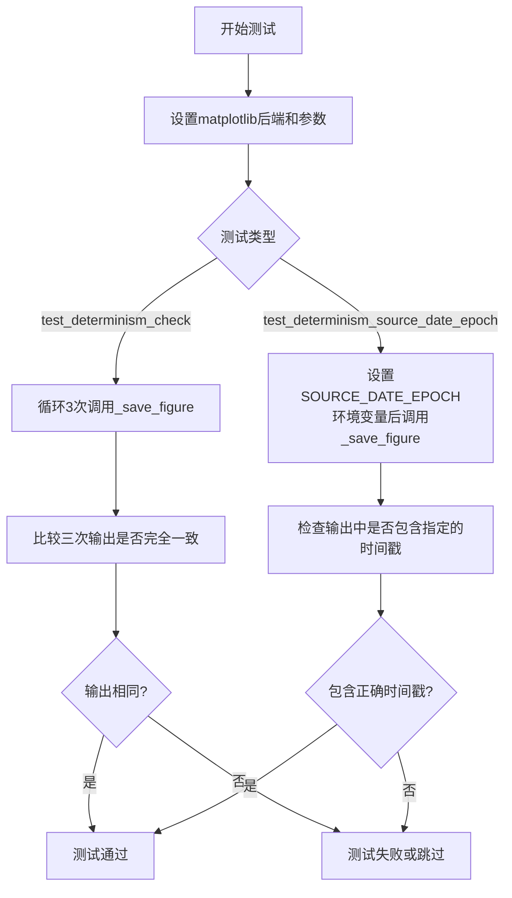
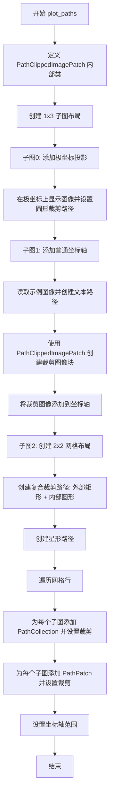
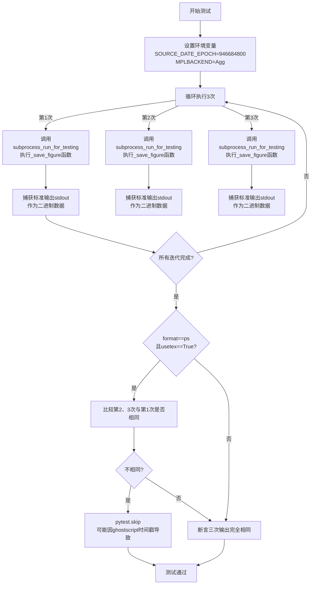
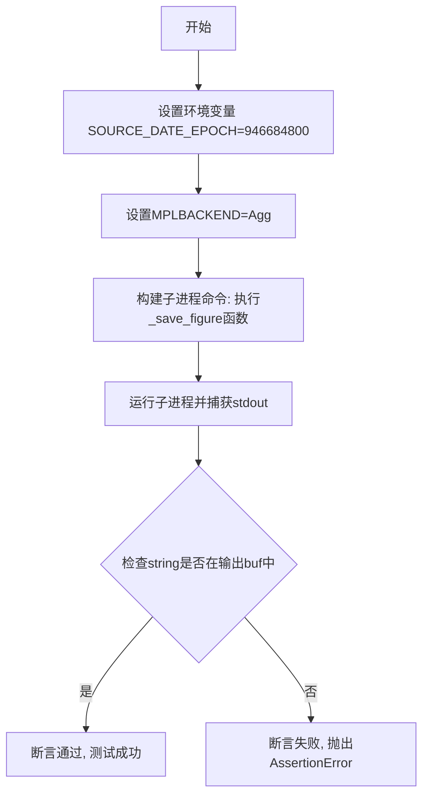
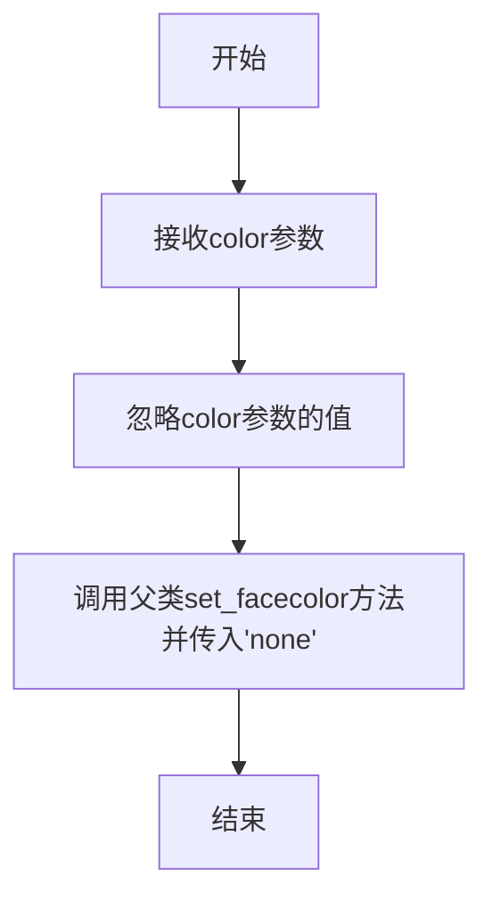
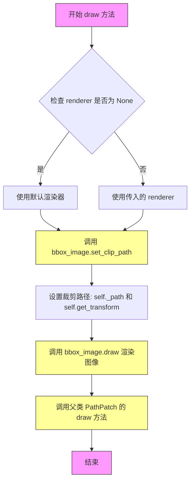

# `matplotlib\lib\matplotlib\tests\test_determinism.py` 详细设计文档

这是一个matplotlib的可重现性测试文件，通过生成包含标记、填充、图像和路径等不同图形元素的文档，并多次输出比较，以验证matplotlib在PDF/PS/SVG等格式下的输出确定性和SOURCE_DATE_EPOCH环境变量支持。

## 整体流程



## 类结构

```
模块: matplotlib.tests.test_determinism
├── 全局函数
│   ├── _save_figure (主图形生成函数)
│   │   ├── plot_markers (嵌套函数-绘制标记)
│   │   ├── plot_hatch (嵌套函数-绘制填充图案)
│   │   ├── plot_image (嵌套函数-绘制图像)
│   │   └── plot_paths (嵌套函数-绘制裁剪路径)
│   ├── test_determinism_check (可重现性测试)
│   └── test_determinism_source_date_epoch (时间戳测试)
└── 内部类
    └── PathClippedImagePatch (继承自PathPatch)
```

## 全局变量及字段


### `mpl`
    
matplotlib主模块别名，用于设置后端和全局参数

类型：`matplotlib模块`
    


### `plt`
    
matplotlib绘图模块别名，用于创建图形和图表

类型：`matplotlib.pyplot模块`
    


### `objects`
    
图形对象类型字符串，包含标记(m)、填充(h)、图像(i)、路径(p)的任意组合

类型：`str`
    


### `fmt`
    
输出格式，指定保存图形为pdf、ps或svg格式

类型：`str`
    


### `usetex`
    
布尔标志，控制是否使用LaTeX渲染文本

类型：`bool`
    


### `patterns`
    
填充图案元组，包含'-', '+', 'x', '\', '*', 'o', 'O', '.'等八种图案

类型：`tuple`
    


### `plots`
    
存储三次图形输出结果的列表，用于比较一致性

类型：`list`
    


### `buf`
    
存储子进程输出结果的字节缓冲区，用于验证时间戳

类型：`bytes`
    


### `PathClippedImagePatch.bbox_image`
    
BboxImage实例，用于在补丁内部绘制裁剪的图像

类型：`BboxImage`
    
    

## 全局函数及方法


### `_save_figure(objects, fmt, usetex)`

生成并保存测试图形，用于验证matplotlib在不同运行中输出的确定性（determinism）。该函数创建包含多种图形元素（标记、填充图案、图像、路径）的测试页面，并将其保存为指定格式（PDF/PS/SVG）到标准输出。

参数：

- `objects`：`str`，指定要包含在测试文档中的对象类型，默认为`'mhip'`。可选值：'m'(标记)、'h'(填充图案)、'i'(图像)、'p'(路径)
- `fmt`：`str`，输出格式，默认为`"pdf"`。可选值：'pdf'、'ps'、'svg'
- `usetex`：`bool`，是否使用LaTeX渲染文本，默认为`False`

返回值：`None`，函数通过`fig.savefig(stdout, format=fmt)`将图形直接输出到标准输出流

#### 流程图

```mermaid
flowchart TD
    A[开始] --> B[设置matplotlib后端: mpl.use(fmt)]
    B --> C[更新rcParams: svg.hashsalt和text.usetex]
    C --> D[创建主图形figure<br/>计算图形高度: nfigs = len(objects) + 1]
    D --> E[创建子图迭代器subfigs]
    E --> F{检查objects是否包含'm'}
    F -->|是| G[调用plot_markers绘制标记]
    F -->|否| H{检查objects是否包含'h'}
    G --> H
    H -->|是| I[调用plot_hatch绘制填充图案]
    H -->|否| J{检查objects是否包含'i'}
    I --> J
    J -->|是| K[调用plot_image绘制图像]
    J -->|否| L{检查objects是否包含'p'}
    K --> L
    L -->|是| M[调用plot_paths绘制路径和裁剪]
    L -->|否| N[绘制通用折线图]
    M --> N
    N --> O[获取标准输出缓冲区]
    O --> P[保存图形到stdout<br/>格式为fmt]
    P --> Q[结束]
    
    subgraph plot_markers
    G1[创建子图] --> G2[绘制5组不同标记的折线<br/>D, x, ^, H, v]
    end
    
    subgraph plot_hatch
    I1[创建子图] --> I2[绘制柱状图] --> I3[设置8种填充图案<br/>-, +, x, *, o, O, .]
    end
    
    subgraph plot_image
    K1[创建1x3子图] --> K2[绘制3个不同插值图像<br/>nearest, bilinear, bicubic]
    end
    
    subgraph plot_paths
    M1[创建PathClippedImagePatch类] --> M2[添加极坐标投影图像] --> M3[添加文本裁剪路径] --> M4[添加2x2网格路径裁剪]
    end
```

#### 带注释源码

```python
def _save_figure(objects='mhip', fmt="pdf", usetex=False):
    """
    生成并保存测试图形用于确定性检查。
    
    Parameters
    ----------
    objects : str, optional
        要包含在测试文档中的对象类型，默认'mhip'。
        'm' - 标记(markers)
        'h' - 填充图案(hatch patterns)
        'i' - 图像(images)
        'p' - 路径(paths)
    fmt : str, optional
        输出格式，默认'pdf'。支持'pdf', 'ps', 'svg'。
    usetex : bool, optional
        是否使用LaTeX渲染文本，默认False。
    """
    # 1. 设置matplotlib后端为指定格式
    mpl.use(fmt)
    
    # 2. 更新matplotlib配置参数
    # svg.hashsalt: 用于确保SVG输出的哈希值一致性
    # text.usetex: 控制是否使用LaTeX渲染文本
    mpl.rcParams.update({'svg.hashsalt': 'asdf', 'text.usetex': usetex})

    def plot_markers(fig):
        """绘制不同类型的标记点"""
        # 创建子图
        ax = fig.add_subplot()
        x = range(10)
        # 绘制5条线，每条使用不同的标记样式
        ax.plot(x, [1] * 10, marker='D')   # 菱形标记
        ax.plot(x, [2] * 10, marker='x')   # X标记
        ax.plot(x, [3] * 10, marker='^')   # 上三角标记
        ax.plot(x, [4] * 10, marker='H')   # 六边形标记
        ax.plot(x, [5] * 10, marker='v')   # 下三角标记

    def plot_hatch(fig):
        """绘制不同类型的填充图案"""
        # 创建子图
        ax2 = fig.add_subplot()
        # 绘制两组柱状图
        bars = (ax2.bar(range(1, 5), range(1, 5)) +
                ax2.bar(range(1, 5), [6] * 4, bottom=range(1, 5)))
        ax2.set_xticks([1.5, 2.5, 3.5, 4.5])

        # 定义8种填充图案
        patterns = ('-', '+', 'x', '\\', '*', 'o', 'O', '.')
        # 为每个柱子设置不同的填充图案
        for bar, pattern in zip(bars, patterns):
            bar.set_hatch(pattern)

    def plot_image(fig):
        """绘制不同插值方法的图像"""
        # 创建1行3列的子图，共享x和y轴
        axs = fig.subplots(1, 3, sharex=True, sharey=True)
        
        # 定义三个不同的图像矩阵
        A = [[1, 2, 3], [2, 3, 1], [3, 1, 2]]
        axs[0].imshow(A, interpolation='nearest')  # 最近邻插值
        
        A = [[1, 3, 2], [1, 2, 3], [3, 1, 2]]
        axs[1].imshow(A, interpolation='bilinear')  # 双线性插值
        
        A = [[2, 3, 1], [1, 2, 3], [2, 1, 3]]
        axs[2].imshow(A, interpolation='bicubic')  # 双三次插值

    def plot_paths(fig):
        """绘制路径和裁剪相关的图形"""
        
        # 定义一个内部类：用于图像裁剪的路径补丁
        class PathClippedImagePatch(PathPatch):
            """
            使用给定图像绘制补丁面部的类。
            内部使用BboxImage，其clippath设置为补丁的路径。
            
            注意：结果当前依赖于DPI。
            """
            
            def __init__(self, path, bbox_image, **kwargs):
                """初始化裁剪图像补丁"""
                super().__init__(path, **kwargs)
                # 创建BboxImage对象，设置裁剪路径
                self.bbox_image = BboxImage(
                    self.get_window_extent, norm=None, origin=None)
                self.bbox_image.set_data(bbox_image)

            def set_facecolor(self, color):
                """简单忽略facecolor设置"""
                super().set_facecolor("none")

            def draw(self, renderer=None):
                """绘制方法，每次绘制时更新裁剪路径"""
                # 裁剪路径必须在每次绘制时更新
                self.bbox_image.set_clip_path(self._path, self.get_transform())
                self.bbox_image.draw(renderer)
                super().draw(renderer)

        # 创建1行3列的子图
        subfigs = fig.subfigures(1, 3)

        # 子图1: 添加极坐标投影的图像
        px = subfigs[0].add_subplot(projection="polar")
        pimg = px.imshow([[2]])
        # 设置圆形裁剪路径
        pimg.set_clip_path(Circle((0, 1), radius=0.3333))

        # 子图2: 添加基于文本的裁剪路径
        ax = subfigs[1].add_subplot()
        # 读取示例图像
        arr = plt.imread(get_sample_data("grace_hopper.jpg"))
        # 创建文本路径
        text_path = TextPath((0, 0), "!?", size=150)
        # 创建裁剪图像补丁
        p = PathClippedImagePatch(text_path, arr, ec="k")
        # 创建偏移盒并添加到轴
        offsetbox = AuxTransformBox(IdentityTransform())
        offsetbox.add_artist(p)
        ao = AnchoredOffsetbox(loc='upper left', child=offsetbox, frameon=True,
                               borderpad=0.2)
        ax.add_artist(ao)

        # 子图3: 添加2x2网格的路径裁剪轴
        # 创建外框路径（矩形放大4倍）
        exterior = Path.unit_rectangle().deepcopy()
        exterior.vertices *= 4
        exterior.vertices -= 2
        # 创建内框路径（圆形，反转顶点）
        interior = Path.unit_circle().deepcopy()
        interior.vertices = interior.vertices[::-1]
        # 创建复合裁剪路径
        clip_path = Path.make_compound_path(exterior, interior)

        # 创建星形路径
        star = Path.unit_regular_star(6).deepcopy()
        star.vertices *= 2.6

        # 创建2x2子图网格
        (row1, row2) = subfigs[2].subplots(2, 2, sharex=True, sharey=True,
                                           gridspec_kw=dict(hspace=0, wspace=0))
        # 遍历两行
        for row in (row1, row2):
            ax1, ax2 = row
            # 创建路径集合并设置裁剪
            collection = PathCollection([star], lw=5, edgecolor='blue',
                                        facecolor='red', alpha=0.7, hatch='*')
            collection.set_clip_path(clip_path, ax1.transData)
            ax1.add_collection(collection)

            # 创建路径补丁并设置裁剪
            patch = PathPatch(star, lw=5, edgecolor='blue', facecolor='red',
                              alpha=0.7, hatch='*')
            patch.set_clip_path(clip_path, ax2.transData)
            ax2.add_patch(patch)

            # 设置坐标轴范围
            ax1.set_xlim([-3, 3])
            ax1.set_ylim([-3, 3])

    # 计算需要的子图数量：对象类型数量 + 1（额外的测试图）
    nfigs = len(objects) + 1
    # 创建主图形，设置宽度7英寸，高度根据子图数量动态计算
    fig = plt.figure(figsize=(7, 3 * nfigs))
    # 创建子图迭代器
    subfigs = iter(fig.subfigures(nfigs, squeeze=False).flat)
    # 调整子图布局
    fig.subplots_adjust(bottom=0.15)

    # 根据objects参数依次绘制各种图形元素
    if 'm' in objects:
        plot_markers(next(subfigs))
    if 'h' in objects:
        plot_hatch(next(subfigs))
    if 'i' in objects:
        plot_image(next(subfigs))
    if 'p' in objects:
        plot_paths(next(subfigs))

    # 绘制通用的测试折线图（包含LaTeX字符串）
    x = range(5)
    ax = next(subfigs).add_subplot()
    ax.plot(x, x)
    ax.set_title('A string $1+2+\\sigma$')
    ax.set_xlabel('A string $1+2+\\sigma$')
    ax.set_ylabel('A string $1+2+\\sigma$')

    # 获取标准输出缓冲区
    stdout = getattr(sys.stdout, 'buffer', sys.stdout)
    # 将图形保存到标准输出
    fig.savefig(stdout, format=fmt)
```


### `plot_markers(fig)`

该函数接收一个matplotlib的Figure对象作为参数，在该图形上创建一个子图，并在子图上绘制五条折线，每条折线使用不同的标记样式（Diamond、Cross、Triangle up、Hexagon、Triangle down），用于测试输出可重现性时展示不同的标记类型。

参数：
- `fig`：`matplotlib.figure.Figure`，需要绘制标记的图形对象

返回值：`None`，该函数直接在传入的图形对象上绘制内容，不返回任何值

#### 流程图

```mermaid
flowchart TD
    A[开始 plot_markers] --> B[接收 fig 参数]
    B --> C[在 fig 上创建子图 ax]
    C --> D[创建 x 轴数据 range(10)]
    D --> E[绘制第一条线: x vs [1]*10, 标记='D' 菱形]
    E --> F[绘制第二条线: x vs [2]*10, 标记='x' 叉号]
    F --> G[绘制第三条线: x vs [3]*10, 标记='^' 上三角]
    G --> H[绘制第四条线: x vs [4]*10, 标记='H' 六边形]
    H --> I[绘制第五条线: x vs [5]*10, 标记='v' 下三角]
    I --> J[结束]
```

#### 带注释源码

```python
def plot_markers(fig):
    """
    在指定的图形上绘制不同标记的折线。
    
    参数:
        fig: matplotlib.figure.Figure 对象
            要绘制标记的图形对象
    
    返回值:
        None
    """
    # 使用不同的标记进行绘图...
    # 创建一个子图axes对象，用于绑制图形内容
    ax = fig.add_subplot()
    
    # 定义 x 轴数据，范围为 0-9
    x = range(10)
    
    # 绘制第一条折线：使用菱形标记 (marker='D')
    ax.plot(x, [1] * 10, marker='D')
    
    # 绘制第二条折线：使用叉号标记 (marker='x')
    ax.plot(x, [2] * 10, marker='x')
    
    # 绘制第三条折线：使用上三角标记 (marker='^')
    ax.plot(x, [3] * 10, marker='^')
    
    # 绘制第四条折线：使用六边形标记 (marker='H')
    ax.plot(x, [4] * 10, marker='H')
    
    # 绘制第五条折线：使用下三角标记 (marker='v')
    ax.plot(x, [5] * 10, marker='v')
```


### `plot_hatch(fig)`

该函数用于在指定图形上绘制不同填充图案（hatch patterns）的柱状图，通过循环为每个柱子设置不同的填充样式，以测试和展示 Matplotlib 支持的各种填充图案效果。

参数：

- `fig`：`matplotlib.figure.Figure`，需要绘制填充图案的图形对象

返回值：`None`，该函数直接在传入的 Figure 对象上绘制图形，不返回任何值

#### 流程图

```mermaid
flowchart TD
    A[开始 plot_hatch] --> B[在 fig 上创建子图 ax2]
    B --> C[绘制第一组柱状图: range(1,5) 的值]
    C --> D[绘制第二组柱状图: 值为6, 底部为 range(1,5)]
    D --> E[设置 x 轴刻度为 [1.5, 2.5, 3.5, 4.5]]
    E --> F[定义填充图案元组: '-', '+', 'x', '\\', '*', 'o', 'O', '.']
    F --> G[遍历每个柱子和对应图案]
    G --> H[为每个柱子设置填充图案]
    H --> I{是否还有更多柱子和图案}
    I -->|是| G
    I -->|否| J[结束]
```

#### 带注释源码

```python
def plot_hatch(fig):
    # 在传入的图形对象上创建一个新的子图区域
    ax2 = fig.add_subplot()
    
    # 绘制两组柱状图：
    # 第一组：x 坐标为 1-4，高度为 1-4
    # 第二组：x 坐标为 1-4，高度为 6，底部从 1-4 开始（堆叠柱状图）
    bars = (ax2.bar(range(1, 5), range(1, 5)) +
            ax2.bar(range(1, 5), [6] * 4, bottom=range(1, 5)))
    
    # 设置 x 轴刻度位置，位于两组柱状图的中间
    ax2.set_xticks([1.5, 2.5, 3.5, 4.5])

    # 定义要测试的填充图案集合
    # '-' : 水平线
    # '+' : 交叉线
    # 'x' : 交叉对角线
    # '\\' : 反斜线
    # '*' : 星形
    # 'o' : 小圆圈
    # 'O' : 大圆圈
    # '.' : 点
    patterns = ('-', '+', 'x', '\\', '*', 'o', 'O', '.')
    
    # 遍历每个柱状图，为其设置对应的填充图案
    # zip(bars, patterns) 将柱状图与图案一一对应
    for bar, pattern in zip(bars, patterns):
        bar.set_hatch(pattern)
```


### `plot_image(fig)`

在指定图形对象上绘制三个子图，分别使用最近邻（nearest）、双线性（bilinear）和双三次（bicubic）三种不同的图像插值方法展示矩阵数据，以验证matplotlib输出可重复性。

参数：

- `fig`：`matplotlib.figure.Figure`，要在其上绘制图像的图形对象

返回值：`None`，该函数直接修改传入的 `fig` 对象，不返回任何值

#### 流程图

```mermaid
flowchart TD
    A[开始 plot_image] --> B[创建1行3列共享x轴和y轴的子图]
    B --> C[定义矩阵A1 = [[1,2,3], [2,3,1], [3,1,2]]]
    C --> D[在axs[0]上使用interpolation='nearest'显示A1]
    D --> E[定义矩阵A2 = [[1,3,2], [1,2,3], [3,1,2]]]
    E --> F[在axs[1]上使用interpolation='bilinear'显示A2]
    F --> G[定义矩阵A3 = [[2,3,1], [1,2,3], [2,1,3]]]
    G --> H[在axs[2]上使用interpolation='bicubic'显示A3]
    H --> I[结束 plot_image]
```

#### 带注释源码

```python
def plot_image(fig):
    """
    在fig上绘制三个子图，分别展示不同插值方法的图像。
    
    Parameters
    ----------
    fig : matplotlib.figure.Figure
        要绘制图像的Figure对象
    """
    # 创建1行3列的子图，sharex=True表示共享x轴，sharey=True表示共享y轴
    axs = fig.subplots(1, 3, sharex=True, sharey=True)
    
    # 定义第一个3x3矩阵数据
    A = [[1, 2, 3], [2, 3, 1], [3, 1, 2]]
    # 在第一个子图上显示图像，使用最近邻插值（nearest）
    axs[0].imshow(A, interpolation='nearest')
    
    # 定义第二个3x3矩阵数据
    A = [[1, 3, 2], [1, 2, 3], [3, 1, 2]]
    # 在第二个子图上显示图像，使用双线性插值（bilinear）
    axs[1].imshow(A, interpolation='bilinear')
    
    # 定义第三个3x3矩阵数据
    A = [[2, 3, 1], [1, 2, 3], [2, 1, 3]]
    # 在第三个子图上显示图像，使用双三次插值（bicubic）
    axs[2].imshow(A, interpolation='bicubic')
```


### `plot_paths(fig)`

该函数是 `_save_figure` 函数的内部嵌套函数，用于在指定图形上绘制三种不同类型的裁剪路径：极坐标投影上的图像裁剪、基于文本形状的裁剪路径，以及2x2网格中的路径裁剪效果展示。

参数：

- `fig`：`matplotlib.figure.Figure`，要绘制裁剪路径的目标图形对象

返回值：`None`，该函数直接在图形上绘制内容，不返回任何值

#### 流程图



#### 带注释源码

```python
def plot_paths(fig):
    # clipping support class, copied from demo_text_path.py gallery example
    class PathClippedImagePatch(PathPatch):
        """
        The given image is used to draw the face of the patch. Internally,
        it uses BboxImage whose clippath set to the path of the patch.

        FIXME : The result is currently dpi dependent.
        """

        def __init__(self, path, bbox_image, **kwargs):
            # 调用父类 PathPatch 初始化
            super().__init__(path, **kwargs)
            # 创建 BboxImage 用于显示裁剪图像
            self.bbox_image = BboxImage(
                self.get_window_extent, norm=None, origin=None)
            # 设置要显示的图像数据
            self.bbox_image.set_data(bbox_image)

        def set_facecolor(self, color):
            """Simply ignore facecolor."""
            # 忽略 facecolor 设置，保持透明
            super().set_facecolor("none")

        def draw(self, renderer=None):
            # the clip path must be updated every draw. any solution? -JJ
            # 每次绘制时更新裁剪路径
            self.bbox_image.set_clip_path(self._path, self.get_transform())
            # 绘制裁剪图像
            self.bbox_image.draw(renderer)
            # 调用父类绘制方法
            super().draw(renderer)

    # 创建 1x3 的子图布局
    subfigs = fig.subfigures(1, 3)

    # === 子图0: 极坐标投影裁剪 ===
    # add a polar projection
    px = subfigs[0].add_subplot(projection="polar")
    # 显示图像
    pimg = px.imshow([[2]])
    # 设置圆形裁剪路径
    pimg.set_clip_path(Circle((0, 1), radius=0.3333))

    # === 子图1: 文本形状裁剪 ===
    # add a text-based clipping path (origin: demo_text_path.py)
    ax = subfigs[1].add_subplot()
    # 读取示例图像（grace_hopper.jpg）
    arr = plt.imread(get_sample_data("grace_hopper.jpg"))
    # 创建文本路径 "!?"
    text_path = TextPath((0, 0), "!?", size=150)
    # 使用自定义类创建裁剪图像块
    p = PathClippedImagePatch(text_path, arr, ec="k")
    # 创建辅助变换盒子
    offsetbox = AuxTransformBox(IdentityTransform())
    offsetbox.add_artist(p)
    # 创建带锚点的偏移盒子
    ao = AnchoredOffsetbox(loc='upper left', child=offsetbox, frameon=True,
                           borderpad=0.2)
    # 添加到坐标轴
    ax.add_artist(ao)

    # === 子图2: 网格裁剪 ===
    # add a 2x2 grid of path-clipped axes (origin: test_artist.py)
    # 创建外部矩形路径
    exterior = Path.unit_rectangle().deepcopy()
    exterior.vertices *= 4  # 放大4倍
    exterior.vertices -= 2  # 偏移
    # 创建内部圆形路径
    interior = Path.unit_circle().deepcopy()
    interior.vertices = interior.vertices[::-1]  # 反转顶点实现内孔效果
    # 创建复合裁剪路径（矩形挖圆）
    clip_path = Path.make_compound_path(exterior, interior)

    # 创建星形路径
    star = Path.unit_regular_star(6).deepcopy()
    star.vertices *= 2.6  # 放大

    # 创建 2x2 共享坐标轴的网格
    (row1, row2) = subfigs[2].subplots(2, 2, sharex=True, sharey=True,
                                       gridspec_kw=dict(hspace=0, wspace=0))
    # 遍历两行
    for row in (row1, row2):
        ax1, ax2 = row
        # 创建路径集合（星形）
        collection = PathCollection([star], lw=5, edgecolor='blue',
                                    facecolor='red', alpha=0.7, hatch='*')
        # 设置裁剪路径（使用数据坐标变换）
        collection.set_clip_path(clip_path, ax1.transData)
        # 添加到左侧坐标轴
        ax1.add_collection(collection)

        # 创建路径补丁（星形）
        patch = PathPatch(star, lw=5, edgecolor='blue', facecolor='red',
                          alpha=0.7, hatch='*')
        # 设置裁剪路径
        patch.set_clip_path(clip_path, ax2.transData)
        # 添加到右侧坐标轴
        ax2.add_patch(patch)

        # 设置坐标轴范围
        ax1.set_xlim([-3, 3])
        ax1.set_ylim([-3, 3])
```


### `test_determinism_check`

该测试函数用于验证 Matplotlib 生成图形输出的确定性（determinism），即在相同参数下多次生成的图形文件内容应完全相同。函数通过子进程调用 `_save_figure` 函数三次，比较生成的二进制输出内容是否一致，以检测图形渲染过程中是否存在随机性因素（如时间戳、随机内存地址等）。

参数：

- `objects`：`str`，指定测试文档中包含的对象类型：'m' 表示标记（markers），'h' 表示阴影图案（hatch patterns），'i' 表示图像（images），'p' 表示路径（paths）。例如 "mhip" 表示包含所有四种类型。
- `fmt`：`str`，输出格式，值为 "pdf"、"ps" 或 "svg" 之一。
- `usetex`：`bool`，是否使用 LaTeX 渲染文本。如果为 True，则使用 text.usetex 选项。

返回值：`None`，该函数为测试函数，通过 pytest 断言进行验证，不返回具体值。

#### 流程图



#### 带注释源码

```python
@pytest.mark.parametrize(
    "objects, fmt, usetex", [
        ("", "pdf", False),
        ("m", "pdf", False),
        ("h", "pdf", False),
        ("i", "pdf", False),
        ("mhip", "pdf", False),
        ("mhip", "ps", False),
        pytest.param("mhip", "ps", True, marks=[needs_usetex, needs_ghostscript]),
        ("p", "svg", False),
        ("mhip", "svg", False),
        pytest.param("mhip", "svg", True, marks=needs_usetex),
    ]
)
def test_determinism_check(objects, fmt, usetex):
    """
    Output the same graph three times and check that the outputs are exactly the same.

    Parameters
    ----------
    objects : str
        Objects to be included in the test document: 'm' for markers, 'h' for
        hatch patterns, 'i' for images, and 'p' for paths.
    fmt : {"pdf", "ps", "svg"}
        Output format.
    """
    # 使用列表推导式运行三次子进程，每次都调用_save_figure函数生成图形
    # subprocess_run_for_testing 是 matplotlib.testing 模块的辅助函数
    # 用于在隔离环境中运行子进程并捕获输出
    plots = [
        subprocess_run_for_testing(
            [sys.executable, "-R", "-c",
             # 使用f-string动态构建要执行的Python代码
             # -R 标志禁用Python的哈希随机化
             # 从matplotlib.tests.test_determinism模块导入_save_figure函数并调用
             f"from matplotlib.tests.test_determinism import _save_figure;"
             f"_save_figure({objects!r}, {fmt!r}, {usetex})"],
            # 设置环境变量确保输出可重现：
            # SOURCE_DATE_EPOCH=946684800 对应 2000-01-01 00:00:00 UTC
            # 用于替代文档中的动态时间戳
            env={**os.environ, "SOURCE_DATE_EPOCH": "946684800",
                 "MPLBACKEND": "Agg"},
            # text=False 返回二进制字节串，capture_output=True 捕获stdout
            text=False, capture_output=True, check=True).stdout
        for _ in range(3)  # 执行3次以验证确定性
    ]
    # 比较第2、3次输出与第1次是否完全相同
    for p in plots[1:]:
        if fmt == "ps" and usetex:
            # PS格式+usetex可能因ghostscript版本差异导致时间戳不同
            # 此时跳过测试而非失败
            if p != plots[0]:
                pytest.skip("failed, maybe due to ghostscript timestamps")
        else:
            # 断言二进制内容完全相同，确保渲染过程是确定性的
            assert p == plots[0]
```

---

### 关键组件信息

| 组件名称 | 一句话描述 |
|---------|-----------|
| `_save_figure` | 辅助函数，用于实际生成包含各种图形元素（标记、阴影、图像、路径）的 Matplotlib 图形并输出到标准输出 |
| `subprocess_run_for_testing` | Matplotlib 测试工具函数，在隔离子进程中运行命令并捕获输出，用于验证图形生成的可重现性 |
| `SOURCE_DATE_EPOCH` | 环境变量，设置为固定时间戳（2000-01-01）以替代文档中的动态时间戳，确保输出可重现 |

---

### 潜在的技术债务或优化空间

1. **子进程重复调用开销**：当前实现每次测试都启动三个完整的 Python 子进程，即使 `_save_figure` 函数的逻辑完全相同，这会增加测试执行时间。可以考虑使用多线程或共享进程池来优化。
2. **跳过逻辑的模糊性**：对于 PS 格式 + usetex 的情况，测试直接跳过而非真正验证，这种"宽容"可能掩盖潜在问题。应该更精确地识别可接受的差异类型。
3. **参数化测试的组合爆炸**：当前有 10 种参数组合，随着支持格式和对象的增加，测试矩阵会快速膨胀，需要考虑测试策略的优化。

---

### 其它项目

#### 设计目标与约束

- **核心目标**：验证 Matplotlib 在不同运行环境下生成完全一致的图形输出，确保科学计算结果的可重现性
- **约束条件**：使用 `SOURCE_DATE_EPOCH` 环境变量消除时间戳差异，使用 `-R` 参数禁用 Python 哈希随机化，使用 `Agg` 后端避免图形界面依赖

#### 错误处理与异常设计

- 使用 `check=True` 参数确保子进程执行失败时抛出异常
- 对于 PS+usetex 的已知不确定情况，使用 `pytest.skip()` 优雅地跳过测试而非失败
- 断言失败时直接抛出 `AssertionError`，表明输出存在差异

#### 数据流与状态机

1. **输入**：参数 `objects`（字符串）、`fmt`（格式）、`usetex`（布尔值）
2. **处理**：通过子进程调用 `_save_figure` 函数，将图形以二进制形式输出到 stdout
3. **比较**：三次运行的二进制输出进行字节级比较
4. **输出**：无返回值，通过 pytest 断言验证确定性

#### 外部依赖与接口契约

- 依赖 `subprocess_run_for_testing` 函数（Matplotlib 测试框架）
- 依赖 `_save_figure` 函数（同一模块内的辅助函数）
- 依赖 `pytest` 框架进行参数化和断言
- 依赖外部工具：`ghostscript`（当 `fmt=ps` 且 `usetex=True` 时）


### `test_determinism_source_date_epoch`

测试SOURCE_DATE_EPOCH支持，通过设置环境变量SOURCE_DATE_EPOCH为2000-01-01 00:00 UTC对应的Unix时间戳（946684800），运行matplotlib图像生成函数，验证输出文档中包含预期的时间戳字符串。

参数：

- `fmt`：`str`，输出格式，可选值为"pdf"、"ps"或"svg"
- `string`：`bytes`，预期出现在输出文档中的时间戳字符串（2000-01-01 00:00 UTC对应的时间戳）

返回值：`None`，该函数通过assert语句进行断言，不返回任何值

#### 流程图



#### 带注释源码

```python
@pytest.mark.parametrize(
    "fmt, string", [
        ("pdf", b"/CreationDate (D:20000101000000Z)"),
        # PDF格式的创建日期格式
        # SOURCE_DATE_EPOCH支持不使用text.usetex测试,
        # 因为生成的时间戳来自ghostscript:
        # %%CreationDate: D:20000101000000Z00\'00\', 可能会随ghostscript版本变化
        ("ps", b"%%CreationDate: Sat Jan 01 00:00:00 2000"),
        # PostScript格式的创建日期格式
    ]
)
def test_determinism_source_date_epoch(fmt, string):
    """
    Test SOURCE_DATE_EPOCH support.

    Output a document with the environment variable SOURCE_DATE_EPOCH set to
    2000-01-01 00:00 UTC and check that the document contains the timestamp that
    corresponds to this date (given as an argument).

    Parameters
    ----------
    fmt : {"pdf", "ps", "svg"}
        Output format.
    string : bytes
        Timestamp string for 2000-01-01 00:00 UTC.
    """
    # 使用subprocess_run_for_testing运行子进程
    # 设置环境变量：SOURCE_DATE_EPOCH设为946684800（2000-01-01 00:00 UTC的Unix时间戳）
    # MPLBACKEND设为Agg以避免需要显示服务器
    buf = subprocess_run_for_testing(
        [sys.executable, "-R", "-c",
         f"from matplotlib.tests.test_determinism import _save_figure; "
         f"_save_figure('', {fmt!r})"],
        env={**os.environ, "SOURCE_DATE_EPOCH": "946684800",
             "MPLBACKEND": "Agg"}, capture_output=True, text=False, check=True).stdout
    # 断言输出中包含预期的时间戳字符串
    assert string in buf
```


### `subprocess_run_for_testing`

运行子进程并捕获其标准输出和标准错误，同时支持环境变量配置和输出捕获选项。该函数是matplotlib测试框架的核心工具，用于在隔离环境中执行Python脚本并验证输出结果。

#### 参数

- `cmd`：`list[str]`，要执行的命令列表，通常包含Python解释器路径和脚本参数
- `env`：`dict | None`，可选的环境变量字典，用于覆盖或扩展子进程的环境，默认为None（继承父进程环境）
- `text`：`bool`，是否以文本模式返回输出，True返回字符串，False返回字节，默认为False
- `capture_output`：`bool`，是否捕获子进程的标准输出和标准错误，默认为True
- `check`：`bool`，是否在返回码非零时抛出异常，默认为True
- `timeout`：`float | None`，可选的超时时间（秒），超时后终止子进程

#### 返回值

`subprocess.CompletedProcess`，包含以下属性：
- `returncode`：整数，返回码
- `stdout`：bytes | str，捕获的标准输出（取决于text参数）
- `stderr`：bytes | str，捕获的标准错误（取决于text参数）

#### 流程图

```mermaid
flowchart TD
    A[开始执行subprocess_run_for_testing] --> B{参数验证}
    B --> C[使用subprocess.run执行命令]
    C --> D{check参数为True?}
    D -->|是 E{返回码非零?}
    D -->|否 F[返回CompletedProcess对象]
    E -->|是 G[抛出subprocess.CalledProcessError异常]
    E -->|否 F
    F --> H[结束]
    G --> H
```

#### 带注释源码

```python
# 由于源代码未在当前文件中定义，以下为基于使用方式推断的函数签名和注释
def subprocess_run_for_testing(
    cmd: list[str],
    *,
    env: dict | None = None,
    text: bool = False,
    capture_output: bool = True,
    check: bool = True,
    timeout: float | None = None,
    cwd: str | None = None,
    ...
) -> subprocess.CompletedProcess:
    """
    运行子进程并捕获输出，用于测试目的。
    
    Parameters
    ----------
    cmd : list[str]
        要执行的命令列表，通常为[sys.executable, "-c", script]形式
    env : dict | None, optional
        环境变量字典，会与os.environ合并
    text : bool, optional
        是否以文本模式返回输出
    capture_output : bool, optional
        是否捕获stdout和stderr
    check : bool, optional
        是否检查返回码，非零则抛异常
    timeout : float | None, optional
        超时时间（秒）
    cwd : str | None, optional
        工作目录
    
    Returns
    -------
    subprocess.CompletedProcess
        包含returncode, stdout, stderr等属性的对象
    
    Raises
    ------
    subprocess.CalledProcessError
        当check=True且返回码非零时
    subprocess.TimeoutExpired
        当超时且timeout不为None时
    """
    # 内部实现通过subprocess.run调用实现
    # 关键特性：支持SOURCE_DATE_EPOCH环境变量用于可重现性测试
    pass
```

---

### 潜在的技术债务或优化空间

1. **缺少直接源码访问**：当前代码仅展示了函数的使用方式，未提供`subprocess_run_for_testing`的实际实现源码，建议查阅`matplotlib.testing`模块获取完整定义
2. **错误处理可以更具体**：当前代码使用`check=True`，但对于特定格式（如ps+usetex）的兼容性测试使用了`pytest.skip`处理，建议统一错误处理策略
3. **测试重复执行**：三个相同的子进程调用可以通过参数化或缓存机制优化

### 其它项目

#### 设计目标与约束
- **可重现性**：通过设置`SOURCE_DATE_EPOCH`环境变量确保输出文件的时间戳一致
- **隔离性**：使用`MPLBACKEND: Agg`避免GUI后端依赖
- **跨平台兼容**：使用`sys.executable`确保调用正确的Python解释器

#### 数据流与状态机
1. 主测试函数调用`subprocess_run_for_testing`启动子进程
2. 子进程加载`_save_figure`函数并执行绘图
3. 绘图结果输出到stdout buffer
4. 主进程捕获stdout并与预期结果比对

#### 外部依赖与接口契约
- 依赖`matplotlib.testing`模块的`subprocess_run_for_testing`函数
- 依赖`matplotlib`本身的绘图API
- 环境变量`SOURCE_DATE_EPOCH`和`MPLBACKEND`影响输出行为


### `PathClippedImagePatch.__init__`

初始化裁剪图像补丁类，该类继承自PathPatch，内部使用BboxImage将图像绘制到补丁的裁剪区域内，实现图像按照指定路径形状进行显示。

参数：

- `path`：`Path`， matplotlib路径对象，定义补丁的轮廓形状
- `bbox_image`：任意类型， 要裁剪并显示的图像数据，可以是numpy数组或其他BboxImage支持的数据格式
- `**kwargs`：关键字参数， 传递给父类PathPatch的额外参数，如edgecolor、facecolor等

返回值：`None`，该方法为构造函数，不返回任何值

#### 流程图

```mermaid
flowchart TD
    A[开始 __init__] --> B[调用 super().__init__ path **kwargs]
    B --> C[创建 BboxImage 实例]
    C --> D[设置 bbox_image 的窗口范围为 self.get_window_extent]
    D --> E[设置 bbox_image 的归一化和原点为 None]
    E --> F[调用 bbox_image.set_data bbox_image]
    F --> G[结束 __init__]
```

#### 带注释源码

```python
def __init__(self, path, bbox_image, **kwargs):
    """
    初始化 PathClippedImagePatch 对象
    
    参数:
        path: Path对象, 定义补丁的轮廓路径
        bbox_image: 要显示的图像数据
        **kwargs: 传递给父类PathPatch的额外参数
    """
    # 调用父类PathPatch的初始化方法
    # 设置补丁的路径和额外属性（如edgecolor等）
    super().__init__(path, **kwargs)
    
    # 创建BboxImage实例，用于在补丁区域内绘制图像
    # self.get_window_extent 作为回调函数获取图像的显示区域
    # norm=None 表示不进行数据归一化
    # origin=None 使用默认的图像原点
    self.bbox_image = BboxImage(
        self.get_window_extent, norm=None, origin=None)
    
    # 将传入的图像数据设置到BboxImage对象中
    # 该图像将根据path定义的路径进行裁剪显示
    self.bbox_image.set_data(bbox_image)
```


### `PathClippedImagePatch.set_facecolor`

设置面颜色为无（忽略输入的颜色参数，始终设置为"none"）。

参数：

- `color`：任意类型，需要被忽略的颜色参数

返回值：`None`，无返回值（该方法不返回任何值）

#### 流程图



#### 带注释源码

```python
def set_facecolor(self, color):
    """Simply ignore facecolor."""
    # 忽略传入的color参数，无论传入什么颜色值
    # 都将面颜色设置为"none"（即透明无填充）
    super().set_facecolor("none")
```


### `PathClippedImagePatch.draw`

该方法是一个绘制方法，用于更新裁剪路径并渲染图像。它首先更新BboxImage的裁剪路径，然后调用BboxImage的绘制方法，最后调用父类的绘制方法来完成整个绘制过程。

参数：

- `renderer`：`None` 或 `matplotlib.backend_bases.RendererBase`，渲染器对象，用于控制图形的绘制。如果为 `None`，则使用默认渲染器。

返回值：`None`，该方法没有返回值。

#### 流程图



#### 带注释源码

```python
def draw(self, renderer=None):
    """
    绘制方法，更新裁剪路径并渲染。
    
    Parameters
    ----------
    renderer : matplotlib.backend_bases.RendererBase, optional
        渲染器对象，用于控制图形的绘制。默认为 None。
    """
    # the clip path must be updated every draw. any solution? -JJ
    # 每次绘制时都必须更新裁剪路径，因为裁剪路径可能已经改变
    # 设置 BboxImage 的裁剪路径为当前路径和变换矩阵
    self.bbox_image.set_clip_path(self._path, self.get_transform())
    
    # 调用 BboxImage 的 draw 方法绘制图像
    self.bbox_image.draw(renderer)
    
    # 调用父类 PathPatch 的 draw 方法，完成整个绘制过程
    super().draw(renderer)
```

## 关键组件


### _save_figure 函数

核心函数，负责生成包含标记(markers)、阴影(hatches)、图像(images)和路径(paths)的图形，并将其保存为指定格式（pdf/ps/svg）。该函数使用 matplotlib 的各种绘图功能创建测试场景，并直接输出到标准输出流。

### plot_markers 子函数

在图形中绘制不同类型的标记（markers），包括 'D'、'x'、'^'、'H'、'v' 等五种标记类型，用于测试 matplotlib 标记渲染的确定性。

### plot_hatch 子函数

在条形图中应用不同的阴影模式（hatch patterns），包括 '-'、'+'、'x'、'\\'、'*'、'o'、'O'、'.' 等八种图案，用于测试阴影渲染的可重现性。

### plot_image 子函数

绘制使用不同插值方法的图像，包括 'nearest'、'bilinear'、'bicubic' 三种插值方式，用于测试图像渲染的确定性和跨格式一致性。

### plot_paths 子函数

绘制复杂的裁剪路径场景，包括极坐标投影中的图像裁剪、文本路径裁剪、以及复合路径裁剪的网格布局。该函数内部定义了 PathClippedImagePatch 类。

### PathClippedImagePatch 类

继承自 PathPatch 的内部类，用于实现基于任意路径的图像裁剪功能。该类使用 BboxImage 将图像绑定到路径上，并重写了 draw 方法以在每次绘制时更新裁剪路径。

### test_determinism_check 测试函数

参数化测试函数，用于验证 matplotlib 在相同输入下生成完全相同的输出（字节级一致）。测试通过运行三次图形生成并比较输出结果，支持多种输出格式（pdf/ps/svg）和对象组合。

### test_determinism_source_date_epoch 测试函数

测试 SOURCE_DATE_EPOCH 环境变量支持，验证图形输出中包含正确的创建时间戳，用于确保文档生成的可重现性和时间无关性。

### 关键依赖组件

- **matplotlib.pyplot**：图形创建和保存
- **matplotlib.image.BboxImage**：图像绑定到边界框
- **matplotlib.path.Path**：路径操作和复合路径创建
- **matplotlib.transforms.IdentityTransform**：恒等变换
- **subprocess_run_for_testing**：子进程运行和输出捕获
- **TextPath**：文本到路径的转换


## 问题及建议


### 已知问题

- **函数过长且职责过多**：`_save_figure` 函数包含大量代码（约150行），且内部定义了四个子函数（plot_markers、plot_hatch、plot_image、plot_paths），违反了单一职责原则，降低了代码可读性和可维护性。
- **嵌套类定义**：在 `plot_paths` 函数内部定义了 `PathClippedImagePatch` 类，这使得该类难以被单独测试和复用，且类定义应放在模块级别。
- **FIXME 技术债**：代码中存在 `FIXME : The result is currently dpi dependent.` 注释，表明存在已知的 DPI 依赖问题，但未得到解决。
- **测试逻辑复杂**：`test_determinism_check` 函数中的条件分支较多，特别是对 `fmt == "ps" and usetex` 的特殊处理逻辑不够清晰，使用 try-except-skip 模式增加了代码复杂度。
- **硬编码值过多**：如图形尺寸、颜色、标记样式、图案等都是硬编码的，缺乏灵活性，难以适应不同的测试场景。
- **缺少模块级文档**：整个文件没有模块级 docstring，仅有函数级文档，代码可读性较差。
- **重复代码**：在 `test_determinism_check` 和 `test_determinism_source_date_epoch` 中有重复的子进程调用逻辑。

### 优化建议

- **重构 `_save_figure`**：将内部的四个绘图函数提取为模块级别的独立函数，每个函数负责一种图形的绘制，提高代码的可读性和可测试性。
- **提取嵌套类**：将 `PathClippedImagePatch` 类移到模块级别，并添加单元测试，同时解决 FIXME 中提到的 DPI 依赖问题。
- **简化测试逻辑**：将 `test_determinism_check` 中的特殊情况处理抽取为独立的辅助函数，使用参数化测试减少条件分支。
- **配置化设计**：将硬编码的绘图参数（如颜色、标记、图案等）提取为配置文件或测试参数，提高测试的灵活性和覆盖率。
- **消除重复代码**：提取子进程调用的公共逻辑为共享的辅助函数，避免代码重复。
- **添加文档**：为模块添加顶层 docstring，说明测试目的和设计思路，帮助后续维护者理解代码。

## 其它


### 设计目标与约束

确保matplotlib在不同运行环境下生成一致的图形输出，验证输出文件的字节级一致性，支持多种输出格式（PDF、PS、SVG）和多种图形元素（标记、填充、图像、路径），并确保SOURCE_DATE_EPOCH环境变量正确影响输出时间戳。

### 错误处理与异常设计

测试失败时通过pytest.skip跳过可能的ghostscript时间戳问题，使用capture_output捕获标准输出和错误输出，通过check=True确保子进程调用成功，断言失败时明确比较输出差异。

### 数据流与状态机

通过subprocess_run_for_testing三次执行相同绘图代码，收集stdout字节流进行逐字节比较，使用环境变量SOURCE_DATE_EPOCH控制时间戳生成，使用MPLBACKEND=Agg避免GUI依赖。

### 外部依赖与接口契约

依赖matplotlib主库及测试模块（pytest、subprocess_run_for_testing、needs_ghostscript、needs_usetex），依赖系统环境变量（SOURCE_DATE_EPOCH、MPLBACKEND），依赖外部工具ghostscript处理PS格式和usetex选项，依赖grace_hopper.jpg示例图像文件。

### 性能考虑

测试通过子进程隔离执行避免matplotlib状态污染，使用Agg后端避免图形渲染开销，三次重复执行增加测试时间但确保可重现性验证的可靠性。

### 安全性考虑

使用sys.executable执行Python脚本避免shell注入，通过环境变量控制测试行为而非直接修改系统配置，捕获输出使用二进制模式避免编码问题。

### 测试策略

参数化测试覆盖不同对象组合（m、h、i、p及其组合）和不同输出格式，使用已知时间戳值（946684800对应2000-01-01）确保测试可预测，PS+usetex组合因外部依赖可能不稳定故使用条件跳过。

### 部署/集成注意事项

测试文件位于matplotlib.tests模块中，需与matplotlib测试框架集成运行，需要sample_data目录包含grace_hopper.jpg文件，需要系统安装ghostscript以支持PS格式和usetex选项。

### 版本兼容性

测试验证不同matplotlib版本间的输出一致性，确保向后兼容性，SOURCE_DATE_EPOCH支持需与不同版本ghostscript兼容。

### 配置管理

通过matplotlib.rcParams动态配置（svg.hashsalt、text.usetex），测试参数通过pytest.mark.parametrize声明式定义，环境变量通过子进程env参数传递。

    