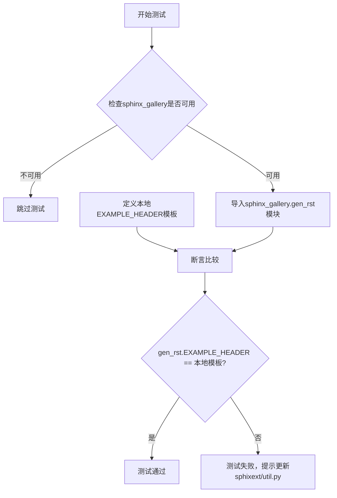
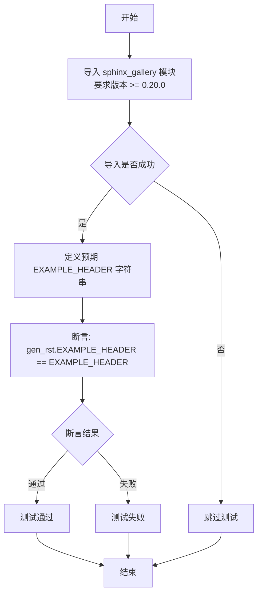
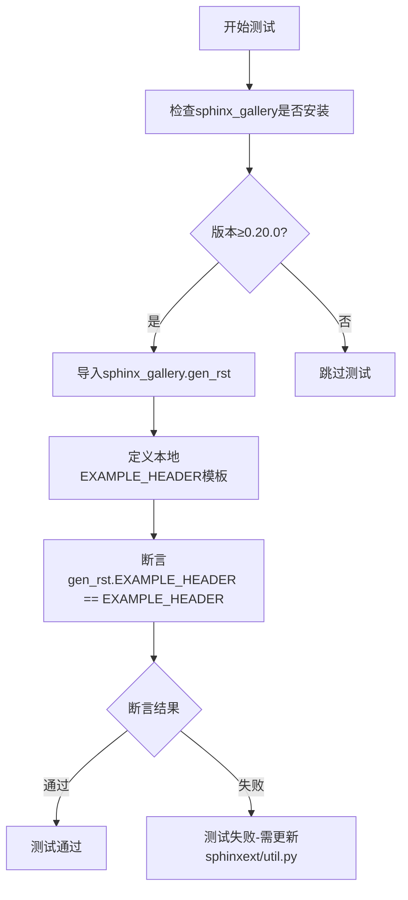

# `matplotlib\lib\matplotlib\tests\test_doc.py` 详细设计文档

这是一个pytest测试文件，用于验证sphinx-gallery库的EXAMPLE_HEADER模板是否与项目预期的版本一致，确保在sphinx-gallery更新后能够及时发现差异并更新monkey-patching代码。

## 整体流程



## 类结构

```
此文件为纯测试模块，无类定义
仅包含一个测试函数和全局变量
```

## 全局变量及字段


### `EXAMPLE_HEADER`
    
用于与sphinx_gallery比较的RST文档头部模板字符串

类型：`str`
    


    

## 全局函数及方法


### `test_sphinx_gallery_example_header`

这是一个测试函数，用于验证项目复制的 `EXAMPLE_HEADER` 是否与 sphinx-gallery 库中的原始版本保持一致。如果 sphinx-gallery 更改了其 `EXAMPLE_HEADER`，此测试将失败，从而提醒开发者需要更新 `sphinxext/util.py` 中的 monkey-patching。

参数：此函数没有参数。

返回值：`None`，无返回值（测试函数）。

#### 流程图



#### 带注释源码

```python
import pytest


def test_sphinx_gallery_example_header():
    """
    We have copied EXAMPLE_HEADER and modified it to include meta keywords.
    This test monitors that the version we have copied is still the same as
    the EXAMPLE_HEADER in sphinx-gallery. If sphinx-gallery changes its
    EXAMPLE_HEADER, this test will start to fail. In that case, please update
    the monkey-patching of EXAMPLE_HEADER in sphinxext/util.py.
    """
    # 尝试导入 sphinx_gallery，如果未安装或版本低于 0.20.0 则跳过测试
    pytest.importorskip('sphinx_gallery', minversion='0.20.0')
    # 从 sphinx_gallery 导入 gen_rst 模块
    from sphinx_gallery import gen_rst

    # 定义预期应该存在的 EXAMPLE_HEADER 模板
    # 注意：这里包含文档生成的说明和占位符
    EXAMPLE_HEADER = """
.. DO NOT EDIT.
.. THIS FILE WAS AUTOMATICALLY GENERATED BY SPHINX-GALLERY.
.. TO MAKE CHANGES, EDIT THE SOURCE PYTHON FILE:
.. "{0}"
.. LINE NUMBERS ARE GIVEN BELOW.

.. only:: html

    .. note::
        :class: sphx-glr-download-link-note

        :ref:`Go to the end <sphx_glr_download_{1}>`
        to download the full example code{2}

.. rst-class:: sphx-glr-example-title

.. _sphx_glr_{1}:

"""
    # 断言：验证 sphinx_gallery 库中的 EXAMPLE_HEADER 与我们预期的完全一致
    assert gen_rst.EXAMPLE_HEADER == EXAMPLE_HEADER
```

## 关键组件


### 核心功能概述

该测试文件用于监控项目对sphinx-gallery库的EXAMPLE_HEADER定制修改是否与sphinx-gallery官方版本保持同步，通过断言比较两者是否一致，确保在sphinx-gallery更新时能够及时发现并更新monkey-patching代码。

### 文件整体运行流程

1. 使用pytest.importorskip检查sphinx_gallery库是否已安装（版本≥0.20.0）
2. 从sphinx_gallery模块导入gen_rst子模块
3. 在函数内部定义本地EXAMPLE_HEADER字符串模板
4. 断言gen_rst.EXAMPLE_HEADER与本地定义的EXAMPLE_HEADER是否相等
5. 若不相等则测试失败，提示需更新sphinxext/util.py中的monkey-patching

### 全局函数详细信息

#### test_sphinx_gallery_example_header

| 属性 | 详情 |
|------|------|
| 函数名称 | test_sphinx_gallery_example_header |
| 参数名称 | 无 |
| 参数类型 | 无 |
| 参数描述 | 无参数 |
| 返回值类型 | None |
| 返回值描述 | 测试函数无返回值，通过pytest断言验证 |

**mermaid流程图**



**带注释源码**

```python
def test_sphinx_gallery_example_header():
    """
    We have copied EXAMPLE_HEADER and modified it to include meta keywords.
    This test monitors that the version we have copied is still the same as
    the EXAMPLE_HEADER in sphinx-gallery. If sphinx-gallery changes its
    EXAMPLE_HEADER, this test will start to fail. In that case, please update
    the monkey-patching of EXAMPLE_HEADER in sphinxext/util.py.
    """
    # 条件导入sphinx_gallery，若未安装或版本过低则跳过测试
    pytest.importorskip('sphinx_gallery', minversion='0.20.0')
    # 从sphinx_gallery导入gen_rst模块
    from sphinx_gallery import gen_rst

    # 定义期望的EXAMPLE_HEADER模板（与sphinxext/util.py中的monkey-patching一致）
    EXAMPLE_HEADER = """
.. DO NOT EDIT.
.. THIS FILE WAS AUTOMATICALLY GENERATED BY SPHINX-GALLERY.
.. TO MAKE CHANGES, EDIT THE SOURCE PYTHON FILE:
.. "{0}"
.. LINE NUMBERS ARE GIVEN BELOW.

.. only:: html

    .. note::
        :class: sphx-glr-download-link-note

        :ref:`Go to the end <sphx_glr_download_{1}>`
        to download the full example code{2}

.. rst-class:: sphx-glr-example-title

.. _sphx_glr_{1}:

"""
    # 断言sphinx_gallery的EXAMPLE_HEADER与本地定义一致
    assert gen_rst.EXAMPLE_HEADER == EXAMPLE_HEADER
```

### 关键组件信息

#### EXAMPLE_HEADER

sphinx-gallery文档生成使用的RST文档头部模板，包含文件名占位符、下载链接说明和示例标题等占位符，用于生成文档页面的标准头部。

#### pytest.importorskip

pytest提供的条件导入函数，当指定的可选依赖未安装或版本不满足要求时跳过测试。

#### sphinx_gallery.gen_rst

sphinx-gallery库的子模块，包含文档生成相关的RST模板和函数。

### 潜在的技术债务或优化空间

1. **硬编码模板同步风险**：EXAMPLE_HEADER模板在测试中硬编码，若sphinx-gallery频繁更新，需要频繁手动同步，建议在sphinxext/util.py中添加版本注释或自动更新机制。

2. **缺乏版本比较逻辑**：当前仅做完全相等判断，无法得知具体差异内容，测试失败时调试困难。

3. **文档同步维护成本**：随着sphinx-gallery功能增加，EXAMPLE_HEADER可能引入新占位符，需要持续维护对应关系。

### 其它项目

#### 设计目标与约束

- 目标：确保项目定制的EXAMPLE_HEADER与sphinx-gallery官方版本同步
- 约束：依赖sphinx_gallery≥0.20.0版本

#### 错误处理与异常设计

- 使用pytest.importorskip处理可选依赖缺失情况
- 断言失败时提供明确的修复指引（更新sphinxext/util.py）

#### 外部依赖与接口契约

- 依赖：pytest框架、sphinx_gallery库（≥0.20.0）
- 接口契约：gen_rst.EXAMPLE_HEADER应为字符串类型，包含特定占位符格式


## 问题及建议


### 已知问题

-   **硬编码重复**：EXAMPLE_HEADER 在测试文件中硬编码了一份完整副本，与 sphinxext/util.py 中的版本重复，违反 DRY（Don't Repeat Yourself）原则，维护时需要同步多處
-   **脆弱的字符串比较**：使用完全相等（`==`）进行字符串比对，对格式变化极其敏感，即使上游只是微调空格或换行，测试也会失败
-   **缺乏版本上限约束**：仅指定 `minversion='0.20.0'` 而无版本上限，未来 sphinx_gallery 重大版本升级可能导致不兼容
-   **测试反馈信息不足**：测试失败时仅提示"请更新 monkey-patching"，缺少具体需要修改的内容和修复步骤
-   **仅做字符串监控无功能验证**：只验证字符串一致性，未验证复制后的 EXAMPLE_HEADER 是否能正常工作

### 优化建议

-   将 EXAMPLE_HEADER 提取到独立的共享配置模块中，测试和实际使用都引用同一份定义，消除重复代码
-   考虑使用更灵活的对比方式，如基于关键占位符的正则匹配，或将必须保留的关键行提取为列表进行逐行验证，提高测试的鲁棒性
-   添加 sphinx_gallery 的版本上限约束（如 `< 1.0.0`），并在文档中明确支持的主版本范围
-   改进测试失败信息，捕获并展示具体的差异内容（如使用 `difflib.unified_diff`），便于开发者快速定位需要修改的部分
-   增加功能性验证测试，确保复制后的 EXAMPLE_HEADER 在实际文档生成场景中能正常工作，而不仅仅做静态字符串比较

## 其它


### 设计目标与约束

**设计目标**：确保项目中定制的 EXAMPLE_HEADER 与 sphinx-gallery 库原始版本保持同步，通过自动化测试监控第三方库升级时可能带来的 API 变化，防止因版本差异导致文档生成行为不一致。

**设计约束**：
- 依赖 sphinx_gallery 库，版本需 >= 0.20.0
- 不得修改 sphinx-gallery 源码，仅通过 monkey-patching 方式定制
- 测试环境需保持网络访问以获取 sphinx_gallery 包

### 错误处理与异常设计

**异常处理机制**：
- 使用 `pytest.importorskip()` 优雅处理 sphinx_gallery 未安装的情况，测试将被跳过而非失败
- 当 EXAMPLE_HEADER 不一致时，断言失败并提供明确的差异信息

**预期异常场景**：
- sphinx_gallery 版本低于 0.20.0：测试跳过
- sphinx_gallery 升级导致 EXAMPLE_HEADER 变化：测试失败，提示需更新 sphinxext/util.py

### 外部依赖与接口契约

**外部依赖**：
- pytest：测试框架
- sphinx_gallery：目标监控库，版本 >= 0.20.0

**接口契约**：
- `gen_rst.EXAMPLE_HEADER`：只读属性，表示 sphinx-gallery 生成的示例文档头部模板
- 预期内容格式：RST 格式文档字符串，包含动态占位符 {0}(源文件路径)、{1}(示例标识)、{2}(额外说明)

### 测试覆盖范围

本测试直接验证 `sphinx_gallery.gen_rst.EXAMPLE_HEADER` 的内容一致性，属于回归测试范畴，确保定制化修改与上游版本同步时不引入破坏性变更。

### 版本兼容性考虑

- 最低版本要求 0.20.0：对应 EXAMPLE_HEADER 结构稳定的时间点
- 随着 sphinx_gallery 升级，可能需要调整 minversion 参数或更新测试逻辑

### 维护建议

当前实现为监控性测试，建议在 sphinxext/util.py 的 monkey-patching 逻辑变更时，同步更新本测试中的 EXAMPLE_HEADER 模板定义，保持文档同步机制的一致性。


    