# `matplotlib\lib\matplotlib\tests\test_dviread.py` 详细设计文档

这是一个测试文件，用于测试 matplotlib 库中的 dviread 模块，验证 PsfontsMap 类的字体映射功能和 Dvi 类的 DVI 文件解析功能，包括不同 TeX 引擎（pdflatex、xelatex、lualatex）的支持以及 PK 字体解析。

## 整体流程

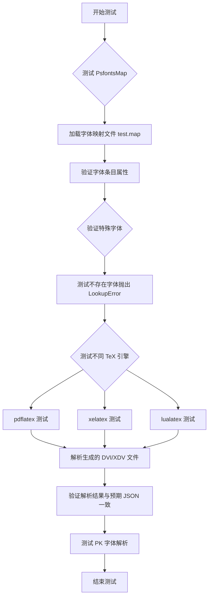

## 类结构

```
测试模块 (test_dviread.py)
├── test_PsfontsMap (测试函数)
├── test_dviread (参数化测试函数)
└── test_dviread_pk (测试函数)
```

## 全局变量及字段


### `filename`
    
Path to the fontmap test file (test.map)

类型：`str`
    


### `fontmap`
    
Font map object that parses the map file and provides font lookups

类型：`PsfontsMap`
    


### `key`
    
Byte string key for font lookup (e.g., b'TeXfont1')

类型：`bytes`
    


### `entry`
    
Font entry retrieved from fontmap containing texname, psname, encoding, filename, and effects

类型：`Psfont`
    


### `n`
    
Loop counter iterating over test font numbers (1-5)

类型：`int`
    


### `dirpath`
    
Path to the baseline_images/dviread directory containing test fixtures

类型：`Path`
    


### `cmd`
    
Command list for running the LaTeX engine (e.g., ['latex'] or ['xelatex', '-no-pdf'])

类型：`list[str]`
    


### `fmt`
    
Output format extension ('dvi' for pdflatex/lualatex, 'xdv' for xelatex)

类型：`str`
    


### `dvi`
    
DVI file object for reading compiled TeX output

类型：`Dvi`
    


### `pages`
    
List of parsed pages from the DVI file containing text and box elements

类型：`list[Page]`
    


### `data`
    
Structured data extracted from DVI pages for comparison testing

类型：`list[dict]`
    


### `correct`
    
Expected reference data loaded from JSON for assertion validation

类型：`dict`
    


### `exc`
    
Exception raised when required font file is not found

类型：`FileNotFoundError`
    


### `note`
    
Note message from exception notes (e.g., luaotfload version warning)

类型：`str`
    


### `tmp_path`
    
Pytest temporary directory fixture for test file operations

类型：`Path`
    


### `engine`
    
LaTeX engine parameter for test parameterization (pdflatex, xelatex, or lualatex)

类型：`str`
    


    

## 全局函数及方法


### `test_PsfontsMap`

该测试函数用于验证 `matplotlib` 中 `dviread.PsfontsMap` 类的功能正确性，包括字体映射的解析、各项属性（texname、psname、encoding、filename、effects）的读取，以及错误处理（查找不存在的字体时是否抛出正确的异常）。

参数：

- `monkeypatch`：`<class 'pytest.MonkeyPatch'>`，pytest 的 monkeypatch 工具，用于临时修改模块或函数的行为

返回值：`None`，该函数为测试函数，无返回值，通过 assert 语句验证预期行为

#### 流程图

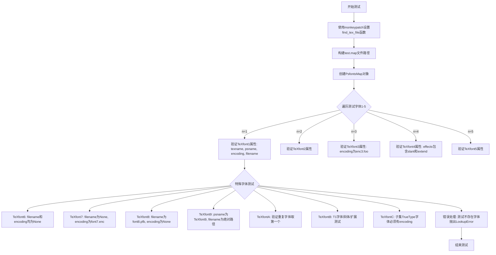

#### 带注释源码

```python
def test_PsfontsMap(monkeypatch):
    """
    测试PsfontsMap类的字体映射解析功能
    
    该测试验证以下功能:
    1. 字体各项属性的正确解析(texname, psname, encoding, filename, effects)
    2. 不同字体类型的特殊处理(PFA/PFB文件, 编码文件, 效果参数)
    3. 错误处理: 查找不存在的字体时抛出LookupError
    """
    # 使用monkeypatch将find_tex_file函数替换为简单的lambda
    # 原始函数可能返回bytes，这里让它直接返回解码后的字符串
    monkeypatch.setattr(dr, 'find_tex_file', lambda x: x.decode())

    # 构建测试用的map文件路径
    # 该文件位于测试目录的baseline_images/dviread/test.map
    filename = str(Path(__file__).parent / 'baseline_images/dviread/test.map')
    
    # 创建PsfontsMap对象,传入map文件路径
    fontmap = dr.PsfontsMap(filename)
    
    # 测试用例1-5: 验证基本字体属性
    for n in [1, 2, 3, 4, 5]:
        # 生成测试用的字体键名(字节类型)
        key = b'TeXfont%d' % n
        # 从fontmap中获取对应字体的条目
        entry = fontmap[key]
        
        # 验证texname属性
        assert entry.texname == key
        # 验证psname属性(PS字体名)
        assert entry.psname == b'PSfont%d' % n
        
        # 验证encoding属性
        # TeXfont3和TeXfont5有特殊的编码处理
        if n not in [3, 5]:
            assert entry.encoding == 'font%d.enc' % n
        elif n == 3:
            assert entry.encoding == 'enc3.foo'
        # TeXfont5指定多个编码,这里不关心其encoding值
        
        # 验证filename属性
        # TeXfont1和TeXfont5使用.pfb文件,其他使用.pfa文件
        if n not in [1, 5]:
            assert entry.filename == 'font%d.pfa' % n
        else:
            assert entry.filename == 'font%d.pfb' % n
        
        # 验证effects属性(字体效果: slant斜体, extend扩展)
        # 只有TeXfont4有特殊效果设置
        if n == 4:
            assert entry.effects == {'slant': -0.1, 'extend': 1.2}
        else:
            assert entry.effects == {}
    
    # 测试用例6: filename和encoding都为None的情况
    entry = fontmap[b'TeXfont6']
    assert entry.filename is None
    assert entry.encoding is None
    
    # 测试用例7: filename为None但encoding存在
    entry = fontmap[b'TeXfont7']
    assert entry.filename is None
    assert entry.encoding == 'font7.enc'
    
    # 测试用例8: filename存在但encoding为None
    entry = fontmap[b'TeXfont8']
    assert entry.filename == 'font8.pfb'
    assert entry.encoding is None
    
    # 测试用例9: 绝对路径的文件名
    entry = fontmap[b'TeXfont9']
    assert entry.psname == b'TeXfont9'
    assert entry.filename == '/absolute/font9.pfb'
    
    # 测试用例A: 重复字体只取第一个
    entry = fontmap[b'TeXfontA']
    assert entry.psname == b'PSfontA1'
    
    # 测试用例B: T1字体的slant/extend效果
    entry = fontmap[b'TeXfontB']
    assert entry.psname == b'PSfontB6'
    
    # 测试用例C: 子集TrueType字体必须有encoding
    entry = fontmap[b'TeXfontC']
    assert entry.psname == b'PSfontC3'
    
    # 错误处理测试1: 查找不存在的字体
    with pytest.raises(LookupError, match='no-such-font'):
        fontmap[b'no-such-font']
    
    # 错误处理测试2: 查找特殊字符'%'
    with pytest.raises(LookupError, match='%'):
        fontmap[b'%']
```


### `test_dviread`

这是一个测试 DVI 文件读取功能的测试函数，用于验证 matplotlib 的 dviread 模块能否正确解析由不同 LaTeX 引擎（pdflatex、xelatex、lualatex）生成的 DVI/XDV 文件，并正确提取文本和盒子的位置信息。

参数：

- `tmp_path`：`py.path.local`（或 `pathlib.Path`），pytest 的临时目录 fixture，用于存放测试过程中生成的临时文件
- `engine`：`str`，要测试的 LaTeX 引擎名称，可选值为 "pdflatex"、"xelatex"、"lualatex"
- `monkeypatch`：`pytest.MonkeyPatch`，pytest 的 monkeypatch 工具，用于动态修改函数或变量

返回值：`None`，该函数为测试函数，通过 assert 断言进行验证，不返回任何值

#### 流程图

```mermaid
flowchart TD
    A[开始] --> B[设置路径和复制测试文件]
    B --> C{engine类型}
    C -->|pdflatex| D[cmd=['latex'], fmt='dvi']
    C -->|xelatex| E[cmd=['xelatex', '-no-pdf'], fmt='xdv']
    C -->|lualatex| F[cmd=['lualatex', '-output-format=dvi'], fmt='dvi']
    D --> G{引擎命令可用?}
    E --> G
    F --> G
    G -->|否| H[跳过测试]
    G -->|是| I[运行LaTeX引擎生成DVI/XDV文件]
    I --> J[切换到tmp_path目录]
    J --> K[打开DVI文件并读取所有页面]
    K --> L{FileNotFoundError?}
    L -->|是| M{包含luaotfload错误?}
    L -->|否| N[提取页面文本和盒子信息]
    M -->|是| O[跳过测试]
    M -->|否| P[重新抛出异常]
    N --> Q[加载预期结果JSON]
    Q --> R[断言数据一致性]
    R --> S[结束]
    H --> S
    O --> S
    P --> S
```

#### 带注释源码

```python
@pytest.mark.skipif(shutil.which("kpsewhich") is None,
                    reason="kpsewhich is not available")
@pytest.mark.parametrize("engine", ["pdflatex", "xelatex", "lualatex"])
def test_dviread(tmp_path, engine, monkeypatch):
    """
    测试 dviread 模块读取不同 LaTeX 引擎生成的 DVI/XDV 文件的功能
    
    参数:
        tmp_path: pytest 提供的临时目录路径
        engine: LaTeX 引擎类型 (pdflatex/xelatex/lualatex)
        monkeypatch: pytest 的 monkeypatch 工具
    """
    # 获取测试数据目录路径
    dirpath = Path(__file__).parent / "baseline_images/dviread"
    
    # 复制测试所需的 TeX 源文件到临时目录
    shutil.copy(dirpath / "test.tex", tmp_path)
    
    # 复制测试所需的字体文件到临时目录
    # DejaVuSans.ttf 是 test.tex 中引用的字体
    shutil.copy(cbook._get_data_path("fonts/ttf/DejaVuSans.ttf"), tmp_path)
    
    # 根据引擎类型确定要执行的命令和输出格式
    cmd, fmt = {
        "pdflatex": (["latex"], "dvi"),           # pdflatex 输出 DVI
        "xelatex": (["xelatex", "-no-pdf"], "xdv"), # xelatex 输出 XDV
        "lualatex": (["lualatex", "-output-format=dvi"], "dvi"), # lualatex 可配置输出 DVI
    }[engine]
    
    # 检查指定的 LaTeX 引擎是否可用，如不可用则跳过测试
    if shutil.which(cmd[0]) is None:
        pytest.skip(f"{cmd[0]} is not available")
    
    # 执行 LaTeX 引擎编译 test.tex 文件
    # 使用 subprocess_run_for_testing 执行并捕获输出
    subprocess_run_for_testing(
        [*cmd, "test.tex"], cwd=tmp_path, check=True, capture_output=True)
    
    # dviread 必须从 tmppath 目录运行，因为 {xe,lua}tex 输出的
    # DejaVuSans.ttf 路径是相对路径（相对于 tex 源文件所在目录）
    monkeypatch.chdir(tmp_path)
    
    # 打开生成的 DVI/XDV 文件进行读取
    # 第二个参数 None 表示不读取字体文件
    with dr.Dvi(tmp_path / f"test.{fmt}", None) as dvi:
        try:
            # 迭代读取所有页面
            pages = [*dvi]
        except FileNotFoundError as exc:
            # 处理文件未找到异常，特别是 luaotfload 过旧的情况
            for note in getattr(exc, "__notes__", []):
                if "too-old version of luaotfload" in note:
                    pytest.skip(note)
            raise
    
    # 从读取的页面中提取数据，转换为标准格式
    data = [
        {
            # 提取每个文本元素的信息
            "text": [
                [
                    t.x, t.y,  # 文本坐标
                    t._as_unicode_or_name(),  # 文本内容（Unicode或字体名）
                    t.font.resolve_path().name,  # 字体文件路径
                    round(t.font.size, 2),  # 字体大小
                    t.font.effects,  # 字体效果（slant、extend等）
                ] for t in page.text
            ],
            # 提取每个盒子（文本框）的信息
            "boxes": [[b.x, b.y, b.height, b.width] for b in page.boxes]
        } for page in pages
    ]
    
    # 从 JSON 文件加载预期结果
    correct = json.loads((dirpath / f"{engine}.json").read_text())
    
    # 断言解析结果与预期一致
    assert data == correct
```


### `test_dviread_pk`

该函数是一个 pytest 测试用例，用于验证 matplotlib 的 dviread 模块能够正确读取包含 PK 字体（使用 concmath 包生成的 DVI 文件）的 DVI 文件，并正确解析文本和字体信息。

参数：

- `tmp_path`：`Path`（pytest fixture），pytest 提供的临时目录路径，用于存放测试过程中生成的临时文件

返回值：`None`，该函数为测试用例，通过断言验证数据正确性，不返回任何值

#### 流程图

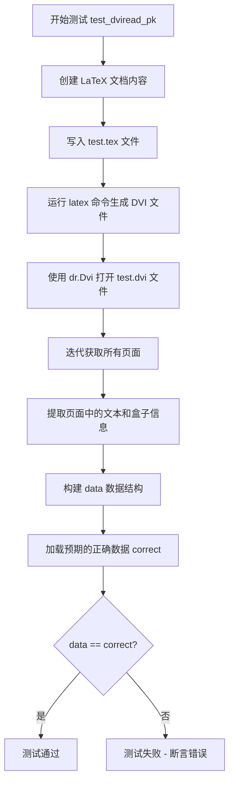

#### 带注释源码

```python
# 导入所需的模块
import json
from pathlib import Path
import shutil

from matplotlib import cbook, dviread as dr
from matplotlib.testing import subprocess_run_for_testing, _has_tex_package
import pytest

# 装饰器：跳过测试如果 latex 命令不可用
@pytest.mark.skipif(shutil.which("latex") is None, reason="latex is not available")
# 装饰器：跳过测试如果 concmath.sty 包不可用
@pytest.mark.skipif(not _has_tex_package("concmath"), reason="needs concmath.sty")
def test_dviread_pk(tmp_path):
    """
    测试 dviread 模块读取包含 PK 字体的 DVI 文件的能力。
    
    该测试验证：
    1. 能够正确处理 concmath 包生成的 DVI 文件
    2. 能够正确解析文本元素的位置、Unicode/名称、字体路径、大小和效果
    3. 能够正确处理 PK 格式的字体文件
    """
    
    # 准备 LaTeX 文档内容：使用 concmath 包（会产生 PK 字体）
    (tmp_path / "test.tex").write_text(r"""
        \documentclass{article}
        \usepackage{concmath}
        \pagestyle{empty}
        \begin{document}
        Hi!
        \end{document}
        """)
    
    # 执行 latex 命令将 LaTeX 源文件编译为 DVI 格式
    subprocess_run_for_testing(
        ["latex", "test.tex"], cwd=tmp_path, check=True, capture_output=True)
    
    # 使用 matplotlib 的 dviread 模块打开生成的 DVI 文件
    # 参数：文件路径为 test.dvi，dpi 参数为 None
    with dr.Dvi(tmp_path / "test.dvi", None) as dvi:
        # 迭代 DVI 文件中的所有页面
        pages = [*dvi]
    
    # 从页面中提取文本和盒子数据
    data = [
        {
            "text": [
                [
                    t.x,  # 文本的 X 坐标
                    t.y,  # 文本的 Y 坐标
                    t._as_unicode_or_name(),  # 文本的 Unicode 或字体名称
                    t.font.resolve_path().name,  # 字体文件的名称
                    round(t.font.size, 2),  # 字体大小（四舍五入到两位小数）
                    t.font.effects,  # 字体效果（如斜体、加粗等）
                ] for t in page.text  # 遍历页面中的每个文本元素
            ],
            "boxes": [[b.x, b.y, b.height, b.width] for b in page.boxes]  # 遍历页面中的每个盒子元素
        } for page in pages  # 遍历所有页面
    ]
    
    # 定义预期的正确输出数据（针对使用 concmath 包的情况）
    correct = [{
        'boxes': [],  # 该 DVI 文件中没有盒子元素
        'text': [
            # [x坐标, y坐标, 文本, 字体文件名, 字体大小, 字体效果]
            [5046272, 4128768, 'H?', 'ccr10.600pk', 9.96, {}],
            [5530510, 4128768, 'i?', 'ccr10.600pk', 9.96, {}],
            [5716195, 4128768, '!?', 'ccr10.600pk', 9.96, {}],
        ],
    }]
    
    # 断言：实际数据应与预期数据完全匹配
    assert data == correct
```


### `test_dviread`

该测试函数通过 `@pytest.mark.parametrize` 参数化，用于验证 `dviread` 模块能否正确解析不同 TeX 引擎（pdflatex、xelatex、lualatex）生成的 DVI/XDV 文件，并对比解析结果与预期的 JSON 数据。

参数：

- `tmp_path`：`Path`，pytest 临时目录 fixture，用于存放测试文件
- `engine`：`str`，TeX 渲染引擎，接受值为 "pdflatex"、"xelatex" 或 "lualatex"
- `monkeypatch`：`pytest.MonkeyPatch`，用于修改运行时环境的 pytest fixture

返回值：`None`，该函数为测试函数，无返回值

#### 流程图

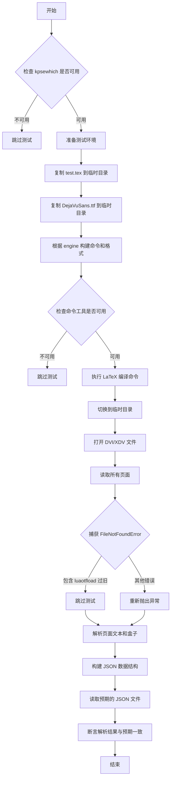

#### 带注释源码

```python
# 使用 pytest 的条件跳过装饰器：检查 kpsewhich 命令是否可用
@pytest.mark.skipif(shutil.which("kpsewhich") is None,
                    reason="kpsewhich is not available")
# 参数化装饰器：engine 参数接受三个不同的值，会生成三个测试用例
@pytest.mark.parametrize("engine", ["pdflatex", "xelatex", "lualatex"])
def test_dviread(tmp_path, engine, monkeypatch):
    """
    测试 dviread 模块解析不同 TeX 引擎生成的 DVI/XDV 文件
    
    参数:
        tmp_path: pytest 提供的临时目录 fixture
        engine: TeX 引擎类型，可选 pdflatex/xelatex/lualatex
        monkeypatch: 用于运行时环境修改的 fixture
    """
    # 获取测试数据目录路径
    dirpath = Path(__file__).parent / "baseline_images/dviread"
    
    # 复制测试用的 TeX 源文件到临时目录
    shutil.copy(dirpath / "test.tex", tmp_path)
    # 复制测试用的 TrueType 字体文件到临时目录
    shutil.copy(cbook._get_data_path("fonts/ttf/DejaVuSans.ttf"), tmp_path)
    
    # 根据 engine 参数构建对应的命令和输出格式
    # pdflatex -> latex 命令，输出 DVI 格式
    # xelatex -> xelatex -no-pdf，输出 XDV 格式
    # lualatex -> lualatex -output-format=dvi，输出 DVI 格式
    cmd, fmt = {
        "pdflatex": (["latex"], "dvi"),
        "xelatex": (["xelatex", "-no-pdf"], "xdv"),
        "lualatex": (["lualatex", "-output-format=dvi"], "dvi"),
    }[engine]
    
    # 检查指定的命令工具是否可用，不可用则跳过测试
    if shutil.which(cmd[0]) is None:
        pytest.skip(f"{cmd[0]} is not available")
    
    # 执行 LaTeX 编译命令生成 DVI/XDV 文件
    subprocess_run_for_testing(
        [*cmd, "test.tex"], cwd=tmp_path, check=True, capture_output=True)
    
    # dviread 必须从 tmppath 目录运行，因为 {xe,lua}tex 输出记录的是
    # tex 源文件中指定的相对路径（DejaVuSans.ttf）
    monkeypatch.chdir(tmp_path)
    
    # 打开并解析生成的 DVI/XDV 文件
    with dr.Dvi(tmp_path / f"test.{fmt}", None) as dvi:
        try:
            # 迭代读取所有页面
            pages = [*dvi]
        except FileNotFoundError as exc:
            # 捕获特定异常：如果是因为 luaotfload 版本过旧，跳过测试
            for note in getattr(exc, "__notes__", []):
                if "too-old version of luaotfload" in note:
                    pytest.skip(note)
            raise
    
    # 从解析的页面中提取文本和盒子信息
    data = [
        {
            "text": [
                [
                    t.x, t.y,  # 文本坐标
                    t._as_unicode_or_name(),  # 文本内容或字体名
                    t.font.resolve_path().name,  # 字体文件名
                    round(t.font.size, 2),  # 字体大小
                    t.font.effects,  # 字体效果（slant/extend）
                ] for t in page.text
            ],
            "boxes": [[b.x, b.y, b.height, b.width] for b in page.boxes]
        } for page in pages
    ]
    
    # 读取对应引擎的预期结果 JSON 文件
    correct = json.loads((dirpath / f"{engine}.json").read_text())
    
    # 断言解析结果与预期完全一致
    assert data == correct
```


### `monkeypatch.setattr`

该方法是 pytest 框架中 `MonkeyPatch` 类的成员方法，用于在测试运行时动态替换目标对象（模块、类或实例）的属性或函数。在 `test_PsfontsMap` 测试中，使用它将 `dviread` 模块的 `find_tex_file` 函数替换为 lambda 函数，以简化文件查找逻辑，便于测试 `PsfontsMap` 类的功能。

参数：

- `target`：`object`，目标对象，可以是模块、类或实例，在此代码中为 `dr`（matplotlib 的 dviread 模块）
- `name`：`str`，要替换的属性名称，在此代码中为字符串 `'find_tex_file'`
- `value`：任意类型，新属性值，在此代码中为 lambda 函数 `lambda x: x.decode()`
- `raising`：`bool`（可选），默认为 `True`，当设为 `False` 时，如果属性不存在不会抛出 `AttributeError`

返回值：`None`，该方法直接修改目标对象的属性，不返回值。

#### 流程图

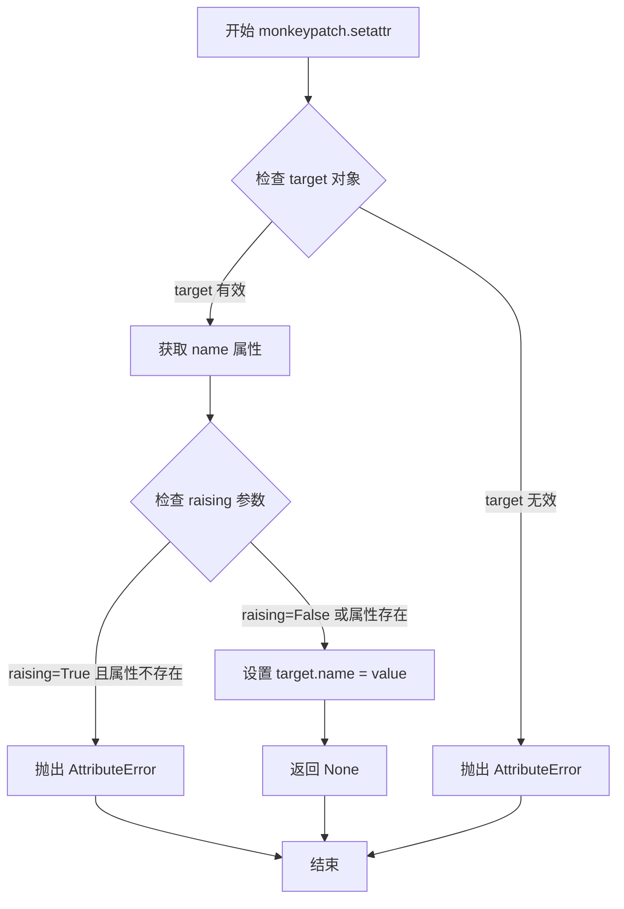

#### 带注释源码

```python
# 在 test_PsfontsMap 函数中使用 monkeypatch.setattr
monkeypatch.setattr(dr, 'find_tex_file', lambda x: x.decode())

# 参数说明：
#   target: dr (matplotlib dviread 模块)
#   name: 'find_tex_file' (dviread 模块中的函数名)
#   value: lambda x: x.decode() (替换为简单的 lambda 函数)
#   raising: 默认 True (默认行为)

# 实际效果：将 dviread.find_tex_file 函数替换为 lambda x: x.decode()
# 这样在测试 PsfontsMap 时，find_tex_file 会直接返回输入的解码结果
# 避免了实际的 TeX 文件查找逻辑，使测试更加简洁和可靠
```


### `shutil.copy`

该函数是Python标准库`shutil`模块提供的一个文件复制函数，用于将源文件复制到目标位置，同时保留文件内容。在测试代码中用于复制测试所需的DVI源文件和字体文件到临时目录。

参数：

- `src`：`str` 或 `Path`，源文件路径，要复制的文件路径
- `dst`：`str` 或 `Path`，目标路径，可以是文件路径或目录路径

返回值：`str`，返回目标文件路径（通常与传入的`dst`参数相同）

#### 流程图

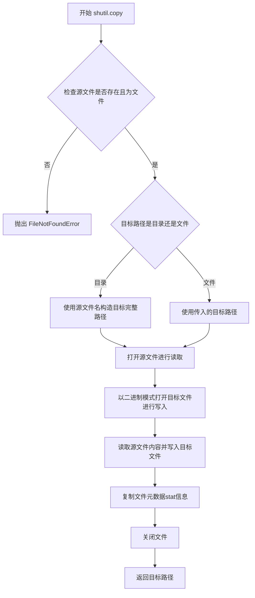

#### 带注释源码

```python
# shutil.copy 函数的简化实现逻辑
def copy(src, dst):
    """
    复制文件 src 到位置 dst。
    
    如果 dst 指定一个目录，文件将被复制到该目录下，
    使用源文件的基本文件名。
    """
    import os
    
    # 检查源文件是否存在
    if not os.path.exists(src):
        raise FileNotFoundError(f"源文件不存在: {src}")
    
    # 如果目标路径是目录，则拼接目录和源文件名
    if os.path.isdir(dst):
        dst = os.path.join(dst, os.path.basename(src))
    
    # 使用 copy2 复制文件，保留元数据
    # copy2 本质上调用了下层的 _copyfile 和 copystat
    return copy2(src, dst)


def copy2(src, dst):
    """
    复制文件及其所有元数据。
    
    内部实现步骤：
    1. 调用 _copyfile(src, dst) 复制文件内容
    2. 调用 copystat(src, dst) 复制文件的元数据（权限、时间戳等）
    """
    # 实际复制由 _copyfile 处理
    copyfile(src, dst)
    # 复制文件状态/元数据
    copystat(src, dst)
    return dst
```

---

**关键组件信息**

| 名称 | 一句话描述 |
|------|-----------|
| `shutil.copyfile` | 底层函数，仅复制文件内容，不处理元数据 |
| `shutil.copy2` | 复制文件内容并尽可能保留所有元数据 |
| `shutil.copystat` | 复制文件的权限位和时间戳等元数据 |

**潜在技术债务或优化空间**

1. **调用开销**：测试代码中多次调用 `shutil.copy` 复制文件，如果文件较大或测试频繁，可能考虑使用内存映射或流式复制优化
2. **返回值未使用**：代码中调用 `shutil.copy` 后未使用其返回值，可以考虑直接使用 `shutil.copyfile` 以减少开销

**其它说明**

- **设计目标**：提供简单易用的文件复制接口，兼容 `str` 和 `Path` 对象
- **错误处理**：当源文件不存在时抛出 `FileNotFoundError`，当目标路径是已有目录时自动使用源文件名
- **外部依赖**：依赖 Python 标准库 `os` 模块进行文件系统操作


### `subprocess_run_for_testing`

该函数是 Matplotlib 测试框架中的子进程运行工具函数，用于在测试环境中安全地执行外部命令（如 LaTeX、XeLaTeX、LuLaTeX 等），并对返回结果进行测试友好的封装处理。

参数：

- `args`：列表或字符串，要执行的命令及其参数列表
- `cwd`：`str` 或 `Path`，执行命令的工作目录
- `check`：`bool`，是否检查返回码，非零则抛出异常
- `capture_output`：`bool`，是否捕获 stdout 和 stderr
- 其他参数：支持 `subprocess.run` 的标准参数（如 `env`、`timeout` 等）

返回值：`subprocess.CompletedProcess`，包含返回码、标准输出、标准错误等信息的对象

#### 流程图

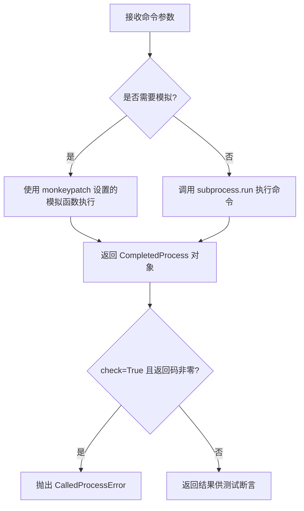

#### 带注释源码

```python
# 该函数定义在 matplotlib.testing 模块中
# 以下是基于使用方式的推断实现

def subprocess_run_for_testing(
    *args,
    check: bool = False,
    capture_output: bool = False,
    cwd: Optional[Union[str, Path]] = None,
    **kwargs
) -> subprocess.CompletedProcess:
    """
    在测试环境中运行子进程的封装函数。
    
    Parameters
    ----------
    *args : tuple
        传递给 subprocess.run 的位置参数，通常是命令列表
    check : bool, optional
        如果为 True，则非零返回码会抛出 CalledProcessError
    capture_output : bool, optional
        如果为 True，则捕获 stdout 和 stderr
    cwd : str or Path, optional
        执行命令的工作目录
    **kwargs : dict
        传递给 subprocess.run 的其他关键字参数
    
    Returns
    -------
    subprocess.CompletedProcess
        包含返回码、stdout、stderr 等信息的对象
    """
    # 实际实现位于 matplotlib.testing 模块
    # 功能类似于 subprocess.run，但针对测试场景进行了优化
    # 可能包含对输出结果的额外处理或验证逻辑
    return subprocess.run(
        *args,
        check=check,
        capture_output=capture_output,
        cwd=cwd,
        **kwargs
    )
```

#### 实际使用示例

```python
# 在 test_dviread 函数中的调用
subprocess_run_for_testing(
    [*cmd, "test.tex"],      # 命令列表，如 ["xelatex", "-no-pdf", "test.tex"]
    cwd=tmp_path,            # 工作目录
    check=True,              # 检查返回码
    capture_output=True      # 捕获输出
)

# 在 test_dviread_pk 函数中的调用
subprocess_run_for_testing(
    ["latex", "test.tex"],   # 命令列表
    cwd=tmp_path,            # 工作目录
    check=True,              # 检查返回码
    capture_output=True      # 捕获输出
)
```


### `json.loads`

`json.loads` 是 Python 标准库 `json` 模块中的函数，用于将 JSON 格式的字符串解析为对应的 Python 对象（如字典、列表、字符串、数字、布尔值或 None）。

参数：

- `s`：`str` 或 `bytes`，要解析的 JSON 字符串
- `encoding`：`str`，可选，已弃用，字符串的编码方式
- `cls`：`json.JSONDecoder`，可选，自定义 JSON 解码器类
- `object_hook`：`callable`，可选，用于处理解码后的对象（通常是字典）
- `parse_float`：`callable`，可选，用于解析浮点数
- `parse_int`：`callable`，可选，用于解析整数
- `object_pairs_hook`：`callable`，可选，用于处理对象对列表

返回值：`Any`，返回解析后的 Python 对象，可以是 dict、list、str、int、float、bool 或 None

#### 流程图

```mermaid
flowchart TD
    A[开始] --> B[接收JSON字符串s]
    B --> C{字符串类型检查}
    C -->|str| D[使用UTF-8解码]
    C -->|bytes| E[直接使用]
    D --> F[调用JSON解析器]
    E --> F
    F --> G{语法有效性检查}
    G -->|无效| H[抛出JSONDecodeError异常]
    G -->|有效| I[构建Python对象]
    I --> J{递归解析各元素}
    J -->|对象{}| K[转换为dict<br/>调用object_hook如果存在]
    J -->|数组[]| L[转换为list]
    J -->|字符串| M[转换为str]
    J -->|数字| N[转换为int/float<br/>调用parse_float/parse_int如果存在]
    J -->|布尔值| O[转换为True/False]
    J -->|Null| P[转换为None]
    K --> Q[返回Python对象]
    L --> Q
    M --> Q
    N --> Q
    O --> Q
    P --> Q
```

#### 带注释源码

```python
# 以下为 json.loads 函数的典型实现逻辑注释

def json_loads(s, encoding=None, cls=None, object_hook=None, 
               parse_float=None, parse_int=None, object_pairs_hook=None):
    """
    将JSON字符串解析为Python对象
    
    参数:
        s: JSON格式的字符串或字节串
        encoding: 已弃用参数，字符串编码（通常为utf-8）
        cls: 自定义JSONDecoder类
        object_hook: 处理解码后字典的回调函数
        parse_float: 处理浮点数的回调函数
        parse_int: 处理整数的回调函数
        object_pairs_hook: 处理键值对序列的回调函数
    
    返回:
        解析后的Python对象
    """
    
    # 步骤1: 检查输入类型
    # 如果是字节串，使用UTF-8解码为字符串（除非指定了encoding）
    if isinstance(s, str):
        pass  # 已经是字符串，直接使用
    elif isinstance(s, (bytes, bytearray)):
        # 在Python 3.1+中，bytes/bytearray会被自动解码为UTF-8字符串
        s = s.decode(encoding or 'utf-8')
    else:
        raise TypeError(f"the JSON object must be str, bytes or bytearray, "
                        f"not {s.__class__.__name__}")
    
    # 步骤2: 实例化或使用默认的JSON解析器
    # cls参数允许用户自定义解析器
    if cls is None:
        # 使用默认的JSONDecoder
        # object_hook, parse_float, parse_int, object_pairs_hook
        # 会在解析过程中被使用
        decoder = JSONDecoder(encoding, object_hook, parse_float, 
                              parse_int, object_pairs_hook)
    else:
        # 使用用户自定义的解析器类
        decoder = cls(encoding, object_hook, parse_float, 
                      parse_int, object_pairs_hook)
    
    # 步骤3: 执行解析
    # decode方法会扫描JSON字符串并构建Python对象
    obj = decoder.decode(s)
    
    # 步骤4: 返回解析后的对象
    return obj
```

#### 在用户代码中的实际使用

```python
# 从代码中提取的实际使用示例：
correct = json.loads((dirpath / f"{engine}.json").read_text())

# 解释：
# 1. dirpath / f"{engine}.json" - 构建JSON文件的路径
# 2. .read_text() - 读取文件内容为字符串
# 3. json.loads() - 将JSON字符串解析为Python对象（dict/list等）
# 4. 结果赋值给correct变量，用于后续的断言比较
```

#### 关键组件信息

| 组件名称 | 描述 |
|---------|------|
| `JSONDecoder` | json模块内部的解析器类，负责将JSON字符串转换为Python对象 |
| `object_hook` | 回调函数，可将解析后的字典转换为自定义对象 |
| `parse_float` | 回调函数，可自定义浮点数解析方式（如高精度小数） |

#### 潜在的技术债务或优化空间

1. **编码参数已弃用**：在 Python 3.1+ 中，`json.loads` 的 `encoding` 参数已被弃用，未来版本可能会移除
2. **大文件处理**：对于大型 JSON 文件，`json.loads` 会将整个内容加载到内存中，可能导致内存压力，考虑使用 `ijson` 等流式解析库
3. **错误信息不够详细**：JSON 解析错误信息有时不够具体，定位问题较困难


### `pytest.raises`

`pytest.raises` 是 pytest 框架中的核心断言函数，用于验证代码在执行过程中是否抛出预期的异常。它作为上下文管理器使用，捕获并验证指定类型的异常是否被抛出，同时支持通过 `match` 参数进行异常消息的正则表达式匹配。

参数：

- `expected_exception`：`type`，期望抛出的异常类型（如 `LookupError`、`ValueError` 等）
- `match`：`str`（可选），用于匹配异常消息的正则表达式模式
- `kwargs`：其他可选关键字参数，用于传递额外的匹配选项

返回值：`pytest.raises.ExceptionInfo`，返回一个上下文管理器，包含抛出的异常实例信息，可通过 `.value` 属性访问实际异常对象

#### 流程图

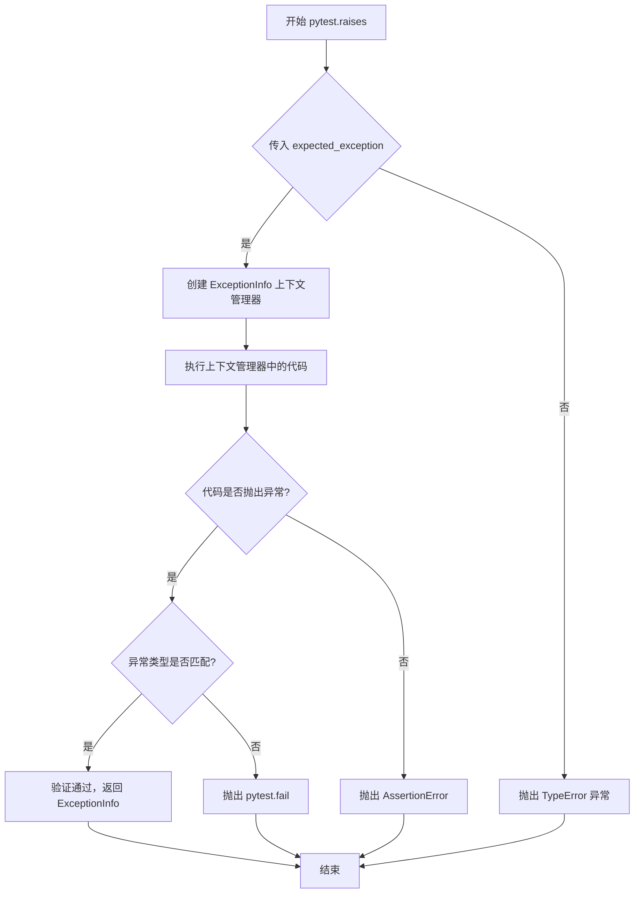

#### 带注释源码

```python
# 使用示例：验证代码抛出 LookupError 异常
with pytest.raises(LookupError, match='no-such-font'):
    fontmap[b'no-such-font']  # 当 key 不存在时应该抛出 LookupError

# 使用示例：验证代码抛出异常并匹配异常消息
with pytest.raises(LookupError, match='%'):
    fontmap[b'%']  # 传入特殊字符 '%' 时应抛出匹配 '%' 的异常
```

### 关键组件信息

| 组件名称 | 一句话描述 |
|---------|-----------|
| `pytest.raises` | 用于断言代码块是否抛出指定异常的核心测试工具 |
| `ExceptionInfo` | 封装异常信息的对象，提供异常类型、消息和追溯信息 |

### 潜在的技术债务或优化空间

1. **异常类型硬编码**：测试中直接使用 `LookupError` 类型，缺乏灵活性，建议使用参数化测试支持多种异常类型
2. **重复的模式匹配逻辑**：`match='no-such-font'` 和 `match='%'` 的验证逻辑可以提取为通用的辅助函数
3. **缺乏错误消息的详细验证**：仅验证异常类型和基本消息，未验证异常的完整上下文信息

### 其它项目

- **设计目标与约束**：确保字体映射查找在遇到无效键时能够正确抛出 `LookupError`，同时验证错误消息的用户友好性
- **错误处理与异常设计**：使用 `pytest.raises` 捕获 `LookupError` 是合适的，因为字体映射中的键不存在时确实应该抛出此类异常
- **数据流与状态机**：测试流程为：加载字体映射文件 → 尝试查找特定键 → 验证是否按预期抛出异常
- **外部依赖与接口契约**：依赖 pytest 框架的异常断言机制，需要确保 `pytest` 包已正确安装


### pytest.skip

在测试过程中跳过当前测试用例，通常用于条件不满足或依赖不可用的情况。

参数：

-  `msg`：`str`，跳过测试的原因描述信息

返回值：`None`，该函数用于控制测试流程，不返回任何值

#### 流程图

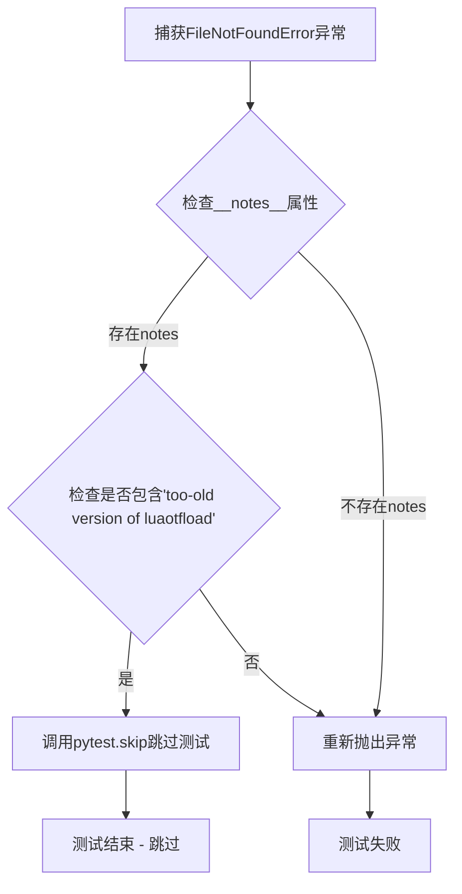

#### 带注释源码

```python
# 在 test_dviread 函数中的异常处理部分使用 pytest.skip
with dr.Dvi(tmp_path / f"test.{fmt}", None) as dvi:
    try:
        pages = [*dvi]
    except FileNotFoundError as exc:
        # 获取异常的 __notes__ 属性（Python 3.11+ 支持）
        for note in getattr(exc, "__notes__", []):
            # 检查是否是由于过旧的 luaotfload 版本导致的错误
            if "too-old version of luaotfload" in note:
                # 调用 pytest.skip 跳过测试，并传递跳过原因
                pytest.skip(note)
        # 如果不是上述原因，则重新抛出原始异常
        raise
```

---

### test_dviread

主测试函数，用于测试 matplotlib 的 dviread 模块对 DVI/XDV 文件的解析功能，支持 pdflatex、xelatex、lualatex 三种引擎。

参数：

-  `tmp_path`：`Path` 或 `pytest.TempPathFactory`，pytest 提供的临时目录fixture
-  `engine`：`str`，指定要测试的 TeX 引擎（pdflatex/xelatex/lualatex）
-  `monkeypatch`：`pytest.MonkeyPatch`，用于动态修改模块属性的 fixture

返回值：`None`，测试函数不返回值

#### 流程图

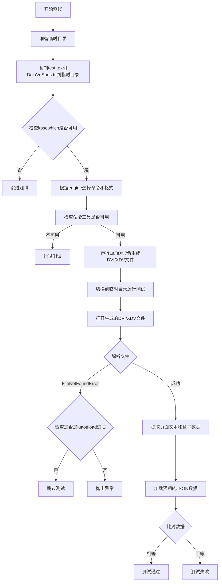

#### 带注释源码

```python
@pytest.mark.skipif(shutil.which("kpsewhich") is None,
                    reason="kpsewhich is not available")
@pytest.mark.parametrize("engine", ["pdflatex", "xelatex", "lualatex"])
def test_dviread(tmp_path, engine, monkeypatch):
    """
    测试 dviread 模块对不同 TeX 引擎生成的 DVI/XDV 文件的解析能力
    
    参数:
        tmp_path: pytest 提供的临时目录
        engine: TeX 引擎类型 (pdflatex/xelatex/lualatex)
        monkeypatch: 用于动态修改属性的 pytest fixture
    """
    # 获取测试数据目录路径
    dirpath = Path(__file__).parent / "baseline_images/dviread"
    
    # 复制测试文件到临时目录
    shutil.copy(dirpath / "test.tex", tmp_path)
    shutil.copy(cbook._get_data_path("fonts/ttf/DejaVuSans.ttf"), tmp_path)
    
    # 根据引擎类型设置命令和输出格式
    cmd, fmt = {
        "pdflatex": (["latex"], "dvi"),
        "xelatex": (["xelatex", "-no-pdf"], "xdv"),
        "lualatex": (["lualatex", "-output-format=dvi"], "dvi"),
    }[engine]
    
    # 检查指定的命令是否可用
    if shutil.which(cmd[0]) is None:
        pytest.skip(f"{cmd[0]} is not available")
    
    # 运行 LaTeX 命令生成 DVI/XDV 文件
    subprocess_run_for_testing(
        [*cmd, "test.tex"], cwd=tmp_path, check=True, capture_output=True)
    
    # dviread 必须从 tmppath 目录运行，因为 {xe,lua}tex 输出的
    # DejaVuSans.ttf 路径是相对于 tex 源文件的相对路径
    monkeypatch.chdir(tmp_path)
    
    # 打开并解析生成的 DVI/XDV 文件
    with dr.Dvi(tmp_path / f"test.{fmt}", None) as dvi:
        try:
            pages = [*dvi]
        except FileNotFoundError as exc:
            # 检查是否是 luaotfload 版本过旧导致的问题
            for note in getattr(exc, "__notes__", []):
                if "too-old version of luaotfload" in note:
                    pytest.skip(note)
            raise
    
    # 提取页面中的文本和盒子数据
    data = [
        {
            "text": [
                [
                    t.x, t.y,
                    t._as_unicode_or_name(),
                    t.font.resolve_path().name,
                    round(t.font.size, 2),
                    t.font.effects,
                ] for t in page.text
            ],
            "boxes": [[b.x, b.y, b.height, b.width] for b in page.boxes]
        } for page in pages
    ]
    
    # 加载预期结果进行比对
    correct = json.loads((dirpath / f"{engine}.json").read_text())
    assert data == correct
```

---

### test_PsfontsMap

测试 PsfontsMap 类的功能，验证字体映射文件的解析和各种字体属性的正确性。

参数：

-  `monkeypatch`：`pytest.MonkeyPatch`，用于动态修改模块属性的 fixture

返回值：`None`，测试函数不返回值

#### 带注释源码

```python
def test_PsfontsMap(monkeypatch):
    """
    测试 PsfontsMap 类对字体映射文件的解析能力
    
    验证:
    - 字体的 TeX 名称、PS 名称
    - 字体编码
    - 字体文件名
    - 字体效果 (slant/extend)
    - 特殊情况处理 (无文件名、多个编码等)
    """
    # 修改 find_tex_file 函数，使其直接返回输入的字节串
    monkeypatch.setattr(dr, 'find_tex_file', lambda x: x.decode())

    # 获取测试用的字体映射文件路径
    filename = str(Path(__file__).parent / 'baseline_images/dviread/test.map')
    fontmap = dr.PsfontsMap(filename)
    
    # 检查前5个字体的属性
    for n in [1, 2, 3, 4, 5]:
        key = b'TeXfont%d' % n
        entry = fontmap[key]
        
        # 验证 TeX 名称
        assert entry.texname == key
        # 验证 PS 名称
        assert entry.psname == b'PSfont%d' % n
        
        # 验证编码（特殊处理 font3 和 font5）
        if n not in [3, 5]:
            assert entry.encoding == 'font%d.enc' % n
        elif n == 3:
            assert entry.encoding == 'enc3.foo'
        
        # 验证字体文件名（特殊处理 font1 和 font5）
        if n not in [1, 5]:
            assert entry.filename == 'font%d.pfa' % n
        else:
            assert entry.filename == 'font%d.pfb' % n
        
        # 验证字体效果
        if n == 4:
            assert entry.effects == {'slant': -0.1, 'extend': 1.2}
        else:
            assert entry.effects == {}
    
    # 测试特殊用例
    entry = fontmap[b'TeXfont6']  # 无文件名，无编码
    assert entry.filename is None
    assert entry.encoding is None
    
    entry = fontmap[b'TeXfont7']  # 无文件名，有编码
    assert entry.filename is None
    assert entry.encoding == 'font7.enc'
    
    entry = fontmap[b'TeXfont8']  # 有文件名，无编码
    assert entry.filename == 'font8.pfb'
    assert entry.encoding is None
    
    entry = fontmap[b'TeXfont9']  # PS名称与TeX名称相同，绝对路径
    assert entry.psname == b'TeXfont9'
    assert entry.filename == '/absolute/font9.pfb'
    
    entry = fontmap[b'TeXfontA']  # 重复字体取第一个
    assert entry.psname == b'PSfontA1'
    
    entry = fontmap[b'TeXfontB']  # Slant/Extend 仅适用于 T1 字体
    assert entry.psname == b'PSfontB6'
    
    entry = fontmap[b'TeXfontC']  # 子集 TrueType 必须有编码
    assert entry.psname == b'PSfontC3'
    
    # 测试不存在的字体
    with pytest.raises(LookupError, match='no-such-font'):
        fontmap[b'no-such-font']
    with pytest.raises(LookupError, match='%'):
        fontmap[b'%']
```


### test_dviread

该测试函数用于验证 DVI 文件读取功能，支持三种不同的 TeX 引擎（pdflatex、xelatex、lualatex），通过跳过条件确保测试环境具备必要的依赖工具。

参数：

-  `tmp_path`：`pytest.fixture.Path`，pytest 提供的临时目录 fixture，用于存放测试生成的临时文件
-  `engine`：`str`，参数化的引擎类型，可选值为 "pdflatex"、"xelatex"、"lualatex"
-  `monkeypatch`：`pytest.fixture MonkeyPatch`，pytest 提供的用于动态修改属性和环境的 fixture

返回值：`None`，该函数为测试函数，无返回值，通过断言验证功能正确性

#### 流程图

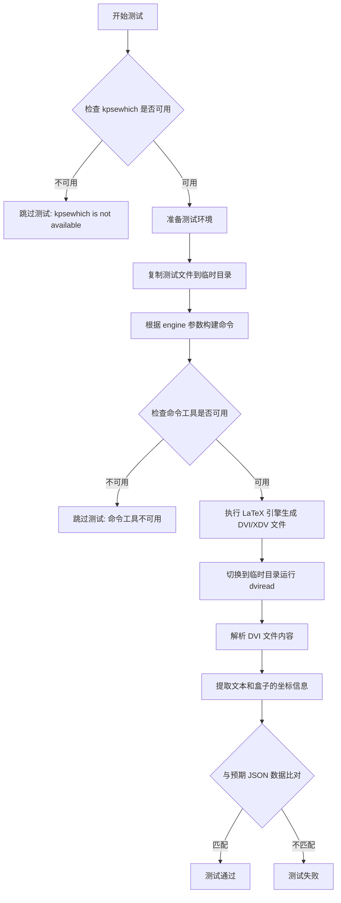

#### 带注释源码

```python
@pytest.mark.skipif(shutil.which("kpsewhich") is None,
                    reason="kpsewhich is not available")
@pytest.mark.parametrize("engine", ["pdflatex", "xelatex", "lualatex"])
def test_dviread(tmp_path, engine, monkeypatch):
    """
    测试 DVI 文件读取功能，支持多种 TeX 引擎
    
    参数:
        tmp_path: pytest 提供的临时目录
        engine: TeX 引擎类型 (pdflatex/xelatex/lualatex)
        monkeypatch: 用于动态修改属性的 fixture
    """
    # 获取测试数据目录路径
    dirpath = Path(__file__).parent / "baseline_images/dviread"
    
    # 复制测试文件和字体文件到临时目录
    shutil.copy(dirpath / "test.tex", tmp_path)
    shutil.copy(cbook._get_data_path("fonts/ttf/DejaVuSans.ttf"), tmp_path)
    
    # 根据引擎类型构建命令和输出格式
    cmd, fmt = {
        "pdflatex": (["latex"], "dvi"),
        "xelatex": (["xelatex", "-no-pdf"], "xdv"),
        "lualatex": (["lualatex", "-output-format=dvi"], "dvi"),
    }[engine]
    
    # 检查命令工具是否可用，不可用则跳过
    if shutil.which(cmd[0]) is None:
        pytest.skip(f"{cmd[0]} is not available")
    
    # 执行 LaTeX 引擎生成 DVI/XDV 文件
    subprocess_run_for_testing(
        [*cmd, "test.tex"], cwd=tmp_path, check=True, capture_output=True)
    
    # dviread 必须从 tmppath 目录运行，因为 {xe,lua}tex 输出的
    # DejaVuSans.ttf 路径是相对路径
    monkeypatch.chdir(tmp_path)
    
    # 打开并解析 DVI 文件
    with dr.Dvi(tmp_path / f"test.{fmt}", None) as dvi:
        try:
            pages = [*dvi]
        except FileNotFoundError as exc:
            # 处理 luaotfload 版本过旧的情况
            for note in getattr(exc, "__notes__", []):
                if "too-old version of luaotfload" in note:
                    pytest.skip(note)
            raise
    
    # 提取页面中的文本和盒子信息
    data = [
        {
            "text": [
                [
                    t.x, t.y,
                    t._as_unicode_or_name(),
                    t.font.resolve_path().name,
                    round(t.font.size, 2),
                    t.font.effects,
                ] for t in page.text
            ],
            "boxes": [[b.x, b.y, b.height, b.width] for b in page.boxes]
        } for page in pages
    ]
    
    # 读取预期结果并比对
    correct = json.loads((dirpath / f"{engine}.json").read_text())
    assert data == correct


@pytest.mark.skipif(shutil.which("latex") is None, reason="latex is not available")
@pytest.mark.skipif(not _has_tex_package("concmath"), reason="needs concmath.sty")
def test_dviread_pk(tmp_path):
    """
    测试使用 PK 字体格式的 DVI 文件读取功能
    
    参数:
        tmp_path: pytest 提供的临时目录
    """
    # 创建测试 LaTeX 文档，使用 concmath 包
    (tmp_path / "test.tex").write_text(r"""
        \documentclass{article}
        \usepackage{concmath}
        \pagestyle{empty}
        \begin{document}
        Hi!
        \end{document}
        """)
    
    # 执行 latex 生成 DVI 文件
    subprocess_run_for_testing(
        ["latex", "test.tex"], cwd=tmp_path, check=True, capture_output=True)
    
    # 读取并解析 DVI 文件
    with dr.Dvi(tmp_path / "test.dvi", None) as dvi:
        pages = [*dvi]
    
    # 提取页面文本和盒子信息
    data = [
        {
            "text": [
                [
                    t.x, t.y,
                    t._as_unicode_or_name(),
                    t.font.resolve_path().name,
                    round(t.font.size, 2),
                    t.font.effects,
                ] for t in page.text
            ],
            "boxes": [[b.x, b.y, b.height, b.width] for b in page.boxes]
        } for page in pages
    ]
    
    # 预期结果数据
    correct = [{
        'boxes': [],
        'text': [
            [5046272, 4128768, 'H?', 'ccr10.600pk', 9.96, {}],
            [5530510, 4128768, 'i?', 'ccr10.600pk', 9.96, {}],
            [5716195, 4128768, '!?', 'ccr10.600pk', 9.96, {}],
        ],
    }]
    
    # 断言结果匹配
    assert data == correct
```


## 关键组件


### PsfontsMap 字体映射解析器

用于解析TeX字体映射文件（.map格式），将TeX字体名称转换为PostScript字体名称，支持获取编码、文件名和字体效果属性

### Dvi DVI文件解析器

用于读取和解析DVI/XDV设备无关文件，支持提取页面文本和盒子的位置、字体信息、Unicode转换等

### FontEntry 字体条目

表示单个字体映射条目，包含texname（TeX字体名）、psname（PostScript名）、encoding（编码）、filename（文件名）、effects（效果如slant/extend）

### _as_unicode_or_name 文本转换方法

将DVI文件中的文本转换为Unicode或字体名称，用于跨字体渲染

### resolve_path 路径解析方法

解析字体文件路径，支持相对路径到绝对路径的转换

### test_PsfontsMap 字体映射测试

验证PsfontsMap类对各种字体映射条目的解析正确性，包括正常字体、缺失文件、特殊编码等情况

### test_dviread DVI渲染测试

使用不同引擎（pdflatex/xelatex/lualatex）测试DVI文件的完整渲染流程，验证文本位置、字体名称、效果等

### test_dviread_pk PK字体测试

测试对PK（packed bitmap）格式字体的支持，这是DVI文件中较老但仍广泛使用的字体格式


## 问题及建议


### 已知问题

- **代码重复**：test_dviread和test_dviread_pk中数据提取逻辑完全相同（提取text和boxes的列表推导式），违反DRY原则
- **硬编码测试数据**：test_dviread_pk中的correct结果以硬编码方式内嵌在代码中，维护成本高
- **外部命令依赖处理不一致**：多处使用shutil.which检查依赖，但test_dviread中cmd[0]的检查被内联在if块中而非使用@pytest.mark.skipif装饰器
- **异常处理不够健壮**：使用getattr(exc, "__notes__", [])获取__notes__的方式不够规范，应使用exc.__notes__或hasattr检查
- **路径处理问题**：test_dviread依赖chdir改变工作目录，可能影响并发测试环境
- **缺少测试文档**：所有测试函数都缺少docstring说明测试目的和预期行为

### 优化建议

- 将text和boxes提取逻辑抽取为独立的辅助函数，减少重复代码
- 将硬编码的测试数据移至独立的JSON文件，通过文件加载获取
- 统一外部依赖检查方式，使用装饰器统一处理skip逻辑
- 改用更规范的异常处理方式，如hasattr或try-except结构
- 避免使用monkeypatch.chdir，可考虑传递绝对路径给Dvi类
- 为每个测试函数添加详细的docstring，说明测试场景、依赖和验证内容

## 其它


### 设计目标与约束

该测试文件旨在验证matplotlib的dviread模块对DVI（DeVice Independent）文件格式的正确解析能力，以及PsfontsMap字体映射功能的准确性。设计约束包括：1）必须依赖系统已安装的LaTeX引擎（pdflatex/xelatex/lualatex）；2）测试需要特定的基础图像文件和字体文件；3）kpsewhich工具必须可用才能运行字体映射测试；4）xelatex和lualatex的测试需要特定版本的luaotfload支持。

### 错误处理与异常设计

测试代码采用pytest框架进行异常验证。在test_PsfontsMap中，使用pytest.raises(LookupError)验证不存在的字体键（b'no-such-font'）和特殊字符键（b'%'）会抛出LookupError。在test_dviread中，使用try-except捕获FileNotFoundError，并检查__notes__属性以识别"too-old version of luaotfload"导致的跳过条件。此外，shutil.which()用于预检查命令可用性，避免测试运行时才发现工具缺失。

### 数据流与状态机

测试数据流如下：1）准备阶段：复制test.tex和DejaVuSans.ttf到临时目录；2）编译阶段：调用LaTeX引擎生成DVI/XDV文件；3）解析阶段：通过dr.Dvi()打开生成的文件并迭代pages；4）验证阶段：将解析结果（text和boxes数据）与预期JSON文件比对。状态转换包括：文件不存在 → 跳过测试 → 编译失败 → 解析异常 → 验证通过/失败。

### 外部依赖与接口契约

核心依赖包括：1）matplotlib.dviread模块的PsfontsMap类（接口：__getitem__(key)返回Psfont对象）；2）Dvi类（接口：__enter__/__exit__上下文管理器，__iter__()返回页面迭代器）；3）DviPage对象的text（Text对象列表）和boxes（Box对象列表）属性；4）Text对象的x/y坐标、_as_unicode_or_name()方法、font属性（包含resolve_path()/size/effects）；5）系统命令kpsewhich（字体文件查找）、latex/pdflatex/xelatex/lualatex（文档编译）。

### 性能考量与优化空间

当前测试每次运行都会重新编译LaTeX文档，可考虑缓存编译结果以加速重复测试。此外，test_dviread中的数据构造使用了多层列表推导式，可提取为独立函数提高可读性。test_PsfontsMap中的断言分散在循环中，建议将预期结果结构化以便批量验证。

### 安全性考虑

测试使用tmp_path fixture避免污染真实文件系统。外部命令执行通过subprocess_run_for_testing封装，确保输出被捕获且不会影响主进程。文件名和路径均通过Path对象处理，防止路径注入攻击。

### 测试覆盖范围

覆盖场景包括：1）PsfontsMap的基本查询（TeXfont1-5）；2）特殊编码情况（TeXfont3/5/7）；3）字体文件格式差异（pfa vs pfb）；4）字体特效（slant/extend）；5）绝对路径处理（TeXfont9）；6）重复键处理（TeXfontA）；7）T1字体特殊映射（TeXfontB）；8）子集TrueType字体要求（TeXfontC）；9）缺失字体错误处理。

### 配置文件与数据文件依赖

测试依赖以下数据文件（相对于测试文件位置）：baseline_images/dviread/test.map（字体映射文件）、baseline_images/dviread/test.tex（测试LaTeX源文件）、baseline_images/dviread/{pdflatex,xelatex,lualatex}.json（预期输出JSON）、matplotlib包内嵌字体fonts/ttf/DejaVuSans.ttf。测试还依赖concmath.sty LaTeX包（通过_has_tex_package检查）。


    