# `matplotlib\lib\matplotlib\tests\test_figure.py` 详细设计文档

这是一个Matplotlib测试文件，主要测试Figure相关的各种功能，包括子图布局、对齐标签、标题、图例、保存图像、子图（subfigure）、布局引擎（tight和constrained）、颜色条等核心功能。

## 整体流程

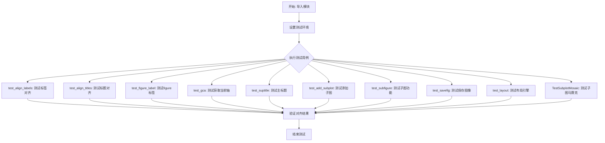

## 类结构

```
测试模块 (test_figure.py)
├── 测试函数 (独立测试)
│   ├── test_align_labels
│   ├── test_align_titles
│   ├── test_figure_label
│   ├── test_gca
│   ├── test_suptitle
│   ├── test_add_subplot_*
│   ├── test_savefig_*
│   ├── test_subfigure_*
│   └── ... (共约80+个测试函数)
└── 测试类
    └── TestSubplotMosaic (包含约20个测试方法)
```

## 全局变量及字段


### `copy`
    
Python标准库，用于对象深浅拷贝

类型：`module`
    


### `datetime`
    
Python标准库datetime模块中的日期时间类

类型：`class`
    


### `io`
    
Python标准库，用于处理流式输入输出

类型：`module`
    


### `pickle`
    
Python标准库，用于对象序列化和反序列化

类型：`module`
    


### `platform`
    
Python标准库，用于获取平台信息

类型：`module`
    


### `warnings`
    
Python标准库，用于警告控制

类型：`module`
    


### `pytest`
    
Python测试框架，用于单元测试和测试装饰器

类型：`module`
    


### `Timer`
    
Python threading模块中的定时器类，用于延迟执行函数

类型：`class`
    


### `SimpleNamespace`
    
Python types模块中的简单命名空间类

类型：`class`
    


### `np`
    
NumPy库，用于科学计算和多维数组操作

类型：`module`
    


### `Image`
    
PIL/Pillow库中的图像处理类

类型：`class`
    


### `mpl`
    
Matplotlib主库，提供绘图基础功能和配置

类型：`module`
    


### `plt`
    
Matplotlib pyplot子模块，提供MATLAB风格的绘图接口

类型：`module`
    


### `gridspec`
    
Matplotlib子模块，用于创建复杂网格布局

类型：`module`
    


### `mdates`
    
Matplotlib子模块，用于日期刻度处理和格式化

类型：`module`
    


### `KeyEvent`
    
Matplotlib后端事件类，表示键盘按键事件

类型：`class`
    


### `MouseEvent`
    
Matplotlib后端事件类，表示鼠标事件

类型：`class`
    


### `Figure`
    
Matplotlib图形类，表示整个图形窗口或画布

类型：`class`
    


### `FigureBase`
    
Matplotlib图形基类，Figure类的抽象基类

类型：`class`
    


### `ConstrainedLayoutEngine`
    
Matplotlib布局引擎，实现约束布局算法

类型：`class`
    


### `TightLayoutEngine`
    
Matplotlib布局引擎，实现紧凑布局算法

类型：`class`
    


### `PlaceHolderLayoutEngine`
    
Matplotlib布局引擎，空占位布局管理器

类型：`class`
    


### `AutoMinorLocator`
    
Matplotlib刻度定位器，自动计算次刻度位置

类型：`class`
    


### `FixedFormatter`
    
Matplotlib刻度格式化器，使用固定字符串格式化刻度标签

类型：`class`
    


### `ScalarFormatter`
    
Matplotlib刻度格式化器，默认的数值标量格式化器

类型：`class`
    


    

## 全局函数及方法


### test_align_labels

该测试函数用于验证 Figure 对象的 `align_labels()` 方法能否正确对齐 figure 中所有子图的 x 轴和 y 轴标签。测试通过创建一个具有多个子图的复杂布局，模拟实际使用场景中的标签对齐需求，并使用图像比较来验证对齐效果。

参数： 无

返回值： 无

#### 流程图

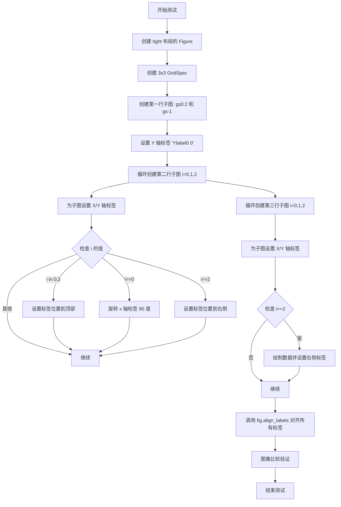

#### 带注释源码

```python
# 使用 image_comparison 装饰器进行图像比较测试
# 期望的基准图像文件名: 'figure_align_labels' (png 和 svg 格式)
# 容差: x86_64 平台为 0.1，其他平台为 0.1
@image_comparison(['figure_align_labels'], extensions=['png', 'svg'],
                  tol=0.1 if platform.machine() == 'x86_64' else 0.1)
def test_align_labels():
    # 创建一个使用 tight 布局引擎的 Figure 对象
    fig = plt.figure(layout='tight')
    
    # 创建一个 3x3 的 GridSpec 网格规格对象，用于管理子图布局
    gs = gridspec.GridSpec(3, 3)

    # --- 第一行子图 ---
    # 在第一行前两列创建一个子图
    ax = fig.add_subplot(gs[0, :2])
    # 绘制从 0 到 1e6，步长为 1000 的数据
    ax.plot(np.arange(0, 1e6, 1000))
    # 设置 Y 轴标签
    ax.set_ylabel('Ylabel0 0')
    
    # 在第一行最后一列创建另一个子图
    ax = fig.add_subplot(gs[0, -1])
    # 绘制从 0 到 1e4，步长为 100 的数据
    ax.plot(np.arange(0, 1e4, 100))

    # --- 第二行子图 (3 个子图) ---
    for i in range(3):
        # 在第二行的第 i 列创建子图
        ax = fig.add_subplot(gs[1, i])
        # 设置 Y 轴标签
        ax.set_ylabel('YLabel1 %d' % i)
        # 设置 X 轴标签
        ax.set_xlabel('XLabel1 %d' % i)
        
        # 如果 i 在 [0, 2] 中，将 X 轴标签和刻度移到顶部
        if i in [0, 2]:
            ax.xaxis.set_label_position("top")
            ax.xaxis.tick_top()
        
        # 如果 i == 0，旋转 X 轴刻度标签 90 度
        if i == 0:
            for tick in ax.get_xticklabels():
                tick.set_rotation(90)
        
        # 如果 i == 2，将 Y 轴标签和刻度移到右侧
        if i == 2:
            ax.yaxis.set_label_position("right")
            ax.yaxis.tick_right()

    # --- 第三行子图 (3 个子图) ---
    for i in range(3):
        # 在第三行的第 i 列创建子图
        ax = fig.add_subplot(gs[2, i])
        # 设置 X 轴标签
        ax.set_xlabel(f'XLabel2 {i}')
        # 设置 Y 轴标签
        ax.set_ylabel(f'YLabel2 {i}')

        # 如果 i == 2，绘制数据并将 Y 轴标签移到右侧
        if i == 2:
            ax.plot(np.arange(0, 1e4, 10))
            ax.yaxis.set_label_position("right")
            ax.yaxis.tick_right()
            # 旋转 X 轴刻度标签 90 度
            for tick in ax.get_xticklabels():
                tick.set_rotation(90)

    # 调用 Figure 的 align_labels 方法，对齐所有子图的轴标签
    fig.align_labels()
```


### `test_align_titles`

该测试函数用于验证 `Figure.align_titles()` 方法在不同布局引擎（tight 和 constrained）下正确对齐子图标题的功能。测试通过图像比较装饰器 `@image_comparison` 比对生成的图像与基准图像，以检测标题对齐功能是否正常工作。

参数： 无

返回值： 无（测试函数无返回值）

#### 流程图

```mermaid
flowchart TD
    A[开始测试] --> B[遍历布局类型: tight, constrained]
    B --> C[创建1x2子图, 宽度比例2:1]
    C --> D[配置左子图: 绑制数据，设置左中右三个标题]
    D --> E[配置右子图: 绑制数据，设置标题和x轴标签，旋转刻度标签]
    E --> F[调用fig.align_titles对齐所有子图标题]
    F --> G[使用@image_comparison比较生成的图像与基准图像]
    G --> H{图像差异是否在容忍范围内}
    H -->|是| I[测试通过]
    H -->|否| J[测试失败]
```

#### 带注释源码

```python
# TODO: tighten tolerance after baseline image is regenerated for text overhaul
@image_comparison(['figure_align_titles_tight.png',
                   'figure_align_titles_constrained.png'],  # 期望的基准图像文件名
                  tol=0.3 if platform.machine() == 'x86_64' else 0.04,  # 图像比较容差
                  style='mpl20')  # 使用mpl20样式
def test_align_titles():
    """
    测试Figure.align_titles()方法在tight和constrained布局下的功能。
    验证多子图标题能够正确对齐。
    """
    # 遍历两种布局类型进行测试
    for layout in ['tight', 'constrained']:
        # 创建1行2列的子图，宽度比例为2:1
        fig, axs = plt.subplots(1, 2, layout=layout, width_ratios=[2, 1])

        # === 配置左子图 (axs[0]) ===
        ax = axs[0]
        # 绑制数据：范围0到1e6，步长1000
        ax.plot(np.arange(0, 1e6, 1000))
        # 设置三个标题：左对齐、居中、右对齐
        ax.set_title('Title0 left', loc='left')
        ax.set_title('Title0 center', loc='center')
        ax.set_title('Title0 right', loc='right')

        # === 配置右子图 (axs[1]) ===
        ax = axs[1]
        # 绑制数据：范围0到1e4，步长100
        ax.plot(np.arange(0, 1e4, 100))
        # 设置单一标题
        ax.set_title('Title1')
        # 设置X轴标签
        ax.set_xlabel('Xlabel0')
        # 将X轴标签移到顶部
        ax.xaxis.set_label_position("top")
        ax.xaxis.tick_top()
        # 旋转X轴刻度标签90度
        for tick in ax.get_xticklabels():
            tick.set_rotation(90)

        # 调用Figure的align_titles方法对齐所有子图的标题
        fig.align_titles()
```


### `test_align_labels_stray_axes`

该函数是一个测试函数，用于验证在常规布局和constrained_layout布局下，图形的`align_ylabels()`和`align_xlabels()`方法能否正确对齐所有子图的轴标签（处理"离群轴"的情况）。测试创建一个2x2的子图网格，设置xlabel和ylabel，然后调用对齐方法，最后通过检查标签位置来验证对齐是否正确。

参数： 无

返回值：`None`，该函数为测试函数，不返回任何值

#### 流程图

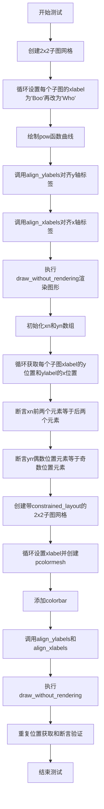

#### 带注释源码

```python
def test_align_labels_stray_axes():
    # 测试常规布局下align_labels的功能
    fig, axs = plt.subplots(2, 2)  # 创建一个2x2的子图网格
    for nn, ax in enumerate(axs.flat):  # 遍历所有子图
        ax.set_xlabel('Boo')  # 第一次设置xlabel
        ax.set_xlabel('Who')  # 第二次设置xlabel（覆盖前一个）
        ax.plot(np.arange(4)**nn, np.arange(4)**nn)  # 绘制幂函数曲线
    
    fig.align_ylabels()  # 对齐所有子图的y轴标签
    fig.align_xlabels()  # 对齐所有子图的x轴标签
    fig.draw_without_rendering()  # 渲染图形但不显示
    
    # 初始化数组存储标签位置
    xn = np.zeros(4)
    yn = np.zeros(4)
    for nn, ax in enumerate(axs.flat):  # 遍历所有子图
        # 获取x轴标签的y位置（用于验证水平对齐）
        yn[nn] = ax.xaxis.label.get_position()[1]
        # 获取y轴标签的x位置（用于验证垂直对齐）
        xn[nn] = ax.yaxis.label.get_position()[0]
    
    # 验证x轴标签位置：前两个和后两个应该对齐
    np.testing.assert_allclose(xn[:2], xn[2:])
    # 验证y轴标签位置：偶数索引和奇数索引应该分别对齐
    np.testing.assert_allclose(yn[::2], yn[1::2])

    # 测试constrained_layout布局下align_labels的功能
    fig, axs = plt.subplots(2, 2, constrained_layout=True)
    for nn, ax in enumerate(axs.flat):
        ax.set_xlabel('Boo')
        ax.set_xlabel('Who')
        pc = ax.pcolormesh(np.random.randn(10, 10))  # 创建伪彩色图
    
    fig.colorbar(pc, ax=ax)  # 添加colorbar
    fig.align_ylabels()  # 对齐y轴标签
    fig.align_xlabels()  # 对齐x轴标签
    fig.draw_without_rendering()  # 渲染图形
    
    # 重复位置验证
    xn = np.zeros(4)
    yn = np.zeros(4)
    for nn, ax in enumerate(axs.flat):
        yn[nn] = ax.xaxis.label.get_position()[1]
        xn[nn] = ax.yaxis.label.get_position()[0]
    
    np.testing.assert_allclose(xn[:2], xn[2:])
    np.testing.assert_allclose(yn[::2], yn[1::2])
```


### `test_figure_label`

该函数用于测试 pyplot 中 figure 的创建、选择和关闭操作，支持通过标签、数字或实例进行管理。

参数： 无

返回值： `None`，该函数为测试函数，不返回任何值

#### 流程图

```mermaid
graph TD
    A[开始] --> B[plt.close('all'): 关闭所有图形]
    B --> C[创建 figure 'today']
    C --> D[创建 figure 编号3]
    D --> E[创建 figure 'tomorrow']
    E --> F[创建匿名 figure]
    F --> G[创建 figure 编号0]
    G --> H[创建 figure 编号1]
    H --> I[再次创建 figure 编号3]
    I --> J[断言图形编号列表为 [0, 1, 3, 4, 5]]
    J --> K[断言图形标签列表为 ['', 'today', '', 'tomorrow', '']]
    K --> L[尝试关闭不存在的图形10]
    L --> M[关闭当前图形]
    M --> N[关闭图形5]
    N --> O[关闭图形 'tomorrow']
    O --> P[断言图形编号列表为 [0, 1]]
    P --> Q[断言图形标签列表为 ['', 'today']]
    Q --> R[通过 figure 实例切换到 fig_today]
    R --> S[断言当前图形等于 fig_today]
    S --> T[结束]
```

#### 带注释源码

```python
def test_figure_label():
    # 测试 pyplot 中 figure 的创建、选择和关闭，支持标签/数字/实例方式
    plt.close('all')  # 清理环境，关闭所有已存在的图形
    
    # 创建带标签 'today' 的图形
    fig_today = plt.figure('today')
    
    # 创建编号为 3 的图形（之前不存在）
    plt.figure(3)
    
    # 创建带标签 'tomorrow' 的图形
    plt.figure('tomorrow')
    
    # 创建匿名图形（自动分配下一个可用编号）
    plt.figure()
    
    # 创建/选择编号为 0 的图形
    plt.figure(0)
    
    # 创建/选择编号为 1 的图形
    plt.figure(1)
    
    # 再次选择编号为 3 的图形（不重复创建）
    plt.figure(3)
    
    # 验证当前存在的图形编号列表
    # 预期：[0, 1, 3, 4, 5] - 0,1,3 是显式创建的，4是'tomorrow'的隐式编号，5是匿名figure
    assert plt.get_fignums() == [0, 1, 3, 4, 5]
    
    # 验证当前存在的图形标签列表（按编号顺序）
    # '' 表示该位置图形没有标签（编号0,4,5）
    # 'today' 是编号1的标签
    # 'tomorrow' 是编号4的标签
    assert plt.get_figlabels() == ['', 'today', '', 'tomorrow', '']
    
    # 尝试关闭不存在的图形10（应该静默处理，不抛出异常）
    plt.close(10)
    
    # 关闭当前活动的图形（如果存在）
    plt.close()
    
    # 关闭图形5（'tomorrow'对应的编号）
    plt.close(5)
    
    # 通过标签关闭图形 'tomorrow'
    plt.close('tomorrow')
    
    # 验证关闭后的图形编号列表 - 仅剩 0 和 1
    assert plt.get_fignums() == [0, 1]
    
    # 验证关闭后的图形标签列表 - 仅剩 '' 和 'today'
    assert plt.get_figlabels() == ['', 'today']
    
    # 通过 figure 实例切换到特定图形
    plt.figure(fig_today)
    
    # 验证当前图形确实是 fig_today
    assert plt.gcf() == fig_today
```


### `test_figure_label_replaced`

该函数用于测试当手动更改已存在图形的 `number` 属性时，是否能正确触发弃用警告并成功更新图形编号。

参数：无

返回值：`None`，该函数为测试函数，不返回任何值。

#### 流程图

```mermaid
flowchart TD
    A[开始测试] --> B[关闭所有已存在的图形: plt.close('all')]
    B --> C[创建图形 fig, 编号为1: plt.figure(1)]
    C --> D[设置 fig.number = 2, 触发弃用警告]
    D --> E{检查是否产生警告}
    E -->|是| F[捕获 MatplotlibDeprecationWarning 警告]
    E -->|否| G[测试失败]
    F --> H[断言 fig.number == 2]
    H --> I{断言是否通过}
    I -->|是| J[测试通过]
    I -->|否| K[测试失败]
```

#### 带注释源码

```python
def test_figure_label_replaced():
    """
    测试 Figure.number 属性被修改时的行为。
    
    该测试验证：
    1. 修改 Figure.number 会触发弃用警告
    2. 警告正确产生
    3. 修改后的值能够正确保存
    """
    # 步骤1: 清理环境，关闭所有已存在的图形
    # 避免测试之间的相互影响
    plt.close('all')
    
    # 步骤2: 创建一个新的图形，指定编号为1
    # 这会创建一个 Figure 实例并注册到 pyplot
    fig = plt.figure(1)
    
    # 步骤3: 尝试修改图形的 number 属性
    # 使用 pytest.warns 捕获预期的弃用警告
    # match 参数指定警告消息中应包含的文本
    with pytest.warns(mpl.MatplotlibDeprecationWarning,
                      match="Changing 'Figure.number' is deprecated"):
        # 直接赋值会触发 MatplotlibDeprecationWarning
        fig.number = 2
    
    # 步骤4: 验证修改已成功应用
    # 虽然有警告，但赋值操作仍然成功
    assert fig.number == 2
```


### `test_figure_no_label`

该函数是一个测试函数，用于验证独立（standalone）Figure 对象的行为，特别是 Figure 的 `number` 属性的创建、设置和查询逻辑。

参数：空（无参数）

返回值：`None`，该函数为测试函数，不返回任何值

#### 流程图

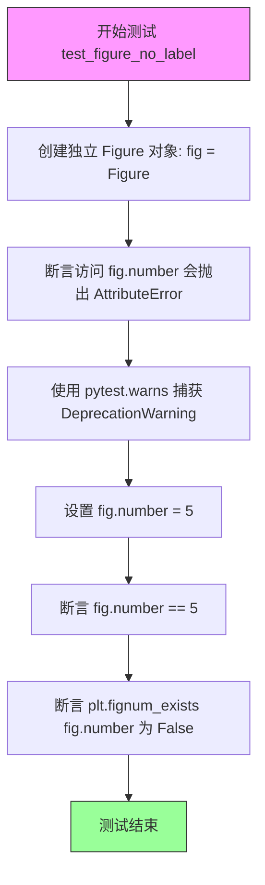

#### 带注释源码

```python
def test_figure_no_label():
    """
    测试独立 Figure 对象的 number 属性行为。
    
    独立创建的 Figure 对象（不通过 pyplot）没有 number 属性，
    但可以手动设置。设置后，该 number 不会注册到 pyplot 的 figure 管理器中。
    """
    # 创建一个独立的 Figure 对象（不通过 pyplot）
    # 独立 figures 最初没有 figure 属性（即 number 未初始化）
    fig = Figure()
    
    # 验证直接访问 fig.number 会抛出 AttributeError
    # 因为独立 Figure 的 number 属性未被设置
    with pytest.raises(AttributeError):
        fig.number
    
    # 可以手动设置 number 属性，但会触发弃用警告
    # 这是因为 Figure.number 属性已被弃用直接修改
    with pytest.warns(mpl.MatplotlibDeprecationWarning,
                      match="Changing 'Figure.number' is deprecated"):
        fig.number = 5
    
    # 验证设置成功后可以读取
    assert fig.number == 5
    
    # 验证虽然可以设置 number，但 pyplot 并不知道这个 figure
    # plt.fignum_exists 用于检查 pyplot 的 figure 管理器中是否存在该 number
    # 独立 Figure 不会注册到 pyplot，所以返回 False
    assert not plt.fignum_exists(fig.number)
```


### `test_fignum_exists`

这是一个测试函数，用于验证 `plt.fignum_exists` 方法在不同场景下（通过字符串标签或数字索引）正确判断图形是否存在。

参数：  
- （无参数）

返回值：`None`，作为测试函数通过断言验证功能，不返回具体值

#### 流程图

```mermaid
flowchart TD
    A[开始测试] --> B[创建标签为'one'的图形]
    B --> C[创建编号为2的图形]
    C --> D[创建标签为'three'的图形]
    D --> E[创建默认图形]
    E --> F{断言: plt.fignum_exists('one') == True}
    F --> G{断言: plt.fignum_exists(2) == True}
    G --> H{断言: plt.fignum_exists('three') == True}
    H --> I{断言: plt.fignum_exists(4) == True}
    I --> J[关闭标签为'one'的图形]
    J --> K[关闭编号为4的图形]
    K --> L{断言: plt.fignum_exists('one') == False}
    L --> M{断言: plt.fignum_exists(4) == False}
    M --> N[测试通过]
```

#### 带注释源码

```python
def test_fignum_exists():
    # pyplot figure creation, selection and closing with fignum_exists
    # 测试场景：创建多个图形，使用不同标识符（字符串标签或数字）验证 fignum_exists 方法
    plt.figure('one')      # 创建标签为 'one' 的图形
    plt.figure(2)           # 创建编号为 2 的图形
    plt.figure('three')     # 创建标签为 'three' 的图形
    plt.figure()            # 创建默认图形（自动分配编号，此处为4）
    
    # 验证所有图形在关闭前均存在
    assert plt.fignum_exists('one')    # 断言：标签为'one'的图形存在
    assert plt.fignum_exists(2)        # 断言：编号为2的图形存在
    assert plt.fignum_exists('three')   # 断言：标签为'three'的图形存在
    assert plt.fignum_exists(4)         # 断言：自动分配的编号4对应的图形存在
    
    # 关闭部分图形
    plt.close('one')    # 关闭标签为'one'的图形
    plt.close(4)        # 关闭编号为4的图形
    
    # 验证关闭后的图形不再存在
    assert not plt.fignum_exists('one')   # 断言：已关闭的'one'图形不存在
    assert not plt.fignum_exists(4)        # 断言：已关闭的编号4图形不存在
```


### `test_clf_keyword`

该测试函数用于验证在使用 `plt.figure()` 和 `plt.subplots()` 时，通过 `num` 和 `clear` 参数控制现有图形的清除行为，确保当 `num` 相同时会复用已有 figure，`clear=False` 时不会清除原有内容，而 `clear=True` 会清除原有内容。

参数：无

返回值：`None`，该函数为测试函数，不返回任何值

#### 流程图

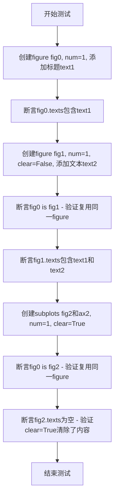

#### 带注释源码

```python
def test_clf_keyword():
    # 测试当使用 figure() 和 subplots() 时，现有图形是否被正确清除
    text1 = 'A fancy plot'  # 第一个文本内容
    text2 = 'Really fancy!'  # 第二个文本内容

    # 步骤1：创建编号为1的图形 fig0，并添加标题
    fig0 = plt.figure(num=1)
    fig0.suptitle(text1)
    # 验证图形 texts 列表中只包含第一个文本
    assert [t.get_text() for t in fig0.texts] == [text1]

    # 步骤2：使用相同编号1创建图形，clear=False 不清除原有内容
    fig1 = plt.figure(num=1, clear=False)
    # 向 fig1 添加文本内容
    fig1.text(0.5, 0.5, text2)
    # 验证 fig0 和 fig1 是同一个对象（复用）
    assert fig0 is fig1
    # 验证图形中包含两个文本内容（未被清除）
    assert [t.get_text() for t in fig1.texts] == [text1, text2]

    # 步骤3：使用相同编号1创建 subplots，clear=True 清除原有内容
    fig2, ax2 = plt.subplots(2, 1, num=1, clear=True)
    # 验证 fig0 和 fig2 是同一个对象（复用）
    assert fig0 is fig2
    # 验证图形文本被清除（因为 clear=True）
    assert [t.get_text() for t in fig2.texts] == []
```


### `test_figure`

该测试函数用于验证 pyplot 中命名 figure 的创建、切换和关闭功能是否正常工作，通过图像对比检查 figure 的渲染结果是否符合预期。

参数：无

返回值：`None`，该测试函数不返回任何值，仅执行测试逻辑

#### 流程图

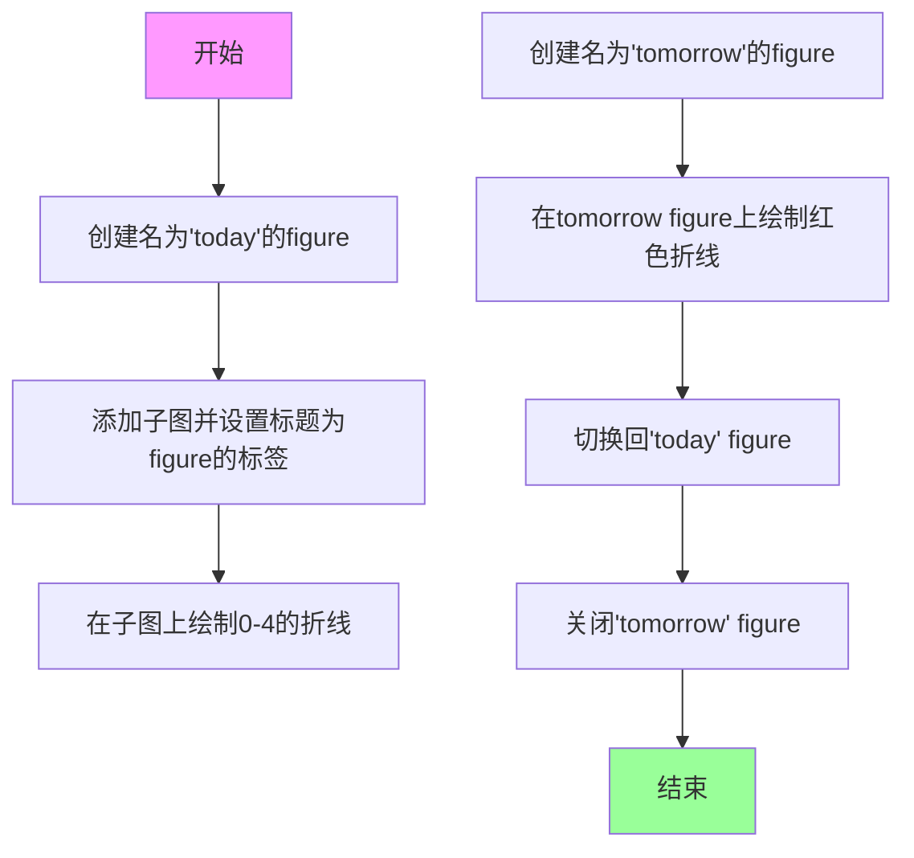

#### 带注释源码

```python
@image_comparison(['figure_today.png'],
                  tol=0 if platform.machine() == 'x86_64' else 0.015)
def test_figure():
    # named figure support
    # 创建一个名为'today'的figure
    fig = plt.figure('today')
    # 向figure添加一个子图
    ax = fig.add_subplot()
    # 设置子图标题为figure的标签
    ax.set_title(fig.get_label())
    # 在子图上绘制从0到4的折线
    ax.plot(np.arange(5))
    
    # 创建一个新的figure，名称为'tomorrow'
    plt.figure('tomorrow')
    # 在tomorrow figure上绘制红色折线 [0,1] -> [1,0]
    plt.plot([0, 1], [1, 0], 'r')
    
    # 切换回'today' figure
    plt.figure('today')
    # 关闭tomorrow figure，验证该figure已被正确关闭
    plt.close('tomorrow')
```


### `test_figure_legend`

该函数是一个图像对比测试，用于验证 Figure 对象的图例（legend）功能是否正确渲染。它创建包含多条线条的子图，并测试图例是否能正确聚合显示所有带标签的线条。

参数：
- 该函数无显式参数（测试函数）

返回值：`None`，无返回值（测试函数）

#### 流程图

```mermaid
graph TD
    A[开始 test_figure_legend] --> B[创建 2x1 子图布局]
    B --> C[在 axs[0] 上绘制三条线]
    C --> C1[绘制线1: label='x', color='g']
    C --> C2[绘制线2: label='y', color='r']
    C --> C3[绘制线3: label='y', color='k']
    C --> D[在 axs[1] 上绘制两条线]
    D --> D1[绘制线1: label='_y', color='r']
    D --> D2[绘制线2: label='z', color='b']
    D --> E[调用 fig.legend 创建图例]
    E --> F[使用 @image_comparison 装饰器进行图像对比验证]
    F --> G[结束]
    
    style C1 fill:#e1f5fe
    style C2 fill:#e1f5fe
    style C3 fill:#e1f5fe
    style D1 fill:#fff3e0
    style D2 fill:#fff3e0
```

#### 带注释源码

```python
@image_comparison(['figure_legend.png'])  # 装饰器：比较渲染输出与基准图像 'figure_legend.png'
def test_figure_legend():
    """
    测试 Figure 对象的图例功能。
    
    测试内容：
    1. 多个子图上的线条图例聚合
    2. 相同标签（label='y'）的线条应合并为一个图例项
    3. 以下划线开头的标签（label='_y'）应被隐藏
    """
    
    # 创建一个 2行1列 的子图布局
    fig, axs = plt.subplots(2)
    
    # ==== 第一个子图 (axs[0]) 上绘制三条线 ====
    # 绘制绿色线，标签为 'x'
    axs[0].plot([0, 1], [1, 0], label='x', color='g')
    
    # 绘制红色线，标签为 'y'
    axs[0].plot([0, 1], [0, 1], label='y', color='r')
    
    # 绘制黑色线，标签同样为 'y'（与上一条线标签相同）
    # 这两条线将会在图例中合并为一个条目
    axs[0].plot([0, 1], [0.5, 0.5], label='y', color='k')
    
    # ==== 第二个子图 (axs[1]) 上绘制两条线 ====
    # 绘制红色线，标签为 '_y'（以下划线开头）
    # 以下划线开头的标签不会显示在图例中
    axs[1].plot([0, 1], [1, 0], label='_y', color='r')
    
    # 绘制蓝色线，标签为 'z'
    axs[1].plot([0, 1], [0, 1], label='z', color='b')
    
    # 调用 figure 的 legend() 方法
    # 这会收集所有子图中的 artists 并创建统一图例
    # 预期结果：图例包含 'x', 'y', 'z' 四个条目（不含 '_y'）
    fig.legend()
```


### `test_gca`

该测试函数用于验证Figure对象的`gca()`（获取当前Axes）方法在不同场景下的正确行为，包括通过`add_axes()`和`add_subplot()`创建的Axes，以及多次调用`gca()`、`sca()`方法时Axes的顺序和当前状态是否正确维护。

参数：无

返回值：`None`，该函数为测试函数，不返回任何值

#### 流程图

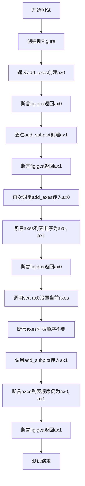

#### 带注释源码

```python
def test_gca():
    """
    测试Figure对象的gca()方法在不同创建方式和调用场景下的行为。
    
    测试要点：
    1. gca()能正确获取add_axes()创建的Axes
    2. gca()能正确获取add_subplot()创建的Axes
    3. 重复add_axes/add_subplot已存在的Axes不会改变axes列表顺序
    4. sca()设置当前Axes不会改变axes列表顺序
    """
    # 创建一个新的Figure对象
    fig = plt.figure()

    # 测试1：验证gca()能获取通过add_axes()创建的Axes
    # add_axes((0, 0, 1, 1))创建一个覆盖整个figure的Axes
    ax0 = fig.add_axes((0, 0, 1, 1))
    # 断言当前axes是ax0
    assert fig.gca() is ax0

    # 测试2：验证gca()能获取通过add_subplot()创建的Axes
    # add_subplot(111)创建一个1x1网格的第1个位置的Axes
    ax1 = fig.add_subplot(111)
    # 断言当前axes是ax1（因为ax1是最后创建的）
    assert fig.gca() is ax1

    # 测试3：验证重复add_axes已存在的Axes不会改变axes列表顺序
    # add_axes on an existing Axes should not change stored order, but will
    # make it current.
    fig.add_axes(ax0)
    # 断言axes列表顺序仍然是[ax0, ax1]，即添加顺序
    assert fig.axes == [ax0, ax1]
    # 断言当前axes变为ax0（因为重新调用了add_axes(ax0)）
    assert fig.gca() is ax0

    # 测试4：验证sca()设置当前Axes不会改变axes列表顺序
    # sca() should not change stored order of Axes, which is order added.
    fig.sca(ax0)
    # 断言axes列表顺序保持不变
    assert fig.axes == [ax0, ax1]

    # 测试5：验证重复add_subplot已存在的Axes不会改变axes列表顺序
    # add_subplot on an existing Axes should not change stored order, but will
    # make it current.
    fig.add_subplot(ax1)
    # 断言axes列表顺序仍然保持为[ax0, ax1]
    assert fig.axes == [ax0, ax1]
    # 断言当前axes变为ax1
    assert fig.gca() is ax1
```


### `test_add_subplot_subclass`

这是一个测试函数，用于验证 `Figure.add_subplot` 方法在使用 `axes_class` 参数时的行为，特别是验证当 `axes_class` 与某些不兼容的投影（如 "3d"）或参数（如 `polar=True`）组合时是否正确抛出异常。

参数： 无

返回值：`None`，无返回值（测试函数）

#### 流程图

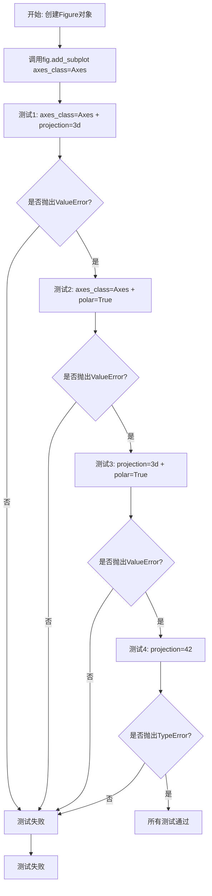

#### 带注释源码

```python
def test_add_subplot_subclass():
    """
    测试 Figure.add_subplot 方法在使用 axes_class 参数时的错误处理。
    
    该测试验证了以下场景：
    1. 使用自定义 axes_class (Axes) 可以正常创建子图
    2. axes_class 与 3d 投影不兼容，应抛出 ValueError
    3. axes_class 与极坐标投影不兼容，应抛出 ValueError
    4. 3d 投影与极坐标投影不能同时使用，应抛出 ValueError
    5. 无效的投影类型应抛出 TypeError
    """
    # 创建一个新的 Figure 对象
    fig = plt.figure()
    
    # 基本用法：使用指定的 axes_class 创建子图（应该成功）
    fig.add_subplot(axes_class=Axes)
    
    # 测试1：当指定 axes_class=Axes 但同时使用 3d 投影时应抛出 ValueError
    # 原因：Axes 是 2D 坐标系，无法支持 3d 投影
    with pytest.raises(ValueError):
        fig.add_subplot(axes_class=Axes, projection="3d")
    
    # 测试2：当指定 axes_class=Axes 但同时使用极坐标投影时应抛出 ValueError
    # 原因：Axes 不支持 polar 参数
    with pytest.raises(ValueError):
        fig.add_subplot(axes_class=Axes, polar=True)
    
    # 测试3：当同时使用 3d 投影和极坐标投影时应抛出 ValueError
    # 原因：两种投影模式互斥
    with pytest.raises(ValueError):
        fig.add_subplot(projection="3d", polar=True)
    
    # 测试4：当投影参数为无效类型（整数）时应抛出 TypeError
    # 原因：projection 参数应该是字符串类型
    with pytest.raises(TypeError):
        fig.add_subplot(projection=42)
```


### `test_add_subplot_invalid`

该函数是一个单元测试，用于验证 `Figure.add_subplot()` 方法在接收无效参数时能够正确抛出相应的异常（包括 `ValueError` 和 `TypeError`），确保参数验证逻辑的健壮性。

参数： 无（该函数不接受任何参数）

返回值： `None`，该函数为测试函数，不返回任何值

#### 流程图

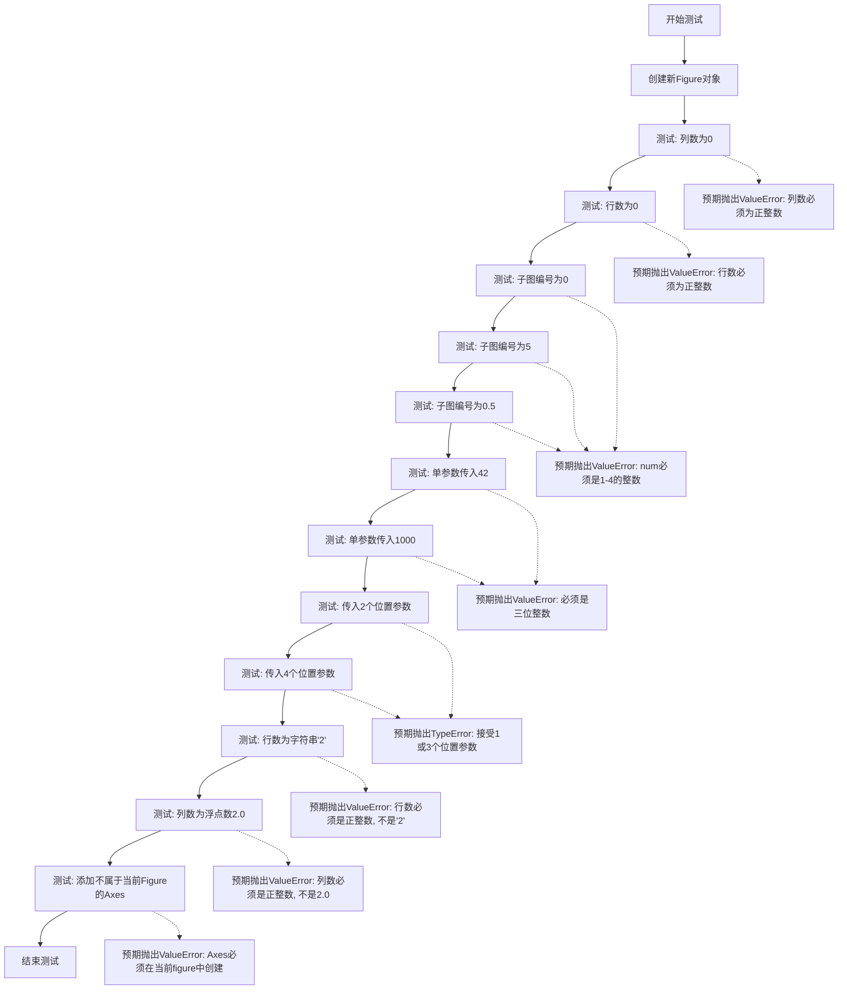

#### 带注释源码

```python
def test_add_subplot_invalid():
    """
    测试 Figure.add_subplot() 方法在接收无效参数时的异常处理。
    验证各种边界情况和错误输入能够正确抛出预期的异常。
    """
    # 创建一个新的Figure对象用于测试
    fig = plt.figure()
    
    # 测试1: 列数为0时应抛出ValueError
    # 匹配错误信息 'Number of columns must be a positive integer'
    with pytest.raises(ValueError,
                       match='Number of columns must be a positive integer'):
        fig.add_subplot(2, 0, 1)
    
    # 测试2: 行数为0时应抛出ValueError
    # 匹配错误信息 'Number of rows must be a positive integer'
    with pytest.raises(ValueError,
                       match='Number of rows must be a positive integer'):
        fig.add_subplot(0, 2, 1)
    
    # 测试3: 子图编号为0时应抛出ValueError
    # 匹配错误信息 'num must be an integer with 1 <= num <= 4'
    with pytest.raises(ValueError, match='num must be an integer with '
                                         '1 <= num <= 4'):
        fig.add_subplot(2, 2, 0)
    
    # 测试4: 子图编号为5（超出范围）时应抛出ValueError
    with pytest.raises(ValueError, match='num must be an integer with '
                                         '1 <= num <= 4'):
        fig.add_subplot(2, 2, 5)
    
    # 测试5: 子图编号为0.5（非整数）时应抛出ValueError
    with pytest.raises(ValueError, match='num must be an integer with '
                                         '1 <= num <= 4'):
        fig.add_subplot(2, 2, 0.5)
    
    # 测试6: 单参数形式传入42（不是三位整数）时应抛出ValueError
    # 匹配错误信息 'must be a three-digit integer'
    with pytest.raises(ValueError, match='must be a three-digit integer'):
        fig.add_subplot(42)
    
    # 测试7: 单参数形式传入1000（超出三位数范围）时应抛出ValueError
    with pytest.raises(ValueError, match='must be a three-digit integer'):
        fig.add_subplot(1000)
    
    # 测试8: 传入2个位置参数（需要1个或3个）时应抛出TypeError
    # 匹配错误信息 'takes 1 or 3 positional arguments but 2 were given'
    with pytest.raises(TypeError, match='takes 1 or 3 positional arguments '
                                        'but 2 were given'):
        fig.add_subplot(2, 2)
    
    # 测试9: 传入4个位置参数（需要1个或3个）时应抛出TypeError
    with pytest.raises(TypeError, match='takes 1 or 3 positional arguments '
                                        'but 4 were given'):
        fig.add_subplot(1, 2, 3, 4)
    
    # 测试10: 行数参数为字符串'2'时应抛出ValueError
    # 匹配错误信息 "Number of rows must be a positive integer, not '2'"
    with pytest.raises(ValueError,
                       match="Number of rows must be a positive integer, "
                             "not '2'"):
        fig.add_subplot('2', 2, 1)
    
    # 测试11: 列数参数为浮点数2.0时应抛出ValueError
    # 匹配错误信息 'Number of columns must be a positive integer, not 2.0'
    with pytest.raises(ValueError,
                       match='Number of columns must be a positive integer, '
                             'not 2.0'):
        fig.add_subplot(2, 2.0, 1)
    
    # 测试12: 添加一个不属于当前Figure的Axes对象时应抛出ValueError
    # 先创建一个新的Figure和Axes
    _, ax = plt.subplots()
    # 尝试将ax添加到fig中，但ax不属于fig
    # 匹配错误信息 'The Axes must have been created in the present figure'
    with pytest.raises(ValueError,
                       match='The Axes must have been created in the '
                             'present figure'):
        fig.add_subplot(ax)
```


### `test_suptitle`

该测试函数用于验证 Figure 对象的 `suptitle` 方法功能，通过图像对比检查设置多标题时的渲染效果，包括标题颜色和旋转角度的应用。

参数：无

返回值：`None`，该测试函数不返回任何值，主要用于视觉对比测试

#### 流程图

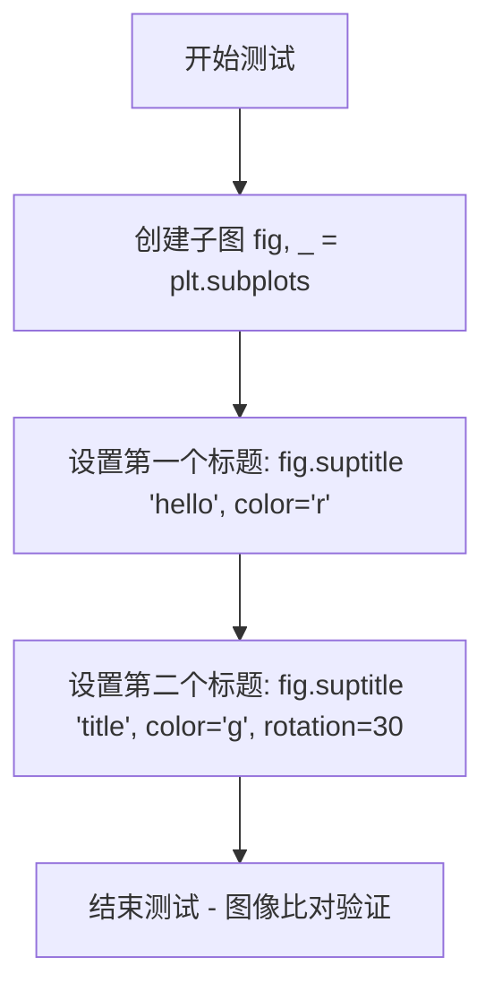

#### 带注释源码

```python
# 使用 image_comparison 装饰器进行图像比对测试
# baseline 图像为 'figure_suptitle.png'，容差为 0.02
@image_comparison(['figure_suptitle.png'], tol=0.02)
def test_suptitle():
    # 创建一个新的.figure对象和一个子图axes
    fig, _ = plt.subplots()
    
    # 调用 figure 的 suptitle 方法设置第一个标题
    # 参数: 'hello' 为标题文本, color='r' 设置为红色
    fig.suptitle('hello', color='r')
    
    # 再次调用 suptitle 方法设置第二个标题
    # 参数: 'title' 为标题文本, color='g' 设置为绿色, rotation=30 设置旋转30度
    fig.suptitle('title', color='g', rotation=30)
```


### test_suptitle_fontproperties

该函数是一个测试函数，用于验证 Figure 的 suptitle 方法是否正确应用 FontProperties 对象设置的字体属性（字体大小和字体粗细）。

参数：

- 无参数

返回值：`None`，该函数为测试函数，不返回任何值，仅通过断言验证

#### 流程图

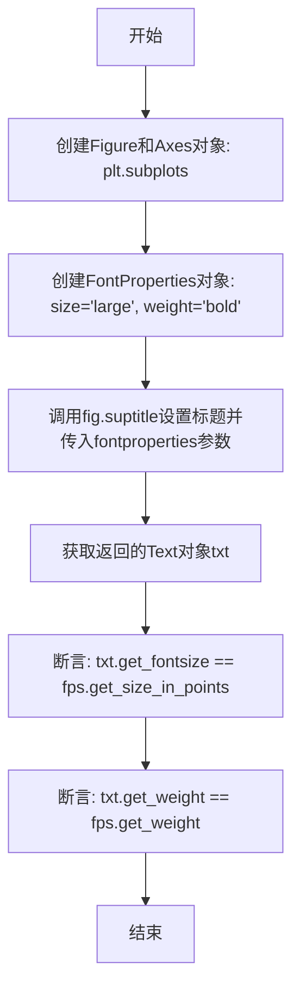

#### 带注释源码

```python
def test_suptitle_fontproperties():
    """
    测试函数：验证Figure的suptitle方法正确应用FontProperties
    
    该测试验证当使用fontproperties参数设置suptitle时，
    文本对象的字体属性（fontsize和weight）是否与指定的FontProperties一致。
    """
    # 步骤1: 创建Figure和Axes对象
    fig, ax = plt.subplots()
    
    # 步骤2: 创建FontProperties对象，指定大字体和粗体
    fps = mpl.font_manager.FontProperties(size='large', weight='bold')
    
    # 步骤3: 使用suptitle方法设置标题，并传入fontproperties参数
    # 返回一个Text对象
    txt = fig.suptitle('fontprops title', fontproperties=fps)
    
    # 步骤4: 验证字体大小是否正确应用
    # 断言: suptitle文本的字体大小应等于FontProperties中设置的大小
    assert txt.get_fontsize() == fps.get_size_in_points()
    
    # 步骤5: 验证字体粗细是否正确应用
    # 断言: suptitle文本的字体粗细应等于FontProperties中设置的粗细
    assert txt.get_weight() == fps.get_weight()
```


### `test_suptitle_subfigures`

该函数是一个测试函数，用于验证 matplotlib 中 Figure 的 `suptitle`（总标题）与 `subfigures`（子图）功能协同工作的正确性。测试创建包含两个子图的 Figure，设置总标题，并验证子图的面颜色属性是否按预期设置。

参数：无

返回值：`None`，该函数为测试函数，不返回任何值

#### 流程图

```mermaid
flowchart TD
    A[开始测试] --> B[创建 Figure<br/>figsize=(4, 3)]
    B --> C[创建 1x2 子图布局<br/>sf1, sf2 = fig.subfigures(1, 2)]
    C --> D[设置 sf2 背景色为白色<br/>sf2.set_facecolor('white')]
    D --> E[在 sf1 上创建子 Axes<br/>sf1.subplots()]
    E --> F[在 sf2 上创建子 Axes<br/>sf2.subplots()]
    F --> G[设置 Figure 总标题<br/>fig.suptitle<br/>'This is a visible suptitle.']
    G --> H[断言验证]
    H --> I[验证 sf1 背景色为透明<br/>assert sf1.get_facecolor() == (0.0, 0.0, 0.0, 0.0)]
    I --> J[验证 sf2 背景色为白色<br/>assert sf2.get_facecolor() == (1.0, 1.0, 1.0, 1.0)]
    J --> K[测试结束]
```

#### 带注释源码

```python
def test_suptitle_subfigures():
    """
    测试 suptitle 与 subfigures 功能的协同工作。
    
    该测试验证：
    1. Figure 可以同时包含 subfigures 和 suptitle
    2. 子图的默认背景色是透明的 (0, 0, 0, 0)
    3. 设置子图背景色后可以正确显示
    """
    # 创建一个尺寸为 4x3 的新 Figure
    fig = plt.figure(figsize=(4, 3))
    
    # 将 Figure 划分为 1 行 2 列的子图布局
    # 返回两个 SubFigure 对象：sf1（左侧）和 sf2（右侧）
    sf1, sf2 = fig.subfigures(1, 2)
    
    # 设置第二个子图 sf2 的背景色为白色
    # 第一个子图 sf1 保持默认的透明背景色
    sf2.set_facecolor('white')
    
    # 在第一个子图 sf1 上创建默认的 Axes（1x1 子图）
    sf1.subplots()
    
    # 在第二个子图 sf2 上创建默认的 Axes（1x1 子图）
    sf2.subplots()
    
    # 为整个 Figure 设置总标题（suptitle）
    # 这个标题显示在 Figure 的顶部中央位置
    fig.suptitle("This is a visible suptitle.")
    
    # ==================== 断言验证 ====================
    
    # 验证第一个子图 sf1 的背景色是默认的透明色
    # 透明色 RGBA 为 (0.0, 0.0, 0.0, 0.0)，即黑色且 alpha=0
    # assert 确认 sf1 使用默认透明背景
    assert sf1.get_facecolor() == (0.0, 0.0, 0.0, 0.0)
    
    # 验证第二个子图 sf2 的背景色是白色
    # 白色 RGBA 为 (1.0, 1.0, 1.0, 1.0)，即 RGB 白色且 alpha=1（不透明）
    # assert 确认 sf2 背景色被正确设置为白色
    assert sf2.get_facecolor() == (1.0, 1.0, 1.0, 1.0)
```


### `test_get_suptitle_supxlabel_supylabel`

这是一个测试函数，用于验证 Figure 类的 `get_suptitle()`、`get_supxlabel()` 和 `get_supylabel()` 方法的正确性。该函数通过创建图形、设置超级标题和标签，然后使用断言验证获取方法返回的值是否符合预期。

参数：无需参数

返回值：`None`，无返回值（测试函数）

#### 流程图

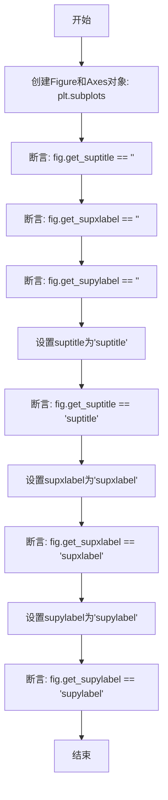

#### 带注释源码

```python
def test_get_suptitle_supxlabel_supylabel():
    """
    测试 Figure 类的 get_suptitle、get_supxlabel 和 get_supylabel 方法。
    
    该测试函数验证：
    1. 在未设置超级标签时，get 方法返回空字符串
    2. 设置超级标签后，get 方法能正确返回设置的值
    """
    # 创建一个新的 Figure 对象和一个 Axes 对象
    # plt.subplots() 返回 (fig, ax) 元组
    fig, ax = plt.subplots()
    
    # 测试初始状态：未设置任何超级标签时，get 方法应返回空字符串
    assert fig.get_suptitle() == ""      # 获取超级标题，预期为空字符串
    assert fig.get_supxlabel() == ""     # 获取超级 X 轴标签，预期为空字符串
    assert fig.get_supylabel() == ""     # 获取超级 Y 轴标签，预期为空字符串
    
    # 设置超级标题为 'suptitle'
    fig.suptitle('suptitle')
    # 验证获取的超级标题与设置的值一致
    assert fig.get_suptitle() == 'suptitle'
    
    # 设置超级 X 轴标签为 'supxlabel'
    fig.supxlabel('supxlabel')
    # 验证获取的超级 X 轴标签与设置的值一致
    assert fig.get_supxlabel() == 'supxlabel'
    
    # 设置超级 Y 轴标签为 'supylabel'
    fig.supylabel('supylabel')
    # 验证获取的超级 Y 轴标签与设置的值一致
    assert fig.get_supylabel() == 'supylabel'
```


### `test_remove_suptitle_supxlabel_supylabel`

该测试函数用于验证 Figure 对象的 `suptitle()`、`supxlabel()` 和 `supylabel()` 方法创建的标题和标签对象可以通过 `remove()` 方法正确移除，并且 Figure 内部的相应属性（`_suptitle`、`_supxlabel`、`_supylabel`）会被正确设置为 `None`。

参数： 无

返回值： `None`，测试函数不返回任何值

#### 流程图

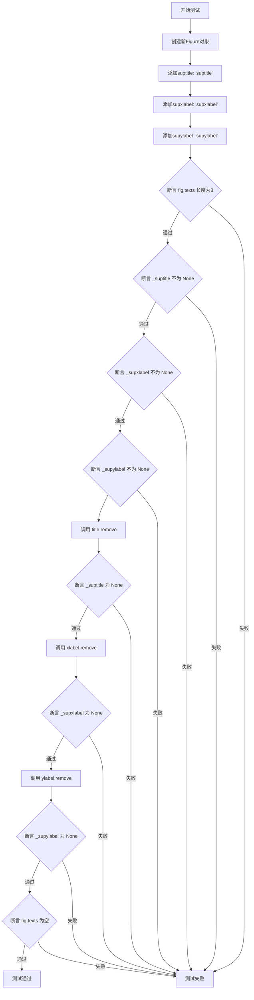

#### 带注释源码

```python
def test_remove_suptitle_supxlabel_supylabel():
    """
    测试移除 Figure 的 suptitle、supxlabel 和 supylabel 的功能。
    验证 remove() 方法能够正确清理内部状态。
    """
    # 创建一个新的 Figure 对象
    fig = plt.figure()

    # 为 Figure 添加主标题、X轴标签和Y轴标签
    # 这些方法返回对应的 Text 对象
    title = fig.suptitle('suptitle')
    xlabel = fig.supxlabel('supxlabel')
    ylabel = fig.supylabel('supylabel')

    # 验证 Figure 的 texts 列表中包含3个元素
    assert len(fig.texts) == 3
    
    # 验证 Figure 内部属性已正确设置
    assert fig._suptitle is not None
    assert fig._supxlabel is not None
    assert fig._supylabel is not None

    # 移除主标题，验证 _suptitle 属性被设置为 None
    title.remove()
    assert fig._suptitle is None
    
    # 移除 X 轴标签，验证 _supxlabel 属性被设置为 None
    xlabel.remove()
    assert fig._supxlabel is None
    
    # 移除 Y 轴标签，验证 _supylabel 属性被设置为 None
    ylabel.remove()
    assert fig._supylabel is None

    # 验证所有文本元素已从 Figure 中移除
    assert not fig.texts
```


### test_alpha

该函数是一个图像比对测试函数，用于测试matplotlib中Figure的alpha通道（透明度）功能，特别是验证背景颜色与alpha值的组合效果。

参数：空（无参数）

返回值：`None`（无返回值，该测试函数不返回任何值）

#### 流程图

```mermaid
graph TD
    A[开始测试函数test_alpha] --> B[创建Figure对象<br/>figsize=[2, 1]]
    B --> C[设置Figure背景色为绿色<br/>set_facecolor: (0, 1, 0.4)]
    C --> D[设置Figure patch的透明度<br/>set_alpha: 0.4]
    D --> E[创建圆形多边形对象<br/>CirclePolygon]
    E --> F[设置圆形透明度0.6<br/>facecolor='red']
    F --> G[将圆形添加到Figure的patches列表]
    G --> H[结束]
```

#### 带注释源码

```python
@image_comparison(['alpha_background'],
                  # 图像比对装饰器：比对baseline图像'alpha_background'
                  # 仅测试png和svg格式，因为PDF输出虽正确但Ghostscript不保留背景色
                  extensions=['png', 'svg'],
                  savefig_kwarg={'facecolor': (0, 1, 0.4),
                                 'edgecolor': 'none'})
def test_alpha():
    # 测试函数：验证figure的背景颜色和alpha透明度组合效果
    
    # 1. 创建一个宽度2英寸、高度1英寸的Figure对象
    fig = plt.figure(figsize=[2, 1])
    
    # 2. 设置Figure的背景颜色为绿色 (R=0, G=1, B=0.4)
    fig.set_facecolor((0, 1, 0.4))
    
    # 3. 设置Figure patch（背景补丁）的透明度为0.4
    # 这会使得整个Figure背景半透明
    fig.patch.set_alpha(0.4)
    
    # 4. 创建一个圆形多边形（CirclePolygon）
    # 参数：中心点[20, 20]，半径15
    # alpha=0.6（圆形本身的透明度）
    # facecolor='red'（红色填充）
    fig.patches.append(mpl.patches.CirclePolygon(
        [20, 20], radius=15, alpha=0.6, facecolor='red'))
    
    # 5. 将圆形多边形添加到Figure的patches列表中
    # 注意：上面已经直接在append中创建了对象，这行代码执行后
    # Figure将同时具有半透明绿色背景和半透明红色圆形
```


### `test_too_many_figures`

该测试函数用于验证当打开的图形数量超过 `mpl.rcParams['figure.max_open_warning']` 配置的最大值时，是否会触发 RuntimeWarning 警告。

参数：

- 无参数

返回值：`None`，无返回值（测试函数）

#### 流程图

```mermaid
flowchart TD
    A[开始] --> B[获取 mpl.rcParams figure.max_open_warning 的值]
    B --> C[循环 i 从 0 到 max_open_warning]
    C --> D[调用 plt.figure 创建新图形]
    D --> E{循环结束?}
    E -->|否| C
    E -->|是| F[验证 RuntimeWarning 已被触发]
    F --> G[结束]
```

#### 带注释源码

```python
def test_too_many_figures():
    """
    测试函数：验证当打开过多图形时是否触发 RuntimeWarning
    
    该测试检查 matplotlib 的 figure.max_open_warning 配置参数，
    当打开的图形数量超过该阈值时，应该产生 RuntimeWarning 警告。
    """
    # 使用 pytest.warns 上下文管理器捕获 RuntimeWarning
    with pytest.warns(RuntimeWarning):
        # 获取配置的最大警告阈值
        # 循环创建 (max_open_warning + 1) 个图形
        # 最后一个图形应该触发警告
        for i in range(mpl.rcParams['figure.max_open_warning'] + 1):
            plt.figure()  # 创建新图形
```


### `test_iterability_axes_argument`

这是一个回归测试函数，用于验证 matplotlib 中处理坐标轴投影参数时的迭代性检查逻辑。该测试确保当某个类定义了 `__getitem__` 方法但不是真正可迭代时，不会抛出异常。

参数：  
- （无）

返回值：`None`，无返回值

#### 流程图

```mermaid
flowchart TD
    A[开始测试] --> B[定义内部类 MyAxes 继承自 Axes]
    B --> C[定义内部类 MyClass]
    C --> D[MyClass 实现 __getitem__ 方法]
    D --> E[MyClass 实现 _as_mpl_axes 方法]
    E --> F[创建新图形 fig]
    F --> G[调用 fig.add_subplot 添加子图<br/>projection=MyClass 实例]
    G --> H{检查 _as_mpl_axes 返回值}
    H --> I[内部逻辑处理 MyClass 的迭代性检查]
    I --> J[关闭并清理图形]
    J --> K[结束测试]
```

#### 带注释源码

```python
def test_iterability_axes_argument():
    """
    回归测试：验证 matplotlib/matplotlib#3196 问题的修复。
    
    背景说明：
    如果 _as_mpl_axes 返回的参数定义了 __getitem__ 但本身不可迭代，
    可能会引发异常。因为代码会检查参数是否可迭代，如果可迭代则尝试
    转换为元组。然而，iterable() 函数只要存在 __getitem__ 就返回 True，
    导致某些定义了 __getitem__ 但不可迭代的类被误判为可迭代。
    现在的实现在 try...except 块中进行元组转换，以防转换失败。
    """

    # 定义一个自定义 Axes 子类，用于测试
    class MyAxes(Axes):
        def __init__(self, *args, myclass=None, **kwargs):
            # 调用父类 Axes 的初始化方法
            Axes.__init__(self, *args, **kwargs)

    # 定义一个测试用类，该类定义了 __getitem__ 但不是真正可迭代的
    class MyClass:
        
        def __getitem__(self, item):
            """
            实现 __getitem__ 方法，使得 isinstance(obj, collections.abc.Iterable) 返回 True。
            但这个类实际上不是可迭代的（没有 __iter__ 方法）。
            """
            if item != 'a':
                raise ValueError("item should be a")

        def _as_mpl_axes(self):
            """
            返回用于创建 matplotlib Axes 的类和配置参数字典。
            这是 matplotlib 投影系统的标准接口。
            """
            return MyAxes, {'myclass': self}

    # 创建一个新的 matplotlib 图形
    fig = plt.figure()
    
    # 添加子图，传入 MyClass 实例作为 projection 参数
    # 这里会触发对 MyClass 迭代性的检查和处理
    fig.add_subplot(1, 1, 1, projection=MyClass())
    
    # 关闭图形，释放资源
    plt.close(fig)
```


### `test_set_fig_size`

该函数是 Matplotlib 的一个测试用例，用于验证 Figure 对象的尺寸设置功能是否正确工作，包括设置宽度、高度以及使用不同方式设置尺寸。

参数：无

返回值：`None`，因为这是一个测试函数，不返回任何值

#### 流程图

```mermaid
flowchart TD
    A[开始测试] --> B[创建新Figure]
    B --> C[测试set_figwidth]
    C --> D{验证宽度是否为5}
    D -->|是| E[测试set_figheight]
    D -->|否| F[测试失败]
    E --> G{验证高度是否为1}
    G -->|是| H[测试set_size_inches宽高参数]
    G -->|否| F
    H --> I{验证宽度=2, 高度=4}
    I -->|是| J[测试set_size_inches元组参数]
    I -->|否| F
    J --> K{验证宽度=1, 高度=3}
    K -->|是| L[所有测试通过]
    K -->|否| F
    F --> M[结束]
    L --> M
```

#### 带注释源码

```python
def test_set_fig_size():
    """
    测试Figure对象的尺寸设置功能
    
    测试内容：
    1. 设置Figure宽度 (figwidth)
    2. 设置Figure高度 (figheight)
    3. 使用set_size_inches设置宽和高（两个独立参数）
    4. 使用set_size_inches设置宽和高（作为元组参数）
    """
    # 创建一个新的Figure对象
    fig = plt.figure()

    # 测试1: 检查figwidth（宽度）设置
    # 调用set_figwidth设置宽度为5英寸
    fig.set_figwidth(5)
    # 验证宽度是否正确设置为5
    assert fig.get_figwidth() == 5

    # 测试2: 检查figheight（高度）设置
    # 调用set_figheight设置高度为1英寸
    fig.set_figheight(1)
    # 验证高度是否正确设置为1
    assert fig.get_figheight() == 1

    # 测试3: 使用set_size_inches方法设置宽和高
    # 同时设置宽度为2英寸，高度为4英寸
    fig.set_size_inches(2, 4)
    # 验证宽度是否为2
    assert fig.get_figwidth() == 2
    # 验证高度是否为4
    assert fig.get_figheight() == 4

    # 测试4: 使用元组作为第一个参数设置尺寸
    # 将(1, 3)作为宽度和高度的元组传入
    fig.set_size_inches((1, 3))
    # 验证宽度是否为1
    assert fig.get_figwidth() == 1
    # 验证高度是否为3
    assert fig.get_figheight() == 3
```


### `test_axes_remove`

该函数是一个单元测试，用于验证从 Figure 中移除 Axes（坐标轴）后，Figure.axes 列表能够正确更新。测试创建 2x2 的子图，移除右下角的子图，然后断言剩余的子图仍然在 Figure.axes 中，而被移除的子图不在其中，同时 Figure.axes 的长度为 3。

参数： 无

返回值： `None`，该函数为测试函数，不返回任何值，仅通过断言验证行为

#### 流程图

```mermaid
flowchart TD
    A[开始测试] --> B[创建 2x2 子图布局]
    B --> C[获取所有子图 axs]
    C --> D[移除右下角子图 axs[-1, -1]]
    D --> E{遍历剩余子图}
    E --> F[断言每个剩余子图在 fig.axes 中]
    F --> G[断言被移除的子图不在 fig.axes 中]
    G --> H[断言 fig.axes 长度为 3]
    H --> I[测试结束]
```

#### 带注释源码

```python
def test_axes_remove():
    """
    测试从 Figure 中移除 Axes 后，Figure.axes 列表的正确更新。
    
    该测试验证：
    1. 移除的 Axes 不再存在于 Figure.axes 中
    2. 未被移除的 Axes 仍然保留在 Figure.axes 中
    3. Figure.axes 的长度正确反映剩余 Axes 的数量
    """
    # 创建 2x2 的子图布局，返回包含 4 个 Axes 的数组
    fig, axs = plt.subplots(2, 2)
    
    # 移除右下角的 Axes (索引为 [-1, -1])
    axs[-1, -1].remove()
    
    # 遍历除最后一个（已被移除）外的所有 Axes
    # 验证它们仍然存在于 fig.axes 中
    for ax in axs.ravel()[:-1]:
        assert ax in fig.axes
    
    # 验证被移除的 Axes 不在 fig.axes 中
    assert axs[-1, -1] not in fig.axes
    
    # 验证 Figure 中剩余的 Axes 数量为 3
    assert len(fig.axes) == 3
```


### `test_figaspect`

这是一个测试函数，用于验证`plt.figaspect`函数能正确计算图形的宽高比。该函数通过多种输入类型（包括浮点数、整数和NumPy数组）测试宽高比计算的准确性。

参数：

- 无参数

返回值：`None`，无返回值（测试函数）

#### 流程图

```mermaid
flowchart TD
    A[开始测试] --> B[测试浮点数 2/1]
    B --> C{验证 h/w == 2}
    C -->|通过| D[测试整数 2]
    D --> E{验证 h/w == 2}
    E -->|通过| F[测试 1x2 零矩阵]
    F --> G{验证 h/w == 0.5}
    G -->|通过| H[测试 2x2 零矩阵]
    H --> I{验证 h/w == 1}
    I -->|通过| J[所有测试通过]
    C -->|失败| K[抛出 AssertionError]
    E -->|失败| K
    G -->|失败| K
    I -->|失败| K
```

#### 带注释源码

```python
def test_figaspect():
    """
    测试 plt.figaspect 函数的各种输入情况下的宽高比计算。
    
    测试场景：
    1. 浮点数比例 2:1
    2. 整数比例 2
    3. 1行2列的数组 (0.5:1)
    4. 2行2列的数组 (1:1)
    """
    # 测试1：使用numpy.float64计算2/1的比例
    w, h = plt.figaspect(np.float64(2) / np.float64(1))
    assert h / w == 2  # 验证宽高比为2
    
    # 测试2：使用整数2作为参数
    w, h = plt.figaspect(2)
    assert h / w == 2  # 验证宽高比为2
    
    # 测试3：使用1x2的零矩阵
    # 数组形状为(1,2)，宽高比应为0.5
    w, h = plt.figaspect(np.zeros((1, 2)))
    assert h / w == 0.5  # 验证宽高比为0.5
    
    # 测试4：使用2x2的零矩阵
    # 数组形状为(2,2)，宽高比应为1
    w, h = plt.figaspect(np.zeros((2, 2)))
    assert h / w == 1  # 验证宽高比为1
```


### `test_autofmt_xdate`

该测试函数用于验证 `Figure.autofmt_xdate()` 方法能否正确地对 x 轴上的日期标签进行旋转，并根据 `which` 参数（'both'、'major' 或 'minor'）分别处理主刻度和次刻度标签的旋转。

参数：

- `which`：`str`，参数化测试参数，指定要测试的刻度标签类型，可选值为 'both'、'major' 或 'minor'

返回值：`None`，该函数为测试函数，无返回值，通过断言验证功能正确性

#### 流程图

```mermaid
flowchart TD
    A[开始测试] --> B[准备日期和时间数据]
    B --> C[使用 mdates.datestr2num 转换日期时间为数值]
    C --> D[创建 Figure 和 Axes]
    D --> E[绘制数据并设置日期轴]
    E --> F[配置次刻度定位器和格式化器]
    F --> G[调用 fig.autofmt_xdate 设置旋转]
    G --> H{which 参数值}
    H -->|both 或 major| I[验证主刻度标签旋转角度]
    H -->|both 或 minor| J[验证次刻度标签旋转角度]
    I --> K[结束测试]
    J --> K
```

#### 带注释源码

```python
@pytest.mark.parametrize('which', ['both', 'major', 'minor'])
def test_autofmt_xdate(which):
    """
    测试 Figure.autofmt_xdate() 方法对日期标签的旋转功能。
    通过参数化测试验证 both、major、minor 三种模式的正确性。
    """
    # 准备日期字符串列表
    date = ['3 Jan 2013', '4 Jan 2013', '5 Jan 2013', '6 Jan 2013',
            '7 Jan 2013', '8 Jan 2013', '9 Jan 2013', '10 Jan 2013',
            '11 Jan 2013', '12 Jan 2013', '13 Jan 2013', '14 Jan 2013']

    # 准备时间字符串列表
    time = ['16:44:00', '16:45:00', '16:46:00', '16:47:00', '16:48:00',
            '16:49:00', '16:51:00', '16:52:00', '16:53:00', '16:55:00',
            '16:56:00', '16:57:00']

    angle = 60  # 设置旋转角度为60度
    minors = [1, 2, 3, 4, 5, 6, 7]  # 次刻度标签的格式化字符串

    # 将日期和时间字符串转换为 matplotlib 内部使用的数值格式
    x = mdates.datestr2num(date)
    y = mdates.datestr2num(time)

    # 创建子图
    fig, ax = plt.subplots()

    # 绘制数据
    ax.plot(x, y)
    # 设置 y 轴为时间轴
    ax.yaxis_date()
    # 设置 x 轴为日期轴
    ax.xaxis_date()

    # 设置次刻度定位器，每2个主刻度之间显示一个次刻度
    ax.xaxis.set_minor_locator(AutoMinorLocator(2))
    with warnings.catch_warnings():
        warnings.filterwarnings(
            'ignore',
            'FixedFormatter should only be used together with FixedLocator')
        # 设置次刻度格式化器
        ax.xaxis.set_minor_formatter(FixedFormatter(minors))

    # 调用 autofmt_xdate 方法：
    # - 0.2: bottom 边距
    # - angle: 旋转角度 (60度)
    # - 'right': 旋转方向
    # - which: 作用对象 ('both', 'major', 或 'minor')
    fig.autofmt_xdate(0.2, angle, 'right', which)

    # 验证主刻度标签的旋转角度
    if which in ('both', 'major'):
        for label in fig.axes[0].get_xticklabels(False, 'major'):
            assert int(label.get_rotation()) == angle

    # 验证次刻度标签的旋转角度
    if which in ('both', 'minor'):
        for label in fig.axes[0].get_xticklabels(True, 'minor'):
            assert int(label.get_rotation()) == angle
```


### `test_autofmt_xdate_colorbar_constrained`

该测试函数用于验证在constrained布局下，colorbar可以与`autofmt_xdate()`方法正常兼容工作。由于constrained布局中colorbar没有gridspec，`autofmt_xdate`会检查所有axes是否都有gridspec后才应用。

参数：

- （无参数）

返回值：`None`，该函数为测试函数，无返回值（通过断言验证）

#### 流程图

```mermaid
flowchart TD
    A[开始测试] --> B[创建constrained布局的Figure和Axes]
    B --> C[使用imshow显示图像数据]
    C --> D[为图像添加colorbar]
    D --> E[调用fig.autofmt_xdate方法]
    E --> F[执行fig.draw_without_rendering]
    F --> G[获取主轴的主要xticklabels]
    G --> H{验证第2个label的旋转角度}
    H -->|等于30.0度| I[测试通过]
    H -->|不等于30.0度| J[测试失败]
```

#### 带注释源码

```python
def test_autofmt_xdate_colorbar_constrained():
    """
    测试函数：验证在constrained布局下colorbar与autofmt_xdate的兼容性
    
    说明：
    - 在constrained布局中，colorbar没有gridspec
    - autofmt_xdate会检查所有axes是否都有gridspec后才应用
    - 这个测试确保colorbar不会导致autofmt_xdate失败
    """
    
    # 步骤1：创建一个使用constrained布局的Figure和Axes
    # layout="constrained" 启用约束布局引擎
    fig, ax = plt.subplots(layout="constrained")
    
    # 步骤2：使用imshow显示一个简单的2D图像数据
    # [[1, 4, 6], [2, 3, 5]] 是图像的像素值矩阵
    im = ax.imshow([[1, 4, 6], [2, 3, 5]])
    
    # 步骤3：为图像添加colorbar颜色条
    # 这会在Figure中创建一个新的axes用于显示colorbar
    plt.colorbar(im)
    
    # 步骤4：调用autofmt_xdate对x轴日期标签进行自动格式化
    # 默认参数：rotation=30, ha='right'
    fig.autofmt_xdate()
    
    # 步骤5：执行无渲染绘制，确保所有布局计算完成
    # 这会触发constrained layout的计算
    fig.draw_without_rendering()
    
    # 步骤6：获取主轴的主要x轴刻度标签（which='major'）
    # 选择第2个标签（索引1）进行验证
    label = ax.get_xticklabels(which='major')[1]
    
    # 步骤7：断言验证旋转角度是否为30.0度
    # 这是autofmt_xdate的默认旋转角度
    assert label.get_rotation() == 30.0
```


### `test_change_dpi`

这是一个测试函数，用于验证当Figure对象的dpi属性改变后，canvas渲染器的尺寸是否会正确地随dpi变化而更新。

参数：

- 该函数没有参数

返回值：`None`，因为这是一个测试函数（pytest测试用例）

#### 流程图

```mermaid
flowchart TD
    A[开始测试] --> B[创建 figsize=(4, 4) 的 Figure 对象]
    B --> C[调用 fig.draw_without_rendering 进行渲染]
    C --> D{验证初始渲染器尺寸}
    D -->|height == 400| E{验证宽度}
    E -->|width == 400| F[设置 fig.dpi = 50]
    F --> G[再次调用 fig.draw_without_rendering]
    G --> H{验证 dpi 改变后的高度}
    H -->|height == 200| I{验证宽度}
    I -->|width == 200| J[测试通过]
    D -->|失败| K[抛出 AssertionError]
    E -->|失败| K
    H -->|失败| K
    I -->|失败| K
```

#### 带注释源码

```python
@mpl.style.context('mpl20')
def test_change_dpi():
    """
    测试函数：验证 Figure 的 DPI 更改后渲染器尺寸是否正确更新
    
    测试目标：
    - 验证默认 DPI (100) 下的渲染器尺寸为 400x400
    - 验证将 DPI 改为 50 后渲染器尺寸正确变为 200x200
    """
    
    # 创建一个 4x4 英寸大小的 Figure 对象
    # 默认 DPI 为 100，所以渲染器尺寸应该是 4*100 = 400 像素
    fig = plt.figure(figsize=(4, 4))
    
    # 执行渲染（不实际绘制到设备，用于计算布局和尺寸）
    fig.draw_without_rendering()
    
    # 断言：验证默认 DPI (100) 下渲染器高度为 400
    # 计算方式：figsize[1] * dpi = 4 * 100 = 400
    assert fig.canvas.renderer.height == 400
    
    # 断言：验证默认 DPI (100) 下渲染器宽度为 400
    # 计算方式：figsize[0] * dpi = 4 * 100 = 400
    assert fig.canvas.renderer.width == 400
    
    # 修改 Figure 的 DPI 从默认的 100 改为 50
    fig.dpi = 50
    
    # 再次渲染以应用新的 DPI 设置
    fig.draw_without_rendering()
    
    # 断言：验证 DPI 改为 50 后渲染器高度正确更新
    # 期望值：4 * 50 = 200 像素
    assert fig.canvas.renderer.height == 200
    
    # 断言：验证 DPI 改为 50 后渲染器宽度正确更新
    # 期望值：4 * 50 = 200 像素
    assert fig.canvas.renderer.width == 200
```


### `test_invalid_figure_size`

该测试函数用于验证当图形尺寸参数无效时（如宽度或高度为负数、NaN 或无穷大），`plt.figure()` 和 `Figure.set_size_inches()` 方法能够正确抛出 `ValueError` 异常。

参数：

- `width`：`float`，测试用例的宽度参数，值为 `1`、`-1` 或 `np.inf`
- `height`：`float`，测试用例的高度参数，值为 `np.nan`、`1`

返回值：`None`，测试函数无返回值

#### 流程图

```mermaid
flowchart TD
    A[开始测试] --> B{参数化测试: width, height}
    B --> C[测试 plt.figure 创建无效尺寸]
    C --> D[使用 pytest.raises 捕获 ValueError]
    D --> E{是否捕获到 ValueError?}
    E -->|是| F[测试通过]
    E -->|否| G[测试失败]
    F --> H[创建新 Figure 实例]
    H --> I[测试 set_size_inches 设置无效尺寸]
    I --> J[使用 pytest.raises 捕获 ValueError]
    J --> K{是否捕获到 ValueError?}
    K -->|是| L[测试通过]
    K -->|否| M[测试失败]
    L --> N[结束当前参数测试]
    N --> B
```

#### 带注释源码

```python
@pytest.mark.parametrize('width, height', [
    (1, np.nan),      # 测试宽度有效但高度为 NaN 的情况
    (-1, 1),          # 测试宽度为负数的情况
    (np.inf, 1)       # 测试宽度为无穷大的情况
])
def test_invalid_figure_size(width, height):
    # 测试使用 plt.figure() 创建具有无效尺寸的图形
    # 预期会抛出 ValueError 异常
    with pytest.raises(ValueError):
        plt.figure(figsize=(width, height))

    # 创建一个新的 Figure 实例
    fig = plt.figure()
    
    # 测试使用 set_size_inches() 设置无效尺寸
    # 预期会抛出 ValueError 异常
    with pytest.raises(ValueError):
        fig.set_size_inches(width, height)
```


### `test_invalid_figure_add_axes`

这是一个测试函数，用于验证 `Figure.add_axes()` 方法在各种无效输入情况下的错误处理行为。该函数通过多个测试用例检查方法是否正确抛出 `TypeError` 或 `ValueError` 异常。

参数：

- 无参数

返回值：`None`，测试函数不返回任何值

#### 流程图

```mermaid
flowchart TD
    A[开始测试] --> B[创建新Figure]
    B --> C[测试1: 缺少必需参数rect]
    C --> D{是否抛出TypeError}
    D -->|是| E[测试2: rect包含NaN]
    D -->|否| F[测试失败]
    E --> G{是否抛出ValueError}
    G -->|是| H[测试3: 同时提供位置参数和关键字参数rect]
    G -->|否| F
    H --> I{是否抛出TypeError}
    I -->|是| J[测试4: 添加来自其他Figure的Axes]
    I -->|否| F
    J --> K{是否抛出ValueError}
    K -->|是| L[测试5: 删除Axes后传递额外位置参数]
    K -->|否| F
    L --> M{是否抛出TypeError}
    M -->|是| N[测试6: 传递额外位置参数]
    M -->|否| F
    N --> O{是否抛出TypeError}
    O -->|是| P[所有测试通过]
    O -->|否| F
    P --> Q[结束测试]
    F --> Q
```

#### 带注释源码

```python
def test_invalid_figure_add_axes():
    """
    测试 Figure.add_axes() 方法在各种无效输入情况下的错误处理。
    验证方法是否正确抛出 TypeError 或 ValueError 异常。
    """
    # 创建一个新的空白 Figure 对象
    fig = plt.figure()
    
    # 测试用例 1: 缺少必需的位置参数 'rect'
    # add_axes() 方法需要 rect 参数，不提供时应抛出 TypeError
    with pytest.raises(TypeError,
                       match="missing 1 required positional argument: 'rect'"):
        fig.add_axes()
    
    # 测试用例 2: rect 参数包含 NaN 值
    # 位置参数中包含无效的 NaN 值时应抛出 ValueError
    with pytest.raises(ValueError):
        fig.add_axes((.1, .1, .5, np.nan))
    
    # 测试用例 3: 同时提供位置参数和关键字参数 'rect'
    # 重复提供同一参数时应抛出 TypeError
    with pytest.raises(TypeError, match="multiple values for argument 'rect'"):
        fig.add_axes((0, 0, 1, 1), rect=[0, 0, 1, 1])
    
    # 创建另一个 Figure 和一个 Axes
    fig2, ax = plt.subplots()
    
    # 测试用例 4: 尝试添加属于其他 Figure 的 Axes
    # 将一个 Figure 中创建的 Axes 添加到另一个 Figure 时应抛出 ValueError
    with pytest.raises(ValueError,
                       match="The Axes must have been created in the present "
                             "figure"):
        fig.add_axes(ax)
    
    # 删除上面创建的 Axes
    fig2.delaxes(ax)
    
    # 测试用例 5: 在传递已删除的 Axes 后再传递额外位置参数
    # add_axes() 只接受 1 个位置参数，多余时应抛出 TypeError
    with pytest.raises(TypeError, match=r"add_axes\(\) takes 1 positional arguments"):
        fig2.add_axes(ax, "extra positional argument")
    
    # 测试用例 6: 传递额外位置参数
    # 即使没有 Axes 对象，额外位置参数也应导致 TypeError
    with pytest.raises(TypeError, match=r"add_axes\(\) takes 1 positional arguments"):
        fig.add_axes((0, 0, 1, 1), "extra positional argument")
```


### `test_subplots_shareax_loglabels`

这是一个测试函数，用于验证当子图共享x轴和y轴时，在对数刻度（log scale）下刻度标签的正确显示行为。具体来说，该测试创建了一个2x2的共享轴子图，设置对数刻度后，验证内部子图应该隐藏刻度标签，而边缘子图应该显示刻度标签。

参数： 无

返回值： `None`，无返回值（测试函数）

#### 流程图

```mermaid
flowchart TD
    A[开始] --> B[创建2x2共享轴子图]
    B --> C[为所有子图绑制相同数据]
    C --> D[设置对数刻度]
    D --> E[验证第一行子图的x轴标签被隐藏]
    E --> F[验证第二行子图的x轴标签显示]
    F --> G[验证第一列子图的y轴标签被隐藏]
    G --> H[验证第二列子图的y轴标签显示]
    H --> I[结束]
```

#### 带注释源码

```python
def test_subplots_shareax_loglabels():
    # 创建一个2x2的子图网格，共享x轴和y轴
    # squeeze=False确保返回的axs是2D数组，便于索引
    fig, axs = plt.subplots(2, 2, sharex=True, sharey=True, squeeze=False)
    
    # 为所有子图绑制相同的简单数据
    for ax in axs.flat:
        ax.plot([10, 20, 30], [10, 20, 30])

    # 设置对数刻度（注意：这里只设置了最后一个ax，即axs[1,1]）
    # 这实际上是一个测试设计上的问题，因为应该为所有子图设置
    ax.set_yscale("log")
    ax.set_xscale("log")

    # 验证第一行子图（axs[0, :]）的x轴刻度标签应该被隐藏（长度为0）
    # 因为这些子图的x轴与其他子图共享
    for ax in axs[0, :]:
        assert 0 == len(ax.xaxis.get_ticklabels(which='both'))

    # 验证第二行子图（axs[1, :]）的x轴刻度标签应该显示（长度大于0）
    # 因为这是最底部的行，x轴标签通常显示在这里
    for ax in axs[1, :]:
        assert 0 < len(ax.xaxis.get_ticklabels(which='both'))

    # 验证第一列子图（axs[:, 1]）的y轴刻度标签应该被隐藏（长度为0）
    # 因为这些子图的y轴与其他子图共享
    for ax in axs[:, 1]:
        assert 0 == len(ax.yaxis.get_ticklabels(which='both'))

    # 验证第二列子图（axs[:, 0]）的y轴刻度标签应该显示（长度大于0）
    # 因为这是最左边的列，y轴标签通常显示在这里
    for ax in axs[:, 0]:
        assert 0 < len(ax.yaxis.get_ticklabels(which='both'))
```


### `test_savefig`

该函数用于测试 `Figure.savefig()` 方法在传递错误数量的位置参数时是否正确引发 `TypeError` 异常，验证函数签名正确性。

参数：

- 该函数无参数

返回值：

- `None`，该函数为测试函数，不返回任何值

#### 流程图

```mermaid
flowchart TD
    A[开始测试] --> B[创建新Figure对象]
    B --> C[定义预期错误消息]
    C --> D[使用pytest.raises捕获TypeError异常]
    D --> E[调用fig.savefig with 3个位置参数]
    E --> F{是否抛出TypeError?}
    F -->|是| G[验证异常消息匹配]
    G --> H[测试通过]
    F -->|否| I[测试失败]
    H --> J[结束测试]
    I --> J
```

#### 带注释源码

```python
def test_savefig():
    """
    测试 Figure.savefig() 方法在传递错误数量的位置参数时
    是否会正确引发 TypeError 异常。
    
    该测试验证 savefig() 方法的函数签名是否正确定义，
    确保它只接受 self 和 fname 两个位置参数。
    """
    # 步骤1: 创建一个新的空白Figure对象
    fig = plt.figure()
    
    # 步骤2: 定义预期的错误消息字符串
    # 使用原始字符串 r"" 避免转义字符问题
    # 预期错误: savefig() takes 2 positional arguments but 3 were given
    msg = r"savefig\(\) takes 2 positional arguments but 3 were given"
    
    # 步骤3: 使用pytest.raises上下文管理器捕获预期的TypeError异常
    # 如果没有抛出异常或抛出了不同的异常，测试将失败
    with pytest.raises(TypeError, match=msg):
        # 步骤4: 调用savefig并传入3个位置参数
        # - self: Figure对象本身（隐式）
        # - "fname1.png": 第一个位置参数（fname）
        # - "fname2.png": 第二个位置参数（但savefig只接受fname作为位置参数）
        # 这应该触发TypeError，因为savefig()只接受2个位置参数（self和fname）
        fig.savefig("fname1.png", "fname2.png")
```


### `test_savefig_warns`

这是一个测试函数，用于验证当使用不存在的关键字参数调用 `Figure.savefig` 方法时是否会正确引发 `TypeError` 异常。

参数： 无

返回值： `None`，该函数不返回任何值，仅用于执行测试断言

#### 流程图

```mermaid
flowchart TD
    A[开始测试] --> B[创建新Figure对象]
    B --> C[遍历格式列表: png, pdf, svg, tif, jpg]
    C --> D{当前格式 < 列表末尾?}
    D -->|是| E[使用io.BytesIO作为输出缓冲区]
    E --> F[传入format参数和non_existent_kwarg=True]
    F --> G[期望抛出TypeError异常]
    G --> C
    D -->|否| H[测试结束]
```

#### 带注释源码

```python
def test_savefig_warns():
    """
    测试Figure.savefig方法在传入无效关键字参数时是否正确抛出TypeError。
    该测试覆盖多种图像格式：png, pdf, svg, tif, jpg。
    """
    # 创建一个新的Figure对象
    fig = plt.figure()
    
    # 遍历所有需要测试的图像格式
    for format in ['png', 'pdf', 'svg', 'tif', 'jpg']:
        # 使用pytest.raises上下文管理器验证TypeError被正确抛出
        # savefig收到未知的non_existent_kwarg参数时应引发TypeError
        with pytest.raises(TypeError):
            # 使用io.BytesIO()作为内存缓冲区进行保存
            fig.savefig(io.BytesIO(), format=format, non_existent_kwarg=True)
```


### 整体概述

该代码文件是 Matplotlib 项目中的测试套件，专注于对 `Figure` 对象的创建、布局、渲染以及保存（`savefig`）等核心功能进行单元和集成测试。文件中涵盖了 figure 的标签对齐、子图、布局引擎、子图（subfigure）管理、坐标轴操作、保存为多种文件格式（PNG、PDF、SVG 等）以及各种边界与异常情况的校验，旨在确保 Matplotlib 在不同使用场景下的正确性和鲁棒性。

---

## 函数 `test_savefig_backend` 详情

### 基本信息

- **名称**：test_savefig_backend  
- **参数**：无（该测试函数不接受任何显式参数）  
- **返回值**：无（返回 `None`，通过 `pytest` 框架的断言来验证行为）

### 描述

`test_savefig_backend` 用于验证 `Figure.savefig` 在使用非法后端或不兼容的输出格式时能够抛出预期的异常。具体场景包括：

1. 加载一个不存在的后端模块（`backend="module://@absent"`），应抛出 `ModuleNotFoundError`。  
2. 使用 PDF 后端尝试保存为 PNG 格式（`backend="pdf"` 且文件名以 `.png` 结尾），应抛出 `ValueError`，提示该后端不支持 PNG 输出。

此测试确保了 `savefig` 在后端选择和输出格式不匹配时的错误提示符合预期，提升了库的健壮性。

### 参数详情

| 参数名 | 类型 | 描述 |
|--------|------|------|
| （无） | — | 该测试函数不使用任何显式参数 |

### 返回值

| 返回类型 | 描述 |
|----------|------|
| None | 函数仅执行断言，不返回任何值 |

#### 流程图

```mermaid
flowchart TD
    A([开始]) --> B[创建 Figure 对象 fig]
    B --> C[尝试使用无效后端 backend='module://@absent']
    C --> D{是否抛出 ModuleNotFoundError?}
    D -->|是| E[断言错误信息匹配 "No module named '@absent'"]
    D -->|否| F[测试失败]
    E --> G[尝试使用 PDF 后端保存为 PNG 格式]
    G --> H{是否抛出 ValueError?}
    H -->|是| I[断言错误信息匹配 "The 'pdf' backend does not support png output"]
    H -->|否| F
    I --> J([结束])
```

#### 带注释源码

```python
def test_savefig_backend():
    """
    测试 Figure.savefig 在使用无效后端或不兼容输出格式时的错误行为。

    1. 尝试加载一个不存在的后端模块，应该抛出 ModuleNotFoundError。  
    2. 尝试使用 PDF 后端保存为 PNG 格式，应该抛出 ValueError。
    """
    # 创建一个空的 Figure 实例
    fig = plt.figure()

    # 场景 1：使用不存在的后端模块
    # 期望捕获 ModuleNotFoundError 并检查错误信息
    with pytest.raises(ModuleNotFoundError, match="No module named '@absent'"):
        fig.savefig("test", backend="module://@absent")

    # 场景 2：PDF 后端不支持 PNG 输出
    # 期望捕获 ValueError 并检查错误信息
    with pytest.raises(ValueError,
                       match="The 'pdf' backend does not support png output"):
        fig.savefig("test.png", backend="pdf")
```


### `test_savefig_pixel_ratio`

该测试函数用于验证在使用不同设备像素比率设置时，`savefig` 方法保存的 PNG 图像应当保持一致。测试确保保存图像时忽略 canvas 的 `_set_device_pixel_ratio` 设置，从而保证输出文件的一致性。

参数：

-  `backend`：`str`，后端渲染引擎类型，支持 'Agg' 或 'Cairo'，通过 `@pytest.mark.parametrize` 参数化传入

返回值：`None`，该函数为测试函数，使用 `assert` 语句进行断言验证

#### 流程图

```mermaid
flowchart TD
    A[开始测试] --> B[创建第一个Figure和Axes]
    B --> C[绘制简单折线图]
    C --> D[使用默认device_pixel_ratio保存到BytesIO]
    D --> E[加载PNG图像为ratio1]
    E --> F[创建第二个Figure和Axes]
    F --> G[绘制相同折线图]
    G --> H[设置canvas device_pixel_ratio为2]
    H --> I[保存到BytesIO]
    I --> J[加载PNG图像为ratio2]
    J --> K{ratio1 == ratio2?}
    K -->|是| L[测试通过]
    K -->|否| M[测试失败]
```

#### 带注释源码

```python
@pytest.mark.parametrize('backend', [
    pytest.param('Agg', marks=[pytest.mark.backend('Agg')]),
    pytest.param('Cairo', marks=[pytest.mark.backend('Cairo')]),
])
def test_savefig_pixel_ratio(backend):
    """
    测试 savefig 在不同设备像素比率下是否生成相同的图像。
    
    参数:
        backend: str, 后端类型 ('Agg' 或 'Cairo')
    返回:
        None
    """
    # 创建第一个图形，使用默认的设备像素比率
    fig, ax = plt.subplots()
    ax.plot([1, 2, 3])
    
    # 将图像保存到内存缓冲区，使用默认像素比率
    with io.BytesIO() as buf:
        fig.savefig(buf, format='png')
        ratio1 = Image.open(buf)
        ratio1.load()

    # 创建第二个图形，并设置不同的设备像素比率
    fig, ax = plt.subplots()
    ax.plot([1, 2, 3])
    fig.canvas._set_device_pixel_ratio(2)  # 设置设备像素比率为2
    
    # 再次保存图像到缓冲区
    with io.BytesIO() as buf:
        fig.savefig(buf, format='png')
        ratio2 = Image.open(buf)
        ratio2.load()

    # 断言：即使设置了不同的设备像素比率，保存的图像应该相同
    # 这确保了 savefig 不受 canvas 设备像素比率的影响
    assert ratio1 == ratio2
```


### `test_savefig_preserve_layout_engine`

该函数是一个测试用例，用于验证在保存图形时布局引擎的压缩属性是否被正确保留。它创建了一个使用 'compressed' 布局的图形，将其保存为紧凑边界框格式，然后断言布局引擎的 `_compress` 属性为 True。

参数： 无

返回值： `None`，该函数为测试函数，不返回任何值，仅通过断言验证行为

#### 流程图

```mermaid
flowchart TD
    A[开始测试] --> B[创建布局为'compressed'的图形]
    B --> C[保存图形到BytesIO, bbox_inches='tight']
    C --> D[获取布局引擎的_compress属性]
    D --> E{_compress是否为True?}
    E -->|是| F[测试通过]
    E -->|否| G[测试失败]
```

#### 带注释源码

```python
def test_savefig_preserve_layout_engine():
    """
    测试 savefig 是否保留布局引擎的压缩属性
    
    该测试验证当使用 'compressed' 布局引擎保存图形时，
    布局引擎的 _compress 属性能够被正确保留。
    """
    # 创建一个使用 'compressed' 布局的图形
    # 'compressed' 是一种压缩布局模式，用于优化图形空间
    fig = plt.figure(layout='compressed')
    
    # 将图形保存到 BytesIO 对象中，使用紧凑边界框
    # bbox_inches='tight' 会自动裁剪图形内容以去除多余空白
    fig.savefig(io.BytesIO(), bbox_inches='tight')
    
    # 断言：验证布局引擎的 _compress 属性为 True
    # 这确保了布局引擎在保存后仍保持压缩模式
    assert fig.get_layout_engine()._compress
```


### `test_savefig_locate_colorbar`

该函数用于测试在保存图形时颜色条（colorbar）是否正确应用了长宽比（aspect ratio）。它创建一个带有 pcolormesh 的图形，添加颜色条，然后保存图形并验证颜色条的位置在不同 original 参数下确实发生了变化。

参数： 无

返回值：`None`，该函数为测试函数，使用断言进行验证，不返回任何值。

#### 流程图

```mermaid
flowchart TD
    A[开始测试] --> B[创建图形和坐标轴: plt.subplots]
    B --> C[创建pcolormesh数据: np.random.randn(2, 2)]
    C --> D[添加颜色条: fig.colorbar with aspect=40]
    D --> E[保存图形到BytesIO: fig.savefig with bbox_inches]
    E --> F[获取颜色条位置: cbar.ax.get_position]
    F --> G{检查aspect是否生效}
    G -->|是| H[断言通过: original=True != original=False]
    G -->|否| I[断言失败]
    H --> J[结束测试]
    I --> J
```

#### 带注释源码

```python
def test_savefig_locate_colorbar():
    """
    测试savefig时colorbar的定位是否正确应用了aspect参数。
    
    该测试验证在保存图形时，颜色条（colorbar）会根据其aspect参数
    正确调整位置，确保长宽比被正确应用。
    """
    # 创建一个新的图形和坐标轴
    fig, ax = plt.subplots()
    
    # 创建一个2x2的随机数据网格的pcolormesh（伪彩色网格）
    pc = ax.pcolormesh(np.random.randn(2, 2))
    
    # 为图形添加颜色条，指定aspect=40（长宽比）
    # aspect参数控制colorbar的宽度与其长度的比例
    cbar = fig.colorbar(pc, aspect=40)
    
    # 将图形保存到BytesIO对象中，使用指定的边界框
    # Bbox([[0, 0], [4, 4]])指定了保存区域的左下角和右上角
    fig.savefig(io.BytesIO(), bbox_inches=mpl.transforms.Bbox([[0, 0], [4, 4]]))

    # 验证aspect比例已经被应用
    # get_position(original=True)返回应用layout之前的位置
    # get_position(original=False)返回应用layout之后的位置
    # 如果aspect被正确应用，这两个位置应该不同
    assert (cbar.ax.get_position(original=True).bounds !=
            cbar.ax.get_position(original=False).bounds)
```


### test_savefig_transparent

该测试函数用于验证 matplotlib 在保存透明背景图像时能否正确处理多层子图（subfigure）和嵌套内嵌坐标轴（inset axes）的透明度，确保整个图像背景完全透明。

参数：

- `fig_test`：`Figure` 对象，测试组图像，通过 `@check_figures_equal()` 装饰器自动注入
- `fig_ref`：`Figure` 对象，参考组图像，通过 `@check_figures_equal()` 装饰器自动注入

返回值：`None`，该函数作为测试用例，不返回任何值

#### 流程图

```mermaid
flowchart TD
    A[开始] --> B[使用 rc_context 设置 savefig.transparent=True]
    B --> C[在 fig_test 上创建 3x3 gridspec]
    C --> D[创建子图 f1 占据全部网格]
    D --> E[在 f1 上创建子图 f2 占据左上角]
    E --> F[在 f2 上添加子图 ax12 占据全部网格]
    F --> G[在 f1 上添加子图 ax1 占据上前两行]
    G --> H[在 ax1 上创建内嵌坐标轴 iax1]
    H --> I[在 iax1 上创建嵌套内嵌坐标轴 iax2]
    I --> J[在 fig_test 上添加 ax2 占据左下角]
    J --> K[在 fig_test 上添加 ax3 占据右下角]
    K --> L[遍历所有坐标轴设置无刻度线且边框不可见]
    L --> M[结束]
```

#### 带注释源码

```python
@mpl.rc_context({"savefig.transparent": True})  # 设置全局 rc 参数，使保存的图像背景透明
@check_figures_equal()  # 装饰器：自动比较 fig_test 和 fig_ref 的输出是否一致
def test_savefig_transparent(fig_test, fig_ref):
    # create two transparent subfigures with corresponding transparent inset
    # axes. the entire background of the image should be transparent.
    # 创建两个透明子图及对应的透明内嵌坐标轴，验证整体背景透明性
    
    # 1. 创建 3x3 规格的 gridspec，左右边距 0.05，垂直间距 0.05
    gs1 = fig_test.add_gridspec(3, 3, left=0.05, wspace=0.05)
    
    # 2. 创建第一个子图 f1，占据全部 3x3 网格区域
    f1 = fig_test.add_subfigure(gs1[:, :])
    
    # 3. 在 f1 上创建子图 f2，仅占据左上角区域 [0, 0]
    f2 = f1.add_subfigure(gs1[0, 0])
    
    # 4. 在 f2 上创建子图 ax12，占据 f2 内的全部网格（即对应原 gridspec 的第一行全部三列）
    ax12 = f2.add_subplot(gs1[:, :])
    
    # 5. 在 f1 上创建子图 ax1，占据上前两行（行索引 0,1）和全部三列
    ax1 = f1.add_subplot(gs1[:-1, :])
    
    # 6. 在 ax1 上创建内嵌坐标轴 iax1，位置和大小相对于 ax1
    iax1 = ax1.inset_axes([.1, .2, .3, .4])
    
    # 7. 在 iax1 上再创建嵌套的内嵌坐标轴 iax2
    iax2 = iax1.inset_axes([.1, .2, .3, .4])
    
    # 8. 在 fig_test 上创建 ax2，占据最后一行（索引 2）和前两列
    ax2 = fig_test.add_subplot(gs1[-1, :-1])
    
    # 9. 在 fig_test 上创建 ax3，占据最后一行最后一列
    ax3 = fig_test.add_subplot(gs1[-1, -1])
    
    # 10. 遍历所有创建的坐标轴，隐藏刻度线和边框
    for ax in [ax12, ax1, iax1, iax2, ax2, ax3]:
        ax.set(xticks=[], yticks=[])  # 移除 x 和 y 轴的刻度线
        ax.spines[:].set_visible(False)  # 隐藏所有边框
```


### `test_figure_repr`

该函数是一个单元测试，用于验证 `Figure` 对象的字符串表示（repr）是否符合预期格式。通过创建一个指定尺寸和 DPI 的 Figure 对象，并检查其 repr 输出来确保 Figure 类的 `__repr__` 方法正确实现了格式化输出。

参数：无

返回值：`None`，该函数为测试函数，没有显式返回值

#### 流程图

```mermaid
graph TD
    A[开始] --> B[创建Figure对象<br>figsize=(10, 20)<br>dpi=10]
    B --> C[调用repr(fig)<br>获取对象的字符串表示]
    C --> D{repr输出是否等于<br>'<Figure size 100x200 with 0 Axes>'?}
    D -->|是| E[测试通过]
    D -->|否| F[测试失败<br>抛出AssertionError]
```

#### 带注释源码

```python
def test_figure_repr():
    """
    测试Figure对象的repr方法输出是否正确。
    
    该测试验证Figure对象的字符串表示格式是否符合预期，
    包括尺寸信息（以像素为单位）和轴的数量。
    """
    # 创建一个Figure对象，设置宽度为10英寸，高度为20英寸，DPI为10
    # 实际像素尺寸为: 宽度=10*10=100像素, 高度=20*10=200像素
    fig = plt.figure(figsize=(10, 20), dpi=10)
    
    # 断言repr的输出与预期字符串匹配
    # 预期格式: "<Figure size 宽度x高度 with 轴数量 Axes>"
    assert repr(fig) == "<Figure size 100x200 with 0 Axes>"
```


### `test_valid_layouts`

该测试函数用于验证 Figure 类在不同布局参数下的行为是否正确，包括无布局、紧凑布局和约束布局三种模式。

参数：
- 无参数

返回值：`None`，该函数为测试函数，无返回值

#### 流程图

```mermaid
flowchart TD
    A[开始: test_valid_layouts] --> B[创建 layout=None 的 Figure]
    B --> C[断言: get_tight_layout() == False]
    C --> D[断言: get_constrained_layout() == False]
    D --> E[创建 layout='tight' 的 Figure]
    E --> F[断言: get_tight_layout() == True]
    F --> G[断言: get_constrained_layout() == False]
    G --> H[创建 layout='constrained' 的 Figure]
    H --> I[断言: get_tight_layout() == False]
    I --> J[断言: get_constrained_layout() == True]
    J --> K[结束]
```

#### 带注释源码

```python
def test_valid_layouts():
    """
    测试 Figure 类在不同布局参数下的行为
    
    验证 Figure 类能正确处理 layout=None、'tight' 和 'constrained' 三种布局模式，
    并通过 get_tight_layout() 和 get_constrained_layout() 方法返回正确的布尔值。
    """
    
    # 测试1: 验证无布局设置 (layout=None)
    # 期望: 既不使用 tight_layout 也不使用 constrained_layout
    fig = Figure(layout=None)
    assert not fig.get_tight_layout()      # 断言 tight_layout 未启用
    assert not fig.get_constrained_layout() # 断言 constrained_layout 未启用

    # 测试2: 验证紧凑布局设置 (layout='tight')
    # 期望: 使用 tight_layout，不使用 constrained_layout
    fig = Figure(layout='tight')
    assert fig.get_tight_layout()           # 断言 tight_layout 已启用
    assert not fig.get_constrained_layout() # 断言 constrained_layout 未启用

    # 测试3: 验证约束布局设置 (layout='constrained')
    # 期望: 使用 constrained_layout，不使用 tight_layout
    fig = Figure(layout='constrained')
    assert not fig.get_tight_layout()       # 断言 tight_layout 未启用
    assert fig.get_constrained_layout()     # 断言 constrained_layout 已启用
```


### `test_invalid_layouts`

该函数用于测试 matplotlib 中 Figure 布局管理器的无效使用场景，包括 layout 参数与 tight_layout/combined_layout 参数的冲突处理、无效布局字符串的报错、以及在有 colorbar 情况下切换布局引擎的限制。

参数：无

返回值：无（测试函数）

#### 流程图

```mermaid
flowchart TD
    A[开始测试] --> B[测试1: constrained布局下调用subplots_adjust]
    B --> B1[验证UserWarning产生]
    B1 --> B2[验证布局引擎为ConstrainedLayoutEngine]
    B2 --> C[测试2: layout='tight'与tight_layout=False冲突]
    C --> C1[验证UserWarning产生]
    C1 --> C2[验证布局引擎为TightLayoutEngine]
    C2 --> D[测试3: layout='constrained'与constrained_layout=False冲突]
    D --> D1[验证UserWarning产生]
    D1 --> D2[验证布局引擎为ConstrainedLayoutEngine而非TightLayoutEngine]
    D2 --> E[测试4: 无效布局字符串'foobar']
    E --> E1[验证ValueError产生]
    E1 --> F[测试5: 无colorbar时切换布局引擎]
    F --> F1[constrained → tight → constrained]
    F1 --> F2[验证成功切换]
    F2 --> G[测试6: 有colorbar时切换布局引擎]
    G --> G1[constrained布局加colorbar后切到tight]
    G1 --> G2[验证RuntimeError产生]
    G2 --> G3[设置'none'后再切到tight]
    G3 --> G4[验证RuntimeError产生]
    G4 --> H[测试7: tight布局加colorbar切到constrained]
    H --> H1[验证RuntimeError产生]
    H1 --> H2[设置'none'后验证为PlaceHolderLayoutEngine]
    H2 --> I[结束测试]
```

#### 带注释源码

```python
def test_invalid_layouts():
    """
    测试Figure布局管理器的各种无效使用场景
    
    测试内容：
    1. layout参数与tight_layout/combined_layout参数的冲突
    2. 无效layout字符串的处理
    3. 有colorbar时切换布局的限制
    """
    # 测试1: constrained布局下调用subplots_adjust应该警告
    fig, ax = plt.subplots(layout="constrained")
    with pytest.warns(UserWarning):
        # 在constrained布局下调用subplots_adjust会触发警告
        fig.subplots_adjust(top=0.8)
    # 验证布局引擎正确创建为ConstrainedLayoutEngine
    assert isinstance(fig.get_layout_engine(), ConstrainedLayoutEngine)

    # 测试2: layout='tight'与tight_layout=False同时使用会警告，tight_layout参数优先
    wst = "The Figure parameters 'layout' and 'tight_layout'"
    with pytest.warns(UserWarning, match=wst):
        fig = Figure(layout='tight', tight_layout=False)
    # 验证布局引擎为TightLayoutEngine
    assert isinstance(fig.get_layout_engine(), TightLayoutEngine)
    
    # 测试3: layout='constrained'与constrained_layout=False同时使用会警告
    wst = "The Figure parameters 'layout' and 'constrained_layout'"
    with pytest.warns(UserWarning, match=wst):
        fig = Figure(layout='constrained', constrained_layout=False)
    # 验证不是TightLayoutEngine，而是ConstrainedLayoutEngine
    assert not isinstance(fig.get_layout_engine(), TightLayoutEngine)
    assert isinstance(fig.get_layout_engine(), ConstrainedLayoutEngine)

    # 测试4: 无效的layout字符串应该抛出ValueError
    with pytest.raises(ValueError,
                       match="Invalid value for 'layout'"):
        Figure(layout='foobar')

    # 测试5: 没有colorbar时可以自由切换布局引擎
    fig, ax = plt.subplots(layout="constrained")
    fig.set_layout_engine("tight")
    assert isinstance(fig.get_layout_engine(), TightLayoutEngine)
    fig.set_layout_engine("constrained")
    assert isinstance(fig.get_layout_engine(), ConstrainedLayoutEngine)

    # 测试6: 有colorbar时不能切换到tight布局
    fig, ax = plt.subplots(layout="constrained")
    pc = ax.pcolormesh(np.random.randn(2, 2))
    fig.colorbar(pc)
    # 尝试切换到tight布局会触发RuntimeError
    with pytest.raises(RuntimeError, match='Colorbar layout of new layout'):
        fig.set_layout_engine("tight")
    fig.set_layout_engine("none")
    # 再次尝试切换仍然失败
    with pytest.raises(RuntimeError, match='Colorbar layout of new layout'):
        fig.set_layout_engine("tight")

    # 测试7: tight布局有colorbar时也不能切换到constrained
    fig, ax = plt.subplots(layout="tight")
    pc = ax.pcolormesh(np.random.randn(2, 2))
    fig.colorbar(pc)
    with pytest.raises(RuntimeError, match='Colorbar layout of new layout'):
        fig.set_layout_engine("constrained")
    fig.set_layout_engine("none")
    # 切换到'none'后，布局引擎变为PlaceHolderLayoutEngine
    assert isinstance(fig.get_layout_engine(), PlaceHolderLayoutEngine)

    # 测试8: 验证'none'后仍不能切换到constrained
    with pytest.raises(RuntimeError, match='Colorbar layout of new layout'):
        fig.set_layout_engine("constrained")
```


### `test_tightlayout_autolayout_deconflict`

这是一个测试函数，用于验证当 `figure.autolayout` 配置与 `tight_layout` 方法冲突时的行为是否正确，特别是检查布局引擎是否正确设置为 `PlaceHolderLayoutEngine`。

参数：

- `fig_test`：`Figure` 对象，pytest fixture，提供测试图用于与参考图比较
- `fig_ref`：`Figure` 对象，pytest fixture，提供参考图用于比较

返回值：`None`，该函数是一个测试函数，使用断言进行验证，无显式返回值

#### 流程图

```mermaid
graph TD
    A[开始] --> B[遍历 fig_ref 和 fig_test]
    B --> C{获取 autolayout 值}
    C -->|第一次: autolayout=False| D[设置 rc_context: figure.autolayout=False]
    C -->|第二次: autolayout=True| E[设置 rc_context: figure.autolayout=True]
    D --> F[创建 2 列子图]
    E --> F
    F --> G[调用 fig.tight_layout w_pad=10]
    G --> H{断言检查}
    H -->|通过| I[获取 layout_engine]
    I --> J[验证 isinstance 为 PlaceHolderLayoutEngine]
    J --> K[结束/继续下一次迭代]
```

#### 带注释源码

```python
@check_figures_equal()
def test_tightlayout_autolayout_deconflict(fig_test, fig_ref):
    """
    测试函数：验证 tight_layout 与 autolayout 配置冲突时的行为
    
    测试目的：
    1. 当 figure.autolayout=True 时调用 tight_layout，布局引擎应为 PlaceHolderLayoutEngine
    2. 当 figure.autolayout=False 时调用 tight_layout，布局引擎应为 PlaceHolderLayoutEngine
    """
    # 遍历两个 figure 对象和对应的 autolayout 配置值
    # fig_ref 对应 autolayout=False（参考图）
    # fig_test 对应 autolayout=True（测试图）
    for fig, autolayout in zip([fig_ref, fig_test], [False, True]):
        # 使用 rc_context 临时设置 figure.autolayout 配置
        with mpl.rc_context({'figure.autolayout': autolayout}):
            # 创建包含 2 列的子图
            axes = fig.subplots(ncols=2)
            # 调用 tight_layout，传入水平间距参数 w_pad=10
            fig.tight_layout(w_pad=10)
        
        # 断言：验证布局引擎类型为 PlaceHolderLayoutEngine
        # 无论 autolayout 是 True 还是 False，
        # 调用 tight_layout 后都应使用 PlaceHolderLayoutEngine
        assert isinstance(fig.get_layout_engine(), PlaceHolderLayoutEngine)
```


### `test_layout_change_warning`

该函数是一个测试用例，用于验证当Figure的布局模式从指定的布局（如constrained或compressed）更改为tight layout时，是否正确发出UserWarning。

参数：

- `layout`：`str`，由pytest参数化提供，值为'constrained'或'compressed'，表示Figure的初始布局模式

返回值：`None`，该函数为测试函数，不返回任何值

#### 流程图

```mermaid
flowchart TD
    A[开始测试] --> B[接收layout参数]
    B --> C[创建Figure和Axes, layout=layout]
    C --> D[调用plt.tight_layout]
    D --> E{是否产生UserWarning?}
    E -->|是| F[验证警告消息包含'The figure layout has changed to']
    E -->|否| G[测试失败]
    F --> H[测试通过]
    G --> H
```

#### 带注释源码

```python
@pytest.mark.parametrize('layout', ['constrained', 'compressed'])
def test_layout_change_warning(layout):
    """
    Raise a warning when a previously assigned layout changes to tight using
    plt.tight_layout().
    
    该测试函数验证当Figure的布局模式从constrained或compressed
    更改为tight layout时，系统是否正确发出警告。
    
    参数:
        layout: str, 参数化测试参数，值为'constrained'或'compressed'
        
    返回值:
        None: 测试函数无返回值
        
    异常:
        如果未产生UserWarning或警告消息不匹配，测试将失败
    """
    # 使用指定的layout参数创建Figure和Axes
    fig, ax = plt.subplots(layout=layout)
    
    # 调用plt.tight_layout()并期望产生UserWarning
    # 警告消息应包含'The figure layout has changed to'
    with pytest.warns(UserWarning, match='The figure layout has changed to'):
        plt.tight_layout()
```


### `test_repeated_tightlayout`

该函数用于测试在 Figure 对象上连续多次调用 `tight_layout()` 方法时不会产生警告，确保后续调用是安全的。

参数： 无

返回值： `None`，无返回值

#### 流程图

```mermaid
graph TD
    A[开始: 创建 Figure 实例] --> B[第一次调用 fig.tight_layout]
    B --> C[第二次调用 fig.tight_layout]
    C --> D[第三次调用 fig.tight_layout]
    D --> E[结束: 验证无警告产生]
```

#### 带注释源码

```python
def test_repeated_tightlayout():
    """
    测试在 Figure 上重复调用 tight_layout() 不会产生警告。
    
    该测试验证了以下行为：
    1. 首次调用 tight_layout() 会应用布局
    2. 后续调用 tight_layout() 不应产生任何警告
    3. 多次调用应该是安全的
    """
    # 创建一个空的 Figure 实例
    fig = Figure()
    
    # 第一次调用 tight_layout
    # 这是首次应用布局，可能会触发布局计算
    fig.tight_layout()
    
    # 后续调用应该不会产生警告
    # 验证多次调用的安全性
    fig.tight_layout()
    fig.tight_layout()
```


### `test_add_artist`

该函数是一个图像比对测试，用于验证 `Figure.add_artist()` 方法和 `Axes.add_artist()` 方法在添加艺术家对象（如线条、圆形）时是否能产生一致的渲染结果。测试通过比较测试图和参考图的输出来确保两者一致。

参数：

- `fig_test`：`matplotlib.figure.Figure`，测试用的 Figure 对象
- `fig_ref`：`matplotlib.figure.Figure`，参考用的 Figure 对象

返回值：`None`，该函数为测试函数，无返回值

#### 流程图

```mermaid
flowchart TD
    A[开始测试] --> B[设置dpi=100]
    B --> C[在fig_test上创建子图]
    C --> D[创建5个艺术家对象: l1, l2, r1, r2, r3]
    D --> E[将艺术家添加到fig_test]
    E --> F[移除l2]
    F --> G[在fig_ref上创建子图ax2]
    G --> H[在ax2上添加参考艺术家]
    H --> I[调用check_figures_equal比较]
    I --> J{图形是否一致}
    J -->|是| K[测试通过]
    J -->|否| L[测试失败]
```

#### 带注释源码

```python
@check_figures_equal(extensions=["png", "pdf"])
def test_add_artist(fig_test, fig_ref):
    """
    测试Figure.add_artist()和Axes.add_artist()的渲染一致性
    """
    # 设置两个图形的dpi为100，确保渲染一致性
    fig_test.dpi = 100
    fig_ref.dpi = 100

    # 在测试图形上创建一个子图
    fig_test.subplots()
    
    # 创建线条对象l1: 从(0.2, 0.7)到(0.7, 0.7)，设置gid为'l1'
    l1 = plt.Line2D([.2, .7], [.7, .7], gid='l1')
    # 创建线条对象l2: 从(0.2, 0.8)到(0.8, 0.8)，设置gid为'l2'
    l2 = plt.Line2D([.2, .7], [.8, .8], gid='l2')
    # 创建圆形r1: 中心(20,20)，半径100，无transform
    r1 = plt.Circle((20, 20), 100, transform=None, gid='C1')
    # 创建圆形r2: 中心(0.7,0.5)，半径0.05
    r2 = plt.Circle((.7, .5), .05, gid='C2')
    # 创建圆形r3: 中心(4.5,0.8)，半径0.55，使用dpi_scale_transform，品红色
    r3 = plt.Circle((4.5, .8), .55, transform=fig_test.dpi_scale_trans,
                    facecolor='crimson', gid='C3')
    
    # 循环将5个艺术家添加到fig_test
    for a in [l1, l2, r1, r2, r3]:
        fig_test.add_artist(a)
    
    # 移除l2，用于后续测试艺术家移除功能
    l2.remove()

    # 在参考图形上创建子图ax2
    ax2 = fig_ref.subplots()
    
    # 创建参考线条l1: 使用fig_ref的transFigure变换，设置zorder=21
    l1 = plt.Line2D([.2, .7], [.7, .7], transform=fig_ref.transFigure,
                    gid='l1', zorder=21)
    # 创建参考圆形r1: 无clip，设置zorder=20
    r1 = plt.Circle((20, 20), 100, transform=None, clip_on=False, zorder=20,
                    gid='C1')
    # 创建参考圆形r2: 使用transFigure变换，zorder=20
    r2 = plt.Circle((.7, .5), .05, transform=fig_ref.transFigure, gid='C2',
                    zorder=20)
    # 创建参考圆形r3: 使用dpi_scale_trans，无clip，品红色，zorder=20
    r3 = plt.Circle((4.5, .8), .55, transform=fig_ref.dpi_scale_trans,
                    facecolor='crimson', clip_on=False, zorder=20, gid='C3')
    
    # 循环将4个艺术家添加到ax2（注意：l2已被移除）
    for a in [l1, r1, r2, r3]:
        ax2.add_artist(a)
```


### `test_fspath`

该函数用于测试 `plt.savefig` 能否正确将图形保存到由 `Path` 对象指定的文件，并验证保存的文件内容包含对应格式的标识符。

**参数：**

- `fmt`：`str`，文件格式参数化值，可选 "png", "pdf", "ps", "eps", "svg"
- `tmp_path`：`py.path.local`（pytest fixture），pytest 提供的临时目录路径

**返回值：** `None`，该函数通过断言验证文件内容，不返回任何值

#### 流程图

```mermaid
flowchart TD
    A[开始 test_fspath] --> B[使用 tmp_path 生成输出文件路径: test.{fmt}]
    B --> C[调用 plt.savefig 将图形保存到指定路径]
    C --> D[以二进制读取模式打开文件]
    D --> E[读取文件前 100 字节并转为小写]
    E --> F{断言检查 fmt.encode ascii 是否在文件内容中}
    F -->|是| G[测试通过]
    F -->|否| H[测试失败]
    G --> I[结束]
    H --> I
```

#### 带注释源码

```python
@pytest.mark.parametrize('fmt', ["png", "pdf", "ps", "eps", "svg"])
def test_fspath(fmt, tmp_path):
    # 使用 tmp_path fixture 创建输出文件路径，格式为 test.{fmt}
    out = tmp_path / f"test.{fmt}"
    # 调用 matplotlib 的 savefig 将当前图形保存到指定路径
    plt.savefig(out)
    # 以二进制读取模式打开刚保存的文件
    with out.open("rb") as file:
        # 所有支持的格式都会在文件开头部分包含格式名称（不区分大小写）
        # 读取前 100 字节并转换为小写进行断言验证
        assert fmt.encode("ascii") in file.read(100).lower()
```


### `test_tightbbox`

该函数用于测试 Matplotlib 中 Figure、Axes 和 Text 对象的 `get_tightbbox` 方法的正确性，验证在包含和排除特定艺术家（如文本）时的边界框计算是否准确。

参数：此函数无参数。

返回值：`None`，该函数为测试函数，使用断言验证边界框计算结果。

#### 流程图

```mermaid
flowchart TD
    A[开始测试 test_tightbbox] --> B[创建Figure和Axes]
    B --> C[设置Axes的x轴范围为0到1]
    C --> D[在坐标1.0, 0.5处添加文本]
    D --> E[获取canvas的renderer]
    E --> F[预期x1Nom0 = 9.035英寸]
    F --> G[断言文本的tightbbox x1]
    G --> H[断言Axes的tightbbox x1]
    H --> I[断言Figure的tightbbox x1和x0]
    I --> J[设置文本不在布局中: t.set_in_layout False]
    J --> K[预期x1Nom = 7.333英寸]
    K --> L[断言排除文本后的Axes tightbbox x1]
    L --> M[断言排除文本后的Figure tightbbox x1]
    M --> N[重新设置文本在布局中: t.set_in_layout True]
    N --> O[使用bbox_extra_artists参数测试]
    O --> P[结束测试]
```

#### 带注释源码

```python
def test_tightbbox():
    # 测试tightbbox功能的测试函数
    # 用于验证Figure、Axes和Text的get_tightbbox方法
    
    # 创建一个Figure和一个Axes子图
    fig, ax = plt.subplots()
    
    # 设置x轴的显示范围为0到1
    ax.set_xlim(0, 1)
    
    # 在坐标(1.0, 0.5)处添加文本，这个文本会超出x=1的边界
    # 文本内容为'This dangles over end'（悬挂在末尾）
    t = ax.text(1., 0.5, 'This dangles over end')
    
    # 获取Figure画布的渲染器对象
    renderer = fig.canvas.get_renderer()
    
    # 定义预期的x1边界值（英寸单位）
    x1Nom0 = 9.035  # inches
    
    # 断言：文本的tightbbox右边界应该接近x1Nom0 * fig.dpi（像素单位）
    assert abs(t.get_tightbbox(renderer).x1 - x1Nom0 * fig.dpi) < 2
    
    # 断言：Axes的tightbbox右边界应该接近x1Nom0 * fig.dpi
    assert abs(ax.get_tightbbox(renderer).x1 - x1Nom0 * fig.dpi) < 2
    
    # 断言：Figure的tightbbox右边界应该接近x1Nom0（英寸单位）
    assert abs(fig.get_tightbbox(renderer).x1 - x1Nom0) < 0.05
    
    # 断言：Figure的tightbbox左边界应该接近0.679英寸
    assert abs(fig.get_tightbbox(renderer).x0 - 0.679) < 0.05
    
    # 现在将文本排除在tight bbox计算之外
    # 这样边界框会变小，因为超出边界的文本不再被考虑
    t.set_in_layout(False)
    
    # 新的预期x1边界值（排除了文本后）
    x1Nom = 7.333
    
    # 断言：排除文本后Axes的tightbbox右边界
    assert abs(ax.get_tightbbox(renderer).x1 - x1Nom * fig.dpi) < 2
    
    # 断言：排除文本后Figure的tightbbox右边界
    assert abs(fig.get_tightbbox(renderer).x1 - x1Nom) < 0.05
    
    # 重新将文本包含到布局中
    t.set_in_layout(True)
    
    # 再次验证包含文本时的边界框
    x1Nom = 7.333
    assert abs(ax.get_tightbbox(renderer).x1 - x1Nom0 * fig.dpi) < 2
    
    # 测试bbox_extra_artists方法...
    # 通过传入空的bbox_extra_artists列表来排除所有额外艺术家
    # 验证只使用Axes自身的边界框
    assert abs(ax.get_tightbbox(renderer, bbox_extra_artists=[]).x1
               - x1Nom * fig.dpi) < 2
```


### test_axes_removal

该测试函数用于验证在移除共享x轴的 Axes 后，格式化器（formatter）的行为是否符合预期。主要测试两种场景：一是移除 Axes 后自动设置正确的日期格式化器；二是手动设置格式化器后移除 Axes，格式化器应保持不变。

参数： 无

返回值： `None`，测试函数无返回值

#### 流程图

```mermaid
flowchart TD
    A[开始测试] --> B[创建1x2子图, 共享x轴]
    B --> C[移除第二个子图 axs[1]]
    C --> D[在第一个子图上绑图日期数据]
    D --> E{检查是否为AutoDateFormatter?}
    E -->|是| F[测试手动设置格式化器的场景]
    F --> G[创建1x2子图, 共享x轴]
    G --> H[手动设置ScalarFormatter]
    H --> I[移除第二个子图]
    I --> J[在第一个子图上绑图日期数据]
    J --> K{检查是否为ScalarFormatter?}
    K -->|是| L[测试通过]
    K -->|否| M[测试失败]
    E -->|否| M
```

#### 带注释源码

```python
def test_axes_removal():
    """
    测试移除 Axes 后格式化器的行为
    
    测试场景1: 移除 Axes 后自动设置正确的日期格式化器
    测试场景2: 手动设置格式化器后移除 Axes,格式化器应保持不变
    """
    # ========== 测试场景1: 检查移除后自动设置正确的格式化器 ==========
    # 创建一个1行2列的子图,共享x轴
    fig, axs = plt.subplots(1, 2, sharex=True)
    
    # 移除第二个子图
    axs[1].remove()
    
    # 在第一个子图上绘制日期数据
    axs[0].plot([datetime(2000, 1, 1), datetime(2000, 2, 1)], [0, 1])
    
    # 断言: x轴的主要格式化器应该是AutoDateFormatter
    # 因为移除共享轴后,Matplotlib会自动为剩余轴设置合适的格式化器
    assert isinstance(axs[0].xaxis.get_major_formatter(),
                      mdates.AutoDateFormatter)

    # ========== 测试场景2: 检查手动设置格式化器后移除 Axes 的行为 ==========
    # 再次创建1行2列的子图,共享x轴
    fig, axs = plt.subplots(1, 2, sharex=True)
    
    # 手动设置第二个子图的x轴格式化器为ScalarFormatter
    axs[1].xaxis.set_major_formatter(ScalarFormatter())
    
    # 移除第二个子图
    axs[1].remove()
    
    # 在第一个子图上绘制日期数据
    axs[0].plot([datetime(2000, 1, 1), datetime(2000, 2, 1)], [0, 1])
    
    # 断言: x轴的主要格式化器应该是ScalarFormatter
    # 因为手动设置的格式化器应该在移除共享轴后保持不变
    assert isinstance(axs[0].xaxis.get_major_formatter(),
                      ScalarFormatter)
```


### test_removed_axis

该函数是一个简单的冒烟测试，用于验证在共享轴的情况下移除其中一个轴（Axes）后，图形仍能正常绘制。

参数：none

返回值：`None`，无返回值

#### 流程图

```mermaid
flowchart TD
    A[开始测试] --> B[创建2x1子图, 共享x轴]
    B --> C[获取axs数组: axs[0], axs[1]]
    C --> D[调用axs[0].remove移除第一个轴]
    D --> E[调用fig.canvas.draw重绘画布]
    E --> F[测试通过, 无异常]
    F --> G[结束]
```

#### 带注释源码

```python
def test_removed_axis():
    """
    Simple smoke test to make sure removing a shared axis works.
    
    这是一个简单的冒烟测试,用于验证移除共享轴的功能是否正常工作。
    测试场景:
    1. 创建一个共享x轴的2行子图
    2. 移除其中一个子图(共享轴)
    3. 尝试重绘画布,确保不会崩溃或产生错误
    """
    # Step 1: 创建一个figure和两个共享x轴的subplots
    # sharex=True表示两个子图共享x轴,即x轴的刻度和范围会同步
    fig, axs = plt.subplots(2, sharex=True)
    # 此时axs[0]和axs[1]共享x轴
    
    # Step 2: 移除第一个子图axs[0]
    # 移除后,axs[1]应该仍然能够正常工作
    axs[0].remove()
    # remove()方法会:
    # - 将该axes从figure.axes列表中移除
    # - 断开与共享轴的关系
    # - 清理相关的事件监听器
    
    # Step 3: 重绘画布,验证一切正常工作
    # 如果移除共享轴的处理有bug,这里可能会抛出异常
    fig.canvas.draw()
    # 绘制成功说明移除共享轴的功能正常
```


### `test_figure_clear`

该函数用于测试 Figure 对象的 `clear()` 和 `clf()` 方法在各种场景下的行为，包括清空空 figure、清空带有单个或多个轴的 figure、清空包含子图的 figure，以及清空包含子图和子图的复杂层级结构。

参数：

- `clear_meth`：`str`，指定要测试的清除方法，可以是 'clear' 或 'clf'（通过 pytest.mark.parametrize 参数化）

返回值：`None`，该函数为测试函数，使用断言进行验证

#### 流程图

```mermaid
flowchart TD
    A[开始测试 test_figure_clear] --> B[创建空 Figure]
    B --> C[测试场景a: 清空空Figure]
    C --> D[添加单个轴]
    D --> E[测试场景b: 清空单轴Figure]
    E --> F[添加多个轴]
    F --> G[测试场景c: 清空多轴Figure]
    G --> H[添加子图]
    H --> I[测试场景d: 清空包含子图的Figure]
    I --> J[添加子图和主轴]
    J --> K[测试场景e.1: 只移除主轴]
    K --> L[测试场景e.2: 只移除子轴]
    L --> M[测试场景e.3: 清除子图]
    M --> N[测试场景e.4: 清除整个Figure]
    N --> O[添加多个子图]
    O --> P[测试场景f.1: 清除单个子图]
    P --> Q[测试场景f.2: 清除所有子图]
    Q --> R[结束测试]
```

#### 带注释源码

```python
@pytest.mark.parametrize('clear_meth', ['clear', 'clf'])
def test_figure_clear(clear_meth):
    """
    测试 Figure 对象的清除功能，支持 clear 和 clf 两种方法。
    测试场景包括：
    a) 清空空 Figure
    b) 清空包含单个轴的 Figure
    c) 清空包含多个轴的 Figure
    d) 清空包含子图的 Figure
    e) 清空包含子图和主轴的复杂层级结构
    f) 清空多个子图
    """
    # a) an empty figure
    # 测试清空空 Figure 的基本功能
    fig = plt.figure()
    fig.clear()
    assert fig.axes == []

    # b) a figure with a single unnested axes
    # 测试清空只有一个轴的 Figure
    ax = fig.add_subplot(111)
    getattr(fig, clear_meth)()  # 根据参数调用 clear() 或 clf()
    assert fig.axes == []

    # c) a figure multiple unnested axes
    # 测试清空有多个轴的 Figure
    axes = [fig.add_subplot(2, 1, i+1) for i in range(2)]
    getattr(fig, clear_meth)()
    assert fig.axes == []

    # d) a figure with a subfigure
    # 测试清空包含子图（subfigure）的 Figure
    gs = fig.add_gridspec(ncols=2, nrows=1)
    subfig = fig.add_subfigure(gs[0])
    subaxes = subfig.add_subplot(111)
    getattr(fig, clear_meth)()
    assert subfig not in fig.subfigs
    assert fig.axes == []

    # e) a figure with a subfigure and a subplot
    # 测试更复杂的层级结构：Figure 包含子图和主轴
    subfig = fig.add_subfigure(gs[0])
    subaxes = subfig.add_subplot(111)
    mainaxes = fig.add_subplot(gs[1])

    # e.1) removing just the axes leaves the subplot
    # 只移除主轴，应该保留子图和子轴
    mainaxes.remove()
    assert fig.axes == [subaxes]

    # e.2) removing just the subaxes leaves the subplot
    # 只移除子轴，应该保留主轴和子图
    mainaxes = fig.add_subplot(gs[1])
    subaxes.remove()
    assert fig.axes == [mainaxes]
    assert subfig in fig.subfigs

    # e.3) clearing the subfigure leaves the subplot
    # 清除子图（而非整个 Figure），应该保留主轴
    subaxes = subfig.add_subplot(111)
    assert mainaxes in fig.axes
    assert subaxes in fig.axes
    getattr(subfig, clear_meth)()
    assert subfig in fig.subfigs
    assert subaxes not in subfig.axes
    assert subaxes not in fig.axes
    assert mainaxes in fig.axes

    # e.4) clearing the whole thing
    # 清除整个 Figure，应该清空所有轴和子图
    subaxes = subfig.add_subplot(111)
    getattr(fig, clear_meth)()
    assert fig.axes == []
    assert fig.subfigs == []

    # f) multiple subfigures
    # 测试多个子图的场景
    subfigs = [fig.add_subfigure(gs[i]) for i in [0, 1]]
    subaxes = [sfig.add_subplot(111) for sfig in subfigs]
    assert all(ax in fig.axes for ax in subaxes)
    assert all(sfig in fig.subfigs for sfig in subfigs)

    # f.1) clearing only one subfigure
    # 只清除一个子图
    getattr(subfigs[0], clear_meth)()
    assert subaxes[0] not in fig.axes
    assert subaxes[1] in fig.axes
    assert subfigs[1] in fig.subfigs

    # f.2) clearing the whole thing
    # 清除所有剩余内容
    getattr(subfigs[1], clear_meth)()
    subfigs = [fig.add_subfigure(gs[i]) for i in [0, 1]]
    subaxes = [sfig.add_subplot(111) for sfig in subfigs]
    assert all(ax in fig.axes for ax in subaxes)
    assert all(sfig in fig.subfigs for sfig in subfigs)
    getattr(fig, clear_meth)()
    assert fig.subfigs == []
    assert fig.axes == []
```


### `test_clf_not_redefined`

该测试函数用于验证 `FigureBase` 的所有子类都没有在自身的 `__dict__` 中重新定义 `clf` 方法，确保这些子类都继承使用基类的 `clf` 实现，而非自行实现。

参数： 无

返回值： `None`，该函数通过 `assert` 语句进行断言验证，若条件不满足则抛出 `AssertionError`

#### 流程图

```mermaid
flowchart TD
    A[开始] --> B[获取 FigureBase 的所有子类]
    B --> C{遍历子类}
    C -->|对于每个子类 klass| D[检查 'clf' 是否在 klass.__dict__ 中]
    D --> E{断言结果}
    E -->|是，即 'clf' 不在 __dict__| F[继续下一个子类]
    E -->|否，即 'clf' 在 __dict__ 中| G[抛出 AssertionError]
    F --> C
    C -->|所有子类检查完毕| H[结束]
```

#### 带注释源码

```python
def test_clf_not_redefined():
    """
    测试函数：验证 FigureBase 的子类没有重新定义 clf 方法
    
    该测试遍历 FigureBase 的所有子类，检查每个子类是否在自己的
    __dict__ 中定义了 'clf' 方法。如果某个子类重新定义了 clf，
    说明该子类可能违背了继承设计，需要确保所有子类使用基类的 clf 实现。
    """
    # 获取 FigureBase 的所有子类
    for klass in FigureBase.__subclasses__():
        # 检查子类是否在自己的 __dict__ 中重新定义了 'clf' 方法
        # __dict__ 仅包含类自身定义的属性和方法，不包括继承的属性和方法
        assert 'clf' not in klass.__dict__
```


### `test_picking_does_not_stale`

该测试函数验证在进行交互式拾取（picking）操作后，图形对象不会进入“stale”（脏）状态，确保交互操作不会意外触发重新渲染。

参数：

- 该函数无参数

返回值：`None`，无返回值（测试函数）

#### 流程图

```mermaid
flowchart TD
    A[开始测试] --> B[创建图形和坐标轴]
    B --> C[添加散点图, 启用picker]
    C --> D[绘制画布]
    D --> E{检查fig.stale状态}
    E -->|True| F[测试失败: 绘制后应为非stale]
    E -->|False| G[创建模拟鼠标事件]
    G --> H[调用fig.pick处理事件]
    H --> I{检查fig.stale状态}
    I -->|True| J[测试失败: pick后应为非stale]
    I -->|False| K[测试通过]
```

#### 带注释源码

```python
@mpl.style.context('mpl20')
def test_picking_does_not_stale():
    # 使用'mpl20'样式上下文运行测试
    fig, ax = plt.subplots()
    # 创建一个包含单个点的散点图，size=1000，启用picker=True使其可被拾取
    ax.scatter([0], [0], [1000], picker=True)
    # 绘制画布以初始化图形渲染状态
    fig.canvas.draw()
    # 断言：绘制后图形不应处于stale状态
    assert not fig.stale

    # 创建一个模拟的鼠标事件对象，用于触发pick事件
    # 事件位置位于坐标轴的中心
    mouse_event = SimpleNamespace(x=ax.bbox.x0 + ax.bbox.width / 2,
                                  y=ax.bbox.y0 + ax.bbox.height / 2,
                                  inaxes=ax, guiEvent=None)
    # 调用图形的pick方法处理鼠标事件
    fig.pick(mouse_event)
    # 断言：pick操作后图形不应处于stale状态
    assert not fig.stale
```


### `test_add_subplot_twotuple`

该函数是一个测试函数，用于验证 `Figure.add_subplot()` 方法接受二元组作为位置参数时的行为是否符合预期，包括正确计算子图的行跨度（rowspan）和列跨度（colspan），以及在传入无效位置时是否正确抛出 `IndexError`。

参数：无

返回值：`None`，该函数为测试函数，不返回值，通过断言验证行为

#### 流程图

```mermaid
flowchart TD
    A[开始] --> B[创建 Figure 对象 fig]
    B --> C[调用 fig.add_subplot 3, 2, (3, 5)]
    C --> D{验证 ax1 的 rowspan 和 colspan}
    D --> E[调用 fig.add_subplot 3, 2, (4, 6)]
    E --> F{验证 ax2 的 rowspan 和 colspan}
    F --> G[调用 fig.add_subplot 3, 2, (3, 6)]
    G --> H{验证 ax3 的 rowspan 和 colspan}
    H --> I[调用 fig.add_subplot 3, 2, (4, 5)]
    I --> J{验证 ax4 的 rowspan 和 colspan}
    J --> K[使用 pytest.raises 验证 fig.add_subplot 3, 2, (6, 3) 抛出 IndexError]
    K --> L[结束]
```

#### 带注释源码

```python
def test_add_subplot_twotuple():
    """测试 add_subplot 方法对二元组位置参数的支持"""
    # 创建一个新的 Figure 对象
    fig = plt.figure()
    
    # 测试用例1：位置 (3, 5) 表示第3行第5列
    # 3行2列的网格中，(3,5) 对应 rowspan=range(1,3), colspan=range(0,1)
    ax1 = fig.add_subplot(3, 2, (3, 5))
    assert ax1.get_subplotspec().rowspan == range(1, 3)
    assert ax1.get_subplotspec().colspan == range(0, 1)
    
    # 测试用例2：位置 (4, 6) 表示第4行第6列
    # 3行2列的网格中，(4,6) 对应 rowspan=range(1,3), colspan=range(1,2)
    ax2 = fig.add_subplot(3, 2, (4, 6))
    assert ax2.get_subplotspec().rowspan == range(1, 3)
    assert ax2.get_subplotspec().colspan == range(1, 2)
    
    # 测试用例3：位置 (3, 6) 表示跨列，从第3列到第6列
    # 3行2列的网格中，(3,6) 对应 rowspan=range(1,3), colspan=range(0,2)
    ax3 = fig.add_subplot(3, 2, (3, 6))
    assert ax3.get_subplotspec().rowspan == range(1, 3)
    assert ax3.get_subplotspec().colspan == range(0, 2)
    
    # 测试用例4：位置 (4, 5) 表示跨列，从第4列到第5列
    # 3行2列的网格中，(4,5) 对应 rowspan=range(1,3), colspan=range(0,2)
    ax4 = fig.add_subplot(3, 2, (4, 5))
    assert ax4.get_subplotspec().rowspan == range(1, 3)
    assert ax4.get_subplotspec().colspan == range(0, 2)
    
    # 测试无效位置：位置 (6, 3) 无效，因为列索引3超出范围
    # 应该抛出 IndexError 异常
    with pytest.raises(IndexError):
        fig.add_subplot(3, 2, (6, 3))
```


### `test_tightbbox_box_aspect`

这是一个测试函数，用于验证matplotlib在计算图形紧凑边界框（tight bbox）时是否正确处理具有不同box aspect（长宽比）的2D和3D子图。

参数： 无

返回值： 无（`None`）

#### 流程图

```mermaid
graph TD
    A[开始] --> B[创建新图形 fig]
    B --> C[添加1x2网格 gs]
    C --> D[在gs0,0位置添加2D子图ax1]
    D --> E[在gs0,1位置添加3D子图ax2]
    E --> F[设置ax1的box_aspect为0.5]
    F --> G[设置ax2的box_aspect为2,1,1]
    G --> H[图像比较验证渲染结果]
    H --> I[结束]
```

#### 带注释源码

```python
@image_comparison(['tightbbox_box_aspect.svg'], style='mpl20',
                  savefig_kwarg={'bbox_inches': 'tight',
                                 'facecolor': 'teal'},
                  remove_text=True)
def test_tightbbox_box_aspect():
    """
    测试函数：验证tight bbox与box aspect的兼容性
    
    装饰器说明：
    - @image_comparison: 图像对比装饰器，用于比较渲染输出与基准图像
    - style='mpl20': 使用mpl20样式
    - savefig_kwarg: 保存图片时的参数，bbox_inches='tight'表示紧凑边界框
    - remove_text=True: 移除文本后比较，只比较图形元素
    """
    fig = plt.figure()  # 创建一个新的空白图形
    gs = fig.add_gridspec(1, 2)  # 添加1行2列的网格布局
    ax1 = fig.add_subplot(gs[0, 0])  # 在左侧添加2D子图
    ax2 = fig.add_subplot(gs[0, 1], projection='3d')  # 在右侧添加3D子图
    ax1.set_box_aspect(.5)  # 设置2D子图的宽高比为0.5
    ax2.set_box_aspect((2, 1, 1))  # 设置3D子图的三维box比例为2:1:1
    # 函数返回None，测试结果由@image_comparison装饰器验证
```


### `test_animated_with_canvas_change`

该测试函数用于验证当图表使用 `animated=True` 参数绘制时，与普通非动画图表在视觉上保持一致。它通过比较两个图形（一个普通绘图，一个启用动画模式）来确保动画模式不会影响最终的渲染结果。

参数：

- `fig_test`：`Figure`，测试组图形，用于绘制启用了 `animated=True` 的数据
- `fig_ref`：`Figure`，参考组图形，用于绘制普通（非动画）数据

返回值：`None`，该函数为测试函数，不返回任何值

#### 流程图

```mermaid
flowchart TD
    A[开始执行 test_animated_with_canvas_change] --> B[在 fig_ref 上创建子图 ax_ref]
    B --> C[在 ax_ref 上绘制 range(5) 数据]
    C --> D[在 fig_test 上创建子图 ax_test]
    D --> E[在 ax_test 上绘制 range(5) 数据<br>并设置 animated=True 参数]
    E --> F[使用 @check_figures_equal 装饰器<br>比较两个图形的输出]
    F --> G[结束]
```

#### 带注释源码

```python
@check_figures_equal(extensions=["svg", "pdf", "eps", "png"])
def test_animated_with_canvas_change(fig_test, fig_ref):
    """
    测试函数：验证动画模式下的绘图与非动画模式在视觉上一致。
    使用 @check_figures_equal 装饰器自动比较 fig_test 和 fig_ref 的渲染结果。
    
    参数:
        fig_test: 测试组 Figure 对象，将使用 animated=True 绘制
        fig_ref: 参考组 Figure 对象，使用普通方式绘制
    """
    
    # 在参考图形上创建子图
    ax_ref = fig_ref.subplots()
    
    # 在参考子图上绘制普通折线图（数据点为 0,1,2,3,4）
    ax_ref.plot(range(5))

    # 在测试图形上创建子图
    ax_test = fig_test.subplots()
    
    # 在测试子图上绘制相同的折线图，但启用 animated=True
    # animated=True 用于动画渲染场景，理论上不应影响静态渲染结果
    ax_test.plot(range(5), animated=True)
```


### `test_reused_gridspec`

该测试函数用于验证在同一个图形中使用不同方式（`add_subplot` 和 `subplot2grid`）添加子图时，它们是否会重用同一个 GridSpec。

参数： 无

返回值： 无（该函数为测试函数，使用断言进行验证）

#### 流程图

```mermaid
flowchart TD
    A[开始测试] --> B[创建新图形 fig]
    B --> C[使用 add_subplot 添加子图 ax1, 位置 (3,2) 和 (3,5)]
    C --> D[使用 add_subplot 添加子图 ax2, 位置 4]
    D --> E[使用 subplot2grid 添加子图 ax3, 位置 (2,1), colspan=2]
    E --> F[获取 ax1 的 GridSpec: gs1]
    F --> G[获取 ax2 的 GridSpec: gs2]
    G --> H[获取 ax3 的 GridSpec: gs3]
    H --> I{gs1 == gs2?}
    I -->|是| J{gs1 == gs3?}
    J -->|是| K[测试通过]
    J -->|否| L[断言失败]
    I -->|否| L
```

#### 带注释源码

```python
def test_reused_gridspec():
    """Test that these all use the same gridspec"""
    # 创建一个新的空白图形
    fig = plt.figure()
    
    # 使用 add_subplot 添加子图，位置参数 (3, 2, (3, 5)) 表示 3行2列的网格，
    # 占用的位置是第3行和第5行（跨行）
    ax1 = fig.add_subplot(3, 2, (3, 5))
    
    # 使用 add_subplot 添加子图，位置参数 4 表示第4个位置（3行2列中的第4个格子）
    ax2 = fig.add_subplot(3, 2, 4)
    
    # 使用 subplot2grid 添加子图，shape=(3,2) 表示3行2列网格，
    # loc=(2,1) 表示从第2行第1列开始，colspan=2 表示跨2列
    ax3 = plt.subplot2grid((3, 2), (2, 1), colspan=2, fig=fig)

    # 获取 ax1 所属的 SubplotSpec，然后获取其 GridSpec
    gs1 = ax1.get_subplotspec().get_gridspec()
    
    # 获取 ax2 所属的 SubplotSpec，然后获取其 GridSpec
    gs2 = ax2.get_subplotspec().get_gridspec()
    
    # 获取 ax3 所属的 SubplotSpec，然后获取其 GridSpec
    gs3 = ax3.get_subplotspec().get_gridspec()

    # 断言：验证 ax1 和 ax2 使用相同的 GridSpec
    assert gs1 == gs2
    
    # 断言：验证 ax1 和 ax3 使用相同的 GridSpec
    assert gs1 == gs3
```


### `test_subfigure`

这是一个测试函数，用于验证matplotlib中子图（subfigure）功能的图像渲染是否符合预期，包括子图的创建、颜色条添加、标题设置以及图例zorder的处理。

参数：

- 该函数没有显式参数

返回值：

- 该函数没有显式返回值（返回None）

#### 流程图

```mermaid
flowchart TD
    A[开始 test_subfigure] --> B[设置随机种子 np.random.seed]
    C[创建布局为constrained的图表 fig] --> D[创建1行2列的子图 sub = fig.subfigures1, 2]
    E[在sub0上创建2x2子图axs] --> F[遍历axs绘制pcolormesh]
    G[为sub0添加colorbar] --> H[设置sub0的suptitle和facecolor]
    I[在sub1上创建1x3子图axs] --> J[遍历axs绘制pcolormesh]
    K[为sub1添加colorbar位置为bottom] --> L[设置sub1的suptitle和facecolor]
    M[设置fig的suptitle] --> N[创建图例leg]
    O[设置sub0的zorder为leg.zorder - 1] --> P[设置sub1的zorder为leg.zorder + 1]
    Q[结束 test_subfigure]
```

#### 带注释源码

```python
@image_comparison(['test_subfigure.png'], style='mpl20',
                  savefig_kwarg={'facecolor': 'teal'})
def test_subfigure():
    # 设置随机种子以确保可重复性
    np.random.seed(19680801)
    
    # 创建一个使用constrained布局的图表
    fig = plt.figure(layout='constrained')
    
    # 创建1行2列的子图（返回子图数组）
    sub = fig.subfigures(1, 2)

    # === 处理左侧子图 sub[0] ===
    # 在左侧子图上创建2x2的子图网格
    axs = sub[0].subplots(2, 2)
    
    # 遍历所有轴，绘制随机数据的pcolormesh
    for ax in axs.flat:
        pc = ax.pcolormesh(np.random.randn(30, 30), vmin=-2, vmax=2)
    
    # 为左侧子图添加colorbar
    sub[0].colorbar(pc, ax=axs)
    
    # 设置左侧子图的标题和背景色
    sub[0].suptitle('Left Side')
    sub[0].set_facecolor('white')

    # === 处理右侧子图 sub[1] ===
    # 在右侧子图上创建1x3的子图网格
    axs = sub[1].subplots(1, 3)
    
    # 遍历所有轴，绘制随机数据的pcolormesh
    for ax in axs.flat:
        pc = ax.pcolormesh(np.random.randn(30, 30), vmin=-2, vmax=2)
    
    # 为右侧子图添加colorbar，位置在底部
    sub[1].colorbar(pc, ax=axs, location='bottom')
    
    # 设置右侧子图的标题和背景色
    sub[1].suptitle('Right Side')
    sub[1].set_facecolor('white')

    # 设置整个图表的总标题
    fig.suptitle('Figure suptitle', fontsize='xx-large')

    # === 测试子图的zorder绘制顺序 ===
    # 创建一个包含5条线的图例
    leg = fig.legend(handles=[plt.Line2D([0], [0], label='Line{}'.format(i))
                     for i in range(5)], loc='center')
    
    # 设置左侧子图的zorder小于图例
    sub[0].set_zorder(leg.get_zorder() - 1)
    
    # 设置右侧子图的zorder大于图例
    sub[1].set_zorder(leg.get_zorder() + 1)
```


### `test_subfigure_tightbbox`

该函数是一个测试函数，用于验证在存在子图（subfigure）的情况下，能够正确获取整个图形的紧凑边界框（tight bbox）。它创建一个使用约束布局的图形，生成分割的子图，然后检查图形的紧凑边界框宽度是否符合预期值（8.0 英寸）。

参数： 无

返回值： `None`，该函数为测试函数，不返回任何值，仅通过断言验证计算结果

#### 流程图

```mermaid
flowchart TD
    A[开始测试] --> B[创建使用constrained布局的Figure]
    B --> C[创建1行2列的子图]
    C --> D[获取canvas的renderer]
    D --> E[调用fig.get_tightbbox获取紧凑边界框]
    E --> F{边界框宽度是否接近8.0}
    F -->|是| G[测试通过]
    F -->|否| H[测试失败]
    G --> I[结束]
    H --> I
```

#### 带注释源码

```python
def test_subfigure_tightbbox():
    # test that we can get the tightbbox with a subfigure...
    # 创建使用约束布局（constrained layout）的图形
    fig = plt.figure(layout='constrained')
    
    # 在图形中创建1行2列的子图
    sub = fig.subfigures(1, 2)

    # 使用np.testing.assert_allclose验证图形紧凑边界框的宽度
    # 预期宽度为8.0英寸
    np.testing.assert_allclose(
            fig.get_tightbbox(fig.canvas.get_renderer()).width,
            8.0)
```


### `test_subfigure_dpi`

该测试函数用于验证 Matplotlib 中子图（subfigure）的 DPI（每英寸点数）属性设置和继承功能，确保子图能够正确获取父图的 DPI，并在独立设置 DPI 后能够正确反映变化，同时验证 DPI 值的正确传播。

参数：

- 该函数无参数

返回值：`None`，该函数为测试函数，使用断言进行验证，不返回任何值

#### 流程图

```mermaid
flowchart TD
    A[开始测试] --> B[创建 DPI=100 的图形]
    B --> C[创建子图]
    C --> D{断言: 子图 DPI == 图形 DPI?}
    D -->|是| E[设置子图 DPI=200]
    E --> F{断言: 子图 DPI == 200?}
    F -->|是| G{断言: 图形 DPI == 200?}
    G -->|是| H[测试通过]
    D -->|否| I[测试失败]
    F -->|否| I
    G -->|否| I
```

#### 带注释源码

```python
def test_subfigure_dpi():
    """
    测试子图的 DPI 属性设置和继承功能。
    
    该测试验证：
    1. 子图默认继承父图的 DPI 值
    2. 子图可以独立设置自己的 DPI
    3. 子图 DPI 的改变会传播到父图（因为子图与父图共享 DPI 引用）
    """
    # 步骤1: 创建一个 DPI 为 100 的图形（Figure）
    fig = plt.figure(dpi=100)
    
    # 步骤2: 创建子图（默认继承父图的 DPI）
    sub_fig = fig.subfigures()
    
    # 步骤3: 验证子图初始 DPI 等于父图 DPI
    # 断言：子图的 DPI 应该等于父图的 DPI（100）
    assert sub_fig.get_dpi() == fig.get_dpi()
    
    # 步骤4: 设置子图的 DPI 为 200
    sub_fig.set_dpi(200)
    
    # 步骤5: 验证子图 DPI 已成功设置为 200
    # 断言：子图的 DPI 现在应该是 200
    assert sub_fig.get_dpi() == 200
    
    # 步骤6: 验证父图 DPI 也变为 200（共享 DPI 引用）
    # 断言：父图的 DPI 也应该变为 200
    assert fig.get_dpi() == 200
```


### `test_subfigure_ss`

该测试函数用于验证通过 Subplotspec 分配子图（subfigure）的功能是否正常工作。测试创建了一个带有约束布局的图形，包含一个主网格规范（1行2列），左侧创建一个粉红色的子图并在其中添加 2x2 的子图网格，绘制随机数据的伪彩色图，右侧创建一个普通子图并绘制线条图，最后为整个图形和子图设置标题。

参数：
- 该函数无显式参数

返回值：
- 该函数无返回值（返回类型为 `None`）

#### 流程图

```mermaid
flowchart TD
    A[开始测试 test_subfigure_ss] --> B[设置随机种子 np.random.seed]
    B --> C[创建带约束布局的图形 fig]
    C --> D[添加网格规范 1x2]
    E[使用 add_subfigure 在 gs0 位置创建粉红色子图 sub]
    D --> E
    E --> F[在子图中创建 2x2 子图网格]
    F --> G[遍历每个子图绘制伪彩色图]
    G --> H[为子图添加颜色条]
    H --> I[设置子图标题 'Left Side']
    I --> J[在 gs1 位置创建普通子图 ax]
    J --> K[绘制线条图]
    K --> L[设置子图标题 'Axes']
    L --> M[设置图形总标题]
    M --> N[结束测试]
```

#### 带注释源码

```python
@image_comparison(['test_subfigure_ss.png'], style='mpl20',
                  savefig_kwarg={'facecolor': 'teal'}, tol=0.02)
def test_subfigure_ss():
    # 测试通过 subplotspec 分配子图的功能
    # 设置随机种子以确保测试结果可重复
    np.random.seed(19680801)
    
    # 创建带有约束布局的图形（自动调整子图间距）
    fig = plt.figure(layout='constrained')
    
    # 添加一个 1 行 2 列的网格规范
    gs = fig.add_gridspec(1, 2)

    # 使用网格规范的第一个位置（左侧）创建子图，设置粉红色背景
    sub = fig.add_subfigure(gs[0], facecolor='pink')

    # 在子图中创建一个 2x2 的子图网格
    axs = sub.subplots(2, 2)
    
    # 遍历每个子图，绘制随机数据的伪彩色图
    for ax in axs.flat:
        pc = ax.pcolormesh(np.random.randn(30, 30), vmin=-2, vmax=2)
    
    # 为子图添加颜色条，使用刚才创建的伪彩色对象
    sub.colorbar(pc, ax=axs)
    
    # 设置子图的标题
    sub.suptitle('Left Side')

    # 在网格规范的第二个位置（右侧）创建普通子图
    ax = fig.add_subplot(gs[1])
    
    # 绘制折线图
    ax.plot(np.arange(20))
    
    # 设置该子图的标题
    ax.set_title('Axes')

    # 设置整个图形的总标题
    fig.suptitle('Figure suptitle', fontsize='xx-large')
```


### `test_subfigure_double`

该测试函数用于验证matplotlib中子图（subfigure）的双重嵌套功能，通过创建包含多层子图的图形结构来测试子图的布局、颜色、标题、坐标轴共享以及颜色条等功能是否正常工作。

参数：无

返回值：无

#### 流程图

```mermaid
flowchart TD
    A[开始测试] --> B[设置随机种子<br/>np.random.seed19680801]
    B --> C[创建图形对象<br/>plt.figurelayout=constrained<br/>figsize=10x8]
    C --> D[设置图形总标题<br/>fig.suptitlefig]
    D --> E[创建第一级子图<br/>fig.subfigures1, 2<br/>wspace=0.07]
    E --> F[配置子图0<br/>set_facecolorcoral<br/>suptitlesubfigs0]
    F --> G[配置子图1<br/>set_facecolorcoral<br/>suptitlesubfigs1]
    G --> H[在子图0中创建嵌套子图<br/>subfigsnest = subfigs0.subfigures2, 1<br/>height_ratios=1, 1.4]
    H --> I[配置嵌套子图0<br/>设置标题、颜色<br/>创建共享y轴的子图<br/>绘制pcolormesh<br/>添加颜色条]
    I --> J[配置嵌套子图1<br/>设置标题、颜色<br/>创建共享x轴的子图<br/>设置xlabel、ylabel]
    J --> K[在子图1中创建2x2子图<br/>subplots2, 2]
    K --> L[结束测试]
```

#### 带注释源码

```python
@image_comparison(['test_subfigure_double.png'], style='mpl20',
                  savefig_kwarg={'facecolor': 'teal'}, tol=0.02)
def test_subfigure_double():
    # test assigning the subfigure via subplotspec
    # 设置随机种子以确保测试结果可复现
    np.random.seed(19680801)

    # 创建一个使用constrained布局的图形，画布大小为10x8英寸
    fig = plt.figure(layout='constrained', figsize=(10, 8))

    # 设置图形的总标题
    fig.suptitle('fig')

    # 在图形中创建1行2列的子图数组，水平间距为0.07
    subfigs = fig.subfigures(1, 2, wspace=0.07)

    # 配置第一个子图：设置背景色为珊瑚色，设置子标题
    subfigs[0].set_facecolor('coral')
    subfigs[0].suptitle('subfigs[0]')

    # 配置第二个子图：设置背景色为珊瑚色，设置子标题
    subfigs[1].set_facecolor('coral')
    subfigs[1].suptitle('subfigs[1]')

    # 在第一个子图中创建2行1列的嵌套子图，高度比例为1:1.4
    subfigsnest = subfigs[0].subfigures(2, 1, height_ratios=[1, 1.4])
    
    # 配置嵌套的第一个子图
    subfigsnest[0].suptitle('subfigsnest[0]')
    subfigsnest[0].set_facecolor('r')
    # 在嵌套子图中创建1行2列的子图，共享y轴
    axsnest0 = subfigsnest[0].subplots(1, 2, sharey=True)
    for ax in axsnest0:
        fontsize = 12
        # 绘制随机数据的伪彩色网格
        pc = ax.pcolormesh(np.random.randn(30, 30), vmin=-2.5, vmax=2.5)
        # 设置坐标轴标签和标题
        ax.set_xlabel('x-label', fontsize=fontsize)
        ax.set_ylabel('y-label', fontsize=fontsize)
        ax.set_title('Title', fontsize=fontsize)
    # 为嵌套子图0添加颜色条
    subfigsnest[0].colorbar(pc, ax=axsnest0)

    # 配置嵌套的第二个子图
    subfigsnest[1].suptitle('subfigsnest[1]')
    subfigsnest[1].set_facecolor('g')
    # 在嵌套子图中创建3行1列的子图，共享x轴
    axsnest1 = subfigsnest[1].subplots(3, 1, sharex=True)
    for nn, ax in enumerate(axsnest1):
        ax.set_ylabel(f'ylabel{nn}')
    # 设置嵌套子图1的超级标签
    subfigsnest[1].supxlabel('supxlabel')
    subfigsnest[1].supylabel('supylabel')

    # 在第二个子图中创建2x2的子图网格
    axsRight = subfigs[1].subplots(2, 2)
```


### `test_subfigure_spanning`

这是一个测试函数，用于验证子图（subfigures）在使用GridSpec进行布局时能否正确处理跨越多个网格单元的情况，特别是验证不同切片方式下的子图边界框计算是否正确。

参数： 无

返回值： `None`，该函数为测试函数，没有返回值，主要通过断言验证子图的边界框是否符合预期布局。

#### 流程图

```mermaid
flowchart TD
    A[开始测试] --> B[创建使用constrained_layout的Figure]
    B --> C[添加3x3的GridSpec]
    C --> D[创建4个子图,使用不同的GridSpec切片]
    D --> E[定义图像宽度w=640和高度h=480]
    E --> F[验证第1个子图的边界框位置]
    F --> G[验证第2个子图的边界框位置]
    G --> H[验证第3个子图的边界框位置]
    H --> I[循环为每个子图添加子坐标轴]
    I --> J[执行无渲染绘制以验证布局]
    J --> K[结束测试]
```

#### 带注释源码

```python
def test_subfigure_spanning():
    # 测试子图能够正确布局...
    # 创建一个使用constrained_layout的Figure对象
    fig = plt.figure(constrained_layout=True)
    
    # 添加一个3x3的GridSpec网格规范
    gs = fig.add_gridspec(3, 3)
    
    # 创建四个子图,使用不同的GridSpec切片方式
    # 1. gs[0, 0]: 第0行第0列的单一单元格
    # 2. gs[0:2, 1]: 从第0行到第2行(不含),第1列,垂直跨越2行
    # 3. gs[2, 1:3]: 第2行,从第1列到第3列(不含),水平跨越2列
    # 4. gs[0:, 1:]: 从第0行到末尾,第1列到末尾,跨越右下角大块区域
    sub_figs = [
        fig.add_subfigure(gs[0, 0]),
        fig.add_subfigure(gs[0:2, 1]),
        fig.add_subfigure(gs[2, 1:3]),
        fig.add_subfigure(gs[0:, 1:])
    ]

    # 定义图像的宽度和高度(以像素为单位)
    w = 640
    h = 480
    
    # 验证第一个子图(左上角单元格)的边界框
    # 最小坐标应为[0, h*2/3],最大坐标应为[w/3, h]
    np.testing.assert_allclose(sub_figs[0].bbox.min, [0., h * 2/3])
    np.testing.assert_allclose(sub_figs[0].bbox.max, [w / 3, h])

    # 验证第二个子图(右上区域,垂直跨越)的边界框
    # 最小坐标应为[w/3, h/3],最大坐标应为[w*2/3, h]
    np.testing.assert_allclose(sub_figs[1].bbox.min, [w / 3, h / 3])
    np.testing.assert_allclose(sub_figs[1].bbox.max, [w * 2/3, h])

    # 验证第三个子图(下中南区域,水平跨越)的边界框
    # 最小坐标应为[w/3, 0],最大坐标应为[w, h/3]
    np.testing.assert_allclose(sub_figs[2].bbox.min, [w / 3, 0])
    np.testing.assert_allclose(sub_figs[2].bbox.max, [w, h / 3])

    # 检查GridSpec切片是否正常工作
    # 最后一个子图使用开放的切片(从第1列到末尾)
    # 之前的版本在draw时才会失败,所以需要实际绘制来验证
    for i in range(4):
        sub_figs[i].add_subplot()
    
    # 执行无渲染绘制以验证所有子图布局都正确应用
    fig.draw_without_rendering()
```


### `test_subfigure_ticks`

该函数是一个测试用例，用于验证在子图（subfigure）中，当Figure的DPI设置改变时，刻度（ticks）的位置是否保持一致。这是一个针对子图中刻度间距错误的回归测试。

参数：无

返回值：无

#### 流程图

```mermaid
flowchart TD
    A[开始测试] --> B[创建Figure with constrained_layout]
    B --> C[创建1x2的子图布局]
    C --> D[在左子图中添加1行14列的gridspec]
    D --> E[添加三个子图: ax1, ax2, ax3]
    E --> F[设置fig.dpi = 120]
    F --> G[执行draw_without_rendering]
    G --> H[获取ax2的xticks: ticks120]
    H --> I[设置fig.dpi = 300]
    I --> J[执行draw_without_rendering]
    J --> K[获取ax2的xticks: ticks300]
    K --> L[断言ticks120 == ticks300]
    L --> M[结束测试]
```

#### 带注释源码

```python
@mpl.style.context('mpl20')
def test_subfigure_ticks():
    # 这是一个针对刻度间距错误的测试，这种错误似乎仅在将子图保存到文件时才会出现
    # 很难复现这个问题
    
    # 创建一个使用constrained_layout的Figure，大小为10x3英寸
    fig = plt.figure(constrained_layout=True, figsize=(10, 3))
    
    # 创建左右两个子图
    # wspace=0.01: 子图之间的水平间距
    # width_ratios=[7, 2]: 左右子图的宽度比例为7:2
    (subfig_bl, subfig_br) = fig.subfigures(1, 2, wspace=0.01,
                                            width_ratios=[7, 2])

    # 在左子图中添加一个1行14列的gridspec
    # 用于放置三个子图
    gs = subfig_bl.add_gridspec(nrows=1, ncols=14)

    # 创建第一个子图，占用gridspec的第0行第0列（:1表示从开始到索引1）
    ax1 = subfig_bl.add_subplot(gs[0, :1])
    # 绘制散点图
    ax1.scatter(x=[-56.46881504821776, 24.179891162109396], y=[1500, 3600])

    # 创建第二个子图，占用gridspec的第0行第1-2列（1:3表示从索引1到索引3）
    # sharey=ax1: 与ax1共享y轴
    ax2 = subfig_bl.add_subplot(gs[0, 1:3], sharey=ax1)
    ax2.scatter(x=[-126.5357270050049, 94.68456736755368], y=[1500, 3600])
    
    # 创建第三个子图，占用gridspec的第0行第3-13列（3:14表示从索引3到索引14）
    ax3 = subfig_bl.add_subplot(gs[0, 3:14], sharey=ax1)

    # 设置DPI为120
    fig.dpi = 120
    # 执行渲染（不实际显示图像）
    fig.draw_without_rendering()
    # 获取ax2的x轴刻度位置
    ticks120 = ax2.get_xticks()
    
    # 设置DPI为300
    fig.dpi = 300
    # 再次渲染
    fig.draw_without_rendering()
    # 获取ax2的x轴刻度位置
    ticks300 = ax2.get_xticks()
    
    # 断言：在不同DPI下，刻度位置应该保持一致
    # 这个测试旨在确保子图中的刻度计算不受DPI变化的影响
    np.testing.assert_allclose(ticks120, ticks300)
```


### `test_subfigure_scatter_size`

该函数是一个图像对比测试，用于验证子图（subfigure）中散点图标记大小在渲染时是否保持一致性。测试创建了一个包含两个子图的图形：一个直接在主图中，另一个在子图中，并通过图像比较器验证标记大小是否相同。

参数：
- 该函数无显式参数
- 使用装饰器 `@image_comparison` 进行图像对比测试
- 装饰器参数：
  - `'test_subfigure_scatter_size.png'`：期望的基准图像文件名
  - `style='mpl20'`：使用的样式
  - `remove_text=True`：渲染时移除文本

返回值：`None`，该函数为测试函数，执行验证操作而非返回值

#### 流程图

```mermaid
graph TD
    A[开始测试] --> B[创建新图形 figure]
    B --> C[添加 gridspec 1x2 布局]
    C --> D[在右侧子区域创建 Axes ax0]
    D --> E[绘制散点图: 固定大小 s=30]
    E --> F[绘制散点图: 可变大小 s=20,30,40]
    F --> G[在左侧创建子图 sfig]
    G --> H[子图中创建 1x2 子图]
    H --> I[为 ax0 和 axs[0] 绘制相同散点图]
    I --> J[通过 image_comparison 比较输出图像]
    J --> K[测试通过/失败]
```

#### 带注释源码

```python
@image_comparison(['test_subfigure_scatter_size.png'], style='mpl20',
                   remove_text=True)
def test_subfigure_scatter_size():
    # 测试目的：验证子图中的散点标记大小与主图中的标记大小一致
    # markers in the left- and right-most subplots should be the same
    
    # 步骤1: 创建新的 Figure 对象
    fig = plt.figure()
    
    # 步骤2: 创建 1行2列的 gridspec 布局
    gs = fig.add_gridspec(1, 2)
    
    # 步骤3: 在右侧子区域 (gs[1]) 添加子图
    ax0 = fig.add_subplot(gs[1])
    
    # 步骤4: 绘制固定大小的散点图 (s=30, 方形标记)
    ax0.scatter([1, 2, 3], [1, 2, 3], s=30, marker='s')
    
    # 步骤5: 绘制可变大小的散点图 (s=[20,30,40], 方形标记)
    ax0.scatter([3, 4, 5], [1, 2, 3], s=[20, 30, 40], marker='s')
    
    # 步骤6: 在左侧子区域 (gs[0]) 创建子图
    sfig = fig.add_subfigure(gs[0])
    
    # 步骤7: 在子图中创建 1行2列的子图
    axs = sfig.subplots(1, 2)
    
    # 步骤8: 为主图的 ax0 和子图的 axs[0] 绘制相同的散点图
    # 验证两者标记大小渲染一致性
    for ax in [ax0, axs[0]]:
        # 绘制红色固定大小散点图
        ax.scatter([1, 2, 3], [1, 2, 3], s=30, marker='s', color='r')
        
        # 绘制绿色可变大小散点图
        ax.scatter([3, 4, 5], [1, 2, 3], s=[20, 30, 40], marker='s', color='g')
    
    # 注意: image_comparison 装饰器会自动比较生成的图像与基准图像
    # remove_text=True 确保文本不影响比较结果
```


### `test_subfigure_pdf`

该函数是一个测试函数，用于验证matplotlib中子图（subfigure）能够正确保存为PDF格式。它创建一个带有子图的图形，添加柱状图和标签，然后将图形保存到内存中的PDF格式，以确保子图功能在PDF后端正常工作。

参数： 无

返回值： `None`，该函数为测试函数，不返回任何值，仅执行测试逻辑

#### 流程图

```mermaid
flowchart TD
    A[开始测试 test_subfigure_pdf] --> B[创建constrained布局的图形]
    B --> C[创建子图 subfigures]
    C --> D[在子图中添加111子图]
    D --> E[添加柱状图 bar]
    E --> F[添加柱状图标签 bar_label]
    F --> G[创建BytesIO内存缓冲区]
    G --> H[将图形保存为PDF格式到缓冲区]
    H --> I[结束测试]
```

#### 带注释源码

```python
def test_subfigure_pdf():
    """
    测试子图功能在PDF后端的保存功能
    
    该测试函数验证以下功能:
    1. constrained布局的图形创建
    2. 子图的创建
    3. 子图中axes的添加
    4. 柱状图和标签的添加
    5. PDF格式的保存
    """
    # 创建一个使用constrained布局的图形
    fig = plt.figure(layout='constrained')
    
    # 创建子图（返回一个子图数组，这里取第一个）
    sub_fig = fig.subfigures()
    
    # 在子图中添加一个子图（1行1列第1个位置）
    ax = sub_fig.add_subplot(111)
    
    # 添加柱状图，参数(1, 1)表示在x=1位置添加高度为1的柱子
    b = ax.bar(1, 1)
    
    # 为柱状图添加标签
    ax.bar_label(b)
    
    # 创建内存缓冲区用于存储PDF数据
    buffer = io.BytesIO()
    
    # 将图形保存为PDF格式到缓冲区
    fig.savefig(buffer, format='pdf')
```


### `test_subfigures_wspace_hspace`

该函数用于测试子图（subfigures）的水平间距（wspace）和垂直间距（hspace）是否正确应用，通过创建2行3列的子图网格，验证每个子图的边界框是否符合预期的布局。

参数：此函数没有参数

返回值：`None`，该函数为测试函数，不返回任何值

#### 流程图

```mermaid
flowchart TD
    A[开始测试] --> B[创建2x3子图网格, hspace=0.5, wspace=1/6]
    B --> C[设置画布尺寸: w=640, h=480]
    C --> D1[验证子图0,0的边界框最小值]
    D1 --> D2[验证子图0,0的边界框最大值]
    D2 --> D3[验证子图0,1的边界框最小值]
    D3 --> D4[验证子图0,1的边界框最大值]
    D4 --> D5[验证子图0,2的边界框最小值]
    D5 --> D6[验证子图0,2的边界框最大值]
    D6 --> D7[验证子图1,0的边界框最小值]
    D7 --> D8[验证子图1,0的边界框最大值]
    D8 --> D9[验证子图1,1的边界框最小值]
    D9 --> D10[验证子图1,1的边界框最大值]
    D10 --> D11[验证子图1,2的边界框最小值]
    D11 --> D12[验证子图1,2的边界框最大值]
    D12 --> E[测试完成]
```

#### 带注释源码

```python
def test_subfigures_wspace_hspace():
    """
    测试子图的水平和垂直间距设置是否正确应用。
    
    该测试函数验证以下内容：
    1. 创建具有指定hspace和wspace的子图网格
    2. 验证每个子图的边界框是否符合预期的布局计算
    """
    # 创建一个新图形，并生成2行3列的子图
    # hspace=0.5: 垂直方向子图间的间距比例
    # wspace=1/6: 水平方向子图间的间距比例
    sub_figs = plt.figure().subfigures(2, 3, hspace=0.5, wspace=1/6.)

    # 定义画布的宽度和高度（以像素为单位，默认DPI=100时，英寸=6.4x4.8）
    w = 640
    h = 480

    # 验证第一行子图的边界框
    # 子图[0,0]: 左上角子图
    np.testing.assert_allclose(sub_figs[0, 0].bbox.min, [0., h * 0.6])  # 最小坐标
    np.testing.assert_allclose(sub_figs[0, 0].bbox.max, [w * 0.3, h])    # 最大坐标

    # 子图[0,1]: 上方中间子图
    np.testing.assert_allclose(sub_figs[0, 1].bbox.min, [w * 0.35, h * 0.6])
    np.testing.assert_allclose(sub_figs[0, 1].bbox.max, [w * 0.65, h])

    # 子图[0,2]: 右上角子图
    np.testing.assert_allclose(sub_figs[0, 2].bbox.min, [w * 0.7, h * 0.6])
    np.testing.assert_allclose(sub_figs[0, 2].bbox.max, [w, h])

    # 验证第二行子图的边界框
    # 子图[1,0]: 左下角子图
    np.testing.assert_allclose(sub_figs[1, 0].bbox.min, [0, 0])
    np.testing.assert_allclose(sub_figs[1, 0].bbox.max, [w * 0.3, h * 0.4])

    # 子图[1,1]: 下方中间子图
    np.testing.assert_allclose(sub_figs[1, 1].bbox.min, [w * 0.35, 0])
    np.testing.assert_allclose(sub_figs[1, 1].bbox.max, [w * 0.65, h * 0.4])

    # 子图[1,2]: 右下角子图
    np.testing.assert_allclose(sub_figs[1, 2].bbox.min, [w * 0.7, 0])
    np.testing.assert_allclose(sub_figs[1, 2].bbox.max, [w, h * 0.4])
```


### `test_subfigure_remove`

这是一个测试函数，用于验证从图形中移除子图（subfigure）的功能是否正常工作。测试创建一个2x2的子图网格，然后移除其中一个子图（右下角），并断言剩余的子图数量为3。

参数：
- 无

返回值：`None`，无返回值（测试函数）

#### 流程图

```mermaid
flowchart TD
    A[开始] --> B[创建图形 fig = plt.figure]
    B --> C[创建2x2子图网格 sfs = fig.subfigures 2, 2]
    C --> D[移除子图 sfs[1, 1].remove]
    D --> E{验证子图数量}
    E -->|len == 3| F[测试通过]
    E -->|len != 3| G[测试失败]
    F --> H[结束]
    G --> H
```

#### 带注释源码

```python
def test_subfigure_remove():
    """
    测试移除子图（subfigure）的功能。
    
    该测试函数验证从Figure对象中移除子图后，
    子图列表的长度是否正确更新。
    """
    # 创建一个新的图形对象
    fig = plt.figure()
    
    # 在图形中创建2x2的子图网格，返回一个子图数组
    sfs = fig.subfigures(2, 2)
    
    # 移除子图数组中索引为[1, 1]的子图（即右下角的子图）
    # 这会从fig.subfigs列表中删除该子图
    sfs[1, 1].remove()
    
    # 断言：移除一个子图后，剩余子图数量应为3
    # 初始创建了4个子图，移除1个，剩下3个
    assert len(fig.subfigs) == 3
```


### `test_add_subplot_kwargs`

该测试函数用于验证 `fig.add_subplot()` 方法的行为：无论传入的参数是否相同，每次调用都会创建新的 Axes 对象，而不是复用已存在的 Axes。

参数：
- 无

返回值：
- 无（测试函数，无返回值）

#### 流程图

```mermaid
flowchart TD
    A[开始测试] --> B[创建新 figure]
    B --> C[调用 add_subplot 1,1,1 创建 ax]
    C --> D[再次调用 add_subplot 1,1,1 创建 ax1]
    D --> E{断言 ax 不是 None}
    E --> F{断言 ax1 不是 ax}
    F --> G[关闭 figure]
    G --> H[创建新 figure]
    H --> I[调用 add_subplot 1,1,1 projection='polar' 创建 ax]
    I --> J[再次调用 add_subplot 1,1,1 projection='polar' 创建 ax1]
    J --> K{断言 ax 不是 None}
    K --> L{断言 ax1 不是 ax}
    L --> M[关闭 figure]
    M --> N[创建新 figure]
    N --> O[调用 add_subplot 1,1,1 projection='polar' 创建 ax]
    O --> P[调用 add_subplot 1,1,1 创建 ax1]
    P --> Q{断言 ax 不是 None}
    Q --> R{断言 ax1.name == 'rectilinear'}
    R --> S{断言 ax1 不是 ax}
    S --> T[测试结束]
```

#### 带注释源码

```python
def test_add_subplot_kwargs():
    """
    测试 fig.add_subplot() 的行为：无论参数如何，每次调用都会创建新的 axes。
    """
    # 测试场景1：相同参数会创建不同的 axes
    fig = plt.figure()                                    # 创建新图形
    ax = fig.add_subplot(1, 1, 1)                        # 第一次调用添加子图
    ax1 = fig.add_subplot(1, 1, 1)                      # 第二次调用，即使参数相同也创建新 axes
    assert ax is not None                                 # 断言 ax 存在
    assert ax1 is not ax                                 # 断言两次创建的是不同对象
    plt.close()                                           # 关闭图形

    # 测试场景2：相同 kwargs 会创建不同的 axes
    fig = plt.figure()                                    # 创建新图形
    ax = fig.add_subplot(1, 1, 1, projection='polar')   # 添加极坐标子图
    ax1 = fig.add_subplot(1, 1, 1, projection='polar')  # 再次添加极坐标子图
    assert ax is not None                                 # 断言 ax 存在
    assert ax1 is not ax                                 # 断言两次创建的是不同对象
    plt.close()                                           # 关闭图形

    # 测试场景3：不同 kwargs 会创建不同的 axes
    fig = plt.figure()                                    # 创建新图形
    ax = fig.add_subplot(1, 1, 1, projection='polar')   # 添加极坐标子图
    ax1 = fig.add_subplot(1, 1, 1)                       # 添加普通直角坐标子图
    assert ax is not None                                 # 断言 ax 存在
    assert ax1.name == 'rectilinear'                     # 断言新创建的是直角坐标 axes
    assert ax1 is not ax                                 # 断言两次创建的是不同对象
    plt.close()                                           # 关闭图形
```


### test_add_axes_kwargs

该函数是一个测试函数，用于验证 `fig.add_axes()` 方法总是创建新的坐标轴，即使传入的坐标轴参数（kwargs）相同或不同。

参数：
- 无参数

返回值：`None`，该函数为测试函数，不返回任何值，主要通过断言来验证行为。

#### 流程图

```mermaid
flowchart TD
    A[开始测试] --> B[创建新图形 fig = plt.figure]
    B --> C[使用相同矩形参数添加坐标轴 ax = fig.add_axes((0, 0, 1, 1))]
    C --> D[再次添加坐标轴 ax1 = fig.add_axes((0, 0, 1, 1))]
    D --> E{断言验证}
    E --> |ax is not None| F[验证 ax 不为 None]
    E --> |ax1 is not ax| G[验证 ax1 与 ax 是不同对象]
    F --> H[关闭图形 plt.close]
    H --> I[创建新图形]
    I --> J[添加极坐标投影坐标轴 ax = fig.add_axes((0, 0, 1, 1), projection='polar')]
    J --> K[再次添加极坐标投影坐标轴 ax1 = fig.add_axes((0, 0, 1, 1), projection='polar')]
    K --> L{断言验证}
    L --> |ax is not None| M[验证 ax 不为 None]
    L --> |ax1 is not ax| N[验证 ax1 与 ax 是不同对象]
    M --> O[关闭图形]
    O --> P[创建新图形]
    P --> Q[添加极坐标投影坐标轴 ax = fig.add_axes((0, 0, 1, 1), projection='polar')]
    Q --> R[添加默认投影坐标轴 ax1 = fig.add_axes((0, 0, 1, 1))]
    R --> S{断言验证}
    S --> |ax is not None| T[验证 ax 不为 None]
    S --> |ax1.name == 'rectilinear'| U[验证 ax1 的投影类型为 rectilinear]
    S --> |ax1 is not ax| V[验证 ax1 与 ax 是不同对象]
    T --> W[关闭图形]
    U --> W
    V --> W
    W --> X[结束测试]
```

#### 带注释源码

```python
def test_add_axes_kwargs():
    """
    测试 fig.add_axes() 方法的行为：
    验证 add_axes() 总是创建新的坐标轴对象，即使参数相同或不同
    """
    # 测试场景1：使用相同的矩形参数添加坐标轴
    fig = plt.figure()  # 创建一个新的图形
    ax = fig.add_axes((0, 0, 1, 1))  # 添加第一个坐标轴，矩形区域为 (0, 0, 1, 1)
    ax1 = fig.add_axes((0, 0, 1, 1))  # 再次添加坐标轴，使用相同的矩形区域
    assert ax is not None  # 断言：ax 对象存在
    assert ax1 is not ax  # 断言：ax1 是新创建的对象，与 ax 不是同一个对象
    plt.close()  # 关闭图形，释放资源

    # 测试场景2：使用相同的极坐标投影参数添加坐标轴
    fig = plt.figure()  # 创建新的图形
    ax = fig.add_axes((0, 0, 1, 1), projection='polar')  # 添加第一个极坐标投影坐标轴
    ax1 = fig.add_axes((0, 0, 1, 1), projection='polar')  # 再次添加极坐标投影坐标轴
    assert ax is not None  # 断言：ax 对象存在
    assert ax1 is not ax  # 断言：ax1 是新创建的对象
    plt.close()  # 关闭图形

    # 测试场景3：使用不同投影类型添加坐标轴
    fig = plt.figure()  # 创建新的图形
    ax = fig.add_axes((0, 0, 1, 1), projection='polar')  # 添加极坐标投影坐标轴
    ax1 = fig.add_axes((0, 0, 1, 1))  # 添加默认投影（rectilinear）坐标轴
    assert ax is not None  # 断言：ax 对象存在
    assert ax1.name == 'rectilinear'  # 断言：ax1 的投影类型为 'rectilinear'（默认）
    assert ax1 is not ax  # 断言：ax1 是新创建的对象
    plt.close()  # 关闭图形
```


### `test_ginput`

该函数是 matplotlib 的测试函数，用于测试 Figure 类的 `ginput` 方法功能，验证其在交互式图形中获取用户鼠标点击坐标的能力。测试覆盖单次点击和多次点击的场景。

参数：

- `recwarn`：pytest fixture，用于捕获测试过程中的警告信息，测试结束后自动清理警告过滤器

返回值：`None`，该函数为测试函数，使用断言进行验证

#### 流程图

```mermaid
flowchart TD
    A[开始测试] --> B[设置警告过滤器忽略图形显示警告]
    B --> C[创建Figure和Axes对象]
    C --> D[获取数据坐标变换trans]
    E[定义single_press函数] --> F[创建鼠标点击事件]
    F --> G[延迟0.1秒后触发single_press]
    G --> H[调用fig.ginput获取点击坐标]
    H --> I[断言返回值等于预期坐标[0.1, 0.2]]
    J[定义multi_presses函数] --> K[依次创建多个鼠标点击事件和键盘事件]
    K --> L[延迟0.1秒后触发multi_presses]
    L --> M[调用fig.ginput获取3个点击坐标]
    M --> N[断言返回的前两个坐标符合预期]
    N --> O[结束测试]
```

#### 带注释源码

```python
def test_ginput(recwarn):  # recwarn参数用于处理测试期间的警告过滤
    # 过滤掉"cannot show the figure"警告，因为测试环境可能不支持显示图形
    warnings.filterwarnings("ignore", "cannot show the figure")
    
    # 创建测试用的图形和坐标轴
    fig, ax = plt.subplots()
    
    # 获取数据坐标到显示坐标的变换对象
    trans = ax.transData.transform

    # 定义单次点击测试的内部函数
    def single_press():
        # 创建鼠标按钮按下事件，坐标(0.1, 0.2)变换到显示坐标
        # 按钮编号为1（左键）
        MouseEvent("button_press_event", fig.canvas, *trans((.1, .2)), 1)._process()

    # 使用Timer延迟0.1秒后执行single_press，模拟用户交互
    Timer(.1, single_press).start()
    
    # 调用ginput方法获取用户点击的坐标
    # ginput会阻塞等待用户点击
    assert fig.ginput() == [(.1, .2)]  # 验证返回坐标正确

    # 定义多次点击测试的内部函数
    def multi_presses():
        # 第一次点击坐标(0.1, 0.2)，按钮1
        MouseEvent("button_press_event", fig.canvas, *trans((.1, .2)), 1)._process()
        
        # 模拟按下backspace键（用于测试键盘事件处理）
        KeyEvent("key_press_event", fig.canvas, "backspace")._process()
        
        # 第二次点击坐标(0.3, 0.4)，按钮1
        MouseEvent("button_press_event", fig.canvas, *trans((.3, .4)), 1)._process()
        
        # 第三次点击坐标(0.5, 0.6)，按钮1
        MouseEvent("button_press_event", fig.canvas, *trans((.5, .6)), 1)._process()
        
        # 第四次点击坐标(0, 0)，按钮2（可能用于结束输入）
        MouseEvent("button_press_event", fig.canvas, *trans((0, 0)), 2)._process()

    # 延迟触发多次点击模拟
    Timer(.1, multi_presses).start()
    
    # 调用ginput(3)获取最多3个点击坐标
    # 使用assert_allclose进行浮点数近似比较
    np.testing.assert_allclose(fig.ginput(3), [(.3, .4), (.5, .6)])
```


### `test_waitforbuttonpress`

这是一个测试函数，用于验证 `Figure` 类的 `waitforbuttonpress` 方法在不同交互场景下的行为（超时、键盘按键、鼠标按键）。

参数：

- `recwarn`：`pytest.RecwarnBundle`（或类似类型），pytest 的 fixture，用于捕获和清理警告，在测试退出时撤销警告过滤器。

返回值：`None`，测试函数无返回值。

#### 流程图

```mermaid
flowchart TD
    A[开始测试] --> B[过滤'cannot show the figure'警告]
    B --> C[创建新Figure]
    C --> D[调用waitforbuttonpress<br/>timeout=0.1秒]
    D --> E{是否超时?}
    E -->|是| F[断言返回值为None]
    F --> G[启动Timer<br/>0.1秒后触发KeyEvent<br/>按键'z']
    G --> H[调用waitforbuttonpress<br/>无timeout]
    H --> I{收到键盘事件?}
    I -->|是| J[断言返回值为True]
    J --> K[启动Timer<br/>0.1秒后触发MouseEvent<br/>按钮1]
    K --> L[调用waitforbuttonpress<br/>无timeout]
    L --> M{收到鼠标事件?}
    M -->|是| N[断言返回值为False]
    N --> O[测试结束]
    
    E -->|否| P[测试失败]
    I -->|否| P
    M -->|否| P
```

#### 带注释源码

```python
def test_waitforbuttonpress(recwarn):  # recwarn undoes warn filters at exit.
    """
    测试 Figure.waitforbuttonpress 方法的行为：
    1. 超时时返回 None
    2. 键盘按下返回 True
    3. 鼠标按下返回 False
    """
    # 忽略 'cannot show the figure' 警告，避免测试输出混乱
    warnings.filterwarnings("ignore", "cannot show the figure")
    
    # 创建一个新的图形 figure
    fig = plt.figure()
    
    # 测试1：等待0.1秒超时，应该返回 None（超时）
    assert fig.waitforbuttonpress(timeout=.1) is None
    
    # 测试2：启动定时器，0.1秒后模拟键盘按键事件
    # 创建一个键盘按下事件，按键为 'z'
    Timer(.1, KeyEvent("key_press_event", fig.canvas, "z")._process).start()
    # 调用 waitforbuttonpress，应该返回 True（键盘事件）
    assert fig.waitforbuttonpress() is True
    
    # 测试3：启动定时器，0.1秒后模拟鼠标按键事件
    # 创建一个鼠标按下事件，坐标(0,0)，按钮1
    Timer(.1, MouseEvent("button_press_event", fig.canvas, 0, 0, 1)._process).start()
    # 调用 waitforbuttonpress，应该返回 False（鼠标事件）
    assert fig.waitforbuttonpress() is False
```


### `test_kwargs_pass`

**描述**：该测试函数用于验证 `Figure` 与其子图（`subfigures`）能够正确接收并保存通过关键字参数（`kwargs`）传递的属性（如 `label`），并能够在后续通过 `get_label` 方法正确读取。

#### 参数

- （无参数）

#### 返回值

- `None`（测试函数不返回任何值，仅执行断言）

#### 流程图

```mermaid
flowchart TD
    A[创建 Figure 实例, 传入 label='whole Figure'] --> B[创建子图 subfigures(1,1), 传入 label='sub figure']
    B --> C[调用 fig.get_label() 获取 Figure 的标签]
    C --> D[调用 sub_fig.get_label() 获取子图的标签]
    D --> E[断言 fig.get_label() == 'whole Figure']
    E --> F[断言 sub_fig.get_label() == 'sub figure']
    F --> G[测试结束]
```

#### 带注释源码

```python
def test_kwargs_pass():
    """
    测试通过关键字参数传递给 Figure 和 subfigures 的属性（如 label）是否能够
    正确保存并被 get_label 正确获取。
    """
    # 1. 创建一个 Figure，并使用 label 关键字参数指定其标签
    fig = Figure(label='whole Figure')

    # 2. 在该 Figure 中创建一个子图，同样使用 label 参数指定标签
    sub_fig = fig.subfigures(1, 1, label='sub figure')

    # 3. 验证 Figure 的标签是否正确保存
    assert fig.get_label() == 'whole Figure'

    # 4. 验证子图的标签是否正确保存
    assert sub_fig.get_label() == 'sub figure'
```


### `test_rcparams`

该测试函数用于验证 `rc_context` 上下文管理器能否正确地将 matplotlib 的 RC 参数（如 `figure.labelweight`、`figure.labelsize`、`figure.titleweight`、`figure.titlesize`）应用到 figure 的 `supxlabel`、`supylabel` 和 `suptitle` 标签的字体属性上。

参数：

- `fig_test`：`Figure`，pytest 参数，测试用的 figure 对象，用于验证通过 `rc_context` 设置的参数是否生效
- `fig_ref`：`Figure`，pytest 参数，参考用的 figure 对象，使用显式参数设置相同的标签属性，用于与测试图进行视觉比较

返回值：`None`，测试函数不返回任何值，结果通过 `@check_figures_equal` 装饰器进行图像比对验证

#### 流程图

```mermaid
flowchart TD
    A[开始测试] --> B[在参考图 fig_ref 上设置 supxlabel: weight=bold, size=15]
    B --> C[在参考图 fig_ref 上设置 suptitle: weight=light, size=20]
    C --> D[进入 mpl.rc_context 上下文管理器]
    D --> E[在测试图 fig_test 上设置 supxlabel: 使用默认参数]
    E --> F[在测试图 fig_test 上设置 suptitle: 使用默认参数]
    F --> G[退出 rc_context 上下文管理器]
    G --> H[通过 @check_figures_equal 装饰器比对两图是否相等]
    H --> I[测试通过/失败]
```

#### 带注释源码

```python
@check_figures_equal()
def test_rcparams(fig_test, fig_ref):
    """
    测试 rc_context 上下文管理器是否能正确应用 figure 相关的 RC 参数
    到 supxlabel、supylabel 和 suptitle 的字体属性上。
    
    参数:
        fig_test: 测试用的 Figure 对象，通过 rc_context 设置参数
        fig_ref: 参考用的 Figure 对象，显式设置参数
    """
    # 在参考图上直接设置字体属性作为基准
    fig_ref.supxlabel("xlabel", weight='bold', size=15)
    fig_ref.supylabel("ylabel", weight='bold', size=15)
    fig_ref.suptitle("Title", weight='light', size=20)
    
    # 在 rc_context 中临时设置 RC 参数，然后设置标签
    # 期望这些 RC 参数能够影响 supxlabel、supylabel 和 suptitle 的字体属性
    with mpl.rc_context({'figure.labelweight': 'bold',
                         'figure.labelsize': 15,
                         'figure.titleweight': 'light',
                         'figure.titlesize': 20}):
        fig_test.supxlabel("xlabel")
        fig_test.supylabel("ylabel")
        fig_test.suptitle("Title")
```


### `test_deepcopy`

这是一个测试函数，用于验证matplotlib中Figure对象的深拷贝（deepcopy）功能是否正确工作，特别是检查坐标轴、刻度设置和限制等属性的复制情况。

参数： 无

返回值： `None`，测试函数不返回任何内容

#### 流程图

```mermaid
graph TD
    A[开始测试] --> B[创建Figure和Axes对象]
    B --> C[在Axes上绘制数据并设置y轴为对数刻度]
    C --> D[使用copy.deepcopy复制Figure对象]
    D --> E{验证深拷贝是否为新对象}
    E -->|是| F[验证y轴刻度设置被正确复制]
    E -->|否| G[测试失败]
    F --> H[修改深拷贝对象的y轴刻度为线性]
    H --> I{验证原对象未受影响}
    I -->|是| J[设置x轴范围]
    I -->|否| G
    J --> K[渲染图形以更新限制]
    K --> L{验证x轴范围未被复制}
    L -->|是| M[测试通过]
    L -->|否| G
```

#### 带注释源码

```python
def test_deepcopy():
    # 创建一个Figure对象和一个Axes子图
    fig1, ax = plt.subplots()
    # 在Axes上绘制简单的线图数据
    ax.plot([0, 1], [2, 3])
    # 设置y轴为对数刻度
    ax.set_yscale('log')

    # 使用Python的copy模块对Figure进行深拷贝
    fig2 = copy.deepcopy(fig1)

    # 断言1：确保深拷贝后的Figure的Axes是一个新对象，而不是同一个引用
    assert fig2.axes[0] is not ax
    # 断言2：确保y轴的刻度设置被正确传播到深拷贝的对象
    assert fig2.axes[0].get_yscale() == 'log'
    # 修改深拷贝对象的y轴为线性刻度
    fig2.axes[0].set_yscale('linear')
    # 断言3：确保修改深拷贝对象不会影响原始对象的y轴刻度
    assert ax.get_yscale() == 'log'

    # 设置原始Axes的x轴范围
    ax.set_xlim(1e-1, 1e2)
    # 渲染图形以确保限制值被更新
    fig1.draw_without_rendering()
    fig2.draw_without_rendering()

    # 断言4：验证原始Axes的x轴范围是设置的值
    assert ax.get_xlim() == (1e-1, 1e2)
    # 断言5：验证深拷贝的Axes的x轴范围没有被复制（应该是默认范围0到1）
    assert fig2.axes[0].get_xlim() == (0, 1)
```


### `test_unpickle_with_device_pixel_ratio`

该函数是一个测试函数，用于验证 Figure 对象在 pickle 序列化后又 unpickle 时，设备像素比（device pixel ratio）相关的属性（如 dpi 和 bbox）是否被正确恢复。

参数：なし（无参数）

返回值：`None`，该函数为测试函数，无显式返回值

#### 流程图

```mermaid
flowchart TD
    A[开始] --> B[创建 Figure 对象, dpi=42]
    B --> C[设置设备像素比为 7]
    C --> D[断言 fig.dpi == 42*7]
    D --> E[序列化 Figure 对象为 pickle]
    E --> F[反序列化 pickle 为新 Figure 对象 fig2]
    F --> G[断言 fig2.dpi == 42]
    G --> H[断言 fig.bbox.max / 7 == fig2.bbox.max]
    H --> I[结束]
```

#### 带注释源码

```python
def test_unpickle_with_device_pixel_ratio():
    # 创建一个 Figure 对象，初始 dpi 为 42
    fig = Figure(dpi=42)
    
    # 调用私有方法设置设备的像素比率为 7
    # 这会使 fig.dpi 变为 42 * 7 = 294
    fig.canvas._set_device_pixel_ratio(7)
    
    # 验证设置后的 dpi 是否正确（42 * 7 = 294）
    assert fig.dpi == 42*7
    
    # 使用 pickle 序列化 Figure 对象
    # 然后反序列化创建新对象 fig2
    fig2 = pickle.loads(pickle.dumps(fig))
    
    # 验证反序列化后的 dpi 是否恢复到原始值（不受设备像素比影响）
    assert fig2.dpi == 42
    
    # 验证 bbox 是否正确恢复
    # 原图的 bbox.max 应该被设备像素比除以 7 后恢复到原始大小
    assert all(
        [orig / 7 == restore for orig, restore in zip(fig.bbox.max, fig2.bbox.max)]
    )
```


### `test_gridspec_no_mutate_input`

这是一个测试函数，用于验证在使用 `plt.subplots` 和 `plt.subplot_mosaic` 时，传入的 `gridspec_kw` 参数不会被修改（mutate）。该测试确保了函数的输入参数在调用前后保持不变。

参数：

- 该函数无参数

返回值：`None`，因为这是一个测试函数，不返回有意义的值

#### 流程图

```mermaid
flowchart TD
    A[开始] --> B[创建字典 gs = {'left': 0.1}]
    B --> C[保存 gs 的副本 gs_orig = dict(gs)]
    C --> D[调用 plt.subplots<br/>参数: 1行2列, width_ratios=[1,2], gridspec_kw=gs]
    D --> E{断言检查: gs == gs_orig?}
    E -->|是| F[调用 plt.subplot_mosaic<br/>参数: 'AB', width_ratios=[1,2], gridspec_kw=gs]
    E -->|否| G[测试失败]
    F --> H{断言检查: gs == gs_orig?}
    H -->|是| I[测试通过]
    H -->|否| G
    G --> J[结束 - 测试失败]
    I --> J
```

#### 带注释源码

```python
def test_gridspec_no_mutate_input():
    """
    测试 gridspec_kw 参数在 plt.subplots 和 plt.subplot_mosaic 中不会被修改。
    
    该测试验证了 matplotlib 的子图创建函数不会修改用户传入的参数字典，
    这是一个重要的 API 不变性保证。
    """
    # 创建一个包含 gridspec 参数的字典
    gs = {'left': .1}
    
    # 保存原始字典的副本，用于后续验证
    gs_orig = dict(gs)
    
    # 调用 plt.subplots，传入 gridspec_kw 参数
    # 期望：gs 字典在此调用后保持不变
    plt.subplots(1, 2, width_ratios=[1, 2], gridspec_kw=gs)
    
    # 断言验证 gs 字典没有被修改
    assert gs == gs_orig
    
    # 调用 plt.subplot_mosaic，同样传入 gridspec_kw 参数
    # 期望：gs 字典在此调用后也保持不变
    plt.subplot_mosaic('AB', width_ratios=[1, 2], gridspec_kw=gs)
    
    # 再次断言验证 gs 字典没有被修改
    # 如果这个断言通过，说明两个函数都没有修改传入的参数字典
    assert gs == gs_orig
```


### `test_savefig_metadata`

这是一个测试函数，用于验证 `Figure` 类的 `savefig` 方法在不同图像格式下对 `metadata` 参数的支持情况。

参数：

- `fmt`：`str`，表示图像文件格式（如 'eps', 'pdf', 'png', 'ps', 'svg', 'svgz'）

返回值：`None`，该函数为测试函数，不返回任何值

#### 流程图

```mermaid
flowchart TD
    A[开始测试] --> B{遍历格式列表}
    B -->|当前格式: fmt| C[创建空Figure对象]
    C --> D[调用savefig方法]
    D --> E[传入BytesIO作为文件对象]
    D --> F[指定format参数为fmt]
    D --> G[传入空字典metadata参数]
    E --> H{保存成功?}
    H -->|是| I[继续下一个格式]
    H -->|否| J[测试失败]
    I --> B
    B -->|所有格式测试完成| K[结束测试]
```

#### 带注释源码

```python
@pytest.mark.parametrize('fmt', ['eps', 'pdf', 'png', 'ps', 'svg', 'svgz'])
def test_savefig_metadata(fmt):
    """
    测试Figure.savefig方法对metadata参数的支持。
    
    该测试函数使用pytest的parametrize装饰器，对多种图像格式
    （eps, pdf, png, ps, svg, svgz）进行测试，验证savefig方法
    是否能够正确处理空的metadata字典参数。
    
    参数:
        fmt: str, 图像文件格式名称
    """
    # 创建一个空Figure对象并调用savefig方法
    # 传入空的metadata字典{}，验证该参数是否被正确处理
    Figure().savefig(io.BytesIO(), format=fmt, metadata={})
```


### `test_savefig_metadata_error`

该函数是一个测试函数，用于验证在使用不支持 metadata 参数的图像格式（如 jpeg、jpg、tif、tiff、webp、raw、rgba）保存图像时，`Figure.savefig()` 方法会正确抛出 ValueError 异常。

参数：

- `fmt`：`str`，要测试的图像格式字符串（如 'jpeg', 'jpg', 'tif', 'tiff', 'webp', 'raw', 'rgba'）

返回值：`None`，无返回值（测试函数）

#### 流程图

```mermaid
flowchart TD
    A[开始测试] --> B[获取测试格式 fmt]
    B --> C[创建空 Figure 对象]
    C --> D[调用 savefig 方法]
    D --> E{检查是否抛出 ValueError}
    E -->|是| F[验证错误消息包含 'metadata not supported']
    E -->|否| G[测试失败 - 未抛出预期异常]
    F --> H[测试通过]
    G --> I[测试失败]
    H --> I
```

#### 带注释源码

```python
@pytest.mark.parametrize('fmt', ['jpeg', 'jpg', 'tif', 'tiff', 'webp', "raw", "rgba"])
def test_savefig_metadata_error(fmt):
    """
    测试不支持 metadata 的图像格式在保存时是否抛出 ValueError。
    
    参数:
        fmt (str): 图像格式字符串,包括 'jpeg', 'jpg', 'tif', 'tiff', 'webp', 'raw', 'rgba'
    
    返回:
        None: 测试函数无返回值
    
    异常:
        ValueError: 当格式不支持 metadata 参数时抛出
    """
    # 使用 pytest.raises 上下文管理器验证会抛出 ValueError
    # 并且错误消息匹配 "metadata not supported"
    with pytest.raises(ValueError, match="metadata not supported"):
        # 创建一个空 Figure 对象并尝试保存
        # 传入 metadata={} 参数到不支持的格式
        Figure().savefig(io.BytesIO(), format=fmt, metadata={})
```


### `test_get_constrained_layout_pads`

这是一个测试函数，用于验证 Figure 类的 `get_constrained_layout_pads` 方法是否能正确返回约束布局的填充参数（w_pad, h_pad, wspace, hspace）。

参数： 无

返回值： 无（测试函数无返回值，通过 pytest 断言验证）

#### 流程图

```mermaid
flowchart TD
    A[开始测试] --> B[定义参数字典 params]
    B --> C[创建期望元组 expected]
    C --> D[创建使用 ConstrainedLayoutEngine 的 Figure]
    D --> E[触发 PendingDeprecationWarning 警告]
    E --> F{断言 fig.get_constrained_layout_pads == expected}
    F -->|通过| G[测试通过]
    F -->|失败| H[测试失败]
```

#### 带注释源码

```python
def test_get_constrained_layout_pads():
    """
    测试 Figure.get_constrained_layout_pads 方法的返回值是否正确。
    
    该测试验证：
    1. ConstrainedLayoutEngine 能正确接收布局参数
    2. get_constrained_layout_pads 方法返回正确的填充参数元组
    3. 方法会触发 PendingDeprecationWarning 警告
    """
    # 定义约束布局的参数字典
    # w_pad: 宽度填充
    # h_pad: 高度填充
    # wspace: 宽度空间
    # hspace: 高度空间
    params = {'w_pad': 0.01, 'h_pad': 0.02, 'wspace': 0.03, 'hspace': 0.04}
    
    # 将参数字典的值转换为元组，作为期望的返回值
    expected = tuple([*params.values()])  # (0.01, 0.02, 0.03, 0.04)
    
    # 创建使用指定参数的 ConstrainedLayoutEngine 的 Figure
    fig = plt.figure(layout=mpl.layout_engine.ConstrainedLayoutEngine(**params))
    
    # 使用 pytest.warns 检查是否触发了 PendingDeprecationWarning
    # 并验证警告消息包含 "will be deprecated"
    with pytest.warns(PendingDeprecationWarning, match="will be deprecated"):
        # 断言 get_constrained_layout_pads 返回值与期望值一致
        assert fig.get_constrained_layout_pads() == expected
```


### `test_not_visible_figure`

该测试函数用于验证当 Matplotlib 的 Figure 对象设置为不可见（visible=False）时，保存的 SVG 文件中不包含任何图形元素（`<g>` 标签），从而确认不可见设置正确生效。

参数：無

返回值：`None`，该函数为测试函数，不返回任何值

#### 流程图

```mermaid
flowchart TD
    A[开始] --> B[创建新的Figure对象]
    B --> C[创建StringIO缓冲区]
    C --> D[将Figure保存为SVG格式到缓冲区]
    D --> E[重置缓冲区读取位置到开头]
    E --> F[断言SVG内容包含'<g '标签]
    F --> G[设置Figure为不可见状态 set_visibleFalse]
    G --> H[创建新的StringIO缓冲区]
    H --> I[再次将Figure保存为SVG格式到缓冲区]
    I --> J[重置缓冲区读取位置到开头]
    J --> K[断言SVG内容不包含'<g '标签]
    K --> L[结束]
```

#### 带注释源码

```python
def test_not_visible_figure():
    """
    测试当Figure设置为不可见时，保存的SVG不包含图形元素。
    """
    # 创建一个新的Figure对象（默认可见）
    fig = Figure()

    # 创建一个StringIO对象用于存储SVG数据
    buf = io.StringIO()
    # 将Figure保存为SVG格式
    fig.savefig(buf, format='svg')
    # 将缓冲区指针移动到开头，准备读取
    buf.seek(0)
    # 验证可见的Figure生成的SVG包含'<g '标签（SVG中的组元素）
    assert '<g ' in buf.read()

    # 设置Figure为不可见状态
    fig.set_visible(False)
    # 重新创建缓冲区
    buf = io.StringIO()
    # 再次将Figure保存为SVG格式（此时Figure已不可见）
    fig.savefig(buf, format='svg')
    # 将缓冲区指针移动到开头
    buf.seek(0)
    # 验证不可见的Figure生成的SVG不包含'<g '标签
    assert '<g ' not in buf.read()
```


### `test_warn_colorbar_mismatch`

该函数用于测试在 matplotlib 中当 colorbar 的图像与目标 Figure 不匹配时是否正确发出警告。测试涵盖了多种场景，包括同一 Figure、不同 Figure、以及子图（subfigure）情况下的 colorbar 警告逻辑。

参数：此函数没有参数。

返回值：`None`，该函数为测试函数，不返回任何值。

#### 流程图

```mermaid
flowchart TD
    A[开始测试] --> B[创建 fig1 和 ax1]
    B --> C[创建 fig2 和两个子图 ax2_1, ax2_2]
    C --> D[在 ax1 上创建图像 im]
    D --> E[在 fig1 上添加 colorbar - 不应警告]
    E --> F[在 fig2 上添加 colorbar - 应警告不同 Figure]
    F --> G[测试 ax 参数: fig2.colorbar im, ax=ax1 - 应警告]
    G --> H[测试 ax 参数: fig2.colorbar im, ax=ax2_1 - 应警告]
    H --> I[测试 cax 参数: fig2.colorbar im, cax=ax2_2 - 应警告]
    I --> J[创建 fig3 和 fig4]
    J --> K[创建子图 subfig3_1, subfig3_2, subfig4_1]
    K --> L[在子图上创建多个图像]
    L --> M[fig3.colorbar im3_1 - 不应警告]
    M --> N[subfig3_1.colorbar im3_1 - 不应警告]
    N --> O[subfig3_1.colorbar im3_2 - 不应警告]
    O --> P[subfig3_1.colorbar im4_1 - 应警告不同 Figure]
    P --> Q[结束测试]
```

#### 带注释源码

```python
def test_warn_colorbar_mismatch():
    """
    测试 colorbar 与 Figure 不匹配时是否正确发出警告。
    验证以下场景：
    1. 同一 Figure 上添加 colorbar - 不应警告
    2. 不同 Figure 上添加 colorbar - 应警告
    3. 使用 ax/cax 参数指定不同 Figure 的轴 - 应警告
    4. 子图（subfigure）场景下的警告逻辑
    """
    # 场景1: 创建两个图形和对应的 axes
    fig1, ax1 = plt.subplots()  # 创建第一个图形及子图
    fig2, (ax2_1, ax2_2) = plt.subplots(2)  # 创建第二个图形及两个子图
    
    # 在 ax1 上创建图像
    im = ax1.imshow([[1, 2], [3, 4]])
    
    # 测试1: 在同一 Figure 上添加 colorbar - 不应警告
    fig1.colorbar(im)
    
    # 测试2: 尝试在不同 Figure 上添加 colorbar - 应发出警告
    # match 参数用于匹配警告消息中的 "different Figure"
    with pytest.warns(UserWarning, match="different Figure"):
        fig2.colorbar(im)
    
    # 测试3: 使用 ax 参数明确指定目标轴，但仍与图像所在 Figure 不同
    # 即使指定 ax 参数，colorbar 仍会检测到 Figure 不匹配
    with pytest.warns(UserWarning, match="different Figure"):
        fig2.colorbar(im, ax=ax1)
    
    # 测试4: 使用 ax 参数指定同 Figure 的轴 - 应警告
    with pytest.warns(UserWarning, match="different Figure"):
        fig2.colorbar(im, ax=ax2_1)
    
    # 测试5: 使用 cax 参数指定 colorbar 的目标轴
    with pytest.warns(UserWarning, match="different Figure"):
        fig2.colorbar(im, cax=ax2_2)
    
    # 场景2: 测试子图（subfigure）情况下的警告逻辑
    fig3 = plt.figure()  # 创建第三个图形
    fig4 = plt.figure()  # 创建第四个图形
    
    # 在 fig3 上创建两个子图
    subfig3_1 = fig3.subfigures()
    subfig3_2 = fig3.subfigures()
    
    # 在 fig4 上创建一个子图
    subfig4_1 = fig4.subfigures()
    
    # 在各个子图上创建 axes 和图像
    ax3_1 = subfig3_1.subplots()  # 在 subfig3_1 上创建子图
    ax3_2 = subfig3_1.subplots()  # 同一子图上创建另一个子图
    ax4_1 = subfig4_1.subplots()  # 在 subfig4_1 上创建子图
    
    # 创建多个图像
    im3_1 = ax3_1.imshow([[1, 2], [3, 4]])
    im3_2 = ax3_2.imshow([[1, 2], [3, 4]])
    im4_1 = ax4_1.imshow([[1, 2], [3, 4]])
    
    # 测试6: 在顶层 Figure 上添加 colorbar - 不应警告
    fig3.colorbar(im3_1)
    
    # 测试7: 在同一子图上添加 colorbar - 不应警告
    subfig3_1.colorbar(im3_1)
    
    # 测试8: 同一子图上的另一个图像 - 不应警告
    subfig3_1.colorbar(im3_2)
    
    # 测试9: 跨子图的 colorbar（不同 Figure 的子图）- 应警告
    # 注意：只比较顶层的 artist 元素
    with pytest.warns(UserWarning, match="different Figure"):
        subfig3_1.colorbar(im4_1)
```


### `test_clf_subplotpars`

该测试函数用于验证 Figure 对象的 `clf()` 方法在清除图形后是否保留原有的 subplot 参数设置（left、right、bottom、top、wspace、hspace）。

参数：此函数无参数。

返回值：`None`，该函数为测试函数，不返回任何值，仅通过断言验证行为。

#### 流程图

```mermaid
flowchart TD
    A[开始] --> B[定义 keys 元组: ('left', 'right', 'bottom', 'top', 'wspace', 'hspace')]
    B --> C[从 plt.rcParams 获取默认的 figure.subplot.* 参数到 rc_params 字典]
    C --> D[创建 fig = plt.figure(1)]
    D --> E[调用 fig.subplots_adjust 使用 rc_params 每个值加 0.01 调整布局]
    E --> F[调用 fig.clf 清除 figure]
    F --> G{断言: fig.subplotpars.to_dict == rc_params?}
    G -->|是| H[测试通过]
    G -->|否| I[测试失败]
    H --> J[结束]
    I --> J
```

#### 带注释源码

```python
def test_clf_subplotpars():
    """
    测试 Figure.clf() 方法是否保留 subplot 参数设置。
    该测试验证在调用 clf() 清除图形后，
    subplotpars 会被重置为 rcParams 中的默认数值。
    """
    # 定义需要测试的 subplot 参数键名
    keys = ('left', 'right', 'bottom', 'top', 'wspace', 'hspace')
    
    # 从全局 rcParams 中获取这些参数的默认值
    # 例如 plt.rcParams['figure.subplot.left'] 等
    rc_params = {key: plt.rcParams['figure.subplot.' + key] for key in keys}

    # 创建一个编号为 1 的 figure
    fig = plt.figure(1)
    
    # 调整 subplot 参数，将每个值增加 0.01
    # 这会使 figure 的 subplotpars 不同于默认值
    fig.subplots_adjust(**{k: v+0.01 for k, v in rc_params.items()})
    
    # 调用 clf() 清除 figure
    # 此时根据设计，subplot 参数应被重置为 rcParams 默认值
    fig.clf()
    
    # 断言清除后的 subplotpars 与原始 rc_params 相等
    # 若相等则说明 clf() 正确重置了 subplot 参数
    assert fig.subplotpars.to_dict() == rc_params
```


### `test_suplots_adjust_incremental`

该函数是一个测试函数，用于验证 `Figure.subplots_adjust()` 方法可以递增调用（即多次调用时不会重置之前设置的参数）。它创建图形，分别设置 left 和 right 参数，然后通过断言验证这些参数是否被正确保存。

参数：

- 无

返回值：`None`，无返回值（测试函数，使用断言验证）

#### 流程图

```mermaid
flowchart TD
    A[开始] --> B[创建 Figure 对象: fig = plt.figure]
    B --> C[调用 fig.subplots_adjust left=0]
    C --> D[调用 fig.subplots_adjust right=1]
    D --> E[断言 fig.subplotpars.left == 0]
    E --> F{断言是否通过}
    F -->|是| G[断言 fig.subplotpars.right == 1]
    F -->|否| H[测试失败]
    G --> I{断言是否通过}
    I -->|是| J[测试通过]
    I -->|否| H
```

#### 带注释源码

```python
def test_suplots_adjust_incremental():
    """
    测试 subplots_adjust 可以递增调用，不会重置之前设置的参数。
    
    该测试验证了：
    1. 多次调用 subplots_adjust 时，每次可以只设置一个参数
    2. 之前设置的参数不会被后续调用重置
    """
    # 创建一个新的 Figure 对象
    fig = plt.figure()
    
    # 第一次调用：设置 left 参数为 0
    # 此时只有 left 被设置，right 使用默认值
    fig.subplots_adjust(left=0)
    
    # 第二次调用：设置 right 参数为 1
    # 验证 left 参数不会被这次调用重置
    fig.subplots_adjust(right=1)
    
    # 断言验证 left 参数仍然是 0（没有被重置）
    assert fig.subplotpars.left == 0
    
    # 断言验证 right 参数已被设置为 1
    assert fig.subplotpars.right == 1
```

---

### 技术债务或优化空间

1. **函数名拼写错误**：函数名 `test_suplots_adjust_incremental` 中的 "suplots" 应该是 "subplots"。这是一个拼写错误，应修正为 `test_subplots_adjust_incremental`。
2. **测试覆盖不足**：当前测试仅验证了 `left` 和 `right` 参数，建议增加对 `top`、`bottom`、`wspace`、`hspace` 等其他参数的递增调用测试，以更全面地验证该功能。
3. **缺少文档字符串详细说明**：虽然有简单的文档字符串，但未说明测试的具体目的和预期行为。


### `test_set_figure`

该测试函数用于验证 Figure 和 SubFigure 对象的 `set_figure` 方法的正确性，包括正常设置父 Figure 以及错误地尝试更改已设置的 Figure 时应抛出 ValueError。

参数： 无

返回值： `None`，该函数为测试函数，不返回任何值

#### 流程图

```mermaid
flowchart TD
    A[开始测试 test_set_figure] --> B[创建新 Figure]
    B --> C[创建第一层 SubFigure sfig1]
    C --> D[创建第二层 SubFigure sfig2]
    D --> E[为 fig, sfig1, sfig2 设置父 Figure]
    E --> F[使用 pytest.warns 检查 MatplotlibDeprecationWarning]
    F --> G[尝试改变 sfig2 的父 Figure 为 sfig1]
    G --> H[使用 pytest.raises 检查 ValueError]
    H --> I[尝试改变 sfig1 的父 Figure 为新 Figure]
    I --> J[使用 pytest.raises 检查 ValueError]
    J --> K[测试结束]
```

#### 带注释源码

```python
def test_set_figure():
    """
    测试 Figure 和 SubFigure 的 set_figure 方法功能。
    
    验证点：
    1. 可以为 figure、subfigure 设置父 figure
    2. 已经设置的 figure 不能被改变（应抛出 ValueError）
    """
    # 创建一个新的 Figure 对象
    fig = plt.figure()
    
    # 创建第一层子图
    sfig1 = fig.subfigures()
    
    # 创建第二层子图（嵌套在 sfig1 中）
    sfig2 = sfig1.subfigures()

    # 遍历 fig, sfig1, sfig2，为每个设置父 Figure
    # 注意：set_figure 方法已废弃，使用时会产生警告
    for f in fig, sfig1, sfig2:
        # 预期产生 MatplotlibDeprecationWarning 警告
        with pytest.warns(mpl.MatplotlibDeprecationWarning):
            f.set_figure(fig)

    # 测试错误情况：尝试将 sfig2 的父 Figure 改为 sfig1
    # 应该抛出 ValueError，因为 sfig2 已经设置了父 Figure
    with pytest.raises(ValueError, match="cannot be changed"):
        sfig2.set_figure(sfig1)

    # 测试错误情况：尝试将 sfig1 的父 Figure 改为新的 Figure
    # 应该抛出 ValueError，因为 sfig1 已经设置了父 Figure
    with pytest.raises(ValueError, match="cannot be changed"):
        sfig1.set_figure(plt.figure())
```


### `test_subfigure_row_order`

这是一个测试函数，用于验证 Matplotlib 中子图（subfigures）是否按行主序（row-major order）正确创建和存储。测试通过比较 `subfigures()` 方法返回的数组扁平化后的结果与 `fig.subfigs` 列表中的元素是否一致。

参数：该函数没有参数。

返回值：`None`，因为这是一个测试函数，不返回任何值。

#### 流程图

```mermaid
flowchart TD
    A[开始测试] --> B[创建新图形 fig]
    --> C[调用 fig.subfigures(4, 3) 创建 4x3 子图数组]
    --> D[使用 ravel() 将子图数组扁平化]
    --> E[遍历扁平化数组与 fig.subfigs 列表]
    --> F{检查每个元素是否相同}
    --> G[断言验证: a is b]
    --> H{断言是否通过}
    --> I[测试通过]
    --> J[测试失败]
    F -->|是| H
    H -->|通过| I
    H -->|失败| J
```

#### 带注释源码

```python
def test_subfigure_row_order():
    # Test that subfigures are drawn in row-major order.
    # 创建一个新的图形对象
    fig = plt.figure()
    
    # 调用 subfigures 方法创建 4 行 3 列的子图数组
    # 返回的是一个 4x3 的 numpy 数组结构
    sf_arr = fig.subfigures(4, 3)
    
    # 使用 zip 函数同时遍历两个序列：
    # 1. sf_arr.ravel() - 将 4x3 数组扁平化为 12 个元素的一维数组
    # 2. fig.subfigs - 图形中子图的列表（按创建顺序存储）
    # 遍历过程中比较每个子图对象是否相同
    for a, b in zip(sf_arr.ravel(), fig.subfigs):
        # 断言：验证数组中的子图与列表中的子图是同一个对象
        assert a is b
```

---

### 附加信息

**关键组件信息**：
- `plt.figure()`: 创建新的 Figure 对象
- `fig.subfigures(4, 3)`: 创建 4 行 3 列的子图数组
- `sf_arr.ravel()`: 将多维数组展平为一维数组
- `fig.subfigs`: 存储图形中所有子图的列表

**潜在技术债务或优化空间**：
- 该测试仅验证对象身份（`is`），未验证子图的空间顺序是否正确
- 缺少对子图几何属性（如位置、大小）的验证
- 可以增加对多维子图嵌套情况的测试覆盖

**设计目标**：
- 验证 `subfigures()` 方法返回的数组与内部 `subfigs` 列表的一致性
- 确保子图按行主序存储，便于索引和访问


### `test_subfigure_stale_propagation`

该函数是一个pytest测试函数，用于验证matplotlib中Figure和Subfigure之间的"stale"（过时）标志位是否正确传播。当Figure或Subfigure的图形内容发生变化时，会设置stale标志为True，表示需要重新渲染。该测试确保子图的stale状态能够正确传播到父图，反之亦然。

参数： 无

返回值：`None`，该函数为测试函数，使用assert语句进行断言验证，不返回任何值

#### 流程图

```mermaid
flowchart TD
    A[开始] --> B[创建新Figure]
    B --> C[调用fig.draw_without_rendering]
    C --> D{检查fig.stale == False}
    D -->|通过| E[创建子图sfig1 = fig.subfigures]
    E --> F{检查fig.stale == True}
    F -->|通过| G[再次调用fig.draw_without_rendering]
    G --> H{检查fig.stale == False且sfig1.stale == False}
    H -->|通过| I[创建子图sfig2 = sfig1.subfigures]
    I --> J{检查fig.stale == True且sfig1.stale == True}
    J -->|通过| K[再次调用fig.draw_without_rendering]
    K --> L{检查fig.stale == False, sfig1.stale == False, sfig2.stale == False}
    L -->|通过| M[手动设置sfig2.stale = True]
    M --> N{检查sfig1.stale == True且fig.stale == True}
    N -->|通过| O[结束 - 所有断言通过]
    
    D -->|失败| P[测试失败]
    F -->|失败| P
    H -->|失败| P
    J -->|失败| P
    L -->|失败| P
    N -->|失败| P
```

#### 带注释源码

```python
def test_subfigure_stale_propagation():
    """
    测试子图的stale状态是否正确传播到父图。
    
    验证以下场景：
    1. 新建Figure后调用draw_without_rendering，stale应为False
    2. 添加子图后，父图的stale应变为True
    3. 调用draw_without_rendering后，所有stale应重置为False
    4. 嵌套子图的stale传播
    5. 手动设置子图stale后，父图stale应同步
    """
    # 创建新Figure对象
    fig = plt.figure()

    # 首次渲染后，Figure应为非stale状态
    fig.draw_without_rendering()
    assert not fig.stale

    # 创建第一个子图（子figures数组），这会触发父图stale
    sfig1 = fig.subfigures()
    # 父图应该变为stale状态
    assert fig.stale

    # 渲染后重置stale状态
    fig.draw_without_rendering()
    # 验证父图和子图都不是stale
    assert not fig.stale
    assert not sfig1.stale

    # 在子图中创建嵌套子图
    sfig2 = sfig1.subfigures()
    # 嵌套子图的添加应导致所有祖先stale
    assert fig.stale
    assert sfig1.stale

    # 渲染后重置所有stale状态
    fig.draw_without_rendering()
    # 验证所有层级都不是stale
    assert not fig.stale
    assert not sfig1.stale
    assert not sfig2.stale

    # 手动设置最内层子图为stale
    sfig2.stale = True
    # 验证stale状态向上传播：子图stale导致父图stale
    assert sfig1.stale
    assert fig.stale
```


### `test_figsize`

该测试函数通过 `@pytest.mark.parametrize` 装饰器测试不同的图形尺寸（figsize）参数（包括带单位的参数如 "in"、"cm"、"px"）是否能正确转换为英寸尺寸。

参数：

- `figsize`：`Tuple`，要设置的图形大小，可以是仅宽度和高度，或包含单位（如 "in"、"cm"、"px"）
- `figsize_inches`：`Tuple[float, float]`，期望的图形大小（英寸）

返回值：`None`，该函数为测试函数，使用 assert 断言验证结果，不返回具体值

#### 流程图

```mermaid
flowchart TD
    A[开始测试] --> B{遍历参数化数据}
    B --> C[创建 Figure 并设置 figsize 和 dpi=100]
    C --> D[获取 Figure 的实际尺寸 get_size_inches]
    D --> E{断言实际尺寸 == 期望尺寸}
    E -->|通过| F[测试通过]
    E -->|失败| G[抛出 AssertionError]
    F --> B
    G --> H[测试失败]
```

#### 带注释源码

```python
@pytest.mark.parametrize("figsize, figsize_inches", [
    ((6, 4), (6, 4)),           # 测试仅宽度和高度（英寸默认）
    ((6, 4, "in"), (6, 4)),     # 测试明确指定英寸单位
    ((5.08, 2.54, "cm"), (2, 1)), # 测试厘米单位转换（5.08cm=2in, 2.54cm=1in）
    ((600, 400, "px"), (6, 4)),   # 测试像素单位转换（600px=6in, 400px=4in，基于100dpi）
])
def test_figsize(figsize, figsize_inches):
    """
    测试不同单位的 figsize 参数是否正确转换为英寸尺寸。
    
    参数:
        figsize: 元组，图形大小设置，格式为 (宽度, 高度) 或 (宽度, 高度, 单位)
        figsize_inches: 元组，期望的图形大小（英寸）
    """
    # 创建一个图形，设置指定的 figsize 和 dpi=100
    fig = plt.figure(figsize=figsize, dpi=100)
    
    # 断言：获取的图形尺寸应该等于期望的英寸尺寸
    assert tuple(fig.get_size_inches()) == figsize_inches
```


### `test_figsize_invalid_unit`

该函数是一个测试函数，用于验证当向 `plt.figure()` 的 `figsize` 参数传递无效的单位（如 "um"）时，会正确抛出 `ValueError` 异常。

参数：此函数无参数

返回值：`None`，该函数仅用于测试目的，不返回任何值

#### 流程图

```mermaid
flowchart TD
    A[开始测试] --> B[调用 plt.figure figsize=(6, 4, 'um')]
    B --> C{是否抛出 ValueError?}
    C -->|是| D[验证异常消息包含 'Invalid unit']
    D --> E[测试通过]
    C -->|否| F[测试失败]
    E --> G[结束]
    F --> G
```

#### 带注释源码

```python
def test_figsize_invalid_unit():
    """
    测试函数：验证无效的 figsize 单位会抛出 ValueError
    
    该测试用例用于验证 matplotlib 在处理带有无效单位参数的
    figsize 时能够正确地抛出 ValueError 异常。
    
    测试场景：
    - 尝试创建一个带有无效单位 'um' 的图形
    - 期望捕获到 ValueError 异常
    - 验证异常消息包含 'Invalid unit' 字样
    """
    # 使用 pytest.raises 上下文管理器来验证异常抛出
    # match 参数用于验证异常消息中包含指定的字符串
    with pytest.raises(ValueError, match="Invalid unit 'um'"):
        # 调用 plt.figure 并传入包含无效单位 'um' 的 figsize 元组
        # figsize=(6, 4, "um") 表示宽度=6, 高度=4, 单位='um'（微米）
        # 'um' 不是 matplotlib 支持的有效单位，应该抛出 ValueError
        plt.figure(figsize=(6, 4, "um"))
```


### `TestSubplotMosaic.test_basic`

该方法是 `TestSubplotMosaic` 类中的一个测试方法，用于验证 `subplot_mosaic` 函数的基本功能。它通过对比测试图形（fig_test）和参考图形（fig_ref）的子图布局，检查使用不同格式（列表或元组）定义子图网格是否正确。

参数：

- `self`：实例方法的标准参数，表示 `TestSubplotMosaic` 类的实例本身。
- `fig_test`：matplotlib Figure 对象，通过装饰器 `check_figures_equal` 自动注入的测试图形，用于验证 `subplot_mosaic` 的实际输出。
- `fig_ref`：matplotlib Figure 对象，通过装饰器 `check_figures_equal` 自动注入的参考图形，用于手动构建预期结果以进行对比。
- `x`：list 或 tuple，参数化测试中的子图布局定义，支持多种格式如 `[["A", "A", "B"], ["C", "D", "B"]]` 或 `((1, 1, 2), (3, 4, 2))`。

返回值：无（该方法为测试方法，使用 `assert` 语句进行断言验证，不返回任何值）。

#### 流程图

```mermaid
flowchart TD
    A[开始 test_basic] --> B[调用 fig_test.subplot_mosaicx 创建子图网格]
    B --> C[遍历子图设置标题]
    C --> D[从布局x中提取唯一标签并排序]
    D --> E[断言标签数量等于子图数量]
    E --> F[在参考图形中创建GridSpec 2x3]
    F --> G[手动添加子图: axA 占据第一行前两列]
    G --> H[手动添加子图: axB 占据第三列所有行]
    H --> I[手动添加子图: axC 位于第二行第一列]
    I --> J[手动添加子图: axD 位于第二行第二列]
    J --> K[为每个参考子图设置对应标题]
    K --> L[通过 check_figures_equal 装饰器自动比较两图形]
```

#### 带注释源码

```python
@check_figures_equal()  # 装饰器：自动比较 fig_test 和 fig_ref 的渲染结果是否一致
@pytest.mark.parametrize(
    "x", [  # 参数化：使用多组数据测试子图布局的不同表示形式
        [["A", "A", "B"], ["C", "D", "B"]],  # 列表形式，含重复标签
        [[1, 1, 2], [3, 4, 2]],               # 列表形式，使用数字作为标签
        (("A", "A", "B"), ("C", "D", "B")),   # 元组形式
        ((1, 1, 2), (3, 4, 2))                # 元组形式，使用数字作为标签
    ]
)
def test_basic(self, fig_test, fig_ref, x):
    # 使用 subplot_mosaic 在测试图形中创建子图网格
    grid_axes = fig_test.subplot_mosaic(x)

    # 遍历创建的子图，为每个子图设置标题（使用其标签作为标题）
    for k, ax in grid_axes.items():
        ax.set_title(k)

    # 从布局定义 x 中提取所有唯一标签并排序
    labels = sorted(np.unique(x))

    # 断言：唯一标签的数量应该等于创建的子图数量
    # 这验证了子图创建逻辑正确处理了共享标签的情况
    assert len(labels) == len(grid_axes)

    # === 手动在参考图形中构建相同的布局 ===
    
    # 创建 2行3列的 GridSpec
    gs = fig_ref.add_gridspec(2, 3)
    
    # 添加子图 axA：占据第一行（:1）和前两列（:2）
    axA = fig_ref.add_subplot(gs[:1, :2])
    axA.set_title(labels[0])  # 设置标题为第一个标签

    # 添加子图 axB：占据所有行（:）和第三列（2）
    axB = fig_ref.add_subplot(gs[:, 2])
    axB.set_title(labels[1])  # 设置标题为第二个标签

    # 添加子图 axC：位于第二行（1）和第一列（0）
    axC = fig_ref.add_subplot(gs[1, 0])
    axC.set_title(labels[2])  # 设置标题为第三个标签

    # 添加子图 axD：位于第二行（1）和第二列（1）
    axD = fig_ref.add_subplot(gs[1, 1])
    axD.set_title(labels[3])  # 设置标题为第四个标签
```


### TestSubplotMosaic.test_all_nested

该方法是 `TestSubplotMosaic` 类中的一个测试方法，用于测试 `subplot_mosaic` 函数处理完全嵌套布局的能力。它创建一个包含两个嵌套网格的复合子图布局，验证测试图像与参考图像的一致性。

参数：

- `self`：隐式参数，`TestSubplotMosaic` 类的实例方法调用时自动传入
- `fig_test`：`matplotlib.figure.Figure` 类型，测试用的 figure 对象，用于通过 `subplot_mosaic` 创建嵌套布局
- `fig_ref`：`matplotlib.figure.Figure` 类型，参考用的 figure 对象，用于手动创建相同的嵌套布局以进行图像对比

返回值：`None`，该方法为测试方法，无返回值，通过 `@check_figures_equal` 装饰器自动进行图像对比验证

#### 流程图

```mermaid
flowchart TD
    A[开始 test_all_nested] --> B[定义嵌套布局 x = [['A','B'],['C','D']]]
    B --> C[定义嵌套布局 y = [['E','F'],['G','H']]]
    C --> D[为 fig_ref 设置 constrained 布局引擎]
    D --> E[为 fig_test 设置 constrained 布局引擎]
    E --> F[使用 subplot_mosaic 创建嵌套布局: fig_test.subplot_mosaic[[x, y]]]
    F --> G[遍历 grid_axes, 设置每个子图的标题为标签]
    G --> H[在 fig_ref 上创建主 gridspec 1x2]
    H --> I[创建左侧子 gridspec 2x2]
    I --> J[循环遍历 x 中的行列, 添加子图并设置标题]
    J --> K[创建右侧子 gridspec 2x2]
    K --> L[循环遍历 y 中的行列, 添加子图并设置标题]
    L --> M[结束, @check_figures_equal 装饰器自动比较两图]
```

#### 带注释源码

```python
@check_figures_equal()  # 装饰器：自动比较 fig_test 和 fig_ref 的渲染结果
def test_all_nested(self, fig_test, fig_ref):
    """
    测试完全嵌套的 subplot_mosaic 布局。
    创建一个外层 1x2 网格，每个单元格包含一个内层 2x2 网格。
    """
    # 定义第一个嵌套布局：2x2 网格，包含 A、B、C、D 四个子图
    x = [["A", "B"], ["C", "D"]]
    
    # 定义第二个嵌套布局：2x2 网格，包含 E、F、G、H 四个子图
    y = [["E", "F"], ["G", "H"]]

    # 为参考图像设置 constrained 布局引擎
    fig_ref.set_layout_engine("constrained")
    
    # 为测试图像设置相同的 constrained 布局引擎
    fig_test.set_layout_engine("constrained")

    # 使用 subplot_mosaic 创建嵌套布局
    # 外层列表表示 1 行 2 列的布局
    # 每个元素 x 和 y 本身又是 2x2 的嵌套布局
    grid_axes = fig_test.subplot_mosaic([[x, y]])
    
    # 遍历创建的子图，为每个子图设置标题
    # 标题取自子图的标签（即嵌套布局中的字符）
    for ax in grid_axes.values():
        ax.set_title(ax.get_label())

    # ===== 构建参考图像的相同布局 ===== #
    
    # 创建主 gridspec：1 行 2 列
    gs = fig_ref.add_gridspec(1, 2)
    
    # 创建左侧子 gridspec：2 行 2 列，对应布局 x
    gs_left = gs[0, 0].subgridspec(2, 2)
    
    # 遍历布局 x，添加子图并设置标题
    for j, r in enumerate(x):  # j 为行索引
        for k, label in enumerate(r):  # k 为列索引
            fig_ref.add_subplot(gs_left[j, k]).set_title(label)

    # 创建右侧子 gridspec：2 行 2 列，对应布局 y
    gs_right = gs[0, 1].subgridspec(2, 2)
    
    # 遍历布局 y，添加子图并设置标题
    for j, r in enumerate(y):  # j 为行索引
        for k, label in enumerate(r):  # k 为列索引
            fig_ref.add_subplot(gs_right[j, k]).set_title(label)
    
    # 方法结束，@check_figures_equal 装饰器会自动比较两图的渲染结果
```


### `TestSubplotMosaic.test_nested`

该方法用于测试 `subplot_mosaic` 函数在嵌套布局中的功能是否正确，通过比较使用嵌套布局的测试图形与手动创建的参考图形，验证两者渲染结果一致。

参数：

- `self`：对象实例本身，包含测试方法的状态
- `fig_test`：`matplotlib.figure.Figure`，用于测试的图形对象，将应用嵌套布局
- `fig_ref`：`matplotlib.figure.Figure`，参考图形对象，用于与测试图形进行对比验证

返回值：无（方法使用 `@check_figures_equal` 装饰器自动进行图形比较验证）

#### 流程图

```mermaid
flowchart TD
    A[开始 test_nested] --> B[设置布局引擎为 constrained]
    B --> C[定义嵌套布局结构 x = [['A', 'B'], ['C', 'D']]]
    C --> D[定义外层布局 y = [['F'], [x]]]
    D --> E[使用 subplot_mosaic 创建测试图]
    E --> F[为测试图的子图设置标题]
    F --> G[创建参考图的外层 gridspec 2x1]
    G --> H[在参考图第二行创建 2x2 子 gridspec]
    H --> I[在参考图中手动添加子图 A/B/C/D/F]
    I --> J[为参考图子图设置标题]
    J --> K[装饰器自动比较两图是否一致]
    K --> L[结束]
```

#### 带注释源码

```python
@check_figures_equal()
def test_nested(self, fig_test, fig_ref):
    """
    测试 subplot_mosaic 函数的嵌套布局功能。
    
    参数:
        fig_test: 用于测试的 Figure 对象
        fig_ref: 作为参考的 Figure 对象
    """
    
    # 为两个图形设置约束布局引擎
    fig_ref.set_layout_engine("constrained")
    fig_test.set_layout_engine("constrained")
    
    # 定义内部嵌套的 2x2 布局
    x = [["A", "B"], ["C", "D"]]
    
    # 定义外层布局：第一行是 'F'，第二行是嵌套的 x
    y = [["F"], [x]]
    
    # 使用 subplot_mosaic 创建测试图的子图
    grid_axes = fig_test.subplot_mosaic(y)
    
    # 为测试图中每个子图设置标题（使用字典的键）
    for k, ax in grid_axes.items():
        ax.set_title(k)
    
    # 以下构建参考图，手动创建相同的布局结构
    
    # 创建外层 2行1列 的 gridspec
    gs = fig_ref.add_gridspec(2, 1)
    
    # 在第二行创建 2x2 的子 gridspec（对应嵌套的 x）
    gs_n = gs[1, 0].subgridspec(2, 2)
    
    # 手动添加各个位置的子图
    axA = fig_ref.add_subplot(gs_n[0, 0])
    axA.set_title("A")
    
    axB = fig_ref.add_subplot(gs_n[0, 1])
    axB.set_title("B")
    
    axC = fig_ref.add_subplot(gs_n[1, 0])
    axC.set_title("C")
    
    axD = fig_ref.add_subplot(gs_n[1, 1])
    axD.set_title("D")
    
    axF = fig_ref.add_subplot(gs[0, 0])
    axF.set_title("F")
```


### `TestSubplotMosaic.test_nested_tuple`

该方法是一个测试函数，用于验证 `subplot_mosaic` 函数能否正确处理嵌套元组形式的布局规范。它比较了使用列表嵌套（`x`）和元组嵌套（`xt`）两种方式生成的图形是否一致。

参数：

- `self`：`TestSubplotMosaic`，测试类的实例本身
- `fig_test`：`matplotlib.figure.Figure`，用于测试的 Figure 对象
- `fig_ref`：`matplotlib.figure.Figure`，作为参考基准的 Figure 对象

返回值：`None`，该方法为测试方法，不返回任何值

#### 流程图

```mermaid
flowchart TD
    A[开始测试 test_nested_tuple] --> B[定义列表布局 x]
    B --> C[定义元组布局 xt]
    C --> D[在参考图上调用 subplot_mosaic 布局: [['F'], [x]]]
    D --> E[在测试图上调用 subplot_mosaic 布局: [['F'], [xt]]]
    E --> F[使用 @check_figures_equal 装饰器比较两图]
    F --> G[测试通过: 两图一致]
```

#### 带注释源码

```python
@check_figures_equal()  # 装饰器：自动比较 fig_test 和 fig_ref 渲染结果是否一致
def test_nested_tuple(self, fig_test, fig_ref):
    """
    测试 subplot_mosaic 对嵌套元组的支持。
    验证列表嵌套和元组嵌套能产生相同的布局结果。
    """
    # 定义嵌套列表布局
    x = [["A", "B", "B"], ["C", "C", "D"]]
    
    # 定义等效的嵌套元组布局
    xt = (("A", "B", "B"), ("C", "C", "D"))
    
    # 使用列表嵌套创建参考图的布局
    # 布局结构: 2行 - 第一行只有F, 第二行是x定义的2x3网格
    fig_ref.subplot_mosaic([["F"], [x]])
    
    # 使用元组嵌套创建测试图的布局
    # 期望产生与参考图相同的布局结构
    fig_test.subplot_mosaic([["F"], [xt]])
```


### `TestSubplotMosaic.test_nested_width_ratios`

该方法是一个测试用例，用于验证 `plt.subplot_mosaic` 在处理嵌套布局时，`width_ratios` 参数是否正确应用于外层布局而不会影响内层嵌套布局的 gridspec。

参数：

- 无显式参数（`self` 为隐含参数）

返回值：`None`，该方法为测试用例，通过断言验证功能，不返回具体值

#### 流程图

```mermaid
flowchart TD
    A[开始测试] --> B[定义嵌套布局 x]
    B --> C[定义宽度比例 width_ratios = 2:1]
    C --> D[调用 plt.subplot_mosaic 创建子图]
    D --> E[获取 axd['A'] 的 gridspec]
    E --> F[获取 axd['B'] 的 gridspec]
    F --> G{断言1: A的宽度比例 == width_ratios}
    G -->|通过| H{断言2: B的宽度比例 != width_ratios}
    H -->|通过| I[测试通过]
    G -->|失败| J[测试失败]
    H -->|失败| J
```

#### 带注释源码

```python
def test_nested_width_ratios(self):
    # 定义嵌套布局结构：第一行有两个位置，
    # 第一个位置是 'A'，第二个位置是一个 2x1 的嵌套布局包含 'B' 和 'C'
    x = [["A", [["B"],
                ["C"]]]]
    
    # 定义外层布局的宽度比例为 2:1
    width_ratios = [2, 1]

    # 使用 plt.subplot_mosaic 创建子图，传入 width_ratios 参数
    # 返回 Figure 对象和轴字典 axd
    fig, axd = plt.subplot_mosaic(x, width_ratios=width_ratios)

    # 断言1：验证外层布局 'A' 的 gridspec 正确应用了 width_ratios
    assert axd["A"].get_gridspec().get_width_ratios() == width_ratios
    
    # 断言2：验证嵌套布局 'B' 的 gridspec 没有应用外层的 width_ratios
    # 嵌套布局应该有自己的默认宽度比例（通常是 [1, 1]）
    assert axd["B"].get_gridspec().get_width_ratios() != width_ratios
```


### `TestSubplotMosaic.test_nested_height_ratios`

该方法用于测试嵌套子图马赛克布局中高度比例（height_ratios）的正确行为。测试验证外层布局的高度比例能够正确应用到包含嵌套子图的轴上，同时确保嵌套子图内部的高度比例与外层不同。

参数：

- `self`：`TestSubplotMosaic`（类实例本身），代表测试类实例

返回值：`None`，该方法为测试方法，通过断言验证功能正确性，不返回任何值

#### 流程图

```mermaid
flowchart TD
    A[开始测试 test_nested_height_ratios] --> B[定义嵌套布局结构 x]
    B --> C[定义高度比例 height_ratios = [1, 2]]
    C --> D[调用 plt.subplot_mosaic 创建子图布局]
    D --> E{验证外层布局高度比例}
    E -->|断言1| F[axd['D'].get_gridspec().get_height_ratios == height_ratios]
    F --> G{验证嵌套子图高度比例不同}
    G -->|断言2| H[axd['B'].get_gridspec().get_height_ratios != height_ratios]
    H --> I[测试通过]
    
    style F fill:#90EE90
    style H fill:#90EE90
    style I fill:#98FB98
```

#### 带注释源码

```python
def test_nested_height_ratios(self):
    """
    测试嵌套子图马赛克布局中高度比例的正确性。
    
    该测试验证：
    1. 外层布局应用传入的 height_ratios
    2. 嵌套的内部子图使用不同的 height_ratios（默认值）
    """
    # 定义嵌套的子图布局结构
    # 外层: 2行
    # 第1行: A 和 嵌套的 [B, C]
    # 第2行: D 和 D（跨列）
    x = [["A", [["B"],
                ["C"]]], ["D", "D"]]
    
    # 定义外层布局的高度比例：第1行:第2行 = 1:2
    height_ratios = [1, 2]

    # 使用指定的高度比例创建子图马赛克布局
    fig, axd = plt.subplot_mosaic(x, height_ratios=height_ratios)

    # 断言1: 验证外层布局（D所在的gridspec）使用了传入的height_ratios
    # "D" 位于外层布局的第2行，应该使用外层的高度比例
    assert axd["D"].get_gridspec().get_height_ratios() == height_ratios
    
    # 断言2: 验证嵌套子图（B所在的gridspec）没有使用外层的height_ratios
    # 嵌套的gridspec应该有自己独立的默认height_ratios
    assert axd["B"].get_gridspec().get_height_ratios() != height_ratios
```


### TestSubplotMosaic.test_empty

该方法用于测试 `subplot_mosaic` 函数如何处理空值（使用不同的空值标记如 `None`、`.` 或 `0`）并验证生成的图形布局是否正确。

参数：

- `self`：`TestSubplotMosaic`，类的实例本身
- `fig_test`：`Figure`，测试用的 Figure 对象
- `fig_ref`：`Figure`，参考用的 Figure 对象，用于与测试结果比较
- `x`：`list`，子图布局的嵌套列表定义
- `empty_sentinel`：`any`，用于表示空单元的值（可以是 `None`、`.`、或 `0`）

返回值：`None`，该方法为测试方法，没有返回值

#### 流程图

```mermaid
flowchart TD
    A[开始测试] --> B{empty_sentinel != 'SKIP'?}
    B -->|Yes| C[设置 kwargs = {'empty_sentinel': empty_sentinel}]
    B -->|No| D[设置 kwargs = {}]
    C --> E[调用 fig_test.subplot_mosaic]
    D --> E
    E --> F[遍历 grid_axes, 为每个子图设置标题]
    F --> G[从布局 x 中提取非空标签]
    G --> H[断言: 标签数量 == 子图数量]
    H --> I[创建参考子图布局]
    I --> J[结束测试]
```

#### 带注释源码

```python
@check_figures_equal()
@pytest.mark.parametrize(
    "x, empty_sentinel",
    [
        ([["A", None], [None, "B"]], None),
        ([["A", "."], [".", "B"]], "SKIP"),
        ([["A", 0], [0, "B"]], 0),
        ([[1, None], [None, 2]], None),
        ([[1, "."], [".", 2]], "SKIP"),
        ([[1, 0], [0, 2]], 0),
    ],
)
def test_empty(self, fig_test, fig_ref, x, empty_sentinel):
    # 根据 empty_sentinel 参数决定是否传递 empty_sentinel 参数给 subplot_mosaic
    if empty_sentinel != "SKIP":
        kwargs = {"empty_sentinel": empty_sentinel}
    else:
        kwargs = {}
    # 使用测试 Figure 创建子图布局
    grid_axes = fig_test.subplot_mosaic(x, **kwargs)

    # 为每个子图设置标题为对应的键名
    for k, ax in grid_axes.items():
        ax.set_title(k)

    # 从布局定义中提取所有非空的标签（排除 empty_sentinel 和 '.'）
    labels = sorted(
        {name for row in x for name in row} - {empty_sentinel, "."}
    )

    # 验证标签数量与创建的子图数量一致
    assert len(labels) == len(grid_axes)

    # 创建参考 Figure 的子图布局用于比较
    gs = fig_ref.add_gridspec(2, 2)
    axA = fig_ref.add_subplot(gs[0, 0])
    axA.set_title(labels[0])

    axB = fig_ref.add_subplot(gs[1, 1])
    axB.set_title(labels[1])
```


### `TestSubplotMosaic.test_fail_list_of_str`

该方法是 `TestSubplotMosaic` 测试类中的一个测试方法，用于验证 `plt.subplot_mosaic()` 函数在接收不符合2D要求的参数（如一维列表或不正确的嵌套结构）时能够正确抛出 `ValueError` 异常。

参数：

- `self`：`TestSubplotMosaic` 实例，Python类方法的隐含参数，无需显式传递

返回值：`None`，该方法为测试方法，不返回任何值

#### 流程图

```mermaid
flowchart TD
    A[开始测试] --> B[测试1: 传入 ['foo', 'bar']]
    B --> C{是否抛出 ValueError 且匹配 'must be 2D'?}
    C -->|是| D[测试2: 传入 ['foo']]
    C -->|否| E[测试失败]
    D --> F{是否抛出 ValueError 且匹配 'must be 2D'?}
    F -->|是| G[测试3: 传入 [['foo', ('bar',)]]]
    F -->|否| E
    G --> H{是否抛出 ValueError 且匹配 'must be 2D'?}
    H -->|是| I[测试4: 传入 [['a', 'b'], [('a', 'b'), 'c']]]
    H -->|否| E
    I --> J{是否抛出 ValueError 且匹配 'must be 2D'?}
    J -->|是| K[所有测试通过]
    J -->|否| E
```

#### 带注释源码

```python
def test_fail_list_of_str(self):
    """
    测试 subplot_mosaic 在接收不符合2D要求的参数时是否抛出正确的 ValueError
    
    该测试方法验证以下几种无效输入情况：
    1. 一维列表 ['foo', 'bar'] - 只有一个维度
    2. 单元素列表 ['foo'] - 只有一个元素
    3. 嵌套结构 [['foo', ('bar',)]] - 内层包含元组
    4. 混合结构 [['a', 'b'], [('a', 'b'), 'c']] - 部分元素为元组
    """
    # 测试1: 验证一维列表会被拒绝
    with pytest.raises(ValueError, match='must be 2D'):
        plt.subplot_mosaic(['foo', 'bar'])
    
    # 测试2: 验证单元素列表会被拒绝
    with pytest.raises(ValueError, match='must be 2D'):
        plt.subplot_mosaic(['foo'])
    
    # 测试3: 验证包含元组的嵌套列表会被拒绝
    with pytest.raises(ValueError, match='must be 2D'):
        plt.subplot_mosaic([['foo', ('bar',)]])
    
    # 测试4: 验证混合嵌套结构（部分为元组）会被拒绝
    with pytest.raises(ValueError, match='must be 2D'):
        plt.subplot_mosaic([['a', 'b'], [('a', 'b'), 'c']])
```


### `TestSubplotMosaic.test_subplot_kw`

该方法是一个测试用例，用于验证 `subplot_mosaic` 方法是否能正确接受并应用 `subplot_kw` 参数到子图。它通过参数化测试测试了不同的 `subplot_kw` 值（如空字典、极坐标投影和 None），并使用 `@check_figures_equal` 装饰器比较测试图和参考图的输出是否一致。

参数：

- `self`：`TestSubplotMosaic` 类实例，隐含的 `self` 参数
- `fig_test`：`matplotlib.figure.Figure`，测试用的 Figure 对象
- `fig_ref`：`matplotlib.figure.Figure`，参考用的 Figure 对象，用于手动创建期望的子图布局
- `subplot_kw`：`dict` 或 `None`，要传递给每个子图的关键字参数字典（如投影类型等）

返回值：`None`，该方法为测试用例，无返回值

#### 流程图

```mermaid
flowchart TD
    A[开始测试 test_subplot_kw] --> B[获取参数 subplot_kw]
    B --> C[定义网格布局 x = [[1, 2]]]
    C --> D[使用 fig_test.subplot_mosaic 创建测试图]
    D --> E{检查 subplot_kw 是否为 None}
    E -->|是| F[将 subplot_kw 设置为空字典]
    E -->|否| G[保持 subplot_kw 不变]
    F --> H[在 fig_ref 上添加 Gridspec 1x2]
    G --> H
    H --> I[在 gs[0, 0] 添加参考子图 axA, 应用 subplot_kw]
    I --> J[在 gs[0, 1] 添加参考子图 axB, 应用 subplot_kw]
    J --> K[@check_figures_equal 比较两图]
    K --> L[结束测试]
```

#### 带注释源码

```python
@check_figures_equal()  # 装饰器：比较测试图和参考图的输出是否一致
@pytest.mark.parametrize("subplot_kw", [{}, {"projection": "polar"}, None])
def test_subplot_kw(self, fig_test, fig_ref, subplot_kw):
    """
    测试 subplot_mosaic 方法是否正确接受和应用 subplot_kw 参数
    
    参数化测试三种情况：
    1. {} 空字典 - 默认参数
    2. {"projection": "polar"} - 极坐标投影
    3. None - 应被处理为空字典
    """
    # 定义简单的 1行2列网格布局
    x = [[1, 2]]
    
    # 使用测试 Figure 创建 mosaic 布局，传入 subplot_kw 参数
    grid_axes = fig_test.subplot_mosaic(x, subplot_kw=subplot_kw)
    
    # 如果 subplot_kw 为 None，则设为空字典（模拟默认行为）
    subplot_kw = subplot_kw or {}
    
    # 在参考 Figure 上创建相同的布局用于对比
    gs = fig_ref.add_gridspec(1, 2)  # 创建 1x2 的 gridspec
    
    # 手动添加子图，应用相同的 subplot_kw 参数
    axA = fig_ref.add_subplot(gs[0, 0], **subplot_kw)
    axB = fig_ref.add_subplot(gs[0, 1], **subplot_kw)
```


### `TestSubplotMosaic.test_per_subplot_kw`

该方法用于验证 `Figure.subplot_mosaic` 的 `per_subplot_kw` 参数能否根据子图的键（单个或多个）正确地将不同的关键字（如 `facecolor`）应用到对应的子图上。测试通过 `@check_figures_equal` 装饰器比较使用 `subplot_kw` 与 `per_subplot_kw` 创建的测试 Figure 和手工构建的参考 Figure 是否完全一致。

**参数：**

- `self`：`TestSubplotMosaic`，测试类实例（Python 自动传递）。
- `fig_test`：`matplotlib.figure.Figure`，由 `check_figures_equal` 注入的测试 Figure，用于通过 `per_subplot_kw` 创建子图。
- `fig_ref`：`matplotlib.figure.Figure`，由 `check_figures_equal` 注入的参考 Figure，用于手工创建相同布局的子图以进行图形比较。
- `multi_value`：`str | tuple`，参数化变量，表示 `per_subplot_kw` 字典的键。可以是字符串 `'BC'`（表示键 “B” 与 “C”），也可以是元组 `('B', 'C')`，用来检验多键展开功能。

**返回值：** `None`（无返回值，测试通过图形比对完成）。

#### 流程图

```mermaid
flowchart TD
    Start([开始 test_per_subplot_kw]) --> DefineMosaic[定义马赛克字符串 x = 'AB;CD']
    DefineMosaic --> CallMosaic[调用 fig_test.subplot_mosaic(x, subplot_kw={'facecolor':'red'}, per_subplot_kw={'D':{'facecolor':'blue'}, multi_value:{'facecolor':'green'}})]
    CallMosaic --> GetGridAxes[获取返回的 grid_axes 字典]
    GetGridAxes --> CreateRefGs[在参考图上创建 gridspec: fig_ref.add_gridspec(2, 2)]
    CreateRefGs --> LoopStart{遍历颜色与 gridspec}
    LoopStart --> AddRefSubplot[使用 fig_ref.add_subplot(spec, facecolor=color) 添加参考子图]
    AddRefSubplot --> LoopEnd{是否还有剩余颜色?}
    LoopEnd -->|是| LoopStart
    LoopEnd -->|否| Finish([结束测试])
```

#### 带注释源码

```python
@check_figures_equal()                         # 装饰器：比较 fig_test 与 fig_ref 渲染结果是否一致
@pytest.mark.parametrize("multi_value",        # 参数化：分别使用字符串 'BC' 与元组 ('B','C')
                         ['BC', tuple('BC')])
def test_per_subplot_kw(self, fig_test, fig_ref, multi_value):
    # 1. 定义马赛克布局字符串（2 行 2 列，A、B、C、D 四个子图）
    x = 'AB;CD'

    # 2. 使用测试 Figure 创建马赛克，传入通用的 subplot_kw 与针对特定键的 per_subplot_kw
    grid_axes = fig_test.subplot_mosaic(
        x,
        subplot_kw={'facecolor': 'red'},          # 默认所有子图使用红色背景
        per_subplot_kw={
            'D': {'facecolor': 'blue'},           # 键 'D' 使用蓝色背景
            multi_value: {'facecolor': 'green'}, # 键 'B','C'（或 'BC'）使用绿色背景
        }
    )

    # 3. 在参考 Figure 上手工创建相同的布局，以便与测试图比较
    gs = fig_ref.add_gridspec(2, 2)               # 2x2 网格
    # 4. 按照预定的颜色顺序 ['red', 'green', 'green', 'blue'] 逐个添加子图
    for color, spec in zip(['red', 'green', 'green', 'blue'], gs):
        fig_ref.add_subplot(spec, facecolor=color)  # 手动设置 facecolor 与测试图一致
```


### `TestSubplotMosaic.test_string_parser`

该方法是 `TestSubplotMosaic` 类中的测试方法，用于测试 `Figure._normalize_grid_string` 方法的字符串解析功能。该测试方法验证了不同格式的字符串（包括普通字符串、分号分隔的多行字符串、带换行和空格的字符串）能否正确转换为二维列表形式的子图马赛克网格布局表示。

参数：

- `self`：`TestSubplotMosaic`，测试类的实例本身

返回值：`None`，该方法为测试方法，使用断言验证功能，不返回任何值

#### 流程图

```mermaid
flowchart TD
    A[开始测试 test_string_parser] --> B[获取 Figure._normalize_grid_string 方法]
    B --> C1[测试用例: 'ABC' → [['A', 'B', 'C']]]
    C1 --> C2[测试用例: 'AB;CC' → [['A', 'B'], ['C', 'C']]]
    C2 --> C3[测试用例: 'AB;CC;DE' → [['A', 'B'], ['C', 'C'], ['D', 'E']]]
    C3 --> C4[测试用例: 多行字符串 'ABC' → [['A', 'B', 'C']]]
    C4 --> C5[测试用例: 多行字符串 'AB\nCC' → [['A', 'B'], ['C', 'C']]]
    C5 --> C6[测试用例: 三行字符串 'AB\nCC\nDE' → [['A', 'B'], ['C', 'C'], ['D', 'E']]]
    C6 --> D[所有断言通过 → 测试通过]
```

#### 带注释源码

```python
def test_string_parser(self):
    """
    测试 Figure._normalize_grid_string 方法的字符串解析功能。
    
    该测试方法验证了将各种格式的字符串解析为二维列表表示的功能，
    这种二维列表用于描述子图马赛克（subplot mosaic）的布局结构。
    """
    # 获取 Figure 类中用于规范化网格字符串的静态方法
    # 该方法负责将用户友好的字符串格式转换为内部的网格表示
    normalize = Figure._normalize_grid_string

    # 测试用例1: 简单的连续字符串，每个字符代表一个子图
    # 'ABC' 表示一行三列的布局，A、B、C 分别为三个子图的标签
    assert normalize('ABC') == [['A', 'B', 'C']]
    
    # 测试用例2: 使用分号分隔行
    # 'AB;CC' 表示两行布局，第一行有A、B两个子图，第二行有C、C两个子图（跨列）
    assert normalize('AB;CC') == [['A', 'B'], ['C', 'C']]
    
    # 测试用例3: 三行布局，使用分号分隔
    # 'AB;CC;DE' 表示三行两列的布局
    assert normalize('AB;CC;DE') == [['A', 'B'], ['C', 'C'], ['D', 'E']]
    
    # 测试用例4: 带换行和空格的字符串（会被规范化处理）
    # 字符串前后有换行和空格，最终解析为单行三列
    assert normalize("""
                     ABC
                     """) == [['A', 'B', 'C']]
    
    # 测试用例5: 多行带空格的字符串
    # 两行布局，第一行为AB，第二行为CC
    assert normalize("""
                     AB
                     CC
                     """) == [['A', 'B'], ['C', 'C']]
    
    # 测试用例6: 三行带空格的字符串
    # 三行布局，每行两个子图
    assert normalize("""
                     AB
                     CC
                     DE
                     """) == [['A', 'B'], ['C', 'C'], ['D', 'E']]
```


### `TestSubplotMosaic.test_per_subplot_kw_expander`

该方法是 `TestSubplotMosaic` 测试类中的一个测试方法，用于测试 `Figure._norm_per_subplot_kw` 函数的正确性。该测试方法验证了规范化 `per_subplot_kw` 字典的功能，包括处理单键、组合键以及检测重复键的情况。

参数：

- `self`：`TestSubplotMosaic` 实例，测试类实例本身

返回值：`None`，测试方法不返回任何值

#### 流程图

```mermaid
flowchart TD
    A[开始测试] --> B[获取Figure._norm_per_subplot_kw函数]
    B --> C{测试1: normalize({'A': {}, 'B': {}})}
    C -->|等于| D[断言通过]
    D --> E{测试2: normalize({('A', 'B'): {}})}
    E -->|展开为| F[normalize({'A': {}, 'B': {}})]
    F -->|等于| G[断言通过]
    G --> H{测试3: 重复键检测}
    H --> I[normalize({('A', 'B'): {}, 'B': {}})]
    I --> J[捕获ValueError异常]
    J --> K{测试4: 重复键检测}
    K --> L[normalize({'B': {}, ('A', 'B'): {}})]
    L --> M[捕获ValueError异常]
    M --> N[结束测试]
```

#### 带注释源码

```python
def test_per_subplot_kw_expander(self):
    """
    测试Figure._norm_per_subplot_kw函数的键展开和重复检测功能
    """
    # 获取被测试的规范化函数
    normalize = Figure._norm_per_subplot_kw
    
    # 测试1: 验证普通字典输入直接返回
    # 输入: {"A": {}, "B": {}}
    # 期望输出: {"A": {}, "B": {}}
    assert normalize({"A": {}, "B": {}}) == {"A": {}, "B": {}}
    
    # 测试2: 验证元组键会被展开为多个独立键
    # 输入: {("A", "B"): {}}
    # 期望输出: {"A": {}, "B": {}}
    # 这允许用户使用元组形式指定多个子图共享相同的kw参数
    assert normalize({("A", "B"): {}}) == {"A": {}, "B": {}}
    
    # 测试3: 检测重复键错误 - 元组键与单独键冲突
    # 当元组键("A", "B")和单独键"B"同时出现时，应该抛出ValueError
    # match参数验证错误消息包含重复的键名"B"
    with pytest.raises(
            ValueError, match=f'The key {"B"!r} appears multiple times'
    ):
        normalize({("A", "B"): {}, "B": {}})
    
    # 测试4: 检测重复键错误 - 单独键与元组键冲突
    # 与测试3相反顺序，验证错误检测的一致性
    with pytest.raises(
            ValueError, match=f'The key {"B"!r} appears multiple times'
    ):
        normalize({"B": {}, ("A", "B"): {}})
```


### `TestSubplotMosaic.test_extra_per_subplot_kw`

该函数是 `TestSubplotMosaic` 类中的一个测试方法，用于验证当 `per_subplot_kw` 参数中提供的键在子图布局中不存在时，`subplot_mosaic` 方法能够正确抛出 `ValueError` 异常。

参数：

- `self`：`TestSubplotMosaic` 类的实例，代表测试类本身，无需显式传递

返回值：`None`，该函数为测试函数，不返回任何值

#### 流程图

```mermaid
flowchart TD
    A[开始测试 test_extra_per_subplot_kw] --> B[创建新的Figure实例]
    B --> C[调用subplot_mosaic方法]
    C --> D[传入布局字符串'A']
    C --> E[传入per_subplot_kw参数 {'B': {}}]
    D --> F[验证抛出ValueError异常]
    E --> F
    F --> G{是否抛出预期异常?}
    G -->|是| H[测试通过]
    G -->|否| I[测试失败]
    H --> J[结束]
    I --> J
```

#### 带注释源码

```python
def test_extra_per_subplot_kw(self):
    """
    测试当per_subplot_kw中的键不在子图布局中时的错误处理。
    
    该测试验证Figure.subplot_mosaic()方法能够正确检测并报告
    per_subplot_kw字典中包含的键在布局字符串中不存在的情况。
    """
    # 使用pytest.raises上下文管理器验证ValueError被正确抛出
    with pytest.raises(
            ValueError, match=f'The keys {set("B")!r} are in'
    ):
        # 创建一个新的Figure实例并调用subplot_mosaic方法
        # 布局字符串为"A"（只有单个子图A）
        # 但per_subplot_kw中提供了键"B"，这应该导致ValueError
        Figure().subplot_mosaic("A", per_subplot_kw={"B": {}})
```


### `TestSubplotMosaic.test_single_str_input`

该测试方法用于验证 `subplot_mosaic` 函数能够正确接受单字符串输入（如 "AAA\nBBB"），并将其正确解析为 2D 网格布局。同时使用 `@check_figures_equal` 装饰器确保测试图与参考图的渲染结果一致。

参数：

- `self`：`TestSubplotMosaic`，测试类实例本身
- `fig_test`：`Figure`，测试用的 Figure 对象，由 pytest fixture 注入
- `fig_ref`：`Figure`，参考用的 Figure 对象，由 pytest fixture 注入
- `str_pattern`：`str`，表示子图布局的字符串模式，通过 `@pytest.mark.parametrize` 参数化，可选值为 "AAA\nBBB"、"\\nAAA\\nBBB\\n"、"ABC\\nDEF"

返回值：`None`，该方法为测试方法，无返回值，通过 pytest 框架进行图像比较验证

#### 流程图

```mermaid
flowchart TD
    A[测试开始] --> B[接收 str_pattern 参数]
    B --> C[调用 fig_test.subplot_mosaicstr_pattern]
    C --> D[将 str_pattern 转换为字符列表]
    D --> E[调用 fig_ref.subplot_mosaic转换后的列表]
    E --> F[使用 @check_figures_equal 比较两图]
    F --> G[测试通过/失败]
```

#### 带注释源码

```python
@check_figures_equal()  # 装饰器：比较测试图和参考图的渲染结果是否一致
@pytest.mark.parametrize(
    "str_pattern",  # 参数化测试：使用不同字符串模式进行测试
    [
        "AAA\nBBB",      # 模式1：两行三列，A和B分别占位
        "\nAAA\nBBB\n",  # 模式2：带换行符的等价表示
        "ABC\nDEF"       # 模式3：三行一列，每行一个独立子图
    ]
)
def test_single_str_input(self, fig_test, fig_ref, str_pattern):
    """
    测试 subplot_mosaic 接受单字符串输入的功能。
    
    参数:
        fig_test: 测试用 Figure 对象
        fig_ref: 参考用 Figure 对象  
        str_pattern: 表示布局的字符串模式
    """
    # 使用字符串模式在测试图上创建子图布局
    grid_axes = fig_test.subplot_mosaic(str_pattern)
    
    # 将字符串模式手动转换为字符列表形式
    # 例如："AAA\nBBB" -> [['A', 'A', 'A'], ['B', 'B', 'B']]
    grid_axes = fig_ref.subplot_mosaic(
        [list(ln) for ln in str_pattern.strip().split("\n")]
    )
```


### TestSubplotMosaic.test_fail

这是一个测试方法，用于验证 `Figure.subplot_mosaic()` 方法在给定非法布局参数时是否正确抛出 `ValueError` 异常。该测试通过参数化测试的方式，检测多种常见的布局错误情况，包括非矩形或非连续区域、重复键、行长度不一致等。

参数：

- `x`：列表，表示要测试的 subplot mosaic 布局结构
- `match`：字符串，表示预期的错误消息正则表达式

返回值：`None`，该方法不返回任何值，仅通过 pytest 断言验证异常抛出

#### 流程图

```mermaid
flowchart TD
    A[开始测试] --> B[创建新Figure对象]
    B --> C[调用fig.subplot_mosaic并传入测试布局x]
    C --> D{是否抛出ValueError?}
    D -->|是| E{错误消息是否匹配?}
    D -->|否| F[测试失败: 未抛出预期异常]
    E -->|是| G[测试通过]
    E -->|否| H[测试失败: 错误消息不匹配]
    
    style F fill:#ffcccc
    style H fill:#ffcccc
    style G fill:#ccffcc
```

#### 带注释源码

```python
@pytest.mark.parametrize(
    "x,match",
    [
        # 测试用例1: 检测非矩形或非连续区域
        (
            [["A", "."], [".", "A"]],
            (
                "(?m)we found that the label .A. specifies a "
                + "non-rectangular or non-contiguous area."
            ),
        ),
        # 测试用例2: 检测外层布局和嵌套布局之间的重复键
        (
            ["A", "B"], [None, [["A", "B"], ["C", "D"]]]],
            "There are duplicate keys .* between the outer layout",
        ),
        # 测试用例3: 检测行长度不一致（字符串模式）
        ("AAA\nc\nBBB", "All of the rows must be the same length"),
        # 测试用例4: 检测嵌套布局中的行长度不一致
        (
            [["A", [["B", "C"], ["D"]]], ["E", "E"]],
            "All of the rows must be the same length",
        ),
    ],
)
def test_fail(self, x, match):
    """
    测试 subplot_mosaic 在给定非法布局参数时是否正确抛出异常。
    
    参数:
        x: 要测试的 mosaic 布局结构
        match: 预期的错误消息正则表达式
    """
    # 创建一个新的空白 Figure
    fig = plt.figure()
    
    # 使用 pytest.raises 上下文管理器验证 ValueError 被正确抛出
    # 并且错误消息与预期的 match 模式匹配
    with pytest.raises(ValueError, match=match):
        fig.subplot_mosaic(x)
```


### `TestSubplotMosaic.test_hashable_keys`

该测试方法验证 `subplot_mosaic` 函数能否接受可哈希对象（如 `object()` 实例）作为马赛克布局的键，而不仅限于字符串键。测试使用 `@check_figures_equal()` 装饰器比较使用对象实例作为键的测试图和使用字符串键的参考图是否在视觉上一致。

参数：

- `self`：`TestSubplotMosaic`，测试类实例（隐式参数）
- `fig_test`：`Figure`，pytest fixture 提供的测试用 Figure 对象
- `fig_ref`：`Figure`，pytest fixture 提供的参考用 Figure 对象，用于视觉对比

返回值：`None`，测试方法不返回任何值，仅执行断言和视觉比较

#### 流程图

```mermaid
flowchart TD
    A[开始 test_hashable_keys] --> B[调用 fig_test.subplot_mosaic 传入 [[object(), object()]]]
    B --> C[调用 fig_ref.subplot_mosaic 传入 [['A', 'B']]]
    C --> D[@check_figures_equal 装饰器自动比较两图]
    D --> E[结束测试]
```

#### 带注释源码

```python
@check_figures_equal()  # 装饰器：比较 fig_test 和 fig_ref 的渲染结果是否一致
def test_hashable_keys(self, fig_test, fig_ref):
    """
    测试 subplot_mosaic 是否支持可哈希对象作为键。
    
    验证说明：
    - object() 是 Python 中可哈希的匿名对象实例
    - 每个 object() 实例都是唯一的，可作为字典键使用
    - 该测试确保 Figure.subplot_mosaic 不仅支持字符串键，
      还支持任何可哈希对象作为马赛克布局的标识符
    """
    # 使用两个 object() 实例作为马赛克的键（位置 [0,0] 和 [0,1]）
    fig_test.subplot_mosaic([[object(), object()]])
    
    # 使用字符串 'A' 和 'B' 作为参考马赛克的键
    # 装饰器会比较两图的渲染结果是否一致
    fig_ref.subplot_mosaic([["A", "B"]])
```


### `TestSubplotMosaic.test_user_order`

该方法是一个测试函数，用于验证 `subplot_mosaic` 方法返回的 Axes 字典和 Figure.axes 的顺序是否与用户提供的字符串模式顺序一致，确保用户定义的子图顺序被正确保留。

参数：

- `str_pattern`：`str`，字符串类型的参数化测试模式，表示子图的布局字符串（如 'abc'、'cab' 等），用于生成不同顺序的子图布局

返回值：`None`，该方法为测试函数，通过断言验证顺序正确性，不返回具体值

#### 流程图

```mermaid
flowchart TD
    A[开始测试] --> B[接收str_pattern参数]
    B --> C[创建新Figure对象]
    C --> D[调用fig.subplot_mosaicstr_pattern]
    D --> E[获取返回的ax_dict字典]
    E --> F[断言: liststr_pattern == listax_dict]
    F --> G{断言是否通过}
    G -->|通过| H[断言: listfig.axes == listax_dict.values]
    H --> I{断言是否通过}
    I -->|通过| J[测试通过]
    G -->|失败| K[测试失败]
    I -->|失败| K
```

#### 带注释源码

```python
@pytest.mark.parametrize('str_pattern',
                         ['abc', 'cab', 'bca', 'cba', 'acb', 'bac'])
def test_user_order(self, str_pattern):
    """
    测试 subplot_mosaic 是否按照用户提供的字符串顺序返回 Axes。
    
    参数化测试使用6种不同的字符串排列来验证顺序保持功能。
    """
    # 创建一个新的空白Figure对象
    fig = plt.figure()
    
    # 调用 Figure 的 subplot_mosaic 方法，传入字符串模式
    # 例如 'abc' 表示创建3个Axes，分别标记为 'a', 'b', 'c'
    ax_dict = fig.subplot_mosaic(str_pattern)
    
    # 断言1：验证字符串模式中的字符顺序与 ax_dict 的键顺序一致
    # 例如 str_pattern='abc' 时，ax_dict 的键应为 ['a', 'b', 'c']
    assert list(str_pattern) == list(ax_dict)
    
    # 断言2：验证 Figure.axes 列表中的 Axes 顺序与 ax_dict 值顺序一致
    # 这确保了子图在 Figure 中的添加顺序与用户定义顺序一致
    assert list(fig.axes) == list(ax_dict.values())
```


### `TestSubplotMosaic.test_nested_user_order`

该函数是 `TestSubplotMosaic` 测试类中的一个测试方法，用于验证嵌套布局在用户定义顺序下的正确性。它通过创建一个复杂的嵌套子图布局，验证返回的轴字典键的顺序与预期一致（按深度优先遍历顺序），同时确保图中所有轴对象的顺序也与轴字典值一致。

参数：

- `self`：`TestSubplotMosaic` 类实例，测试方法的标准第一个参数，无需显式传递

返回值：`None`，该测试方法没有返回值，通过断言验证功能正确性

#### 流程图

```mermaid
flowchart TD
    A[开始 test_nested_user_order] --> B[定义复杂嵌套布局 layout]
    B --> C[创建新 Figure 对象]
    C --> D[调用 fig.subplot_mosaic(layout 创建子图布局]
    D --> E{验证轴字典键顺序}
    E -->|通过| F{验证图中轴对象顺序}
    E -->|失败| G[抛出 AssertionError]
    F -->|通过| H[测试通过]
    F -->|失败| G
```

#### 带注释源码

```python
def test_nested_user_order(self):
    """
    测试嵌套子图布局的用户定义顺序是否正确保持。
    
    该测试验证 subplot_mosaic 方法能够正确处理多层嵌套的布局规范，
    并按照深度优先遍历的顺序返回轴字典的键，同时确保 Figure.axes 
    中的轴对象顺序与字典值顺序一致。
    """
    # 定义一个三层嵌套的复杂布局结构
    # 布局说明：
    # - 第一行：["A", [["B", "C"], ["D", "E"]]] 
    #   - "A" 占左侧位置
    #   - 右侧是一个 2x2 的嵌套网格，包含 B, C, D, E
    # - 第二行：["F", "G"]，两个并排的子图
    # - 第三行：[".", [["H", [["I"], ["."]]]]]
    #   - "." 表示空区域
    #   - 右侧是更深层的嵌套结构
    layout = [
        ["A", [["B", "C"],
               ["D", "E"]]],
        ["F", "G"],
        [".", [["H", [["I"],
                      ["."]]]]]
    ]

    # 创建新的 Figure 对象
    fig = plt.figure()
    
    # 调用 subplot_mosaic 方法创建布局，返回轴字典
    # 预期返回顺序：按深度优先遍历所有非空标签
    # 预期顺序为：A, B, C, D, E, F, G, H, I
    ax_dict = fig.subplot_mosaic(layout)
    
    # 断言1：验证轴字典的键按预期顺序排列
    # list(ax_dict) 应该等于 list("ABCDEFGHI")
    assert list(ax_dict) == list("ABCDEFGHI")
    
    # 断言2：验证 Figure.axes 中的轴对象顺序与字典值顺序一致
    # 确保遍历顺序的一致性
    assert list(fig.axes) == list(ax_dict.values())
```


### `TestSubplotMosaic.test_share_all`

该方法是一个测试函数，用于验证在`subplot_mosaic`中创建具有嵌套布局的子图时，`sharex`和`sharey`参数是否能够正确地将轴的共享属性传播到所有子图。

参数：

- `self`：测试类实例方法的标准参数，无需显式传递

返回值：`None`，该方法为测试函数，通过断言验证功能，不返回任何值

#### 流程图

```mermaid
flowchart TD
    A[开始执行 test_share_all] --> B[定义嵌套布局 layout]
    B --> C[创建新 Figure 对象]
    C --> D[调用 subplot_mosaic 并传入 sharex=True, sharey=True]
    D --> E[获取返回的 ax_dict 字典]
    E --> F[在 ax_dict['A'] 上设置 xscale='log' 和 yscale='logit']
    F --> G[使用 assert 验证所有子图的 xscale 和 yscale 均为 'log' 和 'logit']
    G --> H{验证结果}
    H -->|通过| I[测试通过]
    H -->|失败| J[抛出 AssertionError]
```

#### 带注释源码

```python
def test_share_all(self):
    """
    测试 subplot_mosaic 中的 sharex 和 sharey 参数是否能够正确工作。
    
    该测试创建一个嵌套的子图布局，并验证 sharex=True 和 sharey=True
    能够将轴的共享属性传播到所有子图。
    """
    # 定义一个嵌套的子图布局，包含多层嵌套结构
    layout = [
        ["A", [["B", "C"],       # 第一行：A 是主轴，B 和 C 嵌套在右侧
               ["D", "E"]]],      #   嵌套部分包含 D 和 E
        ["F", "G"],              # 第二行：F 和 G
        [".", [["H", [["I"],     # 第三行：空占位符和嵌套的 H、I
                      ["."]]]]]  #   最后一个是空占位符
    ]
    
    # 创建一个新的 Figure 对象
    fig = plt.figure()
    
    # 使用 subplot_mosaic 创建子图布局
    # sharex=True 表示所有子图共享 x 轴
    # sharey=True 表示所有子图共享 y 轴
    ax_dict = fig.subplot_mosaic(layout, sharex=True, sharey=True)
    
    # 在 ax_dict["A"] 上设置 x 轴和 y 轴的刻度 scale
    ax_dict["A"].set(xscale="log", yscale="logit")
    
    # 断言：验证所有子图的 xscale 都是 "log" 且 yscale 都是 "logit"
    # 由于 sharex=True 和 sharey=True，在 A 上设置的 scale 应该传播到所有子图
    assert all(ax.get_xscale() == "log" and ax.get_yscale() == "logit"
               for ax in ax_dict.values())
```

## 关键组件


### Figure标签对齐 (Figure Label Alignment)

负责将Figure中所有Axes的X轴和Y轴标签进行对齐，确保多子图布局中标签位置统一，提升图表可读性。

### 标题对齐 (Title Alignment)

支持将Figure中所有子图的标题进行对齐，可选择左对齐、居中或右对齐，适用于复杂的子图布局。

### 子图Mosaic布局 (Subplot Mosaic)

提供灵活的二维网格布局系统，支持嵌套布局、空槽位标记、行列比例设置，以及通过字符串模式定义布局。

### 子图 (Subfigures)

支持在Figure中创建层级化的子图结构，子图可以拥有独立的坐标系统、颜色条和布局，适用于复杂的多面板图形。

### 布局引擎 (Layout Engines)

提供三种布局引擎：ConstrainedLayoutEngine（约束布局）、TightLayoutEngine（紧凑布局）和PlaceHolderLayoutEngine（占位布局），用于自动调整子图间距以避免元素重叠。

### 图像保存与渲染 (Figure Save & Render)

支持多种图像格式（PNG、PDF、SVG、EPS等）的保存，包含DPI处理、坐标变换、透明背景、色彩条定位等高级功能。

### Figure属性管理

管理Figure的尺寸、DPI、可见性、标签、编号等基本属性，支持通过不同单位（英寸、厘米、像素）设置图形大小。

### 交互功能

提供图形输入（ginput）、按钮等待（waitforbuttonpress）等交互功能，支持鼠标和键盘事件的模拟与处理。

### 图形状态管理

处理图形的重绘、清除、复制、深拷贝等状态操作，管理图形的"stale"状态以优化渲染性能。


## 问题及建议


### 已知问题

- **平台特定的条件判断**: 代码中多处使用 `platform.machine() == 'x86_64'` 来判断平台，导致测试行为在不同平台上不一致，增加了维护复杂度
- **硬编码的魔数**: 大量使用硬编码的数值如 `0.1`, `0.3`, `0.02` 等作为图像比较的容差值，缺乏统一的常量定义
- **使用已弃用的API**: 多处测试使用了已弃用的 `Figure.number` 属性 (如 `test_figure_label_replaced`, `test_figure_no_label`)，通过 `pytest.warns(mpl.MatplotlibDeprecationWarning)` 来抑制警告
- **TODO 标记未完成**: 代码中包含多个 TODO 注释关于"tighten tolerance after baseline image is regenerated"，表明存在已知但未解决的图像测试精度问题
- **测试代码重复**: 许多测试模式相似但未提取为通用辅助函数，导致代码冗余
- **复杂的嵌套数据结构**: 特别是 `TestSubplotMosaic` 类中的测试使用了深层嵌套的列表结构，可读性和可维护性较差

### 优化建议

- **提取配置常量**: 将所有容差值、平台判断逻辑提取为模块级常量或配置文件
- **移除弃用API测试**: 随着 matplotlib 版本更新，应移除或更新对已弃用 API 的测试
- **重构测试辅助函数**: 将重复的测试模式（如 figure 创建、axes 添加、验证逻辑）提取为共享的 fixture 或辅助方法
- **简化嵌套结构**: 对于 subplot_mosaic 的测试用例，考虑使用更清晰的布局定义方式或添加辅助函数来构建复杂布局
- **改进测试隔离**: 确保每个测试函数都正确清理 matplotlib 状态，使用 `@pytest.fixture(autouse=True)` 来自动清理
- **性能优化**: 对于涉及大量随机数据的测试（如 `np.random.randn(30, 30)`），可以考虑复用数据或使用固定的随机种子


## 其它


### 设计目标与约束

本测试文件旨在验证matplotlib Figure类的核心功能，包括子图管理、布局引擎、标签对齐、颜色条、子图（subfigure）以及图像保存等关键功能。测试覆盖Figure对象的创建、属性设置、布局调整、坐标轴管理和渲染输出等完整生命周期。平台特定的图像对比测试（image_comparison）确保在不同硬件架构（x86_64 vs 其他）下的一致性。

### 错误处理与异常设计

测试用例通过pytest.raises验证了各类错误场景：无效的子图参数（如num=0、num>4、分数值等）、不支持的投影组合、缺失必要参数、重复参数、Figure数量超限警告、无效的布局参数等。测试覆盖了TypeError、ValueError、ModuleNotFoundError、RuntimeError等多种异常类型，确保API在错误输入时提供清晰的错误信息和正确的异常类型。

### 数据流与状态机

Figure对象的核心状态包括：axes列表（子图集合）、subfigs列表（子图集合）、layout_engine（布局引擎）、stale标志（渲染状态）、dpi和size_inches（画布属性）。状态转换通过add_axes、add_subplot、remove、clear等操作触发。align_labels和align_titles方法修改标签位置后需要调用draw_without_rendering来更新布局。布局引擎状态（tight/constrained/none）可通过set_layout_engine动态切换，但存在colorbar时有运行时限制。

### 外部依赖与接口契约

核心依赖包括：matplotlib.pyplot（Figure创建和pyplot接口）、matplotlib.figure（Figure/FigureBase类）、matplotlib.gridspec（GridSpec子图规范）、matplotlib.layout_engine（布局引擎）、PIL.Image（图像比较）、numpy（数值计算）、pytest（测试框架）。Figure.savefig支持多种格式（png/pdf/svg/eps/ps）和后端，协定返回BytesIO或文件路径，backend参数可指定模块或使用默认后端。

### 性能考虑

测试中包含大量draw_without_rendering调用用于状态验证，避免实际渲染开销。图像对比测试使用tol参数控制容差，平台特定容差（x86_64为0.1，其他为0.04/0.3）考虑CPU架构差异。deepcopy测试验证深拷贝性能和数据隔离。测试数据使用np.random.randn生成固定种子确保可重复性。

### 安全性考虑

测试文件本身为测试代码，主要关注功能正确性。ginput和waitforbuttonpress测试涉及GUI事件处理，使用Timer异步触发避免阻塞。无明显安全敏感操作，图像保存使用BytesIO内存缓冲区而非文件系统。

### 可测试性设计

测试采用pytest框架，支持参数化测试（pytest.mark.parametrize）、图像对比（image_comparison、check_figures_equal）、fixtures（tmp_path）。每个测试函数独立创建Figure实例，使用plt.close('all')或@pytest.mark.backend隔离状态。平台条件检查platform.machine()实现跨平台测试适配。

### 兼容性考虑

测试覆盖多个matplotlib版本特性（如mpl20风格、constrained layout）。部分测试使用@mpl.style.context切换样式配置。subplot_mosaic支持多种输入格式（列表、元组、字符串）。Figure.number属性标记为deprecated测试过渡兼容。测试验证跨版本保存格式（eps/pdf/png/ps/svg/svgz）和元数据支持。

### 配置与扩展性

测试通过matplotlib rc参数上下文（rc_context）验证样式配置继承。layout_engine支持自定义参数（w_pad/h_pad/wspace/hspace）。subplot_mosaic提供per_subplot_kw和subplot_kw扩展机制。Figure类通过subfigures方法支持嵌套子图创建。测试验证布局引擎可交换性（set_layout_engine）和约束条件。

### 版本历史与变更记录

TODO注释标注了图像基准重生成后需收紧容差的测试（text overhaul相关）。测试文件跟踪了多个Figure API变更：Figure.number属性deprecated、layout参数与tight_layout/contrained_layout冲突警告、Colorbar布局锁定机制等。测试用例随功能迭代持续增加（subfigure相关测试、subplot_mosaic扩展测试等）。

    