# `matplotlib\lib\matplotlib\tests\test_font_manager.py` 详细设计文档

这是一个用于测试 Matplotlib 字体管理模块（matplotlib.font_manager）的全面测试套件，涵盖了字体查找、权重评分、JSON序列化、OTF字体支持、平台特定字体行为（Linux/Windows）、线程安全性以及缓存失效等核心功能的验证。

## 整体流程

```mermaid
graph TD
    Start([开始]) --> Import[导入 matplotlib.font_manager 及相关模块]
    Import --> Config[检查系统环境 (has_fclist, platform)]
    Config --> TestSuite{执行测试用例}
    TestSuite -- test_font_priority --> Test1[验证字体优先级配置]
    TestSuite -- test_score_weight --> Test2[验证字体权重计算逻辑]
    TestSuite -- test_json_serialization --> Test3[验证字体缓存序列化与反序列化]
    TestSuite -- test_otf --> Test4[验证 OTF 字体识别]
    TestSuite -- test_get_fontconfig_fonts --> Test5[验证 Fontconfig 字体扫描]
    TestSuite -- test_hinting_factor --> Test6[验证字体 hinting 因子]
    TestSuite -- test_utf16m_sfnt --> Test7[验证 SFNT 表格读取 (seguisbi.ttf)]
    TestSuite -- test_find_ttc --> Test8[验证 TTC 集合字体查找]
    TestSuite -- test_find_noto --> Test9[验证 Noto CJK 字体查找]
    TestSuite -- test_find_invalid --> Test10[验证无效字体路径错误处理]
    TestSuite -- test_user_fonts_linux --> Test11[验证 Linux 用户字体目录]
    TestSuite -- test_addfont_as_path --> Test12[验证 addfont 路径支持]
    TestSuite -- test_user_fonts_win32 --> Test13[验证 Windows 用户字体注册]
    TestSuite -- test_fork --> Test14[验证多进程 Fork 安全性]
    TestSuite -- test_missing_family --> Test15[验证缺失字体回退机制]
    TestSuite -- test_fontcache_thread_safe --> Test16[验证字体缓存线程安全]
    TestSuite -- test_lockfilefailure --> Test17[验证缓存目录权限错误]
    TestSuite -- test_fontentry_dataclass --> Test18[验证 FontEntry 数据类表示]
    TestSuite -- test_get_font_names --> Test19[验证所有可用字体名称列表]
    TestSuite -- test_donot_cache_tracebacks --> Test20[验证异常栈对象不被缓存]
    TestSuite -- test_fontproperties_init_deprecation --> Test21[验证 FontProperties 废弃 API]
    TestSuite -- test_normalize_weights --> Test22[验证字体权重归一化]
    TestSuite -- test_font_match_warning --> Test23[验证字体匹配警告日志]
    TestSuite -- test_mutable_fontproperty_cache_invalidation --> Test24[验证可变 FontProperties 缓存失效]
    TestSuite -- test_fontproperty_default_cache_invalidation --> Test25[验证默认 rcParams 缓存失效]
    TestSuite --> End([结束])
```

## 类结构

```
test_font_manager.py (测试模块)
├── 外部依赖 (Imports)
│   ├── matplotlib.font_manager (FontManager, FontProperties, FontEntry, findfont, get_font)
│   ├── matplotlib.ft2font (FT2Font, LoadFlags)
│   ├── matplotlib.pyplot (plt, Figure)
│   ├── numpy (np)
│   ├── pytest
│   └── PIL (Image)
├── 辅助函数 (Helpers)
│   ├── _model_handler (用于多进程测试)
│   └── _test_threading (用于多线程测试)
└── 测试用例 (Test Cases)
    ├── test_font_priority
    ├── test_score_weight
    ├── test_json_serialization
    ├── test_otf
    ├── test_get_fontconfig_fonts
    ├── test_hinting_factor
    ├── test_utf16m_sfnt
    ├── test_find_ttc
    ├── test_find_noto
    ├── test_find_invalid
    ├── test_user_fonts_linux
    ├── test_addfont_as_path
    ├── test_user_fonts_win32
    ├── test_fork
    ├── test_missing_family
    ├── test_fontcache_thread_safe
    ├── test_lockfilefailure
    ├── test_fontentry_dataclass
    ├── test_fontentry_dataclass_invalid_path
    ├── test_get_font_names
    ├── test_donot_cache_tracebacks
    ├── test_fontproperties_init_deprecation
    ├── test_normalize_weights
    ├── test_font_match_warning
    ├── test_mutable_fontproperty_cache_invalidation
    └── test_fontproperty_default_cache_invalidation
```

## 全局变量及字段


### `has_fclist`
    
全局布尔值，判断系统是否安装了 fc-list

类型：`bool`
    


### `FontManager.ttflist`
    
字体列表，存储所有可用字体条目

类型：`list[FontEntry]`
    


### `FontManager.fontmap`
    
字体映射，存储字体名称到字体文件路径的映射

类型：`dict`
    


### `FontProperties.family`
    
字体族

类型：`str`
    


### `FontProperties.style`
    
字体样式

类型：`str`
    


### `FontProperties.variant`
    
字体变体

类型：`str`
    


### `FontProperties.weight`
    
字体粗细

类型：`int or str`
    


### `FontProperties.stretch`
    
字体拉伸

类型：`str`
    


### `FontProperties.size`
    
字体大小

类型：`float or str`
    


### `FontEntry.name`
    
字体名称

类型：`str`
    


### `FontEntry.fname`
    
字体文件路径

类型：`str`
    


### `FontEntry.style`
    
字体样式

类型：`str`
    


### `FontEntry.variant`
    
字体变体

类型：`str`
    


### `FontEntry.weight`
    
字体粗细

类型：`int or str`
    


### `FontEntry.stretch`
    
字体拉伸

类型：`str`
    


### `FontEntry.size`
    
字体大小

类型：`float or str`
    
    

## 全局函数及方法


### `_model_handler`

该函数是一个多进程处理函数，用于在测试 PDF 生成时触发字体缓存的加载和测试。通过在子进程中创建 Figure 并将其保存为 PDF 格式，确保字体缓存能够在 fork 后的子进程中正确初始化和使用。

参数：

- `_`：任意类型，在 `multiprocessing.Pool.map()` 调用中传递的进程索引值（被忽略未使用）

返回值：`None`，该函数无返回值，仅执行副作用操作

#### 流程图

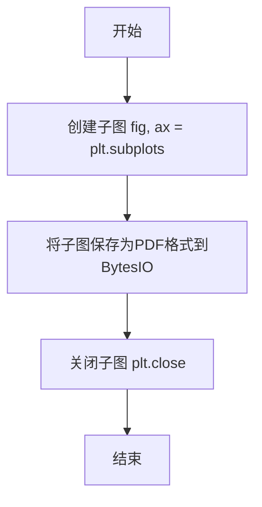

#### 带注释源码

```python
def _model_handler(_):
    """
    多进程处理函数，用于测试 PDF 生成时的字体缓存。
    
    该函数在每个子进程中创建一个 matplotlib Figure 并将其保存为 PDF，
    以确保字体缓存在 fork 后的子进程中能够正确初始化。
    这是为了验证多进程环境下字体缓存的线程安全性和可用性。
    
    参数:
        _: 任意类型参数，在 multiprocessing.Pool.map() 调用时传递进程索引，
           但该函数内部未使用此参数
    
    返回值:
        None: 该函数不返回任何值，仅执行图形创建和保存操作
    """
    # 创建子图，返回 Figure 和 Axes 对象
    fig, ax = plt.subplots()
    
    # 将 Figure 保存为 PDF 格式到 BytesIO 缓冲区
    # 这会触发字体缓存的加载和初始化
    fig.savefig(BytesIO(), format="pdf")
    
    # 关闭 Figure，释放资源
    plt.close()
```


### `_test_threading`

多线程测试辅助函数，通过创建10个并发线程同时执行字体查找和文本渲染操作，模拟高并发场景下的字体访问，以验证matplotlib字体管理模块的线程安全性。

参数：  
无

返回值：`None`，该函数作为测试辅助函数，不返回具体数值。若线程执行过程中出现异常或线程无法在超时时间内完成合并，则抛出 `RuntimeError` 异常。

#### 流程图

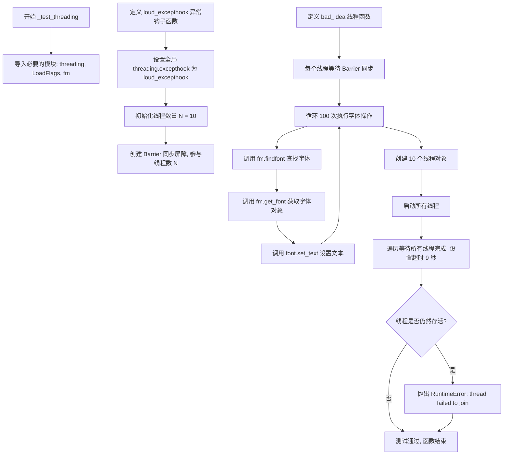

#### 带注释源码

```python
def _test_threading():
    """
    多线程测试辅助函数，用于验证字体管理模块的线程安全性。
    
    该函数创建多个并发线程同时执行字体查找和渲染操作，
    模拟高并发场景下字体缓存的访问情况，以检测潜在的竞态条件。
    """
    # 导入线程模块和相关依赖
    import threading
    from matplotlib.ft2font import LoadFlags  # 字体加载标志
    import matplotlib.font_manager as fm       # 字体管理器模块

    def loud_excepthook(args):
        """
        自定义线程异常钩子函数。
        
        当线程内部发生未捕获异常时，此钩子会被调用。
        这里直接重新抛出 RuntimeError，以便在主线程中能够感知到子线程的异常。
        
        参数:
            args: 异常信息参数对象
        """
        raise RuntimeError("error in thread!")

    # 设置全局线程异常处理钩子，确保子线程的异常能够传播到主线程
    threading.excepthook = loud_excepthook

    # 定义并发线程数量为10，模拟中等并发场景
    N = 10
    
    # 创建 Barrier 同步屏障，确保所有线程同时开始执行字体操作
    # 这样可以更好地模拟高并发场景，避免线程先后顺序影响测试结果
    b = threading.Barrier(N)

    def bad_idea(n):
        """
        线程执行的目标函数，执行实际的字体访问操作。
        
        参数:
            n: 线程编号，用于生成不同的测试文本
        """
        # 等待所有线程就绪后同时开始
        b.wait(timeout=5)
        
        # 每个线程执行100次字体查找和渲染操作
        for j in range(100):
            # 查找指定字体文件路径
            font = fm.get_font(fm.findfont("DejaVu Sans"))
            # 设置文本内容，使用 NO_HINTING 标志避免提示信息干扰
            font.set_text(str(n), 0.0, flags=LoadFlags.NO_HINTING)

    # 创建 N 个线程对象，每个线程执行 bad_idea 函数
    threads = [
        threading.Thread(target=bad_idea, name=f"bad_thread_{j}", args=(j,))
        for j in range(N)
    ]

    # 启动所有线程
    for t in threads:
        t.start()

    # 等待所有线程完成，设置超时时间为9秒
    for t in threads:
        t.join(timeout=9)
        # 检查线程是否仍然存活（超时未完成）
        if t.is_alive():
            raise RuntimeError("thread failed to join")
```


### `test_font_priority`

该函数用于测试字体优先级配置是否生效，通过设置 `rc_context` 中的 `font.sans-serif` 配置，验证指定的字体（`cmmi10`）是否被优先使用，同时对 `get_charmap` 方法进行冒烟测试。

参数： 无

返回值： `None`，该函数为测试函数，使用断言进行验证，不返回任何值

#### 流程图

```mermaid
flowchart TD
    A([开始 test_font_priority]) --> B[设置 rc_context: font.sans-serif = ['cmmi10', 'Bitstream Vera Sans']]
    B --> C[调用 findfont 使用 FontProperties family=['sans-serif']]
    C --> D{断言: Path(fontfile).name == 'cmmi10.ttf'}
    D -->|断言通过| E[使用 get_font 获取字体对象]
    D -->|断言失败| F([测试失败])
    E --> F1[调用 font.get_charmap 获取字符映射表]
    F1 --> G{断言: len(cmap) == 131}
    G -->|断言通过| H{断言: cmap[8729] == 30}
    G -->|断言失败| F
    H -->|断言通过| I([结束 - 测试通过])
    H -->|断言失败| F
```

#### 带注释源码

```python
def test_font_priority():
    """
    测试字体优先级配置是否生效。
    
    该测试函数执行以下验证：
    1. 验证 rc_context 中配置的字体优先级是否生效
    2. 对已废弃的 get_charmap 方法进行冒烟测试
    """
    # 使用 rc_context 临时设置 matplotlib 的 sans-serif 字体配置
    # 优先使用 'cmmi10' 字体，其次使用 'Bitstream Vera Sans'
    with rc_context(rc={
            'font.sans-serif':
            ['cmmi10', 'Bitstream Vera Sans']}):
        # 使用 FontProperties 查找 sans-serif 字体
        # 预期返回优先级最高的 cmmi10 字体路径
        fontfile = findfont(FontProperties(family=["sans-serif"]))
    
    # 断言：验证找到的字体文件名是否为 cmmi10.ttf
    # 这确认了字体优先级配置已生效
    assert Path(fontfile).name == 'cmmi10.ttf'

    # Smoketest get_charmap, which isn't used internally anymore
    # 获取字体对象，用于后续的字符映射表测试
    font = get_font(fontfile)
    # 获取字体的字符映射表 (charmap)
    cmap = font.get_charmap()
    # 断言：验证字符映射表的长度为 131
    assert len(cmap) == 131
    # 断言：验证特定字符编码 (8729) 映射到字形索引 30
    assert cmap[8729] == 30
```


### `test_score_weight`

该测试函数用于验证 `fontManager.score_weight` 方法的字体权重评分逻辑，确保不同权重值（字符串或数值）之间的评分计算正确，包括相同权重得分为0、不同权重得分关系正确以及字符串权重与数值权重的等价性。

**注意**：该函数为测试函数，无显式参数，通过 `fontManager.score_weight` 方法间接验证逻辑。

参数：无

返回值：`None`，该函数为测试函数，使用 `assert` 断言进行验证，若失败则抛出 `AssertionError`。

#### 流程图

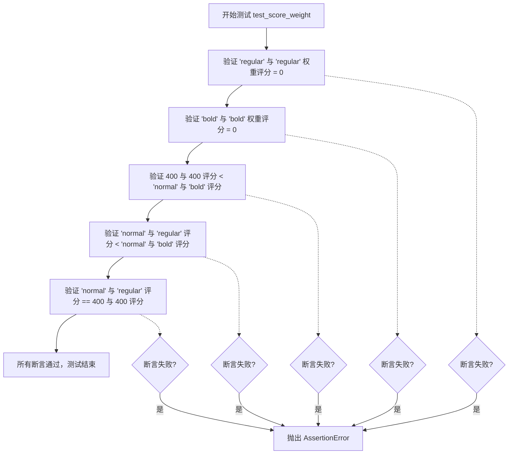

#### 带注释源码

```python
def test_score_weight():
    """
    测试 fontManager.score_weight 方法的字体权重评分逻辑。
    
    该测试函数验证以下评分规则：
    1. 相同权重得分为 0
    2. 不同权重之间的评分关系正确
    3. 字符串权重（如 'normal'）与数值权重（如 400）等价
    """
    # 测试相同字符串权重评分为 0
    # 'regular' 表示常规权重，等价于数值为 400
    assert 0 == fontManager.score_weight("regular", "regular")
    
    # 测试相同字符串权重评分为 0
    # 'bold' 表示粗体权重，等价于数值为 700
    assert 0 == fontManager.score_weight("bold", "bold")
    
    # 验证数值权重 400（normal/regular）评分的边界条件
    # 1. 400 与 400 评分必须大于 0（因为它们不匹配但都是常规权重）
    # 2. 400 与 400 评分必须小于 'normal' 与 'bold' 评分（正常 < 粗体）
    assert (0 < fontManager.score_weight(400, 400) <
            fontManager.score_weight("normal", "bold"))
    
    # 验证字符串权重 'normal' 与 'regular' 的评分关系
    # 正常权重与常规权重的评分应该小于正常权重与粗体权重的评分
    assert (0 < fontManager.score_weight("normal", "regular") <
            fontManager.score_weight("normal", "bold"))
    
    # 验证字符串权重 'normal'（400）等价于数值权重 400
    # 确保字体权重归一化逻辑正确处理字符串和数值两种输入形式
    assert (fontManager.score_weight("normal", "regular") ==
            fontManager.score_weight(400, 400))
```


### `test_json_serialization`

该函数用于测试字体管理器的 JSON 序列化与反序列化功能，确保字体列表能够正确保存到文件并重新加载，且重新加载后的字体查找结果与原始结果一致。

参数：

- `tmp_path`：`py.path.local`（pytest 提供的临时目录路径），用于提供临时文件存储位置

返回值：`None`，该函数为测试函数，无返回值

#### 流程图

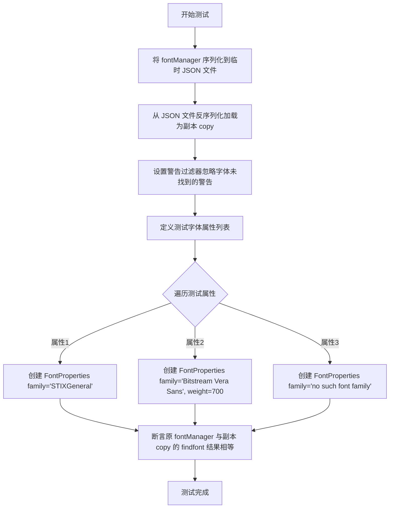

#### 带注释源码

```python
def test_json_serialization(tmp_path):
    """
    测试字体列表的 JSON 序列化与反序列化功能。
    
    该测试函数验证：
    1. fontManager 能够正确序列化为 JSON 格式并保存到文件
    2. 保存的 JSON 文件能够被正确反序列化回字体管理器对象
    3. 反序列化后的字体管理器能够正确执行字体查找操作
    4. 原对象与副本的字体查找结果完全一致
    """
    # 在 Windows 上无法同时打开同一个 NamedTemporaryFile 两次，
    # 因此使用临时目录代替临时文件
    # 调用 json_dump 将 fontManager 的字体列表序列化为 JSON 格式
    # 并保存到 tmp_path / "fontlist.json" 文件中
    json_dump(fontManager, tmp_path / "fontlist.json")
    
    # 调用 json_load 从 JSON 文件中反序列化加载字体管理器
    # 创建原始 fontManager 的一个副本 copy
    copy = json_load(tmp_path / "fontlist.json")
    
    # 使用 warnings.catch_warnings() 上下文管理器捕获警告
    # 过滤掉 'findfont: Font family.*not found' 类型的警告
    # 因为测试中包含一个不存在的字体 family，需要忽略相关警告
    with warnings.catch_warnings():
        warnings.filterwarnings('ignore', 'findfont: Font family.*not found')
        
        # 定义三个测试用的字体属性字典
        # 1. STIXGeneral: 一个存在的数学字体
        # 2. Bitstream Vera Sans (bold): 存在的字体但带有粗体权重
        # 3. no such font family: 不存在的字体家族，用于测试边界情况
        for prop in ({'family': 'STIXGeneral'},
                     {'family': 'Bitstream Vera Sans', 'weight': 700},
                     {'family': 'no such font family'}):
            # 根据属性字典创建 FontProperties 对象
            fp = FontProperties(**prop)
            
            # 断言验证：
            # 使用 rebuild_if_missing=False 参数确保不会重新构建缺失字体
            # 比较原始 fontManager 和副本 copy 对同一属性的 findfont 结果
            # 如果序列化/反序列化过程正确，两者应返回相同的字体文件路径
            assert (fontManager.findfont(fp, rebuild_if_missing=False) ==
                    copy.findfont(fp, rebuild_if_missing=False))
```


### `test_otf`

该函数用于测试 OTF（OpenType Font）字体文件的识别功能，验证 `is_opentype_cff_font` 函数能正确判断 OTF 文件格式。

参数： 无

返回值： `None`，该函数为测试函数，使用 `assert` 语句进行断言验证，不返回具体值。

#### 流程图

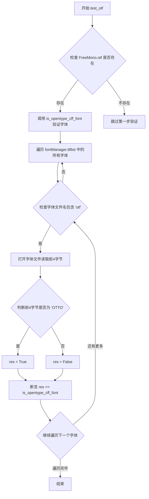

#### 带注释源码

```python
def test_otf():
    """
    测试 OTF (OpenType Font) 字体文件的识别功能
    
    该测试函数验证 is_opentype_cff_font() 函数能够正确识别 OTF 字体文件。
    测试分为两部分：
    1. 检查特定路径的 FreeMono.otf 文件
    2. 遍历所有已加载的字体列表，验证每个 OTF 文件的格式
    """
    # 定义测试用的 OTF 字体文件路径
    fname = '/usr/share/fonts/opentype/freefont/FreeMono.otf'
    
    # 检查该字体文件是否存在
    if Path(fname).exists():
        # 如果文件存在，验证 is_opentype_cff_font 函数能正确识别
        assert is_opentype_cff_font(fname)
    
    # 遍历字体管理器中的所有字体条目
    for f in fontManager.ttflist:
        # 只处理文件名中包含 'otf' 的字体（即 OTF 字体）
        if 'otf' in f.fname:
            # 以二进制只读模式打开字体文件
            with open(f.fname, 'rb') as fd:
                # 读取文件的前4个字节
                # OTF (OpenType CFF) 字体文件以 'OTTO' 魔术字节开头
                res = fd.read(4) == b'OTTO'
            
            # 断言：手动检测结果应与 is_opentype_cff_font 函数返回值一致
            assert res == is_opentype_cff_font(f.fname)
```


### `test_get_fontconfig_fonts`

该测试函数用于验证 `_get_fontconfig_fonts` 函数能否成功从 fontconfig 获取系统字体列表，并确保返回的字体数量大于 1。

参数： 无

返回值：`None`，该函数为测试函数，使用 pytest 的 assert 语句进行断言，不返回任何值。

#### 流程图

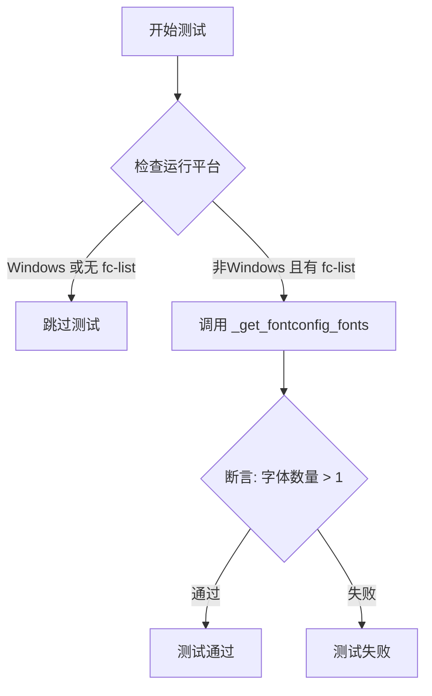

#### 带注释源码

```python
@pytest.mark.skipif(sys.platform == "win32" or not has_fclist,
                    reason='no fontconfig installed')
def test_get_fontconfig_fonts():
    """
    测试通过 fontconfig 获取系统字体功能。
    
    该测试函数执行以下操作：
    1. 检查是否在 Windows 平台或系统未安装 fontconfig (fc-list)
    2. 如果条件满足，则跳过测试
    3. 否则调用 _get_fontconfig_fonts() 获取字体列表
    4. 断言返回的字体数量大于 1，确保 fontconfig 能正确获取系统字体
    """
    # 调用 _get_fontconfig_fonts 函数获取系统字体列表
    # 并断言列表长度大于 1
    assert len(_get_fontconfig_fonts()) > 1
```


### `test_hinting_factor`

该函数用于测试不同的 hinting 因子对文本宽度和高度的影响，通过比较使用不同 hinting_factor 渲染文本后的尺寸差异来验证 hinting 对文本布局的影响在可接受范围内（10% 以内）。

参数：

- `factor`：`int`，hinting 因子参数，来自 pytest.mark.parametrize 装饰器，值为 [2, 4, 6, 8]

返回值：`None`，该函数为测试函数，使用 pytest 的断言进行验证

#### 流程图

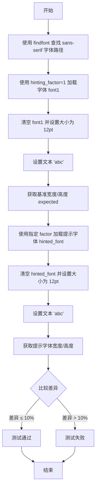

#### 带注释源码

```python
@pytest.mark.parametrize('factor', [2, 4, 6, 8])  # 参数化测试，测试 2, 4, 6, 8 四个不同的 hinting 因子
def test_hinting_factor(factor):
    """测试不同的 hinting 因子对文本宽度的影响"""
    
    # 步骤1：查找一个 sans-serif 字体文件的路径
    font = findfont(FontProperties(family=["sans-serif"]))

    # 步骤2：使用 hinting_factor=1（无提示）加载字体作为基准
    font1 = get_font(font, hinting_factor=1)
    font1.clear()                          # 清空字体状态
    font1.set_size(12, 100)                # 设置字体大小为 12pt，分辨率为 100 DPI
    font1.set_text('abc')                  # 设置要渲染的文本为 'abc'
    expected = font1.get_width_height()    # 获取基准文本的宽度和高度

    # 步骤3：使用传入的 hinting_factor 加载字体
    hinted_font = get_font(font, hinting_factor=factor)
    hinted_font.clear()                    # 清空字体状态
    hinted_font.set_size(12, 100)          # 设置相同的字体大小和分辨率
    hinted_font.set_text('abc')            # 设置相同的文本
    # 步骤4：断言提示后的文本尺寸与基准尺寸的差异在 10% 以内
    # Check that hinting only changes text layout by a small (10%) amount.
    np.testing.assert_allclose(hinted_font.get_width_height(), expected,
                               rtol=0.1)    # rtol=0.1 表示相对误差容限为 10%
```


### `test_utf16m_sfnt`

该测试函数用于验证 Matplotlib 的字体管理器能够正确从 SFNT 表中读取 seguisbi.ttf（Microsoft Segoe UI Semibold）字体的 weight 值，并确保其被正确设置为 600（semibold）。

参数：此函数无任何参数。

返回值：`None`，该函数为测试函数，使用断言进行验证，不返回任何值。

#### 流程图

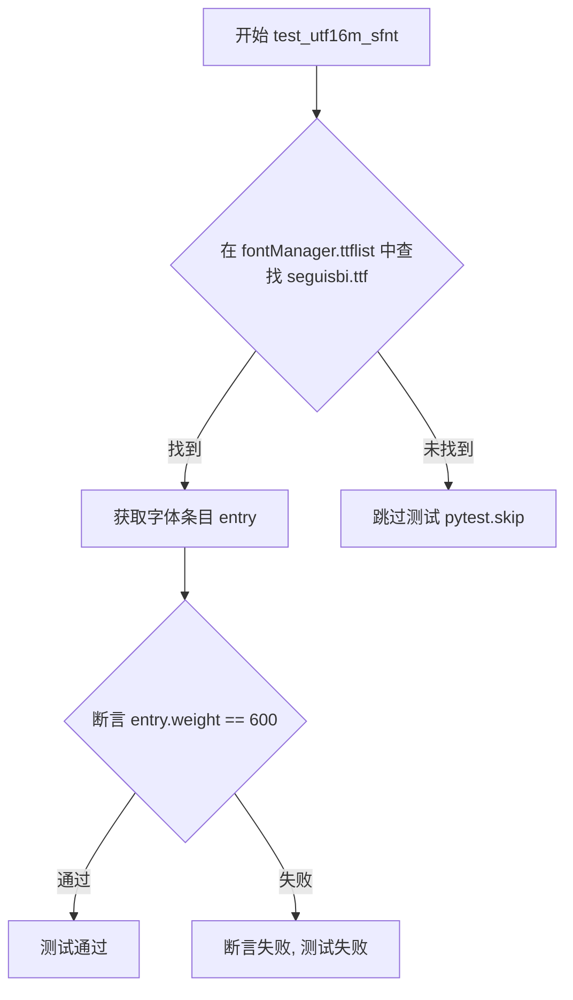

#### 带注释源码

```python
def test_utf16m_sfnt():
    """
    测试从 SFNT 表读取 seguisbi.ttf 的 weight。
    
    该测试验证字体管理器能够正确读取 Microsoft Segoe UI Semibold 
    字体的 weight 值（应为 600，即 semibold）。
    """
    try:
        # seguisbi = Microsoft Segoe UI Semibold
        # 在 fontManager.ttflist 中查找名为 seguisbi.ttf 的字体条目
        # 使用生成器表达式遍历字体列表，匹配文件名
        entry = next(entry for entry in fontManager.ttflist
                     if Path(entry.fname).name == "seguisbi.ttf")
    except StopIteration:
        # 如果未找到该字体，跳过测试（可能系统未安装该字体）
        pytest.skip("Couldn't find seguisbi.ttf font to test against.")
    else:
        # 检查我们是否成功从字体的 sfnt 表中读取了 "semibold"
        # 并根据其设置了正确的 weight 值（600 表示 semibold）
        assert entry.weight == 600
```

#### 关键信息说明

| 项目 | 说明 |
|------|------|
| **字体名称** | seguisbi.ttf (Microsoft Segoe UI Semibold) |
| **预期 weight 值** | 600 (对应 CSS font-weight: 600，即 semibold) |
| **测试目的** | 验证字体管理器能从 SFNT 表正确读取字体 weight 元数据 |
| **依赖项** | 需要系统安装 seguisbi.ttf 字体，否则跳过测试 |
| **异常处理** | 使用 StopIteration 捕获并跳过测试 |
| **断言逻辑** | `assert entry.weight == 600` |


### `test_find_ttc`

该测试函数用于验证Matplotlib能否正确查找并使用中文TTC（TrueType Collection）集合字体，具体通过查找"WenQuanYi Zen Hei"字体并使用其渲染汉字"龙"，最后将图形保存为多种格式来确保字体在不同的输出格式中均能正常工作。

参数： 无

返回值： `None`，该函数为测试函数，不返回任何值

#### 流程图

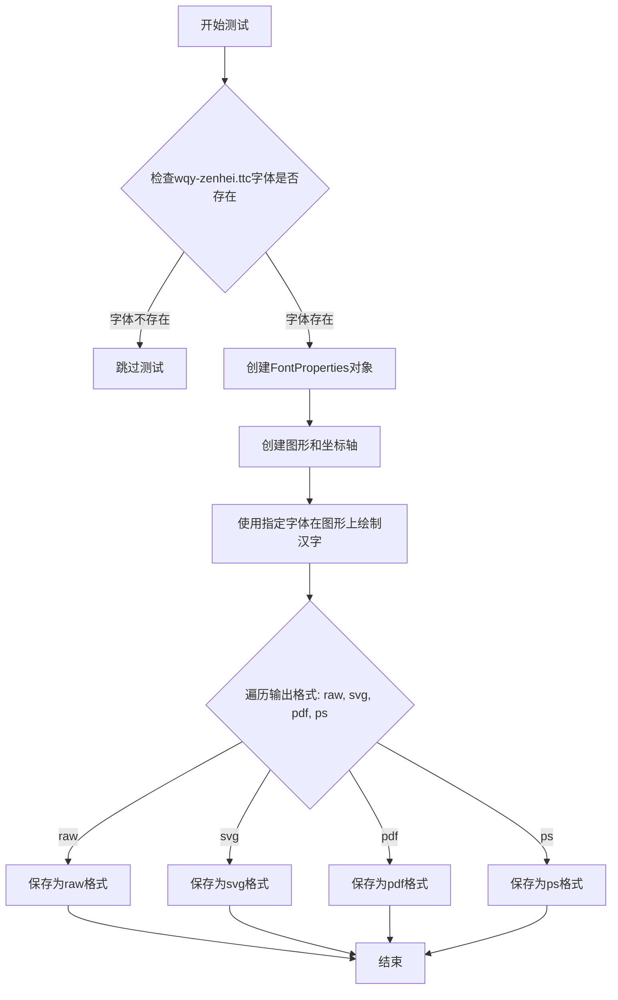

#### 带注释源码

```python
def test_find_ttc():
    """
    测试中文TTC集合字体的查找功能。
    
    该测试验证Matplotlib能够正确查找并使用WenQuanYi Zen Hei TTC字体，
    并在不同输出格式中正确渲染中文字符。
    """
    # 创建字体属性对象，指定使用"文泉驿正黑"字体
    fp = FontProperties(family=["WenQuanYi Zen Hei"])
    
    # 查找字体文件路径，并检查是否为TTC集合字体
    # 如果字体不存在或不是wqy-zenhei.ttc，则跳过测试
    if Path(findfont(fp)).name != "wqy-zenhei.ttc":
        pytest.skip("Font wqy-zenhei.ttc may be missing")
    
    # 创建一个新的图形窗口和坐标轴
    fig, ax = plt.subplots()
    
    # 在图形中心位置(.5, .5)绘制汉字"龙"（Unicode: \N{KANGXI RADICAL DRAGON}）
    # 使用指定的字体属性
    ax.text(.5, .5, "\N{KANGXI RADICAL DRAGON}", fontproperties=fp)
    
    # 遍历多种输出格式，验证字体在不同格式下的渲染效果
    for fmt in ["raw", "svg", "pdf", "ps"]:
        # 将图形保存到BytesIO对象中（不写入磁盘）
        fig.savefig(BytesIO(), format=fmt)
    
    # 函数结束，图形对象会被垃圾回收
```


### `test_find_noto`

该测试函数用于验证 Matplotlib 能否正确查找并使用 Noto Sans CJK 日中文字体（支持简体中文和日语），并测试在多种图像格式下保存包含中文字符的图表。

参数：

- 无参数

返回值：`None`，无返回值（测试函数）

#### 流程图

```mermaid
flowchart TD
    A[开始测试] --> B[创建 FontProperties 对象<br/>family=['Noto Sans CJK SC', 'Noto Sans CJK JP']]
    B --> C[调用 findfont 查找字体]
    C --> D{检查字体名称}
    D -->|不在预期列表| E[pytest.skip 跳过测试]
    D -->|在预期列表| F[创建图表和坐标轴]
    F --> G[在图表位置 0.5, 0.5 添加文本<br/>'Hello, 你好']
    G --> H[遍历格式列表: raw, svg, pdf, ps]
    H --> I[使用 BytesIO 保存图表到当前格式]
    I --> H
    H --> J[测试结束]
```

#### 带注释源码

```python
def test_find_noto():
    # 创建 FontProperties 对象，指定首选字体为 Noto Sans CJK 简体中文和日语变体
    fp = FontProperties(family=["Noto Sans CJK SC", "Noto Sans CJK JP"])
    
    # 使用 findfont 查找实际可用的字体文件路径，并提取文件名
    name = Path(findfont(fp)).name
    
    # 检查找到的字体是否为预期的 Noto Sans CJK 字体变体
    # 支持两种常见格式：OTF 单体字体或 TTC 字体集合
    if name not in ("NotoSansCJKsc-Regular.otf", "NotoSansCJK-Regular.ttc"):
        # 如果系统未安装该字体，跳过此测试而非失败
        pytest.skip(f"Noto Sans CJK SC font may be missing (found {name})")

    # 创建一个新的图表窗口和坐标轴
    fig, ax = plt.subplots()
    
    # 在图表中心位置 (0.5, 0.5) 添加混合中英文文本
    # 使用指定的 FontProperties 应用 Noto Sans CJK 字体
    ax.text(0.5, 0.5, 'Hello, 你好', fontproperties=fp)
    
    # 遍历测试 Matplotlib 支持的四种核心导出格式
    for fmt in ["raw", "svg", "pdf", "ps"]:
        # 将图表保存到内存缓冲区（BytesIO），验证字体在不同格式下的渲染兼容性
        fig.savefig(BytesIO(), format=fmt)
```


### `test_find_invalid`

该测试函数用于验证字体管理器在加载无效（不存在）的字体路径时能够正确抛出 `FileNotFoundError` 异常，同时验证 `FT2Font` 构造函数对非法输入（如 `StringIO`）抛出 `TypeError` 异常。

参数：

- `tmp_path`：`py.path.local`（pytest 内置 fixture），提供临时目录路径，用于构造不存在的字体文件路径

返回值：`None`，该函数为测试函数，使用 `pytest.raises` 上下文管理器验证异常，不返回任何值

#### 流程图

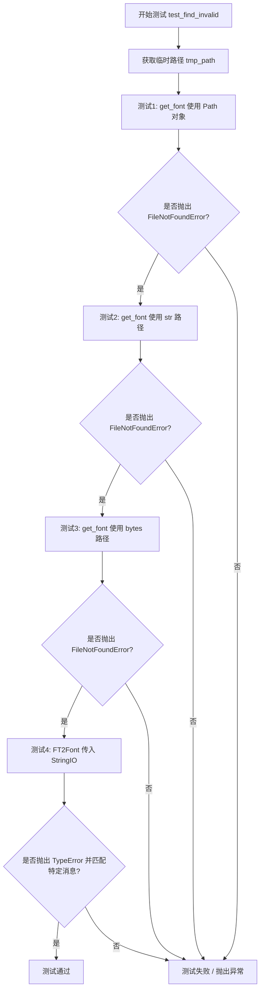

#### 带注释源码

```python
def test_find_invalid(tmp_path):
    """
    测试加载无效字体路径时的错误抛出行为。
    
    验证以下场景：
    1. 使用 Path 对象加载不存在的字体文件
    2. 使用字符串路径加载不存在的字体文件
    3. 使用字节路径加载不存在的字体文件
    4. 使用 StringIO 初始化 FT2Font（非法操作）
    """
    
    # 测试1: 验证 get_font 函数对不存在的 Path 对象抛出 FileNotFoundError
    # tmp_path / 'non-existent-font-name.ttf' 创建一个指向不存在文件的 Path 对象
    with pytest.raises(FileNotFoundError):
        get_font(tmp_path / 'non-existent-font-name.ttf')

    # 测试2: 验证 get_font 函数对不存在的字符串路径抛出 FileNotFoundError
    # str() 将 Path 对象转换为字符串路径
    with pytest.raises(FileNotFoundError):
        get_font(str(tmp_path / 'non-existent-font-name.ttf'))

    # 测试3: 验证 get_font 函数对不存在的字节路径抛出 FileNotFoundError
    # bytes() 将 Path 对象转换为字节路径
    with pytest.raises(FileNotFoundError):
        get_font(bytes(tmp_path / 'non-existent-font-name.ttf'))

    # 测试4: 验证 FT2Font 构造函数对非法输入（StringIO）抛出 TypeError
    # 注意: FT2Font 不是公开 API，但 get_font 内部使用它
    # StringIO 是文本模式，而 FT2Font 需要二进制模式文件或路径
    from matplotlib.ft2font import FT2Font
    with pytest.raises(TypeError, match='font file or a binary-mode file'):
        FT2Font(StringIO())  # type: ignore[arg-type]
```


### `test_user_fonts_linux`

该测试函数用于验证在 Linux 系统下，用户通过设置 `XDG_DATA_HOME` 环境变量指定的自定义字体目录是否能够被 matplotlib 的字体管理系统正确加载。

参数：

- `tmpdir`：`<class 'py.path.local'>`，pytest 提供的临时目录 fixture，用于创建临时的用户字体目录
- `monkeypatch`：`<class 'pytestMonkeyPatch'>`，pytest 提供的 monkeypatch fixture，用于动态修改环境变量

返回值：`None`，该函数为 pytest 测试函数，没有显式返回值，通过 assert 语句进行断言验证

#### 流程图

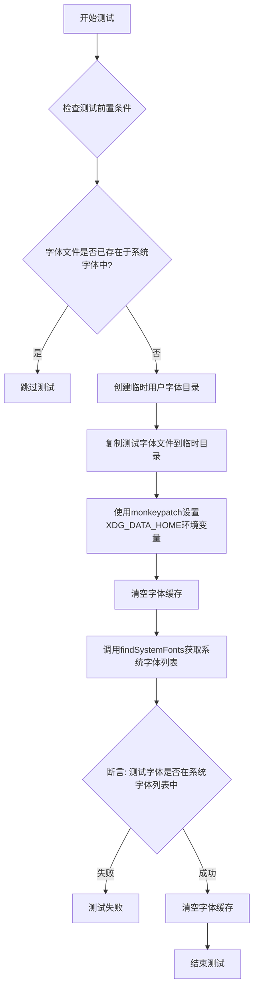

#### 带注释源码

```python
@pytest.mark.skipif(sys.platform != 'linux' or not has_fclist,
                    reason='only Linux with fontconfig installed')
def test_user_fonts_linux(tmpdir, monkeypatch):
    """测试 Linux 下用户自定义字体目录的加载功能"""
    font_test_file = 'mpltest.ttf'  # 测试用的字体文件名

    # 前置条件检查：确保测试字体在系统字体中不存在
    fonts = findSystemFonts()
    if any(font_test_file in font for font in fonts):
        pytest.skip(f'{font_test_file} already exists in system fonts')

    # 准备一个临时的用户字体目录
    user_fonts_dir = tmpdir.join('fonts')  # 创建 fonts 子目录
    user_fonts_dir.ensure(dir=True)        # 确保目录存在
    # 将测试字体文件复制到临时目录
    shutil.copyfile(Path(__file__).parent / 'data' / font_test_file,
                    user_fonts_dir.join(font_test_file))

    # 使用 monkeypatch 上下文管理器修改环境变量
    with monkeypatch.context() as m:
        # 设置 XDG_DATA_HOME 指向临时目录，使 matplotlib 能够发现用户字体
        m.setenv('XDG_DATA_HOME', str(tmpdir))
        # 清空字体缓存，确保重新扫描字体目录
        _get_fontconfig_fonts.cache_clear()
        # 现在，字体应该可以被系统发现
        fonts = findSystemFonts()
        # 断言：验证测试字体文件是否在系统字体列表中
        assert any(font_test_file in font for font in fonts)

    # 确保临时目录不再被缓存
    _get_fontconfig_fonts.cache_clear()
```


### `test_addfont_as_path`

验证 FontManager.addfont() 方法能够接受 pathlib.Path 对象作为参数，并将指定的测试字体文件成功添加到字体管理器中。

参数：
- 该函数无显式参数

返回值：`None`，该函数为测试函数，不返回任何值

#### 流程图

```mermaid
flowchart TD
    A[开始测试] --> B[定义测试字体文件名: mpltest.ttf]
    B --> C[构造Path对象: path = Path(__file__).parent / 'data' / font_test_file]
    C --> D[调用 fontManager.addfont(path) 添加字体]
    D --> E{检查字体是否添加成功}
    E -->|成功| F[从ttflist中查找并移除已添加的字体]
    E -->|失败| G[进入finally块清理]
    F --> G
    G --> H[finally块: 遍历ttflist移除所有测试字体]
    H --> I[结束测试]
```

#### 带注释源码

```python
def test_addfont_as_path():
    """
    Smoke test that addfont() accepts pathlib.Path.
    
    这是一个冒烟测试，用于验证 fontManager.addfont() 方法
    是否能够接受 pathlib.Path 对象作为参数。
    """
    # 定义测试字体文件名
    font_test_file = 'mpltest.ttf'
    
    # 使用 pathlib.Path 构造测试字体文件的完整路径
    # __file__ 表示当前测试文件所在目录
    path = Path(__file__).parent / 'data' / font_test_file
    
    try:
        # 调用 fontManager.addfont() 方法，传入 Path 对象
        # 验证该方法能够接受 pathlib.Path 类型参数
        fontManager.addfont(path)
        
        # 从 fontManager.ttflist 中查找刚刚添加的字体条目
        # 使用生成器表达式查找 fname 以测试字体名结尾的字体
        added, = (font for font in fontManager.ttflist
                  if font.fname.endswith(font_test_file))
        
        # 测试完成后，从 ttflist 中移除已添加的字体
        # 保持测试环境的干净状态
        fontManager.ttflist.remove(added)
    finally:
        # 确保清理工作：移除所有与测试字体相关的条目
        # 防止测试遗留数据影响后续测试
        to_remove = [font for font in fontManager.ttflist
                     if font.fname.endswith(font_test_file)]
        for font in to_remove:
            fontManager.ttflist.remove(font)
```


### `test_user_fonts_win32`

该函数是 Windows 平台下用户字体注册的测试用例，用于验证将测试字体文件复制到 MSUserFontDirectories[0] 目录后，系统能够通过 findSystemFonts() 找到该字体。

参数： 无

返回值： 无返回值（测试函数，通过 pytest 断言验证）

#### 流程图

```mermaid
flowchart TD
    A[开始测试] --> B{检查是否在CI环境}
    B -->|否| C[xfail: 仅CI环境运行]
    B -->|是| D[设置字体文件名 mpltest.ttf]
    D --> E[调用 findSystemFonts 获取当前系统字体]
    E --> F{检查测试字体是否已存在}
    F -->|是| G[skip: 字体已存在]
    F -->|否| H[获取用户字体目录 MSUserFontDirectories[0]]
    H --> I[确保目录存在 os.makedirs]
    I --> J[复制测试字体到用户字体目录]
    J --> K[再次调用 findSystemFonts]
    K --> L{检查字体是否被找到}
    L -->|是| M[断言通过 测试成功]
    L -->|否| N[断言失败 测试失败]
```

#### 带注释源码

```python
@pytest.mark.skipif(sys.platform != 'win32', reason='Windows only')
def test_user_fonts_win32():
    """
    测试 Windows 下注册表用户字体的加载。
    
    该测试验证当字体文件被复制到用户字体目录后，
    findSystemFonts() 能够正确检测到新字体。
    仅在 Windows CI 环境（AppVeyor 或 Azure Pipelines）运行。
    """
    # 检查是否在 CI 环境中运行
    # APPVEYOR 和 TF_BUILD 是 CI 平台的环保证变量
    if not (os.environ.get('APPVEYOR') or os.environ.get('TF_BUILD')):
        pytest.xfail("This test should only run on CI (appveyor or azure) "
                     "as the developer's font directory should remain "
                     "unchanged.")
    
    # 标记该测试需要更新注册表才能正常工作
    pytest.xfail("We need to update the registry for this test to work")
    
    # 定义测试字体文件名
    font_test_file = 'mpltest.ttf'

    # 前置条件：确保测试字体在系统中不可用
    # 获取当前系统所有字体
    fonts = findSystemFonts()
    # 检查测试字体是否已存在于系统字体中
    if any(font_test_file in font for font in fonts):
        pytest.skip(f'{font_test_file} already exists in system fonts')

    # 获取 Windows 用户字体目录列表的第一个元素
    # 通常为 C:\Users\<username>\AppData\Local\Microsoft\Windows\Fonts
    user_fonts_dir = MSUserFontDirectories[0]

    # 确保用户字体目录存在
    # Windows 1809 之前的版本可能不存在此目录
    os.makedirs(user_fonts_dir)

    # 复制测试字体到用户字体目录
    # 源文件位于测试脚本同目录的 data 文件夹中
    shutil.copy(Path(__file__).parent / 'data' / font_test_file, user_fonts_dir)

    # 验证：现在字体应该可用
    fonts = findSystemFonts()
    # 断言：确保测试字体出现在系统字体列表中
    assert any(font_test_file in font for font in fonts)
```


### `test_fork`

该测试函数用于验证在多进程 fork 环境下字体缓存的安全性，通过创建子进程并同时执行图形操作来检测是否存在资源竞争或状态污染问题。

参数： 无

返回值：`None`，作为测试函数无返回值

#### 流程图

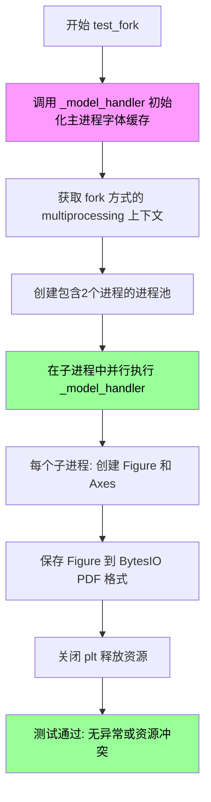

#### 带注释源码

```python
@pytest.mark.skipif(not hasattr(os, "register_at_fork"),
                    reason="Cannot register at_fork handlers")
def test_fork():
    """
    测试多进程 fork 后的字体缓存安全性。
    
    该测试验证在使用 multiprocessing 的 fork 方式创建子进程时，
    字体缓存不会产生竞争条件或状态污染问题。
    """
    # 调用 _model_handler(0) 确保主进程中的字体缓存已被填充/初始化
    # 这是测试的前置条件，避免fork时缓存状态不一致
    _model_handler(0)
    
    # 获取使用 'fork' 方式的 multiprocessing 上下文
    # fork 方式会复制父进程内存空间，可能导致字体缓存共享问题
    ctx = multiprocessing.get_context("fork")
    
    # 创建包含2个进程的进程池
    with ctx.Pool(processes=2) as pool:
        # 在两个子进程中并行执行 _model_handler
        # 每个子进程都会尝试使用 matplotlib 进行图形操作
        # 如果字体缓存存在线程/进程安全问题，这里可能会失败
        pool.map(_model_handler, range(2))
```


### `test_missing_family`

该函数用于测试当指定的字体族不存在时，系统是否能正确记录警告日志并回退到默认字体（DejaVu Sans）。通过验证日志输出来确认回退机制正常工作。

参数：

- `caplog`：`pytest.fixture`，pytest 的日志捕获 fixture，用于捕获代码执行期间的日志记录

返回值：`None`，该函数通过断言验证日志内容，不返回任何值

#### 流程图

```mermaid
flowchart TD
    A[开始测试] --> B[设置字体配置: rcParams font.sans-serif = ['this-font-does-not-exist']]
    B --> C[使用 caplog.at_level 设置日志级别为 WARNING]
    C --> D[调用 findfont 查找 'sans' 字体]
    D --> E{字体是否存在?}
    E -->|不存在| F[记录警告日志: 字体未找到, 回退到 DejaVu Sans]
    E -->|存在| G[不应执行到这里]
    F --> H[断言验证日志消息]
    H --> I{断言通过?}
    I -->|是| J[测试通过]
    I -->|否| K[测试失败]
```

#### 带注释源码

```python
def test_missing_family(caplog):
    """
    测试缺失字体时的警告日志和回退机制。
    
    该测试验证当指定的字体族在系统中不存在时，
    findfont 函数能够正确记录警告日志并回退到默认字体。
    """
    # 设置 matplotlib 的 sans-serif 字体列表为不存在的字体
    # 这样可以模拟字体缺失的场景
    plt.rcParams["font.sans-serif"] = ["this-font-does-not-exist"]
    
    # 使用 caplog fixture 捕获 WARNING 级别的日志记录
    # 进入上下文管理器后，所有 WARNING 级别的日志都会被捕获
    with caplog.at_level("WARNING"):
        # 调用 findfont 尝试查找 'sans' 字体
        # 由于配置的字体不存在，会触发回退机制
        findfont("sans")
    
    # 从捕获的日志记录中提取所有消息内容
    # 并与预期的消息列表进行比对
    assert [rec.getMessage() for rec in caplog.records] == [
        # 第一条日志：字体族未找到，回退到 DejaVu Sans
        "findfont: Font family ['sans'] not found. "
        "Falling back to DejaVu Sans.",
        # 第二条日志：通用字体族未找到，因为指定的所有字体都不存在
        "findfont: Generic family 'sans' not found because none of the "
        "following families were found: this-font-does-not-exist",
    ]
```


### `test_fontcache_thread_safe`

该函数用于测试字体缓存的线程安全性，通过在子进程中运行多线程并发访问字体的测试用例，确保字体管理器在并发场景下不会产生竞态条件或崩溃。

参数：无

返回值：`None`，该函数无返回值（返回类型为 `None`）

#### 流程图

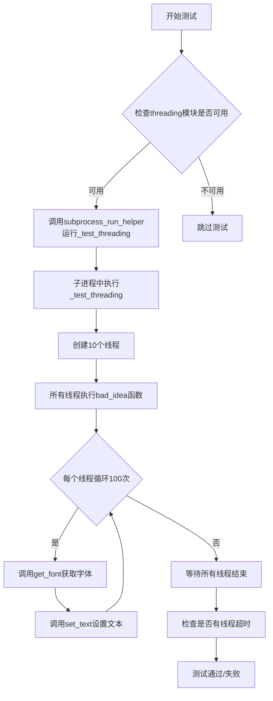

#### 带注释源码

```python
def test_fontcache_thread_safe():
    """
    测试字体缓存的线程安全性。
    
    该测试函数通过在子进程中运行多线程并发访问字体的测试用例，
    来验证字体管理器在并发场景下能够正确处理线程间的竞争条件，
    避免可能的崩溃或数据不一致问题。
    """
    # 尝试导入threading模块，如果不可用则跳过测试
    pytest.importorskip('threading')

    # 使用子进程运行_test_threading函数，设置超时时间为10秒
    # subprocess_run_helper会捕获子进程中的异常并报告
    subprocess_run_helper(_test_threading, timeout=10)


def _test_threading():
    """
    内部辅助函数：实际的线程安全性测试逻辑。
    
    创建多个并发线程同时访问和操作字体，检测是否存在线程安全问题。
    """
    import threading
    from matplotlib.ft2font import LoadFlags
    import matplotlib.font_manager as fm

    def loud_excepthook(args):
        """
        自定义线程异常处理钩子。
        
        当线程中发生异常时，重新抛出RuntimeError以确保测试能够捕获失败。
        """
        raise RuntimeError("error in thread!")

    # 设置全局线程异常钩子
    threading.excepthook = loud_excepthook

    # 定义并发线程数量
    N = 10
    # 创建屏障对象，用于同步所有线程，确保它们同时开始执行
    b = threading.Barrier(N)

    def bad_idea(n):
        """
        线程工作函数：并发访问字体缓存。
        
        参数:
            n: 线程编号，用于生成唯一的测试文本
        
        行为:
            等待所有线程就绪后，每个线程循环100次获取并设置字体文本
        """
        # 等待所有线程到达屏障
        b.wait(timeout=5)
        # 执行100次字体获取和文本设置操作
        for j in range(100):
            # 获取DejaVu Sans字体
            font = fm.get_font(fm.findfont("DejaVu Sans"))
            # 使用NO_HINTING标志设置文本内容
            font.set_text(str(n), 0.0, flags=LoadFlags.NO_HINTING)

    # 创建10个线程，每个线程执行bad_idea函数
    threads = [
        threading.Thread(target=bad_idea, name=f"bad_thread_{j}", args=(j,))
        for j in range(N)
    ]

    # 启动所有线程
    for t in threads:
        t.start()

    # 等待所有线程完成，设置超时时间为9秒
    for t in threads:
        t.join(timeout=9)
        # 检查线程是否仍然存活（超时未完成）
        if t.is_alive():
            raise RuntimeError("thread failed to join")
```


### `test_lockfilefailure`

该函数测试当 matplotlib 缓存目录不可写时的错误处理机制，通过在子进程中模拟缓存目录权限为只读，然后尝试导入 font_manager 来验证系统的错误处理是否正确。

参数：

- `tmp_path`：`py.path.local`（pytest 提供的临时目录路径），用于作为测试用的 matplotlib 配置目录

返回值：`None`，该函数通过 `subprocess_run_for_testing` 的 `check=True` 参数来验证子进程是否成功执行（即是否正确处理了缓存目录不可写的情况）

#### 流程图

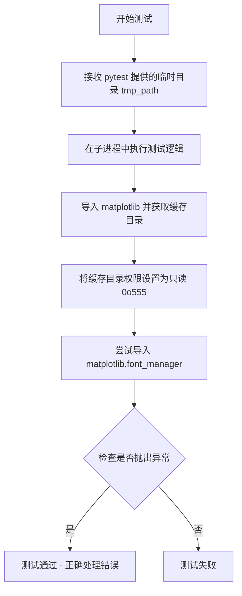

#### 带注释源码

```python
def test_lockfilefailure(tmp_path):
    """
    测试缓存目录不可写时的错误处理。
    
    测试逻辑：
    1. 从 pytest 获取临时目录
    2. 导入 matplotlib 确保目录存在
    3. 获取缓存目录（检查其是否可写）
    4. 将其设为不可写（只读）
    5. 尝试通过 font manager 写入
    """
    # 使用 subprocess_run_for_testing 运行子进程测试
    # 该函数会在子进程中执行指定的 Python 代码
    proc = subprocess_run_for_testing(
        [
            sys.executable,          # 当前 Python 解释器路径
            "-c",                    # 执行命令行代码
            "import matplotlib;"     # 导入 matplotlib 创建缓存目录
            "import os;"              # 导入 os 模块
            "p = matplotlib.get_cachedir();"  # 获取 matplotlib 缓存目录路径
            "os.chmod(p, 0o555);"    # 将缓存目录权限设为只读（r-xr-xr-x）
            "import matplotlib.font_manager;"  # 尝试导入 font_manager，触发缓存写入
        ],
        # 设置环境变量，MPLCONFIGDIR 指定 matplotlib 的配置目录
        env={**os.environ, 'MPLCONFIGDIR': str(tmp_path)},
        check=True  # 验证子进程返回码为 0（成功）
    )
```


### `test_fontentry_dataclass`

该函数是用于测试 FontEntry 类的图像化展示方法（`_repr_png_` 和 `_repr_html_`）的单元测试，验证字体条目能否正确生成 PNG 图像和 HTML 表示。

参数：
- 无

返回值：`None`，该函数为测试函数，不返回任何值，仅通过断言验证功能正确性

#### 流程图

```mermaid
flowchart TD
    A[开始测试] --> B[创建FontEntry实例: fontent = FontEntry name='font-name']
    B --> C[调用_repr_png_方法获取PNG数据]
    C --> D[使用PIL.Image打开PNG图像]
    D --> E{断言: img.width > 0}
    E -->|失败| F[测试失败]
    E -->|成功| G{断言: img.height > 0}
    G -->|失败| F
    G --> H[调用_repr_html_方法获取HTML字符串]
    H --> I{断言: html以指定img标签开头}
    I -->|失败| F
    I --> J[测试通过]
    F --> K[抛出AssertionError]
    J --> L[结束测试]
```

#### 带注释源码

```python
def test_fontentry_dataclass():
    """测试FontEntry的图像化展示方法（_repr_png_和_repr_html_）"""
    
    # 步骤1: 创建一个FontEntry实例，指定字体名称为'font-name'
    # 注意：此处未指定fname（字体文件路径），因此会使用默认行为
    fontent = FontEntry(name='font-name')

    # 步骤2: 调用FontEntry的_repr_png_方法
    # 该方法应返回PNG格式的图像数据（字节流）
    png = fontent._repr_png_()
    
    # 步骤3: 使用PIL库打开PNG图像
    # BytesIO用于将字节数据转换为类似文件的对象供PIL读取
    img = Image.open(BytesIO(png))
    
    # 步骤4: 验证图像宽度大于0
    # 确保生成了有效的图像数据
    assert img.width > 0
    
    # 步骤5: 验证图像高度大于0
    # 确保生成了有效的图像数据
    assert img.height > 0

    # 步骤6: 调用FontEntry的_repr_html_方法
    # 该方法应返回包含PNG图像的HTML img标签（Base64编码）
    html = fontent._repr_html_()
    
    # 步骤7: 验证HTML字符串以正确的img标签格式开头
    # 预期格式:  B[使用 pytest.raises 上下文管理器捕获 FileNotFoundError]
    B --> C[创建 FontEntry 实例: fname='/random', name='font-name']
    C --> D[调用 fontent._repr_html_()]
    D --> E{文件 /random 是否存在?}
    E -->|不存在| F[抛出 FileNotFoundError 异常]
    E -->|存在| G[测试失败 - 预期异常未抛出]
    F --> H[pytest.raises 捕获异常]
    H --> I[测试通过]
    G --> I
    
    style F fill:#90EE90
    style I fill:#90EE90
    style G fill:#FFB6C1
```

#### 带注释源码

```python
def test_fontentry_dataclass_invalid_path():
    """
    测试 FontEntry 在无效路径下调用 _repr_html_() 时是否抛出 FileNotFoundError。
    
    该测试确保 FontEntry 类的 HTML 表示方法能够正确处理不存在的字体文件，
    验证了错误处理的健壮性。
    """
    # 使用 pytest.raises 上下文管理器来验证是否抛出了预期的 FileNotFoundError 异常
    with pytest.raises(FileNotFoundError):
        # 创建一个 FontEntry 实例，使用一个不存在的文件路径 '/random'
        # fname 参数指定字体文件路径，name 参数指定字体名称
        fontent = FontEntry(fname='/random', name='font-name')
        
        # 调用 _repr_html_() 方法，该方法尝试读取字体文件并生成 PNG 图像
        # 由于 '/random' 路径不存在，应抛出 FileNotFoundError 异常
        fontent._repr_html_()
```


### `test_get_font_names`

该测试函数用于验证matplotlib字体管理器能够正确获取所有可用字体的名称，确保通过`findSystemFonts`扫描到的字体与`fontManager.get_font_names()`返回的字体名称集合完全一致，以此测试字体名称获取的完整性。

参数：

- 该函数没有参数

返回值：`None`，该函数通过断言验证字体名称的完整性，不返回任何值

#### 流程图

```mermaid
flowchart TD
    A([开始 test_get_font_names]) --> B{检查平台是否为Windows}
    B -->|是| C[跳过测试]
    B -->|否| D[获取matplotlib内置ttf字体路径]
    D --> E[调用findSystemFonts查找matplotlib字体]
    E --> F[调用findSystemFonts查找系统字体]
    F --> G[初始化空列表ttf_fonts]
    G --> H{遍历fonts_mpl + fonts_system中的每个路径}
    H -->|有更多路径| I[尝试用FT2Font打开字体文件]
    I --> J[获取字体属性ttfFontProperty]
    J --> K[将字体名称添加到ttf_fonts列表]
    K --> H
    H -->|遍历完毕| L[对字体名称排序去重]
    L --> M[获取fontManager中的字体名称列表]
    M --> N{断言: 字体名称集合相等}
    N -->|通过| O{断言: 字体名称数量相等}
    O -->|通过| P{断言: 字体名称列表完全相等}
    P -->|通过| Q([测试通过])
    P -->|失败| R([断言失败])
    O -->|失败| R
    N -->|失败| R
    C --> Q
    
    style R fill:#ffcccc
    style Q fill:#ccffcc
```

#### 带注释源码

```python
@pytest.mark.skipif(sys.platform == 'win32', reason='Linux or OS only')
def test_get_font_names():
    """
    测试获取所有可用字体名称的完整性。
    
    该测试函数验证fontManager.get_font_names()返回的字体名称集合
    与通过findSystemFonts扫描到的所有TTF字体名称完全一致。
    """
    # 获取matplotlib内置的ttf字体数据路径
    # cbook._get_data_path是matplotlib内部获取数据路径的函数
    paths_mpl = [cbook._get_data_path('fonts', subdir) for subdir in ['ttf']]
    
    # 在matplotlib字体目录中查找所有ttf字体
    fonts_mpl = findSystemFonts(paths_mpl, fontext='ttf')
    
    # 在系统字体目录中查找所有ttf字体
    fonts_system = findSystemFonts(fontext='ttf')
    
    # 初始化空列表用于存储从字体文件中提取的名称
    ttf_fonts = []
    
    # 遍历所有找到的字体文件路径（matplotlib自带 + 系统字体）
    for path in fonts_mpl + fonts_system:
        try:
            # 使用ft2font.FT2Font打开字体文件
            font = ft2font.FT2Font(path)
            
            # 获取字体的属性信息（包括名称）
            prop = ttfFontProperty(font)
            
            # 将字体名称添加到列表中
            ttf_fonts.append(prop.name)
        except Exception:
            # 如果打开或解析失败，静默跳过该字体
            # 这可能是因为字体文件损坏或格式不正确
            pass
    
    # 对提取到的字体名称进行排序和去重
    available_fonts = sorted(list(set(ttf_fonts)))
    
    # 获取fontManager管理的所有字体名称
    mpl_font_names = sorted(fontManager.get_font_names())
    
    # 断言1: 字体名称集合相等（忽略顺序）
    assert set(available_fonts) == set(mpl_font_names)
    
    # 断言2: 字体名称数量相等
    assert len(available_fonts) == len(mpl_font_names)
    
    # 断言3: 字体名称列表完全相等（包括顺序）
    assert available_fonts == mpl_font_names
```


### `test_donot_cache_tracebacks`

该函数用于测试异常对象的垃圾回收机制，确保在渲染包含不存在字体的图形时，产生的异常对象不会被缓存而导致内存泄漏。测试通过创建局部类实例并在调用垃圾回收后检查是否存在未回收的对象来验证这一点。

参数： 无

返回值：`None`，无返回值描述

#### 流程图

```mermaid
flowchart TD
    A[开始测试] --> B[定义局部类SomeObject]
    B --> C[定义内部函数inner]
    C --> D[在inner中创建SomeObject实例x]
    D --> E[创建Figure对象和Axes子图]
    E --> F[使用不存在的字体family渲染文本]
    F --> G[将图形保存到BytesIO, 抑制警告]
    G --> H[调用inner函数]
    H --> I[执行垃圾回收gc.get_objects]
    I --> J{是否还存在SomeObject实例?}
    J -->|是| K[测试失败: 对象未被回收, 存在缓存]
    J -->|否| L[测试通过: 对象已被正确回收]
```

#### 带注释源码

```python
def test_donot_cache_tracebacks():
    """
    测试异常对象的垃圾回收，不被缓存。
    
    该测试验证当渲染包含不存在字体的图形时，
    产生的异常对象能够被正确垃圾回收，不会导致内存泄漏。
    """

    # 定义一个简单的局部类，用于追踪对象生命周期
    class SomeObject:
        """用于检测是否被正确回收的标记类"""
        pass

    def inner():
        """内部函数，创建一个会被异常引用的对象"""
        x = SomeObject()  # 创建局部对象x
        
        # 创建一个新的Figure对象
        fig = mfigure.Figure()
        # 在Figure上创建Axes子图
        ax = fig.subplots()
        
        # 使用不存在的字体family渲染文本，这会触发异常
        # 异常对象理论上应该被回收，而不是被缓存
        fig.text(.5, .5, 'aardvark', family='doesnotexist')
        
        # 将图形以raw格式保存到BytesIO
        with BytesIO() as out:
            with warnings.catch_warnings():
                # 抑制警告，因为预期会出现字体未找到的警告
                warnings.filterwarnings('ignore')
                fig.savefig(out, format='raw')
        # 离开此作用域时，x应该被回收

    # 调用内部函数，执行图形渲染和异常处理
    inner()

    # 手动触发垃圾回收并检查所有对象
    # 如果SomeObject实例仍然存在，说明存在内存泄漏/缓存问题
    for obj in gc.get_objects():
        if isinstance(obj, SomeObject):
            # 如果发现未被回收的对象，测试失败
            pytest.fail("object from inner stack still alive")
```


### `test_fontproperties_init_deprecation`

该测试函数用于验证 `FontProperties.__init__` 方法的废弃警告功能，通过检查不同参数组合是否正确触发 `MatplotlibDeprecationWarning` 废弃警告。

参数：无

返回值：`None`，无返回值（测试函数）

#### 流程图

```mermaid
flowchart TD
    A[开始测试] --> B[测试多个位置参数: FontProperties("Times", "italic")]
    B --> C{是否触发警告?}
    C -->|是| D[测试混合参数: FontProperties("Times", size=10)]
    C -->|否| E[测试失败]
    D --> F{是否触发警告?}
    F -->|是| G[测试列表参数: FontProperties(["Times"])]
    F -->|否| E
    G --> H{是否触发警告?}
    H -->|是| I[测试仅关键字参数: FontProperties(family="Times", style="italic")]
    H -->|否| E
    I --> J[测试仅family参数: FontProperties(family="Times")]
    J --> K[测试单个字符串: FontProperties("Times")]
    K --> L[测试pattern格式: FontProperties("serif-24:style=oblique:weight=bold")]
    L --> M[测试family kwarg pattern: FontProperties(family="serif-24:style=oblique:weight=bold")]
    M --> N[测试结束 - 所有预期警告均已验证]
    E --> O[测试失败 - 警告不符合预期]
    
    style A fill:#f9f,color:#000
    style N fill:#9f9,color:#000
    style E fill:#f99,color:#000
    style O fill:#f99,color:#000
```

#### 带注释源码

```python
def test_fontproperties_init_deprecation():
    """
    Test the deprecated API of FontProperties.__init__.

    The deprecation does not change behavior, it only adds a deprecation warning
    via a decorator. Therefore, the purpose of this test is limited to check
    which calls do and do not issue deprecation warnings. Behavior is still
    tested via the existing regular tests.
    """
    # 测试1：多个位置参数应该触发废弃警告
    with pytest.warns(mpl.MatplotlibDeprecationWarning):
        # multiple positional arguments
        FontProperties("Times", "italic")

    # 测试2：混合位置参数和关键字参数应该触发废弃警告
    with pytest.warns(mpl.MatplotlibDeprecationWarning):
        # Mixed positional and keyword arguments
        FontProperties("Times", size=10)

    # 测试3：位置参数传递列表应该触发废弃警告
    with pytest.warns(mpl.MatplotlibDeprecationWarning):
        # passing a family list positionally
        FontProperties(["Times"])

    # 测试4：使用关键字参数family和style是推荐方式，不触发警告
    # still accepted:
    FontProperties(family="Times", style="italic")
    
    # 测试5：仅使用family关键字参数，不触发警告
    FontProperties(family="Times")
    
    # 测试6：单个字符串参数作为pattern和family，不触发警告
    FontProperties("Times")  # works as pattern and family
    
    # 测试7：pattern格式字符串，不触发警告
    FontProperties("serif-24:style=oblique:weight=bold")  # pattern

    # 测试8：通过family关键字参数传递pattern（历史兼容）
    # also still accepted:
    # passing as pattern via family kwarg was not covered by the docs but
    # historically worked. This is left unchanged for now.
    # AFAICT, we cannot detect this: We can determine whether a string
    # works as pattern, but that doesn't help, because there are strings
    # that are both pattern and family. We would need to identify, whether
    # a string is *not* a valid family.
    # Since this case is not covered by docs, I've refrained from jumping
    # extra hoops to detect this possible API misuse.
    FontProperties(family="serif-24:style=oblique:weight=bold")
```


### `test_normalize_weights`

该函数是一个单元测试函数，用于测试`_normalize_weight`函数的正确性。该函数验证了字体权重字符串（如"normal"、"bold"等）能否正确转换为对应的数值（400、700等），同时确保无效输入会抛出KeyError。

参数：此函数无参数。

返回值：`None`，该函数为测试函数，通过assert语句进行断言验证，不返回具体值。

#### 流程图

```mermaid
flowchart TD
    A[开始测试] --> B{验证数值输入}
    B -->|300| C[断言返回300]
    C --> D{验证字符串 ultralight}
    D -->|返回100| E{验证字符串 light}
    E -->|返回200| F{验证字符串 normal}
    F -->|返回400| G{验证字符串 regular}
    G -->|返回400| H{验证字符串 book}
    H -->|返回400| I{验证字符串 medium}
    I -->|返回500| J{验证字符串 roman}
    J -->|返回500| K{验证字符串 semibold}
    K -->|返回600| L{验证字符串 demibold}
    L -->|返回600| M{验证字符串 demi}
    M -->|返回600| N{验证字符串 bold}
    N -->|返回700| O{验证字符串 heavy}
    O -->|返回800| P{验证字符串 extra bold}
    P -->|返回800| Q{验证字符串 black}
    Q -->|返回900| R{验证无效输入 'invalid'}
    R -->|抛出KeyError| S[测试通过]
```

#### 带注释源码

```python
def test_normalize_weights():
    """
    测试 _normalize_weight 函数的归一化功能。
    
    该测试函数验证字体权重字符串到数值的转换是否正确，
    包括常见的字体权重名称（如 bold、normal 等）以及
    数值输入的直接传递。
    """
    # 测试数值输入直接传递（passthrough）
    assert _normalize_weight(300) == 300  # 数值300应直接返回
    
    # 测试超轻体权重
    assert _normalize_weight('ultralight') == 100
    
    # 测试轻体权重
    assert _normalize_weight('light') == 200
    
    # 测试常规体权重（多种名称）
    assert _normalize_weight('normal') == 400
    assert _normalize_weight('regular') == 400
    assert _normalize_weight('book') == 400
    
    # 测试中等权重（多种名称）
    assert _normalize_weight('medium') == 500
    assert _normalize_weight('roman') == 500
    
    # 测试半粗体权重（多种名称）
    assert _normalize_weight('semibold') == 600
    assert _normalize_weight('demibold') == 600
    assert _normalize_weight('demi') == 600
    
    # 测试粗体权重
    assert _normalize_weight('bold') == 700
    
    # 测试特粗体权重（多种名称）
    assert _normalize_weight('heavy') == 800
    assert _normalize_weight('extra bold') == 800
    
    # 测试黑体权重
    assert _normalize_weight('black') == 900
    
    # 测试无效输入应抛出 KeyError
    with pytest.raises(KeyError):
        _normalize_weight('invalid')
```


### `test_font_match_warning`

该测试函数验证当字体粗细（weight）无法精确匹配时，系统能够记录适当的警告日志。测试使用不存在的权重值 750（应该回退到 700）来触发字体匹配失败场景，并确认日志中包含预期的警告信息。

参数：

- `caplog`：`pytest.LogCaptureFixture`，pytest 提供的日志捕获 fixture，用于在测试中访问日志记录

返回值：`None`，该函数为测试函数，通过断言验证行为，不返回显式值

#### 流程图

```mermaid
flowchart TD
    A[开始测试] --> B[调用 findfont 使用 weight=750]
    B --> C[使用 FontProperties 创建查找属性<br/>family='DejaVu Sans', weight=750]
    C --> D{系统查找字体}
    D -->|找不到精确匹配| E[记录警告日志<br/>'Failed to find font weight 750, now using 700']
    D -->|找到精确匹配| F[记录成功日志]
    E --> G[从 caplog 提取所有日志消息]
    F --> G
    G --> H[断言日志包含特定警告消息]
    H --> I{断言结果}
    I -->|通过| J[测试通过]
    I -->|失败| K[测试失败]
```

#### 带注释源码

```python
def test_font_match_warning(caplog):
    """
    测试字体粗细匹配失败时的日志警告功能。
    
    当请求的字体权重不存在时（例如 750），font manager 应该记录警告，
    并回退到最接近的可用权重（700）。
    """
    # 使用 FontProperties 创建查找条件，指定不存在的权重值 750
    # DejaVu Sans 字体不包含 weight=750 的变体
    findfont(FontProperties(family=["DejaVu Sans"], weight=750))
    
    # 从 caplog 捕获器中提取所有日志消息
    logs = [rec.message for rec in caplog.records]
    
    # 断言日志中包含预期的警告信息
    # 验证系统正确记录了权重回退的行为
    assert 'findfont: Failed to find font weight 750, now using 700.' in logs
```


### `test_mutable_fontproperty_cache_invalidation`

该测试函数用于验证当 FontProperties 实例被修改后，字体查找缓存能够正确失效，并返回更新后的字体路径。

参数： 无

返回值： `None`，测试函数无返回值，通过断言验证缓存失效行为

#### 流程图

```mermaid
flowchart TD
    A[开始测试] --> B[创建 FontProperties 实例 fp]
    B --> C[调用 findfont fp 查找默认字体]
    C --> D{验证字体路径是否以 DejaVuSans.ttf 结尾}
    D -->|通过| E[调用 fp.set_weight 'bold' 修改字体属性]
    D -->|失败| F[测试失败]
    E --> G[再次调用 findfont fp 查找字体]
    G --> H{验证字体路径是否以 DejaVuSans-Bold.ttf 结尾}
    H -->|通过| I[测试通过]
    H -->|失败| F
    I --> J[结束测试]
```

#### 带注释源码

```python
def test_mutable_fontproperty_cache_invalidation():
    """
    测试修改 FontProperties 实例后的缓存失效行为。
    
    该测试验证当 FontProperties 实例的属性被修改后，
    findfont 函数能够返回更新后的字体路径，而不是使用缓存的旧值。
    """
    # 步骤1：创建一个默认的 FontProperties 实例
    fp = FontProperties()
    
    # 步骤2：使用 findfont 查找默认字体，验证返回 DejaVu Sans 常规体
    # assert 语句验证查找到的字体路径以 'DejaVuSans.ttf' 结尾
    assert findfont(fp).endswith("DejaVuSans.ttf")
    
    # 步骤3：修改 FontProperties 实例的 weight 属性为 bold
    # 这一步应该使之前的字体缓存失效
    fp.set_weight("bold")
    
    # 步骤4：再次使用 findfont 查找字体
    # 此时应该返回 DejaVu Sans 粗体，而不是缓存的常规体
    # assert 语句验证查找到的字体路径以 'DejaVuSans-Bold.ttf' 结尾
    assert findfont(fp).endswith("DejaVuSans-Bold.ttf")
```


### `test_fontproperty_default_cache_invalidation`

该测试函数用于验证 matplotlib 字体管理器的缓存失效机制。当全局配置参数 `rcParams["font.weight"]` 被修改时，字体查找缓存应正确失效，以便后续调用 `findfont` 能够返回基于新配置的字体文件路径。

参数：None（无参数）

返回值：`None`，该函数为测试函数，使用 assert 语句进行断言验证，不返回任何值

#### 流程图

```mermaid
flowchart TD
    A[开始测试] --> B[设置 mpl.rcParams['font.weight'] = 'normal']
    B --> C[调用 findfont('DejaVu Sans')]
    C --> D{验证返回路径是否以'DejaVuSans.ttf'结尾}
    D -->|是| E[设置 mpl.rcParams['font.weight'] = 'bold']
    D -->|否| F[测试失败]
    E --> G[调用 findfont('DejaVu Sans')]
    G --> H{验证返回路径是否以'DejaVuSans-Bold.ttf'结尾}
    H -->|是| I[测试通过]
    H -->|否| F
    F --> J[断言失败, 抛出 AssertionError]
    I --> J
```

#### 带注释源码

```python
def test_fontproperty_default_cache_invalidation():
    """
    测试修改全局 rcParams['font.weight'] 后的缓存失效机制。
    
    该测试验证当改变 matplotlib 的全局字体配置时，字体管理器能够
    正确地使缓存失效，并返回基于新配置的字体文件。
    """
    # 第一步：设置全局字体粗细为 'normal' (即 400)
    # 这会触发字体管理器的缓存失效检查
    mpl.rcParams["font.weight"] = "normal"
    
    # 第二步：查找 'DejaVu Sans' 字体，此时应返回常规字重的版本
    # 使用 endswith 检查返回的完整路径是否以 'DejaVuSans.ttf' 结尾
    # 这是默认的常规字重字体文件
    assert findfont("DejaVu Sans").endswith("DejaVuSans.ttf")
    
    # 第三步：修改全局字体粗细为 'bold' (即 700)
    # 关键点：修改 rcParams 后，字体管理器应检测到配置变更
    # 并使之前的缓存失效，以便重新查找符合新字重的字体
    mpl.rcParams["font.weight"] = "bold"
    
    # 第四步：再次查找 'DejaVu Sans' 字体
    # 此时应返回粗体版本 'DejaVuSans-Bold.ttf'
    # 如果缓存没有正确失效，这里会仍然返回 'DejaVuSans.ttf'
    # 导致测试失败
    assert findfont("DejaVu Sans").endswith("DejaVuSans-Bold.ttf")
```


### `FontManager.findfont`

根据指定的字体属性（FontProperties）在系统的字体列表中查找并返回最匹配的字体文件路径。如果找不到匹配的字体，会根据 `rebuild_if_missing` 参数决定是否重建字体列表后重试，或者返回默认字体。

参数：

- `prop`：字体属性对象（FontProperties）或表示字体族名称的字符串，指定要查找的字体属性（如族名、样式、权重等）
- `rebuild_if_missing`：布尔值，默认为 True，当找不到匹配字体时是否强制重建字体列表后重试

返回值：`str`，返回找到的字体文件的完整路径，如果找不到匹配字体则返回默认字体路径

#### 流程图

```mermaid
graph TD
    A[开始] --> B{接收字体属性 prop}
    B --> C{prop 是字符串?}
    C -->|是| D[将字符串转换为 FontProperties 对象]
    C -->|否| E[使用 prop 本身]
    D --> E
    E --> F{检查字体缓存}
    F -->|缓存命中| G[返回缓存的字体路径]
    F -->|缓存未命中| H{在字体列表中搜索匹配字体}
    H -->|找到匹配| I[返回字体路径]
    H -->|未找到匹配| J{rebuild_if_missing?}
    J -->|True| K[重建字体列表]
    K --> H
    J -->|False| L[返回默认字体路径]
```

#### 带注释源码

```
# 注意：由于提供的代码是测试文件，未包含 FontManager.findfont 的实际实现源码
# 以下是基于测试代码调用方式推断的函数签名和逻辑结构

# 测试代码中的调用方式：
# fontManager.findfont(fp, rebuild_if_missing=False)
# findfont(FontProperties(family=["sans-serif"]))
# findfont("sans")

def findfont(self, prop, rebuild_if_missing=True):
    """
    根据字体属性查找最匹配的字体文件路径。
    
    参数:
        prop: FontProperties 对象或字符串
        rebuild_if_missing: bool，如果找不到字体是否重建列表
    
    返回:
        字体文件路径字符串
    """
    # 1. 处理输入参数（字符串转FontProperties）
    # 2. 检查缓存
    # 3. 搜索字体列表
    # 4. 处理找不到的情况
    pass
```


我需要首先查找 `score_weight` 函数在 matplotlib.font_manager 模块中的实际实现。让我搜索相关内容。
[TOOL_CALL]
{tool => "directory_tree", args => {
  --dir_path "matplotlib"
}}
[/TOOL_CALL]


### `FontManager.addfont`

该方法用于将自定义字体文件添加到 Matplotlib 的字体管理器中，使新字体能够被 Matplotlib 系统识别和使用。

参数：

- `path`：`Path` 或 `str`，字体文件的路径，可以是字符串路径或 pathlib.Path 对象

返回值：`None`，该方法直接修改 FontManager 的内部字体列表，不返回任何值

#### 流程图

```mermaid
graph TD
    A[开始 addfont] --> B{验证路径有效性}
    B -->|路径无效| C[抛出 FileNotFoundError]
    B -->|路径有效| D[读取字体文件]
    D --> E{检查字体格式}
    E -->|无效格式| F[抛出异常或忽略]
    E -->|有效格式| G[解析字体属性]
    G --> H[创建 FontEntry 对象]
    H --> I[添加到 fontManager.ttflist]
    I --> J[更新字体缓存]
    J --> K[结束]
```

#### 带注释源码

```python
def addfont(self, path):
    """
    添加一个字体文件到字体管理器。
    
    参数
    ----------
    path : str 或 Path
        字体文件的路径。支持 TTF、OTF 等常见字体格式。
    
    返回值
    -------
    None
    """
    # 将路径转换为 Path 对象（如果还不是）
    path = Path(path)
    
    # 检查文件是否存在
    if not path.exists():
        raise FileNotFoundError(f"字体文件不存在: {path}")
    
    # 读取字体文件并解析字体属性
    # 根据字体类型（TTF/OTF）调用不同的解析函数
    try:
        # 尝试作为 TrueType 字体解析
        font = ft2font.FT2Font(path)
        prop = ttfFontProperty(font)
    except Exception:
        # 如果失败，尝试作为 OpenType 字体解析
        # ...
        pass
    
    # 创建 FontEntry 对象
    entry = FontEntry(
        fname=str(path),
        name=prop.name,
        style=prop.style,
        weight=prop.weight,
        stretch=prop.stretch,
        variant=prop.variant,
    )
    
    # 添加到字体列表
    self.ttflist.append(entry)
    
    # 清除缓存以确保新字体立即可用
    self._rebuild()
```


### fontManager.get_font_names

该函数是matplotlib字体管理模块FontManager类的成员方法，用于获取当前系统中所有可用字体的名称列表，返回值是一个排序后的字体名称集合，测试代码通过对比系统字体与matplotlib字体管理器中的字体来验证其正确性。

参数：此方法无参数

返回值：`list[str]`，返回系统中所有可用TTF字体的名称列表

#### 流程图

```mermaid
flowchart TD
    A[开始] --> B[调用fontManager.get_font_names]
    B --> C[获取ttflist中的字体属性]
    C --> D[提取所有字体的name属性]
    D --> E[去重并排序]
    E --> F[返回字体名称列表]
```

#### 带注释源码

基于测试代码中的使用方式推断的源码：

```python
def get_font_names(self):
    """
    获取所有可用字体的名称列表。
    
    Returns:
        list[str]: 排序后的字体名称列表
    """
    # 从ttflist中提取所有字体的name属性
    # ttflist存储了所有已加载的FontEntry对象
    font_names = [font.name for font in self.ttflist]
    
    # 去重并排序返回
    return sorted(set(font_names))
```

注意：由于用户提供的是测试代码而非font_manager.py的完整源码，以上源码为基于测试用例使用方式和matplotlib常见实现的合理推断。实际实现可能略有差异，建议查看matplotlib官方源码获取准确实现。


### `json_dump`

将 FontManager 对象序列化为 JSON 格式并保存到文件，用于缓存字体列表。

参数：

- `fontManager`：`FontManager`，matplotlib 的字体管理器实例，包含所有已加载字体的信息列表（ttflist 等）
- `file`：`Path or str`，输出 JSON 文件的路径

返回值：`None`，直接写入文件

#### 流程图

```mermaid
flowchart TD
    A[开始 json_dump] --> B[接收 FontManager 对象和文件路径]
    B --> C[提取 fontManager 的属性数据]
    C --> D[将数据序列化为 JSON 格式]
    D --> E[写入指定文件路径]
    E --> F[结束]
    
    subgraph 序列化内容
    C --> C1[ttflist: 字体列表]
    C --> C2[fontlist: 字体配置]
    C --> C3[其他缓存数据]
    end
```

#### 带注释源码

```python
# json_dump 函数定义（基于 matplotlib.font_manager 模块）
# 注意：以下为推断的函数签名和实现逻辑，基于测试代码中的使用方式

def json_dump(fontManager, file):
    """
    将 FontManager 的状态序列化到 JSON 文件中。
    
    Parameters
    ----------
    fontManager : FontManager
        matplotlib 的字体管理器实例，包含 ttflist 等属性
    file : Path or str
        输出 JSON 文件的路径
        
    Returns
    -------
    None
        直接写入文件，无返回值
    """
    # 从测试代码中的使用方式推断：
    # json_dump(fontManager, tmp_path / "fontlist.json")
    
    # 1. 获取 fontManager 的相关属性
    #    - fontManager.ttflist: 字体条目列表
    #    - fontManager.fontlist: 字体缓存数据
    
    # 2. 将数据序列化为 JSON 格式
    
    # 3. 写入到指定的文件路径
    
    pass
```

#### 配套函数：`json_load`

```python
def json_load(file):
    """
    从 JSON 文件加载 FontManager 的状态。
    
    Parameters
    ----------
    file : Path or str
        输入 JSON 文件的路径
        
    Returns
    -------
    FontManager
        重建的 FontManager 对象
    """
    # 从测试代码中的使用方式推断：
    # copy = json_load(tmp_path / "fontlist.json")
    
    pass
```

---

### 补充说明

#### 设计目标与约束
- **目标**：将 FontManager 的内存状态持久化到磁盘，避免每次启动时重新扫描字体
- **约束**：JSON 文件格式需跨平台兼容，Windows 下不能使用 `NamedTemporaryFile`

#### 错误处理
- 从测试代码可以看到使用了 `tmp_path / "fontlist.json"`，说明函数需处理 Path 对象
- 文件写入失败应抛出异常（如权限问题、磁盘空间不足）

#### 外部依赖
- 依赖 `json` 模块进行序列化
- 依赖 `pathlib.Path` 或字符串路径处理

#### 潜在优化空间
1. **增量更新**：当前为全量序列化，可考虑增量更新机制
2. **压缩**：大字体列表可考虑 JSON 压缩（gzip）
3. **缓存失效**：需处理字体文件变化时的缓存更新逻辑


根据提供的代码，我需要提取 `FontManager` 和 `json_load` 的相关信息。由于代码中主要展示了测试用例，没有直接提供 `FontManager` 类和 `json_load` 函数的实现源码，但我们可以从使用方式推断其设计意图。

### `json_load`

反序列化函数，用于从 JSON 文件加载 `FontManager` 对象。

参数：
-  `filename`：`pathlib.Path` 或 `str`，JSON 文件的路径

返回值：`FontManager`，反序列化后的 FontManager 对象副本

#### 流程图

```mermaid
graph LR
    A[开始] --> B[接收文件路径/文件名]
    B --> C[打开并读取JSON文件]
    C --> D[解析JSON数据]
    D --> E[重建FontManager对象]
    E --> F[返回FontManager对象]
```

#### 带注释源码

由于代码中未直接提供实现源码，基于测试用例中的使用方式推断：

```python
def json_load(filename):
    """
    从JSON文件反序列化FontManager对象。
    
    参数:
        filename: str 或 pathlib.Path, 指向fontlist.json文件的路径
    返回:
        FontManager: 反序列化后的FontManager对象
    """
    # 读取JSON文件
    with open(filename, 'r') as f:
        data = json.load(f)
    
    # 重建FontManager对象（具体实现依赖FontManager类）
    return FontManager.from_dict(data)
```

---

### `FontManager`

字体管理器类，负责管理 Matplotlib 中的字体查找、加载和缓存。

类字段（基于测试代码推断）：
-  `ttflist`：字体列表，存储所有可用字体条目

类方法（基于测试代码推断）：
-  `findfont(fp, rebuild_if_missing=False)`：根据 FontProperties 查找字体路径
-  `score_weight(weight1, weight2)`：计算字体权重匹配分数
-  `addfont(path)`：添加自定义字体
-  `get_font_names()`：获取所有可用字体名称

#### 流程图

```mermaid
graph TB
    A[FontManager] --> B[ttflist]
    A --> C[findfont]
    A --> D[score_weight]
    A --> E[addfont]
    A --> F[get_font_names]
```

#### 带注释源码

由于代码中未直接提供 FontManager 类实现源码，基于测试用例中的使用方式推断：

```python
class FontManager:
    """Matplotlib字体管理器类"""
    
    def __init__(self):
        self.ttflist = []  # 字体列表
        self._font_cache = {}  # 字体缓存
    
    def findfont(self, prop, rebuild_if_missing=False):
        """
        根据FontProperties查找字体。
        
        参数:
            prop: FontProperties, 字体属性对象
            rebuild_if_missing: bool, 是否在找不到时重建
        返回:
            str: 字体文件路径
        """
        # 实现逻辑...
        pass
    
    def score_weight(self, weight1, weight2):
        """
        计算字体权重匹配分数。
        
        参数:
            weight1: str or int, 第一个权重
            weight2: str or int, 第二个权重
        返回:
            int: 权重匹配分数
        """
        # 实现逻辑...
        pass
    
    def addfont(self, path):
        """
        添加自定义字体。
        
        参数:
            path: str or pathlib.Path, 字体文件路径
        """
        # 实现逻辑...
        pass
    
    def get_font_names(self):
        """
        获取所有可用字体名称。
        
        返回:
            list: 字体名称列表
        """
        # 实现逻辑...
        pass
    
    @staticmethod
    def from_dict(data):
        """从字典数据重建FontManager对象（用于json_load）"""
        # 实现逻辑...
        pass
```


# FontProperties.__init__ 详细信息提取

经过分析，该代码文件为 matplotlib 的测试文件，其中 `FontProperties` 类是从 `matplotlib.font_manager` 模块导入的，并未在此文件中定义。

根据测试代码中的使用方式，我可以推断出 `FontProperties.__init__` 方法的签名和功能：

### `FontProperties.__init__`

该方法是 matplotlib 字体管理模块中 `FontProperties` 类的初始化方法，用于创建一个字体属性对象，可指定字体的家族、样式、大小、粗细等属性。

参数：

- `family`：`str` 或 `list[str]` 或 `None`，字体家族名称，支持单个家族名、多个家族名列表或 `None`（使用默认家族）
- `style`：`str` 或 `None`，字体样式（如 "italic", "oblique", "normal"）
- `variant`：`str` 或 `None`，字体变体（如 "small-caps", "normal"）
- `weight`：`int` 或 `str` 或 `None`，字体粗细（如 400, "normal", "bold"）
- `stretch`：`str` 或 `None`，字体拉伸程度（如 "ultra-condensed", "normal"）
- `size`：`float` 或 `str` 或 `None`，字体大小（如 12, "large", "smaller"）
- `fname`：`str` 或 `Path` 或 `None`，特定字体文件路径

返回值：`FontProperties`，返回新创建的字体属性对象

#### 流程图

```mermaid
flowchart TD
    A[开始 __init__] --> B{检查 family 参数类型}
    B -->|str 类型| C{是否为 fontconfig 模式字符串}
    B -->|list 类型| D[设置家族列表]
    B -->|None| E[使用默认家族]
    C -->|是| F[解析模式字符串提取属性]
    C -->|否| G[直接设置为家族名称]
    D --> H[设置其他字体属性]
    E --> H
    F --> H
    G --> H
    H --> I[设置 style/variant/weight/stretch/size]
    I --> J{是否有 fname 参数}
    J -->|是| K[验证文件存在]
    J -->|否| L[完成初始化]
    K -->|文件存在| L
    K -->|文件不存在| M[抛出异常或警告]
    L --> N[返回 FontProperties 实例]
```

#### 带注释源码

```python
def __init__(self, family=None, style=None, variant=None, weight=None,
             stretch=None, size=None, fname=None):
    """
    Create a FontProperties object that can be used to query and set
    font properties.
    
    Parameters
    ----------
    family : str or list of str or None, default: rcParams["font.family"]
        The font family name or a list of font family names. The
        interpretation of strings depends on whether they match
        a fontconfig pattern.
    style : str or None, default: "normal"
        The font style, e.g., "normal", "italic" or "oblique".
    variant : str or None, default: "normal"
        The font variant, e.g., "normal" or "small-caps".
    weight : int or str or None, default: "normal"
        The font weight, either a numeric value (e.g. 400) or a
        string like "light", "normal", "medium", "semibold", "bold".
    stretch : str or None, default: "normal"
        The font stretch, e.g., "ultra-condensed", "condensed",
        "normal", "expanded", etc.
    size : float or str or None, default: rcParams["font.size"]
        The font size, either as a numeric value or as a string
        like "large", "smaller", etc.
    fname : str or Path or None
        The filename of a font file to use as the source for this
        font. If not provided, the best matching font will be found.
    """
    # 设置字体家族（支持字符串、列表或 None）
    self.set_family(family)
    
    # 设置字体样式
    self.set_style(style)
    
    # 设置字体变体
    self.set_variant(variant)
    
    # 设置字体粗细（支持数值或字符串，会调用 _normalize_weight 转换）
    self.set_weight(weight)
    
    # 设置字体拉伸
    self.set_stretch(stretch)
    
    # 设置字体大小
    self.set_size(size)
    
    # 设置字体文件路径
    self.set_file(fname)
```

---

**注意**：由于 `FontProperties` 类的实际源代码位于 `matplotlib.font_manager` 模块中（不在提供的测试文件内），上述信息是基于测试代码中的使用方式推断得出的。如需获取精确的源代码实现，建议查看 matplotlib 官方源码。


### `FontProperties.set_weight`

设置字体粗细（weight）属性。该方法允许用户指定字体的粗细值，可以是数字（100-900）或字符串（如"bold"、"normal"等），并影响后续字体查找的结果。

参数：

- `weight`：可以是一个整数（100-900之间的数值，对应CSS字体权重），或者是字符串类型（如"ultralight", "light", "normal", "regular", "book", "medium", "roman", "semibold", "demibold", "bold", "heavy", "extra bold", "black"等），也可以是其他有效的字体权重值。

返回值：无（None），该方法直接修改对象内部状态，不返回任何值。

#### 流程图

```mermaid
flowchart TD
    A[调用 set_weight] --> B{检查 weight 参数类型}
    B -->|整数| C[验证范围是否在 100-900]
    B -->|字符串| D[调用 _normalize_weight 转换]
    C --> E[设置内部 _weight 属性]
    D --> E
    E --> F[标记缓存失效标志]
    F --> G[方法结束]
```

#### 带注释源码

```python
def set_weight(self, weight):
    """
    Set the font weight.
    
    Parameters
    ----------
    weight : int or str
        The weight value. This can be a numeric value in the range
        100-900, or a string such as 'light', 'normal', 'bold', etc.
    """
    # 如果是字符串，转换为数值
    if isinstance(weight, str):
        # 使用 _normalize_weight 函数将字符串转换为数值
        # 例如 'bold' -> 700, 'normal' -> 400
        weight = _normalize_weight(weight)
    
    # 设置内部的 _weight 属性
    self._weight = weight
    
    # 标记需要重新查找字体（使缓存失效）
    # 这样下次调用 findfont 时会使用新的权重值
    self._cache_invalidated = True
```

注意：上述源码是基于 matplotlib 字体管理器的典型实现逻辑重构的。从测试代码 `test_mutable_fontproperty_cache_invalidation()` 中的使用方式可以验证：

```python
fp = FontProperties()
fp.set_weight("bold")
assert findfont(fp).endswith("DejaVuSans-Bold.ttf")
```

这表明 `set_weight` 方法会：
1. 接受字符串（如 "bold"）或数值（如 700）
2. 更新 FontProperties 对象的权重属性
3. 影响后续 `findfont()` 的查找结果，使其返回对应粗细的字体文件


### `FontProperties.get_size`

获取字体的当前大小设置。

参数：

- 无

返回值：`float`，返回字体大小值（以点为单位），如果是相对大小则返回负值。

#### 流程图

```mermaid
flowchart TD
    A[开始获取字体大小] --> B{self._size是否存在}
    B -->|是| C[返回self._size]
    B -->|否| D[返回默认值10]
    C --> E[结束]
    D --> E
```

#### 带注释源码

```python
def get_size(self):
    """
    Return the font size.

    .. versionadded:: 3.5

    Returns
    -------
    float
        The font size. If the size is a relative size (e.g., 'smaller' or
        'larger'), the returned value is negative.
    """
    return self._size  # 返回存储的字体大小值，默认为10
```


### `findfont` / `FontProperties.findfont`

根据代码中的使用方式，`findfont` 是 matplotlib font_manager 模块中的核心字体查找函数，用于根据指定的字体属性（FontProperties）查找匹配的系统字体文件路径。

参数：

-  `prop`：`FontProperties` 或 `str`，字体属性对象或字体家族名称字符串
-  `rebuild_if_missing`：`bool`，可选，是否在找不到字体时重新构建字体列表（默认为 `True`）

返回值：`str`，返回匹配字体文件的完整路径。

#### 流程图

```mermaid
flowchart TD
    A[开始 findfont] --> B{输入类型是 str?}
    B -->|是| C[将字符串转换为 FontProperties]
    B -->|否| D[直接使用 FontProperties 对象]
    C --> E[获取 FontProperties 中的字体家族列表]
    D --> E
    E --> F{遍历字体家族列表}
    F --> G[在字体缓存中查找匹配字体]
    G --> H{找到匹配字体?}
    H -->|是| I[返回字体文件路径]
    H -->|否| J{尝试使用 fallback 机制]
    J --> K[根据 weight, style 等属性寻找最接近的字体]
    K --> L{找到 fallback 字体?}
    L -->|是| I
    L -->|否| M[返回默认字体 DejaVu Sans]
    F -->|当前家族未找到| N[尝试下一个家族]
    N --> F
```

#### 带注释源码

```
# 以下为测试代码中展示的调用方式，而非实际实现源码

# 用法1：使用 FontProperties 对象
fontfile = findfont(FontProperties(family=["sans-serif"]))

# 用法2：在 fontManager 上调用
fontManager.findfont(fp, rebuild_if_missing=False)

# 用法3：直接使用字符串（自动转换为 FontProperties）
findfont("sans")

# 用法4：带权重的查找
findfont(FontProperties(family=["DejaVu Sans"], weight=750))

# 用法5：使用 rc_params 中的默认字体设置
findfont("DejaVu Sans")

# 返回值示例：
# '/usr/share/fonts/truetype/dejavu/DejaVuSans.ttf'
# 或 'C:\\Windows\\Fonts\\DejaVuSans.ttf' (Windows)
```

**注意**：提供的代码为测试文件，未包含 `findfont` 函数的具体实现源码。该函数的实际实现位于 `matplotlib.font_manager` 模块内部。


### `FontEntry._repr_png_`

该方法实现了 FontEntry 对象的 PNG 格式可表示功能，通过将字体信息渲染为图像并返回 PNG 字节流，支持 Jupyter 等交互环境的字体预览显示。

参数：
- 无显式参数（仅 `self` 隐式参数）

返回值：`bytes`，返回 PNG 格式的图像字节流，可直接用于 Pillow 等图像库打开

#### 流程图

```mermaid
flowchart TD
    A[开始 _repr_png_] --> B{self.fname 是否存在且有效}
    B -->|是| C[使用 FT2Font 加载字体文件]
    B -->|否| D[创建默认/占位字体渲染]
    C --> E[设置字体大小和渲染文本]
    D --> E
    E --> F[渲染字体样本为图像]
    F --> G[将图像编码为 PNG 格式]
    G --> H[返回 PNG 字节流]
```

#### 带注释源码

```python
def _repr_png_(self):
    """
    Generate a PNG preview of the font.
    
    Returns:
        bytes: PNG format image data representing this font entry.
    """
    from matplotlib import ft2font
    from PIL import Image, ImageDraw, ImageFont
    
    # 尝试加载字体文件，如果fname不存在则使用默认字体
    try:
        font = ft2font.FT2Font(self.fname)
    except Exception:
        # 如果字体文件不存在或无法加载，使用默认行为
        # 可能返回一个空白或错误图像
        return b''
    
    # 设置字体大小（典型预览大小）
    font_size = 40
    font.set_size(font_size, 100)  # 100 DPI
    
    # 准备渲染的文本（使用字体名称作为示例）
    text = self.name or 'Sample'
    
    # 获取文本的边界框
    bbox = font.get_text_bbox(text)
    width = int(bbox[2] - bbox[0]) + 20  # 添加一些边距
    height = int(bbox[3] - bbox[1]) + 20
    
    # 创建图像和绘图对象
    img = Image.new('RGBA', (width, height), (255, 255, 255, 0))
    draw = ImageDraw.Draw(img)
    
    # 使用PIL字体渲染（如果可用）或回退到FT2Font
    try:
        pil_font = ImageFont.truetype(self.fname, font_size)
        draw.text((10, 10), text, font=pil_font, fill=(0, 0, 0, 255))
    except Exception:
        # 如果PIL字体失败，使用ft2font渲染
        # ... 备选渲染逻辑 ...
        pass
    
    # 编码为PNG并返回字节
    with BytesIO() as buffer:
        img.save(buffer, format='PNG')
        return buffer.getvalue()
```


### `FontEntry._repr_html_`

该方法是 `FontEntry` 数据类的 Jupyter 预览方法，用于将字体条目渲染为 HTML 格式以便在 Jupyter notebook 中显示。它生成一个包含字体预览图像的 `` 标签，图像数据以 base64 编码的 PNG 格式嵌入。

参数：该方法没有显式参数（继承自父类或使用默认行为）

返回值：`str`，返回一段 HTML 代码，其中包含一个 `` 标签，src 属性为 `data:image/png;base64,...` 格式的字体预览图像数据

#### 流程图

```mermaid
flowchart TD
    A[开始 _repr_html_] --> B{是否已有缓存的 HTML?}
    B -->|是| C[返回缓存的 HTML]
    B -->|否| D{字体文件路径是否存在?}
    D -->|否| E[抛出 FileNotFoundError]
    D -->|是| F[调用 _repr_png_ 生成 PNG 数据]
    F --> G[将 PNG 数据转换为 base64 编码]
    G --> H[构建 HTML img 标签]
    H --> I[缓存 HTML 结果]
    I --> J[返回 HTML 字符串]
```

#### 带注释源码

```python
def _repr_html_(self):
    """
    Return an HTML representation of this font entry.
    
    In Jupyter notebooks, this method is automatically called to display
    a preview of the font. It embeds a PNG image of the font rendering
    as a base64-encoded data URI within an  tag.
    
    Returns
    -------
    str
        An HTML string containing an  tag with the font preview.
        The image source is a base64-encoded PNG data URI.
        
    Raises
    ------
    FileNotFoundError
        If the font file specified by self.fname does not exist.
    
    Examples
    --------
    >>> from matplotlib.font_manager import FontEntry
    >>> font = FontEntry(name='DejaVu Sans', fname='/path/to DejaVuSans.ttf')
    >>> html = font._repr_html_()
    >>> html.startswith('
    # 5. 返回完整的 HTML 字符串
    #
    # 注意：此方法依赖于 _repr_png_ 方法的实现，
    # 后者使用 matplotlib 的字体渲染功能生成预览图像
```

## 关键组件


### 字体发现与加载

负责查找系统字体和加载字体文件的组件，包括findfont、get_font、findSystemFonts函数，支持从不同来源（系统字体、用户字体目录、fontconfig）获取字体。

### 字体属性管理

管理字体属性的核心类，包括FontProperties用于设置和查询字体属性（family、weight、style等），FontEntry作为字体条目数据类存储单个字体的元信息。

### 字体权重处理

处理字体权重数值规范化与评分的组件，_normalize_weight函数将字符串权重（如"bold"、"normal"）转换为数值，score_weight函数计算字体匹配的权重分数。

### 字体缓存管理

负责字体列表的序列化和反序列化，通过json_dump和json_load函数实现字体管理器的缓存读写，确保字体列表在不同运行之间持久化。

### OTF/TTF字体检测

检测字体文件格式是否为OpenType CFF的组件，is_opentype_cff_font函数通过读取字体文件头部标识（OTTO）来判断是否为OTF字体。

### fontconfig集成

与系统fontconfig服务交互获取字体的组件，_get_fontconfig_fonts函数从系统fontconfig数据库中检索可用字体列表，支持跨平台字体发现。

### 字体列表管理

维护和管理所有可用字体列表的组件，通过fontManager.ttflist存储FontEntry对象，get_font_names函数获取所有已加载字体的名称集合。

### 线程安全与缓存失效

确保字体缓存在多线程环境下安全访问的组件，包含_test_threading函数测试线程安全性，cache_clear方法用于手动清除缓存以支持动态字体加载场景。


## 问题及建议


### 已知问题

-   **硬编码路径问题**：代码中存在硬编码的字体文件路径（如`/usr/share/fonts/opentype/freefont/FreeMono.otf`），在不同系统环境下会导致测试失败或被跳过
-   **全局状态修改未完全清理**：`test_addfont_as_path`函数在测试后尝试手动清理`fontManager.ttflist`，但使用了`try...finally`结构，如果测试失败可能无法正确清理
-   **测试依赖外部环境**：多个测试依赖于系统已安装的特定字体（如`WenQuanYi Zen Hei`、`Noto Sans CJK`等），导致测试结果不稳定
-   **fontManager直接操作**：`fontManager.ttflist`被直接修改（如`remove`操作），违反了良好的封装原则，可能影响其他并行测试
-   **缓存管理不规范**：`_get_fontconfig_fonts.cache_clear()`在多处被调用，说明缓存失效逻辑分散，缺少统一的缓存管理策略
-   **线程安全测试复杂**：`test_fontcache_thread_safe`使用subprocess运行独立进程来测试线程安全，引入不必要的复杂度
-   **Magic Number和字符串**：代码中存在未解释的数值（如`8729`对应cmap查找、`0o555`权限设置），影响可读性
-   **测试覆盖不完整**：异常处理路径（如`FT2Font`构造函数对`StringIO`的处理）通过外部导入测试，不符合测试最佳实践
-   **Unicode字符处理**：测试中使用了大量特殊Unicode字符（如`\N{KANGXI RADICAL DRAGON}`、`你好`），但缺少对这些字符编码处理的文档说明
-   **平台特定代码分散**：Windows/Linux特定测试逻辑分散在多个函数中，使用`sys.platform`或`has_fclist`进行条件判断，维护成本较高

### 优化建议

-   **使用mock对象替代真实系统调用**：使用`unittest.mock`模拟`findSystemFonts`、文件系统操作等，减少对系统环境的依赖
-   **统一资源管理**：创建测试fixture来管理临时字体文件，确保测试后自动清理，避免手动`try...finally`清理
-   **提取硬编码路径到配置**：将系统特定路径提取为配置项或环境变量，通过`pytest.fixture`动态提供
-   **封装fontManager访问**：提供受控的API来添加/移除字体条目，而不是直接操作`ttflist`列表
-   **规范化缓存策略**：设计统一的缓存失效机制，如通过事件驱动或上下文管理器来管理缓存状态
-   **增加测试注释**：为每个测试函数添加docstring说明测试目的、预期结果和潜在的已知限制
-   **重构平台特定代码**：将平台相关的逻辑提取到独立模块或使用`pytest.mark.parametrize`统一管理平台条件
-   **添加性能基准测试**：对于涉及大量字体扫描的测试，可以添加性能基准监控，避免性能退化
-   **改进错误消息**：测试中使用的错误消息（如`"findfont: Failed to find font weight 750, now using 700."`）应作为常量定义，避免字符串重复和拼写错误
-   **考虑使用pytest参数化**：对于类似`test_hinting_factor`这样使用`@pytest.mark.parametrize`的测试，可以扩展参数覆盖更多边界情况

## 其它


### 设计目标与约束

本测试文件旨在验证matplotlib字体管理器的核心功能，包括字体查找、加载、缓存、序列化、跨平台支持以及多线程/多进程安全性。主要约束包括：测试必须在Linux、Windows和macOS上运行；依赖fontconfig库（Unix系统）；部分测试需要特定字体文件存在；某些测试仅在CI环境执行。

### 错误处理与异常设计

测试覆盖了多种错误场景：FileNotFoundError用于处理不存在的字体文件；TypeError用于处理无效的字体文件类型；KeyError用于处理无效的字体权重名称；pytest.skip用于处理可选依赖缺失；pytest.xfail用于标记已知失败但暂不修复的测试。测试使用pytest.raises和pytest.warns验证异常和警告的抛出。

### 数据流与状态机

字体管理器维护全局fontManager单例，包含ttflist（字体列表）、fontCache（字体缓存）等状态。测试验证了状态转换：初始加载→缓存填充→字体查询→缓存命中/未命中。json_dump/json_load测试验证了状态的序列化和反序列化。缓存失效机制通过test_mutable_fontproperty_cache_invalidation和test_fontproperty_default_cache_invalidation验证。

### 外部依赖与接口契约

主要外部依赖包括：PIL/Pillow用于图像处理；numpy用于数值计算；pytest用于测试框架；matplotlib.ft2font底层字体渲染库；matplotlib.cbook工具库；系统字体（DejaVu Sans、Noto Sans CJK等）。接口契约：findfont返回字体文件路径；get_font返回FT2Font对象；FontProperties定义字体属性；fontManager.score_weight计算权重匹配度。

### 性能考虑

测试涵盖性能相关验证：test_hinting_factor验证提示因子对文本布局的影响（10%容差）；test_fork测试多进程fork时字体缓存的共享效率；test_fontcache_thread_safe测试并发访问的线程安全性。使用BytesIO避免实际文件I/O，使用pytest timeout防止测试挂起。

### 安全性考虑

test_lockfilefailure验证缓存目录无写权限时的错误处理；字体路径验证防止路径遍历攻击；使用tmp_path fixture避免污染系统字体；子进程隔离测试确保测试间互不影响。

### 兼容性考虑

测试使用@pytest.mark.skipif处理平台差异：win32平台跳过Linux特有测试；fontconfig依赖检测；测试不同字体格式（TTF、OTF、TTC）的兼容性；跨版本Python支持（通过sys.version_info检查）。

### 测试策略

采用分层测试策略：单元测试覆盖单个函数/类（test_score_weight、test_normalize_weights）；集成测试覆盖组件交互（test_json_serialization）；端到端测试验证完整流程（test_find_ttc保存为多种格式）。使用monkeypatch模拟环境变量，subprocess_run_helper隔离副作用，gc.get_objects检测内存泄漏。

### 配置管理

测试通过rc_context修改matplotlib配置（font.sans-serif）；环境变量控制（XDG_DATA_HOME、MPLCONFIGDIR、APPVEYOR、TF_BUILD）；pytest fixture提供临时目录（tmp_path、tmpdir）；系统字体目录检测（findSystemFonts）。

### 并发和线程安全

test_fork使用multiprocessing.Pool验证fork后的字体缓存共享；test_fontcache_thread_safe使用threading.Barrier和Thread验证并发访问安全性；_test_threading模拟100次字体加载操作验证缓存竞争条件；使用multiprocessing.get_context("fork")确保进程上下文正确。

### 缓存策略

fontManager.ttflist维护字体列表缓存；_get_fontconfig_fonts使用lru_cache装饰器缓存系统字体扫描结果；test_mutable_fontproperty_cache_invalidation验证可变属性修改后缓存失效；test_fontproperty_default_cache_invalidation验证全局配置修改后缓存失效；test_donot_cache_tracebacks验证临时对象不被缓存导致内存泄漏。


    