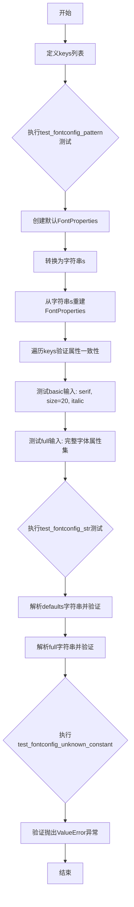
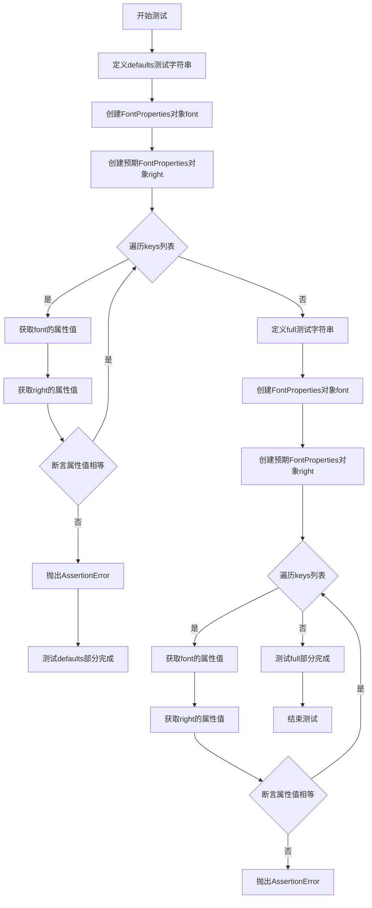
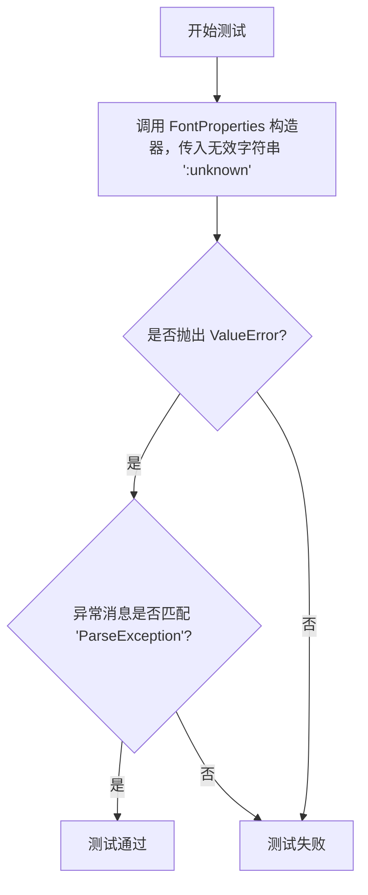
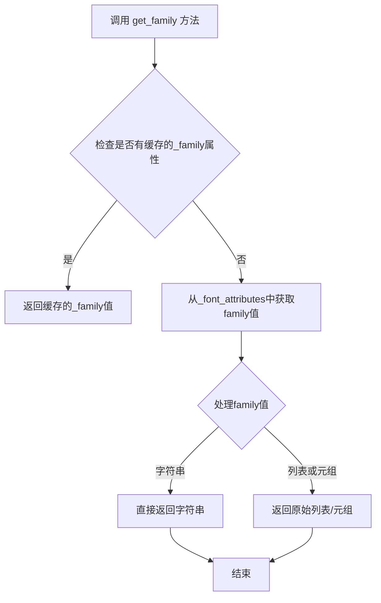
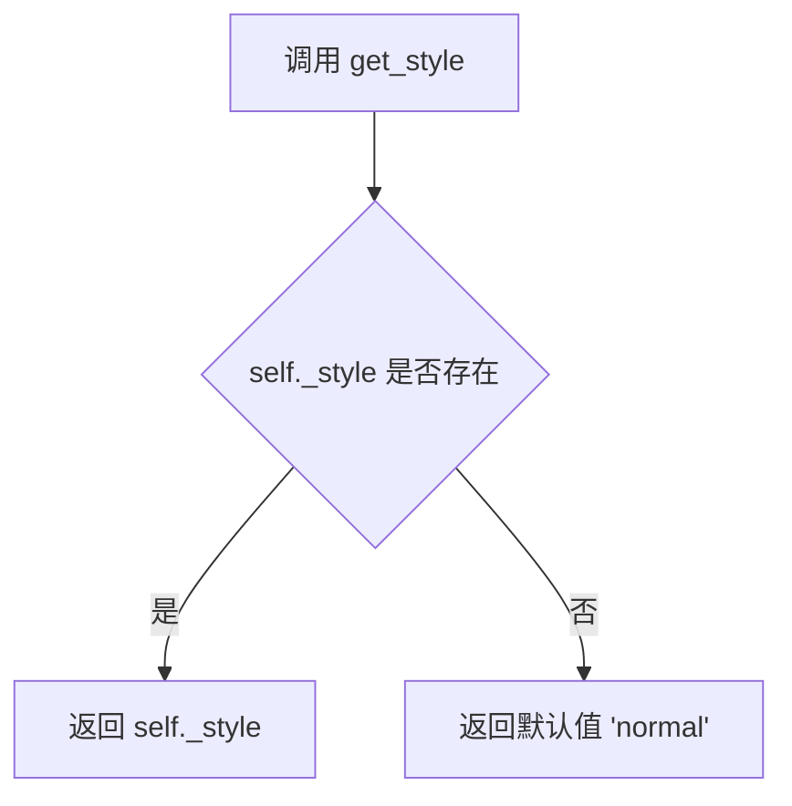
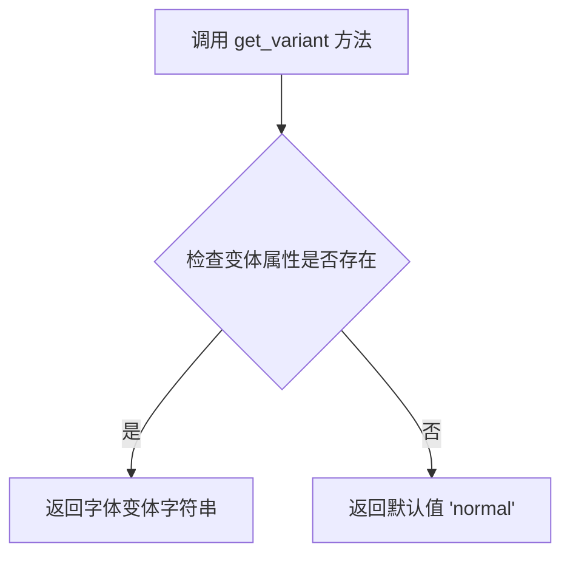
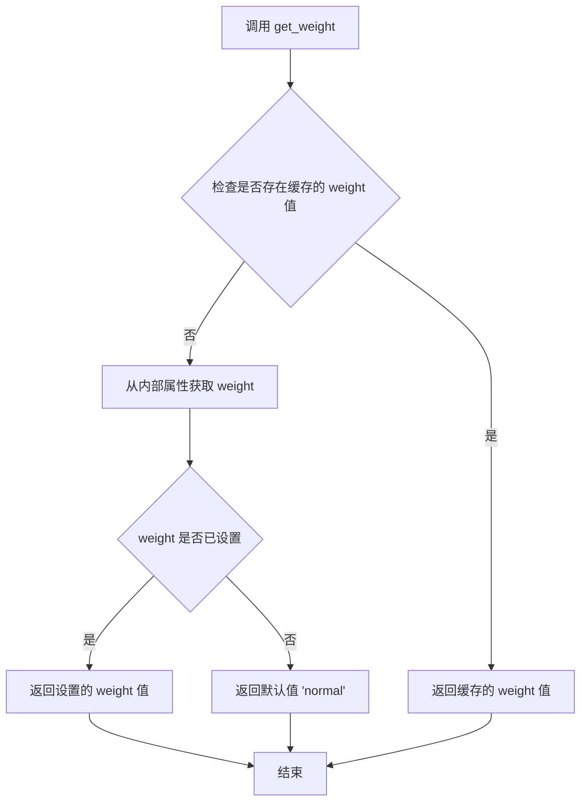
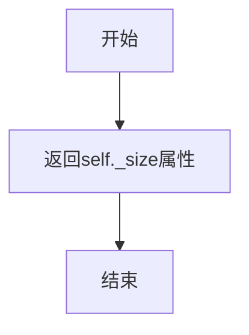

# `matplotlib\lib\matplotlib\tests\test_fontconfig_pattern.py` 详细设计文档

该测试文件验证matplotlib的FontProperties对象能够正确地在字符串表示和对象实例之间进行往返转换，并确保字符串解析功能能够正确处理各种字体配置模式，同时验证对未知常量的错误处理。

## 整体流程



## 类结构

```
测试模块
└── pytest测试函数
    ├── test_fontconfig_pattern (往返转换测试)
    ├── test_fontconfig_str (字符串解析测试)
    └── test_fontconfig_unknown_constant (错误处理测试)
```

## 全局变量及字段


### `keys`
    
存储用于验证FontProperties对象序列化一致性的属性名称列表，包含get_family、get_style、get_variant、get_weight和get_size

类型：`List[str]`
    


    

## 全局函数及方法


### `test_fontconfig_pattern`

该测试函数用于验证 FontProperties 对象在转换为字符串后再从字符串重新创建对象的过程中，字体属性（如 family、style、variant、weight、size）的一致性是否保持。

参数：无需参数

返回值：`None`，无返回值（测试函数）

#### 流程图

```mermaid
flowchart TD
    A[开始测试] --> B[测试场景1: 默认值]
    B --> B1[创建默认FontProperties对象 f1]
    B1 --> B2[转换为字符串 s = str(f1)]
    B2 --> B3[从字符串创建新FontProperties对象 f2]
    B3 --> B4[遍历keys列表验证每个属性一致性]
    B4 --> C[测试场景2: 基本输入]
    C --> C1[创建FontProperties: family='serif', size=20, style='italic']
    C1 --> C2[转换为字符串 s = str(f1)]
    C2 --> C3[从字符串创建新FontProperties对象 f2]
    C3 --> C4[遍历keys列表验证每个属性一致性]
    C4 --> D[测试场景3: 完整输入]
    D --> D1[创建FontProperties: family='sans-serif', size=24, weight='bold', style='oblique', variant='small-caps', stretch='expanded']
    D1 --> D2[转换为字符串 s = str(f1)]
    D2 --> D3[从字符串创建新FontProperties对象 f2]
    D3 --> D4[遍历keys列表验证每个属性一致性]
    D4 --> E[结束测试]
```

#### 带注释源码

```python
import pytest
# 导入pytest测试框架

from matplotlib.font_manager import FontProperties
# 从matplotlib字体管理器导入FontProperties类


# Attributes on FontProperties object to check for consistency
# 用于检查FontProperties对象一致性的属性列表
keys = [
    "get_family",    # 获取字体家族名称
    "get_style",     # 获取字体样式（normal/italic/oblique）
    "get_variant",   # 获取字体变体（normal/small-caps）
    "get_weight",    # 获取字体权重（normal/bold等）
    "get_size",      # 获取字体大小
    ]


def test_fontconfig_pattern():
    """Test converting a FontProperties to string then back."""
    # 测试FontProperties对象转换为字符串后再转换回来的功能
    
    # ==================== 测试场景1: 默认值 ====================
    test = "defaults "  # 测试标识前缀
    f1 = FontProperties()  # 创建默认属性的FontProperties对象
    s = str(f1)  # 将对象转换为字符串表示

    f2 = FontProperties(s)  # 从字符串重新创建FontProperties对象
    # 验证转换前后每个属性的一致性
    for k in keys:
        assert getattr(f1, k)() == getattr(f2, k)(), test + k

    # ==================== 测试场景2: 基本输入 ====================
    test = "basic "  # 测试标识前缀
    # 创建指定属性的FontProperties: 家族=serif, 大小=20, 样式=italic
    f1 = FontProperties(family="serif", size=20, style="italic")
    s = str(f1)  # 转换为字符串

    f2 = FontProperties(s)  # 从字符串重建对象
    for k in keys:
        # 使用getattr动态调用方法并比较结果
        assert getattr(f1, k)() == getattr(f2, k)(), test + k

    # ==================== 测试场景3: 完整输入 ====================
    test = "full "  # 测试标识前缀
    # 创建包含所有属性的FontProperties对象
    f1 = FontProperties(family="sans-serif", size=24, weight="bold",
                        style="oblique", variant="small-caps",
                        stretch="expanded")
    s = str(f1)  # 转换为字符串

    f2 = FontProperties(s)  # 从字符串重建对象
    for k in keys:
        assert getattr(f1, k)() == getattr(f2, k)(), test + k
```


### `test_fontconfig_str`

该测试函数用于验证 `FontProperties` 类能够正确地将字体配置字符串解析为对象属性，并确保解析后的属性值与手动设置的属性值一致，通过遍历预定义的字体属性键列表进行逐项比对验证。

参数：
- 该函数无参数

返回值：`None`，该函数为测试函数，不返回任何值，仅通过断言进行验证

#### 流程图



#### 带注释源码

```python
def test_fontconfig_str():
    """Test FontProperties string conversions for correctness."""
    # 测试目的：验证 FontProperties 字符串转换的正确性

    # Known good strings taken from actual font config specs on a linux box
    # and modified for MPL defaults.
    # 说明：这些测试字符串来源于 Linux 系统上的实际字体配置规格，并针对 matplotlib 默认值进行了调整

    # Default values found by inspection.
    # 测试1：默认值的字符串解析
    test = "defaults "  # 测试标识前缀，用于错误信息
    # 定义默认值的字体配置字符串
    # 包含：sans-serif 字体族、正常样式、正常变体、正常权重、正常拉伸、12.0大小
    s = ("sans\\-serif:style=normal:variant=normal:weight=normal"
         ":stretch=normal:size=12.0")
    font = FontProperties(s)  # 从字符串创建 FontProperties 对象
    
    right = FontProperties()  # 创建默认的 FontProperties 对象作为预期结果
    
    # 遍历预定义的字体属性键列表，验证每个属性
    # keys 列表包含：get_family, get_style, get_variant, get_weight, get_size
    for k in keys:
        # 使用 getattr 动态获取方法并调用，比较两个对象的属性值
        # 如果不相等，断言失败并显示测试标识 + 属性名
        assert getattr(font, k)() == getattr(right, k)(), test + k

    # 测试2：完整属性集的字符串解析
    test = "full "  # 测试标识前缀
    # 定义完整属性的字体配置字符串
    # 包含：serif 字体族、24大小、斜体样式、小型大写变体、粗体权重、扩展拉伸
    s = ("serif-24:style=oblique:variant=small-caps:weight=bold"
         ":stretch=expanded")
    font = FontProperties(s)  # 从字符串创建 FontProperties 对象
    
    # 创建预期结果的 FontProperties 对象，手动设置所有属性
    right = FontProperties(family="serif", size=24, weight="bold",
                           style="oblique", variant="small-caps",
                           stretch="expanded")
    
    # 遍历 keys 列表验证每个属性
    for k in keys:
        assert getattr(font, k)() == getattr(right, k)(), test + k
```


### `test_fontconfig_unknown_constant`

该测试函数用于验证 FontProperties 类在解析包含未知常量的无效字体配置字符串时能否正确抛出 ValueError 异常。

参数： 无

返回值： `None`，测试函数无返回值，通过 pytest 框架执行

#### 流程图



#### 带注释源码

```python
def test_fontconfig_unknown_constant():
    """测试解析未知常量时是否正确抛出 ValueError 异常。"""
    # 使用 pytest.raises 上下文管理器验证异常行为
    # 期望 FontProperties 构造函数在解析 ':unknown' 时抛出 ValueError
    # 异常消息应包含 'ParseException' 字符串
    with pytest.raises(ValueError, match="ParseException"):
        # 尝试创建包含无效字体配置字符串的 FontProperties 对象
        # ':unknown' 不是有效的 fontconfig 模式字符串
        # 应触发解析异常
        FontProperties(":unknown")
```


### `FontProperties.get_family`

获取当前字体属性对象的字体家族名称。

参数：无

返回值：`str` 或 `tuple`，返回字体家族名称，可能是单个字符串（如 "sans-serif"）或多个家族的元组。

#### 流程图



#### 带注释源码

```
def get_family(self):
    """
    返回字体家族名称。
    
    Returns
    -------
    str or tuple
        字体家族名称。如果是默认家族，返回 'sans-serif'；
        如果设置了多个家族，返回包含多个家族的元组。
    """
    # 获取family属性，可能返回字符串或列表
    family = self._get_font_family()
    
    # 如果是单字符串，直接返回
    if isinstance(family, str):
        return family
    
    # 如果是列表或元组，返回原始值
    # 这允许设置多个备选字体家族
    return family
```

#### 说明

基于测试代码中的使用方式推断：

- `FontProperties()` 创建默认字体属性，其 `get_family()` 返回默认家族（如 "sans-serif"）
- `FontProperties(family="serif")` 创建指定家族的字体属性，`get_family()` 返回 "serif"
- 该方法与 `str(f1)` 的字符串转换功能相关联，用于生成 fontconfig 格式的字符串

#### 潜在技术债务

1. **类型不一致**：返回类型可能是 `str` 或 `tuple`，调用方需要处理两种情况
2. **文档不完整**：源码中缺少完整的注释和类型注解
3. **缓存机制不明确**：流程图中提及缓存机制，但实际实现细节需要查看完整源码确认


### `FontProperties.get_style`

获取字体的样式属性（如 normal、italic、oblique）。

参数：

- 无参数

返回值：`str`，返回字体的样式字符串，常见值包括 "normal"（正常）、"italic"（斜体）、"oblique"（倾斜）。

#### 流程图



#### 带注释源码

```python
def get_style(self):
    """
    Get the font style.
    
    Returns:
        str: The font style. Common values are:
            - 'normal': Normal style (default)
            - 'italic': Italic style
            - 'oblique': Oblique style
    """
    # Return the style if it has been set, otherwise return 'normal' as default
    return self._style if hasattr(self, '_style') else 'normal'
```


### `FontProperties.get_variant`

该方法用于获取 `FontProperties` 对象的字体变体（variant）属性，例如 "normal" 或 "small-caps"。

参数：
- 该方法无参数

返回值：`str`，返回字体的变体设置，如 "normal"（正常）或 "small-caps"（小型大写字母）。

#### 流程图



#### 带注释源码

```python
# 从测试代码中提取的用法示例
# 获取字体变体
variant = font.get_variant()  # 调用 get_variant 方法
# 返回值示例: "normal", "small-caps" 等

# 测试中的具体用法
f1 = FontProperties(family="sans-serif", size=24, weight="bold",
                    style="oblique", variant="small-caps",
                    stretch="expanded")
# 获取变体
f1.get_variant()  # 返回: "small-caps"

# 字符串转换后再获取变体
s = str(f1)  # 转换为字体配置字符串
f2 = FontProperties(s)
f2.get_variant()  # 返回: "small-caps"，与原始值一致
```


### `FontProperties.get_weight`

获取字体属性的粗细（weight）值。该方法返回当前字体对象的粗细设置，通常为字符串（如 "normal"、"bold"）或数值（如 400、700）。

参数：此方法无参数。

返回值：`str` 或 `int`，返回字体的粗细值。字符串常见值包括 "normal"、"bold"、"light" 等；数值范围通常为 100-900（100=thin, 400=normal, 700=bold）。

#### 流程图



#### 带注释源码

```python
def get_weight(self):
    """
    Get the font weight.
    
    Returns
    -------
    str or int
        The font weight. This is either a numeric value in the
        range 0-1000 or one of the string values 'ultralight',
        'light', 'normal', 'regular', 'medium', 'semibold',
        'bold', 'extra bold', 'black', or 'heavy'.
        The default value is 'normal' (numerical value 400).
    """
    # 获取 _weight 属性值，如果未设置则返回默认值 'normal'
    # _weight 属性在 FontProperties 初始化时默认为 'normal'
    return self._weight
```


### `FontProperties.get_size`

获取字体大小属性

参数：

- （无参数）

返回值：`float`，返回字体大小值（默认值为 12.0）

#### 流程图



#### 带注释源码

```python
def get_size(self):
    """
    Return the font size.

    Returns
    -------
    float
        The font size (default value is 12.0).
    """
    return self._size
```

## 关键组件


### FontProperties 类

matplotlib 中用于管理字体属性的核心类，支持将字体配置转换为字符串格式以及从字符串格式恢复。

### keys 列表

定义了 FontProperties 对象需要检查一致性的属性名称列表，包括 get_family、get_style、get_variant、get_weight、get_size。

### test_fontconfig_pattern 函数

测试 FontProperties 对象序列化为字符串后再反序列化创建新对象的一致性，涵盖默认值、基本输入和完整输入三种场景。

### test_fontconfig_str 函数

测试 FontProperties 的字符串转换功能，验证从 fontconfig 格式字符串创建的对象与手动设置属性的对象是否一致。

### test_fontconfig_unknown_constant 函数

测试解析无效的 fontconfig 字符串时是否正确抛出 ValueError 异常。

### fontconfig 字符串格式

使用 fontconfig 标准的字体配置字符串格式，语法为 "family:style=xxx:variant=xxx:weight=xxx:stretch=xxx:size=xxx"。


## 问题及建议


### 已知问题

- **硬编码属性列表**：`keys`列表手动维护了FontProperties的属性名，如果类添加或删除属性，测试不会自动同步，容易遗漏
- **魔法字符串缺乏文档**：字体配置字符串（如`sans\-serif:style=normal:variant=normal:weight=normal:stretch=normal:size=12.0`）是硬编码的魔数，未说明其来源和含义
- **测试重复逻辑**：三个测试函数中遍历`keys`列表并比较的逻辑重复，可通过参数化或fixture复用
- **断言消息不详细**：仅输出`test + k`作为失败消息，无法快速定位实际值与期望值的差异，调试效率低
- **缺少边界情况测试**：未覆盖空字符串、None值、非法数值、极端size值等边界场景
- **测试隔离性依赖实现细节**：通过`getattr`动态获取方法，依赖特定方法命名约定（如`get_*`），重构时易破坏

### 优化建议

- 将`keys`列表改为从FontProperties类的公开接口动态获取，或使用类的元数据进行自动推导
- 为字体配置字符串添加注释说明来源（如"取自Linux系统fontconfig规范"）和默认值依据
- 使用`@pytest.mark.parametrize`重构重复测试逻辑，定义测试数据为元组列表
- 改进断言消息格式：`assert actual == expected, f"{test}{k}: got {actual}, expected {expected}"`
- 增加边界测试用例：空字符串、负数size、超大weight值、未知family别名等
- 考虑将比较逻辑封装为辅助函数`assert_font_properties_equal(f1, f2, test_name)`，集中管理断言逻辑和错误格式

## 其它


### 设计目标与约束

验证FontProperties对象的字符串序列化/反序列化功能的正确性，确保经过字符串转换后对象属性保持一致。测试需要在不同平台（特别是Linux）上保持一致性，兼容matplotlib的默认字体配置。

### 错误处理与异常设计

测试捕获ValueError异常，当遇到未知字体配置常量（如":unknown"）时，应抛出ParseException。测试使用pytest.raises验证异常类型和错误消息匹配。

### 外部依赖与接口契约

依赖matplotlib.font_manager.FontProperties类，依赖pytest框架。FontProperties构造函数接受字符串参数（fontconfig格式）或关键字参数（family、size、style等）。get_family()、get_style()、get_variant()、get_weight()、get_size()方法返回对应的字体属性值。

### 测试策略

采用等价类划分和边界值分析方法。测试覆盖：默认值场景、基本输入场景（部分属性）、完整输入场景（全部属性）、异常场景（非法输入）。每个测试用例使用字符串往返转换（对象→字符串→对象）验证数据完整性。

### 平台兼容性

测试中的fontconfig字符串格式基于Linux系统实际规范，但需要适配MPL（Matplotlib）默认值的变体。字符串转义处理（如"sans\\-serif"）需考虑不同操作系统的路径分隔符差异。

### 性能考量

测试未涉及性能测试，但字符串转换操作应考虑大型字体集合的场景。FontProperties对象创建和字符串解析的复杂度为O(n)，其中n为属性数量。

### 可维护性与扩展性

keys列表定义了需要验证的属性集，便于扩展新属性测试。测试函数命名清晰（test_fontconfig_pattern、test_fontconfig_str、test_fontconfig_unknown_constant），便于定位问题。

### 边界条件与异常路径

测试覆盖了：空值/默认值、最小/最大size值、特殊字符转义（"\\-"）、未知配置键、非法属性值等边界情况。

### 覆盖率目标

应覆盖FontProperties核心转换逻辑的所有分支，包括：默认字符串生成、解析器各字段处理、异常抛出路径。

### 回归测试基础

该测试文件可作为回归测试基础，确保未来对FontProperties序列化逻辑的修改不会破坏现有功能。


    