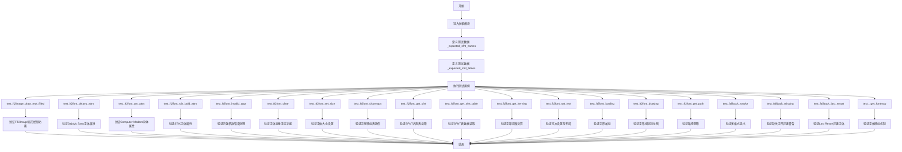
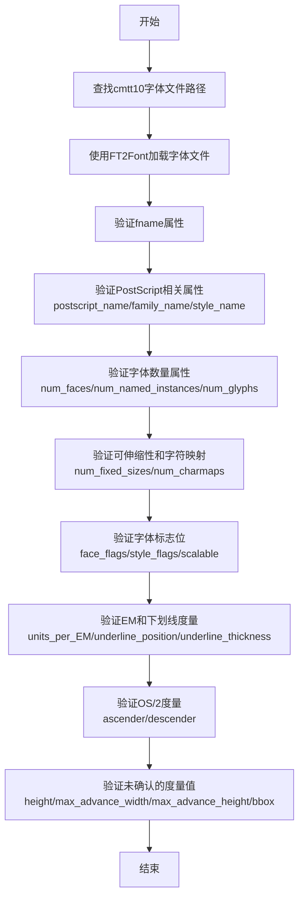
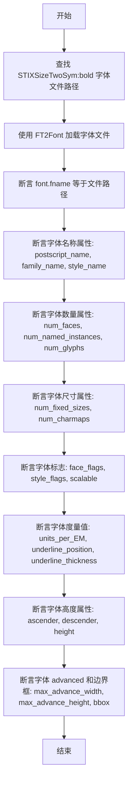
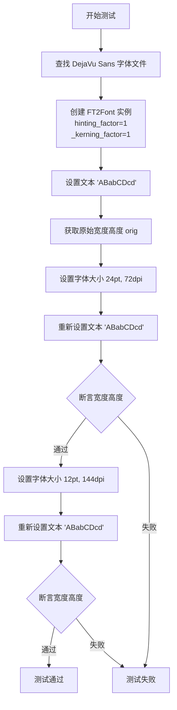
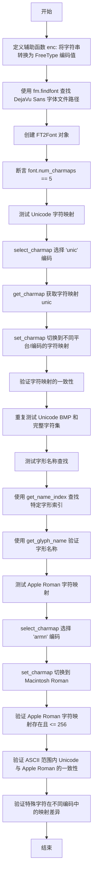
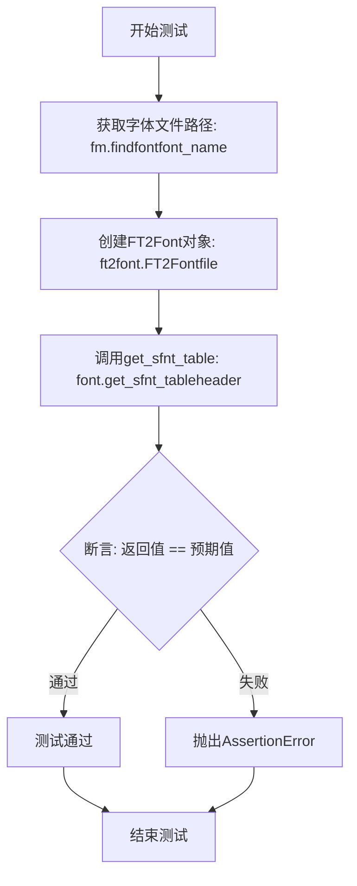
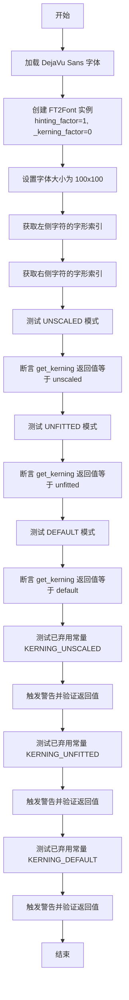
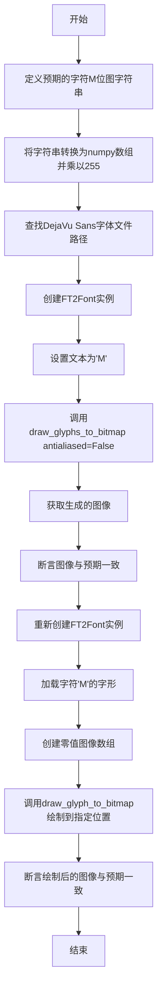
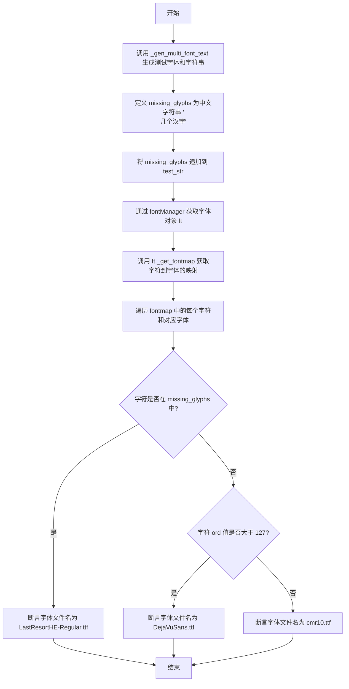

# `matplotlib\lib\matplotlib\tests\test_ft2font.py` 详细设计文档

该文件是Matplotlib中ft2font模块（FreeType 2字体渲染）的测试套件，涵盖了字体属性验证、字形加载渲染、SFNT表读取、字距调整、文本设置、字体回退机制等核心功能的单元测试和集成测试。

## 整体流程



## 类结构

```
无自定义类 - 纯测试文件
├── 测试模块: pytest
├── 被测模块: matplotlib.ft2font
│   ├── FT2Font (FreeType字体对象)
│   ├── FT2Image (FreeType位图图像)
│   ├── FaceFlags (字体面部标志枚举)
│   ├── StyleFlags (字体样式标志枚举)
│   └── Kerning (字距调整枚举)
├── 辅助模块: matplotlib.font_manager
│   ├── findfont()
│   ├── get_font()
│   └── FontProperties
└── 辅助模块: matplotlib.testing
    └── _gen_multi_font_text()
```

## 全局变量及字段


### `_expected_sfnt_names`
    
预期字体 SFNT 名称表条目，映射字体名称到名称ID对应的字符串值，用于测试验证。

类型：`dict[str, dict[int, str]]`
    


### `_expected_sfnt_tables`
    
预期字体 SFNT 表数据，映射字体名称到表名再映射到表内容（若表不存在则为 None），用于测试验证。

类型：`dict[str, dict[str, dict[str, Any]] | None]`
    


    

## 全局函数及方法


### `test_ft2image_draw_rect_filled`

这是一个测试函数，用于验证 `FT2Image.draw_rect_filled` 方法在不同坐标参数下的行为，包括边界裁剪逻辑的正确性。

参数：
- 无

返回值：`None`，无返回值（测试函数）

#### 流程图

```mermaid
flowchart TD
    A[开始] --> B[设置 width=23, height=42]
    B --> C[遍历所有坐标组合: x0∈{1,100}, y0∈{2,200}, x1∈{4,400}, y1∈{8,800}]
    C --> D[创建 FT2Image 实例并捕获 DeprecationWarning]
    D --> E[调用 im.draw_rect_filled(x0, y0, x1, y1)]
    E --> F[将 FT2Image 转换为 numpy 数组]
    F --> G{验证 dtype == uint8?}
    G -->|是| H{验证 shape == (height, width)?}
    G -->|否| I[断言失败]
    H -->|是| J{x0 == 100 或 y0 == 200?}
    H -->|否| I
    J -->|是| K[验证 np.sum(a) == 0<br/>起点超出边界应被裁剪]
    J -->|否| L[计算填充像素数<br/>filled = (min(x1+1,width)-x0) * (min(y1+1,height)-y0)]
    L --> M[验证 np.sum(a) == 255 * filled<br/>终点包含且不超过边界]
    K --> N{还有更多坐标组合?}
    M --> N
    N -->|是| C
    N -->|否| O[结束]
    I --> O
```

#### 带注释源码

```python
def test_ft2image_draw_rect_filled():
    """
    测试 FT2Image.draw_rect_filled 方法的矩形填充功能及边界裁剪行为。
    验证以下行为:
    1. 创建指定尺寸的 FT2Image 对象
    2. 绘制填充矩形
    3. 正确处理超出边界的起点坐标（自动裁剪）
    4. 正确处理超出边界的终点坐标（裁剪到边界且 inclusive）
    """
    # 定义测试图像的宽度和高度
    width = 23
    height = 42
    
    # 使用 itertools.product 生成所有坐标组合
    # x0: 起点 x 坐标, y0: 起点 y 坐标
    # x1: 终点 x 坐标, y1: 终点 y 坐标
    for x0, y0, x1, y1 in itertools.product([1, 100], [2, 200], [4, 400], [8, 800]):
        # 创建 FT2Image 实例时会触发 MatplotlibDeprecationWarning
        # 这是因为该构造函数已被标记为弃用
        with pytest.warns(mpl.MatplotlibDeprecationWarning):
            im = ft2font.FT2Image(width, height)
        
        # 调用 draw_rect_filled 方法绘制填充矩形
        # (x0, y0) 为左上角坐标, (x1, y1) 为右下角坐标（inclusive）
        im.draw_rect_filled(x0, y0, x1, y1)
        
        # 将 FT2Image 对象转换为 numpy 数组进行验证
        a = np.asarray(im)
        
        # 验证 1: 确保数据类型为无符号 8 位整数
        assert a.dtype == np.uint8
        
        # 验证 2: 确保图像形状正确（高度在前，宽度在后）
        assert a.shape == (height, width)
        
        # 验证 3: 边界裁剪行为
        if x0 == 100 or y0 == 200:
            # 当起点 x 或 y 超出图像边界时，整个矩形应被自动裁剪
            # 因此图像应为全零（黑色）
            assert np.sum(a) == 0
        else:
            # 否则，终点坐标会被裁剪到图像边界
            # 注意：终点是 inclusive 的，所以需要 +1
            # 计算填充的像素数量
            filled = (min(x1 + 1, width) - x0) * (min(y1 + 1, height) - y0)
            # 验证填充区域的所有像素值为 255（白色）
            assert np.sum(a) == 255 * filled
```


### `test_ft2font_dejavu_attrs`

该函数是用于测试 matplotlib 中 FT2Font 类的 DejaVu Sans 字体属性读取功能的测试用例。它通过查找系统中的 DejaVu Sans 字体文件，加载为 FT2Font 对象，然后验证该字体的各种元数据属性（包括 PostScript 名称、族名、样式名、字形数量、字体标志、度量信息等）是否符合预期值。

参数：

- 该函数无显式参数

返回值：`None`，该函数为测试函数，通过 assert 语句进行断言验证，不返回实际数据

#### 流程图

```mermaid
flowchart TD
    A[开始] --> B[使用 fm.findfont 查找 DejaVu Sans 字体文件路径]
    B --> C[使用 ft2font.FT2Font 加载字体文件]
    C --> D[断言 font.fname == file]
    D --> E[断言字体名称属性]
    E --> F{验证以下属性:}
    F --> G[postscript_name == 'DejaVuSans']
    F --> H[family_name == 'DejaVu Sans']
    F --> I[style_name == 'Book']
    F --> J[num_faces == 1]
    F --> K[num_named_instances == 0]
    F --> L[num_glyphs == 6241]
    F --> M[num_fixed_sizes == 0]
    F --> N[num_charmaps == 5]
    G --> O[断言 face_flags 包含预期标志]
    H --> O
    I --> O
    J --> O
    K --> O
    L --> O
    M --> O
    N --> O
    O --> P[断言 style_flags == NORMAL]
    P --> Q[断言 scalable == True]
    Q --> R[断言度量属性]
    R --> S[units_per_EM == 2048]
    S --> T[underline_position == -175]
    T --> U[underline_thickness == 90]
    U --> V[ascender == 1901]
    V --> W[descender == -483]
    W --> X[height == 2384]
    X --> Y[max_advance_width == 3838]
    Y --> Z[max_advance_height == 2384]
    Z --> AA[bbox == (-2090, -948, 3673, 2524)]
    AA --> AB[结束]
```

#### 带注释源码

```python
def test_ft2font_dejavu_attrs():
    """
    测试DejaVu Sans字体的FT2Font属性读取功能
    
    该测试函数验证FT2Font类能够正确读取DejaVu Sans TrueType字体文件的
    各种元数据和度量属性，包括：
    - 字体名称信息（PostScript名、族名、样式名）
    - 字体基本统计信息（字形数量、字符映射数量等）
    - 字体标志位（可缩放、SFNT、水平排版、字距调整、字形名称等）
    - 字体度量信息（EM单位、下划线位置、上升部、下降部等）
    - 字体边界框
    """
    # 使用matplotlib.font_manager查找系统中DejaVu Sans字体文件路径
    file = fm.findfont('DejaVu Sans')
    
    # 创建FT2Font对象，加载指定的字体文件
    font = ft2font.FT2Font(file)
    
    # 验证字体文件路径正确加载
    assert font.fname == file
    
    # 从FontForge获取的名称信息 → PS Names标签页
    # 验证PostScript名称
    assert font.postscript_name == 'DejaVuSans'
    # 验证字体族名
    assert font.family_name == 'DejaVu Sans'
    # 验证字体样式名
    assert font.style_name == 'Book'
    
    # 验证字体数量信息
    assert font.num_faces == 1  # 单个TTF文件
    assert font.num_named_instances == 0  # 非可变字体
    
    # 从FontForge的紧凑编码视图获取的字形数量
    assert font.num_glyphs == 6241
    
    # 所有字形都是可缩放的，没有固定尺寸位图
    assert font.num_fixed_sizes == 0
    
    # 验证字符映射表数量
    assert font.num_charmaps == 5
    
    # 其他内部标志已设置，只检查允许测试的标志
    # 使用位运算组合预期标志：可缩放 | SFNT | 水平排版 | 字距调整 | 字形名称
    expected_flags = (ft2font.FaceFlags.SCALABLE | ft2font.FaceFlags.SFNT |
                      ft2font.FaceFlags.HORIZONTAL | ft2font.FaceFlags.KERNING |
                      ft2font.FaceFlags.GLYPH_NAMES)
    # 断言字体包含所有预期标志
    assert expected_flags in font.face_flags
    
    # 验证样式标志为普通样式
    assert font.style_flags == ft2font.StyleFlags.NORMAL
    
    # 验证字体可缩放
    assert font.scalable
    
    # 从FontForge获取 → Font Information → General标签页
    # 名称下方的条目：EM大小
    assert font.units_per_EM == 2048
    
    # 下划线位置和粗细
    assert font.underline_position == -175  # 下划线位置
    assert font.underline_thickness == 90  # 下划线粗细
    
    # 从FontForge获取 → Font Information → OS/2标签页 → Metrics标签页
    # 名称下方的条目
    assert font.ascender == 1901  # HHead上升部
    assert font.descender == -483  # HHead下降部
    
    # 未经确认的值（来自字体本身，非FontForge）
    assert font.height == 2384
    assert font.max_advance_width == 3838
    assert font.max_advance_height == 2384
    assert font.bbox == (-2090, -948, 3673, 2524)  # 字体边界框
```


### `test_ft2font_cm_attrs`

该函数是针对 cmtt10 字体（Computer Modern Typewriter Text 10pt）的 FT2Font 对象属性验证测试，验证字体文件名、PostScript 名称、家族名称、样式名称、字形数量、字体标志、字距调整、度量信息等各项属性是否符合预期值。

参数： 无

返回值： 无（测试函数，断言失败则表示测试不通过）

#### 流程图



#### 带注释源码

```python
def test_ft2font_cm_attrs():
    """
    测试FT2Font类对于cmtt10字体的属性读取功能
    
    该测试验证以下类别的属性:
    - 字体文件路径
    - PostScript名称信息
    - 字体数量信息
    - 字体标志位
    - 字体度量信息
    """
    # 步骤1: 查找cmtt10字体文件路径
    # 使用matplotlib.font_manager查找系统中的cmtt10字体
    file = fm.findfont('cmtt10')
    
    # 步骤2: 创建FT2Font对象
    # 加载指定的字体文件创建FT2Font实例
    font = ft2font.FT2Font(file)
    
    # 步骤3: 验证fname属性
    # 确保返回的字体路径与查找的路径一致
    assert font.fname == file
    
    # 步骤4: 验证PostScript名称信息
    # 从FontForge: Font Information → PS Names tab获取
    assert font.postscript_name == 'Cmtt10'       # PostScript字体名称
    assert font.family_name == 'cmtt10'            # 字体家族名称
    assert font.style_name == 'Regular'            # 字体样式名称
    
    # 步骤5: 验证字体数量信息
    assert font.num_faces == 1          # 单个TTF文件
    assert font.num_named_instances == 0 # 非可变字体
    assert font.num_glyphs == 133        # 字形数量（从FontForge压缩编码视图）
    
    # 步骤6: 验证可伸缩性和字符映射
    assert font.num_fixed_sizes == 0     # 所有字形均可缩放
    assert font.num_charmaps == 2         # 字符映射表数量
    
    # 步骤7: 验证字体标志位
    # 其他内部标志已设置，仅检查允许测试的标志
    # 组合预期标志: 可缩放 | SFNT | 水平 | 字形名称
    expected_flags = (ft2font.FaceFlags.SCALABLE | ft2font.FaceFlags.SFNT |
                      ft2font.FaceFlags.HORIZONTAL | ft2font.FaceFlags.GLYPH_NAMES)
    assert expected_flags in font.face_flags    # 验证面部标志
    assert font.style_flags == ft2font.StyleFlags.NORMAL  # 验证样式标志
    assert font.scalable                         # 验证可缩放性
    
    # 步骤8: 验证EM和下划线度量
    # 从FontForge: Font Information → General tab获取
    assert font.units_per_EM == 2048     # EM大小
    assert font.underline_position == -143  # 下划线位置
    assert font.underline_thickness == 20    # 下划线厚度
    
    # 步骤9: 验证OS/2度量
    # 从FontForge: Font Information → OS/2 tab → Metrics tab获取
    assert font.ascender == 1276       # HHead上升量
    assert font.descender == -489      # HHead下降量
    
    # 步骤10: 验证未确认的度量值
    assert font.height == 2384           # 字体高度
    assert font.max_advance_width == 1536  # 最大前进宽度
    assert font.max_advance_height == 2384 # 最大前进高度
    assert font.bbox == (-12, -477, 1280, 1430)  # 字体边界框
```


### `test_ft2font_stix_bold_attrs`

该函数是一个测试函数，用于验证 STIXSizeTwoSym:bold 字体的各项属性是否正确。它通过查找字体文件、创建 FT2Font 对象，并使用一系列断言来检查字体的名称、样式、标志、度量值等属性是否符合预期。

参数： 无

返回值： 无（该函数为测试函数，不返回值，通过断言验证属性）

#### 流程图



#### 带注释源码

```python
def test_ft2font_stix_bold_attrs():
    # 查找 STIXSizeTwoSym:bold 字体的文件路径
    file = fm.findfont('STIXSizeTwoSym:bold')
    
    # 使用 FT2Font 加载该字体文件
    font = ft2font.FT2Font(file)
    
    # 验证字体文件路径是否正确
    assert font.fname == file
    
    # 验证从 FontForge 提取的 PS Names
    assert font.postscript_name == 'STIXSizeTwoSym-Bold'
    assert font.family_name == 'STIXSizeTwoSym'
    assert font.style_name == 'Bold'
    
    # 验证字体面数量相关信息
    assert font.num_faces == 1  # Single TTF.
    assert font.num_named_instances == 0  # Not a variable font.
    assert font.num_glyphs == 20  # From compact encoding view in FontForge.
    assert font.num_fixed_sizes == 0  # All glyphs are scalable.
    assert font.num_charmaps == 3
    
    # 验证字体标志（仅测试允许的部分）
    # 其他内部标志已设置，所以只检查允许测试的标志
    expected_flags = (ft2font.FaceFlags.SCALABLE | ft2font.FaceFlags.SFNT |
                      ft2font.FaceFlags.HORIZONTAL | ft2font.FaceFlags.GLYPH_NAMES)
    assert expected_flags in font.face_flags
    assert font.style_flags == ft2font.StyleFlags.BOLD
    assert font.scalable
    
    # 验证从 FontForge 提取的 General 标签信息
    assert font.units_per_EM == 1000  # Em Size.
    assert font.underline_position == -133  # Underline position.
    assert font.underline_thickness == 20  # Underline height.
    
    # 验证从 FontForge 提取的 OS/2 标签的 Metrics 标签信息
    assert font.ascender == 2095  # HHead Ascent.
    assert font.descender == -404  # HHead Descent.
    
    # 验证未确认的值（Unconfirmed values）
    assert font.height == 2499
    assert font.max_advance_width == 1130
    assert font.max_advance_height == 2499
    assert font.bbox == (4, -355, 1185, 2095)
```


### `test_ft2font_invalid_args`

该函数用于测试 `FT2Font` 构造函数在接收无效参数时的错误处理行为，验证各类非法输入（无效文件名、非二进制模式文件对象、无效的 hinting_factor 和 kerning_factor 参数）是否能正确抛出指定类型的异常。

参数：

- `tmp_path`：`pytest.fixture`，用于创建临时目录和文件

返回值：`None`，无返回值（测试函数）

#### 流程图

```mermaid
flowchart TD
    A[开始: test_ft2font_invalid_args] --> B[测试 filename 参数: None]
    B --> C{是否抛出 TypeError}
    C -->|是| D[测试 filename: object() 无 read 方法]
    D --> E{是否抛出 TypeError}
    E -->|是| F[创建临时无效字体文件]
    F --> G[测试以文本模式 'rt' 打开文件]
    G --> H{是否抛出 TypeError}
    H -->|是| I[测试以文本模式 'wt' 打开文件]
    I --> J{是否抛出 TypeError}
    J -->|是| K[测试以二进制写入模式 'wb' 打开文件]
    K --> L{是否抛出 TypeError}
    L -->|是| M[获取 DejaVu Sans 字体路径]
    M --> N[测试 hinting_factor=1.3]
    N --> O{是否抛出 TypeError}
    O -->|是| P[测试 hinting_factor=0]
    P --> Q{是否抛出 ValueError}
    Q -->|是| R[测试 _fallback_list=(0,) 元组类型]
    R --> S{是否抛出 TypeError}
    S -->|是| T[测试 _fallback_list=[0] 列表类型]
    T --> U{是否抛出 TypeError}
    U -->|是| V[测试 _kerning_factor=1.3]
    V --> W{是否抛出 TypeError}
    W -->|是| X[结束: 所有测试通过]
    
    C -->|否| Y[测试失败]
    E -->|否| Y
    H -->|否| Y
    J -->|否| Y
    L -->|否| Y
    O -->|否| Y
    Q -->|否| Y
    S -->|否| Y
    U -->|否| Y
    W -->|否| Y
```

#### 带注释源码

```python
def test_ft2font_invalid_args(tmp_path):
    """
    测试 FT2Font 构造函数对无效参数的错误处理。
    
    参数:
        tmp_path: pytest 提供的临时目录 fixture，用于创建测试文件
    """
    
    # ==================== filename 参数测试 ====================
    # 测试 1: 传入 None 应该抛出 TypeError
    # 期望错误信息: 'to a font file or a binary-mode file object'
    with pytest.raises(TypeError, match='to a font file or a binary-mode file object'):
        ft2font.FT2Font(None)
    
    # 测试 2: 传入没有 read() 方法的对象应该抛出 TypeError
    with pytest.raises(TypeError, match='to a font file or a binary-mode file object'):
        ft2font.FT2Font(object())  # Not bytes or string, and has no read() method.
    
    # 创建临时无效字体文件用于后续测试
    file = tmp_path / 'invalid-font.ttf'
    file.write_text('This is not a valid font file.')
    
    # 测试 3: 以文本读取模式 'rt' 打开文件应该抛出 TypeError
    with (pytest.raises(TypeError, match='to a font file or a binary-mode file object'),
          file.open('rt') as fd):
        ft2font.FT2Font(fd)
    
    # 测试 4: 以文本写入模式 'wt' 打开文件应该抛出 TypeError
    with (pytest.raises(TypeError, match='to a font file or a binary-mode file object'),
          file.open('wt') as fd):
        ft2font.FT2Font(fd)
    
    # 测试 5: 以二进制写入模式 'wb' 打开文件应该抛出 TypeError
    with (pytest.raises(TypeError, match='to a font file or a binary-mode file object'),
          file.open('wb') as fd):
        ft2font.FT2Font(fd)

    # ==================== hinting_factor 参数测试 ====================
    # 获取有效的 DejaVu Sans 字体路径
    file = fm.findfont('DejaVu Sans')

    # 测试 hinting_factor 参数类型错误（传入浮点数 1.3）
    with pytest.raises(TypeError, match='incompatible constructor arguments'):
        ft2font.FT2Font(file, 1.3)
    
    # 测试 hinting_factor 值错误（传入 0，应该大于 0）
    with pytest.raises(ValueError, match='hinting_factor must be greater than 0'):
        ft2font.FT2Font(file, 0)

    # ==================== _fallback_list 参数测试 ====================
    # 测试 _fallback_list 传入元组而非列表（类型不兼容）
    with pytest.raises(TypeError, match='incompatible constructor arguments'):
        # failing to be a list will fail before the 0
        ft2font.FT2Font(file, _fallback_list=(0,))  # type: ignore[arg-type]
    
    # 测试 _fallback_list 传入列表但元素类型错误（列表项必须是整数）
    with pytest.raises(TypeError, match='incompatible constructor arguments'):
        ft2font.FT2Font(file, _fallback_list=[0])  # type: ignore[list-item]

    # ==================== _kerning_factor 参数测试 ====================
    # 测试 _kerning_factor 传入浮点数而非整数（类型不兼容）
    with pytest.raises(TypeError, match='incompatible constructor arguments'):
        ft2font.FT2Font(file, _kerning_factor=1.3)
```


### `test_ft2font_clear`

这是一个单元测试函数，用于验证 FT2Font 对象的 `clear()` 方法能够正确清除所有文本渲染相关的内部状态，包括字形数量、宽度高度和位图偏移量，确保调用后字体对象恢复到初始未使用状态。

参数：  
- （无）

返回值：`None`，因为这是一个测试函数，不返回任何值。

#### 流程图

```mermaid
flowchart TD
    A[开始测试] --> B[查找 DejaVu Sans 字体文件]
    B --> C[创建 FT2Font 对象]
    C --> D[断言: get_num_glyphs == 0]
    D --> E[断言: get_width_height == (0, 0)]
    E --> F[断言: get_bitmap_offset == (0, 0)]
    F --> G[调用 set_text 设置文本 'ABabCDcd']
    G --> H[断言: get_num_glyphs == 8]
    H --> I[断言: get_width_height != (0, 0)]
    I --> J[断言: get_bitmap_offset != (0, 0)]
    J --> K[调用 font.clear 方法]
    K --> L[断言: get_num_glyphs == 0]
    L --> M[断言: get_width_height == (0, 0)]
    M --> N[断言: get_bitmap_offset == (0, 0)]
    N --> O[测试通过]
```

#### 带注释源码

```python
def test_ft2font_clear():
    """
    测试 FT2Font 对象的 clear() 方法是否能正确清除所有内部渲染状态。
    
    测试流程：
    1. 创建字体对象并验证初始状态
    2. 设置文本内容
    3. 验证文本渲染后状态发生改变
    4. 调用 clear() 方法清除状态
    5. 验证状态已恢复到初始状态
    """
    # 步骤1: 查找 DejaVu Sans 字体文件路径
    file = fm.findfont('DejaVu Sans')
    
    # 步骤2: 创建 FT2Font 对象
    font = ft2font.FT2Font(file)
    
    # 步骤3: 验证初始状态（未设置任何文本时）
    # 断言字形数量为0
    assert font.get_num_glyphs() == 0
    # 断言宽度和高度为(0, 0)
    assert font.get_width_height() == (0, 0)
    # 断言位图偏移量为(0, 0)
    assert font.get_bitmap_offset() == (0, 0)
    
    # 步骤4: 调用 set_text 方法设置文本内容
    # 这会触发字形的加载和渲染
    font.set_text('ABabCDcd')
    
    # 步骤5: 验证文本渲染后的状态已改变
    # 断言字形数量为8（'ABabCDcd' 共8个字符）
    assert font.get_num_glyphs() == 8
    # 断言宽度和高度不再为(0, 0)
    assert font.get_width_height() != (0, 0)
    # 断言位图偏移量不再为(0, 0)
    assert font.get_bitmap_offset() != (0, 0)
    
    # 步骤6: 调用 clear() 方法清除所有渲染状态
    font.clear()
    
    # 步骤7: 验证 clear() 方法已正确清除状态
    # 断言字形数量恢复为0
    assert font.get_num_glyphs() == 0
    # 断言宽度和高度恢复为(0, 0)
    assert font.get_width_height() == (0, 0)
    # 断言位图偏移量恢复为(0, 0)
    assert font.get_bitmap_offset() == (0, 0)
```


### `test_ft2font_set_size`

该测试函数用于验证 `FT2Font` 类的 `set_size` 方法是否正确设置字体的点数(point size)和分辨率(DPI)。测试通过比较不同尺寸下的文本宽度和高度，确设置功能按预期工作（尺寸翻倍时，宽度和高度也应近似翻倍）。

参数：  
该函数无参数。

返回值：`None`，该函数为测试函数，使用 `assert` 语句进行断言验证，不返回任何值。

#### 流程图



#### 带注释源码

```python
def test_ft2font_set_size():
    """
    测试 FT2Font.set_size() 方法的功能。
    
    验证点大小翻倍时，文本的宽度和高度也近似翻倍。
    同时测试不同DPI设置下的尺寸计算。
    """
    # 查找 DejaVu Sans 字体文件的路径
    file = fm.findfont('DejaVu Sans')
    
    # 创建 FT2Font 实例，指定 hinting_factor=1 和 _kerning_factor=1
    # 默认是 12pt @ 72 dpi
    font = ft2font.FT2Font(file, hinting_factor=1, _kerning_factor=1)
    
    # 设置要渲染的文本
    font.set_text('ABabCDcd')
    
    # 获取当前文本的宽度和高度，作为基准值
    orig = font.get_width_height()
    
    # 设置字体大小为 24pt, 72dpi（点大小翻倍）
    font.set_size(24, 72)
    
    # 重新设置相同文本
    font.set_text('ABabCDcd')
    
    # 断言：尺寸翻倍后，宽度和高度也应近似翻倍（使用 pytest.approx 允许0.1的相对误差）
    assert font.get_width_height() == tuple(pytest.approx(2 * x, 1e-1) for x in orig)
    
    # 设置字体大小为 12pt, 144dpi（DPI翻倍，等效于尺寸翻倍）
    font.set_size(12, 144)
    
    # 重新设置相同文本
    font.set_text('ABabCDcd')
    
    # 断言：同样验证尺寸翻倍的效果
    assert font.get_width_height() == tuple(pytest.approx(2 * x, 1e-1) for x in orig)
```


### `test_ft2font_charmaps`

该函数是用于测试 FT2Font 类的字符映射（charmap）功能的测试函数，验证 Unicode 字符映射、Apple Roman 字符映射以及字形名称查找的正确性。

参数： 无（该函数不接受任何参数）

返回值： `None`，该函数为测试函数，通过断言验证功能，不返回任何值

#### 流程图



#### 带注释源码

```python
def test_ft2font_charmaps():
    """
    测试 FT2Font 类的字符映射功能，包括：
    1. Unicode 字符映射的多种编码选择
    2. 字形名称的查找和验证
    3. Apple Roman 字符映射及其与 Unicode 的比较
    """
    
    def enc(name):
        """
        辅助函数：将字符串转换为 FreeType 编码值
        由于 FreeType 编码枚举值未直接暴露，因此手动生成
        对于 DejaVu 字体，有 5 个字符映射，但 FreeType 只暴露了 2 个枚举条目
        """
        e = 0
        for x in name:
            e <<= 8       # 左移 8 位，为下一个字符腾出空间
            e += ord(x)   # 添加当前字符的 ASCII/Unicode 值
        return e         # 返回组合后的编码值

    # 查找 DejaVu Sans 字体文件路径
    file = fm.findfont('DejaVu Sans')
    
    # 创建 FT2Font 字体对象
    font = ft2font.FT2Font(file)
    
    # 验证 DejaVu Sans 字体包含 5 个字符映射
    assert font.num_charmaps == 5

    # ==================== Unicode 字符映射测试 ====================
    # 选择 Unicode 编码 (0x756E6963 = 'unic')
    font.select_charmap(enc('unic'))
    
    # 获取当前 Unicode 字符映射
    unic = font.get_charmap()
    
    # 切换到 Unicode 平台、仅 BMP (Basic Multilingual Plane) 的字符映射
    font.set_charmap(0)  # Unicode platform, Unicode BMP only.
    after = font.get_charmap()
    
    # 验证 BMP 字符映射是 Unicode 完整映射的子集
    assert len(after) <= len(unic)
    
    # 验证字符映射中每个字符的 glyph 索引一致性
    for chr, glyph in after.items():
        assert unic[chr] == glyph == font.get_char_index(chr)
    
    # 切换到 Unicode 平台、现代子表
    font.set_charmap(1)  # Unicode platform, modern subtable.
    after = font.get_charmap()
    assert unic == after  # 应与完整 Unicode 映射相同
    
    # 切换到 Windows 平台、Unicode BMP
    font.set_charmap(3)  # Windows platform, Unicode BMP only.
    after = font.get_charmap()
    assert len(after) <= len(unic)
    for chr, glyph in after.items():
        assert unic[chr] == glyph == font.get_char_index(chr)
    
    # 切换到 Windows 平台、完整 Unicode 字符集、现代子表
    font.set_charmap(4)  # Windows platform, Unicode full repertoire, modern subtable.
    after = font.get_charmap()
    assert unic == after

    # ==================== 字形名称查找测试 ====================
    # 从 FontForge 随机采样的字形名称和索引
    glyph_names = {
        'non-existent-glyph-name': 0,   # 不存在的字形，应返回 0
        'plusminus': 115,
        'Racute': 278,
        'perthousand': 2834,
        'seveneighths': 3057,
        'triagup': 3721,
        'uni01D3': 405,
        'uni0417': 939,
        'uni2A02': 4464,
        'u1D305': 5410,
        'u1F0A1': 5784,
    }
    
    # 验证每个字形的名称索引和字形名称
    for name, index in glyph_names.items():
        # 获取字形名称对应的索引
        assert font.get_name_index(name) == index
        
        # 如果是不存在的字形，使用 '.notdef' 代替
        if name == 'non-existent-glyph-name':
            name = '.notdef'
        
        # 验证索引对应的字形名称（这并不总是适用，但对 DejaVu Sans 适用）
        assert font.get_glyph_name(index) == name

    # ==================== Apple Roman 字符映射测试 ====================
    # 选择 Apple Roman 编码 (0x61726D6E = 'armn')
    font.select_charmap(enc('armn'))
    
    # 获取 Apple Roman 字符映射
    armn = font.get_charmap()
    
    # 切换到 Macintosh 平台、Roman 编码
    font.set_charmap(2)  # Macintosh platform, Roman.
    after = font.get_charmap()
    
    # 验证 Apple Roman 映射与获取的映射相同
    assert armn == after
    
    # Apple Roman 是 8 位编码，字符数应 <= 256
    assert len(armn) <= 256
    
    # Apple Roman 的前 128 个字符与 ASCII 一致，也与 Unicode 一致
    for o in range(1, 128):
        if o not in armn or o not in unic:
            continue
        assert unic[o] == armn[o]
    
    # 检查 ASCII 范围之外的一些字符在不同字符集中的差异
    examples = [
        # (Unicode, Macintosh)
        (0x2020, 0xA0),  # Dagger ( dagger)
        (0x00B0, 0xA1),  # Degree symbol
        (0x00A3, 0xA3),  # Pound sign
        (0x00A7, 0xA4),  # Section sign
        (0x00B6, 0xA6),  # Pilcrow
        (0x221E, 0xB0),  # Infinity symbol
    ]
    
    # 尽管编码不同，但字形应该是相同的
    for u, m in examples:
        assert unic[u] == armn[m]
```


### `test_ft2font_get_sfnt`

该测试函数用于验证 `FT2Font` 类的 `get_sfnt()` 方法能否正确获取字体文件中的 SFNT（TrueType/OpenType）名称表数据，包括 Macintosh 和 Microsoft 平台上的各种字体元数据（如字体名称、版本、版权信息等）。

参数：

- `font_name`：`str`，来自 `@pytest.mark.parametrize` 装饰器，从 `_expected_sfnt_names` 字典的键中获取，表示要测试的字体名称（如 'DejaVu Sans'、'cmtt10'、'STIXSizeTwoSym:bold'）
- `expected`：`dict`，来自 `@pytest.mark.parametrize` 装饰器，从 `_expected_sfnt_names` 字典的值中获取，包含预期的 SFNT 名称数据，键为名称 ID，值为对应的字符串值

返回值：`None`，测试函数无返回值

#### 流程图

```mermaid
flowchart TD
    A[开始测试] --> B[根据 font_name 查找字体文件路径]
    B --> C[创建 FT2Font 对象加载字体文件]
    C --> D[调用 font.get_sfnt 获取 SFNT 名称表]
    D --> E{遍历 expected 中的每个名称}
    E -->|是| F[从 sfnt 中取出 Mac 平台编码的名称: (1, 0, 0, name)]
    F --> G[断言 Mac 平台编码值 == value.encode('ascii')]
    G --> H[从 sfnt 中取出 Microsoft 平台编码的名称: (3, 1, 1033, name)]
    H --> I[断言 Microsoft 平台编码值 == value.encode('utf-16be')]
    I --> E
    E -->|否| J{检查 sfnt 是否为空}
    J -->|是| K[测试通过]
    J -->|否| L[断言失败]
```

#### 带注释源码

```python
@pytest.mark.parametrize('font_name, expected', _expected_sfnt_names.items(),
                         ids=_expected_sfnt_names.keys())
def test_ft2font_get_sfnt(font_name, expected):
    """
    测试 FT2Font.get_sfnt() 方法能否正确获取字体的 SFNT 名称表数据。
    
    参数化测试使用 _expected_sfnt_names 字典中定义的多个字体进行测试，
    每个字体都有预定义的名称数据（名称 ID 到名称字符串的映射）。
    """
    # 根据字体名称查找字体文件路径
    file = fm.findfont(font_name)
    
    # 创建 FT2Font 对象并加载字体文件
    font = ft2font.FT2Font(file)
    
    # 调用 get_sfnt() 方法获取 SFNT 名称表
    # 返回值是一个字典，键为 (platform, encoding, language, name_id) 元组
    sfnt = font.get_sfnt()
    
    # 遍历预期的名称-值对
    for name, value in expected.items():
        # Macintosh 平台: platform=1, encoding=0 (Unicode 1.0), language=0 (English)
        # 验证 ASCII 编码的名称数据
        assert sfnt.pop((1, 0, 0, name)) == value.encode('ascii')
        
        # Microsoft 平台: platform=3, encoding=1 (Unicode), language=1033 (English United States)
        # 验证 UTF-16BE 编码的名称数据
        assert sfnt.pop((3, 1, 1033, name)) == value.encode('utf-16be')
    
    # 验证所有 SFNT 数据都已被取出，字典应为空
    assert sfnt == {}
```


### `test_ft2font_get_sfnt_table`

该测试函数用于验证 FT2Font 类的 `get_sfnt_table` 方法能否正确获取字体文件中的 SFNT 表数据。通过参数化测试，它遍历多个字体（DejaVu Sans、cmtt10、STIXSizeTwoSym:bold）以及多个表头（head、maxp、OS/2、hhea、vhea、post、pclt），确保返回的表数据与预期一致。

参数：

- `font_name`：`str`，字体名称，用于定位字体文件
- `header`：`str`，SFNT 表头名称（如 'head'、'maxp'、'OS/2' 等），指定要获取的表

返回值：`None`，该函数为测试函数，通过断言验证结果，不返回实际值

#### 流程图



#### 带注释源码

```python
@pytest.mark.parametrize('font_name', _expected_sfnt_tables.keys())
@pytest.mark.parametrize('header', _expected_sfnt_tables['DejaVu Sans'].keys())
def test_ft2font_get_sfnt_table(font_name, header):
    """
    测试 FT2Font.get_sfnt_table 方法能否正确获取指定字体的 SFNT 表数据。
    
    参数化测试遍历:
    - font_name: 'DejaVu Sans', 'cmtt10', 'STIXSizeTwoSym:bold'
    - header: 'invalid', 'head', 'maxp', 'OS/2', 'hhea', 'vhea', 'post', 'pclt'
    """
    # 使用 font_manager 找到指定字体的文件路径
    file = fm.findfont(font_name)
    
    # 创建 FT2Font 对象，加载字体文件
    font = ft2font.FT2Font(file)
    
    # 调用 get_sfnt_table 方法获取指定的 SFNT 表
    # 并与预期结果进行比对
    assert font.get_sfnt_table(header) == _expected_sfnt_tables[font_name][header]
```


### `test_ft2font_get_kerning`

该测试函数用于验证 FT2Font 类的 `get_kerning` 方法在不同字距调整模式（UNSCALED、UNFITTED、DEFAULT）下的正确性，并通过警告信息确认已弃用的常量（KERNING_UNSCALED、KERNING_UNFITTED、KERNING_DEFAULT）的行为。

参数：

- `left`：`str`，左侧字符，用于获取字形索引并计算字距调整
- `right`：`str`，右侧字符，用于获取字形索引并计算字距调整
- `unscaled`：`int`，期望的 UNSCALED 模式返回值
- `unfitted`：`int`，期望的 UNFITTED 模式返回值
- `default`：`int`，期望的 DEFAULT 模式返回值

返回值：`None`，该函数为测试函数，无返回值，仅通过断言验证行为

#### 流程图



#### 带注释源码

```python
@pytest.mark.parametrize('left, right, unscaled, unfitted, default', [
    # 测试同一字符类的字距调整（A系列）
    ('A', 'A', 57, 248, 256), ('A', 'À', 57, 248, 256), ('A', 'Á', 57, 248, 256),
    ('A', 'Â', 57, 248, 256), ('A', 'Ã', 57, 248, 256), ('A', 'Ä', 57, 248, 256),
    # 测试其他随机字符组合
    ('D', 'A', -36, -156, -128), ('T', '.', -243, -1056, -1024),
    ('X', 'C', -149, -647, -640), ('-', 'J', 114, 495, 512),
])
def test_ft2font_get_kerning(left, right, unscaled, unfitted, default):
    # 查找 DejaVu Sans 字体文件路径
    file = fm.findfont('DejaVu Sans')
    # 创建 FT2Font 实例，hinting_factor=1 启用提示，_kerning_factor=0 禁用字距调整因子缩放
    # 使用 hinting_factor=1 和 _kerning_factor=0 确保获得 FontForge 中的精确值
    font = ft2font.FT2Font(file, hinting_factor=1, _kerning_factor=0)
    # 设置字体大小为 100pt，分辨率 100dpi
    font.set_size(100, 100)
    
    # 测试 UNSCALED 模式：返回未缩放原始字距值
    # 验证返回的字距值与预期 unscaled 值相等
    assert font.get_kerning(font.get_char_index(ord(left)),
                            font.get_char_index(ord(right)),
                            ft2font.Kerning.UNSCALED) == unscaled
    
    # 测试 UNFITTED 模式：返回未适配的提示后字距值
    # 验证返回的字距值与预期 unfitted 值相等
    assert font.get_kerning(font.get_char_index(ord(left)),
                            font.get_char_index(ord(right)),
                            ft2font.Kerning.UNFITTED) == unfitted
    
    # 测试 DEFAULT 模式：返回默认缩放的字距值
    # 验证返回的字距值与预期 default 值相等
    assert font.get_kerning(font.get_char_index(ord(left)),
                            font.get_char_index(ord(right)),
                            ft2font.Kerning.DEFAULT) == default
    
    # 测试已弃用常量 KERNING_UNSCALED
    # 验证使用已弃用常量时触发弃用警告，且返回值正确
    with pytest.warns(mpl.MatplotlibDeprecationWarning,
                      match='Use Kerning.UNSCALED instead'):
        k = ft2font.KERNING_UNSCALED
    with pytest.warns(mpl.MatplotlibDeprecationWarning,
                      match='Use Kerning enum values instead'):
        assert font.get_kerning(font.get_char_index(ord(left)),
                                font.get_char_index(ord(right)),
                                int(k)) == unscaled
    
    # 测试已弃用常量 KERNING_UNFITTED
    # 验证使用已弃用常量时触发弃用警告，且返回值正确
    with pytest.warns(mpl.MatplotlibDeprecationWarning,
                      match='Use Kerning.UNFITTED instead'):
        k = ft2font.KERNING_UNFITTED
    with pytest.warns(mpl.MatplotlibDeprecationWarning,
                      match='Use Kerning enum values instead'):
        assert font.get_kerning(font.get_char_index(ord(left)),
                                font.get_char_index(ord(right)),
                                int(k)) == unfitted
    
    # 测试已弃用常量 KERNING_DEFAULT
    # 验证使用已弃用常量时触发弃用警告，且返回值正确
    with pytest.warns(mpl.MatplotlibDeprecationWarning,
                      match='Use Kerning.DEFAULT instead'):
        k = ft2font.KERNING_DEFAULT
    with pytest.warns(mpl.MatplotlibDeprecationWarning,
                      match='Use Kerning enum values instead'):
        assert font.get_kerning(font.get_char_index(ord(left)),
                                font.get_char_index(ord(right)),
                                int(k)) == default
```


### `test_ft2font_set_text`

该测试函数验证 FT2Font 类的 `set_text` 方法的功能，包括处理空字符串和包含合字（kerning pairs）的字符串，并检查返回的坐标、字体尺寸、字形数量、下降线和位图偏移量是否正确。

参数：无

返回值：`None`，无返回值（测试函数）

#### 流程图

```mermaid
graph TD
    A[开始测试] --> B[查找 DejaVu Sans 字体文件]
    B --> C[创建 FT2Font 实例 hinting_factor=1, _kerning_factor=0]
    C --> D[调用 font.set_text 传入空字符串 '']
    D --> E[断言返回坐标为空数组 np.empty((0, 2)]
    E --> F[断言 get_width_height == (0, 0)]
    F --> G[断言 get_num_glyphs == 0]
    G --> H[断言 get_descent == 0]
    H --> I[断言 get_bitmap_offset == (0, 0)]
    I --> J[调用 font.set_text 传入字符串 'AADAT.XC-J']
    J --> K[断言返回坐标数组等于预期值]
    K --> L[断言 get_width_height == (4288, 768)]
    L --> M[断言 get_num_glyphs == 10]
    M --> N[断言 get_descent == 192]
    N --> O[断言 get_bitmap_offset == (6, 0)]
    O --> P[测试结束]
```

#### 带注释源码

```python
def test_ft2font_set_text():
    """
    测试 FT2Font.set_text 方法的功能。
    验证空字符串和有字符串时的行为，包括字形数量、尺寸和偏移量。
    """
    # 查找 DejaVu Sans 字体文件的路径
    file = fm.findfont('DejaVu Sans')
    
    # 创建 FT2Font 实例，设置 hinting_factor=1, _kerning_factor=0
    # hinting_factor=1 启用字形微调
    # _kerning_factor=0 禁用字距调整
    font = ft2font.FT2Font(file, hinting_factor=1, _kerning_factor=0)
    
    # 测试空字符串输入
    xys = font.set_text('')  # 传入空字符串
    
    # 验证空字符串返回空坐标数组
    np.testing.assert_array_equal(xys, np.empty((0, 2)))
    
    # 验证空字符串的字体度量
    assert font.get_width_height() == (0, 0)      # 宽度和高度为 0
    assert font.get_num_glyphs() == 0            # 字形数量为 0
    assert font.get_descent() == 0               # 下降线为 0
    assert font.get_bitmap_offset() == (0, 0)     # 位图偏移为 (0, 0)
    
    # 测试包含 kerning pairs 的字符串
    # 'AADAT.XC-J' 使用了 test_ft2font_get_kerning 中定义的所有字距调整对
    xys = font.set_text('AADAT.XC-J')
    
    # 验证返回的每个字形的坐标位置
    np.testing.assert_array_equal(
        xys,
        [(0, 0), (512, 0), (1024, 0), (1600, 0), (2112, 0), (2496, 0), (2688, 0),
         (3200, 0), (3712, 0), (4032, 0)]
    )
    
    # 验证非空字符串的字体度量
    assert font.get_width_height() == (4288, 768)  # 总宽度 4288, 高度 768
    assert font.get_num_glyphs() == 10             # 10 个字形
    assert font.get_descent() == 192               # 下降线 192
    assert font.get_bitmap_offset() == (6, 0)      # 位图偏移 (6, 0)
```


### `test_ft2font_loading`

这是一个测试函数，用于验证 matplotlib 中 FT2Font 类的字形加载功能。测试通过字符码和字形索引两种方式加载字形 'M'，并验证加载后的字形属性（如宽度、高度、前景等）是否符合预期，同时检查字形未被放置到任何位置时的度量信息。

参数： 无

返回值：`None`，该函数为测试函数，不返回任何值

#### 流程图

```mermaid
graph TD
    A[开始 test_ft2font_loading] --> B[查找字体文件: fm.findfont<br/>'DejaVu Sans']
    B --> C[创建FT2Font对象: hinting_factor=1<br/>_kerning_factor=0]
    C --> D[加载字符'M': font.load_char<br/>ord('M')]
    D --> E[获取字符'M'的索引: font.get_char_index<br/>ord('M')]
    E --> F[通过索引加载字形: font.load_glyph<br/>char_index]
    D --> G{遍历字形对象列表<br/>[load_char, load_glyph]}
    G --> H[断言glyph不为None]
    H --> I[断言glyph.width == 576]
    I --> J[断言glyph.height == 576]
    J --> K[断言glyph.horiBearingX == 0]
    K --> L[断言glyph.horiBearingY == 576]
    L --> M[断言glyph.horiAdvance == 640]
    M --> N[断言glyph.linearHoriAdvance == 678528]
    N --> O[断言glyph.vertBearingX == -384]
    O --> P[断言glyph.vertBearingY == 64]
    P --> Q[断言glyph.vertAdvance == 832]
    Q --> R[断言glyph.bbox == (54, 0, 574, 576)]
    R --> S[断言font.get_num_glyphs == 2]
    S --> T[断言font.get_width_height == (0, 0)]
    T --> U[断言font.get_descent == 0]
    U --> V[断言font.get_bitmap_offset == (0, 0)]
    V --> W[结束测试]
```

#### 带注释源码

```python
def test_ft2font_loading():
    """
    测试FT2Font的字形加载功能。
    
    该测试函数验证FT2Font类能够：
    1. 通过字符的Unicode码点加载字形 (load_char)
    2. 通过字符索引加载字形 (load_glyph)
    3. 正确返回字形的各种属性信息
    4. 正确处理已加载但未放置的字形的度量信息
    """
    # 步骤1: 查找系统中 DejaVu Sans 字体文件的路径
    # fm.findfont 是 matplotlib.font_manager 模块的函数
    file = fm.findfont('DejaVu Sans')
    
    # 步骤2: 创建 FT2Font 对象
    # 参数说明:
    #   - file: 字体文件路径
    #   - hinting_factor: 字形微调因子，1表示启用
    #   - _kerning_factor: 字距调整因子，0表示无字距调整
    font = ft2font.FT2Font(file, hinting_factor=1, _kerning_factor=0)
    
    # 步骤3: 通过两种方式加载字形 'M' 并遍历验证
    # 方式一: load_char(ord('M')) - 通过Unicode码点加载
    # 方式二: load_glyph(font.get_char_index(ord('M'))) - 通过字符索引加载
    for glyph in [font.load_char(ord('M')),
                  font.load_glyph(font.get_char_index(ord('M')))]:
        # 验证字形对象成功加载（非None）
        assert glyph is not None
        
        # 验证字形的水平维度属性
        assert glyph.width == 576        # 字形位图宽度
        assert glyph.height == 576       # 字形位图高度
        assert glyph.horiBearingX == 0   # 水平bearing X（原点的水平偏移）
        assert glyph.horiBearingY == 576  # 水平bearing Y（原点的垂直偏移）
        assert glyph.horiAdvance == 640  # 水平前进量（下一个字形的起点）
        
        # 验证字形的线性水平前进量
        assert glyph.linearHoriAdvance == 678528
        
        # 验证字形的垂直维度属性
        assert glyph.vertBearingX == -384  # 垂直bearing X
        assert glyph.vertBearingY == 64    # 垂直bearing Y
        assert glyph.vertAdvance == 832    # 垂直前进量
        
        # 验证字形的包围盒 (bbox)
        # 格式: (x_min, y_min, x_max, y_max)
        assert glyph.bbox == (54, 0, 574, 576)
    
    # 步骤4: 验证字形计数
    # 两次加载（load_char和load_glyph）都被计数
    assert font.get_num_glyphs() == 2  # Both count as loaded.
    
    # 步骤5: 验证字形未放置时的度量信息
    # 注意: 加载字形与放置字形是不同的操作
    # 加载只是将字形数据读入内存，但未确定其在渲染位置
    # 因此宽度、高度、下降量、位图偏移都应为0
    assert font.get_width_height() == (0, 0)
    assert font.get_descent() == 0
    assert font.get_bitmap_offset() == (0, 0)
```


### `test_ft2font_drawing`

该测试函数用于验证 FT2Font 字形绘制到位图的功能是否正确，包括 `draw_glyphs_to_bitmap` 和 `draw_glyph_to_bitmap` 两种绘制方法的输出结果。

参数： 无

返回值： `None`，该函数为测试函数，不返回值，仅通过断言验证结果

#### 流程图



#### 带注释源码

```python
def test_ft2font_drawing():
    # 定义字符'M'的预期位图表示，使用'1'表示填充像素，' '表示空白
    expected_str = (
        '          ',  # 第0行：全空白
        '11    11  ',  # 第1行：两个垂直条
        '11    11  ',  # 第2行：两个垂直条
        '1 1  1 1  ',  # 第3行：四个小竖段
        '1 1  1 1  ',  # 第4行：四个小竖段
        '1 1  1 1  ',  # 第5行：四个小竖段
        '1  11  1  ',  # 第6行：左边单竖，中间双竖，右边单竖
        '1  11  1  ',  # 第7行：同第6行
        '1      1  ',  # 第8行：左右两边竖
        '1      1  ',  # 第9行：左右两边竖
        '          ',  # 第10行：全空白
    )
    # 将字符串转换为numpy数组，' '替换为'0'，'1'保持为'1'，然后转为整数
    expected = np.array([
        [int(c) for c in line.replace(' ', '0')] for line in expected_str
    ])
    # 乘以255将0/1转换为0/255（黑色/白色）
    expected *= 255
    
    # 查找系统中的DejaVu Sans字体文件路径
    file = fm.findfont('DejaVu Sans')
    
    # 创建FT2Font实例，设置hinting_factor=1和_kerning_factor=0
    font = ft2font.FT2Font(file, hinting_factor=1, _kerning_factor=0)
    
    # 设置要渲染的文本为'M'
    font.set_text('M')
    
    # 将所有字形绘制到位图中，antialiased=False表示不进行抗锯齿
    font.draw_glyphs_to_bitmap(antialiased=False)
    
    # 获取生成的图像数据
    image = font.get_image()
    
    # 断言生成的图像与预期完全一致
    np.testing.assert_array_equal(image, expected)
    
    # 重新创建FT2Font实例（因为之前的操作可能已修改状态）
    font = ft2font.FT2Font(file, hinting_factor=1, _kerning_factor=0)
    
    # 加载字符'M'的字形数据
    glyph = font.load_char(ord('M'))
    
    # 创建一个与预期形状相同的零值uint8数组
    image = np.zeros(expected.shape, np.uint8)
    
    # 将字形绘制到指定位置（x=-1, y=1），antialiased=False
    font.draw_glyph_to_bitmap(image, -1, 1, glyph, antialiased=False)
    
    # 断言绘制后的图像与预期一致
    np.testing.assert_array_equal(image, expected)
```


### `test_ft2font_get_path`

这是一个测试函数，用于验证 `FT2Font` 类的 `get_path()` 方法能否正确获取字形的路径数据（顶点和路径代码）。

参数： 无

返回值： 无（测试函数无返回值，通过断言验证功能）

#### 流程图

```mermaid
flowchart TD
    A[开始] --> B[查找 DejaVu Sans 字体文件]
    B --> C[创建 FT2Font 对象]
    C --> D[调用 font.get_path 获取空路径]
    D --> E[断言 vertices.shape == (0, 2)]
    E --> F[断言 codes.shape == (0, )]
    F --> G[加载字符 'M']
    G --> H[再次调用 font.get_path 获取路径]
    H --> I[定义期望的顶点数据]
    I --> J[断言顶点数据正确]
    J --> K[定义期望的路径代码]
    K --> L[断言路径代码正确]
    L --> M[结束]
```

#### 带注释源码

```python
def test_ft2font_get_path():
    """
    测试 FT2Font.get_path() 方法的功能。
    
    验证点：
    1. 空路径情况下的返回值
    2. 加载字符后获取字形路径的能力
    3. 路径顶点坐标的准确性
    4. 路径代码（MOVETO, LINETO, CLOSEPOLY）的正确性
    """
    # 步骤1：查找 DejaVu Sans 字体文件路径
    file = fm.findfont('DejaVu Sans')
    
    # 步骤2：创建 FT2Font 对象，禁用 hinting 和 kerning 以获得确定性结果
    font = ft2font.FT2Font(file, hinting_factor=1, _kerning_factor=0)
    
    # 步骤3：在加载任何字符前，获取路径应返回空数组
    vertices, codes = font.get_path()
    
    # 断言1：验证空路径时顶点数组形状为 (0, 2)
    assert vertices.shape == (0, 2)
    
    # 断言2：验证空路径时代码数组形状为 (0,)
    assert codes.shape == (0, )
    
    # 步骤4：加载字符 'M' 的字形数据
    font.load_char(ord('M'))
    
    # 步骤5：获取加载后的字形路径
    vertices, codes = font.get_path()
    
    # 步骤6：定义期望的顶点坐标（字形 'M' 的轮廓）
    expected_vertices = np.array([
        (0.843750, 9.000000), (2.609375, 9.000000),  # 顶部左侧
        (4.906250, 2.875000),  # 中顶部
        (7.218750, 9.000000), (8.968750, 9.000000),  # 顶部右侧
        (8.968750, 0.000000), (7.843750, 0.000000),  # 底部右侧
        (7.843750, 7.906250),  # 右上角下方点
        (5.531250, 1.734375), (4.296875, 1.734375),  # 中部横杠下方
        (1.984375, 7.906250),  # 左上角下方点
        (1.984375, 0.000000), (0.843750, 0.000000),  # 底部左侧
        (0.843750, 9.000000),  # 回到顶部左侧起点
        (0.000000, 0.000000),  # 闭合多边形
    ])
    
    # 断言3：验证顶点数据与预期一致
    np.testing.assert_array_equal(vertices, expected_vertices)
    
    # 步骤7：定义期望的路径代码
    # 初始全部为 LINETO
    expected_codes = np.full(expected_vertices.shape[0], mpath.Path.LINETO,
                             dtype=mpath.Path.code_type)
    
    # 第一个代码应为 MOVETO（表示移动到起点）
    expected_codes[0] = mpath.Path.MOVETO
    
    # 最后一个代码应为 CLOSEPOLY（表示闭合多边形）
    expected_codes[-1] = mpath.Path.CLOSEPOLY
    
    # 断言4：验证路径代码与预期一致
    np.testing.assert_array_equal(codes, expected_codes)
```


### `test_fallback_smoke`

该函数是一个烟雾测试（smoke test），用于测试 matplotlib 在处理多字体文本时的回退（fallback）机制是否正常工作。函数通过参数化测试验证在不同图像格式（pdf、png、ps、raw、svg）下 figure 的保存功能是否正常。

参数：

-  `fmt`：`str`，指定输出图像的格式，可选值为 'pdf'、'png'、'ps'、'raw' 或 'svg'

返回值：`None`，该函数为测试函数，不返回任何值，仅执行副作用操作

#### 流程图

```mermaid
flowchart TD
    A[开始] --> B[调用 _gen_multi_font_text 获取 fonts 和 test_str]
    B --> C[设置 plt.rcParams['font.size'] = 16]
    C --> D[创建 Figure, 尺寸为 4.75 x 1.85 英寸]
    D --> E[在 figure 中心位置 (0.5, 0.5) 添加文本 test_str]
    E --> F[将 figure 保存到 BytesIO 对象, 格式为 fmt]
    F --> G[结束]
    
    B --> |返回值| B1[fonts: 字体列表]
    B --> |返回值| B2[test_str: 测试用字符串]
```

#### 带注释源码

```python
@pytest.mark.parametrize('fmt', ['pdf', 'png', 'ps', 'raw', 'svg'])
def test_fallback_smoke(fmt):
    """
    烟雾测试：验证多字体文本回退机制在不同图像格式下的工作情况。
    
    该测试函数通过 matplotlib 的 FT2Font 模块测试字体回退功能，
    确保当某个字符无法在当前字体中渲染时，能够正确回退到备用字体。
    
    参数:
        fmt: str, 输出格式, 可选 'pdf', 'png', 'ps', 'raw', 'svg'
    """
    # 调用测试工具函数生成多字体文本数据
    # 返回 (fonts, test_str) 元组
    fonts, test_str = _gen_multi_font_text()
    
    # 设置全局字体大小参数为 16 磅
    plt.rcParams['font.size'] = 16
    
    # 创建指定尺寸的 figure 对象 (宽 4.75, 高 1.85 英寸)
    fig = plt.figure(figsize=(4.75, 1.85))
    
    # 在 figure 中心位置添加文本
    # horizontalalignment='center': 水平居中对齐
    # verticalalignment='center': 垂直居中对齐
    fig.text(0.5, 0.5, test_str,
             horizontalalignment='center', verticalalignment='center')
    
    # 将 figure 保存到内存中的 BytesIO 对象
    # format 参数由 pytest parametrize 提供, 遍历测试所有格式
    fig.savefig(io.BytesIO(), format=fmt)
```


### `test_fallback_missing`

该测试函数用于验证 matplotlib 在使用指定字体列表渲染文本时，当字体缺失某些字形（如表情符号）时能否正确触发警告，并确保所有指定字体都出现在警告信息中。

参数：

- `recwarn`：`pytest.recwarn`（pytest 的 warnings fixture），用于捕获测试过程中产生的警告
- `font_list`：`list[str]`，字体名称列表，用于指定文本渲染的字体回退序列

返回值：`None`，该函数为测试函数，通过 assert 语句进行断言验证

#### 流程图

```mermaid
flowchart TD
    A[开始] --> B[创建新图形 figure]
    --> C[在图形中添加文本 'Hello 🙃 World!']
    --> D[使用 font_list 作为字体家族]
    --> E[执行图形绘制 canvas.draw]
    --> F{检查是否产生警告?}
    -->|是| G[验证所有警告类型为 UserWarning]
    --> H{验证警告信息?}
    --> I[检查警告消息以 'Glyph 128579...missing from font(s)' 开头]
    --> J[检查 font_list 中所有字体都在警告消息中]
    --> K[测试通过]
    F -->|否| L[测试失败]
    H -->|否| L
```

#### 带注释源码

```python
@pytest.mark.parametrize("font_list",
                          [['DejaVu Serif', 'DejaVu Sans'],
                           ['DejaVu Sans Mono']],
                         ids=["two fonts", "one font"])
def test_fallback_missing(recwarn, font_list):
    """
    测试字体回退机制中缺失字形时的警告行为。
    
    参数:
        recwarn: pytest 的 warnings fixture，用于捕获警告
        font_list: 字体列表，用于测试字体回退
    """
    # 创建一个新的 matplotlib 图形
    fig = plt.figure()
    
    # 在图形中心添加文本，使用指定的字体列表
    # 文本包含一个表情符号 (🙃)，该字符在 DejaVu 字体中不存在
    fig.text(.5, .5, "Hello 🙃 World!", family=font_list)
    
    # 执行图形绘制，触发字体回退逻辑和警告生成
    fig.canvas.draw()
    
    # 断言：所有捕获的警告都是 UserWarning 类型
    assert all(isinstance(warn.message, UserWarning) for warn in recwarn)
    
    # 断言：第一个警告消息以特定字符串开头
    # 128579 是 UPSIDE-DOWN FACE (🙃) 的 Unicode 码点
    # not sure order is guaranteed on the font listing so
    assert recwarn[0].message.args[0].startswith(
           "Glyph 128579 (\N{UPSIDE-DOWN FACE}) missing from font(s)")
    
    # 断言：font_list 中的所有字体都出现在警告消息中
    # 这验证了字体回退机制正确尝试了所有指定的字体
    assert all([font in recwarn[0].message.args[0] for font in font_list])
```


### `test_fallback_last_resort`

该测试函数验证了matplotlib的回退字体机制（Last Resort Font Fallback）是否正常工作。当渲染主字体中不存在的字符（如表情符号）时，系统应触发警告并尝试使用Last Resort字体。

参数：

- `recwarn`：`pytest.RecwarnFixture`，pytest的警告捕获 fixture，用于访问测试过程中产生的警告信息

返回值：`None`，该函数为测试函数，不返回任何值

#### 流程图

```mermaid
flowchart TD
    A[开始测试] --> B[创建.figure对象<br/> figsize=(3, 0.5)]
    B --> C[使用fig.text在位置(0.5, 0.5)渲染文本<br/>'Hello 🙃 World!']
    C --> D[设置文本大小size=24<br/>水平和垂直居中对齐]
    D --> E[调用fig.canvas.draw<br/>触发字体渲染和回退机制]
    E --> F{检查是否捕获到警告}
    F -->|是| G[验证所有警告都是UserWarning类型]
    F -->|否| H[测试失败]
    G --> I[检查第一条警告消息<br/>确认包含缺失字形信息]
    I --> J[测试通过]
    H --> J
```

#### 带注释源码

```python
@image_comparison(['last_resort'])
def test_fallback_last_resort(recwarn):
    """
    测试Last Resort字体回退机制的功能测试。
    
    该测试验证当渲染主字体不支持的Unicode字符（如表情符号）时，
    matplotlib能够正确触发缺失字形的警告，并使用Last Resort字体作为后备。
    
    Parameters
    ----------
    recwarn : pytest.RecwarnFixture
        pytest的警告捕获fixture，用于访问测试过程中产生的警告列表
    """
    # 创建指定尺寸的图形对象 (3英寸 x 0.5英寸)
    fig = plt.figure(figsize=(3, 0.5))
    
    # 在图形中心位置渲染包含特殊Unicode字符的文本
    # 🙃 字符 (U+1F643, UPSIDE-DOWN FACE) 不在 DejaVu Sans 字体中
    fig.text(.5, .5, "Hello 🙃 World!", size=24,
             horizontalalignment='center', verticalalignment='center')
    
    # 触发画布渲染，此时会尝试查找可用字体并触发字体回退机制
    fig.canvas.draw()
    
    # 断言1：验证所有捕获的警告都是UserWarning类型
    assert all(isinstance(warn.message, UserWarning) for warn in recwarn)
    
    # 断言2：验证第一条警告消息包含正确的缺失字形信息
    # 128579是🙃字符的十进制码点，验证警告中包含该字形缺失的信息
    assert recwarn[0].message.args[0].startswith(
           "Glyph 128579 (\\N{UPSIDE-DOWN FACE}) missing from font(s)")
```


### `test__get_fontmap`

这是一个测试函数，用于验证 `_get_fontmap` 方法能否正确地为字符串中的每个字符返回对应的字体映射关系，特别是验证 Last Resort 字体回退机制和非 ASCII 字符的字体分配是否正确。

参数： 无

返回值： `None`，该函数为测试函数，不返回任何值，仅通过断言验证字体映射的正确性

#### 流程图



#### 带注释源码

```python
def test__get_fontmap():
    """测试 _get_fontmap 方法的字体映射功能"""
    # 调用测试辅助函数生成多字体测试数据
    # 返回 fonts: 字体名称列表, test_str: 测试字符串
    fonts, test_str = _gen_multi_font_text()
    
    # 定义一组不在任何指定字体中的字形（中文字符）
    # 用于测试 Last Resort 字体回退机制
    missing_glyphs = '\n几个汉字'
    
    # 将中文字符添加到测试字符串末尾
    test_str += missing_glyphs

    # 使用 fontManager 根据字体属性查找并获取字体对象
    # fm.fontManager._find_fonts_by_props 根据 FontProperties 查找匹配字体
    ft = fm.get_font(
        fm.fontManager._find_fonts_by_props(fm.FontProperties(family=fonts))
    )
    
    # 调用内部方法 _get_fontmap 获取字符到字体的映射字典
    # 返回值 fontmap: Dict[字符, 字体对象]
    fontmap = ft._get_fontmap(test_str)
    
    # 遍历映射结果，验证每个字符对应的字体是否正确
    for char, font in fontmap.items():
        if char in missing_glyphs:
            # 中文字符应该映射到 Last Resort 字体
            assert Path(font.fname).name == 'LastResortHE-Regular.ttf'
        elif ord(char) > 127:
            # 非 ASCII 扩展字符应该映射到 DejaVu Sans 字体
            assert Path(font.fname).name == 'DejaVuSans.ttf'
        else:
            # ASCII 标准字符应该映射到 cmr10 字体（Computer Modern Roman）
            assert Path(font.fname).name == 'cmr10.ttf'
```

## 关键组件


### FT2Font 类

FreeType 2 字体对象封装类，用于加载和操作 TrueType 字体文件，提供字形渲染、度量获取和字符映射等功能。

### FT2Image 类

FreeType 2 图像缓冲区类，用于存储渲染后的字形位图数据，支持矩形填充操作。

### 字符映射与编码

字符映射表管理模块，支持多种字符集（Unicode、Apple Roman）的编码切换和查询，包括 select_charmap、set_charmap、get_charmap 等方法。

### SFNT 字体表读取

SFNT（TrueType/OpenType）字体表读取模块，支持获取字体元数据（如 head、maxp、OS/2、hhea、post 等表），通过 get_sfnt 和 get_sfnt_table 方法访问。

### 字距调整（Kerning）

字距调整功能模块，计算字符对之间的间距，支持 UNSCALED、UNFITTED、DEFAULT 三种模式，通过 get_kerning 方法实现。

### 字形加载与渲染

字形加载模块，支持通过字符码或字形索引加载字形，提供 load_char、load_glyph 方法；渲染模块包括 draw_glyphs_to_bitmap、draw_glyph_to_bitmap 方法。

### 文本布局

文本布局模块，通过 set_text 方法设置要渲染的文本，计算字形位置和图像边界，提供 get_width_height、get_bitmap_offset、get_descent 等方法。

### 路径提取

路径提取模块，通过 get_path 方法将字形轮廓转换为顶点坐标和路径码，支持矢量渲染。

### 字体回退机制

字体回退机制模块，当指定字体缺少某些字符时自动切换到备用字体，通过 _get_fontmap 方法实现字符到字体的映射。

### 错误处理与验证

参数验证模块，测试 FT2Font 构造函数的无效参数处理，包括文件类型检查、hinting_factor 和 kerning_factor 范围验证。

## 问题及建议


### 已知问题

-   **代码重复**：三个字体属性测试函数（`test_ft2font_dejavu_attrs`、`test_ft2font_cm_attrs`、`test_ft2font_stix_bold_attrs`）结构几乎相同，仅字体和期望值不同，未使用参数化合并
-   **硬编码期望值**：`_expected_sfnt_names` 和 `_expected_sfnt_tables` 包含大量硬编码的字体元数据和指标值，修改字体版本时需要同步更新
-   **字体依赖脆弱**：测试依赖系统特定字体存在（DejaVu Sans、cmtt10、STIXSizeTwoSym:bold），字体缺失时测试会直接失败，缺乏fallback机制
-   **警告处理不安全**：`test_fallback_missing` 中使用 `recwarn[0]` 假设只有单个警告，未验证警告数量，可能导致索引越界
-   **测试重复加载**：每个测试函数都独立调用 `fm.findfont()` 和 `ft2font.FT2Font()` 加载同一字体，未使用 pytest fixture 共享 font 对象
-   **魔法数字**：`test_ft2font_charmaps` 中使用 `enc('unic')`、`enc('armn')` 等字符串生成编码，缺乏可读性，应使用常量或枚举
-   **断言过于严格**：部分测试使用精确值断言（如 `test_ft2font_get_kerning`），数值来源未注明出处，维护困难

### 优化建议

-   将三个字体属性测试合并为单个参数化测试，使用 `pytest.mark.parametrize` 遍历字体名称和对应的期望值字典
-   使用 pytest fixture（如 `@pytest.fixture`）创建共享的 font 实例，减少重复加载开销
-   将硬编码的期望值迁移至独立的测试数据文件（JSON/YAML），便于维护和版本更新
-   在 `test_fallback_missing` 中添加警告数量验证，或使用 `recwarn.pop()` 明确处理每个警告
-   定义常量或枚举替代魔法字符串，如 `UNICODE_ENCODING = 'unic'`、`APPLE_ROMAN_ENCODING = 'armn'`
-   为关键测试添加 `@pytest.mark.skipif` 装饰器，当目标字体缺失时跳过而非失败，提高测试鲁棒性
-   考虑使用 `pytest.mark.parametrize` 对 `test_ft2font_drawing` 扩展测试多个字符，而不仅限于 'M'

## 其它


### 设计目标与约束

本测试文件旨在全面验证matplotlib的ft2font模块功能，确保FreeType字体渲染的准确性和稳定性。测试覆盖FT2Image和FT2Font两个核心类，包括字体属性读取、文本渲染、字形加载、绘制操作、字体回退机制等关键功能。约束条件包括：需要系统中安装指定的测试字体（DejaVu Sans、cmtt10、STIXSizeTwoSym:bold），测试环境需支持FreeType库，且所有测试依赖matplotlib的内部模块和测试框架。

### 错误处理与异常设计

测试文件中包含专门的test_ft2font_invalid_args函数验证异常处理：FT2Font构造函数对None参数、不可读对象、无效字体文件、文本模式文件对象均抛出TypeError；对hinting_factor的非正数值和非法类型、_fallback_list的非法类型、_kerning_factor的非法类型均进行异常捕获。所有异常使用pytest.raises()进行验证，确保错误信息匹配预期模式。

### 数据流与状态机

FT2Font对象的状态转换流程为：初始化（加载字体文件）→ 设置文本（set_text）→ 获取渲染数据（get_width_height、get_bitmap_offset等）→ 绘制到位图（draw_glyphs_to_bitmap）→ 获取图像数据（get_image）。clear方法将状态重置为初始状态。FT2Image对象状态为：初始化（指定宽度高度）→ 绘制矩形（draw_rect_filled）→ 转换为numpy数组（np.asarray）。

### 外部依赖与接口契约

外部依赖包括：itertools（迭代工具）、io（字节流）、pathlib（路径处理）、numpy（数值计算）、pytest（测试框架）、matplotlib（主库）、matplotlib.ft2font（被测模块）、matplotlib.font_manager（字体管理）、matplotlib.path（路径）、matplotlib.pyplot（绘图）。接口契约：FT2Font构造函数接受file路径、hinting_factor、_fallback_list、_kerning_factor参数；set_text返回顶点坐标数组；draw_glyphs_to_bitmap无返回值；get_image返回numpy数组；get_path返回顶点和编码元组。

### 性能考虑与基准测试

测试中包含性能相关的验证：test_ft2font_set_size通过对比不同分辨率下的渲染结果验证缩放准确性；test_ft2font_drawing通过像素级比对验证渲染精度；test_ft2font_get_kerning使用精确值比较验证字距调整计算。测试覆盖边界情况如零宽度文本、极限坐标值、大量字形加载等场景。

### 兼容性设计

测试验证多种字体的兼容性： DejaVu Sans（常规衬线体）、cmtt10（等宽字体）、STIXSizeTwoSym:bold（数学符号字体）。对于charmap测试，验证Unicode、Apple Roman两种编码方案。测试包含跨平台字体查询机制（fm.findfont），确保在不同系统环境下字体可被正确找到。

### 边界条件与极限值

测试覆盖多种边界条件：x0,y0,x1,y1的各种组合（包括边界值1、100、2、200、4、400、8、800）；空文本处理；单字符渲染；包含非ASCII字符的字符串（测试回退字体）；字形索引超出范围的情况；以及test_ft2font_invalid_args中对各种非法输入值的测试。

### 测试覆盖度分析

测试覆盖FT2Font的16个方法：fname、postscript_name、family_name、style_name、num_faces、num_named_instances、num_glyphs、num_fixed_sizes、num_charmaps、face_flags、style_flags、scalable、units_per_EM、underline_position、underline_thickness、ascender、descender、height、max_advance_width、max_advance_height、bbox等属性；set_text、get_width_height、get_bitmap_offset、get_num_glyphs、get_descent、clear、set_size、select_charmap、get_charmap、set_charmap、get_char_index、get_name_index、get_glyph_name、get_sfnt、get_sfnt_table、get_kerning、load_char、load_glyph、draw_glyphs_to_bitmap、get_image、get_path等方法。

### 关键组件信息

FT2Image：用于创建内存中的图像缓冲区，支持draw_rect_filled方法绘制填充矩形。FT2Font：核心字体对象，提供FreeType字体的所有操作接口。ft2font模块：matplotlib的FreeType绑定模块。fm.fontManager：字体管理器，负责字体发现和加载。_gen_multi_font_text：测试辅助函数，生成多字体测试数据。Path：路径处理类，用于验证字体文件名。

### 技术债务与优化空间

test_ft2font_cm_attrs和test_ft2font_stix_bold_attrs中包含注释"Unconfirmed values"的字段（height、max_advance_width、max_advance_height、bbox），这些值未经完全验证，存在潜在的不准确风险。_expected_sfnt_names包含大量硬编码的字体元数据，扩展新字体时需要手动更新。test_ft2font_drawing中手动构建预期图像字符串的方式可读性较差，可考虑使用图像比较工具。某些测试函数如test_ft2font_charmaps逻辑复杂，嵌套循环较多，可考虑拆分为更小的测试单元。


    