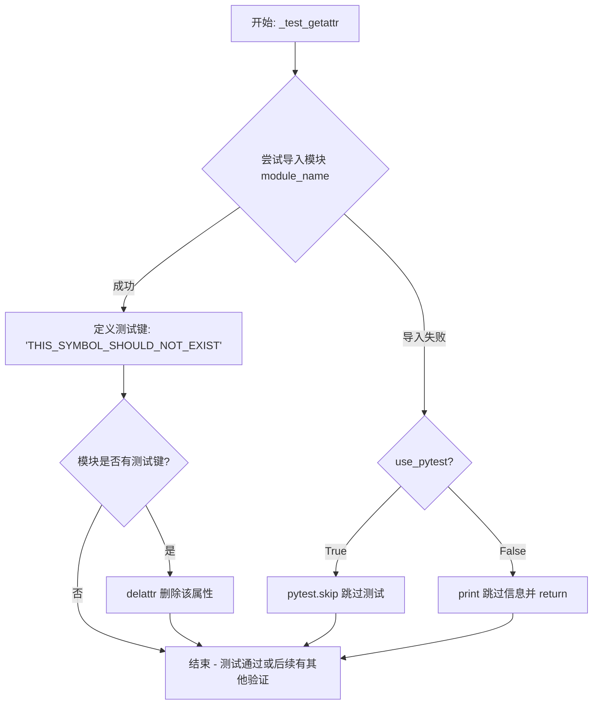
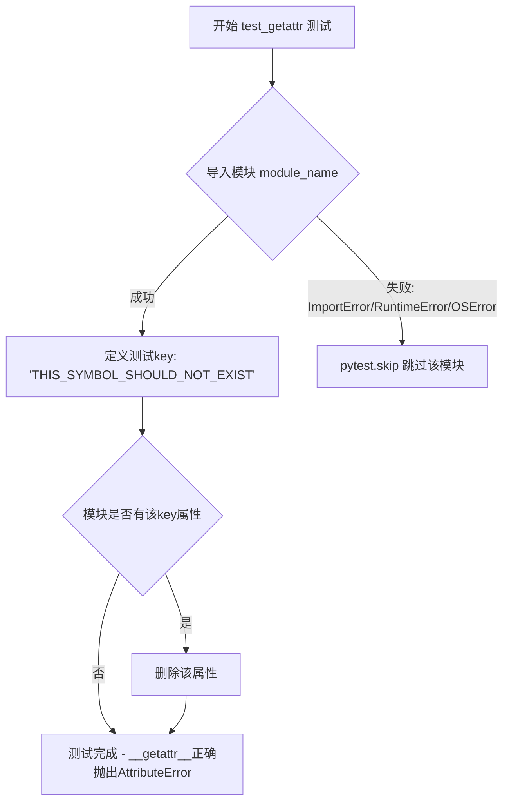
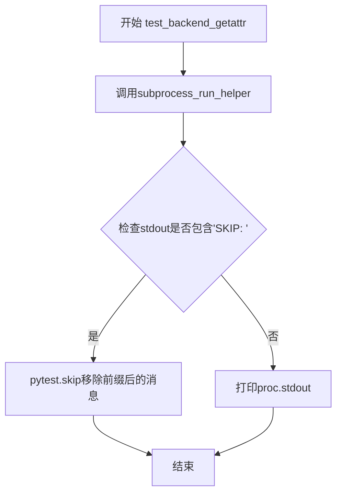
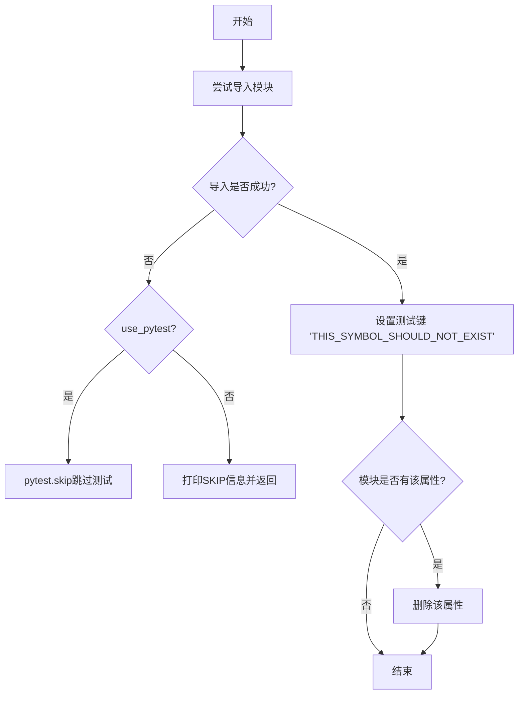
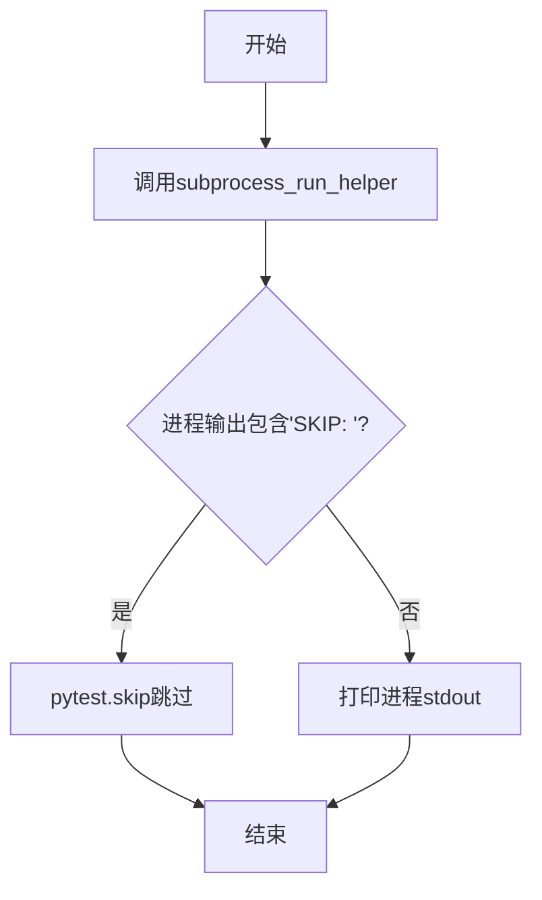

# `matplotlib\lib\matplotlib\tests\test_getattr.py` 详细设计文档

该测试文件用于验证matplotlib所有子模块的__getattr__方法是否能正确对未知属性抛出AttributeError，通过遍历matplotlib包的所有子模块（包括后端模块），对每个模块进行导入和属性访问测试，以确保模块的延迟加载机制正常工作。

## 整体流程

```mermaid
graph TD
    A[开始] --> B[遍历matplotlib.__path__下的所有子模块]
    B --> C{模块名是否以_开头?}
    C -- 是 --> D[跳过该模块]
    C -- 否 --> E{是否为backends.backend_模块?}
    E -- 是 --> F[添加到backend_module_names]
E -- 否 --> G[添加到module_names]
F --> H[继续遍历]
G --> H
H --> I{还有更多模块?}
I -- 是 --> B
I -- 否 --> J[test_getattr参数化测试]
J --> K[对每个module_name调用_test_getattr]
K --> L{能否导入模块?}
L -- 否 --> M[pytest.skip跳过]
L -- 是 --> N[检查THIS_SYMBOL_SHOULD_NOT_EXIST属性]
N --> O{属性存在?}
O -- 是 --> P[删除该属性]
O -- 否 --> Q[测试通过]
J --> R[test_backend_getattr参数化测试]
R --> S[通过子进程调用_test_module_getattr]
S --> T{子进程输出包含SKIP?]
T -- 是 --> U[pytest.skip跳过]
T -- 否 --> V[打印输出]
```

## 类结构

```
该文件无类定义，仅包含模块级函数和变量
```

## 全局变量及字段


### `module_names`
    
存储matplotlib非后端子模块名称列表

类型：`list`
    


### `backend_module_names`
    
存储matplotlib后端子模块名称列表

类型：`list`
    


### `m`
    
walk_packages迭代过程中的模块信息变量

类型：`ModuleInfo`
    


    

## 全局函数及方法


### `_test_getattr`

测试单个模块的 `__getattr__` 方法是否正确对未知属性抛出 AttributeError，用于验证模块的属性查找行为是否符合预期（参见 issue #20822, #20855）。

参数：

- `module_name`：`str`，要测试的模块名称（完整路径，如 `matplotlib.pyplot`）
- `use_pytest`：`bool`，是否使用 pytest 的 skip 机制（默认为 `True`），若为 `False` 则使用 print 输出跳过信息

返回值：`None`，该函数无返回值，主要通过 side effect（跳过测试或删除意外存在的属性）完成验证

#### 流程图



#### 带注释源码

```python
def _test_getattr(module_name, use_pytest=True):
    """
    Test that __getattr__ methods raise AttributeError for unknown keys.
    See #20822, #20855.
    """
    # 尝试动态导入指定的模块
    try:
        module = import_module(module_name)
    except (ImportError, RuntimeError, OSError) as e:
        # 跳过因缺少依赖而无法导入的模块
        if use_pytest:
            # 使用 pytest 的 skip 机制标记测试为跳过
            pytest.skip(f'Cannot import {module_name} due to {e}')
        else:
            # 在非 pytest 环境下打印跳过信息
            print(f'SKIP: Cannot import {module_name} due to {e}')
            return

    # 定义一个理论上不应该存在的属性名
    key = 'THIS_SYMBOL_SHOULD_NOT_EXIST'
    
    # 检查模块是否意外拥有该不存在的属性
    # 如果有，则删除它（可能是之前的测试留下的副作用）
    if hasattr(module, key):
        delattr(module, key)
```


### `test_getattr`

该测试函数通过 pytest 参数化机制遍历所有非后端模块，验证每个模块的 `__getattr__` 方法能够正确对不存在的属性抛出 `AttributeError`，以解决 matplotlib 项目中的 #20822 和 #20855 问题。

参数：

- `module_name`：`str`，从 `module_names` 列表中参数化传入的模块名称

返回值：`None`，pytest 测试函数执行完成后不返回任何值

#### 流程图



#### 带注释源码

```python
@pytest.mark.parametrize('module_name', module_names)
@pytest.mark.filterwarnings('ignore::DeprecationWarning')
@pytest.mark.filterwarnings('ignore::ImportWarning')
def test_getattr(module_name):
    """
    参数化测试函数，测试所有非后端模块的__getattr__方法。
    
    参数:
        module_name: str, matplotlib子模块的名称
        
    返回:
        None: pytest测试函数不返回任何值
        
    逻辑:
        1. 尝试导入指定的模块
        2. 如果导入失败，跳过该模块的测试
        3. 定义一个不存在的属性名 'THIS_SYMBOL_SHOULD_NOT_EXIST'
        4. 如果模块已有该属性则删除它
        5. 通过import_module再次访问该属性，验证__getattr__是否正确抛出AttributeError
    """
    # 调用内部测试函数执行实际测试逻辑
    _test_getattr(module_name)
```


### `_test_module_getattr`

在子进程中运行的测试函数，用于测试后端模块的 `__getattr__` 方法，通过命令行参数接收模块名称，并调用 `_test_getattr` 函数执行具体的属性获取测试。

参数： 无（该函数没有显式参数，通过 `sys.argv[1]` 隐式接收模块名称参数）

返回值：`None`，无返回值

#### 流程图

```mermaid
flowchart TD
    A[开始 _test_module_getattr] --> B[过滤 DeprecationWarning 警告]
    B --> C[过滤 ImportWarning 警告]
    C --> D[从 sys.argv[1] 获取模块名称]
    D --> E[调用 _test_getattr module_name, use_pytest=False]
    E --> F[结束]
```

#### 带注释源码

```python
def _test_module_getattr():
    """
    在子进程中运行的测试函数，用于测试后端模块的 __getattr__ 方法。
    该函数被 test_backend_getattr 用作子进程入口点。
    """
    # 忽略 DeprecationWarning 警告，避免测试输出中的警告信息干扰
    warnings.filterwarnings('ignore', category=DeprecationWarning)
    
    # 忽略 ImportWarning 警告，避免导入相关的警告信息干扰
    warnings.filterwarnings('ignore', category=ImportWarning)
    
    # 从命令行参数获取模块名称（sys.argv[0] 是脚本自身，sys.argv[1] 是第一个参数）
    module_name = sys.argv[1]
    
    # 调用 _test_getattr 函数执行实际的属性测试
    # use_pytest=False 表示不使用 pytest.skip，而是使用 print 输出跳过信息
    _test_getattr(module_name, use_pytest=False)
```


### `test_backend_getattr`

这是一个pytest参数化测试函数，用于通过子进程测试所有matplotlib后端模块的`__getattr__`方法是否对未知属性正确抛出`AttributeError`。

参数：

- `module_name`：`str`，要测试的后端模块名称

返回值：`None`，该函数为测试函数，通过pytest框架执行，不直接返回值

#### 流程图



#### 带注释源码

```python
@pytest.mark.parametrize('module_name', backend_module_names)
def test_backend_getattr(module_name):
    """
    参数化测试函数，用于测试所有后端模块的__getattr__行为。
    通过子进程运行_test_module_getattr来隔离测试环境。
    
    参数:
        module_name: str, 后端模块的名称,来自backend_module_names列表
    """
    # 调用子进程运行_test_module_getattr函数,传入module_name作为命令行参数
    # timeout根据是否在CI环境中设置为120秒或20秒
    proc = subprocess_run_helper(_test_module_getattr, module_name,
                                 timeout=120 if is_ci_environment() else 20)
    
    # 检查子进程输出是否包含SKIP标记
    if 'SKIP: ' in proc.stdout:
        # 移除'SKIP: '前缀并跳过测试,通常是由于模块导入失败
        pytest.skip(proc.stdout.removeprefix('SKIP: '))
    
    # 打印子进程的标准输出
    print(proc.stdout)
```

## 关键组件


### 模块收集器

遍历matplotlib包的所有子模块，将模块分为普通模块和后端模块两类，排除测试模块和私有模块

### _test_getattr函数

测试指定模块的__getattr__方法是否能对不存在的属性正确抛出AttributeError，用于验证模块的动态属性访问行为

### test_getattr测试函数

pytest参数化测试函数，遍历所有普通模块，验证每个模块的__getattr__行为是否符合预期

### test_backend_getattr测试函数

pytest参数化测试函数，通过子进程方式测试所有后端模块的__getattr__行为，支持CI环境超时配置

### _test_module_getattr子进程辅助函数

作为子进程运行的辅助函数，从命令行参数获取模块名称并执行__getattr__测试，用于隔离后端模块的测试环境

### 模块导入错误处理机制

捕获ImportError、RuntimeError和OSError异常，对缺少依赖的模块进行跳过处理，确保测试套件的健壮性

### 警告过滤配置

使用pytest标记过滤DeprecationWarning和ImportWarning，避免测试输出中的警告信息干扰测试结果


## 问题及建议


### 已知问题

- **重复的过滤warnings逻辑**：在`test_getattr`（使用`@pytest.mark.filterwarnings`）和`_test_module_getattr`（使用`warnings.filterwarnings`）中重复定义了相同的警告过滤规则，导致维护成本增加。
- **硬编码的测试符号**：`key = 'THIS_SYMBOL_SHOULD_NOT_EXIST'`作为测试用的不存在属性名被硬编码在函数内部，若需更改需修改多处。
- **异常处理粒度过粗**：捕获`(ImportError, RuntimeError, OSError)`三种异常类型统一处理，未对不同导入失败原因进行区分，可能隐藏潜在的配置或依赖问题。
- **重复的模块遍历逻辑**：`module_names`和`backend_module_names`的收集逻辑在同一段循环中完成，但后续使用方式差异较大，职责不够单一。
- **子进程测试的输出解析脆弱**：通过字符串包含`'SKIP: ''`来判断跳过状态并使用`removeprefix`操作，如果输出格式变化会导致测试失败，缺乏结构化的进程间通信机制。
- **缺乏日志记录**：测试过程中仅使用`print`输出信息，没有使用标准的日志框架，不利于在复杂测试环境中进行问题排查。

### 优化建议

- **提取警告过滤配置**：将警告过滤规则统一到pytest配置或创建一个共享的警告过滤器配置函数，避免在多处重复定义。
- **常量定义**：将`'THIS_SYMBOL_SHOULD_NOT_EXIST'`提取为模块级常量，如`NON_EXISTENT_SYMBOL`，提高可维护性。
- **细化异常处理**：针对不同的导入错误类型进行更精细的处理，例如区分缺失可选依赖导致的跳过和代码错误导致的失败。
- **重构测试入口**：考虑将`_test_module_getattr`的逻辑与主测试函数合并，通过参数区分运行模式（pytest vs 子进程），减少代码重复。
- **改进进程通信**：使用结构化数据格式（如JSON）在子进程和主进程间传递测试结果，避免依赖字符串解析。
- **引入日志**：使用Python的`logging`模块替代`print`语句，便于配置日志级别和输出格式。

## 其它


### 一段话描述

该代码是matplotlib库的测试模块，用于验证所有子模块的`__getattr__`方法能够正确地为不存在的属性抛出`AttributeError`，以解决#20822和#20855中提到的模块属性访问问题。

### 文件的整体运行流程

1. 初始化阶段：通过`walk_packages`遍历matplotlib的所有子模块
2. 模块分类：将模块分为普通模块和backend模块两类
3. 参数化测试：对所有普通模块使用`test_getattr`进行测试
4. 子进程测试：对backend模块使用`test_backend_getattr`通过子进程进行隔离测试
5. 导入尝试与验证：每个模块尝试导入并检查特定不存在的属性是否正确抛出AttributeError

### 全局变量详细信息

| 名称 | 类型 | 描述 |
|------|------|------|
| module_names | list | 存储所有非backend的matplotlib子模块名称 |
| backend_module_names | list | 存储所有backends.backend_*相关的模块名称 |

### 全局函数详细信息

#### _test_getattr

| 项目 | 内容 |
|------|------|
| 函数名 | _test_getattr |
| 参数名称 | module_name, use_pytest |
| 参数类型 | str, bool |
| 参数描述 | module_name为要测试的模块名，use_pytest控制失败时的行为方式 |
| 返回值类型 | None |
| 返回值描述 | 无返回值，通过断言或打印进行验证 |

mermaid流程图:


带注释源码:
```python
def _test_getattr(module_name, use_pytest=True):
    """
    Test that __getattr__ methods raise AttributeError for unknown keys.
    See #20822, #20855.
    """
    try:
        module = import_module(module_name)
    except (ImportError, RuntimeError, OSError) as e:
        # Skip modules that cannot be imported due to missing dependencies
        if use_pytest:
            pytest.skip(f'Cannot import {module_name} due to {e}')
        else:
            print(f'SKIP: Cannot import {module_name} due to {e}')
            return

    key = 'THIS_SYMBOL_SHOULD_NOT_EXIST'
    if hasattr(module, key):
        delattr(module, key)
```

#### test_getattr

| 项目 | 内容 |
|------|------|
| 函数名 | test_getattr |
| 参数名称 | module_name |
| 参数类型 | str |
| 参数描述 | pytest参数化的模块名称 |
| 返回值类型 | None |
| 返回值描述 | 无返回值，由pytest框架执行 |

带注释源码:
```python
@pytest.mark.parametrize('module_name', module_names)
@pytest.mark.filterwarnings('ignore::DeprecationWarning')
@pytest.mark.filterwarnings('ignore::ImportWarning')
def test_getattr(module_name):
    _test_getattr(module_name)
```

#### _test_module_getattr

| 项目 | 内容 |
|------|------|
| 函数名 | _test_module_getattr |
| 参数名称 | 无 |
| 参数类型 | 无 |
| 参数描述 | 无参数，从sys.argv获取模块名 |
| 返回值类型 | None |
| 返回值描述 | 无返回值 |

带注释源码:
```python
def _test_module_getattr():
    warnings.filterwarnings('ignore', category=DeprecationWarning)
    warnings.filterwarnings('ignore', category=ImportWarning)
    module_name = sys.argv[1]
    _test_getattr(module_name, use_pytest=False)
```

#### test_backend_getattr

| 项目 | 内容 |
|------|------|
| 函数名 | test_backend_getattr |
| 参数名称 | module_name |
| 参数类型 | str |
| 参数描述 | backend模块名称 |
| 返回值类型 | None |
| 返回值描述 | 无返回值，通过子进程执行测试 |

mermaid流程图:


带注释源码:
```python
@pytest.mark.parametrize('module_name', backend_module_names)
def test_backend_getattr(module_name):
    proc = subprocess_run_helper(_test_module_getattr, module_name,
                                 timeout=120 if is_ci_environment() else 20)
    if 'SKIP: ' in proc.stdout:
        pytest.skip(proc.stdout.removeprefix('SKIP: '))
    print(proc.stdout)
```

### 关键组件信息

| 名称 | 一句话描述 |
|------|------------|
| walk_packages | 用于递归遍历matplotlib包下所有子模块的工具 |
| import_module | 动态导入指定模块的核心函数 |
| subprocess_run_helper | 在子进程中运行测试以实现隔离的辅助函数 |
| is_ci_environment | 判断当前是否在CI环境中运行的检测函数 |
| pytest.mark.parametrize | 用于参数化测试的pytest装饰器 |

### 设计目标与约束

1. **目标**：确保matplotlib所有子模块的`__getattr__`方法正确实现，在访问未知属性时抛出`AttributeError`而非返回`None`
2. **约束**：
   - 排除私有模块（以`_`开头的模块）
   - 排除单元测试模块
   - backend模块需要通过子进程隔离测试以避免状态污染
   - 超时控制：CI环境120秒，本地环境20秒

### 错误处理与异常设计

1. **导入失败处理**：对于因缺少依赖无法导入的模块，使用`pytest.skip`跳过测试
2. **属性冲突处理**：在测试前删除可能存在的测试键，避免残留属性影响测试结果
3. **进程超时处理**：为子进程设置超时限制，防止无限等待
4. **警告过滤**：忽略`DeprecationWarning`和`ImportWarning`以减少测试输出噪音

### 外部依赖与接口契约

| 依赖项 | 用途 |
|--------|------|
| pytest | 测试框架和参数化执行 |
| matplotlib | 被测试的包 |
| importlib | 动态模块导入 |
| pkgutil | 包遍历 |
| subprocess_run_helper | matplotlib内部子进程辅助函数 |
| is_ci_environment | CI环境检测 |

### 性能考虑

1. **参数化测试**：使用`@pytest.mark.parametrize`实现高效的批量测试
2. **子进程隔离**：backend模块通过子进程测试虽然增加开销，但保证了测试独立性
3. **超时控制**：根据环境动态调整超时时间，CI环境给予更长超时

### 可维护性

1. 代码结构清晰，测试逻辑与执行逻辑分离
2. 使用有意义的模块名称作为测试参数
3. 详细的docstring说明测试目的和关联的issue编号

### 扩展性

1. 模块分类逻辑可轻松扩展以支持其他特殊类型的模块
2. 超时和跳过逻辑可配置化以适应不同测试需求
3. 可添加更多过滤规则来排除特定模块

### 潜在的技术债务或优化空间

1. **测试键硬编码**：测试使用的属性名`THIS_SYMBOL_SHOULD_NOT_EXIST`是硬编码的，可考虑参数化
2. **重复代码**：backend和普通模块的测试逻辑有重复，可考虑抽象统一
3. **缺少日志记录**：测试过程没有详细的日志记录，调试时可能需要手动添加
4. **超时设置不够灵活**：超时时间与环境判断耦合，可通过配置系统改进
5. **跳过逻辑分散**：导入失败和skip输出在多处处理，可统一封装

    