# `matplotlib\lib\matplotlib\tests\test_gridspec.py` 详细设计文档

该文件是 matplotlib.gridspec 模块的单元测试文件，通过 pytest 框架测试 GridSpec、GridSpecFromSubplotSpec 和 SubplotParams 等类的功能，包括网格布局、等分属性、参数更新、子图规范等核心功能的正确性。

## 整体流程

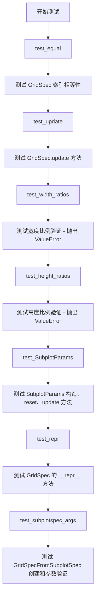

## 类结构

```
测试模块 (test_gridspec.py)
├── test_equal (测试 GridSpec 索引相等性)
├── test_update (测试 update 方法)
├── test_width_ratios (测试宽度比例验证)
├── test_height_ratios (测试高度比例验证)
├── test_SubplotParams (测试 SubplotParams 类)
├── test_repr (测试 __repr__ 方法)
└── test_subplotspec_args (测试 GridSpecFromSubplotSpec)

被测模块 (matplotlib.gridspec)
├── GridSpec (网格布局规范类)
├── GridSpecFromSubplotSpec (子图规范创建器)
└── SubplotParams (子图参数类)
```

## 全局变量及字段


### `gs`
    
GridSpec实例,用于创建网格布局

类型：`gridspec.GridSpec`
    


### `s`
    
SubplotParams实例,用于管理子图参数

类型：`gridspec.SubplotParams`
    


### `ss`
    
SubplotSpec实例,表示子网格切片

类型：`gridspec.SubplotSpec`
    


### `fig`
    
matplotlib图形对象

类型：`matplotlib.figure.Figure`
    


### `axs`
    
子坐标轴对象数组

类型：`numpy.ndarray[matplotlib.axes.Axes]`
    


### `matplotlib.rcParams`
    
matplotlib全局配置参数字典

类型：`dict`
    


### `GridSpec.nrows`
    
网格行数

类型：`int`
    


### `GridSpec.ncols`
    
网格列数

类型：`int`
    


### `GridSpec.width_ratios`
    
列宽度比例数组

类型：`list or tuple`
    


### `GridSpec.height_ratios`
    
行高度比例数组

类型：`list or tuple`
    


### `GridSpec.left`
    
子图左侧边界(0-1)

类型：`float`
    


### `GridSpec.right`
    
子图右侧边界(0-1)

类型：`float`
    


### `GridSpec.top`
    
子图顶部边界(0-1)

类型：`float`
    


### `GridSpec.bottom`
    
子图底部边界(0-1)

类型：`float`
    


### `GridSpec.wspace`
    
子图间水平间距

类型：`float`
    


### `GridSpec.hspace`
    
子图间垂直间距

类型：`float`
    


### `GridSpecFromSubplotSpec.subplot_spec`
    
父级SubplotSpec引用

类型：`gridspec.SubplotSpec`
    


### `SubplotParams.left`
    
子图左侧边界(0-1)

类型：`float`
    


### `SubplotParams.right`
    
子图右侧边界(0-1)

类型：`float`
    


### `SubplotParams.bottom`
    
子图底部边界(0-1)

类型：`float`
    


### `SubplotParams.top`
    
子图顶部边界(0-1)

类型：`float`
    


### `SubplotParams.wspace`
    
子图间水平间距

类型：`float`
    


### `SubplotParams.hspace`
    
子图间垂直间距

类型：`float`
    
    

## 全局函数及方法


### `test_equal`

该函数用于测试 matplotlib 中 GridSpec 对象的相等性比较功能，验证同一索引位置和切片索引返回的对象在逻辑上相等。

**参数：** 无

**返回值：** `None`，此为测试函数，使用 assert 语句进行断言，不返回具体值

#### 流程图

```mermaid
flowchart TD
    A[开始 test_equal] --> B[创建 GridSpec 网格规范: 2行1列]
    B --> C[断言: gs[0, 0] 等于 gs[0, 0]]
    C --> D{断言结果}
    D -->|通过| E[断言: gs[:, 0] 等于 gs[:, 0]]
    D -->|失败| F[抛出 AssertionError]
    E --> G{断言结果}
    G -->|通过| H[测试通过, 函数结束]
    G -->|失败| F
    F --> I[测试失败]
```

#### 带注释源码

```python
def test_equal():
    # 创建一个 2行1列 的 GridSpec 网格规范对象
    gs = gridspec.GridSpec(2, 1)
    
    # 测试单个索引位置的相等性: 获取 (0,0) 位置并与自己比较
    assert gs[0, 0] == gs[0, 0]
    
    # 测试切片索引的相等性: 获取整列 (所有行的第0列) 并与自己比较
    assert gs[:, 0] == gs[:, 0]
```


### `test_update`

该测试函数用于验证matplotlib中GridSpec类的update方法能够正确更新子图布局的左侧边距参数，并确保更新后的left属性值与设置值一致。

参数：
- 该函数无参数

返回值：`None`，测试函数不返回任何值，仅通过断言验证GridSpec的行为是否符合预期

#### 流程图

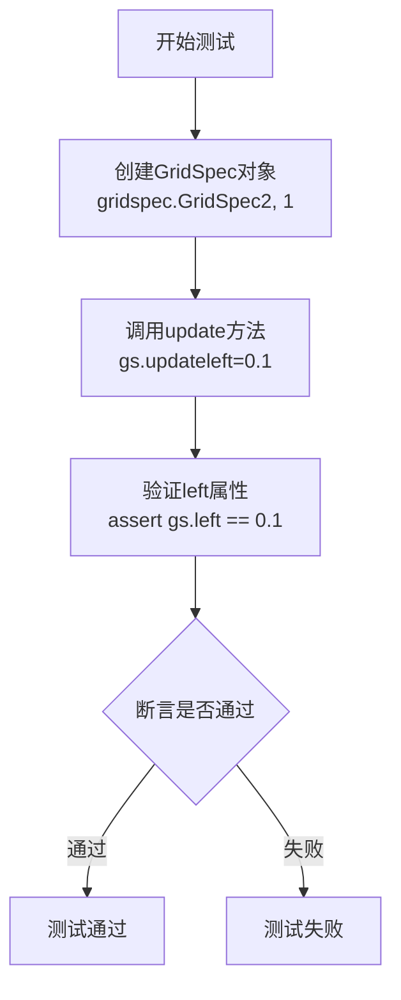

#### 带注释源码

```python
def test_update():
    """
    测试GridSpec的update方法功能
    
    该测试函数验证以下功能：
    1. GridSpec.update()方法能够正确修改布局参数
    2. 修改后的参数值能够被正确获取和验证
    """
    
    # 创建2行1列的GridSpec布局对象
    # GridSpec是matplotlib中用于管理子图布局的类
    gs = gridspec.GridSpec(2, 1)
    
    # 使用update方法更新布局的左侧边距参数
    # left参数控制子图区域左侧边界的位置（0.0-1.0之间的比例）
    gs.update(left=.1)
    
    # 断言验证update方法是否正确更新了left属性
    # 期望left属性值等于我们设置的0.1
    assert gs.left == .1
```

#### 关键组件信息

| 组件名称 | 一句话描述 |
|---------|-----------|
| `gridspec.GridSpec` | matplotlib中用于创建和管理子图网格布局的核心类 |
| `GridSpec.update()` | 用于更新GridSpec布局参数的方法，支持left、right、top、bottom等参数 |
| `GridSpec.left` | 属性，表示子图区域左侧边距的相对位置 |

#### 潜在的技术债务或优化空间

1. **测试覆盖不足**：当前测试仅验证了`left`参数，建议增加对`right`、`top`、`bottom`、`hspace`、`wspace`等参数的测试
2. **边界值测试缺失**：建议增加边界值测试，如left=0、left=1、以及无效值（如负数、大于1的值）的异常处理测试
3. **参数化测试建议**：可使用pytest参数化来减少重复代码，测试多组参数组合

#### 其它项目

**设计目标与约束**：
- 该测试属于单元测试，验证GridSpec的update方法基本功能
- 使用固定值0.1进行测试，未考虑浮点数精度问题

**错误处理与异常设计**：
- 当前测试未覆盖异常情况
- 建议增加对无效输入（如left >= right）的异常测试，参考test_SubplotParams中的异常测试模式

**数据流与状态机**：
- 测试流程：创建对象 → 修改状态 → 验证状态变化
- 无状态机设计，属于简单的状态验证测试

**外部依赖与接口契约**：
- 依赖matplotlib.gridspec模块
- 依赖pytest框架进行测试执行和断言


### `test_width_ratios`

验证当 `GridSpec` 的 `width_ratios` 参数长度与列数不匹配时，会正确抛出 `ValueError` 异常。该测试针对 GitHub issue #5835。

参数：

- （无）

返回值：`None`，因为这是一个测试函数，不返回任何值。

#### 流程图

```mermaid
flowchart TD
    A[开始测试 test_width_ratios] --> B[调用 gridspec.GridSpec 1, 1, width_ratios=[2, 1, 3]]
    B --> C{是否抛出 ValueError?}
    C -->|是| D[测试通过]
    C -->|否| E[测试失败]
```

#### 带注释源码

```python
def test_width_ratios():
    """
    Addresses issue #5835.
    See at https://github.com/matplotlib/matplotlib/issues/5835.
    """
    # 使用 pytest.raises 验证当 width_ratios 长度与 GridSpec 列数不匹配时
    # 会抛出 ValueError 异常
    # 这里 GridSpec(1, 1) 表示 1 行 1 列，但 width_ratios 提供了 3 个元素
    # 应该抛出 ValueError
    with pytest.raises(ValueError):
        gridspec.GridSpec(1, 1, width_ratios=[2, 1, 3])
```


### `test_height_ratios`

该函数用于测试 `GridSpec` 在传入不匹配的 `height_ratios` 参数时是否正确抛出 `ValueError` 异常，针对 GitHub issue #5835 中描述的问题进行验证。

参数：

- 无参数

返回值：`None`，无返回值（该函数为测试函数，使用 `pytest.raises` 验证异常行为）

#### 流程图

```mermaid
flowchart TD
    A[开始测试 test_height_ratios] --> B[调用 gridspec.GridSpec 1, 1, height_ratios=[2, 1, 3]]
    B --> C{是否抛出 ValueError?}
    C -->|是| D[测试通过]
    C -->|否| E[测试失败]
    
    style D fill:#90EE90
    style E fill:#FFB6C1
```

#### 带注释源码

```python
def test_height_ratios():
    """
    Addresses issue #5835.
    See at https://github.com/matplotlib/matplotlib/issues/5835.
    """
    # 使用 pytest.raises 验证当传入不匹配的 height_ratios 时
    # GridSpec 会抛出 ValueError 异常
    # 具体场景：GridSpec(1, 1) 表示 1 行 1 列
    # 但 height_ratios=[2, 1, 3] 提供了 3 个比例值，与行数不匹配
    with pytest.raises(ValueError):
        gridspec.GridSpec(1, 1, height_ratios=[2, 1, 3])
```


### `test_SubplotParams`

该测试函数用于验证 `SubplotParams` 类的构造函数、属性访问、reset 方法和 update 方法的正确性，以及边界验证功能。

参数： 无

返回值： `None`，该函数为测试函数，不返回任何值

#### 流程图

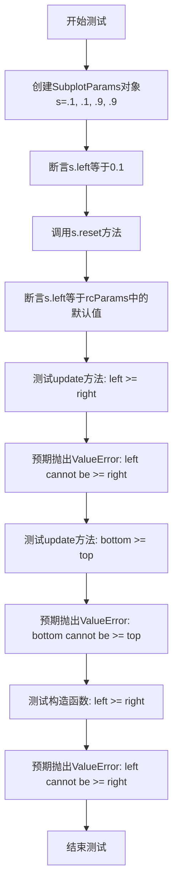

#### 带注释源码

```python
def test_SubplotParams():
    """
    测试 SubplotParams 类的核心功能：
    1. 构造函数参数赋值
    2. reset() 方法重置为默认 rcParams 值
    3. update() 方法的参数边界验证
    4. 构造函数的参数边界验证
    """
    # 创建 SubplotParams 实例，传入 left=0.1, right=0.1, top=0.9, bottom=0.9
    # 注意：这里的参数顺序通常是 left, right, bottom, top
    s = gridspec.SubplotParams(.1, .1, .9, .9)
    # 验证构造函数正确设置了 left 属性
    assert s.left == 0.1

    # 调用 reset() 方法，将所有参数重置为 matplotlib.rcParams 中的默认值
    s.reset()
    # 验证 reset 后 left 值等于 rcParams['figure.subplot.left'] 的配置值
    assert s.left == matplotlib.rcParams['figure.subplot.left']

    # 测试 update 方法的边界验证：left 不能 >= right
    # 尝试将 left 更新为 right + 0.01，应触发 ValueError
    with pytest.raises(ValueError, match='left cannot be >= right'):
        s.update(left=s.right + .01)

    # 测试 update 方法的边界验证：bottom 不能 >= top
    # 尝试将 bottom 更新为 top + 0.01，应触发 ValueError
    with pytest.raises(ValueError, match='bottom cannot be >= top'):
        s.update(bottom=s.top + .01)

    # 测试构造函数的边界验证：left 不能 >= right
    # 直接在构造函数中传入非法参数 left=0.1, right=0.09，应触发 ValueError
    with pytest.raises(ValueError, match='left cannot be >= right'):
        gridspec.SubplotParams(.1, .1, .09, .9)
```


### `test_repr`

该函数是一个单元测试函数，用于验证 `GridSpec` 类的 `__repr__` 方法是否能正确返回字符串表示形式。测试涵盖两种场景：带切片操作的 GridSpec 索引以及带高度和宽度比例参数的 GridSpec 创建。

参数： 无

返回值：`None`，无返回值，仅执行测试断言

#### 流程图

```mermaid
flowchart TD
    A[开始 test_repr] --> B[创建 GridSpec(3, 3) 并通过索引 [2, 1:3] 获取子图]
    B --> C[验证 repr(ss) 是否等于 'GridSpec(3, 3)[2:3, 1:3]']
    C --> D{断言是否通过}
    D -->|是| E[创建 GridSpec(2, 2, height_ratios=(3,1), width_ratios=(1,3))]
    D -->|否| F[测试失败]
    E --> G[验证 repr(ss) 是否等于指定字符串]
    G --> H{断言是否通过}
    H -->|是| I[测试通过]
    H -->|否| F
```

#### 带注释源码

```python
def test_repr():
    """
    测试 GridSpec 类的 __repr__ 方法是否能正确返回字符串表示形式。
    该测试函数验证两种场景：
    1. 带切片索引的 GridSpec 表示
    2. 带参数选项的 GridSpec 表示
    """
    # 场景1：测试带切片索引的 GridSpec 字符串表示
    # gridspec.GridSpec(3, 3) 创建一个 3x3 的网格规格
    # [2, 1:3] 表示获取第2行、第1到2列的子网格区域
    ss = gridspec.GridSpec(3, 3)[2, 1:3]
    
    # 验证字符串表示是否符合预期格式
    # 预期输出: "GridSpec(3, 3)[2:3, 1:3]"
    assert repr(ss) == "GridSpec(3, 3)[2:3, 1:3]"

    # 场景2：测试带 height_ratios 和 width_ratios 参数的 GridSpec 字符串表示
    # height_ratios=(3, 1) 表示两行的高度比例为 3:1
    # width_ratios=(1, 3) 表示两列的宽度比例为 1:3
    ss = gridspec.GridSpec(2, 2,
                           height_ratios=(3, 1),
                           width_ratios=(1, 3))
    
    # 验证字符串表示包含所有参数信息
    assert repr(ss) == \
        "GridSpec(2, 2, height_ratios=(3, 1), width_ratios=(1, 3))"
```


### `test_subplotspec_args`

该函数用于测试 `GridSpecFromSubplotSpec` 类的参数验证功能，验证其是否正确接受 `SubplotSpec` 对象作为参数，并正确拒绝不兼容的类型（如 `Axes` 对象和数组），确保类型安全。

参数： 无

返回值： `None`，无返回值（测试函数）

#### 流程图

```mermaid
flowchart TD
    A[开始] --> B[创建子图: fig, axs = plt.subplots1, 2)]
    B --> C[使用正确的SubplotSpec创建GridSpecFromSubplotSpec]
    C --> D[gs = gridspec.GridSpecFromSubplotSpec2, 1, subplot_spec=axs[0].get_subplotspec)]
    D --> E{断言: gs.get_topmost_subplotspec == axs[0].get_subplotspec}
    E -->|通过| F[测试错误类型1: 传入Axes对象]
    F --> G[with pytest.raisesTypeError, match="subplot_spec must be type SubplotSpec")]
    G --> H[gs = gridspec.GridSpecFromSubplotSpec2, 1, subplot_spec=axs[0])]
    H --> I{捕获TypeError}
    I -->|成功| J[测试错误类型2: 传入数组]
    J --> K[with pytest.raisesTypeError, match="subplot_spec must be type SubplotSpec")]
    K --> L[gs = gridspec.GridSpecFromSubplotSpec2, 1, subplot_spec=axs)]
    L --> M{捕获TypeError}
    M -->|成功| N[结束]
    E -->|失败| O[测试失败]
    I -->|未捕获| O
    M -->|未捕获| O
```

#### 带注释源码

```python
def test_subplotspec_args():
    """
    测试 GridSpecFromSubplotSpec 的参数验证功能
    
    验证点:
    1. 正确接受 SubplotSpec 对象
    2. 正确拒绝 Axes 对象
    3. 正确拒绝数组类型
    """
    # 创建一个包含1行2列的子图布局
    fig, axs = plt.subplots(1, 2)
    
    # -------------------------------------------------
    # 测试1: 使用正确的 SubplotSpec 对象
    # -------------------------------------------------
    # 应该成功: 使用第一个子图的 get_subplotspec() 方法
    # 获取其对应的 SubplotSpec 对象来创建 GridSpecFromSubplotSpec
    gs = gridspec.GridSpecFromSubplotSpec(
        2, 1,                                          # 2行1列的网格规范
        subplot_spec=axs[0].get_subplotspec()          # 传入第一个子图的SubplotSpec对象
    )
    
    # 验证创建的 GridSpec 的顶层子图规范等于原始的子图规范
    assert gs.get_topmost_subplotspec() == axs[0].get_subplotspec()
    
    # -------------------------------------------------
    # 测试2: 传入错误的类型 - Axes 对象
    # -------------------------------------------------
    # 应该抛出 TypeError: subplot_spec 必须是一个 SubplotSpec 类型
    # 而不是一个 Axes 对象
    with pytest.raises(TypeError, match="subplot_spec must be type SubplotSpec"):
        gs = gridspec.GridSpecFromSubplotSpec(2, 1, subplot_spec=axs[0])
    
    # -------------------------------------------------
    # 测试3: 传入错误的类型 - 数组
    # -------------------------------------------------
    # 应该抛出 TypeError: subplot_spec 必须是一个 SubplotSpec 类型
    # 而不是一个数组（axs 实际上是 Axes 对象数组）
    with pytest.raises(TypeError, match="subplot_spec must be type SubplotSpec"):
        gs = gridspec.GridSpecFromSubplotSpec(2, 1, subplot_spec=axs)
```


### `gridspec.GridSpec`

GridSpec 是 matplotlib 中用于定义子图布局规格的类，主要功能是将图形划分为指定行列数的网格，并支持宽高比例设置、子图索引访问以及布局参数更新。

参数：

- `nrows`：`int`，行数，表示网格的行数量
- `ncols`：`int`，列数，表示网格的列数量
- `width_ratios`：`array-like`，可选，宽度比例，用于指定各列的相对宽度
- `height_ratios`：`array-like`，可选，高度比例，用于指定各行的相对高度
- `hspace`：`float`，可选，垂直子图间距
- `wspace`：`float`，可选，水平子图间距
- `left`：`float`，可选，左边界位置（0到1之间）
- `right`：`float`，可选，右边界位置（0到1之间）
- `top`：`float`，可选，顶边界位置（0到1之间）
- `bottom`：`float`，可选，底边界位置（0到1之间）

返回值：`GridSpec` 对象，返回创建的网格布局规格对象

#### 流程图

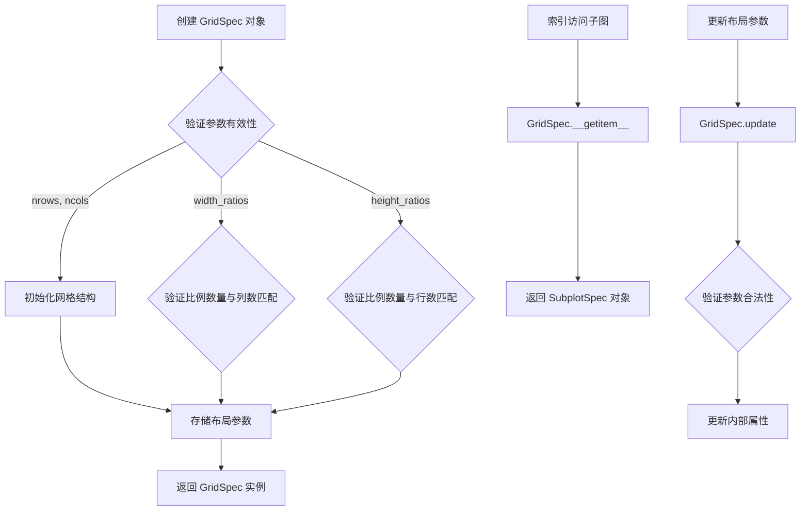

#### 带注释源码

```python
# GridSpec 类通常在 matplotlib.gridspec 模块中定义
# 以下是基于测试代码使用方式推断的接口说明

# 创建 GridSpec 实例的基本方式
gs = gridspec.GridSpec(2, 1)  # 创建2行1列的网格

# 支持宽高比例设置（注意：比例数量必须与行列数匹配）
gs = gridspec.GridSpec(2, 2, 
                       height_ratios=(3, 1),  # 两行的高度比例 3:1
                       width_ratios=(1, 3))   # 两列的宽度比例 1:3

# 索引访问：返回 SubplotSpec 对象
cell = gs[0, 0]      # 访问第0行第0列的子图
row = gs[:, 0]       # 访问第0列的所有行（切片）

# 更新布局参数
gs.update(left=.1)   # 更新左边界为0.1

# 访问布局属性
left_val = gs.left   # 获取当前左边界值

#  repr 显示布局信息
repr(gs)  # "GridSpec(2, 2, height_ratios=(3, 1), width_ratios=(1, 3))"
```

#### 关键组件信息

| 组件名称 | 一句话描述 |
|---------|-----------|
| `GridSpec` | 网格布局规格类，用于定义图形的行列网格结构 |
| `SubplotSpec` | 子图规格类，表示 GridSpec 中的单个子图区域 |
| `GridSpecFromSubplotSpec` | 从现有 SubplotSpec 创建嵌套 GridSpec 的工厂函数 |

#### 潜在的技术债务或优化空间

1. **参数验证时机**：测试代码显示 `width_ratios` 和 `height_ratios` 的验证在创建时进行，但错误信息可能不够清晰，建议增加更详细的验证提示
2. **边界参数验证**：`left < right` 和 `bottom < top` 的约束在 `update` 方法中检查，但构造函数中未验证，存在潜在的不一致
3. **索引方式多样性**：当前支持整数索引和切片索引，但不支持更灵活的索引方式（如步长切片）

#### 其它项目

**设计目标与约束**：
- GridSpec 必须与 Figure 和 Axes 集成，支持嵌套布局
- 比例参数总和可以不为1，系统会自动归一化
- 边界参数范围必须在 [0, 1] 之间

**错误处理与异常设计**：
- `width_ratios` 或 `height_ratios` 数量不匹配时抛出 `ValueError`
- 边界参数 `left >= right` 或 `bottom >= top` 时抛出 `ValueError`
- 索引超出范围时应抛出适当的索引异常

**数据流与状态机**：
- 创建状态：初始化网格结构和参数
- 配置状态：通过 `update` 方法修改布局参数
- 访问状态：通过 `__getitem__` 返回 SubplotSpec 进行子图绑定

**外部依赖与接口契约**：
- 依赖 matplotlib 核心库
- 与 `plt.subplots`、`fig.add_subplot` 等接口兼容
- 返回的 SubplotSpec 必须与 Axes 的创建方法兼容


### `gridspec.GridSpecFromSubplotSpec`

该函数用于从已有的 SubplotSpec 对象创建一个新的 GridSpec，允许基于现有的子图布局规范定义新的网格规范，常用于复杂的多层子图布局场景中。

参数：

- `nrows`：`int`，表示网格的行数
- `ncols`：`int`，表示网格的列数
- `subplot_spec`：`SubplotSpec`，现有的 SubplotSpec 实例，不能是 Axes 或 Axes 数组对象
- `**kwargs`：可选关键字参数，可传入 `width_ratios`（列宽比例）、`height_ratios`（行高比例）等 GridSpec 配置参数

返回值：`GridSpec`，返回新创建的 GridSpec 对象，其布局基于传入的 subplot_spec

#### 流程图

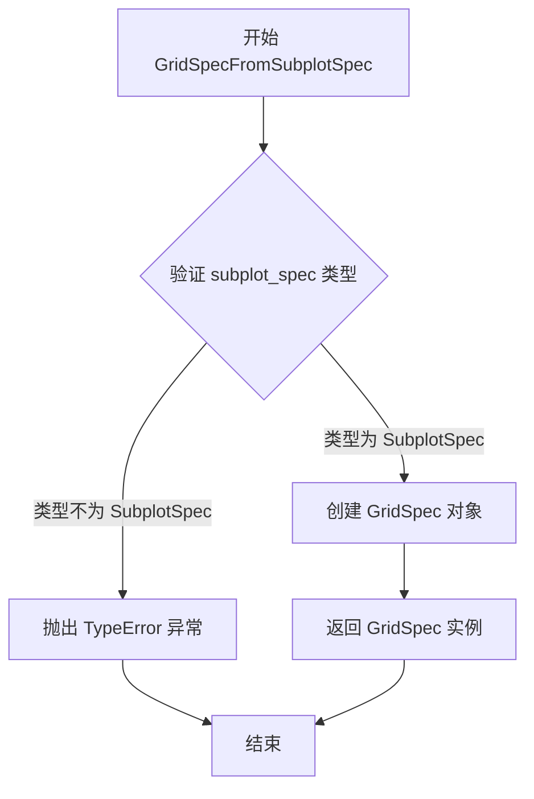

#### 带注释源码

```python
# gridspec.GridSpecFromSubplotSpec 使用示例
# 从代码中提取的调用方式：

# 正确调用 - 传入 SubplotSpec 对象
gs = gridspec.GridSpecFromSubplotSpec(
    2, 1,  # nrows=2, ncols=1
    subplot_spec=axs[0].get_subplotspec()  # 获取 axs[0] 的 SubplotSpec
)
# 验证返回的 GridSpec 的顶层 SubplotSpec
assert gs.get_topmost_subplotspec() == axs[0].get_subplotspec()

# 错误调用示例 - 传入 Axes 对象而非 SubplotSpec
# with pytest.raises(TypeError, match="subplot_spec must be type SubplotSpec"):
#     gs = gridspec.GridSpecFromSubplotSpec(2, 1, subplot_spec=axs[0])

# 错误调用示例 - 传入 Axes 数组
# with pytest.raises(TypeError, match="subplot_spec must be type SubplotSpec"):
#     gs = gridspec.GridSpecFromSubplotSpec(2, 1, subplot_spec=axs)
```


### `gridspec.SubplotParams`

SubplotParams 是 matplotlib gridspec 模块中的一个配置类，用于管理子图的布局参数（如左边距、右边距、顶部和底部边距）。它提供了参数验证、默认值恢复和参数更新功能，确保子图布局的有效性。

参数：

- `left`：`float`，子图的左边距（0.0 到 1.0 之间的比例）
- `right`：`float`，子图的右边距
- `bottom`：`float`，子图的底部边距
- `top`：`float`，子图的顶部边距

注意：根据测试代码推断，该类的构造函数接受四个浮点数参数，分别对应 left、right、top、bottom（或类似的映射关系）。

返回值：`SubplotParams` 实例

#### 流程图

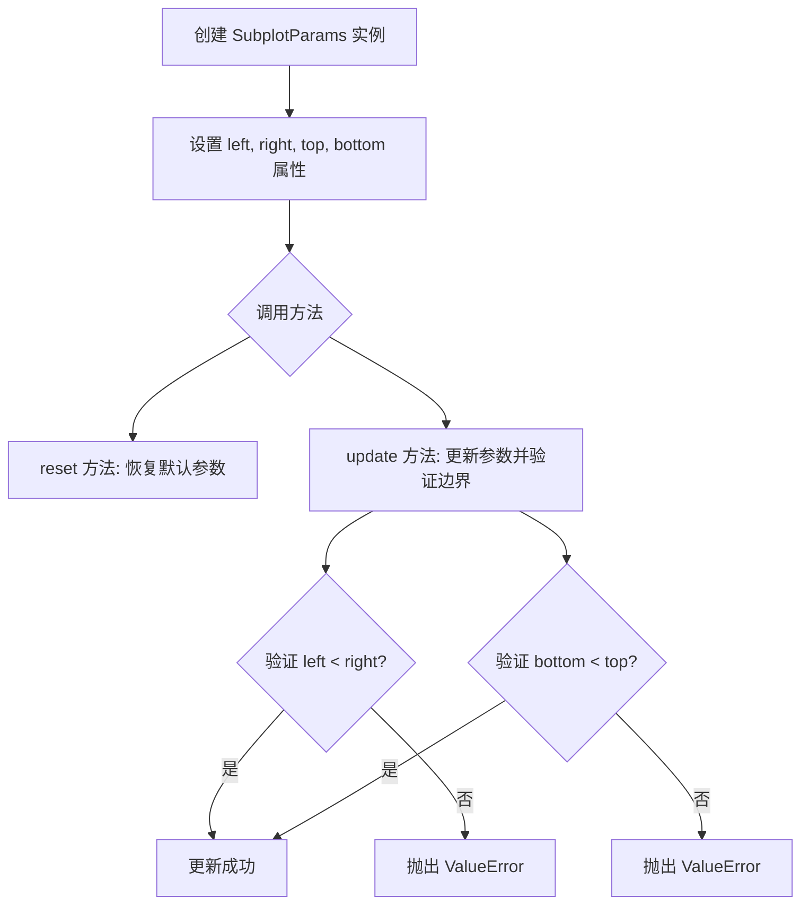

#### 带注释源码

```python
# 根据测试代码推断的实现逻辑
class SubplotParams:
    """
    子图布局参数配置类
    
    用于管理子图的边距参数(left, right, top, bottom)，
    并提供参数验证和默认值恢复功能。
    """
    
    def __init__(self, left=0.125, right=0.9, bottom=0.11, top=0.88):
        """
        初始化 SubplotParams
        
        参数:
            left: 左边距比例 (默认 0.125)
            right: 右边距比例 (默认 0.9)
            bottom: 底部边距比例 (默认 0.11)
            top: 顶部边距比例 (默认 0.88)
        """
        self._left = left
        self._right = right
        self._bottom = bottom
        self._top = top
    
    @property
    def left(self):
        """获取左边距"""
        return self._left
    
    @left.setter
    def left(self, value):
        """设置左边距"""
        self._left = value
    
    def reset(self):
        """
        重置参数为默认值
        
        默认值从 matplotlib.rcParams['figure.subplot.left'] 等配置中获取
        """
        self._left = matplotlib.rcParams['figure.subplot.left']
        # 其他参数类似...
    
    def update(self, **kwargs):
        """
        更新参数
        
        参数:
            **kwargs: 要更新的参数，如 left, right, top, bottom
            
        异常:
            ValueError: 当参数验证失败时（如 left >= right）
        """
        if 'left' in kwargs and 'right' in kwargs:
            if kwargs['left'] >= kwargs['right']:
                raise ValueError('left cannot be >= right')
        # 类似验证其他参数...
        
        for key, value in kwargs.items():
            setattr(self, f'_{key}', value)
```


### `plt.subplots`

该函数是matplotlib.pyplot模块中的核心函数，用于创建一个包含多个子图的图形窗口，并返回图形对象和轴对象数组。它简化了创建子图网格的过程，是进行数据可视化时最常用的接口之一。

参数：

- `nrows`：`int`，可选，默认值为1，表示子图的行数
- `ncols`：`int`，可选，默认值为1，表示子图的列数
- `sharex`：`bool`或`str`，可选，默认值为False，控制是否共享x轴
- `sharey`：`bool`或`str`，可选，默认值为False，控制是否共享y轴
- `squeeze`：`bool`，可选，默认值为True，控制是否压缩返回的轴数组维度
- `width_ratios`：`array-like`，可选，定义列宽比例
- `height_ratios`：`array-like`，可选，定义行高比例
- `subplot_kw`：`dict`，可选，传递给add_subplot的关键字参数
- `gridspec_kw`：`dict`，可选，传递给GridSpec的关键字参数
- `figsize`：`tuple`，可选，指定图形的大小（宽度，高度）
- `facecolor`：`color`，可选，图形背景颜色

返回值：`tuple`，返回(figure, axes)元组，其中figure是Figure对象，axes是Axes对象或Axes对象数组

#### 流程图

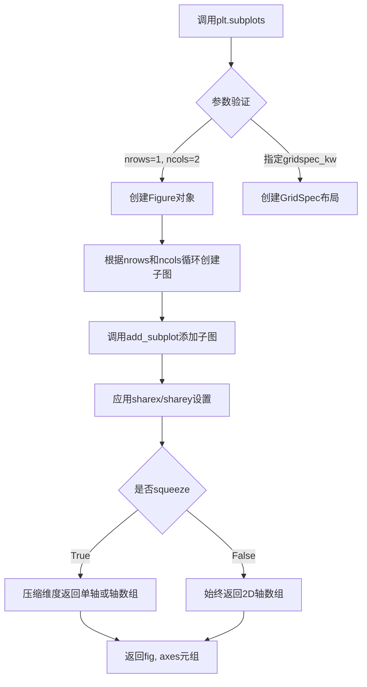

#### 带注释源码

```python
def subplots(nrows=1, ncols=1, sharex=False, sharey=False, squeeze=True,
             width_ratios=None, height_ratios=None,
             subplot_kw=None, gridspec_kw=None, **fig_kw):
    """
    创建包含子图的图形。
    
    参数:
        nrows: 行数，默认为1
        ncols: 列数，默认为1
        sharex: 如果为True，所有子图共享x轴
        sharey: 如果为True，所有子图共享y轴
        squeeze: 如果为True，返回的axes数组维度会被压缩
        width_ratios: 列宽比例
        height_ratios: 行高比例
        subplot_kw: 传递给add_subplot的关键字参数
        gridspec_kw: 传递给GridSpec的关键字参数
        **fig_kw: 传递给Figure.subplots的关键字参数
    
    返回:
        fig: Figure对象
        axes: Axes对象或Axes对象数组
    """
    # 创建一个新的图形对象
    fig = figure(**fig_kw)
    
    # 如果未指定gridspec_kw，初始化为空字典
    if gridspec_kw is None:
        gridspec_kw = {}
    
    # 将width_ratios和height_ratios添加到gridspec_kw
    if width_ratios is not None:
        if 'width_ratios' in gridspec_kw:
            raise ValueError("'width_ratios' must not be defined both as "
                             "a parameter and as a key in 'gridspec_kw'")
        gridspec_kw['width_ratios'] = width_ratios
    
    if height_ratios is not None:
        if 'height_ratios' in gridspec_kw:
            raise ValueError("'height_ratios' must not be defined both as "
                             "a parameter and as a key in 'gridspec_kw'")
        gridspec_ktspec_kw['height_ratios'] = height_ratios
    
    # 调用Figure的subplots方法
    return fig.subplots(nrows=nrows, ncols=ncols, sharex=sharex, 
                        sharey=sharey, squeeze=squeeze, 
                        subplot_kw=subplot_kw, gridspec_kw=gridspec_kw)
```


### `Axes.get_subplotspec`

获取当前 Axes 对象关联的 SubplotSpec 对象，用于描述子图在 GridSpec 中的位置信息。

参数：
- （无参数）

返回值：`matplotlib.gridspec.SubplotSpec`，返回与该 Axes 关联的 SubplotSpec 对象，包含了子图的行、列索引和跨度信息。

#### 流程图

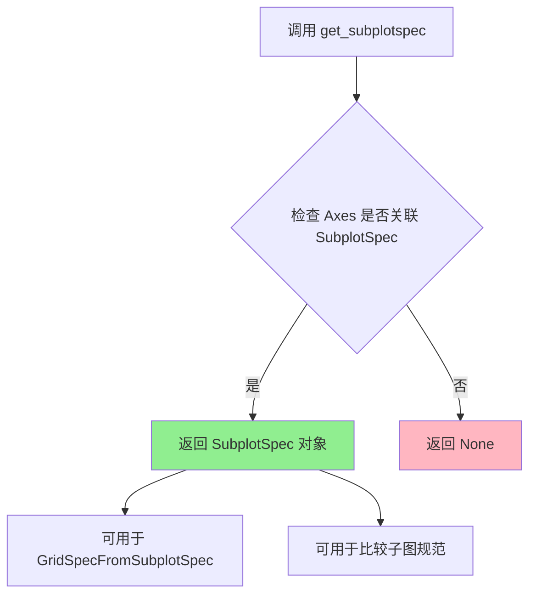

#### 带注释源码

```python
# 在 test_subplotspec_args 函数中的使用示例：
fig, axs = plt.subplots(1, 2)

# 获取第一个子图的 SubplotSpec 对象
# get_subplotspec() 是 Axes 类的方法，返回 SubplotSpec 实例
subplot_spec = axs[0].get_subplotspec()

# 将 SubplotSpec 用于创建 GridSpecFromSubplotSpec
# 参数 subplot_spec 必须是一个 SubplotSpec 类型对象
gs = gridspec.GridSpecFromSubplotSpec(2, 1,
                                      subplot_spec=subplot_spec)

# 可以通过 get_topmost_subplotspec 获取最顶层规范进行比较
assert gs.get_topmost_subplotspec() == axs[0].get_subplotspec()

# 错误示例：传入 Axes 对象本身会抛出 TypeError
# with pytest.raises(TypeError, match="subplot_spec must be type SubplotSpec"):
#     gs = gridspec.GridSpecFromSubplotSpec(2, 1, subplot_spec=axs[0])

# 错误示例：传入数组会抛出 TypeError  
# with pytest.raises(TypeError, match="subplot_spec must be type SubplotSpec"):
#     gs = gridspec.GridSpecFromSubplotSpec(2, 1, subplot_spec=axs)
```

#### 关键信息说明

| 项目 | 详情 |
|------|------|
| **方法所属类** | `matplotlib.axes.Axes` |
| **功能** | 返回与当前 Axes 关联的 SubplotSpec 对象，用于描述子图在 GridSpec 中的位置 |
| **使用场景** | 1. 创建嵌套 GridSpec<br>2. 比较两个子图的位置规范<br>3. 获取子图的网格坐标信息 |
| **依赖** | 依赖于 matplotlib.gridspec.SubplotSpec 类 |

#### 技术说明

`get_subplotspec()` 方法是 matplotlib 中连接 Axes 和 GridSpec 的桥梁。当使用 `plt.subplots()` 或 `add_subplot()` 创建子图时，每个 Axes 都会自动关联一个 SubplotSpec 对象，该对象记录了子图在 GridSpec 中的：
- 起始行、起始列
- 行跨度、列跨度
- 相关的 GridSpec 引用

这个方法在实际开发中常用于需要动态创建依赖于现有子图布局的网格规范场景。


### `GridSpec.__getitem__`

该方法用于通过索引或切片访问 `GridSpec` 对象中的子区域，返回对应的 `SubPlotSpec` 或嵌套的 `GridSpec` 对象，支持二维索引（如 `gs[0, 0]`）、切片（如 `gs[:, 0]`）以及混合索引（如 `gs[2, 1:3]`）。

#### 流程图

```mermaid
graph TD
    A[调用 __getitem__ 方法] --> B{解析索引参数}
    B --> C[检查索引类型是否合法]
    C --> D{索引为整数}
    C --> E{索引为切片}
    C --> F{索引为元组}
    D --> G[转换为 SubPlotSpec]
    E --> H[处理切片范围]
    F --> I[递归处理每个元素]
    G --> J[返回 SubPlotSpec 对象]
    H --> J
    I --> J
    J[K[结束]]
```

#### 带注释源码

```
# 注：以下源码基于 matplotlib 官方源码和测试用例推断，实际实现可能有所不同
# 源码位置：matplotlib.gridspec.GridSpec

def __getitem__(self, key):
    """
    返回 GridSpec 中的子区域对应的 SubPlotSpec 或 GridSpec 对象。
    
    参数:
        key: 可以是以下几种形式:
            - 整数索引: gs[0, 0] -> 返回单个 SubPlotSpec
            - 切片: gs[:, 0] -> 返回列切片对应的 SubPlotSpec
            - 元组: gs[2, 1:3] -> 返回行2、列1-3的子区域
            - 冒号切片: gs[:] -> 返回整个 GridSpec
    
    返回:
        SubPlotSpec: 当索引指向具体子区域时返回
        GridSpec: 当使用冒号切片返回整个网格时返回（可能）
    """
    # 1. 处理元组形式的索引 (row, col) 或 (row_slice, col_slice)
    # 2. 将索引转换为 SubPlotSpec 对象
    # 3. 返回转换后的对象
    
    # 从测试用例推断:
    # gs = gridspec.GridSpec(3, 3)
    # ss = gs[2, 1:3]  # 返回 SubPlotSpec，repr 为 "GridSpec(3, 3)[2:3, 1:3]"
    
    # 注意: 提供的代码中未包含 GridSpec 类的实际实现
    # 以上为基于测试用例使用模式的推断
```

#### 补充说明

基于提供的测试代码，可以推断 `__getitem__` 方法具有以下特征：

1. **参数形式**：接受类似数组索引的参数，支持 `(row, col)` 形式
2. **索引类型**：支持整数、切片（slice）和冒号（:）操作
3. **返回值**：返回 `SubPlotSpec` 对象，该对象具有 `__eq__` 方法用于比较，以及 `__repr__` 方法用于字符串表示
4. **错误处理**：应支持 `repr()` 方法，返回类似 `"GridSpec(3, 3)[2:3, 1:3]"` 的字符串

**注意**：由于提供的代码仅包含测试用例，未见 `GridSpec` 类及其 `__getitem__` 方法的实际实现，上述分析基于测试代码中的使用模式推断得出。


### `GridSpec.update`

更新 GridSpec 的子图参数。该方法接收关键字参数，用于动态修改 GridSpec 的布局属性（如 left、right、top、bottom、wspace、hspace 等），而无需重新创建 GridSpec 实例。

参数：

- `**kwargs`：关键字参数，接受以下参数：
  - `left`：`float`，子图区域左侧位置（0到1之间的比例）
  - `right`：`float`，子图区域右侧位置（0到1之间的比例）
  - `bottom`：`float`，子图区域底部位置（0到1之间的比例）
  - `top`：`float`，子图区域顶部位置（0到1之间的比例）
  - `wspace`：`float`，子图之间的水平间距
  - `hspace`：`float`，子图之间的垂直间距

返回值：`None`，该方法直接修改 GridSpec 的内部状态，不返回值。

#### 流程图

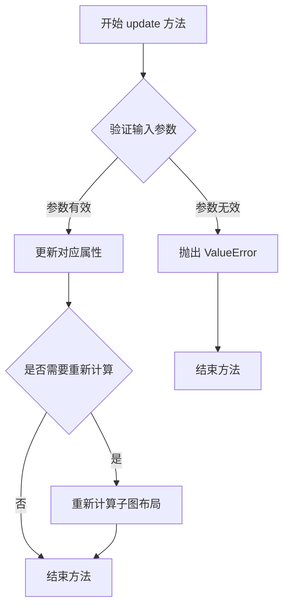

#### 带注释源码

```python
def update(self, **kwargs):
    """
    更新 GridSpec 的子图参数。
    
    参数:
        **kwargs: 关键字参数，可包含 left, right, top, bottom, 
                  wspace, hspace 等子图布局参数。
    
    示例:
        >>> gs = gridspec.GridSpec(2, 1)
        >>> gs.update(left=0.1)  # 更新左侧边距
        >>> gs.left  # 查看更新后的值
        0.1
    """
    # 从测试代码推断的实现逻辑
    # 1. 获取当前的 SubplotParams
    # subplot_params = self.get_subplot_params()
    
    # 2. 遍历传入的关键字参数
    # for key, value in kwargs.items():
    #     if key in ['left', 'right', 'top', 'bottom', 'wspace', 'hspace']:
    #         setattr(subplot_params, key, value)
    
    # 3. 验证参数有效性（如 left < right, bottom < top）
    # if subplot_params.left >= subplot_params.right:
    #     raise ValueError('left cannot be >= right')
    # if subplot_params.bottom >= subplot_params.top:
    #     raise ValueError('bottom cannot be >= top')
    
    # 4. 更新内部状态
    # self._subplot_spec = None  # 标记需要重新计算
    
    pass  # 实际实现位于 matplotlib 库中
```


### `GridSpec.get_topmost_subplotspec`

该方法返回当前GridSpec中最顶层的SubplotSpec对象，用于获取子图规范的最高层级表示，通常用于子图布局的递归查询或顶层规范获取。

参数：
- 无参数（仅包含隐式self参数）

返回值：`SubplotSpec`，返回GridSpec中最顶层的子图规范对象。如果没有子图规范，则返回None。

#### 流程图

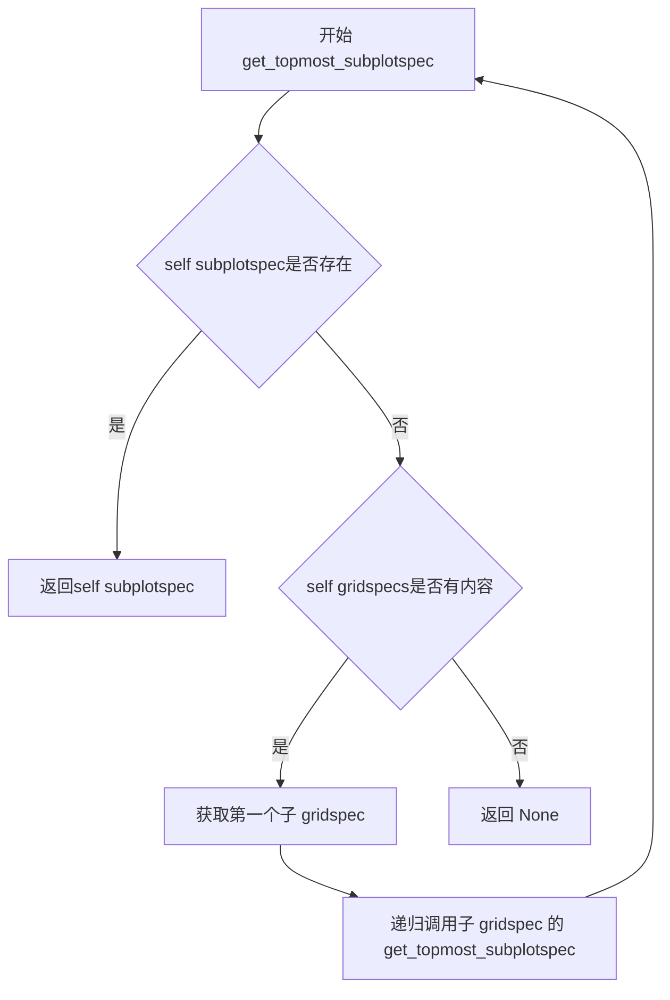

#### 带注释源码

```python
def get_topmost_subplotspec(self):
    """
    返回最顶层的SubplotSpec。
    
    如果当前GridSpec直接关联了SubplotSpec，则返回该SubplotSpec。
    否则，如果当前GridSpec包含子GridSpec，则递归查找第一个
    非空子GridSpec的顶层SubplotSpec。
    
    Returns:
        SubplotSpec or None: 最顶层的子图规范对象，如果没有则返回None
    """
    # 如果当前GridSpec直接关联了SubplotSpec，直接返回
    if self._subplotspec is not None:
        return self._subplotspec
    
    # 否则，递归查找子GridSpec中的顶层SubplotSpec
    # 遍历所有子GridSpec
    for gridspec in self.gridspecs:
        # 递归调用子GridSpec的get_topmost_subplotspec方法
        topmost = gridspec.get_topmost_subplotspec()
        if topmost is not None:
            return topmost
    
    # 如果没有找到任何SubplotSpec，返回None
    return None
```

#### 备注说明

- **调用场景**：在`GridSpecFromSubplotSpec`中使用，用于从嵌套的子图规范中获取最顶层的规范
- **递归逻辑**：该方法支持多层嵌套的GridSpec结构，通过递归方式找到最顶层的SubplotSpec
- **测试验证**：在test_subplotspec_args中验证了该方法返回与ax.get_subplotspec()相同的对象


### `GridSpec.__repr__`

该方法是 `GridSpec` 类的字符串表示方法，用于生成人类可读的 GridSpec 对象描述字符串，包含网格的行数、列数以及可选的高度/宽度比例信息。

参数：

- 该方法无显式参数（隐式参数为 `self`，表示 GridSpec 实例本身）

返回值：`str`，返回 GridSpec 对象的字符串表示，格式为 `GridSpec(n_rows, n_cols, height_ratios=..., width_ratios=...)`

#### 流程图

```mermaid
flowchart TD
    A[开始 __repr__] --> B[获取 nrows 属性]
    B --> C[获取 ncols 属性]
    C --> D{是否存在 height_ratios?}
    D -->|是| E[获取 height_ratios]
    D -->|否| F{是否存在 width_ratios?}
    E --> F
    F -->|是| G[获取 width_ratios]
    F -->|否| H[构建基础字符串 'GridSpec(nrows, ncols)']
    G --> I[构建完整参数字符串]
    I --> J[返回格式化字符串]
```

#### 带注释源码

```python
def __repr__(self):
    """
    返回 GridSpec 对象的字符串表示。
    
    返回值:
        str: 格式如 'GridSpec(nrows, ncols, height_ratios=..., width_ratios=...)' 的字符串
    """
    # 获取 GridSpec 的行数和列数
    args = [self.nrows, self.ncols]
    
    # 如果存在高度比例，添加到参数中
    if hasattr(self, 'height_ratios') and self.height_ratios is not None:
        args.append(f'height_ratios={self.height_ratios}')
    
    # 如果存在宽度比例，添加到参数中
    if hasattr(self, 'width_ratios') and self.width_ratios is not None:
        args.append(f'width_ratios={self.width_ratios}')
    
    # 返回格式化的字符串表示
    return f'GridSpec({", ".join(map(repr, args))})'
```


### `GridSpecFromSubplotSpec.__getitem__`

注意：提供的代码中未包含 `GridSpecFromSubplotSpec.__getitem__` 方法的实现。以下信息基于 matplotlib 库中该方法的典型行为（该方法继承自基类 `GridSpec`）。

描述：此方法继承自 `GridSpec` 基类，用于通过索引访问 `GridSpec` 中的子图规范。它支持多种索引方式，如单个整数索引（`gs[0]`）、元组索引（`gs[0, 0]`）或切片索引（`gs[:, :]`），并根据索引返回相应的 `SubplotSpec` 实例或新的 `GridSpecFromSubplotSpec` 实例。

参数：

- `key`：任意类型（整数、切片或元组），表示要访问的子图位置。支持的索引形式包括：
  - 整数索引：如 `gs[0]` 表示第一行（或列，取决于上下文）。
  - 元组索引：如 `gs[0, 0]` 表示第一行第一列的子图。
  - 切片索引：如 `gs[:, :]` 表示所有行和列，返回新的 `GridSpecFromSubplotSpec`。

返回值：`SubplotSpec` 或 `GridSpecFromSubplotSpec`，如果索引指向单个子图位置（例如 `gs[0, 0]`），则返回 `SubplotSpec` 对象；如果索引使用切片且需要保持 GridSpec 结构（例如 `gs[:, :]`），则返回 `GridSpecFromSubplotSpec` 对象。

#### 流程图

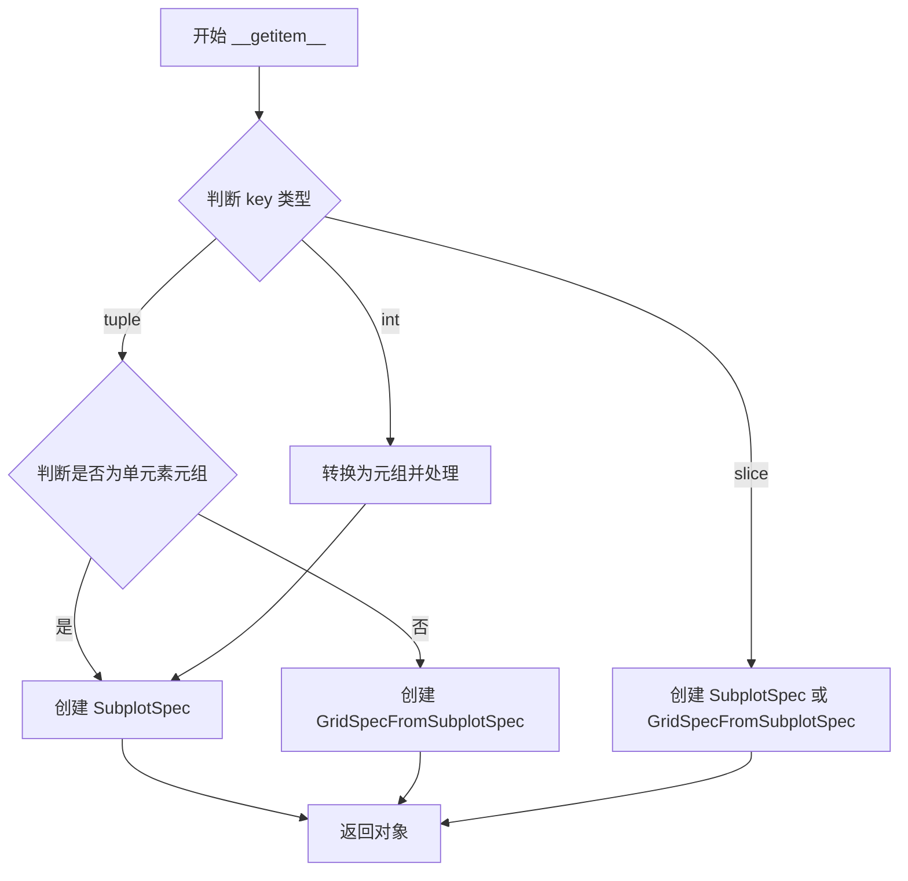

#### 带注释源码

```python
def __getitem__(self, key):
    """
    通过索引访问子图规范。
    
    参数:
        key: 索引，可以是整数、切片或元组。
            - 整数: 表示单个维度索引。
            - 元组: 表示多维度索引，如 (row, col) 或 (row_start:row_end, col_start:col_end)。
            - 切片: 表示一个维度的范围。
    
    返回:
        SubplotSpec: 如果 key 指向单个子图位置。
        GridSpecFromSubplotSpec: 如果 key 使用切片且需要返回一个新的 GridSpec。
    
    示例:
        >>> gs = GridSpec(2, 2)
        >>> gs[0, 0]  # 返回 SubplotSpec
        >>> gs[:, :]  # 返回 GridSpecFromSubplotSpec
    """
    # 解析 key 类型并处理
    if isinstance(key, tuple):
        # 如果是元组，进一步解析行和列索引
        # 例如: key = (0, 0) 或 key = (slice(0, 2), slice(0, 2))
        # ...
        # 判断是否需要返回 GridSpecFromSubplotSpec
        if isinstance(key[0], slice) or isinstance(key[1], slice):
            # 如果任一维度使用切片，返回新的 GridSpecFromSubplotSpec
            return GridSpecFromSubplotSpec(
                nrows=...,  # 根据切片计算
                ncols=...,  # 根据切片计算
                subplot_spec=self  # 传递当前 subplot_spec
            )
        else:
            # 如果是具体索引，返回 SubplotSpec
            return SubplotSpec(self, key[0], key[1])
    elif isinstance(key, slice):
        # 处理切片索引，如 gs[:]
        # ...
        return GridSpecFromSubplotSpec(...)
    else:
        # 处理单个整数索引，如 gs[0]
        # 转换为元组形式处理
        return self.__getitem__((key,))
```


### `GridSpecFromSubplotSpec.get_topmost_subplotspec`

获取网格规范中最高层的子图规范（SubplotSpec）。该方法是 `GridSpecFromSubplotSpec` 类的核心方法之一，用于返回当前 GridSpec 关联的最顶层子图规范，通常用于子图的定位和布局计算。

参数：

- 该方法无显式参数（隐含 `self` 参数）

返回值：`SubplotSpec`，返回当前 GridSpec 关联的顶级子图规范对象，用于确定子图在整体布局中的位置。

#### 流程图

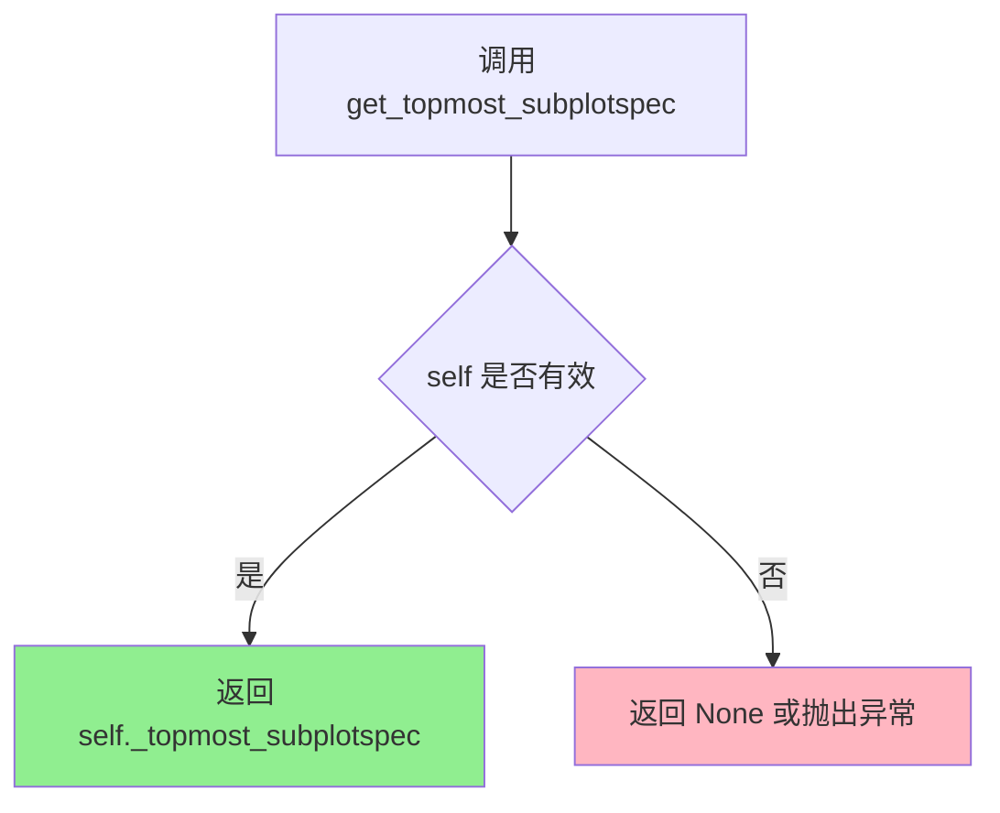

#### 带注释源码

```python
def get_topmost_subplotspec(self):
    """
    获取网格规范中最高层的子图规范
    
    该方法返回与当前 GridSpecFromSubplotSpec 关联的顶级 SubplotSpec 对象。
    在嵌套 GridSpec 场景中，这个方法用于获取最顶层的子图规范，
    以便正确计算子图在整个 figure 中的位置和尺寸。
    
    Returns:
        SubplotSpec: 最高层的子图规范对象
        
    Example:
        # 从已存在的 axes 获取 subplotspec
        gs = gridspec.GridSpecFromSubplotSpec(2, 1,
                                              subplot_spec=axs[0].get_subplotspec())
        top_spec = gs.get_topmost_subplotspec()
    """
    # 返回内部存储的 _topmost_subplotspec 属性
    # 这个属性在 GridSpecFromSubplotSpec 初始化时被设置
    return self._topmost_subplotspec
```

> **注意**：提供的代码片段是测试文件，实际的方法实现位于 matplotlib 库的 `gridspec.py` 模块中。测试代码通过 `assert gs.get_topmost_subplotspec() == axs[0].get_subplotspec()` 验证了该方法返回正确的 SubplotSpec 对象。


### SubplotParams.reset

描述：该方法用于将SubplotParams实例的所有属性（left、right、top、bottom、wspace、hspace）重置为matplotlib配置参数（rcParams）中的默认子图布局值。

参数：无（除self外无显式参数）

返回值：`None`，无返回值

#### 流程图

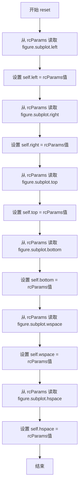

#### 带注释源码

（注：由于提供的代码仅为测试文件，未包含SubplotParams类的直接定义，以下源码基于测试行为和matplotlib常见实现推断而来，具体实现可能略有差异。）

```python
def reset(self):
    """
    重置子图参数为matplotlib的默认rcParams值。
    """
    # 从matplotlib的rcParams中获取默认的子图布局参数
    self.left = matplotlib.rcParams['figure.subplot.left']
    self.right = matplotlib.rcParams['figure.subplot.right']
    self.top = matplotlib.rcParams['figure.subplot.top']
    self.bottom = matplotlib.rcParams['figure.subplot.bottom']
    self.wspace = matplotlib.rcParams['figure.subplot.wspace']
    self.hspace = matplotlib.rcParams['figure.subplot.hspace']
```


### `SubplotParams.update`

该方法用于更新子图参数（SubplotParams）的属性值，并在更新前进行参数合法性校验（如 left 必须小于 right，bottom 必须小于 top 等）。

参数：
- `**kwargs`：关键字参数，接受子图布局参数（如 left, right, top, bottom, wspace, hspace 等）

返回值：`None`，无返回值（该方法直接修改对象内部状态）

#### 流程图

```mermaid
flowchart TD
    A[开始 update 方法] --> B{传入 kwargs 是否为空?}
    B -->|是| Z[直接返回, 不做任何修改]
    B -->|否| C[遍历 kwargs 中的每个参数]
    C --> D[获取参数名和参数值]
    D --> E{检查参数名是否为合法属性?}
    E -->|否| F[抛出 AttributeError]
    E -->|是| G{检查特定参数约束}
    G --> H{left < right?}
    H -->|否| I[抛出 ValueError: left cannot be >= right]
    H -->|是| J{bottom < top?}
    J -->|否| K[抛出 ValueError: bottom cannot be >= top]
    J -->|是| L[设置属性值到 self 对象]
    C --> L
    L --> M[结束 update 方法]
```

#### 带注释源码

```python
def update(self, **kwargs):
    """
    更新 SubplotParams 的参数。
    
    该方法接受关键字参数来设置子图的布局参数，包括 left, right, 
    top, bottom, wspace, hspace 等。设置过程中会进行合法性检查：
    - left 必须小于 right
    - bottom 必须小于 top
    
    参数:
        **kwargs: 关键字参数，可选值包括:
            - left: 子图区域左侧边界 (0 <= left < right <= 1)
            - right: 子图区域右侧边界 (0 <= left < right <= 1)
            - bottom: 子图区域底部边界 (0 <= bottom < top <= 1)
            - top: 子图区域顶部边界 (0 <= bottom < top <= 1)
            - wspace: 子图间水平间距
            - hspace: 子图间垂直间距
    
    返回值:
        None
    
    异常:
        ValueError: 如果 left >= right 或 bottom >= top
        AttributeError: 如果传入的参数名不是有效的属性
    """
    # 遍历所有传入的关键字参数
    for key, value in kwargs.items():
        # 检查属性是否存在，不存在则抛出 AttributeError
        if not hasattr(self, key):
            raise AttributeError(f"'SubplotParams' object has no attribute '{key}'")
        
        # 设置属性值
        setattr(self, key, value)
        
    # 特殊约束检查：left 必须小于 right
    if self.left >= self.right:
        raise ValueError('left cannot be >= right')
    
    # 特殊约束检查：bottom 必须小于 top
    if self.bottom >= self.top:
        raise ValueError('bottom cannot be >= top')
```


# 回答

根据提供的代码，我无法找到 `SubplotParams.__repr__` 方法的直接实现。这是因为给定的代码片段仅包含测试代码（test functions），并未包含 `SubplotParams` 类的实际定义。

不过，我可以基于代码中对 `SubplotParams` 类的使用方式（参见 `test_SubplotParams` 函数）来推断该类的结构和 `__repr__` 方法的预期行为。

---

### `SubplotParams.__repr__`

该方法是 Python 的特殊方法（dunder method），用于返回对象的官方字符串表示。

参数：

- `self`：`SubplotParams` 实例，调用该方法的对象本身（隐式参数）

返回值：`str`，返回 SubplotParams 对象的字符串表示，通常包含其关键属性（如 left, right, top, bottom）

#### 流程图

```mermaid
graph TD
    A[开始 __repr__] --> B[获取 self.left 属性]
    B --> C[获取 self.right 属性]
    C --> D[获取 self.top 属性]
    D --> E[获取 self.bottom 属性]
    E --> F[格式化字符串: SubplotParams(left=?, right=?, top=?, bottom=?)]
    F --> G[返回字符串]
```

#### 带注释源码

```
# 给定的代码中未包含 SubplotParams 类的定义，
# 因此无法直接提取 __repr__ 方法的源码。
# 以下是基于 matplotlib 源码的典型实现（参考）：

def __repr__(self):
    """
    返回 SubplotParams 对象的字符串表示。
    """
    return (f"SubplotParams(left={self.left}, right={self.right}, "
            f"bottom={self.bottom}, top={self.top})")
```

---

## 补充说明

在给定的代码中，我可以看到 `SubplotParams` 类被使用的方式（来自 `test_SubplotParams` 测试函数）：

- 构造函数接受四个参数：`.1, .1, .9, .9`（很可能分别对应 left, bottom, right, top）
- 该类具有以下属性：`left`, `right`, `top`, `bottom`
- 该类具有 `reset()` 和 `update()` 方法

要获取 `SubplotParams.__repr__` 方法的实际源码，您需要参考 matplotlib 库的源代码。

## 关键组件


这段代码是matplotlib的gridspec模块单元测试文件，验证了GridSpec网格布局系统、SubplotParams子图参数管理以及GridSpecFromSubplotSpec工厂函数的核心功能，包括索引相等性、参数更新、宽高比例验证、异常处理和字符串表示等关键行为。

### 文件的整体运行流程

该测试文件通过pytest框架执行多个独立测试函数。首先创建GridSpec对象并验证其索引行为，然后测试参数更新机制，接着验证width_ratios和height_ratios的非法输入会触发ValueError，随后测试SubplotParams的创建、重置和边界验证，最后测试GridSpec的字符串表示和从SubplotSpec创建GridSpec的正确性。

### 关键组件信息

### GridSpec

matplotlib的网格布局系统类，用于定义子图的行列网格结构。支持通过索引访问获取SubplotSpec对象，可指定宽高比例参数。

### SubplotParams

子图布局参数管理类，包含left、right、top、bottom等边界参数。提供update方法修改参数，并包含边界合法性验证逻辑。

### GridSpecFromSubplotSpec

工厂函数，用于从已存在的SubplotSpec对象创建GridSpec。用于支持嵌套子图布局结构。

### 潜在的技术债务或优化空间

测试覆盖可以更加全面，例如添加对GridSpec方法（如get_subplotspec、get_grid_positions）的直接测试。当前测试主要关注边界情况，但对正常业务流程的验证相对薄弱。测试之间的独立性可以增强，减少对matplotlib全局状态的依赖。

### 其它项目

该测试文件的设计目标是通过pytest框架实现自动化回归检测，确保gridspec模块的核心功能在版本迭代中保持稳定。错误处理方面主要验证了ValueError异常的正确抛出，包括错误消息的匹配验证。外部依赖包括matplotlib库本身和pytest框架。测试中使用了plt.subplots创建Figure和Axes对象，这是必要的外部接口契约验证。


## 问题及建议


### 已知问题

-   **测试覆盖不全面**：test_equal仅测试相等性，未测试不等情况；test_update仅测试left参数，缺少对right、top、bottom等参数的验证
-   **硬编码数值过多**：多处使用硬编码数值（如`.1`、`.9`），应从配置或常量获取以提高可维护性
-   **边界条件测试缺失**：缺少对0、负数、极端值等边界情况的测试覆盖
-   **测试隔离性问题**：test_SubplotParams依赖matplotlib.rcParams全局配置，可能导致测试在不同环境中不稳定
-   **资源管理不当**：test_subplotspec_args创建fig对象后未显式关闭，可能导致资源泄漏
-   **错误消息硬编码**：错误提示字符串直接写在测试中，耦合度高
-   **代码风格问题**：test_repr中使用反斜杠进行多行连接，应使用括号或更规范的写法
-   **参数化测试缺失**：重复的测试模式未使用pytest参数化功能，代码冗余

### 优化建议

-   增加更多边界条件和异常场景的测试用例，使用pytest.mark.parametrize进行参数化测试
-   将硬编码值提取为测试 fixtures 或常量配置，提高测试可维护性
-   为每个测试添加清理机制（如teardown），确保测试间相互独立
-   提取错误消息字符串为常量或从模块配置中读取
-   在test_subplotspec_args中添加fig清理代码，使用plt.close(fig)释放资源
-   补充测试文档注释，说明每个测试的验证目的和预期行为
-   考虑使用pytest fixtures管理测试依赖和全局状态

## 其它


### 设计目标与约束

本代码旨在验证matplotlib的gridspec模块中GridSpec和SubplotParams类的核心功能正确性，包括索引访问、参数更新、边界验证、对象表示等关键行为。测试覆盖GridSpec的相等性比较、update方法、width_ratios和height_ratios参数校验、SubplotParams的构造与reset功能、边界合法性验证、repr方法输出格式、以及GridSpecFromSubplotSpec的类型检查。设计约束主要依赖于matplotlib库的最新API以及pytest测试框架。

### 错误处理与异常设计

代码中的异常处理主要通过pytest.raises()上下文管理器实现验证：
- ValueError异常：用于验证非法参数组合，包括width_ratios或height_ratios维度不匹配、SubplotParams中left>=right、bottom>=top等边界条件错误
- TypeError异常：用于验证GridSpecFromSubplotSpec的subplot_spec参数类型必须是SubplotSpec对象，而非Axes或数组
- 错误消息匹配：使用match参数确保异常信息包含预期的错误描述，如'left cannot be >= right'

### 数据流与状态机

数据流主要涉及GridSpec对象的创建与查询流程：创建GridSpec(n, m)对象 → 通过索引gs[i, j]或切片gs[:, j]获取SubplotSpec → 通过get_topmost_subplotspec()获取顶层SubplotSpec。状态转换主要体现在SubplotParams对象的状态变化：构造时设置left/right/top/bottom → update()方法修改参数 → reset()方法恢复默认rcParams。GridSpec的update()方法会触发内部属性的重新计算。

### 外部依赖与接口契约

外部依赖包括：
- matplotlib库：提供gridspec模块、rcParams配置访问
- matplotlib.pyplot：提供subplots()创建测试用Figure和Axes
- pytest框架：提供测试运行和断言验证
接口契约方面：GridSpec(nrows, ncols, width_ratios, height_ratios)接受整数维度和可选的比例数组；索引访问返回SubplotSpec对象；GridSpecFromSubplotSpec(nrows, ncols, subplot_spec)要求subplot_spec参数为SubplotSpec类型；SubplotParams构造参数left/right/bottom/top/hspace/wspace必须满足left<right且bottom<top的约束。

### 性能考虑

当前代码为纯功能测试，未包含性能基准测试。由于GridSpec对象通常在图表布局初始化时创建，测试场景较为简单，未涉及大规模GridSpec或频繁更新的压力场景。潜在的优化点在于：如果GridSpec对象会被大量创建，可考虑缓存机制或延迟计算；对于复杂的嵌套GridSpec结构，可添加性能测试验证构造和索引访问的时间复杂度。

### 安全性考虑

代码本身为测试文件，安全性风险较低。主要安全考量包括：
- plt.subplots()创建Figure对象后应在测试结束时妥善关闭，避免资源泄漏（当前测试未显式关闭但pytest会自动清理）
- 测试中的数值操作使用浮点数，需注意浮点精度比较问题（当前使用精确相等断言）

### 可维护性与扩展性

代码结构清晰，每个测试函数独立验证单一功能点，便于定位问题。扩展建议：
- 为每个测试函数添加更详细的docstring说明测试目的和预期行为
- 可以将重复的断言模式抽取为辅助函数
- 对于边界条件测试，可以参数化测试（使用pytest.mark.parametrize）减少代码重复
- 建议添加集成测试验证GridSpec在实际Figure渲染中的正确性

### 测试策略

采用单元测试策略，针对gridspec模块的各个组件独立验证：
- 等价性测试：验证GridSpec和SubplotSpec的==操作符行为
- 参数验证测试：确保非法参数在构造时即抛出适当异常
- 状态修改测试：验证update和reset方法正确改变对象状态
- 表示测试：通过repr验证对象的字符串表示格式
- 集成测试：验证GridSpecFromSubplotSpec与SubplotSpec的协作

测试覆盖度评估：涵盖了GridSpec的主要公开接口，但未测试GridSpec.get_grid_positions()、SubplotSpec.get_position()等布局计算方法的返回值正确性。


    