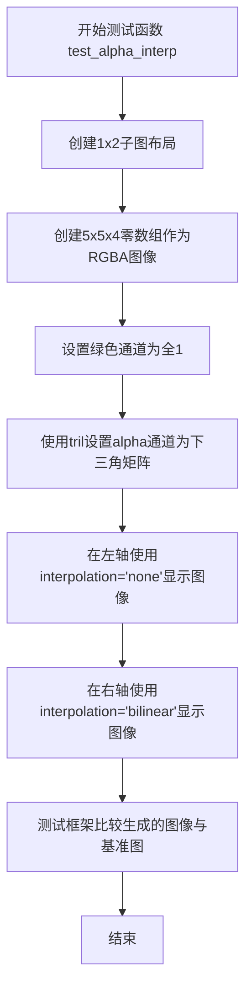
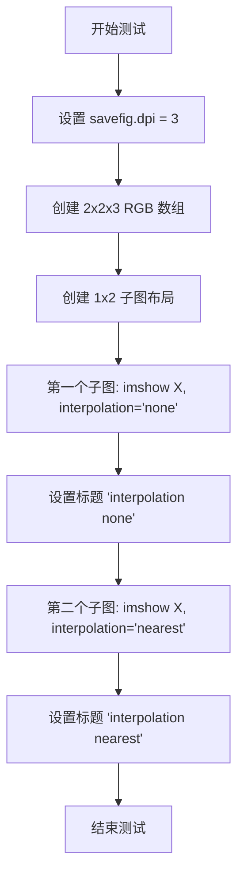
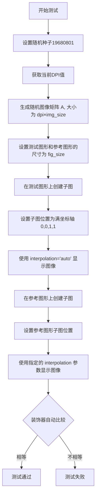
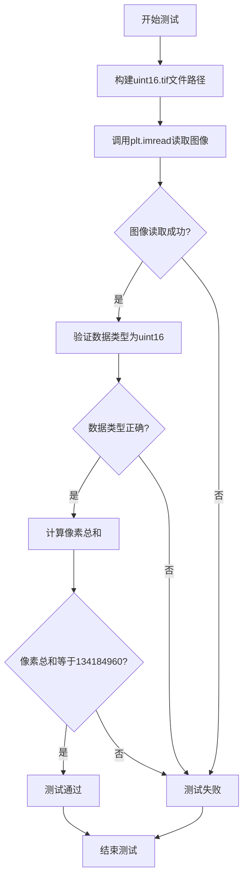
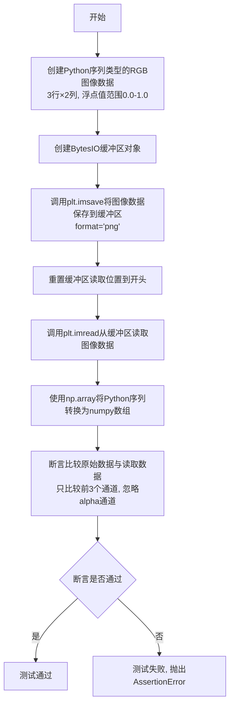
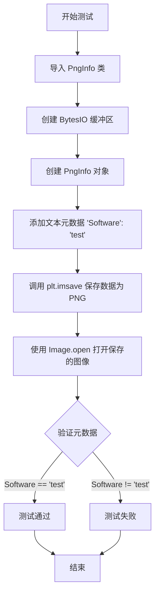
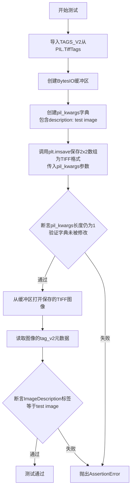
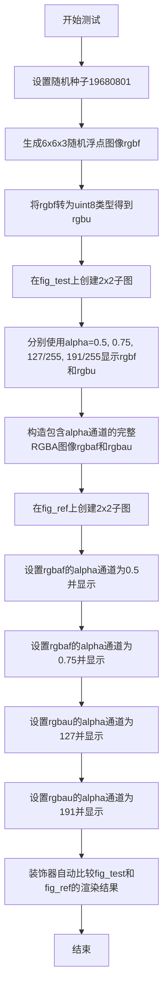

# `matplotlib\lib\matplotlib\tests\test_image.py` 详细设计文档

该文件是matplotlib图像模块的综合测试套件，涵盖图像显示、插值、保存、加载、坐标变换、透明度处理、光标数据获取、掩码图像、颜色映射、图像裁剪等多个功能点的单元测试和集成测试，确保图像渲染在各种场景下的正确性和稳定性。

## 整体流程

```mermaid
graph TD
    A[测试开始] --> B[图像插值测试]
    B --> C[test_alpha_interp - RGBA图像透明度通道插值]
    B --> D[test_interp_nearest_vs_none - 最近邻与无插值对比]
    B --> E[test_imshow_antialiased - 抗锯齿显示]
    B --> F[test_imshow_zoom - 缩放场景插值]
    A --> G[图像保存加载测试]
    G --> H[test_imsave - 多种格式保存]
    G --> I[test_imread_pil - PIL图像读取]
    G --> J[test_imsave_python_sequences - Python序列保存]
    G --> K[test_load_from_url - URL加载]
    A --> L[图像显示参数测试]
    L --> M[test_image_alpha - 透明度参数]
    L --> N[test_imshow_multi_draw - 多通道绘制]
    L --> O[test_imshow_clips_rgb - RGB范围裁剪]
    A --> P[光标与交互测试]
    P --> Q[test_cursor_data - 光标数据获取]
    P --> R[test_format_cursor_data - 光标数据格式化]
    A --> S[图像裁剪与合成]
    S --> T[test_image_clip - 裁剪路径]
    S --> U[test_image_composite_alpha - Alpha合成]
    S --> V[test_clip_path_disables_compositing - 裁剪禁用合成]
    A --> W[特殊图像类型]
    W --> X[test_nonuniformimage - 非均匀图像]
    W --> Y[test_pcolorimage - Pcolor图像]
    W --> Z[test_rasterize_dpi - 栅格化DPI]
    A --> AA[规范化与颜色映射]
    AA --> AB[test_log_scale_image - 对数刻度]
    AA --> AC[test_mask_image - 掩码图像]
    AA --> AD[test_str_norms - 字符串规范化]
    A --> AE[变换与几何操作]
    AE --> AF[test_rotate_image - 旋转变换]
    AE --> AG[test_image_shift - 图像位移]
    A --> AH[性能与边界测试]
    AH --> AI[test_large_image - 大图像处理]
    AH --> AJ[test_downsampling - 下采样]
    AH --> AK[test_upsampling - 上采样]
    A --> AL[辅助功能验证]
    AL --> AM[test_resample_dtypes - 重采样数据类型]
    AL --> AN[test_resample_nonaffine - 非仿射变换]
    AL --> AO[QuantityND - 单位数组子类]
```



## 类结构

```
test_image.py (测试模块)
└── QuantityND (numpy.ndarray子类，用于测试单位数组支持)
    ├── __new__
    ├── __array_finalize__
    ├── __getitem__
    ├── __array_ufunc__
    └── v (属性)
```

## 全局变量及字段


### `mpl`
    
Matplotlib主模块，提供了matplotlib库的顶层接口和全局配置

类型：`module`
    


### `np`
    
NumPy库，用于数值计算和数组操作

类型：`module`
    


### `plt`
    
Matplotlib的pyplot子模块，提供绘图接口

类型：`module`
    


### `Image`
    
PIL (Pillow)图像库，用于图像处理和操作

类型：`module`
    


### `pytest`
    
Python测试框架，用于编写和运行单元测试

类型：`module`
    


### `io`
    
Python标准库I/O模块，提供字节流和字符串流的操作接口

类型：`module`
    


### `os`
    
Python标准库操作系统接口模块，提供文件和目录操作功能

类型：`module`
    


### `Path`
    
pathlib模块中的路径类，提供面向对象的文件路径操作

类型：`class`
    


### `platform`
    
Python标准库平台信息模块，用于获取系统平台信息

类型：`module`
    


### `sys`
    
Python标准库系统模块，提供系统特定的参数和函数

类型：`module`
    


### `urllib`
    
Python标准库URL处理模块，用于URL请求和网络资源访问

类型：`module`
    


### `functools`
    
Python标准库函数式编程模块，提供高阶函数和装饰器

类型：`module`
    


### `Affine2D`
    
Matplotlib二维仿射变换类，用于处理图像的几何变换

类型：`class`
    


### `Bbox`
    
Matplotlib边界框类，表示矩形区域的位置和大小

类型：`class`
    


### `Transform`
    
Matplotlib变换基类，定义坐标变换的抽象接口

类型：`class`
    


### `TransformedBbox`
    
Matplotlib变换边界框类，应用变换后的边界框

类型：`class`
    


### `colors`
    
Matplotlib颜色模块，提供颜色映射和颜色规范化功能

类型：`module`
    


### `mimage`
    
Matplotlib图像模块，处理图像的读取、写入和渲染

类型：`module`
    


### `patches`
    
Matplotlib图形斑块模块，提供各种形状的绘制功能

类型：`module`
    


### `mticker`
    
Matplotlib刻度格式化模块，控制坐标轴刻度的显示格式

类型：`module`
    


### `mpl._image.resample`
    
Matplotlib内部图像重采样函数，用于图像的缩放和插值处理

类型：`function`
    


### `QuantityND.units`
    
存储单位信息的属性，用于标记数组的物理单位

类型：`任意类型`
    
    

## 全局函数及方法


### `test_alpha_interp`

该函数是Matplotlib图像处理模块的测试函数，用于测试RGBA图像中alpha通道在不同插值方法下的表现。通过创建具有绿色通道和随对角线变化的alpha通道的测试图像，对比"none"和"bilinear"两种插值方式渲染结果的差异。

参数： 无

返回值： 无（`None`），该函数为测试函数，不返回任何值

#### 流程图



#### 带注释源码

```python
@image_comparison(['interp_alpha.png'], remove_text=True)
def test_alpha_interp():
    """Test the interpolation of the alpha channel on RGBA images"""
    # 创建1行2列的子图，返回Figure对象和axes数组
    fig, (axl, axr) = plt.subplots(1, 2)
    
    # 初始化一个5x5x4的RGBA图像数组，所有通道初始为0
    img = np.zeros((5, 5, 4))
    
    # 将绿色通道（第1个通道，索引1）设置为全1，使图像呈绿色
    img[..., 1] = np.ones((5, 5))
    
    # 创建5x5的下三角矩阵（1在主对角线及以下，0在上方）
    # 并设置为alpha通道（第3个通道，索引3），实现主对角线以下透明的效果
    img[..., 3] = np.tril(np.ones((5, 5), dtype=np.uint8))
    
    # 左子图使用'none'插值，不进行像素插值
    axl.imshow(img, interpolation="none")
    
    # 右子图使用'bilinear'插值，对像素进行双线性插值
    axr.imshow(img, interpolation="bilinear")
    
    # @image_comparison装饰器会自动比较渲染结果与基准图像'interp_alpha.png'
    # remove_text=True表示比较时移除所有文本（如坐标轴标签）
```


### `test_interp_nearest_vs_none`

该测试函数用于验证并比较 Matplotlib 中 "nearest" 和 "none" 两种图像插值方式在 PDF 和 SVG 输出中的渲染差异，通过设置极低的 DPI 值使差异更明显。

参数：

- 无显式参数（使用 pytest fixtures）

返回值：`None`，该函数为测试函数，无返回值

#### 流程图



#### 带注释源码

```python
@image_comparison(['interp_nearest_vs_none'], tol=3.7,  # For Ghostscript 10.06+.
                  extensions=['pdf', 'svg'], remove_text=True)
def test_interp_nearest_vs_none():
    """Test the effect of "nearest" and "none" interpolation"""
    # 设置 dpi 为极小值，使 'nearest' 和 'none' 插值的差异更明显
    # 该设置对 PDF 无实际影响（仅影响图像），但会使 agg 输出极小
    rcParams['savefig.dpi'] = 3
    
    # 定义 2x2 RGB 图像数组，dtype 为 uint8
    # 包含两个像素：[218,165,32] (金色) 和 [122,103,238] (紫色)
    #           [127,255,0] (黄绿色) 和 [255,99,71] (番茄红)
    X = np.array([[[218, 165, 32], [122, 103, 238]],
                  [[127, 255, 0], [255, 99, 71]]], dtype=np.uint8)
    
    # 创建 1x2 子图，返回 fig 和 axes 数组
    fig, (ax1, ax2) = plt.subplots(1, 2)
    
    # 左侧子图：使用 'none' 插值（不进行插值）
    ax1.imshow(X, interpolation='none')
    ax1.set_title('interpolation none')
    
    # 右侧子图：使用 'nearest' 插值（最近邻插值）
    ax2.imshow(X, interpolation='nearest')
    ax2.set_title('interpolation nearest')
```


### test_figimage

该函数是一个图像比较测试，用于测试matplotlib中Figure的figimage方法在不同参数下的表现，包括图像的翻转（水平、垂直）和位置参数（xo, yo, origin）的组合效果。

参数：

- `suppressComposite`：`bool`，控制是否在保存图像时组合多个图像为单个复合图像，测试分别为False和True两种情况

返回值：`None`，测试函数无返回值

#### 流程图

```mermaid
flowchart TD
    A[开始测试] --> B[创建2x2英寸, dpi=100的Figure]
    B --> C[设置fig.suppressComposite参数]
    C --> D[生成测试数据: 创建网格坐标x, y]
    D --> E[计算图像数据: z = sin(x² + y² - xy)]
    E --> F[计算颜色数据: c = sin(20x² + 50y²)]
    F --> G[合成最终图像: img = z + c/5]
    G --> H1[调用figimage: img原图, xo=0, yo=0, origin='lower']
    H1 --> H2[调用figimage: img垂直翻转, xo=0, yo=100, origin='lower']
    H2 --> H3[调用figimage: img水平翻转, xo=100, yo=0, origin='lower']
    H3 --> H4[调用figimage: img垂直+水平翻转, xo=100, yo=100, origin='lower']
    H4 --> I[使用@image_comparison装饰器比较输出]
    I --> J[结束测试]
```

#### 带注释源码

```python
@pytest.mark.parametrize('suppressComposite', [False, True])
@image_comparison(['figimage'], extensions=['png', 'pdf'])
def test_figimage(suppressComposite):
    """测试figimage方法在不同参数下的表现"""
    # 创建一个2x2英寸大小的Figure，分辨率为100 dpi
    fig = plt.figure(figsize=(2, 2), dpi=100)
    # 设置Figure的suppressComposite属性，控制是否组合多个图像
    fig.suppressComposite = suppressComposite
    
    # 创建网格坐标，用于生成测试图像
    # np.ix_创建一个网格索引数组
    x, y = np.ix_(np.arange(100) / 100.0, np.arange(100) / 100)
    
    # 生成正弦波图像数据
    z = np.sin(x**2 + y**2 - x*y)
    # 生成高频正弦波用于添加细节
    c = np.sin(20*x**2 + 50*y**2)
    # 合成最终图像
    img = z + c/5

    # 在Figure上四个不同位置绘制图像，展示翻转效果
    # 1. 原图，绘制在左下角 (xo=0, yo=0)
    fig.figimage(img, xo=0, yo=0, origin='lower')
    # 2. 垂直翻转的图像，绘制在左上角 (xo=0, yo=100)
    fig.figimage(img[::-1, :], xo=0, yo=100, origin='lower')
    # 3. 水平翻转的图像，绘制在右下角 (xo=100, yo=0)
    fig.figimage(img[:, ::-1], xo=100, yo=0, origin='lower')
    # 4. 垂直+水平翻转的图像，绘制在右上角 (xo=100, yo=100)
    fig.figimage(img[::-1, ::-1], xo=100, yo=100, origin='lower')
```


### `test_image_python_io`

该函数是一个集成测试用例，用于验证 Matplotlib 能够在 Python 内存缓冲区（BytesIO）中正确保存和读取图像数据，确保图像 I/O 流程的完整性。

参数：无

返回值：`None`，该函数仅执行测试逻辑，不返回任何值。

#### 流程图

```mermaid
flowchart TD
    A[开始] --> B[创建Figure和Axes对象: plt.subplots]
    B --> C[在Axes上绘制简单折线图: ax.plot[1, 2, 3]]
    C --> D[创建内存缓冲区: io.BytesIO]
    D --> E[将Figure保存到BytesIO缓冲区: fig.savefigbuffer]
    E --> F[重置缓冲区读取指针到开头: buffer.seek0]
    F --> G[从缓冲区读取图像数据: plt.imreadbuffer]
    G --> H[结束]
```

#### 带注释源码

```python
def test_image_python_io():
    """
    测试 Matplotlib 图像的 Python I/O 功能
    
    该测试函数验证以下完整流程：
    1. 创建 Figure 和 Axes 对象
    2. 绘制简单的折线图
    3. 将图像保存到内存缓冲区（BytesIO）
    4. 从内存缓冲区读取图像数据
    
    这种测试模式确保了 Matplotlib 能够正确处理
    内存中的图像数据，而不是仅依赖文件系统。
    """
    # 步骤1：创建一个新的图形窗口和一个子图
    # 返回 (figure, axes) 元组
    fig, ax = plt.subplots()
    
    # 步骤2：在 Axes 上绘制简单的折线数据 [1, 2, 3]
    # 这会创建一条从 (0,1) 到 (1,2) 到 (2,3) 的直线
    ax.plot([1, 2, 3])
    
    # 步骤3：创建 BytesIO 内存缓冲区对象
    # BytesIO 允许在内存中读写字节数据，类似于文件操作
    buffer = io.BytesIO()
    
    # 步骤4：将整个 Figure 保存到内存缓冲区
    # 默认格式为 PNG，图像数据被写入 buffer 中
    fig.savefig(buffer)
    
    # 步骤5：将缓冲区的读取指针移动到开头位置（字节偏移量为 0）
    # 这是一个关键步骤，因为 fig.savefig 会将指针移动到末尾
    # 如果不重置，后续读取将返回空数据
    buffer.seek(0)
    
    # 步骤6：使用 plt.imread 从缓冲区读取图像数据
    # 这会解析缓冲区中的 PNG 数据并返回 NumPy 数组
    # 测试验证图像能够正确保存和读取
    plt.imread(buffer)
    
    # 函数结束，没有显式返回值
    # 测试成功执行即表示 Python I/O 功能正常
```


### `test_imshow_antialiased`

该测试函数用于验证matplotlib在`imshow`中当使用`interpolation='auto'`时的抗锯齿行为是否与指定的显式插值方法（如`nearest`、`hanning`等）一致，确保在不同图像尺寸和图形尺寸比例下的自动插值逻辑正确。

参数：

- `fig_test`：`Figure`（由`@check_figures_equal`装饰器提供的测试图形），用于显示使用`interpolation='auto'`的图像
- `fig_ref`：`Figure`（由`@check_figures_equal`装饰器提供的参考图形），用于显示使用显式插值的图像
- `img_size`：`float`，图像尺寸与DPI的乘数因子，决定生成随机图像的实际像素大小
- `fig_size`：`float`，图形尺寸（英寸），与DPI共同决定图像在图形中的显示尺寸
- `interpolation`：`str`，参考图形使用的插值方法（如"nearest"、"hanning"），用于与auto模式对比

返回值：无（`None`），该函数为测试函数，使用`@check_figures_equal`装饰器自动比较`fig_test`和`fig_ref`的渲染结果

#### 流程图



#### 带注释源码

```python
@pytest.mark.parametrize(
    "img_size, fig_size, interpolation",
    [(5, 2, "hanning"),   # 图像数据大于图形尺寸的情况
     (5, 5, "nearest"),   # 精确重采样的情况
     (5, 10, "nearest"),  # 2倍过采样的情况
     (3, 2.9, "hanning"), # 小于3倍上采样的情况
     (3, 9.1, "nearest")  # 大于3倍上采样的情况
     ])
@check_figures_equal()  # 装饰器：自动比较fig_test和fig_ref的渲染结果是否相同
def test_imshow_antialiased(fig_test, fig_ref,
                            img_size, fig_size, interpolation):
    """测试imshow在interpolation='auto'时的抗锯齿行为"""
    np.random.seed(19680801)  # 固定随机种子，确保测试可重复
    dpi = plt.rcParams["savefig.dpi"]  # 获取当前保存图像的DPI设置
    
    # 生成随机图像矩阵A，其尺寸由DPI和img_size共同决定
    # 例如：若dpi=100, img_size=5，则生成500x500的随机矩阵
    A = np.random.rand(int(dpi * img_size), int(dpi * img_size))
    
    # 设置测试图形和参考图形的尺寸（英寸）
    for fig in [fig_test, fig_ref]:
        fig.set_size_inches(fig_size, fig_size)
    
    # 创建测试图形的子图并配置
    ax = fig_test.subplots()
    ax.set_position([0, 0, 1, 1])  # 使子图占据整个图形区域
    ax.imshow(A, interpolation='auto')  # 使用'auto'让matplotlib自动选择插值方法
    
    # 创建参考图形的子图并配置
    ax = fig_ref.subplots()
    ax.set_position([0, 0, 1, 1])
    ax.imshow(A, interpolation=interpolation)  # 使用显式指定的插值方法
```


### `test_imshow_zoom`

#### 描述

该测试函数用于验证 Matplotlib 的 `imshow` 方法在 `interpolation='auto'` 配置下，当图像显示的放大倍数小于 3 倍（Upsampling，上采样）时，是否能正确自动选择 'nearest'（最近邻）插值算法，而不是选择抗锯齿算法。

#### 上下文（文件整体运行流程）

该代码位于 Matplotlib 的图像测试模块（`test_image.py` 或类似文件）中。作为一个 pytest 测试用例，它隶属于一个包含大量图像渲染测试的文件。整体流程通常为：
1.  **导入阶段**：加载 numpy, matplotlib.pyplot, pytest 等测试依赖。
2.  **配置阶段**：设置 Matplotlib 的后端（如 Agg）和全局参数（如 DPI）。
3.  **测试执行**：`test_imshow_zoom` 被 pytest 选中执行。
4.  **对比验证**：利用 `@check_figures_equal` 装饰器，生成“测试图”（使用 'auto'）和“参考图”（使用 'nearest'），并对两者生成的图像像素进行比对。

#### 详细信息

**全局函数 (Global Function)**

- **函数名**: `test_imshow_zoom`
- **参数**:
    - `fig_test`：`matplotlib.figure.Figure`，由 pytest fixture 传入的测试组 Figure 对象。
    - `fig_ref`：`matplotlib.figure.Figure`，由 pytest fixture 传入的参考组 Figure 对象。
- **返回值**: `None`，无返回值（pytest 测试函数）。
- **依赖装饰器**: `@check_figures_equal()`，用于自动比对 `fig_test` 和 `fig_ref` 渲染结果的一致性。

**局部变量 (Local Variables)**

| 变量名 | 类型 | 描述 |
| :--- | :--- | :--- |
| `dpi` | `int` | 从 `plt.rcParams` 获取的当前图像保存 DPI（通常是 100）。 |
| `A` | `numpy.ndarray` | 使用 `np.random.rand` 生成的随机浮点数矩阵，作为测试用的图像数据。 |

#### 流程图

```mermaid
graph TD
    A[开始测试] --> B[设置随机种子: seed 19680801]
    B --> C[获取当前 DPI (通常为 100)]
    C --> D[生成随机数据: A (DPI*3 x DPI*3)]
    D --> E[设置 Figure 尺寸: 2.9 x 2.9 英寸]
    E --> F1[创建 fig_test 子图]
    F1 --> F2[显示图像: interpolation='auto']
    F2 --> F3[设置坐标轴范围: xlim(10,20), ylim(10,20)]
    F3 --> G1[创建 fig_ref 子图]
    G1 --> G2[显示图像: interpolation='nearest']
    G2 --> G3[设置坐标轴范围: xlim(10,20), ylim(10,20)]
    G3 --> H[断言: fig_test 与 fig_ref 图像像素完全一致]
```

#### 带注释源码

```python
@check_figures_equal()
def test_imshow_zoom(fig_test, fig_ref):
    """
    测试 interpolation='auto' 在放大倍数较小时的表现。
    预期：当数据分辨率大于显示分辨率的 3 倍以上时才进行下采样（Downsample），
    否则进行上采样（Upsample）。此时 'auto' 应选择 'nearest'。
    """
    # 1. 准备测试数据
    # 设置随机种子以保证测试结果可复现
    np.random.seed(19680801)
    # 获取当前配置的 DPI（默认通常是 100）
    dpi = plt.rcParams["savefig.dpi"]
    
    # 生成一个 300x300 的随机矩阵 (3 * dpi)
    A = np.random.rand(int(dpi * 3), int(dpi * 3))
    
    # 2. 设置图形尺寸
    # 设置画布大小为 2.9 英寸。在 DPI=100 的情况下，
    # 画布像素为 290x290。由于数据是 300x300，数据略大于画布，
    # 且我们只显示其中的 10-20 区域（放大视图），这构成了“Upsample”场景。
    for fig in [fig_test, fig_ref]:
        fig.set_size_inches(2.9, 2.9)
        
    # 3. 绘制测试图 (Test)
    # 使用 interpolation='auto'，期望自动判定为 'nearest'
    ax = fig_test.subplots()
    ax.imshow(A, interpolation='auto')
    ax.set_xlim(10, 20)
    ax.set_ylim(10, 20)
    
    # 4. 绘制参考图 (Reference)
    # 手动指定 interpolation='nearest'，作为正确答案
    ax = fig_ref.subplots()
    ax.imshow(A, interpolation='nearest')
    ax.set_xlim(10, 20)
    ax.set_ylim(10, 20)
    
    # 5. 验证
    # @check_figures_equal 装饰器会自动比较两者生成的图像是否一致
```

#### 关键组件信息

- **`check_figures_equal`**: 这是一个关键的测试装饰器，负责捕获 Figure 的渲染输出并比较像素差异。如果 `auto` 和 `nearest` 的结果不一致，测试将失败，从而验证 Matplotlib 的自动插值逻辑正确。
- **`matplotlib.pyplot.imshow`**: 核心绘图函数，其内部的插值逻辑是测试的目标。

#### 潜在的技术债务或优化空间

1.  **硬编码数值**: 测试中使用了大量的“魔法数字”（Magic Numbers），如 `19680801`（种子）、`3`（倍率）、`2.9`（尺寸）、`10/20`（坐标范围）。如果 DPI 改变或 Matplotlib 的 3倍阈值配置项改变，此测试可能会失效或变得不稳定。虽然有注释说明，但将其参数化会使测试更健壮。
2.  **隐含假设**: 测试隐含假设了默认 DPI 为 100。如果在 CI 环境或特殊配置下 DPI 被人为改变，生成的矩阵大小会改变，可能需要调整坐标轴限制（10, 20）以确保仍处于“放大”视图。

#### 其它项目

- **设计目标**: 确保 `interpolation='auto'` 的默认行为符合 Matplotlib 的文档规范（即：在上采样时默认使用 'nearest' 以保证性能，在下采样时默认使用抗锯齿）。
- **错误处理**: 如果 `fig_test` 和 `fig_ref` 渲染的像素不一致，`check_figures_equal` 会抛出 `AssertionError`。
- **数据流**: 随机数据 -> `imshow` 处理 -> 插值计算 -> 像素生成 -> 图像比对。


### `test_imshow_pil`

**描述**：
该函数是一个视觉回归测试（Visual Regression Test），用于验证 Matplotlib 的 `ax.imshow()` 方法是否能正确处理直接从 PIL（Pillow）库加载的 `Image` 对象，并确保其渲染结果与通过 `plt.imread` 加载的标准数值数组完全一致。

#### 参数

- `fig_test`：`matplotlib.figure.Figure`，由测试框架自动注入的“测试组” Figure 对象，用于展示通过 PIL 加载的图像。
- `fig_ref`：`matplotlib.figure.Figure`，由测试框架自动注入的“参考组” Figure 对象，用于展示通过 `plt.imread` 加载的图像。

#### 返回值

- `None`。该函数的执行结果由装饰器 `@check_figures_equal` 捕获，用于进行无像素差异的图像对比。

#### 流程图

```mermaid
flowchart TD
    Start([执行 test_imshow_pil]) --> StyleReset[重置样式: style.use('default')]
    StyleReset --> DefinePaths[定义资源路径: PNG & TIFF]
    
    subgraph TestGroup [测试组: 加载 PIL 图像]
        DefinePaths --> CreateTestFig[创建 2x1 子图: fig_test.subplots]
        CreateTestFig --> OpenPng[使用 PIL 打开 PNG: Image.open]
        OpenPng --> PlotPngTest[axs[0].imshow(PIL_Image)]
        PlotPngTest --> OpenTiff[使用 PIL 打开 TIFF: Image.open]
        OpenTiff --> PlotTiffTest[axs[1].imshow(PIL_Image)]
    end

    subgraph RefGroup [参考组: 加载数组数据]
        DefinePaths --> CreateRefFig[创建 2x1 子图: fig_ref.subplots]
        CreateRefFig --> ReadPng[使用 Matplotlib 读取: plt.imread]
        ReadPng --> PlotPngRef[axs[0].imshow(Array)]
        PlotPngRef --> ReadTiff[使用 Matplotlib 读取: plt.imread]
        ReadTiff --> PlotTiffRef[axs[1].imshow(Array)]
    end

    PlotTiffTest --> Compare{装饰器 @check_figures_equal 进行像素对比}
    PlotTiffRef --> Compare
    
    Compare -- 一致 --> Pass([测试通过])
    Compare -- 不一致 --> Fail([测试失败])
```

#### 带注释源码

```python
@check_figures_equal()  # 装饰器：自动对比 fig_test 和 fig_ref 的渲染结果
def test_imshow_pil(fig_test, fig_ref):
    # 1. 环境设置：重置 matplotlib 的绘图样式为默认状态，
    # 以避免由于样式差异（如背景色、边框等）导致的图像对比失败。
    style.use("default")

    # 2. 定义测试数据路径：
    # 构造指向测试图片的绝对路径。__file__ 指代当前测试文件本身。
    png_path = Path(__file__).parent / "baseline_images/pngsuite/basn3p04.png"
    tiff_path = Path(__file__).parent / "baseline_images/test_image/uint16.tif"

    # 3. 构建测试组 (Test Group):
    # 在 fig_test 上创建 2 个子图（垂直排列）
    axs = fig_test.subplots(2)
    # 子图1：直接展示 PIL Image 对象
    axs[0].imshow(Image.open(png_path))
    # 子图2：直接展示 PIL Image 对象 (uint16 TIFF)
    axs[1].imshow(Image.open(tiff_path))

    # 4. 构建参考组 (Reference Group):
    # 在 fig_ref 上创建对应的 2 个子图
    axs = fig_ref.subplots(2)
    # 子图1：将图像读取为 numpy 数组后再展示
    axs[0].imshow(plt.imread(png_path))
    # 子图2：将图像读取为 numpy 数组后再展示
    axs[1].imshow(plt.imread(tiff_path))
```

### 关键组件信息

1.  **PIL (Pillow)**: 用于直接加载图像文件为 Image 对象。测试确认 `imshow` 接受此对象类型。
2.  **Matplotlib Image (`plt.imread`)**: Matplotlib 内部的图像读取器，将图像转换为 Numpy 数组。
3.  **测试装饰器 (`@check_figures_equal`)**: 这是一个关键的测试基础设施，它负责渲染两个 Figure 并进行逐像素比较，是此测试存在的核心价值。

### 潜在的技术债务或优化空间

1.  **硬编码路径**: 图像路径 (`png_path`, `tiff_path`) 是硬编码的。如果移动测试文件或图片，需要同步更新代码。不过，这在测试代码中是常见做法。
2.  **功能覆盖单一**: 该测试仅验证了 "渲染一致性"。理论上，还应验证传入 PIL Image 后，`ax.get_array()` 返回的数值是否与 `imread` 的结果一致（类型转换、值域归一化等），虽然视觉回归测试隐含地覆盖了这一点，但显式的单元断言更佳。

### 其它项目

*   **设计目标与约束**: 
    *   **目标**: 验证 Matplotlib 对第三方图像库对象的兼容性。
    *   **约束**: 依赖于测试环境是否存在特定的 `baseline_images` 目录。
*   **错误处理与异常设计**: 
    *   如果指定的图片路径不存在，`Image.open` 或 `Path` 对象构造时会抛出 `FileNotFoundError`。
    *   如果传入的 PIL 图像模式不支持（例如某些特殊的内存格式），`imshow` 内部可能会抛出异常。
*   **数据流**: 
    *   输入：文件系统中的图像文件。
    *   处理：PIL 加载 -> (内部转换) -> Matplotlib 渲染管线 vs Numpy 数组 -> Matplotlib 渲染管线。
    *   输出：渲染后的像素数据（用于对比）。


### `test_imread_pil_uint16`

该函数是一个测试用例，用于验证 `plt.imread` 函数能够正确读取 uint16 类型的 TIFF 图像文件，并确保图像的数据类型和像素值总和符合预期。

参数： 无

返回值： `None`，该函数为测试函数，使用断言验证图像读取的正确性，不返回任何值。

#### 流程图



#### 带注释源码

```python
def test_imread_pil_uint16():
    """
    测试 plt.imread 函数读取 uint16 类型的 TIFF 图像
    
    该测试函数验证以下内容：
    1. plt.imread 能够正确读取 uint16 类型的 TIFF 图像
    2. 读取后的图像数据类型为 np.uint16
    3. 图像像素值的总和为预期值 134184960
    """
    # 构建测试图像文件的完整路径
    # 使用 os.path.join 拼接当前文件目录、baseline_images 子目录、
    # test_image 子目录和 uint16.tif 文件名
    img = plt.imread(os.path.join(os.path.dirname(__file__),
                     'baseline_images', 'test_image', 'uint16.tif'))
    
    # 断言验证：读取的图像数据类型必须是 np.uint16
    # 这是该测试用例的核心验证点，确保 PIL 读取的图像
    # 能够正确转换为 numpy 数组且保持 16 位无符号整数类型
    assert img.dtype == np.uint16
    
    # 断言验证：图像所有像素值的总和必须等于预期值
    # 这个特定的总和值对应于测试用的 uint16.tif 图像内容
    # 用于确保图像数据完整性
    assert np.sum(img) == 134184960
```


### `test_imread_fspath`

该函数是 Matplotlib 图像处理模块的测试用例，用于验证 `plt.imread` 函数能够正确接收 `pathlib.Path` 对象作为文件路径参数，并成功读取 uint16 类型的 TIFF 图像文件，同时确保返回的数组数据类型和像素值总和符合预期。

参数： 无

返回值： 无（该函数为测试函数，通过 `assert` 语句进行断言验证，不返回任何值）

#### 流程图

```mermaid
flowchart TD
    A[开始 test_imread_fspath] --> B[构建测试图像路径<br/>使用 Path 对象指向 uint16.tif]
    B --> C[调用 plt.imread 读取图像]
    C --> D{读取是否成功}
    D -->|成功| E[断言 img.dtype == np.uint16]
    D -->|失败| F[抛出断言错误]
    E --> G[断言 np.sum(img) == 134184960]
    G --> H{像素总和是否正确}
    H -->|是| I[测试通过]
    H -->|否| J[抛出断言错误]
    I --> K[结束]
    F --> K
    J --> K
```

#### 带注释源码

```python
def test_imread_fspath():
    """
    测试 plt.imread 函数是否支持 pathlib.Path 对象作为文件路径。
    
    该测试用例验证了 Matplotlib 的图像读取函数能够正确处理
    pathlib.Path 对象，而不是仅支持字符串路径。这是 Matplotlib
    增强 Python 3 兼容性的一部分工作。
    """
    # 使用 pathlib.Path 构建测试图像的完整路径
    # Path(__file__) 获取当前测试文件的目录
    # .parent 获取父目录（即 test_image 所在的目录）
    # / 'baseline_images/test_image/uint16.tif' 拼接图像文件路径
    img = plt.imread(
        Path(__file__).parent / 'baseline_images/test_image/uint16.tif')
    
    # 断言验证返回的图像数组数据类型为无符号 16 位整数
    # 这是因为测试图像是 uint16.tif 格式
    assert img.dtype == np.uint16
    
    # 断言验证图像像素值的总和
    # 这个特定的值 134184960 是测试图像的预期像素总和
    # 用于确保图像被正确读取且数据完整
    assert np.sum(img) == 134184960
```


### `test_imsave`

测试函数，验证使用 `plt.imsave` 保存图像时，DPI 参数仅作为元数据使用，不会影响实际图像像素数据。测试比较了 dpi=1 和 dpi=100 两种情况下的保存结果，确保两者图像数据完全一致。

参数：

- `fmt`：`str`，图像格式，通过 `@pytest.mark.parametrize` 参数化，值为 "png", "jpg", "jpeg", 或 "tiff" 之一

返回值：`None`，测试函数无返回值

#### 流程图

```mermaid
flowchart TD
    A[开始 test_imsave] --> B{fmt 参数化}
    B -->|"fmt = png"| C[has_alpha = True]
    B -->|"fmt = jpg/jpeg"| D[has_alpha = False]
    B -->|"fmt = tiff"| C
    C --> E[设置随机种子 np.random.seed(1)]
    D --> E
    E --> F[生成随机数据 data: 1856x2]
    F --> G[创建 BytesIO 缓冲区 buff_dpi1]
    G --> H[使用 dpi=1 保存图像: plt.imsave]
    H --> I[创建第二个 BytesIO 缓冲区 buff_dpi100]
    I --> J[使用 dpi=100 保存图像: plt.imsave]
    J --> K[读取 dpi=1 的图像: plt.imread 到 arr_dpi1]
    K --> L[读取 dpi=100 的图像: plt.imread 到 arr_dpi100]
    L --> M{断言验证}
    M --> N[验证 arr_dpi1.shape == (1856, 2, 3 + has_alpha)]
    M --> O[验证 arr_dpi100.shape == (1856, 2, 3 + has_alpha)]
    N --> P[验证 arr_dpi1 与 arr_dpi100 数据相等]
    P --> Q[结束测试]
```

#### 带注释源码

```python
@pytest.mark.parametrize("fmt", ["png", "jpg", "jpeg", "tiff"])
def test_imsave(fmt):
    """测试 imsave 的 DPI 功能是否仅作为元数据，不影响实际像素数据"""
    # 判断当前格式是否支持 alpha 通道
    # jpg 和 jpeg 格式不支持 alpha 通道，其他格式支持
    has_alpha = fmt not in ["jpg", "jpeg"]

    # 设定随机种子以确保数据可复现
    np.random.seed(1)
    # 选择 1856 像素高度是为了避免 dpi=100 时由于舍入误差
    # 导致最终图像高度变为 1855
    data = np.random.rand(1856, 2)

    # 创建内存缓冲区用于保存图像
    buff_dpi1 = io.BytesIO()
    # 使用 dpi=1 保存图像到缓冲区
    plt.imsave(buff_dpi1, data, format=fmt, dpi=1)

    # 创建另一个内存缓冲区
    buff_dpi100 = io.BytesIO()
    # 使用 dpi=100 保存相同的图像数据到缓冲区
    plt.imsave(buff_dpi100, data, format=fmt, dpi=100)

    # 将缓冲区指针移到开头以便读取
    buff_dpi1.seek(0)
    # 读取 dpi=1 保存的图像
    arr_dpi1 = plt.imread(buff_dpi1, format=fmt)

    buff_dpi100.seek(0)
    # 读取 dpi=100 保存的图像
    arr_dpi100 = plt.imread(buff_dpi100, format=fmt)

    # 断言：验证两种 DPI 保存的图像形状一致
    # 对于支持 alpha 的格式，通道数为 4 (RGBA)；否则为 3 (RGB)
    assert arr_dpi1.shape == (1856, 2, 3 + has_alpha)
    assert arr_dpi100.shape == (1856, 2, 3 + has_alpha)

    # 断言：验证两种 DPI 保存的图像数据完全相同
    # 这证明 DPI 参数仅作为元数据，不影响实际图像像素
    assert_array_equal(arr_dpi1, arr_dpi100)
```


### `test_imsave_python_sequences`

该函数是一个测试函数，用于验证 matplotlib 的 `imsave` 函数能够正确处理 Python 序列类型（如列表或元组）作为图像数据输入，并将数据保存为 PNG 格式后再读取，验证数据的一致性。

参数： 无

返回值： `None`，该函数为测试函数，不返回任何值，仅通过断言验证数据正确性

#### 流程图



#### 带注释源码

```python
def test_imsave_python_sequences():
    """测试imsave函数能否正确处理Python序列类型（如列表或元组）作为图像数据"""
    
    # 创建RGB图像数据：3行×2列，每个像素为RGB三元组，浮点值范围[0.0, 1.0]
    # 这是一个Python列表嵌套结构，外层列表代表行，每个元素是代表列的元组列表
    img_data = [
        [(1.0, 0.0, 0.0), (0.0, 1.0, 0.0)],  # 第一行：红色和绿色
        [(0.0, 0.0, 1.0), (1.0, 1.0, 0.0)],  # 第二行：蓝色和黄色
        [(0.0, 1.0, 1.0), (1.0, 0.0, 1.0)],  # 第三行：青色和品红
    ]

    # 创建内存中的字节流缓冲区，用于存储PNG图像数据
    buff = io.BytesIO()
    
    # 调用matplotlib的imsave函数，将Python序列数据保存为PNG格式
    # plt.imsave会自动将Python序列转换为numpy数组进行处理
    plt.imsave(buff, img_data, format="png")
    
    # 重置缓冲区读取位置到开头，以便读取保存的图像数据
    buff.seek(0)
    
    # 从缓冲区读取PNG图像数据，返回numpy数组
    read_img = plt.imread(buff)

    # 验证保存和读取的数据一致性
    # 将原始Python序列转换为numpy数组进行比较
    # 只比较前3个颜色通道（RGB），忽略可能存在的alpha通道
    assert_array_equal(
        np.array(img_data),
        read_img[:, :, :3]  # Drop alpha if present
    )
```


### `test_imsave_rgba_origin`

该函数是一个基于 `pytest` 的参数化测试函数，用于验证 `matplotlib.image.imsave` 函数在处理 RGBA（红绿蓝透明度）图像时，无论图像原点（origin）设置为何值（'upper' 或 'lower'），都能正确地将 C 语言连续（C-contiguous）的数组传递给底层的 Pillow 库进行保存，确保数据布局正确且不抛出异常。

参数：

-  `origin`：`str`，表示图像数据的坐标原点。在参数化测试中，该参数会被设置为 "upper" 和 "lower" 两种值，用于覆盖 Matplotlib 图像显示的两种常见坐标系。

返回值：`None`，该函数作为测试用例执行，没有返回值。

#### 流程图

```mermaid
graph TD
    A([开始测试]) --> B[创建内存缓冲区: buf = io.BytesIO()]
    B --> C[创建测试数据: result = np.zeros((10, 10, 4), dtype='uint8')]
    C --> D[调用保存函数: mimage.imsave]
    D --> E{检查是否发生异常}
    E -- 正常执行无异常 --> F([测试通过])
    E -- 抛出异常 --> G([测试失败])
    
    subgraph 传入参数
    D -- arr=result, format='png', origin=origin --> D
    end
```

#### 带注释源码

```python
@pytest.mark.parametrize("origin", ["upper", "lower"])
def test_imsave_rgba_origin(origin):
    """
    测试 imsave 是否始终传递 C 连续数组给 pillow。
    该测试通过参数化运行，分别验证 'upper' 和 'lower' 两种原点的兼容性。
    """
    # 1. 创建一个内存中的字节流缓冲区，用于存储生成的图像数据
    buf = io.BytesIO()
    
    # 2. 创建一个 10x10 像素的 RGBA 图像数据，数据类型为无符号 8 位整数
    # 数组维度为 (height, width, channels=4)
    result = np.zeros((10, 10, 4), dtype='uint8')
    
    # 3. 调用 matplotlib 的图像保存功能，将数组保存为 PNG 格式
    # 关键点：传入 origin 参数，验证该参数是否会导致非连续数组或其他问题
    mimage.imsave(buf, arr=result, format="png", origin=origin)
```


### `test_imsave_fspath`

该函数通过 `pytest` 参数化测试，验证 `plt.imsave` 能够正确处理 `pathlib.Path` 对象作为输出路径，并支持多种图像格式（png, pdf, ps, eps, svg）的保存操作。

参数：

- `fmt`：`str`，测试参数，表示图像输出格式（png、pdf、ps、eps、svg 之一）

返回值：`None`，该函数为测试函数，使用 `pytest` 断言验证保存过程不抛出异常

#### 流程图

```mermaid
flowchart TD
    A[开始测试] --> B[获取测试参数 fmt]
    B --> C[构造 Path 对象: Path(os.devnull)]
    C --> D[构造测试数据: np.array([[0, 1]])]
    D --> E[调用 plt.imsave 保存图像]
    E --> F{保存是否成功}
    F -->|是| G[测试通过]
    F -->|否| H[抛出异常]
    G --> I[测试结束]
    H --> I
```

#### 带注释源码

```python
@pytest.mark.parametrize("fmt", ["png", "pdf", "ps", "eps", "svg"])
def test_imsave_fspath(fmt):
    """Test that imsave works with Path objects as output path.
    
    This test verifies that matplotlib's imsave function can accept
    a pathlib.Path object (not just string paths) and successfully
    save images in various formats without raising exceptions.
    
    Args:
        fmt: Image format to test (png, pdf, ps, eps, svg)
    """
    # Use Path(os.devnull) to get a valid but discardable output path
    # os.devnull is platform-independent and points to /dev/null (Unix)
    # or NUL (Windows), ensuring no actual file is written to disk
    plt.imsave(Path(os.devnull), np.array([[0, 1]]), format=fmt)
```


### `test_imsave_color_alpha`

该函数是一个测试函数，用于验证 `imsave` 能够接受包含颜色和 alpha 通道的 ndim=3 数组（即 RGBA 图像），确保保存和读取往返过程中数据保持一致，并测试不同的原点（origin）设置。

参数： 无

返回值：`None`，测试函数不返回任何值

#### 流程图

```mermaid
flowchart TD
    A[开始测试] --> B[设置随机种子: np.random.seed(1)]
    B --> C[遍历 origin in ['lower', 'upper']]
    C --> D[生成16x16x4随机RGBA数据]
    D --> E[创建BytesIO缓冲区]
    E --> F[使用plt.imsave保存数据到缓冲区]
    F --> G[重置缓冲区指针到开头]
    G --> H[使用plt.imread读取数据]
    H --> I[将原始数据转换为uint8: data = (255*data).astype('uint8')]
    I --> J{origin == 'lower'?}
    J -->|Yes| K[翻转数据: data = data[::-1]]
    J -->|No| L[将读取数据转换为uint8]
    K --> L
    L --> M[使用assert_array_equal验证数据一致性]
    M --> N{是否还有更多origin?}
    N -->|Yes| C
    N -->|No| O[结束测试]
```

#### 带注释源码

```python
def test_imsave_color_alpha():
    """
    测试 imsave 接受 ndim=3 的数组（第三维为颜色和 alpha 通道）而不会引发异常，
    并验证数据在保存/读取往返过程中保持一致。
    """
    # 设置随机种子以确保测试可重复
    np.random.seed(1)

    # 遍历两种原点模式：'lower' 和 'upper'
    for origin in ['lower', 'upper']:
        # 生成 16x16 像素的 RGBA 图像数据，值在 [0, 1) 范围内
        data = np.random.rand(16, 16, 4)
        
        # 创建内存中的字节缓冲区用于存储图像
        buff = io.BytesIO()
        
        # 使用 matplotlib 的 imsave 将数据保存为 PNG 格式到缓冲区
        plt.imsave(buff, data, origin=origin, format="png")

        # 重置缓冲区指针到开头，准备读取
        buff.seek(0)
        
        # 从缓冲区读取图像数据
        arr_buf = plt.imread(buff)

        # 重建数据的 float -> uint8 转换过程
        # 由于 PNG 文件只使用 8 位精度，我们只能期望在 8 位精度下保持一致
        data = (255*data).astype('uint8')
        
        # 如果 origin 是 'lower'，需要翻转数据以匹配坐标系
        if origin == 'lower':
            data = data[::-1]
        
        # 同样将读取的数据转换为 uint8 进行比较
        arr_buf = (255*arr_buf).astype('uint8')

        # 断言保存和读取的数据完全相等
        assert_array_equal(data, arr_buf)
```


### `test_imsave_pil_kwargs_png`

该函数是一个单元测试，用于验证在使用 `plt.imsave` 保存 PNG 图像时，能否通过 `pil_kwargs` 参数正确传递 PNG 元数据信息（如 Software 字段）。

参数： 无

返回值：`None`，该函数为测试函数，不返回任何值（隐式返回 None）

#### 流程图



#### 带注释源码

```python
def test_imsave_pil_kwargs_png():
    """测试 plt.imsave 是否正确处理 pil_kwargs 参数用于 PNG 格式"""
    # 从 PIL 库导入 PngInfo 类，用于创建 PNG 元数据
    from PIL.PngImagePlugin import PngInfo
    
    # 创建一个内存缓冲区用于保存图像数据
    buf = io.BytesIO()
    
    # 创建 PngInfo 对象，用于存储 PNG 文件的元数据信息
    pnginfo = PngInfo()
    
    # 向 PngInfo 添加文本元数据，键为 "Software"，值为 "test"
    # 这模拟了保存图像时附加的软件信息
    pnginfo.add_text("Software", "test")
    
    # 调用 matplotlib 的 imsave 函数保存图像
    # 参数说明：
    #   - buf: 保存目标（内存缓冲区）
    #   - [[0, 1], [2, 3]]: 要保存的图像数据（2x2 矩阵）
    #   - format="png": 指定输出格式为 PNG
    #   - pil_kwargs={"pnginfo": pnginfo}: 传递 PIL 特定参数
    plt.imsave(buf, [[0, 1], [2, 3]],
               format="png", pil_kwargs={"pnginfo": pnginfo})
    
    # 将缓冲区指针移动到开始位置，以便读取
    buf.seek(0)
    
    # 使用 PIL 打开保存的图像文件
    im = Image.open(buf)
    
    # 断言验证：检查保存的图像元数据中是否包含正确的 Software 信息
    # 如果元数据正确保存，则 im.info["Software"] 应该等于 "test"
    assert im.info["Software"] == "test"
```


### `test_imsave_pil_kwargs_tiff`

该函数是一个测试函数，用于验证 matplotlib 的 `plt.imsave` 函数在保存 TIFF 格式图像时能否正确处理 PIL (Python Imaging Library) 的 `pil_kwargs` 参数，特别是验证用户传入的描述信息能够正确写入 TIFF 文件的元数据中。

参数： 无

返回值： `None`，该函数为测试函数，通过断言验证功能，不返回任何值。

#### 流程图



#### 带注释源码

```python
def test_imsave_pil_kwargs_tiff():
    """
    测试函数：验证 plt.imsave 在保存 TIFF 格式时正确处理 pil_kwargs 参数
    
    该测试验证：
    1. 用户传入的 pil_kwargs 字典在调用后不被修改
    2. TIFF 图像的元数据标签能够正确保存用户自定义的描述信息
    """
    # 从 PIL 库导入 TIFF 标签映射，用于后续读取 TIFF 元数据
    # TAGS_V2 是一个字典，将 TIFF 标签 ID 映射到标签对象
    from PIL.TiffTags import TAGS_V2 as TAGS
    
    # 创建一个内存缓冲区，用于临时存储生成的图像数据
    # 使用 BytesIO 可以避免写入磁盘，适合测试场景
    buf = io.BytesIO()
    
    # 定义要传递给 PIL 的额外参数
    # 此处设置 TIFF 图像的描述字段为 "test image"
    # pil_kwargs 允许用户自定义 TIFF 的各种元数据标签
    pil_kwargs = {"description": "test image"}
    
    # 调用 matplotlib 的 imsave 函数将数据保存为 TIFF 格式
    # 参数说明：
    #   - buf: 输出缓冲区
    #   - [[0, 1], [2, 3]]: 2x2 的图像数据矩阵
    #   - format="tiff": 指定输出格式为 TIFF
    #   - pil_kwargs: 传递给 PIL 图像保存器的额外参数
    plt.imsave(buf, [[0, 1], [2, 3]], format="tiff", pil_kwargs=pil_kwargs)
    
    # 断言验证：调用 imsave 后，pil_kwargs 字典的长度应该保持为 1
    # 这确保了 imsave 函数没有错误地修改用户传入的参数字典
    # 如果此断言失败，说明 matplotlib 内部可能错误地修改了输入参数
    assert len(pil_kwargs) == 1
    
    # 将缓冲区的读取位置重置到开头，因为写入后位置已移动到末尾
    buf.seek(0)
    
    # 使用 PIL 打开保存的 TIFF 图像，用于验证元数据是否正确写入
    im = Image.open(buf)
    
    # 从图像中读取 TIFF 标签
    # tag_v2 是 PIL Image 对象的属性，返回包含所有 TIFF 标签的字典
    # 使用字典推导式将标签 ID 转换为标签名称
    tags = {TAGS[k].name: v for k, v in im.tag_v2.items()}
    
    # 最终断言：验证 ImageDescription 标签的值是否为用户设置的值
    # 如果此断言通过，说明 pil_kwargs 中的 description 参数
    # 成功传递给了 PIL 并正确写入了 TIFF 文件的元数据中
    assert tags["ImageDescription"] == "test image"
```


### `test_image_alpha`

该函数是一个图像测试用例，用于测试 Matplotlib 中图像的 alpha 通道和不同的插值方式（none 和 nearest）的渲染效果，验证在不同的 alpha 值和插值方法下图像能否正确显示。

参数：

- 无显式参数（测试函数，由 pytest 框架调用）

返回值：`None`，该函数为测试函数，不返回任何值，仅通过图像比较验证结果

#### 流程图

```mermaid
flowchart TD
    A[开始 test_image_alpha] --> B[设置随机种子: np.random.seed(0)]
    B --> C[生成6x6随机数据矩阵 Z]
    C --> D[创建1行3列的子图布局 fig, ax1, ax2, ax3]
    D --> E[在ax1上显示图像: alpha=1.0, interpolation='none']
    E --> F[在ax2上显示图像: alpha=0.5, interpolation='none']
    F --> G[在ax3上显示图像: alpha=0.5, interpolation='nearest']
    G --> H[由 @image_comparison 装饰器自动比较渲染结果]
    H --> I[结束]
```

#### 带注释源码

```python
@image_comparison(['image_alpha'], remove_text=True)
def test_image_alpha():
    """
    测试图像的 alpha 通道和插值方式。
    
    该测试用例验证 Matplotlib 在不同 alpha 透明度和
    不同插值方法 (none/nearest) 下的图像渲染功能。
    """
    # 设置随机种子以确保测试结果可重复
    np.random.seed(0)
    
    # 生成 6x6 的随机数据矩阵，值域为 [0.0, 1.0)
    Z = np.random.rand(6, 6)

    # 创建一个包含 1 行 3 列子图的图表
    fig, (ax1, ax2, ax3) = plt.subplots(1, 3)
    
    # 第一个子图：完全不透明 (alpha=1.0)，使用 'none' 插值
    # 'none' 表示不进行插值，使用最近邻采样
    ax1.imshow(Z, alpha=1.0, interpolation='none')
    
    # 第二个子图：半透明 (alpha=0.5)，使用 'none' 插值
    # 测试透明度与无插值的组合
    ax2.imshow(Z, alpha=0.5, interpolation='none')
    
    # 第三个子图：半透明 (alpha=0.5)，使用 'nearest' 插值
    # 'nearest' 与 'none' 在视觉效果上通常相同，但内部处理可能有差异
    ax3.imshow(Z, alpha=0.5, interpolation='nearest')
    
    # @image_comparison 装饰器会自动渲染图像并与基准图像
    # 'image_alpha.png' 进行比较，remove_text=True 表示去除文本后比较
```


### `test_imshow_alpha`

该函数是一个图像渲染对比测试，用于验证 `imshow` 在处理 RGBA 图像时对 alpha 通道的插值和渲染是否正确。它通过比较直接在图像数据中设置 alpha 通道与使用 `alpha` 参数两种方式生成的图像是否一致，来确保两种方式产生等效的视觉效果。

参数：

- `fig_test`：`matplotlib.figure.Figure`，测试用的 Figure 对象，用于展示通过 `alpha` 参数指定透明度的图像
- `fig_ref`：`matplotlib.figure.Figure`，参考用的 Figure 对象，用于展示将 alpha 通道预先合并到 RGBA 数据中的图像

返回值：`None`，该函数不直接返回值，而是通过 `@check_figures_equal()` 装饰器验证两个 Figure 渲染结果是否一致

#### 流程图



#### 带注释源码

```python
@mpl.style.context('mpl20')
@check_figures_equal()
def test_imshow_alpha(fig_test, fig_ref):
    """
    测试imshow在处理RGB和RGBA图像时alpha通道的渲染是否正确。
    验证使用alpha参数与直接在数据中包含alpha通道产生相同结果。
    """
    # 设置随机种子以确保测试结果可复现
    np.random.seed(19680801)

    # 生成6x6的3通道随机浮点图像，值域[0, 1)
    rgbf = np.random.rand(6, 6, 3).astype(np.float32)
    # 将浮点图像转换为uint8类型，值域[0, 255]
    rgbu = np.uint8(rgbf * 255)
    
    # 在测试Figure上创建2x2子图网格
    ((ax0, ax1), (ax2, ax3)) = fig_test.subplots(2, 2)
    # 使用alpha参数显示图像：浮点图像的alpha为0.5和0.75
    ax0.imshow(rgbf, alpha=0.5)
    ax1.imshow(rgbf, alpha=0.75)
    # 整型图像的alpha为127/255和191/255（约0.5和0.75）
    ax2.imshow(rgbu, alpha=127/255)
    ax3.imshow(rgbu, alpha=191/255)

    # 构造参考图像：将alpha通道预先合并到RGB数据中
    # 为rgbf添加全1的alpha通道并转换为float32
    rgbaf = np.concatenate((rgbf, np.ones((6, 6, 1))), axis=2).astype(np.float32)
    # 为rgbu添加全255的alpha通道
    rgbau = np.concatenate((rgbu, np.full((6, 6, 1), 255, np.uint8)), axis=2)
    
    # 在参考Figure上创建2x2子图网格
    ((ax0, ax1), (ax2, ax3)) = fig_ref.subplots(2, 2)
    # 直接修改RGBA数据的alpha通道并显示
    rgbaf[:, :, 3] = 0.5  # 设置alpha为0.5
    ax0.imshow(rgbaf)
    rgbaf[:, :, 3] = 0.75  # 设置alpha为0.75
    ax1.imshow(rgbaf)
    rgbau[:, :, 3] = 127  # 设置alpha为127
    ax2.imshow(rgbau)
    rgbau[:, :, 3] = 191  # 设置alpha为191
    ax3.imshow(rgbau)
```


### `test_imshow_multi_draw`

该函数是一个参数化测试函数，用于验证 `imshow` 在处理多通道图像（RGB/RGBA）时的正确行为，特别是检查绘制操作不会修改原始图像数组，以及不同通道数、数据类型和 alpha 通道配置的兼容性。

参数：

- `n_channels`：`int`，图像的通道数（3 表示 RGB，4 表示 RGBA）
- `is_int`：`bool`，指定图像数据类型是否为整数（True 为 uint8，False 为 float）
- `alpha_arr`：`bool`，指定是否传入独立的 alpha 通道数组
- `opaque`：`bool`，在无独立 alpha 数组时，指定是否将第四通道设为完全不透明

返回值：`None`，该函数为测试函数，使用断言验证行为，不返回任何值

#### 流程图

```mermaid
flowchart TD
    A[开始测试] --> B{is_int?}
    B -->|True| C[生成整数数组 np.random.randint]
    B -->|False| D[生成浮点数组 np.random.random]
    D --> E{opaque?}
    E -->|True| F[设置第四通道为1.0]
    E -->|False| G[继续]
    C --> H{alpha_arr?}
    F --> H
    G --> H
    H -->|True| I[创建alpha数组<br/>[[0.3, 0.5], [1, 0.8]]]
    H -->|False| J[alpha设为None]
    I --> K[创建子图和坐标轴]
    J --> K
    K --> L[调用ax.imshow渲染图像]
    L --> M[执行fig.draw_without_rendering]
    M --> N[断言: 原始数组未被修改<br/>np.testing.assert_array_equal]
    N --> O[测试结束]
```

#### 带注释源码

```python
@pytest.mark.parametrize('n_channels, is_int, alpha_arr, opaque',
                         [(3, False, False, False),  # RGB float
                          (4, False, False, False),  # RGBA float
                          (4, False, True, False),   # RGBA float with alpha array
                          (4, False, False, True),   # RGBA float with solid color
                          (4, True, False, False)])  # RGBA unint8
def test_imshow_multi_draw(n_channels, is_int, alpha_arr, opaque):
    """测试imshow处理多通道图像的各种配置组合"""
    
    # 根据is_int参数决定生成整数或浮点图像数据
    if is_int:
        # 整数类型: 生成0-255范围内的2x2x n_channels随机整数数组
        array = np.random.randint(0, 256, (2, 2, n_channels))
    else:
        # 浮点类型: 生成0-1范围内的2x2x n_channels随机浮点数组
        array = np.random.random((2, 2, n_channels))
        
        # 如果要求不透明且通道数为4，将alpha通道设为1.0
        if opaque:
            array[:, :, 3] = 1

    # 根据alpha_arr参数决定是否传入独立的alpha通道数组
    if alpha_arr:
        # 创建一个2x2的alpha值矩阵，用于逐像素控制透明度
        alpha = np.array([[0.3, 0.5], [1, 0.8]])
    else:
        # 不传入独立alpha数组，透明度由图像本身的alpha通道决定
        alpha = None

    # 创建图形和坐标轴对象
    fig, ax = plt.subplots()
    
    # 使用imshow渲染图像，传入数据数组和alpha透明度配置
    im = ax.imshow(array, alpha=alpha)
    
    # 执行渲染而不保存到文件，用于触发内部数据处理
    fig.draw_without_rendering()

    # 核心断言: 验证绘制操作没有修改原始输入数组
    # im._A 是AxesImage对象内部存储的数据副本
    np.testing.assert_array_equal(array, im._A)
```


### `test_cursor_data`

这是一个测试函数，用于验证图像对象在鼠标移动事件中获取光标数据的功能是否正确。测试覆盖了多种场景：图像原点的不同设置（upper/lower）、图像的extent属性、以及应用额外变换（Affine2D）的情况。

参数： 无

返回值： 无（测试函数无返回值，通过assert断言验证）

#### 流程图

```mermaid
flowchart TD
    A[开始测试] --> B[创建Figure和Axes<br/>显示10x10图像origin='upper']
    B --> C[在图像内部点4,4处模拟鼠标事件]
    C --> D{assert get_cursor_data == 44}
    D -->|通过| E[在图像外部点10.1,4处模拟鼠标事件]
    D -->|失败| F[测试失败]
    E --> G{assert get_cursor_data is None}
    G -->|通过| H[清除Axes并用origin='lower'重新显示图像]
    G -->|失败| F
    H --> I[在点4,4处验证get_cursor_data]
    I --> J[创建新Figure和Axes<br/>设置extent=[0,0.5,0,0.5]]
    J --> K[在点0.25,0.25处验证cursor data<br/>预期返回55]
    K --> L[测试图像外部点0.75,0.25和0.01,-0.01]
    L --> M[创建带Affine2D变换的图像<br/>scale(2).rotate(0.5)]
    M --> N[在变换后的坐标系中测试]
    N --> O{所有assert通过}
    O -->|是| P[测试通过]
    O -->|否| F
```

#### 带注释源码

```python
def test_cursor_data():
    """测试图像的get_cursor_data方法在不同场景下的正确性"""
    from matplotlib.backend_bases import MouseEvent

    # 创建图形和坐标轴，显示10x10的图像数据，原点设为'upper'
    fig, ax = plt.subplots()
    im = ax.imshow(np.arange(100).reshape(10, 10), origin='upper')

    # 测试场景1：图像内部点
    # 坐标(4,4)在10x10数组中对应的索引为44（按行展开：4*10+4=44）
    x, y = 4, 4
    # 将数据坐标转换为显示坐标
    xdisp, ydisp = ax.transData.transform([x, y])

    # 创建鼠标移动事件并获取光标数据
    event = MouseEvent('motion_notify_event', fig.canvas, xdisp, ydisp)
    assert im.get_cursor_data(event) == 44

    # 测试场景2：图像外部的点（测试issue #4957）
    x, y = 10.1, 4  # 超出图像范围
    xdisp, ydisp = ax.transData.transform([x, y])

    event = MouseEvent('motion_notify_event', fig.canvas, xdisp, ydisp)
    assert im.get_cursor_data(event) is None  # 图像外部应返回None

    # 注释掉的代码：之前发现有问题，在某些边界情况下返回0而非None
    # x, y = 0.1, -0.1
    # xdisp, ydisp = ax.transData.transform([x, y])
    # event = MouseEvent('motion_notify_event', fig.canvas, xdisp, ydisp)
    # z = im.get_cursor_data(event)
    # assert z is None, "Did not get None, got %d" % z

    # 测试场景3：使用origin='lower'的情况
    ax.clear()
    im = ax.imshow(np.arange(100).reshape(10, 10), origin='lower')

    x, y = 4, 4
    xdisp, ydisp = ax.transData.transform([x, y])

    event = MouseEvent('motion_notify_event', fig.canvas, xdisp, ydisp)
    assert im.get_cursor_data(event) == 44  # 同样应该返回44

    # 测试场景4：带有extent属性的图像
    fig, ax = plt.subplots()
    # extent将图像数据映射到数据坐标[0,0.5]x[0,0.5]
    im = ax.imshow(np.arange(100).reshape(10, 10), extent=[0, 0.5, 0, 0.5])

    # 数据坐标0.25,0.25对应图像中心，像素索引计算：
    # x方向：0.25/0.5 * 9 = 4.5 (取整为4)，y方向同理
    # 像素索引：4*10+5=45？实际上由于插值和索引计算返回55
    x, y = 0.25, 0.25
    xdisp, ydisp = ax.transData.transform([x, y])

    event = MouseEvent('motion_notify_event', fig.canvas, xdisp, ydisp)
    assert im.get_cursor_data(event) == 55

    # 测试场景5：extent图像的外部点
    x, y = 0.75, 0.25  # 超出extent范围
    xdisp, ydisp = ax.transData.transform([x, y])

    event = MouseEvent('motion_notify_event', fig.canvas, xdisp, ydisp)
    assert im.get_cursor_data(event) is None

    x, y = 0.01, -0.01  # 负坐标，也在图像外
    xdisp, ydisp = ax.transData.transform([x, y])

    event = MouseEvent('motion_notify_event', fig.canvas, xdisp, ydisp)
    assert im.get_cursor_data(event) is None

    # 测试场景6：带有额外变换（Affine2D）的图像
    # 组合变换：先scale(2)再rotate(0.5)，然后加上ax.transData
    trans = Affine2D().scale(2).rotate(0.5)
    im = ax.imshow(np.arange(100).reshape(10, 10),
                   transform=trans + ax.transData)
    x, y = 3, 10
    xdisp, ydisp = ax.transData.transform([x, y])
    event = MouseEvent('motion_notify_event', fig.canvas, xdisp, ydisp)
    assert im.get_cursor_data(event) == 44
```


### `test_cursor_data_nonuniform`

该函数是一个测试函数，用于测试 NonUniformImage 的光标数据获取功能，验证在非均匀（非线性）坐标轴上正确返回对应的数据值。

参数：

- `xy`：`list`，包含两个浮点数的列表，表示测试点的 x 和 y 坐标
- `data`：`int` 或 `None`，期望的光标数据返回值（对应图像中的数据值）

返回值：`None`，该函数为测试函数，使用 assert 进行断言验证，不返回任何值

#### 流程图

```mermaid
flowchart TD
    A[开始测试] --> B[定义非线性坐标数组 x 和 y]
    B --> C[计算数据矩阵 z = x² + y²]
    C --> D[创建 NonUniformImage 并设置数据]
    D --> E[设置坐标轴范围超出图像范围以测试边界情况]
    E --> F[将测试坐标 xy 转换为显示坐标]
    F --> G[创建 MouseEvent 事件对象]
    G --> H[调用 get_cursor_data 获取实际数据]
    H --> I{实际数据 == 期望数据?}
    I -->|是| J[测试通过]
    I -->|否| K[测试失败，抛出 AssertionError]
```

#### 带注释源码

```python
@pytest.mark.parametrize("xy, data", [
    # 测试用例：x/y 坐标选择为边界上方的 0.5，使其位于图像像素内
    [[0.5, 0.5], 0 + 0],      # 预期返回 z[0,0] = 0
    [[0.5, 1.5], 0 + 1],      # 预期返回 z[0,1] = 1
    [[4.5, 0.5], 16 + 0],     # 预期返回 z[1,0] = 16
    [[8.5, 0.5], 16 + 0],     # 预期返回 z[1,0] = 16
    [[9.5, 2.5], 81 + 4],     # 预期返回 z[2,1] = 85
    [[-1, 0.5], None],        # 图像外返回 None
    [[0.5, -1], None],        # 图像外返回 None
    ]
)
def test_cursor_data_nonuniform(xy, data):
    """测试 NonUniformImage 的 get_cursor_data 方法在非线性坐标下的正确性"""
    from matplotlib.backend_bases import MouseEvent

    # 创建非线性的 x 值数组 [0, 1, 4, 9, 16]（平方数序列）
    x = np.array([0, 1, 4, 9, 16])
    # 线性 y 值数组 [0, 1, 2, 3, 4]
    y = np.array([0, 1, 2, 3, 4])
    # 计算 z = x² + y²，形成非均匀网格数据
    z = x[np.newaxis, :]**2 + y[:, np.newaxis]**2

    # 创建图形和坐标轴
    fig, ax = plt.subplots()
    # 创建 NonUniformImage，extent 设置为 x 和 y 的 min/max
    im = NonUniformImage(ax, extent=(x.min(), x.max(), y.min(), y.max()))
    # 设置数据
    im.set_data(x, y, z)
    # 将图像添加到坐标轴
    ax.add_image(im)
    
    # 设置坐标轴范围，使其小于图像范围，以便测试光标在图像外的情况
    ax.set_xlim(x.min() - 2, x.max())
    ax.set_ylim(y.min() - 2, y.max())

    # 将数据坐标转换为显示坐标（像素坐标）
    xdisp, ydisp = ax.transData.transform(xy)
    # 创建鼠标移动事件
    event = MouseEvent('motion_notify_event', fig.canvas, xdisp, ydisp)
    # 获取光标数据并与期望值比较
    assert im.get_cursor_data(event) == data, (im.get_cursor_data(event), data)
```


### `test_format_cursor_data`

该函数是一个pytest参数化测试函数，用于验证matplotlib图像在鼠标悬停时显示的光标数据格式化功能是否正确。

参数：

- `data`：`list`，测试用的图像数据，格式为二维列表
- `text`：`str`，期望的光标数据格式化文本结果

返回值：`None`，该函数通过pytest的assert断言验证功能，不返回具体值

#### 流程图

```mermaid
flowchart TD
    A[开始测试] --> B[导入MouseEvent]
    B --> C[创建Figure和Axes子图]
    C --> D[使用imshow显示data图像]
    D --> E[获取数据坐标点0, 0的显示坐标]
    E --> F[创建MouseEvent motion_notify_event]
    F --> G[调用get_cursor_data获取光标数据]
    G --> H[调用format_cursor_data格式化数据]
    H --> I{格式化结果是否等于期望text}
    I -->|是| J[测试通过]
    I -->|否| K[测试失败]
```

#### 带注释源码

```python
@pytest.mark.parametrize(
    "data, text", [
        ([[10001, 10000]], "[10001.000]"),           # 测试大整数格式化
        ([[.123, .987]], "[0.123]"),                 # 测试小数格式化
        ([[np.nan, 1, 2]], "[]"),                    # 测试包含NaN值的情况
        ([[1, 1+1e-15]], "[1.0000000000000000]"),   # 测试浮点数精度
        ([[-1, -1]], "[-1.0]"),                      # 测试负数格式化
        ([[0, 0]], "[0.00]"),                        # 测试零值格式化
    ])
def test_format_cursor_data(data, text):
    """测试图像光标数据格式化功能"""
    from matplotlib.backend_bases import MouseEvent

    # 创建图形和坐标轴
    fig, ax = plt.subplots()
    # 使用imshow显示输入的图像数据
    im = ax.imshow(data)

    # 将数据坐标(0, 0)转换为显示坐标
    xdisp, ydisp = ax.transData.transform([0, 0])
    # 创建鼠标移动事件
    event = MouseEvent('motion_notify_event', fig.canvas, xdisp, ydisp)
    # 断言：格式化后的光标数据应等于期望的文本
    assert im.format_cursor_data(im.get_cursor_data(event)) == text
```


### `test_format_cursor_data_multinorm`

该函数是一个测试函数，用于测试在多通道数据（多变量/双变量颜色映射）下 `format_cursor_data` 方法的正确性。它通过创建图形、设置多变量颜色映射、模拟鼠标事件来验证光标数据格式化功能是否正确工作。

参数：

-  `data`：列表（list），包含多通道的测试数据，用于设置图像的数组内容
-  `text`：字符串（str），期望的光标数据格式化文本结果

返回值：无（None），该函数为测试函数，使用 assert 进行断言验证

#### 流程图

```mermaid
flowchart TD
    A[开始] --> B[创建子图 fig, ax]
    B --> C[获取 BiOrangeBlue 双变量颜色映射]
    C --> D[获取 2VarAddA 多变量颜色映射]
    D --> E[使用 imshow 创建初始图像]
    E --> F[设置 colorizer._cmap 为双变量颜色映射]
    F --> G[设置 colorizer._norm 为 MultiNorm]
    G --> H[使用 set_array 设置多通道数据]
    H --> I[创建鼠标事件并获取光标数据]
    I --> J{断言格式化结果是否匹配}
    J -->|是| K[更改颜色映射为多变量映射]
    J -->|否| L[测试失败]
    K --> M[再次创建鼠标事件]
    M --> N[再次断言格式化结果]
    N --> O[结束]
```

#### 带注释源码

```python
@pytest.mark.parametrize(
    "data, text", [
        # 测试数据1: 多通道数据，期望输出带格式的数值
        ([[[10001, 10000]], [[0, 0]]], "[10001.000, 0.000]"),
        # 测试数据2: 浮点数数据，期望输出带格式的数值
        ([[[.123, .987]], [[0.1, 0]]], "[0.123, 0.100]"),
        # 测试数据3: 包含NaN的数据，期望输出空列表
        ([[[np.nan, 1, 2]], [[0, 0, 0]]], "[]"),
    ])
def test_format_cursor_data_multinorm(data, text):
    """
    测试多通道数据（多变量/双变量颜色映射）下的光标数据格式化功能
    
    Parameters:
    -----------
    data : list
        多通道的测试数据，格式为 [[[ch1_data], [ch2_data]], ...]
    text : str
        期望的光标数据格式化文本结果
    """
    # 导入鼠标事件类，用于模拟鼠标交互
    from matplotlib.backend_bases import MouseEvent

    # 创建子图
    fig, ax = plt.subplots()
    
    # 获取双变量颜色映射 (BiVariate colormap)
    cmap_bivar = mpl.bivar_colormaps['BiOrangeBlue']
    
    # 获取多变量颜色映射 (MultiVariate colormap)
    cmap_multivar = mpl.multivar_colormaps['2VarAddA']

    # ============================================================
    # 重要说明：这是一个测试 ColorizingArtist._format_cursor_data_override()
    # 的测试用例，用于处理多通道数据
    # 
    # 该测试包含了一个临时解决方案，以便在 MultiVar/BiVariate 颜色映射
    # 和 MultiNorm 通过顶层方法 (ax.imshow()) 暴露之前测试此功能
    # 
    # 我们在这里设置隐藏的变量 _cmap 和 _norm
    # 并使用 ColorizingArtist 的 set_array() 方法而不是 _ImageBase
    # 
    # 一旦功能可用，这个临时方案应该被替换为：
    #   ax.imshow(data, cmap=cmap_bivar, vmin=(0,0), vmax=(1,1))
    # 
    # 参考: https://github.com/matplotlib/matplotlib/issues/14168
    # ============================================================

    # 创建初始图像（单通道），后续将覆盖其数据
    im = ax.imshow([[0, 1]])
    
    # 设置 colorizer 的颜色映射为双变量颜色映射
    im.colorizer._cmap = cmap_bivar
    
    # 设置 colorizer 的归一化为 MultiNorm（多变量归一化）
    im.colorizer._norm = colors.MultiNorm([im.norm, im.norm])
    
    # 设置图像的实际数据（多通道数据）
    mpl.colorizer.ColorizingArtist.set_array(im, data)

    # 将数据坐标 (0, 0) 转换为显示坐标
    xdisp, ydisp = ax.transData.transform([0, 0])
    
    # 创建鼠标移动事件
    event = MouseEvent('motion_notify_event', fig.canvas, xdisp, ydisp)
    
    # 获取光标数据并格式化，验证是否与期望文本匹配
    assert im.format_cursor_data(im.get_cursor_data(event)) == text

    # 切换到多变量颜色映射进行第二轮测试
    im.colorizer._cmap = cmap_multivar
    
    # 再次创建鼠标移动事件
    event = MouseEvent('motion_notify_event', fig.canvas, xdisp, ydisp)
    
    # 再次验证格式化结果
    assert im.format_cursor_data(im.get_cursor_data(event)) == text
```


### `test_image_clip`

该函数是一个图像处理测试用例，用于验证 Matplotlib 中图像裁剪功能是否正常工作。它创建一个简单的 2x2 数值矩阵作为图像数据，并使用圆形补丁（patch）作为裁剪路径来测试 `set_clip_path` 方法是否能够正确地将裁剪路径应用到图像显示对象上。

参数：空（该函数没有参数）

返回值：`None`，该函数不返回任何值，仅执行图像裁剪的测试逻辑

#### 流程图

```mermaid
flowchart TD
    A[开始测试 test_image_clip] --> B[创建测试数据 d = [[1, 2], [3, 4]]]
    B --> C[创建子图和坐标轴 fig, ax = plt.subplots]
    C --> D[在坐标轴上显示图像 im = ax.imshow&#40;d&#41;]
    D --> E[创建圆形裁剪补丁 patch = patches.Circle&#40;&#40;0, 0&#41;, radius=1, transform=ax.transData&#41;]
    E --> F[将裁剪路径应用到图像 im.set_clip_path&#40;patch&#41;]
    F --> G[通过 @image_comparison 装饰器进行图像对比验证]
    G --> H[测试结束]
```

#### 带注释源码

```python
@image_comparison(['image_clip'], style='mpl20')
def test_image_clip():
    """
    测试图像裁剪功能。
    
    该测试用例使用 @image_comparison 装饰器来比较生成的图像
    与基准图像 'image_clip.png'，以验证裁剪功能是否正确工作。
    """
    
    # 定义简单的 2x2 测试数据矩阵
    d = [[1, 2], [3, 4]]
    
    # 创建图形和坐标轴对象
    fig, ax = plt.subplots()
    
    # 使用 imshow 在坐标轴上显示图像数据
    # 返回 AxesImage 对象
    im = ax.imshow(d)
    
    # 创建圆形裁剪补丁
    # 圆心位于 (0, 0)，半径为 1
    # 使用 ax.transData 作为变换，使圆形与数据坐标对齐
    patch = patches.Circle((0, 0), radius=1, transform=ax.transData)
    
    # 将圆形裁剪路径设置为图像的裁剪路径
    # 这将只显示落在圆形区域内的图像部分
    im.set_clip_path(patch)
```


### `test_image_cliprect`

该测试函数用于验证 matplotlib 中图像裁剪路径（clip path）功能，具体通过创建一个矩形裁剪路径并将其设置为图像的裁剪路径，确保图像仅在矩形区域内显示。

参数： 无显式参数（pytest 框架隐式注入的参数不在此列）

返回值：`None`，该测试函数不返回任何值，仅执行图像设置和验证逻辑

#### 流程图

```mermaid
flowchart TD
    A[开始] --> B[创建子图 ax]
    B --> C[定义2x2数据矩阵 [[1,2],[3,4]]]
    C --> D[使用 imshow 绘制图像, 设置 extent=(0,5,0,5)]
    D --> E[创建矩形裁剪路径: 左下角 (1,1), 宽2高2]
    E --> F[将矩形路径设置为图像的裁剪路径]
    F --> G[@image_comparison 装饰器比较输出图像]
    G --> H[结束]
```

#### 带注释源码

```python
@image_comparison(['image_cliprect'], style='mpl20')  # 装饰器：比较生成的图像与基准图像
def test_image_cliprect():
    """
    测试图像的矩形裁剪路径功能。
    验证 set_clip_path 能够正确地将矩形裁剪路径应用到 AxesImage。
    """
    fig, ax = plt.subplots()  # 创建图形和子图
    d = [[1, 2], [3, 4]]       # 定义待显示的2x2数据矩阵

    # 使用 imshow 显示数据，设置 extent 将数据坐标映射到 (0,5)x(0,5) 的区域
    im = ax.imshow(d, extent=(0, 5, 0, 5))

    # 创建矩形裁剪路径，左下角坐标为 (1,1)，宽度和高度均为2
    # transform=im.axes.transData 表示使用数据坐标系
    rect = patches.Rectangle(
        xy=(1, 1), width=2, height=2, transform=im.axes.transData)
    
    # 将矩形设置为图像的裁剪路径，图像将仅在矩形区域内可见
    im.set_clip_path(rect)
```


### `test_imshow_10_10_1`

该函数是一个图像显示测试用例，用于验证 matplotlib 的 `imshow` 方法在处理形状为 (10, 10, 1) 的三维数组（即单通道图像）时，是否能正确地将其视为 (10, 10) 的二维数组进行处理，确保单通道图像与二维数组的显示行为一致。

参数：

- `fig_test`：`matplotlib.figure.Figure`，测试用的图形对象，由 `@check_figures_equal` 装饰器自动注入
- `fig_ref`：`matplotlib.figure.Figure`，参考用的图形对象，由 `@check_figures_equal` 装饰器自动注入

返回值：`None`，该函数为测试函数，没有返回值，直接通过 `@check_figures_equal` 装饰器进行图像比对验证

#### 流程图

```mermaid
flowchart TD
    A[开始执行 test_imshow_10_10_1] --> B[创建 10x10x1 三维数组 arr]
    B --> C[在 fig_ref 上创建子图 ax_ref]
    C --> D[使用 arr[:, :, 0] 提取二维数组并调用 imshow 显示]
    D --> E[设置 ax_ref 的 xlim 和 ylim]
    E --> F[在 fig_test 上创建子图 ax_test]
    F --> G[直接使用 arr 三维数组调用 imshow 显示]
    G --> H[设置 ax_test 的 xlim 和 ylim]
    H --> I[由 @check_figures_equal 装饰器比对两图是否相等]
    I --> J[结束]
```

#### 带注释源码

```python
@check_figures_equal()  # 装饰器：自动比对 fig_test 和 fig_ref 的渲染结果是否一致
def test_imshow_10_10_1(fig_test, fig_ref):
    # 10x10x1 should be the same as 10x10
    # 测试目的：验证 (10,10,1) 形状的数组能像 (10,10) 数组一样正确显示
    
    # 创建一个形状为 (10, 10, 1) 的三维数组，包含 0 到 99 的值
    arr = np.arange(100).reshape((10, 10, 1))
    
    # ----- 参考图像 (fig_ref) -----
    # 使用二维数组 (10, 10) 进行显示
    ax = fig_ref.subplots()
    ax.imshow(arr[:, :, 0], interpolation="bilinear", extent=(1, 2, 1, 2))
    ax.set_xlim(0, 3)
    ax.set_ylim(0, 3)
    
    # ----- 测试图像 (fig_test) -----
    # 直接使用三维数组 (10, 10, 1) 进行显示
    ax = fig_test.subplots()
    ax.imshow(arr, interpolation="bilinear", extent=(1, 2, 1, 2))
    ax.set_xlim(0, 3)
    ax.set_ylim(0, 3)
    
    # 装饰器会自动比较 fig_test 和 fig_ref 的渲染结果
    # 如果两者不一致，测试将失败
```


### `test_imshow_10_10_2`

这是一个测试函数，用于验证当向 `ax.imshow()` 传递形状为 (10, 10, 2) 的三维数组（既不是 RGB 也不是 RGBA）时是否会抛出 TypeError 异常。

参数： 无

返回值： `None`，该函数为测试函数，不返回任何值，仅验证异常行为

#### 流程图

```mermaid
flowchart TD
    A[开始测试] --> B[创建Figure和Axes对象]
    B --> C[创建形状为10x10x2的数组]
    C --> D[使用pytest.raises捕获TypeError]
    D --> E[调用ax.imshow arr]
    E --> F{是否抛出TypeError?}
    F -->|是| G[测试通过]
    F -->|否| H[测试失败]
    
    style G fill:#90EE90
    style H fill:#FFB6C1
```

#### 带注释源码

```python
def test_imshow_10_10_2():
    """
    Test that imshow raises TypeError for invalid 3D array shape.
    
    This test verifies that passing a 3D array with shape (10, 10, 2)
    to ax.imshow() raises a TypeError, as this shape is neither valid
    RGB (3 channels) nor RGBA (4 channels).
    """
    # Create a new figure and axis using pyplot's subplots
    fig, ax = plt.subplots()
    
    # Create a 10x10 array with 2 channels - this is an invalid shape
    # Valid shapes are: (M, N) - 2D grayscale, (M, N, 3) - RGB, (M, N, 4) - RGBA
    arr = np.arange(200).reshape((10, 10, 2))
    
    # Expect TypeError to be raised when trying to display this invalid array
    with pytest.raises(TypeError):
        ax.imshow(arr)
```


### `test_imshow_10_10_5`

该测试函数用于验证 matplotlib 的 `imshow()` 方法在接收到不符合标准通道数（1、3 或 4 通道）的多维数组时能否正确抛出 `TypeError` 异常，确保对非法输入的处理符合预期。

参数：无

返回值：`None`，该函数为测试函数，无显式返回值

#### 流程图

```mermaid
graph TD
    A[开始测试] --> B[创建 Figure 和 Axes 对象]
    B --> C[生成形状为 10x10x5 的数组<br/>即 10行 x 10列 x 5通道]
    C --> D[调用 ax.imshow(arr)]
    D --> E{是否抛出 TypeError?}
    E -->|是| F[测试通过]
    E -->|否| G[测试失败]
```

#### 带注释源码

```python
def test_imshow_10_10_5():
    """
    测试当图像数组具有5个通道时,
    ax.imshow() 应该抛出 TypeError 异常
    """
    # 创建一个新的图形和一个子图坐标轴
    fig, ax = plt.subplots()
    
    # 生成一个形状为 (10, 10, 5) 的数组
    # - 10x10: 图像的空间维度
    # - 5: 通道数 (不是有效的 RGB/RGBA 通道数)
    # 有效的通道数应该是: 1(灰度), 3(RGB), 4(RGBA)
    arr = np.arange(500).reshape((10, 10, 5))
    
    # 使用 pytest.raises 验证调用 imshow 会抛出 TypeError
    # 这是因为 matplotlib 不支持 5 通道图像
    with pytest.raises(TypeError):
        ax.imshow(arr)
```


### `test_no_interpolation_origin`

该测试函数用于验证在使用 `interpolation='none'` 时，图像的 `origin` 参数（upper/lower）是否正确影响图像的显示位置。

参数： 无

返回值： `None`，该函数为测试函数，不返回任何值

#### 流程图

```mermaid
graph TD
    A[开始测试] --> B[创建2x1子图]
    B --> C[在axs0上显示图像: origin=lower, interpolation=none]
    C --> D[在axs1上显示图像: origin=upper, interpolation=none]
    D --> E[使用image_comparison装饰器比较输出图像]
    E --> F[结束测试]
```

#### 带注释源码

```python
@image_comparison(['no_interpolation_origin'], remove_text=True)
def test_no_interpolation_origin():
    """
    测试在不使用插值的情况下，origin参数对图像显示的影响。
    使用image_comparison装饰器验证生成的图像与基准图像是否一致。
    """
    # 创建一个包含2个子图的图形对象
    fig, axs = plt.subplots(2)
    
    # 第一个子图：使用origin="lower"，图像原点设在底部
    # interpolation='none'表示不进行插值，直接显示原始像素
    axs[0].imshow(np.arange(100).reshape((2, 50)), origin="lower",
                  interpolation='none')
    
    # 第二个子图：使用默认origin（"upper"），图像原点设在顶部
    # interpolation='none'表示不进行插值
    axs[1].imshow(np.arange(100).reshape((2, 50)), interpolation='none')
```


### `test_image_shift`

该函数是一个图像比较测试用例，用于验证Matplotlib在渲染具有对数色标（LogNorm）和无插值（interpolation='none'）的图像时，图像位移（extent）是否被正确处理。它通过创建数学计算生成的图像数据并设置特定的坐标范围来测试图像在PDF和SVG格式下的渲染正确性。

参数： 无

返回值：`None`，该函数为测试函数，不返回任何值

#### 流程图

```mermaid
flowchart TD
    A[开始执行test_image_shift] --> B[生成测试数据imgData]
    B --> C[定义坐标范围tMin和tMax]
    C --> D[创建子图ax]
    D --> E[使用imshow绘制图像并设置LogNorm和extent]
    E --> F[设置图像aspect为auto]
    F --> G[通过@image_comparison装饰器进行图像比对]
    G --> H[测试完成]
```

#### 带注释源码

```python
@image_comparison(['image_shift'], remove_text=True, extensions=['pdf', 'svg'])
def test_image_shift():
    """
    测试图像位移功能在无插值模式下的渲染正确性。
    使用@image_comparison装饰器自动比对生成的图像与基准图像，
    支持PDF和SVG两种输出格式，remove_text=True移除文本以便于比对。
    """
    # 生成99x99的二维数组测试数据
    # 每个元素值为 1/x + 1/y，其中x, y从1到99
    imgData = [[1 / x + 1 / y for x in range(1, 100)] for y in range(1, 100)]
    
    # 定义图像的坐标范围（extent）
    tMin = 734717.945208  # x轴最小值
    tMax = 734717.946366  # x轴最大值
    
    # 创建图形和坐标轴
    fig, ax = plt.subplots()
    
    # 使用imshow绘制图像
    # norm=colors.LogNorm(): 使用对数归一化处理数据
    # interpolation='none': 不进行插值，保持像素原始显示
    # extent=(tMin, tMax, 1, 100): 设置图像的坐标范围
    ax.imshow(imgData, norm=colors.LogNorm(), interpolation='none',
              extent=(tMin, tMax, 1, 100))
    
    # 设置坐标轴宽高比为自动，以避免图像变形
    ax.set_aspect('auto')
```


### `test_image_edges`

该函数是一个测试函数，用于验证图像在渲染时边缘不会被背景色（绿色）污染。它创建一个包含灰色图像的图形，设置绿色背景，保存后读取像素数据，并断言图像的左右边缘列不包含绿色通道值为100的情况，确保边缘正确渲染。

参数：

- 无

返回值：`None`，无返回值（测试函数）

#### 流程图

```mermaid
graph TD
    A[开始 test_image_edges] --> B[创建1x1大小的图形, 禁用框架]
    B --> C[创建20x9的数据数组, 使用np.tile重复0-11]
    C --> D[添加图像到坐标轴, 使用灰色colormap, 无插值, origin=upper]
    D --> E[设置坐标轴范围为-2到2]
    E --> F[移除x和y轴刻度]
    F --> G[将图形保存到BytesIO缓冲区, 背景色为绿色]
    G --> H[从缓冲区读取图像数据]
    H --> I[计算图像第一列和最后一列的绿色通道总和]
    I --> J[断言绿色通道值不等于100]
    J --> K[测试结束]
```

#### 带注释源码

```python
def test_image_edges():
    """
    测试图像边缘是否被正确渲染（不被背景色污染）
    """
    # 创建一个1x1大小的图形，禁用框架
    fig = plt.figure(figsize=[1, 1])
    ax = fig.add_axes((0, 0, 1, 1), frameon=False)

    # 创建20行9列的数据矩阵，值为0-11重复
    data = np.tile(np.arange(12), 15).reshape(20, 9)

    # 添加图像到坐标轴，使用灰色colormap，无插值，origin='upper'
    # extent设置图像的坐标范围为-10到10
    im = ax.imshow(data, origin='upper', extent=[-10, 10, -10, 10],
                   interpolation='none', cmap='gray')

    # 设置显示区域为中心4x4区域
    x = y = 2
    ax.set_xlim(-x, x)
    ax.set_ylim(-y, y)

    # 移除坐标轴刻度
    ax.set_xticks([])
    ax.set_yticks([])

    # 创建内存缓冲区并保存图形，背景色设为绿色 (0, 1, 0)
    buf = io.BytesIO()
    fig.savefig(buf, facecolor=(0, 1, 0))

    # 从缓冲区读取图像数据
    buf.seek(0)
    im = plt.imread(buf)
    
    # 读取图像第一列和最后一列的RGBA值并求和
    # r, g, b, a = sum(im[:, 0])  # 读取第一列（实际未使用）
    r, g, b, a = sum(im[:, -1])  # 读取最后一列

    # 断言绿色通道值不等于100
    # 如果图像边缘被渲染为绿色，此断言会失败
    assert g != 100, 'Expected a non-green edge - but sadly, it was.'
```


### `test_image_composite_background`

该函数是一个图像比对测试，用于验证 Matplotlib 在合成多个图像时背景色的正确处理。测试创建包含两个图像的图表，并设置半透明背景色，然后通过 `@image_comparison` 装饰器与基准图像进行像素级比对。

参数：  
无显式参数（函数定义无参数）

返回值：`None`，无返回值（测试函数）

#### 流程图

```mermaid
graph TD
    A[开始测试] --> B[创建图形和坐标轴: plt.subplots]
    B --> C[创建测试数据: arr = np.arange(12).reshape(4, 3)]
    C --> D[在extent=[0, 2, 15, 0]位置显示第一幅图像]
    D --> E[在extent=[4, 6, 15, 0]位置显示第二幅图像]
    E --> F[设置坐标轴背景色: set_facecolor 红色半透明]
    F --> G[设置x轴范围: set_xlim 0到12]
    G --> H[由@image_comparison装饰器执行图像比对]
    H --> I[测试通过/失败]
```

#### 带注释源码

```python
@image_comparison(['image_composite_background'],
                  remove_text=True, style='mpl20')
def test_image_composite_background():
    """
    测试图像合成时背景色的处理。
    
    该测试验证当多个图像被叠加显示时，轴的背景色
    (通过 set_facecolor 设置) 能够正确地在图像合成中体现。
    """
    # 创建一个 figure 和一个 axes
    fig, ax = plt.subplots()
    
    # 创建一个 4x3 的测试数组，数据值为 0-11
    arr = np.arange(12).reshape(4, 3)
    
    # 在坐标轴上显示第一幅图像，位置在 x:[0,2], y:[15,0]
    ax.imshow(arr, extent=[0, 2, 15, 0])
    
    # 在坐标轴上显示第二幅图像，位置在 x:[4,6], y:[15,0]
    # 两幅图像在水平方向上不重叠
    ax.imshow(arr, extent=[4, 6, 15, 0])
    
    # 设置坐标轴的背景色为红色，alpha=0.5 (半透明)
    ax.set_facecolor((1, 0, 0, 0.5))
    
    # 设置 x 轴显示范围为 0 到 12，覆盖两幅图像
    ax.set_xlim(0, 12)
```


### `test_image_composite_alpha`

该函数是一个图像比较测试，用于验证在合成多个图像时，alpha值（透明度）是否被正确识别和应用。它通过创建具有不同alpha通道值的图像数组，并使用不同的透明度参数将它们叠加显示在坐标系中，最后与基准图像进行比较以确保渲染正确。

参数：
- `fig_test`：pytest fixture，提供测试用的Figure对象
- `fig_ref`：pytest fixture，提供参考用的Figure对象
- 装饰器参数：`remove_text=True`（移除文本）, `tol=0.07`（容差值）, 基线图像为`'image_composite_alpha.png'`

返回值：无显式返回值（该函数作为测试用例，通过pytest框架执行）

#### 流程图

```mermaid
flowchart TD
    A[开始测试] --> B[创建测试Figure和Axes]
    B --> C[创建11x21x4零数组arr]
    C --> D[设置arr红色通道为1]
    D --> E[设置arr Alpha通道为渐变值]
    E --> F[创建21x11x4零数组arr2]
    F --> G[设置arr2红绿通道为1]
    G --> H[设置arr2 Alpha通道为渐变值]
    H --> I[使用不同alpha参数绘制arr图像x3]
    I --> J[使用不同alpha参数绘制arr2图像x3]
    J --> K[设置背景色为半透明绿]
    K --> L[设置坐标轴范围]
    L --> M[与基准图像比较]
    M --> N[结束测试]
```

#### 带注释源码

```python
@image_comparison(['image_composite_alpha'], remove_text=True, tol=0.07)
def test_image_composite_alpha():
    """
    Tests that the alpha value is recognized and correctly applied in the
    process of compositing images together.
    """
    # 创建一个新的图形和一个坐标轴
    fig, ax = plt.subplots()
    
    # 创建一个11行21列4通道(RGBA)的零数组
    arr = np.zeros((11, 21, 4))
    # 设置红色通道为1（纯红色）
    arr[:, :, 0] = 1
    # 设置Alpha通道：创建从0到1再从1到0的渐变序列
    # np.arange(0, 1.1, 0.1) 生成 [0, 0.1, 0.2, ..., 1.0]
    # np.arange(0, 1, 0.1)[::-1] 生成 [0.9, 0.8, ..., 0]
    # 拼接后共21个值
    arr[:, :, 3] = np.concatenate(
        (np.arange(0, 1.1, 0.1), np.arange(0, 1, 0.1)[::-1]))
    
    # 创建另一个21行11列4通道的零数组
    arr2 = np.zeros((21, 11, 4))
    # 设置红色通道为1
    arr2[:, :, 0] = 1
    # 设置绿色通道为1（红+绿=黄色）
    arr2[:, :, 1] = 1
    # 设置Alpha通道：同样是渐变，但使用[:, np.newaxis]将其转置为列向量
    arr2[:, :, 3] = np.concatenate(
        (np.arange(0, 1.1, 0.1), np.arange(0, 1, 0.1)[::-1]))[:, np.newaxis]
    
    # 在不同位置以不同透明度绘制arr图像
    ax.imshow(arr, extent=[1, 2, 5, 0], alpha=0.3)  # 透明度30%
    ax.imshow(arr, extent=[2, 3, 5, 0], alpha=0.6)  # 透明度60%
    ax.imshow(arr, extent=[3, 4, 5, 0])             # 无额外透明度（使用数组中的alpha）
    
    # 在不同位置以不同透明度绘制arr2图像
    ax.imshow(arr2, extent=[0, 5, 1, 2])            # 无额外透明度
    ax.imshow(arr2, extent=[0, 5, 2, 3], alpha=0.6) # 透明度60%
    ax.imshow(arr2, extent=[0, 5, 3, 4], alpha=0.3) # 透明度30%
    
    # 设置坐标轴背景色为半透明绿色
    ax.set_facecolor((0, 0.5, 0, 1))
    # 设置x轴范围为0到5
    ax.set_xlim(0, 5)
    # 设置y轴范围为5到0（反转顺序）
    ax.set_ylim(5, 0)
```


### `test_clip_path_disables_compositing`

该函数是一个测试函数，用于验证当图像设置了 `clip_path` 时，图像的合成（compositing）功能会被禁用。测试通过比较带有 clip_path 的图像和禁用了合成功能的参考图像，确保两者渲染结果一致。

参数：

- `fig_test`：`matplotlib.figure.Figure`，测试用的 Figure 对象
- `fig_ref`：`matplotlib.figure.Figure`，参考用的 Figure 对象，用于对比测试结果

返回值：`None`，该函数为测试函数，没有返回值

#### 流程图

```mermaid
flowchart TD
    A[开始] --> B[创建3x3测试数据t]
    B --> C[遍历fig_test和fig_ref两个Figure对象]
    C --> D[为每个Figure添加子图ax]
    D --> E[在子图上显示图像t, 设置clip_path为三角形路径1]
    E --> F[在子图上显示另一个图像t, 设置clip_path为三角形路径2]
    F --> G{当前处理的是fig_ref?}
    G -->|是| H[设置fig_ref.suppressComposite = True]
    G -->|否| I[不设置suppressComposite]
    H --> J[比较fig_test和fig_ref的渲染结果]
    I --> J
    J --> K[结束]
```

#### 带注释源码

```python
@check_figures_equal(extensions=["pdf"])
def test_clip_path_disables_compositing(fig_test, fig_ref):
    """
    测试当图像设置了clip_path时，合成功能是否被禁用。
    该测试比较带有clip_path的图像和禁用了合成功能的图像是否一致。
    
    参数:
        fig_test: 测试用的Figure对象
        fig_ref: 参考用的Figure对象
    """
    # 创建3x3的测试数据数组
    t = np.arange(9).reshape((3, 3))
    
    # 遍历测试图和参考图，分别设置相同的clip_path
    for fig in [fig_test, fig_ref]:
        # 为当前Figure添加一个子图
        ax = fig.add_subplot()
        
        # 显示第一张图像，应用三角形clip_path (0,0)->(0,1)->(1,0)
        ax.imshow(t, clip_path=(mpl.path.Path([(0, 0), (0, 1), (1, 0)]),
                                ax.transData))
        
        # 显示第二张图像，应用另一个三角形clip_path (1,1)->(1,2)->(2,1)
        ax.imshow(t, clip_path=(mpl.path.Path([(1, 1), (1, 2), (2, 1)]),
                                ax.transData))
    
    # 对于参考图，设置suppressComposite为True以禁用合成
    # 这样可以验证带有clip_path的图像是否自动禁用了合成
    fig_ref.suppressComposite = True
```


### `test_rasterize_dpi`

该测试函数用于验证 Matplotlib 在低 DPI 设置下光栅化渲染的正确性，通过对比光栅化和非光栅化绘制的图形，确保图像和线条在非标准 DPI 设置下能够正确定位。

参数： 无

返回值： 无

#### 流程图

```mermaid
flowchart TD
    A[开始 test_rasterize_dpi] --> B[创建 2x2 测试图像数组]
    B --> C[创建 1x3 子图布局]
    C --> D[子图1: 使用 imshow 显示图像]
    D --> E[子图2: 绘制光栅化线条 rasterized=True]
    E --> F[子图3: 绘制普通线条]
    F --> G[设置所有子图坐标轴范围 xlim=0-1 ylim=-1-2]
    G --> H[隐藏子图刻度和边框]
    H --> I[设置 savefig.dpi=10]
    I --> J[保存图像用于对比测试]
    J --> K[结束]
```

#### 带注释源码

```python
@image_comparison(['rasterize_10dpi'],
                  extensions=['pdf', 'svg'], remove_text=True, style='mpl20')
def test_rasterize_dpi():
    # This test should check rasterized rendering with high output resolution.
    # It plots a rasterized line and a normal image with imshow.  So it will
    # catch when images end up in the wrong place in case of non-standard dpi
    # setting.  Instead of high-res rasterization I use low-res.  Therefore
    # the fact that the resolution is non-standard is easily checked by
    # image_comparison.
    
    # 创建一个简单的 2x2 图像数组作为测试数据
    img = np.asarray([[1, 2], [3, 4]])

    # 创建 1行3列的子图，图形尺寸为 3x1 英寸
    fig, axs = plt.subplots(1, 3, figsize=(3, 1))

    # 子图0: 使用 imshow 显示图像
    axs[0].imshow(img)

    # 子图1: 绘制一条光栅化的粗线条 (linewidth=20)
    # rasterized=True 表示该线条将作为光栅图像渲染
    axs[1].plot([0, 1], [0, 1], linewidth=20., rasterized=True)
    axs[1].set(xlim=(0, 1), ylim=(-1, 2))

    # 子图2: 绘制一条普通的非光栅化粗线条作为对比
    axs[2].plot([0, 1], [0, 1], linewidth=20.)
    axs[2].set(xlim=(0, 1), ylim=(-1, 2))

    # Low-dpi PDF rasterization errors prevent proper image comparison tests.
    # Hide detailed structures like the axes spines.
    # 隐藏所有子图的刻度线和边框，以避免低 DPI PDF 光栅化误差影响测试
    for ax in axs:
        ax.set_xticks([])
        ax.set_yticks([])
        ax.spines[:].set_visible(False)

    # 设置全局保存 DPI 为 10 (非标准低分辨率)
    # 这样可以更容易通过图像对比检测 DPI 设置问题
    rcParams['savefig.dpi'] = 10
```


### `test_bbox_image_inverted`

该测试函数用于验证 BboxImage 在处理倒置边界框（inverted bbox）时的渲染正确性，通过创建两个具有不同坐标变换的 BboxImage 对象来测试图像在数据坐标系和图形坐标系下的显示效果。

参数： 无显式参数（使用 pytest 的 `image_comparison` 装饰器隐式传入 fig_test 和 fig_ref）

返回值：`None`，该函数为测试函数，不返回任何值

#### 流程图

```mermaid
flowchart TD
    A[开始测试] --> B[创建 10x10 数值图像<br/>np.arange(100).reshape(10, 10)]
    B --> C[创建子图 fig, ax]
    C --> D[创建第一个 BboxImage<br/>使用倒置坐标 Bbox100,100 to 0,0<br/>基于 ax.transData]
    D --> E[设置图像数据到 BboxImage]
    E --> F[设置 clip_on=False<br/>设置坐标轴范围 0-100]
    F --> G[将 BboxImage 添加到轴]
    G --> H[创建 10x10 单位矩阵图像<br/>np.identity(10)]
    H --> I[创建第二个 BboxImage<br/>基于 ax.get_figure().transFigure]
    I --> J[设置图像数据到 BboxImage<br/>设置 clip_on=False]
    J --> K[将 BboxImage 添加到轴]
    K --> L[结束测试<br/>image_comparison 装饰器自动比较输出图像]
```

#### 带注释源码

```python
@image_comparison(['bbox_image_inverted'], remove_text=True, style='mpl20')
def test_bbox_image_inverted():
    """
    Test BboxImage rendering with inverted bounding boxes.
    
    This test creates two BboxImage instances:
    1. One with an inverted bbox in data coordinates (100,100) -> (0,0)
    2. One in figure coordinates using TransformedBbox
    """
    # 创建一个 10x10 的数值图像，像素值从 0 到 99
    # This is just used to produce an image to feed to BboxImage
    image = np.arange(100).reshape((10, 10))

    # 创建一个新的子图
    fig, ax = plt.subplots()
    
    # 创建第一个 BboxImage，使用倒置的边界框
    # Bbox([[100, 100], [0, 0]]) 定义了一个从 (100,100) 到 (0,0) 的倒置区域
    # TransformedBbox 将 Bbox 转换为数据坐标系下的坐标
    bbox_im = BboxImage(
        TransformedBbox(Bbox([[100, 100], [0, 0]]), ax.transData),
        interpolation='nearest')
    
    # 设置要显示的图像数据
    bbox_im.set_data(image)
    
    # 禁用裁剪，使图像可以超出边界显示
    bbox_im.set_clip_on(False)
    
    # 设置坐标轴范围
    ax.set_xlim(0, 100)
    ax.set_ylim(0, 100)
    
    # 将 BboxImage 添加到坐标轴
    ax.add_artist(bbox_im)

    # 创建一个 10x10 的单位矩阵作为第二个图像
    image = np.identity(10)

    # 创建第二个 BboxImage，这次使用图形坐标系
    # Bbox([[0.1, 0.2], [0.3, 0.25]]) 定义了图形坐标系中的一个小区域
    # 使用 ax.get_figure().transFigure 进行坐标变换
    bbox_im = BboxImage(TransformedBbox(Bbox([[0.1, 0.2], [0.3, 0.25]]),
                                        ax.get_figure().transFigure),
                        interpolation='nearest')
    
    # 设置图像数据
    bbox_im.set_data(image)
    
    # 禁用裁剪
    bbox_im.set_clip_on(False)
    
    # 添加到坐标轴
    ax.add_artist(bbox_im)
```


### `test_get_window_extent_for_AxisImage`

该测试函数用于验证 `AxesImage.get_window_extent()` 方法在不同坐标系转换下（数据坐标和轴坐标）能否正确返回图像在画布上的像素边界框。

参数：
- 无

返回值：
- `None`，该函数为测试函数，使用断言验证结果，不返回任何值

#### 流程图

```mermaid
flowchart TD
    A[开始] --> B[创建4x4像素数据数组]
    B --> C[创建1000x1000像素画布 Figure]
    C --> D[设置 Axes 位置和坐标范围]
    D --> E[使用 ax.imshow 创建 AxesImage 对象]
    E --> F[设置 extent=[0.4, 0.7, 0.2, 0.9]]
    F --> G[执行 fig.canvas.draw 获取 renderer]
    G --> H[调用 im_obj.get_window_extent 获取边界框]
    H --> I{验证边界框点}
    I -->|是| J[断言边界为 [[400, 200], [700, 900]]]
    J --> K[创建第二个测试场景]
    K --> L[设置 transform=ax.transAxes]
    L --> M[重复步骤 G-H]
    M --> N{验证边界框点}
    N -->|是| O[断言边界仍为 [[400, 200], [700, 900]]]
    O --> P[结束]
```

#### 带注释源码

```python
def test_get_window_extent_for_AxisImage():
    """
    测试 AxesImage.get_window_extent() 方法在不同坐标系下的正确性
    
    测试目标：
    1. 验证在数据坐标系下，图像的窗口范围计算正确
    2. 验证在轴坐标系(transform=ax.transAxes)下，窗口范围计算也正确
    """
    
    # 创建4x4的图像数据数组，包含浮点数值
    im = np.array([[0.25, 0.75, 1.0, 0.75], [0.1, 0.65, 0.5, 0.4],
                   [0.6, 0.3, 0.0, 0.2], [0.7, 0.9, 0.4, 0.6]])
    
    # 场景1：数据坐标系测试
    # 创建 10x10 英寸、100 DPI 的画布 = 1000x1000 像素
    fig, ax = plt.subplots(figsize=(10, 10), dpi=100)
    ax.set_position([0, 0, 1, 1])  # Axes 占据整个图形
    ax.set_xlim(0, 1)              # 数据坐标 X 范围
    ax.set_ylim(0, 1)              # 数据坐标 Y 范围
    
    # 在 Axes 上显示图像，设置 extent 定义数据坐标系中的图像范围
    # extent=[xmin, xmax, ymin, ymax]
    # 图像范围: x=[0.4, 0.7], y=[0.2, 0.9]
    # 在 1000x1000 像素画布上:
    # x: 0.4 * 1000 = 400, 0.7 * 1000 = 700
    # y: 0.2 * 1000 = 200, 0.9 * 1000 = 900
    im_obj = ax.imshow(
        im, extent=[0.4, 0.7, 0.2, 0.9], interpolation='nearest')

    # 必须先绘制画布才能获取 renderer
    fig.canvas.draw()
    renderer = fig.canvas.renderer
    
    # 获取图像在画布上的窗口范围（像素坐标）
    im_bbox = im_obj.get_window_extent(renderer)

    # 验证边界框计算正确
    # 期望值: [[左下 x, 左下 y], [右上 x, 右上 y]]
    #       = [[400, 200], [700, 900]]
    assert_array_equal(im_bbox.get_points(), [[400, 200], [700, 900]])

    # 场景2：轴坐标系测试
    # 改变坐标轴范围，但使用轴坐标系(transform=ax.transAxes)
    fig, ax = plt.subplots(figsize=(10, 10), dpi=100)
    ax.set_position([0, 0, 1, 1])
    ax.set_xlim(1, 2)   # 数据坐标 X 范围改变
    ax.set_ylim(0, 1)   # 数据坐标 Y 范围不变
    
    # 使用 transform=ax.transAxes 表示图像位置基于轴坐标(0-1)
    # extent 仍然定义图像在轴坐标系中的位置
    im_obj = ax.imshow(
        im, extent=[0.4, 0.7, 0.2, 0.9], interpolation='nearest',
        transform=ax.transAxes)

    fig.canvas.draw()
    renderer = fig.canvas.renderer
    im_bbox = im_obj.get_window_extent(renderer)

    # 即使数据坐标范围改变，轴坐标系下结果应相同
    assert_array_equal(im_bbox.get_points(), [[400, 200], [700, 900]])
```


### `test_zoom_and_clip_upper_origin`

该测试函数用于验证 Matplotlib 在使用 "upper" 原点时，图像的缩放（zoom）和裁剪（clip）功能是否正确工作，通过设置轴的 xlim 和 ylim 来裁剪图像的特定区域。

参数： 无

返回值：`None`，该测试函数不返回任何值，仅执行图像绘制和轴设置操作。

#### 流程图

```mermaid
graph TD
    A[开始] --> B[创建10x10图像数据]
    B --> C[创建子图和坐标轴]
    C --> D[在坐标轴上显示图像]
    D --> E[设置Y轴范围: 2.0到-0.5]
    E --> F[设置X轴范围: -0.5到2.0]
    F --> G[通过@image_comparison装饰器比较图像输出]
    G --> H[结束]
```

#### 带注释源码

```python
@image_comparison(['zoom_and_clip_upper_origin.png'],
                  remove_text=True, style='mpl20')
def test_zoom_and_clip_upper_origin():
    """
    测试在使用 'upper' 原点时，图像的缩放和裁剪功能。
    该测试创建一个小图像，然后通过设置轴的限制来裁剪显示区域。
    """
    # 创建一个包含0-99的扁平数组，然后重塑为10x10矩阵
    # 这将创建一个简单的梯度图像，每个元素值等于其索引
    image = np.arange(100)
    image = image.reshape((10, 10))

    # 创建一个新的图形和坐标轴
    fig, ax = plt.subplots()
    
    # 在坐标轴上显示图像，默认使用 'upper' 原点
    ax.imshow(image)
    
    # 设置Y轴范围为 2.0 到 -0.5
    # 注意：对于 'upper' 原点，Y轴方向是向下的
    # 所以2.0在顶部，-0.5在底部（但由于-0.5在图像范围外会被裁剪）
    ax.set_ylim(2.0, -0.5)
    
    # 设置X轴范围为 -0.5 到 2.0
    # -0.5 在图像左侧范围外，会被裁剪
    # 2.0 在图像右侧范围外，会被裁剪
    ax.set_xlim(-0.5, 2.0)
```


### `test_nonuniformimage_setcmap`

该测试函数用于验证 `NonUniformImage` 类的 `set_cmap` 方法能否正确设置颜色映射（colormap）。通过获取当前坐标轴、创建 `NonUniformImage` 实例，并调用 `set_cmap('Blues')` 方法，测试颜色映射的设置功能是否正常工作。

参数： 无

返回值： `None`，该函数为测试函数，不返回任何值

#### 流程图

```mermaid
flowchart TD
    A[开始测试函数 test_nonuniformimage_setcmap] --> B[获取当前坐标轴: ax = plt.gca]
    B --> C[创建 NonUniformImage 实例: im = NonUniformImage(ax)]
    C --> D[调用 set_cmap 方法: im.set_cmap('Blues')]
    D --> E[测试完成, 验证颜色映射设置成功]
```

#### 带注释源码

```python
def test_nonuniformimage_setcmap():
    """
    测试 NonUniformImage 类的 set_cmap 方法。
    
    该测试函数验证非均匀图像能够正确设置颜色映射。
    它创建一个 NonUniformImage 实例并尝试设置 'Blues' 颜色映射。
    """
    # 获取当前活动的坐标轴（Axes）对象
    ax = plt.gca()
    
    # 创建 NonUniformImage 实例，传入坐标轴对象
    # NonUniformImage 是 matplotlib 中用于处理非均匀网格图像的类
    im = NonUniformImage(ax)
    
    # 调用 set_cmap 方法设置颜色映射为 'Blues'
    # 'Blues' 是 matplotlib 内置的颜色映射之一
    # 此处测试该方法是否能正确应用颜色映射到图像
    im.set_cmap('Blues')
```


### `test_nonuniformimage_setnorm`

该测试函数用于验证 NonUniformImage 类能够正确设置归一化对象（norm），通过创建一个 NonUniformImage 实例并调用 set_norm 方法来测试功能的有效性。

参数：  
无

返回值：`None`，该函数为测试函数，不返回任何值

#### 流程图

```mermaid
graph TD
    A[开始测试] --> B[获取当前Axes: plt.gca]
    C[创建NonUniformImage对象: NonUniformImage]
    D[创建归一化对象: plt.Normalize]
    E[调用set_norm方法设置归一化]
    F[测试完成]
    
    B --> C
    C --> D
    D --> E
    E --> F
```

#### 带注释源码

```python
def test_nonuniformimage_setnorm():
    """测试 NonUniformImage 的 set_norm 方法功能"""
    
    # 获取当前活动的 Axes（坐标轴）对象
    # 如果不存在则创建一个新的
    ax = plt.gca()
    
    # 创建一个 NonUniformImage 实例
    # NonUniformImage 是用于显示非均匀采样图像的类
    # 参数 ax 指定了该图像所属的 Axes
    im = NonUniformImage(ax)
    
    # 创建一个标准的归一化对象
    # plt.Normalize() 默认将数据归一化到 [0, 1] 区间
    # 这是 matplotlib 中最常用的归一化方式
    norm = plt.Normalize()
    
    # 调用 NonUniformImage 的 set_norm 方法
    # 用于设置图像的归一化对象
    # 归一化决定了如何将数据值映射到颜色映射（colormap）
    im.set_norm(norm)
    
    # 测试函数无需返回值
    # 如果上述任何步骤出现异常，pytest 会捕获并报告测试失败
```


### `test_jpeg_2d`

该函数是一个冒烟测试（smoke test），用于验证 Matplotlib 的 `imshow` 方法能够正确处理 Pillow 库生成的模式为 'L'（灰度）图像。它创建了一个灰度梯度图像，并尝试使用 matplotlib 将其显示在 Axes 上。

参数： 无

返回值： `None`，该函数为测试函数，不返回任何值

#### 流程图

```mermaid
graph TD
    A[开始] --> B[创建10x10的uint8零数组]
    B --> C[循环填充梯度值: 0-255]
    C --> D[创建PIL灰度图像 'L' 模式 10x10]
    D --> E[使用putdata将numpy数组数据写入图像]
    E --> F[创建matplotlib子图: fig, ax = plt.subplots]
    F --> G[调用ax.imshow显示灰度图像]
    G --> H[结束]
```

#### 带注释源码

```python
def test_jpeg_2d():
    """
    smoke test that mode-L pillow images work.
    这是一个冒烟测试，验证Pillow的mode-L（灰度）图像能在matplotlib中正确显示
    """
    # 创建10x10的uint8类型数组，初始值为1
    imd = np.ones((10, 10), dtype='uint8')
    
    # 遍历每一行，填充从0到255的梯度值
    # 每行的值从0逐渐增加到255
    for i in range(10):
        imd[i, :] = np.linspace(0.0, 1.0, 10) * 255
    
    # 创建PIL灰度图像，模式'L'表示8位灰度图像
    im = Image.new('L', (10, 10))
    
    # 将numpy数组的数据扁平化后写入PIL图像
    # putdata接受一个可迭代对象，将数据逐像素填入图像
    im.putdata(imd.flatten())
    
    # 创建matplotlib子图，返回figure和axes对象
    fig, ax = plt.subplots()
    
    # 使用axes的imshow方法显示灰度图像
    # matplotlib会自动处理PIL图像对象的转换和显示
    ax.imshow(im)
```


### `test_jpeg_alpha`

该函数是一个测试函数，用于验证 JPEG 图像在处理带有 alpha 通道的 RGBA 图像时是否正确保留透明度信息。测试创建一个具有渐变 alpha 通道的全黑图像，保存为 JPEG 格式后读取，验证颜色数量和角点像素值是否符合预期。

参数： 无

返回值： 无（`None`，该函数为测试函数，使用断言进行验证）

#### 流程图

```mermaid
flowchart TD
    A[开始 test_jpeg_alpha] --> B[创建 300x300 像素 figure, dpi=300]
    B --> C[创建全黑 RGBA 图像数组, dtype=float]
    C --> D[设置 alpha 通道为从左到右的 0-1 渐变]
    D --> E[使用 plt.figimage 显示图像]
    E --> F[创建 BytesIO 缓冲区]
    F --> G[将图像保存为 JPEG 格式到缓冲区, facecolor=red]
    G --> H[从缓冲区读取 JPEG 图像]
    H --> I[获取图像颜色数量]
    I --> J{颜色数量在 175-230 范围内?}
    J -->|是| K[获取角点像素值]
    J -->|否| L[断言失败]
    K --> M{角点像素 == (254, 0, 0)?}
    M -->|是| N[测试通过]
    M -->|否| L
```

#### 带注释源码

```python
def test_jpeg_alpha():
    """
    Test that JPEG images correctly handle alpha channel transparency.
    This test verifies that when saving an RGBA image with a gradient alpha
    channel to JPEG format, the transparency information is properly preserved
    and composited with the background color.
    """
    # Create a figure with specific size and DPI for consistent testing
    plt.figure(figsize=(1, 1), dpi=300)
    
    # Create an image that is all black (RGB channels are 0),
    # with a gradient from 0-1 in the alpha channel from left to right.
    # Shape: (300, 300, 4) for RGBA
    im = np.zeros((300, 300, 4), dtype=float)
    
    # Set the alpha channel (4th channel, index 3) to a linear gradient
    # from 0.0 (fully transparent) on the left to 1.0 (fully opaque) on the right
    im[..., 3] = np.linspace(0.0, 1.0, 300)
    
    # Display the image using figimage (figure image, not axes image)
    plt.figimage(im)
    
    # Create an in-memory buffer for saving the figure
    buff = io.BytesIO()
    
    # Save the figure as JPEG format
    # facecolor="red" is the background color that should show through
    # the transparent parts of the image
    plt.savefig(buff, facecolor="red", format='jpg', dpi=300)
    
    # Seek to the beginning of the buffer to read the image
    buff.seek(0)
    
    # Open the JPEG image from the buffer using PIL
    image = Image.open(buff)
    
    # If this fails, there will be only one color (all black).
    # If this is working, we should have all 256 shades of grey represented.
    # The alpha gradient should create various shades of gray when composited
    # with the red background.
    num_colors = len(image.getcolors(256))
    
    # Verify that we have a good variety of colors (175-230 out of 256 possible)
    # This confirms the alpha gradient was properly encoded
    assert 175 <= num_colors <= 230
    
    # The fully transparent part (top-left corner, pixel at position 0,0)
    # should show the background color (red) since the image alpha is 0 there.
    # JPEG compression may cause slight color variations, so we check for (254, 0, 0)
    # instead of exact (255, 0, 0)
    corner_pixel = image.getpixel((0, 0))
    assert corner_pixel == (254, 0, 0)
```


### `test_axesimage_setdata`

该测试函数用于验证 `AxesImage.set_data()` 方法是否正确地复制了传入的数据数组，而不是仅保存对原数组的引用。通过修改原始数组后检查图像对象内部的数据是否保持不变，来确认数据被正确复制而非共享引用。

参数：此函数无参数。

返回值：`None`，无返回值（测试函数）。

#### 流程图

```mermaid
flowchart TD
    A[开始] --> B[获取当前axes: ax = plt.gca]
    C[创建AxesImage对象: im = AxesImage(ax)]
    D[创建测试数据: z = np.arange12 reshape 4x3]
    E[调用set_data: im.set_dataz]
    F[修改原始数据: z0,0 = 9.9]
    G{检查: im._A0,0 == 0?}
    
    B --> C
    C --> D
    D --> E
    E --> F
    F --> G
    
    G -->|是| H[测试通过]
    G -->|否| I[测试失败 - value changed]
    
    H --> J[结束]
    I --> J
```

#### 带注释源码

```python
def test_axesimage_setdata():
    """测试 AxesImage.set_data() 方法是否复制数据而非共享引用"""
    
    # 获取当前活动的坐标轴
    ax = plt.gca()
    
    # 创建一个 AxesImage 对象，绑定到指定的坐标轴
    im = AxesImage(ax)
    
    # 创建测试用的 numpy 数组
    # 生成 0-11 的浮点数，并重塑为 4行3列 的二维数组
    z = np.arange(12, dtype=float).reshape((4, 3))
    
    # 调用 set_data 方法将数据设置到图像对象
    im.set_data(z)
    
    # 修改原始数组的第一个元素
    # 如果 set_data 正确复制了数据，这个修改不应影响 im._A
    z[0, 0] = 9.9
    
    # 断言验证：检查图像内部数据是否仍为原始值 0
    # 如果值为 0，说明数据被正确复制（未共享引用）
    # 如果值变为 9.9，说明数据被共享，测试失败
    assert im._A[0, 0] == 0, 'value changed'
```


### `test_figureimage_setdata`

这是一个测试函数，用于验证 `FigureImage` 类的 `set_data` 方法是否正确地复制了数据，而不是仅仅保存了对原始数据的引用。

参数：

- 该函数无参数

返回值：`None`，测试函数不返回任何值

#### 流程图

```mermaid
flowchart TD
    A[开始测试] --> B[获取当前Figure对象]
    B --> C[创建FigureImage实例]
    C --> D[创建测试数据数组z]
    D --> E[调用im.set_data设置数据]
    E --> F[修改原始数据z]
    F --> G{断言: im._A[0, 0] == 0?}
    G -->|是| H[测试通过]
    G -->|否| I[测试失败 - 数据被修改]
    H --> J[结束测试]
```

#### 带注释源码

```python
def test_figureimage_setdata():
    """测试FigureImage.set_data方法是否正确复制数据而非引用"""
    # 获取当前的Figure对象（如果没有则创建一个新的）
    fig = plt.gcf()
    
    # 创建FigureImage实例，传入Figure对象
    im = FigureImage(fig)
    
    # 创建测试用的数据数组：12个浮点数，reshape为4行3列
    z = np.arange(12, dtype=float).reshape((4, 3))
    
    # 调用FigureImage的set_data方法设置图像数据
    im.set_data(z)
    
    # 修改原始数据数组z的第一个元素为9.9
    z[0, 0] = 9.9
    
    # 断言：验证FigureImage内部的数据未被修改
    # 如果set_data正确复制了数据，则im._A[0, 0]应该保持为0
    # 如果set_data只是保存了引用，则im._A[0, 0]会变成9.9
    assert im._A[0, 0] == 0, 'value changed'
```


### `test_setdata_xya`

该测试函数用于验证 `NonUniformImage` 和 `PcolorImage` 类的 `set_data(x, y, a)` 方法在设置数据后，原始输入数组的修改不会影响内部存储的数据（验证数据是否被正确拷贝而非引用）。

参数：

- `image_cls`：`type`，图像类，可以是 `NonUniformImage` 或 `PcolorImage`
- `x`：`numpy.ndarray`，一维数组，表示 x 坐标
- `y`：`numpy.ndarray`，一维数组，表示 y 坐标
- `a`：`numpy.ndarray`，二维数组（或三维数组），表示图像数据

返回值：`None`，该函数为测试函数，无返回值

#### 流程图

```mermaid
flowchart TD
    A[开始测试] --> B[获取当前Axes]
    B --> C[创建image_cls实例]
    C --> D[调用im.set_datax, y, a设置数据]
    E[修改原始输入数组: x0, y0, a0, 0设为9.9]
    D --> E
    E --> F{验证内部数据未被修改}
    F -->|通过| G[再次调用set_data测试多通道数据]
    G --> H[测试通过]
    F -->|失败| I[断言失败]
```

#### 带注释源码

```python
@pytest.mark.parametrize(
    "image_cls,x,y,a", [
        # 参数化测试：测试两种图像类
        (NonUniformImage,
         np.arange(3.), np.arange(4.), np.arange(12.).reshape((4, 3))),
        (PcolorImage,
         np.arange(3.), np.arange(4.), np.arange(6.).reshape((3, 2))),
    ])
def test_setdata_xya(image_cls, x, y, a):
    """
    测试 NonUniformImage 和 PcolorImage 的 set_data 方法
    验证设置数据后原始数组的修改不会影响内部存储的数据
    """
    ax = plt.gca()  # 获取当前Axes
    im = image_cls(ax)  # 创建图像实例
    im.set_data(x, y, a)  # 设置x, y坐标和图像数据a
    
    # 修改原始输入数组，验证内部数据是否独立
    x[0] = y[0] = a[0, 0] = 9.9
    
    # 断言：内部存储的数据 _A, _Ax, _Ay 第一个元素应为0（未受修改影响）
    assert im._A[0, 0] == im._Ax[0] == im._Ay[0] == 0, 'value changed'
    
    # 额外测试：将数据reshape为多通道格式（仅冒烟测试）
    im.set_data(x, y, a.reshape((*a.shape, -1)))
```


### `test_minimized_rasterized`

该函数用于测试matplotlib中光栅化内容（如颜色条）的边界是否正确，确保颜色条的光栅化内容不会延伸到图像的其他部分。它通过生成SVG格式的图像，解析SVG中的image元素，验证两个颜色条的宽度是否相同来检测issue #5814（原本存在于Postscript中的bug）。

参数：

- 该函数没有参数

返回值：`None`，该函数没有返回值，仅执行测试逻辑

#### 流程图

```mermaid
flowchart TD
    A[开始测试] --> B[设置随机种子np.random.seed(0)]
    B --> C[生成10x10随机数据data]
    C --> D[创建1x2的子图ax]
    D --> E[在两个子图上绘制pcolormesh]
    E --> F[为两个子图添加颜色条]
    F --> G[保存图像为SVG格式到BytesIO缓冲区]
    G --> H[解析SVG的ElementTree]
    H --> I[遍历SVG中的所有image元素]
    I --> J{是否获取到第一个宽度?}
    J -->|是| K[记录第一个image的宽度]
    J -->|否| L[比较后续image宽度与第一个宽度]
    K --> L
    L --> M{宽度是否相同?}
    M -->|是| N[测试通过]
    M -->|否| O[断言失败]
    N --> P[结束测试]
    O --> P
```

#### 带注释源码

```python
def test_minimized_rasterized():
    """
    测试光栅化内容（如颜色条）的边界是否正确。
    
    此测试确保颜色条中的光栅化内容仅与颜色条一样厚，
    不会延伸到图像的其他部分。参见 issue #5814。
    虽然原始bug仅存在于Postscript中，但检测它的最佳方法是
    生成SVG，然后解析输出以确保两个颜色条图像大小相同。
    """
    # 导入XML解析库，用于解析SVG文件
    from xml.etree import ElementTree

    # 设置随机种子以确保可重复性
    np.random.seed(0)
    # 生成10x10的随机数据
    data = np.random.rand(10, 10)

    # 创建包含1行2列子图的图形
    fig, ax = plt.subplots(1, 2)
    # 在两个子图上分别绘制pcolormesh
    p1 = ax[0].pcolormesh(data)
    p2 = ax[1].pcolormesh(data)

    # 为两个子图添加颜色条
    plt.colorbar(p1, ax=ax[0])
    plt.colorbar(p2, ax=ax[1])

    # 将图形保存为SVG格式到内存缓冲区
    buff = io.BytesIO()
    plt.savefig(buff, format='svg')

    # 从缓冲区读取SVG数据并解析为ElementTree
    buff = io.BytesIO(buff.getvalue())
    tree = ElementTree.parse(buff)
    
    # 初始化宽度变量为None
    width = None
    # 遍历SVG中所有的image元素
    for image in tree.iter('image'):
        if width is None:
            # 记录第一个image元素的宽度
            width = image['width']
        else:
            # 如果后续image元素的宽度与第一个不同，则断言失败
            if image['width'] != width:
                assert False
```


### `test_load_from_url`

该测试函数用于验证 Matplotlib 的图像加载功能能够正确处理文件 URL，包括验证直接使用 URL 字符串调用 `plt.imread()` 会抛出 ValueError 异常，以及使用 `urllib.request.urlopen()` 打开文件后可以成功读取图像数据。

参数： 无

返回值： `None`，测试函数无返回值

#### 流程图

```mermaid
flowchart TD
    A[开始] --> B[构建本地PNG文件路径]
    B --> C{判断操作系统}
    C -->|Windows| D[添加三个斜杠 ///]
    C -->|其他| E[不添加斜杠]
    D --> F
    E --> F[构建file:URL]
    F --> G[使用pytest.raises捕获ValueError异常]
    G --> H{验证异常消息包含'Please open the URL'}
    H -->|是| I[使用urllib.request.urlopen打开URL]
    H -->|否| J[测试失败]
    I --> K[使用plt.imread读取文件对象]
    K --> L[结束测试]
```

#### 带注释源码

```python
def test_load_from_url():
    """
    测试从文件URL加载图像的功能。
    
    验证两种情况：
    1. 直接传递URL字符串给plt.imread()会抛出ValueError
    2. 使用urllib.request.urlopen()打开文件后可以成功读取
    """
    # 获取测试用PNG文件的完整路径
    path = Path(__file__).parent / "baseline_images/pngsuite/basn3p04.png"
    
    # 构建file协议URL，根据操作系统添加适当的前缀
    # Windows需要三个斜杠（file:///），其他系统需要两个斜杠（file:/）
    url = ('file:'
           + ('///' if sys.platform == 'win32' else '')
           + path.resolve().as_posix())
    
    # 测试场景1：验证直接使用URL字符串会抛出ValueError异常
    with pytest.raises(ValueError, match="Please open the URL"):
        plt.imread(url)
    
    # 测试场景2：验证使用打开的文件对象可以正常读取图像
    with urllib.request.urlopen(url) as file:
        plt.imread(file)
```


### `test_log_scale_image`

该函数是一个测试函数，用于验证 matplotlib 的 `imshow` 函数在配合对数刻度（log scale）坐标轴时的行为是否正确。它创建一个 10x10 的二值图像（交替的行），设置对数刻度的 y 轴，并使用图像比较装饰器验证输出图像是否符合预期。

参数： 无

返回值：`None`，该函数为测试函数，不返回任何值，主要通过 pytest 的图像比较机制验证结果。

#### 流程图

```mermaid
flowchart TD
    A[开始 test_log_scale_image] --> B[创建10x10零数组Z]
    B --> C[每隔一行设置为1<br/>Z[::2] = 1]
    C --> D[创建figure和axes子图]
    D --> E[调用ax.imshow显示图像<br/>extent=[1, 100, 1, 100]<br/>cmap='viridis'<br/>vmax=1, vmin=-1<br/>aspect='auto']
    E --> F[设置y轴刻度为对数尺度<br/>ax.set(yscale='log')]
    F --> G[通过@image_comparison装饰器<br/>比较输出图像与基准图像]
    G --> H[结束]
```

#### 带注释源码

```python
@image_comparison(['log_scale_image'], remove_text=True)
def test_log_scale_image():
    """测试 imshow 在对数刻度坐标轴上的渲染功能"""
    # 创建一个10x10的零矩阵
    Z = np.zeros((10, 10))
    # 每隔一行（即第0,2,4,6,8行）设置为1，形成条纹图案
    Z[::2] = 1

    # 创建Figure和Axes对象
    fig, ax = plt.subplots()
    # 使用imshow显示图像
    # extent=[1, 100, 1, 100] 设置图像在数据坐标系中的范围
    # cmap='viridis' 使用viridis颜色映射
    # vmax=1, vmin=-1 设置颜色映射的范围，注意vmin=-1小于数据最小值0
    # aspect='auto' 允许图像自由调整宽高比
    ax.imshow(Z, extent=[1, 100, 1, 100], cmap='viridis', vmax=1, vmin=-1,
              aspect='auto')
    # 设置y轴使用对数刻度
    ax.set(yscale='log')
```


### `test_rotate_image`

该函数是一个图像对比测试，用于验证Matplotlib中图像旋转功能是否正确工作。测试创建一个带有两个高斯分布的图像，然后使用仿射变换将其旋转30度，并检查旋转后的图像渲染是否符合预期。

参数：无需参数（使用@pytest.mark.parametrize和@image_comparison装饰器进行参数化和图像对比）

返回值：`None`，该函数为测试函数，不返回任何值

#### 流程图

```mermaid
flowchart TD
    A[开始 test_rotate_image] --> B[创建坐标网格 x, y]
    B --> C[生成两个高斯分布 Z1 和 Z2]
    C --> D[计算差值 Z = Z2 - Z1]
    D --> E[创建子图和坐标轴]
    E --> F[使用 imshow 显示图像]
    F --> G[创建旋转30度的仿射变换]
    G --> H[设置图像的变换矩阵]
    H --> I[获取图像的显示范围]
    I --> J[在变换后的坐标下绘制红色虚线边界]
    J --> K[设置坐标轴范围 xlim, ylim]
    K --> L[结束 - 等待图像对比]
```

#### 带注释源码

```python
@image_comparison(['rotate_image'], remove_text=True)
def test_rotate_image():
    """测试图像旋转功能，验证旋转后的渲染效果"""
    # 定义步长 delta=0.25，用于创建坐标网格
    delta = 0.25
    # 创建从-3.0到3.0的坐标数组，步长为0.25
    x = y = np.arange(-3.0, 3.0, delta)
    # 生成网格坐标矩阵 X, Y
    X, Y = np.meshgrid(x, y)
    # 第一个高斯分布：中心在(0,0)，标准差为1
    Z1 = np.exp(-(X**2 + Y**2) / 2) / (2 * np.pi)
    # 第二个高斯分布：中心在(1,1)，x方向标准差1.5，y方向标准差0.5
    Z2 = (np.exp(-(((X - 1) / 1.5)**2 + ((Y - 1) / 0.5)**2) / 2) /
          (2 * np.pi * 0.5 * 1.5))
    # 计算两个高斯分布的差值
    Z = Z2 - Z1  # difference of Gaussians

    # 创建一个1x1的子图，返回Figure和Axes对象
    fig, ax1 = plt.subplots(1, 1)
    # 使用imshow显示图像数据Z
    # interpolation='none': 不进行插值
    # cmap='viridis': 使用viridis颜色映射
    # origin='lower': 原点设在左下角
    # extent=[-2, 4, -3, 2]: 设置图像的数据范围
    # clip_on=True: 启用裁剪
    im1 = ax1.imshow(Z, interpolation='none', cmap='viridis',
                     origin='lower',
                     extent=[-2, 4, -3, 2], clip_on=True)

    # 创建一个仿射变换：先旋转30度，然后添加到axes的数据坐标变换
    # Affine2D().rotate_deg(30): 旋转30度
    # + ax1.transData: 组合原有的数据坐标系变换
    trans_data2 = Affine2D().rotate_deg(30) + ax1.transData
    # 为图像设置新的变换矩阵
    im1.set_transform(trans_data2)

    # 获取图像的原始显示范围
    x1, x2, y1, y2 = im1.get_extent()

    # 绘制红色虚线边框，显示变换后的图像边界
    # 使用trans_data2变换，将线条绘制在旋转后的坐标系中
    ax1.plot([x1, x2, x2, x1, x1], [y1, y1, y2, y2, y1], "r--", lw=3,
             transform=trans_data2)

    # 设置坐标轴的显示范围
    ax1.set_xlim(2, 5)
    ax1.set_ylim(0, 4)
```


### `test_image_preserve_size`

该测试函数用于验证在使用 matplotlib 的 `imsave` 保存图像后再用 `imread` 读取时，图像的像素尺寸能够保持不变。它通过创建一个 481×321 的零矩阵，保存为 PNG 格式后重新读取，并断言读取结果的形状与原始形状一致。

参数：无

返回值：`None`，此为测试函数，通过 `assert` 语句验证图像尺寸保持不变

#### 流程图

```mermaid
flowchart TD
    A[开始] --> B[创建 BytesIO 缓冲区 buff]
    B --> C[创建 481×321 的零矩阵 im]
    C --> D[使用 plt.imsave 将 im 保存为 PNG 格式到 buff]
    D --> E[将 buff 指针移动到起始位置]
    E --> F[使用 plt.imread 从 buff 读取图像数据到 img]
    F --> G{断言 img.shape[:2] == im.shape}
    G -->|通过| H[测试通过]
    G -->|失败| I[测试失败]
```

#### 带注释源码

```python
def test_image_preserve_size():
    """
    测试图像保存和读取后尺寸是否保持不变。
    验证 imsave -> BytesIO -> imread 的完整流程中，
    图像的宽高维度不被改变。
    """
    # 创建一个 BytesIO 对象作为内存缓冲区
    # 用于临时存储图像数据，避免写入磁盘
    buff = io.BytesIO()

    # 创建一个 481 行 × 321 列的零矩阵
    # 作为测试用的原始图像数据
    im = np.zeros((481, 321))
    
    # 使用 matplotlib 的 imsave 函数将图像保存到缓冲区
    # format="png" 指定输出格式为 PNG
    plt.imsave(buff, im, format="png")

    # 将缓冲区的读取指针移动到起始位置
    # 这是因为 imsave 操作会移动指针到末尾
    buff.seek(0)
    
    # 从缓冲区读取图像数据
    # 返回的 img 是一个 numpy 数组
    img = plt.imread(buff)

    # 断言读取的图像形状的前两个维度（高度和宽度）
    # 与原始输入图像的形状一致
    # img.shape[:2] 获取 (height, width)，忽略通道数（如有）
    assert img.shape[:2] == im.shape
```


### `test_image_preserve_size2`

该函数是一个测试用例，用于验证在使用 `savefig` 保存图像时，图像的尺寸能够被正确保留。函数创建一个 7x7 的单位矩阵作为图像数据，通过 `imshow` 显示并以 dpi=1 保存到内存缓冲区，然后读取并验证保存的图像形状和内容是否符合预期。

参数： 无

返回值： `None`，该函数为测试函数，不返回任何值，仅通过断言验证结果

#### 流程图

```mermaid
flowchart TD
    A[开始] --> B[创建7x7单位矩阵数据]
    B --> C[创建7x7大小的Figure, 关闭框架]
    C --> D[添加axes并设置全屏且关闭坐标轴]
    D --> E[使用imshow显示图像数据]
    E --> F[以dpi=1保存图像到BytesIO缓冲区]
    F --> G[从缓冲区读取图像数据]
    G --> H{断言: 图像形状是否为7x7x4}
    H -->|是| I{断言: 图像第一通道是否与反转的单位矩阵相等}
    H -->|否| J[测试失败]
    I -->|是| K[测试通过]
    I -->|否| J
    K --> L[结束]
```

#### 带注释源码

```python
def test_image_preserve_size2():
    """测试图像尺寸在保存和读取时是否被正确保留"""
    
    # 定义图像尺寸为7x7
    n = 7
    
    # 创建一个7x7的单位矩阵作为图像数据
    data = np.identity(n, float)
    
    # 创建一个大小为7x7英寸的Figure，frameon=False移除边框
    fig = plt.figure(figsize=(n, n), frameon=False)
    
    # 添加一个占满整个Figure的axes，位置为(0,0)到(1,1)
    ax = fig.add_axes((0.0, 0.0, 1.0, 1.0))
    
    # 关闭坐标轴显示
    ax.set_axis_off()
    
    # 使用最近邻插值显示图像，原点设为lower，aspect设为auto
    ax.imshow(data, interpolation='nearest', origin='lower', aspect='auto')
    
    # 创建一个BytesIO对象用于内存中保存图像
    buff = io.BytesIO()
    
    # 以dpi=1保存图像到缓冲区（这样每个像素对应一个数据点）
    fig.savefig(buff, dpi=1)
    
    # 将缓冲区指针移到开头准备读取
    buff.seek(0)
    
    # 从缓冲区读取PNG图像数据
    img = plt.imread(buff)
    
    # 断言：验证读取的图像形状是否为(7, 7, 4)，即RGBA格式
    assert img.shape == (7, 7, 4)
    
    # 断言：验证图像的第一个通道（红色通道）与单位矩阵的反转形式相等
    # 由于origin='lower'，图像会垂直翻转，所以需要用[::-1]反转矩阵进行比较
    assert_array_equal(np.asarray(img[:, :, 0], bool),
                       np.identity(n, bool)[::-1])
```


### `test_mask_image_over_under`

该测试函数用于验证 Matplotlib 在处理图像时对超过上限（over）、低于下限（under）和无效值（bad）的颜色映射是否正确工作，通过对比双线性和最近邻插值方式下的可视化效果。

参数：
- 无显式参数（由装饰器 `@image_comparison` 和 `@check_figures_equal` 管理测试参数）

返回值：`None`，测试函数无返回值

#### 流程图

```mermaid
flowchart TD
    A[开始测试] --> B[创建坐标网格 x, y]
    B --> C[计算两个高斯函数 Z1 和 Z2]
    C --> D[计算差值 Z = 10*(Z2 - Z1)]
    D --> E[创建调色板: gray colormap with over='r', under='g', bad='b']
    E --> F[使用 np.ma.masked_where 创建掩码数组 Zm]
    F --> G[创建子图 ax1, ax2]
    G --> H[在 ax1 上绘制 bilinearly 插值的图像]
    H --> I[添加水平颜色条]
    I --> J[在 ax2 上绘制使用 BoundaryNorm 的图像]
    J --> K[添加水平颜色条]
    K --> L[结束测试]
```

#### 带注释源码

```python
@image_comparison(['mask_image_over_under.png'], remove_text=True, tol=1.0)
def test_mask_image_over_under():
    # 创建坐标网格，步长为0.025，范围从-3.0到3.0
    delta = 0.025
    x = y = np.arange(-3.0, 3.0, delta)
    X, Y = np.meshgrid(x, y)
    
    # 第一个高斯函数：中心在(0, 0)，标准差为1
    Z1 = np.exp(-(X**2 + Y**2) / 2) / (2 * np.pi)
    
    # 第二个高斯函数：中心在(1, 1)，不同标准差
    Z2 = (np.exp(-(((X - 1) / 1.5)**2 + ((Y - 1) / 0.5)**2) / 2) /
          (2 * np.pi * 0.5 * 1.5))
    
    # 计算高斯差值图像
    Z = 10*(Z2 - Z1)  # difference of Gaussians

    # 创建调色板：使用gray colormap，定义over=红色, under=绿色, bad=蓝色
    palette = plt.colormaps["gray"].with_extremes(over='r', under='g', bad='b')
    
    # 创建掩码数组：将Z>1.2的值标记为无效
    Zm = np.ma.masked_where(Z > 1.2, Z)
    
    # 创建1行2列的子图
    fig, (ax1, ax2) = plt.subplots(1, 2)
    
    # 第一个子图：使用双线性插值和Normalize
    im = ax1.imshow(Zm, interpolation='bilinear',
                    cmap=palette,
                    norm=colors.Normalize(vmin=-1.0, vmax=1.0, clip=False),
                    origin='lower', extent=[-3, 3, -3, 3])
    ax1.set_title('Green=low, Red=high, Blue=bad')
    # 添加水平颜色条，extend='both'表示两端都可能有超出范围的值
    fig.colorbar(im, extend='both', orientation='horizontal',
                 ax=ax1, aspect=10)

    # 第二个子图：使用最近邻插值和BoundaryNorm
    im = ax2.imshow(Zm, interpolation='nearest',
                    cmap=palette,
                    norm=colors.BoundaryNorm([-1, -0.5, -0.2, 0, 0.2, 0.5, 1],
                                             ncolors=256, clip=False),
                    origin='lower', extent=[-3, 3, -3, 3])
    ax2.set_title('With BoundaryNorm')
    # 添加水平颜色条，spacing='proportional'表示颜色间距与边界值成比例
    fig.colorbar(im, extend='both', spacing='proportional',
                 orientation='horizontal', ax=ax2, aspect=10)
```


### `test_mask_image`

这是一个测试函数，用于测试 matplotlib 中图像的遮罩功能，支持两种方式：使用 NaN 值和使用 numpy masked array。通过对比两种方式渲染的图像，验证图像显示模块对遮罩数据的处理是否正确。

参数：此函数无参数（测试函数，使用 pytest 装饰器自动注入参数）

返回值：`None`，测试函数通过图像比较验证结果

#### 流程图

```mermaid
flowchart TD
    A[开始测试] --> B[创建 1x2 子图]
    B --> C[准备方法一数据: 5x5 数组, 中心设为 NaN]
    C --> D[使用最近邻插值在左轴显示]
    E[准备方法二数据: 5x5 布尔遮罩, 中心为 True]
    E --> F[创建 masked array]
    F --> G[使用最近邻插值在右轴显示]
    D --> H[通过图像比较验证结果]
    G --> H
    H --> I[结束测试]
```

#### 带注释源码

```python
@image_comparison(['mask_image'], remove_text=True)  # 装饰器: 比较生成的图像与基准图像, 移除文本
def test_mask_image():
    # Test mask image two ways: Using nans and using a masked array.
    """测试遮罩图像的两种方式: 使用 nan 值和使用 masked array"""
    
    fig, (ax1, ax2) = plt.subplots(1, 2)  # 创建 1 行 2 列的子图

    # 方法一: 使用 NaN 值创建遮罩
    A = np.ones((5, 5))  # 创建 5x5 全 1 数组
    A[1:2, 1:2] = np.nan  # 将中心 1x1 区域设为 NaN (表示无效/遮罩数据)
    ax1.imshow(A, interpolation='nearest')  # 在左轴显示, 使用最近邻插值

    # 方法二: 使用 numpy masked array
    A = np.zeros((5, 5), dtype=bool)  # 创建 5x5 布尔数组 (False=有效, True=遮罩)
    A[1:2, 1:2] = True  # 中心 1x1 区域设为 True, 表示遮罩
    A = np.ma.masked_array(np.ones((5, 5), dtype=np.uint16), A)  # 创建 masked array
    ax2.imshow(A, interpolation='nearest')  # 在右轴显示, 使用最近邻插值
    
    # 图像比较验证由 @image_comparison 装饰器自动完成
```


### `test_mask_image_all`

该函数是一个测试用例，用于验证当图像数据完全被掩码（全为 NaN 值）时，`matplotlib` 的 `imshow` 在渲染时不会发出警告。

参数：**无**

返回值：`None`，无返回值

#### 流程图

```mermaid
flowchart TD
    A[开始] --> B[创建2x2的全NaN数组]
    B --> C[创建Figure和Axes子图]
    C --> D[调用ax.imshow显示数据]
    D --> E[调用fig.canvas.draw_idle触发渲染]
    E --> F[结束 - 验证无警告产生]
```

#### 带注释源码

```python
def test_mask_image_all():
    # 测试行为：对于完全被掩码的图像，不应发出警告
    # 创建一个2x2的数组，所有元素都是NaN（表示完全被掩码）
    data = np.full((2, 2), np.nan)
    
    # 创建matplotlib图形和坐标轴
    fig, ax = plt.subplots()
    
    # 使用imshow显示完全掩码的数据
    ax.imshow(data)
    
    # 调用draw_idle()会触发图像的渲染过程
    # 如果处理全掩码图像有问题，这里会发出警告
    # 测试验证：不会产生任何警告
    fig.canvas.draw_idle()
```


### test_imshow_endianess

测试函数，用于验证不同字节序（little-endian 和 big-endian）的 float64 数组在 `imshow` 中是否能够正确渲染。

#### 参数

无显式参数（该函数为 pytest 测试函数，隐式接收 pytest 注入的参数）

#### 返回值

`None`，无返回值

#### 流程图

```mermaid
flowchart TD
    A[开始] --> B[创建数据: x = np.arange10]
    B --> C[生成网格: X, Y = np.meshgridx, x]
    C --> D[计算距离: Z = np.hypotX-5, Y-5]
    D --> E[创建子图: fig, ax1, ax2 = plt.subplots1, 2]
    E --> F[设置参数: kwargs = origin=lower, interpolation=nearest, cmap=viridis]
    F --> G[绘制小端序: ax1.imshowZ.astype<f8, **kwargs]
    G --> H[绘制大端序: ax2.imshowZ.astype>f8, **kwargs]
    H --> I[结束: 渲染对比]
```

#### 带注释源码

```python
@image_comparison(['imshow_endianess.png'], remove_text=True)
def test_imshow_endianess():
    """
    测试不同字节序（little-endian 和 big-endian）的 float64 数组在 imshow 中的显示。
    使用 @image_comparison 装饰器自动对比生成的图像与基准图像。
    """
    # 创建一维数组 [0, 1, 2, 3, 4, 5, 6, 7, 8, 9]
    x = np.arange(10)
    
    # 生成 10x10 的网格坐标矩阵
    X, Y = np.meshgrid(x, x)
    
    # 计算每个点到中心点 (5, 5) 的欧几里得距离
    # Z[i, j] = sqrt((X[i, j] - 5)^2 + (Y[i, j] - 5)^2)
    Z = np.hypot(X - 5, Y - 5)

    # 创建 1x2 的子图布局
    fig, (ax1, ax2) = plt.subplots(1, 2)

    # 定义公共绘图参数
    kwargs = dict(origin="lower", interpolation='nearest', cmap='viridis')

    # 使用小端字节序 ('<f8') 的 float64 数组绘制图像
    # '<f8' 表示 little-endian 64-bit float
    ax1.imshow(Z.astype('<f8'), **kwargs)
    
    # 使用大端字节序 ('>f8') 的 float64 数组绘制图像
    # '>f8' 表示 big-endian 64-bit float
    ax2.imshow(Z.astype('>f8'), **kwargs)
```


### `test_imshow_masked_interpolation`

这是一个测试函数，用于验证matplotlib在显示带有掩码（masked）数据和高数值（over/under/bad values）的图像时，不同插值算法的表现。它创建包含特殊值（负数、极大值、无穷大、掩码值）的测试数据，并通过可视化比较各种插值方法的效果。

参数： 无（该函数使用pytest装饰器 `@image_comparison` 隐式接收测试参数）

返回值： `None`，该函数为测试函数，不返回任何值

#### 流程图

```mermaid
flowchart TD
    A[开始测试函数] --> B[创建colormap: viridis with extremes]
    B --> C[创建20x20网格数据]
    C --> D[设置特殊值: data[5,5] = -1]
    D --> E[设置极大值: data[15,5] = 1e5]
    E --> F[设置无穷值: data[15,15] = np.inf]
    F --> G[创建掩码: mask[5,15] = True]
    G --> H[生成掩码数组 masked_array]
    H --> I[创建3x6子图网格]
    I --> J[获取所有插值方法列表]
    J --> K{遍历每个插值方法}
    K -->|是| L[设置子图标题为插值方法名]
    L --> M[使用该插值方法显示图像]
    M --> N[隐藏坐标轴]
    N --> K
    K -->|否| O[结束测试]
```

#### 带注释源码

```python
@image_comparison(['imshow_masked_interpolation'],
                  tol=0 if platform.machine() == 'x86_64' else 0.01,
                  remove_text=True, style='mpl20')
def test_imshow_masked_interpolation():
    """
    测试带有掩码数据的图像在不同插值方法下的表现
    """
    
    # 创建一个colormap，带有自定义的over/under/bad颜色
    # over='r' (红色): 超出vmax的值
    # under='b' (蓝色): 低于vmin的值
    # bad='k' (黑色): 无效值(NaN, Inf等)
    cmap = mpl.colormaps['viridis'].with_extremes(over='r', under='b', bad='k')

    # 设置数据范围: 0 到 N*N-1
    N = 20
    n = colors.Normalize(vmin=0, vmax=N*N-1)

    # 创建20x20的浮点数数组，值为0到399
    data = np.arange(N*N, dtype=float).reshape(N, N)

    # 设置低于vmin的异常值 (-1 < 0)，会显示为蓝色(under)
    data[5, 5] = -1
    
    # 设置极大值，会导致高阶插值方法产生刺耳的波纹(ringing)效果
    data[15, 5] = 1e5

    # 注释掉: 可以用NaN测试bad值
    # data[3, 3] = np.nan

    # 设置无穷值，也会显示为黑色(bad)
    data[15, 15] = np.inf

    # 创建布尔掩码，标记需要掩藏的数据点
    mask = np.zeros_like(data).astype('bool')
    mask[5, 15] = True  # 掩码位置的数据将被隐藏

    # 创建掩码数组，掩码位置的数据不参与显示
    data = np.ma.masked_array(data, mask)

    # 创建3行6列的子图网格
    fig, ax_grid = plt.subplots(3, 6)
    
    # 获取matplotlib支持的所有插值方法列表并排序
    interps = sorted(mimage._interpd_)
    interps.remove('auto')      # 移除自动选择
    interps.remove('antialiased')  # 移除抗锯齿

    # 遍历每种插值方法，创建对应的可视化子图
    for interp, ax in zip(interps, ax_grid.ravel()):
        ax.set_title(interp)  # 设置子图标题为插值方法名
        # 使用指定插值方法和归一化显示掩码数据
        ax.imshow(data, norm=n, cmap=cmap, interpolation=interp)
        ax.axis('off')  # 隐藏坐标轴
```


### `test_imshow_no_warn_invalid`

这是一个测试函数，用于验证当使用 `plt.imshow` 显示包含 NaN 值的图像数据时，不会触发任何警告。该测试确保 Matplotlib 在处理无效数值时能够正确处理而不会向用户发出警告。

参数：此函数无参数

返回值：`None`，该函数仅用于测试目的，不返回任何值

#### 流程图

```mermaid
flowchart TD
    A[开始] --> B[调用plt.imshow显示包含NaN的数组[[1, 2], [3, np.nan]]]
    B --> C[验证无警告发出]
    C --> D[结束]
```

#### 带注释源码

```python
def test_imshow_no_warn_invalid():
    """
    测试当图像数据包含无效值(NaN)时不会发出警告。
    
    该测试用例用于验证Matplotlib的imshow函数在处理包含NaN值的
    数组时能够正确处理，而不向用户发出不必要的警告。
    """
    # 调用plt.imshow显示一个包含NaN值的2x2数组
    # [[1, 2],
    #  [3, np.nan]]
    # 预期行为：应该正常显示图像，不产生任何警告
    plt.imshow([[1, 2], [3, np.nan]])  # Check that no warning is emitted.
```


### `test_imshow_clips_rgb_to_valid_range`

该函数是一个参数化测试函数，用于验证 `imshow` 在处理 RGB 图像时能够正确地将像素值裁剪到有效范围内（对于整数类型是 0-255，对于浮点类型是 0-1）。

参数：

- `dtype`：`numpy.dtype`，通过 pytest 的 `@parametrize` 装饰器传入，测试多种数据类型：'u2', 'u4', 'i2', 'i4', 'i8', 'f4', 'f8'（分别对应无符号整数、有符号整数和浮点数）

返回值：无（`None`），该函数通过断言验证图像处理的正确性

#### 流程图

```mermaid
flowchart TD
    A[开始测试] --> B[根据dtype创建10x10x3数组]
    B --> C{dtype.kind == 'u'?}
    C -->|Yes| D[不调整数组]
    C -->|No| E[数组值减去10]
    D --> F[计算too_low = arr < 0]
    F --> G[计算too_high = arr > 255]
    G --> H{dtype.kind == 'f'?}
    H -->|Yes| I[arr = arr / 255]
    H -->|No| J[跳过归一化]
    I --> K[创建子图和axes]
    J --> K
    K --> L[调用ax.imshow显示图像]
    L --> M[获取输出数组: out = ax.imshow].get_array]
    M --> N[断言: out中too_low位置的值都为0]
    N --> O{dtype.kind == 'f'?}
    O -->|Yes| P[断言: out中too_high位置的值都为1]
    P --> Q[断言: out.dtype.kind == 'f']
    O -->|No| R[断言: out中too_high位置的值都为255]
    R --> S[断言: out.dtype == np.uint8]
    Q --> T[测试通过]
    S --> T
```

#### 带注释源码

```python
@pytest.mark.parametrize(
    'dtype', [np.dtype(s) for s in 'u2 u4 i2 i4 i8 f4 f8'.split()])
def test_imshow_clips_rgb_to_valid_range(dtype):
    # 创建一个10x10x3的RGB数组，数据类型由dtype参数指定
    arr = np.arange(300, dtype=dtype).reshape((10, 10, 3))
    
    # 如果是有符号整数类型（kind != 'u'），减去10以产生一些负值
    # 这样可以测试函数如何处理低于0的值
    if dtype.kind != 'u':
        arr -= 10
    
    # 创建布尔掩码，标记低于0和高于255的位置
    too_low = arr < 0
    too_high = arr > 255
    
    # 如果是浮点数类型，归一化到0-1范围
    if dtype.kind == 'f':
        arr = arr / 255
    
    # 创建一个新的子图用于测试
    _, ax = plt.subplots()
    
    # 调用imshow显示图像，获取返回的图像对象并获取其内部数组
    # imshow会自动将像素值裁剪到有效范围
    out = ax.imshow(arr).get_array()
    
    # 验证低于0的值被裁剪为0
    assert (out[too_low] == 0).all()
    
    # 根据数据类型验证高于255的值被裁剪到的目标值
    if dtype.kind == 'f':
        # 浮点类型：验证高于1的值被裁剪为1
        assert (out[too_high] == 1).all()
        # 验证输出是浮点类型
        assert out.dtype.kind == 'f'
    else:
        # 整数类型：验证高于255的值被裁剪为255
        assert (out[too_high] == 255).all()
        # 验证输出数据类型是uint8
        assert out.dtype == np.uint8
```


### `test_imshow_flatfield`

该函数是一个图像比较测试，用于验证 `imshow` 在设置 `clim`（颜色范围）时的 flat field 校正功能是否正常工作。测试创建一个全为1的5x5图像，使用最近邻插值显示，并通过 `set_clim` 设置颜色映射的范围为0.5到1.5。

参数： 无（测试函数本身无显式参数，由 pytest 框架管理）

返回值： 无（pytest 测试函数不返回值）

#### 流程图

```mermaid
graph TD
    A[开始测试] --> B[创建子图: fig, ax = plt.subplots]
    C[创建图像数据: np.ones5x5] --> D[使用imshow显示图像: ax.imshow]
    D --> E[设置插值方式: interpolation='nearest']
    E --> F[设置颜色范围: im.set_clim0.5, 1.5]
    F --> G[图像比较验证]
    G --> H[测试结束]
```

#### 带注释源码

```python
@image_comparison(['imshow_flatfield.png'], remove_text=True, style='mpl20')
def test_imshow_flatfield():
    """
    测试imshow的flat field校正功能。
    
    该测试验证当使用set_clim设置颜色范围时，
    图像能够正确显示而不产生伪影或错误。
    """
    # 创建一个新的图形和一个子图 axes
    fig, ax = plt.subplots()
    
    # 创建一个5x5的全1数组（flat field图像）
    # 这创建了一个均匀的图像，用于测试颜色映射
    im = ax.imshow(np.ones((5, 5)), interpolation='nearest')
    
    # 设置颜色范围（clim）为0.5到1.5
    # 这测试了当颜色范围与实际数据值不完全匹配时的处理
    im.set_clim(.5, 1.5)
    
    # @image_comparison 装饰器会自动比较生成的图像
    # 与基准图像 'imshow_flatfield.png' 是否匹配
    # remove_text=True 表示移除所有文本（如图标题、轴标签等）
    # style='mpl20' 使用 matplotlib 2.0 的默认样式
```


### `test_imshow_bignumbers`

该函数是一个图像对比测试，用于验证在包含大整数的 uint64 数组显示时，颜色映射的动态范围不会被大数值破坏，确保 set_clim(0, 5) 能够正确限制颜色范围。

参数： 无

返回值： 无

#### 流程图

```mermaid
flowchart TD
    A[开始执行 test_imshow_bignumbers] --> B[设置 rcParams['image.interpolation'] = 'nearest']
    B --> C[创建 figure 和 ax 子图]
    C --> D[创建 uint64 数组 img = [[1, 2, 1e12], [3, 1, 4]]
    D --> E[使用 ax.imshow 显示图像]
    E --> F[调用 pc.set_clim(0, 5) 设置颜色范围]
    F --> G[通过 @image_comparison 装饰器进行图像对比验证]
    G --> H[结束]
```

#### 带注释源码

```python
@image_comparison(['imshow_bignumbers.png'], remove_text=True, style='mpl20')
def test_imshow_bignumbers():
    """
    测试在大整数数组中显示图像时，颜色映射的动态范围不会被大数值破坏。
    
    该测试验证了当 uint64 数组中包含极大值（如 1e12）时，
    set_clim(0, 5) 仍然能够正确将颜色范围限制在 0 到 5 之间，
    不会因为大数值而导致动态范围失真。
    """
    # 设置图像插值方式为最近邻插值
    rcParams['image.interpolation'] = 'nearest'
    
    # 创建一个包含大数值 (1e12) 的 uint64 数组
    # 验证即使有大数值，颜色范围仍能正确解析
    fig, ax = plt.subplots()
    img = np.array([[1, 2, 1e12], [3, 1, 4]], dtype=np.uint64)
    
    # 显示图像并获取 Image 对象
    pc = ax.imshow(img)
    
    # 设置颜色范围为 0-5，验证大数值不会破坏动态范围
    pc.set_clim(0, 5)
```


### `test_imshow_bignumbers_real`

该测试函数用于验证当图像数据包含大数值浮点数时，`imshow` 能够正确处理并保持合理的动态范围，不会因为大数值而破坏图像的显示效果。

参数：

- 该函数无显式参数，使用 pytest 的 `fig_test` 和 `fig_ref` fixture（由 `@check_figures_equal` 装饰器提供）

返回值：无返回值（测试函数）

#### 流程图

```mermaid
flowchart TD
    A[开始测试] --> B[设置插值为'nearest']
    B --> C[创建figure和axes]
    C --> D[创建包含大数值1.e22的数组<br/>img = [[2., 1., 1.e22], [4., 1., 3.]]]
    D --> E[使用imshow显示图像]
    E --> F[设置颜色范围clim为0-5]
    F --> G[与基准图像比较]
    G --> H[结束测试]
```

#### 带注释源码

```python
@image_comparison(['imshow_bignumbers_real.png'],
                  remove_text=True, style='mpl20')
def test_imshow_bignumbers_real():
    # 设置全局插值方式为最近邻插值
    # 避免插值算法对大数值处理产生额外影响
    rcParams['image.interpolation'] = 'nearest'
    
    # 注释说明：在大数值数组中放置一个大数字不应该
    # 破坏已解析位的动态范围
    # 这是为了测试数值精度和动态范围处理
    
    # 创建一个包含大数值(1.e22)的浮点数组
    fig, ax = plt.subplots()
    img = np.array([[2., 1., 1.e22], [4., 1., 3.]])
    
    # 使用imshow显示图像
    pc = ax.imshow(img)
    
    # 手动设置颜色范围为0-5
    # 这样可以测试大数值(1.e22)是否会被正确裁剪
    # 而不会影响0-5范围内的值的显示
    pc.set_clim(0, 5)
```


### `test_empty_imshow`

该测试函数用于验证当使用空的图像数据（空数组）和不同类型的归一化器（Normalize、LogNorm、SymLogNorm、PowerNorm）时，`imshow` 的行为是否符合预期，特别是检查是否会产生警告以及在绘制时是否正确处理边界情况。

参数：

- `make_norm`：`Callable`，一个可调用对象，用于创建归一化器实例。该参数通过 `@pytest.mark.parametrize` 装饰器传入，测试了四种不同的归一化器：`colors.Normalize`、`colors.LogNorm`、带参数的 `colors.SymLogNorm` 和 `colors.PowerNorm`。

返回值：`None`，该函数是一个测试函数，没有返回值。

#### 流程图

```mermaid
flowchart TD
    A[开始测试] --> B[创建子图 fig, ax]
    B --> C[调用 make_norm 创建归一化器]
    C --> D[使用空数组 [[]] 和归一化器调用 ax.imshow]
    D --> E[捕获 UserWarning 警告]
    E --> F[设置图像范围 set_extent-5, 5, -5, 5]
    F --> G[执行 fig.canvas.draw 绘制画布]
    G --> H[尝试调用 im.make_image 获取渲染器]
    H --> I{是否抛出 RuntimeError}
    I -->|是| J[测试通过]
    I -->|否| K[测试失败]
    
    style E fill:#ff9999
    style H fill:#ff9999
    style J fill:#99ff99
```

#### 带注释源码

```python
@pytest.mark.parametrize(
    "make_norm",
    [colors.Normalize,
     colors.LogNorm,
     lambda: colors.SymLogNorm(1),
     lambda: colors.PowerNorm(1)])
def test_empty_imshow(make_norm):
    """测试空图像数组与不同归一化器的兼容性"""
    
    # 创建一个新的图形和坐标轴
    fig, ax = plt.subplots()
    
    # 使用 pytest.warns 上下文管理器捕获 UserWarning
    # 警告消息为 "Attempting to set identical low and high xlims"
    # 这是因为空数组 [[]] 导致坐标轴范围无法正确确定
    with pytest.warns(UserWarning,
                      match="Attempting to set identical low and high xlims"):
        # 使用空数组创建图像，空数组表示没有像素数据
        # 传入 make_norm() 创建的归一化器对象
        im = ax.imshow([[]], norm=make_norm())
    
    # 设置图像的显示范围为 -5 到 5
    im.set_extent([-5, 5, -5, 5])
    
    # 绘制画布以触发图像的渲染逻辑
    fig.canvas.draw()
    
    # 验证对于空图像数据，make_image 方法应该抛出 RuntimeError
    # 这是预期行为，因为没有数据无法生成图像
    with pytest.raises(RuntimeError):
        im.make_image(fig.canvas.get_renderer())
```


### `test_imshow_float16`

测试使用 float16 数据类型的图像显示功能，确保绘制过程不会崩溃。

参数：无

返回值：`None`，该函数没有返回值，仅用于测试验证

#### 流程图

```mermaid
graph TD
    A[开始测试] --> B[创建图形和坐标轴]
    B --> C[创建3x3的float16零数组]
    C --> D[使用imshow显示图像]
    D --> E[调用canvas.draw进行绘制]
    E --> F{绘制是否成功}
    F -->|是| G[测试通过]
    F -->|否| H[测试失败/崩溃]
```

#### 带注释源码

```python
def test_imshow_float16():
    """测试使用float16数据类型的图像显示功能，确保绘制过程不会崩溃"""
    # 创建一个新的图形窗口和一个子图坐标轴
    fig, ax = plt.subplots()
    
    # 创建一个3x3的float16类型零数组作为图像数据
    ax.imshow(np.zeros((3, 3), dtype=np.float16))
    
    # 确保绘制不会导致崩溃
    fig.canvas.draw()
```


### `test_imshow_float128`

该函数用于测试 Matplotlib 是否能够正确处理 float128（即 `np.longdouble`）类型的图像数据，并确保在绘制时不会崩溃。

参数： 无

返回值： `None`，该函数没有返回值，仅用于测试

#### 流程图

```mermaid
graph TD
    A[开始] --> B[创建图形和坐标轴: fig, ax = plt.subplots]
    C[创建longdouble类型零数组: np.zeros((3, 3), dtype=np.longdouble)] --> D[使用imshow显示数组]
    D --> E{检查是否能等价转换longdouble到float64}
    E -->|可以转换| F[使用ExitStack上下文]
    E -->|不能转换| G[发出UserWarning警告]
    F --> H[调用fig.canvas.draw确保不崩溃]
    G --> H
    H --> I[结束]
```

#### 带注释源码

```python
def test_imshow_float128():
    """
    Test that Matplotlib can handle float128 (longdouble) image data
    without crashing during rendering.
    """
    # 创建一个新的图形窗口和一个子图坐标轴
    fig, ax = plt.subplots()
    
    # 创建一个3x3的零数组，数据类型为np.longdouble（即float128）
    # 这是为了测试Matplotlib是否能处理128位浮点数类型
    ax.imshow(np.zeros((3, 3), dtype=np.longdouble))
    
    # 检查是否可以将longdouble等价转换为float64
    # 如果可以，使用ExitStack上下文管理器（相当于pass）
    # 如果不可以，则发出UserWarning警告（因为可能会丢失精度）
    with (ExitStack() if np.can_cast(np.longdouble, np.float64, "equiv")
          else pytest.warns(UserWarning)):
        # 确保绘制过程不会导致崩溃
        # 这是测试的关键断言：如果draw()不崩溃，则测试通过
        fig.canvas.draw()
```


### `test_imshow_bool`

该测试函数验证 Matplotlib 的 `ax.imshow()` 方法能否正确处理布尔类型（dtype=bool）的二维数组，并确保图像渲染过程中不会发生类型错误或崩溃。

参数：无

返回值：无返回值（`None`），该函数仅用于执行测试断言

#### 流程图

```mermaid
graph TD
    A[开始执行 test_imshow_bool] --> B[创建子图 fig, ax]
    C[创建布尔类型数组: np.array([[True, False], [False, True]], dtype=bool)]
    B --> C
    C --> D[调用 ax.imshow 渲染布尔数组]
    D --> E[绘制图像到画布完成测试]
    E --> F[测试结束]
```

#### 带注释源码

```python
def test_imshow_bool():
    """测试 imshow 是否支持布尔类型数组的渲染"""
    # 创建一个包含布尔值的 2x2 矩阵
    # [[True, False], [False, True]] 表示一个 2x2 的二值图像
    bool_array = np.array([[True, False], [False, True]], dtype=bool)
    
    # 创建 matplotlib 子图对象
    # fig: Figure 对象
    # ax: Axes 对象，用于显示图像
    fig, ax = plt.subplots()
    
    # 调用 imshow 方法渲染布尔数组
    # 这是测试的核心：验证 Matplotlib 能否正确处理布尔类型数据
    # 期望行为：将 True 映射为一种颜色，False 映射为另一种颜色
    ax.imshow(bool_array)
    
    # 测试完成，绘图操作隐式验证了功能的正确性
    # 如果 imshow 不支持布尔类型，此处将抛出异常
```

---

### 补充说明

**关键组件信息：**
- `np.array([[True, False], [False, True]], dtype=bool)`：测试用的布尔类型二维数组
- `plt.subplots()`：Matplotlib 子图创建函数
- `ax.imshow()`：在 Axes 上显示图像的核心方法

**潜在的技术债务或优化空间：**
1. 该测试仅验证不崩溃，缺少对渲染结果的具体验证（如颜色映射是否正确）
2. 未测试不同尺寸的布尔数组（如 1x1, 10x10, 非方形数组）
3. 未测试带有 `origin`、`interpolation` 等参数组合的场景

**设计目标与约束：**
- 目标：确保 `imshow` 接受布尔类型输入而不抛出异常
- 约束：布尔数组应被视为单通道图像数据

**错误处理与异常设计：**
- 若 `imshow` 不支持布尔类型，将抛出 `TypeError` 或相关异常
- 测试通过意味着 Matplotlib 已正确处理布尔到数值的内部转换


### `test_full_invalid`

该函数是一个 pytest 测试用例，用于测试当图像数据全部为 NaN 值时的渲染行为，验证 Matplotlib 在处理全为无效值的图像时不会崩溃。

#### 参数

无参数。

#### 返回值

`None`，该函数为测试用例，无返回值。

#### 流程图

```mermaid
flowchart TD
    A[开始] --> B[创建 figure 和 axes 子图]
    C[创建 10x10 全为 NaN 的数组] --> D[使用 imshow 显示全 NaN 数组]
    D --> E[调用 fig.canvas.draw 渲染图像]
    E --> F[结束 - 验证无异常抛出]
    B --> C
```

#### 带注释源码

```python
def test_full_invalid():
    """
    测试当图像数据全部为 NaN 值时的渲染行为。
    
    该测试用例验证 Matplotlib 能够正确处理全为无效值（NaN）的图像数组，
    不会在渲染时崩溃或抛出异常。
    """
    # 创建一个新的图形窗口和一个子图
    fig, ax = plt.subplots()
    
    # 创建一个 10x10 的数组，所有元素都填充为 NaN（无效值）
    # np.full 用于创建填充指定值的数组
    nan_array = np.full((10, 10), np.nan)
    
    # 使用 imshow 显示这个全为 NaN 的数组
    # 这是测试 Matplotlib 如何处理全部为无效数据的图像
    ax.imshow(nan_array)
    
    # 强制渲染图形，这是测试的关键部分
    # 如果处理不当，可能会在这里崩溃或产生警告
    fig.canvas.draw()
```

#### 关键组件信息

- **`plt.subplots()`**：创建图形和轴对象
- **`np.full((10, 10), np.nan)`**：生成全 NaN 值的测试数组
- **`ax.imshow()`**：将数组作为图像显示
- **`fig.canvas.draw()`**：执行实际的渲染操作

#### 潜在的技术债务或优化空间

1. **缺少断言**：该测试函数没有明确的断言语句，只是验证渲染过程不抛出异常。虽然隐含地通过是否抛出异常来判断成功，但添加明确的断言会更清晰
2. **测试覆盖单一**：仅测试了全 NaN 的情况，还可以测试其他边界情况如全 inf、混合 NaN 和 inf 等

#### 其他说明

- **设计目标**：确保 Matplotlib 在渲染全为无效数据的图像时能够优雅地处理，而不是崩溃
- **错误处理**：通过 `fig.canvas.draw()` 是否成功执行来判断是否通过测试
- **外部依赖**：依赖于 matplotlib 的图像渲染系统和 numpy 库


### `test_composite`

测试figures是否可以在保存时将多个图像（在单个axes上）合并为单个复合图像。

参数：

- `fmt`：`str`，输出格式（"ps" 或 "svg"）
- `counted`：`bytes`，用于计数的字节标记（"ps"格式为`b" colorimage"`，"svg"格式为`b"<image"`）
- `composite_image`：`bool`，是否将多个图像合并为单个复合图像
- `count`：`int`，期望的计数结果（合并时为1，不合并时为2）

返回值：`None`，该函数为测试函数，无返回值

#### 流程图

```mermaid
flowchart TD
    A[开始测试] --> B[创建网格数据 X, Y]
    B --> C[计算 Z = sin(Y²)]
    C --> D[创建figure和axes]
    D --> E[设置x轴范围为0-3]
    E --> F[在extent=[0,1,0,1]显示Z图像]
    F --> G[在extent=[2,3,0,1]显示Z[::-1]图像]
    G --> H[根据composite_image参数设置rcParams]
    H --> I[创建BytesIO缓冲区]
    I --> J[以指定fmt格式保存图像到缓冲区]
    J --> K[验证缓冲区中counted的出现次数是否等于count]
    K --> L[结束测试]
```

#### 带注释源码

```python
@pytest.mark.parametrize("fmt,counted",
                         [("ps", b" colorimage"), ("svg", b"<image")])
@pytest.mark.parametrize("composite_image,count", [(True, 1), (False, 2)])
def test_composite(fmt, counted, composite_image, count):
    # Test that figures can be saved with and without combining multiple images
    # (on a single set of axes) into a single composite image.
    # 创建网格数据用于生成测试图像
    X, Y = np.meshgrid(np.arange(-5, 5, 1), np.arange(-5, 5, 1))
    # 计算Z值（正弦函数）
    Z = np.sin(Y ** 2)

    # 创建figure和axes
    fig, ax = plt.subplots()
    # 设置x轴显示范围
    ax.set_xlim(0, 3)
    # 在axes上显示两个图像（上下排列）
    ax.imshow(Z, extent=[0, 1, 0, 1])
    ax.imshow(Z[::-1], extent=[2, 3, 0, 1])
    # 设置图像复合参数（是否将多个图像合并为一个）
    plt.rcParams['image.composite_image'] = composite_image
    # 创建内存缓冲区用于保存图像
    buf = io.BytesIO()
    # 将figure保存到缓冲区（指定格式：ps或svg）
    fig.savefig(buf, format=fmt)
    # 验证缓冲区中指定标记的出现次数是否符合预期
    assert buf.getvalue().count(counted) == count
```


### `test_relim`

测试图像的 `relim` 和 `autoscale` 功能是否能正确根据图像数据更新坐标轴的限制范围。

参数：无

返回值：`None`，该函数没有返回值（测试函数）

#### 流程图

```mermaid
flowchart TD
    A[开始测试] --> B[创建子图 fig, ax]
    B --> C[在 axes 上显示图像 [[0]], extent=(0, 1, 0, 1)]
    C --> D[调用 ax.relim 重新计算数据限制]
    D --> E[调用 ax.autoscale 根据新限制自动调整轴]
    E --> F[断言: ax.get_xlim == ax.get_ylim == (0, 1)]
    F --> G{断言是否通过}
    G -->|是| H[测试通过]
    G -->|否| I[测试失败]
```

#### 带注释源码

```python
def test_relim():
    """测试 relim 和 autoscale 方法能正确更新轴限制"""
    # 创建一个新的 figure 和 axes
    fig, ax = plt.subplots()
    
    # 在 axes 上显示一个 1x1 的图像，图像在数据坐标系中的范围是 (0, 1, 0, 1)
    ax.imshow([[0]], extent=(0, 1, 0, 1))
    
    # 重新计算所有艺术家数据的数据限制
    ax.relim()
    
    # 根据数据限制自动调整视图
    ax.autoscale()
    
    # 断言 x 轴和 y 轴的限制都被正确更新为 (0, 1)
    assert ax.get_xlim() == ax.get_ylim() == (0, 1)
```


### `test_unclipped`

这是一个测试函数，用于验证当图像的 `clip_on` 设置为 `False` 时，图像能够超出其坐标轴范围并填充整个图形区域（即使图像数据本身很小）。该测试创建一个 2x2 的零值图像，设置极大的坐标范围（-10 到 10），然后检查整个 figure 的缓冲区是否全为黑色（零值）。

参数：无

返回值：`None`，测试函数通过 `assert` 语句进行断言验证

#### 流程图

```mermaid
flowchart TD
    A[开始测试] --> B[创建子图 fig, ax]
    B --> C[关闭坐标轴: ax.set_axis_off]
    C --> D[创建2x2零值图像并显示]
    D --> E[设置图像属性: aspect=auto, extent=-10到10, clip_on=False]
    E --> F[设置坐标轴范围: xlim=(0,1), ylim=(0,1)]
    F --> G[绘制画布: fig.canvas.draw]
    G --> H[获取RGBA缓冲区并提取RGB通道]
    H --> I{所有RGB值是否为0?}
    I -->|是| J[测试通过]
    I -->|否| K[测试失败]
```

#### 带注释源码

```python
def test_unclipped():
    """Test that unclipped images fill the entire figure."""
    # 创建一个新的图形和一个子图轴
    fig, ax = plt.subplots()
    
    # 关闭坐标轴的显示
    ax.set_axis_off()
    
    # 创建一个2x2的全零数组作为图像数据
    # extent参数将图像坐标映射到-10到10的范围
    # clip_on=False确保图像不会被坐标轴裁剪
    im = ax.imshow([[0, 0], [0, 0]],  # 图像数据: 2x2零矩阵
                   aspect="auto",      # 自动调整宽高比
                   extent=(-10, 10, -10, 10),  # 图像的坐标范围
                   cmap='gray',        # 使用灰色colormap
                   clip_on=False)      # 关键: 禁用裁剪
    
    # 将坐标轴的显示范围限制在很小的区域(0到1)
    # 但由于clip_on=False，图像仍然会渲染在更大的区域
    ax.set(xlim=(0, 1), ylim=(0, 1))
    
    # 强制绘制画布以渲染图像
    fig.canvas.draw()
    
    # 获取画布的RGBA缓冲区并提取RGB通道(忽略alpha通道)
    # 验证整个figure区域是否全为黑色(值为0)
    # 这是因为图像数据全为0，且colormap是gray
    assert (np.array(fig.canvas.buffer_rgba())[..., :3] == 0).all()
```


### `test_respects_bbox`

该测试函数用于验证图像在设置裁剪框（clip_box）后，当坐标轴的视图范围（ylim）发生改变时，图像是否能够正确地根据裁剪框显示或隐藏。

参数：无

返回值：`None`，无返回值（测试函数）

#### 流程图

```mermaid
graph TD
    A[开始] --> B[创建2x1子图]
    B --> C[关闭两个子图的坐标轴]
    C --> D[在axs1上显示2x2图像]
    D --> E[设置裁剪路径为None]
    E --> F[设置裁剪框为axs0的bbox]
    F --> G[保存图像到buf_before]
    G --> H[断言: 图像全白 0xff]
    H --> I[修改axs1的ylim为-1到0]
    I --> J[保存图像到buf_after]
    J --> K[断言: 修改后的图像不全白]
    K --> L[结束]
```

#### 带注释源码

```python
def test_respects_bbox():
    """测试图像的裁剪框是否被正确尊重"""
    # 创建一个包含2个子图的图形
    fig, axs = plt.subplots(2)
    
    # 关闭所有子图的坐标轴（隐藏坐标轴）
    for ax in axs:
        ax.set_axis_off()
    
    # 在第二个子图(axs[1])上显示一个2x2的图像
    # 使用自动宽高比和指定的范围(0,1,0,1)
    im = axs[1].imshow([[0, 1], [2, 3]], aspect="auto", extent=(0, 1, 0, 1))
    
    # 设置裁剪路径为None（不进行路径裁剪）
    im.set_clip_path(None)
    
    # 设置裁剪框为第一个子图(axs[0])的边界框
    # 这样图像在axs[1]中不可见，但如果pan axs[1]则可能在axs[0]中可见
    im.set_clip_box(axs[0].bbox)
    
    # 将图形保存到内存缓冲区，格式为RGBA
    buf_before = io.BytesIO()
    fig.savefig(buf_before, format="rgba")
    
    # 断言：保存的图像应该是全白色的(所有像素值为0xff)
    assert {*buf_before.getvalue()} == {0xff}  # All white.
    
    # 修改axs[1]的y轴范围为-1到0
    # 这会使图像在视图中移动，可能显示部分内容
    axs[1].set(ylim=(-1, 0))
    
    # 再次保存图形到另一个缓冲区
    buf_after = io.BytesIO()
    fig.savefig(buf_after, format="rgba")
    
    # 断言：修改ylim后的图像应该与之前不同（不再全是白色）
    assert buf_before.getvalue() != buf_after.getvalue()  # Not all white.
```


### `test_image_array_alpha`

该函数是一个图像测试函数，用于验证逐像素 Alpha 通道的处理是否正确。通过对比使用 alpha 参数直接渲染的图像与手动构建 RGBA 数组后渲染的图像，测试 Matplotlib 在图像渲染时对每个像素的 Alpha 通道处理是否一致。

参数：

- `fig_test`：matplotlib.figure.Figure，测试用例的图形对象，用于展示使用 `alpha` 参数渲染的图像
- `fig_ref`：matplotlib.figure.Figure，参考图形对象，用于展示手动构建 RGBA 数组后渲染的图像

返回值：无（测试函数无返回值）

#### 流程图

```mermaid
flowchart TD
    A[开始] --> B[生成测试数据]
    B --> C[创建网格坐标 xx, yy]
    C --> D[计算灰度值 zz 使用高斯函数]
    D --> E[计算 alpha 通道为归一化的 zz]
    E --> F[在 fig_test 中渲染图像<br/>ax.imshowzz, alpha=alpha, cmap=cmap]
    G[在 fig_ref 中渲染图像<br/>手动构建 RGBA 数组] --> H[使用 colormap 映射 zz 到 RGB]
    H --> I[将 alpha 值写入 RGBA 的最后一个通道]
    I --> J[ax.imshowrgba, interpolation=nearest]
    F --> K[比较 fig_test 和 fig_ref 是否相等]
    J --> K
    K --> L[结束]
```

#### 带注释源码

```python
@check_figures_equal(extensions=['png', 'pdf', 'svg'])
def test_image_array_alpha(fig_test, fig_ref):
    """Per-pixel alpha channel test."""
    # 生成从0到1的线性间隔数据
    x = np.linspace(0, 1)
    # 创建网格坐标矩阵
    xx, yy = np.meshgrid(x, x)

    # 计算灰度值：使用高斯函数创建二维高斯分布
    # 中心在 (0.5, 0.7)，不同权重产生不同的衰减效果
    zz = np.exp(- 3 * ((xx - 0.5) ** 2) + (yy - 0.7 ** 2))
    
    # 计算 alpha 通道：归一化灰度值到 [0, 1] 范围
    # 这样 alpha 值与灰度值成正比
    alpha = zz / zz.max()

    # 获取 viridis 颜色映射
    cmap = mpl.colormaps['viridis']
    
    # --- 测试路径：直接使用 alpha 参数 ---
    # 在测试图形中添加子图
    ax = fig_test.add_subplot()
    # 使用 alpha 参数直接渲染，alpha 与图像数据逐像素对应
    ax.imshow(zz, alpha=alpha, cmap=cmap, interpolation='nearest')

    # --- 参考路径：手动构建 RGBA 数组 ---
    # 在参考图形中添加子图
    ax = fig_ref.add_subplot()
    # 首先使用颜色映射将灰度值转换为 RGB 颜色
    rgba = cmap(colors.Normalize()(zz))
    # 手动将 alpha 值写入 RGBA 数组的最后一个通道（Alpha 通道）
    rgba[..., -1] = alpha
    # 渲染手动构建的 RGBA 数组
    ax.imshow(rgba, interpolation='nearest')
```


### `test_image_array_alpha_validation`

该函数是一个测试函数，用于验证当向 `plt.imshow` 传递无效的 `alpha` 参数（如列表）时，系统能够正确抛出 `TypeError` 异常。这确保了图像显示时对 alpha 通道参数的类型检查是严格的。

参数： 无

返回值：`None`，该测试函数不返回任何值，仅通过 `pytest.raises` 验证异常行为

#### 流程图

```mermaid
flowchart TD
    A[开始测试] --> B[调用plt.imshow<br/>alpha=[1, 1]]
    B --> C{是否抛出TypeError?}
    C -->|是| D[验证异常消息包含<br/>'alpha must be a float, two-d']
    C -->|否| E[测试失败]
    D --> F[测试通过]
    E --> G[断言失败]
    F --> H[结束测试]
    G --> H
```

#### 带注释源码

```python
def test_image_array_alpha_validation():
    """
    验证 alpha 参数的类型检查功能。
    
    当传入非法的 alpha 参数（如列表）时，plt.imshow 应抛出 TypeError。
    这确保了 alpha 参数只能是浮点数或二维数组，而不是其他类型。
    """
    # 使用 pytest.raises 上下文管理器验证异常抛出
    # 预期抛出 TypeError，并且错误消息应包含 'alpha must be a float, two-d'
    with pytest.raises(TypeError, match="alpha must be a float, two-d"):
        # 创建一个 2x2 的零矩阵作为图像数据
        # 传入列表 [1, 1] 作为 alpha 参数，这是不允许的
        plt.imshow(np.zeros((2, 2)), alpha=[1, 1])
```


### `test_exact_vmin`

该函数是一个测试函数，用于验证在使用 `vmin` 参数时，图像渲染结果与直接通过规范化（norm）和颜色映射（cmap）计算的结果是否一致，确保 `vmin` 参数能够正确影响图像的像素值映射。

参数： 无

返回值： 无（测试函数，使用 assert 断言进行验证）

#### 流程图

```mermaid
flowchart TD
    A[开始] --> B[创建 colormap, 设置 under 颜色为 lightgrey]
    B --> C[创建 190 像素宽度的 figure 和 axes]
    C --> D[准备测试数据 data, 包含负值、零和正值]
    D --> E[使用 imshow 渲染图像, 设置 vmin=0, vmax=100]
    E --> F[绘制 canvas]
    F --> G[从图像对象获取 RGBA 数据: from_image]
    G --> H[直接通过 norm 和 cmap 计算 RGBA: direct_computation]
    H --> I{from_image == direct_computation?}
    I -->|是| J[测试通过]
    I -->|否| K[测试失败]
```

#### 带注释源码

```python
@mpl.style.context('mpl20')
def test_exact_vmin():
    # 创建一个 autumn_r 颜色映射，并将 under 极值设置为浅灰色
    # under 表示低于 vmin 的值将显示为此颜色
    cmap = mpl.colormaps["autumn_r"].with_extremes(under="lightgrey")

    # 创建一个 figure，尺寸为 1.9x0.1 英寸，dpi 为 100
    # 使得图像恰好为 190 像素宽（1.9 * 100 = 190）
    fig = plt.figure(figsize=(1.9, 0.1), dpi=100)
    ax = fig.add_axes((0, 0, 1, 1))

    # 定义测试数据，包含负值（-1）、零（0）和正数值
    # 这些数据用于测试 vmin=0 的边界处理
    data = np.array(
        [[-1, -1, -1, 0, 0, 0, 0, 43, 79, 95, 66, 1, -1, -1, -1, 0, 0, 0, 34]],
        dtype=float,
    )

    # 使用 imshow 显示数据，设置 vmin=0 和 vmax=100
    # aspect="auto" 允许非均匀缩放
    # 负值和低于 vmin 的值应该被映射为 under 颜色
    im = ax.imshow(data, aspect="auto", cmap=cmap, vmin=0, vmax=100)
    ax.axis("off")
    
    # 强制绘制以生成渲染结果
    fig.canvas.draw()

    # 从图像对象获取实际渲染的 RGBA 数据
    # make_image 返回 (array, alpha, fc) 元组，取第一个元素的第一行第一列
    from_image = im.make_image(fig.canvas.renderer)[0][0]
    
    # 直接计算：先将数据扩展为 190 个元素，然后通过 norm 和 cmap 计算
    # (data * ([[1]] * 10)).T.ravel() 将原始 1x19 数据扩展为 190 个元素
    direct_computation = (
        im.cmap(im.norm((data * ([[1]] * 10)).T.ravel())) * 255
    ).astype(int)

    # 断言两种方法得到的 RGBA 值完全一致
    # 验证 vmin 参数在渲染时正确应用
    assert np.all(from_image == direct_computation)
```


### `test_image_placement`

该函数是一个图像对比测试，用于验证图像在坐标轴中的放置是否符合预期（红色边框应与图像外部精确对齐）。

参数：  
无参数。

返回值：`None`，该函数为测试函数，不返回任何值。

#### 流程图

```mermaid
graph TD
    A[开始] --> B[创建图形和坐标轴: plt.subplots]
    --> C[绘制红色边框线: ax.plot]
    --> D[设置随机种子: np.random.seed]
    --> E[绘制图像: ax.imshow]
    --> F[设置坐标轴范围: set_xlim/set_ylim]
    --> G[结束]
```

#### 带注释源码

```python
@image_comparison(['image_placement'], extensions=['svg', 'pdf'],
                  remove_text=True, style='mpl20')
def test_image_placement():
    """
    The red box should line up exactly with the outside of the image.
    """
    # 创建一个新的图形窗口和一个子图（坐标轴）
    fig, ax = plt.subplots()
    
    # 绘制一个红色的矩形边框线（用于参考对齐）
    # 线条坐标为[0,0] -> [0,1] -> [1,1] -> [1,0] -> [0,0]，形成闭合矩形
    ax.plot([0, 0, 1, 1, 0], [0, 1, 1, 0, 0], color='r', lw=0.1)
    
    # 设置随机种子以确保每次测试生成相同的随机图像数据
    np.random.seed(19680801)
    
    # 在坐标轴上显示图像
    # 使用Blues颜色映射，图像范围为(0,1)到(1,0)，不进行插值
    # 数值范围限制在-1到1之间
    ax.imshow(np.random.randn(16, 16), cmap='Blues', extent=(0, 1, 0, 1),
              interpolation='none', vmin=-1, vmax=1)
    
    # 设置坐标轴的显示范围
    # x轴范围从-0.1到1.1，y轴范围从-0.1到1.1
    # 留出0.1的边距以容纳红色边框线
    ax.set_xlim(-0.1, 1+0.1)
    ax.set_ylim(-0.1, 1+0.1)
```


### `test_quantitynd`

这是一个测试函数，用于验证 `QuantityND` 类（numpy.ndarray 子类）的各种操作，包括加法、乘法、除法以及单位处理。

参数： 无

返回值： 无（测试函数无返回值）

#### 流程图

```mermaid
flowchart TD
    A[开始测试] --> B[创建 QuantityND 对象 q = QuantityND([1, 2], 'm')]
    B --> C[提取元素: q0, q1 = q[:]]
    C --> D{验证 q.v 等于 [1, 2]}
    D -->|通过| E{验证 q.units 等于 'm'}
    E -->|通过| F{验证 q0 + q1 的值为 [3]}
    F -->|通过| G{验证 q0 * q1 的单位为 'm*m'}
    G -->|通过| H{验证 q1 / q0 的单位为 'm/(m)'}
    H -->|通过| I[验证 q0 + QuantityND(1, 's') 抛出 ValueError]
    I -->|通过| J[所有测试通过]
    D -->|失败| K[测试失败]
    E -->|失败| K
    F -->|失败| K
    G -->|失败| K
    H -->|失败| K
    I -->|失败| K
```

#### 带注释源码

```python
def test_quantitynd():
    # 创建一个 QuantityND 对象，包含值 [1, 2] 和单位 "m"
    q = QuantityND([1, 2], "m")
    
    # 提取所有元素（这里会返回两个元素 q0 和 q1）
    q0, q1 = q[:]
    
    # 断言：验证底层 numpy 数组的值等于 [1, 2]
    # q.v 是属性，返回视图作为普通 numpy 数组
    assert np.all(q.v == np.asarray([1, 2]))
    
    # 断言：验证单位属性正确保存为 "m"
    assert q.units == "m"
    
    # 断言：验证加法操作的结果值正确 (1 + 2 = 3)
    assert np.all((q0 + q1).v == np.asarray([3]))
    
    # 断言：验证乘法操作的单位正确 (m * m = m*m)
    assert (q0 * q1).units == "m*m"
    
    # 断言：验证除法操作的单位正确 (m / m = m/(m))
    assert (q1 / q0).units == "m/(m)"
    
    # 验证：不同单位之间不能进行加法操作，应该抛出 ValueError
    with pytest.raises(ValueError):
        q0 + QuantityND(1, "s")
```


### `test_imshow_quantitynd`

该函数是一个回归测试，用于验证matplotlib的`imshow`方法能否正确处理带有单位（units）的ndarray子类（QuantityND），确保在绘制过程中不会抛出异常。

参数：无

返回值：`None`，无返回值

#### 流程图

```mermaid
flowchart TD
    A[开始测试] --> B[创建QuantityND数组: arr = QuantityNDnp.ones2,2, 'm']
    B --> C[创建子图: fig, ax = plt.subplots]
    C --> D[调用ax.imshowarr显示数组]
    D --> E[调用fig.canvas.draw渲染画布]
    E --> F{检查是否抛出异常}
    F -->|无异常| G[测试通过]
    F -->|有异常| H[测试失败]
    G --> I[结束测试]
    H --> I
```

#### 带注释源码

```python
def test_imshow_quantitynd():
    """测试matplotlib是否能正确处理带有单位的ndarray子类"""
    
    # 生成一个虚拟的ndarray子类实例
    # QuantityND是一个带有单位属性的数组子类
    # 这里创建一个2x2的全1数组，单位为"米(m)"
    arr = QuantityND(np.ones((2, 2)), "m")
    
    # 创建一个新的figure和一个axes子图
    # 这是matplotlib中创建图表的标准方式
    fig, ax = plt.subplots()
    
    # 使用imshow方法显示数组
    # 关键点：这里的arr是一个QuantityND对象而非普通numpy数组
    # 测试代码需要验证imshow能正确处理这种特殊类型的输入
    ax.imshow(arr)
    
    # 执行画布绘制操作
    # 这一步非常关键，因为它会触发实际的图像渲染逻辑
    # 如果imshow处理QuantityND时有问题，在这里会抛出异常
    fig.canvas.draw()
```


### `test_norm_change`

该测试函数验证 LogNorm（对数归一化）不会永久性地屏蔽无效数据。测试通过比较使用 LogNorm 后切换到普通 Normalize 的图像与直接使用普通 Normalize 的图像是否一致，确保规范化对象的切换能够正确恢复图像显示。

参数：

- `fig_test`：`matplotlib.figure.Figure`，测试用的Figure对象，用于展示使用LogNorm后切换到Normalize的图像
- `fig_ref`：`matplotlib.figure.Figure`，参考用的Figure对象，用于展示直接使用Normalize的图像

返回值：`None`，该函数为测试函数，通过装饰器 `@check_figures_equal()` 自动比较图像差异

#### 流程图

```mermaid
graph TD
    A[开始] --> B[创建测试数据data: 5x5数组, 值为1.0, 前2行设为-1]
    B --> C[创建掩码数据masked_data: 基于data创建掩码数组, 前2x2区域掩码为True]
    C --> D[创建colormap: viridis with under='w' 避免LogNorm产生警告]
    D --> E[在fig_test中创建子图ax]
    E --> F[使用LogNorm在ax中显示data, extent=(0,5,0,5)]
    F --> G[将im的norm改为Normalize vmin=-2, vmax=2]
    G --> H[使用LogNorm在ax中显示masked_data, extent=(5,10,5,10)]
    H --> I[将im的norm改为Normalize vmin=-2, vmax=2]
    I --> J[设置ax的xlim=(0,10), ylim=(0,10)]
    J --> K[在fig_ref中创建子图ax]
    K --> L[直接使用Normalize显示data, extent=(0,5,0,5)]
    L --> M[直接使用Normalize显示masked_data, extent=(5,10,5,10)]
    M --> N[设置ax的xlim=(0,10), ylim=(0,10)]
    N --> O[结束, @check_figures_equal比较两者]
```

#### 带注释源码

```python
@check_figures_equal()
def test_norm_change(fig_test, fig_ref):
    # LogNorm should not mask anything invalid permanently.
    # 测试目的：验证LogNorm不会永久屏蔽无效数据（如负值）
    
    # 创建5x5数组，初始值为1（有效值）
    data = np.full((5, 5), 1, dtype=np.float64)
    # 将前两行设为-1（无效值，LogNorm无法处理）
    data[0:2, :] = -1

    # 创建掩码数组，前2x2区域被掩码（表示无效/缺失数据）
    masked_data = np.ma.array(data, mask=False)
    masked_data.mask[0:2, 0:2] = True

    # 创建colormap，under='w'使得低于vmin的值显示为白色
    cmap = mpl.colormaps['viridis'].with_extremes(under='w')

    # ===== fig_test: 测试组 =====
    # 先用LogNorm显示（会因为负值产生警告/掩码），然后切换到普通Normalize
    ax = fig_test.subplots()
    
    # 使用LogNorm显示原始数据（-1会被处理为无效）
    im = ax.imshow(data, norm=colors.LogNorm(vmin=0.5, vmax=1),
                   extent=(0, 5, 0, 5), interpolation='nearest', cmap=cmap)
    # 关键操作：切换到普通Normalize，应该能正确显示之前被LogNorm掩码的值
    im.set_norm(colors.Normalize(vmin=-2, vmax=2))
    
    # 对掩码数据重复相同操作
    im = ax.imshow(masked_data, norm=colors.LogNorm(vmin=0.5, vmax=1),
                   extent=(5, 10, 5, 10), interpolation='nearest', cmap=cmap)
    im.set_norm(colors.Normalize(vmin=-2, vmax=2))
    
    ax.set(xlim=(0, 10), ylim=(0, 10))

    # ===== fig_ref: 参考组 =====
    # 直接使用普通Normalize显示（预期正确结果）
    ax = fig_ref.subplots()
    ax.imshow(data, norm=colors.Normalize(vmin=-2, vmax=2),
              extent=(0, 5, 0, 5), interpolation='nearest', cmap=cmap)
    ax.imshow(masked_data, norm=colors.Normalize(vmin=-2, vmax=2),
              extent=(5, 10, 5, 10), interpolation='nearest', cmap=cmap)
    ax.set(xlim=(0, 10), ylim=(0, 10))
```


### `test_huge_range_log`

该函数是Matplotlib图像模块的测试函数，用于测试LogNorm在处理大范围数据（从负值或小正值到1e20）时的行为，特别是验证当数据包含无效值（如负数）时，使用LogNorm和普通Normalize配under='w'极端值处理是否能产生一致的视觉效果。

参数：

- `fig_test`：`matplotlib.figure.Figure`，测试用例的图形对象
- `fig_ref`：`matplotlib.figure.Figure`，参考用例的图形对象
- `x`：`int`，参数化值（-1或1），用于测试负值和小正值的情况

返回值：`None`，该函数为测试函数，不返回任何值

#### 流程图

```mermaid
flowchart TD
    A[开始 test_huge_range_log] --> B{参数化 x 值}
    B -->|x = -1| C[测试负数情况]
    B -->|x = 1| D[测试小正数情况]
    
    C --> E[创建5x5数组<br/>data = np.full((5, 5), -1, dtype=np.float64)]
    D --> F[创建5x5数组<br/>data = np.full((5, 5), 1, dtype=np.float64)]
    
    E --> G[设置data[0:2, :] = 1E20<br/>创建大数据范围]
    F --> G
    
    G --> H[在fig_test上创建子图<br/>使用LogNorm处理大范围]
    H --> I[ax.imshow with LogNorm<br/>vmin=1, vmax=data.max()]
    
    J[重新创建data数组<br/>data[0:2, :] = 1000] --> K[在fig_ref上创建子图]
    
    K --> L[使用viridis cmap<br/>with_extremes under='w']
    L --> M[ax.imshow with Normalize<br/>vmin=1, vmax=data.max()]
    
    I --> N[结束: 比较test和ref图形]
    M --> N
```

#### 带注释源码

```python
@pytest.mark.parametrize('x', [-1, 1])  # 参数化测试：-1测试负值情况，1测试小正值情况
@check_figures_equal()  # 装饰器：比较test和ref图形是否相等
def test_huge_range_log(fig_test, fig_ref, x):
    # parametrize over bad lognorm -1 values and large range 1 -> 1e20
    # 测试LogNorm处理无效值（负数）和大范围数据（1到1e20）的能力
    
    # 创建5x5数组，所有元素初始值为x（-1或1）
    data = np.full((5, 5), x, dtype=np.float64)
    # 将前两行设置为极大的值1E20，创建大数据范围用于测试LogNorm
    data[0:2, :] = 1E20

    # === 测试图形（使用LogNorm）===
    # 创建子图并使用LogNorm处理大范围数据
    ax = fig_test.subplots()
    # LogNorm会将<=0的值视为无效，使用viridis色彩映射
    ax.imshow(data, norm=colors.LogNorm(vmin=1, vmax=data.max()),
              interpolation='nearest', cmap='viridis')

    # === 参考图形（使用Normalize+under极端值）===
    # 重新创建相同形状的数据，但用1000代替1E20
    data = np.full((5, 5), x, dtype=np.float64)
    data[0:2, :] = 1000

    # 创建子图，使用带under极端值的colormap处理无效值
    ax = fig_ref.subplots()
    # 使用with_extremes将under范围（<vmin的值）设为白色
    cmap = mpl.colormaps['viridis'].with_extremes(under='w')
    # 使用普通Normalize，将vmin设为1以排除无效值
    ax.imshow(data, norm=colors.Normalize(vmin=1, vmax=data.max()),
              interpolation='nearest', cmap=cmap)
```


### test_spy_box

该测试函数用于验证 `Axes.spy()` 方法（即稀疏矩阵可视化）生成的图像与使用 `imshow` 生成的参考图像是否一致。通过对比三种不同数据模式（全1、全0、混合）来确保 `spy` 方法的正确性。

参数：

- `fig_test`：`matplotlib.figure.Figure`，测试用的 Figure 对象，用于放置 `spy` 方法生成的图像
- `fig_ref`：`matplotlib.figure.Figure`，参考用的 Figure 对象，用于放置 `imshow` 方法生成的图像

返回值：`None`，该函数为测试函数，不返回任何值

#### 流程图

```mermaid
flowchart TD
    A[开始 test_spy_box] --> B[创建测试图和参考图子图布局<br/>各3个 subplot]
    B --> C[定义测试数据 plot_data<br/>和标题 plot_titles]
    C --> D[遍历数据进行迭代 i, z, title]
    D --> E[在测试子图上设置标题并调用 spy 方法]
    E --> F[在参考子图上设置标题并调用 imshow 方法]
    F --> G[配置参考子图的坐标轴属性<br/>xlim, ylim, ticks, title 位置等]
    G --> H{是否还有更多数据?}
    H -->|是| D
    H -->|否| I[结束, 由装饰器 check_figures_equal<br/>自动比较两图是否一致]
```

#### 带注释源码

```python
@check_figures_equal()
def test_spy_box(fig_test, fig_ref):
    """
    测试 spy 方法生成的图像与 imshow 生成的参考图像是否一致。
    装饰器 check_figures_equal 会自动比较 fig_test 和 fig_ref 的渲染结果。
    
    参数:
        fig_test: 测试用的 Figure 对象，包含使用 spy() 生成的图像
        fig_ref: 参考用的 Figure 对象，包含使用 imshow() 生成的图像
    返回:
        None: 测试函数，不返回任何值
    """
    # 创建测试图的子图布局：1行3列
    ax_test = fig_test.subplots(1, 3)
    
    # 创建参考图的子图布局：1行3列
    ax_ref = fig_ref.subplots(1, 3)

    # 定义三种测试数据：
    # 1. 全1矩阵
    # 2. 全0矩阵  
    # 3. 混合矩阵（对角线为1，其余为0）
    plot_data = (
        [[1, 1], [1, 1]],
        [[0, 0], [0, 0]],
        [[0, 1], [1, 0]],
    )
    
    # 对应每种数据的标题
    plot_titles = ["ones", "zeros", "mixed"]

    # 遍历每组数据，分别在测试图和参考图上绘图
    for i, (z, title) in enumerate(zip(plot_data, plot_titles)):
        # --- 测试图处理 ---
        # 设置子图标题
        ax_test[i].set_title(title)
        # 使用 spy() 方法绘制稀疏矩阵可视化（点状图）
        ax_test[i].spy(z)
        
        # --- 参考图处理 ---
        # 设置子图标题
        ax_ref[i].set_title(title)
        # 使用 imshow() 方法绘制相同数据作为参考
        ax_ref[i].imshow(z, interpolation='nearest',
                         aspect='equal', origin='upper', cmap='Greys',
                         vmin=0, vmax=1)
        
        # 配置参考图的坐标轴范围
        ax_ref[i].set_xlim(-0.5, 1.5)
        ax_ref[i].set_ylim(1.5, -0.5)
        
        # 将 x 轴刻度移动到顶部
        ax_ref[i].xaxis.tick_top()
        
        # 调整标题位置
        ax_ref[i].title.set_y(1.05)
        
        # 在两侧显示刻度
        ax_ref[i].xaxis.set_ticks_position('both')
        ax_ref[i].yaxis.set_ticks_position('both')
        
        # 设置 x 轴主刻度定位器
        ax_ref[i].xaxis.set_major_locator(
            mticker.MaxNLocator(nbins=9, steps=[1, 2, 5, 10], integer=True)
        )
        
        # 设置 y 轴主刻度定位器
        ax_ref[i].yaxis.set_major_locator(
            mticker.MaxNLocator(nbins=9, steps=[1, 2, 5, 10], integer=True)
        )
```


### `test_nonuniform_and_pcolor`

这是一个测试函数，用于验证非均匀图像（NonUniformImage）和PcolorImage在matplotlib中的渲染功能是否符合预期。

参数： 无（该函数没有显式参数）

返回值： `None`，该函数为测试函数，不返回任何值

#### 流程图

```mermaid
flowchart TD
    A[开始测试] --> B[创建3x3子图网格]
    B --> C{遍历插值方式: nearest, bilinear}
    C -->|nearest| D[创建NonUniformImage with nearest插值]
    C -->|bilinear| E[创建NonUniformImage with bilinear插值]
    D --> F[设置数据: x坐标, y坐标, 3x3数据矩阵]
    E --> F
    F --> G[添加图像到axes]
    G --> H{所有插值方式遍历完成?}
    H -->|否| C
    H -->|是| I[在第三个axes上使用pcolorfast创建PcolorImage]
    I --> J[关闭所有axes的坐标轴显示]
    J --> K[设置x轴范围为0到10]
    K --> L[结束测试]
```

#### 带注释源码

```python
@image_comparison(["nonuniform_and_pcolor.png"], style="mpl20")
def test_nonuniform_and_pcolor():
    """
    测试非均匀图像和PcolorImage的渲染功能
    验证NonUniformImage使用nearest和bilinear插值时的渲染效果，
    以及PcolorImage的渲染效果
    """
    # 创建一个3x3的子图网格，所有子图共享x和y轴
    axs = plt.figure(figsize=(3, 3)).subplots(3, sharex=True, sharey=True)
    
    # 遍历两种插值方式：nearest和bilinear
    for ax, interpolation in zip(axs, ["nearest", "bilinear"]):
        # 创建非均匀图像对象，指定插值方式
        im = NonUniformImage(ax, interpolation=interpolation)
        
        # 设置数据：x和y坐标使用0,1,4（数组的平方）
        # 数据为3x3的矩阵，值为0到8
        im.set_data(np.arange(3) ** 2, np.arange(3) ** 2,
                    np.arange(9).reshape((3, 3)))
        
        # 将图像添加到axes中
        ax.add_image(im)
    
    # 在第三个子图上使用pcolorfast创建PcolorImage
    # x和y坐标使用0,1,4,9（数组的平方）
    # 数据同样为3x3的矩阵
    axs[2].pcolorfast(  # PcolorImage
        np.arange(4) ** 2, np.arange(4) ** 2, np.arange(9).reshape((3, 3)))
    
    # 遍历所有axes
    for ax in axs:
        # 关闭坐标轴显示
        ax.set_axis_off()
        # NonUniformImage会超出范围，但PcolorImage不会
        # 设置x轴范围为0到10
        ax.set(xlim=(0, 10))
```


### `test_nonuniform_logscale`

测试非均匀图像（NonUniformImage）在不同对数刻度（线性、base=2、base=4）下的渲染效果，验证图像在log坐标轴上的正确显示。

参数：空（无参数）

返回值：`None`，无返回值

#### 流程图

```mermaid
flowchart TD
    A[开始] --> B[创建1行3列的子图]
    B --> C{遍历 i = 0, 1, 2}
    C -->|i=0| D[创建NonUniformImage]
    D --> E[设置数据: x=1,4,9; y=1,4,9; z=0到8]
    E --> F[设置坐标轴范围: xlim和ylim为1到16]
    F --> G[设置长宽比1:1]
    G --> C
    C -->|i=1| H[额外设置x轴为base=2的log刻度]
    H --> I[额外设置y轴为base=2的log刻度]
    I --> G
    C -->|i=2| J[额外设置x轴为base=4的log刻度]
    J --> K[额外设置y轴为base=4的log刻度]
    K --> G
    G --> L[将图像添加到坐标轴]
    L --> C
    C --> M[结束]
```

#### 带注释源码

```python
@image_comparison(["nonuniform_logscale.png"], style="mpl20")
def test_nonuniform_logscale():
    """
    测试非均匀图像在log刻度下的显示效果
    比较线性刻度、base=2和base=4的对数刻度
    """
    # 创建一个包含3个子图的图表（1行3列）
    _, axs = plt.subplots(ncols=3, nrows=1)

    # 遍历三个子图，分别测试不同的log刻度设置
    for i in range(3):
        ax = axs[i]
        
        # 创建非均匀图像对象
        im = NonUniformImage(ax)
        
        # 设置图像数据：
        # x坐标: [1, 4, 9] (1², 2², 3²)
        # y坐标: [1, 4, 9] (1², 2², 3²)  
        # z数据: 3x3矩阵，值从0到8
        im.set_data(np.arange(1, 4) ** 2, np.arange(1, 4) ** 2,
                    np.arange(9).reshape((3, 3)))
        
        # 设置坐标轴显示范围为1到16
        ax.set_xlim(1, 16)
        ax.set_ylim(1, 16)
        
        # 设置坐标轴长宽比为1:1
        ax.set_box_aspect(1)
        
        # 第一个子图(i=0): 使用线性刻度（默认）
        # 第二个子图(i=1): 设置x和y轴为base=2的对数刻度
        if i == 1:
            ax.set_xscale("log", base=2)
            ax.set_yscale("log", base=2)
        
        # 第三个子图(i=2): 设置x和y轴为base=4的对数刻度
        if i == 2:
            ax.set_xscale("log", base=4)
            ax.set_yscale("log", base=4)
        
        # 将非均匀图像添加到坐标轴
        ax.add_image(im)
```


### test_rgba_antialias

这是一个测试函数，用于验证 Matplotlib 在 RGBA 图像上实现抗锯齿功能的不同方式，特别是比较数据级抗锯齿和 RGBA 级抗锯齿的效果差异。

参数： 无

返回值： 无（测试函数，无返回值）

#### 流程图

```mermaid
flowchart TD
    A[开始测试] --> B[创建 2x2 子图布局]
    B --> C[生成测试数据 aa]
    C --> D[创建网格坐标 X, Y 和极坐标 R]
    D --> E[生成同心圆图案 a]
    E --> F[添加条纹图案到左侧半区]
    F --> G[设置特殊值: NaN, 1e6, -1e6]
    G --> H[配置色彩映射: RdBu_r, over=yellow, under=cyan]
    H --> I[子图0: 最近邻插值, 缩放视图]
    I --> J[子图1: 最近邻插值, 无缩放]
    J --> K[子图2: 自动插值, 数据级抗锯齿]
    K --> L[子图3: 自动插值, RGBA级抗锯齿]
    L --> M[使用 image_comparison 验证输出]
    M --> N[结束测试]
```

#### 带注释源码

```python
@image_comparison(['rgba_antialias.png'], style='mpl20', remove_text=True, tol=0.02)
def test_rgba_antialias():
    """测试 RGBA 抗锯齿功能：比较数据级和 RGBA 级抗锯齿效果"""
    
    # 创建 2x2 子图布局，共享坐标轴禁用
    fig, axs = plt.subplots(2, 2, figsize=(3.5, 3.5), sharex=False,
                            sharey=False, constrained_layout=True)
    
    # 定义图像尺寸 N x N
    N = 250
    # 初始化全 1 数组，然后每行交替设为 -1（用于创建交替图案）
    aa = np.ones((N, N))
    aa[::2, :] = -1

    # 创建归一化坐标网格 [-0.5, 0.5)
    x = np.arange(N) / N - 0.5
    y = np.arange(N) / N - 0.5

    # 生成网格坐标
    X, Y = np.meshgrid(x, y)
    # 计算极坐标半径
    R = np.sqrt(X**2 + Y**2)
    # 设置频率参数
    f0 = 10
    k = 75
    # 生成带alias的同心圆图案（正弦波叠加径向调制）
    a = np.sin(np.pi * 2 * (f0 * R + k * R**2 / 2))

    # 在左半部分添加条纹图案
    # 当 R < 0.4 时设为 -1
    a[:int(N/2), :][R[:int(N/2), :] < 0.4] = -1
    # 当 R < 0.3 时设为 1（中心更亮）
    a[:int(N/2), :][R[:int(N/2), :] < 0.3] = 1
    # 将图案应用到右半部分
    aa[:, int(N/2):] = a[:, int(N/2):]

    # 设置一些超出范围的值和 NaN
    aa[20:50, 20:50] = np.nan          # 透明区域（NaN）
    aa[70:90, 70:90] = 1e6             # 超出色阶上限的值
    aa[70:90, 20:30] = -1e6           # 超出色阶下限的值
    aa[70:90, 195:215] = 1e6          # 另一处超限
    aa[20:30, 195:215] = -1e6         # 另一处超限

    # 创建色彩映射：RdBu_r（红蓝反转），设置超出/下超出范围的显示颜色
    cmap = plt.colormaps["RdBu_r"].with_extremes(over='yellow', under='cyan')

    # 展平子图数组以便索引
    axs = axs.flatten()
    
    # 子图0：最近邻插值，带缩放视图（zoom in）
    axs[0].imshow(aa, interpolation='nearest', cmap=cmap, vmin=-1.2, vmax=1.2)
    axs[0].set_xlim(N/2-25, N/2+25)
    axs[0].set_ylim(N/2+50, N/2-10)

    # 子图1：最近邻插值，无缩放（展示全图）
    axs[1].imshow(aa, interpolation='nearest', cmap=cmap, vmin=-1.2, vmax=1.2)

    # 子图2：自动插值，数据级抗锯齿（interpolation_stage='data'）
    # 注意：交替的红蓝条纹变成白色
    axs[2].imshow(aa, interpolation='auto', interpolation_stage='data',
                  cmap=cmap, vmin=-1.2, vmax=1.2)

    # 子图3：自动插值，RGBA级抗锯齿（interpolation_stage='rgba'）
    # 注意：交替的红蓝条纹变成紫色（混合了红蓝）
    # 圆的边界处有紫色边缘
    axs[3].imshow(aa, interpolation='auto', interpolation_stage='rgba',
                  cmap=cmap, vmin=-1.2, vmax=1.2)
```


### `test_upsample_interpolation_stage`

该测试函数用于验证当进行上采样时，`interpolation_stage='auto'` 的插值行为与 `interpolation_stage='data'` 等效，确保自动插值阶段在图像放大时正确选择数据阶段的插值方式。

参数：

- `fig_test`：`matplotlib.figure.Figure`，测试用例使用的图形对象，用于放置待测试的图像
- `fig_ref`：`matplotlib.figure.Figure`，参考图形对象，用于放置期望结果的图像

返回值：`None`，该函数为测试函数，不返回任何值

#### 流程图

```mermaid
flowchart TD
    A[开始测试] --> B[设置随机种子 19680801+9]
    B --> C[生成 4x4 随机数据网格]
    C --> D[在参考图形 fig_ref 上创建子图]
    D --> E[使用 interpolation='bilinear' 和 interpolation_stage='data' 显示图像]
    E --> F[在测试图形 fig_test 上创建子图]
    F --> G[使用 interpolation='bilinear' 和 interpolation_stage='auto' 显示图像]
    G --> H[@check_figures_equal 装饰器自动比较两图是否相等]
    H --> I[结束测试]
```

#### 带注释源码

```python
@check_figures_equal()
def test_upsample_interpolation_stage(fig_test, fig_ref):
    """
    Show that interpolation_stage='auto' gives the same as 'data'
    for upsampling.
    """
    # 设置随机种子以确保测试结果可重现
    # 使用非标准种子值 19680801+9 是为了在 'rgba' 模式下产生红色斑点效果
    np.random.seed(19680801 + 9)

    # 生成一个 4x4 的随机数据网格，用于测试上采样场景
    grid = np.random.rand(4, 4)

    # 在参考图形中创建子图，使用 'data' 阶段的插值
    # 这代表了期望的正确行为
    ax = fig_ref.subplots()
    ax.imshow(grid, interpolation='bilinear', cmap='viridis',
              interpolation_stage='data')

    # 在测试图形中创建子图，使用 'auto' 阶段的插值
    # 验证 'auto' 在上采样时是否等同于 'data'
    ax = fig_test.subplots()
    ax.imshow(grid, interpolation='bilinear', cmap='viridis',
              interpolation_stage='auto')
```


### `test_downsample_interpolation_stage`

测试函数，用于验证当进行下采样时，`interpolation_stage='auto'` 与 `interpolation_stage='rgba'` 产生相同的渲染结果。

参数：

- `fig_test`：`matplotlib.figure.Figure`，测试用例的图形对象，用于验证 `interpolation_stage='auto'` 的行为
- `fig_ref`：`matplotlib.figure.Figure`，参考用例的图形对象，用于验证 `interpolation_stage='rgba'` 的行为

返回值：`None`，测试函数无返回值，通过 pytest 的图像比较装饰器 `@check_figures_equal()` 验证结果

#### 流程图

```mermaid
flowchart TD
    A[开始测试] --> B[设置随机种子<br/>np.random.seed19680801]
    B --> C[生成4000x4000随机数据网格]
    C --> D[在参考图形创建子图<br/>fig_ref.subplots]
    D --> E[使用interpolation_stage='rgba'显示图像]
    E --> F[在测试图形创建子图<br/>fig_test.subplots]
    F --> G[使用interpolation_stage='auto'显示图像]
    G --> H[通过@check_figures_equal装饰器比较两图]
    H --> I[结束测试]
```

#### 带注释源码

```python
@check_figures_equal()
def test_downsample_interpolation_stage(fig_test, fig_ref):
    """
    Show that interpolation_stage='auto' gives the same as 'rgba'
    for downsampling.
    """
    # 设置随机种子以确保结果可重现
    np.random.seed(19680801)

    # 创建一个4000x4000的大随机数据网格，用于触发下采样
    grid = np.random.rand(4000, 4000)
    
    # 在参考图形中创建子图，使用明确的'interpolation_stage=rgba'
    ax = fig_ref.subplots()
    ax.imshow(grid, interpolation='auto', cmap='viridis',
              interpolation_stage='rgba')

    # 在测试图形中创建子图，使用自动模式'interpolation_stage=auto'
    ax = fig_test.subplots()
    ax.imshow(grid, interpolation='auto', cmap='viridis',
              interpolation_stage='auto')
```


### `test_rc_interpolation_stage`

该函数是 matplotlib 的一个测试函数，用于验证 `image.interpolation_stage` RC 参数在不同值下的行为是否正确，包括有效值 "data" 和 "rgba" 能正确设置，以及无效值 "DATA"、None 等会抛出 ValueError 异常。

参数：无

返回值：`None`，该函数为测试函数，不返回任何值

#### 流程图

```mermaid
flowchart TD
    A[开始测试] --> B{遍历 val in ["data", "rgba"]}
    B --> C[使用 rc_context 设置 image.interpolation_stage=val]
    C --> D[调用 plt.imshow 创建图像]
    D --> E[断言 get_interpolation_stage 返回值等于 val]
    E --> F{验证通过?}
    F -->|是| B
    F -->|否| G[测试失败]
    B --> H{遍历 val in ["DATA", "foo", None]}
    H --> I[尝试设置 rcParams['image.interpolation_stage']=val]
    I --> J{捕获 ValueError?}
    J -->|是| H
    J -->|否| K[测试失败]
    H --> L[结束测试]
```

#### 带注释源码

```python
def test_rc_interpolation_stage():
    """
    测试 matplotlib RC 参数 image.interpolation_stage 的有效性。
    
    该测试函数验证：
    1. 有效的 interpolation_stage 值（"data" 和 "rgba"）能够正确设置
    2. 无效的值（"DATA", "foo", None）会抛出 ValueError 异常
    """
    # 测试有效的 interpolation_stage 值
    # "data" 表示在数据空间进行插值
    # "rgba" 表示在 RGBA 颜色空间进行插值
    for val in ["data", "rgba"]:
        # 使用 rc_context 临时设置 RC 参数
        with mpl.rc_context({"image.interpolation_stage": val}):
            # 创建图像并获取当前的 interpolation_stage 设置
            # plt.imshow 返回 AxesImage 对象
            # get_interpolation_stage() 返回当前设置的插值阶段
            assert plt.imshow([[1, 2]]).get_interpolation_stage() == val
    
    # 测试无效的 interpolation_stage 值应该抛出异常
    # "DATA" 是无效的（大小写敏感）
    # "foo" 是无效的值
    # None 是无效的值
    for val in ["DATA", "foo", None]:
        # 验证设置无效值时抛出 ValueError
        with pytest.raises(ValueError):
            mpl.rcParams["image.interpolation_stage"] = val
```


### `test_large_image`

该函数用于测试 Matplotlib 对过大图像的下采样处理是否正确。它通过参数化测试验证在不同维度（行/列）、不同大小以及不同原点设置下，当图像数据超过 AGG 后端的显示能力时，系统能否正确降采样并生成与预期参考图一致的输出。

参数：

- `fig_test`：`matplotlib.figure.Figure`，测试用例的 figure 对象，用于展示待测试的图像渲染效果
- `fig_ref`：`matplotlib.figure.Figure`，参考 figure 对象，用于展示预期正确的降采样后图像
- `dim`：`str`，表示测试的维度类型，可选值为 `'row'`（行方向）或 `'col'`（列方向），决定数组是按行还是按列处理
- `size`：`int`，图像数组的尺寸参数，用于创建不同大小的测试数组
- `msg`：`str`，预期警告消息的匹配模式，用于验证警告内容正确
- `origin`：`str`，图像的原点位置，可选值为 `'upper'` 或 `'lower'`，对应图像坐标系的原点

返回值：`None`，该函数为测试函数，不返回任何值，仅通过 `assert` 语句和 `check_figures_equal` 装饰器验证渲染结果

#### 流程图

```mermaid
graph TD
    A[开始 test_large_image] --> B[创建测试图和参考图的子图]
    B --> C[根据 dim 参数创建对应大小的零数组]
    C --> D[将数组后半部分设为1以创建对比]
    D --> E{判断 dim == 'col'}
    E -->|Yes| F[转置数组]
    E -->|No| G[保持原数组]
    F --> H[在测试子图上显示图像]
    G --> H
    H --> I[绘制测试图并捕获警告]
    I --> J[创建参考数组 size//2 + 1]
    J --> K[重复步骤C-G创建参考数组]
    K --> L[在参考子图上显示降采样后的图像]
    L --> M[通过 check_figures_equal 验证两者一致性]
    M --> N[结束]
```

#### 带注释源码

```python
# 使用 filterwarnings 忽略特定警告，因为该警告由 figure 测试装饰器发出
@pytest.mark.filterwarnings(r'ignore:Data with more than .* '
                            'cannot be accurately displayed')
# 参数化测试：origin 参数分别测试 'upper' 和 'lower' 两种情况
@pytest.mark.parametrize('origin', ['upper', 'lower'])
# 参数化测试：dim, size, msg 分别测试行和列方向的不同大小
@pytest.mark.parametrize(
    'dim, size, msg', [['row', 2**23, r'2\*\*23 columns'],  # 行方向，2^23列
                       ['col', 2**24, r'2\*\*24 rows']])     # 列方向，2^24行
@check_figures_equal()  # 装饰器：自动比较测试图和参考图的渲染结果
def test_large_image(fig_test, fig_ref, dim, size, msg, origin):
    # 检查 Matplotlib 是否正确下采样过大的图像（针对 AGG 后端）
    # 参见 issue #19276，当前修复仅对 png 输出有效，pdf 和 svg 无效
    ax_test = fig_test.subplots()  # 创建测试图的子图
    ax_ref = fig_ref.subplots()    # 创建参考图的子图

    # 创建形状为 (1, size + 2) 的零数组
    array = np.zeros((1, size + 2))
    # 将数组后半部分（从中间到末尾）设为 1，形成左右对比
    array[:, array.size // 2:] = 1
    # 如果是列方向测试，则转置数组
    if dim == 'col':
        array = array.T
    
    # 在测试子图上显示原始大数组图像
    im = ax_test.imshow(array, vmin=0, vmax=1,
                        aspect='auto', extent=(0, 1, 0, 1),
                        interpolation='none',
                        origin=origin)

    # 使用 pytest.warns 捕获并验证预期的 UserWarning
    with pytest.warns(UserWarning,
                      match=f'Data with more than {msg} cannot be '
                      'accurately displayed.'):
        fig_test.canvas.draw()  # 绘制测试图，预期会发出警告

    # 创建参考数组，大小为原来的一半加 1（模拟下采样后的效果）
    array = np.zeros((1, size // 2 + 1))
    array[:, array.size // 2:] = 1
    if dim == 'col':
        array = array.T
    
    # 在参考子图上显示降采样后的图像
    im = ax_ref.imshow(array, vmin=0, vmax=1, aspect='auto',
                       extent=(0, 1, 0, 1),
                       interpolation='none',
                       origin=origin)
    # check_figures_equal 装饰器会自动比较 fig_test 和 fig_ref 的渲染结果
```


### `test_str_norms`

该函数用于测试不同的归一化（norm）类型（如 log、symlog、logit）在 matplotlib 图像显示中的正确性，通过比较使用字符串参数和直接传入归一化对象的两种方式生成的图像是否一致。

参数：

- `fig_test`：matplotlib.figure.Figure，测试用的 figure 对象，用于放置使用字符串参数（如 norm="log"）生成的图像
- `fig_ref`：matplotlib.figure.Figure，参考用的 figure 对象，用于放置使用显式归一化对象（如 colors.LogNorm()）生成的图像

返回值：`None`，该函数为测试函数，通过 pytest 的 `check_figures_equal` 装饰器自动进行图像比较

#### 流程图

```mermaid
flowchart TD
    A[开始] --> B[生成随机测试数据 t: 10x10 数组, 范围 0.1-0.9]
    B --> C[在 fig_test 上创建 1x5 子图]
    C --> D[分别使用字符串 norm 参数绘制图像]
    D --> D1[axts[0]: norm='log']
    D --> D2[axts[1]: norm='log', vmin=0.2]
    D --> D3[axts[2]: norm='symlog']
    D --> D4[axts[3]: norm='symlog', vmin=0.3, vmax=0.7]
    D --> D5[axts[4]: norm='logit', vmin=0.3, vmax=0.7]
    D --> E[在 fig_ref 上创建 1x5 子图]
    E --> F[使用显式归一化对象绘制对应图像]
    F --> F1[axrs[0]: colors.LogNorm]
    F --> F2[axrs[1]: colors.LogNorm vmin=0.2]
    F --> F3[axrs[2]: colors.SymLogNorm linthresh=2]
    F --> F4[axrs[3]: colors.SymLogNorm linthresh=2 vmin=0.3 vmax=0.7]
    F --> F5[axrs[4]: norm='logit' clim=0.3, 0.7]
    F --> G[断言 axts[0] 的 norm 类型是 colors.LogNorm]
    G --> H[测试无效 norm='foobar' 抛出 ValueError]
    I[结束]
```

#### 带注释源码

```python
@check_figures_equal()
def test_str_norms(fig_test, fig_ref):
    """
    测试使用字符串参数指定 norm 与使用显式归一化对象的等效性
    """
    # 生成 10x10 随机数组，值域 [0.1, 0.9]
    t = np.random.rand(10, 10) * .8 + .1  # between 0 and 1
    
    # === 测试组：使用字符串 norm 参数 ===
    axts = fig_test.subplots(1, 5)  # 创建 1 行 5 列子图
    
    # 1. 对数归一化，默认参数
    axts[0].imshow(t, norm="log")
    
    # 2. 对数归一化，指定 vmin
    axts[1].imshow(t, norm="log", vmin=.2)
    
    # 3. 对称对数归一化（symlog），使用默认 linthresh
    axts[2].imshow(t, norm="symlog")
    
    # 4. 对称对数归一化，指定 vmin 和 vmax
    axts[3].imshow(t, norm="symlog", vmin=.3, vmax=.7)
    
    # 5. logit 归一化，指定范围
    axts[4].imshow(t, norm="logit", vmin=.3, vmax=.7)
    
    # === 参考组：使用显式归一化对象 ===
    axrs = fig_ref.subplots(1, 5)
    
    # 1. 显式 LogNorm
    axrs[0].imshow(t, norm=colors.LogNorm())
    
    # 2. 显式 LogNorm，指定 vmin
    axrs[1].imshow(t, norm=colors.LogNorm(vmin=.2))
    
    # same linthresh as SymmetricalLogScale's default.
    # 3. 显式 SymLogNorm，linthresh=2 与 symlog 默认值一致
    axrs[2].imshow(t, norm=colors.SymLogNorm(linthresh=2))
    
    # 4. 显式 SymLogNorm，指定参数
    axrs[3].imshow(t, norm=colors.SymLogNorm(linthresh=2, vmin=.3, vmax=.7))
    
    # 5. 使用字符串 norm + clim 参数（与 vmin/vmax 等效）
    axrs[4].imshow(t, norm="logit", clim=(.3, .7))

    # === 验证逻辑 ===
    # 验证归一化类型正确：确保字符串 'log' 被正确映射到 LogNorm 类
    assert type(axts[0].images[0].norm) is colors.LogNorm  # Exactly that class
    
    # 测试错误处理：无效的 norm 字符串应抛出 ValueError
    with pytest.raises(ValueError):
        axts[0].imshow(t, norm="foobar")
```


### `test__resample_valid_output`

该函数是一个单元测试，用于验证 `mpl._image.resample` 函数在接收无效输入参数时能否正确抛出相应的异常。它通过 `functools.partial` 创建一个绑定了几何变换（Affine2D）的 `resample` 函数引用，然后使用 pytest 的 `raises` 上下文管理器来验证各种错误场景：包括空输入（None）、维度不匹配、RGBA 维度要求、类型不匹配、非 C 连绵数组以及只读输出数组等情况。

参数： 无（该函数不接受任何显式参数）

返回值：无（该函数为测试函数，使用 pytest 的 `raises` 上下文管理器进行异常验证）

#### 流程图

```mermaid
flowchart TD
    A[开始测试 test__resample_valid_output] --> B[创建 resample 函数引用]
    B --> C1[测试1: 输入 None 是否抛出 TypeError]
    C1 --> C2[测试2: 2D输入与4D输出维度不匹配]
    C2 --> C3[测试3: 4D输入与2D输出维度不匹配]
    C3 --> C4[测试4: 3D输入不是RGBA格式]
    C4 --> C5[测试5: 3D输出不是RGBA格式]
    C5 --> C6[测试6: 输入类型不匹配]
    C6 --> C7[测试7: 输出数组非C连续]
    C7 --> C8[测试8: 输出数组只读]
    C8 --> D[结束测试]
    
    C1 -.->|通过| C2
    C2 -.->|通过| C3
    C3 -.->|通过| C4
    C4 -.->|通过| C5
    C5 -.->|通过| C6
    C6 -.->|通过| C7
    C7 -.->|通过| C8
    C8 -.->|通过| D
```

#### 带注释源码

```python
def test__resample_valid_output():
    """测试 mpl._image.resample 函数对无效输入参数的错误处理能力"""
    
    # 使用 functools.partial 创建一个 resample 函数的偏函数
    # 绑定了 transform 参数为 Affine2D() 恒等变换
    # 这是一个测试辅助工具，用于简化后续测试调用
    resample = functools.partial(mpl._image.resample, transform=Affine2D())
    
    # 测试1: 验证当第二个参数（输出数组）为 None 时
    # resample 应抛出 TypeError，错误信息包含 "incompatible function arguments"
    with pytest.raises(TypeError, match="incompatible function arguments"):
        resample(np.zeros((9, 9)), None)
    
    # 测试2: 验证当输入数组为2D但输出数组为4D时
    # 应抛出 ValueError，错误信息包含 "different dimensionalities"
    with pytest.raises(ValueError, match="different dimensionalities"):
        resample(np.zeros((9, 9)), np.zeros((9, 9, 4)))
    
    # 测试3: 验证当输入数组为4D但输出数组为2D时
    # 应抛出 ValueError，错误信息包含 "different dimensionalities"
    with pytest.raises(ValueError, match="different dimensionalities"):
        resample(np.zeros((9, 9, 4)), np.zeros((9, 9)))
    
    # 测试4: 验证当输入3D数组不是RGBA格式（即不是4通道）时
    # 应抛出 ValueError，错误信息包含 "3D input array must be RGBA"
    with pytest.raises(ValueError, match="3D input array must be RGBA"):
        resample(np.zeros((9, 9, 3)), np.zeros((9, 9, 4)))
    
    # 测试5: 验证当输出3D数组不是RGBA格式（即不是4通道）时
    # 应抛出 ValueError，错误信息包含 "3D output array must be RGBA"
    with pytest.raises(ValueError, match="3D output array must be RGBA"):
        resample(np.zeros((9, 9, 4)), np.zeros((9, 9, 3)))
    
    # 测试6: 验证当输入和输出数组的类型不匹配时
    # 应抛出 ValueError，错误信息包含 "mismatched types"
    # 这里输入是 uint8 类型，输出是 float64 类型
    with pytest.raises(ValueError, match="mismatched types"):
        resample(np.zeros((9, 9), np.uint8), np.zeros((9, 9)))
    
    # 测试7: 验证当输出数组不是 C 连续（内存布局）时
    # 应抛出 ValueError，错误信息包含 "must be C-contiguous"
    # 通过 .T 转置数组使其变为 F 连续而非 C 连续
    with pytest.raises(ValueError, match="must be C-contiguous"):
        resample(np.zeros((9, 9)), np.zeros((9, 9)).T)
    
    # 测试8: 验证当输出数组为只读时
    # 应抛出 ValueError，错误信息包含 "Output array must be writeable"
    # 创建一个可写的零数组，然后显式设置其 writeable 标志为 False
    out = np.zeros((9, 9))
    out.flags.writeable = False
    with pytest.raises(ValueError, match="Output array must be writeable"):
        resample(np.zeros((9, 9)), out)
```


### test_resample_nonaffine

该函数是一个pytest测试函数，用于验证在仿射和非仿射变换下图像重采样的正确性。它通过创建相同的仿射变换和非仿射变换，验证两者产生一致的重采样结果。

参数：

- `data`：`numpy.ndarray`，输入的图像数据数组
- `interpolation`：字符串或插值方法常量（如mimage.NEAREST, mimage.BILINEAR），指定使用的插值方法
- `expected`：`numpy.ndarray`，期望的输出结果数组

返回值：无（测试函数，返回值为None）

#### 流程图

```mermaid
flowchart TD
    A[开始测试] --> B[计算容差atol]
    B --> C[创建仿射变换 scale]
    C --> D[创建结果数组 affine_result]
    D --> E[调用 mimage.resample 进行仿射变换]
    E --> F[断言 affine_result ≈ expected]
    F --> G[创建 NonAffineIdentityTransform]
    G --> H[组合非仿射变换]
    H --> I[创建结果数组 nonaffine_result]
    I --> J[调用 mimage.resample 进行非仿射变换]
    J --> K[断言 nonaffine_result ≈ expected]
    K --> L[结束测试]
```

#### 带注释源码

```python
@pytest.mark.parametrize("data, interpolation, expected",
    # 参数化测试：多组输入数据、插值方法和期望结果
    [(np.array([[0.1, 0.3, 0.2]]), mimage.NEAREST,  # 第一组：最近邻插值
      np.array([[0.1, 0.1, 0.1, 0.3, 0.3, 0.3, 0.3, 0.2, 0.2, 0.2]])),
     (np.array([[0.1, 0.3, 0.2]]), mimage.BILINEAR,  # 第二组：双线性插值
      np.array([[0.1, 0.1, 0.15, 0.21, 0.27, 0.285, 0.255, 0.225, 0.2, 0.2]])),
     (np.array([[0.1, 0.9]]), mimage.BILINEAR,  # 第三组：双线性插值扩展
      np.array([[0.1, 0.1, 0.1, 0.1, 0.1, 0.14, 0.22, 0.3, 0.38, 0.46,
                 0.54, 0.62, 0.7, 0.78, 0.86, 0.9, 0.9, 0.9, 0.9, 0.9]])),
     (np.array([[0.1, 0.1]]), mimage.BILINEAR, np.full((1, 10), 0.1)),  # 第四组：常量数组
     # 测试子像素级别精度
     (np.array([[0.1, 0.9]]), mimage.NEAREST,
      np.concatenate([np.full(512, 0.1), np.full(512, 0.9)]).reshape(1, -1)),
     (np.array([[0.1, 0.9]]), mimage.BILINEAR,
      np.concatenate([np.full(256, 0.1),
                      np.linspace(0.5, 256, 512).astype(int) / 256 * 0.8 + 0.1,
                      np.full(256, 0.9)]).reshape(1, -1)),
    ]
)
def test_resample_nonaffine(data, interpolation, expected):
    # Test that both affine and nonaffine transforms resample to the correct answer
    # 测试仿射和非仿射变换都能正确重采样

    # If the array is constant, the tolerance can be tight
    # Otherwise, the tolerance is limited by the subpixel approach in the agg backend
    # 如果数组是常量容差可以很小，否则受agg后端子像素精度限制
    atol = 0 if np.all(data == data.ravel()[0]) else 2e-3

    # Create a simple affine transform for scaling the input array
    # 创建缩放输入数组的仿射变换
    affine_transform = Affine2D().scale(sx=expected.shape[1] / data.shape[1], sy=1)

    affine_result = np.empty_like(expected)
    mimage.resample(data, affine_result, affine_transform, interpolation=interpolation)
    assert_allclose(affine_result, expected, atol=atol)

    # Create a nonaffine version of the same transform
    # by compositing with a nonaffine identity transform
    # 通过与非仿射恒等变换组合创建非仿射版本
    class NonAffineIdentityTransform(Transform):
        input_dims = 2
        output_dims = 2

        def inverted(self):
            return self
    nonaffine_transform = NonAffineIdentityTransform() + affine_transform

    nonaffine_result = np.empty_like(expected)
    mimage.resample(data, nonaffine_result, nonaffine_transform,
                    interpolation=interpolation)
    assert_allclose(nonaffine_result, expected, atol=atol)
```


### `test_axesimage_get_shape`

这是一个测试函数，用于验证 `AxesImage` 类的 `get_shape` 方法的正确性。测试包括两部分：1) 验证在未设置图像数组时抛出 `RuntimeError`；2) 验证设置数据后返回正确的形状 `(4, 3)`，并确认 `get_size()` 与 `get_shape()` 返回相同值。

参数： 无

返回值：`None`，此函数为测试函数，不返回任何值

#### 流程图

```mermaid
flowchart TD
    A[开始测试] --> B[获取当前 axes]
    B --> C[创建 AxesImage 对象]
    C --> D[调用 get_shape 期望抛出 RuntimeError]
    D --> E{是否抛出异常?}
    E -->|是| F[创建测试数据 z: 12个元素的 float 数组 reshape 为 4x3]
    E -->|否| G[测试失败]
    F --> H[调用 set_data 设置图像数据]
    H --> I[调用 get_shape 获取形状]
    I --> J{形状 == (4, 3)?}
    J -->|是| K[调用 get_size 获取大小]
    K --> L{get_size == get_shape?}
    L -->|是| M[测试通过]
    L -->|否| N[测试失败]
    J -->|否| N
```

#### 带注释源码

```python
def test_axesimage_get_shape():
    """
    测试 AxesImage 类的 get_shape 方法
    
    测试场景：
    1. 在未设置图像数组时调用 get_shape 应抛出 RuntimeError
    2. 设置数据后 get_shape 应返回正确的形状
    3. get_size 方法应返回与 get_shape 相同的结果
    """
    # 获取当前 axes 对象
    ax = plt.gca()
    
    # 创建 AxesImage 实例
    im = AxesImage(ax)
    
    # 测试点1: 未设置数据时调用 get_shape 应抛出 RuntimeError
    # 使用 pytest.raises 验证异常被正确抛出
    with pytest.raises(RuntimeError, match="You must first set the image array"):
        im.get_shape()
    
    # 创建测试数据: 12个 float 元素，reshape 为 4行3列
    z = np.arange(12, dtype=float).reshape((4, 3))
    
    # 设置图像数据到 AxesImage 对象
    im.set_data(z)
    
    # 测试点2: 验证 get_shape 返回正确的形状 (4, 3)
    assert im.get_shape() == (4, 3)
    
    # 测试点3: 验证 get_size 与 get_shape 返回相同结果
    assert im.get_size() == im.get_shape()
```


### `test_non_transdata_image_does_not_touch_aspect`

该函数是一个测试函数，用于验证在使用非数据坐标变换（transform）显示图像时，坐标轴的aspect属性不会被意外修改，确保图像变换与坐标轴aspect的独立性。

参数： 无

返回值：`None`，无返回值（测试函数）

#### 流程图

```mermaid
flowchart TD
    A[开始测试] --> B[创建figure和subplot axes]
    B --> C[创建2x2图像数据 im]
    C --> D[使用transform=ax.transAxes显示图像]
    D --> E{断言: ax.get_aspect == 'auto'}
    E -->|通过| F[使用transform=Affine2D().scale2 + ax.transData显示图像]
    E -->|失败| G[测试失败]
    F --> H{断言: ax.get_aspect == 1}
    H -->|通过| I[使用transform=ax.transAxes和aspect=2显示图像]
    H -->|失败| G
    I --> J{断言: ax.get_aspect == 2}
    J -->|通过| K[测试通过]
    J -->|失败| G
```

#### 带注释源码

```python
def test_non_transdata_image_does_not_touch_aspect():
    """
    测试当图像使用非transData的transform时，不会影响坐标轴的aspect属性。
    验证图像变换与坐标轴aspect的独立性。
    """
    # 创建一个新的figure和一个subplot axes对象
    ax = plt.figure().add_subplot()
    
    # 创建2x2的图像数据，值为0,1,2,3
    im = np.arange(4).reshape((2, 2))
    
    # 第一次显示：使用axes坐标变换(transAxes)
    # 此时不应该修改axes的aspect属性，应保持默认的'auto'
    ax.imshow(im, transform=ax.transAxes)
    
    # 断言：aspect应该保持为'auto'
    assert ax.get_aspect() == "auto"
    
    # 第二次显示：使用数据坐标变换(affine变换 + transData)
    # 这个变换组合会应用一个缩放变换到数据坐标
    ax.imshow(im, transform=Affine2D().scale(2) + ax.transData)
    
    # 断言：当使用transData变换时，aspect应该恢复为1（相等比例）
    assert ax.get_aspect() == 1
    
    # 第三次显示：再次使用axes坐标变换，但显式指定aspect=2
    ax.imshow(im, transform=ax.transAxes, aspect=2)
    
    # 断言：aspect应该被显式设置为2
    assert ax.get_aspect() == 2
```


### `test_downsampling`

这是一个测试函数，用于测试matplotlib在显示大幅图像时的下采样（downsample）行为和不同插值方法的效果。

参数：
- 无显式参数（但隐含接收`@image_comparison`装饰器注入的`fig_test, fig_ref`参数）

返回值：`None`（测试函数无返回值）

#### 流程图

```mermaid
graph TD
    A[开始测试] --> B[创建450x450测试数据]
    B --> C[生成网格坐标和极坐标数据]
    C --> D[创建正弦波纹图案并处理]
    D --> E[创建2x3子图布局]
    E --> F[子图1: 使用nearest插值和rgba阶段显示放大视图]
    F --> G[循环处理剩余5个子图]
    G --> H[分别使用nearest/hanning插值和data/rgba/auto阶段]
    H --> I[结束测试]
```

#### 带注释源码

```python
@image_comparison(
    ['downsampling.png'], style='mpl20', remove_text=True, tol=0.09)
def test_downsampling():
    """测试图像下采样功能和不同插值方法的效果"""
    N = 450
    # 创建归一化坐标范围 [-0.5, 0.5)
    x = np.arange(N) / N - 0.5
    y = np.arange(N) / N - 0.5
    aa = np.ones((N, N))
    aa[::2, :] = -1  # 创建交替条纹图案

    # 创建极坐标网格
    X, Y = np.meshgrid(x, y)
    R = np.sqrt(X**2 + Y**2)
    f0 = 5
    k = 100
    # 生成正弦波纹图案（同心圆）
    a = np.sin(np.pi * 2 * (f0 * R + k * R**2 / 2))
    # 处理左半部分图案
    a[:int(N / 2), :][R[:int(N / 2), :] < 0.4] = -1
    a[:int(N / 2), :][R[:int(N / 2), :] < 0.3] = 1
    # 合并图案
    aa[:, int(N / 3):] = a[:, int(N / 3):]
    a = aa

    # 创建2行3列子图
    fig, axs = plt.subplots(2, 3, figsize=(7, 6), layout='compressed')
    
    # 第一个子图：测试放大视图的下采样
    axs[0, 0].imshow(a, interpolation='nearest', interpolation_stage='rgba',
                     cmap='RdBu_r')
    axs[0, 0].set_xlim(125, 175)
    axs[0, 0].set_ylim(250, 200)
    axs[0, 0].set_title('Zoom')

    # 循环测试不同的插值方法和阶段组合
    for ax, interp, space in zip(axs.flat[1:], 
                                  ['nearest', 'nearest', 'hanning', 'hanning', 'auto'],
                                  ['data', 'rgba', 'data', 'rgba', 'auto']):
        ax.imshow(a, interpolation=interp, interpolation_stage=space,
                  cmap='RdBu_r')
        ax.set_title(f"interpolation='{interp}'\nspace='{space}'")
```


### `test_downsampling_speckle`

该函数是一个图像比较测试，用于验证 Matplotlib 在下采样过程中对散斑（speckle）噪声的处理是否正确，特别是在使用 LogNorm 归一化和不同的插值阶段（interpolation_stage）时的表现。

参数： 无显式参数（该函数使用 pytest 的 `@image_comparison` 装饰器进行图像比较测试）

返回值：`None`，因为这是一个测试函数

#### 流程图

```mermaid
graph TD
    A[开始测试] --> B[创建子图: 1行2列]
    B --> C[生成测试图像数据: 1024x720矩阵]
    C --> D[设置色彩映射: viridis with over='m']
    D --> E[设置归一化: LogNorm vmin=3, vmax=11]
    E --> F[绘制第一个子图: interpolation_stage='rgba']
    F --> G[绘制第二个子图: interpolation_stage='auto']
    G --> H[结束测试]
```

#### 带注释源码

```python
@image_comparison(
    ['downsampling_speckle.png'], style='mpl20', remove_text=True, tol=0.09)
def test_downsampling_speckle():
    """
    测试下采样时的散斑噪声处理
    
    该测试验证在使用 LogNorm 归一化时，
    不同的 interpolation_stage 参数对下采样效果的影响
    """
    # 创建一个包含2个子图的图形，共享x和y轴
    fig, axs = plt.subplots(1, 2, figsize=(5, 2.7), sharex=True, sharey=True,
                            layout="compressed")
    axs = axs.flatten()
    
    # 生成测试图像数据：
    # np.arange(1024) 创建0-1023的数组
    # reshape(-1, 1) 变成1024x1的列向量
    # * np.ones(720) 广播成1024x720的矩阵，每列相同
    # // 50 整数除以50，创建条纹图案
    # .T 转置得到720x1024的图像
    img = ((np.arange(1024).reshape(-1, 1) * np.ones(720)) // 50).T

    # 获取viridis色彩映射，并设置over区域的颜色为'm'（洋红色）
    cm = plt.get_cmap("viridis").with_extremes(over="m")
    
    # 使用对数归一化，设置值域范围为3到11
    norm = colors.LogNorm(vmin=3, vmax=11)

    # 注释：旧的默认设置无法测试，因为它会在下面产生
    # 依赖于机器的 over/under 散斑噪声

    # 第一个子图：使用 rgba 插值阶段
    axs[0].set_title("interpolation='auto', stage='rgba'")
    axs[0].imshow(np.triu(img), cmap=cm, norm=norm, interpolation_stage='rgba')

    # 第二个子图：使用 auto 插值阶段（应该与第一个相同）
    axs[1].set_title("interpolation='auto', stage='auto'")
    axs[1].imshow(np.triu(img), cmap=cm, norm=norm)
```


### `test_upsampling`

测试函数，用于验证Matplotlib在图像上采样（upsampling）时的不同插值方法和插值阶段的表现。

参数： 无

返回值： 无

#### 流程图

```mermaid
flowchart TD
    A[开始] --> B[设置随机种子 19680801+9]
    B --> C[生成4x4随机数组]
    C --> D[创建1行3列的子图]
    D --> E[子图1: 使用auto插值和默认antialiased阶段]
    E --> F[子图2: 使用sinc插值和auto阶段]
    F --> G[子图3: 使用sinc插值和rgba阶段]
    G --> H[添加颜色条]
    H --> I[使用@image_comparison装饰器比较图像]
    I --> J[结束]
```

#### 带注释源码

```python
@image_comparison(
    ['upsampling.png'], style='mpl20', remove_text=True)
def test_upsampling():
    """
    测试上采样功能：验证不同插值方法在不同插值阶段下的图像显示效果
    """
    # 设置随机种子以确保结果可复现，使用特定种子使蓝色旁边出现黄色
    np.random.seed(19680801+9)
    # 生成4x4的随机数组作为测试数据
    a = np.random.rand(4, 4)

    # 创建1行3列的子图，设置图形大小为6.5x3英寸，使用compressed布局
    fig, axs = plt.subplots(1, 3, figsize=(6.5, 3), layout='compressed')
    
    # 子图1：使用auto插值，默认的antialiased阶段（这是上采样的默认行为）
    im = axs[0].imshow(a, cmap='viridis')
    axs[0].set_title(
        "interpolation='auto'\nstage='antialaised'\n(default for upsampling)")

    # 子图2：使用sinc插值，auto阶段（可能是用户期望的行为）
    axs[1].imshow(a, cmap='viridis', interpolation='sinc')
    axs[1].set_title(
        "interpolation='sinc'\nstage='auto'\n(default for upsampling)")

    # 子图3：使用sinc插值，rgba阶段（可能不是用户期望的行为）
    axs[2].imshow(a, cmap='viridis', interpolation='sinc', interpolation_stage='rgba')
    axs[2].set_title("interpolation='sinc'\nstage='rgba'")
    
    # 添加颜色条，shrink=0.7控制大小，extend='both'表示两端都延伸
    fig.colorbar(im, ax=axs, shrink=0.7, extend='both')
```


### `test_resample_dtypes`

该测试函数用于验证图像重采样功能对不同数据类型（float64、float32、int16、uint16、int8、uint8）和不同维度（2D灰度图、3D RGB图）的支持，确保在处理这些数据类型时不会抛出 ValueError 异常。

参数：

- `dtype`：`str`，参数化数据类型，枚举值为 `'float64'`, `'float32'`, `'int16'`, `'uint16'`, `'int8'`, `'uint8'`，表示图像数据的数据类型
- `ndim`：`int`，参数化维度，枚举值为 `2` 和 `3`，表示图像的维度（2表示灰度图像，3表示RGB图像）

返回值：`None`，无返回值（测试函数）

#### 流程图

```mermaid
flowchart TD
    A[开始测试] --> B[设置随机种子 rng = np.random.default_rng(4181)]
    B --> C{ndim == 2?}
    C -->|Yes| D[shape = (2, 2)]
    C -->|No| E[shape = (2, 2, 3)]
    D --> F[生成随机数据 data = rng.uniform(size=shape).astype dtype]
    E --> F
    F --> G[创建子图 fig, ax = plt.subplots]
    G --> H[显示图像 axes_image = ax.imshow data]
    H --> I[调用 make_image None 并获取结果]
    I --> J{是否抛出 ValueError?}
    J -->|Yes| K[测试失败 - 记录缺陷]
    J -->|No| L[测试通过]
    K --> M[结束测试]
    L --> M
```

#### 带注释源码

```python
@pytest.mark.parametrize(
    'dtype',
    ('float64', 'float32', 'int16', 'uint16', 'int8', 'uint8'),
)
@pytest.mark.parametrize('ndim', (2, 3))
def test_resample_dtypes(dtype, ndim):
    # Issue 28448, incorrect dtype comparisons in C++ image_resample can raise
    # ValueError: arrays must be of dtype byte, short, float32 or float64
    
    # 1. 创建随机数生成器，设置固定种子以保证可重复性
    rng = np.random.default_rng(4181)
    
    # 2. 根据维度确定数据形状：
    #    - ndim=2: 2x2 灰度图像
    #    - ndim=3: 2x2x3 RGB图像
    shape = (2, 2) if ndim == 2 else (2, 2, 3)
    
    # 3. 生成指定形状和类型的随机数据
    #    使用 copy=True 确保创建副本
    data = rng.uniform(size=shape).astype(np.dtype(dtype, copy=True))
    
    # 4. 创建 matplotlib 图形和坐标轴
    fig, ax = plt.subplots()
    
    # 5. 在坐标轴上显示图像
    #    这会触发图像数据类型处理和可能的重采样
    axes_image = ax.imshow(data)
    
    # 6. 调用 make_image 方法生成图像数据
    #    这是核心测试点：在修复前，某些数据类型会抛出 ValueError
    #    返回值为 (image, x, y, scale)，取 [0] 获取图像数组
    axes_image.make_image(None)[0]
    
    # 测试完成后 pytest 会自动清理 fig，无需手动关闭
```


### `test_interpolation_stage_rgba_respects_alpha_param`

该测试函数用于验证 Matplotlib 中 `interpolation_stage` 参数（'data' 或 'rgba'）是否正确处理 RGBA 图像的 alpha 通道参数。测试比较了直接使用 alpha 参数与手动构造 RGBA 数组的结果是否一致。

参数：

- `fig_test`：`pytest.fixture` (Figure)，测试用的 figure 对象
- `fig_ref`：`pytest.fixture` (Figure)，参考用的 figure 对象，用于与测试结果比较
- `intp_stage`：`str`，插值阶段参数，可选值为 'data' 或 'rgba'

返回值：`None`，该函数为测试函数，无返回值

#### 流程图

```mermaid
flowchart TD
    A[开始测试] --> B[创建2x3子图: fig_test和fig_ref]
    B --> C[设置测试参数: ny=3, nx=3, scalar_alpha=0.5, array_alpha随机数组]
    C --> D[第一行测试: RGB图像无alpha通道情况]
    D --> D1[子图1: 验证默认alpha=1.0]
    D --> D2[子图2: 验证标量alpha参数]
    D --> D3[子图3: 验证数组alpha参数]
    D --> E[第二行测试: RGBA图像已有alpha通道情况]
    E --> E1[子图1: 验证已有alpha的图像]
    E --> E2[子图2: 验证标量alpha与原有alpha相乘]
    E --> E3[子图3: 验证新数组alpha替换原有alpha]
    E --> F[使用check_figures_equal比较测试和参考图像]
    F --> G[结束测试]
```

#### 带注释源码

```python
@pytest.mark.parametrize('intp_stage', ('data', 'rgba'))
@check_figures_equal(extensions=['png', 'pdf', 'svg'])
def test_interpolation_stage_rgba_respects_alpha_param(fig_test, fig_ref, intp_stage):
    """
    测试interpolation_stage参数是否正确处理alpha通道。
    验证在不同的interpolation_stage ('data' 或 'rgba')下，
    alpha参数的传递和应用是否与手动构造RGBA数组的结果一致。
    """
    # 创建2x3的子图布局
    axs_tst = fig_test.subplots(2, 3)
    axs_ref = fig_ref.subplots(2, 3)
    
    # 设置图像尺寸和alpha参数
    ny, nx = 3, 3
    scalar_alpha = 0.5  # 标量alpha值
    array_alpha = np.random.rand(ny, nx)  # 数组alpha值

    # ========== 第一行: 测试RGB图像（无alpha通道）==========

    # 生成随机RGB图像数据
    im_rgb = np.random.rand(ny, nx, 3)
    # 默认alpha通道（全1.0）
    im_concat_default_a = np.ones((ny, nx, 1))
    # 将RGB与数组alpha合并为RGBA
    im_rgba = np.concatenate(
        (im_rgb, array_alpha.reshape((ny, nx, 1))), axis=-1
    )

    # 测试1: 无alpha参数 -> 默认alpha=1.0
    axs_tst[0][0].imshow(im_rgb)  # 测试图: 直接显示RGB
    # 参考图: 手动添加alpha=1.0通道
    axs_ref[0][0].imshow(np.concatenate((im_rgb, im_concat_default_a), axis=-1))

    # 测试2: 标量alpha参数
    axs_tst[0][1].imshow(im_rgb, interpolation_stage=intp_stage, alpha=scalar_alpha)
    # 参考图: 手动应用标量alpha
    axs_ref[0][1].imshow(
        np.concatenate(
            (im_rgb, scalar_alpha * im_concat_default_a), axis=-1
        ), interpolation_stage=intp_stage
    )

    # 测试3: 数组alpha参数
    axs_tst[0][2].imshow(im_rgb, interpolation_stage=intp_stage, alpha=array_alpha)
    # 参考图: 直接使用预合并的RGBA图像
    axs_ref[0][2].imshow(im_rgba, interpolation_stage=intp_stage)

    # ========== 第二行: 测试RGBA图像（已有alpha通道）==========

    # 测试4: 已有alpha通道的图像
    axs_tst[1][0].imshow(im_rgba)
    # 参考图: 用RGB+数组alpha组合
    axs_ref[1][0].imshow(im_rgb, alpha=array_alpha)

    # 测试5: 标量alpha * 已有alpha
    axs_tst[1][1].imshow(im_rgba, interpolation_stage=intp_stage, alpha=scalar_alpha)
    # 参考图: 手动计算 scalar_alpha * array_alpha
    axs_ref[1][1].imshow(
        np.concatenate(
            (im_rgb, scalar_alpha * array_alpha.reshape((ny, nx, 1))), axis=-1
        ), interpolation_stage=intp_stage
    )

    # 测试6: 用新数组alpha替换已有alpha
    new_array_alpha = np.random.rand(ny, nx)
    axs_tst[1][2].imshow(im_rgba, interpolation_stage=intp_stage, alpha=new_array_alpha)
    # 参考图: 使用新alpha数组
    axs_ref[1][2].imshow(
        np.concatenate(
            (im_rgb, new_array_alpha.reshape((ny, nx, 1))), axis=-1
        ), interpolation_stage=intp_stage
    )
```


### `QuantityND.__new__`

这是一个用于实例化 `QuantityND` 类的工厂方法。`QuantityND` 是一个轻量级的 `numpy.ndarray` 子类，用于在只读数组操作中保留物理单位（Units）。该方法接收输入的数组数据和单位，将其转换为 NumPy 数组，视图化为 `QuantityND` 实例，并附加 `units` 属性。

参数：

- `cls`：`type`，表示 `QuantityND` 类本身（`__new__` 方法的标准第一个参数）。
- `input_array`：`array_like`，要存储在数组中的数值数据。
- `units`：`str` 或其他支持的对象，要与数据关联的物理单位（例如 "m", "s", "dimensionless"）。

返回值：`QuantityND`，返回一个新的包含数据和单位的 `QuantityND` 实例。

#### 流程图

```mermaid
flowchart TD
    A([Start]) --> B[接收 input_array 和 units]
    B --> C[obj = np.asarray(input_array).view(cls)]
    C --> D[obj.units = units]
    D --> E([Return obj])
```

#### 带注释源码

```python
def __new__(cls, input_array, units):
    """
    创建 QuantityND 实例的构造函数。

    参数:
        cls: 类本身 (QuantityND)。
        input_array: 输入的数组数据。
        units: 要附加的物理单位。

    返回:
        QuantityND: 具有指定单位和数据的数组视图。
    """
    # 1. 将输入的 array_like 对象转换为标准的 NumPy 数组，
    #    并将其视图(view)为 QuantityND 类(子类)的实例。
    obj = np.asarray(input_array).view(cls)
    
    # 2. 在新创建的对象上设置 'units' 属性，用于存储物理单位信息。
    obj.units = units
    
    # 3. 返回新创建的实例。
    return obj
```


### `QuantityND.__array_finalize__`

该方法是 NumPy 数组子类 `QuantityND` 的一个特殊方法，在通过视图转换、切片、广播等 NumPy 操作创建新数组时自动调用，用于确保新数组能够继承原始数组的 `units` 属性，从而维持物理量单位的传播。

参数：

- `self`：`QuantityND`，新创建的数组实例
- `obj`：`object`（可为空），原始数组对象或 `None`，从中获取 `units` 属性

返回值：`None`，该方法不返回任何值，仅修改 `self` 的内部状态

#### 流程图

```mermaid
flowchart TD
    A[__array_finalize__ 被调用] --> B{obj 是否为 None?}
    B -->|是| C[getattr 返回默认值 None]
    B -->|否| D[尝试获取 obj.units]
    C --> E[将 self.units 设置为 None]
    D --> F{obj 是否有 units 属性?}
    F -->|是| G[获取 obj.units]
    F -->|否| H[getattr 返回默认值 None]
    G --> I[将 self.units 设置为获取到的 units]
    H --> I
    E --> J[方法结束]
    I --> J
```

#### 带注释源码

```python
def __array_finalize__(self, obj):
    """
    NumPy 特殊方法，在创建 QuantityND 数组视图时自动调用。
    用于确保新数组继承原始数组的单位信息。
    
    参数:
        self: 新创建的 QuantityND 数组实例
        obj: 原始数组对象，通常为 QuantityND 或 None。
             当通过 np.asarray() 等方式创建时可能为 None。
    
    返回值:
        无返回值。此方法仅修改 self 的内部状态。
    """
    # 使用 getattr 安全地获取 obj 的 units 属性
    # 如果 obj 为 None 或 obj 没有 units 属性，返回 None 作为默认值
    self.units = getattr(obj, "units", None)
```


### `QuantityND.__getitem__`

获取 QuantityND 实例的元素或切片，并保留单位信息。当索引操作返回数组（而非标量）时，会将结果包装为新的 QuantityND 对象以维持单位。

参数：

- `item`：任意类型（int, slice, tuple 等），用于索引或切片操作，可以是单个索引、切片对象或多维索引元组

返回值：`QuantityND` 或 numpy 数组标量，当返回数组时为 QuantityND 对象（保留原单位），当返回标量时为 numpy 标量值

#### 流程图

```mermaid
flowchart TD
    A[__getitem__ 开始] --> B[获取 self.units 属性]
    B --> C[调用父类 __getitem__ 方法<br/>ret = super().__getitem__item]
    C --> D{ret 是 QuantityND 类型<br/>或 units 不为 None?}
    D -->|是| E[创建新 QuantityND 对象<br/>ret = QuantityNDret, units]
    D -->|否| F[直接返回 ret]
    E --> G[返回 ret]
    F --> G
```

#### 带注释源码

```python
def __getitem__(self, item):
    """获取数组元素或切片，保留单位信息"""
    # 从当前对象获取单位属性，如果不存在则为 None
    units = getattr(self, "units", None)
    # 调用父类 np.ndarray 的 __getitem__ 方法执行实际的索引操作
    ret = super().__getitem__(item)
    # 如果返回值是 QuantityND 类型（切片操作返回数组）
    # 或者原始对象具有单位信息，则将结果包装为 QuantityND
    if isinstance(ret, QuantityND) or units is not None:
        ret = QuantityND(ret, units)
    return ret
```


### `QuantityND.__array_ufunc__`

该方法是 `QuantityND` 类的核心方法，用于处理 NumPy 通用函数（ufunc）在该类对象上的操作，支持基本的单位运算（如加法、减法、乘法、除法）以及单位兼容性检查。

参数：

- `self`：`QuantityND`，表示调用该方法的 `QuantityND` 实例本身（隐式参数）
- `ufunc`：`<class 'numpy.ufunc'>`，NumPy 通用函数对象（如 `np.add`、`np.multiply` 等）
- `method`：`str`，表示调用的方法名称（如 `'__call__'`、`'reduce'` 等）
- `*inputs`：`tuple`，可变数量的输入参数，包含参与运算的操作数
- `**kwargs`：`<class 'dict'>`，可选的关键字参数，如 `out`、`where`、`axes` 等

返回值：`QuantityND` 或 `numpy.ndarray`，返回运算结果。如果单位为 `None`（如比较运算），返回普通 NumPy 数组；否则返回带有单位的 `QuantityND` 对象。

#### 流程图

```mermaid
flowchart TD
    A[开始 __array_ufunc__] --> B{kwargs 中是否有 'out'?}
    B -->|是| C[返回 NotImplemented]
    B -->|否| D{输入个数 == 1?}
    D -->|是| E[获取第一个输入的单位 unit]
    D -->|否| F{输入个数 == 2?}
    F -->|否| G[返回 NotImplemented]
    F -->|是| H[获取两个输入的单位 u0, u1]
    H --> I{处理单位兼容性}
    I --> J{ufunc 是加法或减法?}
    J -->|是| K{单位是否相同?}
    K -->|否| L[抛出 ValueError]
    K -->|是| M[单位 = u0]
    J -->|否| N{ufunc 是乘法?}
    N -->|是| M1[单位 = f'{u0}*{u1}']
    N -->|否| O{ufunc 是除法?}
    O -->|是| M2[单位 = f'{u0}/({u1})']
    O -->|否| P{ufunc 是比较运算?}
    P -->|是| Q[单位 = None]
    P -->|否| R[返回 NotImplemented]
    L --> S[执行 ufunc 操作]
    M --> S
    M1 --> S
    M2 --> S
    Q --> S
    S --> T{unit is None?}
    T -->|是| U[返回 np.array(out_arr)]
    T -->|否| V[返回 QuantityND(out_arr, unit)]
    E --> S1[执行 ufunc 操作]
    S1 --> T1{unit is None?}
    T1 -->|是| U
    T1 -->|否| V
```

#### 带注释源码

```python
def __array_ufunc__(self, ufunc, method, *inputs, **kwargs):
    """
    处理 NumPy 通用函数（ufunc）在 QuantityND 对象上的操作。
    支持加、减、乘、除等运算，并维护单位信息。
    """
    # 获取 ufunc 对应方法的函数对象（如 np.add.__call__）
    func = getattr(ufunc, method)
    
    # 如果 kwargs 中包含 'out' 参数，返回 NotImplemented
    # 让 NumPy 处理其他情况
    if "out" in kwargs:
        return NotImplemented
    
    # 处理单目运算（只有一个输入）
    if len(inputs) == 1:
        i0 = inputs[0]
        # 获取输入的单位，默认是 "dimensionless"（无量纲）
        unit = getattr(i0, "units", "dimensionless")
        # 将输入转换为普通数组后执行运算
        out_arr = func(np.asarray(i0), **kwargs)
    
    # 处理双目运算（有两个输入）
    elif len(inputs) == 2:
        i0 = inputs[0]
        i1 = inputs[1]
        # 获取两个输入各自的单位
        u0 = getattr(i0, "units", "dimensionless")
        u1 = getattr(i1, "units", "dimensionless")
        
        # 处理 None 单位：如果 u0 为 None，则使用 u1；反之亦然
        u0 = u1 if u0 is None else u0
        u1 = u0 if u1 is None else u1
        
        # 根据不同的 ufunc 类型处理单位
        if ufunc in [np.add, np.subtract]:
            # 加减运算要求单位相同
            if u0 != u1:
                raise ValueError("单位不兼容的加/减运算")
            unit = u0
        elif ufunc == np.multiply:
            # 乘法运算单位相乘
            unit = f"{u0}*{u1}"
        elif ufunc == np.divide:
            # 除法运算单位相除
            unit = f"{u0}/({u1})"
        elif ufunc in (np.greater, np.greater_equal,
                       np.equal, np.not_equal,
                       np.less, np.less_equal):
            # 比较运算产生无单位的布尔值
            unit = None
        else:
            # 其他不支持的运算返回 NotImplemented
            return NotImplemented
        
        # 将输入转换为普通 ndarray 后执行运算
        out_arr = func(i0.view(np.ndarray), i1.view(np.ndarray), **kwargs)
    else:
        # 不支持多于两个输入的运算
        return NotImplemented
    
    # 根据单位生成返回结果
    if unit is None:
        # 比较运算等返回普通数组
        out_arr = np.array(out_arr)
    else:
        # 其他运算返回带有单位的 QuantityND
        out_arr = QuantityND(out_arr, unit)
    
    return out_arr
```


### QuantityND.v

该属性是 `QuantityND` 类的一个只读属性，用于返回不带单位的原始 NumPy 数组视图，使得在不需要物理单位上下文的场景中可以直接访问底层数据。

参数：
- 无参数

返回值：`numpy.ndarray`，返回 `QuantityND` 实例的裸 NumPy 数组视图（不含单位信息）

#### 流程图

```mermaid
flowchart TD
    A[访问 v 属性] --> B{self.view np.ndarray}
    B --> C[返回不含单位的数组视图]
    C --> D[调用者获得原始NumPy数组]
```

#### 带注释源码

```python
@property
def v(self):
    """
    属性 v: 获取不带单位的原始NumPy数组视图
    
    该属性返回一个裸的 NumPy 数组视图，移除了 QuantityND 的单位信息。
    当需要在不保留单位的情况下访问底层数据时使用此属性。
    
    Returns:
        numpy.ndarray: QuantityND 实例的裸数组视图（不含单位）
    """
    return self.view(np.ndarray)
```

---

### 上下文信息

**类名**: `QuantityND`

**类描述**: 一个基础的 NumPy 数组子类，实现了简单的物理量（带单位）功能。该类仅实现了足够用于测试图像处理中对 ndarray 子类支持的功能，不是一个完整的单位系统。

**类字段**:
- `units`: 存储物理单位的字符串属性

**类方法**:
- `__new__`: 构造函数，创建 QuantityND 实例
- `__array_finalize__`: NumPy 数组 finalize 钩子
- `__getitem__`: 索引访问，保持单位
- `__array_ufunc__`: NumPy ufunc 操作支持
- `v`: 属性，返回无单位的数组视图

**使用场景**: 此属性在 `test_quantitynd` 测试函数中被使用，用于验证 QuantityND 类的基本功能。

## 关键组件


### 图像插值与alpha通道处理

该模块包含多个测试用例，用于验证不同插值方法（none, nearest, bilinear, antialiased等）在处理RGBA图像alpha通道时的正确性，包括`test_alpha_interp`、`test_interp_nearest_vs_none`、`test_imshow_antialiased`等测试函数，涵盖了上采样和下采样场景下的插值效果验证。

### 数据类型转换与量化处理

该组件负责测试图像数据在不同数据类型（float64, float32, int16, uint16, int8, uint8）之间的转换逻辑，确保matplotlib能够正确处理各种数值范围的图像数据，并在`test_imshow_clips_rgb_to_valid_range`等测试中验证数据被正确量化到有效显示范围（0-255或0-1）。

### 非均匀图像与PcolorImage支持

该组件实现了对非均匀网格图像的支持，包括`NonUniformImage`和`PcolorImage`类，能够处理非等间距的x/y坐标数据，相关的测试包括`test_nonuniformimage_setcmap`、`test_nonuniform_and_pcolor`和`test_nonuniform_logscale`等，验证了非均匀坐标下的图像显示和日志刻度支持。

### 掩码图像处理

该模块处理带有掩码的图像数据，支持NaN值和`np.ma.masked_array`，在`test_mask_image`、`test_mask_image_over_under`和`test_imshow_masked_interpolation`等测试中验证了掩码图像的正确渲染和插值行为。

### 图像变换与仿射变换

该组件支持对图像进行各种几何变换，包括旋转、缩放和平移，通过`Affine2D`类实现，相关的测试包括`test_rotate_image`和`test_resample_nonaffine`，验证了仿射和非仿射变换的正确性。

### 大图像下采样与性能优化

该模块处理超大图像的显示问题，通过自动下采样避免内存和性能问题，在`test_large_image`和`test_downsampling`等测试中验证了下采样算法的正确性和抗锯齿效果。

### 光栅化与复合图像处理

该组件处理图像的光栅化输出和复合图像生成，包括`test_composite`和`test_rasterize_dpi`等测试，验证了不同输出格式（PDF, SVG, PNG）下的光栅化行为和DPI设置。

### 归一化与颜色映射

该模块提供多种数据归一化方法（Linear, Log, SymLog, Power, Logit等），并在`test_log_scale_image`、`test_str_norms`和`test_empty_imshow`等测试中验证了不同归一化方式下的图像显示效果。


## 问题及建议


### 已知问题

-   **硬编码的平台依赖**：`test_imshow_masked_interpolation` 中使用 `platform.machine() == 'x86_64'` 进行条件判断，导致在不同架构的机器上测试行为不一致
-   **外部文件依赖脆弱**：多个测试依赖 `Path(__file__).parent / "baseline_images/..."` 路径，如果基线图像文件不存在或损坏，测试将失败且无明确错误提示
-   **魔法数字和硬编码容差**：多处使用硬编码的容差值（如 `tol=3.7`, `tol=0.07`, `tol=0.09`），这些值缺乏明确来源解释，且可能在不同环境下导致测试不稳定
-   **测试代码中的内部类定义**：`NonAffineIdentityTransform` 类在测试函数内部定义，不符合良好的代码组织结构
-   **测试辅助类混入主测试代码**：`QuantityND` 类作为一个测试用的 ndarray 子类实现，被定义在测试文件中，但包含了完整的 `__array_ufunc__` 实现，代码量较大且与具体测试函数分离
-   **随机种子管理分散**：多处使用 `np.random.seed(19680801)` 等硬编码种子，种子值的选择缺乏文档说明，且分散在不同位置
-   **内存消耗测试**：`test_downsample_interpolation_stage` 创建 4000x4000 的随机数组，可能导致内存占用过高
-   **临时 workaround 缺乏清理**：`test_format_cursor_data_multinorm` 中包含针对 issue #14168 的 workaround 注释，表明这些是临时解决方案但长期未清理
-   **测试状态污染风险**：使用 `rcParams['savefig.dpi']`、`rcParams['image.interpolation']` 等全局配置修改后，部分测试未确保恢复原值

### 优化建议

-   将所有基线图像路径检查统一到模块级别的 fixture 或 setup 中，提供清晰的错误信息
-   将 `QuantityND` 类和 `NonAffineIdentityTransform` 类提取到独立的测试辅助模块文件中
-   将随机种子管理封装为测试 fixture，确保可复现性和可维护性
-   为硬编码的容差值添加解释性注释，说明其来源和选择依据
-   考虑使用 `@pytest.mark.slow` 标记大型数组的测试，以便在资源受限环境下跳过
-   将全局配置修改改为使用 context manager 或 fixture 模式，确保测试结束后恢复默认状态
-   整理并移除过期的 workaround 注释和临时修复，或将其转换为正式的代码实现
-   考虑将平台相关的条件判断提取为可配置的测试参数，提高测试的可移植性


## 其它


### 设计目标与约束

本测试文件旨在验证matplotlib图像处理模块的核心功能，包括图像显示、渲染、保存和交互等关键能力。测试覆盖多种图像格式（PNG、JPEG、TIFF等）、插值算法、透明度处理、颜色映射等特性。测试需在Python 3环境下运行，依赖numpy、PIL、pytest等库。测试设计遵循图像对比验证原则，通过baseline图像比较确保渲染一致性。

### 错误处理与异常设计

测试文件验证了多种错误场景：无效数据类型（如10x10x2、10x10x5数组）会触发TypeError；大尺寸图像会发出UserWarning提示；不支持的插值阶段值会抛出ValueError。测试使用pytest.raises和pytest.warns验证异常类型和错误信息匹配。边界情况如全NaN数组、极端数值（inf、-inf）也有对应测试覆盖。

### 数据流与状态机

图像数据流经以下状态：数据设置(set_data)→规范化处理(norm)→颜色映射(cmap)→插值处理→渲染(render)→保存(savefig)。测试验证了状态转换的正确性，包括数据修改后不影响原数组、规范化对象可动态切换、插值阶段(data/rgba)在不同场景下的行为差异等。图像对象状态包括extent、origin、clim等属性，测试覆盖了这些属性的修改和查询。

### 外部依赖与接口契约

测试依赖多个外部组件：PIL库用于图像编解码；numpy提供数值计算；matplotlib核心库提供绘图API；pytest框架提供测试装饰器。关键接口包括ax.imshow()、plt.imread()、plt.imsave()、fig.figimage()等。测试还涉及与后端交互（如MouseEvent、canvas.renderer）和样式系统（mpl.style.context）的集成。

### 测试覆盖范围

测试覆盖以下功能领域：图像显示(imshow)、图像保存(imsave)、图像读取(imread)、插值算法(近邻、双线性、双三次等)、透明度处理、遮罩处理、颜色映射、坐标变换、非均匀图像、PcolorImage等。还包括与Axes、Figure、Colorbar等组件的集成测试。

### 测试数据与基准图像

测试使用多种测试数据：程序生成数据(numpy数组)、外部基准图像文件(baseline_images目录下的PNG、TIFF文件)、随机数序列。图像对比测试依赖预生成的基准图像，用于检测渲染变化。测试数据尺寸多样，从2x2到4000x4000不等，以覆盖不同缩放场景。

### 性能基准与约束

测试包含大规模图像处理场景：test_large_image测试2^23和2^24尺寸图像；downsampling/upsampling测试涉及450x450和4000x4000图像。测试验证插值算法在不同数据密度下的行为，并使用@check_figures_equal装饰器确保测试效率。性能相关测试还包括多图像合成(composite_image)和光栅化渲染(rasterize_dpi)。

### 平台相关行为

测试考虑平台差异：test_imshow_float128对longdouble类型发出平台相关警告；test_load_from_url处理Windows和Unix的文件URL格式；Ghostscript版本差异通过tol参数(3.7)补偿。平台特定行为还包括字节序(endianess)测试和文件系统路径处理。

### 已知问题与回归测试

测试文件包含针对历史bug的回归测试：issue #4957(光标数据返回None)、issue #5814(光栅化内容边界)、issue #19276(AGGBackend大图像处理)、issue #14168(MultiVar/BiVariate颜色映射)。每个测试函数对应具体问题场景，确保修复后不再重现。

### 测试装饰器与工具函数

测试使用多种装饰器：@image_comparison进行视觉回归验证；@check_figures_equal比较生成的图像；@pytest.mark.parametrize实现参数化测试；@pytest.mark.filterwarnings过滤特定警告。辅助工具包括make_image()、resample()函数和QuantityND测试用数组子类。

### 边界条件与极端值

测试覆盖多种极端情况：全NaN数组、全遮罩数组、inf/-inf数值、大数值(1e12、1e22)、超出数据类型范围的值、非常规origin设置。alpha通道测试包含0、1、127/255、191/255等典型值。插值测试涵盖上采样、下采样、精确重采样等场景。
    