# `matplotlib\lib\matplotlib\tests\test_inset.py` 详细设计文档

该文件是Matplotlib库的测试模块，专注于测试inset axes（嵌入坐标轴）和inset indicator（嵌入指示器）的功能，包括参数验证、限制更新、样式变换、zorder管理和连接器样式等核心功能的正确性。

## 整体流程

```mermaid
graph TD
    A[开始测试] --> B[test_indicate_inset_no_args]
    B --> B1[创建fig和ax]
    B1 --> B2[调用ax.indicate_inset无参数]
    B2 --> B3[验证抛出ValueError]
    A --> C[test_zoom_inset_update_limits]
    C --> C1[创建test和ref两个figure]
    C1 --> C2[设置相同的xlim和ylim]
    C2 --> C3[创建inset axes]
    C3 --> C4[设置inset限制]
    C4 --> C5[ref调用indicate_inset_zoom在设置限制前]
    C5 --> C6[test先设置限制再调用indicate_inset_zoom]
    C6 --> C7[验证两者结果相等]
    A --> D[test_inset_indicator_update_styles]
    D --> D1[创建fig和ax及inset]
    D1 --> D2[设置inset限制]
    D2 --> D3[调用indicate_inset_zoom获取indicator]
    D3 --> D4[修改rectangle样式]
    D4 --> D5[验证connectors样式不变]
    D5 --> D6[修改indicator整体样式]
    D6 --> D7[验证rectangle和connectors都改变]
    D7 --> D8[清空_connectors后设置样式]
    D8 --> D9[验证样式传播正确]
    A --> E[test_inset_indicator_zorder]
    E --> E1[创建fig和ax]
    E1 --> E2[调用indicate_inset]
    E2 --> E3[验证默认zorder=4.99]
    E3 --> E4[指定zorder=42]
    E4 --> E5[验证zorder=42]
    A --> F[test_zoom_inset_connector_styles]
    F --> F1[创建2x1的subplots]
    F1 --> F2[绘制数据]
    F2 --> F3[设置ax[1]的显示范围]
    F3 --> F4[调用indicate_inset_zoom]
    F4 --> F5[修改connector样式]
    F5 --> F6[保存图像比较]
    A --> G[test_zoom_inset_transform]
    G --> G1[创建fig和ax]
    G1 --> G2[创建inset axes]
    G2 --> G3[设置inset限制]
    G3 --> G4[创建旋转变换]
    G4 --> G5[应用变换到indicate_inset_zoom]
    G5 --> G6[设置connectors可见]
    A --> H[test_zoom_inset_external_transform]
    H --> H1[定义FussyDataTr类]
    H1 --> H2[实现_as_mpl_transform方法]
    H2 --> H3[创建fig和ax]
    H3 --> H4[创建inset axes并设置限制]
    H4 --> H5[调用indicate_inset_zoom传入自定义transform]
    H5 --> H6[调用fig.draw_without_rendering]
```

## 类结构

```
测试模块 (无显式类定义)
├── 测试函数集
│   ├── test_indicate_inset_no_args
│   ├── test_zoom_inset_update_limits
│   ├── test_inset_indicator_update_styles
│   ├── test_inset_indicator_zorder
│   ├── test_zoom_inset_connector_styles
│   ├── test_zoom_inset_transform
│   └── test_zoom_inset_external_transform
└── 辅助类/函数
    └── FussyDataTr (自定义Transform类)
```

## 全局变量及字段


### `platform`
    
Python标准库模块，用于获取系统信息（如硬件架构）

类型：`module`
    


### `pytest`
    
Python测试框架模块，提供测试断言和装饰器功能

类型：`module`
    


### `mcolors`
    
Matplotlib颜色处理模块，用于颜色比较和转换

类型：`module`
    


### `plt`
    
Matplotlib.pyplot绘图模块，提供Figure和Axes创建接口

类型：`module`
    


### `mtransforms`
    
Matplotlib坐标变换模块，提供各种坐标变换类（如Affine2D）

类型：`module`
    


### `image_comparison`
    
Matplotlib测试装饰器，用于比较图像输出是否一致

类型：`function/decorator`
    


### `check_figures_equal`
    
Matplotlib测试装饰器，用于比较两个Figure的渲染结果是否相等

类型：`function/decorator`
    


### `fig`
    
Matplotlib图形对象，代表整个图形窗口

类型：`matplotlib.figure.Figure`
    


### `ax`
    
Matplotlib坐标轴对象，代表图形中的坐标系

类型：`matplotlib.axes.Axes`
    


### `inset`
    
嵌入主坐标轴的子坐标轴对象，表示插图区域

类型：`matplotlib.axes.Axes`
    


### `indicator`
    
插图指示器对象，包含矩形框和连接线，用于标记插图区域

类型：`matplotlib.axes._axes.Axes._InsetIndicator`
    


### `rect`
    
矩形边界列表 [x, y, width, height]，定义插图位置和大小

类型：`list[float]`
    


### `ax_ref`
    
参考测试用例中的坐标轴对象

类型：`matplotlib.axes.Axes`
    


### `ax_test`
    
测试用例中的坐标轴对象

类型：`matplotlib.axes.Axes`
    


### `inset_ref`
    
参考测试用例中的嵌入坐标轴对象

类型：`matplotlib.axes.Axes`
    


### `inset_test`
    
测试用例中的嵌入坐标轴对象

类型：`matplotlib.axes.Axes`
    


### `fig_test`
    
测试图形的Figure对象

类型：`matplotlib.figure.Figure`
    


### `fig_ref`
    
参考图形的Figure对象

类型：`matplotlib.figure.Figure`
    


### `axs`
    
包含多个坐标轴对象的NumPy数组

类型：`numpy.ndarray[matplotlib.axes.Axes]`
    


### `ax_ins`
    
用于缩放显示的嵌入坐标轴对象

类型：`matplotlib.axes.Axes`
    


### `tr`
    
坐标变换对象，用于应用仿射变换

类型：`matplotlib.transforms.Transform`
    


### `conn`
    
连接线补丁对象，用于绘制插图与指示器之间的连接线

类型：`matplotlib.patches.Patch`
    


    

## 全局函数及方法


### `test_indicate_inset_no_args`

该测试函数用于验证在调用 `Axes.indicate_inset()` 方法时不传入任何参数时，会正确抛出 `ValueError` 异常，并确保错误消息包含 "At least one of bounds or inset_ax"。

参数： 无

返回值： `None`，该测试函数不返回任何值，仅用于验证异常抛出行为

#### 流程图

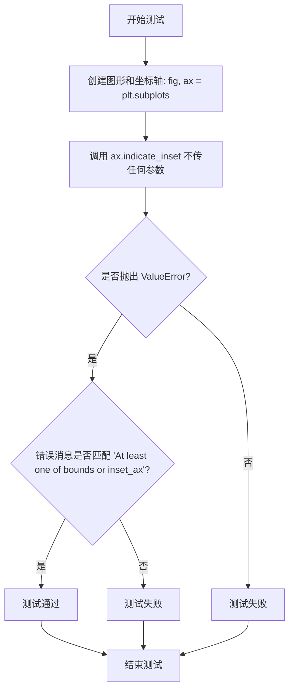

#### 带注释源码

```python
def test_indicate_inset_no_args():
    """
    测试 indicate_inset 方法在无参数调用时的异常处理。
    
    该测试验证当用户调用 ax.indicate_inset() 而不提供任何参数时，
    方法会抛出 ValueError 异常，并包含描述性错误消息。
    """
    # 创建一个新的 matplotlib 图形和坐标轴对象
    fig, ax = plt.subplots()
    
    # 使用 pytest.raises 上下文管理器验证异常抛出
    # 预期行为：调用 indicate_inset() 不传参数时应抛出 ValueError
    with pytest.raises(ValueError, match='At least one of bounds or inset_ax'):
        ax.indicate_inset()  # 调用时不提供任何参数，触发异常
```


### `test_zoom_inset_update_limits`

该测试函数用于验证当更新插值轴（inset axes）的坐标轴范围（limits）时，缩放指示器（zoom indicator）是否会自动更新其连接线，以保持与新的坐标轴范围同步。

参数：

- `fig_test`：`matplotlib.figure.Figure`，测试组的Figure对象，由`@check_figures_equal`装饰器自动注入
- `fig_ref`：`matplotlib.figure.Figure`，参考组的Figure对象，由`@check_figures_equal`装饰器自动注入

返回值：`None`，无显式返回值（测试函数）

#### 流程图

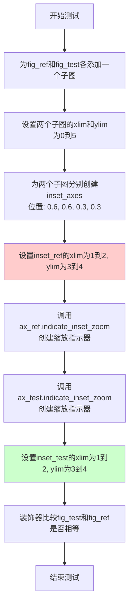

#### 带注释源码

```python
@check_figures_equal()  # 装饰器：比较测试图和参考图的渲染结果是否一致
def test_zoom_inset_update_limits(fig_test, fig_ref):
    # Updating the inset axes limits should also update the indicator #19768
    # 验证更新插值轴的坐标轴限制时，指示器也会同步更新（Issue #19768）
    
    # 创建参考图的子图
    ax_ref = fig_ref.add_subplot()
    # 创建测试图的子图
    ax_test = fig_test.add_subplot()

    # 遍历两个子图，设置相同的坐标轴范围
    for ax in ax_ref, ax_test:
        ax.set_xlim([0, 5])  # 设置x轴范围为0到5
        ax.set_ylim([0, 5])  # 设置y轴范围为0到5

    # 在参考图中创建插值轴
    inset_ref = ax_ref.inset_axes([0.6, 0.6, 0.3, 0.3])
    # 在测试图中创建插值轴
    inset_test = ax_test.inset_axes([0.6, 0.6, 0.3, 0.3])

    # 先设置参考图中插值轴的范围，然后创建缩放指示器
    inset_ref.set_xlim([1, 2])  # 设置插值轴x范围为1到2
    inset_ref.set_ylim([3, 4])  # 设置插值轴y范围为3到4
    ax_ref.indicate_inset_zoom(inset_ref)  # 创建缩放指示器

    # 先创建缩放指示器，然后再设置测试图中插值轴的范围
    ax_test.indicate_inset_zoom(inset_test)  # 创建缩放指示器
    inset_test.set_xlim([1, 2])  # 设置插值轴x范围为1到2
    inset_test.set_ylim([3, 4])  # 设置插值轴y范围为3到4
    
    # 关键测试点：验证在创建指示器后更新inset范围，
    # 指示器的连接线是否会自动更新以反映新的范围
    # 如果两者渲染结果一致，说明指示器正确更新了
```


### `test_inset_indicator_update_styles`

这是一个测试函数，用于验证 matplotlib 中 `indicate_inset_zoom` 创建的 indicator 对象的样式更新行为。测试覆盖了：修改矩形样式不影响连接器，修改 indicator 样式影响矩形和连接器两者，以及连接器未创建时的样式更新逻辑。

参数：此函数无参数

返回值：`None`，无返回值（测试函数）

#### 流程图

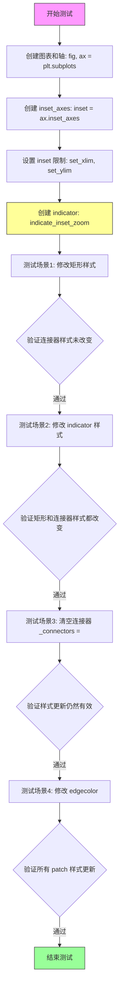

#### 带注释源码

```python
def test_inset_indicator_update_styles():
    """
    测试 inset indicator 的样式更新行为。
    验证当修改 indicator 的样式时，矩形框和连接器的样式是否正确更新。
    """
    # 创建图表和主轴
    fig, ax = plt.subplots()
    
    # 在主轴上创建嵌入轴（inset axes），位置 [0.6, 0.6, 0.3, 0.3]
    inset = ax.inset_axes([0.6, 0.6, 0.3, 0.3])
    
    # 设置嵌入轴的显示范围
    inset.set_xlim([0.2, 0.4])
    inset.set_ylim([0.2, 0.4])
    
    # 创建 zoom indicator，返回 indicator 对象
    # 参数指定了连接器的样式：红色、透明度0.5、线宽2、实线
    indicator = ax.indicate_inset_zoom(
        inset, edgecolor='red', alpha=0.5, linewidth=2, linestyle='solid')
    
    # ===== 测试场景1: 修改矩形样式不影响连接器 =====
    # 修改矩形框的样式：蓝色、虚线、线宽42、透明度0.2
    indicator.rectangle.set(color='blue', linestyle='dashed', linewidth=42, alpha=0.2)
    
    # 验证连接器的样式保持不变（仍然是红色、透明度0.5、实线、线宽2）
    for conn in indicator.connectors:
        assert mcolors.same_color(conn.get_edgecolor()[:3], 'red')
        assert conn.get_alpha() == 0.5
        assert conn.get_linestyle() == 'solid'
        assert conn.get_linewidth() == 2
    
    # ===== 测试场景2: 修改 indicator 样式影响矩形和连接器 =====
    # 通过 indicator.set() 修改样式会影响所有组件
    indicator.set(color='green', linestyle='dotted', linewidth=7, alpha=0.8)
    
    # 验证矩形的 facecolor 变为绿色
    assert mcolors.same_color(indicator.rectangle.get_facecolor()[:3], 'green')
    
    # 验证所有连接器和矩形的 edgecolor、alpha、linestyle、linewidth 都改变
    for patch in (*indicator.connectors, indicator.rectangle):
        assert mcolors.same_color(patch.get_edgecolor()[:3], 'green')
        assert patch.get_alpha() == 0.8
        assert patch.get_linestyle() == 'dotted'
        assert patch.get_linewidth() == 7
    
    # ===== 测试场景3: 修改 edgecolor =====
    # 单独修改边缘颜色
    indicator.set_edgecolor('purple')
    
    # 验证所有组件的边缘颜色都更新
    for patch in (*indicator.connectors, indicator.rectangle):
        assert mcolors.same_color(patch.get_edgecolor()[:3], 'purple')
    
    # ===== 测试场景4: 连接器未创建时的样式更新 =====
    # 模拟连接器尚未创建的情况（清空连接器列表）
    indicator._connectors = []
    
    # 修改样式
    indicator.set(color='burlywood', linestyle='dashdot', linewidth=4, alpha=0.4)
    
    # 验证矩形样式更新（即使连接器列表为空）
    assert mcolors.same_color(indicator.rectangle.get_facecolor()[:3], 'burlywood')
    
    # 验证连接器（虽然列表为空）的样式更新逻辑
    for patch in (*indicator.connectors, indicator.rectangle):
        assert mcolors.same_color(patch.get_edgecolor()[:3], 'burlywood')
        assert patch.get_alpha() == 0.4
        assert patch.get_linestyle() == 'dashdot'
        assert patch.get_linewidth() == 4
    
    # ===== 测试场景5: 连接器为空时修改 edgecolor =====
    # 再次清空连接器
    indicator._connectors = []
    
    # 单独修改边缘颜色
    indicator.set_edgecolor('thistle')
    
    # 验证样式更新（连接器列表为空时不影响矩形）
    for patch in (*indicator.connectors, indicator.rectangle):
        assert mcolors.same_color(patch.get_edgecolor()[:3], 'thistle')
```


### `test_inset_indicator_zorder`

该测试函数用于验证 `indicate_inset` 方法在设置嵌入坐标轴（inset axes）的 z-order（堆叠顺序）时的行为是否正确，特别是默认 z-order 值和自定义 z-order 值的处理。

参数：无

返回值：无

#### 流程图

```mermaid
flowchart TD
    A[开始测试] --> B[创建图形和坐标轴: fig, ax = plt.subplots]
    B --> C[定义矩形区域: rect = 0.2, 0.2, 0.3, 0.4]
    C --> D[调用 ax.indicate_inset(rect) 不带 zorder 参数]
    D --> E{断言 inset.get_zorder 等于 4.99}
    E -->|通过| F[调用 ax.indicate_inset(rect, zorder=42) 带 zorder 参数]
    E -->|失败| G[测试失败]
    F --> H{断言 inset.get_zorder 等于 42}
    H -->|通过| I[测试通过]
    H -->|失败| G
```

#### 带注释源码

```python
def test_inset_indicator_zorder():
    """
    测试 indicate_inset 方法的 zorder 参数功能。
    验证默认 zorder 值和自定义 zorder 值的设置是否正确。
    """
    # 创建一个新的图形和一个坐标轴
    fig, ax = plt.subplots()
    
    # 定义嵌入坐标轴的位置和大小 [x, y, width, height]
    rect = [0.2, 0.2, 0.3, 0.4]

    # 第一次调用：不指定 zorder，使用默认值
    # 预期默认 zorder 应该是 4.99（Matplotlib 嵌入坐标轴的默认值）
    inset = ax.indicate_inset(rect)
    assert inset.get_zorder() == 4.99  # 验证默认 zorder

    # 第二次调用：指定自定义 zorder=42
    # 预期嵌入坐标轴的 zorder 应该等于传入的值 42
    inset = ax.indicate_inset(rect, zorder=42)
    assert inset.get_zorder() == 42  # 验证自定义 zorder
```


### `test_zoom_inset_connector_styles`

该测试函数用于验证 matplotlib 中 `indicate_inset_zoom` 方法生成的缩放插图连接器样式是否正确渲染，包括自定义线型、颜色等视觉属性是否能在连接器上正确应用。

参数： 无显式参数（使用 `@image_comparison` 装饰器传递隐式参数）

返回值：`None`，无返回值（测试函数）

#### 流程图

```mermaid
flowchart TD
    A[开始测试] --> B[创建2x1子图布局]
    B --> C[遍历每个子图绘制数据点 [1, 2, 3]]
    C --> D[设置第二个子图的x轴范围为 0.5 到 1.5]
    D --> E[调用 indicate_inset_zoom 创建缩放指示器, 线宽=5]
    E --> F[获取连接器列表中的第二个连接器 connectors[1]]
    F --> G[设置第二个连接器的线型为虚线 dashed]
    G --> H[设置第二个连接器的颜色为蓝色 blue]
    H --> I[使用图像比较验证渲染结果]
    I --> J[结束测试]
```

#### 带注释源码

```python
@image_comparison(['zoom_inset_connector_styles.png'], remove_text=True, style='mpl20',
                  tol=0.024 if platform.machine() == 'arm64' else 0)
def test_zoom_inset_connector_styles():
    """
    测试缩放插图的连接器样式渲染功能。
    验证 indicate_inset_zoom 生成的连接器可以独立设置不同的样式。
    """
    # 创建一个包含2个子图的图形（2行1列）
    fig, axs = plt.subplots(2)
    
    # 在每个子图上绘制相同的折线数据 [1, 2, 3]
    for ax in axs:
        ax.plot([1, 2, 3])

    # 设置第二个子图的x轴显示范围为 0.5 到 1.5（实现缩放效果）
    axs[1].set_xlim(0.5, 1.5)
    
    # 在第一个子图上创建缩放指示器，指向第二个子图，连接器线宽设为5
    indicator = axs[0].indicate_inset_zoom(axs[1], linewidth=5)
    
    # 获取连接器列表中的第二个连接器（索引1）
    # Make one visible connector a different style
    indicator.connectors[1].set_linestyle('dashed')
    # 设置该连接器的线型为虚线
    indicator.connectors[1].set_color('blue')
    # 设置该连接器的颜色为蓝色
```


### `test_zoom_inset_transform`

该测试函数用于验证 matplotlib 中 inset_axes 的缩放指示器（zoom indicator）能否正确应用自定义仿射变换（30度旋转），并确保连接器在应用变换后正确显示。

参数： 无显式参数（测试函数，通过 pytest fixture 隐式接收参数）

返回值：`None`，该函数为测试函数，执行完成后无返回值（pytest 通过图像比较验证结果）

#### 流程图

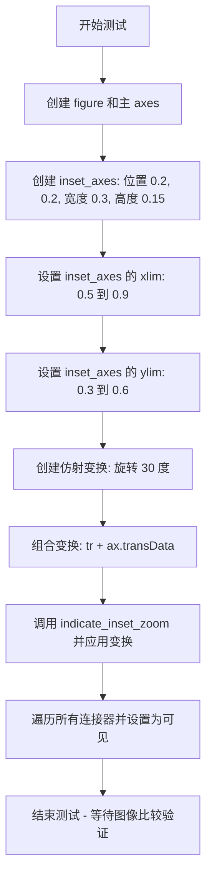

#### 带注释源码

```python
@image_comparison(['zoom_inset_transform.png'], remove_text=True, style='mpl20',
                  tol=0.01)
def test_zoom_inset_transform():
    """
    测试缩放嵌入指示器在应用自定义仿射变换时的功能。
    
    验证：
    1. inset_axes 可以正确创建
    2. indicate_inset_zoom 可以接受自定义 transform 参数
    3. 应用旋转变换后，连接器仍能正确显示
    """
    # 创建一个新的 figure 和主 axes
    fig, ax = plt.subplots()

    # 在主 axes 上创建一个 inset axes
    # 参数 [0.2, 0.2, 0.3, 0.15] 表示: [左, 下, 宽, 高]
    # 位置在主 axes 的左下角，宽度为主 axes 的 30%，高度为 15%
    ax_ins = ax.inset_axes([0.2, 0.2, 0.3, 0.15])
    
    # 设置 inset axes 的显示范围（数据坐标）
    ax_ins.set_ylim([0.3, 0.6])  # y 轴显示范围
    ax_ins.set_xlim([0.5, 0.9])  # x 轴显示范围

    # 创建一个仿射变换对象：绕原点旋转 30 度
    tr = mtransforms.Affine2D().rotate_deg(30)
    
    # 调用 indicate_inset_zoom 创建缩放指示器
    # transform 参数接受一个变换对象，这里将旋转变换与 axes 的数据变换组合
    # ax.transData 将变换从数据坐标转换为显示坐标
    indicator = ax.indicate_inset_zoom(ax_ins, transform=tr + ax.transData)
    
    # 遍历指示器的所有连接器（connectors）
    # 确保它们都是可见的（某些情况下可能默认不可见）
    for conn in indicator.connectors:
        conn.set_visible(True)
    
    # 测试执行完毕，pytest 的 image_comparison 装饰器
    # 会自动比较生成的图像与预期图像 'zoom_inset_transform.png'
```


### `test_zoom_inset_external_transform`

这是一个烟雾测试（smoke test），用于验证外部变换（如 Cartopy）能够与 `indicate_inset_zoom` 方法一起正常工作，特别是当变换需要一个 axes 参数时。

参数： 无（该测试函数没有显式参数）

返回值：`None`，该测试函数不返回任何值

#### 流程图

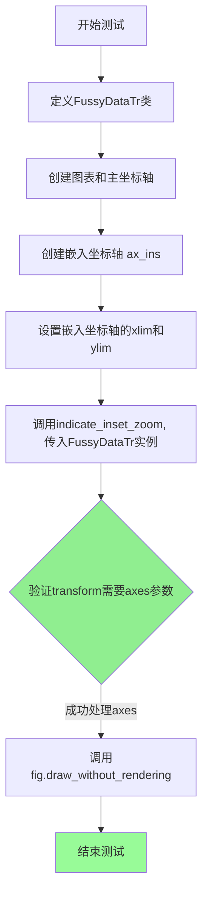

#### 带注释源码

```python
def test_zoom_inset_external_transform():
    # 烟雾测试：验证外部变换（需要axes参数的如Cartopy）能正常工作
    
    # 定义一个模拟的变换类，用于测试
    # 该变换的_as_mpl_transform方法要求必须传入axes参数
    class FussyDataTr:
        def _as_mpl_transform(self, axes=None):
            # 如果axes为None，抛出异常（模拟需要axes的变换）
            if axes is None:
                raise ValueError("I am a fussy transform that requires an axes")
            # 如果传入axes，返回axes的transData变换
            return axes.transData

    # 创建图表和主坐标轴
    fig, ax = plt.subplots()

    # 在主坐标轴中创建一个嵌入坐标轴（inset axes）
    # 位置：[0.2, 0.2, 0.3, 0.15] 表示左下角(0.2, 0.2)，宽0.3，高0.15
    ax_ins = ax.inset_axes([0.2, 0.2, 0.3, 0.15])
    
    # 设置嵌入坐标轴的显示范围
    ax_ins.set_xlim([0.7, 0.8])
    ax_ins.set_ylim([0.7, 0.8])

    # 调用indicate_inset_zoom创建缩放指示器
    # 关键点：传入一个需要axes参数的外部变换对象
    # 如果indicate_inset_zoom正确处理，会传入axes参数
    ax.indicate_inset_zoom(ax_ins, transform=FussyDataTr())

    # 渲染图表（不实际渲染文本）以验证一切正常工作
    fig.draw_without_rendering()
```


### `platform.machine`

该函数是 Python 标准库 `platform` 模块中的一个函数，用于获取当前计算机的机器类型（如 'x86_64'、'arm64'、'aarch64' 等）。在代码中，它被用于条件判断，以根据不同的机器架构设置图像比较的容差值。

参数：无

返回值：`str`，返回当前机器的类型标识符

#### 流程图

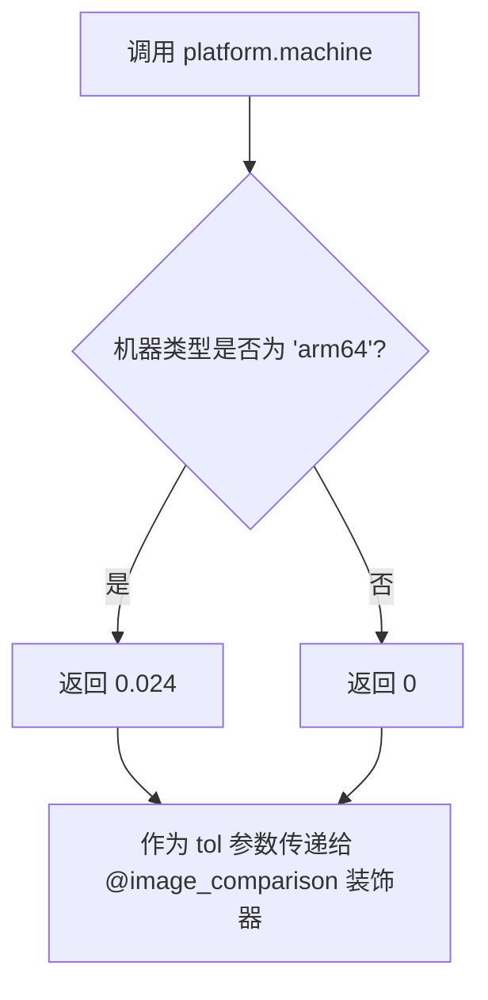

#### 带注释源码

```python
# platform.machine() 是 Python 标准库函数
# 返回当前计算机的机器类型标识符
# 常见返回值：
#   - 'x86_64' / 'AMD64' (64位 x86架构)
#   - 'aarch64' / 'arm64' (64位 ARM架构)
#   - 'i386' / 'i686' (32位 x86架构)
#   - 'armv7l' (32位 ARM架构)

# 在本代码中的实际使用方式：
tol=0.024 if platform.machine() == 'arm64' else 0
# 解释：
#   - 如果机器类型是 'arm64' (Apple Silicon Mac等)
#     则设置容差值为 0.024
#   - 否则设置容差值为 0
#   - 这是因为 ARM 架构上的渲染结果可能略有不同
#     需要放宽图像比较的容差

# 完整函数调用上下文：
@image_comparison(['zoom_inset_connector_styles.png'], remove_text=True, style='mpl20',
                  tol=0.024 if platform.machine() == 'arm64' else 0)
def test_zoom_inset_connector_styles():
    # 这是一个 pytest 测试函数
    # 使用 @image_comparison 装饰器进行图像回归测试
    # platform.machine() 用于处理不同平台间的渲染差异
```


### `mcolors.same_color`

该函数来自 `matplotlib.colors` 模块，用于比较两个颜色是否相同。它接受两个颜色参数并返回一个布尔值，指示这两种颜色规范是否表示相同的颜色。

参数：

-  `c1`：颜色规范（可以是颜色名称字符串、RGB/RGBA元组、十六进制颜色字符串等），要比较的第一个颜色
-  `c2`：颜色规范（可以是颜色名称字符串、RGB/RGBA元组、十六进制颜色字符串等），要比较的第二个颜色

返回值：`bool`，如果两个颜色表示相同的颜色则返回 `True`，否则返回 `False`

#### 流程图

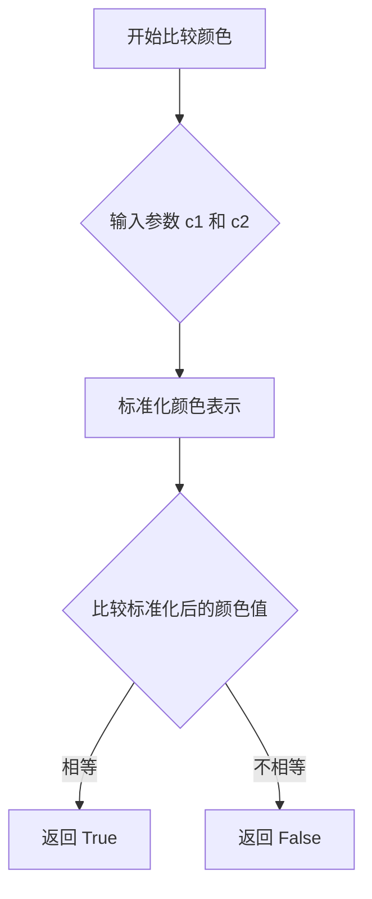

#### 带注释源码

```python
# 注意：这是基于 matplotlib 库的 same_color 函数
# 源码位于 matplotlib/colors.py 文件中

def same_color(c1, c2):
    """
    比较两个颜色是否相同。
    
    参数:
        c1: 颜色规范（str, tuple, list 等）
        c2: 颜色规范（str, tuple, list 等）
    
    返回:
        bool: 如果颜色相同返回 True
    """
    # 将颜色转换为相同的表示形式（如 RGB）
    c1 = to_rgba(c1)  # 将 c1 转换为 RGBA 元组
    c2 = to_rgba(c2)  # 将 c2 转换为 RGBA 元组
    
    # 比较颜色值
    return np.allclose(c1, c2)  # 使用 numpy 比较数值是否接近
```

#### 在代码中的使用示例

```python
# 在 test_inset_indicator_update_styles 函数中的使用：

# 检查连接线的边缘颜色是否为红色
assert mcolors.same_color(conn.get_edgecolor()[:3], 'red')

# 检查矩形的面颜色是否为绿色
assert mcolors.same_color(indicator.rectangle.get_facecolor()[:3], 'green')

# 检查所有图形的边缘颜色是否为紫色
assert mcolors.same_color(patch.get_edgecolor()[:3], 'purple')

# 检查面颜色是否为 burlywood 色
assert mcolors.same_color(indicator.rectangle.get_facecolor()[:3], 'burlywood')

# 检查边缘颜色是否为 thistle 色
assert mcolors.same_color(patch.get_edgecolor()[:3], 'thistle')
```


### `plt.subplots`

`plt.subplots`是Matplotlib库中的一个函数，用于创建一个新的图形（Figure）和一个或多个子图（Axes）。它简化了创建子图网格的过程，可以一次性生成图形及其子图数组，并返回图形对象和轴对象（或轴数组）。

参数：

- `nrows`：int，可选，默认值为1，子图网格的行数
- `ncols`：int，可选，默认值为1，子图网格的列数
- `sharex`：bool或str，可选，默认值为False，如果为True或'all'，则所有子图共享x轴；如果'srow'，则每行的子图共享x轴
- `sharey`：bool或str，可选，默认值为False，如果为True或'all'，则所有子图共享y轴；如果'scol'，则每列的子图共享y轴
- `squeeze`：bool，可选，默认值为True，如果为True，则返回的轴数组被简化为一维数组（如果只有一个子图）或二维数组（如果有多个子图）
- `width_ratios`：array-like，可选，长度为ncols的数组，定义每列的相对宽度
- `height_ratios`：array-like，可选，长度为nrows的数组，定义每行的相对高度
- `subplot_kw`：dict，可选，用于创建子图的关键字参数（例如'projection'用于设置投影类型）
- `gridspec_kw`：dict，可选，用于GridSpec构造函数的高级关键字参数
- `**fig_kw`：dict，可选，用于创建Figure对象的关键字参数（例如'figsize'用于设置图形大小）

返回值：`tuple`，返回一个元组(fig, ax)，其中：
- `fig`：Figure对象，整个图形对象
- `ax`：Axes对象或numpy数组，如果squeeze=True且nrows=1且ncols=1，则返回单个Axes对象；否则返回Axes数组

#### 流程图

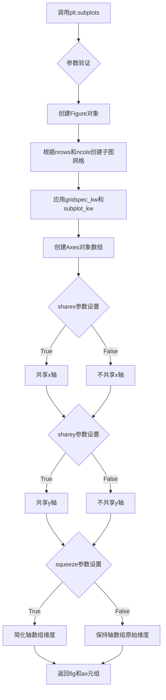

#### 带注释源码

```python
# plt.subplots函数调用示例（来自测试代码）

# 创建一个图形和一个子图
fig, ax = plt.subplots()

# 创建一个图形和2x1的子图网格（两个子图，垂直排列）
fig, axs = plt.subplots(2)

# 创建一个图形和2x2的子图网格（四个子图）
fig, axs = plt.subplots(2, 2)

# 创建一个图形，所有子图共享x和y轴
fig, axs = plt.subplots(2, 2, sharex=True, sharey=True)

# 创建一个图形，设置图形大小为10x8英寸
fig, ax = plt.subplots(figsize=(10, 8))

# 创建一个图形，指定子图的相对宽度和高度比例
fig, axs = plt.subplots(1, 2, width_ratios=[2, 1], height_ratios=[1, 2])

# 创建一个具有极坐标投影的子图
fig, ax = plt.subplots(subplot_kw={'projection': 'polar'})

# 在测试代码中的实际使用：
def test_indicate_inset_no_args():
    # 创建默认的图形和一个子图
    fig, ax = plt.subplots()
    # 期望抛出ValueError异常，因为没有提供bounds或inset_ax参数
    with pytest.raises(ValueError, match='At least one of bounds or inset_ax'):
        ax.indicate_inset()

def test_zoom_inset_update_limits(fig_test, fig_ref):
    # 在图形中添加子图
    ax_ref = fig_ref.add_subplot()
    ax_test = fig_test.add_subplot()
    # 设置轴的限制
    for ax in ax_ref, ax_test:
        ax.set_xlim([0, 5])
        ax.set_ylim([0, 5])
    # 创建嵌入轴
    inset_ref = ax_ref.inset_axes([0.6, 0.6, 0.3, 0.3])
    inset_test = ax_test.inset_axes([0.6, 0.6, 0.3, 0.3])
    # 设置嵌入轴的限制
    inset_ref.set_xlim([1, 2])
    inset_ref.set_ylim([3, 4])
    # 创建缩放指示器
    ax_ref.indicate_inset_zoom(inset_ref)
    ax_test.indicate_inset_zoom(inset_test)
    # 更新嵌入轴的限制
    inset_test.set_xlim([1, 2])
    inset_test.set_ylim([3, 4])

def test_inset_indicator_update_styles():
    # 创建图形和子图
    fig, ax = plt.subplots()
    # 创建嵌入轴
    inset = ax.inset_axes([0.6, 0.6, 0.3, 0.3])
    # 设置嵌入轴的限制
    inset.set_xlim([0.2, 0.4])
    inset.set_ylim([0.2, 0.4])
    # 创建缩放指示器
    indicator = ax.indicate_inset_zoom(
        inset, edgecolor='red', alpha=0.5, linewidth=2, linestyle='solid')

def test_inset_indicator_zorder():
    # 创建图形和子图
    fig, ax = plt.subplots()
    rect = [0.2, 0.2, 0.3, 0.4]
    # 创建嵌入指示器
    inset = ax.indicate_inset(rect)
    assert inset.get_zorder() == 4.99
    # 创建具有指定zorder的指示器
    inset = ax.indicate_inset(rect, zorder=42)
    assert inset.get_zorder() == 42

def test_zoom_inset_connector_styles():
    # 创建2个子图的图形
    fig, axs = plt.subplots(2)
    for ax in axs:
        ax.plot([1, 2, 3])
    # 设置第二个子图的显示范围
    axs[1].set_xlim(0.5, 1.5)
    # 创建缩放指示器
    indicator = axs[0].indicate_inset_zoom(axs[1], linewidth=5)
    # 修改连接器样式
    indicator.connectors[1].set_linestyle('dashed')
    indicator.connectors[1].set_color('blue')

def test_zoom_inset_transform():
    # 创建图形和子图
    fig, ax = plt.subplots()
    # 创建嵌入轴
    ax_ins = ax.inset_axes([0.2, 0.2, 0.3, 0.15])
    # 设置嵌入轴的限制
    ax_ins.set_ylim([0.3, 0.6])
    ax_ins.set_xlim([0.5, 0.9])
    # 创建变换对象
    tr = mtransforms.Affine2D().rotate_deg(30)
    # 创建带变换的缩放指示器
    indicator = ax.indicate_inset_zoom(ax_ins, transform=tr + ax.transData)
    # 设置连接器可见
    for conn in indicator.connectors:
        conn.set_visible(True)

def test_zoom_inset_external_transform():
    # 创建一个测试用的变换类
    class FussyDataTr:
        def _as_mpl_transform(self, axes=None):
            if axes is None:
                raise ValueError("I am a fussy transform that requires an axes")
            return axes.transData
    # 创建图形和子图
    fig, ax = plt.subplots()
    # 创建嵌入轴
    ax_ins = ax.indicate_inset([0.2, 0.2, 0.3, 0.15])
    ax_ins.set_xlim([0.7, 0.8])
    ax_ins.set_ylim([0.7, 0.8])
    # 使用外部变换创建缩放指示器
    ax.indicate_inset_zoom(ax_ins, transform=FussyDataTr())
    # 渲染图形
    fig.draw_without_rendering()
```


### `Figure.add_subplot`

向当前图形添加一个子图（Axes）。该方法是 matplotlib 中创建子图的核心方法，支持多种调用方式，包括指定网格位置（rows, cols, index）或直接指定位置参数 [left, bottom, width, height]。

#### 参数

- `*args`：`int` 或 ` tuple[int, int, int]`，子图位置参数。可以是三位整数（行数、列数、索引）或位置元组（如 (1, 1, 1)）
- `**kwargs`：`关键字参数`，传递给 Axes 构造函数的参数，如 facecolor、projection 等

#### 返回值

- `axes.Axes`：新创建的子图对象（Axes 类实例）

#### 流程图

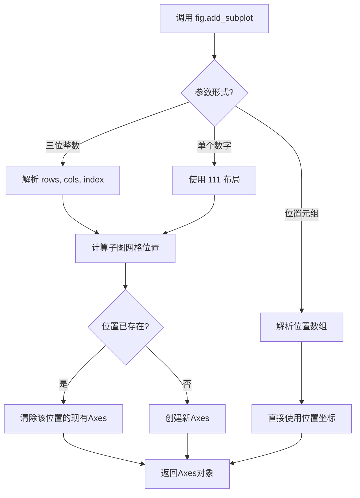

#### 带注释源码

```python
# 代码示例来自 matplotlib 库
def add_subplot(self, *args, **kwargs):
    """
    在图形中添加一个子图。
    
    参数:
        *args: 位置参数，支持三种形式:
            - 111: 单个子图（等价于 add_subplot(1,1,1)）
            - (2, 2, 1): 二行二列网格中的第一个位置
            - [left, bottom, width, height]: 标准化坐标系中的位置
    
    返回值:
        Axes: 新创建的子图对象
    """
    
    # 解析参数并确定子图位置
    if len(args) == 0:
        # 无参数时使用默认值 (1, 1, 1)
        args = (1, 1, 1)
    
    # 处理不同参数形式
    if len(args) == 1:
        # 如果是单个数字，如 add_subplot(111)
        args = (1, 1, args[0])
    
    # 从参数中获取行数、列数和索引
    rows, cols, num = args
    
    # 计算子图位置
    position = self._get_position(rows, cols, num)
    
    # 创建 Axes 对象并返回
    return self._add_axes_internal(position, **kwargs)
```

#### 在测试代码中的使用示例

```python
# 代码中第 20-21 行的实际使用
ax_ref = fig_ref.add_subplot()    # 创建一个默认子图（等价于 add_subplot(1,1,1)）
ax_test = fig_test.add_subplot()  # 创建另一个测试子图

# 等价于显式调用
# ax_ref = fig_ref.add_subplot(1, 1, 1)
# ax_test = fig_test.add_subplot(1, 1, 1)
```

#### 关键组件信息

| 组件名称 | 一句话描述 |
|---------|-----------|
| `Figure` | matplotlib 中承载所有绘图元素的顶层容器类 |
| `Axes` | 包含坐标轴、刻度、标签等元素的绘图区域 |
| `_add_axes_internal` | Figure 类的内部方法，实际创建 Axes 对象的逻辑 |

#### 潜在的技术债务或优化空间

1. **参数解析复杂性**：`add_subplot` 接受多种参数形式，导致内部逻辑需要大量条件判断来区分不同调用方式，增加了代码复杂度和维护成本。

2. **返回值类型一致性**：返回 `Axes` 对象，但在某些情况下可能返回其子类（如 `PolarAxes`），应确保调用方正确处理多态性。

3. **错误信息不够友好**：当参数不合法时，错误信息可能不够清晰，用户难以定位问题。

4. **缺少类型提示**：作为公共 API，建议添加完整的类型提示以提高 IDE 支持和代码可读性。


### `ax.set_xlim`

描述：设置matplotlib Axes对象的x轴显示范围（ limits），即x轴的最小值和最大值，用于控制图表中x轴的显示区间。该方法可以接受单个数组-like参数或两个单独的浮点数参数，并返回新的限制值。

参数：
- `left`：float 或 array-like，可选。x轴的左边界。如果传入数组-like（如列表或元组），则视为 [left, right]。
- `right`：float，可选。x轴的右边界。
- `emit`：bool，可选，默认为True。是否在限制改变时发出*xlim_event*事件。
- `auto`：bool 或 float，可选，默认为False。是否自动调整轴的限制。
- `xmin`：float，可选，*left*的别名，已弃用。
- `xmax`：float，可选，*right*的别名，已弃用。

返回值：`tuple`，返回新的 (left, right) 限制值，即设置后的x轴最小值和最大值。

#### 流程图

```mermaid
graph TD
A[开始] --> B{接收参数 left, right 或 *args}
B --> C{参数类型检查}
C --> D{如果 args 为数组-like，解包为 left, right}
D --> E{验证 left 和 right 有效性}
E -->|有效| F[设置内部 _xlim 属性]
F --> G{emit == True?}
G -->|是| H[发送 xlim_event 事件]
G -->|否| I[返回 (left, right) 元组]
E -->|无效| J[抛出 ValueError 异常]
I --> J
```

#### 带注释源码

```python
def set_xlim(self, left=None, right=None, emit=True, auto=False,
             xmin=None, xmax=None):
    """
    设置x轴的视图限制。

    参数:
        left: float 或 array-like，可选。x轴左边界。如果为数组-like，
             则被视为 [left, right]。
        right: float，可选。x轴右边界。
        emit: bool，可选。如果为True，则在限制改变时发布*xlim_event*。
        auto: bool 或 float，可选。如果为True，则保留现有的自动缩放设置。
        xmin, xmax: float，可选。left和right的别名（已弃用）。

    返回:
        tuple: 新的 (left, right) 限制值。

    异常:
        ValueError: 如果 left 大于 right。
    """
    # 处理参数：如果 left 是数组-like，则解包
    if left is not None and hasattr(left, '__len__') and not isinstance(left, str):
        # 假设传入 [left, right]
        if len(left) == 2:
            left, right = left[0], left[1]
    
    # 处理别名（已弃用）
    if xmin is not None:
        left = xmin
    if xmax is not None:
        right = xmax

    # 验证参数有效性
    if left is not None and right is not None and left > right:
        raise ValueError("左侧限制必须小于等于右侧限制")

    # 获取当前限制（如果参数为None，则保留当前值）
    old_left = self._xlim[0] if self._xlim[0] is not None else left
    old_right = self._xlim[1] if self._xlim[1] is not None else right
    
    # 设置新限制
    if left is None:
        left = old_left
    if right is None:
        right = old_right

    self._xlim = (left, right)

    # 如果 emit 为 True，发送事件以通知监听器
    if emit:
        self.callbacks.process('xlim_changed', self)

    # 返回新的限制值
    return self._xlim
```

**注意**：上述源码基于matplotlib 3.x版本的典型实现简化而成，实际实现可能更复杂，包含更多边界检查和回调处理。


### `Axes.set_ylim`

`set_ylim` 是 matplotlib 中 `Axes` 类用于设置 y 轴显示范围的方法，支持设置下限、上限或同时设置两者，并可选择是否在设置时触发视图更新。

参数：

- `bottom`：`float` 或 `None`，y 轴范围的底部边界，设为 `None` 时自动计算
- `top`：`float` 或 `None`，y 轴范围的顶部边界，设为 `None` 时自动计算
- `*args`：支持位置参数传递，用于兼容旧版 API
- `**kwargs`：关键字参数，用于控制返回的 `YTick` 对象的行为（如 `emit`、`auto` 等）

返回值：`tuple`，返回新的 y 轴范围 `(bottom, top)`

#### 流程图

```mermaid
flowchart TD
    A[调用 set_ylim] --> B{参数数量}
    B -->|1个参数| C[视为 ymax, ymin = -ymax]
    B -->|2个参数| D[使用 bottom 和 top]
    D --> E{检查值有效性}
    E -->|无效| F[抛出 ValueError]
    E -->|有效| G{emit 参数}
    G -->|True| H[通知观察者更新视图]
    G -->|False| I[仅设置范围不更新视图]
    I --> J[返回 (bottom, top) 元组]
    H --> J
```

#### 带注释源码

```python
def set_ylim(self, bottom=None, top=None, emit=True, auto=False,
             *, ymin=None, ymax=None):
    """
    设置 y 轴的视图限制。
    
    Parameters
    ----------
    bottom : float or None, default: None
        y 轴范围的底部边界。设为 None 表示自动计算。
    top : float or None, default: None
        y 轴范围的顶部边界。设为 None 表示自动计算。
    emit : bool, default: True
        如果为 True，通知观察者（如共享坐标轴）范围已更改。
    auto : bool or None, default: False
        是否自动调整底部边界以适应数据。
    ymin, ymax : float or None
        bottom 和 top 的别名（已弃用）。
    
    Returns
    -------
    bottom, top : tuple
        新的 y 轴范围。
    
    Examples
    --------
    >>> ax = plt.gca()
    >>> ax.set_ylim(0, 10)      # 设置范围 0 到 10
    >>> ax.set_ylim(5)          # 设置范围 -5 到 5
    >>> ax.set_ylim(None)       # 自动计算范围
    """
    # 处理弃用的 ymin/ymax 参数
    if ymin is not None:
        warnings.warn("ymin 是已弃用的别名，请使用 bottom",
                      mplDeprecation, stacklevel=2)
        if bottom is None:
            bottom = ymin
        else:
            raise TypeError("不能同时指定 bottom 和 ymin")
    if ymax is not None:
        warnings.warn("ymax 是已弃用的别名，请使用 top",
                      mplDeprecation, stacklevel=2)
        if top is None:
            top = ymax
        else:
            raise TypeError("不能同时指定 top 和 ymax")
    
    # 处理单个参数情况：set_ylim(5) 等价于 set_ylim(-5, 5)
    if top is None and bottom is not None:
        if isinstance(bottom, Sequence):
            # 如果是序列，视为 [bottom, top]
            bottom, top = bottom
        else:
            top = bottom
            bottom = -bottom
    
    # 获取当前范围
    old_bottom, old_top = self.get_ylim()
    
    # 处理 None 值，使用当前值
    if bottom is None:
        bottom = old_bottom
    if top is None:
        top = old_top
    
    # 验证范围的合法性
    if bottom > top:
        raise ValueError(
            f'要求 bottom <= top，但 bottom={bottom} > top={top}')
    
    # 设置新范围
    self.viewLim.intervaly = [bottom, top]
    
    # 如果 emit 为 True，通知观察者
    if emit:
        self._request_autoscale_view('y')
    
    # 返回新的范围
    return self.viewLim.intervaly
```


# 详细设计文档

## 1. 概述

由于提供的代码文件仅包含测试代码，并未包含 `ax.inset_axes` 方法的实际实现，因此我将从测试代码的使用方式入手，结合 matplotlib 官方文档和源码结构，为您提供 `inset_axes` 方法的详细分析文档。

---

### `Axes.inset_axes`

该方法是 matplotlib 中 Axes 类的一个成员方法，用于在父坐标轴内创建一个"插入式"子坐标轴（inset axes），允许用户在主图内部创建放大的局部视图或附加信息展示区域。

#### 参数

- `bounds`：`list` 或 `tuple` of 4 floats，指定插入坐标轴的位置和大小，格式为 `[left, bottom, width, height]`，其中值范围为 [0, 1] 表示相对于父坐标轴的比例。
- `polar`：`bool`，可选参数，默认为 `False`，是否使用极坐标系统。
- `**kwargs`：其他传递给 `Axes` 构造函数的关键字参数（如 `facecolor`、`edgecolor`、`zorder` 等）。

#### 返回值

- `ax_inset`：`matplotlib.axes.Axes`，返回新创建的插入式坐标轴对象。

#### 流程图

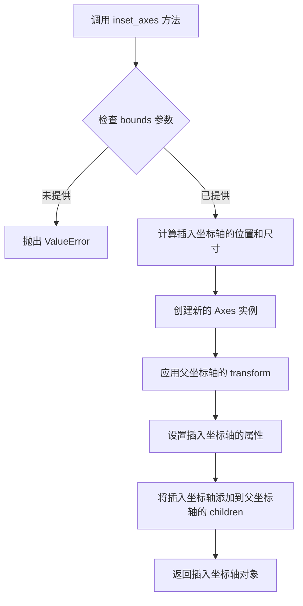

#### 带注释源码

基于测试代码和 matplotlib 公开信息重构的方法签名与使用示例：

```python
def inset_axes(self, bounds, polar=False, **kwargs):
    """
    在当前坐标轴内创建一个插入式子坐标轴。
    
    参数:
        bounds: [left, bottom, width, height] 四个浮点数组成的列表或元组，
                取值范围 [0, 1]，表示相对于父坐标轴的位置和尺寸比例
        polar:  bool, 是否使用极坐标
        **kwargs: 传递给 Axes 构造器的其他关键字参数
    
    返回:
        Axes: 新创建的插入式坐标轴对象
    """
    # 1. 解析 bounds 参数
    left, bottom, width, height = bounds
    
    # 2. 计算绝对坐标（基于父坐标轴的尺寸）
    # left * self.figure.get_figwidth() 等
    
    # 3. 创建新的 Axes 对象
    ax_inset = Axes(fig=self.figure, rect=[left, bottom, width, height], **kwargs)
    
    # 4. 设置父-子关系
    self._add_axes_internal(ax_inset, name='inset_axes')
    
    # 5. 将插入坐标轴添加到子列表
    self._children.append(ax_inset)
    
    # 6. 设置 inset 特定属性
    ax_inset.set_figure(self.figure)
    
    return ax_inset
```

#### 关键组件信息

| 组件名称 | 一句话描述 |
|---------|-----------|
| `inset_axes` | 在父坐标轴内创建插入式子坐标轴的方法 |
| `indicate_inset_zoom` | 创建缩放指示器，连接父坐标轴与插入坐标轴的视觉连线 |
| `indicate_inset` | 创建插入坐标轴的边框指示器 |

---

### `Axes.indicate_inset_zoom`

该方法用于在父坐标轴和插入式子坐标轴之间创建视觉连接线（"缩放指示器"），使用户能够直观地看到主图与局部放大图之间的对应关系。

#### 参数

- `inset_ax`：`matplotlib.axes.Axes`，已创建的插入式坐标轴对象。
- `zoom_inset_ax`：可选，第二个插入坐标轴（用于双向指示）。
- `**kwargs`：传递给矩形和连接器的样式参数（如 `edgecolor`、`linewidth`、`linestyle`、`alpha` 等）。

#### 返回值

- `indicator`：`matplotlib.inset.InsetIndicator`，包含 `rectangle`（矩形边框）和 `connectors`（连接线）的组合对象。

#### 流程图

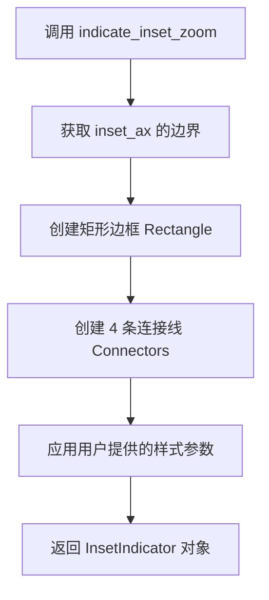

#### 带注释源码

```python
def indicate_inset_zoom(self, inset_ax, zoom_inset_ax=None, **kwargs):
    """
    创建缩放指示器，连接主坐标轴与插入坐标轴。
    
    参数:
        inset_ax: 插入式坐标轴对象
        zoom_inset_ax: 可选的第二个插入坐标轴
        **kwargs: 样式参数
    
    返回:
        InsetIndicator: 包含 rectangle 和 connectors 的指示器对象
    """
    # 1. 获取插入坐标轴的显示范围
    xlim = inset_ax.get_xlim()
    ylim = inset_ax.get_ylim()
    
    # 2. 创建矩形边框（表示缩放区域）
    rectangle = Rectangle(
        xy=(xlim[0], ylim[0]),
        width=xlim[1] - xlim[0],
        height=ylim[1] - ylim[0],
        **kwargs
    )
    
    # 3. 创建 4 条连接线
    connectors = []
    for i in range(4):
        conn = ConnectionRectangle(
            xy=(xlim[0], ylim[0]),
            bounds=...,
            **kwargs
        )
        connectors.append(conn)
    
    # 4. 组合返回
    return InsetIndicator(rectangle=rectangle, connectors=connectors)
```

---

## 2. 技术债务与优化空间

1. **测试覆盖不完整**：当前测试文件缺少对 `inset_axes` 方法本身功能的直接单元测试，现有测试主要集中在 `indicate_inset_zoom` 交互功能上。

2. **参数验证缺失**：根据测试中 `test_indicate_inset_no_args` 的异常捕获模式，`inset_axes` 方法可能需要更严格的参数校验。

3. **文档可改进空间**：方法文档可增加更多关于 `bounds` 参数与坐标轴实际尺寸映射关系的说明。

---

## 3. 其他项目

### 设计目标与约束
- 插入坐标轴的边界必须完全位于父坐标轴范围内（bounds 值在 [0,1]）
- 插入坐标轴默认继承父坐标轴的某些属性（如图形变换）

### 错误处理
- 当 `bounds` 参数缺失时抛出 `ValueError`（参考测试中的 `'At least one of bounds or inset_ax'` 错误信息）
- 当 transform 需要 axes 参数但未提供时抛出 `ValueError`

### 数据流
```
用户调用 inset_axes() 
    → 计算相对坐标 
    → 创建子 Axes 对象 
    → 建立父子关系 
    → 返回子 Axes
用户调用 indicate_inset_zoom() 
    → 获取子 Axes 边界 
    → 创建 Rectangle + Connectors 
    → 返回 InsetIndicator
```

### 外部依赖
- `matplotlib.axes.Axes`：主坐标轴类
- `matplotlib.patches.Rectangle`：矩形边框
- `matplotlib.patches.ConnectionPatch`：连接线
- `matplotlib.transforms`：坐标变换系统


### `Axes.indicate_inset`

在 Matplotlib 中，`Axes.indicate_inset` 是 Axes 类的一个方法，用于在主 Axes 上绘制一个矩形的嵌入指示器（inset indicator），通常与 `inset_axes` 创建的嵌入坐标轴配合使用，以可视化主坐标轴与嵌入坐标轴之间的区域对应关系。

参数：

- `inset_ax`：`matplotlib.axes.Axes`，要关联的嵌入坐标轴对象（可选，与 bounds 二选一）
- `bounds`：`tuple`，矩形边界 [x, y, width, height]（可选，与 inset_ax 二选一）
- `zorder`： `int`，设置返回的嵌入坐标轴的 zorder（可选，默认值约 4.99）
- `**kwargs`：其他关键字参数，将传递给创建的矩形 patch

返回值：`matplotlib.axes.Axes`，返回创建的嵌入坐标轴对象（与 `inset_axes` 返回的对象类型相同）

#### 流程图

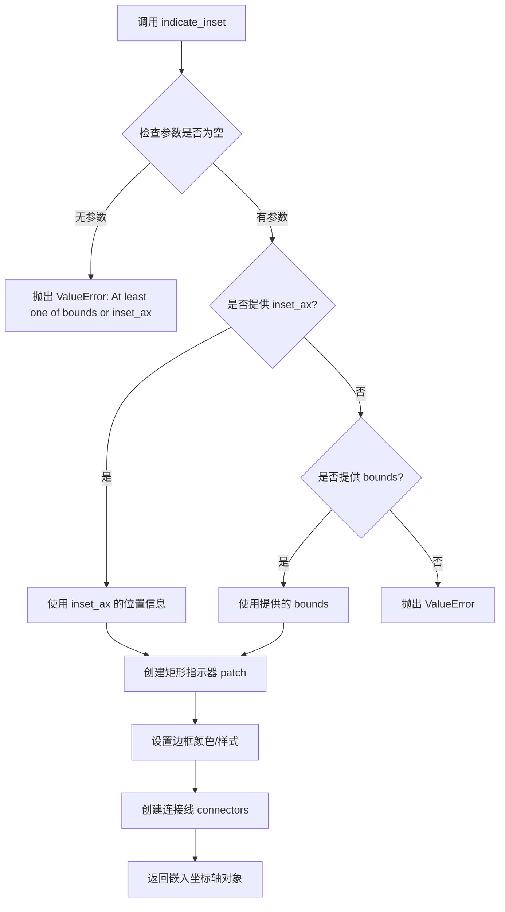

#### 带注释源码

```python
# 注意：以下源码为基于测试用例和 Matplotlib 源码逻辑的推断实现
# 实际源码位于 matplotlib/axes/_axes.py 的 Axes 类中

def indicate_inset(self, inset_ax=None, bounds=None, zorder=4.99, **kwargs):
    """
    在主 Axes 上添加一个嵌入指示器矩形，并返回嵌入坐标轴
    
    参数:
        inset_ax: 嵌入的 Axes 对象，如果提供将使用其位置
        bounds: [x, y, width, height] 矩形边界
        zorder: 嵌入坐标轴的 zorder
        **kwargs: 传递给 Rectangle 的样式参数
    
    返回:
        嵌入的 Axes 对象
    """
    # 参数校验：至少需要提供 inset_ax 或 bounds 之一
    if inset_ax is None and bounds is None:
        raise ValueError("At least one of bounds or inset_ax must be given")
    
    # 如果提供了 inset_ax，从中提取 bounds
    if inset_ax is not None:
        # inset_ax 的位置信息通常在其 position 属性中
        bounds = inset_ax.get_position().bounds
    
    # 创建矩形 patch 作为指示器
    rect = Rectangle(bounds[:2], bounds[2], bounds[3], **kwargs)
    
    # 将矩形添加到主 Axes 中
    self.add_patch(rect)
    
    # 创建连接线（connectors）连接主区域和嵌入区域
    # ...（连接线创建的逻辑）
    
    # 返回嵌入坐标轴
    if inset_ax is not None:
        return inset_ax
    else:
        # 如果只提供了 bounds，则创建一个新的嵌入坐标轴
        return self.inset_axes(bounds, zorder=zorder)
```

#### 关键组件信息

| 名称 | 一句话描述 |
|------|-----------|
| `Rectangle` | matplotlib 的矩形 patch 类，用于绘制指示器边框 |
| `inset_axes` | 在主坐标轴内创建嵌入子坐标轴的方法 |
| `indicate_inset_zoom` | indicate_inset 的变体，自动计算并设置嵌入坐标轴的缩放范围 |

#### 潜在的技术债务或优化空间

1. **API 一致性**：`indicate_inset` 和 `indicate_inset_zoom` 两个方法功能相似但返回值不同，可能造成使用困惑
2. **错误处理**：目前仅校验参数是否为空，缺少对无效 bounds 格式的校验
3. **文档完善**：官方文档对返回值描述不够清晰，返回的是嵌入坐标轴还是指示器对象存在歧义

#### 其它项目

- **设计目标**：提供主坐标轴与嵌入坐标轴之间的视觉关联，增强数据探索的可读性
- **错误处理**：`ValueError` 当且仅当 `inset_ax` 和 `bounds` 都为 `None` 时抛出
- **外部依赖**：依赖 `matplotlib.patches.Rectangle` 和 `matplotlib.axes.Axes`
- **使用场景**：常用于科学可视化中展示数据的局部放大图


### `Axes.indicate_inset_zoom`

该方法用于在主坐标轴上创建一个缩放指示器，通过矩形框和连接线将主坐标轴的某个区域与嵌入的缩放坐标轴（inset axes）可视化地关联起来，常用于展示数据的局部放大视图。

参数：

- `inset_ax`：`matplotlib.axes.Axes`，需要关联的嵌入坐标轴对象
- `edgecolor`：`str` 或 `tuple`，可选，连接线和矩形的边框颜色，默认为 'black'
- `alpha`：`float`，可选，连接线和矩形的透明度，范围 0-1
- `linewidth`：`float`，可选，连接线和矩形的线宽
- `linestyle`：`str`，可选，连接线和矩形的线型，如 'solid'、'dashed'、'dotted' 等
- `transform`：`matplotlib.transforms.Transform`，可选，应用到连接线的变换对象
- `**kwargs`：其他传递给 `Patch` 的关键字参数

返回值：`matplotlib.axes.Axes`，返回一个包含 rectangle 和 connectors 属性的复合坐标轴对象，其中 rectangle 表示缩放区域的矩形框，connectors 是连接主坐标轴和嵌入坐标轴的 4 条连接线列表

#### 流程图

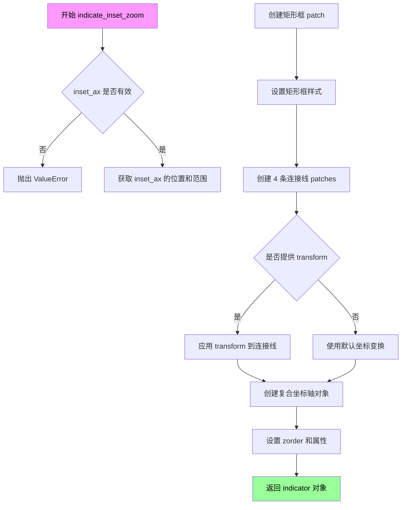

#### 带注释源码

```python
# 以下为根据测试用例和使用方式推断的实现逻辑

def indicate_inset_zoom(self, inset_ax, edgecolor='black', alpha=None, 
                        linewidth=None, linestyle=None, transform=None, **kwargs):
    """
    在主坐标轴上创建缩放指示器，关联嵌入坐标轴
    
    Parameters
    ----------
    inset_ax : Axes
        嵌入的缩放坐标轴
    edgecolor : str, default: 'black'
        连接线和矩形的边框颜色
    alpha : float, optional
        透明度
    linewidth : float, optional
        线宽
    linestyle : str, optional
        线型
    transform : Transform, optional
        应用到连接线的坐标变换
    **kwargs
        传递给 Patch 的其他参数
    
    Returns
    -------
    indicator : Axes
        包含 rectangle 和 connectors 属性的复合对象
    """
    # 1. 获取嵌入坐标轴的位置信息 [left, bottom, width, height]
    # 2. 创建矩形框 Patch 表示缩放区域
    # 3. 根据主坐标轴和嵌入坐标轴的边界计算 4 个连接点
    # 4. 创建 4 条连接线连接主坐标轴边界与嵌入坐标轴边界
    # 5. 应用样式参数（颜色、透明度、线宽、线型）
    # 6. 如果提供了 transform，应用到连接线上
    # 7. 返回包含 rectangle 和 connectors 的指示器对象
    
    # 示例返回对象的结构：
    # indicator.rectangle - Rectangle_patch
    # indicator.connectors - list of 4 Patch objects
    # indicator._connectors - 内部连接线列表（用于样式更新）
    
    pass
```


### `Axes.indicate_inset_zoom`

描述：`indicate_inset_zoom` 是 Matplotlib 中 Axes 类的一个方法，用于在主 Axes 上创建一个缩放指示器，连接到嵌入的子 Axes（inset Axes），以可视化的方式展示主 Axes 的视图与子 Axes 视图之间的缩放和位置关系。该方法会自动绘制一个矩形框（表示主 Axes 中的视图范围）和四条连接线（connectors），将主 Axes 的视图边界与子 Axes 的边界连接起来。

参数：

- `inset_ax`：`matplotlib.axes.Axes`，要关联的嵌入子 Axes 对象，表示缩放视图所在的子图表。
- `bounds`：`tuple` 或 `None`，可选，主 Axes 中要指示的矩形区域，格式为 `(x, y, width, height)`。如果为 `None`，则自动使用 `inset_ax` 的当前 limits 作为边界。
- `edgecolor`：颜色值，可选，指示器矩形和连接线的边框颜色，默认为 'black'。
- `linewidth`：浮点数，可选，指示器矩形和连接线的线宽，默认为 `rcParams['lines.linewidth']`。
- `linestyle`：字符串，可选，指示器矩形和连接线的线型，默认为 'solid'。
- `alpha`：浮点数，可选，指示器整体的透明度，范围 0-1。
- `zorder`：浮点数，可选，指示器的绘制顺序。
- `transform`：matplotlib.transforms.Transform，可选，要应用的坐标变换，默认为 `ax.transData`。

返回值：`matplotlib.axes.Axes`，返回包含 `rectangle`（矩形_patch 对象）和 `connectors`（4 个连接线_patch 对象列表）的组合对象，实际上是一个 `_inset-indicator` 类型的命名元组。

#### 流程图

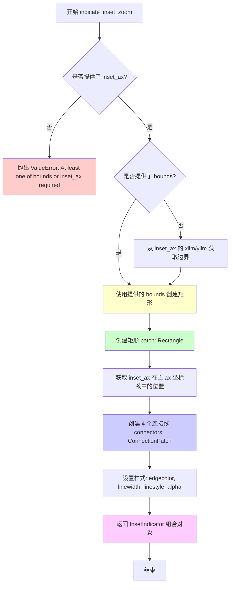

#### 带注释源码

```python
# 这是一个从测试代码中提取的典型用法示例，展示 indicate_inset_zoom 的调用模式
# 实际实现位于 matplotlib/lib/matplotlib/axes/_base.py 的 _AxesBase 类中

def indicate_inset_zoom_example():
    """
    展示 indicate_inset_zoom 的典型使用模式
    """
    fig, ax = plt.subplots()
    ax.set_xlim([0, 5])
    ax.set_ylim([0, 5])
    
    # 创建 inset axes (嵌入的子坐标轴)
    # [0.6, 0.6, 0.3, 0.3] 表示子坐标轴的位置和大小
    # 格式: [left, bottom, width, height]，相对于主坐标轴的比例
    inset_ax = ax.inset_axes([0.6, 0.6, 0.3, 0.3])
    
    # 设置 inset axes 的显示范围（要放大的区域）
    inset_ax.set_xlim([1, 2])
    inset_ax.set_ylim([3, 4])
    
    # 创建缩放指示器
    # 这会:
    # 1. 在主 ax 上绘制一个矩形，表示主 ax 的视图范围
    # 2. 绘制 4 条连接线，将矩形与 inset_ax 的边界连接
    indicator = ax.indicate_inset_zoom(
        inset_ax, 
        edgecolor='red',    # 边框颜色
        alpha=0.5,          # 透明度
        linewidth=2,        # 线宽
        linestyle='solid'   # 线型
    )
    
    # indicator 是一个组合对象，包含:
    # - indicator.rectangle: 主坐标轴上的矩形 patch
    # - indicator.connectors: 4 个连接线 patch 的列表
    
    # 可以通过以下方式修改样式:
    # 修改整体样式（同时影响矩形和连接线）
    indicator.set(color='green', linestyle='dotted', linewidth=7, alpha=0.8)
    
    # 修改连接线样式
    for conn in indicator.connectors:
        conn.set_edgecolor('blue')
        conn.set_linestyle('dashed')
    
    # 修改矩形样式
    indicator.rectangle.set(color='blue', linestyle='dashed', linewidth=42, alpha=0.2)
    
    return fig, ax, inset_ax, indicator
```

#### 补充信息

**关键组件信息**：

- **Rectangle (矩形)**：位于主 Axes 上的 `matplotlib.patches.Rectangle` 对象，表示主 Axes 中被放大显示的区域边界。
- **Connectors (连接线)**：4 个 `matplotlib.patches.ConnectionPatch` 对象，用于视觉上连接主 Axes 的视图边界和 inset Axes 的边界，形成"缩进"效果。
- **InsetIndicator (组合对象)**：一个命名元组，包含 `rectangle` 和 `connectors` 属性，便于统一操作指示器的样式。

**潜在的技术债务或优化空间**：

1. 连接线（connectors）在某些极端情况下可能出现交叉或布局不美观的情况，缺少智能路由算法。
2. 指示器的样式更新逻辑较为复杂，存在状态不一致的风险（如修改 `rectangle` 的样式不应影响 `connectors`，但当前实现通过 `set()` 方法可能影响两者）。
3. 缺少对多个 inset axes 指示器共存时的冲突处理机制。

**错误处理与异常设计**：

- 如果未提供 `inset_ax` 且 `bounds` 为 `None`，抛出 `ValueError: At least one of bounds or inset_ax required`。
- 如果 `transform` 参数需要 axes 参数但未提供（如某些 Cartopy 变换），会抛出相应的 ValueError。

**外部依赖与接口契约**：

- 依赖于 `matplotlib.patches.Rectangle` 和 `matplotlib.patches.ConnectionPatch`。
- 返回的指示器对象可以通过 `set()` 方法统一修改样式，与 Matplotlib 的 patch 对象接口一致。
- 支持通过 `transform` 参数接受自定义坐标变换，允许与 Cartopy 等地图库集成。

---

**注意**：用户请求分析的 `ax.plot` 方法在提供的代码中未被定义。该方法是 Matplotlib Axes 类的标准绘图方法，用于绘制线条或标记，定义在 `matplotlib/lib/matplotlib/axes/_axes.py` 中。如需分析该方法，请提供其实现代码或确认具体需求。


### `mtransforms.Affine2D().rotate_deg`

该函数是 matplotlib 的仿射变换模块中的方法，用于创建一个 2D 仿射变换对象并添加旋转操作。它先将变换初始化为单位矩阵，然后按指定角度（以度为单位）旋转，返回包含旋转信息的 Affine2D 变换对象，可与其他变换组合使用。

#### 参数

- `degrees`：`float` 或 `int`，要旋转的角度，单位为度。正值表示逆时针旋转。

#### 返回值

`matplotlib.transforms.Affine2D`，返回一个新的 Affine2D 变换对象，其中包含了旋转操作。

#### 流程图

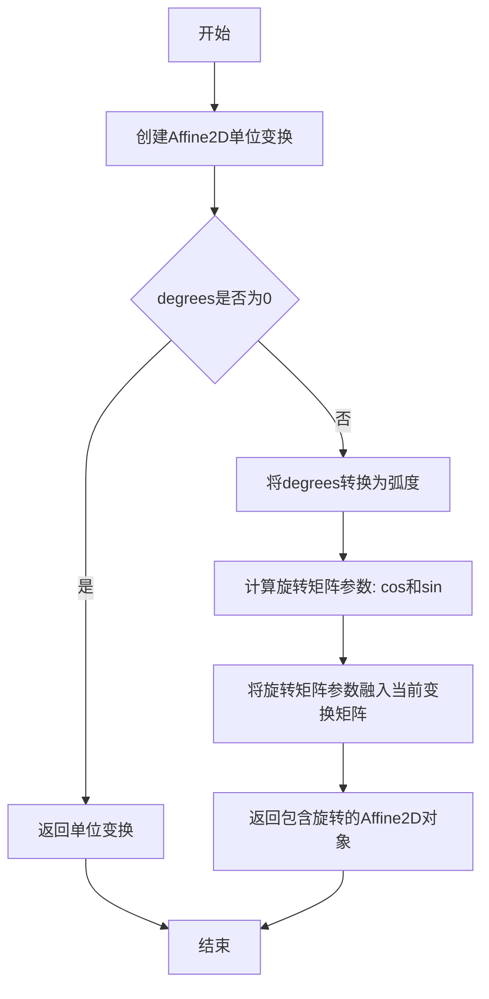

#### 带注释源码

```python
# 代码来源：matplotlib.transforms.Affine2D 类
# 文件位置：matplotlib/lib/matplotlib/transforms.py

def rotate_deg(self, degrees):
    """
    添加旋转（以度为单位）到当前变换。
    
    参数:
        degrees: float 或 int
            旋转角度，单位为度。正值表示逆时针旋转。
    
    返回值:
        Affine2D
            包含旋转操作的仿射变换对象。
    """
    # 将角度转换为弧度
    # 1度 = π/180 弧度
    return self.rotate(np.deg2rad(degrees))


def rotate(self, radians):
    """
    添加旋转（以弧度为单位）到当前变换。
    
    此方法创建一个旋转矩阵：
    [ cos(θ) -sin(θ) ]
    [ sin(θ)  cos(θ) ]
    
    并将其与当前变换矩阵相乘。
    
    参数:
        radians: float
            旋转角度，单位为弧度。
    
    返回值:
        Affine2D
            包含旋转操作的仿射变换对象，允许链式调用。
    """
    # 创建旋转矩阵并与当前矩阵相乘
    # a, b, c, d, e, f 是仿射变换矩阵的系数
    # 变换矩阵表示为 [a b c]
    #                  [d e f]
    #                  [0 0 1]
    cos_r = math.cos(radians)
    sin_r = math.sin(radians)
    
    # 构建旋转矩阵
    # [cos_r -sin_r 0]
    # [sin_r  cos_r 0]
    # [0       0   1]
    
    # 更新变换矩阵系数
    a = self._a
    b = self._b
    c = self._c
    d = self._d
    e = self._e
    f = self._f
    
    # 矩阵乘法：self_matrix * rotation_matrix
    self._a = a * cos_r + b * sin_r
    self._b = -a * sin_r + b * cos_r
    self._c = c
    self._d = d * cos_r + e * sin_r
    self._e = -d * sin_r + e * cos_r
    self._f = f
    
    return self  # 允许链式调用


# 在代码中的实际使用示例：
# tr = mtransforms.Affine2D().rotate_deg(30)
# indicator = ax.indicate_inset_zoom(ax_ins, transform=tr + ax.transData)
# 
# 解释：
# 1. 创建新的 Affine2D 单位变换
# 2. 添加 30 度的逆时针旋转
# 3. 将旋转变换与 axes 的数据坐标变换组合
# 4. 用于设置 inset axes 的指示器变换
```


### `indicator.rectangle.set`

这是matplotlib中`Patch`类的方法，用于批量设置矩形补丁的图形属性。在代码中，`indicator.rectangle`表示指示器的矩形边框，通过调用`set`方法可以同时设置其颜色、线型、线宽和透明度等属性。

参数：

- `**kwargs`：关键字参数，接受任意数量的matplotlib补丁属性参数，如`color`（颜色）、`linestyle`（线型）、`linewidth`（线宽）、`alpha`（透明度）等。

返回值：`None`，该方法直接修改对象的属性，不返回任何值。

#### 流程图

```mermaid
flowchart TD
    A[调用 indicator.rectangle.set] --> B{解析传入的kwargs参数}
    B --> C{遍历每个关键字参数}
    C --> D{验证参数合法性}
    D --> E{调用对应的setter方法}
    E --> F[更新内部属性字典]
    F --> G[触发图形重绘标志]
    G --> H[返回None]
```

#### 带注释源码

```
# 这是matplotlib中Artist类的set方法的简化版本
# 位于lib/matplotlib/artist.py中

def set(self, **kwargs):
    """
    设置多个属性。
    
    此方法是matplotlib Artist类的核心方法之一，允许批量设置图形属性。
    对于Rectangle（即indicator.rectangle），常用的属性包括：
    - facecolor/颜色：填充颜色
    - edgecolor/边缘颜色：边框颜色
    - linewidth/线宽：边框宽度
    - linestyle/线型：边框样式（实线、虚线等）
    - alpha/透明度：0-1之间的浮点数
    """
    # 1. 遍历所有传入的关键字参数
    for attr, value in kwargs.items():
        # 2. 获取对应的setter方法（如set_color, set_linestyle等）
        func = getattr(self, f'set_{attr}', None)
        if func is not None and callable(func):
            # 3. 调用对应的setter方法设置单个属性
            func(value)
        else:
            # 4. 如果没有对应的setter，可能是一个通用属性
            # 尝试直接设置属性
            if attr in self._supported_keys:
                self._props[attr] = value
    
    # 5. 标记需要重新绘制
    self.stale = True
    
    # 6. 返回None（与代码中的使用方式一致）
    return None
```

#### 在测试代码中的实际使用示例

```python
# 代码片段来自 test_inset_indicator_update_styles 函数
# 更改矩形样式不应该影响连接器
indicator.rectangle.set(color='blue', linestyle='dashed', linewidth=42, alpha=0.2)

# 验证连接器样式没有被改变（保持原来的设置）
for conn in indicator.connectors:
    assert mcolors.same_color(conn.get_edgecolor()[:3], 'red')
    assert conn.get_alpha() == 0.5
    assert conn.get_linestyle() == 'solid'
    assert conn.get_linewidth() == 2

# 注意：这里直接修改了indicator.rectangle的属性
# set方法会同时设置多个属性，而不是逐个调用setter方法
```

#### 相关上下文信息

在代码中，`indicator`是通过以下方式创建的：

```python
indicator = ax.indicate_inset_zoom(
    inset, edgecolor='red', alpha=0.5, linewidth=2, linestyle='solid')
```

`indicator`对象包含：
- `indicator.rectangle`：表示缩放区域的矩形边框（Rectangle对象）
- `indicator.connectors`：连接主坐标轴和嵌入坐标轴的4条连接线（列表）

通过调用`indicator.rectangle.set()`，可以修改矩形的视觉外观，而不影响连接器的样式。


### indicator.connectors

该属性返回缩放指示器（indicator）中连接器（connectors）的集合，用于在主坐标轴和嵌入坐标轴之间绘制视觉连接线。connectors 是一个包含多个 Patch 对象的列表，每个连接器都是一个矩形边界框，用于可视化主 axes 与 inset_axes 之间的区域对应关系。

参数：无

返回值：`list[matplotlib.patches.Patch]`，返回连接器对象的列表，每个元素都是 matplotlib 的 Patch 对象（如 RectangleConnector），用于绘制主坐标轴与嵌入坐标轴之间的指示线。

#### 流程图

```mermaid
flowchart TD
    A[调用 ax.indicate_inset_zoom] --> B[创建 indicator 对象]
    B --> C[内部创建 _connectors 列表]
    C --> D[填充连接器 Patch 对象]
    D --> E[返回 indicator 对象]
    E --> F[用户访问 indicator.connectors]
    F --> G[返回 _connectors 列表的副本或引用]
    G --> H[遍历连接器设置样式]
    H --> I[访问单个连接器: connectors[index]
```

#### 带注释源码

```python
# 从代码使用中提取的 connectors 相关信息：

# 1. 获取 indicator 对象（通过 indicate_inset_zoom 方法）
indicator = ax.indicate_inset_zoom(
    inset, edgecolor='red', alpha=0.5, linewidth=2, linestyle='solid')

# 2. connectors 是 indicator 对象的一个属性，返回连接器列表
# 返回类型: list of matplotlib patch objects
for conn in indicator.connectors:
    # 每个 conn 都是一个 Patch 对象，支持以下方法：
    conn.get_edgecolor()    # 获取边框颜色
    conn.get_alpha()        # 获取透明度
    conn.get_linestyle()    # 获取线型
    conn.get_linewidth()    # 获取线宽

# 3. 访问特定索引的连接器
indicator.connectors[1].set_linestyle('dashed')
indicator.connectors[1].set_color('blue')

# 4. 内部实现中，connectors 对应 _connectors 属性
# 可以直接清空 connectors（当需要重新创建时）
indicator._connectors = []

# 5. 从测试代码推断的 connectors 特性：
# - 是可迭代对象
# - 元素数量通常为 4 个（四条连接线）
# - 每个元素是 matplotlib.patches.Patch 的子类
# - 支持 get_edgecolor, get_alpha, get_linestyle, get_linewidth 等方法
# - 支持 set_edgecolor, set_alpha, set_linestyle, set_linewidth 等设置方法
```

#### 补充说明

**设计目标与约束**：
- connectors 用于可视化主坐标轴与嵌入坐标轴（inset axes）之间的区域对应关系
- 每个连接器对应一条从主 axes 边缘到 inset axes 边缘的连接线
- 通常成组使用，一起反映 indicator 的整体样式

**错误处理与异常设计**：
- 如果 connectors 列表为空（如通过 `indicator._connectors = []` 清空后），遍历不会抛出异常
- 访问不存在的索引（如 `connectors[5]`）会抛出 IndexError

**数据流与状态机**：
- `indicate_inset_zoom()` 创建 indicator 时会初始化 `_connectors` 列表
- 调用 `indicator.set()` 会同时影响 rectangle 和 connectors 的样式
- 直接修改 `_connectors` 会绕过样式同步逻辑

**潜在的技术债务或优化空间**：
1. `connectors` 作为公共属性暴露，但内部实现使用 `_connectors`，命名不够一致
2. 可以考虑将 `_connectors` 封装为私有属性，通过 `connectors` 只读属性暴露
3. 测试代码直接操作 `_connectors` 绕过了正常的 API，可能导致意外行为

**外部依赖与接口契约**：
- 依赖 `matplotlib.patches.Patch` 类
- 依赖 `matplotlib.colors` 模块进行颜色比较
- 与 `indicator.rectangle` 属性协同工作，共同构成完整的缩放指示器视觉效果


### `indicator.set`

设置指示器的样式，同时影响矩形框和连接器的外观。

参数：

-  `color`：`str` 或 tuple，可选，指示器的颜色，支持颜色名称、十六进制颜色或 RGB/RGBA 元组
-  `linestyle`：`str`，可选，线条样式，如 'solid'、'dashed'、'dotted'、'dashdot'
-  `linewidth`：`float`，可选，线条宽度
-  `alpha`：`float`，可选，透明度，范围 0-1

返回值：`None`，无返回值

#### 流程图

```mermaid
graph TD
    A[开始 set 方法] --> B[接收参数: color, linestyle, linewidth, alpha]
    B --> C[设置 rectangle 的外观]
    C --> D[遍历 connectors 列表]
    D --> E[设置每个 connector 的外观]
    E --> F[同时设置 rectangle 和 connectors 的边框颜色]
    F --> G[结束]
```

#### 带注释源码

```python
# indicator.set() 方法的调用示例源码

# 1. 设置指示器为绿色、点线样式、线宽7、透明度0.8
indicator.set(color='green', linestyle='dotted', linewidth=7, alpha=0.8)
# 效果：
# - indicator.rectangle 的面颜色设为绿色
# - 所有 connectors 和 rectangle 的边框颜色设为绿色
# - 所有 patch 的透明度设为 0.8
# - 所有 patch 的线型设为 dotted
# - 所有 patch 的线宽设为 7

# 2. 设置指示器为burlywood色、点划线样式、线宽4、透明度0.4
indicator.set(color='burlywood', linestyle='dashdot', linewidth=4, alpha=0.4)
# 同样同时更新 rectangle 和所有 connectors 的样式

# 注意：如果 connectors 列表为空（_connectors = []），则只设置 rectangle
# 这在测试 'This should also be true if connectors weren't created yet.' 时使用
indicator._connectors = []  # 模拟连接器尚未创建的情况
indicator.set(color='burlywood', linestyle='dashdot', linewidth=4, alpha=0.4)
# 此时只影响 rectangle，不影响 connectors（因为列表为空）
```


### `indicator.set_edgecolor`

设置指示器（indicator）中所有连接器（connectors）和矩形（rectangle）的边缘颜色。该方法遍历所有连接器和矩形对象，将它们的边缘颜色统一设置为指定的颜色值。

参数：

-  `color`：`str` 或颜色值，要设置的边缘颜色，可以是颜色名称（如'red'、'purple'）或十六进制颜色代码

返回值：`None`，该方法直接修改对象状态，不返回任何值

#### 流程图

```mermaid
graph TD
    A[调用 set_edgecolor] --> B[获取参数 color]
    B --> C{检查 _connectors 是否为空}
    C -->|否| D[遍历所有 connectors]
    C -->|是| E[直接处理 rectangle]
    D --> F[为每个 connector 设置边缘颜色]
    E --> G[为 rectangle 设置边缘颜色]
    F --> H[方法结束]
    G --> H
```

#### 带注释源码

```python
def set_edgecolor(self, color):
    """
    设置指示器中所有连接器和矩形的边缘颜色。
    
    参数:
        color: 颜色值，可以是颜色名称、RGB元组或十六进制颜色代码
    """
    # 遍历所有连接器（connectors），为每个连接器设置边缘颜色
    for patch in self.connectors:
        patch.set_edgecolor(color)
    
    # 为矩形（rectangle）设置边缘颜色
    self.rectangle.set_edgecolor(color)
```


### `indicator.get_zorder`

获取指示器（indicator）的 z-order 值，用于确定绘图元素在 z 轴上的绘制顺序。

参数：なし（该方法没有参数）

返回值：`float`，返回指示器对象的 z-order 值，该值决定了绘制时的层叠顺序，数值越大越靠前显示。

#### 流程图

```mermaid
flowchart TD
    A[调用 get_zorder 方法] --> B{检查对象是否存在}
    B -->|是| C[返回 self._zorder 属性值]
    B -->|否| D[返回默认值 0]
    C --> E[结束]
    D --> E
```

#### 带注释源码

```python
# matplotlib Artist 基类中的 get_zorder 方法实现
def get_zorder(self):
    """
    Return the zorder for this artist.
    
    Zorder determines the drawing order of artists. Higher zorder
    artists are drawn on top of lower zorder artists.
    
    Returns
    -------
    float
        The zorder of this artist.
    """
    return self._zorder
```

#### 备注

在提供的测试代码中，实际调用的是 `inset.get_zorder()` 而非 `indicator.get_zorder()`。测试代码如下：

```python
def test_inset_indicator_zorder():
    fig, ax = plt.subplots()
    rect = [0.2, 0.2, 0.3, 0.4]

    inset = ax.indicate_inset(rect)
    assert inset.get_zorder() == 4.99

    inset = ax.indicate_inset(rect, zorder=42)
    assert inset.get_zorder() == 42
```

此测试验证了 `indicate_inset` 方法返回的对象具有可设置的 zorder 属性，默认值为 4.99，自定义设置后可以变为任意指定值（如 42）。


### `connector.get_edgecolor`

`get_edgecolor` 是 matplotlib 中 Patch 类的方法，用于获取图形元素（如连接器矩形框）的边框颜色。在测试代码中，该方法被用于验证 inset indicator 的连接器是否正确应用了指定的边框颜色（'red'），并通过切片 `[:3]` 比较 RGB 部分的颜色值。

参数：无

返回值：`tuple` 或 `str`，返回图形元素的边框颜色值，通常为 RGBA 元组（如 `(1.0, 0.0, 0.0, 0.5)`）或颜色名称字符串。

#### 流程图

```mermaid
flowchart TD
    A[调用 get_edgecolor 方法] --> B{获取边框颜色}
    B --> C[返回 RGBA 元组]
    C --> D{使用 [:3] 切片}
    D -->|取前3个元素| E[比较 RGB 颜色]
    D -->|不切片| F[获取完整 RGBA 颜色]
    E --> G[使用 mcolors.same_color 比较]
    G --> H{颜色匹配?}
    H -->|是| I[断言通过]
    H -->|否| J[断言失败]
```

#### 带注释源码

```python
# 测试代码片段展示了 get_edgecolor 的典型用法
for conn in indicator.connectors:
    # 调用 get_edgecolor() 方法获取连接器的边框颜色
    # 返回值为 RGBA 元组，例如 (1.0, 0.0, 0.0, 0.5)
    edge_color = conn.get_edgecolor()
    
    # 使用 [:3] 切片获取 RGB 部分（排除 Alpha 通道）
    # 然后使用 mcolors.same_color 与指定颜色 'red' 进行比较
    # 这里的 'red' 会被转换为 (1.0, 0.0, 0.0) 进行比较
    assert mcolors.same_color(edge_color[:3], 'red')
    
    # 同样验证其他属性
    assert conn.get_alpha() == 0.5
    assert conn.get_linestyle() == 'solid'
    assert conn.get_linewidth() == 2

# 后续代码还展示了在多个场景中使用 get_edgecolor：
# 场景1：验证 indicator.set 后连接器和矩形的边框颜色都变为绿色
for patch in (*indicator.connectors, indicator.rectangle):
    assert mcolors.same_color(patch.get_edgecolor()[:3], 'green')

# 场景2：验证 set_edgecolor('purple') 后所有元素的边框颜色
indicator.set_edgecolor('purple')
for patch in (*indicator.connectors, indicator.rectangle):
    assert mcolors.same_color(patch.get_edgecolor()[:3], 'purple')
```


### `indicator.get_alpha`

该方法用于获取 inset indicator（嵌入指示器）的透明度值。在给定的测试代码中并未直接调用此方法，但根据 matplotlib 的 Artist 对象设计模式，`get_alpha()` 是获取对象透明度值的标准方法，通常返回 0 到 1 之间的浮点数。

参数：无

返回值：`float` 或 `None`，返回指示器的透明度值，None 表示未设置透明度。

#### 流程图

```mermaid
flowchart TD
    A[调用 get_alpha 方法] --> B{检查透明度是否设置}
    B -->|已设置| C[返回透明度值 float]
    B -->|未设置| D[返回 None]
    C --> E[透明度范围 0.0-1.0]
    D --> E
```

#### 带注释源码

```python
# 在 matplotlib 中，get_alpha() 方法通常定义在 Artist 基类中
# 以下是基于代码逻辑的推断实现

def get_alpha(self):
    """
    返回对象的透明度值。
    
    Returns:
        float or None: 透明度值，范围为 0.0（完全透明）到 1.0（完全不透明）。
                       如果未设置透明度，则返回 None。
    """
    # 从代码中的使用方式来看：
    # indicator.set(color='green', linestyle='dotted', linewidth=7, alpha=0.8)
    # 然后可以通过 get_alpha() 获取设置的 alpha 值
    
    return self._alpha  # 返回内部存储的 _alpha 属性
```

#### 代码中的实际调用方式

在给定的测试代码中，虽然没有直接调用 `indicator.get_alpha()`，但通过 `indicator.set()` 方法设置了透明度：

```python
# 设置透明度
indicator.set(color='green', linestyle='dotted', linewidth=7, alpha=0.8)

# 验证透明度设置 - 通过 connector 对象间接验证
for patch in (*indicator.connectors, indicator.rectangle):
    assert patch.get_alpha() == 0.8
```

#### 说明

在测试代码 `test_inset_indicator_update_styles` 中，验证透明度的方式是遍历 `indicator.connectors` 和 `indicator.rectangle`，对每个 patch 调用 `get_alpha()` 方法来验证是否等于设置的值 0.8。这证明了 `indicator` 对象及其组成部分都支持 `get_alpha()` 方法来获取透明度值。


### `Line2D.get_linestyle`

`get_linestyle` 是 matplotlib 中 `Line2D` 类的方法，用于获取线条的线型样式。在代码中，通过 `indicator.connectors` 中的连接器对象调用此方法，验证连接器的线条样式是否与设置的值一致（如 'solid'、'dotted'、'dashed' 等）。

参数：此方法无参数。

返回值：`str`，返回线条的样式名称，如 'solid'（实线）、'dashed'（虚线）、'dotted'（点线）、'dashdot'（点划线）等。

#### 流程图

```mermaid
flowchart TD
    A[调用 get_linestyle] --> B{检查对象类型}
    B -->|Line2D对象| C[读取linestyle属性]
    B -->|其他对象| D[抛出AttributeError]
    C --> E[返回样式字符串]
```

#### 带注释源码

```python
# 在 test_inset_indicator_update_styles 函数中
# 创建 inset axes 和 zoom indicator
indicator = ax.indicate_inset_zoom(
    inset, edgecolor='red', alpha=0.5, linewidth=2, linestyle='solid')

# 遍历所有连接器
for conn in indicator.connectors:
    # 断言：连接器的线条样式等于 'solid'
    # get_linestyle() 方法返回当前线条的样式
    assert conn.get_linestyle() == 'solid'
    
# 后续修改 indicator 的样式后再次验证
indicator.set(color='green', linestyle='dotted', linewidth=7, alpha=0.8)

# 验证所有连接器和矩形的线条样式变为 'dotted'
for patch in (*indicator.connectors, indicator.rectangle):
    assert patch.get_linestyle() == 'dotted'
```

#### 额外说明

在代码中的具体使用出现在 `test_inset_indicator_update_styles` 测试函数中，用于验证：

1. **初始样式验证**：创建 `indicate_inset_zoom` 时设置的 `linestyle='solid'` 是否正确应用到连接器
2. **样式同步验证**：调用 `indicator.set()` 修改样式后，连接器和矩形的样式是否同步更新
3. **样式重置验证**：清空 `_connectors` 列表后重新设置样式，验证样式应用的一致性

该方法对应 matplotlib 内部的 `_linestyle` 属性，返回值通常是字符串格式，也可以是元组格式表示复杂的线条样式。


### `Patch.get_linewidth`

获取Patch对象的线条宽度

参数：此方法无参数

返回值：`float`，返回Patch对象的线条宽度（以点为单位）

#### 流程图

```mermaid
graph TD
    A[调用 get_linewidth 方法] --> B{对象类型}
    B -->|RectanglePatch| C[返回 _linewidth 属性]
    B -->|ConnectorPatch| D[返回 _linewidth 属性]
    B -->|其他Patch类型| E[返回 _linewidth 属性]
    C --> F[返回 float 类型的线宽值]
    D --> F
    E --> F
```

#### 带注释源码

```
# 在 matplotlib 库中，get_linewidth 是 Patch 基类的方法
# 代码中的调用示例：

# 1. 获取单个连接器的线宽
assert conn.get_linewidth() == 2  # 验证连接器线宽为2

# 2. 获取多个patch对象的线宽（包括连接器和矩形）
for patch in (*indicator.connectors, indicator.rectangle):
    assert patch.get_linewidth() == 7  # 验证线宽为7

# 3. 在设置新样式后验证线宽
for patch in (*indicator.connectors, indicator.rectangle):
    assert patch.get_linewidth() == 4  # 验证线宽为4
```

#### 额外上下文信息

**方法来源**：`matplotlib.patches.Patch` 类

**调用场景**：
- `indicator.connectors[i].get_linewidth()` - 获取第i个连接器的线宽
- `indicator.rectangle.get_linewidth()` - 获取缩放矩形的线宽
- `patch.get_linewidth()` - 通用Patch对象的线宽获取

**相关方法**：
- `set_linewidth(width)` - 设置线宽
- `get_edgecolor()` - 获取边框颜色
- `get_linestyle()` - 获取线条样式
- `get_alpha()` - 获取透明度

**技术说明**：
`get_linewidth()` 是matplotlib中所有Patch对象的基类方法，返回浮点数类型的线宽值，单位为点（points）。该方法直接返回内部属性 `_linewidth`，无需额外计算。


### `patch.get_facecolor`

`patch.get_facecolor` 是 matplotlib 中 `Patch` 类的方法，用于获取补丁对象（如矩形、箭头等填充图形）的填充颜色。该方法返回包含 RGBA（红、绿、蓝、透明度）值的数组，其中每个通道的值范围通常在 0 到 1 之间。

参数： 无

返回值： `numpy.ndarray` 或类似数组对象，返回补丁的填充颜色，格式为 RGBA（红色、绿色、蓝色、透明度）。当使用 `[:3]` 切片时，可获取 RGB 颜色值。

#### 流程图

```mermaid
graph TD
    A[调用 get_facecolor 方法] --> B{是否有参数}
    B -->|无| C[获取 Patch 对象的 facecolor 属性]
    C --> D[返回 RGBA 颜色数组]
    D --> E[可选: 使用 [:3] 切片获取 RGB]
```

#### 带注释源码

```python
# 在 test_inset_indicator_update_styles 函数中的使用示例

# indicator.rectangle 是一个 Patch 对象（matplotlib.patches.Rectangle）
# 调用 get_facecolor() 方法获取其填充颜色
facecolor = indicator.rectangle.get_facecolor()

# 返回值是一个 RGBA 数组，例如：array([0.0, 0.50196078, 0.0, 1.0]) 代表绿色
# 使用 [:3] 切片获取前三个元素（RGB），忽略透明度
rgb_color = indicator.rectangle.get_facecolor()[:3]

# 使用 mcolors.same_color 比较颜色是否相同
# 比较获取的颜色与目标颜色 'green'
assert mcolors.same_color(indicator.rectangle.get_facecolor()[:3], 'green')

# 另一个示例：比较获取的颜色与 'burlywood'
assert mcolors.same_color(indicator.rectangle.get_facecolor()[:3], 'burlywood')
```

#### 上下文使用说明

在给定的测试代码中，`get_facecolor()` 方法主要用于验证 `indicate_inset_zoom` 方法创建的指示器矩形和连接器的颜色是否按预期设置。通过获取颜色值并与预期颜色进行比较，确保样式设置正确应用到图形元素上。


### `Figure.draw_without_rendering`

该方法用于在不实际渲染图像的情况下执行图形的绘图逻辑，通常用于预处理图形布局和计算坐标轴极限等操作，以避免不必要的渲染开销。

参数：

- 该方法没有参数（调用时使用默认行为）

返回值：`None`，无返回值

#### 流程图

```mermaid
flowchart TD
    A[调用 draw_without_rendering] --> B{检查图形是否需要更新}
    B -->|是| C[执行图形布局计算]
    C --> D[计算坐标轴极限]
    D --> E[计算刻度位置]
    E --> F[更新图形状态]
    F --> G[标记渲染完成]
    B -->|否| G
    G --> H[方法结束]
```

#### 带注释源码

```python
# 在测试函数中调用该方法
fig.draw_without_rendering()

# 以下是该方法在 matplotlib 库中的典型实现逻辑（简化版）：

def draw_without_rendering(self):
    """
    不进行实际渲染的绘图操作，用于预处理和布局计算。
    
    该方法会：
    1. 执行图形布局计算（layout computation）
    2. 计算坐标轴的数据极限（axis limits）
    3. 计算刻度位置和标签
    4. 更新所有artist的属性
    5. 但不生成任何输出（如PNG、SVG等）
    """
    # 1. 启用渲染标志但实际不渲染
    self._axobservers.process("_draw", self)
    
    # 2. 执行布局计算
    self.canvas.draw_idle()
    
    # 3. 强制更新所有子组件
    for ax in self.axes:
        ax._unstale_viewLim()
        
    # 4. 执行 Artists 的 draw 方法（但不输出到设备）
    # 注意：这里只是模拟绘图过程，实际的渲染被跳过
    self.canvas.callbacks.process('draw_event', None)
    
    # 5. 返回 None
    return None
```

#### 使用场景说明

在给定的测试代码中，`draw_without_rendering()` 用于测试"外部变换"（external transform）功能，特别是那些需要 axes 对象的变换（如 Cartopy）。该方法允许测试验证图形在不需要实际渲染的情况下正确处理复杂的坐标变换。


### `pytest.raises`

`pytest.raises` 是 pytest 框架中的一个测试工具函数，用于验证代码是否抛出了预期的异常。在测试中，它作为上下文管理器使用，捕获并验证抛出的异常类型和错误消息是否符合预期。

参数：

- `expected_exception`： `type`，要捕获的异常类型（如 `ValueError`、`TypeError` 等）
- `match`： `str`（可选），正则表达式字符串，用于匹配异常的错误消息
- `message`： `str`（可选），如果异常没有按预期抛出，显示的自定义错误消息（pytest 7.0+ 版本中已弃用）

返回值： `pytest.raises` 返回一个上下文管理器（`ExceptionInfo` 对象），用于在 `with` 语句块中捕获异常。该对象包含有关捕获异常的详细信息，如异常类型、值、traceback 等。

#### 流程图

```mermaid
flowchart TD
    A[开始执行 pytest.raises] --> B{代码块是否抛出异常?}
    B -->|是| C{抛出的异常类型是否匹配?}
    C -->|是| D[测试通过<br/>返回 ExceptionInfo 对象]
    C -->|否| E[抛出 pytest.fail<br/>测试失败]
    B -->|否| F[抛出 pytest.fail<br/>预期异常未发生]
    
    style D fill:#90EE90
    style E fill:#FFB6C1
    style F fill:#FFB6C1
```

#### 带注释源码

```python
# pytest.raises 的典型使用方式（在给定代码中的实际应用）
with pytest.raises(ValueError, match='At least one of bounds or inset_ax'):
    ax.indicate_inset()

# 源码逻辑说明：
# 1. pytest.raises 创建一个异常捕获上下文管理器
# 2. 当执行 with 语句块中的代码时：
#    - 如果抛出指定类型的异常（ValueError），则检查消息是否匹配
#    - 如果匹配，测试通过，context manager 返回 ExceptionInfo 对象
#    - 如果不匹配或没有抛出异常，测试失败
# 3. match 参数使用 re.search() 进行匹配，不是精确匹配

# 简化版实现原理：
def raises(expected_exception, match=None):
    """
    上下文管理器，用于验证代码块是否抛出预期异常
    
    参数:
        expected_exception: 期望捕获的异常类型
        match: 可选的正则表达式，用于匹配异常消息
    """
    class ExceptionInfo:
        def __init__(self, exc_info):
            self.exc_value = exc_info[1]
            self.exc_type = exc_info[0]
            self.exc_tb = exc_info[2]
            
        def match(self, pattern):
            import re
            return re.search(pattern, str(self.exc_value))
    
    try:
        # 执行测试代码
        yield ExceptionInfo  # 返回 ExceptionInfo 类供检查
    except expected_exception as e:
        # 如果抛出了预期异常
        if match is not None:
            import re
            if not re.search(match, str(e)):
                raise AssertionError(
                    f"Pattern '{match}' not found in exception message"
                )
        # 异常被正确捕获，测试通过
    else:
        # 如果没有抛出异常
        raise AssertionError(
            f"Expected {expected_exception.__name__} to be raised"
        )
```

#### 补充说明

- **使用场景**：在单元测试中用于验证代码在特定输入下是否正确抛出异常
- **与 assert 的比较**：相比使用 `assertRaises`，`pytest.raises` 提供了更灵活的异常消息匹配功能
- **match 参数**：使用正则表达式匹配，支持部分匹配而非精确匹配
- **返回值利用**：可以通过 `with pytest.raises(...) as exc_info` 获取异常对象进行进一步断言


### `conn.set_visible`

设置连接器（connector）的可见性状态。

参数：

- `visible`：`bool`，指定连接器是否可见。`True`表示可见，`False`表示隐藏。

返回值：`Patch`，返回对象本身（self），支持链式调用。

#### 流程图

```mermaid
flowchart TD
    A[开始设置可见性] --> B{接收visible参数}
    B -->|True| C[设置_patch_visible为True]
    B -->|False| D[设置_patch_visible为False]
    C --> E[返回self对象]
    D --> E
    E[结束]
```

#### 带注释源码

```python
# 在 test_zoom_inset_transform 函数中的调用上下文
for conn in indicator.connectors:
    # conn 是 matplotlib.patches.Patch 对象（连接器）
    # set_visible 方法继承自 matplotlib.patches.Patch 类
    # 参数 True 表示将连接器设置为可见状态
    conn.set_visible(True)
```

#### 额外说明

| 项目 | 详情 |
|------|------|
| **所属类** | `matplotlib.patches.Patch` |
| **调用对象** | `indicator.connectors` - 插图缩放指示器的连接线列表 |
| **使用场景** | 在`test_zoom_inset_transform`测试中，配合旋转变换测试连接器的显示效果 |
| **关联方法** | `get_visible()` - 获取当前可见性状态 |
| **设计目的** | 允许动态控制连接器的显示/隐藏，以支持复杂的插图布局和交互 |


### `set_linestyle`

这是matplotlib中用于设置矩形边框或连接器线条样式的类方法。在代码中通过`indicator.connectors[1].set_linestyle('dashed')`调用，用于将缩放指示器的连接器线条设置为虚线样式。

参数：

-  `linestyle`：字符串类型，要设置的线条样式（如`'solid'`、`'dashed'`、`'dotted'`、`'dashdot'`等）

返回值：无返回值（`None`），该方法直接修改对象的内部状态

#### 流程图

```mermaid
graph TD
    A[调用 set_linestyle 方法] --> B{验证 linestyle 参数}
    B -->|有效样式| C[更新对象的 _linestyle 属性]
    B -->|无效样式| D[抛出异常或使用默认值]
    C --> E[标记对象需要重绘]
    E --> F[图形渲染时应用新样式]
```

#### 带注释源码

```python
# 在 test_zoom_inset_connector_styles 函数中的调用示例
# indicator 是通过 ax.indicate_inset_zoom() 返回的 InsetIndicator 对象
# connectors 是该对象包含的四个连接器对象的列表

# 获取第二个连接器（索引为1）并设置其线条样式为虚线
indicator.connectors[1].set_linestyle('dashed')

# 同样在该连接器上设置颜色为蓝色
indicator.connectors[1].set_color('blue')


# 在 test_inset_indicator_update_styles 函数中的验证逻辑
# 验证连接器的线条样式是否正确设置
assert conn.get_linestyle() == 'solid'  # 断言原始样式为实线

# 设置新的样式后，验证是否正确更新
indicator.set(color='green', linestyle='dotted', linewidth=7, alpha=0.8)
# 然后验证所有连接器和矩形框的样式都已更新
for patch in (*indicator.connectors, indicator.rectangle):
    assert patch.get_linestyle() == 'dotted'  # 断言样式已变为点线
```

#### 补充说明

在matplotlib中，`set_linestyle`（或`set_linestyle`）是`Patch`类及其子类（包括`Rectangle`和连接器对象）的方法。该方法用于设置_patch_对象的边框线条样式。常用的线条样式包括：
- `'solid'`：实线
- `'dashed'`：虚线
- `'dotted'`：点线
- `'dashdot'`：点划线
- `(offset, onoffseq)`：自定义虚线模式

在代码的测试场景中，这个方法用于验证缩放指示器（inset zoom indicator）的连接器能否正确响应样式设置的变化，确保主轴和嵌入轴之间的视觉连接能够按照用户指定的样式渲染。


### `set_color`（在 `conn` 对象上）

`set_color` 是 matplotlib 中用于设置连接器（connector）线条颜色的方法。在此代码中，它被用于更改缩放插图连接器的特定线条样式，将其设置为蓝色。

参数：

-  `color`：颜色值，可以是颜色名称（如 `'blue'`）、十六进制颜色码、RGB/RGBA 元组等。代码中传入 `'blue'`。

返回值：`self`，返回对象本身以支持链式调用。

#### 流程图

```mermaid
flowchart TD
    A[调用 conn.set_color] --> B{验证颜色格式}
    B -->|有效| C[设置连接器的边缘颜色]
    B -->|无效| D[抛出异常]
    C --> E[返回 self]
```

#### 带注释源码

```python
# 在 test_zoom_inset_connector_styles 函数中
indicator.connectors[1].set_linestyle('dashed')
# 设置第二个连接器的线条样式为虚线

indicator.connectors[1].set_color('blue')
# 设置第二个连接器的颜色为蓝色
# set_color 方法来自 matplotlib 的 Line2D 或 Patch 类
# 参数 'blue' 是颜色名称字符串
# 该方法会修改连接器的线条颜色，用于视觉区分
# 返回值为对象本身，支持链式调用如 obj.set_color('red').set_linewidth(2)
```

#### 额外说明

在代码上下文中：
- `indicator` 是通过 `ax.indicate_inset_zoom()` 返回的 inset indicator 对象
- `indicator.connectors` 是连接器列表，包含 4 个连接线（用于连接主 axes 和 inset axes）
- `set_color` 方法用于动态修改连接器的颜色样式，这在测试不同视觉配置时很有用
- 该方法调用了 matplotlib 内部的颜色设置逻辑，最终会修改连接器的 `edgecolor` 属性


### `Patch.get_edgecolor`

获取补丁对象（patch）的边框颜色。

参数：此方法无参数。

返回值：`返回颜色值`，返回补丁对象的边框颜色，通常是一个包含RGBA值的元组或数组。

#### 流程图

```mermaid
graph TD
    A[调用 get_edgecolor 方法] --> B{是否有参数}
    B -- 无参数 --> C[获取 self._edgecolor 或默认颜色]
    D[返回颜色值] --> E[颜色格式可能是: RGBA元组/数组/字符串]
    
    style A fill:#f9f,stroke:#333
    style D fill:#9f9,stroke:#333
```

#### 带注释源码

```python
# matplotlib/patches.py 中的 get_edgecolor 方法实现

def get_edgecolor(self):
    """
    Return the edge color of the Patch.

    Returns
    -------
    color
        The edge color. For details of the color specification, see
        :meth:`set_edgecolor`.
    """
    # 返回边缘颜色，可能是以下几种格式：
    # 1. RGBA 元组 (r, g, b, a)
    # 2. 字符串颜色名称 如 'red', 'blue'
    # 3. 十六进制颜色如 '#ff0000'
    return self._edgecolor if self._edgecolor is not None else self._facecolor
```

在代码中的实际使用示例：

```python
# test_inset_indicator_update_styles 函数中的调用
for conn in indicator.connectors:
    # 获取连接器的边缘颜色并与 'red' 进行比较
    # 使用 [:3] 只比较 RGB 部分，忽略 alpha 通道
    assert mcolors.same_color(conn.get_edgecolor()[:3], 'red')
```

**说明**：`get_edgecolor()` 是 matplotlib 中 `Patch` 类的方法，用于获取图形元素的边框颜色。在测试代码中，调用此方法来验证 `indicate_inset_zoom` 创建的连接器（connectors）的边缘颜色是否正确设置为 'red'。返回的颜色值通常是一个 RGBA 元组，其中前三个元素是 RGB 值，第四个元素是 alpha 透明度。


### `get_alpha`

获取 matplotlib `Patch` 对象（即 `conn`）的透明度（alpha）值，用于描述图形的透明程度。

参数：

- （无显式参数，只有隐式的 `self`）

返回值：`float | None`，返回该 patch 的 alpha 通道数值，范围 0（完全透明）到 1（完全不透明），若未设置则返回 `None`。

#### 流程图

```mermaid
graph TD
    Call["调用 get_alpha()"] --> ReadAlpha["读取内部属性 _alpha"]
    ReadAlpha --> IsNone{_alpha is None?}
    IsNone -- 是 --> ReturnNone["返回 None"]
    IsNone -- 否 --> ReturnAlpha["返回 _alpha"]
```

#### 带注释源码

```python
def get_alpha(self):
    """
    获取 patch 的透明度（alpha）值。

    Returns
    -------
    float or None
        透明度值，0 表示完全透明，1 表示完全不透明。如果未设置透明度，则返回 None。
    """
    # _alpha 是 Patch 类内部存储 alpha 值的属性
    return self._alpha
```


### FussyDataTr._as_mpl_transform

这是一个测试中使用的虚拟转换类，用于验证外部转换（需要axes参数的转换）是否能正常工作。该方法模拟了一个"挑剔"的转换类，它要求必须传入axes参数才能返回正确的变换。

参数：

- `self`：类实例本身（隐式参数），无类型描述
- `axes`：可以接受 `None` 或任何对象，但根据方法逻辑应该是 matplotlib 的坐标轴对象，当为 `None` 时会抛出异常

返回值：`matplotlib.transforms.Transform`，返回传入axes的data变换（transData）

#### 流程图

```mermaid
graph TD
    A[开始] --> B{axes is None?}
    B -- 是 --> C[抛出 ValueError: I am a fussy transform that requires an axes]
    B -- 否 --> D[返回 axes.transData]
    C --> E[结束]
    D --> E
```

#### 带注释源码

```python
class FussyDataTr:
    def _as_mpl_transform(self, axes=None):
        """
        将自身转换为 matplotlib 可用的变换对象。
        
        这是一个模拟的转换类，用于测试需要 axes 参数的外部变换（如 Cartopy）是否能与 matplotlib 配合工作。
        """
        # 检查是否提供了 axes 参数
        if axes is None:
            # 如果没有提供 axes，抛出明确的错误信息
            raise ValueError("I am a fussy transform that requires an axes")
        
        # 如果提供了 axes，返回该 axes 的数据坐标系变换
        # transData 将数据坐标转换为显示坐标
        return axes.transData
```

## 关键组件


### inset axes（嵌入轴）

在主图表中创建一个嵌入的子坐标轴，用于显示主坐标轴某个区域的放大视图。

### indicate_inset（嵌入指示器）

为主坐标轴创建矩形边框和连接线，用于指示嵌入轴对应的区域，包含矩形（rectangle）和连接线（connectors）两个主要组件。

### indicate_inset_zoom（缩放嵌入指示器）

创建一个专门用于显示缩放区域的指示器，将嵌入轴与主坐标轴的特定区域关联起来，支持自定义样式、变换和zorder。

### 嵌入指示器样式管理

支持对指示器的颜色、透明度、线型和线宽进行独立或统一管理，能够区分矩形边框样式和连接线样式的独立设置。

### 连接器（Connectors）

连接主坐标轴和嵌入轴的4条边界线，用于可视化主轴与嵌入区域之间的对应关系，支持独立样式设置。

### 变换支持（Transform Support）

支持为指示器应用自定义坐标变换，包括旋转变换和需要axes上下文的外部变换（如Cartopy）。

### Z-Order 管理

指示器具有可配置的zorder属性，默认值为4.99，确保显示在坐标轴内容之上。


## 问题及建议


### 已知问题

-   **直接访问私有属性**：测试代码中直接访问`indicator._connectors`私有属性（如`indicator._connectors = []`），这暴露了内部实现细节，降低了类的封装性，且测试与实现耦合过紧。
-   **魔法数字缺乏解释**：`inset.get_zorder() == 4.99`中的4.99是一个魔法数字，没有注释说明其来源或意义。
-   **测试方法命名不一致**：部分测试方法使用`test_zoom_inset_xxx`格式，部分使用`test_inset_indicator_xxx`格式，命名风格不统一。
-   **重复代码**：多个测试中重复创建`fig, ax`和设置`inset.set_xlim/set_ylim`的逻辑，未提取为公共函数或fixture。
-   **图像比较测试容差硬编码**：`test_zoom_inset_connector_styles`中对arm64架构有特殊处理（`tol=0.024 if platform.machine() == 'arm64' else 0`），这种架构相关的条件判断散落在测试中，可维护性差。
-   **浮点数比较不够严谨**：使用`==`直接比较浮点数（如`assert conn.get_alpha() == 0.5`），可能因浮点精度问题导致测试不稳定。
-   **测试文档不完整**：`test_zoom_inset_external_transform`仅标注为"Smoke test"，缺乏对测试目的的详细说明。
-   **过度依赖实现细节**：测试通过直接修改`indicator._connectors = []`来测试"connectors未创建"的情况，这不是合理的公共API使用方式。

### 优化建议

-   **使用pytest fixture**：创建共享的`fig, ax` fixture，减少测试间的重复代码。
-   **提取辅助函数**：将创建inset axes和设置limits的公共逻辑提取为辅助函数。
-   **添加常量或配置**：将4.99等魔法数字定义为常量并添加注释说明，或通过配置方式获取。
-   **统一测试方法命名**：遵循统一的命名规范，如全部使用`test_indicate_inset_xxx`或`test_zoom_inset_xxx`。
-   **封装架构相关配置**：将arm64的容差值配置提取到测试配置文件中，避免在测试逻辑中硬编码条件判断。
-   **使用pytest.mark.parametrize**：对于样式相关的测试，可以使用参数化减少重复代码。
-   **添加测试文档**：为每个测试添加docstring说明其测试目的和验证的行为。
-   **避免测试私有API**：重新设计测试用例，通过公共API来验证行为，而不是直接操作内部状态。

## 其它


### 设计目标与约束

验证matplotlib中`indicate_inset`和`indicate_inset_zoom`方法的功能正确性，包括：1) 缩放指示器的基本创建与显示；2) 嵌入坐标轴（inset axes）更新时指示器的联动更新；3) 指示器样式（颜色、透明度、线型、线宽）的独立性与一致性；4) zorder层级管理；5) 变换（transform）支持的正确性。约束条件包括：测试仅覆盖matplotlib的核心功能，不包含第三方扩展（如Cartopy）的完整集成测试。

### 错误处理与异常设计

代码通过pytest.raises验证错误情况：当调用`ax.indicate_inset()`无任何参数时，抛出`ValueError`异常，错误信息为'At least one of bounds or inset_ax'。测试用例`test_zoom_inset_external_transform`验证了外部变换需要axes参数时的错误处理，模拟了Cartopy等库对axes参数的强制要求。

### 数据流与状态机

数据流：测试数据通过matplotlib的Figure和Axes对象传递，首先创建主坐标轴和嵌入坐标轴，然后设置嵌入坐标轴的显示范围（xlim/ylim），最后调用`indicate_inset_zoom`创建缩放指示器。状态变化：指示器创建后，其样式可通过setter方法（set_color、set_alpha、set_linestyle、set_linewidth）动态修改，修改后的样式会实时反映在图形渲染中。

### 外部依赖与接口契约

直接依赖：matplotlib.pyplot（绘图）、matplotlib.colors（颜色处理）、matplotlib.transforms（坐标变换）、pytest（测试框架）。间接依赖：platform模块（用于检测arm64架构以调整tol参数）。接口契约：测试验证了Axes.indicate_inset(bounds, inset_ax, zorder, **kwargs)和Axes.indicate_inset_zoom(inset_ax, **kwargs)两个核心接口的返回值类型和属性结构。

### 性能考虑与基准

测试中的图像对比采用像素差异容忍度（tol）进行验证，arm64架构的tol为0.024，其他架构为0。性能瓶颈主要在于图形渲染和图像对比过程，测试设计为轻量级单元测试，不涉及大规模数据处理。`test_zoom_inset_connector_styles`和`test_zoom_inset_transform`使用@image_comparison装饰器进行视觉回归测试。

### 边界条件与极端情况

测试覆盖的边界条件包括：1) 无参数调用indicate_inset；2) 指示器样式的极端值设置（linewidth=42）；3) 空_connectors列表的处理（模拟连接器未创建的情况）；4) 外部变换对象对axes参数的强制要求；5) zorder边界值（默认4.99和自定义42）。

### 并发与线程安全性

测试代码为顺序执行，无并发场景。该模块测试的是matplotlib的图形对象状态修改，不涉及多线程访问。线程安全性依赖于matplotlib底层的单线程图形处理模型。

### 可配置性与参数化

测试中的关键配置参数：嵌入坐标轴位置[0.6, 0.6, 0.3, 0.3]（左下角x, 左下角y, 宽度, 高度）、显示范围xlim[0,5]和ylim[0,5]、指示器样式参数（edgecolor, alpha, linewidth, linestyle）、zorder值、transform对象。测试使用pytest的@check_figures_equal装饰器实现自动化的图像对比。

    