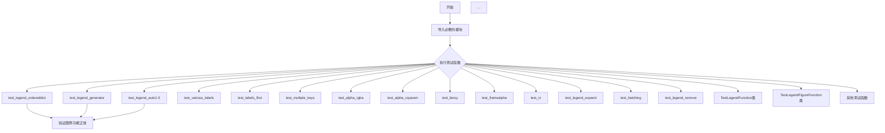
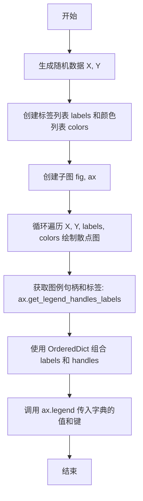
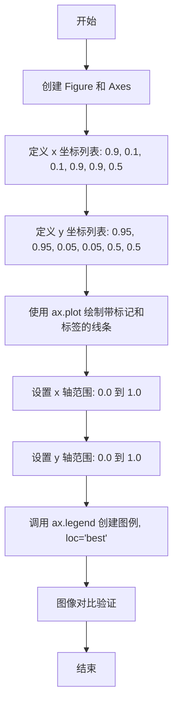
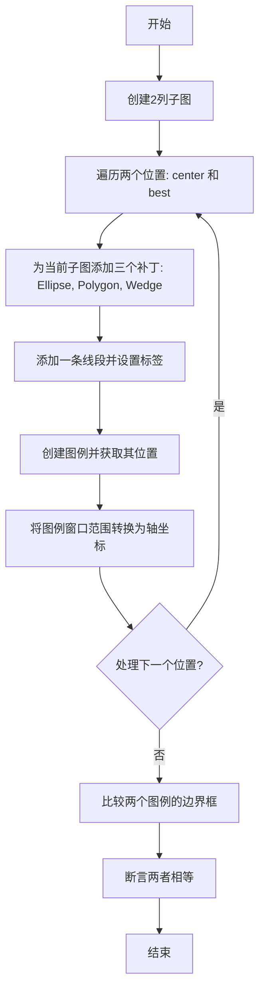
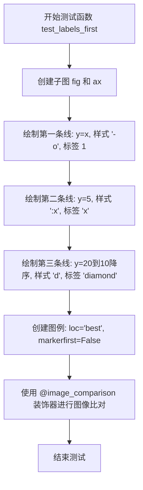
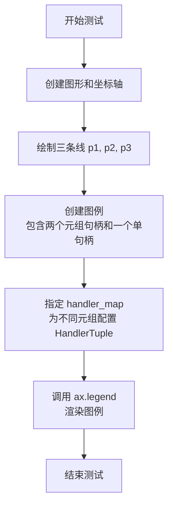
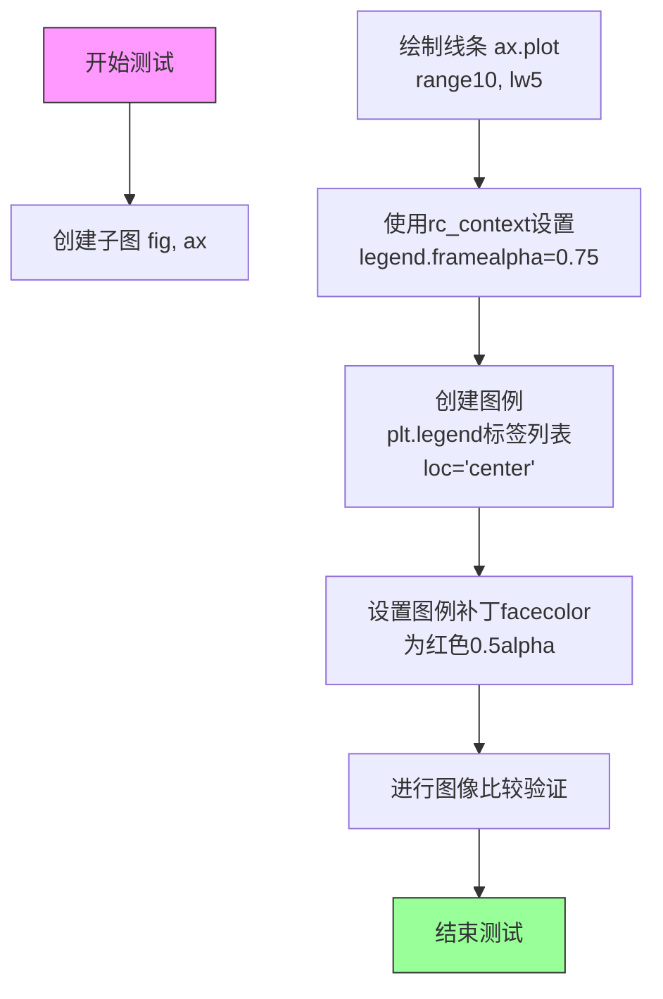
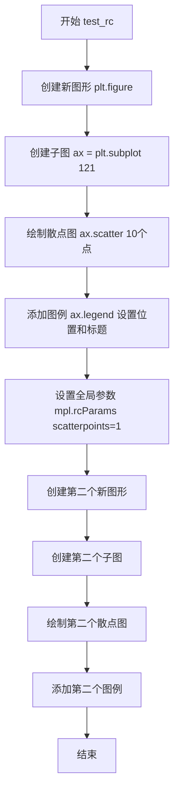

# `matplotlib\lib\matplotlib\tests\test_legend.py` 详细设计文档

该文件是matplotlib的图例（legend）功能测试套件，包含了大量测试函数和类，用于验证图例的各种功能，包括自动放置、手动放置、不同类型的标签、颜色设置、阴影、透明度、拖拽功能等。

## 整体流程



## 类结构

```
全局函数
├── test_legend_ordereddict
├── test_legend_generator
├── test_legend_auto1-5
├── test_various_labels
├── test_labels_first
├── test_multiple_keys
├── test_alpha_rgba
├── test_alpha_rcparam
├── test_fancy
├── test_framealpha
├── test_rc
├── test_legend_expand
├── test_hatching
├── test_legend_remove
├── test_reverse_legend_handles_and_labels
├── test_reverse_legend_display
├── test_figure_legend_outside
├── test_cross_figure_patch_legend
├── test_nanscatter
├── test_legend_repeatcheckok
├── test_not_covering_scatter
├── test_not_covering_scatter_transform
├── test_linecollection_scaled_dashes
├── test_handler_numpoints
├── test_text_nohandler_warning
├── test_empty_bar_chart_with_legend
├── test_shadow_argument_types
├── test_shadow_invalid_argument
├── test_shadow_framealpha
├── test_legend_title_empty
├── test_legend_proper_window_extent
├── test_window_extent_cached_renderer
├── test_legend_title_fontprop_fontsize
├── test_legend_alignment
├── test_ax_legend_set_loc
├── test_fig_legend_set_loc
├── test_legend_set_alignment
├── test_legend_labelcolor_single
├── test_legend_labelcolor_list
├── test_legend_labelcolor_linecolor
├── test_legend_pathcollection_labelcolor_linecolor
├── test_legend_labelcolor_markeredgecolor
├── test_legend_pathcollection_labelcolor_markeredgecolor
├── test_legend_labelcolor_markerfacecolor
├── test_legend_pathcollection_labelcolor_markerfacecolor
├── test_legend_labelcolor_rcparam_*
├── assert_last_legend_patch_color
├── assert_last_legend_linemarker_color
├── assert_last_legend_scattermarker_color
├── test_get_set_draggable
├── test_legend_draggable
├── test_alpha_handles
├── test_usetex_no_warn
├── test_warn_big_data_best_loc
├── test_no_warn_big_data_when_loc_specified
├── test_plot_multiple_input_multiple_label
├── test_plot_multiple_input_single_label
├── test_plot_single_input_multiple_label
├── test_plot_single_input_list_label
├── test_plot_multiple_label_incorrect_length_exception
├── test_legend_face_edgecolor
├── test_legend_text_axes
├── test_handlerline2d
├── test_subfigure_legend
├── test_setting_alpha_keeps_polycollection_color
├── test_legend_markers_from_line2d
├── test_ncol_ncols
├── test_loc_*
├── test_legend_handle_label_mismatch
├── test_legend_nolabels_warning
├── test_legend_nolabels_draw
├── test_legend_loc_polycollection
├── test_legend_text
├── test_legend_annotate
├── test_boxplot_legend_labels
├── test_legend_linewidth
├── test_patchcollection_legend
└── test_patchcollection_legend_empty

测试类
├── TestLegendFunction
│   ├── test_legend_no_args
│   ├── test_legend_positional_handles_labels
│   ├── test_legend_positional_handles_only
│   ├── test_legend_positional_labels_only
│   ├── test_legend_three_args
│   ├── test_legend_handler_map
│   ├── test_legend_kwargs_handles_only
│   ├── test_legend_kwargs_labels_only
│   ├── test_legend_kwargs_handles_labels
│   ├── test_error_mixed_args_and_kwargs
│   └── test_parasite
└── TestLegendFigureFunction
    ├── test_legend_handle_label
    ├── test_legend_no_args
    ├── test_legend_label_arg
    ├── test_legend_label_three_args
    ├── test_legend_kw_args
    └── test_error_args_kwargs
```

## 全局变量及字段


    

## 全局函数及方法


### `test_legend_ordereddict`

这是一个smoketest测试函数，用于验证matplotlib的图例（legend）功能是否支持`collections.OrderedDict`作为输入数据。该测试创建散点图并使用OrderedDict来构建图例，以确认图例系统能够正确处理字典类型的输入。

参数：  
- 该函数没有参数

返回值：`None`，该函数为测试函数，不返回任何值

#### 流程图



#### 带注释源码

```python
def test_legend_ordereddict():
    """
    smoketest that ordereddict inputs work...
    这是一个smoketest测试，用于确认图例支持OrderedDict输入
    """
    
    # 生成10个随机数作为X坐标
    X = np.random.randn(10)
    # 生成10个随机数作为Y坐标
    Y = np.random.randn(10)
    # 创建标签列表：前5个为'a'，后5个为'b'
    labels = ['a'] * 5 + ['b'] * 5
    # 创建颜色列表：前5个为红色'r'，后5个为绿色'g'
    colors = ['r'] * 5 + ['g'] * 5

    # 创建子图，返回图形对象fig和坐标轴对象ax
    fig, ax = plt.subplots()
    
    # 遍历数据，为每个点创建散点图并指定标签和颜色
    for x, y, label, color in zip(X, Y, labels, colors):
        ax.scatter(x, y, label=label, c=color)

    # 从坐标轴获取图例句柄和标签
    # 返回值: handles - 图例句柄列表, labels - 标签列表
    handles, labels = ax.get_legend_handles_labels()
    
    # 使用OrderedDict按标签顺序存储句柄
    # zip(labels, handles)将标签和对应句柄配对
    # collections.OrderedDict确保插入顺序被保留
    legend = collections.OrderedDict(zip(labels, handles))
    
    # 调用图例方法，传入OrderedDict的值作为句柄，键作为标签
    # loc='center left' 设置图例位置在左侧居中
    # bbox_to_anchor=(1, .5) 设置图例锚点在坐标轴右侧中心
    ax.legend(legend.values(), legend.keys(),
              loc='center left', bbox_to_anchor=(1, .5))
```


### `test_legend_generator`

这是一个烟雾测试（smoketest），用于验证图例（legend）能够接受生成器（generator）作为句柄（handles）和标签（labels）的输入。

参数：
- 无

返回值：`None`，该函数为测试函数，不返回任何值

#### 流程图

```mermaid
flowchart TD
    A[开始测试] --> B[创建子图和坐标轴: plt.subplots]
    C[绘制第一条线: ax.plot 0,1]
    C --> D[绘制第二条线: ax.plot 0,2]
    D --> E[创建生成器: handles = line for line in ax.get_lines]
    E --> F[创建生成器: labels = label for label in ['spam', 'eggs']]
    F --> G[调用 ax.legend 传入生成器]
    G --> H[结束测试]
```

#### 带注释源码

```python
def test_legend_generator():
    # smoketest that generator inputs work
    # 此测试函数用于验证 matplotlib 的图例功能能够接受生成器作为输入
    
    # 创建一个新的图形窗口和一个子图（Axes）
    fig, ax = plt.subplots()
    
    # 在坐标轴上绘制两条线
    ax.plot([0, 1])  # 绘制第一条线，x从0到1
    ax.plot([0, 2])  # 绘制第二条线，x从0到2

    # 使用生成器表达式创建 handles（句柄）生成器
    # 生成器会延迟计算，每次迭代时从 ax.get_lines() 获取线条对象
    handles = (line for line in ax.get_lines())
    
    # 使用生成器表达式创建 labels（标签）生成器
    # 生成器会按需生成 'spam' 和 'eggs' 两个标签
    labels = (label for label in ['spam', 'eggs'])

    # 调用 legend 方法，传入生成器作为句柄和标签
    # loc='upper left' 指定图例放置在左上角
    ax.legend(handles, labels, loc='upper left')
```


### `test_legend_auto1`

该函数是一个自动化测试用例，用于验证 Matplotlib 中图例（Legend）的自动定位功能。函数创建包含两条交叉线条的图表，并使用 `loc='best'` 参数让 Matplotlib 自动计算最合适的图例位置，随后通过 `@image_comparison` 装饰器比对生成的图像以确认布局正确性。

参数：无

返回值：`None`，该函数为测试用例，通常不返回值，主要通过副作用（生成图像）进行验证。

#### 流程图

```mermaid
graph TD
    A([开始测试]) --> B[创建画布: fig, ax = plt.subplots]
    B --> C[生成数据: x = np.arange(100)]
    C --> D[绘制第一条曲线: ax.plot x vs 50-x, label='y=1']
    D --> E[绘制第二条曲线: ax.plot x vs x-50, label='y=-1']
    E --> F[添加图例: ax.legend loc='best']
    F --> G([结束: 图像比对])
```

#### 带注释源码

```python
@image_comparison(['legend_auto1.png'], remove_text=True)
def test_legend_auto1():
    """Test automatic legend placement"""
    # 创建一个新的图形和一个子图 Axes 对象
    fig, ax = plt.subplots()
    # 生成 0 到 99 的整数序列作为 x 轴数据
    x = np.arange(100)
    # 绘制第一条折线图，y = 50 - x，使用圆形标记，标签为 'y=1'
    ax.plot(x, 50 - x, 'o', label='y=1')
    # 绘制第二条折线图，y = x - 50，使用圆形标记，标签为 'y=-1'
    ax.plot(x, x - 50, 'o', label='y=-1')
    # 创建图例，loc='best' 表示自动选择最合适的位置放置图例
    ax.legend(loc='best')
```


### `test_legend_auto2`

该函数是一个pytest测试函数，用于测试图例（legend）的自动放置功能。通过创建两个垂直方向的条形图（bar chart），一个向上增长，一个向下增长，然后使用`loc='best'`参数让matplotlib自动选择最佳位置放置图例。

#### 参数

- 无显式参数（该函数不接受任何参数）

#### 返回值

- `None`（该函数为测试函数，不返回任何值）

#### 流程图

```mermaid
flowchart TD
    A[开始 test_legend_auto2] --> B[创建 Figure 和 Axes 对象]
    B --> C[生成 0-99 的数组 x]
    C --> D[绘制第一个条形图 b1: 向上增长, 颜色为洋红色]
    D --> E[绘制第二个条形图 b2: 向下增长, 颜色为绿色]
    E --> F[提取第一个条形图的第一个柱子作为图例句柄 b1[0]]
    F --> G[添加图例: 句柄为 b1[0] 和 b2[0], 标签为 'up' 和 'down', 位置为 'best']
    G --> H[@image_comparison 装饰器自动比较生成的图像与基准图像 legend_auto2.png]
    H --> I[结束]
```

#### 带注释源码

```python
@image_comparison(['legend_auto2.png'], remove_text=True)  # 装饰器: 比较生成的图像与基准图像, 移除文本后比较
def test_legend_auto2():
    """Test automatic legend placement"""  # 测试文档字符串: 说明该函数测试自动图例放置
    fig, ax = plt.subplots()  # 创建新的图形窗口和坐标轴
    x = np.arange(100)  # 生成 0 到 99 的数组, 用于 x 轴数据
    
    # 绘制第一个条形图: 向上增长
    # x 作为高度, align='edge' 表示条形从边缘对齐, 颜色为洋红色 'm'
    b1 = ax.bar(x, x, align='edge', color='m')
    
    # 绘制第二个条形图: 向下增长
    # x[::-1] 将数组反转, 实现从顶部向下增长的条形图, 颜色为绿色 'g'
    b2 = ax.bar(x, x[::-1], align='edge', color='g')
    
    # 添加图例到坐标轴
    # 句柄: b1[0] 和 b2[0] (每个条形图的第一个矩形对象作为代表)
    # 标签: 'up' 和 'down'
    # 位置: 'best' (让 matplotlib 自动选择最佳位置)
    ax.legend([b1[0], b2[0]], ['up', 'down'], loc='best')
```

#### 关键组件信息

| 组件名称 | 描述 |
|---------|------|
| `plt.subplots()` | 创建图形窗口和坐标轴的函数 |
| `ax.bar()` | 在坐标轴上绘制条形图的函数 |
| `ax.legend()` | 在坐标轴上添加图例的函数 |
| `@image_comparison` | pytest 装饰器, 用于比较生成的图像与基准图像 |

#### 潜在技术债务或优化空间

1. **测试数据硬编码**: 数组范围 `np.arange(100)` 是硬编码的, 可以考虑参数化以测试不同数据规模下图例放置的稳定性
2. **图像比较测试的脆弱性**: `@image_comparison` 依赖像素级比较, 在不同平台或 DPI 设置下可能产生误报, 建议添加容差参数或考虑使用逻辑断言替代图像比较
3. **缺少边界情况测试**: 仅测试了两个条形图的场景, 未测试空数据、单一条形图或多组条形图的情况

#### 其它项目

**设计目标与约束:**
- 验证 `loc='best'` 参数能正确为条形图图例选择最佳位置
- 验证图例能正确关联到不同颜色和方向的条形图
- 确保生成的图像与基准图像 `legend_auto2.png` 一致

**错误处理与异常设计:**
- 该测试函数依赖 `image_comparison` 装饰器捕获图像渲染错误
- 如果图例放置算法失败, 会导致图像不匹配, 测试失败

**数据流与状态机:**
- 数据流: `np.arange(100)` → `ax.bar()` → 图例句柄提取 → `ax.legend()` 渲染
- 状态: 创建 → 绘制 → 图例添加 → 图像生成 → 图像比较

**外部依赖与接口契约:**
- 依赖 `matplotlib.pyplot`, `numpy`, `matplotlib.testing.decorators.image_comparison`
- 接口: `ax.bar()` 返回 `BarContainer`, 通过索引 `[0]` 提取单个 `Rectangle` 作为图例句柄


### `test_legend_auto3`

该函数是一个图像对比测试，用于测试图例的自动放置功能。函数创建一个包含线条的图表，线条数据点形成一个矩形形状（从右上角到左下角再到右上角然后到中心），并设置轴的限制范围为0到1，最后使用`loc='best'`让图例自动选择最佳位置。

参数：无

返回值：无

#### 流程图



#### 带注释源码

```python
@image_comparison(['legend_auto3.png'])  # 装饰器：对比生成的图像与参考图像 'legend_auto3.png'
def test_legend_auto3():
    """Test automatic legend placement"""
    # 创建图形和坐标轴
    fig, ax = plt.subplots()
    
    # 定义 x 坐标点：形成一个回字形的路径
    x = [0.9, 0.1, 0.1, 0.9, 0.9, 0.5]
    # 定义 y 坐标点：与 x 对应，形成一个矩形路径
    y = [0.95, 0.95, 0.05, 0.05, 0.5, 0.5]
    
    # 绘制线条：'o-' 表示使用圆圈标记和实线，label='line' 设置图例标签
    ax.plot(x, y, 'o-', label='line')
    
    # 设置 x 轴显示范围为 0.0 到 1.0
    ax.set_xlim(0.0, 1.0)
    # 设置 y 轴显示范围为 0.0 到 1.0
    ax.set_ylim(0.0, 1.0)
    
    # 创建图例，loc='best' 表示让 Matplotlib 自动选择最佳位置
    ax.legend(loc='best')
```


### `test_legend_auto4`

该函数用于测试在使用不同直方图类型（bar、step、stepfilled）时，图例的自动放置位置是否保持一致，验证直方图类型不影响图例的自动定位逻辑。

参数：

- 该函数无参数

返回值：`None`，该函数为测试函数，不返回任何值，主要通过断言验证图例位置的一致性

#### 流程图

```mermaid
graph TD
    A[开始] --> B[创建3列子图, figsize=(6.4, 2.4)]
    B --> C[初始化空列表leg_bboxes]
    C --> D[遍历子图和直方图类型: bar, step, stepfilled]
    D --> E[设置子图标题]
    E --> F[绘制直方图: 数据0和5个9, bins=range10, label='Legend']
    F --> G[创建图例, loc='best']
    G --> H[更新画布]
    H --> I[获取图例窗口范围并转换为轴坐标系]
    I --> J[将转换后的bounds添加到leg_bboxes]
    J --> K{是否遍历完所有直方图类型?}
    K -->|否| D
    K -->|是| L[断言: leg_bboxes[1]与leg_bboxes[0]bounds接近相等]
    L --> M[断言: leg_bboxes[2]与leg_bboxes[0]bounds接近相等]
    M --> N[结束]
```

#### 带注释源码

```python
def test_legend_auto4():
    """
    Check that the legend location with automatic placement is the same,
    whatever the histogram type is. Related to issue #9580.
    """
    # NB: barstacked is pointless with a single dataset.
    # 创建一个3列的子图, 设置宽度6.4高度2.4英寸
    fig, axs = plt.subplots(ncols=3, figsize=(6.4, 2.4))
    # 用于存储三个图例的边界框
    leg_bboxes = []
    # 遍历三个子图和对应的直方图类型: bar, step, stepfilled
    for ax, ht in zip(axs.flat, ('bar', 'step', 'stepfilled')):
        # 设置子图标题为直方图类型
        ax.set_title(ht)
        # A high bar on the left but an even higher one on the right.
        # 绘制直方图: 数据为[0,9,9,9,9,9], 区间为0-9, 设置标签为Legend
        ax.hist([0] + 5*[9], bins=range(10), label="Legend", histtype=ht)
        # 使用自动最佳位置创建图例
        leg = ax.legend(loc="best")
        # 强制更新画布以确保图例渲染完成
        fig.canvas.draw()
        # 获取图例窗口范围并转换为轴坐标系(0-1),存储到列表
        leg_bboxes.append(
            leg.get_window_extent().transformed(ax.transAxes.inverted()))

    # The histogram type "bar" is assumed to be the correct reference.
    # 验证step类型图例位置与bar类型一致
    assert_allclose(leg_bboxes[1].bounds, leg_bboxes[0].bounds)
    # 验证stepfilled类型图例位置与bar类型一致
    assert_allclose(leg_bboxes[2].bounds, leg_bboxes[0].bounds)
```


### `test_legend_auto5`

该函数用于测试图例自动放置算法在处理非矩形补丁（椭圆、多边形、楔形）时的正确性，确保无论指定"center"还是"best"位置，图例都能正确放置在中心位置。

参数： 无

返回值： 无（该函数为测试函数，使用 `assert_allclose` 进行断言验证）

#### 流程图



#### 带注释源码

```python
def test_legend_auto5():
    """
    Check that the automatic placement handle a rather complex
    case with non rectangular patch. Related to issue #9580.
    """
    # 创建一个2列的子图画布，尺寸为9.6x4.8英寸
    fig, axs = plt.subplots(ncols=2, figsize=(9.6, 4.8))

    # 用于存储两个图例的边界框
    leg_bboxes = []
    
    # 遍历两个轴，分别使用 "center" 和 "best" 位置
    for ax, loc in zip(axs.flat, ("center", "best")):
        # 创建三个非矩形补丁：
        # 1. 顶部的椭圆补丁
        # 2. 底部的U形多边形补丁  
        # 3. 环形的楔形补丁
        # 正确的图例放置位置应该在中心
        for _patch in [
                # 椭圆补丁：位于顶部中央
                mpatches.Ellipse(
                    xy=(0.5, 0.9), width=0.8, height=0.2, fc="C1"),
                # 多边形补丁：U形状
                mpatches.Polygon(np.array([
                    [0, 1], [0, 0], [1, 0], [1, 1], [0.9, 1.0], [0.9, 0.1],
                    [0.1, 0.1], [0.1, 1.0], [0.1, 1.0]]), fc="C1"),
                # 楔形补丁：环形，位于中央
                mpatches.Wedge((0.5, 0.5), 0.5, 0, 360, width=0.05, fc="C0")
                ]:
            # 将补丁添加到轴上
            ax.add_patch(_patch)

        # 绘制一条线段，用于生成图例项
        ax.plot([0.1, 0.9], [0.9, 0.9], label="A segment")

        # 创建图例，位置由loc参数指定
        leg = ax.legend(loc=loc)
        
        # 强制绘制画布以更新图例位置
        fig.canvas.draw()
        
        # 获取图例窗口范围并转换为轴坐标系（0-1范围）
        leg_bboxes.append(
            leg.get_window_extent().transformed(ax.transAxes.inverted()))

    # 断言：无论使用"center"还是"best"，图例的边界框应该相同
    # 这验证了自动放置算法能正确处理复杂形状
    assert_allclose(leg_bboxes[1].bounds, leg_bboxes[0].bounds)
```


### `test_various_labels`

该函数是一个测试函数，用于测试图例（legend）能够正确处理各种类型的标签，包括数字标签、Unicode字符串标签以及特殊前缀 `__nolegend__` 用来隐藏图例项。

参数：无

返回值：`None`，该函数为测试函数，不返回任何值

#### 流程图

```mermaid
graph TD
    A[开始测试 test_various_labels] --> B[创建新图形 fig]
    B --> C[在图形中添加子图 ax]
    C --> D[绘制第一条线: np.arange(4), 标签=1]
    D --> E[绘制第二条线: np.linspace(4, 4.1), 标签='Développés']
    E --> F[绘制第三条线: np.arange(4, 1, -1), 标签='__nolegend__']
    F --> G[调用 ax.legend 创建图例: numpoints=1, loc='best']
    G --> H[结束测试]
    
    style A fill:#f9f,color:#000
    style H fill:#9f9,color:#000
```

#### 带注释源码

```python
@image_comparison(['legend_various_labels.png'], remove_text=True)
def test_various_labels():
    """
    测试各种标签类型在图例中的显示效果
    
    该测试函数验证了matplotlib图例功能对不同类型标签的处理能力：
    1. 整数标签 (label=1)
    2. Unicode字符串标签 (label='Déenvolvés')
    3. 特殊前缀标签 (label='__nolegend__') - 用于隐藏图例项
    """
    
    # 创建一个新的图形对象
    fig = plt.figure()
    
    # 在图形中添加一个1行2列的子图，并获取第一个子图
    ax = fig.add_subplot(121)
    
    # 绘制第一条线：x为0-3的整数，y为'o'标记，标签为整数1
    ax.plot(np.arange(4), 'o', label=1)
    
    # 绘制第二条线：x为4到4.1的线性空间，y为'o'标记，标签为Unicode字符串
    ax.plot(np.linspace(4, 4.1), 'o', label='Développés')
    
    # 绘制第三条线：x为4到1递减，y为'o'标记，标签为'__nolegend__'
    # 该特殊标签会被图例系统识别为不显示的项
    ax.plot(np.arange(4, 1, -1), 'o', label='__nolegend__')
    
    # 创建图例，numpoints=1表示图例中每个条目只显示一个标记点
    # loc='best'表示自动选择最佳位置
    ax.legend(numpoints=1, loc='best')
```


### `test_labels_first`

该测试函数用于验证图例中标签位于标记左侧（markerfirst=False）的功能，通过绘制三条不同的线并使用图例来检查标签与标记的相对位置是否正确。

#### 参数

- 该函数无显式参数（使用 pytest 的 `@image_comparison` 装饰器隐式接收 `fig_test` 和 `fig_ref` 参数）

#### 返回值

- `None`，该函数为测试函数，无返回值

#### 流程图



#### 带注释源码

```python
@image_comparison(['legend_labels_first.png'], remove_text=True,
                  tol=0 if platform.machine() == 'x86_64' else 0.013)
def test_labels_first():
    # test labels to left of markers
    # 创建子图，返回 Figure 和 Axes 对象
    fig, ax = plt.subplots()
    
    # 绘制第一条线：x从0到9，y=x，样式为带圆圈的实线，标签为数字1
    ax.plot(np.arange(10), '-o', label=1)
    
    # 绘制第二条线：x从0到9，y全部为5，样式为带x的虚线，标签为'x'
    ax.plot(np.ones(10)*5, ':x', label="x")
    
    # 绘制第三条线：x从20到11降序，样式为菱形，标签为'diamond'
    ax.plot(np.arange(20, 10, -1), 'd', label="diamond")
    
    # 创建图例，loc='best'自动选择最佳位置
    # markerfirst=False 表示标签在标记左侧（这是测试的核心）
    ax.legend(loc='best', markerfirst=False)
```


### `test_multiple_keys`

该测试函数用于测试图例（legend）中包含多个键（键可以是一个包含多个艺术家的元组）的场景，验证 HandlerTuple 处理程序能否正确处理合并的图例条目。

参数：无需参数

返回值：`None`，该函数为测试函数，不返回任何值

#### 流程图



#### 带注释源码

```python
@image_comparison(['legend_multiple_keys.png'], remove_text=True,
                  tol=0 if platform.machine() == 'x86_64' else 0.013)
def test_multiple_keys():
    # test legend entries with multiple keys
    # 创建一个新的图形和坐标轴
    fig, ax = plt.subplots()
    # 绘制三条折线，分别使用不同的标记样式
    p1, = ax.plot([1, 2, 3], '-o')  # 圆形标记
    p2, = ax.plot([2, 3, 4], '-x')  # X形标记
    p3, = ax.plot([3, 4, 5], '-d')  # 菱形标记
    
    # 创建图例，传入混合的句柄列表：
    # - (p1, p2): 一个元组，表示将两个艺术家合并为一个图例条目
    # - (p2, p1): 另一个元组，顺序不同
    # - p3: 单个艺术家
    ax.legend([(p1, p2), (p2, p1), p3], ['two keys', 'pad=0', 'one key'],
              numpoints=1,  # 设置图例中每个条目显示的标记点数量
              handler_map={(p1, p2): HandlerTuple(ndivide=None),  # 自定义处理器，不分割
                           (p2, p1): HandlerTuple(ndivide=None, pad=0)})  # pad=0表示紧凑布局
```


### `test_alpha_rgba`

该函数是一个图像对比测试，用于验证图例的 alpha 通道和 RGBA 颜色设置功能是否正常工作。它创建一个包含线条和图例的图表，并设置图例补丁面的半透明红色。

参数： 无

返回值： `None`，无返回值（测试函数）

#### 流程图

```mermaid
graph TD
    A[开始] --> B[创建图形和坐标轴: fig, ax = plt.subplots]
    B --> C[绘制线条: ax.plot range10, 线宽5]
    C --> D[创建图例: plt.legend 标签Longlabel 位置center]
    D --> E[设置图例透明度: leg.legendPatch.set_facecolor [1, 0, 0, 0.5]]
    E --> F[结束]
```

#### 带注释源码

```python
@image_comparison(['rgba_alpha.png'], remove_text=True,
                  tol=0 if platform.machine() == 'x86_64' else 0.03)
def test_alpha_rgba():
    """
    测试图例的 alpha 和 RGBA 颜色功能
    使用 @image_comparison 装饰器进行图像对比测试
    - 比较 'rgba_alpha.png' 图片
    - remove_text=True: 移除文本后比较
    - tol: 容差值，非 x86_64 架构为 0.03
    """
    fig, ax = plt.subplots()  # 创建图形窗口和坐标轴
    ax.plot(range(10), lw=5)   # 绘制一条线，x为0-9，线宽5
    leg = plt.legend(['Longlabel that will go away'], loc='center')  # 在中心位置创建图例
    leg.legendPatch.set_facecolor([1, 0, 0, 0.5])  # 设置图例背景为半透明红色 [R, G, B, Alpha]
```


### `test_alpha_rcparam`

该函数是一个图像比较测试，用于验证在使用 `rc_context` 设置 `legend.framealpha` 参数时，图例的透明度处理是否正确。测试创建一个包含线条的图表，通过 `rc_context` 临时设置 `legend.framealpha` 为 0.75，然后创建图例并手动设置图例补丁的 facecolor 为带有 0.5 alpha 值的红色，以检查两者之间的交互效果。

参数： 无

返回值： `None`，该测试函数不返回任何值，仅用于图像比较验证

#### 流程图



#### 带注释源码

```python
@image_comparison(['rcparam_alpha.png'], remove_text=True,
                  tol=0 if platform.machine() == 'x86_64' else 0.03)
def test_alpha_rcparam():
    """
    测试通过rc参数设置legend.framealpha时的图例透明度行为
    
    该测试验证当使用rc_context设置legend.framealpha参数时，
    手动设置的facecolor alpha值是否会被正确处理
    """
    # 创建子图，包含figure和axes对象
    fig, ax = plt.subplots()
    
    # 在axes上绘制一条线，设置线宽为5
    ax.plot(range(10), lw=5)
    
    # 使用rc_context临时设置rc参数
    # 将legend.framealpha设置为0.75（非None值）
    with mpl.rc_context(rc={'legend.framealpha': .75}):
        # 创建图例，标签为'Longlabel that will go away'，位置居中
        leg = plt.legend(['Longlabel that will go away'], loc='center')
        
        # 重要注释：
        # 这个alpha值将被rc参数覆盖，因为rc参数设置了patch的alpha为非None值
        # 这会导致facecolor的alpha值被丢弃。这种行为可能不是最理想的，
        # 但它是当前的行为实现，需要跟踪其是否改变
        leg.legendPatch.set_facecolor([1, 0, 0, 0.5])
```


### test_fancy

**描述**  
该函数是 matplotlib 中的一个回归测试，用于验证“fancy”图例（带有阴影、标题、多列等高级选项）在同时绘制折线图、散点图和误差线时的渲染效果是否符合预期。函数通过 `@image_comparison` 装饰器与基准图像 `fancy.png` 进行像素比较。

**参数**  
- （无）

**返回值**  
- `None`（测试函数不返回任何值，仅用于图像比对）

#### 流程图

```mermaid
flowchart TD
    A[开始] --> B[plt.subplot(121) 创建子图]
    B --> C[plt.plot 绘制折线图]
    C --> D[plt.scatter 绘制散点图]
    D --> E[plt.errorbar 绘制误差线]
    E --> F[plt.legend 创建图例<br>位置: center left<br>锚点: (1.0, 0.5)<br>列数: 2<br>阴影: True<br>标题: My legend<br>numpoints: 1]
    F --> G[结束]
```

#### 带注释源码

```python
@image_comparison(['fancy.png'], remove_text=True, tol=0.05)
def test_fancy():
    """
    Test fancy legend rendering with multiple plot types.

    Tolerance caused by changing default shadow "shade" from 0.3 to 1 - 0.7 =
    0.30000000000000004.
    Using subplot triggers some offsetbox functionality untested elsewhere.
    """
    # 创建一个 1 行 2 列的子图，并选中第 1 个子图（索引从 1 开始）
    plt.subplot(121)

    # 绘制一条虚线圆点标记的折线，x 为 5 的重复序列，标签为 'XX'
    plt.plot([5] * 10, 'o--', label='XX')

    # 绘制散点图，x 为 0~9，y 为 10~1，标签为 'XX\nXX'（多行标签）
    plt.scatter(np.arange(10), np.arange(10, 0, -1), label='XX\nXX')

    # 绘制误差线，x、y 均为 0~9，xerr、yerr 均为 0.5，标签为 'XX'
    plt.errorbar(np.arange(10), np.arange(10), xerr=0.5,
                 yerr=0.5, label='XX')

    # 创建图例，设置如下属性：
    # - loc="center left"：图例放在左侧居中
    # - bbox_to_anchor=[1.0, 0.5]：相对于 Axes 的坐标，将图例向右移动
    # - ncols=2：图例条目排成两列
    # - shadow=True：开启阴影效果
    # - title="My legend"：图例标题
    # - numpoints=1：每个条目只显示一个标记点
    plt.legend(loc="center left", bbox_to_anchor=[1.0, 0.5],
               ncols=2, shadow=True, title="My legend", numpoints=1)
```


### test_framealpha

该测试函数用于验证图例（Legend）的 `framealpha` 参数是否正常工作，通过创建带有半透明图例框的线图并使用图像比较来确认渲染效果。

参数：なし（无参数）

返回值：`None`，测试函数不返回任何值

#### 流程图

```mermaid
flowchart TD
    A[开始执行 test_framealpha] --> B[生成x数据: np.linspace1, 100, 100]
    B --> C[令y = x]
    C --> D[使用plt.plot绘制线图, label='mylabel', lw=10]
    D --> E[调用plt.legend创建图例, framealpha=0.5]
    E --> F[@image_comparison装饰器自动比较渲染图像]
    F --> G[结束]
```

#### 带注释源码

```python
@image_comparison(['framealpha'], remove_text=True,
                  tol=0 if platform.machine() == 'x86_64' else 0.024)
def test_framealpha():
    """测试图例的framealpha参数是否正常工作"""
    # 生成从1到100的等间距数组，共100个点
    x = np.linspace(1, 100, 100)
    # y值与x相同
    y = x
    # 绘制线条，label用于图例显示，lw=10设置线宽为10
    plt.plot(x, y, label='mylabel', lw=10)
    # 创建图例，framealpha=0.5设置图例框的透明度为50%
    plt.legend(framealpha=0.5)
```


### `test_rc`

该函数是 matplotlib 的图像比较测试，用于验证图例（legend）中散点标记点数量（scatterpoints）相关配置的正确性。通过创建两个散点图并设置不同的 `legend.scatterpoints` 参数，对比生成的图像是否与预期参考图一致。

参数： 无

返回值： 无（`None`），该函数为测试函数，隐式返回 `None`

#### 流程图



#### 带注释源码

```python
@image_comparison(['scatter_rc3.png', 'scatter_rc1.png'], remove_text=True)
def test_rc():
    # 使用子图可以触发一些在其他地方未测试的 offsetbox 功能
    # 测试目的：验证 legend.scatterpoints 参数对图例标记点数量的影响
    
    # 第一次绘图：使用默认的 scatterpoints（通常为3）
    plt.figure()  # 创建新图形
    ax = plt.subplot(121)  # 创建 1x2 布局的第一个子图
    ax.scatter(np.arange(10), np.arange(10, 0, -1), label='three')  # 绘制散点图
    # 添加图例，设置在左侧居中，标题为 "My legend"
    ax.legend(loc="center left", bbox_to_anchor=[1.0, 0.5],
              title="My legend")

    # 修改全局配置：将散点图图例的标记点数量设置为1
    mpl.rcParams['legend.scatterpoints'] = 1
    
    # 第二次绘图：使用修改后的 scatterpoints=1
    plt.figure()  # 创建另一个新图形
    ax = plt.subplot(121)  # 同样创建第一个子图
    ax.scatter(np.arange(10), np.arange(10, 0, -1), label='one')  # 绘制相同散点
    # 添加图例，期望只显示1个标记点
    ax.legend(loc="center left", bbox_to_anchor=[1.0, 0.5],
              title="My legend")
```


### `test_legend_expand`

该测试函数用于验证图例（Legend）的 expand 模式是否正确工作，通过创建多个图例并测试不同模式（None 和 "expand"）下的布局效果。

参数：无

返回值：`None`，该函数为测试函数，不返回任何值

#### 流程图

```mermaid
flowchart TD
    A[开始测试] --> B[定义legend_modes列表: [None, 'expand']]
    B --> C[创建子图: len(legend_modes)行1列]
    C --> D[生成x数据: 0到99]
    D --> E[遍历ax和mode]
    E --> F[绘制第一组数据: y=50-x]
    F --> G[创建第一个图例: loc='upper left', mode=mode]
    G --> H[将图例添加到Axes]
    I[绘制第二组数据: y=x-50]
    I --> J[创建第二个图例: loc='right', mode=mode]
    J --> K[将图例添加到Axes]
    K --> L[创建第三个图例: loc='lower left', mode=mode, ncols=2]
    L --> E
    E --> M[结束测试]
```

#### 带注释源码

```python
@image_comparison(['legend_expand.png'], remove_text=True)
def test_legend_expand():
    """Test expand mode"""
    # 定义要测试的图例模式：普通模式(None)和展开模式("expand")
    legend_modes = [None, "expand"]
    
    # 创建一个包含多个子图的Figure对象，子图数量等于legend_modes的长度
    fig, axs = plt.subplots(len(legend_modes), 1)
    
    # 生成x轴数据：0到99的整数序列
    x = np.arange(100)
    
    # 遍历每个子图和对应的模式
    for ax, mode in zip(axs, legend_modes):
        # 在当前子图上绘制第一条曲线：y = 50 - x
        ax.plot(x, 50 - x, 'o', label='y=1')
        
        # 创建第一个图例，位于左上角，使用指定的mode
        l1 = ax.legend(loc='upper left', mode=mode)
        
        # 将图例作为艺术家添加到子图（这样不会覆盖后续的图例）
        ax.add_artist(l1)
        
        # 绘制第二条曲线：y = x - 50
        ax.plot(x, x - 50, 'o', label='y=-1')
        
        # 创建第二个图例，位于右侧，使用指定的mode
        l2 = ax.legend(loc='right', mode=mode)
        
        # 将第二个图例添加到子图
        ax.add_artist(l2)
        
        # 创建第三个图例，位于左下角，使用指定的mode，设置列数为2（ncols=2）
        ax.legend(loc='lower left', mode=mode, ncols=2)
```


### `test_hatching`

该函数是一个图像对比测试函数，用于测试matplotlib中图例（legend）的阴影线（hatching）功能是否正确渲染。函数通过创建带有不同阴影线图案（'xx'、'||'、'+'）的矩形（Rectangle）和填充区域（fill_between），并设置不同的填充状态和颜色，来验证图例对阴影线样式的呈现是否正确。

参数： 无参数

返回值： 无返回值（测试函数）

#### 流程图

```mermaid
flowchart TD
    A[开始] --> B[设置rcParams: text.kerning_factor=6]
    B --> C[创建子图: fig, ax = plt.subplots]
    D1[创建填充矩形1: hatch='xx', 默认颜色, 填充] --> D
    D2[创建填充矩形2: hatch='||', C1颜色, 填充] --> D
    D3[创建未填充矩形3: hatch='xx', 默认颜色, fill=False] --> D
    D4[创建未填充矩形4: hatch='||', C1颜色, fill=False] --> D
    D[添加所有矩形到ax] --> E1[创建填充区域1: hatch='+', 默认颜色]
    E1 --> E2[创建填充区域2: hatch='+', C2颜色]
    E2 --> F[设置x轴范围: -0.01到1.1]
    F --> G[设置y轴范围: -0.01到1.1]
    G --> H[创建图例: handlelength=4, handleheight=4]
    H --> I[结束]
```

#### 带注释源码

```python
@image_comparison(['hatching'], remove_text=True, style='default')
def test_hatching():
    """
    测试图例中阴影线（hatching）的渲染效果
    使用@image_comparison装饰器进行图像对比验证
    """
    # 移除图例文本用于图像重新生成时
    # 重新生成测试图像时移除此行
    plt.rcParams['text.kerning_factor'] = 6

    # 创建子图
    fig, ax = plt.subplots()

    # ==================== 矩形补丁（Patches） ====================
    # 1. 默认颜色、填充的矩形，阴影线为'xx'（交叉线）
    patch = plt.Rectangle((0, 0), 0.3, 0.3, hatch='xx',
                          label='Patch\ndefault color\nfilled')
    ax.add_patch(patch)
    
    # 2. 指定颜色（C1）、填充的矩形，阴影线为'||'（垂直线）
    patch = plt.Rectangle((0.33, 0), 0.3, 0.3, hatch='||', edgecolor='C1',
                          label='Patch\nexplicit color\nfilled')
    ax.add_patch(patch)
    
    # 3. 默认颜色、未填充的矩形，阴影线为'xx'
    patch = plt.Rectangle((0, 0.4), 0.3, 0.3, hatch='xx', fill=False,
                          label='Patch\ndefault color\nunfilled')
    ax.add_patch(patch)
    
    # 4. 指定颜色（C1）、未填充的矩形，阴影线为'||'
    patch = plt.Rectangle((0.33, 0.4), 0.3, 0.3, hatch='||', fill=False,
                          edgecolor='C1',
                          label='Patch\nexplicit color\nunfilled')
    ax.add_patch(patch)

    # ==================== 路径（Paths） ====================
    # 使用fill_between创建带阴影线的填充区域
    # 1. 默认颜色的填充区域，阴影线为'+'
    ax.fill_between([0, .15, .3], [.8, .8, .8], [.9, 1.0, .9],
                    hatch='+', label='Path\ndefault color')
    
    # 2. 指定颜色（C2）的填充区域，阴影线为'+'
    ax.fill_between([.33, .48, .63], [.8, .8, .8], [.9, 1.0, .9],
                    hatch='+', edgecolor='C2', label='Path\nexplicit color')

    # ==================== 设置坐标轴 ====================
    ax.set_xlim(-0.01, 1.1)
    ax.set_ylim(-0.01, 1.1)
    
    # ==================== 创建图例 ====================
    # handlelength和handleheight用于调整图例句柄的尺寸
    ax.legend(handlelength=4, handleheight=4)
```


### `test_legend_remove`

该函数是一个测试函数，用于验证图例（Legend）对象的 `remove()` 方法能否正确地从图形或坐标轴中移除图例，并更新相应的属性。

参数：无

返回值：`None`，该函数不返回任何值，仅执行测试逻辑

#### 流程图

```mermaid
graph TD
    A[开始测试] --> B[创建图形和坐标轴: fig, ax = plt.subplots]
    B --> C[在坐标轴上绘制线条: lines = ax.plot(range(10))]
    C --> D[通过图形创建图例: leg = fig.legend(lines, 'test')]
    D --> E[调用图例的remove方法: leg.remove]
    E --> F{验证: fig.legends 是否为空}
    F -->|是| G[通过坐标轴创建图例: leg = ax.legend('test')]
    F -->|否| H[测试失败]
    G --> I[调用图例的remove方法: leg.remove]
    I --> J{验证: ax.get_legend() 是否为 None}
    J -->|是| K[测试通过]
    J -->|否| H
```

#### 带注释源码

```python
def test_legend_remove():
    """
    测试图例的移除功能。
    
    该测试函数验证：
    1. 通过 fig.legend() 创建的图例可以通过 remove() 方法移除
    2. 通过 ax.legend() 创建的图例可以通过 remove() 方法移除
    3. 移除后，fig.legends 列表为空
    4. 移除后，ax.get_legend() 返回 None
    """
    # 创建一个新的图形和一个坐标轴
    fig, ax = plt.subplots()
    
    # 在坐标轴上绘制线条，返回线条对象列表
    lines = ax.plot(range(10))
    
    # 通过图形对象创建图例，传入线条句柄和标签
    leg = fig.legend(lines, "test")
    
    # 移除图例对象
    leg.remove()
    
    # 验证移除后，图的图例列表为空
    assert fig.legends == []
    
    # 通过坐标轴对象创建图例，直接传入标签字符串
    leg = ax.legend("test")
    
    # 再次移除图例对象
    leg.remove()
    
    # 验证移除后，坐标轴的图例返回 None
    assert ax.get_legend() is None
```


### `test_reverse_legend_handles_and_labels`

该函数是一个单元测试，用于验证当在 Matplotlib 中创建图例（Legend）时，设置 `reverse=True` 参数后，图例的句柄（handles）和标签（labels）是否被正确反转。

参数：无（该函数没有显式参数，使用 pytest 框架的隐式参数机制）

返回值：`None`，该函数为测试函数，通过 `assert` 语句进行断言验证，不返回任何值

#### 流程图

```mermaid
flowchart TD
    A[开始测试] --> B[创建图形和坐标轴: plt.subplots]
    B --> C[定义测试数据: x=1, y=1]
    C --> D[定义标签列表: First/Second/Third label]
    D --> E[定义标记列表: '.', ',', 'o']
    E --> F[绘制三条线<br/>ax.plot分别使用markers[0/1/2]<br/>并分别设置labels[0/1/2]]
    F --> G[创建反向图例: ax.legend(reverse=True)]
    G --> H[获取图例实际标签列表<br/>actual_labels = t.get_text for t in leg.get_texts]
    H --> I[获取图例实际标记列表<br/>actual_markers = h.get_marker for h in leg.legend_handles]
    I --> J{验证标签是否反转}
    J -->|是| K{验证标记是否反转}
    J -->|否| L[断言失败]
    K -->|是| M[测试通过]
    K -->|否| L
```

#### 带注释源码

```python
def test_reverse_legend_handles_and_labels():
    """
    Check that the legend handles and labels are reversed.
    
    该测试函数验证当创建图例时使用 reverse=True 参数时，
    图例中的句柄（handles）和标签（labels）的顺序是否被正确反转。
    """
    # 创建一个新的图形和一个坐标轴对象
    # fig: Figure 对象, ax: Axes 对象
    fig, ax = plt.subplots()
    
    # 定义测试用的坐标点
    x = 1
    y = 1
    
    # 定义三个测试标签
    labels = ["First label", "Second label", "Third label"]
    
    # 定义三个不同的标记类型：点、像素、圆
    markers = ['.', ',', 'o']
    
    # 在坐标轴上绘制三条线，每条线使用不同的标记和标签
    # 第一条线：使用 markers[0] 即 '.' 标记，标签为 labels[0] 即 "First label"
    ax.plot(x, y, markers[0], label=labels[0])
    # 第二条线：使用 markers[1] 即 ',' 标记，标签为 labels[1] 即 "Second label"
    ax.plot(x, y, markers[1], label=labels[1])
    # 第三条线：使用 markers[2] 即 'o' 标记，标签为 labels[2] 即 "Third label"
    ax.plot(x, y, markers[2], label=labels[2])
    
    # 创建图例，reverse=True 表示反转图例中条目的顺序
    leg = ax.legend(reverse=True)
    
    # 从图例对象中获取所有标签文本
    # leg.get_texts() 返回图例中所有文本对象的列表
    # 使用列表推导式提取每个文本对象的文本内容
    actual_labels = [t.get_text() for t in leg.get_texts()]
    
    # 从图例对象中获取所有句柄（图形元素如标记）
    # leg.legend_handles 返回图例中所有句柄的列表
    # 使用列表推导式提取每个句柄的标记类型
    actual_markers = [h.get_marker() for h in leg.legend_handles]
    
    # 断言验证标签顺序是否被反转
    # list(reversed(labels)) 将原始标签列表反转，预期图例中的标签顺序
    assert actual_labels == list(reversed(labels))
    
    # 断言验证标记顺序是否被反转
    # list(reversed(markers)) 将原始标记列表反转，预期图例中的标记顺序
    assert actual_markers == list(reversed(markers))
```


### `test_reverse_legend_display`

该测试函数用于验证当设置 `reverse=True` 参数时，图例中的条目（标签和对应的句柄）是否按相反顺序渲染。函数通过比较测试图形（使用 `reverse=True`）和参考图形（手动以相反顺序绘制）的渲染结果来确认功能正确性。

参数：

- `fig_test`：`matplotlib.figure.Figure`，测试组图形对象，传入带有 `reverse=True` 参数的图例
- `fig_ref`：`matplotlib.figure.Figure`，参考组图形对象，传入不带参数的标准图例（其数据点顺序已手动反转）

返回值：`None`，该函数为 pytest 测试函数，使用 `@check_figures_equal` 装饰器进行图形比较，不显式返回值

#### 流程图

```mermaid
flowchart TD
    A[开始测试] --> B[在 fig_test 上创建子图]
    B --> C[绘制数据点 [1] 红色圆圈, 标签 'first']
    C --> D[绘制数据点 [2] 蓝色X形, 标签 'second']
    D --> E[创建图例并设置 reverse=True]
    F[在 fig_ref 上创建子图] --> G[绘制数据点 [2] 蓝色X形, 标签 'second']
    G --> H[绘制数据点 [1] 红色圆圈, 标签 'first']
    H --> I[创建标准图例 reverse 默认为 False]
    E --> J[使用 @check_figures_equal 比较两个图形]
    I --> J
    J --> K[结束测试]
```

#### 带注释源码

```python
@check_figures_equal()  # 装饰器：比较测试图形和参考图形的渲染结果是否一致
def test_reverse_legend_display(fig_test, fig_ref):
    """
    Check that the rendered legend entries are reversed.
    验证图例条目的渲染顺序是否被反转。
    """
    # ===== 测试组 (fig_test) =====
    ax = fig_test.subplots()  # 创建子图坐标系
    ax.plot([1], 'ro', label="first")   # 绘制红色圆圈数据点，标签为 'first'
    ax.plot([2], 'bx', label="second")  # 绘制蓝色X形数据点，标签为 'second'
    ax.legend(reverse=True)  # 创建图例，reverse=True 表示反转图例条目顺序

    # ===== 参考组 (fig_ref) =====
    ax = fig_ref.subplots()  # 创建子图坐标系
    # 注意：数据点和标签的绘制顺序与测试组相反
    ax.plot([2], 'bx', label="second")  # 先绘制 'second'
    ax.plot([1], 'ro', label="first")   # 后绘制 'first'
    ax.legend()  # 创建标准图例（不反转），默认按绘制顺序排列
    
    # @check_figures_equal 装饰器会自动比较 fig_test 和 fig_ref 的渲染结果
    # 如果 reverse=True 功能正常，两张图应显示相同的图例布局
```


### `test_figure_legend_outside`

该函数用于测试图形图例（legend）在图形外部不同位置放置时的行为，验证图例是否正确放置在图形的上、下、左、右外侧的不同角落和中心位置。

参数： 无

返回值： 无（该函数为测试函数，使用断言进行验证）

#### 流程图

```mermaid
flowchart TD
    A[开始测试] --> B[构建12种位置组合列表 todos]
    B --> C[定义12组预期的坐标轴边界 axbb]
    C --> D[定义12组预期的图例边界 legbb]
    D --> E[循环遍历12种位置组合]
    E --> F[创建子图和坐标轴]
    F --> G[绘制数据并添加图例到图形外部]
    G --> H[渲染图形但不显示]
    H --> I[断言验证坐标轴窗口范围]
    I --> J[断言验证图例窗口范围]
    J --> K{是否还有下一个位置}
    K -->|是| E
    K -->|否| L[测试结束]
```

#### 带注释源码

```python
def test_figure_legend_outside():
    """
    测试图形图例在外部各种位置放置的情况
    
    该测试函数验证当使用 'outside' 关键字将图例放置在图形外部时，
    图例和坐标轴的窗口范围是否符合预期。测试覆盖12种位置组合：
    - 上左、上中、上右
    - 下左、下中、下右
    - 左下、左中、左上
    - 右下、右中、右上
    """
    # 构建12种位置描述字符串列表
    todos = ['upper ' + pos for pos in ['left', 'center', 'right']]  # 上左、上中、上右
    todos += ['lower ' + pos for pos in ['left', 'center', 'right']]  # 下左、下中、下右
    todos += ['left ' + pos for pos in ['lower', 'center', 'upper']]  # 左下、左中、左上
    todos += ['right ' + pos for pos in ['lower', 'center', 'upper']]  # 右下、右中、右上

    # 定义12种位置下坐标轴的预期边界框 [x0, y0, x1, y1]
    upperext = [20.347556,  27.722556, 790.583, 545.499]   # 上方
    lowerext = [20.347556,  71.056556, 790.583, 588.833]   # 下方
    leftext = [151.681556, 27.722556, 790.583, 588.833]    # 左侧
    rightext = [20.347556,  27.722556, 659.249, 588.833]   # 右侧
    
    # 将12种位置对应的坐标轴边界组合成列表
    axbb = [upperext, upperext, upperext,
            lowerext, lowerext, lowerext,
            leftext, leftext, leftext,
            rightext, rightext, rightext]

    # 定义12种位置下图例的预期边界框 [x0, y0, x1, y1]
    legbb = [[10., 555., 133., 590.],     # 上左
             [338.5, 555., 461.5, 590.],  # 上中
             [667, 555., 790.,  590.],   # 上右
             [10., 10., 133.,  45.],     # 下左
             [338.5, 10., 461.5,  45.], # 下中
             [667., 10., 790.,  45.],    # 下右
             [10., 10., 133., 45.],      # 左下
             [10., 282.5, 133., 317.5],  # 左中
             [10., 555., 133., 590.],    # 左上
             [667, 10., 790., 45.],      # 右下
             [667., 282.5, 790., 317.5], # 右中
             [667., 555., 790., 590.]]  # 右上

    # 遍历每种位置进行测试
    for nn, todo in enumerate(todos):
        print(todo)  # 打印当前位置信息，便于调试
        # 创建使用约束布局的子图，DPI为100
        fig, axs = plt.subplots(constrained_layout=True, dpi=100)
        # 绘制简单折线图
        axs.plot(range(10), label='Boo1')
        # 在图形外部添加图例，位置由 todo 指定
        leg = fig.legend(loc='outside ' + todo)
        # 执行渲染但不显示，用于获取准确的窗口范围
        fig.draw_without_rendering()

        # 验证坐标轴窗口范围是否符合预期
        assert_allclose(axs.get_window_extent().extents,
                        axbb[nn])
        # 验证图例窗口范围是否符合预期
        assert_allclose(leg.get_window_extent().extents,
                        legbb[nn])
```


### `test_legend_stackplot`

该函数是一个测试函数，用于验证使用 `stackplot` 方法创建的 PolyCollection（多边形集合）能够正确显示图例（legend）。它通过创建一个堆叠图并尝试添加图例来测试相关功能是否正常工作。

参数： 无

返回值： `None`，该函数为测试函数，不返回任何值

#### 流程图

```mermaid
flowchart TD
    A[开始测试] --> B[创建图形和坐标轴: plt.subplots]
    B --> C[生成x数据: np.linspace0到10共10个点]
    C --> D[生成y1数据: 1.0 \* x]
    D --> E[生成y2数据: 2.0 \* x + 1]
    E --> F[生成y3数据: 3.0 \* x + 2]
    F --> G[调用ax.stackplot绘制堆叠图并设置标签labels=['y1', 'y2', 'y3']]
    G --> H[设置x轴范围: 0到10]
    H --> I[设置y轴范围: 0到70]
    I --> J[调用ax.legendloc='best'创建图例]
    J --> K[结束测试]
```

#### 带注释源码

```python
@image_comparison(['legend_stackplot.png'],  # 图像比较装饰器，用于与参考图像比较
                  tol=0 if platform.machine() == 'x86_64' else 0.031)  # 容忍度设置，x86_64架构为0，其他为0.031
def test_legend_stackplot():
    """Test legend for PolyCollection using stackplot."""
    # 相关issues: #1341, #1943, 和 PR #3303
    
    # 创建一个新的图形和一个坐标轴对象
    fig, ax = plt.subplots()
    
    # 生成从0到10的等间距数组，共10个点
    x = np.linspace(0, 10, 10)
    
    # 计算y1 = 1.0 * x
    y1 = 1.0 * x
    
    # 计算y2 = 2.0 * x + 1
    y2 = 2.0 * x + 1
    
    # 计算y3 = 3.0 * x + 2
    y3 = 3.0 * x + 2
    
    # 使用stackplot绘制堆叠图，并设置每个系列的标签
    # stackplot会自动创建PolyCollection对象
    ax.stackplot(x, y1, y2, y3, labels=['y1', 'y2', 'y3'])
    
    # 设置x轴的显示范围
    ax.set_xlim(0, 10)
    
    # 设置y轴的显示范围
    ax.set_ylim(0, 70)
    
    # 创建图例，使用'best'自动选择最佳位置
    # 这会测试PolyCollection是否能正确显示图例
    ax.legend(loc='best')
```


### `test_cross_figure_patch_legend`

这是一个测试函数，用于验证在Matplotlib中跨图形（图）使用图例（legend）功能。具体来说，它测试了在一个图形（`fig2`）的图例中使用另一个图形（`ax`）上创建的条形图（bar）对象的情况。

参数：
- 无参数

返回值：`None`，该函数没有返回值（隐式返回None）

#### 流程图

```mermaid
graph TD
    A[开始] --> B[创建第一个图形和坐标轴: fig, ax = plt.subplots]
    B --> C[创建第二个图形和坐标轴: fig2, ax2 = plt.subplots]
    C --> D[在ax上创建条形图: brs = ax.bar(range(3), range(3))]
    D --> E[在fig2上创建图例，使用brs作为句柄: fig2.legend(brs, 'foo')]
    E --> F[结束]
```

#### 带注释源码

```python
def test_cross_figure_patch_legend():
    """
    Test that legend can be created on a figure using artists from another figure.
    
    This test verifies the cross-figure legend functionality where bar handles
    created on one Axes (ax) are used to create a legend on a different Figure (fig2).
    """
    # Create first figure and axes
    fig, ax = plt.subplots()
    
    # Create second figure and axes
    fig2, ax2 = plt.subplots()
    
    # Create bar chart on the first axes
    # Returns a collection of bars (Rectangle patches)
    brs = ax.bar(range(3), range(3))
    
    # Create legend on the second figure using the bar handles from the first axes
    # This tests that legends can reference artists from other figures
    fig2.legend(brs, 'foo')
```

#### 关键组件信息

- **plt.subplots()**: 用于创建图形和坐标轴的函数
- **ax.bar()**: 用于在坐标轴上创建条形图的函数，返回条形句柄列表
- **fig2.legend()**: 用于在图形上创建图例的函数

#### 潜在的技术债务或优化空间

1. **缺乏断言**: 该测试函数没有包含任何断言语句来验证图例是否正确创建。这意味着如果功能失效，测试可能不会捕获错误。
2. **测试覆盖不足**: 只测试了一种基本情况（条形图），没有测试其他类型的图形对象（如线条、散点等）是否也能跨图形使用。

#### 其它项目

- **测试目的**: 验证Matplotlib的`Figure.legend()`方法能够接受来自不同坐标轴的图形句柄
- **相关问题**: 这涉及到图例句柄的跨图形引用机制，是Matplotlib图例系统的一个特定功能
- **预期行为**: 函数应该成功执行而不抛出异常，证明跨图形图例功能正常工作


### `test_nanscatter`

该函数是一个测试函数，用于验证matplotlib中散点图（scatter）对NaN值的处理，以及图例（legend）的正确显示。函数创建两个子图：第一个测试包含NaN值的散点图和图例；第二个测试多个彩色散点图的图例显示和网格功能。

参数： 无

返回值：`None`，无返回值（测试函数）

#### 流程图

```mermaid
flowchart TD
    A[开始 test_nanscatter] --> B[创建第一个子图: fig, ax = plt.subplots]
    B --> C[创建包含NaN的散点图: ax.scatter with np.nan]
    C --> D[添加图例: ax.legend]
    E[创建第二个子图: fig, ax = plt.subplots]
    E --> F{遍历颜色列表: red, green, blue}
    F -->|每次迭代| G[生成随机数据: x, y, scale]
    G --> H[创建彩色散点图: ax.scatter with color]
    H --> F
    F --> I[添加图例: ax.legend]
    I --> J[添加网格: ax.grid]
    J --> K[结束函数]
```

#### 带注释源码

```python
def test_nanscatter():
    """
    Test scatter plot with NaN values and legend functionality.
    Tests that:
    1. Scatter plots can handle NaN values in coordinates
    2. Legends are correctly generated for scatter plots
    3. Multiple colored scatter plots with different scales work correctly
    """
    # 创建第一个子图，用于测试包含NaN值的散点图
    fig, ax = plt.subplots()

    # 创建一个散点图，x和y坐标都是NaN
    # marker="o" 指定圆形标记
    # facecolor="r" 和 edgecolor="r" 指定红色填充和边缘
    # s=3 指定标记大小
    h = ax.scatter([np.nan], [np.nan], marker="o",
                   facecolor="r", edgecolor="r", s=3)

    # 为散点图添加图例，传入句柄h和标签"scatter"
    ax.legend([h], ["scatter"])

    # 创建第二个子图，用于测试多个彩色散点图
    fig, ax = plt.subplots()
    
    # 遍历三种颜色：红色、绿色、蓝色
    for color in ['red', 'green', 'blue']:
        n = 750  # 每个颜色生成750个数据点
        # 生成2行n列的随机数据，范围[0,1)
        x, y = np.random.rand(2, n)
        # 生成随机缩放因子，用于控制散点大小
        scale = 200.0 * np.random.rand(n)
        # 创建散点图，使用不同颜色、大小、透明度和标签
        ax.scatter(x, y, c=color, s=scale, label=color,
                   alpha=0.3, edgecolors='none')

    # 自动生成图例，显示所有带标签的散点图
    ax.legend()
    
    # 开启网格显示
    ax.grid(True)
```


### `test_legend_repeatcheckok`

该函数是一个单元测试，用于验证图例（legend）在处理具有相同标签但不同颜色/标记的散点时的正确行为，确保图例能够正确区分并显示所有唯一的标签。

参数： 无

返回值： 无（`None`，该函数为测试函数，使用断言进行验证）

#### 流程图

```mermaid
flowchart TD
    A[开始测试] --> B[创建第一个图表和坐标轴]
    B --> C[添加第一个散点: 位置(0.0, 1.0), 黑色, 圆形标记, 标签'test']
    C --> D[添加第二个散点: 位置(0.5, 0.0), 红色, 三角形标记, 标签'test']
    D --> E[创建图例]
    E --> F[调用_get_legend_handles_labels获取句柄和标签]
    F --> G{断言: 标签数量是否为2}
    G -->|是| H[创建第二个图表和坐标轴]
    G -->|否| I[测试失败]
    H --> J[添加第一个散点: 位置(0.0, 1.0), 黑色, 圆形标记, 标签'test']
    J --> K[添加第二个散点: 位置(0.5, 0.0), 黑色, 三角形标记, 标签'test']
    K --> L[创建图例]
    L --> M[调用_get_legend_handles_labels获取句柄和标签]
    M --> N{断言: 标签数量是否为2}
    N -->|是| O[测试通过]
    N -->|否| P[测试失败]
```

#### 带注释源码

```python
def test_legend_repeatcheckok():
    """
    测试图例功能：验证当存在相同标签但不同颜色/标记的散点时，
    图例能够正确显示所有唯一的标签条目
    """
    # 第一部分：测试相同标签、不同颜色和标记的情况
    fig, ax = plt.subplots()  # 创建新的图形和坐标轴
    # 添加第一个散点：黑色圆形标记，标签为'test'
    ax.scatter(0.0, 1.0, color='k', marker='o', label='test')
    # 添加第二个散点：红色三角形标记，标签为'test'（相同标签不同外观）
    ax.scatter(0.5, 0.0, color='r', marker='v', label='test')
    ax.legend()  # 创建图例
    
    # 获取图例的句柄和标签
    hand, lab = mlegend._get_legend_handles_labels([ax])
    # 断言：即使两个散点标签相同，也应该返回2个标签（因为它们外观不同）
    assert len(lab) == 2
    
    # 第二部分：测试相同标签、相同颜色但不同标记的情况
    fig, ax = plt.subplots()  # 创建另一个新的图形和坐标轴
    # 添加第一个散点：黑色圆形标记，标签为'test'
    ax.scatter(0.0, 1.0, color='k', marker='o', label='test')
    # 添加第二个散点：黑色三角形标记，标签为'test'（相同颜色不同标记）
    ax.scatter(0.5, 0.0, color='k', marker='v', label='test')
    ax.legend()  # 创建图例
    
    # 再次获取图例的句柄和标签
    hand, lab = mlegend._get_legend_handles_labels([ax])
    # 断言：即使两个散点颜色相同，只要标记不同，也应该返回2个标签
    assert len(lab) == 2
```


### `test_not_covering_scatter`

该测试函数用于验证当散点图数据点未完全覆盖图例区域时，图例的自动布局是否正常工作。通过设置特定的坐标轴范围，确保图例定位算法能够正确处理边界情况。

参数：
- 无

返回值：
- `None`，无返回值

#### 流程图

```mermaid
flowchart TD
    A[开始测试] --> B[定义颜色列表 ['b', 'g', 'r']]
    B --> C[循环创建3个散点图]
    C --> D[设置图例标签 ['foo', 'foo', 'foo']]
    D --> E[设置x轴范围 -0.5 到 2.2]
    E --> F[设置y轴范围 -0.5 到 2.2]
    F --> G[结束测试]
    
    C -->|第1次迭代| C1[绘制散点 (0,0) 蓝色]
    C -->|第2次迭代| C2[绘制散点 (1,1) 绿色]
    C -->|第3次迭代| C3[绘制散点 (2,2) 红色]
```

#### 带注释源码

```python
@image_comparison(['not_covering_scatter.png'])  # 装饰器：比较生成的图像与参考图像
def test_not_covering_scatter():
    """测试当散点未覆盖图例时的图例布局"""
    colors = ['b', 'g', 'r']  # 定义三种颜色：蓝、绿、红

    # 循环创建三个散点图，数据点位置分别为 (0,0), (1,1), (2,2)
    for n in range(3):
        plt.scatter([n], [n], color=colors[n])

    # 创建图例，使用相同的标签 'foo'，位置设为 'best' 自动选择最佳位置
    plt.legend(['foo', 'foo', 'foo'], loc='best')
    
    # 设置当前坐标轴的x轴范围为 -0.5 到 2.2
    # 这个范围大于散点图的范围 (0到2)，用于测试图例未完全覆盖的情况
    plt.gca().set_xlim(-0.5, 2.2)
    
    # 设置当前坐标轴的y轴范围为 -0.5 到 2.2
    plt.gca().set_ylim(-0.5, 2.2)
```

#### 关键组件信息

| 组件名称 | 描述 |
|---------|------|
| `plt.scatter` | matplotlib 散点图绘制函数 |
| `plt.legend` | matplotlib 图例创建函数 |
| `plt.gca()` | 获取当前坐标轴 (Current Axes) |
| `image_comparison` | 图像对比装饰器，用于测试图形输出 |

#### 潜在的技术债务或优化空间

1. **测试数据硬编码**：颜色和坐标值直接写在代码中，可考虑参数化测试以提高覆盖度
2. **缺乏显式断言**：测试仅依赖图像比较，缺少对图例位置、数值范围的代码级验证
3. **文档注释不足**：函数文档字符串可以更详细，说明测试的具体场景和预期行为

#### 其它项目

- **设计目标**：验证图例在数据点未完全覆盖绘图区域时的自动布局算法
- **约束条件**：测试图像生成受平台影响，可能需要根据不同架构调整容差
- **错误处理**：无显式错误处理，依赖 matplotlib 内部的异常抛出
- **外部依赖**：依赖 matplotlib 库的核心功能及 `image_comparison` 装饰器


### `test_not_covering_scatter_transform`

该函数用于测试当散点图使用了自定义坐标变换（transform）时，图例的自动定位功能是否正常工作。它创建一个带有仿射变换的散点图，并验证图例能够正确覆盖（或不覆盖）这些变换后的数据点。

参数：无

返回值：`None`，因为这是一个测试函数，不返回任何值

#### 流程图

```mermaid
flowchart TD
    A[开始] --> B[创建仿射变换: Affine2D.translate(-20, 20)]
    B --> C[生成x数据: 0到30的1000个点]
    C --> D[绘制直线y=x]
    D --> E[绘制散点坐标20,10<br/>应用offset + transData变换]
    E --> F[添加图例['foo', 'bar']<br/>位置='best']
    F --> G[结束]
```

#### 带注释源码

```python
@image_comparison(['not_covering_scatter_transform.png'])
def test_not_covering_scatter_transform():
    # 创建一个仿射变换对象，首先创建一个单位矩阵，然后平移(-20, 20)
    # 这个变换会将点移动到左上角（因为x减少20，y增加20）
    offset = mtransforms.Affine2D().translate(-20, 20)
    
    # 生成从0到30的1000个线性间隔的点
    x = np.linspace(0, 30, 1000)
    
    # 绘制y=x的直线
    plt.plot(x, x)

    # 绘制散点图，位置在(20, 10)
    # transform参数指定了坐标变换：先应用offset变换，再应用当前坐标系的transData变换
    # offset + plt.gca().transData 表示组合变换
    plt.scatter([20], [10], transform=offset + plt.gca().transData)

    # 创建图例，包含两个标签'foo'和'bar'
    # loc='best'表示让matplotlib自动选择最佳位置
    plt.legend(['foo', 'bar'], loc='best')
```


### `test_linecollection_scaled_dashes`

该测试函数用于验证图例（Legend）能否正确处理 `LineCollection` 对象的虚线样式（dash pattern），确保从原始 `LineCollection` 到图例句柄的样式传递正确无误。

参数：- 无

返回值：- 无（`None`），该函数为测试函数，使用断言验证逻辑，不返回任何值

#### 流程图

```mermaid
flowchart TD
    A[开始测试] --> B[定义三组线条数据 lines1, lines2, lines3]
    B --> C[创建三个 LineCollection 对象 lc1, lc2, lc3]
    C --> D[创建子图和坐标轴 fig, ax]
    D --> E[将三个 LineCollection 添加到坐标轴]
    E --> F[创建图例 leg = ax.legend]
    F --> G[从图例获取三个句柄 h1, h2, h3]
    G --> H[遍历原始 LineCollection 和图例句柄]
    H --> I{遍历结束?}
    I -->|否| J[比较原始对象的 linestyles 与图例句柄的 _dash_pattern]
    J --> I
    I -->|是| K[测试通过]
```

#### 带注释源码

```python
def test_linecollection_scaled_dashes():
    """
    测试图例能否正确处理 LineCollection 的虚线样式（dash pattern）。
    验证从原始 LineCollection 对象到图例句柄的样式传递。
    """
    # 定义三组线条的坐标数据
    # lines1: 两条线段，每条线段由两个点组成
    lines1 = [[(0, .5), (.5, 1)], [(.3, .6), (.2, .2)]]
    # lines2: 两组线条，每组由两条线段组成
    lines2 = [[[0.7, .2], [.8, .4]], [[.5, .7], [.6, .1]]]
    # lines3: 另一组线条数据
    lines3 = [[[0.6, .2], [.8, .4]], [[.5, .7], [.1, .1]]]

    # 创建三个 LineCollection 对象，设置不同的虚线样式和线宽
    # lc1: 虚线样式 "--", 线宽 3
    lc1 = mcollections.LineCollection(lines1, linestyles="--", lw=3)
    # lc2: 点划线样式 "-.", 默认线宽
    lc2 = mcollections.LineCollection(lines2, linestyles="-.")
    # lc3: 点线样式 ":", 线宽 0.5
    lc3 = mcollections.LineCollection(lines3, linestyles=":", lw=.5)

    # 创建图形和坐标轴
    fig, ax = plt.subplots()
    
    # 将三个 LineCollection 添加到坐标轴
    ax.add_collection(lc1)
    ax.add_collection(lc2)
    ax.add_collection(lc3)

    # 创建图例，传入 LineCollection 对象作为句柄和对应标签
    leg = ax.legend([lc1, lc2, lc3], ["line1", "line2", 'line 3'])
    
    # 从图例中获取三个句柄（legend handles）
    h1, h2, h3 = leg.legend_handles

    # 遍历原始 LineCollection 和对应的图例句柄
    # 验证原始对象的 linestyles 与图例句柄的 _dash_pattern 是否一致
    for oh, lh in zip((lc1, lc2, lc3), (h1, h2, h3)):
        # oh: 原始 LineCollection 对象
        # lh: 对应的图例句柄
        # 断言：原始对象的第一个 linestyle 等于图例句柄的 _dash_pattern
        assert oh.get_linestyles()[0] == lh._dash_pattern
```


### `test_handler_numpoints`

该测试函数用于验证图例处理器在处理非整数 numpoints 参数（特别是小于1的值，如0.5）时的行为是否正确，通过创建包含5个数据点的折线图并设置 numpoints=0.5 来测试图例的渲染。

参数：无需参数

返回值：`None`，该函数为测试函数，不返回任何值

#### 流程图

```mermaid
flowchart TD
    A[开始测试] --> B[创建子图和坐标轴]
    B --> C[绘制5个数据点的折线, 标签为'test']
    C --> D[创建图例, 设置numpoints=0.5]
    D --> E[测试完成 - 验证无异常抛出]
```

#### 带注释源码

```python
def test_handler_numpoints():
    """Test legend handler with numpoints <= 1."""
    # related to #6921 and PR #8478
    
    # 创建一个新的图形窗口和一个坐标轴
    fig, ax = plt.subplots()
    
    # 绘制一条包含5个数据点的折线，标签为'test'
    ax.plot(range(5), label='test')
    
    # 创建图例，传入numpoints=0.5参数
    # 此测试用例主要验证当numpoints为非整数值（小于1）时
    # 图例处理器是否能正确处理，不会抛出异常
    # 相关问题：#6921 和 PR #8478
    ax.legend(numpoints=0.5)
```

#### 关键组件信息

- **fig, ax**：matplotlib 图表对象，分别表示图形和坐标轴
- **ax.plot()**：绘制数据点的函数，返回线条对象列表
- **ax.legend()**：创建图例的函数，numpoints 参数控制图例中每个标记点显示的点数

#### 潜在的技术债务或优化空间

1. **测试覆盖不足**：该测试函数仅验证不抛出异常，未验证图例在 numpoints=0.5 时的具体渲染效果是否正确
2. **缺乏断言**：没有使用 assert 语句来验证图例的实际行为，建议添加对图例对象的验证
3. **文档注释**：虽然有相关 issue 编号，但缺少对预期行为的详细说明

#### 其它项目

- **设计目标**：验证 matplotlib 图例处理非整数 numpoints 参数的容错能力
- **约束条件**：numpoints 参数通常应为正数，但测试验证了小于1的浮点数值的处理
- **错误处理**：测试重点在于确保不抛出异常，属于回归测试
- **外部依赖**：直接依赖 matplotlib 库的 plt.subplots()、ax.plot() 和 ax.legend() 函数


### `test_text_nohandler_warning`

该函数是一个测试函数，用于验证当 Text 艺术家（artist）带有标签时是否会产生警告，同时确保某些操作不会触发警告。

参数： 无

返回值： `None`，该函数为测试函数，不返回任何值

#### 流程图

```mermaid
flowchart TD
    A[开始测试] --> B[创建图形和坐标轴]
    B --> C[绘制带有标签的数据点]
    C --> D[添加带有标签的文本]
    D --> E[调用 ax.legend 并捕获警告]
    E --> F{是否产生 UserWarning?}
    F -->|是| G[断言警告数量为 1]
    G --> H[创建新的图形和坐标轴]
    H --> I[绘制 pcolormesh]
    I --> J[使用 warnings.catch_warnings 捕获警告]
    J --> K[调用 ax.get_legend_handles_labels]
    K --> L{是否产生警告?}
    L -->|否| M[测试通过]
    F -->|否| N[测试失败]
```

#### 带注释源码

```python
def test_text_nohandler_warning():
    """Test that Text artists with labels raise a warning"""
    # 创建一个新的图形和坐标轴
    fig, ax = plt.subplots()
    
    # 在坐标轴上绘制一个数据点，并设置标签为 "mock data"
    ax.plot([0], label="mock data")
    
    # 在坐标轴上添加文本，并设置标签为 "label"
    # 注意：Text artist 默认没有 handler，因此应该产生警告
    ax.text(x=0, y=0, s="text", label="label")
    
    # 使用 pytest.warns 捕获 UserWarning 类型的警告
    with pytest.warns(UserWarning) as record:
        ax.legend()  # 调用 legend() 方法
    
    # 断言：确保只产生了一个警告
    assert len(record) == 1

    # 创建另一个新的图形和坐标轴
    f, ax = plt.subplots()
    
    # 绘制随机数据的 pcolormesh
    ax.pcolormesh(np.random.uniform(0, 1, (10, 10)))
    
    # 使用 warnings.catch_warnings 上下文管理器
    with warnings.catch_warnings():
        # 将所有警告设置为错误（即产生警告时抛出异常）
        warnings.simplefilter("error")
        # 获取图例句柄和标签
        # 注意：这种情况不应该产生警告
        ax.get_legend_handles_labels()
```


### `test_empty_bar_chart_with_legend`

该函数用于测试当条形图（bar chart）为空（无数据）但包含标签时，调用 `plt.legend()` 是否能正常执行而不抛出 `IndexError` 异常。这是一个回归测试，与 GitHub issue #13003 相关。

参数： 无

返回值： `None`，无返回值（该函数为测试函数，不返回任何值）

#### 流程图

```mermaid
flowchart TD
    A[开始测试] --> B[创建空条形图并设置标签]
    B --> C[调用 plt.legend 创建图例]
    C --> D{是否抛出异常?}
    D -->|否| E[测试通过 - 结束]
    D -->|是| F[测试失败 - 抛出异常]
```

#### 带注释源码

```python
def test_empty_bar_chart_with_legend():
    """Test legend when bar chart is empty with a label."""
    # 相关问题 #13003：调用 plt.legend() 不应该引发 IndexError
    
    # 创建一个空的条形图（x 和 y 都为空列表），但包含一个标签 'test'
    # 这会创建一个没有实际数据点的 bar container，但仍保留标签信息
    plt.bar([], [], label='test')
    
    # 尝试为当前图表创建图例
    # 在修复之前，当条形图为空时，这里会抛出 IndexError
    plt.legend()
```


### `test_shadow_argument_types`

该函数是一个图像对比测试函数，用于测试图例（legend）的 `shadow` 参数在不同类型输入（布尔值、字符串、字典、元组等）下的渲染效果，验证各种颜色和偏移配置的兼容性。

参数： 无

返回值： 无（`None`），该函数为测试函数，不返回任何值

#### 流程图

```mermaid
flowchart TD
    A[开始] --> B[创建图表和坐标轴: fig, ax = plt.subplots]
    C[绘制数据: ax.plot([1, 2, 3], label='test')]
    B --> C
    C --> D1[创建shadow=True的图例]
    C --> D2[创建shadow=False的图例]
    C --> D3[创建shadow={color: 'red', alpha: 0.1}的图例]
    C --> D4[创建shadow={color: (0.1, 0.2, 0.5), oy: -5}的图例]
    C --> D5[创建shadow={color: 'tab:cyan', ox: 10}的图例]
    D1 --> E[将所有图例添加到坐标轴]
    D2 --> E
    D3 --> E
    D4 --> E
    D5 --> F[创建默认图例: ax.legend(loc='lower right')]
    E --> F
    F --> G[结束 - 图像对比测试]
```

#### 带注释源码

```python
@image_comparison(['shadow_argument_types.png'], remove_text=True, style='mpl20',
                  tol=0 if platform.machine() == 'x86_64' else 0.028)
def test_shadow_argument_types():
    # Test that different arguments for shadow work as expected
    # 创建一个新的图表和坐标轴对象
    fig, ax = plt.subplots()
    
    # 在坐标轴上绘制简单的折线数据，并设置标签为'test'
    ax.plot([1, 2, 3], label='test')

    # Test various shadow configurations
    # 测试各种阴影配置以及不同的颜色指定方式
    # 创建一个包含5个图例的元组，每个图例使用不同的shadow参数类型
    legs = (
        # 1. shadow=True - 使用布尔值启用默认阴影
        ax.legend(loc='upper left', shadow=True),
        
        # 2. shadow=False - 使用布尔值禁用阴影
        ax.legend(loc='upper right', shadow=False),
        
        # 3. shadow=dict - 使用字典指定颜色（字符串格式）和透明度
        ax.legend(loc='center left',
                  shadow={'color': 'red', 'alpha': 0.1}),
        
        # 4. shadow=dict - 使用字典指定颜色（元组格式）和垂直偏移
        ax.legend(loc='center right',
                  shadow={'color': (0.1, 0.2, 0.5), 'oy': -5}),
        
        # 5. shadow=dict - 使用字典指定颜色（tab颜色名称）和水平偏移
        ax.legend(loc='lower left',
                  shadow={'color': 'tab:cyan', 'ox': 10})
    )
    
    # 遍历所有创建的图例对象，将它们添加到坐标轴上
    # 这样可以确保多个图例都能被正确渲染
    for l in legs:
        ax.add_artist(l)
    
    # 创建一个使用默认shadow配置的图例，位于右下角
    ax.legend(loc='lower right')  # default
```


### `test_shadow_invalid_argument`

**功能概述**  
该测试函数用于验证当向 `ax.legend` 的 `shadow` 参数传入非法值（如既不是布尔值也不是合法字典的字符串）时，会正确抛出 `ValueError`，从而确保 legend 对阴影参数的校验机制工作正常。

**参数**  

- （无）——该测试函数没有显式参数，所有变量均在函数内部临时创建。

**返回值**  

- `None` —— 测试函数本身不返回值，仅通过 `pytest.raises` 检查是否抛出预期异常。

#### 流程图

```mermaid
flowchart TD
    A([测试开始]) --> B[创建图形和坐标轴: fig, ax = plt.subplots]
    B --> C[绘制数据: ax.plot([1, 2, 3], label='test')]
    C --> D{调用 ax.legend 并传入非法的 shadow 参数}
    D -->|捕获到 ValueError| E[测试通过]
    D -->|未捕获到异常| F[测试失败]
    E --> G([测试结束])
    F --> G
```

#### 带注释源码

```python
def test_shadow_invalid_argument():
    """
    测试当 shadow 参数为非法值时（如字符串 "aardvark"），
    ax.legend() 是否会抛出 ValueError。
    """
    # 1. 创建一个 Figure 和一个 Axes（后续用于添加图例）
    fig, ax = plt.subplots()

    # 2. 在 Axes 上绘制一条简单的折线，并给定标签 "test"
    ax.plot([1, 2, 3], label='test')

    # 3. 使用 pytest.raises 检查是否在传入非法 shadow 参数时
    #    抛出 ValueError，匹配错误信息中的 "dict or bool"
    with pytest.raises(ValueError, match="dict or bool"):
        # 错误的 shadow 参数：字符串 "aardvark" 既不是布尔值也不是合法字典
        ax.legend(loc="upper left", shadow="aardvark")

    # 4. 若抛出 ValueError，测试通过；若没有抛出，则测试失败
    #    函数结束后返回 None（隐式返回）
```


### `test_shadow_framealpha`

该函数用于测试当 `shadow=True` 且未显式传递 `framealpha` 参数时，图例的 framealpha 是否被正确设置为 1（完全不透明）。

参数： 无

返回值： `None`，该函数通过 `assert` 语句进行测试断言，若测试失败则抛出 `AssertionError`

#### 流程图

```mermaid
flowchart TD
    A[开始] --> B[创建子图 fig, ax]
    C[在 ax 上绘制 range(100) 线条, label='test'] --> D[创建图例 legend shadow=True, facecolor='w']
    D --> E{断言: leg.get_frame().get_alpha == 1?}
    E -- 是 --> F[测试通过]
    E -- 否 --> G[抛出 AssertionError]
    F --> H[结束]
    G --> H
```

#### 带注释源码

```python
def test_shadow_framealpha():
    """
    Test if framealpha is activated when shadow is True
    and framealpha is not explicitly passed.
    
    该测试验证当 legend 的 shadow 参数设为 True 时，
    即使没有显式传入 framealpha 参数，图例的 framealpha
    也会被自动设置为 1（即完全不透明）。
    """
    # 创建一个新的图形和轴对象
    fig, ax = plt.subplots()
    
    # 在轴上绘制数据，label 参数用于图例显示
    ax.plot(range(100), label="test")
    
    # 创建图例，shadow=True 启用阴影效果
    # facecolor='w' 设置图例背景为白色
    # 关键点：没有显式传入 framealpha 参数
    leg = ax.legend(shadow=True, facecolor='w')
    
    # 断言：检查图例框架的 alpha 值是否为 1
    # 预期行为：当 shadow=True 时，framealpha 应自动设为 1
    assert leg.get_frame().get_alpha() == 1
```


### `test_legend_title_empty`

该测试函数用于验证当没有为图例设置标题时，图例标题默认返回空字符串且处于不可见状态。

参数：该函数没有参数。

返回值：`None`，因为这是一个测试函数，不返回任何值。

#### 流程图

```mermaid
flowchart TD
    A[开始测试] --> B[创建图形和坐标轴: fig, ax = plt.subplots]
    B --> C[绘制数据: ax.plot]
    C --> D[创建图例: leg = ax.legend]
    D --> E[断言: 图例标题文本为空字符串]
    E --> F[断言: 图例标题不可见]
    F --> G[结束测试]
```

#### 带注释源码

```python
def test_legend_title_empty():
    # 测试当不设置图例标题时，标题默认返回空字符串且不可见
    fig, ax = plt.subplots()  # 创建一个新的图形和坐标轴
    ax.plot(range(10), label="mock data")  # 在坐标轴上绘制一条线，设置标签为"mock data"
    leg = ax.legend()  # 创建图例，使用自动生成的标签
    assert leg.get_title().get_text() == ""  # 断言：图例标题的文本内容应为空字符串
    assert not leg.get_title().get_visible()  # 断言：图例标题应处于不可见状态
```


### `test_legend_proper_window_extent`

该函数是一个测试函数，用于验证图例（legend）在不同 DPI 设置下能够正确返回预期的窗口范围。具体来说，它测试当 DPI 从 100 增加到 200 时，图例的 x0 坐标是否会相应地按比例增加（大约翻倍），以确保图例的渲染位置在不同 DPI 下保持正确的比例关系。

参数：无

返回值：`None`，该函数为测试函数，使用 `assert` 语句进行验证，不返回具体值。

#### 流程图

```mermaid
flowchart TD
    A[开始测试] --> B[创建 DPI=100 的图表和坐标轴]
    B --> C[绘制数据并添加标签 'Aardvark']
    C --> D[创建图例]
    D --> E[获取图例窗口范围, 提取 x0 坐标赋值给 x01]
    E --> F[创建 DPI=200 的图表和坐标轴]
    F --> G[绘制数据并添加标签 'Aardvark']
    G --> H[创建图例]
    H --> I[获取图例窗口范围, 提取 x0 坐标赋值给 x02]
    I --> J{验证: x01 * 2 ≈ x02}
    J -->|通过| K[测试通过]
    J -->|失败| L[抛出 AssertionError]
```

#### 带注释源码

```python
def test_legend_proper_window_extent():
    """
    测试图例在不同 DPI 设置下返回正确的窗口范围。
    
    该测试函数验证当 DPI 从 100 翻倍到 200 时，
    图例的 x0 坐标也应该近似翻倍，确保图例位置
    随 DPI 正确缩放。
    """
    # 创建第一个图表，DPI 设置为 100
    fig, ax = plt.subplots(dpi=100)
    # 绘制 0-9 的数据点，并设置图例标签为 'Aardvark'
    ax.plot(range(10), label='Aardvark')
    # 创建图例
    leg = ax.legend()
    # 获取图例的窗口范围，并提取 x0 坐标（左侧边界）
    # fig.canvas.get_renderer() 获取用于渲染的渲染器
    x01 = leg.get_window_extent(fig.canvas.get_renderer()).x0

    # 创建第二个图表，DPI 设置为 200（是第一个的两倍）
    fig, ax = plt.subplots(dpi=200)
    # 同样绘制数据并添加标签
    ax.plot(range(10), label='Aardvark')
    # 创建图例
    leg = ax.legend()
    # 获取图例的窗口范围，并提取 x0 坐标
    x02 = leg.get_window_extent(fig.canvas.get_renderer()).x0
    
    # 使用 pytest.approx 验证 x02 是否约等于 x01 * 2
    # 相对容差为 0.1（即 10% 的相对误差）
    assert pytest.approx(x01*2, 0.1) == x02
```


### `test_window_extent_cached_renderer`

该函数是一个测试函数，用于验证图例（Legend）的 `get_window_extent` 方法能够正确使用缓存的渲染器（renderer）来获取窗口范围，确保在绘制后调用时不会出现问题。

参数：
- 无

返回值：`None`，该函数没有返回值，仅执行测试逻辑。

#### 流程图

```mermaid
flowchart TD
    A[开始] --> B[创建图表和坐标轴: fig, ax = plt.subplots dpi=100]
    B --> C[在坐标轴上绘制数据: ax.plot range10, label='Aardvark']
    C --> D[创建第一个图例: leg = ax.legend]
    D --> E[创建第二个图例: leg2 = fig.legend]
    E --> F[绘制画布: fig.canvas.draw]
    F --> G[调用第一个图例的窗口范围: leg.get_window_extent]
    G --> H[调用第二个图例的窗口范围: leg2.get_window_extent]
    H --> I[结束]
```

#### 带注释源码

```python
def test_window_extent_cached_renderer():
    # 创建一个 dpi=100 的图表和坐标轴
    fig, ax = plt.subplots(dpi=100)
    
    # 在坐标轴上绘制数据，标签为 'Aardvark'
    ax.plot(range(10), label='Aardvark')
    
    # 创建第一个图例（基于坐标轴上的数据）
    leg = ax.legend()
    
    # 创建第二个图例（基于整个图表的数据）
    leg2 = fig.legend()
    
    # 绘制画布，确保所有内容都被渲染
    fig.canvas.draw()
    
    # 检查 get_window_extent 是否会使用缓存的渲染器
    # 这一步验证了图例能够正确获取窗口范围
    leg.get_window_extent()
    
    # 同样检查第二个图例的窗口范围
    leg2.get_window_extent()
```


### `test_legend_title_fontprop_fontsize`

该函数用于测试matplotlib图例（legend）的标题字体属性功能，特别是`title_fontsize`和`title_fontproperties`参数的各种使用场景，包括默认值覆盖、显式设置和rcParams配置。

参数：- 该函数无参数

返回值：`None`，该函数为测试函数，主要通过断言验证图例标题的字体大小是否正确设置

#### 流程图

```mermaid
flowchart TD
    A[开始测试] --> B[测试1: 验证ValueError异常]
    B --> C[使用title_fontsize和title_fontproperties同时传递]
    C --> D{是否抛出ValueError?}
    D -->|是| E[断言通过, 捕获异常]
    D -->|否| F[测试失败]
    E --> G[测试2: 单独使用title_fontproperties]
    G --> H[创建带FontProperties的图例]
    H --> I[断言标题字体大小为22]
    I --> J[测试3: 创建2x3子图布局]
    J --> K[子图0: 使用title_fontsize=22]
    K --> L[断言标题字体大小为22]
    L --> M[子图1: 使用title_fontproperties字典]
    M --> N[断言标题字体大小为22]
    N --> O[子图2: title_fontproperties无size, rcParams['legend.title_fontsize']=None]
    O --> P[断言标题字体大小为mpl.rcParams['font.size']]
    P --> Q[子图3: 无任何字体设置]
    Q --> R[断言标题字体大小为mpl.rcParams['font.size']]
    R --> S[子图4: 设置rcParams['legend.title_fontsize']=20, 使用title_fontproperties]
    S --> T[断言标题字体大小为20]
    T --> U[子图5: 设置rcParams['legend.title_fontsize']=20, 无title_fontproperties]
    U --> V[断言标题字体大小为20]
    V --> W[结束测试]
```

#### 带注释源码

```python
def test_legend_title_fontprop_fontsize():
    """测试图例标题字体属性功能"""
    # 测试1: 验证当同时传递title_fontsize和title_fontproperties时会抛出ValueError
    # 因为这两个参数不能同时使用，会产生冲突
    plt.plot(range(10), label="mock data")
    with pytest.raises(ValueError):
        plt.legend(title='Aardvark', title_fontsize=22,
                   title_fontproperties={'family': 'serif', 'size': 22})

    # 测试2: 单独使用title_fontproperties参数创建图例
    # 使用FontProperties对象设置字体属性
    leg = plt.legend(title='Aardvark', title_fontproperties=FontProperties(
                                       family='serif', size=22))
    # 验证标题的字体大小是否正确设置为22
    assert leg.get_title().get_size() == 22

    # 测试3: 创建2x3的子图布局，测试不同场景下的标题字体大小
    fig, axes = plt.subplots(2, 3, figsize=(10, 6))
    axes = axes.flat
    
    # 场景0: 直接使用title_fontsize参数
    axes[0].plot(range(10), label="mock data")
    leg0 = axes[0].legend(title='Aardvark', title_fontsize=22)
    assert leg0.get_title().get_fontsize() == 22
    
    # 场景1: 使用title_fontproperties字典参数
    axes[1].plot(range(10), label="mock data")
    leg1 = axes[1].legend(title='Aardvark',
                          title_fontproperties={'family': 'serif', 'size': 22})
    assert leg1.get_title().get_fontsize() == 22
    
    # 场景2: title_fontproperties无size属性, legend.title_fontsize为None
    # 此时应回退到rcParams['font.size']
    axes[2].plot(range(10), label="mock data")
    mpl.rcParams['legend.title_fontsize'] = None
    leg2 = axes[2].legend(title='Aardvark',
                          title_fontproperties={'family': 'serif'})
    assert leg2.get_title().get_fontsize() == mpl.rcParams['font.size']
    
    # 场景3: 没有任何字体设置，使用默认rcParams['font.size']
    axes[3].plot(range(10), label="mock data")
    leg3 = axes[3].legend(title='Aardvark')
    assert leg3.get_title().get_fontsize() == mpl.rcParams['font.size']
    
    # 场景4: 设置rcParams['legend.title_fontsize']=20，使用title_fontproperties(无size)
    # title_fontproperties优先级更高，但此处只有family没有size，所以使用rcParams
    axes[4].plot(range(10), label="mock data")
    mpl.rcParams['legend.title_fontsize'] = 20
    leg4 = axes[4].legend(title='Aardvark',
                          title_fontproperties={'family': 'serif'})
    assert leg4.get_title().get_fontsize() == 20
    
    # 场景5: 设置rcParams['legend.title_fontsize']=20，无title_fontproperties
    # 使用全局rcParams设置
    axes[5].plot(range(10), label="mock data")
    leg5 = axes[5].legend(title='Aardvark')
    assert leg5.get_title().get_fontsize() == 20
```


### test_legend_alignment

该函数是一个测试函数，用于测试 Matplotlib 中图例（Legend）的对齐功能。通过参数化测试，验证图例的水平对齐方式（居中、左对齐、右对齐）是否能够正确设置和获取。

参数：

-  `alignment`：`str`，由 pytest.mark.parametrize 装饰器传入的对齐方式参数，可选值为 `'center'`、`'left'`、`'right'`

返回值：`None`，测试函数无返回值，通过断言验证功能正确性

#### 流程图

```mermaid
flowchart TD
    A[开始测试] --> B[创建图形和坐标轴]
    B --> C[在坐标轴上绘制数据]
    C --> D[创建图例<br/>设置title='Aardvark'<br/>设置alignment=alignment]
    D --> E[断言: leg.get_children()[0].align == alignment]
    E --> F{断言通过?}
    F -->|是| G[断言: leg.get_alignment() == alignment]
    F -->|否| H[测试失败]
    G --> I{断言通过?}
    I -->|是| J[测试通过]
    I -->|否| H
    J --> K[结束测试]
```

#### 带注释源码

```python
@pytest.mark.parametrize('alignment', ('center', 'left', 'right'))
def test_legend_alignment(alignment):
    """
    测试图例对齐功能
    
    参数化测试：验证三种对齐方式（center, left, right）是否正确设置
    """
    # 创建图形和坐标轴
    fig, ax = plt.subplots()
    
    # 在坐标轴上绘制数据，添加标签 'test'
    ax.plot(range(10), label='test')
    
    # 创建图例，设置标题为 "Aardvark"，设置对齐方式为参数传入的值
    leg = ax.legend(title="Aardvark", alignment=alignment)
    
    # 验证图例子项的对齐属性是否与设置的对齐方式一致
    # leg.get_children()[0] 通常是 LegendBox 对象
    assert leg.get_children()[0].align == alignment
    
    # 验证图例的 get_alignment() 方法返回的值是否正确
    assert leg.get_alignment() == alignment
```


### `test_ax_legend_set_loc`

该函数是一个测试函数，用于验证在 Axes 对象上设置图例位置（loc）的功能是否正常工作。它通过参数化测试的方式，测试 'center' 和 'best' 两种位置设置是否正确。

参数：

- `loc`：`str`，图例的位置参数，支持 'center' 或 'best'

返回值：`None`，该函数为测试函数，使用 assert 断言验证功能正确性

#### 流程图

```mermaid
flowchart TD
    A[开始] --> B[创建图形和坐标轴: plt.subplots]
    C[在坐标轴上绘制线条: ax.plot]
    D[创建图例: ax.legend]
    E[设置图例位置: leg.set_loc]
    F[验证位置: assert leg._get_loc == mlegend.Legend.codes]
    G[结束]

    B --> C --> D --> E --> F --> G
```

#### 带注释源码

```python
@pytest.mark.parametrize('loc', ('center', 'best',))  # 参数化测试,测试两种位置
def test_ax_legend_set_loc(loc):
    """测试在Axes上设置图例位置"""
    # 1. 创建一个新的图形和坐标轴
    fig, ax = plt.subplots()
    
    # 2. 在坐标轴上绘制一条简单的线,并设置标签
    ax.plot(range(10), label='test')
    
    # 3. 创建图例对象
    leg = ax.legend()
    
    # 4. 调用set_loc方法设置图例位置
    leg.set_loc(loc)
    
    # 5. 断言验证:获取的位置码应该与Legend.codes中定义的位置码一致
    assert leg._get_loc() == mlegend.Legend.codes[loc]
```


### `test_fig_legend_set_loc`

该测试函数用于验证 Figure 图例的 `set_loc` 方法能否正确设置图例的位置，支持普通位置（如 'right'）和外部位置（如 'outside right'）。

参数：

- `loc`：`str`，图例位置的字符串标识，支持 'outside right'、'right' 等值

返回值：`None`，测试函数无返回值，通过断言验证

#### 流程图

```mermaid
flowchart TD
    A[开始测试] --> B[创建图形和轴]
    B --> C[绘制折线图]
    C --> D[创建图例]
    D --> E{loc 以 'outside' 开头?}
    E -->|是| F[提取 'outside' 后的第二部分]
    E -->|否| G[直接使用 loc]
    F --> H[调用 leg.set_loc 设置位置]
    G --> H
    H --> I[获取实际位置码]
    I --> J{断言: 实际位置码 == 期望位置码?}
    J -->|是| K[测试通过]
    J -->|否| L[测试失败]
```

#### 带注释源码

```python
@pytest.mark.parametrize('loc', ('outside right', 'right',))
def test_fig_legend_set_loc(loc):
    """
    测试 Figure 图例的 set_loc 方法能否正确设置图例位置。
    
    参数:
        loc: 图例位置字符串，支持 'outside right' 和 'right' 两种形式
    """
    # 创建图形和坐标轴
    fig, ax = plt.subplots()
    
    # 在坐标轴上绘制一条测试用的折线
    ax.plot(range(10), label='test')
    
    # 创建图例（使用默认位置）
    leg = fig.legend()
    
    # 调用 set_loc 方法设置图例位置
    leg.set_loc(loc)

    # 处理位置字符串：
    # 如果是 'outside right' 这样的外部位置，需要提取出 'right' 部分
    # 因为 Legend.codes 字典中只存储了 'right' 等基础位置码
    loc = loc.split()[1] if loc.startswith("outside") else loc
    
    # 验证设置的位置是否正确
    # _get_loc() 返回位置码，mlegend.Legend.codes[loc] 获取期望的位置码
    assert leg._get_loc() == mlegend.Legend.codes[loc]
```


### `test_legend_set_alignment`

该测试函数用于验证 Legend 对象的 `set_alignment()` 方法是否能够正确设置图例的对齐方式（居中、左对齐、右对齐），并通过断言检查内部子组件的对齐属性和获取方法返回的对齐值是否与设置值一致。

参数：

- `alignment`：`str`，图例的对齐方式，取值为 `'center'`（居中）、`'left'`（左对齐）或 `'right'`（右对齐）

返回值：`None`，该函数为测试函数，无返回值（测试通过时无异常，失败时抛出 AssertionError）

#### 流程图

```mermaid
flowchart TD
    A[开始测试] --> B[创建图形 fig 和坐标轴 ax]
    B --> C[在坐标轴上绘制 range10 的数据并设置标签为 test]
    C --> D[调用 ax.legend 创建图例对象 leg]
    D --> E[调用 leg.set_alignmentalignment 设置图例对齐方式]
    E --> F[断言 leg.get_children0.align == alignment 验证内部子组件对齐]
    F --> G{断言是否通过}
    G -->|通过| H[断言 leg.get_alignment == alignment 验证获取方法返回的对齐值]
    H --> I[测试通过]
    G -->|失败| J[抛出 AssertionError]
```

#### 带注释源码

```python
@pytest.mark.parametrize('alignment', ('center', 'left', 'right']))
def test_legend_set_alignment(alignment):
    """
    测试 Legend.set_alignment 方法能否正确设置图例的对齐方式。
    
    参数化测试会分别用 'center'、'left'、'right' 三种对齐方式进行测试。
    """
    # 创建一个新的图形窗口和一个坐标轴
    fig, ax = plt.subplots()
    
    # 在坐标轴上绘制一条线，设置标签为 'test'
    ax.plot(range(10), label='test')
    
    # 使用默认参数创建图例对象
    leg = ax.legend()
    
    # 调用 set_alignment 方法设置图例的对齐方式
    leg.set_alignment(alignment)
    
    # 断言：获取图例的第一个子组件（通常是对齐的文本块），检查其 align 属性
    assert leg.get_children()[0].align == alignment
    
    # 断言：调用 get_alignment 方法获取当前对齐方式，验证与设置值一致
    assert leg.get_alignment() == alignment
```


### `test_legend_labelcolor_single`

该函数是一个 pytest 测试用例，用于验证图例（legend）的标签颜色（labelcolor）功能在使用单一颜色时的正确性。测试通过参数化方式支持三种不同的颜色输入：红色、'none' 透明色和灰度元组，验证图例文本颜色是否正确应用了指定颜色。

参数：

- `color`：`str | tuple`，pytest.mark.parametrize 注入的参数，表示要测试的单一颜色值，可以是颜色名称（如 'red'）、'none' 表示透明、或 RGB/RGBA 元组

返回值：`None`，该函数为测试函数，无返回值，通过 assert 语句进行断言验证

#### 流程图

```mermaid
flowchart TD
    A[开始测试] --> B[接收 color 参数]
    B --> C[创建图形和坐标轴: plt.subplots]
    C --> D[绘制三条线 y=x, y=2x, y=3x, 标签为 #1, #2, #3]
    D --> E[创建图例, 指定 labelcolor=color]
    E --> F[获取图例文本对象列表: leg.get_texts]
    F --> G{遍历每个图例文本}
    G --> H[获取文本颜色: text.get_color]
    H --> I[断言颜色匹配: mpl.colors.same_color]
    I --> J{所有文本颜色验证通过?}
    J -->|是| K[测试通过]
    J -->|否| L[断言失败, 测试不通过]
    G -->|循环结束| J
```

#### 带注释源码

```python
@pytest.mark.parametrize('color', ('red', 'none', (.5, .5, .5)))
def test_legend_labelcolor_single(color):
    # test labelcolor for a single color
    # 此测试函数验证当 labelcolor 参数设置为单一颜色时，
    # 图例中的所有文本标签是否正确显示该颜色
    
    # 创建一个新的图形和坐标轴
    fig, ax = plt.subplots()
    
    # 在坐标轴上绘制三条线，每条线有不同的斜率
    # 第一条线: y = x, 标签为 '#1'
    ax.plot(np.arange(10), np.arange(10)*1, label='#1')
    # 第二条线: y = 2x, 标签为 '#2'
    ax.plot(np.arange(10), np.arange(10)*2, label='#2')
    # 第三条线: y = 3x, 标签为 '#3'
    ax.plot(np.arange(10), np.arange(10)*3, label='#3')
    
    # 创建图例，并指定 labelcolor 参数为传入的颜色值
    # 这应该将所有图例文本颜色设置为指定的 color
    leg = ax.legend(labelcolor=color)
    
    # 遍历图例中的所有文本对象
    for text in leg.get_texts():
        # 断言每个文本的颜色与指定的 color 相同
        # 使用 mpl.colors.same_color 进行颜色比较，支持多种颜色格式
        assert mpl.colors.same_color(text.get_color(), color)
```


### `test_legend_labelcolor_list`

该函数是一个测试函数，用于测试图例标签颜色（labelcolor）参数支持颜色列表的功能。函数创建三个线条并使用包含三个颜色值的列表作为 labelcolor 参数，然后验证图例中每个文本标签的颜色是否与指定的颜色匹配。

参数： 无

返回值： `None`，该函数为测试函数，通过断言验证图例标签颜色，不返回任何值

#### 流程图

```mermaid
flowchart TD
    A[开始 test_legend_labelcolor_list] --> B[创建图形和坐标轴: fig, ax = plt.subplots]
    --> C[绘制三条线: #1, #2, #3]
    --> D[创建图例: labelcolor=['r', 'g', 'b']]
    --> E[遍历图例文本和预期颜色]
    --> F{颜色是否匹配?}
    -->|是| G[继续下一个]
    --> H{还有更多文本?}
    -->|是| E
    -->|否| I[测试通过]
    --> J[结束]
    F -->|否| K[断言失败]
```

#### 带注释源码

```python
def test_legend_labelcolor_list():
    # test labelcolor for a list of colors
    # 创建图形和坐标轴对象
    fig, ax = plt.subplots()
    
    # 绘制三条线，每条线有不同的标签 (#1, #2, #3)
    # y值分别为 x*1, x*2, x*3
    ax.plot(np.arange(10), np.arange(10)*1, label='#1')
    ax.plot(np.arange(10), np.arange(10)*2, label='#2')
    ax.plot(np.arange(10), np.arange(10)*3, label='#3')
    
    # 创建图例，指定 labelcolor 为颜色列表 ['r', 'g', 'b']
    # 对应三个图例项的颜色
    leg = ax.legend(labelcolor=['r', 'g', 'b'])
    
    # 遍历图例中的文本对象和对应的预期颜色
    # 使用 zip 同时迭代图例文本列表和预期颜色列表
    for text, color in zip(leg.get_texts(), ['r', 'g', 'b']):
        # 断言：每个图例文本的颜色应该与对应的预期颜色相同
        # 使用 mpl.colors.same_color 进行颜色比较（支持多种颜色格式）
        assert mpl.colors.same_color(text.get_color(), color)
```


### `test_legend_labelcolor_linecolor`

**功能概述**  
该测试函数用于验证 **Matplotlib** 中 `legend` 的 `labelcolor='linecolor'` 选项是否能够把图例文字的颜色自动设置为对应线条的颜色（红、绿、蓝），即图例文字颜色应与 `plot` 时指定的 `color` 保持一致。

**参数**  
- （无）—— 该测试函数不接受任何形参。

**返回值**  
- `None` —— 该函数没有显式的返回值，仅通过 `assert` 语句进行断言，若失败会抛出异常。

---

#### 流程图

```mermaid
graph TD
    Start((开始)) --> Step1[创建 figure 与 axes: plt.subplots]
    Step1 --> Step2[使用 ax.plot 绘制三条线<br>颜色分别为 'r','g','b']
    Step2 --> Step3[调用 ax.legend(labelcolor='linecolor')<br>创建图例]
    Step3 --> Step4[获取图例文字列表: leg.get_texts()]
    Step4 --> Step5[遍历文字与预期颜色<br>断言 mpl.colors.same_color]
    Step5 --> End((结束))
```

---

#### 带注释源码

```python
def test_legend_labelcolor_linecolor():
    """
    测试 legend 的 labelcolor='linecolor' 是否能够把
    图例文字颜色设置为对应曲线的颜色。
    """
    # 1. 创建一个 figure 和一个 axes 对象
    fig, ax = plt.subplots()

    # 2. 在 axes 上绘制三条线，分别使用颜色 'r'（红）、'g'（绿）、'b'（蓝）
    #    每条线都有对应的标签 '#1', '#2', '#3'
    ax.plot(np.arange(10), np.arange(10)*1, label='#1', color='r')
    ax.plot(np.arange(10), np.arange(10)*2, label='#2', color='g')
    ax.plot(np.arange(10), np.arange(10)*3, label='#3', color='b')

    # 3. 创建图例，并指定 labelcolor='linecolor'
    #    此时图例文字的颜色应自动采用对应曲线的颜色
    leg = ax.legend(labelcolor='linecolor')

    # 4. 逐个取出图例文字，检查其颜色是否与预期颜色一致
    #    预期颜色顺序为 ['r', 'g', 'b']
    for text, color in zip(leg.get_texts(), ['r', 'g', 'b']):
        # 使用 Matplotlib.colors.same_color 进行颜色比较
        assert mpl.colors.same_color(text.get_color(), color)
```


### `test_legend_pathcollection_labelcolor_linecolor`

这是一个测试函数，用于验证当图例的 `labelcolor` 参数设置为 `'linecolor'` 时，PathCollection（如散点图）的图例标签颜色是否正确地与数据点的颜色对应。

参数： 无

返回值： 无（该函数为 `None`，通过断言进行验证）

#### 流程图

```mermaid
flowchart TD
    A[开始] --> B[创建图形和坐标轴]
    B --> C[创建三个散点图, 分别使用红色、绿色、蓝色]
    C --> D[创建图例, labelcolor='linecolor']
    D --> E[遍历图例文本和数据点颜色]
    E --> F{颜色是否匹配?}
    F -->|是| G[断言验证通过]
    F -->|否| H[抛出断言错误]
    G --> I[结束]
    H --> I
```

#### 带注释源码

```python
def test_legend_pathcollection_labelcolor_linecolor():
    """
    测试 PathCollection 的 labelcolor='linecolor' 功能
    
    该测试验证当使用 labelcolor='linecolor' 参数创建图例时，
    散点图（PathCollection）的图例标签颜色是否能够正确地与
    对应数据点的颜色保持一致。
    """
    # 创建一个新的图形和坐标轴
    fig, ax = plt.subplots()
    
    # 创建三个散点图系列，每个使用不同的颜色
    # 第一个系列：红色 (c='r')
    ax.scatter(np.arange(10), np.arange(10)*1, label='#1', c='r')
    # 第二个系列：绿色 (c='g')
    ax.scatter(np.arange(10), np.arange(10)*2, label='#2', c='g')
    # 第三个系列：蓝色 (c='b')
    ax.scatter(np.arange(10), np.arange(10)*3, label='#3', c='b')

    # 创建图例，指定 labelcolor='linecolor'
    # 这意味着图例标签的颜色应该与对应线条/标记的颜色一致
    leg = ax.legend(labelcolor='linecolor')
    
    # 遍历图例中的每个文本对象和对应的预期颜色
    # 使用 zip 同时迭代图例文本列表和预期颜色列表
    for text, color in zip(leg.get_texts(), ['r', 'g', 'b']):
        # 验证图例文本的颜色是否与预期颜色匹配
        # same_color 函数用于比较两种颜色是否相同（支持多种颜色格式）
        assert mpl.colors.same_color(text.get_color(), color)
```


### `test_legend_pathcollection_labelcolor_linecolor_iterable`

该函数用于测试当 PathCollection（如散点图）使用可迭代颜色数组时，图例的标签颜色是否能正确设置为 'linecolor'。验证当一个图例项对应多种颜色时，图例文本颜色默认为黑色。

参数： 无

返回值： `None`，无返回值（测试函数）

#### 流程图

```mermaid
flowchart TD
    A[开始] --> B[创建子图 fig, ax]
    C[创建颜色数组] --> D[使用 scatter 绘制散点图]
    D --> E[设置 labelcolor='linecolor']
    E --> F[创建图例 leg = ax.legend]
    F --> G[获取图例文本 text = leg.get_texts]
    G --> H[断言图例文本颜色为黑色]
    H --> I[结束]
```

#### 带注释源码

```python
def test_legend_pathcollection_labelcolor_linecolor_iterable():
    """
    测试 labelcolor='linecolor' 在 PathCollection 上的功能，
    当使用可迭代颜色数组时。
    
    该测试验证当散点图的颜色参数 c 接收一个颜色名称数组时，
    图例标签的颜色应默认为黑色（因为无法从多个颜色中确定单一颜色）。
    """
    # 创建一个新的图形和一个坐标轴
    fig, ax = plt.subplots()
    
    # 创建一个包含多种颜色的 numpy 数组（可迭代颜色）
    # 包含 'r', 'g', 'b', 'c', 'm' 各两个，总共10个颜色
    colors = np.array(['r', 'g', 'b', 'c', 'm'] * 2)
    
    # 绘制散点图，使用可迭代的颜色数组作为 c 参数
    # 注意：这里只有一个 label='#1'，但有10个颜色值
    ax.scatter(np.arange(10), np.arange(10), label='#1', c=colors)
    
    # 创建图例，并设置 labelcolor='linecolor'
    # 期望行为：由于有多个颜色，图例文本应默认为黑色
    leg = ax.legend(labelcolor='linecolor')
    
    # 获取图例的文本对象（因为只有一个图例项，所以取第一个）
    text, = leg.get_texts()
    
    # 断言：验证图例文本颜色是否为黑色
    # 如果颜色是 'black' 或 (0, 0, 0, 1)，则测试通过
    assert mpl.colors.same_color(text.get_color(), 'black')
```


### `test_legend_pathcollection_labelcolor_linecolor_cmap`

该函数是一个测试用例，用于验证当 PathCollection（如散点图）使用 colormap 着色时，图例的标签颜色是否能正确设置为"linecolor"模式（在此模式下，由于使用colormap没有明确的线条颜色，默认应为黑色）。

参数：
- 该函数无参数

返回值：`None`，该函数为测试函数，不返回任何值，仅通过断言验证行为

#### 流程图

```mermaid
flowchart TD
    A[开始] --> B[创建Figure和Axes对象]
    B --> C[使用scatter绘制散点图<br/>使用colormap着色: c=np.arange(10)]
    C --> D[创建图例<br/>设置labelcolor='linecolor']
    D --> E[获取图例文本对象]
    E --> F[断言验证文本颜色为黑色]
    F --> G[结束]
```

#### 带注释源码

```python
def test_legend_pathcollection_labelcolor_linecolor_cmap():
    """
    测试当 PathCollection 使用 colormap 时，labelcolor='linecolor' 的行为。
    
    该测试验证当散点图使用 colormap（而非指定单一颜色）时，
    图例标签颜色能够正确处理。
    """
    # 创建一个新的图形和坐标轴
    fig, ax = plt.subplots()
    
    # 使用 scatter 绘制散点图，通过 c 参数传入 colormap
    # c=np.arange(10) 表示使用 viridis 默认 colormap 对 10 个点进行着色
    ax.scatter(np.arange(10), np.arange(10), c=np.arange(10), label='#1')
    
    # 创建图例，设置 labelcolor='linecolor'
    # 当图形元素使用 colormap 时，'linecolor' 模式会使用默认颜色（黑色）
    leg = ax.legend(labelcolor='linecolor')
    
    # 从图例中获取文本对象
    text, = leg.get_texts()
    
    # 断言验证：使用 colormap 时，图例标签颜色应为黑色
    # 因为 colormap 没有单一的线条颜色概念
    assert mpl.colors.same_color(text.get_color(), 'black')
```


### `test_legend_labelcolor_markeredgecolor`

该函数是一个测试用例，用于验证当图例的 `labelcolor` 参数设置为 `'markeredgecolor'` 时，图例中的标签文本颜色是否与对应线条的标记边缘颜色（marker edge color）保持一致。

参数： 无

返回值：`None`，因为这是一个测试函数，不返回任何值。

#### 流程图

```mermaid
graph TD
    A[开始测试] --> B[创建图形和坐标轴: plt.subplots]
    B --> C[绘制第一条线: #1, markeredgecolor='r']
    C --> D[绘制第二条线: #2, markeredgecolor='g']
    D --> E[绘制第三条线: #3, markeredgecolor='b']
    E --> F[创建图例: ax.legend labelcolor='markeredgecolor']
    F --> G[遍历图例文本和预期颜色 ['r', 'g', 'b']]
    G --> H[断言文本颜色与标记边缘颜色相同]
    H --> I[结束测试]
```

#### 带注释源码

```python
def test_legend_labelcolor_markeredgecolor():
    """
    测试当 labelcolor='markeredgecolor' 时，
    图例标签颜色是否与线条的标记边缘颜色一致。
    """
    # 创建一个新的图形和坐标轴
    fig, ax = plt.subplots()
    
    # 绘制三条线，每条线设置不同的标记边缘颜色
    # 第一条线：红色标记边缘
    ax.plot(np.arange(10), np.arange(10)*1, label='#1', markeredgecolor='r')
    # 第二条线：绿色标记边缘
    ax.plot(np.arange(10), np.arange(10)*2, label='#2', markeredgecolor='g')
    # 第三条线：蓝色标记边缘
    ax.plot(np.arange(10), np.arange(10)*3, label='#3', markeredgecolor='b')

    # 创建图例，指定 labelcolor='markeredgecolor'
    # 这意味着图例标签的颜色应与对应线条的标记边缘颜色相同
    leg = ax.legend(labelcolor='markeredgecolor')
    
    # 遍历图例中的每个文本对象和对应的预期颜色
    for text, color in zip(leg.get_texts(), ['r', 'g', 'b']):
        # 使用 same_color 断言文本颜色与标记边缘颜色相同
        assert mpl.colors.same_color(text.get_color(), color)
```


### `test_legend_pathcollection_labelcolor_markeredgecolor`

该测试函数用于验证当 `labelcolor` 参数设置为 `'markeredgecolor'` 时，PathCollection（如 `scatter`）的图例标签颜色是否正确设置为对应数据的 marker edge color。

参数：无

返回值：`None`，该函数为测试函数，不返回任何值

#### 流程图

```mermaid
flowchart TD
    A[开始测试] --> B[创建图形和坐标轴: plt.subplots]
    B --> C[添加三个散点图: scatter with edgecolors 'r', 'g', 'b']
    C --> D[创建图例: ax.legend labelcolor='markeredgecolor']
    D --> E[获取图例文本对象]
    E --> F{遍历每个图例文本和预期颜色}
    F --> G[断言文本颜色与预期颜色相同: same_color]
    G --> H{所有断言通过?}
    H -->|是| I[测试通过]
    H -->|否| J[测试失败]
    I --> K[结束]
    J --> K
```

#### 带注释源码

```python
def test_legend_pathcollection_labelcolor_markeredgecolor():
    # test the labelcolor for labelcolor='markeredgecolor' on PathCollection
    # 目的：测试 PathCollection (scatter) 的 labelcolor='markeredgecolor' 功能
    
    # 步骤1：创建图形和坐标轴
    fig, ax = plt.subplots()
    
    # 步骤2：添加三个散点图，每个设置不同的 edgecolor
    # 散点1: edgecolor='r' (红色)
    ax.scatter(np.arange(10), np.arange(10)*1, label='#1', edgecolor='r')
    # 散点2: edgecolor='g' (绿色)
    ax.scatter(np.arange(10), np.arange(10)*2, label='#2', edgecolor='g')
    # 散点3: edgecolor='b' (蓝色)
    ax.scatter(np.arange(10), np.arange(10)*3, label='#3', edgecolor='b')
    
    # 步骤3：创建图例，设置 labelcolor='markeredgecolor'
    # 这会使图例标签颜色与数据的 marker edge color 保持一致
    leg = ax.legend(labelcolor='markeredgecolor')
    
    # 步骤4：验证图例文本颜色是否与预期颜色匹配
    # 遍历图例文本和预期颜色列表 ['r', 'g', 'b']
    for text, color in zip(leg.get_texts(), ['r', 'g', 'b']):
        # 断言：图例文本颜色与预期颜色相同
        assert mpl.colors.same_color(text.get_color(), color)
```


### `test_legend_pathcollection_labelcolor_markeredgecolor_iterable`

该函数是一个测试函数，用于验证当使用可迭代颜色（iterable colors）作为 PathCollection（散点图）的边缘颜色时，图例的标签颜色是否能正确设置为 'markeredgecolor'。具体来说，它创建一个包含多种边缘颜色的散点图，然后创建图例并验证图例文本颜色是否为黑色（'k'）。

参数：

- 该函数无参数

返回值：`None`，该函数为测试函数，使用 assert 语句进行断言验证，不返回任何值

#### 流程图

```mermaid
flowchart TD
    A[开始测试] --> B[创建 Figure 和 Axes]
    B --> C[创建可迭代颜色数组 colors]
    C --> D[使用 edgecolor=colors 创建散点图]
    D --> E[创建图例, 设置 labelcolor='markeredgecolor']
    E --> F[获取图例文本]
    F --> G{断言图例文本颜色是否为黑色 'k'}
    G -->|是| H[测试通过]
    G -->|否| I[测试失败]
```

#### 带注释源码

```python
def test_legend_pathcollection_labelcolor_markeredgecolor_iterable():
    """
    测试 labelcolor='markeredgecolor' 在 PathCollection 上使用可迭代颜色时的行为
    
    该测试验证当散点图的边缘颜色（edgecolor）是一个可迭代颜色数组时，
    图例的标签颜色是否能正确处理。
    """
    # 创建一个新的 figure 和 axes
    fig, ax = plt.subplots()
    
    # 创建一个包含 10 个颜色的 numpy 数组（'r', 'g', 'b', 'c', 'm' 重复两次）
    colors = np.array(['r', 'g', 'b', 'c', 'm'] * 2)
    
    # 创建一个散点图，使用可迭代的边缘颜色
    # label='#1' 表示这个散点图的标签
    ax.scatter(np.arange(10), np.arange(10), label='#1', edgecolor=colors)
    
    # 创建图例，设置 labelcolor='markeredgecolor'
    # 这意味着图例文本颜色应该使用散点图的边缘颜色
    leg = ax.legend(labelcolor='markeredgecolor')
    
    # 获取图例中的文本元素
    # 由于只有一个标签 '#1'，所以只有一个文本元素
    # 使用 zip 将图例文本与预期颜色 ['k'] 配对
    for text, color in zip(leg.get_texts(), ['k']):
        # 断言图例文本颜色与预期颜色相同
        # 这里预期是 'k'（黑色），因为可迭代颜色无法确定单一颜色，
        # 所以会回退到默认颜色
        assert mpl.colors.same_color(text.get_color(), color)
```


### `test_legend_pathcollection_labelcolor_markeredgecolor_cmap`

该函数用于测试当使用 `PathCollection`（散点图）并通过 colormap 设置边缘颜色时，图例的标签颜色是否能正确设置为 `markeredgecolor`。

参数：

- 无参数

返回值：`None`，该函数为测试函数，不返回任何值，通过断言验证颜色匹配

#### 流程图

```mermaid
flowchart TD
    A[开始测试] --> B[创建 Figure 和 Axes]
    B --> C[使用 viridis colormap 生成随机边缘颜色数组]
    C --> D[创建散点图: c=数值数据, edgecolor=colormap颜色, cmap=Reds]
    D --> E[创建图例: labelcolor='markeredgecolor']
    E --> F[获取图例文本]
    F --> G{断言: 文本颜色是否为黑色 'k'}
    G -->|是| H[测试通过]
    G -->|否| I[测试失败]
```

#### 带注释源码

```python
def test_legend_pathcollection_labelcolor_markeredgecolor_cmap():
    """
    测试 labelcolor='markeredgecolor' 在 PathCollection 上使用 colormap 时的效果。
    验证当散点图使用 colormap 定义边缘颜色时，图例标签颜色是否正确匹配。
    """
    # 创建一个新的图形和一个坐标轴
    fig, ax = plt.subplots()
    
    # 使用 viridis colormap 生成10个随机颜色作为边缘颜色
    # 这模拟了通过 colormap 动态设置边缘颜色的场景
    edgecolors = mpl.colormaps["viridis"](np.random.rand(10))
    
    # 创建散点图:
    # - x, y: 数据点位置 (0-9)
    # - c: 使用数值数组作为颜色映射的依据
    # - edgecolor: 使用上面生成的 colormap 颜色作为边缘色
    # - cmap: 指定使用 "Reds" colormap 进行颜色映射
    ax.scatter(
        np.arange(10),
        np.arange(10),
        label='#1',
        c=np.arange(10),
        edgecolor=edgecolors,
        cmap="Reds"
    )
    
    # 创建图例，设置 labelcolor='markeredgecolor'
    # 期望图例标签颜色使用散点图的 markeredgecolor
    leg = ax.legend(labelcolor='markeredgecolor')
    
    # 遍历图例文本和预期颜色进行断言验证
    # 注意：虽然 scatter 有多个数据点，但只有一个 label='#1'
    # 所以只有一个图例文本条目，预期颜色为黑色 'k'
    for text, color in zip(leg.get_texts(), ['k']):
        assert mpl.colors.same_color(text.get_color(), color)
```


### `test_legend_labelcolor_markerfacecolor`

该函数是一个测试函数，用于验证当设置 `labelcolor='markerfacecolor'` 时，图例的标签文本颜色是否与对应线条的标记面颜色（markerfacecolor）一致。

参数： 无

返回值： 无（该函数为测试函数，不返回任何值）

#### 流程图

```mermaid
flowchart TD
    A[开始] --> B[创建图形和坐标轴]
    B --> C[绘制三条线条
    每条线设置不同的markerfacecolor:
    r, g, b]
    C --> D[创建图例
    labelcolor='markerfacecolor']
    D --> E[遍历图例文本和预期颜色]
    E --> F{验证颜色是否匹配}
    F -->|匹配| G[继续下一个]
    F -->|不匹配| H[断言失败]
    G --> I{还有更多文本?}
    I -->|是| E
    I -->|否| J[结束]
    H --> J
```

#### 带注释源码

```python
def test_legend_labelcolor_markerfacecolor():
    """
    测试 labelcolor='markerfacecolor' 功能。
    验证图例标签文本颜色是否与对应线条的标记面颜色匹配。
    """
    # 创建一个新的图形和坐标轴
    fig, ax = plt.subplots()
    
    # 绘制三条线条，每条线设置不同的标记面颜色
    # 线条1: markerfacecolor='r' (红色)
    ax.plot(np.arange(10), np.arange(10)*1, label='#1', markerfacecolor='r')
    # 线条2: markerfacecolor='g' (绿色)
    ax.plot(np.arange(10), np.arange(10)*2, label='#2', markerfacecolor='g')
    # 线条3: markerfacecolor='b' (蓝色)
    ax.plot(np.arange(10), np.arange(10)*3, label='#3', markerfacecolor='b')

    # 创建图例，设置 labelcolor='markerfacecolor'
    # 这会让图例标签颜色与对应线条的 markerfacecolor 匹配
    leg = ax.legend(labelcolor='markerfacecolor')
    
    # 遍历图例中的每个文本标签和对应的预期颜色
    for text, color in zip(leg.get_texts(), ['r', 'g', 'b']):
        # 使用 same_color 验证文本颜色是否与预期颜色匹配
        # 如果不匹配，assert 会抛出异常
        assert mpl.colors.same_color(text.get_color(), color)
```


### `test_legend_pathcollection_labelcolor_markerfacecolor`

该函数是一个测试函数，用于验证当设置 `labelcolor='markerfacecolor'` 时，PathCollection（如散点图）的图例标签颜色是否正确匹配标记的填充颜色。

参数： 无

返回值： `None`，该函数为测试函数，不返回任何值

#### 流程图

```mermaid
flowchart TD
    A[开始测试] --> B[创建图形和坐标轴: fig, ax = plt.subplots]
    B --> C[创建三个散点图
    - 第一个散点: facecolor='r'
    - 第二个散点: facecolor='g'
    - 第三个散点: facecolor='b']
    C --> D[创建图例: ax.legend
    - 参数: labelcolor='markerfacecolor']
    D --> E[获取图例文本对象: leg.get_texts]
    E --> F[遍历图例文本和预期颜色
    - 验证每个文本颜色是否与对应标记颜色相同]
    F --> G{颜色是否匹配}
    G -->|是| H[测试通过]
    G -->|否| I[断言失败]
    H --> J[结束测试]
    I --> J
```

#### 带注释源码

```python
def test_legend_pathcollection_labelcolor_markerfacecolor():
    # 测试函数：验证 labelcolor='markerfacecolor' 对 PathCollection 的效果
    
    # 创建一个新的图形和一个坐标轴
    fig, ax = plt.subplots()
    
    # 绘制三个散点图系列，每个系列使用不同的填充颜色
    # 第一个系列：红色填充 (facecolor='r')
    ax.scatter(np.arange(10), np.arange(10)*1, label='#1', facecolor='r')
    # 第二个系列：绿色填充 (facecolor='g')
    ax.scatter(np.arange(10), np.arange(10)*2, label='#2', facecolor='g')
    # 第三个系列：蓝色填充 (facecolor='b')
    ax.scatter(np.arange(10), np.arange(10)*3, label='#3', facecolor='b')
    
    # 创建图例，设置 labelcolor='markerfacecolor'
    # 这将使图例标签的颜色与对应数据点的标记填充颜色一致
    leg = ax.legend(labelcolor='markerfacecolor')
    
    # 遍历图例中的每个文本标签和对应的预期颜色
    # 验证图例标签的颜色是否与散点图的填充颜色匹配
    for text, color in zip(leg.get_texts(), ['r', 'g', 'b']):
        # 使用 same_color 比较颜色，确保两者一致
        assert mpl.colors.same_color(text.get_color(), color)
```


### `test_legend_pathcollection_labelcolor_markerfacecolor_iterable`

该函数用于测试当 PathCollection（散点图）使用可迭代颜色（iterable colors）作为 facecolor 时，图例的标签颜色是否能正确设置为 'markerfacecolor'。

参数：无

返回值：`None`，该函数为测试函数，通过断言验证图例标签颜色是否符合预期

#### 流程图

```mermaid
flowchart TD
    A[开始] --> B[创建Figure和Axes对象]
    B --> C[创建颜色数组: np.array]
    C --> D[调用ax.scatter创建散点图, facecolor=可迭代颜色数组]
    D --> E[创建图例, labelcolor='markerfacecolor']
    E --> F[获取图例文本对象]
    F --> G{断言图例文本颜色是否为'k'}
    G -->|是| H[测试通过]
    G -->|否| I[测试失败]
```

#### 带注释源码

```python
def test_legend_pathcollection_labelcolor_markerfacecolor_iterable():
    """
    测试 labelcolor='markerfacecolor' 在 PathCollection 上使用可迭代颜色时的行为
    
    该测试验证当散点图的 facecolor 参数传入一个可迭代的颜色数组时，
    图例的标签颜色是否能正确从 markerfacecolor 推导出来
    """
    # 创建一个新的图形和一个子图 axes
    fig, ax = plt.subplots()
    
    # 创建一个包含5种颜色重复2次的numpy数组（共10个元素）
    # 颜色顺序: 红、绿、蓝、青、紫、红、绿、蓝、青、紫
    colors = np.array(['r', 'g', 'b', 'c', 'm'] * 2)
    
    # 创建散点图，x为0-9，y为0-9，标签为'#1'
    # facecolor参数使用上述可迭代颜色数组
    ax.scatter(np.arange(10), np.arange(10), label='#1', facecolor=colors)
    
    # 创建图例，指定labelcolor为'markerfacecolor'
    # 这意味着图例标签颜色应从散点图的markerfacecolor推导
    leg = ax.legend(labelcolor='markerfacecolor')
    
    # 获取图例中的所有文本对象
    # 由于只有一个散点系列，只有一个图例文本
    for text, color in zip(leg.get_texts(), ['k']):
        # 断言：图例文本的颜色应该是'k'（黑色）
        # 当facecolor是可迭代颜色时，无法确定单一颜色，
        # 因此图例标签颜色默认为黑色
        assert mpl.colors.same_color(text.get_color(), color)
```


### `test_legend_pathcollection_labelcolor_markfacecolor_cmap`

该函数用于测试当使用 PathCollection（如 scatter 绘图）且通过 colormap 指定颜色时，图例的标签颜色是否能正确设置为 markerfacecolor（标记面颜色）。

参数： 无

返回值：`None`，该函数为测试函数，不返回值，仅通过断言验证结果。

#### 流程图

```mermaid
flowchart TD
    A[开始] --> B[创建图形窗口和坐标轴: plt.subplots]
    C[生成随机颜色数组: mpl.colormaps.viridis]
    B --> D[创建scatter图: ax.scatter]
    D --> E[创建图例: ax.legend labelcolor='markerfacecolor']
    E --> F{断言验证}
    F -->|通过| G[测试通过]
    F -->|失败| H[抛出AssertionError]
```

#### 带注释源码

```python
def test_legend_pathcollection_labelcolor_markfacecolor_cmap():
    """
    测试 labelcolor='markerfacecolor' 在 PathCollection (scatter) 
    与 colormap 一起使用时的行为。
    
    验证当使用 colormap 为 scatter 指定颜色时，
    图例标签颜色是否能正确设置为标记的面颜色。
    """
    # 创建一个新的图形和坐标轴
    fig, ax = plt.subplots()
    
    # 使用 viridis colormap 生成 10 个随机颜色
    colors = mpl.colormaps["viridis"](np.random.rand(10))
    
    # 创建 scatter 绘图，使用 colormap 生成的颜色
    # c=colors 直接传入颜色数组
    ax.scatter(
        np.arange(10),
        np.arange(10),
        label='#1',
        c=colors
    )
    
    # 创建图例，指定 labelcolor='markerfacecolor'
    # 期望图例文字颜色来自 scatter 标记的面颜色
    leg = ax.legend(labelcolor='markerfacecolor')
    
    # 验证图例文本颜色是否为黑色 ('k')
    # 因为使用 colormap 时，markerfacecolor 无法直接确定，
    # 默认为黑色
    for text, color in zip(leg.get_texts(), ['k']):
        assert mpl.colors.same_color(text.get_color(), color)
```


### `test_legend_labelcolor_rcparam_single`

该函数是一个 pytest 测试函数，用于测试通过 rcParams 设置图例标签颜色为单一颜色的功能。函数通过参数化测试验证当 `legend.labelcolor` rcParams 设置为单一颜色时，图例中的所有文本颜色都会正确应用该颜色。

参数：

- `color`：`str` 或 `tuple`，测试参数化颜色值，可以是 'red'、'none' 或 (.5, .5, .5) 元组，表示要设置的图例标签颜色

返回值：`None`，该函数为测试函数，通过断言验证颜色正确性，不返回任何值

#### 流程图

```mermaid
flowchart TD
    A[开始测试] --> B[创建Figure和Axes]
    B --> C[绘制三条线 #1 #2 #3]
    C --> D[设置rcParams.legend.labelcolor = color]
    D --> E[创建图例 ax.legend]
    E --> F[获取图例所有文本对象]
    F --> G{遍历每个文本}
    G -->|对每个text| H[断言text颜色与color相同]
    H --> I{所有断言通过?}
    I -->|是| J[测试通过]
    I -->|否| K[测试失败]
    G -->|遍历完成| J
```

#### 带注释源码

```python
@pytest.mark.parametrize('color', ('red', 'none', (.5, .5, .5)))
def test_legend_labelcolor_rcparam_single(color):
    """
    测试 rcParams legend.labelcolor 对单一颜色的支持。
    
    参数化测试三种情况：
    - 'red': 标准的颜色名称
    - 'none': 特殊值表示无颜色/默认颜色
    - (.5, .5, .5): RGB元组表示灰色
    """
    # 创建一个新的图形和坐标轴
    fig, ax = plt.subplots()
    
    # 绘制三条线，每条线有不同的标签
    ax.plot(np.arange(10), np.arange(10)*1, label='#1')
    ax.plot(np.arange(10), np.arange(10)*2, label='#2')
    ax.plot(np.arange(10), np.arange(10)*3, label='#3')
    
    # 通过 rcParams 设置图例标签颜色
    mpl.rcParams['legend.labelcolor'] = color
    
    # 创建图例
    leg = ax.legend()
    
    # 遍历图例中的所有文本对象，验证颜色是否正确应用
    for text in leg.get_texts():
        # 使用 same_color 进行颜色比较，支持不同颜色格式的等价比较
        assert mpl.colors.same_color(text.get_color(), color)
```


### `test_legend_labelcolor_rcparam_linecolor`

该函数用于测试 matplotlib 中通过 rcParams 设置 `legend.labelcolor = 'linecolor'` 时，传说标签的颜色是否能正确匹配对应线条的颜色。

参数：
- 无显式参数

返回值：`None`，该函数为测试函数，不返回任何值

#### 流程图

```mermaid
graph TD
    A[开始测试] --> B[创建figure和axes]
    B --> C[绘制三条线: 红色, 绿色, 蓝色]
    C --> D[设置rcParams: legend.labelcolor='linecolor']
    D --> E[创建图例leg = ax.legend]
    E --> F[遍历图例文本和预期颜色]
    F --> G{颜色是否匹配}
    G -->|是| H[继续下一轮]
    G -->|否| I[断言失败]
    H --> J{是否还有更多颜色}
    J -->|是| F
    J -->|否| K[测试通过]
    I --> K
```

#### 带注释源码

```python
def test_legend_labelcolor_rcparam_linecolor():
    # test the rcParams legend.labelcolor for a linecolor
    # 测试通过rcParams设置legend.labelcolor为'linecolor'时的行为
    
    # 创建一个新的图形和一个坐标轴
    fig, ax = plt.subplots()
    
    # 绘制三条线，分别使用红色、绿色、蓝色
    # 每条线对应一个标签'#1', '#2', '#3'
    ax.plot(np.arange(10), np.arange(10)*1, label='#1', color='r')
    ax.plot(np.arange(10), np.arange(10)*2, label='#2', color='g')
    ax.plot(np.arange(10), np.arange(10)*3, label='#3', color='b')
    
    # 设置matplotlib的rcParams，使图例标签颜色跟随线条颜色
    # 这是通过设置 legend.labelcolor 为 'linecolor' 实现的
    mpl.rcParams['legend.labelcolor'] = 'linecolor'
    
    # 创建图例，此时图例的标签颜色应该自动跟随对应线条的颜色
    leg = ax.legend()
    
    # 遍历图例中的每个文本标签，与预期的颜色进行对比
    # 预期：'#1' -> 红色 'r', '#2' -> 绿色 'g', '#3' -> 蓝色 'b'
    for text, color in zip(leg.get_texts(), ['r', 'g', 'b']):
        # 使用mpl.colors.same_color比较颜色是否一致
        # 如果不一致，assert会抛出异常
        assert mpl.colors.same_color(text.get_color(), color)
```


### `test_legend_labelcolor_rcparam_markeredgecolor`

该函数是一个单元测试，用于验证当通过 matplotlib rcParams 设置 `legend.labelcolor` 为 `'markeredgecolor'` 时，图例标签的颜色是否正确继承对应线条的 markeredgecolor（标记边缘颜色）。

参数：此函数没有参数。

返回值：此函数没有返回值（返回类型为 `None`），它是一个测试函数，通过断言验证图例标签颜色是否正确。

#### 流程图

```mermaid
flowchart TD
    A[开始测试] --> B[创建图形和坐标轴]
    B --> C[绘制三条线, 分别设置markeredgecolor为'r', 'g', 'b']
    C --> D[设置rcParams legend.labelcolor为'markeredgecolor']
    D --> E[创建图例]
    E --> F[遍历图例文本和预期颜色列表]
    F --> G{还有更多文本?}
    G -->|是| H[断言图例文本颜色与markeredgecolor相同]
    H --> G
    G -->|否| I[测试结束]
```

#### 带注释源码

```python
def test_legend_labelcolor_rcparam_markeredgecolor():
    # test the labelcolor for labelcolor='markeredgecolor'
    # 测试当labelcolor参数设置为'markeredgecolor'时的图例标签颜色
    
    # 创建图形和坐标轴对象
    fig, ax = plt.subplots()
    
    # 绘制三条线，每条线设置不同的markeredgecolor（标记边缘颜色）
    # 第一条线标记边缘颜色为红色
    ax.plot(np.arange(10), np.arange(10)*1, label='#1', markeredgecolor='r')
    # 第二条线标记边缘颜色为绿色
    ax.plot(np.arange(10), np.arange(10)*2, label='#2', markeredgecolor='g')
    # 第三条线标记边缘颜色为蓝色
    ax.plot(np.arange(10), np.arange(10)*3, label='#3', markeredgecolor='b')

    # 通过matplotlib的rcParams设置全局legend.labelcolor参数为'markeredgecolor'
    # 这意味着图例标签的颜色应该继承对应图形元素的markeredgecolor
    mpl.rcParams['legend.labelcolor'] = 'markeredgecolor'
    
    # 创建图例，此时图例标签颜色应自动设置为对应线的markeredgecolor
    leg = ax.legend()
    
    # 遍历图例中的所有文本对象和预期颜色列表
    # 使用zip同时迭代图例文本和预期颜色['r', 'g', 'b']
    for text, color in zip(leg.get_texts(), ['r', 'g', 'b']):
        # 断言：每个图例文本的颜色应该与对应线条的markeredgecolor相同
        # 使用mpl.colors.same_color进行颜色比较（支持不同颜色格式）
        assert mpl.colors.same_color(text.get_color(), color)
```


### `test_legend_labelcolor_rcparam_markeredgecolor_short`

该函数是一个测试函数，用于验证当 matplotlib 的 rc 参数 `legend.labelcolor` 设置为 `'mec'`（即 `markeredgecolor` 的缩写形式）时，图例标签的颜色是否能正确显示为对应数据点的标记边缘颜色。

参数：无

返回值：`None`，该函数为测试函数，不返回任何值

#### 流程图

```mermaid
graph TD
    A[开始测试] --> B[创建子图和坐标轴]
    B --> C[绘制三条线, 分别设置markeredgecolor为'r', 'g', 'b']
    C --> D[设置rcParams['legend.labelcolor'] = 'mec']
    D --> E[创建图例]
    E --> F[遍历图例文本和预期颜色列表]
    F --> G{遍历结束?}
    G -->|否| H[获取图例文本颜色]
    H --> I[断言颜色匹配]
    I --> F
    G -->|是| J[测试结束]
```

#### 带注释源码

```python
def test_legend_labelcolor_rcparam_markeredgecolor_short():
    """
    测试当legend.labelcolor rc参数设置为'mec'（markeredgecolor的缩写）时，
    图例标签颜色是否正确显示为对应的标记边缘颜色
    """
    # 创建一个新的图形和坐标轴
    fig, ax = plt.subplots()
    
    # 绘制三条线，分别设置不同的标记边缘颜色
    # 第一条线：标记边缘颜色为红色
    ax.plot(np.arange(10), np.arange(10)*1, label='#1', markeredgecolor='r')
    # 第二条线：标记边缘颜色为绿色
    ax.plot(np.arange(10), np.arange(10)*2, label='#2', markeredgecolor='g')
    # 第三条线：标记边缘颜色为蓝色
    ax.plot(np.arange(10), np.arange(10)*3, label='#3', markeredgecolor='b')

    # 设置matplotlib的rc参数，使图例标签颜色使用标记边缘颜色
    # 'mec'是'markeredgecolor'的缩写形式
    mpl.rcParams['legend.labelcolor'] = 'mec'
    
    # 创建图例
    leg = ax.legend()
    
    # 遍历图例中的每个文本标签和对应的预期颜色
    # 验证图例文本的颜色是否与对应线条的标记边缘颜色一致
    for text, color in zip(leg.get_texts(), ['r', 'g', 'b']):
        # 使用same_color比较颜色，确保完全匹配
        assert mpl.colors.same_color(text.get_color(), color)
```


### `test_legend_labelcolor_rcparam_markerfacecolor`

该测试函数用于验证当通过 `rcParams` 设置 `legend.labelcolor` 为 `'markerfacecolor'` 时，图例标签的颜色是否与对应线条的标记填充颜色一致。

参数：无

返回值：无（`None`），该函数为测试函数，不返回任何值

#### 流程图

```mermaid
flowchart TD
    A[开始测试] --> B[创建图表和坐标轴]
    B --> C[绘制三条线, 分别设置markerfacecolor为'r', 'g', 'b']
    C --> D[设置rcParams: legend.labelcolor = 'markerfacecolor']
    D --> E[创建图例]
    E --> F[获取图例文本对象列表]
    F --> G{遍历文本和颜色}
    G -->|迭代1| H1[验证第1个文本颜色与'r'相同]
    G -->|迭代2| H2[验证第2个文本颜色与'g'相同]
    G -->|迭代3| H3[验证第3个文本颜色与'b'相同]
    H1 --> I[测试通过]
    H2 --> I
    H3 --> I
    I --> J[结束测试]
```

#### 带注释源码

```python
def test_legend_labelcolor_rcparam_markerfacecolor():
    # test the labelcolor for labelcolor='markeredgecolor'
    # 创建一个新的图表和坐标轴对象
    fig, ax = plt.subplots()
    
    # 绘制三条线，每条线设置不同的markerfacecolor（标记填充颜色）
    # 第一条线：标记填充颜色为红色('r')
    ax.plot(np.arange(10), np.arange(10)*1, label='#1', markerfacecolor='r')
    # 第二条线：标记填充颜色为绿色('g')
    ax.plot(np.arange(10), np.arange(10)*2, label='#2', markerfacecolor='g')
    # 第三条线：标记填充颜色为蓝色('b')
    ax.plot(np.arange(10), np.arange(10)*3, label='#3', markerfacecolor='b')

    # 通过rcParams全局参数设置图例标签颜色为'markerfacecolor'
    # 这意味着图例标签颜色将跟随对应线条的标记填充颜色
    mpl.rcParams['legend.labelcolor'] = 'markerfacecolor'
    
    # 创建图例
    leg = ax.legend()
    
    # 遍历图例中的每个文本对象和对应的预期颜色
    # 验证图例标签的颜色是否与markerfacecolor设置一致
    for text, color in zip(leg.get_texts(), ['r', 'g', 'b']):
        # 使用same_color比较颜色是否相同
        assert mpl.colors.same_color(text.get_color(), color)
```


### `test_legend_labelcolor_rcparam_markerfacecolor_short`

该函数是一个单元测试，用于验证当 matplotlib 的 rcParams 中设置 `legend.labelcolor = 'mfc'`（即 markerfacecolor 的缩写）时，图例（legend）的标签文本颜色是否能正确匹配对应数据系列的标记填充颜色（markerfacecolor）。

参数： 无（该函数不接受任何参数）

返回值： 无（该函数为测试函数，使用 assert 语句进行断言验证，不返回任何值）

#### 流程图

```mermaid
flowchart TD
    A[开始测试] --> B[创建子图 fig 和 ax]
    B --> C[绘制三条线 #1 #2 #3<br/>分别设置 markerfacecolor 为 r g b]
    C --> D[设置 rcParams['legend.labelcolor'] = 'mfc']
    D --> E[创建图例 leg = ax.legend]
    E --> F[遍历图例文本和预期颜色列表]
    F --> G{遍历结束?}
    G -->|否| H[断言 text.get_color 与 color 相同]
    H --> F
    G -->|是| I[测试通过]
```

#### 带注释源码

```python
def test_legend_labelcolor_rcparam_markerfacecolor_short():
    """
    测试 rcParams 中 legend.labelcolor='mfc' (markerfacecolor缩写) 的功能。
    验证图例标签颜色是否与线条的 markerfacecolor 匹配。
    """
    # 创建图形和坐标轴
    fig, ax = plt.subplots()
    
    # 绘制三条线，分别设置不同的 markerfacecolor (标记填充颜色)
    # 线条 #1: markerfacecolor='r' (红色)
    ax.plot(np.arange(10), np.arange(10)*1, label='#1', markerfacecolor='r')
    # 线条 #2: markerfacecolor='g' (绿色)
    ax.plot(np.arange(10), np.arange(10)*2, label='#2', markerfacecolor='g')
    # 线条 #3: markerfacecolor='b' (蓝色)
    ax.plot(np.arange(10), np.arange(10)*3, label='#3', markerfacecolor='b')

    # 设置全局 rcParams，使图例标签颜色使用 markerfacecolor (缩写为 'mfc')
    mpl.rcParams['legend.labelcolor'] = 'mfc'
    
    # 创建图例
    leg = ax.legend()
    
    # 遍历图例中的每个文本标签和对应的预期颜色
    # 验证图例文本的颜色是否与对应线条的 markerfacecolor 一致
    for text, color in zip(leg.get_texts(), ['r', 'g', 'b']):
        # 使用 same_color 断言颜色相同
        assert mpl.colors.same_color(text.get_color(), color)
```


### `assert_last_legend_patch_color`

该函数用于验证直方图的颜色、图例句柄的颜色以及图例标签颜色是否与预期颜色匹配，可通过facecolor和edgecolor标志来指定要匹配的特征。

参数：

- `histogram`：返回值类型为 `tuple`，直方图数据（通常为 `ax.hist()` 的返回值）
- `leg`：返回值类型为 `Legend`，图例对象
- `expected_color`：返回值类型为 `str` 或颜色值，期望匹配的颜色
- `facecolor`：返回值类型为 `bool`，可选参数，是否匹配面颜色，默认为 False
- `edgecolor`：返回值类型为 `bool`，可选参数，是否匹配边缘颜色，默认为 False

返回值：`None`，该函数通过断言进行验证，不返回任何值

#### 流程图

```mermaid
flowchart TD
    A[开始] --> B[获取图例最后一个文本的颜色]
    B --> C[获取图例最后一个补丁对象]
    C --> D[从直方图数据中提取最后一个直方图项]
    D --> E{断言: 标签颜色是否与预期颜色相同}
    E -->|否| F[抛出 AssertionError]
    E -->|是| G{facecolor 参数为 True?}
    G -->|是| H[断言: 标签颜色与补丁面颜色相同]
    H --> I[断言: 标签颜色与直方图面颜色相同]
    G -->|否| J{edgecolor 参数为 True?}
    I --> J
    J -->|是| K[断言: 标签颜色与补丁边缘颜色相同]
    K --> L[断言: 标签颜色与直方图边缘颜色相同]
    J -->|否| M[结束]
    L --> M
    F --> M
```

#### 带注释源码

```python
def assert_last_legend_patch_color(histogram, leg, expected_color,
                                   facecolor=False, edgecolor=False):
    """
    Check that histogram color, legend handle color, and legend label color all
    match the expected input. Provide facecolor and edgecolor flags to clarify
    which feature to match.
    """
    # 获取图例中最后一个文本对象的颜色（即图例标签的颜色）
    label_color = leg.texts[-1].get_color()
    
    # 获取图例中的最后一个补丁对象（图例句柄）
    patch = leg.get_patches()[-1]
    
    # 从直方图返回值中提取最后一个直方图项
    # histogram 的结构为 (counts, bins, patches)，其中 patches 是 PatchList
    histogram = histogram[-1][0]
    
    # 首先验证图例标签的颜色是否与预期颜色匹配
    assert mpl.colors.same_color(label_color, expected_color)
    
    # 如果指定了 facecolor=True，则验证面颜色一致性
    if facecolor:
        # 验证图例标签颜色与图例补丁面颜色一致
        assert mpl.colors.same_color(label_color, patch.get_facecolor())
        # 验证图例标签颜色与直方图面颜色一致
        assert mpl.colors.same_color(label_color, histogram.get_facecolor())
    
    # 如果指定了 edgecolor=True，则验证边缘颜色一致性
    if edgecolor:
        # 验证图例标签颜色与图例补丁边缘颜色一致
        assert mpl.colors.same_color(label_color, patch.get_edgecolor())
        # 验证图例标签颜色与直方图边缘颜色一致
        assert mpl.colors.same_color(label_color, histogram.get_edgecolor())
```


### `assert_last_legend_linemarker_color`

验证线标记颜色、图例句柄颜色和图例标签颜色是否与预期颜色一致，并通过标志位指定需要匹配的特定颜色属性（颜色、填充色或边框色）。

参数：

- `line_marker`：`matplotlib.lines.Line2D`，原始绘图生成的线对象（包含标记）
- `leg`：`matplotlib.legend.Legend`，图例对象，用于获取图例文本和线句柄
- `expected_color`：颜色值（支持多种颜色格式），期望匹配的目标颜色
- `color`：`bool`，是否验证线条颜色（line color），默认为 False
- `facecolor`：`bool`，是否验证标记填充颜色（marker facecolor），默认为 False
- `edgecolor`：`bool`，是否验证标记边框颜色（marker edgecolor），默认为 False

返回值：`None`，无返回值，通过断言验证颜色一致性

#### 流程图

```mermaid
flowchart TD
    A[开始验证线标记颜色] --> B[获取图例最后一个文本颜色]
    B --> C[获取图例最后一条线句柄]
    C --> D{expected_color是否匹配}
    D -- 否 --> E[断言失败抛出AssertionError]
    D -- 是 --> F{color标志为True?}
    F -- 是 --> G[验证label_color与leg_marker.get_color和line_marker.get_color]
    F -- 否 --> H{facecolor标志为True?}
    G --> H
    H -- 是 --> I[验证label_color与leg_marker.get_markerfacecolor和line_marker.get_markerfacecolor]
    H -- 否 --> J{edgecolor标志为True?}
    I --> J
    J -- 是 --> K[验证label_color与leg_marker.get_markeredgecolor和line_marker.get_markeredgecolor]
    J -- 否 --> L[验证完成返回None]
    K --> L
    E --> L
```

#### 带注释源码

```python
def assert_last_legend_linemarker_color(line_marker, leg, expected_color, color=False,
                                        facecolor=False, edgecolor=False):
    """
    Check that line marker color, legend handle color, and legend label color all
    match the expected input. Provide color, facecolor and edgecolor flags to clarify
    which feature to match.
    
    Parameters:
        line_marker: Line2D object from the original plot
        leg: Legend object to verify
        expected_color: Color value to match against
        color: If True, verify the line color (get_color)
        facecolor: If True, verify the marker facecolor (get_markerfacecolor)
        edgecolor: If True, verify the marker edgecolor (get_markeredgecolor)
    """
    # 获取图例中最后一个文本项的颜色（即图例标签颜色）
    label_color = leg.texts[-1].get_color()
    
    # 获取图例中最后一条线句柄
    leg_marker = leg.get_lines()[-1]
    
    # 首先验证图例标签颜色与期望颜色是否一致
    assert mpl.colors.same_color(label_color, expected_color)
    
    # 如果启用color标志，验证线条颜色
    if color:
        assert mpl.colors.same_color(label_color, leg_marker.get_color())
        assert mpl.colors.same_color(label_color, line_marker.get_color())
    
    # 如果启用facecolor标志，验证标记填充颜色
    if facecolor:
        assert mpl.colors.same_color(label_color, leg_marker.get_markerfacecolor())
        assert mpl.colors.same_color(label_color, line_marker.get_markerfacecolor())
    
    # 如果启用edgecolor标志，验证标记边框颜色
    if edgecolor:
        assert mpl.colors.same_color(label_color, leg_marker.get_markeredgecolor())
        assert mpl.colors.same_color(label_color, line_marker.get_markeredgecolor())
```


### `assert_last_legend_scattermarker_color`

该函数用于验证散点图的标记颜色、图例句柄颜色和图例标签颜色是否与预期颜色匹配，支持通过 `facecolor` 和 `edgecolor` 标志来指定需要验证的具体特征。

参数：

- `scatter_marker`：`matplotlib.collections.PathCollection`，散点图返回的标记对象
- `leg`：`matplotlib.legend.Legend`，图例对象
- `expected_color`：颜色值（字符串、元组或数组），期望匹配的颜色
- `facecolor`：`bool`，是否验证 facecolor（填充色），默认为 False
- `edgecolor`：`bool`，是否验证 edgecolor（边框色），默认为 False

返回值：`None`，该函数通过 assert 语句进行断言验证

#### 流程图

```mermaid
flowchart TD
    A[开始] --> B[获取图例最后一个文本的颜色 label_color]
    --> C[获取图例最后一个句柄 leg_handle]
    --> D{label_color 是否与 expected_color 匹配}
    D -->|否| E[断言失败抛出异常]
    D -->|是| F{facecolor 为 True?}
    F -->|是| G[验证 label_color 与 leg_handle.get_facecolor 匹配]
    --> H[验证 label_color 与 scatter_marker.get_facecolor 匹配]
    F -->|否| I{edgecolor 为 True?}
    I -->|是| J[验证 label_color 与 leg_handle.get_edgecolor 匹配]
    --> K[验证 label_color 与 scatter_marker.get_edgecolor 匹配]
    I -->|否| L[结束]
    H --> L
    K --> L
    E --> L
```

#### 带注释源码

```python
def assert_last_legend_scattermarker_color(scatter_marker, leg, expected_color,
                                           facecolor=False, edgecolor=False):
    """
    Check that scatter marker color, legend handle color, and legend label color all
    match the expected input. Provide facecolor and edgecolor flags to clarify
    which feature to match.
    """
    # 获取图例中最后一个文本对象的颜色
    label_color = leg.texts[-1].get_color()
    # 获取图例中最后一个句柄对象
    leg_handle = leg.legend_handles[-1]
    
    # 首先验证图例标签的颜色是否与期望颜色匹配
    assert mpl.colors.same_color(label_color, expected_color)
    
    # 如果需要验证 facecolor（填充色）
    if facecolor:
        # 验证标签颜色与图例句柄的 facecolor 匹配
        assert mpl.colors.same_color(label_color, leg_handle.get_facecolor())
        # 验证标签颜色与散点标记的 facecolor 匹配
        assert mpl.colors.same_color(label_color, scatter_marker.get_facecolor())
    
    # 如果需要验证 edgecolor（边框色）
    if edgecolor:
        # 验证标签颜色与图例句柄的 edgecolor 匹配
        assert mpl.colors.same_color(label_color, leg_handle.get_edgecolor())
        # 验证标签颜色与散点标记的 edgecolor 匹配
        assert mpl.colors.same_color(label_color, scatter_marker.get_edgecolor())
```


### `test_legend_labelcolor_linecolor_histograms`

该函数用于测试直方图的图例标签颜色是否正确设置为与直方图的线条颜色（linecolor）一致，涵盖 bar、step、stepfilled 三种直方图类型，以及不同的颜色参数组合（color、fc、ec）。

参数： 无

返回值： 无（测试函数，通过断言验证）

#### 流程图

```mermaid
flowchart TD
    A[开始] --> B[创建x数组 np.arange(10)]
    B --> C1[测试bar直方图color='r']
    C1 --> C2[测试bar直方图color='r', ec='b']
    C2 --> C3[测试bar直方图fc='r', ec='b']
    C3 --> C4[测试bar直方图fc='none', ec='b']
    C4 --> C5[测试step直方图color='r', ec='b']
    C5 --> C6[测试step直方图ec='b']
    C6 --> C7[测试stepfilled直方图color='r', ec='b']
    C7 --> C8[测试stepfilled直方图fc='r', ec='b']
    C8 --> C9[测试stepfilled直方图fc='none', ec='b']
    C9 --> C10[测试stepfilled直方图fc='r', ec='none']
    C10 --> Z[结束]
```

#### 带注释源码

```python
def test_legend_labelcolor_linecolor_histograms():
    """
    Test legend labelcolor='linecolor' for histograms.
    测试直方图的图例标签颜色设置为'linecolor'时的行为
    """
    x = np.arange(10)  # 创建测试数据数组

    # ========== 测试 bar 类型直方图 ==========
    # 测试 color 参数
    fig, ax = plt.subplots()
    h = ax.hist(x, histtype='bar', color='r', label="red bar hist with a red label")
    leg = ax.legend(labelcolor='linecolor')
    assert_last_legend_patch_color(h, leg, 'r', facecolor=True)

    # 测试 color 和 ec 组合
    h = ax.hist(x, histtype='bar', color='r', ec='b',
                label="red bar hist with blue edges and a red label")
    leg = ax.legend(labelcolor='linecolor')
    assert_last_legend_patch_color(h, leg, 'r', facecolor=True)

    # 测试 fc 和 ec 组合
    h = ax.hist(x, histtype='bar', fc='r', ec='b',
                label="red bar hist with blue edges and a red label")
    leg = ax.legend(labelcolor='linecolor')
    assert_last_legend_patch_color(h, leg, 'r', facecolor=True)

    # 测试 fc='none' 和 ec 组合
    h = ax.hist(x, histtype='bar', fc='none', ec='b',
                label="unfilled blue bar hist with a blue label")
    leg = ax.legend(labelcolor='linecolor')
    assert_last_legend_patch_color(h, leg, 'b', edgecolor=True)

    # ========== 测试 step 类型直方图 ==========
    # 测试 color 和 ec 组合
    h = ax.hist(x, histtype='step', color='r', ec='b',
                label="blue step hist with a blue label")
    leg = ax.legend(labelcolor='linecolor')
    assert_last_legend_patch_color(h, leg, 'b', edgecolor=True)

    # 测试仅 ec 参数
    h = ax.hist(x, histtype='step', ec='b',
                label="blue step hist with a blue label")
    leg = ax.legend(labelcolor='linecolor')
    assert_last_legend_patch_color(h, leg, 'b', edgecolor=True)

    # ========== 测试 stepfilled 类型直方图 ==========
    # 测试 color 和 ec 组合
    h = ax.hist(x, histtype='stepfilled', color='r', ec='b',
                label="red stepfilled hist, blue edges, red label")
    leg = ax.legend(labelcolor='linecolor')
    assert_last_legend_patch_color(h, leg, 'r', facecolor=True)

    # 测试 fc 和 ec 组合
    h = ax.hist(x, histtype='stepfilled', fc='r', ec='b',
                label="red stepfilled hist, blue edges, red label")
    leg = ax.legend(labelcolor='linecolor')
    assert_last_legend_patch_color(h, leg, 'r', facecolor=True)

    # 测试 fc='none' 和 ec 组合
    h = ax.hist(x, histtype='stepfilled', fc='none', ec='b',
                label="unfilled blue stepfilled hist, blue label")
    leg = ax.legend(labelcolor='linecolor')
    assert_last_legend_patch_color(h, leg, 'b', edgecolor=True)

    # 测试 fc 和 ec='none' 组合
    h = ax.hist(x, histtype='stepfilled', fc='r', ec='none',
                label="edgeless red stepfilled hist with a red label")
    leg = ax.legend(labelcolor='linecolor')
    assert_last_legend_patch_color(h, leg, 'r', facecolor=True)
```


### `test_legend_labelcolor_linecolor_plot`

该函数是一个测试函数，用于验证当图例的 `labelcolor` 参数设置为 `'linecolor'` 时，图例标签的颜色是否与对应线条的颜色正确匹配。测试覆盖了各种线条颜色组合，包括纯色线条、不同标记颜色（marker facecolor 和 marker edgecolor）的组合，以及特殊值如 `'none'` 的处理。

参数： 该函数没有参数。

返回值： 该函数没有返回值（返回类型为 `None`）。

#### 流程图

```mermaid
flowchart TD
    A[开始 test_legend_labelcolor_linecolor_plot] --> B[创建测试数据 x = np.arange(5)]
    B --> C1[测试1: 纯红色线条]
    C1 --> C2[测试2: 红色圆形标记]
    C2 --> C3[测试3: 红色圆形+蓝色边缘]
    C3 --> C4[测试4: 红色填充+蓝色边缘]
    C4 --> C5[测试5: 无填充+蓝色边缘]
    C5 --> C6[测试6: 红色填充+无边缘]
    C6 --> C7[测试7: 无颜色设置]
    C7 --> D[结束]
```

#### 带注释源码

```python
def test_legend_labelcolor_linecolor_plot():
    """测试 labelcolor='linecolor' 时图例标签颜色与线条颜色的一致性"""
    x = np.arange(5)

    # 测试1: 测试纯色线条的颜色设置
    # 创建一条红色线条，设置标签为 "red line with a red label"
    fig, ax = plt.subplots()
    l, = ax.plot(x, c='r', label="red line with a red label")
    # 创建图例，指定 labelcolor='linecolor'
    leg = ax.legend(labelcolor='linecolor')
    # 断言：图例最后一个文本颜色应为 'r' (红色)
    assert_last_legend_linemarker_color(l, leg, 'r', color=True)

    # 测试2: 测试 c 参数与标记的组合
    # 创建红色圆形标记
    l, = ax.plot(x, 'o', c='r', label="red circles with a red label")
    leg = ax.legend(labelcolor='linecolor')
    assert_last_legend_linemarker_color(l, leg, 'r', color=True)

    # 测试3: 测试 c='r' (线条颜色) 和 mec='b' (标记边缘颜色) 的组合
    l, = ax.plot(x, 'o', c='r', mec='b', label="red circles, blue edges, red label")
    leg = ax.legend(labelcolor='linecolor')
    assert_last_legend_linemarker_color(l, leg, 'r', color=True)

    # 测试4: 测试 mfc='r' (标记填充颜色) 和 mec='b' (标记边缘颜色) 的组合
    l, = ax.plot(x, 'o', mfc='r', mec='b', label="red circles, blue edges, red label")
    leg = ax.legend(labelcolor='linecolor')
    # 此时应使用标记填充颜色 (facecolor)
    assert_last_legend_linemarker_color(l, leg, 'r', facecolor=True)

    # 测试5: 测试无填充 (mfc='none') 的情况
    l, = ax.plot(x, 'o', mfc='none', mec='b',
                 label="blue unfilled circles, blue label")
    leg = ax.legend(labelcolor='linecolor')
    # 无填充时，应使用标记边缘颜色 (edgecolor)
    assert_last_legend_linemarker_color(l, leg, 'b', edgecolor=True)

    # 测试6: 测试无边缘 (mec='none') 的情况
    l, = ax.plot(x, 'o', mfc='r', mec='none', label="red edgeless circles, red label")
    leg = ax.legend(labelcolor='linecolor')
    # 无边缘时，应使用标记填充颜色 (facecolor)
    assert_last_legend_linemarker_color(l, leg, 'r', facecolor=True)

    # 测试7: 测试 c='none' 和 mec='none' 的特殊情况
    l, = ax.plot(x, 'o', c='none', mec='none',
                 label="black label despite invisible circles for dummy entries")
    leg = ax.legend(labelcolor='linecolor')
    # 当线条和标记都不可见时，应使用默认黑色
    assert_last_legend_linemarker_color(l, leg, 'k')
```


### `test_legend_labelcolor_linecolor_scatter`

该函数用于测试当图例的 `labelcolor` 参数设置为 `'linecolor'` 时，散点图（scatter plots）的图例标签颜色是否正确匹配散点标记的颜色。测试覆盖了多种颜色组合场景，包括 `c`、`fc`（facecolor）和 `ec`（edgecolor）参数的不同设置，以及 `'none'` 值的处理。

参数： 无（该函数不接受任何参数）

返回值： 无（该函数为测试函数，不返回任何值）

#### 流程图

```mermaid
flowchart TD
    A[开始 test_legend_labelcolor_linecolor_scatter] --> B[创建测试数据 x = np.arange(5)]
    B --> C1[测试场景1: c='r' - 红色散点]
    C1 --> C2[创建 fig, ax 和 scatter 对象]
    C2 --> C3[调用 ax.legend(labelcolor='linecolor')]
    C3 --> C4[调用 assert_last_legend_scattermarker_color 验证 facecolor]
    
    C4 --> D1[测试场景2: c='r', ec='b' - 红点蓝边]
    D1 --> D2[创建 scatter 对象]
    D2 --> D3[调用 ax.legend 和 assert 验证 facecolor]
    
    D3 --> E1[测试场景3: fc='r', ec='b' - 红填充蓝边]
    E1 --> E2[创建 scatter 对象]
    E2 --> E3[调用 ax.legend 和 assert 验证 facecolor]
    
    E3 --> F1[测试场景4: fc='none', ec='b' - 空心蓝边]
    F1 --> F2[创建 scatter 对象]
    F2 --> F3[调用 ax.legend 和 assert 验证 edgecolor]
    
    F3 --> G1[测试场景5: fc='r', ec='none' - 红填充无边框]
    G1 --> G2[创建 scatter 对象]
    G2 --> G3[调用 ax.legend 和 assert 验证 facecolor]
    
    G3 --> H1[测试场景6: c='none', ec='none' - 黑色标签]
    H1 --> H2[创建 scatter 对象]
    H2 --> H3[调用 ax.legend 和 assert 验证黑色]
    
    H3 --> I[结束测试]
```

#### 带注释源码

```python
def test_legend_labelcolor_linecolor_scatter():
    """
    测试图例 labelcolor='linecolor' 参数在散点图中的行为。
    验证图例标签颜色是否正确匹配散点标记的颜色（facecolor/edgecolor）。
    """
    x = np.arange(5)  # 生成测试数据 [0, 1, 2, 3, 4]

    # ============================================================
    # 场景1: 测试仅使用 c 参数设置颜色（默认设置 facecolor）
    # ============================================================
    fig, ax = plt.subplots()  # 创建图形和坐标轴
    # 创建红色散点，c='r' 设置颜色为红色
    s = ax.scatter(x, x, c='r', label="red circles with a red label")
    # 创建图例，labelcolor='linecolor' 表示使用线条颜色作为标签颜色
    leg = ax.legend(labelcolor='linecolor')
    # 验证图例标签的 facecolor 是否为红色
    assert_last_legend_scattermarker_color(s, leg, 'r', facecolor=True)

    # ============================================================
    # 场景2: 测试 c 和 ec（edge color）组合
    # 当 c 设置颜色时，ec 只影响边缘但不影响图例标签颜色
    # ============================================================
    s = ax.scatter(x, x, c='r', ec='b', label="red circles, blue edges, red label")
    leg = ax.legend(labelcolor='linecolor')
    # 验证 facecolor 仍为红色（c 参数优先）
    assert_last_legend_scattermarker_color(s, leg, 'r', facecolor=True)

    # ============================================================
    # 场景3: 测试 fc（facecolor）和 ec（edgecolor）组合
    # ============================================================
    s = ax.scatter(x, x, fc='r', ec='b', label="red circles, blue edges, red label")
    leg = ax.legend(labelcolor='linecolor')
    assert_last_legend_scattermarker_color(s, leg, 'r', facecolor=True)

    # ============================================================
    # 场景4: 测试 fc='none'（无填充）且 ec='b'（蓝色边缘）
    # 此时图例标签颜色应匹配边缘颜色
    # ============================================================
    s = ax.scatter(x, x, fc='none', ec='b', label="blue unfilled circles, blue label")
    leg = ax.legend(labelcolor='linecolor')
    # 验证 edgecolor 为蓝色
    assert_last_legend_scattermarker_color(s, leg, 'b', edgecolor=True)

    # ============================================================
    # 场景5: 测试 fc='r'（红色填充）且 ec='none'（无边缘）
    # ============================================================
    s = ax.scatter(x, x, fc='r', ec='none', label="red edgeless circles, red label")
    leg = ax.legend(labelcolor='linecolor')
    # 验证 facecolor 为红色
    assert_last_legend_scattermarker_color(s, leg, 'r', facecolor=True)

    # ============================================================
    # 场景6: 测试 c='none', ec='none'（无颜色/不可见标记）
    # 此时应使用默认黑色作为图例标签颜色
    # ============================================================
    s = ax.scatter(x, x, c='none', ec='none',
                   label="black label despite invisible circles for dummy entries")
    leg = ax.legend(labelcolor='linecolor')
    # 验证默认颜色为黑色 'k'
    assert_last_legend_scattermarker_color(s, leg, 'k')
```


### `test_get_set_draggable`

该函数是一个测试函数，用于验证 Legend 对象的可拖动属性（draggable）的获取和设置功能。它通过创建图例并切换其可拖动状态，验证 `get_draggable()` 和 `set_draggable()` 方法的正确性。

参数：

- 该函数无显式参数（pytest 隐式参数除外）

返回值：`None`，该函数为测试函数，通过断言验证逻辑，不返回具体值

#### 流程图

```mermaid
flowchart TD
    A[开始测试] --> B[创建图例: plt.legend]
    B --> C[断言: get_draggable 返回 False]
    C --> D[调用 set_draggable True]
    D --> E[断言: get_draggable 返回 True]
    E --> F[调用 set_draggable False]
    F --> G[断言: get_draggable 返回 False]
    G --> H[测试结束]
```

#### 带注释源码

```python
@pytest.mark.filterwarnings("ignore:No artists with labels found to put in legend")
def test_get_set_draggable():
    """
    测试 Legend 对象的可拖动属性获取和设置功能。
    
    该测试验证:
    1. 新创建的图例默认不可拖动
    2. set_draggable(True) 可将图例设置为可拖动
    3. set_draggable(False) 可将图例设置为不可拖动
    """
    # 创建一个默认图例（无句柄和标签）
    legend = plt.legend()
    
    # 验证初始状态：图例默认不可拖动
    assert not legend.get_draggable()
    
    # 将图例设置为可拖动状态
    legend.set_draggable(True)
    
    # 验证设置后状态：图例现在可拖动
    assert legend.get_draggable()
    
    # 将图例设置回不可拖动状态
    legend.set_draggable(False)
    
    # 验证最终状态：图例恢复为不可拖动
    assert not legend.get_draggable()
```


### `test_legend_draggable`

这是一个参数化测试函数，用于验证图例（Legend）的可拖动（draggable）属性是否正确设置。

参数：

- `draggable`：`bool`，表示是否启用图例的可拖动功能，测试函数会分别传入 `True` 和 `False` 进行测试

返回值：`None`，测试函数无返回值，通过断言验证功能正确性

#### 流程图

```mermaid
flowchart TD
    A[开始测试] --> B[调用 pytest.mark.parametrize 装饰器]
    B --> C[draggable = True 的测试分支]
    B --> D[draggable = False 的测试分支]
    
    C --> E[创建 Figure 和 Axes 对象: plt.subplots]
    D --> E
    
    E --> F[在 Axes 上绑制数据: ax.plot]
    F --> G[创建图例并设置 draggable 参数: ax.legend]
    G --> H[断言图例的 draggable 属性与传入值一致]
    H --> I[测试通过]
    
    style A fill:#f9f,color:#333
    style I fill:#9f9,color:#333
```

#### 带注释源码

```python
@pytest.mark.parametrize('draggable', (True, False))
def test_legend_draggable(draggable):
    """
    测试图例的可拖动属性是否正确设置。
    
    该测试通过参数化方式分别测试 draggable=True 和 draggable=False 两种情况，
    验证 Legend 对象的 get_draggable() 方法返回的值与设置的值一致。
    """
    # 创建一个新的图形窗口和一个子图
    # 返回 (Figure, Axes) 元组
    fig, ax = plt.subplots()
    
    # 在 Axes 上绘制一条线，label 参数用于指定图例中显示的标签
    # range(10) 生成 [0, 1, 2, 3, 4, 5, 6, 7, 8, 9]
    ax.plot(range(10), label='shabnams')
    
    # 创建图例，draggable 参数控制图例是否可拖动
    # 当 draggable=True 时，图例可以通过鼠标拖动改变位置
    # 当 draggable=False 时，图例位置固定
    leg = ax.legend(draggable=draggable)
    
    # 断言验证：图例的 get_draggable() 方法返回的值应该与传入的 draggable 参数一致
    # 这是测试的核心验证点
    assert leg.get_draggable() is draggable
```


### `test_alpha_handles`

该函数用于测试matplotlib图例（legend）中句柄的透明度（alpha）处理功能。具体来说，它创建了一个带有透明度的直方图，获取其图例，并将图例句柄的alpha值设置为1.0，然后验证图例句柄的颜色与直方图补丁的颜色是否一致。

参数：  
- 该函数没有参数

返回值：`None`，该函数不返回任何值，仅执行断言验证

#### 流程图

```mermaid
flowchart TD
    A[开始执行 test_alpha_handles] --> B[调用 plt.hist 创建直方图]
    B --> C[获取直方图返回的补丁信息: x, n, hh]
    C --> D[调用 plt.legend 创建图例]
    D --> E[遍历图例的所有句柄 legend_handles]
    E --> F[对每个句柄设置 alpha=1.0]
    F --> G[断言验证句柄的 facecolor 与直方图补丁的 facecolor 一致]
    G --> H[断言验证句柄的 edgecolor 与直方图补丁的 edgecolor 一致]
    H --> I[结束执行]
```

#### 带注释源码

```python
def test_alpha_handles():
    """
    测试图例句柄的透明度处理功能。
    验证当设置图例句柄的 alpha 值为 1.0 时，
    图例句柄的颜色与原始直方图补丁的颜色保持一致。
    """
    # 创建直方图，返回值包括：
    # x: 直方图的 bins 边界
    # n: 每个 bin 的计数
    # hh: 直方图的补丁（patches）列表，包含每个柱子的视觉属性
    x, n, hh = plt.hist([1, 2, 3], alpha=0.25, label='data', color='red')
    
    # 创建图例，返回 Legend 对象
    legend = plt.legend()
    
    # 遍历图例中的所有句柄（legend handles）
    # 这些句柄代表了图例中显示的视觉元素
    for lh in legend.legend_handles:
        # 将每个句柄的透明度设置为 1.0（完全不透明）
        lh.set_alpha(1.0)
    
    # 断言验证：图例句柄的 facecolor（填充颜色）
    # 应该与直方图第二个补丁（hh[1]）的 facecolor 一致
    # 使用 [:-1] 排除 alpha 通道进行比较
    assert lh.get_facecolor()[:-1] == hh[1].get_facecolor()[:-1]
    
    # 断言验证：图例句柄的 edgecolor（边框颜色）
    # 应该与直方图第二个补丁（hh[1]）的 edgecolor 一致
    # 使用 [:-1] 排除 alpha 通道进行比较
    assert lh.get_edgecolor()[:-1] == hh[1].get_edgecolor()[:-1]
```


### `test_usetex_no_warn`

该测试函数用于验证在使用 LaTeX 渲染（usetex）时，配置 Computer Modern 字体族不会产生 "Font family ['serif'] not found." 的警告信息。它通过设置 rcParams、创建图表并绘制图例，然后检查 caplog 中是否存在该特定警告来确保字体配置正确工作。

参数：

- `caplog`：`_pytest.logging.LogCaptureFixture`，pytest 的日志捕获 fixture，用于在测试中检查日志输出

返回值：`None`，该函数为测试函数，使用断言进行验证，不返回任何值

#### 流程图

```mermaid
flowchart TD
    A[开始测试] --> B[设置 rcParams: font.family = 'serif']
    B --> C[设置 rcParams: font.serif = 'Computer Modern']
    C --> D[设置 rcParams: text.usetex = True]
    D --> E[创建子图: fig, ax = plt.subplots]
    E --> F[绘制数据点: ax.plot 0, 0]
    F --> G[创建图例: ax.legend title='My legend']
    G --> H[强制重绘画布: fig.canvas.draw]
    H --> I{检查日志中是否包含警告}
    I -->|不包含| J[测试通过]
    I -->|包含| K[测试失败]
    J --> L[结束]
    K --> L
```

#### 带注释源码

```python
@needs_usetex  # 装饰器：标记该测试需要 usetex 环境支持
def test_usetex_no_warn(caplog):
    """
    测试使用 usetex 时是否会产生字体警告。
    
    该测试验证当配置 Computer Modern 作为衬线字体时，
    matplotlib 能够正确找到并使用该字体，不会产生警告。
    """
    # 设置 matplotlib 的 rcParams 参数
    mpl.rcParams['font.family'] = 'serif'  # 指定使用衬线字体族
    mpl.rcParams['font.serif'] = 'Computer Modern'  # 指定具体的衬线字体为 Computer Modern
    mpl.rcParams['text.usetex'] = True  # 启用 LaTeX 文本渲染
    
    # 创建图形和坐标轴
    fig, ax = plt.subplots()
    
    # 绘制一个数据点，并设置图例标签
    ax.plot(0, 0, label='input')
    
    # 创建图例，指定标题
    ax.legend(title="My legend")
    
    # 强制重绘画布，触发字体的加载和警告检查
    fig.canvas.draw()
    
    # 断言：确保日志中不包含字体未找到的警告信息
    # 如果 Computer Modern 字体可用，此警告不应出现
    assert "Font family ['serif'] not found." not in caplog.text
```


### `test_warn_big_data_best_loc`

该函数是一个测试函数，用于验证当图例使用 `loc="best"` 且数据量较大时，系统是否会正确发出性能警告。它通过 monkeypatch 模拟耗时的图例位置计算，并检查是否产生了预期的警告信息。

参数：

- `monkeypatch`：Pytest 的 monkeypatch fixture，用于模拟 `time.perf_counter` 函数以强制认为图例位置查找耗时较长

返回值：`None`，该函数为测试函数，不返回任何值

#### 流程图

```mermaid
flowchart TD
    A[开始测试] --> B[使用monkeypatch模拟time.perf_counter使其返回递增计数器]
    B --> C[创建Figure和Axes对象]
    C --> D[调用fig.canvas.draw进行初始化]
    D --> E[绘制穿过所有可能图例位置的折线数据]
    E --> F[使用rc_context设置legend.loc='best']
    F --> G[创建图例ax.legend]
    H[捕获UserWarning警告] --> I[调用fig.draw_artist绘制图例]
    I --> J[验证警告消息包含预期文本]
    J --> K[验证records长度为2（_find_best_position被调用两次）]
    K --> L[结束测试]
```

#### 带注释源码

```python
def test_warn_big_data_best_loc(monkeypatch):
    # 使用 monkeypatch 模拟 time.perf_counter，使其返回一个递增的计数器
    # 这样 _find_best_position 会认为计算花费了很长时间
    counter = itertools.count(0, step=1.5)  # 创建计数器，每次增加1.5
    monkeypatch.setattr(time, 'perf_counter', lambda: next(counter))

    # 创建图表和坐标轴
    fig, ax = plt.subplots()
    fig.canvas.draw()  # 初始化画布，以便后续调用 draw_artist

    # 定义穿过所有可能图例位置的坐标点
    # 这些点覆盖了图例可能放置的所有区域
    x = [0.9, 0.1, 0.1, 0.9, 0.9, 0.5]
    y = [0.95, 0.95, 0.05, 0.05, 0.5, 0.5]
    ax.plot(x, y, 'o-', label='line')  # 绘制带标记的折线

    # 使用 rc_context 设置图例位置为 'best'
    # 'best' 表示自动选择最优位置
    with rc_context({'legend.loc': 'best'}):
        legend = ax.legend()

    # 使用 pytest.warns 捕获 UserWarning 类型的警告
    # 并验证警告消息包含预期的性能警告文本
    with pytest.warns(UserWarning,
                      match='Creating legend with loc="best" can be slow with large '
                      'amounts of data.') as records:
        # 绘制图例艺术家（不绘制实际线条，因为绘制很慢）
        fig.draw_artist(legend)

    # 验证警告被触发的次数
    # _find_best_position 方法会被调用两次（一次预计算，一次正式计算）
    # 因此警告消息会被重复两次
    assert len(records) == 2
```


### `test_no_warn_big_data_when_loc_specified`

该测试函数用于验证当图例位置被明确指定时（如使用 `ax.legend('best')`），即使存在大量数据导致位置查找耗时较长，也不会发出关于性能警告的信息。

参数：

- `monkeypatch`：pytest 的 `monkeypatch` fixture，用于动态替换函数或属性以实现测试模拟

返回值：无（`None`），该测试函数不返回任何值，仅通过 `pytest` 框架执行验证

#### 流程图

```mermaid
flowchart TD
    A[开始测试] --> B[使用 monkeypatch 模拟耗时]
    B --> C[创建图表和坐标轴]
    C --> D[绘制数据点]
    D --> E[调用 ax.legend 创建图例]
    E --> F[绘制图例 artist]
    F --> G{验证无警告发出}
    G -->|通过| H[测试结束]
```

#### 带注释源码

```python
def test_no_warn_big_data_when_loc_specified(monkeypatch):
    """
    测试当明确指定图例位置时，不会因为大数据量而发出性能警告。
    
    该测试与 test_warn_big_data_best_loc 相对应，后者验证当使用
    loc='best' 但未明确指定时会发出警告。而本测试确保当用户
    明确使用 'best' 字符串参数时，不会触发警告机制。
    """
    # 强制让 _find_best_position 认为执行了较长时间
    # 通过 monkeypatch 替换 time.perf_counter 函数
    counter = itertools.count(0, step=1.5)
    monkeypatch.setattr(time, 'perf_counter', lambda: next(counter))

    # 创建图表和坐标轴对象
    fig, ax = plt.subplots()
    # 预先绘制画布，为后续 draw_artist 调用做准备
    fig.canvas.draw()

    # 定义覆盖所有可能图例位置的测试数据点
    x = [0.9, 0.1, 0.1, 0.9, 0.9, 0.5]
    y = [0.95, 0.95, 0.05, 0.05, 0.5, 0.5]
    # 绘制带有标签的线条
    ax.plot(x, y, 'o-', label='line')

    # 使用 'best' 位置参数创建图例
    # 注意：这里传入的是字符串 'best'，与 test_warn_big_data_best_loc
    # 中使用 rc_context 设置 loc='best' 的方式不同
    legend = ax.legend('best')
    # 绘制图例 artist，验证不会发出警告
    # 如果存在警告机制未正确处理，会在此处触发 UserWarning
    fig.draw_artist(legend)  # Check that no warning is emitted.
```

#### 关键组件信息

| 组件名称 | 描述 |
|---------|------|
| `monkeypatch` | pytest 的测试工具，用于动态替换对象属性或函数 |
| `itertools.count` | 无限迭代器，用于生成连续递增的计数器 |
| `time.perf_counter` | 高精度时间函数，用于性能测量 |
| `plt.subplots` | 创建图表和坐标轴的 Matplotlib 工厂函数 |
| `ax.legend` | 创建图例的核心方法 |
| `fig.draw_artist` | 强制重绘单个 Artist 对象的渲染方法 |

#### 潜在技术债务或优化空间

1. **测试覆盖重复性**：该测试与 `test_warn_big_data_best_loc` 存在部分重复逻辑，可考虑提取公共设置逻辑
2. **模拟方式脆弱**：直接替换 `time.perf_counter` 可能影响其他并发测试，建议使用更隔离的 mock 方式
3. **断言缺失**：测试仅依赖 `pytest.warns` 上下文管理器未捕获警告，但缺乏显式的断言语句来验证行为

#### 设计与约束、错误处理说明

- **设计目标**：验证图例定位优化的警告机制仅在真正需要自动定位时触发，而非用户明确请求时
- **核心约束**：必须确保 monkeypatch 在测试结束后正确恢复，避免污染其他测试
- **异常处理**：测试预期无任何异常或警告，任何警告都视为测试失败


### `test_plot_multiple_input_multiple_label`

该函数是一个pytest测试用例，用于验证当`ax.plot()`接收多维输入（多个y值列）时，能够正确处理多个标签（label）的情况。函数通过参数化测试测试了三种不同类型的标签数组（列表、元组、numpy数组），确保图例能够正确显示所有标签文本。

参数：

- `label_array`：`List[str] | Tuple[str, str] | np.ndarray`，测试用的标签数组，可以是列表、元组或numpy数组形式，包含了多个标签名称（如['low', 'high']）

返回值：`None`，该函数为测试函数，无返回值，通过assert断言验证图例文本的正确性

#### 流程图

```mermaid
flowchart TD
    A[开始] --> B[准备测试数据]
    B --> C[创建图表和坐标轴: plt.subplots]
    C --> D[调用ax.plot绑定多维数据和标签]
    D --> E[创建图例: ax.legend]
    E --> F[获取图例文本列表]
    F --> G{断言验证}
    G -->|通过| H[测试通过]
    G -->|失败| I[抛出AssertionError]
```

#### 带注释源码

```python
@pytest.mark.parametrize('label_array', [['low', 'high'],
                                         ('low', 'high'),
                                         np.array(['low', 'high'])])
def test_plot_multiple_input_multiple_label(label_array):
    # test ax.plot() with multidimensional input
    # and multiple labels
    # 定义测试用的x坐标数据（3个点）
    x = [1, 2, 3]
    # 定义测试用的y坐标数据（3行2列，表示两条线）
    y = [[1, 2],
         [2, 5],
         [4, 9]]

    # 创建图形和坐标轴对象
    fig, ax = plt.subplots()
    # 使用多维y数据绑定多个标签绘制图形
    ax.plot(x, y, label=label_array)
    # 从坐标轴创建图例
    leg = ax.legend()
    # 提取图例中所有文本条目
    legend_texts = [entry.get_text() for entry in leg.get_texts()]
    # 断言图例文本与预期标签列表相等
    assert legend_texts == ['low', 'high']
```


### `test_plot_multiple_input_single_label`

该函数用于测试 `ax.plot()` 方法在接收多维输入数据（y 为二维列表）时配合单个标签（label）使用的情况，验证图例是否能正确显示该单一标签。

参数：

- `label`：可以是字符串 `'one'`、整数 `1` 或类型 `int`，表示要赋予多条线的单一标签

返回值：`None`，该函数为测试函数，无返回值

#### 流程图

```mermaid
flowchart TD
    A[开始测试 test_plot_multiple_input_single_label] --> B[定义测试数据 x = [1, 2, 3]]
    B --> C[定义测试数据 y = [[1, 2], [2, 5], [4, 9]]]
    C --> D[创建子图 fig, ax = plt.subplots]
    E[传入 label 参数调用 ax.plot] --> F[调用 ax.legend 创建图例]
    F --> G[获取图例文本 legend_texts]
    G --> H{断言验证}
    H -->|通过| I[测试通过]
    H -->|失败| J[测试失败]
    D --> E
```

#### 带注释源码

```python
@pytest.mark.parametrize('label', ['one', 1, int])
def test_plot_multiple_input_single_label(label):
    # 测试 ax.plot() 方法处理多维输入和单一标签的情况
    # 参数 label 可以是字符串、数字或类型（int）
    
    # 定义 x 轴数据：一维列表
    x = [1, 2, 3]
    
    # 定义 y 轴数据：二维列表，包含两组数据
    # 这会生成两条线
    y = [[1, 2],
         [2, 5],
         [4, 9]]

    # 创建 matplotlib 子图，返回图形和坐标轴对象
    fig, ax = plt.subplots()
    
    # 绘制图表，y 为多维数据，label 为单一标签
    # 当 y 为多维列表时，matplotlib 会绘制多条线
    # 但传入单个 label 时，所有线应共享该标签
    ax.plot(x, y, label=label)
    
    # 调用 legend() 方法创建图例
    leg = ax.legend()
    
    # 从图例中获取所有文本项
    legend_texts = [entry.get_text() for entry in leg.get_texts()]
    
    # 断言：所有图例文本应等于标签的字符串形式，且有两条
    # 因为 y 是二维的，会生成两条线，但共享同一个 label
    assert legend_texts == [str(label)] * 2
```


### `test_plot_single_input_multiple_label`

该函数用于测试当 `ax.plot()` 的输入是一维数组-like形式，但 `label` 参数传入可迭代对象（如列表）且长度与数据不匹配时，系统应抛出 `ValueError` 异常。这确保了标签数量必须与绘制的线条数量一致。

参数： 无

返回值： 无（该函数为测试函数，不返回任何值）

#### 流程图

```mermaid
graph TD
    A[开始] --> B[创建测试数据 x = [1, 2, 3]]
    B --> C[创建测试数据 y = [2, 5, 6]]
    C --> D[创建子图 fig, ax = plt.subplots]
    D --> E[调用 ax.plot 并传入 label=['low', 'high']]
    E --> F{预期抛出 ValueError}
    F --> G[结束]
    style F fill:#ffcccc
```

#### 带注释源码

```python
def test_plot_single_input_multiple_label():
    # 测试 ax.plot() 处理一维数组输入且 label 为可迭代对象的情况
    # 当 label 长度与数据不匹配时应抛出 ValueError
    
    # 定义一维输入数据
    x = [1, 2, 3]
    y = [2, 5, 6]
    
    # 创建 matplotlib 子图
    fig, ax = plt.subplots()
    
    # 使用 pytest.raises 验证会抛出 ValueError 异常
    # 错误信息应匹配 'label must be scalar or have the same length'
    with pytest.raises(ValueError,
                       match='label must be scalar or have the same length'):
        # 传入 2 个标签但只有 1 条线，应触发异常
        ax.plot(x, y, label=['low', 'high'])
```


### `test_plot_single_input_list_label`

该函数是一个测试用例，用于验证当 `ax.plot()` 的输入数据是嵌套列表（如 `[[0], [1]]`）但只提供单个标签（如 `['A']`）时，标签能够正确应用到返回的线条对象上。

参数：无

返回值：无（`None`），该函数为测试函数，不返回任何值

#### 流程图

```mermaid
graph TD
    A[开始测试] --> B[创建子图 fig, ax = plt.subplots]
    B --> C[调用 ax.plot 绘制数据 [[0], [1]], label=['A']]
    C --> D[获取返回的 line 对象]
    D --> E[断言 line.get_label == 'A']
    E --> F[测试通过]
```

#### 带注释源码

```python
def test_plot_single_input_list_label():
    """
    测试当y数据为嵌套列表但标签为单元素列表时，
    标签能正确应用到线条对象上。
    
    场景说明：
    - y输入: [[0], [1]] - 这是一个包含2个子列表的嵌套结构
    - label输入: ['A'] - 单元素列表，应该被当作单个标签处理
    预期行为：标签'A'应该被正确设置到线条上
    """
    # 创建新的图形和坐标轴对象
    fig, ax = plt.subplots()
    
    # 绘制数据：y为嵌套列表[[0], [1]]，label为单元素列表['A']
    # 返回的line是Line2D对象
    line, = ax.plot([[0], [1]], label=['A'])
    
    # 验证线条的标签是否正确设置为'A'
    assert line.get_label() == 'A'
```


### `test_plot_multiple_label_incorrect_length_exception`

该函数用于测试当为多维数据绘图时，如果提供的标签数量与实际生成的线条数量不匹配，是否会正确抛出 `ValueError` 异常。

参数： 无

返回值： 无（测试函数无返回值）

#### 流程图

```mermaid
flowchart TD
    A[开始测试] --> B[准备测试数据: x=[1,2,3], y=[[1,2],[2,5],[4,9]]]
    B --> C[设置不匹配的标签: label=['high', 'low', 'medium']]
    C --> D[创建子图: fig, ax = plt.subplots]
    D --> E[调用ax.plot并传入不匹配的标签]
    E --> F{是否抛出ValueError?}
    F -->|是| G[测试通过]
    F -->|否| H[测试失败]
    
    style G fill:#90EE90
    style H fill:#FFB6C1
```

#### 带注释源码

```python
def test_plot_multiple_label_incorrect_length_exception():
    """
    测试函数：验证多标签长度不匹配时抛出异常
    
    该测试验证当使用 ax.plot() 为多维数据绑定多个标签时，
    如果标签数量与实际生成的线条数量不一致，系统能够正确抛出 ValueError。
    这确保了用户在使用 matplotlib 时能够及时发现标签配置错误。
    """
    # 使用 pytest.raises 期望捕获 ValueError 异常
    with pytest.raises(ValueError):
        # 准备测试数据：x 为一维数组，y 为多维数组（3行2列）
        x = [1, 2, 3]
        y = [[1, 2],
             [2, 5],
             [4, 9]]
        
        # 错误地提供3个标签，但实际只生成2条线（y有2列）
        label = ['high', 'low', 'medium']
        
        # 创建新的图形和坐标轴
        fig, ax = plt.subplots()
        
        # 尝试绘制并应用标签 - 这里应该抛出 ValueError
        # 因为 label 有3个元素，但 y 的列数只有2列，只会生成2条线
        ax.plot(x, y, label=label)
```


### `test_legend_face_edgecolor`

这是一个冒烟测试（smoke test），用于验证 PolyCollection 图例处理器在处理 'face' 边缘颜色时的正确性。

参数： 无

返回值： `None`，该函数为测试函数，不返回任何值

#### 流程图

```mermaid
graph TD
    A[开始] --> B[创建子图和坐标轴]
    B --> C[使用 fill_between 创建填充区域]
    C --> D[设置 facecolor='r', edgecolor='face']
    D --> E[添加图例]
    E --> F[结束]
```

#### 带注释源码

```python
def test_legend_face_edgecolor():
    # Smoke test for PolyCollection legend handler with 'face' edgecolor.
    # 此测试用于验证当 edgecolor 设置为 'face' 时,
    # PolyCollection 的图例处理器能够正确处理
    
    fig, ax = plt.subplots()  # 创建图形和坐标轴对象
    # 使用 fill_between 创建填充区域多边形
    # facecolor='r' 设置填充颜色为红色
    # edgecolor='face' 设置边缘颜色继承填充颜色
    # label='Fill' 设置图例标签
    ax.fill_between([0, 1, 2], [1, 2, 3], [2, 3, 4],
                    facecolor='r', edgecolor='face', label='Fill')
    ax.legend()  # 创建图例并显示
```


### `test_legend_text_axes`

验证图例对象的axes属性是否正确关联到创建它的坐标轴。

参数：
- 无

返回值：`None`，无返回值（测试函数）

#### 流程图

```mermaid
flowchart TD
    A[开始] --> B[创建图形和坐标轴: fig, ax = plt.subplots]
    B --> C[在坐标轴上绘制线条: ax.plot([1, 2], [3, 4], label='line')]
    C --> D[创建图例: leg = ax.legend]
    D --> E{断言1: leg.axes is ax}
    E -->|通过| F{断言2: leg.get_texts()[0].axes is ax}
    E -->|失败| G[抛出AssertionError]
    F -->|通过| H[结束 - 测试通过]
    F -->|失败| G
```

#### 带注释源码

```python
def test_legend_text_axes():
    """验证图例对象的axes属性是否正确关联到创建它的坐标轴"""
    
    # 创建一个新的图形窗口和一个子图（坐标轴）
    fig, ax = plt.subplots()
    
    # 在坐标轴上绘制一条线，设置标签为'line'
    ax.plot([1, 2], [3, 4], label='line')
    
    # 从坐标轴的标签自动创建图例
    leg = ax.legend()

    # 断言1: 验证图例对象的axes属性是否指向正确的坐标轴
    assert leg.axes is ax
    
    # 断言2: 验证图例中文本对象的axes属性也指向正确的坐标轴
    assert leg.get_texts()[0].axes is ax
```


### `test_handlerline2d`

该函数是一个测试函数，用于测试Line2D图例处理器的标记一致性，确保通过图例句柄获取的标记与原始Line2D对象的标记保持一致。

参数： 无

返回值： 无

#### 流程图

```mermaid
flowchart TD
    A[开始测试] --> B[创建子图和坐标轴]
    B --> C[绘制散点图 scatter marker='v']
    C --> D[创建Line2D对象 marker='v']
    D --> E[添加图例 legend handles=['Line2D'], labels=['Aardvark'], numpoints=1]
    E --> F[断言: handles[0].get_marker 等于 leg.legend_handles[0].get_marker]
    F --> G{断言结果}
    G -->|通过| H[测试通过]
    G -->|失败| I[测试失败]
```

#### 带注释源码

```python
def test_handlerline2d():
    # 测试标记一致性，用于单体Line2D图例处理器 (#11357)
    # 目的：验证图例处理后的Line2D标记与原始标记保持一致
    
    # 1. 创建图形和坐标轴
    fig, ax = plt.subplots()
    
    # 2. 在坐标轴上绘制散点图，使用"v"标记（向下三角形）
    ax.scatter([0, 1], [0, 1], marker="v")
    
    # 3. 创建Line2D对象，同样使用"v"标记
    handles = [mlines.Line2D([0], [0], marker="v")]
    
    # 4. 创建图例，传入Line2D句柄和标签，numpoints=1表示图例中每个标记显示1个点
    leg = ax.legend(handles, ["Aardvark"], numpoints=1)
    
    # 5. 断言：验证原始Line2D的标记与图例句柄的标记一致
    #    这是为了确保图例处理器正确复制了标记属性
    assert handles[0].get_marker() == leg.legend_handles[0].get_marker()
```


### `test_subfigure_legend`

该测试函数验证了图例（legend）可以被正确添加到子图（subfigure）中，并检查图例的根图是否为子图本身。

参数：  
- 无

返回值：`None`，该函数没有返回值（隐式返回None），主要通过assert语句进行断言验证。

#### 流程图

```mermaid
flowchart TD
    A[开始] --> B[创建新图形并获取子图]
    B --> C[在子图上创建坐标轴]
    C --> D[在坐标轴上绘制线条, 并设置标签为'line']
    D --> E[在子图上创建图例]
    E --> F{断言: 图例的根图是否为子图}
    F -->|是| G[测试通过]
    F -->|否| H[测试失败]
    G --> I[结束]
    H --> I
```

#### 带注释源码

```python
def test_subfigure_legend():
    # Test that legend can be added to subfigure (#20723)
    # 创建一个新的图形，并从该图形获取子图（subfigures）
    # 注意：plt.figure().subfigures() 返回一个子图迭代器，这里取第一个子图
    subfig = plt.figure().subfigures()
    
    # 在子图上创建坐标轴（subplots）
    ax = subfig.subplots()
    
    # 在坐标轴上绘制一条从(0,0)到(1,1)的直线，并设置标签为"line"
    ax.plot([0, 1], [0, 1], label="line")
    
    # 在子图上创建图例（而不是在坐标轴上）
    leg = subfig.legend()
    
    # 断言：获取图例的根图（root=False表示获取直接的父图）并检查是否为子图本身
    assert leg.get_figure(root=False) is subfig
```


### `test_setting_alpha_keeps_polycollection_color`

该测试函数用于验证当设置 PolyCollection 的图例项（patch）的透明度（alpha）后，其颜色是否能够正确保持不变，确保图例能够准确反映原始 PolyCollection 的视觉属性。

参数：无需参数

返回值：`None`，该函数为测试函数，使用 assert 语句进行断言验证，不返回任何值

#### 流程图

```mermaid
flowchart TD
    A[开始] --> B[创建 PolyCollection: plt.fill_between]
    B --> C[创建图例: plt.legend]
    C --> D[获取图例的第一个 patch]
    D --> E[设置 patch 的 alpha 为 0.5]
    E --> F[断言: patch 面部颜色与 PolyCollection 颜色匹配]
    F --> G[断言: patch 边框颜色与 PolyCollection 边框颜色匹配]
    G --> H[结束]
```

#### 带注释源码

```python
def test_setting_alpha_keeps_polycollection_color():
    """
    测试设置 alpha 后 PolyCollection 的颜色是否保持不变。
    
    验证流程：
    1. 创建一个使用 fill_between 的 PolyCollection（填充区域）
    2. 为该 PolyCollection 创建图例
    3. 获取图例中的 patch（用于显示图例项的矩形）
    4. 设置 patch 的透明度为 0.5
    5. 验证 patch 的颜色与原始 PolyCollection 的颜色一致（忽略 alpha 通道）
    """
    
    # 使用 fill_between 创建一个 PolyCollection 对象
    # 参数：x 坐标 [0,1], y 范围 [2,3], 颜色 #123456, 标签 'label'
    pc = plt.fill_between([0, 1], [2, 3], color='#123456', label='label')
    
    # 创建图例并获取图例中的第一个 patch（图例项显示块）
    patch = plt.legend().get_patches()[0]
    
    # 设置 patch 的透明度为 0.5（半透明）
    patch.set_alpha(0.5)
    
    # 验证 patch 的面部颜色（前三个 RGB 分量）与 PolyCollection 的面部颜色匹配
    # 使用 [:3] 忽略 alpha 通道，只比较 RGB 值
    assert patch.get_facecolor()[:3] == tuple(pc.get_facecolor()[0][:3])
    
    # 验证 patch 的边框颜色与 PolyCollection 的边框颜色匹配
    assert patch.get_edgecolor()[:3] == tuple(pc.get_edgecolor()[0][:3])
```


### `test_legend_markers_from_line2d`

测试函数，用于验证图例能够正确复制 Line2D 对象的标记（markers），确保图例中的线条能够保留原始数据的标记样式。

参数： 无

返回值： 无（`None`），该函数为测试函数，通过断言验证功能正确性

#### 流程图

```mermaid
flowchart TD
    A[开始] --> B[创建标记列表: '.', '*', 'v']
    B --> C[创建子图: fig, ax = plt.subplots]
    C --> D[创建3个Line2D对象, 每个使用不同标记]
    D --> E[提取原始标记: markers = [line.get_marker() for line in lines]
    E --> F[创建图例: legend = ax.legend(lines, labels)]
    F --> G[从图例中提取标记: new_markers = [line.get_marker() for line in legend.get_lines()]
    G --> H[从图例中提取标签: new_labels = [text.get_text() for text in legend.get_texts()]
    H --> I{断言验证}
    I -->|通过| J[测试通过]
    I -->|失败| K[抛出AssertionError]
```

#### 带注释源码

```python
def test_legend_markers_from_line2d():
    """
    测试图例能否正确复制Line2D对象的标记(#17960相关)
    """
    # 定义要测试的标记类型列表: 点、星号、三角形
    _markers = ['.', '*', 'v']
    
    # 创建画布和坐标轴
    fig, ax = plt.subplots()
    
    # 为每个标记类型创建一个Line2D对象
    # [0], [0] 表示单点线段, ls='None'表示无线条样式, marker指定标记类型
    lines = [mlines.Line2D([0], [0], ls='None', marker=mark)
             for mark in _markers]
    
    # 定义图例标签
    labels = ["foo", "bar", "xyzzy"]
    
    # 提取原始Line2D对象的标记
    markers = [line.get_marker() for line in lines]
    
    # 使用axes的legend方法创建图例,传入线条句柄和标签
    legend = ax.legend(lines, labels)
    
    # 从生成的图例中提取线条的标记,用于验证
    new_markers = [line.get_marker() for line in legend.get_lines()]
    
    # 从生成的图例中提取文本标签,用于验证
    new_labels = [text.get_text() for text in legend.get_texts()]
    
    # 断言验证:
    # 1. 原始标记列表 == 新标记列表 == 原始标记类型列表
    # 2. 原始标签列表 == 新标签列表
    assert markers == new_markers == _markers
    assert labels == new_labels
```


### `test_ncol_ncols`

该函数用于测试 Matplotlib 中图例（legend）的 `ncol` 和 `ncols` 参数是否都能正常工作，确保两者在功能上等价。

参数：

- `fig_test`：`matplotlib.figure.Figure`，测试用的图形对象，用于验证使用 `ncol` 参数创建图例的效果
- `fig_ref`：`matplotlib.figure.Figure`，参考图形对象，用于验证使用 `ncols` 参数创建图例的效果

返回值：`None`，该函数是一个测试函数，使用 `@check_figures_equal` 装饰器进行图形对比验证

#### 流程图

```mermaid
graph TD
    A[开始执行 test_ncol_ncols] --> B[定义字符串列表: a, b, c, d, e, f]
    B --> C[设置 ncols = 3]
    C --> D[在 fig_test 上使用 ncol 参数创建图例]
    D --> E[在 fig_ref 上使用 ncols 参数创建图例]
    E --> F[@check_figures_equal 装饰器比较两个图形]
    F --> G[验证两种方式生成的图例完全一致]
    G --> H[测试通过]
```

#### 带注释源码

```python
@check_figures_equal()
def test_ncol_ncols(fig_test, fig_ref):
    """
    测试 ncol 和 ncols 参数的功能等价性。
    
    该测试函数验证 Matplotlib 的图例（legend）API 中，
    ncol 和 ncols 参数可以互换使用，产生相同的结果。
    
    Parameters:
        fig_test (matplotlib.figure.Figure): 测试图形对象，使用 ncol 参数
        fig_ref (matplotlib.figure.Figure): 参考图形对象，使用 ncols 参数
        
    Returns:
        None: 使用 @check_figures_equal 装饰器自动比较图形结果
    """
    # 定义测试用的字符串列表，共6个元素
    strings = ["a", "b", "c", "d", "e", "f"]
    
    # 设置列数为3，这样6个元素会排列成2行3列
    ncols = 3
    
    # 在测试图形上使用 ncol 参数（旧API）
    fig_test.legend(strings, ncol=ncols)
    
    # 在参考图形上使用 ncols 参数（新API）
    # 两者应该产生完全相同的图例布局
    fig_ref.legend(strings, ncols=ncols)
```


### `test_loc_invalid_tuple_exception`

该测试函数用于验证当传入无效的 `loc` 参数时（如非2元组的坐标、元素个数不为2的元组或包含非数值的元组），`legend()` 方法能够正确抛出 `ValueError` 异常。

参数：- 无

返回值：`None`，测试函数无返回值，通过 `pytest.raises` 断言异常抛出

#### 流程图

```mermaid
flowchart TD
    A[开始测试] --> B[创建 Figure 和 Axes]
    B --> C1[测试 Case 1: loc=(1.1,)]
    C1 --> C2{是否抛出 ValueError?}
    C2 -- 是 --> C3[匹配错误信息: 'loc must be string, coordinate tuple, or an integer 0-10, not (1.1,)']
    C2 -- 否 --> C4[测试失败]
    C3 --> C5[测试 Case 2: loc=(0.481, 0.4227, 0.4523)]
    C5 --> C6{是否抛出 ValueError?}
    C6 -- 是 --> C7[匹配错误信息: 'loc must be string, coordinate tuple, or an integer 0-10, not (0.481, 0.4227, 0.4523)']
    C6 -- 否 --> C4
    C7 --> C8[测试 Case 3: loc=(0.481, 'go blue')]
    C8 --> C9{是否抛出 ValueError?}
    C9 -- 是 --> C10[匹配错误信息: 'loc must be string, coordinate tuple, or an integer 0-10, not (0.481, go blue)']
    C9 -- 否 --> C4
    C10 --> D[结束测试]
```

#### 带注释源码

```python
def test_loc_invalid_tuple_exception():
    """
    检查当 legend 的 loc 参数不是 2 元组数字时是否抛出异常。
    
    该测试验证以下几种无效的 loc 参数格式：
    1. 只有一个元素的元组 (1.1,)
    2. 包含三个元素的元组 (0.481, 0.4227, 0.4523)
    3. 包含非数值元素的元组 (0.481, 'go blue')
    """
    # 创建一个新的图形和坐标轴
    fig, ax = plt.subplots()
    
    # 测试 Case 1: 只有一个元素的元组，应该抛出 ValueError
    # 匹配错误信息中包含 (1.1,) 的格式
    with pytest.raises(ValueError, match=('loc must be string, coordinate '
                       'tuple, or an integer 0-10, not \\(1.1,\\)')):
        ax.legend(loc=(1.1, ), labels=["mock data"])

    # 测试 Case 2: 包含三个元素的元组，应该抛出 ValueError
    # 匹配错误信息中包含 (0.481, 0.4227, 0.4523) 的格式
    with pytest.raises(ValueError, match=('loc must be string, coordinate '
                       'tuple, or an integer 0-10, not \\(0.481, 0.4227, 0.4523\\)')):
        ax.legend(loc=(0.481, 0.4227, 0.4523), labels=["mock data"])

    # 测试 Case 3: 包含非数值类型(字符串)的元组，应该抛出 ValueError
    # 匹配错误信息中包含 (0.481, 'go blue') 的格式
    with pytest.raises(ValueError, match=('loc must be string, coordinate '
                       'tuple, or an integer 0-10, not \\(0.481, \'go blue\'\\)')):
        ax.legend(loc=(0.481, "go blue"), labels=["mock data"])
```


### test_loc_valid_tuple

该函数是一个测试函数，用于验证 `legend` 方法接受有效的二维坐标元组作为 `loc` 参数，确保不同的坐标值（如小数和整数）都能正确设置图例位置。

参数： 无

返回值：`None`，该测试函数不返回任何值

#### 流程图

```mermaid
graph TD
    A[开始测试] --> B[创建子图 fig 和 ax]
    B --> C[调用 ax.legend 设置 loc=(0.481, 0.442)]
    C --> D[调用 ax.legend 设置 loc=(1, 2)]
    D --> E[结束测试]
```

#### 带注释源码

```python
def test_loc_valid_tuple():
    """
    Test that legend accepts valid 2-tuple coordinates for loc parameter.
    
    This test verifies that the legend function correctly processes
    different types of valid coordinate tuples:
    - Floating-point coordinates: (0.481, 0.442)
    - Integer coordinates: (1, 2)
    """
    # Create a new figure and axes
    fig, ax = plt.subplots()
    
    # Test with floating-point tuple coordinates (0.481, 0.442)
    # This represents x=0.481, y=0.442 in axes coordinates
    ax.legend(loc=(0.481, 0.442), labels=["mock data"])
    
    # Test with integer tuple coordinates (1, 2)
    # This represents x=1, y=2 in axes coordinates
    ax.legend(loc=(1, 2), labels=["mock data"])
```


### `test_loc_valid_list`

该函数是一个测试函数，用于验证图例（legend）的位置参数可以接受列表（list）类型的坐标值。函数通过创建图形和轴对象，并两次调用 `legend` 方法，测试传入不同列表坐标时的行为。

参数：  
无参数。

返回值：`None`，因为该函数没有显式返回值。

#### 流程图

```mermaid
graph TD
    A[开始] --> B[创建图形和轴: fig, ax = plt.subplots]
    C[调用 legend 方法: ax.legend(loc=[0.481, 0.442], labels=['mock data'])]
    D[调用 legend 方法: ax.legend(loc=[1, 2], labels=['mock data'])]
    B --> C
    C --> D
    D --> E[结束]
```

#### 带注释源码

```python
def test_loc_valid_list():
    """
    测试图例位置参数接受列表类型的坐标值。
    验证 loc 参数可以是一个包含两个数值的列表。
    """
    # 创建一个新的图形和一个轴对象
    fig, ax = plt.subplots()
    
    # 第一次调用 legend，传入一个归一化的坐标列表 [0.481, 0.442]
    ax.legend(loc=[0.481, 0.442], labels=["mock data"])
    
    # 第二次调用 legend，传入一个绝对坐标列表 [1, 2]
    ax.legend(loc=[1, 2], labels=["mock data"])
```


### `test_loc_invalid_list_exception`

该测试函数用于验证当 `loc` 参数传入无效的列表（如包含三个元素的列表 `[1.1, 2.2, 3.3]`）时，`ax.legend()` 方法能否正确抛出 `ValueError` 异常，并确保异常消息包含正确的错误提示信息。

参数：无需参数

返回值：该函数无返回值（测试函数）

#### 流程图

```mermaid
flowchart TD
    A[开始测试] --> B[创建图形和坐标轴: plt.subplots]
    B --> C[调用 pytest.raises 期望捕获 ValueError]
    C --> D[调用 ax.legend loc=[1.1, 2.2, 3.3]]
    D --> E{是否抛出 ValueError?}
    E -->|是| F[验证异常消息匹配]
    E -->|否| G[测试失败]
    F --> H{消息是否包含预期内容?}
    H -->|是| I[测试通过]
    H -->|否| G
```

#### 带注释源码

```python
def test_loc_invalid_list_exception():
    """
    测试当 loc 参数为无效列表时是否正确抛出 ValueError。
    
    该测试验证 matplotlib 的 legend 功能能够正确拒绝
    非法的 loc 参数类型，例如包含超过2个元素的列表。
    """
    # 创建一个新的图形和坐标轴
    fig, ax = plt.subplots()
    
    # 使用 pytest.raises 上下文管理器来期望捕获 ValueError 异常
    # match 参数指定了期望的异常消息内容
    with pytest.raises(ValueError, match=('loc must be string, coordinate '
                       'tuple, or an integer 0-10, not \\[1.1, 2.2, 3.3\\]')):
        # 调用 legend 方法，传入无效的 loc 参数（3元素列表）
        # 预期会抛出 ValueError 异常
        ax.legend(loc=[1.1, 2.2, 3.3], labels=["mock data"])
    
    # 如果异常被正确抛出且消息匹配，测试通过
    # 否则 pytest 会报告测试失败
```


### `test_loc_invalid_type`

该测试函数用于验证当 `loc` 参数传入无效类型（如字典）时，`legend()` 方法能够正确抛出 `ValueError` 异常并给出准确的错误信息。

参数：なし（该函数无参数）

返回值：なし（测试函数无返回值，通过 `pytest.raises` 断言异常）

#### 流程图

```mermaid
flowchart TD
    A[开始测试] --> B[创建图形和坐标轴: plt.subplots]
    B --> C[调用 pytest.raises 预期 ValueError]
    C --> D[执行 ax.legend loc={'not': True}]
    D --> E{是否抛出 ValueError?}
    E -->|是| F[验证错误信息匹配]
    E -->|否| G[测试失败]
    F --> H[结束测试]
```

#### 带注释源码

```python
def test_loc_invalid_type():
    """
    Test that legend raises ValueError when loc parameter has invalid type.
    
    This test verifies that passing a dict (an invalid type) as the loc
    parameter to ax.legend() raises a ValueError with an appropriate message.
    """
    # Create a new figure and axes for testing
    fig, ax = plt.subplots()
    
    # Use pytest.raises to assert that a ValueError is raised
    # with a specific error message when loc is a dict
    with pytest.raises(ValueError, match=("loc must be string, coordinate "
                       "tuple, or an integer 0-10, not {'not': True}")):
        # Attempt to create legend with invalid loc type (dict)
        ax.legend(loc={'not': True}, labels=["mock data"])
```


### `test_loc_validation_numeric_value`

该函数是一个测试函数，用于验证 matplotlib 中图例（legend）位置参数 `loc` 在接收数值类型时的验证逻辑，确保传入有效的 0-10 范围内的整数时能正常工作，而传入超出该范围的数值（如 11 或 -1）时能正确抛出 ValueError 异常。

参数：无

返回值：`None`，该函数为测试函数，不返回任何值

#### 流程图

```mermaid
flowchart TD
    A[开始测试] --> B[创建图表和坐标轴]
    B --> C[测试 loc=0]
    C --> D[测试 loc=1]
    D --> E[测试 loc=5]
    E --> F[测试 loc=10]
    F --> G[测试 loc=11 抛出异常]
    G --> H[测试 loc=-1 抛出异常]
    H --> I[结束测试]

    G -.->|验证ValueError| G1[捕获异常并验证错误信息]
    H -.->|验证ValueError| H1[捕获异常并验证错误信息]
```

#### 带注释源码

```python
def test_loc_validation_numeric_value():
    """测试图例位置参数为数值时的验证逻辑"""
    # 创建一个新的图形窗口和一个坐标轴
    fig, ax = plt.subplots()
    
    # 测试有效的 loc 值：0, 1, 5, 10 应该在合法范围内
    ax.legend(loc=0, labels=["mock data"])    # loc=0 表示 'best'
    ax.legend(loc=1, labels=["mock data"])    # loc=1 表示 'upper right'
    ax.legend(loc=5, labels=["mock data"])    # loc=5 表示 'lower right'
    ax.legend(loc=10, labels=["mock data"])   # loc=10 表示 'center'
    
    # 测试无效的 loc 值：11 超出范围，应该抛出 ValueError
    with pytest.raises(ValueError, match=('loc must be string, coordinate '
                       'tuple, or an integer 0-10, not 11')):
        ax.legend(loc=11, labels=["mock data"])
    
    # 测试无效的 loc 值：-1 超出范围，应该抛出 ValueError
    with pytest.raises(ValueError, match=('loc must be string, coordinate '
                       'tuple, or an integer 0-10, not -1')):
        ax.legend(loc=-1, labels=["mock data"])
```


### `test_loc_validation_string_value`

该函数用于测试图例（legend）位置参数 `loc` 对字符串值的验证功能。它通过传入多种合法的位置字符串（如 'best'、'upper right' 等）来验证图例能否正确创建，并使用 `pytest.raises` 来确认非法位置字符串（如 'wrong'）会触发 `ValueError` 异常。

参数： 无

返回值： `None`，该函数为测试函数，无返回值，仅通过断言验证行为

#### 流程图

```mermaid
flowchart TD
    A[开始测试] --> B[创建图表和坐标轴]
    B --> C[定义标签列表 labels = ['mock data']]
    C --> D[测试位置: 'best']
    D --> E[测试位置: 'upper right']
    E --> F[测试位置: 'best']
    F --> G[测试位置: 'upper right']
    G --> H[测试位置: 'upper left']
    H --> I[测试位置: 'lower left']
    I --> J[测试位置: 'lower right']
    J --> K[测试位置: 'right']
    K --> L[测试位置: 'center left']
    L --> M[测试位置: 'center right']
    M --> N[测试位置: 'lower center']
    N --> O[测试位置: 'upper center']
    O --> P[测试非法位置: 'wrong']
    P --> Q[验证抛出 ValueError 异常]
    Q --> R[结束测试]
```

#### 带注释源码

```python
def test_loc_validation_string_value():
    """
    测试图例位置参数对字符串值的验证功能。
    
    该测试函数验证以下内容：
    1. 合法的位置字符串能够正确创建图例
    2. 非法的位置字符串会抛出 ValueError 异常
    """
    # 创建图表和坐标轴对象
    fig, ax = plt.subplots()
    
    # 定义测试用的标签列表
    labels = ["mock data"]
    
    # 测试各种合法的位置字符串参数
    ax.legend(loc='best', labels=labels)        # 测试 'best' 位置
    ax.legend(loc='upper right', labels=labels) # 测试 'upper right' 位置
    ax.legend(loc='best', labels=labels)        # 再次测试 'best'
    ax.legend(loc='upper right', labels=labels) # 再次测试 'upper right'
    ax.legend(loc='upper left', labels=labels)  # 测试 'upper left'
    ax.legend(loc='lower left', labels=labels)  # 测试 'lower left'
    ax.legend(loc='lower right', labels=labels) # 测试 'lower right'
    ax.legend(loc='right', labels=labels)       # 测试 'right'
    ax.legend(loc='center left', labels=labels) # 测试 'center left'
    ax.legend(loc='center right', labels=labels)# 测试 'center right'
    ax.legend(loc='lower center', labels=labels)# 测试 'lower center'
    ax.legend(loc='upper center', labels=labels)# 测试 'upper center'
    
    # 验证非法位置字符串 'wrong' 会抛出 ValueError 异常
    # 使用 pytest.raises 捕获并验证异常消息
    with pytest.raises(ValueError, match="'wrong' is not a valid value for"):
        ax.legend(loc='wrong', labels=labels)
```


### `test_legend_handle_label_mismatch`

该测试函数用于验证当图例句柄数量与标签数量不匹配时的行为。测试创建两个绘图线条，但尝试传递3个标签给2个句柄，期望系统发出警告并正确处理这种不匹配情况。

参数：

- 该函数没有参数

返回值：`None`，该函数为测试函数，不返回任何值，仅通过断言验证行为

#### 流程图

```mermaid
flowchart TD
    A[开始测试] --> B[创建两个线条对象 pl1 和 pl2]
    B --> C[调用 plt.legend 传入2个句柄和3个标签]
    C --> D[期望触发 UserWarning 警告]
    D --> E[创建图例对象]
    E --> F[断言: 图例句柄数量为2]
    F --> G[断言: 图例文本数量为2]
    G --> H[结束测试]
```

#### 带注释源码

```python
def test_legend_handle_label_mismatch():
    """
    Test that legend handles and labels mismatch raises a warning and is handled gracefully.
    
    This test verifies that when the number of legend handles does not match
    the number of labels, a UserWarning is raised and the legend is created
    with only the matching pairs (minimum of the two counts).
    """
    # 创建两个线条对象 (plot lines)
    # plt.plot(range(10)) 返回一个包含 Line2D 对象的列表
    # 使用逗号解包获取第一个 (也是唯一的) 线条对象
    pl1, = plt.plot(range(10))
    pl2, = plt.plot(range(10))
    
    # 使用 pytest.warns 上下文管理器捕获 UserWarning
    # match 参数指定警告消息中应包含的字符串
    with pytest.warns(UserWarning, match="number of handles and labels"):
        # 尝试创建图例: 传入2个句柄但3个标签
        # 这会导致数量不匹配，应触发警告
        legend = plt.legend(handles=[pl1, pl2], labels=["pl1", "pl2", "pl3"])
        
        # 断言验证: 图例实际包含的句柄数量为2
        # (取两个列表长度的最小值)
        assert len(legend.legend_handles) == 2
        
        # 断言验证: 图例实际包含的文本标签数量为2
        assert len(legend.get_texts()) == 2
```


### `test_legend_handle_label_mismatch_no_len`

这是一个测试函数，用于验证当图例句柄（handles）和标签（labels）的数量不匹配时（即handles为2个但labels为3个），使用迭代器（iter）传递参数时图例仍能正确创建并只显示匹配数量的条目。

参数：此函数没有参数。

返回值：`None`，该函数为测试函数，不返回任何值。

#### 流程图

```mermaid
flowchart TD
    A[开始] --> B[创建两个线条对象 pl1 和 pl2]
    B --> C[使用 iter 创建 handles 迭代器: iter[pl1, pl2]]
    C --> D[使用 iter 创建 labels 迭代器: iter[pl1, pl2, pl3]]
    D --> E[调用 plt.legend 创建图例]
    E --> F[断言图例句柄数量为 2]
    F --> G[断言图例文本数量为 2]
    G --> H[结束]
```

#### 带注释源码

```python
def test_legend_handle_label_mismatch_no_len():
    """
    测试当handles和labels数量不匹配时，使用迭代器时图例的行为。
    
    此测试验证：
    1. 即使labels数量（3个）多于handles数量（2个），图例仍能正确创建
    2. 迭代器（iter）可以用于传递handles和labels参数
    3. 最终图例只显示匹配数量的条目
    """
    # 创建两个线条对象（plot lines）
    # plt.plot(range(10)) 返回一个包含一个 Line2D 对象的列表
    # 使用逗号解包获取第一个（也是唯一的）元素
    pl1, = plt.plot(range(10))
    pl2, = plt.plot(range(10))
    
    # 使用迭代器创建图例
    # handles 迭代器包含 2 个元素: [pl1, pl2]
    # labels 迭代器包含 3 个元素: ["pl1", "pl2", "pl3"]
    # 由于数量不匹配，图例只会使用前 2 个匹配的条目
    legend = plt.legend(handles=iter([pl1, pl2]),
                        labels=iter(["pl1", "pl2", "pl3"]))
    
    # 验证图例句柄数量为 2（只使用匹配的条目）
    assert len(legend.legend_handles) == 2
    
    # 验证图例文本数量为 2
    assert len(legend.get_texts()) == 2
```


### `test_legend_nolabels_warning`

该函数是一个测试函数，用于验证当图例操作中没有找到带标签的艺术家时，是否会正确触发 UserWarning 警告。

参数： 无

返回值： 无（该函数无返回值，主要用于测试）

#### 流程图

```mermaid
flowchart TD
    A[开始] --> B[调用plt.plot绘制无标签的线]
    B --> C[使用pytest.raises捕获UserWarning]
    C --> D{是否捕获到匹配的警告?}
    D -->|是| E[测试通过]
    D -->|否| F[测试失败]
    E --> G[结束]
    F --> G
```

#### 带注释源码

```python
def test_legend_nolabels_warning():
    """测试当没有艺术家带标签时，图例是否会发出警告"""
    # 绘制一条简单的线，但不提供标签参数
    # 默认情况下，线条的标签为 None
    plt.plot([1, 2, 3])
    
    # 使用 pytest.raises 上下文管理器来捕获并验证 UserWarning
    # match 参数指定了期望的警告消息内容
    # 如果没有抛出匹配的警告，测试将失败
    with pytest.raises(UserWarning, match="No artists with labels found"):
        plt.legend()
```


### `test_legend_nolabels_draw`

该函数是一个测试函数，用于验证当没有带标签的艺术家（artists）时，调用 `plt.legend()` 创建图例后，能够通过 `get_legend()` 方法正确获取到已创建的图例对象。

参数：此函数没有参数。

返回值：`None`，该函数不返回任何值，仅通过断言验证图例对象的存在性。

#### 流程图

```mermaid
flowchart TD
    A[开始执行 test_legend_nolabels_draw] --> B[调用 plt.plot 绘制数据 [1, 2, 3]]
    B --> C[调用 plt.legend 创建图例]
    C --> D{警告过滤}
    D -->|忽略 "No artists with labels found" 警告| E[调用 plt.gca 获取当前 axes]
    E --> F[调用 get_legend 方法获取图例对象]
    F --> G{断言图例对象不为 None}
    G -->|断言通过| H[测试通过]
    G -->|断言失败| I[测试失败]
```

#### 带注释源码

```python
@pytest.mark.filterwarnings("ignore:No artists with labels found to put in legend")
def test_legend_nolabels_draw():
    """
    测试函数：验证在绘制无标签数据后创建图例的功能。
    
    该测试执行以下步骤：
    1. 使用 plt.plot 绘制简单的数据系列 [1, 2, 3]
    2. 调用 plt.legend() 尝试创建图例（虽然数据没有标签，会产生警告）
    3. 断言通过 get_legend() 能够获取到非 None 的图例对象
    
    用途：确保即使在没有标签的情况下，legend() 方法仍然会创建一个图例对象，
    并且可以通过 get_legend() 方法正确获取。
    """
    # 步骤 1: 绘制一个没有标签的数据系列
    plt.plot([1, 2, 3])
    
    # 步骤 2: 调用 legend() 创建图例
    # 由于上面没有设置 label 参数，这里会创建一个空的图例
    # 会产生 "No artists with labels found to put in legend" 警告
    # 但 @pytest.mark.filterwarnings 会忽略此警告
    plt.legend()
    
    # 步骤 3: 断言验证图例对象已创建且可获取
    # 通过 get_legend() 方法获取当前 axes 的图例对象
    # 并断言该对象不为 None
    assert plt.gca().get_legend() is not None
```


### `test_legend_loc_polycollection`

该函数是一个测试函数，用于测试当图例应用于 PolyCollection（由 `fill_between` 创建的填充区域）时，图例是否能够被正确放置在 'best' 位置。它通过比较 'best' 位置和 'lower left' 位置的图例边界框来验证这一点。

参数： None（该测试函数没有显式参数）

返回值： `None`，该函数不返回值，通过断言来验证图例放置的正确性

#### 流程图

```mermaid
flowchart TD
    A[开始测试] --> B[创建测试数据: x=[3,4,5], y1=[1,1,1], y2=[5,5,5]]
    B --> C[创建包含2个子图的图表]
    C --> D{遍历子图和位置: 'best' 和 'lower left'}
    D --> E[在当前子图上创建fill_between填充区域 PolyCollection]
    E --> F[设置子图的x轴和y轴范围]
    F --> G[在指定位置创建图例]
    G --> H[重绘画布以更新图例位置]
    H --> I[获取图例窗口范围并转换为轴坐标]
    I --> D
    D --> J{所有位置遍历完成?}
    J --> K[断言验证: 'lower left'位置的边界框等于'best'位置的边界框]
    K --> L[测试结束]
```

#### 带注释源码

```python
def test_legend_loc_polycollection():
    # 测试当图例应用于 PolyCollection 时，图例是否被正确放置在 'best' 位置
    
    # 定义测试数据：x坐标、y下限、y上限
    x = [3, 4, 5]
    y1 = [1, 1, 1]
    y2 = [5, 5, 5]
    
    # 用于存储图例边界框的列表
    leg_bboxes = []
    
    # 创建一个包含2列子图的图表，宽度10英寸、高度5英寸
    fig, axs = plt.subplots(ncols=2, figsize=(10, 5))
    
    # 遍历子图和要测试的图例位置：'best' 和 'lower left'
    for ax, loc in zip(axs.flat, ('best', 'lower left')):
        # 使用 fill_between 创建填充区域（PolyCollection），并设置标签
        ax.fill_between(x, y1, y2, color='gray', alpha=0.5, label='Shaded Area')
        
        # 设置子图的坐标轴范围
        ax.set_xlim(0, 6)
        ax.set_ylim(-1, 5)
        
        # 在指定位置创建图例
        leg = ax.legend(loc=loc)
        
        # 重绘画布，确保图例位置已更新
        fig.canvas.draw()
        
        # 获取图例的窗口范围，并转换为轴坐标系的坐标，存储到列表中
        leg_bboxes.append(
            leg.get_window_extent().transformed(ax.transAxes.inverted()))
    
    # 断言验证：'lower left' 位置的图例边界框应该与 'best' 位置的图例边界框相同
    # 这验证了 'best' 位置对于 PolyCollection 能正确找到与 'lower left' 相同的位置
    assert_allclose(leg_bboxes[1].bounds, leg_bboxes[0].bounds)
```


### `test_legend_text`

该函数用于测试当图形中存在文本（text）元素时，图例在 'best' 位置下的放置是否与明确指定 'lower left' 位置时的放置结果一致，确保文本元素不会干扰图例的最佳位置计算。

参数： 无

返回值：`None`，该函数为测试函数，不返回任何值

#### 流程图

```mermaid
flowchart TD
    A[开始] --> B[创建2列子图布局]
    B --> C[遍历两个位置: 'best' 和 'lower left']
    C --> D[在当前子图上绘制线条]
    D --> E[添加文本元素到当前子图]
    E --> F[添加图例到当前子图]
    F --> G[绘制画布以更新布局]
    G --> H[获取图例窗口范围并转换为轴坐标]
    H --> I[保存图例边界框]
    I --> J{是否处理完所有位置?}
    J -->|否| C
    J -->|是| K[断言两个位置的图例边界框相等]
    K --> L[结束]
```

#### 带注释源码

```python
def test_legend_text():
    """
    Test that legend is place in the correct
    position for 'best' when there is text in figure
    """
    # 创建一个2列的子图布局，fig是图形对象，axs是轴对象数组
    fig, axs = plt.subplots(ncols=2, figsize=(10, 5))
    
    # 用于存储两个位置的图例边界框
    leg_bboxes = []
    
    # 遍历两个不同的位置：'best' 和 'lower left'
    for ax, loc in zip(axs.flat, ('best', 'lower left')):
        # 定义要绘制的数据点
        x = [1, 2]
        y = [2, 1]
        
        # 在轴上绘制线条，并设置标签
        ax.plot(x, y, label='plot name')
        
        # 在图形中添加文本元素，位置为(1.5, 2)
        # 这个文本可能会影响图例的自动放置位置
        ax.text(1.5, 2, 'some text blahblah', verticalalignment='top')
        
        # 使用指定位置创建图例
        leg = ax.legend(loc=loc)
        
        # 强制绘制画布，确保图例的窗口范围已计算
        fig.canvas.draw()
        
        # 获取图例的窗口范围，并转换为轴坐标系（相对于轴的坐标）
        leg_bboxes.append(
            leg.get_window_extent().transformed(ax.transAxes.inverted()))
    
    # 断言：无论使用'best'还是'lower left'，
    # 图例的边界框应该相同（证明'best'位置正确考虑了文本元素）
    assert_allclose(leg_bboxes[1].bounds, leg_bboxes[0].bounds)
```


### `test_legend_annotate`

该测试函数用于验证在使用 `savefig` 保存图形时，查找图例位置不需要调用 `_get_renderer` 方法，确保图例定位不会触发不必要的渲染器调用。

参数： 无

返回值： `None`，无返回值（测试函数）

#### 流程图

```mermaid
flowchart TD
    A[开始] --> B[创建图形和坐标轴]
    B --> C[绘制线条并添加标签]
    C --> D[添加注释标记]
    D --> E[创建图例 loc=0]
    E --> F[使用mock包装_get_renderer方法]
    F --> G[保存图形到BytesIO]
    G --> H[断言_get_renderer未被调用]
    H --> I[结束]
```

#### 带注释源码

```python
def test_legend_annotate():
    """验证图例定位不需要调用_get_renderer方法"""
    # 创建一个新的图形和坐标轴
    fig, ax = plt.subplots()

    # 在坐标轴上绘制一条线，并设置标签
    ax.plot([1, 2, 3], label="Line")
    
    # 添加一个注释标注
    ax.annotate("a", xy=(1, 1))
    
    # 创建图例，使用loc=0表示'best'位置
    ax.legend(loc=0)

    # 使用mock对象包装fig的_get_renderer方法，用于监控调用情况
    with mock.patch.object(
            fig, '_get_renderer', wraps=fig._get_renderer) as mocked_get_renderer:
        # 将图形保存到BytesIO对象（不写入文件）
        fig.savefig(io.BytesIO())

    # 断言：查找图例位置不应该要求调用_get_renderer方法
    # 这个测试确保图例定位逻辑不会触发不必要的渲染器调用
    mocked_get_renderer.assert_not_called()
```


### `test_boxplot_legend_labels`

该函数用于测试在调用 `boxplot` 方法时传入 `label` 参数能否正确生成图例条目，验证了不同场景下图例标签的分配逻辑，包括带箱体、不带箱体、标签数量不匹配以及单个字符串标签的情况。

参数：
- 无

返回值：
- 无（测试函数，无返回值）

#### 流程图

```mermaid
flowchart TD
    A[开始] --> B[设置随机种子和测试数据]
    B --> C[创建1行4列的子图]
    C --> D[定义图例标签列表]
    D --> E[测试1: 带patch_artist的箱线图]
    E --> F[验证boxes的label属性]
    F --> G[获取图例handles和labels]
    G --> H[验证labels正确且handles为PathPatch实例]
    H --> I[测试2: 不显示箱体的箱线图]
    I --> J[验证medians的label属性]
    J --> K[获取图例handles和labels]
    K --> L[验证labels正确且handles为Line2D实例]
    L --> M[测试3: 标签数量不匹配]
    M --> N[验证抛出ValueError异常]
    N --> O[测试4: 单字符串标签]
    O --> P[验证只有第一个medians有标签]
    P --> Q[结束]
```

#### 带注释源码

```python
def test_boxplot_legend_labels():
    # Test that legend entries are generated when passing `label`.
    # 设置随机种子以确保可重复性
    np.random.seed(19680801)
    # 生成10行4列的随机数据
    data = np.random.random((10, 4))
    # 创建包含4个子图的图表
    fig, axs = plt.subplots(nrows=1, ncols=4)
    # 定义图例标签列表
    legend_labels = ['box A', 'box B', 'box C', 'box D']

    # ===== 测试1: 测试图例标签和传递给图例的patch =====
    # 使用patch_artist=True创建箱线图，并传入label参数
    bp1 = axs[0].boxplot(data, patch_artist=True, label=legend_labels)
    # 验证所有boxes的label属性与legend_labels一致
    assert [v.get_label() for v in bp1['boxes']] == legend_labels
    # 获取图例的handles和labels
    handles, labels = axs[0].get_legend_handles_labels()
    # 验证返回的labels与legend_labels一致
    assert labels == legend_labels
    # 验证所有handles都是PathPatch的实例（因为patch_artist=True）
    assert all(isinstance(h, mpl.patches.PathPatch) for h in handles)

    # ===== 测试2: 测试不带box的图例 =====
    # 不显示箱体，只显示中位数线
    bp2 = axs[1].boxplot(data, label=legend_labels, showbox=False)
    # 没有box时，图例条目应来自medians
    assert [v.get_label() for v in bp2['medians']] == legend_labels
    # 获取图例的handles和labels
    handles, labels = axs[1].get_legend_handles_labels()
    # 验证返回的labels与legend_labels一致
    assert labels == legend_labels
    # 验证所有handles都是Line2D的实例（没有box时使用medians）
    assert all(isinstance(h, mpl.lines.Line2D) for h in handles)

    # ===== 测试3: 测试标签数量与箱体数量不匹配的情况 =====
    # 传入的label数量少于箱体数量，应抛出ValueError
    with pytest.raises(ValueError, match='values must have same the length'):
        bp3 = axs[2].boxplot(data, label=legend_labels[:-1])

    # ===== 测试4: 测试单个字符串标签的情况 =====
    # 当label是单个字符串时，只有第一个box获得标签
    bp4 = axs[3].boxplot(data, label='box A')
    # 验证第一个medians的label为'box A'
    assert bp4['medians'][0].get_label() == 'box A'
    # 验证其余medians的label以下划线开头（表示不显示在图例中）
    assert all(x.get_label().startswith("_") for x in bp4['medians'][1:])
```


### `test_legend_linewidth`

该函数用于测试图例（legend）的线宽（linewidth）参数功能，包括直接参数设置、rcParam配置以及直接参数对rcParam的覆盖效果。

参数： 无

返回值：`None`，该函数为测试函数，主要通过断言验证功能正确性，无返回值

#### 流程图

```mermaid
flowchart TD
    A[开始测试] --> B[创建fig和ax, 绘制线条]
    B --> C[测试1: 直接参数 linewidth=2.5]
    C --> D{断言 linewidth == 2.5?}
    D -->|是| E[测试2: 使用rcParam legend.linewidth=3.0]
    D -->|否| F[测试失败]
    E --> G{断言 linewidth == 3.0?}
    G -->|是| H[测试3: legend.linewidth=None, patch.linewidth=1.5]
    G -->|否| F
    H --> I{断言 linewidth == 1.5?}
    I -->|是| J[测试4: rcParam=1.0, 直接参数linewidth=4.0覆盖]
    I -->|否| F
    J --> K{断言 linewidth == 4.0?}
    K -->|是| L[所有测试通过]
    K -->|否| F
```

#### 带注释源码

```python
def test_legend_linewidth():
    """Test legend.linewidth parameter and rcParam."""
    # 创建图形和坐标轴
    fig, ax = plt.subplots()
    # 在坐标轴上绘制数据线
    ax.plot([1, 2, 3], label='data')

    # 测试1: 测试直接传入的linewidth参数
    # 直接参数应该直接应用到图例
    leg = ax.legend(linewidth=2.5)
    assert leg.legendPatch.get_linewidth() == 2.5

    # 测试2: 测试通过rcParam设置linewidth
    # 使用rc_context临时设置rcParams中的legend.linewidth
    with mpl.rc_context({'legend.linewidth': 3.0}):
        fig, ax = plt.subplots()
        ax.plot([1, 2, 3], label='data')
        leg = ax.legend()
        assert leg.legendPatch.get_linewidth() == 3.0

    # 测试3: 测试默认值为None时的继承行为
    # 当legend.linewidth为None时，应该继承patch.linewidth的值
    with mpl.rc_context({'legend.linewidth': None, 'patch.linewidth': 1.5}):
        fig, ax = plt.subplots()
        ax.plot([1, 2, 3], label='data')
        leg = ax.legend()
        assert leg.legendPatch.get_linewidth() == 1.5

    # 测试4: 测试直接参数会覆盖rcParam设置
    # 即使rcParam设置了linewidth，直接参数的优先级更高
    with mpl.rc_context({'legend.linewidth': 1.0}):
        fig, ax = plt.subplots()
        ax.plot([1, 2, 3], label='data')
        leg = ax.legend(linewidth=4.0)
        assert leg.legendPatch.get_linewidth() == 4.0
```


### `test_patchcollection_legend`

该测试函数用于验证 PatchCollection 的标签能够正确显示在图例中，并且保留其视觉属性（如面颜色、边缘颜色、线宽和线型），确保图例句柄与原始 PatchCollection 的视觉属性一致。

参数：
- 无

返回值：`None`，无返回值（测试函数）

#### 流程图

```mermaid
graph TD
    A[开始测试] --> B[创建图形和坐标轴: plt.subplots]
    C[创建PatchCollection对象] --> D[设置标签和视觉属性]
    D --> E[将PatchCollection添加到坐标轴: ax.add_collection]
    E --> F[自动调整视图: ax.autoscale_view]
    F --> G[创建图例: ax.legend]
    G --> H[断言图例文本数量为1]
    H --> I[断言图例标签文本为'patch collection']
    I --> J[断言图例句柄数量为1]
    J --> K[获取图例句柄]
    K --> L[断言面颜色一致]
    L --> M[断言边缘颜色一致]
    M --> N[断言线宽一致]
    N --> O[断言线型一致]
    O --> P[测试结束]
```

#### 带注释源码

```python
def test_patchcollection_legend():
    """
    测试 PatchCollection 的标签显示和视觉属性保留（issue #23998）
    
    该测试验证：
    1. PatchCollection 的标签能正确显示在图例中
    2. 图例句柄能正确保留 PatchCollection 的视觉属性
    """
    # 创建图形和坐标轴
    fig, ax = plt.subplots()

    # 创建 PatchCollection 对象，包含两个圆形
    # 参数说明：
    # - patches: 图形元素列表（两个圆形）
    # - label: 图例标签
    # - facecolor: 填充颜色（红色）
    # - edgecolor: 边缘颜色（蓝色）
    # - linewidths: 线宽（3）
    # - linestyle: 线型（虚线）
    pc = mcollections.PatchCollection(
        [mpatches.Circle((0, 0), 1), mpatches.Circle((2, 0), 1)],
        label="patch collection",
        facecolor='red',
        edgecolor='blue',
        linewidths=3,
        linestyle='--',
    )
    
    # 将 PatchCollection 添加到坐标轴
    ax.add_collection(pc)
    
    # 自动调整坐标轴视图以适应图形元素
    ax.autoscale_view()

    # 创建图例
    leg = ax.legend()

    # ============ 验证图例标签 ============
    # 检查图例中包含一个文本标签
    assert len(leg.get_texts()) == 1
    # 检查图例标签文本正确
    assert leg.get_texts()[0].get_text() == "patch collection"

    # ============ 验证图例句柄视觉属性 ============
    # 检查图例句柄存在
    assert len(leg.legend_handles) == 1
    
    # 获取图例句柄
    legend_patch = leg.legend_handles[0]
    
    # 断言图例句柄的面颜色与 PatchCollection 一致
    assert mpl.colors.same_color(legend_patch.get_facecolor(),
                                  pc.get_facecolor()[0])
    
    # 断言图例句柄的边缘颜色与 PatchCollection 一致
    assert mpl.colors.same_color(legend_patch.get_edgecolor(),
                                  pc.get_edgecolor()[0])
    
    # 断言图例句柄的线宽与 PatchCollection 一致
    assert legend_patch.get_linewidth() == pc.get_linewidths()[0]
    
    # 断言图例句柄的线型与 PatchCollection 一致
    assert legend_patch.get_linestyle() == pc.get_linestyles()[0]
```


### `test_patchcollection_legend_empty`

该函数用于测试当 PatchCollection 为空时，创建图例是否会崩溃，并验证空 PatchCollection 的标签仍然能够正确显示在图例中。

参数： 无

返回值： `None`，该函数为测试函数，通过断言验证图例行为，不返回任何值。

#### 流程图

```mermaid
flowchart TD
    A[开始测试] --> B[创建Figure和Axes对象]
    B --> C[创建空的PatchCollection<br/>label='empty collection']
    C --> D[将空的PatchCollection添加到Axes]
    D --> E[调用ax.legend创建图例]
    E --> F{检查图例是否成功创建}
    F --> G[断言: 图例文本数量为1]
    G --> H[断言: 第一个图例文本内容为'empty collection']
    H --> I[断言: 图例句柄数量为1]
    I --> J[测试结束]
```

#### 带注释源码

```python
def test_patchcollection_legend_empty():
    # 测试当 PatchCollection 为空时，创建图例不会崩溃
    # 这是一个针对 issue #23998 的回归测试
    
    # 创建一个新的图形和一个坐标轴
    fig, ax = plt.subplots()

    # 创建一个空的 PatchCollection，带有标签 "empty collection"
    # PatchCollection 的第一个参数是 patches 列表，传入空列表
    pc = mcollections.PatchCollection([], label="empty collection")
    
    # 将空的 PatchCollection 添加到坐标轴
    ax.add_collection(pc)

    # 调用 legend() 方法创建图例，验证不会崩溃
    leg = ax.legend()

    # 断言：检查图例中是否包含我们设置的标签
    # 应该只有一个文本条目
    assert len(leg.get_texts()) == 1
    
    # 断言：检查第一个图例文本的内容是否正确
    assert leg.get_texts()[0].get_text() == "empty collection"

    # 断言：检查图例句柄是否存在
    # 即使 PatchCollection 为空，也应该有一个占位句柄
    assert len(leg.legend_handles) == 1
```


### `TestLegendFunction.test_legend_no_args`

这是一个测试方法，用于验证当调用 `plt.legend()` 且不传递任何参数时，matplotlib 是否能正确地自动获取当前 Axes 中的所有带标签的图形元素，并将其传递给 Legend 类的构造函数。

参数：

- 无（除了隐式的 `self` 参数，但 `self` 不计入方法签名）

返回值：`None`，因为这是一个测试方法，不返回任何值

#### 流程图

```mermaid
graph TD
    A[开始测试] --> B[调用 plt.plot 创建一条线<br/>range(10), label='hello world']
    B --> C[使用 mock.patch 模拟 matplotlib.legend.Legend 类]
    C --> D[调用 plt.legend 不传任何参数]
    D --> E[在 Legend 类中验证调用参数]
    E --> F{验证 plt.gca() 是否作为第一个参数}
    F --> G{验证 lines 是否作为第二个参数}
    G --> H{验证 ['hello world'] 是否作为第三个参数}
    H --> I[测试通过]
```

#### 带注释源码

```python
def test_legend_no_args(self):
    """
    测试 plt.legend() 不传参数时是否能正确自动获取
    Axes 中的所有带标签的图形元素（handles）和标签（labels）
    并传递给 Legend 类
    """
    # 创建一个图形和坐标轴，并绘制一条线
    # plt.plot 返回一个 Line2D 对象列表
    # 这里只创建了一条线，所以 lines 是一个包含一个元素的列表
    lines = plt.plot(range(10), label='hello world')
    
    # 使用 unittest.mock.patch 来模拟（mock）matplotlib.legend.Legend 类
    # 这样可以拦截对 Legend 构造函数的调用，并验证传入的参数
    with mock.patch('matplotlib.legend.Legend') as Legend:
        # 调用 plt.legend() 不传递任何参数
        # 期望 matplotlib 会自动从当前 Axes (plt.gca()) 获取
        # 所有带标签的图形元素（handles）和对应的标签（labels）
        plt.legend()
    
    # 验证 Legend 构造函数被调用，并且参数正确
    # 第一个参数应该是当前 Axes (通过 plt.gca() 获取)
    # 第二个参数应该是图形元素的 handles (lines)
    # 第三个参数应该是标签列表 (['hello world'])
    Legend.assert_called_with(plt.gca(), lines, ['hello world'])
```


### `TestLegendFunction.test_legend_positional_handles_labels`

该测试方法验证了 `plt.legend()` 函数使用位置参数传递 handles 和 labels 时，能够正确调用 `Legend` 类的构造函数。它通过 mock 拦截 `Legend` 类的实例化，并断言传入的参数（axes 实例、handles 列表、labels 列表）与预期一致。

参数：

- `self`：`TestLegendFunction`，测试类的实例，代表当前测试对象

返回值：`None`，测试方法不返回值，通过内部断言验证逻辑

#### 流程图

```mermaid
flowchart TD
    A[开始测试] --> B[调用plt.plot创建线条]
    B --> C[使用mock.patch拦截matplotlib.legend.Legend类]
    C --> D[调用plt.legend传递位置参数lines和['hello world']]
    D --> E{mock拦截生效}
    E -->|是| F[Legend类被调用]
    E -->|否| G[实际创建Legend实例]
    F --> H[调用Legend.assert_called_with验证参数]
    H --> I{参数匹配?}
    I -->|是| J[测试通过]
    I -->|否| K[测试失败]
    G --> J
    K --> L[抛出AssertionError]
    J --> M[结束测试]
    L --> M
```

#### 带注释源码

```python
def test_legend_positional_handles_labels(self):
    # 测试目的：验证 plt.legend() 函数能正确处理位置参数形式的 handles 和 labels
    
    # 步骤1: 创建图表线条
    # 使用 plt.plot(range(10)) 创建10个数据点的折线图
    # 返回值 lines 是一个包含 Line2D 对象的列表
    lines = plt.plot(range(10))
    
    # 步骤2: 使用 mock.patch 拦截 Legend 类的实例化
    # 这样可以拦截对 matplotlib.legend.Legend 构造函数的调用
    # 并通过 Legend.assert_called_with() 验证调用参数
    with mock.patch('matplotlib.legend.Legend') as Legend:
        # 步骤3: 调用 plt.legend() 并传入位置参数
        # 第一个位置参数 lines 是 handles（图例句柄）
        # 第二个位置参数 ['hello world'] 是 labels（图例标签）
        plt.legend(lines, ['hello world'])
    
    # 步骤4: 验证 Legend 构造函数被正确调用
    # assert_called_with 验证调用时传入的参数
    # 第一个参数 plt.gca() 是当前的 Axes 对象
    # 第二个参数 lines 是前面创建的线条句柄列表
    # 第三个参数 ['hello world'] 是图例标签列表
    Legend.assert_called_with(plt.gca(), lines, ['hello world'])
```


### `TestLegendFunction.test_legend_positional_handles_only`

这是一个测试方法，用于验证当用户错误地仅传递一个位置参数（handle）给 `plt.legend()` 时，Matplotlib 会正确抛出 `TypeError` 异常。该测试确保了 API 的安全性，防止常见的误用情况。

参数：

- `self`：`TestLegendFunction`，测试类实例的隐含参数

返回值：`None`，测试函数不返回任何值

#### 流程图

```mermaid
flowchart TD
    A[开始测试] --> B[调用plt.plot创建线条对象]
    B --> C[使用pytest.raises捕获TypeError]
    C --> D[调用plt.legend仅传入lines参数]
    D --> E{是否抛出TypeError且包含'but found an Artist'}
    E -->|是| F[测试通过]
    E -->|否| G[测试失败]
    
    style F fill:#90EE90
    style G fill:#FFB6C1
```

#### 带注释源码

```python
def test_legend_positional_handles_only(self):
    """
    Test that passing only handles as positional argument raises TypeError.
    
    This is a common user error where they mistakenly pass handles (artists)
    instead of labels when using plt.legend() with positional arguments.
    """
    # 创建一个包含10个点的线图，返回Line2D对象列表
    lines = plt.plot(range(10))
    
    # 使用pytest.raises验证调用plt.legend(lines)会抛出TypeError
    # 错误消息应包含'but found an Artist'
    # 因为单个位置参数被解释为labels而不是handles
    with pytest.raises(TypeError, match='but found an Artist'):
        # a single arg is interpreted as labels
        # it's a common error to just pass handles
        plt.legend(lines)
```

#### 关键组件信息

| 组件名称 | 一句话描述 |
|---------|-----------|
| `pytest.raises` | 用于验证代码抛出特定异常的工具 |
| `plt.plot()` | 创建Line2D艺术家对象并添加到当前axes |
| `plt.legend()` | 创建图例的pyplot接口函数 |

#### 潜在的技术债务或优化空间

1. **测试覆盖范围**：该测试仅覆盖了最基本的单一参数错误场景，未测试多个参数、混合参数等边界情况
2. **错误消息国际化**：错误消息 `'but found an Artist'` 是硬编码的英文文本，可能需要支持多语言
3. **API一致性**：建议在文档中更明确地说明位置参数的使用规范，以减少用户错误

#### 其它项目

- **设计目标**：确保 `plt.legend()` API 在接收错误数量的位置参数时能够给出清晰的错误提示
- **约束条件**：该测试依赖于 `pytest` 框架的异常捕获机制
- **错误处理**：预期行为是抛出 `TypeError` 并附带特定的错误消息
- **数据流**：测试不涉及外部数据，仅使用代码生成的内部数据


### `TestLegendFunction.test_legend_positional_labels_only`

该方法测试了仅使用位置参数传递标签（labels）时的 legend 功能，验证了当只传递一个位置参数（标签列表）时，能够正确覆盖图中已有的标签。

参数：
- 无显式参数（继承自 `unittest.TestCase` 的测试方法）

返回值：`None`，该方法为测试用例，通过 `mock.patch` 和 `assert` 验证调用逻辑，不返回具体数据

#### 流程图

```mermaid
flowchart TD
    A[开始测试] --> B[创建图表并绘制线条<br/>plt.plot(range(10), label='hello world')]
    B --> C[使用 mock.patch 拦截 matplotlib.legend.Legend]
    C --> D[调用 plt.legend(['foobar'])<br/>仅传递位置参数 labels]
    D --> E{验证 Legend 调用}
    E -->|调用参数正确| F[assert_called_with 验证<br/>axes=plt.gca()<br/>handles=lines<br/>labels=['foobar']]
    E -->|调用参数错误| G[测试失败]
    F --> H[结束测试]
```

#### 带注释源码

```python
def test_legend_positional_labels_only(self):
    """
    Test that legend can be called with only labels as positional argument,
    which overrides the labels from the plot elements.
    
    This test verifies the behavior when only a labels list is passed
    positionally (e.g., plt.legend(['foobar'])) without handles. The legend
    should automatically retrieve handles from the current axes and use the
    provided labels.
    """
    # Step 1: Create a line plot with a label
    # This generates a Line2D object with label='hello world'
    lines = plt.plot(range(10), label='hello world')
    
    # Step 2: Mock the Legend class to intercept its constructor
    # This allows us to verify what arguments are passed to Legend
    with mock.patch('matplotlib.legend.Legend') as Legend:
        # Step 3: Call legend with only labels as positional argument
        # This should automatically get handles from the current axes
        # and use the provided labels ['foobar'] instead of 'hello world'
        plt.legend(['foobar'])
    
    # Step 4: Verify that Legend was called with correct arguments
    # - plt.gca(): current axes
    # - lines: handles retrieved from axes
    # - ['foobar']: labels explicitly provided
    Legend.assert_called_with(plt.gca(), lines, ['foobar'])
```


### TestLegendFunction.test_legend_three_args

该测试方法用于验证 matplotlib 的 `plt.legend()` 函数在同时传递句柄（handles）、标签（labels）和位置（loc）三个参数时，能够正确调用 `Legend` 类并传递所有参数。

参数：

- `self`：TestLegendFunction 实例，无需显式传递

返回值：`None`，该方法为测试方法，不返回任何值

#### 流程图

```mermaid
flowchart TD
    A[开始执行 test_legend_three_args] --> B[调用 plt.plot 创建图表和线条]
    B --> C[使用 mock.patch 模拟 Legend 类]
    C --> D[调用 plt.legend 传递三个参数: lines, ['foobar'], loc='right']
    D --> E[验证 Legend.assert_called_with 被正确调用]
    E --> F[断言参数为: plt.gca, lines, ['foobar'], loc='right']
    F --> G[测试通过]
```

#### 带注释源码

```python
def test_legend_three_args(self):
    """
    测试 plt.legend() 传递三个位置参数时的行为
    
    验证当同时提供 handles、labels 和 loc 参数时，
    Legend 类能被正确调用并接收所有参数
    """
    # 创建图表并获取线条对象，设置标签为 'hello world'
    lines = plt.plot(range(10), label='hello world')
    
    # 使用 mock.patch 拦截并模拟 matplotlib.legend.Legend 类的实例化
    with mock.patch('matplotlib.legend.Legend') as Legend:
        # 调用 plt.legend，传递三个位置参数：
        # - lines: 图例句柄/线条
        # - ['foobar']: 图例标签
        # - loc='right': 图例位置
        plt.legend(lines, ['foobar'], loc='right')
    
    # 验证 Legend 类被调用时的参数是否正确
    # 预期调用: Legend(plt.gca(), lines, ['foobar'], loc='right')
    Legend.assert_called_with(plt.gca(), lines, ['foobar'], loc='right')
```


### `TestLegendFunction.test_legend_handler_map`

该测试方法用于验证在创建图例时，`handler_map` 参数能够正确地传递给内部函数 `_get_legend_handles_labels`。

参数：

- `self`：`TestLegendFunction`，测试类的实例引用

返回值：`None`，测试函数无返回值，通过断言验证行为

#### 流程图

```mermaid
flowchart TD
    A[开始测试] --> B[创建图表并绘制线条<br/>plt.plot(range(10), label='hello world')]
    B --> C[模拟 matplotlib.legend._get_legend_handles_labels]
    C --> D[设置模拟函数返回值<br/>return_value = lines, ['hello world']]
    D --> E[调用 plt.legend 并传入 handler_map 参<br/>plt.legend(handler_map={'1': 2})]
    E --> F[验证模拟函数被正确调用<br/>assert_called_with([plt.gca()], {'1': 2})]
    F --> G[测试结束]
```

#### 带注释源码

```python
def test_legend_handler_map(self):
    """
    测试 legend 的 handler_map 参数能够正确传递给内部函数。
    验证用户自定义的 handler_map 字典会被传递到 _get_legend_handles_labels。
    """
    # 步骤1: 创建一个包含一条线的图表，标签为 'hello world'
    # 返回的 lines 是一个 Line2D 对象列表
    lines = plt.plot(range(10), label='hello world')
    
    # 步骤2: 使用 mock.patch 拦截并模拟 _get_legend_handles_labels 函数
    # 这个函数通常从 Axes 中获取所有图例句柄和标签
    with mock.patch('matplotlib.legend.'
                    '_get_legend_handles_labels') as handles_labels:
        
        # 步骤3: 设置模拟函数的返回值
        # 当 legend 调用此函数时，会返回我们预设的 lines 和标签列表
        handles_labels.return_value = lines, ['hello world']
        
        # 步骤4: 调用 plt.legend 并显式传入 handler_map 参数
        # 这是一个自定义的处理器映射字典，用于控制如何处理特定的图例项
        plt.legend(handler_map={'1': 2})
    
    # 步骤5: 断言验证 _get_legend_handles_labels 被调用时
    # 正确接收了 axes 列表和 handler_map 字典参数
    # 第一个参数应该是包含当前 axes 的列表 [plt.gca()]
    # 第二个参数应该是传入的 handler_map {'1': 2}
    handles_labels.assert_called_with([plt.gca()], {'1': 2})
```


### `TestLegendFunction.test_legend_kwargs_handles_only`

该测试方法用于验证当仅通过 `handles` 参数（不显式传递 `labels`）调用 `ax.legend()` 时，函数能够正确地从给定的 artist handles 中自动提取对应的标签文本。

参数：

- `self`：`TestLegendFunction`，方法所属的测试类实例

返回值：`None`，测试方法无返回值（通过 mock 验证行为）

#### 流程图

```mermaid
flowchart TD
    A[开始测试] --> B[创建 fig 和 ax 子图]
    B --> C[生成 0 到 1 的 11 个点]
    C --> D[绘制三条线: ln1=x, ln2=2x, ln3=3x]
    D --> E[使用 mock.patch 拦截 Legend 类]
    E --> F[调用 ax.legend 只传递 handles 参数]
    F --> G[验证 Legend 被调用的参数]
    H[断言: ax, [ln3, ln2], ['3x', '2x']]
    G --> H
    H --> I[测试通过]
```

#### 带注释源码

```python
def test_legend_kwargs_handles_only(self):
    """
    测试当只传递 handles 参数而不传递 labels 参数时，
    legend 是否能正确自动从 handles 中获取 labels。
    """
    # 1. 创建测试所需的 Figure 和 Axes 对象
    fig, ax = plt.subplots()
    
    # 2. 生成测试数据点 (0 到 1 之间的 11 个点)
    x = np.linspace(0, 1, 11)
    
    # 3. 绘制三条线，每条线带有不同的标签
    # ln1 标签为 'x'
    ln1, = ax.plot(x, x, label='x')
    # ln2 标签为 '2x'
    ln2, = ax.plot(x, 2*x, label='2x')
    # ln3 标签为 '3x'
    ln3, = ax.plot(x, 3*x, label='3x')
    
    # 4. 使用 mock.patch 拦截 matplotlib.legend.Legend 类的实例化
    with mock.patch('matplotlib.legend.Legend') as Legend:
        # 5. 只传递 handles 参数，不传递 labels 参数
        # 注意：handles 列表中包含 [ln3, ln2]，顺序与绘制时相反
        # 同时故意省略了 ln1
        ax.legend(handles=[ln3, ln2])  # reversed and not ln1
    
    # 6. 验证 Legend 类的调用参数
    # 期望调用: Legend(ax, [ln3, ln2], ['3x', '2x'])
    # 即自动从 ln3 和 ln2 中提取了它们的标签 '3x' 和 '2x'
    Legend.assert_called_with(ax, [ln3, ln2], ['3x', '2x'])
```


### `TestLegendFunction.test_legend_kwargs_labels_only`

该测试函数用于验证在使用关键字参数 `labels` 仅传递标签列表而不传递句柄（handles）时，图例能否正确地从已绘制的线条中自动获取对应的句柄（handles），并使用提供的标签创建图例。

参数：

- `self`：`TestLegendFunction`，测试类实例本身，用于访问类属性和方法

返回值：`None`，测试函数无返回值，仅通过断言验证行为

#### 流程图

```mermaid
flowchart TD
    A[开始测试] --> B[创建图形和坐标轴: fig, ax = plt.subplots]
    --> C[生成x轴数据: x = np.linspace0, 1, 11]
    --> D[绘制第一条线: ln1 = ax.plotx, x]
    --> E[绘制第二条线: ln2 = ax.plotx, 2*x]
    --> F[使用mock.patch拦截Legend类]
    --> G[调用ax.legendlabels=['x', '2x']]
    --> H[验证Legend.assert_called_withax, [ln1, ln2], ['x', '2x']]
    --> I[结束测试]
```

#### 带注释源码

```python
def test_legend_kwargs_labels_only(self):
    """
    测试仅使用labels关键字参数创建图例的功能。
    验证当只提供labels而不提供handles时，能够自动从轴上获取句柄。
    """
    # 创建一个新的图形和一个坐标轴
    fig, ax = plt.subplots()
    
    # 生成从0到1的等间距数组，共11个点
    x = np.linspace(0, 1, 11)
    
    # 在坐标轴上绘制第一条线，标记为'x'（隐式标签，虽然这里没有显式设置标签）
    # ax.plot 返回一个包含 Line2D 对象的列表，逗号表示解包
    ln1, = ax.plot(x, x)
    
    # 在坐标轴上绘制第二条线，标记为'2x'
    ln2, = ax.plot(x, 2*x)
    
    # 使用 mock.patch 临时替换 matplotlib.legend.Legend 类
    # 这样可以拦截 Legend 构造函数并检查其调用参数
    with mock.patch('matplotlib.legend.Legend') as Legend:
        # 仅使用 labels 参数调用图例方法，不提供 handles
        # 应该自动获取 ln1 和 ln2 作为句柄
        ax.legend(labels=['x', '2x'])
    
    # 验证 Legend 构造函数被调用时传入了正确的参数：
    # - 第一个参数 ax：坐标轴对象
    # - 第二个参数 [ln1, ln2]：自动获取的句柄列表
    # - 第三个参数 ['x', '2x']：提供的标签列表
    Legend.assert_called_with(ax, [ln1, ln2], ['x', '2x'])
```


### `TestLegendFunction.test_legend_kwargs_handles_labels`

该测试方法用于验证 Matplotlib 中 legend 函数通过关键字参数 `handles` 和 `labels` 正确传递数据给 `Legend` 类的功能。测试创建正弦和余弦曲线图，并使用显式的 `labels` 覆盖默认标签，同时通过 `handles` 自定义图例句柄的顺序。

参数：

- `self`：`TestLegendFunction` 类实例，测试方法的标准隐式参数

返回值：`None`，该方法为单元测试，不返回任何值

#### 流程图

```mermaid
flowchart TD
    A[开始测试] --> B[创建 Figure 和 Axes 对象]
    B --> C[生成 0 到 2π 的角度数组]
    C --> D[绘制 sin 曲线并标记为 'sin']
    D --> E[绘制 cos 曲线并标记为 'cos']
    E --> F[使用 mock 拦截 Legend 类]
    F --> G[调用 ax.legend labels=('a', 'b') handles=(lnc, lns)]
    G --> H[验证 Legend.assert_called_with 被正确调用]
    H --> I[断言调用参数为 ax, (lnc, lns), ('a', 'b')]
    I --> J[测试结束]
```

#### 带注释源码

```python
def test_legend_kwargs_handles_labels(self):
    """
    Test that legend function correctly handles labels and handles keyword arguments.
    
    This test verifies that:
    1. The legend can be created using keyword-only arguments
    2. The labels override the default labels from the plot elements
    3. The handles control the order and selection of legend entries
    """
    # Step 1: Create a new figure and axes for plotting
    fig, ax = plt.subplots()
    
    # Step 2: Generate angle values from 0 to 2*pi with 1024 points
    th = np.linspace(0, 2*np.pi, 1024)
    
    # Step 3: Plot sine curve and assign label 'sin'
    # The comma unpacks the returned list into a single Line2D object
    lns, = ax.plot(th, np.sin(th), label='sin')
    
    # Step 4: Plot cosine curve and assign label 'cos'
    lnc, = ax.plot(th, np.cos(th), label='cos')
    
    # Step 5: Use unittest.mock to intercept and verify Legend class instantiation
    with mock.patch('matplotlib.legend.Legend') as Legend:
        # Call legend with explicit labels that override the plot labels ('sin', 'cos')
        # The handles tuple (lnc, lns) reverses the order compared to plotting order
        # This demonstrates that explicit handles control which artists appear in legend
        ax.legend(labels=('a', 'b'), handles=(lnc, lns))
    
    # Step 6: Verify that Legend was instantiated with the expected arguments
    # Expected: axes object, handles tuple in specified order, labels tuple
    Legend.assert_called_with(ax, (lnc, lns), ('a', 'b'))
```


### TestLegendFunction.test_error_mixed_args_and_kwargs

这是一个测试函数，用于验证在调用图例（legend）方法时，如果混合使用位置参数和关键字参数（即部分参数使用位置传递，部分参数使用关键字传递），系统能够正确抛出 TypeError 异常。

参数：无需显式参数（该方法为类实例方法，通过 self 隐式访问测试类的实例）

返回值：无返回值（void），该方法使用 `pytest.raises` 来验证异常行为

#### 流程图

```mermaid
flowchart TD
    A[开始测试] --> B[创建图表和坐标轴: fig, ax = plt.subplots]
    B --> C[生成测试数据: th = np.linspace0, 2π, 1024]
    C --> D[绘制两条线: sin和cos]
    D --> E[定义预期错误消息: 'must both be passed positionally or both as keywords']
    E --> F[调用ax.legend混合参数]
    F --> G{是否抛出TypeError?}
    G -->|是| H{错误消息是否匹配?}
    H -->|是| I[测试通过]
    H -->|否| J[测试失败]
    G -->|否| K[测试失败]
```

#### 带注释源码

```python
def test_error_mixed_args_and_kwargs(self):
    """
    测试当图例函数混合使用位置参数和关键字参数时是否正确抛出异常。
    该测试验证了Matplotlib图例API的一致性设计：handles和labels必须
    同时作为位置参数或同时作为关键字参数传递，不允许混合使用。
    """
    # 创建一个新的图形窗口和一个坐标轴对象
    fig, ax = plt.subplots()
    
    # 生成从0到2π的1024个点，用于绘制测试曲线
    th = np.linspace(0, 2*np.pi, 1024)
    
    # 在坐标轴上绘制正弦曲线，并设置标签为'sin'
    lns, = ax.plot(th, np.sin(th), label='sin')
    
    # 在坐标轴上绘制余弦曲线，并设置标签为'cos'
    lnc, = ax.plot(th, np.cos(th), label='cos')
    
    # 定义预期的错误消息内容
    msg = 'must both be passed positionally or both as keywords'
    
    # 使用pytest.raises上下文管理器验证是否抛出了预期的TypeError
    # 这里的调用混合了位置参数(lnc, lns)和关键字参数(labels=...)
    # 应该触发TypeError异常
    with pytest.raises(TypeError, match=msg):
        ax.legend((lnc, lns), labels=('a', 'b'))
```


### TestLegendFunction.test_parasite

该测试函数用于验证在存在共享X轴的双坐标轴（主机轴和寄生轴）场景下图例功能的正确性，确保plt.legend()能够正确收集并显示来自两个不同轴的图例句柄和标签。

参数：

- `self`：TestLegendFunction 类实例，隐式参数，表示测试类本身

返回值：`None`，该测试函数无返回值，通过 mock 断言验证 Legend 类的调用参数

#### 流程图

```mermaid
flowchart TD
    A[开始测试] --> B[导入 host_subplot]
    B --> C[创建主机轴 host_subplot 111]
    C --> D[创建寄生轴 par = host.twinx]
    D --> E[在主机轴上绘制曲线 p1: Density]
    E --> F[在寄生轴上绘制曲线 p2: Temperature]
    F --> G[使用 mock.patch 拦截 matplotlib.legend.Legend]
    G --> H[调用 plt.legend 创建图例]
    H --> I[断言 Legend.assert_called_with 参数]
    I --> J{断言结果}
    J -->|通过| K[测试通过]
    J -->|失败| L[测试失败]
```

#### 带注释源码

```python
def test_parasite(self):
    """
    测试在双坐标轴（图例寄生轴）场景下图例功能的正确性。
    
    该测试创建了一个主机轴和一个共享X轴的寄生轴（twinx），
    然后在两个轴上分别绘制曲线，最后验证 plt.legend() 
    能否正确收集并传递两个轴的图例句柄和标签给 Legend 类。
    """
    # 导入 axes_grid1 中的 host_subplot，用于创建支持寄生轴的坐标系
    from mpl_toolkits.axes_grid1 import host_subplot  # type: ignore[import]

    # 创建主机轴，111 表示 1行1列第1个格子
    host = host_subplot(111)
    
    # 创建寄生轴（双X轴），共享主机轴的X轴，但有独立的Y轴
    par = host.twinx()

    # 在主机轴上绘制曲线，返回 Line2D 对象 p1，标签为 "Density"
    p1, = host.plot([0, 1, 2], [0, 1, 2], label="Density")
    
    # 在寄生轴上绘制曲线，返回 Line2D 对象 p2，标签为 "Temperature"
    p2, = par.plot([0, 1, 2], [0, 3, 2], label="Temperature")

    # 使用 mock.patch 拦截并模拟 matplotlib.legend.Legend 类
    with mock.patch('matplotlib.legend.Legend') as Legend:
        # 调用 plt.legend()，不传递任何参数，让其自动收集图例
        plt.legend()
    
    # 断言 Legend 类的调用方式：
    # - 第一个参数应该是主机轴 host
    # - 第二个参数应该是图例句柄列表 [p1, p2]
    # - 第三个参数应该是图例标签列表 ['Density', 'Temperature']
    Legend.assert_called_with(host, [p1, p2], ['Density', 'Temperature'])
```


### `TestLegendFigureFunction.test_legend_handle_label`

该方法是 `TestLegendFigureFunction` 测试类中的一个测试用例，用于测试 Figure 对象的 `legend` 方法是否正确调用了 `Legend` 类，并验证传入的句柄（handles）和标签（labels）参数以及默认的 `bbox_transform` 参数是否正确。

参数：

- `self`：`TestLegendFigureFunction`，测试类实例本身

返回值：`None`，该方法为一个测试用例，使用 pytest 框架，通过 mock 和断言来验证功能，不返回具体数值

#### 流程图

```mermaid
flowchart TD
    A[开始测试 test_legend_handle_label] --> B[创建子图: fig, ax = plt.subplots]
    B --> C[绘制线条: lines = ax.plot(range10)]
    C --> D[使用mock.patch拦截matplotlib.legend.Legend类]
    D --> E[调用图例方法: fig.legendlines, ['hello world']]
    E --> F[断言验证: Legend.assert_called_withfig, lines, ['hello world'], bbox_transform=fig.transFigure]
    F --> G[测试结束]
```

#### 带注释源码

```python
def test_legend_handle_label(self):
    """
    测试 Figure 对象的 legend 方法是否正确调用 Legend 类
    验证句柄、标签和 bbox_transform 参数的传递
    """
    # 创建一个新的图形窗口和一个子图对象
    fig, ax = plt.subplots()
    
    # 在子图上绘制一条线，返回线条对象列表
    # range(10) 生成 0-9 的数据点
    lines = ax.plot(range(10))
    
    # 使用 mock.patch 拦截 matplotlib.legend.Legend 类的调用
    # 这样可以验证 Legend 类的构造函数被如何调用
    with mock.patch('matplotlib.legend.Legend') as Legend:
        # 调用 figure 对象的 legend 方法
        # 传入 lines 作为图例句柄，['hello world'] 作为标签
        fig.legend(lines, ['hello world'])
    
    # 断言验证 Legend 类的调用参数
    # 验证传入的 fig、lines、标签列表以及默认的 bbox_transform=fig.transFigure
    Legend.assert_called_with(fig, lines, ['hello world'],
                              bbox_transform=fig.transFigure)
```


### `TestLegendFigureFunction.test_legend_no_args`

该测试方法用于验证当以无参数方式调用 `Figure.legend()` 时，能够正确自动获取当前 Axes 上的所有图例句柄和标签，并使用默认参数创建图例。

参数：

- `self`：`TestLegendFigureFunction`，测试类的实例自身

返回值：`None`，测试函数无返回值，仅通过 mock 验证调用行为

#### 流程图

```mermaid
flowchart TD
    A[开始测试] --> B[创建 Figure 和 Axes 对象]
    B --> C[在 Axes 上绘制线条<br/>range(10, label='hello world')]
    C --> D[获取返回的线条列表 lines]
    D --> E[使用 mock.patch 拦截 Legend 类]
    E --> F[调用 fig.legend 无参数方法]
    F --> G[验证 Legend 构造函数被调用]
    G --> H[断言调用参数:<br/>fig, lines, ['hello world'],<br/>bbox_transform=fig.transFigure]
    H --> I[测试结束]
```

#### 带注释源码

```python
def test_legend_no_args(self):
    """
    测试 Figure.legend() 在无参数调用时的行为。
    验证其能够自动从当前 Axes 中获取图例句柄和标签。
    """
    # 创建一个新的 Figure 和 Axes 对象
    fig, ax = plt.subplots()
    
    # 在 Axes 上绘制一条线，设置标签为 'hello world'
    # 返回包含 Line2D 对象的列表
    lines = ax.plot(range(10), label='hello world')
    
    # 使用 mock.patch 拦截 matplotlib.legend.Legend 类的实例化
    # 以便验证其构造函数被正确调用
    with mock.patch('matplotlib.legend.Legend') as Legend:
        # 调用 fig.legend() 且不传递任何参数
        # 期望自动使用 ax 上的图例句柄和标签
        fig.legend()
    
    # 验证 Legend 构造函数被调用了一次
    # 并检查传入的参数是否符合预期
    Legend.assert_called_with(
        fig,                      # 第一个参数：Figure 对象
        lines,                    # 第二个参数：图例句柄列表
        ['hello world'],          # 第三个参数：图例标签列表
        bbox_transform=fig.transFigure  # 额外的关键字参数：使用 Figure 的坐标变换
    )
```


### `TestLegendFigureFunction.test_legend_label_arg`

该测试方法用于验证 Figure 对象的 `legend()` 方法在仅传递标签参数时的行为是否正确，特别是验证其正确调用 `Legend` 类构造函数并传递正确的参数。

参数：

- `self`：`TestLegendFigureFunction`，测试类的实例方法隐含参数

返回值：`None`，测试函数无返回值，仅执行断言验证

#### 流程图

```mermaid
flowchart TD
    A[开始测试] --> B[创建 Figure 和 Axes 对象: fig, ax = plt.subplots]
    B --> C[在 Axes 上绘制线条: lines = ax.plot(range(10)]
    C --> D[使用 mock.patch 拦截 matplotlib.legend.Legend 类]
    D --> E[调用 fig.legend 传入标签参数: fig.legend(['foobar'])
    E --> F[验证 Legend 构造函数被调用]
    F --> G{验证调用参数}
    G -->|参数匹配| H[测试通过]
    G -->|参数不匹配| I[测试失败]
    H --> J[结束测试]
    I --> J
```

#### 带注释源码

```python
def test_legend_label_arg(self):
    """
    测试 Figure.legend() 方法仅传递标签参数时的行为。
    验证当只提供 labels 而不提供 handles 时，系统能正确自动获取 handles。
    """
    # 创建图形和坐标轴对象
    fig, ax = plt.subplots()
    
    # 在坐标轴上绘制线条，返回线条对象列表
    # 这里生成 10 个数据点的线条
    lines = ax.plot(range(10))
    
    # 使用 mock.patch 拦截 Legend 类的构造函数
    # 这样可以验证传入 Legend 的参数是否正确
    with mock.patch('matplotlib.legend.Legend') as Legend:
        # 调用 figure 的 legend 方法，仅传递标签参数
        # 系统应该自动从 ax 中获取 handles (lines)
        fig.legend(['foobar'])
    
    # 验证 Legend 构造函数被调用，并且参数正确
    # 预期调用: Legend(fig, lines, ['foobar'], bbox_transform=fig.transFigure)
    Legend.assert_called_with(fig, lines, ['foobar'],
                              bbox_transform=fig.transFigure)
```


### `TestLegendFigureFunction.test_legend_label_three_args`

该测试方法用于验证 **`Figure.legend`** 在传入 **三个** 位置参数时会抛出 `TypeError`，错误信息应提示只接受 **0‑2** 个位置参数。

#### 参数

- `self`：`TestLegendFigureFunction`，测试类实例，表示调用此方法的当前测试对象。

#### 返回值

- `None`：本测试方法不返回任何值，仅通过 `pytest.raises` 检查异常。

#### 流程图

```mermaid
graph TD
    Start([开始]) --> CreateFig[fig, ax = plt.subplots()]
    CreateFig --> PlotLines[lines = ax.plot(range(10))]
    PlotLines --> FirstCall[fig.legend(lines, ['foobar'], 'right')]
    FirstCall --> ExpectErr1{raises TypeError?}
    ExpectErr1 -- Yes --> SecondCall[fig.legend(lines, ['foobar'], 'right', loc='left')]
    ExpectErr1 -- No --> Fail1[测试失败]
    SecondCall --> ExpectErr2{raises TypeError?}
    ExpectErr2 -- Yes --> End([结束])
    ExpectErr2 -- No --> Fail2[测试失败]
```

#### 带注释源码

```python
def test_legend_label_three_args(self):
    """
    测试 Figure.legend 方法在提供 3 个位置参数时是否正确抛出 TypeError。
    期望错误信息包含 "0-2"，提示只接受 0‑2 个位置参数。
    """
    # 1. 创建一个 figure 和一个 axes（matplotlib 标准做法）
    fig, ax = plt.subplots()

    # 2. 在 axes 上绘制一条线，返回一个 Line2D 对象列表
    lines = ax.plot(range(10))

    # 3. 第一次调用：传入 3 个位置参数 (handles, labels, loc)
    #    预期会抛出 TypeError，错误信息匹配 "0-2"
    with pytest.raises(TypeError, match="0-2"):
        fig.legend(lines, ['foobar'], 'right')

    # 4. 第二次调用：传入 4 个位置参数 (handles, labels, loc, 其他)
    #    同样应抛出 TypeError，错误信息仍匹配 "0-2"
    with pytest.raises(TypeError, match="0-2"):
        fig.legend(lines, ['foobar'], 'right', loc='left')
```


### `TestLegendFigureFunction.test_legend_kw_args`

该测试方法用于验证 Figure 对象的 `legend()` 方法在使用关键字参数（如 `loc`、`labels`、`handles`）时能够正确调用 `Legend` 类构造函数，并传递正确的参数。

参数：
- `self`：TestLegendFigureFunction，测试类实例本身

返回值：`None`，该方法为测试函数，不返回任何值

#### 流程图

```mermaid
flowchart TD
    A[开始测试] --> B[创建1x2子图布局]
    B --> C[在axs0上绘制线条lines]
    C --> D[在axs1上绘制线条lines2]
    D --> E[mock matplotlib.legend.Legend]
    E --> F[调用fig.legendloc=right, labels=('a', 'b'), handles=(lines, lines2)]
    F --> G[断言Legend.assert_called_withfig, (lines, lines2), ('a', 'b'), loc='right', bbox_transform=fig.transFigure]
    G --> H[测试结束]
```

#### 带注释源码

```python
def test_legend_kw_args(self):
    """测试使用关键字参数调用fig.legend()方法"""
    # 创建一个包含1行2列子图的图形
    fig, axs = plt.subplots(1, 2)
    
    # 在第一个子图上绘制线条，返回线条对象列表
    lines = axs[0].plot(range(10))
    
    # 在第二个子图上绘制另一条线条（数值为range(10)*2）
    lines2 = axs[1].plot(np.arange(10) * 2.)
    
    # 使用mock拦截对matplotlib.legend.Legend类的直接调用
    with mock.patch('matplotlib.legend.Legend') as Legend:
        # 调用fig.legend()并传入关键字参数
        # loc='right': 图例放置在右侧
        # labels=('a', 'b'): 两个图例项的标签
        # handles=(lines, lines2): 两个图例项的句柄（注意是元组形式）
        fig.legend(loc='right', labels=('a', 'b'), handles=(lines, lines2))
    
    # 验证Legend构造函数被调用时的参数
    # 期望参数：fig对象, 句柄元组, 标签元组, loc='right', bbox_transform=fig.transFigure
    Legend.assert_called_with(
        fig, (lines, lines2), ('a', 'b'), loc='right',
        bbox_transform=fig.transFigure)
```


### `TestLegendFigureFunction.test_error_args_kwargs`

该测试方法用于验证当混合使用位置参数和关键字参数调用 `fig.legend()` 时是否会抛出 TypeError 异常。

参数：

- `self`：`TestLegendFigureFunction`，测试类的实例对象本身

返回值：`None`，该方法为测试方法，无返回值，仅通过 `pytest.raises` 验证异常抛出

#### 流程图

```mermaid
flowchart TD
    A[开始测试] --> B[创建1x2子图布局]
    B --> C[在axs[0]上绘制线条lines]
    C --> D[在axs[1]上绘制线条lines2]
    D --> E[设置预期错误消息: 'must both be passed positionally or both as keywords']
    E --> F[使用pytest.raises捕获TypeError]
    F --> G[调用fig.legend传入位置参数handles和关键字参数labels]
    G --> H{是否抛出TypeError?}
    H -->|是| I[测试通过]
    H -->|否| J[测试失败]
```

#### 带注释源码

```python
def test_error_args_kwargs(self):
    """
    测试当混合使用位置参数和关键字参数调用图例时是否正确抛出TypeError。
    该测试验证fig.legend()API的一致性要求：handles和labels必须同时为位置参数
    或同时为关键字参数。
    """
    # 创建包含1行2列子图的图形对象
    fig, axs = plt.subplots(1, 2)
    
    # 在第一个子图上绘制数据并获取线条句柄
    lines = axs[0].plot(range(10))
    
    # 在第二个子图上绘制数据并获取线条句柄
    lines2 = axs[1].plot(np.arange(10) * 2.)
    
    # 定义预期的错误消息内容
    msg = 'must both be passed positionally or both as keywords'
    
    # 使用pytest.raises验证会抛出TypeError且消息匹配
    with pytest.raises(TypeError, match=msg):
        # 此处故意混合使用位置参数(handles)和关键字参数(labels)
        # 应该触发TypeError，因为参数传递方式不一致
        fig.legend((lines, lines2), labels=('a', 'b'))
```

## 关键组件


### 图例自动放置测试 (test_legend_auto1-5)

测试图例在不同场景下的自动放置位置，包括条形图、直方图、多边形贴片等，确保自动定位算法对不同图表类型返回一致的结果。

### 图例标签颜色处理 (labelcolor 测试)

通过 `labelcolor` 参数控制图例标签颜色，支持单一颜色、颜色列表、'linecolor'、'markeredgecolor'、'markerfacecolor' 等模式，并与 rcParams 联动实现全局配置。

### 图例句柄颜色一致性验证

包含 `assert_last_legend_patch_color`、`assert_last_legend_linemarker_color`、`assert_last_legend_scattermarker_color` 三个辅助函数，用于验证原始图表元素颜色、图例句柄颜色和图例标签颜色三者之间的匹配关系。

### 图例函数参数解析 (TestLegendFunction, TestLegendFigureFunction)

测试 `plt.legend()` 和 `fig.legend()` 的各种调用方式，包括仅句柄、仅标签、混合参数、handler_map 等场景的参数解析和边界情况处理。

### 图例阴影与边框样式 (test_fancy, test_shadow_*)

测试图例的阴影效果配置，支持布尔值、字典配置等多种方式，并验证 framealpha 在阴影启用时的行为。

### 图例可拖动性 (test_get_set_draggable, test_legend_draggable)

测试图例的可交互拖动功能，通过 `set_draggable()` 和 `get_draggable()` 方法控制。

### 位置验证与国际化 (test_loc_*)

测试 `loc` 参数的各种输入形式，包括字符串坐标、数组元组、数值编码，以及无效输入的异常处理。

### 大数据性能警告 (test_warn_big_data_best_loc)

当数据量较大且使用 'best' 自动定位时，提示可能的性能问题，避免频繁重计算。

### 图例与子图 (test_subfigure_legend)

测试图例在 subfigure 场景下的正确渲染和层级关系。

### 艺术家类型处理

测试图例对不同艺术家类型（Line2D、PatchCollection、PolyCollection、Boxplot 等）的处理和渲染一致性。


## 问题及建议


### 已知问题

- **平台依赖的测试容差**：多处使用 `platform.machine() == 'x86_64'` 来决定是否使用零容差（如 `test_labels_first`、`test_multiple_keys`、`test_alpha_rgba`、`test_alpha_rcparam`、`test_fancy`、`test_framealpha`、`test_legend_stackplot` 等），导致在不同硬件架构上测试行为不一致，可能掩盖潜在的精度问题。

- **重复的测试模式**：大量相似的测试函数（如各种 `labelcolor` 相关测试）几乎完全相同，只是参数不同，可使用 `@pytest.mark.parametrize` 合并以减少代码冗余。

- **脆弱的图像比较测试**：大量使用 `@image_comparison` 装饰器的测试依赖于精确的像素匹配，在不同环境、DPI 或渲染后端下可能产生假阴性失败，维护成本高。

- **测试隔离问题**：`test_warn_big_data_best_loc` 和 `test_no_warn_big_data_when_loc_specified` 使用 monkeypatch 修改全局 `time.perf_counter`，如果测试异常退出可能影响后续测试。

- **魔法数字和硬编码值**：测试中大量使用硬编码的数值（如坐标、容差、数组），缺乏常量定义，可读性和可维护性差。

- **不完整的错误消息验证**：部分测试的断言消息不够具体（如 `test_legend_handle_label_mismatch`），难以快速定位问题。

- **测试覆盖盲区**：缺少对某些边界情况的测试，如空数据、极端坐标值、并发场景等。

### 优化建议

- 消除平台特定的容差逻辑，统一使用适当的跨平台容差值，或在 CI 层面针对不同架构配置不同容差。

- 使用 `@pytest.mark.parametrize` 重构重复的 `labelcolor` 相关测试，将颜色类型、绘制类型等作为参数。

- 考虑将部分图像比较测试替换为基于属性的单元测试，减少对渲染结果的依赖。

- 将 monkeypatch 操作封装在 try-finally 中确保恢复，或使用 pytest 的 `monkeypatch` fixture 的自动清理机制。

- 提取魔法数字为具名常量，添加注释说明其来源和意义，提高代码可读性。

- 加强断言消息，使用更具描述性的错误信息辅助调试。

- 增加边界情况和极端场景的测试覆盖，提升测试健壮性。

## 其它


### 设计目标与约束

本代码作为matplotlib图例（Legend）功能的测试套件，核心目标是验证图例在各种场景下的正确性，包括自动布局、手动布局、标签处理、样式设置、多图支持等功能。设计约束包括：必须兼容不同的后端渲染引擎、支持多种类型的图形元素（线条、散点、柱状图等）、在处理大数据集时保持合理的性能表现、确保跨平台一致性（特别是x86_64架构与非x86_64架构的图像对比容忍度差异）。

### 错误处理与异常设计

代码中的错误处理主要通过pytest框架的断言和异常捕获实现。关键异常场景包括：位置参数与关键字参数混合使用时抛出TypeError（如test_error_mixed_args_and_kwargs）；loc参数类型验证失败时抛出ValueError（如test_loc_invalid_tuple_exception）；标签数量与句柄数量不匹配时发出UserWarning（如test_legend_handle_label_mismatch）；空图表创建图例时的No artists with labels警告处理。所有异常都携带清晰的错误信息，使用正则表达式匹配验证错误内容是否符合预期。

### 数据流与状态机

图例的创建流程遵循以下状态机：初始化状态（图例对象创建）→ 配置状态（设置句柄、标签、位置等属性）→ 布局状态（计算最佳位置或应用指定位置）→ 渲染状态（绘制图例元素）。数据流方面，Axes或Figure对象作为数据源提供图形元素句柄和标签，Legend类接收这些数据并通过HandlerMap将不同类型的图形元素转换为图例句柄，最终由渲染器绘制到画布。测试代码通过get_legend_handles_labels函数提取Axes中的句柄和标签，验证数据流的正确性。

### 外部依赖与接口契约

主要外部依赖包括：numpy（数值计算）、matplotlib（绘图库本身）、pytest（测试框架）、unittest.mock（模拟对象）。关键接口契约包括：ax.legend()和fig.legend()作为图例创建入口，返回Legend对象；get_legend_handles_labels(axes_list)函数返回(handles, labels)元组；Legend.get_window_extent()返回图例在画布上的边界框；handler_map参数允许自定义句柄处理器；labelcolor参数支持'linecolor'、'markeredgecolor'、'markerfacecolor'等特殊值。

### 性能考虑

测试中包含针对大数据集的性能警告测试（test_warn_big_data_best_loc），通过monkeypatch修改perf_counter函数模拟耗时场景，验证当数据量较大且使用'best'自动布局时发出性能警告。test_legend_proper_window_extent测试了不同DPI下图例边界计算的准确性。代码通过@image_comparison装饰器进行图像对比测试时，使用了平台特定的tol（容差）参数，体现了对不同硬件性能的适配。

### 安全性考虑

本测试代码主要关注功能正确性，安全性方面涉及较少。主要安全考量包括：使用io.BytesIO而非真实文件进行渲染测试，避免文件系统操作；测试代码不涉及用户输入验证场景；所有图像生成均在内存中完成。

### 可测试性设计

代码展示了多种测试策略：单元测试（TestLegendFunction、TestLegendFunction类）使用mock.patch模拟Legend类构造函数，验证参数传递正确性；图像对比测试（@image_comparison装饰器）通过视觉方式验证渲染结果；集成测试（test_legend_auto系列）测试真实场景下的布局算法；边界测试（test_empty_bar_chart_with_legend、test_patchcollection_legend_empty）测试空数据或特殊数据情况。

### 版本兼容性

代码体现了多层次的版本兼容考虑：平台兼容性（platform.machine()检查用于调整图像对比容差）；matplotlib版本相关测试（如test_fancy注释中提到的默认阴影shade值变化）；通过rc_context管理器测试不同配置组合；test_usetex_no_warn使用@needs_usetex装饰器跳过不支持LaTeX的环境；mpl.rcParams['legend.labelcolor']配置项的测试覆盖了不同的设置方式。

### 配置管理

测试代码使用了多种配置管理方式：直接参数传递（如ax.legend(loc='best', framealpha=0.5)）；rc_context上下文管理器修改全局rcParams（如mpl.rc_context({'legend.framealpha': .75})）；独立配置对象（title_fontproperties参数接受FontProperties实例或字典）。配置覆盖顺序为：直接参数 > rcParams >  matplotlib默认配置。

### 关键扩展点与插件机制

代码测试了多个扩展点：handler_map参数允许注册自定义Handler来处理特定类型的图形元素（test_legend_handler_map）；HandlerTuple类支持将多个句柄组合成一个图例条目；labelcolor参数支持可扩展的颜色映射机制（'linecolor'、'markeredgecolor'、'markerfacecolor'等）；shadow参数支持字典、布尔值、元组等多种配置形式。test_legend_stackplot测试了PolyCollection类型的图例处理，test_patchcollection_legend测试了PatchCollection的图例支持，展示了扩展机制的灵活性。


    