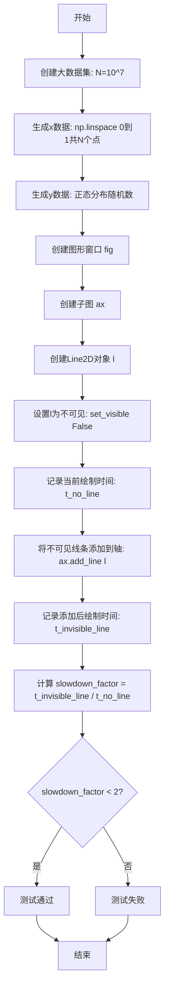
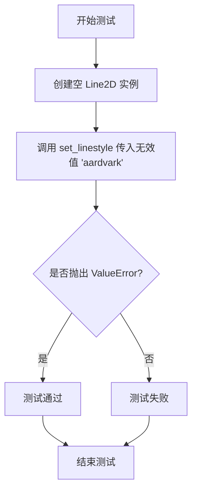
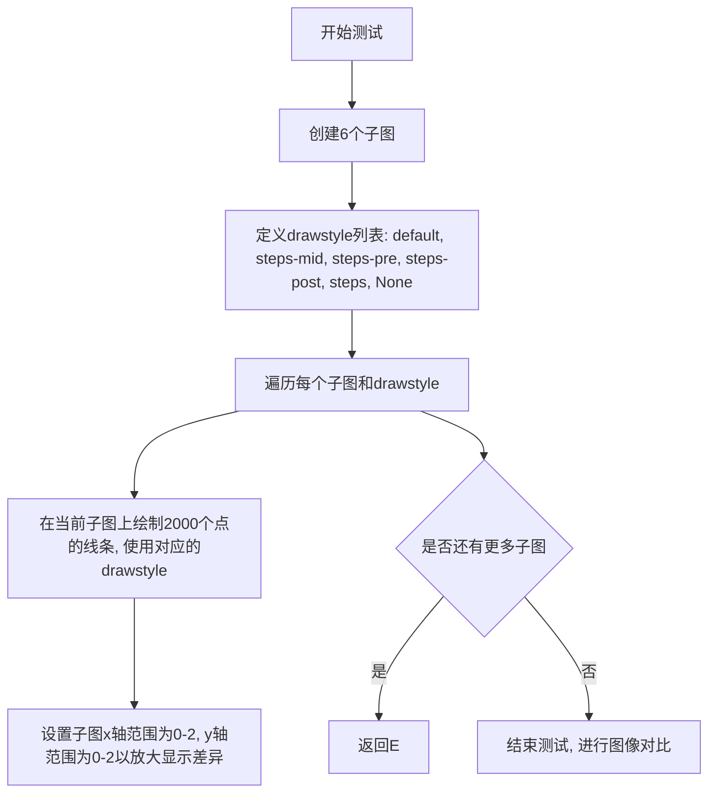
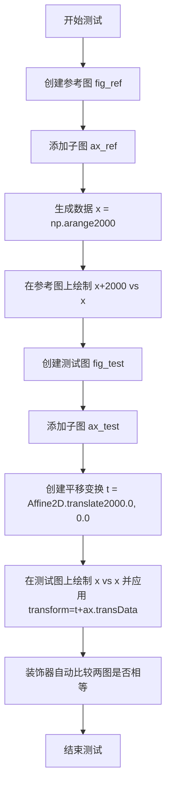
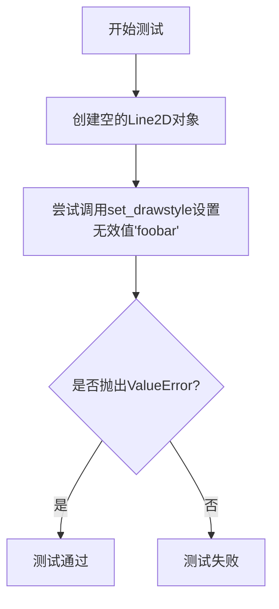
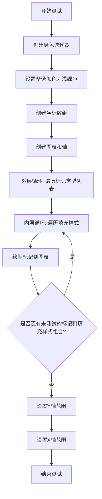
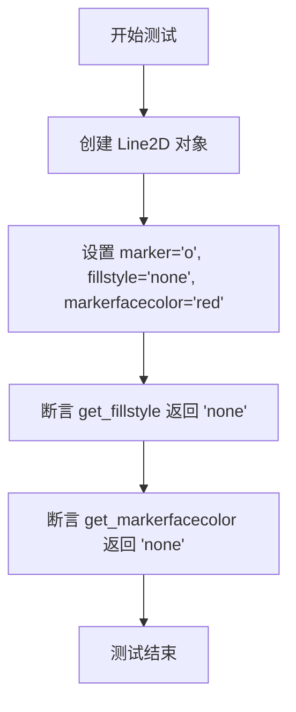

# `matplotlib\lib\matplotlib\tests\test_lines.py` 详细设计文档

这是 matplotlib 库的测试文件，专门针对 matplotlib.lines 模块进行单元测试。代码不包含用户定义的类，全部为测试函数（过程式代码）。它验证了 Line2D 和 AxLine 对象的数据输入合法性、视觉渲染效果（颜色、线型、标记、填充样式）、渲染性能（不可见线条优化）以及交互行为（拾取、markevery 属性）。

## 整体流程

```mermaid
graph TD
    Start([开始测试套件]) --> Import[导入依赖库]
    Import --> Fixture[设置测试夹具 (fig, ax)]
    Fixture --> DataVal[数据验证测试]
    DataVal --> Style[样式与颜色测试]
    Style --> Render[视觉渲染与图像对比测试]
    Render --> Perf[性能基准测试]
    Perf --> Logic[逻辑与变换测试 (AxLine, Transform)]
    Logic --> Interact[交互事件测试 (Picking)]
    Interact --> End([结束])
```

## 类结构

```
test_lines.py (测试模块 - 扁平结构)
├── 数据验证测试 (Data Validation)
│   ├── test_invalid_line_data
│   ├── test_valid_colors
│   └── ...
├── 样式与属性测试 (Styles & Props)
│   ├── test_line_colors
│   ├── test_linestyle_variants
│   └── ...
├── 视觉渲染测试 (Visual Rendering)
│   ├── test_line_dashes
│   ├── test_marker_fill_styles
│   └── ...
└── 交互与逻辑测试 (Interaction & Logic)
    ├── test_picking
    └── test_axline_setters
```

## 全局变量及字段


### `itertools`
    
Python标准库模块，提供用于操作迭代器的函数

类型：`module`
    


### `platform`
    
Python标准库模块，用于访问平台相关的信息

类型：`module`
    


### `timeit`
    
Python标准库模块，用于测量代码执行时间

类型：`module`
    


### `SimpleNamespace`
    
Python标准库类，提供简单的对象属性访问接口

类型：`class`
    


### `cycler`
    
第三方库模块，用于属性值循环

类型：`module`
    


### `np (numpy)`
    
第三方库模块，用于数值计算和数组操作

类型：`module`
    


### `pytest`
    
第三方测试框架模块

类型：`module`
    


### `matplotlib`
    
第三方绘图库主模块

类型：`module`
    


### `mpl`
    
matplotlib库的常用别名

类型：`module`
    


### `_path`
    
matplotlib内部路径处理模块

类型：`module`
    


### `mlines`
    
matplotlib线条模块，提供Line2D类和相关函数

类型：`module`
    


### `MarkerStyle`
    
matplotlib标记样式类，用于定义图形标记

类型：`class`
    


### `Path`
    
matplotlib路径类，表示几何路径

类型：`class`
    


### `plt`
    
matplotlib.pyplot子模块，提供绘图接口

类型：`module`
    


### `mtransforms`
    
matplotlib变换模块，提供坐标变换功能

类型：`module`
    


### `image_comparison`
    
matplotlib测试装饰器，用于图像对比测试

类型：`function`
    


### `check_figures_equal`
    
matplotlib测试装饰器，用于检查两个图形是否相等

类型：`function`
    


### `mlines.Line2D`
    
matplotlib中表示2D线条的类，包含x和y数据、样式属性等

类型：`class`
    


### `Line2D._subslice_optim_min_size`
    
Line2D类的类属性，定义子切片优化的最小数据点数量阈值

类型：`class attribute (int)`
    
    

## 全局函数及方法


### `test_segment_hits`

这是一个测试函数，用于验证 `mlines.segment_hits` 函数在特定边界情况下的正确性。该测试通过预设的坐标和半径值，检查函数是否能正确识别与给定圆（圆心为 cx, cy，半径为 radius）相交的线段索引。

参数：此函数无参数。

返回值：`None`，该函数通过 `assert_array_equal` 断言验证 `mlines.segment_hits` 的返回结果是否符合预期，不直接返回数值。

#### 流程图

```mermaid
flowchart TD
    A[开始测试] --> B[定义测试参数: cx=553, cy=902]
    B --> C[定义线段端点: x=[553, 553], y=[95, 947]]
    C --> D[定义检测半径: radius=6.94]
    D --> E[调用 mlines.segment_hits 函数]
    E --> F{断言验证结果}
    F -->|通过| G[测试通过]
    F -->|失败| H[抛出 AssertionError]
    G --> I[结束测试]
    H --> I
```

#### 带注释源码

```python
def test_segment_hits():
    """Test a problematic case."""  # 测试函数文档字符串，说明测试一个有问题的情况
    # 定义测试参数：圆心坐标
    cx, cy = 553, 902  # cx, cy: 整数类型，表示检测圆心的 x 和 y 坐标
    
    # 定义线段端点坐标（两条垂直线段，x 坐标相同，y 坐标不同）
    x, y = np.array([553., 553.]), np.array([95., 947.])  # x, y: numpy array 类型，表示线段的 x 和 y 坐标数组
    
    # 定义检测半径
    radius = 6.94  # radius: 浮点数类型，表示检测圆的半径
    
    # 调用 mlines.segment_hits 函数进行命中检测，并验证返回值
    # 预期返回值为 [0]，表示第一个线段（索引为 0 的线段）与检测圆相交
    assert_array_equal(mlines.segment_hits(cx, cy, x, y, radius), [0])
```


### `test_invisible_Line_rendering`

该测试函数用于验证 GitHub issue #1256 中发现的 bug：即使将 Line 对象的 visibility 属性设置为 False，draw 方法仍然执行了不必要的预渲染代码，导致包含大量数据点（Npts > 10^6）的不可见 Line 实例绘制时间过长。测试通过比较添加不可见线条前后 canvas.draw() 的执行时间，确保不可见线条不会显著影响渲染性能。

参数： 无

返回值： `None`，该函数执行断言验证，不返回任何值

#### 流程图



#### 带注释源码

```python
@pytest.mark.flaky(reruns=5)
def test_invisible_Line_rendering():
    """
    GitHub issue #1256 identified a bug in Line.draw method

    Despite visibility attribute set to False, the draw method was not
    returning early enough and some pre-rendering code was executed
    though not necessary.

    Consequence was an excessive draw time for invisible Line instances
    holding a large number of points (Npts> 10**6)
    """
    # Creates big x and y data:
    # 设置数据点数量为1000万，用于模拟大数据量场景
    N = 10**7
    # 生成从0到1的等间距数组
    x = np.linspace(0, 1, N)
    # 生成N个正态分布的随机数作为y坐标
    y = np.random.normal(size=N)

    # Create a plot figure:
    # 创建一个新的空白图形窗口
    fig = plt.figure()
    # 在图形中添加一个子图 axes
    ax = plt.subplot()

    # Create a "big" Line instance:
    # 使用大数据集创建Line2D对象
    l = mlines.Line2D(x, y)
    # 设置线条为不可见（核心测试点）
    l.set_visible(False)
    # but don't add it to the Axis instance `ax`
    # 注意：此时线条还未添加到轴上

    # [here Interactive panning and zooming is pretty responsive]
    # Time the canvas drawing:
    # 测量不含线条时的基础绘制时间
    # 使用timeit.repeat执行3次取最小值以减少测量误差
    t_no_line = min(timeit.repeat(fig.canvas.draw, number=1, repeat=3))
    # (gives about 25 ms)

    # Add the big invisible Line:
    # 将包含1000万数据点的不可见线条添加到子图
    ax.add_line(l)

    # [Now interactive panning and zooming is very slow]
    # Time the canvas drawing:
    # 测量添加不可见线条后的绘制时间
    t_invisible_line = min(timeit.repeat(fig.canvas.draw, number=1, repeat=3))
    # gives about 290 ms for N = 10**7 pts
    # 预期绘制时间会显著增加（因为存在性能bug）

    # 计算性能下降倍数
    slowdown_factor = t_invisible_line / t_no_line
    # 设置阈值：性能下降超过2倍则认为存在性能问题
    slowdown_threshold = 2  # trying to avoid false positive failures
    # 断言：不可见线条不应导致显著的性能下降
    assert slowdown_factor < slowdown_threshold
```


### `test_set_line_coll_dash`

该函数是matplotlib中用于测试线集合（LineCollection）能否正确设置虚线线型（dash pattern）的单元测试，通过绘制等高线图并指定线型参数来验证功能是否正常工作。

参数：无

返回值：`None`，该函数为测试函数，不返回任何值

#### 流程图

```mermaid
flowchart TD
    A[开始测试] --> B[创建Figure和Axes对象]
    B --> C[设置随机数种子为0]
    C --> D[生成20x30随机数据]
    D --> E[调用ax.contour绘制等高线, linestyles=[(0, (3, 3))]]
    E --> F[测试完成 - 不产生错误即通过]
```

#### 带注释源码

```python
def test_set_line_coll_dash():
    """
    测试函数：验证LineCollection可以正确设置虚线线型
    
    该测试用于验证matplotlib的contour方法能够接受
    复合线型定义（如(0, (3, 3))格式的虚线）而不产生错误。
    """
    # 创建一个新的图形窗口和一个子图
    fig, ax = plt.subplots()
    
    # 设置随机种子以确保测试结果可重现
    np.random.seed(0)
    
    # 生成20x30的随机正态分布数据
    # Testing setting linestyles for line collections.
    # This should not produce an error.
    # 使用[(0, (3, 3))]作为linestyles参数，这是一个复合线型定义
    # 格式说明：(offset, (dash_pattern))
    # (0, (3, 3)) 表示从0开始，交替使用3个点单位和3个空格单位
    ax.contour(np.random.randn(20, 30), linestyles=[(0, (3, 3))])
    
    # 函数执行完毕，无返回值
    # 如果上述contour调用没有抛出异常，则测试通过
```


### `test_invalid_line_data`

该测试函数验证 `Line2D` 类在接收无效的 x 或 y 数据时能够正确抛出 `RuntimeError`。测试覆盖了构造函数和 setter 方法的输入验证。

参数：无

返回值：`None`，测试函数无返回值

#### 流程图

```mermaid
flowchart TD
    A[开始测试] --> B[测试1: 创建Line2D with x=0, y=[]]
    B --> C{是否抛出RuntimeError<br/>匹配'xdata must be'?}
    C -->|是| D[测试2: 创建Line2D with x=[], y=1]
    C -->|否| E[测试失败]
    D --> F{是否抛出RuntimeError<br/>匹配'ydata must be'?}
    F -->|是| G[创建空Line2D: Line2D([], [])]
    F -->|否| E
    G --> H[测试3: set_xdata(0)]
    H --> I{是否抛出RuntimeError<br/>匹配'x must be'?}
    I -->|是| J[测试4: set_ydata(0)]
    I -->|否| E
    J --> K{是否抛出RuntimeError<br/>匹配'y must be'?}
    K -->|是| L[所有测试通过]
    K -->|否| E
    E --> M[测试失败]
    L --> N[结束测试]
    M --> N
```

#### 带注释源码

```python
def test_invalid_line_data():
    """
    测试 Line2D 类的数据验证功能
    
    该测试函数验证 Line2D 在接收无效数据时能正确抛出 RuntimeError，
    包括：
    1. 构造函数中 x 数据无效（标量而非序列）
    2. 构造函数中 y 数据无效（标量而非序列）
    3. set_xdata 方法接收无效数据
    4. set_ydata 方法接收无效数据
    """
    # 测试1: 验证构造函数对 x 数据的验证
    # 当 xdata 是标量 0 而非序列时，应抛出 RuntimeError
    with pytest.raises(RuntimeError, match='xdata must be'):
        mlines.Line2D(0, [])
    
    # 测试2: 验证构造函数对 y 数据的验证
    # 当 ydata 是标量 1 而非序列时，应抛出 RuntimeError
    with pytest.raises(RuntimeError, match='ydata must be'):
        mlines.Line2D([], 1)
    
    # 创建一个空的 Line2D 对象，用于后续测试
    line = mlines.Line2D([], [])
    
    # 测试3: 验证 set_xdata 方法的数据验证
    # 当传入标量 0 而非序列时，应抛出 RuntimeError
    with pytest.raises(RuntimeError, match='x must be'):
        line.set_xdata(0)
    
    # 测试4: 验证 set_ydata 方法的数据验证
    # 当传入标量 0 而非序列时，应抛出 RuntimeError
    with pytest.raises(RuntimeError, match='y must be'):
        line.set_ydata(0)
```


### `test_line_dashes`

该函数是一个图像比较测试，用于验证 matplotlib 中线条的虚线样式（dash pattern）能否正确渲染。它通过创建一个简单的线图并使用特定的线型 `(0, (3, 3))`（表示实线后跟3个点的虚线）来测试此功能。

参数： 无

返回值： `None`，该函数为测试函数，不返回任何值，仅通过 `@image_comparison` 装饰器进行图像比较验证

#### 流程图

```mermaid
flowchart TD
    A[开始] --> B[调用 plt.subplots 创建 fig 和 ax]
    B --> C[调用 ax.plot 绘制线条: range(10), linestyle=(0, (3, 3)), lw=5]
    C --> D[@image_comparison 装饰器自动比较生成的图像与基准图像]
    D --> E[结束]
```

#### 带注释源码

```python
@image_comparison(['line_dashes'], remove_text=True, tol=0.003)
def test_line_dashes():
    """
    测试线条虚线样式的渲染功能
    使用 image_comparison 装饰器比较生成的图像与基准图像
    remove_text=True: 移除图像中的文字以便于比较
    tol=0.003: 允许的像素误差容忍度
    """
    # 创建一个新的图形和一个子图axes
    fig, ax = plt.subplots()

    # 在axes上绘制一条线，使用虚线样式 (0, (3, 3))
    # 0 表示 linestyle 偏移量
    # (3, 3) 表示绘制3个点的实线，然后是3个点的空白，重复此模式
    # lw=5 设置线宽为5
    ax.plot(range(10), linestyle=(0, (3, 3)), lw=5)
```


### `test_line_colors`

该函数是一个测试函数，用于测试matplotlib中Line2D对象对不同颜色格式的支持情况，包括颜色名称、灰度值、RGB元组和RGBA元组等。

参数：

- （无参数）

返回值：`None`，该函数不返回任何值，仅执行测试操作

#### 流程图

```mermaid
flowchart TD
    A[开始] --> B[创建图表和坐标轴: fig, ax = plt.subplots]
    B --> C[绘制颜色为'none'的线]
    C --> D[绘制颜色为'r'的线]
    D --> E[绘制颜色为'.3'的线]
    E --> F[绘制颜色为RGBA元组 (1, 0, 0, 1) 的线]
    F --> G[绘制颜色为RGB元组 (1, 0, 0) 的线]
    G --> H[调用 fig.canvas.draw 渲染画布]
    H --> I[结束]
```

#### 带注释源码

```python
def test_line_colors():
    """
    测试Line2D对不同颜色格式的支持
    
    该测试函数验证matplotlib能够正确处理多种颜色输入格式：
    - 颜色名称字符串 ('r')
    - 特殊值 ('none')
    - 灰度值 ('.3')
    - RGB元组 (1, 0, 0)
    - RGBA元组 (1, 0, 0, 1)
    """
    # 创建一个新的图表和坐标轴
    fig, ax = plt.subplots()
    
    # 测试颜色设置为'none'（透明）
    ax.plot(range(10), color='none')
    
    # 测试颜色设置为标准颜色名称'r'（红色）
    ax.plot(range(10), color='r')
    
    # 测试颜色设置为灰度值'.3'（30%灰色）
    ax.plot(range(10), color='.3')
    
    # 测试颜色设置为RGBA元组（红色，透明度为1）
    ax.plot(range(10), color=(1, 0, 0, 1))
    
    # 测试颜色设置为RGB元组（红色）
    ax.plot(range(10), color=(1, 0, 0))
    
    # 渲染画布以确保所有颜色设置都被正确应用
    fig.canvas.draw()
```


### `test_valid_colors`

**描述**  
测试当对 `Line2D` 对象使用无效颜色字符串（例如 `"foobar"`）调用 `set_color` 时，是否正确抛出 `ValueError` 异常，以确保颜色验证机制工作正常。

**参数**  

- （无） – 该测试函数不接受任何参数。

**返回值**  

- `None` – 测试函数本身不返回值，只通过 `pytest.raises` 验证异常。

#### 流程图

```mermaid
flowchart TD
    A([开始]) --> B[创建空的 Line2D 实例: line = mlines.Line2D([], [])]
    B --> C[调用 line.set_color('foobar')]
    C --> D{是否抛出 ValueError?}
    D -- 是 --> E[测试通过]
    D -- 否 --> F[测试失败]
    E --> G([结束])
    F --> G
```

#### 带注释源码

```python
def test_valid_colors():
    """
    测试 Line2D.set_color 对无效颜色字符串是否抛出 ValueError。

    验证流程：
    1. 创建一个空的 Line2D 实例（无数据）。
    2. 使用 pytest.raises 捕获 ValueError，确认 set_color 在接受非法颜色时会抛出异常。
    """
    # 步骤 1：实例化一个空的 Line2D 对象
    line = mlines.Line2D([], [])

    # 步骤 2：尝试设置一个无效的颜色字符串 "foobar"
    # 如果颜色验证正常工作，这里应抛出 ValueError
    with pytest.raises(ValueError):
        line.set_color("foobar")
```

**技术债务 / 优化空间**  
- 该测试仅覆盖了单一无效字符串 `"foobar"`。可以扩展为参数化测试，使用更多非法颜色值（如空字符串、非法颜色码等），以提高覆盖率。  
- 目前没有对成功设置合法颜色后返回值的验证，可考虑增加正向测试用例。

**其他说明**  
- 该函数位于 `matplotlib.lines` 模块的测试文件 `test_lines.py` 中，属于单元测试层次。  
- 使用了 `pytest.raises` 上下文管理器来断言异常行为，符合 pytest 的最佳实践。


### `test_linestyle_variants`

该函数是一个测试函数，用于验证matplotlib中各种线型（linestyle）变体的正确渲染，包括字符串形式（"-", "--", "-.", ":"）和元组形式的线型定义。

参数：此函数无参数。

返回值：`None`，该函数仅执行绘图操作，不返回任何值。

#### 流程图

```mermaid
flowchart TD
    A[开始 test_linestyle_variants] --> B[创建图形和坐标轴: fig, ax = plt.subplots]
    C[遍历线型列表] --> D{还有更多线型?}
    D -->|是| E[获取当前线型 ls]
    E --> F[使用当前线型绘制数据: ax.plot(range(10), linestyle=ls)]
    F --> C
    D -->|否| G[刷新画布: fig.canvas.draw]
    G --> H[结束]
```

#### 带注释源码

```python
def test_linestyle_variants():
    """
    测试各种线型变体的函数。
    验证不同的linestyle参数能够正确传递给plot函数并绘制出相应的线条样式。
    """
    # 创建一个新的图形窗口和一个坐标轴
    fig, ax = plt.subplots()
    
    # 定义要测试的线型列表，包括：
    # 1. 字符串简写形式: '-', '--', '-.', ':'
    # 2. 字符串完整形式: 'solid', 'dashed', 'dashdot', 'dotted'
    # 3. 元组形式: (0, None), (0, ()), (0, []) - 针对gh-22930问题的回归测试
    for ls in ["-", "solid", "--", "dashed",
               "-.", "dashdot", ":", "dotted",
               (0, None), (0, ()), (0, []),  # gh-22930
               ]:
        # 在坐标轴上绘制数据，使用指定的线型
        # 绘制range(10)即[0,1,2,3,4,5,6,7,8,9]的数据
        ax.plot(range(10), linestyle=ls)
    
    # 强制刷新画布，确保所有绘制操作完成
    # 这对于确保测试能够捕获到任何渲染问题至关重要
    fig.canvas.draw()
```


### `test_valid_linestyles`

该测试函数用于验证 matplotlib 中 Line2D 类的 `set_linestyle` 方法在接收到无效的 linestyle 字符串（如 'aardvark'）时能够正确抛出 ValueError 异常，确保输入验证机制的完整性。

参数： 无

返回值： `None`，测试函数无返回值，仅通过 pytest 断言验证异常抛出

#### 流程图



#### 带注释源码

```python
def test_valid_linestyles():
    """
    测试 Line2D.set_linestyle 方法对无效 linestyle 值的错误处理。
    
    该测试验证当传入非法字符串（如 'aardvark'）时，
    set_linestyle 方法能够正确抛出 ValueError 异常。
    """
    # 创建一个空的 Line2D 对象，用于测试 linestyle 设置功能
    line = mlines.Line2D([], [])
    
    # 使用 pytest.raises 上下文管理器验证：
    # 当传入无效的 linestyle 字符串时，应该抛出 ValueError 异常
    with pytest.raises(ValueError):
        line.set_linestyle('aardvark')
```


### `test_drawstyle_variants`

该函数是一个测试函数，用于验证matplotlib中Line2D的不同绘制样式（drawstyle）变体是否正确渲染。测试涵盖"default"、"steps-mid"、"steps-pre"、"steps-post"、"steps"和None等六种绘制样式，特别关注在长线条（触发子切片优化）情况下的渲染效果。

参数： 无

返回值：`None`，测试函数无返回值

#### 流程图



#### 带注释源码

```python
@image_comparison(['drawstyle_variants.png'], remove_text=True,
                  tol=0 if platform.machine() == 'x86_64' else 0.03)
def test_drawstyle_variants():
    """
    测试不同drawstyle变体的渲染效果
    
    验证以下drawstyle正确处理:
    - default: 默认连接方式
    - steps-mid: 阶梯形, step在点中间
    - steps-pre: 阶梯形, step在点之前
    - steps-post: 阶梯形, step在点之后
    - steps: 阶梯形(等同于steps-pre或steps-post的某种形式)
    - None: 默认样式
    """
    # 创建一个包含6个子图的图形
    fig, axs = plt.subplots(6)
    
    # 要测试的drawstyle列表
    dss = ["default", "steps-mid", "steps-pre", "steps-post", "steps", None]
    
    # 我们需要检查drawstyles在非常长的线条（触发了子切片优化）时
    # 是否被正确处理；然而，需要放大以便drawstyles之间的差异实际上是可见的
    for ax, ds in zip(axs.flat, dss):
        # 绘制2000个点的线条, 应用对应的drawstyle
        ax.plot(range(2000), drawstyle=ds)
        # 设置坐标轴范围以放大显示细节
        ax.set(xlim=(0, 2), ylim=(0, 2))
```


### `test_no_subslice_with_transform`

该测试函数用于验证当使用变换（transform）绘制线条时，Matplotlib 不会使用子切片（subslice）优化路径，以确保变换正确应用到所有数据点。

参数：

- `fig_ref`：`matplotlib.figure.Figure`，用于绘制参考图像的图形对象
- `fig_test`：`matplotlib.figure.Figure`，用于绘制测试图像的图形对象

返回值：`None`，该函数是一个测试用例，通过 `@check_figures_equal` 装饰器自动比较两个图形是否相等

#### 流程图



#### 带注释源码

```python
@check_figures_equal()
def test_no_subslice_with_transform(fig_ref, fig_test):
    """
    测试当使用 transform 参数时，线条绘制不使用 subslice 优化。
    
    该测试验证两种绘制方式是否产生相同的视觉效果：
    1. 直接在数据上加上偏移量 (x+2000, x)
    2. 使用变换 (x, x) 配合 transform=t+ax.transData
    
    目的：确保变换不会触发 subslice 优化，从而正确处理所有数据点
    """
    
    # === 参考图像（直接数据偏移）===
    ax = fig_ref.add_subplot()  # 创建参考图形的子图
    x = np.arange(2000)  # 生成 0 到 1999 的整数数组
    # 直接在 x 数据上加上 2000 的偏移进行绘制
    ax.plot(x + 2000, x)
    
    # === 测试图像（使用变换）===
    ax = fig_test.add_subplot()  # 创建测试图形的子图
    # 创建平移变换：沿 x 方向平移 2000 个单位，y 方向不移动
    t = mtransforms.Affine2D().translate(2000.0, 0.0)
    # 绘制原始数据 (x, x)，但应用平移变换
    # t+ax.transData 表示将自定义变换 t 与数据坐标变换 ax.transData 组合
    ax.plot(x, x, transform=t+ax.transData)
    
    # 装饰器 @check_figures_equal 会自动比较 fig_ref 和 fig_test
    # 的渲染结果是否完全一致
```


### `test_valid_drawstyles`

该测试函数用于验证当给Line2D对象设置无效的drawstyle值时，是否会正确地抛出ValueError异常。

参数：无

返回值：`None`，测试函数无返回值

#### 流程图



#### 带注释源码

```python
def test_valid_drawstyles():
    """测试设置无效drawstyle时是否抛出ValueError."""
    # 创建一个空的Line2D对象,用于测试set_drawstyle方法
    line = mlines.Line2D([], [])
    
    # 尝试设置一个无效的drawstyle值'foobar'
    # 期望该操作会抛出ValueError异常
    with pytest.raises(ValueError):
        line.set_drawstyle('foobar')
```


### `test_set_drawstyle`

该函数是matplotlib中Line2D类的drawstyle设置的功能测试函数，用于验证set_drawstyle方法能否正确地将线条的绘制样式在"steps-pre"和"default"之间切换，并通过检查路径顶点的数量来确认绘制样式的变换是否正确应用。

参数： 无

返回值： 无（该函数为测试函数，没有返回值）

#### 流程图

```mermaid
flowchart TD
    A[开始] --> B[创建数据: x = np.linspace<br/>0到2π共10个点]
    --> C[计算y = np.sin(x)]
    --> D[创建子图: fig, ax = plt.subplots]
    --> E[绘制线条: line, = ax.plot(x, y)]
    --> F[设置drawstyle为steps-pre:<br/>line.set_drawstyle("steps-pre")]
    --> G{断言检查}
    --> G1[验证路径顶点数<br/>len == 2*len(x)-1]
    --> G1 -->|通过| H[设置drawstyle为default:<br/>line.set_drawstyle("default")]
    --> I{断言检查}
    --> I1[验证路径顶点数<br/>len == len(x)]
    --> I1 -->|通过| J[结束]
    
    style G1 fill:#90EE90
    style I1 fill:#90EE90
```

#### 带注释源码

```python
def test_set_drawstyle():
    """
    测试Line2D的set_drawstyle方法是否能正确改变线条的绘制样式。
    该测试函数通过比较不同drawstyle设置下的路径顶点数量来验证功能。
    """
    # 生成测试数据：0到2π之间的10个等间距点
    x = np.linspace(0, 2*np.pi, 10)
    # 计算对应的正弦值
    y = np.sin(x)

    # 创建一个新的figure和axes对象
    fig, ax = plt.subplots()
    # 绘制x和y数据，返回line对象
    line, = ax.plot(x, y)
    
    # 设置线条的drawstyle为"steps-pre"
    # steps-pre会在每个数据点之间添加阶梯状的连接线
    line.set_drawstyle("steps-pre")
    # 断言：steps-pre模式下，路径顶点数应该是原始数据点的2倍减1
    # 这是因为每个区间会被分割成两个点（起点和终点）
    assert len(line.get_path().vertices) == 2*len(x)-1

    # 恢复为默认的drawstyle
    line.set_drawstyle("default")
    # 断言：默认模式下，路径顶点数应该等于原始数据点的数量
    assert len(line.get_path().vertices) == len(x)
```


### `test_set_line_collection_dashes`

该函数是一个图像对比测试，用于验证线集合（LineCollection）的虚线样式（dash patterns）能够正确渲染。它通过绘制一个带有特定虚线样式的等高线图，并与基准图像进行比较，以确保渲染结果的正确性。

参数：无（该测试函数使用 pytest 的装饰器 `@image_comparison` 自动注入参数）

返回值：`None`，该函数为测试用例，不返回任何值，主要通过图像对比验证功能正确性

#### 流程图

```mermaid
flowchart TD
    A[开始测试] --> B[创建图形和坐标轴 fig, ax = plt.subplots]
    B --> C[设置随机种子 np.random.seed0]
    C --> D[绘制等高线图 ax.contour with linestyles=(0, (3, 3))]
    D --> E[图像对比验证 @image_comparison装饰器自动比对]
    E --> F[测试通过或失败]
```

#### 带注释源码

```python
@image_comparison(['line_collection_dashes'], remove_text=True, style='mpl20',
                  tol=0 if platform.machine() == 'x86_64' else 0.65)
def test_set_line_coll_dash_image():
    """
    测试线集合的虚线样式渲染功能
    
    该测试函数使用图像对比方式验证：
    1. 可以为LineCollection（等高线图使用）设置虚线样式
    2. 渲染结果与基准图像一致
    3. 不同平台（x86_64 vs 其他）有不同的容差阈值
    """
    # 创建图形和坐标轴
    fig, ax = plt.subplots()
    
    # 设置随机种子以确保数据可重现
    np.random.seed(0)
    
    # 绘制等高线图，linestyles=[(0, (3, 3))]表示虚线样式
    # (0, (3, 3))表示：offset=0, pattern=(3, 3)即3个点画线，3个点空白
    ax.contour(np.random.randn(20, 30), linestyles=[(0, (3, 3))])
    
    # @image_comparison装饰器会自动：
    # 1. 调用该函数生成图像
    # 2. 与基准图像 'line_collection_dashes.png' 比较
    # 3. 根据tol参数判断是否通过测试
```


### `test_marker_fill_styles`

该函数是一个图像比较测试，用于验证 matplotlib 中标记（Marker）的各种填充样式（fill styles）是否正确渲染。它遍历预定义的标记类型和填充样式组合，生成可视化图像并与基准图像进行对比。

参数： 无

返回值： 无（通过 `@image_comparison` 装饰器进行图像比较验证）

#### 流程图



#### 带注释源码

```python
@image_comparison(['marker_fill_styles.png'], remove_text=True)
def test_marker_fill_styles():
    """
    测试标记填充样式是否正确渲染。
    使用图像比较装饰器验证输出与基准图像的一致性。
    """
    # 创建一个无限循环的颜色迭代器，包含多种颜色格式：
    # 蓝色列表、绿色字符串、红色十六进制、青色、品红、黄色、黑色numpy数组
    colors = itertools.cycle([[0, 0, 1], 'g', '#ff0000', 'c', 'm', 'y',
                              np.array([0, 0, 0])])
    
    # 设置备选填充颜色为浅绿色
    altcolor = 'lightgreen'

    # 定义Y坐标数组
    y = np.array([1, 1])
    # 定义X坐标数组
    x = np.array([0, 9])
    
    # 创建图表和子图
    fig, ax = plt.subplots()

    # 遍历预定义的标记类型列表
    # 注意：这里硬编码的标记列表对应MarkerStyle.filled_markers的早期版本
    # 该属性的值已经改变，但为了不重新生成基准图像，这里保留了旧值
    # 当重新生成图像时，应替换为mlines.Line2D.filled_markers
    for j, marker in enumerate("ov^<>8sp*hHDdPX"):
        # 遍历所有填充样式
        for i, fs in enumerate(mlines.Line2D.fillStyles):
            # 获取下一个颜色
            color = next(colors)
            
            # 绘制数据点，使用指定的标记、填充样式和颜色
            ax.plot(j * 10 + x, y + i + .5 * (j % 2),
                    marker=marker,           # 标记类型
                    markersize=20,           # 标记大小
                    markerfacecoloralt=altcolor,  # 备选标记填充颜色
                    fillstyle=fs,            # 填充样式
                    label=fs,                # 图例标签
                    linewidth=5,             # 线条宽度
                    color=color,             # 线条颜色
                    markeredgecolor=color,   # 标记边框颜色
                    markeredgewidth=2)       # 标记边框宽度

    # 设置Y轴显示范围
    ax.set_ylim(0, 7.5)
    # 设置X轴显示范围
    ax.set_xlim(-5, 155)
```


### `test_markerfacecolor_fillstyle`

测试 markerfacecolor 不会覆盖 fillstyle='none' 的行为，确保当设置 fillstyle='none' 时，即使指定了 markerfacecolor，颜色也应返回 'none'。

参数： 无

返回值： `None`，该测试函数不返回任何值，仅通过断言验证行为。

#### 流程图



#### 带注释源码

```python
def test_markerfacecolor_fillstyle():
    """Test that markerfacecolor does not override fillstyle='none'."""
    # 创建一个折线图，使用圆形标记，设置填充样式为'none'，但指定markerfacecolor为红色
    # 预期行为：即使设置了markerfacecolor='red'，当fillstyle='none'时，
    # get_markerfacecolor()应返回'none'而不是'red'
    l, = plt.plot([1, 3, 2], marker=MarkerStyle('o', fillstyle='none'),
                  markerfacecolor='red')
    
    # 验证fillstyle确实设置为'none'
    assert l.get_fillstyle() == 'none'
    
    # 关键断言：验证当fillstyle='none'时，markerfacecolor被正确忽略，
    # get_markerfacecolor()应返回'none'而非设置的'red'
    assert l.get_markerfacecolor() == 'none'
```


### `test_lw_scaling`

该函数是一个图像比较测试，用于验证 matplotlib 中不同线宽（0.5 到 10）与不同线型（dashed、dotted、dashdot）组合时的渲染效果是否正确。测试通过绘制多组线条并与基准图像进行对比来确保线宽缩放功能的正常工作。

参数： 无

返回值： `None`，该函数为测试函数，不返回任何值

#### 流程图

```mermaid
flowchart TD
    A[开始 test_lw_scaling] --> B[创建数据点 th = np.linspace(0, 32)]
    B --> C[创建图形和坐标轴 fig, ax = plt.subplots]
    C --> D[定义线型列表 lins_styles = ['dashed', 'dotted', 'dashdot']]
    D --> E[获取属性循环 cy = cycler(matplotlib.rcParams['axes.prop_cycle'])]
    E --> F[外层循环: 遍历线型和样式 enumerate(zip(lins_styles, cy))]
    F --> G[内层循环: 遍历线宽 np.linspace(.5, 10, 10)]
    G --> H[绘制线条 ax.plot with linestyle, lw, **sty]
    H --> G
    G --> I{线宽循环结束?}
    I --> F
    F --> J{线型循环结束?}
    J --> K[结束, 图像自动用于 @image_comparison 比较]
```

#### 带注释源码

```python
@image_comparison(['scaled_lines'], style='default')  # 装饰器: 与基准图像 'scaled_lines.png' 比较
def test_lw_scaling():
    """测试线宽缩放功能，验证不同线型和线宽的组合渲染"""
    
    # 生成角度数据点，从 0 到 32 弧度
    th = np.linspace(0, 32)
    
    # 创建图形窗口和子图坐标轴
    fig, ax = plt.subplots()
    
    # 定义要测试的三种线型: 虚线、点线、点划线
    lins_styles = ['dashed', 'dotted', 'dashdot']
    
    # 获取 matplotlib 默认的属性循环（颜色等）
    cy = cycler(matplotlib.rcParams['axes.prop_cycle'])
    
    # 外层循环: 遍历每种线型及其对应的样式属性
    for j, (ls, sty) in enumerate(zip(lins_styles, cy)):
        # 内层循环: 遍历从 0.5 到 10 的 10 个不同线宽值
        for lw in np.linspace(.5, 10, 10):
            # 绘制线条:
            # - th: x 轴数据
            # - j*np.ones(50) + .1*lw: y 轴数据，使不同线宽的线条略有偏移
            # - linestyle=ls: 当前线型
            # - lw=lw: 当前线宽
            # - **sty: 从属性循环中解包颜色等样式
            ax.plot(th, j*np.ones(50) + .1 * lw, linestyle=ls, lw=lw, **sty)
```


### `test_is_sorted_and_has_non_nan`

这是一个测试函数，用于验证内部函数 `_path.is_sorted_and_has_non_nan` 的正确性。该测试通过多个断言检查该内部函数是否能正确识别已排序的数组、处理包含 NaN 值的情况（测试用例显示它对特定位置的 NaN 返回 True），以及拒绝无序或字节序不兼容的数组。此外，它还通过绘制大量包含 NaN 的数据来测试 `Line2D` 子切片优化的运行时行为。

参数： 无

返回值： `None`，无返回值（测试函数，主要通过断言验证逻辑）

#### 流程图

```mermaid
graph TD
    A([开始测试]) --> B{断言: 数组 [1,2,3] 通过检验}
    B --> C{断言: 数组 [1,nan,3] 通过检验}
    C --> D{断言: 无序数组 [3,5...nan...0,2] 未通过检验}
    D --> E{断言: 字节序交换数组未通过检验}
    E --> F[计算子切片优化阈值 n]
    F --> G[执行 plt.plot 绘制大规模 NaN 数据]
    G --> H([测试结束])
```

#### 带注释源码

```python
def test_is_sorted_and_has_non_nan():
    # 测试严格升序的数组，应返回 True
    assert _path.is_sorted_and_has_non_nan(np.array([1, 2, 3]))
    
    # 测试包含 NaN 的数组，断言期望返回 True（具体逻辑取决于内部实现）
    assert _path.is_sorted_and_has_non_nan(np.array([1, np.nan, 3]))
    
    # 测试无序且包含大量 NaN 的数组，应返回 False
    assert not _path.is_sorted_and_has_non_nan([3, 5] + [np.nan] * 100 + [0, 2])
    
    # [2, 256] 字节交换后的数组，应返回 False（检查字节序/数据类型兼容性）
    # [2, 256] byteswapped:
    assert not _path.is_sorted_and_has_non_nan(np.array([33554432, 65536], ">i4"))
    
    # 获取两倍于最小子切片优化大小的阈值
    n = 2 * mlines.Line2D._subslice_optim_min_size
    
    # 绘制包含 NaN 的大量数据，测试渲染优化是否正常工作
    plt.plot([np.nan] * n, range(n))
```


### `test_step_markers`

该测试函数用于验证matplotlib中step函数的标记点（markers）是否正确显示，通过对比step函数直接绘制与使用普通plot配合markevery参数模拟step效果的两幅图像是否相等。

参数：

- `fig_test`：`matplotlib.figure.Figure`，测试用的figure对象，用于执行step函数绘制
- `fig_ref`：`matplotlib.figure.Figure`，参考用的figure对象，使用普通plot函数配合markevery参数模拟step效果

返回值：`None`，该函数为测试函数，不返回任何值

#### 流程图

```mermaid
flowchart TD
    A[开始执行test_step_markers] --> B[调用装饰器@check_figures_equal]
    B --> C[在fig_test上创建子图]
    C --> D[调用step方法绘制: step[0, 1], -o标记]
    D --> E[在fig_ref上创建子图]
    E --> F[调用plot方法绘制: plot[0, 0, 1], [0, 1, 1], -o标记, markevery=[0, 2]]
    F --> G[对比两幅图像是否相等]
    G --> H{图像是否相等}
    H -->|是| I[测试通过]
    H -->|否| J[测试失败]
    I --> K[结束]
    J --> K
```

#### 带注释源码

```python
@check_figures_equal()
def test_step_markers(fig_test, fig_ref):
    """
    测试step函数的标记点是否正确显示。
    
    该测试验证step函数的标记点行为是否与使用普通plot
    配合markevery参数的效果一致。
    """
    
    # 在测试figure上创建子图，并使用step函数绘制
    # step函数会自动在指定位置添加标记点
    # 参数[0, 1]表示x轴数据，"-o"表示使用圆形标记点
    fig_test.subplots().step([0, 1], "-o")
    
    # 在参考figure上创建子图，使用普通plot函数
    # 但通过markevery参数[0, 2]手动指定标记点位置
    # [0, 0, 1]是x坐标，[0, 1, 1]是y坐标
    # 这样可以模拟step函数的标记点效果
    fig_ref.subplots().plot([0, 0, 1], [0, 1, 1], "-o", markevery=[0, 2])
```


### `test_markevery`

该测试函数用于验证matplotlib中Line2D的`markevery`属性的各种用法，包括整数索引、切片、元组、列表、布尔数组和浮点数（相对坐标）等不同形式的markevery参数，并通过图像比较确保测试图与参考图的渲染结果一致。

参数：

- `fig_test`：`matplotlib.figure.Figure`，pytest fixture，测试用的图幅对象
- `fig_ref`：`matplotlib.figure.Figure`，pytest fixture，参考用的图幅对象
- `parent`：`str`，字符串值为"figure"或"axes"，指定markevery是添加到figure还是axes上

返回值：`None`，该函数为测试函数，无返回值

#### 流程图

```mermaid
flowchart TD
    A[开始 test_markevery] --> B[设置随机种子 42]
    B --> C[生成测试数据 x 和 y]
    C --> D[定义 cases_test 列表<br/>包含9种markevery参数]
    D --> E[定义 cases_ref 列表<br/>包含9种布尔字符串]
    E --> F{parent == "figure"?}
    F -->|Yes| G[移除最后2个浮点数用例<br/>定义add_test/add_ref函数<br/>使用fig.add_artist添加Line2D]
    F -->|No| H{parent == "axes"?}
    H -->|Yes| I[创建3x3子图<br/>定义add_test/add_ref函数<br/>使用ax.plot添加曲线]
    G --> J[遍历cases_test<br/>调用add_test添加测试曲线]
    I --> J
    J --> K[遍历cases_ref<br/>转换为布尔数组<br/>调用add_ref添加参考曲线]
    K --> L[结束]
```

#### 带注释源码

```python
@check_figures_equal()  # 装饰器：比较测试图和参考图的渲染结果是否一致
def test_markevery(fig_test, fig_ref, parent):
    """
    测试markevery属性的各种用法
    
    Parameters:
    -----------
    fig_test : matplotlib.figure.Figure
        测试用的图幅对象
    fig_ref : matplotlib.figure.Figure
        参考用的图幅对象
    parent : str
        值为"figure"或"axes"，指定在figure还是axes级别添加线条
    """
    # 设置随机种子以确保结果可复现
    np.random.seed(42)
    # 生成14个均匀分布的点，范围[0, 1]
    x = np.linspace(0, 1, 14)
    # 生成14个随机数作为y坐标
    y = np.random.rand(len(x))

    # 定义测试用例：不同的markevery参数形式
    cases_test = [
        None,           # 无特殊markevery，默认显示所有点
        4,              # 整数：每4个点显示一个标记
        (2, 5),         # 元组：(start, step) 从第2个点开始，每5个点显示
        [1, 5, 11],     # 列表：指定显示标记的点索引
        [0, -1],        # 列表：首尾点，-1表示最后一个点
        slice(5, 10, 2), # 切片：5到10步长2
        np.arange(len(x))[y > 0.5], # 布尔索引：y值>0.5的点
        0.3,            # 浮点数：相对位置，间隔0.3
        (0.3, 0.4)      # 元组：(start_fraction, step_fraction) 相对坐标
    ]
    
    # 定义参考用例：对应的布尔字符串表示
    cases_ref = [
        "11111111111111",  # 所有点都显示
        "10001000100010",  # 每4个点显示
        "00100001000010",  # 从索引2开始，步长5
        "01000100000100",  # 显示索引1,5,11
        "10000000000001",  # 首尾点
        "00000101010000",  # 切片5:10:2
        "01110001110110",  # 条件索引
        "11011011011110",  # 相对间隔0.3
        "01010011011101"   # 相对坐标(0.3, 0.4)
    ]

    # 根据parent参数决定添加方式
    if parent == "figure":
        # figure级别不支持浮点数markevery，移除最后2个用例
        cases_test = cases_test[:-2]
        cases_ref = cases_ref[:-2]

        # 定义在figure上添加线条的函数
        def add_test(x, y, *, markevery):
            fig_test.add_artist(
                mlines.Line2D(x, y, marker="o", markevery=markevery))

        def add_ref(x, y, *, markevery):
            fig_ref.add_artist(
                mlines.Line2D(x, y, marker="o", markevery=markevery))

    elif parent == "axes":
        # 创建3x3子图布局
        axs_test = iter(fig_test.subplots(3, 3).flat)
        axs_ref = iter(fig_ref.subplots(3, 3).flat)

        # 定义在axes上添加线条的函数
        def add_test(x, y, *, markevery):
            next(axs_test).plot(x, y, "-gD", markevery=markevery)

        def add_ref(x, y, *, markevery):
            next(axs_ref).plot(x, y, "-gD", markevery=markevery)

    # 遍历测试用例，添加到测试图
    for case in cases_test:
        add_test(x, y, markevery=case)

    # 遍历参考用例，转换为布尔数组后添加到参考图
    for case in cases_ref:
        me = np.array(list(case)).astype(int).astype(bool)
        add_ref(x, y, markevery=me)
```


### `test_markevery_figure_line_unsupported_relsize`

该测试函数用于验证在 figure 级别（而非 axes 级别）的 Line2D 上使用浮点数作为 `markevery` 参数时会抛出 ValueError 异常。因为浮点数的 markevery 是相对于 axes 尺寸的，在 figure 级别的 artist 上不受支持。

参数： 无

返回值： 无（测试函数，无返回值）

#### 流程图

```mermaid
flowchart TD
    A[开始] --> B[创建 Figure 对象]
    B --> C[创建 Line2D 对象<br/>参数: x=[0,1], y=[0,1]<br/>marker='o', markevery=0.5]
    C --> D[将 Line2D 添加到 Figure]
    D --> E[尝试调用 fig.canvas.draw]
    E --> F{是否抛出 ValueError?}
    F -->|是| G[测试通过]
    F -->|否| H[测试失败]
```

#### 带注释源码

```python
def test_markevery_figure_line_unsupported_relsize():
    """
    测试在 figure 级别的 Line2D 上使用浮点数 markevery 时会抛出 ValueError。
    
    浮点数的 markevery 表示相对于 axes 尺寸的相对间隔，
    但 figure 级别的 artist 没有关联的 axes，因此不支持这种模式。
    """
    # 1. 创建一个新的空白 Figure 对象
    fig = plt.figure()
    
    # 2. 创建 Line2D 对象，设置 markevery=0.5（浮点数）
    #    浮点数 markevery 表示相对标记间隔（相对于 axes 大小）
    #    但这个 Line2D 是添加到 figure 而不是 axes，因此不支持
    fig.add_artist(mlines.Line2D([0, 1], [0, 1], marker="o", markevery=.5))
    
    # 3. 验证绘制 canvas 时会抛出 ValueError 异常
    with pytest.raises(ValueError):
        fig.canvas.draw()
```


### `test_marker_as_markerstyle`

这是一个测试函数，用于验证 MarkerStyle 对象能否正确作为 Line2D 的 marker 使用。测试涵盖了通过 MarkerStyle 构造函数设置 marker、通过 set_marker 方法更新 marker，以及 Path 对象作为 marker 时的顶点数据保持能力。

参数：

- 无参数

返回值：`None`，无返回值（测试函数，使用断言进行验证）

#### 流程图

```mermaid
flowchart TD
    A[开始 test_marker_as_markerstyle] --> B[创建 figure 和 axes]
    B --> C[使用 MarkerStyle'D' 绘制折线]
    C --> D[绘制画布并断言 get_marker 返回 'D']
    D --> E[使用 set_marker 设置为 's']
    E --> F[绘制画布]
    F --> G[使用 set_marker 设置为 MarkerStyle'o']
    G --> H[绘制画布]
    H --> I[创建闭合 Path: triangle1]
    I --> J[使用 MarkerStyle triangle1 绘制 line2]
    J --> K[直接使用 triangle1 绘制 line3]
    K --> L[断言 line2 的 marker 顶点等于 triangle1 顶点]
    L --> M[断言 line3 的 marker 顶点等于 triangle1 顶点]
    M --> N[测试结束]
```

#### 带注释源码

```python
def test_marker_as_markerstyle():
    """
    Test that MarkerStyle objects can be used as markers for Line2D.
    
    This test verifies:
    1. MarkerStyle can be passed to plot() as marker argument
    2. set_marker() accepts both string and MarkerStyle objects
    3. Path objects can be used as markers and preserve vertices
    """
    # Create a new figure and axes for testing
    fig, ax = plt.subplots()
    
    # Test 1: Pass MarkerStyle object directly to plot()
    # Plot a line with Diamond marker using MarkerStyle
    line, = ax.plot([2, 4, 3], marker=MarkerStyle("D"))
    
    # Draw the canvas to trigger rendering
    fig.canvas.draw()
    
    # Verify the marker was correctly set to "D" (Diamond)
    assert line.get_marker() == "D"

    # Test 2: Smoke tests for set_marker with different inputs
    # Change marker to square using string
    line.set_marker("s")
    fig.canvas.draw()
    
    # Change marker to circle using MarkerStyle object
    line.set_marker(MarkerStyle("o"))
    fig.canvas.draw()

    # Test 3: Path roundtrip - verify Path objects work as markers
    # Create a closed triangular path
    triangle1 = Path._create_closed([[-1, -1], [1, -1], [0, 2]])
    
    # Plot with MarkerStyle constructed from Path
    line2, = ax.plot([1, 3, 2], marker=MarkerStyle(triangle1), ms=22)
    
    # Plot directly with Path object (shorthand)
    line3, = ax.plot([0, 2, 1], marker=triangle1, ms=22)

    # Verify vertices are preserved when using Path as marker
    # line2 uses MarkerStyle(triangle1)
    assert_array_equal(line2.get_marker().vertices, triangle1.vertices)
    
    # line3 uses triangle1 directly
    assert_array_equal(line3.get_marker().vertices, triangle1.vertices)
```


### `test_striped_lines`

该测试函数用于验证matplotlib中带有条纹（striped）效果的折线图绘制功能，通过对比图像确认`gapcolor`参数能正确显示线条间的交替颜色。

参数：

- `text_placeholders`：`Any`，pytest的图像比较装饰器传递的参数，用于占位符处理

返回值：`None`，该函数为测试函数，无返回值

#### 流程图

```mermaid
flowchart TD
    A[开始测试] --> B[创建随机数生成器 rng]
    B --> C[创建子图 ax]
    C --> D[绘制第一条条纹线: orange底色 blue间隙]
    D --> E[绘制第二条条纹线: red底色 black间隙]
    E --> F[添加图例]
    F --> G[通过@image_comparison比较图像]
    G --> H[结束测试]
```

#### 带注释源码

```python
@image_comparison(['striped_line.png'], remove_text=True, style='mpl20')
def test_striped_lines(text_placeholders):
    """
    测试带条纹效果的线条绘制功能
    
    验证通过gapcolor参数实现的条纹效果能正确渲染
    """
    # 使用固定种子创建随机数生成器，确保测试可重复
    rng = np.random.default_rng(19680801)
    
    # 创建图表和坐标轴
    _, ax = plt.subplots()
    
    # 绘制第一条线：橙色线条，蓝色间隙，虚线样式
    ax.plot(rng.uniform(size=12), 
            color='orange',      # 线条主色
            gapcolor='blue',     # 间隙/条纹颜色
            linestyle='--',      # 虚线
            lw=5,                # 线宽
            label='blue in orange')  # 图例标签
    
    # 绘制第二条线：红色线条，黑色间隙，自定义破折号样式
    ax.plot(rng.uniform(size=12), 
            color='red',         # 线条主色
            gapcolor='black',    # 间隙/条纹颜色
            linestyle=(0, (2, 5, 4, 2)),  # 自定义线型：[偏移, (实, 虚, 实, 虚)]
            lw=5,                # 线宽
            label='black in red',   # 图例标签
            alpha=0.5)           # 半透明
    
    # 添加图例显示两条线的标签
    ax.legend(handlelength=5)
```


### `test_odd_dashes`

该测试函数验证 matplotlib 在绘制线条时能否正确处理奇数长度的 dashes 虚线参数。当传入奇数长度的 dashes 列表（如 [1, 2, 3]）时，系统应自动将其重复以形成有效的偶数虚线模式。

参数：

- `fig_test`：`Figure`，测试用的图形对象，用于验证实际渲染结果
- `fig_ref`：`Figure`，参考用的图形对象，包含期望的渲染结果

返回值：`None`，该函数为测试用例，不返回任何值

#### 流程图

```mermaid
flowchart TD
    A[开始执行 test_odd_dashes] --> B[创建测试子图 fig_test.add_subplot]
    B --> C[使用 dashes=[1, 2, 3] 绘制线条]
    C --> D[创建参考子图 fig_ref.add_subplot]
    D --> E[使用 dashes=[1, 2, 3, 1, 2, 3] 绘制线条]
    E --> F[比较两个图形是否相等]
    F --> G{图形是否相等?}
    G -->|是| H[测试通过]
    G -->|否| I[测试失败]
    H --> J[结束]
    I --> J
```

#### 带注释源码

```python
@check_figures_equal()
def test_odd_dashes(fig_test, fig_ref):
    """
    测试奇数长度的 dashes 参数是否能被正确处理。
    
    当传入奇数长度的 dashes 列表时，matplotlib 应该自动
    将其重复以形成有效的偶数虚线模式。
    """
    # 在测试图形中添加子图并绘制线条，使用奇数长度的 dashes 参数
    # dashes=[1, 2, 3] 长度为 3（奇数）
    fig_test.add_subplot().plot([1, 2], dashes=[1, 2, 3])
    
    # 在参考图形中添加子图并绘制线条，使用偶数长度的 dashes 参数
    # dashes=[1, 2, 3, 1, 2, 3] 长度为 6（偶数），是上述参数的重复
    fig_ref.add_subplot().plot([1, 2], dashes=[1, 2, 3, 1, 2, 3])
```


### `test_picking`

该函数是一个自动化测试用例，用于验证 Matplotlib 中 `Line2D` 对象的交互式“拾取（Picking）”功能。它通过模拟鼠标事件（`mouse_event`），检查当用户点击线条附近时，系统是否能根据 `picker`（启用开关）和 `pickradius`（拾取半径）属性正确识别并返回被点击的线段索引。

#### 参数

- 无（该测试函数不接收外部参数，依赖于测试框架 `pytest` 的上下文）

#### 返回值

- `None`。此函数不返回具体数据，而是通过 `assert` 语句进行断言验证。如果断言失败，测试失败；否则通过。

#### 流程图

```mermaid
flowchart TD
    A([开始测试]) --> B[创建画布 fig 和坐标轴 ax]
    B --> C[创建模拟鼠标事件 mouse_event]
    C --> D[绘制线条 l0 (picker=True, 默认 pickradius=5)]
    D --> E{调用 l0.contains}
    E -->|距离 > 5| F[断言: 未找到 (not found)]
    F --> G[绘制线条 l1 (picker=True, pickradius=20)]
    G --> H{调用 l1.contains}
    H -->|距离 < 20| I[断言: 找到 (found)]
    I --> J[绘制线条 l2 (picker=True, 默认 pickradius=5)]
    J --> K{第一次调用 l2.contains}
    K -->|距离 > 5| L[断言: 未找到]
    L --> M[调用 l2.set_pickradius(20)]
    M --> N{第二次调用 l2.contains}
    N -->|距离 < 20| O[断言: 找到]
    O --> P([测试结束])
```

#### 带注释源码

```python
def test_picking():
    # 1. 初始化测试环境：创建一个新的图形窗口和一个坐标轴
    fig, ax = plt.subplots()
    
    # 2. 构造模拟鼠标事件：
    # 使用 SimpleNamespace 模拟一个具有 x, y 属性的鼠标事件对象。
    # x 设置为图形宽度的一半（中心），y 设置为高度的一半 + 15 像素（偏上）
    mouse_event = SimpleNamespace(x=fig.bbox.width // 2,
                                  y=fig.bbox.height // 2 + 15)

    # --- 测试场景 1：默认 pickradius (默认值为 5) ---
    # 创建一条启用了 picker 的线，但未指定 pickradius（默认 5）
    l0, = ax.plot([0, 1], [0, 1], picker=True)
    
    # 调用 Line2D 的 contains 方法检测点击
    found, indices = l0.contains(mouse_event)
    
    # 断言：由于鼠标位置距离线条超过 5 个像素单位，应该找不到
    assert not found

    # --- 测试场景 2：自定义大 pickradius ---
    # 创建一条线，pickradius 设为 20（覆盖了鼠标距离）
    l1, = ax.plot([0, 1], [0, 1], picker=True, pickradius=20)
    found, indices = l1.contains(mouse_event)
    
    # 断言：找到了，indices['ind'] 应该是线段的索引 [0]
    assert found
    assert_array_equal(indices['ind'], [0])

    # --- 测试场景 3：动态修改 pickradius ---
    # 创建一条默认 radius 的线
    l2, = ax.plot([0, 1], [0, 1], picker=True)
    
    # 初始检测：应该找不到
    found, indices = l2.contains(mouse_event)
    assert not found
    
    # 动态修改属性：将 pickradius 改为 20
    l2.set_pickradius(20)
    
    # 再次检测：现在应该能找到
    found, indices = l2.contains(mouse_event)
    assert found
    assert_array_equal(indices['ind'], [0])
```

#### 关键组件信息

*   **`matplotlib.lines.Line2D`**: 被测试的核心类，代表图形上的一条线。
*   **`picker`**: Line2D 的属性，设置为 `True` 以启用事件拾取功能。
*   **`pickradius`**: Line2D 的属性，定义了在鼠标距离线条多近的范围内触发拾取事件（单位通常与数据坐标或像素相关，此处测试主要关注逻辑距离）。
*   **`Line2D.contains(event)`**: 核心方法，用于判断某个事件是否“击中”了该线条，返回一个布尔值和一个包含索引的字典。

#### 潜在的技术债务或优化空间

1.  **坐标硬编码**: 鼠标事件的坐标 (`x`, `y`) 是基于 `fig.bbox` 动态计算的，但在某些后端（如无头模式 Headless）或不规则 DPI 设置下，`bbox` 的计算可能存在细微差异，可能导致测试在某些特定环境下（如 CI 容器）偶尔失败。更好的做法是使用 `ax.transData` 将数据坐标转换为显示坐标后再计算，或者使用 `mock` 来模拟精确的坐标输入。
2.  **假设坐标轴范围**: 该测试假设坐标轴是默认范围 `[0, 1]`。如果 `ax.plot` 的默认行为改变（例如自动缩放逻辑改变），测试的物理位置逻辑可能会失效，尽管 `Line2D` 的逻辑是独立的。

#### 其它项目

*   **错误处理与异常设计**: 该测试未显式测试异常情况，主要关注正常流程（Hit-testing）。如果传入非 `SimpleNamespace` 或缺少 `x`, `y` 属性的对象给 `contains` 方法，通常会导致 AttributeError，这在生产代码中应由 API 防御性检查处理。
*   **外部依赖**: 依赖 `matplotlib.pyplot`, `numpy.testing`, `types.SimpleNamespace`。其中 `SimpleNamespace` 是标准库，用于模拟事件对象，避免了引入复杂的 GUI 事件模拟器。


### `test_input_copy`

该测试函数验证当 Line2D 的输入数据被修改后再触发缓存失效时，能够正确反映新的数据值，确保绘图的缓存机制正确处理输入数据的变更。

参数：

- `fig_test`：`matplotlib.figure.Figure`，用于测试的 Figure 对象
- `fig_ref`：`matplotlib.figure.Figure`，作为参考的 Figure 对象，用于与测试结果对比

返回值：`None`，测试函数无返回值

#### 流程图

```mermaid
flowchart TD
    A[开始] --> B[创建测试数据 t = np.arange(0, 6, 2)]
    B --> C[在 fig_test 上绘制 Line2D 对象 l]
    C --> D[修改原始数据 t[:] = range(3)]
    D --> E[调用 l.set_drawstyle触发缓存失效]
    E --> F[在 fig_ref 上绘制参考图形]
    F --> G[使用 check_figures_equal 装饰器自动对比两图]
    G --> H[结束]
```

#### 带注释源码

```python
@check_figures_equal()
def test_input_copy(fig_test, fig_ref):
    """
    测试输入数据的复制行为，验证缓存失效机制。
    
    该测试创建一条线，然后修改其原始数据数组，
    并通过改变 drawstyle 来触发缓存失效，检查是否能看到修改后的数据。
    """
    # 创建测试数据：[0, 2, 4]
    t = np.arange(0, 6, 2)
    
    # 在测试图的子图上绘制数据，返回 Line2D 对象 l
    # 绘制样式为 ".-"（点线）
    l, = fig_test.add_subplot().plot(t, t, ".-")
    
    # 修改原始数据数组的内容，将其改为 [0, 1, 2]
    # 注意：这里修改的是数组的内容，而不是数组本身的引用
    t[:] = range(3)
    
    # 触发缓存失效：通过设置 drawstyle 为 "steps"
    # 这一步会强制 Line2D 重新计算路径数据
    l.set_drawstyle("steps")
    
    # 在参考图上绘制预期的结果：[0, 2, 4] 使用 steps 绘制风格
    # 这应该与修改数据并触发失效后的测试图一致
    fig_ref.add_subplot().plot([0, 2, 4], [0, 2, 4], ".-", drawstyle="steps")
```


### `test_markevery_prop_cycle`

**描述**：此测试函数验证是否可以通过matplotlib的属性循环（`axes.prop_cycle`）来设置线条的`markevery`属性。它通过对比“显式传递markevery参数”的绘图结果和“在属性循环中定义markevery”的绘图结果来确保两者行为一致。

参数：

-  `fig_test`：`matplotlib.figure.Figure`，测试用例的Figure对象，由`@check_figures_equal`装饰器注入。
-  `fig_ref`：`matplotlib.figure.Figure`，参考（基准）用例的Figure对象，由`@check_figures_equal`装饰器注入。

返回值：`None`，测试函数无返回值，验证逻辑由装饰器完成。

#### 流程图

```mermaid
flowchart TD
    A([Start test_markevery_prop_cycle]) --> B[定义markevery测试用例列表: cases]
    B --> C[使用colormap生成对应数量的颜色: colors]
    C --> D[生成绘图数据: x, y]
    D --> E[在fig_ref上创建Axes]
    E --> F[遍历cases列表]
    F --> G[在ref Axes上绘制线条<br>显式传入markevery和color]
    G --> H{遍历结束?}
    H -- No --> F
    H -- Yes --> I[修改全局matplotlib配置<br>axes.prop_cycle = cycler(markevery=cases, color=colors)]
    I --> J[在fig_test上创建Axes]
    J --> K[遍历cases列表]
    K --> L[在test Axes上绘制线条<br>依赖prop_cycle获取markevery和color]
    L --> M{遍历结束?}
    M -- No --> K
    M -- Yes --> N([结束绘图])
    N --> O{装饰器比对}<br>@check_figures_equal
    O --> P[Test Pass / Fail]
```

#### 带注释源码

```python
@check_figures_equal()
def test_markevery_prop_cycle(fig_test, fig_ref):
    """Test that we can set markevery prop_cycle."""
    # 1. 定义markevery的各种输入类型，包括None, 整数, 元组, 列表, 切片和浮点数
    cases = [None, 8, (30, 8), [16, 24, 30], [0, -1],
             slice(100, 200, 3), 0.1, 0.3, 1.5,
             (0.0, 0.1), (0.45, 0.1)]

    # 2. 使用'jet'颜色映射生成与cases数量匹配的颜色数组
    cmap = mpl.colormaps['jet']
    colors = cmap(np.linspace(0.2, 0.8, len(cases)))

    # 3. 生成测试用的x, y数据
    x = np.linspace(-1, 1)
    y = 5 * x**2

    # --- 绘制参考图 (Reference) ---
    # 在参考Figure上添加Axes
    axs = fig_ref.add_subplot()
    # 循环遍历所有markevery用例
    for i, markevery in enumerate(cases):
        # 显式指定markevery和color进行绘图
        axs.plot(y - i, 'o-', markevery=markevery, color=colors[i])

    # --- 绘制测试图 (Test) ---
    # 修改全局属性循环，使markevery和color成为默认属性
    matplotlib.rcParams['axes.prop_cycle'] = cycler(markevery=cases,
                                                    color=colors)

    # 在测试Figure上添加Axes
    ax = fig_test.add_subplot()
    # 循环遍历（实际上是通过修改后的prop_cycle进行迭代）
    for i, _ in enumerate(cases):
        # 绘图时不显式传递markevery和color，而是从prop_cycle中获取
        ax.plot(y - i, 'o-')
```


### `test_axline_setters`

该函数用于测试 matplotlib 中 `axline` 的 xy1、xy2 和 slope 属性设置器（setters）和获取器（getters）的功能，包括正常赋值、获取修改后的值、弃用警告以及互斥属性的错误处理。

参数：无

返回值：`None`，该函数为测试函数，不返回任何值

#### 流程图

```mermaid
flowchart TD
    A[开始测试] --> B[创建子图和坐标轴]
    B --> C[创建两条 axline]
    C --> D[测试 xy1 和 slope 设置器]
    D --> E[测试 xy1 和 xy2 设置器]
    E --> F[验证 xy1 获取器返回值]
    F --> G[验证 slope 获取器返回值]
    G --> H[验证 xy2 获取器返回值]
    H --> I[测试弃用警告 - set_xy1 传入两个参数]
    I --> J[测试弃用警告 - set_xy2 传入两个参数]
    J --> K[测试 xy2 和 slope 互斥错误 - 设置 xy2 时已有 slope]
    K --> L[测试 slope 和 xy2 互斥错误 - 设置 slope 时已有 xy2]
    L --> M[结束测试]
```

#### 带注释源码

```python
def test_axline_setters():
    """测试 axline 的 xy1、xy2 和 slope 设置器与获取器"""
    # 创建一个新的图形和坐标轴
    fig, ax = plt.subplots()
    
    # 创建两条 axline 对象
    # line1: 通过 xy1 和 slope 指定
    line1 = ax.axline((.1, .1), slope=0.6)
    # line2: 通过两个点 xy1 和 xy2 指定
    line2 = ax.axline((.1, .1), (.8, .4))
    
    # Testing xy1, xy2 and slope setters.
    # This should not produce an error.
    # 测试设置器 - 设置 xy1 和 slope
    line1.set_xy1((.2, .3))
    line1.set_slope(2.4)
    # 测试设置器 - 设置 xy1 和 xy2
    line2.set_xy1((.3, .2))
    line2.set_xy2((.6, .8))
    
    # Testing xy1, xy2 and slope getters.
    # Should return the modified values.
    # 测试获取器 - 验证返回修改后的值
    assert line1.get_xy1() == (.2, .3)
    assert line1.get_slope() == 2.4
    assert line2.get_xy1() == (.3, .2)
    assert line2.get_xy2() == (.6, .8)
    
    # 测试弃用警告 - 传入两个独立参数而非元组
    with pytest.warns(mpl.MatplotlibDeprecationWarning):
        line1.set_xy1(.2, .3)
    with pytest.warns(mpl.MatplotlibDeprecationWarning):
        line2.set_xy2(.6, .8)
    
    # Testing setting xy2 and slope together.
    # These test should raise a ValueError
    # 测试互斥属性设置 - xy2 和 slope 不能同时设置
    # 当 slope 已设置时，设置 xy2 应抛出 ValueError
    with pytest.raises(ValueError,
                       match="Cannot set an 'xy2' value while 'slope' is set"):
        line1.set_xy2(.2, .3)

    # 当 xy2 已设置时，设置 slope 应抛出 ValueError
    with pytest.raises(ValueError,
                       match="Cannot set a 'slope' value while 'xy2' is set"):
        line2.set_slope(3)
```


### `test_axline_small_slope`

该测试函数用于验证 Matplotlib 中 `axline`（无限延伸的直线）在处理极小斜率（$1 \times 10^{-14}$）时，坐标变换过程中不会错误地将斜率舍入为 0（变成水平线）。它通过获取直线的变换对象，变换两个点，并检查它们在 y 轴上的差值是否落在预期的微小范围内。

参数：
- 无

返回值：`None`，该函数执行断言检查，不返回具体值。

#### 流程图

```mermaid
graph TD
    A([开始 test_axline_small_slope]) --> B[调用 plt.axline 创建斜率为 1e-14 的直线]
    B --> C[获取直线的变换对象 transform]
    C --> D[使用 transform 变换点 (0, 0) 得到 p1]
    C --> E[使用 transform 变换点 (1, 1) 得到 p2]
    D --> F[计算 dy = p2[1] - p1[1]]
    E --> F
    F --> G{断言 dy > 0?}
    G -- 失败 --> H([测试失败: 斜率被强制设为 0])
    G -- 通过 --> I{断言 dy < 4e-12?}
    I -- 失败 --> J([测试失败: 斜率过大])
    I -- 通过 --> K([测试通过])
```

#### 带注释源码

```python
def test_axline_small_slope():
    """Test that small slopes are not coerced to zero in the transform."""
    # 创建一个通过原点 (0,0) 且斜率为极小值 1e-14 的无限直线
    line = plt.axline((0, 0), slope=1e-14)
    
    # 获取该直线对应的坐标变换矩阵/对象
    transform = line.get_transform()
    
    # 对直线上(理论上)的两点进行坐标变换
    p1 = transform.transform_point((0, 0))
    p2 = transform.transform_point((1, 1))
    
    # 计算变换后两点在 y 轴上的差值
    dy = p2[1] - p1[1]
    
    # 断言：斜率没有被错误地近似为 0（否则 dy 应为 0）
    assert dy > 0
    
    # 断言：斜率仍然保持为极小值（小于 4e-12），确保精度
    assert dy < 4e-12
```

## 关键组件


### Line2D类

matplotlib中用于表示二维线段的类，支持各种线型、颜色、标记和样式设置。

### segment_hits函数

用于测试给定圆是否与线段集合相交的函数，处理鼠标拾取逻辑。

### 标记系统（MarkerStyle）

支持多种标记类型（如圆形、方形、三角形等），包括填充样式变体。

### 线型系统（Line2D.fillStyles）

定义线条的填充样式，包括'full'、'top'、'bottom'、'none'等。

### 绘制样式（drawstyle）

支持"default"、"steps-pre"、"steps-mid"、"steps-post"、"steps"等绘制样式变换。

### subslice优化

针对长线条的渲染优化技术，当线条数据点超过_subslice_optim_min_size时启用。

### 拾取系统（Picking）

支持鼠标交互的线条拾取功能，包括命中测试和pickradius设置。

### 变换系统（Transform）

支持仿射变换（Affine2D）和数据坐标变换，用于线条的坐标映射。

### 颜色系统

支持多种颜色格式：命名颜色、十六进制、RGB、RGBA以及浮点数灰度值。

### 线型解析器

将线型字符串（如"-"、"dashed"）或元组格式转换为内部表示的逻辑。

### 数据验证系统

对Line2D的xdata和ydata进行运行时验证，确保数据类型和维度正确。


## 问题及建议


### 已知问题

- **测试不稳定性**：`test_invisible_Line_rendering` 使用时间性能测试且标记为 `@pytest.mark.flaky(reruns=5)`，表明测试本身存在不稳定性，在不同硬件或负载情况下可能产生不同的结果，导致误报失败。
- **魔法数字和硬编码值**：代码中包含多个缺乏解释的数值，如 `N = 10**7`、`radius = 6.94`、`cx=553, cy=902`、`slowdown_threshold = 2`、`n = 2 * mlines.Line2D._subslice_optim_min_size` 以及 `[33554432, 65536]` (byteswapped测试数据)，这些数值使代码难以理解和维护。
- **平台相关的容差值**：图像比较测试中使用了 `tol=0 if platform.machine() == 'x86_64' else 0.65` 和类似的条件判断，测试结果依赖于运行平台，降低了测试的可移植性。
- **测试代码重复**：`test_markevery` 函数中为 "figure" 和 "axes" 两种情况分别定义了 `add_test` 和 `add_ref` 函数，存在明显的代码重复。
- **过度使用参数化测试**：某些测试使用大量参数组合但缺乏对边界条件的清晰说明，如 `test_markevery_prop_cycle` 中的 `cases` 列表。
- **性能基准测试方法不严谨**：使用 `min(timeit.repeat(...))` 进行性能比较，未考虑 JIT 预热、测量误差和统计显著性，且性能阈值缺乏科学依据。

### 优化建议

- 将关键数值提取为有意义的常量或配置变量，并添加注释说明其来源和用途。
- 将平台相关的容差值统一为更合理的跨平台方案，或使用相对误差而非绝对容差。
- 重构 `test_markevery` 以减少重复代码，可以将重复逻辑提取为辅助函数。
- 考虑使用更稳定的性能测试方法，如多次运行取中位数或使用统计检验验证性能差异，而非简单的时间阈值。
- 为边界测试用例添加详细的注释，说明测试的具体场景和预期行为。

## 其它


### 设计目标与约束

本测试文件的设计目标是通过全面的单元测试和集成测试，确保matplotlib.lines模块中Line2D类的核心功能、渲染性能、样式设置、交互功能等方面的正确性和稳定性。约束条件包括：测试需要在不同平台（特别是x86_64架构）上保持一致性；对于性能测试使用flaky标记允许最多5次重运行以应对系统负载波动；图像对比测试使用特定的容差值以适应不同平台的浮点数运算差异。

### 错误处理与异常设计

测试代码展示了多种错误处理场景：invalid_line_data测试验证了xdata和ydata必须为非空列表的约束，当传入空列表或单个数值时会触发RuntimeError；valid_colors和valid_linestyles测试验证了颜色值和线型样式必须为有效值，否则抛出ValueError；axline_setters测试验证了不能同时设置xy2和slope属性的互斥约束，尝试同时设置会抛出ValueError。异常信息使用正则表达式匹配（match参数）确保错误信息的准确性。

### 数据流与状态机

Line2D对象的状态转换主要包括：创建时的数据验证状态 -> 数据设置状态 -> 渲染状态 -> 交互状态（picking）。测试覆盖了这些状态转换：set_xdata/set_ydata修改数据状态；set_visible控制渲染行为；set_pickradius修改交互响应范围；draw方法触发从数据到像素的转换。_subslice_optim_min_size常量定义了数据子切片优化的阈值，当数据点超过此数量时启用优化路径。

### 外部依赖与接口契约

本测试文件依赖以下外部组件：numpy库提供数组操作和数值计算；matplotlib库本身包括mpl.rcParams配置系统、cycler属性循环器、transforms变换系统；pytest框架提供测试运行和断言机制；platform模块用于检测运行平台；timeit模块用于性能基准测试。关键接口包括：Line2D构造函数接受x和y数据数组；plot方法返回Line2D实例；contains方法用于picking检测接受鼠标事件SimpleNamespace对象；get_path方法返回经过所有变换后的Path对象。

### 性能考虑与基准

test_invisible_Line_rendering测试建立了性能基准：对于10^7个数据点的Line2D对象，即使设置为不可见也会导致约12倍的渲染 slowdown（从25ms增至290ms）。test_is_sorted_and_has_non_nan测试验证了_path模块的优化函数能正确处理2倍_subslice_optim_min_size大小的含NaN数组。测试使用timeit.repeat执行多次取最小值以减少测量噪声。

### 兼容性考虑

测试代码考虑了多层次兼容性：platform.machine() == 'x86_64'用于条件化设置图像对比容差值（x86_64为0，其他架构为0.03或0.65）；matplotlib.rcParams临时修改用于属性循环测试；MarkerStyle接受字符串标记名或Path对象两种形式；fillStyles属性在测试中硬编码了历史值以保持baseline图像一致性。Line2D.filled_markers属性的变更不会影响现有测试因为使用了硬编码的标记列表。

### 测试策略与覆盖范围

测试采用多层次验证策略：单元测试验证单个方法行为（如set_xdata、set_ydata、set_linestyle）；集成测试验证组件交互（如ax.add_line与fig.canvas.draw）；图像对比测试验证视觉输出（如line_dashes、marker_fill_styles）；性能测试验证大规模数据处理（如N=10^7的渲染）；参数化测试覆盖多组输入（如test_markevery的9种markevery参数）。使用@pytest.mark.flaky处理本质不稳定的性能测试，使用@check_figures_equal确保图形输出一致性。

    