# `matplotlib\lib\matplotlib\tests\test_marker.py` 详细设计文档

该文件是matplotlib标记样式的测试套件，通过pytest框架验证了MarkerStyle类的各种标记类型（如多边形、星形、文本等）的有效性、填充样式、变换操作（平移、旋转、缩放）以及在不同渲染场景下的正确性，确保标记在图形中的准确显示。

## 整体流程

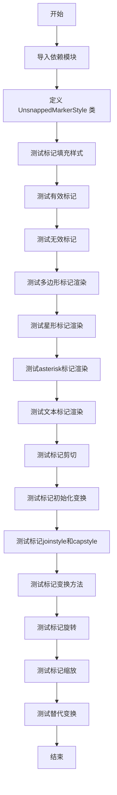

## 类结构

```
MarkerStyle (来自 matplotlib.markers)
└── UnsnappedMarkerStyle (继承 MarkerStyle，重写 _recache 方法)
```

## 全局变量及字段


### `UnsnappedMarkerStyle._snap_threshold`
    
继承自父类，在此设为 None 以禁用 snap 阈值

类型：`float | None`
    
    

## 全局函数及方法


### `test_marker_fillstyle`

该函数是一个单元测试，用于验证 Matplotlib 中 MarkerStyle 类的填充样式（fillstyle）属性设置是否正确。它创建一个填充样式为 'none' 的标记，并断言获取到的填充样式为 'none' 且该标记未被填充。

参数： 无

返回值： `None`，该函数为测试函数，不返回任何值，仅通过断言进行验证

#### 流程图

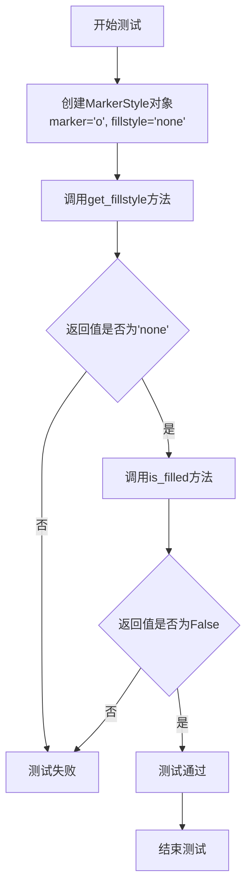

#### 带注释源码

```python
def test_marker_fillstyle():
    """
    测试 MarkerStyle 的填充样式属性设置是否正确。
    
    该测试函数验证：
    1. 创建 MarkerStyle 时正确设置 fillstyle 参数
    2. get_fillstyle() 方法能正确返回设置的填充样式
    3. is_filled() 方法能正确判断标记是否被填充
    """
    # 创建一个 MarkerStyle 对象，指定标记样式为圆形 'o'，填充样式为 'none'（无填充）
    marker_style = markers.MarkerStyle(marker='o', fillstyle='none')
    
    # 断言：获取的填充样式应该等于 'none'
    # 验证 fillstyle 参数被正确设置和存储
    assert marker_style.get_fillstyle() == 'none'
    
    # 断言：is_filled() 应该返回 False
    # 因为 fillstyle='none' 表示无填充，所以标记应被判定为未填充
    assert not marker_style.is_filled()
```


### `test_markers_valid`

该函数是一个参数化测试函数，用于验证 `MarkerStyle` 类能够正确处理各种有效的标记类型输入，确保不会抛出异常。

参数：

- `marker`：`任意类型`，待测试的标记参数，可能是字符串、数字、元组、数组、Path 对象或 MarkerStyle 实例等

返回值：`None`，测试函数无返回值，仅通过断言验证 MarkerStyle 对象的创建

#### 流程图

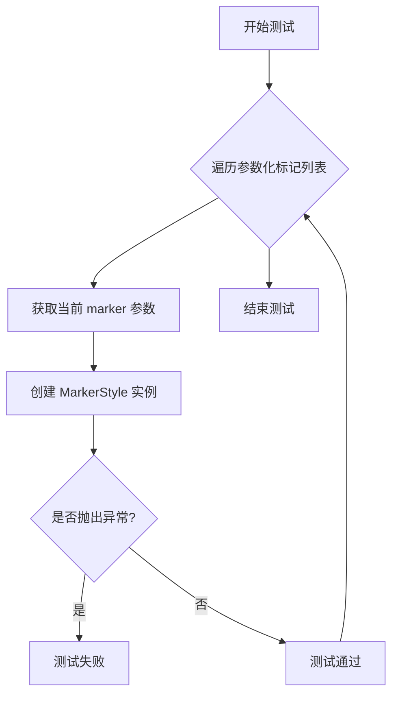

#### 带注释源码

```python
@pytest.mark.parametrize('marker', [
    'o',                                    # 字符串：圆形标记
    'x',                                    # 字符串：x 形标记
    '',                                     # 字符串：空标记
    'None',                                 # 字符串：'None' 标记
    r'$\frac{1}{2}$',                       # LaTeX 字符串：分数标记
    "$\u266B$",                             # Unicode 字符串：音乐符号标记
    1,                                      # 整数：内置标记索引
    np.int64(1),                           # NumPy 整数类型
    markers.TICKLEFT,                       # MarkerStyle 常量
    [[-1, 0], [1, 0]],                      # Python 列表：路径坐标
    np.array([[-1, 0], [1, 0]]),            # NumPy 数组：路径坐标
    Path([[0, 0], [1, 0]], [Path.MOVETO, Path.LINETO]),  # Path 对象
    (5, 0),                                 # 元组：五边形标记
    (7, 1),                                 # 元组：七角星标记
    (5, 2),                                 # 元组：星号标记
    (5, 0, 10),                             # 元组：旋转10度的五边形
    (7, 1, 10),                             # 元组：旋转10度的七角星
    (5, 2, 10),                             # 元组：旋转10度的星号
    markers.MarkerStyle('o'),               # 已存在的 MarkerStyle 实例
])
def test_markers_valid(marker):
    # Checking this doesn't fail.
    # 验证 MarkerStyle 构造函数能够接受各种有效的 marker 参数而不抛出异常
    markers.MarkerStyle(marker)
```


### `test_markers_invalid`

该测试函数用于验证 `markers.MarkerStyle` 类在接收无效marker参数时能够正确抛出 `ValueError` 异常，确保输入验证机制正常工作。

参数：

-  `marker`：`任意类型`，待测试的无效marker参数，包括任意字符串、一维numpy数组、不符合规范的元组等

返回值：`None`，该函数通过 `pytest.raises(ValueError)` 验证异常抛出，不返回任何值

#### 流程图

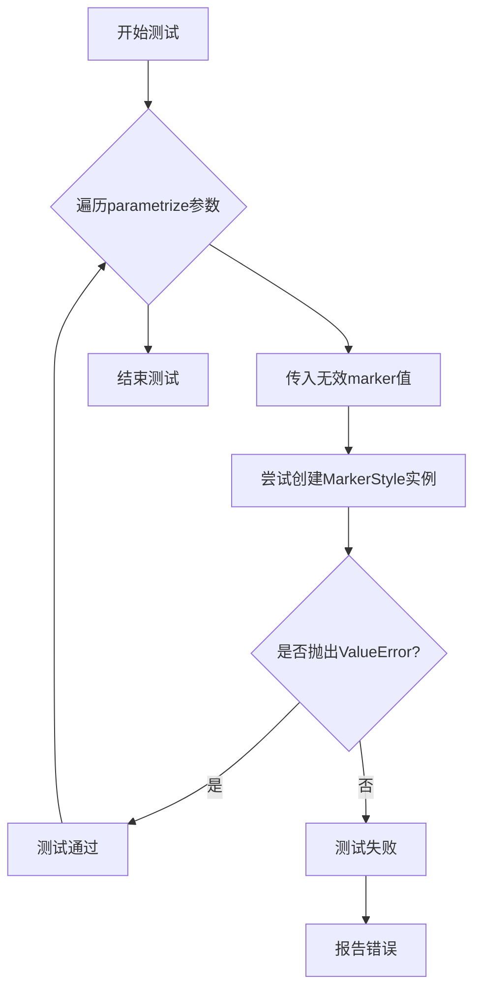

#### 带注释源码

```python
@pytest.mark.parametrize('marker', [
    'square',  # 任意非标准字符串，非matplotlib支持的有效marker名称
    np.array([[-0.5, 0, 1, 2, 3]]),  # 一维numpy数组，marker需要二维坐标数组
    (1,),  # 单元素元组，缺少必要的顶点数量信息
    (5, 3),  # 第二参数必须是0、1或2，分别表示不同填充样式，此处3无效
    (1, 2, 3, 4),  # 元素数量不符，tuple marker需要2或3个元素
])
def test_markers_invalid(marker):
    """
    测试无效marker参数是否正确抛出ValueError异常。
    
    该函数使用pytest的raises上下文管理器验证以下无效输入
    都会触发ValueError异常：
    - 非标准marker名称字符串
    - 维度/形状不符合要求的numpy数组
    - 元素数量不符合要求的元组
    """
    with pytest.raises(ValueError):
        markers.MarkerStyle(marker)
```


### `test_poly_marker`

该函数是一个图形对比测试函数，用于验证matplotlib中多边形标记（如正方形、菱形、五边形、六边形、八边形等）的绘制效果是否与参考标记一致。测试通过比较使用元组形式指定的多边形标记与使用标准字符串标记绘制的图形，确保两种方式生成的可视化结果相同。

参数：

- `fig_test`：`matplotlib.figure.Figure`，测试用的图形对象，用于绘制待测试的多边形标记
- `fig_ref`：`matplotlib.figure.Figure`，参考用的图形对象，用于绘制标准标记以进行对比

返回值：`None`，该函数为测试函数，不返回任何值

#### 流程图

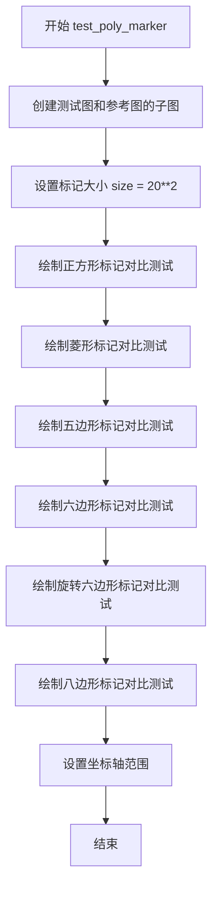

#### 带注释源码

```python
@check_figures_equal(extensions=['png', 'pdf', 'svg'])
def test_poly_marker(fig_test, fig_ref):
    """
    测试多边形标记的绘制效果是否与参考标记一致。
    
    该测试验证使用元组形式指定的多边形标记（如 (4, 0, 45) 表示正方形）
    与使用标准字符串标记（如 's' 表示正方形）绘制的结果是否相同。
    """
    # 创建测试图和参考图的子图区域
    ax_test = fig_test.add_subplot()
    ax_ref = fig_ref.add_subplot()

    # 注意：某些参考大小必须不同，因为它们使用单位*长度*，
    # 而多边形标记内切于单位*半径*的圆。这引入了 np.sqrt(2) 的因子，
    # 但由于面积是平方的，最终变为 2。
    size = 20**2  # 标记大小为 400 平方单位

    # ====== 正方形标记测试 ======
    # 测试：使用元组 (4, 0, 45) 表示 4 边形，旋转 45 度
    # 参考：使用字符串 's' 表示正方形
    ax_test.scatter([0], [0], marker=(4, 0, 45), s=size)
    ax_ref.scatter([0], [0], marker='s', s=size/2)

    # ====== 菱形标记测试 ======
    # 带旋转参数和不带旋转参数的测试
    ax_test.scatter([1], [1], marker=(4, 0), s=size)  # 4边形，无旋转
    ax_ref.scatter([1], [1], marker=UnsnappedMarkerStyle('D'), s=size/2)
    
    ax_test.scatter([1], [1.5], marker=(4, 0, 0), s=size)  # 4边形，旋转 0 度
    ax_ref.scatter([1], [1.5], marker=UnsnappedMarkerStyle('D'), s=size/2)

    # ====== 五边形标记测试 ======
    ax_test.scatter([2], [2], marker=(5, 0), s=size)  # 5边形
    ax_ref.scatter([2], [2], marker=UnsnappedMarkerStyle('p'), s=size)
    
    ax_test.scatter([2], [2.5], marker=(5, 0, 0), s=size)  # 5边形，旋转 0 度
    ax_ref.scatter([2], [2.5], marker=UnsnappedMarkerStyle('p'), s=size)

    # ====== 六边形标记测试 ======
    ax_test.scatter([3], [3], marker=(6, 0), s=size)  # 6边形
    ax_ref.scatter([3], [3], marker='h', s=size)
    
    ax_test.scatter([3], [3.5], marker=(6, 0, 0), s=size)  # 6边形，旋转 0 度
    ax_ref.scatter([3], [3.5], marker='h', s=size)

    # ====== 旋转六边形标记测试 ======
    ax_test.scatter([4], [4], marker=(6, 0, 30), s=size)  # 6边形，旋转 30 度
    ax_ref.scatter([4], [4], marker='H', s=size)

    # ====== 八边形标记测试 ======
    ax_test.scatter([5], [5], marker=(8, 0, 22.5), s=size)  # 8边形，旋转 22.5 度
    ax_ref.scatter([5], [5], marker=UnsnappedMarkerStyle('8'), s=size)

    # 设置统一的坐标轴范围，确保测试和参考图的可视化区域一致
    ax_test.set(xlim=(-0.5, 5.5), ylim=(-0.5, 5.5))
    ax_ref.set(xlim=(-0.5, 5.5), ylim=(-0.5, 5.5))
```


### `test_star_marker`

该函数是一个用于测试星形标记（star marker）的冒烟测试（smoke test），用于验证matplotlib中星形标记的渲染功能是否正常工作。函数创建一个图形窗口，并在坐标系中绘制两个使用不同配置的5角星标记（分别有无旋转角度），以确保星形标记能够正确显示。

参数： 无

返回值：`None`，该函数没有返回值，仅用于测试目的

#### 流程图

```mermaid
flowchart TD
    A[开始 test_star_marker] --> B[设置 size = 20\*\*2]
    B --> C[创建子图: fig, ax = plt.subplots]
    C --> D[绘制第一个星形标记: ax.scatter([0], [0], marker=(5, 1), s=size)]
    D --> E[绘制第二个星形标记: ax.scatter([1], [1], marker=(5, 1, 0), s=size)]
    E --> F[设置坐标轴范围: xlim=(-0.5, 0.5), ylim=(-0.5, 1.5)]
    F --> G[结束函数]
```

#### 带注释源码

```python
def test_star_marker():
    # 这是一个冒烟测试，用于验证星形标记的基本渲染功能
    # 由于没有严格的等价标记来对比，这里只是进行基本的功能测试
    
    # 设置标记大小为20的平方（400）
    size = 20**2

    # 创建图形和坐标轴对象
    fig, ax = plt.subplots()
    
    # 绘制第一个散点，使用5角星标记（marker=(5, 1)表示5角星，1表示类型）
    # 位置在(0, 0)，大小为size
    ax.scatter([0], [0], marker=(5, 1), s=size)
    
    # 绘制第二个散点，使用5角星标记，带旋转角度参数（0度）
    # 位置在(1, 1)，大小为size
    ax.scatter([1], [1], marker=(5, 1, 0), s=size)
    
    # 设置坐标轴的显示范围
    # x轴范围：-0.5到0.5，y轴范围：-0.5到1.5
    ax.set(xlim=(-0.5, 0.5), ylim=(-0.5, 1.5))
```


### `test_asterisk_marker`

该测试函数用于验证星号（asterisk）标记在matplotlib中的渲染效果，通过比较测试图像和参考图像中的加号（plus）和交叉（cross）标记样式，确认星号标记的正确绘制。

参数：

- `fig_test`：`matplotlib.figure.Figure`，测试用的图形对象
- `fig_ref`：`matplotlib.figure.Figure`，参考用的图形对象
- `request`：`pytest.fixture.Request`，pytest的请求对象，用于获取测试fixture信息

返回值：`void`，该函数为测试函数，无显式返回值，使用装饰器 `@check_figures_equal` 进行图像比对验证

#### 流程图

```mermaid
flowchart TD
    A[开始执行 test_asterisk_marker] --> B[创建测试 axes: ax_test]
    B --> C[创建参考 axes: ax_ref]
    C --> D[计算标记大小: size = 20**2 = 400]
    D --> E[定义内部函数 draw_ref_marker]
    E --> F[绘制加号标记 1: (4, 2) 在坐标 0,0]
    F --> G[调用 draw_ref_marker 绘制参考标记 +]
    G --> H[绘制加号标记 2: (4, 2, 0) 在坐标 0.5,0.5]
    H --> I[调用 draw_ref_marker 绘制参考标记 +]
    I --> J[绘制交叉标记: (4, 2, 45) 在坐标 1,1]
    J --> K[调用 draw_ref_marker 绘制参考标记 x, 大小为 size/2]
    K --> L[设置测试坐标轴范围]
    L --> M[设置参考坐标轴范围]
    M --> N[结束: @check_figures_equal 验证图像一致性]
```

#### 带注释源码

```python
# 装饰器：验证测试图像和参考图像是否相等，支持 png, pdf, svg 格式，容差为 1.45
@check_figures_equal(extensions=['png', 'pdf', 'svg'], tol=1.45)
def test_asterisk_marker(fig_test, fig_ref, request):
    """
    测试星号标记的渲染效果。
    
    星号标记实际上是一个内圆大小为0的星形，因此端点是角落会有轻微的倒角。
    参考标记是单一线条没有角落，所以没有倒角，需要添加轻微的容差来匹配。
    """
    
    # 为测试图形和参考图形添加子图
    ax_test = fig_test.add_subplot()
    ax_ref = fig_ref.add_subplot()

    # 注意：一些参考大小必须不同，因为它们使用单位*长度*，
    # 而星号标记内切于单位*半径*的圆。这引入了 np.sqrt(2) 的因子，
    # 但由于大小是平方的，所以变成 2。
    size = 20**2  # 标记大小为 400

    def draw_ref_marker(y, style, size):
        """
        内部函数：绘制参考标记
        
        由于每条线都加倍绘制，PNG 结果中由于抗锯齿会产生轻微差异
        """
        # 使用 UnsnappedMarkerStyle 绘制参考标记
        ax_ref.scatter([y], [y], marker=UnsnappedMarkerStyle(style), s=size)
        
        # 如果是 PNG 格式，再次绘制以模拟抗锯齿效果
        if request.getfixturevalue('ext') == 'png':
            ax_ref.scatter([y], [y], marker=UnsnappedMarkerStyle(style),
                           s=size)

    # 测试用例 1: 加号标记 (4, 2) - 星号类型，2表示加号样式
    ax_test.scatter([0], [0], marker=(4, 2), s=size)
    draw_ref_marker(0, '+', size)  # 绘制参考 '+' 标记
    
    # 测试用例 2: 带旋转参数的加号标记 (4, 2, 0) - 0度旋转
    ax_test.scatter([0.5], [0.5], marker=(4, 2, 0), s=size)
    draw_ref_marker(0.5, '+', size)  # 绘制参考 '+' 标记

    # 测试用例 3: 交叉标记 (4, 2, 45) - 45度旋转形成X形状
    ax_test.scatter([1], [1], marker=(4, 2, 45), s=size)
    draw_ref_marker(1, 'x', size/2)  # 绘制参考 'x' 标记，大小减半

    # 设置测试坐标轴范围
    ax_test.set(xlim=(-0.5, 1.5), ylim=(-0.5, 1.5))
    
    # 设置参考坐标轴范围
    ax_ref.set(xlim=(-0.5, 1.5), ylim=(-0.5, 1.5))
```


### `test_text_marker`

该测试函数用于验证基于文本的标记（marker）在图表中是否正确居中，通过对比标准的圆形标记'o'与LaTeX文本标记'$\bullet$'的渲染结果来确认文本标记的居中效果。

参数：

- `fig_ref`：`matplotlib.figure.Figure`，参考图形的fixture，用于绘制标准圆形标记'o'
- `fig_test`：`matplotlib.figure.Figure`，测试图形的fixture，用于绘制文本标记'$\bullet$'

返回值：`None`，该函数为测试函数，使用装饰器进行图形比较，无显式返回值

#### 流程图

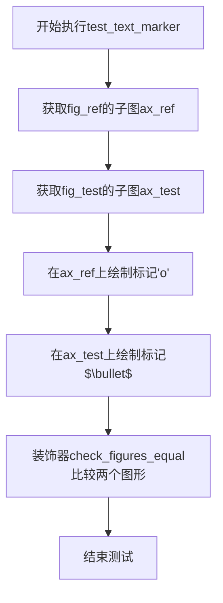

#### 带注释源码

```python
@check_figures_equal(tol=1.86)
def test_text_marker(fig_ref, fig_test):
    """
    测试文本标记是否正确居中。
    
    由于'bullet'数学符号并非完美的圆形，需要设置容差值(tol=1.86)
    来允许轻微的渲染差异，以验证文本标记的居中效果。
    """
    # 获取参考图形的坐标轴
    ax_ref = fig_ref.add_subplot()
    
    # 获取测试图形的坐标轴
    ax_test = fig_test.add_subplot()

    # 在参考图形上绘制标准圆形标记'o'，标记大小为100，边框宽度为0
    ax_ref.plot(0, 0, marker=r'o', markersize=100, markeredgewidth=0)
    
    # 在测试图形上绘制LaTeX文本标记'$\bullet$'（子弹符号）
    # 用于与圆形标记对比，验证文本标记是否正确居中
    ax_test.plot(0, 0, marker=r'$\bullet$', markersize=100, markeredgewidth=0)
```


### `test_marker_clipping`

该测试函数用于验证 matplotlib 中标记（markers）的裁剪功能是否正确，通过比较单个标记渲染与多个标记渲染的结果，确保各种标记类型在图表中能够正确地被裁剪。

参数：

- `fig_ref`：`matplotlib.figure.Figure`，参考图像对象，用于绘制单个标记的基准图形
- `fig_test`：`matplotlib.figure.Figure`，测试图像对象，用于绘制多个标记的测试图形

返回值：`None`，该测试函数不返回任何值，仅进行图形渲染和对比

#### 流程图

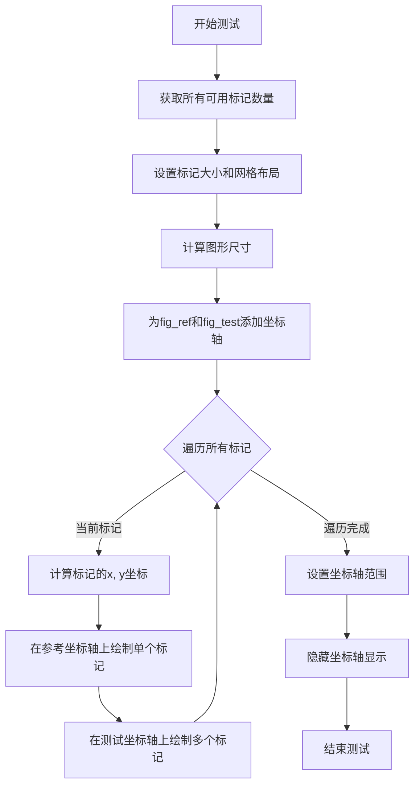

#### 带注释源码

```python
@check_figures_equal(extensions=['png', 'pdf', 'svg'])
def test_marker_clipping(fig_ref, fig_test):
    # 获取matplotlib中所有可用的标记样式数量
    marker_count = len(markers.MarkerStyle.markers)
    # 设置标记大小为50
    marker_size = 50
    # 设置网格列数为7
    ncol = 7
    # 计算网格行数：总标记数除以列数向上取整
    nrow = marker_count // ncol + 1

    # 计算图形宽度：2 * 标记大小 * 列数
    width = 2 * marker_size * ncol
    # 计算图形高度：2 * 标记大小 * 行数 * 2
    height = 2 * marker_size * nrow * 2
    # 根据DPI设置参考图形的尺寸（英寸）
    fig_ref.set_size_inches((width / fig_ref.dpi, height / fig_ref.dpi))
    # 添加参考坐标轴，位置为(0, 0, 1, 1)，即占满整个图形
    ax_ref = fig_ref.add_axes((0, 0, 1, 1))
    # 根据DPI设置测试图形的尺寸（英寸）
    fig_test.set_size_inches((width / fig_test.dpi, height / fig_ref.dpi))
    # 添加测试坐标轴
    ax_test = fig_test.add_axes((0, 0, 1, 1))

    # 遍历所有可用的标记样式
    for i, marker in enumerate(markers.MarkerStyle.markers):
        # 计算当前标记的x坐标（列位置）
        x = i % ncol
        # 计算当前标记的y坐标（行位置，2倍间距）
        y = i // ncol * 2

        # === 参考坐标轴：单个标记渲染 ===
        # 绘制线条作为参考基准（黑色，线宽3）
        ax_ref.plot([x, x], [y, y + 1], c='k', linestyle='-', lw=3)
        # 在y位置绘制单个标记
        ax_ref.plot(x, y, c='k',
                    marker=marker, markersize=marker_size, markeredgewidth=10,
                    fillstyle='full', markerfacecolor='white')
        # 在y+1位置绘制单个标记
        ax_ref.plot(x, y + 1, c='k',
                    marker=marker, markersize=marker_size, markeredgewidth=10,
                    fillstyle='full', markerfacecolor='white')

        # === 测试坐标轴：多个标记渲染 ===
        # 在单个plot调用中绘制两个点和对应的标记
        ax_test.plot([x, x], [y, y + 1], c='k', linestyle='-', lw=3,
                     marker=marker, markersize=marker_size, markeredgewidth=10,
                     fillstyle='full', markerfacecolor='white')

    # 设置坐标轴范围
    ax_ref.set(xlim=(-0.5, ncol), ylim=(-0.5, 2 * nrow))
    ax_test.set(xlim=(-0.5, ncol), ylim=(-0.5, 2 * nrow))
    # 隐藏坐标轴的刻度和标签
    ax_ref.axis('off')
    ax_test.axis('off')
```


### `test_marker_init_transforms`

该测试函数用于验证 Matplotlib 中 MarkerStyle 类在初始化时传入 transform 参数后，其变换效果等于在基础变换上简单叠加传入的变换矩阵。

参数： 无

返回值： 无（测试函数，通过 assert 语句进行验证）

#### 流程图

```mermaid
flowchart TD
    A[开始测试] --> B[创建基础 MarkerStyle: marker = MarkerStyle('o')]
    B --> C[创建变换对象: t = Affine2D.translate(1, 1)]
    C --> D[使用 transform 初始化 MarkerStyle: t_marker = MarkerStyle('o', transform=t)]
    D --> E[获取两个 marker 的变换矩阵]
    E --> F{marker.get_transform + t == t_marker.get_transform?}
    F -->|是| G[测试通过]
    F -->|否| H[测试失败]
```

#### 带注释源码

```python
def test_marker_init_transforms():
    """Test that initializing marker with transform is a simple addition."""
    # 创建一个基础 MarkerStyle 对象，使用圆形标记 'o'
    # 不传入任何 transform 参数，使用默认变换
    marker = markers.MarkerStyle("o")
    
    # 创建一个仿射变换对象：沿 x 轴平移 1，沿 y 轴平移 1
    t = Affine2D().translate(1, 1)
    
    # 创建另一个 MarkerStyle 对象，同时传入标记类型 'o' 和变换对象 t
    # 这模拟了用户想要在初始化时直接应用变换的场景
    t_marker = markers.MarkerStyle("o", transform=t)
    
    # 断言验证：
    # 基础 marker 的变换矩阵 + 变换 t 的结果，应该等于直接传入 transform 参数的 t_marker 的变换矩阵
    # 这确保了 transform 参数的初始化是简单的加法组合，而非复杂的变换操作
    assert marker.get_transform() + t == t_marker.get_transform()
```


### `test_marker_init_joinstyle`

该测试函数用于验证 `MarkerStyle` 类在初始化时能否正确接受 `joinstyle` 参数，并确保该参数能够正确设置标记的连接样式，同时验证默认标记的连接样式与设置的样式不同。

参数：此函数无参数。

返回值：`None`，该函数为测试函数，不返回任何值，仅通过断言验证条件。

#### 流程图

```mermaid
flowchart TD
    A[开始测试] --> B[创建默认MarkerStyle: marker = markers.MarkerStyle('*')]
    B --> C[创建带joinstyle参数的MarkerStyle: styled_marker = markers.MarkerStyle('*', joinstyle='round')]
    C --> D{断言: styled_marker.get_joinstyle == 'round'}
    D -->|通过| E{断言: marker.get_joinstyle != 'round'}
    E -->|通过| F[测试通过]
    D -->|失败| G[测试失败]
    E -->|失败| G
```

#### 带注释源码

```python
def test_marker_init_joinstyle():
    """
    测试 MarkerStyle 初始化时 joinstyle 参数的功能。
    
    验证点：
    1. 可以在创建 MarkerStyle 时传入 joinstyle 参数
    2. get_joinstyle() 方法能正确返回设置的 joinstyle 值
    3. 默认的 MarkerStyle 的 joinstyle 与设置的 joinstyle 不同
    """
    # 创建一个使用默认参数的 MarkerStyle，标记类型为星号("*")
    marker = markers.MarkerStyle("*")
    
    # 创建一个指定 joinstyle="round" 的 MarkerStyle
    # joinstyle 控制线条连接处的样式，可选值包括 'miter', 'round', 'bevel'
    styled_marker = markers.MarkerStyle("*", joinstyle="round")
    
    # 断言：验证 styled_marker 的 joinstyle 已被正确设置为 'round'
    assert styled_marker.get_joinstyle() == "round"
    
    # 断言：验证默认 marker 的 joinstyle 不是 'round'（应该是默认的 'miter'）
    assert marker.get_joinstyle() != "round"
```


### `test_marker_init_captyle`

该测试函数用于验证 MarkerStyle 类在初始化时能够正确接受 capstyle 参数，并确保设置 capstyle 后的 MarkerStyle 对象与默认的 MarkerStyle 对象在 capstyle 属性上存在差异。

参数： 无

返回值： `None`，该函数为测试函数，不返回具体数据，通过断言验证功能正确性

#### 流程图

```mermaid
flowchart TD
    A[开始测试] --> B[创建默认MarkerStyle: marker = markers.MarkerStyle('*')]
    B --> C[创建带capstyle的MarkerStyle: styled_marker = markers.MarkerStyle('*', capstyle='round')]
    C --> D[断言: styled_marker.get_capstyle == 'round']
    D --> E[断言: marker.get_capstyle != 'round']
    E --> F[测试结束]
```

#### 带注释源码

```python
def test_marker_init_captyle():
    """
    测试 MarkerStyle 在初始化时正确接受 capstyle 参数。
    
    该测试函数验证：
    1. 可以通过构造函数为 MarkerStyle 设置 capstyle
    2. 设置的 capstyle 值能够被正确获取
    3. 默认 MarkerStyle 与设置 capstyle 后的 MarkerStyle 是不同的
    """
    # 创建一个使用默认设置的 MarkerStyle，使用星号作为标记形状
    marker = markers.MarkerStyle("*")
    
    # 创建一个具有圆角 capstyle 的 MarkerStyle
    # capstyle 参数控制线条端点的样式，可选值为 'butt', 'round', 'projecting'
    styled_marker = markers.MarkerStyle("*", capstyle="round")
    
    # 验证 styled_marker 的 capstyle 已设置为 'round'
    assert styled_marker.get_capstyle() == "round"
    
    # 验证默认 marker 的 capstyle 不是 'round'（确保两个对象是不同的）
    assert marker.get_capstyle() != "round"
```


### `test_marker_transformed`

这是一个参数化测试函数，用于验证 MarkerStyle 对象的 transformed 方法是否正确应用仿射变换，并确保返回新实例而非修改原实例。

参数：

- `marker`：`markers.MarkerStyle`，待转换的标记样式对象
- `transform`：`Affine2D`，要应用的仿射变换
- `expected`：`Affine2D`，预期的变换结果

返回值：`None`，该函数为测试函数，使用断言验证行为

#### 流程图

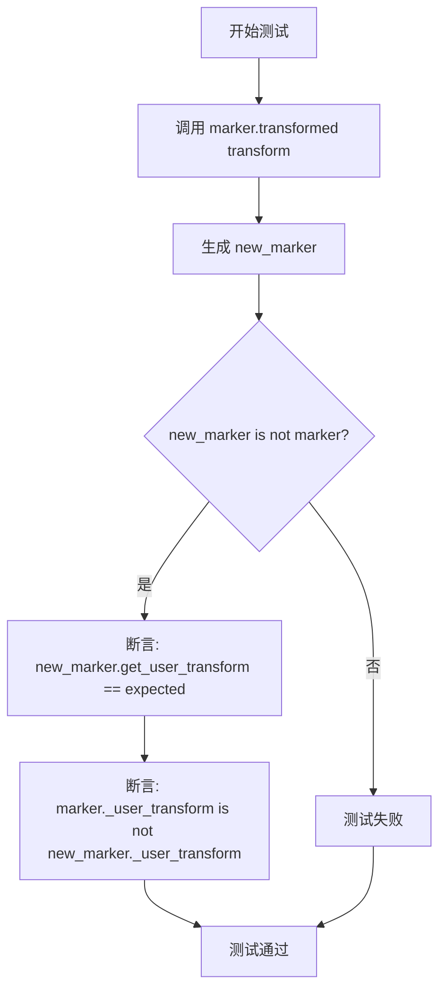

#### 带注释源码

```python
@pytest.mark.parametrize("marker,transform,expected", [
    # 测试用例1: 基础标记无变换,应用平移变换
    (markers.MarkerStyle("o"), Affine2D().translate(1, 1),
        Affine2D().translate(1, 1)),
    # 测试用例2: 标记已有变换,再次应用平移
    (markers.MarkerStyle("o", transform=Affine2D().translate(1, 1)),
        Affine2D().translate(1, 1), Affine2D().translate(2, 2)),
    # 测试用例3: 文本标记带有变换
    (markers.MarkerStyle("$|||$", transform=Affine2D().translate(1, 1)),
     Affine2D().translate(1, 1), Affine2D().translate(2, 2)),
    # 测试用例4: 预定义标记TICKLEFT带有变换
    (markers.MarkerStyle(
        markers.TICKLEFT, transform=Affine2D().translate(1, 1)),
        Affine2D().translate(1, 1), Affine2D().translate(2, 2)),
])
def test_marker_transformed(marker, transform, expected):
    # 对标记应用变换,返回新的MarkerStyle对象
    new_marker = marker.transformed(transform)
    
    # 验证返回的是新实例而非原实例的修改
    assert new_marker is not marker
    
    # 验证变换被正确应用
    assert new_marker.get_user_transform() == expected
    
    # 验证原标记的变换未被修改
    assert marker._user_transform is not new_marker._user_transform
```


### `test_marker_rotated_invalid`

该测试函数用于验证 `MarkerStyle.rotated()` 方法在参数缺失或参数冲突时的错误处理行为，确保在无效参数情况下正确抛出 `ValueError` 异常。

参数： 无

返回值： `None`，该函数为测试函数，不返回任何值

#### 流程图

```mermaid
flowchart TD
    A[开始测试] --> B[创建 MarkerStyle 对象 marker = MarkerStyle('o')]
    B --> C{测试用例 1}
    C -->|调用 marker.rotated()| D[期望抛出 ValueError]
    C --> E{测试用例 2}
    E -->|调用 marker.rotated deg=10, rad=10| F[期望抛出 ValueError]
    D --> G[测试通过]
    F --> G
    G --> H[结束测试]
```

#### 带注释源码

```python
def test_marker_rotated_invalid():
    """
    测试 MarkerStyle.rotated() 方法在无效参数情况下的错误处理。
    
    该测试验证以下两种情况会抛出 ValueError 异常：
    1. 调用 rotated() 时不传入任何参数（既没有 deg 也没有 rad）
    2. 调用 rotated() 时同时传入 deg 和 rad 参数（参数冲突）
    """
    # 创建一个 MarkerStyle 对象，使用圆圈 marker
    marker = markers.MarkerStyle("o")
    
    # 测试用例 1：调用 rotated() 不传入任何参数
    # 期望行为：抛出 ValueError，因为既没有指定旋转角度的度数形式也没有弧度形式
    with pytest.raises(ValueError):
        new_marker = marker.rotated()
    
    # 测试用例 2：同时传入 deg 和 rad 参数
    # 期望行为：抛出 ValueError，因为参数冲突（不能同时指定两种旋转单位）
    with pytest.raises(ValueError):
        new_marker = marker.rotated(deg=10, rad=10)
```


### `test_marker_rotated`

该测试函数通过参数化测试验证 MarkerStyle 对象的旋转（rotated）方法是否正确工作，包括仅使用角度（deg）、仅使用弧度（rad）以及带有预定义变换（transform）的场景。

参数：

-  `marker`：`markers.MarkerStyle`，待旋转的标记样式对象
-  `deg`：`float | None`，旋转角度（度），与 rad 参数二选一
-  `rad`：`float | None`，旋转角度（弧度），与 deg 参数二选一
-  `expected`：`Affine2D`，期望的用户变换矩阵

返回值：`None`，该函数为测试函数，通过断言验证功能，无返回值

#### 流程图

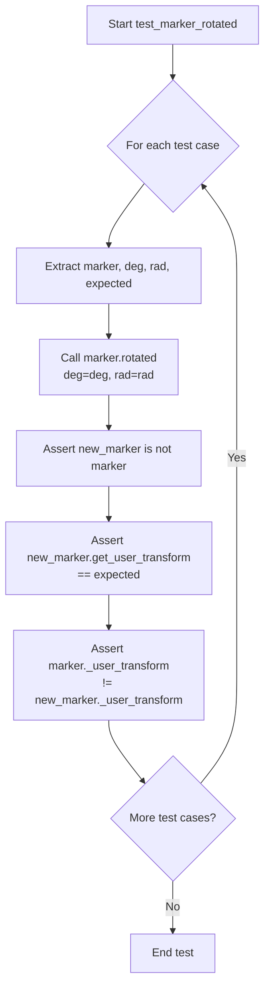

#### 带注释源码

```python
@pytest.mark.parametrize("marker,deg,rad,expected", [
    # Case 1: Basic rotation by 10 degrees
    (markers.MarkerStyle("o"), 10, None, Affine2D().rotate_deg(10)),
    
    # Case 2: Basic rotation by 0.01 radians
    (markers.MarkerStyle("o"), None, 0.01, Affine2D().rotate(0.01)),
    
    # Case 3: Translation then rotation by degrees
    (markers.MarkerStyle("o", transform=Affine2D().translate(1, 1)),
        10, None, Affine2D().translate(1, 1).rotate_deg(10)),
    
    # Case 4: Translation then rotation by radians
    (markers.MarkerStyle("o", transform=Affine2D().translate(1, 1)),
        None, 0.01, Affine2D().translate(1, 1).rotate(0.01)),
    
    # Case 5: Math text marker with translation and rotation
    (markers.MarkerStyle("$|||$", transform=Affine2D().translate(1, 1)),
      10, None, Affine2D().translate(1, 1).rotate_deg(10)),
    
    # Case 6: TICKLEFT marker with translation and rotation
    (markers.MarkerStyle(
        markers.TICKLEFT, transform=Affine2D().translate(1, 1)),
        10, None, Affine2D().translate(1, 1).rotate_deg(10)),
])
def test_marker_rotated(marker, deg, rad, expected):
    # 调用被测方法：对标记进行旋转
    new_marker = marker.rotated(deg=deg, rad=rad)
    
    # 断言1：确保返回的是新对象而非原对象修改
    assert new_marker is not marker
    
    # 断言2：验证旋转后的变换矩阵符合预期
    assert new_marker.get_user_transform() == expected
    
    # 断言3：确保原对象的变换未被修改
    assert marker._user_transform is not new_marker._user_transform
```


### `test_marker_scaled`

该函数用于测试 `MarkerStyle` 类的 `scaled` 方法，验证不同参数情况下缩放变换是否正确应用，包括单参数缩放、双参数缩放以及带有初始变换的标记物的缩放。

参数：无

返回值：`None`，无返回值（测试函数）

#### 流程图

```mermaid
flowchart TD
    A[开始测试] --> B[创建MarkerStyle标记物 '1']
    B --> C[调用scaled方法, 参数2]
    C --> D[断言新标记物与原标记物不是同一对象]
    D --> E[断言缩放变换为Affine2D().scale(2)]
    E --> F[断言用户变换与新标记物不同]
    F --> G[调用scaled方法, 参数2和3]
    G --> H[断言缩放变换为Affine2D().scale(2, 3)]
    H --> I[创建带有平移变换的MarkerStyle]
    I --> J[调用scaled方法, 参数2]
    K[断言平移后缩放变换正确]
    J --> K
    K --> L[结束测试]
```

#### 带注释源码

```python
def test_marker_scaled():
    """
    测试MarkerStyle类的scaled方法的各种缩放场景。
    
    测试内容包括：
    1. 单参数缩放
    2. 双参数缩放
    3. 带变换的标记物进行缩放
    """
    # 创建基础标记物，使用字符'1'作为标记样式
    marker = markers.MarkerStyle("1")
    
    # 测试单参数缩放（x和y方向相同缩放因子2）
    new_marker = marker.scaled(2)
    assert new_marker is not marker  # 确保返回新对象而非修改原对象
    assert new_marker.get_user_transform() == Affine2D().scale(2)  # 验证变换正确
    assert marker._user_transform is not new_marker._user_transform  # 验证变换独立性

    # 测试双参数缩放（x方向2，y方向3）
    new_marker = marker.scaled(2, 3)
    assert new_marker is not marker
    assert new_marker.get_user_transform() == Affine2D().scale(2, 3)
    assert marker._user_transform is not new_marker._user_transform

    # 测试带初始变换的标记物缩放
    # 创建带有平移变换(1,1)的标记物
    marker = markers.MarkerStyle("1", transform=Affine2D().translate(1, 1))
    
    # 对带变换的标记物进行缩放
    new_marker = marker.scaled(2)
    assert new_marker is not marker
    
    # 预期变换：先平移(1,1)后缩放2倍
    expected = Affine2D().translate(1, 1).scale(2)
    assert new_marker.get_user_transform() == expected
    assert marker._user_transform is not new_marker._user_transform
```


### `test_alt_transform`

该函数是一个pytest测试用例，用于验证MarkerStyle类的`get_alt_transform()`方法在应用旋转变换时是否正确工作。它创建两个MarkerStyle对象，其中一个带有额外的旋转变换，然后通过断言验证应用旋转后的替代变换是否相等。

参数： 无

返回值：`None`，该函数为测试函数，使用assert语句进行断言验证，不返回任何值

#### 流程图

```mermaid
flowchart TD
    A[开始测试 test_alt_transform] --> B[创建MarkerStyle对象 m1: 标记='o', 填充样式='left']
    B --> C[创建MarkerStyle对象 m2: 标记='o', 填充样式='left', 变换=Affine2D.rotate_deg(90)]
    C --> D[调用 m1.get_alt_transform 获取替代变换]
    D --> E[对 m1 的替代变换应用 rotate_deg(90) 旋转]
    E --> F[断言: m1的旋转后变换 == m2的替代变换]
    F --> G{断言结果}
    G -->|通过| H[测试通过]
    G -->|失败| I[测试失败抛出AssertionError]
    H --> J[结束测试]
    I --> J
```

#### 带注释源码

```python
def test_alt_transform():
    """
    测试MarkerStyle的get_alt_transform方法与变换的组合功能。
    
    该测试验证：
    1. MarkerStyle可以同时指定标记类型、填充样式和变换
    2. get_alt_transform()方法正确返回用户设置的变换
    3. 对返回的变换进行操作后应等于直接设置变换的MarkerStyle
    """
    # 创建一个MarkerStyle对象，标记为'o'(圆圈)，填充样式为'left'(左半部分填充)
    m1 = markers.MarkerStyle("o", "left")
    
    # 创建另一个MarkerStyle对象，除了标记和填充样式外，还包含一个90度旋转变换
    # Affine2D().rotate_deg(90) 创建一个绕原点旋转90度的仿射变换
    m2 = markers.MarkerStyle("o", "left", Affine2D().rotate_deg(90))
    
    # 断言验证：
    # 1. 获取m1的替代变换（此处为默认变换）
    # 2. 对该变换应用90度旋转
    # 3. 结果应等于m2直接设置的旋转90度的变换
    # 这验证了get_alt_transform()返回的变换可以像普通Affine2D变换一样进行链式操作
    assert m1.get_alt_transform().rotate_deg(90) == m2.get_alt_transform()
```


### `UnsnappedMarkerStyle._recache`

该方法是一个重写父类 `MarkerStyle` 的内部方法，它在调用父类 `_recache` 方法完成缓存初始化后，强制将 `_snap_threshold` 属性设置为 `None`，以禁用标记的吸附阈值。这主要用于测试场景，以便与本身没有设置 snap 阈值的 polygon/star/asterisk 标记进行视觉对比。

参数：无显式参数（`self` 为隐式参数）

返回值：`None`，无返回值

#### 流程图

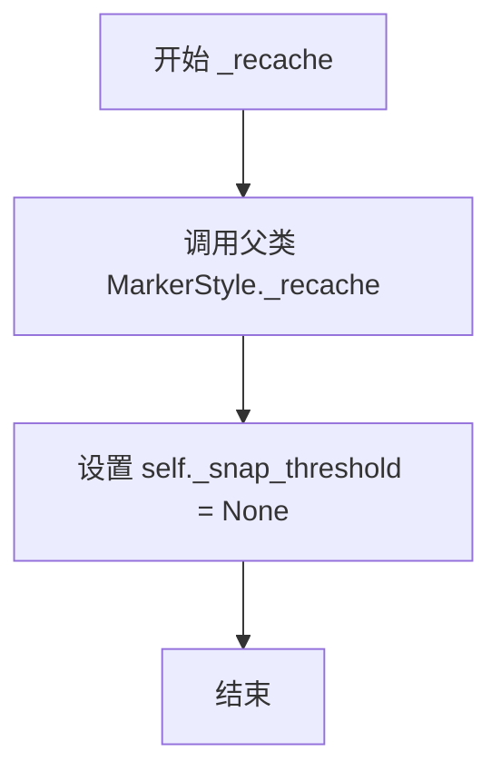

#### 带注释源码

```python
def _recache(self):
    """
    重写父类 _recache 方法，强制禁用 snap 阈值。
    
    该方法在调用父类的 _recache 方法完成标记的缓存初始化后，
    强制将 _snap_threshold 设置为 None，以禁用标记的吸附阈值。
    这确保了标记在渲染时不使用任何 snap 阈值。
    """
    super()._recache()           # 调用父类 MarkerStyle 的 _recache 方法
    self._snap_threshold = None  # 强制禁用 snap 阈值，设置为 None
```

## 关键组件


### 一段话描述

该代码是matplotlib标记点（MarkerStyle）的综合测试套件，用于验证不同类型标记点的创建、渲染、变换（旋转、缩放、平移）、填充样式、连接风格和端点风格等功能，并包含多个视觉回归测试以确保标记点在不同后端和参数下的正确性。

### 文件的整体运行流程

该测试文件通过pytest框架执行，首先进行标记点基础功能验证（填充样式、有效性检查），然后依次测试各类标记点（多边形、星形、文本等）的渲染效果，接着验证标记点的变换操作（初始化变换、旋转、缩放、仿射变换），最后进行clipping和视觉回归测试。所有测试均通过`@check_figures_equal`装饰器或直接断言进行结果验证。

### 类的详细信息

#### UnsnappedMarkerStyle类

**类描述**：继承自`markers.MarkerStyle`的测试辅助类，强制禁用snap阈值以与不使用snap阈值的marker进行精确对比。

**类字段**：
- 无新增字段，继承父类所有属性

**类方法**：
- `_recache()`：重写父类方法，将`_snap_threshold`强制设置为None

```python
class UnsnappedMarkerStyle(markers.MarkerStyle):
    """
    A MarkerStyle where the snap threshold is force-disabled.

    This is used to compare to polygon/star/asterisk markers which do not have
    any snap threshold set.
    """
    def _recache(self):
        super()._recache()
        self._snap_threshold = None
```

### 全局函数详细信息

#### test_marker_fillstyle

**参数**：
- 无参数

**返回值**：
- 无返回值（断言测试）

**功能描述**：验证MarkerStyle的fillstyle属性获取和filled状态判断功能。

**流程图**：
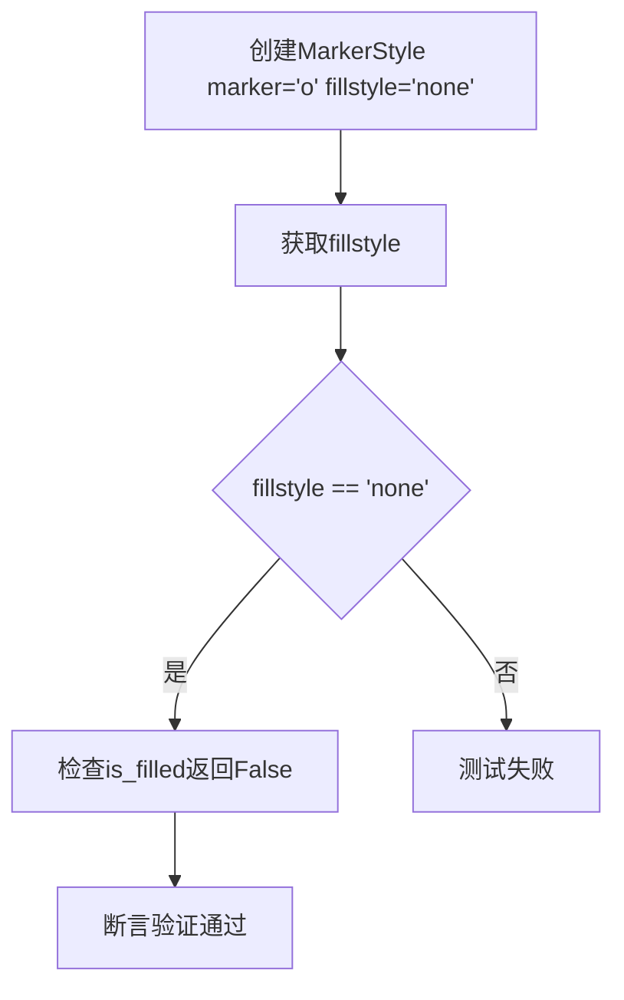

**源码**：
```python
def test_marker_fillstyle():
    marker_style = markers.MarkerStyle(marker='o', fillstyle='none')
    assert marker_style.get_fillstyle() == 'none'
    assert not marker_style.is_filled()
```

#### test_markers_valid

**参数**：
- marker：任意类型，表示待测试的marker标记

**返回值**：
- 无返回值（断言测试）

**功能描述**：参数化测试函数，验证各种有效marker类型都能成功创建MarkerStyle对象。

**流程图**：
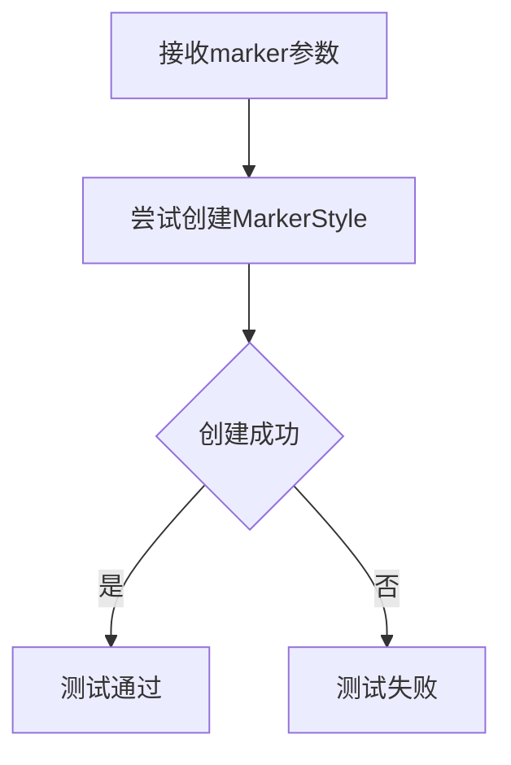

**源码**：
```python
@pytest.mark.parametrize('marker', [
    'o',
    'x',
    '',
    'None',
    r'$\frac{1}{2}$',
    "$\u266B$",
    1,
    np.int64(1),
    markers.TICKLEFT,
    [[-1, 0], [1, 0]],
    np.array([[-1, 0], [1, 0]]),
    Path([[0, 0], [1, 0]], [Path.MOVETO, Path.LINETO]),
    (5, 0),  # a pentagon
    (7, 1),  # a 7-pointed star
    (5, 2),  # asterisk
    (5, 0, 10),  # a pentagon, rotated by 10 degrees
    (7, 1, 10),  # a 7-pointed star, rotated by 10 degrees
    (5, 2, 10),  # asterisk, rotated by 10 degrees
    markers.MarkerStyle('o'),
])
def test_markers_valid(marker):
    # Checking this doesn't fail.
    markers.MarkerStyle(marker)
```

#### test_markers_invalid

**参数**：
- marker：任意类型，表示待测试的无效marker标记

**返回值**：
- 无返回值（断言测试）

**功能描述**：参数化测试函数，验证无效marker类型会抛出ValueError异常。

**流程图**：
```mermaid
graph TD
    A[接收marker参数] --> B[尝试创建MarkerStyle]
    B --> C{是否抛出ValueError}
    C -->|是| D[测试通过]
    C -->|否| E[测试失败]
```

**源码**：
```python
@pytest.mark.parametrize('marker', [
    'square',  # arbitrary string
    np.array([[-0.5, 0, 1, 2, 3]]),  # 1D array
    (1,),
    (5, 3),  # second parameter of tuple must be 0, 1, or 2
    (1, 2, 3, 4),
])
def test_markers_invalid(marker):
    with pytest.raises(ValueError):
        markers.MarkerStyle(marker)
```

#### test_poly_marker

**参数**：
- fig_test：Figure对象，测试figure
- fig_ref：Figure对象，参考figure

**返回值**：
- 无返回值（视觉回归测试）

**功能描述**：比较不同类型多边形标记点（正方形、菱形、五边形、六边形、八边形）与参考标记点的渲染效果，考虑单位长度与单位半径的差异。

**流程图**：
```mermaid
graph TD
    A[创建test和ref axes] --> B[设置size=20\*\*2]
    B --> C[绘制各类多边形marker]
    C --> D[使用UnsnappedMarkerStyle作为参考]
    D --> E[设置相同坐标范围]
    E --> F[视觉对比验证]
```

**源码**：
```python
@check_figures_equal(extensions=['png', 'pdf', 'svg'])
def test_poly_marker(fig_test, fig_ref):
    ax_test = fig_test.add_subplot()
    ax_ref = fig_ref.add_subplot()

    # Note, some reference sizes must be different because they have unit
    # *length*, while polygon markers are inscribed in a circle of unit
    # *radius*. This introduces a factor of np.sqrt(2), but since size is
    # squared, that becomes 2.
    size = 20**2

    # Squares
    ax_test.scatter([0], [0], marker=(4, 0, 45), s=size)
    ax_ref.scatter([0], [0], marker='s', s=size/2)

    # Diamonds, with and without rotation argument
    ax_test.scatter([1], [1], marker=(4, 0), s=size)
    ax_ref.scatter([1], [1], marker=UnsnappedMarkerStyle('D'), s=size/2)
    ax_test.scatter([1], [1.5], marker=(4, 0, 0), s=size)
    ax_ref.scatter([1], [1.5], marker=UnsnappedMarkerStyle('D'), s=size/2)

    # Pentagon, with and without rotation argument
    ax_test.scatter([2], [2], marker=(5, 0), s=size)
    ax_ref.scatter([2], [2], marker=UnsnappedMarkerStyle('p'), s=size)
    ax_test.scatter([2], [2.5], marker=(5, 0, 0), s=size)
    ax_ref.scatter([2], [2.5], marker=UnsnappedMarkerStyle('p'), s=size)

    # Hexagon, with and without rotation argument
    ax_test.scatter([3], [3], marker=(6, 0), s=size)
    ax_ref.scatter([3], [3], marker='h', s=size)
    ax_test.scatter([3], [3.5], marker=(6, 0, 0), s=size)
    ax_ref.scatter([3], [3.5], marker='h', s=size)

    # Rotated hexagon
    ax_test.scatter([4], [4], marker=(6, 0, 30), s=size)
    ax_ref.scatter([4], [4], marker='H', s=size)

    # Octagons
    ax_test.scatter([5], [5], marker=(8, 0, 22.5), s=size)
    ax_ref.scatter([5], [5], marker=UnsnappedMarkerStyle('8'), s=size)

    ax_test.set(xlim=(-0.5, 5.5), ylim=(-0.5, 5.5))
    ax_ref.set(xlim=(-0.5, 5.5), ylim=(-0.5, 5.5))
```

#### test_star_marker

**参数**：
- 无参数

**返回值**：
- 无返回值（冒烟测试）

**功能描述**：星形标记点的冒烟测试，验证带旋转参数和不带旋转参数的星形marker能够正常渲染。

**流程图**：
```mermaid
graph TD
    A[创建figure和axes] --> B[绘制星形marker]
    B --> C[设置坐标范围]
    C --> D[验证渲染成功]
```

**源码**：
```python
def test_star_marker():
    # We don't really have a strict equivalent to this marker, so we'll just do
    # a smoke test.
    size = 20**2

    fig, ax = plt.subplots()
    ax.scatter([0], [0], marker=(5, 1), s=size)
    ax.scatter([1], [1], marker=(5, 1, 0), s=size)
    ax.set(xlim=(-0.5, 0.5), ylim=(-0.5, 1.5))
```

#### test_asterisk_marker

**参数**：
- fig_test：Figure对象，测试figure
- fig_ref：Figure对象，参考figure
- request：pytest request对象

**返回值**：
- 无返回值（视觉回归测试）

**功能描述**：测试星号标记点（十字交叉线），由于抗锯齿导致的细微差异，使用1.45的容忍度进行视觉对比。

**流程图**：
```mermaid
graph TD
    A[创建test和ref axes] --> B[定义draw_ref_marker辅助函数]
    B --> C[绘制加号和交叉marker]
    C --> D[双重绘制处理PNG抗锯齿]
    D --> E[设置容忍度1.45]
    E --> F[视觉对比验证]
```

**源码**：
```python
@check_figures_equal(extensions=['png', 'pdf', 'svg'], tol=1.45)
def test_asterisk_marker(fig_test, fig_ref, request):
    ax_test = fig_test.add_subplot()
    ax_ref = fig_ref.add_subplot()

    # Note, some reference sizes must be different because they have unit
    # *length*, while asterisk markers are inscribed in a circle of unit
    # *radius*. This introduces a factor of np.sqrt(2), but since size is
    # squared, that becomes 2.
    size = 20**2

    def draw_ref_marker(y, style, size):
        # As noted above, every line is doubled. Due to antialiasing, these
        # doubled lines make a slight difference in the .png results.
        ax_ref.scatter([y], [y], marker=UnsnappedMarkerStyle(style), s=size)
        if request.getfixturevalue('ext') == 'png':
            ax_ref.scatter([y], [y], marker=UnsnappedMarkerStyle(style),
                           s=size)

    # Plus
    ax_test.scatter([0], [0], marker=(4, 2), s=size)
    draw_ref_marker(0, '+', size)
    ax_test.scatter([0.5], [0.5], marker=(4, 2, 0), s=size)
    draw_ref_marker(0.5, '+', size)

    # Cross
    ax_test.scatter([1], [1], marker=(4, 2, 45), s=size)
    draw_ref_marker(1, 'x', size/2)

    ax_test.set(xlim=(-0.5, 1.5), ylim=(-0.5, 1.5))
    ax_ref.set(xlim=(-0.5, 1.5), ylim=(-0.5, 1.5))
```

#### test_text_marker

**参数**：
- fig_ref：Figure对象，参考figure
- fig_test：Figure对象，测试figure

**返回值**：
- 无返回值（视觉回归测试）

**功能描述**：验证文本基标记点（如数学符号bullet）的居中效果，使用1.86容忍度处理与圆形的细微差异。

**流程图**：
```mermaid
graph TD
    A[创建test和ref axes] --> B[绘制圆形marker作为参考]
    B --> C[绘制文本bullet marker]
    C --> D[设置大markersize和零边框]
    D --> E[使用容忍度1.86验证]
```

**源码**：
```python
@check_figures_equal(tol=1.86)
def test_text_marker(fig_ref, fig_test):
    ax_ref = fig_ref.add_subplot()
    ax_test = fig_test.add_subplot()

    ax_ref.plot(0, 0, marker=r'o', markersize=100, markeredgewidth=0)
    ax_test.plot(0, 0, marker=r'$\bullet$', markersize=100, markeredgewidth=0)
```

#### test_marker_clipping

**参数**：
- fig_ref：Figure对象，参考figure
- fig_test：Figure对象，测试figure

**返回值**：
- 无返回值（视觉回归测试）

**功能描述**：测试所有已注册marker的裁剪功能，对比单次调用和批量调用marker的渲染一致性。

**流程图**：
```mermaid
graph TD
    A[获取所有注册markers数量] --> B[计算网格布局]
    B --> C[设置figure尺寸]
    C --> D[遍历每个marker]
    D --> E[分别绘制单marker和批量marker]
    E --> F[验证裁剪正确性]
```

**源码**：
```python
@check_figures_equal(extensions=['png', 'pdf', 'svg'])
def test_marker_clipping(fig_ref, fig_test):
    # Plotting multiple markers can trigger different optimized paths in
    # backends, so compare single markers vs multiple to ensure they are
    # clipped correctly.
    marker_count = len(markers.MarkerStyle.markers)
    marker_size = 50
    ncol = 7
    nrow = marker_count // ncol + 1

    width = 2 * marker_size * ncol
    height = 2 * marker_size * nrow * 2
    fig_ref.set_size_inches((width / fig_ref.dpi, height / fig_ref.dpi))
    ax_ref = fig_ref.add_axes((0, 0, 1, 1))
    fig_test.set_size_inches((width / fig_test.dpi, height / fig_ref.dpi))
    ax_test = fig_test.add_axes((0, 0, 1, 1))

    for i, marker in enumerate(markers.MarkerStyle.markers):
        x = i % ncol
        y = i // ncol * 2

        # Singular markers per call.
        ax_ref.plot([x, x], [y, y + 1], c='k', linestyle='-', lw=3)
        ax_ref.plot(x, y, c='k',
                    marker=marker, markersize=marker_size, markeredgewidth=10,
                    fillstyle='full', markerfacecolor='white')
        ax_ref.plot(x, y + 1, c='k',
                    marker=marker, markersize=marker_size, markeredgewidth=10,
                    fillstyle='full', markerfacecolor='white')

        # Multiple markers in a single call.
        ax_test.plot([x, x], [y, y + 1], c='k', linestyle='-', lw=3,
                     marker=marker, markersize=marker_size, markeredgewidth=10,
                     fillstyle='full', markerfacecolor='white')

    ax_ref.set(xlim=(-0.5, ncol), ylim=(-0.5, 2 * nrow))
    ax_test.set(xlim=(-0.5, ncol), ylim=(-0.5, 2 * nrow))
    ax_ref.axis('off')
    ax_test.axis('off')
```

#### test_marker_init_transforms

**参数**：
- 无参数

**返回值**：
- 无返回值（断言测试）

**功能描述**：验证初始化MarkerStyle时传入transform参数是简单的加法操作。

**源码**：
```python
def test_marker_init_transforms():
    """Test that initializing marker with transform is a simple addition."""
    marker = markers.MarkerStyle("o")
    t = Affine2D().translate(1, 1)
    t_marker = markers.MarkerStyle("o", transform=t)
    assert marker.get_transform() + t == t_marker.get_transform()
```

#### test_marker_init_joinstyle

**参数**：
- 无参数

**返回值**：
- 无返回值（断言测试）

**功能描述**：验证MarkerStyle可以正确设置joinstyle参数，并验证默认值与设置值的差异。

**源码**：
```python
def test_marker_init_joinstyle():
    marker = markers.MarkerStyle("*")
    styled_marker = markers.MarkerStyle("*", joinstyle="round")
    assert styled_marker.get_joinstyle() == "round"
    assert marker.get_joinstyle() != "round"
```

#### test_marker_init_captyle

**参数**：
- 无参数

**返回值**：
- 无返回值（断言测试）

**功能描述**：验证MarkerStyle可以正确设置capstyle参数，并验证默认值与设置值的差异。

**源码**：
```python
def test_marker_init_captyle():
    marker = markers.MarkerStyle("*")
    styled_marker = markers.MarkerStyle("*", capstyle="round")
    assert styled_marker.get_capstyle() == "round"
    assert marker.get_capstyle() != "round"
```

#### test_marker_transformed

**参数**：
- marker：MarkerStyle对象
- transform：Affine2D变换对象
- expected：期望的Affine2D变换对象

**返回值**：
- 无返回值（断言测试）

**功能描述**：参数化测试函数，验证MarkerStyle的transformed方法返回新对象并正确应用变换。

**源码**：
```python
@pytest.mark.parametrize("marker,transform,expected", [
    (markers.MarkerStyle("o"), Affine2D().translate(1, 1),
        Affine2D().translate(1, 1)),
    (markers.MarkerStyle("o", transform=Affine2D().translate(1, 1)),
        Affine2D().translate(1, 1), Affine2D().translate(2, 2)),
    (markers.MarkerStyle("$|||$", transform=Affine2D().translate(1, 1)),
     Affine2D().translate(1, 1), Affine2D().translate(2, 2)),
    (markers.MarkerStyle(
        markers.TICKLEFT, transform=Affine2D().translate(1, 1)),
        Affine2D().translate(1, 1), Affine2D().translate(2, 2)),
])
def test_marker_transformed(marker, transform, expected):
    new_marker = marker.transformed(transform)
    assert new_marker is not marker
    assert new_marker.get_user_transform() == expected
    assert marker._user_transform is not new_marker._user_transform
```

#### test_marker_rotated_invalid

**参数**：
- 无参数

**返回值**：
- 无返回值（断言测试）

**功能描述**：验证MarkerStyle的rotated方法在同时提供deg和rad参数时会抛出ValueError。

**源码**：
```python
def test_marker_rotated_invalid():
    marker = markers.MarkerStyle("o")
    with pytest.raises(ValueError):
        new_marker = marker.rotated()
    with pytest.raises(ValueError):
        new_marker = marker.rotated(deg=10, rad=10)
```

#### test_marker_rotated

**参数**：
- marker：MarkerStyle对象
- deg：旋转角度（度）
- rad：旋转角度（弧度）
- expected：期望的Affine2D变换对象

**返回值**：
- 无返回值（断言测试）

**功能描述**：参数化测试函数，验证MarkerStyle的rotated方法正确处理度量和弧度旋转参数。

**源码**：
```python
@pytest.mark.parametrize("marker,deg,rad,expected", [
    (markers.MarkerStyle("o"), 10, None, Affine2D().rotate_deg(10)),
    (markers.MarkerStyle("o"), None, 0.01, Affine2D().rotate(0.01)),
    (markers.MarkerStyle("o", transform=Affine2D().translate(1, 1)),
        10, None, Affine2D().translate(1, 1).rotate_deg(10)),
    (markers.MarkerStyle("o", transform=Affine2D().translate(1, 1)),
        None, 0.01, Affine2D().translate(1, 1).rotate(0.01)),
    (markers.MarkerStyle("$|||$", transform=Affine2D().translate(1, 1)),
      10, None, Affine2D().translate(1, 1).rotate_deg(10)),
    (markers.MarkerStyle(
        markers.TICKLEFT, transform=Affine2D().translate(1, 1)),
        10, None, Affine2D().translate(1, 1).rotate_deg(10)),
])
def test_marker_rotated(marker, deg, rad, expected):
    new_marker = marker.rotated(deg=deg, rad=rad)
    assert new_marker is not marker
    assert new_marker.get_user_transform() == expected
    assert marker._user_transform is not new_marker._user_transform
```

#### test_marker_scaled

**参数**：
- 无参数

**返回值**：
- 无返回值（断言测试）

**功能描述**：验证MarkerStyle的scaled方法支持均匀和非均匀缩放，并正确处理已存在变换的marker。

**源码**：
```python
def test_marker_scaled():
    marker = markers.MarkerStyle("1")
    new_marker = marker.scaled(2)
    assert new_marker is not marker
    assert new_marker.get_user_transform() == Affine2D().scale(2)
    assert marker._user_transform is not new_marker._user_transform

    new_marker = marker.scaled(2, 3)
    assert new_marker is not marker
    assert new_marker.get_user_transform() == Affine2D().scale(2, 3)
    assert marker._user_transform is not new_marker._user_transform

    marker = markers.MarkerStyle("1", transform=Affine2D().translate(1, 1))
    new_marker = marker.scaled(2)
    assert new_marker is not marker
    expected = Affine2D().translate(1, 1).scale(2)
    assert new_marker.get_user_transform() == expected
    assert marker._user_transform is not new_marker._user_transform
```

#### test_alt_transform

**参数**：
- 无参数

**返回值**：
- 无返回值（断言测试）

**功能描述**：验证MarkerStyle的alt_transform（备用变换）功能，正确处理设置和获取备选变换。

**源码**：
```python
def test_alt_transform():
    m1 = markers.MarkerStyle("o", "left")
    m2 = markers.MarkerStyle("o", "left", Affine2D().rotate_deg(90))
    assert m1.get_alt_transform().rotate_deg(90) == m2.get_alt_transform()
```

### 关键组件信息

#### 标记点验证系统
用于验证各种marker类型的有效性，包括字符串、整数、Path对象、元组等多种输入格式。

#### 视觉回归测试框架
通过`@check_figures_equal`装饰器自动对比测试图像和参考图像，支持PNG、PDF、SVG多种格式，容忍度设置用于处理渲染差异。

#### MarkerStyle变换系统
包含transformed()、rotated()、scaled()等方法，支持仿射变换的链式应用和不可变性验证。

#### UnsnappedMarkerStyle辅助类
用于测试目的的特殊marker类，通过禁用snap阈值来确保与不使用snap的marker进行精确对比。

#### 参数化测试配置
使用`@pytest.mark.parametrize`装饰器实现多场景测试覆盖，包括有效/无效marker类型、变换参数组合等。

### 潜在的技术债务或优化空间

1. **硬编码的数值差异**：多处使用size/2或np.sqrt(2)的转换因子，这些magic numbers缺乏明确文档说明，建议提取为常量或配置参数。

2. **测试覆盖不完整**：test_star_marker仅为smoke test，缺少与其他marker的精确对比验证。

3. **重复的绘图逻辑**：test_poly_marker、test_asterisk_marker等函数中存在大量重复的axes创建和设置逻辑，可考虑提取公共fixture。

4. **容忍度值的选择**：test_text_marker使用1.86和test_asterisk_marker使用1.45的容忍度值缺乏明确依据，建议添加注释说明 Tolerance值设置依据。

5. **PNG特定的hack**：test_asterisk_marker中针对PNG格式的二次绘制逻辑表明渲染后端存在不一致性，应在文档中说明或寻求根本解决方案。

6. **测试执行时间**：test_marker_clipping遍历所有注册的marker类型，当marker数量增加时可能导致测试时间显著增长。

### 其它项目

#### 设计目标与约束
- 确保各种marker类型（标准字符、数学符号、自定义Path）都能正确创建和渲染
- 验证marker的变换操作（旋转、缩放、平移）保持不可变性（返回新对象）
- 视觉回归测试确保不同后端（PNG、PDF、SVG）的渲染一致性
- fillstyle、joinstyle、capstyle等样式参数正确应用

#### 错误处理与异常设计
- test_markers_invalid验证无效输入抛出ValueError
- test_marker_rotated_invalid验证冲突参数（deg和rad同时提供）抛出ValueError
- 使用pytest.raises上下文管理器进行异常断言

#### 数据流与状态机
- MarkerStyle对象通过_recache方法缓存渲染数据
- 变换操作通过Affine2D组合实现链式变换
- 变换后的marker保持原有marker不变（不可变性设计）

#### 外部依赖与接口契约
- 依赖numpy、matplotlib.pyplot、matplotlib.markers、matplotlib.path、matplotlib.transforms
- 使用pytest框架的parametrize和raises机制
- @check_figures_equal装饰器依赖matplotlib.testing.decorators


## 问题及建议


### 已知问题

-   **魔法数字（Magic Numbers）散布代码中**：多处使用未命名的数值如`20**2`、`50`、`7`、`1.45`、`1.86`等，缺乏常量定义降低可读性和可维护性。
-   **测试函数过长且职责过多**：`test_marker_clipping`函数包含超过50行代码，遍历所有marker并执行多重验证，应拆分为更小的聚焦测试。
-   **`draw_ref_marker`函数定义在测试函数内部**：该辅助函数应提取到模块级别或conftest.py中以提高可复用性。
-   **缺少类型提示（Type Hints）**：所有函数参数和返回值均无类型标注，不利于静态分析和IDE支持。
-   **测试覆盖不均**：参数化测试中有效和无效marker的测试用例数量和复杂度存在差异，完整性不足。
-   **`UnsnappedMarkerStyle`类重复定义**：若在多文件使用将导致代码重复，应作为共享fixture放置。
-   **硬编码的marker路径和参数**：如`marker=(4, 0, 45)`等具体参数散落在各测试中，缺乏文档说明其含义。

### 优化建议

-   提取魔法数字为模块级常量：`SIZE = 20**2`、`MARKER_SIZE = 50`、`NCOL = 7`、`TOL_PNG = 1.45`、`TOL_TEXT = 1.86`等。
-   将`draw_ref_marker`函数提升至模块顶层，添加类型提示和文档字符串。
-   重构`test_marker_clipping`为多个独立测试函数，每个验证特定marker子集。
-   为所有测试函数添加类型提示，可使用`pytest-mypy`插件进行类型检查。
-   将`UnsnappedMarkerStyle`类移至共享的`conftest.py`或专用辅助模块。
-   为复杂的marker元组参数（如`(5, 1, 10)`）添加常量或枚举定义，说明其语义（边数、类型、旋转角度）。
-   考虑为无效marker测试添加错误消息验证，确保抛出的是预期错误。

## 其它


### 设计目标与约束

本测试文件的设计目标是验证matplotlib中MarkerStyle类的各种功能，包括标记样式的创建、变换、旋转、缩放等操作。主要约束包括：测试需要兼容多种输出格式（png、pdf、svg），部分测试需要设置容差值以处理抗锯齿差异，测试用例需要覆盖有效和无效的标记输入。

### 错误处理与异常设计

代码中使用pytest.raises(ValueError)来验证无效标记输入会抛出异常。无效输入包括：任意字符串（如'square'）、一维数组、参数个数不合法的元组（如(1,)或(5,3)）。对于无效的旋转参数（同时提供deg和rad），test_marker_rotated_invalid函数验证会抛出ValueError。

### 外部依赖与接口契约

本文件依赖以下外部模块：numpy（数值计算）、matplotlib.pyplot（绘图）、matplotlib.markers（标记样式类）、matplotlib.path.Path（路径定义）、matplotlib.transforms.Affine2D（仿射变换）、pytest（测试框架）。MarkerStyle类的接口包括：get_fillstyle()、is_filled()、get_transform()、get_user_transform()、get_joinstyle()、get_capstyle()、transformed()、rotated()、scaled()、get_alt_transform()等方法。

### 性能考虑

test_marker_clipping函数通过循环遍历所有可用标记类型进行性能测试，标记数量为len(markers.MarkerStyle.markers)。部分测试使用较大尺寸（20**2=400平方像素）来验证渲染性能。@check_figures_equal装饰器用于像素级比较，可能带来一定的测试执行开销。

### 可维护性与扩展性

UnsnappedMarkerStyle类继承自markers.MarkerStyle，用于创建无snap阈值的标记样式，便于后续扩展。测试函数采用参数化装饰器@pytest.mark.parametrize，便于添加新的测试用例。draw_ref_marker辅助函数被重复使用，体现了代码复用思想。

### 测试覆盖率

测试覆盖了以下场景：标记填充样式、标记有效性验证、标记无效性验证、多边形标记（正方形、菱形、五边形、六边形、八边形）、星形标记、文本标记、标记裁剪、标记变换初始化、连接样式、端点样式、标记变换（平移、旋转、缩放）、替代变换等。

### 配置与参数说明

关键配置参数包括：test_asterisk_marker使用tol=1.45容差，test_text_marker使用tol=1.86容差，test_marker_clipping使用marker_size=50，ncol=7列布局。@check_figures_equal支持extensions参数指定输出格式（png、pdf、svg）。

### 版本兼容性与边界情况

代码使用了np.int64(1)测试numpy整数类型兼容性。测试覆盖了空字符串''和'None'等特殊标记字符串。标记旋转支持角度(deg)和弧度(rad)两种单位，但互斥。Path对象支持自定义顶点和指令，用于复杂标记形状。

### 数据流与状态转换

MarkerStyle对象的状态转换包括：创建->变换(transformed)->旋转(rotated)->缩放(scaled)。用户变换通过_user_transform属性存储，可通过get_user_transform()获取。Alt变换用于某些特殊标记场景，通过get_alt_transform()访问。

    