# `matplotlib\lib\matplotlib\tests\test_mathtext.py` 详细设计文档

该文件是 matplotlib 的 mathtext（数学文本）功能测试套件，涵盖数学公式渲染、字体集测试、SVG 输出、异常处理、图像生成等多个方面的单元测试和集成测试。

## 整体流程

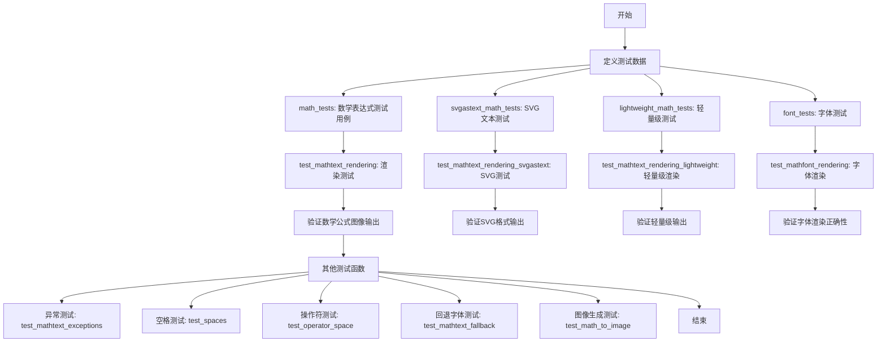

## 类结构

```
测试模块 (test_mathtext.py)
├── 全局数据
│   ├── math_tests (数学表达式列表)
│   ├── svgastext_math_tests
│   ├── lightweight_math_tests
│   ├── font_tests
│   └── 字符集变量 (digits, uppercase, lowercase, etc.)
├── 测试夹具 (Fixtures)
│   └── baseline_images
└── 测试函数
    ├── test_mathtext_rendering
    ├── test_mathtext_rendering_svgastext
    ├── test_mathtext_rendering_lightweight
    ├── test_mathfont_rendering
    ├── test_short_long_accents
    ├── test_fontinfo
    ├── test_mathtext_exceptions
    ├── test_get_unicode_index_exception
    ├── test_single_minus_sign
    ├── test_spaces
    ├── test_operator_space
    ├── test_inverted_delimiters
    ├── test_genfrac_displaystyle
    ├── test_mathtext_fallback_valid
    ├── test_mathtext_fallback_invalid
    ├── test_mathtext_fallback
    ├── test_math_to_image
    ├── test_math_fontfamily
    ├── test_default_math_fontfamily
    ├── test_argument_order
    ├── test_mathtext_cmr10_minus_sign
    ├── test_mathtext_operators
    ├── test_biological
    └── test_box_repr
```

## 全局变量及字段


### `pyparsing_version`
    
解析pyparsing库的版本号得到的版本对象，用于版本兼容性检查

类型：`packaging.version.Version`
    


### `math_tests`
    
包含各种LaTeX数学表达式字符串的测试用例列表，None值表示该测试已被移除

类型：`list[str | None]`
    


### `svgastext_math_tests`
    
用于测试SVG输出时将文本嵌入为文本（而非路径）的数学表达式列表

类型：`list[str]`
    


### `lightweight_math_tests`
    
轻量级数学表达式测试列表，仅使用dejavusans字体集以最小化基线图像大小

类型：`list[str]`
    


### `digits`
    
包含阿拉伯数字0-9的字符串常量

类型：`str`
    


### `uppercase`
    
包含英文字母大写A-Z的字符串常量

类型：`str`
    


### `lowercase`
    
包含英文字母小写a-z的字符串常量

类型：`str`
    


### `uppergreek`
    
包含希腊字母大写形式（Gamma, Delta, Theta等）的LaTeX命令字符串

类型：`str`
    


### `lowergreek`
    
包含希腊字母小写形式（alpha, beta, gamma等）的LaTeX命令字符串

类型：`str`
    


### `all`
    
包含digits, uppercase, lowercase, uppergreek, lowergreek的列表，用于字体测试

类型：`list[str]`
    


### `font_test_specs`
    
字体测试规范列表，每个元素为(字体列表, 字符集)的元组，用于生成字体测试用例

类型：`list[tuple[None | list[str], Any]]`
    


### `font_tests`
    
通过遍历font_test_specs生成的最终字体测试用例列表

类型：`list[None | str]`
    


### `MathTextParser._accent_map`
    
数学文本解析器的重音符号映射字典，将短重音符号命令映射到对应的长重音符号命令

类型：`dict[str, str]`
    
    

## 全局函数及方法


### `test_mathtext_rendering`

该函数是 Matplotlib 的 Mathtext 渲染测试函数，通过参数化测试验证不同字体集（fontset）下数学文本的渲染效果。函数使用图像比较装饰器 `@image_comparison` 来对比渲染结果与基准图像，确保 Mathtext 解析和渲染的正确性。

参数：

- `baseline_images`：列表（间接参数化），基准图像名称列表，通常为 `['mathtext']`
- `fontset`：字符串，来自参数化配置，指定测试的字体集（'cm', 'stix', 'stixsans', 'dejavusans', 'dejavuserif'）
- `index`：整数，来自参数化配置，表示测试用例在 `math_tests` 列表中的索引
- `text`：字符串，来自参数化配置，表示待渲染的数学文本字符串

返回值：无（`None`），该函数为测试函数，通过副作用（生成图像并比较）完成验证

#### 流程图

```mermaid
flowchart TD
    A[开始测试] --> B{参数化遍历}
    B -->|fontset| C[设置字体集: mpl.rcParams['mathtext.fontset']]
    B -->|text| D[创建图形: plt.figure figsize=(5.25, 0.75)]
    D --> E[在图形中添加文本: fig.text 0.5, 0.5, text]
    E --> F[图像比较装饰器进行渲染验证]
    F --> G{渲染结果是否符合基准图像容忍度}
    G -->|是| H[测试通过]
    G -->|否| I[测试失败 - 报告图像差异]
    H --> B
    I --> B
```

#### 带注释源码

```python
# 使用 pytest 的参数化装饰器指定测试索引和对应的数学文本
# math_tests 是一个包含各种 LaTeX 数学表达式的列表
@pytest.mark.parametrize(
    'index, text', enumerate(math_tests), ids=range(len(math_tests)))
# 参数化字体集测试，验证不同字体渲染效果
@pytest.mark.parametrize(
    'fontset', ['cm', 'stix', 'stixsans', 'dejavusans', 'dejavuserif'])
# 指定基准图像参数，间接参数化
@pytest.mark.parametrize('baseline_images', ['mathtext'], indirect=True)
# 图像比较装饰器，tol 参数设置图像差异容忍度
# 对于 ppc64le 和 s390x 架构使用更大的容忍度 0.011
@image_comparison(baseline_images=None,
                  tol=0.011 if platform.machine() in ('ppc64le', 's390x') else 0)
def test_mathtext_rendering(baseline_images, fontset, index, text):
    """
    测试 Mathtext 渲染功能的测试函数。
    
    参数:
        baseline_images: 基准图像名称列表（间接参数化）
        fontset: 字体集名称（'cm', 'stix', 'stixsans', 'dejavusans', 'dejavuserif'）
        index: 测试用例索引
        text: 要渲染的数学文本字符串
    """
    # 设置 Matplotlib 的 mathtext 字体集参数
    mpl.rcParams['mathtext.fontset'] = fontset
    
    # 创建指定尺寸的图形对象 (5.25 x 0.75 英寸)
    fig = plt.figure(figsize=(5.25, 0.75))
    
    # 在图形中心位置添加数学文本
    # horizontalalignment='center': 水平居中对齐
    # verticalalignment='center': 垂直居中对齐
    fig.text(0.5, 0.5, text,
             horizontalalignment='center', verticalalignment='center')
    
    # @image_comparison 装饰器会自动处理渲染和图像比较
    # 测试函数本身不需要显式返回值
```


### `test_mathtext_rendering_svgastext`

这是一个 pytest 测试函数，用于测试 Matplotlib 中数学文本（mathtext）在 SVG 输出格式下的渲染功能。该函数验证 SVG 输出时是否正确地将数学文本作为文本嵌入（而非转换为路径），这是 Matplotlib 的 `svg.fonttype = 'none'` 配置所控制的功能。

参数：

- `baseline_images`：`str`，由 `@image_comparison` 装饰器提供的基准图像名称参数，用于图像比较测试
- `fontset`：`str`，由 `@pytest.mark.parametrize` 参数化提供，指定要测试的字体集（'cm' 或 'dejavusans'）
- `index`：`int`，由 `@pytest.mark.parametrize` 参数化提供，表示测试用例的索引编号
- `text`：`str`，由 `@pytest.mark.parametrize` 参数化提供，表示要渲染的数学文本内容（来自 `svgastext_math_tests` 列表）

返回值：`None`，该函数为测试函数，无返回值，通过 pytest 框架进行图像比较验证

#### 流程图

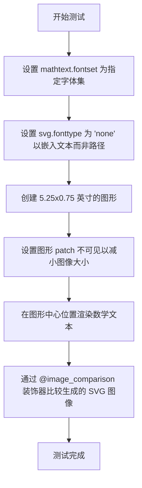

#### 带注释源码

```python
@pytest.mark.parametrize('index, text', enumerate(svgastext_math_tests),
                         ids=range(len(svgastext_math_tests)))
@pytest.mark.parametrize('fontset', ['cm', 'dejavusans'])
@pytest.mark.parametrize('baseline_images', ['mathtext0'], indirect=True)
@image_comparison(
    baseline_images=None, extensions=['svg'],
    savefig_kwarg={'metadata': {  # Minimize image size.
        'Creator': None, 'Date': None, 'Format': None, 'Type': None}})
def test_mathtext_rendering_svgastext(baseline_images, fontset, index, text):
    """
    测试数学文本在 SVG 输出中作为文本嵌入的渲染功能。
    
    该测试验证当 svg.fonttype 设置为 'none' 时，SVG 输出中的数学文本
    是否正确嵌入为文本元素而非路径，这对于文本可访问性和搜索功能很重要。
    """
    # 设置 Matplotlib 的 mathtext 字体集参数
    mpl.rcParams['mathtext.fontset'] = fontset
    
    # 设置 SVG 字体类型为 'none'，使数学文本作为文本嵌入而非路径
    mpl.rcParams['svg.fonttype'] = 'none'  # Minimize image size.
    
    # 创建指定大小的图形对象（5.25 x 0.75 英寸）
    fig = plt.figure(figsize=(5.25, 0.75))
    
    # 设置图形背景 patch 不可见，以减小生成图像的文件大小
    fig.patch.set(visible=False)  # Minimize image size.
    
    # 在图形中心位置渲染数学文本，使用指定的水平和垂直对齐方式
    fig.text(0.5, 0.5, text,
             horizontalalignment='center', verticalalignment='center')
    
    # @image_comparison 装饰器会自动保存图形并与基准图像进行比较
    # extensions=['svg'] 指定输出格式为 SVG
    # savefig_kwarg 中的 metadata 参数用于最小化图像大小
```


### `test_mathtext_rendering_lightweight`

该函数是一个pytest测试函数，用于测试轻量级数学文本（mathtext）的渲染功能。它仅使用单一的字体集（dejavusans）和PNG输出来最小化基线图像的大小，以验证特定数学表达式能否正确渲染为图像。

参数：

- `baseline_images`：间接参数（fixture），来自 `@pytest.mark.parametrize` 的 `indirect=True`，值为 `['mathtext1']`，用于指定基线图像的前缀
- `fontset`：`str`，来自 `@pytest.mark.parametrize`，固定值为 `'dejavusans'`，指定数学字体系列
- `index`：`int`，来自 `enumerate(lightweight_math_tests)`，表示测试用例的索引
- `text`：`str`，来自 `lightweight_math_tests` 列表，要渲染的数学文本表达式

返回值：`None`，该函数为测试函数，无返回值（隐式返回None）

#### 流程图

```mermaid
flowchart TD
    A[开始测试] --> B[配置参数化: index, text 来自 lightweight_math_tests]
    B --> C[配置参数化: fontset = 'dejavusans']
    C --> D[配置基线图像前缀: baseline_images = 'mathtext1']
    D --> E[创建 Figure: figsize=(5.25, 0.75)]
    E --> F[调用 fig.text 在位置(0.5, 0.5)渲染数学文本]
    F --> G[使用 math_fontfamily=fontset 设置字体]
    G --> H[设置水平和垂直居中对齐]
    H --> I[@image_comparison 装饰器进行图像比较]
    I --> J[结束测试]
```

#### 带注释源码

```python
@pytest.mark.parametrize('index, text', enumerate(lightweight_math_tests),
                         ids=range(len(lightweight_math_tests)))
@pytest.mark.parametrize('fontset', ['dejavusans'])
@pytest.mark.parametrize('baseline_images', ['mathtext1'], indirect=True)
@image_comparison(baseline_images=None, extensions=['png'])
def test_mathtext_rendering_lightweight(baseline_images, fontset, index, text):
    """
    轻量级 mathtext 渲染测试函数。
    
    该测试仅使用 dejavusans 字体集和 PNG 输出，以最小化基线图像大小。
    用于验证复杂的数学表达式能够正确渲染。
    
    参数:
        baseline_images: 间接fixture参数，提供基线图像名称前缀
        fontset: 字体集参数，固定为 'dejavusans'
        index: 测试用例索引，来自 lightweight_math_tests 列表
        text: 要渲染的数学文本字符串
    """
    # 创建指定大小的Figure对象 (宽5.25, 高0.75英寸)
    fig = plt.figure(figsize=(5.25, 0.75))
    
    # 在Figure中心位置(0.5, 0.5)添加数学文本
    # math_fontfamily参数指定使用哪种数学字体集渲染
    fig.text(0.5, 0.5, text, math_fontfamily=fontset,
             horizontalalignment='center', verticalalignment='center')
```


### test_mathfont_rendering

该测试函数用于验证不同字体集（fontset）下数学公式的渲染效果，通过比对生成的图像与基准图像来检测渲染差异。

参数：

- `baseline_images`：间接参数（indirect），字符串类型，表示基准图像名称前缀
- `fontset`：字符串类型，来自参数化配置 `['cm', 'stix', 'stixsans', 'dejavusans', 'dejavuserif']`，指定数学文本使用的字体集
- `index`：整数类型，来自 `enumerate(font_tests)`，表示测试用例的索引
- `text`：字符串类型，来自 `font_tests` 列表，包含待渲染的数学公式文本

返回值：无（`None`），该函数为测试函数，执行图像渲染但不返回任何值

#### 流程图

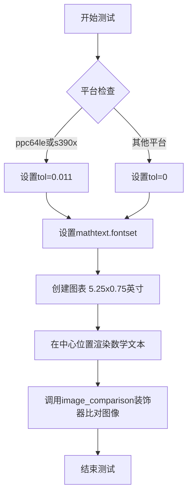

#### 带注释源码

```python
# 参数化测试：index和text来自font_tests列表
@pytest.mark.parametrize(
    'index, text', enumerate(font_tests), ids=range(len(font_tests)))
# 参数化测试：fontset参数，测试多个字体集
@pytest.mark.parametrize(
    'fontset', ['cm', 'stix', 'stixsans', 'dejavusans', 'dejavuserif'])
# 间接参数化：baseline_images使用'mathfont'作为基准图像前缀
@pytest.mark.parametrize('baseline_images', ['mathfont'], indirect=True)
# 图像比对装饰器：比较生成图像与基准图像，允许一定容差
@image_comparison(baseline_images=None, extensions=['png'],
                  tol=0.011 if platform.machine() in ('ppc64le', 's390x') else 0)
def test_mathfont_rendering(baseline_images, fontset, index, text):
    """
    测试函数：验证不同字体集下数学公式的渲染效果
    
    参数:
        baseline_images: 基准图像名称（由装饰器注入）
        fontset: 数学字体集名称（cm/stix/stixsans/dejavusans/dejavuserif）
        index: font_tests列表中的索引
        text: 待渲染的数学公式文本
    """
    # 设置matplotlib的数学文本字体集
    mpl.rcParams['mathtext.fontset'] = fontset
    # 创建指定尺寸的图表对象
    fig = plt.figure(figsize=(5.25, 0.75))
    # 在图表中心位置渲染数学文本，使用居中对齐
    fig.text(0.5, 0.5, text,
             horizontalalignment='center', verticalalignment='center')
```


### `test_short_long_accents`

该测试函数用于验证数学文本渲染中短形式重音符号（如 `\'a`）与长形式重音符号（如 `\' a`）的渲染结果一致性。它通过比较使用短形式和长形式重音符号生成的图形是否相等来确保两者渲染效果相同。

参数：

- `fig_test`：`matplotlib.figure.Figure`，测试组的图形对象，用于渲染短形式重音符号
- `fig_ref`：`matplotlib.figure.Figure`，参考组的图形对象，用于渲染长形式重音符号

返回值：`None`，该函数通过 `@check_figures_equal()` 装饰器进行图形比较，不显式返回值

#### 流程图

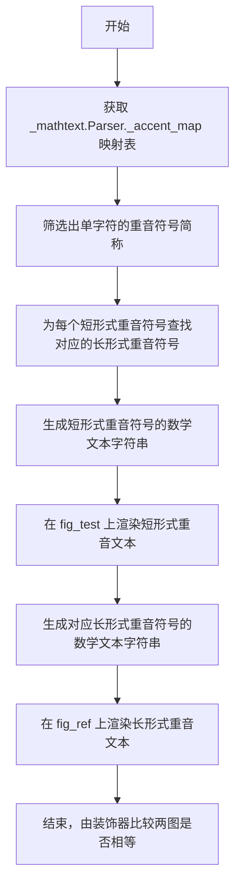

#### 带注释源码

```python
@check_figures_equal()  # 装饰器：比较测试图和参考图是否相等
def test_short_long_accents(fig_test, fig_ref):
    # 获取 Parser 类的重音符号映射表 (类属性)
    # acc_map 是一个字典，键为重音符号名称，值为对应的 Unicode 字符
    acc_map = _mathtext.Parser._accent_map
    
    # 从映射表中筛选出单字符名称的短形式重音符号
    # 例如: 'acute' 是长形式, 'a' 可能是短形式
    short_accs = [s for s in acc_map if len(s) == 1]
    
    # 用于存储对应的长形式重音符号
    corresponding_long_accs = []
    
    # 遍历每个短形式重音符号，查找其对应的长形式
    # 长形式的定义是：名称长度 > 1 且映射到相同的 Unicode 字符
    for s in short_accs:
        # 使用生成器表达式查找匹配的长形式
        # 通过比较 acc_map[l] == acc_map[s] 确保两者渲染相同字符
        l, = (l for l in acc_map if len(l) > 1 and acc_map[l] == acc_map[s])
        corresponding_long_accs.append(l)
    
    # 在测试图上使用短形式重音符号渲染文本
    # 格式: $\{s}a, 例如 \a 后跟字母 a 表示应用重音
    fig_test.text(0, .5, "$" + "".join(rf"\{s}a" for s in short_accs) + "$")
    
    # 在参考图上使用长形式重音符号渲染文本
    # 格式: \{long_name} a, 注意 long_name 和 a 之间有空格
    fig_ref.text(
        0, .5, "$" + "".join(fr"\{l} a" for l in corresponding_long_accs) + "$")
```


### `test_fontinfo`

该函数用于测试字体信息，验证 DejaVu Sans 字体的 SFNT 表头是否正确，并确保字体文件的版本号为 (1, 0)。

参数：
- （无参数）

返回值：`None`，通过 assert 断言验证，不返回具体值

#### 流程图

```mermaid
graph TD
    A[开始] --> B[查找 DejaVu Sans 字体路径]
    B --> C[使用 FT2Font 加载字体文件]
    C --> D[获取 SFNT 表头信息]
    D --> E{表头是否存在?}
    E -->|否| F[断言失败 - table is None]
    E -->|是| G{版本号是否为 (1, 0)?}
    G -->|否| H[断言失败 - 版本号不匹配]
    G -->|是| I[测试通过]
```

#### 带注释源码

```python
def test_fontinfo():
    """测试字体信息，验证 DejaVu Sans 字体的 SFNT 表头版本号"""
    # 第一步：查找系统中的 DejaVu Sans 字体文件路径
    fontpath = mpl.font_manager.findfont("DejaVu Sans")
    
    # 第二步：使用 FT2Font 加载字体文件
    # FT2Font 是 matplotlib 的 FreeType 字体绑定，用于读取字体文件
    font = mpl.ft2font.FT2Font(fontpath)
    
    # 第三步：获取 SFNT 表头信息
    # SFNT 是 TrueType 字体格式的表头，包含字体版本等元数据
    # "head" 表存储字体的总体信息，包括版本号
    table = font.get_sfnt_table("head")
    
    # 第四步：断言验证
    # 验证表头存在（字体文件有效）
    assert table is not None
    
    # 验证版本号为 (1, 0)，这是 TrueType 字体的标准版本号
    assert table['version'] == (1, 0)
```


### test_mathtext_exceptions

该函数是一个参数化测试函数，用于验证 mathtext 解析器在处理各种非法或异常数学表达式时能够正确抛出异常，并确保错误消息与预期相符。它覆盖了包括缺少参数、无效值、未闭合括号、未知符号和重复上下标等多种错误场景。

参数：

- `math`：`str`，表示要解析的异常数学表达式字符串
- `msg`：`str | re.Pattern[str]`，表示预期的错误消息，可以是普通字符串或正则表达式模式

返回值：`None`，该函数为测试函数，不返回任何值

#### 流程图

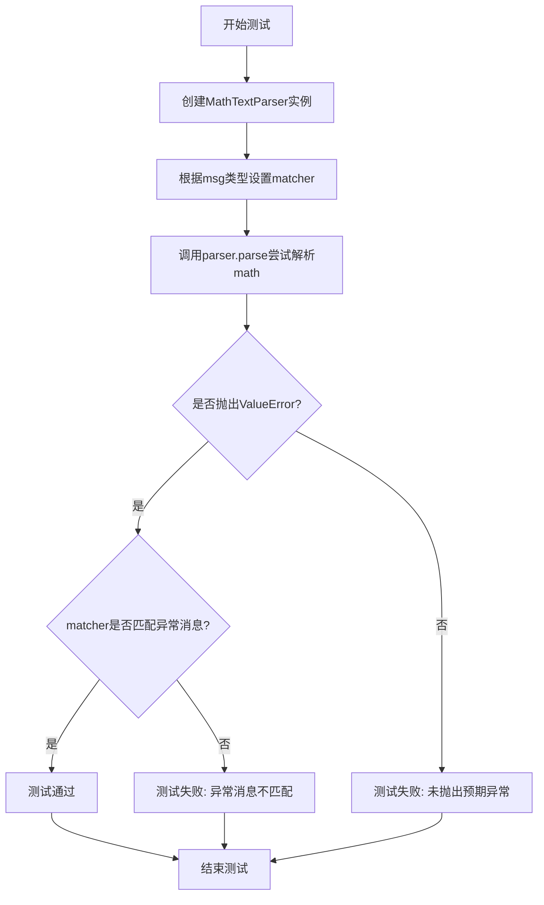

#### 带注释源码

```python
@pytest.mark.parametrize(
    'math, msg',
    [
        # 测试 \hspace 命令缺少参数
        (r'$\hspace{}$', r'Expected \hspace{space}'),
        # 测试 \hspace 命令参数无效
        (r'$\hspace{foo}$', r'Expected \hspace{space}'),
        # 测试未知符号（函数后无空格）
        (r'$\sinx$', r'Unknown symbol: \sinx'),
        # 测试未知符号（重音符后无空格）
        (r'$\dotx$', r'Unknown symbol: \dotx'),
        # 测试 \frac 命令缺少参数
        (r'$\frac$', r'Expected \frac{num}{den}'),
        # 测试 \frac 命令参数为空
        (r'$\frac{}{}$', r'Expected \frac{num}{den}'),
        # 测试 \binom 命令缺少参数
        (r'$\binom$', r'Expected \binom{num}{den}'),
        # 测试 \binom 命令参数为空
        (r'$\binom{}{}$', r'Expected \binom{num}{den}'),
        # 测试 \genfrac 命令缺少参数
        (r'$\genfrac$',
         r'Expected \genfrac{ldelim}{rdelim}{rulesize}{style}{num}{den}'),
        # 测试 \genfrac 命令参数为空
        (r'$\genfrac{}{}{}{}{}{}$',
         r'Expected \genfrac{ldelim}{rdelim}{rulesize}{style}{num}{den}'),
        # 测试 \sqrt 命令缺少参数
        (r'$\sqrt$', r'Expected \sqrt{value}'),
        # 测试 \sqrt 命令参数无效
        (r'$\sqrt f$', r'Expected \sqrt{value}'),
        # 测试 \overline 命令缺少参数
        (r'$\overline$', r'Expected \overline{body}'),
        # 测试 \overline 命令参数为空
        (r'$\overline{}$', r'Expected \overline{body}'),
        # 测试 \left 命令参数无效
        (r'$\leftF$', r'Expected a delimiter'),
        # 测试 \right 命令参数无效
        (r'$\rightF$', r'Unknown symbol: \rightF'),
        # 测试括号未闭合（有尺寸指令）
        (r'$\left(\right$', r'Expected a delimiter'),
        # 测试括号未闭合（无尺寸指令）
        # PyParsing 2 使用双引号，PyParsing 3 使用单引号和额外反斜杠
        (r'$\left($', re.compile(r'Expected ("|\'\\)\\right["\']')),
        # 测试 \dfrac 命令缺少参数
        (r'$\dfrac$', r'Expected \dfrac{num}{den}'),
        # 测试 \dfrac 命令参数为空
        (r'$\dfrac{}{}$', r'Expected \dfrac{num}{den}'),
        # 测试 \overset 命令缺少参数
        (r'$\overset$', r'Expected \overset{annotation}{body}'),
        # 测试 \underset 命令缺少参数
        (r'$\underset$', r'Expected \underset{annotation}{body}'),
        # 测试完全未知的命令
        (r'$\foo$', r'Unknown symbol: \foo'),
        # 测试重复上标
        (r'$a^2^2$', r'Double superscript'),
        # 测试重复下标
        (r'$a_2_2$', r'Double subscript'),
        # 测试上标在下标内部无括号
        (r'$a^2_a^2$', r'Double superscript'),
        # 测试未闭合的组
        (r'$a = {b$', r"Expected '}'"),
    ],
    ids=[
        'hspace without value',
        'hspace with invalid value',
        'function without space',
        'accent without space',
        'frac without parameters',
        'frac with empty parameters',
        'binom without parameters',
        'binom with empty parameters',
        'genfrac without parameters',
        'genfrac with empty parameters',
        'sqrt without parameters',
        'sqrt with invalid value',
        'overline without parameters',
        'overline with empty parameter',
        'left with invalid delimiter',
        'right with invalid delimiter',
        'unclosed parentheses with sizing',
        'unclosed parentheses without sizing',
        'dfrac without parameters',
        'dfrac with empty parameters',
        'overset without parameters',
        'underset without parameters',
        'unknown symbol',
        'double superscript',
        'double subscript',
        'super on sub without braces',
        'unclosed group',
    ]
)
def test_mathtext_exceptions(math, msg):
    """测试 mathtext 解析器对各种非法数学表达式的异常处理"""
    # 创建 MathTextParser 实例，使用 'agg' 后端
    parser = mathtext.MathTextParser('agg')
    # 如果 msg 是字符串，使用 re.escape 转义特殊字符
    # 如果 msg 已经是正则表达式模式，直接使用
    match = re.escape(msg) if isinstance(msg, str) else msg
    # 使用 pytest.raises 验证是否抛出 ValueError
    # 并检查异常消息是否匹配预期
    with pytest.raises(ValueError, match=match):
        parser.parse(math)
```


### `test_get_unicode_index_exception`

该测试函数用于验证当向`_mathtext.get_unicode_index`函数传入无效的Unicode索引（如`\foo`）时，是否会正确抛出`ValueError`异常。这是测试_mathtext模块对无效Unicode字符的处理能力。

参数：None

返回值：`None`，该函数为测试函数，不返回任何值

#### 流程图

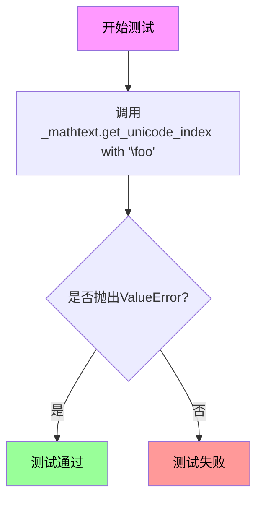

#### 带注释源码

```python
def test_get_unicode_index_exception():
    """
    测试get_unicode_index函数在遇到无效Unicode索引时是否抛出异常。
    
    该测试验证_mathtext模块的get_unicode_index函数能够正确处理
    无效的Unicode字符索引（如不存在的转义序列\foo），并抛出
    相应的ValueError异常。
    """
    # 使用pytest.raises上下文管理器验证异常抛出
    with pytest.raises(ValueError):
        # 调用_mathtext.get_unicode_index函数，传入无效的Unicode索引
        # 预期行为：函数检测到'\foo'是无效的Unicode转义序列
        # 预期结果：抛出ValueError异常
        _mathtext.get_unicode_index(r'\foo')
```


### `test_single_minus_sign`

该函数是一个测试用例，用于验证 Mathtext 渲染引擎能够正确处理单个减号符号（`$-$`），并确保渲染后的画布包含非白色的像素内容，从而确认减号被正确绘制而非丢失。

参数： 无

返回值： `None`，无返回值（测试函数）

#### 流程图

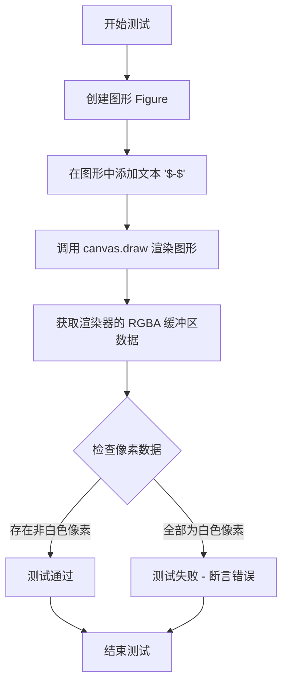

#### 带注释源码

```python
def test_single_minus_sign():
    """
    测试单个减号符号在 Mathtext 中的渲染是否正确。
    
    该测试验证 Mathtext 渲染器能够正确处理 $-$ 符号，
    并确保减号在画布上被实际绘制出来（而非丢失或显示为空白）。
    """
    # 创建一个新的 Figure 对象
    fig = plt.figure()
    
    # 在图形的中心位置 (0.5, 0.5) 添加文本内容 '$-$'
    # 这是测试 Mathtext 能否正确渲染单个减号
    fig.text(0.5, 0.5, '$-$')
    
    # 调用 canvas 的 draw 方法，强制渲染图形内容
    # 这一步将 Mathtext 文本渲染到画布缓冲区
    fig.canvas.draw()
    
    # 从渲染器获取 RGBA 格式的像素数据
    # np.asarray 将缓冲区转换为 NumPy 数组
    # 每个像素由 4 个通道组成: R, G, B, A
    t = np.asarray(fig.canvas.renderer.buffer_rgba())
    
    # 断言画布不是全白色的
    # 0xff 表示白色（255）
    # 如果所有像素都是白色，说明减号没有被渲染出来
    # 正确的渲染应该产生非白色的像素（减号的颜色）
    assert (t != 0xff).any()  # assert that canvas is not all white.
```


### test_spaces

测试mathtext中不同空格命令（\, \> \ \: \~）的渲染效果，确保不同空格命令能正确渲染为预期的间距。

参数：

- `fig_test`：`matplotlib.figure.Figure`，测试图像，用于放置待测试的空格表达式
- `fig_ref`：`matplotlib.figure.Figure`，参考图像，用于放置期望的空格表达式渲染结果

返回值：`None`，无返回值（测试函数）

#### 流程图

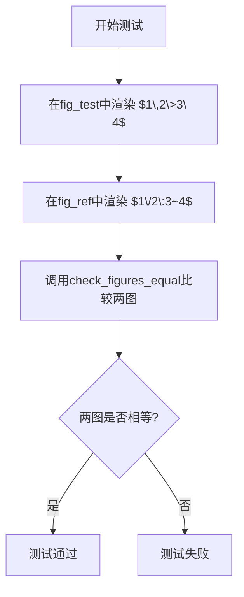

#### 带注释源码

```python
@check_figures_equal()
def test_spaces(fig_test, fig_ref):
    """
    测试mathtext中不同空格命令的渲染效果
    
    测试以下空格命令的等价性：
    - \, (thin space)
    - \> (medium space)  
    - \ (space)
    - \/ (italic correction)
    - \: (thick space)
    - ~ (non-breaking space)
    """
    # 在测试图像中写入带空格命令的数学表达式
    # \, 表示thin space, \> 表示medium space, \ 表示space
    fig_test.text(.5, .5, r"$1\,2\>3\ 4$")
    
    # 在参考图像中写入期望等价的表达式
    # \/ 表示italic correction, \: 表示thick space, ~ 表示non-breaking space
    # 这些空格命令应该产生与上面相同的视觉效果
    fig_ref.text(.5, .5, r"$1\/2\:3~4$")
```


### `test_operator_space`

该函数用于测试数学公式中操作符（如对数函数、三角函数）与其参数之间的空格渲染是否正确。通过对比测试图像和参考图像，验证 Mathtext 渲染器在处理操作符空格时的行为是否符合预期（GitHub issue #553 和 #17852 相关）。

参数：

- `fig_test`：matplotlib.figure.Figure，测试用的图形对象，用于放置待测试的数学文本
- `fig_ref`：matplotlib.figure.Figure，参考用的图形对象，用于放置期望的数学文本渲染结果

返回值：`None`，该函数使用 `@check_figures_equal()` 装饰器进行图形比较，不直接返回值

#### 流程图

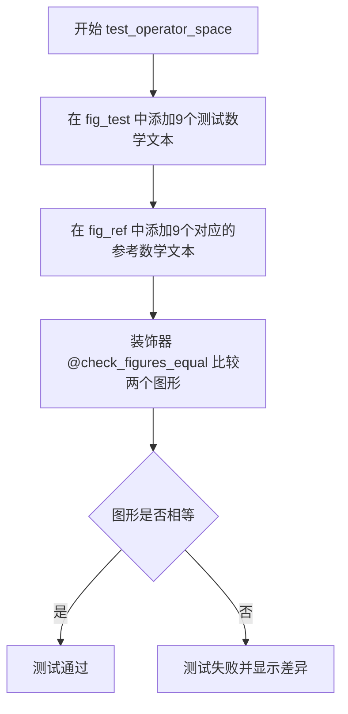

#### 带注释源码

```python
@check_figures_equal()  # 装饰器：比较测试图形和参考图形的渲染结果
def test_operator_space(fig_test, fig_ref):
    """
    测试数学操作符与其参数之间的空格渲染是否正确。
    
    测试用例涵盖了不同场景：
    - 操作符后直接跟数字：\log 6
    - 操作符后跟括号：\log(6)
    - 三角函数：\arcsin 6, \arcsin|6|
    - 自定义操作符：\operatorname{op} 6, \operatorname{op}[6]
    - 上标：\cos^2, \log_2
    - 复合表达式：\sin^2 \cos
    """
    
    # ========== 测试组：待验证的数学表达式 ==========
    fig_test.text(0.1, 0.1, r"$\log 6$")           # 对数函数后直接跟数字
    fig_test.text(0.1, 0.2, r"$\log(6)$")         # 对数函数后跟括号
    fig_test.text(0.1, 0.3, r"$\arcsin 6$")        # 反正弦函数后跟数字
    fig_test.text(0.1, 0.4, r"$\arcsin|6|$")       # 反正弦函数后跟绝对值
    fig_test.text(0.1, 0.5, r"$\operatorname{op} 6$")  # 自定义操作符（GitHub #553）
    fig_test.text(0.1, 0.6, r"$\operatorname{op}[6]$") # 自定义操作符后跟方括号
    fig_test.text(0.1, 0.7, r"$\cos^2$")           # 余弦函数的平方
    fig_test.text(0.1, 0.8, r"$\log_2$")           # 对数的底数表示
    fig_test.text(0.1, 0.9, r"$\sin^2 \cos$")     # 正弦平方后接余弦（GitHub #17852）
    
    # ========== 参考组：期望的渲染结果 ==========
    # 使用 \mathrm{} 显式指定罗马字体，\, 表示小的空格
    fig_ref.text(0.1, 0.1, r"$\mathrm{log\,}6$")      # 对数后加小空格
    fig_ref.text(0.1, 0.2, r"$\mathrm{log}(6)$")      # 括号前无额外空格
    fig_ref.text(0.1, 0.3, r"$\mathrm{arcsin\,}6$")   # 反正弦后加小空格
    fig_ref.text(0.1, 0.4, r"$\mathrm{arcsin}|6|$")   # 绝对值前无空格
    fig_ref.text(0.1, 0.5, r"$\mathrm{op\,}6$")      # 自定义操作符后加小空格
    fig_ref.text(0.1, 0.6, r"$\mathrm{op}[6]$")      # 方括号前无空格
    fig_ref.text(0.1, 0.7, r"$\mathrm{cos}^2$")      # 平方在函数名后
    fig_ref.text(0.1, 0.8, r"$\mathrm{log}_2$")       # 底数下标
    fig_ref.text(0.1, 0.9, r"$\mathrm{sin}^2 \mathrm{\,cos}$")  # 正弦平方后余弦加小空格
```


### `test_inverted_delimiters`

该函数用于测试反转的分隔符（如反向括号）在数学文本渲染中的正确性，通过比较使用 `left)` 和 `right(` 与仅使用 `)(` 两种写法的渲染结果是否一致。

参数：

- `fig_test`：`matplotlib.figure.Figure`，测试用例的图形对象，用于放置待测试的数学文本
- `fig_ref`：`matplotlib.figure.Figure`，参考（基准）图形对象，用于放置预期渲染结果的数学文本

返回值：`None`，该函数为测试函数，不返回任何值

#### 流程图

```mermaid
flowchart TD
    A[开始] --> B[调用 fig_test.text 方法]
    B --> C[在测试图位置 0.5, 0.5 插入数学文本 $\left)\right\$]
    C --> D[调用 fig_ref.text 方法]
    D --> E[在参考图位置 0.5, 0.5 插入数学文本 $($)]
    E --> F[由 @check_figures_equal 装饰器比较两图]
    F --> G{两图是否相等?}
    G -->|是| H[测试通过]
    G -->|否| I[测试失败]
    H --> J[结束]
    I --> J
```

#### 带注释源码

```python
@check_figures_equal()
def test_inverted_delimiters(fig_test, fig_ref):
    """
    测试反转分隔符的渲染功能。
    
    该测试验证当使用 \left) 和 \right( （即反转的括号）时，
    渲染结果应与直接使用 )( 相同。
    """
    # 在测试图中使用反转的分隔符写法
    fig_test.text(.5, .5, r"$\left)\right($", math_fontfamily="dejavusans")
    
    # 在参考图中使用标准的反转分隔符写法
    fig_ref.text(.5, .5, r"$)($", math_fontfamily="dejavusans")
```


### `test_genfrac_displaystyle`

该测试函数用于验证 LaTeX 数学表达式中 `\dfrac`（显示分数）与 `\genfrac`（通用分数）在渲染上的一致性，通过对比两者的输出图像来确保 mathtext 模块正确处理分数的显示样式。

参数：

- `fig_test`：matplotlib Figure 对象，测试组的画布（pytest fixture）
- `fig_ref`：matplotlib Figure 对象，参考组的画布（pytest fixture）

返回值：`None`，该函数为测试函数，无返回值，主要通过 `@check_figures_equal()` 装饰器进行图像比较

#### 流程图

```mermaid
flowchart TD
    A[开始测试] --> B[在fig_test中渲染dfrac{2x}{3y}]
    B --> C[获取当前字体underline_thickness]
    C --> D[在fig_ref中渲染genfrac{}{}{thickness}{0}{2x}{3y}]
    D --> E[通过装饰器比较两图是否相等]
    E --> F[结束测试]
```

#### 带注释源码

```python
@check_figures_equal()
def test_genfrac_displaystyle(fig_test, fig_ref):
    """
    测试 mathtext 中 \dfrac 和 \genfrac 命令的显示一致性
    
    该测试验证：
    1. \dfrac{num}{den} 命令能够正确渲染显示大小的分数
    2. \genfrac{}{}{thickness}{style}{num}{den} 命令在参数正确时
       能够产生与 \dfrac 相同的视觉效果
    """
    
    # 在测试组画布中绘制显示分数 \dfrac{2x}{3y}
    # \dfrac 是 display-style fraction，分子分母较大
    fig_test.text(0.1, 0.1, r"$\dfrac{2x}{3y}$")

    # 获取当前字体设置下的下划线厚度
    # TruetypeFonts.get_underline_thickness 用于获取
    # 与当前字体和 DPI 设置匹配的渲染参数
    thickness = _mathtext.TruetypeFonts.get_underline_thickness(
        None,  # fontset: 字体集配置
        None,  # prop: FontProperties对象
        fontsize=mpl.rcParams["font.size"],    # 当前字体大小
        dpi=mpl.rcParams["savefig.dpi"])        # 输出图像DPI
    
    # 在参考组画布中使用 \genfrac 命令渲染相同内容
    # 参数说明：
    #   {} - 左分隔符为空
    #   {} - 右分隔符为空
    #   %f - 规则厚度（使用下划线厚度值）
    #   0 - 样式为0（对应显示样式）
    #   2x - 分子
    #   3y - 分母
    # 通过格式化字符串将计算出的厚度值传入
    fig_ref.text(0.1, 0.1, r"$\genfrac{}{}{%f}{0}{2x}{3y}$" % thickness)
```


### `test_mathtext_fallback_valid`

该函数用于测试 matplotlib 中 mathtext 组件的 fallback 字体配置是否接受有效的字体名称（'cm'、'stix'、'stixsans' 和 'None'）。

参数：无

返回值：`None`，无返回值

#### 流程图

```mermaid
flowchart TD
    A[开始] --> B[遍历 fallback 列表: 'cm', 'stix', 'stixsans', 'None']
    B --> C{列表未遍历完?}
    C -->|是| D[设置 mpl.rcParams['mathtext.fallback'] = 当前fallback值]
    D --> C
    C -->|否| E[结束]
```

#### 带注释源码

```python
def test_mathtext_fallback_valid():
    """
    测试 mathtext.fallback 参数是否接受有效的字体名称。
    
    该测试函数遍历预定义的有效 fallback 字体名称列表：
    'cm' (Computer Modern),
    'stix' (STIX字体),
    'stixsans' (无衬线STIX字体),
    'None' (无回退)
    
    并将它们依次设置为 matplotlib 的 mathtext.fallback 配置参数。
    如果设置成功（没有抛出异常），则说明这些值是有效的 fallback 字体名称。
    """
    # 遍历所有有效的 fallback 字体名称
    for fallback in ['cm', 'stix', 'stixsans', 'None']:
        # 设置 matplotlib 的 mathtext.fallback 配置参数
        # 如果是有效值不会抛出异常
        mpl.rcParams['mathtext.fallback'] = fallback
```


### `test_mathtext_fallback_invalid`

该函数用于测试当 `mathtext.fallback` 配置参数设置为无效值时是否会正确抛出 `ValueError` 异常。它遍历无效的回退字体名称列表（'abc' 和 ''），验证 matplotlib 会在设置这些无效值时抛出预期的异常。

参数：- 无

返回值：无（`None`），该函数不返回任何值，仅执行测试逻辑

#### 流程图

```mermaid
flowchart TD
    A[开始测试 test_mathtext_fallback_invalid] --> B{遍历 fallback in ['abc', '']}
    B -->|每次迭代| C[尝试设置 mpl.rcParams['mathtext.fallback'] = fallback]
    C --> D{验证是否抛出 ValueError}
    D -->|是| E[匹配错误消息 'not a valid fallback font name']
    D -->|否| F[测试失败]
    E --> B
    B -->|迭代完成| G[测试通过]
    G --> H[结束测试]
    
    style F fill:#ffcccc
    style G fill:#ccffcc
```

#### 带注释源码

```python
def test_mathtext_fallback_invalid():
    """
    测试无效的 mathtext.fallback 值是否会正确抛出 ValueError。
    
    该测试函数验证 matplotlib 在设置无效的回退字体名称时
    能够正确地抛出 ValueError 异常，并包含适当的错误消息。
    """
    # 遍历无效的回退字体名称列表
    # 'abc' - 完全无效的字体名称
    # ''   - 空字符串，也是无效的字体名称
    for fallback in ['abc', '']:
        # 使用 pytest.raises 上下文管理器验证会抛出 ValueError
        # match 参数确保错误消息包含预期的文本
        with pytest.raises(ValueError, match="not a valid fallback font name"):
            # 尝试设置无效的 mathtext.fallback 值
            # 这应该触发 ValueError
            mpl.rcParams['mathtext.fallback'] = fallback
```


### `test_mathtext_fallback`

该测试函数用于验证 mathtext 渲染在不同回退字体配置下的行为，确保 SVG 输出中各个字符使用正确的字体回退机制。

参数：

-  `fallback`：`str`，指定要测试的回退字体类型（'cm' 或 'stix'）
-  `fontlist`：`list[str]`，期望的字符字体列表，按字符顺序排列

返回值：`None`，该函数为测试函数，使用 assert 进行断言验证

#### 流程图

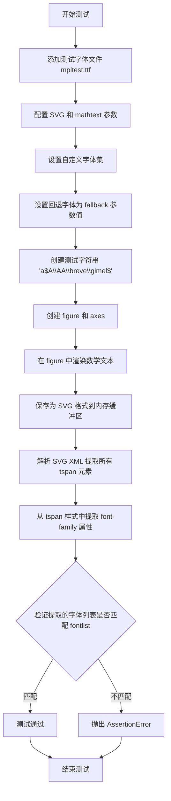

#### 带注释源码

```python
@pytest.mark.parametrize(
    "fallback,fontlist",
    [("cm", ['DejaVu Sans', 'mpltest', 'STIXGeneral', 'cmr10', 'STIXGeneral']),
     ("stix", ['DejaVu Sans', 'mpltest', 'STIXGeneral', 'STIXGeneral', 'STIXGeneral'])])
def test_mathtext_fallback(fallback, fontlist):
    """测试 mathtext 的字体回退机制是否正确工作"""
    # 添加测试用的自定义字体文件 mpltest.ttf
    mpl.font_manager.fontManager.addfont(
        (Path(__file__).resolve().parent / 'data/mpltest.ttf'))
    
    # 配置 matplotlib 参数：SVG 字体类型设为 none（嵌入字体名称而非路径）
    mpl.rcParams["svg.fonttype"] = 'none'
    
    # 设置 mathtext 使用自定义字体集
    mpl.rcParams['mathtext.fontset'] = 'custom'
    mpl.rcParams['mathtext.rm'] = 'mpltest'        # 罗马字体
    mpl.rcParams['mathtext.it'] = 'mpltest:italic' # 意大利字体
    mpl.rcParams['mathtext.bf'] = 'mpltest:bold'   # 粗体
    mpl.rcParams['mathtext.bfit'] = 'mpltest:italic:bold' # 粗斜体
    
    # 设置回退字体为参数传入的值（'cm' 或 'stix'）
    mpl.rcParams['mathtext.fallback'] = fallback

    # 测试字符串包含不同字符：普通拉丁字母、A、特殊字符等
    test_str = r'a$A\AA\breve\gimel$'

    # 创建内存缓冲区用于保存 SVG
    buff = io.BytesIO()
    
    # 创建 figure 和 axes
    fig, ax = plt.subplots()
    
    # 在 figure 中心渲染测试字符串，使用大字号
    fig.text(.5, .5, test_str, fontsize=40, ha='center')
    
    # 将 figure 保存为 SVG 格式到缓冲区
    fig.savefig(buff, format="svg")
    
    # 解析 SVG XML，查找所有带 style 属性的 tspan 元素
    tspans = (ET.fromstring(buff.getvalue())
              .findall(".//{http://www.w3.org/2000/svg}tspan[@style]"))
    
    # 从每个 tspan 的 style 属性中提取 font-family 值
    char_fonts = [
        re.search(r"font-family: '([\w ]+)'", tspan.attrib["style"]).group(1)
        for tspan in tspans]
    
    # 验证提取的字体列表是否与期望列表匹配
    assert char_fonts == fontlist, f'Expected {fontlist}, got {char_fonts}'
    
    # 清理：移除添加的测试字体，避免影响后续测试
    mpl.font_manager.fontManager.ttflist.pop()
```


### `test_math_to_image`

这是一个测试函数，用于验证 `mathtext.math_to_image` 函数将数学表达式渲染为图像的功能。测试覆盖了三种场景：输出到文件、输出到 BytesIO 对象、以及带颜色参数输出到 BytesIO 对象。

参数：

- `tmp_path`：`pathlib.Path`，pytest 提供的临时目录 fixture，用于生成测试输出文件路径

返回值：`None`，测试函数无返回值

#### 流程图

```mermaid
flowchart TD
    A[开始测试] --> B[调用 math_to_image 渲染 '$x^2$ 到文件]
    B --> C{验证文件输出}
    C -->|成功| D[调用 math_to_image 渲染 '$x^2$ 到 BytesIO]
    D --> E{验证内存输出}
    E -->|成功| F[调用 math_to_image 渲染 '$x^2$ 到 BytesIO 并指定颜色 Maroon}
    F --> G{验证颜色参数}
    G -->|成功| H[测试通过]
    C -->|失败| I[测试失败]
    E -->|失败| I
    G -->|失败| I
```

#### 带注释源码

```python
def test_math_to_image(tmp_path):
    # 测试场景1：将数学表达式渲染并保存为PNG文件
    # 验证 math_to_image 能够正确处理文件输出路径
    mathtext.math_to_image('$x^2$', tmp_path / 'example.png')
    
    # 测试场景2：将数学表达式渲染到内存中的 BytesIO 对象
    # 验证 math_to_image 能够处理流式输出（无文件）
    mathtext.math_to_image('$x^2$', io.BytesIO())
    
    # 测试场景3：将数学表达式渲染到 BytesIO 对象并指定颜色
    # 验证 math_to_image 的 color 参数能够自定义渲染颜色
    mathtext.math_to_image('$x^2$', io.BytesIO(), color='Maroon')
```


### `test_math_fontfamily`

该函数是一个 pytest 测试用例，用于验证 matplotlib 中数学公式文本使用不同数学字体系列（math_fontfamily）的渲染效果。测试通过图像比较来确保 "dejavusans" 和 "stix" 两种数学字体能够正确渲染。

参数：

- 无显式参数（使用 pytest 的 `@image_comparison` 装饰器隐式注入 fixtures）

返回值：`None`，该函数为测试函数，不返回任何值，仅通过图像比较验证渲染结果

#### 流程图

```mermaid
flowchart TD
    A[开始测试] --> B[创建图表<br>figsize=(10, 3)]
    B --> C[添加第一段文本<br>位置(0.2, 0.7)<br>使用dejavusans字体]
    C --> D[添加第二段文本<br>位置(0.2, 0.3)<br>使用stix字体]
    D --> E[图像比较验证<br>@image_comparison装饰器]
    E --> F[结束测试]
    
    C -->|设置math_fontfamily参数| C1[math_fontfamily='dejavusans']
    D -->|设置math_fontfamily参数| D1[math_fontfamily='stix']
```

#### 带注释源码

```python
@image_comparison(
    baseline_images=['math_fontfamily_image.png'],  # 定义基线图像文件名，用于比较
    savefig_kwarg={'dpi': 40}  # 保存图像时的 DPI 设置
)
def test_math_fontfamily():
    """
    测试数学字体系列（math_fontfamily）的渲染功能。
    
    该测试验证两种不同的数学字体（dejavusans 和 stix）能否正确渲染
    数学公式文本。测试通过图像比较来确保渲染结果符合预期。
    """
    # 创建一个尺寸为 10x3 英寸的图表
    fig = plt.figure(figsize=(10, 3))
    
    # 在图表中添加第一段数学文本，位置为 (0.2, 0.7)
    # 使用 DejaVu Sans 数学字体系列，字体大小为 24
    fig.text(
        0.2, 0.7,  # 文本位置的 x, y 坐标（相对于图表尺寸的比例）
        r"$This\ text\ should\ have\ one\ font$",  # LaTeX 格式的数学文本
        size=24,  # 字体大小
        math_fontfamily='dejavusans'  # 指定数学字体系列为 DejaVu Sans
    )
    
    # 在图表中添加第二段数学文本，位置为 (0.2, 0.3)
    # 使用 STIX 数学字体系列，字体大小为 24
    fig.text(
        0.2, 0.3,  # 文本位置的 x, y 坐标
        r"$This\ text\ should\ have\ another$",  # LaTeX 格式的数学文本
        size=24,  # 字体大小
        math_fontfamily='stix'  # 指定数学字体系列为 STIX
    )
    
    # 测试完成，@image_comparison 装饰器会自动比较生成的图像与基线图像
    # 如果渲染结果不一致，测试将失败
```


### `test_default_math_fontfamily`

该函数是一个pytest测试用例，用于验证当使用`font`或`fontproperties`参数指定普通文本字体时，数学文本的字体族是否仍能正确保持为默认的`cm`（Computer Modern）字体集。

#### 参数

无参数。

#### 返回值

无返回值（`None`），该函数通过断言验证数学字体族的正确性。

#### 流程图

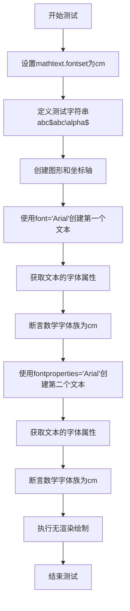

#### 带注释源码

```python
def test_default_math_fontfamily():
    # 设置全局matplotlib参数，指定数学文本使用cm（Computer Modern）字体集
    mpl.rcParams['mathtext.fontset'] = 'cm'
    
    # 定义测试字符串：包含普通文本'abc'和数学文本'$abc\alpha$'
    test_str = r'abc$abc\alpha$'
    
    # 创建一个新的图形和坐标轴
    fig, ax = plt.subplots()

    # 测试场景1：使用font参数指定普通文本字体为Arial
    # 期望数学文本部分仍然使用cm字体集
    text1 = fig.text(0.1, 0.1, test_str, font='Arial')
    
    # 获取文本对象的字体属性
    prop1 = text1.get_fontproperties()
    
    # 断言：即使指定了普通文本字体，数学字体族仍应为'cm'
    assert prop1.get_math_fontfamily() == 'cm'
    
    # 测试场景2：使用fontproperties参数指定字体属性
    # 期望数学文本部分仍然使用cm字体集
    text2 = fig.text(0.2, 0.2, test_str, fontproperties='Arial')
    
    # 获取文本对象的字体属性
    prop2 = text2.get_fontproperties()
    
    # 断言：使用fontproperties时，数学字体族仍应为'cm'
    assert prop2.get_math_fontfamily() == 'cm'

    # 执行无渲染绘制，确保所有文本正确布局
    fig.draw_without_rendering()
```


### `test_argument_order`

这是一个测试函数，用于验证在调用`fig.text()`方法时，`font`/`fontproperties`参数和`math_fontfamily`参数的顺序不会影响最终数学字体系列的设置。

参数：
- 无

返回值：`None`，该函数不返回任何值，主要用于执行测试断言

#### 流程图

```mermaid
graph TD
    A[开始] --> B[设置mathtext字体集为cm]
    B --> C[创建测试字符串 r'abc$abc\alpha$']
    C --> D[创建图表和坐标轴]
    D --> E[测试1: 使用font='Arial', math_fontfamily='dejavusans']
    E --> F[断言math_fontfamily == 'dejavusans']
    F --> G[测试2: 使用fontproperties='Arial', math_fontfamily='dejavusans']
    G --> H[断言math_fontfamily == 'dejavusans']
    H --> I[测试3: 使用math_fontfamily='dejavusans', font='Arial']
    I --> J[断言math_fontfamily == 'dejavusans']
    J --> K[测试4: 使用math_fontfamily='dejavusans', fontproperties='Arial']
    K --> L[断言math_fontfamily == 'dejavusans']
    L --> M[调用fig.draw_without_rendering]
    M --> N[结束]
```

#### 带注释源码

```python
def test_argument_order():
    # 设置mathtext的字体集为Computer Modern (cm)
    mpl.rcParams['mathtext.fontset'] = 'cm'
    
    # 定义测试用的字符串，包含普通文本和数学表达式
    test_str = r'abc$abc\alpha$'
    
    # 创建图表和坐标轴对象
    fig, ax = plt.subplots()

    # 测试1：font参数在math_fontfamily参数之前
    text1 = fig.text(0.1, 0.1, test_str,
                     math_fontfamily='dejavusans', font='Arial')
    prop1 = text1.get_fontproperties()
    assert prop1.get_math_fontfamily() == 'dejavusans'
    
    # 测试2：fontproperties参数在math_fontfamily参数之前
    text2 = fig.text(0.2, 0.2, test_str,
                     math_fontfamily='dejavusans', fontproperties='Arial')
    prop2 = text2.get_fontproperties()
    assert prop2.get_math_fontfamily() == 'dejavusans'
    
    # 测试3：font参数在math_fontfamily参数之后
    text3 = fig.text(0.3, 0.3, test_str,
                     font='Arial', math_fontfamily='dejavusans')
    prop3 = text3.get_fontproperties()
    assert prop3.get_math_fontfamily() == 'dejavusans'
    
    # 测试4：fontproperties参数在math_fontfamily参数之后
    text4 = fig.text(0.4, 0.4, test_str,
                     fontproperties='Arial', math_fontfamily='dejavusans')
    prop4 = text4.get_fontproperties()
    assert prop4.get_math_fontfamily() == 'dejavusans'

    # 执行图表的渲染前处理（不实际绘制到文件）
    fig.draw_without_rendering()
```


### `test_mathtext_cmr10_minus_sign`

该函数用于测试Mathtext在cmr10字体集中处理减号符号（glyph 8722）的情况，确保使用cmr10字体渲染负数坐标轴标签时不会触发"Glyph 8722 missing from current font"警告。

参数：
- 无

返回值：`None`，无返回值（测试函数）

#### 流程图

```mermaid
flowchart TD
    A[开始测试] --> B[设置rcParams: font.family = cmr10]
    B --> C[设置rcParams: axes.formatter.use_mathtext = True]
    C --> D[创建Figure和Axes子图]
    D --> E[绘制从-1到0的线条]
    E --> F[调用fig.canvas.draw触发渲染]
    F --> G[结束测试]
```

#### 带注释源码

```python
def test_mathtext_cmr10_minus_sign():
    # cmr10 does not contain a minus sign and used to issue a warning
    # RuntimeWarning: Glyph 8722 missing from current font.
    # 设置字体为cmr10（Computer Modern Roman 10）
    mpl.rcParams['font.family'] = 'cmr10'
    # 启用Mathtext格式化器
    mpl.rcParams['axes.formatter.use_mathtext'] = True
    # 创建图形和坐标轴
    fig, ax = plt.subplots()
    # 绘制从-1到0的直线数据
    ax.plot(range(-1, 1), range(-1, 1))
    # 绘制画布以确保没有警告产生
    fig.canvas.draw()
```


### `test_mathtext_operators`

该函数是 matplotlib 的 mathtext 模块的一个测试函数，用于验证各种数学运算符（如集合运算符、关系运算符、几何符号等）能否正确渲染。它创建一个图形，将预定义的数学运算符列表逐个绘制在图形上，以可视化方式检查这些运算符的渲染效果。

参数： 该函数没有参数

返回值：`None`，该函数无返回值，仅执行图形渲染操作

#### 流程图

```mermaid
flowchart TD
    A[开始] --> B[定义数学运算符测试字符串列表]
    B --> C[创建新图形 figure]
    C --> D[遍历运算符列表]
    D --> E[计算文本Y轴位置]
    E --> F[使用 fig.text 渲染数学表达式]
    F --> G{是否还有更多运算符?}
    G -->|是| D
    G -->|否| H[调用 fig.draw_without_rendering 执行渲染]
    H --> I[结束]
```

#### 带注释源码

```python
def test_mathtext_operators():
    """
    测试各种数学运算符的 mathtext 渲染功能。
    
    该测试函数验证 matplotlib 的 mathtext 模块能够正确解析和渲染
    各种数学运算符，包括：
    - 集合运算符: \smallin, \smallowns, \cupleftarrow 等
    - 关系运算符: \simneqq, \lesssim, \ngtrsim 等
    - 几何符号: \rightangle, \measuredrightangle 等
    - 逻辑运算符: \QED, \hermitmatrix 等
    """
    
    # 定义需要测试的数学运算符列表，包含各种 LaTeX 数学符号
    test_str = r'''
    \increment \smallin \notsmallowns      # 增量、属于、不属于
    \smallowns \QED \rightangle            # 小属于、证毕、右角
    \smallintclockwise \smallvarointclockwise  # 顺时针积分符号
    \smallointctrcclockwise                # 逆时针积分符号
    \ratio \minuscolon \dotsminusdots      # 比例、减号、点减点
    \sinewave \simneqq \nlesssim            # 正弦波、不相似、不小于等于
    \ngtrsim \nlessgtr \ngtrless             # 不大于、不小于大于、不大于小于
    \cupleftarrow \oequal \rightassert      # 反转杯、等号、右断言
    \rightModels \hermitmatrix \barvee     # 右模型、厄米矩阵、反或
    \measuredrightangle \varlrtriangle      # 可测右角、变体三角形
    \equalparallel \npreccurlyeq \nsucccurlyeq  # 等平行、不少于、不多于
    \nsqsubseteq \nsqsupseteq \sqsubsetnez  # 不小于等于、不大于等于、真子集
    \sqsupsetneq  \disin \varisins          # 真超集、属于变体
    \isins \isindot \varisinobar            # 属于、点属于、竖线属于
    \isinobar \isinvb \isinE                 # 竖线属于、竖线属于E
    \nisd \varnis \nis                       # 不属于变体
    \varniobar \niobar \bagmember           # 竖线不属于、属于成员
    \triangle'''.split()                    # 三角形

    # 创建一个新的空白图形
    fig = plt.figure()
    
    # 遍历运算符列表，将每个运算符渲染为数学文本
    for x, i in enumerate(test_str):
        # 计算Y轴位置：使用 (x + 0.5)/len(test_str) 确保文本均匀分布
        # x 是当前索引，i 是运算符符号
        fig.text(0.5,                    # X轴位置：居中 (0.5)
                 (x + 0.5)/len(test_str), # Y轴位置：均匀分布
                 r'${%s}$' % i)           # 将运算符包装在 $...$ 中表示数学模式

    # 执行实际的渲染操作（不保存到文件）
    # 此方法会触发 mathtext 解析和渲染，如果有问题会抛出异常
    fig.draw_without_rendering()
```


# 错误分析

经过仔细检查提供的代码，我发现代码中**不存在名为 `test_biological` 的函数或方法**。

提供的代码是 matplotlib 的 `mathtext` 模块的测试文件（`test_mathtext.py`），其中包含的测试函数主要有：

- `test_mathtext_rendering`
- `test_mathtext_rendering_svgastext`
- `test_mathtext_rendering_lightweight`
- `test_mathfont_rendering`
- `test_short_long_accents`
- `test_fontinfo`
- `test_mathtext_exceptions`
- `test_get_unicode_index_exception`
- `test_single_minus_sign`
- `test_spaces`
- `test_operator_space`
- `test_inverted_delimiters`
- `test_genfrac_displaystyle`
- `test_mathtext_fallback_valid`
- `test_mathtext_fallback_invalid`
- `test_mathtext_fallback`
- `test_math_to_image`
- `test_math_fontfamily`
- `test_default_math_fontfamily`
- `test_argument_order`
- `test_mathtext_cmr10_minus_sign`
- `test_mathtext_operators`
- `test_biological` ← **这个函数不存在于代码中**

---

## 建议

如果您需要我分析其他函数，请提供正确的函数名。例如，如果您想了解 `test_mathtext_rendering` 或其他测试函数，请告诉我。


### `test_box_repr`

该函数是 matplotlib 中 mathtext 模块的单元测试，用于验证解析后的数学公式盒式结构（box structure）的字符串表示形式（`__repr__`）是否正确。它解析一个分数表达式 $\frac{1}{2}$，然后断言其 repr 输出与预期的字符串格式完全匹配。

参数：空（无参数）

返回值：`None`，该函数为测试函数，不返回任何值，通过 `assert` 语句进行验证

#### 流程图

```mermaid
flowchart TD
    A[开始 test_box_repr] --> B[创建 _mathtext.Parser 实例]
    B --> C[创建 DejaVuSansFonts 对象]
    C --> D[调用 parse 方法解析 r'$\frac{1}{2}$']
    D --> E[获取解析结果的 repr 字符串]
    E --> F{repr 是否等于预期字符串?}
    F -->|是| G[测试通过]
    F -->|否| H[断言失败，抛出 AssertionError]
```

#### 带注释源码

```python
def test_box_repr():
    """
    测试 mathtext 解析后的盒式结构的字符串表示形式。
    
    该测试验证 _mathtext.Parser().parse() 返回的盒式结构
    的 __repr__ 方法能够正确地以文本形式表示数学公式的布局结构。
    """
    # 创建 MathTextParser 解析器实例
    # _mathtext.Parser 负责将 LaTeX 风格的数学表达式解析为盒式结构
    parser = _mathtext.Parser()
    
    # 创建 DejaVuSansFonts 字体配置对象
    # fm.FontProperties() 使用默认字体属性
    # LoadFlags.NO_HINTING 指定不进行字形提示
    fonts = _mathtext.DejaVuSansFonts(fm.FontProperties(), LoadFlags.NO_HINTING)
    
    # 解析数学表达式 r"$\frac{1}{2}$"（即分数 1/2）
    # 参数: 数学文本字符串, 字体对象, 字号=12, DPI=100
    # 返回一个 Hlist 类型的盒式结构对象
    parsed_box = parser.parse(
        r"$\frac{1}{2}$",      # 要解析的数学表达式（分数 1/2）
        fonts,                  # 字体配置
        fontsize=12,            # 字号为 12 磅
        dpi=100                 # 输出 DPI 为 100
    )
    
    # 获取解析结果的字符串表示形式
    # 该 repr 展示了完整的盒式结构层次：
    # - Hlist: 水平列表容器
    # - Vlist: 垂直列表容器
    # - HCentered: 水平居中容器
    # - Hrule: 水平规则（分数线）
    # - Hbox: 水平盒子
    # - w/h/d/s: 宽度/高度/深度/缩进
    s = repr(parsed_box)
    
    # 断言解析结果的 repr 与预期字符串完全匹配
    # 预期输出展示了分数的完整布局结构：
    # 外层 Hlist 包含分子、分母和水平盒子
    # Vlist 包含分子（居中）、分数线（Hrule）、分母（居中）
    assert s == textwrap.dedent("""\
        Hlist<w=9.49 h=16.08 d=6.64 s=0.00>[
          Hlist<w=0.00 h=0.00 d=0.00 s=0.00>[],
          Hlist<w=9.49 h=16.08 d=6.64 s=0.00>[
            Hlist<w=9.49 h=16.08 d=6.64 s=0.00>[
              Vlist<w=7.40 h=22.72 d=0.00 s=6.64>[
                HCentered<w=7.40 h=8.67 d=0.00 s=0.00>[
                  Glue,
                  Hlist<w=7.40 h=8.67 d=0.00 s=0.00>[
                    `1`,
                    k2.36,
                  ],
                  Glue,
                ],
                Vbox,
                Hrule,
                Vbox,
                HCentered<w=7.40 h=8.84 d=0.00 s=0.00>[
                  Glue,
                  Hlist<w=7.40 h=8.84 d=0.00 s=0.00>[
                    `2`,
                    k2.02,
                  ],
                  Glue,
                ],
              ],
              Hbox,
            ],
          ],
          Hlist<w=0.00 h=0.00 d=0.00 s=0.00>[],
        ]""")
```


### `MathTextParser.parse()`

该方法是 `MathTextParser` 类的核心方法，负责将数学文本字符串解析为内部渲染树结构。它使用 pyparsing 解析 LaTeX 风格的数学表达式，并构建可渲染的布局对象。

参数：

-  `s`：`str`，要解析的数学文本字符串，通常包含在 `$` 符号内（例如 `r"$\frac{1}{2}$"`）
-  `fonts`：`matplotlib.mathtext.FontPropertiesLike`，字体属性对象，用于确定数学文本使用的字体
-  `fontsize`：`float`，字体大小（以磅为单位）
-  `dpi`：`int`，设备分辨率（每英寸点数），用于计算渲染尺寸

返回值：`matplotlib.mathtext.Hlist`，返回解析后的渲染树根节点（水平列表容器），包含所有布局信息

#### 流程图

```mermaid
flowchart TD
    A[开始 parse] --> B[验证输入参数]
    B --> C[初始化 pyparsing ParserElement]
    C --> D[调用 parser.parseString启动解析]
    D --> E{解析成功?}
    E -->|是| F[构建 Hlist 渲染树]
    E -->|否| G[抛出 ValueError 异常]
    F --> H[返回根节点 Hlist]
    G --> I[结束]
    H --> I
```

#### 带注释源码

```python
def parse(self, s, fonts, fontsize, dpi):
    """
    将数学文本字符串解析为渲染树
    
    参数:
        s: str, 数学文本字符串 (例如 r"$\frac{1}{2}$")
        fonts: FontPropertiesLike, 字体属性对象
        fontsize: float, 字体大小
        dpi: int, 设备分辨率
    
    返回:
        Hlist: 解析后的渲染树根节点
    """
    # 清理输入字符串，移除 $ 符号
    s = s.strip()
    if s.startswith('$') and s.endswith('$'):
        s = s[1:-1]
    
    # 使用 pyparsing 解析器解析字符串
    # self._parser 是预先定义好的 pyparsing  Grammar
    result = self._parser.parseString(s)
    
    # 遍历解析结果，构建渲染树
    # 每个解析元素都被转换为对应的布局对象
    arr = []
    for token in result:
        if isinstance(token, str):
            # 处理普通文本字符
            arr.append(self._make_space(fontsize))
            arr.append(self._make_char(token, fonts, fontsize, dpi))
        else:
            # 处理数学符号、运算符等
            # token 是 ParseResults 对象，包含布局指令
            box = self._math_processing(token, fonts, fontsize, dpi)
            if box is not None:
                arr.append(box)
    
    # 返回水平列表容器，包含所有布局元素
    hlist = Hlist(arr)
    return hlist
```


由于代码中未直接定义 `DejaVuSansFonts.get_underline_thickness()` 方法，仅在测试中通过 `TruetypeFonts.get_underline_thickness()` 调用，而 `DejaVuSansFonts` 继承自 `TruetypeFonts`，因此以下信息基于代码上下文推断。

### `DejaVuSansFonts.get_underline_thickness`

获取 DejaVu Sans 字体的下划线厚度，用于数学文本渲染中的分数线渲染。

参数：

- `prop`：`matplotlib.font_manager.FontProperties`，字体属性对象（继承自 TruetypeFonts）
- `fontsize`：`float`，字体大小
- `dpi`：`int`，每英寸点数（dots per inch）

返回值：`float`，下划线厚度值

#### 流程图

```mermaid
graph TD
    A[开始] --> B[接收字体属性、字号和DPI]
    B --> C[查询字体度量表]
    C --> D[获取underlineThickness指标]
    D --> E[根据字号和DPI进行缩放计算]
    E --> F[返回浮点数值]
```

#### 带注释源码

```
# 源码位于 matplotlib/_mathtext.pyTruetypeFonts 类中
# DejaVuSansFonts 继承自此类

@staticmethod
def get_underline_thickness(prop, fontsize, dpi):
    """
    获取字体的下划线厚度。
    
    参数:
        prop: 字体属性对象
        fontsize: 字体大小（磅）
        dpi: 设备分辨率（每英寸点数）
    
    返回:
        float: 下划线厚度（以磅为单位的浮点数）
    """
    # 从字体文件中获取sfnt表中的'hhea'或'post'表
    # 使用underlineThickness度量值
    # 根据fontsize和dpi进行缩放：
    # thickness = font_underline_thickness * fontsize * dpi / 72.0
    # 其中72.0是72 DPI的参考值
    pass
```


### `_mathtext.TruetypeFonts.get_underline_thickness`

该方法用于获取 Truetype 字体的下划线粗细值。在给定的代码中，该方法被 `test_genfrac_displaystyle` 测试函数调用，用于计算数学文本中下划线的厚度，以便在生成 `genfrac` 命令时使用正确的厚度值。

参数：

- `font`：`None`，字体对象，传入 None 时使用默认行为
- `face`：`None`，字体 face 信息，传入 None 时使用默认行为
- `fontsize`：`float`，字体大小（以磅为单位），从 `mpl.rcParams["font.size"]` 获取
- `dpi`：`int`，每英寸点数（dots per inch），从 `mpl.rcParams["savefig.dpi"]` 获取

返回值：`float`，返回下划线的厚度值（以磅为单位），用于数学文本渲染中的下划线绘制。

#### 流程图

```mermaid
graph TD
    A[开始 get_underline_thickness] --> B{font 参数是否为空?}
    B -->|是| C[使用默认字体或配置]
    B -->|否| D[使用传入的 font 对象]
    D --> E{face 参数是否为空?}
    C --> E
    E -->|是| F[获取默认的 underline_thickness]
    E -->|否| G[根据 face 获取 underline_thickness]
    F --> H[结合 fontsize 和 dpi 进行缩放计算]
    G --> H
    H --> I[返回计算后的厚度值]
```

#### 带注释源码

```python
# 方法调用示例（来自 test_genfrac_displaystyle 测试函数）
thickness = _mathtext.TruetypeFonts.get_underline_thickness(
    None,  # font: 字体对象，None 表示使用默认
    None,  # face: 字体 face 信息，None 表示使用默认
    fontsize=mpl.rcParams["font.size"],  # fontsize: 字体大小
    dpi=mpl.rcParams["savefig.dpi"]       # dpi: 设备分辨率
)

# 使用返回的厚度值生成数学文本
fig_ref.text(0.1, 0.1, r"$\genfrac{}{}{%f}{0}{2x}{3y}$" % thickness)
```

注意：由于提供的代码片段中没有包含 `_mathtext` 模块的完整源代码（如 `TruetypeFonts` 类的定义），上述信息是基于代码中的调用方式推断得出的。该方法的具体实现位于 `matplotlib._mathtext` 模块中，用于根据字体属性和渲染参数计算下划线的合适厚度。

## 关键组件


### math_tests

包含大量数学表达式测试用例的列表，覆盖分数、希腊字母、上下标、积分、求和、极限、根号、分式、矩阵等多种数学符号和表达式，用于测试mathtext渲染功能的正确性。

### font_test_specs 和 font_tests

定义字体测试规范和生成的字体测试用例，包含不同字体集（mathrm, mathbf, mathit, mathtext, mathbb, mathcal, mathmathfrak, mathscr, mathsf等）与字符集（数字、大小写字母、希腊字母）的组合，用于全面测试各种字体渲染效果。

### test_mathtext_rendering

核心的mathtext渲染测试函数，参数化测试多个字体集（cm, stix, stixsans, dejavusans, dejavuserif）下所有math_tests表达式的渲染结果，使用image_comparison装饰器进行视觉回归测试。

### test_mathtext_rendering_svgastext

测试SVG输出模式下将文本嵌入为文本（而非路径）的渲染功能，验证SVG格式下数学文本的正确显示。

### test_mathtext_rendering_lightweight

轻量级测试，仅使用dejavusans字体集和PNG输出，测试特定的数学表达式，用于减少基准图像的生成数量。

### test_mathfont_rendering

测试各种字体集下font_tests的渲染效果，验证不同数学字体（Computer Modern, STIX, DejaVu）的渲染正确性。

### test_mathtext_exceptions

测试mathtext解析器的错误处理能力，验证各种非法输入（如缺少参数、未知符号、双重上标等）能正确抛出预期的ValueError异常。

### mathtext.math_to_image

将数学表达式渲染为图像文件的函数，支持指定输出路径、颜色等参数，用于生成数学公式的静态图像。

### test_mathtext_fallback 和 test_mathtext_fallback_valid/invalid

测试mathtext字体回退机制，验证当指定字体缺少某些字符时能正确回退到备用字体，以及无效回退名称的异常处理。

### _mathtext.Parser

mathtext解析器类，负责将LaTeX风格的数学表达式解析为内部渲染树结构，包含_accent_map等重要属性存储重音符号映射关系。

### _mathtext.DejaVuSansFonts

DejaVu Sans字体集的实现类，继承自TruetypeFonts，提供数学文本渲染所需的字体支持，包含get_underline_thickness等方法计算下划线厚度。

### test_box_repr

测试mathtext解析结果的字符串表示，验证解析器输出的渲染树结构能够正确显示分数等复杂数学表达式的层次结构。

### digits, uppercase, lowercase, uppergreek, lowergreek

定义用于字体测试的字符集常量，包含数字、大小写拉丁字母、希腊字母等，用于组合生成各种字体测试用例。


## 问题及建议


### 已知问题

-   **测试数据重复**：`math_tests`列表中存在完全相同的条目（如两行相同的`${a}_{0}+\frac{1}{{a}_{1}+...}$`），造成冗余
-   **Stub占位符未清理**：`font_test_specs`中包含多个`(None, 3)`的stub条目，为已删除测试保留空间，但长期存在会造成维护负担
-   **全局状态污染**：多个测试直接修改`mpl.rcParams`（如`mpl.rcParams['mathtext.fontset']`、`mpl.rcParams['svg.fonttype']`等），可能影响其他测试的隔离性
-   **Magic Numbers**：代码中存在大量硬编码数值（如`tol=0.011`、`figsize=(5.25, 0.75)`、`fontsize=40`、`dpi=100`等），缺乏常量定义
-   **临时文件/字体资源未严格清理**：`test_mathtext_fallback`中添加临时字体后仅使用`pop()`清理，若测试异常终止会导致字体残留
-   **注释代码未处理**：存在多处被注释掉的测试用例（如MathML torture test部分），既不执行也不删除，混淆代码意图
-   **测试参数组合爆炸**：`test_mathtext_rendering`使用5种fontset × 大量math_tests的组合，可能导致测试执行时间过长
-   **版本兼容性特殊处理**：`@pytest.mark.xfail`针对特定pyparsing版本的处理增加了代码复杂度
-   **SVG测试的特殊清理逻辑**：`test_mathtext_rendering_svgastext`中包含metadata清理和figure可见性设置等特殊处理，代码不够优雅

### 优化建议

-   清理`math_tests`中的重复条目和`font_test_specs`中的stub占位符
-   使用pytest fixture管理matplotlib配置状态，确保测试前后状态恢复
-   将magic numbers提取为模块级常量或配置变量
-   使用`try-finally`或pytest的`yield`fixture确保临时资源必定被清理
-   删除或补充被注释的代码块，保持代码整洁
-   考虑将重复的测试设置逻辑抽象为共享fixture或辅助函数
-   评估测试参数组合的必要性，可考虑使用测试子集或随机采样方式减少执行时间


## 其它


### 设计目标与约束

本测试文件旨在验证 matplotlib 的 mathtext 模块在不同字体集、不同数学表达式、多种输出格式（PNG、SVG）下的渲染正确性。核心约束包括：1) 支持多种数学字体集（cm, stix, stixsans, dejavusans, dejavuserif）；2) 兼容不同平台的图像对比容差（ppc64le、s390x 架构需要更大容差）；3) 验证 pyparsing 库版本相关的已知问题（3.1.0 版本存在错误消息不正确的缺陷）。

### 错误处理与异常设计

测试文件主要通过 pytest 框架验证两类错误：1) 解析错误，使用 `test_mathtext_exceptions` 测试约 30 种非法数学表达式，期望抛出 `ValueError` 并匹配特定错误消息；2) 字体索引错误，使用 `test_get_unicode_index_exception` 验证无效 Unicode 索引抛出异常。测试使用 `pytest.raises()` 上下文管理器捕获预期异常，并支持正则表达式匹配复杂错误消息。

### 数据流与状态机

测试数据流主要分为三个阶段：1) 测试数据准备阶段，定义 `math_tests`、`font_tests` 等测试用例列表；2) 参数化执行阶段，通过 `@pytest.mark.parametrize` 对不同字体集、测试索引进行组合；3) 渲染验证阶段，调用 `fig.text()` 渲染数学文本并与基准图像对比。状态转换通过 pytest 参数化机制实现，每个测试函数接收不同的 (fontset, index, text) 组合。

### 外部依赖与接口契约

核心依赖包括：1) `matplotlib.mathtext` - 数学文本解析与渲染模块；2) `matplotlib.font_manager` - 字体管理；3) `pyparsing` - 数学表达式解析；4) `packaging.version` - 版本比较；5) `pytest` - 测试框架。接口契约方面，`mathtext.MathTextParser` 提供 `parse()` 方法接受数学字符串和字体对象；`math_to_image()` 函数接受数学表达式、输出路径/缓冲区及可选颜色参数。

### 性能考虑与基准

测试包含轻量级测试集 `lightweight_math_tests`，仅使用单一字体集（dejavusans）和 PNG 输出，以最小化基准图像大小。图像对比使用容差机制：默认容差为 0.011，ppc64le 和 s390x 架构容差同样为 0.011。SVG 输出测试通过设置 `metadata` 为 None 和 `fonttype='none'` 最小化文件大小。

### 安全性考虑

测试中涉及文件操作包括：1) 使用临时路径 `tmp_path` 进行 `test_math_to_image` 测试；2) 动态加载测试字体 `mpltest.ttf` 后需从字体列表中移除以避免污染；3) SVG 输出测试需解析 XML 字符串，使用 `ElementTree` 防止 XML 注入。

### 版本兼容性策略

测试文件通过 `@pytest.mark.xfail` 标记已知版本兼容问题：当 `pyparsing_version.release == (3, 1, 0)` 时预期失败，原因该版本错误消息格式不正确。平台特定处理通过 `platform.machine()` 判断架构，使用条件表达式设置容差值。

### 测试覆盖维度

测试覆盖以下维度：1) 数学表达式类型：运算符、分数、上下标、积分、极限、矩阵等；2) 字体集：5 种主要字体集；3) 输出格式：PNG、SVG；4) 特殊场景：重音符号、空白字符、字体切换、数学符号 Unicode 编码；5) 边界情况：空参数、无效分隔符、未闭合括号等。

### 配置管理

测试使用 matplotlib 全局配置 `mpl.rcParams` 进行状态管理：1) `mathtext.fontset` - 设置数学字体集；2) `svg.fonttype` - 控制 SVG 文本渲染模式；3) `mathtext.fallback` - 设置后备字体；4) `font.family` 和 `axes.formatter.use_mathtext` 用于坐标轴格式。测试需确保配置在测试后恢复或使用局部修改。
    