# `matplotlib\lib\matplotlib\tests\test_matplotlib.py` 详细设计文档

这是matplotlib项目的pytest测试文件，主要用于测试matplotlib库的核心功能，包括版本解析、配置目录管理、后端注册、模块导入以及可执行文件信息获取等关键功能的正确性和容错性。

## 整体流程

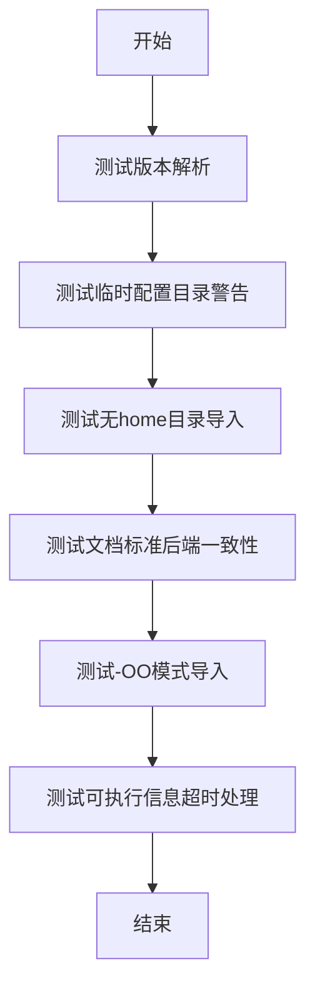

## 类结构

```
测试模块 (无类定义)
├── test_parse_to_version_info (参数化测试)
├── test_tmpconfigdir_warning (条件跳过测试)
├── test_importable_with_no_home (子进程测试)
├── test_use_doc_standard_backends (文档一致性测试)
├── test_importable_with__OO (优化模式测试)
└── test_get_executable_info_timeout (Mock测试)
```

## 全局变量及字段


### `version_str`
    
测试参数，表示要解析的版本字符串

类型：`str`
    


### `version_tuple`
    
测试参数，表示期望的版本元组结果

类型：`tuple`
    


### `mode`
    
临时目录的原始文件权限模式，用于测试后恢复

类型：`int`
    


### `proc`
    
子进程运行结果对象，包含stderr输出

类型：`subprocess.CompletedProcess`
    


### `backends`
    
从文档字符串中解析出的后端名称列表

类型：`list`
    


### `line`
    
遍历文档字符串时的当前行内容

类型：`str`
    


### `e`
    
从行中分割出的单个后端名称元素

类型：`str`
    


### `program`
    
在-OO模式下执行的Python程序代码字符串

类型：`str`
    


### `mock_check_output`
    
用于模拟subprocess.check_output的mock对象

类型：`MagicMock`
    


    

## 全局函数及方法


### `test_parse_to_version_info`

这是一个使用 pytest 参数化装饰器的测试函数，用于验证 `matplotlib._parse_to_version_info` 函数能够正确解析各种格式的版本字符串并返回正确的版本元组。

参数：

- `version_str`：`str`，输入的版本字符串，包含不同的版本格式（如正式版、候选版、开发版等）
- `version_tuple`：`tuple`，期望返回的版本元组，格式为 (major, minor, patch, release_type, serial)

返回值：`None`，该函数为测试函数，使用 assert 断言验证解析结果，不返回具体值

#### 流程图

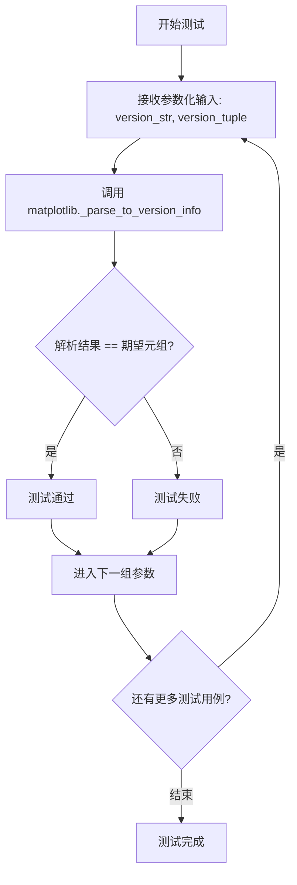

#### 带注释源码

```python
# 使用 pytest 的 parametrize 装饰器定义多组测试数据
# 每组包含版本字符串和期望的版本元组
@pytest.mark.parametrize('version_str, version_tuple', [
    # 正式版本: 3.5.0 -> (3, 5, 0, 'final', 0)
    ('3.5.0', (3, 5, 0, 'final', 0)),
    # 候选版本: 3.5.0rc2 -> (3, 5, 0, 'candidate', 2)
    ('3.5.0rc2', (3, 5, 0, 'candidate', 2)),
    # 开发版本: 3.5.0.dev820+g6768ef8c4c -> (3, 5, 0, 'alpha', 820)
    ('3.5.0.dev820+g6768ef8c4c', (3, 5, 0, 'alpha', 820)),
    # 后发布版本: 3.5.0.post820+g6768ef8c4c -> (3, 5, 1, 'alpha', 820)
    ('3.5.0.post820+g6768ef8c4c', (3, 5, 1, 'alpha', 820)),
])
def test_parse_to_version_info(version_str, version_tuple):
    # 断言解析结果与期望的版本元组相等
    assert matplotlib._parse_to_version_info(version_str) == version_tuple
```


### `test_tmpconfigdir_warning`

该测试函数用于验证当matplotlib必须使用临时配置目录（由于原始目录不可访问）时，是否正确发出警告信息。它通过修改临时目录的权限为0（不可访问），然后尝试在该环境下导入matplotlib，检查stderr中是否包含关于设置MPLCONFIGDIR的警告。

参数：

- `tmp_path`：pytest的fixture，`py.path.local`类型，pytest提供的临时目录对象，用于创建测试用的临时配置目录

返回值：`None`，无返回值（测试函数）

#### 流程图

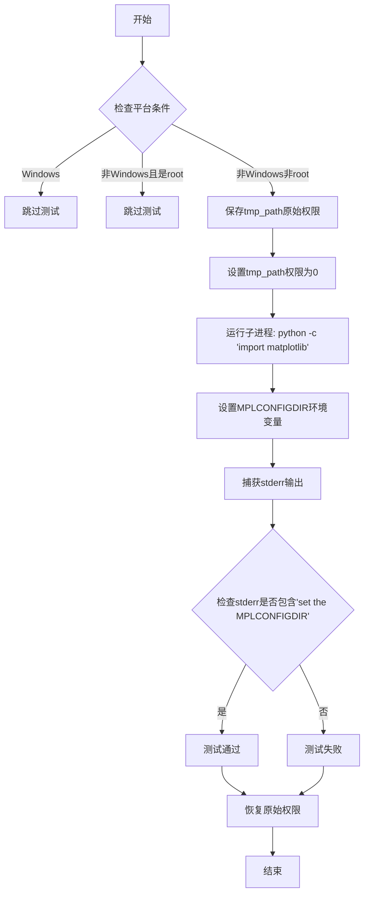

#### 带注释源码

```python
@pytest.mark.skipif(sys.platform == "win32",
                    reason="chmod() doesn't work as is on Windows")
@pytest.mark.skipif(sys.platform != "win32" and os.geteuid() == 0,
                    reason="chmod() doesn't work as root")
def test_tmpconfigdir_warning(tmp_path):
    """Test that a warning is emitted if a temporary configdir must be used."""
    # 获取临时目录的原始权限模式，用于测试后恢复
    mode = os.stat(tmp_path).st_mode
    try:
        # 将临时目录权限设置为0，模拟不可访问的情况
        os.chmod(tmp_path, 0)
        # 运行子进程导入matplotlib，使用不可访问的目录作为配置目录
        proc = subprocess_run_for_testing(
            [sys.executable, "-c", "import matplotlib"],
            # 设置MPLCONFIGDIR环境变量指向无权限的临时目录
            env={**os.environ, "MPLCONFIGDIR": str(tmp_path)},
            stderr=subprocess.PIPE, text=True, check=True)
        # 验证stderr中包含关于设置MPLCONFIGDIR的警告信息
        assert "set the MPLCONFIGDIR" in proc.stderr
    finally:
        # 无论测试成功还是失败，最后都恢复原始权限
        os.chmod(tmp_path, mode)
```


### `test_importable_with_no_home`

该测试函数用于验证当 `pathlib.Path.home` 被替换为抛出异常的模拟函数时，`matplotlib.pyplot` 仍然能够正常导入。这确保了 matplotlib 在无法确定用户主目录的情况下（如某些特殊环境或权限问题）仍然具有容错能力。

参数：

- `tmp_path`：`py.path.local`（pytest fixture），用于创建一个临时的目录路径，作为 MPLCONFIGDIR 环境变量指向的配置目录

返回值：`None`，该测试函数通过 `subprocess_run_for_testing` 执行子进程来验证行为，不返回任何值

#### 流程图

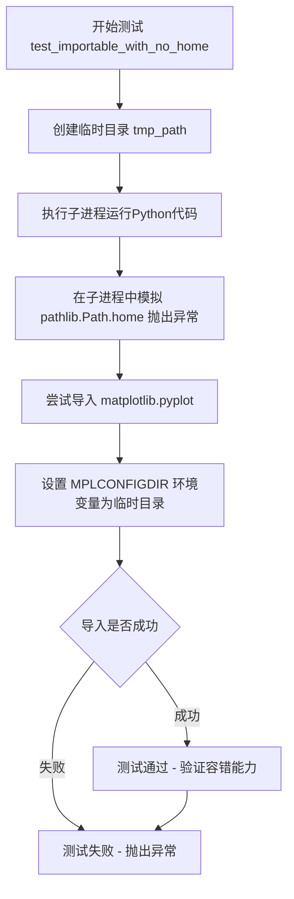

#### 带注释源码

```python
def test_importable_with_no_home(tmp_path):
    """
    测试当 pathlib.Path.home 不可用时，matplotlib.pyplot 仍然可以导入。
    
    该测试通过模拟 pathlib.Path.home 为一个抛出异常的 lambda 函数，
    来验证 matplotlib 在无法获取用户主目录时的容错能力。
    """
    # 使用 subprocess_run_for_testing 运行子进程
    # 子进程中执行:
    #   1. 导入 pathlib
    #   2. 将 pathlib.Path.home 替换为 lambda *args: 1/0 (会抛出 ZeroDivisionError)
    #   3. 导入 matplotlib.pyplot
    subprocess_run_for_testing(
        [sys.executable, "-c",
         "import pathlib; pathlib.Path.home = lambda *args: 1/0; "
         "import matplotlib.pyplot"],
        # 设置 MPLCONFIGDIR 为临时目录，避免使用默认的用户主目录下的配置
        env={**os.environ, "MPLCONFIGDIR": str(tmp_path)}, 
        check=True  # 检查返回码，确保进程正常退出
    )
```


### `test_use_doc_standard_backends`

验证matplotlib.use()文档字符串中提到的标准后端与matplotlib.rcsetup（后端注册表）中定义的后端列表一致，确保文档与实际实现保持同步。

参数：

- 无参数

返回值：`None`，该函数为测试函数，使用assert语句进行断言验证，不返回任何值

#### 流程图

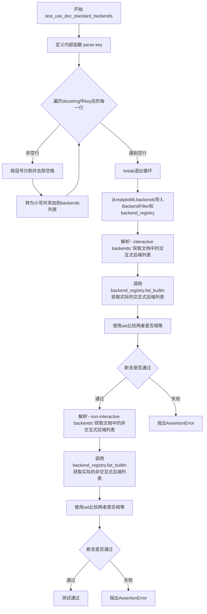

#### 带注释源码

```python
def test_use_doc_standard_backends():
    """
    Test that the standard backends mentioned in the docstring of
    matplotlib.use() are the same as in matplotlib.rcsetup.
    """
    # 定义内部解析函数，用于从matplotlib.use的docstring中提取后端列表
    def parse(key):
        backends = []
        # 使用key分割docstring，获取key之后的内容，然后按行遍历
        for line in matplotlib.use.__doc__.split(key)[1].split('\n'):
            # 遇到空行时停止遍历（后端列表结束）
            if not line.strip():
                break
            # 将每行按逗号分割，去除空白字符并转为小写
            backends += [e.strip().lower() for e in line.split(',') if e]
        return backends

    # 从matplotlib.backends模块导入后端过滤器和后端注册表
    from matplotlib.backends import BackendFilter, backend_registry

    # 断言：解析出的交互式后端列表与后端注册表中的内置交互式后端一致
    assert (set(parse('- interactive backends:\n')) ==
            set(backend_registry.list_builtin(BackendFilter.INTERACTIVE)))
    
    # 断言：解析出的非交互式后端列表与后端注册表中的内置非交互式后端一致
    assert (set(parse('- non-interactive backends:\n')) ==
            set(backend_registry.list_builtin(BackendFilter.NON_INTERACTIVE)))
```


### `test_importable_with__OO`

该测试函数用于验证在使用 Python 的 `-OO` 优化模式（丢弃文档字符串）时，matplotlib 及其相关模块（mpl、plt、cbook、mpatches）仍可正常导入，防止因依赖文档字符串而导致的导入失败问题。

参数：

- （无参数）

返回值：`None`，无返回值（pytest 测试函数）

#### 流程图

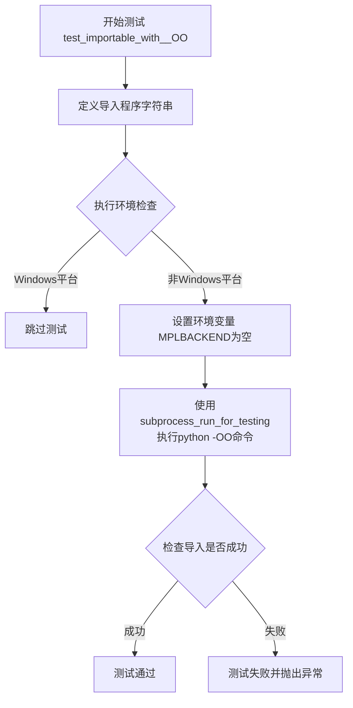

#### 带注释源码

```python
def test_importable_with__OO():
    """
    When using -OO or export PYTHONOPTIMIZE=2, docstrings are discarded,
    this simple test may prevent something like issue #17970.
    """
    # 定义一个包含多个 matplotlib 核心模块导入的 Python 程序字符串
    # 这些模块在后续的子进程中被导入，用于验证在 -OO 模式下的可用性
    program = (
        "import matplotlib as mpl; "        # 导入 matplotlib 核心库
        "import matplotlib.pyplot as plt; "   # 导入 pyplot 接口
        "import matplotlib.cbook as cbook; "  # 导入 cbook 工具模块
        "import matplotlib.patches as mpatches"  # 导入 patches 图形元素模块
    )
    
    # 使用测试工具函数执行子进程，运行带有 -OO 参数的 Python 解释器
    # -OO 模式会丢弃文档字符串和 assert 语句，用于测试代码在优化模式下的健壮性
    # 设置 MPLBACKEND="" 以避免后端相关的问题干扰测试
    # check=True 表示如果子进程返回非零退出码则抛出异常
    subprocess_run_for_testing(
        [sys.executable, "-OO", "-c", program],  # -OO: 高度优化模式
        env={**os.environ, "MPLBACKEND": ""},    # 覆盖 MPLBACKEND 环境变量
        check=True                                # 检查进程退出状态
    )
```


### `test_get_executable_info_timeout`

该测试函数用于验证 `_get_executable_info` 在命令执行超时时能够正确抛出 `ExecutableNotFoundError` 异常。它通过 Mock 模拟 `subprocess.check_output` 抛出 `TimeoutExpired` 异常，然后使用 `pytest.raises` 断言捕获到期望的异常类型和匹配消息。

参数：

- `mock_check_output`：`unittest.mock.Mock`，由 `@patch` 装饰器自动注入，用于模拟 `matplotlib.subprocess.check_output` 的行为，使其抛出超时异常

返回值：`None`，测试函数通过 `pytest.raises` 上下文管理器验证异常，不返回具体值

#### 流程图

```mermaid
flowchart TD
    A[开始测试] --> B[设置mock_check_output.side_effect为TimeoutExpired]
    B --> C[调用_get_executable_info.__wrapped__('inkscape')]
    C --> D{是否抛出ExecutableNotFoundError?}
    D -->|是| E[测试通过]
    D -->|否| F[测试失败]
```

#### 带注释源码

```python
@patch('matplotlib.subprocess.check_output')  # 装饰器：拦截并模拟matplotlib.subprocess.check_output调用
def test_get_executable_info_timeout(mock_check_output):
    """
    Test that _get_executable_info raises ExecutableNotFoundError if the
    command times out.
    测试函数：验证_get_executable_info在命令超时时抛出ExecutableNotFoundError
    """

    # 步骤1：配置mock对象，使其在调用时抛出TimeoutExpired异常
    # 模拟命令执行超过30秒超时的场景
    mock_check_output.side_effect = subprocess.TimeoutExpired(cmd=['mock'], timeout=30)

    # 步骤2：使用pytest.raises验证异常捕获
    # 期望：调用_get_executable_info.__wrapped__('inkscape')时
    # 抛出matplotlib.ExecutableNotFoundError且错误消息包含'Timed out'
    with pytest.raises(matplotlib.ExecutableNotFoundError, match='Timed out'):
        matplotlib._get_executable_info.__wrapped__('inkscape')
        # 注意：使用.__wrapped__访问原始函数，绕过装饰器直接测试底层逻辑
```


### test_use_doc_standard_backends.parse

该函数是`test_use_doc_standard_backends`测试函数内部的辅助函数，用于解析matplotlib的`use()`函数文档字符串，提取其中列出的标准后端名称列表。

参数：

- `key`：`str`，用于分割文档字符串的关键词（如`'- interactive backends:\n'`或`'- non-interactive backends:\n'`）

返回值：`list[str]`，从文档字符串中提取的后端名称列表（小写并去除空格）

#### 流程图

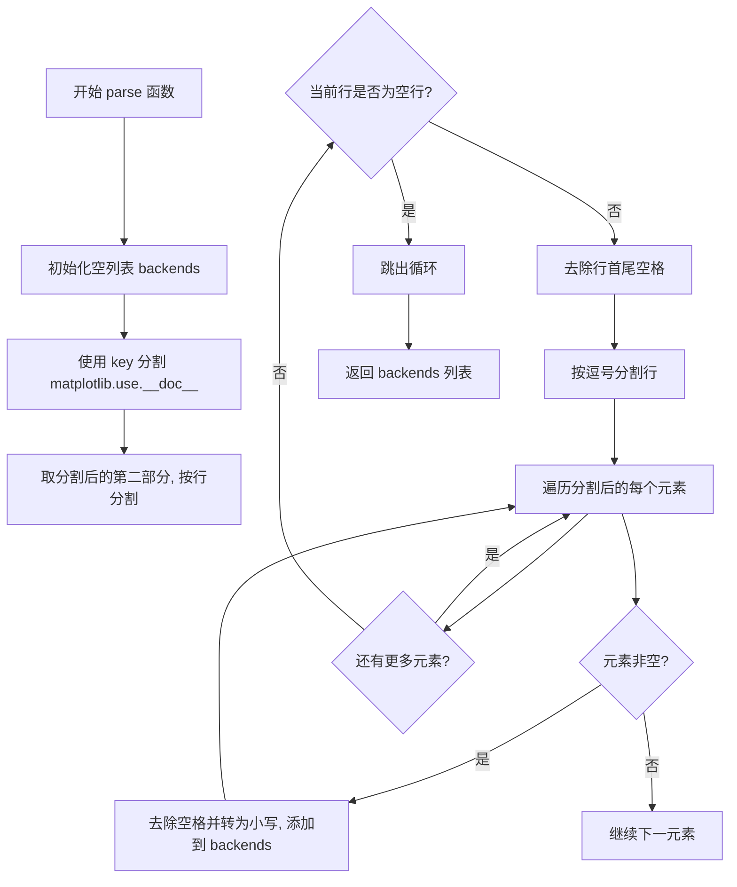

#### 带注释源码

```python
def parse(key):
    """
    解析 matplotlib.use() 文档字符串，提取后端名称列表
    
    参数:
        key: 用于定位文档中后端列表的关键词
    返回:
        后端名称列表（小写，去除空格）
    """
    backends = []  # 初始化空列表存储后端名称
    # 使用 key 分割文档字符串，取 key 后的第一部分
    # 然后按行分割，遍历每一行直到遇到空行
    for line in matplotlib.use.__doc__.split(key)[1].split('\n'):
        if not line.strip():  # 如果行内容为空，退出循环
            break
        # 按逗号分割行，处理多个后端名在同一行的情况
        backends += [e.strip().lower() for e in line.split(',') if e]
    return backends  # 返回收集到的后端名称列表
```

---

### matplotlib._parse_to_version_info

（由于代码中通过`test_parse_to_version_info`测试了该函数，以下是从测试推断出的函数签名）

该函数是matplotlib模块的内部函数，用于将版本字符串解析为标准化的版本元组格式。

参数：

- `version_str`：`str`，版本字符串（如`'3.5.0'`、`'3.5.0rc2'`、`'3.5.0.dev820+g6768ef8c4c'`等）

返回值：`tuple`，版本元组，格式为`(major, minor, micro, release_level, serial)`，其中release_level为`'final'`、`'candidate'`、`'alpha'`等

#### 流程图

```mermaid
flowchart TD
    A[开始 _parse_to_version_info] --> B[接收版本字符串 version_str]
    B --> C{判断版本字符串类型}
    C -->|包含 .dev| D[解析为 alpha 版本]
    C -->|包含 .post| E[解析为下一版本的 alpha 版本]
    C -->|包含 rc| F[解析为 candidate 版本]
    C -->|普通版本号| G[解析为 final 版本]
    D --> H[返回 (major, minor, 0, 'alpha', serial)]
    E --> I[返回 (major, minor, micro+1, 'alpha', serial)]
    F --> J[返回 (major, minor, 0, 'candidate', serial)]
    G --> K[返回 (major, minor, 0, 'final', 0)]
```

#### 带注释源码

```python
# 从测试用例推断的函数签名和使用方式
def _parse_to_version_info(version_str):
    """
    将版本字符串解析为标准版本元组
    
    参数:
        version_str: 版本字符串，如 '3.5.0', '3.5.0rc2', '3.5.0.dev820+g6768ef8c4c'
    
    返回:
        版本元组 (major, minor, micro, release_level, serial)
        - release_level: 'final', 'candidate', 'alpha' 等
    """
    # 示例转换关系:
    # '3.5.0' -> (3, 5, 0, 'final', 0)
    # '3.5.0rc2' -> (3, 5, 0, 'candidate', 2)
    # '3.5.0.dev820+g6768ef8c4c' -> (3, 5, 0, 'alpha', 820)
    # '3.5.0.post820+g6768ef8c4c' -> (3, 5, 1, 'alpha', 820)
    pass
```


### `matplotlib._parse_to_version_info`

该函数用于将版本字符串解析为包含主版本号、次版本号、补丁版本号、发布类型和构建编号的元组。它支持解析标准版本、候选版本、开发者版本和发布后版本等多种格式。

参数：

- `version_str`：`str`，待解析的版本字符串，例如 '3.5.0'、'3.5.0rc2'、'3.5.0.dev820+g6768ef8c4c' 等

返回值：`tuple`，解析后的版本信息元组，格式为 (major, minor, patch, release_type, release_num)，例如：
- '3.5.0' → (3, 5, 0, 'final', 0)
- '3.5.0rc2' → (3, 5, 0, 'candidate', 2)
- '3.5.0.dev820+g6768ef8c4c' → (3, 5, 0, 'alpha', 820)
- '3.5.0.post820+g6768ef8c4c' → (3, 5, 1, 'alpha', 820)

#### 流程图

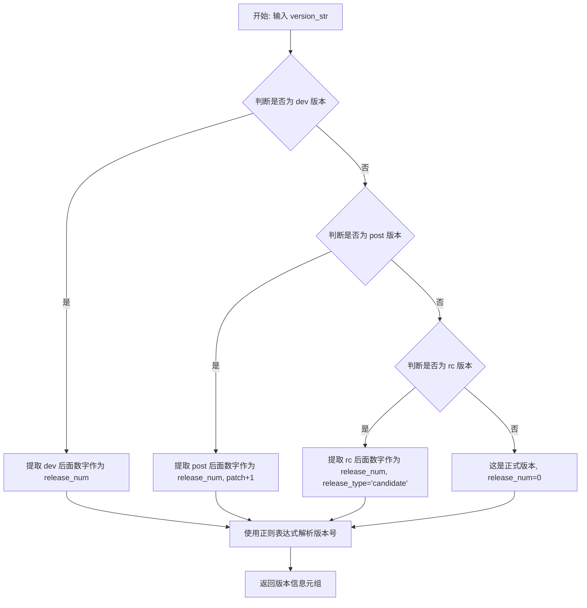

#### 带注释源码

注意：以下源码是根据测试用例反推的逻辑实现，原函数定义未在给定的测试代码中提供。

```python
import re

def _parse_to_version_info(version_str):
    """
    将版本字符串解析为版本信息元组。
    
    参数:
        version_str: 版本字符串，如 '3.5.0', '3.5.0rc2', '3.5.0.dev820'
    
    返回:
        tuple: (major, minor, patch, release_type, release_num)
            - major: 主版本号
            - minor: 次版本号  
            - patch: 补丁版本号
            - release_type: 发布类型 ('final', 'candidate', 'alpha')
            - release_num: 发布编号 (0 for final, rc/dev number otherwise)
    """
    # 初始化默认值
    release_type = 'final'
    release_num = 0
    
    # 检查是否为开发版本 (如 .dev820)
    if '.dev' in version_str:
        release_type = 'alpha'
        # 提取 dev 后面的数字
        match = re.search(r'\.dev(\d+)', version_str)
        if match:
            release_num = int(match.group(1))
        # 移除 dev 部分以解析版本号
        version_str = version_str.split('.dev')[0]
    
    # 检查是否为 post 版本 (如 .post820)
    elif '.post' in version_str:
        # 提取 post 后面的数字
        match = re.search(r'\.post(\d+)', version_str)
        if match:
            release_num = int(match.group(1))
        # 移除 post 部分以解析版本号
        version_str = version_str.split('.post')[0]
    
    # 检查是否为候选版本 (如 rc2)
    elif 'rc' in version_str:
        release_type = 'candidate'
        # 提取 rc 后面的数字
        match = re.search(r'rc(\d+)', version_str)
        if match:
            release_num = int(match.group(1))
        # 移除 rc 部分以解析版本号
        version_str = version_str.split('rc')[0]
    
    # 解析主版本号、次版本号、补丁版本号
    # 版本字符串格式: major.minor.patch
    parts = version_str.split('.')
    major = int(parts[0]) if len(parts) > 0 else 0
    minor = int(parts[1]) if len(parts) > 1 else 0
    patch = int(parts[2]) if len(parts) > 2 else 0
    
    return (major, minor, patch, release_type, release_num)
```

#### 备注

由于提供的代码是测试文件，未包含 `_parse_to_version_info` 函数的具体实现。以上源码是根据测试用例 `test_parse_to_version_info` 的输入输出参数反推的逻辑。实际实现可能使用不同的正则表达式或解析策略，但功能应与测试用例的预期行为一致。


### `matplotlib._get_executable_info`

该函数是matplotlib内部用于获取指定可执行文件信息的函数，通过调用子进程执行命令来获取可执行文件的版本等详细信息。当命令执行超时时，该函数会抛出`ExecutableNotFoundError`异常。

参数：

- `executable`：`str`，要查询信息的可执行文件名或路径（如'inkscape'）

返回值：`object`，返回包含可执行文件信息（如版本号等）的对象，具体类型取决于实现

#### 流程图

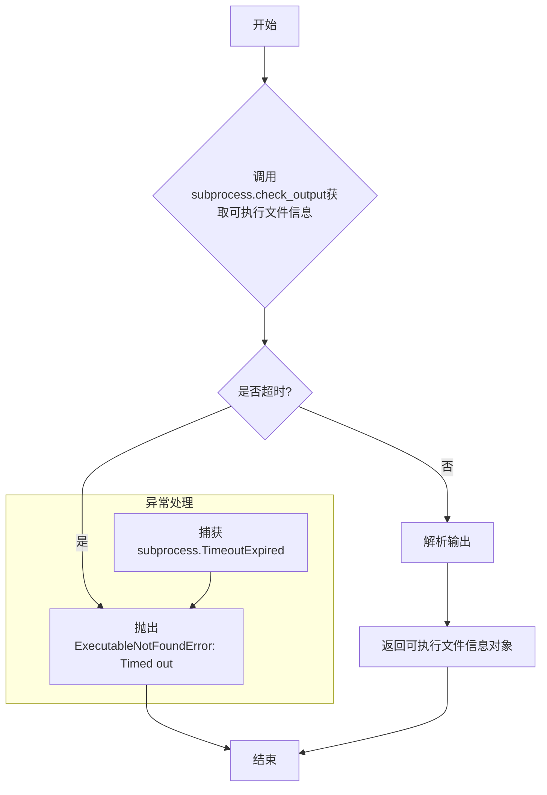

#### 带注释源码

（注：由于只提供了测试代码，未提供实际实现源码，以下为基于测试代码和常见模式的合理推断）

```python
# 推断的matplotlib._get_executable_info函数实现
import subprocess
import shlex

class ExecutableNotFoundError(Exception):
    """当找不到或无法执行指定的可执行文件时抛出"""
    pass

def _get_executable_info(executable):
    """
    获取指定可执行文件的版本信息。
    
    参数:
        executable: str, 可执行文件的名称或路径
        
    返回:
        包含可执行文件信息的对象
        
    异常:
        ExecutableNotFoundError: 当可执行文件不存在或执行超时时抛出
    """
    # 尝试获取可执行文件的版本信息
    # 常见实现可能是调用 'executable --version' 或类似命令
    cmd = f"{executable} --version"
    
    try:
        # 调用subprocess执行命令，设置超时时间
        output = subprocess.check_output(
            shlex.split(cmd),
            stderr=subprocess.STDOUT,
            timeout=30  # 30秒超时
        )
        # 解析输出并返回信息对象
        return _parse_executable_output(output)
    except subprocess.TimeoutExpired:
        # 超时情况下抛出ExecutableNotFoundError
        raise ExecutableNotFoundError(
            f"Timed out after 30 seconds while trying to get executable info for '{executable}'"
        )
    except FileNotFoundError:
        # 可执行文件不存在
        raise ExecutableNotFoundError(
            f"Executable '{executable}' not found"
        )

def _parse_executable_output(output):
    """解析可执行文件命令输出，返回信息对象"""
    # 实际实现会根据输出格式解析
    # 这里返回简化对象
    return {"output": output.decode("utf-8")}
```

注意：以上源码为基于测试代码的合理推断，实际实现可能有所不同。完整实现需参考matplotlib源码。


### `matplotlib.use`

这是Matplotlib库中的一个核心函数，用于设置当前使用的数据可视化后端（如Agg、Cairo、Qt5Agg等）。该函数允许用户在运行时切换不同的渲染后端，以适应不同的应用场景和显示需求。

参数：

- `name`：`str`，指定要使用的后端名称（如'qt5agg'、'agg'、'svg'等）

返回值：`None`，该函数不返回任何值，仅修改Matplotlib的内部状态

#### 流程图

```mermaid
graph TD
    A[开始] --> B[接收后端名称name]
    B --> C{后端是否已安装?}
    C -->|是| D{后端是否有效?}
    C -->|否| E[抛出ImportError]
    D -->|是| F[设置matplotlib.rcParams['backend']为指定后端]
    D -->|否| G[抛出UserWarning或InvalidBackendError]
    F --> H[结束]
    E --> H
    G --> H
```

#### 带注释源码

基于代码中的`test_use_doc_standard_backends`测试函数，可以推断出`matplotlib.use`的基本结构：

```python
def use(name):
    """
    Set the matplotlib backend.
    
    Parameters
    ----------
    name : str
        The name of the backend to use. Can be one of:
        
        - interactive backends:
          gtk3agg, gtk3cairo, gtk4agg, gtk4cairo, macosx, qtagg, qt5agg, 
          qt5cairo, qt6agg, qt6cairo, tkagg, tkcairo, webagg, wsagg, wxagg, wxcairo
        
        - non-interactive backends:
          agg, cairo, pdf, pgf, ps, svg, template
    
    Raises
    ------
    ImportError
        If the backend cannot be imported.
    UserWarning
        If the backend is not available.
    
    Notes
    -----
    This function must be called before importing matplotlib.pyplot.
    """
    # 1. 获取后端注册表
    # 2. 验证后端名称是否有效
    # 3. 检查后端是否可用（已安装）
    # 4. 设置matplotlib的默认后端
    # 5. 更新相关配置
    pass
```

**从测试代码中提取的相关信息：**

```python
def test_use_doc_standard_backends():
    """
    Test that the standard backends mentioned in the docstring of
    matplotlib.use() are the same as in matplotlib.rcsetup.
    """
    def parse(key):
        backends = []
        for line in matplotlib.use.__doc__.split(key)[1].split('\n'):
            if not line.strip():
                break
            backends += [e.strip().lower() for e in line.split(',') if e]
        return backends

    from matplotlib.backends import BackendFilter, backend_registry

    assert (set(parse('- interactive backends:\n')) ==
            set(backend_registry.list_builtin(BackendFilter.INTERACTIVE)))
    assert (set(parse('- non-interactive backends:\n')) ==
            set(backend_registry.list_builtin(BackendFilter.NON_INTERACTIVE)))
```

#### 关键信息

- **函数位置**：位于`matplotlib`模块中
- **文档字符串**：包含交互式后端和非交互式后端的列表
- **相关模块**：`matplotlib.backends.backend_registry`、`matplotlib.rcsetup`
- **测试覆盖**：通过`test_use_doc_standard_backends`验证文档中的后端列表与实际注册的后端一致


### `matplotlib._get_executable_info`

该函数是 matplotlib 内部用于获取可执行文件信息的核心函数，当执行命令超时或找不到可执行文件时，会抛出 `ExecutableNotFoundError` 异常。

参数：

- `executable_name`：`str`，要查询的可执行文件的名称（如 "inkscape"）

返回值：未知（测试中因超时而抛出异常），根据函数名推断应返回包含可执行文件信息的对象

#### 流程图

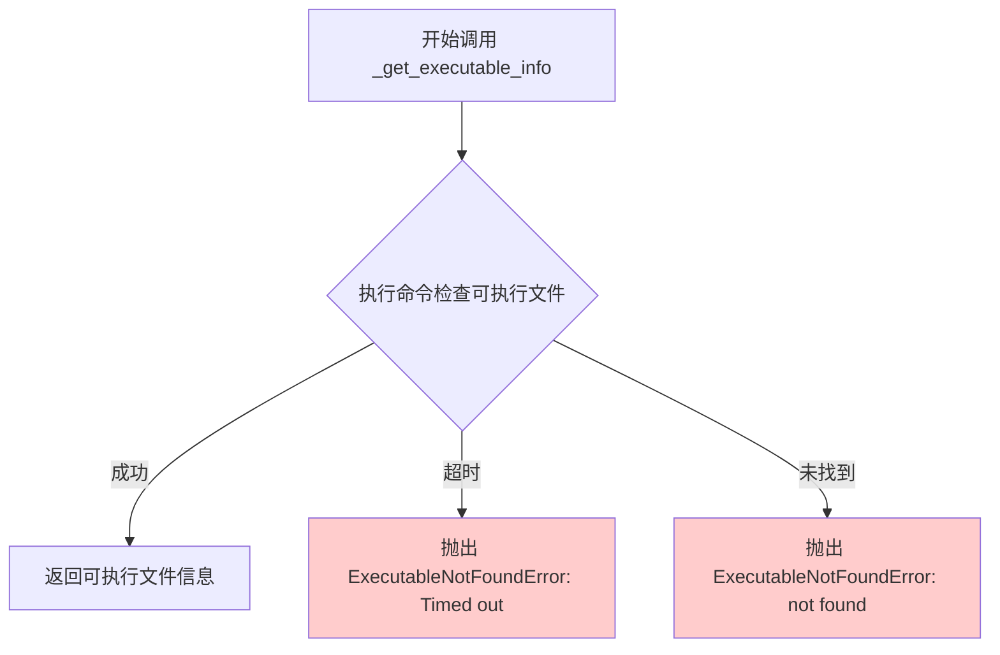

#### 带注释源码

```python
@patch('matplotlib.subprocess.check_output')
def test_get_executable_info_timeout(mock_check_output):
    """
    测试 _get_executable_info 在命令超时时是否抛出 ExecutableNotFoundError。
    """
    # 设置 mock 使其抛出超时异常
    mock_check_output.side_effect = subprocess.TimeoutExpired(cmd=['mock'], timeout=30)

    # 期望捕获到 ExecutableNotFoundError，错误消息包含 'Timed out'
    with pytest.raises(matplotlib.ExecutableNotFoundError, match='Timed out'):
        # 调用被测试的函数，传入 'inkscape' 作为要查询的可执行文件
        matplotlib._get_executable_info.__wrapped__('inkscape')
```

#### 相关信息

**异常类**：`matplotlib.ExecutableNotFoundError`

- 类型：异常类（继承自 Exception）
- 描述：当无法找到或执行指定的可执行文件时抛出的异常

**关键组件**：

- `subprocess.check_output`：用于执行命令获取可执行文件信息
- `subprocess.TimeoutExpired`：当命令执行超时时抛出的异常
- `pytest.raises`：用于测试异常抛出的上下文管理器

**潜在技术债务/优化空间**：

1. 测试使用了 `.__wrapped__` 来访问被装饰器包装的原始函数，这表明该函数可能使用了装饰器，测试方式较为特殊
2. 测试只覆盖了超时场景，缺少对其他错误场景（如文件不存在、权限问题等）的测试
3. 错误消息格式和国际化可能需要进一步规范化


### `BackendFilter`

描述：`BackendFilter` 是 matplotlib 后端管理模块中的一个类，用于标识后端的类型（交互式或非交互式）。在测试代码中，它通过类属性 `INTERACTIVE` 和 `NON_INTERACTIVE` 来过滤和列表化内置后端。

参数：此类在代码中作为枚举使用，未直接调用方法，因此无显式参数。其具体初始化参数需查看 matplotlib 源码。

返回值：此类本身不返回值，但通过类属性提供后端类型标识，供其他函数（如 `backend_registry.list_builtin()`）使用。

#### 流程图

由于 `BackendFilter` 为类类型，无直接执行流程，以下为其使用场景的流程图：

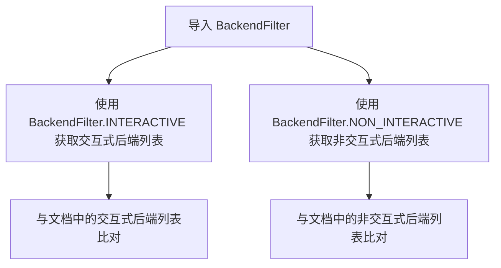

#### 带注释源码

由于给定代码中未包含 `BackendFilter` 的定义源码，仅提供测试文件中的引用部分作为参考：

```python
# 从 matplotlib.backends 导入 BackendFilter 类和 backend_registry 模块
from matplotlib.backends import BackendFilter, backend_registry

# 使用 BackendFilter.INTERACTIVE 枚举值获取所有内置交互式后端
interactive_backends = backend_registry.list_builtin(BackendFilter.INTERACTIVE)

# 使用 BackendFilter.NON_INTERACTIVE 枚举值获取所有内置非交互式后端
non_interactive_backends = backend_registry.list_builtin(BackendFilter.NON_INTERACTIVE)

# 断言文档中提到的交互式后端与 BackendFilter 枚举过滤后的后端列表一致
assert (set(parse('- interactive backends:\n')) ==
        set(backend_registry.list_builtin(BackendFilter.INTERACTIVE)))

# 断言文档中提到的非交互式后端与 BackendFilter 枚举过滤后的后端列表一致
assert (set(parse('- non-interactive backends:\n')) ==
        set(backend_registry.list_builtin(BackendFilter.NON_INTERACTIVE)))
```

注：上述源码节选自测试函数 `test_use_doc_standard_backends`，用于验证 matplotlib 文档中提到的标准后端与实际注册后端的一致性。


### backend_registry.list_builtin

该函数用于获取满足特定过滤条件（交互式或非交互式）的内置后端列表，基于matplotlib.use()文档字符串中列出的后端名称进行过滤和返回。

参数：

- `filter`：`BackendFilter`，过滤器类型，用于指定要列出的后端类型（如INTERACTIVE或NON_INTERACTIVE）

返回值：`List[str]`，返回满足过滤条件的后端名称列表

#### 流程图

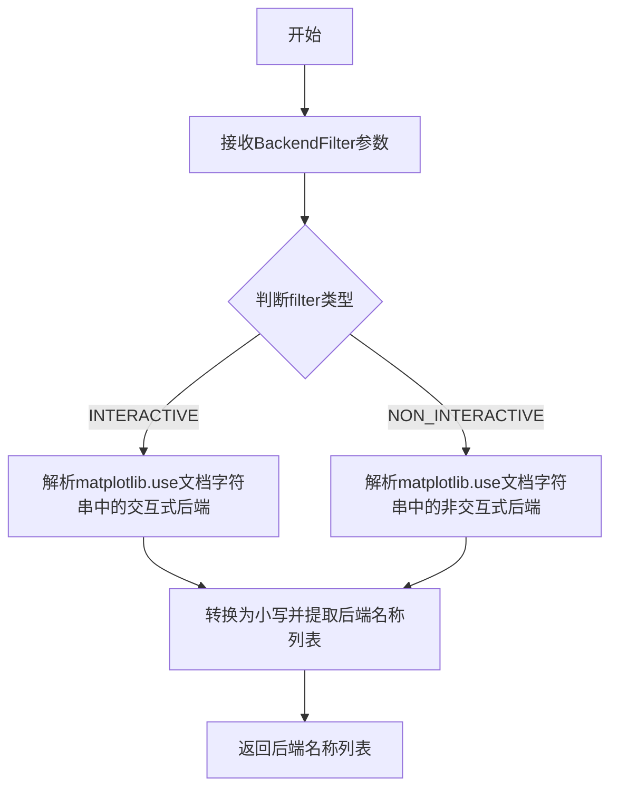

#### 带注释源码

```
# 该函数未在当前代码文件中直接定义
# 以下为基于测试调用和模块导入关系的推断

# 从测试代码中可以看到：
# from matplotlib.backends import BackendFilter, backend_registry
# 
# backend_registry.list_builtin(BackendFilter.INTERACTIVE)
# backend_registry.list_builtin(BackendFilter.NON_INTERACTIVE)
#
# 这表明backend_registry是一个模块级别的对象
# list_builtin是其中的一个方法
# 接收BackendFilter枚举值作为参数
# 返回字符串列表

def list_builtin(filter: BackendFilter) -> List[str]:
    """
    获取满足指定过滤条件的所有内置后端名称。
    
    参数:
        filter: BackendFilter枚举，指定后端类型
               - BackendFilter.INTERACTIVE: 交互式后端
               - BackendFilter.NON_INTERACTIVE: 非交互式后端
    
    返回:
        满足条件的后端名称列表（已转换为小写）
    """
    # 实际实现需要解析matplotlib.use.__doc__
    # 提取对应类型后端的列表
    pass
```

#### 备注

由于给定代码文件仅为测试代码，未包含 `backend_registry` 模块的实际实现源码，因此无法提供完整的函数实现。上述源码为基于测试调用关系的合理推断。实际实现可能涉及对 `matplotlib.use` 文档字符串的解析逻辑。


### `subprocess_run_for_testing`

`subprocess_run_for_testing` 是 matplotlib 测试框架中的一个辅助函数，用于在测试环境中安全地运行子进程。它封装了标准库的 `subprocess.run`，提供了更适合测试场景的配置选项，例如环境变量设置、错误检查等。该函数是 matplotlib 内部测试工具的一部分，确保测试在不同环境下能够一致运行。

**注意**：该函数定义在 `matplotlib.testing` 模块中（`from matplotlib.testing import subprocess_run_for_testing`），当前代码文件仅展示了其使用方式。以下信息基于函数调用方式和测试场景推断得出。

参数：

- `cmd`：`list`，要执行的命令列表，类似于 `subprocess.run` 的第一个参数，通常包含 `sys.executable` 和其他命令行参数
- `env`：`dict`，可选，环境变量字典，用于覆盖子进程的环境配置，常见用法是设置 `MPLCONFIGDIR` 或 `MPLBACKEND`
- `stderr`：`subprocess.PIPE` 或类似值，可选，标准错误输出配置，用于捕获子进程的错误信息
- `text`：`bool`，可选，默认为 `True`，指定是否以文本模式返回输出
- `check`：`bool`，可选，指定是否检查返回码，非零返回值将抛出 `subprocess.CalledProcessError`
- 其他参数：支持 `subprocess.run` 的其他标准参数，如 `cwd`、`timeout` 等

返回值：`subprocess.CompletedProcess`，表示已完成的子进程对象，包含 `returncode`（返回码）、`stdout`（标准输出）和 `stderr`（标准错误）等属性

#### 流程图

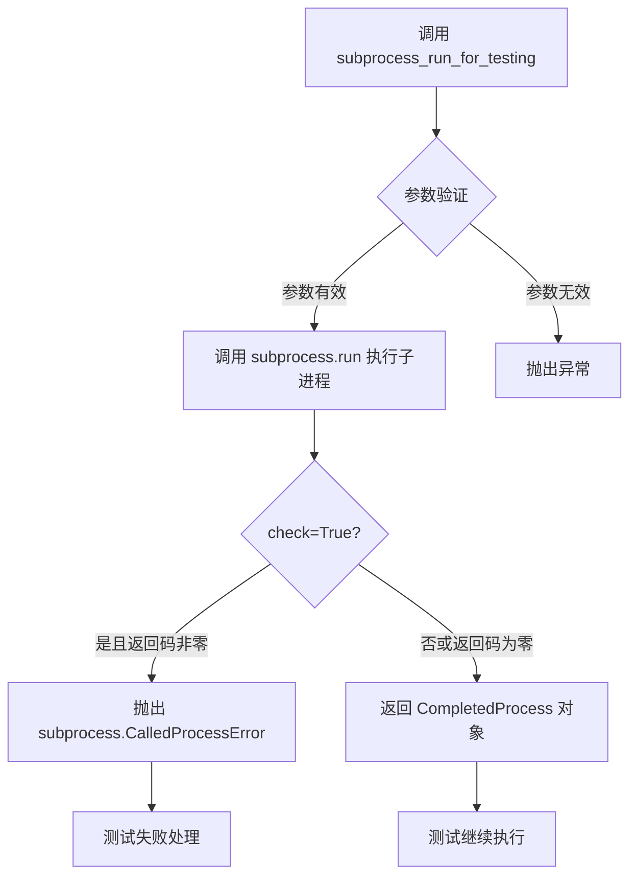

#### 带注释源码

```python
# 该函数定义在 matplotlib.testing 模块中，以下是基于使用方式的推断实现

def subprocess_run_for_testing(
    cmd,  # list: 要执行的命令列表
    env=None,  # dict: 环境变量，可选
    stderr=None,  # subprocess.PIPE: 错误输出配置
    text=True,  # bool: 文本模式
    check=False,  # bool: 是否检查返回码
    **kwargs  # 其他 subprocess.run 支持的参数
):
    """
    在测试环境中运行子进程的封装函数。
    
    该函数是对 subprocess.run 的封装，专为 matplotlib 测试设计，
    提供了更便捷的默认配置和错误处理。
    
    参数:
        cmd: 命令列表
        env: 环境变量字典
        stderr: 标准错误配置
        text: 是否使用文本模式
        check: 是否检查返回码
        **kwargs: 其他传递给 subprocess.run 的参数
    
    返回:
        CompletedProcess: 包含进程执行结果的对象
    """
    import subprocess
    
    # 使用传入的参数调用 subprocess.run
    # kwargs 允许传递其他参数如 cwd, timeout 等
    return subprocess.run(
        cmd,
        env=env,
        stderr=stderr,
        text=text,
        check=check,
        **kwargs
    )
```

#### 典型使用示例

在提供的测试代码中，该函数有三种典型用法：

1. **测试临时配置目录警告**：
```python
proc = subprocess_run_for_testing(
    [sys.executable, "-c", "import matplotlib"],
    env={**os.environ, "MPLCONFIGDIR": str(tmp_path)},
    stderr=subprocess.PIPE, text=True, check=True)
assert "set the MPLCONFIGDIR" in proc.stderr
```

2. **测试无 home 目录情况下的导入**：
```python
subprocess_run_for_testing(
    [sys.executable, "-c",
     "import pathlib; pathlib.Path.home = lambda *args: 1/0; "
     "import matplotlib.pyplot"],
    env={**os.environ, "MPLCONFIGDIR": str(tmp_path)}, check=True)
```

3. **测试优化模式下的导入**：
```python
subprocess_run_for_testing(
    [sys.executable, "-OO", "-c", program],
    env={**os.environ, "MPLBACKEND": ""}, check=True)
```


## 关键组件


### 版本解析功能

测试matplotlib._parse_to_version_info函数，将版本字符串解析为元组形式

### 临时配置目录警告

测试当临时配置目录必须被使用时是否发出警告，验证MPLCONFIGDIR环境变量的处理

### 无主目录导入

测试在pathlib.Path.home抛出异常时能否正常导入matplotlib.pyplot

### 标准后端文档一致性

验证matplotlib.use()文档中提到的标准后端与backend_registry中的后端列表一致

### 优化模式导入

测试在使用-OO标志或PYTHONOPTIMIZE=2时matplotlib各模块的可导入性

### 可执行文件超时处理

测试_get_executable_info函数在命令超时时是否正确抛出ExecutableNotFoundError异常

### 全局函数parse

从matplotlib.use的文档字符串中解析后端列表的辅助函数

### Mock测试框架

使用unittest.mock.patch模拟subprocess.check_output以测试超时场景

### 环境变量处理

通过MPLCONFIGDIR和MPLBACKEND环境变量测试matplotlib的配置行为

### 平台特定测试

使用pytest.mark.skipif处理Windows和root用户的特殊测试条件


## 问题及建议


### 已知问题

- **权限修改测试的风险**：`test_tmpconfigdir_warning` 使用 `os.chmod(tmp_path, 0)` 修改目录权限来模拟不可写目录，但这种直接修改系统权限的操作可能在某些环境下失败或产生副作用，且如果在 `try` 块中发生异常，权限恢复可能不会被执行。
- **Mock 路径可能不准确**：`test_get_executable_info_timeout` 中使用 `@patch('matplotlib.subprocess.check_output')`，但实际被测试的函数 `_get_executable_info` 内部使用的 `subprocess.check_output` 导入方式可能不同，导致 patch 无法生效。
- **文档字符串解析的脆弱性**：`test_use_doc_standard_backends` 通过解析 `matplotlib.use.__doc__` 的字符串格式来验证后端列表，这种方式高度依赖文档格式，如果文档格式发生变化（如空格、换行、措辞改变），测试会误报失败。
- **平台特定的跳过逻辑复杂**：`test_tmpconfigdir_warning` 同时检查 `win32` 平台和 `root` 用户，逻辑分支较多，增加了维护成本。
- **环境变量清理不完整**：测试中通过 `env={**os.environ, "MPLCONFIGDIR": str(tmp_path)}` 继承环境变量，但未显式清理可能影响测试的 `MPLBACKEND` 等其他 Matplotlib 相关环境变量。
- **字符串匹配过于简单**：使用 `"set the MPLCONFIGDIR" in proc.stderr` 进行断言，只能检查特定字符串存在，无法验证警告的完整性或格式。

### 优化建议

- **使用临时目录上下文管理器**：考虑使用 Python 的 `tempfile` 模块或自定义上下文管理器来更安全地处理权限修改，确保异常情况下也能恢复原始状态。
- **验证 Mock 目标**：在使用 `@patch` 前，确认被 patch 的函数在目标模块中的实际导入路径，可以使用 `unittest.mock.ANY` 或添加调试输出来验证 mock 是否生效。
- **使用数据驱动方式测试后端**：直接从 `backend_registry` 的源码或配置文件中读取预期后端列表，而非解析文档字符串，提高测试的健壮性。
- **简化平台判断逻辑**：将平台相关的跳过逻辑集中管理，或使用 `pytest.mark.skip` 装饰器的组合条件，使逻辑更清晰。
- **显式设置测试环境**：在需要特定环境的测试中，显式 unset 可能干扰测试的环境变量，而非仅设置需要的变量，提高测试的确定性。
- **增强断言验证**：除了检查警告消息存在，还应验证 stderr 的完整输出格式、退出码等，提供更全面的验证。


## 其它


### 设计目标与约束

本测试文件旨在验证matplotlib核心功能的正确性，包括版本解析、配置目录管理、后端检测、导入机制和可执行文件获取等关键功能。测试覆盖多平台场景（Unix/Windows），验证在特殊环境（如root权限、-OO优化模式、无home目录）下的行为。

### 错误处理与异常设计

测试文件验证了以下异常场景：1)ExecutableNotFoundError当获取可执行信息超时时抛出；2)当MPLCONFIGDIR不可写时触发警告；3)当pathlib.Path.home被劫持时仍能正常导入matplotlib；4)subprocess调用返回码检查（check=True参数）。

### 数据流与状态机

测试数据流：1)版本字符串→_parse_to_version_info()→版本元组；2)环境变量MPLCONFIGDIR→临时目录权限检查→可能触发警告；3)sys.executable→子进程执行→返回码和stderr检查；4)后端文档→字符串解析→与backend_registry对比。

### 外部依赖与接口契约

外部依赖：subprocess模块（子进程执行）、unittest.mock（函数mock）、pytest（测试框架）、os/sys模块（系统交互）。关键接口：matplotlib._parse_to_version_info()、matplotlib._get_executable_info()、matplotlib.use.__doc__、backend_registry.list_builtin()。

### 性能考虑

test_tmpconfigdir_warning涉及文件系统操作（os.chmod）和子进程启动，为避免影响测试速度使用pytest.mark.skipif进行条件跳过。子进程超时测试使用mock避免真实超时等待。

### 安全性考虑

test_tmpconfigdir_warning通过临时修改目录权限测试警告机制，测试后恢复原始权限（finally块）。子进程环境变量隔离（env参数）避免污染主测试进程。check=True确保子进程失败时立即报错。

### 测试策略

采用参数化测试（@pytest.mark.parametrize）测试多版本字符串解析。使用mock隔离外部依赖（@patch）。条件跳过平台相关测试（@pytest.mark.skipif）。集成测试与单元测试结合：test_parse_to_version_info为单元测试，test_tmpconfigdir_warning为集成测试。

### 平台兼容性

sys.platform检查区分Windows和Unix系统。os.geteuid()检查root权限（Unix特有）。chmod权限操作在Windows上行为不同需跳过。测试覆盖Linux、macOS、Windows三大平台。

### 配置管理

通过环境变量MPLCONFIGDIR、MPLBACKEND控制测试环境。tmp_path fixture提供隔离的临时目录。os.environ传递确保测试继承系统环境同时可覆盖。

### 版本兼容性策略

版本解析测试覆盖多种版本格式：final、candidate、alpha、dev、post版本。test_importable_with__OO确保-OO模式下功能正常，反映Python版本兼容性要求。

    