# `matplotlib\lib\matplotlib\tests\test_mlab.py` 详细设计文档

这是一个matplotlib的mlab模块的测试文件，主要测试频谱分析（PSD、CSD、specgram等）、detrend（去趋势）、window函数、高斯核密度估计（GaussianKDE）等功能。

## 整体流程

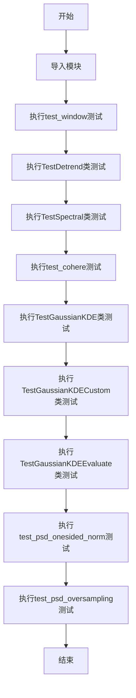

## 类结构

```
test_window (独立测试函数)
TestDetrend (测试类)
├── setup_method
├── allclose
├── test_detrend_none
├── test_detrend_mean
├── test_detrend_mean_1d_base_slope_off_list_andor_axis0
├── test_detrend_mean_2d
├── test_detrend_ValueError
├── test_detrend_mean_ValueError
├── test_detrend_linear
├── test_detrend_str_linear_1d
└── test_detrend_linear_2d
TestSpectral (测试类，参数化)
├── stim (fixture)
├── check_freqs
├── check_maxfreq
├── test_spectral_helper_raises
├── test_single_spectrum_helper_unsupported_modes
├── test_spectral_helper_psd
├── test_csd
├── test_csd_padding
├── test_psd
├── test_psd_detrend
├── test_psd_window_hanning
├── test_psd_window_hanning_detrend_linear
├── test_psd_window_flattop
├── test_psd_windowarray
├── test_psd_windowarray_scale_by_freq
├── test_spectrum
├── test_specgram
├── test_specgram_warn_only1seg
├── test_psd_csd_equal
├── test_specgram_auto_default_psd_equal
├── test_specgram_complex_equivalent
└── test_psd_windowarray_equal
test_cohere (独立测试函数)
TestGaussianKDE (测试类)
├── test_kde_integer_input
├── test_gaussian_kde_covariance_caching
└── test_kde_bandwidth_method
TestGaussianKDECustom (测试类)
├── test_no_data
├── test_single_dataset_element
├── test_silverman_multidim_dataset
├── test_silverman_singledim_dataset
├── test_scott_multidim_dataset
├── test_scott_singledim_dataset
├── test_scalar_empty_dataset
├── test_scalar_covariance_dataset
├── test_callable_covariance_dataset
├── test_callable_singledim_dataset
└── test_wrong_bw_method
TestGaussianKDEEvaluate (测试类)
├── test_evaluate_diff_dim
├── test_evaluate_inv_dim
├── test_evaluate_dim_and_num
├── test_evaluate_point_dim_not_one
└── test_evaluate_equal_dim_and_num_lt
test_psd_onesided_norm (独立测试函数)
test_psd_oversampling (独立测试函数)
```

## 全局变量及字段


### `sys`
    
Python standard library module for system-specific parameters and functions

类型：`module`
    


### `np`
    
NumPy library for numerical computing

类型：`module`
    


### `pytest`
    
Pytest testing framework

类型：`module`
    


### `mlab`
    
Matplotlib's module for spectral analysis functions

类型：`module`
    


### `assert_allclose`
    
NumPy testing utility to assert arrays are equal within tolerance

类型：`function`
    


### `assert_almost_equal`
    
NumPy testing utility to assert values are almost equal

类型：`function`
    


### `assert_array_equal`
    
NumPy testing utility to assert arrays are exactly equal

类型：`function`
    


### `assert_array_almost_equal_nulp`
    
NumPy testing utility to assert arrays are equal within nulp units

类型：`function`
    


### `TestDetrend.sig_zeros`
    
Zero-valued signal array of length n

类型：`numpy.ndarray`
    


### `TestDetrend.sig_off`
    
Signal with constant offset of 100

类型：`numpy.ndarray`
    


### `TestDetrend.sig_slope`
    
Signal with linear slope from -10 to 90

类型：`numpy.ndarray`
    


### `TestDetrend.sig_slope_mean`
    
Mean-centered linear slope signal

类型：`numpy.ndarray`
    


### `TestDetrend.sig_base`
    
Base signal consisting of random noise plus sinusoidal component, centered at zero

类型：`numpy.ndarray`
    


### `TestSpectral.Fs`
    
Sampling frequency in Hz (100.0)

类型：`float`
    


### `TestSpectral.sides`
    
Spectral sides parameter ('onesided' or 'twosided')

类型：`str`
    


### `TestSpectral.fstims`
    
List of stimulus frequencies derived from input parameters

类型：`list`
    


### `TestSpectral.NFFT_density`
    
Number of FFT points for PSD/density calculations

类型：`int or None`
    


### `TestSpectral.nover_density`
    
Number of overlapping points for density calculations

类型：`int or None`
    


### `TestSpectral.pad_to_density`
    
Number of points to pad to for density calculations

类型：`int or None`
    


### `TestSpectral.NFFT_spectrum`
    
Number of FFT points for spectrum calculations

类型：`int`
    


### `TestSpectral.nover_spectrum`
    
Number of overlapping points for spectrum calculations (typically 0)

类型：`int`
    


### `TestSpectral.pad_to_spectrum`
    
Number of points to pad to for spectrum calculations

类型：`int or None`
    


### `TestSpectral.NFFT_specgram`
    
Number of FFT points for spectrogram calculations

类型：`int or None`
    


### `TestSpectral.nover_specgram`
    
Number of overlapping points for spectrogram calculations

类型：`int or None`
    


### `TestSpectral.pad_to_specgram`
    
Number of points to pad to for spectrogram calculations

类型：`int or None`
    


### `TestSpectral.t_specgram`
    
Time points for spectrogram

类型：`numpy.ndarray`
    


### `TestSpectral.t_density`
    
Time points for density calculations (same as t_specgram)

类型：`numpy.ndarray`
    


### `TestSpectral.t_spectrum`
    
Time point for spectrum calculation

类型：`numpy.ndarray`
    


### `TestSpectral.y`
    
Signal data (real or complex) for spectral analysis

类型：`numpy.ndarray`
    


### `TestSpectral.freqs_density`
    
Frequency bins for PSD/density calculations

类型：`numpy.ndarray`
    


### `TestSpectral.freqs_spectrum`
    
Frequency bins for spectrum calculations

类型：`numpy.ndarray`
    


### `TestSpectral.freqs_specgram`
    
Frequency bins for spectrogram calculations (same as freqs_density)

类型：`numpy.ndarray`
    


### `TestSpectral.NFFT_density_real`
    
Actual NFFT value used after processing defaults/negatives

类型：`int`
    
    

## 全局函数及方法


### `test_window`

该函数是 matplotlib 中 mlab 模块的窗口函数测试用例，通过生成随机数据和常数数组，验证 `window_none` 和 `window_hanning` 窗口函数的行为是否符合预期。

参数： 无

返回值： `None`，该函数为测试函数，不返回任何值（pytest 测试框架自动判定断言是否通过）

#### 流程图

```mermaid
flowchart TD
    A[开始测试] --> B[设置随机种子 np.random.seed(0)]
    B --> C[定义样本数量 n = 1000]
    C --> D[生成随机数据 rand = np.random.standard_normal&#40;n&#41; + 100]
    D --> E[生成全1数组 ones = np.ones&#40;n&#41;]
    E --> F{测试 window_none}
    F --> G[验证 window_none&#40;ones&#41; == ones]
    G --> H[验证 window_none&#40;rand&#41; == rand]
    H --> I{测试 window_hanning}
    I --> J[验证 np.hanning&#40;len&#40;rand&#41;&#41; * rand == mlab.window_hanning&#40;rand&#41;]
    J --> K[验证 np.hanning&#40;len&#40;ones&#41;&#41; == mlab.window_hanning&#40;ones&#41;]
    K --> L[结束测试]
```

#### 带注释源码

```python
def test_window():
    """
    测试 mlab 模块中窗口函数的功能
    
    该测试函数验证:
    1. window_none: 不应用窗口函数，应返回原始输入
    2. window_hanning: 应用汉宁窗函数，应与 numpy.hanning 结果一致
    """
    # 设置随机种子以确保测试结果可复现
    np.random.seed(0)
    
    # 定义样本数量
    n = 1000
    
    # 生成随机数据: 标准正态分布 + 100偏移
    # 使数据集中在100附近，模拟实际信号
    rand = np.random.standard_normal(n) + 100
    
    # 生成全1数组，用于测试窗口函数对常数信号的响应
    ones = np.ones(n)
    
    # 测试 window_none 函数
    # 预期: 不应用任何窗函数，应返回原始输入
    assert_array_equal(mlab.window_none(ones), ones)
    assert_array_equal(mlab.window_none(rand), rand)
    
    # 测试 window_hanning 函数
    # 预期: 应用汉宁窗，应与 numpy.hanning 结果相同
    # 注意: mlab.window_hanning 直接返回窗口后的信号
    # 而 np.hanning 只返回窗口系数，需要手动乘以信号
    assert_array_equal(np.hanning(len(rand)) * rand, mlab.window_hanning(rand))
    assert_array_equal(np.hanning(len(ones)), mlab.window_hanning(ones))
```


### `test_cohere`

这是对 `mlab.cohere` 函数的集成测试，通过构造具有相位偏移和高频衰减特性的测试数据，验证相干性计算功能的正确性。

参数：

- 该函数没有参数

返回值：`None`，该函数为测试函数，通过 `assert` 语句进行验证，不返回任何值

#### 流程图

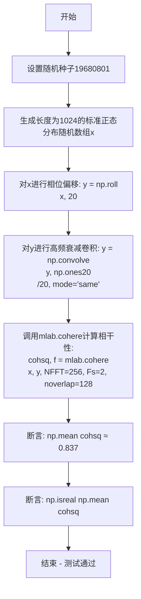

#### 带注释源码

```python
# extra test for cohere...
def test_cohere():
    """
    测试 mlab.cohere 函数的相干性计算功能
    """
    N = 1024  # 设置数据点数量
    np.random.seed(19680801)  # 固定随机种子以确保测试可重复
    
    # 生成标准正态分布的随机信号x
    x = np.random.randn(N)
    
    # phase offset: 对信号x进行相位偏移（循环移位20个点）
    # 这创建了x和y之间的相关性
    y = np.roll(x, 20)
    
    # high-freq roll-off: 对y进行平滑处理（高频衰减）
    # 使用长度为20的滑动平均滤波器
    y = np.convolve(y, np.ones(20) / 20., mode='same')
    
    # 调用matplotlib的cohere函数计算x和y之间的相干性
    # 参数: NFFT=256（FFT点数）, Fs=2（采样频率）, noverlap=128（重叠点数）
    cohsq, f = mlab.cohere(x, y, NFFT=256, Fs=2, noverlap=128)
    
    # 断言1: 验证相干性平方的均值约为0.837（容差1e-3）
    # 这个值是通过多次实验确定的预期结果
    assert_allclose(np.mean(cohsq), 0.837, atol=1.e-3)
    
    # 断言2: 验证相干性均值是实数（而非复数）
    assert np.isreal(np.mean(cohsq))
```


### test_psd_onesided_norm  

该函数通过构造已知信号并比较理论功率谱密度（基于 FFT）与 `mlab.psd` 在单边（**onesided**）模式下的计算结果，验证 `mlab.psd` 的单边归一化实现是否正确。

**参数**  
- （无）该函数不接受任何参数。

**返回值**  
- `None`（Python 中的 `NoneType`）。函数内部仅执行断言，若测试通过则正常结束，若失败则抛出 `AssertionError`。

#### 流程图

```mermaid
flowchart TD
    A([开始]) --> B[定义测试信号 u]
    B --> C[设定采样间隔 dt]
    C --> D[通过 FFT 计算理论功率谱 Su]
    D --> E[调用 mlab.psd 计算实际功率谱 P]
    E --> F[构造单边理论功率谱 Su_1side]
    F --> G{断言 assert_allclose(P, Su_1side)}
    G -->|通过| H([结束])
    G -->|失败| I([抛出 AssertionError])
```

#### 带注释源码

```python
def test_psd_onesided_norm():
    """
    验证 mlab.psd 在单边（onesided）模式下的功率谱密度计算是否正确。

    步骤概述：
    1. 准备已知信号 u；
    2. 计算理论功率谱密度 Su（使用 FFT）；
    3. 使用 mlab.psd 计算实际功率谱密度 P；
    4. 将理论双边功率谱转换为单边形式 Su_1side；
    5. 使用 assert_allclose 检查 P 与 Su_1side 在容差 1e-6 内相等。
    """
    # 1. 测试信号（长度为 7）
    u = np.array([0, 1, 2, 3, 1, 2, 1])

    # 2. 采样间隔，采样频率 Fs = 1/dt
    dt = 1.0

    # 3. 通过 FFT 计算理论功率谱密度 Su
    #    公式：Su = |FFT(u) * dt|^2 / (dt * N)
    Su = np.abs(np.fft.fft(u) * dt) ** 2 / (dt * u.size)

    # 4. 调用 mlab.psd 获取实际功率谱密度 P（单边模式）
    #    参数说明：
    #    - NFFT=u.size：不做分段，使用完整信号长度；
    #    - Fs=1/dt：采样频率；
    #    - window=mlab.window_none：不加窗；
    #    - detrend=mlab.detrend_none：不进行去趋势；
    #    - noverlap=0：段之间不重叠；
    #    - pad_to=None：不填充；
    #    - scale_by_freq=None：不进行频率归一化；
    #    - sides='onesided'：返回单边谱。
    P, f = mlab.psd(u, NFFT=u.size, Fs=1/dt, window=mlab.window_none,
                    detrend=mlab.detrend_none, noverlap=0, pad_to=None,
                    scale_by_freq=None,
                    sides='onesided')

    # 5. 将理论双边功率谱转换为单边形式
    #    第一个元素保持不变（直流分量），
    #    其余正频率分量与对应的负频率分量相加。
    Su_1side = np.append([Su[0]], Su[1:4] + Su[4:][::-1])

    # 6. 断言：实际 PSD P 与单边理论 Su_1side 在 1e-6 误差内相等
    assert_allclose(P, Su_1side, atol=1e-06)
```


### `test_psd_oversampling`

该测试函数用于验证当输入信号长度小于NFFT时，matplotlib的`psd()`函数是否能正确计算功率谱密度，并保持能量守恒。

参数： 无

返回值： `None`，pytest测试函数无返回值

#### 流程图

```mermaid
graph TD
    A[开始] --> B[创建输入数组 u = [0, 1, 2, 3, 1, 2, 1]]
    B --> C[设置 dt = 1.0]
    C --> D[计算理论功率谱 Su = |FFT(u) * dt|² / (dt * len(u))]
    D --> E[调用 mlab.psd 计算功率谱 P, f<br/>参数: NFFT=len(u)*2, Fs=1/dt, window=window_none]
    E --> F[计算单边谱 Su_1side]
    F --> G[断言: sum(P) ≈ sum(Su_1side)<br/>验证能量守恒]
    G --> H[结束]
```

#### 带注释源码

```python
def test_psd_oversampling():
    """Test the case len(x) < NFFT for psd()."""
    # 定义测试输入信号，长度为7
    u = np.array([0, 1, 2, 3, 1, 2, 1])
    
    # 设置采样间隔为1.0秒
    dt = 1.0
    
    # 计算理论功率谱密度：通过FFT变换后取模平方，再除以信号长度和采样间隔
    # 这是功率谱密度的标准定义
    Su = np.abs(np.fft.fft(u) * dt)**2 / (dt * u.size)
    
    # 调用matplotlib的psd函数进行功率谱计算
    # 关键点：NFFT设为u.size*2，即信号长度小于NFFT（过采样情况）
    # 使用window_none窗口（无窗函数）
    # 使用detrend_none（不进行去趋势处理）
    # noverlap=0（无重叠）
    # pad_to=None（不填充）
    # scale_by_freq=None（不进行频率归一化）
    # sides='onesided'（只返回正频率部分）
    P, f = mlab.psd(u, NFFT=u.size*2, Fs=1/dt, window=mlab.window_none,
                    detrend=mlab.detrend_none, noverlap=0, pad_to=None,
                    scale_by_freq=None,
                    sides='onesided')
    
    # 将双边谱转换为单边谱（只保留正频率部分）
    # 直流分量Su[0]保留，Su[1:4] + Su[4:][::-1]将负频率部分叠加到正频率
    Su_1side = np.append([Su[0]], Su[1:4] + Su[4:][::-1])
    
    # 验证能量守恒：psd函数计算的总能量应与理论总能量相等
    assert_almost_equal(np.sum(P), np.sum(Su_1side))  # same energy
```


### `TestDetrend.setup_method`

该方法是 pytest 测试框架的初始化方法（setup_method），用于在每个测试方法执行前初始化测试数据。它创建多种类型的信号（包括零信号、常量偏移信号、线性斜坡信号和随机加正弦波的基线信号），为后续的 detrend（去趋势）功能测试提供测试数据。

参数：

- `self`：`TestDetrend` 类实例，Python 类方法的隐式参数，表示当前测试类实例

返回值：`None`，该方法为初始化方法，不返回任何值，仅通过修改实例属性（self.xxx）来设置测试数据

#### 流程图

```mermaid
flowchart TD
    A[开始 setup_method] --> B[设置随机种子: np.random.seed(0)]
    B --> C[设置样本数: n = 1000]
    C --> D[创建x轴数据: x = np.linspace(0., 100, n)]
    D --> E[创建sig_zeros: 全零数组]
    E --> F[创建sig_off: 全零数组 + 100]
    F --> G[创建sig_slope: 线性斜坡 -10到90]
    G --> H[创建sig_slope_mean: 斜坡减去均值]
    H --> I[创建sig_base: 随机噪声 + 正弦波 - 去除均值]
    I --> J[结束 setup_method]
    
    style A fill:#f9f,color:#333
    style J fill:#9f9,color:#333
```

#### 带注释源码

```python
def setup_method(self):
    """
    pytest setup_method: 在每个测试方法执行前初始化测试数据。
    该方法为 TestDetrend 类中的所有测试方法准备测试信号数据。
    """
    # 设置随机种子以确保测试结果的可重复性
    np.random.seed(0)
    # 定义样本数量
    n = 1000
    # 创建从 0 到 100 的等间距数组，共 1000 个点
    x = np.linspace(0., 100, n)

    # 创建零信号：长度为 n 的全零数组
    self.sig_zeros = np.zeros(n)

    # 创建带偏移的信号：在零信号基础上加 100（常量偏移）
    self.sig_off = self.sig_zeros + 100.
    # 创建斜坡信号：从 -10 线性增加到 90
    self.sig_slope = np.linspace(-10., 90., n)
    # 创建去均值的斜坡信号：斜坡减去其均值，使信号围绕 0 波动
    self.sig_slope_mean = x - x.mean()

    # 创建基线信号：标准正态分布随机数 + 正弦波
    # 正弦波频率为 2*pi/(n/100)，即每 100 个采样点一个周期
    self.sig_base = (
        np.random.standard_normal(n) + np.sin(x*2*np.pi/(n/100)))
    # 去除均值，使基线信号围绕 0 波动
    self.sig_base -= self.sig_base.mean()
```


### `TestDetrend.allclose`

该方法是 `TestDetrend` 测试类中的一个辅助方法，用于在测试中验证两个（或多个）数组是否在指定的容差范围内近似相等。它本质上是对 `numpy.testing.assert_allclose` 函数的封装，提供了固定的容差值（`atol=1e-8`），以简化测试代码中的断言书写。

参数：

- `self`：`TestDetrend`，测试类的实例隐式参数，用于访问类属性（如测试数据）
- `*args`：`tuple`，可变数量的位置参数，直接传递给 `numpy.testing.assert_allclose` 函数。这些参数通常包括：实际值（actual）、期望值（expected）、以及 `assert_allclose` 支持的其他关键字参数（如 `rtol`、`equal_nan` 等）

返回值：`None`，无返回值。该方法通过 `assert_allclose` 在数值不相等时抛出 `AssertionError` 异常来实现测试验证，本身不返回任何值。

#### 流程图

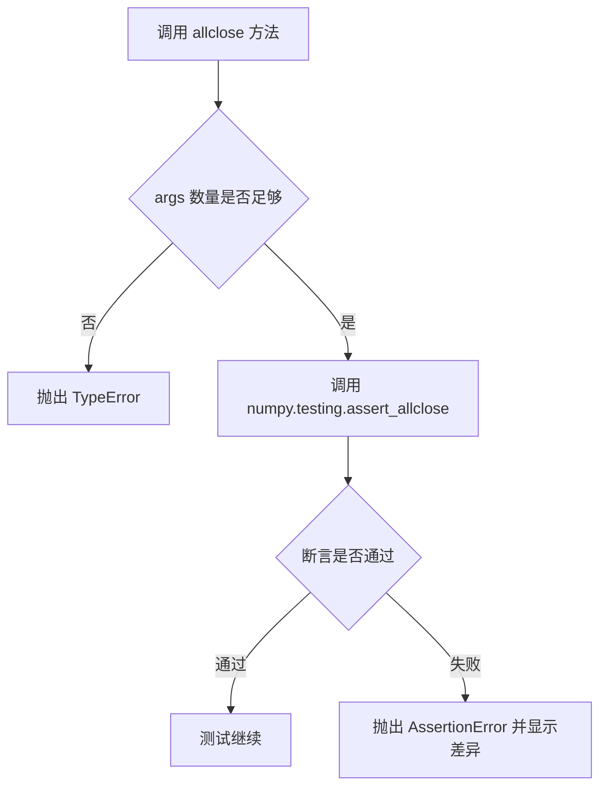

#### 带注释源码

```python
def allclose(self, *args):
    """
    辅助方法：验证传入的数值/数组是否近似相等。
    
    该方法是对 numpy.testing.assert_allclose 的封装，
    固定使用绝对容差 atol=1e-8，用于测试中验证计算结果的精度。
    
    参数:
        *args: 可变参数，直接传递给 assert_allclose。
               通常第一个参数是实际值，第二个是期望值。
               例如: allclose(actual_array, expected_array)
    
    返回:
        None: 无返回值，断言失败时抛出异常。
    
    示例:
        # 在 test_detrend_mean 中使用:
        self.allclose(mlab.detrend_mean(self.sig_zeros), self.sig_zeros)
    """
    assert_allclose(*args, atol=1e-8)  # 使用固定绝对容差 1e-8 进行断言
```


### TestDetrend.test_detrend_none

该测试方法用于验证 `mlab.detrend_none` 函数在不同输入场景下的正确性，包括标量、1D数组、2D数组、列表以及带axis参数的情况，确保该"不去趋势"函数在各种情况下都能正确返回原始输入。

参数：无显式参数（使用 self 实例属性如 self.sig_off, self.sig_slope, self.sig_base 等）

返回值：无返回值（pytest 测试方法）

#### 流程图

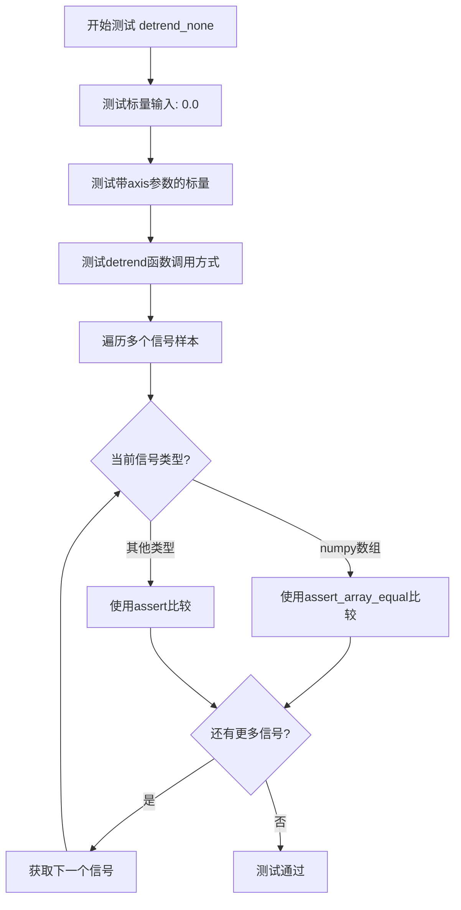

#### 带注释源码

```python
def test_detrend_none(self):
    """
    测试 mlab.detrend_none 函数的各种调用场景
    
    该测试验证:
    1. 标量输入返回相同值
    2. 带axis参数的调用
    3. 通过mlab.detrend函数调用detrend_none
    4. 多种信号类型: 标量、1D数组、2D数组、列表
    """
    # 测试标量0.0的基本情况
    assert mlab.detrend_none(0.) == 0.
    # 测试带axis参数的情况（虽然axis对标量无实际影响）
    assert mlab.detrend_none(0., axis=1) == 0.
    # 测试通过mlab.detrend函数使用key="none"调用
    assert mlab.detrend(0., key="none") == 0.
    # 测试通过mlab.detrend函数使用函数引用调用
    assert mlab.detrend(0., key=mlab.detrend_none) == 0.
    
    # 遍历多种信号类型进行测试
    for sig in [
            5.5,                              # 标量浮点数
            self.sig_off,                    # 常数偏移信号 (全为100)
            self.sig_slope,                  # 线性斜坡信号
            self.sig_base,                   # 随机信号(去除均值)
            # 组合信号转为列表
            (self.sig_base + self.sig_slope + self.sig_off).tolist(),
            # 2D数组 case
            np.vstack([self.sig_base,
                       self.sig_base + self.sig_off,
                       self.sig_base + self.sig_slope,
                       self.sig_base + self.sig_off + self.sig_slope]),
            # 2D转置数组 case
            np.vstack([self.sig_base,
                       self.sig_base + self.sig_off,
                       self.sig_base + self.sig_slope,
                       self.sig_base + self.sig_off + self.sig_slope]).T,
    ]:
        # 根据输入类型选择合适的断言方法
        if isinstance(sig, np.ndarray):
            # 数组类型使用array_equal确保完全相等
            assert_array_equal(mlab.detrend_none(sig), sig)
        else:
            # 其他类型直接比较
            assert mlab.detrend_none(sig) == sig
```


### TestDetrend.test_detrend_mean

该方法是 `TestDetrend` 类中的测试方法，用于测试 `mlab.detrend_mean` 函数在处理 0D（标量）和 1D（数组）信号时的正确性。测试用例覆盖了去均值操作对零值信号、基础信号、带有偏移的信号以及带有斜坡和偏移组合信号的处理效果。

参数：
- 无显式参数（该方法使用类属性 `self.sig_zeros`、`self.sig_base`、`self.sig_off`、`self.sig_slope`、`self.sig_slope_mean`，这些在 `setup_method` 中初始化）

返回值：`None`（测试方法无返回值，通过 `assert` 语句进行验证）

#### 流程图

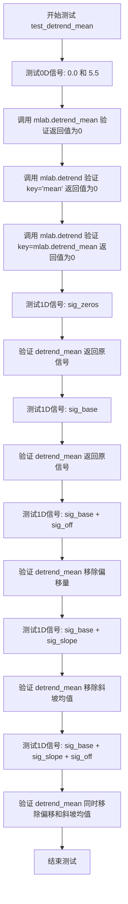

#### 带注释源码

```python
def test_detrend_mean(self):
    """
    测试 mlab.detrend_mean 函数对0D和1D信号的去均值处理。
    
    测试策略：
    1. 0D（标量）输入：验证返回值为0
    2. 1D输入：验证去均值操作对各种信号组合的正确性
    """
    # 测试0D（标量）输入
    # 对于标量输入，无论其值是多少，去均值后都应为0
    for sig in [0., 5.5]:  # 0D.
        # 直接调用 detrend_mean 函数
        assert mlab.detrend_mean(sig) == 0.
        # 通过 detrend 函数调用，key="mean"
        assert mlab.detrend(sig, key="mean") == 0.
        # 通过 detrend 函数调用，key=mlab.detrend_mean（函数引用）
        assert mlab.detrend(sig, key=mlab.detrend_mean) == 0.
    
    # 测试1D信号
    # 情况1: 零信号 - 去均值后应保持不变
    self.allclose(mlab.detrend_mean(self.sig_zeros), self.sig_zeros)
    
    # 情况2: 基础信号（已去均值）- 去均值后应保持不变
    self.allclose(mlab.detrend_mean(self.sig_base), self.sig_base)
    
    # 情况3: 基础信号 + 偏移量 - 去均值后应移除偏移，只保留基础信号
    self.allclose(mlab.detrend_mean(self.sig_base + self.sig_off),
                  self.sig_base)
    
    # 情况4: 基础信号 + 斜坡 - 去均值后应移除斜坡的均值成分
    # sig_slope_mean 是斜坡信号减去其均值的结果
    self.allclose(mlab.detrend_mean(self.sig_base + self.sig_slope),
                  self.sig_base + self.sig_slope_mean)
    
    # 情况5: 基础信号 + 斜坡 + 偏移 - 移除偏移和斜坡均值
    self.allclose(
        mlab.detrend_mean(self.sig_base + self.sig_slope + self.sig_off),
        self.sig_base + self.sig_slope_mean)
```


### `TestDetrend.test_detrend_mean_1d_base_slope_off_list_andor_axis0`

该测试方法用于验证 `mlab.detrend_mean` 函数在处理 1D 信号时的正确性，包括处理 numpy 数组、Python 列表以及指定 axis=0 参数的各种场景。

参数：

- `self`：`TestDetrend` 类实例，测试类的实例本身

返回值：无（`None`），该方法为测试方法，不返回任何值

#### 流程图

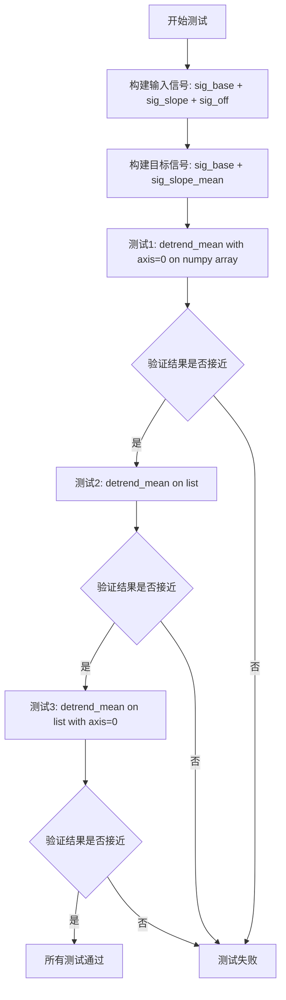

#### 带注释源码

```python
def test_detrend_mean_1d_base_slope_off_list_andor_axis0(self):
    """
    测试 detrend_mean 函数在处理 1D 信号时的各种输入形式
    
    测试场景：
    1. numpy 数组 + axis=0 参数
    2. Python 列表
    3. Python 列表 + axis=0 参数
    """
    # 构建输入信号：基础信号 + 斜坡信号 + 偏移量
    input = self.sig_base + self.sig_slope + self.sig_off
    
    # 构建期望的目标信号：基础信号 + 去均值后的斜坡信号
    target = self.sig_base + self.sig_slope_mean
    
    # 测试1：对 numpy 数组在 axis=0 上进行去均值处理
    # 预期结果：移除偏移量，保留斜坡分量
    self.allclose(mlab.detrend_mean(input, axis=0), target)
    
    # 测试2：对 Python 列表进行去均值处理
    # 列表会被转换为 numpy 数组进行处理
    self.allclose(mlab.detrend_mean(input.tolist()), target)
    
    # 测试3：对 Python 列表在 axis=0 上进行去均值处理
    self.allclose(mlab.detrend_mean(input.tolist(), axis=0), target)
```


### TestDetrend.test_detrend_mean_2d

该方法是 `TestDetrend` 类中的一个测试用例，用于验证 `mlab.detrend_mean` 和 `mlab.detrend` 函数在处理二维数组时的正确性，涵盖不同 axis 参数（0、1、None）以及转置矩阵的去趋势处理。

参数：
- 无显式参数（通过 `self` 访问类属性）

返回值：无返回值（测试方法，仅执行断言）

#### 流程图

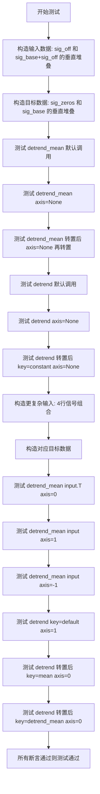

#### 带注释源码

```python
def test_detrend_mean_2d(self):
    # 第一部分：测试 2xN 的二维数组的去趋势处理
    # 构造输入：两行信号，第一行是常数偏移，第二行是 base + 偏移
    input = np.vstack([self.sig_off,          # 全100的常数信号（偏移）
                       self.sig_base + self.sig_off])  # base信号+偏移
    # 构造期望输出：第一行去趋势后应为全零，第二行保留base信号
    target = np.vstack([self.sig_zeros,       # 全零信号
                        self.sig_base])       # 原始base信号
    
    # 测试1: detrend_mean 默认调用（沿最后一个轴）
    self.allclose(mlab.detrend_mean(input), target)
    
    # 测试2: detrend_mean 明确指定 axis=None（扁平化后去趋势）
    self.allclose(mlab.detrend_mean(input, axis=None), target)
    
    # 测试3: 转置后去趋势再转置回来
    self.allclose(mlab.detrend_mean(input.T, axis=None).T, target)
    
    # 测试4: 通过主 detrend 函数调用（默认 key='mean'）
    self.allclose(mlab.detrend(input), target)
    
    # 测试5: detrend 指定 axis=None
    self.allclose(mlab.detrend(input, axis=None), target)
    
    # 测试6: detrend 使用 key='constant'（等同于 mean）并转置
    self.allclose(mlab.detrend(input.T, key="constant", axis=None), target.T)

    # 第二部分：测试更复杂的 4xN 二维数组
    # 构造输入：四行不同组合的信号
    input = np.vstack([self.sig_base,                      # 纯base
                       self.sig_base + self.sig_off,       # base + 偏移
                       self.sig_base + self.sig_slope,     # base + 斜坡
                       self.sig_base + self.sig_off + self.sig_slope])  # base + 偏移 + 斜坡
    
    # 构造期望输出：偏移和斜坡被移除
    target = np.vstack([self.sig_base,                               # 保持不变
                        self.sig_base,                               # 偏移被移除
                        self.sig_base + self.sig_slope_mean,        # 斜坡被转换为均值斜坡
                        self.sig_base + self.sig_slope_mean])       # 两者都被处理
    
    # 测试7: 对转置后的输入沿 axis=0 去趋势（逐列）
    self.allclose(mlab.detrend_mean(input.T, axis=0), target.T)
    
    # 测试8: 沿 axis=1 去趋势（逐行）
    self.allclose(mlab.detrend_mean(input, axis=1), target)
    
    # 测试9: axis=-1 等同于 axis=1（最后一个轴）
    self.allclose(mlab.detrend_mean(input, axis=-1), target)
    
    # 测试10: 使用 detrend 函数配合 key='default'
    self.allclose(mlab.detrend(input, key="default", axis=1), target)
    
    # 测试11: 对转置输入使用 key='mean'
    self.allclose(mlab.detrend(input.T, key="mean", axis=0), target.T)
    
    # 测试12: 对转置输入使用函数引用 mlab.detrend_mean
    self.allclose(mlab.detrend(input.T, key=mlab.detrend_mean, axis=0), target.T)
```


### TestDetrend.test_detrend_ValueError

该测试方法验证 matplotlib 的 `mlab.detrend` 函数在接收无效参数（如不支持的 key、无效的 axis 值或维度不匹配）时能够正确抛出 `ValueError` 异常。

参数：

- 无显式参数（仅使用类实例属性 `self`）

返回值：无返回值（测试方法，使用 `pytest.raises` 验证异常）

#### 流程图

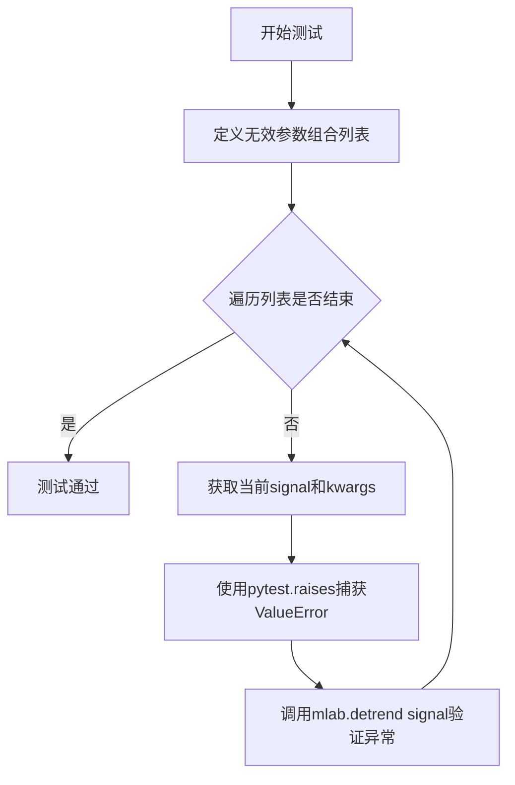

#### 带注释源码

```python
def test_detrend_ValueError(self):
    """
    测试 mlab.detrend 函数在接收无效参数时是否正确抛出 ValueError。
    
    该测试方法验证以下错误场景：
    1. 使用不支持的 key（字符串或整数）
    2. 对标量值指定 axis 参数
    3. 对 1D 数组指定超出范围的 axis
    4. 对 2D 数组指定超出维度的 axis
    """
    # 定义多组无效的 (signal, kwargs) 组合
    for signal, kwargs in [
            # 2D数组 + 无效key "spam"
            (self.sig_slope[np.newaxis], {"key": "spam"}),
            # 2D数组 + 无效key 5（整数）
            (self.sig_slope[np.newaxis], {"key": 5}),
            # 标量值 + axis=0（标量不支持axis）
            (5.5, {"axis": 0}),
            # 1D数组 + axis=1（超出维度）
            (self.sig_slope, {"axis": 1}),
            # 2D数组 + axis=2（超出维度）
            (self.sig_slope[np.newaxis], {"axis": 2}),
    ]:
        # 使用 pytest.raises 验证 ValueError 被正确抛出
        with pytest.raises(ValueError):
            mlab.detrend(signal, **kwargs)
```


### `TestDetrend.test_detrend_mean_ValueError`

该测试方法用于验证 `mlab.detrend_mean` 函数在接收非法参数（无效的 axis 参数）时能够正确抛出 `ValueError` 异常，确保函数对无效输入进行正确的错误处理。

参数：

- 无显式参数（使用类属性 `self.sig_slope` 作为测试数据）

返回值：无返回值（测试方法）

#### 流程图

```mermaid
flowchart TD
    A[开始测试] --> B[定义测试用例列表]
    B --> C[取第一个测试用例: signal=5.5, kwargs={'axis': 0}]
    C --> D{执行 mlab.detrend_mean}
    D --> E{是否抛出 ValueError?}
    E -->|是| F[测试通过]
    E -->|否| G[测试失败]
    F --> H{还有更多测试用例?}
    H -->|是| I[取下一个测试用例]
    I --> C
    H -->|否| J[结束测试]
    G --> J
```

#### 带注释源码

```python
def test_detrend_mean_ValueError(self):
    """
    测试 mlab.detrend_mean 函数在无效 axis 参数时抛出 ValueError
    
    该测试方法验证以下场景会触发 ValueError:
    1. 标量输入 (5.5) 配合 axis=0 参数
    2. 1D 数组配合 axis=1 参数 (超出维度)
    3. 2D 数组配合 axis=2 参数 (超出维度)
    """
    # 定义测试用例列表，每个元素为 (signal, kwargs) 元组
    for signal, kwargs in [
            (5.5, {"axis": 0}),                    # 测试用例1: 标量输入与 axis=0
            (self.sig_slope, {"axis": 1}),         # 测试用例2: 1D数组与 axis=1
            (self.sig_slope[np.newaxis], {"axis": 2}), # 测试用例3: 2D数组与 axis=2
    ]:
        # 使用 pytest.raises 验证是否抛出 ValueError 异常
        with pytest.raises(ValueError):
            mlab.detrend_mean(signal, **kwargs)
```


### TestDetrend.test_detrend_linear

该方法是 `TestDetrend` 类中的测试方法，用于验证 `mlab.detrend_linear` 函数和 `mlab.detrend(..., key="linear")` 函数对信号进行线性去趋势处理的功能。测试覆盖了 0 维标量输入和 1 维数组输入两种情况，验证去趋势后的结果是否正确消除常数偏移和线性斜坡分量。

参数：

- `self`：TestDetrend 类实例本身，无需显式传递

返回值：无返回值（测试方法）

#### 流程图

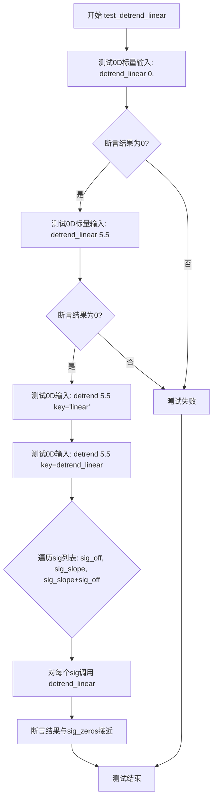

#### 带注释源码

```python
def test_detrend_linear(self):
    # 0D. 测试标量（0维）输入情况
    
    # 测试常数0经过线性去趋势后仍为0
    assert mlab.detrend_linear(0.) == 0.
    
    # 测试非零常数5.5经过线性去趋势后应为0
    # 因为常数信号没有斜率分量，去趋势后只保留残差（即0）
    assert mlab.detrend_linear(5.5) == 0.
    
    # 通过mlab.detrend接口使用'linear'键调用，验证接口兼容性
    assert mlab.detrend(5.5, key="linear") == 0.
    
    # 直接传递detrend_linear函数对象作为key
    assert mlab.detrend(5.5, key=mlab.detrend_linear) == 0.
    
    # 1D. 测试一维数组输入情况
    for sig in [  # 1D.
            # self.sig_off: 常数偏移信号（全是100），去趋势后应为零
            self.sig_off,
            
            # self.sig_slope: 线性斜坡信号（-10到90），去趋势后应为零
            self.sig_slope,
            
            # 斜坡加偏移的组合，去趋势后也应为零
            self.sig_slope + self.sig_off,
    ]:
        # 断言去趋势后的信号与零信号接近（容差1e-8）
        self.allclose(mlab.detrend_linear(sig), self.sig_zeros)
```


### TestDetrend.test_detrend_str_linear_1d

这是一个测试方法，用于验证 `mlab.detrend` 函数在使用线性（linear）去趋势算法时的正确性，特别是测试字符串键 "linear"、函数引用 `mlab.detrend_linear` 以及列表输入的不同调用方式。

参数：

- `self`：`TestDetrend` 类实例，测试类的自身引用

返回值：`None`，因为这是一个测试方法，不返回任何值

#### 流程图

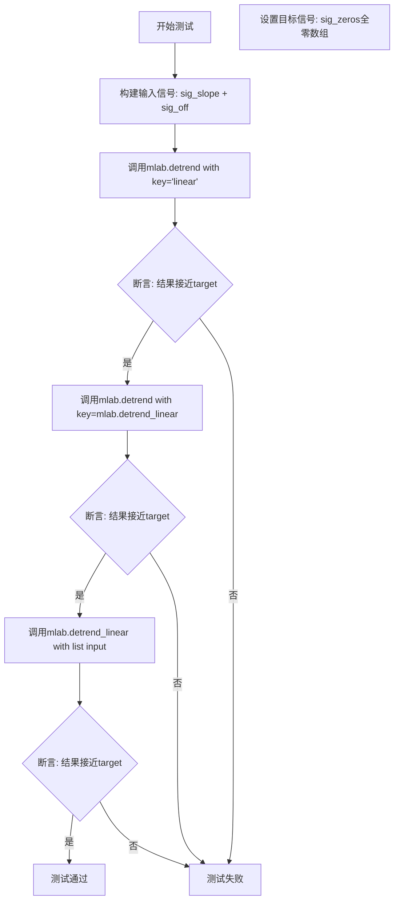

#### 带注释源码

```python
def test_detrend_str_linear_1d(self):
    """
    测试mlab.detrend函数使用线性去趋势时的行为
    
    测试三种调用方式:
    1. 使用字符串键 'linear'
    2. 使用函数引用 mlab.detrend_linear
    3. 将输入转换为列表后调用 mlab.detrend_linear
    """
    # 构建输入信号：斜坡信号 + 偏移量
    # sig_slope 是线性斜坡信号，sig_off 是常数偏移
    input = self.sig_slope + self.sig_off
    
    # 期望的目标输出：去除线性趋势后应该得到全零信号
    target = self.sig_zeros
    
    # 测试方式1：使用字符串键 "linear" 调用 detrend
    # 期望返回全零数组
    self.allclose(mlab.detrend(input, key="linear"), target)
    
    # 测试方式2：使用函数引用 mlab.detrend_linear 调用 detrend
    # 期望返回全零数组
    self.allclose(mlab.detrend(input, key=mlab.detrend_linear), target)
    
    # 测试方式3：将输入转换为Python列表后调用 detrend_linear
    # 期望返回全零数组
    self.allclose(mlab.detrend_linear(input.tolist()), target)
```


### `TestDetrend.test_detrend_linear_2d`

这是一个测试方法，用于验证 `mlab.detrend` 函数在二维数组上使用线性（linear）去趋势功能是否正确工作。测试涵盖了沿不同轴（axis=0 和 axis=1）进行去趋势操作，以及使用字符串键 "linear" 和直接使用 `mlab.detrend_linear` 函数两种调用方式。

参数：

- `self`：TestDetrend 类的实例，隐式参数，包含测试所需的信号数据

返回值：`None`，该方法为测试方法，无返回值，通过断言验证正确性

#### 流程图

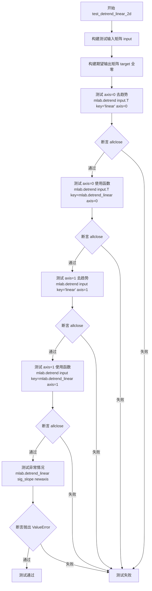

#### 带注释源码

```python
def test_detrend_linear_2d(self):
    """
    测试 mlab.detrend 函数在二维数组上的线性去趋势功能。
    验证沿不同轴（axis=0 和 axis=1）的去趋势操作，
    同时测试使用字符串键和直接使用函数两种调用方式。
    """
    # 构建输入数据：3行N列的二维数组
    # 第一行：常数偏移信号（self.sig_off = 100）
    # 第二行：线性斜坡信号（self.sig_slope = -10 到 90）
    # 第三行：常数+斜坡信号
    input = np.vstack([
        self.sig_off,           # 常数信号，全为100
        self.sig_slope,         # 线性斜坡信号
        self.sig_slope + self.sig_off  # 线性+常数
    ])
    
    # 期望的输出：所有行都应被去趋势为全零
    # 因为去趋势会移除均值和线性分量
    target = np.vstack([
        self.sig_zeros,  # 第一行去趋势后为全零
        self.sig_zeros,  # 第二行去趋势后为全零
        self.sig_zeros   # 第三行去趋势后为全零
    ])
    
    # 测试1：转置输入，沿axis=0去趋势（对列进行去趋势）
    # 使用字符串键 "linear" 指定线性去趋势
    self.allclose(
        mlab.detrend(input.T, key="linear", axis=0),  # 转置后每列是一个信号
        target.T  # 转置目标以匹配形状
    )
    
    # 测试2：同样转置输入，但使用函数引用 mlab.detrend_linear
    self.allclose(
        mlab.detrend(input.T, key=mlab.detrend_linear, axis=0),
        target.T
    )
    
    # 测试3：不转置，直接沿axis=1去趋势（对行进行去趋势）
    # 每一行是一个独立的信号
    self.allclose(
        mlab.detrend(input, key="linear", axis=1),
        target
    )
    
    # 测试4：同样沿axis=1，使用函数引用
    self.allclose(
        mlab.detrend(input, key=mlab.detrend_linear, axis=1),
        target
    )
    
    # 测试5：验证错误处理
    # 对一维数据（添加newaxis变为2D但仍无法正确处理）应抛出ValueError
    with pytest.raises(ValueError):
        mlab.detrend_linear(self.sig_slope[np.newaxis])  # sig_slope[np.newaxis] 形状为 (1, 100)
```


### `TestSpectral.stim`

这是一个 pytest class-scoped fixture，用于为 `TestSpectral` 类的所有测试准备测试数据。它生成时间序列信号、计算频谱分析所需的各类参数（NFFT、overlap、padding、频率数组、时间数组等），并将它们设置为测试类的类属性，供后续测试方法使用。

参数：

- `request`：`pytest.FixtureRequest`，pytest 框架的请求对象，用于访问测试类和测试配置
- `fstims`：`List[int]`，刺激频率列表，指定要生成的信号频率分量
- `iscomplex`：`bool`，是否生成复数信号（True 为复数，False 为实数）
- `sides`：`str`，频谱边带类型，'onesided'（单边）、'twosided'（双边）或 'default'（默认）
- `len_x`：`int | None`，信号 x 的目标长度，None 表示使用默认长度 1000
- `NFFT_density`：`int | None`，功率谱密度计算的 NFFT 长度，None 表示 256，负数表示 100
- `nover_density`：`int | None`，功率谱密度计算的 overlap，None 表示 0，负数表示 NFFT//2
- `pad_to_density`：`int | None`，功率谱密度计算的 padding 长度，None 表示 NFFT，负数表示下一个 2 的幂
- `pad_to_spectrum`：`int | None`，频谱计算的 padding 长度，None 表示 len(x)，负数表示 len(x)

返回值：`None`，无返回值。该 fixture 通过修改 `request.cls` 类属性来设置测试数据。

#### 流程图

```mermaid
flowchart TD
    A[开始: stim fixture] --> B[设置采样率 Fs=100]
    B --> C[生成时间序列 x: np.arange 0到10 步长1/Fs]
    C --> D{len_x 是否为 None?}
    D -->|是| E[保持原 x 长度]
    D -->|否| F[截取 x[:len_x]]
    E --> G[将 fstims 转换为 Fs/fstim]
    F --> G
    G --> H[计算 NFFT_density_real<br/>None→256, <0→100, 否则用原值]
    H --> I[计算 nover_density_real<br/>None→0, <0→NFFT//2, 否则用原值]
    I --> J[计算 pad_to_density_real<br/>None→NFFT, <0→2**ceil(log2(NFFT)), 否则用原值]
    J --> K[计算 pad_to_spectrum_real<br/>None→len(x), <0→len(x), 否则用原值]
    K --> L[计算 NFFT_spectrum_real<br/>如果 pad_to_spectrum 非None则为len(x), 否则为pad_to_spectrum]
    L --> M[计算 freqs_density 和 freqs_spectrum<br/>根据 sides 和 iscomplex<br/>奇偶长度处理不同]
    M --> N[计算 t_specgram 时间数组<br/>考虑 NFFT, nover, 奇偶情况]
    N --> O[生成信号 y: 多频正弦叠加<br/>y = sum(sin(fstim * x * 2π) * 10^i)]
    O --> P{iscomplex?}
    P -->|是| Q[y 转换为 complex 类型]
    P -->|否| R[保持 y 为实数]
    Q --> S[修改测试类属性<br/>设置 Fs, sides, fstims<br/>NFFT_*, nover_*, pad_to_*<br/>t_*, y, freqs_* 等]
    R --> S
    S --> T[结束]
```

#### 带注释源码

```python
@pytest.fixture(scope='class', autouse=True)
def stim(self, request, fstims, iscomplex, sides, len_x, NFFT_density,
         nover_density, pad_to_density, pad_to_spectrum):
    """
    Class-scoped fixture，为 TestSpectral 类的所有测试准备测试数据。
    生成信号、时间序列、频率数组等，并设置为类的属性。
    """
    Fs = 100.  # 采样率 100 Hz

    # 生成时间序列 x，从 0 到 10 秒，步长 1/Fs = 0.01 秒
    x = np.arange(0, 10, 1 / Fs)
    if len_x is not None:
        x = x[:len_x]  # 可选：截取指定长度

    # 将刺激频率转换为实际频率：fstims = [Fs/fstim for fstim in fstims]
    # 例如 fstims=[4,5,10] -> [25, 20, 10]
    fstims = [Fs / fstim for fstim in fstims]

    # --- 计算 NFFT_density_real ---
    # NFFT 用于频谱计算的 FFT 点数
    if NFFT_density is None:
        NFFT_density_real = 256  # 默认值
    elif NFFT_density < 0:
        NFFT_density_real = NFFT_density = 100  # 负数表示固定值 100
    else:
        NFFT_density_real = NFFT_density

    # --- 计算 nover_density_real ---
    # noverlap 相邻窗口重叠的样本数
    if nover_density is None:
        nover_density_real = 0
    elif nover_density < 0:
        nover_density_real = nover_density = NFFT_density_real // 2
    else:
        nover_density_real = nover_density

    # --- 计算 pad_to_density_real ---
    # pad_to 零填充到的 FFT 长度
    if pad_to_density is None:
        pad_to_density_real = NFFT_density_real
    elif pad_to_density < 0:
        # 负数表示使用下一个 2 的幂
        pad_to_density = int(2**np.ceil(np.log2(NFFT_density_real)))
        pad_to_density_real = pad_to_density
    else:
        pad_to_density_real = pad_to_density

    # --- 计算 pad_to_spectrum_real ---
    if pad_to_spectrum is None:
        pad_to_spectrum_real = len(x)
    elif pad_to_spectrum < 0:
        pad_to_spectrum_real = pad_to_spectrum = len(x)
    else:
        pad_to_spectrum_real = pad_to_spectrum

    # --- 计算 NFFT_spectrum ---
    if pad_to_spectrum is None:
        NFFT_spectrum_real = NFFT_spectrum = pad_to_spectrum_real
    else:
        NFFT_spectrum_real = NFFT_spectrum = len(x)
    nover_spectrum = 0  # 频谱计算不使用 overlap

    # specgram 参数继承自 density
    NFFT_specgram = NFFT_density
    nover_specgram = nover_density
    pad_to_specgram = pad_to_density
    NFFT_specgram_real = NFFT_density_real
    nover_specgram_real = nover_density_real

    # --- 计算频率数组 ---
    # 根据 sides 和 iscomplex 计算不同的频率范围
    if sides == 'onesided' or (sides == 'default' and not iscomplex):
        # 单边谱：频率从 0 到 Fs/2
        if pad_to_density_real % 2:
            # 奇数长度：频率点数为 pad_to_density_real//2
            freqs_density = np.linspace(0, Fs / 2,
                                        num=pad_to_density_real,
                                        endpoint=False)[::2]
        else:
            # 偶数长度：频率点数为 pad_to_density_real//2 + 1
            freqs_density = np.linspace(0, Fs / 2,
                                        num=pad_to_density_real // 2 + 1)

        if pad_to_spectrum_real % 2:
            freqs_spectrum = np.linspace(0, Fs / 2,
                                         num=pad_to_spectrum_real,
                                         endpoint=False)[::2]
        else:
            freqs_spectrum = np.linspace(0, Fs / 2,
                                         num=pad_to_spectrum_real // 2 + 1)
    else:
        # 双边谱：频率从 -Fs/2 到 Fs/2
        if pad_to_density_real % 2:
            freqs_density = np.linspace(-Fs / 2, Fs / 2,
                                        num=2 * pad_to_density_real,
                                        endpoint=False)[1::2]
        else:
            freqs_density = np.linspace(-Fs / 2, Fs / 2,
                                        num=pad_to_density_real,
                                        endpoint=False)

        if pad_to_spectrum_real % 2:
            freqs_spectrum = np.linspace(-Fs / 2, Fs / 2,
                                         num=2 * pad_to_spectrum_real,
                                         endpoint=False)[1::2]
        else:
            freqs_spectrum = np.linspace(-Fs / 2, Fs / 2,
                                         num=pad_to_spectrum_real,
                                         endpoint=False)

    freqs_specgram = freqs_density  # specgram 使用 density 的频率

    # --- 计算时间数组 ---
    # specgram 的时间点：窗口中心位置
    t_start = NFFT_specgram_real // 2
    t_stop = len(x) - NFFT_specgram_real // 2 + 1
    t_step = NFFT_specgram_real - nover_specgram_real
    t_specgram = x[t_start:t_stop:t_step]
    # 奇数 NFFT 时，时间点需要偏移半个窗口
    if NFFT_specgram_real % 2:
        t_specgram += 1 / Fs / 2
    # 边界情况：没有时间点时，使用窗口中心时间
    if len(t_specgram) == 0:
        t_specgram = np.array([NFFT_specgram_real / (2 * Fs)])
    t_spectrum = np.array([NFFT_spectrum_real / (2 * Fs)])
    t_density = t_specgram

    # --- 生成测试信号 y ---
    # 多频正弦信号叠加，幅度按频率索引递减
    y = np.zeros_like(x)
    for i, fstim in enumerate(fstims):
        y += np.sin(fstim * x * np.pi * 2) * 10**i

    if iscomplex:
        y = y.astype('complex')  # 可选：转换为复数信号

    # --- 设置类属性 ---
    # 注意：class-scoped fixture 的实例与测试方法运行的实例不同
    # 需要直接修改类本身
    cls = request.cls

    cls.Fs = Fs
    cls.sides = sides
    cls.fstims = fstims

    cls.NFFT_density = NFFT_density
    cls.nover_density = nover_density
    cls.pad_to_density = pad_to_density

    cls.NFFT_spectrum = NFFT_spectrum
    cls.nover_spectrum = nover_spectrum
    cls.pad_to_spectrum = pad_to_spectrum

    cls.NFFT_specgram = NFFT_specgram
    cls.nover_specgram = nover_specgram
    cls.pad_to_specgram = pad_to_specgram

    cls.t_specgram = t_specgram
    cls.t_density = t_density
    cls.t_spectrum = t_spectrum
    cls.y = y

    cls.freqs_density = freqs_density
    cls.freqs_spectrum = freqs_spectrum
    cls.freqs_specgram = freqs_specgram

    cls.NFFT_density_real = NFFT_density_real
```


### `TestSpectral.check_freqs`

该方法用于验证频谱分析的频率结果是否正确，检查频率数组的边界值以及刺激频率对应的频谱峰值是否满足预期（峰值大于相邻频率点的值）。

参数：

- `vals`：`numpy.ndarray`，频谱值数组，包含计算得到的频谱幅度值
- `targfreqs`：`numpy.ndarray`，目标频率数组，期望的频率网格
- `resfreqs`：`numpy.ndarray`，结果频率数组，实际返回的频率网格
- `fstims`：`list`，刺激频率列表，用于验证频谱中的峰值位置

返回值：`None`，该方法通过断言验证结果，不返回任何值

#### 流程图

```mermaid
flowchart TD
    A[开始 check_freqs] --> B[断言 resfreqs 最小值索引为 0]
    B --> C[断言 resfreqs 最大值索引为 len-1]
    C --> D[断言 resfreqs 与 targfreqs 几乎相等]
    D --> E{遍历 fstims}
    E -->|对于每个 fstim| F[计算最近频率索引 i]
    F --> G[断言 vals[i] > vals[i+2]]
    G --> H[断言 vals[i] > vals[i-2]]
    H --> E
    E -->|遍历完成| I[结束]
```

#### 带注释源码

```python
def check_freqs(self, vals, targfreqs, resfreqs, fstims):
    """
    验证频谱分析结果的频率值是否正确。
    
    参数:
        vals: 频谱值数组
        targfreqs: 目标频率数组
        resfreqs: 实际计算的频率数组
        fstims: 刺激频率列表
    """
    # 验证频率数组的最小值位置是否为0
    assert resfreqs.argmin() == 0
    
    # 验证频率数组的最大值位置是否为最后一个索引
    assert resfreqs.argmax() == len(resfreqs)-1
    
    # 验证计算得到的频率与目标频率是否接近（容差1e-6）
    assert_allclose(resfreqs, targfreqs, atol=1e-06)
    
    # 对于每个刺激频率，验证频谱峰值是否正确
    for fstim in fstims:
        # 找到最接近刺激频率的索引
        i = np.abs(resfreqs - fstim).argmin()
        
        # 验证峰值大于右侧相邻点（间隔2个索引）
        assert vals[i] > vals[i+2]
        
        # 验证峰值大于左侧相邻点（间隔2个索引）
        assert vals[i] > vals[i-2]
```


### TestSpectral.check_maxfreq

该方法是一个测试辅助函数，用于验证频谱中的峰值频率是否与预期的刺激频率（fstims）相匹配。它通过递归方式处理双侧频谱，并逐个验证每个峰值是否正确对应到相应的刺激频率。

参数：

- `self`：`TestSpectral`，TestSpectral 类的实例，隐式参数
- `spec`：`numpy.ndarray`，频谱数据数组，包含要验证的频谱值
- `fsp`：`numpy.ndarray`，频率轴数组，对应于频谱数据的频率点
- `fstims`：`list`，刺激频率列表，包含预期要验证的频率值

返回值：`None`，该方法无返回值（用于测试验证）

#### 流程图

```mermaid
flowchart TD
    A[开始 check_maxfreq] --> B{len(fstims) == 0?}
    B -->|是| C[直接返回]
    B -->|否| D{fsp.min() < 0?}
    
    D -->|是| E[计算fspa = np.abs(fsp)]
    E --> F[找到zeroind = fspa.argmin]
    F --> G[递归调用: check_maxfreq(spec[:zeroind], fspa[:zeroind], fstims)]
    G --> H[递归调用: check_maxfreq(spec[zeroind:], fspa[zeroind:], fstims)]
    H --> I[返回]
    
    D -->|否| J[fstimst = fstims[:]]
    J --> K[spect = spec.copy]
    K --> L{while fstimst}
    
    L -->|是| M[maxind = spect.argmax]
    M --> N[maxfreq = fsp[maxind]]
    N --> O[assert_almost_equal(maxfreq, fstimst[-1])]
    O --> P[del fstimst[-1]]
    P --> Q[spect[maxind-5:maxind+5] = 0]
    Q --> L
    
    L -->|否| R[返回]
    
    style C fill:#ffcccc
    style I fill:#ffcccc
    style R fill:#ccffcc
    style O fill:#ffffcc
```

#### 带注释源码

```python
def check_maxfreq(self, spec, fsp, fstims):
    """
    检查频谱中的峰值频率是否与预期的刺激频率匹配。
    
    参数:
        spec: 频谱数据数组
        fsp: 频率轴数组
        fstims: 预期的刺激频率列表
    """
    # 如果没有刺激频率，则跳过测试
    if len(fstims) == 0:
        return

    # 如果是双侧频谱（包含负频率），则分别测试每一边
    if fsp.min() < 0:
        # 取绝对值处理负频率
        fspa = np.abs(fsp)
        # 找到零点索引（正负频率的分界）
        zeroind = fspa.argmin()
        # 递归处理正频率部分
        self.check_maxfreq(spec[:zeroind], fspa[:zeroind], fstims)
        # 递归处理负频率部分
        self.check_maxfreq(spec[zeroind:], fspa[zeroind:], fstims)
        return

    # 复制刺激频率列表和工作频谱数组
    fstimst = fstims[:]
    spect = spec.copy()

    # 遍历每个峰值并进行验证
    while fstimst:
        # 找到当前频谱中最大值的位置索引
        maxind = spect.argmax()
        # 获取对应的频率值
        maxfreq = fsp[maxind]
        # 断言：该频率应与刺激频率列表中的最后一个频率几乎相等
        assert_almost_equal(maxfreq, fstimst[-1])
        # 从列表中删除已验证的频率
        del fstimst[-1]
        # 将当前峰值附近的数据置零（避免重复检测同一峰值）
        spect[maxind-5:maxind+5] = 0
```


### `TestSpectral.test_spectral_helper_raises`

该测试方法用于验证 `mlab._spectral_helper` 函数在传入非法参数时能够正确抛出 `ValueError` 异常。测试覆盖了多种错误场景，包括：模式（mode）参数错误、边（sides）参数错误、重叠点数（noverlap）大于或等于FFT窗口大小（NFFT）以及窗口长度与NFFT不匹配等情况。

参数：
- `self`：隐式参数，`TestSpectral` 类的实例，包含测试所需的属性如 `self.y`（测试数据）

返回值：无返回值，该方法为测试方法，使用 `pytest.raises(ValueError)` 验证异常抛出

#### 流程图

```mermaid
flowchart TD
    A[开始测试 test_spectral_helper_raises] --> B[遍历错误参数列表 kwargs_list]
    B --> C{还有更多 kwargs?}
    C -->|是| D[取出当前 kwargs]
    D --> E[调用 mlab._spectral_helper with x=self.y and **kwargs]
    E --> F{是否抛出 ValueError?}
    F -->|是| G[测试通过 - 继续下一个]
    F -->|否| H[测试失败]
    C -->|否| I[测试结束]
    
    subgraph 错误参数列表
        B1[{"y": self.y+1, "mode": "complex"} - 需要 x is y 的模式]
        B2[{"y": self.y+1, "mode": "magnitude"}]
        B3[{"y": self.y+1, "mode": "angle"}]
        B4[{"y": self.y+1, "mode": "phase"}]
        B5[{"mode": "spam"} - 错误的模式]
        B6[{"y": self.y, "sides": "eggs"} - 错误的边参数]
        B7[{"y": self.y, "NFFT": 10, "noverlap": 20} - noverlap > NFFT]
        B8[{"NFFT": 10, "noverlap": 10} - noverlap == NFFT]
        B9[{"y": self.y, "NFFT": 10, "window": np.ones(9)} - 窗口长度 != NFFT]
    end
    
    B --> B1
    B1 --> B2
    B2 --> B3
    B3 --> B4
    B4 --> B5
    B5 --> B6
    B6 --> B7
    B7 --> B8
    B8 --> B9
```

#### 带注释源码

```python
def test_spectral_helper_raises(self):
    """
    测试 _spectral_helper 函数在各种错误参数下是否正确抛出 ValueError。
    
    该测试方法不使用 pytest.mark.parametrize，而是直接在方法内部定义
    错误参数列表，以确保正确使用 self.y 属性。
    """
    # 定义各种错误条件参数列表
    for kwargs in [  # Various error conditions:
        # 模式为 complex/magnitude/angle/phase 时，需要 x is y（即 x 和 y 必须是同一个对象）
        {"y": self.y+1, "mode": "complex"},  # Modes requiring ``x is y``.
        {"y": self.y+1, "mode": "magnitude"},
        {"y": self.y+1, "mode": "angle"},
        {"y": self.y+1, "mode": "phase"},
        
        # 无效的 mode 参数
        {"mode": "spam"},  # Bad mode.
        
        # 无效的 sides 参数
        {"y": self.y, "sides": "eggs"},  # Bad sides.
        
        # noverlap 参数错误：必须大于 NFFT（实际应该小于 NFFT）
        {"y": self.y, "NFFT": 10, "noverlap": 20},  # noverlap > NFFT.
        
        # noverlap 等于 NFFT 也是无效的
        {"NFFT": 10, "noverlap": 10},  # noverlap == NFFT.
        
        # 窗口长度必须等于 NFFT
        {"y": self.y, "NFFT": 10,
         "window": np.ones(9)},  # len(win) != NFFT.
    ]:
        # 使用 pytest.raises 验证每个错误参数组合都会抛出 ValueError
        with pytest.raises(ValueError):
            mlab._spectral_helper(x=self.y, **kwargs)
```


### TestSpectral.test_single_spectrum_helper_unsupported_modes

该测试方法用于验证 `mlab._single_spectrum_helper` 函数在传入不支持的 mode 参数（"default" 或 "psd"）时是否正确抛出 `ValueError` 异常。这确保了 `_single_spectrum_helper` 函数对不支持模式的错误处理符合预期。

参数：

- `self`：`TestSpectral` 类实例，表示测试类的隐式参数，包含测试所需的上下文数据（如 `self.y` 等由 fixture 设置的属性）
- `mode`：`str`，由 pytest 参数化提供的字符串，取值为 "default" 或 "psd"，表示要测试的不支持的频谱模式

返回值：`None`，测试函数无返回值，通过 `pytest.raises(ValueError)` 上下文管理器验证异常抛出

#### 流程图

```mermaid
flowchart TD
    A[开始测试 test_single_spectrum_helper_unsupported_modes] --> B{参数化: mode in ['default', 'psd']}
    B --> C[调用 mlab._single_spectrum_helper]
    C --> D{是否抛出 ValueError?}
    D -->|是| E[测试通过]
    D -->|否| F[测试失败]
    
    style C fill:#f9f,color:#333
    style D fill:#ff9,color:#333
    style E fill:#9f9,color:#333
    style F fill:#f99,color:#333
```

#### 带注释源码

```python
@pytest.mark.parametrize('mode', ['default', 'psd'])  # 参数化：mode 取值为 'default' 或 'psd'
def test_single_spectrum_helper_unsupported_modes(self, mode):
    """
    测试 _single_spectrum_helper 对不支持模式的错误处理。
    
    参数:
        mode (str): 不支持的频谱模式 ('default' 或 'psd')
    
    预期行为:
        调用 _single_spectrum_helper 时应抛出 ValueError 异常
    """
    # 使用 pytest.raises 上下文管理器验证 ValueError 被正确抛出
    with pytest.raises(ValueError):
        # 调用 _single_spectrum_helper，传入测试数据 self.y 和不支持的 mode
        mlab._single_spectrum_helper(x=self.y, mode=mode)
```


### TestSpectral.test_spectral_helper_psd

该方法是一个测试方法，用于验证 `mlab._spectral_helper` 函数在不同模式（psd、magnitude）和不同案例（density、specgram、spectrum）下的正确性，通过比较返回的频率、时间轴和频谱数据的维度与预期值是否一致。

参数：

- `self`：TestSpectral 类实例，测试类的实例本身
- `mode`：str，测试模式，参数化为 "psd" 或 "magnitude"，决定频谱计算的输出模式
- `case`：str，参数化为 "density"、"specgram" 或 "spectrum"，决定使用哪一组参数（频率、时间、窗函数等）

返回值：无返回值（测试方法，断言验证正确性）

#### 流程图

```mermaid
flowchart TD
    A[开始测试] --> B[获取case对应的freqs]
    --> C[调用mlab._spectral_helper计算频谱]
    --> D[断言频率数组fsp与预期freqs接近]
    --> E[断言时间数组t与预期t_case接近]
    --> F[断言频谱spec的频率维度与freqs维度一致]
    --> G[断言频谱spec的时间维度与t_case维度一致]
    --> H[结束测试]
```

#### 带注释源码

```python
@pytest.mark.parametrize("mode, case", [
    ("psd", "density"),
    ("magnitude", "specgram"),
    ("magnitude", "spectrum"),
])
def test_spectral_helper_psd(self, mode, case):
    """
    测试 _spectral_helper 函数在不同模式和案例下的正确性。
    
    参数化说明：
    - mode: 频谱模式，"psd" 计算功率谱密度，"magnitude" 计算幅度谱
    - case: 测试案例，"density" 使用密度参数，"specgram" 使用频谱图参数，
            "spectrum" 使用频谱参数
    """
    # 根据case获取对应的频率数组（从类属性中动态获取）
    freqs = getattr(self, f"freqs_{case}")
    
    # 调用被测试的 _spectral_helper 函数
    # 参数说明：
    # - x: 输入信号（这里使用自身，因为是自相关测试）
    # - y: 输入信号（同x）
    # - NFFT: FFT点数，根据case动态获取
    # - Fs: 采样率
    # - noverlap: 重叠点数，根据case动态获取
    # - pad_to: 填充长度，根据case动态获取
    # - sides: 频谱单双边特性
    # - mode: 频谱计算模式
    spec, fsp, t = mlab._spectral_helper(
        x=self.y, y=self.y,
        NFFT=getattr(self, f"NFFT_{case}"),
        Fs=self.Fs,
        noverlap=getattr(self, f"nover_{case}"),
        pad_to=getattr(self, f"pad_to_{case}"),
        sides=self.sides,
        mode=mode)

    # 验证返回的频率数组与预期频率数组接近（容差1e-6）
    assert_allclose(fsp, freqs, atol=1e-06)
    
    # 验证返回的时间轴与预期时间轴接近（容差1e-6）
    assert_allclose(t, getattr(self, f"t_{case}"), atol=1e-06)
    
    # 验证频谱结果的频率维度与频率数组维度一致
    assert spec.shape[0] == freqs.shape[0]
    
    # 验证频谱结果的时间维度与时间轴维度一致
    assert spec.shape[1] == getattr(self, f"t_{case}").shape[0]
```


### TestSpectral.test_csd

该测试方法用于测试 `mlab.csd()` 函数（互功率谱密度计算）的正确性，通过参数化测试验证在不同系统位数下（默认和32位）的功能，并检查返回的频率数组和频谱形状是否符合预期。

参数：

- `self`：TestSpectral 类实例，测试类的实例方法，包含测试所需的共享状态（如信号数据、采样频率等）
- `bitsize`：`int` 或 `None`，参数化参数，用于指定测试的位数；`None` 表示默认测试，`32` 表示32位系统测试
- `monkeypatch`：`pytest.MonkeyPatch`，pytest 的 fixture，用于在测试中动态修改属性（如 `sys.maxsize`）

返回值：无返回值（测试函数，通过断言验证正确性）

#### 流程图

```mermaid
graph TD
    A[开始 test_csd 测试] --> B{检查 bitsize 是否为 None}
    B -->|否| C[使用 monkeypatch 设置 sys.maxsize 为 2\*\*bitsize]
    B -->|是| D[获取类属性 freqs_density 作为期望频率]
    C --> D
    D --> E[调用 mlab.csd 计算互功率谱密度]
    E --> F[传入参数: x=self.y, y=self.y+1, NFFT=self.NFFT_density, Fs=self.Fs, noverlap=self.nover_density, pad_to=self.pad_to_density, sides=self.sides]
    F --> G[获取返回值: spec, fsp]
    G --> H[断言: fsp 接近 freqs, 容差 1e-06]
    H --> I[断言: spec.shape 等于 freqs.shape]
    I --> J[测试结束]
```

#### 带注释源码

```python
@pytest.mark.parametrize('bitsize', [
    pytest.param(None, id='default'),  # 默认测试，不修改系统位数
    pytest.param(32,
                 marks=pytest.mark.skipif(sys.maxsize <= 2**32,
                                          reason='System is already 32-bit'),
                 id='32-bit')  # 32位系统测试，若系统已是32位则跳过
])
def test_csd(self, bitsize, monkeypatch):
    """
    测试 mlab.csd() 函数在不同系统位数下的正确性。
    
    参数:
        bitsize (int or None): 参数化参数，指定测试的位数。
            - None: 使用系统默认位数进行测试。
            - 32: 模拟32位系统进行测试。
        monkeypatch (pytest.MonkeyPatch): pytest的fixture，用于动态修改属性。
    """
    # 如果指定了bitsize，则使用monkeypatch修改sys.maxsize以模拟32位系统
    if bitsize is not None:
        monkeypatch.setattr(sys, 'maxsize', 2**bitsize)
    
    # 从测试类实例中获取预期的频率数组
    freqs = self.freqs_density
    
    # 调用 matplotlib.mlab.csd 计算互功率谱密度
    # 参数说明:
    #   x: 输入信号 self.y
    #   y: 输入信号 self.y+1（添加一个常数偏移以产生非零的互谱）
    #   NFFT: FFT点数，来自类属性 NFFT_density
    #   Fs: 采样频率，来自类属性 Fs
    #   noverlap: 重叠点数，来自类属性 nover_density
    #   pad_to: 填充长度，来自类属性 pad_to_density
    #   sides: 频谱类型，来自类属性 sides
    spec, fsp = mlab.csd(x=self.y, y=self.y+1,
                         NFFT=self.NFFT_density,
                         Fs=self.Fs,
                         noverlap=self.nover_density,
                         pad_to=self.pad_to_density,
                         sides=self.sides)
    
    # 验证返回的频率数组fsp与预期频率数组freqs接近（容差1e-6）
    assert_allclose(fsp, freqs, atol=1e-06)
    
    # 验证返回的频谱数组spec的形状与频率数组freqs的形状一致
    assert spec.shape == freqs.shape
```


### `TestSpectral.test_csd_padding`

该方法测试`csd()`函数在零填充（zero padding）情况下的正确性，验证当NFFT翻倍时，频谱能量应保持一致（由于零填充导致频谱分辨率提高，但总能量应保持不变）。

参数：

- 该方法无显式参数，依赖于类的`self`属性（由`stim` fixture注入）

返回值：`None`（测试方法，通过断言验证）

#### 流程图

```mermaid
flowchart TD
    A[开始测试] --> B{检查 NFFT_density 是否为 None}
    B -->|是| C[返回 - 派生类场景]
    B -->|否| D[构建参数字典 sargs]
    D --> E[调用 mlab.csd NFFT=self.NFFT_density]
    E --> F[调用 mlab.csd NFFT=self.NFFT_density*2]
    F --> G[计算 spec0 的能量: sum(conj(spec0)*spec0)]
    G --> H[计算 spec1 的能量: sum(conj(spec1/2)*(spec1/2))]
    H --> I{验证能量是否相等}
    I -->|是| J[测试通过]
    I -->|否| K[测试失败]
```

#### 带注释源码

```python
def test_csd_padding(self):
    """Test zero padding of csd()."""
    # 如果 NFFT_density 为 None，则跳过测试（适用于派生类）
    if self.NFFT_density is None:  # for derived classes
        return
    
    # 构建传递给 mlab.csd 的参数字典
    # x: 输入信号
    # y: 另一个输入信号（这里使用 y+1 来产生不同的信号）
    # Fs: 采样频率
    # window: 窗口函数（这里使用 window_none，即不加窗）
    # sides: 频谱类型（单边或双边）
    sargs = dict(x=self.y, y=self.y+1, Fs=self.Fs, window=mlab.window_none,
                 sides=self.sides)

    # 使用原始 NFFT 计算 CSD（互谱密度）
    spec0, _ = mlab.csd(NFFT=self.NFFT_density, **sargs)
    
    # 使用翻倍 NFFT 计算 CSD（零填充到更长长度）
    spec1, _ = mlab.csd(NFFT=self.NFFT_density*2, **sargs)
    
    # 验证能量守恒：
    # 零填充会提高频率分辨率，但不改变总能量
    # 注意：spec1 需要除以2，因为翻倍NFFT后能量分布到更多频率点上
    # 实部用于确保结果是实数（能量应为正数）
    assert_almost_equal(np.sum(np.conjugate(spec0)*spec0).real,
                        np.sum(np.conjugate(spec1/2)*spec1/2).real)
```


### TestSpectral.test_psd

该方法是 `TestSpectral` 类的测试方法，用于测试 `matplotlib.mlab.psd` 函数的功率谱密度（PSD）计算功能是否正确。

参数：

- `self`：`TestSpectral`，TestSpectral 类的实例，隐含的 `this` 参数，表示当前测试类的对象

返回值：`None`，该方法为测试方法，通过断言验证 `mlab.psd` 的输出正确性，不返回任何值

#### 流程图

```mermaid
flowchart TD
    A[开始 test_psd 测试] --> B[获取 freqs_density]
    B --> C[调用 mlab.psd 计算功率谱密度]
    C --> D[传入参数: x=self.y, NFFT=self.NFFT_density, Fs=self.Fs, noverlap=self.nover_density, pad_to=self.pad_to_density, sides=self.sides]
    D --> E[获取返回值: spec, fsp]
    E --> F{断言: spec.shape == freqs.shape}
    F -->|通过| G[调用 check_freqs 验证结果]
    F -->|失败| H[抛出 AssertionError]
    G --> I[测试结束]
    H --> I
```

#### 带注释源码

```python
def test_psd(self):
    """
    测试 mlab.psd 函数的功率谱密度计算功能。
    
    该测试方法执行以下操作：
    1. 获取预期的频率数组 freqs_density（来自测试fixture）
    2. 调用 mlab.psd 计算输入信号的功率谱密度
    3. 验证返回的频谱形状与预期频率数组形状一致
    4. 使用 check_freqs 方法验证峰值频率的正确性
    """
    # 从测试fixture中获取预期的频率数组
    # freqs_density 在 stim fixture 中根据 pad_to_density 等参数计算得出
    freqs = self.freqs_density
    
    # 调用 mlab.psd 计算功率谱密度
    # 参数说明：
    # - x: 输入的时间序列信号（来自fixture生成的合成信号）
    # - NFFT: FFT点数（来自fixture的 NFFT_density）
    # - Fs: 采样频率（100.0 Hz）
    # - noverlap: 相邻段之间的重叠点数（来自fixture的 nover_density）
    # - pad_to: FFT填充后的长度（来自fixture的 pad_to_density）
    # - sides: 频谱类型，'onesided'/'twosided'/'default'（来自fixture的 sides）
    spec, fsp = mlab.psd(x=self.y,
                         NFFT=self.NFFT_density,
                         Fs=self.Fs,
                         noverlap=self.nover_density,
                         pad_to=self.pad_to_density,
                         sides=self.sides)
    
    # 断言验证返回的功率谱密度数组形状与预期频率数组形状一致
    # spec.shape 应为 (freqs.shape[0],) 即一维数组
    assert spec.shape == freqs.shape
    
    # 调用辅助方法验证频率峰值是否正确
    # check_freqs 会检查：
    # - 频率边界正确（最小频率在索引0，最大频率在最后）
    # - 频率值与预期值接近
    # - 每个刺激频率对应的峰值确实高于相邻频率点
    self.check_freqs(spec, freqs, fsp, self.fstims)
```


### TestSpectral.test_psd_detrend

该方法是一个测试方法，用于验证 `mlab.psd()` 函数在应用不同去趋势（detrend）函数时的正确性。测试通过比较使用去趋势函数和不使用去趋势函数计算的功率谱密度（PSD），确保去趋势功能能够正确消除信号中的直流偏移和线性趋势。

参数：

- `self`：TestSpectral 类实例，隐含参数，表示测试类的实例本身
- `make_data`：`Callable[[int], np.ndarray]`，一个函数参数，用于生成测试数据（`np.zeros` 或 `np.arange`）
- `detrend`：Union[Callable, str]，去趋势函数或字符串（`mlab.detrend_mean`、`'mean'`、`mlab.detrend_linear`、`'linear'`）

返回值：`None`，该方法为测试方法，无返回值，通过断言验证结果

#### 流程图

```mermaid
flowchart TD
    A[开始 test_psd_detrend] --> B{self.NFFT_density is None?}
    B -->|Yes| C[直接返回]
    B -->|No| D[使用 make_data 创建测试数据 ydata]
    D --> E[添加偏移量生成 ydata1 和 ydata2]
    E --> F[垂直堆叠并平铺生成完整测试数据]
    F --> G[创建转置平铺版本 ydatab]
    G --> H[创建零值控制数据 ycontrol]
    H --> I[计算有去趋势的PSD: spec_g, fsp_g]
    I --> J[计算有去趋势的PSD（转置版本）: spec_b, fsp_b]
    J --> K[计算无去趋势的PSD: spec_c, fsp_c]
    K --> L[断言频率数组相等]
    L --> M[断言幅度数组近似相等]
    M --> N[预期 AssertionError 异常]
    N --> O[结束]
    
    style C fill:#f9f,stroke:#333
    style N fill:#ff9,stroke:#333
```

#### 带注释源码

```python
@pytest.mark.parametrize(
    'make_data, detrend',  # 参数化：4种组合
    [(np.zeros, mlab.detrend_mean),   # 组合1: 零数组 + 均值去趋势
     (np.zeros, 'mean'),              # 组合2: 零数组 + 字符串'mean'
     (np.arange, mlab.detrend_linear),# 组合3: 序列数组 + 线性去趋势
     (np.arange, 'linear')])          # 组合4: 序列数组 + 字符串'linear'
def test_psd_detrend(self, make_data, detrend):
    """
    测试 mlab.psd() 函数在不同去趋势选项下的正确性。
    
    验证：
    1. 应用去趋势后，PSD 应该消除直流偏移/线性趋势的影响
    2. 不同的数据排列方式应产生一致的结果（当正确应用去趋势时）
    """
    # 如果 NFFT_density 为 None（某些派生类会设置），则跳过测试
    if self.NFFT_density is None:
        return
    
    # 使用传入的 make_data 函数创建基础数据（长度为 NFFT_density）
    ydata = make_data(self.NFFT_density)
    
    # 添加不同的常数偏移，模拟带有直流偏移的信号
    ydata1 = ydata + 5    # 偏移 +5
    ydata2 = ydata + 3.3  # 偏移 +3.3
    
    # 垂直堆叠两个信号，形成多行数据
    ydata = np.vstack([ydata1, ydata2])
    
    # 平铺数据 20 次，模拟长时间序列
    ydata = np.tile(ydata, (20, 1))
    
    # 创建转置后的平铺版本（按列优先 flatten）
    ydatab = ydata.T.flatten()
    
    # 展平原始数据
    ydata = ydata.flatten()
    
    # 创建零值控制数据（用于验证去趋势效果）
    ycontrol = np.zeros_like(ydata)
    
    # 计算应用去趋势函数的 PSD（全局应用）
    spec_g, fsp_g = mlab.psd(
        x=ydata,                      # 输入信号
        NFFT=self.NFFT_density,       # FFT 长度
        Fs=self.Fs,                   # 采样频率
        noverlap=0,                   # 无重叠
        sides=self.sides,             # 单边/双边频谱
        detrend=detrend               # 去趋势函数或字符串
    )
    
    # 计算转置数据的 PSD（验证去趋势在列方向的应用）
    spec_b, fsp_b = mlab.psd(
        x=ydatab,
        NFFT=self.NFFT_density,
        Fs=self.Fs,
        noverlap=0,
        sides=self.sides,
        detrend=detrend
    )
    
    # 计算控制组 PSD（无去趋势）
    spec_c, fsp_c = mlab.psd(
        x=ycontrol,
        NFFT=self.NFFT_density,
        Fs=self.Fs,
        noverlap=0,
        sides=self.sides
        # 不使用 detrend 参数
    )
    
    # 验证：所有情况的频率数组应该相等
    assert_array_equal(fsp_g, fsp_c)
    assert_array_equal(fsp_b, fsp_c)
    
    # 验证：应用去趋势后的幅度应与零信号的控制组幅度近似
    assert_allclose(spec_g, spec_c, atol=1e-08)
    
    # 验证：转置数据的 PSD 不应与控制组相等（预期抛出 AssertionError）
    # 这是因为去趋势在列方向应用时，与全局应用的效果不同
    with pytest.raises(AssertionError):
        assert_allclose(spec_b, spec_c, atol=1e-08)
```


### TestSpectral.test_psd_window_hanning

该方法是 `TestSpectral` 测试类中的一个测试方法，用于验证在计算功率谱密度（PSD）时正确应用 Hanning 窗口函数。测试通过比较使用 `window_hanning` 和 `window_none` 窗口函数的 PSD 结果，确保窗口化处理的正确性。

参数：

- 该方法无显式参数，依赖类级别的 fixture（`self.Fs`、`self.NFFT_density`、`self.sides` 等）进行测试

返回值：无返回值（测试方法）

#### 流程图

```mermaid
flowchart TD
    A[开始测试 test_psd_window_hanning] --> B{self.NFFT_density is None?}
    B -->|是| C[直接返回]
    B -->|否| D[生成测试数据 ydata = np.arange(NFFT_density)]
    D --> E[创建偏移数据 ydata1 = ydata + 5, ydata2 = ydata + 3.3]
    E --> F[计算 Hanning 窗口值 windowVals]
    F --> G[生成控制数据 ycontrol1 = ydata1 * windowVals, ycontrol2 = mlab.window_hanning(ydata2)]
    G --> H[平铺数据: ydata tile 20次, ycontrol tile 20次]
    H --> I[创建两种数据形状: ydataf=flatten, ydatab=transpose+flatten]
    I --> J[计算 spec_g: mlab.psd with window_hanning on ydataf]
    J --> K[计算 spec_b: mlab.psd with window_hanning on ydatab]
    K --> L[计算 spec_c: mlab.psd with window_none on ycontrol]
    L --> M[对 spec_c 进行缩放修正]
    M --> N[断言验证: fsp_g == fsp_c, fsp_b == fsp_c]
    N --> O[断言验证: spec_g ≈ spec_c]
    O --> P[预期失败断言: spec_b ≠ spec_c]
    P --> Q[结束测试]
```

#### 带注释源码

```python
def test_psd_window_hanning(self):
    """
    测试在 PSD 计算中正确应用 Hanning 窗口函数。
    
    该测试验证：
    1. 使用 Hanning 窗口的 PSD 计算结果应与手动窗口化后的结果一致
    2. 频率数组应保持一致
    3. 不同数据组织方式（平铺vs转置）应产生不同的结果
    """
    # 如果 NFFT_density 未定义，则跳过测试
    if self.NFFT_density is None:
        return
    
    # 生成基础测试数据：从 0 到 NFFT_density-1 的整数序列
    ydata = np.arange(self.NFFT_density)
    
    # 创建两个偏移版本的数据
    ydata1 = ydata + 5      # 偏移量 5
    ydata2 = ydata + 3.3   # 偏移量 3.3
    
    # 计算 Hanning 窗口值（全1数组的窗口）
    windowVals = mlab.window_hanning(np.ones_like(ydata1))
    
    # 生成控制数据：
    # ycontrol1: 直接乘以窗口
    # ycontrol2: 使用 window_hanning 函数处理
    ycontrol1 = ydata1 * windowVals
    ycontrol2 = mlab.window_hanning(ydata2)
    
    # 将两个一维数组合并为二维数组（垂直堆叠）
    ydata = np.vstack([ydata1, ydata2])
    ycontrol = np.vstack([ycontrol1, ycontrol2])
    
    # 将数据平铺（复制）20 次
    ydata = np.tile(ydata, (20, 1))      # shape: (40, NFFT_density)
    ycontrol = np.tile(ycontrol, (20, 1)) # shape: (40, NFFT_density)
    
    # 创建两种不同组织方式的一维数组：
    # ydatab: 转置后展平（列优先）
    # ydataf: 直接展平（行优先）
    ydatab = ydata.T.flatten()
    ydataf = ydata.flatten()
    ycontrol = ycontrol.flatten()
    
    # 计算三组 PSD：
    # spec_g: 对行优先数据使用 Hanning 窗口
    spec_g, fsp_g = mlab.psd(x=ydataf,
                             NFFT=self.NFFT_density,
                             Fs=self.Fs,
                             noverlap=0,
                             sides=self.sides,
                             window=mlab.window_hanning)
    
    # spec_b: 对列优先数据使用 Hanning 窗口
    spec_b, fsp_b = mlab.psd(x=ydatab,
                             NFFT=self.NFFT_density,
                             Fs=self.Fs,
                             noverlap=0,
                             sides=self.sides,
                             window=mlab.window_hanning)
    
    # spec_c: 对控制数据使用无窗口
    spec_c, fsp_c = mlab.psd(x=ycontrol,
                             NFFT=self.NFFT_density,
                             Fs=self.Fs,
                             noverlap=0,
                             sides=self.sides,
                             window=mlab.window_none)
    
    # 对 spec_c 进行缩放以补偿窗口能量差异
    # 公式：spec_c *= len(ycontrol1) / sum(windowVals^2)
    spec_c *= len(ycontrol1) / (windowVals**2).sum()
    
    # 验证频率数组一致性
    assert_array_equal(fsp_g, fsp_c)  # 应相等
    assert_array_equal(fsp_b, fsp_c) # 应相等
    
    # 验证功率谱数值近似相等（行优先数据）
    assert_allclose(spec_g, spec_c, atol=1e-08)
    
    # 验证列优先数据的结果不应近似相等
    #（因为数据组织方式不同，窗口化效果不同）
    with pytest.raises(AssertionError):
        assert_allclose(spec_b, spec_c, atol=1e-08)
```


### `TestSpectral.test_psd_window_hanning_detrend_linear`

该测试方法用于验证 `mlab.psd` 函数在同时应用 **Hanning 窗口** 和 **线性去趋势 (detrend_linear)** 处理时的正确性。方法通过构建包含直流偏移的测试数据，并将其与经过去趋势和窗口化处理后的理论基准数据进行功率谱密度（PSD）对比，以此确保计算结果的准确性。

参数：

-  `self`：`TestSpectral`，测试类实例，包含测试所需的配置参数（如 `NFFT_density`, `Fs`, `sides` 等）。

返回值：`None`，该方法不返回任何值，主要通过断言进行验证。

#### 流程图

```mermaid
graph TD
    A([开始]) --> B{self.NFFT_density 是否有效?}
    B -- 否 --> C([返回 / 跳过测试])
    B -- 是 --> D[生成基础测试数据: ydata (线性) 和 ycontrol (零值)]
    D --> E[为数据添加直流偏移: ydata1, ydata2]
    E --> F[应用窗口函数: 分别使用 window_hanning 处理 ycontrol1 和 ycontrol2]
    F --> G[数据整形: 垂直堆叠并平铺以模拟多段数据]
    G --> H[数据展平: 生成 ydataf (行优先) 和 ydatab (列优先)]
    H --> I[计算 PSD (有去趋势): spec_g, spec_b]
    I --> J[计算 PSD (无去趋势/基准): spec_c]
    J --> K[缩放修正: 根据窗口能量调整 spec_c]
    K --> L[断言验证: 频率轴相等]
    L --> M[断言验证: spec_g 与 spec_c 数值近似]
    M --> N[反向验证: spec_b 与 spec_c 不相等]
    N([结束])
```

#### 带注释源码

```python
def test_psd_window_hanning_detrend_linear(self):
    # 检查测试所需的 NFFT 参数是否已配置，若未配置则跳过（例如在某些参数组合下）
    if self.NFFT_density is None:
        return

    # 1. 准备测试数据
    # 生成从 0 开始的整数序列作为基础信号
    ydata = np.arange(self.NFFT_density)
    # 创建全零数组作为对照信号（用于验证去趋势效果）
    ycontrol = np.zeros(self.NFFT_density)

    # 为信号添加不同的直流偏移量 (DC offset)
    ydata1 = ydata + 5
    ydata2 = ydata + 3.3

    # 初始化控制信号
    ycontrol1 = ycontrol
    ycontrol2 = ycontrol

    # 2. 应用窗口函数
    # 生成 Hanning 窗口的权重值
    windowVals = mlab.window_hanning(np.ones_like(ycontrol1))
    # 对控制信号施加窗口效应
    ycontrol1 = ycontrol1 * windowVals
    ycontrol2 = mlab.window_hanning(ycontrol2)

    # 3. 构造二维矩阵并平铺
    # 将一维信号垂直堆叠成 (2, N) 的矩阵
    ydata = np.vstack([ydata1, ydata2])
    ycontrol = np.vstack([ycontrol1, ycontrol2])
    # 沿时间轴重复 20 次，模拟多个数据段
    ydata = np.tile(ydata, (20, 1))
    ycontrol = np.tile(ycontrol, (20, 1))

    # 4. 展平数据以符合 psd 函数的输入维度要求
    # ydatab 对应列优先展平（模拟分段数据），ydataf 对应行优先展平
    ydatab = ydata.T.flatten()
    ydataf = ydata.flatten()
    ycontrol = ycontrol.flatten()

    # 5. 调用 mlab.psd 计算功率谱密度
    # 场景 G: 使用 Hanning 窗口 + 线性去趋势
    spec_g, fsp_g = mlab.psd(x=ydataf,
                             NFFT=self.NFFT_density,
                             Fs=self.Fs,
                             noverlap=0,
                             sides=self.sides,
                             detrend=mlab.detrend_linear,
                             window=mlab.window_hanning)

    # 场景 B: 使用 Hanning 窗口 + 线性去trend (处理分段后的数据)
    spec_b, fsp_b = mlab.psd(x=ydatab,
                             NFFT=self.NFFT_density,
                             Fs=self.Fs,
                             noverlap=0,
                             sides=self.sides,
                             detrend=mlab.detrend_linear,
                             window=mlab.window_hanning)

    # 场景 C: 基准场景，仅使用无窗口函数，不进行去趋势
    spec_c, fsp_c = mlab.psd(x=ycontrol,
                             NFFT=self.NFFT_density,
                             Fs=self.Fs,
                             noverlap=0,
                             sides=self.sides,
                             window=mlab.window_none)

    # 6. 缩放调整
    # 由于窗口函数改变了信号能量，此处根据窗口能量对基准谱进行缩放以进行公平比较
    spec_c *= len(ycontrol1) / (windowVals**2).sum()

    # 7. 断言验证
    # 验证不同场景下的频率轴一致
    assert_array_equal(fsp_g, fsp_c)
    assert_array_equal(fsp_b, fsp_c)

    # 验证去趋势后的全数据 PSD 与理论基准近似
    assert_allclose(spec_g, spec_c, atol=1e-08)

    # 8. 反向验证
    # 确保去趋势操作确实改变了信号（spec_b 理论上应与 spec_c 不同）
    # 此处预期 AssertionError
    with pytest.raises(AssertionError):
        assert_allclose(spec_b, spec_c, atol=1e-08)
```


### `TestSpectral.test_psd_window_flattop`

该方法是一个测试用例，用于验证使用 FlatTop 窗口计算功率谱密度（PSD）的正确性。FlatTop 窗口是一种在频域中具有高精度特性的窗口函数，常用于精确的频率幅度测量。该测试通过手动构建 FlatTop 窗口，并调用 `mlab.psd` 函数计算 PSD，然后验证在不同的 `scale_by_freq` 参数设置下，PSD 结果是否符合预期的数学关系。

参数：

- `self`：隐式参数，`TestSpectral` 类的实例，包含以下关键属性（由类级别 fixture `stim` 初始化）：
  - `Fs`：float，采样频率
  - `NFFT_density`：int 或 None，用于密度计算的 FFT 长度
  - `NFFT_density_real`：int，实际使用的 FFT 长度
  - `y`：ndarray，输入信号数据（可能为实数或复数）
  - `sides`：str，频谱类型（'onesided'、'twosided' 或 'default'）

返回值：无（测试方法，使用断言进行验证）

#### 流程图

```mermaid
flowchart TD
    A[开始 test_psd_window_flattop] --> B[定义 FlatTop 窗口系数数组 a]
    B --> C[创建频率向量 fac 从 -π 到 π]
    C --> D[初始化零窗口 win]
    D --> E[循环累加: win += a[k] * cos(k * fac)]
    E --> F[调用 mlab.psd 计算 spec<br/>参数: window=win, scale_by_freq=False]
    F --> G[调用 mlab.psd 计算 spec_a<br/>参数: window=win, scale_by_freq=True 默认]
    G --> H[断言验证: spec*win.sum² == spec_a*Fs*(win²).sum]
    H --> I[结束]
```

#### 带注释源码

```python
def test_psd_window_flattop(self):
    # FlatTop 窗口测试
    # 从 scipy 改编的 FlatTop 窗口系数
    # FlatTop 窗口是一种在频域中具有高精度特性的窗口函数
    # 参考: https://github.com/scipy/scipy/blob/v1.10.0/scipy/signal/windows/_windows.py#L562-L622
    a = [0.21557895, 0.41663158, 0.277263158, 0.083578947, 0.006947368]
    
    # 创建从 -π 到 π 的等间距频率向量，用于生成窗口
    fac = np.linspace(-np.pi, np.pi, self.NFFT_density_real)
    
    # 初始化零数组用于存储窗口值
    win = np.zeros(self.NFFT_density_real)
    
    # 通过余弦级数累加计算 FlatTop 窗口
    # FlatTop 窗口是多个余弦项的线性组合
    for k in range(len(a)):
        win += a[k] * np.cos(k * fac)

    # 第一次调用 psd: scale_by_freq=False
    # 此时 PSD 不按频率归一化
    spec, fsp = mlab.psd(x=self.y,
                         NFFT=self.NFFT_density,
                         Fs=self.Fs,
                         noverlap=0,
                         sides=self.sides,
                         window=win,
                         scale_by_freq=False)
    
    # 第二次调用 psd: scale_by_freq=True（默认）
    # 此时 PSD 按频率归一化
    spec_a, fsp_a = mlab.psd(x=self.y,
                             NFFT=self.NFFT_density,
                             Fs=self.Fs,
                             noverlap=0,
                             sides=self.sides,
                             window=win)
    
    # 验证两种计算方式的数学等价性
    # 当 scale_by_freq=False 时: spec * win.sum()^2
    # 当 scale_by_freq=True 时: spec_a * Fs * (win^2).sum()
    # 两者应该相等（忽略浮点误差）
    assert_allclose(spec*win.sum()**2,
                    spec_a*self.Fs*(win**2).sum(),
                    atol=1e-08)
```


### `TestSpectral.test_psd_windowarray`

这是一个测试方法，用于验证 `mlab.psd()` 函数在使用数组作为窗口参数时的正确性。测试创建一个全为1的窗口数组（即矩形窗口），然后调用功率谱密度计算函数，并验证返回的频率轴和频谱形状是否符合预期。

参数：

- `self`：TestSpectral 类实例，包含了类级别的 fixture 数据（如 `self.y` 信号数据、`self.NFFT_density` FFT点数、`self.Fs` 采样率等）

返回值：无返回值（测试方法，通过断言验证正确性）

#### 流程图

```mermaid
flowchart TD
    A[开始测试] --> B[获取类属性 freqs_density]
    --> C[调用 mlab.psd 函数]
    --> D[传入信号 y 和窗口数组 np.ones]
    --> E[使用 assert_allclose 验证频率轴 fsp]
    --> F[使用 assert 验证频谱形状]
    --> G[测试通过]
    
    style A fill:#f9f,stroke:#333
    style G fill:#9f9,stroke:#333
```

#### 带注释源码

```python
def test_psd_windowarray(self):
    """
    测试使用数组作为窗口参数时的 psd 函数正确性。
    该测试使用全1数组作为窗口（矩形窗口），验证：
    1. 返回的频率轴与预期频率一致
    2. 返回的频谱形状与频率轴形状匹配
    """
    # 从类 fixture 获取预期的频率轴
    freqs = self.freqs_density
    
    # 调用 mlab.psd 计算功率谱密度
    # 参数说明：
    # - x: 输入信号（来自类fixture的self.y）
    # - NFFT: FFT点数（来自类fixture的self.NFFT_density）
    # - Fs: 采样率（来自类fixture的self.Fs）
    # - noverlap: 重叠采样点数（来自类fixture的self.nover_density）
    # - pad_to: 填充长度（来自类fixture的self.pad_to_density）
    # - sides: 频谱类型（来自类fixture的self.sides）
    # - window: 窗口数组，使用 np.ones 创建全1数组（矩形窗口）
    spec, fsp = mlab.psd(x=self.y,
                         NFFT=self.NFFT_density,
                         Fs=self.Fs,
                         noverlap=self.nover_density,
                         pad_to=self.pad_to_density,
                         sides=self.sides,
                         window=np.ones(self.NFFT_density_real))
    
    # 验证返回的频率轴与预期频率几乎相等（容差1e-6）
    assert_allclose(fsp, freqs, atol=1e-06)
    
    # 验证返回的频谱形状与频率轴形状一致
    assert spec.shape == freqs.shape
```


### TestSpectral.test_psd_windowarray_scale_by_freq

该测试方法用于验证`mlab.psd`函数在`scale_by_freq`参数不同设置下的正确性，确保功率谱密度计算的频率缩放功能正常工作。

参数：

- `self`：TestSpectral类实例，隐式参数，包含测试所需的类属性（如`y`、`NFFT_density`、`Fs`、`nover_density`、`pad_to_density`、`sides`、`NFFT_density_real`）

返回值：无返回值，该方法为测试方法，通过断言验证计算结果

#### 流程图

```mermaid
flowchart TD
    A[开始测试] --> B[创建Hanning窗口: win = window_hanningones<br/>NFFT_density_real]
    B --> C[调用mlab.psd计算默认功率谱spec, fsp<br/>window=window_hanning]
    C --> D[调用mlab.psd计算scale_by_freq=True的功率谱spec_s, fsp_s]
    D --> E[调用mlab.psd计算scale_by_freq=False的功率谱spec_n, fsp_n]
    E --> F[断言: fsp == fsp_s == fsp_n]
    F --> G[断言: spec == spec_s]
    H[断言: spec_s*(win²).sum ≈ spec_n/Fs*win.sum()²] --> I[结束测试]
    G --> H
```

#### 带注释源码

```python
def test_psd_windowarray_scale_by_freq(self):
    # 创建一个Hanning窗口，用于后续计算参考值
    win = mlab.window_hanning(np.ones(self.NFFT_density_real))
    
    # 调用mlab.psd，使用默认参数（scale_by_freq未指定，取决于实现）
    # 计算功率谱密度：默认window函数
    spec, fsp = mlab.psd(x=self.y,
                         NFFT=self.NFFT_density,
                         Fs=self.Fs,
                         noverlap=self.nover_density,
                         pad_to=self.pad_to_density,
                         sides=self.sides,
                         window=mlab.window_hanning)
    
    # 调用mlab.psd，显式设置scale_by_freq=True
    # 启用频率缩放
    spec_s, fsp_s = mlab.psd(x=self.y,
                             NFFT=self.NFFT_density,
                             Fs=self.Fs,
                             noverlap=self.nover_density,
                             pad_to=self.pad_to_density,
                             sides=self.sides,
                             window=mlab.window_hanning,
                             scale_by_freq=True)
    
    # 调用mlab.psd，显式设置scale_by_freq=False
    # 禁用频率缩放
    spec_n, fsp_n = mlab.psd(x=self.y,
                             NFFT=self.NFFT_density,
                             Fs=self.Fs,
                             noverlap=self.nover_density,
                             pad_to=self.pad_to_density,
                             sides=self.sides,
                             window=mlab.window_hanning,
                             scale_by_freq=False)
    
    # 验证频率数组一致性
    assert_array_equal(fsp, fsp_s)
    assert_array_equal(fsp, fsp_n)
    
    # 验证默认参数与scale_by_freq=True时的谱值一致性
    assert_array_equal(spec, spec_s)
    
    # 验证scale_by_freq参数对功率谱的缩放关系
    # 当scale_by_freq=False时，需要除以采样率Fs进行归一化
    assert_allclose(spec_s*(win**2).sum(),
                    spec_n/self.Fs*win.sum()**2,
                    atol=1e-08)
```


### TestSpectral.test_spectrum

这是一个参数化测试方法，用于测试matplotlib的mlab模块中的频谱分析函数（complex_spectrum, magnitude_spectrum, angle_spectrum, phase_spectrum）。该方法通过不同的频谱类型（kind参数）调用相应的mlab函数，并验证返回的频率和频谱数据的正确性。

参数：

- `kind`：`str`，频谱类型，可选值为"complex"（复数谱）、"magnitude"（幅度谱）、"angle"（角度谱）、"phase"（相位谱）

返回值：`None`，该方法为测试方法，无返回值，通过assert语句进行验证

#### 流程图

```mermaid
flowchart TD
    A[开始 test_spectrum] --> B[获取频谱类型 kind]
    B --> C[从类属性获取 freqs_spectrum]
    C --> D{根据 kind 调用对应的 mlab 函数}
    D -->|kind='complex'| E[mlab.complex_spectrum]
    D -->|kind='magnitude'| F[mlab.magnitude_spectrum]
    D -->|kind='angle'| G[mlab.angle_spectrum]
    D -->|kind='phase'| H[mlab.phase_spectrum]
    E --> I[调用 _spectral_helper 函数]
    F --> I
    G --> I
    H --> I
    I --> J[获取返回的 spec, fsp]
    J --> K[断言: fsp ≈ freqs, atol=1e-06]
    K --> L[断言: spec.shape == freqs.shape]
    L --> M{kind == 'magnitude'?}
    M -->|是| N[调用 check_maxfreq 验证最大频率]
    M -->|否| O[调用 check_freqs 验证频率]
    N --> P[结束]
    O --> P
```

#### 带注释源码

```python
@pytest.mark.parametrize(
    "kind", ["complex", "magnitude", "angle", "phase"])
def test_spectrum(self, kind):
    """
    测试mlab模块中的各种频谱分析函数。
    
    参数化测试：分别测试complex、magnitude、angle、phase四种频谱类型。
    """
    # 从类属性获取预期的频率数组（由fixture生成）
    freqs = self.freqs_spectrum
    
    # 根据kind参数动态调用对应的mlab频谱函数
    # 使用getattr动态获取函数并调用
    spec, fsp = getattr(mlab, f"{kind}_spectrum")(
        x=self.y,           # 输入信号（由fixture生成）
        Fs=self.Fs,         # 采样频率（100 Hz）
        sides=self.sides,  # 频谱类型：单边或双边
        pad_to=self.pad_to_spectrum  # 零填充长度
    )
    
    # 验证返回的频率数组与预期频率接近（容差1e-6）
    assert_allclose(fsp, freqs, atol=1e-06)
    
    # 验证返回的频谱形状与频率数组形状一致
    assert spec.shape == freqs.shape
    
    # 对于magnitude类型，进行额外的最大频率验证
    if kind == "magnitude":
        # 验证频谱中的峰值频率与预期刺激频率匹配
        self.check_maxfreq(spec, fsp, self.fstims)
        # 验证所有频率点的有效性
        self.check_freqs(spec, freqs, fsp, self.fstims)
```


### TestSpectral.test_specgram

该测试方法通过调用 `mlab.specgram` 并对返回的频谱数组、时间数组以及形状进行多维度断言，验证在不同 `mode`（默认、psd、magnitude、complex、angle、phase）下频谱图计算的正确性，同时检查频谱峰值和时域切片的一致性。

参数：

- `self`：`TestSpectral`，测试类实例，提供 `y`、`NFFT_specgram`、`Fs`、`nover_specgram`、`pad_to_specgram`、`sides`、`t_specgram`、`freqs_specgram`、`fstims` 等fixture数据。
- `kwargs`：`dict`，可选关键字参数字典，用于传递给 `mlab.specgram` 的模式参数。测试使用 `@pytest.mark.parametrize` 预定义了七组不同的 `kwargs`：`{}`、`{'mode': 'default'}`、`{'mode': 'psd'}`、`{'mode': 'magnitude'}`、`{'mode': 'complex'}`、`{'mode': 'angle'}`、`{'mode': 'phase'}`。

返回值：`None`，该方法为测试函数，仅通过断言验证结果，不返回任何值。

#### 流程图

```mermaid
flowchart TD
    A[开始 test_specgram] --> B[获取 self.freqs_specgram]
    B --> C[调用 mlab.specgram 并传入参数: x=self.y, NFFT=self.NFFT_specgram, Fs=self.Fs, noverlap=self.nover_specgram, pad_to=self.pad_to_specgram, sides=self.sides, **kwargs]
    C --> D{kwargs.get('mode') == 'complex'?}
    D -- 是 --> E[spec = np.abs(spec)  # 取模以统一比较]
    D -- 否 --> F[spec 保持不变]
    E --> G[计算 specm = np.mean(spec, axis=1)]
    F --> G
    G --> H[断言: fsp ≈ freqs, atol=1e-06]
    H --> I[断言: t ≈ self.t_specgram, atol=1e-06]
    I --> J[断言: spec.shape[0] == freqs.shape[0] 且 spec.shape[1] == self.t_specgram.shape[0]]
    J --> K{kwargs.get('mode') 不在 ['complex','angle','phase']?}
    K -- 是 --> L[若 spec.max() != 0, 断言 np.diff(spec, axis=1).max() / np.abs(spec.max()) ≈ 0, atol=1e-02]
    K -- 否 --> M[跳过该检查]
    L --> N{kwargs.get('mode') 不在 ['angle','phase']?}
    N -- 是 --> O[调用 self.check_freqs(specm, freqs, fsp, self.fstims) 验证峰值]
    N -- 否 --> P[结束测试]
    M --> P
    O --> P
```

#### 带注释源码

```python
@pytest.mark.parametrize(
    'kwargs',
    [{}, {'mode': 'default'}, {'mode': 'psd'}, {'mode': 'magnitude'},
     {'mode': 'complex'}, {'mode': 'angle'}, {'mode': 'phase'}])
def test_specgram(self, kwargs):
    """
    测试 mlab.specgram 在不同 mode 下的输出是否符合预期。
    验证频率轴、时间轴、频谱形状以及峰值特征。
    """
    # 从 fixture 中获取预期的频率向量
    freqs = self.freqs_specgram

    # 调用被测函数 specgram，返回 频谱矩阵 spec、频率向量 fsp、时间向量 t
    spec, fsp, t = mlab.specgram(x=self.y,
                                 NFFT=self.NFFT_specgram,
                                 Fs=self.Fs,
                                 noverlap=self.nover_specgram,
                                 pad_to=self.pad_to_specgram,
                                 sides=self.sides,
                                 **kwargs)

    # 如果模式为 'complex'，取幅值以统一比较
    if kwargs.get('mode') == 'complex':
        spec = np.abs(spec)

    # 对频谱沿时间轴取平均，得到每个频率点的平均幅值
    specm = np.mean(spec, axis=1)

    # ---------- 基础形状与数值校验 ----------
    # 频率向量应与预期频率向量近似相等
    assert_allclose(fsp, freqs, atol=1e-06)
    # 时间向量应与预期时间向量近似相等
    assert_allclose(t, self.t_specgram, atol=1e-06)

    # 频谱矩阵的维度必须与频率点数×时间点数匹配
    assert spec.shape[0] == freqs.shape[0]
    assert spec.shape[1] == self.t_specgram.shape[0]

    # ---------- 特定模式的额外检查 ----------
    # 对于非复数、非角度、非相位模式，检查时域切片的一致性
    if kwargs.get('mode') not in ['complex', 'angle', 'phase']:
        # 使用单个频率时，所有时间切片应大致相同
        if np.abs(spec.max()) != 0:
            assert_allclose(
                np.diff(spec, axis=1).max() / np.abs(spec.max()), 0,
                atol=1e-02)

    # 对于非角度、非相位模式，检查频谱峰值位置
    if kwargs.get('mode') not in ['angle', 'phase']:
        self.check_freqs(specm, freqs, fsp, self.fstims)
```


### TestSpectral.test_specgram_warn_only1seg

该测试方法用于验证当输入信号长度小于等于NFFT参数时，`mlab.specgram`函数会发出警告信息"Only one segment is calculated"。

参数：

- `self`：`TestSpectral`，测试类实例，包含测试所需的fixture数据（如`self.y`信号数据、`self.Fs`采样率等）

返回值：`None`，测试函数无返回值，通过`pytest.warns`上下文管理器验证警告是否被正确触发

#### 流程图

```mermaid
flowchart TD
    A[开始测试] --> B[进入pytest.warns上下文]
    B --> C[调用mlab.specgram函数]
    C --> D[传入参数: x=self.y, NFFT=len(self.y), Fs=self.Fs]
    D --> E{检查是否产生UserWarning}
    E -->|是| F[验证警告消息匹配'Only one segment is calculated']
    E -->|否| G[测试失败: 未检测到预期警告]
    F --> H{消息匹配成功?}
    H -->|是| I[测试通过]
    H -->|否| J[测试失败: 警告消息不匹配]
```

#### 带注释源码

```python
def test_specgram_warn_only1seg(self):
    """Warning should be raised if len(x) <= NFFT."""
    # 使用pytest.warns上下文管理器捕获UserWarning类型的警告
    # match参数指定警告消息必须包含'Only one segment is calculated'
    with pytest.warns(UserWarning, match="Only one segment is calculated"):
        # 调用specgram函数，NFFT设置为信号长度
        # 这会导致只能计算一个数据段，从而触发警告
        mlab.specgram(x=self.y, NFFT=len(self.y), Fs=self.Fs)
```


### TestSpectral.test_psd_csd_equal

该测试方法验证当对同一信号计算功率谱密度（PSD）和互谱密度（CSD）时，两者的结果应该相等（因为 CSD 在 x=y 时等于 PSD）。

参数：

- `self`：TestSpectral 类的实例，包含以下属性（由类级别 fixture 生成）：
  - `self.y`：输入信号（numpy.ndarray）
  - `self.NFFT_density`：FFT 窗长（int）
  - `self.Fs`：采样率（float）
  - `self.nover_density`：重叠采样点数（int）
  - `self.pad_to_density`：Padding 长度（int）
  - `self.sides`：频谱类型，'onesided' 或 'twosided'（str）

返回值：`None`，该方法为测试方法，无返回值（执行断言验证）

#### 流程图

```mermaid
flowchart TD
    A[开始测试] --> B[调用 mlab.psd 计算功率谱密度 Pxx 和 freqsxx]
    B --> C[调用 mlab.csd 计算互谱密度 Pxy 和 freqsxy]
    C --> D[使用同一信号 x=self.y, y=self.y]
    D --> E{断言验证}
    E --> F[assert_array_almost_equal_nulp Pxx == Pxy]
    E --> G[assert_array_equal freqsxx == freqsxy]
    F --> H[测试通过]
    G --> H
```

#### 带注释源码

```python
def test_psd_csd_equal(self):
    """
    测试 PSD 和 CSD 在相同输入信号时的结果相等性。
    当 CSD 的两个输入相同时 (x=y)，CSD 应等于 PSD。
    """
    # 使用 mlab.psd 计算功率谱密度 (Power Spectral Density)
    # 参数来自类级别的 fixture: stim
    Pxx, freqsxx = mlab.psd(
        x=self.y,                      # 输入信号
        NFFT=self.NFFT_density,        # FFT 窗长度
        Fs=self.Fs,                    # 采样频率
        noverlap=self.nover_density,   # 相邻窗口重叠的采样点数
        pad_to=self.pad_to_density,    # Zero-padding 长度
        sides=self.sides               # 频谱类型: 'onesided' 或 'twosided'
    )
    
    # 使用 mlab.csd 计算互谱密度 (Cross Spectral Density)
    # 当 x 和 y 相同时，CSD 在理论上映等于 PSD
    Pxy, freqsxy = mlab.csd(
        x=self.y,                      # 第一个输入信号
        y=self.y,                      # 第二个输入信号（与 x 相同）
        NFFT=self.NFFT_density,        # FFT 窗长度
        Fs=self.Fs,                    # 采样频率
        noverlap=self.nover_density,   # 相邻窗口重叠的采样点数
        pad_to=self.pad_to_density,    # Zero-padding 长度
        sides=self.sides               # 频谱类型
    )
    
    # 验证 PSD 和 CSD 的功率谱密度值几乎相等
    # 使用 assert_array_almost_equal_nulp 比较，nulp=1（允许 1 个单位的最末精度误差）
    assert_array_almost_equal_nulp(Pxx, Pxy)
    
    # 验证两种方法返回的频率向量完全相等
    assert_array_equal(freqsxx, freqsxy)
```


### `TestSpectral.test_specgram_auto_default_psd_equal`

该测试方法通过参数化测试验证 `mlab.specgram` 函数在不指定 `mode` 参数时（默认模式）的输出与显式指定 `mode='default'` 和 `mode='psd'` 时的输出一致性，确保默认行为与这两种明确模式的行为完全相同。

参数：

- `self`：`TestSpectral` 类实例，提供测试所需的 fixture 数据（包括信号数据 `y`、采样频率 `Fs`、NFFT 长度 `NFFT_specgram`、重叠点数 `nover_specgram`、填充长度 `pad_to_specgram` 和频谱边类型 `sides`）
- `mode`：`str`，参数化参数，值为 `"default"` 或 `"psd"`，用于指定频谱图计算的模式

返回值：`None`，该方法为测试方法，通过断言验证功能，不返回任何值

#### 流程图

```mermaid
flowchart TD
    A[开始测试 test_specgram_auto_default_psd_equal] --> B[接收参数 mode]
    B --> C[调用 mlab.specgram 不指定 mode 参数]
    C --> D[获取默认模式输出: speca, freqspeca, ta]
    D --> E[调用 mlab.specgram 显式指定 mode 参数]
    E --> F[获取指定模式输出: specb, freqspecb, tb]
    F --> G{断言验证}
    G --> H[assert_array_equal speca == specb]
    G --> I[assert_array_equal freqspeca == freqspecb]
    G --> J[assert_array_equal ta == tb]
    H --> K[测试通过]
    I --> K
    J --> K
```

#### 带注释源码

```python
@pytest.mark.parametrize("mode", ["default", "psd"])
def test_specgram_auto_default_psd_equal(self, mode):
    """
    Test that mlab.specgram without mode and with mode 'default' and 'psd'
    are all the same.
    """
    # 第一次调用：不指定 mode 参数，使用默认行为
    # 默认情况下，specgram 使用 'psd' 模式计算功率谱密度
    speca, freqspeca, ta = mlab.specgram(x=self.y,
                                         NFFT=self.NFFT_specgram,
                                         Fs=self.Fs,
                                         noverlap=self.nover_specgram,
                                         pad_to=self.pad_to_specgram,
                                         sides=self.sides)
    
    # 第二次调用：显式指定 mode 参数（'default' 或 'psd'）
    specb, freqspecb, tb = mlab.specgram(x=self.y,
                                         NFFT=self.NFFT_specgram,
                                         Fs=self.Fs,
                                         noverlap=self.nover_specgram,
                                         pad_to=self.pad_to_specgram,
                                         sides=self.sides,
                                         mode=mode)
    
    # 验证频谱数据、频率轴和时间轴完全相等
    # 确保默认行为与显式指定 mode='default' 或 mode='psd' 的行为一致
    assert_array_equal(speca, specb)
    assert_array_equal(freqspeca, freqspecb)
    assert_array_equal(ta, tb)
```


### `TestSpectral.test_specgram_complex_equivalent`

该测试方法用于验证 `mlab.specgram` 函数在不同模式（复数模式转换为幅度、角度、相位）下产生的结果与直接使用对应模式得到的结果是否等价，确保谱图计算的一致性和正确性。

参数：

- `self`：隐式参数，`TestSpectral` 类的实例，包含测试所需的共享状态（如信号数据 `y`、采样频率 `Fs`、NFFT 长度、重叠样本数、填充长度、频谱边类型等）
- `mode`：`str`，谱图计算的输出模式，可选 `'magnitude'`（幅度）、`'angle'`（角度）、`'phase'`（相位）
- `conv`：`callable`，用于将复数谱图转换为对应模式的转换函数：`np.abs`（幅度）、`np.angle`（角度）、`lambda x: np.unwrap(np.angle(x), axis=0)`（相位）

返回值：无（测试方法，无返回值，通过断言验证正确性）

#### 流程图

```mermaid
flowchart TD
    A[开始测试] --> B[使用mode='complex'调用mlab.specgram获取复数谱图]
    B --> C[使用指定mode调用mlab.specgram获取对应模式谱图]
    C --> D[断言验证频率数组相等]
    D --> E{频率相等?}
    E -->|是| F[断言验证时间数组相等]
    E -->|否| L[测试失败]
    F --> G{时间相等?}
    G -->|是| H[使用conv函数转换复数谱图并断言与对应模式谱图近似相等]
    G -->|否| L
    H --> I{转换后结果近似相等?}
    I -->|是| J[测试通过]
    I -->|否| L
```

#### 带注释源码

```python
@pytest.mark.parametrize(
    "mode, conv", [
        ("magnitude", np.abs),  # 幅度模式：取复数绝对值
        ("angle", np.angle),    # 角度模式：取复数相位角
        ("phase", lambda x: np.unwrap(np.angle(x), axis=0))  # 相位模式：取解卷绕后的相位
    ])
def test_specgram_complex_equivalent(self, mode, conv):
    # 使用复数模式计算谱图
    specc, freqspecc, tc = mlab.specgram(x=self.y,
                                         NFFT=self.NFFT_specgram,
                                         Fs=self.Fs,
                                         noverlap=self.nover_specgram,
                                         pad_to=self.pad_to_specgram,
                                         sides=self.sides,
                                         mode='complex')
    
    # 使用指定模式（magnitude/angle/phase）计算谱图
    specm, freqspecm, tm = mlab.specgram(x=self.y,
                                         NFFT=self.NFFT_specgram,
                                         Fs=self.Fs,
                                         noverlap=self.nover_specgram,
                                         pad_to=self.pad_to_specgram,
                                         sides=self.sides,
                                         mode=mode)

    # 验证两种方式得到的频率数组完全相同
    assert_array_equal(freqspecc, freqspecm)
    
    # 验证两种方式得到的时间数组完全相同
    assert_array_equal(tc, tm)
    
    # 验证转换后的复数谱图与直接计算的谱图在容差范围内相等
    # conv 函数根据 mode 不同执行不同的转换：
    # - magnitude: np.abs() 取幅度
    # - angle: np.angle() 取相位角（弧度）
    # - phase: np.unwrap(np.angle(x)) 取解卷绕后的连续相位
    assert_allclose(conv(specc), specm, atol=1e-06)
```


### TestSpectral.test_psd_windowarray_equal

该方法是一个测试函数，用于验证当使用自定义窗口数组（由hanning窗口生成的数组）调用psd函数时，计算结果应与使用默认hanning窗口的结果相等，确保窗口数组参数正确工作。

参数：无需显式参数（使用类属性如self.y, self.NFFT_density等）

返回值：无返回值（测试函数）

#### 流程图

```mermaid
flowchart TD
    A[开始] --> B[创建hanning窗口数组: win = window_hanning.ones]
    B --> C[调用psd使用自定义窗口win]
    C --> D[调用psd使用默认窗口]
    D --> E[断言频率数组相等: fspa == fspb]
    E --> F[断言功率谱密度近似相等: speca ≈ specb]
    F --> G[结束]
```

#### 带注释源码

```python
def test_psd_windowarray_equal(self):
    """
    测试使用自定义窗口数组与使用默认hanning窗口的PSD计算结果是否相等。
    验证mlab.psd函数能正确处理window参数。
    """
    # 创建hanning窗口数组，使用与NFFT_density_real相同长度的全1数组
    win = mlab.window_hanning(np.ones(self.NFFT_density_real))
    
    # 使用自定义窗口数组调用psd函数
    # 参数: x=信号, NFFT=FFT点数, Fs=采样频率, noverlap=重叠点数
    # pad_to=填充长度, sides=频谱类型, window=窗口函数
    speca, fspa = mlab.psd(x=self.y,
                           NFFT=self.NFFT_density,
                           Fs=self.Fs,
                           noverlap=self.nover_density,
                           pad_to=self.pad_to_density,
                           sides=self.sides,
                           window=win)
    
    # 使用默认hanning窗口调用psd函数（不指定window参数）
    specb, fspb = mlab.psd(x=self.y,
                           NFFT=self.NFFT_density,
                           Fs=self.Fs,
                           noverlap=self.nover_density,
                           pad_to=self.pad_to_density,
                           sides=self.sides)
    
    # 断言两种方式计算的频率数组完全相等
    assert_array_equal(fspa, fspb)
    
    # 断言两种方式计算的功率谱密度近似相等（容差1e-8）
    assert_allclose(speca, specb, atol=1e-08)
```


### TestGaussianKDE.test_kde_integer_input

这是一个回归测试方法，用于验证 GaussianKDE 类能够正确处理整数类型输入数据，确保核心的核密度估计算法不会因输入数据类型为整数而出现错误。

参数：

- `self`：TestGaussianKDE 类实例，表示测试类的当前实例

返回值：`None`，该方法为测试方法，通过断言验证功能，不返回任何值

#### 流程图

```mermaid
flowchart TD
    A[开始测试] --> B[创建整数数组 x1 = np.arange(5)]
    B --> C[使用 mlab.GaussianKDE 创建核密度估计器]
    C --> D[调用 kde 对 x1 进行评估: kde(x1)]
    D --> E[定义期望输出 y_expected]
    E --> F[使用 assert_array_almost_equal 断言验证结果]
    F --> G{断言是否通过}
    G -->|通过| H[测试通过]
    G -->|失败| I[抛出 AssertionError]
```

#### 带注释源码

```python
def test_kde_integer_input(self):
    """Regression test for #1181."""
    # 创建整数数组 [0, 1, 2, 3, 4]
    x1 = np.arange(5)
    # 使用 matplotlib.mlab 的 GaussianKDE 类创建核密度估计器
    # 传入整数类型数据，验证 KDE 能正确处理非浮点类型输入
    kde = mlab.GaussianKDE(x1)
    # 期望的输出概率密度值（用于回归测试验证）
    y_expected = [0.13480721, 0.18222869, 0.19514935, 0.18222869,
                  0.13480721]
    # 使用 numpy.testing 验证计算结果与期望值的近似程度
    # decimal=6 表示验证到小数点后6位
    np.testing.assert_array_almost_equal(kde(x1), y_expected, decimal=6)
```


### TestGaussianKDE.test_gaussian_kde_covariance_caching

该方法是一个测试用例，用于验证 GaussianKDE（高斯核密度估计）的协方差缓存功能是否正常工作。测试创建了一个已知数据集，使用 Scott 带宽方法初始化 KDE，然后评估在特定点的概率密度，并与预期值进行比较以验证计算结果的准确性。

参数：

- `self`：`TestGaussianKDE`，测试类实例，包含测试所需的上下文和数据

返回值：无返回值（`None`），该方法为测试用例，通过断言验证计算结果而非返回数据

#### 流程图

```mermaid
flowchart TD
    A[开始测试 test_gaussian_kde_covariance_caching] --> B[创建测试数据 x1: np.array([-7, -5, 1, 4, 5])]
    B --> C[创建评估点 xs: np.linspace(-10, 10, num=5)]
    C --> D[定义预期结果 y_expected]
    D --> E[使用 scott 带宽方法创建 KDE 实例 kde2]
    E --> F[调用 kde2(xs) 评估概率密度]
    F --> G[使用 assert_array_almost_equal 验证结果]
    G --> H{验证通过?}
    H -->|是| I[测试通过]
    H -->|否| J[测试失败]
```

#### 带注释源码

```python
def test_gaussian_kde_covariance_caching(self):
    """
    测试 GaussianKDE 的协方差缓存功能。
    
    该测试验证在使用 'scott' 带宽方法时，KDE 能够正确计算
    并缓存协方差矩阵，从而确保 evaluate 方法返回正确的结果。
    """
    # 定义输入数据集，包含5个一维数据点
    x1 = np.array([-7, -5, 1, 4, 5], dtype=float)
    
    # 创建评估点序列，从-10到10共5个点
    xs = np.linspace(-10, 10, num=5)
    
    # 预期的概率密度值（来自 scipy 0.10 版本）
    # 这些值是参考值，用于验证当前实现是否正确
    y_expected = [0.02463386, 0.04689208, 0.05395444, 0.05337754,
                  0.01664475]

    # 使用 scott 带宽方法创建高斯核密度估计器
    # 这里会触发协方差矩阵的计算和缓存
    kde2 = mlab.GaussianKDE(x1, 'scott')
    
    # 在评估点 xs 上计算概率密度
    # 如果协方差缓存正常工作，应该返回与预期一致的结果
    y2 = kde2(xs)

    # 验证计算结果与预期值的近似程度（精确到小数点后7位）
    # 这确保了协方差缓存机制没有引入计算错误
    np.testing.assert_array_almost_equal(y_expected, y2, decimal=7)
```


### TestGaussianKDE.test_kde_bandwidth_method

这是一个测试方法，用于验证 GaussianKDE 的不同带宽方法（默认、'scott' 字符串、标量值）是否能产生一致的密度估计结果。

参数：

- `self`：TestGaussianKDE 实例，测试类的 self 参数

返回值：`None`，无返回值（测试方法）

#### 流程图

```mermaid
flowchart TD
    A[开始测试] --> B[设置随机种子 8765678]
    B --> C[生成50个随机数样本 xn]
    C --> D[使用默认参数创建 gkde]
    D --> E[使用 'scott' 字符串创建 gkde2]
    E --> F[使用 gkde.factor 标量创建 gkde3]
    F --> G[生成测试点 xs: -7到7的51个点]
    G --> H[计算默认方法的密度估计 kdepdf]
    H --> I[计算 scott 方法的密度估计 kdepdf2]
    I --> J[断言 kdepdf 与 kdepdf2 相等]
    J --> K[计算标量方法的密度估计 kdepdf3]
    K --> L[断言 kdepdf 与 kdepdf3 相等]
    L --> M[测试结束]
```

#### 带注释源码

```python
def test_kde_bandwidth_method(self):
    """
    测试 GaussianKDE 的不同带宽方法是否能产生一致的密度估计结果。
    
    测试场景：
    1. 使用默认带宽方法创建 KDE
    2. 使用 'scott' 字符串指定带宽方法
    3. 使用标量值（gkde.factor）指定带宽方法
    
    验证这三种方式产生的密度估计结果应该完全相同。
    """
    
    # 设置随机种子以确保测试结果可重现
    np.random.seed(8765678)
    # 定义基础样本数量
    n_basesample = 50
    # 生成符合标准正态分布的随机样本数据
    xn = np.random.randn(n_basesample)

    # 场景1：使用默认带宽方法创建 GaussianKDE
    # 默认使用 'scott' 带宽方法
    gkde = mlab.GaussianKDE(xn)
    
    # 场景2：显式使用 'scott' 字符串指定带宽方法
    gkde2 = mlab.GaussianKDE(xn, 'scott')
    
    # 场景3：使用标量值（从 gkde 获取的 factor）作为带宽方法
    # 这里通过将 gkde.factor 作为 bw_method 参数传入
    gkde3 = mlab.GaussianKDE(xn, bw_method=gkde.factor)

    # 生成测试点：从 -7 到 7 均匀分布的 51 个点
    xs = np.linspace(-7, 7, 51)
    
    # 使用默认方法评估 KDE 在测试点的密度
    kdepdf = gkde.evaluate(xs)
    
    # 使用 scott 方法评估 KDE 在测试点的密度
    kdepdf2 = gkde2.evaluate(xs)
    
    # 断言：默认方法与 scott 方法的结果应该完全相同
    assert kdepdf.all() == kdepdf2.all()
    
    # 使用标量方法评估 KDE 在测试点的密度
    kdepdf3 = gkde3.evaluate(xs)
    
    # 断言：默认方法与标量方法的结果应该完全相同
    assert kdepdf.all() == kdepdf3.all()
```


### `TestGaussianKDECustom.test_no_data`

该测试方法用于验证 `GaussianKDE` 类在接收到空数据时能够正确抛出 `ValueError` 异常，确保核心 KDE 算法的输入数据有效性检查机制正常工作。

参数：

- `self`：`TestGaussianKDECustom`，测试类的实例隐式参数

返回值：`None`，测试方法无显式返回值

#### 流程图

```mermaid
flowchart TD
    A[开始测试 test_no_data] --> B[执行 with pytest.raises ValueError]
    B --> C[调用 mlab.GaussianKDE 传入空列表]
    C --> D{是否抛出 ValueError?}
    D -->|是| E[测试通过]
    D -->|否| F[测试失败]
    
    style E fill:#90EE90
    style F fill:#FFB6C1
```

#### 带注释源码

```python
def test_no_data(self):
    """Pass no data into the GaussianKDE class."""
    # 使用 pytest.raises 上下文管理器捕获 ValueError 异常
    # 验证当传入空列表 [] 时，GaussianKDE 构造函数会抛出 ValueError
    with pytest.raises(ValueError):
        # 调用 matplotlib.mlab.GaussianKDE，传入空列表作为数据集
        mlab.GaussianKDE([])
```


### TestGaussianKDECustom.test_single_dataset_element

该测试方法用于验证当向 GaussianKDE 类传入仅包含单个数据元素的列表时，是否会正确抛出 ValueError 异常。这确保了核密度估计器在处理无效输入时的错误处理机制正常工作。

参数：

- `self`：TestGaussianKDECustom 实例对象，隐式参数，表示测试类实例本身

返回值：`None`，无返回值（测试方法不返回任何值，仅通过 pytest 断言验证异常）

#### 流程图

```mermaid
flowchart TD
    A[开始测试] --> B[执行 mlab.GaussianKDE([42])]
    B --> C{是否抛出 ValueError?}
    C -->|是| D[测试通过]
    C -->|否| E[测试失败]
    D --> F[结束测试]
    E --> F
```

#### 带注释源码

```python
def test_single_dataset_element(self):
    """Pass a single dataset element into the GaussianKDE class."""
    # 使用 pytest 的 raises 上下文管理器验证是否抛出 ValueError
    # 当传入单个数据元素 [42] 时，GaussianKDE 应抛出 ValueError
    # 因为单个数据点无法进行有效的核密度估计
    with pytest.raises(ValueError):
        mlab.GaussianKDE([42])
```


### `TestGaussianKDECustom.test_silverman_multidim_dataset`

该测试方法用于验证当向 `GaussianKDE` 类传入多维数组并使用 Silverman 带宽因子方法时，是否正确抛出 `np.linalg.LinAlgError` 异常。这是由于在多维情况下协方差矩阵的奇异值分解计算失败导致的预期错误处理测试。

参数：

- `self`：`TestGaussianKDECustom` 类实例，代表测试类本身，用于访问类中定义的属性或其他测试方法

返回值：无（`None`），该方法为测试用例，不返回任何值，仅通过 `pytest.raises` 验证异常抛出

#### 流程图

```mermaid
flowchart TD
    A[开始测试 test_silverman_multidim_dataset] --> B[创建多维测试数据 x1]
    B --> C[使用 pytest.raises 捕获 np.linalg.LinAlgError]
    C --> D[调用 mlab.GaussianKDE x1, silverman]
    D --> E{是否抛出 LinAlgError?}
    E -->|是| F[测试通过]
    E -->|否| G[测试失败]
```

#### 带注释源码

```python
def test_silverman_multidim_dataset(self):
    """Test silverman's for a multi-dimensional array."""
    # 创建一个3x3的多维numpy数组作为测试数据
    # 该数组有3个样本点，每个样本点有3个维度
    x1 = np.array([[1, 2, 3], [4, 5, 6], [7, 8, 9]])
    
    # 使用 pytest.raises 上下文管理器验证代码会抛出指定的异常
    # 这里期望 GaussianKDE 在处理多维数组时抛出 np.linalg.LinAlgError
    # 原因：Silverman 方法需要计算协方差矩阵的逆，对于高度相关或
    # 接近奇异的多维数据，协方差矩阵计算会失败
    with pytest.raises(np.linalg.LinAlgError):
        # 尝试使用 Silverman 带宽方法创建高斯核密度估计对象
        # 预期行为：对于这种特定的多维数组配置，协方差矩阵计算会失败
        mlab.GaussianKDE(x1, "silverman")
```


### `TestGaussianKDECustom.test_silverman_singledim_dataset`

该测试方法用于验证 Silverman 带宽方法在单维度数据集上的输出是否正确，通过创建 GaussianKDE 对象并检查其协方差因子是否与预期值匹配。

参数：

- `self`：隐式参数，`TestGaussianKDECustom` 类的实例，代表测试对象本身

返回值：无（测试方法，不返回任何值）

#### 流程图

```mermaid
flowchart TD
    A[开始测试] --> B[创建单维度测试数据<br/>x1 = np.array([-7, -5, 1, 4, 5])]
    B --> C[创建GaussianKDE对象<br/>使用silverman带宽方法]
    C --> D[获取协方差因子<br/>mygauss.covariance_factor()]
    D --> E{验证结果<br/>assert_almost_equal}
    E -->|通过| F[测试通过]
    E -->|失败| G[抛出AssertionError]
```

#### 带注释源码

```python
def test_silverman_singledim_dataset(self):
    """Test silverman's output for a single dimension list."""
    # 准备测试数据：创建一个包含5个元素的一维numpy数组
    x1 = np.array([-7, -5, 1, 4, 5])
    
    # 使用matplotlib.mlab的GaussianKDE类创建核密度估计对象
    # 传入数据x1和带宽方法'silverman'
    mygauss = mlab.GaussianKDE(x1, "silverman")
    
    # 定义期望的协方差因子值（Silverman公式的理论计算结果）
    y_expected = 0.76770389927475502
    
    # 使用pytest的断言验证计算结果与期望值的近似程度
    # decimal=7 表示验证小数点后7位精度
    assert_almost_equal(mygauss.covariance_factor(), y_expected, 7)
```


### `TestGaussianKDECustom.test_scott_multidim_dataset`

该测试方法用于验证在高维数据集（多维数组）使用Scott带宽方法构建高斯核密度估计时是否会引发线性代数错误。

参数：

- `self`：`TestGaussianKDECustom` 类实例，表示测试类本身。

返回值：`None`，测试方法无返回值，通过断言验证异常行为。

#### 流程图

```mermaid
graph TD
    A[开始测试] --> B[创建多维数据集 x1 = [[1, 2, 3], [4, 5, 6], [7, 8, 9]]]
    B --> C{调用 mlab.GaussianKDE(x1, 'scott')}
    C -->|引发异常| D[使用 pytest.raises 捕获 np.linalg.LinAlgError]
    D --> E[测试通过]
    C -->|未引发异常| F[测试失败]
```

#### 带注释源码

```python
def test_scott_multidim_dataset(self):
    """
    Test scott's output for a multi-dimensional array.
    该测试方法用于检验Scott带宽方法在多维数据集上的表现。
    """
    # 创建多维数组数据集，包含3个样本，每个样本有3个特征
    x1 = np.array([[1, 2, 3], [4, 5, 6], [7, 8, 9]])
    
    # 使用 pytest.raises 预期该调用会引发线性代数错误
    # 因为对于多维数据集，协方差矩阵可能是奇异的，导致求逆失败
    with pytest.raises(np.linalg.LinAlgError):
        mlab.GaussianKDE(x1, "scott")
```


### TestGaussianKDECustom.test_scott_singledim_dataset

该方法是一个单元测试，用于验证GaussianKDE类在使用Scott带宽方法处理单维度数据集时，`covariance_factor()`方法返回的值是否符合预期。

参数：

- `self`：TestGaussianKDECustom，测试类实例本身，表示当前测试用例的上下文

返回值：`None`，该方法为测试方法，无返回值，通过断言验证计算结果

#### 流程图

```mermaid
flowchart TD
    A[开始测试] --> B[创建单维度测试数据数组 x1 = [-7, -5, 1, 4, 5]]
    B --> C[使用 Scott 带宽方法创建 GaussianKDE 对象 mygauss]
    C --> D[定义期望的协方差因子值 y_expected = 0.72477966367769553]
    D --> E[调用 mygauss.covariance_factor 获取实际返回值]
    E --> F{实际值是否等于期望值?}
    F -->|是| G[测试通过]
    F -->|否| H[测试失败，抛出 AssertionError]
```

#### 带注释源码

```python
def test_scott_singledim_dataset(self):
    """Test scott's output a single-dimensional array."""
    # 创建单维度测试数据集，包含5个样本点
    x1 = np.array([-7, -5, 1, 4, 5])
    
    # 使用 Scott 带宽方法初始化高斯核密度估计器
    # Scott 带宽方法是一种自适应带宽选择策略
    mygauss = mlab.GaussianKDE(x1, "scott")
    
    # 定义期望的协方差因子值（来自 scipy 参考实现）
    # 该值由 Scott 公式计算得出：n^(-1./(d+4))，其中 n 为样本数，d 为维度
    y_expected = 0.72477966367769553
    
    # 使用 assert_almost_equal 验证实际返回值与期望值的近似相等性
    # decimal=7 表示精确到小数点后7位
    assert_almost_equal(mygauss.covariance_factor(), y_expected, 7)
```


### `TestGaussianKDECustom.test_scalar_empty_dataset`

测试当传入空数据集时，GaussianKDE 类的构造函数是否会正确抛出 ValueError 异常，用于验证标量带宽方法在空数据集上的错误处理。

参数：

- `self`：`TestGaussianKDECustom` 实例，当前测试类实例对象

返回值：`None`，测试方法无返回值，通过 pytest 框架验证异常是否被正确抛出

#### 流程图

```mermaid
flowchart TD
    A[开始测试] --> B[调用 mlab.GaussianKDE with [], bw_method=5]
    B --> C{是否抛出 ValueError?}
    C -->|是| D[测试通过]
    C -->|否| E[测试失败]
```

#### 带注释源码

```python
def test_scalar_empty_dataset(self):
    """Test the scalar's cov factor for an empty array."""
    # 使用 pytest.raises 上下文管理器验证 ValueError 异常
    # 当传入空列表 [] 作为数据集，且 bw_method 为标量 5 时
    # 应该抛出 ValueError 异常
    with pytest.raises(ValueError):
        mlab.GaussianKDE([], bw_method=5)
```


### TestGaussianKDECustom.test_scalar_covariance_dataset

该测试方法用于验证在多维数据集情况下，将标量值（0.5）作为带宽方法（bw_method）传递给GaussianKDE类时，covariance_factor方法能够正确返回该标量值。

参数：

- `self`：TestGaussianKDECustom，测试类实例本身，无需显式传递

返回值：`None`，该方法为测试方法，无返回值，通过assert语句验证结果

#### 流程图

```mermaid
flowchart TD
    A[开始测试] --> B[设置随机种子 8765678]
    B --> C[设置样本数量 n_basesample = 50]
    C --> D[生成5维随机数据 multidim_data]
    D --> E[创建GaussianKDE实例 kde]
    E --> F[传入 bw_method=0.5]
    F --> G[调用 kde.covariance_factor]
    G --> H{返回值是否等于 0.5?}
    H -->|是| I[测试通过]
    H -->|否| J[测试失败]
```

#### 带注释源码

```python
def test_scalar_covariance_dataset(self):
    """Test a scalar's cov factor."""
    # 设置随机种子以确保测试结果可重复
    np.random.seed(8765678)
    # 定义基础样本数量
    n_basesample = 50
    # 生成5维随机数据，每维包含50个标准正态分布的随机数
    # 这是一个多维数据集，用于测试GaussianKDE处理多维数据的能力
    multidim_data = [np.random.randn(n_basesample) for i in range(5)]

    # 使用标量值0.5作为带宽方法创建GaussianKDE对象
    # bw_method=0.5 表示直接使用0.5作为协方差因子，不进行带宽计算
    kde = mlab.GaussianKDE(multidim_data, bw_method=0.5)
    
    # 验证covariance_factor方法返回的值是否为0.5
    # 这是测试的核心：当bw_method为标量时，covariance_factor应直接返回该值
    assert kde.covariance_factor() == 0.5
```


### TestGaussianKDECustom.test_callable_covariance_dataset

测试可调用对象的协方差因子是否正确应用于多维数据集。该测试创建一个包含5个维度、每个维度50个样本的多维数组，定义一个返回0.55的可调用函数作为带宽方法，验证GaussianKDE对象的协方差因子计算结果是否等于0.55。

参数：

- `self`：无，Python测试类方法的隐式参数，表示测试类实例本身

返回值：`None`，无返回值（测试方法，仅包含断言验证）

#### 流程图

```mermaid
flowchart TD
    A[开始测试方法] --> B[设置随机种子 8765678]
    B --> C[创建基础样本数 n_basesample=50]
    C --> D[生成5维多维数据集 multidim_data]
    D --> E[定义返回0.55的可调用函数 callable_fun]
    E --> F[使用 callable_fun 作为 bw_method 创建 GaussianKDE]
    F --> G[断言 kde.covariance_factor 返回值等于 0.55]
    G --> H[测试结束]
```

#### 带注释源码

```python
def test_callable_covariance_dataset(self):
    """Test the callable's cov factor for a multi-dimensional array."""
    # 设置随机种子以确保测试结果可复现
    np.random.seed(8765678)
    # 定义基础样本数量
    n_basesample = 50
    # 创建多维数据集：5个维度，每个维度50个标准正态分布随机数
    multidim_data = [np.random.randn(n_basesample) for i in range(5)]

    # 定义一个返回固定协方差因子值的可调用函数
    def callable_fun(x):
        return 0.55
    
    # 使用可调用函数作为带宽方法创建高斯核密度估计对象
    kde = mlab.GaussianKDE(multidim_data, bw_method=callable_fun)
    
    # 验证协方差因子方法返回的值是否为预期的0.55
    assert kde.covariance_factor() == 0.55
```


### TestGaussianKDECustom.test_callable_singledim_dataset

该测试方法用于验证 GaussianKDE 类在使用 silverman 带宽方法计算单维度数据集的协方差因子时的正确性，通过生成指定随机数的单维度数据，创建 GaussianKDE 对象，并断言计算得到的协方差因子与预期值在指定精度范围内相等。

参数：

- `self`：TestGaussianKDECustom 实例，隐含的测试类实例参数，无需显式传递

返回值：`None`，测试方法无返回值，通过断言进行验证

#### 流程图

```mermaid
flowchart TD
    A[开始测试] --> B[设置随机数种子 8765678]
    B --> C[定义样本数量 n_basesample = 50]
    C --> D[生成单维度随机数据 multidim_data]
    D --> E[创建 GaussianKDE 对象<br/>使用 silverman 带宽方法]
    E --> F[计算预期协方差因子<br/>y_expected = 0.48438841363348911]
    F --> G{断言: 实际值 ≈ 预期值<br/>精度 7 位小数}
    G -->|通过| H[测试通过]
    G -->|失败| I[抛出 AssertionError]
    H --> J[结束测试]
    I --> J
```

#### 带注释源码

```python
def test_callable_singledim_dataset(self):
    """Test the callable's cov factor for a single-dimensional array."""
    # 设置随机数种子以确保测试结果的可重复性
    np.random.seed(8765678)
    
    # 定义基础样本数量
    n_basesample = 50
    
    # 生成单维度随机数据（50个符合标准正态分布的随机数）
    multidim_data = np.random.randn(n_basesample)
    
    # 创建 GaussianKDE 对象，指定使用 silverman 带宽方法
    kde = mlab.GaussianKDE(multidim_data, bw_method='silverman')
    
    # 定义预期协方差因子值（通过 silverman 公式计算得出）
    y_expected = 0.48438841363348911
    
    # 断言：验证计算得到的协方差因子与预期值在7位小数精度内相等
    assert_almost_equal(kde.covariance_factor(), y_expected, 7)
```


### `TestGaussianKDECustom.test_wrong_bw_method`

测试当带宽方法（bw_method）参数无效时，`GaussianKDE` 类是否正确抛出 `ValueError` 异常。

参数：

- `self`：隐式参数，`TestGaussianKDECustom` 类的实例，用于访问类的属性和方法

返回值：`None`，测试函数不返回任何值，仅通过 `pytest.raises` 验证异常抛出

#### 流程图

```mermaid
flowchart TD
    A[开始测试] --> B[设置随机种子 8765678]
    B --> C[定义样本数量 n_basesample = 50]
    C --> D[生成随机数据 data = np.random.randn]
    D --> E[使用 pytest.raises 捕获 ValueError]
    E --> F[调用 mlab.GaussianKDE 并传入无效 bw_method='invalid']
    F --> G{是否抛出 ValueError?}
    G -->|是| H[测试通过]
    G -->|否| I[测试失败]
```

#### 带注释源码

```python
def test_wrong_bw_method(self):
    """
    测试当 bw_method 参数无效时是否抛出 ValueError 异常。
    
    该测试用于验证 GaussianKDE 类对无效带宽方法的错误处理。
    """
    # 设置随机种子以确保测试结果可重复
    np.random.seed(8765678)
    
    # 定义基础样本数量
    n_basesample = 50
    
    # 生成随机正态分布数据，形状为 (50,)
    data = np.random.randn(n_basesample)
    
    # 期望抛出 ValueError 异常，因为 'invalid' 不是有效的 bw_method
    with pytest.raises(ValueError):
        # 尝试使用无效的带宽方法创建高斯核密度估计
        mlab.GaussianKDE(data, bw_method="invalid")
```


### `TestGaussianKDEEvaluate.test_evaluate_diff_dim`

这是一个测试方法，用于测试 `GaussianKDE.evaluate` 方法在数据集维度与评估点维度不同时的行为是否正确。

参数：

- `self`：`TestGaussianKDEEvaluate` 实例，测试类的隐式参数

返回值：`None`，测试方法无返回值，通过断言验证结果

#### 流程图

```mermaid
flowchart TD
    A[开始] --> B[创建数据集 x1 = np.arange(3, 10, 2)]
    B --> C[创建 GaussianKDE 对象 kde]
    C --> D[创建评估点 x2 = np.arange(3, 12, 2)]
    D --> E[定义期望输出 y_expected]
    E --> F[调用 kde.evaluate(x2) 获取实际输出]
    F --> G[使用 assert_array_almost_equal 验证结果]
    G --> H[结束]
```

#### 带注释源码

```python
def test_evaluate_diff_dim(self):
    """
    Test the evaluate method when the dim's of dataset and points have
    different dimensions.
    """
    # 创建数据集：从3开始，步长2，到10（不含）
    # 等价于 np.array([3, 5, 7, 9])
    x1 = np.arange(3, 10, 2)
    
    # 使用数据集 x1 创建高斯核密度估计器
    kde = mlab.GaussianKDE(x1)
    
    # 创建评估点：从3开始，步长2，到12（不含）
    # 等价于 np.array([3, 5, 7, 9, 11])
    x2 = np.arange(3, 12, 2)
    
    # 预期的评估结果（概率密度值）
    y_expected = [
        0.08797252, 0.11774109, 0.11774109, 0.08797252, 0.0370153
    ]
    
    # 调用 KDE 的 evaluate 方法进行评估
    # 注意：此处 x1 和 x2 维度可能不同（x1 是 1D，x2 长度与 x1 不同）
    y = kde.evaluate(x2)
    
    # 使用 NumPy 测试工具验证实际输出与预期结果的近似程度
    # decimal=7 表示验证到小数点后7位
    np.testing.assert_array_almost_equal(y, y_expected, decimal=7)
```


### `TestGaussianKDEEvaluate.test_evaluate_inv_dim`

该测试方法用于验证当高斯核密度估计器（GaussianKDE）的数据集维度与评估点维度不匹配时，是否能正确抛出 ValueError。具体来说，当数据集是一维的（如 [3, 2, 4]），但评估点是二维的（如 [[1], [2], [3]]）时，系统应引发异常。

参数：

- `self`：`TestGaussianKDEEvaluate`，测试类的实例，包含测试所需的上下文和辅助方法

返回值：`None`，该方法为测试方法，不返回任何值，只是验证代码行为是否符合预期

#### 流程图

```mermaid
flowchart TD
    A[开始测试] --> B[设置随机种子: np.random.seed(8765678)]
    B --> C[定义样本数量: n_basesample = 50]
    C --> D[生成多维数据: multidim_data = np.random.randn<br/>n_basesample]
    D --> E[创建GaussianKDE对象: kde = mlab.GaussianKDE<br/>(multidim_data)]
    E --> F[创建测试点: x2 = [[1], [2], [3]]]
    F --> G[调用evaluate并验证异常: with pytest.raises<br/>(ValueError): kde.evaluate(x2)]
    G --> H{是否抛出ValueError?}
    H -->|是| I[测试通过]
    H -->|否| J[测试失败]
    I --> K[结束测试]
    J --> K
```

#### 带注释源码

```python
def test_evaluate_inv_dim(self):
    """
    Invert the dimensions; i.e., for a dataset of dimension 1 [3, 2, 4],
    the points should have a dimension of 3 [[3], [2], [4]].
    """
    # 设置随机种子以确保测试结果可重复
    np.random.seed(8765678)
    
    # 定义基础样本数量
    n_basesample = 50
    
    # 生成一维随机数据作为 KDE 的输入数据集
    # shape: (50,)
    multidim_data = np.random.randn(n_basesample)
    
    # 创建高斯核密度估计器对象
    # 此时 kde 对象内部存储的是一维数据集
    kde = mlab.GaussianKDE(multidim_data)
    
    # 创建测试评估点，注意这里的维度是 3x1（三个点，每个点是一维）
    # 这与原始数据集的维度不匹配：数据集是 1D，评估点是 2D
    x2 = [[1], [2], [3]]
    
    # 使用 pytest.raises 验证 evaluate 方法在遇到维度不匹配时
    # 是否会正确抛出 ValueError 异常
    # 如果没有抛出异常，测试将失败
    with pytest.raises(ValueError):
        kde.evaluate(x2)
```


### `TestGaussianKDEEvaluate.test_evaluate_dim_and_num`

这是一个测试方法，用于验证 `GaussianKDE` 类的 `evaluate` 方法在评估单个点（一维数组）时的正确性。该测试创建了一个高斯核密度估计器，然后用单个点进行评估，并验证结果是否符合预期。

参数：

- `self`：`TestGaussianKDEEvaluate` 实例，表示测试类本身

返回值：`None`，该方法为测试方法，无返回值，通过断言验证结果正确性

#### 流程图

```mermaid
flowchart TD
    A[开始测试 test_evaluate_dim_and_num] --> B[创建数据集 x1 = np.arange(3, 10, 2)]
    B --> C[创建单点数组 x2 = np.array([3])]
    C --> D[创建 GaussianKDE 实例: kde = mlab.GaussianKDE(x1)]
    D --> E[定义期望结果 y_expected = [0.08797252]]
    E --> F[调用 kde.evaluate(x2) 获取实际结果 y]
    F --> G{断言: np.testing.assert_array_almost_equal}
    G -->|通过| H[测试通过]
    G -->|失败| I[测试失败]
```

#### 带注释源码

```python
def test_evaluate_dim_and_num(self):
    """
    Tests if evaluated against a one by one array
    
    此测试方法验证 GaussianKDE.evaluate() 方法能够正确处理
    只有一个点的输入数组（即 1x1 数组或单个元素数组）的情况。
    """
    # 步骤1: 创建输入数据集 x1，值为 [3, 5, 7, 9]
    # np.arange(3, 10, 2) 生成 [3, 5, 7, 9]
    x1 = np.arange(3, 10, 2)
    
    # 步骤2: 创建要评估的单个点 x2 = [3]
    # 这是一个一维数组，只包含一个元素
    x2 = np.array([3])
    
    # 步骤3: 使用数据集 x1 创建高斯核密度估计器
    # GaussianKDE 会根据数据自动计算带宽（默认使用 scott 法则）
    kde = mlab.GaussianKDE(x1)
    
    # 步骤4: 定义期望的评估结果
    # 这是使用 scipy/matplotlib 实现的 KDE 在点 x=3 处的期望概率密度值
    y_expected = [0.08797252]
    
    # 步骤5: 调用 KDE 的 evaluate 方法评估点 x2
    # 返回值是输入点对应的概率密度估计值数组
    y = kde.evaluate(x2)
    
    # 步骤6: 验证计算结果与期望值的近似程度
    # 使用 7 位小数精度进行比较
    np.testing.assert_array_almost_equal(y, y_expected, decimal=7)
```

---

#### 关联信息：`GaussianKDE.evaluate` 方法

由于该测试方法调用了 `GaussianKDE` 类的 `evaluate` 方法，以下是该方法的简要信息：

**名称**: `mlab.GaussianKDE.evaluate`

**参数**:
- `self`：GaussianKDE 实例
- `x`：array_like，要评估的点

**返回值**：`ndarray`，输入点对应的概率密度估计值

**功能描述**: `GaussianKDE.evaluate` 方法用于计算输入点集在已建立的高斯核密度估计模型下的概率密度值。该方法内部会计算每个数据点与输入点之间的高斯核函数值，并进行加权求和。


### TestGaussianKDEEvaluate.test_evaluate_point_dim_not_one

该测试方法用于验证当评估点（points）的维度不为1时，高斯核密度估计器的evaluate方法能够正确抛出ValueError异常。具体来说，当传入的x2是一个包含两个数组的列表（而不是一个二维numpy数组）时，evaluate方法应该抛出ValueError。

参数：

- `self`：`TestGaussianKDEEvaluate`（隐式参数），测试类实例本身

返回值：`None`，无返回值（该测试方法通过pytest.raises验证异常抛出）

#### 流程图

```mermaid
flowchart TD
    A[开始测试 test_evaluate_point_dim_not_one] --> B[创建数据集 x1 = np.arange(3, 10, 2)]
    B --> C[创建测试点 x2 = [np.arange(3, 10, 2), np.arange(3, 10, 2)]]
    C --> D[使用 x1 创建 GaussianKDE 对象 kde]
    D --> E[调用 kde.evaluate(x2)]
    E --> F{是否抛出 ValueError?}
    F -->|是| G[测试通过]
    F -->|否| H[测试失败]
```

#### 带注释源码

```python
def test_evaluate_point_dim_not_one(self):
    """
    测试当评估点的维度不是1维时，evaluate方法应抛出ValueError。
    此测试验证了GaussianKDE对输入维度合法性的检查。
    """
    # 创建一维数据集 [3, 5, 7, 9]
    x1 = np.arange(3, 10, 2)
    
    # 创建不符合规范的测试点：一个包含两个数组的列表
    # 期望这会被evaluate方法拒绝，因为应该是二维数组而非列表
    x2 = [np.arange(3, 10, 2), np.arange(3, 10, 2)]
    
    # 使用x1创建高斯核密度估计器
    kde = mlab.GaussianKDE(x1)
    
    # 验证evaluate方法对非法输入抛出ValueError异常
    with pytest.raises(ValueError):
        kde.evaluate(x2)
```


### TestGaussianKDEEvaluate.test_evaluate_equal_dim_and_num_lt

描述: 测试 GaussianKDE evaluate 方法在维度相等且评估点数量少于数据集点数时的正确性。

参数：
- `self`：`TestGaussianKDEEvaluate`，测试类实例

返回值：`None`，该方法不返回值，用于执行测试断言。

#### 流程图

```mermaid
graph TD
    A[开始] --> B[创建数据集 x1 = np.arange(3, 10, 2)]
    B --> C[创建评估点 x2 = np.arange(3, 8, 2)]
    C --> D[实例化 kde = mlab.GaussianKDE(x1)]
    D --> E[调用 y = kde.evaluate(x2)]
    E --> F[断言 np.testing.assert_array_almost_equal(y, y_expected, decimal=7)]
    F --> G[结束]
```

#### 带注释源码

```
def test_evaluate_equal_dim_and_num_lt(self):
    """
    测试 GaussianKDE 在评估点的维度与数据集维度相同且评估点数量少于
    数据集点数时的 evaluate 方法返回的密度值是否与预期相符。
    """
    # 1. 构造一维数据集 x1，值为 [3, 5, 7, 9]
    x1 = np.arange(3, 10, 2)

    # 2. 构造待评估的点 x2，值为 [3, 5, 7]
    x2 = np.arange(3, 8, 2)

    # 3. 使用 x1 创建高斯核密度估计器 kde
    kde = mlab.GaussianKDE(x1)

    # 4. 预期的评估结果（来自已知的参考值）
    y_expected = [0.08797252, 0.11774109, 0.11774109]

    # 5. 对 x2 进行评估，得到实际的密度估计向量 y
    y = kde.evaluate(x2)

    # 6. 检验实际结果与预期结果在 7 位小数精度上相等
    np.testing.assert_array_almost_equal(y, y_expected, decimal=7)
```


## 关键组件


### test_window

测试matplotlib mlab模块中的窗口函数，包括window_none和window_hanning，用于信号预处理中的窗函数应用。

### TestDetrend类

测试去趋势（detrend）功能，包括detrend_none（无操作）、detrend_mean（去除均值）和detrend_linear（去除线性趋势），用于消除信号中的直流偏置或线性趋势分量。

### TestSpectral类

测试频谱分析功能，涵盖psd（功率谱密度）、csd（互谱密度）、specgram（频谱图）以及各类spectrum（频谱）函数，支持不同窗函数、 detrend策略和参数配置，是信号频域分析的核心测试组件。

### test_cohere

测试cohere（相干性）函数，用于评估两个信号在频域中的相关性，是信号处理中常用的频域分析方法。

### TestGaussianKDE类

测试高斯核密度估计（Gaussian Kernel Density Estimation）功能，提供数据概率密度估计，支持scott和silverman带宽方法选择。

### TestGaussianKDECustom类

测试GaussianKDE的自定义配置，包括带宽方法（bw_method）的不同传入方式：字符串'silverman'/'scott'、标量值和可调用函数，以及对无效输入的异常处理。

### TestGaussianKDEEvaluate类

测试GaussianKDE的evaluate方法，验证不同维度数据的密度估计功能，包括维度不匹配时的异常处理。

### test_psd_onesided_norm

测试功率谱密度（PSD）的单边归一化功能，验证FFT结果转换为单边谱时的正确性。

### test_psd_oversampling

测试PSD在过采样情况下的行为，验证当信号长度小于NFFT时的处理逻辑和能量守恒性。

## 问题及建议


### 已知问题

- **类级别fixture的复杂性**：`TestSpectral`类使用`scope='class'`的fixture来共享测试数据，但注释中明确指出"the instance on which this fixture is called is not the same as the one on which a test is run"，这种设计容易造成状态混淆和维护困难
- **Magic Numbers问题**：代码中存在大量硬编码的数值（如`NFFT_density_real = 256`、`NFFT_density_real = 100`、`nover_density_real = NFFT_density_real // 2`等），缺乏常量定义，削弱了代码可读性
- **32位测试条件失效**：在`test_csd`中使用`pytest.mark.skipif(sys.maxsize <= 2**32, reason='System is already 32-bit')`，该条件在64位系统上永远为真，导致32位测试用例在64位系统上会被跳过而非执行
- **测试覆盖不完整**：部分测试方法内部使用早期返回（如`if self.NFFT_density is None: return`），导致在某些参数组合下实际未执行任何验证
- **重复代码模式**：`TestGaussianKDE`系列测试类中存在大量相似的测试逻辑（如多次创建随机数据、重复的断言模式），未进行抽象复用
- **变量命名不一致**：在`test_psd_window_hanning`等方法中，变量命名风格不统一（如`ycontrol1`、`ycontrol2`、`windowVals`等），影响可读性
- **过于复杂的fixture逻辑**：`stim` fixture函数长达数百行，包含大量参数计算和条件判断逻辑，违反了单一职责原则
- **测试断言不够精确**：`test_spectral_helper_raises`中捕获`ValueError`但未验证具体的错误消息内容，无法确保抛出的是预期错误
- **使用`.tolist()`的潜在性能问题**：多处将numpy数组转换为Python列表（如`input.tolist()`），可能导致不必要的性能开销
- **测试隔离性问题**：多个测试类共享全局随机种子设置（`np.random.seed(0)`），测试之间可能存在隐式依赖

### 优化建议

- 将类级别fixture重构为更清晰的共享状态管理机制，或改用独立的测试数据生成方式
- 定义常量类或模块级常量来替代magic numbers，并添加详细注释说明各参数含义
- 修正32位测试的条件逻辑，使用平台检测或明确的测试标记来区分32位和64位场景
- 对返回None的测试分支添加明确的pytest.skip()标记，而非简单的return，以提高测试覆盖率准确性
- 提取GaussianKDE相关测试的公共逻辑到基类或工具函数中，减少代码重复
- 统一变量命名规范，采用更具描述性的名称
- 将复杂的`stim` fixture拆分为多个小型fixture，每个负责单一配置任务
- 在异常测试中添加具体的错误消息验证，确保测试的精确性
- 评估是否确实需要`.tolist()`调用，若非必要则保持numpy数组格式以提升性能
- 考虑使用pytest的随机化插件或 fixture 来管理随机种子，提高测试隔离性

## 其它


### 设计目标与约束

本测试文件的设计目标是全面验证matplotlib的mlab模块在频谱分析、去趋势、窗口函数及高斯核密度估计等功能上的正确性。约束条件包括：使用numpy进行数值计算并依赖其数组结构；采用pytest框架进行测试；测试覆盖多种参数组合（如不同的NFFT、窗口类型、模式等）；确保测试在合理范围内具有可重复性（如固定随机种子）。

### 错误处理与异常设计

测试代码通过pytest.raises捕获并验证异常情况，包括：
- 无效的mode参数（如"spam"）或sides参数（如"eggs"）应抛出ValueError。
- 当noverlap大于等于NFFT时应抛出ValueError。
- 窗口长度与NFFT不匹配时应抛出ValueError。
- 对高斯KDE传入空数据、单元素数据或多维数据时应根据情况抛出ValueError或np.linalg.LinAlgError。
- detrend函数在axis参数无效时抛出ValueError。

### 数据流与状态机

测试数据流主要涉及信号处理流程：
- 输入信号（实数或复数）经过加窗（如window_hanning）处理。
- 可选的去趋势处理（如detrend_mean、detrend_linear）。
- 进行FFT变换以计算功率谱密度（PSD）、互谱密度（CSD）或频谱图（specgram）。
- 根据mode参数（默认psd、magnitude、complex等）输出不同形式的频谱数据。
- 频率轴和时间轴根据sides参数（onesided或twosided）及pad_to参数进行计算。

### 外部依赖与接口契约

主要依赖包括：
- numpy：用于数值数组操作和FFT计算。
- pytest：用于测试框架和断言。
- matplotlib.mlab：被测试的模块，提供window_none、window_hanning、detrend_*、psd、csd、specgram、GaussianKDE等函数。
- 测试中的接口契约体现在函数参数（如NFFT、Fs、noverlap、mode、sides等）的有效性和返回值（元组形式如(spec, fsp)或(spec, fsp, t)）的形状与数值正确性。

### 性能考虑

测试中包含性能相关验证：
- test_csd_padding测试了零填充对能量守恒的影响。
- test_psd_oversampling测试了当信号长度小于NFFT时的行为。
- 测试使用了参数化以覆盖大量组合，但未进行压力测试或大规模性能基准测试。

### 可扩展性与维护性

代码具有良好的可扩展性：
- 使用pytest.mark.parametrize进行参数化测试，便于添加新的测试用例（如新增fstims、len_x等参数组合）。
- 测试类结构清晰（如TestDetrend、TestSpectral、TestGaussianKDE），每类针对特定功能模块。
- 测试数据在fixture中生成，易于调整和扩展。

### 测试策略与覆盖率

测试策略包括：
- 单元测试：对各个函数（如window_none、detrend_mean）进行独立测试。
- 参数化测试：覆盖多种输入组合（实数/复数、单边/双边、不同窗口等）。
- 边界条件测试：如空数组、单元素、维度不匹配等。
- 回归测试：如test_kde_integer_input验证历史bug修复。
- 整体覆盖了频谱分析、去趋势、窗口函数、高斯KDE等核心功能。
    