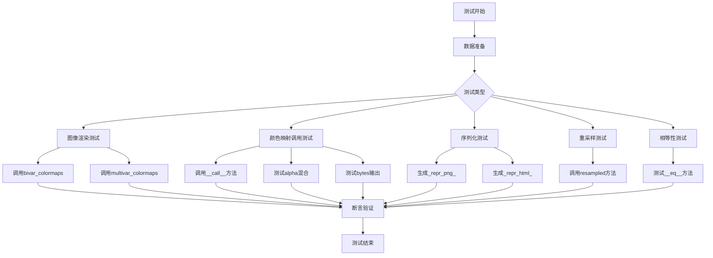
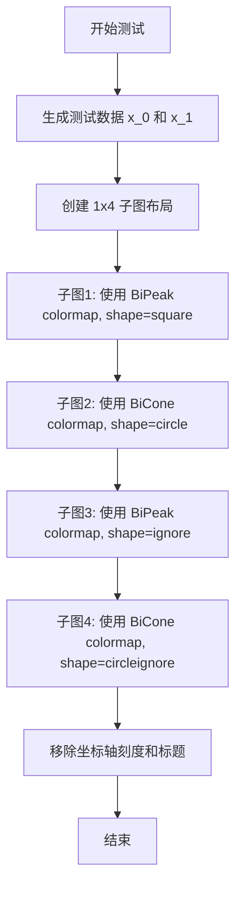
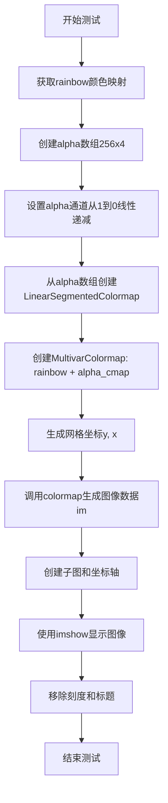
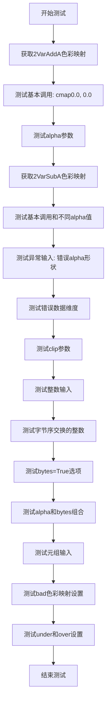
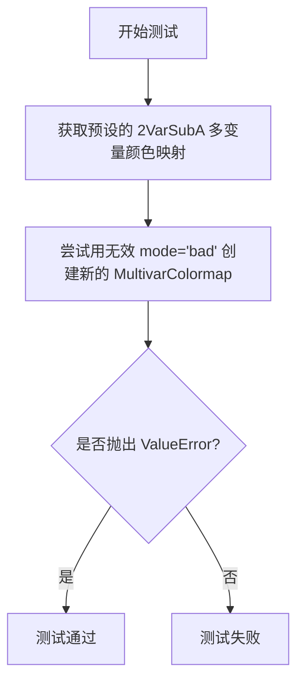
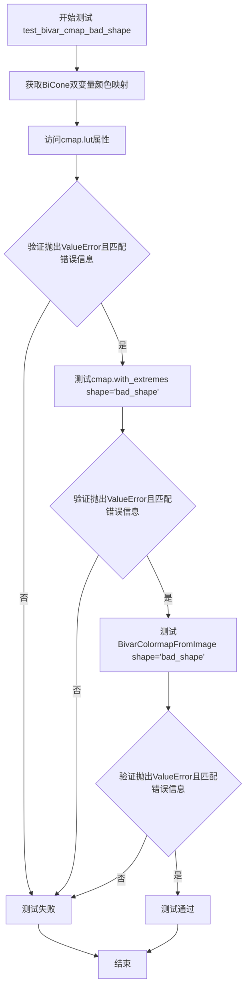
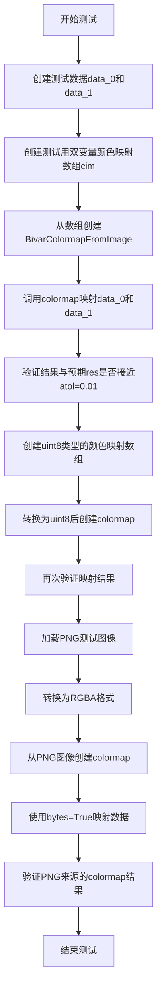
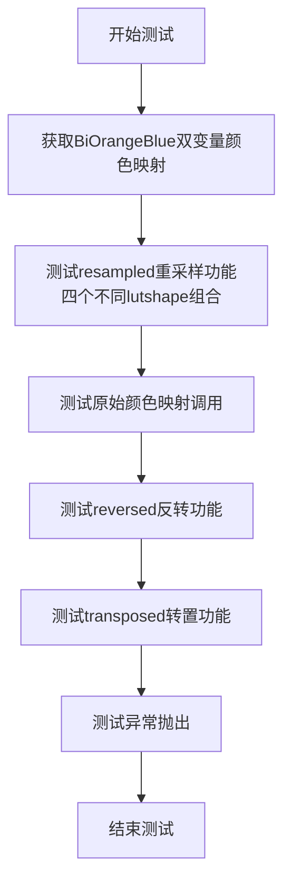
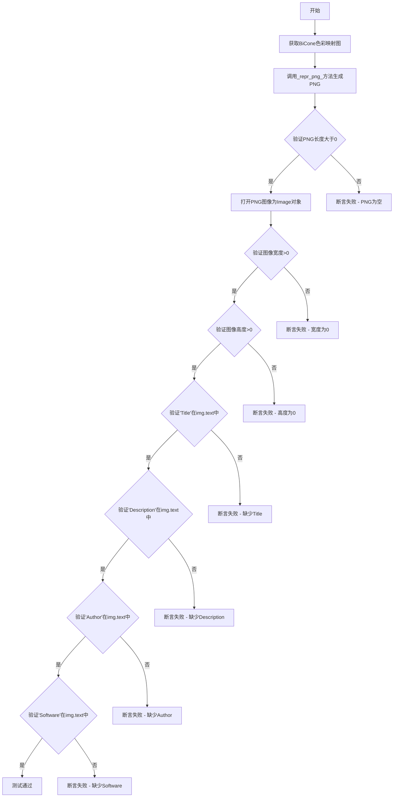
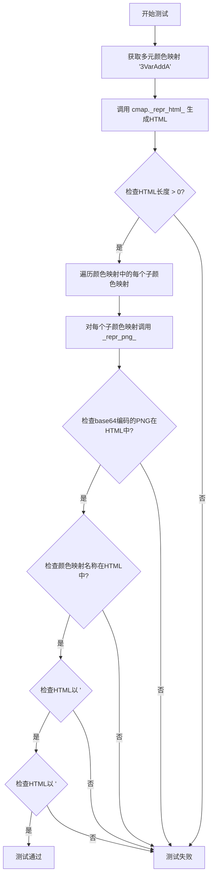

# `matplotlib\lib\matplotlib\tests\test_multivariate_colormaps.py` 详细设计文档

该文件是matplotlib库的双变量(bivariate)和多元(multivariate)颜色映射(colormap)功能测试套件,测试了多种颜色映射的创建、调用、渲染、序列化(PNG/HTML表示)、重采样以及边界条件处理等核心功能。

## 整体流程



## 类结构

```
测试模块 (无类定义)
├── 测试函数集合
    ├── test_bivariate_cmap_shapes (图像渲染)
    ├── test_multivar_creation (多元颜色映射创建)
    ├── test_multivar_alpha_mixing (透明度混合)
    ├── test_multivar_cmap_call (多元颜色映射调用)
    ├── test_multivar_bad_mode (错误模式)
    ├── test_multivar_resample (多元重采样)
    ├── test_bivar_cmap_call_tuple (双变量元组调用)
    ├── test_bivar_cmap_lut_smooth (LUT平滑)
    ├── test_bivar_cmap_call (双变量调用)
    ├── test_bivar_cmap_1d_origin (1D原点)
    ├── test_bivar_getitem (索引访问)
    ├── test_bivar_cmap_bad_shape (错误形状)
    ├── test_bivar_cmap_bad_lut (错误LUT)
    ├── test_bivar_cmap_from_image (从图像创建)
    ├── test_bivar_resample (双变量重采样)
    ├── test_bivariate_repr_png (PNG表示)
    ├── test_bivariate_repr_html (HTML表示)
    ├── test_multivariate_repr_png (多元PNG)
    ├── test_multivariate_repr_html (多元HTML)
    ├── test_bivar_eq (双变量相等)
    └── test_multivar_eq (多元相等)
```

## 全局变量及字段


### `x_0`
    
重复的linspace数组，用于双变量测试

类型：`numpy.ndarray`
    


### `x_1`
    
x_0的转置数组

类型：`numpy.ndarray`
    


### `blues`
    
Blues调色板

类型：`matplotlib.colors.Colormap`
    


### `cmap`
    
颜色映射实例

类型：`matplotlib.colors.MultivarColormap or matplotlib.colors.BivarColormap`
    


### `y`
    
用于创建测试网格的y坐标数组

类型：`numpy.ndarray`
    


### `x`
    
用于创建测试网格的x坐标数组

类型：`numpy.ndarray`
    


### `im`
    
颜色映射后的图像数据

类型：`numpy.ndarray`
    


### `res`
    
预期结果数组

类型：`numpy.ndarray`
    


### `rainbow`
    
rainbow调色板

类型：`matplotlib.colors.Colormap`
    


### `alpha`
    
透明度渐变数组

类型：`numpy.ndarray`
    


### `alpha_cmap`
    
透明度颜色映射

类型：`matplotlib.colors.LinearSegmentedColormap`
    


### `cs`
    
颜色映射调用结果

类型：`numpy.ndarray`
    


### `swapped_dt`
    
字节序交换的整数类型

类型：`numpy.dtype`
    


### `data_0`
    
测试数据数组

类型：`numpy.ndarray`
    


### `data_1`
    
测试数据数组

类型：`numpy.ndarray`
    


### `cim`
    
图像数据数组

类型：`numpy.ndarray`
    


### `png_path`
    
PNG文件路径

类型：`pathlib.Path`
    


### `cmap_0`
    
用于相等性测试的颜色映射实例

类型：`matplotlib.colors.Colormap`
    


### `cmap_1`
    
用于相等性测试的颜色映射实例

类型：`matplotlib.colors.Colormap`
    


    

## 全局函数及方法


### `test_bivariate_cmap_shapes`

该函数是一个图像对比测试，用于验证双变量（bivariate）colormap 的不同形状（shape）配置在可视化中的表现。它创建了四个子图，分别展示 square、circle、ignore 和 circleignore 四种形状模式下的颜色映射效果。

参数： 无

返回值： 无（该函数为测试函数，使用 `@image_comparison` 装饰器进行图像比较，不返回任何值）

#### 流程图



#### 带注释源码

```python
@image_comparison(["bivariate_cmap_shapes.png"])
def test_bivariate_cmap_shapes():
    """
    测试双变量 colormap 的不同形状配置
    使用 @image_comparison 装饰器自动比对生成的图像与基准图像
    """
    # 生成测试数据：创建 10x10 的网格数据
    # x_0: 从 -0.1 到 1.1 的 10 个 float32 值，复制 10 行
    x_0 = np.repeat(np.linspace(-0.1, 1.1, 10, dtype='float32')[None, :], 10, axis=0)
    # x_1: x_0 的转置矩阵
    x_1 = x_0.T

    # 创建 1 行 4 列的子图布局，图像宽度 10 英寸，高度 2 英寸
    fig, axes = plt.subplots(1, 4, figsize=(10, 2))

    # shape = 'square'
    # 使用 BiPeak 双变量 colormap，默认 shape 为 'square'
    cmap = mpl.bivar_colormaps['BiPeak']
    # 在第一个子图上显示颜色映射，使用最近邻插值
    axes[0].imshow(cmap((x_0, x_1)), interpolation='nearest')

    # shape = 'circle'
    # 使用 BiCone 双变量 colormap，默认 shape 为 'circle'
    cmap = mpl.bivar_colormaps['BiCone']
    axes[1].imshow(cmap((x_0, x_1)), interpolation='nearest')

    # shape = 'ignore'
    # 获取 BiPeak colormap 并修改 shape 参数为 'ignore'
    cmap = mpl.bivar_colormaps['BiPeak']
    cmap = cmap.with_extremes(shape='ignore')
    axes[2].imshow(cmap((x_0, x_1)), interpolation='nearest')

    # shape = 'circleignore'
    # 获取 BiCone colormap 并修改 shape 参数为 'circleignore'
    cmap = mpl.bivar_colormaps['BiCone']
    cmap = cmap.with_extremes(shape='circleignore')
    axes[3].imshow(cmap((x_0, x_1)), interpolation='nearest')
    
    # 移除所有子图的坐标轴刻度和标题，确保图像对比的准确性
    remove_ticks_and_titles(fig)
```


### `test_multivar_creation`

该函数是一个测试函数，用于验证 `MultivarColormap` 类的创建功能，包括正确创建多元颜色图、验证颜色映射结果是否符合预期，以及测试错误输入是否能够正确抛出异常。

参数：该函数没有参数。

返回值：`None`，该函数为测试函数，不返回任何值。

#### 流程图

```mermaid
flowchart TD
    A[开始 test_multivar_creation] --> B[获取 Blues 颜色图]
    B --> C[使用 Blues 和 Oranges 创建 MultivarColormap]
    C --> D[生成坐标网格 y, x]
    D --> E[调用颜色图 cmap((y, x))]
    E --> F[定义预期结果数组 res]
    F --> G[使用 assert_allclose 验证结果]
    G --> H[测试错误情况1: colormaps必须是列表]
    H --> I[测试错误情况2: 必须提供多个颜色图]
    I --> J[测试错误情况3: 参数格式错误]
    J --> K[结束测试]
```

#### 带注释源码

```python
def test_multivar_creation():
    # 测试创建自定义多元颜色图
    # 步骤1: 获取内置的 Blues 颜色图
    blues = mpl.colormaps['Blues']
    
    # 步骤2: 创建多元颜色图，使用 Blues 和 'Oranges' 两个颜色图
    # 第一个参数是颜色图元组，第二个参数是颜色空间模式 'sRGB_sub'
    cmap = mpl.colors.MultivarColormap((blues, 'Oranges'), 'sRGB_sub')
    
    # 步骤3: 生成坐标网格，用于测试颜色映射
    # y 和 x 是 3x3 的网格，值从 0 到 1
    y, x = np.mgrid[0:3, 0:3]/2
    
    # 步骤4: 调用颜色图，获取映射后的图像
    im = cmap((y, x))
    
    # 步骤5: 定义预期的 RGBA 结果数组
    # 这是一个 3x3x4 的数组，每行代表一个像素的 RGBA 值
    res = np.array([[[0.96862745, 0.94509804, 0.92156863, 1],
                     [0.96004614, 0.53504037, 0.23277201, 1],
                     [0.46666667, 0.1372549, 0.01568627, 1]],
                    [[0.41708574, 0.64141484, 0.75980008, 1],
                     [0.40850442, 0.23135717, 0.07100346, 1],
                     [0, 0, 0, 1]],
                    [[0.03137255, 0.14901961, 0.34117647, 1],
                     [0.02279123, 0, 0, 1],
                     [0, 0, 0, 1]]])
    
    # 步骤6: 使用 assert_allclose 验证计算结果与预期结果的接近程度
    # atol=0.01 表示允许的绝对误差为 0.01
    assert_allclose(im,  res, atol=0.01)

    # 步骤7: 测试错误情况1 - colormaps 必须是列表
    # 预期抛出 ValueError，错误信息包含 'colormaps must be a list of'
    with pytest.raises(ValueError, match="colormaps must be a list of"):
        cmap = mpl.colors.MultivarColormap((blues, [blues]), 'sRGB_sub')
    
    # 步骤8: 测试错误情况2 - 必须提供多个颜色图
    # 预期抛出 ValueError，错误信息包含 'A MultivarColormap must'
    with pytest.raises(ValueError, match="A MultivarColormap must"):
        cmap = mpl.colors.MultivarColormap('blues', 'sRGB_sub')
    
    # 步骤9: 测试错误情况3 - 参数格式错误
    # 当只传入单个颜色图（而非元组/列表）时应抛出异常
    with pytest.raises(ValueError, match="A MultivarColormap must"):
        cmap = mpl.colors.MultivarColormap((blues), 'sRGB_sub')
```


### `test_multivar_alpha_mixing`

这是一个测试函数，用于验证多元颜色映射的alpha混合功能。该函数创建了一个结合'rainbow'颜色映射和alpha通道渐变的多元颜色映射，并将其可视化显示。

参数：
- 该函数没有参数

返回值：`None`，该函数仅执行测试和可视化操作，不返回任何值

#### 流程图



#### 带注释源码

```python
@image_comparison(["multivar_alpha_mixing.png"])
def test_multivar_alpha_mixing():
    # test creation of a custom colormap using 'rainbow'
    # and a colormap that goes from alpha = 1 to alpha = 0
    # 获取matplotlib内置的rainbow颜色映射
    rainbow = mpl.colormaps['rainbow']
    
    # 创建一个256x4的零数组，用于定义alpha渐变
    # 前3列RGB暂时为0，第4列alpha将进行设置
    alpha = np.zeros((256, 4))
    
    # 设置alpha通道：从1线性递减到0，共256个点
    # 这创建了一个从完全不透明到完全透明的渐变
    alpha[:, 3] = np.linspace(1, 0, 256)
    
    # 从alpha数组创建线性分段颜色映射，命名为'from_list'
    # 这个颜色映射将用于提供alpha值
    alpha_cmap = mpl.colors.LinearSegmentedColormap.from_list('from_list', alpha)
    
    # 创建多元颜色映射，结合rainbow（提供颜色）和alpha_cmap（提供透明度）
    # 'sRGB_add'表示使用加法混合模式
    cmap = mpl.colors.MultivarColormap((rainbow, alpha_cmap), 'sRGB_add')
    
    # 生成10x10的网格坐标，并归一化到0-1范围
    # y, x将作为颜色映射的输入坐标
    y, x = np.mgrid[0:10, 0:10]/9
    
    # 调用颜色映射，将坐标映射为RGBA颜色值
    # 返回的im数组形状为(10, 10, 4)
    im = cmap((y, x))
    
    # 创建图形和子图
    fig, ax = plt.subplots()
    
    # 使用nearest插值显示图像
    ax.imshow(im, interpolation='nearest')
    
    # 移除坐标轴的刻度和标题，以便图像比较测试
    remove_ticks_and_titles(fig)
```


### `test_multivar_cmap_call`

这是一个测试函数，用于验证多变量色彩映射（MultivarColormap）的调用功能，涵盖不同的输入类型（浮点数、整数、元组）、不同的选项参数（bytes、alpha、clip）以及各种异常情况的处理。

参数：

- 此函数无显式参数，使用全局导入的 `mpl`、`np`、`pytest` 等模块

返回值：`None`，该函数为测试函数，通过断言验证功能，不返回具体数值

#### 流程图



#### 带注释源码

```python
def test_multivar_cmap_call():
    """测试多变量色彩映射的调用功能"""
    # 获取预定义的2VarAddA多变量色彩映射
    cmap = mpl.multivar_colormaps['2VarAddA']
    
    # 测试基本调用：输入(0.0, 0.0)应返回黑色(0, 0, 0, 1)
    assert_array_equal(cmap((0.0, 0.0)), (0, 0, 0, 1))
    # 测试另一端：(1.0, 1.0)应返回白色(1, 1, 1, 1)
    assert_array_equal(cmap((1.0, 1.0)), (1, 1, 1, 1))
    # 测试alpha参数：设置透明度为0.1
    assert_allclose(cmap((0.0, 0.0), alpha=0.1), (0, 0, 0, 0.1), atol=0.1)

    # 切换到2VarSubA色彩映射进行测试
    cmap = mpl.multivar_colormaps['2VarSubA']
    # (0.0, 0.0)在此映射中返回白色
    assert_array_equal(cmap((0.0, 0.0)), (1, 1, 1, 1))
    # (1.0, 1.0)应接近黑色
    assert_allclose(cmap((1.0, 1.0)), (0, 0, 0, 1), atol=0.1)

    # 测试异常输入和特殊值：bad值(1.2)和nan
    cs = cmap([(0., 0., 0., 1.2, np.nan), (0., 1.2, np.nan, 0., 0., )])
    # 验证返回的彩色映射值
    assert_allclose(cs, [[1., 1., 1., 1.],
                         [0.801, 0.426, 0.119, 1.],
                         [0., 0., 0., 0.],
                         [0.199, 0.574, 0.881, 1.],
                         [0., 0., 0., 0.]])

    # 测试bytes=True选项：应返回255范围的整数
    assert_array_equal(cmap((0.0, 0.0), bytes=True), (255, 255, 255, 255))

    # 测试异常情况：alpha形状不匹配
    with pytest.raises(ValueError, match="alpha is array-like but its shape"):
        cs = cmap([(0, 5, 9), (0, 0, 0)], alpha=(0.5, 0.3))

    # 测试数据维度错误
    with pytest.raises(ValueError, match="For the selected colormap the data"):
        cs = cmap([(0, 5, 9), (0, 0, 0), (0, 0, 0)])

    # 测试clip参数必须为True
    with pytest.raises(ValueError, match="clip cannot be false"):
        cs = cmap([(0, 5, 9), (0, 0, 0)], bytes=True, clip=False)
    
    # 测试整数输入方式
    cmap = mpl.multivar_colormaps['2VarSubA']

    # 仅使用整数调用
    cs = cmap([(0, 50, 100, 0, 0, 300), (0, 0, 0, 50, 100, 300)])
    res = np.array([[1, 1, 1, 1],
                     [0.85176471, 0.91029412, 0.96023529, 1],
                     [0.70452941, 0.82764706, 0.93358824, 1],
                     [0.94358824, 0.88505882, 0.83511765, 1],
                     [0.89729412, 0.77417647, 0.66823529, 1],
                     [0, 0, 0, 1]])
    assert_allclose(cs,  res, atol=0.01)

    # 测试字节序交换的整数数组
    swapped_dt = np.dtype(int).newbyteorder()
    cs = cmap([np.array([0, 50, 100, 0, 0, 300], dtype=swapped_dt),
               np.array([0, 0, 0, 50, 100, 300], dtype=swapped_dt)])
    assert_allclose(cs,  res, atol=0.01)

    # 测试bytes=True选项
    cs = cmap([(0, 50, 100, 0, 0, 300), (0, 0, 0, 50, 100, 300)], bytes=True)
    res = np.array([[255, 255, 255, 255],
                     [217, 232, 244, 255],
                     [179, 211, 238, 255],
                     [240, 225, 212, 255],
                     [228, 197, 170, 255],
                     [0,   0,   0, 255]])
    assert_allclose(cs,  res, atol=0.01)

    # 测试alpha参数
    cs = cmap([(0, 50, 100, 0, 0, 300), (0, 0, 0, 50, 100, 300)], alpha=0.5)
    res = np.array([[1, 1, 1, 0.5],
                     [0.85176471, 0.91029412, 0.96023529, 0.5],
                     [0.70452941, 0.82764706, 0.93358824, 0.5],
                     [0.94358824, 0.88505882, 0.83511765, 0.5],
                     [0.89729412, 0.77417647, 0.66823529, 0.5],
                     [0, 0, 0, 0.5]])
    assert_allclose(cs,  res, atol=0.01)
    
    # 测试元组输入方式
    assert_allclose(cmap((100, 120), bytes=True, alpha=0.5),
                    [149, 142, 136, 127], atol=0.01)

    # 测试alpha和bytes同时使用
    cs = cmap([(0, 5, 9, 0, 0, 10), (0, 0, 0, 5, 11, 12)], bytes=True, alpha=0.5)
    res = np.array([[0, 0, 255, 127],
                    [141, 0, 255, 127],
                    [255, 0, 255, 127],
                    [0, 115, 255, 127],
                    [0, 255, 255, 127],
                    [255, 255, 255, 127]])

    # 测试错误的alpha形状
    with pytest.raises(ValueError, match="alpha is array-like but its shape"):
        cs = cmap([(0, 5, 9), (0, 0, 0)], bytes=True, alpha=(0.5, 0.3))

    # 设置bad颜色并测试
    cmap = cmap.with_extremes(bad=(1, 1, 1, 1))
    cs = cmap([(0., 1.1, np.nan), (0., 1.2, 1.)])
    res = np.array([[1., 1., 1., 1.],
                   [0., 0., 0., 1.],
                   [1., 1., 1., 1.]])
    assert_allclose(cs,  res, atol=0.01)

    # 测试超出范围的值
    assert_allclose(cmap((300, 300), bytes=True, alpha=0.5),
                    [0, 0, 0, 127], atol=0.01)
    with pytest.raises(ValueError,
                       match="For the selected colormap the data must have"):
        cs = cmap((0, 5, 9))

    # 测试over/under设置
    cmap = mpl.multivar_colormaps['2VarAddA']
    with pytest.raises(ValueError, match='i.e. be of length 2'):
        cmap.with_extremes(over=0)
    with pytest.raises(ValueError, match='i.e. be of length 2'):
        cmap.with_extremes(under=0)

    # 设置under值并测试
    cmap = cmap.with_extremes(under=[(0, 0, 0, 0)]*2)
    assert_allclose((0, 0, 0, 0), cmap((-1., 0)), atol=1e-2)
    # 设置over值并测试
    cmap = cmap.with_extremes(over=[(0, 0, 0, 0)]*2)
    assert_allclose((0, 0, 0, 0), cmap((2., 0)), atol=1e-2)
```


### `test_multivar_bad_mode`

该测试函数用于验证当尝试使用无效的 mode 参数（'bad'）创建 MultivarColormap 时，是否会正确抛出 ValueError 异常。

参数： 无

返回值： `None`，测试函数不返回任何值，仅通过 pytest 断言验证异常行为

#### 流程图



#### 带注释源码

```python
def test_multivar_bad_mode():
    """
    测试无效的 mode 参数是否会触发 ValueError 异常
    
    该测试验证 MultivarColormap 构造函数能够正确验证 mode 参数，
    当传入无效值时抛出带有明确错误信息的 ValueError
    """
    # 获取预设的多变量颜色映射 '2VarSubA'
    # 这是一个已注册的多变量颜色映射，用于测试
    cmap = mpl.multivar_colormaps['2VarSubA']
    
    # 使用 pytest.raises 上下文管理器验证异常行为
    # 期望在创建 MultivarColormap 时抛出 ValueError
    # 错误信息应包含 "is not a valid value for"
    with pytest.raises(ValueError, match="is not a valid value for"):
        # 尝试用无效的 mode='bad' 创建新的 MultivarColormap
        # cmap[:] 获取颜色映射的副本作为输入
        cmap = mpl.colors.MultivarColormap(cmap[:], 'bad')
```


### `test_multivar_resample`

该函数是一个测试函数，用于测试多元颜色映射（MultivarColormap）的 `resampled` 方法功能，验证重采样后的颜色映射是否正确工作，包括正确的数据索引访问和错误处理。

参数：

- 无

返回值：`None`，无返回值（测试函数）

#### 流程图

```mermaid
flowchart TD
    A[开始测试] --> B[获取3VarAddA多元颜色映射]
    B --> C[调用resampled方法重采样为(None, 10, 3)]
    C --> D[测试cmap_resampled[1]索引访问0.25位置]
    D --> E[断言颜色值接近(0.093, 0.116, 0.059, 1.0)]
    E --> F[测试元组调用(0, 0.25, 0)]
    F --> G[断言颜色值接近(0.093, 0.116, 0.059, 1.0)]
    G --> H[测试元组调用(1, 0.25, 1)]
    H --> I[断言颜色值接近(0.417271, 0.264624, 0.274976, 1.0)]
    I --> J[测试错误处理: 传入无效的lutshape]
    J --> K[断言抛出ValueError异常]
    K --> L[测试结束]
```

#### 带注释源码

```python
def test_multivar_resample():
    """
    测试多元颜色映射的resampled方法功能
    
    验证点：
    1. 重采样后的颜色映射可以正确通过索引访问
    2. 重采样后的颜色映射可以正确通过元组调用
    3. 传入无效的lutshape时抛出正确的异常
    """
    # 获取一个预定义的三变量加法颜色映射
    cmap = mpl.multivar_colormaps['3VarAddA']
    
    # 对颜色映射进行重采样
    # 参数表示每个维度的LUT大小: (None, 10, 3)
    # None表示该维度保持原样，10和3分别表示第二和第三维度的新大小
    cmap_resampled = cmap.resampled((None, 10, 3))

    # 测试通过索引方式访问重采样后的颜色映射
    # cmap_resampled[1]获取第二个子颜色映射
    # 传入0.25查询该位置的RGBA值
    assert_allclose(cmap_resampled[1](0.25), (0.093, 0.116, 0.059, 1.0))
    
    # 测试通过元组方式直接调用重采样后的颜色映射
    # 传入(0, 0.25, 0)三元坐标查询颜色
    assert_allclose(cmap_resampled((0, 0.25, 0)), (0.093, 0.116, 0.059, 1.0))
    
    # 测试另一个坐标点的颜色映射
    # 传入(1, 0.25, 1)三元坐标查询颜色
    assert_allclose(cmap_resampled((1, 0.25, 1)), (0.417271, 0.264624, 0.274976, 1.0),
                                   atol=0.01)

    # 测试错误情况：传入不符合维度的lutshape参数
    # 应该抛出ValueError异常，提示lutshape必须是长度等于维度的元组
    with pytest.raises(ValueError, match="lutshape must be of length"):
        cmap = cmap.resampled(4)
```


### `test_bivar_cmap_call_tuple`

该函数是一个测试函数，用于验证双变量颜色映射（bivariate colormap）使用元组（tuple）参数调用时的行为。函数获取名为 'BiOrangeBlue' 的双变量颜色映射，并测试了不同元组输入和 alpha 参数的调用结果是否符合预期。

参数： 无

返回值：`None`，该函数为测试函数，主要通过断言验证功能，不返回具体数据

#### 流程图

```mermaid
flowchart TD
    A[开始测试] --> B[获取双变量颜色映射 'BiOrangeBlue']
    B --> C[测试 cmap((1.0, 1.0))]
    C --> D[断言结果为 (1, 1, 1, 1)]
    D --> E[测试 cmap((0.0, 0.0))]
    E --> F[断言结果为 (0, 0, 0, 1)]
    F --> G[测试 cmap((0.2, 0.8))]
    G --> H[断言结果为 (0.2, 0.5, 0.8, 1)]
    H --> I[测试 cmap((0.0, 0.0), alpha=0.1)]
    I --> J[断言结果为 (0, 0, 0, 0.1)]
    J --> K[结束测试]
```

#### 带注释源码

```python
def test_bivar_cmap_call_tuple():
    """
    测试使用元组参数调用双变量颜色映射的行为
    """
    # 获取名为 'BiOrangeBlue' 的双变量颜色映射
    cmap = mpl.bivar_colormaps['BiOrangeBlue']
    
    # 测试当输入为 (1.0, 1.0) 时，颜色映射返回 (1, 1, 1, 1)
    # 即两个维度都为最大值1时，返回完全白色（带alpha通道）
    assert_allclose(cmap((1.0, 1.0)), (1, 1, 1, 1))
    
    # 测试当输入为 (0.0, 0.0) 时，颜色映射返回 (0, 0, 0, 1)
    # 即两个维度都为最小值0时，返回完全黑色（带alpha通道）
    assert_allclose(cmap((0.0, 0.0)), (0, 0, 0, 1))
    
    # 测试当输入为 (0.2, 0.8) 时，颜色映射返回 (0.2, 0.5, 0.8, 1)
    # 验证双变量颜色映射的颜色混合逻辑
    assert_allclose(cmap((0.2, 0.8)), (0.2, 0.5, 0.8, 1))
    
    # 测试 alpha 参数的功能
    # 当指定 alpha=0.1 时，返回的 rgba 中的 alpha 通道应为 0.1
    assert_allclose(cmap((0.0, 0.0), alpha=0.1), (0, 0, 0, 0.1))
```


### `test_bivar_cmap_lut_smooth`

This function is a unit test designed to verify the correctness of the Look-Up Table (LUT) interpolation within a specific bivariate colormap ('BiOrangeBlue'). It ensures that the color transitions along different axes of the colormap vary linearly as expected, validating the "smooth" gradient behavior of the internal LUT data structure.

参数：
- 该函数没有显式参数。它依赖于全局 `matplotlib` (`mpl`) 和 `numpy` (`np`) 上下文。

返回值：`None`，该函数通过 `assert_allclose` 执行断言，测试失败时会抛出异常。

#### 流程图

```mermaid
flowchart TD
    A([Start test_bivar_cmap_lut_smooth]) --> B[Get 'BiOrangeBlue' from mpl.bivar_colormaps]
    
    subgraph X_Axis_Checks [Checks on X-Axis (First Variable)]
        C[Assert lut[:, 0, 0] is linear 0->1]
        D[Assert lut[:, 255, 0] is linear 0->1]
    end
    
    subgraph Y_Axis_Checks [Checks on Y-Axis (Second Variable)]
        E[Assert lut[:, 0, 1] is linear 0->0.5]
        F[Assert lut[:, 153, 1] is linear 0.3->0.8]
        G[Assert lut[:, 255, 1] is linear 0.5->1]
    end
    
    subgraph Slice_Checks [Checks on Slices / Z-Axis]
        H[Assert lut[0, :, 1] is linear 0->0.5]
        I[Assert lut[102, :, 1] is linear 0.2->0.7]
        J[Assert lut[255, :, 1] is linear 0.5->1]
        K[Assert lut[0, :, 2] is linear 0->1]
        L[Assert lut[255, :, 2] is linear 0->1]
    end

    B --> C
    C --> D
    D --> E
    E --> F
    F --> G
    G --> H
    H --> I
    I --> J
    J --> K
    K --> L
    L --> Z([End Test])
```

#### 带注释源码

```python
def test_bivar_cmap_lut_smooth():
    """
    Test the LUT smoothness for bivariate colormap BiOrangeBlue.
    This test checks if the internal 3D LUT array of the colormap
    exhibits linear interpolation along specific axes and slices.
    """
    # Retrieve the specific bivariate colormap instance
    cmap = mpl.bivar_colormaps['BiOrangeBlue']

    # --- Checks on the first dimension (x-axis input) ---
    # Verify linear gradient from 0 to 1 at the start (index 0)
    assert_allclose(cmap.lut[:, 0, 0], np.linspace(0, 1, 256))
    # Verify linear gradient from 0 to 1 at the end (index 255)
    assert_allclose(cmap.lut[:, 255, 0], np.linspace(0, 1, 256))

    # --- Checks on the second dimension (y-axis input) with varying ranges ---
    # Verify linear gradient 0->0.5 at x=0
    assert_allclose(cmap.lut[:, 0, 1], np.linspace(0, 0.5, 256))
    # Verify linear gradient 0.3->0.8 at x=153
    assert_allclose(cmap.lut[:, 153, 1], np.linspace(0.3, 0.8, 256))
    # Verify linear gradient 0.5->1 at x=255
    assert_allclose(cmap.lut[:, 255, 1], np.linspace(0.5, 1, 256))

    # --- Checks on slices across the second dimension (y-axis slices) ---
    # Check slice at y=0
    assert_allclose(cmap.lut[0, :, 1], np.linspace(0, 0.5, 256))
    # Check slice at y=102
    assert_allclose(cmap.lut[102, :, 1], np.linspace(0.2, 0.7, 256))
    # Check slice at y=255
    assert_allclose(cmap.lut[255, :, 1], np.linspace(0.5, 1, 256))

    # --- Checks on the third dimension (color channel variation) ---
    # Check first color channel slice at start
    assert_allclose(cmap.lut[0, :, 2], np.linspace(0, 1, 256))
    # Check first color channel slice at end
    assert_allclose(cmap.lut[255, :, 2], np.linspace(0, 1, 256))
```


### `test_bivar_cmap_call`

测试使用整数和浮点数调用双变量色彩映射（bivariate colormap）的功能，验证各种输入形式（整数、元组、列表）、输出格式（字节/浮点）、透明度混合以及极端值处理的行为。

参数：无

返回值：无返回值（测试函数）

#### 流程图

```mermaid
flowchart TD
    A[开始测试] --> B[创建测试图像数组im<br/>shape=(10,12,4)]
    B --> C[从图像创建BivarColormap]
    C --> D[测试整数索引调用<br/>cmap([(0,5,9,...), (0,0,0,...)])]
    D --> E{验证结果是否匹配}
    E -->|是| F[测试字节序交换的整数数组]
    E -->|否| Z[测试失败]
    F --> G[测试混合浮点数和整数调用]
    G --> H[添加outside极端值<br/>cmap.with_extremes]
    H --> I[测试bytes=True输出]
    I --> J[测试alpha参数]
    J --> K[测试元组输入]
    K --> L[测试alpha和bytes组合]
    L --> M[测试alpha形状错误]
    M --> N[设置shape='ignore'<br/>测试bad和outside值]
    N --> O[再次测试元组输入和整数]
    O --> P[测试无效数据形状]
    P --> Q[测试shape='circle'限制]
    Q --> R[结束测试]
```

#### 带注释源码

```python
def test_bivar_cmap_call():
    """
    Tests calling a bivariate colormap with integer values
    """
    # 创建一个10x12x4的图像数组，用于测试
    # 前两个通道存储归一化的坐标值(0-1)，第四通道是alpha=1
    im = np.ones((10, 12, 4))
    im[:, :, 0] = np.linspace(0, 1, 10)[:, np.newaxis]  # 第一维度: 0到1
    im[:, :, 1] = np.linspace(0, 1, 12)[np.newaxis, :]  # 第二维度: 0到1
    
    # 从图像数组创建双变量色彩映射
    cmap = mpl.colors.BivarColormapFromImage(im)

    # ========== 测试1: 仅使用整数索引调用 ==========
    # 输入是两个坐标序列，每个序列6个点
    cs = cmap([(0, 5, 9, 0, 0, 10), (0, 0, 0, 5, 11, 12)])
    # 期望的RGBA输出结果
    res = np.array([[0, 0, 1, 1],
                   [0.556, 0, 1, 1],
                   [1, 0, 1, 1],
                   [0, 0.454, 1, 1],
                   [0, 1, 1, 1],
                   [1, 1, 1, 1]])
    assert_allclose(cs,  res, atol=0.01)

    # ========== 测试2: 使用交换字节序的整数数组 ==========
    # 验证字节序不影响结果
    swapped_dt = np.dtype(int).newbyteorder()
    cs = cmap([np.array([0, 5, 9, 0, 0, 10], dtype=swapped_dt),
               np.array([0, 0, 0, 5, 11, 12], dtype=swapped_dt)])
    assert_allclose(cs,  res, atol=0.01)

    # ========== 测试3: 混合浮点数和整数 ==========
    # 为colormap添加outside极端值
    cmap = cmap.with_extremes(outside=(1, 0, 0, 0))
    cs = cmap([(0.5, 0), (0, 3)])
    res = np.array([[0.555, 0, 1, 1],
                    [0, 0.2727, 1, 1]])
    assert_allclose(cs,  res, atol=0.01)

    # ========== 测试4: 使用bytes=True输出 ==========
    # 将浮点RGBA转换为uint8 (0-255)
    cs = cmap([(0, 5, 9, 0, 0, 10), (0, 0, 0, 5, 11, 12)], bytes=True)
    res = np.array([[0, 0, 255, 255],
                    [141, 0, 255, 255],
                    [255, 0, 255, 255],
                    [0, 115, 255, 255],
                    [0, 255, 255, 255],
                    [255, 255, 255, 255]])
    assert_allclose(cs,  res, atol=0.01)

    # ========== 测试5: alpha透明度参数 ==========
    cs = cmap([(0, 5, 9, 0, 0, 10), (0, 0, 0, 5, 11, 12)], alpha=0.5)
    res = np.array([[0, 0, 1, 0.5],
                    [0.556, 0, 1, 0.5],
                    [1, 0, 1, 0.5],
                    [0, 0.454, 1, 0.5],
                    [0, 1, 1, 0.5],
                    [1, 1, 1, 0.5]])
    assert_allclose(cs,  res, atol=0.01)

    # ========== 测试6: 使用元组输入 ==========
    assert_allclose(cmap((10, 12), bytes=True, alpha=0.5),
                    [255, 255, 255, 127], atol=0.01)

    # ========== 测试7: alpha和bytes组合 ==========
    cs = cmap([(0, 5, 9, 0, 0, 10), (0, 0, 0, 5, 11, 12)], bytes=True, alpha=0.5)
    res = np.array([[0, 0, 255, 127],
                    [141, 0, 255, 127],
                    [255, 0, 255, 127],
                    [0, 115, 255, 127],
                    [0, 255, 255, 127],
                    [255, 255, 255, 127]])

    # ========== 测试8: alpha形状错误检测 ==========
    with pytest.raises(ValueError, match="alpha is array-like but its shape"):
        cs = cmap([(0, 5, 9), (0, 0, 0)], bytes=True, alpha=(0.5, 0.3))

    # ========== 测试9: shape='ignore'模式 ==========
    # 设置shape='ignore'，超出范围的值使用outside颜色
    # 测试bad值(np.nan)和outside值
    cmap = cmap.with_extremes(outside=(1, 0, 0, 0), bad=(1, 1, 1, 0), shape='ignore')
    cs = cmap([(0., 1.1, np.nan), (0., 1.2, 1.)])
    res = np.array([[0, 0, 1, 1],
                    [1, 0, 0, 0],
                    [1, 1, 1, 0]])
    assert_allclose(cs,  res, atol=0.01)

    # ========== 测试10: 超出范围的元组调用 ==========
    assert_allclose(cmap((10, 12), bytes=True, alpha=0.5),
                    [255, 0, 0, 127], atol=0.01)

    # ========== 测试11: 整数索引调用 ==========
    cs = cmap([(0, 10), (0, 12)])
    res = np.array([[0, 0, 1, 1],
                    [1, 0, 0, 0]])
    assert_allclose(cs,  res, atol=0.01)

    # ========== 测试12: 无效数据形状检测 ==========
    with pytest.raises(ValueError,
                       match="For a `BivarColormap` the data must have"):
        cs = cmap((0, 5, 9))

    # ========== 测试13: shape='circle'限制 ==========
    # circle模式仅支持浮点数输入
    cmap = cmap.with_extremes(shape='circle')
    with pytest.raises(NotImplementedError,
                       match="only implemented for use with with floats"):
        cs = cmap([(0, 5, 9, 0, 0, 9), (0, 0, 0, 5, 11, 11)])
```


### `test_bivar_cmap_1d_origin`

该函数是一个 pytest 单元测试，用于验证双变量（Bivariate）颜色映射表中一维分量（索引访问）的颜色生成逻辑，特别是对 `with_extremes(origin=...)` 方法所设置的 **原点（origin）** 属性的校验。它通过对比不同原点设置下的颜色值数组与 `np.linspace` 生成的预期数组，来确保颜色映射的数学变换正确。

参数：
- 无（该函数为测试模块级函数，不接受显式参数）

返回值：
- `None`，该函数通过 `assert_allclose` 进行断言验证，不返回任何值。

#### 流程图

```mermaid
graph TD
    A([开始测试]) --> B[获取双变量颜色映射表 'BiOrangeBlue']
    B --> C{测试默认原点 (0, 0)}
    C --> D[访问 cmap[0] 并断言颜色数组]
    C --> E[访问 cmap[1] 并断言颜色数组]
    D --> F{测试原点 (0, 1)}
    E --> F
    F --> G[使用 origin=(0, 1) 创建新映射表 cmap1]
    G --> H[访问 cmap1[0] 断言颜色变化]
    H --> I[访问 cmap1[1] 断言颜色未变]
    I --> J{测试自定义原点 (0.2, 0.4)}
    J --> K[使用 origin=(0.2, 0.4) 创建新映射表 cmap2]
    K --> L[访问 cmap2[0] 和 cmap2[1] 断言复杂颜色渐变]
    L --> M{测试边界错误}
    M --> N[尝试访问 cmap[2] 期望抛出 KeyError]
    N --> O([结束测试])
```

#### 带注释源码

```python
def test_bivar_cmap_1d_origin():
    """
    Test getting 1D colormaps with different origins
    """
    # 1. 获取基础的双变量颜色映射表 'BiOrangeBlue'
    cmap0 = mpl.bivar_colormaps['BiOrangeBlue']
    
    # 2. 测试默认原点 (0, 0) 下的第0个一维分量
    # 验证 R 通道从 0 到 1，G 通道从 0 到 0.5，B 通道全为 0
    assert_allclose(cmap0[0].colors[:, 0], np.linspace(0, 1, 256))
    assert_allclose(cmap0[0].colors[:, 1], np.linspace(0, 0.5, 256))
    assert_allclose(cmap0[0].colors[:, 2], 0)
    
    # 3. 测试默认原点 (0, 0) 下的第1个一维分量
    # 验证 R 通道全为 0，G 通道从 0 到 0.5，B 通道从 0 到 1
    assert_allclose(cmap0[1].colors[:, 0], 0)
    assert_allclose(cmap0[1].colors[:, 1], np.linspace(0, 0.5, 256))
    assert_allclose(cmap0[1].colors[:, 2], np.linspace(0, 1, 256))

    # 4. 测试修改原点为 (0, 1) 后的效果
    cmap1 = cmap0.with_extremes(origin=(0, 1))
    # 第0个分量：原点设为 (0,1) 意味着该维度的起点在 1 处
    # 验证 G 通道从 0.5 到 1，B 通道全为 1
    assert_allclose(cmap1[0].colors[:, 0], np.linspace(0, 1, 256))
    assert_allclose(cmap1[0].colors[:, 1], np.linspace(0.5, 1, 256))
    assert_allclose(cmap1[0].colors[:, 2], 1)
    # 验证第1个分量未受第0维原点影响（或按照特定逻辑继承，这里验证其保持原样或对应逻辑）
    assert_allclose(cmap1[1].colors, cmap0[1].colors)

    # 5. 测试更复杂的自定义原点 (0.2, 0.4)
    cmap2 = cmap0.with_extremes(origin=(0.2, 0.4))
    # 验证第0个分量的颜色数组根据新的起点 0.2 和终点(隐式或计算得出)发生变化
    assert_allclose(cmap2[0].colors[:, 0], np.linspace(0, 1, 256))
    assert_allclose(cmap2[0].colors[:, 1], np.linspace(0.2, 0.7, 256))
    assert_allclose(cmap2[0].colors[:, 2], 0.4)
    
    # 验证第1个分量的变化
    assert_allclose(cmap2[1].colors[:, 0], 0.2)
    assert_allclose(cmap2[1].colors[:, 1], np.linspace(0.1, 0.6, 256))
    assert_allclose(cmap2[1].colors[:, 2], np.linspace(0, 1, 256))

    # 6. 测试错误处理：访问索引 2 应该抛出 KeyError
    with pytest.raises(KeyError,
                       match="only 0 or 1 are valid keys"):
        cs = cmap0[2]
```


### `test_bivar_getitem`

测试 BivarColormap 类的 `__getitem__` 方法（索引访问），验证双变量色彩映射器的索引访问是否正确返回对应的单变量色彩映射器。

参数： 无

返回值： 无（测试函数，通过断言验证）

#### 流程图

```mermaid
flowchart TD
    A[开始测试] --> B[定义测试数据 xA 和 xB]
    B --> C[获取 BiPeak 双变量色彩映射器]
    C --> D[验证 xA 的索引访问: cmaps[xA] == cmaps[0](xA[0])]
    D --> E[验证 xB 的索引访问: cmaps[xB] == cmaps[1](xB[1])]
    E --> F[设置 shape='ignore' 极端值]
    F --> G[再次验证 xA 和 xB 的索引访问]
    G --> H[更换为 BiOrangeBlue 色彩映射器]
    H --> I[验证默认情况下的索引访问]
    I --> J[设置 shape='ignore']
    J --> K[验证 shape='ignore' 下的索引访问]
    K --> L[结束测试]
```

#### 带注释源码

```python
def test_bivar_getitem():
    """Test __getitem__  on BivarColormap"""
    # 定义两套测试数据：
    # xA: 第一个维度变化，第二个维度固定为 0.5
    # xB: 第一个维度固定为 0.5，第二个维度变化
    xA = ([.0, .25, .5, .75, 1., -1, 2], [.5]*7)
    xB = ([.5]*7, [.0, .25, .5, .75, 1., -1, 2])

    # 获取双变量色彩映射器 BiPeak
    cmaps = mpl.bivar_colormaps['BiPeak']
    # 验证：调用双变量映射器得到的结果应等于分别调用对应单变量映射器
    assert_array_equal(cmaps(xA), cmaps[0](xA[0]))  # 索引访问 cmaps[0]
    assert_array_equal(cmaps(xB), cmaps[1](xB[1]))  # 索引访问 cmaps[1]

    # 使用 shape='ignore' 模式，测试边界情况处理
    cmaps = cmaps.with_extremes(shape='ignore')
    assert_array_equal(cmaps(xA), cmaps[0](xA[0]))
    assert_array_equal(cmaps(xB), cmaps[1](xB[1]))

    # 更换测试数据：第二个维度固定为 0.0
    xA = ([.0, .25, .5, .75, 1., -1, 2], [.0]*7)
    xB = ([.0]*7, [.0, .25, .5, .75, 1., -1, 2])
    
    # 更换为 BiOrangeBlue 双变量色彩映射器
    cmaps = mpl.bivar_colormaps['BiOrangeBlue']
    assert_array_equal(cmaps(xA), cmaps[0](xA[0]))
    assert_array_equal(cmaps(xB), cmaps[1](xB[1]))

    # 使用 shape='ignore' 模式再次验证
    cmaps = cmaps.with_extremes(shape='ignore')
    assert_array_equal(cmaps(xA), cmaps[0](xA[0]))
    assert_array_equal(cmaps(xB), cmaps[1](xB[1]))
```


### `test_bivar_cmap_bad_shape`

该函数是一个测试用例，用于验证当为双变量颜色映射（bivariate colormap）提供无效的shape参数时，系统是否正确抛出ValueError异常。它测试了两处可能传入无效shape参数的场景：`with_extremes`方法和`BivarColormapFromImage`构造函数。

参数：空（该函数无显式参数）

返回值：`None`，该函数为测试函数，不返回任何值

#### 流程图



#### 带注释源码

```python
def test_bivar_cmap_bad_shape():
    """
    Tests calling a bivariate colormap with integer values
    测试使用整数值的双变量颜色映射
    """
    # 获取BiCone双变量颜色映射
    cmap = mpl.bivar_colormaps['BiCone']
    # 访问lut属性，触发颜色映射的初始化
    _ = cmap.lut
    
    # 测试1：验证with_extremes方法在传入无效shape时抛出ValueError
    # 预期错误信息："is not a valid value for shape"
    with pytest.raises(ValueError,
                       match="is not a valid value for shape"):
        cmap.with_extremes(shape='bad_shape')

    # 测试2：验证BivarColormapFromImage在传入无效shape时抛出ValueError
    # 预期错误信息："is not a valid value for shape"
    with pytest.raises(ValueError,
                       match="is not a valid value for shape"):
        mpl.colors.BivarColormapFromImage(np.ones((3, 3, 4)),
                                          shape='bad_shape')
```


### `test_bivar_cmap_bad_lut`

这是一个测试函数，用于验证当向 `BivarColormapFromImage` 提供形状不正确的 LUT（查找表）时，是否正确抛出 `ValueError` 异常。

参数：  
该函数没有参数。

返回值：`None`，因为这是一个测试函数，不返回任何值。

#### 流程图

```mermaid
flowchart TD
    A[开始] --> B[尝试创建 BivarColormapFromImage 对象，使用形状为 (3, 3, 5) 的数组]
    B --> C{是否抛出 ValueError?}
    C -- 是 --> D[验证异常消息包含 “The lut must be an array of shape”]
    C -- 否 --> E[测试失败]
    D --> F[结束]
```

#### 带注释源码

```python
def test_bivar_cmap_bad_lut():
    """
    Tests calling a bivariate colormap with integer values
    """
    # 使用 pytest.raises 检查是否抛出 ValueError 异常，并验证错误消息
    with pytest.raises(ValueError,
                       match="The lut must be an array of shape"):
        # 尝试创建一个形状为 (3, 3, 5) 的 BivarColormapFromImage，
        # 这应该引发错误，因为 LUT 形状不正确
        cmap = mpl.colors.BivarColormapFromImage(np.ones((3, 3, 5)))
```


### `test_bivar_cmap_from_image`

该函数用于测试从图像创建和使用双变量(colormap)颜色映射的功能，验证了从NumPy数组和PNG图像文件创建BivarColormapFromImage的正确性，包括不同数据类型(float和uint8)的处理以及颜色映射的准确性。

参数： 无

返回值： 无（测试函数）

#### 流程图



#### 带注释源码

```python
def test_bivar_cmap_from_image():
    """
    This tests the creation and use of a bivariate colormap
    generated from an image
    """

    # 创建测试数据：两个2D坐标数组，用于测试colormap映射
    # data_0: shape (2, 3), 值范围 [0, 1]
    data_0 = np.arange(6).reshape((2, 3))/5
    # data_1: shape (2, 3), 值范围 [0, 1]，通过转置获得不同分布
    data_1 = np.arange(6).reshape((3, 2)).T/5

    # ==================== 测试1：从NumPy数组创建colormap ====================
    # 创建一个10x12的RGB图像数组
    cim = np.ones((10, 12, 3))
    # 第一通道：水平渐变，从左到右从0到0.9
    cim[:, :, 0] = np.arange(10)[:, np.newaxis]/10
    # 第二通道：垂直渐变，从上到下从0到约0.92
    cim[:, :, 1] = np.arange(12)[np.newaxis, :]/12

    # 使用BivarColormapFromImage从图像数组创建双变量colormap
    cmap = mpl.colors.BivarColormapFromImage(cim)
    # 调用colormap映射坐标对(data_0, data_1)，返回RGBA颜色值
    im = cmap((data_0, data_1))
    # 预期结果：基于双变量colormap的插值计算
    res = np.array([[[0, 0, 1, 1],
                    [0.2, 0.33333333, 1, 1],
                    [0.4, 0.75, 1, 1]],
                   [[0.6, 0.16666667, 1, 1],
                    [0.8, 0.58333333, 1, 1],
                    [0.9, 0.91666667, 1, 1]]])
    # 断言实际输出与预期结果的接近程度，允许绝对误差0.01
    assert_allclose(im,  res, atol=0.01)

    # ==================== 测试2：使用uint8数据类型 ====================
    # 创建值为0-255范围的RGB数组
    cim = np.ones((10, 12, 3))*255
    # 重新计算渐变值并乘以255转换为整数
    cim[:, :, 0] = np.arange(10)[:, np.newaxis]/10*255
    cim[:, :, 1] = np.arange(12)[np.newaxis, :]/12*255

    # 将数组转换为uint8类型后创建colormap
    cmap = mpl.colors.BivarColormapFromImage(cim.astype(np.uint8))
    # 验证uint8输入产生相同的结果
    im = cmap((data_0, data_1))
    assert_allclose(im,  res, atol=0.01)

    # ==================== 测试3：从PNG图像文件创建colormap ====================
    # 构建PNG测试图像的完整路径
    png_path = Path(__file__).parent / "baseline_images/pngsuite/basn2c16.png"
    # 使用PIL打开图像并转换为RGBA格式
    cim = Image.open(png_path)
    cim = np.asarray(cim.convert('RGBA'))

    # 从实际PNG图像创建colormap
    cmap = mpl.colors.BivarColormapFromImage(cim)
    # 使用bytes=True获取字节格式的颜色值 (0-255)
    im = cmap((data_0, data_1), bytes=True)
    # 验证从PNG创建的colormap的映射结果
    res = np.array([[[255, 255,   0, 255],
                     [156, 206,   0, 255],
                     [49, 156,  49, 255]],
                    [[206,  99,   0, 255],
                     [99,  49, 107, 255],
                     [0,   0, 255, 255]]])
    assert_allclose(im,  res, atol=0.01)
```


### `test_bivar_resample`

这是一个测试函数，用于验证双变量（bivariate）颜色映射的重采样（resampled）、反转（reversed）和转置（transposed）功能是否正常工作。

参数：该函数没有显式参数（使用 pytest 框架的隐式参数）

返回值：该函数没有显式返回值（pytest 测试函数通过断言验证）

#### 流程图



#### 带注释源码

```python
def test_bivar_resample():
    """
    测试双变量颜色映射的重采样、反转和转置功能
    """
    # 获取名为'BiOrangeBlue'的双变量颜色映射对象
    cmap = mpl.bivar_colormaps['BiOrangeBlue']

    # 测试resampled方法的不同lutshape参数组合
    # lutshape=(2, 2): 重采样为2x2的查找表
    assert_allclose(cmap.resampled((2, 2))((0.25, 0.25)), (0, 0, 0, 1))
    
    # lutshape=(-2, 2): 负值表示方向反转
    assert_allclose(cmap.resampled((-2, 2))((0.25, 0.25)), (1., 0.5, 0., 1.))
    
    # lutshape=(2, -2): 仅在第二个维度反转
    assert_allclose(cmap.resampled((2, -2))((0.25, 0.25)), (0., 0.5, 1., 1.))
    
    # lutshape=(-2, -2): 两个维度都反转
    assert_allclose(cmap.resampled((-2, -2))((0.25, 0.25)), (1, 1, 1, 1))

    # 测试颜色映射的直接调用功能
    # 验证输入(0.8, 0.4)时返回正确的RGBA值
    assert_allclose(cmap((0.8, 0.4)), (0.8, 0.6, 0.4, 1.))
    
    # 测试reversed方法：反转颜色映射
    # 验证reversed后输入(1-0.8, 1-0.4)等于原始输入(0.8, 0.4)的输出
    assert_allclose(cmap.reversed()((1 - 0.8, 1 - 0.4)), (0.8, 0.6, 0.4, 1.))

    # 测试transposed方法：交换两个维度的顺序
    assert_allclose(cmap((0.6, 0.2)), (0.6, 0.4, 0.2, 1.))
    assert_allclose(cmap.transposed()((0.2, 0.6)), (0.6, 0.4, 0.2, 1.))

    # 测试异常情况：传入长度不为2的lutshape时应抛出ValueError
    with pytest.raises(ValueError, match="lutshape must be of length"):
        cmap = cmap.resampled(4)
```


### `test_bivariate_repr_png`

该函数是一个测试用例，用于验证 bivariate（双变量）色彩映射图的 PNG 表示形式（`_repr_png_` 方法）是否正确生成，并检查生成的 PNG 图像的元数据信息（Title、Description、Author、Software）是否完整。

参数： 无

返回值：`None`，该函数为测试函数，不返回任何值

#### 流程图



#### 带注释源码

```python
def test_bivariate_repr_png():
    """
    测试 bivariate colormap 的 _repr_png_ 方法是否正确生成 PNG 图像
    并验证 PNG 元数据信息的完整性
    """
    # 从 matplotlib 的双变量色彩映射图集合中获取 'BiCone' 色彩映射图
    cmap = mpl.bivar_colormaps['BiCone']
    
    # 调用色彩映射图的 _repr_png_ 方法生成 PNG 格式的图像数据
    png = cmap._repr_png_()
    
    # 断言：验证生成的 PNG 数据不为空（长度大于0）
    assert len(png) > 0
    
    # 使用 PIL.Image 从字节流中打开生成的 PNG 图像
    img = Image.open(BytesIO(png))
    
    # 断言：验证图像宽度大于0
    assert img.width > 0
    
    # 断言：验证图像高度大于0
    assert img.height > 0
    
    # 断言：验证 PNG 的 text 元数据中包含 'Title' 字段
    assert 'Title' in img.text
    
    # 断言：验证 PNG 的 text 元数据中包含 'Description' 字段
    assert 'Description' in img.text
    
    # 断言：验证 PNG 的 text 元数据中包含 'Author' 字段
    assert 'Author' in img.text
    
    # 断言：验证 PNG 的 text 元数据中包含 'Software' 字段
    assert 'Software' in img.text
```


### `test_bivariate_repr_html`

该函数是一个测试用例，用于验证 bivariate colormap 对象的 HTML 表示方法是否正确生成包含 base64 编码的 PNG 图像和元数据的 HTML 片段。

参数：
- 无

返回值：`None`，测试函数无返回值

#### 流程图


#### 带注释源码

```python
def test_bivariate_repr_html():
    # 测试双向色彩映射的 HTML 表示方法
    # 获取名为 'BiCone' 的双向色彩映射对象
    cmap = mpl.bivar_colormaps['BiCone']
    
    # 调用对象的 _repr_html_ 方法生成 HTML 表示
    html = cmap._repr_html_()
    
    # 验证生成的 HTML 字符串不为空
    assert len(html) > 0
    
    # 获取该色彩映射的 PNG 表示
    png = cmap._repr_png_()
    
    # 验证 PNG 数据被正确编码到 HTML 中
    # 将 PNG 转换为 base64 字符串并检查是否存在于 HTML 中
    assert base64.b64encode(png).decode('ascii') in html
    
    # 验证色彩映射的名称包含在 HTML 中
    assert cmap.name in html
    
    # 验证 HTML 格式正确：以 <div 开始，以 </div 结束
    assert html.startswith('<div')
    assert html.endswith('</div>')
```


### `test_multivariate_repr_png`

该函数用于测试多变量（Multivariate）颜色映射的PNG表示是否正确生成，通过调用内部方法`_repr_png_()`获取PNG数据，并验证图像的尺寸以及嵌入的元数据信息（Title、Description、Author、Software）是否符合预期。

参数：无

返回值：`None`，该函数为测试函数，没有显式返回值（Python中默认返回None）

#### 流程图

```mermaid
flowchart TD
    A[开始] --> B[获取3VarAddA多变量颜色映射]
    B --> C[调用cmap._repr_png_生成PNG]
    C --> D{断言: len(png) > 0}
    D -->|是| E[用BytesIO打开PNG数据]
    D -->|否| F[测试失败]
    E --> G{断言: img.width > 0}
    G -->|是| H{断言: img.height > 0}
    G -->|否| F
    H -->|是| I{断言: 'Title' in img.text}
    H -->|否| F
    I -->|是| J{断言: 'Description' in img.text}
    I -->|否| F
    J -->|是| K{断言: 'Author' in img.text}
    J -->|否| F
    K -->|是| L{断言: 'Software' in img.text}
    K -->|否| F
    L -->|是| M[测试通过]
    L -->|否| F
```

#### 带注释源码

```python
def test_multivariate_repr_png():
    """
    测试多变量颜色映射的PNG表示是否正确生成。
    验证生成的PNG图像包含正确的尺寸和元数据信息。
    """
    # 从matplotlib的多变量颜色映射集合中获取名为'3VarAddA'的颜色映射对象
    cmap = mpl.multivar_colormaps['3VarAddA']
    
    # 调用颜色映射对象的内部方法生成PNG格式的图像数据
    png = cmap._repr_png_()
    
    # 断言生成的PNG数据长度大于0，确保PNG数据非空
    assert len(png) > 0
    
    # 使用BytesIO将PNG字节数据转换为文件-like对象供PIL读取
    img = Image.open(BytesIO(png))
    
    # 断言图像宽度大于0，确保图像有效
    assert img.width > 0
    
    # 断言图像高度大于0，确保图像有效
    assert img.height > 0
    
    # 断言PNG的元数据中包含'Title'字段
    assert 'Title' in img.text
    
    # 断言PNG的元数据中包含'Description'字段
    assert 'Description' in img.text
    
    # 断言PNG的元数据中包含'Author'字段
    assert 'Author' in img.text
    
    # 断言PNG的元数据中包含'Software'字段
    assert 'Software' in img.text
```


### `test_multivariate_repr_html`

这是一个测试函数，用于验证多元颜色映射（MultivarColormap）的HTML表示（`_repr_html_`）是否正确生成。该测试会检查生成的HTML内容是否包含base64编码的PNG图像、颜色映射名称，以及HTML结构是否符合要求。

参数： 无

返回值：`None`，因为这是一个测试函数，不返回任何值。

#### 流程图



#### 带注释源码

```python
def test_multivariate_repr_html():
    """
    测试多元颜色映射的HTML表示是否正确生成
    """
    # 获取一个预定义的多元颜色映射 '3VarAddA'
    cmap = mpl.multivar_colormaps['3VarAddA']
    
    # 调用颜色映射的 _repr_html_ 方法生成HTML表示
    html = cmap._repr_html_()
    
    # 断言：验证生成的HTML不为空
    assert len(html) > 0
    
    # 遍历该多元颜色映射中的每一个子颜色映射
    for c in cmap:
        # 对每个子颜色映射调用 _repr_png_ 方法获取PNG图像
        png = c._repr_png_()
        # 将PNG图像进行base64编码后，验证其是否包含在HTML中
        assert base64.b64encode(png).decode('ascii') in html
    
    # 验证颜色映射的名称包含在HTML中
    assert cmap.name in html
    
    # 验证HTML结构：以 <div 开头，以 </div> 结尾
    assert html.startswith('<div')
    assert html.endswith('</div>')
```


### `test_bivar_eq`

该函数用于测试双变量（bivariate）颜色映射之间的相等性比较，通过多种场景验证颜色映射对象的 `__eq__` 方法是否正确工作。

参数：

- 该函数没有参数

返回值：`None`，该函数为测试函数，使用 `assert` 语句进行断言验证，不返回任何值

#### 流程图

```mermaid
flowchart TD
    A[开始测试 test_bivar_eq] --> B[获取基准颜色映射 cmap_0 = mpl.bivar_colormaps['BiPeak']]
    B --> C[测试1: 相同颜色映射比较 - cmap_1 = mpl.bivar_colormaps['BiPeak']
    assert (cmap_0 == cmap_1) is True]
    C --> D[测试2: 不同类型颜色映射比较 - cmap_1 = mpl.multivar_colormaps['2VarAddA']
    assert (cmap_0 == cmap_1) is False]
    D --> E[测试3: 不同名称双变量颜色映射比较 - cmap_1 = mpl.bivar_colormaps['BiCone']
    assert (cmap_0 == cmap_1) is False]
    E --> F[测试4: 不同bad值比较 - cmap_1 = cmap_1.with_extremes(bad='k')
    assert (cmap_0 == cmap_1) is False]
    F --> G[测试5: 不同outside值比较 - cmap_1 = cmap_1.with_extremes(outside='k')
    assert (cmap_0 == cmap_1) is False]
    G --> H[测试6: 不同LUT数据比较 - cmap_1._init()
    cmap_1._lut *= 0.5
    assert (cmap_0 == cmap_1) is False]
    H --> I[测试7: 不同shape值比较 - cmap_1 = cmap_1.with_extremes(shape='ignore')
    assert (cmap_0 == cmap_1) is False]
    I --> J[结束测试]
```

#### 带注释源码

```python
def test_bivar_eq():
    """
    Tests equality between multivariate colormaps
    """
    # 获取基准双变量颜色映射 'BiPeak'
    cmap_0 = mpl.bivar_colormaps['BiPeak']

    # 测试1: 验证相同颜色映射实例的相等性（应为 True）
    cmap_1 = mpl.bivar_colormaps['BiPeak']
    assert (cmap_0 == cmap_1) is True

    # 测试2: 验证双变量与多变量颜色映射的不相等性（应为 False）
    cmap_1 = mpl.multivar_colormaps['2VarAddA']
    assert (cmap_0 == cmap_1) is False

    # 测试3: 验证不同名称的双变量颜色映射的不相等性（应为 False）
    cmap_1 = mpl.bivar_colormaps['BiCone']
    assert (cmap_0 == cmap_1) is False

    # 测试4: 验证修改 bad 极端值后不相等（应为 False）
    cmap_1 = mpl.bivar_colormaps['BiPeak']
    cmap_1 = cmap_1.with_extremes(bad='k')
    assert (cmap_0 == cmap_1) is False

    # 测试5: 验证修改 outside 极端值后不相等（应为 False）
    cmap_1 = mpl.bivar_colormaps['BiPeak']
    cmap_1 = cmap_1.with_extremes(outside='k')
    assert (cmap_0 == cmap_1) is False

    # 测试6: 验证修改 LUT（查找表）数据后不相等（应为 False）
    # 重新初始化并修改 LUT 数据为原来的一半
    cmap_1 = mpl.bivar_colormaps['BiPeak']
    cmap_1._init()
    cmap_1._lut *= 0.5
    assert (cmap_0 == cmap_1) is False

    # 测试7: 验证修改 shape 参数后不相等（应为 False）
    cmap_1 = mpl.bivar_colormaps['BiPeak']
    cmap_1 = cmap_1.with_extremes(shape='ignore')
    assert (cmap_0 == cmap_1) is False
```


### `test_multivar_eq`

该函数是一个测试函数，用于验证多元颜色映射（MultivariateColormap）对象之间的相等性行为。

参数： 无

返回值：`None`，该函数没有返回值，通过断言来验证逻辑

#### 流程图

```mermaid
flowchart TD
    A[开始测试] --> B[获取基础多元颜色映射 cmap_0]
    B --> C[获取相同颜色映射 cmap_1]
    C --> D{断言 cmap_0 == cmap_1}
    D -->|True| E[获取双变量颜色映射 cmap_1]
    D -->|False| F[测试失败]
    E --> G{断言 cmap_0 == cmap_1}
    G -->|False| H[创建新 MultivarColormap cmap_1]
    G -->|True| F
    H --> I{断言 cmap_0 == cmap_1}
    I -->|False| J[获取三元颜色映射 cmap_1]
    I -->|True| F
    J --> K{断言 cmap_0 == cmap_1}
    K -->|False| L[修改 cmap_1 的 bad 参数]
    K -->|True| F
    L --> M{断言 cmap_0 == cmap_1}
    M -->|False| N[修改 cmap_1 的模式为 sRGB_sub]
    M -->|True| F
    N --> O{断言 cmap_0 == cmap_1}
    O -->|False| P[测试通过]
    O -->|True| F
```

#### 带注释源码

```python
def test_multivar_eq():
    """
    Tests equality between multivariate colormaps
    """
    # 获取一个2变量加法模式的多元颜色映射作为基准
    cmap_0 = mpl.multivar_colormaps['2VarAddA']

    # 测试1：同一个颜色映射实例应该相等
    cmap_1 = mpl.multivar_colormaps['2VarAddA']
    assert (cmap_0 == cmap_1) is True

    # 测试2：不同类型的颜色映射（双变量vs多元）应该不相等
    cmap_1 = mpl.bivar_colormaps['BiPeak']
    assert (cmap_0 == cmap_1) is False

    # 测试3：使用相同的子颜色映射但不同构造方式应该不相等
    cmap_1 = mpl.colors.MultivarColormap([cmap_0[0]]*2,
                                         'sRGB_add')
    assert (cmap_0 == cmap_1) is False

    # 测试4：不同变量数量的颜色映射应该不相等
    cmap_1 = mpl.multivar_colormaps['3VarAddA']
    assert (cmap_0 == cmap_1) is False

    # 测试5：修改了bad值的颜色映射应该不相等
    cmap_1 = mpl.multivar_colormaps['2VarAddA']
    cmap_1 = cmap_1.with_extremes(bad='k')
    assert (cmap_0 == cmap_1) is False

    # 测试6：修改了颜色映射模式应该不相等
    cmap_1 = mpl.multivar_colormaps['2VarAddA']
    cmap_1 = mpl.colors.MultivarColormap(cmap_1[:], 'sRGB_sub')
    assert (cmap_0 == cmap_1) is False
```

## 关键组件


### BivarColormap (双变量颜色映射)

处理两个维度（x, y）的颜色映射，支持不同的形状（square, circle, ignore, circleignore），用于可视化二维数据

### MultivarColormap (多变量颜色映射)

处理多个维度（2个或以上）的颜色映射，支持加法(sRGB_add)和减法(sRGB_sub)混合模式

### BivarColormapFromImage

从图像数组创建双变量颜色映射，将图像的R和G通道映射为两个维度

### 颜色映射调用接口

支持多种调用方式：浮点数元组、整数列表、混合类型，以及bytes和alpha参数

### 极端值处理 (with_extremes)

配置颜色映射的边界值：bad（无效数据）、over（超范围）、under（下范围）、outside（外部区域）

### 形状参数 (shape)

控制双变量颜色映射的空间形状：'square'（方形）、'circle'（圆形）、'ignore'（忽略）、'circleignore'

### 颜色混合模式

支持sRGB加法混合('sRGB_add')和减法混合('sRGB_sub')，用于多变量颜色映射的通道组合

### 重采样功能 (resampled)

调整颜色查找表的分辨率，支持自定义维度和形状

### repr导出功能

支持PNG和HTML格式的颜色映射可视化导出，包含元数据（标题、描述、作者、软件信息）


## 问题及建议


### 已知问题

- **测试函数过长且职责过多**：`test_multivar_cmap_call()`函数包含超过200行代码，涵盖数十个独立测试用例，严重违反单一职责原则，降低了代码可读性和可维护性。
- **大量重复的测试模式**：多个测试函数中存在相似的代码结构（如创建numpy网格、调用colormap、断言结果），未提取公共辅助函数，导致代码冗余。
- **魔法数字缺乏统一管理**：代码中多处使用256（colormap默认分辨率）、10/12（图像尺寸）等数值，应提取为常量以提高可读性和可维护性。
- **硬编码的测试期望值**：大量numpy数组结果被硬编码在测试中（如`res = np.array([...])`），一旦colormap实现细节调整，测试容易因微小数值差异而失败。
- **字符串匹配验证错误信息**：大量使用`pytest.raises(... match="...")`依赖精确的错误信息字符串，错误信息改变会导致测试失败，较为脆弱。
- **导入未使用或使用不充分**：`Path`和`BytesIO`已导入但在部分测试中未被实际使用，`base64`仅用于部分测试。
- **部分测试缺乏文档说明**：虽然关键测试有文档字符串，但多数测试函数缺少清晰的测试目的说明。
- **测试数据创建重复**：多处使用`np.mgrid`或`np.linspace`创建测试数据的代码重复。

### 优化建议

- 将`test_multivar_cmap_call()`拆分为多个独立的小测试函数，每个函数聚焦于单一功能点（如alpha混合、bytes模式、错误处理等）。
- 创建辅助函数用于生成测试数据（如`create_test_grid()`）和执行通用断言（如`assert_cmap_output()`）。
- 在文件顶部定义常量：`LUT_SIZE = 256`, `DEFAULT_GRID_SIZE = 10`等。
- 考虑使用`pytest.mark.parametrize`来参数化相似测试，减少重复代码。
- 将硬编码的结果数组提取为模块级常量或 fixtures，提高可维护性。
- 使用更健壮的异常验证方式，如验证异常类型而非精确字符串匹配。
- 清理未使用的导入，保持代码整洁。

## 其它


### 设计目标与约束

本测试文件旨在验证Matplotlib库中双变量（bivariate）和多变量（multivariate）颜色映射功能的正确性和健壮性。测试覆盖了颜色映射的创建、调用、渲染、序列化以及边界条件处理等核心场景。约束条件包括：必须使用numpy数组进行数据传递，颜色值需归一化到[0,1]范围或使用字节形式[0,255]，测试环境需安装matplotlib、numpy、PIL以及pytest等依赖。

### 错误处理与异常设计

测试文件通过pytest.raises捕获并验证了多种异常场景：1）当colormaps参数不是列表时会抛出"colormaps must be a list of"错误；2）当MultivarColormap构造参数不符合要求时抛出"A MultivarColormap must"相关错误；3）当alpha参数形状不匹配时抛出"alpha is array-like but its shape"错误；4）当数据维度不符合双变量要求时抛出"For the selected colormap the data must have"和"For a `BivarColormap` the data must have"错误；5）当shape参数为非法值时抛出"is not a valid value for shape"错误；6）当lut数组形状不正确时抛出"The lut must be an array of shape"错误；7）当clip参数为false时抛出"clip cannot be false"错误；8）当over/under参数长度不为2时抛出"i.e. be of length 2"错误；9）当origin参数键非法时抛出"only 0 or 1 are valid keys"错误。

### 数据流与状态机

数据流主要分为三类场景：1）图像渲染流程：创建颜色映射对象→调用imshow进行渲染→通过image_comparison装饰器比较输出；2）颜色映射调用流程：输入归一化坐标或整数索引→颜色映射对象执行__call__方法→输出RGBA颜色数组；3）序列化流程：调用_repr_png_或_repr_html_方法→生成PNG字节流或HTML片段→嵌入到Jupyter notebook环境中展示。状态机方面，颜色映射对象具有normal（正常）、bad（无效值）、outside（越界值）、under（低于下限）、over（高于上限）等状态，通过with_extremes方法可以修改这些极端值的颜色配置。

### 外部依赖与接口契约

核心依赖包括：numpy提供数组操作和数值计算功能；matplotlib提供颜色映射核心实现（mpl.bivar_colormaps、mpl.multivar_colormaps、mpl.colors模块）；PIL库用于图像加载（test_bivar_cmap_from_image中加载PNG文件）；matplotlib.testing.decorators提供图像比较和测试辅助功能。接口契约方面：颜色映射对象必须支持__call__方法，接收元组形式的输入坐标，支持bytes、alpha、clip等参数；必须支持with_extremes方法配置极端值；必须支持resampled方法进行重采样；必须支持__eq__方法进行相等性比较；repr相关方法返回PNG字节流或HTML字符串。

### 关键组件信息

1. **mpl.bivar_colormaps**：双变量颜色映射集合，提供BiPeak、BiCone、BiOrangeBlue等预定义颜色映射，支持square、circle、ignore、circleignore等形状模式

2. **mpl.multivar_colormaps**：多变量颜色映射集合，提供2VarAddA、2VarSubA、3VarAddA等预定义颜色映射，支持sRGB_add、sRGB_sub等颜色空间模式

3. **mpl.colors.MultivarColormap**：多变量颜色映射类，用于从多个单变量颜色映射组合创建新的多变量颜色映射，支持自定义名称和颜色空间

4. **mpl.colors.BivarColormapFromImage**：从图像数组创建双变量颜色映射的工厂类，可将任意RGB/RGBA图像转换为颜色映射对象

5. **image_comparison装饰器**：测试框架装饰器，自动比较测试生成的图像与基准图像，容忍度通过tol参数控制

### 潜在的技术债务与优化空间

1. **测试覆盖盲区**：缺少对三维及以上多变量颜色映射的完整测试，目前主要覆盖二维（bivariate）和部分三维（3VarAddA）场景

2. **性能测试缺失**：所有测试均为功能正确性验证，缺少性能基准测试（如大规模数组映射耗时、内存占用等）

3. **边界条件复杂度**：test_multivar_cmap_call中包含大量边界组合测试，代码可读性较差，建议拆分为多个独立测试用例

4. **图像比较方法**：依赖image_comparison进行视觉验证，无法捕获非视觉层面的细微差异（如颜色精度偏差）

5. **测试数据硬编码**：大量硬编码的预期结果数组（如res = np.array([...])），维护成本较高，考虑使用参数化生成或参考实现对比

6. **平台兼容性**：测试中使用的PNG基线图像（baseline_images/pngsuite/basn2c16.png）可能存在跨平台路径问题

    