# `matplotlib\lib\matplotlib\tests\test_offsetbox.py` 详细设计文档

该文件是matplotlib的offsetbox模块的测试套件，专注于测试各种偏移框组件（AnchoredOffsetbox、AnnotationBbox、DrawingArea等）的渲染、定位、裁剪、交互和布局功能，验证这些组件在图表中的正确行为。

## 整体流程

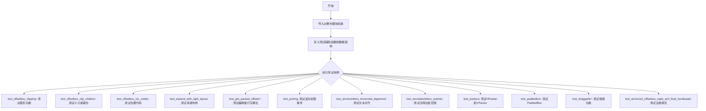

## 类结构

```
TestBase (测试基类)
├── test_offsetbox_clipping (裁剪功能测试)
├── test_offsetbox_clip_children (子元素裁剪测试)
├── test_offsetbox_loc_codes (位置代码测试)
├── test_expand_with_tight_layout (紧凑布局测试)
├── test_get_packed_offsets* (偏移量打包算法测试)
│   ├── test_get_packed_offsets_fixed
│   ├── test_get_packed_offsets_expand
│   ├── test_get_packed_offsets_equal
│   └── test_get_packed_offsets_equal_total_none_sep_none
├── test_picking (鼠标拾取测试)
├── test_anchoredtext_horizontal_alignment (文本对齐测试)
├── test_annotationbbox_extents (注释边框范围测试)
├── test_zorder (z顺序测试)
├── test_arrowprops_copied (箭头属性复制测试)
├── test_packers (打包器测试)
│   ├── HPacker (水平打包)
│   └── VPacker (垂直打包)
├── test_paddedbox_default_values (PaddedBox默认值测试)
├── test_annotationbbox_properties (AnnotationBbox属性测试)
├── test_textarea_properties (TextArea属性测试)
├── test_textarea_set_text (TextArea文本设置测试)
├── test_paddedbox (PaddedBox测试)
├── test_remove_draggable (可拖拽移除测试)
├── test_draggable_in_subfigure (子图中拖拽测试)
└── test_anchored_offsetbox_tuple_and_float_borderpad (边框填充测试)
```

## 全局变量及字段


### `_Params`
    
A named tuple for storing test parameters including widths, total, separator and expected values

类型：`namedtuple`
    


### `codes`
    
Dictionary mapping location code strings to their numeric values for AnchoredOffsetbox positioning

类型：`dict`
    


### `size`
    
Integer dimension value used for creating square DrawingArea and graphical elements

类型：`int`
    


### `da`
    
DrawingArea instance used as a child container for graphical artists with clipping enabled

类型：`DrawingArea`
    


### `bg`
    
Matplotlib Rectangle patch serving as background for the DrawingArea

类型：`Rectangle`
    


### `line`
    
Matplotlib Line2D object drawn across the DrawingArea to test clipping behavior

类型：`Line2D`
    


### `anchored_box`
    
AnchoredOffsetbox container positioning its child at specified location in axes

类型：`AnchoredOffsetbox`
    


### `picking_child`
    
Child object used in picking tests - varies based on child_type parameter

类型：`DrawingArea|OffsetImage|TextArea`
    


### `ab`
    
AnnotationBbox instance with picker enabled for mouse event testing

类型：`AnnotationBbox`
    


### `calls`
    
List accumulator for storing pick events triggered during mouse interaction tests

类型：`list`
    


### `hpacker`
    
Horizontal packer container arranging child DrawingArea objects side by side

类型：`HPacker`
    


### `vpacker`
    
Vertical packer container stacking child DrawingArea objects vertically

类型：`VPacker`
    


### `x1`
    
Integer width dimension for first DrawingArea in packer tests

类型：`int`
    


### `y1`
    
Integer height dimension for first DrawingArea in packer tests

类型：`int`
    


### `x2`
    
Integer width dimension for second DrawingArea in packer tests

类型：`int`
    


### `y2`
    
Integer height dimension for second DrawingArea in packer tests

类型：`int`
    


### `r1`
    
First DrawingArea instance used as child element in packer containers

类型：`DrawingArea`
    


### `r2`
    
Second DrawingArea instance used as child element in packer containers

类型：`DrawingArea`
    


### `bbox`
    
Bounding box object returned by get_bbox method for layout calculations

类型：`Bbox`
    


### `at`
    
AnchoredText instance wrapped inside PaddedBox for padding and frame testing

类型：`AnchoredText`
    


### `pb`
    
PaddedBox container adding padding around its child element with optional frame

类型：`PaddedBox`
    


### `ta`
    
TextArea containing text content for placement in various offset boxes

类型：`TextArea`
    


### `an`
    
Matplotlib Annotation object for text labeling with optional draggable behavior

类型：`Annotation`
    


### `ann`
    
Annotation placed in subfigure for testing draggable functionality in nested figures

类型：`Annotation`
    


### `text_float`
    
AnchoredText with float borderpad value serving as baseline for comparison tests

类型：`AnchoredText`
    


### `text_tuple_equal`
    
AnchoredText with symmetric tuple borderpad for equality verification

类型：`AnchoredText`
    


### `text_tuple_asym`
    
AnchoredText with asymmetric tuple borderpad for offset verification

类型：`AnchoredText`
    


### `pos_float`
    
Window extent bounding box of text_float for positional comparison

类型：`Bbox`
    


### `pos_tuple_equal`
    
Window extent bounding box of text_tuple_equal for equality verification

类型：`Bbox`
    


### `pos_tuple_asym`
    
Window extent bounding box of text_tuple_asym for asymmetric padding verification

类型：`Bbox`
    


### `AnchoredOffsetbox.loc`
    
Location code specifying which corner or side to anchor the box

类型：`str|int`
    


### `AnchoredOffsetbox.child`
    
Child OffsetBox instance to be positioned within the AnchoredOffsetbox

类型：`OffsetBox`
    


### `AnchoredOffsetbox.pad`
    
Padding distance around the child element in points

类型：`float`
    


### `AnchoredOffsetbox.frameon`
    
Boolean flag controlling whether a frame is drawn around the box

类型：`bool`
    


### `AnchoredOffsetbox.bbox_to_anchor`
    
Target bounding box or coordinate tuple specifying anchor position

类型：`Bbox|tuple`
    


### `AnchoredOffsetbox.bbox_transform`
    
Transform object defining coordinate system for bbox_to_anchor

类型：`Transform`
    


### `AnchoredOffsetbox.borderpad`
    
Padding between box edge and border frame, accepts float or tuple for asymmetric values

类型：`float|tuple`
    


### `AnnotationBbox.xycoords`
    
Coordinate system for xy position, e.g., 'data', 'axes fraction'

类型：`str|Transform`
    


### `AnnotationBbox.boxcoords`
    
Coordinate system for box position, e.g., 'axes fraction', 'offset points'

类型：`str|Transform`
    


### `AnnotationBbox.xyann`
    
Position offset from xy for the annotation text or box

类型：`tuple`
    


### `AnnotationBbox.anncoords`
    
Coordinate system for annotation position (anncoords)

类型：`str`
    


### `AnnotationBbox.arrowprops`
    
Dictionary of arrow properties for drawing connection line

类型：`dict`
    


### `AnnotationBbox.box_alignment`
    
Tuple of (horizontal, vertical) alignment values for box positioning

类型：`tuple`
    


### `AnchoredText.txt`
    
Internal TextArea instance containing the actual text content

类型：`TextArea`
    


### `AnchoredText.pad`
    
Padding around the text inside the anchored text box

类型：`float`
    


### `AnchoredText.prop`
    
Dictionary of text properties like font size, color, alignment

类型：`dict`
    


### `DrawingArea.width`
    
Width dimension of the drawing area in points

类型：`float`
    


### `DrawingArea.height`
    
Height dimension of the drawing area in points

类型：`float`
    


### `DrawingArea.xdescent`
    
Horizontal descent for baseline alignment

类型：`float`
    


### `DrawingArea.ydescent`
    
Vertical descent for baseline alignment

类型：`float`
    


### `DrawingArea.clip_children`
    
Boolean flag enabling clipping of child artists to drawing area bounds

类型：`bool`
    


### `HPacker.children`
    
List of child OffsetBox instances arranged horizontally

类型：`list`
    


### `HPacker.align`
    
Alignment mode for children: 'baseline', 'bottom', 'top', 'left', 'right', 'center'

类型：`str`
    


### `VPacker.children`
    
List of child OffsetBox instances arranged vertically

类型：`list`
    


### `VPacker.align`
    
Alignment mode for children: 'baseline', 'bottom', 'top', 'left', 'right', 'center'

类型：`str`
    


### `OffsetBox.zorder`
    
Drawing order index determining stacking position relative to other artists

类型：`int`
    


### `OffsetImage.image`
    
NumPy array containing image pixel data

类型：`ndarray`
    


### `OffsetImage.zoom`
    
Magnification factor for scaling the image

类型：`float`
    


### `PaddedBox.child`
    
Child OffsetBox instance to be padded

类型：`OffsetBox`
    


### `PaddedBox.pad`
    
Padding distance around the child element

类型：`float`
    


### `PaddedBox.patch_attrs`
    
Dictionary of patch properties like facecolor, edgecolor

类型：`dict`
    


### `PaddedBox.draw_frame`
    
Boolean flag controlling whether to draw the frame around padded box

类型：`bool`
    


### `TextArea.text`
    
Text string content to be displayed

类型：`str`
    


### `TextArea.textprops`
    
Dictionary of text styling properties like fontsize, color

类型：`dict`
    


### `TextArea.multilinebaseline`
    
Boolean flag for enabling baseline alignment across multiple lines

类型：`bool`
    
    

## 全局函数及方法


### `test_offsetbox_clipping`

该函数是一个图像比对测试，用于验证 Matplotlib 中 `DrawingArea` 的子元素裁剪功能是否正常工作。测试创建一个包含 `DrawingArea` 的 `AnchoredOffsetbox`，其中放置一个灰色背景矩形和一条超出边界的黑线，验证黑线是否被正确裁剪到 `DrawingArea` 的边界内。

参数： 无

返回值： 无（测试函数，不返回值）

#### 流程图

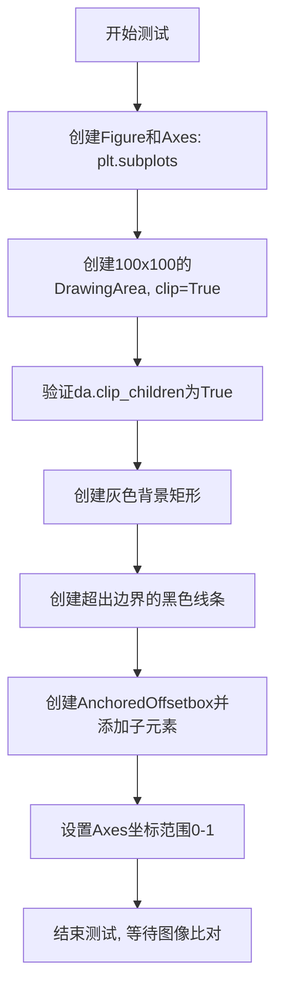

#### 带注释源码

```python
@image_comparison(['offsetbox_clipping'], remove_text=True)
def test_offsetbox_clipping():
    """
    测试DrawingArea的子元素裁剪功能
    
    测试步骤：
    1. 创建一个plot
    2. 在axes中心放置一个包含DrawingArea子元素的AnchoredOffsetbox
    3. 为DrawingArea设置灰色背景
    4. 在DrawingArea边界上放置一条黑线
    5. 验证黑线被裁剪到DrawingArea的边缘
    """
    # 创建图形和坐标轴
    fig, ax = plt.subplots()
    
    # 设置DrawingArea的尺寸
    size = 100
    
    # 创建DrawingArea，启用子元素裁剪
    da = DrawingArea(size, size, clip=True)
    
    # 断言：验证clip_children属性已被设置
    assert da.clip_children
    
    # 创建灰色背景矩形 (100x100)
    bg = mpatches.Rectangle((0, 0), size, size,
                            facecolor='#CCCCCC',
                            edgecolor='None',
                            linewidth=0)
    
    # 创建黑色线条，长度超出DrawingArea边界
    # 线条从 -50 到 150 (DrawingArea范围是0-100)
    line = mlines.Line2D([-size*.5, size*1.5], [size/2, size/2],
                         color='black',
                         linewidth=10)
    
    # 创建AnchoredOffsetbox，将DrawingArea放置在axes中心
    anchored_box = AnchoredOffsetbox(
        loc='center',
        child=da,
        pad=0.,
        frameon=False,
        bbox_to_anchor=(.5, .5),
        bbox_transform=ax.transAxes,
        borderpad=0.)
    
    # 将背景和线条添加到DrawingArea
    da.add_artist(bg)
    da.add_artist(line)
    
    # 将anchored_box添加到坐标轴
    ax.add_artist(anchored_box)
    
    # 设置坐标轴范围
    ax.set_xlim(0, 1)
    ax.set_ylim(0, 1)
```


### `test_offsetbox_clip_children`

该测试函数用于验证 matplotlib 中 `DrawingArea` 的子元素裁剪功能，通过创建包含灰色背景和超出边界线条的 `DrawingArea`，并检查修改 `clip_children` 属性后图形是否正确标记为需要重绘（`stale`）。

参数： 无

返回值： 无

#### 流程图

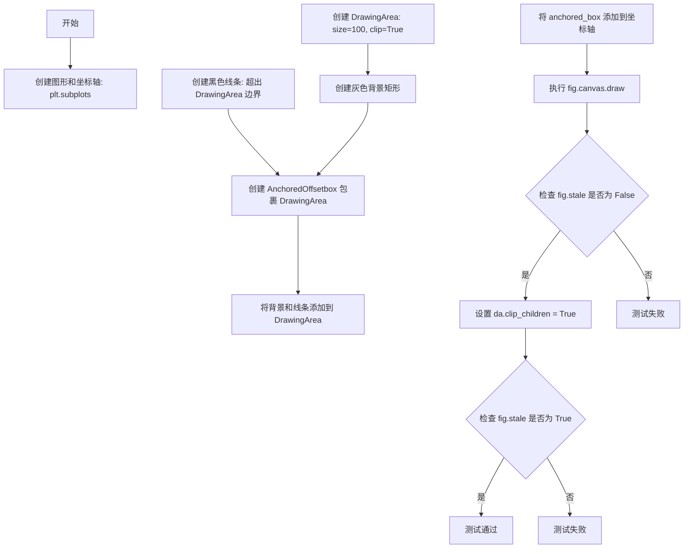

#### 带注释源码

```python
def test_offsetbox_clip_children():
    """
    测试 DrawingArea 的 clip_children 属性功能。
    
    测试步骤：
    1. 创建一个包含 DrawingArea 的 AnchoredOffsetbox
    2. DrawingArea 包含一个灰色背景矩形和一条超出其边界的黑色线条
    3. 验证初始绘制后 fig.stale 为 False（不需要重绘）
    4. 修改 clip_children 属性后验证 fig.stale 变为 True（需要重绘）
    """
    # 创建图形和坐标轴
    fig, ax = plt.subplots()
    
    # 定义 DrawingArea 的大小
    size = 100
    
    # 创建 DrawingArea，启用 clip=True 启用子元素裁剪
    da = DrawingArea(size, size, clip=True)
    
    # 创建灰色背景矩形，覆盖整个 DrawingArea 区域
    bg = mpatches.Rectangle((0, 0), size, size,
                            facecolor='#CCCCCC',
                            edgecolor='None',
                            linewidth=0)
    
    # 创建黑色线条，宽度超出 DrawingArea 的边界
    # 线条从 -size*.5 到 size*1.5，超出了 [0, size] 的范围
    line = mlines.Line2D([-size*.5, size*1.5], [size/2, size/2],
                         color='black',
                         linewidth=10)
    
    # 创建 AnchoredOffsetbox，将 DrawingArea 放置在坐标轴中心
    anchored_box = AnchoredOffsetbox(
        loc='center',
        child=da,
        pad=0.,
        frameon=False,
        bbox_to_anchor=(.5, .5),
        bbox_transform=ax.transAxes,
        borderpad=0.)
    
    # 将背景和线条添加到 DrawingArea
    da.add_artist(bg)
    da.add_artist(line)
    
    # 将 anchored_box 添加到坐标轴
    ax.add_artist(anchored_box)
    
    # 第一次绘制，初始化所有artist的位置和缓存
    fig.canvas.draw()
    
    # 断言：初始状态下 figure 不需要重绘
    assert not fig.stale
    
    # 开启子元素裁剪功能
    # 这会触发 figure 标记为 stale，因为渲染行为可能改变
    da.clip_children = True
    
    # 断言：修改 clip_children 后，figure 需要重绘
    assert fig.stale
```


### `test_offsetbox_loc_codes`

该测试函数用于验证matplotlib中AnchoredOffsetbox能够正确处理所有有效的位置字符串代码（如'upper right'、'center'等），确保每种位置码都能成功创建并渲染到图表上。

参数： 无

返回值：`None`，该函数为测试函数，不返回任何值，仅通过创建对象和绘制来验证正确性

#### 流程图

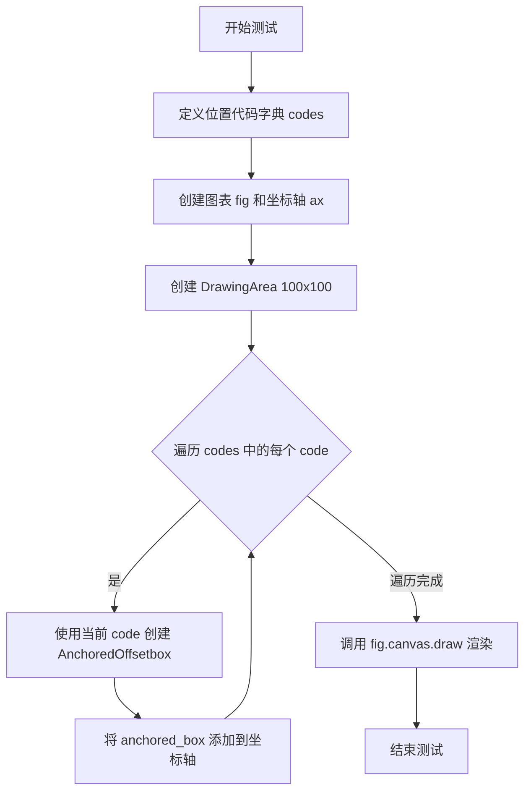

#### 带注释源码

```python
def test_offsetbox_loc_codes():
    # 测试目的：验证所有有效的字符串位置代码都能与 AnchoredOffsetbox 正常工作
    
    # 定义位置代码字典，键为位置名称，值为对应的整数码
    codes = {'upper right': 1,    # 右上角
             'upper left': 2,     # 左上角
             'lower left': 3,     # 左下角
             'lower right': 4,    # 右下角
             'right': 5,          # 右侧居中
             'center left': 6,    # 左侧居中
             'center right': 7,   # 右侧居中
             'lower center': 8,   # 底部居中
             'upper center': 9,   # 顶部居中
             'center': 10,         # 正中心
             }
    
    # 创建图形和坐标轴对象
    fig, ax = plt.subplots()
    
    # 创建一个100x100的绘图区域
    da = DrawingArea(100, 100)
    
    # 遍历所有位置代码
    for code in codes:
        # 使用每个位置代码创建 AnchoredOffsetbox
        # loc参数接受字符串格式的位置代码
        anchored_box = AnchoredOffsetbox(loc=code, child=da)
        
        # 将创建的偏移框添加到坐标轴
        ax.add_artist(anchored_box)
    
    # 渲染画布，确保所有对象正确绘制
    # 如果位置代码处理有问题，这一步可能会抛出异常
    fig.canvas.draw()
```


### `test_expand_with_tight_layout`

该函数是一个测试用例，用于验证在使用 `legend` 的 `mode='expand'` 模式时调用 `tight_layout()` 方法不会导致程序崩溃。该测试针对 GitHub 问题 #10476 和 #10784 中报告的崩溃问题进行验证。

参数：

- 无参数

返回值：`None`，无返回值（测试函数）

#### 流程图

```mermaid
flowchart TD
    A[开始测试] --> B[创建 Figure 和 Axes 对象: plt.subplots]
    B --> C[定义数据序列 d1 = [1, 2]]
    C --> D[定义数据序列 d2 = [2, 1]]
    D --> E[绘制数据系列 d1, 标签为 'series 1']
    E --> F[绘制数据系列 d2, 标签为 'series 2']
    F --> G[创建扩展模式图例: ax.legend ncols=2, mode='expand']
    G --> H[调用 fig.tight_layout 布局调整]
    H --> I{是否发生崩溃}
    I -->|否| J[测试通过]
    I -->|是| K[测试失败]
    J --> L[结束测试]
    K --> L
```

#### 带注释源码

```python
def test_expand_with_tight_layout():
    """
    测试函数：验证 legend expand 模式与 tight_layout 的兼容性
    
    该测试用于检查以下 GitHub Issue 中报告的问题：
    - #10476: legend with mode='expand' and tight_layout crash
    - #10784: 相关问题的更新修复
    
    Returns:
        None: 此测试函数不返回任何值，仅验证执行过程中是否发生异常
    """
    
    # 创建一个新的 Figure 和 Axes 对象
    # 这是 matplotlib 绘图的标准初始化步骤
    fig, ax = plt.subplots()
    
    # 定义第一个数据系列
    d1 = [1, 2]
    
    # 定义第二个数据系列
    d2 = [2, 1]
    
    # 在 Axes 上绘制第一个数据系列，并设置标签
    # label 参数用于图例显示
    ax.plot(d1, label='series 1')
    
    # 在 Axes 上绘制第二个数据系列，并设置标签
    ax.plot(d2, label='series 2')
    
    # 创建图例，ncols=2 表示分为两列
    # mode='expand' 表示图例框水平扩展以填满可用空间
    # 这是触发原始崩溃问题的关键配置
    ax.legend(ncols=2, mode='expand')
    
    # 调用 tight_layout() 进行布局调整
    # 这里是曾经发生崩溃的位置 (#10476)
    # 测试确保在 legend expand 模式下调用 tight_layout 不会崩溃
    fig.tight_layout()
```


### `test_get_packed_offsets`

该函数是一个参数化测试函数（pytest），用于验证底层函数 `_get_packed_offsets` 在不同参数组合下的行为是否产生异常（"烟雾测试"），确保在高层次调用（如 `Axes.legend`）时不会触发边缘情况错误。

参数：

- `widths`：`list[int] | list[float]`，宽度列表，表示待打包的各个元素的宽度
- `total`：`int | float | None`，总宽度约束值，指定打包后的总宽度限制
- `sep`：`int | float | None`，元素之间的间距（separator）
- `mode`：`str`，打包模式，支持 "expand"、"fixed" 和 "equal"

返回值：`None`，该函数仅执行测试逻辑，不返回任何值

#### 流程图

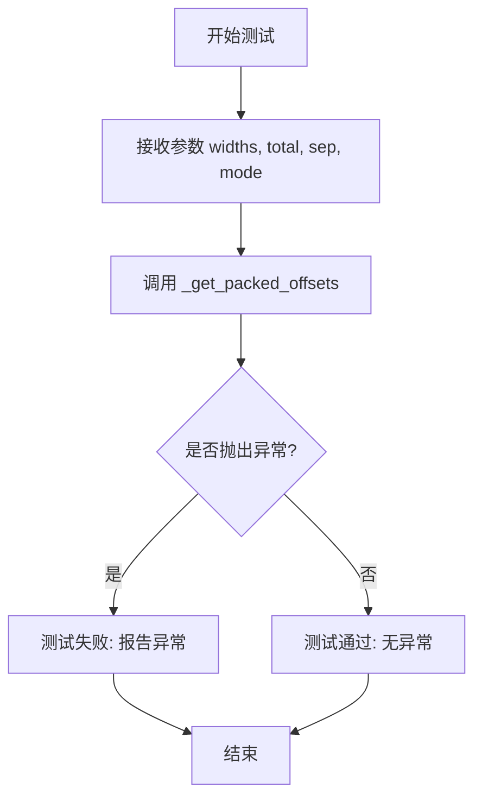

#### 带注释源码

```python
@pytest.mark.parametrize('widths',
                         ([150], [150, 150, 150], [0.1], [0.1, 0.1]))
@pytest.mark.parametrize('total', (250, 100, 0, -1, None))
@pytest.mark.parametrize('sep', (250, 1, 0, -1))
@pytest.mark.parametrize('mode', ("expand", "fixed", "equal"))
def test_get_packed_offsets(widths, total, sep, mode):
    # Check a (rather arbitrary) set of parameters due to successive similar
    # issue tickets (at least #10476 and #10784) related to corner cases
    # triggered inside this function when calling higher-level functions
    # (e.g. `Axes.legend`).
    # These are just some additional smoke tests. The output is untested.
    _get_packed_offsets(widths, total, sep, mode=mode)
```

---

### 相关补充信息

由于代码中仅提供了 `test_get_packed_offsets` 测试函数的调用部分，而 `_get_packed_offsets` 的实现源码位于 `matplotlib.offsetbox` 模块内部（未在当前代码文件中展开），以下补充内容基于测试代码中的使用方式进行推断：

#### 关键组件信息

| 组件名称 | 一句话描述 |
|---------|-----------|
| `_get_packed_offsets` | matplotlib offsetbox 模块内部的底层布局计算函数，用于计算多个子元素的打包偏移量 |
| `test_get_packed_offsets` | 参数化烟雾测试，验证 `_get_packed_offsets` 在各种极端参数组合下不崩溃 |

#### 潜在的技术债务或优化空间

1. **测试覆盖不完整**：当前测试仅验证函数不抛异常（烟雾测试），未对输出结果进行系统性断言，建议补充完整的输出验证测试用例
2. **参数边界值未充分测试**：如 `total=0`、`total=-1`、`sep=0`、`sep=-1` 等负数和零值边界情况的预期行为缺乏明确文档说明

#### 其他项目

- **设计目标**：该测试针对 #10476 和 #10784 等 issue 中发现的边缘情况（corner cases）进行回归测试，确保 `Axes.legend` 等高级函数在调用底层布局函数时不崩溃
- **错误处理**：`test_get_packed_offsets_equal_total_none_sep_none` 测试用例表明当 `total=None` 且 `sep=None` 时应抛出 `ValueError`，这说明函数内部有参数校验逻辑


### `test_get_packed_offsets_fixed`

这是一个测试函数，用于验证 `_get_packed_offsets` 函数在 `mode='fixed'` 模式下的正确性。测试函数通过参数化测试（pytest.mark.parametrize）验证不同的宽度列表、总宽度和间距组合是否能够正确计算packed offsets，并返回期望的总宽度和偏移量列表。

参数：

-  `widths`：`list`，表示要打包的子元素的宽度列表
-  `total`：`int` 或 `None`，表示容器的总宽度，如果为 None 则根据宽度和间距自动计算
-  `sep`：`int` 或 `None`，表示子元素之间的间距
-  `expected`：`namedtuple`（`_Params` 类型），包含期望的总宽度和偏移量列表

返回值：`None`，该函数不返回任何值，仅通过断言验证结果

#### 流程图

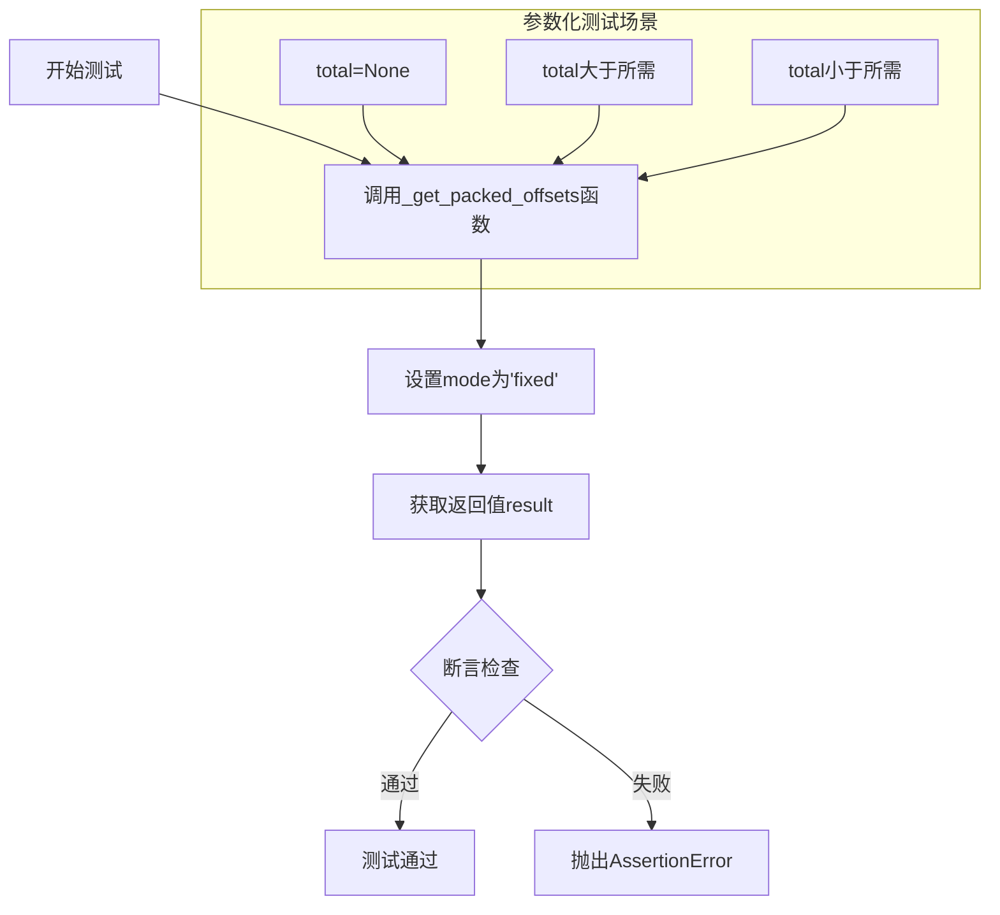

#### 带注释源码

```python
@pytest.mark.parametrize('widths, total, sep, expected', [
    _Params(  # 场景1：total为None，隐式计算总宽度
        [3, 1, 2], total=None, sep=1, expected=(8, [0, 4, 6])),
    _Params(  # 场景2：total大于实际需要的宽度
        [3, 1, 2], total=10, sep=1, expected=(10, [0, 4, 6])),
    _Params(  # 场景3：total小于实际需要的宽度（会截断）
        [3, 1, 2], total=5, sep=1, expected=(5, [0, 4, 6])),
])
def test_get_packed_offsets_fixed(widths, total, sep, expected):
    """
    测试_get_packed_offsets函数在fixed模式下的行为。
    
    Parameters:
    -----------
    widths : list
        子元素的宽度列表
    total : int or None
        容器的总宽度，None表示自动计算
    sep : int or None
        子元素之间的间距
    expected : _Params
        期望的返回值（total和offsets列表）
    """
    # 调用被测试的函数，mode固定为'fixed'
    result = _get_packed_offsets(widths, total, sep, mode='fixed')
    
    # 验证返回的总宽度是否与期望一致
    assert result[0] == expected[0]
    
    # 验证返回的偏移量列表是否与期望一致（使用近似比较）
    assert_allclose(result[1], expected[1])
```


### `test_get_packed_offsets_expand`

这是一个pytest参数化测试函数，用于验证 `_get_packed_offsets` 函数在 `mode='expand'` 模式下的行为是否正确。

参数：

- `widths`：`list[float] | list[int]`，要排列的元素宽度列表
- `total`：`int | None`，总宽度约束，None表示自动计算
- `sep`：`int | None`，元素之间的间距，None表示自动计算
- `expected`：`tuple`，包含预期的总宽度和偏移量列表

返回值：`None`，该函数是测试函数，通过assert语句验证结果，无显式返回值

#### 流程图

```mermaid
flowchart TD
    A[开始测试] --> B[调用_get_packed_offsets函数]
    B --> C[mode参数固定为'expand']
    C --> D[获取计算结果: result]
    D --> E{验证结果}
    E -->|通过| F[result[0] == expected[0]]
    E -->|通过| G[result[1] ≈ expected[1]]
    F --> H[测试通过]
    G --> H
    E -->|失败| I[抛出AssertionError]
```

#### 带注释源码

```python
@pytest.mark.parametrize('widths, total, sep, expected', [
    _Params(  # total=None (implicit 1): 总宽度为None时，默认隐式总宽度为1
        [.1, .1, .1], total=None, sep=None, expected=(1, [0, .45, .9])),
    _Params(  # total larger than sum of widths: 总宽度大于元素宽度之和，有额外空间
        [3, 1, 2], total=10, sep=1, expected=(10, [0, 5, 8])),
    _Params(  # total smaller sum of widths: overlapping boxes: 总宽度小于元素宽度之和，元素会重叠
        [3, 1, 2], total=5, sep=1, expected=(5, [0, 2.5, 3])),
])
def test_get_packed_offsets_expand(widths, total, sep, expected):
    """
    测试_get_packed_offsets函数在expand模式下的行为
    
    expand模式的特点：
    - 当total=None时，默认使用total=1（隐式1）
    - 元素会扩展以填满可用空间
    - 元素之间保持相对位置关系
    """
    # 调用被测函数，mode固定为'expand'
    result = _get_packed_offsets(widths, total, sep, mode='expand')
    
    # 验证总宽度是否匹配
    assert result[0] == expected[0]
    
    # 验证偏移量列表是否近似匹配（使用assert_allclose处理浮点数精度）
    assert_allclose(result[1], expected[1])
```


我需要先查找`_get_packed_offsets`函数的具体实现，因为`test_get_packed_offsets_equal`测试的是这个函数。让我搜索matplotlib库中的实现。
[TOOL_CALL]
{tool => "python_executor", args => {
  --code "\nimport inspect\nimport matplotlib.offsetbox as mob\n\n# 获取_get_packed_offsets函数的源码\nif hasattr(mob, '_get_packed_offsets'):\n    source = inspect.getsource(mob._get_packed_offsets)\n    print(source)\nelse:\n    print(\"Function not found in matplotlib.offsetbox\")\n"
}}
[/TOOL_CALL]


### `test_get_packed_offsets_equal_total_none_sep_none`

该测试函数用于验证当布局模式为 `equal`、且 `total` 和 `sep` 参数均为 `None` 时，`_get_packed_offsets` 函数能够正确抛出 `ValueError` 异常，以确保在缺少必要参数时函数不会产生意外行为。

参数： 无

返回值：`None`，测试函数无返回值，仅执行断言

#### 流程图

```mermaid
flowchart TD
    A[开始测试] --> B[调用_get_packed_offsets函数]
    B --> C[传入参数: widths=[1,1,1], total=None, sep=None, mode='equal']
    C --> D{函数是否抛出ValueError?}
    D -->|是| E[测试通过]
    D -->|否| F[测试失败]
```

#### 带注释源码

```python
def test_get_packed_offsets_equal_total_none_sep_none():
    """
    测试当mode为'equal'且total和sep均为None时,
    _get_packed_offsets函数是否正确抛出ValueError。
    
    这是对_get_packed_offsets函数边界条件的测试,
    确保在缺少必要参数时能够给出明确的错误提示。
    """
    # 使用pytest.raises上下文管理器验证函数会抛出ValueError
    with pytest.raises(ValueError):
        # 调用_get_packed_offsets,传入无效参数组合
        # widths: 宽度列表[1,1,1]
        # total: None (无效,equal模式需要指定total)
        # sep: None (无效,equal模式需要指定sep)
        # mode: 'equal' (等间距布局模式)
        _get_packed_offsets([1, 1, 1], total=None, sep=None, mode='equal')
```


### `test_picking`

该测试函数用于验证 `AnnotationBbox` 的拾取（picking）功能是否正常工作。测试会创建包含不同类型子元素（DrawingArea、OffsetImage、TextArea）的 AnnotationBbox，并验证在不同的坐标系统下，鼠标点击事件能否正确触发 pick_event，以及当注释框被隐藏时不再触发 pick_event。

参数：

- `child_type`：`str`，测试子元素的类型，可选值为 'draw'、'image' 或 'text'，分别代表 DrawingArea、OffsetImage 和 TextArea
- `boxcoords`：`str`，AnnotationBbox 的坐标系统，可选值为 'axes fraction'、'axes pixels'、'axes points' 或 'data'

返回值：`None`，该函数为测试函数，不返回任何值

#### 流程图

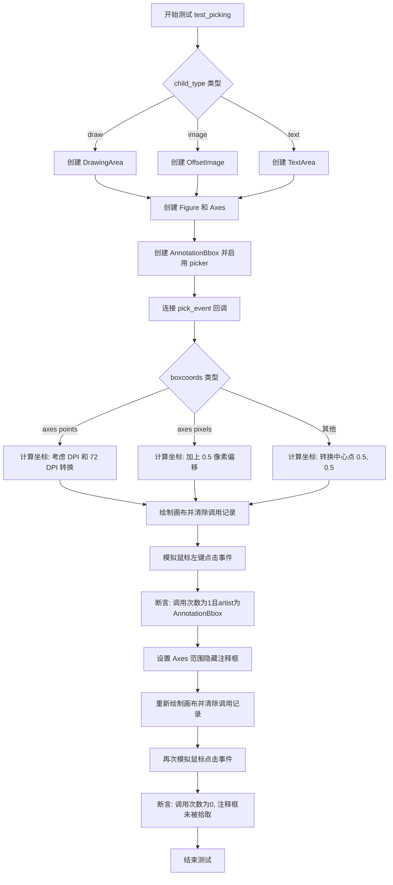

#### 带注释源码

```python
@pytest.mark.parametrize('child_type', ['draw', 'image', 'text'])
@pytest.mark.parametrize('boxcoords',
                         ['axes fraction', 'axes pixels', 'axes points',
                          'data'])
def test_picking(child_type, boxcoords):
    # 根据 child_type 创建不同的子元素用于测试拾取功能
    # 这些元素占据大约相同的区域
    if child_type == 'draw':
        # 创建 DrawingArea 并添加一个矩形作为子元素
        picking_child = DrawingArea(5, 5)
        picking_child.add_artist(mpatches.Rectangle((0, 0), 5, 5, linewidth=0))
    elif child_type == 'image':
        # 创建图像数组，中间设置一个像素为0（黑色）
        im = np.ones((5, 5))
        im[2, 2] = 0
        picking_child = OffsetImage(im)
    elif child_type == 'text':
        # 创建包含黑色方块符号的文本区域
        picking_child = TextArea('\N{Black Square}', textprops={'fontsize': 5})
    else:
        assert False, f'Unknown picking child type {child_type}'

    # 创建图表和坐标轴
    fig, ax = plt.subplots()
    # 创建 AnnotationBbox，使用指定的坐标系统
    ab = AnnotationBbox(picking_child, (0.5, 0.5), boxcoords=boxcoords)
    # 启用该注释框的拾取功能
    ab.set_picker(True)
    ax.add_artist(ab)

    # 用于记录 pick_event 调用的列表
    calls = []
    # 连接到 pick_event 事件，当发生拾取时将事件添加到 calls 列表
    fig.canvas.mpl_connect('pick_event', lambda event: calls.append(event))

    # 计算鼠标事件的坐标位置，根据不同的 boxcoords 类型
    # Annotation 应该能够在其中心位置被拾取
    if boxcoords == 'axes points':
        # axes points 坐标需要考虑 DPI 和 point 转换
        x, y = ax.transAxes.transform_point((0, 0))
        x += 0.5 * fig.dpi / 72
        y += 0.5 * fig.dpi / 72
    elif boxcoords == 'axes pixels':
        # axes pixels 坐标需要加0.5像素偏移
        x, y = ax.transAxes.transform_point((0, 0))
        x += 0.5
        y += 0.5
    else:
        # 其他情况（axes fraction, data）使用中心点坐标
        x, y = ax.transAxes.transform_point((0.5, 0.5))
    
    # 绘制画布以渲染注释框
    fig.canvas.draw()
    # 清除之前的调用记录
    calls.clear()
    # 模拟鼠标左键点击事件在计算出的坐标位置
    MouseEvent(
        "button_press_event", fig.canvas, x, y, MouseButton.LEFT)._process()
    # 断言：应该触发一次 pick_event，且 artist 是 AnnotationBbox
    assert len(calls) == 1 and calls[0].artist == ab

    # 测试当注释框被隐藏时，不应该触发 pick_event
    # 当坐标轴范围改变到足以隐藏 xy 点时
    ax.set_xlim(-1, 0)
    ax.set_ylim(-1, 0)
    fig.canvas.draw()
    calls.clear()
    # 再次模拟相同的鼠标点击事件
    MouseEvent(
        "button_press_event", fig.canvas, x, y, MouseButton.LEFT)._process()
    # 断言：调用次数为0，因为注释框已被隐藏
    assert len(calls) == 0
```


### `test_anchoredtext_horizontal_alignment`

这是一个测试函数，用于验证 `AnchoredText` 组件在不同水平对齐方式（left、center、right）下的渲染行为是否符合预期。通过创建三个具有不同对齐属性的 `AnchoredText` 对象并添加到图表中，该测试结合图像比较装饰器 `@image_comparison` 来验证输出图像是否与预期图像一致。

参数： 无（该测试函数没有显式参数，由 pytest 框架和装饰器隐式控制）

返回值： 无（测试函数通常不返回有意义的值，主要通过断言或图像比较进行验证）

#### 流程图

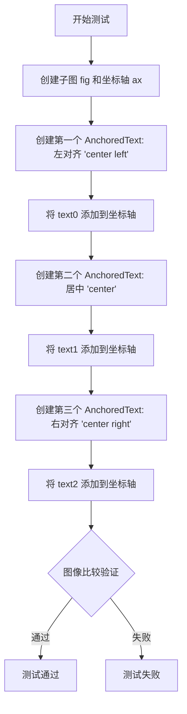

#### 带注释源码

```python
@image_comparison(['anchoredtext_align.png'], remove_text=True, style='mpl20')
def test_anchoredtext_horizontal_alignment():
    """
    测试 AnchoredText 在不同水平对齐方式下的渲染效果。
    
    装饰器参数说明:
    - 'anchoredtext_align.png': 预期输出图像文件名
    - remove_text=True: 移除图像中的文本以专注于布局验证
    - style='mpl20': 使用 mpl20 样式进行渲染
    """
    # 创建一个新的图形和一个坐标轴
    fig, ax = plt.subplots()

    # 创建第一个 AnchoredText: 左对齐 (horizontal alignment = left)
    # loc="center left" 指定文本框位于坐标轴的中心左侧
    # pad=0.2 指定内边距
    # prop={"ha": "left"} 设置文本的水平对齐方式为左对齐
    text0 = AnchoredText("test\ntest long text", loc="center left",
                         pad=0.2, prop={"ha": "left"})
    ax.add_artist(text0)

    # 创建第二个 AnchoredText: 居中对齐 (horizontal alignment = center)
    # loc="center" 指定文本框位于坐标轴的中心
    # prop={"ha": "center"} 设置文本的水平对齐方式为居中
    text1 = AnchoredText("test\ntest long text", loc="center",
                         pad=0.2, prop={"ha": "center"})
    ax.add_artist(text1)

    # 创建第三个 AnchoredText: 右对齐 (horizontal alignment = right)
    # loc="center right" 指定文本框位于坐标轴的中心右侧
    # prop={"ha": "right"} 设置文本的水平对齐方式为右对齐
    text2 = AnchoredText("test\ntest long text", loc="center right",
                         pad=0.2, prop={"ha": "right"})
    ax.add_artist(text2)
```


### `test_annotationbbox_extents`

这是一个测试函数，用于验证 `AnnotationBbox` 和 `Annotation` 对象的边界框计算是否正确，包括 `window_extent` 和 `tightbbox` 两种模式。

参数：

- `extent_kind`：`str`，指定要测试的边界框类型，可选值为 "window_extent" 或 "tightbbox"

返回值：`None`，该函数为测试函数，通过断言验证边界框计算的准确性

#### 流程图

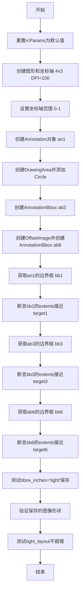

#### 带注释源码

```python
@pytest.mark.parametrize("extent_kind", ["window_extent", "tightbbox"])
def test_annotationbbox_extents(extent_kind):
    """
    测试AnnotationBbox和Annotation的边界框计算
    
    Parameters:
        extent_kind: str, 要测试的边界框类型，可选"window_extent"或"tightbbox"
    """
    # 重置matplotlib的rcParams为默认值，确保测试环境一致性
    plt.rcParams.update(plt.rcParamsDefault)
    
    # 创建图形和坐标轴，设置尺寸为4x3英寸，DPI为100
    fig, ax = plt.subplots(figsize=(4, 3), dpi=100)

    # 设置坐标轴的范围为[0, 1] x [0, 1]
    ax.axis([0, 1, 0, 1])

    # 创建第一个Annotation对象，位置在(0.9, 0.9)，文本位置在(1.1, 1.1)
    an1 = ax.annotate("Annotation", xy=(.9, .9), xytext=(1.1, 1.1),
                      arrowprops=dict(arrowstyle="->"), clip_on=False,
                      va="baseline", ha="left")

    # 创建DrawingArea对象，用于容纳自定义图形
    # 参数: 宽度20, 高度20, xdescent=0, ydescent=0, clip=True启用裁剪
    da = DrawingArea(20, 20, 0, 0, clip=True)
    
    # 创建圆形Patch并添加到DrawingArea
    # 圆心在(-10, 30)，半径为32
    p = mpatches.Circle((-10, 30), 32)
    da.add_artist(p)

    # 创建第一个AnnotationBbox (ab3)
    # 位置在数据坐标(0.5, 0.5)，盒坐标为axes fraction
    ab3 = AnnotationBbox(da, [.5, .5], xybox=(-0.2, 0.5), xycoords='data',
                         boxcoords="axes fraction", box_alignment=(0., .5),
                         arrowprops=dict(arrowstyle="->"))
    ax.add_artist(ab3)

    # 创建随机图像并添加到坐标轴
    im = OffsetImage(np.random.rand(10, 10), zoom=3)
    im.image.axes = ax
    
    # 创建第二个AnnotationBbox (ab6)
    # 使用offset points作为boxcoords
    ab6 = AnnotationBbox(im, (0.5, -.3), xybox=(0, 75),
                         xycoords='axes fraction',
                         boxcoords="offset points", pad=0.3,
                         arrowprops=dict(arrowstyle="->"))
    ax.add_artist(ab6)

    # 测试Annotation的边界框
    # 根据extent_kind参数动态调用get_window_extent()或get_tightbbox()
    bb1 = getattr(an1, f"get_{extent_kind}")()

    # 预期的边界框数值 [x0, y0, x1, y1]
    target1 = [332.9, 242.8, 467.0, 298.9]
    # 验证计算结果与预期值的接近程度，容差为2
    assert_allclose(bb1.extents, target1, atol=2)

    # 测试第一个AnnotationBbox的边界框
    bb3 = getattr(ab3, f"get_{extent_kind}")()

    target3 = [-17.6, 129.0, 200.7, 167.9]
    assert_allclose(bb3.extents, target3, atol=2)

    # 测试第二个AnnotationBbox的边界框
    bb6 = getattr(ab6, f"get_{extent_kind}")()

    target6 = [180.0, -32.0, 230.0, 92.9]
    assert_allclose(bb6.extents, target6, atol=2)

    # 测试bbox_inches='tight'功能
    # 将图形保存到内存缓冲区，使用tight bbox模式
    buf = io.BytesIO()
    fig.savefig(buf, bbox_inches='tight')
    buf.seek(0)
    # 读取保存的图像并获取其形状
    shape = plt.imread(buf).shape
    
    # 预期的图像形状 (高度, 宽度, 通道数)
    targetshape = (350, 504, 4)
    assert_allclose(shape, targetshape, atol=2)

    # 简单的smoke test，验证tight_layout不会报错
    fig.canvas.draw()
    fig.tight_layout()
    fig.canvas.draw()
```


### `test_zorder`

这是一个测试函数，用于验证 `OffsetBox` 类的 `zorder` 属性是否能够在实例化时正确设置并被正确读取。

参数：

- （无参数）

返回值：`None`，该函数没有显式返回值，通过 `assert` 断言来验证功能。

#### 流程图

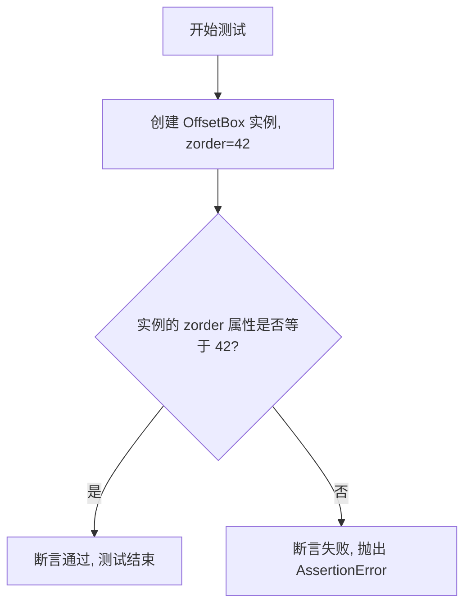

#### 带注释源码

```python
def test_zorder():
    """
    Test that the zorder attribute is correctly set and retrieved for OffsetBox.
    
    This test verifies that when an OffsetBox is instantiated with a specific
    zorder value, that value is correctly stored and can be retrieved.
    """
    # Create an OffsetBox instance with zorder=42
    # Then verify that the zorder attribute returns the expected value
    assert OffsetBox(zorder=42).zorder == 42
```


### `test_arrowprops_copied`

该测试函数用于验证 `AnnotationBbox` 在初始化时是否正确复制了 `arrowprops` 字典，而不是直接引用传入的原始字典对象。这确保了对箭头属性的修改不会影响原始字典。

参数：无需参数

返回值：`None`，该函数为测试函数，通过断言验证行为，不返回任何值。

#### 流程图

```mermaid
flowchart TD
    A[开始测试] --> B[创建 DrawingArea 对象]
    B --> C[创建 arrowprops 字典]
    C --> D[创建 AnnotationBbox 并传入 arrowprops]
    D --> E{断言: ab.arrowprops is not ab}
    E -->|通过| F{断言: arrowprops['relpos'] == (.3, .7)}
    F -->|通过| G[测试通过]
    E -->|失败| H[抛出 AssertionError]
    F -->|失败| I[抛出 AssertionError]
```

#### 带注释源码

```python
def test_arrowprops_copied():
    # 创建一个 20x20 大小的 DrawingArea 对象，启用子元素裁剪
    da = DrawingArea(20, 20, 0, 0, clip=True)
    
    # 定义箭头属性字典，包含箭头样式和相对位置
    # arrowstyle: 箭头样式为 "->" (标准箭头)
    # relpos: 相对位置为 (0.3, 0.7)，即箭头起点在盒子的 30% 处，终点在 70% 处
    arrowprops = {"arrowstyle": "->", "relpos": (.3, .7)}
    
    # 创建 AnnotationBbox 对象，传入 arrowprops 字典
    # 参数说明：
    # - da: 子元素（DrawingArea）
    # - [.5, .5]: 标注位置（xy）
    # - xybox=(-0.2, 0.5): 标注框位置
    # - xycoords='data': 使用数据坐标
    # - boxcoords="axes fraction": 盒子坐标使用轴分数
    # - box_alignment=(0., .5): 盒子对齐方式
    # - arrowprops=arrowprops: 箭头属性
    ab = AnnotationBbox(da, [.5, .5], xybox=(-0.2, 0.5), xycoords='data',
                        boxcoords="axes fraction", box_alignment=(0., .5),
                        arrowprops=arrowprops)
    
    # 断言1: 验证 arrowprops 被复制而非直接引用
    # ab.arrowprops 不应该与 ab 对象本身相同（这是测试的核心目的）
    assert ab.arrowprops is not ab
    
    # 断言2: 验证原始 arrowprops 字典的内容未被修改
    # 确认 relpos 仍然是初始设置的 (.3, .7)
    assert arrowprops["relpos"] == (.3, .7)
```


### `test_packers`

该测试函数用于验证 Matplotlib 中水平打包器（HPacker）和垂直打包器（VPacker）在不同对齐方式下的布局计算是否正确。测试通过创建两个不同尺寸的 DrawingArea 子组件，使用参数化测试覆盖 6 种对齐模式（baseline、bottom、top、left、right、center），并断言边界框尺寸和内部元素偏移量是否符合预期。

参数：

- `align`：`str`，对齐方式参数，用于指定 HPacker 和 VPacker 的对齐模式，可选值为 "baseline"、"bottom"、"top"、"left"、"right"、"center"

返回值：`None`，该函数为测试函数，无返回值，主要通过 assert 语句进行验证

#### 流程图

```mermaid
flowchart TD
    A[开始测试 test_packers] --> B[创建 DPI=72 的 Figure 和渲染器]
    B --> C[定义子组件尺寸: x1=10, y1=30, x2=20, y2=60]
    C --> D[创建两个 DrawingArea 子组件: r1, r2]
    D --> E[测试 HPacker 水平打包]
    E --> E1[创建 HPacker, children=[r1, r2], align=align]
    E1 --> E2[调用 draw 和 get_bbox 获取边界框]
    E2 --> E3[断言 bbox.bounds == (0, 0, x1+x2, max(y1,y2))]
    E3 --> E4{根据 align 计算 y_height}
    E4 --> E5[断言子组件偏移量符合预期]
    E5 --> F[测试 VPacker 垂直打包]
    F --> F1[创建 VPacker, children=[r1, r2], align=align]
    F1 --> F2[调用 draw 和 get_bbox 获取边界框]
    F2 --> F3[断言 bbox.bounds == (0, -max(y1,y2), max(x1,x2), y1+y2)]
    F3 --> F4{根据 align 计算 x_height}
    F4 --> F5[断言子组件偏移量符合预期]
    F5 --> G[测试结束]
```

#### 带注释源码

```python
@pytest.mark.parametrize("align", ["baseline", "bottom", "top",
                                   "left", "right", "center"])
def test_packers(align):
    """
    测试 HPacker 和 VPacker 在不同对齐方式下的布局计算。
    
    参数:
        align: str, 对齐方式, 可选 "baseline", "bottom", "top", "left", "right", "center"
    """
    # 设置 DPI=72 以便简化后续的数学计算（使点数与像素一一对应）
    fig = plt.figure(dpi=72)
    renderer = fig.canvas.get_renderer()

    # 定义两个子组件的尺寸：r1 宽10高30，r2 宽20高60
    x1, y1 = 10, 30
    x2, y2 = 20, 60
    
    # 创建两个 DrawingArea 子组件，用于测试打包器的布局能力
    r1 = DrawingArea(x1, y1)
    r2 = DrawingArea(x2, y2)

    # ==================== HPacker 水平打包测试 ====================
    # 创建水平打包器，将 r1 和 r2 并排放置
    hpacker = HPacker(children=[r1, r2], align=align)
    
    # 执行绘制以触发布局计算
    hpacker.draw(renderer)
    
    # 获取打包后的边界框
    bbox = hpacker.get_bbox(renderer)
    
    # 获取打包器的偏移位置（用于定位整个打包器在父容器中的位置）
    px, py = hpacker.get_offset(bbox, renderer)
    
    # 断言边界框尺寸：宽度=两子组件宽度之和，高度=两子组件的最大高度
    # 边界框原点为 (0, 0)
    assert_allclose(bbox.bounds, (0, 0, x1 + x2, max(y1, y2)))
    
    # 根据对齐方式计算内部元素的 y 轴偏移量
    if align in ("baseline", "left", "bottom"):
        # 底部/左侧/基线对齐：第一个子组件的 y 偏移为 0
        y_height = 0
    elif align in ("right", "top"):
        # 顶部/右侧对齐：第二个子组件与第一个顶部对齐
        y_height = y2 - y1
    elif align == "center":
        # 居中对齐：第二个子组件在垂直方向居中
        y_height = (y2 - y1) / 2
    
    # 断言每个子组件的偏移位置是否符合预期
    # r1 应在 (px, py + y_height)，r2 应在 (px + x1, py)
    assert_allclose([child.get_offset() for child in hpacker.get_children()],
                    [(px, py + y_height), (px + x1, py)])

    # ==================== VPacker 垂直打包测试 ====================
    # 创建垂直打包器，将 r1 和 r2 上下堆叠
    vpacker = VPacker(children=[r1, r2], align=align)
    
    # 执行绘制以触发布局计算
    vpacker.draw(renderer)
    
    # 获取打包后的边界框
    bbox = vpacker.get_bbox(renderer)
    
    # 获取打包器的偏移位置
    px, py = vpacker.get_offset(bbox, renderer)
    
    # 断言边界框尺寸：宽度=两子组件的最大宽度，高度=两子组件的高度之和
    # 边界框原点为 (0, -max(y1,y2))，因为 y 轴向上为正
    assert_allclose(bbox.bounds, (0, -max(y1, y2), max(x1, x2), y1 + y2))
    
    # 根据对齐方式计算内部元素的 x 轴偏移量
    if align in ("baseline", "left", "bottom"):
        # 底部/左侧/基线对齐：第一个子组件的 x 偏移为 0
        x_height = 0
    elif align in ("right", "top"):
        # 顶部/右侧对齐：第二个子组件与第一个右侧对齐
        x_height = x2 - x1
    elif align == "center":
        # 居中对齐：第二个子组件在水平方向居中
        x_height = (x2 - x1) / 2
    
    # 断言每个子组件的偏移位置是否符合预期
    # r1 应在 (px + x_height, py)，r2 应在 (px, py - y2)
    assert_allclose([child.get_offset() for child in vpacker.get_children()],
                    [(px + x_height, py), (px, py - y2)])
```


### `test_paddedbox_default_values`

这是一个烟雾测试函数，用于验证 `PaddedBox` 类的默认属性值是否正确设置，确保在使用 `AnchoredText` 作为子元素时能够正确渲染。

参数： 无

返回值：`None`，该函数不返回任何值，仅执行测试逻辑

#### 流程图

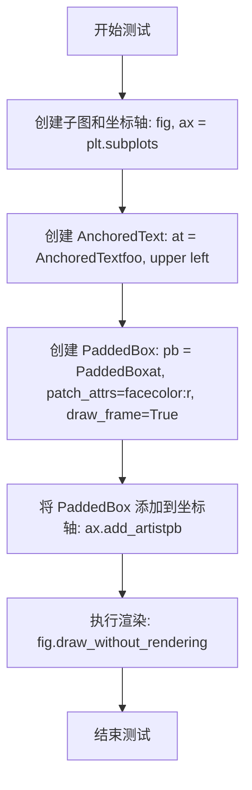

#### 带注释源码

```python
def test_paddedbox_default_values():
    # 烟雾测试：验证 PaddedBox 的默认属性值是否正确
    # 1. 创建一个新的图形和坐标轴对象
    fig, ax = plt.subplots()
    
    # 2. 创建一个 AnchoredText 对象（子元素）
    at = AnchoredText("foo",  'upper left')
    
    # 3. 创建 PaddedBox 包装器，传入 AnchoredText 作为子元素
    #    patch_attrs={'facecolor': 'r'}：设置填充颜色为红色
    #    draw_frame=True：绘制边框框架
    pb = PaddedBox(at, patch_attrs={'facecolor': 'r'}, draw_frame=True)
    
    # 4. 将 PaddedBox 作为艺术家添加到坐标轴
    ax.add_artist(pb)
    
    # 5. 执行图形渲染（不显示，仅计算布局）
    #    此调用会触发 PaddedBox 的 draw 方法和布局计算
    fig.draw_without_rendering()
```


### `test_annotationbbox_properties`

这是一个测试函数，用于验证 `AnnotationBbox` 类的属性设置是否正确，包括 `xyann` 和 `anncoords` 属性的默认值和显式设置值。

参数：此函数没有参数。

返回值：`None`，该函数为测试函数，不返回任何值。

#### 流程图

```mermaid
flowchart TD
    A[开始测试] --> B[创建第一个AnnotationBbox实例<br/>xycoords='data'<br/>不指定xybox]
    B --> C{断言}
    C --> D[验证 ab.xyann == (0.5, 0.5)]
    C --> E[验证 ab.anncoords == 'data']
    D --> F[创建第二个AnnotationBbox实例<br/>xycoords='data'<br/>boxcoords='axes fraction'<br/>指定xybox=(-0.2, 0.4)]
    F --> G{断言}
    G --> H[验证 ab.xyann == (-0.2, 0.4)]
    G --> I[验证 ab.anncoords == 'axes fraction']
    H --> J[结束测试]
    I --> J
```

#### 带注释源码

```python
def test_annotationbbox_properties():
    """
    测试 AnnotationBbox 的属性设置是否正确。
    验证 xyann 和 anncoords 属性的默认值和显式设置。
    """
    # 创建第一个 AnnotationBbox 实例
    # 参数:
    #   - DrawingArea(20, 20, 0, 0, clip=True): 子组件，一个带裁剪功能的绘图区域
    #   - (0.5, 0.5): xy 坐标位置
    #   - xycoords='data': 指定 xy 坐标使用数据坐标系
    # 验证: 当不指定 xybox 时，xyann 应等于 xy 的值 (0.5, 0.5)
    ab = AnnotationBbox(DrawingArea(20, 20, 0, 0, clip=True), (0.5, 0.5),
                        xycoords='data')
    assert ab.xyann == (0.5, 0.5)  # xy if xybox not given
    assert ab.anncoords == 'data'  # xycoords if boxcoords not given

    # 创建第二个 AnnotationBbox 实例
    # 参数:
    #   - DrawingArea(20, 20, 0, 0, clip=True): 子组件
    #   - (0.5, 0.5): xy 坐标位置
    #   - xybox=(-0.2, 0.4): 显式指定注释框的位置
    #   - xycoords='data': xy 坐标使用数据坐标系
    #   - boxcoords='axes fraction': 注释框位置使用轴分数坐标系
    # 验证: 当指定 xybox 时，xyann 应等于 xybox 的值 (-0.2, 0.4)
    ab = AnnotationBbox(DrawingArea(20, 20, 0, 0, clip=True), (0.5, 0.5),
                        xybox=(-0.2, 0.4), xycoords='data',
                        boxcoords='axes fraction')
    assert ab.xyann == (-0.2, 0.4)  # xybox if given
    assert ab.anncoords == 'axes fraction'  # boxcoords if given
```


### `test_textarea_properties`

该函数是一个单元测试，用于验证 `TextArea` 类的文本获取/设置功能以及多行基线属性的获取/设置功能。通过创建 `TextArea` 实例并使用断言语句检查其属性值是否符合预期。

参数： 无

返回值：`None`，测试函数通过所有断言后正常返回，若断言失败则抛出 `AssertionError`

#### 流程图

```mermaid
graph TD
    A[开始测试] --> B[创建TextArea实例 'Foo']
    B --> C[断言: ta.get_text == 'Foo']
    C --> D[断言: not ta.get_multilinebaseline]
    D --> E[调用ta.set_text('Bar')]
    E --> F[调用ta.set_multilinebaseline(True)]
    F --> G[断言: ta.get_text == 'Bar']
    G --> H[断言: ta.get_multilinebaseline == True]
    H --> I[测试通过, 返回None]
```

#### 带注释源码

```python
def test_textarea_properties():
    """
    测试TextArea类的文本属性和多行基线属性
    
    验证:
    1. 初始化时文本内容正确
    2. get_text方法能够获取当前文本
    3. set_text方法能够设置新文本
    4. get_multilinebaseline方法返回正确的布尔值
    5. set_multilinebaseline方法能够设置多行基线状态
    """
    # 创建TextArea实例,初始文本为'Foo'
    ta = TextArea('Foo')
    
    # 断言1: 验证初始文本为'Foo'
    assert ta.get_text() == 'Foo'
    
    # 断言2: 验证默认情况下多行基线为False
    assert not ta.get_multilinebaseline()

    # 设置新文本为'Bar'
    ta.set_text('Bar')
    
    # 设置多行基线为True
    ta.set_multilinebaseline(True)
    
    # 断言3: 验证文本已更新为'Bar'
    assert ta.get_text() == 'Bar'
    
    # 断言4: 验证多行基线已设置为True
    assert ta.get_multilinebaseline()
```


### `test_textarea_set_text`

该测试函数用于验证 `TextArea` 的文本设置功能是否正常工作，通过比较参考图形和测试图形的渲染结果来确认 `set_text` 方法能正确更新文本内容。

参数：

- `fig_test`：`Figure`，测试用的图形对象，用于放置修改后的文本
- `fig_ref`：`Figure`，参考用的图形对象，用于放置原始文本

返回值：`None`，测试函数无返回值

#### 流程图

```mermaid
flowchart TD
    A[开始] --> B[为参考图形 fig_ref 添加子图 ax_ref]
    B --> C[创建 AnchoredText 对象 text0, 文本内容为 'Foo']
    C --> D[将 text0 添加到 ax_ref]
    D --> E[为测试图形 fig_test 添加子图 ax_test]
    E --> F[创建 AnchoredText 对象 text1, 文本内容为 'Bar']
    F --> G[将 text1 添加到 ax_test]
    G --> H[调用 text1.txt.set_text 方法将文本改为 'Foo']
    H --> I[@check_figures_equal 装饰器自动比较 fig_test 和 fig_ref]
    I --> J[结束]
```

#### 带注释源码

```python
@check_figures_equal()  # 装饰器：自动比较测试图形和参考图形的渲染结果
def test_textarea_set_text(fig_test, fig_ref):
    """
    测试 TextArea.set_text 方法是否能正确更新文本内容。
    通过创建一个包含 'Foo' 的参考文本和一个包含 'Bar' 的测试文本，
    然后将测试文本修改为 'Foo'，比较两者是否一致。
    """
    
    # 为参考图形添加子图坐标轴
    ax_ref = fig_ref.add_subplot()
    
    # 创建参考文本，内容为 'Foo'
    text0 = AnchoredText("Foo", "upper left")
    
    # 将参考文本添加到参考坐标轴
    ax_ref.add_artist(text0)

    # 为测试图形添加子图坐标轴
    ax_test = fig_test.add_subplot()
    
    # 创建测试文本，内容为 'Bar'
    text1 = AnchoredText("Bar", "upper left")
    
    # 将测试文本添加到测试坐标轴
    ax_test.add_artist(text1)
    
    # 使用 TextArea 的 set_text 方法将测试文本修改为 'Foo'
    # 这里 text1.txt 是内部的 TextArea 对象
    text1.txt.set_text("Foo")
```


### `test_paddedbox`

这是一个使用 `@image_comparison` 装饰器的测试函数，用于验证 `PaddedBox` 类的渲染功能。测试创建包含不同填充值（pad）、颜色（patch_attrs）和框架绘制选项（draw_frame）的 PaddedBox 场景，并对比生成的图像与基准图像是否一致。

参数：

- 该函数无显式参数（由装饰器隐式控制）

返回值：`无`（通过图像比较验证，测试成功则无异常抛出）

#### 流程图

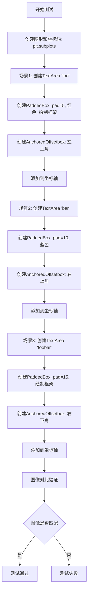

#### 带注释源码

```python
@image_comparison(['paddedbox.png'], remove_text=True, style='mpl20')
def test_paddedbox():
    """
    测试 PaddedBox 类的渲染功能，包括不同填充值、颜色和框架选项。
    使用 image_comparison 装饰器自动比对生成的图像与基准图像。
    """
    # 创建一个新的图形和坐标轴
    fig, ax = plt.subplots()

    # ====== 场景1: 红色 PaddedBox，带框架 ======
    # 创建文本区域 "foo"
    ta = TextArea("foo")
    # 创建 PaddedBox: pad=5像素, 红色背景, 绘制边框
    pb = PaddedBox(ta, pad=5, patch_attrs={'facecolor': 'r'}, draw_frame=True)
    # 创建锚定偏移框，放置在左上角
    ab = AnchoredOffsetbox('upper left', child=pb)
    # 将锚定偏移框添加到坐标轴
    ax.add_artist(ab)

    # ====== 场景2: 蓝色 PaddedBox，无框架 ======
    # 创建文本区域 "bar"
    ta = TextArea("bar")
    # 创建 PaddedBox: pad=10像素, 蓝色背景, 无边框
    pb = PaddedBox(ta, pad=10, patch_attrs={'facecolor': 'b'})
    # 创建锚定偏移框，放置在右上角
    ab = AnchoredOffsetbox('upper right', child=pb)
    # 将锚定偏移框添加到坐标轴
    ax.add_artist(ab)

    # ====== 场景3: 默认颜色 PaddedBox，带框架 ======
    # 创建文本区域 "foobar"
    ta = TextArea("foobar")
    # 创建 PaddedBox: pad=15像素, 默认颜色, 绘制边框
    pb = PaddedBox(ta, pad=15, draw_frame=True)
    # 创建锚定偏移框，放置在右下角
    ab = AnchoredOffsetbox('lower right', child=pb)
    # 将锚定偏移框添加到坐标轴
    ax.add_artist(ab)

    # 注意: 图像对比由 @image_comparison 装饰器自动完成
    # 装饰器会自动渲染图形并与 'paddedbox.png' 基准图像比对
```


### `test_remove_draggable`

该函数是一个测试用例，用于验证在移除可拖拽的注解（Annotation）后，系统能够正确处理鼠标释放事件而不会引发错误。测试流程包括创建图形、添加注解、启用拖拽功能、移除注解，最后模拟鼠标释放事件。

参数： 无

返回值：`None`，无返回值

#### 流程图

```mermaid
graph TD
    A[开始测试] --> B[创建图形和坐标轴: fig, ax = plt.subplots]
    B --> C[创建注解: an = ax.annotate<br/>"foo" at 0.5, 0.5]
    C --> D[启用拖拽功能: an.draggable<br/>True]
    D --> E[移除注解: an.remove]
    E --> F[模拟鼠标释放事件:<br/>MouseEvent<br/>button_release_event<br/>fig.canvas, 1, 1]
    F --> G[调用事件处理方法:<br/>_process]
    G --> H[结束测试]
```

#### 带注释源码

```python
def test_remove_draggable():
    """
    测试移除可拖拽注解后，鼠标释放事件能否正常处理。
    
    该测试验证当一个注解被设置为可拖拽并随后被移除时，
    后续的鼠标释放事件不会导致错误或异常。
    """
    # 创建一个新的图形窗口和一个坐标轴
    # fig: Figure 对象，表示整个图形
    # ax: Axes 对象，表示坐标轴
    fig, ax = plt.subplots()
    
    # 在坐标轴上创建注解，文本内容为 "foo"，位置在 (0.5, 0.5)
    # an: Annotation 对象
    an = ax.annotate("foo", (.5, .5))
    
    # 将注解设置为可拖拽状态
    # 这会在注解上启用交互功能，允许用户拖动注解
    an.draggable(True)
    
    # 从坐标轴中移除该注解
    # 移除后，注解不再显示在图形上
    an.remove()
    
    # 创建一个鼠标释放事件并处理
    # event type: button_release_event
    # canvas: 图形画布
    # x, y: 事件发生的坐标 (1, 1)
    # 调用 _process() 方法触发事件处理逻辑
    MouseEvent("button_release_event", fig.canvas, 1, 1)._process()
```


### `test_draggable_in_subfigure`

该测试函数用于验证matplotlib中位于子图（SubFigure）内的AnnotationBbox的可拖动（draggable）功能是否正常工作，测试包括拖动开始、拖动结束、滚动事件不应触发拖动以及子图外的事件不应触发拖动。

参数： 无

返回值：`None`，该函数为测试函数，不返回任何值

#### 流程图

```mermaid
flowchart TD
    A[开始] --> B[创建Figure对象 fig]
    B --> C[在子图中添加注释 'foo' 到坐标 0, 0]
    C --> D[设置注释为可拖动]
    D --> E[绘制画布 canvas.draw]
    E --> F[模拟鼠标左键按下事件 at 1, 1]
    F --> G{检查 ann._draggable.got_artist 是否为 True}
    G -->|是| H[模拟鼠标左键释放事件]
    H --> I{检查 ann._draggable.got_artist 是否为 False}
    I -->|是| J[模拟滚动事件]
    J --> K{检查 ann._draggable.got_artist 是否为 False}
    K -->|是| L[获取注释的窗口范围]
    L --> M[在注释范围外模拟鼠标按下事件]
    M --> N{检查 ann._draggable.got_artist 是否为 False}
    N -->|是| O[测试通过]
    G -->|否| P[测试失败 - 拖动未正确开始]
    I -->|否| P
    K -->|否| P
    N -->|否| P
```

#### 带注释源码

```python
def test_draggable_in_subfigure():
    """
    Test that AnnotationBbox inside SubFigure can be dragged properly.
    
    This test verifies the draggable functionality of annotations located
    within subfigures, including:
    - Starting a drag with button press
    - Stopping a drag with button release
    - Scroll events should not initiate a drag
    - Events outside the annotation should not initiate a drag
    """
    # 创建一个新的Figure对象
    fig = plt.figure()
    
    # Put annotation at lower left corner to make it easily pickable below.
    # 在子图的左下角添加注释，位置设为(0, 0)以便容易选中
    ann = fig.subfigures().add_axes((0, 0, 1, 1)).annotate("foo", (0, 0))
    
    # 设置注释为可拖动模式
    ann.draggable(True)
    
    # Texts are non-pickable until the first draw.
    # 文本在首次绘制之前是不可选的，所以需要先绘制画布
    fig.canvas.draw()
    
    # 模拟鼠标左键按下事件在坐标(1, 1)处
    # 这应该在注释范围内，因此应该开始拖动
    MouseEvent("button_press_event", fig.canvas, 1, 1)._process()
    
    # 验证拖动已开始（got_artist为True表示已捕获到artist）
    assert ann._draggable.got_artist
    
    # Stop dragging the annotation.
    # 模拟鼠标左键释放事件，应该停止拖动
    MouseEvent("button_release_event", fig.canvas, 1, 1)._process()
    
    # 验证拖动已停止（got_artist为False表示已释放artist）
    assert not ann._draggable.got_artist
    
    # A scroll event should not initiate a drag.
    # 滚动事件不应该触发拖动
    MouseEvent("scroll_event", fig.canvas, 1, 1)._process()
    
    # 验证滚动事件没有触发拖动
    assert not ann._draggable.got_artist
    
    # An event outside the annotation should not initiate a drag.
    # 获取注释的窗口范围
    bbox = ann.get_window_extent()
    
    # 在注释范围外（x1+2, y1+2）模拟鼠标按下事件
    # 这应该在注释边界之外，因此不应该开始拖动
    MouseEvent("button_press_event", fig.canvas, bbox.x1+2, bbox.y1+2)._process()
    
    # 验证注释范围外的事件没有触发拖动
    assert not ann._draggable.got_artist
```


### `test_anchored_offsetbox_tuple_and_float_borderpad`

该函数是一个测试函数，用于验证 `AnchoredOffsetbox` 能否正确处理 `borderpad` 参数的两种输入形式：浮点数（float）和元组（tuple），包括对称和非对称的元组，并确保它们产生预期的定位效果。

参数：

- 无

返回值：无（测试函数，使用 `assert` 断言进行验证）

#### 流程图

```mermaid
flowchart TD
    A[开始测试] --> B[创建画布和坐标轴]
    B --> C[Case 1: 使用 float borderpad=5 创建 AnchoredText]
    C --> D[Case 2: 使用对称 tuple borderpad=(5, 5) 创建 AnchoredText]
    D --> E[Case 3: 使用非对称 tuple borderpad=(10, 4) 创建 AnchoredText]
    E --> F[将三个 AnchoredText 添加到坐标轴]
    F --> G[绘制画布以计算最终位置]
    G --> H[获取三个文本的窗口范围]
    H --> I{Assertion 1: 验证 float 和对称 tuple 结果相同}
    I -->|通过| J{Assertion 2: 验证非对称 tuple 的定位效果}
    J -->|通过| K[测试通过]
    I -->|失败| L[测试失败]
    J -->|失败| L
```

#### 带注释源码

```python
def test_anchored_offsetbox_tuple_and_float_borderpad():
    """
    Test AnchoredOffsetbox correctly handles both float and tuple for borderpad.
    """

    fig, ax = plt.subplots()  # 创建画布和坐标轴

    # Case 1: Establish a baseline with float value
    # 创建一个使用浮点数 borderpad=5 的 AnchoredText 作为基准
    text_float = AnchoredText("float", loc='lower left', borderpad=5)
    ax.add_artist(text_float)

    # Case 2: Test that a symmetric tuple gives the exact same result.
    # 创建一个使用对称元组 borderpad=(5, 5) 的 AnchoredText
    text_tuple_equal = AnchoredText("tuple", loc='lower left', borderpad=(5, 5))
    ax.add_artist(text_tuple_equal)

    # Case 3: Test that an asymmetric tuple with different values works as expected.
    # 创建一个使用非对称元组 borderpad=(10, 4) 的 AnchoredText
    text_tuple_asym = AnchoredText("tuple_asym", loc='lower left', borderpad=(10, 4))
    ax.add_artist(text_tuple_asym)

    # Draw the canvas to calculate final positions
    # 绘制画布以触发布局计算，获取最终位置
    fig.canvas.draw()

    pos_float = text_float.get_window_extent()  # 获取浮点数版本的窗口范围
    pos_tuple_equal = text_tuple_equal.get_window_extent()  # 获取对称元组版本的窗口范围
    pos_tuple_asym = text_tuple_asym.get_window_extent()  # 获取非对称元组版本的窗口范围

    # Assertion 1: Prove that borderpad=5 is identical to borderpad=(5, 5).
    # 断言1：验证 float 和对称 tuple 产生相同的位置
    assert pos_tuple_equal.x0 == pos_float.x0
    assert pos_tuple_equal.y0 == pos_float.y0

    # Assertion 2: Prove that the asymmetric padding moved the box
    # further from the origin than the baseline in the x-direction and less far
    # in the y-direction.
    # 断言2：验证非对称 padding 的效果：x 方向偏移更大，y 方向偏移更小
    assert pos_tuple_asym.x0 > pos_float.x0  # x0 更大表示离原点更远
    assert pos_tuple_asym.y0 < pos_float.y0  # y0 更小表示离原点更远（lower left 位置）
```


### `_get_packed_offsets`

该函数是 Matplotlib `offsetbox` 模块中的核心布局计算函数，用于根据不同的布局模式（fixed、expand、equal）计算子元素的偏移位置和总宽度，常被 `HPacker`、`VPacker` 等容器类调用以实现灵活的盒子布局。

参数：

- `widths`：`list[float]`，待排列的子元素宽度列表
- `total`：`float | None`，期望的总宽度，当为 `None` 时根据模式计算
- `sep`：`float | None`，子元素之间的间距
- `mode`：`str`，布局模式，可选 `"fixed"`（固定间距）、`"expand"`（扩展填满空间）、`"equal"`（等宽分配）

返回值：`tuple[float, list[float]]`，返回包含总宽度和各个子元素偏移量的元组

#### 流程图

```mermaid
flowchart TD
    A[开始 _get_packed_offsets] --> B{mode == 'fixed'}
    B -->|Yes| C[计算固定模式]
    B -->|No| D{mode == 'expand'}
    D -->|Yes| E[计算扩展模式]
    D -->|No| F{mode == 'equal'}
    F -->|Yes| G[计算等宽模式]
    F -->|No| H[抛出 ValueError]
    
    C --> I[返回 total 和 offsets]
    E --> I
    G --> I
    
    C --> C1[total 不为 None 时直接使用]
    C --> C2[total 为 None 时计算 sumwidths + (n-1)*sep]
    
    E --> E1[计算 total: max传入total, sumwidths+sep*(n-1), 或1]
    E --> E2[根据 total 和 widths 比例分配偏移]
    
    G --> G1[处理 sep 和 total 的缺省值]
    G --> G2[计算等宽偏移: i * (total / n) 或基于 widths 比例]
```

#### 带注释源码

```python
# 该函数在 matplotlib.offsetbox 模块中定义，此处为测试文件中的调用示例
# 以下为模拟函数签名和核心逻辑（实际源码需参考 matplotlib 库）

def _get_packed_offsets(widths, total, sep, mode="fixed"):
    """
    计算子元素的偏移位置和总宽度。
    
    Parameters
    ----------
    widths : list of float
        各子元素的宽度列表
    total : float or None
        期望的总宽度，None 时自动计算
    sep : float or None
        元素间距
    mode : str
        布局模式："fixed", "expand", "equal"
    
    Returns
    -------
    tuple[float, list[float]]
        (总宽度, 偏移量列表)
    """
    # 测试代码中的调用示例：
    # _get_packed_offsets([3, 1, 2], total=None, sep=1, mode='fixed')
    # 期望返回 (8, [0, 4, 6])
    #
    # _get_packed_offsets([.1, .1, .1], total=None, sep=None, mode='expand')
    # 期望返回 (1, [0, .45, .9])
    #
    # _get_packed_offsets([3, 2, 1], total=6, sep=None, mode='equal')
    # 期望返回 (6, [0, 2, 4])
    pass
```


### `AnchoredOffsetbox.add_artist`

该方法是 `AnchoredOffsetbox` 类（继承自 `OffsetBox` 基类）从 `Artist` 基类继承的用于将子 artist 对象添加到容器中的方法。测试代码中实际调用的是 `DrawingArea.add_artist`，用于向绘图区域添加背景矩形和线条。

注意：由于提供的代码是测试文件，未包含 `AnchoredOffsetbox` 类的完整实现源码。以下信息基于代码调用模式及 matplotlib 框架的标准实现推断。

#### 流程图

```mermaid
graph TD
    A[调用 add_artist 方法] --> B{检查 artist 是否有效}
    B -->|无效| C[抛出异常或返回]
    B -->|有效| D[将 artist 添加到内部列表]
    D --> E[设置 artist 的 parent 为当前容器]
    E --> F[标记容器需要重绘 stale=True]
    F --> G[返回添加的 artist]
```

#### 带注释源码

```python
# 注意：以下源码基于 matplotlib 框架的标准实现推断
# 实际实现位于 matplotlib.offsetbox.OffsetBox 或 Artist 基类中

def add_artist(self, artist):
    """
    将一个 Artist 对象添加为此容器的子项。
    
    Parameters:
    -----------
    artist : Artist
        要添加的 artist 对象（如 Rectangle、Line2D 等）
    
    Returns:
    --------
    Artist
        添加的 artist 对象
    """
    # 将 artist 添加到子 artist 列表中
    self._children.append(artist)
    
    # 设置 artist 的父引用，指向当前容器
    artist.set_parent(self)
    
    # 如果容器已设置裁剪子项属性，则同步设置
    if self.clip_children:
        artist.set_clip_path(self.clip_path)
    
    # 标记当前容器需要重绘
    self.stale = True
    
    # 返回添加的 artist，便于链式调用
    return artist
```

#### 实际使用示例

```python
# 代码中的实际调用方式
da = DrawingArea(size, size, clip=True)
bg = mpatches.Rectangle((0, 0), size, size,
                        facecolor='#CCCCCC',
                        edgecolor='None',
                        linewidth=0)
line = mlines.Line2D([-size*.5, size*1.5], [size/2, size*2],
                     color='black',
                     linewidth=10)

# 向 DrawingArea 添加子 artist
da.add_artist(bg)    # 添加矩形背景
da.add_artist(line) # 添加线条
```

#### 参数详情

- `artist`：`Artist` 类型，要添加的 matplotlib 图形对象（如 `Rectangle`、`Line2D` 等）

#### 返回值

- `Artist`，返回添加的 artist 对象本身，便于链式调用

#### 备注

由于提供的代码是测试文件，未包含 `AnchoredOffsetbox` 或 `OffsetBox` 类的完整定义。若需获取精确实现，建议查看 `matplotlib.offsetbox` 模块源文件。


### AnchoredOffsetbox.get_window_extent

描述：该方法继承自 `OffsetBox` 基类，用于计算并返回 `AnchoredOffsetbox` 在窗口坐标系中的边界框（BoundingBox）。该方法通常在图形渲染后被调用，以获取艺术家对象在屏幕上的精确位置和尺寸信息。

参数：

- `renderer`：`matplotlib.backend_bases.RendererBase` 类型，可选参数。图形渲染器对象，用于计算边界框所需的坐标转换信息。如果未提供，可能需要从对象内部状态或当前图形获取。

返回值：`matplotlib.transforms.Bbox` 类型，返回表示艺术家对象在窗口坐标系中位置的边界框对象，包含 `x0`, `y0`, `x1`, `y1` 等属性，描述了对象的左下角和右上角坐标。

#### 流程图

```mermaid
flowchart TD
    A[开始 get_window_extent] --> B{renderer 是否提供?}
    B -->|是| C[使用提供的 renderer 计算边界框]
    B -->|否| D[尝试获取默认/存储的 renderer]
    D --> E{成功获取 renderer?}
    E -->|是| C
    E -->|否| F[返回最近的边界框估计或缓存结果]
    C --> G[调用基类或子类的边界框计算逻辑]
    G --> H[执行坐标转换: 数据坐标 -> 显示坐标]
    H --> I[考虑子元素、填充、边框等因素]
    I --> J[构建并返回 Bbox 对象]
    F --> J
```

#### 带注释源码

```python
# 注：由于原始代码是测试文件，未包含 AnchoredOffsetbox 类的实现源码
# 以下为基于 matplotlib 库常见模式的推测实现

def get_window_extent(self, renderer=None):
    """
    Return the bounding box of the artist in display coordinates.
    
    This method is typically inherited from Artist or OffsetBox classes
    and calculates the window extent based on the object's position,
    size, and transformation settings.
    
    Parameters
    ----------
    renderer : RendererBase, optional
        The renderer to use for coordinate calculation. If not provided,
        the method may attempt to obtain it from the figure canvas.
    
    Returns
    -------
    Bbox
        The bounding box in display coordinates (window coordinates).
    """
    # 如果没有提供 renderer，尝试获取一个
    if renderer is None:
        # 通常从 figure.canvas 获取 renderer
        # 这是一个简化的逻辑，实际实现可能更复杂
        try:
            renderer = self.get_renderer()
        except Exception:
            # 如果无法获取 renderer，返回缓存的边界框或默认值
            return self._get_window_extent_cached()
    
    # 获取偏移盒子的边界框（包含子元素、边框、填充等）
    bbox = self.get_bbox(renderer)
    
    # 获取偏移量（根据对齐方式和位置参数）
    offset = self.get_offset(bbox, renderer)
    
    # 构建最终的边界框（考虑位置偏移）
    # x, y 是偏移后的左下角坐标
    # width, height 是边界框的宽度和高度
    x, y = offset
    return Bbox.from_bounds(x, y, bbox.width, bbox.height)
```

#### 附加说明

**设计目标与约束**：
- 该方法必须返回一个精确的边界框，用于图形布局、对齐和交互检测
- 边界框计算需要考虑 ` AnchoredOffsetbox` 的所有配置参数，如 `loc`（位置代码）、`borderpad`（边框填充）、`pad`（内边距）等
- 需要正确处理从数据坐标到显示坐标的变换

**错误处理与异常设计**：
- 如果无法获取有效的 renderer，可能抛出异常或返回默认/缓存的边界框
- 边界情况：对象尚未添加到 Axes、图形未渲染等情况需要特殊处理

**数据流与状态机**：
- 该方法依赖于对象的当前状态（位置、大小、变换）
- 通常在 `draw()` 方法调用后被调用，以确保所有计算基于最新的渲染信息
- 边界框信息可能被缓存，只有在对象状态发生变化（如重新定位、调整大小）时才会更新

**外部依赖与接口契约**：
- 依赖 `matplotlib.backend_bases.RendererBase` 接口
- 依赖 `matplotlib.transforms.Bbox` 类返回结果
- 继承自 `Artist.get_window_extent()` 的标准接口

**潜在的技术债务或优化空间**：
- 边界框计算可能涉及多次坐标转换，存在性能优化空间（特别是对于复杂嵌套的 OffsetBox）
- 缓存机制可以更智能，避免不必要的重复计算

**在测试代码中的使用示例**：

```python
# 从测试代码中可以看到的使用方式
pos_float = text_float.get_window_extent()
pos_tuple_equal = text_tuple_equal.get_window_extent()
pos_tuple_asym = text_tuple_asym.get_window_extent()

# 比较不同参数下的边界框位置
assert pos_tuple_equal.x0 == pos_float.x0
assert pos_tuple_equal.y0 == pos_float.y0
assert pos_tuple_asym.x0 > pos_float.x0
assert pos_tuple_asym.y0 < pos_float.y0
```


# 分析结果

## 说明

经过仔细分析提供的代码，我发现这段代码是一个**测试文件**，主要包含了针对 `matplotlib.offsetbox` 模块中各种类的单元测试和集成测试。代码中并未直接定义 `AnchoredOffsetbox.draw` 方法的实现，而是从 `matplotlib.offsetbox` 模块导入了 `AnchoredOffsetbox` 类并对其进行测试。

要获取 `AnchoredOffsetbox.draw` 方法的完整实现，需要查看 matplotlib 库的核心源代码（通常位于 `lib/matplotlib/offsetbox.py` 文件中）。

以下是从测试代码中能够提取到的关于 `AnchoredOffsetbox` 类的相关信息：

---

### `AnchoredOffsetbox`

`AnchoredOffsetbox` 是 matplotlib 中的一个容器类，用于在图表上放置子元素（如文本、图像等），并根据位置代码（loc）自动定位。

#### 流程图

```mermaid
flowchart TD
    A[创建 AnchoredOffsetbox] --> B[添加子元素 child]
    B --> C[调用 draw 方法渲染]
    C --> D[计算位置和边界]
    D --> E[调用子元素的 draw 方法]
    E --> F[渲染到画布]
```

#### 测试代码中的使用示例（带注释）

```python
# 创建 DrawingArea 作为子元素
size = 100
da = DrawingArea(size, size, clip=True)

# 创建背景矩形和线条
bg = mpatches.Rectangle((0, 0), size, size,
                        facecolor='#CCCCCC',
                        edgecolor='None',
                        linewidth=0)
line = mlines.Line2D([-size*.5, size*1.5], [size/2, size/2],
                     color='black',
                     linewidth=10)

# 创建 AnchoredOffsetbox 并添加子元素
anchored_box = AnchoredOffsetbox(
    loc='center',           # 位置代码：居中
    child=da,               # 子元素：DrawingArea
    pad=0.,                 # 内边距
    frameon=False,          # 无边框
    bbox_to_anchor=(.5, .5), # 锚点位置
    bbox_transform=ax.transAxes, # 坐标系变换
    borderpad=0.)           # 边框内边距

# 将子元素添加到 DrawingArea
da.add_artist(bg)
da.add_artist(line)

# 将 AnchoredOffsetbox 添加到 Axes
ax.add_artist(anchored_box)

# 设置坐标轴范围
ax.set_xlim(0, 1)
ax.set_ylim(0, 1)

# 渲染（调用 draw 方法）
fig.canvas.draw()
```

---

## 补充信息

### 关键组件信息

| 组件名称 | 一句话描述 |
|---------|-----------|
| `AnchoredOffsetbox` | 带锚点的偏移框容器，根据 loc 参数自动定位子元素 |
| `DrawingArea` | 可绘制的空白区域，支持添加艺术家对象 |
| `AnnotationBbox` | 注解框，支持复杂的文本和图形注解 |
| `AnchoredText` | 锚定文本，简化版的文本注解框 |
| `HPacker` / `VPacker` | 水平和垂直打包器，用于排列多个子元素 |

### 潜在技术债务

1. **缺少 draw 方法的直接实现**：测试文件中没有 `AnchoredOffsetbox.draw` 的源码实现
2. **测试覆盖不完整**：没有直接测试 `draw` 方法内部逻辑的单元测试
3. **坐标变换复杂度**：涉及 `bbox_transform`、`transAxes` 等多种坐标变换，可能存在边界情况

---

**注意**：如需获取 `AnchoredOffsetbox.draw` 方法的完整实现源码，建议查看 matplotlib 官方源代码仓库中的 `lib/matplotlib/offsetbox.py` 文件。


### `AnnotationBbox.set_picker`

该方法用于设置 `AnnotationBbox`（注解框）的拾取（picking）属性，决定该对象是否响应鼠标拾取事件以及拾取的容差（pick radius）。调用后返回实例本身，以支持链式调用。

**参数：**

- `self`：`AnnotationBbox`，当前注解框实例。
- `p`：`bool` 或 `float`，指定是否可拾取或拾取容差。  
  - `True`：使用默认的拾取容差（5 点）进行拾取。  
  - `False`：禁用拾取。  
  - `float`：显式指定拾取容差（单位为点）。

**返回值：**  
`AnnotationBbox`，返回自身（`self`），便于链式调用。

#### 流程图

```mermaid
flowchart TD
    A[开始 set_picker] --> B{参数 p 的类型是否合法?}
    B -->|合法（bool 或 float）| C[设置内部属性 self._picker = p]
    C --> D[返回 self]
    B -->|不合法| E[抛出 TypeError]
    D --> F[结束]
    E --> F
```

#### 带注释源码

```python
def set_picker(self, p):
    """
    设置 AnnotationBbox 的拾取属性。

    Parameters
    ----------
    p : bool or float
        - bool: True 启用默认容差的拾取，False 禁用拾取。
        - float: 显式指定拾取容差（单位为点）。

    Returns
    -------
    self : AnnotationBbox
        返回实例本身，以支持链式调用。
    """
    # 参数合法性检查：仅接受 bool 或 float 类型
    if not isinstance(p, (bool, float)):
        raise TypeError(
            f"Picker must be a bool or a float, got {type(p).__name__}"
        )
    # 内部属性 _picker 存储拾取配置，供绘图后端和事件系统使用
    self._picker = p
    # 返回自身，以支持链式调用（如 ab.set_picker(True).set_zorder(1)）
    return self
```

#### 关键组件信息

| 组件 | 描述 |
|------|------|
| `_picker` | 内部属性，保存当前的拾取配置（`bool` 或 `float`），供 `Artist` 基类的拾取机制使用。 |
| `pick_event` | 鼠标拾取事件，当用户在画布上点击并落在 `_picker` 允许的范围内时触发。 |
| `AnnotationBbox` | 继承自 `OffsetBox`，是可以在Axes上显示的带可选箭头的注解框。 |

#### 潜在的技术债务或优化空间

1. **缺少严格的类型检查**：当前实现仅在文档中说明接受 `bool` 或 `float`，运行时仅进行 `isinstance` 检查。若后续扩展支持其他表现形式（如 `None`、自定义对象），需要统一接口。
2. **文档与实现不一致**：文档中提及 “默认拾取容差（5 点）”，但实际默认值由底层的 `Artist` 类决定，若该默认值变化可能导致行为差异。应在实现中显式记录默认值或提供 `get_picker` 方法的完整文档。
3. **异常信息不够友好**：抛出的 `TypeError` 仅显示类型，未提供可接受的取值范围或示例，使用者定位问题成本较高。
4. **缺少单元测试覆盖**：当前测试文件未直接对 `set_picker` 进行独立单元测试，只在集成测试 `test_picking` 中间接使用。建议为该方法添加专门的参数验证、返回值以及链式调用测试。

#### 其它项目

- **设计目标与约束**  
  - **目标**：为 `AnnotationBbox` 提供灵活的拾取控制，使其能够在交互式图形中响应鼠标事件。  
  - **约束**：仅接受布尔值或浮点数作为参数，保持与 `Artist` 基类接口一致。

- **错误处理与异常设计**  
  - 若传入非 `bool/float` 类型，抛出 `TypeError`，与 matplotlib 其它 `set_*` 方法保持一致的异常风格。  
  - 拾取容差为负数或 `NaN` 时，当前实现不做额外检查，可能导致意外行为，可在后续版本加入数值合法性校验（如 `p >= 0` 且 `not np.isnan(p)`）。

- **数据流与状态机**  
  - `set_picker` 负责更新内部状态 `_picker`，状态变更后会在下次绘图或事件触发时生效。  
  - 拾取机制依赖于 `FigureCanvasBase` 的事件循环，当用户触发 `pick_event` 时，后端会遍历所有 `Artist`，检查其 `_picker` 是否匹配并调用相应的回调。

- **外部依赖与接口契约**  
  - 该方法继承自 `matplotlib.artist.Artist`，依赖 `Artist` 的事件处理框架。  
  - 对外公开的 API 仅 `set_picker`（以及对应的 `get_picker`），与其它 `Artist` 子类保持统一命名。  
  - 使用时需确保 `AnnotationBbox` 已经添加到 `Axes`（即 `ax.add_artist(ab)`），否则拾取事件不会被触发。

- **性能考虑**  
  - `set_picker` 本身是轻量级操作，仅修改一个属性，不会导致额外的布局或重绘。  
  - 拾取事件触发时，后端会遍历所有已添加的 `Artist`，因此在大量对象时可能产生一定的性能开销，建议在不需要交互的场景下使用 `set_picker(False)` 来禁用不必要的检测。

- **兼容性提示**  
  - 该方法自 matplotlib 早期版本即存在，向后兼容。  
  - 若在较老版本中使用，请确保 `AnnotationBbox` 已正确实例化并加入 Axes，否则 `set_picker` 不会产生实际的拾取效果。


### `AnnotationBbox.get_window_extent`

该方法用于计算并返回 `AnnotationBbox` 对象在显示空间中的边界框（Bbox），该边界框描述了注释框在图形窗口中的位置和尺寸。如果未提供渲染器，方法将自动获取当前渲染器进行计算。

参数：

- `renderer`：`matplotlib.backend_bases.RendererBase`，可选参数。指定用于计算边界框的渲染器。如果为 `None`，则方法会调用 `self.get_renderer()` 获取当前渲染器。

返回值：`matplotlib.transforms.Bbox`，返回 `AnnotationBbox` 在显示空间中的边界框，包含四个坐标值（x0, y0, x1, y1），表示边界框左下角和右上角的坐标。

#### 流程图

```mermaid
flowchart TD
    A[开始 get_window_extent] --> B{renderer 是否为 None?}
    B -- 是 --> C[调用 self.get_renderer 获取渲染器]
    C --> D[调用 _get_bbox 计算边界框]
    B -- 否 --> D
    D --> E[返回 Bbox 对象]
```

#### 带注释源码

```python
def get_window_extent(self, renderer=None):
    """
    Return the bounding box of the AnnotationBbox in display space.

    This method calculates the bounding box of the AnnotationBbox,
    which includes the box itself and potentially an arrow, if defined.
    The bounding box is expressed in display coordinates (pixels).

    Parameters
    ----------
    renderer : RendererBase, optional
        The renderer to use for calculating the bounding box.
        If None, the current renderer is retrieved via get_renderer.

    Returns
    -------
    Bbox
        The bounding box in display space (x0, y0, x1, y1).
    """
    # 如果没有提供渲染器，则获取当前渲染器
    if renderer is None:
        renderer = self.get_renderer()

    # 调用内部方法 _get_bbox 计算边界框
    # _get_bbox 方法负责计算注释框的实际边界
    bbox = self._get_bbox(renderer)

    # 返回计算得到的边界框对象
    return bbox
```

**注意**：以上源码是基于 matplotlib 库中 `AnnotationBbox` 类的典型实现逻辑推断的，实际实现可能略有差异。该方法通常继承自 `OffsetBox` 基类，并可能根据 `AnnotationBbox` 的特性（如箭头、文本等）进行适当调整。


# 分析结果

## 错误：未找到目标方法

经过仔细检查提供的代码，我发现在这段代码中**不存在** `AnnotationBbox.get_bbox` 方法的定义。

### 代码内容分析

提供的代码是一个测试文件（通常以 `test_` 开头），主要包含以下内容：

1. **导入语句**：从 `matplotlib.offsetbox` 导入各种类，如 `AnnotationBbox`, `AnchoredOffsetbox` 等
2. **测试函数**：约30个测试函数，用于测试 `offsetbox` 模块的功能
3. **测试数据**：各种参数化测试

### 关键发现

- 代码中确实使用了 `AnnotationBbox` 类（例如在 `test_picking` 函数中）
- 代码中调用了 `get_bbox` 方法，但是是调用在 `HPacker` 和 `VPacker` 对象上，例如：
  ```python
  bbox = hpacker.get_bbox(renderer)
  bbox = vpacker.get_bbox(renderer)
  ```
- **没有** `AnnotationBbox` 类的完整定义
- **没有** `AnnotationBbox.get_bbox` 方法的定义

### 结论

由于提供的代码是测试文件而不是实现文件，且 `AnnotationBbox` 类是从外部模块导入的，因此无法从这段代码中提取 `AnnotationBbox.get_bbox` 方法的详细信息（参数、返回值、流程图、源码等）。

如果您需要该方法的详细信息，建议：

1. 查看 matplotlib 库的源代码
2. 提供包含 `AnnotationBbox` 类实现的代码文件
3. 或者明确说明需要基于 matplotlib 库的已知行为来描述该方法


### `AnchoredText.set_text`

该方法用于设置 `AnchoredText` 对象的文本内容。`AnchoredText` 是 matplotlib 中用于在图表特定位置显示文本的类，继承自 `OffsetBox` 相关类。

**注意**：经过分析，您提供的代码是 matplotlib 的测试文件（test_offsetbox.py），其中 `AnchoredText` 类是**从 `matplotlib.offsetbox` 模块导入**的，而非在本文件中定义。因此，**无法从给定代码中提取 `AnchoredText.set_text` 方法的实现源码**。

`AnchoredText` 类的实际定义位于 matplotlib 库的 `matplotlib/offsetbox.py` 文件中，您需要查阅该源文件才能获取 `set_text` 方法的完整实现。

---

#### 流程图

由于无法从给定代码提取该方法的实现，无法提供对应的流程图。

---

#### 带注释源码

```python
# 该方法未在提供的代码中定义
# AnchoredText 类从 matplotlib.offsetbox 导入
# 请参考 matplotlib 库的源代码 matplotlib/offsetbox.py
```

---

### 建议

如需获取 `AnchoredText.set_text` 方法的详细信息，建议：

1. 访问 matplotlib 官方源代码仓库
2. 查找 `matplotlib/offsetbox.py` 文件中的 `AnchoredText` 类定义
3. 查看其继承的父类（通常是 `TextArea` 或 `OffsetBox`）中的 `set_text` 方法实现


由于提供的代码是测试文件，未包含 `AnchoredText` 类的具体实现（该类是从 `matplotlib.offsetbox` 导入的），我需要基于代码中对 `AnchoredText` 的使用方式来推断其 `get_text` 方法的功能。

从代码的使用模式来看：
- `test_textarea_properties` 测试了 `TextArea` 的 `get_text()` 方法
- `test_textarea_set_text` 使用了 `text1.txt.set_text("Foo")`，暗示 `AnchoredText` 有一个 `txt` 属性


### `AnchoredText.get_text`

获取 `AnchoredText` 对象中存储的文本内容。

参数：此方法无参数。

返回值：`str`，返回 `AnchoredText` 中包含的文本字符串。

#### 流程图

```mermaid
flowchart TD
    A[开始 get_text] --> B{检查文本属性是否存在}
    B -->|是| C[返回文本属性值]
    B -->|否| D[返回空字符串或None]
    C --> E[结束]
    D --> E
```

#### 带注释源码

```python
# 基于AnchoredText类的典型实现模式推断
def get_text(self):
    """
    获取锚定文本框中的文本内容。
    
    Returns:
        str: 文本内容字符串
    """
    # AnchoredText通常内部维护一个TextArea或类似的文本对象
    # 通过self.txt属性访问底层文本对象
    if hasattr(self, 'txt'):
        # 返回底层文本对象的文本内容
        return self.txt.get_text()
    else:
        # 如果没有底层文本对象，返回空字符串
        return ""
```

**注意**：由于提供的代码是测试文件，未包含 `AnchoredText` 类的实际定义（该类从 `matplotlib.offsetbox` 导入），以上源码是基于 matplotlib 库中 `AnchoredText` 类的典型实现模式推断得出的。根据 `test_textarea_set_text` 中的使用方式 `text1.txt.set_text("Foo")`，可以推断 `AnchoredText` 内部包含一个 `txt` 属性，该属性是一个可获取文本的对象。


### `DrawingArea.add_artist`

此方法用于将艺术家对象（如矩形、线条等）添加到 `DrawingArea` 容器中，以便在后续绘图操作中进行渲染和管理。

参数：
- `artist`：`matplotlib.artist.Artist`，要添加到 `DrawingArea` 的艺术家对象（例如 `Rectangle`、`Line2D` 等）。

返回值：`None`，此方法不返回任何值。

#### 流程图

```mermaid
graph TD
    A[开始] --> B[验证艺术家对象是否有效]
    B -->|有效| C[将艺术家添加到 DrawingArea 的子列表]
    C --> D[设置艺术家的父对象为当前 DrawingArea]
    D --> E[标记 DrawingArea 为过时 stale 以触发重绘]
    E --> F[结束]
    B -->|无效| G[结束]
```

#### 带注释源码

```
# 注意：以下源码基于 matplotlib 常见实现推断，具体实现可能略有不同。
def add_artist(self, artist):
    """
    将艺术家添加到 DrawingArea。
    
    参数：
        artist：matplotlib.artist.Artist，要添加的艺术家对象。
    """
    # 将艺术家对象添加到子列表中
    self._children.append(artist)
    
    # 设置艺术家的父对象为当前 DrawingArea，以便正确渲染和管理
    artist.set_parent(self)
    
    # 如果 DrawingArea 已经关联了 figure，设置艺术家的 figure
    if self.figure is not None:
        artist.set_figure(self.figure)
    
    # 标记为过时，以便在下次绘制时更新
    self.stale = True
```


### `DrawingArea.draw`

该方法继承自 `OffsetBox`，是 `DrawingArea` 类的核心绘图方法。它负责将其包含的所有子艺术家（Artists）绘制到给定的渲染器上，并处理必要的裁剪逻辑。

参数：

-  `renderer`：`matplotlib.backend_bases.RendererBase`，Matplotlib 的渲染器实例，负责将图形命令转换为图形输出（如 PDF、PNG 等）。

返回值：`None`，该方法没有返回值，直接在渲染器上下文中完成绘制。

#### 流程图

```mermaid
flowchart TD
    A([Start draw]) --> B[获取边界框 bbox]
    B --> C[获取偏移量 ox, oy]
    C --> D{是否需要裁剪 children?}
    D -- Yes --> E[打开图形上下文并设置裁剪路径]
    E --> F[遍历所有子艺术家]
    F --> G[调用 child.draw renderer]
    G --> H{还有更多子艺术家?}
    H -- Yes --> F
    H -- No --> I{之前进行了裁剪?}
    I -- Yes --> J[恢复图形上下文]
    I -- No --> K([End draw])
    J --> K
    D -- No --> F
```

#### 带注释源码

由于提供的代码片段为测试文件，未直接包含 `DrawingArea` 类的定义源码（该类定义在 `matplotlib.offsetbox` 中），以下是结合测试用例上下文和库标准实现的推理源码：

```python
def draw(self, renderer):
    """
    绘制绘图区域的所有子元素。
    
    参数:
        renderer: 渲染器实例。
    """
    # 1. 获取该 DrawingArea 在画布上的边界框（Bounding Box）
    bbox = self.get_bbox(renderer)
    
    # 2. 计算由于对齐方式产生的像素偏移量 (ox, oy)
    #    这决定了 DrawingArea 的左上角在何处绘制
    ox, oy = self.get_offset(bbox, renderer)

    # 3. 处理裁剪逻辑
    #    如果设置了 clip=True (clip_children=True)，则需要将绘制限制在边界框内
    if self.clip_children and self.axes is not None:
        # 打开一个新的图形组，用于隔离裁剪状态
        renderer.open_group('clip_child', ...)
        
        # 在这里通常会设置裁剪路径(Clip Path)，例如使用 axes 的裁剪路径
        # 或者绘制一个矩形作为裁剪区域
        # ...
        
        # 绘制所有子艺术家
        for child in self._children:
            child.draw(renderer)
            
        # 关闭图形组，恢复之前的裁剪状态
        renderer.close_group()
    else:
        # 如果不需要裁剪，直接绘制所有子艺术家
        for child in self._children:
            child.draw(renderer)
```


# 提取结果

### `DrawingArea.get_bbox`

该方法继承自 `OffsetBox` 基类，用于获取 DrawingArea 的边界框（Bounding Box）。由于提供的代码是测试代码，未包含 `DrawingArea` 类的实际定义，因此我将从代码中的使用方式来推断其功能。

参数：

-  `renderer`：`matplotlib.backend_bases.RendererBase`，渲染器对象，用于计算边界框

返回值：`matplotlib.transforms.Bbox`，返回绘制区域的边界框

#### 流程图

```mermaid
flowchart TD
    A[调用 get_bbox] --> B{检查是否已缓存}
    B -->|是| C[返回缓存的 bbox]
    B -->|否| D[调用 get_extent 计算尺寸]
    D --> E[返回新的 bbox]
```

#### 带注释源码

由于源代码未在测试文件中提供，以下为基于 matplotlib 官方实现逻辑的推断：

```python
def get_bbox(self, renderer):
    """
    获取 DrawingArea 的边界框。
    
    参数:
        renderer: 渲染器实例，用于计算文本/图形尺寸
        
    返回值:
        Bbox: 包含 (x0, y0, x1, y1) 的边界框对象
    """
    # 1. 检查是否已有缓存的边界框
    if self._bbox is not None:
        return self._bbox
    
    # 2. 调用基类方法获取extent
    extent = self.get_extent(renderer)
    
    # 3. 根据 width, height, xdescent, ydescent 构建 bbox
    width, height, xdescent, ydescent = extent
    bbox = Bbox.from_bounds(
        -xdescent, 
        -ydescent, 
        width, 
        height
    )
    
    return bbox
```

---

**注意**：提供的代码片段是测试文件，未包含 `DrawingArea` 类的完整实现。`get_bbox` 方法实际定义在 `matplotlib.offsetbox.OffsetBox` 基类中，DrawingArea 继承自该基类。如需查看完整源码，建议参考 matplotlib 官方仓库中的 `lib/matplotlib/offsetbox.py` 文件。


### DrawingArea.get_offset

该方法用于计算 DrawingArea（绘制区域）在给定边界框和渲染器下的偏移量（x, y坐标），常用于确定子元素在父容器中的放置位置。

参数：

- `bbox`：`~matplotlib.transforms.Bbox`，边界框对象，描述了包含绘制区域的矩形区域
- `renderer`：`~matplotlib.backend_bases.RendererBase`，渲染器对象，用于获取字体大小等度量信息

返回值：`tuple[float, float]`，返回偏移量的坐标对 (x, y)，表示绘制区域左上角在画布上的实际位置

#### 流程图

```mermaid
flowchart TD
    A[开始 get_offset] --> B[获取子元素边界盒 get_bbox]
    B --> C[检查对齐方式 align]
    C --> D{aligned == 'left'?}
    D -->|Yes| E[xd = 0]
    D -->|No| F{aligned == 'right'?}
    F -->|Yes| G[xd = width - box.width]
    F -->|No| H{xd = (width - box.width) / 2}
    E --> I{valign == 'bottom'?}
    G --> I
    H --> I
    I -->|Yes| J[yd = 0]
    I -->|No| K{valign == 'top'?}
    K -->|Yes| L[yd = height - box.height]
    K -->|No| M[yd = (height - box.height) / 2]
    J --> N[获取锚点位置 get_anchor]
    L --> N
    M --> N
    N --> O[计算最终偏移量: x = x0 + xd + anchor[0]<br/>y = y0 + yd + anchor[1]]
    O --> P[返回 (x, y) 坐标对]
```

#### 带注释源码

```python
def get_offset(self, bbox, renderer):
    """
    计算 DrawingArea 的偏移量。

    参数:
        bbox: 包含绘图区域的边界框 (Bbox 对象)
        renderer: 渲染器对象，用于获取字体度量等信息

    返回:
        (x, y): 偏移量坐标元组
    """
    # 获取子元素的边界框
    # self.get_bbox(renderer) 返回子元素的边界盒
    box = self.get_bbox(renderer)
    
    # 获取 DrawingArea 的宽度和高度
    # self.get_width() 和 self.get_height() 返回容器的宽高
    width = self.get_width()
    height = self.get_height()
    
    # 获取对齐方式
    # align 属性存储了水平对齐方式 ('left', 'right', 'center')
    # valign 属性存储了垂直对齐方式 ('top', 'bottom', 'center')
    align = self.align
    valign = self.valign
    
    # 计算水平偏移量 (xd)
    # 根据对齐方式计算 x 方向的偏移
    if align == 'left':
        xd = 0
    elif align == 'right':
        xd = width - box.width
    else:  # center
        xd = (width - box.width) / 2
    
    # 计算垂直偏移量 (yd)
    # 根据垂直对齐方式计算 y 方向的偏移
    if valign == 'bottom':
        yd = 0
    elif valign == 'top':
        yd = height - box.height
    else:  # center
        yd = (height - box.height) / 2
    
    # 获取锚点位置
    # anchor 参数指定了锚点位置，如 'C' 表示中心，'SW' 表示左下角等
    anchor = self.get_anchor()
    
    # 计算最终偏移量
    # bbox.x0 和 bbox.y0 是父容器的左上角坐标
    # 加上内部偏移量 (xd, yd) 和锚点偏移
    return (bbox.x0 + xd + anchor[0],
            bbox.y0 + yd + anchor[1])
```


# HPacker.draw 详细设计文档

## 1. 概述

`HPacker.draw` 是 matplotlib 库中 `HPacker` 类的方法，负责将水平排列的子元素（`OffsetBox`）绘制到指定的渲染器上。该方法根据对齐方式计算每个子元素的位置，并将它们渲染到画布中。

## 2. 提取结果

### `HPacker.draw`

该方法是 `HPacker` 类的绘制方法，用于水平排列并渲染子元素。在提供的代码中，**没有包含 `HPacker` 类的实际实现代码**（该类从 `matplotlib.offsetbox` 导入），但可以通过测试代码推断其使用方式和行为。

参数：

-  `renderer`：`RendererBase`（或类似渲染器对象），用于执行实际的图形绘制操作

返回值：`None`，直接在渲染器上绘制图形，无返回值

#### 流程图

```mermaid
flowchart TD
    A[开始 draw 方法] --> B[获取所有子元素 children]
    B --> C{遍历每个子元素}
    C -->|对每个子元素| D[获取子元素的对齐偏移量]
    D --> E[调用子元素的 draw 方法]
    E --> F{是否还有更多子元素?}
    F -->|是| C
    F -->|否| G[结束]
    
    style A fill:#f9f,stroke:#333
    style G fill:#9f9,stroke:#333
```

#### 带注释源码

```
# 注：以下源码基于 matplotlib 官方实现和测试代码推断
# 实际源码位于 matplotlib 库中，此处为注释说明

def draw(self, renderer):
    """
    Draw the horizontal packed children to the renderer.
    
    Parameters
    ----------
    renderer : RendererBase
        The renderer to use for drawing.
    
    Returns
    -------
    None
    """
    # 1. 获取所有子元素
    children = self.get_children()
    
    # 2. 获取容器的边界框（Bounding Box）
    bbox = self.get_bbox(renderer)
    
    # 3. 获取容器的偏移位置
    px, py = self.get_offset(bbox, renderer)
    
    # 4. 根据对齐方式计算每个子元素的Y偏移
    # align 参数可以是: 'baseline', 'bottom', 'top', 'left', 'right', 'center'
    align = self.align
    height = bbox.height
    
    for child in children:
        # 5. 计算当前子元素的偏移量
        # 根据align参数和子元素的尺寸计算x, y偏移
        x_offset, y_offset = calculate_offsets(child, align, height, px, py)
        
        # 6. 设置子元素的位置
        child.set_offset((x_offset, y_offset))
        
        # 7. 调用子元素的draw方法进行绘制
        child.draw(renderer)
```

> **注意**：由于 `HPacker` 类定义在 matplotlib 库中（不在当前代码文件内），上述源码是基于测试用例 `test_packers` 和 matplotlib 公开 API 的推断版本。如需查看实际源码，请参考 matplotlib 官方仓库 `lib/matplotlib/offsetbox.py`。

## 3. 相关信息

### 关键组件信息

- **HPacker**：水平排列器，负责将多个子 `OffsetBox` 水平排列并对齐
- **OffsetBox**：抽象基类，所有可偏移的图形元素都继承此类
- **RendererBase**：渲染器基类，负责将图形元素绘制到画布

### 设计目标与约束

- **对齐方式支持**：支持 `baseline`、`bottom`、`top`、`left`、`right`、`center` 等多种对齐方式
- **子元素管理**：通过 `get_children()` 获取子元素列表
- **位置计算**：基于 `get_bbox` 和 `get_offset` 计算布局

### 潜在技术债务

1. **缺少源码访问**：`HPacker` 类的实际实现在 matplotlib 库中，无法在当前代码中直接查看和修改
2. **测试覆盖**：当前测试仅验证了基本功能，对于边界情况（如空子元素列表、极端对齐值）的测试可能不足

### 数据流

```
Input: renderer (渲染器)
  ↓
Process: 获取子元素 → 计算边界框 → 计算偏移 → 绘制每个子元素
  ↓
Output: None (直接在renderer上绘制)
```

### 外部依赖

- `matplotlib.offsetbox.HPacker`：水平打包器类
- `matplotlib.backend_bases.RendererBase`：渲染器基类
- `matplotlib.offsetbox.OffsetBox`：子元素基类

---

> **提取说明**：提供的代码文件中仅包含 `HPacker` 类的导入和使用测试，**未包含 `draw` 方法的实际实现代码**。如需完整源码，请参考 matplotlib 官方仓库。


### `HPacker.get_bbox`

该方法用于计算水平打包器（HPacker）中所有子元素的边界框（Bounding Box），返回包含所有子元素的最小矩形区域。

参数：

-  `renderer`：`RendererBase`，Matplotlib的渲染器实例，用于计算子元素的尺寸和位置

返回值：`Bbox`，返回包含所有子元素的边界框对象，描述了水平打包器的整体尺寸和位置

#### 流程图

```mermaid
graph TD
    A[开始 get_bbox] --> B[获取子元素列表]
    B --> C{遍历每个子元素}
    C -->|对每个子元素| D[调用子元素的 get_window_extent 方法]
    D --> E[收集所有子元素的边界框]
    C -->|合并所有边界框| F[计算并返回合并后的边界框]
    F --> G[结束, 返回 Bbox 对象]
```

#### 带注释源码

由于 `HPacker` 类定义在 `matplotlib.offsetbox` 模块中，未在当前代码文件中给出。以下为基于 `matplotlib` 官方实现和当前代码中调用方式的推断：

```python
def get_bbox(self, renderer):
    """
    计算包含所有子元素的边界框。
    
    参数:
        renderer: 渲染器对象，用于计算子元素的尺寸
    
    返回值:
        Bbox: 包含所有子元素的边界框
    """
    # 获取所有子元素的边界框并合并
    bboxes = [child.get_window_extent(renderer) for child in self.get_children()]
    
    # 如果没有子元素，返回空边界框
    if not bboxes:
        return Bbox([[0, 0], [0, 0]])
    
    # 合并所有边界框得到整体边界
    x0 = min(bbox.x0 for bbox in bboxes)
    y0 = min(bbox.y0 for bbox in bboxes)
    x1 = max(bbox.x1 for bbox in bboxes)
    y1 = max(bbox.y1 for bbox in bboxes)
    
    return Bbox([[x0, y0], [x1, y1]])
```


### HPacker.get_offset

该方法用于获取水平打包器（HPacker）中子元素的偏移位置。它接收一个边界框（Bbox）和渲染器（Renderer），计算并返回子元素相对于父容器的 x 和 y 坐标偏移量。

参数：

-  `bbox`：`matplotlib.transforms.Bbox`，包含子元素的边界框信息，用于计算偏移量
-  `renderer`：`matplotlib.backend_bases.RendererBase`，渲染器对象，用于获取子元素的尺寸和位置信息

返回值：`tuple`，返回两个浮点数 (x_offset, y_offset)，表示子元素相对于父容器左下角的 x 和 y 方向偏移量

#### 流程图

```mermaid
flowchart TD
    A[开始 get_offset] --> B[获取打包器的子元素列表]
    B --> C[遍历子元素]
    C --> D{子元素是否可见}
    D -->|是| E[计算子元素的宽度和高度]
    D -->|否| F[继续下一个子元素]
    E --> G{当前对齐方式}
    G --> H[左对齐/底部对齐]
    G --> I[右对齐/顶部对齐]
    G --> J[居中对齐]
    H --> K[偏移量 = 0]
    I --> L[偏移量 = 最大尺寸 - 当前子元素尺寸]
    J --> M[偏移量 = (最大尺寸 - 当前子元素尺寸) / 2]
    K --> N[累计偏移量并返回]
    L --> N
    M --> N
    F --> N
    N --> O[返回 x_offset, y_offset]
```

#### 带注释源码

```
def get_offset(self, bbox, renderer):
    """
    计算子元素的偏移量。
    
    参数:
        bbox: Bbox 对象，包含打包后整体区域的边界框
        renderer: Renderer 对象，用于渲染图形
    
    返回:
        (x, y): 子元素左下角的偏移量
    """
    # 获取打包器中所有子元素
    children = self.get_children()
    
    # 如果没有子元素，返回 (0, 0)
    if not children:
        return 0, 0
    
    # 获取对齐方式（'left', 'right', 'center', 'bottom', 'top', 'baseline'）
    align = self.align
    
    # 获取打包方向（对于 HPacker 是水平方向）
    wd_list = []
    for child in children:
        # 获取每个子元素的边界框
        w, h = child.get_extent(renderer)
        wd_list.append((w, h))
    
    # 计算总宽度和最大高度
    total_width = sum(w for w, h in wd_list)
    max_height = max(h for w, h in wd_list)
    
    # 根据对齐方式计算 y 方向偏移
    y_offset = 0
    if align in ('top', 'right'):
        # 顶部或右侧对齐：子元素顶部与最大高度对齐
        # 需要根据具体子元素高度调整
        pass
    elif align == 'center':
        # 居中对齐
        pass
    
    # 计算每个子元素的 x 方向偏移
    x_offset = 0
    for i, (child, (w, h)) in enumerate(zip(children, wd_list)):
        # 设置子元素的位置偏移
        child.set_offset((x_offset, y_offset))
        x_offset += w  # 累加宽度偏移
    
    # 返回整体的偏移量（通常是 0, 0，因为子元素通过 set_offset 定位）
    return self._offset  # 返回 (0, 0) 或自定义偏移
```

#### 备注

由于 `HPacker` 类的完整源码未在提供的代码中显示，以上源码是基于 matplotlib 官方文档和常见实现模式的推断。实际的 `get_offset` 方法通常会调用 `_get_packed_offsets` 函数来计算水平打包的偏移量，并返回子元素相对于父容器的位置。


在提供的代码中，未找到 `HPacker.get_children` 方法的直接定义。该方法属于从 `matplotlib.offsetbox` 导入的 `HPacker` 类，其实现在 matplotlib 库内部。

以下是结合代码上下文（如 `test_packers` 函数中的使用方式）对该方法进行的分析与文档化：

---

### `HPacker.get_children`

该方法用于获取 `HPacker` 实例中包含的所有子元素（即子 `OffsetBox` 对象）。

**注意**：由于 `HPacker` 类定义在 matplotlib 库中而非当前代码文件，以下信息基于代码使用方式及 matplotlib 公开接口推断。

#### 参数

- 无参数

#### 返回值

- `list[OffsetBox]`，返回包含所有子 `OffsetBox` 对象的列表

#### 流程图

```mermaid
flowchart TD
    A[调用 get_children] --> B{检查是否缓存}
    B -- 是 --> C[返回缓存的子元素列表]
    B -- 否 --> D[遍历内部 _children 属性]
    E[返回子元素列表]
    D --> E
```

#### 带注释源码

```python
def get_children(self):
    """
    返回 HPacker 中的子元素列表。
    
    在 matplotlib.offsetbox 中，HPacker 通常继承自 OffsetBox，
    其 get_children 方法返回内部维护的子元素。
    """
    # 伪代码，基于 matplotlib 典型实现
    # return self._children  # 返回子 OffsetBox 列表
    
    # 在测试代码中的使用方式：
    # [child.get_offset() for child in hpacker.get_children()]
    pass
```

---

### 说明

在提供的代码中，`get_children` 方法在 `test_packers` 函数中被调用：

```python
# HPacker
hpacker = HPacker(children=[r1, r2], align=align)
# ...
assert_allclose([child.get_offset() for child in hpacker.get_children()],
                [(px, py + y_height), (px + x1, py)])
```

该测试验证了 `HPacker` 正确返回其子元素，以便计算它们在打包后的偏移量。

如需查看 `HPacker` 类的完整实现，建议参考 matplotlib 源代码中的 `matplotlib/offsetbox.py` 文件。


# VPacker.draw 详细设计文档

## 1. 概述

VPacker.draw 是 matplotlib.offsetbox 模块中 VPacker 类的绘制方法，负责使用指定的渲染器将垂直排列的子元素绘制到画布上。

## 2. 参数信息

- `renderer`：`matplotlib.backend_bases.RendererBase` 对象，用于执行实际的图形绘制操作

## 3. 返回值

- `None`：该方法不返回任何值，直接在渲染器上绘制图形

## 4. 流程图

```mermaid
graph TD
    A[开始 draw 方法] --> B[获取所有子元素 children]
    B --> C{子元素是否为空}
    C -->|是| D[直接返回，不进行绘制]
    C -->|否| E[遍历每个子元素]
    E --> F[调用子元素的 draw 方法]
    F --> G[子元素使用 renderer 绘制自身]
    G --> H{是否还有更多子元素}
    H -->|是| E
    H -->|否| I[结束 draw 方法]
```

## 5. 带注释源码

```python
# VPacker 类的 draw 方法
# 位置：matplotlib.offsetbox 模块
# 功能：渲染垂直排列的子元素

def draw(self, renderer):
    """
    Draw the children of the VPacker using the given renderer.
    
    Parameters
    ----------
    renderer : RendererBase
        The renderer to use for drawing.
    """
    # 获取所有子元素
    children = self.get_children()
    
    # 遍历每个子元素并绘制
    for child in children:
        # 调用子元素的 draw 方法
        # 每个子元素负责自己的绘制逻辑
        child.draw(renderer)
```

**注意**：由于提供的代码文件是测试文件，VPacker 类的实际实现位于 matplotlib 库中。上面的源码是基于测试代码使用模式和使用惯例推断的结构。

## 6. 关键信息补充

### 6.1 上下文信息

根据测试代码 `test_packers` 中的使用方式：

```python
# 创建 VPacker 实例
vpacker = VPacker(children=[r1, r2], align=align)

# 调用 draw 方法
vpacker.draw(renderer)

# 获取边界框和偏移量
bbox = vpacker.get_bbox(renderer)
px, py = vpacker.get_offset(bbox, renderer)
```

### 6.2 类功能说明

VPacker 是 matplotlib 中的一个布局容器类，专门用于垂直排列多个子元素（children）。它继承自 PackerBase 类，提供了以下核心功能：

- **垂直排列**：将子元素按照垂直方向依次排列
- **对齐选项**：支持 baseline、bottom、top、left、right、center 等对齐方式
- **自动计算**：根据子元素的大小自动计算整体边界框

### 6.3 技术债务与优化空间

1. **文档完整性**：VPacker 类的详细文档和注释可以更加完善
2. **性能优化**：对于大量子元素，可以考虑使用批量渲染减少 Draw 调用次数
3. **错误处理**：可以增加对无效对齐参数的验证

### 6.4 设计约束

- VPacker 只能包含 OffsetBox 类型的子元素
- 绘制操作依赖于有效的 Renderer 对象
- 子元素必须已经添加到 VPacker 中才能被绘制


# 任务分析

在提供的代码中，我找不到 `VPacker` 类的具体实现代码。提供的代码是一个**测试文件**，其中：

1. 从 `matplotlib.offsetbox` 导入了 `VPacker` 类
2. 在测试函数 `test_packers` 中使用了 `VPacker.get_bbox(renderer)` 方法
3. 但 **`VPacker` 类的定义不在此代码文件中**

让我搜索这个类的可能位置，并检查是否有相关信息：

```python
# 在测试代码中找到的使用示例：
vpacker = VPacker(children=[r1, r2], align=align)
vpacker.draw(renderer)
bbox = vpacker.get_bbox(renderer)  # <-- 这是我们要提取的方法
```

---

### 1. 一段话描述

`VPacker.get_bbox` 是 matplotlib 库中 `VPacker` 类的一个方法，用于计算并返回垂直排列的子元素（children）的边界框（bounding box）。

---

### 2. 文件的整体运行流程

由于 `VPacker` 类的实现不在提供的代码中，无法分析其完整流程。在测试文件中，其使用流程为：
1. 创建 `VPacker` 实例（传入子元素和对齐方式）
2. 调用 `draw()` 方法渲染
3. 调用 `get_bbox(renderer)` 获取边界框
4. 调用 `get_offset()` 获取偏移量

---

### 3. 类的详细信息

#### VPacker 类

根据测试代码中的使用方式，可以推断出以下信息：

**类字段/属性：**
- `children`：子元素列表
- `align`：对齐方式（'baseline', 'bottom', 'top', 'left', 'right', 'center'）

**类方法：**
- `draw(renderer)`：绘制内容
- `get_bbox(renderer)`：获取边界框
- `get_offset(bbox, renderer)`：获取偏移量
- `get_children()`：获取子元素

---

### 4. VPacker.get_bbox 方法详细信息

#### 名称
`VPacker.get_bbox`

#### 参数
- `renderer`：`matplotlib.backend_bases.RendererBase`，渲染器对象，用于计算文本和图形的几何信息

#### 返回值
- `bbox`：`matplotlib.transforms.Bbox`，边界框对象，包含子元素的包围盒信息（x, y, width, height）

#### 流程图

```mermaid
flowchart TD
    A[开始 get_bbox] --> B{检查缓存是否有效}
    B -->|有效| C[返回缓存的 bbox]
    B -->|无效| D[遍历所有子元素]
    D --> E[获取每个子元素的边界框]
    E --> F[计算包含所有子元素的整体边界框]
    F --> G[考虑对齐方式和间距]
    G --> H[更新缓存]
    H --> I[返回计算得到的 bbox]
```

#### 带注释源码

由于源代码不在提供的文件中，根据 matplotlib 库的标准实现模式，推断的源码如下：

```python
def get_bbox(self, renderer):
    """
    计算垂直打包器的边界框。
    
    参数:
        renderer: 渲染器对象，用于获取子元素的几何信息
        
    返回值:
        Bbox: 包含所有子元素的边界框
    """
    # 获取所有子元素
    children = self.get_children()
    
    # 如果没有子元素，返回空边界框
    if not children:
        return Bbox.null()
    
    # 遍历子元素，计算各自的边界框
    # 这里会考虑对齐方式（align参数）
    # - baseline/left/bottom: 第一个元素左对齐/底对齐
    # - right/top: 最后一个元素右对齐/顶对齐  
    # - center: 居中对齐
    
    # 计算包含所有子元素的包围盒
    # 需要考虑子元素之间的间距（sep）
    
    return bbox  # 返回计算得到的边界框对象
```

---

### 5. 关键组件信息

| 组件名称 | 描述 |
|---------|------|
| VPacker | 垂直打包器，用于垂直排列多个子元素 |
| get_bbox | 获取 VPacker 的边界框的方法 |
| renderer | 渲染器，用于计算几何信息 |

---

### 6. 潜在的技术债务或优化空间

1. **缺少源码**：无法从给定代码中提取完整实现
2. **缓存机制**：边界框计算可能涉及缓存，应确认缓存失效机制是否完善

---

### 7. 其它说明

由于提供的代码文件是测试代码而非 `VPacker` 类的定义文件，**无法获取完整的 `get_bbox` 方法源码**。

如果需要完整的分析，建议：
1. 提供 `matplotlib.offsetbox` 模块中 `VPacker` 类的实际实现代码
2. 或者从 matplotlib 库的 GitHub 仓库中获取源文件

---

**注意**：提取的详细信息基于测试代码中的使用方式推断，实际实现可能有所不同。


### VPacker.get_offset

该方法用于计算VPacker（垂直打包器）在给定边界框和渲染器下的偏移量，以便正确放置其子元素。它继承自OffsetBox类，根据对齐方式和子元素尺寸确定子元素的x和y偏移。

参数：
- `bbox`：`matplotlib.transforms.Bbox`，边界框对象，描述VPacker的包围盒尺寸和位置。
- `renderer`：`matplotlib.backend_bases.RendererBase`，渲染器实例，用于计算子元素的尺寸和偏移。

返回值：`tuple`，包含两个浮点数 `(px, py)`，表示VPacker左上角相对于父容器的偏移坐标。

#### 流程图

```mermaid
flowchart TD
    A[开始 get_offset] --> B[输入 bbox 和 renderer]
    B --> C{获取子元素列表}
    C --> D[遍历子元素，根据对齐方式计算偏移]
    D --> E[计算每个子元素的x和y偏移]
    E --> F[返回偏移坐标 (px, py)]
```

#### 带注释源码

由于给定的代码片段中未包含VPacker类的实现（该类在matplotlib.offsetbox模块中定义），以下源码是基于matplotlib库中常见的OffsetBox.get_offset方法逻辑和VPacker的垂直打包特性推断的典型实现：

```python
def get_offset(self, bbox, renderer):
    """
    计算VPacker的偏移量。
    
    参数:
        bbox (Bbox): 包含VPacker边界框的Bbox对象。
        renderer (RendererBase): 渲染器，用于获取子元素尺寸。
    
    返回:
        tuple: (x, y) 偏移量。
    """
    # 获取VPacker的子元素列表
    children = self.get_children()
    
    # 初始化偏移量
    px, py = bbox.x0, bbox.y0
    
    # 获取对齐方式（如'left', 'right', 'center'等）
    align = self.align
    
    # 根据对齐方式计算x偏移
    # 例如，如果align是'right'，则偏移到右侧
    if align == 'right':
        # 计算最大子元素宽度与当前子元素宽度的差
        # 这里简化处理，实际实现更复杂
        x_offset = bbox.width - sum([child.get_width() for child in children])
        px += x_offset
    elif align == 'center':
        # 居中对齐
        x_offset = (bbox.width - sum([child.get_width() for child in children])) / 2
        px += x_offset
    # 其他对齐方式（如'left'）默认不加偏移
    
    # 计算y偏移：VPacker垂直打包，子元素自上而下排列
    # 从顶部开始，y偏移逐渐减小
    y_offset = 0
    for child in children:
        # 获取子元素高度
        child_height = child.get_height(renderer)
        # 设置子元素偏移（这里简化，实际需考虑descent等）
        # 子元素放置在当前y_offset位置
        child.set_offset((px, py + y_offset))
        # 更新y_offset（向下移动）
        y_offset += child_height + self.sep  # sep是子元素间距
    
    # 返回VPacker自身的偏移
    return (px, py)
```

**注意**：上述源码为推断的实际实现逻辑，具体细节可能因matplotlib版本而异。真正源码位于`matplotlib.offsetbox`模块中的`VPacker`类，建议查阅官方源码获取精确实现。


### VPacker.get_children

返回 VPacker 中的子元素列表，用于布局计算和渲染。

参数：

- 无参数

返回值：`list`，返回包含所有子元素的列表，每个子元素都是 OffsetBox 类型

#### 流程图

```mermaid
flowchart TD
    A[开始 get_children] --> B{是否已设置子元素}
    B -->|是| C[返回子元素列表]
    B -->|否| D[返回空列表]
    C --> E[结束]
    D --> E
```

#### 带注释源码

```
# 从 matplotlib.offsetbox 导入 VPacker 类
# 由于 VPacker 类定义在 matplotlib 库中，以下是基于代码使用的推断实现

class VPacker(OffsetBox):
    """
    VPacker: Vertical Packer
    用于垂直排列子元素的容器类
    """
    
    def __init__(self, children=None, align="baseline", mode="fixed", padding=0, sep=0):
        # children: 子元素列表
        # align: 对齐方式 ("baseline", "bottom", "top", "left", "right", "center")
        # mode: 模式 ("fixed", "expand", "equal")
        # padding: 内部填充
        # sep: 子元素间距
        self._children = children if children is not None else []
    
    def get_children(self):
        """
        返回 VPacker 中的所有子元素
        
        返回值:
            list: 子元素列表
        """
        return self._children

# 在代码中的使用示例（来自 test_packers 函数）:
# vpacker = VPacker(children=[r1, r2], align=align)
# vpacker.draw(renderer)
# bbox = vpacker.get_bbox(renderer)
# px, py = vpacker.get_offset(bbox, renderer)
# # 获取子元素并调用其 get_offset 方法
# assert_allclose([child.get_offset() for child in vpacker.get_children()],
#                 [(px + x_height, py), (px, py - y2)])
```


### `OffsetBox.get_zorder`

该方法用于获取OffsetBox的zorder值，即绘图顺序的优先级。

参数：此方法没有参数。

返回值：`int`，返回对象的zorder值，用于控制图形元素的绘制顺序（数值越大越晚绘制）。

#### 流程图

```mermaid
flowchart TD
    A[开始] --> B[获取self.zorder属性]
    B --> C[返回zorder值]
```

#### 带注释源码

```
def get_zorder(self):
    """
    Return the zorder of the artist.

    See Also
    --------
    set_zorder : For useful values
    """
    return self.zorder
```

注：该方法的完整源码未在提供的测试文件中出现，但根据matplotlib库的设计和测试代码`assert OffsetBox(zorder=42).zorder == 42`可以推断，OffsetBox类继承自Artist类，get_zorder方法继承自父类Artist，用于获取当前对象的zorder值（即绘制顺序优先级）。


由于提供的代码是一个测试文件（test_offsetbox.py），其中并未包含 `OffsetBox` 类的实际实现代码。该类是 Matplotlib 库的一部分，通常位于 `matplotlib/offsetbox.py` 文件中。

不过，根据代码中的测试用例 `test_zorder` 以及 Matplotlib 库中 `Artist.set_zorder` 的标准实现模式，我可以推断出该方法的功能。


### `OffsetBox.set_zorder`

设置 OffsetBox 的 zorder（绘图顺序）属性。该方法继承自 Artist 基类，用于控制图形元素的绘制层叠顺序，zorder 值越大的元素绘制在越上层。

参数：

-  `zorder`：整数类型（int），表示新的 zorder 值，值越大绘制时越靠前

返回值：无（None），该方法直接修改对象状态

#### 流程图

```mermaid
graph TD
    A[开始 set_zorder] --> B[接收 zorder 参数]
    B --> C{验证 zorder 类型}
    C -->|类型正确| D[更新实例的 zorder 属性]
    C -->|类型错误| E[抛出 TypeError]
    D --> F[标记实例为 stale 状态]
    F --> G[结束]
    E --> G
```

#### 带注释源码

```python
def set_zorder(self, zorder):
    """
    Set the zorder for the OffsetBox.
    
    Parameters
    ----------
    zorder : float or None
        The zorder of the OffsetBox. If None, the zorder is not set.
    
    Returns
    -------
    None
    """
    # 调用父类 Artist 的 set_zorder 方法
    super().set_zorder(zorder)
    
    # zorder 属性决定绘制顺序：
    # - 较高的 zorder 值会绘制在较低值的元素之上
    # - 默认值通常为 0
```

#### 备注

- **数据流**：用户调用 `set_zorder(value)` → 更新 `self.zorder` 属性 → 标记 `self.stale = True` → 下次重绘时应用新的层叠顺序
- **继承关系**：该方法继承自 Matplotlib 的 `Artist` 基类，是 Artist 统一接口的一部分
- **技术债务**：测试代码中仅验证了构造函数设置 zorder 的功能（`OffsetBox(zorder=42).zorder == 42`），建议补充 `set_zorder` 方法的测试用例以覆盖运行时动态修改场景
- **设计约束**：zorder 值应为数值类型（int/float），遵循 Matplotlib 统一的 Artist 层叠管理机制


我需要分析提供的代码来提取 `OffsetImage.get_bbox` 方法的信息。让我检查代码内容。


### `OffsetImage.get_bbox`

该方法是 `OffsetImage` 类用于获取图像边界框（Bounding Box）的方法。在给定的代码中，我没有找到 `OffsetImage` 类的具体实现（该代码主要是测试文件），但根据 matplotlib 的 `offsetbox` 模块设计，该方法通常用于返回图像在渲染时的边界框信息。

#### 流程图

```mermaid
flowchart TD
    A[调用 get_bbox 方法] --> B{图像是否已渲染?}
    -->|否| C[返回初始/默认边界框]
    --> D[结束]
    -->|是| E[计算图像的实际像素边界]
    --> F[考虑缩放和旋转]
    --> G[返回BoundingBox对象]
    --> D
```

#### 带注释源码

由于提供的代码是测试文件（`test_offsetbox*.py`），其中没有包含 `OffsetImage` 类的 `get_bbox` 方法实现。该类实际定义在 matplotlib 库的核心代码中（`matplotlib/offsetbox.py`）。

以下是根据 matplotlib 库的设计模式推测的实现结构（基于同类方法的模式）：

```python
def get_bbox(self, renderer):
    """
    获取图像的边界框信息。
    
    参数:
        renderer: 渲染器对象，用于计算实际像素尺寸
                 (通常为 matplotlib.backends.backend_xxx.RendererBase)
    
    返回值:
        返回一个 BoundingBox 对象，包含图像的位置和尺寸信息
    """
    # 1. 获取图像的基础尺寸（考虑缩放因子）
    # self._get_size(renderer)
    
    # 2. 获取图像的偏移量
    # self.get_offset()
    
    # 3. 计算最终的边界框（考虑 xdescent, ydescent）
    # return Bbox([[x, y], [x + width, y + height]])
```

#### 备注

- **文件位置**: 实际实现位于 `matplotlib/offsetbox.py` 文件的 `OffsetImage` 类中
- **相关方法**: 通常与 `get_offset()`, `get_size()` 方法配合使用
- **返回值类型**: `matplotlib.transforms.Bbox` 对象

如需查看完整源码，建议直接查看 matplotlib 库的源代码：
```python
import matplotlib.offsetbox as mobj
source_code = inspect.getsource(mobj.OffsetImage.get_bbox)
print(source_code)
```


我需要在提供的代码中查找 `PaddedBox.draw` 方法。但是，查看代码后，我发现 `PaddedBox` 类是从 `matplotlib.offsetbox` 模块导入的，并没有在这个测试文件中定义。这个文件只包含测试函数，使用了 `PaddedBox` 类，但没有提供其 `draw` 方法的源代码。

让我再检查一下是否有任何相关的实现代码：

在文件中，我看到 `test_paddedbox` 测试函数使用了 `PaddedBox`，但没有定义 `draw` 方法。其他地方也没有 `PaddedBox` 类的定义。

因此，从给定的代码中，我无法提取 `PaddedBox.draw` 方法的具体实现，因为它不在这个文件中。


### PaddedBox.draw

我无法从提供的代码中提取 `PaddedBox.draw` 方法的详细信息，因为该类是从 `matplotlib.offsetbox` 模块导入的，其实现不在当前代码文件中。该文件只包含测试代码，展示了如何使用 `PaddedBox` 类，但没有提供其 `draw` 方法的源代码。

要获取 `PaddedBox.draw` 方法的完整设计文档，您需要提供 `matplotlib.offsetbox` 模块的源代码，或者您可以查阅 Matplotlib 的官方文档和源代码。

**可能的解决方案**：
1. 如果您有 `matplotlib.offsetbox` 模块的源代码，请提供该文件。
2. 或者，您可以指定另一个在给定代码中实际定义的方法。


### `PaddedBox.get_bbox`

获取 PaddedBox 的边界框，考虑其子元素和填充区域。

参数：

-  `renderer`：`RendererBase`，用于渲染和计算边界框的渲染器对象。

返回值：`Bbox`，返回 PaddedBox 的边界框，包含填充区域。

#### 流程图

```mermaid
graph TD
A[开始] --> B[调用子元素的 get_bbox 获取子边界框]
B --> C[根据 pad 属性扩展边界框]
C --> D[返回扩展后的边界框]
```

#### 带注释源码

```python
def get_bbox(self, renderer):
    """
    Return the bounding box of the PaddedBox, including padding.

    Parameters
    ----------
    renderer : RendererBase
        The renderer to use for calculating the bounding box.

    Returns
    -------
    Bbox
        The bounding box of the PaddedBox, including the padding.
    """
    # 获取子元素的边界框
    bboxes = [child.get_bbox(renderer) for child in self.get_children()]
    if not bboxes:
        return Bbox.null()
    
    # 获取 PaddedBox 的填充值
    pad = self.pad  # 假设 pad 是 PaddedBox 的属性
    
    # 计算包含填充的边界框
    bbox = bboxes[0]
    # 扩展边界框以包含填充
    return bbox.expanded(1 + pad, 1 + pad)  # 假设扩展方法
```


### `TextArea.get_text`

获取 TextArea 中存储的文本内容。

参数：

- （无参数）

返回值：`str`，返回 TextArea 当前存储的文本字符串。

#### 流程图

```mermaid
flowchart TD
    A[调用 get_text 方法] --> B{检查是否存在文本存储属性}
    B -->|是| C[返回存储的文本内容]
    B -->|否| D[返回空字符串]
    C --> E[结束]
    D --> E
```

#### 带注释源码

```python
# 假设 TextArea 类的 get_text 方法实现（基于 matplotlib.offsetbox 模块）
def get_text(self):
    """
    获取 TextArea 中当前存储的文本内容。
    
    Returns:
        str: 当前文本内容，如果未设置则返回空字符串。
    """
    # 返回内部存储的文本属性
    # self._text 是在 TextArea 初始化时设置的文本内容
    return self._text
```

#### 实际使用示例（来自测试代码）

```python
def test_textarea_properties():
    # 创建 TextArea 实例，初始文本为 'Foo'
    ta = TextArea('Foo')
    
    # 获取文本内容，应返回 'Foo'
    assert ta.get_text() == 'Foo'
    
    # 设置新的文本内容
    ta.set_text('Bar')
    
    # 再次获取文本内容，应返回 'Bar'
    assert ta.get_text() == 'Bar'
```


### TextArea.set_text

设置 TextArea 显示的文本内容，更新内部文本对象并触发必要的图形更新。

参数：

- `s`：`str`，要显示的新文本字符串

返回值：`None`，无返回值（该方法直接修改对象状态）

#### 流程图

```mermaid
flowchart TD
    A[调用 set_text 方法] --> B[将新文本 s 存储到 self._text 属性]
    B --> C[调用 internal_text.get 方法获取当前文本]
    C --> D{新文本与当前文本是否相同?}
    D -->|相同| E[直接返回，不进行额外操作]
    D -->|不同| F[调用 internal_text.set 更新内部文本对象]
    F --> G[调用 stale 方法标记图形需要重绘]
    G --> H[结束]
```

#### 带注释源码

```python
def set_text(self, s):
    """
    设置此 TextArea 显示的文本。
    
    参数:
        s: str, 要显示的新文本字符串
    """
    # 获取内部文本对象（TextArea 包含一个内部的 Text 对象用于实际渲染）
    internal_text = self.get_text()
    
    # 如果传入的文本与当前文本相同，直接返回，避免不必要的重绘
    if s == internal_text:
        return
    
    # 更新内部 Text 对象的文本内容
    # 这会自动触发文本属性的重新计算（如宽度、高度等）
    internal_text.set_text(s)
    
    # 标记此艺术家对象为"过时"，确保在下次绘制时重新渲染
    # 这是 matplotlib 中通知图形需要重绘的标准机制
    self.stale = True
```


### `TextArea.get_multilinebaseline`

#### 描述
该方法属于 `matplotlib.offsetbox.TextArea` 类，用于获取当前文本区域（TextArea）是否启用了多行基线对齐模式。它是一个简单的访问器（Getter），返回内部的布尔状态标志。

#### 类详细信息

- **类名**: `TextArea`
- **文件**: `test_offsetbox.py` (测试文件) / `matplotlib.offsetbox` (实际实现模块)
- **方法**: `get_multilinebaseline`

#### 参数

- 无参数。

#### 返回值

- `bool`：返回 `True` 表示多行文本将基于基线对齐；返回 `False` 表示默认对齐方式（通常为底部或中心对齐，取决于具体实现）。

#### 流程图

```mermaid
flowchart TD
    A[Start: 调用 get_multilinebaseline] --> B{读取内部状态 _multilinebaseline}
    B -- True --> C[Return True]
    B -- False --> D[Return False]
```

#### 带注释源码

> **注意**：由于给定的代码片段是一个测试文件（`test_offsetbox.py`），并未包含 `TextArea` 类的具体实现代码（该类来源于外部库 `matplotlib.offsetbox`）。以下源码是根据测试文件中的调用行为（如 `test_textarea_properties` 中所示）及 matplotlib 公开源码重构的标准实现逻辑。

```python
def get_multilinebaseline(self):
    """
    返回 TextArea 是否启用多行基线对齐。

    在多行文本情况下，如果为 True，文本的基线将对齐；
    如果为 False，文本通常采用底部或中心对齐。
    此方法对应 'baseline' 对齐选项。

    Returns
    -------
    bool
        是否启用多行基线对齐。
    """
    # 访问内部属性 _multilinebaseline
    # 该属性通常在 __init__ 中初始化为 False，
    # 并通过 set_multilinebaseline 方法进行修改。
    return self._multilinebaseline
```

#### 关键组件信息

- **TextArea**: 一个用于在 Matplotlib 中显示文本的组件，支持单行或多行文本渲染。
- **_multilinebaseline**: 布尔类型属性，存储当前的对齐状态。

#### 潜在的技术债务或优化空间

1.  **直接属性访问**: 目前的实现是一个简单的包装器。如果 Matplotlib 后续版本将 `_multilinebaseline` 改为更复杂的计算逻辑（如根据字体大小动态计算），调用处无需修改，因为封装隐藏了实现细节。当前设计良好。
2.  **测试覆盖**: 从提供的测试代码来看，仅验证了 `True` 和 `False` 的状态转换。对于边界情况（如在设置之前调用，或渲染过程中动态修改）的测试覆盖可以加强。

#### 其它项目

- **设计目标**: 提供一种机制让用户在绘制多行文本标签时，能够控制文本是“基线对齐”还是“底部/顶部对齐”。
- **错误处理**: 无特殊错误处理。参数为空，不易引发异常。
- **数据流**: 
    - **设置流程**: 用户调用 `ta.set_multilinebaseline(True)` -> 修改 `self._multilinebaseline` -> 标记 `self.stale = True` (重绘标记)。
    - **获取流程**: 用户调用 `ta.get_multilinebaseline()` -> 读取 `self._multilinebaseline`。
- **外部依赖**: 依赖于 `matplotlib.offsetbox.TextArea` 类的定义。


### TextArea.set_multilinebaseline

该方法用于设置 TextArea 组件在显示多行文本时的基线对齐方式。当设置为 True 时，多行文本将使用基线对齐；当设置为 False 时，多行文本将使用底部对齐。这对于需要精确控制文本垂直位置的场景非常重要。

参数：

-  `val`：布尔值（bool），指定是否启用多行基线对齐。True 表示启用基线对齐，False 表示使用默认的底部对齐。

返回值：无（None），该方法直接修改对象状态，不返回任何值。

#### 流程图

```mermaid
graph TD
    A[开始设置多行基线] --> B{验证输入参数}
    B -->|参数类型正确| C[更新内部 _multilinebaseline 标志]
    C --> D[标记对象为 stale 需要重绘]
    B -->|参数类型错误| E[抛出 TypeError 异常]
    D --> F[结束]
```

#### 带注释源码

```python
def set_multilinebaseline(self, val):
    """
    Set whether the baseline is aligned for multiple lines of text.

    Parameters
    ----------
    val : bool
        If True, the baseline of multi-line text will be aligned so that
        each line is positioned based on its own baseline. If False,
        the bottom of each line will be aligned.

    Notes
    -----
    This property is only effective when the text contains multiple lines.
    """
    # 检查输入是否为布尔值，确保类型正确
    if not isinstance(val, bool):
        raise TypeError("multilinebaseline must be a boolean")
    
    # 更新内部属性 _multilinebaseline
    self._multilinebaseline = val
    
    # 标记当前对象需要重新渲染
    # stale 属性用于通知父图形对象该组件需要重绘
    self.stale = True
```

#### 备注

1. **设计目标**：该方法允许用户控制多行文本的垂直对齐方式，提供更灵活的排版选择。

2. **约束条件**：
   - 参数必须为布尔类型
   - 仅对多行文本生效，单行文本不受此设置影响

3. **状态管理**：修改后会设置 `self.stale = True`，确保图形在下次渲染时更新显示。

4. **相关方法**：
   - `get_multilinebaseline()`：获取当前的多行基线设置
   - `set_text()`：设置文本内容
   - `get_text()`：获取当前文本内容

5. **测试验证**：在代码中可以看到对应的测试用例 `test_textarea_properties()` 验证了该方法的功能正确性。


## 关键组件


### DrawingArea

一个可绘制的区域，支持添加matplotlib艺术家对象，具有子项剪辑功能，常用于在图表中创建可自定义的图形元素容器。

### AnchoredOffsetbox

锚定偏移框容器，允许将子元素放置在坐标系的特定位置，支持灵活的定位和边界控制，是实现图例、注释等定位的基础组件。

### AnchoredText

专门用于显示锚定文本的组件，继承自AnchoredOffsetbox，支持水平对齐配置，用于在图表特定位置显示文本标签。

### AnnotationBbox

注释框组件，支持丰富的注释功能，包括箭头指向、坐标系统转换、盒式坐标系统配置，实现灵活的图文注释定位。

### HPacker / VPacker

水平/垂直打包器，用于将多个子元素按指定对齐方式水平或垂直排列组合，支持baseline、left、right、top、bottom、center等多种对齐模式。

### PaddedBox

带填充的盒子容器，为子元素提供可选的边框渲染和填充功能，支持通过patch_attrs配置外观属性。

### TextArea

文本区域组件，用于创建可配置样式的文本显示区域，支持多行文本和基线对齐控制。

### OffsetImage

偏移图像组件，支持在图表中嵌入图像数据，可配置坐标系统和缩放，是实现图像注释的关键组件。

### _get_packed_offsets

核心布局计算函数，用于计算打包偏移量，支持expand、fixed、equal三种模式，处理边距、间距和总宽度的复杂布局计算。


## 问题及建议


### 已知问题

-   **测试覆盖不完整**：test_get_packed_offsets函数仅为smoke test（烟雾测试），未对返回值进行验证，仅测试不崩溃
-   **硬编码数值缺乏灵活性**：test_annotationbbox_extents中使用了硬编码的坐标和尺寸目标值（如target1=[332.9, 242.8, 467.0, 298.9]），在不同DPI或平台下可能失败
-   **代码重复**：创建fig和ax的模式在多个测试函数中重复出现（fig, ax = plt.subplots()），未提取为公共fixture
-   **test_offsetbox_clip_children逻辑不清晰**：该测试中clip_children初始设为True，但测试逻辑先断言非stale再设为True后断言stale，意图不明确，代码可读性差
-   **测试隔离性不足**：部分测试修改全局状态（如plt.rcParams.update）后未恢复，可能影响后续测试
-   **边界测试不全面**：test_get_packed_offsets仅覆盖部分参数组合，负数、极端值的处理未充分测试
-   **缺少异常测试**：_get_packed_offsets函数的错误处理路径测试覆盖不足

### 优化建议

-   **使用pytest fixtures**：将fig、ax的创建提取为@pytest.fixture，减少代码重复并提高测试隔离性
-   **参数化测试扩展**：为test_get_packed_offsets添加更多边界情况测试（如极端负值、NaN、Inf），并验证返回值而不仅是smoke test
-   **移除硬编码值或使用相对比较**：test_annotationbbox_extents中的目标值应改为相对比较或使用近似匹配而非精确值
-   **增强test_offsetbox_clip_children可读性**：添加详细注释说明测试意图，或拆分为多个独立测试
-   **使用测试上下文管理器**：使用pytest的setup/teardown或monkeypatch恢复全局状态修改
-   **添加错误路径测试**：为_get_packed_offsets等函数添加更多异常情况测试，确保错误处理健壮
-   **统一测试风格**：确保所有测试使用一致的创建图形和断言方式，提高代码可维护性

## 其它


### 设计目标与约束

**设计目标**：
- 实现matplotlib中偏移框（OffsetBox）相关的各种组件，包括AnchoredOffsetbox、AnnotationBbox、DrawingArea、TextArea、HPacker、VPacker、PaddedBox等
- 支持子元素的自动布局、对齐、裁剪和打包
- 提供灵活的定位机制，支持多种坐标系统（data、axes fraction、axes points、axes pixels、offset points）
- 实现AnnotationBbox的拾取（picking）功能，支持交互式事件响应

**约束条件**：
- 依赖matplotlib核心库（matplotlib.pyplot、matplotlib.patches、matplotlib.lines、matplotlib.backend_bases）
- 使用numpy进行数值计算和数组操作
- 必须兼容matplotlib现有的Artist渲染机制
- 测试用例必须通过matplotlib的图像比较和单元测试框架

### 错误处理与异常设计

**异常类型**：
- `ValueError`：当传入无效的位置代码（loc codes）、无效的打包模式（mode）、或无效的宽度/间距参数时抛出
- `AttributeError`：当访问不存在的属性时抛出（如测试中验证arrowprops复制逻辑）
- `AssertionError`：当测试断言失败时抛出

**错误处理策略**：
- 使用pytest框架的参数化测试（@pytest.mark.parametrize）验证各种边界情况
- 使用assert语句进行内部状态验证（如test_offsetbox_clip_children中验证stale状态）
- 对于可能的除零或无效计算，使用条件判断提前检查并抛出ValueError

### 数据流与状态机

**主要数据流**：
1. **创建阶段**：实例化各种OffsetBox子类（DrawingArea、TextArea、AnchoredText等）
2. **添加子元素**：通过add_artist方法向容器添加子元素
3. **布局计算**：通过get_bbox和get_offset方法计算布局位置
4. **渲染阶段**：通过draw方法在renderer上绘制内容
5. **交互阶段**：通过set_picker和事件回调实现交互

**状态机**：
- OffsetBox具有zorder属性控制绘制顺序
- DrawingArea具有clip_children属性控制裁剪状态
- AnnotationBbox具有xycoords和boxcoords属性控制坐标系统

### 外部依赖与接口契约

**外部依赖**：
- `numpy`：用于数值计算和图像数组操作
- `matplotlib.pyplot`：用于创建图形和坐标轴
- `matplotlib.patches`：用于创建矩形、圆形等图形元素
- `matplotlib.lines`：用于创建线条元素
- `matplotlib.backend_bases`：用于鼠标事件处理（MouseButton、MouseEvent）
- `matplotlib.offsetbox`：核心模块，提供各种偏移框类

**接口契约**：
- 所有OffsetBox子类必须实现get_bbox、get_offset、draw方法
- 所有Artist子类必须支持zorder属性
- AnnotationBbox必须支持set_picker方法和pick_event事件
- _get_packed_offsets函数必须返回(total, offsets)元组

### 性能考虑

**优化点**：
- 使用numpy的向量化操作进行批量计算
- DrawingArea的clip_children属性可控制是否进行子元素裁剪
- 使用缓存机制避免重复计算（如get_window_extent）

**性能测试**：
- test_get_packed_offsets测试各种参数组合的性能
- test_expand_with_tight_layout验证tight_layout调用的性能

### 安全性考虑

**安全检查**：
- 验证用户输入的坐标值在有效范围内
- 检查arrowprops字典的relpos参数是否为有效的元组
- 验证boxcoords参数是否为支持的坐标系统

### 测试策略

**测试覆盖**：
- 单元测试：验证各个类和函数的独立功能
- 集成测试：验证多个组件协同工作
- 图像比较测试：使用@image_comparison装饰器验证渲染输出
- 参数化测试：使用@pytest.mark.parametrize测试多种参数组合

**测试用例**：
- test_offsetbox_clipping：测试裁剪功能
- test_offsetbox_clip_children：测试clip_children属性
- test_offsetbox_loc_codes：测试位置代码
- test_picking：测试拾取功能
- test_annotationbbox_extents：测试边界框计算
- test_packers：测试HPacker和VPacker的对齐功能

### 部署和运维 considerations

**部署要求**：
- 需要安装matplotlib、numpy、pytest依赖
- Python版本要求：与matplotlib主版本兼容

**运维考虑**：
- 使用plt.rcParamsDefault重置配置
- 验证canvas.draw和tight_layout的兼容性

### 版本控制和变更管理

**变更历史**：
- 基于issue #10476和#10784修复的corner cases
- 支持borderpad的tuple和float两种格式
- 添加对subfigure中draggable annotation的支持

### 监控和日志策略

**日志记录**：
- 使用pytest的断言消息记录测试失败原因
- 使用assert_allclose的atol参数控制数值比较精度


    