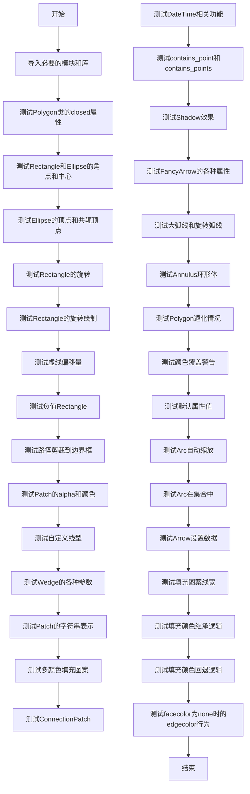
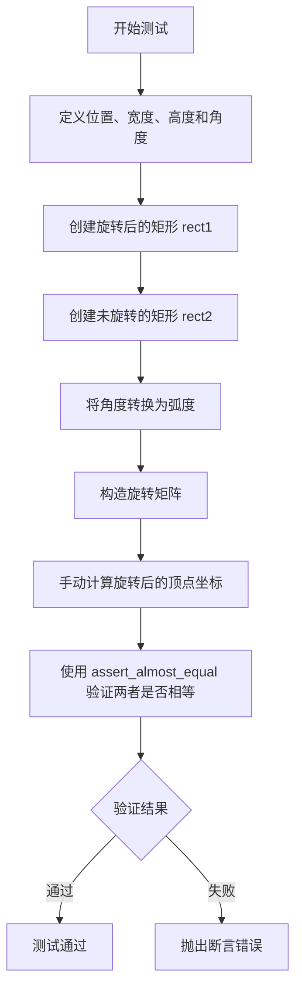
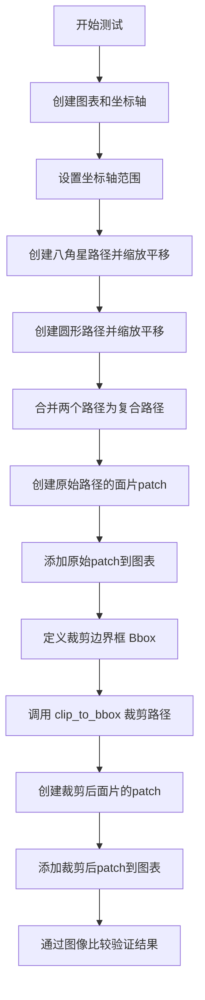
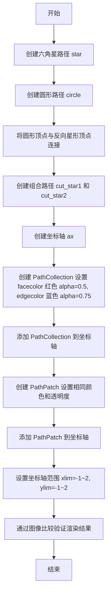
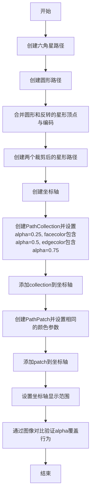
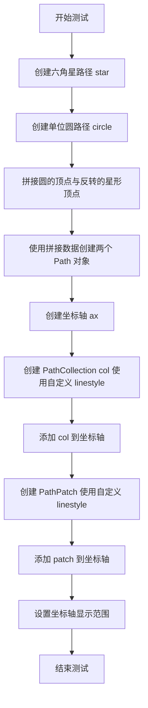
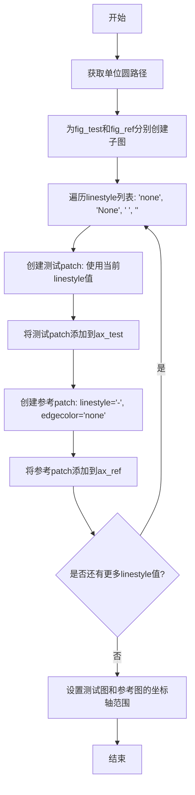
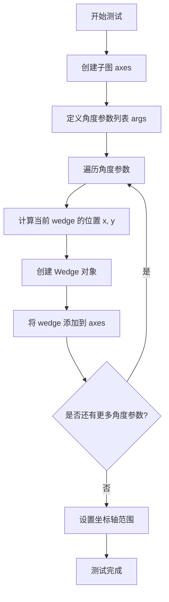
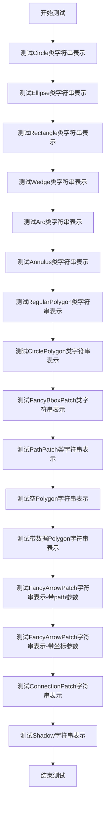

# `matplotlib\lib\matplotlib\tests\test_patches.py` 详细设计文档

这是matplotlib库中patches模块的测试文件，涵盖了各种图形补丁（Patch）类的功能测试，包括Polygon、Rectangle、Ellipse、Annulus、Arc、Wedge等图形的创建、属性设置、几何变换、渲染效果以及与坐标系统的交互测试。

## 整体流程



## 类结构

```
测试文件 (无类定义)
├── 全局测试函数
│   ├── test_Polygon_close
│   ├── test_corner_center
│   ├── test_ellipse_vertices
│   ├── test_rotate_rect
│   ├── test_rotate_rect_draw
│   ├── test_dash_offset_patch_draw
│   ├── test_negative_rect
│   ├── test_clip_to_bbox
│   ├── test_patch_alpha_coloring
│   ├── test_patch_alpha_override
│   ├── test_patch_color_none
│   ├── test_patch_custom_linestyle
│   ├── test_patch_linestyle_accents
│   ├── test_patch_linestyle_none
│   ├── test_wedge_movement
│   ├── test_wedge_range
│   ├── test_patch_str
│   ├── test_multi_color_hatch
│   ├── test_units_rectangle
│   ├── test_connection_patch
│   ├── test_connection_patch_fig
│   ├── test_connection_patch_pixel_points
│   ├── test_datetime_rectangle
│   ├── test_datetime_datetime_fails
│   ├── test_contains_point
│   ├── test_contains_points
│   ├── test_shadow
│   ├── test_fancyarrow_units
│   ├── test_fancyarrow_setdata
│   ├── test_large_arc
│   ├── test_rotated_arcs
│   ├── test_fancyarrow_shape_error
│   ├── test_boxstyle_errors
│   ├── test_annulus
│   ├── test_annulus_setters
│   ├── test_annulus_setters2
│   ├── test_degenerate_polygon
│   ├── test_color_override_warning
│   ├── test_empty_verts
│   ├── test_default_antialiased
│   ├── test_default_linestyle
│   ├── test_default_capstyle
│   ├── test_default_joinstyle
│   ├── test_autoscale_arc
│   ├── test_arc_in_collection
│   ├── test_modifying_arc
│   ├── test_arrow_set_data
│   ├── test_set_and_get_hatch_linewidth
│   ├── test_patch_hatchcolor_inherit_logic
│   ├── test_patch_hatchcolor_fallback_logic
│   ├── test_facecolor_none_force_edgecolor_false
│   ├── test_facecolor_none_force_edgecolor_true
│   ├── test_facecolor_none_edgecolor_force_edgecolor
│   └── test_empty_fancyarrow
```

## 全局变量及字段


### `platform`
    
Provides system information such as the operating system platform and architecture.

类型：`module`
    


### `np`
    
Alias for the NumPy library, providing support for large multi-dimensional arrays and mathematical functions.

类型：`module`
    


### `pytest`
    
The pytest testing framework for writing and running unit tests.

类型：`module`
    


### `mpl`
    
The Matplotlib library, a comprehensive tool for creating visualizations in Python.

类型：`module`
    


### `mpl.style`
    
The style management submodule of Matplotlib for controlling figure aesthetics.

类型：`module`
    


### `plt`
    
The Matplotlib.pyplot module, providing a MATLAB-like interface for creating plots.

类型：`module`
    


### `mcollections`
    
The Matplotlib collections module for managing groups of artists.

类型：`module`
    


### `mcolors`
    
The Matplotlib colors module for handling color maps and conversions.

类型：`module`
    


### `mpatches`
    
The Matplotlib patches module containing classes for geometric shape objects.

类型：`module`
    


### `mpath`
    
The Matplotlib path module for handling vector drawing paths.

类型：`module`
    


### `mtransforms`
    
The Matplotlib transforms module for handling coordinate transformations.

类型：`module`
    


### `rcParams`
    
A dictionary-like object holding default Matplotlib settings and parameters.

类型：`dict-like`
    


### `mpatches.Annulus`
    
Draws an annulus (ring-shaped region) with inner and outer radii, optionally elliptical.

类型：`class`
    


### `mpatches.Ellipse`
    
Represents an ellipse defined by its center, width, height, and rotation angle.

类型：`class`
    


### `mpatches.Patch`
    
Base class for all patch objects, providing common properties and rendering methods.

类型：`class`
    


### `mpatches.Polygon`
    
A patch defined by a list of vertices forming a closed polygonal shape.

类型：`class`
    


### `mpatches.Rectangle`
    
A patch representing a rectangle with a given corner, width, height, and optional rotation.

类型：`class`
    


### `mpatches.FancyArrowPatch`
    
A customizable arrow patch with adjustable head style, shaft, and connection.

类型：`class`
    


### `mpatches.FancyArrow`
    
A simple arrow patch that draws an arrow with optional line style.

类型：`class`
    


### `mpatches.BoxStyle`
    
Defines styling options for FancyBboxPatch, such as rounding or clipping.

类型：`class`
    


### `mpatches.Arc`
    
Draws an arc (portion of an ellipse) between two angles.

类型：`class`
    


### `mtransforms.Bbox`
    
Represents an axis-aligned bounding box defined by minimum and maximum x and y coordinates.

类型：`class`
    
    

## 全局函数及方法


### `test_Polygon_close`

该测试函数用于验证 `Polygon` 类的 `closed` 属性在不同场景下的行为，特别是当使用 `set_xy` 方法设置顶点时，路径是否正确闭合。

参数：无

返回值：无

#### 流程图

```mermaid
flowchart TD
    A[开始测试] --> B[定义开放顶点 xy = [[0, 0], [0, 1], [1, 1]]]
    B --> C[定义闭合顶点 xyclosed = xy + [[0, 0]]]
    
    C --> D[测试1: 从开放路径开始并关闭]
    D --> D1[创建 Polygon(xy, closed=True)]
    D1 --> D2[断言 get_closed() 返回 True]
    D2 --> D3[断言 get_xy() 等于 xyclosed]
    D3 --> D4[调用 set_xy(xy)]
    D4 --> D5[断言 get_xy() 仍等于 xyclosed]
    
    C --> E[测试2: 从闭合路径开始并打开]
    E --> E1[创建 Polygon(xyclosed, closed=False)]
    E1 --> E2[断言 get_xy() 等于 xy]
    E2 --> E3[调用 set_xy(xyclosed)]
    E3 --> E4[断言 get_xy() 等于 xy]
    
    C --> F[测试3: 保持开放状态]
    F --> F1[创建 Polygon(xy, closed=False)]
    F1 --> F2[断言 get_closed() 返回 False]
    F2 --> F3[断言 get_xy() 等于 xy]
    F3 --> F4[调用 set_xy(xy)]
    F4 --> F5[断言 get_xy() 等于 xy]
    
    C --> G[测试4: 保持闭合状态]
    G --> G1[创建 Polygon(xyclosed, closed=True)]
    G1 --> G2[断言 get_xy() 等于 xyclosed]
    G2 --> G3[调用 set_xy(xyclosed)]
    G3 --> G4[断言 get_xy() 等于 xyclosed]
    
    D5 --> H[所有测试通过]
    E4 --> H
    F5 --> H
    G4 --> H
    H --> I[结束测试]
```

#### 带注释源码

```python
def test_Polygon_close():
    """
    测试 Polygon 类的 closed 属性在不同场景下的行为。
    
    GitHub issue #1018 发现了一个 bug：Polygon 处理 closed 属性时，
    当使用 set_xy 设置顶点时，路径没有正确闭合。
    本测试函数验证修复后在不同场景下的正确行为。
    """
    
    # 开放的顶点集合（不包含首尾相接的点）
    xy = [[0, 0], [0, 1], [1, 1]]
    
    # 闭合的顶点集合（在末尾添加了起点形成闭合）
    xyclosed = xy + [[0, 0]]
    
    # ========================================
    # 场景1: 从开放路径开始，然后关闭它
    # ========================================
    # 创建一个初始为开放的 Polygon，但指定 closed=True
    p = Polygon(xy, closed=True)
    
    # 验证 closed 属性为 True
    assert p.get_closed()
    
    # 验证内部存储的顶点是闭合的（自动添加了终点）
    assert_array_equal(p.get_xy(), xyclosed)
    
    # 使用 set_xy 重新设置顶点
    p.set_xy(xy)
    
    # 验证 set_xy 后仍然保持闭合状态
    assert_array_equal(p.get_xy(), xyclosed)
    
    # ========================================
    # 场景2: 从闭合路径开始，然后打开它
    # ========================================
    # 创建一个初始为闭合的 Polygon，但指定 closed=False
    p = Polygon(xyclosed, closed=False)
    
    # 验证 get_xy() 自动去除了闭合点，返回开放形式
    assert_array_equal(p.get_xy(), xy)
    
    # 使用 set_xy 设置闭合的顶点
    p.set_xy(xyclosed)
    
    # 验证 set_xy 后根据 closed=False 自动去除闭合点
    assert_array_equal(p.get_xy(), xy)
    
    # ========================================
    # 场景3: 保持开放状态不变
    # ========================================
    # 创建一个保持开放的 Polygon
    p = Polygon(xy, closed=False)
    
    # 验证 closed 属性为 False
    assert not p.get_closed()
    
    # 验证获取的顶点为开放形式
    assert_array_equal(p.get_xy(), xy)
    
    # 使用 set_xy 设置顶点
    p.set_xy(xy)
    
    # 验证保持开放状态
    assert_array_equal(p.get_xy(), xy)
    
    # ========================================
    # 场景4: 保持闭合状态不变
    # ========================================
    # 创建一个保持闭合的 Polygon
    p = Polygon(xyclosed, closed=True)
    
    # 验证获取的顶点为闭合形式
    assert_array_equal(p.get_xy(), xyclosed)
    
    # 使用 set_xy 设置顶点
    p.set_xy(xyclosed)
    
    # 验证保持闭合状态
    assert_array_equal(p.get_xy(), xyclosed)
```


### `test_corner_center`

该测试函数用于验证 `Rectangle` 和 `Ellipse` 图形的 `get_corners()` 和 `get_center()` 方法在不同旋转角度下的计算正确性，包括无旋转、90度旋转以及任意角度旋转的场景。

参数：

- 无参数

返回值：`None`，无返回值（测试函数）

#### 流程图

```mermaid
flowchart TD
    A[开始测试 test_corner_center] --> B[设置 loc=[10, 20], width=1, height=2]
    B --> C[创建 Rectangle 并验证无旋转时的角点和中心点]
    C --> D[设置旋转角度为90度]
    D --> E[验证90度旋转后的角点和中心点]
    E --> F[设置旋转角度为33度]
    F --> G[使用 Affine2D 变换计算期望的角点]
    G --> H[验证33度旋转后的角点]
    H --> I[调整 loc 为矩形中心, 创建 Ellipse]
    I --> J[验证椭圆无旋转时的角点]
    J --> K[设置椭圆旋转角度为90度]
    K --> L[验证椭圆90度旋转后的角点和中心点]
    L --> M[设置椭圆旋转角度为33度]
    M --> N[验证椭圆33度旋转后的角点]
    N --> O[结束测试]
```

#### 带注释源码

```python
def test_corner_center():
    """
    测试 Rectangle 和 Ellipse 的 get_corners() 和 get_center() 方法
    在不同旋转角度下的正确性
    """
    # 定义位置、宽度和高度
    loc = [10, 20]
    width = 1
    height = 2

    # ---------- Rectangle 测试 ----------
    # 无旋转情况
    # 期望的四个角点坐标（左下、右下、右上、左上）
    corners = ((10, 20), (11, 20), (11, 22), (10, 22))
    # 创建 Rectangle 图元，参数为：位置、宽度、高度
    rect = Rectangle(loc, width, height)
    # 验证 get_corners() 返回的角点坐标是否正确
    assert_array_equal(rect.get_corners(), corners)
    # 验证 get_center() 返回的中心点坐标是否正确
    assert_array_equal(rect.get_center(), (10.5, 21))

    # 90度旋转情况
    # 旋转后的期望角点坐标
    corners_rot = ((10, 20), (10, 21), (8, 21), (8, 20))
    # 设置旋转角度为90度
    rect.set_angle(90)
    # 验证旋转后的角点
    assert_array_equal(rect.get_corners(), corners_rot)
    # 验证旋转后的中心点（矩形中心会随旋转改变）
    assert_array_equal(rect.get_center(), (9, 20.5))

    # 非90度倍数的旋转（33度）
    theta = 33
    # 创建旋转矩阵，绕 loc 点旋转 theta 角度
    t = mtransforms.Affine2D().rotate_around(*loc, np.deg2rad(theta))
    # 使用变换矩阵计算期望的角点坐标
    corners_rot = t.transform(corners)
    # 设置旋转角度
    rect.set_angle(theta)
    # 验证旋转后的角点（允许小的浮点误差）
    assert_almost_equal(rect.get_corners(), corners_rot)

    # ---------- Ellipse 测试 ----------
    # 重新计算 loc 为矩形的中心点
    loc = [loc[0] + width / 2,
           loc[1] + height / 2]
    # 创建 Ellipse 图元
    ellipse = Ellipse(loc, width, height)

    # 无旋转情况（角点与之前 Rectangle 相同）
    assert_array_equal(ellipse.get_corners(), corners)

    # 90度旋转情况
    # 椭圆旋转90度后的期望角点坐标
    corners_rot = ((11.5, 20.5), (11.5, 21.5), (9.5, 21.5), (9.5, 20.5))
    ellipse.set_angle(90)
    assert_array_equal(ellipse.get_corners(), corners_rot)
    # 验证椭圆中心点不随旋转改变
    assert_array_equal(ellipse.get_center(), loc)

    # 非90度倍数的旋转（33度）
    # 创建新的旋转变换矩阵
    t = mtransforms.Affine2D().rotate_around(*loc, np.deg2rad(theta))
    # 计算期望的角点坐标
    corners_rot = t.transform(corners)
    # 设置旋转角度
    ellipse.set_angle(theta)
    # 验证旋转后的角点
    assert_almost_equal(ellipse.get_corners(), corners_rot)
```


### `test_ellipse_vertices`

该函数是针对 `Ellipse` 类的单元测试，验证椭圆的主轴顶点（`get_vertices`）和共轭轴顶点（`get_co_vertices`）计算的正确性。测试覆盖三种场景：零尺寸椭圆、任意角度旋转的椭圆以及复杂参数的椭圆，并验证顶点对的中点始终等于椭圆中心。

参数：
- 该函数没有参数

返回值：`None`，该函数为测试函数，使用 `assert` 语句进行断言验证，不返回任何值

#### 流程图

```mermaid
flowchart TD
    A[开始测试] --> B[创建零尺寸椭圆 width=0, height=0]
    B --> C[断言 get_vertices 和 get_co_vertices 返回 [(0,0), (0,0)]]
    C --> D[创建旋转椭圆 width=2, height=1, angle=30]
    D --> E[断言 get_vertices 返回正确主轴顶点坐标]
    E --> F[断言 get_co_vertices 返回正确共轭轴顶点坐标]
    F --> G[验证主轴和共轭轴顶点对的中点等于椭圆中心]
    G --> H[创建复杂参数椭圆 xy=(2.252,-10.859), width=2.265, height=1.98, angle=68.78]
    H --> I[再次验证顶点对的中点等于椭圆中心]
    I --> J[结束测试]
```

#### 带注释源码

```python
def test_ellipse_vertices():
    """
    测试 Ellipse 类的 get_vertices 和 get_co_vertices 方法
    
    验证场景：
    1. 零宽度和零高度椭圆的边界情况处理
    2. 任意旋转角度下椭圆主轴和共轭轴顶点的精确计算
    3. 椭圆几何中心与顶点对中点的对应关系
    """
    # 测试用例1：零尺寸椭圆（退化椭圆）
    # 预期行为：返回两个 (0.0, 0.0) 坐标，表示顶点和共轭顶点都收缩到中心
    ellipse = Ellipse(xy=(0, 0), width=0, height=0, angle=0)
    assert_almost_equal(
        ellipse.get_vertices(),
        [(0.0, 0.0), (0.0, 0.0)],
    )
    assert_almost_equal(
        ellipse.get_co_vertices(),
        [(0.0, 0.0), (0.0, 0.0)],
    )

    # 测试用例2：带30度旋转的椭圆
    # 验证主轴顶点计算：椭圆主轴端点坐标基于 width/4 和旋转角度计算
    # 公式：center ± (width/4 * sqrt(3), width/4) 旋转30度后的坐标
    ellipse = Ellipse(xy=(0, 0), width=2, height=1, angle=30)
    assert_almost_equal(
        ellipse.get_vertices(),
        [
            (
                ellipse.center[0] + ellipse.width / 4 * np.sqrt(3),
                ellipse.center[1] + ellipse.width / 4,
            ),
            (
                ellipse.center[0] - ellipse.width / 4 * np.sqrt(3),
                ellipse.center[1] - ellipse.width / 4,
            ),
        ],
    )
    # 验证共轭轴顶点计算：共轭轴端点坐标基于 height/4 和旋转角度计算
    assert_almost_equal(
        ellipse.get_co_vertices(),
        [
            (
                ellipse.center[0] - ellipse.height / 4,
                ellipse.center[1] + ellipse.height / 4 * np.sqrt(3),
            ),
            (
                ellipse.center[0] + ellipse.height / 4,
                ellipse.center[1] - ellipse.height / 4 * np.sqrt(3),
            ),
        ],
    )
    # 几何验证：椭圆主轴和共轭轴的两个端点连线的中点应等于椭圆几何中心
    v1, v2 = np.array(ellipse.get_vertices())
    np.testing.assert_almost_equal((v1 + v2) / 2, ellipse.center)
    v1, v2 = np.array(ellipse.get_co_vertices())
    np.testing.assert_almost_equal((v1 + v2) / 2, ellipse.center)

    # 测试用例3：大角度旋转（68.78度）的复杂参数椭圆
    # 使用非整数坐标和较大旋转角度，进一步验证顶点计算的正确性
    ellipse = Ellipse(xy=(2.252, -10.859), width=2.265, height=1.98, angle=68.78)
    v1, v2 = np.array(ellipse.get_vertices())
    np.testing.assert_almost_equal((v1 + v2) / 2, ellipse.center)
    v1, v2 = np.array(ellipse.get_co_vertices())
    np.testing.assert_almost_equal((v1 + v2) / 2, ellipse.center)
```


### `test_rotate_rect`

该测试函数用于验证 `Rectangle` 类在给定角度旋转后，其顶点坐标计算的正确性。测试通过手动构造旋转矩阵并对未旋转矩形的顶点进行变换，将结果与直接使用 `angle` 参数创建的旋转矩形的顶点进行对比，以确认旋转实现的一致性。

参数：此函数无参数。

返回值：`None`，该函数为测试函数，不返回任何值，仅通过断言验证计算结果。

#### 流程图



#### 带注释源码

```python
def test_rotate_rect():
    """
    测试 Rectangle 类的旋转功能是否正确。
    通过手动构造旋转矩阵并对未旋转矩形的顶点进行变换，
    将结果与直接使用 angle 参数创建的旋转矩形进行对比验证。
    """
    # 定义矩形的位置坐标，使用 numpy 数组
    loc = np.asarray([1.0, 2.0])
    # 定义矩形的宽度和高度
    width = 2
    height = 3
    # 定义旋转角度（度）
    angle = 30.0

    # 创建一个带旋转角度的矩形
    # Rectangle 类内部会处理旋转逻辑
    rect1 = Rectangle(loc, width, height, angle=angle)

    # 创建一个未旋转的矩形，用于手动计算旋转后的顶点
    rect2 = Rectangle(loc, width, height)

    # 将角度转换为弧度，因为 numpy 的三角函数需要弧度输入
    angle_rad = np.pi * angle / 180.0

    # 构造二维旋转矩阵
    # 旋转矩阵公式:
    # [cos(θ)  -sin(θ)]
    # [sin(θ)   cos(θ)]
    rotation_matrix = np.array([[np.cos(angle_rad), -np.sin(angle_rad)],
                                [np.sin(angle_rad),  np.cos(angle_rad)]])

    # 手动计算旋转后的顶点坐标
    # 步骤：
    # 1. 获取未旋转矩形的顶点 (rect2.get_verts())
    # 2. 将顶点平移到原点 (减去 loc)
    # 3. 应用旋转矩阵 (np.inner)
    # 4. 转置结果 (.T)
    # 5. 移回原位置 (加上 loc)
    new_verts = np.inner(rotation_matrix, rect2.get_verts() - loc).T + loc

    # 使用 assert_almost_equal 验证两者的顶点是否几乎相等
    # 如果旋转实现正确，两个矩形应该有相同的顶点
    assert_almost_equal(rect1.get_verts(), new_verts)
```


### `test_rotate_rect_draw`

该测试函数验证了在将矩形（Rectangle）添加到 Axes 后再修改其角度时，patch 会被正确标记为 stale 并在正确的位置重绘。

参数：

- `fig_test`：`matplotlib.figure.Figure`，测试用的 figure 对象
- `fig_ref`：`matplotlib.figure.Figure`，参考（预期结果）用的 figure 对象

返回值：`None`，无返回值（测试函数）

#### 流程图

```mermaid
flowchart TD
    A[开始] --> B[为测试figure和参考figure分别创建子坐标轴]
    B --> C[定义矩形参数: loc=(0,0), width=1, height=1, angle=30]
    C --> D[创建带角度的参考矩形并添加到参考坐标轴]
    D --> E[断言参考矩形的角度为30度]
    E --> F[创建无角度的测试矩形]
    F --> G[断言测试矩形初始角度为0]
    G --> H[将测试矩形添加到测试坐标轴]
    H --> I[设置测试矩形的角度为30度]
    I --> J[断言测试矩形的角度为30度]
    J --> K[结束]
    
    style D fill:#90EE90
    style F fill:#FFE4B5
    style I fill:#FFB6C1
```

#### 带注释源码

```python
@check_figures_equal()
def test_rotate_rect_draw(fig_test, fig_ref):
    # 为测试figure创建一个子坐标轴
    ax_test = fig_test.add_subplot()
    # 为参考figure创建一个子坐标轴
    ax_ref = fig_ref.add_subplot()

    # 定义矩形的位置和尺寸
    loc = (0, 0)          # 矩形左下角坐标
    width, height = (1, 1)  # 矩形宽度和高度
    angle = 30            # 旋转角度（度）

    # 创建一个带旋转角度的参考矩形
    rect_ref = Rectangle(loc, width, height, angle=angle)
    # 将参考矩形添加到参考坐标轴
    ax_ref.add_patch(rect_ref)
    # 验证参考矩形的角度设置正确
    assert rect_ref.get_angle() == angle

    # 验证逻辑：
    # 当矩形在添加到Axes之后修改角度时，patch会被标记为stale
    # 并在正确的位置重绘
    
    # 创建一个初始角度为0的测试矩形
    rect_test = Rectangle(loc, width, height)
    # 验证测试矩形初始角度为0
    assert rect_test.get_angle() == 0
    # 将测试矩形添加到测试坐标轴
    ax_test.add_patch(rect_test)
    # 修改测试矩形的角度为30度
    rect_test.set_angle(angle)
    # 验证测试矩形的角度已更新
    assert rect_test.get_angle() == angle
```


### `test_dash_offset_patch_draw`

该测试函数用于验证 matplotlib 中 Rectangle 补丁（patch）的虚线样式（dash offset）是否能在初始化时正确设置，以及通过不同的 linestyle 参数组合是否能产生相同的视觉效果。

参数：

- `fig_test`：`matplotlib.figure.Figure`，测试组图形对象，用于添加待测试的 Rectangle 补丁
- `fig_ref`：`matplotlib.figure.Figure`，参考组图形对象，用于添加期望结果的 Rectangle 补丁

返回值：`None`，该函数为测试函数，不返回任何值

#### 流程图

```mermaid
flowchart TD
    A[开始测试] --> B[创建测试组子图 ax_test]
    B --> C[创建参考组子图 ax_ref]
    C --> D[定义矩形位置和尺寸: loc=(0.1, 0.1), width=0.8, height=0.8]
    D --> E[创建参考矩形 rect_ref: 蓝色, 线宽3, linestyle=(0, [6, 6])]
    E --> F[创建参考矩形 rect_ref2: 红色, 线宽3, linestyle=(0, [0, 6, 6, 0])]
    F --> G[验证 rect_ref 和 rect_ref2 的 linestyle]
    G --> H[将 rect_ref 和 rect_ref2 添加到 ax_ref]
    H --> I[创建测试矩形 rect_test: 蓝色, 线宽3, linestyle=(0, [6, 6])]
    I --> J[创建测试矩形 rect_test2: 红色, 线宽3, linestyle=(6, [6, 6])]
    J --> K[验证 rect_test 和 rect_test2 的 linestyle]
    K --> L[将 rect_test 和 rect_test2 添加到 ax_test]
    L --> M[结束测试]
```

#### 带注释源码

```python
@check_figures_equal()
def test_dash_offset_patch_draw(fig_test, fig_ref):
    # 创建测试组和参考组的子图
    ax_test = fig_test.add_subplot()
    ax_ref = fig_ref.add_subplot()

    # 定义矩形的位置和尺寸
    loc = (0.1, 0.1)
    width, height = (0.8, 0.8)
    
    # 创建参考矩形1: 蓝色, 线宽3, 虚线样式(0, [6, 6])表示从0开始, 交替6点实线6点空白
    rect_ref = Rectangle(loc, width, height, linewidth=3, edgecolor='b',
                                                linestyle=(0, [6, 6]))
    # 创建参考矩形2: 红色, 线宽3, 虚线样式(0, [0, 6, 6, 0])填充线间隙
    # 这种写法等价于(6, [6, 6])但dash offset为0
    rect_ref2 = Rectangle(loc, width, height, linewidth=3, edgecolor='r',
                                            linestyle=(0, [0, 6, 6, 0]))
    
    # 断言验证两个参考矩形的linestyle设置正确
    assert rect_ref.get_linestyle() == (0, [6, 6])
    assert rect_ref2.get_linestyle() == (0, [0, 6, 6, 0])

    # 将参考矩形添加到参考子图
    ax_ref.add_patch(rect_ref)
    ax_ref.add_patch(rect_ref2)

    # 验证dash offset的两种设置方式是否等价:
    # 方式1: 在init方法中直接传入dash offset
    # 方式2: 通过调整onoff序列来实现相同效果
    
    # 测试矩形1: 蓝色, 直接设置dash offset=0, dash pattern=[6, 6]
    rect_test = Rectangle(loc, width, height, linewidth=3, edgecolor='b',
                                                    linestyle=(0, [6, 6]))
    # 测试矩形2: 红色, 设置dash offset=6, dash pattern=[6, 6]
    # 这应该产生与rect_ref2相同的视觉效果
    rect_test2 = Rectangle(loc, width, height, linewidth=3, edgecolor='r',
                                                    linestyle=(6, [6, 6]))
    
    # 断言验证测试矩形的linestyle设置
    assert rect_test.get_linestyle() == (0, [6, 6])
    assert rect_test2.get_linestyle() == (6, [6, 6])

    # 将测试矩形添加到测试子图
    ax_test.add_patch(rect_test)
    ax_test.add_patch(rect_test2)
```


### `test_negative_rect`

该函数是一个单元测试，用于验证当矩形的宽度和高度为负值时，`Rectangle` 类能够正确生成与正尺寸矩形相同的顶点（只是起点不同）。

参数： 无

返回值： `None`，该函数为测试函数，不返回任何值

#### 流程图

```mermaid
flowchart TD
    A[开始测试] --> B[创建正尺寸矩形: Rectangle((-3,-2), 3, 2)]
    C[开始测试] --> D[创建负尺寸矩形: Rectangle((0,0), -3, -2)]
    B --> E[获取正尺寸矩形顶点: pos_vertices = get_verts()[:-1]]
    D --> F[获取负尺寸矩形顶点: neg_vertices = get_verts()[:-1]]
    E --> G[验证: np.roll(neg_vertices, 2, 0) == pos_vertices]
    F --> G
    G --> H{断言是否通过}
    H -->|通过| I[测试通过]
    H -->|失败| J[抛出AssertionError]
```

#### 带注释源码

```python
def test_negative_rect():
    """
    测试当矩形的宽度和高度为负值时，Rectangle类是否能够正确处理。
    
    该测试验证了以下场景：
    - 正尺寸矩形: 位置(-3, -2), 宽度3, 高度2
    - 负尺寸矩形: 位置(0, 0), 宽度-3, 高度-2
    
    这两个矩形应该具有相同的顶点，只是起始点不同。
    """
    # 这两个矩形具有相同的顶点，但起点不同。
    # （我们还删除了最后一个顶点，因为它是重复的。）
    
    # 创建正尺寸矩形：从点(-3, -2)开始，宽3，高2
    pos_vertices = Rectangle((-3, -2), 3, 2).get_verts()[:-1]
    
    # 创建负尺寸矩形：从点(0, 0)开始，宽-3，高-2
    neg_vertices = Rectangle((0, 0), -3, -2).get_verts()[:-1]
    
    # 使用np.roll将neg_vertices滚动2个位置后，应该与pos_vertices相等
    # 这证明了两个矩形虽然起点不同，但定义的顶点集合是相同的
    assert_array_equal(np.roll(neg_vertices, 2, 0), pos_vertices)
```


### `test_clip_to_bbox`

该测试函数用于验证 `Path.clip_to_bbox()` 方法的功能，通过创建复合路径、应用边界框裁剪，并在图表中可视化裁剪前后的路径效果，确保裁剪操作的正确性。

参数：

- 该函数无显式参数（使用 pytest 的隐式参数 `fig_test` 和 `fig_ref`，但通过 `@image_comparison` 装饰器处理）

返回值：`None`，该函数通过 `@image_comparison` 装饰器进行图像比较验证

#### 流程图



#### 带注释源码

```python
@image_comparison(['clip_to_bbox.png'])
def test_clip_to_bbox():
    """测试 Path.clip_to_bbox() 方法的功能"""
    
    # 创建图表和坐标轴
    fig, ax = plt.subplots()
    
    # 设置坐标轴的显示范围
    ax.set_xlim([-18, 20])
    ax.set_ylim([-150, 100])

    # 创建单位八角星路径并进行深拷贝
    path = mpath.Path.unit_regular_star(8).deepcopy()
    # 缩放顶点：x方向10倍，y方向100倍
    path.vertices *= [10, 100]
    # 平移顶点：x方向-5，y方向-25
    path.vertices -= [5, 25]

    # 创建单位圆形路径并进行深拷贝
    path2 = mpath.Path.unit_circle().deepcopy()
    # 缩放顶点：x方向10倍，y方向100倍
    path2.vertices *= [10, 100]
    # 平移顶点：x方向+10，y方向-25
    path2.vertices += [10, -25]

    # 将两个路径合并为一个复合路径
    combined = mpath.Path.make_compound_path(path, path2)

    # 创建原始路径的面片patch（珊瑚色，半透明，无边框）
    patch = mpatches.PathPatch(
        combined, alpha=0.5, facecolor='coral', edgecolor='none')
    # 将原始patch添加到坐标轴
    ax.add_patch(patch)

    # 定义裁剪边界框（左下角[-12, -77.5]，右上角[50, -110]）
    bbox = mtransforms.Bbox([[-12, -77.5], [50, -110]])
    
    # 调用 clip_to_bbox 方法对路径进行边界框裁剪
    result_path = combined.clip_to_bbox(bbox)
    
    # 创建裁剪后路径的patch（绿色，线宽4，黑色边框）
    result_patch = mpatches.PathPatch(
        result_path, alpha=0.5, facecolor='green', lw=4, edgecolor='black')

    # 将裁剪后的patch添加到坐标轴
    ax.add_patch(result_patch)
```


### test_patch_alpha_coloring

测试 patch 和 collection 是否按照指定的 alpha 值正确渲染 facecolor 和 edgecolor。

参数： 无

返回值： `None`，该测试函数不返回任何值，仅通过图像比较验证渲染结果

#### 流程图



#### 带注释源码

```python
@image_comparison(['patch_alpha_coloring'], remove_text=True)
def test_patch_alpha_coloring():
    """
    Test checks that the patch and collection are rendered with the specified
    alpha values in their facecolor and edgecolor.
    """
    # 创建六角星路径对象
    star = mpath.Path.unit_regular_star(6)
    # 创建圆形路径对象
    circle = mpath.Path.unit_circle()
    # 将圆形顶点与反向星形顶点连接,形成带内部剪切区域的图形
    # 圆形作为外边界,星形作为内部剪切洞
    verts = np.concatenate([circle.vertices, star.vertices[::-1]])
    codes = np.concatenate([circle.codes, star.codes])
    # 创建两个组合路径,一个偏移1单位
    cut_star1 = mpath.Path(verts, codes)
    cut_star2 = mpath.Path(verts + 1, codes)

    # 创建坐标轴对象
    ax = plt.axes()
    # 创建 PathCollection 集合对象
    # facecolor=(1,0,0,0.5) 红色 50% 透明度
    # edgecolor=(0,0,1,0.75) 蓝色 75% 透明度
    col = mcollections.PathCollection([cut_star2],
                                      linewidth=5, linestyles='dashdot',
                                      facecolor=(1, 0, 0, 0.5),
                                      edgecolor=(0, 0, 1, 0.75))
    # 将集合添加到坐标轴
    ax.add_collection(col)

    # 创建 PathPatch 图形对象,设置相同的颜色和透明度
    patch = mpatches.PathPatch(cut_star1,
                               linewidth=5, linestyle='dashdot',
                               facecolor=(1, 0, 0, 0.5),
                               edgecolor=(0, 0, 1, 0.75))
    # 将补丁添加到坐标轴
    ax.add_patch(patch)

    # 设置坐标轴显示范围
    ax.set_xlim(-1, 2)
    ax.set_ylim(-1, 2)
```


### `test_patch_alpha_override`

该测试函数验证了当为 patch 或 collection 显式指定 alpha 属性时，该 alpha 值会覆盖 facecolor 或 edgecolor 中包含的 alpha 成分。

参数：无

返回值：无

#### 流程图



#### 带注释源码

```python
@image_comparison(['patch_alpha_override'], remove_text=True)
def test_patch_alpha_override():
    #: Test checks that specifying an alpha attribute for a patch or
    #: collection will override any alpha component of the facecolor
    #: or edgecolor.
    
    # 创建六角星路径对象
    star = mpath.Path.unit_regular_star(6)
    # 创建单位圆形路径对象
    circle = mpath.Path.unit_circle()
    
    # concatenate the star with an internal cutout of the circle
    # 将圆形顶点与反转的星形顶点连接，创建带孔的星形
    verts = np.concatenate([circle.vertices, star.vertices[::-1]])
    codes = np.concatenate([circle.codes, star.codes])
    
    # 创建两个路径对象：一个用于patch，一个用于collection
    cut_star1 = mpath.Path(verts, codes)
    cut_star2 = mpath.Path(verts + 1, codes)

    # 创建坐标轴
    ax = plt.axes()
    
    # 创建PathCollection对象，设置alpha=0.25覆盖facecolor和edgecolor中的alpha值
    col = mcollections.PathCollection([cut_star2],
                                      linewidth=5, linestyles='dashdot',
                                      alpha=0.25,  # 显式alpha将覆盖下面的facecolor和edgecolor中的alpha
                                      facecolor=(1, 0, 0, 0.5),  # 包含alpha=0.5
                                      edgecolor=(0, 0, 1, 0.75)) # 包含alpha=0.75
    ax.add_collection(col)

    # 创建PathPatch对象，同样设置alpha=0.25覆盖facecolor和edgecolor中的alpha
    patch = mpatches.PathPatch(cut_star1,
                               linewidth=5, linestyle='dashdot',
                               alpha=0.25,  # 显式alpha将覆盖下面的facecolor和edgecolor中的alpha
                               facecolor=(1, 0, 0, 0.5),  # 包含alpha=0.5
                               edgecolor=(0, 0, 1, 0.75)) # 包含alpha=0.75
    ax.add_patch(patch)

    # 设置坐标轴显示范围
    ax.set_xlim(-1, 2)
    ax.set_ylim(-1, 2)
```


### `test_patch_color_none`

该测试函数用于验证在使用 `facecolor='none'` 时，`alpha` 参数不会错误地覆盖无填充颜色的设置。这是对 GitHub issue #7478 的回归测试。

参数：
- 该函数无参数

返回值：`None`，该函数为测试函数，使用 `assert` 语句进行断言验证

#### 流程图

```mermaid
flowchart TD
    A[开始 test_patch_color_none] --> B[使用 mpl.style.context 设置样式为 'default']
    B --> C[创建 Circle 对象: 圆心(0,0), 半径1, facecolor='none', alpha=1]
    C --> D[调用 c.get_facecolor 获取实际面颜色]
    D --> E{断言: facecolor[0] == 0?}
    E -->|是| F[测试通过]
    E -->|否| G[测试失败]
```

#### 带注释源码

```python
@mpl.style.context('default')  # 装饰器：临时应用 'default' 样式上下文
def test_patch_color_none():
    # Make sure the alpha kwarg does not override 'none' facecolor.
    # Addresses issue #7478.
    # 注释：确保 alpha 参数不会覆盖 'none'  facecolor
    # 背景：GitHub issue #7478 报告的 bug，当同时设置 facecolor='none' 和 alpha=1 时，
    # alpha 参数错误地覆盖了 'none' 设置，导致预期行为被破坏
    
    c = plt.Circle((0, 0), 1, facecolor='none', alpha=1)
    # 创建 Circle 对象：圆心(0,0)，半径为1
    # facecolor='none' 表示无填充（透明）
    # alpha=1 表示完全不透明
    
    assert c.get_facecolor()[0] == 0
    # 断言验证：获取的面颜色数组的第一个元素应该为 0（即 'none'）
    # 如果 facecolor='none' 被正确保留，则 get_facecolor() 返回的颜色值中第一个分量应为 0
    # 如果 alpha 错误覆盖了 facecolor，则此断言将失败
```


### `test_patch_custom_linestyle`

该测试函数用于验证 patches（补丁）和 collections（集合）能够接受自定义虚线模式（custom dash patterns）作为线型（linestyle），并能正确渲染显示。

参数： 无（该测试函数没有显式参数）

返回值： 无（测试函数无返回值，通过 `@image_comparison` 装饰器进行图像比较验证）

#### 流程图



#### 带注释源码

```python
@image_comparison(['patch_custom_linestyle'], remove_text=True)
def test_patch_custom_linestyle():
    #: A test to check that patches and collections accept custom dash
    #: patterns as linestyle and that they display correctly.
    # 创建单位圆路径对象
    star = mpath.Path.unit_regular_star(6)
    # 创建六角星路径对象
    circle = mpath.Path.unit_circle()
    # concatenate the star with an internal cutout of the circle
    # 将圆的顶点与反转的星形顶点拼接，实现圆形内部切割星形的效果
    verts = np.concatenate([circle.vertices, star.vertices[::-1]])
    codes = np.concatenate([circle.codes, star.codes])
    # 使用拼接的顶点和编码创建两个路径对象
    cut_star1 = mpath.Path(verts, codes)
    cut_star2 = mpath.Path(verts + 1, codes)

    # 创建坐标轴
    ax = plt.axes()
    # 创建 PathCollection 集合，使用自定义虚线样式 (dash offset, dash pattern)
    # linestyles 参数接受自定义的 (offset, onoff_seq) 元组
    col = mcollections.PathCollection(
        [cut_star2],
        linewidth=5, linestyles=[(0, (5, 7, 10, 7))],
        facecolor=(1, 0, 0), edgecolor=(0, 0, 1))
    # 将集合添加到坐标轴
    ax.add_collection(col)

    # 创建 PathPatch 补丁，同样使用自定义虚线样式
    # linestyle=(0, (5, 7, 10, 7)) 表示：offset=0, pattern=[5,7,10,7] (交替的线段和间隔)
    patch = mpatches.PathPatch(
        cut_star1,
        linewidth=5, linestyle=(0, (5, 7, 10, 7)),
        facecolor=(1, 0, 0), edgecolor=(0, 0, 1))
    # 将补丁添加到坐标轴
    ax.add_patch(patch)

    # 设置坐标轴的显示范围
    ax.set_xlim(-1, 2)
    ax.set_ylim(-1, 2)
```


### `test_patch_linestyle_accents`

该测试函数用于验证 matplotlib 的 patch 组件是否支持使用简写符号（如 "--"、"-."、":"）以及完整名称（"solid"、"dashed"、"dashdot"、"dotted"）来指定线条样式。此测试对应 GitHub issue #2136。

参数：此函数无参数。

返回值：`None`，该函数为测试函数，不返回任何值。

#### 流程图

```mermaid
flowchart TD
    A[开始] --> B[创建单位圆路径]
    B --> C[创建正六角星路径]
    C --> D[合并顶点和编码为带孔图形]
    D --> E[定义 linestyle 列表: "-", "--", "-.", ":", "solid", "dashed", "dashdot", "dotted"]
    E --> F[创建 figure 和 axes]
    F --> G{遍历 linestyle 列表}
    G -->|每次迭代| H[创建 PathPatch, 使用当前 linestyle]
    H --> I[将 patch 添加到 axes]
    I --> G
    G --> J{遍历完成?}
    J -->|是| K[设置 x 和 y 轴范围]
    K --> L[绘制 canvas]
    L --> M[结束]
```

#### 带注释源码

```python
def test_patch_linestyle_accents():
    #: Test if linestyle can also be specified with short mnemonics like "--"
    #: c.f. GitHub issue #2136
    
    # 创建一个正六角星的路径对象
    star = mpath.Path.unit_regular_star(6)
    
    # 创建一个单位圆的路径对象
    circle = mpath.Path.unit_circle()
    
    # 合并圆和星形的顶点,星形顶点逆序以形成内部切割效果(带孔图形)
    verts = np.concatenate([circle.vertices, star.vertices[::-1]])
    codes = np.concatenate([circle.codes, star.codes])

    # 定义要测试的 linestyle 样式: 包括简写符号和完整名称
    linestyles = ["-", "--", "-.", ":",
                  "solid", "dashed", "dashdot", "dotted"]

    # 创建图形和坐标轴
    fig, ax = plt.subplots()
    
    # 遍历每种 linestyle 样式
    for i, ls in enumerate(linestyles):
        # 将路径顶点偏移以便并排显示
        star = mpath.Path(verts + i, codes)
        
        # 创建 PathPatch, 设置线型为当前遍历到的样式
        patch = mpatches.PathPatch(star,
                                   linewidth=3, linestyle=ls,
                                   facecolor=(1, 0, 0),
                                   edgecolor=(0, 0, 1))
        # 将 patch 添加到坐标轴
        ax.add_patch(patch)

    # 设置坐标轴显示范围
    ax.set_xlim([-1, i + 1])
    ax.set_ylim([-1, i + 1])
    
    # 强制绘制画布以触发实际的渲染
    fig.canvas.draw()
```


### `test_patch_linestyle_none`

该函数是一个测试函数，用于验证当 `linestyle` 设置为 `'none'`、`'None'`、空格或空字符串时，patch 的渲染效果是否与使用实线 linestyle='-' 且 edgecolor='none' 的效果一致，确保这些不同的表示方式能够产生相同的无边框渲染结果。

参数：

- `fig_test`：`matplotlib.figure.Figure`，测试用的图形对象，将添加使用不同 linestyle 值（'none', 'None', ' ', ''）的 patch
- `fig_ref`：`matplotlib.figure.Figure`，参考用的图形对象，将添加使用标准 linestyle='-' 和 edgecolor='none' 的 patch

返回值：`None`，该函数为测试函数，不返回任何值，主要通过 `@check_figures_equal` 装饰器进行图像比较验证

#### 流程图



#### 带注释源码

```python
@check_figures_equal()
def test_patch_linestyle_none(fig_test, fig_ref):
    """
    测试当linestyle设置为'none', 'None', ' ', ''等不同形式时,
    patch的渲染效果是否与linestyle='-'且edgecolor='none'一致.
    
    这确保了不同的无边框线型表示方式能够产生相同的视觉效果.
    """
    # 获取单位圆路径对象
    circle = mpath.Path.unit_circle()

    # 为测试图形和参考图形分别创建子图
    ax_test = fig_test.add_subplot()
    ax_ref = fig_ref.add_subplot()
    
    # 遍历所有需要测试的linestyle表示形式
    for i, ls in enumerate(['none', 'None', ' ', '']):
        # 创建偏移后的路径对象(每个圆形错开排列)
        path = mpath.Path(circle.vertices + i, circle.codes)
        
        # 创建测试patch: 使用当前的linestyle值('none', 'None'等)
        patch = mpatches.PathPatch(path,
                                   linewidth=3, linestyle=ls,
                                   facecolor=(1, 0, 0),
                                   edgecolor=(0, 0, 1))
        # 将测试patch添加到测试子图
        ax_test.add_patch(patch)

        # 创建参考patch: 使用标准实线但无边框
        patch = mpatches.PathPatch(path,
                                   linewidth=3, linestyle='-',
                                   facecolor=(1, 0, 0),
                                   edgecolor='none')
        # 将参考patch添加到参考子图
        ax_ref.add_patch(patch)

    # 设置坐标轴范围,确保所有patch都在视图中
    ax_test.set_xlim([-1, i + 1])
    ax_test.set_ylim([-1, i + 1])
    ax_ref.set_xlim([-1, i + 1])
    ax_ref.set_ylim([-1, i + 1])
```


### `test_wedge_movement`

该测试函数用于验证 `Wedge` 类的各个设置方法（`set_center`、`set_radius`、`set_width`、`set_theta1`、`set_theta2`）是否能够正确地修改对应属性，并确保修改后的值符合预期。

参数：  
无

返回值：`None`，该函数为测试函数，不返回任何值。

#### 流程图

```mermaid
flowchart TD
    A[开始] --> B[定义param_dict<br/>包含center, r, width, theta1, theta2<br/>每个包含旧值、新值和对应的setter方法名]
    B --> C[从param_dict提取初始值<br/>构建init_args字典]
    C --> D[使用init_args创建Wedge对象w]
    D --> E{遍历param_dict中的<br/>每个属性}
    E -->|获取属性| F[断言当前属性值等于旧值old_v]
    F --> G[调用对应的setter方法<br/>func(new_v)设置新值]
    G --> H[断言修改后的属性值等于新值new_v]
    H --> I{是否还有<br/>未处理的属性?}
    I -->|是| E
    I -->|否| J[结束]
```

#### 带注释源码

```python
def test_wedge_movement():
    """
    测试 Wedge 类的各个 setter 方法是否能正确修改对应属性。
    """
    # 定义参数字典：键为属性名，值为元组(旧值, 新值, setter方法名)
    param_dict = {'center': ((0, 0), (1, 1), 'set_center'),
                  'r': (5, 8, 'set_radius'),          # radius 半径
                  'width': (2, 3, 'set_width'),       # width 宽度
                  'theta1': (0, 30, 'set_theta1'),    # theta1 起始角度
                  'theta2': (45, 50, 'set_theta2')}  # theta2 结束角度

    # 提取初始值（每个元组的第一个元素）构建初始化参数字典
    init_args = {k: v[0] for k, v in param_dict.items()}

    # 创建 Wedge 对象，使用初始参数
    w = mpatches.Wedge(**init_args)

    # 遍历每个属性，验证 setter 方法
    for attr, (old_v, new_v, func) in param_dict.items():
        # 1. 验证初始属性值等于旧值
        assert getattr(w, attr) == old_v

        # 2. 调用对应的 setter 方法设置新值
        getattr(w, func)(new_v)

        # 3. 验证修改后的属性值等于新值
        assert getattr(w, attr) == new_v
```


### `test_wedge_range`

该测试函数用于验证 `Wedge`（扇形）图形在不同角度范围参数下的渲染正确性，测试包括各种 theta1 和 theta2 的组合，如跨越 360 度、负角度、小角度差等情况。

参数：无（使用 pytest 的 `@image_comparison` 装饰器管理测试参数）

返回值：`None`，该函数为测试函数，不返回任何值

#### 流程图



#### 带注释源码

```python
@image_comparison(['wedge_range'], remove_text=True,
                  tol=0 if platform.machine() == 'x86_64' else 0.009)
def test_wedge_range():
    """
    测试 Wedge 在不同角度范围下的渲染。
    验证各种 theta1 和 theta2 组合：跨越 360 度、负角度、小角度差等情况。
    """
    ax = plt.axes()  # 创建子图 axes 用于添加图形

    t1 = 2.313869244286224  # 定义测试用角度值

    # 角度参数列表，包含 9 组不同的 (theta1, theta2) 组合
    args = [[52.31386924, 232.31386924],        # 正常范围 ~180度
            [52.313869244286224, 232.31386924428622],  # 高精度相同值
            [t1, t1 + 180.0],                     # 动态计算的 180 度范围
            [0, 360],                             # 完整圆形
            [90, 90 + 360],                       # 从 90 度开始的完整圆形
            [-180, 180],                          # 负角度范围
            [0, 380],                             # 超过 360 度的范围
            [45, 46],                             # 小角度差
            [46, 45]]                             # 角度反向（theta2 < theta1）

    # 遍历所有角度参数组合
    for i, (theta1, theta2) in enumerate(args):
        x = i % 3  # 计算列位置 (0, 1, 2)
        y = i // 3  # 计算行位置 (0, 1, 2)

        # 创建 Wedge 对象
        # 参数: center=(x*3, y*3), radius=1, theta1, theta2
        wedge = mpatches.Wedge((x * 3, y * 3), 1, theta1, theta2,
                               facecolor='none', edgecolor='k', lw=3)

        ax.add_artist(wedge)  # 将 wedge 添加到 axes

    # 设置坐标轴显示范围
    ax.set_xlim(-2, 8)
    ax.set_ylim(-2, 9)
```


### test_patch_str

该测试函数验证matplotlib patches模块中各种图形类的`__str__`方法是否能够生成正确且可用的字符串表示形式。

参数：
- 该函数没有参数

返回值：`None`，该函数为测试函数，使用assert语句进行断言验证，不返回任何值

#### 流程图



#### 带注释源码

```python
def test_patch_str():
    """
    Check that patches have nice and working `str` representation.

    Note that the logic is that `__str__` is defined such that:
    str(eval(str(p))) == str(p)
    """
    # 测试Circle类的字符串表示
    p = mpatches.Circle(xy=(1, 2), radius=3)
    assert str(p) == 'Circle(xy=(1, 2), radius=3)'

    # 测试Ellipse类的字符串表示
    p = mpatches.Ellipse(xy=(1, 2), width=3, height=4, angle=5)
    assert str(p) == 'Ellipse(xy=(1, 2), width=3, height=4, angle=5)'

    # 测试Rectangle类的字符串表示
    p = mpatches.Rectangle(xy=(1, 2), width=3, height=4, angle=5)
    assert str(p) == 'Rectangle(xy=(1, 2), width=3, height=4, angle=5)'

    # 测试Wedge类的字符串表示
    p = mpatches.Wedge(center=(1, 2), r=3, theta1=4, theta2=5, width=6)
    assert str(p) == 'Wedge(center=(1, 2), r=3, theta1=4, theta2=5, width=6)'

    # 测试Arc类的字符串表示
    p = mpatches.Arc(xy=(1, 2), width=3, height=4, angle=5, theta1=6, theta2=7)
    expected = 'Arc(xy=(1, 2), width=3, height=4, angle=5, theta1=6, theta2=7)'
    assert str(p) == expected

    # 测试Annulus类的字符串表示
    p = mpatches.Annulus(xy=(1, 2), r=(3, 4), width=1, angle=2)
    expected = "Annulus(xy=(1, 2), r=(3, 4), width=1, angle=2)"
    assert str(p) == expected

    # 测试RegularPolygon类的字符串表示
    p = mpatches.RegularPolygon((1, 2), 20, radius=5)
    assert str(p) == "RegularPolygon((1, 2), 20, radius=5, orientation=0)"

    # 测试CirclePolygon类的字符串表示
    p = mpatches.CirclePolygon(xy=(1, 2), radius=5, resolution=20)
    assert str(p) == "CirclePolygon((1, 2), radius=5, resolution=20)"

    # 测试FancyBboxPatch类的字符串表示
    p = mpatches.FancyBboxPatch((1, 2), width=3, height=4)
    assert str(p) == "FancyBboxPatch((1, 2), width=3, height=4)"

    # 测试PathPatch类的字符串表示-注意结果无法被eval求值
    path = mpath.Path([(1, 2), (2, 2), (1, 2)], closed=True)
    p = mpatches.PathPatch(path)
    assert str(p) == "PathPatch3((1, 2) ...)"

    # 测试空多边形的字符串表示
    p = mpatches.Polygon(np.empty((0, 2)))
    assert str(p) == "Polygon0()"

    # 测试带数据多边形的字符串表示
    data = [[1, 2], [2, 2], [1, 2]]
    p = mpatches.Polygon(data)
    assert str(p) == "Polygon3((1, 2) ...)"

    # 测试FancyArrowPatch字符串表示-带path参数
    p = mpatches.FancyArrowPatch(path=path)
    assert str(p)[:27] == "FancyArrowPatch(Path(array("

    # 测试FancyArrowPatch字符串表示-带坐标参数
    p = mpatches.FancyArrowPatch((1, 2), (3, 4))
    assert str(p) == "FancyArrowPatch((1, 2)->(3, 4))"

    # 测试ConnectionPatch类的字符串表示
    p = mpatches.ConnectionPatch((1, 2), (3, 4), 'data')
    assert str(p) == "ConnectionPatch((1, 2), (3, 4))"

    # 测试Shadow类的字符串表示
    s = mpatches.Shadow(p, 1, 1)
    assert str(s) == "Shadow(ConnectionPatch((1, 2), (3, 4)))"

    # 注意：Arrow和FancyArrow类未被测试，因为它们似乎仅出于历史原因存在
```


### `test_multi_color_hatch`

该函数是一个测试函数，用于测试matplotlib中多颜色填充（hatch）功能。它创建一个包含柱状图的图形，然后为每个柱子设置不同的边框颜色和填充图案，最后在柱状图上方添加5个带有不同填充颜色的矩形，验证填充颜色能够正确应用。

参数： 无

返回值：`None`，该函数为测试函数，不返回任何值

#### 流程图

```mermaid
flowchart TD
    A[开始] --> B[创建Figure和Axes对象]
    B --> C[使用ax.bar创建5个柱状图]
    C --> D[遍历5个柱子]
    D --> E[设置每个柱子的facecolor为none]
    E --> F[设置每个柱子的edgecolor为C{i}]
    F --> G[设置每个柱子的hatch为'/']
    G --> H{遍历完成?}
    H -->|否| D
    H -->|是| I[调用ax.autoscale_view]
    I --> J[调用ax.autoscale False]
    J --> K[循环创建5个Rectangle]
    K --> L[使用mpl.style.context设置hatch.color]
    L --> M[创建Rectangle with hatch='//']
    M --> N[ax.add_patch添加矩形]
    N --> O{循环完成?}
    O -->|否| K
    O -->|是| P[结束]
```

#### 带注释源码

```python
@image_comparison(['multi_color_hatch'], remove_text=True, style='default')
def test_multi_color_hatch():
    """
    测试多颜色填充(hatch)功能。
    装饰器@image_comparison用于将生成的图像与参考图像进行比较验证。
    """
    
    # 创建一个新的图形和一个子图轴
    fig, ax = plt.subplots()
    
    # 使用ax.bar创建5个柱状图，y值为1到5
    # 返回一个BarContainer对象，包含5个Rectangle patch
    rects = ax.bar(range(5), range(1, 6))
    
    # 遍历这5个柱子（Rectangle对象）
    for i, rect in enumerate(rects):
        # 设置填充颜色为'none'（透明）
        rect.set_facecolor('none')
        # 设置边框颜色为'C0'到'C4'（matplotlib内置颜色）
        rect.set_edgecolor(f'C{i}')
        # 设置填充图案为'/'（斜线）
        rect.set_hatch('/')
    
    # 自动调整轴范围以适应数据
    ax.autoscale_view()
    # 关闭自动缩放，保持当前视图范围
    ax.autoscale(False)
    
    # 循环5次，在柱状图上方添加带有不同填充颜色的矩形
    for i in range(5):
        # 使用style.context临时设置hatch.color样式
        # 每次循环使用不同的颜色'C0'到'C4'
        with mpl.style.context({'hatch.color': f'C{i}'}):
            # 创建矩形：(x, y) = (i - 0.4, 5), 宽度0.8, 高度1
            # hatch='//' 表示双斜线填充图案
            # fc='none' 表示面透明
            r = Rectangle((i - .8 / 2, 5), .8, 1, hatch='//', fc='none')
        
        # 将矩形添加到轴中
        ax.add_patch(r)
```


### test_units_rectangle

该测试函数用于验证matplotlib的Rectangle（矩形）类能否正确处理带有物理单位（如公里km）的坐标和尺寸参数，并确保在图像渲染时正确显示。

参数：

- 无显式参数（由装饰器 @image_comparison 隐式管理图像比较）

返回值：无显式返回值（通过 @image_comparison 装饰器进行图像验证）

#### 流程图

```mermaid
flowchart TD
    A[开始测试] --> B[导入并注册matplotlib.testing.jpl_units模块]
    B --> C[创建带单位的Rectangle对象]
    C --> D[创建figure和axes子图]
    D --> E[将Rectangle添加到axes]
    E --> F[设置x轴和y轴的显示范围]
    F --> G[由@image_comparison装饰器进行图像比较验证]
    G --> H[结束测试]
```

#### 带注释源码

```python
@image_comparison(['units_rectangle.png'])  # 装饰器：比较生成的图像与基准图像units_rectangle.png
def test_units_rectangle():
    # 导入matplotlib的jpl_units模块，用于处理物理单位
    import matplotlib.testing.jpl_units as U
    # 注册单位系统，使U.km等单位可用
    U.register()

    # 创建Rectangle对象，位置为(5km, 6km)，宽度1km，高度2km
    # 使用U.km将数值标记为公里单位
    p = mpatches.Rectangle((5*U.km, 6*U.km), 1*U.km, 2*U.km)

    # 创建图形和坐标轴
    fig, ax = plt.subplots()
    # 将Rectangle添加到坐标轴
    ax.add_patch(p)
    # 设置x轴范围为4km到7km
    ax.set_xlim([4*U.km, 7*U.km])
    # 设置y轴范围为5km到9km
    ax.set_ylim([5*U.km, 9*U.km])
    # 测试结束，@image_comparison会自动比较渲染结果与基准图像
```


### `test_connection_patch`

该函数是 matplotlib 中用于测试 ConnectionPatch（连接补丁）功能的测试用例，验证连接补丁在不同坐标系统（data、axes fraction、yaxis transform）下的渲染是否正确。

参数： 无

返回值： 无（`None`）

#### 流程图

```mermaid
flowchart TD
    A[开始测试] --> B[创建1x2子图布局]
    B --> C[创建第一个ConnectionPatch: data坐标]
    C --> D[设置坐标xyA=(0.1, 0.1), xyB=(0.9, 0.9)]
    D --> E[设置axesA=ax2, axesB=ax1, arrowstyle='->']
    E --> F[添加到ax2]
    F --> G[创建第二个ConnectionPatch: 混合坐标]
    G --> H[设置xyA=(0.6, 1.0), xyB=(0.0, 0.2)]
    H --> I[coordsA='axes fraction', coordsB=ax2.get_yaxis_transform()]
    I --> J[设置arrowstyle='-']
    J --> K[添加到ax2]
    K --> L[结束测试]
```

#### 带注释源码

```python
@image_comparison(['connection_patch.png'], style='mpl20', remove_text=True,
                  tol=0 if platform.machine() == 'x86_64' else 0.024)
def test_connection_patch():
    """
    测试ConnectionPatch在不同坐标系统下的渲染效果。
    使用@image_comparison装饰器进行视觉回归测试。
    """
    # 创建一个1行2列的子图
    fig, (ax1, ax2) = plt.subplots(1, 2)

    # 第一个ConnectionPatch: 使用纯数据坐标
    # xyA和xyB都使用'coordsA'/'coordsB'='data'，即数据坐标系
    # axesA=ax2表示A点在ax2坐标系中，axesB=ax1表示B点在ax1坐标系中
    # arrowstyle="->"设置箭头样式为箭头
    con = mpatches.ConnectionPatch(xyA=(0.1, 0.1), xyB=(0.9, 0.9),
                                   coordsA='data', coordsB='data',
                                   axesA=ax2, axesB=ax1,
                                   arrowstyle="->")
    # 将连接补丁添加到ax2子图
    ax2.add_artist(con)

    # 第二个ConnectionPatch: 使用混合坐标系统
    # xyA使用'axes fraction'坐标（轴分数坐标，即0-1范围）
    # xyB的x使用axes fraction，y使用yaxis transform（y轴变换坐标）
    xyA = (0.6, 1.0)  # in axes coordinates
    xyB = (0.0, 0.2)  # x in axes coordinates, y in data coordinates
    coordsA = "axes fraction"
    coordsB = ax2.get_yaxis_transform()
    
    # arrowstyle="-"表示使用直线（无箭头）
    con = mpatches.ConnectionPatch(xyA=xyA, xyB=xyB, coordsA=coordsA,
                                   coordsB=coordsB, arrowstyle="-")
    ax2.add_artist(con)
```


### `test_connection_patch_fig`

该函数用于测试 ConnectionPatch（连接Patch）能否作为figure级别的artist被添加，并验证figure像素坐标系统中负数值的计算方式（从右上角计数）。

参数：

- `fig_test`：`matplotlib.figure.Figure`，测试用的Figure对象
- `fig_ref`：`matplotlib.figure.Figure`，作为参考的Figure对象

返回值：`None`，该函数为测试函数，通过 `@check_figures_equal` 装饰器自动比较两个figure的渲染结果

#### 流程图

```mermaid
flowchart TD
    A[开始 test_connection_patch_fig] --> B[在 fig_test 上创建 1x2 子图 ax1, ax2]
    B --> C[创建 ConnectionPatch 连接点A和数据坐标, 点B和figure pixels坐标]
    C --> D[设置 xyA=.3, .2 坐标A为data坐标系]
    D --> E[设置 xyB=(-30, -20) 坐标B为figure pixels坐标系]
    E --> F[将 con 添加为 fig_test 的 artist]
    F --> G[在 fig_ref 上创建 1x2 子图 ax1, ax2]
    G --> H[获取 fig_ref 的 bbox]
    H --> I[设置 savefig.dpi 等于 figure.dpi 保证一致性]
    I --> J[计算转换后的坐标: bb.width - 30, bb.height - 20]
    J --> K[在 fig_ref 上创建相同的 ConnectionPatch]
    K --> L[将 con 添加为 fig_ref 的 artist]
    L --> M[通过 @check_figures_equal 装饰器自动比较两图]
    M --> N[结束]
```

#### 带注释源码

```python
@check_figures_equal()
def test_connection_patch_fig(fig_test, fig_ref):
    """
    Test that connection patch can be added as figure artist, and that figure
    pixels count negative values from the top right corner (this API may be
    changed in the future).
    """
    # ====== Test端：使用负数像素坐标 ======
    # 在 fig_test 上创建 1行2列 的子图
    ax1, ax2 = fig_test.subplots(1, 2)
    
    # 创建 ConnectionPatch 对象
    # xyA: 起点坐标 (.3, .2)，使用 data 坐标系（相对于 ax1 的数据坐标）
    # xyB: 终点坐标 (-30, -20)，使用 figure pixels 坐标系（负值从右上角计数）
    # arrowstyle: 箭头样式 "->" 表示带箭头的线条
    # shrinkB: 5 表示箭头尾部收缩5个像素
    con = mpatches.ConnectionPatch(
        xyA=(.3, .2), coordsA="data", axesA=ax1,
        xyB=(-30, -20), coordsB="figure pixels",
        arrowstyle="->", shrinkB=5)
    
    # 将 ConnectionPatch 作为 figure 级别的 artist 添加
    fig_test.add_artist(con)

    # ====== Reference端：手动计算正数坐标以匹配 ======
    ax1, ax2 = fig_ref.subplots(1, 2)
    
    # 获取 figure 的 bounding box
    bb = fig_ref.bbox
    
    # 设置 savefig.dpi 与 figure.dpi 一致，确保像素计数匹配
    plt.rcParams["savefig.dpi"] = plt.rcParams["figure.dpi"]
    
    # 手动计算转换：将负数像素坐标转换为正数坐标
    # 从 figure 宽度和高度减去偏移量，等效于从右上角计数
    # bb.width - 30 等价于 test 端的 -30（从右向左30像素）
    # bb.height - 20 等价于 test 端的 -20（从顶部向下20像素）
    con = mpatches.ConnectionPatch(
        xyA=(.3, .2), coordsA="data", axesA=ax1,
        xyB=(bb.width - 30, bb.height - 20), coordsB="figure pixels",
        arrowstyle="->", shrinkB=5)
    
    # 将 ConnectionPatch 作为 figure 级别的 artist 添加
    fig_ref.add_artist(con)
    
    # @check_figures_equal 装饰器会自动比较 fig_test 和 fig_ref 的渲染结果
    # 如果一致则测试通过
```


### `test_connection_patch_pixel_points`

这是一个测试函数，用于验证 `ConnectionPatch` 在使用 "axes points" 和 "figure points" 坐标时的渲染结果是否与使用 "axes pixels" 和 "figure pixels" 坐标的参考实现一致。

参数：

- 无显式参数（使用 pytest fixture `fig_test` 和 `fig_ref`）

返回值：无显式返回值（测试函数）

#### 流程图

```mermaid
flowchart TD
    A[开始测试] --> B[定义测试点坐标: xyA_pts = (0.3, 0.2), xyB_pts = (-30, -20)]
    B --> C[创建测试图 fig_test 的两个子图]
    C --> D[使用 axes points 和 figure points 创建 ConnectionPatch]
    D --> E[将 ConnectionPatch 添加到 fig_test]
    E --> F[设置 savefig.dpi 为 figure.dpi]
    F --> G[创建参考图 fig_ref 的两个子图]
    G --> H[手动将 points 转换为 pixels: xyA_pix = xyA_pts * (dpi/72)]
    H --> I[手动将 points 转换为 pixels: xyB_pix = xyB_pts * (dpi/72)]
    I --> J[使用 axes pixels 和 figure pixels 创建参考 ConnectionPatch]
    J --> K[将参考 ConnectionPatch 添加到 fig_ref]
    K --> L[结束测试, 由 check_figures_equal 装饰器比较两个图]
```

#### 带注释源码

```python
@check_figures_equal()
def test_connection_patch_pixel_points(fig_test, fig_ref):
    """
    测试 ConnectionPatch 使用 points 坐标系统时的渲染结果。
    验证 points (axes points, figure points) 与 pixels (axes pixels, figure pixels) 的转换正确性。
    """
    # 定义测试点的坐标
    xyA_pts = (.3, .2)  # 第一个点在 axes 坐标系中的 points
    xyB_pts = (-30, -20)  # 第二个点在 figure 坐标系中的 points

    # === 测试图 (fig_test) ===
    # 使用 axes points 和 figure points 坐标系统
    ax1, ax2 = fig_test.subplots(1, 2)  # 创建两个子图
    
    # 创建 ConnectionPatch，使用 points 坐标系统
    con = mpatches.ConnectionPatch(
        xyA=xyA_pts,      # A 点坐标 (0.3, 0.2)
        coordsA="axes points",  # 使用 axes points 坐标系
        axesA=ax1,        # 所属的 axes
        xyB=xyB_pts,      # B 点坐标 (-30, -20)
        coordsB="figure points",  # 使用 figure points 坐标系
        arrowstyle="->",  # 箭头样式
        shrinkB=5         # 箭头尾部收缩量
    )
    fig_test.add_artist(con)  # 将 patch 添加到 figure

    # === 参考图 (fig_ref) ===
    # 确保 savefig.dpi 设置正确，使 points 和 pixels 的转换一致
    plt.rcParams["savefig.dpi"] = plt.rcParams["figure.dpi"]

    ax1, ax2 = fig_ref.subplots(1, 2)  # 创建两个子图
    
    # 手动将 points 转换为 pixels
    # points 到 pixels 的转换: pixels = points * (dpi / 72)
    xyA_pix = (xyA_pts[0]*(fig_ref.dpi/72), xyA_pts[1]*(fig_ref.dpi/72))
    xyB_pix = (xyB_pts[0]*(fig_ref.dpi/72), xyB_pts[1]*(fig_ref.dpi/72))
    
    # 使用 pixels 坐标系统创建参考 ConnectionPatch
    con = mpatches.ConnectionPatch(
        xyA=xyA_pix,      # 转换后的 A 点像素坐标
        coordsA="axes pixels",   # 使用 axes pixels 坐标系
        axesA=ax1,        # 所属的 axes
        xyB=xyB_pix,      # 转换后的 B 点像素坐标
        coordsB="figure pixels", # 使用 figure pixels 坐标系
        arrowstyle="->",  # 箭头样式
        shrinkB=5         # 箭头尾部收缩量
    )
    fig_ref.add_artist(con)  # 将 patch 添加到 figure
```


### `test_datetime_rectangle`

该函数是一个单元测试，用于验证 matplotlib 的 Rectangle 图形对象能够正确处理 Python 的 datetime 和 timedelta 类型作为坐标和尺寸参数，确保时间类型数据在绘图补丁中的兼容性。

参数：此函数无参数。

返回值：`None`，该函数为测试函数，不返回任何值，仅执行验证逻辑。

#### 流程图

```mermaid
flowchart TD
    A[开始测试] --> B[导入datetime和timedelta]
    B --> C[创建datetime对象 start = 2017-01-01 00:00:00]
    C --> D[创建timedelta对象 delta = 16秒]
    D --> E[使用datetime和timedelta创建Rectangle补丁]
    E --> F[创建figure和axes对象]
    F --> G[将Rectangle补丁添加到axes]
    G --> H[测试完成 - 验证时间类型参数支持]
```

#### 带注释源码

```python
def test_datetime_rectangle():
    # Check that creating a rectangle with timedeltas doesn't fail
    # 测试目的：验证Rectangle能接受datetime和timedelta类型作为参数
    
    # 导入所需的日期时间相关类
    from datetime import datetime, timedelta

    # 创建一个datetime对象作为矩形的左下角x坐标
    start = datetime(2017, 1, 1, 0, 0, 0)
    
    # 创建一个timedelta对象作为矩形的宽度
    delta = timedelta(seconds=16)
    
    # 使用datetime作为x坐标，timedelta作为宽度创建矩形
    # xy参数为(start, 0)，width为delta，height为1
    patch = mpatches.Rectangle((start, 0), delta, 1)

    # 创建matplotlib图形和坐标轴
    fig, ax = plt.subplots()
    
    # 将创建的矩形补丁添加到坐标轴
    ax.add_patch(patch)
```


### `test_datetime_datetime_fails`

该测试函数用于验证当使用 `datetime` 对象（而非 `timedelta`）作为 `Rectangle` 的宽度或高度参数时，会正确引发 `TypeError` 异常。

参数： 无

返回值： `None`，测试函数不返回值

#### 流程图

```mermaid
flowchart TD
    A[开始测试] --> B[导入datetime模块]
    B --> C[创建datetime对象 start = datetime(2017, 1, 1, 0, 0, 0)]
    C --> D[创建datetime对象 dt_delta = datetime(1970, 1, 5)]
    D --> E{测试1: datetime作为宽度参数}
    E --> F[执行 mpatches.Rectangle&#40;start, 0&#41;, dt_delta, 1&#41;]
    F --> G{是否引发TypeError?}
    G -->|是| H[测试1通过]
    G -->|否| I[测试1失败]
    H --> J{测试2: datetime作为高度参数}
    J --> K[执行 mpatches.Rectangle&#40;0, start&#41;, 1, dt_delta&#41;]
    K --> L{是否引发TypeError?}
    L -->|是| M[测试2通过]
    L -->|否| N[测试2失败]
    M --> O[测试全部通过]
    I --> O
    N --> O
    O[结束测试]
```

#### 带注释源码

```python
def test_datetime_datetime_fails():
    """
    测试使用datetime对象（而非timedelta）作为Rectangle参数时是否正确引发TypeError。
    """
    from datetime import datetime  # 导入datetime模块

    # 创建一个起始datetime对象：2017年1月1日 00:00:00
    start = datetime(2017, 1, 1, 0, 0, 0)
    
    # 创建一个datetime对象用于模拟错误的用法
    # 如果错误地将datetime当作timedelta处理，这将被解释为5天
    dt_delta = datetime(1970, 1, 5)

    # 测试1：验证当datetime对象作为宽度参数时是否引发TypeError
    with pytest.raises(TypeError):
        # 尝试创建Rectangle，使用datetime作为宽度（这应该失败）
        mpatches.Rectangle((start, 0), dt_delta, 1)

    # 测试2：验证当datetime对象作为高度参数时是否引发TypeError
    with pytest.raises(TypeError):
        # 尝试创建Rectangle，使用datetime作为高度（这应该失败）
        mpatches.Rectangle((0, start), 1, dt_delta)
```


### `test_contains_point`

该测试函数用于验证 `Ellipse` 类的 `contains_point` 方法是否正确判断给定点是否位于椭圆内部。函数通过直接调用 `ell.contains_point(point)` 并与底层 `path.contains_point(point, transform, radius)` 的结果进行比对，确保高层API与底层实现的一致性。

参数： 无显式参数

返回值：`None`，该函数为测试函数，通过 `assert` 语句进行断言验证，不返回具体数值

#### 流程图

```mermaid
flowchart TD
    A[开始] --> B[创建Ellipse对象<br/>ell = mpatches.Ellipse<br/>((0.5, 0.5), 0.5, 1.0)]
    B --> C[定义测试点集<br/>points = [(0.0, 0.5), (0.2, 0.5), (0.25, 0.5), (0.5, 0.5)]]
    C --> D[获取椭圆路径对象<br/>path = ell.get_path]
    D --> E[获取变换对象<br/>transform = ell.get_transform]
    E --> F[处理半径参数<br/>radius = ell._process_radius<br/>(None)]
    F --> G[计算预期结果集<br/>expected = np.array<br/>[path.contains_point<br/>(point, transform, radius)<br/>for point in points]]
    G --> H[计算实际结果集<br/>result = np.array<br/>[ell.contains_point(point)<br/>for point in points]]
    H --> I{assert np.all<br/>(result == expected)}
    I -->|通过| J[测试通过]
    I -->|失败| K[抛出AssertionError]
```

#### 带注释源码

```python
def test_contains_point():
    """
    测试Ellipse类的contains_point方法是否正确判断点是否在椭圆内部。
    通过对比高层API与底层Path对象的方法返回结果来验证一致性。
    """
    # 创建一个椭圆对象，中心在(0.5, 0.5)，宽度0.5，高度1.0
    ell = mpatches.Ellipse((0.5, 0.5), 0.5, 1.0)
    
    # 定义一组测试点，包含椭圆内部和边界上的点
    points = [(0.0, 0.5), (0.2, 0.5), (0.25, 0.5), (0.5, 0.5)]
    
    # 获取椭圆对应的路径对象，用于底层包含性判断
    path = ell.get_path()
    
    # 获取坐标变换对象，用于将点坐标从数据空间转换到路径空间
    transform = ell.get_transform()
    
    # 处理半径参数，_process_radius方法会处理None或具体数值
    radius = ell._process_radius(None)
    
    # 使用底层Path对象的contains_point方法计算预期结果
    # 传入点坐标、变换对象和半径参数
    expected = np.array([path.contains_point(point,
                                             transform,
                                             radius) for point in points])
    
    # 使用高层Ellipse对象的contains_point方法计算实际结果
    result = np.array([ell.contains_point(point) for point in points])
    
    # 断言实际结果与预期结果完全一致，确保API行为正确
    assert np.all(result == expected)
```


### `test_contains_points`

该函数是一个单元测试，用于验证 `Ellipse` 类的 `contains_points` 方法与底层 `Path` 对象的 `contains_points` 方法返回结果的一致性。

参数： 无

返回值：`None`，该函数为测试函数，不返回任何值，仅通过断言验证结果

#### 流程图

```mermaid
flowchart TD
    A[开始测试] --> B[创建Ellipse对象: 中心(0.5, 0.5), 宽度0.5, 高度1.0]
    B --> C[定义测试点列表: [(0.0, 0.5), (0.2, 0.5), (0.25, 0.5), (0.5, 0.5)]]
    C --> D[获取Ellipse的Path对象]
    D --> E[获取Ellipse的变换矩阵]
    E --> F[处理半径参数: _process_radius(None)]
    F --> G[调用path.contains_points计算预期结果]
    G --> H[调用ell.contains_points计算实际结果]
    H --> I{结果是否一致?}
    I -->|是| J[测试通过]
    I -->|否| K[断言失败, 抛出异常]
```

#### 带注释源码

```python
def test_contains_points():
    """
    测试Ellipse.contains_points方法与Path.contains_points方法的一致性
    """
    # 创建一个Ellipse对象，中心点为(0.5, 0.5)，宽度0.5，高度1.0
    ell = mpatches.Ellipse((0.5, 0.5), 0.5, 1.0)
    
    # 定义测试点列表，包含四个测试点
    points = [(0.0, 0.5), (0.2, 0.5), (0.25, 0.5), (0.5, 0.5)]
    
    # 获取Ellipse对象对应的Path对象
    path = ell.get_path()
    
    # 获取Ellipse的变换矩阵（包含位置、旋转、缩放等信息）
    transform = ell.get_transform()
    
    # 处理半径参数，None表示使用默认半径计算
    radius = ell._process_radius(None)
    
    # 使用底层Path对象的contains_points方法计算预期结果
    expected = path.contains_points(points, transform, radius)
    
    # 使用Ellipse对象的contains_points方法计算实际结果
    result = ell.contains_points(points)
    
    # 断言实际结果与预期结果完全一致
    assert np.all(result == expected)
```


### `test_shadow`

这是一个测试 Shadow 类的图形渲染功能，通过比较测试图像和参考图像的像素差异来验证 Shadow 补丁的绘制是否正确。

参数：

- `fig_test`：`matplotlib.figure.Figure`，用于测试的图形对象
- `fig_ref`：`matplotlib.figure.Figure`，作为参考的图形对象

返回值：`None`，该函数为测试函数，不返回任何值

#### 流程图

```mermaid
flowchart TD
    A[开始 test_shadow] --> B[设置 savefig.dpi 为 'figure']
    B --> C[在 fig_test 上创建子图 a1]
    C --> D[创建 Rectangle 补丁 rect1]
    D --> E[创建 Shadow 阴影补丁 shadow1]
    E --> F[将 rect1 和 shadow1 添加到 a1]
    F --> G[在 fig_ref 上创建子图 a2]
    G --> H[创建 Rectangle 补丁 rect2]
    H --> I[手动计算 DPI 偏移后的阴影位置]
    I --> J[创建模拟阴影效果的 Rectangle]
    J --> K[将模拟阴影和 rect2 添加到 a2]
    K --> L[结束, 由 @check_figures_equal 装饰器进行图像比较]
```

#### 带注释源码

```python
@check_figures_equal()
def test_shadow(fig_test, fig_ref):
    """
    测试 Shadow 类的渲染功能，比较测试图像和参考图像的输出。
    该测试验证 Shadow 补丁是否能正确绘制在基础补丁的指定偏移位置。
    """
    # 定义基础矩形的位置和尺寸
    xy = np.array([.2, .3])
    # 定义阴影的偏移量 (ox, oy)
    dxy = np.array([.1, .2])
    
    # 解决 Shadow 类对 DPI 解释不合理的问题，设置 DPI 为 'figure'
    # 这样可以避免 dpi 相关的偏移计算错误
    plt.rcParams["savefig.dpi"] = "figure"
    
    # === 创建测试图像 (fig_test) ===
    # 获取子图区域
    a1 = fig_test.subplots()
    
    # 创建基础矩形补丁
    rect = mpatches.Rectangle(xy=xy, width=.5, height=.5)
    
    # 使用 Shadow 类创建阴影补丁，ox 和 oy 为偏移量
    shadow = mpatches.Shadow(rect, ox=dxy[0], oy=dxy[1])
    
    # 将基础矩形和阴影添加到子图
    a1.add_patch(rect)
    a1.add_patch(shadow)
    
    # === 创建参考图像 (fig_ref) ===
    # 获取子图区域
    a2 = fig_ref.subplots()
    
    # 创建相同的基础矩形
    rect = mpatches.Rectangle(xy=xy, width=.5, height=.5)
    
    # 手动计算 DPI 调整后的阴影位置
    # fig_ref.dpi / 72 表示将偏移量从像素单位转换为标准化单位
    shadow = mpatches.Rectangle(
        xy=xy + fig_ref.dpi / 72 * dxy,  # 根据 DPI 调整偏移位置
        width=.5, height=.5,
        # 将基础矩形的面颜色转换为 RGB 并降低亮度作为阴影颜色
        fc=np.asarray(mcolors.to_rgb(rect.get_facecolor())) * .3,
        ec=np.asarray(mcolors.to_rgb(rect.get_facecolor())) * .3,
        alpha=.5)  # 设置半透明度
    
    # 将模拟阴影和基础矩形添加到参考子图
    a2.add_patch(shadow)
    a2.add_patch(rect)
```


### `test_fancyarrow_units`

该测试函数用于验证 `FancyArrowPatch` 类能否正确处理包含 `datetime` 对象（单位）的坐标参数，确保箭头补丁在支持单位的数据场景下正常工作。

参数：
- 该函数无显式参数

返回值：`None`，无返回值（测试函数）

#### 流程图

```mermaid
flowchart TD
    A[开始测试] --> B[导入datetime模块]
    B --> C[创建datetime对象: datetime(2000, 1, 1)]
    C --> D[创建matplotlib图形和坐标轴]
    D --> E[创建FancyArrowPatch: 起点(0, dtime), 终点(0.01, dtime)]
    E --> F[测试完成]
```

#### 带注释源码

```python
def test_fancyarrow_units():
    """
    Smoke test to check that FancyArrowPatch works with units.
    
    这是一个烟雾测试（smoke test），用于验证FancyArrowPatch类
    是否能够正确处理带有datetime单位类型的坐标参数。
    """
    # 导入datetime模块以创建时间单位测试数据
    from datetime import datetime
    
    # 创建一个datetime对象，作为坐标的y值
    # 这里使用2000年1月1日作为测试时间点
    dtime = datetime(2000, 1, 1)
    
    # 创建matplotlib图形和坐标轴对象
    # fig: 图形对象
    # ax: 坐标轴对象，用于添加箭头补丁
    fig, ax = plt.subplots()
    
    # 创建FancyArrowPatch箭头对象
    # 参数说明：
    #   - 起点: (0, dtime) 即 x=0, y=2000-01-01
    #   - 终点: (0.01, dtime) 即 x=0.01, y=2000-01-01
    # 测试要点：验证FancyArrowPatch能否接受datetime对象作为坐标
    arrow = FancyArrowPatch((0, dtime), (0.01, dtime))
```


### `test_fancyarrow_setdata`

该函数是一个测试函数，用于验证 FancyArrowPatch 对象的 `set_data` 方法能否正确更新箭头的顶点数据。测试创建了一个箭头，然后使用 `set_data` 方法修改箭头参数，并验证更新后的顶点坐标是否符合预期。

参数： 无

返回值：`None`，该函数为测试函数，不返回任何值

#### 流程图

```mermaid
graph TD
    A[开始测试] --> B[创建画布和坐标轴]
    B --> C[创建箭头 arrow=0,0 到 10,10]
    C --> D[定义预期顶点 expected1]
    D --> E[断言: 箭头顶点与预期值匹配]
    E --> F[定义新的箭头参数]
    F --> G[调用 arrow.set_data 更新箭头]
    G --> H[定义新的预期顶点 expected2]
    H --> I[断言: 更新后的顶点与新预期值匹配]
    I --> J[结束测试]
```

#### 带注释源码

```python
def test_fancyarrow_setdata():
    """
    测试 FancyArrowPatch 的 set_data 方法功能。
    验证通过 set_data 修改箭头参数后，顶点坐标能够正确更新。
    """
    # 创建一个新的图形和坐标轴
    fig, ax = plt.subplots()
    
    # 创建一个箭头，从(0,0)到(10,10)，设置箭头参数
    arrow = ax.arrow(0, 0, 10, 10, head_length=5, head_width=1, width=.5)
    
    # 预期的箭头顶点坐标（保留两位小数）
    expected1 = np.array(
      [[13.54, 13.54],
       [10.35,  9.65],
       [10.18,  9.82],
       [0.18, -0.18],
       [-0.18,  0.18],
       [9.82, 10.18],
       [9.65, 10.35],
       [13.54, 13.54]]
    )
    # 验证初始箭头的顶点坐标是否正确
    assert np.allclose(expected1, np.round(arrow.verts, 2))

    # 更新后的预期顶点坐标（保留两位小数）
    expected2 = np.array(
      [[16.71, 16.71],
       [16.71, 15.29],
       [16.71, 15.29],
       [1.71,  0.29],
       [0.29,  1.71],
       [15.29, 16.71],
       [15.29, 16.71],
       [16.71, 16.71]]
    )
    
    # 使用 set_data 方法更新箭头参数
    arrow.set_data(
        x=1, y=1, dx=15, dy=15, width=2, head_width=2, head_length=1
    )
    
    # 验证更新后箭头的顶点坐标是否正确
    assert np.allclose(expected2, np.round(arrow.verts, 2))
```


### `test_large_arc`

该函数是一个图像比对测试，用于验证 matplotlib 中 Arc（圆弧）在极端坐标和大尺寸下的渲染精度是否正确。测试通过创建两个子图，分别在放大视窗（高精度）和缩小视窗（低精度）两种场景下渲染同一个大圆弧，并使用 `@image_comparison` 装饰器自动比对生成的图像与基准图像是否一致。

参数：

- 无显式参数（由 pytest 和 matplotlib 测试框架隐式注入）

返回值：`None`，该函数为测试函数，不返回任何值

#### 流程图

```mermaid
flowchart TD
    A[开始 test_large_arc 测试] --> B[创建 1x2 子图布局]
    B --> C[设置圆弧参数: x=210, y=-2115, diameter=4261]
    C --> D[遍历子图 ax1 和 ax2]
    D --> E[在当前子图上创建 Arc 圆弧对象]
    E --> F[设置子图: 关闭坐标轴, 等宽高比]
    D --> G{当前处理的是 ax1 还是 ax2?}
    G -->|ax1| H[设置高精度的视窗范围: xlim(7,8), ylim(5,6)]
    G -->|ax2| I[设置低精度的视窗范围: xlim(-25000,18000), ylim(-20000,6600)]
    H --> J[结束测试, 比对生成的 SVG 图像与基准图像]
    I --> J
```

#### 带注释源码

```python
@image_comparison(["large_arc.svg"], style="mpl20")
def test_large_arc():
    """
    测试 Arc 在大尺寸和极端坐标下的渲染精度。
    使用 image_comparison 装饰器自动比对生成的图像与预期图像。
    """
    # 创建一个包含两个子图的画布，1行2列
    fig, (ax1, ax2) = plt.subplots(1, 2)
    
    # 定义圆弧的中心坐标和直径
    # 这些数值很大（直径4261），用于测试大尺寸圆弧的渲染
    x = 210
    y = -2115
    diameter = 4261
    
    # 遍历两个子图，分别创建相同的圆弧
    for ax in [ax1, ax2]:
        # 创建 Arc 对象：圆心(x,y)，宽度=diameter，高度=diameter（即正圆弧）
        # lw=2 表示线宽为2，color='k' 表示黑色
        a = Arc((x, y), diameter, diameter, lw=2, color='k')
        
        # 将圆弧添加到子图
        ax.add_patch(a)
        
        # 关闭坐标轴显示
        ax.set_axis_off()
        
        # 设置等宽高比，确保圆弧不会被拉伸变形
        ax.set_aspect('equal')
    
    # 强制使用高精度的视窗范围
    # 通过放大显示圆弧的一小部分，测试高精度情况下的渲染
    ax1.set_xlim(7, 8)
    ax1.set_ylim(5, 6)
    
    # 强制使用低精度的视窗范围
    # 通过缩小显示整个大圆弧，测试低精度/远距离视角下的渲染
    ax2.set_xlim(-25000, 18000)
    ax2.set_ylim(-20000, 6600)
```


### `test_rotated_arcs`

该测试函数用于验证在不同旋转角度和椭圆尺寸下，Arc（弧线）图形在所有象限中的渲染正确性，特别是测试具有大方差比例的椭圆的绘制效果。

参数：

- 无显式参数（使用装饰器 `@image_comparison` 进行图像比对）

返回值：`None`，该函数通过 `@image_comparison` 装饰器进行视觉回归测试

#### 流程图

```mermaid
flowchart TD
    A[开始] --> B[创建2x2子图网格]
    B --> C[定义scale = 10_000_000]
    C --> D[定义对角线中心点 diag_centers]
    D --> E[定义轴上中心点 on_axis_centers]
    E --> F[定义倾斜参数 skews]
    F --> G[遍历每个子图和倾斜参数]
    G --> H[外层循环: 遍历prescale和centers]
    H --> I[内层循环: 为每个中心点创建Arc对象]
    I --> J[设置Arc属性: 位置、尺寸、角度、颜色等]
    J --> K[将Arc添加到子图]
    K --> L[设置子图坐标轴范围和属性]
    L --> M{是否还有更多子图?}
    M -->|是| G
    M -->|否| N[结束]
```

#### 带注释源码

```python
@image_comparison(["all_quadrants_arcs.svg"], style="mpl20")
def test_rotated_arcs():
    """测试在不同象限和旋转角度下Arc的渲染"""
    # 创建一个2x2的子图数组，不压缩维度，设置图形大小为10x10
    fig, ax_arr = plt.subplots(2, 2, squeeze=False, figsize=(10, 10))

    # 设置大比例尺，用于测试大坐标值下的渲染精度
    scale = 10_000_000
    
    # 四个对角线象限的中心坐标
    diag_centers = ((-1, -1), (-1, 1), (1, 1), (1, -1))
    
    # 四个轴上象限的中心坐标
    on_axis_centers = ((0, 1), (1, 0), (0, -1), (-1, 0))
    
    # 四组不同的椭圆宽高比参数（用于测试不同倾斜程度）
    skews = ((2, 2), (2, 1/10), (2,  1/100), (2, 1/1000))

    # 遍历每个子图及其对应的倾斜参数
    for ax, (sx, sy) in zip(ax_arr.ravel(), skews):
        k = 0  # 用于追踪Arc的zorder和标签索引
        
        # 外层循环：处理两组中心点（轴上和对角线）
        for prescale, centers in zip(
            (1 - .0001, (1 - .0001) / np.sqrt(2)),  # 预缩放因子
            (on_axis_centers, diag_centers)          # 对应的中心点
        ):
            # 为每个中心点创建Arc
            for j, (x_sign, y_sign) in enumerate(centers, start=k):
                # 创建Arc对象，设置位置、宽度、高度、线宽、颜色等
                a = Arc(
                    (x_sign * scale * prescale,
                     y_sign * scale * prescale),  # 中心坐标
                    scale * sx,                   # 宽度
                    scale * sy,                   # 高度
                    lw=4,                         # 线宽
                    color=f"C{j}",                # 颜色（使用matplotlib颜色循环）
                    zorder=1 + j,                 # 绘制顺序
                    # 计算旋转角度：基于中心点位置的反正切值
                    angle=np.rad2deg(np.arctan2(y_sign, x_sign)) % 360,
                    label=f'big {j}',             # 图例标签
                    gid=f'big {j}'                # 图形ID
                )
                # 将Arc添加到子图
                ax.add_patch(a)

            # 更新索引，准备处理下一组中心点
            k = j+1
        
        # 设置子图的坐标轴范围
        ax.set_xlim(-scale / 4000, scale / 4000)
        ax.set_ylim(-scale / 4000, scale / 4000)
        
        # 添加坐标轴参考线（水平和垂直）
        ax.axhline(0, color="k")  # 水平线 y=0
        ax.axvline(0, color="k")  # 垂直线 x=0
        
        # 隐藏坐标轴
        ax.set_axis_off()
        # 保持宽高比相等
        ax.set_aspect("equal")
```


### `test_fancyarrow_shape_error`

该测试函数用于验证 `FancyArrow` 类在接收到无效的 `shape` 参数时是否正确抛出 `ValueError` 异常。

参数： 无

返回值： 无（测试函数，不返回任何值）

#### 流程图

```mermaid
flowchart TD
    A[开始测试] --> B[执行 FancyArrow with shape='foo']
    B --> C{是否抛出 ValueError?}
    C -- 是 --> D[检查异常消息匹配 "Got unknown shape: 'foo'"]
    D --> E[测试通过]
    C -- 否 --> F[测试失败]
```

#### 带注释源码

```python
def test_fancyarrow_shape_error():
    """
    测试 FancyArrow 在传入无效 shape 参数时是否抛出正确的异常。
    
    该测试用于验证 FancyArrow 类的错误处理机制，
    确保当用户传入不支持的 shape 类型时，能够给出清晰的错误提示。
    """
    # 使用 pytest.raises 上下文管理器验证异常抛出
    # 预期会抛出 ValueError，错误消息为 "Got unknown shape: 'foo'"
    with pytest.raises(ValueError, match="Got unknown shape: 'foo'"):
        # 创建 FancyArrow 实例，传入无效的 shape 参数 'foo'
        # 有效的 shape 参数通常包括 'left', 'right', 'full' 等
        FancyArrow(0, 0, 0.2, 0.2, shape='foo')
```


### `test_boxstyle_errors`

该测试函数用于验证 `BoxStyle` 类在接收无效格式字符串时能否正确抛出 `ValueError` 异常，并通过参数化测试检查不同的错误场景。

参数：

- `fmt`：`str`，BoxStyle 的格式字符串，作为测试输入用于触发异常
- `match`：`str`，期望在异常中匹配的字符串，用于验证异常消息的准确性

返回值：`None`，测试函数无返回值，仅执行断言

#### 流程图

```mermaid
flowchart TD
    A[开始测试] --> B[调用 BoxStyle 并传入 fmt 参数]
    B --> C{是否抛出 ValueError?}
    C -->|是| D[检查异常消息是否匹配 match]
    C -->|否| E[测试失败 - 未抛出预期异常]
    D --> F{消息是否匹配?}
    F -->|是| G[测试通过]
    F -->|否| H[测试失败 - 异常消息不匹配]
    
    subgraph 参数化测试
    I1[fmt='foo', match='Unknown style: foo']
    I2[fmt='Round,foo', match='Incorrect style argument: Round,foo']
    end
    
    I1 --> A
    I2 --> A
```

#### 带注释源码

```python
@pytest.mark.parametrize('fmt, match', (
    # 参数化测试用例1：测试未知样式名
    ("foo", "Unknown style: 'foo'"),
    # 参数化测试用例2：测试格式错误（包含逗号分隔但参数错误）
    ("Round,foo", "Incorrect style argument: 'Round,foo'"),
))
def test_boxstyle_errors(fmt, match):
    """
    测试 BoxStyle 类对无效格式字符串的错误处理能力。
    
    该测试验证当传入非法或不正确的 BoxStyle 格式字符串时，
    BoxStyle 构造函数能够正确抛出 ValueError 并包含有意义的错误信息。
    
    参数:
        fmt: 要测试的格式字符串
        match: 期望在 ValueError 消息中匹配的正则表达式或字符串
    """
    # 使用 pytest.raises 上下文管理器验证异常抛出
    # match 参数会让 pytest 检查异常消息是否包含指定字符串
    with pytest.raises(ValueError, match=match):
        BoxStyle(fmt)  # 尝试使用无效格式创建 BoxStyle 对象
```


### `test_annulus`

该函数是一个测试函数，用于测试matplotlib中`Annulus`（圆环）类的功能。它创建了一个包含圆形和椭圆形圆环的图形，并验证渲染结果是否符合预期（通过图像比较）。

参数： 无

返回值： `None`，该函数没有返回值，主要用于执行测试用例

#### 流程图

```mermaid
graph TD
    A[开始] --> B[创建图形和坐标轴: fig, ax = plt.subplots]
    B --> C[创建圆形圆环: Annulus中心点(0.5, 0.5), 半径0.2, 宽度0.05, 绿色填充]
    C --> D[创建椭圆形圆环: Annulus中心点(0.5, 0.5), 半轴(0.5, 0.3), 宽度0.1, 旋转角度45°, 紫红色填充蓝色边框, 半透明, 斜线阴影]
    D --> E[将圆形圆环添加到坐标轴: ax.add_patch(cir)]
    E --> F[将椭圆形圆环添加到坐标轴: ax.add_patch(ell)]
    F --> G[设置坐标轴纵横比为相等: ax.set_aspect('equal')]
    G --> H[结束, 等待图像比较验证]
```

#### 带注释源码

```python
@image_comparison(['annulus.png'])  # 装饰器：比较生成的图像与参考图像 annulus.png
def test_annulus():
    """测试Annulus类的基本渲染功能"""
    
    # 创建图形和坐标轴
    fig, ax = plt.subplots()
    
    # 创建圆形圆环：中心(0.5, 0.5)，内半径0.2，环宽0.05，绿色填充
    cir = Annulus((0.5, 0.5), 0.2, 0.05, fc='g')
    
    # 创建椭圆形圆环：
    #   中心(0.5, 0.5)
    #   半轴长度(0.5, 0.3) - 即x方向半轴0.5，y方向半轴0.3
    #   环宽0.1
    #   旋转角度45度
    #   紫红色填充、蓝色边框、透明度0.5、斜线阴影
    ell = Annulus((0.5, 0.5), (0.5, 0.3), 0.1, 45,
                  fc='m', ec='b', alpha=0.5, hatch='xxx')
    
    # 将圆形圆环添加到坐标轴
    ax.add_patch(cir)
    
    # 将椭圆形圆环添加到坐标轴
    ax.add_patch(ell)
    
    # 设置坐标轴的纵横比为相等，确保圆环显示为正确的形状
    ax.set_aspect('equal')
```


### `test_annulus_setters`

这是一个测试函数，用于验证 Annulus（圆环）类的属性设置方法（setters）是否正常工作，包括 center、radii、width 和 angle 等属性的赋值操作。

参数： 无显式参数（使用 pytest 的 `@image_comparison` 装饰器自动注入 `fig_test` 和 `fig_ref` 参数）

返回值： 无返回值（测试函数）

#### 流程图

```mermaid
flowchart TD
    A[开始测试] --> B[创建图形和坐标轴]
    B --> C[创建圆形Annulus对象cir]
    C --> D[创建椭圆Annulus对象ell]
    D --> E[将两个Annulus添加到坐标轴]
    E --> F[设置cir的属性: center, radii, width]
    F --> G[设置ell的属性: center, radii, width, angle]
    G --> H[验证图像输出]
    H --> I[结束测试]
```

#### 带注释源码

```python
@image_comparison(['annulus.png'])  # 装饰器：比较测试生成的图像与参考图像
def test_annulus_setters():
    """
    测试 Annulus 类的属性设置方法（setters）
    验证通过直接属性赋值修改圆环参数的功能
    """
    
    # 创建图形和坐标轴
    fig, ax = plt.subplots()
    
    # 创建圆形环：中心(0,0)，半径0.2，宽度0.01，绿色填充
    cir = Annulus((0., 0.), 0.2, 0.01, fc='g')   # circular annulus
    
    # 创建椭圆环：中心(0,0)，半径(1,2)，宽度0.1，角度0，品红填充，蓝色边框，半透明，斜线填充
    ell = Annulus((0., 0.), (1, 2), 0.1, 0,      # elliptical
                  fc='m', ec='b', alpha=0.5, hatch='xxx')
    
    # 将两个圆环添加到坐标轴
    ax.add_patch(cir)
    ax.add_patch(ell)
    
    # 设置坐标轴为等比例
    ax.set_aspect('equal')

    # 测试圆形环的 setter 方法
    cir.center = (0.5, 0.5)    # 设置中心点
    cir.radii = 0.2            # 设置半径（单一数值用于圆形）
    cir.width = 0.05           # 设置圆环宽度

    # 测试椭圆环的 setter 方法
    ell.center = (0.5, 0.5)    # 设置中心点
    ell.radii = (0.5, 0.3)    # 设置椭圆的长短轴半径
    ell.width = 0.1            # 设置圆环宽度
    ell.angle = 45             # 设置旋转角度（度）
```


### `test_annulus_setters2`

该函数是一个测试函数，用于测试 Annulus（圆环）类的设置器方法（setters），特别是 `set_semimajor` 和 `set_semiminor` 方法。它通过创建圆形和椭圆形的圆环对象，调用这些设置器方法，并使用断言验证设置是否正确应用。

参数：此函数没有显式参数（由装饰器 `@image_comparison` 隐式处理图像对比参数）

返回值：`None`，因为它是一个测试函数，不返回任何值

#### 流程图

```mermaid
flowchart TD
    A[开始 test_annulus_setters2] --> B[创建图形和坐标轴]
    B --> C[创建圆形Annulus对象cir]
    C --> D[创建椭圆形Annulus对象ell]
    D --> E[将两个Annulus添加到坐标轴]
    E --> F[设置cir.center = (0.5, 0.5)]
    F --> G[调用cir.set_semimajor(0.2)]
    G --> H[调用cir.set_semiminor(0.2)]
    H --> I{断言 cir.radii == (0.2, 0.2)}
    I -->|通过| J[设置 cir.width = 0.05]
    I -->|失败| K[测试失败]
    J --> L[设置ell.center = (0.5, 0.5)]
    L --> M[调用ell.set_semimajor(0.5)]
    M --> N[调用ell.set_semiminor(0.3)]
    N --> O{断言 ell.radii == (0.5, 0.3)}
    O -->|通过| P[设置 ell.width = 0.1 和 ell.angle = 45]
    O -->|失败| Q[测试失败]
    P --> R[结束]
    K --> R
    Q --> R
```

#### 带注释源码

```python
@image_comparison(['annulus.png'])  # 装饰器：用于图像对比测试
def test_annulus_setters2():
    """
    测试Annulus类的set_semimajor和set_semiminor设置器方法。
    验证这些方法能够正确地设置圆环的半长轴和半短轴半径。
    """
    
    # 创建图形和坐标轴
    fig, ax = plt.subplots()
    
    # 创建圆形annulus：中心(0,0), 半径0.2, 宽度0.01, 绿色填充
    cir = Annulus((0., 0.), 0.2, 0.01, fc='g')   # circular annulus
    
    # 创建椭圆形annulus：中心(0,0), 半径(1,2), 宽度0.1, 角度0, 紫红色填充, 蓝色边框, 半透明, 斜线填充
    ell = Annulus((0., 0.), (1, 2), 0.1, 0,      # elliptical
                  fc='m', ec='b', alpha=0.5, hatch='xxx')
    
    # 将两个annulus添加到坐标轴
    ax.add_patch(cir)
    ax.add_patch(ell)
    
    # 设置坐标轴为等比例
    ax.set_aspect('equal')
    
    # 测试圆形annulus的设置器
    cir.center = (0.5, 0.5)  # 设置中心点
    cir.set_semimajor(0.2)   # 设置半长轴半径
    cir.set_semiminor(0.2)   # 设置半短轴半径
    assert cir.radii == (0.2, 0.2)  # 验证半径设置正确
    cir.width = 0.05  # 设置圆环宽度
    
    # 测试椭圆形annulus的设置器
    ell.center = (0.5, 0.5)  # 设置中心点
    ell.set_semimajor(0.5)   # 设置半长轴半径
    ell.set_semiminor(0.3)   # 设置半短轴半径
    assert ell.radii == (0.5, 0.3)  # 验证半径设置正确
    ell.width = 0.1   # 设置圆环宽度
    ell.angle = 45    # 设置旋转角度
```


### `test_degenerate_polygon`

该函数用于测试退化多边形（仅包含单个顶点的多边形）的外边界框（extents）计算是否正确，确保当多边形退化为一个点时，其边界框仍能正确返回该点的坐标。

参数： 无

返回值：`None`，该函数为测试函数，不返回任何值，仅通过断言验证计算结果的正确性

#### 流程图

```mermaid
flowchart TD
    A[开始] --> B[创建单点 point = [0, 0]]
    B --> C[创建Bbox从point到point]
    C --> D[获取Bbox的extents作为正确结果 correct_extents]
    D --> E[创建仅含point的Polygon对象]
    E --> F[获取Polygon的get_extents返回值]
    F --> G[比较Polygon的extents与correct_extents是否相等]
    G --> H{断言结果}
    H -->|相等| I[测试通过]
    H -->|不相等| J[测试失败抛出AssertionError]
```

#### 带注释源码

```python
def test_degenerate_polygon():
    """
    测试退化多边形（只有一个顶点的多边形）的外边界框计算。
    验证当多边形退化为单个点时，get_extents()方法能正确返回该点的边界。
    """
    # 定义一个单点坐标 [0, 0]
    point = [0, 0]
    
    # 创建一个Bbox对象，其左下角和右上角都是同一个点
    # Bbox([point, point]) 创建从point到point的边界框
    # .extents 获取边界框的extents属性 (xmin, ymin, xmax, ymax)
    correct_extents = Bbox([point, point]).extents
    
    # 使用单个点创建Polygon对象（退化多边形）
    # 获取该Polygon的外边界框
    # .get_extents() 返回Polygon的边界框
    # .extents 获取边界框的extents属性
    # 使用np.all()比较所有元素是否相等
    assert np.all(Polygon([point]).get_extents().extents == correct_extents)
```


### `test_color_override_warning`

该测试函数用于验证当同时设置 Patch 对象的 `color` 属性与 `edgecolor` 或 `facecolor` 属性时，会触发正确的用户警告信息。

参数：

- `kwarg`：`str`，参数化参数，用于指定是 'edgecolor' 还是 'facecolor'，测试会分别用这两个值执行测试

返回值：`None`，测试函数无返回值

#### 流程图

```mermaid
flowchart TD
    A[开始测试] --> B{参数化: kwarg}
    B -->|第一次| C[kwarg='edgecolor']
    B -->|第二次| D[kwarg='facecolor']
    C --> E[使用pytest.warns捕获UserWarning]
    D --> E
    E --> F[创建Patch对象: color='black', **{kwarg}: 'black'}]
    F --> G[验证警告消息匹配]
    G --> H{警告是否匹配?}
    H -->|是| I[测试通过]
    H -->|否| J[测试失败]
    I --> K[结束]
    J --> K
```

#### 带注释源码

```python
@pytest.mark.parametrize('kwarg', ('edgecolor', 'facecolor'))
def test_color_override_warning(kwarg):
    """
    测试当同时设置 Patch 的 color 属性与 edgecolor/facecolor 属性时，
    会触发 UserWarning 警告。
    
    参数化测试：kwarg 会分别取 'edgecolor' 和 'facecolor' 两个值，
    确保两种情况都会产生警告。
    """
    # 使用 pytest.warns 上下文管理器捕获 UserWarning
    # 并验证警告消息是否包含预期的内容
    with pytest.warns(UserWarning,
                      match="Setting the 'color' property will override "
                            "the edgecolor or facecolor properties."):
        # 创建一个 Patch 对象，同时设置 color 和指定的 kwarg 参数
        # 当 kwarg='edgecolor' 时: Patch(color='black', edgecolor='black')
        # 当 kwarg='facecolor' 时: Patch(color='black', facecolor='black')
        # 这种情况应该触发警告，因为 color 会覆盖 edgecolor 或 facecolor
        Patch(color='black', **{kwarg: 'black'})
```


### `test_empty_verts`

测试当多边形顶点为空时的行为，验证使用空顶点数组创建的 Polygon 对象能够正确返回空顶点列表。

参数：此函数无参数。

返回值：`None`，因为它是测试函数，没有显式返回值。

#### 流程图

```mermaid
flowchart TD
    A[开始测试 test_empty_verts] --> B[创建空顶点数组: np.zeros((0, 2))]
    B --> C[使用空顶点数组创建 Polygon 对象]
    C --> D[调用 poly.get_verts 获取顶点]
    D --> E{断言: get_verts 返回值 == []}
    E -->|通过| F[测试通过]
    E -->|失败| G[测试失败]
```

#### 带注释源码

```python
def test_empty_verts():
    # 创建一个形状为 (0, 2) 的空数组，表示没有顶点的多边形
    # 0 表示顶点数为 0，2 表示每个顶点有 x, y 两个坐标
    poly = Polygon(np.zeros((0, 2)))
    
    # 断言：验证当多边形没有顶点时，get_verts() 应返回空列表
    # 这是边界情况测试，确保空多边形能正确处理
    assert poly.get_verts() == []
```

#### 关键组件信息

| 组件名称 | 一句话描述 |
|---------|-----------|
| `Polygon` | matplotlib 的多边形_patch 类，用于表示任意形状的多边形 |
| `np.zeros((0, 2))` | NumPy 创建的空数组，用于模拟没有顶点的边界情况 |

#### 潜在技术债务或优化空间

1. **测试覆盖不足**：当前仅测试了空顶点的基本场景，可考虑增加以下测试用例：
   - 空顶点时其他方法的行为（如 `get_xy()`, `contains_point()` 等）
   - 不同维度空数组的行为（如 `np.zeros((0,))` 或 `np.zeros((0, 3))`）

2. **缺少错误信息**：断言失败时没有提供更详细的错误信息，建议使用 `assert_array_equal` 或添加自定义错误消息

#### 其它项目

- **设计目标**：验证 Polygon 类在边界情况（空顶点）下的正确性
- **错误处理**：该测试验证了空顶点不会导致异常或错误行为
- **数据流**：输入空数组 → Polygon 构造 → get_verts() 输出空列表


### `test_default_antialiased`

该测试函数用于验证 Patch 类的抗锯齿（antialiased）属性设置和获取功能的正确性，包括设置非默认值后能正确获取，以及将值设为 None 时能重置为默认的 rcParams 配置。

参数： 无

返回值：`None`，该函数为测试函数，不返回任何值

#### 流程图

```mermaid
flowchart TD
    A[开始测试] --> B[创建 Patch 实例]
    B --> C[获取 rcParams 中 patch.antialiased 的默认值]
    C --> D[设置抗锯齿为 rcParams 值的取反]
    D --> E{验证设置是否成功}
    E -->|是| F[获取设置的抗锯齿值]
    F --> G{验证获取值是否等于设置值}
    G -->|是| H[设置抗锯齿为 None]
    H --> I{验证是否能重置为默认值}
    I -->|是| J[测试通过]
    E -->|否| K[测试失败]
    G -->|否| K
    I -->|否| K
    J --> L[结束测试]
    K --> L
```

#### 带注释源码

```python
def test_default_antialiased():
    """
    测试 Patch 类的抗锯齿属性默认行为。
    
    该测试验证：
    1. set_antialiased() 能正确设置抗锯齿属性
    2. get_antialiased() 能正确获取当前抗锯齿状态
    3. 设置为 None 时能重置为 rcParams 中的默认值
    """
    # 创建一个默认的 Patch 对象
    patch = Patch()

    # 设置抗锯齿为 rcParams 中 patch.antialiased 的取反值
    # 即如果默认是 True，则设置为 False；反之亦然
    patch.set_antialiased(not rcParams['patch.antialiased'])
    
    # 验证设置后的值是否正确
    # 期望值应该是我们设置的取反值
    assert patch.get_antialiased() == (not rcParams['patch.antialiased'])
    
    # 检查当设置为 None 时，是否能重置为默认状态
    # 即重置为 rcParams['patch.antialiased'] 的原始值
    patch.set_antialiased(None)
    assert patch.get_antialiased() == rcParams['patch.antialiased']
```


### `test_default_linestyle`

该测试函数用于验证当 `Patch` 对象的线型样式设置为 `None` 时，是否能正确恢复到默认的实线样式（'solid'）。

参数：无

返回值：无（`None`），测试函数无返回值

#### 流程图

```mermaid
flowchart TD
    A[开始测试] --> B[创建 Patch 实例]
    B --> C[设置线型为 '--' 虚线]
    C --> D[设置线型为 None]
    D --> E{验证结果}
    E -->|get_linestyle 返回 'solid'| F[测试通过]
    E -->|否则| G[测试失败]
```

#### 带注释源码

```python
def test_default_linestyle():
    """
    测试 Patch 的默认线型行为。
    验证当 linestyle 设置为 None 时，是否能正确恢复到默认的实线样式。
    """
    # 1. 创建一个基本的 Patch 对象
    patch = Patch()
    
    # 2. 先设置线型为虚线 '--'
    patch.set_linestyle('--')
    
    # 3. 然后将线型设置为 None（模拟重置操作）
    patch.set_linestyle(None)
    
    # 4. 断言：当线型为 None 时，应返回默认的 'solid' 实线样式
    assert patch.get_linestyle() == 'solid'
```


### test_default_capstyle

该函数是一个单元测试，用于验证matplotlib中Patch类的默认capstyle（端点样式）是否正确设置为'butt'。

参数：此函数无参数。

返回值：此函数无返回值（返回类型为None），仅通过assert语句进行断言验证。

#### 流程图

```mermaid
flowchart TD
    A[开始测试] --> B[创建Patch实例]
    B --> C[调用get_capstyle获取端点样式]
    C --> D{端点样式是否为'butt'?}
    D -->|是| E[测试通过]
    D -->|否| F[测试失败抛出AssertionError]
```

#### 带注释源码

```python
def test_default_capstyle():
    """
    测试Patch类的默认capstyle（端点样式）是否为'butt'。
    
    此测试验证了matplotlib.patches.Patch类在未指定capstyle参数时，
    默认使用'butt'作为端点样式。'butt'样式意味着线条端点平整，不会有
    额外的延伸。
    """
    # 创建一个默认的Patch对象，不指定任何参数
    patch = Patch()
    
    # 断言默认的capstyle为'butt'
    # Patch类默认应使用'butt'作为端点样式
    assert patch.get_capstyle() == 'butt'
```


### `test_default_joinstyle`

该测试函数用于验证 matplotlib 中 `Patch` 类的默认连接样式（join style）为 'miter'。

参数：此函数无参数。

返回值：`None`，该函数为测试函数，使用断言验证默认值，不返回具体值。

#### 流程图

```mermaid
flowchart TD
    A[开始测试] --> B[创建Patch实例]
    B --> C[调用get_joinstyle获取连接样式]
    C --> D{连接样式是否为'miter'?}
    D -->|是| E[测试通过]
    D -->|否| F[测试失败]
```

#### 带注释源码

```python
def test_default_joinstyle():
    """
    测试 Patch 类的默认连接样式（join style）。
    
    该测试验证 Patch 对象在未指定 joinstyle 参数时的默认值。
    连接样式决定了图形路径拐角处的绘制方式。
    """
    # 创建一个默认的 Patch 对象，不指定任何参数
    patch = Patch()
    
    # 断言默认的连接样式为 'miter'
    # miter 是 matplotlib 中 patch 的默认连接样式
    assert patch.get_joinstyle() == 'miter'
```


### `test_autoscale_arc`

该测试函数用于验证 Arc（圆弧）在添加到 Axes 后，`autoscale()` 方法能否正确调整坐标轴范围以完整显示所有圆弧图形。

参数：此函数无参数（使用 pytest fixtures 隐式接收 `fig`、`ax` 等测试框架参数）

返回值：`None`，该函数为测试函数，不返回值，仅通过图像比较验证结果

#### 流程图

```mermaid
flowchart TD
    A[开始测试] --> B[创建 1x3 子图布局]
    B --> C[定义三组圆弧列表]
    C --> D[遍历子图和圆弧列表]
    D --> E[为当前子图添加每个圆弧]
    E --> F[调用 ax.autoscale 自动调整坐标轴]
    F --> G{是否还有更多子图?}
    G -->|是| D
    G -->|否| H[结束测试]
```

#### 带注释源码

```python
@image_comparison(["autoscale_arc"], extensions=['png', 'svg'],
                  style="mpl20", remove_text=True)
def test_autoscale_arc():
    """
    测试 Arc 图形在调用 autoscale() 后能否正确自动缩放坐标轴范围。
    验证包含单圆弧、多圆弧以及不同位置圆弧的场景。
    """
    # 创建一个包含 1 行 3 列子图的画布，尺寸为 4x1 英寸
    fig, axs = plt.subplots(1, 3, figsize=(4, 1))
    
    # 定义三组不同的圆弧列表，用于测试不同场景
    arc_lists = (
        # 场景1: 单一圆弧，从(0,0)开始，宽度高度均为1，角度范围0-90度
        [Arc((0, 0), 1, 1, theta1=0, theta2=90)],
        
        # 场景2: 单一圆弧，从(0.5,0.5)开始，宽度1.5高度0.5，角度范围10-20度
        [Arc((0.5, 0.5), 1.5, 0.5, theta1=10, theta2=20)],
        
        # 场景3: 四个圆弧同心排列在不同角度区间，模拟复杂场景
        [Arc((0.5, 0.5), 1.5, 0.5, theta1=10, theta2=20),
         Arc((0.5, 0.5), 2.5, 0.5, theta1=110, theta2=120),
         Arc((0.5, 0.5), 3.5, 0.5, theta1=210, theta2=220),
         Arc((0.5, 0.5), 4.5, 0.5, theta1=310, theta2=320)]
    )

    # 遍历每个子图及其对应的圆弧列表
    for ax, arcs in zip(axs, arc_lists):
        # 将每个圆弧添加到子图中
        for arc in arcs:
            ax.add_patch(arc)
        # 调用 autoscale() 自动调整坐标轴范围以适应所有图形
        ax.autoscale()
```


### `test_arc_in_collection`

该测试函数验证 Arc（弧形）图形能够正确地在 PatchCollection 中渲染，通过对比直接添加 Arc 到 Axes 与通过 PatchCollection 添加 Arc 的视觉效果来确保一致性。

参数：

- `fig_test`：`matplotlib.figure.Figure`，用于测试的图形对象，将通过 PatchCollection 添加 Arc
- `fig_ref`：`matplotlib.figure.Figure`，用于参考的图形对象，将直接添加 Arc 到 Axes

返回值：`None`，测试函数无返回值，通过装饰器 `@check_figures_equal` 进行图像对比验证

#### 流程图

```mermaid
flowchart TD
    A[开始测试] --> B[创建 Arc1: 位置0.5,0.5<br/>宽度0.5, 高度1<br/>角度20, 弧度0-60]
    B --> C[创建 Arc2: 参数同Arc1]
    C --> D[创建 PatchCollection<br/>包含Arc2, 无填充, 黑色边框]
    D --> E[获取参考图的Axes<br/>ax_ref = fig_ref.subplots]
    E --> F[直接添加Arc1到参考图<br/>ax_ref.add_patch]
    F --> G[自动调整参考图视图<br/>ax_ref.autoscale_view]
    G --> H[获取测试图的Axes<br/>fig_test.subplots]
    H --> I[添加PatchCollection到测试图<br/>add_collection]
    I --> J[结束测试<br/>由check_figures_equal比较图像]
```

#### 带注释源码

```python
@check_figures_equal(extensions=["png", 'svg', 'pdf', 'eps'])
def test_arc_in_collection(fig_test, fig_ref):
    """
    测试Arc图形在PatchCollection中的渲染是否与直接添加到Axes中的渲染一致。
    验证Arc的各种属性（位置、尺寸、角度、弧度范围）能够正确传递到集合中。
    """
    # 创建第一个Arc对象，用于直接添加到参考图的Axes
    # 参数: xy=[0.5, 0.5]中心点, width=0.5, height=1, theta1=0起始角度, theta2=60结束角度, angle=20旋转角度
    arc1 = Arc([.5, .5], .5, 1, theta1=0, theta2=60, angle=20)
    
    # 创建第二个Arc对象，参数完全相同，用于添加到PatchCollection
    arc2 = Arc([.5, .5], .5, 1, theta1=0, theta2=60, angle=20)
    
    # 创建PatchCollection，将arc2放入其中
    # facecolors='none' 设置为无填充
    # edgecolors='k' 设置边框为黑色
    col = mcollections.PatchCollection(patches=[arc2], facecolors='none',
                                       edgecolors='k')
    
    # 从参考图形获取子图Axes
    ax_ref = fig_ref.subplots()
    
    # 将arc1直接添加到参考图的Axes
    ax_ref.add_patch(arc1)
    
    # 自动调整参考图的视图范围以适应Arc
    ax_ref.autoscale_view()
    
    # 从测试图形获取子图Axes
    fig_test.subplots().add_collection(col)
    # 将包含arc2的PatchCollection添加到测试图的Axes
```


### `test_modifying_arc`

该测试函数用于验证修改Arc（弧线）对象的属性（宽度和角度）后，图形渲染是否正确。通过对比直接设置正确属性的Arc对象与先创建再修改属性的Arc对象的渲染结果，确保属性修改方法（如set_width和set_angle）能够正确更新图形。

参数：

- `fig_test`：Figure，测试用的图形对象
- `fig_ref`：Figure，参考用的图形对象

返回值：`None`，该函数为测试函数，不返回任何值

#### 流程图

```mermaid
graph TD
    A[开始] --> B[创建Arc对象arc1: 位置0.5,0.5, 宽度0.5, 高度1, 角度20度]
    B --> C[创建Arc对象arc2: 位置0.5,0.5, 宽度1.5, 高度1, 角度10度]
    C --> D[在参考图形fig_ref上添加arc1]
    D --> E[在测试图形fig_test上添加arc2]
    E --> F[修改arc2的宽度为0.5]
    F --> G[修改arc2的角度为20度]
    G --> H[结束: @check_figures_equal装饰器自动验证两者图形是否一致]
```

#### 带注释源码

```python
@check_figures_equal(extensions=["png", 'svg', 'pdf', 'eps'])
def test_modifying_arc(fig_test, fig_ref):
    """
    测试修改Arc对象的属性后图形是否正确渲染。
    
    该测试创建两个Arc对象：
    - arc1：直接设置目标属性（width=0.5, angle=20）
    - arc2：先设置初始属性（width=1.5, angle=10），然后通过set_width和set_angle修改
    最后验证两者渲染结果一致，确保属性修改方法工作正常。
    """
    # 创建参考用的Arc对象，目标属性为width=0.5, angle=20
    arc1 = Arc([.5, .5], .5, 1, theta1=0, theta2=60, angle=20)
    
    # 创建测试用的Arc对象，初始属性为width=1.5, angle=10
    arc2 = Arc([.5, .5], 1.5, 1, theta1=0, theta2=60, angle=10)
    
    # 在参考图形上添加arc1（已经具有最终属性）
    fig_ref.subplots().add_patch(arc1)
    
    # 在测试图形上添加arc2（需要修改属性）
    fig_test.subplots().add_patch(arc2)
    
    # 修改arc2的宽度从1.5改为0.5
    arc2.set_width(.5)
    
    # 修改arc2的角度从10改为20
    arc2.set_angle(20)
    
    # @check_figures_equal装饰器会自动比较fig_test和fig_ref的渲染结果
```


### `test_arrow_set_data`

该函数是一个测试函数，用于验证matplotlib中Arrow类的`set_data`方法是否正确更新箭头的顶点数据。测试创建箭头对象，获取其顶点坐标进行首次验证，然后使用新参数调用`set_data`方法，再次验证顶点坐标是否正确更新。

参数：无

返回值：`None`，该函数为测试函数，不返回任何值

#### 流程图

```mermaid
flowchart TD
    A[开始测试] --> B[创建图形和坐标轴: plt.subplots]
    C[创建箭头对象: Arrow(2, 0, 0, 10)] --> D[定义预期顶点数组expected1]
    D --> E[获取箭头实际顶点: arrow.get_verts]
    E --> F[断言验证: np.allclose验证expected1与实际顶点]
    F --> G[定义新的参数: x=.5, dx=3, dy=8, width=1.2]
    G --> H[调用set_data更新箭头: arrow.set_data]
    H --> I[定义预期顶点数组expected2]
    I --> J[获取更新后顶点: arrow.get_verts]
    J --> K[断言验证: np.allclose验证expected2与实际顶点]
    K --> L[测试结束]
```

#### 带注释源码

```python
def test_arrow_set_data():
    """
    测试Arrow类的set_data方法是否正确更新箭头顶点
    """
    # 创建一个新的图形窗口和坐标轴
    fig, ax = plt.subplots()
    
    # 创建一个箭头对象：从(2, 0)开始，沿y轴正向长度为10
    # 参数: x=2, y=0, dx=0, dy=10
    arrow = mpl.patches.Arrow(2, 0, 0, 10)
    
    # 预期的箭头顶点坐标（初始状态）
    expected1 = np.array(
       [[1.9,  0.],   # 左下角
        [2.1, -0.],   # 右下角
        [2.1, 8.],    # 右侧宽度点
        [2.3, 8.],    # 箭头右侧翼尖
        [2., 10.],    # 箭头尖端
        [1.7, 8.],    # 箭头左侧翼尖
        [1.9, 8.],    # 左侧宽度点
        [1.9, 0.]]    # 返回起点
    )
    
    # 验证初始箭头顶点是否正确
    # 使用np.round(arrow.get_verts(), 2)保留两位小数进行比较
    assert np.allclose(expected1, np.round(arrow.get_verts(), 2))

    # 预期的箭头顶点坐标（更新后状态）
    expected2 = np.array(
        [[0.39, 0.04],   # 左下角
         [0.61, -0.04],  # 右下角
         [3.01, 6.36],   # 右侧宽度点
         [3.24, 6.27],   # 箭头右侧翼尖
         [3.5, 8.],      # 箭头尖端
         [2.56, 6.53],   # 箭头左侧翼尖
         [2.79, 6.44],   # 左侧宽度点
         [0.39, 0.04]]   # 返回起点
    )
    
    # 使用新参数更新箭头：
    # x=0.5: 起点x坐标
    # dx=3: x方向增量
    # dy=8: y方向增量
    # width=1.2: 箭头宽度
    arrow.set_data(x=.5, dx=3, dy=8, width=1.2)
    
    # 验证更新后的箭头顶点是否正确
    assert np.allclose(expected2, np.round(arrow.get_verts(), 2))
```


### `test_set_and_get_hatch_linewidth`

该测试函数用于验证matplotlib中patch对象的hatch（填充图案）线宽的设置和获取功能是否正常工作，通过比较通过rcParams设置线宽和通过set方法设置线宽的两种方式是否产生一致的结果。

参数：

- `fig_test`：`matplotlib.figure.Figure`，测试图形对象，用于添加需要测试的patch
- `fig_ref`：`matplotlib.figure.Figure`，参考图形对象，用于与测试对象进行图形比较

返回值：`None`，该函数为测试函数，没有显式返回值（pytest通过装饰器处理测试结果）

#### 流程图

```mermaid
flowchart TD
    A[开始测试] --> B[创建测试图形的子坐标轴 ax_test]
    B --> C[创建参考图形的子坐标轴 ax_ref]
    C --> D[设置线宽值 lw = 2.0]
    D --> E[使用rc_context设置hatch.linewidth为lw]
    E --> F[在参考坐标轴上添加带'hatch=x'的矩形]
    F --> G[在测试坐标轴上添加带'hatch=x'的矩形]
    G --> H[调用set_hatch_linewidth设置线宽]
    H --> I[断言参考patch的get_hatch_linewidth返回lw]
    I --> J[断言测试patch的get_hatch_linewidth返回lw]
    J --> K[测试结束]
```

#### 带注释源码

```python
@check_figures_equal(extensions=["png", "pdf", "svg", "eps"])
def test_set_and_get_hatch_linewidth(fig_test, fig_ref):
    """
    测试hatch线宽的设置和获取功能
    
    该测试验证两种设置hatch线宽的方式是否等效：
    1. 通过rcParams上下文管理器设置（参考图形）
    2. 通过set_hatch_linewidth方法设置（测试图形）
    """
    # 获取测试图形的子坐标轴
    ax_test = fig_test.add_subplot()
    # 获取参考图形的子坐标轴
    ax_ref = fig_ref.add_subplot()
    
    # 定义测试用的线宽值
    lw = 2.0
    
    # 方式一：通过rcParams上下文设置hatch.linewidth
    # 在参考坐标轴上添加矩形，此时hatch线宽由rcParams控制
    with plt.rc_context({"hatch.linewidth": lw}):
        ax_ref.add_patch(mpatches.Rectangle((0, 0), 1, 1, hatch="x"))
    
    # 方式二：先添加矩形，再通过方法设置hatch线宽
    # 在测试坐标轴上添加矩形
    ax_test.add_patch(mpatches.Rectangle((0, 0), 1, 1, hatch="x"))
    # 通过set_hatch_linewidth方法设置线宽
    ax_test.patches[0].set_hatch_linewidth(lw)
    
    # 断言：验证两种方式设置的线宽都能正确获取
    assert ax_ref.patches[0].get_hatch_linewidth() == lw
    assert ax_test.patches[0].get_hatch_linewidth() == lw
```


### test_patch_hatchcolor_inherit_logic

该函数用于测试matplotlib中Rectangle图块的hatchcolor（填充颜色）继承逻辑，验证在设置edgecolor（边框颜色）和hatchcolor时的优先级和继承关系。

参数：
- 该函数无参数

返回值：`None`，无返回值（测试函数）

#### 流程图

```mermaid
flowchart TD
    A[开始测试] --> B[设置rc_context: hatch.color='edge']
    B --> C[测试1: 同时设置ec='red'和hatchcolor='yellow']
    C --> D{验证edgecolor为red}
    D -->|是| E{验证hatchcolor为yellow}
    E -->|是| F[测试2: 先设置edgecolor再设置hatchcolor]
    F --> G[设置edgecolor='orange']
    G --> H{验证hatchcolor为orange}
    H -->|是| I[设置hatchcolor='cyan']
    I --> J{验证hatchcolor为cyan}
    J -->|是| K[测试3: 先设置hatchcolor再设置edgecolor]
    K --> L[设置hatchcolor='purple']
    L --> M{验证hatchcolor为purple}
    M -->|是| N[设置edgecolor='green']
    N --> O{验证hatchcolor保持purple}
    O -->|是| P[测试4: 使用numpy数组设置hatchcolor]
    P --> Q[调用set_hatchcolor(np.ones(3))]
    Q --> R[结束测试]
```

#### 带注释源码

```python
def test_patch_hatchcolor_inherit_logic():
    # 测试hatchcolor继承逻辑
    # 使用rc_context设置全局参数hatch.color为'edge'
    with mpl.rc_context({'hatch.color': 'edge'}):
        # 测试1：当同时显式设置edgecolor和hatchcolor时
        # 期望edgecolor为'red', hatchcolor为'yellow'
        rect = Rectangle((0, 0), 1, 1, hatch='//', ec='red',
                         hatchcolor='yellow')
        # 验证get_edgecolor返回'red'
        assert mcolors.same_color(rect.get_edgecolor(), 'red')
        # 验证get_hatchcolor返回'yellow'
        assert mcolors.same_color(rect.get_hatchcolor(), 'yellow')

        # 测试2：先设置edgecolor再设置hatchcolor
        # 创建默认Rectangle对象
        rect = Rectangle((0, 0), 1, 1, hatch='//')
        # 显式设置edgecolor为'orange'
        rect.set_edgecolor('orange')
        # 当hatch.color='edge'时，hatchcolor应继承edgecolor
        assert mcolors.same_color(rect.get_hatchcolor(), 'orange')
        # 显式设置hatchcolor为'cyan'，应覆盖继承的edgecolor
        rect.set_hatchcolor('cyan')
        assert mcolors.same_color(rect.get_hatchcolor(), 'cyan')

        # 测试3：先设置hatchcolor再设置edgecolor
        rect = Rectangle((0, 0), 1, 1, hatch='//')
        # 显式设置hatchcolor为'purple'
        rect.set_hatchcolor('purple')
        # 验证hatchcolor为'purple'
        assert mcolors.same_color(rect.get_hatchcolor(), 'purple')
        # 显式设置edgecolor为'green'，不应覆盖已显式设置的hatchcolor
        rect.set_edgecolor('green')
        # 验证hatchcolor仍保持为'purple'
        assert mcolors.same_color(rect.get_hatchcolor(), 'purple')

    # 测试4：使用numpy数组设置hatchcolor（冒烟测试）
    rect.set_hatchcolor(np.ones(3))
```


### `test_patch_hatchcolor_fallback_logic`

这是一个测试函数，用于验证 matplotlib 中 `Rectangle` 类的 `hatchcolor`（填充颜色）属性的回退逻辑。该测试覆盖了多种场景：显式设置 `hatchcolor`、通过 `rcParam` 设置 `hatch.color`、以及当 `hatch.color` 设置为 'edge' 时的行为。

参数： 无

返回值： `None`，该函数为测试函数，没有返回值，仅通过 assert 语句进行断言验证

#### 流程图

```mermaid
flowchart TD
    A[开始测试] --> B[测试1: 显式设置hatchcolor参数]
    B --> C[断言 hatchcolor 为 'green']
    C --> D[测试2: hatchcolor参数优先于rcParam]
    D --> E[设置rcParam hatch.color='blue']
    E --> F[创建Rectangle with hatchcolor='green']
    F --> G[断言 hatchcolor 为 'green']
    G --> H[测试3: hatchcolor参数优先于edgecolor]
    H --> I[设置rcParam hatch.color='yellow']
    I --> J[创建Rectangle with hatchcolor='green', edgecolor='red']
    J --> K[断言 hatchcolor 为 'green']
    K --> L[测试4: 未设置hatchcolor时使用rcParam]
    L --> M[设置rcParam hatch.color='blue', 不设置edgecolor]
    M --> N[断言 hatchcolor 为 'blue']
    N --> O[测试5: 设置edgecolor不影响hatchcolor]
    O --> P[设置rcParam hatch.color='blue', edgecolor='red']
    P --> Q[断言 hatchcolor 仍为 'blue']
    Q --> R[测试6: hatch.color='edge'时使用edgecolor]
    R --> S[设置rcParam hatch.color='edge', edgecolor='red']
    S --> T[断言 hatchcolor 为 'edgecolor' 的值 'red']
    T --> U[测试7: hatchcolor='edge'参数]
    U --> V[设置hatchcolor='edge', edgecolor='orange']
    V --> W[断言 hatchcolor 为 'orange']
    W --> X[测试8: 默认hatchcolor]
    X --> Y[不设置任何hatch参数]
    Y --> Z[断言 hatchcolor 为 rcParams patch.edgecolor]
    Z --> AA[结束测试]
```

#### 带注释源码

```python
def test_patch_hatchcolor_fallback_logic():
    # 测试1: 当直接传递 hatchcolor 参数时
    # 期望: hatchcolor 应设置为传入的 'green'
    rect = Rectangle((0, 0), 1, 1, hatch='//', hatchcolor='green')
    assert mcolors.same_color(rect.get_hatchcolor(), 'green')

    # 测试2: hatchcolor 参数优先于 rcParam
    # 场景A: 未设置 edgecolor 时
    # 期望: 尽管 rcParam 设置为 'blue'，但显式的 hatchcolor='green' 优先
    with mpl.rc_context({'hatch.color': 'blue'}):
        rect = Rectangle((0, 0), 1, 1, hatch='//', hatchcolor='green')
    assert mcolors.same_color(rect.get_hatchcolor(), 'green')
    
    # 场景B: 设置了 edgecolor 时
    # 期望: hatchcolor 参数仍然优先于 rcParam 和 edgecolor
    with mpl.rc_context({'hatch.color': 'yellow'}):
        rect = Rectangle((0, 0), 1, 1, hatch='//', hatchcolor='green', edgecolor='red')
    assert mcolors.same_color(rect.get_hatchcolor(), 'green')

    # 测试3: 当未传递 hatchcolor 参数时，hatchcolor 不应被 edgecolor 覆盖
    # 场景A: 未设置 edgecolor
    # 期望: 使用 rcParam 中的 'blue'
    with mpl.rc_context({'hatch.color': 'blue'}):
        rect = Rectangle((0, 0), 1, 1, hatch='//')
    assert mcolors.same_color(rect.get_hatchcolor(), 'blue')
    
    # 场景B: 设置了 edgecolor
    # 期望: 仍使用 rcParam 的 'blue'，不被 edgecolor='red' 覆盖
    with mpl.rc_context({'hatch.color': 'blue'}):
        rect = Rectangle((0, 0), 1, 1, hatch='//', edgecolor='red')
    assert mcolors.same_color(rect.get_hatchcolor(), 'blue')

    # 测试4: 当 hatch.color rcParam 设置为 'edge' 时
    # 场景A: 未显式设置 hatchcolor，但设置了 edgecolor
    # 期望: hatchcolor 应回退到 edgecolor 的值 'red'
    with mpl.rc_context({'hatch.color': 'edge'}):
        rect = Rectangle((0, 0), 1, 1, hatch='//', edgecolor='red')
    assert mcolors.same_color(rect.get_hatchcolor(), 'red')
    
    # 场景B: 显式设置 hatchcolor='edge'
    # 期望: hatchcolor 应回退到 edgecolor 的值 'orange'
    rect = Rectangle((0, 0), 1, 1, hatch='//', hatchcolor='edge', edgecolor='orange')
    assert mcolors.same_color(rect.get_hatchcolor(), 'orange')

    # 测试5: 默认 hatchcolor（未传递任何 hatch 相关参数）
    # 期望: hatchcolor 应使用 patch.edgecolor 的默认值
    rect = Rectangle((0, 0), 1, 1, hatch='//')
    assert mcolors.same_color(rect.get_hatchcolor(), mpl.rcParams['patch.edgecolor'])
```


### `test_facecolor_none_force_edgecolor_false`

该测试函数用于验证当 `patch.force_edgecolor` 配置为 `False` 时（默认值），创建 `facecolor="none"` 的 Rectangle 时，其 edgecolor 应保持为完全透明 (0.0, 0.0, 0.0, 0.0)，即不会强制应用任何非透明的默认边缘颜色。

参数：此函数无参数。

返回值：`None`，该函数通过断言验证行为，不返回任何值。

#### 流程图

```mermaid
flowchart TD
    A[开始测试] --> B[设置 rcParams['patch.force_edgecolor'] = False]
    B --> C[创建 Rectangle: 位置(0,0), 宽1, 高1, facecolor='none']
    C --> D[获取 Rectangle 的 edgecolor]
    D --> E{edgecolor 是否等于<br/>(0.0, 0.0, 0.0, 0.0)?}
    E -->|是| F[测试通过]
    E -->|否| G[测试失败]
```

#### 带注释源码

```python
def test_facecolor_none_force_edgecolor_false():
    # 设置 patch.force_edgecolor 为 False（这是默认值）
    # 该配置控制当 facecolor 为 'none' 时是否强制设置 edgecolor
    rcParams['patch.force_edgecolor'] = False   # default value
    
    # 创建一个 Rectangle: 左下角坐标 (0,0), 宽度1, 高度1, 填充色为 'none' (完全透明)
    rect = Rectangle((0, 0), 1, 1, facecolor="none")
    
    # 断言：当 force_edgecolor=False 时，edgecolor 应保持为完全透明 (0,0,0,0)
    # 不会因为 facecolor='none' 而被强制设置为非透明颜色
    assert rect.get_edgecolor() == (0.0, 0.0, 0.0, 0.0)
```


### `test_facecolor_none_force_edgecolor_true`

该测试函数用于验证当 `facecolor` 设置为 "none" 且全局配置 `patch.force_edgecolor` 设置为 `True` 时，Rectangle 的边缘颜色应被强制设置为完全不透明的黑色 (alpha=1)。

参数： 无

返回值： `None`，该函数为测试函数，不返回任何值

#### 流程图

```mermaid
flowchart TD
    A[开始测试] --> B[设置 rcParams['patch.force_edgecolor'] = True]
    B --> C[创建 Rectangle 对象: facecolor='none']
    C --> D[获取 rect 的 edgecolor]
    D --> E{验证 edgecolor == (0.0, 0.0, 0.0, 1)?}
    E -->|是| F[测试通过]
    E -->|否| G[测试失败]
```

#### 带注释源码

```python
def test_facecolor_none_force_edgecolor_true():
    """
    测试当 facecolor='none' 且 force_edgecolor=True 时，
    edgecolor 是否被强制设置为完全不透明的黑色。
    """
    # 设置全局配置：强制使用 edgecolor
    rcParams['patch.force_edgecolor'] = True
    
    # 创建一个矩形，facecolor 设置为 'none'（透明填充）
    rect = Rectangle((0, 0), 1, 1, facecolor="none")
    
    # 断言：当 force_edgecolor=True 时，即使 facecolor 为 'none'，
    # edgecolor 也应该是完全不透明的黑色 (R=0, G=0, B=0, A=1)
    assert rect.get_edgecolor() == (0.0, 0.0, 0.0, 1)
```


### `test_facecolor_none_edgecolor_force_edgecolor`

该函数是一个测试用例，用于验证当 Rectangle 对象的 facecolor 设置为 "none" 时，rcParams['patch.force_edgecolor'] 参数对 edgecolor 的影响。当 force_edgecolor 为 False 时，不应强制应用 edgecolor；当为 True 时，应强制应用 edgecolor。

参数：此函数无参数。

返回值：`None`，该函数为测试函数，通过 assert 断言验证行为，不返回任何值。

#### 流程图

```mermaid
flowchart TD
    A[开始测试] --> B[设置 force_edgecolor=False, edgecolor='red']
    B --> C[创建 Rectangle facecolor='none']
    C --> D{断言: edgecolor 不等于 rcParams edgecolor?}
    D -->|通过| E[设置 force_edgecolor=True, edgecolor='red']
    E --> F[创建 Rectangle facecolor='none']
    F --> G{断言: edgecolor 等于 rcParams edgecolor?}
    G -->|通过| H[测试通过]
    D -->|失败| I[测试失败]
    G -->|失败| I
```

#### 带注释源码

```python
def test_facecolor_none_edgecolor_force_edgecolor():
    """
    测试 facecolor='none' 时，force_edgecolor 对 edgecolor 的影响。
    
    测试场景：
    1. force_edgecolor=False 时，edgecolor 不应继承 rcParams['patch.edgecolor']
    2. force_edgecolor=True 时，edgecolor 应继承 rcParams['patch.edgecolor']
    """
    
    # Case 1: force_edgecolor = False
    # rcParams['patch.edgecolor'] 不应被应用
    rcParams['patch.force_edgecolor'] = False   # 设置不强制应用 edgecolor
    rcParams['patch.edgecolor'] = 'red'          # 设置默认 edgecolor 为红色
    rect = Rectangle((0, 0), 1, 1, facecolor="none")  # 创建矩形，facecolor 为 none
    # 断言：获取的 edgecolor 与 rcParams 的 edgecolor 不相同
    assert not mcolors.same_color(rect.get_edgecolor(), rcParams['patch.edgecolor'])

    # Case 2: force_edgecolor = True
    # rcParams['patch.edgecolor'] 应被应用
    rcParams['patch.force_edgecolor'] = True    # 设置强制应用 edgecolor
    rcParams['patch.edgecolor'] = 'red'          # 保持默认 edgecolor 为红色
    rect = Rectangle((0, 0), 1, 1, facecolor="none")  # 重新创建矩形
    # 断言：获取的 edgecolor 与 rcParams 的 edgecolor 相同
    assert mcolors.same_color(rect.get_edgecolor(), rcParams['patch.edgecolor'])
```


### `test_empty_fancyarrow`

该函数是一个测试函数，用于测试在向 `ax.arrow()` 方法传入空列表参数时是否能正确返回箭头对象（而非返回 None 或引发异常）。

参数： 无

返回值：`None`，该函数为测试函数，不返回具体业务数据，仅通过断言验证箭头对象创建成功

#### 流程图

```mermaid
flowchart TD
    A[开始测试 test_empty_fancyarrow] --> B[创建子图: fig, ax = plt.subplots]
    B --> C[调用 ax.arrow([], [], [], []) 传入空列表]
    C --> D{arrow is not None?}
    D -->|是| E[测试通过]
    D -->|否| F[测试失败]
    E --> G[结束测试]
    F --> G
```

#### 带注释源码

```python
def test_empty_fancyarrow():
    """
    测试 FancyArrow 在空参数情况下的行为。
    验证 ax.arrow() 方法在传入空列表时能够正确返回箭头对象，
    而不是返回 None 或引发异常。
    """
    # 创建figure和axes对象
    fig, ax = plt.subplots()
    
    # 调用arrow方法，传入四个空列表作为参数
    # 参数顺序: x, y, dx, dy (起点坐标和偏移量)
    arrow = ax.arrow([], [], [], [])
    
    # 断言返回的arrow对象不为None
    assert arrow is not None
```

## 关键组件


### Polygon (多边形类)

用于创建多边形patch，支持封闭和非封闭路径，处理顶点坐标的设置和获取。

### Rectangle (矩形类)

用于创建矩形patch，支持位置、宽度、高度和角度设置，能够计算corners和center。

### Ellipse (椭圆类)

用于创建椭圆patch，支持长短轴、角度设置，能够计算顶点和对顶点。

### Arc (弧类)

用于创建圆弧patch，支持中心坐标、宽度、高度、角度和起止角度设置。

### Annulus (圆环类)

用于创建圆环patch，支持圆形和椭圆形的圆环，支持设置半径和宽度。

### Wedge (楔形类)

用于创建楔形patch，支持中心、半径、宽度和角度范围设置。

### FancyArrowPatch ( fancy箭头类)

用于创建带样式的箭头patch，支持多种箭头样式和路径。

### ConnectionPatch (连接线类)

用于在两个坐标系之间创建连接线，支持多种坐标系统转换。

### Shadow (阴影类)

用于为patch创建阴影效果，支持偏移量设置。

### BoxStyle (盒子样式类)

用于定义矩形的装饰样式，支持多种边框样式。

### Patch (基础补丁类)

所有patch类的基类，提供通用的属性如facecolor、edgecolor、linestyle等。

### 封闭路径处理 (Closed Path Handling)

Polygon类对closed属性的处理，确保set_xy方法正确管理路径的封闭状态。

### 旋转功能 (Rotation)

Rectangle和Ellipse的set_angle方法，支持任意角度的旋转，并能正确更新顶点坐标。

### 颜色与透明度 (Color & Alpha)

支持通过RGBA元组设置facecolor和edgecolor，支持alpha属性覆盖颜色中的透明度分量。

### 线条样式 (Line Style)

支持多种线条样式包括实线、虚线、点划线等，支持通过字符串简写或元组指定自定义虚线模式。

### 填充图案 (Hatch Pattern)

支持设置填充图案样式和填充线宽，能够根据edgecolor或rcParams继承颜色。

### 坐标转换 (Coordinate Transform)

ConnectionPatch支持多种坐标系转换，包括data、axes fraction、figure pixels、axes points等。

### 图形剪裁 (Path Clipping)

PathPatch的clip_to_bbox方法，支持将路径剪裁到指定的边界框。

### 单位支持 (Units Support)

支持与matplotlib单位系统集成，能够处理datetime、timedelta等时间类型坐标。

### 弧线精度处理 (Arc Accuracy)

Arc类针对大弧和小角度弧线使用不同精度的计算方法，确保渲染正确性。


## 问题及建议


### 已知问题

-   **Shadow类的dpi依赖问题**：在`test_shadow`测试中，Shadow类对偏移量的解释依赖于dpi，这在注释中被描述为"non-sensical"，导致测试需要特殊处理（设置`savefig.dpi = "figure"`）来绕过此问题
-   **平台相关的图像差异容忍度**：多个图像比较测试（如`test_wedge_range`、`test_connection_patch`、`test_large_arc`等）使用了`tol=0 if platform.machine() == 'x86_64' else ...`的条件逻辑，表明在不同CPU架构上存在数值精度差异
-   **datetime/timedelta处理不一致**：`test_datetime_datetime_fails`测试表明Rectangle对datetime对象的处理存在限制，仅接受timedelta而非任意datetime对象，这可能导致用户困惑
-   **ConnectionPatch坐标系统不一致**：测试`test_connection_patch_fig`和`test_connection_patch_pixel_points`显示ConnectionPatch在不同坐标系统（figure pixels、axes points等）下的行为需要额外处理，特别是负值坐标的处理可能有问题
-   **全局状态修改未恢复**：多个测试直接修改`rcParams`（如`test_facecolor_none_edgecolor_force_edgecolor`、`test_patch_hatchcolor_inherit_logic`），没有使用`rc_context`确保恢复，可能产生测试间相互影响
-   **FancyArrowPatch单位支持的限制**：`test_fancyarrow_units`仅为smoke test，暗示对datetime单位的支持可能不完整或未充分测试
-   **测试数据硬编码**：大量测试使用硬编码的数值（如`test_ellipse_vertices`中的具体坐标、`test_fancyarrow_setdata`中的预期顶点数组），缺乏灵活性且难以维护

### 优化建议

-   **修复Shadow类的dpi依赖**：重新设计Shadow类，使偏移量与dpi解耦，使用数据坐标或固定像素值而非依赖figure dpi
-   **统一跨平台数值精度**：在底层代码中增加数值精度处理，或在测试中引入更稳健的相对误差比较方法，减少平台特定的条件判断
-   **改进datetime支持文档**：明确文档化Rectangle和其他patch类对datetime/timedelta的支持范围，或扩展支持以接受datetime对象
-   **规范化ConnectionPatch坐标系统**：统一不同坐标系统的行为，特别是负值坐标的处理，并提供更清晰的API文档
-   **使用rc_context管理配置**：所有修改rcParams的测试应使用`plt.rc_context()`上下文管理器，确保全局状态在测试后恢复
-   **增加参数化测试**：将重复的测试模式（如多个linestyle的测试）合并为参数化测试，减少代码冗余
-   **提取魔法数字**：将硬编码的数值（如角度、坐标、容差）提取为具名常量或配置，提高测试可读性和可维护性

## 其它


### 设计目标与约束

本测试文件的设计目标是全面验证matplotlib.patches模块中各类（Polygon, Rectangle, Ellipse, Annulus, Arc, Wedge, FancyArrowPatch等）的功能正确性，包括几何属性计算、渲染、变换、颜色处理等核心功能。约束条件包括：测试需兼容Python 3.x版本，使用numpy和matplotlib官方测试框架（pytest），部分图像对比测试需考虑平台差异（如x86_64架构的容差值）。

### 错误处理与异常设计

测试文件验证了多种异常场景：BoxStyle参数格式错误抛出ValueError并匹配特定错误信息；datetime类型处理错误（如使用非timedelta的datetime对象）会触发TypeError；FancyArrow的shape参数为未知值时抛出ValueError；color属性与edgecolor/facecolor同时设置时发出UserWarning。此外还测试了空顶点、零尺寸图形等边界条件。

### 数据流与状态机

测试覆盖了Patch对象的核心状态转换：Rectangle/Ellipse的角度旋转状态（0度、90度、任意角度）、Polygon的closed属性状态切换、Wedge的参数动态修改（center、radius、width、theta1、theta2）。数据流从输入参数到内部Path对象的生成，最终到Axes的渲染呈现。

### 外部依赖与接口契约

测试文件依赖以下外部模块：numpy（数值计算）、pytest（测试框架）、matplotlib主库（mpl）、matplotlib.patches模块、matplotlib.transforms（仿射变换）、matplotlib.path（路径操作）、matplotlib.collections（集合类）、matplotlib.colors（颜色处理）、matplotlib.testing模块（图像比较装饰器）。部分测试还依赖datetime模块处理时间相关场景。

### 测试策略与覆盖率

测试采用多种策略：单元测试（test_Polygon_close、test_corner_center等）、图像对比测试（@image_comparison装饰器）、参数化测试（@pytest.mark.parametrize）、相等性检查（@check_figures_equal）。覆盖了patches模块的核心类的主要公开方法，包括get_xy、set_xy、get_corners、get_center、set_angle、get_vertices、contains_point等。

### 平台特定行为处理

代码中包含平台相关的条件判断：test_wedge_range和test_connection_patch使用platform.machine()检查是否为x86_64，以决定是否应用容差值（tol参数）。这表明测试需要处理不同硬件架构下的浮点数精度差异。

### 测试数据管理

测试使用多种几何数据：Polygon使用坐标列表[[0,0],[0,1],[1,1]]；Rectangle使用(loc, width, height)参数化；Ellipse使用(xy, width, height, angle)；Wedge使用(center, r, theta1, theta2, width)。图像测试使用预定义的PNG/SVG参考图像进行像素级比较。

### 性能考量

部分测试涉及大量顶点的变换（如test_rotated_arcs中使用10_000_000的scale），测试大弧线渲染性能。图像渲染测试涵盖高精度和低精度两种场景，验证不同zoom级别下的渲染正确性。

### 边界条件测试

测试覆盖了多种边界情况：零尺寸图形（width=0, height=0的Ellipse）、负尺寸Rectangle（通过负width/height创建）、空顶点Polygon（np.zeros((0,2))）、360度范围的Wedge、接近整数的旋转角度（33度）等。

### 可维护性与扩展性

测试文件采用清晰的函数命名（test_功能名），每个测试函数聚焦单一功能点。使用共享的fig创建模式（fig_test, fig_ref），便于测试结果的对比。代码中包含详细的注释说明测试目的（如GitHub issue编号）。


    