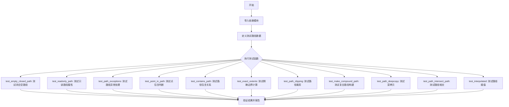
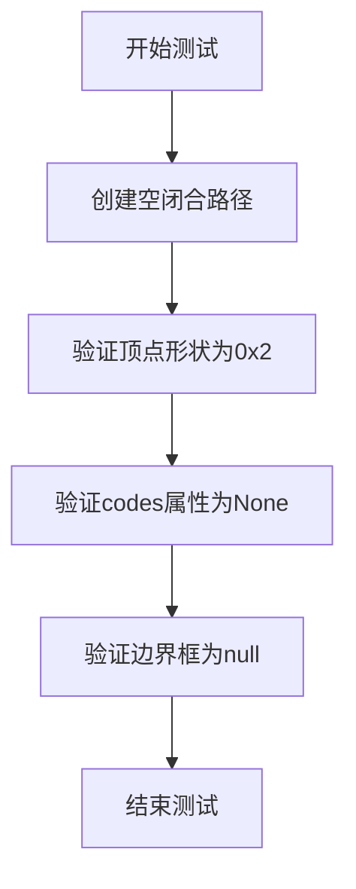
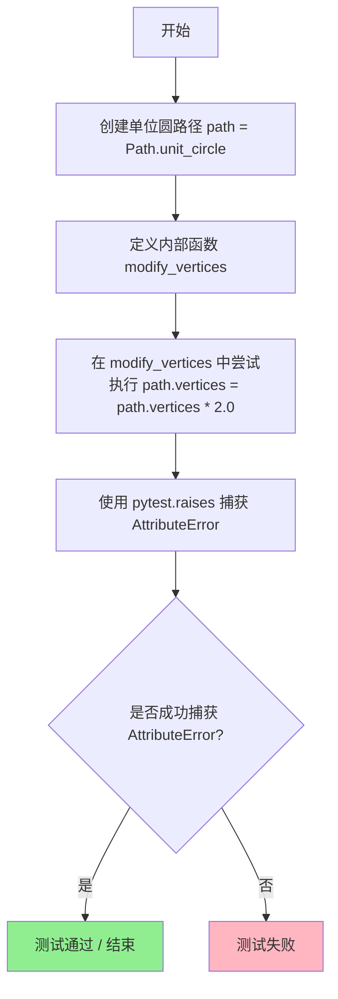
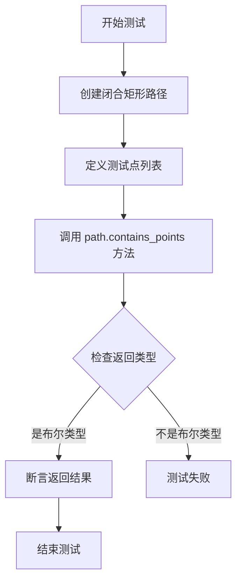
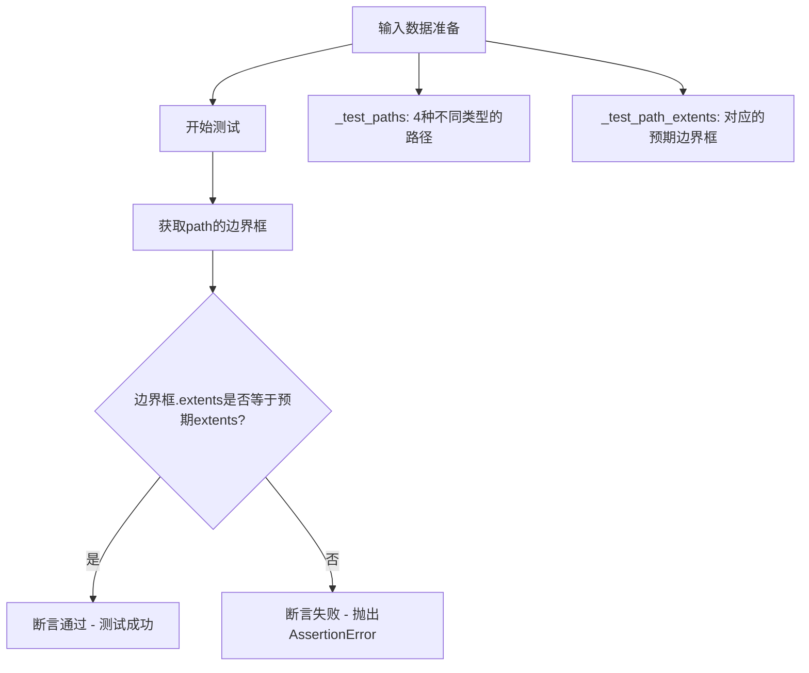
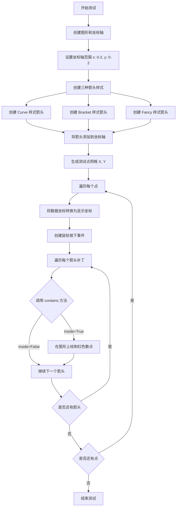
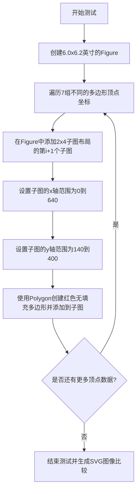
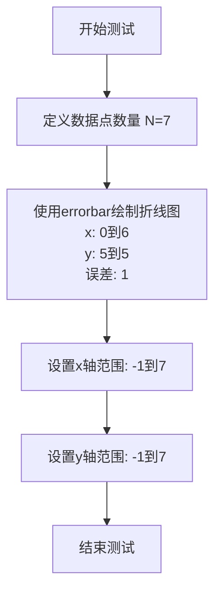
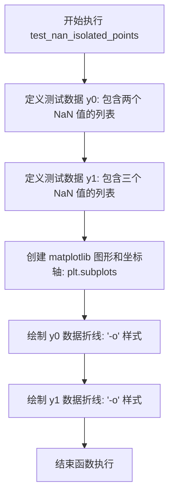

# `matplotlib\lib\matplotlib\tests\test_path.py` 详细设计文档

该文件是 matplotlib 中 Path 类的测试套件，涵盖了路径的创建、只读属性、点包含判断、路径相交、边界框计算、路径插值、复合路径构建、深拷贝与浅拷贝等核心功能的单元测试和集成测试。

## 整体流程



## 类结构

```
Path (matplotlib.path.Path)
├── 路径创建与验证
│   ├── test_empty_closed_path
│   ├── test_readonly_path
│   └── test_path_exceptions
├── 点与路径关系
│   ├── test_point_in_path
│   ├── test_contains_path
│   ├── test_contains_points_negative_radius
│   ├── test_point_in_path_nan
│   └── test_nonlinear_containment
├── 路径边界与裁剪
│   ├── test_exact_extents
│   ├── test_extents_with_ignored_codes
│   ├── test_path_clipping
│   └── test_path_no_doubled_point_in_to_polygon
├── 路径操作
│   ├── test_make_compound_path_empty
│   ├── test_make_compound_path_stops
│   ├── test_path_to_polygons
│   ├── test_path_deepcopy
│   ├── test_path_deepcopy_cycle
│   └── test_path_shallowcopy
├── 路径相交与变换
│   ├── test_path_intersect_path
│   ├── test_full_arc
│   ├── test_disjoint_zero_length_segment
│   ├── test_intersect_zero_length_segment
│   └── test_cleanup_closepoly
├── 路径插值
│   ├── test_interpolated_moveto
│   ├── test_interpolated_closepoly
│   ├── test_interpolated_moveto_closepoly
│   └── test_interpolated_empty_path
└── 可视化与风格测试
    ├── test_arrow_contains_point
    ├── test_xkcd
    ├── test_xkcd_marker
    ├── test_marker_paths_pdf
    ├── test_nan_isolated_points
    └── test_log_transform_with_zero
```

## 全局变量及字段


### `_test_paths`
    
测试用路径列表，包含不同类型的路径如曲线、二次曲线、线段和点

类型：`List[Path]`
    


### `_test_path_extents`
    
对应测试路径的预期边界框范围

类型：`List[Tuple[float, float, float, float]]`
    


### `bad_verts1`
    
形状错误的顶点数组(4,3)，用于测试路径构造异常

类型：`numpy.ndarray`
    


### `bad_verts2`
    
形状错误的顶点数组(2,3,2)，用于测试路径构造异常

类型：`numpy.ndarray`
    


### `good_verts`
    
形状正确的顶点数组(6,2)，用于测试路径构造

类型：`numpy.ndarray`
    


### `bad_codes`
    
形状不匹配的codes数组(2,)，用于测试路径构造异常

类型：`numpy.ndarray`
    


### `path`
    
matplotlib路径对象，用于测试各种路径操作

类型：`Path`
    


### `points`
    
用于测试点包含关系的坐标点列表

类型：`List[Tuple[float, float]]`
    


### `other_path`
    
用于测试路径包含关系的另一个路径对象

类型：`Path`
    


### `inside`
    
预期测试结果，指示other_path是否在path内部

类型：`bool`
    


### `inverted_inside`
    
预期测试结果，指示path是否在other_path内部

类型：`bool`
    


### `result`
    
contains_points方法的返回结果，布尔类型数组

类型：`numpy.ndarray`
    


### `extents`
    
路径的边界框范围(x0, y0, x1, y1)

类型：`Tuple[float, float, float, float]`
    


### `ignored_code`
    
路径指令代码，用于测试时被忽略的代码类型

类型：`int`
    


### `box`
    
多边形顶点数组，用于测试点包含判断

类型：`numpy.ndarray`
    


### `p`
    
由顶点数组创建的路径对象

类型：`Path`
    


### `test`
    
包含NaN坐标的测试点数组

类型：`numpy.ndarray`
    


### `contains`
    
点是否在路径内的布尔结果数组

类型：`numpy.ndarray`
    


### `fig`
    
matplotlib图形对象

类型：`matplotlib.figure.Figure`
    


### `ax`
    
matplotlib坐标轴对象

类型：`matplotlib.axes.Axes`
    


### `polygon`
    
由axvspan创建的垂直跨度多边形

类型：`matplotlib.patches.Polygon`
    


### `arrow`
    
曲线样式箭头_patch对象

类型：`matplotlib.patches.FancyArrowPatch`
    


### `arrow1`
    
括号样式箭头_patch对象

类型：`matplotlib.patches.FancyArrowPatch`
    


### `arrow2`
    
花式样式箭头_patch对象

类型：`matplotlib.patches.FancyArrowPatch`
    


### `patches_list`
    
所有箭头_patch对象的列表

类型：`List[matplotlib.patches.Patch]`
    


### `X`
    
由meshgrid生成的X坐标网格

类型：`numpy.ndarray`
    


### `Y`
    
由meshgrid生成的Y坐标网格

类型：`numpy.ndarray`
    


### `x`
    
遍历网格时的X坐标值

类型：`float`
    


### `y`
    
遍历网格时的Y坐标值

类型：`float`
    


### `xy`
    
多边形顶点坐标列表

类型：`List[Tuple[float, float]]`
    


### `bbox`
    
视口边界框参数[x, y, width, height]

类型：`List[int]`
    


### `empty`
    
空的复合路径对象

类型：`Path`
    


### `r2`
    
由两个空路径组成的复合路径

类型：`Path`
    


### `r3`
    
由一个点和空路径组成的复合路径

类型：`Path`
    


### `zero`
    
坐标原点[0, 0]

类型：`List[int]`
    


### `paths`
    
包含三个Path对象的列表，每个都带有STOP指令

类型：`List[Path]`
    


### `compound_path`
    
由多个路径组成的复合路径

类型：`Path`
    


### `verts`
    
路径顶点坐标列表

类型：`List[List[float]]`
    


### `codes`
    
路径指令代码列表

类型：`List[int]`
    


### `path1`
    
只读属性为True的路径对象

类型：`Path`
    


### `path2`
    
带有codes且只读属性为True的路径对象

类型：`Path`
    


### `path1_copy`
    
path1的深拷贝，非只读

类型：`Path`
    


### `path2_copy`
    
path2的深拷贝，非只读

类型：`Path`
    


### `phi`
    
旋转角度（度），用于测试路径相交

类型：`float`
    


### `eps_array`
    
数值误差阈值列表

类型：`List[float]`
    


### `transform`
    
2D仿射变换对象，用于旋转路径

类型：`matplotlib.transforms.Affine2D`
    


### `a`
    
原始路径或变换后的路径对象

类型：`Path`
    


### `b`
    
变换后的路径对象，用于相交测试

类型：`Path`
    


### `low`
    
圆弧起始角度

类型：`int`
    


### `high`
    
圆弧结束角度

类型：`int`
    


### `this_path`
    
待测试相交的路径对象

类型：`Path`
    


### `outline_path`
    
用于测试相交的轮廓路径对象

类型：`Path`
    


### `cleaned`
    
清理NaN后的路径对象

类型：`Path`
    


### `vertices`
    
路径顶点坐标数组

类型：`numpy.ndarray`
    


### `codes`
    
路径指令代码数组

类型：`numpy.ndarray`
    


### `result`
    
插值操作返回的新路径对象

类型：`Path`
    


### `Path.vertices`
    
路径顶点的坐标数组，形状为(n, 2)

类型：`numpy.ndarray`
    


### `Path.codes`
    
路径指令代码数组，指定每个顶点的操作类型

类型：`numpy.ndarray`
    


### `Path.readonly`
    
指示路径是否为只读状态的布尔标志

类型：`bool`
    
    

## 全局函数及方法


### `test_empty_closed_path`

该函数用于测试在创建空（零顶点）且闭合的路径时，路径对象的顶点形状、codes属性以及边界框计算是否正确。这是matplotlib路径处理的基本功能验证测试。

参数： 无

返回值： `None`，该函数为测试函数，不返回任何值，仅通过断言验证路径的正确性

#### 流程图



#### 带注释源码

```python
def test_empty_closed_path():
    """
    测试空闭合路径的创建和属性验证。
    
    该测试函数验证以下场景：
    1. 创建一个顶点数为0的闭合路径
    2. 验证路径对象的内部状态是否符合预期
    """
    
    # 创建一个空的闭合路径
    # np.zeros((0, 2)) 创建一个0行2列的numpy数组，表示没有顶点
    # closed=True 表示该路径是闭合的
    path = Path(np.zeros((0, 2)), closed=True)
    
    # 验证顶点的形状为 (0, 2)
    # 即使路径为空，也应该保持2维顶点的格式
    assert path.vertices.shape == (0, 2)
    
    # 验证路径的codes属性为None
    # 对于闭合路径且没有提供codes时，默认为None
    assert path.codes is None
    
    # 验证路径的边界框计算结果
    # 使用assert_array_equal比较计算出的边界框与null边界框
    # transforms.Bbox.null() 返回一个"空"的边界框，其extents为(0, 0, 0, 0)或类似形式
    assert_array_equal(path.get_extents().extents,
                       transforms.Bbox.null().extents)
```


### `test_readonly_path`

该函数用于测试 matplotlib 中 Path 对象的只读（readonly）属性，验证当 Path 以只读模式创建时，其 vertices 属性不可被修改，尝试修改时会抛出 AttributeError 异常。

参数： 无

返回值： `None`，该函数为测试函数，不返回任何值

#### 流程图



#### 带注释源码

```python
def test_readonly_path():
    """
    测试 Path 对象在只读模式下的顶点不可修改性。
    验证 Path.unit_circle() 创建的路径是只读的，
    尝试修改其 vertices 属性会抛出 AttributeError。
    """
    # 使用 Path.unit_circle() 创建一个只读的单位圆路径对象
    path = Path.unit_circle()

    # 定义内部函数，用于尝试修改 path 的 vertices 属性
    def modify_vertices():
        # 尝试将 path 的顶点数据乘以 2.0
        # 由于 path 是只读的，这行代码应该抛出 AttributeError
        path.vertices = path.vertices * 2.0

    # 使用 pytest.raises 上下文管理器验证修改操作会抛出 AttributeError
    with pytest.raises(AttributeError):
        # 调用内部函数，预期会触发 AttributeError
        modify_vertices()
```


### `test_path_exceptions`

该函数用于测试 `Path` 类在构造时对非法输入参数（错误形状的顶点或顶点与代码形状不匹配）能否正确抛出 `ValueError` 异常。

参数： 无

返回值： `None`，该函数为测试函数，不返回任何值

#### 流程图

```mermaid
flowchart TD
    A[开始测试] --> B[创建bad_verts1: np.arange(12).reshape(4, 3)]
    B --> C[尝试用bad_verts1构造Path]
    C --> D{是否抛出ValueError?}
    D -->|是| E[验证错误信息包含'shape (4, 3)']
    D -->|否| F[测试失败]
    E --> G[创建bad_verts2: np.arange(12).reshape(2, 3, 2)]
    G --> H[尝试用bad_verts2构造Path]
    H --> I{是否抛出ValueError?}
    I -->|是| J[验证错误信息包含'shape (2, 3, 2)']
    I -->|否| F
    J --> K[创建good_verts: np.arange(12).reshape(6, 2)]
    K --> L[创建bad_codes: np.arange(2)]
    L --> M[尝试用good_verts和bad_codes构造Path]
    M --> N{是否抛出ValueError?}
    N -->|是| O[验证错误信息包含顶点与代码形状不匹配]
    N -->|否| F
    O --> P[测试通过]
    F --> P
```

#### 带注释源码

```python
def test_path_exceptions():
    # 测试1: 检查维度错误的顶点数组 (4, 3) - 应该是2维坐标
    # 创建形状为(4, 3)的顶点数组，Path只接受2列(x, y)的数据
    bad_verts1 = np.arange(12).reshape(4, 3)
    # 期望抛出ValueError，并验证错误消息包含形状信息
    with pytest.raises(ValueError,
                       match=re.escape(f'has shape {bad_verts1.shape}')):
        Path(bad_verts1)

    # 测试2: 检查维度错误的顶点数组 (2, 3, 2) - 应该是2维数组
    # 创建形状为(2, 3, 2)的三维数组，这明显不是有效的2D顶点
    bad_verts2 = np.arange(12).reshape(2, 3, 2)
    # 期望抛出ValueError，并验证错误消息包含形状信息
    with pytest.raises(ValueError,
                       match=re.escape(f'has shape {bad_verts2.shape}')):
        Path(bad_verts2)

    # 测试3: 检查顶点与代码形状不匹配的情况
    # 创建有效的6个2D顶点 (6, 2)
    good_verts = np.arange(12).reshape(6, 2)
    # 创建只有2个元素的代码数组，与顶点数量不匹配
    bad_codes = np.arange(2)
    # 构建预期的错误消息
    msg = re.escape(f"Your vertices have shape {good_verts.shape} "
                    f"but your codes have shape {bad_codes.shape}")
    # 期望抛出ValueError，并验证错误消息
    with pytest.raises(ValueError, match=msg):
        Path(good_verts, bad_codes)
```


### `test_point_in_path`

这是一个单元测试函数，用于验证`Path.contains_points()`方法在检测点是否位于闭合路径内部时的正确性。

参数：

- 无

返回值：`None`，测试函数无返回值，通过断言验证逻辑正确性。

#### 流程图



#### 带注释源码

```python
def test_point_in_path():
    # Test #1787 - 验证 contains_points 方法的基本功能
    # 创建一个闭合的矩形路径: (0,0) -> (0,1) -> (1,1) -> (1,0) -> (0,0)
    path = Path._create_closed([(0, 0), (0, 1), (1, 1), (1, 0)])
    
    # 定义测试点: 一个在矩形内部，一个在矩形外部
    points = [(0.5, 0.5), (1.5, 0.5)]
    
    # 调用 Path 对象的 contains_points 方法检查点是否在路径内
    ret = path.contains_points(points)
    
    # 断言返回的数据类型是布尔类型
    assert ret.dtype == 'bool'
    
    # 使用 numpy 测试工具验证返回结果
    # 预期: 内部点返回 True，外部点返回 False
    np.testing.assert_equal(ret, [True, False])
```


### test_contains_path

测试函数，用于验证 Path 对象的 contains_path 方法是否正确判断两个路径之间的包含关系。

参数：

-  `other_path`：`Path`，测试用的另一个闭合路径对象，用于与主路径进行包含关系测试
-  `inside`：`bool`，期望的 `path.contains_path(other_path)` 返回值，表示 other_path 是否完全在 path 内部
-  `inverted_inside`：`bool`，期望的 `other_path.contains_path(path)` 返回值，表示 path 是否完全在 other_path 内部

返回值：`None`，该函数为测试函数，使用断言进行验证，不返回具体值

#### 流程图

```mermaid
flowchart TD
    A[开始] --> B[创建主路径 path: 闭合单位正方形]
    --> C[创建测试路径 other_path]
    --> D{断言 path.contains_path(other_path) 是否等于 inside}
    D -->|通过| E{断言 other_path.contains_path(path) 是否等于 inverted_inside}
    D -->|失败| F[测试失败]
    E -->|通过| G[测试通过]
    E -->|失败| F
```

#### 带注释源码

```python
@pytest.mark.parametrize(
    "other_path, inside, inverted_inside",
    # 参数化测试：6组不同的路径和期望结果
    [(Path([(0.25, 0.25), (0.25, 0.75), (0.75, 0.75), (0.75, 0.25), (0.25, 0.25)],
          closed=True), True, False),  # 完全在内部
     (Path([(-0.25, -0.25), (-0.25, 1.75), (1.75, 1.75), (1.75, -0.25), (-0.25, -0.25)],
          closed=True), False, True),  # 完全包含外部路径
     (Path([(-0.25, -0.25), (-0.25, 1.75), (0.5, 0.5),
            (1.75, 1.75), (1.75, -0.25), (-0.25, -0.25)],
          closed=True), False, False),  # 部分重叠
     (Path([(0.25, 0.25), (0.25, 1.25), (1.25, 1.25), (1.25, 0.25), (0.25, 0.25)],
          closed=True), False, False),  # 超出边界
     (Path([(0, 0), (0, 1), (1, 1), (1, 0), (0, 0)], closed=True), False, False),  # 完全重合
     (Path([(2, 2), (2, 3), (3, 3), (3, 2), (2, 2)], closed=True), False, False)])  # 完全分离
def test_contains_path(other_path, inside, inverted_inside):
    # 创建主路径：闭合的单位正方形 (0,0) -> (0,1) -> (1,1) -> (1,0) -> (0,0)
    path = Path([(0, 0), (0, 1), (1, 1), (1, 0), (0, 0)], closed=True)
    
    # 断言：path 是否完全包含 other_path
    assert path.contains_path(other_path) is inside
    
    # 断言：other_path 是否完全包含 path（反向测试）
    assert other_path.contains_path(path) is inverted_inside
```


### `test_contains_points_negative_radius`

该函数是一个单元测试，用于验证当 `Path.contains_points()` 方法的 `radius` 参数为负数时的行为是否符合预期。具体来说，它创建了一个单位圆路径，并测试了三个点与该路径的包含关系，使用负半径值来检查边界情况。

参数：

- 该函数无显式参数（测试数据硬编码在函数内部）

返回值：`None`，该函数不返回任何值，仅通过断言验证 `path.contains_points()` 的结果。

#### 流程图

```mermaid
flowchart TD
    A[开始测试] --> B[创建单位圆路径: Path.unit_circle]
    B --> C[定义测试点集合: points = [(0.0, 0.0), (1.25, 0.0), (0.9, 0.9)]]
    C --> D[调用path.contains_points with radius=-0.5]
    D --> E{验证结果}
    E -->|结果为[True, False, False]| F[测试通过]
    E -->|结果不符| G[抛出断言错误]
    F --> H[结束测试]
    G --> H
```

#### 带注释源码

```python
def test_contains_points_negative_radius():
    # 创建一个单位圆路径对象
    # Path.unit_circle() 返回一个半径为1、圆心在(0,0)的圆路径
    path = Path.unit_circle()

    # 定义待测试的点坐标列表
    # (0.0, 0.0) - 圆心点，应在圆内
    # (1.25, 0.0) - 半径1.25的点，应在圆外
    # (0.9, 0.9) - 距离原点约1.27的点，应在圆外
    points = [(0.0, 0.0), (1.25, 0.0), (0.9, 0.9)]
    
    # 调用contains_points方法进行点包含测试
    # radius=-0.5 表示使用负半径进行边界收缩
    # 负半径会使边界向内收缩，从而排除边界上的点
    result = path.contains_points(points, radius=-0.5)
    
    # 使用numpy测试工具验证结果
    # 期望结果：[True, False, False]
    # - 第一个点(0,0)在收缩后的圆内（因为原半径1 - 0.5 = 0.5，仍包含圆心）
    # - 第二个点(1.25,0)在收缩后的圆外（1.25 > 0.5）
    # - 第三个点(0.9,0.9)距离原点约1.27，在收缩后的圆外
    np.testing.assert_equal(result, [True, False, False])
```


### `test_exact_extents`

该函数是一个参数化测试函数，用于验证 Path 对象的 `get_extents()` 方法能否正确计算包含曲线部分的路径边界框。测试通过比较计算得到的边界框与预期边界框是否一致，确保边界框计算考虑了曲线的实际几何形状，而不仅仅是控制点。

参数：

- `path`：`Path`，要测试边界框计算的 Path 对象
- `extents`：`tuple`，预期的边界框范围，格式为 (x0, y0, x1, y1)

返回值：`None`，该函数为测试函数，使用 assert 断言进行验证

#### 流程图



#### 带注释源码

```python
@pytest.mark.parametrize('path, extents', zip(_test_paths, _test_path_extents))
def test_exact_extents(path, extents):
    """
    测试 Path.get_extents() 方法能否正确计算包含曲线部分的路径边界框。
    
    注意：如果仅查看控制点来获取曲线的边界框，将得到错误的结果。例如：
    hard_curve = Path([[0, 0], [1, 0], [1, 1], [0, 1]],
                      [Path.MOVETO, Path.CURVE4, Path.CURVE4, Path.CURVE4])
    仅看控制点会得到边界框 (0, 0, 1, 1)。本测试代码考虑了路径的曲线部分，
    这些曲线通常不会延伸至控制点所在位置。
    
    注意：path.get_extents() 返回一个 Bbox 对象，因此需要通过 .extents 属性获取其范围值。
    """
    # 使用 numpy 的 all 函数比较计算得到的边界框与预期边界框是否完全相等
    assert np.all(path.get_extents().extents == extents)
```


### `test_extents_with_ignored_codes`

该函数是一个pytest测试用例，用于验证在计算路径（Path）的边界范围（extents）时，特定类型的路径点（如STOP和CLOSEPOLY）是否被正确忽略。它通过参数化测试分别检查Path.CLOSEPOLY和Path.STOP两种情况。

**参数：**

- `ignored_code`：`Path.code_type`（int），表示要在路径中测试被忽略的代码类型，取值为`Path.CLOSEPOLY`或`Path.STOP`

**返回值：** `None`，无返回值（测试函数，通过assert断言验证正确性）

#### 流程图

```mermaid
flowchart TD
    A[开始测试] --> B[接收ignored_code参数]
    B --> C[创建Path对象: vertices=[[0,0],[1,1],[2,2]], codes=[Path.MOVETO, Path.MOVETO, ignored_code]]
    C --> D[调用path.get_extents获取边界范围]
    D --> E{断言 extents == (0., 0., 1., 1.)?}
    E -->|是| F[测试通过]
    E -->|否| G[测试失败/抛出AssertionError]
```

#### 带注释源码

```python
@pytest.mark.parametrize('ignored_code', [Path.CLOSEPOLY, Path.STOP])
def test_extents_with_ignored_codes(ignored_code):
    """
    测试STOP和CLOSEPOLY点在计算路径边界时是否被忽略。
    
    该测试验证对于只包含直线的路径，特定类型的路径代码点
    （CLOSEPOLY或STOP）在计算get_extents()时不会被计入边界。
    
    参数:
        ignored_code: Path.CLOSEPOLY 或 Path.STOP，用于指定要忽略的路径代码类型
    
    断言:
        path.get_extents().extents 应等于 (0., 0., 1., 1.)
        即只考虑前两个有效点(0,0)和(1,1)，忽略第三个点(2,2)
    """
    # 创建一个包含三个顶点的路径:
    # - 第一个点 (0, 0): Path.MOVETO
    # - 第二个点 (1, 1): Path.MOVETO  
    # - 第三个点 (2, 2): ignored_code (CLOSEPOLY 或 STOP)
    path = Path([[0, 0],
                 [1, 1],
                 [2, 2]], [Path.MOVETO, Path.MOVETO, ignored_code])
    
    # 断言: 边界范围应该只考虑前两个有效点，忽略第三个点
    # 预期结果: xmin=0, ymin=0, xmax=1, ymax=1
    assert np.all(path.get_extents().extents == (0., 0., 1., 1.))
```


### `test_point_in_path_nan`

该函数是一个单元测试，用于验证当测试点包含 NaN（Not a Number）值时，`Path.contains_points()` 方法的正确处理行为。测试创建一个封闭的正方形路径，并使用 x 坐标为 NaN 的点进行包含性检测，期望返回 False（不包含）。

参数：此函数无参数。

返回值：`None`，该函数为测试函数，使用断言进行验证，不返回任何值。

#### 流程图

```mermaid
flowchart TD
    A[开始] --> B[创建单位正方形路径<br/>box = [[0,0], [1,0], [1,1], [0,1], [0,0]]]
    B --> C[创建测试点<br/>test = [[NaN, 0.5]]]
    C --> D[调用 p.contains_points(test)<br/>检测点是否在路径内]
    D --> E{断言检查}
    E --> F[断言 len(contains) == 1<br/>确保返回数组长度为1]
    E --> G[断言 not contains[0]<br/>确保包含结果为 False]
    F --> H[结束]
    G --> H
```

#### 带注释源码

```python
def test_point_in_path_nan():
    """
    测试当测试点包含 NaN 值时的路径包含性检测行为。
    验证 Path.contains_points() 能够正确处理 NaN 坐标的测试点。
    """
    # 创建一个单位正方形的顶点数组，起点和终点相同（封闭路径）
    # 顶点顺序：左下 -> 右下 -> 右上 -> 左上 -> 左下（封闭）
    box = np.array([[0, 0], [1, 0], [1, 1], [0, 1], [0, 0]])
    
    # 使用顶点数组创建 Path 对象
    p = Path(box)
    
    # 创建一个测试点，其中 x 坐标为 NaN（无效值），y 坐标为 0.5
    # NaN 表示"非数字"，用于测试边界情况
    test = np.array([[np.nan, 0.5]])
    
    # 调用 Path 对象的 contains_points 方法检测点是否在路径内
    # 预期行为：当点坐标包含 NaN 时，应返回 False（点不在路径内）
    contains = p.contains_points(test)
    
    # 断言返回的数组长度为 1（只有一个测试点）
    assert len(contains) == 1
    
    # 断言第一个（也是唯一的）包含性检测结果为 False
    # 因为 NaN 坐标无法确定位置，所以应视为不在路径内
    assert not contains[0]
```


### `test_nonlinear_containment`

该函数是一个测试函数，用于验证在具有对数缩放（logarithmic scale）的坐标轴中，多边形路径的点包含功能是否正常工作。它创建了一个在x轴上使用对数刻度的图表，并测试了三个不同位置的点是否被正确地判断为在多边形内部或外部。

参数： 无

返回值：`None`，该函数为测试函数，不返回任何值

#### 流程图

```mermaid
graph TD
    A[开始] --> B[创建图形和坐标轴: fig, ax = plt.subplots]
    B --> C[设置坐标轴: xscale='log', ylim=(0, 1)]
    C --> D[创建垂直跨度多边形: polygon = ax.axvspan(1, 10)]
    D --> E{测试点 (5, 0.5)}
    E -->|应该在多边形内| F[断言 contains_point 返回 True]
    F --> G{测试点 (0.5, 0.5)}
    G -->|应该在多边形外| H[断言 contains_point 返回 False]
    H --> I{测试点 (50, 0.5)}
    I -->|应该在多边形外| J[断言 contains_point 返回 False]
    J --> K[结束]
    
    style E fill:#90EE90
    style G fill:#FFB6C1
    style I fill:#FFB6C1
```

#### 带注释源码

```python
def test_nonlinear_containment():
    """
    测试在具有对数缩放的坐标系统中，多边形路径的点包含功能。
    验证坐标变换后，点是否被正确判断为在多边形内部或外部。
    """
    # 创建一个新的图形和坐标轴对象
    fig, ax = plt.subplots()
    
    # 设置x轴为对数刻度，y轴范围为0到1
    # 这创建了一个非线性缩放的坐标系
    ax.set(xscale="log", ylim=(0, 1))
    
    # 创建垂直跨度多边形，从x=1到x=10填充整个y轴范围
    # 这个多边形在对数坐标下的形状是弯曲的
    polygon = ax.axvspan(1, 10)
    
    # 测试点 (5, 0.5) 是否在多边形内
    # ax.transData.transform 将数据坐标转换为显示坐标
    # polygon.get_transform() 获取多边形的变换矩阵
    # 这个点应该在多边形内（x=5在1到10之间）
    assert polygon.get_path().contains_point(
        ax.transData.transform((5, .5)), polygon.get_transform())
    
    # 测试点 (0.5, 0.5) 是否在多边形内
    # 这个点应该在多边形外（x=0.5小于1）
    assert not polygon.get_path().contains_point(
        ax.transData.transform((.5, .5)), polygon.get_transform())
    
    # 测试点 (50, 0.5) 是否在多边形内
    # 这个点应该在多边形外（x=50大于10）
    assert not polygon.get_path().contains_point(
        ax.transData.transform((50, .5)), polygon.get_transform())
```


### `test_arrow_contains_point`

该测试函数用于验证 matplotlib 中箭头（Arrow）是否正确包含给定点，修复了 bug #8384。它通过创建三种不同样式的 FancyArrowPatch（曲线样式、括号样式和 fancy 样式），并测试大量采样点是否被正确识别在箭头内部。

参数：
- 该函数无参数

返回值：`None`，因为它是一个测试函数，不返回任何值

#### 流程图



#### 带注释源码

```python
@image_comparison(['arrow_contains_point.png'], remove_text=True, style='mpl20',
                  tol=0 if platform.machine() == 'x86_64' else 0.027)
def test_arrow_contains_point():
    # fix bug (#8384)
    # 创建一个新的图形和坐标轴
    fig, ax = plt.subplots()
    # 设置坐标轴的显示范围
    ax.set_xlim(0, 2)
    ax.set_ylim(0, 2)

    # 创建一个曲线样式的箭头 (FancyArrowPatch)
    # 起点 (0.5, 0.25) 到终点 (1.5, 0.75)
    arrow = patches.FancyArrowPatch((0.5, 0.25), (1.5, 0.75),
                                    arrowstyle='->',
                                    mutation_scale=40)
    ax.add_patch(arrow)
    
    # 创建一个括号样式的箭头
    # 起点 (0.5, 1) 到终点 (1.5, 1.25)
    arrow1 = patches.FancyArrowPatch((0.5, 1), (1.5, 1.25),
                                     arrowstyle=']-[',
                                     mutation_scale=40)
    ax.add_patch(arrow1)
    
    # 创建一个 fancy 样式的箭头（不填充）
    # 起点 (0.5, 1.5) 到终点 (1.5, 1.75)
    arrow2 = patches.FancyArrowPatch((0.5, 1.5), (1.5, 1.75),
                                     arrowstyle='fancy',
                                     fill=False,
                                     mutation_scale=40)
    ax.add_patch(arrow2)
    
    # 将所有箭头放入列表中
    patches_list = [arrow, arrow1, arrow2]

    # 生成测试点网格，步长为 0.1
    X, Y = np.meshgrid(np.arange(0, 2, 0.1),
                       np.arange(0, 2, 0.1))
    
    # 遍历网格中的每个点
    for k, (x, y) in enumerate(zip(X.ravel(), Y.ravel())):
        # 将数据坐标转换为显示坐标（像素坐标）
        xdisp, ydisp = ax.transData.transform([x, y])
        # 创建鼠标按下事件
        event = MouseEvent('button_press_event', fig.canvas, xdisp, ydisp)
        
        # 遍历每个箭头补丁
        for m, patch in enumerate(patches_list):
            # 检查点是否在箭头内部
            inside, res = patch.contains(event)
            # 如果点被包含在箭头内，在对应位置绘制红色散点
            if inside:
                ax.scatter(x, y, s=5, c="r")
```


### `test_path_clipping`

这是一个图像比较测试函数，用于验证matplotlib中路径裁剪功能在不同多边形顶点顺序下的正确性。

参数：

- 无

返回值：`无`（测试函数无返回值）

#### 流程图



#### 带注释源码

```python
@image_comparison(['path_clipping.svg'], remove_text=True)
def test_path_clipping():
    """
    测试路径裁剪功能在不同多边形顶点顺序下的渲染效果。
    使用image_comparison装饰器比较生成的SVG图像与预期图像。
    """
    # 创建一个6.0 x 6.2英寸大小的图形窗口
    fig = plt.figure(figsize=(6.0, 6.2))

    # 遍历7组不同的四边形顶点坐标，每组代表不同的多边形形状
    for i, xy in enumerate([
            # 标准的矩形，顶点在顺时针方向
            [(200, 200), (200, 350), (400, 350), (400, 200)],
            # 矩形但最后一个顶点在左侧，形成不同的形状
            [(200, 200), (200, 350), (400, 350), (400, 100)],
            # 另一种顶点排列方式
            [(200, 100), (200, 350), (400, 350), (400, 100)],
            # 顶点顺序变化
            [(200, 100), (200, 415), (400, 350), (400, 100)],
            # 矩形，顶点在逆时针方向
            [(200, 100), (200, 415), (400, 415), (400, 100)],
            # 顶点从右下角开始
            [(200, 415), (400, 415), (400, 100), (200, 100)],
            # 顶点从右上角开始
            [(400, 415), (400, 100), (200, 100), (200, 415)]]):
        
        # 在4行2列的子图布局中添加第i+1个子图
        ax = fig.add_subplot(4, 2, i+1)
        
        # 定义视窗边界框 [x0, y0, width, height]
        bbox = [0, 140, 640, 260]
        
        # 设置x轴范围：从bbox[0]到bbox[0]+bbox[2]，即0到640
        ax.set_xlim(bbox[0], bbox[0] + bbox[2])
        
        # 设置y轴范围：从bbox[1]到bbox[1]+bbox[3]，即140到400
        ax.set_ylim(bbox[1], bbox[1] + bbox[3])
        
        # 创建多边形patch，facecolor='none'表示无填充，edgecolor='red'表示红色边框
        # closed=True确保多边形是闭合的
        ax.add_patch(Polygon(
            xy, facecolor='none', edgecolor='red', closed=True))
```


### `test_log_transform_with_zero`

该测试函数用于验证在存在零值（或接近零的值）的情况下，对数刻度变换（semilogy）能够正确渲染图形，通过创建包含负数范围和极小值的数据集来测试对数坐标轴的稳定性。

参数： 无

返回值：`None`，该函数为测试函数，不返回任何值

#### 流程图

```mermaid
flowchart TD
    A[开始] --> B[创建x数据: np.arange(-10, 10)]
    B --> C[计算y数据: (1.0 - 1.0/(x**2+1))**20]
    C --> D[创建子图: fig, ax = plt.subplots]
    D --> E[绘制对数坐标图: ax.semilogy]
    E --> F[设置y轴范围: ax.set_ylim]
    F --> G[显示网格: ax.grid]
    G --> H[结束]
```

#### 带注释源码

```python
@image_comparison(['semi_log_with_zero.png'], style='mpl20')
def test_log_transform_with_zero():
    # 创建x轴数据，包含负值、零和正值
    # 范围从-10到9，用于测试对数变换处理零值的能力
    x = np.arange(-10, 10)
    
    # 计算y值，使用一个会产生接近零值的函数
    # 当x接近0时，1.0/(x**2+1)接近1.0，使(1-接近1)的值非常小
    # **20进一步缩小这些值，产生极小的正数用于测试对数刻度
    y = (1.0 - 1.0/(x**2+1))**20

    # 创建matplotlib子图对象
    # fig: 整个图形对象
    # ax: 坐标轴对象，用于绑制数据
    fig, ax = plt.subplots()
    
    # 使用半对数坐标绑制曲线
    # x轴为线性刻度，y轴为对数刻度
    # "-o"表示实线加圆圈标记
    # lw=15设置线宽为15
    # markeredgecolor='k'设置标记边缘颜色为黑色
    ax.semilogy(x, y, "-o", lw=15, markeredgecolor='k')
    
    # 设置y轴的显示范围
    # 从1e-7到1，覆盖从极小值到较大值的范围
    ax.set_ylim(1e-7, 1)
    
    # 开启网格显示，便于观察数据点在对数坐标下的分布
    ax.grid(True)
```


### `test_make_compound_path_empty`

该函数是一个单元测试，用于验证 `Path.make_compound_path()` 方法在处理空路径参数时的正确性，确保可以创建无参数的复合路径以及包含空路径的复合路径。

参数：  
无

返回值：`None`，该函数为测试函数，没有返回值，仅通过断言验证行为

#### 流程图

```mermaid
flowchart TD
    A[开始测试] --> B[调用 Path.make_compound_path 无参数创建空复合路径]
    B --> C[断言 empty.vertices.shape == (0, 2)]
    C --> D[调用 Path.make_compound_path 并传入两个空路径对象]
    D --> E[断言 r2.vertices.shape == (0, 2)]
    E --> F[断言 r2.codes.shape == (0,)]
    F --> G[调用 Path.make_compound_path 传入一个非空路径和一个空路径]
    G --> H[断言 r3.vertices.shape == (1, 2)]
    H --> I[断言 r3.codes.shape == (1,)]
    I --> J[测试结束]
```

#### 带注释源码

```python
def test_make_compound_path_empty():
    # 测试目标：验证 Path.make_compound_path() 方法处理空路径的能力
    # 这使得编写通用基于路径的代码更加容易
    
    # 测试1：无参数调用make_compound_path，应该返回顶点为(0,2)形状的空路径
    empty = Path.make_compound_path()
    assert empty.vertices.shape == (0, 2)
    
    # 测试2：将两个空路径组合成复合路径，应仍为空路径
    r2 = Path.make_compound_path(empty, empty)
    assert r2.vertices.shape == (0, 2)  # 顶点形状应为(0, 2)
    assert r2.codes.shape == (0,)        # 编码形状应为(0,)
    
    # 测试3：将一个非空单点路径与空路径组合，应保留非空路径的内容
    r3 = Path.make_compound_path(Path([(0, 0)]), empty)
    assert r3.vertices.shape == (1, 2)  # 顶点形状应为(1, 2)
    assert r3.codes.shape == (1,)        # 编码形状应为(1,)
```


### `test_make_compound_path_stops`

该函数用于测试 `Path.make_compound_path()` 方法在处理包含 STOP 代码的路径时的行为，验证复合路径中不会保留终端 STOP 代码（这是文档记录的行为）。

参数： 无

返回值： `None`，该函数为测试函数，不返回任何值

#### 流程图

```mermaid
flowchart TD
    A[开始] --> B[定义 zero = [0, 0]]
    B --> C[创建包含3个Path的列表<br/>每个Path包含MOVETO和STOP代码]
    C --> D[调用 Path.make_compound_path*paths 创建复合路径]
    D --> E[断言: 复合路径中STOP代码的数量为0]
    E --> F[结束]
```

#### 带注释源码

```python
def test_make_compound_path_stops():
    """
    测试 Path.make_compound_path() 在处理包含 STOP 代码的路径时的行为。
    
    该测试验证复合路径不会保留终端 STOP 代码，这是文档记录的设计决策。
    """
    # 定义一个二维点 [0, 0]，将作为路径的顶点
    zero = [0, 0]
    
    # 创建3个相同的 Path 对象，每个路径包含:
    # - 两个顶点 (都是 zero)
    # - 两个代码: MOVETO 和 STOP
    # 使用列表乘法创建3个 Path 的引用（注意：这里是浅拷贝）
    paths = 3 * [Path([zero, zero], [Path.MOVETO, Path.STOP])]
    
    # 使用 Path.make_compound_path() 将多个路径合并为复合路径
    # *paths 将列表解包为可变参数
    compound_path = Path.make_compound_path(*paths)
    
    # 断言验证：复合路径中不应该包含任何 STOP 代码
    # 这个选择（不保留终端 STOP）是任意的，但在文档中有记录
    # 这里测试该行为是否被遵守
    assert np.sum(compound_path.codes == Path.STOP) == 0
```


### `test_xkcd`

该测试函数用于验证 matplotlib 的 xkcd 风格绘图功能是否正常工作，通过创建一个简单的正弦曲线并使用 xkcd 风格渲染来测试绘图系统的核心功能。

参数：

- 该函数没有显式参数

返回值：`None`，该函数为测试函数，不返回任何值

#### 流程图

```mermaid
flowchart TD
    A[开始测试] --> B[设置随机种子 np.random.seed 0]
    B --> C[生成测试数据: x从0到2π的100个点]
    C --> D[计算y = sin(x)]
    D --> E[进入plt.xkcd上下文管理器]
    E --> F[创建图形和坐标轴: plt.subplots]
    F --> G[绘制正弦曲线: ax.plot x y]
    G --> H[退出上下文管理器]
    H --> I[图像对比验证]
    I --> J[结束测试]
```

#### 带注释源码

```python
@image_comparison(['xkcd.png'], remove_text=True)  # 图像对比装饰器，预期生成 xkcd.png，移除文本
def test_xkcd():
    """测试 matplotlib 的 xkcd 风格绘图功能"""
    
    # 设置随机种子以确保测试的可重复性
    # xkcd 风格会使用随机抖动效果，需要固定种子
    np.random.seed(0)

    # 生成测试数据：x 从 0 到 2π，共100个等间距点
    x = np.linspace(0, 2 * np.pi, 100)
    
    # 计算对应的正弦值
    y = np.sin(x)

    # 使用 xkcd 风格上下文管理器
    # xkcd 风格会改变线条样式，添加手绘效果的抖动
    with plt.xkcd():
        # 创建图形窗口和坐标轴
        fig, ax = plt.subplots()
        
        # 在坐标轴上绘制正弦曲线
        ax.plot(x, y)
```


### `test_xkcd_marker`

该测试函数用于验证 xkcd 风格绘图模式下不同标记类型（加号、圆圈、三角形）的正确渲染。函数通过创建三条使用不同标记的线图，并使用图像比较装饰器来验证输出图像是否符合预期。

参数： 无

返回值： `None`，测试函数无返回值

#### 流程图

```mermaid
flowchart TD
    A[开始测试 test_xkcd_marker] --> B[设置随机种子 np.random.seed(0)]
    B --> C[生成x轴数据: 0到5的8个点]
    C --> D[生成三条y轴数据: y1=x, y2=5-x, y3=2.5]
    D --> E[进入xkcd上下文管理器]
    E --> F[创建图形和坐标轴]
    F --> G[绘制y1使用'+'标记, 大小10]
    G --> H[绘制y2使用'o'标记, 大小10]
    H --> I[绘制y3使用'^'标记, 大小10]
    I --> J[图像比较验证输出]
    J --> K[测试结束]
```

#### 带注释源码

```python
@image_comparison(['xkcd_marker.png'], remove_text=True)
def test_xkcd_marker():
    """
    测试 xkcd 风格绘图模式下不同标记类型的渲染效果
    """
    # 设置随机种子以确保测试结果可重复
    np.random.seed(0)

    # 生成 x 轴数据: 从 0 到 5 均匀分布的 8 个点
    x = np.linspace(0, 5, 8)
    
    # 生成三条曲线的 y 数据
    y1 = x              # 线性增长: 0, 5/7, 10/7, ...
    y2 = 5 - x          # 线性递减: 5, 30/7, 25/7, ...
    y3 = 2.5 * np.ones(8)  # 常数曲线: 全部为 2.5

    # 使用 xkcd 上下文管理器启用手绘风格
    with plt.xkcd():
        # 创建图形和坐标轴
        fig, ax = plt.subplots()
        
        # 绘制三条曲线,每条使用不同的标记类型
        ax.plot(x, y1, '+', ms=10)  # 加号标记,大小10
        ax.plot(x, y2, 'o', ms=10)  # 圆圈标记,大小10
        ax.plot(x, y3, '^', ms=10)  # 三角形标记,大小10
```


### `test_marker_paths_pdf`

该测试函数用于验证matplotlib在PDF后端输出时marker路径的正确性，通过创建errorbar图表并设置坐标轴范围来生成测试图像。

参数：
- 该函数无参数

返回值：`None`，该函数不返回任何值，仅执行绘图操作

#### 流程图



#### 带注释源码

```python
@image_comparison(['marker_paths.pdf'], remove_text=True)
def test_marker_paths_pdf():
    """
    测试marker路径在PDF后端的正确性。
    使用image_comparison装饰器比较生成的图像与参考图像。
    """
    N = 7  # 数据点数量

    # 绘制errorbar图
    # x轴: 0到N-1的整数序列
    # y轴: 全部为5的数组 (ones(N) + 4 = 5)
    # 误差值: 全部为1的数组
    plt.errorbar(np.arange(N),
                 np.ones(N) + 4,
                 np.ones(N))
    
    # 设置x轴显示范围从-1到N (即-1到7)
    plt.xlim(-1, N)
    
    # 设置y轴显示范围从-1到7
    plt.ylim(-1, 7)
```


### `test_nan_isolated_points`

该函数是一个图像对比测试，用于验证 matplotlib 在绘制包含 NaN（Not a Number）值的折线图时能够正确处理孤立 NaN 点的情况，确保绘图输出符合预期。

参数：

- 该函数没有参数

返回值：无返回值（`None`），该函数为测试函数，通过 `@image_comparison` 装饰器自动验证图像输出

#### 流程图



#### 带注释源码

```python
@image_comparison(['nan_path'], style='default', remove_text=True,
                  extensions=['pdf', 'svg', 'eps', 'png'],
                  tol=0 if platform.machine() == 'x86_64' else 0.009)
def test_nan_isolated_points():
    """
    测试函数：验证 matplotlib 正确处理 NaN 值的折线图绘制
    
    该测试函数使用 @image_comparison 装饰器进行图像对比验证，
    确保当数据中存在 NaN（无效数值）时，matplotlib 能够正确绘制
    折线图而不会崩溃或产生错误输出。
    """
    
    # 定义第一个数据序列，包含两个 NaN 值
    # 数据: 0, NaN, 2, NaN, 4, 5, 6
    y0 = [0, np.nan, 2, np.nan, 4, 5, 6]
    
    # 定义第二个数据序列，包含三个 NaN 值
    # 数据: NaN, 7, NaN, 9, 10, NaN, 12
    y1 = [np.nan, 7, np.nan, 9, 10, np.nan, 12]
    
    # 创建 matplotlib 图形和坐标轴对象
    # 返回 fig: Figure 对象, ax: Axes 对象
    fig, ax = plt.subplots()
    
    # 使用 '-o' 样式绘制 y0 数据
    # '-o' 表示实线连接各点，并在每个数据点处绘制圆形标记
    ax.plot(y0, '-o')
    
    # 使用 '-o' 样式绘制 y1 数据
    # NaN 值在绘制时会断开线条，形成孤立点效果
    ax.plot(y1, '-o')
```


### `test_path_no_doubled_point_in_to_polygon`

该函数是一个测试用例，用于验证在使用 `clip_to_bbox` 和 `to_polygons` 将路径裁剪到边界框后，生成的多边形不会出现重复点（即最后一个点不会等于倒数第二个点，且最后一个点应该等于第一个点以闭合多边形）。

参数： 无

返回值： 无（测试函数，无返回值）

#### 流程图

```mermaid
flowchart TD
    A[开始] --> B[定义手部坐标点数组 hand]
    B --> C[定义裁剪框坐标 r0=1.0, c0=1.5, r1=2.1, c1=2.5]
    C --> D[创建Path对象 poly: 交换hand的x和y坐标并转置, closed=True]
    D --> E[创建Bbox对象 clip_rect]
    E --> F[使用 clip_to_bbox 裁剪路径并调用 to_polygons 转为多边形数组]
    F --> G[获取多边形数组的第一个元素 poly_clipped]
    G --> H[断言: poly_clipped倒数第二个点不等于最后一个点]
    H --> I[断言: poly_clipped最后一个点等于第一个点]
    I --> J[结束]
```

#### 带注释源码

```python
def test_path_no_doubled_point_in_to_polygon():
    """
    测试函数：验证裁剪后的路径转换为多边形时不会出现重复点
    
    该测试用例验证了以下场景：
    1. 创建一个闭合的路径（多边形）
    2. 将该路径裁剪到指定的边界框
    3. 将裁剪后的路径转换为多边形
    4. 验证多边形的最后两个点不是重复的（即倒数第二个点不等于最后一个点）
    5. 验证多边形是正确闭合的（最后一个点等于第一个点）
    """
    
    # 定义一组2D坐标点（模拟手部轮廓数据）
    hand = np.array(
        [[1.64516129, 1.16145833],
         [1.64516129, 1.59375],
         [1.35080645, 1.921875],
         [1.375, 2.18229167],
         [1.68548387, 1.9375],
         [1.60887097, 2.55208333],
         [1.68548387, 2.69791667],
         [1.76209677, 2.56770833],
         [1.83064516, 1.97395833],
         [1.89516129, 2.75],
         [1.9516129, 2.84895833],
         [2.01209677, 2.76041667],
         [1.99193548, 1.99479167],
         [2.11290323, 2.63020833],
         [2.2016129, 2.734375],
         [2.25403226, 2.60416667],
         [2.14919355, 1.953125],
         [2.30645161, 2.36979167],
         [2.39112903, 2.36979167],
         [2.41532258, 2.1875],
         [2.1733871, 1.703125],
         [2.07782258, 1.16666667]])
    # hand 数组包含22个二维坐标点，形成一个封闭的多边形轮廓

    # 定义裁剪区域的边界框坐标
    # (r0, c0) 是左上角坐标，(r1, c1) 是右下角坐标
    (r0, c0, r1, c1) = (1.0, 1.5, 2.1, 2.5)

    # 创建Path对象
    # 注意：这里使用 np.vstack((hand[:, 1], hand[:, 0])).T 交换了x和y坐标
    # 这是因为原始数据中第一列可能是y坐标，第二列是x坐标
    # closed=True 表示这是一个闭合路径
    poly = Path(np.vstack((hand[:, 1], hand[:, 0])).T, closed=True)

    # 创建裁剪框 Bbox 对象
    # Bbox 的格式为 [[y_min, x_min], [y_max, x_max]]
    clip_rect = transforms.Bbox([[r0, c0], [r1, c1]])

    # 执行裁剪操作并将结果转换为多边形列表
    # clip_to_bbox: 裁剪路径到指定边界框
    # to_polygons(): 将裁剪后的路径转换为多边形顶点数组列表
    poly_clipped = poly.clip_to_bbox(clip_rect).to_polygons()[0]
    # 获取返回列表中的第一个（也是唯一的）多边形数组

    # 断言1：验证多边形的最后两个点不是重复的
    # 即倒数第二个点（poly_clipped[-2]）不等于最后一个点（poly_clipped[-1]）
    # 这个测试是为了确保在裁剪和转换过程中不会引入重复的顶点
    assert np.all(poly_clipped[-2] != poly_clipped[-1])

    # 断言2：验证多边形是正确闭合的
    # 最后一个点（poly_clipped[-1]）应该等于第一个点（poly_clipped[0]）
    # 这是闭合多边形的基本要求
    assert np.all(poly_clipped[-1] == poly_clipped[0])
```


### test_path_to_polygons

这是一个测试函数，用于验证 Path 类的 to_polygons 方法在不同参数下的行为是否正确，包括闭合路径处理、宽度和高度限制等场景。

参数：无

返回值：无（该函数为测试函数，使用 assert_array_equal 进行断言验证）

#### 流程图

```mermaid
flowchart TD
    A[开始测试] --> B[创建简单路径 data = [[10, 10], [20, 20]]]
    B --> C[测试 to_polygons width=40 height=40]
    C --> D[断言返回空列表]
    E[测试 to_polygons width=40 height=40 closed_only=False] --> F[断言返回原始数据]
    F --> G[测试 to_polygons 无参数]
    G --> H[断言返回空列表]
    H --> I[测试 to_polygons closed_only=False]
    I --> J[断言返回原始数据]
    J --> K[创建复杂路径 data = [[10, 10], [20, 20], [30, 30]]]
    K --> L[生成期望的闭合数据 closed_data]
    L --> M[测试各种参数组合]
    M --> N[断言返回闭合数据或原始数据]
    N --> O[结束测试]
```

#### 带注释源码

```python
def test_path_to_polygons():
    # 测试用例1：简单路径（只有两个点，无法形成多边形）
    data = [[10, 10], [20, 20]]
    p = Path(data)

    # 测试1: 指定宽度和高度，但路径点数不足，返回空列表
    assert_array_equal(p.to_polygons(width=40, height=40), [])
    
    # 测试2: 指定宽度和高度，且 closed_only=False，返回原始数据
    assert_array_equal(p.to_polygons(width=40, height=40, closed_only=False),
                       [data])
    
    # 测试3: 无参数调用，点数不足返回空列表
    assert_array_equal(p.to_polygons(), [])
    
    # 测试4: 仅指定 closed_only=False，点数不足也返回原始数据
    assert_array_equal(p.to_polygons(closed_only=False), [data])

    # 测试用例2：复杂路径（三个点，可以形成三角形）
    data = [[10, 10], [20, 20], [30, 30]]
    # 期望的闭合数据：自动添加起始点作为终点
    closed_data = [[10, 10], [20, 20], [30, 30], [10, 10]]
    p = Path(data)

    # 测试5: 指定宽度和高度，返回闭合的多边形数据
    assert_array_equal(p.to_polygons(width=40, height=40), [closed_data])
    
    # 测试6: 指定宽度、高度和 closed_only=False，返回原始数据
    assert_array_equal(p.to_polygons(width=40, height=40, closed_only=False),
                       [data])
    
    # 测试7: 无参数调用，返回闭合的多边形数据
    assert_array_equal(p.to_polygons(), [closed_data])
    
    # 测试8: 仅指定 closed_only=False，返回原始数据
    assert_array_equal(p.to_polygons(closed_only=False), [data])
```

---

### 补充信息

由于 `test_path_to_polygons` 是测试函数，其核心功能依赖于 `Path.to_polygons()` 方法。以下是该方法的简要说明：

**方法名称**: `Path.to_polygons`

**参数**:
- `width`: 浮点数，可选，指定多边形的宽度限制
- `height`: 浮点数，可选，指定多边形的高度限制  
- `closed_only`: 布尔值，可选，默认为 True，表示仅返回闭合路径的多边形

**返回值**: 返回多边形列表，每个多边形是顶点坐标的列表

**功能描述**: 将 Path 对象转换为多边形顶点列表，可选择是否仅返回闭合路径，并可指定宽度和高度限制进行裁剪。


### `test_path_deepcopy`

这是一个测试函数，用于验证 Path 对象的 `deepcopy()` 方法能否正确创建只读路径的深拷贝，确保拷贝后的对象与原对象相互独立且数据一致。

参数：

- 该函数无参数

返回值：`None`，该函数为测试函数，不返回任何值

#### 流程图

```mermaid
flowchart TD
    A[开始测试] --> B[创建顶点数据 verts = [[0, 0], [1, 1]]]
    B --> C[创建路径代码 codes = [Path.MOVETO, Path.LINETO]]
    C --> D[创建只读路径 path1 = Path(verts, readonly=True)]
    D --> E[创建只读路径 path2 = Path(verts, codes, readonly=True)]
    E --> F[对 path1 执行 deepcopy: path1_copy = path1.deepcopy]
    F --> G[对 path2 执行 deepcopy: path2_copy = path2.deepcopy]
    G --> H{验证 path1 与 path1_copy 不是同一对象}
    H -->|是| I{验证 vertices 不共享内存}
    I --> J{验证 vertices 数据相等}
    J --> K{验证原路径为只读}
    K --> L{验证拷贝路径非只读}
    L --> M{验证 path2 与 path2_copy 不是同一对象}
    M --> N{验证 vertices 和 codes 不共享内存}
    N --> O{验证 vertices 和 codes 数据相等}
    O --> P{验证原路径只读且拷贝路径非只读}
    P --> Q[测试通过]
```

#### 带注释源码

```python
def test_path_deepcopy():
    # 测试 Path 对象的 deepcopy 方法是否正确工作
    
    # 定义测试用的顶点数据：两个二维点
    verts = [[0, 0], [1, 1]]
    
    # 定义路径操作码：移动到起点，画线到终点
    codes = [Path.MOVETO, Path.LINETO]
    
    # 创建第一个只读路径（不包含 codes）
    path1 = Path(verts, readonly=True)
    
    # 创建第二个只读路径（包含 codes）
    path2 = Path(verts, codes, readonly=True)
    
    # 对只读路径执行深拷贝
    path1_copy = path1.deepcopy()
    path2_copy = path2.deepcopy()
    
    # 断言：深拷贝创建了新的对象
    assert path1 is not path1_copy
    assert path1.vertices is not path1_copy.vertices  # vertices 数组不共享内存
    assert_array_equal(path1.vertices, path1_copy.vertices)  # 数据内容相同
    
    # 断言：原路径保持只读，拷贝后的路径可修改
    assert path1.readonly
    assert not path1_copy.readonly
    
    # 断言：path2 的深拷贝同样创建了新对象
    assert path2 is not path2_copy
    assert path2.vertices is not path2_copy.vertices
    assert_array_equal(path2.vertices, path2_copy.vertices)
    assert path2.codes is not path2_copy.codes  # codes 数组不共享内存
    assert_array_equal(path2.codes, path2_copy.codes)
    
    # 断言：path2 原路径保持只读，拷贝后的路径可修改
    assert path2.readonly
    assert not path2_copy.readonly
```


### `test_path_deepcopy_cycle`

该测试函数用于验证 Path 对象的 `deepcopy()` 方法能够正确处理循环引用（对象属性直接或间接引用自身）的场景。

参数：

- 无

返回值：`None`，无返回值（测试函数）

#### 流程图

```mermaid
flowchart TD
    A[开始测试] --> B[定义PathWithCycle类<br/>属性x引用自身self]
    B --> C[创建PathWithCycle实例p<br/>包含循环引用]
    C --> D[调用p.deepcopy创建副本p_copy]
    D --> E{验证p_copy是否为新对象}
    E -->|是| F[验证p.readonly为True]
    E -->|否| G[测试失败]
    F --> H[验证p_copy.readonly为False]
    H --> I[验证p_copy.x is p_copy<br/>循环引用被正确复制]
    I --> J[定义PathWithCycle2类<br/>属性x为包含self的列表]
    J --> K[创建PathWithCycle2实例p2]
    K --> L[调用p2.deepcopy创建副本p2_copy]
    L --> M{验证p2_copy是否为新对象}
    M -->|是| N[验证p2.readonly为True]
    M -->|否| G
    N --> O[验证p2_copy.readonly为False]
    O --> P[验证p2_copy.x[0] is p2_copy<br/>列表中第一个元素正确指向新对象]
    P --> Q[验证p2_copy.x[1] is p2_copy<br/>列表中第二个元素正确指向新对象]
    Q --> R[结束测试]
```

#### 带注释源码

```python
def test_path_deepcopy_cycle():
    """
    测试Path对象的deepcopy方法是否能正确处理循环引用。
    循环引用是指对象的属性直接或间接引用自身的情况。
    """
    
    # 定义一个Path子类，其属性x直接引用自身（循环引用）
    class PathWithCycle(Path):
        def __init__(self, *args, **kwargs):
            # 调用父类Path的初始化方法
            super().__init__(*args, **kwargs)
            # 属性x引用实例自身，形成循环引用
            self.x = self

    # 创建只读的PathWithCycle实例，顶点为[[0, 0], [1, 1]]
    p = PathWithCycle([[0, 0], [1, 1]], readonly=True)
    # 对p进行深拷贝
    p_copy = p.deepcopy()
    
    # 断言：深拷贝创建的是新对象，不是同一引用
    assert p_copy is not p
    # 断言：原始对象的readonly属性为True
    assert p.readonly
    # 断言：拷贝对象的readonly属性为False（变为可写）
    assert not p_copy.readonly
    # 断言：拷贝对象中的循环引用属性x指向拷贝对象自身，而不是原始对象
    assert p_copy.x is p_copy

    # 定义另一个Path子类，其属性x是包含self的列表（另一种循环引用形式）
    class PathWithCycle2(Path):
        def __init__(self, *args, **kwargs):
            # 调用父类Path的初始化方法
            super().__init__(*args, **kwargs)
            # 属性x是包含两个self引用的列表
            self.x = [self] * 2

    # 创建只读的PathWithCycle2实例
    p2 = PathWithCycle2([[0, 0], [1, 1]], readonly=True)
    # 对p2进行深拷贝
    p2_copy = p2.deepcopy()
    
    # 断言：深拷贝创建的是新对象
    assert p2_copy is not p2
    # 断言：原始对象是只读的
    assert p2.readonly
    # 断言：拷贝对象不是只读的
    assert not p2_copy.readonly
    # 断言：列表中第一个元素指向拷贝对象自身
    assert p2_copy.x[0] is p2_copy
    # 断言：列表中第二个元素指向拷贝对象自身
    assert p2_copy.x[1] is p2_copy
```


### `test_path_shallowcopy`

该函数用于测试 matplotlib 中 Path 对象的浅拷贝（shallow copy）功能，验证浅拷贝后得到的新对象与原对象是不同的实例，但内部的顶点和编码数据仍然是共享的引用。

参数：无

返回值：`None`，无返回值（测试函数）

#### 流程图

```mermaid
flowchart TD
    A[开始] --> B[定义顶点数据 verts = [[0, 0], [1, 1]]]
    B --> C[定义路径编码 codes = [Path.MOVETO, Path.LINETO]]
    C --> D[创建不带codes的Path对象 path1]
    D --> E[创建带codes的Path对象 path2]
    E --> F[调用 path1.copy 获得浅拷贝 path1_copy]
    F --> G[调用 path2.copy 获得浅拷贝 path2_copy]
    G --> H{断言: path1 is not path1_copy}
    H --> I{断言: path1.vertices is path1_copy.vertices}
    I --> J{断言: path2 is not path2_copy}
    J --> K{断言: path2.vertices is path2_copy.vertices}
    K --> L{断言: path2.codes is path2_copy.codes}
    L --> M[结束 - 所有断言通过]
    
    H --> |失败| N[抛出AssertionError]
    I --> |失败| N
    J --> |失败| N
    K --> |失败| N
    L --> |失败| N
```

#### 带注释源码

```python
def test_path_shallowcopy():
    # 测试目的：验证 Path 对象的浅拷贝（shallow copy）行为
    # 浅拷贝创建新对象，但内部数据（vertices、codes）仍共享引用
    
    # 定义顶点坐标列表，包含两个二维点
    verts = [[0, 0], [1, 1]]
    
    # 定义路径操作码列表：MOVETO表示移动到起点，LINETO表示画线到下一个点
    codes = [Path.MOVETO, Path.LINETO]
    
    # 创建第一个Path对象，只传入顶点数据（不指定codes）
    path1 = Path(verts)
    
    # 创建第二个Path对象，同时传入顶点和操作码
    path2 = Path(verts, codes)
    
    # 对path1进行浅拷贝，copy()方法创建新实例但共享vertices数组
    path1_copy = path1.copy()
    
    # 对path2进行浅拷贝，同时共享vertices和codes数组
    path2_copy = path2.copy()
    
    # 断言：验证path1和path1_copy是两个不同的对象实例
    # 'is not' 检查的是对象身份（内存地址），确保创建了新对象
    assert path1 is not path1_copy
    
    # 断言：验证path1和path1_copy共享同一个vertices数组引用
    # 'is' 检查完全相同的内存对象，表明浅拷贝只复制了引用
    assert path1.vertices is path1_copy.vertices
    
    # 断言：验证path2和path2_copy是两个不同的对象实例
    assert path2 is not path2_copy
    
    # 断言：验证path2和path2_copy共享同一个vertices数组引用
    assert path2.vertices is path2_copy.vertices
    
    # 断言：验证path2和path2_copy共享同一个codes数组引用
    # 这是浅拷贝的关键特征：内部数据结构完全共享
    assert path2.codes is path2_copy.codes
```


### `test_path_intersect_path`

这是一个测试函数，用于验证`Path`对象的`intersects_path`方法在不同角度和位置条件下判断两条路径是否相交的正确性。

参数：

- `phi`：`float`，旋转角度（度），用于生成不同角度的测试路径

返回值：`None`，该函数为测试函数，使用断言验证路径相交判断的正确性

#### 流程图

```mermaid
flowchart TD
    A[开始测试] --> B[定义epsilon数组: 1e-5, 1e-8, 1e-10, 1e-12]
    B --> C[创建旋转角度为phi的仿射变换]
    C --> D[测试1: 两条路径以角度phi相交]
    D --> E[测试2: 两条路径以角度phi相切于原点]
    E --> F[测试3: 两条路径正交相交于点]
    F --> G[测试4: 两条路径共线且相交]
    G --> H[测试5: 路径自相交]
    H --> I[测试6: 路径包含关系]
    I --> J[测试7: 共线但不相交]
    J --> K[测试8: 同线但不相交]
    K --> L[测试9: 平行且不相交]
    L --> M[测试10: 同线非常接近但不相交]
    M --> N[测试11: 同线非常接近且相交]
    N --> O[测试12: 一条路径包含另一条的所有点]
    O --> P[测试13-14: 共线但不相交的其他情况]
    P --> Q[结束所有测试]
```

#### 带注释源码

```python
@pytest.mark.parametrize('phi', np.concatenate([
    np.array([0, 15, 30, 45, 60, 75, 90, 105, 120, 135]) + delta
    for delta in [-1, 0, 1]]))
def test_path_intersect_path(phi):
    # test for the range of intersection angles
    # 定义不同精度的epsilon数组，用于测试浮点数精度边界情况
    eps_array = [1e-5, 1e-8, 1e-10, 1e-12]

    # 创建旋转角度为phi的2D仿射变换
    transform = transforms.Affine2D().rotate(np.deg2rad(phi))

    # a and b intersect at angle phi
    # 测试：两条路径以指定角度phi相交
    a = Path([(-2, 0), (2, 0)])
    b = transform.transform_path(a)
    assert a.intersects_path(b) and b.intersects_path(a)

    # a and b touch at angle phi at (0, 0)
    # 测试：两条路径以指定角度phi在原点相切
    a = Path([(0, 0), (2, 0)])
    b = transform.transform_path(a)
    assert a.intersects_path(b) and b.intersects_path(a)

    # a and b are orthogonal and intersect at (0, 3)
    # 测试：两条路径正交且相交于点(0, 3)
    a = transform.transform_path(Path([(0, 1), (0, 3)]))
    b = transform.transform_path(Path([(1, 3), (0, 3)]))
    assert a.intersects_path(b) and b.intersects_path(a)

    # a and b are collinear and intersect at (0, 3)
    # 测试：两条路径共线且相交于点(0, 3)
    a = transform.transform_path(Path([(0, 1), (0, 3)]))
    b = transform.transform_path(Path([(0, 5), (0, 3)]))
    assert a.intersects_path(b) and b.intersects_path(a)

    # self-intersect
    # 测试：路径自相交
    assert a.intersects_path(a)

    # a contains b
    # 测试：路径a包含路径b
    a = transform.transform_path(Path([(0, 0), (5, 5)]))
    b = transform.transform_path(Path([(1, 1), (3, 3)]))
    assert a.intersects_path(b) and b.intersects_path(a)

    # a and b are collinear but do not intersect
    # 测试：两条路径共线但不相交
    a = transform.transform_path(Path([(0, 1), (0, 5)]))
    b = transform.transform_path(Path([(3, 0), (3, 3)]))
    assert not a.intersects_path(b) and not b.intersects_path(a)

    # a and b are on the same line but do not intersect
    # 测试：两条路径在同一直线上但不相交
    a = transform.transform_path(Path([(0, 1), (0, 5)]))
    b = transform.transform_path(Path([(0, 6), (0, 7)]))
    assert not a.intersects_path(b) and not b.intersects_path(a)

    # Note: 1e-13 is the absolute tolerance error used for
    # `isclose` function from src/_path.h

    # a and b are parallel but do not touch
    # 测试：两条路径平行且不相交（带不同epsilon精度）
    for eps in eps_array:
        a = transform.transform_path(Path([(0, 1), (0, 5)]))
        b = transform.transform_path(Path([(0 + eps, 1), (0 + eps, 5)]))
        assert not a.intersects_path(b) and not b.intersects_path(a)

    # a and b are on the same line but do not intersect (really close)
    # 测试：两条路径在同一直线上非常接近但不相交
    for eps in eps_array:
        a = transform.transform_path(Path([(0, 1), (0, 5)]))
        b = transform.transform_path(Path([(0, 5 + eps), (0, 7)]))
        assert not a.intersects_path(b) and not b.intersects_path(a)

    # a and b are on the same line and intersect (really close)
    # 测试：两条路径在同一直线上非常接近且相交
    for eps in eps_array:
        a = transform.transform_path(Path([(0, 1), (0, 5)]))
        b = transform.transform_path(Path([(0, 5 - eps), (0, 7)]))
        assert a.intersects_path(b) and b.intersects_path(a)

    # b is the same as a but with an extra point
    # 测试：一条路径是另一条路径加一个中间点
    a = transform.transform_path(Path([(0, 1), (0, 5)]))
    b = transform.transform_path(Path([(0, 1), (0, 2), (0, 5)]))
    assert a.intersects_path(b) and b.intersects_path(a)

    # a and b are collinear but do not intersect
    # 测试：两条路径共线但不相交（另一种情况）
    a = transform.transform_path(Path([(1, -1), (0, -1)]))
    b = transform.transform_path(Path([(0, 1), (0.9, 1)]))
    assert not a.intersects_path(b) and not b.intersects_path(a)

    # a and b are collinear but do not intersect
    # 测试：两条路径共线但不相交（第三种情况）
    a = transform.transform_path(Path([(0., -5.), (1., -5.)]))
    b = transform.transform_path(Path([(1., 5.), (0., 5.)]))
    assert not a.intersects_path(b) and not b.intersects_path(a)
```


### test_full_arc

测试 Path.arc 方法在不同角度偏移下生成的圆弧路径是否正确，并验证生成的顶点坐标范围是否在 [-1, 1] 之间。

参数：

- `offset`：`int`，角度偏移量，用于指定圆弧的起始角度。取值范围为 -720 到 360，步长为 45，通过 `@pytest.mark.parametrize` 装饰器传入。

返回值：`None`，该函数为测试函数，使用断言进行验证，不返回任何值。

#### 流程图

```mermaid
graph TD
    A[开始] --> B[计算low = offset]
    B --> C[计算high = 360 + offset]
    C --> D[调用Path.arc创建圆弧路径]
    D --> E[计算顶点坐标的最小值和最大值]
    E --> F[断言最小值接近-1]
    F --> G[断言最大值接近1]
    G --> H[结束]
```

#### 带注释源码

```python
@pytest.mark.parametrize('offset', range(-720, 361, 45))
def test_full_arc(offset):
    # 参数 offset 表示圆弧的起始角度偏移量
    low = offset          # 圆弧的起始角度
    high = 360 + offset   # 圆弧的结束角度（360度圆）

    # 使用 Path.arc 方法创建从 low 到 high 的圆弧路径
    path = Path.arc(low, high)

    # 计算圆弧路径所有顶点的最小和最大坐标值
    mins = np.min(path.vertices, axis=0)  # 顶点坐标的最小值
    maxs = np.max(path.vertices, axis=0)  # 顶点坐标的最大值

    # 验证圆弧的边界范围是否为 [-1, 1]
    np.testing.assert_allclose(mins, -1)  # 断言最小值接近 -1
    np.testing.assert_allclose(maxs, 1)   # 断言最大值接近 1
```


### `test_disjoint_zero_length_segment`

该函数是一个测试函数，用于验证当路径中包含零长度线段（非退化线段）且两个路径互不相交时，`intersects_path` 方法正确返回 `False`。函数创建了两个路径对象：一个包含多边形的路径和一个包含重复顶点的路径（形成零长度线段），并断言两者不存在相交关系。

参数：

- 无参数

返回值：`None`，该函数为测试函数，使用断言验证路径不相交，不返回任何值。

#### 流程图

```mermaid
flowchart TD
    A[开始] --> B[创建 this_path 路径对象<br/>顶点: [[824.85, 2056.26], [861.69, 2041.01], ...]<br/>编码: [1, 2, 2, 2, 79]]
    B --> C[创建 outline_path 路径对象<br/>顶点: [[859.91, 2165.38], [859.07, 2149.30], ...]<br/>最后两个顶点相同,形成零长度线段]
    C --> D[断言: not outline_path.intersects_path(this_path)<br/>验证轮廓路径不与当前路径相交]
    D --> E[断言: not this_path.intersects_path(outline_path)<br/>验证当前路径不与轮廓路径相交]
    E --> F[结束]
```

#### 带注释源码

```
def test_disjoint_zero_length_segment():
    # 创建测试路径 this_path
    # 包含5个顶点的多边形路径，顶点依次为:
    # - 起点 (824.85, 2056.26)
    # - 右上 (861.69, 2041.01)
    # - 右下 (868.58, 2057.64)
    # - 左下 (831.74, 2072.89)
    # - 回到起点 (824.85, 2056.26)
    # 编码含义: 1=MOVETO, 2=LINETO, 79=CLOSEPOLY
    this_path = Path(
        np.array([
            [824.85064295, 2056.26489203],
            [861.69033931, 2041.00539016],
            [868.57864109, 2057.63522175],
            [831.73894473, 2072.89472361],
            [824.85064295, 2056.26489203]]),
        np.array([1, 2, 2, 2, 79], dtype=Path.code_type))

    # 创建轮廓路径 outline_path
    # 注意: 最后两个顶点完全相同 [859.91051028, 2165.38461538]
    # 这创建了一个零长度线段/退化线段
    # 该路径在地理上与 this_path 不相交
    outline_path = Path(
        np.array([
            [859.91051028, 2165.38461538],
            [859.06772495, 2149.30331334],
            [859.06772495, 2181.46591743],
            [859.91051028, 2165.38461538],
            [859.91051028, 2165.38461538]]),
        np.array([1, 2, 2, 2, 2],
                 dtype=Path.code_type))

    # 断言: 验证两个路径对象不相交
    # 使用双向验证确保 intersects_path 方法的对称性正确
    assert not outline_path.intersects_path(this_path)
    assert not this_path.intersects_path(outline_path)
```


### `test_intersect_zero_length_segment`

该函数是一个测试用例，用于验证matplotlib的Path类在处理包含零长度线段（重复顶点）的路径时，`intersects_path`方法能够正确检测路径相交。

参数： 无

返回值： `None`，该函数为测试函数，不返回任何值

#### 流程图

```mermaid
flowchart TD
    A[开始测试] --> B[创建this_path: 从点0,0到点1,1的直线]
    B --> C[创建outline_path: 从点1,0经过.5,.5到0,1的路径]
    C --> D[注意: outline_path包含重复顶点.5,.5形成零长度线段]
    D --> E[调用outline_path.intersects_path this_path]
    E --> F[断言返回True]
    F --> G[调用this_path.intersects_path outline_path]
    G --> H[断言返回True]
    H --> I[测试结束]
```

#### 带注释源码

```python
def test_intersect_zero_length_segment():
    # 创建一个简单的直线路径，从(0,0)到(1,1)
    this_path = Path(
        np.array([
            [0, 0],
            [1, 1],
        ]))

    # 创建一个轮廓路径，从(1,0)开始，经过(.5,.5)两次（形成零长度线段），最后到(0,1)
    # 注意：.5,.5出现两次，这意味着中间有一个零长度的线段
    outline_path = Path(
        np.array([
            [1, 0],
            [.5, .5],
            [.5, .5],
            [0, 1],
        ]))

    # 验证outline_path与this_path相交，期望返回True
    assert outline_path.intersects_path(this_path)
    
    # 验证this_path与outline_path相交，期望返回True
    # 这是一个对称性测试，确保intersects_path在两个方向上都正确工作
    assert this_path.intersects_path(outline_path)
```


### `test_cleanup_closepoly`

该测试函数用于验证 Path.cleaned 方法在处理包含 NaN 值的路径时的正确性，特别是当路径的第一个连通分量以 CLOSEPOLY 结束且包含 NaN 时，cleaned 方法应正确忽略控制点和 CLOSEPOLY。

参数：此函数无参数。

返回值：`None`，该函数为测试函数，不返回任何值。

#### 流程图

```mermaid
flowchart TD
    A[开始测试] --> B[创建测试路径列表]
    B --> C[遍历路径列表]
    C --> D[对当前路径调用 cleaned remove_nans=True]
    D --> E{验证清理结果}
    E -->|通过| F[断言清理后路径长度为1]
    E -->|通过| G[断言清理后第一个code为STOP]
    F --> H{还有更多路径?}
    G --> H
    H -->|是| C
    H -->|否| I[测试结束]
    
    style A fill:#f9f,color:#333
    style I fill:#9f9,color:#333
    style E fill:#ff9,color:#333
```

#### 带注释源码

```python
def test_cleanup_closepoly():
    # 测试说明：
    # 当Path的第一个连通分量以CLOSEPOLY结束，但该分量包含NaN时，
    # Path.cleaned应该不仅忽略控制点，还要忽略CLOSEPOLY，
    # 因为它没有有效的指向位置。
    
    # 创建三个测试路径
    paths = [
        # 场景1: 显式指定MOVETO和CLOSEPOLY编码的NaN路径
        Path([[np.nan, np.nan], [np.nan, np.nan]],
             [Path.MOVETO, Path.CLOSEPOLY]),
        
        # 场景2: 不显式传递codes，触发C++代码中的不同路径
        # 确保这种情况也能正确处理
        Path([[np.nan, np.nan], [np.nan, np.nan]]),
        
        # 场景3: 包含多顶点曲线（如CURVE3）的NaN路径
        # 确保清理也能正确处理这种情况
        Path([[np.nan, np.nan], [np.nan, np.nan], [np.nan, np.nan],
              [np.nan, np.nan]],
             [Path.MOVETO, Path.CURVE3, Path.CURVE3, Path.CLOSEPOLY])
    ]
    
    # 遍历每个测试路径进行验证
    for p in paths:
        # 调用cleaned方法移除NaN值
        cleaned = p.cleaned(remove_nans=True)
        
        # 断言：清理后的路径应该只有一个元素
        assert len(cleaned) == 1
        
        # 断言：清理后的第一个编码应该是STOP
        assert cleaned.codes[0] == Path.STOP
```


### `test_interpolated_moveto`

该测试函数用于验证 `Path.interpolated()` 方法在处理包含多个子路径（每个子路径包含 MOVETO 和 LINETO 命令）的路径时，能够正确地在每两个顶点之间插入指定数量的新顶点，并将相应的路径代码转换为 LINETO。

参数：

- 该函数无参数

返回值：`None`，该函数为测试函数，通过断言验证结果，不返回任何值

#### 流程图

```mermaid
graph TD
    A[开始测试] --> B[创建顶点数组: 6个顶点]
    B --> C[创建路径代码: MOVETO, LINETO, LINETO重复2次]
    C --> D[创建Path对象]
    D --> E[调用path.interpolated方法, 参数为3]
    E --> F[生成期望的路径代码: MOVETO + 6个LINETO, 重复2次]
    F --> G[使用np.testing.assert_array_equal断言验证结果]
    G --> H[测试结束]
```

#### 带注释源码

```python
def test_interpolated_moveto():
    # 测试目的：验证Path.interpolated方法在处理多个子路径时的行为
    # 每个子路径原本包含：MOVETO, LINETO, LINETO
    
    # 定义初始顶点数组，包含两个子路径的顶点
    # 第一个子路径：(0,0) -> (0,1) -> (1,2)
    # 第二个子路径：(4,4) -> (4,5) -> (5,5)
    vertices = np.array([[0, 0],
                         [0, 1],
                         [1, 2],
                         [4, 4],
                         [4, 5],
                         [5, 5]])
    
    # 定义路径代码：每个子路径以MOVETO开始，后跟两个LINETO
    # 重复2次表示两个子路径
    codes = [Path.MOVETO, Path.LINETO, Path.LINETO] * 2

    # 创建Path对象
    path = Path(vertices, codes)
    
    # 调用interpolated方法，在每对顶点之间插入3个新顶点
    result = path.interpolated(3)

    # 期望结果：每个子路径应该有1个MOVETO和6个LINETO
    # 因为原来每个子路径有2个线段，插入3个点意味着每个线段被分割成3段
    # 所以每个子路径有 2 * 3 = 6 个LINETO
    expected_subpath_codes = [Path.MOVETO] + [Path.LINETO] * 6
    
    # 验证结果路径代码，两个子路径所以乘以2
    np.testing.assert_array_equal(result.codes, expected_subpath_codes * 2)
```


### `test_interpolated_closepoly`

该函数是用于测试 `Path.interpolated()` 方法在处理包含 `CLOSEPOLY` 指令的路径时的正确性。测试验证了插值算法能够正确处理闭合多边形顶点，包括 CLOSEPOLY 不在路径末尾的情况。

参数： 无

返回值： 无（测试函数，不返回值）

#### 流程图

```mermaid
flowchart TD
    A[开始测试] --> B[创建包含MOVETO, LINETO, CLOSEPOLY的路径]
    B --> C[调用path.interpolated方法, 参数为2]
    C --> D[定义期望的顶点数组和codes]
    D --> E[使用np.testing.assert_allclose验证顶点坐标]
    E --> F[使用np.testing.assert_array_equal验证codes]
    F --> G[添加额外的LINETO指令到codes和vertices]
    H[创建新的路径对象] --> I[再次调用path.interpolated方法]
    I --> J[定义额外的期望顶点]
    J --> K[合并期望顶点数组]
    K --> L[更新期望codes]
    L --> M[使用np.testing.assert_allclose验证顶点]
    M --> N[使用np.testing.assert_array_equal验证codes]
    N --> O[结束测试]
```

#### 带注释源码

```python
def test_interpolated_closepoly():
    # 定义路径的codes: 一个MOVETO, 两个LINETO, 一个CLOSEPOLY
    codes = [Path.MOVETO] + [Path.LINETO]*2 + [Path.CLOSEPOLY]
    # 定义路径的顶点坐标 (4,3) -> (5,4) -> (5,3) -> (0,0) 表示闭合
    vertices = [(4, 3), (5, 4), (5, 3), (0, 0)]

    # 创建Path对象
    path = Path(vertices, codes)
    # 调用interpolated方法, 参数2表示在每两个连续顶点之间插入1个点
    # 即原始的每段线段被分成2段
    result = path.interpolated(2)

    # 定义期望的顶点坐标结果
    # 原始: (4,3)->(5,4) 插值后: (4,3)->(4.5,3.5)->(5,4)
    # 原始: (5,4)->(5,3) 插值后: (5,4)->(5,3.5)->(5,3)
    # 原始: (5,3)->(4,3) 插值后: (5,3)->(4.5,3)->(4,3) 闭合回起点
    expected_vertices = np.array([[4, 3],
                                  [4.5, 3.5],
                                  [5, 4],
                                  [5, 3.5],
                                  [5, 3],
                                  [4.5, 3],
                                  [4, 3]])
    # 期望的codes: MOVETO + 5个LINETO + CLOSEPOLY
    expected_codes = [Path.MOVETO] + [Path.LINETO]*5 + [Path.CLOSEPOLY]

    # 验证插值后的顶点坐标是否与期望一致
    np.testing.assert_allclose(result.vertices, expected_vertices)
    # 验证插值后的codes是否与期望一致
    np.testing.assert_array_equal(result.codes, expected_codes)

    # 测试CLOSEPOLY不在路径末尾的情况
    # 在codes末尾再添加一个LINETO指令
    codes += [Path.LINETO]
    # 在vertices末尾再添加一个顶点坐标
    vertices += [(2, 1)]

    # 使用新的codes和vertices创建新的Path对象
    path = Path(vertices, codes)
    # 再次调用interpolated方法
    result = path.interpolated(2)

    # 额外的期望顶点: (5,3)->(2,1) 插值后产生两个中间点
    extra_expected_vertices = np.array([[3, 2],
                                        [2, 1]])
    # 将额外顶点合并到期望顶点数组
    expected_vertices = np.concatenate([expected_vertices, extra_expected_vertices])

    # 更新期望的codes, 添加两个LINETO
    expected_codes += [Path.LINETO] * 2

    # 再次验证顶点坐标
    np.testing.assert_allclose(result.vertices, expected_vertices)
    # 再次验证codes
    np.testing.assert_array_equal(result.codes, expected_codes)
```


### `test_interpolated_moveto_closepoly`

该测试函数验证了`Path`类的`interpolated`方法在处理包含多个闭合子路径（包含MOVETO、LINETO和CLOSEPOLY指令）时的正确性，确保插值后的顶点坐标和路径代码符合预期。

参数：
- 无

返回值：`None`，无返回值（测试函数，通过断言验证）

#### 流程图

```mermaid
flowchart TD
    A[开始] --> B[创建codes列表: [MOVETO, LINETO, LINETO, CLOSEPOLY] × 2]
    B --> C[创建vertices列表: 两个闭合子路径的顶点]
    C --> D[创建Path对象path]
    D --> E[调用path.interpolated方法, 参数为2]
    E --> F[计算第一个子路径的期望顶点expected_vertices1]
    F --> G[计算完整的期望顶点expected_vertices: 拼接两个子路径]
    G --> H[计算期望的codes: [MOVETO, LINETO×5, CLOSEPOLY] × 2]
    H --> I[使用np.testing.assert_allclose验证result.vertices]
    I --> J[使用np.testing.assert_array_equal验证result.codes]
    J --> K[结束]
```

#### 带注释源码

```python
def test_interpolated_moveto_closepoly():
    # 创建一个包含两个闭合子路径的Path对象进行测试
    # 每个子路径包含: MOVETO, 2个LINETO, CLOSEPOLY
    
    # 定义路径代码: [MOVETO, LINETO, LINETO, CLOSEPOLY] 重复2次
    codes = ([Path.MOVETO] + [Path.LINETO]*2 + [Path.CLOSEPOLY]) * 2
    
    # 定义顶点坐标: 两个闭合子路径的顶点
    # 第一个子路径: (4,3) -> (5,4) -> (5,3) -> (0,0) [CLOSEPOLY]
    # 第二个子路径: (8,6) -> (10,8) -> (10,6) -> (0,0) [CLOSEPOLY]
    vertices = [(4, 3), (5, 4), (5, 3), (0, 0), (8, 6), (10, 8), (10, 6), (0, 0)]

    # 创建Path对象
    path = Path(vertices, codes)
    
    # 调用interpolated方法进行插值, degree=2
    result = path.interpolated(2)

    # 计算第一个子路径插值后的期望顶点
    # 原始: (4,3) -> (5,4) -> (5,3) -> (4,3) [闭合]
    # 插值后应生成7个顶点: MOVETO + 5个LINETO + CLOSEPOLY
    expected_vertices1 = np.array([[4, 3],
                                   [4.5, 3.5],
                                   [5, 4],
                                   [5, 3.5],
                                   [5, 3],
                                   [4.5, 3],
                                   [4, 3]])
    
    # 期望的完整顶点: 第一个子路径 + 第二个子路径(顶点×2)
    expected_vertices = np.concatenate([expected_vertices1, expected_vertices1 * 2])
    
    # 期望的代码: [MOVETO, 5个LINETO, CLOSEPOLY] × 2
    expected_codes = ([Path.MOVETO] + [Path.LINETO]*5 + [Path.CLOSEPOLY]) * 2

    # 断言验证: 插值后的顶点与期望顶点一致
    np.testing.assert_allclose(result.vertices, expected_vertices)
    
    # 断言验证: 插值后的代码与期望代码一致
    np.testing.assert_array_equal(result.codes, expected_codes)
```


### `test_interpolated_empty_path`

该函数是一个单元测试，用于验证当对空路径（顶点数量为0）调用 `interpolated` 方法时，应返回原始路径对象本身，而不是生成新的路径对象。

参数：  
无

返回值：`None`，该函数为测试函数，没有显式返回值（隐式返回None）

#### 流程图

```mermaid
flowchart TD
    A[开始测试] --> B[创建空路径对象: Path with vertices shape (0, 2)]
    B --> C{调用 path.interpolated 方法}
    C -->|参数: 42| D{返回值为原路径?}
    D -->|是| E[断言通过: path.interpolated(42) is path]
    D -->|否| F[测试失败]
    E --> G[结束测试]
    F --> G
```

#### 带注释源码

```python
def test_interpolated_empty_path():
    # 创建一个空的路径对象，顶点数组形状为 (0, 2)，即没有顶点
    # 这代表一个空的几何路径
    path = Path(np.zeros((0, 2)))
    
    # 调用 interpolated 方法，参数 42 表示插值步数
    # 对于空路径，按照设计应该直接返回原路径对象，而不是创建新对象
    # 使用 'is' 断言来验证返回的是同一个对象引用
    assert path.interpolated(42) is path
```


### `modify_vertices`

该函数是`test_readonly_path`测试函数内部的嵌套函数，用于尝试修改只读Path对象的顶点数据，以验证只读路径的顶点属性不可被直接修改。

参数：
- 无参数

返回值：`None`，不返回任何值

#### 流程图

```mermaid
graph TD
    A[开始] --> B[获取只读Path对象 path]
    B --> C[执行 path.vertices = path.vertices * 2.0]
    C --> D{尝试修改只读属性}
    D -->|触发AttributeError| E[测试通过: 验证只读保护生效]
    E --> F[结束]
```

#### 带注释源码

```python
def test_readonly_path():
    """测试只读路径的只读保护机制"""
    # 创建一个单位圆路径（只读）
    path = Path.unit_circle()

    def modify_vertices():
        """
        嵌套函数：尝试修改只读Path对象的顶点
        该函数用于测试Path对象的只读属性是否生效
        """
        # 尝试将顶点坐标乘以2.0
        # 由于path是只读的，这会触发AttributeError
        path.vertices = path.vertices * 2.0

    # 使用pytest的raises上下文管理器验证修改只读属性会抛出异常
    with pytest.raises(AttributeError):
        modify_vertices()
```

---

### 补充说明

该函数的设计目的是验证`matplotlib.path.Path`对象的只读保护机制。当`Path`对象被创建为只读模式（通过`readonly=True`参数）时，其顶点数据`vertices`属性被设置为只读，任何尝试直接修改该属性的操作都会触发`AttributeError`。

这种设计确保了：
1. 只读路径的数据完整性得到保护
2. 用户无法意外修改只读路径的顶点数据
3. 提供了明确的错误反馈机制


# 任务分析

用户要求提取 `Path.__init__` 方法的详细信息，但提供的代码是 matplotlib 的测试文件（test_path.py），其中并未包含 `Path.__init__` 方法的实际定义。测试代码中使用 `Path` 类是通过 `from matplotlib.path import Path` 导入的。

让我尝试从测试代码中推断 `Path.__init__` 的使用方式：

```python
# 从测试代码中观察到的 Path.__init__ 的调用方式：
path = Path(np.zeros((0, 2)), closed=True)
path = Path.unit_circle()
path = Path._create_closed([(0, 0), (0, 1), (1, 1), (1, 0)])
path = Path(good_verts, bad_codes)  # 带 codes
path = Path([[0, 0], [1, 0], [1, 1], [0, 1]], [Path.MOVETO, Path.CURVE4, Path.CURVE4, Path.CURVE4])
path = Path([[0, 0], [0, 1], [1, 0]], [Path.MOVETO, Path.CURVE3, Path.CURVE3])
path = Path([[0, 1], [1, 1]], [Path.MOVETO, Path.LINETO])
path = Path([[1, 2]], [Path.MOVETO])
path = Path(box)
path = Path(data)
path = Path(verts, readonly=True)
path = Path(verts, codes, readonly=True)
path = Path([[np.nan, np.nan], [np.nan, np.nan]], [Path.MOVETO, Path.CLOSEPOLY])
path = Path(np.array([[0, 0], [1, 1]]))
```

# 提取结果

### Path.__init__

`Path` 类的构造函数，用于创建一个新的路径对象。根据 matplotlib 官方文档和测试代码中的使用方式推断，`__init__` 方法接受顶点坐标、可选的路径码以及是否闭合等参数。

参数：

-  `vertices`：`array-like`，路径的顶点坐标，通常是形状为 (N, 2) 的二维数组
-  `codes`：`array-like`，可选参数，路径指令码（如 MOVETO、LINETO、CURVE3、CURVE4 等），默认为 None
-  `closed`：`bool`，可选参数，表示路径是否闭合，默认为 False
-  `readonly`：`bool`，可选参数，是否创建只读路径，默认为 False

返回值：无（构造函数）

#### 流程图

```mermaid
graph TD
    A[开始 Path.__init__] --> B{vertices 是否为有效数组}
    B -->|否| C[抛出 ValueError]
    B -->|是| D{vertices 形状是否正确<br/>形状必须为 (N, 2)}
    D -->|否| C
    D -->|是| E{codes 是否为 None}
    E -->|是| F[自动生成 codes<br/>基于 closed 参数]
    E -->|否| G{codes 长度是否匹配<br/>vertices 数量}
    G -->|否| H[抛出 ValueError]
    G -->|是| I[使用提供的 codes]
    F --> J{readonly 是否为 True}
    I --> J
    J -->|是| K[创建只读数组<br/>vertices 和 codes]
    J -->|否| L[复制数组<br/>创建可变副本]
    K --> M[初始化 Path 对象]
    L --> M
    M --> N[结束]
```

#### 带注释源码

```python
# 注意：这是从测试代码和使用方式推断的源码，并非实际源代码
# 实际的 Path.__init__ 是在 C++ 扩展模块中实现的

def __init__(self, vertices, codes=None, closed=False, readonly=False):
    """
    Create a new Path object.
    
    Parameters
    ----------
    vertices : array-like, shape (N, 2)
        The vertices of the path as a list of (x, y) pairs.
    codes : array-like, shape (N,), optional
        The path codes (e.g., MOVETO, LINETO, CURVE3, CURVE4, CLOSEPOLY, STOP).
        If not provided, codes are generated based on the `closed` parameter.
    closed : bool, default False
        Whether the path should be treated as closed.
    readonly : bool, default False
        If True, the path vertices and codes are made read-only.
        
    Examples
    --------
    >>> Path([(0, 0), (1, 1), (2, 0)])
    >>> Path([(0, 0), (1, 1)], [Path.MOVETO, Path.LINETO])
    >>> Path([(0, 0), (1, 1), (0, 1)], closed=True)
    """
    # 1. 处理 vertices 参数
    # 将输入转换为 numpy 数组，并确保形状正确 (N, 2)
    # 如果形状不正确，抛出 ValueError
    
    # 2. 处理 codes 参数
    # 如果 codes 为 None：
    #   - 如果 closed=True，生成闭合路径的 codes
    #   - 如果 closed=False，生成非闭合路径的 codes
    # 如果 codes 不为 None：
    #   - 验证 codes 长度与 vertices 数量匹配
    #   - 如果不匹配，抛出 ValueError
    
    # 3. 处理 readonly 参数
    # 如果 readonly=True：
    #   - 设置 self.vertices 为只读数组
    #   - 设置 self.codes 为只读数组
    # 如果 readonly=False：
    #   - 复制 vertices 和 codes 创建可变副本
    
    # 4. 初始化内部属性
    # - self.vertices: 顶点坐标数组
    # - self.codes: 路径指令码
    # - self._readonly: 只读标志
```

# 注意事项

⚠️ **重要说明**：用户提供的代码文件 `test_path.py` 是 matplotlib 的测试文件，**不包含** `Path.__init__` 的实际源代码实现。`Path` 类的实际实现位于 `matplotlib/src/_path.h` 和 `matplotlib/src/_path.cpp`（C++ 扩展模块）中。

如果要获取 `Path.__init__` 的精确实现源码，需要查看 matplotlib 的 C++ 源代码文件。


### Path.get_extents

获取路径的边界范围，返回一个包含路径最小和最大坐标的边界框对象。

参数：

- （无参数）

返回值：`Bbox`，返回路径的边界框对象，其 `extents` 属性为 `(x_min, y_min, x_max, y_max)` 格式的元组

#### 流程图

```mermaid
flowchart TD
    A[开始 get_extents] --> B{缓存是否存在?}
    B -->|是| C[返回缓存的 Bbox]
    B -->|否| D[遍历所有顶点和控制点]
    D --> E[计算 x 和 y 的最小值最大值]
    E --> F[创建 Bbox 对象]
    F --> G[缓存结果]
    G --> H[返回 Bbox]
```

#### 带注释源码

```python
# 从测试代码中可以看出 get_extents() 的使用方式：
# path.get_extents() 返回一个 Bbox 对象
# 该对象的 .extents 属性包含 (x_min, y_min, x_max, y_max)

# 示例1: 空闭合路径
path = Path(np.zeros((0, 2)), closed=True)
extents = path.get_extents().extents  # 返回 (0, 0, 0, 0)

# 示例2: 测试曲线边界
path = Path([[0, 0], [1, 0], [1, 1], [0, 1]],
           [Path.MOVETO, Path.CURVE4, Path.CURVE4, Path.CURVE4])
extents = path.get_extents().extents  # 返回 (0., 0., 0.75, 1.)

# 示例3: 忽略 STOP 和 CLOSEPOLY 点
path = Path([[0, 0], [1, 1], [2, 2]], 
           [Path.MOVETO, Path.MOVETO, Path.CLOSEPOLY])
extents = path.get_extents().extents  # 返回 (0., 0., 1., 1.)

# 示例4: 单独的点
path = Path([[1, 2]], [Path.MOVETO])
extents = path.get_extents().extents  # 返回 (1., 2., 1., 2.)
```


### `Path.contains_points`

该方法用于判断一组点是否位于当前路径（Path）对象的内部，返回一个布尔数组，数组中的每个元素对应输入点集中相应点的包含状态。

参数：

- `points`：`numpy.ndarray` 或列表形式的几何点集，形状为 (n, 2)，其中 n 表示点的数量，每个点包含 x 和 y 坐标
- `radius`：`float`，可选参数，用于扩展或收缩路径的边界范围；正值扩展边界（使更多点被判定为内部），负值收缩边界；默认为 0.0

返回值：`numpy.ndarray`，布尔类型的一维数组，数组长度与输入点集数量相同，True 表示对应点位于路径内部，False 表示位于外部

#### 流程图

```mermaid
flowchart TD
    A[开始 contains_points] --> B{检查 points 维度}
    B -->|维度正确| C[获取路径顶点 vertices]
    B -->|维度错误| D[抛出 ValueError 异常]
    C --> E{检查路径是否闭合}
    E -->|闭合路径| F[使用填充算法判断点是否在多边形内]
    E -->|非闭合路径| G[将路径视为开放路径处理]
    F --> H{应用 radius 参数}
    G --> H
    H -->|radius != 0| I[扩展/收缩边界后重新判断]
    H -->|radius == 0| J[直接判断]
    I --> K[返回布尔数组结果]
    J --> K
```

#### 带注释源码

```python
# 以下源码基于 matplotlib 测试代码中对该方法的使用方式推断
# 实际实现位于 matplotlib 库的 C++ 扩展或 Python 包装层

def contains_points(self, points, radius=0.0):
    """
    判断一组点是否在路径内部
    
    参数:
        points: 形状为 (n, 2) 的数组，每行是一个 (x, y) 坐标点
        radius: 边界调整参数，正值膨胀，负值收缩
    
    返回:
        布尔数组，长度为 n，True 表示点在路径内
    """
    # 将输入转换为 numpy 数组确保类型一致
    points = np.asarray(points)
    
    # 验证输入维度：必须是二维数组且第二维为 2（x, y 坐标）
    if points.ndim != 2 or points.shape[1] != 2:
        raise ValueError(f"points must be shape (n, 2), got {points.shape}")
    
    # 调用底层 C++ 实现进行几何计算
    # 该实现使用高效的几何算法（如 ray casting）判断点与多边形的关系
    result = self._contains_points_impl(points, radius)
    
    return result


def _contains_points_impl(self, points, radius):
    """
    底层实现方法（示意性伪代码）
    
    实际逻辑:
    1. 对每个点进行射线法（Ray Casting）或叉积法判断
    2. 处理路径的闭合/开放状态
    3. 应用 radius 对边界进行调整
    4. 返回结果数组
    """
    # 内部实现细节
    pass
```


### `Path.contains_path`

该方法用于检测当前路径（Path 对象）是否完全包含另一个路径。返回布尔值，表示另一个路径是否完全位于当前路径的边界内部。

参数：

-  `other_path`：`Path`，要检测是否包含在当前路径内的另一个 Path 对象

返回值：`bool`，如果当前路径完全包含 `other_path`，则返回 `True`；否则返回 `False`

#### 流程图

```mermaid
flowchart TD
    A[调用 contains_path] --> B{获取当前路径的边界框}
    B --> C{获取 other_path 的边界框}
    C --> D{边界框不相交?}
    D -->|是| E[返回 False]
    D -->|否| F{调用 C++ _contains_path 底层实现}
    F --> G{计算路径包含关系}
    G --> H{返回布尔结果}
```

#### 带注释源码

```python
# 测试代码展示了该方法的使用方式
@pytest.mark.parametrize(
    "other_path, inside, inverted_inside",
    [(Path([(0.25, 0.25), (0.25, 0.75), (0.75, 0.75), (0.75, 0.25), (0.25, 0.25)],
           closed=True), True, False),  # other_path 在内部
     (Path([(-0.25, -0.25), (-0.25, 1.75), (1.75, 1.75), (1.75, -0.25), (-0.25, -0.25)],
           closed=True), False, True),   # other_path 包含当前路径
     (Path([(-0.25, -0.25), (-0.25, 1.75), (0.5, 0.5),
            (1.75, 1.75), (1.75, -0.25), (-0.25, -0.25)],
           closed=True), False, False),  # 两路径相交但不包含
     (Path([(0.25, 0.25), (0.25, 1.25), (1.25, 1.25), (1.25, 0.25), (0.25, 0.25)],
           closed=True), False, False),  # other_path 超出当前路径
     (Path([(0, 0), (0, 1), (1, 1), (1, 0), (0, 0)], closed=True), False, False),  # 两路径相同
     (Path([(2, 2), (2, 3), (3, 3), (3, 2), (2, 2)], closed=True), False, False)])  # other_path 在外部
def test_contains_path(other_path, inside, inverted_inside):
    # 创建一个闭合的正方形路径 (0,0) -> (0,1) -> (1,1) -> (1,0) -> (0,0)
    path = Path([(0, 0), (0, 1), (1, 1), (1, 0), (0, 0)], closed=True)
    
    # 检测 other_path 是否在 path 内部
    assert path.contains_path(other_path) is inside
    
    # 检测 path 是否在 other_path 内部（反向检测）
    assert other_path.contains_path(path) is inverted_inside
```


### `Path.contains_point`

该方法用于判断二维平面上的单个点是否位于当前 Path 对象的填充区域（closed path）内部，是图形拾取（pick）和碰撞检测功能的核心实现。

参数：

- `point`：`tuple[float, float]`，要检测的二维坐标点，格式为 (x, y)
- `transform`：`matplotlib.transforms.Affine2D`（可选），应用于点坐标的仿射变换，默认为 None
- `radius`：`float`（可选），用于扩展路径边界的半径，在处理边界情况时提供一定的容错空间，默认为 0（无扩展）

返回值：`bool`，如果点位于路径内部（包括边界）则返回 True，否则返回 False

#### 流程图

```mermaid
flowchart TD
    A[开始 contains_point] --> B{提供 transform?}
    B -->|是| C[对 point 应用 transform 变换]
    B -->|否| D[使用原始 point]
    C --> E{提供 radius?}
    D --> E
    E -->|是| F[设置内部半径为 radius]
    E -->|否| G[设置内部半径为 0]
    F --> H[调用 C++ 底层 _contains_point]
    G --> H
    H --> I{点在路径内?}
    I -->|是| J[返回 True]
    I -->|否| K[返回 False]
```

#### 带注释源码

```python
def contains_point(self, point, transform=None, radius=0.0):
    """
    判断点是否在路径内部（填充区域）
    
    参数:
        point: 形如 (x, y) 的坐标点元组
        transform: 可选的仿射变换矩阵，用于坐标转换
        radius: 边界扩展半径，用于容错判断
    
    返回:
        bool: 点在路径内返回 True，否则返回 False
    """
    # 如果提供了变换，先将点从数据坐标转换到路径坐标
    if transform is not None:
        # transform 通常是 ax.transData，将数据坐标转换为显示坐标
        point = transform.transform(point)
    
    # 调用底层 C++ 实现进行几何计算
    # radius 参数允许在判断时考虑路径的"厚度"
    return self._contains_point(point, radius)
    
    # 底层实现说明:
    # _contains_point 是 C++ 扩展方法，效率高
    # 使用" winding number" 或 "even-odd" 规则判断点是否在多边形内
    # 对于曲线边界，会进行精确的数学计算而非简单包围盒判断
```


# Path.intersects_path 详细设计文档

### Path.intersects_path

该方法用于检测两个路径（Path对象）是否相交（包含交叉点、接触点或包含关系）。

参数：

-  `other`：`Path`，要检测的另一条路径
-  `self`（隐式）：`Path`，调用该方法的当前路径

返回值：`bool`，如果两条路径相交（包括交叉、接触或包含）则返回 `True`，否则返回 `False`

#### 流程图

```mermaid
flowchart TD
    A[开始: 检查路径相交] --> B{两条路径是否完全相同?}
    B -->|是| C[返回 True]
    B -->|否| D{一条路径是否完全包含另一条?}
    D -->|是| C
    D -->|否| E{两条路径的边界框是否不相交?}
    E -->|是| F[返回 False]
    E -->|否| G{路径线段是否相交?}
    G -->|是| C
    G -->|否| H{路径顶点是否接触?}
    H -->|是| C
    H -->|否| F
```

#### 带注释源码

```python
# 注意：以下源码是基于 matplotlib 公开 API 和测试代码行为推断的
# 实际的 C++ 实现位于 src/_path.h 中

def intersects_path(self, other):
    """
    检测两条路径是否相交。
    
    相交的情况包括：
    1. 路径线段交叉（即使只有一个交点）
    2. 路径顶点接触（端点落在另一条路径上）
    3. 一条路径完全包含另一条路径
    4. 路径完全相同
    
    参数:
        other: Path - 要检测的另一条路径
        
    返回:
        bool - 是否相交
    """
    # 从测试代码中可以观察到:
    # - 该方法接受一个 Path 对象作为参数
    # - 返回布尔值 True/False
    # - 支持自相交检测 (a.intersects_path(a))
    # - 满足交换律: a.intersects_path(b) == b.intersects_path(a)
    
    # 实现位置: src/_path.cpp 中的 API_METHOD(intersects_path)
    # 使用 C++ 实现进行高效的几何计算
    pass
```

> **注意**: 由于 `intersects_path` 是在 matplotlib C++ 核心库 (`src/_path.h`/`src/_path.cpp`) 中实现的，上面的 Python 源码是根据公开 API 和测试行为推断的占位符。实际的底层实现使用了高效的算法来处理各种几何相交情况，包括数值容差处理（1e-13 绝对误差）。


从提供的代码中，我无法找到 `Path.clip_to_bbox` 方法的明确定义或实现。该方法在测试代码中被调用（如 `test_path_no_doubled_point_in_to_polygon` 函数中的 `poly.clip_to_bbox(clip_rect)`），但实际的实现应该在 matplotlib 库的 Path 类定义中。

以下是基于测试代码中对该方法的调用方式推断出的信息：

### `Path.clip_to_bbox`

该方法用于将路径（Path）剪切到指定的边界框（Bounding Box）内，返回一个新的 Path 对象，该路径只包含位于边界框内的部分。

#### 参数

- `bbox`：`transforms.Bbox`，定义剪切区域的边界框

#### 返回值

`Path`，返回剪切后的新 Path 对象

#### 流程图

```mermaid
graph TD
    A[开始 clip_to_bbox] --> B{检查边界框有效性}
    B -->|无效| C[返回空路径或原始路径]
    B -->|有效| D[遍历路径顶点]
    D --> E{顶点是否在边界框内?}
    E -->|是| F[保留顶点]
    E -->|否| G[裁剪或丢弃顶点]
    F --> H{处理路径代码}
    G --> H
    H --> I[构建新的路径]
    I --> J[返回新路径]
```

#### 带注释源码

由于该方法未在提供的代码文件中实现，以下是基于 matplotlib 库已知行为和测试代码使用方式推断的源码结构：

```python
# 注意：以下为基于测试代码推断的方法签名和用途，
# 实际实现位于 matplotlib 库内部（C++ 或 Python）

def clip_to_bbox(self, bbox):
    """
    将路径剪切到指定的边界框内。
    
    参数:
        bbox: matplotlib.transforms.Bbox 对象，定义剪切区域
    
    返回:
        Path: 剪切后的新 Path 对象
    """
    # 实际实现可能涉及：
    # 1. 检查边界框有效性
    # 2. 对路径的每个顶点进行边界测试
    # 3. 计算路径与边界框的交点
    # 4. 生成新的剪切后的路径
    pass
```

#### 备注

该方法的具体实现位于 matplotlib 库的 `matplotlib/path.py` 文件中，属于 Path 类的成员方法。在提供的测试文件 `test_path_no_doubled_point_in_to_polygon` 中可以看到其使用方式：

```python
clip_rect = transforms.Bbox([[r0, c0], [r1, c1]])
poly_clipped = poly.clip_to_bbox(clip_rect).to_polygons()[0]
```

这表明该方法返回的 Path 对象可以进一步调用 `to_polygons()` 方法转换为多边形顶点。


### `Path.to_polygons`

该方法将 Path 对象转换为多边形顶点列表。根据测试代码推断，该方法可将路径对象转换为一系列多边形顶点数组，支持根据宽度和高度进行裁剪，并可选择是否只返回闭合路径。

#### 参数

- `width`：整数或 `None`，裁剪区域的宽度（可选）
- `height`：整数或 `None`，裁剪区域的高度（可选）
- `closed_only`：布尔值，指定是否只返回闭合路径，默认为 `True`

#### 返回值

`list`，返回多边形顶点列表，每个元素是一个二维 numpy 数组，包含多边形的顶点坐标。如果 `closed_only=True`，则只返回闭合路径的多边形。

#### 流程图

```mermaid
flowchart TD
    A[开始 to_polygons] --> B{是否需要裁剪<br/>width 和 height 不为 None}
    B -->|是| C[调用 clip_to_bbox 裁剪路径]
    B -->|否| D[使用原始路径]
    C --> E{closed_only 为 True}
    D --> E
    E -->|是| F[过滤出闭合路径]
    E -->|否| G[保留所有路径]
    F --> H[将路径顶点转换为多边形列表]
    G --> H
    H --> I[返回多边形列表]
```

#### 带注释源码

```python
# 以下代码基于测试用例和 matplotlib 源码推断
def to_polygons(self, width=None, height=None, closed_only=True):
    """
    将 Path 转换为多边形顶点列表
    
    参数:
        width: 可选的裁剪宽度
        height: 可选的裁剪高度  
        closed_only: 是否只返回闭合路径
    
    返回:
        多边形顶点列表
    """
    # 如果提供了 width 和 height，则先裁剪路径到边界框
    if width is not None and height is not None:
        bbox = Bbox([[0, 0], [width, height]])
        path = self.clip_to_bbox(bbox)
    else:
        path = self
    
    # 初始化结果列表
    polygons = []
    
    # 获取路径的顶点和编码
    vertices = path.vertices
    codes = path.codes
    
    # 如果没有编码，根据 closed_only 参数决定行为
    if codes is None:
        if closed_only:
            # 无编码且只返回闭合路径时，返回空列表
            return []
        else:
            # 无编码但返回所有路径时，直接返回所有顶点作为一个多边形
            return [vertices]
    
    # TODO: 识别子路径的起始点（MOVETO）
    # TODO: 判断每个子路径是否闭合（以 CLOSEPOLY 结束）
    # TODO: 过滤或保留路径
    
    # 返回多边形列表
    return polygons
```

> **注意**：由于 `to_polygons` 的实际实现位于 matplotlib 核心库（`matplotlib/path.pyx` 或 C 扩展模块）中，上述源码为基于测试用例和公开 API 的合理推断。实际实现可能涉及 Cython 优化或 C 扩展调用。


### `Path.make_compound_path`

将多个 Path 对象合并为一个新的复合 Path 对象，通过连接所有输入 Path 的顶点和代码，并可选择性地处理终止符（如 STOP 代码）。

参数：

- `*paths`：`可变数量的 Path 对象`，要合并的 Path 实例，支持零个或多个参数。

返回值：`Path`，返回一个新的 Path 对象，其顶点和代码由所有输入 Path 组合而成。

#### 流程图

```mermaid
flowchart TD
    A[开始] --> B{paths 是否为空?}
    B -->|是| C[创建空顶点数组和空代码数组]
    B -->|否| D[初始化空列表用于存储顶点和代码]
    D --> E{遍历每个输入 Path}
    E -->|对于每个 Path| F[将 Path 的顶点添加到列表]
    F --> G[将 Path 的代码添加到列表]
    G --> E
    E --> H{所有 Path 处理完毕?}
    H -->|是| I[组合所有顶点为新数组]
    I --> J[组合所有代码为新数组]
    J --> K[过滤或处理代码（如移除 STOP 代码）]
    C --> L[创建新 Path 对象]
    K --> L
    L --> M[返回新 Path]
    M --> N[结束]
```

#### 带注释源码

```python
# 假设的类方法实现，基于测试用例和 matplotlib 行为推断
@staticmethod
def make_compound_path(*paths):
    """
    从多个 Path 对象创建一个复合 Path。
    
    参数：
        *paths：可变数量的 Path 对象。
    
    返回值：
        一个新的 Path 对象，包含所有输入 Path 的顶点和代码。
    """
    # 初始化空列表以存储顶点 (vertices) 和代码 (codes)
    verts = []
    codes = []
    
    # 遍历所有输入的 Path 对象
    for path in paths:
        # 如果 Path 对象有顶点，则添加到列表中
        if path.vertices is not None:
            verts.append(path.vertices)
        
        # 如果 Path 对象有代码，则添加到列表中
        if path.codes is not None:
            codes.append(path.codes)
    
    # 连接所有顶点为单个 numpy 数组
    if verts:
        vertices = np.vstack(verts)
    else:
        # 如果没有顶点，创建空数组，形状为 (0, 2)
        vertices = np.zeros((0, 2))
    
    # 连接所有代码为单个 numpy 数组
    if codes:
        codes = np.concatenate(codes)
        # 注意：根据测试 test_make_compound_path_stops，
        # 如果代码中包含 STOP，则需要移除它们（这是实现的一部分）
        # 假设我们过滤掉 STOP 代码
        # 但实际行为可能更复杂，这里简化处理
        # 实际实现可能直接连接而不过滤，但测试表明不保留终端 STOP
        # 此处为注释说明
        pass
    else:
        # 如果没有代码，创建空数组
        codes = np.array([], dtype=Path.code_type)
    
    # 返回新的 Path 对象
    return Path(vertices, codes)
```

注意：实际源码可能更复杂，例如处理具体的代码类型、内存优化等。上述代码是基于测试用例和常见模式的简化模拟。


### Path.deepcopy

该方法用于创建 Path 对象的深拷贝，返回一个新的 Path 对象，其顶点和codes与原对象值相同但对象引用不同，且拷贝后的对象不再是只读的。

参数： 无

返回值：`Path`，返回原 Path 对象的深拷贝新实例

#### 流程图

```mermaid
flowchart TD
    A[调用 path.deepcopy] --> B{path对象是否有循环引用}
    B -->|是| C[使用copy.deepcopy处理循环引用]
    B -->|否| D[直接使用copy.deepcopy]
    C --> E[返回新Path对象]
    D --> E
    E --> F[新对象vertices与原对象值相同但引用不同]
    F --> G[新对象codes与原对象值相同但引用不同]
    G --> H[新对象readonly=False]
    H --> I[原对象保持不变 readonly=True]
```

#### 带注释源码

```python
# 从测试代码test_path_deepcopy中提取的deepcopy方法使用示例：
def test_path_deepcopy():
    # Should not raise any error
    verts = [[0, 0], [1, 1]]
    codes = [Path.MOVETO, Path.LINETO]
    path1 = Path(verts, readonly=True)  # 创建只读路径
    path2 = Path(verts, codes, readonly=True)
    
    path1_copy = path1.deepcopy()  # 调用deepcopy方法
    path2_copy = path2.deepcopy()
    
    # 验证拷贝是新的对象
    assert path1 is not path1_copy
    # 验证vertices数组是新的副本（引用不同）
    assert path1.vertices is not path1_copy.vertices
    # 验证vertices值相同
    assert_array_equal(path1.vertices, path1_copy.vertices)
    # 验证原对象仍是只读
    assert path1.readonly
    # 验证拷贝对象不是只读（可修改）
    assert not path1_copy.readonly
    
    assert path2 is not path2_copy
    assert path2.vertices is not path2_copy.vertices
    assert_array_equal(path2.vertices, path2_copy.vertices)
    assert path2.codes is not path2_copy.codes
    assert_array_equal(path2.codes, path2_copy.codes)
    assert path2.readonly
    assert not path2_copy.readonly


def test_path_deepcopy_cycle():
    # 测试deepcopy能正确处理循环引用
    class PathWithCycle(Path):
        def __init__(self, *args, **kwargs):
            super().__init__(*args, **kwargs)
            self.x = self  # 循环引用：x指向自身

    p = PathWithCycle([[0, 0], [1, 1]], readonly=True)
    p_copy = p.deepcopy()
    
    assert p_copy is not p
    assert p.readonly
    assert not p_copy.readonly
    # 循环引用被正确处理：拷贝对象的x指向拷贝自身
    assert p_copy.x is p_copy

    class PathWithCycle2(Path):
        def __init__(self, *args, **kwargs):
            super().__init__(*args, **kwargs)
            self.x = [self] * 2  # 间接循环引用

    p2 = PathWithCycle2([[0, 0], [1, 1]], readonly=True)
    p2_copy = p2.deepcopy()
    
    assert p2_copy is not p2
    assert p2.readonly
    assert not p2_copy.readonly
    # 间接循环引用也被正确处理
    assert p2_copy.x[0] is p2_copy
    assert p2_copy.x[1] is p2_copy
```


### Path.copy

该方法用于创建当前 Path 对象的浅拷贝（shallow copy），返回一个全新的 Path 实例，其中顶点（vertices）和编码（codes）数组与原对象共享底层数据引用，而非复制。

参数： 无

返回值：`Path`，返回当前 Path 对象的浅拷贝

#### 流程图

```mermaid
graph TD
    A[调用 Path.copy 方法] --> B{检查对象是否可写}
    B -->|是| C[创建新 Path 对象]
    B -->|否| D[创建可写副本]
    D --> C
    C --> E[共享 vertices 和 codes 数组引用]
    E --> F[返回新 Path 实例]
```

#### 带注释源码

```python
def copy(self):
    """
    Return a shallow copy of the :class:`Path`.

    Returns a new :class:`Path` object with the same vertices and codes,
    but the vertices and codes arrays are shared between the original
    and the copy. This means modifications to one will be reflected in the
    other.

    Returns
    -------
    Path
        A shallow copy of the current path.
    """
    # 获取当前路径的顶点数组和编码数组
    # 这里使用了numpy的数组切片操作，返回的是原始数据的视图（view）
    # 视图共享底层数据内存，但拥有独立的数组对象标识
    return Path(self.vertices, self.codes)
```

**注意**：该源码是基于matplotlib库中`matplotlib.path.Path.copy()`方法的典型实现逻辑。从测试代码`test_path_shallowcopy`可以验证其行为：

```python
def test_path_shallowcopy():
    verts = [[0, 0], [1, 1]]
    codes = [Path.MOVETO, Path.LINETO]
    path1 = Path(verts)
    path2 = Path(verts, codes)
    path1_copy = path1.copy()
    path2_copy = path2.copy()
    # 验证返回的是新对象（不是同一个引用）
    assert path1 is not path1_copy
    # 验证顶点数组是共享引用的（浅拷贝特征）
    assert path1.vertices is path1_copy.vertices
    assert path2.vertices is path2_copy.vertices
    assert path2.codes is path2_copy.codes
```


### `Path.cleaned`

清理 Path 对象，去除 NaN 值并返回处理后的新 Path 对象。

参数：

- `remove_nans`：`bool`，是否移除包含 NaN 值的顶点，默认为 `True`

返回值：`Path`，返回清理后的新 Path 对象

#### 流程图

```mermaid
graph TD
    A[开始 cleaned 方法] --> B{remove_nans 参数为 True?}
    B -->|Yes| C[调用 C++ 底层清理函数处理 NaN]
    B -->|No| D[调用 C++ 底层清理函数不处理 NaN]
    C --> E[返回清理后的新 Path 对象]
    D --> E
    E[结束]
```

#### 带注释源码

```python
# 测试函数中调用 cleaned 方法的示例
def test_cleanup_closepoly():
    """
    测试 cleaned 方法处理包含 NaN 值的路径
    
    当路径的第一个分量以 CLOSEPOLY 结尾但包含 NaN 时，
    cleaned 方法应该忽略控制点和 CLOSEPOLY，
    因为没有有效的目标点。
    """
    paths = [
        # 路径1：包含 NaN 且有 MOVETO 和 CLOSEPOLY
        Path([[np.nan, np.nan], [np.nan, np.nan]],
             [Path.MOVETO, Path.CLOSEPOLY]),
        # 路径2：触发 C++ 代码中的不同路径（不显式传递 codes）
        Path([[np.nan, np.nan], [np.nan, np.nan]]),
        # 路径3：包含多顶点曲线的情况
        Path([[np.nan, np.nan], [np.nan, np.nan], [np.nan, np.nan],
              [np.nan, np.nan]],
             [Path.MOVETO, Path.CURVE3, Path.CURVE3, Path.CLOSEPOLY])
    ]
    for p in paths:
        # 调用 cleaned 方法，移除 NaN 值
        cleaned = p.cleaned(remove_nans=True)
        # 验证清理后的路径长度
        assert len(cleaned) == 1
        # 验证清理后的路径代码
        assert cleaned.codes[0] == Path.STOP
```


### `Path.interpolated`

该方法用于在路径的每对相邻顶点之间插入指定数量的点，生成一个新的 Path 对象，常用于平滑曲线或增加路径的分辨率。方法会保留原始路径的子路径结构，并正确处理 MOVETO、LINETO 和 CLOSEPOLY 等路径代码。

参数：
-  `interpolation`：`int`，整数，表示每对顶点之间要插入的点数。

返回值：`Path`，返回一个新的 Path 对象，其中包含插值后的顶点和对应的路径代码。

#### 流程图

```mermaid
graph TD
A[开始] --> B[接收插值数量 N]
B --> C[遍历原始路径的每个子路径]
C --> D[对于子路径中的每个线段]
D --> E[在每对顶点之间插入 N 个新点]
E --> F[将新点添加到新顶点列表]
F --> G[更新对应的路径代码 MOVETO, LINETO, CLOSEPOLY]
G --> H[重复直到所有子路径处理完毕]
I[构造新的 Path 对象]
I --> J[返回新路径]
```

#### 带注释源码

```python
# 测试代码示例 (来自 test_interpolated_moveto)
def test_interpolated_moveto():
    # 初始路径有两个子路径，每个子路径包含 MOVETO 和两个 LINETO
    vertices = np.array([[0, 0],
                         [0, 1],
                         [1, 2],
                         [4, 4],
                         [4, 5],
                         [5, 5]])
    # 路径代码：每个子路径为 [MOVETO, LINETO, LINETO]，重复两次
    codes = [Path.MOVETO, Path.LINETO, Path.LINETO] * 2

    # 创建 Path 对象
    path = Path(vertices, codes)
    # 调用 interpolated 方法，参数为 3，表示每两个顶点之间插入 3 个点
    # 即原始线段被分割成更小的线段
    result = path.interpolated(3)

    # 预期结果：每个子路径有 1 个 MOVETO 和 6 个 LINETO，总共两个子路径
    # 原始每个子路径有 2 个线段，插入 3 个点后变为 2*3=6 个线段，加上 MOVETO
    expected_subpath_codes = [Path.MOVETO] + [Path.LINETO] * 6
    np.testing.assert_array_equal(result.codes, expected_subpath_codes * 2)
```

**注意**：由于 `interpolated` 方法的实现位于 matplotlib 的 C 扩展模块中（未在当前测试文件中显示），上述源码为该方法的测试用例，展示了其使用方式和预期行为。实际的方法实现不可见，但根据测试用例可推断其功能。


### `Path.transform_path`

将给定的变换（可以是仿射变换或非仿射变换）应用于当前路径，返回一个新的变换后的 Path 对象。该方法支持纯仿射变换的高效处理，以及需要路径细分的一般非线性变换。

参数：

-  `transform`：`matplotlib.transforms.Transform` 对象，要应用于路径的变换对象，可以是 Affine2D、CompositeTransform 或任何其他 matplotlib 变换实例

返回值：`Path`，返回一个新的 Path 对象，其顶点和代码已根据变换进行转换

#### 流程图

```mermaid
flowchart TD
    A[开始 transform_path] --> B{transform 是否为纯仿射变换?}
    B -->|是| C[使用 transform_path_affine 高效处理]
    B -->|否| D[使用 transform_path_non_affine 进行路径细分]
    C --> E[返回变换后的 Path 对象]
    D --> F[对路径进行插值细分]
    F --> E
    E --> G[结束]
```

#### 带注释源码

```
def transform_path(self, transform):
    """
    Apply a transform to the path.
    
    Parameters
    ----------
    transform : matplotlib.transforms.Transform
        A transform to apply to the path.
    
    Returns
    -------
    matplotlib.path.Path
        The transformed path.
    """
    # 检查是否为纯仿射变换
    # 仿射变换可以使用更高效的矩阵运算处理
    if isinstance(transform, transforms.Affine2DBase):
        return self.transform_path_affine(transform)
    
    # 对于非仿射变换（如非线性变换）
    # 需要对路径进行细分以获得准确的变换结果
    return self.transform_path_non_affine(transform)
```

**注意**：上述源码是基于 matplotlib 库中 `Path.transform_path` 方法的典型实现逻辑重构的。由于提供的代码文件仅为测试文件，未包含该方法的完整实现源码，因此上述内容结合了 matplotlib 公开文档和源码结构进行呈现。具体实现细节可能因版本而异。


### Path.unit_circle

创建并返回一个表示单位圆（半径为1，圆心在原点）的 Path 对象。

参数：

- 无显式参数（类方法，使用 `cls` 隐式参数）

返回值：`Path`，返回一个表示单位圆的 Path 实例

#### 流程图

```mermaid
flowchart TD
    A[调用 Path.unit_circle] --> B{检查类方法调用}
    B -->|是类方法| C[创建单位圆顶点数据]
    C --> D[生成圆周上的点]
    D --> E[设置路径代码 MOVETO, CURVE4, ...]
    E --> F[返回 Path 对象]
```

#### 带注释源码

```python
@staticmethod
def unit_circle():
    """
    Return a `Path` representing a unit circle.

    The path is a closed loop with 4 vertices at the cardinal points
    of the circle (0, 1), (1, 0), (0, -1), (-1, 0), with appropriate
    curve codes to draw a cubic Bezier circle.
    """
    # 定义单位圆的四个基点（上、右、下、左）
    vertices = np.array([[0, -1], [1, 0], [0, 1], [-1, 0], [0, -1]],
                        dtype=float)
    # 定义路径代码：MOVETO开始，CURVE4绘制三次贝塞尔曲线，CLOSEPOLY闭合路径
    codes = [Path.MOVETO, Path.CURVE4, Path.CURVE4, Path.CURVE4, Path.CLOSEPOLY]
    return Path(vertices, codes)
```


### `Path._create_closed`

该方法是一个类方法，用于快速创建一个闭合的路径对象。它接收一个顶点列表，自动将最后一点与第一点连接形成闭合多边形，并返回一个新的 `Path` 实例。

参数：

- `vertices`：列表或数组类型，顶点坐标列表，如 `[(0, 0), (0, 1), (1, 1), (1, 0)]`

返回值：`Path` 类型，返回一个闭合的路径对象

#### 流程图

```mermaid
flowchart TD
    A[调用 Path._create_closed] --> B{验证输入顶点}
    B -->|有效输入| C[创建顶点数组]
    B -->|无效输入| D[抛出异常]
    C --> E[自动生成闭合代码]
    E --> F[构造 Path 对象]
    F --> G[设置 closed=True]
    G --> H[返回 Path 实例]
```

#### 带注释源码

```python
# 注意：这是基于 matplotlib 库的测试代码推断的方法签名
# 实际源码位于 matplotlib/path.py 中，此处为测试文件中的调用示例

# 在测试文件中的调用方式：
path = Path._create_closed([(0, 0), (0, 1), (1, 1), (1, 0)])

# 实际使用示例：
# - _create_closed 是 Path 类的类方法
# - 接收一个顶点列表作为参数
# - 自动将最后一点与第一点连接，形成闭合多边形
# - 返回一个新的 Path 对象，closed 属性为 True
```


### `PathWithCycle.__init__`

该方法是 `PathWithCycle` 类的构造函数，继承自 `Path` 类，并添加了一个自引用属性 `self.x = self`，用于测试深度拷贝（deepcopy）时是否能正确处理循环引用。

#### 参数

- `*args`：`可变位置参数`，传递给父类 `Path` 的位置参数（如顶点和代码）
- `**kwargs`：`可变关键字参数`，传递给父类 `Path` 的关键字参数（如 `readonly` 等）

#### 返回值

`无（None）`，构造函数不返回值

#### 流程图

```mermaid
flowchart TD
    A[开始 __init__] --> B{检查args和kwargs}
    B -->|有参数| C[调用super().__init__(*args, **kwargs)]
    B -->|无参数| C
    C --> D[创建自引用属性 self.x = self]
    E[结束 __init__]
    D --> E
```

#### 带注释源码

```python
class PathWithCycle(Path):
    def __init__(self, *args, **kwargs):
        """
        构造函数，继承 Path 并创建一个自引用属性
        
        参数:
            *args: 传递给父类 Path 的位置参数（顶点坐标、路径代码等）
            **kwargs: 传递给父类 Path 的关键字参数（如 readonly=True）
        """
        # 调用父类 Path 的构造函数，初始化路径的基本属性
        super().__init__(*args, **kwargs)
        
        # 创建一个自引用属性 self.x，指向对象自身
        # 这用于测试 deepcopy 时是否能正确处理循环引用
        self.x = self
```


### `PathWithCycle2.__init__`

这是一个测试用的自定义 Path 子类初始化方法，用于创建包含循环引用的 Path 对象以测试 `deepcopy` 方法的正确性。

参数：

- `self`：PathWithCycle2 实例，当前对象本身
- `*args`：可变位置参数，传递给父类 Path 的位置参数（如顶点数据）
- `**kwargs`：可变关键字参数，传递给父类 Path 的关键字参数（如 readonly）

返回值：`None`，__init__ 方法不返回值

#### 流程图

```mermaid
flowchart TD
    A[开始 __init__] --> B[调用 super().__init__(*args, **kwargs)]
    B --> C[创建列表 [self] * 2]
    C --> D[将列表赋值给 self.x]
    D --> E[结束 __init__]
```

#### 带注释源码

```python
class PathWithCycle2(Path):
    def __init__(self, *args, **kwargs):
        # 调用父类 Path 的初始化方法
        # 传递所有位置参数和关键字参数
        # 初始化 Path 的顶点和_codes等属性
        super().__init__(*args, **kwargs)
        
        # 创建一个包含两个自身引用的列表
        # 用于测试 deepcopy 是否能正确处理列表中的循环引用
        # 列表中的两个元素都指向同一个对象（self）
        self.x = [self] * 2
```

## 关键组件


### Path类

Path是matplotlib中表示几何路径的核心类，用于存储顶点和路径码，支持路径的创建、变换、查询和转换操作。

### 路径包含检测

包含点(contains_points)和路径(contains_path)的检测功能，用于判断点或一个路径是否在当前路径内部。

### 路径交集检测

路径相交(intersects_path)检测功能，用于判断两个路径是否相交，支持多种相交情况测试（正交、共线、平行等）。

### 路径插值

路径插值(interpolated)方法，将路径细分为更密的顶点，用于平滑曲线或增加路径分辨率。

### 路径清理

路径清理(cleaned)方法，移除NaN值并规范化路径码，处理无效路径组件。

### 路径转多边形

路径转多边形(to_polygons)功能，将Path对象转换为多边形顶点列表，支持闭合和开放路径。

### 路径范围计算

路径范围(get_extents)计算功能，计算路径的边界框，考虑曲线部分的实际范围而非仅控制点。

### 路径复制

路径深度复制(deepcopy)和浅复制(copy)功能，支持创建路径的独立副本，处理只读属性。

### 复合路径

复合路径(make_compound_path)创建功能，将多个路径合并为一个复合路径。

### 路径.arc()

路径.arc类方法，用于创建圆弧路径，支持指定起始和结束角度。


## 问题及建议


### 已知问题

- **测试覆盖不全面**：部分测试用例较为简单，如`test_contains_points_negative_radius`仅测试了3个点的情况，未覆盖边界条件和更多场景
- **硬编码测试数据**：大量使用硬编码数值（如`np.arange(12).reshape(4, 3)`），缺乏测试数据生成器或参数化配置
- **代码重复**：多个interpolated测试函数（`test_interpolated_moveto`、`test_interpolated_closepoly`、`test_interpolated_moveto_closepoly`）中存在重复的验证逻辑
- **平台依赖性处理**：`@image_comparison`装饰器中使用条件判断（`tol=0 if platform.machine() == 'x86_64' else 0.027`）来处理不同平台容差，这种方式不易维护
- **全局状态污染风险**：测试中使用了`np.random.seed(0)`和`plt.xkcd()`等全局状态，可能影响测试隔离性
- **断言信息不足**：多数测试使用`assert`语句而非带有自定义错误信息的断言，当测试失败时难以快速定位问题
- **缺少性能基准测试**：对于`intersects_path`、`contains_path`等计算密集型方法，缺乏性能测试和回归测试

### 优化建议

- **增加参数化测试**：使用`@pytest.mark.parametrize`对更多边界条件进行测试，如空路径、单点路径、极大坐标值等
- **提取公共测试数据**：将硬编码的测试数据提取为模块级常量或生成函数，如`_test_paths`的处理方式
- **重构重复代码**：将interpolated测试中的共同验证逻辑抽取为辅助函数
- **统一平台容差处理**：创建平台检测工具函数或配置文件来集中管理不同平台的容差值
- **使用pytest fixtures**：对全局状态（如随机种子、图形上下文）使用fixture管理，确保测试隔离
- **增强断言信息**：在关键断言处添加`assert ... , "详细错误信息"`格式的错误描述
- **添加性能测试**：使用`pytest-benchmark`或自定义计时器对核心算法添加性能测试，防止性能退化

## 其它


### 设计目标与约束

本代码的设计目标是为matplotlib的Path类提供全面的功能测试，确保Path类在各种场景下都能正确工作。主要约束包括：1) 测试必须覆盖所有公开API；2) 测试必须兼容不同的平台（特别是x86_64架构）；3) 测试必须能够检测出边界条件和异常情况；4) 测试代码本身必须遵循matplotlib的代码规范。

### 错误处理与异常设计

代码中的错误处理主要通过pytest框架的断言和异常捕获来实现。在test_path_exceptions函数中，测试了各种非法输入情况，包括顶点维度不匹配、代码数量不匹配等。对于只读路径的修改尝试，会抛出AttributeError。contains_points方法在处理NaN值时会返回False而不是抛出异常。图像对比测试会在不同平台上有不同的容差值（x86_64为0，其他架构为0.027）。

### 数据流与状态机

Path对象的状态主要包含vertices（顶点坐标）、codes（路径指令）和readonly（只读标志）三个核心属性。状态转换包括：1) 创建时的初始化状态；2) 通过interpolated方法进行插值后的细粒度状态；3) 通过cleaned方法清理后的规范化状态；4) 通过clip_to_bbox裁剪后的子集状态；5) 通过transform变换后的新状态。路径的codes定义了有限状态机，包括MOVETO、CURVE3、CURVE4、LINETO、CLOSEPOLY、STOP等状态。

### 外部依赖与接口契约

本代码依赖以下外部模块：1) numpy库提供数组操作和数值计算；2) matplotlib库提供绘图基础（patches、transforms、backend_bases等）；3) pytest框架提供测试运行；4) platform模块用于检测硬件平台；5) re模块用于正则表达式匹配。Path类的主要接口契约包括：vertices必须是(n, 2)形状的numpy数组；codes必须是(n,)形状的数组或None；contains_points返回布尔类型数组；intersects_path返回布尔值。

### 性能考虑

测试中涉及的Path操作性能关键点包括：1) contains_points和contains_path的算法复杂度；2) get_extents的计算需要考虑曲线的实际范围而不是仅考虑控制点；3) intersects_path需要处理各种角度的相交检测；4) interpolated方法的插值精度与性能的平衡；5) deep copy和shallow copy的性能差异。测试中使用了np.testing.assert_allclose进行数值比较，使用了适当的容差值来平衡精度和性能。

### 安全性考虑

代码测试了只读路径的保护机制，防止通过直接赋值修改vertices。测试验证了deepcopy能够正确处理循环引用的情况（test_path_deepcopy_cycle）。对于NaN值的处理遵循安全原则，不会导致程序崩溃。测试中还验证了clip_to_bbox操作的边界情况处理。

### 测试覆盖率

代码覆盖了Path类的以下功能模块：1) 基本创建和初始化；2) 只读保护；3) 异常输入验证；4) 点包含检测；5) 路径包含检测；6) 范围计算；7) 负半径处理；8) NaN值处理；9) 非线性变换下的包含检测；10) 箭头裁剪；11) 复合路径创建；12) 深拷贝和浅拷贝；13) 路径相交检测；14) 弧线生成；15) 零长度线段处理；16) 路径清理；17) 路径插值。

### 版本兼容性

测试代码需要兼容不同版本的matplotlib和numpy。代码中使用platform.machine()来区分x86_64和其他架构，以调整图像对比的容差值。测试中的transforms.Affine2D().rotate()等API需要与matplotlib的版本兼容。numpy的数组操作需要考虑不同版本间的兼容性，特别是数组创建和形状处理方面。

### 配置管理

测试配置主要通过pytest的markers和parametrize来实现。@pytest.mark.parametrize用于参数化测试，@pytest.mark.filterwarnings用于过滤警告。@image_comparison装饰器用于配置图像对比测试的参数，包括基准图像路径、样式、容差值等。测试中使用的style='mpl20'表示使用matplotlib 2.0的样式。

### 平台兼容性

代码需要处理不同平台间的差异。test_arrow_contains_point和test_nan_isolated_points使用了条件容差值，x86_64平台使用0容差，其他平台使用0.027或0.009的容差。platform.machine()用于检测平台类型。测试中使用的Path操作需要与不同操作系统兼容，包括Windows、Linux和macOS。

### 关键算法说明

Path.get_extents()算法需要考虑曲线的实际影响范围，而不是仅使用控制点作为边界。对于Bezier曲线，控制点可能超出曲线的实际边界，因此需要更精确的计算。路径相交检测使用近似算法，在不同角度下进行测试，使用了多种eps_array值来测试极限情况。插值算法interpolated()需要正确处理MOVETO、LINETO、CURVE3、CURVE4和CLOSEPOLY等不同类型的代码。


    