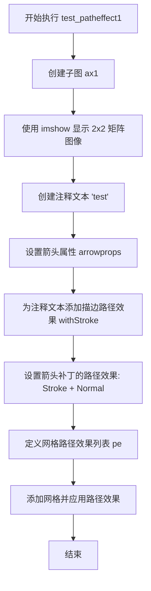
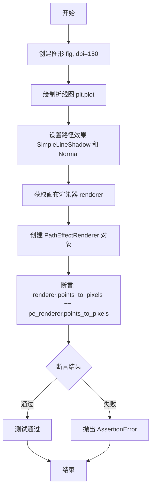
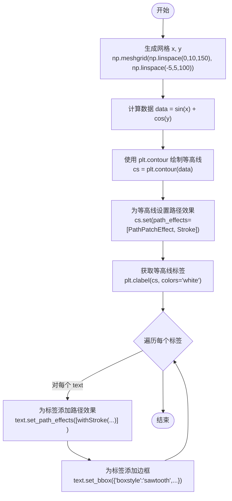
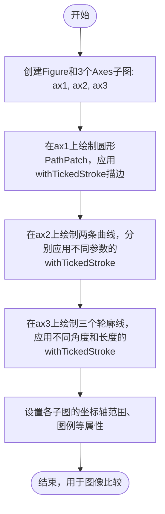
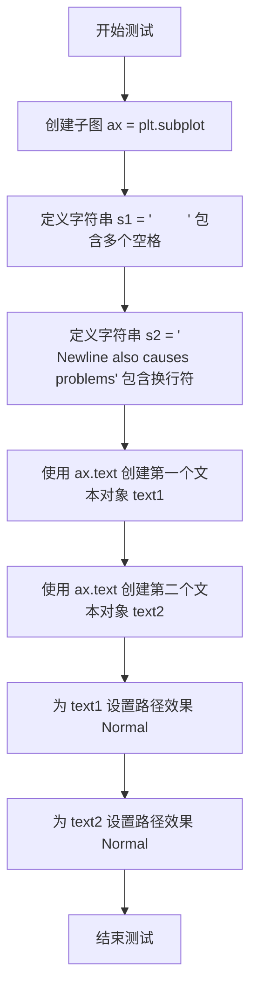
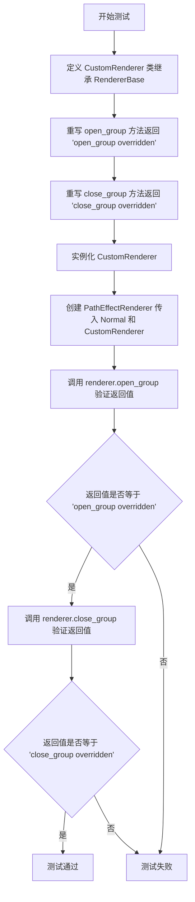
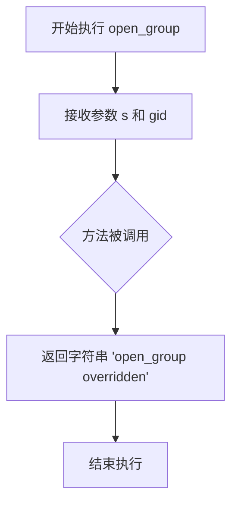
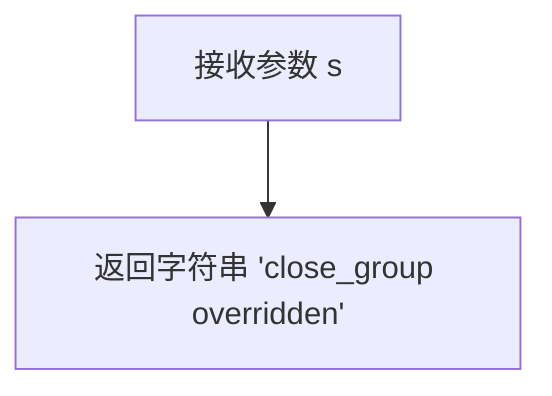

# `matplotlib\lib\matplotlib\tests\test_patheffects.py` 详细设计文档

该文件是matplotlib的路径效果（path effects）功能测试套件，通过多个测试函数验证patheffects模块的各种效果，包括描边文本、线条阴影、补丁阴影、刻度描边等视觉效果，以及自定义渲染器的open/close_group方法重写功能。

## 整体流程

```mermaid
graph TD
    A[开始] --> B[导入依赖模块]
    B --> C{执行测试函数}
    C --> D[test_patheffect1]
    C --> E[test_patheffect2]
    C --> F[test_patheffect3]
    C --> G[test_patheffects_stroked_text]
    C --> H[test_PathEffect_points_to_pixels]
    C --> I[test_SimplePatchShadow_offset]
    C --> J[test_collection]
    C --> K[test_tickedstroke]
    C --> L[test_patheffects_spaces_and_newlines]
    C --> M[test_patheffects_overridden_methods]
    C --> N[test_simple_line_shadow]
    D --> D1[创建子图]
    D --> D2[添加imshow图像]
    D --> D3[添加带箭头标注]
    D --> D4[设置网格路径效果]
    D --> D5[使用image_comparison验证]
    E --> E1[创建子图和数组]
    E --> E2[绘制等高线]
    E --> E3[设置等高线标签路径效果]
    F --> F1[绘制线条]
    F --> F2[设置线条阴影效果]
    F --> F3[添加标题和图例]
    F --> F4[添加文本和PathPatchEffect]
    G --> G1[创建多行文本]
    G --> G2[为每个文本设置Stroke效果]
    H --> H1[创建图形和渲染器]
    H --> H2[创建PathEffectRenderer]
    H --> H3[验证points_to_pixels一致性]
    I --> I1[创建SimplePatchShadow]
    I --> I2[验证offset属性]
    J --> J1[创建网格数据]
    J --> J2[绘制等高线并设置效果]
    J --> J3[为标签设置路径效果]
    K --> K1[创建PathPatch with TickedStroke]
    K --> K2[绘制多条带效果的曲线]
    K --> K3[绘制多个等高线]
    L --> L1[创建包含空格的文本]
    L --> L2[创建包含换行符的文本]
    L --> L3[设置Normal路径效果]
    M --> M1[定义CustomRenderer类]
    M --> M2[重写open_group和close_group]
    M --> M3[创建PathEffectRenderer并验证]
    N --> N1[创建测试和参考子图]
    N --> N2[绘制带阴影的线条]
    N --> N3[使用check_figures_equal验证]
```



## 类结构

```
CustomRenderer (继承自RendererBase)
├── __init__
├── open_group (重写)
└── close_group (重写)
```

## 全局变量及字段


### `platform`
    
Provides functions to retrieve information about the host platform such as architecture and OS.

类型：`module`
    


### `np`
    
NumPy library for numerical computing, providing array objects and mathematical functions.

类型：`module`
    


### `plt`
    
Matplotlib's pyplot module for creating figures, axes and plotting.

类型：`module`
    


### `path_effects`
    
Matplotlib's patheffects module containing classes for rendering text and lines with visual effects.

类型：`module`
    


### `Path`
    
Matplotlib class representing a 2D path composed of vertices and control codes.

类型：`class`
    


### `patches`
    
Matplotlib's patches module providing geometric shapes such as Rectangle, Circle and PathPatch.

类型：`module`
    


### `RendererBase`
    
Abstract base class for rendering backends in Matplotlib.

类型：`class`
    


### `PathEffectRenderer`
    
Renderer that applies path effects to drawing operations in Matplotlib.

类型：`class`
    


### `image_comparison`
    
Decorator for image comparison tests that compares generated images with reference files.

类型：`function`
    


### `check_figures_equal`
    
Decorator for tests that asserts two figures produce identical visual output.

类型：`function`
    


### `matplotlib.axes.Axes.ax1`
    
Subplot axes created by plt.subplot() for the first test.

类型：`object`
    


### `matplotlib.axes.Axes.ax2`
    
Subplot axes created by plt.subplot() for the second test.

类型：`object`
    


### `matplotlib.axes.Axes.ax3`
    
Subplot axes created by plt.subplot() for the third test.

类型：`object`
    


### `matplotlib.text.Annotation.txt`
    
Annotation object with text 'test' and arrow properties.

类型：`object`
    


### `list.pe`
    
List of path effect instances used to style text or graphics.

类型：`object`
    


### `numpy.ndarray.arr`
    
2D NumPy array representing image pixel values.

类型：`object`
    


### `matplotlib.contour.Contour.cntr`
    
Contour object generated from the array for visualization.

类型：`object`
    


### `list.clbls`
    
List of contour label text objects.

类型：`object`
    


### `matplotlib.lines.Line2D.p1`
    
Line2D object representing a plotted line with markers.

类型：`object`
    


### `matplotlib.legend.Legend.leg`
    
Legend object for the plot.

类型：`object`
    


### `matplotlib.text.Text.text`
    
Text object displaying 'Drop test' inside a circular bbox.

类型：`object`
    


### `matplotlib.text.Text.t`
    
Figure-level text object for 'Hatch shadow'.

类型：`object`
    


### `list.text_chunks`
    
List of strings containing characters to be rendered as stroked text.

类型：`object`
    


### `int.font_size`
    
Integer font size in points used for rendering text.

类型：`object`
    


### `matplotlib.figure.Figure.fig`
    
Figure object obtained from plt.figure().

类型：`object`
    


### `matplotlib.backend_bases.RendererBase.renderer`
    
Renderer instance obtained from the canvas for drawing.

类型：`object`
    


### `matplotlib.patheffects.PathEffectRenderer.pe_renderer`
    
PathEffectRenderer that applies path effects to the line.

类型：`object`
    


### `numpy.ndarray.x`
    
1‑D NumPy array of x‑coordinates for the line plot.

类型：`object`
    


### `numpy.ndarray.y`
    
1‑D NumPy array of y‑coordinates for the line plot.

类型：`object`
    


### `numpy.ndarray.data`
    
2‑D NumPy array of computed sine‑cosine values for contouring.

类型：`object`
    


### `matplotlib.contour.Contour.cs`
    
Contour set generated from the data array.

类型：`object`
    


### `matplotlib.path.Path.path`
    
Path representing a unit circle.

类型：`object`
    


### `matplotlib.patches.PathPatch.patch`
    
PathPatch that draws the circular path with specified styling.

类型：`object`
    


### `int.nx`
    
Number of sample points along the x‑axis.

类型：`object`
    


### `int.ny`
    
Number of sample points along the y‑axis.

类型：`object`
    


### `numpy.ndarray.xvec`
    
1‑D array of x‑values for the survey grid.

类型：`object`
    


### `numpy.ndarray.yvec`
    
1‑D array of y‑values for the survey grid.

类型：`object`
    


### `numpy.ndarray.x1`
    
2‑D array of x‑coordinates from meshgrid.

类型：`object`
    


### `numpy.ndarray.x2`
    
2‑D array of y‑coordinates from meshgrid.

类型：`object`
    


### `numpy.ndarray.g1`
    
Constraint function values for the first inequality.

类型：`object`
    


### `numpy.ndarray.g2`
    
Constraint function values for the second inequality.

类型：`object`
    


### `numpy.ndarray.g3`
    
Constraint function values for the third inequality.

类型：`object`
    


### `matplotlib.contour.Contour.cg1`
    
Contour object for the first constraint.

类型：`object`
    


### `matplotlib.contour.Contour.cg2`
    
Contour object for the second constraint.

类型：`object`
    


### `matplotlib.contour.Contour.cg3`
    
Contour object for the third constraint.

类型：`object`
    


### `str.s1`
    
String containing only spaces.

类型：`object`
    


### `str.s2`
    
String containing a newline and text.

类型：`object`
    


### `matplotlib.text.Text.text1`
    
Text object displaying spaces.

类型：`object`
    


### `matplotlib.text.Text.text2`
    
Text object displaying newline string.

类型：`object`
    


### `matplotlib.axes.Axes.ax_ref`
    
Reference axes used for figure comparison.

类型：`object`
    


### `matplotlib.axes.Axes.ax_test`
    
Test axes used for figure comparison.

类型：`object`
    
    

## 全局函数及方法


### `test_patheffect1`

该测试函数用于验证 matplotlib 中路径效果（Path Effects）的渲染功能，通过创建带有描边效果的注释文本和网格线来测试 `withStroke`、`Stroke` 和 `Normal` 路径效果类的正确性。

参数：
- 无参数

返回值：`None`，无返回值

#### 流程图



#### 带注释源码

```python
@image_comparison(['patheffect1'], remove_text=True)
def test_patheffect1():
    # 创建一个子图 axes 对象
    ax1 = plt.subplot()
    
    # 显示一个 2x2 的数值矩阵作为图像
    ax1.imshow([[1, 2], [2, 3]])
    
    # 创建注释文本 'test'，从位置 (1., 1.) 指向 (0., 0)
    # 带有箭头样式和连接样式
    txt = ax1.annotate("test", (1., 1.), (0., 0),
                       arrowprops=dict(arrowstyle="->",
                                       connectionstyle="angle3", lw=2),
                       size=20, ha="center",
                       # 为文本添加白色描边效果，线宽为 3
                       path_effects=[path_effects.withStroke(linewidth=3,
                                                             foreground="w")])
    
    # 为箭头补丁设置路径效果：
    # Stroke 效果（白色线宽 5）+ Normal 效果（正常渲染）
    txt.arrow_patch.set_path_effects([path_effects.Stroke(linewidth=5,
                                                          foreground="w"),
                                      path_effects.Normal()])

    # 定义网格的路径效果：白色描边线宽 3
    pe = [path_effects.withStroke(linewidth=3, foreground="w")]
    
    # 添加网格并应用路径效果
    ax1.grid(True, linestyle="-", path_effects=pe)
```


### `test_patheffect2`

该测试函数创建了一个5x5的NumPy数组，通过`imshow`显示为图像，绘制等高线，并为等高线及其标签添加白色描边路径效果，以增强在图像上的可见性。

参数：

- 该函数无显式参数（由装饰器 `@image_comparison` 管理）

返回值：`None`，测试函数不返回任何值，仅执行图像生成和验证

#### 流程图

```mermaid
flowchart TD
    A[开始 test_patheffect2] --> B[创建子图 ax2]
    B --> C[创建5x5数组 arr = np.arange(25).reshape((5, 5))]
    C --> D[使用 imshow 显示数组 arr, interpolation='nearest']
    D --> E[绘制数组的等高线 cntr = ax2.contour]
    E --> F[设置等高线描边路径效果: withStroke linewidth=3, foreground='w']
    F --> G[创建等高线标签 clbls = ax2.clabel]
    G --> H[设置标签的路径效果: withStroke linewidth=3, foreground='w']
    H --> I[结束函数]
    
    style A fill:#f9f,stroke:#333
    style I fill:#f9f,stroke:#333
```

#### 带注释源码

```python
@image_comparison(['patheffect2'], remove_text=True, style='mpl20',
                  tol=0 if platform.machine() == 'x86_64' else 0.06)
def test_patheffect2():
    """
    测试函数：验证路径效果在等高线图上的渲染
    - 使用 image_comparison 装饰器进行图像对比测试
    - remove_text=True: 移除文本以专注于图形元素
    - style='mpl20': 使用 matplotlib 2.0 风格
    - tol: 根据机器架构设置容差值
    """
    
    # 创建子图坐标轴
    ax2 = plt.subplot()
    
    # 创建5x5数组，值为0-24
    arr = np.arange(25).reshape((5, 5))
    
    # 使用最近邻插值显示数组为图像
    ax2.imshow(arr, interpolation='nearest')
    
    # 绘制等高线，线条颜色为黑色
    cntr = ax2.contour(arr, colors="k")
    
    # 为等高线设置描边路径效果，使线条更粗且为白色
    # 这确保等高线在图像上更清晰可见
    cntr.set(path_effects=[path_effects.withStroke(linewidth=3, foreground="w")])
    
    # 为等高线添加标签
    # fmt="%2.0f": 格式化为两位整数
    # use_clabeltext=True: 使用 ClabelText 实现更精确的标签定位
    clbls = ax2.clabel(cntr, fmt="%2.0f", use_clabeltext=True)
    
    # 为等高线标签设置相同的描边路径效果
    # 确保标签文字在图像上也清晰可见
    plt.setp(clbls,
             path_effects=[path_effects.withStroke(linewidth=3,
                                                   foreground="w")])
```


### `test_patheffect3`

这是一个测试函数，用于验证matplotlib中各种路径效果（Path Effects）的渲染功能，包括线条阴影、描边、图例阴影、文本阴影和补丁效果。

参数：

- 无

返回值：`None`，无返回值（测试函数）

#### 流程图

```mermaid
flowchart TD
    A[开始 test_patheffect3] --> B[绘制线条 p1 = plt.plot]
    B --> C[设置线条路径效果 SimpleLineShadow + Normal]
    C --> D[设置标题 withStroke 红色描边]
    D --> E[创建图例 legend]
    E --> F[设置图例路径效果 withSimplePatchShadow]
    F --> G[创建文本 plt.text]
    G --> H[设置文本路径效果 Stroke + withSimplePatchShadow]
    H --> I[设置文本边框路径效果]
    I --> J[创建图形文本 gcf().text]
    J --> K[设置图形文本路径效果 PathPatchEffect x2]
    K --> L[结束]
```

#### 带注释源码

```python
@image_comparison(['patheffect3'],
                  tol=0 if platform.machine() == 'x86_64' else 0.019)
def test_patheffect3():
    # 绘制一条蓝色圆形标记的折线，线宽为4
    p1, = plt.plot([1, 3, 5, 4, 3], 'o-b', lw=4)
    # 为线条设置路径效果：先应用简单线条阴影，再应用正常渲染
    p1.set_path_effects([path_effects.SimpleLineShadow(),
                         path_effects.Normal()])
    
    # 设置图表标题，使用红色描边效果（线宽1）
    plt.title(
        r'testing$^{123}$',
        path_effects=[path_effects.withStroke(linewidth=1, foreground="r")])
    
    # 创建图例，指定线条和标签
    leg = plt.legend([p1], [r'Line 1$^2$'], fancybox=True, loc='upper left')
    # 为图例边框设置简单补丁阴影效果
    leg.legendPatch.set_path_effects([path_effects.withSimplePatchShadow()])

    # 在坐标(2,3)处创建白色文本，背景为红色圆形
    text = plt.text(2, 3, 'Drop test', color='white',
                    bbox={'boxstyle': 'circle,pad=0.1', 'color': 'red'})
    # 定义路径效果列表：黑色描边 + 蓝色简单补丁阴影
    pe = [path_effects.Stroke(linewidth=3.75, foreground='k'),
          path_effects.withSimplePatchShadow((6, -3), shadow_rgbFace='blue')]
    # 为文本设置路径效果
    text.set_path_effects(pe)
    # 同时为文本的边框补丁设置相同的路径效果
    text.get_bbox_patch().set_path_effects(pe)

    # 定义两种PathPatchEffect： hatch阴影和描边效果
    pe = [path_effects.PathPatchEffect(offset=(4, -4), hatch='xxxx',
                                       facecolor='gray'),
          path_effects.PathPatchEffect(edgecolor='white', facecolor='black',
                                       lw=1.1)]

    # 在图形上添加大号文本（字体大小75）
    t = plt.gcf().text(0.02, 0.1, 'Hatch shadow', fontsize=75, weight=1000,
                       va='center')
    # 为该文本设置hatch阴影效果
    t.set_path_effects(pe)
```


### `test_patheffects_stroked_text`

该测试函数用于验证matplotlib中描边文本（stroked text）的path effect渲染功能，通过创建带有黑色描边效果的白色文本行来测试`Stroke`与`Normal` path effect的组合效果是否正确渲染。

参数：
- 该函数无显式参数

返回值：`None`，无返回值（测试函数）

#### 流程图

```mermaid
flowchart TD
    A[开始] --> B[定义文本块列表text_chunks]
    B --> C[设置font_size=50]
    C --> D[创建子图axes: ax = plt.axes0, 0, 1, 1)]
    E[遍历text_chunks] --> F[计算y坐标: 0.9 - i * 0.13]
    F --> G[使用ax.text添加文本]
    G --> H[设置path_effects: Stroke + Normal]
    H --> I{是否还有更多文本块?}
    I -->|是| E
    I -->|否| J[设置xlim: 0到1]
    J --> K[设置ylim: 0到1]
    K --> L[隐藏坐标轴: ax.axisoff]
    L --> M[结束]
```

#### 带注释源码

```python
@image_comparison(['stroked_text.png'])  # 装饰器：用于图像对比测试，期望输出为'stroked_text.png'
def test_patheffects_stroked_text():
    """
    测试函数：验证描边文本的path effect渲染效果
    使用Stroke和Normal组合创建带有黑色描边的白色文本
    """
    # 定义多行文本内容，包含字母、数字和特殊字符
    text_chunks = [
        'A B C D E F G H I J K L',      # 第一行：大写字母
        'M N O P Q R S T U V W',        # 第二行：大写字母
        'X Y Z a b c d e f g h i j',    # 第三行：大小写字母混合
        'k l m n o p q r s t u v',      # 第四行：小写字母
        'w x y z 0123456789',           # 第五行：小写字母和数字
        r"!@#$%^&*()-=_+[]\;'",         # 第六行：特殊字符
        ',./{}|:<>?'                    # 第七行：特殊字符
    ]
    font_size = 50  # 字体大小设为50

    # 创建子图，axes参数(0, 0, 1, 1)表示使用整个图形区域
    ax = plt.axes((0, 0, 1, 1))
    
    # 遍历每个文本块并添加到图表中
    for i, chunk in enumerate(text_chunks):
        # 计算y坐标：从0.9开始，每行递减0.13
        # x坐标固定为0.01（左侧留白）
        text = ax.text(
            x=0.01, 
            y=(0.9 - i * 0.13),  # 垂直排列文本
            s=chunk,             # 文本内容
            fontdict={
                'ha': 'left',    # 水平对齐：左对齐
                'va': 'center',  # 垂直对齐：居中
                'size': font_size,  # 字体大小
                'color': 'white'   # 文本颜色：白色
            }
        )

        # 设置path effects：先描边，再正常渲染
        # Stroke创建黑色描边，linewidth为font_size/10=5
        # Normal()用于正常渲染原始文本（白色）
        text.set_path_effects([
            path_effects.Stroke(
                linewidth=font_size / 10,  # 描边宽度 = 50/10 = 5
                foreground='black'         # 描边颜色：黑色
            ),
            path_effects.Normal()  # 正常渲染文本内容（白色）
        ])

    # 设置坐标轴范围
    ax.set_xlim(0, 1)  # x轴范围：0到1
    ax.set_ylim(0, 1)  # y轴范围：0到1
    ax.axis('off')     # 隐藏坐标轴刻度和标签
```


### `test_PathEffect_points_to_pixels`

该测试函数用于验证 PathEffectRenderer 在渲染时能够正确保持点大小（points to pixels 的转换），确保使用路径效果渲染器时字体大小不会出错。

参数： 无

返回值：`None`，该函数为测试函数，通过 assert 语句进行断言验证，不返回具体值。

#### 流程图



#### 带注释源码

```python
def test_PathEffect_points_to_pixels():
    # 创建一个分辨率为 150 DPI 的图形
    fig = plt.figure(dpi=150)
    
    # 绘制一条包含 0-9 十个数据点的折线图
    p1, = plt.plot(range(10))
    
    # 为线条设置路径效果：简单线阴影 + 正常渲染
    p1.set_path_effects([path_effects.SimpleLineShadow(),
                         path_effects.Normal()])
    
    # 从图形画布获取底层渲染器对象
    renderer = fig.canvas.get_renderer()
    
    # 使用路径效果列表和底层渲染器创建 PathEffectRenderer
    # 该渲染器负责应用路径效果并进行实际绘制
    pe_renderer = path_effects.PathEffectRenderer(
        p1.get_path_effects(), renderer)
    
    # 验证使用路径效果渲染器时，点到像素的转换是否正确
    # 确认使用路径效果渲染器能够正确保持点大小
    # 否则渲染的字体大小会出错
    assert renderer.points_to_pixels(15) == pe_renderer.points_to_pixels(15)
```


### `test_SimplePatchShadow_offset`

该函数是一个单元测试，用于验证 `SimplePatchShadow` 类的 offset 参数是否正确存储在内部属性 `_offset` 中。

参数：无

返回值：`None`，无返回值（测试函数）

#### 流程图

```mermaid
flowchart TD
    A[开始测试] --> B[创建SimplePatchShadow实例<br/>offset=(4, 5)]
    B --> C[断言 pe._offset == (4, 5)]
    C --> D{断言结果}
    D -->|通过| E[测试通过]
    D -->|失败| F[抛出AssertionError]
```

#### 带注释源码

```python
def test_SimplePatchShadow_offset():
    """
    测试 SimplePatchShadow 的 offset 参数是否能正确存储。
    该测试验证内部属性 _offset 被正确设置。
    """
    # 创建一个 SimplePatchShadow 对象，指定偏移量为 (4, 5)
    # SimplePatchShadow 是 matplotlib path_effects 模块中的类
    # 用于创建简单的补丁阴影效果
    pe = path_effects.SimplePatchShadow(offset=(4, 5))
    
    # 断言验证内部属性 _offset 是否正确存储了传入的偏移值
    # 这是一个内部实现细节的验证，确保参数正确传递
    assert pe._offset == (4, 5)
```


### `test_collection`

**描述**  
`test_collection` 是 Matplotlib 的一个图像比对测试函数，用于验证路径效果（Path Effects）在等高线（Contour）及其标签上的渲染是否符合预期。该函数生成网格数据、绘制等高线、为等高线及其标签分别设置不同的路径效果，并使用 `@image_comparison` 装饰器进行图像对比。

#### 参数

- **无**  
  该测试函数没有显式的输入参数（装饰器 `@image_comparison` 负责内部配置）。

#### 返回值

- **返回值类型**：`None`  
- **返回值描述**：测试函数不返回任何值，仅用于产生可视化图像供比对。

#### 流程图



#### 带注释源码

```python
# 导入所需库
import numpy as np
import matplotlib.pyplot as plt
import matplotlib.patheffects as path_effects

# 使用 @image_comparison 装饰器进行图像比对
# 期望的基准图像文件名为 'collection'，容差为 0.03，样式采用 'mpl20'
@image_comparison(['collection'], tol=0.03, style='mpl20')
def test_collection():
    # --------------------------------------------------------------
    # 1. 生成网格数据
    # --------------------------------------------------------------
    # 使用 linspace 在 0~10 区间生成 150 个点，在 -5~5 区间生成 100 个点
    x, y = np.meshgrid(np.linspace(0, 10, 150), np.linspace(-5, 5, 100))

    # --------------------------------------------------------------
    # 2. 计算函数值（用于绘制等高线）
    # --------------------------------------------------------------
    # 简单的二维函数：sin(x) + cos(y)
    data = np.sin(x) + np.cos(y)

    # --------------------------------------------------------------
    # 3. 绘制等高线
    # --------------------------------------------------------------
    # 返回一个等高线容器对象 cs
    cs = plt.contour(data)

    # --------------------------------------------------------------
    # 4. 为等高线添加路径效果
    # --------------------------------------------------------------
    # 使用 PathPatchEffect 绘制黑色、无线宽的轮廓，外加 Stroke 产生粗线条
    cs.set(path_effects=[
        path_effects.PathPatchEffect(edgecolor='black', facecolor='none', linewidth=12),
        path_effects.Stroke(linewidth=5)])

    # --------------------------------------------------------------
    # 5. 为等高线标签（label）添加路径效果与边框
    # --------------------------------------------------------------
    # clabel 返回一个包含标签文本对象的列表（matplotlib.text.Text 实例）
    for text in plt.clabel(cs, colors='white'):
        # 为每个标签添加描边效果（白色描边，线宽 3）
        text.set_path_effects([path_effects.withStroke(foreground='k',
                                                       linewidth=3)])
        # 为标签添加自定义边框（锯齿形状，无填充，蓝色边框）
        text.set_bbox({'boxstyle': 'sawtooth', 'facecolor': 'none',
                       'edgecolor': 'blue'})
    # 测试函数结束，返回值默认为 None
```


### `test_tickedstroke`

该函数是一个图像比较测试函数，用于验证 `matplotlib` 中 `path_effects.withTickedStroke` 的渲染效果，通过绘制不同的图形（圆形、线条、轮廓）并应用刻度线描边效果，确保输出图像与基准图像一致。

参数：
- `text_placeholders`：`任意类型`（由 `@image_comparison` 装饰器传入的占位符参数，当前函数未使用）

返回值：`None`，该函数无返回值，仅用于图像比较测试。

#### 流程图



#### 带注释源码

```python
@image_comparison(['tickedstroke.png'], remove_text=True, style='mpl20')
def test_tickedstroke(text_placeholders):
    """
    测试withTickedStroke路径效果的图像比较测试函数。
    验证在不同场景（Patch、Plot、Contour）下刻度线描边的渲染正确性。
    """
    # 创建一个Figure和三个子图， figsize设置宽度12英寸、高度4英寸
    fig, (ax1, ax2, ax3) = plt.subplots(1, 3, figsize=(12, 4))
    
    # --- 子图1：绘制圆形Patch，应用刻度线描边效果 ---
    # 创建单位圆路径
    path = Path.unit_circle()
    # 创建PathPatch对象，设置无填充、线宽2，应用withTickedStroke描边效果
    # 参数angle=-90表示刻度线角度，spacing=10表示刻度间距，length=1表示刻度长度
    patch = patches.PathPatch(path, facecolor='none', lw=2, path_effects=[
        path_effects.withTickedStroke(angle=-90, spacing=10,
                                      length=1)])
    ax1.add_patch(patch)  # 将Patch添加到子图
    ax1.axis('equal')     # 设置坐标轴等比例
    ax1.set_xlim(-2, 2)   # 设置x轴范围
    ax1.set_ylim(-2, 2)   # 设置y轴范围
    
    # --- 子图2：绘制曲线，应用刻度线描边效果 ---
    # 绘制直线，从(0,0)到(1,1)，标签为'C0'，应用withTickedStroke
    # 参数spacing=7表示间距，angle=135表示角度
    ax2.plot([0, 1], [0, 1], label='C0',
             path_effects=[path_effects.withTickedStroke(spacing=7,
                                                         angle=135)])
    # 生成正弦波形数据点
    nx = 101
    x = np.linspace(0.0, 1.0, nx)
    y = 0.3 * np.sin(x * 8) + 0.4
    # 绘制正弦曲线，标签为'C1'，应用默认参数的withTickedStroke
    ax2.plot(x, y, label='C1', path_effects=[path_effects.withTickedStroke()])
    ax2.legend()  # 显示图例
    
    # --- 子图3：绘制轮廓线，应用刻度线描边效果 ---
    # 设置网格采样点数
    nx = 101
    ny = 105
    # 创建网格向量
    xvec = np.linspace(0.001, 4.0, nx)
    yvec = np.linspace(0.001, 4.0, ny)
    # 生成网格坐标矩阵
    x1, x2 = np.meshgrid(xvec, yvec)
    
    # 定义三个轮廓函数（约束条件）
    g1 = -(3 * x1 + x2 - 5.5)
    g2 = -(x1 + 2 * x2 - 4)
    g3 = .8 + x1 ** -3 - x2
    
    # 绘制轮廓线g1，颜色黑色，应用withTickedStroke，角度135
    cg1 = ax3.contour(x1, x2, g1, [0], colors=('k',))
    cg1.set(path_effects=[path_effects.withTickedStroke(angle=135)])
    
    # 绘制轮廓线g2，颜色红色，应用withTickedStroke，角度60，长度2
    cg2 = ax3.contour(x1, x2, g2, [0], colors=('r',))
    cg2.set(path_effects=[path_effects.withTickedStroke(angle=60, length=2)])
    
    # 绘制轮廓线g3，颜色蓝色，应用withTickedStroke，间距7
    cg3 = ax3.contour(x1, x2, g3, [0], colors=('b',))
    cg3.set(path_effects=[path_effects.withTickedStroke(spacing=7)])
    
    # 设置子图3的坐标轴范围
    ax3.set_xlim(0, 4)
    ax3.set_ylim(0, 4)
```

### 关键组件信息

- `matplotlib.pyplot`：用于创建图形和子图。
- `matplotlib.path.Path`：提供路径操作，这里使用 `Path.unit_circle()` 创建圆。
- `matplotlib.patches.PathPatch`：用于绘制路径补丁（图形）。
- `matplotlib.patheffects.withTickedStroke`：核心路径效果，用于在描边线条上添加刻度线。
- `matplotlib.axes.Axes`：子图对象，用于绘制图形。
- `numpy`：提供数值计算和网格生成。

### 潜在的技术债务或优化空间

1. **硬编码参数**：函数中大量硬编码了图形参数（如 `figsize=(12, 4)`、坐标轴范围、数值等），建议提取为常量或配置，减少重复。
2. **未使用的参数**：`text_placeholders` 参数未使用，可能表明装饰器设计与测试函数的不匹配，可清理。
3. **重复代码**：子图3中轮廓线绘制代码结构重复，可通过循环简化。
4. **注释不足**：部分复杂计算（如约束函数 g1, g2, g3）缺乏注释，可增加说明。

### 其它项目

- **设计目标与约束**：该测试旨在验证 `withTickedStroke` 在不同绘图上下文（Patch、Plot、Contour）中的渲染一致性，不验证交互功能。
- **错误处理与异常设计**：函数依赖 `@image_comparison` 装饰器进行异常捕获（如图像不匹配），自身无显式错误处理。
- **数据流与状态机**：数据流为静态定义（无外部输入），状态机简单（创建图形→绘制→比较）。
- **外部依赖与接口契约**：依赖 `matplotlib` 和 `numpy` 库，需确保版本兼容性（装饰器 `style='mpl20'` 指定了matplotlib 2.0风格）。


### `test_patheffects_spaces_and_newlines`

这是一个测试函数，用于验证 Matplotlib 的路径效果（Path Effects）在处理包含多个空格和换行符的文本时的渲染行为。

参数： 无（该函数没有显式参数，可能接受隐式的测试框架参数）

返回值：`None`，该函数为测试函数，不返回任何值

#### 流程图



#### 带注释源码

```python
@image_comparison(['spaces_and_newlines.png'], remove_text=True)
def test_patheffects_spaces_and_newlines():
    """
    测试路径效果在处理空格和换行符时的行为
    使用 @image_comparison 装饰器比较生成的图像与预期图像
    remove_text=True 表示在比较时移除文本元素
    """
    
    # 创建一个子图，返回 Axes 对象
    ax = plt.subplot()
    
    # 定义包含多个空格的字符串（用于测试空格处理）
    s1 = "         "
    
    # 定义包含换行符的字符串（用于测试换行符处理）
    s2 = "\nNewline also causes problems"
    
    # 在子图中心上方位置 (0.5, 0.75) 创建第一个文本
    # 使用 ha='center', va='center' 进行居中对齐
    # size=20 设置字体大小
    # bbox={'color': 'salmon'} 设置淡红色背景框
    text1 = ax.text(0.5, 0.75, s1, ha='center', va='center', size=20,
                    bbox={'color': 'salmon'})
    
    # 在子图中心下方位置 (0.5, 0.25) 创建第二个文本
    # 使用淡紫色背景框
    text2 = ax.text(0.5, 0.25, s2, ha='center', va='center', size=20,
                    bbox={'color': 'thistle'})
    
    # 为第一个文本设置路径效果：Normal 表示不应用特殊效果
    # 这是测试基本路径效果在纯空格文本上的渲染
    text1.set_path_effects([path_effects.Normal()])
    
    # 为第二个文本设置路径效果：Normal
    # 这是测试路径效果在包含换行符文本上的渲染
    text2.set_path_effects([path_effects.Normal()])
```


### `test_patheffects_overridden_methods_open_close_group`

该函数用于测试 PathEffectRenderer 是否正确调用自定义 Renderer 中被重写的 open_group 和 close_group 方法，验证 PathEffectRenderer 能够正确委托调用自定义渲染器的方法。

参数： 无

返回值：`None`，该函数为测试函数，使用 assert 断言进行验证，不返回具体值

#### 流程图



#### 带注释源码

```python
def test_patheffects_overridden_methods_open_close_group():
    """
    测试 PathEffectRenderer 是否正确调用自定义 Renderer 中被重写的 open_group 和 close_group 方法
    
    该测试验证了 PathEffectRenderer 能够正确委托调用底层渲染器的
    open_group 和 close_group 方法，即使这些方法被自定义类重写
    """
    # 定义一个自定义渲染器类，继承自 RendererBase
    class CustomRenderer(RendererBase):
        def __init__(self):
            # 调用父类 RendererBase 的初始化方法
            super().__init__()

        def open_group(self, s, gid=None):
            """
            重写 open_group 方法
            参数:
                s: 组名称字符串
                gid: 可选的组标识符
            返回:
                字符串 "open_group overridden"，用于验证方法被正确调用
            """
            return "open_group overridden"

        def close_group(self, s):
            """
            重写 close_group 方法
            参数:
                s: 组名称字符串
            返回:
                字符串 "close_group overridden"，用于验证方法被正确调用
            """
            return "close_group overridden"

    # 创建 PathEffectRenderer 实例
    # 参数1: 路径效果列表 [path_effects.Normal()]
    # 参数2: 自定义渲染器实例 CustomRenderer()
    renderer = PathEffectRenderer([path_effects.Normal()], CustomRenderer())

    # 断言验证 open_group 方法被正确重写并被调用
    # 期望返回值: "open_group overridden"
    assert renderer.open_group('s') == "open_group overridden"
    
    # 断言验证 close_group 方法被正确重写并被调用
    # 期望返回值: "close_group overridden"
    assert renderer.close_group('s') == "close_group overridden"
```


### `test_simple_line_shadow`

该函数是一个测试函数，用于验证 matplotlib 的 `SimpleLineShadow` 路径效果是否正确工作。它通过对比测试图像（应用了 SimpleLineShadow 效果）和参考图像（使用半透明蓝色线条模拟阴影）来确认路径效果渲染的正确性。

参数：

- `fig_test`：`matplotlib.figure.Figure`，测试figure对象，用于绘制应用了SimpleLineShadow路径效果的线条
- `fig_ref`：`matplotlib.figure.Figure`，参考figure对象，用于绘制不带路径效果的半透明蓝色线条作为参照

返回值：`None`，该函数通过 `@check_figures_equal()` 装饰器自动进行图像比较验证

#### 流程图

```mermaid
flowchart TD
    A[开始] --> B[创建测试子图 ax_test]
    B --> C[创建参考子图 ax_ref]
    C --> D[生成 x 数据: -5 到 5 的 500 个点]
    D --> E[计算高斯曲线 y = exp(-x²)]
    E --> F[在 ax_test 上绘制线条<br/>应用 SimpleLineShadow 效果<br/>offset=(0,0), shadow_color='blue']
    F --> G[在 ax_ref 上绘制半透明蓝色线条<br/>linewidth=5, color='blue', alpha=0.3]
    G --> H[装饰器执行图像对比验证]
    H --> I[结束]
```

#### 带注释源码

```python
@check_figures_equal()
def test_simple_line_shadow(fig_test, fig_ref):
    """
    测试 SimpleLineShadow 路径效果是否正确渲染。
    
    该测试通过比较两种方式生成的图像来验证路径效果:
    1. 测试图: 使用 SimpleLineShadow 路径效果绘制线条
    2. 参考图: 使用半透明蓝色线条模拟阴影效果
    """
    
    # 为测试figure添加子图
    ax_ref = fig_ref.add_subplot()
    
    # 为参考figure添加子图
    ax_test = fig_test.add_subplot()

    # 生成x轴数据: 从-5到5的500个等间距点
    x = np.linspace(-5, 5, 500)
    
    # 计算高斯函数曲线 y = e^(-x²)
    y = np.exp(-x**2)

    # 在测试子图上绘制曲线，应用 SimpleLineShadow 路径效果
    # offset=(0, 0) 表示阴影偏移量为0，即阴影与原线条重合
    # shadow_color='blue' 设置阴影颜色为蓝色
    line, = ax_test.plot(
        x, y, linewidth=5,
        path_effects=[
            path_effects.SimpleLineShadow(offset=(0, 0), shadow_color='blue')])

    # 在参考子图上绘制相同的曲线，使用半透明蓝色模拟阴影效果
    # color='blue' 设置线条颜色为蓝色
    # alpha=0.3 设置透明度为0.3，模拟阴影的淡出效果
    ax_ref.plot(x, y, linewidth=5, color='blue', alpha=0.3)
```


### `CustomRenderer.__init__`

该方法是自定义渲染器类的构造函数，继承自 `RendererBase`，用于初始化一个自定义的渲染器实例，并调用父类的初始化方法。

参数：

- `self`：CustomRenderer 实例，代表当前创建的 CustomRenderer 对象本身

返回值：`None`，因为 `__init__` 方法不返回值，仅用于初始化对象状态

#### 流程图

```mermaid
flowchart TD
    A[开始 __init__] --> B{调用 super().__init__}
    B --> C[继承 RendererBase 的初始化逻辑]
    C --> D[完成初始化]
    D --> E[结束]
```

#### 带注释源码

```python
def __init__(self):
    """
    CustomRenderer 的初始化方法
    
    该方法继承自 RendererBase，用于初始化自定义渲染器实例。
    通过调用父类的 __init__ 方法来完成基本的初始化工作。
    """
    super().__init__()  # 调用父类 RendererBase 的初始化方法
```


### `CustomRenderer.open_group`

该方法是 `CustomRenderer` 类中的一个成员方法，用于重写基类的 `open_group` 方法，实现自定义的组打开逻辑，并返回特定的字符串标识。

参数：

- `s`：`str`，用于指定要打开的组（group）的名称或标识符
- `gid`：`str` 或 `None`，可选参数，用于指定组的唯一标识 ID，默认为 `None`

返回值：`str`，返回字符串 `"open_group overridden"`，表示该方法已被重写

#### 流程图



#### 带注释源码

```python
def open_group(self, s, gid=None):
    """
    重写 RendererBase 类中的 open_group 方法。
    
    参数:
        s (str): 组名称，用于标识要打开的图形组
        gid (str, optional): 组的唯一标识符，默认为 None
    
    返回:
        str: 返回重写后的字符串标识
    """
    return "open_group overridden"
```


### `CustomRenderer.close_group`

该方法是一个测试中定义的渲染器类的关闭组操作，重写了基类的close_group方法，用于返回特定的字符串以验证路径效果渲染器是否正确调用了自定义的渲染器方法。

参数：

- `s`：字符串，表示组的标识符，用于指定要关闭的组。

返回值：字符串，返回"close_group overridden"，表示该方法已被重写。

#### 流程图



#### 带注释源码

```python
def close_group(self, s):
    """
    关闭一个组。

    参数:
        s: 字符串，表示组的标识符。

    返回值:
        字符串，表示该方法已被重写。
    """
    return "close_group overridden"
```

## 关键组件


### withStroke

描边效果组件，通过指定线宽和前景色在绘制内容周围添加描边效果，常用于增强文本或线条的可读性。

### SimpleLineShadow

简单线条阴影效果组件，为线条添加偏移的阴影，可配置阴影颜色和偏移量。

### Normal

正常渲染效果组件，作为路径效果的基准，表示无特殊效果的标准渲染。

### PathPatchEffect

路径补丁效果组件，通过自定义补丁（如偏移、填充图案、边框）来修改路径的渲染外观。

### SimplePatchShadow

简单补丁阴影效果组件，为图形元素添加带有偏移和颜色的简单阴影效果。

### withTickedStroke

带刻度的描边效果组件，在描边路径上添加周期性刻度线，可配置角度、间距和长度。

### withSimplePatchShadow

带简单补丁的阴影效果组件，结合了补丁阴影和简单阴影的特性，支持偏移和补丁参数。

### PathEffectRenderer

路径效果渲染器，负责将路径效果应用到实际渲染过程，封装了底层渲染器并实现点阵到像素的转换。

### RendererBase

渲染器基类，定义了渲染器的基本接口，包括open_group和close_group等方法。

### @image_comparison

图像比较装饰器，用于自动比较测试生成的图像与基准图像，验证渲染结果的一致性。

### check_figures_equal

图形相等检查装饰器，用于比较两个图形对象是否产生相同的渲染输出。


## 问题及建议


### 已知问题

-   **未使用的参数**：test_tickedstroke函数的text_placeholders参数未被使用，可能是残留参数或设计遗漏
-   **平台依赖性**：多处使用platform.machine() == 'x86_64'进行条件判断，导致测试在不同平台上行为不一致
-   **硬编码数值**：大量硬编码的数值（如dpi=150、font_size=50、spacing=10等）分散在代码中，降低可维护性
-   **代码重复**：多次创建相似的path_effects对象（如path_effects.withStroke），未进行复用
-   **测试方法不完整**：test_patheffects_overridden_methods_open_close_group中的CustomRenderer只返回字符串而非执行实际渲染逻辑，测试覆盖不全面
-   **缺乏文档**：测试函数缺少文档字符串，难以理解每个测试的目的和预期结果
-   **测试粒度不均**：部分测试（如test_PathEffect_points_to_pixels、test_SimplePatchShadow_offset）是单元测试，而大部分是集成测试，测试策略不统一

### 优化建议

-   移除test_tickedstroke中未使用的text_placeholders参数，或明确其用途
-   将平台相关的tol值提取为配置常量或使用pytest的parametrize进行平台差异化测试
-   抽取魔法数字为模块级常量，如DEFAULT_DPI、FONT_SIZE等，提高可维护性
-   封装常用的path_effects创建逻辑为辅助函数，减少重复代码
-   完善CustomRenderer的实现，使其执行实际渲染操作，或使用mock对象进行测试
-   为每个测试函数添加docstring说明测试目的、输入和预期输出
-   统一测试策略，考虑将单元测试和集成测试分离到不同文件或模块
-   添加错误场景测试，如测试无效的path_effects参数、边界条件等

## 其它


### 设计目标与约束

本测试代码的核心目标是验证matplotlib中path effects（路径效果）模块的各项功能是否正常工作，包括描边效果、阴影效果、轮廓效果等。测试代码采用图像比较的方式，确保渲染结果符合预期。代码需要支持跨平台运行，特别处理了x86_64架构与其他架构的容差值差异。测试覆盖了文本、线条、面片、轮廓等多种图形元素的路径效果应用。

### 错误处理与异常设计

测试代码主要依赖于matplotlib.testing.decorators中的装饰器进行错误处理。image_comparison装饰器自动比较渲染图像与预期图像的差异，当两者不匹配时会抛出异常。check_figures_equal装饰器用于比较两个figure对象的差异。代码中的断言（assert）用于验证特定功能，如test_PathEffect_points_to_pixels中验证points_to_pixels方法的返回值，test_SimplePatchShadow_offset中验证偏移量设置。对于平台相关的差异（如x86_64与其他架构的tol值不同），代码通过条件判断进行适配。

### 数据流与状态机

测试代码不涉及复杂的状态机，主要数据流为：1）创建figure和axes对象；2）设置各种图形元素（文本、线条、patch等）；3）应用path_effects；4）渲染并比较结果。每个测试函数独立运行，拥有独立的图形状态。PathEffectRenderer在test_PathEffect_points_to_pixels中作为核心组件，负责将path effects应用到渲染过程。

### 外部依赖与接口契约

主要外部依赖包括：matplotlib.pyplot（图形创建）、matplotlib.patheffects（路径效果）、matplotlib.path（路径定义）、matplotlib.patches（面片）、matplotlib.backend_bases（渲染器基类）、numpy（数值计算）、platform（平台检测）。关键接口契约包括：path_effects.withStroke（描边效果）、path_effects.SimpleLineShadow（线条阴影）、path_effects.SimplePatchShadow（面片阴影）、path_effects.PathPatchEffect（路径面片效果）、path_effects.withTickedStroke（刻度描边）、PathEffectRenderer（路径效果渲染器）。

### 性能考虑

部分测试包含大量数据点（如test_tickedstroke中的101x101网格），可能影响执行速度。image_comparison装饰器在运行测试时需要生成和比较图像，可能消耗较多内存和CPU资源。对于大规模数据渲染，建议在CI环境中设置合理的超时限制。

### 可测试性

代码本身即为测试代码，具有良好的可测试性设计。每个测试函数独立运行，使用装饰器自动管理测试基础设施。image_comparison装饰器自动处理baseline图像的生成和比较。check_figures_equal提供了灵活的图形对比能力。CustomRenderer类的测试展示了如何测试继承自RendererBase的自定义渲染器。

### 平台兼容性

代码通过platform.machine()检测架构，针对x86_64和其他架构设置不同的容差值（tol参数）。这反映了不同CPU架构可能导致浮点数运算结果的细微差异。测试风格（style参数）如'mpl20'用于确保与特定matplotlib版本的行为兼容。

### 已知限制

部分测试依赖baseline图像文件（如'patheffect1'、'patheffect2'等），这些文件需要预先存在。图像比较测试对渲染一致性要求较高，在不同操作系统或matplotlib版本间可能产生细微差异。test_patheffects_stroked_text中的大量文本渲染可能在低性能环境中运行缓慢。某些path_effects组合可能存在渲染顺序或层叠问题。

### 配置与环境要求

测试需要matplotlib完整安装，包括path_effects模块。numpy需要正确安装以支持数值计算。测试用到的baseline图像通常存储在matplotlib测试数据目录中。部分测试需要特定的matplotlib样式支持（如mpl20）。

### 关键测试场景覆盖

代码覆盖了以下关键测试场景：1）基本描边效果；2）轮廓线的路径效果；3）线条阴影；4）文本描边和阴影；5）patch效果；6）带刻度的描边效果；7）空格和换行符处理；8）自定义渲染器的open/close_group方法重写；9）PathEffectRenderer的points_to_pixels方法验证；10）集合（collection）的路径效果。


    