# `matplotlib\lib\matplotlib\tests\test_pickle.py` 详细设计文档

这是一个matplotlib对象序列化测试文件，验证Figure、Axes、Transform、Renderer等图形组件是否可以被正确地pickle（序列化）和unpickle（反序列化），确保图形对象可以在进程间传递或持久化存储。

## 整体流程

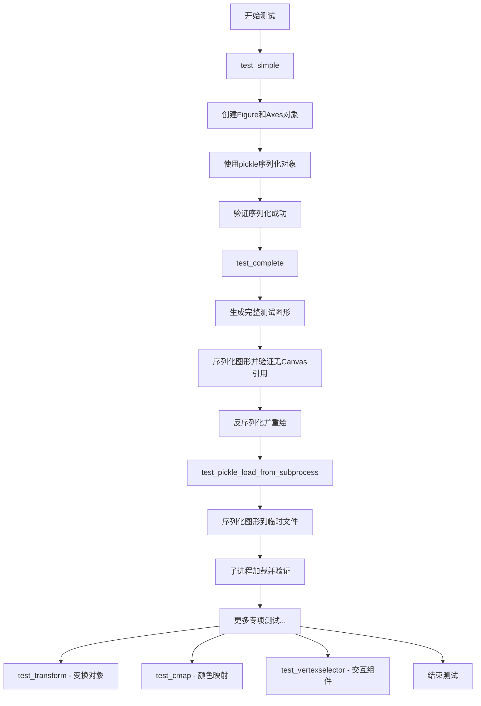

## 类结构

```
全局函数 (测试函数)
├── test_simple (基础pickle测试)
├── _generate_complete_test_figure (生成完整测试图形)
├── test_complete (完整图形序列化测试)
├── _pickle_load_subprocess (子进程加载函数)
├── test_pickle_load_from_subprocess (子进程间序列化测试)
├── test_gcf (图形管理器测试)
├── test_no_pyplot (非pyplot创建图形测试)
├── test_renderer (渲染器序列化测试)
├── test_image (图像序列化测试)
├── test_polar (极坐标图形测试)
├── TransformBlob (变换容器类)
│   └── __init__ (初始化变换对象)
├── test_transform (变换链序列化测试)
├── test_rrulewrapper (日期规则包装器测试)
├── test_shared (共享坐标轴测试)
├── test_inset_and_secondary (嵌套坐标轴测试)
├── test_cmap (颜色映射序列化测试)
├── test_unpickle_canvas (画布序列化测试)
├── test_mpl_toolkits (工具包测试)
├── test_standard_norm (标准归一化测试)
├── test_dynamic_norm (动态归一化测试)
├── test_vertexselector (顶点选择器测试)
├── test_cycler (属性循环测试)
├── _test_axeswidget_interactive (交互组件测试)
└── test_axeswidget_interactive (交互组件集成测试)
```

## 全局变量及字段


### `TransformBlob.identity`
    
IdentityTransform实例

类型：`mtransforms.IdentityTransform`
    


### `TransformBlob.identity2`
    
IdentityTransform实例

类型：`mtransforms.IdentityTransform`
    


### `TransformBlob.composite`
    
CompositeGenericTransform复合变换

类型：`mtransforms.CompositeGenericTransform`
    


### `TransformBlob.wrapper`
    
TransformWrapper变换包装器

类型：`mtransforms.TransformWrapper`
    


### `TransformBlob.composite2`
    
第二个复合变换

类型：`mtransforms.CompositeGenericTransform`
    
    

## 全局函数及方法


### `test_simple`

这是一个基础pickle功能测试函数，用于测试matplotlib生成的Figure、Axes（包括普通坐标轴和极坐标轴）对象能否被pickle正确序列化和反序列化。

参数：

- 该函数没有参数

返回值：`None`，无返回值（执行一系列pickle.dump操作）

#### 流程图

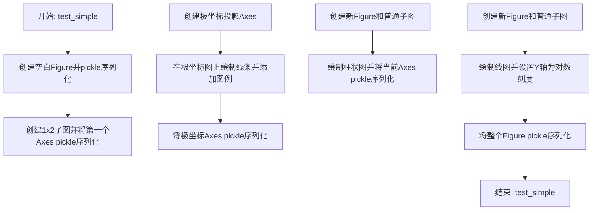

#### 带注释源码

```python
def test_simple():
    # 测试1: 创建空白Figure对象并使用pickle序列化
    # 使用BytesIO作为临时存储，HIGHEST_PROTOCOL最高协议版本
    fig = plt.figure()
    pickle.dump(fig, BytesIO(), pickle.HIGHEST_PROTOCOL)

    # 测试2: 创建1x2子图布局，选取第一个子图并pickle序列化
    # 验证子图（Axes对象）的可序列化性
    ax = plt.subplot(121)
    pickle.dump(ax, BytesIO(), pickle.HIGHEST_PROTOCOL)

    # 测试3: 创建极坐标投影的Axes
    # 验证极坐标投影系统的可序列化性
    ax = plt.axes(projection='polar')
    # 绘制数据并添加图例标签
    plt.plot(np.arange(10), label='foobar')
    plt.legend()
    # 将包含极坐标和图例的Axes序列化
    pickle.dump(ax, BytesIO(), pickle.HIGHEST_PROTOCOL)

    # 注意: 以下代码被注释掉，可能是已知失败的测试用例
    # 测试锤形投影(Hammer projection)的pickle
    # ax = plt.subplot(121, projection='hammer')
    # pickle.dump(ax, BytesIO(), pickle.HIGHEST_PROTOCOL)

    # 测试4: 创建新Figure并绘制柱状图
    # 验证柱状图类型图表的可序列化性
    plt.figure()
    plt.bar(x=np.arange(10), height=np.arange(10))
    # 获取当前Axes并序列化
    pickle.dump(plt.gca(), BytesIO(), pickle.HIGHEST_PROTOCOL)

    # 测试5: 创建普通Figure和Axes，绘制线图并设置对数刻度
    # 验证对数刻度(scale)设置的可序列化性
    fig = plt.figure()
    ax = plt.axes()
    plt.plot(np.arange(10))
    ax.set_yscale('log')  # 设置Y轴为对数刻度
    # 序列化整个Figure（包含对数刻度设置）
    pickle.dump(fig, BytesIO(), pickle.HIGHEST_PROTOCOL)
```


### `_generate_complete_test_figure`

该函数用于生成包含多种图形元素（如折线图、等高线图、颜色网格、流场图、散点图、误差棒图等）的完整测试图形，主要用于验证matplotlib图形的pickle序列化/反序列化功能是否正常工作，确保各种图形元素在pickle前后保持一致。

参数：

- `fig_ref`：`matplotlib.figure.Figure`，需要生成图形的Figure对象引用，函数将向该Figure对象中添加各种图形元素

返回值：`None`，无返回值，直接在传入的fig_ref对象上进行修改

#### 流程图

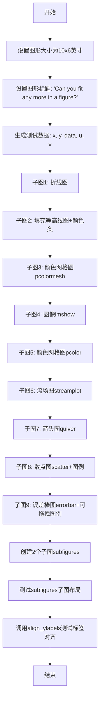

#### 带注释源码

```python
def _generate_complete_test_figure(fig_ref):
    """
    生成包含多种图形元素的完整测试图形，用于测试pickle序列化功能
    
    Parameters:
    -----------
    fig_ref : matplotlib.figure.Figure
        要填充图形元素的Figure对象引用
    """
    
    # 1. 设置Figure对象的尺寸为10x6英寸
    fig_ref.set_size_inches((10, 6))
    
    # 将当前图形设置为fig_ref，后续plt操作都将在此图形上进行
    plt.figure(fig_ref)

    # 2. 设置图形的总标题
    plt.suptitle('Can you fit any more in a figure?')

    # 3. 生成测试用的数据
    # x为0-7的数组，y为0-9的数组
    x, y = np.arange(8), np.arange(10)
    # data/u/v为10x8的网格数据，值域在0-10之间
    data = u = v = np.linspace(0, 10, 80).reshape(10, 8)
    # 对v进行正弦变换，生成波动数据
    v = np.sin(v * -0.6)

    # 4. 子图1 (3x3网格的第1个位置): 简单折线图
    # 确保列表类型的数据也能正确pickle
    plt.subplot(3, 3, 1)
    plt.plot(list(range(10)))  # 将range转换为list
    plt.ylabel("hello")

    # 5. 子图2 (第2个位置): 填充等高线图
    plt.subplot(3, 3, 2)
    # 绘制填充等高线，使用'hatch'图案填充
    plt.contourf(data, hatches=['//', 'ooo'])
    plt.colorbar()  # 添加颜色条

    # 6. 子图3 (第3个位置): 伪彩色网格图
    plt.subplot(3, 3, 3)
    plt.pcolormesh(data)

    # 7. 子图4 (第4个位置): 图像显示
    plt.subplot(3, 3, 4)
    plt.imshow(data)
    plt.ylabel("hello\nworld!")  # 多行标签

    # 8. 子图5 (第5个位置): 伪彩色图（pcolor与pcolormesh的区别）
    plt.subplot(3, 3, 5)
    plt.pcolor(data)

    # 9. 子图6 (第6个位置): 流场图
    ax = plt.subplot(3, 3, 6)
    ax.set_xlim(0, 7)  # 设置坐标轴范围
    ax.set_ylim(0, 9)
    # 绘制流场图，展示矢量场的流向
    plt.streamplot(x, y, u, v)

    # 10. 子图7 (第7个位置): 箭头图（quiver）
    ax = plt.subplot(3, 3, 7)
    ax.set_xlim(0, 7)
    ax.set_ylim(0, 9)
    # 绘制箭头图，展示矢量场
    plt.quiver(x, y, u, v)

    # 11. 子图8 (第8个位置): 散点图
    plt.subplot(3, 3, 8)
    # 绘制散点图，x vs x^2
    plt.scatter(x, x ** 2, label='$x^2$')
    plt.legend(loc='upper left')  # 添加图例

    # 12. 子图9 (第9个位置): 误差棒图
    plt.subplot(3, 3, 9)
    # 绘制误差棒图，包含x和y方向的误差
    plt.errorbar(x, x * -0.5, xerr=0.2, yerr=0.4, label='$-.5 x$')
    plt.legend(draggable=True)  # 添加可拖拽的图例

    # 13. 测试子图(SubFigure)的层级关系
    # 创建2个垂直排列的子图
    subfigs = fig_ref.subfigures(2)
    # 在第一个子图中创建1x2的子图布局
    subfigs[0].subplots(1, 2)
    # 在第二个子图中创建1x2的子图布局
    subfigs[1].subplots(1, 2)

    # 14. 测试对齐标签功能
    # 调用align_ylabels测试_align_label_groups Groupers的处理
    fig_ref.align_ylabels()
```


### `test_complete`

该测试函数用于验证matplotlib图形的完整序列化能力，检查pickle序列化后图形对象能否正确恢复，同时确保序列化流中不包含FigureCanvasAgg的引用，以保持对不同GUI工具包的独立性。

参数：

- `fig_test`：`matplotlib.figure.Figure`，测试用的目标Figure对象，用于对比验证
- `fig_ref`：`matplotlib.figure.Figure`，参考Figure对象，生成完整的测试图形并执行序列化

返回值：`void`，该函数无直接返回值，主要通过`assert`断言和`check_figures_equal`装饰器进行验证

#### 流程图

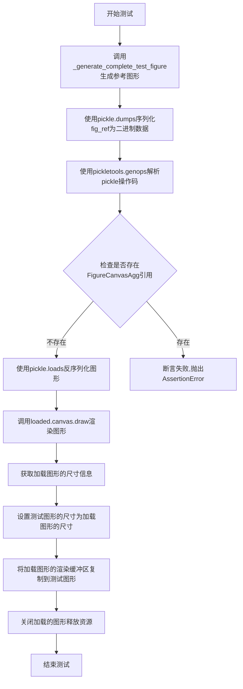

#### 带注释源码

```python
@mpl.style.context("default")  # 应用默认样式上下文，确保测试环境一致性
@check_figures_equal()  # 装饰器：比较fig_test和fig_ref的渲染输出是否一致
def test_complete(fig_test, fig_ref):
    """
    完整图形序列化及Canvas引用检查测试
    
    测试流程：
    1. 生成包含多种图形元素的完整测试figure
    2. 序列化figure为pickle格式
    3. 验证pickle流中不包含FigureCanvasAgg引用（保持GUI后端独立性）
    4. 反序列化并重新渲染
    5. 将渲染结果复制到测试figure进行视觉对比
    """
    
    # 第一步：生成包含9个子图的复杂测试图形
    # 包含折线图、填充等高线图、伪彩色图、图像、流场图、箭头图、散点图、误差棒图等
    _generate_complete_test_figure(fig_ref)
    
    # 第二步：执行序列化操作
    # 使用最高协议版本（HIGHEST_PROTOCOL）获得最优序列化效率
    pkl = pickle.dumps(fig_ref, pickle.HIGHEST_PROTOCOL)
    
    # 第三步：验证Canvas引用检查
    # FigureCanvasAgg虽然是可序列化的，但GUI画布通常不可序列化
    # 为保持测试独立于GUI工具包，需要确保pickle流中不包含FigureCanvasAgg的引用
    # pickletools.genops返回pickle操作码生成器：(opcode, arg, position)元组
    assert "FigureCanvasAgg" not in [arg for op, arg, pos in pickletools.genops(pkl)]
    
    # 第四步：反序列化并渲染
    loaded = pickle.loads(pkl)  # 从二进制数据恢复Figure对象
    loaded.canvas.draw()  # 执行绘制操作，触发所有artist的draw方法
    
    # 第五步：将加载图形的渲染结果复制到测试图形
    fig_test.set_size_inches(loaded.get_size_inches())  # 同步图形尺寸
    # figimage将数组作为图像添加到figure，buffer_rgba获取AG渲染器的RGBA像素数据
    fig_test.figimage(loaded.canvas.renderer.buffer_rgba())
    
    # 第六步：清理资源
    plt.close(loaded)  # 关闭已加载的figure，释放内存和后端资源
```


### `_pickle_load_subprocess`

该函数是Matplotlib pickle测试的辅助函数，用于在子进程中加载预先保存的pickle文件（figure对象），将其重新序列化为字符串并输出。该函数主要配合`subprocess_run_helper`使用，用于测试figure对象在子进程环境中的pickle/unpickle兼容性。

参数：無直接参数（通过环境变量`PICKLE_FILE_PATH`获取文件路径）

返回值：`None`，该函数通过`print`输出字符串，不返回任何值

#### 流程图

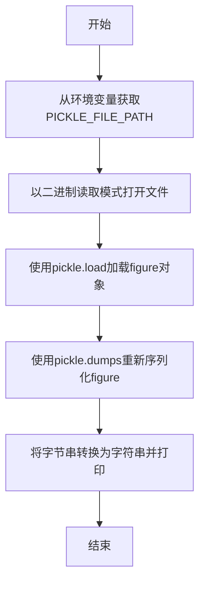

#### 带注释源码

```python
def _pickle_load_subprocess():
    """
    在子进程中加载pickle文件的辅助函数。
    用于测试figure对象在子进程环境中的序列化/反序列化兼容性。
    """
    # 导入必要的模块（os和pickle在函数内部导入，避免全局污染）
    import os
    import pickle

    # 从环境变量获取pickle文件的路径
    # 该环境变量由test_pickle_load_from_subprocess测试函数设置
    path = os.environ['PICKLE_FILE_PATH']

    # 以二进制读取模式打开pickle文件
    with open(path, 'rb') as blob:
        # 从pickle文件中加载figure对象
        fig = pickle.load(blob)

    # 将figure对象重新序列化为pickle字节串，
    # 转换为字符串并打印到stdout，供父进程捕获
    print(str(pickle.dumps(fig)))
```


### `test_pickle_load_from_subprocess`

这是一个跨进程序列化测试函数，用于测试matplotlib图形对象能否在子进程中正确序列化和反序列化，确保pickle能在不同进程间传递复杂的图形对象。

参数：

- `fig_test`：`matplotlib.figure.Figure`，测试用的Figure对象，用于接收加载后的图形进行对比验证
- `fig_ref`：`matplotlib.figure.Figure`，参考Figure对象，测试前先在其上生成完整的测试图形内容
- `tmp_path`：`pathlib.Path`，临时目录路径，用于存放序列化后的pickle文件

返回值：`None`，无返回值，该函数为测试函数，通过断言和图形对比验证正确性

#### 流程图

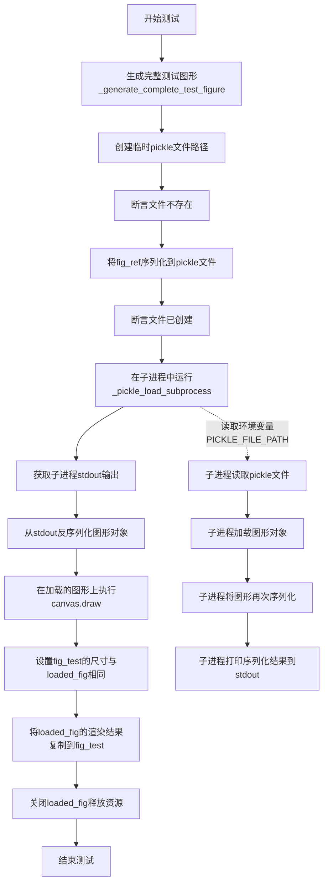

#### 带注释源码

```python
@mpl.style.context("default")  # 使用默认样式上下文
@check_figures_equal()  # 装饰器：比较测试图和参考图是否相等
def test_pickle_load_from_subprocess(fig_test, fig_ref, tmp_path):
    """
    跨进程序列化测试函数。
    
    测试流程：
    1. 生成完整的测试图形（包含多种图表类型）
    2. 将图形序列化保存到临时pickle文件
    3. 在子进程中加载该pickle文件并重新序列化
    4. 在主进程中反序列化并验证图形完整性
    """
    
    # 步骤1：生成包含各种图形元素的完整测试图形
    _generate_complete_test_figure(fig_ref)
    
    # 步骤2：创建临时pickle文件路径
    fp = tmp_path / 'sinus.pickle'
    
    # 验证文件不存在（确保是全新创建）
    assert not fp.exists()
    
    # 步骤3：将图形对象序列化到pickle文件
    # 使用最高协议版本以获得最佳性能
    with fp.open('wb') as file:
        pickle.dump(fig_ref, file, pickle.HIGHEST_PROTOCOL)
    
    # 验证文件已成功创建
    assert fp.exists()
    
    # 步骤4：在子进程中运行pickle加载函数
    # 设置超时为60秒，环境变量指定pickle文件路径和后端为Agg
    proc = subprocess_run_helper(
        _pickle_load_subprocess,
        timeout=60,
        extra_env={"PICKLE_FILE_PATH": str(fp), "MPLBACKEND": "Agg"},
    )
    
    # 步骤5：从子进程stdout获取序列化的图形数据
    # 子进程返回的是字符串形式的bytes对象，需要用ast.literal_eval转换
    loaded_fig = pickle.loads(ast.literal_eval(proc.stdout))
    
    # 步骤6：触发图形的渲染绘制操作
    # 这可以确保所有延迟计算完成，验证图形完整性
    loaded_fig.canvas.draw()
    
    # 步骤7：将加载图形的尺寸信息复制到测试图形
    fig_test.set_size_inches(loaded_fig.get_size_inches())
    
    # 步骤8：将加载图形的渲染缓冲区内容复制到测试图形
    # figimage用于在Figure上显示图像数据
    fig_test.figimage(loaded_fig.canvas.renderer.buffer_rgba())
    
    # 步骤9：关闭加载的图形，释放资源
    plt.close(loaded_fig)
```


### `test_gcf`

该函数用于测试matplotlib中图形管理器（`Gcf`）的状态管理功能，验证在序列化（pickle）图形对象并关闭所有图形后，能够正确恢复图形管理器状态，并且恢复的图形对象属性保持完整。

参数：
- 无

返回值：`None`，该函数为测试函数，通过断言进行验证，不返回任何值

#### 流程图

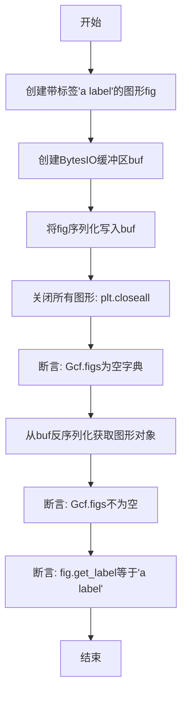

#### 带注释源码

```python
def test_gcf():
    # 创建一个带有标签"a label"的图形窗口
    fig = plt.figure("a label")
    
    # 创建一个内存中的二进制缓冲区用于存储pickle数据
    buf = BytesIO()
    
    # 将图形对象序列化为pickle格式并写入缓冲区
    # 使用最高协议版本以获得最佳性能
    pickle.dump(fig, buf, pickle.HIGHEST_PROTOCOL)
    
    # 关闭所有打开的图形窗口
    plt.close("all")
    
    # 断言验证：关闭所有图形后，图形管理器中不应有任何图形
    assert plt._pylab_helpers.Gcf.figs == {}  # No figures must be left.
    
    # 从缓冲区的二进制数据反序列化恢复图形对象
    fig = pickle.loads(buf.getbuffer())
    
    # 断言验证：反序列化后，图形管理器中应当重新有图形存在
    assert plt._pylab_helpers.Gcf.figs != {}  # A manager is there again.
    
    # 断言验证：恢复的图形对象的标签应与原始标签一致
    assert fig.get_label() == "a label"
```


### `test_no_pyplot`

该函数测试了不通过 pyplot 方式创建的 matplotlib Figure 对象的 pickle 序列化能力。它直接使用 `mfigure.Figure` 类创建图形，添加 PDF 画布，然后添加子图并绘制数据，最后将整个图形对象序列化到 BytesIO 中，以验证非 pyplot 方式创建的图形是否可以正常被 pickle 序列化。

参数： 无

返回值：`None`，无返回值描述

#### 流程图

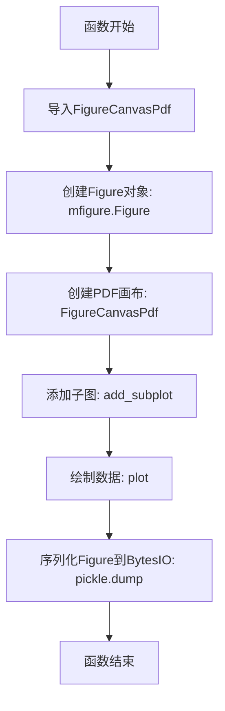

#### 带注释源码

```python
def test_no_pyplot():
    # 测试不通过pyplot创建的Figure对象的pickle序列化能力
    # 这是一个重要的测试用例,因为有些用户可能直接使用Figure类而不是pyplot接口
    
    # 导入PDF后端画布类,用于创建非交互式画布
    from matplotlib.backends.backend_pdf import FigureCanvasPdf
    
    # 直接创建Figure对象,而不是通过plt.figure()
    # 这种方式创建图形绕过了pyplot的状态管理
    fig = mfigure.Figure()
    
    # 为Figure创建PDF画布
    # PDF画布是可序列化的,而某些GUI画布(如TkAgg)则不行
    _ = FigureCanvasPdf(fig)
    
    # 添加一个子图(1行1列第1个位置)
    ax = fig.add_subplot(1, 1, 1)
    
    # 在子图上绘制简单的折线数据
    ax.plot([1, 2, 3], [1, 2, 3])
    
    # 关键测试:将整个Figure对象序列化到BytesIO中
    # 使用最高协议版本以确保最佳兼容性
    # 如果Figure对象或其任何组件不可pickle,这里会抛出异常
    pickle.dump(fig, BytesIO(), pickle.HIGHEST_PROTOCOL)
```


### `test_renderer`

测试RendererAgg渲染器是否可以被正确序列化和反序列化，验证matplotlib后端渲染器的pickle能力。

参数：

- 该函数无参数

返回值：`None`，该函数不返回任何值，仅执行序列化操作并验证无异常抛出

#### 流程图

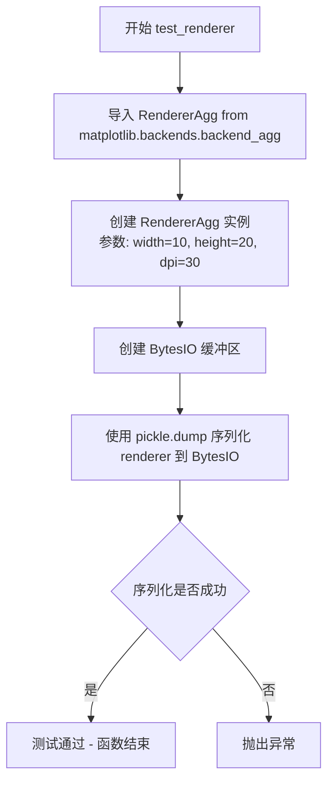

#### 带注释源码

```python
def test_renderer():
    """
    测试 RendererAgg 渲染器序列化功能
    
    该测试函数验证 matplotlib 的 RendererAgg 类是否可以被 pickle 序列化。
    RendererAgg 是 Agg 后端的渲染器，负责将图形渲染到内存缓冲区中。
    """
    # 从 matplotlib 的 Agg 后端导入 RendererAgg 渲染器类
    # RendererAgg 负责将 Figure 内容渲染为位图
    from matplotlib.backends.backend_agg import RendererAgg
    
    # 创建 RendererAgg 实例，参数分别为宽度、高度和 DPI
    # width=10: 画布宽度为 10 英寸
    # height=20: 画布高度为 20 英寸
    # dpi=30: 每英寸点数为 30
    renderer = RendererAgg(10, 20, 30)
    
    # 将渲染器对象序列化到 BytesIO 内存缓冲区中
    # pickle.HIGHEST_PROTOCOL 是默认使用的最高协议版本
    # 如果渲染器包含不可序列化的对象，此处会抛出异常
    pickle.dump(renderer, BytesIO())
    
    # 测试完成，如果上述操作没有抛出异常，说明 RendererAgg 是可序列化的
```


### `test_image`

该函数用于测试matplotlib的图像（Image）在绘制后是否可以被正确序列化（pickle），验证在v1.4.0版本中修复的Image缓存数据不可序列化问题是否已解决。

参数：无

返回值：`None`，无返回值

#### 流程图

```mermaid
flowchart TD
    A[开始] --> B[导入new_figure_manager]
    B --> C[创建Figure管理器<br/>manager = new_figure_manager(1000)]
    C --> D[获取Figure对象<br/>fig = manager.canvas.figure]
    D --> E[创建子图<br/>ax = fig.add_subplot(1, 1, 1)]
    E --> F[绘制图像<br/>ax.imshow np.arange(12).reshape(3, 4)]
    F --> G[渲染画布<br/>manager.canvas.draw]
    G --> H[序列化Figure到BytesIO<br/>pickle.dump fig, BytesIO]
    H --> I[结束]
    
    style H fill:#90EE90
    style I fill:#FFB6C1
```

#### 带注释源码

```python
def test_image():
    """
    测试图像绘制后序列化功能
    
    Prior to v1.4.0 the Image would cache data which was not picklable
    once it had been drawn.
    （在v1.4.0之前，Image会缓存数据，一旦绘制后这些数据将无法被pickle序列化）
    """
    
    # 从matplotlib后端导入图形管理器
    # 用于创建一个新的FigureManager实例（背后创建Agg渲染器）
    from matplotlib.backends.backend_agg import new_figure_manager
    
    # 创建图形管理器，传入数字1000作为figure编号
    # 这会创建一个新的Figure对象和Canvas
    manager = new_figure_manager(1000)
    
    # 获取Figure对象
    # manager.canvas.figure返回关联的Figure实例
    fig = manager.canvas.figure
    
    # 在Figure中添加一个1x1网格的子图（唯一的Axes）
    ax = fig.add_subplot(1, 1, 1)
    
    # 使用imshow绘制图像
    # np.arange(12).reshape(3, 4) 创建3x4的数组作为图像数据
    ax.imshow(np.arange(12).reshape(3, 4))
    
    # 渲染画布
    # 这一步很重要：绘制后Image会缓存数据
    # 在旧版本中，这些缓存数据无法被pickle序列化
    # 这个测试确保在绘制后仍然可以序列化
    manager.canvas.draw()
    
    # 尝试将Figure对象序列化到BytesIO
    # 如果Image缓存了不可序列化的数据，这里会抛出异常
    # 使用pickle.HIGHEST_PROTOCOL（虽然这里默认使用了_protocol参数）
    pickle.dump(fig, BytesIO())
```


### `test_polar`

测试极坐标图形的pickle序列化功能，验证极坐标Axes可以正确序列化和反序列化。

参数： 无

返回值： `None`，无返回值描述

#### 流程图

```mermaid
graph TD
    A[开始测试] --> B[创建极坐标子图: plt.subplot(polar=True)]
    B --> C[获取当前图形: fig = plt.gcf()]
    C --> D[序列化图形为pickle: pf = pickle.dumps(fig)]
    D --> E[反序列化pickle: pickle.loads(pf)]
    E --> F[绘制图形: plt.draw]
    F --> G[结束测试]
```

#### 带注释源码

```python
def test_polar():
    """
    测试极坐标图形的pickle序列化功能
    
    该测试验证极坐标投影的Axes对象可以被正确序列化为pickle格式，
    并能够成功反序列化恢复功能。
    """
    # 创建一个极坐标子图
    # polar=True 参数指定使用极坐标投影
    plt.subplot(polar=True)
    
    # 获取当前图形对象 (Get Current Figure)
    fig = plt.gcf()
    
    # 使用pickle将图形对象序列化为字节流
    # pickle.HIGHEST_PROTOCOL 是最高版本的pickle协议
    pf = pickle.dumps(fig)
    
    # 从字节流反序列化恢复图形对象
    # 验证反序列化后的对象可以正常使用
    pickle.loads(pf)
    
    # 强制重绘图形，确保所有元素正确渲染
    plt.draw()
```


### `test_transform`

该函数用于验证TransformWrapper在序列化（pickle）和反序列化后，其父子关系（parent-child links）是否正确保持。它创建一个TransformBlob对象，序列化后删除原始对象，再反序列化，最后通过断言验证wrapper的_child属性和_parents字典是否正确保留了CompositeGenericTransform的引用。

参数：

- 该函数无参数

返回值：`None`，无返回值描述（测试函数）

#### 流程图

```mermaid
flowchart TD
    A[开始: test_transform] --> B[创建TransformBlob对象obj]
    B --> C[使用pickle.dumps序列化obj为pf]
    C --> D[删除原始obj对象]
    D --> E[使用pickle.loads反序列化pf为新obj]
    E --> F[断言: obj.wrapper._child == obj.composite]
    F --> G{断言结果}
    G -->|通过| H[断言: [v() for v in obj.wrapper._parents.values()] == [obj.composite2]]
    H --> I{断言结果}
    I -->|通过| J[断言: obj.wrapper.input_dims == obj.composite.input_dims]
    J --> K{断言结果}
    K -->|通过| L[断言: obj.wrapper.output_dims == obj.composite.output_dims]
    L --> M{断言结果}
    M -->|通过| N[结束: 所有断言通过]
    G -->|失败| O[抛出AssertionError]
    I -->|失败| O
    K -->|失败| O
    M -->|失败| O
```

#### 带注释源码

```python
def test_transform():
    """
    测试TransformWrapper在pickle序列化后的父子关系完整性。
    验证TransformWrapper的_child和_parents属性在序列化/反序列化后是否正确保留。
    """
    # 创建一个TransformBlob实例，其中包含TransformWrapper和CompositeGenericTransform
    obj = TransformBlob()
    
    # 将obj序列化为pickle格式
    pf = pickle.dumps(obj)
    
    # 删除原始对象，模拟序列化后的传输/存储过程
    del obj
    
    # 反序列化pickle数据，创建新的obj对象
    obj = pickle.loads(pf)
    
    # 检查TransformWrapper的child引用是否正确保留（parent -> child方向）
    # wrapper._child应该指向composite
    assert obj.wrapper._child == obj.composite
    
    # 检查TransformWrapper的parents引用是否正确保留（child -> parent方向）
    # wrapper._parents中的值应该是composite2
    assert [v() for v in obj.wrapper._parents.values()] == [obj.composite2]
    
    # 验证输入维度是否正确保留
    assert obj.wrapper.input_dims == obj.composite.input_dims
    
    # 验证输出维度是否正确保留
    assert obj.wrapper.output_dims == obj.composite.output_dims
```


### `test_rrulewrapper`

该函数用于测试 `rrulewrapper` 对象的序列化（pickle）和反序列化功能，验证其在 pickle 过程中是否会触发 RecursionError 异常。

参数： 无

返回值： 无（`None`），该函数为测试函数，不返回任何值，仅通过异常处理验证 pickle 功能的正确性

#### 流程图

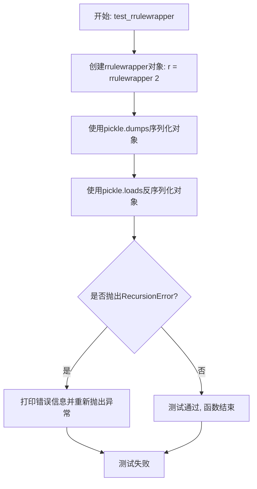

#### 带注释源码

```python
def test_rrulewrapper():
    """
    测试 rrulewrapper 对象的序列化（pickle）功能。
    
    该测试函数验证 matplotlib.dates.rrulewrapper 对象
    可以被正确地序列化和反序列化，而不会触发 RecursionError。
    """
    # 创建一个 rrulewrapper 实例，参数2表示每2个时间单位重复一次
    # rrulewrapper 是用于处理重复日期规则的封装类
    r = rrulewrapper(2)
    
    try:
        # 执行序列化：将对象序列化为字节流
        # pickle.dumps() 将对象转换为字节字符串
        serialized = pickle.dumps(r)
        
        # 执行反序列化：从字节流恢复对象
        # pickle.loads() 将字节字符串转换回Python对象
        pickle.loads(serialized)
        
    except RecursionError:
        # 如果发生 RecursionError，说明 rrulewrapper 的 pickle 实现
        # 存在递归深度问题（可能是由于内部引用导致的无限递归）
        print('rrulewrapper pickling test failed')
        # 重新抛出异常以便pytest能够捕获并报告测试失败
        raise
```


### `test_shared`

该测试函数用于验证matplotlib中共享坐标轴（shared axes）在经过pickle序列化和反序列化后，共享属性是否得以保持。

参数：

- （无参数）

返回值：`None`，无返回值（测试函数）

#### 流程图

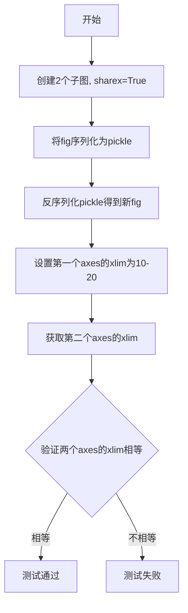

#### 带注释源码

```
def test_shared():
    """
    测试共享坐标轴在pickle序列化后是否能保持共享属性。
    """
    # 创建一个包含2个子图的图形，并设置共享x轴
    fig, axs = plt.subplots(2, sharex=True)
    
    # 将fig对象序列化为pickle格式，然后再反序列化回来
    fig = pickle.loads(pickle.dumps(fig))
    
    # 在第一个axes上设置x轴范围
    fig.axes[0].set_xlim(10, 20)
    
    # 断言：第二个axes的xlim应该与第一个相同，验证共享属性保持
    assert fig.axes[1].get_xlim() == (10, 20)
```


### `test_inset_and_secondary`

该函数用于测试 matplotlib 中嵌套坐标轴（inset axes）和次坐标轴（secondary axis）的序列化（pickle）功能是否正常工作。

参数： 无

返回值： `None`，该函数没有显式返回值，执行完成后直接结束

#### 流程图

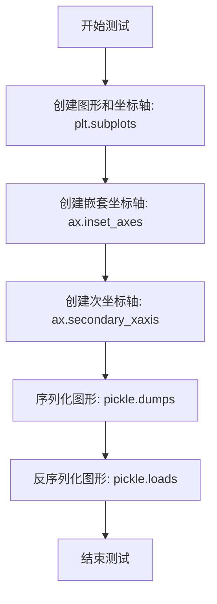

#### 带注释源码

```python
def test_inset_and_secondary():
    """
    测试嵌套坐标轴（inset_axes）和次坐标轴（secondary_xaxis）的序列化能力。
    """
    # 创建一个新的图形和一个子坐标轴
    # plt.subplots() 返回 (figure, axes) 元组
    fig, ax = plt.subplots()
    
    # 在主坐标轴内创建一个嵌套坐标轴
    # 参数 [.1, .1, .3, .3] 表示 [左, 底, 宽, 高]，都是相对于主坐标轴的比例
    # 位置: (0.1, 0.1), 大小: 0.3 x 0.3
    ax.inset_axes([.1, .1, .3, .3])
    
    # 在主坐标轴的顶部创建一个次坐标轴
    # functions 参数是一个元组 (正向函数, 逆函数)
    # 正向: np.square (x -> x²), 逆: np.sqrt (y -> √y)
    # 这允许在同一个图中显示不同尺度的数据
    ax.secondary_xaxis("top", functions=(np.square, np.sqrt))
    
    # 执行序列化和反序列化测试
    # 1. pickle.dumps(fig): 将图形对象序列化为字节流
    # 2. pickle.loads(...): 将字节流反序列化为新的图形对象
    # 如果嵌套坐标轴和次坐标轴不能正确序列化，这里会抛出异常
    pickle.loads(pickle.dumps(fig))
```


### `test_cmap`

该函数是一个参数化测试函数，用于测试matplotlib中所有颜色映射表（Colormap）对象的序列化（pickle）能力，确保每个颜色映射表都能被正确地序列化和反序列化而不丢失数据。

参数：

- `cmap`：`matplotlib.colors.Colormap`，通过`cm._colormaps.values()`参数化获取的单个颜色映射表对象

返回值：`None`，该测试函数不返回任何值，仅通过`pickle.dumps(cmap)`验证序列化过程是否成功

#### 流程图

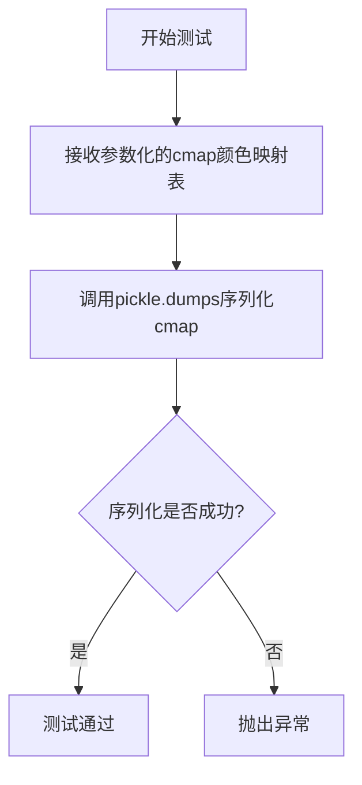

#### 带注释源码

```python
@pytest.mark.parametrize("cmap", cm._colormaps.values())  # 参数化装饰器,遍历所有注册的颜色映射表
def test_cmap(cmap):
    pickle.dumps(cmap)  # 测试将颜色映射表对象序列化到字节流,验证其可序列化性
```


### `test_unpickle_canvas`

测试Figure画布的序列化与反序列化功能，验证pickle能正确保存和恢复Figure对象的canvas属性。

参数： 无

返回值：`None`，该函数为测试函数，使用assert断言进行验证，不返回具体值

#### 流程图

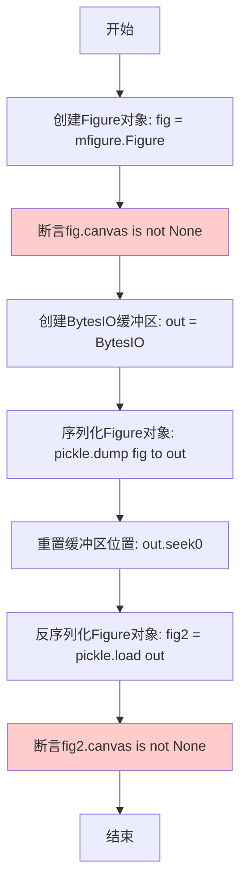

#### 带注释源码

```python
def test_unpickle_canvas():
    # 创建一个新的Figure对象（不含任何子图）
    fig = mfigure.Figure()
    
    # 断言验证：Figure创建时canvas属性应该已初始化，不为None
    assert fig.canvas is not None
    
    # 创建内存缓冲区用于存储pickle数据
    out = BytesIO()
    
    # 使用最高协议将Figure对象序列化到缓冲区
    # pickle.HIGHEST_PROTOCOL选择最新的pickle协议
    pickle.dump(fig, out)
    
    # 将缓冲区读取位置重置到开头，以便读取数据
    out.seek(0)
    
    # 从缓冲区反序列化加载Figure对象
    fig2 = pickle.load(out)
    
    # 断言验证：反序列化后的Figure对象canvas属性也应该存在
    assert fig2.canvas is not None
```


### `test_mpl_toolkits`

该函数用于测试mpl_toolkits组件（特别是parasite_axes和axes_divider）的序列化（pickle）功能是否正常工作。它创建带有parasite_axes的HostAxes，尝试对其进行序列化和反序列化，并验证反序列化后的对象类型是否正确。

参数：

- 无参数

返回值：`None`，该函数为测试函数，使用assert进行断言，不返回任何值

#### 流程图

```mermaid
flowchart TD
    A[开始执行test_mpl_toolkits] --> B[创建HostAxes: ax = parasite_axes.host_axes]
    B --> C[调用make_axes_area_auto_adjustable调整axes区域]
    C --> D[序列化ax对象: pickle.dumps(ax)]
    D --> E[反序列化ax对象: pickle.loads]
    E --> F{断言: type是否等于HostAxes}
    F -->|是| G[测试通过]
    F -->|否| H[抛出AssertionError]
    G --> I[结束]
    H --> I
```

#### 带注释源码

```python
def test_mpl_toolkits():
    """
    测试mpl_toolkits组件的序列化功能
    
    该测试验证以下组件可以被正确序列化和反序列化：
    - parasite_axes.host_axes: 宿主坐标轴
    - axes_divider.make_axes_area_auto_adjustable: 自动调整坐标轴区域的工具
    """
    # 使用parasite_axes创建一个宿主坐标轴，参数为[left, bottom, width, height]
    ax = parasite_axes.host_axes([0, 0, 1, 1])
    
    # 调用axes_divider的函数，使axes区域能够自动调整
    axes_divider.make_axes_area_auto_adjustable(ax)
    
    # 序列化ax对象，然后再反序列化，最后断言类型是否仍为HostAxes
    # 这一步验证了mpl_toolkits组件的pickle支持是否完整
    assert type(pickle.loads(pickle.dumps(ax))) == parasite_axes.HostAxes
```


### `test_standard_norm`

该函数用于测试 Matplotlib 的 `LogNorm` 颜色归一化器是否支持 pickle 序列化（持久化），验证标准归一化器在序列化和反序列化后类型保持不变。

参数： 无

返回值： `None`，该函数为测试函数，使用 assert 断言进行验证，不返回任何值

#### 流程图

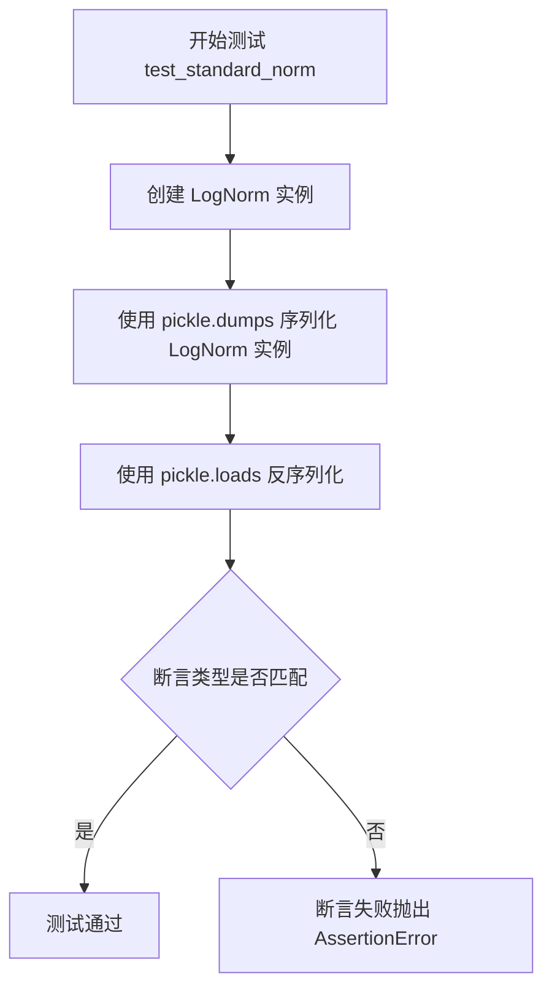

#### 带注释源码

```python
def test_standard_norm():
    """
    测试标准归一化器（LogNorm）的序列化功能。
    验证 LogNorm 对象经过 pickle 序列化后再反序列化，其类型保持不变。
    """
    # 创建一个 LogNorm（对数归一化器）实例
    # LogNorm 是 matplotlib.colors.Normalize 的子类，用于对数刻度色彩映射
    norm_instance = mpl.colors.LogNorm()
    
    # 使用 pickle.dumps 将对象序列化为字节流
    # pickle.HIGHEST_PROTOCOL 是最高序列化协议（通常为 protocol 5）
    pickled_bytes = pickle.dumps(norm_instance)
    
    # 使用 pickle.loads 将字节流反序列化为 Python 对象
    loaded_norm = pickle.loads(pickled_bytes)
    
    # 断言：反序列化后的对象类型必须与原始 LogNorm 类型完全相同
    # 如果类型不匹配，pytest 会报告测试失败
    assert type(loaded_norm) == mpl.colors.LogNorm
```


### `test_dynamic_norm`

该函数用于测试动态创建的归一化器（通过 `make_norm_from_scale` 生成的 LogitNorm 实例）是否能正确序列化和反序列化，验证序列化后的对象类型与原始对象类型一致。

参数：
- 该函数无参数

返回值：`None`，该函数通过断言验证序列化功能，不返回任何值

#### 流程图

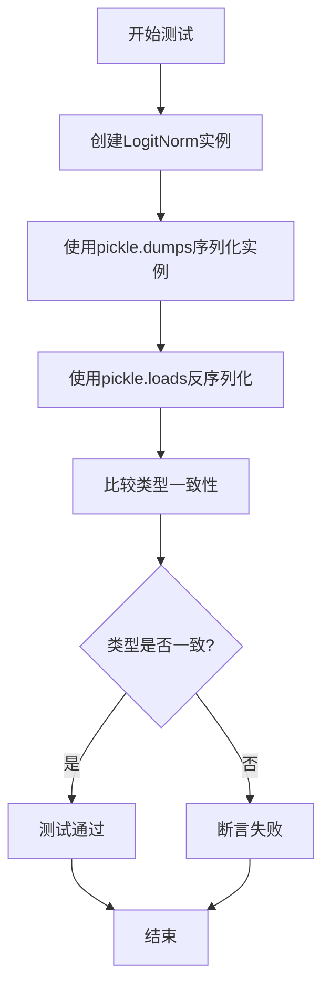

#### 带注释源码

```python
def test_dynamic_norm():
    """
    测试动态归一化器的序列化功能。
    
    该测试验证通过 make_norm_from_scale 创建的归一化器
    能够被正确地序列化和反序列化，且类型保持不变。
    """
    # 使用 matplotlib 的 make_norm_from_scale 工厂函数
    # 创建一个基于 LogitScale 的动态归一化器实例
    # 这是一个 LogitNorm 归一化器
    logit_norm_instance = mpl.colors.make_norm_from_scale(
        mpl.scale.LogitScale, mpl.colors.Normalize)()
    
    # 序列化归一化器实例为 pickle 字节流
    # 使用最高协议 pickle.HIGHEST_PROTOCOL
    pickled_data = pickle.dumps(logit_norm_instance, pickle.HIGHEST_PROTOCOL)
    
    # 反序列化字节流为新的对象
    loaded_norm = pickle.loads(pickled_data)
    
    # 断言：反序列化后的对象类型应与原始对象类型完全相同
    # 这验证了自定义归一化器的 pickle 支持是否完整
    assert type(pickle.loads(pickle.dumps(logit_norm_instance))) \
        == type(logit_norm_instance)
```


### `test_vertexselector`

该测试函数用于验证 VertexSelector 组件的序列化（pickle）功能是否正常工作，确保交互式顶点选择器对象能够被正确地序列化和反序列化。

参数：无

返回值：`None`，测试函数无返回值，执行验证后自动结束

#### 流程图

```mermaid
flowchart TD
    A[开始测试] --> B[创建可绑定的折线对象: plt.plot([0, 1], picker=True)]
    B --> C[创建 VertexSelector 实例: VertexSelector(line)]
    C --> D[序列化 VertexSelector: pickle.dumps]
    D --> E[反序列化 VertexSelector: pickle.loads]
    E --> F[验证反序列化成功]
    F --> G[结束测试]
```

#### 带注释源码

```python
def test_vertexselector():
    """
    测试 VertexSelector 组件的序列化功能
    
    该测试验证 matplotlib.lines.VertexSelector 对象能够正确地
    被 pickle 序列化和反序列化，这对于保存和加载包含交互式
    顶点选择器的图形非常重要。
    """
    # 创建一个支持交互的折线对象，picker=True 启用交互选择功能
    line, = plt.plot([0, 1], picker=True)
    
    # 创建 VertexSelector 实例，绑定到创建的折线对象
    # VertexSelector 用于在交互式图形中选择和操作顶点
    selector = VertexSelector(line)
    
    # 序列化 VertexSelector 对象为字节流
    # 然后反序列化恢复对象
    # 验证整个序列化和反序列化过程没有错误
    pickle.loads(pickle.dumps(VertexSelector(line)))
    
    # 测试完成后自动返回 None
```


### `test_cycler`

这是一个测试函数，用于验证 Matplotlib 中 Axes 对象的属性循环器（Property Cycler）在经过 Python 的 `pickle` 模块序列化和反序列化后，是否能够正确保存和恢复状态。测试特别关注颜色循环（Color Cycle）在序列化后是否从中断处继续，而不是重置。

参数：
- 无

返回值：`None` (无返回值)，该函数通过内部断言（Assertion）来判定测试成功与否。

#### 流程图

```mermaid
graph TD
    Start([开始执行 test_cycler]) --> CreateFig[创建 Figure 与 Axes 对象]
    CreateFig --> SetPropCycle[调用 set_prop_cycle 设置颜色循环: c, m, y, k]
    SetPropCycle --> PlotFirst[执行 ax.plot([1, 2]) 使用颜色 'c']
    PlotFirst --> Pickle[执行 pickle.dumps(ax) 序列化 Axes]
    Pickle --> Unpickle[执行 pickle.loads 反序列化 Axes]
    Unpickle --> PlotSecond[执行 ax.plot([3, 4]) 预期使用颜色 'm']
    PlotSecond --> AssertCheck{断言: l.get_color() == 'm'}
    AssertCheck -- 成立 --> End([测试通过])
    AssertCheck -- 失败 --> RaiseError[抛出 AssertionError]
```

#### 带注释源码

```python
def test_cycler():
    # 1. 初始化环境：创建一个新的 Figure 和一个 Axes（子图）
    ax = plt.figure().add_subplot()
    
    # 2. 设置属性循环器：定义线条颜色的循环顺序为 青色(c), 洋红(m), 黄色(y), 黑色(k)
    ax.set_prop_cycle(c=["c", "m", "y", "k"])
    
    # 3. 第一次绘图：调用 plot 默认使用循环中的第一个颜色 'c' (Cyan)
    ax.plot([1, 2])
    
    # 4. 序列化测试：将包含当前状态（Axes 及循环器状态）的对象序列化为字节流
    #    此时循环器已使用过 'c'，下次使用应从 'm' 开始
    ax = pickle.loads(pickle.dumps(ax))
    
    # 5. 反序列化后绘图：重新加载 Axes 对象，并继续绘制第二条线
    #    理论上，由于状态被正确保存，此次绘图应使用循环中的下一个颜色 'm' (Magenta)
    l, = ax.plot([3, 4])
    
    # 6. 验证：断言第二条线的颜色是否为 'm'。如果循环器状态未正确保存，
    #    此处可能会回到 'c' 或随机颜色，导致测试失败。
    assert l.get_color() == "m"
```


### `_test_axeswidget_interactive`

这是一个内部测试函数，用于测试交互式小部件（mpl.widgets.Button）的序列化（pickle）能力。该函数创建一个包含Button小部件的图形，并尝试对其进行pickle序列化，以验证交互式组件在子进程环境中可以被正确序列化和反序列化。

参数： 无

返回值：`None`，无返回值描述

#### 流程图

```mermaid
flowchart TD
    A[开始] --> B[创建Figure对象]
    B --> C[添加子图ax]
    C --> D[创建Button小部件: mpl.widgets.Button]
    D --> E[调用pickle.dumps序列化Button对象]
    E --> F{序列化是否成功}
    F -->|成功| G[测试通过]
    F -->|失败| H[抛出异常]
    G --> I[结束]
    H --> I
```

#### 带注释源码

```python
# Run under an interactive backend to test that we don't try to pickle the
# (interactive and non-picklable) canvas.
def _test_axeswidget_interactive():
    """
    测试交互式小部件的序列化能力
    
    该函数在子进程中运行，用于验证交互式后端下的小部件
    （如Button）可以被正确序列化，而不会尝试序列化非可序列化的canvas
    """
    # 创建一个新的Figure对象
    ax = plt.figure().add_subplot()
    # 创建一个Button交互式小部件
    button_widget = mpl.widgets.Button(ax, "button")
    # 尝试序列化Button对象
    # 如果canvas不可pickle，这里会失败
    pickle.dumps(button_widget)
```


### `test_axeswidget_interactive`

该函数是一个集成测试，用于验证交互式Matplotlib小部件（例如Button）在不同后端（特别是TkAgg）下的pickle序列化能力。测试通过子进程运行来确保在真实的GUI环境中验证widget的可序列化性。

参数： 无

返回值：`None`，该函数作为pytest测试函数，不返回任何值，主要通过断言和异常来表明测试结果

#### 流程图

```mermaid
flowchart TD
    A[开始测试 test_axeswidget_interactive] --> B{检查是否在CI环境}
    B -->|是| C[设置超时为120秒]
    B -->|否| D[设置超时为20秒]
    C --> E[调用subprocess_run_helper运行子进程测试]
    D --> E
    E --> F[子进程执行_test_axeswidget_interactive]
    F --> G[创建Figure和Axes]
    G --> H[创建Button widget]
    H --> I[尝试pickle序列化Button]
    I --> J{序列化是否成功?}
    J -->|成功| K[测试通过]
    J -->|失败| L[测试失败并抛出异常]
    K --> M[返回测试结果]
    L --> M
```

#### 带注释源码

```python
@pytest.mark.xfail(  # https://github.com/actions/setup-python/issues/649
        ('TF_BUILD' in os.environ or 'GITHUB_ACTION' in os.environ) and
        sys.platform == 'darwin' and sys.version_info[:2] < (3, 11),
        reason='Tk version mismatch on Azure macOS CI'
    )
def test_axeswidget_interactive():
    """
    集成测试：验证交互式小部件的pickle序列化能力
    
    该测试在独立的子进程中运行，以避免主进程导入Tk相关库，
    同时确保在真实的TkAgg后端环境中测试widget的序列化。
    """
    # 使用subprocess_run_helper在子进程中运行测试
    # 这样可以隔离GUI后端的加载，避免影响主测试进程
    subprocess_run_helper(
        _test_axeswidget_interactive,  # 要在子进程中执行的函数
        timeout=120 if is_ci_environment() else 20,  # CI环境超时更长
        extra_env={'MPLBACKEND': 'tkagg'}  # 强制使用Tk后端
    )


def _test_axeswidget_interactive():
    """
    子进程中执行的测试函数：实际创建并pickle Button widget
    
    注意：这是一个独立的函数，在子进程中执行
    """
    # 创建一个新的figure和subplot
    ax = plt.figure().add_subplot()
    
    # 创建一个交互式Button widget
    button = mpl.widgets.Button(ax, "button")
    
    # 尝试序列化widget，这是测试的核心
    # 如果widget不可pickle，这里会抛出异常
    pickle.dumps(button)
```


### `TransformBlob.__init__`

该方法用于初始化各种变换对象（IdentityTransform、CompositeGenericTransform、TransformWrapper），以测试 matplotlib 变换在 pickle 序列化过程中的正确性，特别是验证 TransformWrapper 的父子关系链接是否能在序列化后保持完整。

参数：

- `self`：`TransformBlob`，调用该方法的实例本身

返回值：`None`，无返回值（构造函数）

#### 流程图

```mermaid
flowchart TD
    A[开始 __init__] --> B[创建 self.identity: IdentityTransform]
    B --> C[创建 self.identity2: IdentityTransform]
    C --> D[创建 self.composite: CompositeGenericTransform<br/>参数: (self.identity, self.identity2)]
    D --> E[创建 self.wrapper: TransformWrapper<br/>参数: self.composite]
    E --> F[创建 self.composite2: CompositeGenericTransform<br/>参数: (self.wrapper, self.identity)]
    F --> G[结束 __init__]
```

#### 带注释源码

```python
def __init__(self):
    # 创建一个恒等变换对象，用于测试基础变换的序列化
    self.identity = mtransforms.IdentityTransform()
    
    # 创建第二个恒等变换对象，用于构成复合变换
    self.identity2 = mtransforms.IdentityTransform()
    
    # 强制使用更复杂的组合变换
    # CompositeGenericTransform 将两个变换组合成一个复合变换
    self.composite = mtransforms.CompositeGenericTransform(
        self.identity,
        self.identity2)
    
    # 检查 TransformWrapper 的父->子链接关系
    # TransformWrapper 可以包装一个子变换，并维护父子关系
    self.wrapper = mtransforms.TransformWrapper(self.composite)
    
    # 检查 TransformWrapper 的子->父链接关系
    # 创建另一个复合变换，其中包含 wrapper 作为子变换
    self.composite2 = mtransforms.CompositeGenericTransform(
        self.wrapper,
        self.identity)
```

## 关键组件


### Pickle序列化测试框架

该代码为matplotlib库的单元测试文件，核心功能为验证matplotlib中各种图形对象（如图形、坐标轴、变换、色彩映射、组件等）的pickle序列化与反序列化能力，确保对象在序列化后能正确恢复。

### Figure与Axes对象序列化

测试matplotlib中Figure和Axes对象的序列化能力，包括普通坐标轴、极坐标轴、子图等不同类型的图形容器。

### Transform变换序列化

测试matplotlib中各种变换对象（IdentityTransform、CompositeGenericTransform、TransformWrapper等）的序列化，验证变换链的父子关系在序列化后能正确恢复。

### Colormap色彩映射序列化

测试matplotlib中预定义色彩映射和动态生成的色彩映射（如LogNorm）的序列化能力。

### 跨进程Pickle加载

通过子进程方式测试Figure对象的序列化与反序列化，验证序列化流中不包含FigureCanvasAgg引用，确保与GUI后端无关。

### 渲染器序列化

测试RendererAgg渲染器对象的序列化能力，验证在绘制后（缓存数据后）的图像仍可序列化。

### 交互式Widgets序列化

测试交互式组件（如VertexSelector、Button widgets）的序列化能力，验证交互状态可被保存和恢复。

### 共享轴与同步机制

测试共享坐标轴（sharex=True）在序列化后的轴限制同步机制是否正常工作。

### 属性循环器序列化

测试Axes的属性循环器（prop_cycler）在序列化后能否正确恢复色彩循环状态。


## 问题及建议


### 已知问题

-   **重复代码模式**：多个测试函数中重复使用`pickle.dumps`和`pickle.loads`模式，可以提取为通用的辅助函数以减少代码冗余。
-   **导入位置不一致**：部分导入语句位于函数内部（如`test_no_pyplot`、`test_renderer`、`test_image`中的导入），而其他导入在文件顶部，降低了代码可读性和一致性。
-   **测试隔离性问题**：部分测试（如`test_simple`）创建图形后未调用`plt.close()`清理，可能影响后续测试或导致资源泄漏。
-   **资源清理不一致**：虽然部分测试使用了`plt.close(loaded_fig)`，但并非所有测试都遵循此模式。
-   **异常处理不够精细**：`test_rrulewrapper`中的异常处理仅打印消息后重新抛出，没有提供额外的调试信息或重试机制。
-   **硬编码配置**：超时时间（如`timeout=60`、`timeout=120 if is_ci_environment() else 20`）硬编码在测试中，缺乏灵活的配置文件支持。
-   **验证不够全面**：部分测试（如`test_simple`、`test_polar`）仅验证pickle过程不抛异常，但未充分验证unpickle后对象的功能正确性和状态完整性。
-   **子进程测试的环境依赖**：`test_axeswidget_interactive`依赖特定的环境变量（'TF_BUILD'、'GITHUB_ACTION'）和平台（darwin）判断，逻辑复杂且容易因CI环境变化而失效。

### 优化建议

-   **提取公共函数**：创建如`pickle_roundtrip(obj)`的辅助函数，统一处理pickle/unpickle操作和验证逻辑。
-   **统一导入管理**：将所有导入移至文件顶部，除非有循环依赖等特殊原因必须延迟导入。
-   **使用pytest fixture**：利用pytest的fixture管理图形和Canvas对象的创建与清理，确保测试隔离。
-   **添加资源清理**：在所有创建图形的测试中使用`yield`或`finally`块确保`plt.close()`被调用。
-   **增强异常处理**：为`test_rrulewrapper`添加更详细的错误信息和上下文，便于调试pickle相关问题。
-   **配置外部化**：将超时等可配置参数移至pytest配置或独立配置文件。
-   **完善验证逻辑**：在unpickle后增加对象属性验证、方法调用测试（如`fig.get_size_inches()`、`ax.get_xlim()`）以确保功能正确。
-   **简化环境检测**：将平台和环境的复杂判断逻辑封装为辅助函数，提高可读性和可维护性。

## 其它


### 设计目标与约束

**设计目标**：验证matplotlib中各种核心对象（图窗、坐标轴、变换、渲染器、颜色映射等）的pickle序列化/反序列化功能是否正常工作，确保序列化后的对象能够完整恢复其状态和功能。

**约束条件**：
- GUI后端（如TkAgg）不能被pickle，因此需要使用Agg后端进行测试
- 交互式组件（如FigureCanvasAgg）在pickle流中不应有引用
- 子进程测试中需要通过环境变量传递pickle文件路径
- 测试必须在不同平台上具有一致性

### 错误处理与异常设计

**异常处理策略**：
- `RecursionError`：在`test_rrulewrapper`中捕获并重新抛出，用于处理rrulewrapper递归序列化问题
- `AssertionError`：用于验证反序列化后的对象状态是否正确（如`test_gcf`中验证figure管理器状态）
- `TimeoutError`：子进程测试设置超时限制（60秒），防止死锁

**边界情况处理**：
- 空figure的pickle测试
- 已绘制图像的pickle（验证缓存数据序列化）
- 共享坐标轴和副坐标轴的序列化
- 动态规范化对象的序列化

### 数据流与状态机

**主要数据流**：
1. **Figure序列化流程**：创建Figure → 添加子图/数据 → pickle.dumps() → 字节流 → pickle.loads() → 恢复Figure → canvas.draw()验证
2. **子进程测试流程**：主进程pickle写入文件 → 子进程pickle.load读取 → stdout返回序列化字符串 → 主进程反序列化验证
3. **Transform序列化**：创建TransformWrapper → 序列化 → 验证父子关系完整性

**关键状态转换**：
- Figure状态：创建 → 绘制 → 序列化 → 反序列化 → 重新绘制
- Gcf管理器状态：空 → 注册figure → 关闭所有 → 反序列化 → 重新注册

### 外部依赖与接口契约

**直接依赖**：
- `matplotlib`：核心库（mpl）
- `numpy`：数据处理
- `pytest`：测试框架
- `pickle`：Python内置序列化
- `pickletools`：pickle字节码分析
- `subprocess`：子进程管理
- `io.BytesIO`：内存字节流

**模块间接口**：
- `matplotlib.figure.Figure`：核心图形对象
- `matplotlib.axes.Axes`：坐标轴对象
- `matplotlib.transforms`：变换对象（IdentityTransform, CompositeGenericTransform, TransformWrapper）
- `matplotlib.dates.rrulewrapper`：日期规则包装器
- `matplotlib.colors`：颜色和规范化对象
- `matplotlib.widgets`：交互式小部件
- `matplotlib.lines.VertexSelector`：顶点选择器
- `mpl_toolkits.axes_grid1`：轴域工具包（parasite_axes, axes_divider）

### 性能考虑

**测试性能因素**：
- 图像管理（1000编号figure创建）
- 完整测试图形包含9个子图、多种图表类型
- 子进程启动开销（通过timeout参数控制）
- 颜色映射全量测试（`cm._colormaps.values()`迭代）

**优化建议**：
- 颜色映射测试可以使用采样而非全量
- 考虑使用pytest fixtures共享测试图形

### 安全性考虑

**安全风险点**：
- pickle反序列化可能执行任意代码（需确保可信数据源）
- 子进程通过环境变量传递文件路径（需验证路径有效性）

**缓解措施**：
- 使用临时目录（`tmp_path`）存储pickle文件
- 子进程测试限定后端为Agg
- 断言验证pickle流中不包含FigureCanvasAgg引用

### 测试策略

**测试覆盖范围**：
- 基础对象：Figure、Axes、RendererAgg
- 图像相关：imshow、pcolormesh、contourf等
- 变换系统：各类Transform及其父子关系
- 颜色系统：Colormap、Normalize、LogNorm
- 交互组件：Widget、VertexSelector
- 工具包：mpl_toolkits组件
- 特殊场景：共享坐标轴、副坐标轴、inset_axes

**测试隔离**：
- 每个测试函数独立创建和清理资源
- 使用`plt.close()`确保测试间无状态污染
- 子进程测试使用独立环境变量

### 平台兼容性

**平台相关测试**：
- macOS Azure CI上的Tk版本兼容性处理（xfail装饰器）
- 不同操作系统的pickle协议兼容性
- GUI后端在不同平台的可用性

**CI环境适配**：
- 根据`is_ci_environment()`调整超时时间
- 检测`TF_BUILD`和`GITHUB_ACTION`环境变量

### 版本兼容性

**版本相关考虑**：
- Image缓存数据序列化问题（1.4.0之前版本）
- pickle协议版本（`pickle.HIGHEST_PROTOCOL`）
- Python版本兼容性（<3.11的macOS问题）

**回归测试**：
- 确保新版本更改不破坏已有pickle兼容性
- 验证不同matplotlib版本间的pickle互操作性

    