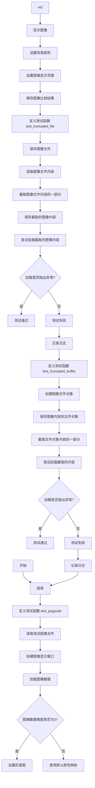
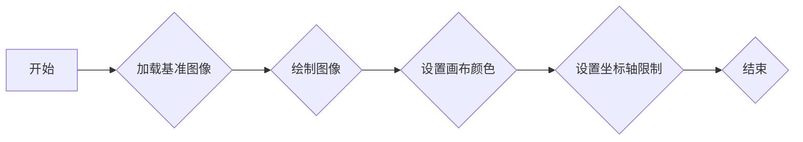
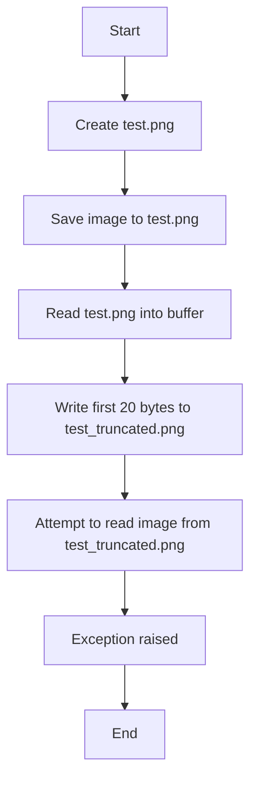
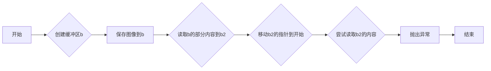
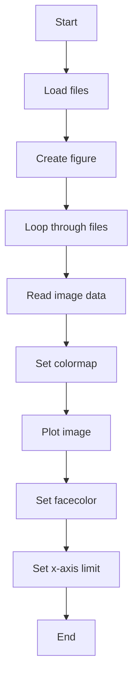
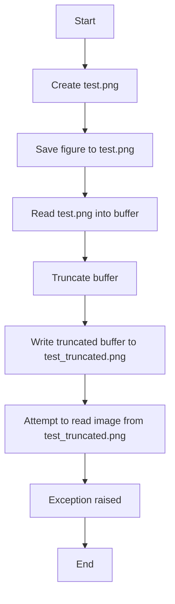
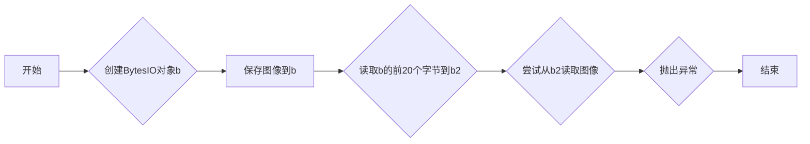

# `matplotlib\lib\matplotlib\tests\test_png.py` 详细设计文档

This code performs testing on image handling and plotting functionalities using matplotlib, including tests for image loading and saving.

## 整体流程



## 类结构

```
test_plotting (主模块)
├── test_pngsuite (测试图像加载和显示)
│   ├── files (图像文件列表)
│   ├── cmap (颜色映射)
│   ├── data (图像数据)
│   ├── extent (图像显示范围)
│   ├── cmap (颜色映射)
│   ├── interpolation_stage (插值阶段)
│   └── plt (matplotlib.pyplot模块)
├── test_truncated_file (测试截断图像文件)
│   ├── path (图像文件路径)
│   ├── path_t (截断图像文件路径)
│   ├── buf (图像文件内容缓冲区)
│   ├── fout (截断图像文件输出流)
│   └── plt (matplotlib.pyplot模块)
└── test_truncated_buffer (测试截断图像文件对象)
```

## 全局变量及字段


### `files`
    
List of Path objects representing the files to be processed.

类型：`list of Path`
    


### `cmap`
    
Colormap to be used for the images.

类型：`colormap`
    


### `data`
    
N-dimensional array representing the image data.

类型：`ndarray`
    


### `extent`
    
Tuple representing the extent of the image data on the plot.

类型：`tuple`
    


### `interpolation_stage`
    
String indicating the interpolation stage to be used.

类型：`str`
    


### `plt`
    
matplotlib.pyplot object used for plotting.

类型：`pyplot`
    


### `path`
    
Path object representing the file to be saved.

类型：`Path`
    


### `path_t`
    
Path object representing the truncated file to be tested.

类型：`Path`
    


### `buf`
    
Bytes object containing the content of the file to be read or written.

类型：`bytes`
    


### `fout`
    
File object used for writing the truncated file content.

类型：`file`
    


### `test_plotting.files`
    
List of Path objects representing the files to be processed.

类型：`list of Path`
    


### `test_plotting.cmap`
    
Colormap to be used for the images.

类型：`colormap`
    


### `test_plotting.data`
    
N-dimensional array representing the image data.

类型：`ndarray`
    


### `test_plotting.extent`
    
Tuple representing the extent of the image data on the plot.

类型：`tuple`
    


### `test_plotting.cmap`
    
Colormap to be used for the images.

类型：`colormap`
    


### `test_plotting.interpolation_stage`
    
String indicating the interpolation stage to be used.

类型：`str`
    


### `test_plotting.plt`
    
matplotlib.pyplot object used for plotting.

类型：`pyplot`
    


### `test_plotting.files`
    
List of Path objects representing the files to be processed.

类型：`list of Path`
    


### `test_plotting.cmap`
    
Colormap to be used for the images.

类型：`colormap`
    


### `test_plotting.data`
    
N-dimensional array representing the image data.

类型：`ndarray`
    


### `test_plotting.extent`
    
Tuple representing the extent of the image data on the plot.

类型：`tuple`
    


### `test_plotting.cmap`
    
Colormap to be used for the images.

类型：`colormap`
    


### `test_plotting.interpolation_stage`
    
String indicating the interpolation stage to be used.

类型：`str`
    


### `test_plotting.plt`
    
matplotlib.pyplot object used for plotting.

类型：`pyplot`
    
    

## 全局函数及方法


### test_pngsuite

该函数用于测试图像比较，通过加载一组基准图像，并使用matplotlib绘制这些图像，以验证图像的渲染是否正确。

参数：

- `tol`：`float`，容忍度，用于比较图像之间的差异。

返回值：无

#### 流程图



#### 带注释源码

```python
@image_comparison(['pngsuite.png'], tol=0.09)
def test_pngsuite():
    files = sorted(
        (Path(__file__).parent / "baseline_images/pngsuite").glob("basn*.png"))

    plt.figure(figsize=(len(files), 2))

    for i, fname in enumerate(files):
        data = plt.imread(fname)
        cmap = None  # use default colormap
        if data.ndim == 2:
            # keep grayscale images gray
            cmap = cm.gray
        # Using the old default data interpolation stage lets us
        # continue to use the existing reference image
        plt.imshow(data, extent=(i, i + 1, 0, 1), cmap=cmap,
                   interpolation_stage='data')

    plt.gca().patch.set_facecolor("#ddffff")
    plt.gca().set_xlim(0, len(files))
```


### test_truncated_file

测试一个被截断的文件是否会导致图像读取失败。

参数：

- `tmp_path`：`Path`，一个临时路径，用于创建测试文件。

返回值：无

#### 流程图



#### 带注释源码

```python
def test_truncated_file(tmp_path):
    path = tmp_path / 'test.png'  # A temporary file path
    path_t = tmp_path / 'test_truncated.png'  # A temporary truncated file path

    plt.savefig(path)  # Save the image to the temporary file
    with open(path, 'rb') as fin:  # Open the file in binary read mode
        buf = fin.read()  # Read the entire content into a buffer

    with open(path_t, 'wb') as fout:  # Open the truncated file in binary write mode
        fout.write(buf[:20])  # Write the first 20 bytes to the truncated file

    with pytest.raises(Exception):  # Expect an exception to be raised
        plt.imread(path_t)  # Attempt to read the image from the truncated file
```


### test_truncated_buffer

测试一个截断的缓冲区是否会导致matplotlib的`imread`函数抛出异常。

参数：

- `b`：`BytesIO`，一个包含图像数据的缓冲区对象。
- `b2`：`BytesIO`，一个截断的缓冲区对象，用于测试。

返回值：无

#### 流程图



#### 带注释源码

```python
def test_truncated_buffer():
    b = BytesIO()
    plt.savefig(b)  # 保存图像到b
    b.seek(0)
    b2 = BytesIO(b.read(20))  # 读取b的部分内容到b2
    b2.seek(0)

    with pytest.raises(Exception):  # 尝试读取b2的内容
        plt.imread(b2)  # 如果b2是截断的，则应抛出异常
```


### test_pngsuite

该函数用于测试PNG图像的渲染和比较。

参数：

- `tol`：`float`，容忍度，用于比较图像时允许的最大差异。

返回值：无

#### 流程图



#### 带注释源码

```python
@image_comparison(['pngsuite.png'], tol=0.09)
def test_pngsuite(tol):
    files = sorted(
        (Path(__file__).parent / "baseline_images/pngsuite").glob("basn*.png"))

    plt.figure(figsize=(len(files), 2))

    for i, fname in enumerate(files):
        data = plt.imread(fname)
        cmap = None  # use default colormap
        if data.ndim == 2:
            # keep grayscale images gray
            cmap = cm.gray
        # Using the old default data interpolation stage lets us
        # continue to use the existing reference image
        plt.imshow(data, extent=(i, i + 1, 0, 1), cmap=cmap,
                   interpolation_stage='data')

    plt.gca().patch.set_facecolor("#ddffff")
    plt.gca().set_xlim(0, len(files))
```


### test_truncated_file

测试一个被截断的文件是否会导致图像读取失败。

参数：

- `tmp_path`：`Path`，一个临时路径，用于创建测试文件。

返回值：无

#### 流程图



#### 带注释源码

```python
def test_truncated_file(tmp_path):
    path = tmp_path / 'test.png'  # A temporary file to save the image
    path_t = tmp_path / 'test_truncated.png'  # A truncated version of the image

    plt.savefig(path)  # C[Save figure to test.png]
    with open(path, 'rb') as fin:  # D[Read test.png into buffer]
        buf = fin.read()
    with open(path_t, 'wb') as fout:  # F[Write truncated buffer to test_truncated.png]
        fout.write(buf[:20])

    with pytest.raises(Exception):  # G[Attempt to read image from test_truncated.png]
        plt.imread(path_t)  # H[Exception raised]
```


### test_truncated_buffer

测试一个截断的matplotlib图像缓冲区是否会导致`plt.imread`抛出异常。

参数：

- `b`：`BytesIO`，一个包含图像数据的`BytesIO`对象。
- `b2`：`BytesIO`，一个截断的`BytesIO`对象，包含从`b`中读取的前20个字节。

返回值：无

#### 流程图



#### 带注释源码

```python
def test_truncated_buffer():
    b = BytesIO()
    plt.savefig(b)  # 保存图像到b
    b.seek(0)
    b2 = BytesIO(b.read(20))  # 读取b的前20个字节到b2
    b2.seek(0)

    with pytest.raises(Exception):  # 尝试从b2读取图像，并期望抛出异常
        plt.imread(b2)  # plt.imread将抛出异常，因为b2是截断的
```


## 关键组件


### 张量索引与惰性加载

张量索引与惰性加载机制允许在图像处理过程中延迟加载图像数据，直到实际需要时才进行加载，从而提高内存使用效率和处理速度。

### 反量化支持

反量化支持功能允许在图像处理过程中对量化后的数据进行反量化处理，以便进行后续的图像分析和处理。

### 量化策略

量化策略定义了图像数据在处理过程中的量化方法，包括量化精度和量化范围等参数，以确保图像处理结果的准确性和效率。


## 问题及建议


### 已知问题

-   **文件读取和写入操作**：代码中在`test_truncated_file`和`test_truncated_buffer`函数中，通过读取和写入文件或字节流来模拟截断文件的情况。这种操作可能会引入额外的性能开销，并且增加了测试的复杂性。
-   **异常处理**：在`test_truncated_file`和`test_truncated_buffer`函数中，使用`pytest.raises(Exception)`来检查异常。这种通用的异常检查可能不够具体，无法明确指出是哪种类型的异常。
-   **全局变量和函数**：代码中使用了全局变量和函数，如`plt`和`Path`，这可能会增加代码的耦合性，使得代码更难以维护和理解。

### 优化建议

-   **优化文件操作**：考虑使用内存映射文件或直接在内存中处理图像数据，以减少文件读取和写入的开销。
-   **细化异常处理**：在测试中，应该针对可能发生的具体异常类型进行测试，而不是使用通用的`Exception`。
-   **减少全局依赖**：尽量减少对全局变量和函数的依赖，通过参数传递或局部变量来管理状态，以提高代码的模块化和可维护性。
-   **代码复用**：考虑将图像处理和异常检查的逻辑封装成函数或类，以提高代码的复用性。
-   **测试覆盖率**：确保测试覆盖了所有可能的异常情况和边界条件，以提高测试的全面性和可靠性。


## 其它


### 设计目标与约束

- 设计目标：确保代码能够准确测试matplotlib图像保存和读取功能，同时处理异常情况。
- 约束条件：代码需兼容matplotlib库，并遵循pytest测试框架规范。

### 错误处理与异常设计

- 错误处理：通过`pytest.raises(Exception)`来验证在读取截断文件或缓冲区时是否抛出异常。
- 异常设计：预期在读取不完整文件或缓冲区时抛出异常，确保测试的准确性。

### 数据流与状态机

- 数据流：从文件读取图像数据，通过matplotlib进行图像处理，然后写入文件或缓冲区。
- 状态机：测试流程包括图像读取、保存、截断、读取截断数据，并验证异常。

### 外部依赖与接口契约

- 外部依赖：matplotlib库和pytest测试框架。
- 接口契约：matplotlib的图像保存和读取接口，pytest的异常测试接口。

### 测试用例描述

- `test_pngsuite`：测试从文件加载图像并显示。
- `test_truncated_file`：测试截断文件读取时的异常。
- `test_truncated_buffer`：测试截断缓冲区读取时的异常。


    