# `matplotlib\lib\matplotlib\tests\test_polar.py` 详细设计文档

这是matplotlib的极坐标轴（Polar Axes）功能测试套件，验证了极坐标投影的各种特性，包括注解、坐标系统、对齐方式、坐标轴范围、网格线、刻度定位器、插值、共享轴、错误处理等功能。

## 整体流程

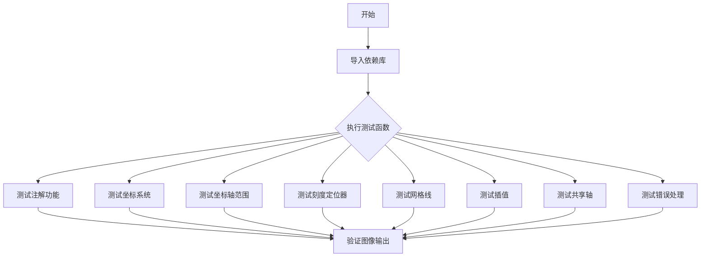

## 类结构

```
无类定义 (纯测试模块)
└── 全局测试函数集 (40+ 测试函数)
```

## 全局变量及字段


### `r`
    
极坐标半径数据数组

类型：`numpy.ndarray`
    


### `theta`
    
极坐标角度数据数组

类型：`numpy.ndarray`
    


### `thisr`
    
当前点的半径值

类型：`float`
    


### `thistheta`
    
当前点的角度值

类型：`float`
    


### `angles`
    
角度值数组，用于设置极坐标刻度网格

类型：`numpy.ndarray`
    


### `grid_values`
    
径向网格值列表，用于设置极坐标径向刻度

类型：`list`
    


### `theta_mins`
    
极坐标角度范围最小值数组

类型：`numpy.ndarray`
    


### `theta_maxs`
    
极坐标角度范围最大值数组

类型：`numpy.ndarray`
    


### `DIRECTIONS`
    
刻度方向参数元组，包含'out'、'in'、'inout'三种方向

类型：`tuple`
    


### `p1`
    
柱状图容器对象，包含极坐标柱状图元素

类型：`BarContainer`
    


### `p2`
    
柱状图容器对象，包含极坐标柱状图元素

类型：`BarContainer`
    


### `p3`
    
柱状图容器对象，包含极坐标柱状图元素

类型：`BarContainer`
    


### `p4`
    
柱状图容器对象，包含极坐标柱状图元素

类型：`BarContainer`
    


### `l`
    
线条对象，表示极坐标图中的曲线

类型：`Line2D`
    


### `span`
    
填充多边形对象，表示极坐标中的填充区域

类型：`Polygon`
    


### `bb`
    
边界框对象，用于获取坐标轴的紧凑边界

类型：`Bbox`
    


### `locator`
    
刻度定位器对象，用于控制坐标轴刻度位置

类型：`Locator`
    


### `xs`
    
角度数据列表，用于极坐标作图

类型：`list`
    


### `ys`
    
半径数据列表，用于极坐标作图

类型：`list`
    


### `xs_deg`
    
带角度单位的坐标数据列表

类型：`list`
    


### `ys_km`
    
带距离单位的坐标数据列表

类型：`list`
    


    

## 全局函数及方法


### `test_polar_annotations`

该函数是一个图像比对测试函数，用于验证matplotlib极坐标轴上的注释（annotation）功能是否正确工作，包括在极坐标系统中指定注释位置、文本位置、连接线以及标记点等。

参数： 无

返回值：`None`，该函数为测试函数，不返回任何值

#### 流程图

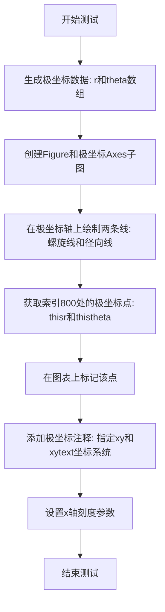

#### 带注释源码

```python
@image_comparison(['polar_axes.png'], style='default', tol=0.012)
def test_polar_annotations():
    # 测试函数：验证极坐标轴上的注释功能
    # 使用@image_comparison装饰器比对生成的图像与基准图像
    
    # ------------------- 数据准备 -------------------
    # 生成半径数据：从0.0到1.0，步长0.001
    r = np.arange(0.0, 1.0, 0.001)
    # 生成角度数据：theta = 2*2*pi*r，形成螺旋曲线
    theta = 2.0 * 2.0 * np.pi * r

    # ------------------- 图形创建 -------------------
    # 创建新的Figure对象
    fig = plt.figure()
    # 添加极坐标子图
    ax = fig.add_subplot(polar=True)
    
    # 绘制第一条曲线：螺旋线，颜色#ee8d18，线宽3
    line, = ax.plot(theta, r, color='#ee8d18', lw=3)
    # 绘制第二条曲线：从原点到(0,1)的径向线，颜色#0000ff，线宽1
    line, = ax.plot((0, 0), (0, 1), color="#0000ff", lw=1)

    # ------------------- 注释添加 -------------------
    # 获取索引800处的点坐标
    ind = 800
    thisr, thistheta = r[ind], theta[ind]
    # 在该位置绘制标记点
    ax.plot([thistheta], [thisr], 'o')
    
    # 添加注释文本
    ax.annotate('a polar annotation',
                # 注释指向的点坐标：极坐标(theta, radius)
                xy=(thistheta, thisr),  
                # 文本位置：使用图形坐标系的分数坐标(0.05, 0.05)
                xytext=(0.05, 0.05),    
                # 指定文本位置使用图形分数坐标系
                textcoords='figure fraction',
                # 箭头属性：黑色箭头，收缩5%
                arrowprops=dict(facecolor='black', shrink=0.05),
                # 水平对齐：左对齐
                horizontalalignment='left',
                # 垂直对齐：基线对齐
                verticalalignment='baseline',
                )

    # ------------------- 刻度设置 -------------------
    # 配置x轴刻度：显示主刻度和次刻度，方向向外
    ax.tick_params(axis='x', tick1On=True, tick2On=True, direction='out')
```


### `test_polar_coord_annotations`

该测试函数用于验证在笛卡尔坐标系（Cartesian axes）上使用极坐标（polar coordinates）进行注解的功能。测试通过在普通坐标轴上绘制一个椭圆，并使用极坐标系统指定注解的位置（theta, radius），来确保matplotlib能够正确处理这种坐标转换。

参数：
- 该函数没有显式参数（使用 pytest fixtures 和装饰器参数）

返回值：
- `None`，该函数为测试函数，主要通过 `@image_comparison` 装饰器进行图像对比验证

#### 流程图

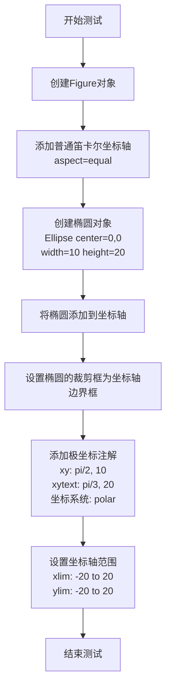

#### 带注释源码

```python
@image_comparison(['polar_coords.png'], style='default', remove_text=True,
                  tol=0.014)
def test_polar_coord_annotations():
    # 测试说明：
    # 可以在笛卡尔坐标轴上使用极坐标表示法。
    # 这里的原生坐标系统('data')是笛卡尔坐标，
    # 因此如果需要使用(theta, radius)格式，必须将
    # xycoords和textcoords设置为'polar'。

    # 创建一个红色半透明的椭圆对象
    # 中心在(0, 0)，宽度10，高度20
    el = mpl.patches.Ellipse((0, 0), 10, 20, facecolor='r', alpha=0.5)

    # 创建新的图形窗口
    fig = plt.figure()
    # 在图形中添加一个子图，设置为等比例坐标
    ax = fig.add_subplot(aspect='equal')

    # 将椭圆添加到坐标轴
    ax.add_artist(el)
    # 设置椭圆的裁剪框为坐标轴的边界框
    el.set_clip_box(ax.bbox)

    # 添加注解 'the top'
    # xy参数指定注解指向的点的坐标（极坐标：theta=pi/2, radius=10）
    # xytext参数指定注解文本的位置（极坐标：theta=pi/3, radius=20）
    # xycoords='polar' 表示xy使用极坐标系统
    # textcoords='polar' 表示xytext使用极坐标系统
    ax.annotate('the top',
                xy=(np.pi/2., 10.),      # theta, radius
                xytext=(np.pi/3, 20.),   # theta, radius
                xycoords='polar',
                textcoords='polar',
                arrowprops=dict(facecolor='black', shrink=0.05),
                horizontalalignment='left',
                verticalalignment='baseline',
                clip_on=True,  # clip to the axes bounding box
                )

    # 设置坐标轴的显示范围
    ax.set_xlim(-20, 20)
    ax.set_ylim(-20, 20)
```


### `test_polar_alignment`

该测试函数用于验证极坐标图中垂直/horizontal平对齐的更改功能，通过创建两个极坐标轴（一个水平、一个垂直）并设置不同的网格标签对齐方式，然后使用图像比较来确认渲染结果是否符合预期。

参数：
- 无显式参数（测试函数，由pytest和image_comparison装饰器管理）

返回值：`None`，该函数为测试函数，不返回任何值，仅通过图像比较验证功能

#### 流程图

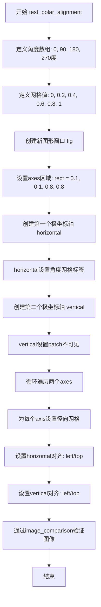

#### 带注释源码

```python
@image_comparison(['polar_alignment.png'])
def test_polar_alignment():
    # Test changing the vertical/horizontal alignment of a polar graph.
    # 该测试函数验证极坐标图中水平和垂直对齐方式的更改
    
    # 定义角度值：0到360度，步长90度
    angles = np.arange(0, 360, 90)
    
    # 定义径向网格值列表
    grid_values = [0, 0.2, 0.4, 0.6, 0.8, 1]

    # 创建新的图形窗口
    fig = plt.figure()
    
    # 定义axes在图形中的位置 [左, 下, 宽, 高]
    rect = [0.1, 0.1, 0.8, 0.8]

    # 创建第一个极坐标轴，标签为'horizontal'
    horizontal = fig.add_axes(rect, polar=True, label='horizontal')
    # 设置水平方向的角度刻度标签
    horizontal.set_thetagrids(angles)

    # 创建第二个极坐标轴，与第一个重叠，标签为'vertical'
    vertical = fig.add_axes(rect, polar=True, label='vertical')
    # 设置vertical axes的patch不可见，这样只显示horizontal axes的背景
    vertical.patch.set_visible(False)

    # 遍历两个axes，为每个设置径向网格
    for i in range(2):
        # 调用set_rgrids设置径向网格线和标签
        # angle参数指定网格标签旋转的角度
        # horizontalalignment和verticalalignment设置标签对齐方式
        fig.axes[i].set_rgrids(
            grid_values, angle=angles[i],
            horizontalalignment='left', verticalalignment='top')
```


### `test_polar_twice`

该函数用于测试在同一个figure上多次调用`plt.polar()`时，是否只创建一个极坐标轴（Axes），而不是为每次调用创建新的极坐标轴。这验证了Matplotlib在处理多个`plt.polar()`调用时的行为是否符合预期——复用已存在的极坐标轴。

参数：无

返回值：`None`，该函数为测试函数，不返回任何值，主要通过断言进行验证

#### 流程图

```mermaid
graph TD
    A[开始] --> B[创建新Figure: fig = plt.figure]
    B --> C[第一次调用 plt.polar[1, 2], [.1, .2]]
    C --> D[第二次调用 plt.polar[3, 4], [.3, .4]]
    D --> E{检查 fig.axes 数量}
    E -->|数量 == 1| F[断言通过 - 测试成功]
    E -->|数量 != 1| G[断言失败 - 抛出 AssertionError]
    F --> H[结束]
    G --> H
```

#### 带注释源码

```python
def test_polar_twice():
    """
    测试函数：验证多次调用 plt.polar() 只会创建一个极坐标轴
    
    该测试确保当在同一个 Figure 上多次调用 plt.polar() 时，
    Matplotlib 会复用已存在的极坐标轴，而不是为每次调用创建新轴。
    """
    # 步骤1：创建一个新的Figure对象
    fig = plt.figure()
    
    # 步骤2：第一次调用 plt.polar() 创建极坐标轴并绘制数据
    # 参数: [1, 2] 为theta值, [.1, .2] 为radius值
    plt.polar([1, 2], [.1, .2])
    
    # 步骤3：第二次调用 plt.polar() 
    # 预期行为：复用上面创建的极坐标轴，而不是创建新轴
    # 参数: [3, 4] 为theta值, [.3, .4] 为radius值
    plt.polar([3, 4], [.3, .4])
    
    # 步骤4：断言验证
    # 预期：fig.axes 列表中应该只有一个 Axes 对象
    # 如果创建了多个极坐标轴，则测试失败
    assert len(fig.axes) == 1, 'More than one polar Axes created.'
```


### `test_polar_wrap`

该函数是一个测试函数，用于验证极坐标轴在处理角度包装（wrapping）时的行为是否正确。它通过比较两组图形输出来确认：当角度值超出范围时（如负角度或大于360度的角度），极坐标系统能够正确地将其包装到[0, 2π)区间内。

参数：

- `fig_test`：`matplotlib.figure.Figure`，测试用的 figure 对象，用于添加极坐标子图并绘制待测试的线条
- `fig_ref`：`matplotlib.figure.Figure`，参考用的 figure 对象，包含预期的正确图形输出

返回值：`None`，该函数为测试函数，不返回任何值，验证通过 `@check_figures_equal()` 装饰器完成

#### 流程图

```mermaid
flowchart TD
    A[开始] --> B[在 fig_test 上添加极坐标子图]
    B --> C[绘制角度 [179°, -179°] 对应线条]
    C --> D[绘制角度 [2°, -2°] 对应线条]
    D --> E[在 fig_ref 上添加极坐标子图]
    E --> F[绘制角度 [179°, 181°] 对应线条]
    F --> G[绘制角度 [2°, 358°] 对应线条]
    G --> H[结束 / 由装饰器比较两图]
```

#### 带注释源码

```python
@check_figures_equal()  # 装饰器：比较 fig_test 和 fig_ref 的图形输出是否一致
def test_polar_wrap(fig_test, fig_ref):
    """
    测试极坐标轴的角度包装（wrap）功能。
    
    当输入角度为负数或大于360度时，验证系统是否能正确
    将其映射到 [0, 2π) 范围内。例如：
    - -179° 应该等效于 181° (即 2π - 179°)
    - -2°   应该等效于 358° (即 2π - 2°)
    """
    
    # 创建测试图的极坐标子图
    ax = fig_test.add_subplot(projection="polar")
    
    # 绘制跨越角度边界的线条（负角度）
    # np.deg2rad 将角度转换为弧度
    # [179, -179] 期望被理解为跨越了 180° 边界
    ax.plot(np.deg2rad([179, -179]), [0.2, 0.1])
    
    # 绘制跨越角度边界的线条（另一组负角度）
    # [2, -2] 期望被理解为跨越了 0°/360° 边界
    ax.plot(np.deg2rad([2, -2]), [0.2, 0.1])
    
    # 创建参考图的极坐标子图
    ax = fig_ref.add_subplot(projection="polar")
    
    # 绘制参考线条（使用等效的正角度值）
    # 179° 等效于 -181°，此处使用 181° 作为参考
    ax.plot(np.deg2rad([179, 181]), [0.2, 0.1])
    
    # 绘制参考线条（使用等效的正角度值）
    # 2° 等效于 358° (即 360° - 2°)
    ax.plot(np.deg2rad([2, 358]), [0.2, 0.1])
```


### `test_polar_units_1`

该测试函数用于验证matplotlib极坐标轴对角度单位（度）的支持，通过对比使用`jpl_units`库的单位对象绘图与直接使用弧度值绘图的结果，确保两种方式生成的图形一致。

参数：

- `fig_test`：`matplotlib.figure.Figure`，测试组中的Figure对象，用于执行待测试的极坐标绘图操作
- `fig_ref`：`matplotlib.figure.Figure`，参考组中的Figure对象，用于生成基准图像以进行视觉对比

返回值：`None`，该函数作为pytest测试用例，通过装饰器`@check_figures_equal()`自动进行图形对比验证

#### 流程图

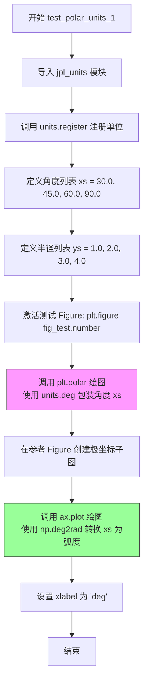

#### 带注释源码

```python
@check_figures_equal()
def test_polar_units_1(fig_test, fig_ref):
    """
    测试极坐标轴对角度单位（度）的支持。
    
    该测试验证使用 jpl_units 库的单位对象（units.deg）进行极坐标绘图，
    与直接使用弧度值（np.deg2rad）绘图的结果一致性。
    
    参数:
        fig_test: 测试组的 Figure 对象
        fig_ref: 参考组的 Figure 对象，用于生成基准图像
    """
    # 导入 JPL 单位库，用于处理物理单位（角度、温度等）
    import matplotlib.testing.jpl_units as units
    # 注册单位系统，使单位对象能够被 matplotlib 识别
    units.register()
    
    # 定义测试用的角度值（单位：度）
    xs = [30.0, 45.0, 60.0, 90.0]
    # 定义对应的半径值（无单位）
    ys = [1.0, 2.0, 3.0, 4.0]

    # 激活测试 Figure，准备在其中绘图
    plt.figure(fig_test.number)
    # 使用极坐标绘图，角度使用 units.deg 包装
    # 内部会进行单位到弧度的转换
    plt.polar([x * units.deg for x in xs], ys)

    # 在参考 Figure 中创建极坐标子图
    ax = fig_ref.add_subplot(projection="polar")
    # 直接使用弧度值绘图（将角度转换为弧度）
    ax.plot(np.deg2rad(xs), ys)
    # 设置 x 轴标签为 'deg'，表明这是角度轴
    ax.set(xlabel="deg")
```


### `test_polar_units_2`

该函数是一个单元测试函数，用于验证 Matplotlib 极坐标轴对不同单位（角度单位和半径单位）的支持是否正确工作，特别是在使用 `thetaunits` 和 `runits` 参数时能否正确处理单位转换，并确保自定义单位格式器 `UnitDblFormatter` 被正确应用。

参数：

- `fig_test`：`matplotlib.figure.Figure`，测试用的图形对象，用于验证测试结果
- `fig_ref`：`matplotlib.figure.Figure`，参考用的图形对象，用于与测试结果进行像素级比较

返回值：`None`，无返回值（测试函数）

#### 流程图

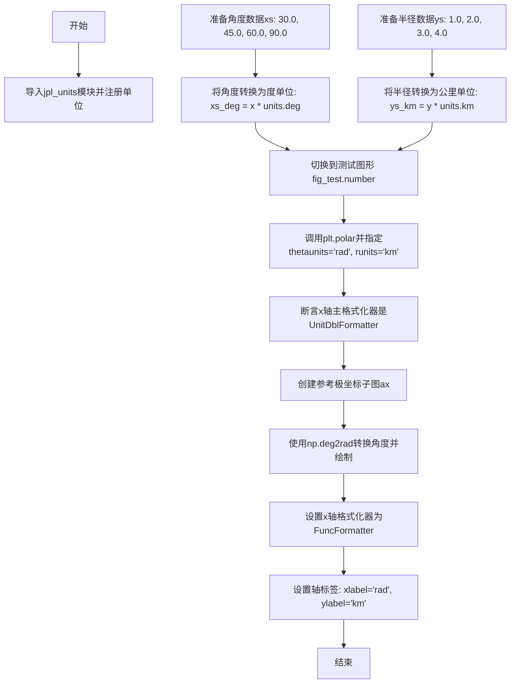

#### 带注释源码

```python
@check_figures_equal()  # 装饰器：比较测试图形和参考图形的输出是否一致
def test_polar_units_2(fig_test, fig_ref):
    """
    测试极坐标轴对不同单位（角度单位和半径单位）的处理。
    
    该测试验证：
    1. 可以使用自定义单位（度、公里）进行极坐标绘图
    2. 可以通过thetaunits和runits参数指定单位转换
    3. UnitDblFormatter正确应用
    """
    # 导入jpl_units模块并注册单位，以便支持带单位的数值
    import matplotlib.testing.jpl_units as units
    units.register()
    
    # 准备角度数据：30.0, 45.0, 60.0, 90.0度
    xs = [30.0, 45.0, 60.0, 90.0]
    # 将角度数据转换为带度单位的数值
    xs_deg = [x * units.deg for x in xs]
    
    # 准备半径数据：1.0, 2.0, 3.0, 4.0
    ys = [1.0, 2.0, 3.0, 4.0]
    # 将半径数据转换为带公里单位的数值
    ys_km = [y * units.km for y in ys]

    # 切换到测试图形
    plt.figure(fig_test.number)
    
    # 调用polar绘制极坐标图，指定角度单位为弧度(rad)，半径单位为公里(km)
    # 这里xs_deg虽然是度单位，但thetaunits="rad"会将其转换为弧度
    # ys_km虽然是公里单位，但runits="km"会直接使用公里
    plt.polar(xs_deg, ys_km, thetaunits="rad", runits="km")
    
    # 断言：验证x轴的主格式化器是UnitDblFormatter
    # 这确认了自定义单位格式器被正确应用
    assert isinstance(plt.gca().xaxis.get_major_formatter(),
                      units.UnitDblFormatter)

    # 创建参考图形：使用numpy的deg2rad手动转换角度单位
    ax = fig_ref.add_subplot(projection="polar")
    # 使用np.deg2rad将角度转换为弧度
    ax.plot(np.deg2rad(xs), ys)
    # 设置x轴格式化器为指定格式的函数格式化器
    ax.xaxis.set_major_formatter(mpl.ticker.FuncFormatter("{:.12}".format))
    # 设置轴标签
    ax.set(xlabel="rad", ylabel="km")
```


### `test_polar_rmin`

该函数用于测试极坐标轴的最小半径（rmin）设置功能，通过创建一个极坐标图形并设置 rmin=0.5 和 rmax=2.0，验证极坐标轴的半径范围能够正确应用这些限制参数。

参数：无

返回值：`None`，该函数没有显式返回值，主要通过图像比较验证功能

#### 流程图

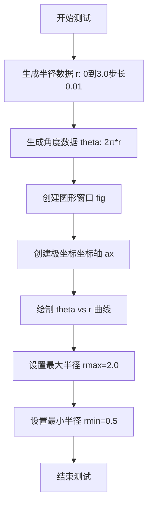

#### 带注释源码

```python
@image_comparison(['polar_rmin.png'], style='default')  # 图像比较装饰器，预期生成polar_rmin.png
def test_polar_rmin():
    """测试极坐标轴的最小半径设置功能"""
    
    # 生成半径数据：从0到3.0，步长0.01
    r = np.arange(0, 3.0, 0.01)
    
    # 生成角度数据：theta = 2π*r，形成螺旋图案
    theta = 2*np.pi*r

    # 创建新的图形窗口
    fig = plt.figure()
    
    # 添加极坐标坐标轴，位置为(0.1, 0.1, 0.8, 0.8)
    ax = fig.add_axes((0.1, 0.1, 0.8, 0.8), polar=True)
    
    # 绘制角度-半径曲线
    ax.plot(theta, r)
    
    # 设置极坐标轴的最大半径为2.0
    ax.set_rmax(2.0)
    
    # 设置极坐标轴的最小半径为0.5
    ax.set_rmin(0.5)
```


### `test_polar_negative_rmin`

该函数是一个图像对比测试，用于验证当极坐标轴的最小半径（rmin）为负值时的渲染是否正确。它创建负半径数据并设置负的rmin/rmax，检验matplotlib极坐标轴是否能正确处理负半径值。

参数：该函数没有显式参数（使用pytest fixture和装饰器参数）

返回值：`None`，该函数为测试函数，不返回值

#### 流程图

```mermaid
flowchart TD
    A[开始测试] --> B[创建半径数组 r<br/>np.arange(-3.0, 0.0, 0.01)]
    B --> C[创建角度数组 theta<br/>theta = 2*np.pi*r]
    C --> D[创建图形窗口<br/>plt.figure()]
    D --> E[添加极坐标子图<br/>fig.add_axes polar=True]
    E --> F[绘制数据<br/>ax.plot theta, r]
    F --> G[设置最大半径<br/>ax.set_rmax 0.0]
    G --> H[设置最小半径<br/>ax.set_rmin -3.0]
    H --> I[图像对比验证<br/>@image_comparison装饰器]
    I --> J[结束测试]
```

#### 带注释源码

```python
@image_comparison(['polar_negative_rmin.png'], style='default')
def test_polar_negative_rmin():
    """
    测试负半径值的极坐标轴渲染
    
    该测试函数验证当极坐标轴的最小半径(rmin)为负值时，
    matplotlib能够正确渲染图形。通过对比生成的图像与基准图像，
    确保负半径值的处理符合预期。
    """
    # 创建半径数组，从-3.0到0.0（不包含0.0）
    # 使用负值范围来测试负半径的处理
    r = np.arange(-3.0, 0.0, 0.01)
    
    # 根据半径计算角度 theta = 2*pi*r
    # 这会创建一个螺旋形状，角度从-6π到0
    theta = 2*np.pi*r
    
    # 创建新的图形窗口
    fig = plt.figure()
    
    # 添加极坐标子图，位置为(0.1, 0.1, 0.8, 0.8)
    # polar=True 参数指定创建极坐标轴
    ax = fig.add_axes((0.1, 0.1, 0.8, 0.8), polar=True)
    
    # 在极坐标轴上绘制数据
    # theta为角度（弧度），r为半径
    ax.plot(theta, r)
    
    # 设置极坐标轴的最大半径为0.0
    ax.set_rmax(0.0)
    
    # 设置极坐标轴的最小半径为-3.0
    # 这是测试的关键：验证负半径值是否能正确显示
    ax.set_rmin(-3.0)
    
    # @image_comparison装饰器会自动比较生成的图像
    # 与baseline_images目录中的'polar_negative_rmin.png'
    # style='default'使用默认样式
```


### `test_polar_rorigin`

该函数是一个图像对比测试，用于验证极坐标图中设置径向原点（rorigin）的功能是否正确。它创建包含螺旋线数据的极坐标轴，配置 rmax、rmin 和 rorigin 参数，并使用图像比较装饰器验证渲染结果是否符合预期。

参数：此函数无显式参数（模块级测试函数）

返回值：`None`，该函数为测试函数，通过图像比较验证功能，不返回任何值

#### 流程图

```mermaid
flowchart TD
    A[开始测试] --> B[生成测试数据: r = np.arange(0, 3.0, 0.01)]
    B --> C[计算theta = 2*np.pi*r]
    C --> D[创建新图形: plt.figure]
    D --> E[添加极坐标子图: add_axes with polar=True]
    E --> F[绘制极坐标数据: ax.plot(theta, r)]
    F --> G[设置径向最大值: ax.set_rmax(2.0)]
    G --> H[设置径向最小值: ax.set_rmin(0.5)]
    H --> I[设置径向原点: ax.set_rorigin(0.0)]
    I --> J[图像对比验证: @image_comparison装饰器]
    J --> K[结束测试]
```

#### 带注释源码

```python
@image_comparison(['polar_rorigin.png'], style='default')
def test_polar_rorigin():
    """
    测试极坐标图中径向原点(rorigin)设置功能的图像对比测试。
    
    该测试验证当设置 rorigin 为 0.0 时，极坐标轴能够正确渲染，
    并与预期的基准图像 'polar_rorigin.png' 进行对比验证。
    """
    # 生成径向坐标数据：从 0 到 3.0，步长 0.01
    r = np.arange(0, 3.0, 0.01)
    
    # 计算角度坐标：形成螺旋线图案 (theta = 2πr)
    theta = 2*np.pi*r

    # 创建新的图形对象
    fig = plt.figure()
    
    # 添加极坐标子图，位置为 (0.1, 0.1, 0.8, 0.8)
    ax = fig.add_axes((0.1, 0.1, 0.8, 0.8), polar=True)
    
    # 在极坐标轴上绘制螺旋线数据
    ax.plot(theta, r)
    
    # 设置径向坐标的最大值为 2.0
    ax.set_rmax(2.0)
    
    # 设置径向坐标的最小值为 0.5
    ax.set_rmin(0.5)
    
    # 设置径向原点为 0.0，这是该测试的核心验证点
    # rorigin 决定径向距离从哪个位置开始计算
    ax.set_rorigin(0.0)
```


### `test_polar_invertedylim`

该函数是一个图像比对测试，用于验证当极坐标轴的 y 轴 limits 被设置为反向（2, 0）时，绘图渲染是否正确。

参数：此函数无参数。

返回值：`None`，无返回值（测试函数）。

#### 流程图

```mermaid
flowchart TD
    A[开始测试] --> B[调用 plt.figure 创建新 figure]
    B --> C[调用 fig.add_axes 添加极坐标轴 axes]
    C --> D[调用 ax.set_ylim2, 0 设置反向 y 轴 limits]
    D --> E[@image_comparison 装饰器执行图像比对]
    E --> F[测试结束]
```

#### 带注释源码

```python
@image_comparison(['polar_invertedylim.png'], style='default')
def test_polar_invertedylim():
    # 创建新的图形窗口/画布
    fig = plt.figure()
    # 添加极坐标轴，位置为 (0.1, 0.1, 0.8, 0.8)，即 left=0.1, bottom=0.1, width=0.8, height=0.8
    ax = fig.add_axes((0.1, 0.1, 0.8, 0.8), polar=True)
    # 设置 y 轴 limits 为反向：ymin=2, ymax=0
    # 在极坐标中，这意味着半径将从 2 递减到 0（而非默认的 0 递增到 2）
    ax.set_ylim(2, 0)
```


### `test_polar_invertedylim_rorigin`

该函数是一个图像比对测试函数，用于测试在极坐标轴中同时设置y轴反转（inverted）和rorigin（半径原点偏移）时的渲染行为。验证在设置反向的径向 limits 时，视图限制（viewlims）在绘制前能够正确地unstale（更新）。

参数： 无

返回值：`None`，无返回值

#### 流程图

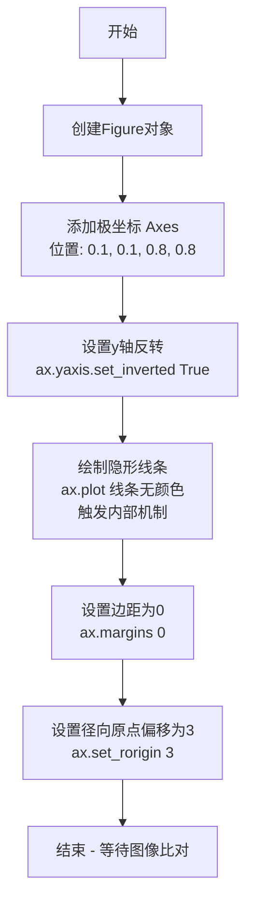

#### 带注释源码

```python
@image_comparison(['polar_invertedylim_rorigin.png'], style='default')
def test_polar_invertedylim_rorigin():
    # 创建一个新的图形对象
    fig = plt.figure()
    
    # 添加一个极坐标轴，位置为 (0.1, 0.1, 0.8, 0.8)
    # 即从左下角 (10%, 10%) 开始，宽度80%，高度80%
    ax = fig.add_axes((0.1, 0.1, 0.8, 0.8), polar=True)
    
    # 将 y 轴设置为反转模式
    # 在极坐标中，这会影响径向刻度的方向
    ax.yaxis.set_inverted(True)
    
    # 绘制一条从 (0, 0) 到 (0, 2) 的线条
    # c="none" 表示线条颜色为无（透明），实际上不可见
    # 这里的目的是触发内部机制，设置 rlims 为 inverted (2, 0)
    # 而不直接调用 set_rlim 函数
    # 用于验证 viewlims 在 draw() 之前能够正确地 unstale（更新）
    ax.plot([0, 0], [0, 2], c="none")
    
    # 设置轴边距为 0
    ax.margins(0)
    
    # 设置径向原点偏移量为 3
    # 这会将极坐标图的径向原点从默认位置向外移动
    ax.set_rorigin(3)
```


### `test_polar_theta_position`

该函数是一个图像比较测试，用于验证极坐标图中 theta 轴（角度）的零位置和方向设置是否正确，通过创建极坐标轴、绘制螺旋线并设置零方向为西北方向（顺时针）来测试 `set_theta_zero_location` 和 `set_theta_direction` 方法的正确性。

参数：無

返回值：`None`，无返回值（测试函数）

#### 流程图

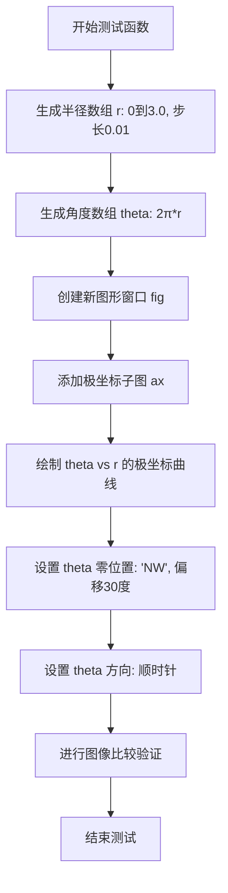

#### 带注释源码

```python
@image_comparison(['polar_theta_position.png'], style='default')
def test_polar_theta_position():
    # 生成半径数组 r，范围从 0 到 3.0（不包括），步长 0.01
    r = np.arange(0, 3.0, 0.01)
    # 生成角度数组 theta，半径的 2π 倍，形成螺旋轨迹
    theta = 2*np.pi*r

    # 创建新的图形窗口
    fig = plt.figure()
    # 在图形中添加极坐标子图，位置为 (0.1, 0.1, 0.8, 0.8)
    ax = fig.add_axes((0.1, 0.1, 0.8, 0.8), polar=True)
    # 绘制极坐标曲线
    ax.plot(theta, r)
    # 设置 theta 轴零位位置为 'NW'（西北方向），偏移角为 30 度
    ax.set_theta_zero_location("NW", 30)
    # 设置 theta 轴方向为顺时针
    ax.set_theta_direction('clockwise')
```


### `test_polar_rlabel_position`

该函数是一个图像比较测试，用于验证极坐标图中径向标签（rlabel）位置设置功能是否正确工作。它创建一个极坐标子图，设置径向标签位置为315度，并启用自动旋转，检验 `set_rlabel_position()` 方法和刻度参数的效果。

参数：
- 该函数无显式参数（由 `@image_comparison` 装饰器隐式提供 `fig_test` 和 `fig_ref` 参数，但函数体中未使用）

返回值：`None`，该函数为测试函数，不返回任何值

#### 流程图

```mermaid
flowchart TD
    A[开始测试] --> B[创建新图形窗口: plt.figure]
    B --> C[添加极坐标子图: add_subplot projection='polar']
    C --> D[设置径向标签位置: set_rlabel_position315]
    D --> E[设置刻度参数自动旋转: tick_params rotation='auto']
    E --> F[由@image_comparison装饰器比较输出图像]
    F --> G[结束测试]
```

#### 带注释源码

```python
@image_comparison(['polar_rlabel_position.png'], style='default', tol=0.07)
def test_polar_rlabel_position():
    # 创建新的图形窗口
    fig = plt.figure()
    
    # 添加极坐标投影的子图
    ax = fig.add_subplot(projection='polar')
    
    # 设置径向标签的位置为315度（相对于默认位置）
    ax.set_rlabel_position(315)
    
    # 设置刻度标签自动旋转以适应极坐标轴的方向
    ax.tick_params(rotation='auto')
```


### `test_polar_title_position`

该函数是一个图像对比测试，用于验证极坐标轴标题的渲染是否正确，通过创建极坐标子图并设置标题来测试 Matplotlib 中极坐标轴标题的显示效果。

参数：此函数没有显式参数（尽管装饰器 `@image_comparison` 可能在内部处理测试参数）

返回值：`None`，该函数不返回任何值，仅执行副作用（创建图形并设置标题）

#### 流程图

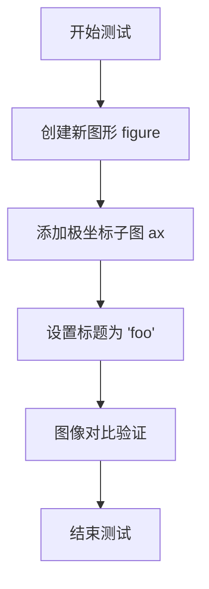

#### 带注释源码

```python
@image_comparison(['polar_title_position.png'], style='mpl20')
def test_polar_title_position():
    """
    测试极坐标轴标题位置的图像对比测试。
    验证在极坐标投影下设置标题时，标题能够正确显示。
    """
    # 创建一个新的图形窗口
    fig = plt.figure()
    
    # 添加一个极坐标投影的子图
    # projection='polar' 创建极坐标轴
    ax = fig.add_subplot(projection='polar')
    
    # 设置标题文本为 'foo'
    # 这会测试 Matplotlib 在极坐标环境下渲染标题的能力
    ax.set_title('foo')
```


### `test_polar_theta_limits`

该函数是一个图像比较测试，用于验证极坐标轴在设置不同的theta角度范围（theta limits）时的渲染行为，测试各种起始角度和结束角度的组合，以及不同的刻度方向。

参数：

- 该函数无显式参数

返回值：`None`，无返回值（测试函数）

#### 流程图

```mermaid
flowchart TD
    A[开始测试] --> B[生成r数据: 0到3.0, 步长0.01]
    B --> C[生成theta数据: 2π*r]
    C --> D[生成theta_mins数组: 15°到360°, 步长90°]
    D --> E[生成theta_maxs数组: 50°到360°, 步长90°]
    E --> F[创建子图网格: len(theta_mins行 × len(theta_maxs列]
    F --> G[外层循环: 遍历theta_mins]
    G --> H[内层循环: 遍历theta_maxs]
    H --> I{start < end?}
    I -->|是| J[设置thetamin=start, thetamax=end]
    I -->|否| K[设置thetamin=end, thetamax=start, 设置顺时针方向]
    J --> L[设置刻度方向和旋转]
    K --> L
    L --> M[设置y轴刻度标签和旋转]
    M --> N[设置x轴刻度定位器参数]
    N --> O{内层循环结束?}
    O -->|否| H
    O -->|是| P{外层循环结束?}
    P -->|否| G
    P -->|是| Q[结束测试]
```

#### 带注释源码

```python
@image_comparison(['polar_theta_wedge.png'], style='default', tol=0.2)
def test_polar_theta_limits():
    # 生成半径数据，从0到3.0，步长0.01
    r = np.arange(0, 3.0, 0.01)
    # 生成角度数据，theta = 2πr，形成阿基米德螺旋
    theta = 2*np.pi*r

    # 定义theta最小值的测试数组：从15°开始，每次增加90°，直到360°
    theta_mins = np.arange(15.0, 361.0, 90.0)
    # 定义theta最大值的测试数组：从50°开始，每次增加90°，直到360°
    theta_maxs = np.arange(50.0, 361.0, 90.0)
    # 定义刻度方向的测试值：向外、向内、内外结合
    DIRECTIONS = ('out', 'in', 'inout')

    # 创建一个len(theta_mins)行、len(theta_maxs)列的子图网格
    # 每个子图都是极坐标 axes
    fig, axs = plt.subplots(len(theta_mins), len(theta_maxs),
                            subplot_kw={'polar': True},
                            figsize=(8, 6))

    # 遍历所有theta最小值
    for i, start in enumerate(theta_mins):
        # 遍历所有theta最大值
        for j, end in enumerate(theta_maxs):
            # 获取当前子图
            ax = axs[i, j]
            # 在当前极坐标轴上绘制螺旋线
            ax.plot(theta, r)
            # 根据起始和结束角度的大小关系设置theta范围
            if start < end:
                # 正常设置：逆时针方向
                ax.set_thetamin(start)
                ax.set_thetamax(end)
            else:
                # 交换设置：改为顺时针方向绘制
                ax.set_thetamin(end)
                ax.set_thetamax(start)
                ax.set_theta_direction('clockwise')
            # 配置刻度参数：显示主刻度和次刻度，设置方向和自动旋转
            ax.tick_params(tick1On=True, tick2On=True,
                           direction=DIRECTIONS[i % len(DIRECTIONS)],
                           rotation='auto')
            # 配置y轴（径向）刻度标签的自动旋转
            ax.yaxis.set_tick_params(label2On=True, rotation='auto')
            # 配置x轴（角度）刻度定位器的步长参数（向后兼容）
            ax.xaxis.get_major_locator().base.set_params(  # backcompat
                steps=[1, 2, 2.5, 5, 10])
```


### `test_polar_rlim`

该测试函数用于验证极坐标轴（polar axes）的 `set_rlim` 方法是否正确设置了径向（r）轴的上下限。它通过对比使用 `set_rlim(top=..., bottom=...)` 方法与分别使用 `set_rmax()` 和 `set_rmin()` 方法设置的轴限是否一致，来确保两种设置方式的等价性。

参数：

- `fig_test`：`matplotlib.figure.Figure`，测试用的 Figure 对象，通过 `check_figures_equal` 装饰器传入，用于验证 `set_rlim` 方法的效果
- `fig_ref`：`matplotlib.figure.Figure`，参考用的 Figure 对象，通过 `check_figures_equal` 装饰器传入，用于与测试结果进行图像对比

返回值：`None`，该函数为测试函数，不返回任何值，主要通过 `@check_figures_equal()` 装饰器进行图像比较

#### 流程图

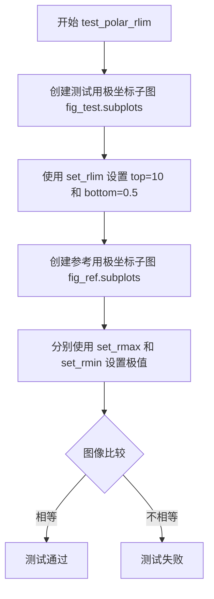

#### 带注释源码

```python
@check_figures_equal()
def test_polar_rlim(fig_test, fig_ref):
    # 创建测试figure的极坐标子图
    ax = fig_test.subplots(subplot_kw={'polar': True})
    # 使用set_rlim方法设置径向轴的上限为10，下限为0.5
    ax.set_rlim(top=10)
    ax.set_rlim(bottom=.5)

    # 创建参考figure的极坐标子图
    ax = fig_ref.subplots(subplot_kw={'polar': True})
    # 使用set_rmax和set_rmin方法分别设置径向轴的极值
    ax.set_rmax(10.)
    ax.set_rmin(.5)
    # @check_figures_equal装饰器会比较两个figure的渲染结果是否一致
```


### `test_polar_rlim_bottom`

该测试函数用于验证在极坐标轴上使用 `set_rlim(bottom=[.5, 10])` 方法设置径向轴下限（同时指定下限和上限）与分别调用 `set_rmax(10.)` 和 `set_rmin(.5)` 方法的效果是否一致，确保两种API调用方式产生相同的图形输出。

参数：

- `fig_test`：pytest fixture，测试用例的图形对象，用于应用待测试的配置
- `fig_ref`：pytest fixture，参考图形对象，用于与测试结果进行对比验证

返回值：`None`，测试函数通过 `assert` 或图形比较机制验证结果，不返回具体值

#### 流程图

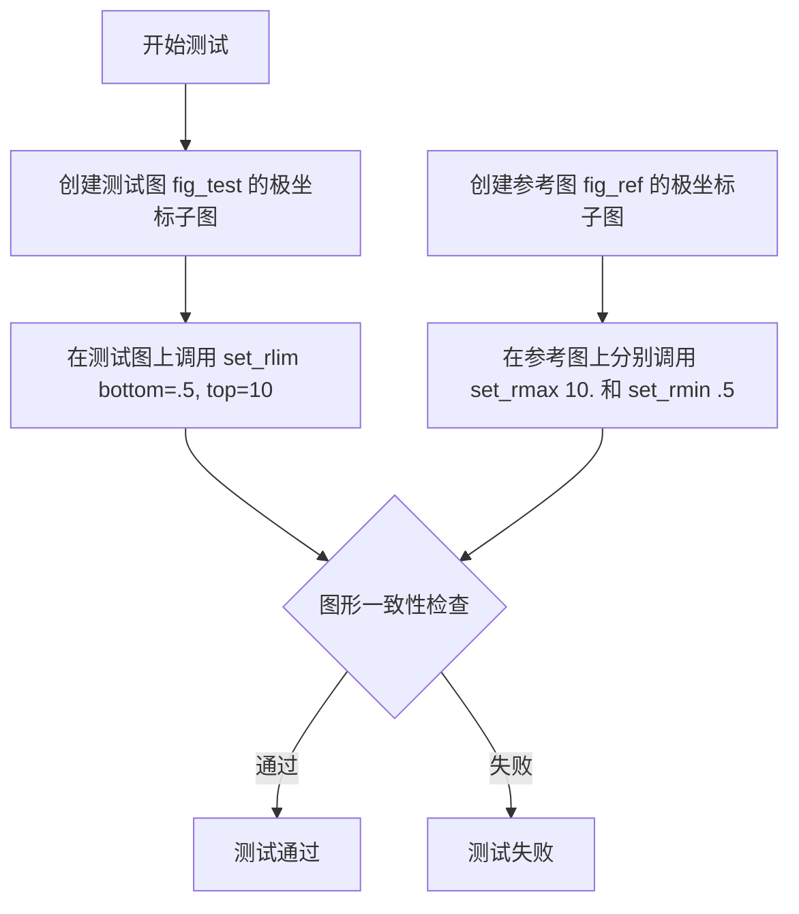

#### 带注释源码

```python
@check_figures_equal()
def test_polar_rlim_bottom(fig_test, fig_ref):
    """
    测试 set_rlim(bottom=[bottom, top]) 与分别调用 set_rmax/set_rmin 的等价性
    
    该测试验证当使用 set_rlim(bottom=[.5, 10]) 时，
    等价于同时设置 set_rmin(.5) 和 set_rmax(10)
    """
    # 创建测试图：使用 set_rlim 的列表参数形式设置径向范围
    ax = fig_test.subplots(subplot_kw={'polar': True})
    # bottom 参数接受 [下限, 上限] 的列表形式
    ax.set_rlim(bottom=[.5, 10])

    # 创建参考图：分别使用 set_rmin 和 set_rmax 设置径向范围
    ax = fig_ref.subplots(subplot_kw={'polar': True})
    ax.set_rmax(10.)   # 设置径向轴上限
    ax.set_rmin(.5)    # 设置径向轴下限
```


### `test_polar_rlim_zero`

该测试函数用于验证极坐标轴在绘制正数数据时，能够正确将y轴下限（rlim bottom）自动设置为0，确保极坐标轴的半径下限不会因为数据最小值大于0而产生错误的自动调整。

参数：

- （无参数）

返回值：`None`，测试函数无返回值，通过断言验证行为

#### 流程图

```mermaid
flowchart TD
    A[开始测试] --> B[创建极坐标子图 ax = plt.figure.add_subplot projection='polar']
    B --> C[绘制数据: ax.plot np.arange10, np.arange10 + 0.01]
    C --> D{断言检查: ax.get_ylim()[0] == 0?}
    D -->|是| E[测试通过]
    D -->|否| F[测试失败]
    E --> G[结束]
    F --> G
```

#### 带注释源码

```python
def test_polar_rlim_zero():
    """
    测试极坐标轴的rlim下限是否为0。
    验证当数据全为正数时，极坐标轴能够正确将y轴下限设为0。
    """
    # 创建一个极坐标子图
    ax = plt.figure().add_subplot(projection='polar')
    
    # 绘制数据：x为0-9，y为0.01-9.01（全为正数）
    ax.plot(np.arange(10), np.arange(10) + .01)
    
    # 断言：验证极坐标轴的y轴下限（ylim的最小值）为0
    # 确认即使数据的最小值是0.01，轴的下限仍被正确设置为0
    assert ax.get_ylim()[0] == 0
```


### `test_polar_no_data`

该函数是一个单元测试，用于验证在未向极坐标轴（Polar Axes）添加任何数据时，其默认的径向坐标范围（r-limits）是否被正确设置为 0 到 1。此测试确保了在使用 `plt.subplot` 和 `plt.polar()` 两种方式创建极坐标轴时，系统不会错误地触发自动缩放（autoscale）行为，这是一个针对历史回归错误的验证。

#### 参数

- （无参数）

#### 返回值

- `None`：该函数不返回任何值，主要通过内部的 `assert` 语句进行验证，若断言失败则抛出异常。

#### 流程图

```mermaid
graph TD
    Start([开始]) --> Step1[plt.subplot(projection='polar')]
    Step1 --> Step2[ax = plt.gca]
    Step2 --> Assert1{断言: ax.get_rmin() == 0 and ax.get_rmax() == 1}
    Assert1 -- 失败 --> RaiseError[抛出 AssertionError]
    Assert1 -- 通过 --> Step3[plt.close('all')]
    Step3 --> Step4[plt.polar]
    Step4 --> Step5[ax = plt.gca]
    Step5 --> Assert2{断言: ax.get_rmin() == 0 and ax.get_rmax() == 1}
    Assert2 -- 失败 --> RaiseError
    Assert2 -- 通过 --> End([结束])
```

#### 带注释源码

```python
def test_polar_no_data():
    # 步骤 1: 创建一个极坐标子图
    plt.subplot(projection="polar")
    
    # 步骤 2: 获取当前活动的坐标轴对象
    ax = plt.gca()
    
    # 步骤 3: 断言默认的径向最小值 (rmin) 为 0，最大值 (rmax) 为 1
    # 这确保了在没有数据时，极坐标轴的默认视图是合理的 (0 到 1)。
    assert ax.get_rmin() == 0 and ax.get_rmax() == 1
    
    # 步骤 4: 关闭所有当前打开的图形，重置绘图状态
    plt.close("all")
    
    # 注释: 之前 plt.polar() 的行为与此不同（它曾经会触发无数据的自动缩放）。
    # 步骤 5: 使用 plt.polar() 快捷方式创建极坐标轴（如果在当前没有Axes）
    plt.polar()
    
    # 步骤 6: 再次获取当前坐标轴
    ax = plt.gca()
    
    # 步骤 7: 再次断言默认范围，确保修复是全面的
    assert ax.get_rmin() == 0 and ax.get_rmax() == 1
```


### `test_polar_default_log_lims`

该测试函数用于验证在使用对数刻度（log scale）时，极坐标轴的默认最小半径值（rmin）是否大于零，确保在对数坐标系下不会出现无效的零或负数半径限制。

参数：无

返回值：`None`，该函数为测试函数，使用断言进行验证，不返回任何值

#### 流程图

```mermaid
flowchart TD
    A[开始测试] --> B[创建极坐标子图]
    B --> C[获取当前坐标轴]
    C --> D[设置径向刻度为对数刻度]
    D --> E{验证 rmin > 0?}
    E -->|是| F[测试通过]
    E -->|否| G[测试失败]
```

#### 带注释源码

```python
def test_polar_default_log_lims():
    """
    测试极坐标轴在对数刻度下的默认最小半径值。
    
    该测试验证当极坐标轴使用对数刻度（set_rscale('log')）时，
    最小半径值（rmin）应该大于0，而不是默认的0或负值，
    因为对数刻度无法处理零或负数。
    """
    # 创建一个极坐标投影的子图
    plt.subplot(projection='polar')
    
    # 获取当前活动的坐标轴对象
    ax = plt.gca()
    
    # 将径向（y）轴的刻度设置为对数刻度
    ax.set_rscale('log')
    
    # 断言：验证对数刻度下的最小半径值大于0
    # 这是必要的，因为对数函数不能处理零或负值
    assert ax.get_rmin() > 0
```


### `test_polar_not_datalim_adjustable`

这是一个测试函数，用于验证在极坐标投影的 axes 上调用 `set_adjustable("datalim")` 时会抛出 `ValueError` 异常，因为极坐标轴不支持 "datalim" 作为 adjustable 参数。

参数：此函数没有参数。

返回值：`None`，因为它是一个测试函数，不返回任何值。

#### 流程图

```mermaid
flowchart TD
    A[开始测试] --> B[创建新图形]
    B --> C[添加极坐标投影的子图]
    C --> D[调用 ax.set_adjustable&#40;'datalim'&#41;]
    D --> E{是否抛出 ValueError?}
    E -->|是| F[测试通过]
    E -->|否| G[测试失败]
```

#### 带注释源码

```python
def test_polar_not_datalim_adjustable():
    """
    测试极坐标轴不支持 set_adjustable("datalim") 的场景。
    
    此测试验证在极坐标投影的 axes 上调用 set_adjustable("datalim")
    会抛出 ValueError 异常，因为极坐标轴不支持 'datalim' 作为
    adjustable 参数。
    """
    # 创建一个新的图形，并在其中添加一个极坐标投影的子图
    ax = plt.figure().add_subplot(projection="polar")
    
    # 使用 pytest.raises 上下文管理器验证调用 set_adjustable("datalim")
    # 会抛出 ValueError 异常
    with pytest.raises(ValueError):
        ax.set_adjustable("datalim")
```


### `test_polar_gridlines`

这是一个测试函数，用于验证极坐标轴上的网格线（grid lines）是否能够正确设置透明度（alpha）值。该测试创建极坐标轴，设置网格线透明度为 0.2，然后验证 x 轴和 y 轴的主网格线的透明度是否正确应用。

参数：无

返回值：`None`，无返回值，这是一个使用 assert 语句进行验证的测试函数

#### 流程图

```mermaid
flowchart TD
    A[开始] --> B[创建新的图形窗口 fig = plt.figure]
    C[添加极坐标子图 ax = fig.add_subplot polar=True]
    B --> C
    C --> D[设置网格线透明度 ax.grid alpha=0.2]
    D --> E[隐藏y轴刻度标签 plt.setp ax.yaxis.get_ticklabels visible=False]
    E --> F[重绘画布 fig.canvas.draw]
    F --> G{验证x轴主网格线透明度}
    G -->|assert| H[ax.xaxis.majorTicks[0].gridline.get_alpha == 0.2]
    H --> I{验证y轴主网格线透明度}
    I -->|assert| J[ax.yaxis.majorTicks[0].gridline.get_alpha == 0.2]
    J --> K[结束]
```

#### 带注释源码

```python
def test_polar_gridlines():
    """
    测试极坐标轴上网格线的透明度设置是否正确。
    
    验证要点：
    1. 极坐标轴的 grid() 方法能够正确设置网格线的透明度
    2. x轴（theta方向）和y轴（r方向）的主网格线都能正确应用透明度设置
    """
    # 创建一个新的图形窗口
    fig = plt.figure()
    
    # 添加一个极坐标子图
    # polar=True 参数指定创建极坐标轴
    ax = fig.add_subplot(polar=True)
    
    # 设置所有主网格线的透明度为 0.2（较浅的颜色）
    # 在 matplotlib 2.1.0 版本中，只设置了 x 方向的网格线
    ax.grid(alpha=0.2)
    
    # 隐藏 y 轴（径向）的刻度标签
    # 在 matplotlib 2.1.0 版本中此操作无效
    plt.setp(ax.yaxis.get_ticklabels(), visible=False)
    
    # 强制重绘画布，确保网格线属性已更新
    # 这是一个关键步骤，确保在获取网格线属性前已完成渲染
    fig.canvas.draw()
    
    # 断言验证：x轴（theta方向）主网格线的透明度是否为 0.2
    # majorTicks[0] 获取第一个主刻度位置
    # gridline 获取该位置的网格线对象
    assert ax.xaxis.majorTicks[0].gridline.get_alpha() == .2
    
    # 断言验证：y轴（径向r方向）主网格线的透明度是否为 0.2
    # 这确保了极坐标轴的两个方向的网格线都能正确设置透明度
    assert ax.yaxis.majorTicks[0].gridline.get_alpha() == .2
```


### `test_get_tightbbox_polar`

这是一个测试函数，用于验证在极坐标投影下，`get_tightbbox` 方法能够正确计算坐标轴的紧凑边界框。该函数创建极坐标子图，绘制画布，然后获取并验证边界框的扩展坐标是否符合预期值。

参数： 无

返回值： `None`，该函数为测试函数，使用断言进行验证，不返回任何值

#### 流程图

```mermaid
flowchart TD
    A[开始测试] --> B[创建极坐标子图: plt.subplots subplot_kw={'projection': 'polar'}]
    B --> C[绘制画布: fig.canvas.draw]
    C --> D[获取紧凑边界框: ax.get_tightbbox fig.canvas.get_renderer]
    D --> E{断言验证}
    E -->|通过| F[测试通过]
    E -->|失败| G[抛出AssertionError]
    
    style A fill:#f9f,stroke:#333
    style F fill:#9f9,stroke:#333
    style G fill:#f99,stroke:#333
```

#### 带注释源码

```python
def test_get_tightbbox_polar():
    # 创建一个带有极坐标投影的子图
    # 返回包含figure和axes对象的元组
    fig, ax = plt.subplots(subplot_kw={'projection': 'polar'})
    
    # 绘制画布，这会触发所有artist的更新和渲染
    # 确保在获取边界框之前，所有元素都已正确计算
    fig.canvas.draw()
    
    # 获取极坐标轴的紧凑边界框
    # 参数 fig.canvas.get_renderer() 提供渲染器用于计算
    # 返回一个 Bbox 对象，包含边界框信息
    bb = ax.get_tightbbox(fig.canvas.get_renderer())
    
    # 使用 assert_allclose 验证边界框的扩展坐标
    # extents 返回 [x0, y0, x1, y1] 格式的数组
    # 预期值: [107.7778, 29.2778, 539.7847, 450.7222]
    # rtol=1e-03 表示相对容差为 0.1%
    assert_allclose(
        bb.extents, [107.7778,  29.2778, 539.7847, 450.7222], rtol=1e-03)
```


### `test_polar_interpolation_steps_constant_r`

该测试函数用于验证极坐标系统中条形图在角度跨越超过一周（3π和-3π）时的插值渲染是否与标准一周（2π和-2π）的渲染结果一致，以确保额外的半圈不会影响最终渲染效果（除抗锯齿外）。

参数：

- `fig_test`：Figure 对象，测试组的画布对象，用于添加待比较的极坐标子图
- `fig_ref`：Figure 对象，参考组的画布对象，用于添加基准极坐标子图

返回值：`None`，该函数使用 `@check_figures_equal()` 装饰器进行图像比较，不直接返回值

#### 流程图

```mermaid
flowchart TD
    A[开始执行 test_polar_interpolation_steps_constant_r] --> B[在 fig_test 上创建两个极坐标子图]
    B --> C[子图1: 绘制条形图, 角度宽度为 3π]
    B --> D[子图2: 绘制条形图, 角度宽度为 -3π]
    E[在 fig_ref 上创建两个极坐标子图] --> F[子图1: 绘制条形图, 角度宽度为 2π]
    E --> G[子图2: 绘制条形图, 角度宽度为 -2π]
    C --> H[调用 @check_figures_equal 装饰器比较 fig_test 和 fig_ref]
    D --> H
    F --> H
    G --> H
    H --> I[结束]
```

#### 带注释源码

```python
@check_figures_equal()
def test_polar_interpolation_steps_constant_r(fig_test, fig_ref):
    # 检查额外的半圈不会产生任何差异——除了抗锯齿差异，这里禁用了抗锯齿
    # p1: 在测试组画布的121位置创建极坐标子图，绘制一个宽度为3π的条形
    # 半径为1，角度起始位置为0，无边框，禁用抗锯齿
    p1 = (fig_test.add_subplot(121, projection="polar")
          .bar([0], [1], 3*np.pi, edgecolor="none", antialiased=False))
    
    # p2: 在测试组画布的122位置创建极坐标子图，绘制一个宽度为-3π的条形（逆时针）
    p2 = (fig_test.add_subplot(122, projection="polar")
          .bar([0], [1], -3*np.pi, edgecolor="none", antialiased=False))
    
    # p3: 在参考组画布的121位置创建极坐标子图，绘制标准宽度2π的条形作为基准
    p3 = (fig_ref.add_subplot(121, projection="polar")
          .bar([0], [1], 2*np.pi, edgecolor="none", antialiased=False))
    
    # p4: 在参考组画布的122位置创建极坐标子图，绘制标准宽度-2π的条形作为基准
    p4 = (fig_ref.add_subplot(122, projection="polar")
          .bar([0], [1], -2*np.pi, edgecolor="none", antialiased=False))
```


### `test_polar_interpolation_steps_variable_r`

该函数是一个测试函数，用于验证在极坐标系统中，当半径从 1 变化到 2（发生变化）时，路径插值步骤是否被正确应用。测试通过比较手动设置高插值步骤的绘图与使用密集采样点的参考绘图是否一致。

参数：

- `fig_test`：`matplotlib.figure.Figure`，测试图形对象，用于绘制需要测试的极坐标图
- `fig_ref`：`matplotlib.figure.Figure`，参考图形对象，用于绘制基准极坐标图进行对比

返回值：`None`，无返回值（测试函数）

#### 流程图

```mermaid
flowchart TD
    A[开始测试] --> B[在测试图形fig_test上创建极坐标子图]
    B --> C[绘制从0到π/2的线段, 半径从1到2]
    C --> D[获取线对象的路径path]
    D --> E[设置path的_interpolation_steps为100]
    E --> F[在参考图形fig_ref上创建极坐标子图]
    F --> G[使用密集采样点绘制相同的曲线<br/>np.linspace(0, π/2, 101)<br/>np.linspace(1, 2, 101)]
    G --> H[比较测试图形和参考图形是否一致]
    H --> I[测试完成]
```

#### 带注释源码

```python
@check_figures_equal()
def test_polar_interpolation_steps_variable_r(fig_test, fig_ref):
    """
    测试极坐标插值步骤 - 可变半径情况。
    
    验证当半径值发生变化时（如从1到2），
    路径的插值步骤（interpolation steps）能够正确工作，
    使得曲线在视觉上与使用密集采样点的效果一致。
    """
    # 在测试图形上创建极坐标子图，并绘制一条从 (0,1) 到 (π/2,2) 的线
    # plot 参数为 [theta_start, theta_end], [r_start, r_end]
    l, = fig_test.add_subplot(projection="polar").plot([0, np.pi/2], [1, 2])
    
    # 获取绘制的线对象的路径
    # 并手动设置插值步骤数为 100（增加曲线的平滑度）
    l.get_path()._interpolation_steps = 100
    
    # 在参考图形上创建极坐标子图
    # 使用更密集的采样点来模拟高插值效果
    # theta 从 0 到 π/2 取 101 个点（包括端点）
    # r 从 1 到 2 取 101 个点（包括端点）
    fig_ref.add_subplot(projection="polar").plot(
        np.linspace(0, np.pi/2, 101), np.linspace(1, 2, 101))
```


### `test_thetalim_valid_invalid`

该函数是一个测试函数，用于验证 Matplotlib 极坐标轴的 `set_thetalim` 方法在设置角度范围时的有效和无效行为，包括正常情况、逆向范围（角度最小值大于最大值）以及超出完整圆的角度范围。

参数： 无

返回值：`None`，因为这是一个测试函数，没有返回值

#### 流程图

```mermaid
flowchart TD
    A[开始测试] --> B[创建极坐标子图 ax = plt.subplot(projection='polar')]
    B --> C[测试有效范围: set_thetalim(0, 2π)]
    C --> D[验证不抛出异常]
    D --> E[测试逆向范围: set_thetalim(thetamin=800, thetamax=440)]
    E --> F[验证不抛出异常]
    F --> G[测试无效范围: set_thetalim(0, 3π)]
    G --> H[验证抛出 ValueError: 'angle range must be less than a full circle']
    H --> I[测试无效范围: set_thetalim(thetamin=800, thetamax=400)]
    I --> J[验证抛出 ValueError: 'angle range must be less than a full circle']
    J --> K[测试结束]
```

#### 带注释源码

```python
def test_thetalim_valid_invalid():
    """
    测试 set_thetalim 方法的有效和无效输入。
    
    该测试函数验证：
    1. 正常的角度范围（0 到 2π）应该正常工作
    2. 逆向范围（thetamin > thetamax）也应该正常工作
    3. 超出完整圆的角度范围（>= 2π 或 360度）应该抛出 ValueError
    """
    # 创建一个极坐标子图
    ax = plt.subplot(projection='polar')
    
    # 测试用例1：设置正常的角度范围 0 到 2π（完整圆）
    # 这不会抛出异常，因为 2π 是合法参数
    ax.set_thetalim(0, 2 * np.pi)  # doesn't raise.
    
    # 测试用例2：设置逆向角度范围（800度到440度）
    # 这不会抛出异常，因为逆向范围是允许的
    ax.set_thetalim(thetamin=800, thetamax=440)  # doesn't raise.
    
    # 测试用例3：尝试设置大于完整圆的角度范围（0 到 3π）
    # 这应该抛出 ValueError，因为角度范围必须小于完整圆
    with pytest.raises(ValueError,
                       match='angle range must be less than a full circle'):
        ax.set_thetalim(0, 3 * np.pi)
    
    # 测试用例4：尝试设置大于完整圆的逆向角度范围
    # 800度到400度的范围是400度，大于360度，应该抛出 ValueError
    with pytest.raises(ValueError,
                       match='angle range must be less than a full circle'):
        ax.set_thetalim(thetamin=800, thetamax=400)
```


### `test_thetalim_args`

该函数是一个测试函数，用于验证极坐标轴的 `set_thetalim()` 方法在接收分离参数（两个独立参数）和组合参数（元组形式）时的正确性，确保角度限制的设置和获取功能正常工作。

参数： 无

返回值： `None`，因为这是一个测试函数，没有显式的返回值

#### 流程图

```mermaid
flowchart TD
    A[开始: test_thetalim_args] --> B[创建极坐标子图: plt.subplot(projection='polar')]
    B --> C[设置角度范围: set_thetalim(0, 1)]
    C --> D{验证设置}
    D --> E[获取最小角度: get_thetamin]
    D --> F[获取最大角度: get_thetamax]
    E --> G[转换为弧度: np.radians]
    F --> G
    G --> H{断言结果 == (0, 1)}
    H --> I[设置角度范围: set_thetalim((2, 3))]
    I --> J{验证设置}
    J --> K[获取最小角度: get_thetamin]
    J --> L[获取最大角度: get_thetamax]
    K --> M[转换为弧度: np.radians]
    L --> M
    M --> N{断言结果 == (2, 3)}
    N --> O[结束: 测试通过]
    H --> P[失败: 抛出断言错误]
    N --> P
```

#### 带注释源码

```python
def test_thetalim_args():
    """
    测试 set_thetalim 方法的参数形式：
    1. 分离参数形式：set_thetalim(min, max)
    2. 元组参数形式：set_thetalim((min, max))
    验证两种方式都能正确设置和获取极坐标轴的角度限制。
    """
    # 创建一个极坐标投影的子图
    ax = plt.subplot(projection='polar')
    
    # 测试形式1：使用分离的两个参数设置角度范围 [0, 1] 弧度
    ax.set_thetalim(0, 1)
    
    # 验证设置是否成功：获取角度范围并转换为弧度进行比较
    # get_thetamin() 和 get_thetamax() 返回的是角度制，需要用 np.radians 转换
    assert tuple(np.radians((ax.get_thetamin(), ax.get_thetamax()))) == (0, 1)
    
    # 测试形式2：使用元组形式设置角度范围 [2, 3] 弧度
    ax.set_thetalim((2, 3))
    
    # 再次验证元组形式的设置是否成功
    assert tuple(np.radians((ax.get_thetamin(), ax.get_thetamax()))) == (2, 3)
```


### `test_default_thetalocator`

该测试函数用于验证极坐标轴（polar axes）的默认 theta 定位器（thetalocator）在设置角度范围为 [0, π] 时，能够正确地将主刻度放置在 90° 附近，而不是 100° 附近。

参数： 无

返回值：`None`，该函数为测试函数，不返回任何值

#### 流程图

```mermaid
flowchart TD
    A[开始测试] --> B[创建子图马赛克 'AAAABB.' with polar projection]
    B --> C[遍历所有极坐标轴, 设置 thetalim 0 到 np.pi]
    C --> D[获取每个轴的 x 轴主刻度位置]
    D --> E{验证刻度位置}
    E -->|包含 90°| F[验证不包含 100°]
    E -->|不包含 90°| G[测试失败]
    F --> H[测试通过]
    G --> H
```

#### 带注释源码

```python
def test_default_thetalocator():
    """
    测试极坐标轴的默认 theta 定位器行为。
    
    理想情况下，我们希望验证刻度位置为 AAAABBC 模式（即每隔 30° 放置一个刻度），
    但由于 Matplotlib 的 MaxNLocator 无法在接受 15° 的同时拒绝 150°，
    因此当前最小的轴会在 150° 放置单个刻度。
    """
    # 创建一个 2行4列的子图马赛克布局，其中包含极坐标投影
    # 布局 "AAAABB." 表示:
    # - A: 占据前4个位置
    # - B: 占据接下来的2个位置
    # - .: 空白位置
    fig, axs = plt.subplot_mosaic(
        "AAAABB.", subplot_kw={"projection": "polar"})
    
    # 遍历所有极坐标轴，设置角度范围为 [0, π]
    for ax in axs.values():
        ax.set_thetalim(0, np.pi)
    
    # 再次遍历所有极坐标轴，验证主刻度位置
    for ax in axs.values():
        # 获取主刻度位置（以弧度为单位），转换为度数
        ticklocs = np.degrees(ax.xaxis.get_majorticklocs()).tolist()
        
        # 验证 90° 在刻度位置列表中（使用 pytest.approx 进行近似比较）
        assert pytest.approx(90) in ticklocs
        
        # 验证 100° 不在刻度位置列表中
        # 这是为了确保定位器不会在 100° 附近放置刻度
        assert pytest.approx(100) not in ticklocs
```


### `test_axvspan`

该测试函数用于验证在极坐标投影下，`axvspan` 方法能否正确绘制角度区间，并确保生成的路径具有足够的插值步骤以实现平滑渲染。

参数：无

返回值：`None`，该测试函数不返回任何值，仅通过断言验证功能正确性

#### 流程图

```mermaid
graph TD
    A[开始测试] --> B[创建极坐标子图: plt.subplot(projection='polar')]
    B --> C[调用axvspan绘制角度区间: ax.axvspan(0, np.pi/4)]
    C --> D[获取span对象的路径: span.get_path]
    D --> E[检查插值步骤: _interpolation_steps > 1]
    E --> F{断言是否通过}
    F -->|是| G[测试通过]
    F -->|否| H[测试失败]
```

#### 带注释源码

```python
def test_axvspan():
    """
    测试在极坐标投影下 axvspan 功能是否正常工作。
    
    该测试验证：
    1. 极坐标子图可以成功创建
    2. axvspan 能够在极坐标中绘制角度区间（从0到π/4）
    3. 生成的路径具有足够的插值步骤（>1），确保渲染平滑
    """
    # 创建极坐标投影的子图
    ax = plt.subplot(projection="polar")
    
    # 在极坐标轴上绘制角度区间 [0, π/4]
    # axvspan 在极坐标中接受的角度单位为弧度
    span = ax.axvspan(0, np.pi/4)
    
    # 验证生成的 Polygon 对象的路径插值步骤大于1
    # 这是为了确保在极坐标变换后路径有足够的顶点进行平滑渲染
    assert span.get_path()._interpolation_steps > 1
```


### `test_remove_shared_polar`

该函数是一个测试函数，用于验证移除共享极坐标轴（shared polar axes）的操作不会导致程序崩溃。测试创建了两个2x2的共享极坐标轴网格（分别使用sharex和sharey），然后移除部分轴，只保留左下角的轴，以避免遇到共享轴的刻度标签可见性问题。

参数：

- `fig_ref`：`Figure`，参考图像的figure对象，由`@check_figures_equal`装饰器自动传入
- `fig_test`：`Figure`，测试图像的figure对象，由`@check_figures_equal`装饰器自动传入

返回值：无返回值（`None`），该函数为测试函数，通过装饰器`@check_figures_equal`自动比较`fig_ref`和`fig_test`是否相等

#### 流程图

```mermaid
flowchart TD
    A[开始测试] --> B[在fig_ref上创建2x2共享x轴的极坐标子图网格]
    B --> C[遍历索引0, 1, 3并调用remove方法移除对应极坐标轴]
    C --> D[在fig_test上创建2x2共享y轴的极坐标子图网格]
    D --> E[遍历索引0, 1, 3并调用remove方法移除对应极坐标轴]
    E --> F[结束测试, @check_figures_equal装饰器自动比较两个figure]
```

#### 带注释源码

```python
@check_figures_equal()
def test_remove_shared_polar(fig_ref, fig_test):
    # 移除共享极坐标轴曾经会导致程序崩溃。这个测试用于验证移除操作的安全性。
    # 在两种情况下都只保留左下角的轴，以避免遇到共享轴的刻度标签可见性问题。
    
    # 第一部分：测试共享x轴的情况
    # 创建2x2的极坐标子图网格，所有子图共享x轴
    axs = fig_ref.subplots(
        2, 2, sharex=True, subplot_kw={"projection": "polar"})
    # 移除索引为0, 1, 3的子图，只保留索引为2的子图（左下角）
    for i in [0, 1, 3]:
        axs.flat[i].remove()
    
    # 第二部分：测试共享y轴的情况
    # 创建2x2的极坐标子图网格，所有子图共享y轴
    axs = fig_test.subplots(
        2, 2, sharey=True, subplot_kw={"projection": "polar"})
    # 移除索引为0, 1, 3的子图，只保留索引为2的子图（左下角）
    for i in [0, 1, 3]:
        axs.flat[i].remove()
```


### `test_shared_polar_keeps_ticklabels`

该函数用于测试在共享极坐标轴（sharex=True, sharey=True）的情况下，子图的刻度标签是否保持可见状态。测试涵盖两种布局方式（subplots网格布局和subplot_mosaic镶嵌布局），验证共享轴时ticklabel的可见性行为是否符合预期。

参数：无

返回值：`None`，无返回值（测试函数）

#### 流程图

```mermaid
flowchart TD
    A[开始测试] --> B[创建2x2网格极坐标子图, 共享x和y轴]
    B --> C[执行fig.canvas.draw]
    C --> D[断言axs[0,1].xaxis.majorTicks[0]可见]
    D --> E[断言axs[0,1].yaxis.majorTicks[0]可见]
    E --> F[创建ab/cd镶嵌布局极坐标子图, 共享x和y轴]
    F --> G[执行fig.canvas.draw]
    G --> H[断言axs['b'].xaxis.majorTicks[0]可见]
    H --> I[断言axs['b'].yaxis.majorTicks[0]可见]
    I --> J[测试结束]
```

#### 带注释源码

```python
def test_shared_polar_keeps_ticklabels():
    # 测试函数：验证共享极坐标轴时ticklabel保持可见
    # 测试场景1：使用plt.subplots创建2x2网格布局的共享极坐标轴
    fig, axs = plt.subplots(
        2, 2, subplot_kw={"projection": "polar"}, sharex=True, sharey=True)
    # 强制绘制画布以触发刻度标签的渲染和可见性计算
    fig.canvas.draw()
    # 验证位于(0,1)位置的子图（右上角）的x轴主刻度可见
    assert axs[0, 1].xaxis.majorTicks[0].get_visible()
    # 验证该子图的y轴主刻度可见
    assert axs[0, 1].yaxis.majorTicks[0].get_visible()
    
    # 测试场景2：使用plt.subplot_mosaic创建镶嵌布局的共享极坐标轴
    # 布局为:
    # a b
    # c d
    fig, axs = plt.subplot_mosaic(
        "ab\ncd", subplot_kw={"projection": "polar"}, sharex=True, sharey=True)
    # 强制绘制画布
    fig.canvas.draw()
    # 验证'b'子图（右上角）的x轴主刻度可见
    assert axs["b"].xaxis.majorTicks[0].get_visible()
    # 验证'b'子图的y轴主刻度可见
    assert axs["b"].yaxis.majorTicks[0].get_visible()
```


### `test_axvline_axvspan_do_not_modify_rlims`

该函数是一个测试函数，用于验证在极坐标轴上使用 `axvspan`（垂直区间）和 `axvline`（垂直线）不会错误地修改极坐标轴的径向limits（rlims）。测试确保绘图操作后的y轴 limits 应该由实际数据决定，而不是被 axvspan 或 axvline 干扰。

参数：无

返回值：`None`，该函数没有返回值，主要通过 `assert` 语句进行断言验证

#### 流程图

```mermaid
flowchart TD
    A[开始测试] --> B[创建极坐标子图 ax = plt.subplot projection='polar']
    B --> C[添加垂直区间 ax.axvspan 0到1]
    C --> D[添加垂直线 ax.axvline 0.5]
    D --> E[绘制数据点 ax.plot 0.1到0.2]
    E --> F[断言 ax.get_ylim 等于 0, 0.2]
    F --> G[测试通过]
    F --> H[测试失败抛出AssertionError]
```

#### 带注释源码

```python
def test_axvline_axvspan_do_not_modify_rlims():
    """
    测试函数：验证 axvspan 和 axvline 不会修改极坐标轴的 rlims
    
    该测试确保在极坐标轴上添加垂直区间(axvspan)和垂直线(axvline)后，
    不会错误地改变axes的径向limits。正确的行为是limits应该由实际绘图数据决定。
    """
    # 创建一个极坐标投影的子图
    ax = plt.subplot(projection="polar")
    
    # 在极坐标轴上添加一个垂直区间（从角度0到1弧度）
    # 注意：在极坐标中，axvspan的x参数实际对应theta（角度）
    ax.axvspan(0, 1)
    
    # 在极坐标轴上添加一条垂直线（位于角度0.5弧度处）
    ax.axvline(.5)
    
    # 绘制实际的数据点 [0.1, 0.2]
    # 这是为了设置正确的 y 轴范围（径向范围）
    ax.plot([.1, .2])
    
    # 断言：极坐标轴的 y 轴 limits 应该是 (0, 0.2)
    # 即下界为0（默认最小径向值），上界为绘制的最大数据值0.2
    # 这个断言验证了 axvspan 和 axvline 没有错误地修改 rlims
    assert ax.get_ylim() == (0, .2)
```


### `test_cursor_precision`

该测试函数用于验证极坐标轴（Polar Axes）的 `format_coord` 方法在不同半径条件下是否能正确显示对应精度的 theta 值。测试通过多组输入参数（theta 和 r）断言返回的格式字符串是否符合预期，确保极坐标光标显示的数值精度随半径变化而自适应调整。

参数：无

返回值：`None`，该函数为测试函数，通过 assert 语句进行断言验证，不返回具体值

#### 流程图

```mermaid
graph TD
    A[开始测试函数 test_cursor_precision] --> B[创建极坐标子图 ax = plt.subplot&#40;projection=&quot;polar&quot;&#41;]
    B --> C1[测试 r=0.005 的精度]
    C1 --> C2[测试 r=0.1 的精度]
    C2 --> C3[测试 r=1 的精度]
    C3 --> C4[测试 theta=1 时三种半径的精度]
    C4 --> C5[测试 theta=2 时三种半径的精度]
    C5 --> D{所有断言是否通过}
    D -->|是| E[测试通过]
    D -->|否| F[抛出 AssertionError]
    
    C1 -.-> C_a1[assert ax.format_coord&#40;0, 0.005&#41; == &quot;θ=0.0π &#40;0°&#41;, r=0.005&quot;]
    C1 -.-> C_a2[assert ax.format_coord&#40;0, .1&#41; == &quot;θ=0.00π &#40;0°&#41;, r=0.100&quot;]
    C1 -.-> C_a3[assert ax.format_coord&#40;0, 1&#41; == &quot;θ=0.000π &#40;0.0°&#41;, r=1.000&quot;]
    
    C4 -.-> C_b1[assert ax.format_coord&#40;1, 0.005&#41; == &quot;θ=0.3π &#40;57°&#41;, r=0.005&quot;]
    C4 -.-> C_b2[assert ax.format_coord&#40;1, .1&#41; == &quot;θ=0.32π &#40;57°&#41;, r=0.100&quot;]
    C4 -.-> C_b3[assert ax.format_coord&#40;1, 1&#41; == &quot;θ=0.318π &#40;57.3°&#41;, r=1.000&quot;]
    
    C5 -.-> C_c1[assert ax.format_coord&#40;2, 0.005&#41; == &quot;θ=0.6π &#40;115°&#41;, r=0.005&quot;]
    C5 -.-> C_c2[assert ax.format_coord&#40;2, .1&#41; == &quot;θ=0.64π &#40;115°&#41;, r=0.100&quot;]
    C5 -.-> C_c3[assert ax.format_coord&#40;2, 1&#41; == &quot;θ=0.637π &#40;114.6°&#41;, r=1.000&quot;]
```

#### 带注释源码

```python
def test_cursor_precision():
    # 创建一个极坐标投影的子图
    ax = plt.subplot(projection="polar")
    
    # 测试不同半径下的 theta 精度显示
    # 半径越小，theta 显示的小数位数越少（精度越低）
    # 半径越大，theta 显示的小数位数越多（精度越高）
    
    # 当 theta=0, r=0.005 时，精度最低，显示 1 位小数
    assert ax.format_coord(0, 0.005) == "θ=0.0π (0°), r=0.005"
    
    # 当 theta=0, r=0.1 时，显示 2 位小数
    assert ax.format_coord(0, .1) == "θ=0.00π (0°), r=0.100"
    
    # 当 theta=0, r=1 时，显示 3 位小数
    assert ax.format_coord(0, 1) == "θ=0.000π (0.0°), r=1.000"
    
    # 当 theta=1（约 57°）, r=0.005 时
    assert ax.format_coord(1, 0.005) == "θ=0.3π (57°), r=0.005"
    
    # 当 theta=1, r=0.1 时
    assert ax.format_coord(1, .1) == "θ=0.32π (57°), r=0.100"
    
    # 当 theta=1, r=1 时，精度最高
    assert ax.format_coord(1, 1) == "θ=0.318π (57.3°), r=1.000"
    
    # 当 theta=2（约 115°）, r=0.005 时
    assert ax.format_coord(2, 0.005) == "θ=0.6π (115°), r=0.005"
    
    # 当 theta=2, r=0.1 时
    assert ax.format_coord(2, .1) == "θ=0.64π (115°), r=0.100"
    
    # 当 theta=2, r=1 时
    assert ax.format_coord(2, 1) == "θ=0.637π (114.6°), r=1.000"
```


### `test_custom_fmt_data`

测试极坐标轴的自定义格式化数据功能，验证`format_coord`方法在使用自定义x和y格式化器（`fmt_xdata`和`fmt_ydata`）时的输出是否正确。

参数：

- 无

返回值：`None`，无返回值

#### 流程图

```mermaid
flowchart TD
    A[开始] --> B[创建极坐标子图 ax = plt.subplot(projection='polar')]
    C[定义格式化函数 millions]
    B --> C
    D[测试1: 仅设置fmt_xdata为None, fmt_ydata为millions]
    C --> D
    E1[断言 format_coord(12, 2e7)]
    E2[断言 format_coord(1234, 2e6)]
    E3[断言 format_coord(3, 100)]
    D --> E1
    D --> E2
    D --> E3
    F[测试2: 仅设置fmt_xdata为millions, fmt_ydata为None]
    E1 --> F
    E2 --> F
    E3 --> F
    G1[断言 format_coord(2e5, 1)]
    G2[断言 format_coord(1, .1)]
    G3[断言 format_coord(1e6, 0.005)]
    F --> G1
    F --> G2
    F --> G3
    H[测试3: 同时设置fmt_xdata和fmt_ydata为millions]
    G1 --> H
    G2 --> H
    G3 --> H
    H1[断言 format_coord(2e6, 2e4*3e5)]
    H2[断言 format_coord(1e18, 12891328123)]
    H3[断言 format_coord(63**7, 1081968*1024)]
    H --> H1
    H --> H2
    H --> H3
    I[结束]
    H1 --> I
    H2 --> I
    H3 --> I
```

#### 带注释源码

```python
def test_custom_fmt_data():
    # 创建一个极坐标子图
    ax = plt.subplot(projection="polar")
    
    # 定义一个格式化函数，将数值转换为百万美元格式
    def millions(x):
        return '$%1.1fM' % (x*1e-6)

    # 测试场景1：仅设置y轴格式化器，x轴格式化器为None
    ax.fmt_xdata = None      # x轴数据不进行自定义格式化，使用默认行为
    ax.fmt_ydata = millions  # y轴数据使用millions函数进行格式化
    # 验证format_coord返回的字符串格式正确
    assert ax.format_coord(12, 2e7) == "θ=3.8197186342π (687.54935416°), r=$20.0M"
    assert ax.format_coord(1234, 2e6) == "θ=392.794399551π (70702.9919191°), r=$2.0M"
    assert ax.format_coord(3, 100) == "θ=0.95493π (171.887°), r=$0.0M"

    # 测试场景2：仅设置x轴格式化器，y轴格式化器为None
    ax.fmt_xdata = millions  # x轴数据使用millions函数进行格式化
    ax.fmt_ydata = None      # y轴数据不进行自定义格式化，使用默认行为
    assert ax.format_coord(2e5, 1) == "θ=$0.2M, r=1.000"
    assert ax.format_coord(1, .1) == "θ=$0.0M, r=0.100"
    assert ax.format_coord(1e6, 0.005) == "θ=$1.0M, r=0.005"

    # 测试场景3：同时设置x轴和y轴格式化器
    ax.fmt_xdata = millions  # x轴数据使用millions函数进行格式化
    ax.fmt_ydata = millions  # y轴数据使用millions函数进行格式化
    assert ax.format_coord(2e6, 2e4*3e5) == "θ=$2.0M, r=$6000.0M"
    assert ax.format_coord(1e18, 12891328123) == "θ=$1000000000000.0M, r=$12891.3M"
    assert ax.format_coord(63**7, 1081968*1024) == "θ=$3938980.6M, r=$1107.9M"
```


### `test_polar_log`

该函数是一个图像对比测试用例，用于验证matplotlib在极坐标坐标系下正确绘制对数径向刻度的功能。测试创建一个带极坐标子图的图形，设置对数径向刻度（log scale），定义径向范围从1到1000，然后绘制一条覆盖0到2π角度范围、对应对数值从1到100（即10^0到10^2）的极坐标曲线。

参数：此函数无参数。

返回值：`None`，该函数为测试用例，不返回任何值，仅通过 `@image_comparison` 装饰器进行图像对比验证。

#### 流程图

```mermaid
flowchart TD
    A[开始执行 test_polar_log] --> B[创建新图形窗口 plt.figure]
    B --> C[添加极坐标子图 ax = fig.add_subplot polar=True]
    C --> D[设置径向坐标为对数刻度 ax.set_rscale log]
    D --> E[设置径向坐标范围 1 到 1000 ax.set_rlim 1, 1000]
    E --> F[生成100个角度点: np.linspace 0 到 2π]
    F --> G[生成100个半径点: np.logspace 0 到 2]
    G --> H[绘制极坐标曲线 ax.plot theta, r]
    H --> I[结束, 由 @image_comparison 装饰器进行图像比对]
```

#### 带注释源码

```python
@image_comparison(['polar_log.png'], style='default')
def test_polar_log():
    """
    测试极坐标图形在对数径向刻度下的渲染功能。
    使用 @image_comparison 装饰器将生成的图像与基准图像进行对比。
    """
    # 创建一个新的图形窗口
    fig = plt.figure()
    
    # 添加一个极坐标投影的子图
    ax = fig.add_subplot(polar=True)

    # 设置径向（y）轴的刻度为对数刻度
    ax.set_rscale('log')
    
    # 设置径向坐标的范围从1到1000
    ax.set_rlim(1, 1000)

    # 定义采样点数量
    n = 100
    
    # 绘制极坐标曲线：
    # - 角度范围：0 到 2π（完整圆周）
    # - 半径范围：10^0 到 10^2（即1到1000，对应对数刻度）
    ax.plot(np.linspace(0, 2 * np.pi, n), np.logspace(0, 2, n))
```


### `test_polar_log_rorigin`

测试函数，用于验证等效的线性和对数径向设置是否产生相同的坐标轴补丁和边框。

参数：

- `fig_ref`：`Figure`，作为参考基准的图形对象，用于比较
- `fig_test`：`Figure`，测试图形对象，与参考图形进行比较以验证一致性

返回值：`None`，该函数为测试函数，不返回任何值

#### 流程图

```mermaid
flowchart TD
    A[开始] --> B[在fig_ref上创建极坐标投影子图, 背景色红色]
    B --> C[设置参考坐标轴的径向范围: set_rlim 0到2]
    C --> D[设置参考坐标轴的径向原点: set_rorigin -3]
    D --> E[设置参考坐标轴的径向刻度: set_rticks 0到2的5个点]
    E --> F[在fig_test上创建极坐标投影子图, 背景色红色]
    F --> G[设置测试坐标轴的径向比例: set_rscale log对数比例]
    G --> H[设置测试坐标轴的径向范围: set_rlim 1到100]
    H --> I[设置测试坐标轴的径向原点: set_rorigin 10的-3次方]
    I --> J[设置测试坐标轴的径向刻度: set_rticks 10的0到2次方的5个点]
    J --> K[遍历两个坐标轴对象]
    K --> L[关闭径向刻度标签显示: tick_params labelleft=False]
    L --> M[结束]
```

#### 带注释源码

```python
@check_figures_equal()
def test_polar_log_rorigin(fig_ref, fig_test):
    # 测试等效的线性和对数径向设置是否产生相同的坐标轴补丁和边框
    # 这是一个图像对比测试，验证线性比例和对数比例在特定参数下的渲染一致性
    
    # 创建参考坐标轴：使用线性比例
    ax_ref = fig_ref.add_subplot(projection='polar', facecolor='red')
    # 设置径向范围为0到2（线性比例）
    ax_ref.set_rlim(0, 2)
    # 设置径向原点为-3
    ax_ref.set_rorigin(-3)
    # 设置径向刻度线位置：从0到2均匀分布的5个点
    ax_ref.set_rticks(np.linspace(0, 2, 5))

    # 创建测试坐标轴：使用对数比例
    ax_test = fig_test.add_subplot(projection='polar', facecolor='red')
    # 设置径向比例为对数比例
    ax_test.set_rscale('log')
    # 设置径向范围为1到100（对数比例）
    ax_test.set_rlim(1, 100)
    # 设置径向原点为0.001（10的-3次方）
    ax_test.set_rorigin(10**-3)
    # 设置径向刻度线位置：从10^0到10^2（即1到100）对数均匀分布的5个点
    ax_test.set_rticks(np.logspace(0, 2, 5))

    # 遍历两个坐标轴，关闭径向刻度标签
    # 原因：径向刻度标签是两者之间的唯一差异，关闭以便比较图像
    for ax in ax_ref, ax_test:
        # 径向刻度标签应该是唯一的区别，所以关闭它们
        ax.tick_params(labelleft=False)
```


### `test_polar_neg_theta_lims`

该测试函数用于验证在极坐标轴上设置负角度限制（theta 限制）时，刻度标签能够正确显示负角度值（如 -180°、-135° 等），确保角度显示逻辑的正确性。

参数： 无

返回值： `None`，该测试函数没有返回值，仅通过断言验证行为

#### 流程图

```mermaid
graph TD
    A([开始]) --> B[创建图形 fig = plt.figure]
    B --> C[创建极坐标子图 ax = fig.add_subplot projection='polar']
    C --> D[设置角度限制 ax.set_thetalim -np.pi 到 np.pi]
    D --> E[获取刻度标签 labels = l.get_text for l in ax.xaxis.get_ticklabels]
    E --> F{验证 labels 是否等于预期列表}
    F -->|是| G([测试通过])
    F -->|否| H([抛出 AssertionError])
```

#### 带注释源码

```python
def test_polar_neg_theta_lims():
    """
    测试极坐标轴在设置负角度限制时的刻度标签显示。
    验证 set_thetalim(-np.pi, np.pi) 后，x轴刻度标签是否正确显示负角度。
    """
    # 创建一个新的图形窗口
    fig = plt.figure()
    # 在图形中添加一个极坐标投影的子图
    ax = fig.add_subplot(projection='polar')
    # 设置角度范围为 -π 到 π（即 -180° 到 180°）
    ax.set_thetalim(-np.pi, np.pi)
    # 获取x轴（角度轴）的所有刻度标签文本
    labels = [l.get_text() for l in ax.xaxis.get_ticklabels()]
    # 断言刻度标签列表是否等于预期结果
    assert labels == ['-180°', '-135°', '-90°', '-45°', '0°', '45°', '90°', '135°']
```


### `test_polar_errorbar`

该函数是一个 pytest 测试用例，用于验证在极坐标（Polar）轴上绘制误差棒（Errorbar）时，轴的属性（如零角度位置和方向）的设置顺序对最终渲染结果的影响。

参数：

- `order`：`str`，参数化控制流。当值为 `"before"` 时，先设置极坐标属性再绘制误差棒；当值为 `"after"` 时，先绘制误差棒再设置属性。

返回值：`None`，测试函数的验证逻辑由 `@image_comparison` 装饰器完成。

#### 流程图

```mermaid
graph TD
    A([开始 test_polar_errorbar]) --> B[生成数据: theta 和 r]
    B --> C[创建画布和极坐标子图]
    C --> D{判断 order 参数}
    D -- "before" --> E[设置零角度位置为 'N']
    E --> F[设置角度方向为 -1]
    F --> G[调用 ax.errorbar 绘制误差棒]
    D -- "after" --> H[调用 ax.errorbar 绘制误差棒]
    H --> I[设置零角度位置为 'N']
    I --> J[设置角度方向为 -1]
    G --> K([结束: 图像比对])
    J --> K
```

#### 带注释源码

```python
@pytest.mark.parametrize("order", ["before", "after"]) # 参数化测试, 遍历 'before' 和 'after' 两种顺序
@image_comparison(baseline_images=['polar_errorbar.png'], remove_text=True,
                  style='mpl20') # 装饰器用于比对生成的图像与基准图像, remove_text=True 移除文本以避免字体差异
def test_polar_errorbar(order):
    # 1. 生成测试数据
    # theta 范围 0 到 2pi, 步长 pi/8
    theta = np.arange(0, 2 * np.pi, np.pi / 8)
    # r = theta / pi / 2 + 0.5, 生成线性增长的半径数据
    r = theta / np.pi / 2 + 0.5
    
    # 2. 初始化 matplotlib 画布和极坐标轴
    fig = plt.figure(figsize=(5, 5))
    ax = fig.add_subplot(projection='polar')
    
    # 3. 根据 order 参数决定配置顺序
    if order == "before":
        # 分支 A: 先配置极坐标属性 (零位, 方向), 再绘图
        ax.set_theta_zero_location("N") # 设置 0 度位置为正上方 (North)
        ax.set_theta_direction(-1)      # 设置角度增加方向为顺时针
        ax.errorbar(theta, r, xerr=0.1, yerr=0.1, capsize=7, fmt="o", c="seagreen")
    else:
        # 分支 B: 先绘图, 再配置极坐标属性
        ax.errorbar(theta, r, xerr=0.1, yerr=0.1, capsize=7, fmt="o", c="seagreen")
        ax.set_theta_zero_location("N")
        ax.set_theta_direction(-1)
```


### `test_radial_limits_behavior`

该函数是一个测试函数，用于验证极坐标图中径向轴（y轴）的限制行为，包括默认限制、设置刻度后的限制变化、正负数据和刻度对自动缩放的影响。

参数：无需参数

返回值：`None`，该函数使用 `assert` 语句进行断言验证，不返回具体数值。

#### 流程图

```mermaid
flowchart TD
    A[开始测试] --> B[创建极坐标图 ax = fig.add_subplot projection='polar']
    B --> C[断言默认限制 ax.get_ylim == 0, 1]
    C --> D[设置正刻度 ax.set_rticks1, 2, 3, 4]
    D --> E[断言限制扩展到 0, 4]
    E --> F[绘制正数据线 ax.plot1, 2, 1, 2]
    F --> G[断言限制自动缩放到 0, 2]
    G --> H[设置负刻度 ax.set_rticks-1, 0, 1, 2]
    H --> I[断言限制包含负值 -1, 2]
    I --> J[绘制负数据线 ax.plot1, 2, -1, -2]
    J --> K[断言限制自动扩展到 -2, 2]
    K --> L[测试结束]
```

#### 带注释源码

```python
def test_radial_limits_behavior():
    """
    测试极坐标图径向限制的行为。
    
    验证规则：
    - 正数据和刻度：保持 r=0 作为下界
    - 负刻度或负数据：扩展下界为负值
    """
    # 创建一个新的图形和极坐标子图
    fig = plt.figure()
    ax = fig.add_subplot(projection='polar')
    
    # 验证默认限制：极坐标图的默认径向范围为 (0, 1)
    assert ax.get_ylim() == (0, 1)
    
    # 设置正刻度 [1, 2, 3, 4]
    # 上界扩展到最大刻度值 4，但下界保持为 0
    ax.set_rticks([1, 2, 3, 4])
    assert ax.get_ylim() == (0, 4)
    
    # 绘制正数据 [1, 2] -> [1, 2]
    # 径向数据最大值决定上界，下界保持为 0
    ax.plot([1, 2], [1, 2])
    assert ax.get_ylim() == (0, 2)
    
    # 设置包含负值的刻度 [-1, 0, 1, 2]
    # 负刻度导致下界扩展到负值 -1
    ax.set_rticks([-1, 0, 1, 2])
    assert ax.get_ylim() == (-1, 2)
    
    # 绘制负数据 [1, 2] -> [-1, -2]
    # 负数据导致自动缩放，下界扩展到数据的最小值 -2
    ax.plot([1, 2], [-1, -2])
    assert ax.get_ylim() == (-2, 2)
```


### `test_radial_locator_wrapping`

该测试函数验证了极坐标轴的RadialLocator封装机制，确保无论是默认的定位器还是用户显式设置的定位器，都会被正确封装在RadialLocator中，同时RadialAxis的isDefault_majloc标志位也能被正确设置。

参数：

- 无

返回值：`None`，该函数为测试函数，不返回任何值

#### 流程图

```mermaid
flowchart TD
    A[开始测试] --> B[创建极坐标子图]
    B --> C{验证默认状态}
    C --> D[断言 isDefault_majloc 为 True]
    D --> E[断言 get_major_locator 是 RadialLocator 实例]
    E --> F[设置显式定位器 MaxNLocator]
    F --> G{验证显式设置后状态}
    G --> H[断言 isDefault_majloc 为 False]
    H --> I[断言 get_major_locator 是 RadialLocator 实例]
    I --> J[断言 get_major_locator().base 是设置的定位器]
    J --> K[清除并重置为默认定位器]
    K --> L{验证重置后状态}
    L --> M[断言 isDefault_majloc 为 True]
    M --> N[断言 get_major_locator 是 RadialLocator 实例]
    N --> O[设置固定刻度 set_rticks]
    O --> P{验证 FixedLocator 封装}
    P --> Q[断言 isDefault_majloc 为 False]
    Q --> R[断言 get_major_locator 是 RadialLocator 实例]
    R --> S[断言 base 是 FixedLocator]
    S --> T[清除并重置]
    T --> U[设置网格 set_rgrids]
    U --> V{验证 rgrids 设置的 FixedLocator}
    V --> W[断言 isDefault_majloc 为 False]
    W --> X[断言 get_major_locator 是 RadialLocator 实例]
    X --> Y[断言 base 是 FixedLocator]
    Y --> Z[清除并重置]
    Z --> AA[设置对数刻度 set_yscale log]
    AA --> AB{验证 LogLocator 封装}
    AB --> AC[断言 isDefault_majloc 为 True]
    AC --> AD[断言 get_major_locator 是 RadialLocator 实例]
    AD --> AE[断言 base 是 LogLocator]
    AE --> AF[结束测试]
```

#### 带注释源码

```python
def test_radial_locator_wrapping():
    # Check that the locator is always wrapped inside a RadialLocator
    # and that RaidialAxis.isDefault_majloc is set correctly.
    # 创建带有极坐标投影的子图
    fig, ax = plt.subplots(subplot_kw={'projection': 'polar'})
    
    # 验证初始状态：默认情况下 isDefault_majloc 应为 True
    assert ax.yaxis.isDefault_majloc
    # 验证默认定位器是 RadialLocator 的实例
    assert isinstance(ax.yaxis.get_major_locator(), RadialLocator)

    # set an explicit locator
    # 创建一个显式的 MaxNLocator，最大显示3个刻度
    locator = mticker.MaxNLocator(3)
    # 设置为y轴的主定位器
    ax.yaxis.set_major_locator(locator)
    
    # 显式设置定位器后，isDefault_majloc 应为 False
    assert not ax.yaxis.isDefault_majloc
    # 验证获取的定位器仍然是 RadialLocator 实例（被封装了）
    assert isinstance(ax.yaxis.get_major_locator(), RadialLocator)
    # 验证原始定位器被保存在 base 属性中
    assert ax.yaxis.get_major_locator().base is locator

    ax.clear()  # reset to the default locator
    # 清除后应重置为默认定位器
    assert ax.yaxis.isDefault_majloc
    assert isinstance(ax.yaxis.get_major_locator(), RadialLocator)

    ax.set_rticks([0, 1, 2, 3])  # implicitly sets a FixedLocator
    # 设置固定刻度会隐式创建 FixedLocator
    assert not ax.yaxis.isDefault_majloc  # because of the fixed ticks
    assert isinstance(ax.yaxis.get_major_locator(), RadialLocator)
    # 验证内部封装的 base 定位器是 FixedLocator
    assert isinstance(ax.yaxis.get_major_locator().base, mticker.FixedLocator)

    ax.clear()

    ax.set_rgrids([0, 1, 2, 3])  # implicitly sets a FixedLocator
    # 设置径向网格线也会隐式设置 FixedLocator
    assert not ax.yaxis.isDefault_majloc  # because of the fixed ticks
    assert isinstance(ax.yaxis.get_major_locator(), RadialLocator)
    assert isinstance(ax.yaxis.get_major_locator().base, mticker.FixedLocator)

    ax.clear()

    ax.set_yscale("log")  # implicitly sets a LogLocator
    # Note that the LogLocator is still considered the default locator
    # for the log scale
    # 注意：对数刻度下，LogLocator 仍被视为默认定位器
    assert ax.yaxis.isDefault_majloc
    assert isinstance(ax.yaxis.get_major_locator(), RadialLocator)
    assert isinstance(ax.yaxis.get_major_locator().base, mticker.LogLocator)
```


### `millions`

该函数是一个本地定义的格式化函数，用于将数值转换为以百万美元为单位的字符串格式，常用于极坐标图中自定义坐标轴数据的显示。

参数：

- `x`：`float` 或 `int`，需要格式化的数值（通常为金额或距离）

返回值：`str`，格式化为百万美元单位的字符串（如 "$20.0M"）

#### 流程图

```mermaid
graph TD
    A[开始] --> B[接收参数 x]
    B --> C[计算 x * 1e-6]
    C --> D[格式化字符串 '$%1.1fM' % result]
    D --> E[返回格式化后的字符串]
```

#### 带注释源码

```python
def millions(x):
    """
    格式化函数，将数值转换为以百万美元为单位的字符串表示。
    
    参数:
        x: 数值类型，可以是int或float，表示需要格式化的原始数值
    
    返回:
        字符串，格式为 '$XX.XM'，其中XX.X为传入数值乘以1e-6的结果
    """
    return '$%1.1fM' % (x*1e-6)  # 将x转换为百万单位并格式化为一位小数
```

## 关键组件


### 极坐标轴（Polar Axes）

极坐标坐标系，支持theta（角度）和radius（半径）两个维度的绘图、刻度设置和注解。

### 极坐标注解（Polar Annotations）

在极坐标轴上支持文本注解，可指定不同的坐标系统和连接线。

### 极坐标单位系统（Polar Units）

支持角度（degree/radian）和径向（km等）单位的转换和格式化。

### 径向范围限制（Radial Limits）

管理极坐标图的半径范围，包括rmin、rmax和rorigin的设置与自动缩放逻辑。

### 角度范围设置（Theta Limits）

控制极坐标图的角度范围，支持设置thetamin、thetamax以及theta方向（顺时针/逆时针）。

### 角度零位定位（Theta Zero Location）

设置极坐标轴的角度零位位置（如"NW"表示西北方向）和角度递增方向。

### 径向定位器包装器（RadialLocator Wrapper）

将各种定位器（MaxNLocator、FixedLocator、LogLocator等）包装在RadialLocator中以支持极坐标系的径向刻度。

### 极坐标刻度标签位置（Polar Tick Label Position）

管理径向和角度刻度标签的位置和旋转行为。

### 对数极坐标（Logarithmic Polar）

支持对数尺度的径向坐标系统，用于指数级数据的可视化。

### 极坐标插值（Polar Interpolation）

处理极坐标图中的路径插值步骤，确保曲线平滑。

### 极坐标边界框计算（Tight Bounding Box）

计算极坐标轴的紧凑边界框，用于布局和渲染优化。

### 极坐标错误条（Polar Errorbar）

在极坐标系中绘制带有误差条的散点图。


## 问题及建议


### 已知问题

- **硬编码的基线图像名称和容差值**：多个测试使用硬编码的基线图像名称（如`'polar_axes.png'`、`'polar_coords.png'`）和容差值（如`tol=0.012`、`tol=0.014`、`tol=0.07`、`tol=0.2`），这些值分散在不同测试函数中，难以统一管理和维护。
- **重复的测试初始化代码**：许多测试函数重复编写相似的初始化代码（创建figure、添加极坐标子图、设置参数等），例如几乎每个测试都包含`fig = plt.figure(); ax = fig.add_subplot(polar=True)`这样的模式。
- **Magic Numbers和硬编码值**：代码中存在大量硬编码的数值（如角度值`0.05`、`np.pi/2`、颜色值`'#ee8d18'`、坐标值`(0.1, 0.1, 0.8, 0.8)`等），缺乏明确的常量定义。
- **测试函数复杂度较高**：部分测试函数（如`test_polar_theta_limits`、`test_polar_errorbar`）包含大量内联的设置逻辑，代码行数较长（超过50行），难以理解和维护。
- **资源管理不一致**：虽然`test_polar_no_data`中使用了`plt.close("all")`，但其他许多测试函数没有显式关闭图形对象，可能导致测试运行时的资源泄漏。
- **测试依赖和顺序敏感性**：共享极坐标轴的测试（如`test_remove_shared_polar`、`test_shared_polar_keeps_ticklabels`）可能存在隐含的执行顺序依赖，影响测试的独立性和可靠性。
- **异常处理和边界测试不完整**：虽然`test_thetalim_valid_invalid`测试了部分异常情况，但其他测试主要关注正常流程，对边界条件和错误输入的覆盖不足。
- **TODO注释表明技术债务**：代码中存在TODO注释（如`# TODO: tighten tolerance after baseline image is regenerated for text overhaul`），表明测试基线需要更新，存在未完成的工作。

### 优化建议

- **提取公共测试辅助函数**：创建如`create_polar_axes`、`setup_polar_figure`等辅助函数，将重复的初始化代码封装起来，减少代码冗余。
- **集中管理测试配置**：建立测试常量模块或配置文件，集中管理基线图像名称、容差值、默认参数等常量，提高可维护性。
- **重构大型测试函数**：将复杂的测试函数拆分为更小、更专注的测试函数，每个测试函数只验证一个特定功能点。
- **统一资源管理**：在测试框架层面添加`yield`fixture或teardown逻辑，确保每个测试后自动清理图形资源。
- **增强参数化测试**：对具有相似结构的测试使用`@pytest.mark.parametrize`装饰器，减少重复代码并提高测试覆盖率。
- **完善异常和边界测试**：增加更多针对异常输入、边界条件的测试用例，提高测试的健壮性。
- **清理TODO和FIXME**：优先处理代码中的TODO注释，更新测试基线或重构代码以消除技术债务。

## 其它


### 设计目标与约束

本测试文件旨在验证Matplotlib极坐标轴（Polar Axes）的功能正确性和渲染准确性。核心设计目标包括：确保极坐标标注在极坐标轴和笛卡尔坐标轴上的正确显示；验证角度和径向限制的设置逻辑；测试不同角度方向（顺时针/逆时针）下的行为；检查坐标变换和单位转换的正确性；验证极坐标轴的视图限制自动调整机制。约束条件包括：测试图像对比的容差限制（tol参数从0.012到0.2不等）；部分测试需要在基线图像重新生成后收紧容差；某些测试标记为TODO，表示需要在文本重构后重新评估。

### 错误处理与异常设计

代码中的错误处理主要通过pytest的断言和异常捕获实现。在test_thetalim_valid_invalid函数中验证了角度范围的合法性检查，确保角度范围必须小于完整圆周（小于360度或2π弧度），当传入非法参数时抛出ValueError并匹配特定错误消息。test_polar_not_datalim_adjustable函数验证极坐标轴不支持设置为"datalim"可调模式。test_polar_rlim_zero函数确保极坐标轴的最小半径不能为零以下。test_polar_no_data函数验证空数据时的默认行为。对于图像比较测试，使用@image_comparison和@check_figures_equal装饰器来处理渲染结果的验证。

### 数据流与状态机

极坐标轴的数据流主要包括：输入数据（theta角度和r半径）经过坐标变换后渲染到画布；角度数据可以采用角度制或弧度制，单位可通过thetaunits参数指定；半径数据可以采用不同单位（如km），通过runits参数指定。状态机方面：角度限制通过set_thetamin/set_thetamax或set_thetalim设置；径向限制通过set_rmin/set_rmax或set_rlim设置；角度零位置通过set_theta_zero_location设置；角度方向通过set_theta_direction设置（'clockwise'或'default'）；径向原点和最大半径通过set_rorigin/set_rmax设置；径向刻度通过set_rticks设置。

### 外部依赖与接口契约

本测试文件依赖以下外部模块和包：numpy提供数值计算功能；pytest提供测试框架；matplotlib及其子模块（matplotlib.projections.polar、matplotlib.patches、matplotlib.ticker）提供绘图功能；matplotlib.testing.jpl_units提供单位注册功能；matplotlib.testing.decorators提供图像比较和图形检查装饰器。关键接口契约包括：add_subplot(projection='polar')返回极坐标轴对象；plt.polar()函数创建极坐标线图；ax.annotate()方法在极坐标系统中添加标注；ax.set_theta_zero_location()设置角度零位置；ax.set_theta_direction()设置角度方向；ax.format_coord()返回格式化坐标字符串。

### 测试覆盖矩阵

测试覆盖了以下极坐标功能维度：坐标系统（极坐标标注、笛卡尔坐标轴上的极坐标标注）；角度设置（thetalim、theta_zero_location、theta_direction、theta_position）；径向设置（rlim、rmin、rmax、rorigin、rscale）；网格和刻度（grid、tick_params、rticks、rgrids）；对齐方式（水平对齐、垂直对齐）；数据处理（单位转换、数据限制、自动缩放）；交互功能（format_coord、fmt_xdata、fmt_ydata）；特殊场景（负角度、负半径、数据包装、共享坐标轴）；渲染特性（插值、抗锯齿、日志刻度）。

### 性能考量

部分测试禁用了抗锯齿以确保图像比较的确定性（antialiased=False）。test_polar_interpolation_steps_variable_r测试将插值步骤设置为100以验证渲染精度。图像比较测试使用tol参数控制容差，平衡了测试的鲁棒性和精确性。test_get_tightbbox_polar测试边界框计算效率。所有测试都应该在合理的时间内完成，没有显式的性能基准测试。

### 兼容性考虑

测试代码兼容Matplotlib的不同版本风格：部分测试使用style='default'或style='mpl20'参数；test_polar_title_position明确使用mpl20样式；图像容差根据不同版本调整；测试了新旧API的兼容性，如set_rlim与set_rmin/set_rmax的等价性。代码中还包含一些版本特定的注释，如"backcompat"标记表示向后兼容的处理。
    