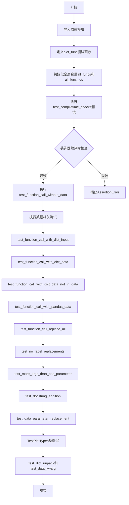
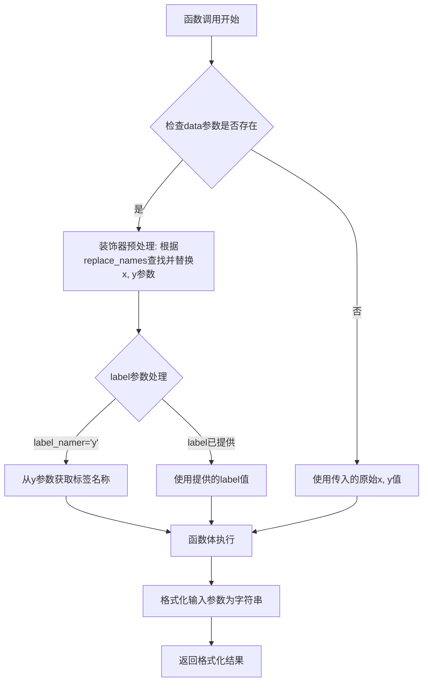
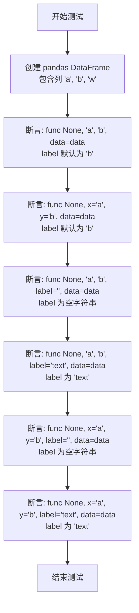
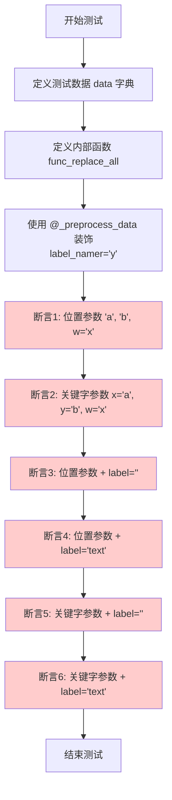
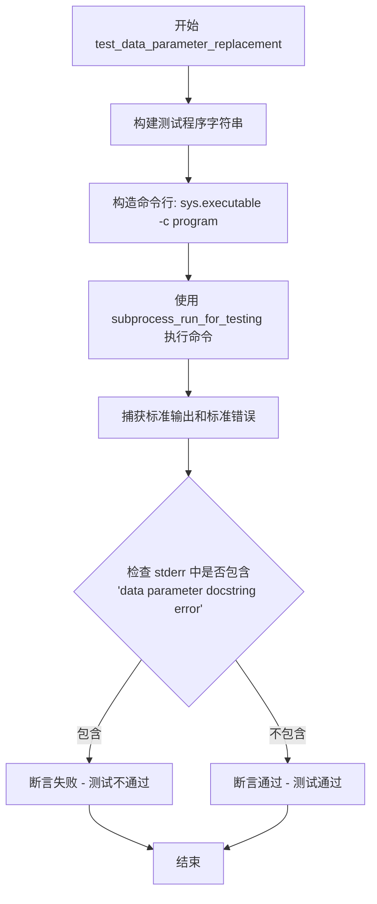

# `matplotlib\lib\matplotlib\tests\test_preprocess_data.py` 详细设计文档

该文件是matplotlib的单元测试文件，主要用于测试`_preprocess_data`装饰器的功能，该装饰器允许matplotlib的绘图函数接受灵活的数据参数（如字典或pandas DataFrame），并通过数据参数名自动解包和替换函数参数。

## 整体流程



## 类结构

```
test_preprocess_data.py (测试模块)
├── 全局变量
│   ├── all_funcs
│   └── all_func_ids
├── 全局函数
│   ├── plot_func
│   ├── test_compiletime_checks
│   ├── test_function_call_without_data
│   ├── test_function_call_with_dict_input
│   ├── test_function_call_with_dict_data
│   ├── test_function_call_with_dict_data_not_in_data
│   ├── test_function_call_with_pandas_data
│   ├── test_function_call_replace_all
│   ├── test_no_label_replacements
│   ├── test_more_args_than_pos_parameter
│   ├── test_docstring_addition
│   └── test_data_parameter_replacement
└── TestPlotTypes (测试类)
    ├── plotters (类字段)
    ├── test_dict_unpack (类方法)
    └── test_data_kwarg (类方法)
```

## 全局变量及字段


### `all_funcs`
    
包含用于测试的绘图函数列表，当前只有一个函数 plot_func

类型：`list[function]`
    


### `all_func_ids`
    
包含测试函数的标识符列表，用于 pytest 参数化

类型：`list[str]`
    


### `TestPlotTypes.plotters`
    
包含用于测试的 matplotlib Axes 绘图方法列表，包括 scatter、bar 和 plot

类型：`list[method]`
    
    

## 全局函数及方法


### `plot_func`

该函数是一个被 `@_preprocess_data` 装饰器修饰的测试函数，用于验证 matplotlib 数据预处理功能。它接收坐标数据和其他可选参数，经过装饰器处理后返回一个格式化的字符串，用于后续的断言测试。

参数：

- `ax`：`matplotlib.axes.Axes`， Axes 对象（虽然在函数体内未使用，但作为第一个参数用于标识该函数为绘图函数）
- `x`：`任意类型`， X 轴数据，可以是列表、数组、字符串（作为 data 参数的键名）或可迭代对象
- `y`：`任意类型`， Y 轴数据，可以是列表、数组、字符串（作为 data 参数的键名）或可迭代对象
- `ls`：`str`，线条样式参数，默认值为 `"x"`
- `label`：`任意类型`，图例标签，默认值为 `None`
- `w`：`str`，自定义参数，默认值为 `"xyz"`（用于测试装饰器不会替换未在 `replace_names` 中声明的参数）

返回值：`str`，格式化字符串，包含所有输入参数的值

#### 流程图



#### 带注释源码

```python
@_preprocess_data(replace_names=["x", "y"], label_namer="y")
def plot_func(ax, x, y, ls="x", label=None, w="xyz"):
    """
    测试用的绘图函数（实际不执行绘图）。
    
    参数:
        ax: Axes 对象，用于标识为绘图方法（未在函数体中使用）
        x: X 轴数据，支持直接传值或通过 data 字典的键名传递
        y: Y 轴数据，支持直接传值或通过 data 字典的键名传递
        ls: 线条样式字符串，默认 "x"
        label: 图例标签，默认 None；若未提供则从 y 参数名自动推断
        w: 自定义参数，默认 "xyz"（装饰器不会替换此参数）
    
    返回:
        格式化字符串，包含所有参数的值
    """
    return f"x: {list(x)}, y: {list(y)}, ls: {ls}, w: {w}, label: {label}"
    # 将所有参数转换为列表并格式化为字符串返回
    # 注意：list() 调用会遍历可迭代对象，这是装饰器处理后的最终数据
```


### `test_compiletime_checks`

该函数是一个测试函数，用于验证 `_preprocess_data` 装饰器在编译时的参数检查逻辑，特别是测试当提供无效的 `replace_names` 或 `label_namer` 参数时是否会正确抛出 `AssertionError`。

参数： 无

返回值：`None`，该函数为测试函数，不返回任何值，仅通过 pytest 断言验证装饰器行为

#### 流程图

```mermaid
flowchart TD
    A[开始 test_compiletime_checks] --> B[定义内部函数 func ax x y]
    B --> C[定义内部函数 func_args ax x y *args]
    C --> D[定义内部函数 func_kwargs ax x y **kwargs]
    D --> E[定义内部函数 func_no_ax_args *args **kwargs]
    E --> F[测试合法场景: _preprocess_data replace_names=[\"x\", \"y\"] func]
    F --> G[测试合法场景: _preprocess_data replace_names=[\"x\", \"y\"] func_kwargs]
    G --> H[测试合法场景: _preprocess_data replace_names=[\"x\", \"y\"] func_args]
    H --> I[测试AssertionError: replace_names包含未知z]
    I --> J[测试合法场景: replace_names=[] label_namer=None 四个函数]
    J --> K[测试AssertionError: label_namer=\"z\"未知]
    K --> L[测试AssertionError: label_namer=\"z\"未知 func_args]
    L --> M[结束]
```

#### 带注释源码

```python
def test_compiletime_checks():
    """Test decorator invocations -> no replacements."""
    # 测试装饰器调用时的编译时检查，验证无效参数会抛出AssertionError

    # 定义测试用的内部函数
    def func(ax, x, y): pass  # 基础函数
    def func_args(ax, x, y, *args): pass  # 带可变位置参数的函数
    def func_kwargs(ax, x, y, **kwargs): pass  # 带可变关键字参数的函数
    def func_no_ax_args(*args, **kwargs): pass  # 无ax参数的函数

    # 合法场景1: replace_names包含x和y，可以进行替换
    _preprocess_data(replace_names=["x", "y"])(func)
    # 合法场景2: replace_names包含x和y，用于kwargs函数
    _preprocess_data(replace_names=["x", "y"])(func_kwargs)
    # 合法场景3: replace_names包含x和y，args函数有足够信息进行替换
    _preprocess_data(replace_names=["x", "y"])(func_args)

    # 测试AssertionError场景: replace_names包含未知参数z
    # z不在函数参数中，应该抛出AssertionError
    with pytest.raises(AssertionError):
        _preprocess_data(replace_names=["x", "y", "z"])(func_args)

    # 合法场景: 不进行任何替换，所有参数都合法
    _preprocess_data(replace_names=[], label_namer=None)(func)
    _preprocess_data(replace_names=[], label_namer=None)(func_args)
    _preprocess_data(replace_names=[], label_namer=None)(func_kwargs)
    _preprocess_data(replace_names=[], label_namer=None)(func_no_ax_args)

    # 测试AssertionError场景: label_namer指向未知参数z
    with pytest.raises(AssertionError):
        _preprocess_data(label_namer="z")(func)

    with pytest.raises(AssertionError):
        _preprocess_data(label_namer="z")(func_args)
```


### `test_function_call_without_data`

描述: 该测试函数验证在未提供 `data` 参数的情况下，使用 `@_preprocess_data` 装饰的绘图函数能够正确使用默认参数值而不进行任何数据替换。测试通过多次调用并比对返回的字符串来确保行为符合预期。

参数：

-  `func`：`Callable`，被 `@_preprocess_data` 装饰的绘图函数（如 `plot_func`），由 pytest 参数化传入。

返回值：`None`，因为 pytest 测试函数不返回任何值，仅通过断言验证行为。

#### 流程图

```mermaid
flowchart TD
    A([开始]) --> B[对每条断言调用 func]
    B --> C{执行 func(None, "x", "y")}
    C --> D[断言返回字符串 == "x: ['x'], y: ['y'], ls: x, w: xyz, label: None"]
    D --> E{执行 func(None, x="x", y="y")}
    E --> F[断言返回字符串 == "x: ['x'], y: ['y'], ls: x, w: xyz, label: None"]
    F --> G{执行 func(None, "x", "y", label="")}
    G --> H[断言返回字符串 == "x: ['x'], y: ['y'], ls: x, w: xyz, label: "]
    H --> I{执行 func(None, "x", "y", label="text")}
    I --> J[断言返回字符串 == "x: ['x'], y: ['y'], ls: x, w: xyz, label: text"]
    J --> K{执行 func(None, x="x", y="y", label="")}
    K --> L[断言返回字符串 == "x: ['x'], y: ['y'], ls: x, w: xyz, label: "]
    L --> M{执行 func(None, x="x", y="y", label="text")}
    M --> N[断言返回字符串 == "x: ['x'], y: ['y'], ls: x, w: xyz, label: text"]
    N --> O([结束])
```

#### 带注释源码

```python
@pytest.mark.parametrize('func', all_funcs, ids=all_func_ids)
def test_function_call_without_data(func):
    """Test without data -> no replacements."""
    # 调用 func 时不传入 data 参数，验证默认行为
    # 1. 位置参数形式
    assert (func(None, "x", "y") ==
            "x: ['x'], y: ['y'], ls: x, w: xyz, label: None")
    # 2. 关键字参数形式
    assert (func(None, x="x", y="y") ==
            "x: ['x'], y: ['y'], ls: x, w: xyz, label: None")
    # 3. 额外提供空 label
    assert (func(None, "x", "y", label="") ==
            "x: ['x'], y: ['y'], ls: x, w: xyz, label: ")
    # 4. 提供非空 label
    assert (func(None, "x", "y", label="text") ==
            "x: ['x'], y: ['y'], ls: x, w: xyz, label: text")
    # 5. 关键字参数 + 空 label
    assert (func(None, x="x", y="y", label="") ==
            "x: ['x'], y: ['y'], ls: x, w: xyz, label: ")
    # 6. 关键字参数 + 非空 label
    assert (func(None, x="x", y="y", label="text") ==
            "x: ['x'], y: ['y'], ls: x, w: xyz, label: text")
```


### `test_function_call_with_dict_input`

该测试函数用于验证当使用字典的键（keys）和值（values）作为独立参数传递时，预处理装饰器的行为是否正确。它通过传入 `data.keys()` 和 `data.values()` 来模拟字典解包场景，并断言函数能够正确处理这些参数。

参数：

-  `func`：`Callable`，被测试的绘图函数（通过 pytest parametrize 装饰器从 `all_funcs` 列表中获取，当前为 `plot_func`）

返回值：`None`，该函数为测试函数，无返回值（通过 assert 断言验证逻辑）

#### 流程图

```mermaid
flowchart TD
    A[开始执行 test_function_call_with_dict_input] --> B[从 parametrize 获取 func 参数]
    B --> C[创建测试数据 data = {'a': 1, 'b': 2}]
    C --> D[调用 func 并传入 data.keys 和 data.values]
    D --> E[func 内部预处理: 将 keys 转为 x 参数, values 转为 y 参数]
    E --> F[执行 plot_func 逻辑]
    F --> G[返回格式化字符串]
    G --> H{断言结果是否匹配期望值}
    H -->|是| I[测试通过]
    H -->|否| J[测试失败]
```

#### 带注释源码

```python
@pytest.mark.parametrize('func', all_funcs, ids=all_func_ids)
def test_function_call_with_dict_input(func):
    """Tests with dict input, unpacking via preprocess_pipeline"""
    # 创建一个简单的字典，包含两个键值对
    # a -> 1, b -> 2
    data = {'a': 1, 'b': 2}
    
    # 调用被测试的函数，传入字典的 keys 作为 x 参数
    # 传入字典的 values 作为 y 参数
    # 验证预处理装饰器能正确处理这种解包形式的输入
    assert (func(None, data.keys(), data.values()) ==
            "x: ['a', 'b'], y: [1, 2], ls: x, w: xyz, label: None")
```


### `test_function_call_with_dict_data`

该测试函数用于验证当传入字典类型数据（data参数）时，被装饰函数能够正确从字典中提取键对应的值作为参数，并确保标签（label）正确来源于数据中的'y'参数值。

参数：

- `func`：可调用对象（Callable），被 `@_preprocess_data` 装饰的待测试函数，用于验证数据预处理逻辑是否正确工作
- `data`：字典（Dict），包含测试数据的字典，键为字符串，值为列表，格式如 `{"a": [1, 2], "b": [8, 9], "w": "NOT"}`

返回值：`bool`，返回值为 `True`（通过 `assert` 语句验证），表示所有测试断言通过；若数据预处理逻辑有问题则抛出 `AssertionError`

#### 流程图

```mermaid
flowchart TD
    A[开始测试] --> B[定义测试数据 data = {'a': [1, 2], 'b': [8, 9], 'w': 'NOT'}]
    B --> C{测试用例 1: func(None, 'a', 'b', data=data)}
    C --> D[断言返回值包含 x: [1, 2], y: [8, 9], label: b]
    D --> E{测试用例 2: func(None, x='a', y='b', data=data)}
    E --> F[断言返回值包含 x: [1, 2], y: [8, 9], label: b]
    F --> G{测试用例 3: func(None, 'a', 'b', label='', data=data)}
    G --> H[断言返回值包含 label: 空字符串]
    H --> I{测试用例 4: func(None, 'a', 'b', label='text', data=data)}
    I --> J[断言返回值包含 label: text]
    J --> K{测试用例 5: func(None, x='a', y='b', label='', data=data)}
    K --> L[断言返回值包含 label: 空字符串]
    L --> M{测试用例 6: func(None, x='a', y='b', label='text', data=data)}
    M --> N[断言返回值包含 label: text]
    N --> O[所有断言通过, 测试结束]
```

#### 带注释源码

```python
@pytest.mark.parametrize('func', all_funcs, ids=all_func_ids)
def test_function_call_with_dict_data(func):
    """
    测试当传入字典数据时，标签应来自参数'y'对应的值。
    
    该测试验证 @_preprocess_data 装饰器的核心功能：
    1. 从 data 字典中根据键名提取对应的值作为函数参数
    2. 自动根据 label_namer='y' 设置标签为参数 y 的键名
    """
    # 定义测试数据字典，键为字符串，值为列表
    # 'a' 和 'b' 将作为 x, y 参数的键名被查找
    # 'w' 用于测试默认参数不会被错误替换
    data = {"a": [1, 2], "b": [8, 9], "w": "NOT"}
    
    # 测试用例1：使用位置参数传递 x='a', y='b'
    # 期望：x 使用 data['a']=[1,2], y 使用 data['b']=[8,9]
    # label 自动设置为 'b'（即 y 参数的键名）
    assert (func(None, "a", "b", data=data) ==
            "x: [1, 2], y: [8, 9], ls: x, w: xyz, label: b")
    
    # 测试用例2：使用关键字参数传递 x='a', y='b'
    # 期望结果与用例1相同，验证位置参数和关键字参数处理一致性
    assert (func(None, x="a", y="b", data=data) ==
            "x: [1, 2], y: [8, 9], ls: x, w: xyz, label: b")
    
    # 测试用例3：显式传递空字符串 label=''，应覆盖自动标签
    # 期望：label 被显式设置为空字符串
    assert (func(None, "a", "b", label="", data=data) ==
            "x: [1, 2], y: [8, 9], ls: x, w: xyz, label: ")
    
    # 测试用例4：显式传递文本标签 label='text'，应覆盖自动标签
    # 期望：label 被显式设置为 'text'
    assert (func(None, "a", "b", label="text", data=data) ==
            "x: [1, 2], y: [8, 9], ls: x, w: xyz, label: text")
    
    # 测试用例5：关键字参数 + 显式空标签
    # 验证关键字参数场景下显式标签覆盖仍然有效
    assert (func(None, x="a", y="b", label="", data=data) ==
            "x: [1, 2], y: [8, 9], ls: x, w: xyz, label: ")
    
    # 测试用例6：关键字参数 + 显式文本标签
    # 验证关键字参数场景下显式标签覆盖仍然有效
    assert (func(None, x="a", y="b", label="text", data=data) ==
            "x: [1, 2], y: [8, 9], ls: x, w: xyz, label: text")
```


### `test_function_call_with_dict_data_not_in_data`

该测试函数用于验证当提供的 `data` 字典中缺少某些参数时，`_preprocess_data` 装饰器的替换行为。具体来说，它测试当变量 "b" 不在数据字典中时，系统能够正确地只替换存在的变量 "a"，而将不存在的 "b" 保留为字面量字符串。

参数：

- `func`：`Callable`（通过 `@pytest.mark.parametrize` 传入的测试函数，这里是 `plot_func`），被测试的绘图函数

返回值：`None`（测试函数无返回值，通过 `assert` 语句进行验证）

#### 流程图

```mermaid
flowchart TD
    A[开始测试] --> B[定义测试数据 data = {'a': [1, 2], 'w': 'NOT'}]
    B --> C1[测试1: func(None, 'a', 'b', data=data)]
    C1 --> C2[测试2: func(None, x='a', y='b', data=data)]
    C2 --> C3[测试3: func(None, 'a', 'b', label='', data=data)]
    C3 --> C4[测试4: func(None, 'a', 'b', label='text', data=data)]
    C4 --> C5[测试5: func(None, x='a', y='b', label='', data=data)]
    C5 --> C6[测试6: func(None, x='a', y='b', label='text', data=data)]
    C6 --> D[验证所有断言通过]
    D --> E[测试结束]
    
    style C1 fill:#f9f,color:#000
    style C2 fill:#f9f,color:#000
    style C3 fill:#f9f,color:#000
    style C4 fill:#f9f,color:#000
    style C5 fill:#f9f,color:#000
    style C6 fill:#f9f,color:#000
```

#### 带注释源码

```python
@pytest.mark.parametrize('func', all_funcs, ids=all_func_ids)
def test_function_call_with_dict_data_not_in_data(func):
    """
    Test the case that one var is not in data -> half replaces, half kept.
    测试当某个变量不在数据字典中时的行为：部分替换，部分保持原样。
    """
    # 定义测试数据：只包含 'a' 和 'w'，不包含 'b'
    data = {"a": [1, 2], "w": "NOT"}
    
    # 断言1：使用位置参数传递 'a' 和 'b'，'b' 不在 data 中应保留为字面量
    assert (func(None, "a", "b", data=data) ==
            "x: [1, 2], y: ['b'], ls: x, w: xyz, label: b")
    
    # 断言2：使用关键字参数传递 x='a' 和 y='b'，同样 'b' 保留为字面量
    assert (func(None, x="a", y="b", data=data) ==
            "x: [1, 2], y: ['b'], ls: x, w: xyz, label: b")
    
    # 断言3：显式设置 label=""，验证空标签的处理
    assert (func(None, "a", "b", label="", data=data) ==
            "x: [1, 2], y: ['b'], ls: x, w: xyz, label: ")
    
    # 断言4：显式设置 label="text"，验证自定义标签的处理
    assert (func(None, "a", "b", label="text", data=data) ==
            "x: [1, 2], y: ['b'], ls: x, w: xyz, label: text")
    
    # 断言5：使用关键字参数并设置空标签
    assert (func(None, x="a", y="b", label="", data=data) ==
            "x: [1, 2], y: ['b'], ls: x, w: xyz, label: ")
    
    # 断言6：使用关键字参数并设置自定义标签
    assert (func(None, x="a", y="b", label="text", data=data) ==
            "x: [1, 2], y: ['b'], ls: x, w: xyz, label: text")
```


### `test_function_call_with_pandas_data`

测试当传入 pandas DataFrame 作为数据源时，`_preprocess_data` 装饰器能否正确从 DataFrame 中提取列数据，并将列名（`data["col"].name`）作为标签。

参数：

- `func`：`<function>`，被测试的绘图函数（通过 `pytest.mark.parametrize` 从 `all_funcs` 列表中获取）
- `pd`：`<module>`，pandas 模块的 fixture，用于创建 DataFrame

返回值：`None`，该函数为测试函数，使用 `assert` 断言进行验证，无显式返回值

#### 流程图



#### 带注释源码

```python
@pytest.mark.parametrize('func', all_funcs, ids=all_func_ids)
def test_function_call_with_pandas_data(func, pd):
    """Test with pandas dataframe -> label comes from ``data["col"].name``."""
    # 创建一个 pandas DataFrame，包含三列：a, b, w
    # a 列: [1, 2] (int32)
    # b 列: [8, 9] (int32)
    # w 列: ["NOT", "NOT"] (字符串)
    data = pd.DataFrame({"a": np.array([1, 2], dtype=np.int32),
                         "b": np.array([8, 9], dtype=np.int32),
                         "w": ["NOT", "NOT"]})

    # 测试1: 位置参数形式调用，x='a', y='b'
    # 期望: x=[1,2], y=[8,9], ls='x', w='xyz'(默认值), label='b'(来自y参数列名)
    assert (func(None, "a", "b", data=data) ==
            "x: [1, 2], y: [8, 9], ls: x, w: xyz, label: b")
    
    # 测试2: 关键字参数形式调用，x='a', y='b'
    # 期望结果同上
    assert (func(None, x="a", y="b", data=data) ==
            "x: [1, 2], y: [8, 9], ls: x, w: xyz, label: b")
    
    # 测试3: 显式传入空字符串 label
    # 期望: label 为空字符串 ''
    assert (func(None, "a", "b", label="", data=data) ==
            "x: [1, 2], y: [8, 9], ls: x, w: xyz, label: ")
    
    # 测试4: 显式传入文本 label
    # 期望: label 为传入的 'text'
    assert (func(None, "a", "b", label="text", data=data) ==
            "x: [1, 2], y: [8, 9], ls: x, w: xyz, label: text")
    
    # 测试5: 关键字参数 + 空 label
    assert (func(None, x="a", y="b", label="", data=data) ==
            "x: [1, 2], y: [8, 9], ls: x, w: xyz, label: ")
    
    # 测试6: 关键字参数 + 文本 label
    assert (func(None, x="a", y="b", label="text", data=data) ==
            "x: [1, 2], y: [8, 9], ls: x, w: xyz, label: text")
```


### `test_function_call_replace_all`

测试当不提供 "replace_names" 参数时，所有变量都应该被 data 字典中的值替换。该测试定义了内部函数 `func_replace_all` 并使用 `@_preprocess_data(label_namer="y")` 装饰器，通过多组断言验证参数替换和标签自动推断的正确性。

参数： 无

返回值：`None`，该函数为测试函数，不返回任何值

#### 流程图



#### 带注释源码

```python
def test_function_call_replace_all():
    """
    测试当不提供 'replace_names' 参数时，所有变量都应该被替换。
    
    期望行为：
    - x, y, w 参数如果存在于 data 字典中，则被替换为字典中的值
    - 如果参数不在 data 中，保留原字符串值
    - label 参数根据 label_namer='y' 自动从 y 参数对应的值获取名称
    """
    # 定义测试数据：包含 a, b, x 三个键值对
    data = {"a": [1, 2], "b": [8, 9], "x": "xyz"}

    # 定义内部函数并使用 @_preprocess_data 装饰器
    # 注意：未指定 replace_names 参数，意味着所有参数都可能被替换
    # label_namer='y' 表示自动从 y 参数的值获取标签名称
    @_preprocess_data(label_namer="y")
    def func_replace_all(ax, x, y, ls="x", label=None, w="NOT"):
        """
        内部测试函数，返回格式化的字符串结果。
        用于验证参数替换是否正确执行。
        """
        return f"x: {list(x)}, y: {list(y)}, ls: {ls}, w: {w}, label: {label}"

    # 断言1：使用位置参数，w='x' 会覆盖 data['x']='xyz' 的替换
    # 期望：x=[1,2], y=[8,9], w='xyz'（来自data['x']）, label='b'（来自y参数名）
    assert (func_replace_all(None, "a", "b", w="x", data=data) ==
            "x: [1, 2], y: [8, 9], ls: x, w: xyz, label: b")
    
    # 断言2：使用关键字参数，与断言1等效
    assert (func_replace_all(None, x="a", y="b", w="x", data=data) ==
            "x: [1, 2], y: [8, 9], ls: x, w: xyz, label: b")
    
    # 断言3：显式设置 label=""，覆盖自动标签推断
    assert (func_replace_all(None, "a", "b", w="x", label="", data=data) ==
            "x: [1, 2], y: [8, 9], ls: x, w: xyz, label: ")
    
    # 断言4：显式设置 label="text"，覆盖自动标签推断
    assert (
        func_replace_all(None, "a", "b", w="x", label="text", data=data) ==
        "x: [1, 2], y: [8, 9], ls: x, w: xyz, label: text")
    
    # 断言5：关键字参数 + 空 label
    assert (
        func_replace_all(None, x="a", y="b", w="x", label="", data=data) ==
        "x: [1, 2], y: [8, 9], ls: x, w: xyz, label: ")
    
    # 断言6：关键字参数 + 指定 label
    assert (
        func_replace_all(None, x="a", y="b", w="x", label="text", data=data) ==
        "x: [1, 2], y: [8, 9], ls: x, w: xyz, label: text")
```


### `test_no_label_replacements`

测试当 `label_namer=None` 时，不进行标签替换，只进行参数的数据替换。

参数：
- 无

返回值：`None`，无返回值，仅执行测试断言

#### 流程图

```mermaid
flowchart TD
    A[开始测试 test_no_label_replacements] --> B[定义内部函数 func_no_label]
    B --> C[使用 @_preprocess_data 装饰器<br/>replace_names=["x", "y"]<br/>label_namer=None]
    C --> D[准备测试数据 data = {"a": [1, 2], "b": [8, 9], "w": "NOT"}]
    D --> E[测试1: 位置参数传递 "a", "b"<br/>验证 x=[1,2], y=[8,9], label=None]
    E --> F[测试2: 关键字参数传递 x="a", y="b"<br/>验证 x=[1,2], y=[8,9], label=None]
    F --> G[测试3: 额外传入 label=""<br/>验证 label为空字符串]
    G --> H[测试4: 额外传入 label="text"<br/>验证 label="text"]
    H --> I[结束测试]
```

#### 带注释源码

```python
def test_no_label_replacements():
    """Test with "label_namer=None" -> no label replacement at all."""
    # 测试目的：验证当 label_namer=None 时，不会进行标签替换
    # 但仍然会根据 replace_names=["x", "y"] 进行参数的数据替换

    # 定义内部函数，使用 @_preprocess_data 装饰器
    # replace_names=["x", "y"]: 指定 x 和 y 参数需要进行数据替换
    # label_namer=None: 指定不进行标签自动替换（label 参数保持原样）
    @_preprocess_data(replace_names=["x", "y"], label_namer=None)
    def func_no_label(ax, x, y, ls="x", label=None, w="xyz"):
        # 返回格式化的字符串，包含所有参数的值
        return f"x: {list(x)}, y: {list(y)}, ls: {ls}, w: {w}, label: {label}"

    # 准备测试数据字典
    data = {"a": [1, 2], "b": [8, 9], "w": "NOT"}

    # 测试1：使用位置参数传递 "a", "b"
    # x 参数从 data["a"] 替换为 [1, 2]
    # y 参数从 data["b"] 替换为 [8, 9]
    # label 参数保持默认值 None（因为 label_namer=None 不进行标签替换）
    assert (func_no_label(None, "a", "b", data=data) ==
            "x: [1, 2], y: [8, 9], ls: x, w: xyz, label: None")

    # 测试2：使用关键字参数传递 x="a", y="b"
    # 同样进行数据替换，label 保持 None
    assert (func_no_label(None, x="a", y="b", data=data) ==
            "x: [1, 2], y: [8, 9], ls: x, w: xyz, label: None")

    # 测试3：显式传入 label=""（空字符串）
    # 由于 label_namer=None，label 不会被自动替换为数据键名
    # 保持传入的空字符串值
    assert (func_no_label(None, "a", "b", label="", data=data) ==
            "x: [1, 2], y: [8, 9], ls: x, w: xyz, label: ")

    # 测试4：显式传入 label="text"
    # label 保持传入的 "text" 值，不被自动替换
    assert (func_no_label(None, "a", "b", label="text", data=data) ==
            "x: [1, 2], y: [8, 9], ls: x, w: xyz, label: text")
```


### `test_more_args_than_pos_parameter`

该测试函数用于验证当传递给函数的positional参数数量超过函数定义中 positional parameter的数量时，是否会正确抛出TypeError异常。具体来说，它测试了在使用`_preprocess_data`装饰器时，如果传递了多余的 positional 参数（如"z"作为 positional 参数而不是 keyword 参数），函数应抛出TypeError。

参数：无

返回值：`None`，测试函数无返回值

#### 流程图

```mermaid
flowchart TD
    A[开始测试 test_more_args_than_pos_parameter] --> B[定义内部函数 func, 使用 @_preprocess_data 装饰]
    B --> C[定义测试数据 data = {'a': [1, 2], 'b': [8, 9], 'w': 'NOT'}]
    C --> D[调用 func(None, 'a', 'b', 'z', 'z', data=data)]
    D --> E{检查是否抛出 TypeError?}
    E -->|是| F[测试通过]
    E -->|否| G[测试失败]
    
    style A fill:#f9f,stroke:#333
    style F fill:#9f9,stroke:#333
    style G fill:#f99,stroke:#333
```

#### 带注释源码

```python
def test_more_args_than_pos_parameter():
    """测试当 positional 参数多于 pos_parameter 时的错误处理"""
    
    # 使用 @_preprocess_data 装饰器定义内部函数 func
    # replace_names=["x", "y"] 表示 x 和 y 参数可以被 data 字典中的键替换
    # label_namer="y" 表示标签来自 y 参数对应的值
    @_preprocess_data(replace_names=["x", "y"], label_namer="y")
    def func(ax, x, y, z=1):
        # func 的参数:
        # ax: 第一个参数（axes对象）
        # x: 第二个参数，可被替换
        # y: 第三个参数，可被替换且作为标签命名者
        # z=1: 第四个参数，有默认值的关键字参数
        pass

    # 准备测试数据字典
    # a: [1, 2] 将替换 x 参数
    # b: [8, 9] 将替换 y 参数
    # w: 'NOT' 未使用的键
    data = {"a": [1, 2], "b": [8, 9], "w": "NOT"}
    
    # 调用 func 并期望抛出 TypeError
    # 传递了 5 个参数: None, 'a', 'b', 'z', 'z'
    # - None -> ax
    # - 'a' -> x (在 replace_names 中，会尝试从 data 替换)
    # - 'b' -> y (在 replace_names 中，会尝试从 data 替换)
    # - 'z' -> z (但 z 是关键字参数，这里作为 positional 参数传递)
    # - 'z' -> 第五个参数，但 func 只有4个参数位置
    # 由于传递了多余的 positional 参数，应抛出 TypeError
    with pytest.raises(TypeError):
        func(None, "a", "b", "z", "z", data=data)
```


### `test_docstring_addition`

该函数用于测试 `_preprocess_data` 装饰器对函数文档字符串的修改行为，验证装饰器是否正确地在文档字符串中添加或修改关于数据参数和字符串类型参数支持的说明。

参数： 无

返回值：`None`，该函数为测试函数，通过断言验证文档字符串内容，不返回实际数据

#### 流程图

```mermaid
flowchart TD
    A[开始测试] --> B[测试1: 无replace_names参数]
    B --> B1[定义funcy函数, 使用@_preprocess_data装饰]
    B1 --> B2[断言文档包含'all parameters also accept a string']
    B2 --> B3[断言文档不包含'the following parameters']
    B3 --> C[测试2: replace_names=空列表]
    C --> C1[定义funcy函数, 使用@_preprocess_data装饰, replace_names=[]]
    C1 --> C2[断言文档不包含'all parameters also accept a string']
    C2 --> C3[断言文档不包含'the following parameters']
    C3 --> D[测试3: replace_names=['bar']]
    D --> D1[定义funcy函数, 使用@_preprocess_data装饰, replace_names=['bar']]
    D1 --> D2[断言文档不包含'all parameters also accept a string']
    D2 --> D3[断言文档不包含参数列表说明]
    D3 --> E[测试4: replace_names=['x', 't']]
    E --> E1[定义funcy函数, 使用@_preprocess_data装饰, replace_names=['x', 't']]
    E1 --> E2[断言文档不包含'all parameters also accept a string']
    E2 --> E3[断言文档不包含指定参数列表]
    E3 --> F[结束测试]
```

#### 带注释源码

```python
def test_docstring_addition():
    """
    测试 _preprocess_data 装饰器对文档字符串的修改行为。
    验证装饰器是否正确添加关于数据参数和字符串类型参数支持的说明。
    """
    # 测试1: 不传递replace_names参数时,装饰器应添加默认的字符串参数说明
    @_preprocess_data()
    def funcy(ax, *args, **kwargs):
        """
        Parameters
        ----------
        data : indexable object, optional
            DATA_PARAMETER_PLACEHOLDER
        """

    # 验证装饰器添加了"所有参数也接受字符串"的说明
    assert re.search(r"all parameters also accept a string", funcy.__doc__)
    # 验证装饰器没有添加"以下参数"的列表说明
    assert not re.search(r"the following parameters", funcy.__doc__)

    # 测试2: 当replace_names为空列表时,不应添加任何关于参数替换的说明
    @_preprocess_data(replace_names=[])
    def funcy(ax, x, y, z, bar=None):
        """
        Parameters
        ----------
        data : indexable object, optional
            DATA_PARAMETER_PLACEHOLDER
        """

    # 验证没有添加字符串参数支持的说明
    assert not re.search(r"all parameters also accept a string", funcy.__doc__)
    assert not re.search(r"the following parameters", funcy.__doc__)

    # 测试3: 当replace_names只包含'bar'时,不应添加字符串参数说明
    # 因为x, y, z不是replace_names中的参数
    @_preprocess_data(replace_names=["bar"])
    def funcy(ax, x, y, z, bar=None):
        """
        Parameters
        ----------
        data : indexable object, optional
            DATA_PARAMETER_PLACEHOLDER
        """

    assert not re.search(r"all parameters also accept a string", funcy.__doc__)
    # 验证没有列出*bar*参数
    assert not re.search(r"the following parameters .*: \*bar\*\.",
                         funcy.__doc__)

    # 测试4: 当replace_names=['x', 't']时,不应添加字符串参数说明
    # 因为y和z不是replace_names中的参数
    @_preprocess_data(replace_names=["x", "t"])
    def funcy(ax, x, y, z, t=None):
        """
        Parameters
        ----------
        data : indexable object, optional
            DATA_PARAMETER_PLACEHOLDER
        """

    assert not re.search(r"all parameters also accept a string", funcy.__doc__)
    # 验证没有列出*x*和*t*参数
    assert not re.search(r"the following parameters .*: \*x\*, \*t\*\.",
                         funcy.__doc__)
```


### `test_data_parameter_replacement`

该函数是一个测试函数，用于验证通过 `_preprocess_data()` 装饰器处理的所有方法的文档字符串是否包含正确的 `*data*` 参数存根（stub）。

参数： 无

返回值：`None`，该函数仅执行断言测试，不返回任何值

#### 流程图



#### 带注释源码

```python
def test_data_parameter_replacement():
    """
    Test that the docstring contains the correct *data* parameter stub
    for all methods that we run _preprocess_data() on.
    """
    # 定义一个测试程序，该程序导入matplotlib.pyplot
    # 用于检查装饰器是否正确添加了data参数的文档
    program = (
        "import logging; "
        "logging.basicConfig(level=logging.DEBUG); "
        "import matplotlib.pyplot as plt"
    )
    # 构建命令行参数，使用当前Python解释器执行程序
    cmd = [sys.executable, "-c", program]
    # 使用测试工具运行子进程，捕获输出
    completed_proc = subprocess_run_for_testing(
        cmd, text=True, capture_output=True
    )
    # 断言stderr中不包含'data parameter docstring error'
    # 如果装饰器在添加文档存根时出现错误，logging会输出此错误信息
    assert 'data parameter docstring error' not in completed_proc.stderr
```


### `TestPlotTypes.test_dict_unpack`

该测试方法用于验证绘图函数（如 scatter、bar、plot）能否正确处理字典解包操作（通过 `dict.keys()` 和 `dict.values()` 传递键值对），并确保使用字典解包的结果与直接传递 x、y 列表的结果在视觉上一致。

参数：

- `plotter`：`<parametrize: Axes.scatter | Axes.bar | Axes.plot>`，绘图函数，接受 axes 对象和数据参数进行绑图
- `fig_test`：`matplotlib.figure.Figure`，测试用例的图形对象，通过 `check_figures_equal` 装饰器注入
- `fig_ref`：`matplotlib.figure.Figure`，参考基准的图形对象，通过 `check_figures_equal` 装饰器注入

返回值：`None`，该方法为测试用例，通过 `check_figures_equal` 装饰器自动比较 `fig_test` 和 `fig_ref` 的渲染结果

#### 流程图

```mermaid
flowchart TD
    A([开始]) --> B[定义 x = [1, 2, 3]]
    B --> C[定义 y = [4, 5, 6]]
    C --> D[创建 ddict = dict(zip(x, y)<br/>结果: {1: 4, 2: 5, 3: 6}]
    D --> E[调用 plotter<br/>fig_test.subplots()<br/>ddict.keys()<br/>ddict.values()]
    E --> F[调用 plotter<br/>fig_ref.subplots()<br/>x<br/>y]
    F --> G{check_figures_equal<br/>自动比较}
    G -->|渲染一致| H([通过])
    G -->|渲染不一致| I([失败])
```

#### 带注释源码

```python
@classmethod
class TestPlotTypes:
    """测试不同绘图类型的相关测试类"""
    
    plotters = [Axes.scatter, Axes.bar, Axes.plot]  # 定义要测试的绘图函数列表

    @pytest.mark.parametrize('plotter', plotters)  # 参数化 plotter，分别测试 scatter/bar/plot
    @check_figures_equal()  # 装饰器：自动比较 fig_test 和 fig_ref 的渲染结果
    def test_dict_unpack(self, plotter, fig_test, fig_ref):
        """
        测试字典解包功能：验证绘图函数能否接受 dict.keys() 和 dict.values()
        作为 x, y 参数，并产生与直接传递列表相同的结果
        """
        # 定义测试数据
        x = [1, 2, 3]
        y = [4, 5, 6]
        
        # 将 x, y 打包成字典 {1: 4, 2: 5, 3: 6}
        ddict = dict(zip(x, y))

        # 测试路径：使用字典的 keys() 和 values() 进行绘图
        # 这里模拟了用户可能通过 d.keys() 和 d.values() 传递数据的情景
        plotter(fig_test.subplots(),
                ddict.keys(), ddict.values())
        
        # 参考路径：直接使用原始列表 x, y 进行绘图
        # 预期结果：两个路径产生的图表应该完全一致
        plotter(fig_ref.subplots(), x, y)
        
        # 返回值：None
        # 由 @check_figures_equal 装饰器自动比较 fig_test 和 fig_ref
```


### `TestPlotTypes.test_data_kwarg`

该测试方法用于验证matplotlib的绘图函数（如scatter、bar、plot）能够正确接收`data`关键字参数，并从中根据字符串键（如'xval'、'yval'）提取对应的数据值进行绘图，同时确保与直接传入数据列表的绘图结果一致。

参数：

- `plotter`：`Callable`，被参数化的绘图函数，可能是`Axes.scatter`、`Axes.bar`或`Axes.plot`之一
- `fig_test`：`Figure`，测试用的figure对象
- `fig_ref`：`Figure`，参考用的figure对象，用于对比测试结果

返回值：`None`，该方法为pytest测试方法，无返回值，通过`@check_figures_equal`装饰器自动比较两张图的渲染结果

#### 流程图

```mermaid
flowchart TD
    A[开始测试] --> B[定义测试数据 x=[1,2,3], y=[4,5,6]]
    B --> C[调用plotter绘制fig_test: 传入字符串键'xval', 'yval'和data字典]
    C --> D[调用plotter绘制fig_ref: 直接传入数据列表x, y]
    D --> E[装饰器@check_figures_equal比较两图]
    E --> F{两图是否相等?}
    F -->|是| G[测试通过]
    F -->|否| H[测试失败]
```

#### 带注释源码

```python
@pytest.mark.parametrize('plotter', plotters)  # 参数化：依次使用scatter, bar, plot
@check_figures_equal()  # 装饰器：自动比较fig_test和fig_ref的渲染结果
def test_data_kwarg(self, plotter, fig_test, fig_ref):
    """
    测试绘图函数能否正确处理data关键字参数。
    验证通过data字典传递字符串键（'xval', 'yval'）与直接传递数据列表的效果一致。
    """
    x = [1, 2, 3]  # 测试用的x轴数据
    y = [4, 5, 6]  # 测试用的y轴数据

    # 使用data kwarg方式：通过字符串键从字典中提取数据
    plotter(fig_test.subplots(), 'xval', 'yval',
            data={'xval': x, 'yval': y})  # 传入data字典，键为'xval'和'yval'
    
    # 参考方式：直接传入数据列表
    plotter(fig_ref.subplots(), x, y)  # 直接传入x和y列表
```

## 关键组件


### _preprocess_data装饰器

matplotlib的数据预处理装饰器，用于自动从data字典或pandas DataFrame中提取参数值，支持参数替换和标签自动命名。

### plot_func

使用_preprocess_data装饰的测试函数，演示了装饰器的基本用法，支持x、y参数的替换和label的自动命名。

### 数据参数替换功能

当传入data字典时，根据replace_names指定的参数名，从data字典中查找对应的值进行替换，支持位置参数和关键字参数两种方式。

### 标签自动命名功能

根据label_namer参数指定的参数名，从数据中获取该参数对应的列名作为默认标签，支持从字典值或pandas列名获取。

### 字典解包支持

支持将字典的keys()和values()作为参数传递，自动解包为x和y参数进行绘图。

### Pandas DataFrame支持

能够从pandas DataFrame中提取列数据，并使用列名作为默认标签。

### TestPlotTypes类

测试类，用于验证不同绘图方法（scatter、bar、plot）对字典数据和data kwarg的支持。

### 参数类型检查功能

装饰器在编译时检查replace_names中的参数名是否在函数签名中已知，防止配置错误。


## 问题及建议


### 已知问题

- **硬编码的默认值**: `w="xyz"` 在 `plot_func` 中被硬编码为默认值，多个测试用例中重复出现，难以维护和配置。
- **重复的断言模式**: 大量相似的断言语句在多个测试函数中重复出现（如 `func(None, "a", "b", data=data)` 类型的断言），导致代码冗余，可读性差。
- **魔法字符串和数字**: 测试中大量使用字符串如 `"a"`, `"b"`, `"x"`, `"y"` 等作为数据键，没有统一的常量定义，容易产生拼写错误。
- **缺失的边界条件测试**: 缺少对空数据、空字典、None值、数据类型错误等边界情况和异常输入的测试覆盖。
- **pandas 依赖处理不明确**: `test_function_call_with_pandas_data` 函数依赖 `pd` fixture，但没有明确的跳过机制（如 `@pytest.mark.skipif`），如果 pandas 未安装可能导致测试失败。
- **测试数据重复定义**: 相同的测试数据（如 `data = {"a": [1, 2], "b": [8, 9], "w": "NOT"}`）在多个测试函数中重复定义，而非集中管理。
- **函数命名相似性**: `test_function_call_with_dict_input` 和 `test_function_call_with_dict_data` 命名过于相似，容易混淆两者的功能区别。
- **文档字符串断言脆弱**: 使用正则表达式 `re.search` 检查文档字符串内容，这种断言对文档格式变化敏感，容易因文档更新而导致测试失败。

### 优化建议

- **提取测试数据为模块级常量**: 将常用的测试数据（如字典、DataFrame）定义为模块级常量或 pytest fixtures，提高复用性和可维护性。
- **创建辅助断言函数**: 编写如 `assert_func_output(func, expected)` 类的辅助函数，减少重复代码。
- **定义常量类**: 创建 `TestDataKeys` 或类似的常量类，统一管理数据键名称，避免魔法字符串。
- **增加边界条件测试**: 添加对空数据 `{}`、缺失键、类型错误、None 输入等情况的测试用例。
- **添加 pytest 依赖标记**: 对 pandas 相关的测试使用 `@pytest.mark.skipif(not has_pandas, reason="pandas not available")` 装饰器。
- **合并相似测试**: 考虑将 `test_function_call_with_dict_input` 和 `test_function_call_with_dict_data` 合并为参数化测试，减少函数数量。
- **简化文档字符串测试**: 考虑使用 AST 解析或更鲁棒的文档检查方式，减少对精确字符串格式的依赖。
- **使用 pytest fixtures**: 将 `plot_func` 和 `all_funcs` 等定义为 pytest fixtures，便于管理和参数化配置。


## 其它


### 设计目标与约束

该测试文件旨在全面验证 `_preprocess_data` 装饰器的功能正确性。设计目标包括：确保装饰器能正确处理各种数据输入形式（字典、pandas DataFrame、关键字参数等），验证参数替换机制的准确性，以及测试标签自动生成逻辑。约束条件包括：测试函数需使用 `@_preprocess_data` 装饰器，且必须接受 `ax` 作为第一个参数。

### 错误处理与异常设计

代码中的错误处理主要通过 `pytest.raises()` 验证异常情况：1) 当 `replace_names` 包含未知参数时抛出 `AssertionError`；2) 当 `label_namer` 指定不存在的参数时抛出 `AssertionError`；3) 当传入参数多于函数签名允许的参数时抛出 `TypeError`。这些异常设计用于确保装饰器在参数配置错误时能及时发现并报告问题。

### 数据流与状态机

数据流主要经过以下路径：外部数据（dict/DataFrame）→ 装饰器拦截 → 参数解析 → 数据替换 → 原始函数执行。状态机包含三个主要状态：1) 无数据状态（直接使用传入值）；2) 部分数据状态（仅替换存在于数据中的参数）；3) 完整数据状态（所有指定参数均被替换）。

### 外部依赖与接口契约

主要外部依赖包括：numpy（数组处理）、pandas（DataFrame支持）、pytest（测试框架）、matplotlib.axes.Axes（绘图接口）。接口契约方面：`plot_func` 等测试函数需遵循 `(ax, x, y, ...)` 的参数签名，且 `data` 参数必须是可索引对象（如dict或pandas DataFrame）。

### 测试覆盖范围

测试覆盖了10个核心场景：编译时检查、无数据调用、字典输入、字典数据引用、变量不在数据中的混合场景、pandas DataFrame支持、全量参数替换、无标签替换、参数数量校验、文档字符串生成以及数据参数替换验证。

### 性能考虑

当前测试主要关注功能正确性，性能测试有限。潜在优化点：对于大规模数据集，重复创建测试数据的开销可通过 pytest fixtures 共享；装饰器的反射机制可考虑缓存以减少重复开销。

### 安全性考虑

代码主要处理内存中的数据结构，安全性风险较低。需注意：1) 测试中使用 `subprocess_run_for_testing` 执行外部Python代码，需防止命令注入；2) 数据替换逻辑应确保不会意外修改原始数据字典。

### 并发和线程安全

该测试代码主要针对单线程场景设计，未涉及并发测试。装饰器本身在多线程环境下的安全性取决于被装饰函数的实现，测试中未覆盖此场景。

### 版本兼容性

测试代码对Python版本无特殊要求，但依赖的matplotlib版本需支持 `_preprocess_data` 装饰器。pandas支持需要安装pandas库，否则相关测试会被跳过（通过pytest的fixture skip机制）。

### 命名规范和编码风格

遵循 matplotlib 项目规范：测试函数以 `test_` 开头；使用下划线命名法；测试类以 `Test` 开头；文档字符串使用Google风格；mermaid流程图变量名使用小写字母加下划线。

    