# `matplotlib\lib\matplotlib\tests\test_pyplot.py` 详细设计文档

这是一个matplotlib.pyplot模块的集成测试文件，用于验证pyplot的各类功能，包括图形管理、坐标轴操作、后端切换、subplot复用、投影类型、交互模式(ioff/ion)、文档同步等核心功能的正确性。

## 整体流程

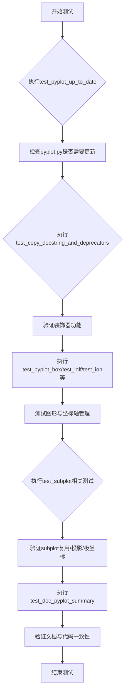

## 类结构

```
无自定义类
├── 测试函数集合 (test_*)
│   ├── 图形管理测试 (test_pyplot_up_to_date, test_close, test_multiple_same_figure_calls)
│   ├── 交互模式测试 (test_ioff, test_ion, test_nested_ion_ioff)
│   ├── Subplot测试 (test_subplot_reuse, test_axes_kwargs, test_subplot_projection_reuse)
│   ├── 投影测试 (test_subplot_polar_normalization, test_subplot_change_projection)
│   ├── 文档测试 (test_doc_pyplot_summary, test_setloglevel_signature)
│   └── 辅助函数 (assert_same_signature, figure_hook_example)
└── 外部依赖 (matplotlib, pytest, numpy)
```

## 全局变量及字段


### `IPython`
    
IPython模块，通过pytest.importorskip导入用于测试pylab集成

类型：`module`
    


### `pyplot_docs`
    
指向pyplot_summary.rst文档文件的路径对象

类型：`Path`
    


### `lines`
    
文档文件按行分割的字符串列表

类型：`list[str]`
    


### `doc_functions`
    
从文档中提取的pyplot函数名集合

类型：`set`
    


### `plot_commands`
    
pyplot实际提供的命令集合

类型：`set`
    


### `missing`
    
存在于pyplot但未在文档中列出的函数集合

类型：`set`
    


### `extra`
    
存在于文档但pyplot中不存在的函数集合

类型：`set`
    


### `fig`
    
matplotlib.figure.Figure对象，代表一个图形窗口

类型：`Figure`
    


### `ax`
    
matplotlib.axes.Axes对象，代表一个坐标轴

类型：`Axes`
    


### `ax1`
    
matplotlib.axes.Axes对象，第一个坐标轴

类型：`Axes`
    


### `ax2`
    
matplotlib.axes.Axes对象，第二个坐标轴

类型：`Axes`
    


### `ax3`
    
matplotlib.axes.Axes对象，第三个坐标轴

类型：`Axes`
    


### `ax4`
    
matplotlib.axes.Axes对象，第四个坐标轴

类型：`Axes`
    


### `subfigs`
    
从figure.subfigures()返回的子图数组

类型：`ndarray[SubFigure]`
    


### `current`
    
当前设置的Figure对象

类型：`Figure`
    


### `fig1`
    
第一个Figure对象实例

类型：`Figure`
    


### `fig2`
    
第二个Figure对象实例

类型：`Figure`
    


### `fig3`
    
第三个Figure对象实例

类型：`Figure`
    


### `arr`
    
用于matshow测试的二维数组

类型：`list[list[int]]`
    


### `tick_pos`
    
次要刻度的位置数组

类型：`ndarray`
    


### `tick_labels`
    
次要刻度的标签列表

类型：`list[Text]`
    


### `test_rc`
    
matplotlib rc参数配置的字典，用于测试figure hook

类型：`dict`
    


### `params1`
    
第一个函数的签名参数字典

类型：`dict`
    


### `params2`
    
第二个函数的签名参数字典

类型：`dict`
    


### `orig_contents`
    
pyplot.py文件的原始内容字符串

类型：`str`
    


### `new_contents`
    
生成后的pyplot.py新内容字符串

类型：`str`
    


### `plt_file`
    
临时pyplot.py文件的路径对象

类型：`Path`
    


### `gen_script`
    
boilerplate.py生成脚本的路径对象

类型：`Path`
    


### `diff_msg`
    
统一差异格式的差异消息字符串

类型：`str`
    


### `ln1`
    
第一次调用plt.polar返回的线条对象

类型：`Line2D`
    


### `ln2`
    
第二次调用plt.polar返回的线条对象

类型：`Line2D`
    


### `created_axes`
    
测试过程中创建的Axes对象集合

类型：`set`
    


### `proj`
    
投影类型名称字符串

类型：`str`
    


### `axref`
    
用于参考比较的Axes对象

类型：`Axes`
    


### `axtest`
    
用于测试的Axes对象

类型：`Axes`
    


    

## 全局函数及方法


### `test_pyplot_up_to_date`

该函数用于测试 pyplot.py 文件是否保持最新状态。它通过调用 boilerplate.py 脚本重新生成 pyplot.py，并与原始文件进行对比，如果存在差异则测试失败，确保 pyplot 模块的自动生成代码是最新的。

参数：

- `tmp_path`：`py.path.local`（pytest 的临时目录 fixture），用于创建临时文件以进行生成和对比测试

返回值：`None`，该函数为测试函数，不返回任何值，主要通过 pytest.fail() 在检测到差异时显式失败

#### 流程图

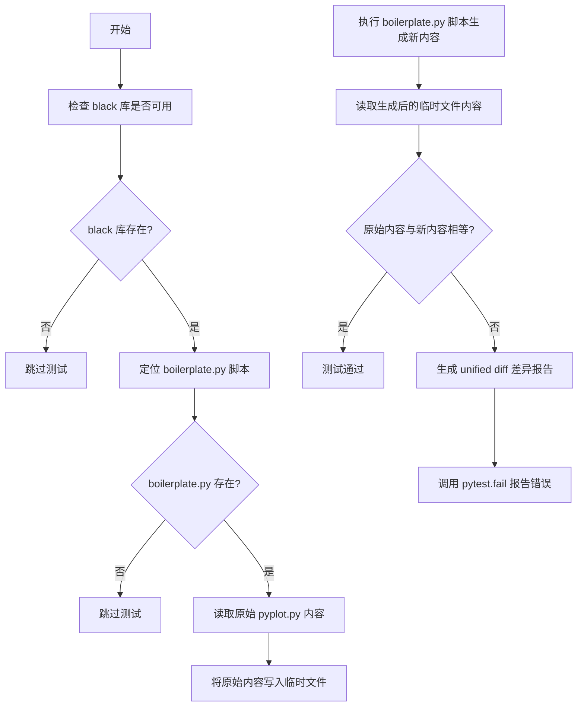

#### 带注释源码

```python
def test_pyplot_up_to_date(tmp_path):
    """
    测试 pyplot.py 文件是否保持最新状态。
    通过重新运行 boilerplate.py 脚本生成 pyplot.py，并与当前文件对比，
    确保自动生成代码是最新的。
    """
    # 导入 black 库，若不存在则跳过测试（需要特定版本 24.1+）
    pytest.importorskip("black", minversion="24.1")

    # 构建 boilerplate.py 脚本的路径
    # mpl.__file__ 通常指向 matplotlib/__init__.py
    # parents[2] 向上两级目录到达项目根目录
    gen_script = Path(mpl.__file__).parents[2] / "tools/boilerplate.py"
    
    # 如果脚本不存在则跳过测试
    if not gen_script.exists():
        pytest.skip("boilerplate.py not found")
    
    # 读取当前 pyplot.py 的原始内容
    orig_contents = Path(plt.__file__).read_text()
    
    # 在临时目录下创建 pyplot.py 文件
    plt_file = tmp_path / 'pyplot.py'
    plt_file.write_text(orig_contents, 'utf-8')

    # 使用 subprocess 运行 boilerplate.py 脚本重新生成 pyplot.py
    # subprocess_run_for_testing 是 matplotlib 测试工具，会捕获输出
    subprocess_run_for_testing(
        [sys.executable, str(gen_script), str(plt_file)],
        check=True)
    
    # 读取重新生成后的内容
    new_contents = plt_file.read_text('utf-8')

    # 对比原始内容和生成内容
    if orig_contents != new_contents:
        # 使用 difflib 生成统一差异格式的对比报告
        diff_msg = '\n'.join(
            difflib.unified_diff(
                orig_contents.split('\n'), new_contents.split('\n'),
                fromfile='found pyplot.py',      # 源文件名称
                tofile='expected pyplot.py',     # 目标文件名称
                n=0,                             # 不显示上下文行
                lineterm=''))                    # 不为每行添加行结束符
        
        # 测试失败，提示用户运行工具更新 pyplot.py
        pytest.fail(
            "pyplot.py is not up-to-date. Please run "
            "'python tools/boilerplate.py' to update pyplot.py. "
            "This needs to be done from an environment where your "
            "current working copy is installed (e.g. 'pip install -e'd). "
            "Here is a diff of unexpected differences:\n%s" % diff_msg
        )
```


### `test_copy_docstring_and_deprecators`

该测试函数用于验证 `plt._copy_docstring_and_deprecators` 装饰器能否正确地将原始函数的文档字符串复制到包装函数，并正确处理参数重命名和关键字参数化带来的弃用警告。

参数：

- `recwarn`：`pytest.PytestWarningRecorder`，pytest 的 fixture，用于捕获和记录测试期间的警告

返回值：`None`，测试函数无返回值

#### 流程图

```mermaid
flowchart TD
    A[开始测试] --> B[定义原始函数func<br>使用@rename_parameter装饰器<br>使用@make_keyword_only装饰器]
    B --> C[使用@_copy_docstring_and_deprecators<br>装饰器创建wrapper_func]
    C --> D[调用wrapper_func(None)<br>无警告]
    D --> E[调用wrapper_func(new=None)<br>无警告]
    E --> F[调用wrapper_func(None, kwo=None)<br>无警告]
    F --> G[调用wrapper_func(new=None, kwo=None)<br>无警告]
    G --> H[调用wrapper_func(old=None)<br>预期产生MatplotlibDeprecationWarning]
    H --> I[调用wrapper_func(None, None)<br>预期产生MatplotlibDeprecationWarning]
    I --> J[验证recwarn为空<br>所有测试通过]
```

#### 带注释源码

```python
def test_copy_docstring_and_deprecators(recwarn):
    """
    测试 plt._copy_docstring_and_deprecators 装饰器的功能。
    
    该装饰器用于：
    1. 将原始函数的文档字符串复制到包装函数
    2. 正确处理参数重命名带来的弃用警告
    3. 正确处理将位置参数改为关键字参数带来的弃用警告
    """
    
    # 使用 @mpl._api.rename_parameter 装饰器
    # 将参数 'old' 重命名为 'new'，从 mpl.__version__ 版本开始
    @mpl._api.rename_parameter(mpl.__version__, "old", "new")
    # 使用 @mpl._api.make_keyword_only 装饰器
    # 将参数 'kwo' 改为仅接受关键字参数，从 mpl.__version__ 版本开始
    @mpl._api.make_keyword_only(mpl.__version__, "kwo")
    def func(new, kwo=None):
        """原始函数func的文档字符串。"""
        pass

    # 使用 plt._copy_docstring_and_deprecators 装饰器
    # 它会：
    # 1. 复制 func 的文档字符串到 wrapper_func
    # 2. 将 func 的参数重命名和关键字参数化装饰器应用到 wrapper_func
    @plt._copy_docstring_and_deprecators(func)
    def wrapper_func(new, kwo=None):
        """包装函数，会继承 func 的文档字符串和处理弃用逻辑。"""
        pass

    # 测试1：使用位置参数传递 new 参数，不应产生警告
    wrapper_func(None)
    
    # 测试2：使用关键字参数传递 new，不应产生警告
    wrapper_func(new=None)
    
    # 测试3：同时传递 new 和 kwo 作为关键字参数，不应产生警告
    wrapper_func(None, kwo=None)
    wrapper_func(new=None, kwo=None)
    
    # 验证：目前没有捕获到任何警告
    assert not recwarn
    
    # 测试4：使用旧的参数名 'old'，应该产生 MatplotlibDeprecationWarning
    # 因为 rename_parameter 装饰器会将 'old' 参数重定向到 'new'
    with pytest.warns(mpl.MatplotlibDeprecationWarning):
        wrapper_func(old=None)
    
    # 测试5：传递两个位置参数
    # 第一个 None 会绑定到 new
    # 第二个 None 会触发 kwo 参数的弃用警告
    # 因为 make_keyword_only 装饰器会阻止将 kwo 作为位置参数传递
    with pytest.warns(mpl.MatplotlibDeprecationWarning):
        wrapper_func(None, None)
```


### `test_pyplot_box`

该测试函数用于验证 `pyplot` 模块中 `plt.box()` 方法能够正确控制 axes 边框（frame）的显示与隐藏状态，包括传入布尔值参数和空参数调用时的行为。

参数： 无

返回值： `None`，测试函数不返回任何值

#### 流程图

```mermaid
graph TD
    A([开始]) --> B[fig, ax = plt.subplots<br/>创建figure和axes]
    B --> C[plt.box(False)<br/>隐藏边框]
    C --> D{断言<br/>not ax.get_frame_on()}
    D -->|通过| E[plt.box(True)<br/>显示边框]
    E --> F{断言<br/>ax.get_frame_on()}
    F -->|通过| G[plt.box()<br/>切换为隐藏]
    G --> H{断言<br/>not ax.get_frame_on()}
    H -->|通过| I[plt.box()<br/>切换为显示]
    I --> J{断言<br/>ax.get_frame_on()}
    J -->|通过| K([结束 - 测试通过])
    D -->|失败| L([测试失败])
    F -->|失败| L
    H -->|失败| L
    J -->|失败| L
```

#### 带注释源码

```python
def test_pyplot_box():
    """
    测试 pyplot.box() 函数对 axes 边框显示状态的控制。
    
    测试场景：
    1. plt.box(False) - 隐藏边框
    2. plt.box(True) - 显示边框
    3. plt.box() - 切换状态（默认隐藏）
    4. plt.box() - 再次切换（显示）
    """
    # 创建一个 figure 和一个 axes 对象
    fig, ax = plt.subplots()
    
    # 调用 plt.box(False) 隐藏 axes 的边框（frame）
    plt.box(False)
    # 断言：边框应该被隐藏，get_frame_on() 应返回 False
    assert not ax.get_frame_on()
    
    # 调用 plt.box(True) 显示 axes 的边框
    plt.box(True)
    # 断言：边框应该显示，get_frame_on() 应返回 True
    assert ax.get_frame_on()
    
    # 调用 plt.box() 不传参数，切换边框状态（默认切换为隐藏）
    plt.box()
    # 断言：边框应该被隐藏
    assert not ax.get_frame_on()
    
    # 再次调用 plt.box() 不传参数，切换边框状态（切换为显示）
    plt.box()
    # 断言：边框应该显示
    assert ax.get_frame_on()
```


### `test_stackplot_smoke`

这是一个用于验证 `plt.stackplot` 函数基本功能的烟雾测试（smoke test），确保堆叠面积图能够正常渲染而不会引发异常。

参数： 无

返回值：`None`，该函数仅执行测试逻辑，不返回任何值

#### 流程图

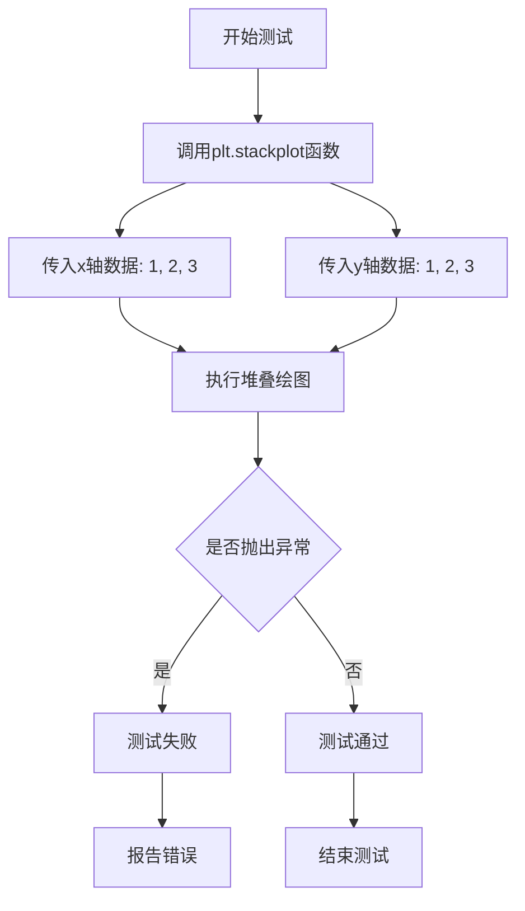

#### 带注释源码

```python
def test_stackplot_smoke():
    """
    小型烟雾测试，用于验证 stackplot 功能（对应 issue #12405）
    
    该测试函数验证 plt.stackplot 能否接受基本参数并成功执行，
    而不检查绘图的精确性或返回值的正确性。
    """
    # Small smoke test for stackplot (see #12405)
    # 调用 pyplot 的 stackplot 函数，传入简单的测试数据
    # x 轴数据：[1, 2, 3]
    # y 轴数据：[1, 2, 3]（作为单个数据系列）
    plt.stackplot([1, 2, 3], [1, 2, 3])
```

---

### 补充信息

#### 关键组件信息

| 组件名称 | 一句话描述 |
|---------|-----------|
| `plt.stackplot` | Matplotlib 的堆叠面积图绘制函数，用于将多个数据系列堆叠显示 |

#### 潜在技术债务或优化空间

1. **测试覆盖不足**：当前仅测试了最基本的调用方式，未验证：
   - 多个数据系列的堆叠
   - 不同的颜色方案
   - 标签和图例的显示
   - 边界情况（如空数据、单点数据）

2. **断言缺失**：测试没有显式的断言来验证堆叠图的正确性，仅依赖"不抛异常"

3. **文档引用不完整**：注释中提到的 `#12405` issue 编号对理解测试目的有帮助，但应补充更详细的测试意图说明

#### 其它项目

- **设计目标**：作为烟雾测试，该函数的目标是快速验证基本功能可用性，而非全面测试
- **错误处理**：若 `plt.stackplot` 内部抛出任何异常，pytest 会自动捕获并标记测试失败
- **数据流**：输入的列表数据会被转换为 NumPy 数组进行处理
- **外部依赖**：依赖 `matplotlib.pyplot` 模块和 NumPy


### `test_nrows_error`

该函数用于验证当 `plt.subplot()` 仅接收 `nrows` 或 `ncols` 参数时会抛出 `TypeError`，确保 subplot 创建需要同时指定行和列。

参数：無

返回值：`None`，测试函数默认返回 None

#### 流程图

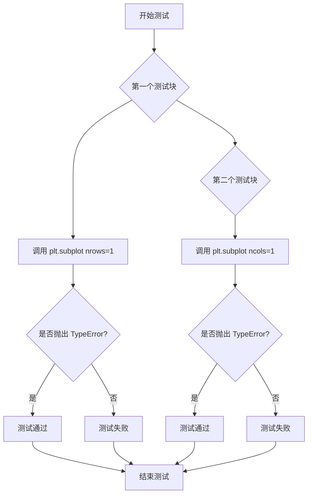

#### 带注释源码

```python
def test_nrows_error():
    """
    测试 plt.subplot 在缺少必要参数时是否正确抛出 TypeError。
    验证 nrows 和 ncols 必须同时指定，不能单独使用其中一个。
    """
    # 测试单独传递 nrows 参数是否抛出 TypeError
    with pytest.raises(TypeError):
        plt.subplot(nrows=1)
    
    # 测试单独传递 ncols 参数是否抛出 TypeError
    with pytest.raises(TypeError):
        plt.subplot(ncols=1)
```


### `test_ioff`

该函数是一个测试函数，用于测试 `plt.ioff()`（关闭交互模式）的功能，并验证在使用上下文管理器时 `mpl.is_interactive()` 的行为是否正确。

参数：

- 无参数

返回值：`None`，无返回值（测试函数）

#### 流程图

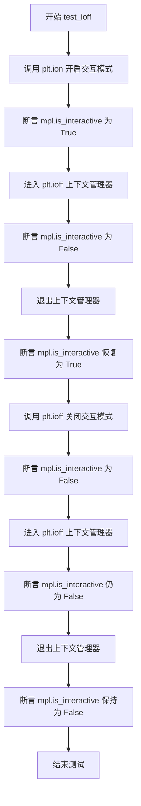

#### 带注释源码

```python
def test_ioff():
    """
    测试 plt.ioff() 函数的行为。
    验证交互模式的开启、关闭以及上下文管理器的正确性。
    """
    # 第一部分：测试从交互模式进入 ioff 上下文管理器
    plt.ion()  # 开启交互模式
    assert mpl.is_interactive()  # 断言当前处于交互模式
    
    with plt.ioff():  # 进入 ioff 上下文管理器（临时关闭交互模式）
        assert not mpl.is_interactive()  # 断言在上下文中交互模式已关闭
    
    assert mpl.is_interactive()  # 断言退出上下文后交互模式恢复

    # 第二部分：测试从非交互模式进入 ioff 上下文管理器
    plt.ioff()  # 关闭交互模式
    assert not mpl.is_interactive()  # 断言当前处于非交互模式
    
    with plt.ioff():  # 进入 ioff 上下文管理器
        assert not mpl.is_interactive()  # 断言在上下文中保持非交互模式
    
    assert not mpl.is_interactive()  # 断言退出上下文后仍保持非交互模式
```


### test_ion

该测试函数用于验证 matplotlib 中 `plt.ion()` 和 `plt.ioff()` 函数的交互模式切换功能，包括它们作为上下文管理器的行为是否正确。

参数：无需参数

返回值：`None`，因为这是一个测试函数，不返回任何值

#### 流程图

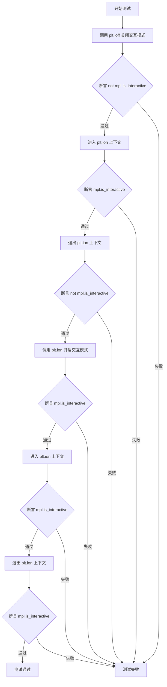

#### 带注释源码

```python
def test_ion():
    """测试 plt.ion() 和 plt.ioff() 函数以及它们作为上下文管理器的行为."""
    
    # 步骤1: 关闭交互模式
    plt.ioff()
    # 验证关闭后不是交互模式
    assert not mpl.is_interactive()
    
    # 步骤2: 使用 ion 作为上下文管理器（应该临时开启交互模式）
    with plt.ion():
        # 在上下文中应该是交互模式
        assert mpl.is_interactive()
    
    # 步骤3: 退出上下文后，应该恢复到之前的非交互模式
    assert not mpl.is_interactive()
    
    # 步骤4: 开启交互模式
    plt.ion()
    # 验证开启后是交互模式
    assert mpl.is_interactive()
    
    # 步骤5: 再次使用 ion 作为上下文管理器（ion 可以嵌套）
    with plt.ion():
        # 在上下文中应该仍然是交互模式
        assert mpl.is_interactive()
    
    # 步骤6: 退出上下文后，应该保持在交互模式（因为外层 ion 已开启）
    assert mpl.is_interactive()
```


### `test_nested_ion_ioff`

该函数用于测试 pyplot 中交互模式（ion）和非交互模式（ioff）的嵌套切换行为，验证上下文管理器在嵌套使用和混合使用时的状态转换是否符合预期。

参数： 无

返回值： `None`，无返回值（测试函数）

#### 流程图

```mermaid
flowchart TD
    A[开始测试] --> B[初始状态: 开启ion]
    B --> C[使用ioff上下文]
    C --> D{检查is_interactive}
    D -->|False| E[嵌套ion上下文]
    E --> F{检查is_interactive}
    F -->|True| G[退出嵌套ion]
    G --> H{检查is_interactive}
    H -->|False| I[退出外层ioff]
    I --> J{检查is_interactive}
    J -->|True| K[测试冗余ioff上下文]
    K --> L{检查is_interactive}
    L -->|False| M[退出所有ioff]
    M --> N{检查is_interactive}
    N -->|True| O[ion中调用ioff]
    O --> P{检查is_interactive}
    P -->|True| Q[切换初始状态为ioff]
    Q --> R[测试ion/ioff混合]
    R --> S{检查is_interactive}
    S -->|True| T[嵌套ioff上下文]
    T --> U{检查is_interactive}
    U -->|False| V[退出嵌套ioff]
    V --> W{检查is_interactive}
    W -->|True| X[退出外层ion]
    X --> Y{检查is_interactive}
    Y -->|False| Z[测试冗余ion上下文]
    Z --> AA{检查is_interactive}
    AA -->|True| AB[退出所有ion]
    AB --> AC{检查is_interactive}
    AC -->|False| AD[ioff中调用ion]
    AD --> AE{检查is_interactive}
    AE -->|False| AF[结束测试]
```

#### 带注释源码

```python
def test_nested_ion_ioff():
    """
    测试 pyplot 中交互模式（ion）和非交互模式（ioff）的嵌套切换行为。
    
    测试场景包括：
    1. 初始为交互状态时的混合 ioff/ion 嵌套
    2. 冗余上下文管理器的处理
    3. ion 上下文中调用 ioff 的情况
    4. 初始为非交互状态时的混合 ion/ioff 嵌套
    5. 各种边界情况和状态恢复
    """
    
    # ===== 场景1: 初始状态为交互模式 =====
    
    # 开启交互模式
    plt.ion()
    
    # 测试混合 ioff/ion 嵌套
    with plt.ioff():
        # ioff 上下文应该关闭交互模式
        assert not mpl.is_interactive()
        
        # 嵌套 ion 上下文应该重新开启交互模式
        with plt.ion():
            assert mpl.is_interactive()
        
        # 退出 ion 后应该恢复为非交互状态
        assert not mpl.is_interactive()
    
    # 退出 ioff 后应该恢复为交互状态
    assert mpl.is_interactive()
    
    # ===== 场景2: 测试冗余上下文 =====
    
    # 嵌套的 ioff 上下文（冗余）
    with plt.ioff():
        with plt.ioff():
            assert not mpl.is_interactive()
    
    # 退出所有上下文后应该恢复为交互状态
    assert mpl.is_interactive()
    
    # ion 上下文中直接调用 ioff（后者覆盖前者）
    with plt.ion():
        plt.ioff()
    
    # ion 上下文结束时应该恢复为交互状态（因为 ioff 在内部已关闭）
    assert mpl.is_interactive()
    
    # ===== 场景3: 初始状态为非交互模式 =====
    
    # 关闭交互模式
    plt.ioff()
    
    # 测试混合 ion/ioff 嵌套
    with plt.ion():
        assert mpl.is_interactive()
        
        with plt.ioff():
            assert not mpl.is_interactive()
        
        # 退出 ioff 后恢复为交互状态
        assert mpl.is_interactive()
    
    # 退出 ion 后恢复为非交互状态
    assert not mpl.is_interactive()
    
    # 测试冗余 ion 上下文
    with plt.ion():
        with plt.ion():
            assert mpl.is_interactive()
    
    # 退出所有 ion 后恢复为非交互状态
    assert not mpl.is_interactive()
    
    # ioff 上下文中直接调用 ion
    with plt.ioff():
        plt.ion()
    
    # ioff 上下文结束时应该保持非交互状态
    assert not mpl.is_interactive()
```


### `test_close`

该测试函数用于验证 `plt.close()` 方法在接收到无效参数（如浮点数 `1.1`）时是否能正确抛出 `TypeError` 异常，并检查异常消息是否符合预期。

参数： 无

返回值：`None`，该函数不返回任何值，仅用于执行测试断言

#### 流程图

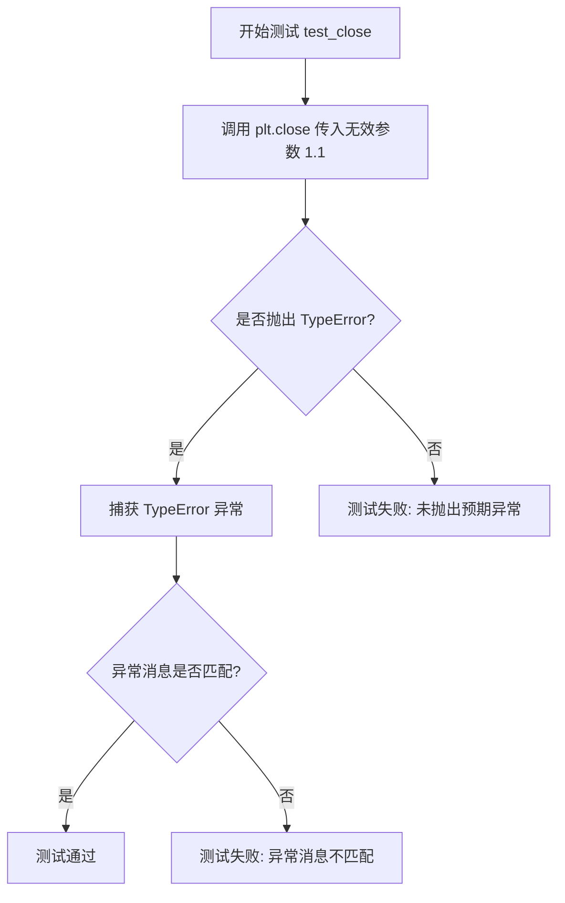

#### 带注释源码

```python
def test_close():
    # 测试目的：验证 plt.close() 对无效参数的处理
    try:
        # 尝试关闭一个无效的 figure 参数（浮点数 1.1）
        # plt.close() 应该只接受 Figure 实例、int、str 或 None
        plt.close(1.1)
    except TypeError as e:
        # 预期行为：抛出 TypeError 异常
        # 验证异常消息是否正确说明参数类型错误
        assert str(e) == (
            "'fig' must be an instance of matplotlib.figure.Figure, int, str "
            "or None, not a float")
```


### `test_subplot_reuse`

该函数是Matplotlib pyplot模块的集成测试，用于验证`plt.subplot()`函数在创建子图时能够正确重用已存在的相同位置的子图（即当调用`plt.subplot(121)`两次时，第二次调用应返回第一次创建的子图对象，而不是创建新的子图）。

参数：

- 该函数无参数

返回值：`None`，作为测试函数，通过断言验证子图重用行为，不返回任何值

#### 流程图

```mermaid
flowchart TD
    A[开始测试] --> B[调用 plt.subplot(121 创建第一个子图]
    B --> C[断言 ax1 is plt.gca]
    C --> D[调用 plt.subplot(122 创建第二个子图]
    D --> E[断言 ax2 is plt.gca]
    E --> F[再次调用 plt.subplot(121 尝试重用子图]
    F --> G[断言 ax1 is plt.gca]
    G --> H[断言 ax1 is ax3 - 验证对象身份相同]
    H --> I[测试结束]
```

#### 带注释源码

```python
def test_subplot_reuse():
    """
    测试 plt.subplot() 的子图重用功能。
    
    验证当使用相同的子图规格（如121）多次调用 subplot 时，
    Matplotlib 会返回已存在的子图对象而不是创建新的子图。
    """
    # 第一次调用 subplot(121)，创建第一个子图（位于1行2列的第1个位置）
    ax1 = plt.subplot(121)
    # 验证当前活动坐标系是刚刚创建的 ax1
    assert ax1 is plt.gca()
    
    # 调用 subplot(122)，创建第二个子图（位于1行2列的第2个位置）
    ax2 = plt.subplot(122)
    # 验证当前活动坐标系是刚刚创建的 ax2
    assert ax2 is plt.gca()
    
    # 再次调用 subplot(121)，应该重用之前创建的 ax1
    ax3 = plt.subplot(121)
    # 验证当前活动坐标系仍然是 ax1（因为是重用）
    assert ax1 is plt.gca()
    # 验证 ax3 和 ax1 是同一个对象（子图被重用）
    assert ax1 is ax3
```


### `test_axes_kwargs`

该测试函数用于验证 `plt.axes()` 方法在不同参数情况下的行为，特别是检查当传入不同的 axes 参数（如 projection）时，是否会创建新的 axes 对象而不是复用现有的 axes。

参数：无

返回值：`None`，无返回值（测试函数）

#### 流程图

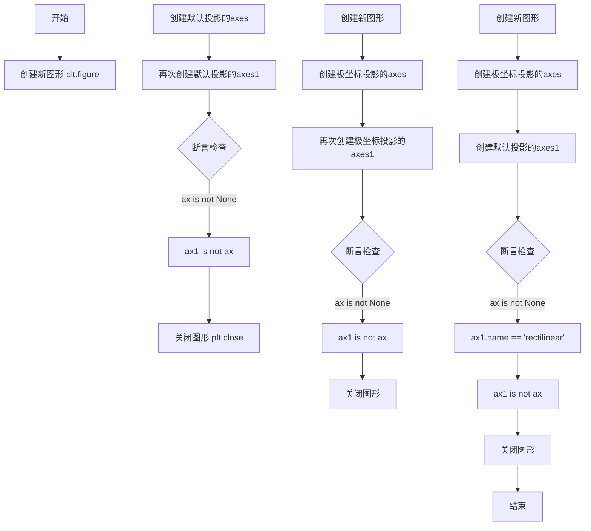

#### 带注释源码

```python
def test_axes_kwargs():
    # 测试1: plt.axes() 总是创建新的 axes，即使 axes kwargs 相同
    # 创建新图形
    plt.figure()
    # 使用默认投影（rectilinear）创建第一个 axes
    ax = plt.axes()
    # 使用相同参数创建第二个 axes
    ax1 = plt.axes()
    # 断言 ax 对象存在
    assert ax is not None
    # 断言两次调用创建了不同的 axes 对象（不是同一个引用）
    assert ax1 is not ax
    # 关闭图形，清理资源
    plt.close()

    # 测试2: 使用 polar 投影创建 axes
    plt.figure()
    # 创建极坐标投影的 axes
    ax = plt.axes(projection='polar')
    # 再次创建极坐标投影的 axes
    ax1 = plt.axes(projection='polar')
    # 断言 ax 对象存在
    assert ax is not None
    # 断言两次调用创建了不同的 axes 对象
    assert ax1 is not ax
    # 关闭图形
    plt.close()

    # 测试3: 混合使用不同投影类型
    plt.figure()
    # 创建极坐标投影的 axes
    ax = plt.axes(projection='polar')
    # 创建默认投影（rectilinear）的 axes
    ax1 = plt.axes()
    # 断言 ax 对象存在
    assert ax is not None
    # 断言默认创建的 axes 是 rectilinear 类型
    assert ax1.name == 'rectilinear'
    # 断言不同投影的 axes 是不同的对象
    assert ax1 is not ax
    # 关闭图形
    plt.close()
```


### `test_subplot_replace_projection`

该函数是一个测试函数，用于验证 `plt.subplot()` 在处理子图替换时的行为。具体来说，它测试了当子图规范（subplot spec）相同但关键字参数（如投影类型）不同时，`plt.subplot()` 是否正确地返回现有轴或创建新轴。

参数： 无

返回值：`None`，该函数为测试函数，使用 pytest 断言进行验证，不返回任何值。

#### 流程图

```mermaid
flowchart TD
    A[开始测试] --> B[创建新图形 fig]
    B --> C[创建子图 ax = subplot(1,2,1)]
    C --> D[再次创建子图 ax1 = subplot(1,2,1)]
    D --> E{验证 ax1 是否与 ax 相同}
    E -->|是| F[创建子图 ax2 = subplot(1,2,2)]
    E -->|否| G[测试失败]
    F --> H[创建极坐标子图 ax3 = subplot(1,2,1, projection='polar')]
    H --> I[再次创建极坐标子图 ax4 = subplot(1,2,1, projection='polar')]
    I --> J{验证 ax3 与 ax4 相同}
    J -->|是| K[验证所有轴都在 fig.axes 中]
    J -->|否| L[测试失败]
    K --> M{验证投影类型}
    M --> N[rectilinear vs polar]
    M --> O[结束测试]
    
    style G fill:#ffcccc
    style L fill:#ffcccc
    style O fill:#ccffcc
```

#### 带注释源码

```python
def test_subplot_replace_projection():
    # plt.subplot() searches for axes with the same subplot spec, and if one
    # exists, and the kwargs match returns it, create a new one if they do not
    # 创建一个新的图形窗口
    fig = plt.figure()
    
    # 创建第一个子图，位置为 1行2列的第1个位置，使用默认的 rectilinear 投影
    ax = plt.subplot(1, 2, 1)
    
    # 再次请求相同位置的子图，由于 kwargs 匹配（都是默认投影），应返回已存在的 ax
    ax1 = plt.subplot(1, 2, 1)
    
    # 创建不同位置的子图（1行2列的第2个位置）
    ax2 = plt.subplot(1, 2, 2)
    
    # 请求相同位置但不同投影的子图（polar），这应该创建一个新轴
    ax3 = plt.subplot(1, 2, 1, projection='polar')
    
    # 再次请求相同位置和相同投影（polar），应返回已存在的 ax3
    ax4 = plt.subplot(1, 2, 1, projection='polar')
    
    # 断言验证
    assert ax is not None           # 确认 ax 成功创建
    assert ax1 is ax                 # 验证相同位置和参数时返回同一轴对象
    assert ax2 is not ax             # 验证不同位置创建新轴
    assert ax3 is not ax             # 验证不同投影创建新轴
    assert ax3 is ax4                # 验证相同位置和投影返回同一轴对象
    
    # 验证所有创建的轴都在图形中
    assert ax in fig.axes
    assert ax2 in fig.axes
    assert ax3 in fig.axes
    
    # 验证投影类型正确
    assert ax.name == 'rectilinear'  # 默认投影为 rectilinear
    assert ax2.name == 'rectilinear' # 第二个位置也是 rectilinear
    assert ax3.name == 'polar'       # 第三个位置使用 polar 投影
```


### `test_subplot_kwarg_collision`

该测试函数用于验证 `plt.subplot()` 在创建极坐标子图时，对于相同子图规范（subplot spec）和相同 kwargs 的情况下能够正确复用现有坐标轴，而在参数不同时则创建新的坐标轴。

参数： 无

返回值： `None`，无返回值描述

#### 流程图

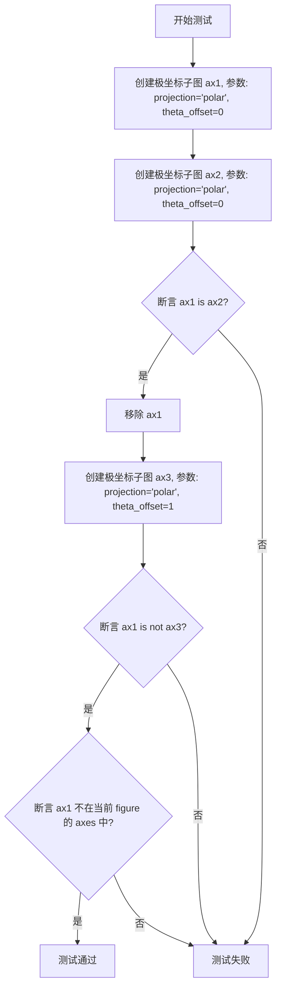

#### 带注释源码

```python
def test_subplot_kwarg_collision():
    """
    测试 plt.subplot() 在处理子图参数冲突时的行为。
    验证：
    1. 相同参数时应复用现有坐标轴
    2. 不同参数时应创建新坐标轴
    3. 移除的坐标轴应从 figure 中清除
    """
    # 创建第一个极坐标子图，使用 projection='polar' 和 theta_offset=0
    ax1 = plt.subplot(projection='polar', theta_offset=0)
    
    # 使用完全相同的参数再次调用 subplot
    ax2 = plt.subplot(projection='polar', theta_offset=0)
    
    # 断言：两次调用应返回同一个 axes 对象（复用）
    assert ax1 is ax2
    
    # 移除 ax1，模拟用户删除该子图
    ax1.remove()
    
    # 使用不同参数 theta_offset=1 创建新子图
    ax3 = plt.subplot(projection='polar', theta_offset=1)
    
    # 断言：由于参数不同，应创建新的 axes 对象，而非复用 ax1
    assert ax1 is not ax3
    
    # 断言：已移除的 ax1 不应存在于当前 figure 的 axes 列表中
    assert ax1 not in plt.gcf().axes
```


### `test_gca`

该函数用于测试 `plt.gca()` 的行为，确保其返回现有的坐标轴对象，如果没有坐标轴则创建新的。

参数： 无

返回值： `None`，测试函数无返回值

#### 流程图

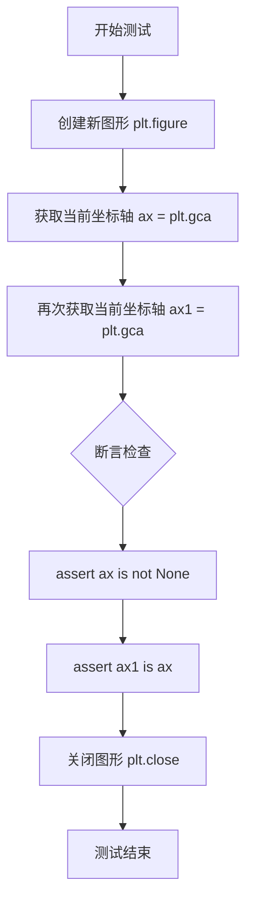

#### 带注释源码

```python
def test_gca():
    # plt.gca() returns an existing axes, unless there were no axes.
    # 测试 plt.gca() 返回现有坐标轴的行为
    
    # 创建一个新的图形
    plt.figure()
    
    # 获取当前坐标轴（如果不存在则创建）
    ax = plt.gca()
    
    # 再次获取当前坐标轴，应该返回同一个对象
    ax1 = plt.gca()
    
    # 断言：确保 ax 不是 None
    assert ax is not None
    
    # 断言：确保两次获取的是同一个坐标轴对象
    assert ax1 is ax
    
    # 关闭图形，清理测试环境
    plt.close()
```


### `test_subplot_projection_reuse`

该函数是一个单元测试，用于验证 matplotlib 中 `plt.subplot()` 在不同投影参数下的复用行为。测试确保当调用 `plt.subplot()` 时，系统能够正确地重用现有的坐标轴（如果投影参数匹配），或者在投影参数不同时创建新的坐标轴。

参数： 无

返回值：`None`，该函数为测试函数，不返回任何值

#### 流程图

```mermaid
flowchart TD
    A[开始测试] --> B[创建子图 ax1 = plt.subplot(111)]
    B --> C[断言 ax1 是当前坐标轴]
    C --> D[再次调用 plt.subplot(111) 验证复用]
    D --> E[移除 ax1]
    E --> F[创建极坐标投影子图 ax2 = plt.subplot(111, projection='polar')]
    F --> G[断言 ax2 是当前坐标轴]
    G --> H[验证原 ax1 已从图形中删除]
    H --> I[再次调用 plt.subplot(111) 验证 ax2 被复用]
    I --> J[移除 ax2]
    J --> K[显式指定 rectilinear 投影创建 ax3]
    K --> L[验证 ax3 是新创建的坐标轴]
    L --> M[验证 ax2 已从图形中删除]
    M --> N[结束测试]
```

#### 带注释源码

```python
def test_subplot_projection_reuse():
    # 创建一个 Axes，使用默认的 rectilinear 投影
    ax1 = plt.subplot(111)
    
    # 检查新创建的 ax1 是否为当前活动的坐标轴
    assert ax1 is plt.gca()
    
    # 使用相同的子图规格再次调用，验证系统是否正确复用现有的坐标轴
    assert ax1 is plt.subplot(111)
    
    # 移除刚才创建的坐标轴
    ax1.remove()
    
    # 使用极坐标投影创建新的子图
    ax2 = plt.subplot(111, projection='polar')
    
    # 验证新创建的极坐标子图是当前活动坐标轴
    assert ax2 is plt.gca()
    
    # 由于投影类型不同，旧坐标轴应该已被删除
    # 验证 ax1 不再存在于当前图形的坐标轴列表中
    assert ax1 not in plt.gcf().axes
    
    # 不带额外参数再次调用 plt.subplot(111)
    # 由于之前没有显式指定投影参数，应返回最近创建的 ax2
    assert ax2 is plt.subplot(111)
    
    # 移除 ax2
    ax2.remove()
    
    # 现在显式指定 rectilinear 投影创建新坐标轴
    # 验证这会创建一个全新的坐标轴而不是复用 ax2
    ax3 = plt.subplot(111, projection='rectilinear')
    
    # 验证 ax3 是当前活动的坐标轴
    assert ax3 is plt.gca()
    
    # 验证 ax3 是一个新的坐标轴，与之前的 ax2 不同
    assert ax3 is not ax2
    
    # 验证 ax2 已被从图形中删除
    assert ax2 not in plt.gcf().axes
```


### `test_subplot_polar_normalization`

该函数是一个测试函数，用于验证 `plt.subplot()` 在处理 `polar` 和 `projection` 参数时的行为一致性，特别是验证 `projection='polar'` 和 `polar=True` 参数在创建极坐标子图时的等效性，以及检测非法参数组合时是否正确抛出 `ValueError`。

参数： 无

返回值： `None`，无返回值（测试函数）

#### 流程图

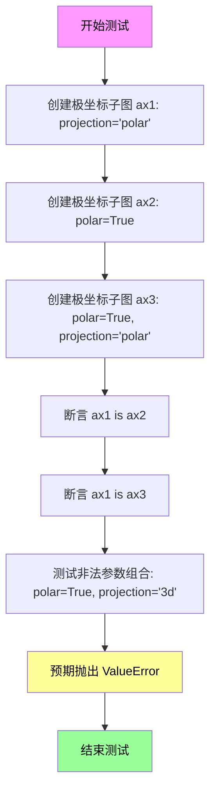

#### 带注释源码

```python
def test_subplot_polar_normalization():
    """
    测试 plt.subplot() 中 polar 和 projection 参数的归一化行为。
    
    验证点：
    1. projection='polar' 和 polar=True 在功能上是等效的
    2. 同时指定 polar=True 和 projection='polar' 不会产生冲突
    3. 当 polar=True 与不兼容的 projection（如 '3d'）同时指定时，
       应抛出 ValueError
    """
    # 测试1: 使用 projection='polar' 参数创建极坐标子图
    ax1 = plt.subplot(111, projection='polar')
    
    # 测试2: 使用 polar=True 参数创建极坐标子图
    ax2 = plt.subplot(111, polar=True)
    
    # 测试3: 同时使用 polar=True 和 projection='polar' 创建极坐标子图
    ax3 = plt.subplot(111, polar=True, projection='polar')
    
    # 断言1: 验证 projection='polar' 和 polar=True 返回相同的 Axes 对象
    assert ax1 is ax2
    
    # 断言2: 验证同时使用两种参数也返回相同的 Axes 对象
    assert ax1 is ax3
    
    # 测试4: 验证不兼容参数组合时抛出 ValueError
    # 当 polar=True 与 projection='3d' 同时指定时，应该报错
    with pytest.raises(ValueError,
                       match="polar=True, yet projection='3d'"):
        # 这个调用应该失败，因为极坐标不能与3D投影结合
        ax2 = plt.subplot(111, polar=True, projection='3d')
```


### `test_subplot_change_projection`

该测试函数用于验证 `plt.subplot()` 在更改投影参数时能够正确创建新的 Axes，并确保每次投影切换都生成了正确的坐标轴对象。

参数：

- 该函数无参数

返回值：`None`，测试函数不返回任何值，仅通过断言验证行为

#### 流程图

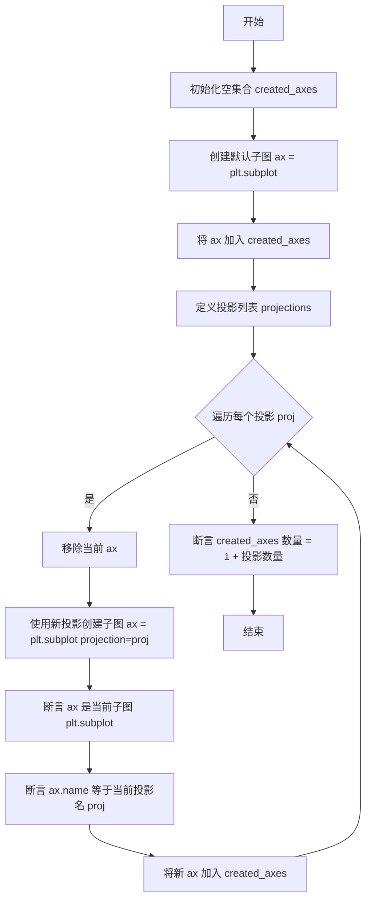

#### 带注释源码

```python
def test_subplot_change_projection():
    """
    测试子图在不同投影之间切换时是否正确创建新的 Axes。
    验证 plt.subplot() 能够根据 projection 参数创建对应的坐标轴，
    并在投影改变时生成新的 Axes 对象。
    """
    # 用于记录整个测试过程中创建的所有 Axes 对象
    created_axes = set()
    
    # 创建默认的子图（默认投影为 'rectilinear'）
    ax = plt.subplot()
    
    # 将第一个创建的 Axes 加入集合
    created_axes.add(ax)
    
    # 定义要测试的所有投影类型
    projections = ('aitoff', 'hammer', 'lambert', 'mollweide',
                   'polar', 'rectilinear', '3d')
    
    # 遍历每个投影类型，验证切换投影时创建新 Axes
    for proj in projections:
        # 移除当前 Axes，为创建新投影的 Axes 腾出空间
        ax.remove()
        
        # 使用新的投影参数创建子图
        ax = plt.subplot(projection=proj)
        
        # 断言当前子图就是刚创建的这个（验证子图复用逻辑）
        assert ax is plt.subplot()
        
        # 断言新创建的 Axes 的名称与预期投影名称一致
        assert ax.name == proj
        
        # 将新创建的 Axes 加入集合
        created_axes.add(ax)
    
    # 验证总共创建的 Axes 数量：
    # 初始 1 个 + 7 个投影 = 8 个不同的 Axes 对象
    assert len(created_axes) == 1 + len(projections)
```


### `test_polar_second_call`

这是一个测试函数，用于验证在连续两次调用 `plt.polar()` 时，第二次调用是否会复用第一次调用创建的极坐标轴，而不是创建新的极坐标轴。

参数：

- （无参数）

返回值：`None`，无返回值（测试函数）

#### 流程图

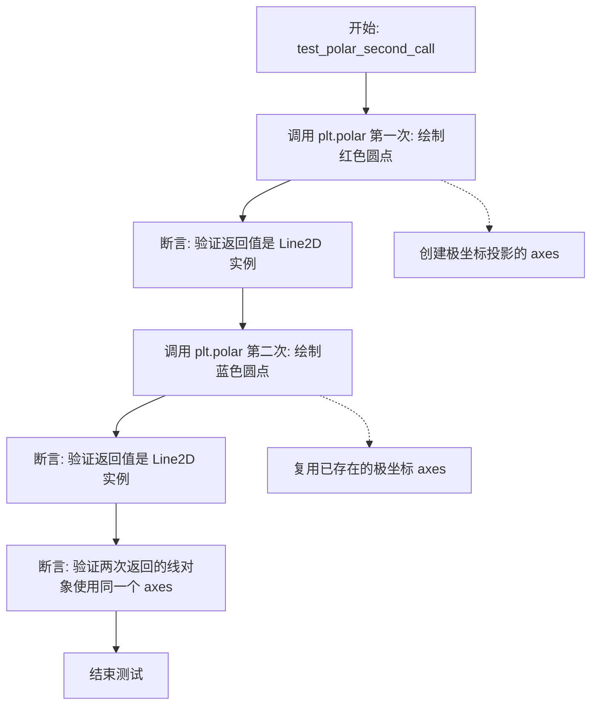

#### 带注释源码

```python
def test_polar_second_call():
    # 第一次调用 plt.polar() 创建极坐标投影的 axes
    # 参数: (theta, r, format_string)
    #   - 0.0: theta 角度（弧度）
    #   - 1.0: r 半径
    #   - 'ro': 红色圆点格式
    # 返回一个包含 Line2D 对象的元组，ln1 是该对象
    ln1, = plt.polar(0., 1., 'ro')
    
    # 断言验证返回值是 matplotlib.lines.Line2D 类型
    assert isinstance(ln1, mpl.lines.Line2D)
    
    # 第二次调用 plt.polar() 
    # 预期行为：复用上面创建的极坐标 axes，而不是创建新的
    # 参数: (theta, r, format_string)
    #   - 1.57: theta 角度（弧度，90度）
    #   - 0.5: r 半径
    #   - 'bo': 蓝色圆点格式
    ln2, = plt.polar(1.57, .5, 'bo')
    
    # 断言验证返回值是 matplotlib.lines.Line2D 类型
    assert isinstance(ln2, mpl.lines.Line2D)
    
    # 核心断言：验证两次调用使用的是同一个 axes 对象
    # 这是测试的关键点：确保 plt.polar() 复用已存在的极坐标轴
    assert ln1.axes is ln2.axes
```


### `test_fallback_position`

该函数是一个测试函数，用于验证 `plt.axes()` 函数中 `position` 参数的降级处理行为。具体测试两种场景：当仅提供 `position` 参数时，应使用 `position` 设置轴的位置；当同时提供 `rect` 和 `position` 参数时，`position` 应被忽略，仅使用 `rect`。

参数： 无

返回值： `None`，该函数为测试函数，不返回任何值，通过断言验证行为

#### 流程图

```mermaid
flowchart TD
    A[开始 test_fallback_position] --> B[创建参考轴: plt.axes[0.2, 0.2, 0.5, 0.5]]
    B --> C[使用position参数创建测试轴: plt.axesposition=[0.2, 0.2, 0.5, 0.5]]
    C --> D{断言: axtest.bbox == axref.bbox?}
    D -->|是| E[测试通过: position在无rect时生效]
    D -->|否| F[测试失败]
    E --> G[创建参考轴: plt.axes[0.2, 0.2, 0.5, 0.5]]
    G --> H[同时提供rect和position: plt.axesrect, position=[0.1, 0.1, 0.8, 0.8]]
    H --> I{断言: axtest.bbox == axref.bbox?}
    I -->|是| J[测试通过: position在有rect时被忽略]
    I -->|否| K[测试失败]
    J --> L[结束]
    F --> L
    K --> L
```

#### 带注释源码

```python
def test_fallback_position():
    # 测试场景1: 检查position参数在rect未提供时是否生效
    # 创建一个参考轴，使用rect参数 [left, bottom, width, height]
    axref = plt.axes([0.2, 0.2, 0.5, 0.5])
    
    # 使用position参数创建测试轴
    axtest = plt.axes(position=[0.2, 0.2, 0.5, 0.5])
    
    # 断言: 两者边界框应该完全一致，验证position参数在无rect时正常工作
    np.testing.assert_allclose(axtest.bbox.get_points(),
                               axref.bbox.get_points())

    # 测试场景2: 检查position参数在rect已提供时是否被忽略
    # 创建一个参考轴
    axref = plt.axes([0.2, 0.2, 0.5, 0.5])
    
    # 同时提供rect和position参数，position应该被忽略
    axtest = plt.axes([0.2, 0.2, 0.5, 0.5], position=[0.1, 0.1, 0.8, 0.8])
    
    # 断言: 测试轴应该与参考轴一致，position参数被忽略
    np.testing.assert_allclose(axtest.bbox.get_points(),
                               axref.bbox.get_points())
```


### `test_set_current_figure_via_subfigure`

该测试函数用于验证 pyplot 的 `figure()` 函数能够通过传递子图（SubFigure）对象来设置当前活动的图形（Figure），确保子图与其父图形之间的关联正确建立。

参数：

- 该函数无参数

返回值：`None`，因为这是一个测试函数，不返回任何值

#### 流程图

```mermaid
flowchart TD
    A[开始] --> B[创建新Figure fig1]
    B --> C[在fig1中创建2个子图subfigs]
    C --> D[创建新的空白Figure]
    D --> E{验证当前Figure不是fig1}
    E -->|通过| F[通过子图设置当前Figure: plt.figure(subfigs[1])]
    F --> G{验证当前Figure是fig1}
    G --> H{验证返回值等于fig1}
    H --> I[结束]
    E -->|失败| J[测试失败]
    G -->|失败| J
    H -->|失败| J
```

#### 带注释源码

```python
def test_set_current_figure_via_subfigure():
    # 创建一个新的Figure对象fig1
    fig1 = plt.figure()
    # 在fig1中创建2个子图，返回子图数组subfigs
    subfigs = fig1.subfigures(2)

    # 创建一个新的空白Figure，此时当前Figure变为新创建的
    plt.figure()
    # 断言：当前活动的Figure不等于fig1（因为刚刚创建了新的Figure）
    assert plt.gcf() != fig1

    # 通过传递子图对象subfigs[1]来设置当前Figure
    # pyplot.figure()函数会识别这是Figure的子图，并设置其父Figure为当前
    current = plt.figure(subfigs[1])
    # 断言：设置后，当前活动的Figure应该等于fig1（子图的父Figure）
    assert plt.gcf() == fig1
    # 断言：返回值current应该等于fig1
    assert current == fig1
```


### `test_set_current_axes_on_subfigure`

该测试函数验证了pyplot的`sca()`函数能够正确地在子图（subfigure）上设置当前坐标轴（axes），确保在存在多个子图的情况下能够正确切换当前活动的坐标轴。

参数：无

返回值：`None`，该测试函数不返回任何值，仅通过断言验证行为

#### 流程图

```mermaid
flowchart TD
    A[开始] --> B[创建新图形fig]
    B --> C[创建2个子图subfigs]
    C --> D[在subfigs[0]上创建坐标轴ax]
    D --> E[在subfigs[1]上创建坐标轴]
    E --> F[断言plt.gca不等于ax]
    F --> G[调用plt.sca(ax)设置当前坐标轴]
    G --> H[断言plt.gca等于ax]
    H --> I[结束]
```

#### 带注释源码

```python
def test_set_current_axes_on_subfigure():
    """
    测试在子图上设置当前坐标轴的功能。
    
    该测试验证当存在多个子图时，plt.sca()能够正确地
    将指定的坐标轴设置为当前图形（gca）的坐标轴。
    """
    # 创建一个新的图形窗口
    fig = plt.figure()
    
    # 在图形中创建2个子图
    subfigs = fig.subfigures(2)
    
    # 在第一个子图上创建坐标轴
    ax = subfigs[0].subplots(1, squeeze=True)
    
    # 在第二个子图上创建坐标轴（不保存引用）
    subfigs[1].subplots(1, squeeze=True)
    
    # 验证当前活动坐标轴不是ax（因为还没有设置）
    assert plt.gca() != ax
    
    # 使用sca()将ax设置为当前坐标轴
    plt.sca(ax)
    
    # 验证现在plt.gca()返回的是ax，说明设置成功
    assert plt.gca() == ax
```


### `test_pylab_integration`

该函数是一个集成测试，用于验证 matplotlib 与 IPython 的 pylab 模式集成是否正常工作。它启动一个 IPython 子进程并检查 pyplot 的 REPL 显示钩子是否正确设置为 IPython 的实现。

参数：

- 无显式参数

返回值：`None`，测试函数通过隐式返回（无异常表示测试通过）

#### 流程图

```mermaid
flowchart TD
    A[开始测试] --> B{检查 IPython 是否可用}
    B -->|IPython 不可用| C[跳过测试]
    B -->|IPython 可用| D[启动 IPython 子进程 --pylab 模式]
    D --> E[在子进程中执行断言检查]
    E --> F{断言是否通过}
    F -->|通过| G[测试通过]
    F -->|失败| H[测试失败并抛出异常]
    C --> I[结束]
    G --> I
    H --> I
```

#### 带注释源码

```python
def test_pylab_integration():
    """
    测试 matplotlib 与 IPython pylab 模式的集成。
    
    该测试验证当使用 --pylab 启动 IPython 时，pyplot 的 REPL 显示钩子
    正确设置为 IPython 的实现。
    """
    # 尝试导入 IPython，如果不可用则跳过该测试
    IPython = pytest.importorskip("IPython")
    
    # 使用子进程运行辅助函数启动 IPython
    mpl.testing.subprocess_run_helper(
        IPython.start_ipython,  # 要执行的函数：启动 IPython
        "--pylab",              # 命令行参数：启用 pylab 模式
        "-c",                   # 命令行参数：执行代码
        ";".join((              # 要执行的代码（用分号连接）
            "import matplotlib.pyplot as plt",  # 导入 pyplot
            # 断言 REPL 显示钩子类型是否为 IPython 的实现
            "assert plt._REPL_DISPLAYHOOK == plt._ReplDisplayHook.IPYTHON",
        )),
        timeout=60,  # 超时时间设置为 60 秒
    )
```


### `test_doc_pyplot_summary`

该测试函数验证 `pyplot_summary.rst` 文档中列出的所有 pyplot 函数是否与实际可用的 pyplot 命令保持同步，确保文档的完整性和准确性。

参数：无

返回值：`None`，无返回值（测试函数）

#### 流程图

```mermaid
flowchart TD
    A[开始: test_doc_pyplot_summary] --> B{检查文档文件是否存在}
    B -->|不存在| C[跳过测试 pytest.skip]
    B -->|存在| D[读取文档文件内容]
    D --> E[调用 extract_documented_functions 提取函数列表]
    E --> F[获取所有 pyplot 命令: plt._get_pyplot_commands]
    F --> G[计算缺失的函数: plot_commands - doc_functions]
    G --> H{是否有缺失函数?}
    H -->|是| I[抛出 AssertionError: 列出未文档化的函数]
    H -->|否| J[计算多余的函数: doc_functions - plot_commands]
    J --> K{是否有多余函数?}
    K -->|是| L[抛出 AssertionError: 列出多余的函数]
    K -->|否| M[测试通过]
    
    subgraph extract_documented_functions
    N[逐行处理文档内容] --> O{是否在 autosummary 块中?}
    O -->|否| P{当前行是否以 '.. autosummary::' 开头?}
    P -->|是| Q[设置 in_autosummary = True]
    P -->|否| N
    O -->|是| R{当前行是否为空或以 '   :' 开头?}
    R -->|是| N
    R -->|否| S{当前行是否无缩进?}
    S -->|是| T[设置 in_autosummary = False]
    S -->|否| U[提取函数名并添加到列表]
    U --> N
    end
    
    E -.-> N
```

#### 带注释源码

```python
def test_doc_pyplot_summary():
    """Test that pyplot_summary lists all the plot functions."""
    # 构建文档文件路径: 从当前测试文件位置向上查找 doc/api/pyplot_summary.rst
    pyplot_docs = Path(__file__).parent / '../../../doc/api/pyplot_summary.rst'
    
    # 检查文档文件是否存在，不存在则跳过测试
    if not pyplot_docs.exists():
        pytest.skip("Documentation sources not available")

    def extract_documented_functions(lines):
        """
        Return a list of all the functions that are mentioned in the
        autosummary blocks contained in *lines*.

        An autosummary block looks like this::

            .. autosummary::
               :toctree: _as_gen
               :template: autosummary.rst
               :nosignatures:

               plot
               errorbar

        """
        functions = []
        in_autosummary = False  # 标记是否正在处理 autosummary 块
        
        # 逐行处理文档内容
        for line in lines:
            if not in_autosummary:
                # 检测 autosummary 块的开始
                if line.startswith(".. autosummary::"):
                    in_autosummary = True
            else:
                # 当前在 autosummary 块内
                if not line or line.startswith("   :"):
                    # 空行或 autosummary 参数行，跳过
                    continue
                if not line[0].isspace():
                    # 无缩进表示 autosummary 块结束
                    in_autosummary = False
                    continue
                # 提取函数名（去掉首尾空白）
                functions.append(line.strip())
        return functions

    # 读取文档文件并分割成行
    lines = pyplot_docs.read_text().split("\n")
    # 提取文档中列出的所有函数
    doc_functions = set(extract_documented_functions(lines))
    # 获取 pyplot 模块中所有可用的绘图命令
    plot_commands = set(plt._get_pyplot_commands())
    # 找出在代码中存在但文档中缺失的函数
    missing = plot_commands.difference(doc_functions)
    
    # 如果有缺失的函数，抛出 AssertionError
    if missing:
        raise AssertionError(
            f"The following pyplot functions are not listed in the "
            f"documentation. Please add them to doc/api/pyplot_summary.rst: "
            f"{missing!r}")
    
    # 找出在文档中列出但代码中不存在的函数
    extra = doc_functions.difference(plot_commands)
    
    # 如果有多余的函数，抛出 AssertionError
    if extra:
        raise AssertionError(
            f"The following functions are listed in the pyplot documentation, "
            f"but they do not exist in pyplot. "
            f"Please remove them from doc/api/pyplot_summary.rst: {extra!r}")
```


### `extract_documented_functions`

该函数用于从文档文件（pyplot_summary.rst）中提取 autosummary 块内的所有函数名称。它通过逐行扫描文本，识别以 `.. autosummary::` 开头的块，并收集该块内缩进的函数名列表。

参数：

- `lines`：`list[str]`，包含文档文件所有行的列表

返回值：`list[str]`，从 autosummary 块中提取的所有函数名称列表

#### 流程图

```mermaid
flowchart TD
    A[开始: 接收 lines 列表] --> B[初始化: functions = [], in_autosummary = False]
    B --> C{lines 中还有未处理的行吗?}
    C -->|是| D[取下一行 line]
    C -->|否| M[返回 functions 列表]
    D --> E{当前是否在 autosummary 块中?}
    E -->|否| F{line 是否以 '.. autosummary::' 开头?}
    E -->|是| G{line 是空行 或 以 '   :' 开头?}
    F -->|是| H[in_autosummary = True]
    F -->|否| I[继续下一行]
    H --> C
    G -->|是| J[continue 跳过当前行]
    G -->|否| K{line 开头没有空格?}
    K -->|是| L[in_autosummary = False, continue]
    K -->|否| N[functions.append line.strip]
    N --> C
    J --> C
    L --> C
    I --> C
```

#### 带注释源码

```python
def extract_documented_functions(lines):
    """
    Return a list of all the functions that are mentioned in the
    autosummary blocks contained in *lines*.

    An autosummary block looks like this::

        .. autosummary::
           :toctree: _as_gen
           :template: autosummary.rst
           :nosignatures:

           plot
           errorbar

    """
    functions = []                      # 用于存储提取的函数名
    in_autosummary = False              # 标记当前是否在 autosummary 块内
    for line in lines:                  # 遍历每一行
        if not in_autosummary:           # 如果不在 autosummary 块中
            if line.startswith(".. autosummary::"):  # 检查是否是 autosummary 块开始
                in_autosummary = True    # 设置标记为 True
        else:                            # 如果在 autosummary 块中
            if not line or line.startswith("   :"):   # 空行或 autosummary 参数行，跳过
                # empty line or autosummary parameter
                continue
            if not line[0].isspace():    # 没有缩进： autosummary 块结束
                # no more indentation: end of autosummary block
                in_autosummary = False
                continue
            functions.append(line.strip())  # 有缩进的行是函数名，添加到列表
    return functions                     # 返回提取的函数名列表
```


### `test_minor_ticks`

该函数是一个测试函数，用于验证matplotlib中次要刻度线（minor ticks）的设置和获取功能是否正常工作，包括`plt.xticks()`和`plt.yticks()`的`minor`参数以及对应的获取方法。

参数：

- 该函数没有参数

返回值：`None`，因为这是一个测试函数，不返回任何值

#### 流程图

```mermaid
flowchart TD
    A[开始 test_minor_ticks] --> B[创建新图形 plt.figure]
    B --> C[绘制图形 plt.plot np.arange1到10]
    C --> D[获取X轴次要刻度位置和标签 xticks minor=True]
    D --> E[断言验证次要刻度标签为空数组]
    E --> F[设置Y轴次要刻度 位置为3.5和6.5, 标签为a和b]
    F --> G[获取当前Axes对象 plt.gca]
    G --> H[获取Y轴次要刻度位置 get_yticks minor=True]
    H --> I[获取Y轴次要刻度标签 get_yticklabels minor=True]
    I --> J[断言验证次要刻度位置正确]
    J --> K[断言验证次要刻度标签文本正确]
    K --> L[结束]
```

#### 带注释源码

```python
def test_minor_ticks():
    """
    测试matplotlib中次要刻度线minor=True参数的功能
    验证xticks和yticks的minor参数以及对应的get方法
    """
    # 创建一个新的图形窗口
    plt.figure()
    
    # 绘制简单的折线图，数据为1到9
    plt.plot(np.arange(1, 10))
    
    # 获取X轴的次要刻度位置和标签
    # minor=True表示获取次要刻度而非主要刻度
    tick_pos, tick_labels = plt.xticks(minor=True)
    
    # 验证初始状态下X轴没有次要刻度标签
    # 应为空数组
    assert np.all(tick_labels == np.array([], dtype=np.float64))
    assert tick_labels == []
    
    # 设置Y轴的次要刻度
    # ticks参数指定刻度位置，labels参数指定刻度标签
    # minor=True表示设置次要刻度
    plt.yticks(ticks=[3.5, 6.5], labels=["a", "b"], minor=True)
    
    # 获取当前活动的Axes对象
    ax = plt.gca()
    
    # 获取Y轴的次要刻度位置
    tick_pos = ax.get_yticks(minor=True)
    
    # 获取Y轴的次要刻度标签
    tick_labels = ax.get_yticklabels(minor=True)
    
    # 验证刻度位置是否为[3.5, 6.5]
    assert np.all(tick_pos == np.array([3.5, 6.5]))
    
    # 验证刻度标签文本是否为['a', 'b']
    # 遍历每个标签对象获取其文本内容
    assert [l.get_text() for l in tick_labels] == ['a', 'b']
```


### `test_switch_backend_no_close`

该测试函数用于验证在切换 Matplotlib 后端时，已打开的图形不会被关闭。它先创建两个图形，然后多次切换后端（从 agg 到 agg 再到 svg），并断言图形的数量保持不变。

参数：無

返回值：`None`，无返回值

#### 流程图

```mermaid
flowchart TD
    A[开始] --> B[切换后端为 'agg']
    B --> C[创建第一个图形 fig1]
    C --> D[创建第二个图形 fig2]
    D --> E[断言图形数量为 2]
    E --> F[再次切换后端为 'agg']
    F --> G[断言图形数量仍为 2]
    G --> H[切换后端为 'svg']
    H --> I[断言图形数量仍为 2]
    I --> J[结束]
```

#### 带注释源码

```python
def test_switch_backend_no_close():
    """测试切换后端时图形不会被关闭"""
    # 第一次切换后端为 'agg'
    plt.switch_backend('agg')
    
    # 创建第一个图形
    fig = plt.figure()
    
    # 创建第二个图形
    fig = plt.figure()
    
    # 验证当前有 2 个图形
    assert len(plt.get_fignums()) == 2
    
    # 再次切换后端为 'agg'（相同后端）
    plt.switch_backend('agg')
    
    # 验证图形数量仍为 2（未被关闭）
    assert len(plt.get_fignums()) == 2
    
    # 切换后端为 'svg'
    plt.switch_backend('svg')
    
    # 验证图形数量仍为 2（未被关闭）
    assert len(plt.get_fignums()) == 2
```


### `figure_hook_example`

这是一个测试用的figure hook回调函数，用于验证matplotlib的figure hook机制是否正常工作。该函数接收一个figure对象作为参数，并为其设置一个测试标记属性。

参数：

- `figure`：`matplotlib.figure.Figure`，需要添加测试标记的图形对象

返回值：`None`，该函数没有返回值

#### 流程图

```mermaid
flowchart TD
    A[开始] --> B[接收figure参数]
    B --> C[设置figure._test_was_here = True]
    C --> D[结束]
```

#### 带注释源码

```python
def figure_hook_example(figure):
    """
    测试用的figure hook回调函数。
    
    此函数被设计用于测试matplotlib的figure hook机制。
    当通过rcParams配置启用此hook时，它会在figure创建后被调用，
    用于验证hook是否正确执行。
    
    Parameters
    ----------
    figure : matplotlib.figure.Figure
        当前的图形对象，hook会为其设置测试标记
    """
    # 设置测试标记属性，表明此figure已经过hook处理
    figure._test_was_here = True
```


### `test_figure_hook`

该函数用于测试 matplotlib 的 figure hook 机制是否正常工作。它通过在 rc 设置中注册一个自定义的 figure hook 函数，然后创建 figure，验证该 hook 函数是否被正确调用（通过检查 figure 对象上是否设置了特定的属性）。

参数： 无

返回值：`None`，该函数为测试函数，使用断言进行验证，不返回具体值。

#### 流程图

```mermaid
flowchart TD
    A[开始 test_figure_hook] --> B[定义 test_rc 字典<br/>包含 figure.hooks 配置]
    B --> C[使用 mpl.rc_context 设置临时 rc 配置]
    C --> D[调用 plt.figure 创建新 figure]
    D --> E{检查 figure._test_was_here 属性}
    E -->|存在| F[断言通过 - hook 被正确调用]
    E -->|不存在| G[断言失败 - hook 未被调用]
    F --> H[结束]
    G --> H
```

#### 带注释源码

```python
def figure_hook_example(figure):
    """
    这是一个示例 figure hook 函数。
    当 matplotlib 创建 figure 时，如果该 hook 被注册，
    将会自动调用此函数。
    
    参数:
        figure: matplotlib Figure 实例
    """
    # 在 figure 对象上设置一个标记属性，表示 hook 被调用过
    figure._test_was_here = True


def test_figure_hook():
    """
    测试 matplotlib 的 figure hook 机制是否正常工作。
    
    该测试验证了以下功能:
    1. 可以在 rc 设置中注册自定义的 figure hook
    2. 当调用 plt.figure() 创建新 figure 时，注册的 hook 会被正确调用
    3. hook 函数可以修改 figure 对象的状态
    """
    
    # 定义测试用的 rc 配置
    # 'figure.hooks' 用于指定要注册的 figure hook 函数
    # 格式为 'module_path:function_name'
    test_rc = {
        'figure.hooks': ['matplotlib.tests.test_pyplot:figure_hook_example']
    }
    
    # 使用 rc_context 临时应用测试配置
    # 离开 with 块后，rc 设置会恢复原状
    with mpl.rc_context(test_rc):
        # 创建新的 figure
        # 此时应该触发 figure_hook_example 函数被调用
        fig = plt.figure()

    # 验证 hook 函数确实被调用了
    # 如果 hook 被正确调用，figure 对象上应该有 _test_was_here 属性
    assert fig._test_was_here
```


### `test_multiple_same_figure_calls`

该函数用于测试 `plt.figure()` 在多次使用相同 figure 编号时的行为，验证当重复创建同编号 figure 时是否会正确忽略参数并发出警告，同时确保返回的是同一个 figure 实例。

参数： 无

返回值：`None`，该函数为测试函数，不返回任何值

#### 流程图

```mermaid
flowchart TD
    A[开始测试] --> B[创建 fig 对象<br>plt.figure(1, figsize=(1, 2))]
    B --> C{第一次调用}
    C --> D[创建 fig2 对象并检查警告<br>plt.figure(1, figsize=np.array([3, 4]))]
    D --> E[验证 fig is fig2]
    E --> F[创建 fig3 对象检查无警告<br>plt.figure(1)]
    F --> G[验证 fig is fig3]
    G --> H[测试通过]
```

#### 带注释源码

```python
def test_multiple_same_figure_calls():
    """
    测试 plt.figure() 在多次使用相同 figure 编号时的行为。
    验证当重复创建同编号 figure 时会发出警告，并返回同一个 figure 实例。
    """
    # 第一次调用：创建一个编号为 1 的新 figure，设置尺寸为 (1, 2)
    fig = plt.figure(1, figsize=(1, 2))
    
    # 第二次调用：尝试用不同的尺寸创建同编号 figure
    # 预期行为：忽略 figsize 参数并发出 UserWarning
    with pytest.warns(UserWarning, match="Ignoring specified arguments in this call"):
        fig2 = plt.figure(1, figsize=np.array([3, 4]))
    
    # 第三次调用：使用已存在的 figure 对象而非编号
    # 预期行为：同样忽略 figsize 参数并发出警告
    with pytest.warns(UserWarning, match="Ignoring specified arguments in this call"):
        plt.figure(fig, figsize=np.array([5, 6]))
    
    # 验证 fig 和 fig2 是同一个对象（引用相同）
    assert fig is fig2
    
    # 第四次调用：仅传入编号，不传入其他参数
    # 预期行为：不发出警告，获取已存在的 figure
    fig3 = plt.figure(1)  # Checks for false warnings
    
    # 再次验证 fig 和 fig3 是同一个对象
    assert fig is fig3
```


### `test_register_existing_figure_with_pyplot`

该测试函数验证了 matplotlib 中将独立创建的 Figure 对象注册到 pyplot 状态管理的功能，确保注册后的 Figure 可以正常使用 pyplot 的各项功能并正确参与 pyplot 的图形管理。

参数： 无

返回值：`None`，该函数为测试函数，不返回任何值

#### 流程图

```mermaid
flowchart TD
    A[开始] --> B[导入 Figure 类]
    B --> C[创建独立 Figure 实例 fig]
    C --> D[断言 fig.canvas.manager is None]
    D --> E[使用 pytest.raises 捕获 AttributeError]
    E --> F[调用 plt.figure(fig) 注册到 pyplot]
    F --> G[断言 fig.number == 1]
    G --> H[调用 plt.suptitle 设置标题]
    H --> I[断言 fig.get_suptitle == 'my title']
    I --> J[断言 Gcf.get_fig_manager 获取到正确的 manager]
    J --> K[创建新 Figure fig2]
    K --> L[断言 fig2.number == 2]
    L --> M[断言 plt.figure(1) 返回 fig]
    M --> N[断言 plt.gcf 返回 fig]
    N --> O[结束]
```

#### 带注释源码

```python
def test_register_existing_figure_with_pyplot():
    """
    测试函数：验证独立创建的 Figure 可以注册到 pyplot 并正常使用
    """
    # 从 matplotlib.figure 导入 Figure 类
    from matplotlib.figure import Figure
    
    # 步骤1: 创建一个独立的 Figure 实例（不通过 pyplot）
    fig = Figure()
    
    # 验证: 新创建的 Figure 没有 canvas manager（尚未注册到 pyplot）
    assert fig.canvas.manager is None
    
    # 步骤2: 验证 Figure.number 属性在注册前会抛出 AttributeError
    # 注意: 未来可能会改为返回 None
    with pytest.raises(AttributeError):
        fig.number
    
    # 步骤3: 将 Figure 注册到 pyplot 管理系统
    plt.figure(fig)
    
    # 验证: 注册后 Figure 获得编号 1
    assert fig.number == 1
    
    # 步骤4: 验证注册后的 Figure 可以使用 pyplot 功能
    plt.suptitle("my title")  # 设置标题
    
    # 验证: 标题设置成功
    assert fig.get_suptitle() == "my title"
    
    # 步骤5: 验证 pyplot 的图形管理器已正确关联
    # 检查 Gcf.get_fig_manager 返回的 manager 与 fig.canvas.manager 相同
    assert plt._pylab_helpers.Gcf.get_fig_manager(fig.number) is fig.canvas.manager
    
    # 步骤6: 创建另一个 Figure，验证 pyplot 状态切换正常
    fig2 = plt.figure()
    
    # 验证: 新 Figure 编号为 2
    assert fig2.number == 2
    
    # 验证: 可以通过编号获取之前注册的 Figure
    assert plt.figure(1) is fig
    
    # 验证: gcf() 返回当前活动的 Figure
    assert plt.gcf() is fig
```


### `test_close_all_warning`

该函数是一个测试用例，用于验证当向 `plt.figure()` 传递参数 `"all"` 时，是否会正确触发包含 "closes all existing figures" 消息的 UserWarning。

参数： 无

返回值： `None`，该函数不返回任何值，仅用于执行测试断言

#### 流程图

```mermaid
flowchart TD
    A[开始测试] --> B[创建 fig1 = plt.figure]
    B --> C{使用 pytest.warns 检查警告}
    C -->|警告匹配| D[创建 fig2 = plt.figure'all']
    D --> E[结束测试]
    C -->|警告不匹配| F[测试失败]
```

#### 带注释源码

```python
def test_close_all_warning():
    """
    测试 plt.figure('all') 是否会触发包含 'closes all existing figures' 消息的 UserWarning。
    """
    # 创建一个新的图形 figure，并将其赋值给 fig1
    fig1 = plt.figure()

    # 使用 pytest.warns 上下文管理器验证后续代码是否会触发 UserWarning
    # match 参数指定了警告消息必须包含的字符串
    with pytest.warns(UserWarning, match="closes all existing figures"):
        # 当传入 'all' 作为参数时，plt.figure 应触发警告
        # 因为 'all' 是一个特殊参数，用于关闭所有现有图形
        fig2 = plt.figure("all")
```


### `test_matshow`

这是一个用于验证 `matshow` 函数行为的冒烟测试（smoke test），主要测试当传入 `fignum` 参数时，`matshow` 不会为现有图形请求新的 `figsize`，确保图形尺寸保持一致。

参数：空（该测试函数没有参数）

返回值：`None`（测试函数无返回值）

#### 流程图

```mermaid
flowchart TD
    A[开始测试] --> B[创建新图形: plt.figure]
    B --> C[定义2x2数组: arr = [[0, 1], [1, 2]]]
    C --> D[调用matshow显示数组: plt.matshow arr, fignum=fig.number]
    D --> E[结束测试]
    
    B -->|返回fig对象| B
    D -->|复用现有图形| D
```

#### 带注释源码

```python
def test_matshow():
    """
    冒烟测试：验证 matshow 函数在指定 fignum 时不会改变现有图形的尺寸。
    
    测试目的：
    - 确保 plt.matshow() 在使用 fignum 参数复用现有图形时，
      不会触发新的 figsize 计算
    - 验证图形状态管理的正确性
    """
    # 创建一个新的图形窗口，返回 Figure 对象
    fig = plt.figure()
    
    # 定义一个简单的 2x2 测试数组
    # 用于模拟需要通过 matshow 显示的矩阵数据
    arr = [[0, 1], [1, 2]]
    
    # 调用 matshow 显示数组，并指定 fignum=fig.number
    # 关键点：fignum=fig.number 使得 matshow 复用上面创建的图形
    # 而不是创建新的图形，这样可以验证不会改变现有图形的尺寸
    # Smoke test that matshow does not ask for a new figsize on the existing figure
    plt.matshow(arr, fignum=fig.number)
```


### `assert_same_signature`

该函数用于断言两个函数具有相同的参数签名，即参数数量、参数名称和参数类型（positional、keyword-only 等）完全一致。

参数：

- `func1`：function，第一个要检查的函数
- `func2`：function，第二个要检查的函数

返回值：`None`，该函数通过 assert 语句进行断言，不返回任何值。若两个函数签名不一致，则抛出 `AssertionError`。

#### 流程图

```mermaid
flowchart TD
    A[开始] --> B[获取func1的参数签名]
    B --> C[获取func2的参数签名]
    C --> D{参数数量是否相等?}
    D -- 否 --> E[抛出AssertionError]
    D -- 是 --> F{遍历所有参数检查名称和类型}
    F --> G{当前参数名称和类型是否匹配?}
    G -- 否 --> E
    G -- 是 --> H{还有更多参数?}
    H -- 是 --> F
    H -- 否 --> I[通过验证]
    E --> J[结束]
    I --> J
```

#### 带注释源码

```python
def assert_same_signature(func1, func2):
    """
    Assert that `func1` and `func2` have the same arguments,
    i.e. same parameter count, names and kinds.

    :param func1: First function to check
    :param func2: Second function to check
    """
    # 使用inspect.signature获取func1的所有参数信息
    params1 = inspect.signature(func1).parameters
    # 使用inspect.signature获取func2的所有参数信息
    params2 = inspect.signature(func2).parameters

    # 断言：两个函数的参数数量必须相等
    assert len(params1) == len(params2)
    # 断言：所有参数的名称和类型(kind)必须完全匹配
    assert all([
        params1[p].name == params2[p].name and  # 参数名称相同
        params1[p].kind == params2[p].kind      # 参数类型相同（如positional、keyword-only等）
        for p in params1
    ])
```


### `test_setloglevel_signature`

该测试函数用于验证 `plt.set_loglevel` 和 `mpl.set_loglevel` 两个函数具有相同的函数签名（参数数量、参数名称和参数类型）。

参数： 无

返回值： `None`，无返回值（该测试函数通过断言进行验证，不返回任何值）

#### 流程图

```mermaid
flowchart TD
    A[开始] --> B[调用 assert_same_signature]
    B --> C{比较函数签名是否相同}
    C -->|相同| D[测试通过]
    C -->|不同| E[断言失败]
    D --> F[结束]
    E --> F
```

#### 带注释源码

```python
def test_setloglevel_signature():
    """
    Test that plt.set_loglevel and mpl.set_loglevel have the same signature.
    
    This test ensures that the pyplot wrapper function set_loglevel 
    has identical parameters to the matplotlib core function set_loglevel.
    """
    # Compare the function signatures of plt.set_loglevel and mpl.set_loglevel
    # The assert_same_signature function checks that both functions have:
    # 1. Same number of parameters
    # 2. Same parameter names
    # 3. Same parameter kinds (positional, keyword-only, etc.)
    assert_same_signature(plt.set_loglevel, mpl.set_loglevel)
```

## 关键组件


### 交互模式控制 (ion/ioff)

测试并验证 pyplot 的交互模式切换功能，包括嵌套的 ion/ioff 上下文管理器使用。

### 子图管理 (subplot)

涵盖子图的创建、重用、投影切换、极坐标归一化、参数冲突检测等功能，确保 subplot() 方法正确处理各种场景。

### 图形与坐标轴管理

包括 gca() 获取当前坐标轴、figure() 创建/查找图形、close() 关闭图形、set_current_figure/subfigure 跨模块图形状态管理。

### 投影系统

支持多种投影类型（aitoff, hammer, lambert, mollweide, polar, rectilinear, 3d），并提供投影切换与重用逻辑。

### 文档一致性检查

验证 pyplot.py 文件与 boilerplate.py 生成脚本的一致性，以及文档中记录的函数列表与实际实现的匹配度。

### 弃用 API 测试

测试 _copy_docstring_and_deprecators 装饰器、rename_parameter 和 make_keyword_only 装饰器的正确性。

### 后端切换

验证 switch_backend() 在不关闭现有图形的情况下切换渲染后端的能力。

### Figure Hook 机制

通过 'figure.hooks' rcParam 注册自定义钩子函数，在图形创建时执行特定逻辑。

### 函数签名一致性

assert_same_signature 工具函数用于比较两个函数的参数名称、个数和类型，确保 API 兼容性。

### 文档摘要生成

提取 reStructuredText 文档中 autosummary 块的函数列表，用于验证文档完整性。

### 图形注册机制

允许将独立创建的 Figure 实例注册到 pyplot 状态管理器中，实现与 pyplot 的互操作。

### 错误处理与验证

包括参数类型检查、缺失参数报错、警告信息验证等测试场景。


## 问题及建议


### 已知问题

-   **测试重复性**：test_ioff、test_ion 和 test_nested_ion_ioff 三个测试函数存在大量重复的测试逻辑，可以合并以提高可维护性。
-   **路径计算脆弱**：test_doc_pyplot_summary 中使用相对路径 `../../../doc/api/pyplot_summary.rst` 跨多层目录，如果项目结构变化会导致测试失败。
-   **子进程测试性能问题**：test_pylab_integration 使用 subprocess 启动 IPython 进程，60秒超时设置较长，且依赖外部环境（IPython），容易因环境问题导致测试不稳定。
-   **断言函数定义位置**：assert_same_signature 是通用工具函数，应该放置在 conftest.py 或独立的测试工具模块中，而不是混在测试函数中。
-   **test_subplot_projection_reuse 覆盖不足**：仅验证了移除后创建相同投影的子图，未测试移除后创建不同投影的情况（代码中虽有 ax2.remove() 但未验证结果）。
-   **魔法数字和硬编码**：多处使用硬编码的数值如 timeout=60，没有配置常量说明其合理性。
-   **测试隔离性**：test_ioff 和 test_ion 互相依赖全局状态（plt.ion()/plt.ioff()），测试执行顺序可能影响结果。

### 优化建议

-   将 test_ioff、test_ion、test_nested_ion_ioff 合并为一个参数化测试，使用 @pytest.mark.parametrize 分别测试不同场景。
-   将路径计算改为使用 pytest 的 fixtures 或配置常量，或者通过 mpl.get_data_path() 等可靠方式获取文档路径。
-   将 assert_same_signature 移动到项目测试工具模块中，并在测试文件中使用 import 引入。
-   为子进程测试添加更详细的错误信息和环境检查，缩短超时时间或添加跳过条件。
-   统一管理测试中的超时配置和硬编码常量，使用 pytest fixtures 或配置文件集中管理。
-   确保每个测试函数执行前后正确恢复 matplotlib 的全局状态，避免测试间的隐式依赖。

## 其它


### 设计目标与约束

本测试文件的设计目标是确保matplotlib pyplot模块的核心功能正确性，包括图形创建、子图管理、交互状态控制、投影切换等关键功能。测试设计遵循以下约束：1）测试必须独立运行，不依赖外部测试顺序；2）使用临时目录和清理机制确保测试环境隔离；3）测试覆盖常规使用场景和边界条件；4）所有断言必须具有明确的错误信息，便于快速定位问题。

### 错误处理与异常设计

测试文件中体现了多种异常处理场景：1）使用pytest.raises验证TypeError异常，例如test_nrows_error测试nrows和ncols参数缺失时的异常；2）test_close函数测试无效参数类型（float）时的TypeError；3）test_subplot_polar_normalization测试polar和projection参数冲突时的ValueError；4）test_subplot_change_projection测试不支持的投影类型；5）使用pytest.warns验证弃用警告，如test_copy_docstring_and_deprecators测试参数重命名和关键字参数转化的弃用警告；6）test_doc_pyplot_summary使用AssertionError报告文档与代码不同步的问题。

### 数据流与状态机

测试文件涉及pyplot的多个状态转换：1）交互状态机：test_ion、test_ioff和test_nested_ion_ioff测试交互模式的开启/关闭状态及其嵌套组合，状态转换包括初始状态→ion状态→ioff状态→ion状态等；2）图形生命周期：test_register_existing_figure_with_pyplot测试Figure对象的注册流程，从独立Figure→注册到pyplot→成为当前Figure；3）子图投影状态：test_subplot_change_projection测试不同投影类型之间的转换，创建新Axes并验证投影名称；4）当前Figure/Axes栈：test_set_current_figure_via_subfigure和test_set_current_axes_on_subfigure测试subfigure场景下的当前对象切换。

### 外部依赖与接口契约

测试文件依赖以下外部组件：1）matplotlib核心模块：mpl（matplotlib）、plt（pyplot）、mpl.figure.Figure；2）测试框架：pytest及其子模块（pytest.warns、pytest.raises、pytest.importorskip）；3）标准库：difflib（生成差异报告）、inspect（签名检查）、pathlib.Path、sys、subprocess；4）可选依赖：IPython（test_pylab_integration需要）、black（test_pyplot_up_to_date需要）；5）matplotlib内部工具：mpl._api.rename_parameter、mpl._api.make_keyword_only、plt._copy_docstring_and_deprecators、plt._get_pyplot_commands、mpl.testing.subprocess_run_for_testing；6）numpy：用于数值比较和数组操作。

### 测试覆盖范围

测试文件覆盖以下功能模块：1）pyplot初始化与配置：switch_backend、rc_context；2）图形管理：figure、close、get_fignums、register_existing_figure；3）子图创建与复用：subplot、subplots、axes、gca、subfigures；4）投影系统：polar、rectilinear、3d projections；5）交互控制：ion、ioff；6）图形元素：box、stackplot、matshow、minor_ticks、xticks、yticks；7）文档一致性：pyplot_summary自动生成；8）代码生成工具：boilerplate.py脚本同步；9）Figure Hook机制：figure hooks扩展点；10）API兼容性：set_loglevel签名一致性。

### 性能考量

测试代码包含以下性能相关测试：1）test_stackplot_smoke标记为"smoke test"，仅验证基本功能不崩溃；2）test_pyplot_box和test_subplot_projection_reuse测试高频API的重复调用性能；3）test_nested_ion_ioff测试嵌套上下文管理器的性能开销；4）test_pylab_integration设置60秒超时限制IPython启动时间；5）使用tmp_path fixture避免测试污染和文件IO开销。

### 安全与边界条件

测试涵盖的安全和边界场景包括：1）空输入处理：test_stackplot使用最小数据集[1,2,3]；2）类型错误：test_close测试float参数被拒绝；3）参数冲突：polar=True与projection='3d'的互斥；4）资源清理：所有测试通过plt.close()或fixture确保资源释放；5）状态隔离：test_switch_backend_no_close验证切换后端不关闭已有图形；6）重复调用：test_multiple_same_figure_calls测试重复创建同名Figure的警告机制。

### 可维护性与代码质量

测试代码体现了以下质量特性：1）清晰的测试命名：test_功能名_场景格式；2）详细的docstring：test_pylab_integration和test_doc_pyplot_summary包含功能说明；3）断言消息：使用pytest.fail的自定义消息和assert配合match参数；4）条件跳过：使用pytest.skip和pytest.importorskip处理可选依赖；5）辅助函数：assert_same_signature和extract_documented_functions提高代码复用；6）常量定义：projection列表、测试配置字典等易于维护。

### 并发与集成测试

测试文件中涉及并发和集成的测试：1）test_pylab_integration是集成测试，启动独立IPython进程验证pylab模式；2）test_pyplot_up_to_date调用外部脚本boilerplate.py生成代码，属于构建集成测试；3）test_switch_backend_no_close测试后端切换对图形管理器状态的影响；4）test_set_current_axes_on_subfigure测试subfigure层级结构中的axes状态管理；5）使用mpl.rc_context和pytest.warns等上下文管理器确保测试环境隔离。

### 潜在风险与监控建议

测试代码存在以下潜在风险：1）test_pyplot_up_to_date依赖boilerplate.py脚本存在性，路径计算可能因安装方式不同而失败；2）test_pylab_integration依赖IPython可执行性和启动性能，超时设置可能因环境不同需要调整；3）test_doc_pyplot_summary依赖文档源文件存在，路径跨越多个父目录可能脆弱；4）test_copy_docstring_and_deprecators直接测试内部API（mpl._api），可能因API变更而失效；5）建议添加测试覆盖率监控，确保新功能有对应测试；6）建议将路径计算和外部脚本调用封装为可mock的接口以提高测试隔离性。
    