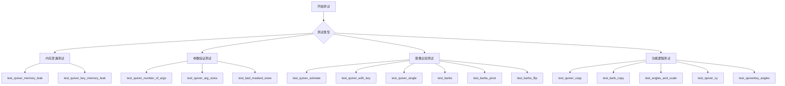
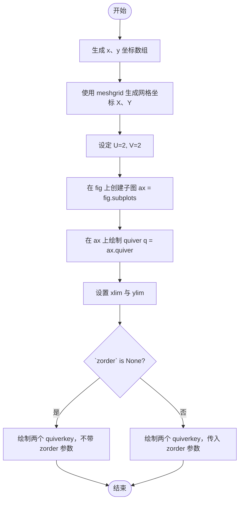
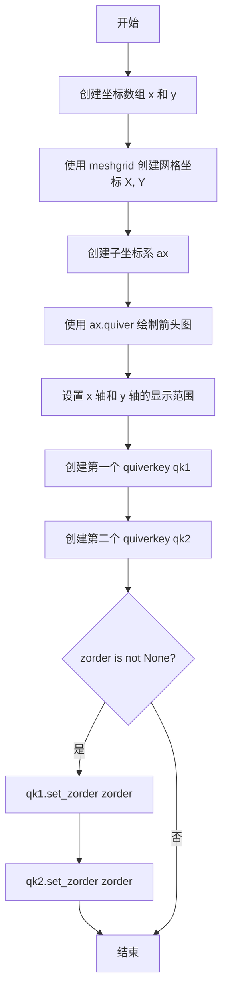
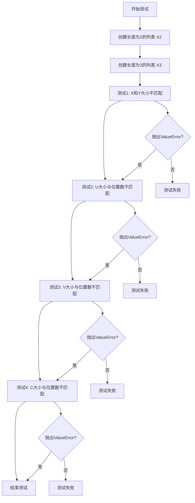
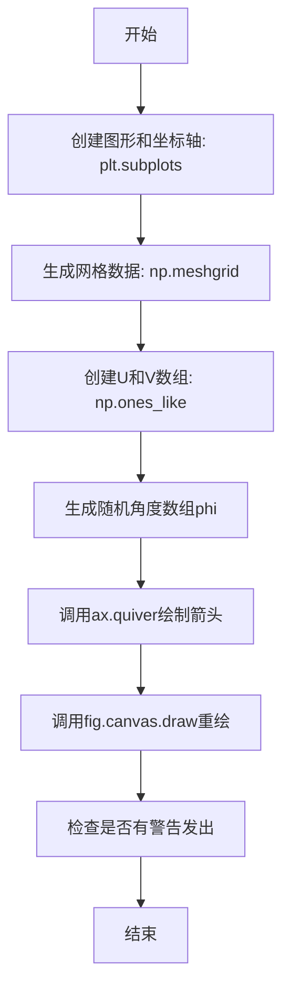
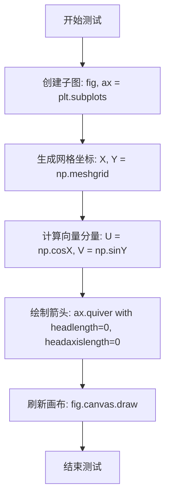
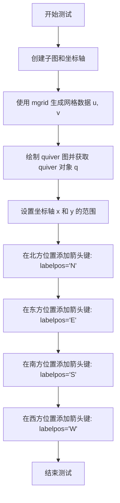
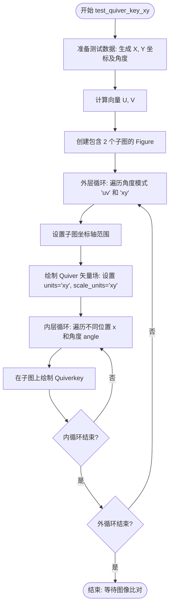

# `matplotlib\lib\matplotlib\tests\test_quiver.py` 详细设计文档

这是一个matplotlib的测试文件，主要测试quiver（箭头图）和barbs（风羽图）绘图功能，涵盖内存泄漏检测、参数验证、图像对比、复制功能、角度与比例设置等多个方面。

## 整体流程



## 类结构

```
测试模块 (test_quiver.py)
├── 辅助函数
│   ├── draw_quiver
│   ├── draw_quiverkey_zorder_argument
│   └── draw_quiverkey_setzorder
├── 内存泄漏测试
│   ├── test_quiver_memory_leak
│   └── test_quiver_key_memory_leak
├── 参数验证测试
│   ├── test_quiver_number_of_args
│   ├── test_quiver_arg_sizes
│   └── test_bad_masked_sizes
├── 警告测试
│   ├── test_no_warnings
│   └── test_zero_headlength
├── 图像比较测试
│   ├── test_quiver_animate
│   ├── test_quiver_with_key
│   ├── test_quiver_single
│   ├── test_quiver_key_pivot
│   ├── test_quiver_key_xy
│   ├── test_barbs
│   ├── test_barbs_pivot
│   └── test_barbs_flip
├── 复制功能测试
│   ├── test_quiver_copy
│   └── test_barb_copy
└── 角度和比例测试
    ├── test_angles_and_scale
    ├── test_quiver_xy
    ├── test_quiverkey_angles
    ├── test_quiverkey_angles_xy_aitoff
    ├── test_quiverkey_angles_scale_units_cartesian
    └── test_quiver_setuvc_numbers
```

## 全局变量及字段


### `X`
    
网格x坐标数组，由meshgrid生成

类型：`numpy.ndarray`
    


### `Y`
    
网格y坐标数组，由meshgrid生成

类型：`numpy.ndarray`
    


### `U`
    
x方向速度场数组，由cos(X)计算得出

类型：`numpy.ndarray`
    


### `V`
    
y方向速度场数组，由sin(Y)计算得出

类型：`numpy.ndarray`
    


### `Q`
    
quiver图的返回值，表示矢量箭头集合

类型：`matplotlib.quiver.Quiver`
    


### `QK`
    
quiverkey的返回值，表示图例箭头

类型：`matplotlib.quiver.QuiverKey`
    


### `ttX`
    
quiver对象的X坐标数组引用，用于内存泄漏检测

类型：`numpy.ndarray`
    


### `orig_refcount`
    
对象引用计数，用于验证内存释放

类型：`int`
    


### `phi`
    
随机角度数组，用于测试quiver角度参数

类型：`numpy.ndarray`
    


### `x`
    
一维坐标数组，由arange或linspace生成

类型：`numpy.ndarray`
    


### `y`
    
一维坐标数组，由arange或linspace生成

类型：`numpy.ndarray`
    


### `u`
    
x方向分量数组，用于barbs或quiver绘图

类型：`numpy.ndarray`
    


### `v`
    
y方向分量数组，用于barbs或quiver绘图

类型：`numpy.ndarray`
    


### `b0`
    
barbs图的返回值，表示风羽图对象

类型：`matplotlib.quiver.Barbs`
    


### `q0`
    
quiver图的返回值，用于测试拷贝行为

类型：`matplotlib.quiver.Quiver`
    


### `uv`
    
包含u和v数组的字典，用于测试数据隔离

类型：`dict`
    


### `angles`
    
角度数组，用于测试quiverkey角度显示

类型：`numpy.ndarray`
    


### `qk`
    
quiverkey对象，用于添加矢量图图例

类型：`matplotlib.quiver.QuiverKey`
    


### `X2`
    
包含2个元素的测试用列表

类型：`list`
    


### `X3`
    
包含3个元素的测试用列表

类型：`list`
    


### `fig`
    
matplotlib图形对象

类型：`matplotlib.figure.Figure`
    


### `ax`
    
matplotlib坐标轴对象

类型：`matplotlib.axes.Axes`
    


### `axs`
    
坐标轴对象数组，由subplots返回

类型：`matplotlib.axes.Axes array`
    


    

## 全局函数及方法


### `draw_quiver`

该函数是一个用于在 matplotlib 坐标轴上绘制箭头场（quiver）的辅助函数，通过生成网格坐标和向量数据，调用 Axes 对象的 quiver 方法创建箭头集合并返回。

参数：

- `ax`：`matplotlib.axes.Axes`，Matplotlib 的坐标轴对象，用于承载箭头图的绘制
- `**kwargs`：可变关键字参数，类型为任意（根据 quiver 方法支持），这些参数会直接传递给 `ax.quiver()` 方法，用于自定义箭头的外观和行为（如颜色、缩放、角度等）

返回值：`matplotlib.quiver.Quiver`，返回 `ax.quiver()` 的结果对象，这是一个表示箭头集合的 QuadMesh 对象，可用于后续的箭头键（quiverkey）添加或属性修改

#### 流程图

```mermaid
flowchart TD
    A[开始 draw_quiver] --> B[生成网格坐标 X, Y]
    B --> C[计算向量分量 U = cos(X)]
    C --> D[计算向量分量 V = sin(Y)]
    D --> E[调用 ax.quiver U V **kwargs]
    E --> F[返回箭头集合对象 Q]
    F --> G[结束]
```

#### 带注释源码

```python
def draw_quiver(ax, **kwargs):
    """
    在给定的坐标轴上绘制一个箭头场（quiver plot）
    
    参数:
        ax: matplotlib.axes.Axes 对象，用于绘制箭头的坐标轴
        **kwargs: 传递给 ax.quiver() 的可选关键字参数
    """
    
    # 使用 meshgrid 生成网格坐标
    # X 和 Y 是 2D 数组，范围从 0 到 2*pi，步长为 1
    X, Y = np.meshgrid(np.arange(0, 2 * np.pi, 1),
                       np.arange(0, 2 * np.pi, 1))
    
    # 计算 X 方向的向量分量（余弦）
    U = np.cos(X)
    
    # 计算 Y 方向的向量分量（正弦）
    V = np.sin(Y)
    
    # 调用坐标轴的 quiver 方法绘制箭头
    # U, V 是箭头的数据，**kwargs 传递额外的样式参数
    Q = ax.quiver(U, V, **kwargs)
    
    # 返回生成的 Quiver 对象
    return Q
```


### `draw_quiverkey_zorder_argument`

**描述**  
该函数在传入的 `matplotlib.figure.Figure` 对象上绘制一个矢量场（quiver）以及两个对应的 `QuiverKey`，并可通过 `zorder` 参数控制 `QuiverKey` 的绘制层次。若 `zorder` 为 `None`，则不指定层次；否则使用传入的数值设置层次。

#### 参数

- `fig`：`matplotlib.figure.Figure`，要在其上创建子图并绘制 quiver 与 quiverkey 的图形对象。  
- `zorder`：`int` 或 `None`，可选，默认 `None`。若提供整数，则将其作为 `QuiverKey` 的 `zorder`；若为 `None`，则不传递 `zorder` 参数。

#### 返回值

- **`None`**：该函数仅执行绘图操作，不返回任何对象。

#### 流程图



#### 带注释源码

```python
def draw_quiverkey_zorder_argument(fig, zorder=None):
    """
    在给定的 Figure 上绘制 Quiver 和 QuiverKey，并可选择使用 zorder 参数。

    参数:
        fig: matplotlib.figure.Figure, 目标图形对象。
        zorder: int 或 None, 可选，默认 None，表示 QuiverKey 的绘制层次。

    返回:
        None, 该函数仅进行绘图，不返回任何对象。
    """
    # 1. 创建 x、y 坐标数组（1 到 5，步长 1）
    x = np.arange(1, 6, 1)
    y = np.arange(1, 6, 1)

    # 2. 使用 meshgrid 生成网格坐标 X、Y
    X, Y = np.meshgrid(x, y)

    # 3. 定义矢量分量 U、V（这里均取常数 2）
    U, V = 2, 2

    # 4. 在 fig 上创建一个子图（axes），返回 ax 对象
    ax = fig.subplots()

    # 5. 在子图上绘制矢量场（quiver），指定支点为 'middle'
    q = ax.quiver(X, Y, U, V, pivot='middle')

    # 6. 设置子图的显示范围
    ax.set_xlim(0.5, 5.5)
    ax.set_ylim(0.5, 5.5)

    # 7. 根据是否传入 zorder 参数决定绘制方式
    if zorder is None:
        # 不指定 zorder，使用默认层次绘制两个 quiverkey
        ax.quiverkey(q, 4, 4, 25, coordinates='data',
                     label='U', color='blue')
        ax.quiverkey(q, 5.5, 2, 20, coordinates='data',
                     label='V', color='blue', angle=90)
    else:
        # 明确传入 zorder，使用指定层次绘制两个 quiverkey
        ax.quiverkey(q, 4, 4, 25, coordinates='data',
                     label='U', color='blue', zorder=zorder)
        ax.quiverkey(q, 5.5, 2, 20, coordinates='data',
                     label='V', color='blue', angle=90, zorder=zorder)
```


### `draw_quiverkey_setzorder`

该函数用于在matplotlib中绘制quiver（箭头）图和quiverkey（图例），并通过`set_zorder`方法动态设置图例的显示层级。

参数：

- `fig`：`matplotlib.figure.Figure`，matplotlib的图形对象，用于承载绘图内容
- `zorder`：`int` 或 `None`，用于设置quiverkey的zorder值。如果为`None`，则不改变zorder

返回值：`None`，该函数无返回值，仅执行绘图操作

#### 流程图



#### 带注释源码

```python
def draw_quiverkey_setzorder(fig, zorder=None):
    """Draw Quiver and QuiverKey using set_zorder"""
    # 创建从1到5（不包含6）的整数数组
    x = np.arange(1, 6, 1)
    y = np.arange(1, 6, 1)
    # 使用meshgrid生成二维网格坐标矩阵
    X, Y = np.meshgrid(x, y)
    # 设置箭头的U和V分量
    U, V = 2, 2

    # 从fig创建子坐标系
    ax = fig.subplots()
    # 绘制quiver（箭头）图，pivot='middle'表示箭头支点在箭头中间
    q = ax.quiver(X, Y, U, V, pivot='middle')
    # 设置x轴显示范围
    ax.set_xlim(0.5, 5.5)
    # 设置y轴显示范围
    ax.set_ylim(0.5, 5.5)
    # 创建第一个quiverkey（图例），位于坐标(4,4)，长度为25
    qk1 = ax.quiverkey(q, 4, 4, 25, coordinates='data',
                       label='U', color='blue')
    # 创建第二个quiverkey（图例），位于坐标(5.5,2)，长度为20，角度为90度
    qk2 = ax.quiverkey(q, 5.5, 2, 20, coordinates='data',
                       label='V', color='blue', angle=90)
    # 如果zorder参数不为None，则设置两个quiverkey的zorder
    if zorder is not None:
        # 设置第一个quiverkey的zorder
        qk1.set_zorder(zorder)
        # 设置第二个quiverkey的zorder
        qk2.set_zorder(zorder)
```


### `test_quiver_memory_leak`

该测试函数用于验证 Matplotlib 中 quiver（矢量场）对象在移除后是否存在内存泄漏，通过比较移除前后的引用计数来检测对象是否被正确释放。

参数： 无

返回值：`None`，该函数为测试函数，不返回任何值，仅通过断言验证内存管理是否正确

#### 流程图

```mermaid
flowchart TD
    A[开始测试] --> B[创建图形和坐标轴: plt.subplots]
    B --> C[调用draw_quiver创建quiver对象]
    C --> D[获取quiver对象的X属性: ttX = Q.X]
    D --> E[记录原始引用计数: orig_refcount = sys.getrefcount(ttX)]
    E --> F[调用Q.remove移除quiver对象]
    F --> G[删除Q变量: del Q]
    G --> H{断言: sys.getrefcount(ttX) < orig_refcount}
    H -->|通过| I[测试通过 - 无内存泄漏]
    H -->|失败| J[测试失败 - 存在内存泄漏]
```

#### 带注释源码

```python
# 使用pytest标记，仅在CPython实现下运行（因为需要使用sys.getrefcount）
@pytest.mark.skipif(platform.python_implementation() != 'CPython',
                    reason='Requires CPython')
def test_quiver_memory_leak():
    """
    测试quiver对象的内存泄漏问题
    验证在移除quiver对象后，相关对象的引用计数是否正确减少
    """
    # 创建一个新的图形和坐标轴
    fig, ax = plt.subplots()

    # 调用辅助函数在坐标轴上绘制quiver（矢量场）并获取返回的Quiver对象
    Q = draw_quiver(ax)
    
    # 获取Quiver对象的X属性，这是一个numpy数组
    ttX = Q.X
    
    # 获取ttX的原始引用计数
    orig_refcount = sys.getrefcount(ttX)
    
    # 调用remove方法从坐标轴中移除quiver对象
    Q.remove()

    # 删除Q变量，减少一个对Quiver对象的引用
    del Q

    # 断言：移除后ttX的引用计数应该小于原始引用计数
    # 如果引用计数没有减少，说明存在内存泄漏
    assert sys.getrefcount(ttX) < orig_refcount
```


### `test_quiver_key_memory_leak`

该测试函数用于验证 matplotlib 中 quiverkey 对象在移除后能否正确释放内存，防止内存泄漏。它通过比较 quiverkey 对象在移除前后的 Python 引用计数来判断是否存在内存泄漏，如果移除后引用计数未下降，则表明存在内存泄漏。

参数： 无

返回值：`None`，该函数为测试函数，不返回任何值

#### 流程图

```mermaid
flowchart TD
    A[开始测试] --> B[创建图形和坐标轴: fig, ax = plt.subplots]
    B --> C[绘制箭头场: Q = draw_quiver(ax)]
    C --> D[创建quiverkey: qk = ax.quiverkey]
    D --> E[获取初始引用计数: orig_refcount = sys.getrefcount(qk)]
    E --> F[移除quiverkey对象: qk.remove]
    F --> G{判断: sys.getrefcount(qk) < orig_refcount?}
    G -->|是| H[测试通过 - 无内存泄漏]
    G -->|否| I[测试失败 - 存在内存泄漏]
    H --> J[结束测试]
    I --> J
```

#### 带注释源码

```python
@pytest.mark.skipif(platform.python_implementation() != 'CPython',
                    reason='Requires CPython')
def test_quiver_key_memory_leak():
    """
    测试 quiverkey 对象的内存泄漏问题
    
    该测试函数验证在移除 quiverkey 对象后，其引用计数是否正确减少，
    从而确保不存在内存泄漏。只有 CPython 实现才有可靠的引用计数机制，
    因此该测试仅在 CPython 环境下运行。
    """
    # 创建一个新的图形和坐标轴
    fig, ax = plt.subplots()

    # 使用辅助函数绘制箭头场，返回 Quiver 对象
    Q = draw_quiver(ax)

    # 在坐标轴上创建 quiverkey（箭头键图例）
    # 参数: Q-关联的Quiver对象, 0.5-X位置, 0.92-Y位置, 2-箭头长度
    # labelpos='W'-标签在左侧, fontproperties-字体属性
    qk = ax.quiverkey(Q, 0.5, 0.92, 2, r'$2 \frac{m}{s}$',
                      labelpos='W',
                      fontproperties={'weight': 'bold'})
    
    # 获取 quiverkey 对象当前的引用计数
    # sys.getrefcount 会返回一个比实际多1的计数（因为调用本身会临时增加引用）
    orig_refcount = sys.getrefcount(qk)
    
    # 从坐标轴中移除 quiverkey 对象
    qk.remove()

    # 断言：移除后的引用计数应该小于原始引用计数
    # 如果引用计数没有下降，说明存在内存泄漏（对象被错误保留）
    assert sys.getrefcount(qk) < orig_refcount
```


### `test_quiver_number_of_args`

该函数是一个pytest测试用例，用于验证`plt.quiver()`函数在参数数量不足或过多时能否正确抛出`TypeError`异常。

参数：
- 无参数

返回值：`None`，该函数为测试函数，不返回任何值

#### 流程图

```mermaid
flowchart TD
    A[开始测试 test_quiver_number_of_args] --> B[定义测试数据 X = [1, 2]]
    B --> C{测试用例1: 调用 plt.quiver(X)}
    C --> D[验证抛出 TypeError]
    D --> E[匹配错误信息: 'takes from 2 to 5 positional arguments but 1 were given']
    E --> F{测试用例2: 调用 plt.quiver(X, X, X, X, X, X)}
    F --> G[验证抛出 TypeError]
    G --> H[匹配错误信息: 'takes from 2 to 5 positional arguments but 6 were given']
    H --> I[测试结束]
```

#### 带注释源码

```python
def test_quiver_number_of_args():
    """
    测试 plt.quiver() 函数对参数数量的验证
    
    该测试验证 quiver 函数在接收不正确数量的位置参数时
    是否能正确抛出 TypeError 异常
    """
    # 定义测试用的输入数据
    X = [1, 2]
    
    # 测试用例1: 参数数量不足（只传入1个参数，期望至少2个）
    # 验证 plt.quiver(X) 是否抛出 TypeError
    with pytest.raises(
            TypeError,
            match='takes from 2 to 5 positional arguments but 1 were given'):
        plt.quiver(X)
    
    # 测试用例2: 参数数量过多（传入6个参数，期望最多5个）
    # 验证 plt.quiver(X, X, X, X, X, X) 是否抛出 TypeError
    with pytest.raises(
            TypeError,
            match='takes from 2 to 5 positional arguments but 6 were given'):
        plt.quiver(X, X, X, X, X, X)
```


### `test_quiver_arg_sizes`

该测试函数用于验证 `plt.quiver()` 在传入参数大小不匹配时能否正确抛出 `ValueError` 异常，并检查错误消息是否准确反映了是哪个参数（X、Y、U、V、C）出现了大小不匹配的问题。

参数： 无

返回值：无（`None`），测试函数不返回任何值，仅执行断言

#### 流程图



#### 带注释源码

```python
def test_quiver_arg_sizes():
    """
    测试 plt.quiver() 函数在参数大小不匹配时的错误处理。
    验证函数能正确识别并报告 X、Y、U、V、C 参数的大小不匹配问题。
    """
    # 定义两个测试用的列表
    X2 = [1, 2]  # 长度为2的列表，用于正常参数
    X3 = [1, 2, 3]  # 长度为3的列表，用于制造大小不匹配
    
    # 测试用例1: X和Y的大小不同
    # 期望抛出ValueError，错误消息应说明X.size和Y.size不匹配
    with pytest.raises(
            ValueError, match=('X and Y must be the same size, but '
                               'X.size is 2 and Y.size is 3.')):
        plt.quiver(X2, X3, X2, X2)
    
    # 测试用例2: U参数的大小与箭头位置数量不匹配
    # X2长度为2，应有2个箭头位置，但U(X3)长度为3
    # 期望抛出ValueError，说明U的大小不匹配
    with pytest.raises(
            ValueError, match=('Argument U has a size 3 which does not match '
                               '2, the number of arrow positions')):
        plt.quiver(X2, X2, X3, X2)
    
    # 测试用例3: V参数的大小与箭头位置数量不匹配
    # X2长度为2，应有2个箭头位置，但V(X3)长度为3
    # 期望抛出ValueError，说明V的大小不匹配
    with pytest.raises(
            ValueError, match=('Argument V has a size 3 which does not match '
                               '2, the number of arrow positions')):
        plt.quiver(X2, X2, X2, X3)
    
    # 测试用例4: C(颜色)参数的大小与箭头位置数量不匹配
    # X2长度为2，应有2个箭头位置，但C(X3)长度为3
    # 期望抛出ValueError，说明C的大小不匹配
    with pytest.raises(
            ValueError, match=('Argument C has a size 3 which does not match '
                               '2, the number of arrow positions')):
        plt.quiver(X2, X2, X2, X2, X3)
```


### `test_no_warnings`

该测试函数用于验证在使用 `ax.quiver` 绘制箭头图时，特别是指定 `angles` 参数时不会产生任何警告。它通过创建特定的网格数据和随机角度，然后强制重绘画布来捕获可能发出的警告。

参数：无

返回值：`None`，无返回值

#### 流程图



#### 带注释源码

```python
def test_no_warnings():
    # 创建一个新的图形和坐标轴对象
    fig, ax = plt.subplots()
    
    # 生成网格数据，X为15x10的数组，Y为15x10的数组
    # X的值为0-14，Y的值为0-9
    X, Y = np.meshgrid(np.arange(15), np.arange(10))
    
    # 创建与X形状相同的全1数组作为U和V的值
    # 表示所有箭头的长度都为1
    U = V = np.ones_like(X)
    
    # 生成随机角度数组，范围在-75到75度之间
    # (随机数0-1减去0.5再乘以150)
    phi = (np.random.rand(15, 10) - .5) * 150
    
    # 使用指定的角度数组绘制箭头图
    # angles参数指定每个箭头的角度
    ax.quiver(X, Y, U, V, angles=phi)
    
    # 强制重绘画布，这会触发箭头的实际绘制
    # 此时应该不会发出任何警告
    # 如果有警告，这个测试会失败
    fig.canvas.draw()  # Check that no warning is emitted.
```


### test_zero_headlength

该函数是一个pytest测试用例，用于验证matplotlib的quiver（箭头）绘制功能在headlength和headaxislength参数均为0时不会产生警告，基于Doug McNeil的报告。

参数：无（此测试函数没有显式参数，依赖pytest框架的隐式上下文）

返回值：`None`，该测试函数不返回值，仅通过副作用（绘图操作无警告）验证行为

#### 流程图



#### 带注释源码

```python
def test_zero_headlength():
    # 基于Doug McNeil的报告：
    # https://discourse.matplotlib.org/t/quiver-warnings/16722
    # 此测试验证当headlength和headaxislength都设为0时，
    # quiver不会产生警告
    
    # 创建包含一个子图的图形对象
    fig, ax = plt.subplots()
    
    # 生成10x10的网格坐标
    X, Y = np.meshgrid(np.arange(10), np.arange(10))
    
    # 计算向量分量：U为余弦，V为正弦
    U, V = np.cos(X), np.sin(Y)
    
    # 绘制箭头，设置headlength=0和headaxislength=0
    # 这会创建没有箭头头部的箭头
    ax.quiver(U, V, headlength=0, headaxislength=0)
    
    # 刷新画布以触发渲染，检查是否产生警告
    fig.canvas.draw()  # Check that no warning is emitted.
```


### `test_quiver_animate`

该测试函数用于验证matplotlib中quiver（箭头）图在动画模式下的正确渲染功能，确保修复#2616问题后动画模式下的quiver图能够正常显示且与参考图像匹配。

参数：无

返回值：无（`None`），该函数为测试函数，不返回任何值

#### 流程图

```mermaid
flowchart TD
    A[开始 test_quiver_animate] --> B[创建子图: fig, ax = plt.subplots]
    --> C[调用draw_quiver创建动画模式箭头: Q = draw_quiver(ax, animated=True)]
    --> D[添加箭头键标注: ax.quiverkey]
    --> E[@image_comparison装饰器自动比对生成的图像与参考图像]
    --> F[结束]
```

#### 带注释源码

```python
@image_comparison(['quiver_animated_test_image.png'])
def test_quiver_animate():
    # Tests fix for #2616
    # 创建包含一个子图的图形窗口
    fig, ax = plt.subplots()
    
    # 使用animated=True参数绘制quiver（箭头）图
    # 这是测试#2616修复的核心：确保动画模式下的quiver能够正常工作
    Q = draw_quiver(ax, animated=True)
    
    # 在图上添加箭头键（quiverkey）用于显示向量大小和标签
    # 参数说明：
    #   Q: 之前创建的quiver对象
    #   0.5: 键在x轴的位置（归一化坐标）
    #   0.92: 键在y轴的位置（归一化坐标）
    #   2: 向量长度对应的数值
    #   r'$2 \frac{m}{s}$': 标签文本（显示速度单位）
    #   labelpos='W': 标签位置在键的西边（左侧）
    #   fontproperties={'weight': 'bold'}: 标签字体为粗体
    ax.quiverkey(Q, 0.5, 0.92, 2, r'$2 \frac{m}{s}$',
                 labelpos='W', fontproperties={'weight': 'bold'})
```


### `test_quiver_with_key`

该函数是一个pytest测试函数，用于测试matplotlib中quiver图（箭头图）带key（箭头键图例）的功能是否正常，通过与基准图像进行对比来验证绘制结果的正确性。

参数： 无（仅包含pytest隐式参数如fixture等）

返回值：`None`，该测试函数不返回任何值，仅用于验证图像渲染结果

#### 流程图

```mermaid
flowchart TD
    A[开始测试 test_quiver_with_key] --> B[创建子图: fig, ax = plt.subplots]
    B --> C[设置坐标轴边距: ax.margins(0.1)]
    C --> D[绘制quiver图: Q = draw_quiver(ax)]
    D --> E[添加quiverkey箭头键图例]
    E --> F[使用@image_comparison装饰器对比图像]
    F --> G[测试结束]
```

#### 带注释源码

```python
@image_comparison(['quiver_with_key_test_image.png'])  # 装饰器：比较生成图像与基准图像
def test_quiver_with_key():
    """测试带quiverkey的箭头图绘制功能"""
    fig, ax = plt.subplots()  # 创建figure和axes子图
    ax.margins(0.1)  # 设置坐标轴边距为0.1
    
    Q = draw_quiver(ax)  # 调用draw_quiver函数绘制箭头场
    
    # 添加箭头键图例（QuiverKey）
    ax.quiverkey(
        Q,                          # quiver对象
        0.5, 0.95,                  # X, Y位置（坐标）
        2,                          # U：箭头长度对应的数值
        r'$2\, \mathrm{m}\, \mathrm{s}^{-1}$',  # label：图例标签文本
        angle=-10,                  # angle：箭头角度偏移
        coordinates='figure',      # coordinates：位置坐标系统（'figure'或'data'）
        labelpos='W',               # labelpos：标签相对于箭头的位置（'W'为西/左侧）
        fontproperties={'weight': 'bold', 'size': 'large'}  # 字体属性
    )
    # 测试完成，@image_comparison装饰器会自动比较生成的图像
```

#### 关键技术细节

- 该测试使用`@image_comparison`装饰器进行图像对比测试
- `draw_quiver`是一个辅助函数，在代码开头定义，用于创建一个标准的quiver图
- `ax.quiverkey()`方法用于在 quiver 图上添加一个箭头键图例，表示箭头长度所代表的数值大小
- `coordinates='figure'`参数表示位置使用figure坐标系（0-1范围），而非数据坐标系
- `labelpos='W'`表示图例标签显示在箭头的西侧（左侧）


### `test_quiver_single`

该函数是一个pytest测试用例，用于测试matplotlib中quiver（箭头图）的基本绘制功能。它创建一个包含单个箭头的quiver图，并使用图像比较装饰器验证输出图像是否符合预期。

参数：无

返回值：`None`，测试函数不返回有意义的值，测试结果通过图像比较判定

#### 流程图

```mermaid
graph TD
    A[开始] --> B[创建图形和坐标轴<br/>fig, ax = plt.subplots]
    B --> C[设置边距<br/>ax.margins(0.1)]
    C --> D[绘制quiver箭头图<br/>ax.quiver([1], [1], [2], [2])]
    D --> E[结束<br/>等待图像比较验证]
```

#### 带注释源码

```python
@image_comparison(['quiver_single_test_image.png'], remove_text=True)
def test_quiver_single():
    """
    测试quiver基本绘制功能的测试用例。
    使用image_comparison装饰器自动比较生成的图像与预期图像。
    remove_text=True表示比较时移除所有文本元素。
    """
    # 创建一个新的图形窗口和一个子图坐标轴
    # fig: Figure对象，代表整个图形
    # ax: Axes对象，代表坐标轴
    fig, ax = plt.subplots()
    
    # 设置坐标轴的边距为0.1（即10%）
    # 这会在数据范围之外留出一些空白空间
    ax.margins(0.1)
    
    # 调用quiver方法绘制箭头图
    # 参数解释：
    # [1]: X坐标位置（箭头的起始X坐标）
    # [1]: Y坐标位置（箭头的起始Y坐标）
    # [2]: U向量（箭头在X方向的分量）
    # [2]: V向量（箭头在Y方向的分量）
    # 即：从点(1,1)开始，绘制一个指向(3,3)的箭头
    ax.quiver([1], [1], [2], [2])
```


### `test_quiver_copy`

该测试函数用于验证matplotlib的quiver（箭头）图在创建时是否正确复制了数据，确保当原始数据被修改后，quiver对象中存储的值保持不变（深拷贝行为），从而避免意外的数据共享导致的副作用。

参数：无

返回值：`None`，测试函数不返回任何值，仅通过断言验证数据完整性

#### 流程图

```mermaid
flowchart TD
    A[开始测试] --> B[创建子图: fig, ax = plt.subplots]
    B --> C[准备数据: 创建字典uv包含u和v数组]
    C --> D[调用ax.quiver创建箭头图: q0 = ax.quiver]
    D --> E[修改原始数据: uv['v'][0] = 0]
    E --> F[断言验证: q0.V[0] == 2.0]
    F --> G{断言是否通过}
    G -->|通过| H[测试通过]
    G -->|失败| I[测试失败]
    H --> J[结束]
    I --> J
```

#### 带注释源码

```python
def test_quiver_copy():
    """
    测试quiver图是否正确复制了输入数据（深拷贝测试）
    
    此测试验证当原始数据在创建quiver图后被修改时，
    quiver对象中存储的值保持不变，确保数据隔离
    """
    # 创建一个新的图形和轴对象
    fig, ax = plt.subplots()
    
    # 准备测试数据：使用字典存储u和v分量
    # u = [1.1], v = [2.0]
    uv = dict(u=np.array([1.1]), v=np.array([2.0]))
    
    # 使用ax.quiver创建箭头图，传入位置坐标和向量分量
    # 创建后，quiver对象应该复制这些数据而不是引用原数组
    q0 = ax.quiver([1], [1], uv['u'], uv['v'])
    
    # 修改原始数据字典中的v值
    # 将v的第一个元素从2.0改为0
    uv['v'][0] = 0
    
    # 断言验证：quiver对象q0的V属性应该保持原始值2.0
    # 这确保了quiver在创建时进行了深拷贝，而不是简单引用
    assert q0.V[0] == 2.0
    
    # 测试完成，如果断言失败会抛出AssertionError
    # 成功则什么都不返回（返回None）
```


### `test_quiver_key_pivot`

该测试函数用于验证 quiver 图中箭头键（quiverkey）在不同锚点位置（北、南、东、西）的显示效果，通过在图的四个边缘位置添加箭头键来测试 pivot 功能是否正常工作。

参数：
- 无

返回值：`None`，无返回值

#### 流程图



#### 带注释源码

```python
@image_comparison(['quiver_key_pivot.png'], remove_text=True)
def test_quiver_key_pivot():
    """测试 quiver 箭头键在不同锚点位置的显示效果"""
    fig, ax = plt.subplots()  # 创建子图和坐标轴

    # 使用 mgrid 生成网格数据
    # 生成从 0 到 2*pi 的复数步长数组，共 10 个点
    u, v = np.mgrid[0:2*np.pi:10j, 0:2*np.pi:10j]

    # 绘制 quiver 图，使用 sin(u) 和 cos(v) 作为向量数据
    q = ax.quiver(np.sin(u), np.cos(v))
    
    # 设置坐标轴范围
    ax.set_xlim(-2, 11)
    ax.set_ylim(-2, 11)
    
    # 在图的四个边缘添加箭头键，测试不同的 labelpos 位置
    ax.quiverkey(q, 0.5, 1, 1, 'N', labelpos='N')  # 北（上方）
    ax.quiverkey(q, 1, 0.5, 1, 'E', labelpos='E')  # 东（右侧）
    ax.quiverkey(q, 0.5, 0, 1, 'S', labelpos='S')  # 南（下方）
    ax.quiverkey(q, 0, 0.5, 1, 'W', labelpos='W')  # 西（左侧）
```


### `test_quiver_key_xy`

该函数是一个自动化图像比对测试用例，用于验证 Matplotlib 中 `quiverkey`（箭头图例）在 `scale_units='xy'` 参数配置下是否能正确跟随 `quiver`（箭头图）的位置和角度，尤其是检查在不同的角度模式（'uv' 和 'xy'）以及不同长宽比的坐标系下的行为是否符合预期。

参数：
- 无（该函数为测试夹具的顶层函数，无显式输入参数）

返回值：
- `None`，该函数不返回任何值，主要通过 `@image_comparison` 装饰器自动进行图像结果比对。

#### 流程图



#### 带注释源码

```python
@image_comparison(['quiver_key_xy.png'], remove_text=True)
def test_quiver_key_xy():
    # With scale_units='xy', ensure quiverkey still matches its quiver.
    # Note that the quiver and quiverkey lengths depend on the axes aspect
    # ratio, and that with angles='xy' their angles also depend on the axes
    # aspect ratio.
    
    # 1. 准备数据：生成 X 坐标 (0-7) 和全零 Y 坐标
    X = np.arange(8)
    Y = np.zeros(8)
    
    # 2. 生成角度数组 (0, 45, 90, ... 度的弧度值)
    angles = X * (np.pi / 4)
    
    # 3. 将角度转换为向量 (复数形式 exp(1j*angle) 的实部为 U，虚部为 V)
    uv = np.exp(1j * angles)
    U = uv.real
    V = uv.imag
    
    # 4. 创建画布，包含两个子图 (上下排列)
    fig, axs = plt.subplots(2)
    
    # 5. 遍历两种角度模式：'uv' (默认) 和 'xy' (数据坐标)
    for ax, angle_str in zip(axs, ('uv', 'xy')):
        # 设置坐标轴显示范围
        ax.set_xlim(-1, 8)
        ax.set_ylim(-0.2, 0.2)
        
        # 绘制矢量场
        # units='xy': 宽度单位使用数据坐标
        # scale_units='xy': 缩放单位使用数据坐标
        q = ax.quiver(X, Y, U, V, pivot='middle',
                      units='xy', width=0.05,
                      scale=2, scale_units='xy',
                      angles=angle_str)
        
        # 6. 在矢量场上添加关键点 (Quiverkey)
        # 遍历三个不同的 X 位置和对应的角度 (0, 45, 90度)
        for x, angle in zip((0.2, 0.5, 0.8), (0, 45, 90)):
            ax.quiverkey(q, X=x, Y=0.8, U=1, angle=angle, label='', color='b')
```


### `test_barbs`

这是一个测试函数，用于验证 matplotlib 中 `barbs` 方法的功能。该函数创建一个风羽图（barbs plot），使用网格数据绘制向量场，并检查图像输出是否符合预期。

参数：

- 无显式参数（该函数使用 pytest 的隐式 fixture）

返回值：`None`，无返回值（测试函数）

#### 流程图

```mermaid
flowchart TD
    A[开始 test_barbs] --> B[创建 x 坐标数组: np.linspace(-5, 5, 5)]
    B --> C[使用 meshgrid 创建 X, Y 网格坐标]
    C --> D[计算 U, V 向量: 12*X, 12*Y]
    D --> E[创建子图: fig, ax = plt.subplots]
    E --> F[调用 ax.barbs 绘制风羽图]
    F --> G[参数: X, Y, U, V, np.hypot(U, V)]
    G --> H[参数: fill_empty=True, rounding=False]
    H --> I[参数: sizes=dict(emptybarb=0.25, spacing=0.2, height=0.3)]
    I --> J[参数: cmap='viridis']
    J --> K[使用 @image_comparison 装饰器验证图像输出]
    K --> L[结束]
```

#### 带注释源码

```python
@image_comparison(['barbs_test_image.png'], remove_text=True)
def test_barbs():
    """测试 barbs 函数的基本绘图功能"""
    # 创建从 -5 到 5 的等间距数组，共 5 个点
    x = np.linspace(-5, 5, 5)
    
    # 创建二维网格坐标 X 和 Y
    X, Y = np.meshgrid(x, x)
    
    # 计算向量分量，U 和 V 分别代表 x 和 y 方向的速度
    # 乘以 12 是为了产生足够大的值以便在风羽图中显示
    U, V = 12*X, 12*Y
    
    # 创建图形和坐标轴对象
    fig, ax = plt.subplots()
    
    # 调用 barbs 方法绘制风羽图
    # 参数说明:
    # - X, Y: 网格坐标
    # - U, V: 向量分量
    # - np.hypot(U, V): 用于着色的速度大小（颜色映射）
    # - fill_empty=True: 填充空风羽
    # - rounding=False: 不进行舍入
    # - sizes: 字典，包含风羽的各种尺寸参数
    # - cmap='viridis': 使用 viridis 颜色映射
    ax.barbs(X, Y, U, V, np.hypot(U, V), fill_empty=True, rounding=False,
             sizes=dict(emptybarb=0.25, spacing=0.2, height=0.3),
             cmap='viridis')
```


### `test_barbs_pivot`

该测试函数用于验证matplotlib中`barbs`图形在不同pivot参数下的渲染效果，通过对比生成的图像与基准图像来确保pivot功能正确实现。

参数：
- 该函数无显式参数（通过pytest fixture隐式接收`fig_test`参数）

返回值：`None`，该函数为测试函数，不返回任何值

#### 流程图

```mermaid
flowchart TD
    A[开始执行test_barbs_pivot] --> B[创建测试数据网格]
    B --> C[使用np.linspace生成-5到5的5个点]
    C --> D[使用np.meshgrid生成X, Y坐标矩阵]
    D --> E[计算U, V向量值: U=12*X, V=12*Y]
    E --> F[创建子图: fig, ax = plt.subplots]
    F --> G[调用ax.barbs绘制风羽图]
    G --> H[设置fill_empty=True, rounding=False, pivot=1.7]
    H --> I[配置sizes参数: emptybarb, spacing, height]
    I --> J[调用ax.scatter绘制黑色散点]
    J --> K[通过@image_comparison装饰器比对图像]
    K --> L[结束]
```

#### 带注释源码

```python
@image_comparison(['barbs_pivot_test_image.png'], remove_text=True)
def test_barbs_pivot():
    """
    测试barbs函数的pivot参数功能
    装饰器@image_comparison会自动将生成的图像与基准图像进行比对
    remove_text=True表示比对时移除所有文本元素
    """
    # 生成从-5到5的等间距5个点
    x = np.linspace(-5, 5, 5)
    
    # 使用meshgrid生成二维坐标网格
    X, Y = np.meshgrid(x, x)
    
    # 计算风羽的U, V分量（速度向量）
    # U, V 分别是X, Y坐标的12倍
    U, V = 12*X, 12*Y
    
    # 创建包含单个Axes的Figure对象
    fig, ax = plt.subplots()
    
    # 绘制风羽图（barbs）
    # fill_empty=True: 空心风羽用圆圈表示
    # rounding=False: 不进行数值舍入
    # pivot=1.7: 设置风羽支点位置，影响箭头旋转中心
    # sizes字典: 配置风羽的显示尺寸
    #   - emptybarb=0.25: 空心风羽的基础大小
    #   - spacing=0.2: 风羽之间的间距系数
    #   - height=0.3: 风羽的高度系数
    ax.barbs(X, Y, U, V, fill_empty=True, rounding=False, pivot=1.7,
             sizes=dict(emptybarb=0.25, spacing=0.2, height=0.3))
    
    # 在相同位置绘制黑色散点，作为视觉参考
    # s=49: 散点大小
    # c='black': 散点颜色为黑色
    ax.scatter(X, Y, s=49, c='black')
```


### `test_barbs_flip`

该函数是一个图像对比测试用例，用于测试 `barbs` 方法的 `flip_barb` 参数功能。测试创建了一个网格坐标系，并在 Y < 0 的区域使用布尔数组控制风杆的翻转行为。

参数：

- 该函数无显式参数

返回值：`None`，测试函数无返回值

#### 流程图

```mermaid
flowchart TD
    A[开始测试] --> B[创建网格数据: x = np.linspace(-5, 5, 5)]
    B --> C[生成网格坐标: X, Y = np.meshgrid(x, x)]
    C --> D[计算风速分量: U = 12*X, V = 12*Y]
    D --> E[创建子图: fig, ax = plt.subplots]
    E --> F[调用barbs方法<br/>flip_barb=Y < 0]
    F --> G[图像对比验证]
    G --> H[结束测试]
```

#### 带注释源码

```python
@image_comparison(['barbs_test_flip.png'], remove_text=True)
def test_barbs_flip():
    """Test barbs with an array for flip_barb."""
    # 创建从-5到5的等间距数组，包含5个点
    x = np.linspace(-5, 5, 5)
    # 生成二维网格坐标
    X, Y = np.meshgrid(x, x)
    # 计算风速分量，U和V与坐标成正比
    U, V = 12*X, 12*Y
    # 创建图形和坐标轴对象
    fig, ax = plt.subplots()
    # 绘制风杆图
    # fill_empty=True: 填充空心风杆
    # rounding=False: 不进行舍入
    # pivot=1.7: 设置风杆支点位置
    # sizes字典: 定义风杆尺寸参数
    # flip_barb=Y < 0: 关键参数，Y坐标小于0的位置风杆翻转
    ax.barbs(X, Y, U, V, fill_empty=True, rounding=False, pivot=1.7,
             sizes=dict(emptybarb=0.25, spacing=0.2, height=0.3),
             flip_barb=Y < 0)
```


### test_barb_copy

This test function verifies that matplotlib's barbs plot creates independent copies of the input u and v arrays, ensuring that modifications to the original arrays after plotting do not affect the stored values.

参数：

- 无参数（这是pytest测试函数）

返回值：`None`，测试函数，通过assert语句进行验证

#### 流程图

```mermaid
flowchart TD
    A[开始: test_barb_copy] --> B[创建figure和axes: plt.subplots]
    --> C[创建u数组: np.array[1.1]]
    --> D[创建v数组: np.array[2.2]]
    --> E[调用ax.barbs创建风羽图: b0 = ax.barbs]
    --> F[修改原数组u[0] = 0]
    --> G[断言: b0.u[0] == 1.1]
    --> H[修改原数组v[0] = 0]
    --> I[断言: b0.v[0] == 2.2]
    --> J[结束: 测试通过]
    
    style G fill:#90EE90
    style I fill:#90EE90
```

#### 带注释源码

```python
def test_barb_copy():
    """
    测试barbs是否正确复制了输入的u和v数组
    验证修改原始数组不会影响已创建的barbs对象中的数据
    """
    # 创建图形和坐标轴
    fig, ax = plt.subplots()
    
    # 创建输入数据数组
    u = np.array([1.1])  # u分量的初始值
    v = np.array([2.2])  # v分量的初始值
    
    # 在坐标轴上绘制barbs图，返回Barbs对象b0
    b0 = ax.barbs([1], [1], u, v)
    
    # 修改原始数组u的值
    u[0] = 0
    
    # 断言：验证b0.u保存的是原始值的副本，而非引用
    # 如果barbs正确实现了数据拷贝，此处应返回1.1
    assert b0.u[0] == 1.1
    
    # 修改原始数组v的值
    v[0] = 0
    
    # 断言：验证b0.v保存的是原始值的副本，而非引用
    # 如果barbs正确实现了数据拷贝，此处应返回2.2
    assert b0.v[0] == 2.2
```


### `test_bad_masked_sizes`

测试函数，用于验证当给定的掩码数组（masked arrays）大小不同时，`barbs` 方法是否能正确抛出 `ValueError` 异常。

参数：无

返回值：`None`，该函数为测试函数，不返回任何值

#### 流程图

```mermaid
flowchart TD
    A[开始测试] --> B[创建数组x和y, 长度为3]
    B --> C[创建长度为4的掩码数组u和v]
    C --> D[将u和v的第二个元素设为掩码]
    D --> E[创建子图ax]
    E --> F[调用ax.barbs并期望抛出ValueError]
    F --> G{是否抛出ValueError?}
    G -->|是| H[测试通过]
    G -->|否| I[测试失败]
```

#### 带注释源码

```python
def test_bad_masked_sizes():
    """Test error handling when given differing sized masked arrays."""
    # 创建长度为3的数组x和y
    x = np.arange(3)
    y = np.arange(3)
    
    # 创建长度为4的掩码数组u，所有元素初始化为15
    u = np.ma.array(15. * np.ones((4,)))
    # 创建与u相同形状的掩码数组v
    v = np.ma.array(15. * np.ones_like(u))
    
    # 将u和v的第二个元素设为掩码状态
    u[1] = np.ma.masked
    v[1] = np.ma.masked
    
    # 创建子图
    fig, ax = plt.subplots()
    
    # 验证当掩码数组大小与坐标数组不同时，barbs方法抛出ValueError
    with pytest.raises(ValueError):
        ax.barbs(x, y, u, v)
```


### `test_angles_and_scale`

该函数是一个测试函数，用于验证 matplotlib 的 `quiver` 方法能够正确处理 `angles` 数组参数与 `scale_units` 参数的组合使用。测试创建一个带有随机角度数组的箭头场（quiver plot），并指定 `scale_units='xy'`，以确保这两个参数能够协同工作而不会产生错误。

参数：无

返回值：`None`，该函数为测试函数，不返回任何值

#### 流程图

```mermaid
flowchart TD
    A[开始测试] --> B[创建子图: fig, ax = plt.subplots]
    B --> C[生成网格坐标: X, Y = np.meshgrid]
    C --> D[创建单位向量: U = V = np.ones_likeX]
    D --> E[生成随机角度数组: phi = np.random.rand15, 10 - 0.5 * 150]
    E --> F[调用quiver方法: ax.quiverX, Y, U, V, angles=phi, scale_units='xy']
    F --> G[测试完成 - 验证无异常抛出]
```

#### 带注释源码

```python
def test_angles_and_scale():
    # 测试 angles 数组与 scale_units 参数的组合使用
    # 创建一个新的图形和一个坐标轴
    fig, ax = plt.subplots()
    
    # 生成网格坐标
    # X 和 Y 是 10x15 的网格，范围从 0 到 14
    X, Y = np.meshgrid(np.arange(15), np.arange(10))
    
    # 创建与网格相同形状的单位向量
    # U 和 V 都是 10x15 的全 1 数组
    U = V = np.ones_like(X)
    
    # 生成随机角度数组，范围在 -75 到 75 度之间
    # 这模拟了实际应用中可能遇到的各种箭头方向
    phi = (np.random.rand(15, 10) - .5) * 150
    
    # 调用 quiver 方法绘制箭头场
    # angles=phi: 指定每个位置的箭头角度
    # scale_units='xy': 指定缩放单位基于 x 和 y 坐标
    # 测试重点：验证 angles 数组与 scale_units 参数能够正确共存
    ax.quiver(X, Y, U, V, angles=phi, scale_units='xy')
```


### `test_quiver_xy`

该函数是一个图像比较测试用例，用于测试 matplotlib 中 `quiver` 绘制函数在使用 `angles='xy'` 和 `scale_units='xy'` 参数时的基本功能。测试创建一个简单的箭头（从西南指向东北），并通过图像比较验证输出是否符合预期。

参数： 无

返回值：`None`，该函数为测试函数，不返回任何值，仅执行绘图操作并通过 `@image_comparison` 装饰器进行图像对比验证。

#### 流程图

```mermaid
flowchart TD
    A[开始执行 test_quiver_xy] --> B[创建子图: fig, ax = plt.subplots subplot_kw=dict aspect='equal']
    B --> C[绘制箭头: ax.quiver 0, 0, 1, 1, angles='xy', scale_units='xy', scale=1]
    C --> D[设置X轴范围: ax.set_xlim 0, 1.1]
    D --> E[设置Y轴范围: ax.set_ylim 0, 1.1]
    E --> F[添加网格: ax.grid]
    F --> G[通过 @image_comparison 装饰器进行图像对比验证]
    G --> H[结束]
```

#### 带注释源码

```python
@image_comparison(['quiver_xy.png'], remove_text=True)  # 图像比较装饰器，预期输出为 quiver_xy.png，且不显示文本
def test_quiver_xy():
    # simple arrow pointing from SW to NE
    # 创建一个简单的从西南(0,0)指向东北(1,1)的箭头
    fig, ax = plt.subplots(subplot_kw=dict(aspect='equal'))  # 创建子图，设置aspect='equal'保证坐标轴比例相等
    ax.quiver(0, 0, 1, 1, angles='xy', scale_units='xy', scale=1)  # 绘制箭头：(0,0)为起点，(1,1)为UV分量，angles='xy'表示角度从x-y坐标系计算，scale_units='xy'表示缩放单位使用xy坐标
    ax.set_xlim(0, 1.1)  # 设置x轴显示范围从0到1.1
    ax.set_ylim(0, 1.1)  # 设置y轴显示范围从0到1.1
    ax.grid()  # 添加网格线以便观察
```


### `test_quiverkey_angles`

该测试函数用于验证当向原始 `quiver` 图表传递角度数组时，`quiverkey` 只会绘制单个箭头，确保箭头数量正确。

参数：此函数无参数

返回值：`None`，测试函数通过 `assert` 语句进行断言验证

#### 流程图

```mermaid
flowchart TD
    A[开始测试] --> B[创建子图和坐标轴]
    B --> C[生成2x2网格坐标]
    C --> D[创建全1数组作为U, V和angles]
    D --> E[调用ax.quiver创建向量图, 传入angles参数]
    E --> F[调用ax.quiverkey添加箭头键标注]
    F --> G[强制绘制画布以触发箭头渲染]
    G --> H{检查 qk.verts 长度}
    H -->|长度 == 1| I[测试通过]
    H -->|长度 != 1| J[测试失败]
```

#### 带注释源码

```python
def test_quiverkey_angles():
    """Check that only a single arrow is plotted for a quiverkey when an array
    of angles is given to the original quiver plot"""
    
    # 创建一个新的图形和坐标轴对象
    fig, ax = plt.subplots()
    
    # 生成2x2的网格坐标
    # X, Y 均为 [[0, 1], [0, 1]] 形式的数组
    X, Y = np.meshgrid(np.arange(2), np.arange(2))
    
    # 创建与X形状相同的全1数组
    # U = V = angles = [[1, 1], [1, 1]]
    U = V = angles = np.ones_like(X)
    
    # 使用角度数组创建quiver向量图
    # angles参数指定每个向量的角度
    q = ax.quiver(X, Y, U, V, angles=angles)
    
    # 在图表上添加quiverkey（箭头键标注）
    # 参数: quiver对象, X位置, Y位置, 向量长度, 标签文本
    qk = ax.quiverkey(q, 1, 1, 2, 'Label')
    
    # 强制绘制画布以触发箭头的实际渲染
    # 箭头只在绘制时才被创建
    fig.canvas.draw()
    
    # 断言验证quiverkey只包含一个箭头顶点
    # 这是测试的核心验证点
    assert len(qk.verts) == 1
```


### `test_quiverkey_angles_xy_aitoff`

该函数是一个测试函数，用于验证在非笛卡尔坐标系（如Aitoff投影）下，当使用`angles='xy'`和/或`scale_units='xy'`参数时，QuiverKey只绘制一个箭头。

参数：
- 无

返回值：`None`，无返回值

#### 流程图

```mermaid
flowchart TD
    A[开始测试] --> B[定义测试参数列表kwargs_list]
    B --> C{遍历kwargs_list}
    C -->|第一次迭代| D1[设置angles='xy']
    C -->|第二次迭代| D2[设置angles='xy', scale_units='xy']
    C -->|第三次迭代| D3[设置scale_units='xy']
    D1 --> E[创建x数组: -π到π, 11个点]
    D2 --> E
    D3 --> E
    E --> F[创建y数组: 常数值π/6]
    F --> G[创建vx全0数组, vy全1数组]
    G --> H[创建Aitoff投影的坐标轴]
    H --> I[调用ax.quiver绘制箭头]
    I --> J[调用ax.quiverkey添加键]
    J --> K[强制重绘画布]
    K --> L{检查qk.verts长度是否为1}
    L -->|是| C
    L -->|否| M[断言失败]
    C -->|完成| N[测试结束]
```

#### 带注释源码

```python
def test_quiverkey_angles_xy_aitoff():
    """
    测试在非笛卡尔坐标系下,quiverkey的行为。
    针对GH 26316和GH 26748的修复进行验证。
    
    该测试验证当使用aitoff投影(非笛卡尔坐标系)时,
    无论angles和scale_units参数如何组合,quiverkey都只应绘制一个箭头。
    """
    # 定义三组测试参数组合
    kwargs_list = [
        {'angles': 'xy'},                      # 仅指定angles='xy'
        {'angles': 'xy', 'scale_units': 'xy'}, # 同时指定angles和scale_units
        {'scale_units': 'xy'}                   # 仅指定scale_units='xy'
    ]

    # 遍历每组参数进行测试
    for kwargs_dict in kwargs_list:
        # 创建x坐标: 从-π到π的11个等间距点
        x = np.linspace(-np.pi, np.pi, 11)
        # 创建y坐标: 与x相同形状的全为π/6的数组
        y = np.ones_like(x) * np.pi / 6
        # 创建x方向速度分量: 全0
        vx = np.zeros_like(x)
        # 创建y方向速度分量: 全1
        vy = np.ones_like(x)

        # 创建新图形
        fig = plt.figure()
        # 添加Aitoff投影的子图(非笛卡尔坐标系)
        ax = fig.add_subplot(projection='aitoff')
        # 使用指定参数绘制quiver(箭头场)
        q = ax.quiver(x, y, vx, vy, **kwargs_dict)
        # 添加quiverkey(箭头键),位置在(0,0),长度为1单位
        qk = ax.quiverkey(q, 0, 0, 1, '1 units')

        # 强制重绘画布以触发箭头的实际绘制
        fig.canvas.draw()
        # 断言: quiverkey的顶点数(箭头数)应该为1
        assert len(qk.verts) == 1
```


### `test_quiverkey_angles_scale_units_cartesian`

该函数是一个pytest测试函数，用于验证在笛卡尔坐标系下，当quiver使用`angles='xy'`和/或`scale_units='xy'`参数时，quiverkey只绘制一个箭头（而非多个箭头）。

参数：无

返回值：`None`，无返回值（测试函数）

#### 流程图

```mermaid
flowchart TD
    A[开始测试] --> B[定义测试参数列表kwargs_list]
    B --> C[遍历kwargs_list中的每个参数组合]
    C --> D[创建图形和坐标轴: plt.subplots]
    D --> E[准备测试数据: X, Y, U, V]
    E --> F[使用指定参数绘制quiver: ax.quiver]
    F --> G[添加第一个quiverkey标注]
    G --> H[添加第二个quiverkey标注]
    H --> I[强制重绘画布: fig.canvas.draw]
    I --> J{验证: len(qk.verts) == 1?}
    J -->|是| C
    J -->|否| K[测试失败]
    C --> L[测试完成]
```

#### 带注释源码

```python
def test_quiverkey_angles_scale_units_cartesian():
    """
    测试笛卡尔坐标系下quiverkey的正确行为。
    
    关联GitHub问题: GH 26316
    测试目的: 验证当使用 angles='xy' 和/或 scale_units='xy' 参数时，
    quiverkey在标准笛卡尔坐标系下只绘制一个箭头。
    """
    
    # 定义三种不同的参数组合进行测试
    # 场景1: 仅指定 angles='xy'
    # 场景2: 同时指定 angles='xy' 和 scale_units='xy'
    # 场景3: 仅指定 scale_units='xy'
    kwargs_list = [
        {'angles': 'xy'},
        {'angles': 'xy', 'scale_units': 'xy'},
        {'scale_units': 'xy'}
    ]

    # 遍历每种参数组合进行测试
    for kwargs_dict in kwargs_list:
        # 定义测试用的向量数据
        # 位置坐标 (X, Y) 和 方向向量 (U, V)
        X = [0, -1, 0]  # X坐标位置
        Y = [0, -1, 0]  # Y坐标位置
        U = [1, -1, 1]  # X方向分量
        V = [1, -1, 0]  # Y方向分量

        # 创建新的图形窗口和坐标轴
        fig, ax = plt.subplots()
        
        # 使用指定的关键字参数绘制箭头场
        # 参数通过 kwargs_dict 传入，支持 angles 和 scale_units
        q = ax.quiver(X, Y, U, V, **kwargs_dict)
        
        # 添加第一个quiverkey标注
        # 参数说明:
        #   X=0.3, Y=1.1: 标注位置（相对于坐标轴的比例坐标）
        #   U=1: 箭头代表的长度值
        #   label: 显示的标签文本
        #   labelpos='E': 标签显示在箭头的东侧（右侧）
        ax.quiverkey(q, X=0.3, Y=1.1, U=1,
                     label='Quiver key, length = 1', labelpos='E')
        
        # 添加第二个quiverkey标注（位于原点）
        # 用于测试多个quiverkey共存的情况
        qk = ax.quiverkey(q, 0, 0, 1, '1 units')

        # 强制重绘画布，确保所有图形元素（包括箭头）都已渲染
        # 这是关键步骤，因为箭头顶点数据可能在绘制时才生成
        fig.canvas.draw()
        
        # 断言验证: quiverkey只生成一个箭头的顶点数据
        # 如果返回多于1个顶点，说明存在bug（GH 26316）
        assert len(qk.verts) == 1
```


### `test_quiver_setuvc_numbers`

该函数是一个pytest测试用例，用于验证matplotlib中`Quiver`对象的`set_UVC`方法是否能正确接受两个数值参数来设置所有箭头的颜色向量（U, V分量），确保在参数为简单数字类型时不会抛出异常。

参数：
- 无（该测试函数不接受任何显式参数）

返回值：`None`，该函数不返回任何值，仅执行测试逻辑。

#### 流程图

```mermaid
graph TD
    A([开始测试]) --> B[创建图形窗口 fig 和坐标轴 ax]
    B --> C[使用 np.meshgrid 生成二维网格坐标 X, Y]
    C --> D[生成与网格形状相同的全1数组作为速度向量 U, V]
    D --> E[调用 ax.quiver 在坐标轴上绘制箭头向量, 返回 Quiver 对象 q]
    E --> F[调用 q.set_UVC 设定箭头的颜色向量 U=0, V=1]
    F --> G([测试结束])
```

#### 带注释源码

```python
def test_quiver_setuvc_numbers():
    """Check that it is possible to set all arrow UVC to the same numbers"""
    # 创建一个新的图形窗口(Figure)和一个子图(Axes)
    fig, ax = plt.subplots()

    # 生成网格数据：X 和 Y 是 2x2 的网格坐标
    X, Y = np.meshgrid(np.arange(2), np.arange(2))
    # 生成速度向量数据：U 和 V 均为与网格形状相同的全1数组
    U = V = np.ones_like(X)

    # 在坐标轴上绘制箭头，返回一个 Quiver 对象 q
    # 参数 X, Y 是位置，U, V 是向量值
    q = ax.quiver(X, Y, U, V)
    
    # 测试 Quiver 对象的 set_UVC 方法
    # 该方法用于设置箭头颜色映射的向量值
    # 此处传入两个简单的数值 0 和 1，验证其兼容性
    q.set_UVC(0, 1)
```


### `test_quiverkey_zorder`

该测试函数用于验证通过zorder参数和set_zorder方法设置QuiverKey的zorder值是否能够产生一致的绘图结果，确保两种方式在视觉效果上等价。

参数：

- `fig_test`：`matplotlib.figure.Figure`，测试组的图形对象，用于通过zorder参数方式绘制Quiver和QuiverKey
- `fig_ref`：`matplotlib.figure.Figure`，参考组的图形对象，用于通过set_zorder方法绘制Quiver和QuiverKey
- `zorder`：`int` 或 `None`，zorder值，用于控制绘图元素的层叠顺序；参数化测试使用[0, 2, 5, None]四个值

返回值：`None`，测试函数无返回值

#### 流程图

```mermaid
flowchart TD
    A[开始测试] --> B[调用draw_quiverkey_zorder_argument<br/>参数: fig_test, zorder]
    B --> C[调用draw_quiverkey_setzorder<br/>参数: fig_ref, zorder]
    C --> D{@check_figures_equal<br/>装饰器比较}
    D -->|相等| E[测试通过]
    D -->|不等| F[测试失败]
    E --> G[结束]
    F --> G
```

#### 带注释源码

```python
@pytest.mark.parametrize('zorder', [0, 2, 5, None])  # 参数化：测试4个不同的zorder值
@check_figures_equal()  # 装饰器：比较fig_test和fig_ref生成的图像是否一致
def test_quiverkey_zorder(fig_test, fig_ref, zorder):
    """
    测试函数：验证通过zorder参数和set_zorder方法设置QuiverKey的zorder是否产生相同结果
    
    参数:
        fig_test: 测试组Figure对象，使用zorder参数方式绘图
        fig_ref: 参考组Figure对象，使用set_zorder方法绘图
        zorder: zorder值（0, 2, 5, None）
    """
    # 使用zorder参数方式绘制到fig_test
    draw_quiverkey_zorder_argument(fig_test, zorder=zorder)
    
    # 使用set_zorder方法绘制到fig_ref
    draw_quiverkey_setzorder(fig_ref, zorder=zorder)
    
    # @check_figures_equal装饰器会自动比较两个图形是否一致
    # 如果一致则测试通过，不一致则测试失败
```

## 关键组件


### Quiver（矢量场绘图）

matplotlib 的核心绘图函数，用于在二维坐标系中绘制向量场（箭头），支持 X, Y 位置坐标和 U, V 向量分量，以及角度、缩放单位等多种参数配置。

### QuiverKey（矢量场图例）

为 Quiver 图表添加图例/键的类，用于显示向量的长度标尺和标签，支持设置标签位置、字体属性、角度和坐标系统等参数。

### Barbs（风羽图）

用于绘制风羽图的函数，与 Quiver 类似但专门用于表示风速和风向，支持翻转风羽、填充空心风羽、尺寸配置等气象可视化功能。

### 内存泄漏检测组件

通过 `sys.getrefcount()` 检查对象引用计数，验证 Quiver 和 QuiverKey 对象在移除后是否正确释放内存，防止 matplotlib 图形对象导致的资源泄漏。

### 参数验证与错误处理

测试套件包含对参数数量、参数大小匹配、错误类型等方面的验证，确保 quiver 和 barbs 函数在接收到非法参数时抛出正确的异常信息。

### 图像比较测试

使用 `@image_comparison` 装饰器进行视觉回归测试，通过比较渲染图像验证 quiver 和 barbs 绘图在不同配置下的正确性。

### 坐标系统与比例单位

支持多种坐标系统（'xy', 'uv'）和比例单位（'xy', 'uv', 'width', 'height'），测试验证了在不同坐标系下箭头角度和长度的正确计算。

### 动画支持

通过 `animated=True` 参数测试 quiver 的动画功能，验证矢量场在动画场景下的正确渲染。

### Z-Order 控制

测试 quiverkey 的 zorder 参数和 `set_zorder()` 方法，确保图例和矢量场在图层堆叠中的正确顺序。

### 辅助绘图函数

包含 `draw_quiver()`、`draw_quiverkey_zorder_argument()` 和 `draw_quiverkey_setzorder()` 等辅助函数，用于在测试中创建标准的 quiver 和 quiverkey 图形。


## 问题及建议


### 已知问题

-   **内存泄漏测试方法不可靠**：`test_quiver_memory_leak` 和 `test_quiver_key_memory_leak` 使用 `sys.getrefcount` 检测内存泄漏，但测试中没有显式调用垃圾回收（`gc.collect()`），可能导致测试结果不稳定。此外，测试假设 `remove()` 会完全释放引用，但 matplotlib 内部可能仍保持对对象的引用。
-   **测试隔离不足**：多个测试函数共享全局 matplotlib 状态（如 `plt.subplots()` 创建的图形），没有显式的 teardown 清理，可能导致测试间的相互影响。
-   **硬编码的魔法数字**：代码中大量使用硬编码数值（如 `0.5`, `0.92`, `2`, `15`, `10` 等）而缺少解释性常量或配置，降低了代码可读性和可维护性。
-   **重复代码模式**：`np.meshgrid(np.arange(...))` 在多个测试中重复出现，可以提取为共享的测试工具函数。
-   **测试命名不一致**：部分测试名称不够描述性（如 `test_no_warnings`, `test_zero_headlength`），难以快速理解测试意图。
-   **缺少类型注解**：所有函数都缺少参数和返回值的类型注解，降低了代码的可读性和静态分析能力。
-   **图像比较测试的脆弱性**：使用 `@image_comparison` 的测试对渲染环境敏感，在不同后端或平台可能产生不同的像素结果。
-   **参数化不足**：类似的测试场景（如 `test_quiverkey_angles_*` 系列）可以通过 `@pytest.mark.parametrize` 合并，减少代码重复。

### 优化建议

-   在内存泄漏测试中添加 `import gc; gc.collect()` 确保垃圾回收执行，并考虑使用 `weakref` 进行更可靠的引用追踪。
-   为每个测试添加 fixture 或 teardown 机制，显式关闭图形（`plt.close(fig)`）以确保测试隔离。
-   将常用的测试数据和配置提取为模块级常量或共享工具函数（如 `create_test_meshgrid()`）。
-   为关键测试函数添加详细的文档字符串，说明测试目的、预期行为和边界条件。
-   对相关的测试场景使用 `@pytest.mark.parametrize` 进行参数化，减少重复代码。
-   添加类型注解以提升代码质量和 IDE 支持。
-   考虑将图像比较测试与数据驱动测试分离，降低集成测试的脆弱性。


## 其它


### 设计目标与约束

本测试文件旨在验证matplotlib中quiver（箭头矢量图）和barbs（风羽图）绘图功能的正确性、稳定性和性能。设计目标包括：确保quiver和barbs对象在移除后正确释放内存，避免内存泄漏；验证函数参数的正确性，包括参数数量、维度匹配、数组大小一致性；通过图像对比测试确保绘图输出符合预期；测试各种参数组合（如角度、比例单位、坐标系统）的正确行为；验证对象的深拷贝和属性修改行为。约束条件方面，测试仅在CPython环境下运行内存泄漏测试（因为需要使用sys.getrefcount），部分测试依赖特定的matplotlib后端和图像比较功能。

### 错误处理与异常设计

代码中的错误处理主要通过pytest的raises上下文管理器来验证异常抛出。参数数量错误时，测试验证TypeError异常，并检查错误消息匹配'takes from 2 to 5 positional arguments but X were given'。参数大小不匹配时，测试验证ValueError异常，并检查具体的错误消息，包括'X and Y must be the same size'、'Argument U has a size X which does not match Y'等。对于掩码数组大小不一致的情况，测试验证ValueError的抛出。错误消息的设计清晰明了，便于开发者定位问题。测试函数test_no_warnings和test_zero_headlength验证了特定参数组合下不会产生警告，确保API的友好性。

### 数据流与状态机

测试文件的数据流主要涉及图形对象的创建、渲染和销毁过程。核心流程包括：创建Figure和Axes对象 -> 调用quiver或barbs方法创建矢量图对象 -> 可选添加quiverkey标注 -> 渲染画布（fig.canvas.draw()）-> 验证结果或清理资源。状态机方面，Quiver对象具有创建（created）、渲染（drawn）、移除（removed）等状态；QuiverKey对象在创建后需要等待第一次绘制才能生成箭头顶点数据（verts）。内存泄漏测试通过比较对象移除前后的引用计数来验证资源是否正确释放。图像比较测试通过@pytest.mark.parametrize和@image_comparison装饰器管理多个测试用例的状态。

### 外部依赖与接口契约

本测试文件依赖以下外部组件：matplotlib主库（pyplot、quiver、barbs等模块）、numpy（用于数组操作和数学计算）、pytest（测试框架和断言）、platform和sys模块（用于Python实现检测和引用计数）。与matplotlib的接口契约包括：quiver方法接受X、Y、U、V、C参数，支持angles、scale、scale_units、pivot等关键字参数，返回Quiver对象；barbs方法接受类似参数并返回Barbs对象；quiverkey方法接受Quiver对象作为第一个参数，返回QuiverKey对象；所有图形对象的remove方法应正确触发资源清理。测试文件还使用了matplotlib.testing.decorators中的图像比较工具，依赖baseline图像文件进行视觉回归测试。

### 性能考虑

测试代码中考虑了内存泄漏检测的性能影响，仅在CPython环境下执行引用计数测试。图像比较测试使用remove_text=True参数减少文本渲染差异的影响。测试数据规模适中（如np.arange(0, 2 * np.pi, 1)生成的网格），平衡了测试覆盖率和执行时间。随机数生成使用固定种子或有限范围，确保测试结果的可重复性。

### 安全性考虑

测试代码主要关注功能正确性，安全性风险较低。潜在关注点包括：测试中使用的np.random.rand在test_no_warnings和test_angles_and_scale中可能引入不确定性，但通过固定维度降低了影响；图像比较测试依赖外部文件，需要确保baseline图像的可访问性；内存泄漏测试使用sys.getrefcount，该函数在某些Python实现中可能行为不同，因此添加了平台检查。

### 测试策略

测试策略采用多层次验证方法：单元测试验证各测试函数的独立功能；集成测试验证组件间的协作（如quiver与quiverkey的配合）；图像回归测试确保视觉输出的正确性；内存泄漏专项测试检测资源管理问题。测试覆盖了正常路径、边界条件（如空数组、单元素数组）和错误情况（如参数不匹配）。使用@pytest.mark.parametrize实现参数化测试，提高代码复用性。

### 可维护性与扩展性

代码结构清晰，测试函数命名规范（test_功能名），便于理解和维护。draw_quiver和draw_quiverkey_*等辅助函数被设计为可重用的组件，便于添加新的测试用例。图像比较测试通过装饰器统一管理，添加新图像测试只需创建baseline图像文件。参数化测试模式便于扩展测试参数组合。测试函数间的依赖关系明确，大部分测试可独立运行。

### 版本兼容性

测试代码考虑了Python版本兼容性：内存泄漏测试通过platform.python_implementation()检查仅在CPython中运行；使用了pytest的skipif装饰器处理平台差异；测试代码兼容numpy的掩码数组（np.ma.array）和标准数组；matplotlib API的使用遵循稳定接口。需要注意matplotlib版本演进可能导致图像差异，需要定期更新baseline图像。

### 基准图像与视觉回归测试

测试使用@image_comparison装饰器进行视觉回归测试，依赖以下基准图像文件：quiver_animated_test_image.png、quiver_with_key_test_image.png、quiver_single_test_image.png、quiver_key_pivot.png、quiver_key_xy.png、quiver_xy.png、barbs_test_image.png、barbs_pivot_test_image.png、barbs_test_flip.png。基准图像存储在测试框架指定的目录中，图像比较时会自动处理微小的渲染差异（如字体渲染变化），使用remove_text=True的测试会忽略文本内容的变化。

    