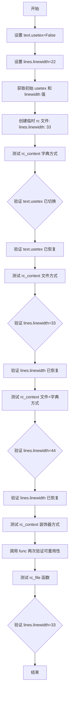
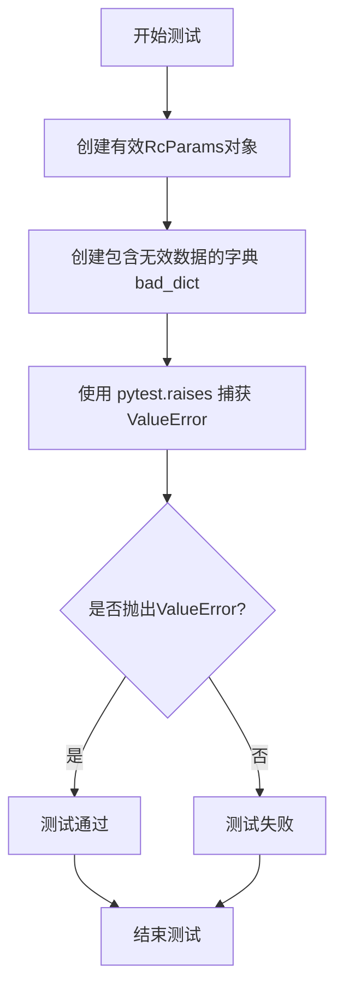
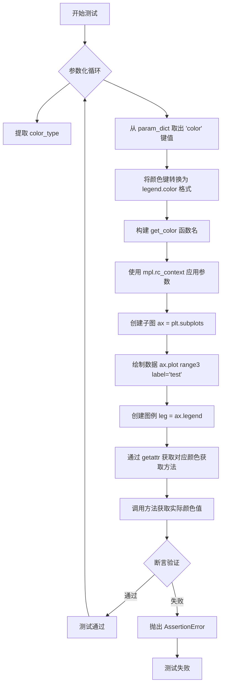
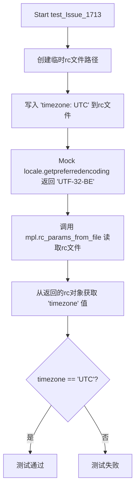
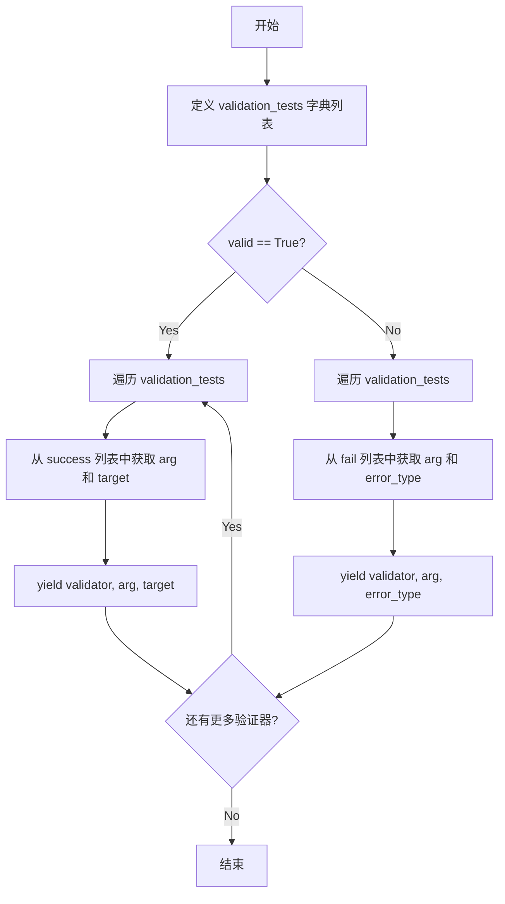
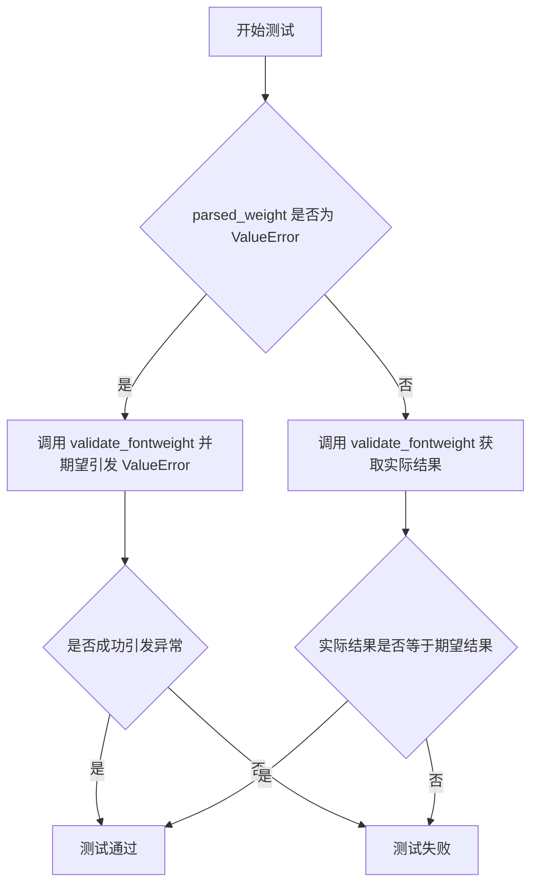
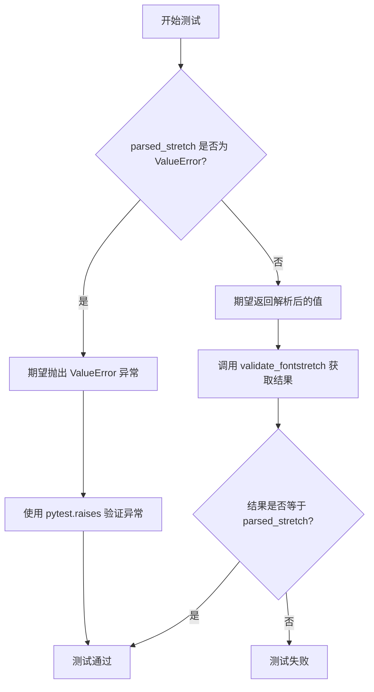

# `matplotlib\lib\matplotlib\tests\test_rcparams.py` 详细设计文档

这是一个matplotlib配置系统（rcparams）的测试文件，通过大量测试用例验证配置参数的读取、写入、上下文管理、验证器功能以及与文件交互的正确性。

## 整体流程

```mermaid
graph TD
    A[开始] --> B[导入必要的模块和验证器]
B --> C{执行测试函数}
C --> D[test_rcparams: 测试rc_context上下文管理器]
C --> E[test_RcParams_class: 测试RcParams类的repr/str方法]
C --> F[test_rcparams_update: 测试RcParams.update方法]
C --> G[test_rcparams_init: 测试RcParams初始化验证]
C --> H[test_nargs_cycler: 测试cycler参数数量限制]
C --> I[test_Bug_2543: 测试deepcopy和rcParams修改]
C --> J[test_legend_colors: 测试图例颜色继承]
C --> K[test_mfc_rcparams: 测试markerfacecolor]
C --> L[test_mec_rcparams: 测试markeredgecolor]
C --> M[test_axes_titlecolor_rcparams: 测试axes.titlecolor]
C --> N[test_Issue_1713: 测试从文件加载rc参数]
C --> O[test_animation_frame_formats: 测试动画帧格式]
C --> P[generate_validator_testcases: 生成验证器测试用例]
C --> Q[test_validator_valid: 测试验证器有效输入]
C --> R[test_validator_invalid: 测试验证器无效输入]
C --> S[test_validate_*: 测试各类验证器]
C --> T[test_keymaps: 测试键盘映射]
C --> U[test_*_backend_*: 测试后端回退机制]
C --> V[test_rc_aliases: 测试rc参数别名]
C --> W[test_all_params_defined_as_code: 测试参数定义]
C --> X[test_validators_defined_as_code: 测试验证器定义]
C --> Y[test_defaults_as_code: 测试默认值定义]
C --> Z[结束]
```



## 类结构

```
无类定义 (纯测试文件)
测试函数列表 (40+个测试函数)
辅助函数: generate_validator_testcases
```

## 全局变量及字段


### `legend_color_tests`
    
测试图例颜色的测试用例列表，包含颜色类型（face/edge）、参数字典和预期的RGBA值

类型：`list[tuple[str, dict[str, Any], tuple[float, float, float, float]]]`
    


### `legend_color_test_ids`
    
图例颜色测试用例的标识符列表，用于pytest参数化测试的ID

类型：`list[str]`
    


    

## 全局函数及方法


### `test_rcparams`

该函数是 matplotlib 的一个单元测试函数，用于测试 `rc_context` 上下文管理器和 `rc_file` 函数的功能。它验证了如何通过字典、文件或两者结合的方式临时修改 matplotlib 的 rc 参数（rcParams），以及如何将 rc 参数重置回原始值。

参数：

- `tmp_path`：`py.path.local`（pytest fixture），提供临时目录路径，用于创建临时的 rc 配置文件

返回值：`None`，该函数为测试函数，不返回任何值，通过断言验证功能正确性

#### 流程图



#### 带注释源码

```python
def test_rcparams(tmp_path):
    # 设置 text.usetex 为 False（不使用 LaTeX 渲染）
    mpl.rc('text', usetex=False)
    # 设置 lines.linewidth 为 22
    mpl.rc('lines', linewidth=22)

    # 从当前 rcParams 中读取初始值
    usetex = mpl.rcParams['text.usetex']
    linewidth = mpl.rcParams['lines.linewidth']

    # 创建一个临时 rc 配置文件，写入 lines.linewidth: 33
    rcpath = tmp_path / 'test_rcparams.rc'
    rcpath.write_text('lines.linewidth: 33', encoding='utf-8')

    # 测试1: 使用字典作为 rc_context 的参数
    # 在上下文管理器内部，text.usetex 应该被切换为 usetex 的相反值
    with mpl.rc_context(rc={'text.usetex': not usetex}):
        assert mpl.rcParams['text.usetex'] == (not usetex)
    # 退出上下文后，text.usetex 应该恢复到原始值
    assert mpl.rcParams['text.usetex'] == usetex

    # 测试2: 使用文件名作为 rc_context 的参数
    # 在上下文管理器内部，应从 rc 文件中读取 lines.linewidth=33
    with mpl.rc_context(fname=rcpath):
        assert mpl.rcParams['lines.linewidth'] == 33
    # 退出上下文后，lines.linewidth 应该恢复到原始值
    assert mpl.rcParams['lines.linewidth'] == linewidth

    # 测试3: 同时使用文件名和字典作为 rc_context 的参数
    # 字典中的值应覆盖文件中的值
    with mpl.rc_context(fname=rcpath, rc={'lines.linewidth': 44}):
        assert mpl.rcParams['lines.linewidth'] == 44
    # 退出上下文后，lines.linewidth 应该恢复到原始值
    assert mpl.rcParams['lines.linewidth'] == linewidth

    # 测试4: 使用 rc_context 作为装饰器
    # 并测试可重用性（调用函数两次）
    @mpl.rc_context({'lines.linewidth': 44})
    def func():
        # 在装饰器上下文中，lines.linewidth 应为 44
        assert mpl.rcParams['lines.linewidth'] == 44

    # 第一次调用
    func()
    # 第二次调用验证装饰器的可重用性
    func()

    # 测试5: 直接使用 mpl.rc_file 加载 rc 文件
    mpl.rc_file(rcpath)
    # 验证 lines.linewidth 已从文件加载为 33
    assert mpl.rcParams['lines.linewidth'] == 33
```


### `test_RcParams_class`

该函数是matplotlib中用于测试`RcParams`类的核心功能（包括`__repr__`、`__str__`方法以及`find_all`查找功能）的单元测试。

参数： 无

返回值：`None`，该函数为测试函数，通过断言验证功能，不返回任何值。

#### 流程图

```mermaid
flowchart TD
    A[开始测试] --> B[创建RcParams实例rc<br>包含font.cursive, font.family<br>font.weight, font.size]
    B --> C[定义期望的repr字符串<br>expected_repr]
    C --> D[断言: repr(rc) == expected_repr]
    D --> E[定义期望的str字符串<br>expected_str]
    E --> F[断言: str(rc) == expected_str]
    F --> G[测试find_all功能<br>正则匹配'i[vz]']
    G --> H[断言: rc.find_all('i[vz]')<br>返回font.cursive和font.size]
    H --> I[测试find_all功能<br>匹配'family']
    I --> J[断言: rc.find_all('family')<br>返回font.family]
    J --> K[测试完成]
```

#### 带注释源码

```python
def test_RcParams_class():
    """测试 RcParams 类的核心功能：repr、str 和 find_all 方法"""
    
    # 创建一个 RcParams 实例，包含多个字体相关配置参数
    rc = mpl.RcParams({'font.cursive': ['Apple Chancery',
                                        'Textile',
                                        'Zapf Chancery',
                                        'cursive'],
                       'font.family': 'sans-serif',
                       'font.weight': 'normal',
                       'font.size': 12})

    # 定义期望的 __repr__ 输出格式（去除左侧空白）
    expected_repr = """
RcParams({'font.cursive': ['Apple Chancery',
                           'Textile',
                           'Zapf Chancery',
                           'cursive'],
          'font.family': ['sans-serif'],
          'font.size': 12.0,
          'font.weight': 'normal'})""".lstrip()

    # 断言 __repr__ 方法输出正确
    # 验证 RcParams 能够正确格式化其内部字典表示
    assert expected_repr == repr(rc)

    # 定义期望的 __str__ 输出格式（去除左侧空白）
    # 注意：__str__ 与 __repr__ 的输出格式不同
    expected_str = """
font.cursive: ['Apple Chancery', 'Textile', 'Zapf Chancery', 'cursive']
font.family: ['sans-serif']
font.size: 12.0
font.weight: normal""".lstrip()

    # 断言 __str__ 方法输出正确
    # 验证 RcParams 能够正确格式化其可读字符串表示
    assert expected_str == str(rc)

    # 测试 find_all 功能
    # 使用正则表达式 'i[vz]' 匹配包含 'iv' 或 'iz' 的键名
    # 预期匹配到 'font.cursive' (含 'i') 和 'font.size' (含 'i')
    assert ['font.cursive', 'font.size'] == sorted(rc.find_all('i[vz]'))
    
    # 使用正则表达式 'family' 精确匹配键名
    # 预期匹配到 'font.family'
    assert ['font.family'] == list(rc.find_all('family'))
```


### `test_rcparams_update`

该测试函数用于验证 `RcParams` 类的 `update` 方法能够正确对输入参数进行验证，确保无效的配置参数（如 `figure.figsize` 的元组元素个数不正确）会触发 `ValueError` 异常。

参数：  
- （无参数）

返回值：`None`，无返回值（测试函数）

#### 流程图



#### 带注释源码

```python
def test_rcparams_update():
    # 创建一个有效的 RcParams 对象，设置 figure.figsize 为 (3.5, 42)
    # 这是合法的配置参数，figsize 接受 2 元素元组 (宽度, 高度)
    rc = mpl.RcParams({'figure.figsize': (3.5, 42)})
    
    # 创建一个包含无效数据的字典：figsize 应该是 2 元素元组
    # 这里提供了 3 个元素，因此是无效输入
    bad_dict = {'figure.figsize': (3.5, 42, 1)}
    
    # 验证 update 方法是否对输入进行验证
    # 期望：调用 rc.update(bad_dict) 时应抛出 ValueError
    with pytest.raises(ValueError):
        rc.update(bad_dict)
```


### `test_rcparams_init`

该测试函数用于验证 `RcParams` 类在接收无效参数时能够正确抛出 `ValueError` 异常。具体来说，它测试当传入包含3个元素的元组作为 `figure.figsize` 值（应为2个元素）时，`RcParams` 构造函数是否会触发验证错误。

参数：无

返回值：`None`，测试函数不返回任何值

#### 流程图

```mermaid
graph TD
    A[开始] --> B[使用 pytest.raises 期望捕获 ValueError]
    B --> C[调用 mpl.RcParams 构造方法<br/>参数: {'figure.figsize': (3.5, 42, 1)}]
    C --> D{RcParams 构造方法是否<br/>抛出 ValueError?}
    D -->|是| E[测试通过]
    D -->|否| F[测试失败]
    E --> G[结束]
    F --> G
```

#### 带注释源码

```python
def test_rcparams_init():
    """
    测试 RcParams 类初始化时的参数验证功能。
    验证当传入无效的 figure.figsize 参数（包含3个元素而非2个）时，
    RcParams 构造函数能够正确抛出 ValueError 异常。
    """
    # 使用 pytest.raises 上下文管理器期望捕获 ValueError 异常
    # 如果 RcParams 构造函数没有抛出 ValueError（验证失败），
    # 则测试会失败
    with pytest.raises(ValueError):
        # 传入无效的 figsize 参数：元组应有2个元素(宽, 高)
        # 但这里提供了3个元素，应该触发验证错误
        mpl.RcParams({'figure.figsize': (3.5, 42, 1)})
```


### `test_nargs_cycler`

该测试函数用于验证 `matplotlib.rcsetup` 模块中的 `cycler` 函数在接收到超过允许数量的参数时，能够正确抛出 `TypeError` 异常。这确保了 cycler 函数的参数校验机制正常工作，防止因参数数量错误导致的潜在运行时错误。

参数：无

返回值：无（测试函数无返回值）

#### 流程图

```mermaid
flowchart TD
    A[开始测试] --> B[导入cycler函数<br/>from matplotlib.rcsetup import cycler as ccl]
    B --> C[使用pytest.raises捕获TypeError<br/>期望匹配消息'3 were given']
    D[执行ccl调用<br/>ccl(ccl(color=list('rgb')), 2, 3)]
    D -->|参数过多| E{是否抛出TypeError?}
    E -->|是| F[验证错误消息包含'3 were given']
    E -->|否| G[测试失败]
    F --> H[测试通过]
    C --> D
    
    style A fill:#f9f,stroke:#333
    style H fill:#9f9,stroke:#333
    style G fill:#f99,stroke:#333
```

#### 带注释源码

```python
def test_nargs_cycler():
    """
    测试cycler函数在接收过多参数时是否正确抛出TypeError。
    
    cycler()函数设计为接受0-2个参数：
    - 0个参数：创建空cycler
    - 1个参数：可以是字符串（cycler格式）或Cycler对象
    - 2个参数：属性名和值列表
    
    当传入3个或更多参数时，应该抛出TypeError。
    """
    # 从matplotlib.rcsetup模块导入cycler函数，并重命名为ccl
    # 这是为了避免与cycler库中的cycler函数混淆
    from matplotlib.rcsetup import cycler as ccl
    
    # 使用pytest.raises上下文管理器验证异常抛出
    # match参数指定了期望的错误消息部分
    with pytest.raises(TypeError, match='3 were given'):
        # cycler()接受0-2个参数，这里传入3个参数：
        # 参数1: cycler对象 ccl(color=list('rgb'))
        # 参数2: 整数2
        # 参数3: 整数3
        # 这应该触发TypeError，因为参数数量超出预期
        ccl(ccl(color=list('rgb')), 2, 3)
```

#### 关键组件信息

| 组件名称 | 描述 |
|---------|------|
| `matplotlib.rcsetup.cycler` | Matplotlib的cycler验证函数，用于解析和验证cycler字符串或对象 |
| `pytest.raises` | Pytest的上下文管理器，用于验证代码是否抛出预期异常 |
| `cycler.Cycler` | cycler库中的Cycler对象，表示属性值的循环迭代器 |

#### 潜在的技术债务或优化空间

1. **测试覆盖不足**：当前仅测试了传入3个参数的情况，可增加对不同参数数量组合的测试
2. **错误消息硬编码**：错误消息'3 were given'是硬编码的，可能需要更灵活的验证方式
3. **缺少正向测试**：可以添加对正常参数传递的验证测试

#### 其它项目

**设计目标与约束：**
- cycler函数被设计为接受最多2个位置参数，这是其API契约的一部分
- 测试确保违反此契约时会得到明确的错误反馈

**错误处理与异常设计：**
- 使用`pytest.raises`确保异常被正确抛出
- 错误消息包含实际传入的参数数量（'3 were given'），便于调试

**数据流与状态机：**
- 该测试为单元测试，不涉及复杂的状态机或数据流
- 测试执行是独立的，不依赖外部状态

**外部依赖与接口契约：**
- 依赖`matplotlib.rcsetup`模块中的`cycler`函数
- 依赖`pytest`框架进行测试验证


### `test_Bug_2543`

该函数用于测试 matplotlib 的 RcParams 是否支持完整的自复制和深拷贝操作，同时验证无效的 rcParams 设置会正确抛出 ValueError。

参数：无需参数

返回值：`None`，该函数为测试函数，不返回任何值

#### 流程图

```mermaid
flowchart TD
    A[开始测试 test_Bug_2543] --> B[使用 _api.suppress_matplotlib_deprecation_warning 过滤警告]
    B --> C[创建 mpl.rc_context 上下文]
    C --> D[复制 rcParams 到 _copy]
    D --> E{遍历 _copy 中的每个 key}
    E -->|是| F[将 rcParams[key] 赋值为 _copy[key]]
    F --> E
    E -->|否| G[创建新的 mpl.rc_context 上下文]
    G --> H[对 mpl.rcParams 执行 copy.deepcopy]
    H --> I[使用 pytest.raises 捕获 validate_bool(None) 的 ValueError]
    I --> J[创建 mpl.rc_context 上下文]
    J --> K[尝试设置 mpl.rcParams['svg.fonttype'] = True]
    K --> L[验证抛出 ValueError]
    L --> M[测试结束]
```

#### 带注释源码

```python
def test_Bug_2543():
    # Test that it possible to add all values to itself / deepcopy
    # https://github.com/matplotlib/matplotlib/issues/2543
    # We filter warnings at this stage since a number of them are raised
    # for deprecated rcparams as they should. We don't want these in the
    # printed in the test suite.
    
    # 第一部分：测试 rcParams 的自复制功能
    # 使用 suppress_matplotlib_deprecation_warning 过滤因废弃 rcparams 产生的警告
    with _api.suppress_matplotlib_deprecation_warning():
        # 创建 rc_context 上下文，确保 rcParams 的修改在上下文结束后恢复
        with mpl.rc_context():
            # 复制当前的 rcParams 到 _copy
            _copy = mpl.rcParams.copy()
            # 遍历复制后的每一个键值对
            for key in _copy:
                # 将 rcParams 中的每个键重新赋值为它原来的值
                # 这测试了 rcParams 是否支持自赋值操作
                mpl.rcParams[key] = _copy[key]
        
        # 第二部分：测试 rcParams 的深拷贝功能
        with mpl.rc_context():
            # 使用 copy.deepcopy 对整个 rcParams 对象进行深拷贝
            # 验证深拷贝操作不会引发错误
            copy.deepcopy(mpl.rcParams)
    
    # 第三部分：测试 validate_bool 验证器对无效输入的處理
    # 期望 validate_bool(None) 抛出 ValueError 异常
    with pytest.raises(ValueError):
        validate_bool(None)
    
    # 第四部分：测试无效的 rcParams 设置会抛出错误
    # svg.fonttype 应该是字符串类型，设置为布尔值 True 应该引发 ValueError
    with pytest.raises(ValueError):
        with mpl.rc_context():
            mpl.rcParams['svg.fonttype'] = True
```


### `test_legend_colors`

该测试函数通过参数化测试验证图例的颜色配置功能，包括 facecolor（面部颜色）和 edgecolor（边缘颜色）两种类型，支持直接设置颜色、从 Axes 继承颜色以及不同颜色场景的测试。

参数：

- `color_type`：`str`，指定颜色类型，取值为 `'face'` 或 `'edge'`，用于区分测试图例的面部颜色还是边缘颜色
- `param_dict`：`dict`，包含颜色配置的参数字典，键为 `'color'`，值可为具体颜色值（如 `'r'`、`'inherit'`）或包含 Axes 属性的字典
- `target`：`tuple` 或 `numpy.ndarray`，期望通过 `mcolors.to_rgba()` 转换后的目标颜色值

返回值：`None`，该函数为测试函数，不返回任何值，仅通过 `assert` 断言验证结果

#### 流程图



#### 带注释源码

```python
@pytest.mark.parametrize('color_type, param_dict, target', legend_color_tests,
                         ids=legend_color_test_ids)
def test_legend_colors(color_type, param_dict, target):
    """
    测试图例颜色的参数化测试函数。
    
    参数:
        color_type: str, 'face' 或 'edge'，指定要测试的颜色类型
        param_dict: dict, 包含颜色配置的参数字典
        target: 期望的颜色值 (RGBA 元组或数组)
    """
    # 将 param_dict 中的 'color' 键重命名为 'legend.<color_type>color' 格式
    # 例如 color_type='face' 时，变为 'legend.facecolor'
    param_dict[f'legend.{color_type}color'] = param_dict.pop('color')
    
    # 构建获取函数名: 'get_facecolor' 或 'get_edgecolor'
    get_func = f'get_{color_type}color'

    # 使用 rc_context 临时修改 rcParams
    with mpl.rc_context(param_dict):
        # 创建子图，返回 figure 和 axes 对象
        _, ax = plt.subplots()
        # 绘制简单数据并设置标签
        ax.plot(range(3), label='test')
        # 创建图例
        leg = ax.legend()
        # 动态调用对应颜色获取方法并断言结果
        assert getattr(leg.legendPatch, get_func)() == target
```


### `test_mfc_rcparams`

该函数用于测试 matplotlib 的 `rcParams` 机制是否能正确将全局配置 `lines.markerfacecolor` 应用到 `Line2D` 对象上，验证配置传递的正确性。

参数： 无

返回值： `None`，测试函数无返回值，通过断言验证行为

#### 流程图

```mermaid
flowchart TD
    A[开始测试] --> B[设置全局rcParams: lines.markerfacecolor = 'r']
    B --> C[创建Line2D对象: ln = Line2D([1, 2], [1, 2])]
    C --> D[获取MarkerFaceColor: ln.get_markerfacecolor]
    D --> E{颜色值是否等于 'r'?}
    E -->|是| F[测试通过]
    E -->|否| G[测试失败]
```

#### 带注释源码

```python
def test_mfc_rcparams():
    """
    测试全局 rcParams 中的 lines.markerfacecolor 配置
    能否正确应用到 Line2D 对象上。
    """
    # 步骤1: 设置全局 rcParams，将 lines.markerfacecolor 设置为红色 'r'
    # 这会影响后续创建的 Line2D 对象的默认 markerfacecolor
    mpl.rcParams['lines.markerfacecolor'] = 'r'
    
    # 步骤2: 创建一个 Line2D 对象，传入 x 轴数据 [1, 2] 和 y 轴数据 [1, 2]
    # 此时该对象应当继承全局 rcParams 中设置的 markerfacecolor
    ln = mpl.lines.Line2D([1, 2], [1, 2])
    
    # 步骤3: 断言验证 Line2D 对象的 markerfacecolor 是否等于 'r'
    # 如果全局配置传递正确，则测试通过；否则抛出 AssertionError
    assert ln.get_markerfacecolor() == 'r'
```


### `test_mec_rcparams`

该测试函数用于验证 matplotlib 的 rcParams 设置（`lines.markeredgecolor`）是否能正确应用到 Line2D 对象的标记边缘颜色属性上。

参数：None（无参数）

返回值：`None`，测试函数无返回值

#### 流程图

```mermaid
flowchart TD
    A[开始] --> B[设置rcParams: mpl.rcParams['lines.markeredgecolor'] = 'r']
    B --> C[创建Line2D对象: ln = mpl.lines.Line2D([1, 2], [1, 2])]
    C --> D[断言验证: ln.get_markeredgecolor() == 'r']
    D --> E{断言是否通过}
    E -->|通过| F[测试通过]
    E -->|失败| G[抛出AssertionError]
    F --> H[结束]
    G --> H
```

#### 带注释源码

```python
def test_mec_rcparams():
    """
    测试函数：验证 rcParams 中的 lines.markeredgecolor 配置
    是否能正确影响 Line2D 对象的标记边缘颜色。
    
    该测试确保全局 rcParams 设置能够正确传递到具体的图形元素对象。
    """
    # 设置全局 rcParams，将线条标记边缘颜色设置为红色 'r'
    mpl.rcParams['lines.markeredgecolor'] = 'r'
    
    # 创建一个 Line2D 对象，指定两个数据点 [1, 2] 和 [1, 2]
    # 此时该线条对象应继承全局 rcParams 中的 markeredgecolor 设置
    ln = mpl.lines.Line2D([1, 2], [1, 2])
    
    # 断言验证：获取到的标记边缘颜色应为 'r'
    # 若 rcParams 未正确应用，此断言将失败
    assert ln.get_markeredgecolor() == 'r'
```


### `test_axes_titlecolor_rcparams`

该函数用于测试 Matplotlib 中 `axes.titlecolor` rcParams 配置是否能正确影响坐标轴标题的颜色，通过设置 rcParams、创建图表并验证标题颜色是否与设置值一致。

参数： 无

返回值：`None`，该函数为测试函数，无返回值

#### 流程图

```mermaid
flowchart TD
    A[开始] --> B[设置 rcParams['axes.titlecolor'] = 'r']
    B --> C[创建子图 ax = plt.subplots]
    C --> D[设置标题 title = ax.set_title('Title')]
    D --> E[断言 title.get_color == 'r']
    E --> F[测试通过]
    E --> G[测试失败]
```

#### 带注释源码

```python
def test_axes_titlecolor_rcparams():
    # 设置全局 rcParams，将 axes.titlecolor 设置为红色 'r'
    mpl.rcParams['axes.titlecolor'] = 'r'
    
    # 创建一个新的图表和坐标轴，返回 fig 和 ax
    _, ax = plt.subplots()
    
    # 设置坐标轴标题，返回标题对象 title
    title = ax.set_title("Title")
    
    # 断言：验证标题的颜色是否等于设置的值 'r'
    assert title.get_color() == 'r'
```


### `test_Issue_1713`

该测试函数用于验证 matplotlib 能够正确从_rc文件_中读取非标准时区配置，特别是在模拟了异常的区域编码（UTF-32-BE）的情况下。它确保`rc_params_from_file`函数能够正确处理并返回_rc文件_中的时区参数。

参数：

- `tmp_path`：`py.path.local`（pytest fixture），用于创建临时文件和目录的路径对象

返回值：`None`，测试函数不返回任何值，仅通过断言验证功能

#### 流程图



#### 带注释源码

```python
def test_Issue_1713(tmp_path):
    # 使用 pytest 的 tmp_path fixture 创建一个临时目录路径
    rcpath = tmp_path / 'test_rcparams.rc'
    
    # 向临时文件中写入时区配置内容 'timezone: UTC'
    # encoding='utf-8' 确保以 UTF-8 编码写入文件
    rcpath.write_text('timezone: UTC', encoding='utf-8')
    
    # 使用 mock.patch 临时替换 locale.getpreferredencoding 函数的返回值
    # 返回 'UTF-32-BE'（一种非标准的编码格式），用于测试在异常编码下的处理能力
    with mock.patch('locale.getpreferredencoding', return_value='UTF-32-BE'):
        # 调用 matplotlib 的 rc_params_from_file 函数读取 rc 配置文件
        # 参数：文件路径、是否使用_defaults、是否验证
        rc = mpl.rc_params_from_file(rcpath, True, False)
    
    # 断言验证读取到的 rc 参数中 'timezone' 的值是否为 'UTC'
    assert rc.get('timezone') == 'UTC'
```


### `test_animation_frame_formats`

该测试函数用于验证 Matplotlib 的 `animation.frame_format` 配置参数是否接受多种常见的图片格式作为有效值，通过遍历预设的格式列表并尝试将每个格式赋值给该 RC 参数来确保不会抛出异常。

参数：无

返回值：`None`，该函数没有返回值，仅通过断言验证配置参数设置是否成功。

#### 流程图

```mermaid
flowchart TD
    A[开始测试 test_animation_frame_formats] --> B[定义格式列表 formats]
    B --> C[遍历 formats 中的每个 fmt]
    C --> D[设置 mpl.rcParams['animation.frame_format'] = fmt]
    D --> E{是否抛出异常}
    E -->|是| F[测试失败: 抛出异常]
    E -->|否| G[继续下一个格式]
    G --> C
    C --> H{所有格式已遍历}
    H -->|是| I[测试通过]
    I --> J[结束测试]
```

#### 带注释源码

```python
def test_animation_frame_formats():
    """
    测试 animation.frame_format 配置参数是否接受多种图片格式。
    
    该测试函数验证 Matplotlib 的 'animation.frame_format' RC 参数
    是否接受以下所有格式: png, jpeg, tiff, raw, rgba, ppm, sgi, bmp, pbm, svg。
    如果任何格式不被允许，将抛出异常导致测试失败。
    
    对应 GitHub issue #17908
    """
    # 定义要测试的图片格式列表
    for fmt in ['png', 'jpeg', 'tiff', 'raw', 'rgba', 'ppm',
                'sgi', 'bmp', 'pbm', 'svg']:
        # 尝试将每个格式设置为 animation.frame_format 参数的值
        # 如果格式不被支持，这里会抛出异常导致测试失败
        mpl.rcParams['animation.frame_format'] = fmt
```


### `generate_validator_testcases`

该函数是一个生成器函数，用于为 Matplotlib 的各种 RC 参数验证器生成测试用例。它根据 `valid` 参数的值，分别产生成功或失败的测试场景数据，供 pytest 参数化测试使用。

参数：

- `valid`：`bool`，当值为 `True` 时生成成功测试用例（包含验证器、输入参数和目标值）；当值为 `False` 时生成失败测试用例（包含验证器、输入参数和预期异常类型）。

返回值：`Generator[Tuple[Validator, Any, Any], None, None]`，返回一个生成器，产生元组 `(validator, arg, target)` 或 `(validator, arg, error_type)`，用于 pytest 参数化测试。

#### 流程图



#### 带注释源码

```python
def generate_validator_testcases(valid):
    """
    生成验证器的测试用例数据。
    
    参数:
        valid (bool): True 表示生成成功测试用例, False 表示生成失败测试用例
        
    返回:
        Generator: 产生 (validator, arg, target) 或 (validator, arg, error_type) 元组
    """
    # 定义所有验证器的测试数据字典，包含 validator、success 和 fail 三个键
    validation_tests = (
        # validate_bool 的测试数据
        {'validator': validate_bool,
         'success': (*((_, True) for _ in
                       ('t', 'y', 'yes', 'on', 'true', '1', 1, True)),
                     *((_, False) for _ in
                       ('f', 'n', 'no', 'off', 'false', '0', 0, False))),
         'fail': ((_, ValueError)
                  for _ in ('aardvark', 2, -1, [], ))
         },
        # validate_stringlist 的测试数据
        {'validator': validate_stringlist,
         'success': (('', []),
                     ('a,b', ['a', 'b']),
                     ('aardvark', ['aardvark']),
                     ('aardvark, ', ['aardvark']),
                     ('aardvark, ,', ['aardvark']),
                     (['a', 'b'], ['a', 'b']),
                     (('a', 'b'), ['a', 'b']),
                     (iter(['a', 'b']), ['a', 'b']),
                     (np.array(['a', 'b']), ['a', 'b']),
                     ),
         'fail': ((set(), ValueError),
                  (1, ValueError),
                  )
         },
        # validate_int (列表形式) 的测试数据
        {'validator': _listify_validator(validate_int, n=2),
         'success': ((_, [1, 2])
                     for _ in ('1, 2', [1.5, 2.5], [1, 2],
                               (1, 2), np.array((1, 2)))),
         'fail': ((_, ValueError)
                  for _ in ('aardvark', ('a', 1),
                            (1, 2, 3)
                            ))
         },
        # validate_float (列表形式) 的测试数据
        {'validator': _listify_validator(validate_float, n=2),
         'success': ((_, [1.5, 2.5])
                     for _ in ('1.5, 2.5', [1.5, 2.5], [1.5, 2.5],
                               (1.5, 2.5), np.array((1.5, 2.5)))),
         'fail': ((_, ValueError)
                  for _ in ('aardvark', ('a', 1), (1, 2, 3), (None, ), None))
         },
        # validate_cycler 的测试数据 - 重要：验证器会 eval 任意字符串
        {'validator': validate_cycler,
         'success': (('cycler("color", "rgb")',
                      cycler("color", 'rgb')),
                     ('cycler("color", "Dark2")',
                      cycler("color", mpl.color_sequences["Dark2"])),
                     (cycler('linestyle', ['-', '--']),
                      cycler('linestyle', ['-', '--'])),
                     ("""(cycler("color", ["r", "g", "b"]) +
                          cycler("mew", [2, 3, 5]))""",
                      (cycler("color", 'rgb') +
                       cycler("markeredgewidth", [2, 3, 5]))),
                     ("cycler(c='rgb', lw=[1, 2, 3])",
                      cycler('color', 'rgb') + cycler('linewidth', [1, 2, 3])),
                     ("cycler('c', 'rgb') * cycler('linestyle', ['-', '--'])",
                      (cycler('color', 'rgb') *
                       cycler('linestyle', ['-', '--']))),
                     (cycler('ls', ['-', '--']),
                      cycler('linestyle', ['-', '--'])),
                     (cycler(mew=[2, 5]),
                      cycler('markeredgewidth', [2, 5])),
                     ),
         # 安全测试：确保不能执行任意代码
         'fail': ((4, ValueError),
                  ('cycler("bleh, [])', ValueError),
                  ('Cycler("linewidth", [1, 2, 3])', ValueError),
                  ("cycler('c', [j.__class__(j) for j in ['r', 'b']])", ValueError),
                  ("cycler('c', [j. __class__(j) for j in ['r', 'b']])", ValueError),
                  ("cycler('c', [j.\t__class__(j) for j in ['r', 'b']])", ValueError),
                  ("cycler('c', [j.\u000c__class__(j) for j in ['r', 'b']])", ValueError),
                  ("cycler('c', [j.__class__(j).lower() for j in ['r', 'b']])", ValueError),
                  ('1 + 2', ValueError),
                  ('os.system("echo Gotcha")', ValueError),
                  ('import os', ValueError),
                  ('def badjuju(a): return a; badjuju(cycler("color", "rgb"))', ValueError),
                  ('cycler("waka", [1, 2, 3])', ValueError),
                  ('cycler(c=[1, 2, 3])', ValueError),
                  ("cycler(lw=['a', 'b', 'c'])", ValueError),
                  (cycler('waka', [1, 3, 5]), ValueError),
                  (cycler('color', ['C1', 'r', 'g']), ValueError)
                  )
         },
        # validate_hatch 的测试数据
        {'validator': validate_hatch,
         'success': (('--|', '--|'), ('\\oO', '\\oO'),
                     ('/+*/.x', '/+*/.x'), ('', '')),
         'fail': (('--_', ValueError),
                  (8, ValueError),
                  ('X', ValueError)),
         },
        # validate_colorlist 的测试数据
        {'validator': validate_colorlist,
         'success': (('r,g,b', ['r', 'g', 'b']),
                     (['r', 'g', 'b'], ['r', 'g', 'b']),
                     ('r, ,', ['r']),
                     (['', 'g', 'blue'], ['g', 'blue']),
                     ([np.array([1, 0, 0]), np.array([0, 1, 0])],
                     np.array([[1, 0, 0], [0, 1, 0]])),
                     (np.array([[1, 0, 0], [0, 1, 0]]),
                     np.array([[1, 0, 0], [0, 1, 0]])),
                     ),
         'fail': (('fish', ValueError),
                  ),
         },
        # validate_color 的测试数据
        {'validator': validate_color,
         'success': (('None', 'none'),
                     ('none', 'none'),
                     ('AABBCC', '#AABBCC'),
                     ('AABBCC00', '#AABBCC00'),
                     ('tab:blue', 'tab:blue'),
                     ('C12', 'C12'),
                     ('(0, 1, 0)', (0.0, 1.0, 0.0)),
                     ((0, 1, 0), (0, 1, 0)),
                     ('(0, 1, 0, 1)', (0.0, 1.0, 0.0, 1.0)),
                     ((0, 1, 0, 1), (0, 1, 0, 1)),
                     ),
         'fail': (('tab:veryblue', ValueError),
                  ('(0, 1)', ValueError),
                  ('(0, 1, 0, 1, 0)', ValueError),
                  ('(0, 1, none)', ValueError),
                  ('(0, 1, "0.5")', ValueError),
                  ),
         },
        # _validate_color_or_linecolor 的测试数据
        {'validator': _validate_color_or_linecolor,
         'success': (('linecolor', 'linecolor'),
                     ('markerfacecolor', 'markerfacecolor'),
                     ('mfc', 'markerfacecolor'),
                     ('markeredgecolor', 'markeredgecolor'),
                     ('mec', 'markeredgecolor')
                     ),
         'fail': (('line', ValueError),
                  ('marker', ValueError)
                  )
         },
        # validate_hist_bins 的测试数据
        {'validator': validate_hist_bins,
         'success': (('auto', 'auto'),
                     ('fd', 'fd'),
                     ('10', 10),
                     ('1, 2, 3', [1, 2, 3]),
                     ([1, 2, 3], [1, 2, 3]),
                     (np.arange(15), np.arange(15))
                     ),
         'fail': (('aardvark', ValueError),
                  )
         },
        # validate_markevery 的测试数据
        {'validator': validate_markevery,
         'success': ((None, None),
                     (1, 1),
                     (0.1, 0.1),
                     ((1, 1), (1, 1)),
                     ((0.1, 0.1), (0.1, 0.1)),
                     ([1, 2, 3], [1, 2, 3]),
                     (slice(2), slice(None, 2, None)),
                     (slice(1, 2, 3), slice(1, 2, 3))
                     ),
         'fail': (((1, 2, 3), TypeError),
                  ([1, 2, 0.3], TypeError),
                  (['a', 2, 3], TypeError),
                  ([1, 2, 'a'], TypeError),
                  ((0.1, 0.2, 0.3), TypeError),
                  ((0.1, 2, 3), TypeError),
                  ((1, 0.2, 0.3), TypeError),
                  ((1, 0.1), TypeError),
                  ((0.1, 1), TypeError),
                  (('abc'), TypeError),
                  ((1, 'a'), TypeError),
                  ((0.1, 'b'), TypeError),
                  (('a', 1), TypeError),
                  (('a', 0.1), TypeError),
                  ('abc', TypeError),
                  ('a', TypeError),
                  (object(), TypeError)
                  )
         },
        # _validate_linestyle 的测试数据
        {'validator': _validate_linestyle,
         'success': (('-', '-'), ('solid', 'solid'),
                     ('--', '--'), ('dashed', 'dashed'),
                     ('-.', '-.'), ('dashdot', 'dashdot'),
                     (':', ':'), ('dotted', 'dotted'),
                     ('', ''), (' ', ' '),
                     ('None', 'none'), ('none', 'none'),
                     ('DoTtEd', 'dotted'),
                     ('1, 3', (0, (1, 3))),
                     ([1.23, 456], (0, [1.23, 456.0])),
                     ([1, 2, 3, 4], (0, [1.0, 2.0, 3.0, 4.0])),
                     ((0, [1, 2]), (0, [1, 2])),
                     ((-1, [1, 2]), (-1, [1, 2])),
                     ),
         'fail': (('aardvark', ValueError),
                  (b'dotted', ValueError),
                  ('dotted'.encode('utf-16'), ValueError),
                  ([1, 2, 3], ValueError),
                  (1.23, ValueError),
                  (("a", [1, 2]), ValueError),
                  ((None, [1, 2]), ValueError),
                  ((1, [1, 2, 3]), ValueError),
                  (([1, 2], 1), ValueError),
                  )
         },
    )

    # 遍历所有验证器字典，根据 valid 参数产生不同的测试数据
    for validator_dict in validation_tests:
        validator = validator_dict['validator']
        if valid:
            # 成功测试：产生 (validator, arg, target) 元组
            for arg, target in validator_dict['success']:
                yield validator, arg, target
        else:
            # 失败测试：产生 (validator, arg, error_type) 元组
            for arg, error_type in validator_dict['fail']:
                yield validator, arg, error_type
```


### `test_validator_valid`

该函数是一个参数化测试函数，用于验证各种 rcsetup 模块中的验证器（validators）是否能正确处理有效输入。它通过调用验证器函数并比较结果与预期目标值来确保验证器的正确性。

参数：

- `validator`：`<function>`，要测试的验证器函数（例如 `validate_bool`、`validate_stringlist` 等）
- `arg`：`<any>`，要传递给验证器的输入参数
- `target`：`<any>`，预期的验证结果

返回值：`None`，该函数为测试函数，不返回任何值，仅通过断言验证结果

#### 流程图

```mermaid
flowchart TD
    A[开始: test_validator_valid] --> B[调用 validator(arg) 获取结果 res]
    B --> C{target 是否为 np.ndarray?}
    C -->|是| D[使用 np.testing.assert_equal 比较 res 和 target]
    C -->|否| E{target 是否为 Cycler 对象?}
    D --> F[测试通过]
    E -->|否| G[使用 assert res == target 比较]
    E -->|是| H[将 res 和 target 转换为列表后比较]
    G --> F
    H --> F
    F --> I[结束]
```

#### 带注释源码

```python
@pytest.mark.parametrize('validator, arg, target',
                         generate_validator_testcases(True))
def test_validator_valid(validator, arg, target):
    """
    参数化测试函数，验证验证器对有效输入的处理是否正确。
    
    参数:
        validator: 验证器函数对象
        arg: 输入参数
        target: 期望的验证结果
    """
    # 调用验证器函数，传入待验证的参数
    res = validator(arg)
    
    # 根据目标类型选择合适的断言方式
    if isinstance(target, np.ndarray):
        # 如果目标是 numpy 数组，使用专门的数组比较函数
        np.testing.assert_equal(res, target)
    elif not isinstance(target, Cycler):
        # 如果目标不是 Cycler 对象，直接使用相等断言
        assert res == target
    else:
        # Cycler 对象没有实现 __eq__ 方法，需要手动比较
        # 将两个 Cycler 对象转换为列表后进行比较
        assert list(res) == list(target)
```


### `test_validator_invalid`

该函数是一个参数化测试函数，用于验证各个验证器在接收无效输入时能够正确抛出指定的异常类型。

参数：

- `validator`：`Callable`，要测试的验证器函数（例如 `validate_bool`、`validate_stringlist` 等）
- `arg`：`Any`，要传递给验证器的无效输入值
- `exception_type`：`Type[Exception]`，期望验证器抛出的异常类型（例如 `ValueError`、`TypeError` 等）

返回值：`None`，该函数是一个测试用例，不返回任何值，仅通过 `pytest.raises` 上下文管理器验证异常是否被正确抛出

#### 流程图

```mermaid
flowchart TD
    A[开始] --> B[接收参数: validator, arg, exception_type]
    B --> C[调用 validator(arg)]
    C --> D{是否抛出异常?}
    D -->|是| E{异常类型是否匹配?}
    E -->|是| F[测试通过]
    E -->|否| G[测试失败 - 异常类型不匹配]
    D -->|否| H[测试失败 - 未抛出异常]
    F --> I[结束]
    G --> I
    H --> I
```

#### 带注释源码

```python
@pytest.mark.parametrize('validator, arg, exception_type',
                         generate_validator_testcases(False))
def test_validator_invalid(validator, arg, exception_type):
    """
    参数化测试：验证各个验证器在接收无效输入时能够正确抛出异常
    
    该测试函数通过 pytest 的 parametrize 装饰器运行多组测试用例：
    - validator: 要测试的验证器函数
    - arg: 无效的输入值
    - exception_type: 期望抛出的异常类型
    """
    # 使用 pytest.raises 上下文管理器验证异常
    # 如果 validator(arg) 抛出了 exception_type 类型的异常，测试通过
    # 如果没有抛出异常或抛出了其他类型的异常，测试失败
    with pytest.raises(exception_type):
        validator(arg)
```


### `test_validate_cycler_bad_color_string`

该函数是一个测试用例，用于验证 `validate_cycler` 函数在接收无效的颜色字符串时能够正确抛出 `ValueError` 异常。

参数： 无

返回值：`None`，该函数为测试函数，不返回任何值，仅通过 `pytest.raises` 验证异常抛出行为

#### 流程图

```mermaid
flowchart TD
    A[开始] --> B[定义预期错误消息]
    B --> C[调用 validate_cycler with 'cycler(color, foo)']
    C --> D{是否抛出 ValueError?}
    D -->|是| E[验证错误消息匹配]
    E --> F[结束 - 测试通过]
    D -->|否| G[结束 - 测试失败]
```

#### 带注释源码

```python
def test_validate_cycler_bad_color_string():
    """
    测试 validate_cycler 函数对无效颜色字符串的处理
    
    该测试用例验证当向 validate_cycler 传入一个无效的颜色字符串时，
    函数能够正确地抛出 ValueError 异常，并包含描述性的错误消息。
    """
    # 定义预期的错误消息内容
    # 预期消息说明 'foo' 既不是有效的颜色序列名称，也不能被解释为颜色列表
    msg = "'foo' is neither a color sequence name nor can it be interpreted as a list"
    
    # 使用 pytest.raises 上下文管理器验证异常抛出
    # 期望 validate_cycler("cycler('color', 'foo')") 抛出 ValueError
    # match 参数确保抛出的异常消息包含指定的 msg
    with pytest.raises(ValueError, match=msg):
        # 调用被测试的 validate_cycler 函数
        # 传入包含无效颜色 'foo' 的 cycler 字符串
        validate_cycler("cycler('color', 'foo')")
```


### `test_validate_fontweight`

该测试函数用于验证 `validate_fontweight` 验证器的正确性，通过参数化测试检查各种有效的字体权重值以及应引发 `ValueError` 的无效输入。

参数：

- `weight`：`Any`，待验证的字体权重输入值，可以是字符串（如 'bold'）、整数（如 100）、numpy 数组或其他类型
- `parsed_weight`：`Any`，期望的解析结果，如果是 `ValueError` 则表示该输入应引发异常

返回值：`None`，该函数为测试函数，无返回值，通过 `assert` 语句进行断言验证

#### 流程图



#### 带注释源码

```python
@pytest.mark.parametrize('weight, parsed_weight', [
    ('bold', 'bold'),                    # 有效的标准字体权重名称
    ('BOLD', ValueError),                 # 大写形式应失败，权重值区分大小写
    (100, 100),                           # 有效的数值权重
    ('100', 100),                         # 字符串形式的数值应转换为整数
    (np.array(100), 100),                 # numpy 数组应被正确处理
    # 以下测试注释说明： fractional fontweights are not defined.
    # This should actually raise a ValueError, but historically did not.
    (20.6, 20),                           # 历史遗留问题：小数权重被截断为整数而非报错
    ('20.6', ValueError),                 # 字符串形式的小数应引发 ValueError
    ([100], ValueError),                 # 列表形式应失败
])
def test_validate_fontweight(weight, parsed_weight):
    # 根据期望结果类型决定验证方式
    if parsed_weight is ValueError:
        # 如果期望结果是 ValueError，则使用 pytest.raises 验证异常
        with pytest.raises(ValueError):
            validate_fontweight(weight)
    else:
        # 否则验证返回值是否与期望结果匹配
        assert validate_fontweight(weight) == parsed_weight
```


### `test_validate_fontstretch`

该函数是一个参数化测试函数，用于验证 `validate_fontstretch` 验证器对各种字体拉伸（font stretch）值的处理是否正确。测试覆盖了字符串形式、整数形式、数组形式以及无效输入等多种场景。

参数：

- `stretch`：`Any`，输入的字体拉伸值，用于测试验证器
- `parsed_stretch`：`Union[str, int, type(ValueError)]`，期望的解析结果，如果是 `ValueError` 类型则表示期望抛出异常

返回值：`None`，该函数为测试函数，不返回任何值

#### 流程图



#### 带注释源码

```python
@pytest.mark.parametrize('stretch, parsed_stretch', [
    ('expanded', 'expanded'),           # 测试有效的字符串值
    ('EXPANDED', ValueError),           # 测试大小写敏感 - 应该抛出异常
    (100, 100),                         # 测试有效的整数值
    ('100', '100'),                     # 测试有效的字符串数字
    (np.array(100), 100),               # 测试 numpy 数组 - 应转换为整数
    # 注意：分数值的字体拉伸历史上未正确定义，本应抛出 ValueError
    (20.6, 20),                         # 测试浮点数 - 截断为整数
    ('20.6', ValueError),               # 字符串形式的浮点数应抛出异常
    ([100], ValueError),                # 列表形式应抛出异常
])
def test_validate_fontstretch(stretch, parsed_stretch):
    """
    参数化测试函数，验证 validate_fontstretch 验证器的正确性
    
    参数:
        stretch: 输入的字体拉伸值（可以是字符串、整数、浮点数、numpy数组或列表）
        parsed_stretch: 期望的解析结果，如果是 ValueError 类型则期望抛出异常
    """
    # 判断当前测试用例是否期望抛出异常
    if parsed_stretch is ValueError:
        # 使用 pytest.raises 验证 validate_fontstretch 会抛出 ValueError
        with pytest.raises(ValueError):
            validate_fontstretch(stretch)
    else:
        # 否则验证函数返回的值与期望值相等
        assert validate_fontstretch(stretch) == parsed_stretch
```


### `test_keymaps`

该函数是一个测试函数，用于验证 matplotlib 的 rcParams 中所有与 "keymap" 相关的配置参数都是列表类型。

参数：

- 无参数

返回值：`None`，无返回值（测试函数，使用断言进行验证）

#### 流程图

```mermaid
flowchart TD
    A[开始 test_keymaps] --> B[获取所有包含 'keymap' 的 rcParams 键]
    B --> C{遍历 key_list 中的每个键 k}
    C -->|对于每个键 k| D[断言 mpl.rcParams[k] 是 list 类型]
    D --> C
    C -->|遍历完成| E[测试通过]
```

#### 带注释源码

```python
def test_keymaps():
    """
    测试所有 keymap 相关的 rcParams 都是列表类型。
    
    该测试函数遍历 matplotlib.rcParams 中所有键名包含 'keymap' 的配置参数，
    验证它们的值都是列表类型。这是由于 keymap 配置项（如 'keymap.back',
    'keymap.forward' 等）应该以列表形式存储按键绑定。
    """
    # 使用列表推导式获取所有包含 'keymap' 字符串的 rcParams 键名
    key_list = [k for k in mpl.rcParams if 'keymap' in k]
    
    # 遍历每个 keymap 相关的配置键，验证其值类型为 list
    for k in key_list:
        assert isinstance(mpl.rcParams[k], list)
```


### `test_no_backend_reset_rccontext`

该测试函数用于验证 `rc_context` 上下文管理器在退出后不会重置在上下文内部对 `rcParams` 所做的修改。它检查在 `rc_context` 块内设置的 `backend` 值在退出上下文后仍然保持有效。

参数： 无

返回值： `None`，测试函数不返回任何值

#### 流程图

```mermaid
flowchart TD
    A[开始测试] --> B{检查初始 backend 不是 'module://aardvark'}
    B -->|断言为真| C[进入 mpl.rc_context 上下文]
    C --> D[在上下文中设置 backend = 'module://aardvark']
    D --> E[退出 rc_context 上下文]
    E --> F{检查 backend 是否保持为 'module://aardvark'}
    F -->|断言为真| G[测试通过]
    B -->|断言失败| H[测试失败]
    F -->|断言失败| H
```

#### 带注释源码

```python
def test_no_backend_reset_rccontext():
    """
    测试 rc_context 上下文管理器不会在退出后重置 rcParams 的修改。
    验证在 rc_context 内部对 rcParams 的更改会被保留。
    """
    # 第一步：断言当前 backend 不是测试用的虚拟后端 'module://aardvark'
    # 这是为了确保测试的初始状态是干净的
    assert mpl.rcParams['backend'] != 'module://aardvark'
    
    # 第二步：进入 rc_context 上下文管理器
    # rc_context 通常用于临时修改 rcParams，并在退出时恢复
    with mpl.rc_context():
        # 第三步：在上下文内部修改 backend 为虚拟后端
        # 根据测试名称和逻辑，这里期望修改被保留（不退出会重置）
        mpl.rcParams['backend'] = 'module://aardvark'
    
    # 第四步：退出上下文后，断言 backend 仍然保持为修改后的值
    # 这个测试验证了 rc_context 的特殊行为：
    # 当在上下文中直接修改 rcParams 而不传入参数时，
    # 退出后不会重置这些修改（与传入 rc={} 参数时的行为不同）
    assert mpl.rcParams['backend'] == 'module://aardvark'
```


### `test_rcparams_reset_after_fail`

该测试函数用于验证当 `rc_context` 上下文管理器中提供的 rc 参数导致异常失败时，全局 rc 参数能够正确重置到进入上下文之前的状态，而不会保留中间状态。

参数：
- 该函数没有参数

返回值：`None`，因为这是一个测试函数，不返回任何值

#### 流程图

```mermaid
flowchart TD
    A[开始] --> B[使用rc_context设置text.usetex为False]
    B --> C[断言text.usetex为False]
    C --> D[尝试在rc_context中设置text.usetex为True<br/>同时设置无效参数test.blah]
    D --> E{是否抛出KeyError?}
    E -->|是| F[断言text.usetex仍为False]
    F --> G[结束]
    E -->|否| H[测试失败]
    
    style D fill:#ff9999
    style F fill:#99ff99
    style H fill:#ff6666
```

#### 带注释源码

```python
def test_rcparams_reset_after_fail():
    """
    测试当rc_context失败时，全局rc参数是否会被正确重置。
    
    该测试用例验证了一个之前存在的bug：当rc_context中提供的rc参数
    导致异常时，全局rc参数会被留在修改后的状态，而不是回滚到之前的状态。
    """
    # 首先使用rc_context设置text.usetex为False
    # 进入上下文后，全局rcParams['text.usetex']应该被设置为False
    with mpl.rc_context(rc={'text.usetex': False}):
        # 验证text.usetex已被设置为False
        assert mpl.rcParams['text.usetex'] is False
        
        # 尝试在新的rc_context中设置text.usetex为True，
        # 同时设置一个不存在的参数'test.blah'，这应该会引发KeyError
        with pytest.raises(KeyError):
            # 尝试设置无效的rc参数，这里会抛出KeyError异常
            with mpl.rc_context(rc={'text.usetex': True, 'test.blah': True}):
                pass
        
        # 关键断言：即使内部的rc_context失败了，
        # 外部的rc_context应该已经将状态恢复到进入时的状态
        # 因此text.usetex应该仍然是False
        assert mpl.rcParams['text.usetex'] is False
```


### `test_backend_fallback_headless_invalid_backend`

该测试函数用于验证在 Linux 无头（headless）环境中，当尝试使用 tkagg 后端进行绘图时，应该失败并抛出 `subprocess.CalledProcessError` 异常。该测试确保在无显示环境下无法使用需要图形界面的后端。

参数：

- `tmp_path`：`Path`（pytest fixture，临时目录路径），用于提供临时配置目录

返回值：`None`（测试函数无返回值，通过异常和 pytest 断言验证行为）

#### 流程图

```mermaid
flowchart TD
    A[开始测试] --> B[设置无头环境变量]
    B --> C[清空 DISPLAY 和 WAYLAND_DISPLAY]
    B --> D[清空 MPLBACKEND]
    B --> E[设置 MPLCONFIGDIR 为临时路径]
    E --> F[执行子进程]
    F --> G[子进程导入 matplotlib]
    G --> H[子进程使用 tkagg 后端]
    H --> I[子进程尝试绘图]
    I --> J{绘图是否失败?}
    J -->|是| K[抛出 CalledProcessError]
    J -->|否| L[测试失败]
    K --> M[测试通过 - 预期异常被捕获]
    L --> N[测试失败]
```

#### 带注释源码

```python
@pytest.mark.skipif(sys.platform != "linux", reason="Linux only")
def test_backend_fallback_headless_invalid_backend(tmp_path):
    """
    测试在 Linux 无头环境中使用无效后端时的行为。
    
    该测试验证当在无显示环境（DISPLAY 和 WAYLAND_DISPLAY 为空）
    下尝试使用 tkagg 后端时，绘图操作应该失败。
    """
    # 构建环境变量字典，模拟无头环境
    env = {**os.environ,
           "DISPLAY": "",           # 清空 DISPLAY 变量
           "WAYLAND_DISPLAY": "",   # 清空 WAYLAND_DISPLAY 变量
           "MPLBACKEND": "",        # 清空 matplotlib 后端设置
           "MPLCONFIGDIR": str(tmp_path)}  # 设置临时配置目录
    
    # 使用 pytest.raises 期望捕获 CalledProcessError 异常
    # 因为在无头环境中 tkagg 后端无法正常工作
    with pytest.raises(subprocess.CalledProcessError):
        # 调用 subprocess_run_for_testing 执行子进程
        subprocess_run_for_testing(
            [sys.executable, "-c",
             "import matplotlib;"
             "matplotlib.use('tkagg');"
             "import matplotlib.pyplot;"
             "matplotlib.pyplot.plot(42);"
             ],
            env=env, check=True, stderr=subprocess.DEVNULL)
```


### `test_backend_fallback_headless_auto_backend`

该函数是一个集成测试，用于验证在 Linux 平台上，当设置无显示环境（DISPLAY 和 WAYLAND_DISPLAY 为空）但请求图形后端（TkAgg）时，matplotlib 能够通过配置 `backend_fallback: true` 自动回退到可用的非图形后端（如 agg）。

参数：

- `tmp_path`：`pytest.fixture`，临时目录路径，用于存放测试配置文件

返回值：`None`，无返回值（测试函数）

#### 流程图

```mermaid
flowchart TD
    A[开始] --> B[设置环境变量: DISPLAY='', WAYLAND_DISPLAY='', MPLBACKEND='TkAgg']
    B --> C[创建临时目录路径 tmp_path]
    C --> D[创建 matplotlibrc 配置文件, 内容: backend_fallback: true]
    D --> E[使用子进程运行测试脚本]
    E --> F[子进程: 导入 matplotlib.pyplot 并绘制图形]
    F --> G{检查后端是否回退到 agg}
    G -->|是| H[断言后端名称为 'agg', 测试通过]
    G -->|否| I[测试失败]
    H --> J[结束]
    I --> J
```

#### 带注释源码

```python
@pytest.mark.skipif(sys.platform != "linux", reason="Linux only")
def test_backend_fallback_headless_auto_backend(tmp_path):
    # specify a headless mpl environment, but request a graphical (tk) backend
    # 设置环境变量：清除显示环境变量，设置请求的后端为 TkAgg
    env = {**os.environ,
           "DISPLAY": "", "WAYLAND_DISPLAY": "",
           "MPLBACKEND": "TkAgg", "MPLCONFIGDIR": str(tmp_path)}

    # allow fallback to an available interactive backend explicitly in configuration
    # 创建临时配置文件，允许后端回退
    rc_path = tmp_path / "matplotlibrc"
    rc_path.write_text("backend_fallback: true")

    # plotting should succeed, by falling back to use the generic agg backend
    # 运行子进程测试：导入 pyplot，绘制图形，获取后端名称
    backend = subprocess_run_for_testing(
        [sys.executable, "-c",
         "import matplotlib.pyplot;"
         "matplotlib.pyplot.plot(42);"
         "print(matplotlib.get_backend());"
         ],
        env=env, text=True, check=True, capture_output=True).stdout
    # 断言：验证后端已成功回退到 agg
    assert backend.strip().lower() == "agg"
```


### `test_backend_fallback_headful`

该函数是一个测试函数，用于验证 Matplotlib 在有头（headful）环境下的后端回退机制。它通过子进程运行测试代码，检查自动后端选择的行为，确保在有图形显示的环境下能够正确选择非AGG图形后端（如tkagg）。

参数：

- `tmp_path`：pytest 的 `tmp_path` fixture，提供临时目录路径用于配置目录

返回值：`None`，该函数为测试函数，使用断言验证行为，不返回具体值

#### 流程图

```mermaid
flowchart TD
    A[开始测试] --> B{检查pytest版本}
    B -->|>= 8.2.0| C[设置pytest_kwargs为ImportError]
    B -->|< 8.2.0| D[pytest_kwargs为空字典]
    C --> E[导入tkinter模块]
    D --> E
    E --> F[构建环境变量<br/>MPLBACKEND为空<br/>MPLCONFIGDIR为tmp_path]
    F --> G[通过子进程运行测试代码]
    G --> H[验证sentinel在RcParams中未被解析]
    G --> I[验证rcParams._get返回sentinel]
    G --> J[验证get_backend返回None]
    G --> K[导入matplotlib.pyplot并获取后端]
    H & I & J --> L{断言后端不是agg}
    L -->|通过| M[测试通过]
    L -->|失败| N[测试失败]
```

#### 带注释源码

```python
@pytest.mark.skipif(
    sys.platform == "linux" and not _c_internal_utils.xdisplay_is_valid(),
    reason="headless")
def test_backend_fallback_headful(tmp_path):
    # 根据pytest版本设置导入选项，8.2.0+版本使用exc_type参数
    if parse_version(pytest.__version__) >= parse_version('8.2.0'):
        pytest_kwargs = dict(exc_type=ImportError)
    else:
        pytest_kwargs = {}

    # 尝试导入tkinter，如果失败则跳过测试
    pytest.importorskip("tkinter", **pytest_kwargs)
    
    # 构建环境变量：清除MPLBACKEND，使用临时配置目录
    env = {**os.environ, "MPLBACKEND": "", "MPLCONFIGDIR": str(tmp_path)}
    
    # 通过子进程运行测试代码，验证自动后端选择行为
    backend = subprocess_run_for_testing(
        [sys.executable, "-c",
         "import matplotlib as mpl; "
         "sentinel = mpl.rcsetup._auto_backend_sentinel; "
         # 检查在另一个实例上访问不会解析sentinel
         "assert mpl.RcParams({'backend': sentinel})['backend'] == sentinel; "
         "assert mpl.rcParams._get('backend') == sentinel; "
         "assert mpl.get_backend(auto_select=False) is None; "
         "import matplotlib.pyplot; "
         "print(matplotlib.get_backend())"],
        env=env, text=True, check=True, capture_output=True).stdout
    
    # 断言选择的后端不是agg（AGG是无图形后端）
    # 实际后端取决于系统安装情况，但至少应该有tkagg
    assert backend.strip().lower() != "agg"
```


### `test_deprecation`

这是一个测试函数，用于验证matplotlib在更新rcParams时不会触发弃用警告。该测试通过复制并更新rcParams来确保deprecation警告处理机制正常工作。

参数：

- `monkeypatch`：`MonkeyPatch`（pytest内置fixture），用于动态替换或修改函数、类等行为，在此测试中用于模拟和修改测试环境

返回值：`None`，测试函数无返回值

#### 流程图

```mermaid
flowchart TD
    A[开始测试] --> B[调用mpl.rcParams.copy创建副本]
    B --> C[调用mpl.rcParams.update用副本更新自身]
    C --> D{检查是否触发警告}
    D -->|是| E[测试失败]
    D -->|否| F[测试通过]
    E --> G[结束]
    F --> G
```

#### 带注释源码

```python
def test_deprecation(monkeypatch):
    # 创建一个rcParams的副本，然后立即用这个副本更新rcParams本身
    # 这个操作在逻辑上应该是一个空操作，不会改变任何内容
    # 理论上这个操作不应该触发任何deprecation警告
    mpl.rcParams.update(mpl.rcParams.copy())  # Doesn't warn.
    
    # 注意：这里的警告抑制实际上来源于对updater rcParams的迭代
    # 受到suppress_matplotlib_deprecation_warning的保护，
    # 而不是任何显式的检查。
    # 这是一个关于内部实现细节的注释说明
```


### `test_rcparams_legend_loc`

该函数用于测试 matplotlib 的 `rcParams['legend.loc']` 配置参数是否接受多种合法格式（如字符串"best"、整数1、元组(0.9, .7)等），以确保 legend.loc 参数的验证器能够正确处理各种输入格式。

参数：

- `value`：任意类型，需要测试的 legend.loc 值，可以是字符串（如 "best"、"1"、"(0.9, .7)"）、整数（如 1）或元组（如 (0.9, .7)、(-0.9, .7)）

返回值：`None`，该函数没有返回值，仅进行参数设置验证

#### 流程图

```mermaid
flowchart TD
    A[开始测试] --> B[接收测试参数 value]
    B --> C[设置 mpl.rcParams['legend.loc'] = value]
    C --> D{是否成功设置}
    D -->|是| E[测试通过]
    D -->|否| F[抛出异常]
    E --> G[结束测试]
    F --> G
```

#### 带注释源码

```python
@pytest.mark.parametrize("value", [
    "best",
    1,
    "1",
    (0.9, .7),
    (-0.9, .7),
    "(0.9, .7)"
])
def test_rcparams_legend_loc(value):
    """
    测试 rcParams['legend.loc'] 是否接受多种合法格式的值。
    
    参数:
        value: 可以是字符串、整数或元组格式的 legend.loc 值
    """
    # rcParams['legend.loc'] should allow any of the following formats.
    # if any of these are not allowed, an exception will be raised
    # test for gh issue #22338
    mpl.rcParams["legend.loc"] = value
```


### `test_rcparams_legend_loc_from_file`

测试从matplotlibrc文件加载`legend.loc`配置参数的功能，验证不同格式的位置值（字符串、数字、元组）都能正确从文件读取并赋值给rcParams。

参数：

- `tmp_path`：`Path`，pytest的临时目录fixture，用于创建临时的matplotlibrc文件
- `value`：`Union[str, int, tuple]`，要测试的legend.loc值，参数化为多个测试用例（"best"、1、(0.9, .7)、(-0.9, .7)）

返回值：`None`，该测试函数没有返回值，仅通过断言验证

#### 流程图

```mermaid
flowchart TD
    A[开始] --> B[接收tmp_path和value参数]
    B --> C[创建临时matplotlibrc文件路径]
    C --> D[写入legend.loc配置到文件]
    D --> E[使用rc_context上下文管理器加载文件]
    E --> F[从rcParams读取legend.loc值]
    F --> G{断言读取值等于原始value}
    G -->|是| H[测试通过]
    G -->|否| I[测试失败]
    H --> J[结束]
    I --> J
```

#### 带注释源码

```python
@pytest.mark.parametrize("value", [
    "best",
    1,
    (0.9, .7),
    (-0.9, .7),
])
def test_rcparams_legend_loc_from_file(tmp_path, value):
    # rcParams['legend.loc'] should be settable from matplotlibrc.
    # if any of these are not allowed, an exception will be raised.
    # test for gh issue #22338
    
    # 创建临时matplotlibrc文件路径
    rc_path = tmp_path / "matplotlibrc"
    
    # 将legend.loc配置写入文件
    rc_path.write_text(f"legend.loc: {value}")

    # 使用rc_context上下文管理器加载配置文件
    with mpl.rc_context(fname=rc_path):
        # 断言：从rcParams读取的legend.loc值应等于写入的值
        assert mpl.rcParams["legend.loc"] == value
```


### `test_validate_sketch`

该测试函数用于验证 `validate_sketch` 验证器和 `rcParams["path.sketch"]` 配置是否正确接受有效的草图参数值（如元组、字符串等格式），并将其转换为标准的 (scale, length, randomness) 三元组格式。

参数：

-  `value`：`Any`，要验证的草图参数值，可以是元组 `'1, 2, 3'` 或 `'(1, 2, 3)'` 形式的字符串，或直接的元组 `(1, 2, 3)`

返回值：`None`，该函数为测试函数，无返回值，通过 assert 语句进行断言验证

#### 流程图

```mermaid
flowchart TD
    A[开始] --> B[调用 validate_sketch 验证 value]
    B --> C{验证是否成功}
    C -->|是| D[设置 mpl.rcParams['path.sketch'] = value]
    D --> E{rcParams 设置是否成功}
    E -->|是| F[断言 rcParams['path.sketch'] == (1, 2, 3)]
    F --> G[断言 validate_sketch(value) == (1, 2, 3)]
    G --> H[结束 - 测试通过]
    C -->|否| I[测试失败]
    E -->|否| I
```

#### 带注释源码

```python
@pytest.mark.parametrize("value", [(1, 2, 3), '1, 2, 3', '(1, 2, 3)'])
def test_validate_sketch(value):
    # 将测试参数 value 设置到 rcParams['path.sketch'] 中
    # 验证 rcParams 能够正确接受并存储草图参数
    mpl.rcParams["path.sketch"] = value
    
    # 断言 rcParams 中的值被正确转换为 (1, 2, 3) 元组
    # 无论输入是 (1, 2, 3)、'1, 2, 3' 还是 '(1, 2, 3)'
    assert mpl.rcParams["path.sketch"] == (1, 2, 3)
    
    # 断言 validate_sketch 函数本身也能正确验证并转换输入值
    # 返回结果应与 rcParams 中存储的值一致
    assert validate_sketch(value) == (1, 2, 3)
```


### `test_validate_sketch_error`

验证 `validate_sketch` 函数在接收无效参数时能正确抛出 `ValueError` 异常，确保错误信息包含 "scale, length, randomness" 关键词。同时验证 `mpl.rcParams["path.sketch"]` 在接收无效值时也能抛出相应异常。

参数：

- `value`：`int` 或 `str`，测试用例参数化值，用于测试 validate_sketch 函数对无效输入的验证能力（值为 1, '1', '1 2 3'）

返回值：`None`，无返回值，仅执行测试断言

#### 流程图

```mermaid
flowchart TD
    A[开始测试] --> B[接收参数 value]
    B --> C{参数化测试}
    C --> D[value = 1]
    C --> E[value = '1']
    C --> F[value = '1 2 3']
    D --> G1[调用 validate_sketch 验证]
    E --> G2[调用 validate_sketch 验证]
    F --> G3[调用 validate_sketch 验证]
    G1 --> H1[预期抛出 ValueError]
    G2 --> H2[预期抛出 ValueError]
    G3 --> H3[预期抛出 ValueError]
    H1 --> I1[检查错误信息包含 'scale, length, randomness']
    H2 --> I2[检查错误信息包含 'scale, length, randomness']
    H3 --> I3[检查错误信息包含 'scale, length, randomness']
    I1 --> J1[设置 mpl.rcParams['path.sketch'] = value]
    I2 --> J2[设置 mpl.rcParams['path.sketch'] = value]
    I3 --> J3[设置 mpl.rcParams['path.sketch'] = value]
    J1 --> K1[预期抛出 ValueError]
    J2 --> K2[预期抛出 ValueError]
    J3 --> K3[预期抛出 ValueError]
    K1 --> L1[检查错误信息包含 'scale, length, randomness']
    K2 --> L2[检查错误信息包含 'scale, length, randomness']
    K3 --> L3[检查错误信息包含 'scale, length, randomness']
    L1 --> M[测试通过]
    L2 --> M
    L3 --> M
```

#### 带注释源码

```python
@pytest.mark.parametrize("value", [1, '1', '1 2 3'])  # 参数化测试：三个无效输入值
def test_validate_sketch_error(value):
    # 测试 validate_sketch 函数对无效输入的验证
    # 验证输入值为整数、字符串'1'、或空格分隔的字符串'1 2 3'时
    # 应抛出 ValueError 且错误信息包含 'scale, length, randomness'
    with pytest.raises(ValueError, match="scale, length, randomness"):
        validate_sketch(value)
    
    # 测试通过 rcParams 设置 path.sketch 参数时的验证
    # 同样验证无效值会抛出 ValueError
    with pytest.raises(ValueError, match="scale, length, randomness"):
        mpl.rcParams["path.sketch"] = value
```


### `test_rcparams_path_sketch_from_file`

该函数是一个参数化测试函数，用于验证从matplotlib配置文件（matplotlibrc）中正确读取和解析`path.sketch`参数的功能。它测试两种常见的配置文件格式（逗号分隔和元组格式）能否被正确解析为元组`(1, 2, 3)`。

参数：

- `tmp_path`：`pytest.fixture`（`pathlib.Path`），pytest提供的临时目录 fixture，用于创建临时配置文件
- `value`：`str`，参数化的输入值，测试两种格式：`'1, 2, 3'` 和 `'(1,2,3)'`

返回值：`None`，该函数为测试函数，通过断言验证功能，不返回任何值

#### 流程图

```mermaid
flowchart TD
    A[开始测试] --> B[创建临时rc文件路径 tmp_path / matplotlibrc]
    B --> C[写入配置文件内容: path.sketch: {value}]
    C --> D[使用 mpl.rc_context 加载配置文件]
    D --> E{解析 path.sketch 参数}
    E --> F[断言 mpl.rcParams['path.sketch'] == (1, 2, 3)]
    F --> G{断言是否通过}
    G -->|通过| H[测试通过]
    G -->|失败| I[测试失败 - 抛出 AssertionError]
```

#### 带注释源码

```python
@pytest.mark.parametrize("value", ['1, 2, 3', '(1,2,3)'])  # 参数化：测试两种字符串格式
def test_rcparams_path_sketch_from_file(tmp_path, value):
    """
    测试从matplotlibrc文件中正确读取path.sketch配置参数。
    
    参数化测试两种格式：
    - 逗号分隔格式: '1, 2, 3'
    - 元组字符串格式: '(1,2,3)'
    """
    # 步骤1: 创建临时rc文件路径
    rc_path = tmp_path / "matplotlibrc"
    
    # 步骤2: 写入配置文件，内容为 path.sketch: {value}
    # value 会是 '1, 2, 3' 或 '(1,2,3)' 之一
    rc_path.write_text(f"path.sketch: {value}")
    
    # 步骤3: 使用 rc_context 上下文管理器加载配置文件
    # 这会临时修改全局 rcParams
    with mpl.rc_context(fname=rc_path):
        # 步骤4: 断言解析结果为元组 (1, 2, 3)
        assert mpl.rcParams["path.sketch"] == (1, 2, 3)
```


### `test_rc_aliases`

该函数是一个 pytest 参数化测试函数，用于验证 matplotlib 的 rc（Runtime Configuration）参数别名功能是否正常工作。通过使用不同的参数组、选项名、别名和值，测试当使用别名设置 rc 参数时，能否正确映射到完整的参数名。

参数：

- `group`：`str`，表示 rc 参数的组别（如 'lines', 'axes', 'figure', 'patch', 'font'）
- `option`：`str`，表示参数组内的完整选项名称（如 'linewidth', 'facecolor'）
- `alias`：`str`，表示参数的别名缩写（如 'lw', 'fc', 'c'）
- `value`：`任意类型`，表示要设置的参数值

返回值：`None`，该函数为测试函数，通过 assert 断言验证功能，不返回任何值

#### 流程图

```mermaid
flowchart TD
    A[开始测试 test_rc_aliases] --> B[接收参数 group, option, alias, value]
    B --> C[构建 rc_kwargs 字典: {alias: value}]
    C --> D[调用 mpl.rc(group, **rc_kwargs) 设置参数]
    D --> E[构造完整参数键: f'{group}.{option}']
    E --> F{验证 mpl.rcParams[rcParams_key] == value?}
    F -->|是| G[测试通过]
    F -->|否| H[测试失败 - 断言错误]
    G --> I[结束]
    H --> I
```

#### 带注释源码

```python
@pytest.mark.parametrize('group, option, alias, value', [
    # 参数组别, 完整选项名, 参数别名, 测试值
    ('lines',  'linewidth',        'lw', 3),          # lines.linewidth 别名 lw
    ('lines',  'linestyle',        'ls', 'dashed'),   # lines.linestyle 别名 ls
    ('lines',  'color',             'c', 'white'),    # lines.color 别名 c
    ('axes',   'facecolor',        'fc', 'black'),    # axes.facecolor 别名 fc
    ('figure', 'edgecolor',        'ec', 'magenta'),  # figure.edgecolor 别名 ec
    ('lines',  'markeredgewidth', 'mew', 1.5),        # lines.markeredgewidth 别名 mew
    ('patch',  'antialiased',      'aa', False),      # patch.antialiased 别名 aa
    ('font',   'sans-serif',     'sans', ["Verdana"]) # font.sans-serif 别名 sans
])
def test_rc_aliases(group, option, alias, value):
    """
    测试 matplotlib rc 参数别名功能
    
    该测试验证 matplotlib 允许使用简短别名来设置 rc 参数。
    例如，mpl.rc('lines', lw=3) 等同于 mpl.rc('lines', linewidth=3)
    
    Args:
        group: rc 参数的组别名称
        option: 参数的完整名称
        alias: 参数的别名
        value: 要设置的值
    """
    # 使用别名构建关键字参数字典
    # 例如: {'lw': 3} 或 {'fc': 'black'}
    rc_kwargs = {alias: value,}
    
    # 使用 matplotlib.rc() 方法通过组别和别名设置参数
    # 这会调用内部的参数验证和别名映射逻辑
    mpl.rc(group, **rc_kwargs)
    
    # 构造完整的参数键名
    # 例如: 'lines.linewidth', 'axes.facecolor'
    rcParams_key = f"{group}.{option}"
    
    # 验证参数是否正确设置
    # 通过别名设置的值应该能通过完整参数名读取到
    assert mpl.rcParams[rcParams_key] == value
```


### `test_all_params_defined_as_code`

该函数用于测试验证 `rcsetup` 模块中定义的参数与 `matplotlib` 运行时参数 `rcParams` 的键集合是否完全一致，确保代码定义的参数与实际运行时参数保持同步。

参数：無

返回值：`None`，该函数使用 `assert` 语句进行断言，若断言失败则抛出 `AssertionError` 异常。

#### 流程图

```mermaid
flowchart TD
    A[开始] --> B[获取 rcsetup._params 中所有参数的名称集合]
    B --> C[获取 mpl.rcParams 的所有键集合]
    C --> D{两个集合是否相等?}
    D -->|是| E[测试通过 - 返回 None]
    D -->|否| F[抛出 AssertionError]
    E --> G[结束]
    F --> G
```

#### 带注释源码

```python
def test_all_params_defined_as_code():
    """
    测试 rcsetup 中定义的参数与 mpl.rcParams 的键集合是否一致。
    
    该测试确保:
    1. rcsetup._params 中定义的每个参数都存在于 mpl.rcParams 中
    2. mpl.rcParams 中的每个键都在 rcsetup._params 中有对应的定义
    """
    # 从 rcsetup._params 中提取所有参数名称，构造集合
    # rcsetup._params 是参数定义列表，包含所有可配置的 Matplotlib 参数
    defined_params = set(p.name for p in rcsetup._params)
    
    # 从 mpl.rcParams 中获取所有键（即运行时可用的参数）
    # mpl.rcParams 是全局 RcParams 实例，包含当前的 Matplotlib 配置
    runtime_params = set(mpl.rcParams.keys())
    
    # 断言两个集合相等，确保定义的参数与运行时参数完全一致
    # 如果不相等，说明有参数定义不一致的情况
    assert defined_params == runtime_params
```


### `test_validators_defined_as_code`

这是一个测试函数，用于验证所有 RC 参数的验证器是否正确定义。它通过将参数验证器规范转换为实际验证器，然后与预定义的验证器字典进行比较，确保两者一致。

参数：
- 无

返回值：`None`，该函数为测试函数，不返回任何值

#### 流程图

```mermaid
flowchart TD
    A[开始] --> B{遍历 rcsetup._params 中的每个 param}
    B --> C[调用 rcsetup._convert_validator_spec<br/>将 param.validator 转换为实际验证器]
    C --> D{assert validator ==<br/>rcsetup._validators[param.name]}
    D -->|相等| B
    D -->|不相等| E[抛出 AssertionError]
    B --> F[结束]
```

#### 带注释源码

```python
def test_validators_defined_as_code():
    """
    测试函数：验证所有 RC 参数的验证器是否正确定义为代码形式。
    
    该测试遍历 matplotlib.rcsetup 中定义的所有参数，对每个参数执行以下操作：
    1. 使用 _convert_validator_spec 函数将参数的验证器规范转换为实际验证器
    2. 将转换后的验证器与 rcsetup._validators 字典中存储的验证器进行比较
    3. 如果两者不相等，则抛出 AssertionError
    
    这一验证确保了：
    - 所有 RC 参数都有对应的验证器
    - 验证器定义是一致的（代码定义与实际使用一致）
    - 参数验证逻辑正确实现
    """
    # 遍历 rcsetup._params 中的所有参数对象
    for param in rcsetup._params:
        # 使用 _convert_validator_spec 将参数的验证器规范转换为实际验证器函数
        # param.validator 是验证器规范（如字符串或类）
        # _convert_validator_spec 会将其转换为可调用的验证器函数
        validator = rcsetup._convert_validator_spec(param.name, param.validator)
        
        # 断言：转换后的验证器应该与 rcsetup._validators 字典中存储的验证器完全相同
        # rcsetup._validators 是一个字典，键为参数名，值为对应的验证器函数
        # 如果验证器不匹配，说明验证器定义存在问题
        assert validator == rcsetup._validators[param.name]
```


### `test_defaults_as_code`

该函数用于验证 `rcsetup._params` 中定义的所有参数默认值是否与 `mpl.rcParamsDefault` 中存储的默认值一致，确保代码生成的默认参数与实际使用的默认参数保持同步。

参数： 无

返回值： `None`，该函数没有返回值，通过断言进行验证

#### 流程图

```mermaid
flowchart TD
    A[开始] --> B{遍历 rcsetup._params 中的每个 param}
    B --> C{param.name == 'backend'?}
    C -->|是| D[continue 跳过该参数]
    C -->|否| E[断言 param.default == mpl.rcParamsDefault[param.name]}
    D --> B
    E --> F{继续遍历?}
    F -->|是| B
    F -->|否| G[结束]
    E --> H{断言是否通过?}
    H -->|否| I[抛出 AssertionError]
    H -->|是| F
```

#### 带注释源码

```python
def test_defaults_as_code():
    """
    验证 rcsetup._params 中定义的参数默认值与 mpl.rcParamsDefault 中存储的默认值一致。
    
    该测试确保通过代码定义的默认参数与实际使用的默认参数保持同步，
    避免出现代码和实际默认值不匹配的问题。
    """
    # 遍历 rcsetup._params 中的所有参数
    for param in rcsetup._params:
        # backend 参数有特殊处理，没有有意义的默认值，因此跳过
        if param.name == 'backend':
            # backend has special handling and no meaningful default
            continue
        # 断言：代码定义的默认值应该与 rcParamsDefault 中的默认值一致
        # 如果不一致，会抛出 AssertionError 并显示参数名称
        assert param.default == mpl.rcParamsDefault[param.name], param.name
```

## 关键组件


### RcParams

matplotlib的配置参数管理类,用于存储和管理所有matplotlib的运行时配置选项。

### rcParams

全局配置参数字典,包含matplotlib的所有默认设置,如字体、颜色、线条样式等。

### rc_context

上下文管理器,用于临时修改rc参数,在代码块执行结束后自动恢复原始设置。

### validate_cycler

验证cycler字符串或对象的validator函数,确保循环器符合matplotlib的规范。

### validate_bool

验证布尔值的validator函数,接受多种字符串表示(true/false/yes/no/on/off等)和数值(0/1)。

### validate_color

验证颜色值的validator函数,支持hex颜色、rgb/rgba元组、颜色名称等多种格式。

### backend_fallback

后端回退机制,在无显示环境下自动降级到非交互式后端(如agg)。

### validate_float

验证浮点数的validator函数,可接受字符串或数值形式的浮点数。

### validate_int

验证整数的validator函数,可接受字符串或数值形式的整数。

### _validate_linestyle

验证线条样式的validator函数,支持多种字符串表示和元组格式。

### validate_fontweight

验证字体粗细的validator函数,接受数值(100-900)和字符串表示。

### validate_fontstretch

验证字体拉伸的validator函数,接受数值和字符串表示。

### validate_hatch

验证填充样式的validator函数,确保填充图案符合规范。

### validate_hist_bins

验证直方图分箱的validator函数,支持字符串(auto/fd)和数值/列表形式。

### validate_markevery

验证标记间隔的validator函数,支持None、数值、浮点数、元组、列表和slice对象。

### _listify_validator

高阶validator工厂函数,将单值validator转换为支持列表输入的validator。

### _validate_color_or_linecolor

验证颜色或线条颜色的特殊validator,支持颜色名称和特殊关键字(linecolor/markerfacecolor等)。

### validate_stringlist

验证字符串列表的validator函数,接受逗号分隔的字符串或列表/元组形式。

### validate_colorlist

验证颜色列表的validator函数,支持多种颜色格式的组合输入。

### validate_sketch

验证素描效果的validator函数,确保参数为(scale, length, randomness)三元组。

### test_rcparams

测试rc参数基本功能的测试函数,包括上下文管理器和文件加载。

### test_RcParams_class

测试RcParams类的repr和str表示以及find_all功能的测试函数。

### generate_validator_testcases

生成各种validator测试用例的辅助函数,包含成功和失败两种场景。

### Cycler

来自cycler库的循环器类,用于定义属性值的循环序列。

### subprocess_run_for_testing

测试辅助函数,用于在子进程中运行代码并捕获输出。

### _api.suppress_matplotlib_deprecation_warning

装饰器/上下文管理器,用于抑制matplotlib的弃用警告。


## 问题及建议


### 已知问题

- **validate_cycler安全风险**：测试代码中提到`validate_cycler() eval's an arbitrary string`，这是一个潜在的安全风险，尽管测试尽力防止恶意输入，但这种设计本身存在缺陷。
- **验证器测试不充分**：代码注释中明确指出"these tests are actually insufficient, as it may be that they raised errors, but still did an action prior to raising the exception"，测试用例无法完全覆盖所有边界情况。
- **字体权重/拉伸验证不一致**：`validate_fontweight`和`validate_fontstretch`中对小数值的处理存在历史遗留问题（如20.6应该抛出ValueError但历史上没有），且测试注释错误地将fontweight和fontstretch混为一谈。
- **硬编码测试值**：如`test_rcparams`中使用`linewidth=22`和`33`等硬编码值，缺乏灵活性。
- **导入冗余**：导入了`copy`、`os`、`subprocess`等模块但未在主测试逻辑中使用（`subprocess`仅在特定平台测试中使用）。
- **魔法数字和字符串**：多处使用如`22`、`33`、`44`等数字和`"i[vz]"`等正则表达式，缺乏常量定义。
- **测试覆盖不均**：部分功能有详尽测试（如`validate_cycler`），而某些边界情况缺乏测试。
- **TODO未完成**：代码中存在TODO注释指出需要增加额外测试，但尚未实现。

### 优化建议

- 将`validate_cycler`的字符串eval方式重构为更安全的解析器实现。
- 统一并修复`validate_fontweight`和`validate_fontstretch`对小数值的行为，与注释描述保持一致。
- 提取通用测试逻辑为辅助函数，减少代码重复。
- 为关键验证器添加类型注解和详细文档。
- 将硬编码的配置值提取为测试fixture或常量。
- 补充边界情况和负面测试用例的覆盖。
- 清理未使用的导入，整理代码结构。

## 其它


### 一段话描述

该代码是matplotlib库的RC参数系统测试套件，专注于验证RC配置管理、参数验证器、上下文管理器以及各种RC设置的功能正确性，确保matplotlib的运行时配置系统能够正确处理用户自定义参数、文件加载、别名解析和后端选择等核心功能。

### 文件的整体运行流程

该测试文件是一个完整的pytest测试套件，包含30+个测试函数和2个辅助生成器。整体运行流程如下：首先通过导入语句加载matplotlib核心模块和验证器函数；然后按顺序执行各个测试函数，每个测试函数针对特定功能进行验证；测试过程中使用临时目录（tmp_path）模拟文件系统操作；部分测试通过子进程执行以隔离环境；最后通过参数化测试（@pytest.mark.parametrize）实现大规模验证器测试覆盖。

### 全局变量信息

| 名称 | 类型 | 描述 |
|------|------|------|
| legend_color_tests | list | 包含图例颜色测试的参数化数据，定义颜色类型、参数字典和目标颜色值 |
| legend_color_test_ids | list | 图例颜色测试的ID列表，用于标识每个测试用例 |
| validation_tests | tuple | 包含所有验证器测试用例的元组，每个元素是一个字典，包含validator、success和fail列表 |

### 全局函数信息

| 名称 | 参数 | 返回类型 | 描述 |
|------|------|----------|------|
| test_rcparams | tmp_path: Path | None | 测试mpl.rc_context的多种用法，包括字典、文件名、装饰器形式以及mpl.rc_file功能 |
| test_RcParams_class | None | None | 测试RcParams类的__repr__和__str__方法，以及find_all功能 |
| test_rcparams_update | None | None | 测试RcParams.update方法的验证功能，确保无效输入抛出ValueError |
| test_rcparams_init | None | None | 测试RcParams初始化时的验证功能 |
| test_nargs_cycler | None | None | 测试cycler函数接受的参数数量范围（0-2个参数） |
| test_Bug_2543 | None | None | 验证RcParams可以深拷贝且每个键可以赋值给自己，同时测试svg.fonttype不能设为True |
| test_legend_colors | color_type: str, param_dict: dict, target: tuple | None | 参数化测试图例的facecolor和edgecolor继承与覆盖行为 |
| test_mfc_rcparams | None | None | 测试lines.markerfacecolor RC参数是否正确应用到Line2D对象 |
| test_mec_rcparams | None | None | 测试lines.markeredgecolor RC参数是否正确应用到Line2D对象 |
| test_axes_titlecolor_rcparams | None | None | 测试axes.titlecolor RC参数是否正确应用到图表标题 |
| test_Issue_1713 | tmp_path: Path | None | 测试rc_params_from_file在非UTF-8编码环境下能正确读取timezone参数 |
| test_animation_frame_formats | None | None | 测试animation.frame_format接受多种图像格式字符串 |
| generate_validator_testcases | valid: bool | generator | 生成验证器的成功和失败测试用例，支持参数化测试 |
| test_validator_valid | validator: callable, arg: any, target: any | None | 验证有效输入能通过验证器并返回期望结果 |
| test_validator_invalid | validator: callable, arg: any, exception_type: type | None | 验证无效输入能正确抛出指定异常类型 |
| test_validate_cycler_bad_color_string | None | None | 测试validate_cycler对无效颜色序列名的错误处理 |
| test_validate_fontweight | weight: any, parsed_weight: any | None | 参数化测试字体权重的验证规则 |
| test_validate_fontstretch | stretch: any, parsed_stretch: any | None | 参数化测试字体拉伸的验证规则 |
| test_keymaps | None | None | 验证所有keymap开头的RC参数都是列表类型 |
| test_no_backend_reset_rccontext | None | None | 验证rc_context不会在上下文退出后重置backend参数 |
| test_rcparams_reset_after_fail | None | None | 验证rc_context失败后能正确恢复原有的RC参数状态 |
| test_backend_fallback_headless_invalid_backend | tmp_path: Path | None | 测试无显示环境下使用tkagg后端会失败 |
| test_backend_fallback_headless_auto_backend | tmp_path: Path | None | 测试无显示环境下配置backend_fallback为true时会回退到agg后端 |
| test_backend_fallback_headful | tmp_path: Path | None | 测试有显示环境下自动后端 sentinel 的行为 |
| test_deprecation | monkeypatch: MonkeyPatch | None | 测试更新rcParams不会产生弃用警告 |
| test_rcparams_legend_loc | value: any | None | 参数化测试legend.loc接受多种格式的值 |
| test_rcparams_legend_loc_from_file | tmp_path: Path, value: any | None | 测试legend.loc能从matplotlibrc文件正确读取 |
| test_validate_sketch | value: any | None | 测试path.sketch参数验证器 |
| test_validate_sketch_error | value: any | None | 测试path.sketch参数对错误输入的处理 |
| test_rcparams_path_sketch_from_file | tmp_path: Path, value: any | None | 测试path.sketch能从文件正确读取 |
| test_rc_aliases | group: str, option: str, alias: str, value: any | None | 参数化测试RC参数的别名系统 |
| test_all_params_defined_as_code | None | None | 验证所有RC参数都通过代码（rcsetup._params）定义 |
| test_validators_defined_as_code | None | None | 验证所有验证器都通过代码定义而非字符串引用 |
| test_defaults_as_code | None | None | 验证所有RC参数的默认值都通过代码定义 |

### 关键组件信息

| 名称 | 描述 |
|------|------|
| matplotlib.rcParams | 全局RC参数字典，存储matplotlib的运行时配置 |
| matplotlib.rc_context | 上下文管理器，用于临时修改RC参数 |
| matplotlib.RcParams | RC参数类，提供字典接口和验证功能 |
| rcsetup模块 | 包含所有RC参数定义和验证器的核心模块 |
| validate_*系列函数 | 各种类型的验证器函数，用于验证RC参数值的合法性 |

### 潜在的技术债务或优化空间

1. **测试数据硬编码**：validation_tests元组包含大量硬编码的测试数据，可以考虑将部分测试数据外部化到YAML或JSON配置文件
2. **重复测试逻辑**：test_validator_valid和test_validator_invalid使用generate_generator生成测试用例，可以进一步抽象减少代码重复
3. **平台特定测试**：多个测试使用@pytest.mark.skipif进行平台判断，可以考虑增加更多平台的支持或条件跳过
4. **子进程测试隔离**：部分测试通过subprocess运行Python代码，增加了测试复杂度，可以考虑使用pytest的isolation fixture
5. **测试覆盖率**：虽然测试了大部分验证器，但部分边界情况（如cycler的eval安全性的更严格测试）仍有改进空间
6. **测试文档**：测试函数缺少详细的文档字符串说明每个测试的意图和覆盖场景

### 设计目标与约束

**设计目标**：确保matplotlib RC参数系统的健壮性和可靠性，验证用户配置的合法性，提供灵活的运行时配置方式，支持文件、字典、上下文管理器等多种配置途径。

**约束条件**：验证器必须阻止非法配置但不能过于严格以至于限制合法用途；RC上下文修改必须可恢复，不会影响全局状态；必须在不同平台（Linux、Windows、macOS）和显示环境（headless、headful）下正常工作。

### 错误处理与异常设计

**异常类型使用**：代码主要使用ValueError表示验证失败（当输入不符合预期格式时）、TypeError表示类型错误（如cycler参数数量错误）、KeyError表示RC参数不存在、ImportError用于可选依赖检查。

**测试异常的方式**：通过pytest.raises上下文管理器捕获预期异常，使用match参数验证异常消息内容，确保异常信息对用户友好且具有指导意义。

**关键验证点**：validate_cycler使用eval()执行用户输入的字符串，必须防止代码注入攻击，测试用例覆盖了多种攻击尝试；所有验证器在接收None或空值时应有明确定义的行为。

### 数据流与状态机

**配置数据流**：用户配置通过三种途径进入系统——命令行/环境变量、RC文件（matplotlibrc）、运行时API（mpl.rc()或mpl.rcParams[]）。数据流路径：外部输入 → rc_params_from_file或直接设置 → 验证器检查 → RcParams字典存储 → 实际渲染/绘图时读取应用。

**状态转换**：初始状态为matplotlib.rcParamsDefault中的默认值；用户通过rc_context进入临时修改状态，退出后恢复原始状态；通过mpl.rc()或直接赋值进入永久修改状态；测试中的mock.patch用于模拟不同环境状态。

### 外部依赖与接口契约

**核心依赖**：pytest（测试框架）、numpy（数值数组处理）、cycler（属性循环器）、packaging.version（版本解析）、matplotlib本身。

**外部接口**：validate_*系列验证器函数接收任意值，返回转换后的值或抛出ValueError/TypeError；RcParams类实现字典接口（__getitem__、__setitem__、__contains__等）；rc_context上下文管理器接受fname（文件路径）或rc（字典）参数。

**系统交互**：通过subprocess_run_for_testing在子进程中测试后端选择；使用tmp_path fixture进行文件系统操作；通过mock.patch模拟locale.getpreferredencoding等系统函数。

### 其它项目

**测试组织策略**：采用参数化测试（@pytest.mark.parametrize）减少重复代码；使用fixture（tmp_path、monkeypatch）提供测试隔离环境；按功能模块划分测试函数名称（test_rcparams*、test_validate*、test_backend*）。

**性能考量**：test_Bug_2543中的深拷贝测试在每次迭代都进行完整的rcParams拷贝，对于大型配置字典可能较慢；可通过限制测试迭代次数或使用采样策略优化。

**安全考虑**：validate_cycler测试覆盖了大量代码注入尝试，这是由于该验证器使用eval()执行用户字符串；确保测试用例足够全面以防止安全漏洞。

**兼容性考虑**：测试考虑了不同Python版本（通过parse_version比较pytest版本）、不同平台（Linux特定测试）、不同后端（agg、tkagg等）的兼容性。

    