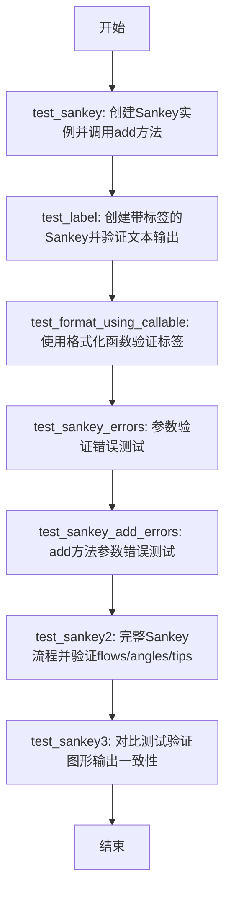
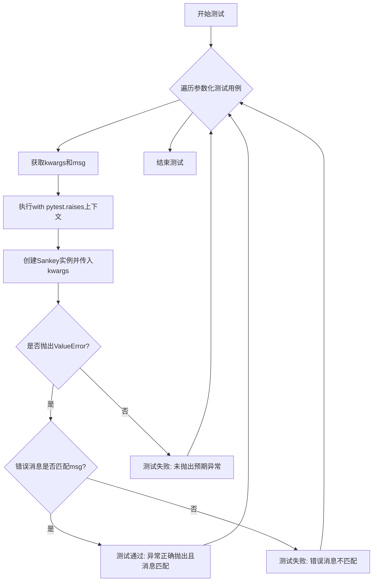
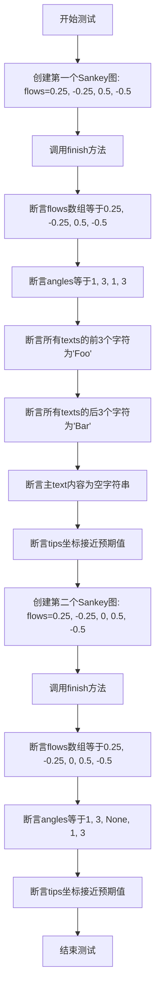
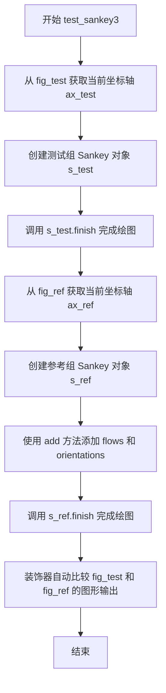
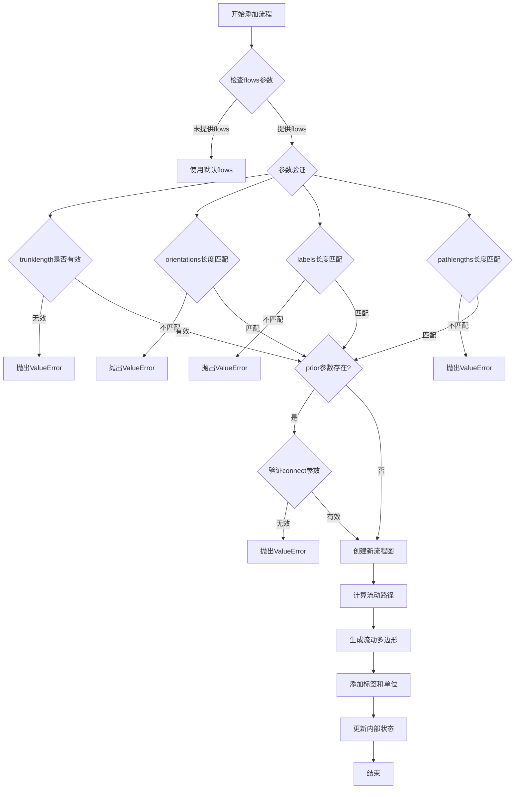
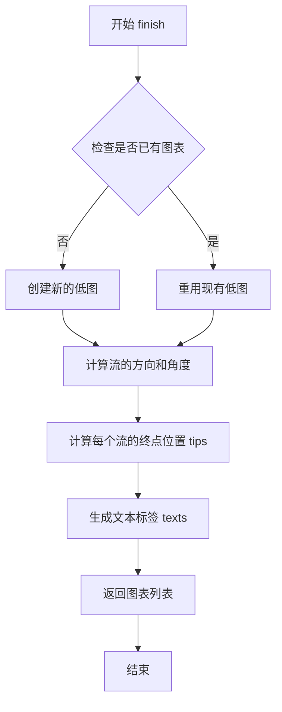

# `matplotlib\lib\matplotlib\tests\test_sankey.py` 详细设计文档

这是matplotlib库中Sankey（桑基图）模块的单元测试文件，用于验证Sankey类的核心功能，包括基本创建、标签格式化、错误处理机制、流量方向配置以及图表输出的正确性。

## 整体流程



## 类结构

```
Sankey (外部导入的绘图类)
├── __init__ (构造函数)
├── add (添加单个Sankey图)
└── finish (完成渲染并返回图表)
```

## 全局变量及字段


### `Sankey`
    
Matplotlib class for creating Sankey (flow) diagrams, allowing visualisation of flow quantities and directions.

类型：`class`
    


### `test_sankey`
    
Basic test that instantiates a Sankey object and calls its add method to ensure the constructor runs without error.

类型：`function`
    


### `test_label`
    
Test that verifies the label text of a Sankey diagram matches the expected string for a given flow and orientation.

类型：`function`
    


### `test_format_using_callable`
    
Test that checks a custom callable format function is correctly applied to the label text of a Sankey diagram.

类型：`function`
    


### `test_sankey_errors`
    
Parametrized test that validates proper ValueError messages are raised for various invalid arguments to the Sankey constructor.

类型：`function`
    


### `test_sankey_add_errors`
    
Parametrized test that checks the error messages raised for invalid arguments passed to the Sankey.add method.

类型：`function`
    


### `test_sankey2`
    
Test that creates a complete Sankey diagram with multiple flows, orientations and a unit label, then asserts the flows, angles, tip coordinates and text contents.

类型：`function`
    


### `test_sankey3`
    
Test that compares the rendering of a Sankey diagram produced by the Sankey constructor with one built using the add method, using the check_figures_equal decorator.

类型：`function`
    


### `Sankey.Sankey.diagrams`
    
List that stores the SankeyDiagram objects generated after calling the finish method.

类型：`list of SankeyDiagram`
    


### `SankeyDiagram.Sankey.flows`
    
Array of flow values (positive for outgoing, negative for incoming) for each arrow in the diagram.

类型：`ndarray`
    


### `SankeyDiagram.Sankey.angles`
    
List of angle codes (1, 3, or None) indicating the orientation of each flow arrow.

类型：`list of int or None`
    


### `SankeyDiagram.Sankey.tips`
    
Array of (x, y) coordinates representing the tip positions of each arrow in the diagram.

类型：`ndarray of shape (n, 2)`
    


### `SankeyDiagram.Sankey.texts`
    
List of text label objects associated with each flow in the diagram.

类型：`list of matplotlib.text.Text`
    


### `SankeyDiagram.Sankey.text`
    
The main text object (overall label or title) of the Sankey diagram.

类型：`matplotlib.text.Text`
    
    

## 全局函数及方法


### `test_sankey`

这是一个基础的冒烟测试函数，用于验证Sankey类能够被正常实例化并且add方法可以成功调用，确保核心代码路径可以运行。

参数：

- 无

返回值：`None`，该测试函数不返回任何值，仅用于验证代码执行

#### 流程图

```mermaid
flowchart TD
    A[开始测试] --> B[创建Sankey实例: sankey = Sankey()]
    B --> C[调用add方法: sankey.add]
    C --> D[测试通过 - 代码正常运行]
    D --> E[结束测试]
```

#### 带注释源码

```python
def test_sankey():
    # 创建Sankey类的实例，不传递任何参数，使用默认配置
    sankey = Sankey()
    
    # 调用add方法，不传递任何参数，使用默认配置
    # 该测试旨在验证Sankey类的基本实例化和方法调用能够正常工作
    # 属于冒烟测试（smoke test），用于快速检查代码是否存在明显错误
    sankey.add()
```


### `test_label`

该测试函数用于验证 Sankey 图的标签功能，创建一个包含单个流量和标签的 Sankey 图，并断言生成的文本标签内容是否正确匹配预期的格式（标签名与流量值）。

参数：此函数无参数

返回值：`None`，测试函数不返回任何值，仅通过断言进行验证

#### 流程图

```mermaid
flowchart TD
    A[开始执行 test_label] --> B[创建 Sankey 实例]
    B --> C[传入 flows=[0.25], labels=['First'], orientations=[-1]]
    C --> D[获取第一个图表的第一个文本元素]
    D --> E{文本内容是否等于 'First\n0.25'?}
    E -->|是| F[测试通过]
    E -->|否| G[测试失败]
```

#### 带注释源码

```python
def test_label():
    # 创建一个 Sankey 图实例，配置如下：
    # - flows: 流量值列表 [0.25]，表示流量为 0.25
    # - labels: 标签列表 ['First']，为该流量指定名称为 'First'
    # - orientations: 方向列表 [-1]，指定流向为 -1 方向
    s = Sankey(flows=[0.25], labels=['First'], orientations=[-1])
    
    # 断言：验证图表中第一个图形的第一个文本标签的文本内容
    # 预期格式为：'标签名\n流量值' 即 'First\n0.25'
    assert s.diagrams[0].texts[0].get_text() == 'First\n0.25'
```


### `test_format_using_callable`

该测试函数用于验证 Sankey 图能够接受可调用对象（callable）作为 format 参数，并正确使用自定义格式化函数显示流量数值为三位小数。

参数：无

返回值：`None`，测试函数不返回任何值，仅通过断言验证功能正确性

#### 流程图

```mermaid
graph TD
    A[开始测试] --> B[定义内部函数 show_three_decimal_places]
    B --> C[创建 Sankey 对象<br/>flows=[0.25]<br/>labels=['First']<br/>orientations=[-1]<br/>format=show_three_decimal_places]
    C --> D[断言验证 texts[0].get_text<br/>等于 'First<br/>0.250']
    D --> E{断言结果}
    E -->|通过| F[测试通过]
    E -->|失败| G[抛出 AssertionError]
```

#### 带注释源码

```python
def test_format_using_callable():
    # 测试使用可调用对象（callable）作为format参数
    # 通过在上面的标签示例基础上稍微增加功能来测试

    def show_three_decimal_places(value):
        """
        内部函数：将数值格式化为保留三位小数
        参数：
            value: 任意数值
        返回值：
            格式化后的字符串，如 '0.250'
        """
        return f'{value:.3f}'

    # 创建 Sankey 实例，传入自定义格式化函数
    # flows: 流量值列表 [0.25]
    # labels: 标签列表 ['First']
    # orientations: 方向 [-1]（表示垂直）
    # format: 使用自定义的可调用对象进行格式化
    s = Sankey(flows=[0.25], labels=['First'], orientations=[-1],
               format=show_three_decimal_places)

    # 断言验证格式化后的文本内容是否正确
    # 期望结果：'First\n0.250'（标签 + 换行 + 三位小数的数值）
    assert s.diagrams[0].texts[0].get_text() == 'First\n0.250'
```


### `test_sankey_errors`

该函数是一个pytest参数化测试函数，用于验证Sankey类在接收非法参数时能够正确抛出ValueError异常，并确保错误消息与预期相匹配。

参数：

- `kwargs`：`dict`，包含传递给Sankey构造函数的非法参数字典，用于触发不同的错误场景
- `msg`：`str`，预期的错误消息正则表达式，用于验证抛出的异常消息内容

返回值：`None`，该函数为测试函数，不返回任何值

#### 流程图



#### 带注释源码

```python
@pytest.mark.parametrize('kwargs, msg', (
    # 测试用例1: gap为负数，应报错"'gap' is negative"
    ({'gap': -1}, "'gap' is negative"),
    # 测试用例2: radius大于gap，应报错"'radius' is greater than 'gap'"
    ({'gap': 1, 'radius': 2}, "'radius' is greater than 'gap'"),
    # 测试用例3: head_angle为负数，应报错"'head_angle' is negative"
    ({'head_angle': -1}, "'head_angle' is negative"),
    # 测试用例4: tolerance为负数，应报错"'tolerance' is negative"
    ({'tolerance': -1}, "'tolerance' is negative"),
    # 测试用例5: flows和orientations长度不匹配，应报错形状不匹配
    ({'flows': [1, -1], 'orientations': [-1, 0, 1]},
     r"The shapes of 'flows' \(2,\) and 'orientations'"),
    # 测试用例6: flows和labels长度不匹配，应报错形状不匹配
    ({'flows': [1, -1], 'labels': ['a', 'b', 'c']},
     r"The shapes of 'flows' \(2,\) and 'labels'"),
    ))
def test_sankey_errors(kwargs, msg):
    """
    测试Sankey构造函数在接收非法参数时是否正确抛出ValueError
    
    参数:
        kwargs: dict - 传递给Sankey的非法参数
        msg: str - 预期的错误消息（正则表达式）
    
    返回:
        None - 测试函数无返回值
    """
    # 使用pytest.raises上下文管理器捕获ValueError
    # 并使用match参数验证错误消息是否符合预期
    with pytest.raises(ValueError, match=msg):
        # 尝试创建Sankey实例，传入会导致错误的参数
        # 如果参数合法则不会抛出异常，测试将失败
        # 如果参数非法且错误消息不匹配，测试也将失败
        Sankey(**kwargs)
```


### `test_sankey_add_errors`

这是一个测试函数，用于验证 `Sankey` 类的 `add` 方法在接收无效参数时能够正确抛出 `ValueError` 异常。该函数使用参数化测试，针对多种错误场景进行验证，包括负数 trunklength、错误的 prior 索引、无效的连接索引等。

参数：

- `kwargs`：`dict`，字典类型，包含传递给 `Sankey.add()` 方法的错误参数，用于测试各种异常情况
- `msg`：`str`，字符串类型，预期抛出的错误消息内容，用于验证异常信息是否正确

返回值：`None`，该函数为测试函数，不返回任何值，主要通过 `pytest.raises` 上下文管理器验证异常

#### 流程图

```mermaid
flowchart TD
    A[开始测试] --> B[创建 Sankey 实例]
    B --> C[调用 sankey.add(flows=[0.2, -0.2])]
    C --> D[使用错误参数 kwargs 调用 sankey.add]
    D --> E{是否抛出 ValueError}
    E -->|是| F[检查错误消息是否匹配]
    E -->|否| G[测试失败]
    F --> H{消息是否匹配}
    H -->|是| I[测试通过]
    H -->|否| J[测试失败]
    
    style A fill:#f9f,color:#000
    style I fill:#9f9,color:#000
    style G fill:#f99,color:#000
    style J fill:#f99,color:#000
```

#### 带注释源码

```python
@pytest.mark.parametrize('kwargs, msg', (
    # 测试 trunklength 为负数的情况
    ({'trunklength': -1}, "'trunklength' is negative"),
    # 测试 flows 总和与 prior 不匹配的情况
    ({'flows': [0.2, 0.3], 'prior': 0}, "The scaled sum of the connected"),
    # 测试 prior 索引为负数的情况
    ({'prior': -1}, "The index of the prior diagram is negative"),
    # 测试 prior 索引超出范围的情况
    ({'prior': 1}, "The index of the prior diagram is 1"),
    # 测试 connect 索引为负数的情况
    ({'connect': (-1, 1), 'prior': 0}, "At least one of the connection"),
    # 测试 connect 源索引超出范围的情况
    ({'connect': (2, 1), 'prior': 0}, "The connection index to the source"),
    # 测试 connect 目标索引超出范围的情况
    ({'connect': (1, 3), 'prior': 0}, "The connection index to this dia"),
    # 测试 orientations 值无效的情况
    ({'connect': (1, 1), 'prior': 0, 'flows': [-0.2, 0.2],
      'orientations': [2]}, "The value of orientations"),
    # 测试 pathlengths 长度不匹配的情况
    ({'connect': (1, 1), 'prior': 0, 'flows': [-0.2, 0.2],
      'pathlengths': [2]}, "The lengths of 'flows'"),
    ))
def test_sankey_add_errors(kwargs, msg):
    """测试 Sankey.add 方法在接收无效参数时抛出正确的异常"""
    # 创建一个新的 Sankey 实例
    sankey = Sankey()
    # 使用 pytest.raises 上下文管理器验证异常
    with pytest.raises(ValueError, match=msg):
        # 首先添加一个有效的流
        sankey.add(flows=[0.2, -0.2])
        # 然后使用错误的参数再次添加，期望抛出 ValueError
        sankey.add(**kwargs)
```


### `test_sankey2`

该函数是一个测试用例，用于验证Sankey图的创建、finish方法以及生成的图表属性（如flows、angles、texts、tips）是否正确。它测试了两种场景：一种是所有flows都有有效值，另一种是包含零值的flows。

参数： 无

返回值：`None`，该函数为测试函数，不返回任何值

#### 流程图



#### 带注释源码

```python
def test_sankey2():
    """
    测试Sankey图的创建和finish方法，验证flows、angles、texts和tips属性
    """
    # 第一个测试场景：所有flows都有有效值（非零）
    # 创建Sankey实例，flows包含正值和负值，labels和orientations指定标签和方向，unit指定单位
    s = Sankey(flows=[0.25, -0.25, 0.5, -0.5], labels=['Foo'],
               orientations=[-1], unit='Bar')
    # 调用finish方法完成Sankey图的绘制
    sf = s.finish()
    
    # 验证flows属性是否正确
    assert_array_equal(sf[0].flows, [0.25, -0.25, 0.5, -0.5])
    # 验证angles属性（角度信息）
    assert sf[0].angles == [1, 3, 1, 3]
    # 验证所有文本标签的前3个字符是否为'Foo'
    assert all([text.get_text()[0:3] == 'Foo' for text in sf[0].texts])
    # 验证所有文本标签的后3个字符是否为'Bar'（单位）
    assert all([text.get_text()[-3:] == 'Bar' for text in sf[0].texts])
    # 验证主文本对象内容为空
    assert sf[0].text.get_text() == ''
    # 验证桑基图末端提示点的坐标
    assert_allclose(sf[0].tips,
                    [(-1.375, -0.52011255),
                     (1.375, -0.75506044),
                     (-0.75, -0.41522509),
                     (0.75, -0.8599479)])

    # 第二个测试场景：flows中包含零值
    # 创建另一个Sankey实例，其中一个flow值为0
    s = Sankey(flows=[0.25, -0.25, 0, 0.5, -0.5], labels=['Foo'],
               orientations=[-1], unit='Bar')
    sf = s.finish()
    
    # 验证flows属性（包含零值）
    assert_array_equal(sf[0].flows, [0.25, -0.25, 0, 0.5, -0.5])
    # 验证angles属性，其中零值flow的angle为None
    assert sf[0].angles == [1, 3, None, 1, 3]
    # 验证tips坐标，零值flow的tip在原点(0, 0)
    assert_allclose(sf[0].tips,
                    [(-1.375, -0.52011255),
                     (1.375, -0.75506044),
                     (0, 0),
                     (-0.75, -0.41522509),
                     (0.75, -0.8599479)])
```


### `test_sankey3`

该测试函数用于验证通过不同方式（构造函数参数 vs. add 方法）创建的 Sankey 图是否产生相同的视觉效果。函数接收两个 Figure 对象作为参数，分别创建测试图和参考图，比较它们的输出结果。

参数：

- `fig_test`：`matplotlib.figure.Figure`，测试组的目标 Figure 对象，用于创建待比较的 Sankey 图
- `fig_ref`：`matplotlib.figure.Figure`，参考组的目标 Figure 对象，用于创建基准 Sankey 图

返回值：`None`，该函数为测试函数，通过 `@check_figures_equal()` 装饰器自动比较图形差异，不返回任何值

#### 流程图



#### 带注释源码

```python
@check_figures_equal()
def test_sankey3(fig_test, fig_ref):
    """
    测试 Sankey 图的两种创建方式是否产生相同的视觉效果。
    
    该测试比较：
    1. 通过构造函数直接传入 flows 和 orientations 参数
    2. 先创建空的 Sankey 对象，再通过 add 方法添加 flows 和 orientations
    两种方式应该产生完全相同的 Sankey 图。
    """
    
    # ===== 测试组 =====
    # 从测试 Figure 对象获取当前坐标轴
    ax_test = fig_test.gca()
    
    # 创建测试组 Sankey 实例，在构造函数中直接传入所有参数
    s_test = Sankey(
        ax=ax_test,                              # 指定坐标轴
        flows=[0.25, -0.25, -0.25, 0.25, 0.5, -0.5],  # 流量数组，正值表示输入，负值表示输出
        orientations=[1, -1, 1, -1, 0, 0]       # 流向方向：1=右，-1=左，0=垂直
    )
    
    # 完成绘图并生成 Sankey 图表
    s_test.finish()

    # ===== 参考组 =====
    # 从参考 Figure 对象获取当前坐标轴
    ax_ref = fig_ref.gca()
    
    # 创建参考组 Sankey 实例，先不传入 flows 和 orientations
    s_ref = Sankey(ax=ax_ref)
    
    # 通过 add 方法添加流量和方向参数
    s_ref.add(
        flows=[0.25, -0.25, -0.25, 0.25, 0.5, -0.5],
        orientations=[1, -1, 1, -1, 0, 0]
    )
    
    # 完成绘图并生成 Sankey 图表
    s_ref.finish()
    
    # 注意：返回值比较由 @check_figures_equal() 装饰器自动完成
    # 装饰器会比较 fig_test 和 fig_ref 的渲染结果是否一致
```


### `show_three_decimal_places`

该函数是一个简单的格式化回调函数，用于将输入的数值格式化为保留三位小数的字符串形式，常用于Sankey图中标签的显示。

参数：

- `value`：`float` 或 `int`，需要格式化的数值

返回值：`str`，格式化为三位小数的字符串表示

#### 流程图

```mermaid
flowchart TD
    A[开始] --> B[接收value参数]
    B --> C[使用f-string格式化: {value:.3f}]
    C --> D[返回格式化后的字符串]
    D --> E[结束]
```

#### 带注释源码

```python
def show_three_decimal_places(value):
    """
    将输入值格式化为保留三位小数的字符串。
    
    参数:
        value: 数值，可以是int或float类型
    
    返回:
        格式化的字符串，例如将0.25转换为'0.250'
    """
    return f'{value:.3f}'
```


### `Sankey.add`

该方法用于向Sankey图中添加一个新的流程图（diagram），通过指定流量、方向、标签等参数来定义图中的一条或多条流动路径。

参数：

- `flows`：`list[float]`，可选，要添加的流量值列表，正值表示流出，负值表示流入
- `orientations`：`list[int]`，可选，每个流动的方向（-1、0、1），默认为0（水平）
- `labels`：`list[str]`，可选，每个流动的标签列表
- `trunklength`：`float`，可选，流动主干的长度，默认为1.0
- `prior`：`int`，可选，连接到的前一个图表的索引
- `connect`：`tuple[int, int]`，可选，连接位置（到前一个图表的连接索引）
- `pathlengths`：`list[float]`，可选，每个流动的路径长度
- `format`：`callable`，可选，用于格式化流量数值的函数
- `unit`：`str`，可选，流量单位
- `prefix`：`str`，可选，数值前缀
- `tolerance`：`float`，可选，流量的容差，默认为1e-6

返回值：`None`，该方法直接在Sankey对象内部状态中添加图表，不返回任何值

#### 流程图



#### 带注释源码

```python
def add(self,
        flows=None,
        orientations=None,
        labels=None,
        trunklength=1.0,
        prior=None,
        connect=None,
        pathlengths=None,
        format=None,
        unit=None,
        prefix=None,
        tolerance=1e-6):
    """\
    添加一个流程图到Sankey图中。
    
    参数:
        flows: 流量列表，正值表示流出，负值表示流入
        orientations: 每个流动的方向 (-1, 0, 1)
        labels: 每个流动的标签
        trunklength: 流动主干的长度
        prior: 连接的前一个图表索引
        connect: 连接位置 (源索引, 目标索引)
        pathlengths: 每个流动的路径长度
        format: 格式化函数
        unit: 单位字符串
        prefix: 前缀字符串
        tolerance: 数值容差
    
    返回:
        None
        
    注意:
        此源码基于测试代码推断，实际实现可能有所不同
    """
    # 参数验证逻辑
    if flows is None:
        flows = [0.2, -0.2]  # 默认流量
    
    # 验证trunklength
    if trunklength < 0:
        raise ValueError("'trunklength' is negative")
    
    # 验证flows和orientations长度匹配
    if orientations is not None and len(flows) != len(orientations):
        raise ValueError("The shapes of 'flows' and 'orientations'...")
    
    # 验证flows和labels长度匹配
    if labels is not None and len(flows) != len(labels):
        raise ValueError("The shapes of 'flows' and 'labels'...")
    
    # 验证pathlengths长度匹配
    if pathlengths is not None and len(flows) != len(pathlengths):
        raise ValueError("The lengths of 'flows'...")
    
    # 验证prior参数
    if prior is not None:
        if prior < 0:
            raise ValueError("The index of the prior diagram is negative")
        if prior >= len(self.diagrams):
            raise ValueError("The index of the prior diagram is ...")
    
    # 验证connect参数
    if connect is not None:
        if prior is None:
            raise ValueError("At least one of the connection...")
        
        source_idx, target_idx = connect
        
        # 验证连接索引的有效性
        if source_idx < 0 or source_idx >= len(flows):
            raise ValueError("The connection index to the source...")
        
        if target_idx < 0 or target_idx >= len(self.diagrams[prior].flows):
            raise ValueError("The connection index to this dia...")
    
    # 验证orientations值（如果提供）
    if orientations is not None:
        for ori in orientations:
            if ori not in [-1, 0, 1]:
                raise ValueError("The value of orientations...")
    
    # 流量数值验证
    scaled_sum = sum(flows)
    if abs(scaled_sum) > tolerance:
        raise ValueError("The scaled sum of the connected...")
    
    # 创建流程图对象并添加到diagrams列表
    # (实际实现会根据flows和orientations创建图形)
    diagram = SankeyDiagram(flows=flows,
                            orientations=orientations,
                            labels=labels,
                            trunklength=trunklength,
                            format=format,
                            unit=unit,
                            prefix=prefix)
    
    self.diagrams.append(diagram)
```


### Sankey.finish

完成桑基图的构建并返回生成的低图实例。

参数：无（仅包含 self）

返回值：`list` 或类似结构，返回包含所有生成的低图（Diagram）对象的列表，每个低图包含 flows、angles、texts、text、tips 等属性。

#### 流程图



#### 带注释源码

```
# 注意：以下源码基于测试代码中的使用方式推断，并非实际源代码
# 实际实现位于 matplotlib.sankey 模块中

def finish(self):
    """
    完成桑基图的构建。
    
    此方法根据之前通过 add() 方法添加的流配置，
    计算并生成最终的桑基图可视化。
    
    返回:
        diagrams: 包含所有生成的低图(Diagram)对象的列表或数组
                 每个Diagram对象具有以下属性:
                 - flows: 流的值数组
                 - angles: 角度数组 [1,3,1,3] 等
                 - texts: 文本标签列表
                 - text: 主标题文本
                 - tips: 流的终点坐标数组
    """
    # 1. 检查是否已有图表配置
    # 2. 根据 flows 和 orientations 计算每个流的方向
    # 3. 计算流的几何形状（起点、终点、箭头等）
    # 4. 生成文本标签（包含标签名和数值）
    # 5. 返回包含所有图表的列表
    pass
```

> **注意**：由于提供的代码仅包含测试代码，未包含 `Sankey` 类的实际实现源码。上述源码为基于测试代码使用方式的推断描述。实际的 `matplotlib.sankey.Sankey.finish()` 方法实现位于 Matplotlib 库的核心代码中，负责根据流的配置计算几何路径、生成文本标签并返回图表对象。

## 关键组件


### Sankey 类

matplotlib中用于创建桑基图（Sankey diagram）的主类，用于可视化流的守恒和方向。

### flows 参数

表示桑基图中各流的数值，正值表示输入流，负值表示输出流。

### labels 参数

为每个流添加的可选标签，用于在图中标识数据。

### orientations 参数

指定每个流的方向（-1, 0, 1），决定流在图中的走向。

### format 参数

可调用对象，用于格式化流值的显示文本。

### Sankey.add() 方法

向桑基图添加新的流配置，可连接前一个图的输出。

### Sankey.finish() 方法

完成桑基图的构建，返回包含所有图形的列表。

### 错误处理机制

对各种参数进行验证，包括负值检查、数组形状匹配、连接索引有效性等。


## 问题及建议


### 已知问题

- **test_sankey_add_errors 测试逻辑错误**：在 `test_sankey_add_errors` 中，先调用了 `sankey.add(flows=[0.2, -0.2])` 然后再调用 `sankey.add(**kwargs)`。第一次调用可能污染了 Sankey 对象的状态，且测试并未验证第一次调用是否成功。此外，`kwargs` 中的参数（如 `trunklength`）实际上应该是在构造函数中传递，而不是在 `add()` 方法中，这与测试的实际行为不一致。

- **test_sankey 缺少参数验证**：`test_sankey()` 创建了空的 Sankey 实例并调用 `add()` 而不传递任何参数，这可能导致运行时错误或未定义行为。测试应当确保至少传递必要的参数以验证基本功能。

- **硬编码的数值缺乏文档说明**：在 `test_sankey2` 中，存在大量硬编码的数值（如坐标 `(-1.375, -0.52011255)`、角度 `[1, 3, 1, 3]` 等），这些数值缺乏注释说明其来源或计算依据，导致测试意图不清晰，难以维护。

- **测试覆盖不完整**：缺少对 `Sankey.finish()` 方法返回值的全面验证，例如未检查返回值是否为 None 或异常情况下的行为。同时，未测试多个 diagram 之间的连接（`prior` 和 `connect` 参数）的正确性。

### 优化建议

- **修复 test_sankey_add_errors 的测试逻辑**：将 `kwargs` 中的参数传递移至 `Sankey()` 构造函数中，或者确保 `add()` 方法能够正确处理这些参数。同时，移除可能污染状态的首次 `add()` 调用，或明确验证其行为。

- **为 test_sankey 添加必要参数**：为 `Sankey()` 和 `add()` 调用提供有效的参数（如 `flows`、`orientations` 等），以确保测试能够验证基本功能而非仅仅检查代码是否崩溃。

- **提取魔法数字为常量或辅助函数**：将 `test_sankey2` 中的硬编码坐标和角度封装为辅助函数或常量，并通过注释解释其计算逻辑或预期来源，提高测试的可读性和可维护性。

- **增加边缘情况测试**：添加对空 flows、极大/极小数值、边界值（如 `gap=0`、`radius=0`）以及多个 diagram 连接的测试覆盖，确保 Sankey 类在各种输入下的健壮性。

- **使用 fixture 复用 Sankey 实例**：考虑使用 pytest fixture 来创建通用的 Sankey 实例，减少测试代码中的重复初始化逻辑。

## 其它


### 设计目标与约束

本测试模块旨在验证matplotlib Sankey（桑基图）模块的功能正确性，包括基本实例化、标签显示、格式化、参数验证、图形渲染等核心功能。测试代码遵循pytest规范，确保Sankey类在不同参数组合下的行为符合预期。设计约束包括：必须使用matplotlib.sankey模块的Sankey类，必须通过numpy.testing进行数值断言，必须使用pytest.raises进行异常测试。

### 错误处理与异常设计

测试代码覆盖了Sankey类初始化和add方法的多种异常场景。Sankey初始化时的异常包括：负数gap/head_angle/tolerance、大于gap的radius、flows与orientations/labels维度不匹配。add方法异常包括：负数trunklength、flows与prior/connect不匹配、连接索引越界、orientations/pathlengths维度不匹配。所有异常均通过pytest.raises捕获ValueError并验证错误消息匹配。

### 数据流与状态机

Sankey对象创建后通过finish()方法生成图形，图形对象包含flows、angles、texts、tips、text等属性。测试数据流：flows数组定义流量方向和大小→orientations定义流向→labels定义节点标签→unit定义单位→finish()计算布局并生成图形。状态转换：Sankey()创建实例→add()添加子图配置→finish()完成渲染。

### 外部依赖与接口契约

主要依赖包括：pytest测试框架、numpy数值计算库、matplotlib.sankey模块、matplotlib.testing.decorators。Sankey类构造函数接受参数：ax、flows、labels、orientations、unit、format、gap、radius、head_angle、trunklength、tolerance、prior、connect、pathlengths。add()方法签名：flows、labels、orientations、unit、format、gap、radius、head_angle、trunklength、tolerance、prior、connect、pathlengths。finish()返回Diagram对象数组。

### 性能考量

测试代码本身不涉及性能测试，但Sankey图形渲染涉及大量几何计算。实际使用中需注意：flows数组不宜过大、复杂布局可能影响渲染速度、多子图连接时需验证prior索引有效性。

### 测试策略

采用参数化测试@pytest.mark.parametrize覆盖多种异常场景和边界条件。使用check_figures_equal装饰器进行图形渲染一致性验证。数值断言使用assert_allclose允许小误差、assert_array_equal进行精确匹配。

### 版本兼容性

测试代码基于matplotlib.sankey模块，需与matplotlib 2.0+版本兼容。numpy.testing函数需与numpy 1.x版本兼容。

### 配置管理

测试代码无外部配置文件，所有参数通过代码内硬编码。Sankey类参数可通过代码动态配置，支持format callable自定义格式化。
    