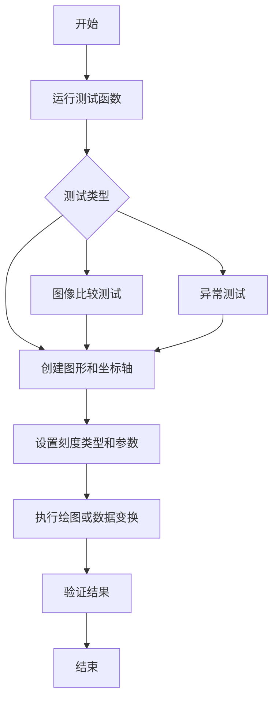
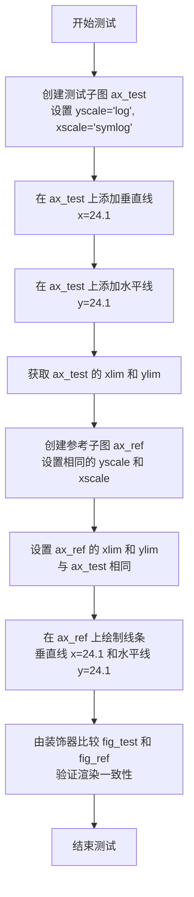
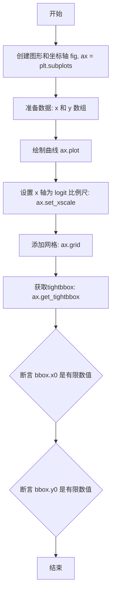
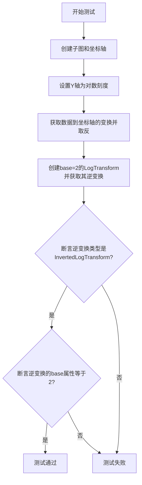
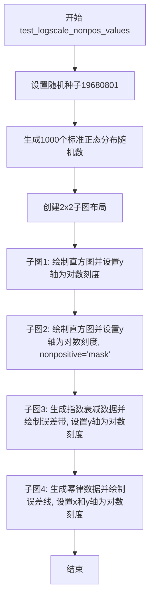
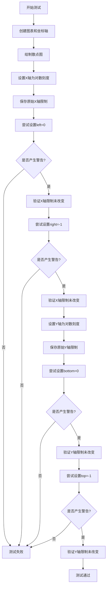
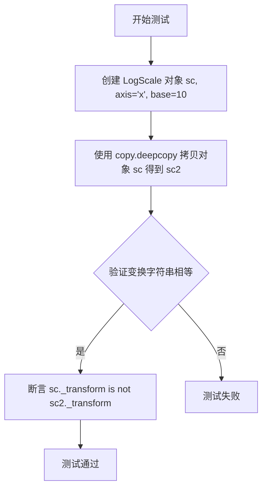
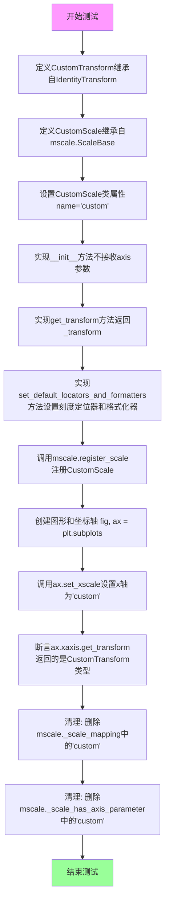
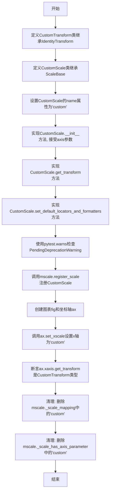

```mermaid
flowchart TD
    A[开始测试] --> B[创建图形和坐标轴 fig, ax = plt.subplots]
    --> C[设置y轴为对数刻度 ax.set_yscale&#40;'log'&#41;]
    --> D[获取并repr数据坐标变换 repr&#40;ax.transData&#41;]
    --> E[创建对数变换并repr repr&#40;LogTransform&#40;10, nonpositive='clip'&#41;&#41;]
    --> F[结束测试]
```

# `matplotlib\lib\matplotlib\tests\test_scale.py` 详细设计文档

这是一个pytest测试文件，用于验证matplotlib库中坐标轴刻度（scales）的各种功能，包括对数（log）、对称对数（symlog）、logit、自定义刻度以及函数刻度的正确性，数据转换，图形渲染以及错误处理。

## 整体流程



## 类结构

```
TestAsinhScale (测试类)
├── test_transforms
├── test_init
├── test_base_init
├── test_fmtloc
└── test_bad_scale
DummyAxis (辅助类)
├── __init__
├── set
└── set_major_formatter
CustomTransform (自定义变换类)
CustomScale (自定义刻度类)
├── __init__
├── get_transform
└── set_default_locators_and_formatters
```

## 全局变量及字段


### `DummyAxis.fields`
    
A dictionary that stores axis configuration fields such as locators and formatters.

类型：`dict`
    


### `CustomScale._transform`
    
Holds the transformation object used by this scale to map data coordinates.

类型：`CustomTransform (subclass of IdentityTransform)`
    
    

## 全局函数及方法


### `test_log_scales`

该测试函数用于验证matplotlib中对数刻度（log）和对称对数刻度（symlog）在坐标轴上的渲染是否正确，通过比较测试图形和参考图形的像素差异来确保绘制的线条位置一致。

参数：

- `fig_test`：`matplotlib.figure.Figure`，测试组图形对象，由`@check_figures_equal`装饰器注入
- `fig_ref`：`matplotlib.figure.Figure`，参考组图形对象，由`@check_figures_equal`装饰器注入

返回值：`None`，该函数为测试函数，通过装饰器内部机制进行图形比较

#### 流程图



#### 带注释源码

```python
@check_figures_equal()
def test_log_scales(fig_test, fig_ref):
    """
    测试对数刻度和对称对数刻度的渲染正确性。
    通过比较测试图形和参考图形来验证 axvline 和 axhline
    在对数刻度坐标轴上绘制的位置是否正确。
    """
    # 创建测试图形子图，设置Y轴为对数刻度，X轴为对称对数刻度
    ax_test = fig_test.add_subplot(122, yscale='log', xscale='symlog')
    # 在X=24.1位置添加垂直参考线
    ax_test.axvline(24.1)
    # 在Y=24.1位置添加水平参考线
    ax_test.axhline(24.1)
    # 获取当前坐标轴的显示范围
    xlim = ax_test.get_xlim()
    ylim = ax_test.get_ylim()
    
    # 创建参考图形子图，使用相同的刻度设置
    ax_ref = fig_ref.add_subplot(122, yscale='log', xscale='symlog')
    # 同步设置参考坐标轴的显示范围与测试坐标轴一致
    ax_ref.set(xlim=xlim, ylim=ylim)
    # 使用plot方法在参考坐标轴上绘制相同的垂直线和水平线
    # 绘制从(24.1, ylim[0])到(24.1, ylim[1])的垂直线，蓝色'b'
    ax_ref.plot([24.1, 24.1], ylim, 'b')
    # 绘制从(xlim[0], 24.1)到(xlim[1], 24.1)的水平线，蓝色'b'
    ax_ref.plot(xlim, [24.1, 24.1], 'b')
```


### `test_symlog_mask_nan`

该函数用于测试SymmetricalLogTransform的往返变换（正向和逆向）是否正确工作，并验证其对NaN值和masked数组的处理能力。

参数：此函数没有参数

返回值：`None`，该函数为测试函数，不返回任何值

#### 流程图

```mermaid
flowchart TD
    A[开始] --> B[创建SymmetricalLogTransform: base=10, linthresh=2, subs=1]
    B --> C[获取逆变换slti]
    C --> D[创建测试数组x: -1.5到5, 步长0.5]
    D --> E[执行往返变换: slti.transform_non_affine[slt.transform_non_affine[x]]]
    E --> F{验证结果}
    F -->|通过| G[将x[4]设为np.nan]
    G --> H[再次执行往返变换]
    H --> I{验证NaN传播}
    I -->|通过| J[将x转为masked数组]
    J --> K[执行往返变换]
    K --> L{验证masked数组处理}
    L -->|通过| M[设置x[3]为masked]
    M --> N[执行往返变换]
    N --> O{验证mask处理}
    O -->|通过| P[结束]
```

#### 带注释源码

```python
def test_symlog_mask_nan():
    # 使用往返变换验证正向和逆向变换是否正常工作，
    # 并验证它们是否正确处理NaN和/或masked数组。
    
    # 创建SymmetricalLogTransform对象
    # 参数：base=10（对数底数）, linthresh=2（线性阈值）, subs=1（对数区间数）
    slt = SymmetricalLogTransform(10, 2, 1)
    
    # 获取逆变换
    slti = slt.inverted()

    # 创建测试数组：从-1.5到5，步长0.5
    x = np.arange(-1.5, 5, 0.5)
    
    # 测试1：基本的往返变换
    # 先执行正向变换，再执行逆向变换，验证结果应与原始输入接近
    out = slti.transform_non_affine(slt.transform_non_affine(x))
    assert_allclose(out, x)  # 验证数值接近
    assert type(out) is type(x)  # 验证类型保持一致

    # 测试2：处理NaN值
    # 将第5个元素（索引4）设置为NaN
    x[4] = np.nan
    # 再次执行往返变换，验证NaN值能够正确传播
    out = slti.transform_non_affine(slt.transform_non_affine(x))
    assert_allclose(out, x)
    assert type(out) is type(x)

    # 测试3：处理masked数组
    # 将x转换为NumPy masked数组
    x = np.ma.array(x)
    # 执行往返变换
    out = slti.transform_non_affine(slt.transform_non_affine(x))
    assert_allclose(out, x)
    assert type(out) is type(x)

    # 测试4：处理部分masked的数组
    # 将第4个元素（索引3）设置为masked
    x[3] = np.ma.masked
    # 执行往返变换，验证masked值能够正确传播
    out = slti.transform_non_affine(slt.transform_non_affine(x))
    assert_allclose(out, x)
    assert type(out) is type(x)
```


### `test_logit_scales`

该测试函数用于验证 matplotlib 中 logit 比例尺（logit scale）的绘图功能是否正常工作，包括绘制典型的消光曲线（extinction curve）以及确保坐标轴的边界框（tightbbox）计算正确。

参数： 无

返回值： `None`，该测试函数无返回值，主要通过断言验证功能的正确性

#### 流程图



#### 带注释源码

```python
@image_comparison(['logit_scales.png'], remove_text=True)
def test_logit_scales():
    """
    测试 logit 比例尺的绘图功能。
    
    验证内容：
    1. 能够正确绘制基于 logit 比例尺的数据
    2. 能够正确计算坐标轴的 tightbbox
    """
    # 创建一个新的图形和一个子图坐标轴
    fig, ax = plt.subplots()

    # 定义典型的消光曲线数据
    # x 值从 0.001 到 0.999，覆盖了 logit 比例尺的有效范围
    x = np.array([0.001, 0.003, 0.01, 0.03, 0.1, 0.2, 0.3, 0.4, 0.5,
                  0.6, 0.7, 0.8, 0.9, 0.97, 0.99, 0.997, 0.999])
    # y 值是 x 的倒数，形成典型的消光曲线
    y = 1.0 / x

    # 绘制 x 和 y 数据
    ax.plot(x, y)
    
    # 将 x 轴设置为 logit 比例尺
    # logit 比例尺用于处理 0 到 1 之间的概率值
    ax.set_xscale('logit')
    
    # 启用网格显示
    ax.grid(True)
    
    # 获取坐标轴的紧凑边界框（tight bounding box）
    # 用于验证 logit 比例尺下边界框计算的正确性
    bbox = ax.get_tightbbox(fig.canvas.get_renderer())
    
    # 断言边界框的 x0 坐标是有限数值（非 NaN、非 Inf）
    assert np.isfinite(bbox.x0)
    # 断言边界框的 y0 坐标是有限数值
    assert np.isfinite(bbox.y0)
```


### `test_log_scatter`

该函数是一个测试函数，用于验证在散点图中使用对数刻度时，图形能够正确保存为PDF、EPS和SVG等不同格式。它创建包含负值的散点数据（y从-1开始），然后尝试将图形保存为多种矢量格式，以检测是否存在与对数刻度相关的保存问题。

参数： 无

返回值：`None`，无返回值（测试函数）

#### 流程图

```mermaid
flowchart TD
    A[开始] --> B[创建子图: fig, ax = plt.subplots(1)]
    B --> C[生成x数据: np.arange10]
    C --> D[生成y数据: np.arange10 - 1]
    D --> E[绘制散点图: ax.scatterx, y]
    E --> F[创建BytesIO缓冲区]
    F --> G[保存为PDF格式: fig.savefigbuf, format='pdf']
    G --> H[创建新的BytesIO缓冲区]
    H --> I[保存为EPS格式: fig.savefigbuf, format='eps']
    I --> J[创建新的BytesIO缓冲区]
    J --> K[保存为SVG格式: fig.savefigbuf, format='svg']
    K --> L[结束]
```

#### 带注释源码

```python
def test_log_scatter():
    """Issue #1799"""
    # 创建一个包含1个子图的图形窗口
    fig, ax = plt.subplots(1)

    # 生成x轴数据：数组 [0, 1, 2, 3, 4, 5, 6, 7, 8, 9]
    x = np.arange(10)
    # 生成y轴数据：数组 [-1, 0, 1, 2, 3, 4, 5, 6, 7, 8]
    # 注意：包含负值-1，这在某些刻度类型下可能会有问题
    y = np.arange(10) - 1

    # 在子图上绘制散点图
    ax.scatter(x, y)

    # 创建内存缓冲区用于保存图形
    buf = io.BytesIO()
    # 将图形保存为PDF格式到缓冲区
    fig.savefig(buf, format='pdf')

    # 重新创建缓冲区（清空之前的内容）
    buf = io.BytesIO()
    # 将图形保存为EPS格式到缓冲区
    fig.savefig(buf, format='eps')

    # 再次重新创建缓冲区
    buf = io.BytesIO()
    # 将图形保存为SVG格式到缓冲区
    fig.savefig(buf, format='svg')
```


### `test_logscale_subs`

该函数是一个测试函数，用于验证matplotlib在对数刻度（log scale）下设置次级刻度位置（subs）的功能是否正常工作。它创建一个图形和坐标轴，将y轴设置为对数刻度，并指定自定义的次级刻度位置数组 [2, 3, 4]，然后强制重绘图形以触发相关逻辑。

参数： 无

返回值：`None`，该函数没有返回值，仅用于执行测试逻辑

#### 流程图

```mermaid
flowchart TD
    A[开始测试函数 test_logscale_subs] --> B[创建图形和坐标轴: fig, ax = plt.subplots]
    B --> C[设置y轴为对数刻度并指定次级刻度: ax.set_yscale&#40;'log', subs=np.array&#40;[2, 3, 4]&#41;&#41;]
    C --> D[强制重绘图形: fig.canvas.draw&#40;&#41;]
    D --> E[结束测试]
    
    style A fill:#f9f,color:#333
    style E fill:#9f9,color:#333
```

#### 带注释源码

```python
def test_logscale_subs():
    """
    测试函数：验证对数刻度下次级刻度（subs）的设置功能
    
    该测试函数用于检查matplotlib能否正确处理对数坐标轴的次级刻度位置设置。
    次级刻度是在主刻度之间显示的辅助刻度线，用于提供更细粒度的数值参考。
    """
    # 创建一个新的图形窗口和一个子图（坐标轴）
    # 返回值：fig - Figure对象，ax - Axes对象
    fig, ax = plt.subplots()
    
    # 设置y轴为对数刻度（log scale）
    # 参数subs=np.array([2, 3, 4])指定次级刻度的位置
    # 在对数刻度中，主刻度通常是10的幂次方（如0.1, 1, 10, 100等）
    # subs参数指定在每个主刻度区间内显示哪些次级刻度
    # 例如在1和10之间，会在2, 3, 4的位置显示次级刻度线
    ax.set_yscale('log', subs=np.array([2, 3, 4]))
    
    # 强制重绘画布
    # 这行代码确保所有的图形更新和刻度计算都被执行
    # 对于测试来说，这会触发set_yscale背后的所有逻辑
    # 包括变换（transform）、定位器（locator）、格式化器（formatter）的设置
    fig.canvas.draw()
```


### `test_logscale_mask`

该函数是一个图像回归测试（Visual Regression Test），用于验证 Matplotlib 库在 Y 轴使用对数刻度（Log Scale）时，能否正确处理数据中包含的零值（或趋近于零的值）。它通过绘制函数 $y = e^{-x^2}$（该函数在 $x$ 较大时趋近于 0）并设置 `yscale="log"` 来确保坐标轴的遮罩（Masking）机制正常工作，从而避免渲染错误或程序崩溃（对应 GitHub issue #8045）。

参数：
- （无）

返回值：`None`，无返回值（测试函数）

#### 流程图

```mermaid
flowchart TD
    A([开始测试]) --> B[生成数据: xs = np.linspace(0, 50, 1001)]
    B --> C[计算函数值: ys = np.exp(-xs**2)]
    C --> D[创建画布: fig, ax = plt.subplots()]
    D --> E[绘制曲线: ax.plot(ys)]
    E --> F[强制渲染画布: fig.canvas.draw]
    F --> G[设置Y轴为对数刻度并设置刻度: ax.set(yscale='log', yticks=...)]
    G --> H([结束测试])
```

#### 带注释源码

```python
@image_comparison(['logscale_mask.png'], remove_text=True)
def test_logscale_mask():
    # Check that zero values are masked correctly on log scales.
    # See github issue 8045
    
    # 1. 生成测试数据：x 从 0 到 50。
    #    当 x 较大时，exp(-x^2) 的值趋近于 0，这对对数刻度是无效的（无法处理0）。
    xs = np.linspace(0, 50, 1001)

    # 2. 创建图表对象
    fig, ax = plt.subplots()
    
    # 3. 绘制数据曲线
    ax.plot(np.exp(-xs**2))
    
    # 4. 强制绘制 Canvas，确保内部状态更新（如下限计算）
    fig.canvas.draw()
    
    # 5. 设置 Y 轴为对数刻度。
    #    此处设置旨在触发对 0 值或极小值的处理逻辑（masking），
    #    以验证不设置 nonpositive='mask' 时的行为或验证修复效果。
    ax.set(yscale="log",
           yticks=10.**np.arange(-300, 0, 24))  # Backcompat tick selection.
```


### `test_extra_kwargs_raise`

该函数用于测试在使用 `set_yscale` 方法时，如果传递了不支持的额外关键字参数（如 `foo='mask'`），是否会正确抛出 `TypeError` 异常。

参数：无

返回值：`None`，无返回值（测试函数）

#### 流程图

```mermaid
flowchart TD
    A[开始] --> B[创建图形 fig 和坐标轴 ax]
    C[遍历 scale 列表: 'linear', 'log', 'symlog']
    C --> D[尝试调用 ax.set_yscale[scale, foo='mask']]
    D --> E{是否抛出 TypeError?}
    E -->|是| F[测试通过]
    E -->|否| G[测试失败]
    F --> C
    G --> H[断言失败]
    C --> I[结束]
```

#### 带注释源码

```python
def test_extra_kwargs_raise():
    """
    测试当传递给 set_yscale 的关键字参数不被支持时，
    是否会正确抛出 TypeError 异常。
    """
    # 创建一个新的图形和坐标轴
    fig, ax = plt.subplots()

    # 遍历不同的缩放类型
    for scale in ['linear', 'log', 'symlog']:
        # 使用 pytest.raises 上下文管理器验证是否抛出 TypeError
        with pytest.raises(TypeError):
            # 尝试设置缩放并传入一个不被支持的额外关键字参数 'foo'
            # 期望这会触发 TypeError 异常
            ax.set_yscale(scale, foo='mask')
```


### `test_logscale_invert_transform`

该函数是一个测试函数，用于验证对数刻度变换的逆变换是否正确工作。它创建了一个带对数刻度的坐标轴，获取数据到坐标轴的变换，然后直接测试 LogTransform 的逆变换是否正确返回 InvertedLogTransform 实例，并验证其 base 属性是否正确设置。

参数： 无

返回值： `None`，该函数为测试函数，不返回任何值

#### 流程图



#### 带注释源码

```python
def test_logscale_invert_transform():
    """
    测试对数刻度变换的逆变换功能
    
    该测试函数验证以下功能:
    1. LogTransform 的 inverted() 方法返回正确的 InvertedLogTransform 类型
    2. 逆变换正确保留了底数(base)参数
    """
    # 创建一个新的图形和坐标轴对象
    fig, ax = plt.subplots()
    
    # 将Y轴设置为对数刻度
    ax.set_yscale('log')
    
    # 获取变换: 先组合轴变换和数据变换的逆变换,再取逆
    # ax.transData: 数据坐标到显示坐标的变换
    # ax.transAxes: 轴坐标到显示坐标的变换
    # .inverted(): 获取逆变换
    # 最终得到从数据坐标到轴坐标的变换
    tform = (ax.transAxes + ax.transData.inverted()).inverted()

    # 直接测试 LogTransform 的逆变换
    # 创建一个底数为2的 LogTransform
    inverted_transform = LogTransform(base=2).inverted()
    
    # 断言: 逆变换应该是 InvertedLogTransform 类的实例
    assert isinstance(inverted_transform, InvertedLogTransform)
    
    # 断言: 逆变换应该正确保留底数(base=2)
    assert inverted_transform.base == 2
```


### `test_logscale_transform_repr`

该函数是一个测试函数，用于验证在对数刻度（log scale）下坐标变换的字符串表示（repr）是否正常工作。它创建带有对数刻度的图表，并检查数据变换和对数变换对象的 repr 输出。

参数： 无

返回值：`None`，该函数仅执行测试逻辑，不返回任何值

#### 流程图



#### 带注释源码

```python
def test_logscale_transform_repr():
    """
    测试对数刻度变换的字符串表示是否正确。
    
    该测试验证以下两点：
    1. 坐标轴的数据变换 (transData) 在对数刻度下的 repr 能正常工作
    2. LogTransform 对象在设置 nonpositive 参数后的 repr 能正常工作
    """
    # 创建一个新的图形和坐标轴对象
    fig, ax = plt.subplots()
    
    # 设置y轴使用对数刻度
    ax.set_yscale('log')
    
    # 获取数据坐标变换并调用repr，验证其字符串表示
    # 这会触发 LogTransform 的 __repr__ 方法
    repr(ax.transData)
    
    # 创建底数为10的非正值处理方式为'clip'的LogTransform对象
    # 并验证其repr能正常工作
    # nonpositive='clip' 表示将非正值裁剪到最小正数值
    repr(LogTransform(10, nonpositive='clip'))
```


### `test_logscale_nonpos_values`

该函数是一个测试函数，用于验证matplotlib在对数刻度下处理非正值（零和负数）的行为。它创建了四个子图，分别测试直方图在负数范围内的显示、对数刻度使用'mask'模式处理非正值、误差带的显示以及误差线图在双对数坐标下的显示。

参数：

- 该函数没有显式参数，但使用了pytest的装饰器 `@image_comparison`

返回值：`None`，该函数为测试函数，不返回任何值

#### 流程图



#### 带注释源码

```python
@image_comparison(['logscale_nonpos_values.png'],
                  remove_text=True, tol=0.02, style='mpl20')
def test_logscale_nonpos_values():
    """
    测试对数刻度处理非正值的行为
    """
    # 设置随机种子以确保结果可重现
    np.random.seed(19680801)
    # 生成1000个标准正态分布的随机数
    xs = np.random.normal(size=int(1e3))
    # 创建一个2x2的子图布局
    fig, ((ax1, ax2), (ax3, ax4)) = plt.subplots(2, 2)
    
    # 子图1: 测试直方图在负数范围内的对数刻度显示
    ax1.hist(xs, range=(-5, 5), bins=10)
    ax1.set_yscale('log')
    
    # 子图2: 测试使用'mask'模式处理非正值
    ax2.hist(xs, range=(-5, 5), bins=10)
    ax2.set_yscale('log', nonpositive='mask')
    
    # 生成测试数据
    xdata = np.arange(0, 10, 0.01)
    ydata = np.exp(-xdata)
    edata = 0.2*(10-xdata)*np.cos(5*xdata)*np.exp(-xdata)
    
    # 子图3: 测试误差带在对数刻度下的显示
    ax3.fill_between(xdata, ydata - edata, ydata + edata)
    ax3.set_yscale('log')
    
    # 生成幂律数据用于误差线测试
    x = np.logspace(-1, 1)
    y = x ** 3
    yerr = x**2
    
    # 子图4: 测试误差线在双对数坐标下的显示
    ax4.errorbar(x, y, yerr=yerr)
    ax4.set_yscale('log')
    ax4.set_xscale('log')
    # 设置y轴刻度以保持向后兼容性
    ax4.set_yticks([1e-2, 1, 1e+2])
```


### `test_invalid_log_lims`

该函数是一个测试函数，用于验证当设置无效的日志刻度限制（如负数或零值）时，matplotlib能够正确地忽略这些无效值并保持原来的轴限制不变。

参数： 无

返回值：`None`，无返回值（测试函数）

#### 流程图



#### 带注释源码

```python
def test_invalid_log_lims():
    # 检查无效的日志刻度限制是否被忽略
    # 创建一个新的图形和一个坐标轴对象
    fig, ax = plt.subplots()
    # 在坐标轴上绘制散点图，数据点为 (0,0), (1,1), (2,2), (3,3)
    ax.scatter(range(0, 4), range(0, 4))

    # 将X轴设置为对数刻度
    ax.set_xscale('log')
    # 获取并保存当前X轴的限制范围
    original_xlim = ax.get_xlim()
    # 尝试设置X轴的左边界为0（无效值，对于对数刻度）
    with pytest.warns(UserWarning):
        ax.set_xlim(left=0)
    # 验证X轴限制是否保持不变
    assert ax.get_xlim() == original_xlim
    # 尝试设置X轴的右边界为-1（无效值，负数对于对数刻度）
    with pytest.warns(UserWarning):
        ax.set_xlim(right=-1)
    # 再次验证X轴限制是否保持不变
    assert ax.get_xlim() == original_xlim

    # 将Y轴设置为对数刻度
    ax.set_yscale('log')
    # 获取并保存当前Y轴的限制范围
    original_ylim = ax.get_ylim()
    # 尝试设置Y轴的底边界为0（无效值，对于对数刻度）
    with pytest.warns(UserWarning):
        ax.set_ylim(bottom=0)
    # 验证Y轴限制是否保持不变
    assert ax.get_ylim() == original_ylim
    # 尝试设置Y轴的顶边界为-1（无效值，负数对于对数刻度）
    with pytest.warns(UserWarning):
        ax.set_ylim(top=-1)
    # 再次验证Y轴限制是否保持不变
    assert ax.get_ylim() == original_ylim
```


### `test_function_scale`

该测试函数用于验证 matplotlib 的 function scale 功能，通过自定义的前向（forward）和逆向（inverse）转换函数来实现非线性坐标缩放，并使用图像比较装饰器验证输出图形是否与参考图形一致。

参数：

- 该函数无显式参数（由 pytest 和 @image_comparison 装饰器隐式管理）

返回值：`None`，无返回值

#### 流程图

```mermaid
flowchart TD
    A[开始测试 test_function_scale] --> B[定义 inverse 函数: x -> x²]
    B --> C[定义 forward 函数: x -> x^(1/2)]
    C --> D[创建 figure 和 axes 子图]
    D --> E[生成 x 数据: np.arange(1, 1000)]
    E --> F[绘制 y=x 的直线]
    F --> G[设置 x 轴为 function scale, 传入 forward 和 inverse 函数]
    G --> H[设置 x 轴范围: 1 到 1000]
    H --> I[由 @image_comparison 装饰器执行图形比较验证]
    I --> J[测试结束]
```

#### 带注释源码

```python
@image_comparison(['function_scales.png'], remove_text=True, style='mpl20')
def test_function_scale():
    """
    测试 matplotlib 的 function scale 功能。
    验证自定义的前向和逆向转换函数可以正确应用于坐标轴缩放。
    """
    
    # 定义逆向转换函数：将数据坐标转换为显示坐标
    # 此处使用平方函数作为逆变换
    def inverse(x):
        return x**2

    # 定义前向转换函数：将显示坐标转换回数据坐标
    # 此处使用平方根函数作为正变换
    def forward(x):
        return x**(1/2)

    # 创建图形和坐标轴对象
    fig, ax = plt.subplots()

    # 生成测试数据：从 1 到 999 的整数序列
    x = np.arange(1, 1000)

    # 绘制 y = x 的直线
    ax.plot(x, x)
    
    # 设置 x 轴使用 function scale，传入 (forward, inverse) 元组
    # forward 用于将数据坐标转换为显示坐标
    # inverse 用于将显示坐标转换回数据坐标
    ax.set_xscale('function', functions=(forward, inverse))
    
    # 设置 x 轴的显示范围为 1 到 1000
    ax.set_xlim(1, 1000)
```


### `test_pass_scale`

该函数用于测试是否可以直接将Scale对象（如LogScale）传递给坐标轴的`set_xscale`和`yscale`方法，验证Scale对象作为参数时的功能正确性。

参数：无

返回值：`None`，无返回值（pytest测试函数）

#### 流程图

```mermaid
flowchart TD
    A[开始] --> B[创建图形fig和坐标轴ax]
    --> C[创建LogScale对象 scale]
    --> D[调用ax.set_xscale[scale]设置x轴刻度]
    --> E[再次创建LogScale对象 scale]
    --> F[调用ax.set_yscale[scale]设置y轴刻度]
    --> G[断言 ax.xaxis.get_scale == 'log']
    --> H[断言 ax.yaxis.get_scale == 'log']
    --> I[结束]
```

#### 带注释源码

```python
def test_pass_scale():
    # test passing a scale object works...
    # 创建一个新的图形和坐标轴
    fig, ax = plt.subplots()
    
    # 创建一个LogScale对象，axis参数为None
    scale = mscale.LogScale(axis=None)
    
    # 将Scale对象直接传递给set_xscale方法
    ax.set_xscale(scale)
    
    # 重新创建一个LogScale对象（因为前面的scale可能已被消耗）
    scale = mscale.LogScale(axis=None)
    
    # 将Scale对象直接传递给set_yscale方法
    ax.set_yscale(scale)
    
    # 验证x轴的scale已被正确设置为'log'
    assert ax.xaxis.get_scale() == 'log'
    
    # 验证y轴的scale已被正确设置为'log'
    assert ax.yaxis.get_scale() == 'log'
```


### `test_scale_deepcopy`

该函数用于测试 matplotlib 中 `LogScale` 对象的深拷贝（deep copy）功能，验证拷贝后的对象能够保持相同的变换配置，但拥有独立的变换对象引用。

参数：无

返回值：`None`，该函数为测试函数，不返回任何值。

#### 流程图



#### 带注释源码

```python
def test_scale_deepcopy():
    # 创建一个 LogScale 对象，指定 axis='x' 表示 x 轴，base=10 表示以 10 为底的对数
    sc = mscale.LogScale(axis='x', base=10)
    
    # 使用 Python 的深拷贝功能复制该 Scale 对象
    sc2 = copy.deepcopy(sc)
    
    # 验证原对象和拷贝对象的变换转换字符串表示相同
    # 即确认变换的配置参数（如 base）在深拷贝后保持一致
    assert str(sc.get_transform()) == str(sc2.get_transform())
    
    # 验证深拷贝确实创建了新的变换对象，而不是共享同一个引用
    # 这是深拷贝和浅拷贝的关键区别：深拷贝会递归复制所有嵌套对象
    assert sc._transform is not sc2._transform
```


### `test_custom_scale_without_axis`

测试注册和使用不接受axis参数的自定义缩放功能，验证自定义缩放类可以在不接收axis参数的情况下正常工作，并确保该自定义缩放能够被正确注册和应用到坐标轴上。

参数：

- 无参数

返回值：`None`，无返回值

#### 流程图



#### 带注释源码

```python
def test_custom_scale_without_axis():
    """
    Test that one can register and use custom scales that don't take an *axis* param.
    测试注册和使用不接受axis参数的自定义缩放功能
    """
    # 定义一个自定义变换类，继承自IdentityTransform
    # 用于在自定义缩放中使用
    class CustomTransform(IdentityTransform):
        pass

    # 定义一个自定义缩放类，继承自ScaleBase
    class CustomScale(mscale.ScaleBase):
        name = "custom"  # 缩放名称，用于注册和引用

        # Important: __init__ has no *axis* parameter
        # 重要：__init__方法不接收axis参数，这是测试的关键点
        def __init__(self):
            self._transform = CustomTransform()

        def get_transform(self):
            """返回用于坐标变换的变换对象"""
            return self._transform

        def set_default_locators_and_formatters(self, axis):
            """
            设置坐标轴的默认定位器和格式化器
            参数 axis: 坐标轴对象
            """
            axis.set_major_locator(AutoLocator())
            axis.set_major_formatter(ScalarFormatter())
            axis.set_minor_locator(NullLocator())
            axis.set_minor_formatter(NullFormatter())

    try:
        # 注册自定义缩放类到matplotlib的缩放系统中
        mscale.register_scale(CustomScale)
        # 创建图形和坐标轴对象
        fig, ax = plt.subplots()
        # 设置x轴使用名为'custom'的自定义缩放
        ax.set_xscale('custom')
        # 断言验证x轴的变换确实是CustomTransform类型
        assert isinstance(ax.xaxis.get_transform(), CustomTransform)
    finally:
        # cleanup - there's no public unregister_scale()
        # 清理工作：删除注册的自定义缩放
        # 由于没有公开的unregister_scale()方法，需要手动清理
        del mscale._scale_mapping["custom"]
        del mscale._scale_has_axis_parameter["custom"]
```


### `test_custom_scale_with_axis`

该函数用于测试自定义比例尺（Scale）的注册和使用，特别是验证带有 `axis` 参数的自定义比例尺在注册时会发出待废弃警告（PendingDeprecationWarning），并确保自定义变换能够正确应用到坐标轴上。

参数：

- 该函数无参数

返回值：`None`，无返回值

#### 流程图



#### 带注释源码

```python
def test_custom_scale_with_axis():
    """
    Test that one can still register and use custom scales with an *axis*
    parameter, but that registering issues a pending-deprecation warning.
    """
    # 定义一个自定义的变换类,继承自IdentityTransform
    # 用于在测试中作为自定义scale的变换
    class CustomTransform(IdentityTransform):
        pass

    # 定义一个自定义的Scale类,继承自mscale.ScaleBase
    # 该类用于注册到matplotlib的scale系统中
    class CustomScale(mscale.ScaleBase):
        # 定义scale的名称,用于set_xscale/set_yscale调用
        name = "custom"

        # Important: __init__ still has the *axis* parameter
        # 初始化方法,接受axis参数(这是旧API,会触发待废弃警告)
        def __init__(self, axis):
            # 创建自定义变换实例并保存
            self._transform = CustomTransform()

        # 获取变换对象的方法
        def get_transform(self):
            return self._transform

        # 设置坐标轴的定位器和格式化器
        def set_default_locators_and_formatters(self, axis):
            # 设置主刻度定位器为自动定位
            axis.set_major_locator(AutoLocator())
            # 设置主刻度格式化器为标量格式化器
            axis.set_major_formatter(ScalarFormatter())
            # 设置次刻度定位器为空定位器
            axis.set_minor_locator(NullLocator())
            # 设置次刻度格式化器为空格式化器
            axis.set_minor_formatter(NullFormatter())

    try:
        # 使用pytest.warns检查是否产生了PendingDeprecationWarning警告
        # 警告信息匹配'axis' parameter ... is pending-deprecated
        with pytest.warns(
                PendingDeprecationWarning,
                match=r"'axis' parameter .* is pending-deprecated"):
            # 将CustomScale注册到matplotlib的scale系统中
            mscale.register_scale(CustomScale)
        
        # 创建图形和坐标轴对象
        fig, ax = plt.subplots()
        # 设置x轴使用注册的自定义'custom' scale
        ax.set_xscale('custom')
        # 断言验证:x轴的变换确实是CustomTransform的实例
        assert isinstance(ax.xaxis.get_transform(), CustomTransform)
    finally:
        # cleanup - there's no public unregister_scale()
        # 清理工作:手动删除注册的scale(因为没有公开的注销函数)
        del mscale._scale_mapping["custom"]
        del mscale._scale_has_axis_parameter["custom"]
```


### `TestAsinhScale.test_transforms`

该方法是一个测试用例，用于验证 AsinhScale 的前向变换（AsinhTransform）和逆变换（InvertedAsinhTransform）的正确性。测试通过创建 AsinhTransform 对象，执行前向变换，然后通过逆变换还原数据，并验证还原后的数据与原始输入一致；同时测试双重逆变换的结果是否与原始前向变换等价。

参数：

- `self`：无需显式传入，类方法隐式接收的 TestAsinhScale 实例

返回值：`None`，该方法为测试方法，使用 `assert_allclose` 进行断言验证，不返回任何值

#### 流程图

```mermaid
flowchart TD
    A[开始测试 test_transforms] --> B[设置线性宽度 a0 = 17.0]
    B --> C[创建测试数组 a: np.linspace(-50, 50, 100)]
    C --> D[创建 AsinhTransform forward 对象]
    D --> E[通过 forward.inverted 获取逆变换 inverse]
    E --> F[通过 inverse.inverted 获取双重逆变换 invinv]
    F --> G[执行前向变换: a_forward = forward.transform_non_affine(a)]
    G --> H[执行逆变换: a_inverted = inverse.transform_non_affine(a_forward)]
    H --> I[断言: assert_allclose(a_inverted, a)]
    I --> J[执行双重逆变换: a_invinv = invinv.transform_non_affine(a)]
    J --> K[断言: assert_allclose(a_invinv, a0 * np.arcsinh(a / a0))]
    K --> L[测试结束]
```

#### 带注释源码

```python
def test_transforms(self):
    """
    测试 AsinhScale 的前向和逆变换功能
    
    该测试验证:
    1. AsinhTransform 的前向变换和逆变换是一对可逆操作
    2. 双重逆变换 (inverted().inverted()) 等价于原始前向变换
    """
    # 定义线性宽度参数 a0，用于控制 asinh 变换的线性区域
    a0 = 17.0
    
    # 创建测试数据：从 -50 到 50 的 100 个等间距点
    a = np.linspace(-50, 50, 100)

    # 创建 AsinhTransform 前向变换对象，传入线性宽度 a0
    forward = AsinhTransform(a0)
    
    # 通过调用 inverted() 方法获取逆变换对象
    inverse = forward.inverted()
    
    # 再次调用 inverted() 获取双重逆变换对象（应等价于 forward）
    invinv = inverse.inverted()

    # 执行前向变换：将数据 a 变换到 Asinh 尺度空间
    a_forward = forward.transform_non_affine(a)
    
    # 执行逆变换：将前向变换后的数据还原
    a_inverted = inverse.transform_non_affine(a_forward)
    
    # 断言：逆变换后的数据应与原始输入数据 a 几乎相等
    # 使用 assert_allclose 进行浮点数近似相等比较
    assert_allclose(a_inverted, a)

    # 执行双重逆变换：invinv 相当于原始的 forward
    a_invinv = invinv.transform_non_affine(a)
    
    # 断言：双重逆变换的结果应等于 a0 * arcsinh(a / a0)
    # 这是 AsinhTransform 的数学定义
    assert_allclose(a_invinv, a0 * np.arcsinh(a / a0))
```


### `TestAsinhScale.test_init`

该方法是一个测试用例，用于验证 `AsinhScale` 类的初始化功能是否正确。它创建图表、实例化 `AsinhScale` 对象，并通过一系列断言验证线性宽度、底数、子刻度等属性的初始值是否符合预期，同时检查变换对象是否正确创建。

参数：

- `self`：`TestAsinhScale`（隐式参数），代表测试类实例本身

返回值：`None`，该方法为测试用例，通过断言验证逻辑，不返回任何值

#### 流程图

```mermaid
flowchart TD
    A[开始测试] --> B[创建图表: fig, ax = plt.subplots]
    C[创建AsinhScale实例] --> D[断言: s.linear_width == 23]
    D --> E[断言: s._base == 10]
    E --> F[断言: s._subs == (2, 5)]
    F --> G[获取变换: tx = s.get_transform]
    G --> H[断言: tx是AsinhTransform实例]
    H --> I[断言: tx.linear_width == s.linear_width]
    I --> J[测试结束]
    
    B --> C
```

#### 带注释源码

```python
def test_init(self):
    """
    测试 AsinhScale 类的初始化功能。
    验证线性宽度、底数、子刻度等属性的默认值是否正确。
    """
    # 创建一个新的图表和坐标轴对象
    fig, ax = plt.subplots()

    # 使用指定的 linear_width=23.0 创建 AsinhScale 实例
    s = AsinhScale(axis=None, linear_width=23.0)
    
    # 断言1: 验证线性宽度属性是否正确设置为23
    assert s.linear_width == 23
    
    # 断言2: 验证底数(base)是否使用默认值10
    assert s._base == 10
    
    # 断言3: 验证子刻度(subs)是否使用默认值(2, 5)
    assert s._subs == (2, 5)

    # 获取该缩放类型对应的变换对象
    tx = s.get_transform()
    
    # 断言4: 验证返回的变换对象是 AsinhTransform 类型
    assert isinstance(tx, AsinhTransform)
    
    # 断言5: 验证变换对象的线性宽度与缩放对象的线性宽度一致
    assert tx.linear_width == s.linear_width
```


### TestAsinhScale.test_base_init

该方法是 `TestAsinhScale` 类的测试方法，用于验证 `AsinhScale` 类在初始化时正确处理 `base` 和 `subs` 参数的功能。通过创建不同配置的 `AsinhScale` 实例并使用断言验证其内部属性，确保缩放类的初始化逻辑符合预期。

参数：

- `self`：`TestAsinhScale`，测试类的实例自身，无需显式传递

返回值：`None`，该方法为测试方法，通过断言进行验证，不返回具体数值

#### 流程图

```mermaid
graph TD
    A[开始 test_base_init] --> B[创建图形和坐标轴: plt.subplots]
    B --> C[创建 AsinhScale 实例 s3, base=3, subs默认]
    C --> D[断言 s3._base == 3]
    D --> E[断言 s3._subs == (2,)]
    E --> F[创建 AsinhScale 实例 s7, base=7, subs=(2,4)]
    F --> G[断言 s7._base == 7]
    G --> H[断言 s7._subs == (2,4)]
    H --> I[测试通过]
    I --> J[结束]
```

#### 带注释源码

```
def test_base_init(self):
    """测试 AsinhScale 类的 base 和 subs 参数初始化"""
    # 创建测试用的图形和坐标轴对象
    fig, ax = plt.subplots()

    # 测试用例1: 验证 base=3 时的默认 subs 值
    s3 = AsinhScale(axis=None, base=3)          # 创建 base 为 3 的 AsinhScale 实例
    assert s3._base == 3                         # 验证内部 _base 属性为 3
    assert s3._subs == (2,)                     # 验证默认 subs 为 (2,)

    # 测试用例2: 验证自定义 base 和 subs 参数
    s7 = AsinhScale(axis=None, base=7, subs=(2, 4))  # 创建 base 为 7, subs 为 (2,4) 的实例
    assert s7._base == 7                         # 验证内部 _base 属性为 7
    assert s7._subs == (2, 4)                    # 验证自定义 subs 为 (2,4)
```


### `TestAsinhScale.test_fmtloc`

该测试方法用于验证AsinhScale类在不同base参数下设置默认定位器（locator）和格式化器（formatter）的正确性。

参数：无（该方法为实例方法，self参数为隐式参数）

返回值：`None`，该方法为测试函数，通过assert断言进行验证，不返回任何值

#### 流程图

```mermaid
flowchart TD
    A[开始 test_fmtloc] --> B[创建DummyAxis模拟对象 ax0]
    B --> C[创建base=0的AsinhScale实例 s0]
    C --> D[调用set_default_locators_and_formatters设置ax0]
    D --> E{断言检查}
    E -->|通过| F[验证ax0.fields中major_locator是AsinhLocator实例]
    F --> G[验证ax0.fields中major_formatter是str类型]
    G --> H[创建DummyAxis模拟对象 ax5]
    H --> I[创建base=5的AsinhScale实例 s7]
    I --> J[调用set_default_locators_and_formatters设置ax5]
    J --> K{断言检查}
    K -->|通过| L[验证ax5.fields中major_locator是AsinhLocator实例]
    L --> M[验证ax5.fields中major_formatter是LogFormatterSciNotation实例]
    M --> N[结束测试]
```

#### 带注释源码

```python
def test_fmtloc(self):
    """
    测试AsinhScale在不同base参数下设置默认locator和formatter的行为
    
    测试点：
    1. 当base=0时，应使用默认的string formatter
    2. 当base=5时，应使用LogFormatterSciNotation
    """
    
    # 定义一个模拟Axis对象的内部类，用于捕获set调用
    class DummyAxis:
        def __init__(self):
            self.fields = {}  # 用于存储设置的字段
        
        def set(self, **kwargs):
            """更新fields字典"""
            self.fields.update(**kwargs)
        
        def set_major_formatter(self, f):
            """设置主格式化器"""
            self.fields['major_formatter'] = f
    
    # 测试用例1：base=0的情况
    ax0 = DummyAxis()
    s0 = AsinhScale(axis=ax0, base=0)
    s0.set_default_locators_and_formatters(ax0)
    
    # 验证：base=0时应使用AsinhLocator和str formatter
    assert isinstance(ax0.fields['major_locator'], AsinhLocator)
    assert isinstance(ax0.fields['major_formatter'], str)
    
    # 测试用例2：base=5的情况
    ax5 = DummyAxis()
    s7 = AsinhScale(axis=ax5, base=5)
    s7.set_default_locators_and_formatters(ax5)
    
    # 验证：base=5时应使用AsinhLocator和LogFormatterSciNotation
    assert isinstance(ax5.fields['major_locator'], AsinhLocator)
    assert isinstance(ax5.fields['major_formatter'],
                      LogFormatterSciNotation)
```


### `TestAsinhScale.test_bad_scale`

该方法用于测试 AsinhScale 类在创建时对无效的 linear_width 参数（0 和负数）的错误处理，同时验证有效参数能够正常创建实例。

参数：

- `self`：`TestAsinhScale`，测试类实例本身，包含测试所需的状态和方法

返回值：`None`，pytest 测试方法通常不返回具体值，仅通过断言验证行为

#### 流程图

```mermaid
flowchart TD
    A[开始 test_bad_scale] --> B[创建 plt.subplots 图和轴]
    C[测试 linear_width=0] --> D{抛出 ValueError?}
    D -->|是| E[通过]
    D -->|否| F[失败]
    G[测试 linear_width=-1] --> H{抛出 ValueError?}
    H -->|是| I[通过]
    H -->|否| J[失败]
    K[创建默认 AsinhScale] --> L[验证 s0 创建成功]
    M[创建 linear_width=3.0 的 AsinhScale] --> N[验证 s1 创建成功]
    E --> G
    I --> K
    L --> M
    N --> O[结束]
```

#### 带注释源码

```python
def test_bad_scale(self):
    """
    测试 AsinhScale 类对无效 linear_width 参数的错误处理。
    验证创建时传入 0 或负数会抛出 ValueError，有效参数可正常创建。
    """
    # 创建一个新的图形和坐标轴用于测试
    fig, ax = plt.subplots()

    # 测试用例 1：验证 linear_width=0 会抛出 ValueError
    with pytest.raises(ValueError):
        AsinhScale(axis=None, linear_width=0)

    # 测试用例 2：验证 linear_width=-1 会抛出 ValueError
    with pytest.raises(ValueError):
        AsinhScale(axis=None, linear_width=-1)

    # 测试用例 3：验证使用默认参数可以成功创建 AsinhScale 实例
    s0 = AsinhScale(axis=None, )  # linear_width 使用默认值

    # 测试用例 4：验证传入有效的 linear_width=3.0 可以成功创建实例
    s1 = AsinhScale(axis=None, linear_width=3.0)
```


### `DummyAxis.__init__`

这是一个在测试方法内部定义的模拟轴类，用于在单元测试中替代真实的 Matplotlib 轴对象，以验证 AsinhScale 类的定位器和格式化器设置功能。

参数：

- 无参数

返回值：`None`，该方法为构造函数，不返回任何值

#### 流程图

```mermaid
flowchart TD
    A[开始 __init__] --> B[创建 self.fields = {}]
    B --> C[结束 __init__]
```

#### 带注释源码

```python
class DummyAxis:
    """
    模拟轴类，用于测试 AsinhScale 的定位器和格式化器设置
    这是一个测试辅助类，模拟 matplotlib 轴对象的基本接口
    """
    
    def __init__(self):
        """
        初始化 DummyAxis 实例
        
        创建一个空的字典来存储轴的配置字段，
        包括定位器（locator）和格式化器（formatter）等信息
        """
        # 用于存储轴的各种属性和配置
        self.fields = {}
```

### 补充信息

#### 关键组件信息

| 组件名称 | 一句话描述 |
|---------|-----------|
| `DummyAxis` | 测试用模拟轴类，用于验证 scale 类的定位器和格式化器设置功能 |
| `self.fields` | 存储轴配置的字典，模拟真实轴对象的属性存储机制 |

#### 技术债务与优化空间

1. **测试代码内嵌类**：将 `DummyAxis` 定义在测试方法内部降低了代码的可复用性，可以提取为模块级别的测试辅助类
2. **接口不完整**：仅实现了 `set` 和 `set_major_formatter` 方法，缺少其他轴接口方法，如果测试范围扩大需要补充

#### 其它说明

- **设计目标**：该类用于在不需要完整 matplotlib 依赖的情况下测试 scale 类的行为
- **使用场景**：在 `test_fmtloc` 方法中配合 `AsinhScale` 测试不同的 base 和 linear_width 参数下的定位器/格式化器设置
- **接口契约**：模拟了 matplotlib 轴对象的 `set()` 和 `set_major_formatter()` 方法接口


### DummyAxis.set

该方法用于在模拟的Axis对象上设置属性，通过将传入的关键字参数更新到内部字典中来实现。

参数：

- `**kwargs`：关键字参数，用于设置Axis对象的各种属性（如major_locator、major_formatter等）

返回值：`None`，该方法无返回值（Python中dict.update()方法返回None）

#### 流程图

```mermaid
graph TD
    A[开始 set 方法] --> B{接收 kwargs}
    B --> C[调用 self.fields.update kwargs]
    C --> D[将 kwargs 中的键值对添加到 self.fields 字典]
    D --> E[结束方法, 返回 None]
```

#### 带注释源码

```python
def set(self, **kwargs):
    """
    设置Axis对象的属性。
    
    参数:
        **kwargs: 关键字参数，每个键值对代表一个要设置的属性
                  例如: major_locator=AsinhLocator()
                       major_formatter=LogFormatterSciNotation()
    
    返回值:
        None
    """
    # 将传入的所有关键字参数更新到self.fields字典中
    # self.fields是一个存储Axis属性的字典
    self.fields.update(**kwargs)
```


### `DummyAxis.set_major_formatter`

设置主刻度标签的格式化器。

参数：

- `f`：任意类型，要设置为轴的主刻度格式化器的对象

返回值：`None`，无返回值（该方法直接修改 `self.fields` 字典）

#### 流程图

```mermaid
graph TD
    A[开始] --> B[接收参数 f]
    B --> C[将 f 作为 'major_formatter' 键存入 self.fields 字典]
    C --> D[结束]
```

#### 带注释源码

```python
def set_major_formatter(self, f):
    # 将传入的格式化器对象 f 存储到 fields 字典中
    # 键为 'major_formatter'，用于后续获取和设置轴的刻度格式化器
    self.fields['major_formatter'] = f
```


### `CustomScale.__init__`

该方法是一个自定义缩放类的构造函数，用于初始化一个不依赖 axis 参数的缩放类，并创建自定义的变换对象。

参数：
- 无显式参数（隐式参数 `self` 为类实例自身）

返回值：`None`，该方法为构造函数，不返回任何值

#### 流程图

```mermaid
flowchart TD
    A[开始 __init__] --> B[创建 CustomTransform 实例]
    B --> C[将实例赋值给 self._transform]
    D[结束 __init__]
```

#### 带注释源码

```python
def __init__(self):
    """
    初始化 CustomScale 类实例。
    
    注意：此版本的 __init__ 不接收 axis 参数，
    是针对新版本 API 的自定义缩放实现。
    """
    # 创建一个 CustomTransform 实例（继承自 IdentityTransform）
    # 并将其存储在实例属性 _transform 中，供 get_transform 方法使用
    self._transform = CustomTransform()
```


### CustomScale.get_transform

该方法是自定义缩放类的核心方法，负责返回与该缩放类型关联的坐标变换对象。该方法无参数，返回一个 Transform 实例，该实例用于将数据坐标转换为显示坐标。

参数：
- （无参数）

返回值：`matplotlib.transforms.Transform`，返回与当前缩放类型关联的坐标变换对象。

#### 流程图

```mermaid
flowchart TD
    A[开始 get_transform] --> B{self._transform 是否已存在}
    B -- 是 --> C[直接返回 self._transform]
    B -- 否 --> D[创建新的 Transform 实例]
    D --> C
    C --> E[结束]
```

#### 带注释源码

```python
def get_transform(self):
    """
    返回与该缩放类型关联的坐标变换对象。
    
    该方法是无参数的实例方法，它返回在 __init__ 中创建的 Transform 实例。
    这个 Transform 对象负责实际的数据坐标到显示坐标的转换计算。
    
    Returns:
        Transform: 一个继承自 matplotlib.transforms.Transform 的变换对象，
                   用于执行实际的数据坐标转换。
    """
    return self._transform
```

**注意**：在代码中存在两个 CustomScale 类的定义，分别在 `test_custom_scale_without_axis` 和 `test_custom_scale_with_axis` 两个测试函数中。这两个类都有完全相同的 `get_transform` 方法实现。该方法返回在类初始化时创建的 `CustomTransform`（继承自 `IdentityTransform`）实例。


### `CustomScale.set_default_locators_and_formatters`

该方法为自定义缩放类设置默认的刻度定位器（locator）和格式化器（formatter），使坐标轴能够正确显示主刻度和次刻度。

参数：

- `axis`：`matplotlib.axis.Axis`，需要进行刻度设置的坐标轴对象

返回值：`None`，该方法直接修改传入的 axis 对象，不返回任何值

#### 流程图

```mermaid
graph TD
    A[开始 set_default_locators_and_formatters] --> B[axis.set_major_locator<br/>参数: AutoLocator]
    B --> C[axis.set_major_formatter<br/>参数: ScalarFormatter]
    C --> D[axis.set_minor_locator<br/>参数: NullLocator]
    D --> E[axis.set_minor_formatter<br/>参数: NullFormatter]
    E --> F[结束]
    
    style A fill:#f9f,color:#000
    style F fill:#9f9,color:#000
```

#### 带注释源码

```python
def set_default_locators_and_formatters(self, axis):
    """
    为坐标轴设置默认的刻度定位器和格式化器。
    
    Parameters
    ----------
    axis : matplotlib.axis.Axis
        需要设置刻度信息的坐标轴对象。
    """
    # 设置主刻度定位器为 AutoLocator
    # AutoLocator 会根据数据范围自动选择合适的主刻度间隔
    axis.set_major_locator(AutoLocator())
    
    # 设置主刻度格式化器为 ScalarFormatter
    # ScalarFormatter 以普通的标量格式显示刻度标签
    axis.set_major_formatter(ScalarFormatter())
    
    # 设置次刻度定位器为 NullLocator
    # NullLocator 不显示任何次刻度
    axis.set_minor_locator(NullLocator())
    
    # 设置次刻度格式化器为 NullFormatter
    # NullFormatter 不显示次刻度的标签
    axis.set_minor_formatter(NullFormatter())
```

## 关键组件


### LogTransform 和 InvertedLogTransform

对数变换及其逆变换实现，用于处理对数刻度轴的坐标转换，支持不同的底数（base）设置。

### SymmetricalLogTransform

对称对数变换实现，用于处理在零值附近需要线性行为、远离零时需要对数行为的刻度，支持线性区域阈值参数。

### AsinhScale 和 AsinhTransform

Asinh（反双曲正弦）刻度实现，提供在零值附近近似线性、远离零时近似对数的变换效果，支持线性宽度（linear_width）参数配置。

### ScaleBase

刻度基类，定义所有刻度实现的接口规范，包括变换获取、刻度定位器和格式化器设置等方法。

### 自定义刻度注册机制

通过 `register_scale` 函数注册自定义刻度类，支持带axis参数和不带axis参数的两种刻度实现方式。

### 测试装饰器

`@check_figures_equal` 和 `@image_comparison` 用于图像对比测试，确保不同刻度配置下的渲染结果一致性。

### LogFormatterSciNotation

科学计数法格式化器，专门用于对数刻度的刻度标签格式化。

### 刻度定位器

包含 AsinhLocator、AutoLocator、LogLocator 等多种定位器实现，用于自动或自定义计算刻度线的位置。

### DummyAxis

测试中使用的模拟轴对象，用于测试刻度类的定位器和格式化器设置功能，而不依赖真实的matplotlib图形。

### 变换链与组合

代码中涉及多种变换组合测试，如 `transAxes + transData.inverted()` 的变换链叠加，用于验证坐标变换的正确性。


## 问题及建议


### 已知问题

-   `TestAsinhScale.test_bad_scale` 方法不完整：最后两行创建了 `s0` 和 `s1` 对象但没有进行任何断言或验证，测试逻辑未完成
-   使用私有API进行清理：`test_custom_scale_without_axis` 和 `test_custom_scale_with_axis` 直接操作 `mscale._scale_mapping` 和 `mscale._scale_has_axis_parameter` 字典，违反了封装原则
-   缺乏对 `test_custom_scale_without_axis` 的异常路径测试：如果注册失败，cleanup代码可能无法执行
-   `test_symlog_mask_nan` 中对 masked array 的测试只覆盖了单点mask的情况，未测试多点mask或连续mask的情况
-   硬编码的测试数据（如 `24.1`, `0.001` 等）缺乏边界值和极端情况的系统性测试覆盖

### 优化建议

-   完成 `test_bad_scale` 方法，添加对 `s0` 和 `s1` 的有效性验证或移除未使用的代码
-   封装 `register_scale` 和 `unregister_scale` 接口，提供公共的注销方法，避免直接操作私有字典
-   为 `test_custom_scale_without_axis` 和 `test_custom_scale_with_axis` 添加 try-finally 之外的异常保护，确保测试失败时也能清理注册信息
-   增加对 masked array 的多维度测试，覆盖连续mask、混合nan和mask等场景
-   使用参数化测试（pytest.mark.parametrize）替代重复的手动测试用例，提高测试覆盖率并减少代码重复
-   为关键测试函数添加详细的docstring，说明测试目的、输入输出和预期行为
-   考虑添加性能基准测试，验证大规模数据场景下各scale实现的效率

## 其它


### 设计目标与约束

本测试文件旨在验证matplotlib中各种坐标轴刻度缩放功能的正确性，包括对数刻度(log)、对称对数刻度(symlog)、logit刻度以及asinh刻度。测试覆盖缩放变换的前向与反向转换、刻度定位器与格式化器的设置、边界条件处理、以及自定义缩放类的注册与使用。约束条件包括：测试必须与matplotlib 2.0+版本兼容，图像对比测试的容差设置为0.02，使用指定的随机种子确保可重复性。

### 错误处理与异常设计

测试文件采用pytest框架进行异常验证。使用`pytest.raises()`捕获并验证类型错误（如test_extra_kwargs_raise验证非法参数抛出TypeError）、值错误（如TestAsinhScale.test_bad_scale验证非法linear_width值）、以及警告（如test_invalid_log_lims验证无效对数限值时发出UserWarning）。图像对比测试使用装饰器@image_comparison检测渲染差异，测试失败时自动生成差异图像。

### 外部依赖与接口契约

本文件依赖以下外部包：matplotlib库（matplotlib.pyplot, matplotlib.scale, matplotlib.ticker, matplotlib.transforms, matplotlib.testing.decorators）、numpy库（numpy, numpy.testing）、pytest框架、以及Python标准库（io, copy）。核心接口契约包括：ScaleBase子类必须实现get_transform()和set_default_locators_and_formatters()方法；Transform类必须实现transform_non_affine()和inverted()方法；测试用图必须使用指定样式（style='mpl20'）以确保渲染一致性。

### 测试策略与覆盖率

测试采用多层次验证策略：单元级别验证变换数学正确性（test_symlog_mask_nan验证NaN和mask处理）；集成级别验证完整渲染流程（图像对比测试）；边界条件测试验证错误输入处理（test_invalid_log_lims, test_extra_kwargs_raise）；兼容性测试验证新旧API共存（test_custom_scale_with_axis测试pending-deprecation警告）。覆盖的刻度类型包括：linear、log、symlog、logit、function及自定义缩放。

### 性能考虑

测试文件包含性能相关验证：test_log_scatter测试多种输出格式（PDF/EPS/SVG）的渲染性能；大规模数据测试（test_logscale_nonpos_values使用1000个数据点）验证渲染效率；图像缓存机制避免重复渲染。需要注意部分测试（如test_logscale_mask的1001个数据点）可能耗时较长，建议在CI环境中设置合理超时。

### 与其它模块的关系

本测试文件与matplotlib核心模块紧密交互：与matplotlib.scale模块的ScaleBase类及具体实现（LogScale, AsinhScale, SymmetricalLogTransform）直接测试；与matplotlib.transforms模块的Transform基类及其子类（IdentityTransform, LogTransform等）验证变换链；与matplotlib.ticker模块的定位器和格式化器交互验证；与matplotlib.axis模块的Axis对象集成测试set_yscale/set_xscale方法。

### 配置与常量

测试中使用多种配置常量：对称对数变换默认参数base=10, linthresh=2, subs=(2,5)；asinh变换默认linear_width=17.0；logit刻度测试数据点为[0.001, 0.003, 0.01, 0.03, 0.1, 0.2, 0.3, 0.4, 0.5, 0.6, 0.7, 0.8, 0.9, 0.97, 0.99, 0.997, 0.999]；图像对比测试使用remove_text=True移除所有文本以简化比对；随机种子固定为19680801确保数据可重现。

### 边界条件与极端情况

测试覆盖多种边界条件：零值和负值在对数刻度上的处理（test_logscale_mask, test_logscale_nonpos_values）；NaN和masked数组的变换保持（test_symlog_mask_nan）；对数刻度限值的非法设置（left=0, right=-1等）；linear_width为零或负值时的AsinhScale初始化；无axis参数的自定义缩放注册；axis参数的pending-deprecated警告触发。极端情况包括：x=0处的symlog变换、大范围数据（10^-300到10^0的tick选择）等。

    