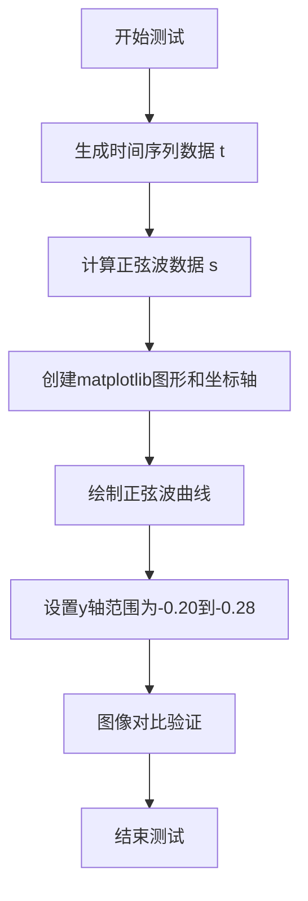
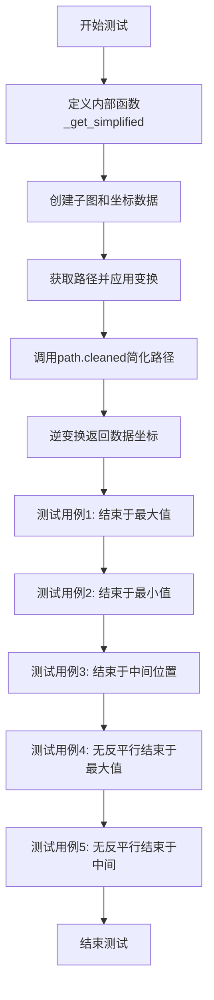
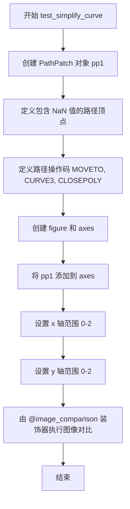
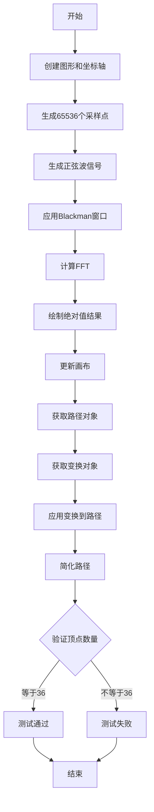
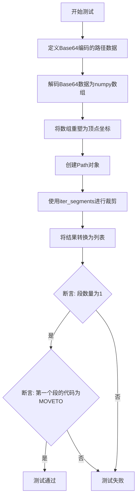
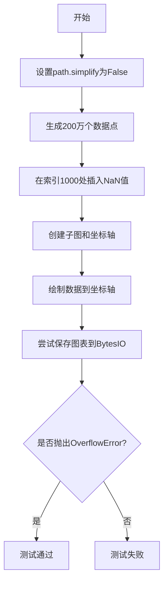
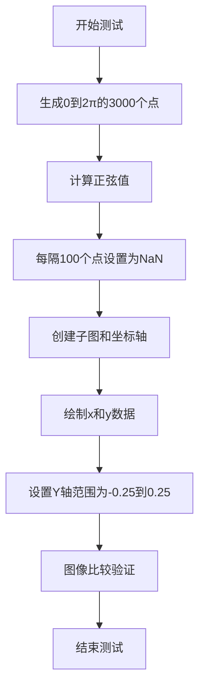

# `matplotlib\lib\matplotlib\tests\test_simplification.py` 详细设计文档

该文件是matplotlib的路径简化（path simplification）和裁剪（clipping）功能的测试套件，包含了多个测试用例验证路径清理、NaN处理、曲线简化、封闭路径裁剪等功能在各种场景下的正确性。

## 整体流程

```mermaid
graph TD
    A[开始: 导入依赖] --> B[配置测试环境]
    B --> C{执行测试用例}
    C --> D[test_clipping: 测试路径裁剪]
    C --> E[test_overflow: 测试数值溢出]
    C --> F[test_diamond: 测试菱形路径]
    C --> G[test_clipping_out_of_bounds: 测试边界外裁剪]
    C --> H[test_noise: 测试噪声路径简化]
    C --> I[test_antiparallel_simplification: 测试反向平行简化]
    C --> J[test_angled_antiparallel: 参数化角度测试]
    C --> K[test_sine_plus_noise: 测试正弦加噪声]
    C --> L[test_simplify_curve: 测试曲线简化]
    C --> M[test_closed_path_nan_removal: 测试封闭路径NaN移除]
    C --> N[test_closed_path_clipping: 测试封闭路径裁剪]
    C --> O[test_hatch: 测试阴影线]
    C --> P[test_fft_peaks: 测试FFT峰值]
    C --> Q[test_start_with_moveto: 测试MOVETO起点]
    C --> R[test_throw_rendering_complexity_exceeded: 测试复杂度超限异常]
    C --> S[test_clipper: 测试裁剪器边缘]
    C --> T[test_para_equal_perp: 测试平行垂直]
    C --> U[test_clipping_with_nans: 测试含NaN裁剪]
    C --> V[test_clipping_full: 测试完全裁剪]
    C --> W[test_simplify_closepoly: 测试CLOSEPOLY简化]
    D --> X[验证结果并生成报告]
    E --> X
    F --> X
    G --> X
    H --> X
    I --> X
    J --> X
    K --> X
    L --> X
    M --> X
    N --> X
    O --> X
    P --> X
    Q --> X
    R --> X
    S --> X
    T --> X
    U --> X
    V --> X
    W --> X
```



## 类结构

```
测试文件 (无类定义)
├── 导入模块
│   ├── base64 (数据解码)
│   ├── io (字节流)
│   ├── platform (平台检测)
│   ├── numpy (数值计算)
│   ├── pytest (测试框架)
│   └── matplotlib (绘图库)
├── 辅助函数
│   └── _get_simplified (内部路径简化函数)
└── 测试函数集合 (共20个)
```

## 全局变量及字段


### `t`
    
时间序列数组，从0到2.0，步长0.01

类型：`numpy.ndarray`
    


### `s`
    
对应时间t的正弦值数组

类型：`numpy.ndarray`
    


### `x`
    
路径的x坐标数组

类型：`numpy.ndarray`
    


### `y`
    
路径的y坐标数组

类型：`numpy.ndarray`
    


### `fig`
    
matplotlib图表对象

类型：`matplotlib.figure.Figure`
    


### `ax`
    
matplotlib坐标轴对象

类型：`matplotlib.axes.Axes`
    


### `p1`
    
plot方法返回的线条对象

类型：`matplotlib.lines.Line2D`
    


### `path`
    
路径对象，包含顶点和指令

类型：`matplotlib.path.Path`
    


### `transform`
    
坐标变换对象

类型：`matplotlib.transforms.Transform`
    


### `simplified`
    
简化后的路径对象

类型：`matplotlib.path.Path`
    


### `verts`
    
路径顶点数据数组

类型：`numpy.ndarray`
    


### `segs`
    
路径段的迭代器

类型：`iterator`
    


### `dat`
    
裁剪测试数据元组

类型：`tuple`
    


### `pp1`
    
路径补丁对象

类型：`matplotlib.patches.Patch`
    


### `vertices`
    
顶点坐标集合数组

类型：`numpy.ndarray`
    


### `codes`
    
路径指令代码数组

类型：`numpy.ndarray`
    


### `pattern`
    
图案模式列表

类型：`list`
    


### `offset`
    
偏移量数值

类型：`float`
    


### `roll`
    
数组滚动偏移量

类型：`int`
    


### `p_expected`
    
期望的路径结果

类型：`matplotlib.path.Path`
    


### `simplified_path`
    
简化后的路径对象

类型：`matplotlib.path.Path`
    


### `xx`
    
大数据x坐标数组

类型：`numpy.ndarray`
    


### `yy`
    
大数据y坐标数组

类型：`numpy.ndarray`
    


    

## 全局函数及方法


### test_clipping

该函数是一个图像对比测试，用于验证matplotlib在绘制正弦波时的路径裁剪功能是否正确。测试生成一个正弦曲线并设置特定的y轴范围，然后通过图像对比装饰器验证输出图像是否符合预期。

参数：

- 无

返回值：`None`，该函数为测试函数，不返回任何值。

#### 流程图



#### 带注释源码

```python
# 使用image_comparison装饰器进行图像对比测试
# 'clipping'是预期的参考图像名称，remove_text=True表示去除文本后比较
@image_comparison(['clipping'], remove_text=True)
def test_clipping():
    # 生成从0.0到2.0，步长为0.01的时间序列数组
    t = np.arange(0.0, 2.0, 0.01)
    # 计算对应时间点的正弦波数值，2πt表示一个完整周期
    s = np.sin(2*np.pi*t)

    # 创建一个新的matplotlib图形和坐标轴对象
    fig, ax = plt.subplots()
    # 绘制时间-正弦值曲线，linewidth设置线条宽度为1.0
    ax.plot(t, s, linewidth=1.0)
    # 设置y轴的显示范围为-0.20到-0.28，用于测试路径裁剪边界
    ax.set_ylim(-0.20, -0.28)
```


### `test_overflow`

该测试函数用于验证 matplotlib 在处理数值溢出时的行为，特别是当数据点包含极大值（如 2.0e5）时，路径简化和渲染是否能正确处理，并确保图像比较测试通过。

参数： 无

返回值： `None`，无返回值

#### 流程图

```mermaid
flowchart TD
    A[开始] --> B[准备测试数据: x = [1.0, 2.0, 3.0, 2.0e5], y = [0, 1, 2, 3]]
    B --> C[创建子图: fig, ax = plt.subplots]
    C --> D[绘制数据到坐标轴: ax.plot(x, y)]
    D --> E[设置x轴显示范围: ax.set_xlim(2, 6)]
    E --> F[@image_comparison 装饰器进行图像比对]
    F --> G[结束]
```

#### 带注释源码

```python
@image_comparison(['overflow'], remove_text=True,
                  tol=0 if platform.machine() == 'x86_64' else 0.007)
def test_overflow():
    """
    测试溢出处理功能。
    
    该测试验证当数据包含极大值（2.0e5）时，matplotlib 的路径简化
    和渲染机制能够正确处理，不会因数值溢出导致渲染错误。
    
    - 使用 @image_comparison 装饰器将生成的图像与参考图像进行比对
    - tol 参数根据平台设置容差：x86_64 平台为 0，其他平台为 0.007
    - remove_text=True 表示比对时移除文本元素
    """
    # 定义包含极大值的数据点 x，以及对应的索引 y
    x = np.array([1.0, 2.0, 3.0, 2.0e5])
    y = np.arange(len(x))

    # 创建 matplotlib 图形和坐标轴对象
    fig, ax = plt.subplots()
    
    # 将数据绘制到坐标轴上
    ax.plot(x, y)
    
    # 设置 x 轴的显示范围为 2 到 6
    # 这样可以只显示中间的几个点，排除极大值的影响
    ax.set_xlim(2, 6)
```


### `test_diamond`

这是一个测试函数，用于验证matplotlib中路径裁剪（clipping）功能，具体通过绘制一个菱形图案来测试路径在指定坐标范围内的渲染行为。

参数：

- 该函数无参数

返回值：`None`，无返回值

#### 流程图

```mermaid
graph TD
    A[开始 test_diamond] --> B[定义菱形顶点坐标 x=[0.0, 1.0, 0.0, -1.0, 0.0]]
    B --> C[定义菱形顶点坐标 y=[1.0, 0.0, -1.0, 0.0, 1.0]]
    C --> D[创建子图 fig, ax = plt.subplots]
    D --> E[在 axes 上绘制菱形路径 ax.plot]
    E --> F[设置 x 轴范围 ax.set_xlim -0.6 到 0.6]
    F --> G[设置 y 轴范围 ax.set_ylim -0.6 到 0.6]
    G --> H[结束]
    
    H --> I{@image_comparison 装饰器}
    I --> |自动比较图像| J[与参考图像 clipping_diamond.png 比对]
    J --> K[测试通过/失败]
```

#### 带注释源码

```python
@image_comparison(['clipping_diamond'], remove_text=True)
def test_diamond():
    """
    测试路径裁剪功能，绘制一个菱形图案并设置坐标轴范围。
    该测试使用 @image_comparison 装饰器自动比对生成的图像
    与参考图像 'clipping_diamond.png' 是否一致。
    remove_text=True 表示比对时去除文本元素。
    """
    # 定义菱形路径的 x 坐标（从顶点开始顺时针）
    x = np.array([0.0, 1.0, 0.0, -1.0, 0.0])
    
    # 定义菱形路径的 y 坐标
    # 坐标顺序：(0,1) -> (1,0) -> (0,-1) -> (-1,0) -> (0,1) 形成闭合菱形
    y = np.array([1.0, 0.0, -1.0, 0.0, 1.0])

    # 创建 matplotlib 子图，返回 figure 和 axes 对象
    fig, ax = plt.subplots()
    
    # 在 axes 上绘制菱形路径
    ax.plot(x, y)
    
    # 设置 x 轴显示范围为 -0.6 到 0.6
    # 由于菱形 x 坐标范围是 -1 到 1，部分路径将被裁剪
    ax.set_xlim(-0.6, 0.6)
    
    # 设置 y 轴显示范围为 -0.6 到 0.6
    # 由于菱形 y 坐标范围是 -1 到 1，部分路径将被裁剪
    ax.set_ylim(-0.6, 0.6)
```


### `test_clipping_out_of_bounds`

该函数用于测试matplotlib中Path对象的裁剪（clipping）功能，验证在不同场景下（无codes、有codes、有曲线）Path.cleaned()方法的裁剪行为是否符合预期。

参数： 无

返回值：`None`，该函数为测试函数，无返回值

#### 流程图

```mermaid
flowchart TD
    A[开始测试] --> B[测试1: 无codes的Path]
    B --> B1[创建Path: [(0,0),(1,2),(2,1)]]
    B1 --> B2[调用cleaned(clip=(10,10,20,20))]
    B2 --> B3[断言: vertices==[(0,0)] 且 codes==[Path.STOP]]
    B3 --> C[测试2: 有codes且无曲线的Path]
    C --> C1[创建Path: [(0,0),(1,2),(2,1)] + [MOVETO,LINETO,LINETO]]
    C1 --> C2[调用cleaned(clip=(10,10,20,20))]
    C2 --> C3[断言: vertices==[(0,0)] 且 codes==[Path.STOP]]
    C3 --> D[测试3: 有曲线的Path]
    D --> D1[创建Path: [(0,0),(1,2),(2,3)] + [MOVETO,CURVE3,CURVE3]]
    D1 --> D2[调用cleaned无参数]
    D2 --> D3[调用cleaned(clip=(10,10,20,20))]
    D3 --> D4[断言: 两者结果相同 - 曲线不执行裁剪]
    D4 --> E[结束测试]
```

#### 带注释源码

```python
def test_clipping_out_of_bounds():
    """
    测试Path裁剪功能在不同场景下的行为
    
    测试场景:
    1. 无codes的Path裁剪
    2. 有codes且无曲线的Path裁剪  
    3. 有曲线的Path不执行裁剪
    """
    
    # ============================================================
    # 测试1: 应该能正确处理没有codes的Path
    # ============================================================
    # 创建一个简单的Path，只包含顶点坐标，没有codes
    # 顶点 (0,0), (1,2), (2,1) 都在裁剪区域 (10,10,20,20) 之外
    path = Path([(0, 0), (1, 2), (2, 1)])
    
    # 调用cleaned方法，传入clip参数进行裁剪
    # 预期结果：所有点都被裁剪掉，只保留一个STOP代码
    simplified = path.cleaned(clip=(10, 10, 20, 20))
    
    # 验证裁剪结果：只保留(0,0)这个起始点
    assert_array_equal(simplified.vertices, [(0, 0)])
    
    # 验证codes：只有一个STOP代码
    assert simplified.codes == [Path.STOP]

    # ============================================================
    # 测试2: 应该能正确处理有codes且无曲线的Path
    # ============================================================
    # 创建一个带有codes的Path，明确指定为MOVETO和LINETO
    # 这种情况下，Path只包含直线段
    path = Path([(0, 0), (1, 2), (2, 1)],
                [Path.MOVETO, Path.LINETO, Path.LINETO])
    
    # 同样调用cleaned进行裁剪
    simplified = path.cleaned(clip=(10, 10, 20, 20))
    
    # 验证裁剪结果与测试1相同
    assert_array_equal(simplified.vertices, [(0, 0)])
    assert simplified.codes == [Path.STOP]

    # ============================================================
    # 测试3: 有曲线的Path目前不执行任何裁剪
    # ============================================================
    # 创建一个包含CURVE3（贝塞尔曲线）的Path
    # 注意：根据当前实现，带曲线的Path不会执行裁剪
    path = Path([(0, 0), (1, 2), (2, 3)],
                [Path.MOVETO, Path.CURVE3, Path.CURVE3])
    
    # 不带裁剪参数调用cleaned
    simplified = path.cleaned()
    
    # 带裁剪参数调用cleaned
    simplified_clipped = path.cleaned(clip=(10, 10, 20, 20))
    
    # 断言：两者的顶点和codes应该完全相同
    # 说明曲线Path没有执行裁剪操作
    assert_array_equal(simplified.vertices, simplified_clipped.vertices)
    assert_array_equal(simplified.codes, simplified_clipped.codes)
```


### `test_noise`

该函数是一个测试用例，用于验证 matplotlib 在处理大量随机噪声数据时的路径简化和裁剪功能。测试通过生成50000个均匀分布的随机数，绘制图形，获取路径并转换后进行简化，最后断言简化后的顶点数量是否符合预期（25512），以确保路径简化算法在噪声数据上的正确性。

参数： 无

返回值：`None`，该函数为测试函数，不返回任何值（通过断言验证功能）

#### 流程图

```mermaid
flowchart TD
    A[开始] --> B[设置随机种子 np.random.seed(0)]
    B --> C[生成50000个均匀分布随机数 x]
    C --> D[创建图形 fig 和坐标轴 ax]
    D --> E[使用 ax.plot 绘制数据, 设置 solid_joinstyle='round', linewidth=2.0]
    E --> F[调用 fig.canvas.draw 确保变换考虑坐标轴限制]
    F --> G[获取线条的路径: p1[0].get_path]
    G --> H[获取变换: p1[0].get_transform]
    H --> I[使用变换转换路径: transform.transform_path]
    I --> J[清理并简化路径: path.cleaned simplify=True]
    J --> K{断言验证}
    K -->|通过| L[测试通过]
    K -->|失败| M[测试失败]
```

#### 带注释源码

```python
def test_noise():
    """
    测试matplotlib路径简化功能在噪声数据上的表现。
    验证大量随机数据经过路径简化后的顶点数量是否符合预期。
    """
    # 设置随机种子以确保测试结果可重现
    np.random.seed(0)
    # 生成50000个均匀分布在[0,1)区间的随机数，然后缩放到[0,50)
    x = np.random.uniform(size=50000) * 50

    # 创建一个新的图形和坐标轴
    fig, ax = plt.subplots()
    # 绘制随机数据点，设置线段连接样式为圆角，线宽为2.0
    p1 = ax.plot(x, solid_joinstyle='round', linewidth=2.0)

    # 强制重绘画布，确保路径的变换考虑到新的坐标轴限制
    # 这是一个关键步骤，否则变换可能不正确
    fig.canvas.draw()
    
    # 获取绘制线条的路径对象
    path = p1[0].get_path()
    # 获取从数据坐标到显示坐标的变换
    transform = p1[0].get_transform()
    # 将路径从数据坐标变换到显示坐标
    path = transform.transform_path(path)
    # 清理并简化路径，simplify=True 启用路径简化算法
    simplified = path.cleaned(simplify=True)

    # 断言简化后的顶点数量为25512
    # 这个数值是通过经验得出的，代表了合理简化后的顶点数量
    # 如果路径简化算法有问题，这个断言会失败
    assert simplified.vertices.size == 25512
```


### `test_antiparallel_simplification`

这是一个测试函数，用于验证 Matplotlib 路径简化算法在处理"反平行"（antiparallel）情况时的正确性。反平行指的是路径在结束阶段出现方向逆转（如先上升后下降），这会严重影响简化算法的效果。

参数： 无

返回值： 无（测试函数，不返回任何值）

#### 流程图



#### 带注释源码

```python
def test_antiparallel_simplification():
    """
    测试路径简化算法处理反平行情况的正确性。
    反平行指的是路径在最后阶段改变了方向（先上升后下降或先下降后上升）。
    """
    
    def _get_simplified(x, y):
        """
        内部辅助函数：获取简化后的路径顶点
        
        参数:
            x: x坐标列表
            y: y坐标列表
        返回:
            simplified: 简化后的Path对象
        """
        # 创建子图
        fig, ax = plt.subplots()
        # 绘制数据
        p1 = ax.plot(x, y)

        # 获取路径对象
        path = p1[0].get_path()
        # 获取变换对象
        transform = p1[0].get_transform()
        # 将路径变换到显示坐标
        path = transform.transform_path(path)
        # 简化路径（关键步骤）
        simplified = path.cleaned(simplify=True)
        # 逆变换回数据坐标
        simplified = transform.inverted().transform_path(simplified)

        return simplified

    # ========== 测试用例1: 结束于最大值 ==========
    # 路径: 0->0.5, 0->1, 0->-1, 0->1, 0->2, 1->0.5
    # 特点: 在最后阶段先上升后下降（反平行）
    x = [0, 0, 0, 0, 0, 1]
    y = [.5, 1, -1, 1, 2, .5]

    simplified = _get_simplified(x, y)

    # 验证简化后的顶点（排除最后两个点）
    assert_array_almost_equal([[0., 0.5],
                               [0., -1.],
                               [0., 2.],
                               [1., 0.5]],
                              simplified.vertices[:-2, :])

    # ========== 测试用例2: 结束于最小值 ==========
    # 路径: 0->0.5, 0->1, 0->-1, 0->1, 0->-2, 1->0.5
    # 特点: 在最后阶段先下降后上升（反平行）
    x = [0, 0,  0, 0, 0, 1]
    y = [.5, 1, -1, 1, -2, .5]

    simplified = _get_simplified(x, y)

    assert_array_almost_equal([[0., 0.5],
                               [0., 1.],
                               [0., -2.],
                               [1., 0.5]],
                              simplified.vertices[:-2, :])

    # ========== 测试用例3: 结束于中间位置 ==========
    # 路径: 0->0.5, 0->1, 0->-1, 0->1, 0->0, 1->0.5
    # 特点: 在最后阶段先上升后下降到中间（反平行）
    x = [0, 0, 0, 0, 0, 1]
    y = [.5, 1, -1, 1, 0, .5]

    simplified = _get_simplified(x, y)

    assert_array_almost_equal([[0., 0.5],
                               [0., 1.],
                               [0., -1.],
                               [0., 0.],
                               [1., 0.5]],
                              simplified.vertices[:-2, :])

    # ========== 测试用例4: 无反平行结束于最大值 ==========
    # 路径: 0->0.5, 0->1, 0->2, 0->1, 0->3, 1->0.5
    # 特点: 持续上升，无反平行
    x = [0, 0, 0, 0, 0, 1]
    y = [.5, 1, 2, 1, 3, .5]

    simplified = _get_simplified(x, y)

    assert_array_almost_equal([[0., 0.5],
                               [0., 3.],
                               [1., 0.5]],
                              simplified.vertices[:-2, :])

    # ========== 测试用例5: 无反平行结束于中间 ==========
    # 路径: 0->0.5, 0->1, 0->2, 0->1, 0->1, 1->0.5
    # 特点: 上升到顶点后下降，但保持在中间位置
    x = [0, 0, 0, 0, 0, 1]
    y = [.5, 1, 2, 1, 1, .5]

    simplified = _get_simplified(x, y)

    assert_array_almost_equal([[0., 0.5],
                               [0., 2.],
                               [0., 1.],
                               [1., 0.5]],
                              simplified.vertices[:-2, :])
```


### `test_angled_antiparallel`

该测试函数用于验证路径简化算法在处理特定角度（0到π/2）下反平行点时的正确性，通过生成沿对角线的随机偏移点并检查简化后的路径顶点与预期路径是否一致。

参数：

- `angle`：`float`，测试角度，用于计算沿对角线的点坐标，支持0、π/4、π/3、π/2等角度
- `offset`：`float`，随机偏移控制参数，用于调整生成的随机偏移范围，支持0和0.5两个值

返回值：`None`，该函数为测试函数，不返回任何值，主要通过断言验证路径简化算法的正确性

#### 流程图

```mermaid
flowchart TD
    A[开始测试] --> B[设置scale=5和随机种子19680801]
    B --> C[生成15个随机偏移vert_offsets]
    C --> D[将第一个偏移设为0, 第二个偏移设为1]
    D --> E[根据angle计算x和y坐标: x=sin(angle)*vert_offsets, y=cos(angle)*vert_offsets]
    E --> F[计算x和y的最大最小值: x_max, x_min, y_max, y_min]
    F --> G{offset > 0?}
    G -->|Yes| H[构建包含4个中间点的预期路径]
    G -->|No| I[构建包含2个中间点的预期路径]
    H --> J[创建原始路径p并调用cleaned简化]
    I --> J
    J --> K[断言验证简化后路径的顶点和codes与预期一致]
    K --> L[结束测试]
```

#### 带注释源码

```python
@pytest.mark.parametrize('angle', [0, np.pi/4, np.pi/3, np.pi/2])
@pytest.mark.parametrize('offset', [0, .5])
def test_angled_antiparallel(angle, offset):
    """测试路径简化算法在处理反平行点时的正确性"""
    scale = 5
    # 设置随机种子以确保测试可重复
    np.random.seed(19680801)
    # 生成15个随机偏移值，范围在[-offset*scale, (1-offset)*scale]
    # TODO: guarantee offset > 0 results in some offsets < 0
    vert_offsets = (np.random.rand(15) - offset) * scale
    # 始终将起始点设为0，以保证旋转有意义
    vert_offsets[0] = 0
    # 始终让第一步方向相同
    vert_offsets[1] = 1
    # 计算沿对角线分布的点坐标
    x = np.sin(angle) * vert_offsets
    y = np.cos(angle) * vert_offsets

    # 记录后续点的最大最小值用于后续验证
    x_max = x[1:].max()
    x_min = x[1:].min()

    y_max = y[1:].max()
    y_min = y[1:].min()

    # 根据offset值构建不同的预期路径
    if offset > 0:
        # 当offset>0时，路径包含最大点和最小点
        p_expected = Path([[0, 0],
                           [x_max, y_max],
                           [x_min, y_min],
                           [x[-1], y[-1]],
                           [0, 0]],
                          codes=[1, 2, 2, 2, 0])

    else:
        # 当offset=0时，路径只包含最大点
        p_expected = Path([[0, 0],
                           [x_max, y_max],
                           [x[-1], y[-1]],
                           [0, 0]],
                          codes=[1, 2, 2, 0])

    # 创建原始路径对象并进行简化
    p = Path(np.vstack([x, y]).T)
    p2 = p.cleaned(simplify=True)

    # 验证简化后路径的顶点和codes与预期一致
    assert_array_almost_equal(p_expected.vertices,
                              p2.vertices)
    assert_array_equal(p_expected.codes, p2.codes)
```


### `test_sine_plus_noise`

该测试函数用于验证matplotlib在处理带有噪声的正弦波数据时的路径简化功能是否正常工作。它生成一个包含正弦波和随机噪声的数据序列，绘制后获取路径并进行简化，然后断言简化后路径的顶点数量是否符合预期值。

参数：

- 无

返回值：`None`，该函数为测试函数，没有显式返回值

#### 流程图

```mermaid
flowchart TD
    A[开始] --> B[设置随机种子 np.random.seed(0)]
    B --> C[生成数据: sin函数 + uniform噪声]
    C --> D[创建子图和坐标轴 fig, ax = plt.subplots()]
    D --> E[绘制数据 ax.plot with solid_joinstyle='round']
    E --> F[更新画布 fig.canvas.draw]
    F --> G[获取路径 path = p1[0].get_path]
    G --> H[获取变换 transform = p1[0].get_transform]
    H --> I[应用变换 path = transform.transform_path]
    I --> J[简化路径 simplified = path.cleaned]
    J --> K{断言: simplified.vertices.size == 25240}
    K -->|通过| L[测试通过]
    K -->|失败| M[测试失败]
```

#### 带注释源码

```python
def test_sine_plus_noise():
    """
    测试函数：验证带有噪声的正弦波路径简化功能
    
    该测试生成一个包含正弦波和随机噪声的数据序列，
    通过matplotlib绘制后获取路径对象，并使用cleaned(simplify=True)
    进行路径简化，验证简化后的顶点数量是否符合预期。
    """
    # 设置随机种子为0，确保测试结果可重现
    np.random.seed(0)
    
    # 生成数据：正弦波 + 均匀分布的随机噪声
    # np.linspace(0, np.pi * 2.0, 50000) 生成0到2π的50000个点
    # np.random.uniform(size=50000) * 0.01 生成0~0.01的随机噪声
    x = (np.sin(np.linspace(0, np.pi * 2.0, 50000)) +
         np.random.uniform(size=50000) * 0.01)

    # 创建matplotlib子图和坐标轴
    fig, ax = plt.subplots()
    
    # 绘制数据，设置线条连接样式为round，线宽为2.0
    p1 = ax.plot(x, solid_joinstyle='round', linewidth=2.0)

    # 确保路径的变换考虑新的坐标轴限制
    # 必须调用draw()才能获取正确的变换信息
    fig.canvas.draw()
    
    # 获取 plotted 数据的路径对象
    path = p1[0].get_path()
    
    # 获取应用于路径的变换对象
    transform = p1[0].get_transform()
    
    # 将路径变换到数据坐标（应用缩放和平移）
    path = transform.transform_path(path)
    
    # 对路径进行简化处理
    # simplify=True 启用路径简化算法
    simplified = path.cleaned(simplify=True)

    # 断言简化后的顶点数量是否为预期值25240
    # 这个值是在特定随机种子下期望的简化结果
    assert simplified.vertices.size == 25240
```


### `test_simplify_curve`

这是一个测试函数，用于验证 matplotlib 的路径简化（simplification）功能是否正确处理包含 NaN 值的复合曲线路径。该测试通过 `@image_comparison` 装饰器将生成的图像与基准图像进行对比，以检测路径简化算法在处理曲线中断（由 NaN 标记）时的正确性。

参数：
- 该函数无显式参数（但被 `@image_comparison` 装饰器装饰，装饰器会传入内部参数）

返回值：`None`，该函数不返回任何值，仅用于测试图像对比

#### 流程图



#### 带注释源码

```python
@image_comparison(['simplify_curve'], remove_text=True, tol=0.017)
def test_simplify_curve():
    """
    测试路径简化功能是否正确处理包含 NaN 值的复合曲线路径。
    使用 @image_comparison 装饰器将生成图像与 baseline 图像对比，
    容差设置为 0.017（对于不同平台可能略有差异）。
    """
    # 创建一个 PathPatch 对象 pp1，包含一个复杂路径
    # 路径包含：正常曲线段、由 NaN 断开的曲线段、另一个曲线段、闭合路径
    pp1 = patches.PathPatch(
        Path([(0, 0), (1, 0), (1, 1), (np.nan, 1), (0, 0), (2, 0), (2, 2),
              (0, 0)],
             # 路径操作码定义：
             # MOVETO: 移动到起点
             # CURVE3: 三次贝塞尔曲线（需要1个控制点+1个终点）
             # CLOSEPOLY: 闭合路径
             [Path.MOVETO, Path.CURVE3, Path.CURVE3, Path.CURVE3, Path.CURVE3,
              Path.CURVE3, Path.CURVE3, Path.CLOSEPOLY]),
        fc="none")  # facecolor="none" 表示无填充

    # 创建 matplotlib 图形和坐标轴
    fig, ax = plt.subplots()
    
    # 将 PathPatch 添加到坐标轴
    ax.add_patch(pp1)
    
    # 设置坐标轴显示范围
    ax.set_xlim(0, 2)
    ax.set_ylim(0, 2)
    
    # @image_comparison 装饰器会自动保存图像并与基准图像进行对比
    # 测试通过条件：生成的图像与基准图像在容差 0.017 内一致
```


### `test_closed_path_nan_removal`

这是一个测试函数，用于验证在闭合路径（CLOSEPOLY）中移除 NaN 值时的行为是否符合预期。该测试创建了多个测试用例，包括 NaN 在路径首点、末点、曲线中间点等不同位置的情况，并对比测试图像（fig_test）和参考图像（fig_ref）的渲染结果。

参数：

- `fig_test`：matplotlib.figure.Figure，测试用的图形对象，用于添加包含 NaN 值的闭合路径
- `fig_ref`：matplotlib.figure.Figure，参考用的图形对象，用于添加不包含 NaN 值的非闭合路径（作为预期结果）

返回值：无（None），该函数为测试函数，不返回任何值

#### 流程图

```mermaid
flowchart TD
    A[开始] --> B[创建2x2子图布局]
    B --> C[测试用例1: NaN在首点]
    C --> D[添加闭合路径到ax_test[0]]
    D --> E[添加非闭合路径到ax_ref[0]]
    E --> F[测试用例2: NaN在倒数第二点]
    F --> G[添加闭合路径到ax_test[0]]
    G --> H[添加非闭合路径到ax_ref[0]]
    H --> I[测试用例3: 多循环路径]
    I --> J[添加路径到ax_test[1]和ax_ref[1]]
    J --> K[测试用例4: CURVE3曲线中的NaN]
    K --> L[添加路径到ax_test[2]和ax_ref[2]]
    L --> M[测试用例5: CURVE4曲线中的NaN]
    M --> N[添加路径到ax_test[3]和ax_ref[3]]
    N --> O[设置所有子图的坐标轴范围]
    O --> P[移除刻度和标题]
    P --> Q[结束]
```

#### 带注释源码

```python
@check_figures_equal(extensions=['png', 'pdf', 'svg'])
def test_closed_path_nan_removal(fig_test, fig_ref):
    """
    测试闭合路径中NaN值的移除行为
    验证当路径包含NaN值时，渲染结果与预期一致
    """
    # 创建2x2的子图布局
    ax_test = fig_test.subplots(2, 2).flatten()
    ax_ref = fig_ref.subplots(2, 2).flatten()

    # === 测试用例1: NaN在首点 ===
    # 当首点为NaN时，由于路径是闭合的，末点也会被移除
    path = Path(
        [[-3, np.nan], [3, -3], [3, 3], [-3, 3], [-3, -3]],  # 顶点数组，首点为NaN
        [Path.MOVETO, Path.LINETO, Path.LINETO, Path.LINETO, Path.CLOSEPOLY])  # 路径代码
    ax_test[0].add_patch(patches.PathPatch(path, facecolor='none'))
    
    # 参考路径：不使用CLOSEPOLY，手动添加NaN到末点
    path = Path(
        [[-3, np.nan], [3, -3], [3, 3], [-3, 3], [-3, np.nan]],
        [Path.MOVETO, Path.LINETO, Path.LINETO, Path.LINETO, Path.LINETO])
    ax_ref[0].add_patch(patches.PathPatch(path, facecolor='none'))

    # === 测试用例2: NaN在倒数第二点 ===
    # 此时不应重新闭合路径
    path = Path(
        [[-2, -2], [2, -2], [2, 2], [-2, np.nan], [-2, -2]],
        [Path.MOVETO, Path.LINETO, Path.LINETO, Path.LINETO, Path.CLOSEPOLY])
    ax_test[0].add_patch(patches.PathPatch(path, facecolor='none'))
    path = Path(
        [[-2, -2], [2, -2], [2, 2], [-2, np.nan], [-2, -2]],
        [Path.MOVETO, Path.LINETO, Path.LINETO, Path.LINETO, Path.LINETO])
    ax_ref[0].add_patch(patches.PathPatch(path, facecolor='none'))

    # === 测试用例3: 多循环路径 ===
    # 测试单个路径中包含多个闭合回路的情况
    path = Path(
        [[-3, np.nan], [3, -3], [3, 3], [-3, 3], [-3, -3],
         [-2, -2], [2, -2], [2, 2], [-2, np.nan], [-2, -2]],
        [Path.MOVETO, Path.LINETO, Path.LINETO, Path.LINETO, Path.CLOSEPOLY,
         Path.MOVETO, Path.LINETO, Path.LINETO, Path.LINETO, Path.CLOSEPOLY])
    ax_test[1].add_patch(patches.PathPatch(path, facecolor='none'))
    path = Path(
        [[-3, np.nan], [3, -3], [3, 3], [-3, 3], [-3, np.nan],
         [-2, -2], [2, -2], [2, 2], [-2, np.nan], [-2, -2]],
        [Path.MOVETO, Path.LINETO, Path.LINETO, Path.LINETO, Path.LINETO,
         Path.MOVETO, Path.LINETO, Path.LINETO, Path.LINETO, Path.LINETO])
    ax_ref[1].add_patch(patches.PathPatch(path, facecolor='none'))

    # === 测试用例4: CURVE3曲线中的NaN ===
    # NaN在CURVE3首点应不重新闭合，并隐藏整条曲线
    path = Path(
        [[-1, -1], [1, -1], [1, np.nan], [0, 1], [-1, 1], [-1, -1]],
        [Path.MOVETO, Path.LINETO, Path.CURVE3, Path.CURVE3, Path.LINETO,
         Path.CLOSEPOLY])
    ax_test[2].add_patch(patches.PathPatch(path, facecolor='none'))
    path = Path(
        [[-1, -1], [1, -1], [1, np.nan], [0, 1], [-1, 1], [-1, -1]],
        [Path.MOVETO, Path.LINETO, Path.CURVE3, Path.CURVE3, Path.LINETO,
         Path.CLOSEPOLY])
    ax_ref[2].add_patch(patches.PathPatch(path, facecolor='none'))

    # NaN在CURVE3第二点应不重新闭合，并隐藏曲线及下一线段
    path = Path(
        [[-3, -3], [3, -3], [3, 0], [0, np.nan], [-3, 3], [-3, -3]],
        [Path.MOVETO, Path.LINETO, Path.CURVE3, Path.CURVE3, Path.LINETO,
         Path.LINETO])
    ax_test[2].add_patch(patches.PathPatch(path, facecolor='none'))
    path = Path(
        [[-3, -3], [3, -3], [3, 0], [0, np.nan], [-3, 3], [-3, -3]],
        [Path.MOVETO, Path.LINETO, Path.CURVE3, Path.CURVE3, Path.LINETO,
         Path.LINETO])
    ax_ref[2].add_patch(patches.PathPatch(path, facecolor='none'))

    # === 测试用例5: CURVE4曲线中的NaN ===
    # NaN在CURVE4首点
    path = Path(
        [[-1, -1], [1, -1], [1, np.nan], [0, 0], [0, 1], [-1, 1], [-1, -1]],
        [Path.MOVETO, Path.LINETO, Path.CURVE4, Path.CURVE4, Path.CURVE4,
         Path.LINETO, Path.CLOSEPOLY])
    ax_test[3].add_patch(patches.PathPatch(path, facecolor='none'))
    path = Path(
        [[-1, -1], [1, -1], [1, np.nan], [0, 0], [0, 1], [-1, 1], [-1, -1]],
        [Path.MOVETO, Path.LINETO, Path.CURVE4, Path.CURVE4, Path.CURVE4,
         Path.LINETO, Path.CLOSEPOLY])
    ax_ref[3].add_patch(patches.PathPatch(path, facecolor='none'))

    # NaN在CURVE4第二点
    path = Path(
        [[-2, -2], [2, -2], [2, 0], [0, np.nan], [0, 2], [-2, 2], [-2, -2]],
        [Path.MOVETO, Path.LINETO, Path.CURVE4, Path.CURVE4, Path.CURVE4,
         Path.LINETO, Path.LINETO])
    ax_test[3].add_patch(patches.PathPatch(path, facecolor='none'))
    path = Path(
        [[-2, -2], [2, -2], [2, 0], [0, np.nan], [0, 2], [-2, 2], [-2, -2]],
        [Path.MOVETO, Path.LINETO, Path.CURVE4, Path.CURVE4, Path.CURVE4,
         Path.LINETO, Path.LINETO])
    ax_ref[3].add_patch(patches.PathPatch(path, facecolor='none'))

    # NaN在CURVE4第三点
    path = Path(
        [[-3, -3], [3, -3], [3, 0], [0, 0], [0, np.nan], [-3, 3], [-3, -3]],
        [Path.MOVETO, Path.LINETO, Path.CURVE4, Path.CURVE4, Path.CURVE4,
         Path.LINETO, Path.LINETO])
    ax_test[3].add_patch(patches.PathPatch(path, facecolor='none'))
    path = Path(
        [[-3, -3], [3, -3], [3, 0], [0, 0], [0, np.nan], [-3, 3], [-3, -3]],
        [Path.MOVETO, Path.LINETO, Path.CURVE4, Path.CURVE4, Path.CURVE4,
         Path.LINETO, Path.LINETO])
    ax_ref[3].add_patch(patches.PathPatch(path, facecolor='none'))

    # 统一设置所有子图的坐标轴范围
    for ax in [*ax_test.flat, *ax_ref.flat]:
        ax.set(xlim=(-3.5, 3.5), ylim=(-3.5, 3.5))
    
    # 移除刻度和标题以便于图像比较
    remove_ticks_and_titles(fig_test)
    remove_ticks_and_titles(fig_ref)
```


### `test_closed_path_clipping`

该函数是一个测试函数，用于验证闭合路径裁剪（closed path clipping）的功能。它创建一个U形图案（带有凹口），通过8次不同的位置偏移生成多个子路径，然后比较闭合路径（使用CLOSEPOLY）与非闭合路径（仅使用LINETO）的渲染结果是否一致。

参数：

- `fig_test`：`Figure`，pytest fixture提供的测试figure对象
- `fig_ref`：`Figure`，pytest fixture提供的参考figure对象

返回值：`None`，测试函数无返回值

#### 流程图

```mermaid
flowchart TD
    A[开始 test_closed_path_clipping] --> B[初始化空vertices列表]
    B --> C[循环 roll 从 0 到 7]
    C --> D[计算 offset = 0.1 * roll + 0.1]
    D --> E[创建U形图案 pattern]
    E --> F[使用 np.roll 旋转 pattern]
    G[将旋转后的 pattern 首尾相连]
    C --> G
    G --> H[将每个 pattern 添加到 vertices]
    H --> I{roll < 7?}
    I -->|Yes| C
    I -->|No| J[构建 codes 数组]
    J --> K[设置 codes[0] = MOVETO, codes[-1] = CLOSEPOLY]
    K --> L[使用 np.tile 复制 codes 到所有子路径]
    L --> M[设置 fig_test 尺寸为 5x5]
    M --> N[创建 Path 并添加到 fig_test]
    N --> O[复制 codes 并将 CLOSEPOLY 改为 LINETO]
    O --> P[设置 fig_ref 尺寸为 5x5]
    P --> Q[创建非闭合 Path 并添加到 fig_ref]
    Q --> R[结束 - @check_figures_equal 装饰器会比较两个figure]
```

#### 带注释源码

```python
@check_figures_equal(extensions=['png', 'pdf', 'svg'])
def test_closed_path_clipping(fig_test, fig_ref):
    """
    测试闭合路径裁剪功能。
    
    该测试创建一个U形图案（带有一个顶部凹口），通过8次不同的
    位置偏移生成多个子路径，用于验证闭合路径裁剪不会破坏
    多个子路径的结构。
    """
    vertices = []  # 用于存储所有子路径的顶点
    
    # 循环8次，每次使用不同的偏移量生成U形图案
    for roll in range(8):
        # 计算当前偏移量：从0.1开始，每次增加0.1
        offset = 0.1 * roll + 0.1

        # 定义U形图案（外部方形带顶部凹口）
        pattern = [
            [-0.5, 1.5],   # 左上外角
            [-0.5, -0.5],  # 左下外角
            [1.5, -0.5],   # 右下外角
            [1.5, 1.5],    # 右上外角
            # 顶部凹口部分
            [1 - offset / 2, 1.5],   # 凹口右上角
            [1 - offset / 2, offset], # 凹口右下角
            [offset / 2, offset],    # 凹口左下角
            [offset / 2, 1.5],        # 凹口左上角
        ]

        # 使用 np.roll 沿 axis=0 旋转 pattern，实现不同起始点
        pattern = np.roll(pattern, roll, axis=0)
        # 将pattern首尾相连形成闭合（但这里只是复制第一个点到最后）
        pattern = np.concatenate((pattern, pattern[:1, :]))

        # 将当前pattern的顶点添加到vertices列表
        vertices.append(pattern)

    # 构建路径codes：多个子路径使用相同的codes模式
    # 每个子路径有8个顶点（pattern的长度）
    codes = np.full(len(vertices[0]), Path.LINETO)  # 全部初始化为LINETO
    codes[0] = Path.MOVETO     # 每个子路径的起点为MOVETO
    codes[-1] = Path.CLOSEPOLY # 每个子路径的终点为CLOSEPOLY
    # 复制codes以匹配所有子路径的总顶点数
    codes = np.tile(codes, len(vertices))
    # 将所有子路径的顶点合并为一个大数组
    vertices = np.concatenate(vertices)

    # === 创建测试 figure（闭合路径）===
    fig_test.set_size_inches((5, 5))  # 设置图形尺寸
    path = Path(vertices, codes)       # 创建闭合路径对象
    fig_test.add_artist(patches.PathPatch(path, facecolor='none'))

    # === 创建参考 figure（非闭合路径）===
    fig_ref.set_size_inches((5, 5))
    codes = codes.copy()                        # 复制codes避免修改原数组
    codes[codes == Path.CLOSEPOLY] = Path.LINETO  # 将CLOSEPOLY替换为LINETO
    path = Path(vertices, codes)                # 创建非闭合路径对象
    fig_ref.add_artist(patches.PathPatch(path, facecolor='none'))
    
    # 注意：@check_figures_equal 装饰器会自动比较 fig_test 和 fig_ref
    # 的渲染结果，验证两者是否一致
```


### `test_hatch`

该函数是一个图像对比测试，用于验证带有阴影线（hatch）图案的矩形在路径简化后的渲染效果是否符合预期。通过设置极小的显示范围（0.45-0.55）来放大观察阴影线的细节处理。

参数： 无

返回值：`None`，该函数为测试函数，通过 `@image_comparison` 装饰器自动进行图像对比验证

#### 流程图

```mermaid
flowchart TD
    A[开始 test_hatch] --> B[创建 figure 和 axes 子图]
    B --> C[添加矩形 patch: 位置(0,0), 宽1高1, fill=False, hatch='/']
    C --> D[设置 x 轴范围: 0.45 到 0.55]
    D --> E[设置 y 轴范围: 0.45 到 0.55]
    E --> F[image_comparison 装饰器自动截图对比]
    F --> G[测试通过/失败]
```

#### 带注释源码

```python
@image_comparison(['hatch_simplify'], remove_text=True)
def test_hatch():
    """
    测试带阴影线矩形的路径简化渲染
    
    该测试验证当矩形设置了 hatch 图案且fill=False时，
    在放大显示（设置极小范围）情况下的渲染正确性。
    """
    # 创建一个新的图形窗口和一个坐标轴
    fig, ax = plt.subplots()
    
    # 添加一个矩形补丁：
    # - 位置: 左下角在 (0, 0)
    # - 宽度: 1, 高度: 1
    # - fill=False: 不填充内部颜色
    # - hatch='/': 使用斜线阴影图案
    ax.add_patch(plt.Rectangle((0, 0), 1, 1, fill=False, hatch="/"))
    
    # 设置 x 轴显示范围为 0.45 到 0.55，放大显示矩形的一角
    ax.set_xlim(0.45, 0.55)
    
    # 设置 y 轴显示范围为 0.45 到 0.55，放大显示矩形的一角
    ax.set_ylim(0.45, 0.55)
    
    # 装饰器 @image_comparison 会自动：
    # 1. 运行该测试函数生成图像
    # 2. 与基准图像 'hatch_simplify.png' 进行对比
    # 3. 验证两者是否一致（remove_text=True 移除文字后对比）
```


### `test_fft_peaks`

这是一个测试函数，用于验证matplotlib在处理FFT（快速傅里叶变换）峰值路径时的简化功能是否正确。该测试通过生成一个包含65536个采样点的正弦波信号，应用FFT变换和Blackman窗口，然后检查路径简化后的顶点数量是否符合预期（36个顶点）。

参数：

- 该函数没有显式参数

返回值：`None`，该函数为测试函数，使用assert语句进行断言验证，不返回任何值

#### 流程图



#### 带注释源码

```python
@image_comparison(['fft_peaks'], remove_text=True)
def test_fft_peaks():
    """
    测试FFT峰值路径的简化功能
    验证matplotlib的路径简化算法能正确处理FFT产生的复杂曲线
    """
    # 创建一个新的图形和坐标轴
    fig, ax = plt.subplots()
    
    # 生成65536个采样点的时间序列
    t = np.arange(65536)
    
    # 绘制信号：计算正弦波的FFT并取绝对值
    # 正弦波频率为0.01Hz，应用Blackman窗口减少频谱泄漏
    p1 = ax.plot(abs(np.fft.fft(np.sin(2*np.pi*.01*t)*np.blackman(len(t)))))
    
    # 确保路径的变换考虑了新的坐标轴范围
    # 这一步是必要的，因为路径简化依赖于坐标系
    fig.canvas.draw()
    
    # 获取 plotted 线条的路径对象
    path = p1[0].get_path()
    
    # 获取线条的变换对象（将数据坐标转换为显示坐标）
    transform = p1[0].get_transform()
    
    # 将路径从数据坐标变换到显示坐标
    path = transform.transform_path(path)
    
    # 对路径进行简化处理
    # simplify=True 启用路径简化算法
    simplified = path.cleaned(simplify=True)
    
    # 验证简化后的路径顶点数量是否为36
    # 这个数字是通过实验确定的，代表了合理简化后的顶点数量
    assert simplified.vertices.size == 36
```


### `test_start_with_moveto`

该函数用于测试路径裁剪功能，验证当路径上的所有顶点都被完全裁剪掉时，是否能正确地返回一个只包含单个 MOVETO 指令的路径段。

参数： 无

返回值： 无（该函数为测试函数，通过 assert 语句进行断言验证）

#### 流程图



#### 带注释源码

```python
def test_start_with_moveto():
    # Should be entirely clipped away to a single MOVETO
    # 这是一个测试用例，用于验证路径裁剪功能
    # 预期结果：路径上的所有顶点都被裁剪掉，只剩下一个MOVETO指令
    
    # 定义一段经过Base64编码的二进制路径数据
    # 编码格式为小端序(int32)的顶点坐标对
    data = b"""
ZwAAAAku+v9UAQAA+Tj6/z8CAADpQ/r/KAMAANlO+v8QBAAAyVn6//UEAAC6ZPr/2gUAAKpv+v+8
BgAAm3r6/50HAACLhfr/ewgAAHyQ+v9ZCQAAbZv6/zQKAABepvr/DgsAAE+x+v/lCwAAQLz6/7wM
AAAxx/r/kA0AACPS+v9jDgAAFN36/zQPAAAF6Pr/AxAAAPfy+v/QEAAA6f36/5wRAADbCPv/ZhIA
AMwT+/8uEwAAvh77//UTAACwKfv/uRQAAKM0+/98FQAAlT/7/z0WAACHSvv//RYAAHlV+/+7FwAA
bGD7/3cYAABea/v/MRkAAFF2+//pGQAARIH7/6AaAAA3jPv/VRsAACmX+/8JHAAAHKL7/7ocAAAP
rfv/ah0AAAO4+/8YHgAA9sL7/8QeAADpzfv/bx8AANzY+/8YIAAA0OP7/78gAADD7vv/ZCEAALf5
+/8IIgAAqwT8/6kiAACeD/z/SiMAAJIa/P/oIwAAhiX8/4QkAAB6MPz/HyUAAG47/P+4JQAAYkb8
/1AmAABWUfz/5SYAAEpc/P95JwAAPmf8/wsoAAAzcvz/nCgAACd9/P8qKQAAHIj8/7cpAAAQk/z/
QyoAAAWe/P/MKgAA+aj8/1QrAADus/z/2isAAOO+/P9eLAAA2Mn8/+AsAADM1Pz/YS0AAMHf/P/g
LQAAtur8/10uAACr9fz/2C4AAKEA/f9SLwAAlgv9/8ovAACLFv3/QDAAAIAh/f+1MAAAdSz9/ycx
AABrN/3/mDEAAGBC/f8IMgAAVk39/3UyAABLWP3/4TIAAEFj/f9LMwAANm79/7MzAAAsef3/GjQA
ACKE/f9+NAAAF4/9/+E0AAANmv3/QzUAAAOl/f+iNQAA+a/9/wA2AADvuv3/XDYAAOXF/f+2NgAA
29D9/w83AADR2/3/ZjcAAMfm/f+7NwAAvfH9/w44AACz/P3/XzgAAKkH/v+vOAAAnxL+//04AACW
Hf7/SjkAAIwo/v+UOQAAgjP+/905AAB5Pv7/JDoAAG9J/v9pOgAAZVT+/606AABcX/7/7zoAAFJq
/v8vOwAASXX+/207AAA/gP7/qjsAADaL/v/lOwAALZb+/x48AAAjof7/VTwAABqs/v+LPAAAELf+
/788AAAHwv7/8TwAAP7M/v8hPQAA9df+/1A9AADr4v7/fT0AAOLt/v+oPQAA2fj+/9E9AADQA///
+T0AAMYO//8fPgAAvRn//0M+AAC0JP//ZT4AAKsv//+GPgAAojr//6U+AACZRf//wj4AAJBQ///d
PgAAh1v///c+AAB+Zv//Dz8AAHRx//8lPwAAa3z//zk/AABih///TD8AAFmS//9dPwAAUJ3//2w/
AABHqP//ej8AAD6z//+FPwAANb7//48/AAAsyf//lz8AACPU//+ePwAAGt///6M/AAAR6v//pj8A
AAj1//+nPwAA/////w=="""

    # 使用base64解码数据，然后转换为numpy数组
    # dtype='<i4' 表示小端序32位整数
    verts = np.frombuffer(base64.decodebytes(data), dtype='<i4')
    
    # 将一维数组重塑为(n, 2)的二维数组，每行是一个顶点坐标(x, y)
    verts = verts.reshape((len(verts) // 2, 2))
    
    # 使用顶点数组创建Path对象
    path = Path(verts)
    
    # 使用iter_segments方法遍历路径段，并应用裁剪
    # transforms.IdentityTransform()表示不进行任何坐标变换
    # clip=(0.0, 0.0, 100.0, 100.0)定义裁剪矩形区域
    segs = path.iter_segments(transforms.IdentityTransform(),
                              clip=(0.0, 0.0, 100.0, 100.0))
    
    # 将迭代器转换为列表，方便后续断言检查
    segs = list(segs)
    
    # 断言1: 裁剪后应该只剩下1个段
    # 因为原始路径的所有顶点都在裁剪区域外，应该被完全裁剪掉
    # 但由于路径必须以MOVETO开始，所以会保留一个MOVETO
    assert len(segs) == 1
    
    # 断言2: 剩下的这个段的类型应该是Path.MOVETO
    # 验证裁剪逻辑正确地返回了MOVETO而不是其他类型的段
    assert segs[0][1] == Path.MOVETO
```


### `test_throw_rendering_complexity_exceeded`

该测试函数用于验证当渲染的路径数据极其复杂（包含200万个数据点）时，Matplotlib在尝试保存图表时会抛出`OverflowError`异常，从而确保系统能够正确处理超出渲染复杂度限制的情况。

参数： 无

返回值：`None`，该函数为测试函数，不返回任何值

#### 流程图



#### 带注释源码

```python
def test_throw_rendering_complexity_exceeded():
    # 禁用路径简化功能，以便保留所有数据点不做简化处理
    plt.rcParams['path.simplify'] = False
    
    # 生成一个包含2,000,000个元素的数组，作为x坐标
    xx = np.arange(2_000_000)
    
    # 生成2,000,000个随机数作为y坐标
    yy = np.random.rand(2_000_000)
    
    # 在索引1000处设置NaN值，用于测试异常值的处理
    yy[1000] = np.nan
    
    # 创建一个新的图形和坐标轴对象
    fig, ax = plt.subplots()
    
    # 将数据绘制到坐标轴上，这会创建包含大量顶点的路径对象
    ax.plot(xx, yy)
    
    # 尝试将图形保存到BytesIO对象中
    # 预期会抛出OverflowError异常，因为路径过于复杂
    with pytest.raises(OverflowError):
        fig.savefig(io.BytesIO())
```


### test_clipper

该函数是一个图像对比测试，用于验证matplotlib在绘制路径时的裁剪（clipping）功能是否正常工作。测试创建一个锯齿状的数据序列并绘制在坐标轴上，同时设置x轴的显示范围为5到9，以验证路径在指定裁剪区域外的点是否被正确忽略。

参数：无显式参数（测试函数，通过装饰器接受隐式参数）

返回值：`None`，无返回值（测试函数）

#### 流程图

```mermaid
flowchart TD
    A[开始测试] --> B[创建数据序列dat]
    B --> C[创建图形窗口 figsize=(2,1)]
    C --> D[调整子图布局 left=0 bottom=0 wspace=0 hspace=0]
    D --> E[添加坐标轴 ylim=(0,5) autoscale_on=False]
    E --> F[绘制数据dat]
    F --> G[设置x轴刻度定位器 MultipleLocator(1)]
    G --> H[设置y轴刻度定位器 MultipleLocator(1)]
    H --> I[设置x轴刻度位置在底部]
    I --> J[设置y轴刻度位置在左侧]
    J --> K[设置x轴显示范围 5到9]
    K --> L[通过@image_comparison装饰器比对图像]
    L --> M[测试完成]
```

#### 带注释源码

```python
@image_comparison(['clipper_edge'], remove_text=True)
def test_clipper():
    # 创建测试数据：一个锯齿状的序列 (0,1,0,2,0,3,0,4,0,5)
    # 这些数据点在x轴上交替出现0和递增的整数值
    dat = (0, 1, 0, 2, 0, 3, 0, 4, 0, 5)
    
    # 创建宽度为2英寸、高度为1英寸的图形窗口
    fig = plt.figure(figsize=(2, 1))
    
    # 调整子图布局参数：
    # left=0, bottom=0 表示子图靠近画布边缘
    # wspace=0, hspace=0 表示子图之间无间距
    fig.subplots_adjust(left=0, bottom=0, wspace=0, hspace=0)

    # 添加坐标轴：
    # 位置参数(0, 0, 1.0, 1.0)表示坐标轴占满整个图形
    # ylim=(0, 5)设置y轴显示范围为0到5
    # autoscale_on=False禁用自动缩放
    ax = fig.add_axes((0, 0, 1.0, 1.0), ylim=(0, 5), autoscale_on=False)
    
    # 绘制数据序列dat
    ax.plot(dat)
    
    # 设置x轴主刻度定位器，每个整数位置一个刻度
    ax.xaxis.set_major_locator(plt.MultipleLocator(1))
    
    # 设置y轴主刻度定位器，每个整数位置一个刻度
    ax.yaxis.set_major_locator(plt.MultipleLocator(1))
    
    # 设置x轴刻度线显示在底部
    ax.xaxis.set_ticks_position('bottom')
    
    # 设置y轴刻度线显示在左侧
    ax.yaxis.set_ticks_position('left')

    # 设置x轴显示范围为5到9
    # 由于数据dat的x值范围是0-9，这里只显示5-9区间
    # 位于x<5的点应被裁剪掉
    ax.set_xlim(5, 9)
```

#### 关键技术细节

1. **装饰器配置**：使用`@image_comparison(['clipper_edge'], remove_text=True)`装饰器，自动将生成的图像与baseline图像`clipper_edge.png`进行对比，`remove_text=True`表示忽略文本差异
2. **裁剪验证**：通过设置`ax.set_xlim(5, 9)`，只显示x轴5到9范围内的数据，测试matplotlib的路径裁剪功能是否正确处理边界外的点
3. **坐标轴配置**：使用`autoscale_on=False`锁定坐标轴范围，确保测试的可重复性
4. **平台容差**：该测试依赖于底层渲染引擎，在不同平台上可能有轻微差异


### `test_para_equal_perp`

该测试函数用于验证 matplotlib 在绘制包含等长和垂直（正交）线段的路径时，路径简化（simplify）和渲染是否能够产生与基准图像一致的结果。函数使用 `@image_comparison` 装饰器自动比较生成的图像与预先保存的参考图像 `para_equal_perp`，并在该测试中移除所有文字以确保比较的纯粹性。

参数：

- （无）—— 该测试函数不接受任何显式参数，虽然 pytest 会在运行时隐式传入 `self`（如果是 TestCase）或其他 fixture，但在函数签名中不可见。

返回值：`None`，该函数没有显式返回值，测试的执行结果通过图像比较来判定。

#### 流程图

```mermaid
graph TD
    A[开始] --> B[创建子图 fig, ax = plt.subplots]
    B --> C[绘制第一条线 ax.plot(x + 1, y + 1)]
    C --> D[绘制第二条线（红色圆点） ax.plot(x + 1, y + 1, 'ro')]
    D --> E[结束（测试完成，图像自动比对）]
```

#### 带注释源码

```python
# 与基准图像进行对比的装饰器，remove_text=True 表示在比较时去除所有文字
@image_comparison(['para_equal_perp'], remove_text=True)
def test_para_equal_perp():
    # 构造测试数据：前 8 个点形成包含等长和垂直关系的路径，
    # 后面 128 个点为重复的 (1,0)，用于测试大量相邻重复点的简化逻辑
    x = np.array([0, 1, 2, 1, 0, -1, 0, 1] + [1] * 128)
    y = np.array([1, 1, 2, 1, 0, -1, 0, 0] + [0] * 128)

    # 创建一个新的图形和坐标系
    fig, ax = plt.subplots()

    # 第一次绘制：使用默认线条样式绘制 (x+1, y+1) 的路径
    ax.plot(x + 1, y + 1)

    # 第二次绘制：在同一条路径上叠加红色圆点标记，
    # 用于检查路径的顶点是否被正确保留（尤其是重复点）
    ax.plot(x + 1, y + 1, 'ro')
    # 函数结束，pytest 会自动比较生成的图像与基准图像
```

**技术债务与潜在优化**  
- **硬编码偏移**：在绘制时手动对 `x`、`y` 加 1（`x + 1, y + 1`），如果以后需要调整偏移量，需要修改多处。可将偏移量提取为常量或参数。  
- **数据构造方式**：使用列表拼接 + `np.array` 的方式生成测试数据，虽然直观但在大规模参数化测试时可能影响性能。可以考虑预先定义 `numpy` 数组或使用 `np.tile`、`np.repeat` 来提升可读性和效率。  
- **缺少对返回值或异常的检验**：该测试仅依赖图像比较，未对 `ax.plot` 返回的 `Line2D` 对象进行断言。若后续需要更细粒度的单元测试，可加入对返回值的检查（如线条数量、点数量等）。  

整体而言，`test_para_equal_perp` 是一个典型的图像回归测试，结构简洁，但在数据构建和可维护性方面有轻微的改进空间。  


### `test_clipping_with_nans`

该测试函数用于验证在路径中包含 NaN 值时的裁剪行为是否正确，通过绘制带有间隔性 NaN 值的正弦波并设置特定的 Y 轴范围来检查图形渲染和裁剪是否正常工作。

参数：

- 该函数无参数

返回值：`None`，测试函数不返回任何值

#### 流程图



#### 带注释源码

```python
@image_comparison(['clipping_with_nans'])  # 装饰器：比较生成的图像与基准图像
def test_clipping_with_nans():
    # 生成从0到2π的3000个线性间隔的点
    x = np.linspace(0, 3.14 * 2, 3000)
    # 计算对应的正弦值
    y = np.sin(x)
    # 每隔100个点将x值设置为NaN，用于测试路径中对NaN的处理
    x[::100] = np.nan

    # 创建图形和坐标轴对象
    fig, ax = plt.subplots()
    # 绘制x和y数据，plot函数会处理NaN值
    ax.plot(x, y)
    # 设置Y轴的显示范围为-0.25到0.25，用于测试裁剪功能
    ax.set_ylim(-0.25, 0.25)
```


### `test_clipping_full`

这是一个用于测试matplotlib中Path对象的裁剪（clipping）功能的测试函数。它验证了Path对象在使用`iter_segments`方法时，当提供clip参数时能否正确地过滤掉完全在裁剪区域外的点，并保留在裁剪区域内或与裁剪区域相交的点。

参数：

- 该函数没有参数

返回值：`None`，因为这是一个测试函数，不返回任何值，只是通过assert语句进行断言验证

#### 流程图

```mermaid
flowchart TD
    A[开始测试] --> B[测试用例1: 完全在裁剪区域外的点]
    B --> C[创建Path: 5个顶点 [1e30, 1e30]]
    C --> D[调用iter_segments clip=[0, 0, 100, 100]]
    D --> E{结果是否为空?}
    E -->|是| F[测试用例2: 部分顶点在裁剪区域内]
    E -->|否| G[断言失败 - 测试不通过]
    
    F --> H[创建Path: [[50, 40], [75, 65]] 编码[1, 2]]
    H --> I[调用iter_segments clip=[0, 0, 100, 100]]
    I --> J[验证返回 [([50, 40], 1), ([75, 65], 2)]]
    J --> K[测试用例3: 单个顶点在裁剪区域内]
    
    K --> L[创建Path: [[50, 40]] 编码[1]]
    L --> M[调用iter_segments clip=[0, 0, 100, 100]]
    M --> N[验证返回 [([50, 40], 1)]]
    N --> O[结束测试 - 所有断言通过]
```

#### 带注释源码

```python
def test_clipping_full():
    """
    测试Path对象的裁剪功能
    
    测试三种情况:
    1. 所有顶点都在裁剪区域外 -> 应返回空列表
    2. 顶点部分在裁剪区域内 -> 应返回裁剪后的顶点
    3. 单个顶点在裁剪区域内 -> 应返回该顶点
    """
    
    # 测试用例1: 验证完全在裁剪区域外的点被正确过滤
    # 创建一个包含5个顶点的Path，所有顶点都是[1e30, 1e30]
    # 这个坐标远大于裁剪区域[0, 0, 100, 100]
    p = Path([[1e30, 1e30]] * 5)
    # 调用iter_segments，使用clip参数进行裁剪
    simplified = list(p.iter_segments(clip=[0, 0, 100, 100]))
    # 断言结果应为空列表，因为所有点都在裁剪区域外
    assert simplified == []

    # 测试用例2: 验证部分顶点在裁剪区域内的情况
    # 创建一个包含2个顶点的Path: [50,40] 和 [75,65]
    # 编码为MOVETO(1)和LINETO(2)
    p = Path([[50, 40], [75, 65]], [1, 2])
    # 调用iter_segments进行裁剪
    simplified = list(p.iter_segments(clip=[0, 0, 100, 100]))
    # 断言两个顶点都应该被保留，因为它们都在裁剪区域[0,0,100,100]内
    assert ([(list(x), y) for x, y in simplified] ==
            [([50, 40], 1), ([75, 65], 2)])

    # 测试用例3: 验证单个顶点在裁剪区域内的情况
    # 创建一个包含1个顶点的Path: [50, 40]，编码为MOVETO(1)
    p = Path([[50, 40]], [1])
    # 调用iter_segments进行裁剪
    simplified = list(p.iter_segments(clip=[0, 0, 100, 100]))
    # 断言该顶点应被保留
    assert ([(list(x), y) for x, y in simplified] ==
            [([50, 40], 1)])
```


### `test_simplify_closepoly`

该函数是一个测试函数，用于验证在路径简化过程中 CLOSEPOLY 类型的顶点值是否被正确忽略，始终使用最近一次 MOVETO 的顶点值来闭合路径。

参数： 无

返回值： 无（测试函数，无返回值，通过断言验证）

#### 流程图

```mermaid
flowchart TD
    A[开始] --> B[定义测试路径1: CLOSEPOLY顶点为nan]
    B --> C[定义测试路径2: CLOSEPOLY顶点为40,50]
    C --> D[定义期望路径: 闭合到MOVETO点]
    D --> E[遍历paths]
    E --> F[调用path.cleaned简化路径]
    F --> G[断言顶点相等]
    G --> H[断言codes相等]
    H --> I{遍历完成?}
    I -->|否| E
    I -->|是| J[测试复合路径]
    J --> K[创建带两个子路径的复合路径]
    K --> L[调用path.cleaned简化]
    L --> M[断言顶点相等]
    M --> N[断言codes相等]
    N --> O[测试无效MOVETO情况]
    O --> P[创建带无效MOVETO的路径]
    P --> Q[调用path.cleaned简化]
    Q --> R[断言顶点相等]
    R --> S[断言codes相等]
    S --> T[结束]
```

#### 带注释源码

```python
def test_simplify_closepoly():
    """
    测试路径简化时CLOSEPOLY的处理逻辑。
    
    验证要点：
    1. CLOSEPOLY的顶点值应被忽略，使用最近MOVETO的顶点值进行闭合
    2. 复合路径（多个子路径）也能正确处理
    3. 包含无效MOVETO的路径也能正确处理
    """
    
    # 场景1: 测试CLOSEPOLY顶点为nan的情况
    # 创建路径: MOVETO(1,1) -> LINETO(2,1) -> LINETO(2,2) -> CLOSEPOLY(nan,nan)
    paths = [Path([(1, 1), (2, 1), (2, 2), (np.nan, np.nan)],
                  [Path.MOVETO, Path.LINETO, Path.LINETO, Path.CLOSEPOLY]),
             # 场景2: 测试CLOSEPOLY顶点为任意值(40,50)的情况
             # 即使指定了(40,50)，也应被忽略，回退到最近MOVETO(1,1)
             Path([(1, 1), (2, 1), (2, 2), (40, 50)],
                  [Path.MOVETO, Path.LINETO, Path.LINETO, Path.CLOSEPOLY])]
    
    # 期望结果: CLOSEPOLY应被替换为LINETO到(1,1)，并添加STOP
    expected_path = Path([(1, 1), (2, 1), (2, 2), (1, 1), (1, 1), (0, 0)],
                         [Path.MOVETO, Path.LINETO, Path.LINETO, Path.LINETO,
                          Path.LINETO, Path.STOP])

    # 遍历两个测试路径进行验证
    for path in paths:
        # 调用Path.cleaned方法进行简化处理
        simplified_path = path.cleaned(simplify=True)
        # 验证简化后的顶点是否与期望一致
        assert_array_equal(expected_path.vertices, simplified_path.vertices)
        # 验证简化后的codes是否与期望一致
        assert_array_equal(expected_path.codes, simplified_path.codes)

    # 场景3: 测试复合路径（包含多个子路径）的情况
    # 创建包含两个独立闭合路径的复合路径
    path = Path([(1, 1), (2, 1), (2, 2), (np.nan, np.nan),
                 (-1, 0), (-2, 0), (-2, 1), (np.nan, np.nan)],
                [Path.MOVETO, Path.LINETO, Path.LINETO, Path.CLOSEPOLY,
                 Path.MOVETO, Path.LINETO, Path.LINETO, Path.CLOSEPOLY])
    
    # 期望: 两个子路径都应正确闭合到各自的MOVETO点
    expected_path = Path([(1, 1), (2, 1), (2, 2), (1, 1),
                          (-1, 0), (-2, 0), (-2, 1), (-1, 0), (-1, 0), (0, 0)],
                         [Path.MOVETO, Path.LINETO, Path.LINETO, Path.LINETO,
                          Path.MOVETO, Path.LINETO, Path.LINETO, Path.LINETO,
                          Path.LINETO, Path.STOP])

    # 简化复合路径并验证
    simplified_path = path.cleaned(simplify=True)
    assert_array_equal(expected_path.vertices, simplified_path.vertices)
    assert_array_equal(expected_path.codes, simplified_path.codes)

    # 场景4: 测试包含无效MOVETO的路径
    # 当CLOSEPOLY前没有有效的MOVETO时，应忽略该CLOSEPOLY
    path = Path([(1, 0), (1, -1), (2, -1),
                 (np.nan, np.nan), (-1, -1), (-2, 1), (-1, 1),
                 (2, 2), (0, -1)],
                [Path.MOVETO, Path.LINETO, Path.LINETO,
                 Path.MOVETO, Path.LINETO, Path.LINETO, Path.LINETO,
                 Path.CLOSEPOLY, Path.LINETO])
    
    # 期望结果: 第二个MOVETO是nan（无效），其后的CLOSEPOLY应被忽略
    expected_path = Path([(1, 0), (1, -1), (2, -1),
                          (np.nan, np.nan), (-1, -1), (-2, 1), (-1, 1),
                          (0, -1), (0, -1), (0, 0)],
                         [Path.MOVETO, Path.LINETO, Path.LINETO,
                          Path.MOVETO, Path.LINETO, Path.LINETO, Path.LINETO,
                          Path.LINETO, Path.LINETO, Path.STOP])

    # 简化路径并验证
    simplified_path = path.cleaned(simplify=True)
    assert_array_equal(expected_path.vertices, simplified_path.vertices)
    assert_array_equal(expected_path.codes, simplified_path.codes)
```


### `_get_simplified`

该函数是 `test_antiparallel_simplification` 测试函数内部的辅助函数，用于创建图表、绘制数据并对生成的路径进行简化和坐标变换处理。

参数：
- `x`：`list`，代表x坐标数据序列
- `y`：`list`，代表y坐标数据序列

返回值：`matplotlib.path.Path`，返回经过简化处理并转换回原始坐标系的路径对象

#### 流程图

```mermaid
flowchart TD
    A[开始] --> B[创建图形和坐标轴: plt.subplots]
    B --> C[绘制数据: ax.plot x, y]
    C --> D[获取路径对象: p1[0].get_path]
    D --> E[获取变换对象: p1[0].get_transform]
    E --> F[应用变换: transform.transform_path path]
    F --> G[清理简化路径: path.cleaned simplify=True]
    G --> H[反转变换: transform.inverted]
    H --> I[转换回原坐标系: transform.inverted.transform_path simplified]
    I --> J[返回简化路径]
```

#### 带注释源码

```python
def _get_simplified(x, y):
    """
    创建图表、绘制数据并返回简化后的路径对象
    
    参数:
        x: x坐标数据列表
        y: y坐标数据列表
    
    返回:
        简化并转换回原始坐标系的Path对象
    """
    # 创建新的图形和坐标轴
    fig, ax = plt.subplots()
    # 绘制x和y数据，返回线条对象列表
    p1 = ax.plot(x, y)

    # 从线条对象获取路径（包含顶点和编码）
    path = p1[0].get_path()
    # 获取应用于该线条的变换（如数据坐标到显示坐标的变换）
    transform = p1[0].get_transform()
    # 将路径变换到显示坐标空间
    path = transform.transform_path(path)
    # 清理并简化路径，simplify=True启用路径简化算法
    simplified = path.cleaned(simplify=True)
    # 将简化后的路径转换回原始数据坐标系
    simplified = transform.inverted().transform_path(simplified)

    # 返回最终简化后的路径对象
    return simplified
```

## 关键组件


### Path Simplification (path.simplify)

核心功能是测试 matplotlib 中路径的简化算法，包括简化阈值、简化标志位的控制，以及在不同角度和偏移量下的反平行点处理。通过 `path.cleaned(simplify=True)` 方法实现路径顶点的精简，以减少渲染复杂度。

### Path Clipping (clipping)

核心功能是测试路径在给定矩形区域内的裁剪功能，包括有 codes 和无 codes 的路径裁剪、曲线路径的裁剪行为、溢出处理等。通过 `path.cleaned(clip=(x, y, w, h))` 方法实现路径的裁剪。

### NaN Handling (NaN in Paths)

核心功能是测试路径中包含 NaN 值时的处理逻辑，包括 NaN 在不同位置（起点、终点、中间点）对路径闭合性的影响、CURVE3 和 CURVE4 曲线中 NaN 的处理、以及多个循环路径的 NaN 处理。

### Path Cleaning (path.cleaned)

核心功能是测试 `Path.cleaned()` 方法的各种参数组合，包括 simplify 参数、clip 参数、以及与 transform 的配合使用。负责将原始路径顶点转换为可用于渲染的简化/裁剪后路径。

### Path Iteration (iter_segments)

核心功能是测试路径的迭代分割功能，包括将路径转换为线段序列、应用的变换、裁剪参数等。是底层渲染流程的关键方法。

### Transform Application (transform_path)

核心功能是测试路径变换的应用，包括获取路径的变换、应用变换到路径、以及逆变换的应用。确保路径在坐标系转换后保持正确的几何属性。

### Closed Path Handling (CLOSEPOLY)

核心功能是测试闭合路径的处理，特别是 CLOSEPOLY 代码的顶点值应始终被忽略，而使用最近 MOVETO 的顶点值作为闭合点。

### Visual Regression Testing (image_comparison)

核心功能是通过图像比较装饰器验证渲染结果的一致性，确保路径简化、裁剪等操作在视觉上的正确性。

### Rendering Complexity Control (OverflowError)

核心功能是测试当路径顶点数超过渲染复杂度阈值时抛出 OverflowError 异常，用于防止过大的路径数据导致内存或性能问题。

### Curve Types (CURVE3, CURVE4)

核心功能是测试三次贝塞尔曲线 (CURVE3) 和四次贝塞尔曲线 (CURVE4) 在路径简化过程中的行为，特别是 NaN 值对曲线段的影响。


## 问题及建议


### 已知问题

-   **平台特定性问题**：`test_overflow` 函数中使用 `platform.machine() == 'x86_64'` 判断容忍值，这种硬编码的平台判断可能导致在其他架构上的测试行为不一致
-   **TODO 未完成**：`test_angled_antiparallel` 函数中存在 TODO 注释 `# TODO: guarantee offset > 0 results in some offsets < 0`，表明测试逻辑不完整
-   **硬编码的测试数据**：`test_start_with_moveto` 使用大段 base64 编码的字节数据作为测试输入，数据难以阅读和维护，且无法直观看出测试意图
-   **重复代码模式**：多个测试函数（如 `test_noise`、`test_sine_plus_noise`、`test_antiparallel_simplification`）中存在重复的图形创建、路径获取和简化流程，可提取为公共辅助函数
-   **魔法数字**：代码中存在大量硬编码的数值（如容忍度 0.017、数组大小 50000、65536 等），缺乏常量定义，可读性和可维护性较差
-   **测试隔离性不足**：部分测试修改全局状态（如 `plt.rcParams['path.simplify'] = False`），未在测试后恢复，可能影响其他测试
-   **断言信息不明确**：大量使用 `assert_array_almost_equal` 和 `assert_array_equal` 但未提供自定义错误信息，测试失败时难以快速定位问题

### 优化建议

-   **重构重复代码**：提取图形创建、路径获取和简化的公共逻辑为 `pytest` fixture 或辅助函数，减少代码冗余
-   **移除平台判断逻辑**：通过配置管理系统或环境变量处理平台差异，而非在测试代码中硬编码判断
-   **简化测试数据**：将 base64 编码的测试数据替换为直接可读的坐标数组，或将数据移至外部文件
-   **添加测试隔离**：使用 `pytest.fixture` 的 `yield` 机制或 `setup/teardown` 方法确保每个测试后恢复全局状态
-   **使用常量替代魔法数字**：在文件顶部定义有意义的常量（如 `TOLERANCE`、`SAMPLE_SIZE` 等），提高代码可读性
-   **完善 TODO**：实现 `test_angled_antiparallel` 中 TODO 注释标记的功能，确保 offset > 0 时产生负偏移
-   **增强断言信息**：为关键断言添加自定义错误消息，如 `assert_array_almost_equal(..., err_msg="简化后的路径顶点不符合预期")`

## 其它


### 设计目标与约束

本文档描述的代码是matplotlib库中路径（Path）简化与裁剪功能的测试套件。设计目标包括：验证Path.cleaned()方法在启用简化（simplify=True）时的正确性，测试各种裁剪场景下的边界条件处理，确保NaN值和曲线类型（CURVE3、CURVE4）的正确处理，以及验证大规模数据集的性能表现。约束条件包括：测试假设path.simplify默认为True，仅考虑0到π/2角度范围内的反向情况以确保min/max排序正确。

### 错误处理与异常设计

测试代码展示了多种错误处理场景：test_clipping_out_of_bounds测试了无codes和有codes路径的裁剪行为，验证完全在裁剪区域外的路径应返回单个MOVETO；test_throw_rendering_complexity_exceeded测试当渲染复杂度超过限制时抛出OverflowError；test_clipping_full测试完全裁剪和部分裁剪的边界情况。代码使用numpy.testing.assert_array_equal和assert_array_almost_equal进行精确的数值比较，使用pytest.raises捕获预期异常。

### 数据流与状态机

核心数据流为：输入原始路径数据（顶点vertices + _codes）→ 应用变换transform → 调用path.cleaned(simplify=True)进行简化 → 调用path.cleaned(clip=(x,y,w,h))进行裁剪 → 输出处理后的路径。状态机方面，Path对象包含不同类型的codes：MOVETO、LINETO、CURVE3、CURVE3、CURVE4、CURVE4、CURVE4、CLOSEPOLY、STOP，不同的code序列决定路径的处理方式。简化算法会根据点的方向和角度决定是否合并相邻点。

### 外部依赖与接口契约

主要外部依赖包括：numpy提供数值数组操作，matplotlib.path.Path提供路径表示，matplotlib.transforms提供变换功能，matplotlib.patches提供图形补丁，pytest提供测试框架，matplotlib.testing.decorators提供图像比较装饰器。关键接口契约：Path.cleaned()方法接受simplify和clip参数，返回新的Path对象；Path.iter_segments()方法用于迭代路径段并应用变换和裁剪；get_transform()返回当前变换对象，transform.transform_path()应用变换。

### 性能考虑与优化空间

测试涵盖了大规模数据集的处理（50000点的噪声数据、2000000点的渲染复杂度测试），验证了在启用简化时的性能表现。潜在优化空间包括：对于极端大数据集，可以考虑分块处理或采样简化；test_antiparallel_simplification中使用了随机数据，可以增加确定性测试用例；某些图像比较测试的tol值依赖于平台（platform.machine()），可以考虑统一化或文档化这些平台差异。

### 边界条件与特殊场景

代码覆盖了多种边界条件：NaN值出现在不同位置（首点、末点、中间点）及与不同曲线类型（CURVE3、CURVE4）的组合；封闭路径（CLOSEPOLY）的裁剪和NaN移除；空路径和单点路径；超大数值（1e30）的裁剪；曲线的简化处理。test_angled_antiparallel参数化测试覆盖了0、π/4、π/3、π/2角度与0、0.5偏移的组合。

### 测试覆盖与验证策略

测试采用多层验证策略：图像比较（@image_comparison装饰器）用于视觉验证，数值精确比较（assert_array_equal）用于逻辑验证，异常捕获（pytest.raises）用于错误情况验证。test_check_figures_equal用于比较生成图像与参考图像在png、pdf、svg格式下的一致性。remove_ticks_and_titles用于排除标题和刻度干扰的图像比较。

### 已知限制与技术债务

代码注释中提到"TODO: guarantee offset > 0 results in some offsets < 0"，表明随机测试的确定性不足。platform依赖的tol值在不同架构上可能有不同行为。部分测试（如test_noise、test_sine_plus_noise）对随机种子有依赖，可能导致偶发性失败。test_start_with_moveto使用硬编码的base64数据，缺乏可读性和可维护性。

### 配置与环境要求

测试依赖matplotlib的全局设置：path.simplify默认为True，plt.rcParams['path.simplify']可控制简化开关。测试环境要求numpy、matplotlib、pytest已安装，部分测试对platform.system()和platform.machine()有依赖，CI环境需配置对应的图像比较基线。

### 代码组织与模块关系

测试文件位于matplotlib测试套件中，导入路径表明属于路径（path）模块的测试。关键导入：matplotlib.path.Path为核心类，matplotlib.transforms提供变换基类，matplotlib.patches提供PathPatch，matplotlib.pyplot提供绘图接口。测试函数按功能分组：裁剪测试、简化测试、NaN处理测试、曲线测试、封闭路径测试、性能测试。


    