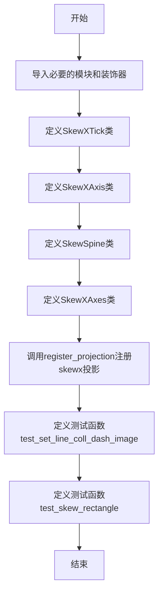
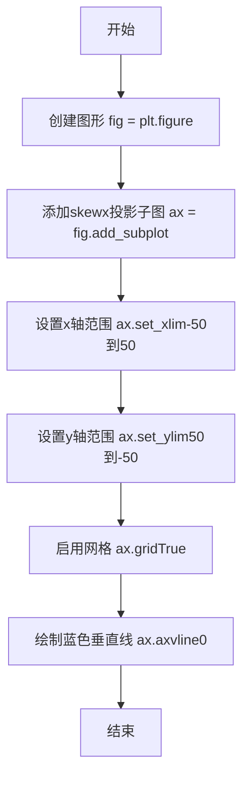
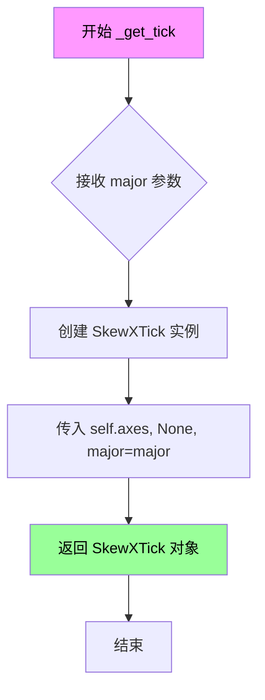
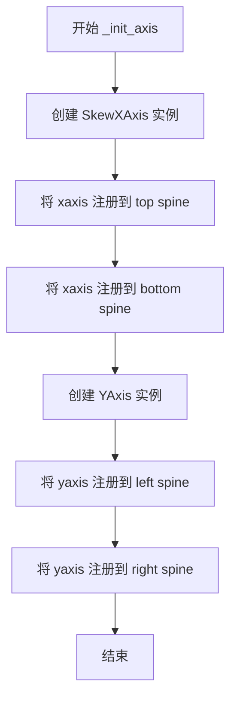
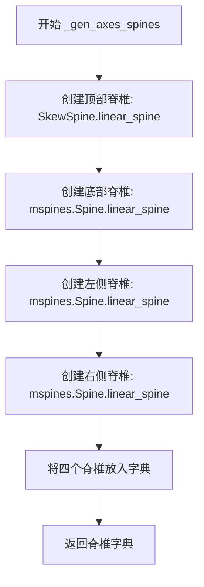
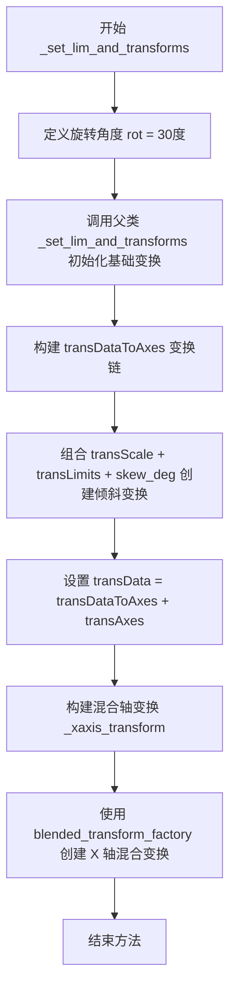

# `matplotlib\lib\matplotlib\tests\test_skew.py` 详细设计文档

该文件实现了Matplotlib的倾斜坐标轴（Skewed Axes）功能，通过自定义SkewXTick、SkewXAxis、SkewSpine和SkewXAxes类，提供了可以显示双X轴区间（上下限）的倾斜投影功能，用于绘制歪斜的图表

## 整体流程



## 类结构

```
maxis.XTick (基类)
└── SkewXTick
maxis.XAxis (基类)
└── SkewXAxis
mspines.Spine (基类)
└── SkewSpine
Axes (基类)
└── SkewXAxes
```

## 全局变量及字段


### `ExitStack`
    
上下文管理器，用于临时保存和恢复artist的可见性状态

类型：`contextlib.ExitStack`
    


### `itertools`
    
Python标准库迭代器工具模块，提供高效循环迭代工具

类型：`module`
    


### `platform`
    
Python标准库平台信息模块，提供获取系统平台信息的功能

类型：`module`
    


### `plt`
    
matplotlib绘图库，提供创建图形和 Axes 的接口

类型：`matplotlib.pyplot`
    


### `image_comparison`
    
装饰器函数，用于测试中比较生成图像与参考图像

类型：`function`
    


### `Axes`
    
matplotlib坐标轴基类，提供绘图区域的核心功能

类型：`class`
    


### `transforms`
    
matplotlib变换模块，提供坐标变换功能

类型：`module`
    


### `maxis`
    
matplotlib axis模块，提供坐标轴和刻度线对象

类型：`module`
    


### `mspines`
    
matplotlib spines模块，提供坐标轴脊柱对象

类型：`module`
    


### `mpatch`
    
matplotlib patches模块，提供图形补丁对象如矩形、多边形等

类型：`module`
    


### `register_projection`
    
函数，用于注册自定义投影使其可通过projection参数使用

类型：`function`
    


### `SkewXAxes.name`
    
投影标识名称，值为'skewx'用于选择该投影

类型：`str`
    


### `SkewXAxes.xaxis`
    
X轴对象，处理倾斜X轴的刻度和网格

类型：`SkewXAxis`
    


### `SkewXAxes.yaxis`
    
Y轴对象，处理Y轴的刻度和网格

类型：`YAxis`
    


### `SkewXAxes.spines`
    
脊柱字典，存储四个方向的脊柱对象

类型：`dict`
    


### `SkewXAxes.transDataToAxes`
    
从数据坐标到Axes坐标的变换组合，包含缩放、限制和倾斜

类型：`Transform`
    


### `SkewXAxes.transData`
    
从数据坐标到显示像素的完整变换

类型：`Transform`
    


### `SkewXAxes._xaxis_transform`
    
X轴的混合变换，用于刻度标签定位

类型：`Transform`
    


### `SkewXAxes.lower_xlim`
    
返回X轴下视图区间的边界

类型：`property`
    


### `SkewXAxes.upper_xlim`
    
返回X轴上经过变换后的区间边界

类型：`property`
    
    

## 全局函数及方法


### test_set_line_coll_dash_image

这是一个用于测试倾斜坐标轴（SkewXAxes）渲染功能的单元测试函数，通过创建带有skewx投影的图形，绘制垂直线并使用图像比较验证输出是否正确。

参数：

- 无

返回值：`None`，无返回值

#### 流程图



#### 带注释源码

```python
@image_comparison(['skew_axes.png'], remove_text=True)
def test_set_line_coll_dash_image():
    """
    测试倾斜坐标轴上的垂直线渲染功能
    
    使用image_comparison装饰器比较生成的图像与预期图像skew_axes.png
    remove_text=True表示比较时移除所有文本以避免字体差异
    """
    # 创建一个新的图形对象
    fig = plt.figure()
    
    # 添加一个带有skewx投影的子图
    # skewx是一种倾斜的X轴投影，用于展示具有非正交坐标系的图表
    ax = fig.add_subplot(1, 1, 1, projection='skewx')
    
    # 设置X轴的显示范围从-50到50
    ax.set_xlim(-50, 50)
    
    # 设置Y轴的显示范围从50到-50（反向）
    ax.set_ylim(50, -50)
    
    # 启用网格线显示
    ax.grid(True)

    # 在X=0的位置绘制一条蓝色垂直线
    # 这是测试倾斜坐标轴上线条渲染的核心用例
    ax.axvline(0, color='b')
```


### `test_skew_rectangle`

这是一个图像对比测试函数，用于验证在倾斜（skew）坐标轴上绘制矩形时Matplotlib的渲染是否正确。函数创建5x5的子图网格，每个子图应用不同角度的X和Y轴倾斜变换，并在每个子图中绘制一个矩形以检查倾斜变换的效果。

参数： 无显式参数（测试函数，依赖装饰器参数）

返回值：`None`，该函数为测试函数，通过@image_comparison装饰器进行图像对比验证

#### 流程图

```mermaid
flowchart TD
    A[开始 test_skew_rectangle] --> B[创建5x5子图网格<br/>fig, axes = plt.subplots]
    B --> C[生成旋转角度组合<br/>rotations = list(itertools.product)]
    C --> D[设置第一个子图属性<br/>set_xlim, set_ylim, set_aspect]
    D --> E[遍历子图和旋转角度组合]
    E --> F[计算当前子图的xdeg和ydeg]
    F --> G[创建Affine2D.skew_deg变换对象t]
    G --> H[设置子图标题]
    H --> I[添加矩形patch到子图<br/>ax.add_patch]
    I --> J{是否还有未处理的子图?}
    J -->|是| E
    J -->|否| K[调整子图布局<br/>plt.subplots_adjust]
    K --> L[结束]
```

#### 带注释源码

```python
@image_comparison(['skew_rects.png'], remove_text=True,
                  tol=0 if platform.machine() == 'x86_64' else 0.009)
def test_skew_rectangle():
    """
    测试函数：验证在倾斜坐标轴上矩形渲染的正确性
    
    装饰器说明：
    - image_comparison: 图像对比装饰器，将生成的图像与skew_rects.png进行比较
    - remove_text=True: 移除所有文本（标题、标签等）以进行干净的图像对比
    - tol: 允许的误差阈值，x86_64架构为0，其他架构为0.009
    """
    
    # 创建一个5行5列的子图网格，共享x轴和y轴
    # sharex=True, sharey=True: 所有子图共享相同的x和y轴范围
    # figsize=(8, 8): 图像大小为8x8英寸
    fig, axes = plt.subplots(5, 5, sharex=True, sharey=True, figsize=(8, 8))
    
    # 将2D数组展平为1维数组，方便遍历
    axes = axes.flat
    
    # 生成所有旋转角度的组合
    # 基础角度: [-3, -1, 0, 1, 3]，每个角度乘以45得到实际的倾斜角度
    # 结果: [(-3, -3), (-3, -1), ..., (3, 3)] 共25种组合
    rotations = list(itertools.product([-3, -1, 0, 1, 3], repeat=2))
    
    # 设置第一个子图（也是所有共享子图）的坐标轴范围
    # x轴范围: -3 到 3
    axes[0].set_xlim([-3, 3])
    # y轴范围: -3 到 3
    axes[0].set_ylim([-3, 3])
    # 设置纵横比为equal，保持形状不变形
    # share=True: 所有的子图都共享这个aspect设置
    axes[0].set_aspect('equal', share=True)
    
    # 遍历每个子图及其对应的旋转角度
    # zip(axes, rotations): 将子图与旋转角度一一对应
    for ax, (xrots, yrots) in zip(axes, rotations):
        # 计算实际的倾斜角度（度）
        xdeg = 45 * xrots  # X轴倾斜角度: -135, -45, 0, 45, 135度
        ydeg = 45 * yrots  # Y轴倾斜角度: -135, -45, 0, 45, 135度
        
        # 创建2D仿射变换对象，包含skew（倾斜）变换
        # skew_deg(xdeg, ydeg): 按指定度数进行倾斜变换
        t = transforms.Affine2D().skew_deg(xdeg, ydeg)
        
        # 设置子图标题，显示当前的倾斜角度
        ax.set_title(f'Skew of {xdeg} in X and {ydeg} in Y')
        
        # 添加矩形补丁到子图
        # Rectangle参数: [x, y], width, height -> 从(-1,-1)开始，宽高各为2
        # transform=t + ax.transData: 将倾斜变换与数据坐标变换组合
        # alpha=0.5: 半透明填充
        # facecolor='coral': 珊瑚色填充
        ax.add_patch(mpatch.Rectangle([-1, -1], 2, 2,
                                      transform=t + ax.transData,
                                      alpha=0.5, facecolor='coral'))
    
    # 调整子图之间的间距
    # wspace=0: 水平方向无间隙
    # left=0.01, right=0.99: 左右边距极小
    # bottom=0.01, top=0.99: 上下边距极小
    plt.subplots_adjust(wspace=0, left=0.01, right=0.99, bottom=0.01, top=0.99)
```


### `SkewXTick.draw`

该方法覆盖自 `matplotlib.axis.XTick` 的 `draw` 方法，用于在绘制刻度时根据当前视图区间（`lower_xlim` 和 `upper_xlim`）动态决定刻度线（tick1line、tick2line）和标签（label1、label2）的可见性，以支持倾斜坐标系的正确渲染。

参数：

- `renderer`：`matplotlib.backend_bases.RendererBase`，渲染器对象，负责将图形元素绘制到输出设备

返回值：`None`，无返回值

#### 流程图

```mermaid
flowchart TD
    A[开始 draw] --> B[创建 ExitStack]
    B --> C[保存 artist 可见性状态到回调栈]
    C --> D[获取当前刻度位置 get_loc]
    D --> E{transforms._interval_contains<br/>(axes.lower_xlim, loc)?}
    E -->|True| F[needs_lower = True]
    E -->|False| G[needs_lower = False]
    F --> H{transforms._interval_contains<br/>(axes.upper_xlim, loc)?}
    G --> H
    H -->|True| I[needs_upper = True]
    H -->|False| J[needs_upper = False]
    I --> K[tick1line可见 = 原可见 AND needs_lower]
    J --> K
    K --> L[label1可见 = 原可见 AND needs_lower]
    L --> M[tick2line可见 = 原可见 AND needs_upper]
    M --> N[label2可见 = 原可见 AND needs_upper]
    N --> O[ExitStack 执行回调<br/>恢复原始可见性状态]
    O --> P[调用 super().draw(renderer)]
    P --> Q[结束]
```

#### 带注释源码

```python
def draw(self, renderer):
    """
    绘制刻度及其标签。
    
    该方法覆盖父类 XTick.draw，根据倾斜坐标系的上下视图区间
    动态控制刻度线和标签的可见性。
    
    参数:
        renderer: 渲染器对象，负责将图形元素绘制到输出设备
    """
    # 使用 ExitStack 确保方法结束后恢复所有艺术家的原始可见性状态
    # 这是一种上下文管理器模式，用于临时修改状态后自动恢复
    with ExitStack() as stack:
        # 遍历所有与刻度相关的艺术家对象：
        # - gridline: 网格线
        # - tick1line: 刻度线1（下方/左侧）
        # - tick2line: 刻度线2（上方/右侧）
        # - label1: 标签1
        # - label2: 标签2
        for artist in [self.gridline, self.tick1line, self.tick2line,
                       self.label1, self.label2]:
            # 将恢复函数注册到回调栈，保存当前的可见性状态
            # 格式：stack.callback(恢复函数, 恢复参数)
            # 即：artist.set_visible(artist.get_visible())
            stack.callback(artist.set_visible, artist.get_visible())
        
        # 检查当前刻度位置是否落在下视图区间（下限区域）
        # SkewXTick 用于倾斜的 X 轴，可能有分离的上下区间
        needs_lower = transforms._interval_contains(
            self.axes.lower_xlim, self.get_loc())
        
        # 检查当前刻度位置是否落在上视图区间（上限区域）
        needs_upper = transforms._interval_contains(
            self.axes.upper_xlim, self.get_loc())
        
        # 设置 tick1line 可见性：仅当原可见性为真且需要在下区间显示时
        self.tick1line.set_visible(
            self.tick1line.get_visible() and needs_lower)
        
        # 设置 label1 可见性：仅当原可见性为真且需要在下区间显示时
        self.label1.set_visible(
            self.label1.get_visible() and needs_lower)
        
        # 设置 tick2line 可见性：仅当原可见性为真且需要在上区间显示时
        self.tick2line.set_visible(
            self.tick2line.get_visible() and needs_upper)
        
        # 设置 label2 可见性：仅当原可见性为真且需要在上区间显示时
        self.label2.set_visible(
            self.label2.get_visible() and needs_upper)
        
        # 调用父类 XTick 的 draw 方法完成实际绘制
        # 此时刻度线和标签的可见性已根据区间调整完毕
        super().draw(renderer)
```


### `SkewXTick.get_view_interval`

该方法用于获取SkewXTick的视图区间，通过委托给关联轴的X轴对象来返回当前的视图可见范围。

参数： 无（仅包含隐式参数 `self`）

返回值：`tuple[float, float]`，返回X轴视图区间的下界和上界组成的元组，表示当前Axes的可见X轴范围。

#### 流程图

```mermaid
flowchart TD
    A[调用 get_view_interval] --> B{检查 self.axes 是否存在}
    B -->|是| C[获取 self.axes.xaxis]
    B -->|否| D[抛出 AttributeError]
    C --> E[调用 xaxis.get_view_interval]
    E --> F[返回 (lower_bound, upper_bound) 元组]
```

#### 带注释源码

```python
def get_view_interval(self):
    """
    获取当前Tick的视图区间。

    该方法将调用委托给self.axes.xaxis（即SkewXAxis实例）的get_view_interval方法，
    以获取当前axes的X轴视图可见范围。在SkewXAxis中，返回的是upper_xlim的下界
    和lower_xlim的上界组成的元组，表示合并后的视图区间。

    Returns:
        tuple[float, float]: 包含视图区间下界和上界的元组。
                             具体为 (self.axes.upper_xlim[0], self.axes.lower_xlim[1])
    """
    return self.axes.xaxis.get_view_interval()
```


### `SkewXAxis._get_tick`

该方法是 `SkewXAxis` 类的核心方法之一，负责创建自定义的倾斜轴刻度标签。它覆盖了父类 `maxis.XAxis` 的 `_get_tick` 方法，返回一个 `SkewXTick` 实例而非标准的 `XTick` 实例，从而实现倾斜X轴的自定义绘制逻辑。

参数：

- `major`：`bool`，表示要创建的是主刻度（True）还是次刻度（False）

返回值：`SkewXTick`，返回自定义的倾斜轴刻度对象

#### 流程图



#### 带注释源码

```python
def _get_tick(self, major):
    """
    创建并返回一个倾斜轴的刻度对象。
    
    此方法覆盖了 XAxis 基类的 _get_tick 方法，目的是使用自定义的
    SkewXTick 类来替代默认的 XTick 类，从而支持倾斜坐标轴的
    特殊绘制需求（如分段显示上下限的刻度线和标签）。
    
    参数:
        major: bool 类型，表示创建主刻度(True)还是次刻度(False)
    
    返回值:
        SkewXTick: 自定义倾斜轴刻度对象实例
    """
    # 使用 SkewXTick 类（而非基类的 XTick）创建刻度对象
    # 传入: axes 实例, None（表示未指定位置，将自动计算）, major 标志
    return SkewXTick(self.axes, None, major=major)
```


### `SkewXAxis.get_view_interval`

获取倾斜X轴的视图区间，返回一个包含上限和下限的元组，用于在倾斜轴中提供两个独立的视图区间。

参数：

- 无参数

返回值：`tuple[float, float]`，返回视图区间的下限（upper_xlim的下界）和上限（lower_xlim的上界），用于支持倾斜轴的上部和下部不同的视图范围。

#### 流程图

```mermaid
flowchart TD
    A[开始 get_view_interval] --> B[获取 self.axes.upper_xlim[0]]
    B --> C[获取 self.axes.lower_xlim[1]]
    C --> D[返回 tuple: upper_xlim[0], lower_xlim[1]]
    D --> E[结束]
```

#### 带注释源码

```python
def get_view_interval(self):
    """
    返回倾斜X轴的视图区间。

    在倾斜轴中，需要返回两个独立的视图区间：
    - 上部X轴的下界 (upper_xlim[0])
    - 下部X轴的上界 (lower_xlim[1])

    这与标准Axis的行为不同，标准Axis通常返回viewLim的完整区间。
    这种设计允许Tick对象根据不同的区间显示不同的刻度线。
    """
    return self.axes.upper_xlim[0], self.axes.lower_xlim[1]
```


### `SkewSpine._adjust_location`

该方法用于调整倾斜坐标轴的脊椎（spine）位置，根据脊椎类型（顶部或底部）将脊椎路径的顶点x坐标设置为对应的坐标轴上限或下限，从而实现倾斜X轴的正确绘制。

参数：

- `self`：`SkewSpine` 实例，方法调用者本身，无需显式传递

返回值：`None`，该方法直接修改对象内部状态，不返回任何值

#### 流程图

```mermaid
flowchart TD
    A[开始 _adjust_location] --> B[获取路径顶点 pts = self._path.vertices]
    B --> C{spine_type == 'top'?}
    C -->|是| D[设置 pts[:, 0] = self.axes.upper_xlim]
    C -->|否| E[设置 pts[:, 0] = self.axes.lower_xlim]
    D --> F[结束]
    E --> F
```

#### 带注释源码

```python
def _adjust_location(self):
    """
    调整脊椎的位置，将其路径顶点对齐到对应的坐标轴边界。
    
    对于顶部脊椎，使用上半部分X轴的范围；对于底部脊椎，
    使用下半部分X轴的范围。这是实现倾斜坐标轴视觉效果的
    关键步骤，确保脊椎能够正确地绘制在预期的位置。
    """
    # 获取脊椎路径的顶点坐标数组
    # _path.vertices 是一个 numpy 数组，形状为 (n_points, 2)
    # 每一行代表一个顶点的 (x, y) 坐标
    pts = self._path.vertices
    
    # 根据脊椎类型决定使用哪个X轴范围
    if self.spine_type == 'top':
        # 对于顶部脊椎，使用上半部分X轴的显示范围
        # 这确保顶部脊椎绘制在正确的倾斜位置
        pts[:, 0] = self.axes.upper_xlim
    else:
        # 对于其他类型（底部、左侧、右侧）的脊椎，
        # 使用下半部分X轴的显示范围
        pts[:, 0] = self.axes.lower_xlim
```


### `SkewXAxes._init_axis`

该方法是 SkewXAxes 类的初始化方法，用于设置自定义的 X 轴（SkewXAxis）和标准的 Y 轴（YAxis），并将它们注册到对应的脊柱（spines）上，以支持倾斜 X 轴的坐标系统。

参数：

- `self`：`SkewXAxes`，类的实例本身，包含对 Axes 实例的引用

返回值：`None`，该方法为初始化方法，不返回任何值

#### 流程图



#### 带注释源码

```
def _init_axis(self):
    # Taken from Axes and modified to use our modified X-axis
    # 创建自定义的 SkewXAxis 实例，用于支持倾斜的 X 轴
    self.xaxis = SkewXAxis(self)
    # 将 xaxis 注册到顶部脊柱，使顶部脊柱可以使用倾斜的 X 轴刻度
    self.spines.top.register_axis(self.xaxis)
    # 将 xaxis 注册到底部脊柱，使底部脊柱可以使用倾斜的 X 轴刻度
    self.spines.bottom.register_axis(self.xaxis)
    # 创建标准的 YAxis 实例，用于 Y 轴方向
    self.yaxis = maxis.YAxis(self)
    # 将 yaxis 注册到左侧脊柱
    self.spines.left.register_axis(self.yaxis)
    # 将 yaxis 注册到右侧脊柱
    self.spines.right.register_axis(self.yaxis)
```


### SkewXAxes._gen_axes_spines

该方法用于生成倾斜X轴的四个边框脊椎（spines），其中顶部边框使用自定义的 SkewSpine 以支持倾斜效果，底部、左侧和右侧使用标准的线性脊椎。

参数：

- `self`：SkewXAxes 实例，方法的调用者

返回值：`dict`，返回包含四个脊椎对象的字典，键为 'top'、'bottom'、'left'、'right'，值为对应的 Spine 实例

#### 流程图



#### 带注释源码

```python
def _gen_axes_spines(self):
    """
    生成倾斜X轴的四个边框脊椎。
    顶部使用自定义的SkewSpine以支持数据范围分离，
    其他边框使用标准的线性脊椎。
    """
    # 创建一个字典来存储四个方向的脊椎
    spines = {
        'top': SkewSpine.linear_spine(self, 'top'),      # 顶部：使用自定义SkewSpine
        'bottom': mspines.Spine.linear_spine(self, 'bottom'),  # 底部：标准线性脊椎
        'left': mspines.Spine.linear_spine(self, 'left'),      # 左侧：标准线性脊椎
        'right': mspines.Spine.linear_spine(self, 'right')     # 右侧：标准线性脊椎
    }
    return spines  # 返回包含四个脊椎的字典
```


### `SkewXAxes._set_lim_and_transforms`

该方法用于初始化倾斜 X 轴（SkewXAxes）的坐标变换系统，在绘图创建时设置数据坐标到像素坐标的转换链，包括标准变换、倾斜变换以及混合轴变换，为倾斜坐标系的渲染提供完整的变换矩阵。

参数：

- `self`：`SkewXAxes`，调用该方法的实例对象本身

返回值：`None`，该方法不返回任何值，仅修改实例属性

#### 流程图



#### 带注释源码

```python
def _set_lim_and_transforms(self):
    """
    This is called once when the plot is created to set up all the
    transforms for the data, text and grids.
    """
    # 定义倾斜角度为30度，用于X轴的 skew 变换
    rot = 30

    # 获取 Axes 基类的标准变换设置
    # 这会初始化 transData, transAxes, transScale, transLimits 等基础变换
    super()._set_lim_and_transforms()

    # 需要将倾斜变换放在中间位置：scale 之后、limits 之后、transAxes 之前
    # 这样倾斜是在 Axes 坐标系中进行的，从而围绕正确的原点进行变换
    # 保留 pre-transAxes 变换供其他使用者使用，如 spines 用于确定边界
    # 
    # transDataToAxes 变换链: transScale -> transLimits -> skew_deg(rot, 0)
    # 顺序: 数据坐标 -> 缩放 -> 限制映射到[0,1] -> 倾斜30度
    self.transDataToAxes = (self.transScale +
                            (self.transLimits +
                             transforms.Affine2D().skew_deg(rot, 0)))

    # 创建从数据坐标到像素坐标的完整变换
    # 组合: (数据->缩放->限制->倾斜) + (轴坐标->显示坐标)
    self.transData = self.transDataToAxes + self.transAxes

    # 混合变换（如X轴变换）需要使用两个轴进行倾斜，应用在轴坐标中
    # 使用 blended_transform_factory 创建水平倾斜但垂直保持原样的变换
    # 水平方向: transScale + transLimits + skew_deg
    # 垂直方向: IdentityTransform（不进行变换）
    # 最后加上 transAxes 转换到显示坐标
    self._xaxis_transform = (transforms.blended_transform_factory(
        self.transScale + self.transLimits,
        transforms.IdentityTransform()) +
        transforms.Affine2D().skew_deg(rot, 0)) + self.transAxes
```

## 关键组件


### SkewXTick

自定义X轴刻度类，继承自`maxis.XTick`，用于在倾斜轴上根据当前视图区间（上、下区间）控制刻度线和标签的可见性，实现上下两个独立X轴区域的刻度显示逻辑。

### SkewXAxis

自定义X轴类，继承自`maxis.XAxis`，用于提供两组独立的视图区间给刻度，并创建自定义的`SkewXTick`实例来处理倾斜轴的刻度渲染。

### SkewSpine

自定义脊柱类，继承自`mspines.Spine`，用于在倾斜轴上调整脊柱位置，根据`spine_type`将脊柱顶点设置为`upper_xlim`或`lower_xlim`，实现倾斜效果。

### SkewXAxes

核心投影类，继承自`Axes`，是倾斜X轴的实现主体。负责注册投影、初始化自定义轴、生成脊柱、设置变换（包含倾斜角度30度），并提供`lower_xlim`和`upper_xlim`属性计算视图区间。

### register_projection

全局函数，用于将`SkewXAxes`投影注册到matplotlib投影系统中，使用户可以通过`projection='skewx'`方式使用倾斜轴。

### test_set_line_coll_dash_image

测试函数，使用`@image_comparison`装饰器，验证倾斜轴上垂直线的绘制是否正确，并测试网格显示。

### test_skew_rectangle

测试函数，使用`@image_comparison`装饰器，通过5x5子图矩阵测试不同X/Y倾斜角度（-135°到135°）下矩形Patch的渲染效果。

### transforms.Affine2D().skew_deg(rot, 0)

关键变换组件，用于创建30度的X轴倾斜仿射变换，配合`transScale`、`transLimits`和`transAxes`构成完整的坐标变换链。

### transDataToAxes 属性

`SkewXAxes`的计算属性，通过组合缩放、极限映射和倾斜变换，将数据坐标转换为轴坐标，保留给脊柱等组件使用。


## 问题及建议


### 已知问题

-   **硬编码的旋转角度**：`_set_lim_and_transforms`方法中`rot = 30`被硬编码，没有提供API让用户自定义倾斜角度，降低了灵活性
-   **效率问题**：`upper_xlim`属性每次访问时都执行`transform`计算和矩阵变换，没有缓存机制，在频繁访问时会造成性能开销
-   **拼写错误**：`test_skew_rectangle`函数第一行`fix, axes`应为`fig, axes`，这是一个typo
-   **属性重复实现**：`SkewXTick.get_view_interval`与`SkewXAxis.get_view_interval`功能相似但实现不同，增加了维护成本
-   **不完整的Spine处理**：`SkewSpine._adjust_location`方法只处理`top`和`bottom`类型的spine，对`left`和`right`类型的处理逻辑不完整（只是简单覆盖x坐标）
-   **API混合使用**：`transDataToAxes`使用了旧版API模式（`self.transScale + (self.transLimits + ...)`），与后续的`blended_transform_factory`风格不一致，可能影响代码可读性
-   **缺少输入验证**：没有对旋转角度范围进行校验，可能导致异常或不可预期的行为
-   **测试覆盖不足**：测试只验证了图像输出，没有测试交互功能（pan/zoom）、边界条件或极端参数情况
-   **注册时机问题**：`register_projection(SkewXAxes)`在模块级别执行，这可能导致在某些导入顺序下出现问题

### 优化建议

-   将旋转角度30提取为类属性或构造函数参数，如`self.skew_angle = kwargs.get('skew_angle', 30)`
-   使用`functools.cached_property`或手动缓存`upper_xlim`的计算结果
-   修复`fix`为`fig`的拼写错误
-   统一`get_view_interval`方法的实现，或通过继承避免重复
-   完善`SkewSpine._adjust_location`对所有spine类型的处理逻辑
-   添加旋转角度的有效性校验（如-90到90度范围）
-   增加单元测试覆盖交互功能、边界条件和错误处理
-   考虑使用`__init_subclass__`或元类来更优雅地处理投影注册
-   为关键方法添加docstring，说明变换链的工作原理
</think>

## 其它


### 设计目标与约束

设计目标：实现一个可倾斜的X轴投影(skewed X-axis projection)，允许用户创建具有倾斜坐标系的图表，用于展示科学和工程数据，如相位空间图、热力学循环等需要斜坐标表示的场景。约束：必须继承自matplotlib的Axes类，保持与现有matplotlib API的兼容性，支持标准的lim设置、grid、spines等特性，倾斜角度目前硬编码为30度。

### 错误处理与异常设计

代码主要依赖matplotlib基类实现，自身的异常处理较少。潜在错误场景包括：1) 设置无效的xlim/ylim范围时由基类处理；2) 当transDataToAxes变换求逆失败时可能抛出异常；3) 平台相关的tol参数在非x86_64架构上可能产生测试失败。基类Axes的异常处理机制覆盖了大部分错误场景。

### 数据流与状态机

数据流：用户设置数据坐标 -> transDataToAxes变换(包含scale、limits、skew) -> transAxes变换 -> 屏幕像素坐标。状态机：1) 初始化状态：创建SkewXAxes实例，调用_init_axis和_gen_axes_spines；2) 变换设置状态：_set_lim_and_transforms构建变换链；3) 渲染状态：Tick的draw方法根据当前axes的lower_xlim和upper_xlim决定绘制哪个tick；4) 交互状态：get_view_interval返回当前视图区间。

### 外部依赖与接口契约

外部依赖：matplotlib.axes.Axes(基类)、matplotlib.axis.XAxis/YAxis、matplotlib.spines.Spine、matplotlib.transforms(特别是Affine2D、blended_transform_factory、IdentityTransform)、matplotlib.projections.register_projection。接口契约：1) 投影名称为'skewx'，通过projection='skewx'调用；2) 必须实现name类属性；3) _init_axis和_gen_axes_spines方法必须返回正确的轴和spine对象；4) transData属性必须包含完整的从数据到像素的变换。

### 性能考虑

当前实现中，每次访问upper_xlim属性时都会计算变换求逆结果，对于高频访问场景可能存在性能瓶颈。建议缓存transDataToAxes.inverted()的结果。transforms的组合使用(Affine2D().skew_deg(rot, 0))在初始化后应缓存复用，避免重复创建。

### 兼容性考虑

平台兼容性：test_skew_rectangle中的tol参数根据platform.machine()=='x86_64'设置，x86_64平台为0，其他平台为0.009，这反映了不同浮点数处理器的精度差异。matplotlib版本兼容性：代码使用较为基础的API，与matplotlib 3.x系列兼容。Python版本：支持Python 3.6+。

### 使用示例与API参考

基本用法：fig.add_subplot(1, 1, 1, projection='skewx')创建倾斜轴；ax.set_xlim(-50, 50)设置X轴范围；ax.grid(True)显示网格；ax.axvline(0, color='b')绘制垂直线。高级用法：通过transforms.Affine2D().skew_deg(xdeg, ydeg)创建自定义变换并应用于patch。

### 测试策略

当前包含两个图像对比测试：test_set_line_coll_dash_image测试倾斜轴上的垂直线绘制；test_skew_rectangle测试5x5网格的不同倾斜角度组合。测试覆盖了核心功能和边界情况，建议补充：1) 非对称xlim/ylim测试；2) 多子图混合使用测试；3) 与其他投影(如3D)混用测试；4) 动画场景下的稳定性测试。

### 配置选项

当前配置硬编码在代码中：rot=30度倾斜角。如需更灵活的配置，建议添加：1) 倾斜角度参数可通过投影参数传递；2) lower_xlim和upper_xlim的计算逻辑可配置；3) 是否启用separate intervals可通过参数控制。这些目前是固定实现，缺乏用户可配置的接口。

    