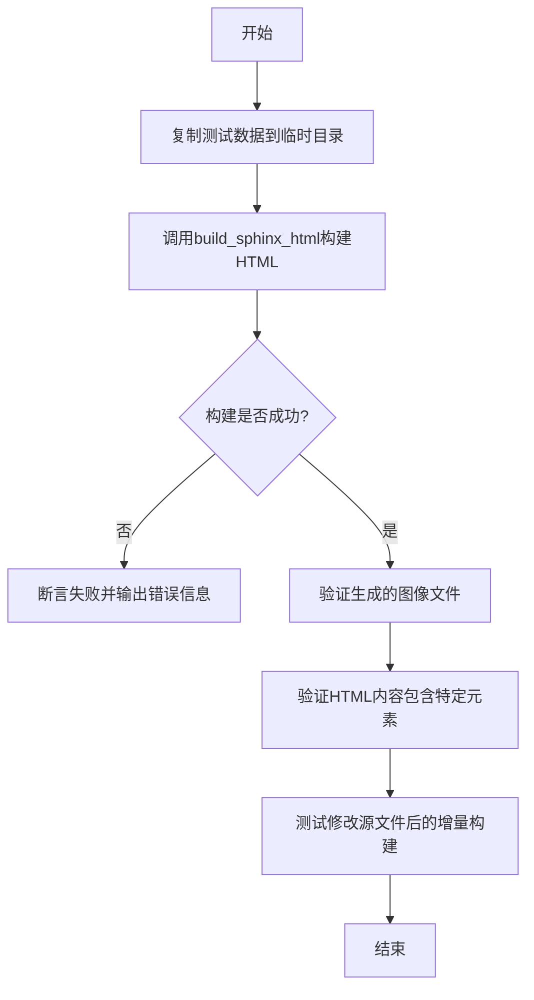
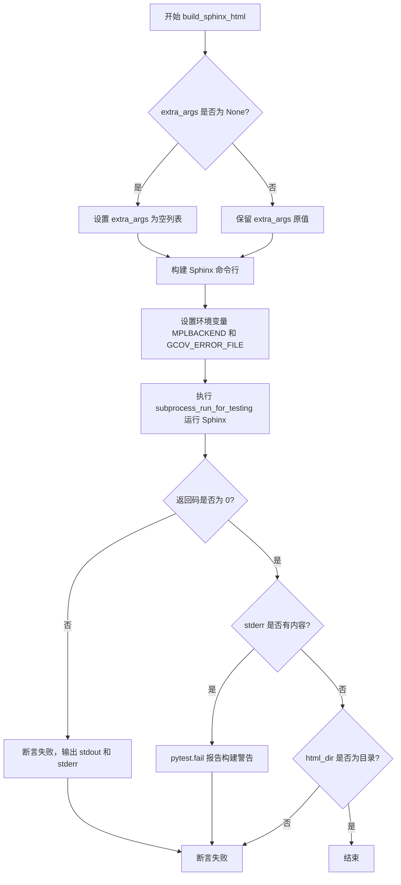
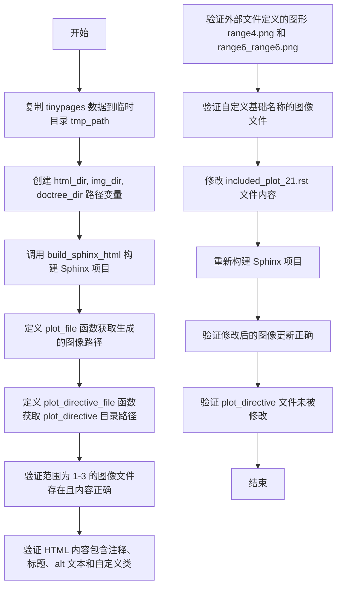
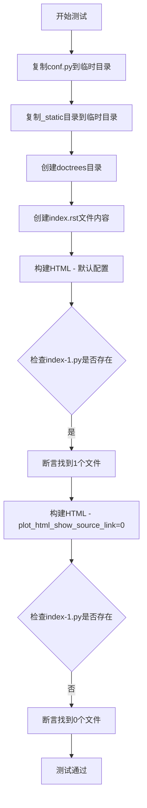
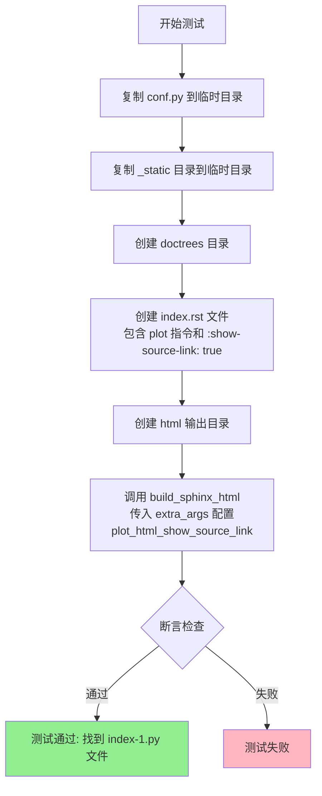
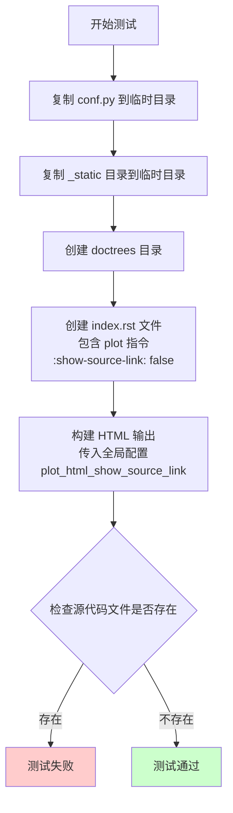
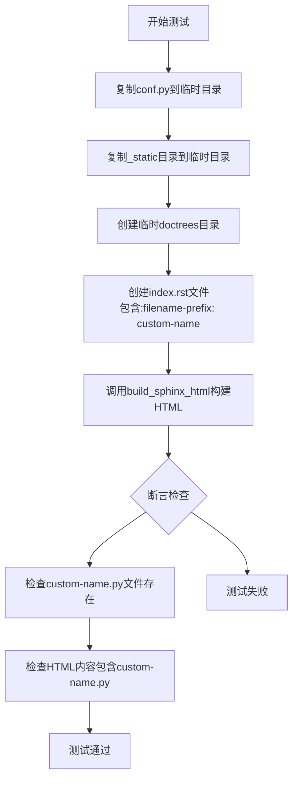

# `matplotlib\lib\matplotlib\tests\test_sphinxext.py` 详细设计文档

这是一个pytest测试文件，用于验证matplotlib的Sphinx扩展（特别是plot_directive）在构建tinypages小型文档时的功能，包括HTML构建、图像生成、源码链接、caption、srcset等特性的正确性。

## 整体流程



## 类结构

```
无类定义，纯模块化测试代码
├── 模块级函数
│   ├── build_sphinx_html (全局构建函数)
│   └── test_tinypages (主测试函数)
│   ├── test_plot_html_show_source_link
│   ├── test_show_source_link_true
│   ├── test_show_source_link_false
│   ├── test_plot_html_show_source_link_custom_basename
│   ├── test_plot_html_code_caption
│   └── test_srcset_version
```

## 全局变量及字段


### `tinypages`
    
指向测试数据目录的Path对象，该目录包含用于测试tinypages构建的Sphinx扩展的示例文件

类型：`Path`
    


    

## 全局函数及方法


### `build_sphinx_html`

该函数是一个全局构建函数，用于执行Sphinx HTML构建。它通过调用 Sphinx 命令行工具将源代码目录转换为 HTML 输出目录，并验证构建是否成功且没有警告。

参数：

- `source_dir`：`Path`，Sphinx 文档源文件所在目录
- `doctree_dir`：`Path`，用于存储 Sphinx doctree 中间文件的目录
- `html_dir`：`Path`，生成的 HTML 文件输出目录
- `extra_args`：`list` 或 `None`，传递给 Sphinx 构建命令的其他参数（可选）

返回值：`None`，该函数通过断言验证构建结果，不返回任何值

#### 流程图



#### 带注释源码

```python
def build_sphinx_html(source_dir, doctree_dir, html_dir, extra_args=None):
    """
    构建 Sphinx HTML 文档。
    
    参数:
        source_dir: Path, Sphinx 文档源文件所在目录
        doctree_dir: Path, 用于存储 doctree 中间文件的目录
        html_dir: Path, 生成的 HTML 文件输出目录
        extra_args: list 或 None, 传递给 sphinx-build 的额外参数
    """
    # Build the pages with warnings turned into errors
    # 如果未提供 extra_args，则初始化为空列表
    extra_args = [] if extra_args is None else extra_args
    
    # 构建 Sphinx 命令行参数列表
    # -W: 将所有警告视为错误
    # -b html: 指定构建器为 HTML
    # -d: 指定 doctree 目录
    cmd = [sys.executable, '-msphinx', '-W', '-b', 'html',
           '-d', str(doctree_dir), str(source_dir), str(html_dir), *extra_args]
    
    # On CI, gcov emits warnings (due to agg headers being included with the
    # same name in multiple extension modules -- but we don't care about their
    # coverage anyways); hide them using GCOV_ERROR_FILE.
    # 设置环境变量：清空 MPLBACKEND，将 GCOV_ERROR_FILE 重定向到 devnull
    proc = subprocess_run_for_testing(
        cmd, capture_output=True, text=True,
        env={**os.environ, "MPLBACKEND": "", "GCOV_ERROR_FILE": os.devnull}
    )
    
    # 获取标准输出和标准错误
    out = proc.stdout
    err = proc.stderr

    # 断言：构建返回码必须为 0，否则报告构建失败
    assert proc.returncode == 0, \
        f"sphinx build failed with stdout:\n{out}\nstderr:\n{err}\n"
    
    # 如果有 stderr 内容，则视为构建警告并失败
    if err:
        pytest.fail(f"sphinx build emitted the following warnings:\n{err}")

    # 断言：确保输出的 html_dir 确实是一个目录
    assert html_dir.is_dir()
```


### `test_tinypages`

这是主测试函数，验证 matplotlib 的 Sphinx 扩展构建 tinypages（小型文档示例）并生成 HTML 页面和图像的基本功能。测试涵盖图像生成、HTML 内容验证、文件修改后的增量构建等核心功能。

参数：

- `tmp_path`：`pathlib.Path`（pytest fixture），提供临时目录用于测试运行

返回值：`None`，无返回值（测试函数）

#### 流程图



#### 带注释源码

```python
def test_tinypages(tmp_path):
    """
    主测试函数，验证基本的 Sphinx 构建和图像生成功能。
    
    该测试执行以下操作：
    1. 复制 tinypages 示例项目到临时目录
    2. 构建 HTML 文档和图像
    3. 验证生成的图像文件内容正确
    4. 验证 HTML 包含预期的内容和元数据
    5. 测试增量构建（修改源文件后重新构建）
    """
    # 步骤1: 将测试数据目录复制到临时路径，忽略构建产物目录
    # 这样确保每次测试从干净的状态开始
    shutil.copytree(tinypages, tmp_path, dirs_exist_ok=True,
                    ignore=shutil.ignore_patterns('_build', 'doctrees',
                                                   'plot_directive'))
    
    # 步骤2: 定义输出目录路径
    html_dir = tmp_path / '_build' / 'html'      # HTML 输出目录
    img_dir = html_dir / '_images'               # 图像文件输出目录
    doctree_dir = tmp_path / 'doctrees'          # doctree 缓存目录

    # 步骤3: 使用 Sphinx 构建 HTML，将警告视为错误
    # build_sphinx_html 函数会检查返回码并验证构建成功
    build_sphinx_html(tmp_path, doctree_dir, html_dir)

    # 步骤4: 定义辅助函数，用于获取生成的图像文件路径
    def plot_file(num):
        """根据编号获取图像文件名，格式为 some_plots-{num}.png"""
        return img_dir / f'some_plots-{num}.png'

    def plot_directive_file(num):
        """获取 plot_directive 目录中的源图像文件"""
        # 注意：这个目录始终在 doctree_dir 的父目录
        return doctree_dir.parent / 'plot_directive' / f'some_plots-{num}.png'

    # 步骤5: 获取范围 1, 2, 3 的图像文件路径用于后续比较
    range_10, range_6, range_4 = (plot_file(i) for i in range(1, 4))

    # 步骤6: 验证图像内容正确性
    # Plot 5 使用 range(6)，应与 range_6 相同
    assert filecmp.cmp(range_6, plot_file(5))
    # Plot 7 使用 range(4)，应与 range_4 相同
    assert filecmp.cmp(range_4, plot_file(7))
    # Plot 11 使用 range(10)，应与 range_10 相同
    assert filecmp.cmp(range_10, plot_file(11))
    # Plot 12 使用旧 range(10) 和新 range(6) 的组合
    assert filecmp.cmp(range_10, plot_file('12_00'))
    assert filecmp.cmp(range_6, plot_file('12_01'))
    # Plot 13 展示 close-figs 功能（多子图）
    assert filecmp.cmp(range_4, plot_file(13))

    # 步骤7: 读取生成的 HTML 文件并验证内容
    html_contents = (html_dir / 'some_plots.html').read_text(encoding='utf-8')

    # 验证注释被正确包含
    assert '# Only a comment' in html_contents

    # 验证外部文件定义的图像
    assert filecmp.cmp(range_4, img_dir / 'range4.png')
    assert filecmp.cmp(range_6, img_dir / 'range6_range6.png')

    # 验证图像标题（caption）是否正确嵌入 HTML
    assert 'This is the caption for plot 15.' in html_contents
    # 验证使用 :caption: 选项的标题保留换行符
    assert 'Plot 17 uses the caption option,\nwith multi-line input.' in html_contents
    # 验证替代文本（alt text）
    assert 'Plot 17 uses the alt option, with multi-line input.' in html_contents
    # 验证 plot 18 的标题
    assert 'This is the caption for plot 18.' in html_contents

    # 验证自定义 CSS 类是否正确添加
    assert 'plot-directive my-class my-other-class' in html_contents

    # 验证多图像标题被应用两次
    assert html_contents.count('This caption applies to both plots.') == 2

    # 验证通过 include 指令引入的图像（plot 21）
    # 注意：由于之前的绘图重复，实际参数为 17
    assert filecmp.cmp(range_6, plot_file(17))

    # 验证自定义基础名称的图像
    assert filecmp.cmp(range_10, img_dir / 'range6_range10.png')
    assert filecmp.cmp(range_6, img_dir / 'custom-basename-6.png')
    assert filecmp.cmp(range_4, img_dir / 'custom-basename-4.png')
    assert filecmp.cmp(range_4, img_dir / 'custom-basename-4-6_00.png')
    assert filecmp.cmp(range_6, img_dir / 'custom-basename-4-6_01.png')

    # 步骤8: 测试增量构建 - 修改 included_plot_21.rst 文件
    contents = (tmp_path / 'included_plot_21.rst').read_bytes()
    # 将 plt.plot(range(6)) 替换为 plt.plot(range(4))
    contents = contents.replace(b'plt.plot(range(6))', b'plt.plot(range(4))')
    (tmp_path / 'included_plot_21.rst').write_bytes(contents)

    # 记录修改前的文件时间戳
    modification_times = [plot_directive_file(i).stat().st_mtime
                          for i in (1, 2, 3, 5)]

    # 重新构建 Sphinx
    build_sphinx_html(tmp_path, doctree_dir, html_dir)

    # 验证修改后的图像已更新（现在应该是 range_4）
    assert filecmp.cmp(range_4, plot_file(17))

    # 步骤9: 验证 plot_directive 目录中的原始文件未被修改
    # 注意：plot_directive_file(1) 不会被修改，但会被复制到 html/
    assert plot_directive_file(1).stat().st_mtime == modification_times[0]
    assert plot_directive_file(2).stat().st_mtime == modification_times[1]
    assert plot_directive_file(3).stat().st_mtime == modification_times[2]

    # 验证这些文件的图像内容仍然正确
    assert filecmp.cmp(range_10, plot_file(1))
    assert filecmp.cmp(range_6, plot_file(2))
    assert filecmp.cmp(range_4, plot_file(3))

    # 步骤10: 验证带 context 的图像会被重新创建（但内容相同）
    # plot_directive_file(5) 的时间戳应该更新
    assert plot_directive_file(5).stat().st_mtime > modification_times[3]
    assert filecmp.cmp(range_6, plot_file(5))
```


### `test_plot_html_show_source_link`

该测试函数用于验证 `plot_html_show_source_link` 配置选项的功能：默认情况下会生成源代码脚本文件，而当该配置设置为 0 时则不会生成。

参数：

- `tmp_path`：`pytest.fixture`，提供临时目录作为测试的工作空间

返回值：`None`，测试函数无返回值

#### 流程图



#### 带注释源码

```python
def test_plot_html_show_source_link(tmp_path):
    """
    测试 plot_html_show_source_link 配置选项的行为。
    
    默认情况下（未设置或为1），Sphinx会为plot directive生成源代码脚本文件；
    当设置为0时，不生成源代码脚本文件。
    
    参数:
        tmp_path: pytest提供的临时目录fixture
    """
    # 1. 准备测试环境：复制配置文件到临时目录
    shutil.copyfile(tinypages / 'conf.py', tmp_path / 'conf.py')
    
    # 2. 复制静态资源目录到临时目录
    shutil.copytree(tinypages / '_static', tmp_path / '_static')
    
    # 3. 创建doctrees目录用于存储Sphinx的中间结果
    doctree_dir = tmp_path / 'doctrees'
    
    # 4. 创建测试用的RST文件，包含一个简单的plot directive
    # 该plot没有设置:show-source-link:选项，将使用全局配置
    (tmp_path / 'index.rst').write_text("""
.. plot::

    plt.plot(range(2))
""")
    
    # =========================================
    # 测试场景1：默认配置（应生成源代码脚本）
    # =========================================
    
    # 5. 创建第一个HTML构建输出目录
    html_dir1 = tmp_path / '_build' / 'html1'
    
    # 6. 使用默认配置构建HTML（Sphinx会读取conf.py中的plot_html_show_source_link设置）
    # 不传入extra_args参数，意味着使用conf.py中的默认配置或Sphinx的默认行为
    build_sphinx_html(tmp_path, doctree_dir, html_dir1)
    
    # 7. 断言：默认情况下应该生成源代码脚本文件（index-1.py）
    # glob模式"**/index-1.py"会递归搜索所有子目录
    assert len(list(html_dir1.glob("**/index-1.py"))) == 1
    
    # =========================================
    # 测试场景2：禁用源代码脚本生成
    # =========================================
    
    # 8. 创建第二个HTML构建输出目录
    html_dir2 = tmp_path / '_build' / 'html2'
    
    # 9. 使用-D命令行选项显式设置plot_html_show_source_link=0
    # 这会覆盖conf.py中的任何设置，强制禁用源代码脚本生成
    build_sphinx_html(tmp_path, doctree_dir, html_dir2,
                      extra_args=['-D', 'plot_html_show_source_link=0'])
    
    # 10. 断言：配置为0时不应该生成源代码脚本文件
    assert len(list(html_dir2.glob("**/index-1.py"))) == 0
```


### `test_show_source_link_true`

该测试函数用于验证当 RST 文档中的 plot 指令设置了 `:show-source-link: true` 时，无论全局配置 `plot_html_show_source_link` 的值如何，都会生成源代码文件链接。

参数：

- `tmp_path`：`Path`（pytest fixture），pytest 提供的临时目录，用于存放测试期间创建的文件
- `plot_html_show_source_link`：`int`，通过 `@pytest.mark.parametrize` 装饰器传入的参数值为 0 或 1，用于测试不同的全局配置值

返回值：`None`，该函数为测试函数，使用断言进行验证，不返回具体数值

#### 流程图



#### 带注释源码

```python
@pytest.mark.parametrize('plot_html_show_source_link', [0, 1])
def test_show_source_link_true(tmp_path, plot_html_show_source_link):
    # 测试当 :show-source-link: 为 true 时是否生成源代码链接
    # 无论 plot_html_show_source_link 全局配置为 0 或 1
    
    # 将测试数据中的 conf.py 复制到临时目录
    shutil.copyfile(tinypages / 'conf.py', tmp_path / 'conf.py')
    
    # 复制静态资源目录到临时目录
    shutil.copytree(tinypages / '_static', tmp_path / '_static')
    
    # 创建 doctrees 目录用于存放 Sphinx 的中间文件
    doctree_dir = tmp_path / 'doctrees'
    
    # 创建 index.rst 文件，内容包含 plot 指令并设置 :show-source-link: true
    (tmp_path / 'index.rst').write_text("""
.. plot::
    :show-source-link: true

    plt.plot(range(2))
""")
    
    # 创建 HTML 输出目录
    html_dir = tmp_path / '_build' / 'html'
    
    # 调用 build_sphinx_html 函数构建 HTML
    # 传入 extra_args 参数设置 plot_html_show_source_link 的值
    # 该参数通过 -D 选项传递给 Sphinx
    build_sphinx_html(tmp_path, doctree_dir, html_dir, extra_args=[
        '-D', f'plot_html_show_source_link={plot_html_show_source_link}'])
    
    # 断言：验证在 HTML 目录中找到了 index-1.py 源代码文件
    # 无论全局配置为 0 或 1，由于指令中显式设置了 :show-source-link: true
    # 都应该生成源代码文件
    assert len(list(html_dir.glob("**/index-1.py"))) == 1
```


### `test_show_source_link_false`

该测试函数用于验证当在 plot 指令中设置 `:show-source-link: false` 时，无论全局配置 `plot_html_show_source_link` 如何，都不会生成源代码链接文件。

参数：

- `tmp_path`：`py.path.local`（pytest 的临时目录 fixture），用于提供临时测试环境
- `plot_html_show_source_link`：`int`（参数化参数，值为 0 或 1），用于控制全局配置 `plot_html_show_source_link` 的值

返回值：`None`，因为这是一个测试函数，不返回任何值

#### 流程图



#### 带注释源码

```python
@pytest.mark.parametrize('plot_html_show_source_link', [0, 1])
def test_show_source_link_false(tmp_path, plot_html_show_source_link):
    """
    测试当 plot 指令中设置 :show-source-link: false 时，
    无论全局配置 plot_html_show_source_link 如何，都不会生成源代码链接。
    
    参数化测试：分别测试全局配置为 0 和 1 的情况
    """
    # 将 tinypages 目录下的 conf.py 复制到临时测试目录
    shutil.copyfile(tinypages / 'conf.py', tmp_path / 'conf.py')
    
    # 将 tinypages 目录下的 _static 目录复制到临时测试目录
    shutil.copytree(tinypages / '_static', tmp_path / '_static')
    
    # 创建 doctrees 目录用于存放 Sphinx 的 doctree 文件
    doctree_dir = tmp_path / 'doctrees'
    
    # 创建 index.rst 文件，包含一个 plot 指令
    # :show-source-link: false 表示不生成源代码链接
    (tmp_path / 'index.rst').write_text("""
.. plot::
    :show-source-link: false

    plt.plot(range(2))
""")
    
    # 创建 HTML 输出目录
    html_dir = tmp_path / '_build' / 'html'
    
    # 使用 build_sphinx_html 构建 HTML
    # extra_args 传入 -D 参数设置全局配置 plot_html_show_source_link
    # 该参数由 pytest.mark.parametrize 参数化提供
    build_sphinx_html(tmp_path, doctree_dir, html_dir, extra_args=[
        '-D', f'plot_html_show_source_link={plot_html_show_source_link}'])
    
    # 断言：确认在 HTML 输出目录中不存在源代码文件 index-1.py
    # 即便全局配置 plot_html_show_source_link 为 1，由于指令级别设置为 false，
    # 也不应该生成源代码链接
    assert len(list(html_dir.glob("**/index-1.py"))) == 0
```


### `test_plot_html_show_source_link_custom_basename`

该测试函数用于验证在使用Sphinx的plot directive时，当设置了自定义`:filename-prefix:`选项时，生成的源文件链接能够正确包含`.py`扩展名。这确保了自定义文件名的源文件能够被正确识别和链接。

参数：

- `tmp_path`：`pytest.TempPathFactory`，pytest提供的临时目录fixture，用于存放测试过程中生成的临时文件

返回值：`None`，测试函数无返回值，通过断言验证功能正确性

#### 流程图



#### 带注释源码

```python
def test_plot_html_show_source_link_custom_basename(tmp_path):
    # 测试：当使用自定义basename时，源文件链接应包含.py扩展名
    
    # 步骤1：复制Sphinx配置文件到临时目录
    shutil.copyfile(tinypages / 'conf.py', tmp_path / 'conf.py')
    
    # 步骤2：复制静态资源目录到临时目录
    shutil.copytree(tinypages / '_static', tmp_path / '_static')
    
    # 步骤3：创建doctrees目录用于存放中间文件
    doctree_dir = tmp_path / 'doctrees'
    
    # 步骤4：创建index.rst文件，包含plot directive
    # 使用自定义filename-prefix: custom-name
    (tmp_path / 'index.rst').write_text("""
.. plot::
    :filename-prefix: custom-name

    plt.plot(range(2))
""")
    
    # 步骤5：构建Sphinx HTML文档
    html_dir = tmp_path / '_build' / 'html'
    build_sphinx_html(tmp_path, doctree_dir, html_dir)

    # 步骤6：断言检查 - 验证源文件(.py)被正确生成
    # 使用glob查找custom-name.py文件，应该找到1个
    assert len(list(html_dir.glob("**/custom-name.py"))) == 1

    # 步骤7：断言检查 - 验证HTML内容包含正确的.py扩展名链接
    html_content = (html_dir / 'index.html').read_text()
    assert 'custom-name.py' in html_content
```


### `test_plot_html_code_caption`

该测试函数用于验证 Sphinx 扩展中 `:code-caption:` 选项是否能正确为代码块添加标题，并确保标题内容正确渲染到生成的 HTML 文件中。

参数：

- `tmp_path`：`pytest.TmpPathFactory`（或 `pathlib.Path`），pytest 提供的临时目录 fixture，用于存放测试过程中生成的文件

返回值：`None`，测试函数无返回值，通过断言验证功能正确性

#### 流程图

```mermaid
flowchart TD
    A[开始测试] --> B[复制 conf.py 到临时目录]
    B --> C[复制 _static 目录到临时目录]
    C --> D[创建 doctrees 目录]
    D --> E[创建 index.rst 文件<br/>包含 plot 指令和 :code-caption: 选项]
    E --> F[调用 build_sphinx_html 构建 HTML]
    F --> G[读取生成的 index.html 内容]
    G --> H{断言: 'Example plotting code' in html_content?}
    H -->|是| I{断言: '<p class=\"caption\"' in html_content<br/>or 'caption' in html_content.lower()?}
    H -->|否| J[测试失败]
    I -->|是| K[测试通过]
    I -->|否| J
```

#### 带注释源码

```python
def test_plot_html_code_caption(tmp_path):
    """
    测试 :code-caption: 选项是否能正确为代码块添加标题。
    
    该测试验证 Sphinx 的 plot 扩展在使用了 :include-source: 和 :code-caption: 选项后，
    生成的 HTML 中是否包含指定的代码标题。
    """
    # 复制测试所需的配置文件
    shutil.copyfile(tinypages / 'conf.py', tmp_path / 'conf.py')
    # 复制静态资源目录
    shutil.copytree(tinypages / '_static', tmp_path / '_static')
    # 创建 doctrees 目录用于存放 Sphinx 的中间文件
    doctree_dir = tmp_path / 'doctrees'
    
    # 创建 RST 文档，包含 plot 指令，使用 :code-caption: 选项设置代码标题
    (tmp_path / 'index.rst').write_text("""
.. plot::
    :include-source:
    :code-caption: Example plotting code

    import matplotlib.pyplot as plt
    plt.plot([1, 2, 3], [1, 4, 9])
""")
    
    # 构建 HTML 输出
    html_dir = tmp_path / '_build' / 'html'
    build_sphinx_html(tmp_path, doctree_dir, html_dir)

    # 读取生成的 HTML 文件内容
    html_content = (html_dir / 'index.html').read_text(encoding='utf-8')
    
    # 断言：验证代码标题文本是否出现在 HTML 中
    assert 'Example plotting code' in html_content
    
    # 断言：验证标题是否以 caption 元素的形式存在
    # 检查是否包含 <p class="caption"> 或包含 caption 关键字（不区分大小写）
    assert '<p class="caption"' in html_content or 'caption' in html_content.lower()
```


### `test_srcset_version`

该测试函数用于验证在使用 `plot_srcset=2x` 配置构建 Sphinx 文档时，是否正确生成了 2x 分辨率的图像文件（.2x.png）以及 HTML 中是否正确包含了 srcset 属性。

参数：

- `tmp_path`：`<class 'py.path.local'>` 或 `pathlib.Path`，pytest 提供的临时目录 fixture，用于存放测试过程中复制和生成的文件

返回值：无返回值（`None`），该函数为测试函数，通过 assert 语句进行断言验证

#### 流程图

```mermaid
flowchart TD
    A[开始测试] --> B[复制 tinypages 目录到 tmp_path]
    B --> C[创建 html_dir, img_dir, doctree_dir 路径]
    C --> D[调用 build_sphinx_html 构建文档<br/>使用 extra_args=['-D', 'plot_srcset=2x']]
    D --> E[定义 plot_file 函数生成图像路径]
    E --> F[遍历检查 1,2,3,5,7,11,13,15,17 的图像存在<br/>包含原始图和 2x 分辨率图]
    F --> G[检查 nestedpage 相关图像文件存在]
    G --> H[检查 some_plots.html 中的 srcset 属性]
    H --> I[检查 nestedpage/index.html 中的 srcset 属性]
    I --> J[检查 nestedpage2/index.html 中的 srcset 属性]
    J --> K[结束测试]
```

#### 带注释源码

```python
def test_srcset_version(tmp_path):
    """测试 srcset 2x 版本的生成功能。
    
    验证在使用 plot_srcset=2x 配置时，Sphinx 是否正确生成
    2x 分辨率的图像并在 HTML 中包含正确的 srcset 属性。
    """
    # 将测试数据目录复制到临时目录中
    # 忽略 _build、doctrees、plot_directive 等构建生成目录
    shutil.copytree(tinypages, tmp_path, dirs_exist_ok=True,
                    ignore=shutil.ignore_patterns('_build', 'doctrees',
                                                   'plot_directive'))
    
    # 定义构建输出的目录路径
    html_dir = tmp_path / '_build' / 'html'
    img_dir = html_dir / '_images'
    doctree_dir = tmp_path / 'doctrees'

    # 使用 plot_srcset=2x 参数构建 Sphinx 文档
    # 这会指示绘图指令生成 2x 分辨率的图像版本
    build_sphinx_html(tmp_path, doctree_dir, html_dir,
                      extra_args=['-D', 'plot_srcset=2x'])

    def plot_file(num, suff=''):
        """辅助函数：生成图像文件路径
        
        参数:
            num: 图像编号
            suff: 文件后缀（如 '.2x' 表示 2x 版本）
        返回:
            图像文件的完整路径
        """
        return img_dir / f'some_plots-{num}{suff}.png'

    # 检查主要页面的一些绘图图像是否存在
    # 验证原始图像和 2x 分辨率图像都被正确生成
    for ind in [1, 2, 3, 5, 7, 11, 13, 15, 17]:
        assert plot_file(ind).exists()
        assert plot_file(ind, suff='.2x').exists()

    # 检查 nestedpage 的图像文件（嵌套页面）
    assert (img_dir / 'nestedpage-index-1.png').exists()
    assert (img_dir / 'nestedpage-index-1.2x.png').exists()
    assert (img_dir / 'nestedpage-index-2.png').exists()
    assert (img_dir / 'nestedpage-index-2.2x.png').exists()
    
    # 检查 nestedpage2 的图像文件
    assert (img_dir / 'nestedpage2-index-1.png').exists()
    assert (img_dir / 'nestedpage2-index-1.2x.png').exists()
    assert (img_dir / 'nestedpage2-index-2.png').exists()
    assert (img_dir / 'nestedpage2-index-2.2x.png').exists()

    # 验证 HTML 中的 srcset 属性是否正确生成
    # srcset 属性告诉浏览器有哪些图像分辨率可选
    assert ('srcset="_images/some_plots-1.png, _images/some_plots-1.2x.png 2.00x"'
            in (html_dir / 'some_plots.html').read_text(encoding='utf-8'))

    # 验证嵌套页面的 srcset 属性
    st = ('srcset="../_images/nestedpage-index-1.png, '
          '../_images/nestedpage-index-1.2x.png 2.00x"')
    assert st in (html_dir / 'nestedpage/index.html').read_text(encoding='utf-8')

    st = ('srcset="../_images/nestedpage2-index-2.png, '
          '../_images/nestedpage2-index-2.2x.png 2.00x"')
    assert st in (html_dir / 'nestedpage2/index.html').read_text(encoding='utf-8')
```

## 关键组件


### 一段话描述

该代码是matplotlib项目的测试文件，用于测试Sphinx的plot_directive扩展功能，包括HTML构建、源码链接显示、自定义基名、代码标题和srcset版本等功能。

### 文件的整体运行流程

该测试文件通过pytest框架运行，主要流程为：1) 定义辅助函数`build_sphinx_html`用于执行Sphinx构建；2) 执行多个测试函数验证不同功能点，包括tinypages构建、源码链接显示控制、自定义文件名、代码标题、srcset支持等；3) 每个测试函数先准备测试环境（复制数据文件），然后调用Sphinx构建，最后验证生成的HTML内容和输出文件是否符合预期。

### 关键组件信息

#### build_sphinx_html

辅助函数，用于执行Sphinx HTML构建

#### test_tinypages

主要测试函数，验证plot_directive扩展的各种功能，包括图像生成、文件比较、上下文重绘、包含文件更新等

#### test_plot_html_show_source_link

测试默认情况下源码脚本是否被创建

#### test_show_source_link_true

测试当`:show-source-link: true`时，无论全局设置如何都生成源码链接

#### test_show_source_link_false

测试当`:show-source-link: false`时，无论全局设置如何都不生成源码链接

#### test_plot_html_show_source_link_custom_basename

测试使用自定义文件名时源码链接是否正确包含.py扩展名

#### test_plot_html_code_caption

测试`:code-caption:`选项是否正确添加代码块标题

#### test_srcset_version

测试srcset功能，验证2x分辨率图像的生成和HTML中的srcset属性

### 潜在的技术债务或优化空间

1. 测试函数中存在大量重复的初始化代码（复制conf.py、_static目录等），可提取为fixture
2. 某些断言使用字符串包含检查，较为脆弱，建议使用更精确的HTML解析验证
3. 测试数据依赖外部文件路径（tinypages目录），缺乏隔离性
4. 文件比较使用`filecmp.cmp`但未考虑编码问题

### 其它项目

- **设计目标与约束**：确保matplotlib的Sphinx扩展在各种配置下正确生成HTML和图像
- **错误处理与异常设计**：使用`subprocess_run_for_testing`捕获构建输出，通过断言returncode和stderr验证成功
- **数据流与状态机**：测试涵盖首次构建、增量构建（修改源文件后重build）、上下文重绘等状态
- **外部依赖与接口契约**：依赖pytest、sphinx、matplotlib.testing模块，要求sphinx版本>=4.1.3


## 问题及建议


### 已知问题

-   **测试函数职责过重**：`test_tinypages` 函数包含超过40个断言，验证了图像文件、HTML内容、文件修改时间等多个维度，导致测试难以维护和调试，任何一个断言失败都会影响整个测试。
-   **代码重复**：多个测试函数（`test_plot_html_show_source_link`、`test_show_source_link_true`等）存在相同的初始化逻辑（复制 `conf.py`、创建 `_static` 目录等），未提取为可复用的 fixture。
-   **硬编码的路径和文件名**：图像文件名模式 `'some_plots-{num}.png'`、目录名 `'plot_directive'` 等散布在测试中，修改数据目录结构会导致大量测试代码需要同步更新。
-   **魔法数字和字符串缺乏解释**：测试中大量使用如 `range(1, 4)`、`plot_file(5)`、字符串 `'This is the caption for plot 15.'` 等，缺乏常量定义或注释说明其业务含义。
-   **环境变量处理方式存在副作用**：直接修改 `os.environ`（`{**os.environ, "MPLBACKEND": "", "GCOV_ERROR_FILE": os.devnull}`），可能影响同一进程中的其他测试，且未在测试后恢复原始环境。
-   **参数化测试使用不当**：`test_show_source_link_true` 和 `test_show_source_link_false` 使用了 `@pytest.mark.parametrize`，但参数 `plot_html_show_source_link` 在测试体内未被实际使用，导致参数化失去意义。
-   **断言缺乏详细的错误信息**：大多数断言直接使用 `assert`，未提供自定义错误消息，当断言失败时难以快速定位问题。

### 优化建议

-   **拆分大型测试函数**：将 `test_tinypages` 拆分为多个独立测试函数，如 `test_plot_images_generated`、`test_plot_modification_tracking`、`test_html_content` 等，每个测试函数验证单一职责。
-   **使用 pytest fixtures 提取公共逻辑**：创建共享的 `tmp_path` fixture 来处理目录复制、构建 Sphinx HTML 等重复操作，提高代码可维护性。
-   **定义常量或配置类**：将文件名模式、目录路径、预期字符串等提取为模块级常量或配置类，提升代码可读性和可维护性。
-   **改进环境变量管理**：使用 `monkeypatch` 或 `pytest-env` 插件管理环境变量，确保测试间的隔离性。
-   **完善参数化测试**：修正 `test_show_source_link_true/False` 的参数使用，使其真正验证不同配置组合的行为，或移除不必要的参数化。
-   **增强断言可读性**：为关键断言添加描述性错误消息，例如 `assert filecmp.cmp(range_6, plot_file(5)), "Plot 5 should be range(6)"`。
-   **增加边界条件检查**：在使用 `filecmp.cmp` 前显式检查文件是否存在，或使用 pytest 的 `pathlib` 断言方法（如 `path.exists()`）提升测试健壮性。

## 其它


### 设计目标与约束

本测试套件的核心目标是验证matplotlib的Sphinx扩展（特别是plot_directive）在构建tinypages示例项目时的正确性。约束条件包括：必须使用Sphinx 4.1.3或更高版本，构建过程必须将所有警告视为错误，且测试需要在隔离的临时目录中运行以避免污染原始测试数据。

### 错误处理与异常设计

测试采用断言驱动的错误报告模式。当Sphinx构建失败时，测试会捕获完整的stdout和stderr输出并通过pytest.fail报告。当检测到任何警告时，测试同样会失败。此外，文件比较操作使用filecmp.cmp进行精确匹配，任何不匹配都会导致测试失败。

### 数据流与状态机

测试数据流遵循以下路径：原始tinypages数据目录 → 临时复制目录 → Sphinx构建过程（doctree目录）→ HTML输出目录 → 图片目录。状态机包含三个主要状态：初始状态（文件复制完成）、构建状态（Sphinx正在处理）、验证状态（比较生成的文件）。

### 外部依赖与接口契约

主要外部依赖包括：Sphinx（必须4.1.3+）、matplotlib.testing.subprocess_run_for_testing（用于测试安全的子进程运行）、pytest框架。接口契约体现在build_sphinx_html函数：接受source_dir、doctree_dir、html_dir和可选extra_args参数，返回void但通过副作用完成验证。

### 性能考虑与优化空间

当前测试在每次完整构建时都会重新生成所有绘图，缺少增量构建验证机制。测试可以通过缓存机制优化重复运行性能。此外，测试中的多个独立断言可以并行化执行以提高速度。

### 配置管理

Sphinx配置通过conf.py文件管理，测试通过extra_args参数动态传递配置选项，如plot_html_show_source_link、plot_srcset等。这种设计允许在同一测试框架下验证不同的配置组合。

### 并发与线程安全性

测试函数之间相互独立，每个测试使用tmp_path fixture创建独立的临时环境，不存在共享状态问题。测试可以安全地并行执行。

### 资源管理

测试使用shutil处理目录复制，使用tmp_path fixture自动管理临时资源的生命周期。测试完成后临时目录会自动清理，无需手动资源释放。

### 日志与监控

测试通过捕获subprocess的stdout和stderr实现日志收集。当构建失败或产生警告时，完整的输出会被记录并用于调试。测试还监控文件修改时间（st_mtime）以验证增量构建行为。

### 版本兼容性

代码明确要求Sphinx最低版本为4.1.3，通过pytest.importorskip机制确保版本要求。测试验证了不同配置选项在不同Sphinx版本下的行为兼容性。
    