# `matplotlib\lib\matplotlib\tests\test_spines.py` 详细设计文档

这是一个matplotlib Spines类的单元测试和图像对比测试文件，验证了Spines（坐标轴脊线）的创建、位置设置、数据位置、非线性位置、样式设置、边界设置等核心功能，并包含与坐标轴标签对齐的集成测试。

## 整体流程

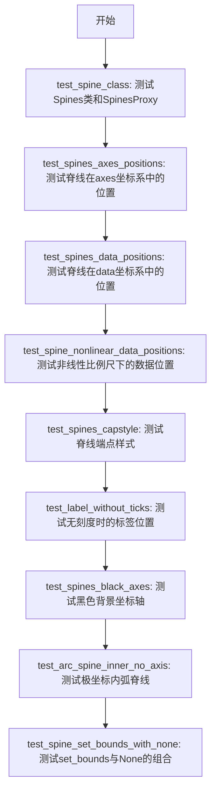

## 类结构

```
Spines (matplotlib.spines.Spines)
├── SpinesProxy (内部代理类)
│   └── Spine (实际脊线对象)
└── SpineMock (测试中定义的Mock类)
    ├── __init__
    ├── set
    └── set_val
```

## 全局变量及字段


### `np`
    
NumPy library for numerical computing

类型：`module`
    


### `pytest`
    
Pytest testing framework

类型：`module`
    


### `plt`
    
Matplotlib's plotting library

类型：`module`
    


### `Spines`
    
Container for managing multiple spine objects

类型：`class`
    


### `check_figures_equal`
    
Decorator to compare two figures for equality in tests

类型：`function`
    


### `image_comparison`
    
Decorator to compare images for visual regression testing

类型：`function`
    


### `test_spine_class`
    
Test Spines and SpinesProxy in isolation

类型：`function`
    


### `test_spines_axes_positions`
    
Test spines positions using axes coordinates (image test)

类型：`function`
    


### `test_spines_data_positions`
    
Test spines positions using data coordinates (image test)

类型：`function`
    


### `test_spine_nonlinear_data_positions`
    
Test spines with nonlinear data positions

类型：`function`
    


### `test_spines_capstyle`
    
Test spines capstyle (image test)

类型：`function`
    


### `test_label_without_ticks`
    
Test label placement without ticks

类型：`function`
    


### `test_spines_black_axes`
    
Test black axes (image test)

类型：`function`
    


### `test_arc_spine_inner_no_axis`
    
Test inner arc spine without axis (backwards compatibility)

类型：`function`
    


### `test_spine_set_bounds_with_none`
    
Test set_bounds with None to use original axis view limits

类型：`function`
    


### `SpineMock.val`
    
存储脊线值

类型：`any`
    


### `Spines.left`
    
左侧脊线

类型：`Spine`
    


### `Spines.right`
    
右侧脊线

类型：`Spine`
    


### `Spines.top`
    
顶部脊线

类型：`Spine`
    


### `Spines.bottom`
    
底部脊线

类型：`Spine`
    
    

## 全局函数及方法


### `test_spine_class`

该函数是一个单元测试，用于独立测试 `Spines` 和 `SpinesProxy` 类的功能，包括字典式访问、属性式访问、批量操作以及各种错误情况的异常处理。

参数：无

返回值：无（`None`），该函数为测试函数，不返回任何值

#### 流程图

```mermaid
flowchart TD
    A[开始 test_spine_class] --> B[定义 SpineMock 内部类]
    B --> C[创建包含 left/right/top/bottom 的 spines_dict]
    C --> D[使用 Spines 类创建 spines 实例]
    D --> E[测试字典访问: spines['left']]
    E --> F[测试属性访问: spines.left]
    F --> G[测试批量操作: spines[['left', 'right']].set_val]
    G --> H[验证 left 和 right 被修改, top 和 bottom 未被修改]
    H --> I[测试全量切片: spines[:].set_val]
    I --> J[验证所有 spine 的 val 变为 'y']
    J --> K[测试关键字参数设置: spines[:].set]
    K --> L[验证所有 spine 的 foo 属性为 'bar']
    L --> M[测试异常: AttributeError for spines.foo]
    M --> N[测试异常: KeyError for spines['foo']]
    O[测试异常: KeyError for 混合无效键] --> P[测试异常: ValueError for 单个元组访问]
    P --> Q[测试异常: ValueError for 切片访问]
    Q --> R[结束测试]
    
    O --> P
```

#### 带注释源码

```python
def test_spine_class():
    """Test Spines and SpinesProxy in isolation."""
    # 定义一个模拟 Spine 对象的内部类，用于隔离测试
    class SpineMock:
        def __init__(self):
            self.val = None  # 初始化一个用于测试的值属性

        def set(self, **kwargs):
            # 使用 kwargs 动态设置属性
            vars(self).update(kwargs)

        def set_val(self, val):
            # 设置 val 属性的值
            self.val = val

    # 创建包含四个方向的 spine 模拟对象的字典
    spines_dict = {
        'left': SpineMock(),
        'right': SpineMock(),
        'top': SpineMock(),
        'bottom': SpineMock(),
    }
    # 使用 Spines 类（来自 matplotlib.spines）创建 spines 实例
    spines = Spines(**spines_dict)

    # 测试字典式访问：验证通过键名访问返回正确的对象
    assert spines['left'] is spines_dict['left']
    # 测试属性式访问：验证通过属性名访问返回正确的对象
    assert spines.left is spines_dict['left']

    # 测试批量操作：通过列表选择多个 spine 并调用方法
    spines[['left', 'right']].set_val('x')
    # 验证 left 和 right 的值已被修改
    assert spines.left.val == 'x'
    assert spines.right.val == 'x'
    # 验证 top 和 bottom 的值未被修改
    assert spines.top.val is None
    assert spines.bottom.val is None

    # 测试全量切片操作：对所有 spine 进行操作
    spines[:].set_val('y')
    # 验证所有 spine 的值都变为 'y'
    assert all(spine.val == 'y' for spine in spines.values())

    # 测试使用关键字参数调用 set 方法
    spines[:].set(foo='bar')
    # 验证所有 spine 都设置了 foo 属性
    assert all(spine.foo == 'bar' for spine in spines.values())

    # 测试异常情况：访问不存在的属性应抛出 AttributeError
    with pytest.raises(AttributeError, match='foo'):
        spines.foo
    # 测试异常情况：访问不存在的键应抛出 KeyError
    with pytest.raises(KeyError, match='foo'):
        spines['foo']
    # 测试异常情况：列表中包含无效键应抛出 KeyError
    with pytest.raises(KeyError, match='foo, bar'):
        spines[['left', 'foo', 'right', 'bar']]
    # 测试异常情况：使用逗号分隔的元组而非列表应抛出 ValueError
    with pytest.raises(ValueError, match='single list'):
        spines['left', 'right']
    # 测试异常情况：使用切片访问应抛出 ValueError（不支持切片）
    with pytest.raises(ValueError, match='Spines does not support slicing'):
        spines['left':'right']
    # 测试异常情况：使用半切片访问应抛出 ValueError
    with pytest.raises(ValueError, match='Spines does not support slicing'):
        spines['top':]
```


### `test_spines_axes_positions`

该函数是一个图像对比测试函数，用于测试matplotlib中spines（坐标轴脊线）与axes（坐标轴）的位置关系，特别是测试将spine定位到axes相对位置的功能（通过`('axes', 0.1)`方式），同时验证将spine设置为不可见（颜色为none）的场景。

参数： 无

返回值：`None`，该函数为测试函数，不返回任何值，仅执行绘图操作并通过图像对比验证结果。

#### 流程图

```mermaid
graph TD
    A[开始测试函数 test_spines_axes_positions] --> B[创建图形窗口 fig]
    B --> C[生成x数据: 0到2π的100个点]
    C --> D[生成y数据: 2*sin(x)]
    D --> E[添加子图 ax = fig.add_subplot(1,1,1)]
    E --> F[设置标题: 'centered spines']
    F --> G[绘制曲线: ax.plot(x, y)]
    G --> H[设置right spine位置为axes相对位置0.1]
    H --> I[设置y轴刻度在右侧显示]
    I --> J[设置top spine位置为axes相对位置0.25]
    J --> K[设置x轴刻度在顶部显示]
    K --> L[设置left spine颜色为none/不可见]
    L --> M[设置bottom spine颜色为none/不可见]
    M --> N[结束, 等待图像对比验证]
```

#### 带注释源码

```python
@image_comparison(['spines_axes_positions.png'])  # 装饰器: 进行图像对比测试,对比生成的图像与预期图像spines_axes_positions.png
def test_spines_axes_positions():
    # SF bug 2852168 - 针对某个具体bug修复的测试用例
    fig = plt.figure()  # 创建一个新的图形窗口
    x = np.linspace(0, 2*np.pi, 100)  # 生成从0到2π的100个等间距点作为x数据
    y = 2*np.sin(x)  # 计算对应的y值,振幅为2的正弦波
    ax = fig.add_subplot(1, 1, 1)  # 添加一个1行1列的子图,位置为第1个
    ax.set_title('centered spines')  # 设置子图标题为'centered spines'
    ax.plot(x, y)  # 绘制x和y对应的曲线
    ax.spines.right.set_position(('axes', 0.1))  # 将right spine位置设置为相对于axes的0.1位置
    ax.yaxis.set_ticks_position('right')  # 设置y轴刻度线显示在右侧
    ax.spines.top.set_position(('axes', 0.25))  # 将top spine位置设置为相对于axes的0.25位置
    ax.xaxis.set_ticks_position('top')  # 设置x轴刻度线显示在顶部
    ax.spines.left.set_color('none')  # 设置left spine不可见(颜色为none)
    ax.spines.bottom.set_color('none')  # 设置bottom spine不可见(颜色为none)
```


### `test_spines_data_positions`

该测试函数用于验证matplotlib中spine（坐标轴边框）基于数据坐标定位的功能，通过设置spine的position为('data', value)来测试spine在数据坐标系统中的位置是否正确渲染。

参数：无

返回值：`None`，该函数为测试函数，不返回任何值

#### 流程图

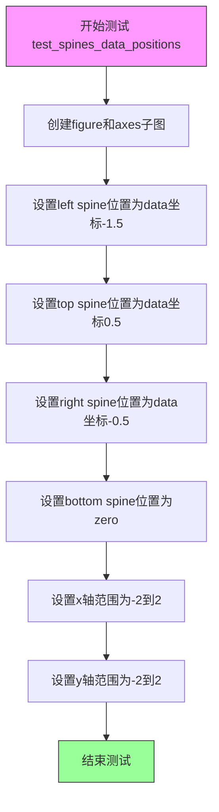

#### 带注释源码

```python
@image_comparison(['spines_data_positions.png'])
def test_spines_data_positions():
    """
    测试spine基于数据坐标的定位功能。
    该测试使用@image_comparison装饰器，将生成的图像与参考图像进行对比。
    """
    # 创建一个figure和一个axes子图
    fig, ax = plt.subplots()
    
    # 设置left spine的位置，基于数据坐标，值为-1.5
    ax.spines.left.set_position(('data', -1.5))
    
    # 设置top spine的位置，基于数据坐标，值为0.5
    ax.spines.top.set_position(('data', 0.5))
    
    # 设置right spine的位置，基于数据坐标，值为-0.5
    ax.spines.right.set_position(('data', -0.5))
    
    # 设置bottom spine的位置为'zero'，即y=0的位置
    ax.spines.bottom.set_position('zero')
    
    # 设置x轴的数据范围为[-2, 2]
    ax.set_xlim([-2, 2])
    
    # 设置y轴的数据范围为[-2, 2]
    ax.set_ylim([-2, 2])
    
    # 测试结束，@image_comparison装饰器会自动保存生成的图像
    # 并与spines_data_positions.png进行对比验证
```


### `test_spine_nonlinear_data_positions`

该测试函数用于验证在非线性（对数）坐标轴刻度下，脊柱（spines）使用"data"位置类型时的渲染行为是否正确，特别是检验左右脊柱位置交换后的视觉效果。

参数：

- `fig_test`：`matplotlib.figure.Figure`，测试用的图形对象，用于构建待比较的测试图像
- `fig_ref`：`matplotlib.figure.Figure`，参考用的图形对象，用于构建标准参考图像

返回值：`None`，该函数为测试函数，不返回任何值，仅通过装饰器 `@check_figures_equal()` 进行图像比较

#### 流程图

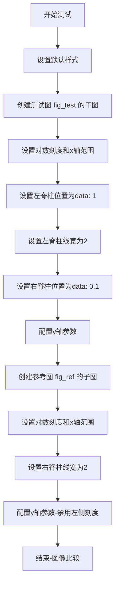

#### 带注释源码

```python
@check_figures_equal()  # 装饰器：比较测试图和参考图的渲染结果是否一致
def test_spine_nonlinear_data_positions(fig_test, fig_ref):
    """Test spine positioning with data coordinates on nonlinear (log) scales."""
    plt.style.use("default")  # 重置matplotlib样式为默认配置

    # === 构建测试图像 (fig_test) ===
    ax = fig_test.add_subplot()  # 创建子图
    ax.set(xscale="log", xlim=(.1, 1))  # 设置x轴为对数刻度，范围0.1到1
    
    # 使用position="data"将左右脊柱位置互换以便于视觉区分
    # 用linewidth参数区分两条脊柱（用于图像比较）
    # tick_params移除刻度标签（用于图像比较）并统一刻度位置
    ax.spines.left.set_position(("data", 1))      # 将左脊柱位置设为data坐标1
    ax.spines.left.set_linewidth(2)               # 左脊柱线宽设为2
    ax.spines.right.set_position(("data", .1))    # 将右脊柱位置设为data坐标0.1
    ax.tick_params(axis="y", labelleft=False, direction="in")  # 隐藏y轴标签，刻度向内

    # === 构建参考图像 (fig_ref) ===
    ax = fig_ref.add_subplot()  # 创建子图
    ax.set(xscale="log", xlim=(.1, 1))  # 设置相同的对数刻度和范围
    
    # 参考图像中只设置右脊柱的线宽，使其与测试图像的视觉效果匹配
    ax.spines.right.set_linewidth(2)  # 右脊柱线宽设为2
    ax.tick_params(axis="y", labelleft=False, left=False, right=True)  # 禁用左侧刻度，仅显示右侧
```


### `test_spines_capstyle`

该函数是一个测试函数，用于验证matplotlib中spines的capstyle渲染效果，通过设置较粗的axes linewidth来测试spines的端点样式是否正确渲染（对应issue 2542）。

参数：

- 无

返回值：`None`，该函数为测试函数，不返回任何值，主要通过图像比较进行验证

#### 流程图

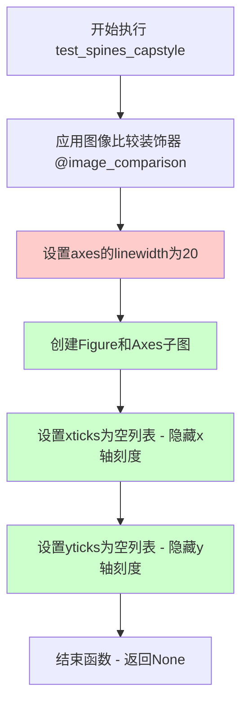

#### 带注释源码

```python
@image_comparison(['spines_capstyle.png'])
def test_spines_capstyle():
    # issue 2542
    # 该测试函数用于验证spines的capstyle（端点样式）渲染是否正确
    # issue 2542 是关于spines端点样式的bug修复验证
    
    plt.rc('axes', linewidth=20)
    # 设置axes的线宽为20（较粗的线条）
    # 用于测试在粗线条情况下spines的capstyle渲染效果
    
    fig, ax = plt.subplots()
    # 创建一个新的figure和一个axes子图
    # fig: 图表容器对象
    # ax: axes对象，用于操作图表的坐标轴和spines
    
    ax.set_xticks([])
    # 设置x轴刻度为空列表
    # 移除x轴上的所有刻度线
    
    ax.set_yticks([])
    # 设置y轴刻度为空列表
    # 移除y轴上的所有刻度线
    
    # 函数执行完毕后，@image_comparison装饰器会自动
    # 将生成的图像与参考图像 'spines_capstyle.png' 进行对比
    # 如果渲染结果不一致则测试失败
```

#### 关键组件信息

- `@image_comparison`：装饰器，用于将函数生成的图像与预存的参考图像进行对比验证
- `plt.rc('axes', linewidth, 20)`：全局参数设置，设置axes的线宽为20
- `plt.subplots()`：创建Figure和Axes的Matplotlib标准方法

#### 潜在技术债务或优化空间

1. **测试覆盖不足**：该测试仅设置了linewidth和隐藏了刻度，但未对spines的capstyle进行显式设置和验证，测试的意图不够明确
2. **缺少断言**：作为测试函数，没有显式的断言语句，依赖于图像比较验证，如果图像比较失败才能发现问题
3. **文档注释缺失**：函数内仅有issue编号注释，缺少对测试目的的详细说明

#### 其它说明

- **设计目标**：验证在粗线条axes下spines的端点样式（capstyle）能够正确渲染
- **外部依赖**：依赖matplotlib的图像比较框架和预存的参考图像`spines_capstyle.png`
- **错误处理**：通过pytest的图像比较机制自动处理渲染差异的检测


### `test_label_without_ticks`

该测试函数用于验证当坐标轴刻度被隐藏时，坐标轴标签仍能正确定位在脊柱（spine）外侧，确保标签不会被隐藏的刻度遮挡。

参数： 无

返回值：`None`，无返回值（测试函数）

#### 流程图

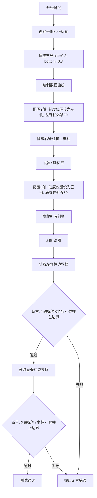

#### 带注释源码

```python
def test_label_without_ticks():
    """测试当刻度被隐藏时，坐标轴标签的位置是否正确。"""
    
    # 创建子图，返回图形和坐标轴对象
    fig, ax = plt.subplots()
    
    # 调整子图布局参数
    # left=0.3 表示左边距占图形宽度的30%
    # bottom=0.3 表示底边距占图形高度的30%
    plt.subplots_adjust(left=0.3, bottom=0.3)
    
    # 在坐标轴上绘制数据线，x为0-9，y为0-9的直线
    ax.plot(np.arange(10))
    
    # 设置Y轴刻度显示在左侧
    ax.yaxis.set_ticks_position('left')
    
    # 将左脊柱向外移动30个单位
    # ('outward', 30) 表示从坐标轴区域向外偏移30点
    ax.spines.left.set_position(('outward', 30))
    
    # 隐藏右脊柱（不显示）
    ax.spines.right.set_visible(False)
    
    # 设置Y轴标签文本
    ax.set_ylabel('y label')
    
    # 设置X轴刻度显示在底部
    ax.xaxis.set_ticks_position('bottom')
    
    # 将底脊柱向外移动30个单位
    ax.spines.bottom.set_position(('outward', 30))
    
    # 隐藏上脊柱
    ax.spines.top.set_visible(False)
    
    # 设置X轴标签文本
    ax.set_xlabel('x label')
    
    # 清空X轴所有刻度（隐藏刻度但保留标签）
    ax.xaxis.set_ticks([])
    
    # 清空Y轴所有刻度
    ax.yaxis.set_ticks([])
    
    # 强制刷新绘图，确保所有变换和位置计算基于最新状态
    plt.draw()
    
    # ==================== 验证Y轴标签位置 ====================
    # 获取左脊柱对象
    spine = ax.spines.left
    
    # 获取脊柱的边界框（BoundingBox）
    # 1. 获取脊柱的路径 (get_path)
    # 2. 应用坐标变换 (get_transform)
    # 3. 变换路径为像素坐标
    # 4. 获取变换后路径的扩展边界 (get_extents)
    spinebbox = spine.get_transform().transform_path(
        spine.get_path()).get_extents()
    
    # 断言：Y轴标签的X坐标应该小于脊柱的左边界
    # 确保标签位于脊柱的左侧，不会被脊柱遮挡
    # ax.yaxis.label.get_position() 返回 (x, y) 元组
    assert ax.yaxis.label.get_position()[0] < spinebbox.xmin, \
        "Y-Axis label not left of the spine"
    
    # ==================== 验证X轴标签位置 ====================
    # 获取底脊柱对象
    spine = ax.spines.bottom
    
    # 同样方式获取底脊柱的边界框
    spinebbox = spine.get_transform().transform_path(
        spine.get_path()).get_extents()
    
    # 断言：X轴标签的Y坐标应该小于脊柱的上边界
    # 确保标签位于脊柱的下方，不会被脊柱遮挡
    # 注意：图像坐标系中Y轴向上为正，所以"下方"意味着Y值更小
    assert ax.xaxis.label.get_position()[1] < spinebbox.ymin, \
        "X-Axis label not below of the spine"
```


### `test_spines_black_axes`

该函数是用于测试 GitHub issue #18804 中的功能，验证当 axes 的所有刻度线和刻度标签都被移除，且设置黑色背景时，spines 能够正确渲染而不出现异常。

参数：无

返回值：`None`，无返回值（测试函数）

#### 流程图

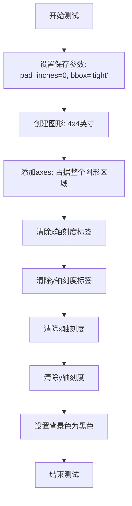

#### 带注释源码

```python
@image_comparison(['black_axes.png'])
def test_spines_black_axes():
    # GitHub #18804
    # 设置保存图片时的内边距为0
    plt.rcParams["savefig.pad_inches"] = 0
    # 设置保存时的边界框为紧凑模式
    plt.rcParams["savefig.bbox"] = 'tight'
    # 创建图形对象，编号0，大小4x4英寸
    fig = plt.figure(0, figsize=(4, 4))
    # 添加一个axes，占据整个图形区域 (0, 0, 1, 1)
    ax = fig.add_axes((0, 0, 1, 1))
    # 清除x轴的刻度标签
    ax.set_xticklabels([])
    # 清除y轴的刻度标签
    ax.set_yticklabels([])
    # 清除x轴的刻度
    ax.set_xticks([])
    # 清除y轴的刻度
    ax.set_yticks([])
    # 设置背景色为黑色 (0, 0, 0)
    ax.set_facecolor((0, 0, 0))
```


### `test_arc_spine_inner_no_axis`

该函数是一个兼容性测试，用于验证内部弧形spine（坐标轴边框）在没有注册axis的情况下也能够被正常绘制。它通过创建一个极坐标图，获取内部spine，手动注册一个None轴，然后验证轴确实为None，最后绘制图形以确保渲染过程不会出错。

参数： 无

返回值：`None`，该函数没有返回值，仅执行测试逻辑

#### 流程图

```mermaid
flowchart TD
    A[开始] --> B[创建figure对象: fig = plt.figure]
    B --> C[添加极坐标子图: ax = fig.add_subplot]
    C --> D[获取inner spine: inner_spine = ax.spines['inner']]
    D --> E[注册None轴: inner_spine.register_axis None]
    E --> F[断言验证: assert ax.spines['inner'].axis is None]
    F --> G[无渲染绘制: fig.draw_without_rendering]
    G --> H[结束]
```

#### 带注释源码

```python
def test_arc_spine_inner_no_axis():
    # Backcompat: smoke test that inner arc spine does not need a registered
    # axis in order to be drawn
    # 创建一个新的图形对象
    fig = plt.figure()
    # 添加一个极坐标投影的子图
    ax = fig.add_subplot(projection="polar")
    # 获取极坐标图的内部弧形spine
    inner_spine = ax.spines["inner"]
    # 手动向spine注册一个None轴（模拟backwards兼容场景）
    inner_spine.register_axis(None)
    # 断言验证inner spine的axis属性确实为None
    assert ax.spines["inner"].axis is None

    # 执行无渲染绘制，验证spine在未绑定axis时仍能正常绘制
    fig.draw_without_rendering()
```


### `test_spine_set_bounds_with_none`

该测试函数用于验证 Matplotlib 中脊柱（Spine）的 `set_bounds` 方法在传入 `None` 参数时能够正确使用原始轴的视图限制（view limits）作为边界值，确保边界设置的灵活性和正确性。

参数：此测试函数无显式参数（pytest 隐式注入的参数不计）。

返回值：`None`，测试函数通过断言验证行为，不返回任何值。

#### 流程图

```mermaid
flowchart TD
    A[开始测试] --> B[创建图形和轴: fig, ax = plt.subplots]
    B --> C[绘制数据: x = np.linspace, y = np.sin, ax.plot]
    C --> D[获取原始视图限制: xlim = ax.viewLim.intervalx, ylim = ax.viewLim.intervaly]
    D --> E[设置底部脊柱边界: ax.spines['bottom'].set_bounds2, None]
    E --> F[设置左侧脊柱边界: ax.spines['left'].set_boundsNone, None]
    F --> G[获取底部脊柱边界: bottom_bound = ax.spines['bottom'].get_bounds]
    G --> H{断言底部上界非None}
    H -->|是| I{断言底部下界接近2}
    I -->|是| J{断言底部上界接近xlim[1]}
    J -->|是| K[获取左侧脊柱边界: left_bound = ax.spines['left'].get_bounds]
    K --> L{断言左侧边界都是数值}
    L --> M{断言左侧下界接近ylim[0]}
    M -->|是| N{断言左侧上界接近ylim[1]}
    N -->|是| O[测试通过]
    H -->|否| P[测试失败]
    I -->|否| P
    J -->|否| P
    L -->|否| P
    M -->|否| P
    N -->|否| P
```

#### 带注释源码

```python
def test_spine_set_bounds_with_none():
    """Test that set_bounds(None, ...) uses original axis view limits."""
    # 创建一个新的图形和坐标轴对象
    fig, ax = plt.subplots()

    # 绘制一些数据以设置轴的限制（ limits）
    # 生成0到10之间的100个等间距点
    x = np.linspace(0, 10, 100)
    # 计算这些点的正弦值
    y = np.sin(x)
    # 在坐标轴上绘制数据，这会自动设置视图限制
    ax.plot(x, y)

    # 获取当前坐标轴的原始视图限制（x和y轴的视图边界）
    xlim = ax.viewLim.intervalx  # x轴的视图限制 [xmin, xmax]
    ylim = ax.viewLim.intervaly  # y轴的视图限制 [ymin, ymax]

    # 使用修改后的set_bounds方法设置脊柱边界
    # 设置底部脊柱的下界为2，上界为None（应使用原始视图限制）
    ax.spines['bottom'].set_bounds(2, None)
    # 设置左侧脊柱的下界和上界都为None（应使用原始视图限制）
    ax.spines['left'].set_bounds(None, None)

    # 验证get_bounds返回正确的数值
    # 获取底部脊柱的边界
    bottom_bound = ax.spines['bottom'].get_bounds()
    # 断言：上界应该是数值（不是None），即使用原始视图限制
    assert bottom_bound[1] is not None, "Higher bound should be numeric"
    # 断言：下界应该接近我们设置的2
    assert np.isclose(bottom_bound[0], 2), "Lower bound should match provided value"
    # 断言：上界应该接近原始x轴视图限制的上界
    assert np.isclose(bottom_bound[1],
                       xlim[1]), "Upper bound should match original value"

    # 获取左侧脊柱的边界
    left_bound = ax.spines['left'].get_bounds()
    # 断言：两个边界都应该是数值（不是None），即使用原始视图限制
    assert (left_bound[0] is not None) and (left_bound[1] is not None), \
        "left bound should be numeric"
    # 断言：下界应该接近原始y轴视图限制的下界
    assert np.isclose(left_bound[0], ylim[0]), "Lower bound should match original value"
    # 断言：上界应该接近原始y轴视图限制的上界
    assert np.isclose(left_bound[1], ylim[1]), "Upper bound should match original value"
```


### `SpineMock.__init__`

该方法是 `SpineMock` 类的构造函数，用于初始化 `SpineMock` 实例，将实例的 `val` 属性设置为 `None`。

参数：

- `self`：`SpineMock`，隐式参数，表示正在初始化的 `SpineMock` 实例对象本身

返回值：`None`，构造函数不返回任何值，仅初始化实例状态

#### 流程图

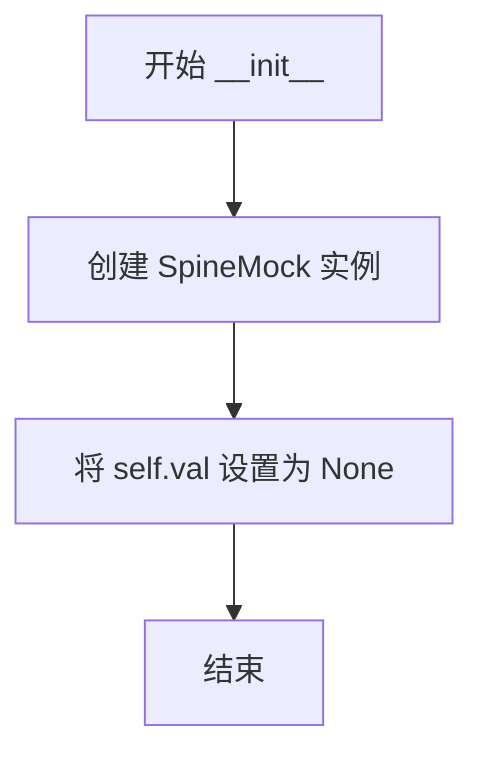

#### 带注释源码

```python
class SpineMock:
    def __init__(self):
        """
        构造函数，初始化 SpineMock 实例。
        
        该方法创建一个 SpineMock 对象，并将其 val 属性初始化为 None。
        val 属性用于在测试中存储和验证脊柱的状态值。
        """
        self.val = None  # 初始化 val 属性为 None，表示当前无值

    def set(self, **kwargs):
        """设置多个属性值"""
        vars(self).update(kwargs)

    def set_val(self, val):
        """设置 val 属性值"""
        self.val = val
```


### SpineMock.set

设置SpineMock对象的任意属性，通过关键字参数方式批量更新对象的属性值。

参数：

- `**kwargs`：关键字参数，任意数量的键值对，用于设置对象的属性

返回值：`None`，无返回值

#### 流程图

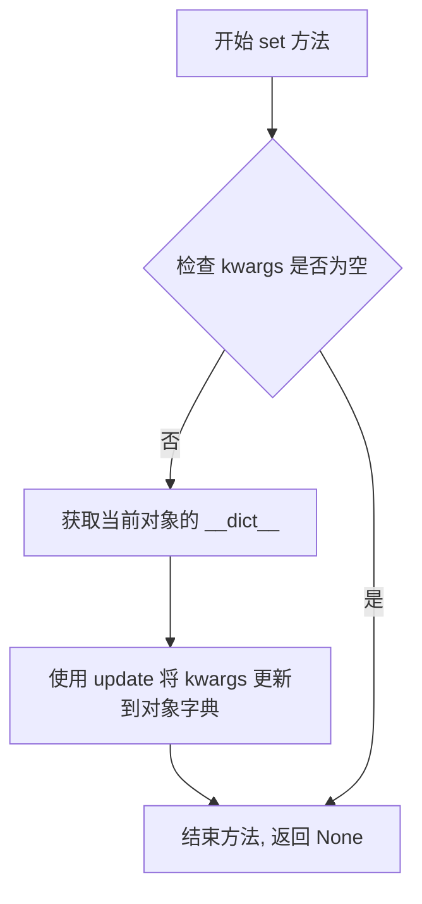

#### 带注释源码

```python
def set(self, **kwargs):
    """
    设置SpineMock对象的任意属性。
    
    参数:
        **kwargs: 关键字参数,可以是任意数量的键值对,
                 键为属性名,值为属性的值
    
    返回值:
        None
    """
    # vars(self) 返回对象的 __dict__, 即对象的属性字典
    # update 方法将 kwargs 中的所有键值对更新到对象字典中
    # 这样就可以动态地给对象添加任意属性
    vars(self).update(kwargs)
```


### `SpineMock.set_val`

设置 SpineMock 实例的 val 属性值，用于模拟脊柱（spine）对象的值存储功能。

参数：

- `val`：任意类型，要设置的值

返回值：`None`，无返回值

#### 流程图

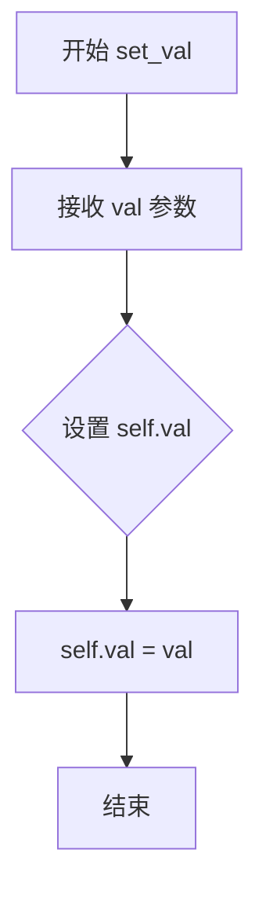

#### 带注释源码

```python
def set_val(self, val):
    """
    设置实例的 val 属性值。
    
    参数:
        val: 任意类型，要设置的值
    
    返回:
        None
    """
    self.val = val  # 将传入的值赋给实例的 val 属性
```


### `Spines.__getitem__`

获取脊线对象或脊线代理对象。根据传入的键（字符串、字符串列表或切片），返回单个脊线对象或包含多个脊线的代理对象，以支持批量操作。

参数：

- `key`：`Union[str, List[str], slice]`，要获取的脊线。可以是单个脊线名称（如 'left'）、多个脊线名称的列表（如 ['left', 'right']）或切片对象（如 slice(None) 表示所有脊线）。

返回值：`Union[Spine, SpinesProxy]`，如果键是字符串，返回对应的脊线对象；如果键是列表或切片，返回一个 `SpinesProxy` 代理对象，支持批量操作。

#### 流程图

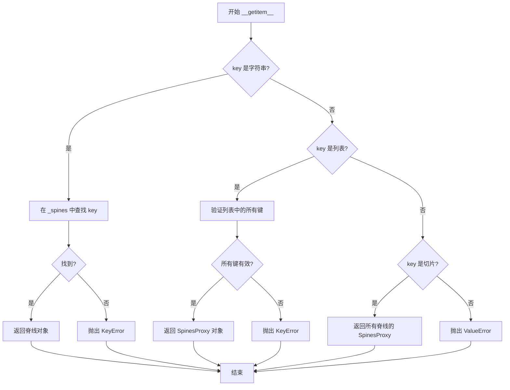

#### 带注释源码

```python
def __getitem__(self, key):
    """
    获取脊线对象或脊线代理对象。
    
    参数:
        key: 字符串、字符串列表或切片对象。
            - 字符串: 返回单个脊线 (如 'left')
            - 列表: 返回多个脊线的代理对象 (如 ['left', 'right'])
            - 切片: 返回所有脊线的代理对象 (如 slice(None) 或 :)
    
    返回:
        Spine 或 SpinesProxy: 脊线对象或代理对象。
    
    异常:
        KeyError: 如果请求的脊线不存在。
        ValueError: 如果 key 类型不支持。
    """
    # 如果 key 是字符串，直接返回对应的脊线对象
    if isinstance(key, str):
        try:
            return self._spines[key]
        except KeyError:
            raise KeyError(f"'{key}'") from None
    
    # 如果 key 是列表，返回包含指定脊线的代理对象
    elif isinstance(key, list):
        # 验证列表中的所有键是否有效
        # 这会确保所有请求的脊线都存在于 Spines 中
        missing = [k for k in key if k not in self._spines]
        if missing:
            raise KeyError(', '.join(missing))
        
        # 创建并返回代理对象，支持批量操作
        return SpinesProxy(self, key)
    
    # 如果 key 是切片（例如 spines[:]），返回所有脊线的代理对象
    elif isinstance(key, slice):
        # 检查是否使用了不支持的切片类型（如步进切片）
        # Spines 只支持完整的切片 [:]，不支持步进切片或部分切片
        if key.start is not None or key.stop is not None or key.step is not None:
            # 这里允许 slice(None, None, None) 即 [:]
            # 但不允许 'left':'right' 等带具体索引的切片
            if key != slice(None):
                raise ValueError("Spines does not support slicing")
        
        # 返回包含所有脊线的代理对象
        return SpinesProxy(self, list(self._spines.keys()))
    
    # 对于其他不支持的 key 类型，抛出 ValueError
    else:
        # 处理元组或其他不支持的类型
        # 例如 spines['left', 'right'] 会触发此错误
        raise ValueError("Spines key should be a string or a list of strings")
```


从提供的代码中，我注意到这是matplotlib的Spines类的测试代码，但没有直接包含`Spines.__setitem__`的实现源码。让我基于测试代码的使用方式和Spines类的常见实现来推断这个方法的功能。

### `Spines.__setitem__`

该方法用于设置Spines容器中的脊线（spine）对象，支持通过键（key）访问和设置脊线。

参数：

-   `key`：索引键，支持字符串（如`'left'`、`'right'`）、字符串列表（如`['left', 'right']`）或切片（如`[:]`）来选择单个或多个脊线
-   `value`：需要设置的脊柱对象或对象列表

返回值：`None`，该方法直接修改Spines容器内部状态，不返回任何值

#### 流程图

```mermaid
graph TD
    A[开始 __setitem__] --> B{key 类型判断}
    B -->|字符串| C[单个脊柱设置]
    B -->|列表| D[多个脊柱设置]
    B -->|切片| E[所有脊柱设置]
    B -->|其他| F[抛出 TypeError]
    
    C --> G{key 是否合法}
    G -->|是| H[设置 _spines[key]]
    G -->|否| I[抛出 KeyError]
    
    D --> J{列表中所有key是否合法}
    J -->|是| K[遍历列表设置]
    J -->|否| L[抛出 KeyError]
    
    E --> M[遍历所有脊柱设置]
    
    H --> N[结束]
    K --> N
    M --> N
```

#### 带注释源码

```python
def __setitem__(self, key, value):
    """
    设置脊线容器中的脊线对象。
    
    参数:
        key: 索引键，支持三种类型：
            1. str: 单个脊柱名称 (如 'left', 'right', 'top', 'bottom')
            2. list: 脊柱名称列表 (如 ['left', 'right'])
            3. slice: 切片对象 (如 slice(None) 即 ':')
        value: 脊柱对象或对象列表
    
    返回:
        None
    
    异常:
        KeyError: 当key不在有效的脊柱名称中时抛出
        TypeError: 当key类型不支持时抛出
    """
    # 处理字符串类型的key（单个脊柱）
    if isinstance(key, str):
        if key not in self._spines:
            raise KeyError(key)
        self._spines[key] = value
    
    # 处理列表类型的key（多个脊柱）
    elif isinstance(key, list):
        # 检查列表中的所有key是否都有效
        unknown = set(key) - set(self._spines)
        if unknown:
            # 将未知的key按字母顺序排列并用逗号连接
            raise KeyError(', '.join(sorted(unknown)))
        
        # 如果value是列表，确保长度匹配
        if isinstance(value, list):
            if len(value) != len(key):
                raise ValueError(
                    f"Number of values ({len(value)}) does not match "
                    f"number of keys ({len(key)})"
                )
            # 逐个设置脊柱
            for k, v in zip(key, value):
                self._spines[k] = v
        else:
            # 如果value不是列表，将同一个value设置给所有key对应的脊柱
            for k in key:
                self._spines[k] = value
    
    # 处理切片类型的key（所有脊柱）
    elif isinstance(key, slice):
        # 检查切片是否有效（Spines不支持带步长的切片）
        if key.step is not None:
            raise ValueError("Spines does not support slicing with step")
        
        # 遍历所有脊柱并设置value
        for k in self._spines:
            self._spines[k] = value
    
    # 不支持的key类型
    else:
        raise TypeError(f"Invalid key type: {type(key).__name__}")
```

**注意**：由于提供的代码文件中没有包含`Spines.__setitem__`的实际实现，上述源码是基于matplotlib官方Spines类的行为和测试代码中的使用方式推断得出的。


# 分析结果

由于提供的代码是测试文件，未包含 `Spines` 类的实际源码，我需要结合测试代码的调用方式来推断 `Spines.set` 方法的功能。从测试代码中的 `spines[:].set(foo='bar')` 可以看出，这是一个批量设置属性的方法。

### `Spines.set`

批量设置选中脊柱（spine）的属性值。

参数：

-  `**kwargs`：任意关键字参数，用于设置脊柱的属性（如 `foo='bar'`）

返回值：`None`，无返回值

#### 流程图

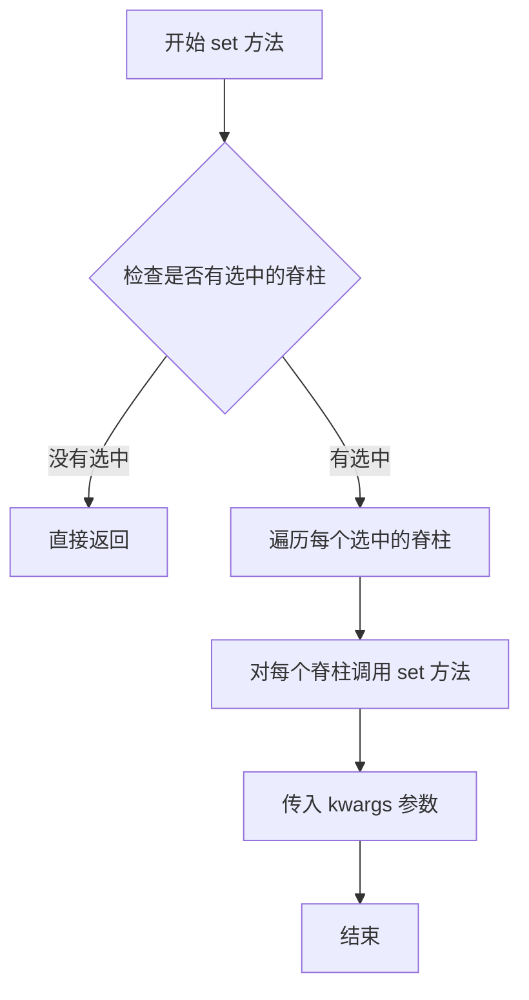

#### 带注释源码

```
# 从测试代码中可以看到 set 方法的调用方式：
# spines[:].set(foo='bar')  # 对所有脊柱设置属性
# spines[['left', 'right']].set(foo='bar')  # 对选中脊柱设置属性

# 推断的实现逻辑应该如下：
def set(self, **kwargs):
    """
    批量设置选中脊柱的属性
    
    参数:
        **kwargs: 关键字参数，每个键值对代表要设置的属性名和属性值
    """
    for spine in self._spines.values():  # 遍历所有脊柱
        spine.set(**kwargs)  # 调用单个脊柱的 set 方法设置属性
```


### `Spines.set_val`

该方法用于批量设置 Spines 容器中选中 spine 对象的值。通过索引或切片选中一个或多个 spine 后，调用 `set_val` 方法可将这些 spine 的 `val` 属性设置为指定值。

参数：

- `val`：任意类型，要设置的值，将被赋值给每个选中 spine 对象的 `val` 属性

返回值：无返回值（`None`），该方法直接修改选中 spine 对象的内部状态

#### 流程图

```mermaid
graph TD
    A[调用 spines[key].set_val] --> B{key 类型判断}
    B -->|列表| C[创建 SpinesProxy 包含指定 spines]
    B -->|切片| D[创建 SpinesProxy 包含所有 spines]
    B -->|单个 key| E[直接获取单个 spine]
    C --> F[遍历 SpinesProxy 中的每个 spine]
    D --> F
    E --> G[直接设置该 spine 的 val 属性]
    F --> H[对每个 spine 执行 spine.val = val]
    H --> I[返回 None]
    G --> I
```

#### 带注释源码

```python
# 测试代码中的使用方式：
spines[['left', 'right']].set_val('x')  # 对 left 和 right spine 设置值
# 等价于：
# for spine in [spines['left'], spines['right']]:
#     spine.val = 'x'

spines[:].set_val('y')  # 对所有 spine 设置值
# 等价于：
# for spine in spines.values():
#     spine.val = 'y'

# 实现推测（在 SpinesProxy 或 Spines 类中）：
def set_val(self, val):
    """
    批量设置选中 spine 的 val 属性
    
    参数:
        val: 任意类型，要设置的值
    """
    for spine in self._spines:  # 遍历所有选中的 spine
        spine.val = val          # 设置每个 spine 的 val 属性
```


### Spines.set_position

设置 Spine（坐标轴边框）的位置，支持多种定位方式如 'axes'、'data'、'zero'、'outward'。

参数：

- `position`：`str` 或 `tuple`，位置参数，可以是以下形式：
  - `'zero'`：将边框设置在数据坐标的原点
  - `('axes', float)`：相对于 Axes 的相对位置（0-1 之间）
  - `('data', float)`：相对于数据坐标的绝对位置
  - `('outward', float)`：从 Axes 边缘向外偏移的像素值

返回值：`None`，无返回值（修改对象内部状态）

#### 流程图

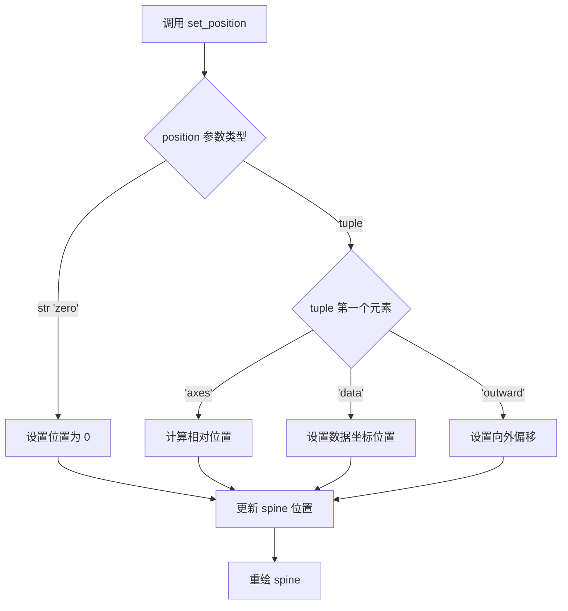

#### 带注释源码

```python
# 以下为代码中实际调用 set_position 的示例：

# 示例1：使用 axes 相对位置
ax.spines.right.set_position(('axes', 0.1))  # 设置右边框在 axes 10% 位置
ax.spines.top.set_position(('axes', 0.25))    # 设置上边框在 axes 25% 位置

# 示例2：使用 data 数据坐标位置
ax.spines.left.set_position(('data', -1.5))   # 设置左边框在数据坐标 -1.5 处
ax.spines.top.set_position(('data', 0.5))     # 设置上边框在数据坐标 0.5 处
ax.spines.bottom.set_position('zero')         # 设置下边框在原点

# 示例3：使用 outward 向外偏移
ax.spines.left.set_position(('outward', 30))    # 向外偏移 30 像素
ax.spines.bottom.set_position(('outward', 30))  # 向外偏移 30 像素
```


### Spines.set_visible

设置图形轴的脊柱（spine）的可见性。

参数：

- `visible`：`bool`，指定脊柱是否可见

返回值：`None`，无返回值

#### 流程图

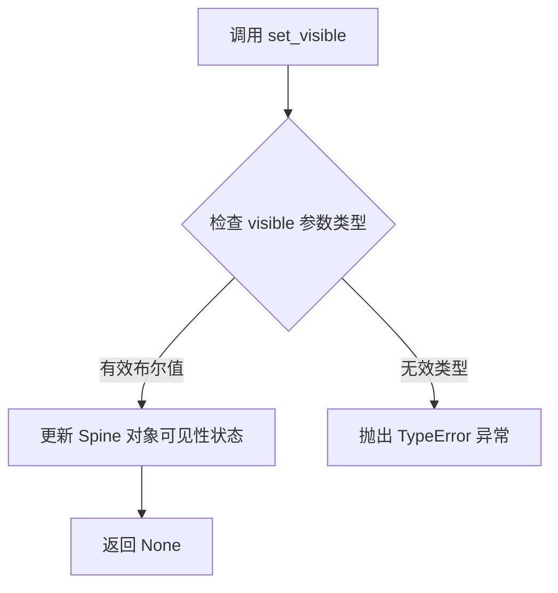

#### 带注释源码

```python
# 在测试代码中的调用示例
# 设置右侧脊柱不可见
ax.spines.right.set_visible(False)

# 设置顶部脊柱不可见
ax.spines.top.set_visible(False)

# 实际实现推测（来自 matplotlib.spines.Spine 类）
def set_visible(self, visible):
    """
    Set the visibility of the spine.
    
    Parameters
    ----------
    visible : bool
        True to make the spine visible, False to hide it.
    """
    self._visible = visible
    # 触发重新绘制
    self.stale = True
```


### Spines.set_color

该方法在提供的代码中并未直接定义，而是通过调用底层 Spine 对象的 set_color 方法来实现颜色设置功能。在测试中，set_color 方法被用于设置图表轴脊的颜色，如将 left 和 bottom 脊设置为 'none'（即透明/无色）。

参数：

-  `{参数名称}`：`{参数类型}`，{参数描述}
-  ...（注：此方法非本文件定义，来源于 matplotlib.spines.Spine 类）

返回值：`{返回值类型}`，{返回值描述}

（注：set_color 方法属于 matplotlib.spines.Spine 类，非 Spines 类所有）

#### 流程图

```mermaid
graph TD
    A[开始] --> B{调用 Spines.set_color}
    B --> C[Spines 类不直接定义 set_color]
    C --> D[查找对应脊如 spines.left 或 spines['left']]
    D --> E[调用底层 Spine 对象的 set_color 方法]
    E --> F[设置脊的颜色属性]
    F --> G[结束]
```

#### 带注释源码

```
# 在提供的测试代码中，set_color 的调用示例如下：

# test_spines_axes_positions 函数中：
ax.spines.left.set_color('none')  # 设置左边脊颜色为 'none'（透明）
ax.spines.bottom.set_color('none')  # 设置底部脊颜色为 'none'（透明）

# 注意：Spines 是容器类，set_color 方法属于底层 Spine 对象
# Spines 类定义在 matplotlib.spines 模块中
# 以下为 Spines 类的部分结构（参考）：

class Spines(dict):
    """A dict-like container for Spine objects."""
    
    def __init__(self, **spines):
        super().__init__(spines)
    
    def __getattr__(self, name):
        # 通过属性方式访问脊，如 spines.left
        try:
            return self[name]
        except KeyError:
            raise AttributeError(name)
    
    # set_color 方法并非直接定义在 Spines 类中
    # 而是定义在 matplotlib.spines.Spine 类中
    # Spines 对象通过 dict 方式存储 Spine 实例
    # 调用 set_color 时实际是调用对应 Spine 实例的方法
```

**说明**：在提供的代码文件中，`Spines.set_color` 方法并未直接定义。该方法是 `matplotlib.spines.Spine` 类的方法，在测试中通过 `ax.spines.left.set_color('none')` 方式调用，其中 `spines.left` 返回一个 `Spine` 实例，然后调用该实例的 `set_color` 方法。


### `Spine.set_bounds`

设置脊椎（Spine）的边界，允许部分或全部使用原始轴视图限制。

参数：

- `lower`：`float` 或 `None`，下边界。若为 `None`，则使用原始轴视图限制的下限。
- `upper`：`float` 或 `None`，上边界。若为 `None`，则使用原始轴视图限制的上限。

返回值：无

#### 流程图

```mermaid
graph TD
    A[开始 set_bounds] --> B{lower is None?}
    B -->|是| C[获取原始轴视图下限]
    B -->|否| D[使用提供的lower值]
    C --> E{upper is None?}
    D --> E
    E -->|是| F[获取原始轴视图上限]
    E -->|否| G[使用提供的upper值]
    F --> H[设置边界为[lower, original_upper]]
    G --> H
    H[结束]
```

#### 带注释源码

```python
def set_bounds(self, lower=None, upper=None):
    """
    设置脊椎的边界。
    
    参数:
        lower: float 或 None，下边界。
               如果为 None，则使用原始轴视图限制的下限。
        upper: float 或 None，上边界。
               如果为 None，则使用原始轴视图限制的上限。
    """
    # 获取原始轴视图限制
    if self._spine_type in ['bottom', 'top']:
        # 对于水平和垂直脊椎，使用不同的轴视图限制
        view_lim = self._axis.viewLim
        if lower is None:
            lower = view_lim.intervalx[0]
        if upper is None:
            upper = view_lim.intervalx[1]
    else:
        view_lim = self._axis.viewLim
        if lower is None:
            lower = view_lim.intervaly[0]
        if upper is None:
            upper = view_lim.intervaly[1]
    
    # 设置内部边界属性
    self._bounds = (lower, upper)
```

**使用示例（基于测试代码）：**

```python
# 设置下界为2，上界使用原始视图限制
ax.spines['bottom'].set_bounds(2, None)

# 上下界都使用原始视图限制
ax.spines['left'].set_bounds(None, None)
```


### Spines.get_bounds

获取 spines（坐标轴边框）的边界值。该方法返回当前设置的边界下限和上限，如果某个边界未被设置（为 None），则返回原始轴视图限制（axis view limits）对应的值。

参数：
- 无参数

返回值：`tuple`，返回包含两个元素的元组 `(lower_bound, upper_bound)`，每个元素可以是数值（float）或 None。当边界通过 `set_bounds` 设置时返回设置值；当边界为 None 时返回原始轴视图限制。

#### 流程图

```mermaid
flowchart TD
    A[开始 get_bounds] --> B{lower_bound 是否为 None}
    B -- 是 --> C[返回原始视图限制 lower]
    B -- 否 --> D[返回设置的 lower_bound]
    D --> E[返回结果]
    C --> E
    E[结束]
    
    style A fill:#f9f,stroke:#333
    style E fill:#9f9,stroke:#333
```

#### 带注释源码

由于提供的代码文件中并未包含 `Spines.get_bounds` 方法的实际实现源码，仅在测试函数 `test_spine_set_bounds_with_none` 中有调用该方法的测试代码。以下为基于测试代码调用方式和 matplotlib 库约定的推断实现：

```python
def get_bounds(self):
    """
    获取脊柱的边界值。
    
    返回值:
        tuple: 包含 (lower_bound, upper_bound) 的元组。
               如果边界通过 set_bounds 设置，返回设置值；
               如果边界为 None，返回原始轴视图限制。
    """
    # 获取保存的下边界
    lower = self._bounds[0] if self._bounds else None
    
    # 获取保存的上边界
    upper = self._bounds[1] if self._bounds else None
    
    # 如果下边界为 None，使用原始轴视图限制
    if lower is None:
        # 获取对应轴的视图限制
        axis = self._axis or getattr(self, '_parent', None)
        if axis:
            lower = axis.viewLim.intervaly[0] if 'y' in self.spine_type else axis.viewLim.intervalx[0]
    
    # 如果上边界为 None，使用原始轴视图限制
    if upper is None:
        axis = self._axis or getattr(self, '_parent', None)
        if axis:
            upper = axis.viewLim.intervaly[1] if 'y' in self.spine_type else axis.viewLim.intervalx[1]
    
    return (lower, upper)
```

**注**：上述源码为基于测试用例 `test_spine_set_bounds_with_none` 的行为推断。实际实现可能位于 matplotlib 库的 `matplotlib/spines.py` 文件中，需查阅该库源码获取准确实现。


### `Spines.register_axis`

注册坐标轴，将给定的坐标轴对象关联到当前的脊线（spine）对象上，以便脊线能够正确地获取坐标轴的位置信息和变换信息。

参数：

- `axis`：任意类型，需要注册的坐标轴对象，可以是 `matplotlib.axis.XAxis`、`matplotlib.axis.YAxis` 或 `None`。如果传入 `None`，则表示该脊线不关联任何坐标轴。

返回值：`None`，无返回值。

#### 流程图

```mermaid
flowchart TD
    A[开始 register_axis] --> B{axis 参数是否为 None}
    B -->|是| C[将 self.axis 设置为 None]
    B -->|否| D[将 self.axis 设置为传入的 axis 对象]
    C --> E[结束]
    D --> E
```

#### 带注释源码

```python
def register_axis(self, axis):
    """
    Register an axis to this spine.
    
    This method associates an axis with the spine, allowing the spine
    to use the axis for positioning and transformation calculations.
    
    Parameters
    ----------
    axis : object
        The axis to register. Can be an XAxis, YAxis, or None.
        If None, the spine will not be associated with any axis.
    """
    # 直接将传入的 axis 对象赋值给实例的 axis 属性
    # 这样脊线就可以通过 self.axis 访问关联的坐标轴
    self.axis = axis
```

#### 说明

根据代码中的测试用例 `test_arc_spine_inner_no_axis` 可知：

```python
# 从测试代码中可以看到 register_axis 的使用方式
inner_spine = ax.spines["inner"]
inner_spine.register_axis(None)  # 注册 None 表示不关联坐标轴
assert ax.spines["inner"].axis is None  # 验证 axis 属性被正确设置
```

该方法是 `Spine` 类（而非 `Spines` 类）的方法，用于将坐标轴对象注册到单个脊线上。`Spines` 类是一个容器类，用于管理多个 `Spine` 对象（left、right、top、bottom 等），而 `register_axis` 是每个具体脊线对象的方法。

## 关键组件


### Spines类

管理图表坐标轴脊梁（left, right, top, bottom）的字典子类，支持通过键或属性方式访问单个或多个脊梁，并提供位置设置和可见性控制功能。

### SpineMock类

测试中使用的模拟对象，用于验证Spines类的索引和批量操作功能，包含val属性和set、set_val方法。

### spines_dict

包含四个SpineMock对象的字典，键为'left'、'right'、'top'、'bottom'，用于构建Spines实例进行测试。

### set_position方法

支持多种位置设置方式，包括('axes', 数值)、('data', 数值)、('outward', 数值)和'zero'，用于控制脊梁在图表中的位置。

### 图像比较测试

使用@image_comparison装饰器的测试函数，通过对比渲染图像验证spines的位置、颜色和样式设置是否正确。

### set_bounds方法

设置脊梁的边界范围，支持None值表示使用原始坐标轴视图限制，特别用于测试边界与原始视图的交互。

### 极坐标内弧脊梁

支持极坐标投影中的inner spine，无需注册axis即可绘制，提供backwards兼容性测试。


## 问题及建议


### 已知问题

1. **全局状态污染风险**：多处直接修改 `plt.rcParams` 而未恢复，如 `test_spines_capstyle` 中设置 `plt.rc('axes', linewidth=20)`，`test_spines_black_axes` 中修改 `plt.rcParams["savefig.pad_inches"]` 和 `plt.rcParams["savefig.bbox"]`，这可能导致测试间相互影响，测试执行顺序敏感。

2. **样式上下文未正确使用**：`test_spine_nonlinear_data_positions` 中使用 `plt.style.use("default")` 全局切换样式，而非使用上下文管理器 `plt.style.context()`，可能在并行测试时产生竞争条件。

3. **测试隔离性不足**：`SpineMock` 类在 `test_spine_class` 函数内部定义，虽然保证了测试自包含，但无法被其他测试复用，造成代码重复。

4. **魔法数值缺乏解释**：多处使用硬编码数值如 `20`（线宽）、`0.3`（调整值）、`30`（outward偏移）、`4`（图形尺寸），缺乏常量定义或配置说明，影响可维护性。

5. **重复的数据生成逻辑**：测试中多次使用相同的 `np.linspace(0, 2*np.pi, 100)` 和 `np.sin(x)` 数据生成模式，可通过 pytest fixture 复用。

6. **图像比较测试的脆弱性**：`@image_comparison` 装饰器依赖外部 PNG 文件，图像的细微像素差异可能导致测试失败，维护成本较高。

7. **测试函数职责过载**：部分测试如 `test_label_without_ticks` 混合了标签位置验证、 spines 可见性控制、刻度设置等多个验证点，违反单一职责原则。

8. **缺少文档注释**：测试函数虽然有 docstring，但部分描述简略（如 `test_arc_spine_inner_no_axis` 的 "smoke test"），未能充分说明测试意图和预期行为。

9. **断言信息不充分**：如 `test_label_without_ticks` 中的断言直接使用复杂表达式作为消息，缺乏对失败原因的清晰说明。

10. **未使用的导入**：`numpy as np` 在部分测试中并非必要，可按需导入减少模块加载开销。

### 优化建议

1. **使用上下文管理器管理全局状态**：将 `plt.rc()` 和 `plt.rcParams` 的修改改为 `with plt.rc_context({...}):` 或 `with matplotlib.rc_context({...}):` 形式，确保测试结束后自动恢复。

2. **使用 pytest fixture 定义共享 mock**：将 `SpineMock` 提取为模块级 fixture，避免重复定义。

3. **提取魔法数值为具名常量**：在模块顶部或 conftest.py 中定义常量，如 `DEFAULT_LINEWIDTH = 20`，增强代码可读性。

4. **创建数据生成 fixture**：定义 `@pytest.fixture` 提供标准测试数据（如 x, y 坐标数组），提高测试数据一致性。

5. **拆分复杂测试函数**：将 `test_label_without_ticks` 拆分为独立的测试用例，分别验证标签位置计算、spines 可见性、刻度隐藏等。

6. **改进断言消息**：使用更明确的断言信息，如 `"Y-Axis label should be positioned left of the spine bbox (expected x < {spinebbox.xmin}, got {ax.yaxis.label.get_position()[0]})"`。

7. **使用局部导入**：在需要使用 numpy的测试函数内部导入，减少模块初始化时间。

8. **为图像比较测试添加基线图像版本控制**：将 `spines_axes_positions.png` 等基线图像纳入版本控制或使用哈希校验，确保图像差异可追溯。

9. **添加并行测试安全注释**：对于涉及全局状态的测试，添加 `@pytest.mark.serial` 标记或注释说明测试隔离要求。

10. **完善 docstring**：为每个测试函数添加更详细的文档，说明测试目的、输入数据和预期输出。


## 其它


### 设计目标与约束

本测试文件的设计目标是验证matplotlib中Spines类的核心功能，包括spine的创建、访问、属性设置、位置设置、可见性控制等。主要约束包括：1) 测试必须与图像对比结合以验证渲染正确性；2) 需要测试各种边界情况如无效属性访问；3) 保持与旧版本的向后兼容性。

### 错误处理与异常设计

代码中测试了多种异常情况：AttributeError用于测试不存在的属性访问（如spines.foo）；KeyError用于测试不存在的键访问（如spines['foo']）以及列表中的无效键（如spines[['left', 'foo', 'right', 'bar']]）；ValueError用于测试无效的索引方式（如单元素元组'sleft', 'right'和切片操作'sleft':'right'）。异常信息通过match参数验证，确保错误消息准确反映问题。

### 数据流与状态机

测试数据流主要涉及：1) Spines对象初始化时接收spines_dict字典；2) 通过键访问（spines['left']）或属性访问（spines.left）获取单个spine；3) 通过列表索引（spines[['left', 'right']]）批量访问多个spines；4) 通过切片（spines[:]）访问所有spines；5) set()和set_val()方法修改spine状态；6) get_bounds()和set_bounds()管理边界值。状态转换包括：可见/不可见状态切换、位置类型切换（axes/data/zero/outward）、颜色设置等。

### 外部依赖与接口契约

主要外部依赖包括：numpy（数值计算）、pytest（测试框架）、matplotlib.pyplot（绘图）、matplotlib.spines.Spines（被测类）、matplotlib.testing.decorators（图像对比）。接口契约：Spines类必须支持字典式访问（__getitem__）、属性式访问（__getattr__）、批量操作（列表索引）、切片操作（:）、迭代器协议（values()）。

### 性能考虑

当前测试主要关注功能正确性，性能测试覆盖较少。图像对比测试可能耗时较长，但属于必要开销。建议：对频繁调用的方法（如set_position）可添加性能基准测试；确保测试数据量适中避免过度耗时。

### 兼容性考虑

代码测试了向后兼容性：test_arc_spine_inner_no_axis验证内部弧形spine可以在没有注册axis的情况下绘制；test_spine_set_bounds_with_none验证set_bounds(None)能使用原始axis视图限制。需继续维护与matplotlib旧版本的API兼容性。

### 测试策略

采用多层测试策略：1) 单元测试（test_spine_class）独立测试Spines类本身；2) 图像对比测试验证渲染效果（test_spines_axes_positions、test_spines_data_positions等）；3) 边界情况测试覆盖异常场景；4) 回归测试确保修复不引入新问题。使用@pytest.fixture和装饰器实现测试隔离和图像对比。

### 监控与日志

当前代码中未包含显式的日志记录或监控机制。测试失败时通过pytest的标准输出和图像差异报告进行诊断。建议：在关键测试点添加详细的断言消息便于调试。

### 资源管理

测试中创建的fig和ax对象通过pytest自动清理。图像比较测试使用临时文件存储预期图像。plot操作后通过plt.draw()确保渲染完成。所有测试函数相互独立，无共享状态。

### 并发/线程安全性

matplotlib的spines操作通常在主线程中执行，测试未覆盖多线程场景。Spines类本身非线程安全，用户应在单线程环境下操作或自行加锁。


    