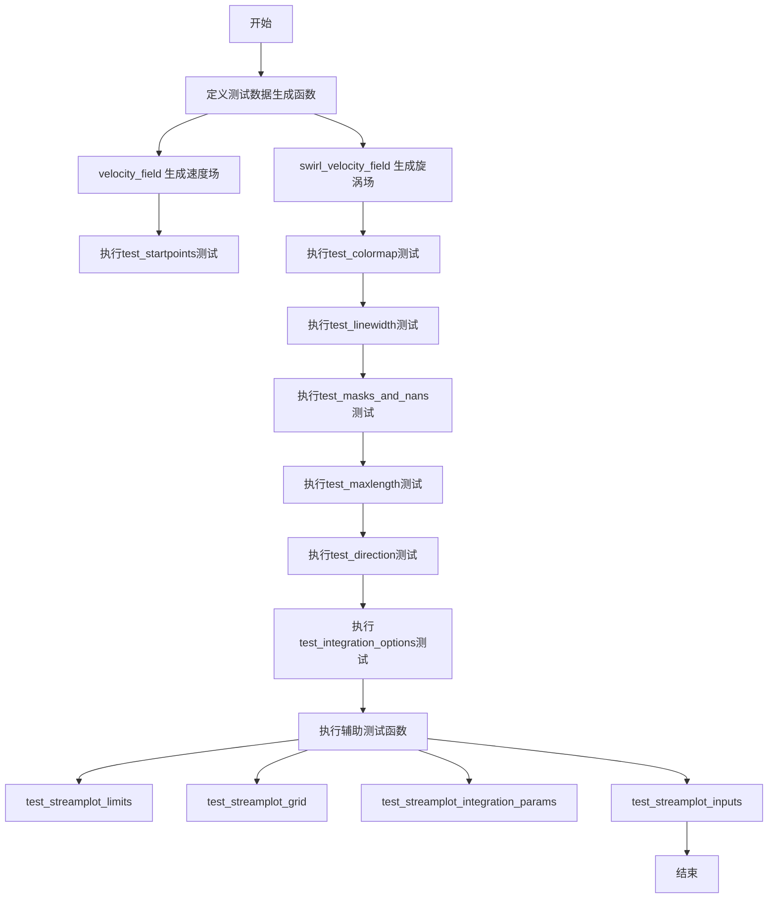
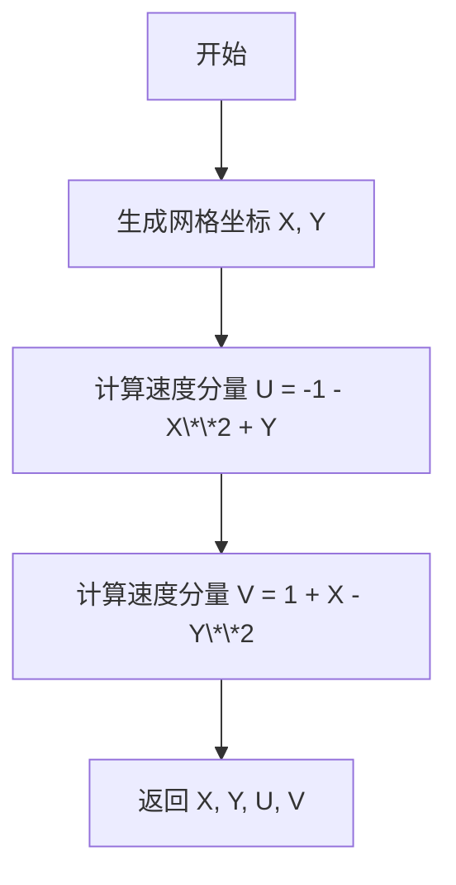
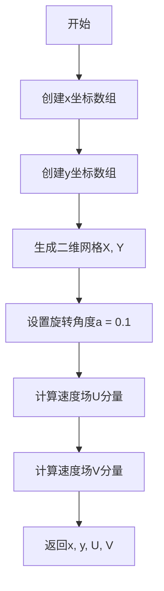
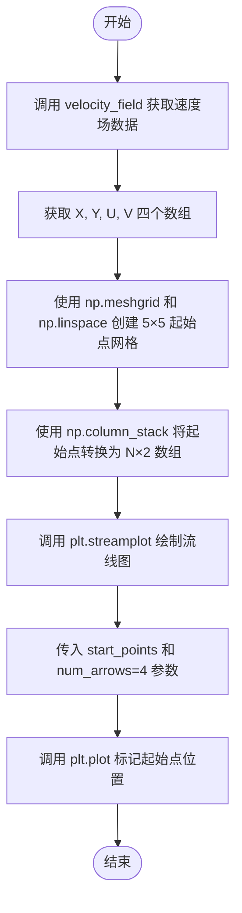
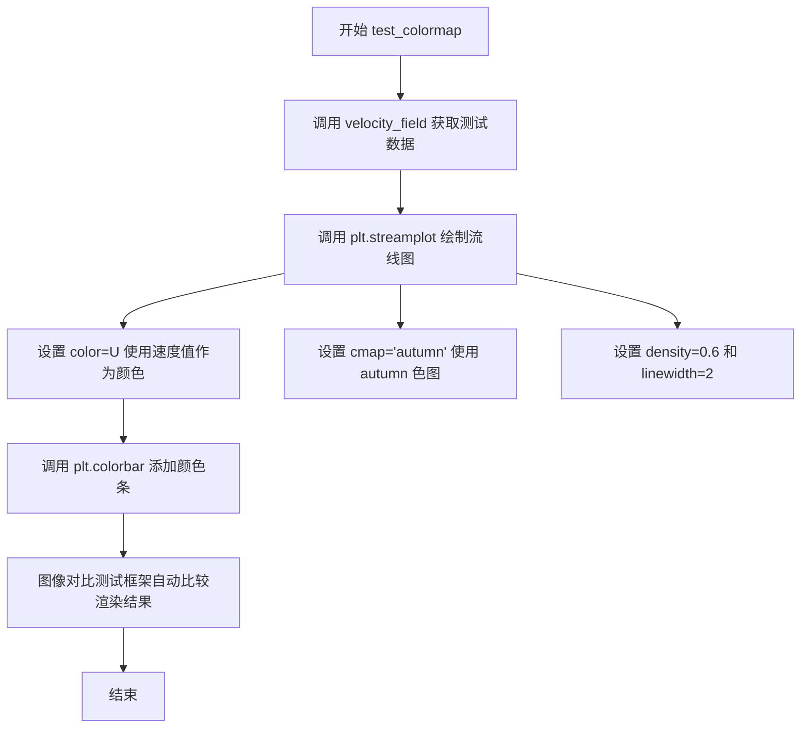
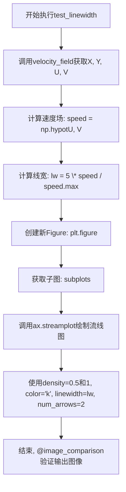
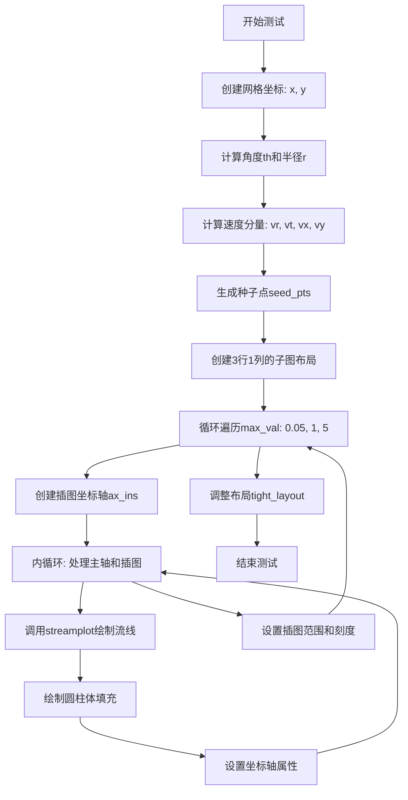
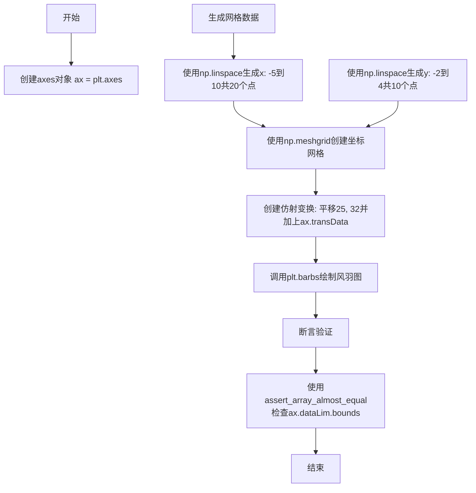
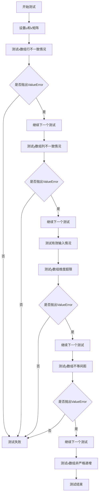
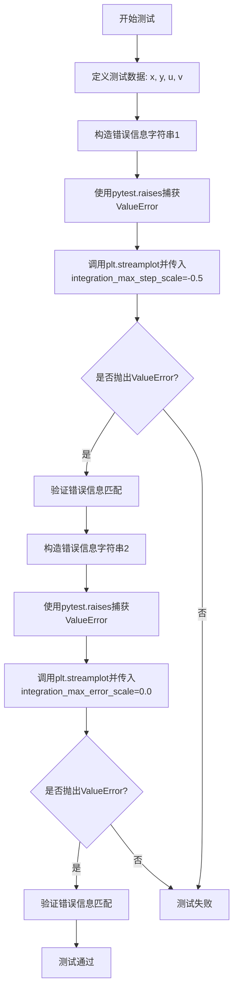

# `matplotlib\lib\matplotlib\tests\test_streamplot.py` 详细设计文档

这是matplotlib的streamplot（流线图）功能测试套件，通过多个测试用例验证streamplot的不同参数选项，包括起始点、颜色映射、线宽、掩码、最大长度、流线方向、积分选项、坐标轴限制、网格验证和输入参数等核心功能。

## 整体流程



## 类结构

```
模块级别 (无类定义)
├── 全局数据生成函数
│   ├── velocity_field()
│   └── swirl_velocity_field()
├── 测试函数 (使用@pytest.mark和@image_comparison装饰器)
│   ├── test_startpoints
│   ├── test_colormap
│   ├── test_linewidth
│   ├── test_masks_and_nans
│   ├── test_maxlength
│   ├── test_maxlength_no_broken
│   ├── test_direction
│   ├── test_integration_options
│   ├── test_streamplot_limits
│   ├── test_streamplot_grid
│   ├── test_streamplot_integration_params
│   └── test_streamplot_inputs
```

## 全局变量及字段


### `X`
    
velocity_field函数生成的网格X坐标，范围-3到3共200个点

类型：`numpy.ndarray`
    


### `Y`
    
velocity_field函数生成的网格Y坐标，范围-3到3共100个点

类型：`numpy.ndarray`
    


### `U`
    
速度场的X分量，由公式 -1 - X**2 + Y 计算得出

类型：`numpy.ndarray`
    


### `V`
    
速度场的Y分量，由公式 1 + X - Y**2 计算得出

类型：`numpy.ndarray`
    


### `x`
    
swirl_velocity_field函数生成的X坐标数组，200个点

类型：`numpy.ndarray`
    


### `y`
    
swirl_velocity_field函数生成的Y坐标数组，100个点

类型：`numpy.ndarray`
    


### `a`
    
swirl_velocity_field中的旋转角度参数，值为0.1弧度

类型：`float`
    


### `start_x`
    
test_startpoints中流线起始点的X坐标网格

类型：`numpy.ndarray`
    


### `start_y`
    
test_startpoints中流线起始点的Y坐标网格

类型：`numpy.ndarray`
    


### `start_points`
    
流线起始点坐标数组，由start_x和start_y展平后合并而成

类型：`numpy.ndarray`
    


### `speed`
    
速度大小，由U和V的平方和开根号计算得出

类型：`numpy.ndarray`
    


### `lw`
    
流线线宽，根据速度大小归一化后乘以5得到

类型：`numpy.ndarray`
    


### `mask`
    
布尔类型数组，用于标记需要掩码的区域

类型：`numpy.ndarray`
    


### `n`
    
test_integration_options中网格的维数，值为50

类型：`int`
    


### `th`
    
基于坐标计算的角度数组，th = arctan2(y, x)

类型：`numpy.ndarray`
    


### `r`
    
极坐标半径，r = sqrt(x**2 + y**2)

类型：`numpy.ndarray`
    


### `vr`
    
径向速度分量，vr = -cos(th) / r**2

类型：`numpy.ndarray`
    


### `vt`
    
切向速度分量，vt = -sin(th) / r**2 - 1 / r

类型：`numpy.ndarray`
    


### `vx`
    
转换到笛卡尔坐标后的X方向速度分量

类型：`numpy.ndarray`
    


### `vy`
    
转换到笛卡尔坐标后的Y方向速度分量

类型：`numpy.ndarray`
    


### `n_seed`
    
流线种子点的数量，值为50

类型：`int`
    


### `seed_pts`
    
流线积分的种子点坐标数组

类型：`numpy.ndarray`
    


### `th_circ`
    
圆柱体轮廓的角度数组，从0到2π共100个点

类型：`numpy.ndarray`
    


### `max_val`
    
积分步长和误差缩放的参数，用于测试不同积分选项

类型：`float`
    


### `trans`
    
用于barbs的坐标变换，组合了平移变换和数据坐标变换

类型：`matplotlib.transforms.Transform`
    


### `u`
    
通用速度U分量数组，在test_streamplot_grid等测试中定义

类型：`numpy.ndarray`
    


### `v`
    
通用速度V分量数组，在test_streamplot_grid等测试中定义

类型：`numpy.ndarray`
    


### `err_str`
    
错误消息字符串，用于pytest断言匹配特定错误信息

类型：`str`
    


    

## 全局函数及方法


### `velocity_field`

生成一个二维速度场，包含网格坐标和对应的速度分量，用于测试matplotlib的流场可视化功能。

参数： 无

返回值： `tuple`，返回四个numpy数组：(X, Y, U, V)，其中X和Y是网格坐标，U和V是对应的速度分量。

#### 流程图



#### 带注释源码

```python
def velocity_field():
    # 使用np.mgrid生成网格坐标，Y为100个点，X为200个点，范围从-3到3
    Y, X = np.mgrid[-3:3:100j, -3:3:200j]
    # 计算X方向的速度分量U，公式为 -1 - X**2 + Y
    U = -1 - X**2 + Y
    # 计算Y方向的速度分量V，公式为 1 + X - Y**2
    V = 1 + X - Y**2
    # 返回网格坐标和速度分量
    return X, Y, U, V
```


### `swirl_velocity_field`

该函数用于生成一个旋转的速度场（swirl velocity field），通过线性组合网格坐标与旋转矩阵生成具有旋转特性的速度分量 U 和 V。

参数：

- （无参数）

返回值：`tuple`，返回一个包含 4 个 numpy 数组的元组 `(x, y, U, V)`
- `x`：一维数组，x 坐标的线性空间，范围从 -3 到 3，共 200 个点
- `y`：一维数组，y 坐标的线性空间，范围从 -3 到 3，共 100 个点
- `U`：二维数组，速度场的 x 分量，通过旋转矩阵计算得到
- `V`：二维数组，速度场的 y 分量，通过旋转矩阵计算得到

#### 流程图



#### 带注释源码

```python
def swirl_velocity_field():
    """
    生成一个旋转速度场（swirl velocity field）。
    
    Returns:
        x: x坐标的线性空间数组
        y: y坐标的线性空间数组
        U: 速度场的x分量
        V: 速度场的y分量
    """
    # 创建从-3到3的200个等间距点的x坐标数组
    x = np.linspace(-3., 3., 200)
    
    # 创建从-3到3的100个等间距点的y坐标数组
    y = np.linspace(-3., 3., 100)
    
    # 使用meshgrid生成二维网格坐标矩阵X和Y
    X, Y = np.meshgrid(x, y)
    
    # 设置旋转角度（弧度），0.1弧度约等于5.7度
    a = 0.1
    
    # 计算速度场的x分量U
    # U = cos(a) * (-Y) - sin(a) * X
    # 这是一个旋转矩阵应用于坐标向量[-Y, X]的第一行
    U = np.cos(a) * (-Y) - np.sin(a) * X
    
    # 计算速度场的y分量V
    # V = sin(a) * (-Y) + cos(a) * X
    # 这是旋转矩阵应用于坐标向量[-Y, X]的第二行
    V = np.sin(a) * (-Y) + np.cos(a) * X
    
    # 返回坐标数组和速度场分量
    return x, y, U, V
```


### test_startpoints

测试 matplotlib streamplot 函数在不同起始点下的绘制行为，同时验证非默认的 num_arrows 参数功能。

参数：

- 无

返回值：`None`，无返回值

#### 流程图



#### 带注释源码

```python
@image_comparison(['streamplot_startpoints.png'], remove_text=True, style='mpl20',
                  tol=0.003)
def test_startpoints():
    # 测试函数：验证 streamplot 的 start_points 参数功能
    # 同时测试非默认的 num_arrows 参数
    
    # 步骤1：获取速度场数据（X, Y 为坐标网格，U, V 为速度分量）
    X, Y, U, V = velocity_field()
    
    # 步骤2：创建起始点网格
    # 使用 np.linspace 在 X 和 Y 的最小值到最大值之间创建5个等间距点
    # np.meshgrid 生成二维网格坐标
    start_x, start_y = np.meshgrid(np.linspace(X.min(), X.max(), 5),
                                   np.linspace(Y.min(), Y.max(), 5))
    
    # 步骤3：将二维网格数据转换为一维起始点坐标数组
    # ravel() 将数组展平为一维，column_stack 组合成 (N, 2) 形状的坐标对
    start_points = np.column_stack([start_x.ravel(), start_y.ravel()])
    
    # 步骤4：调用 streamplot 绘制流线图
    # start_points: 指定流线的起始点位置
    # num_arrows: 控制流线上箭头的数量（默认行为外的自定义参数）
    plt.streamplot(X, Y, U, V, start_points=start_points, num_arrows=4)
    
    # 步骤5：在图上用黑色圆点标记所有起始点的位置
    # 'ok' 表示黑色圆点的样式
    plt.plot(start_x, start_y, 'ok')
```


### `test_colormap`

该函数是一个图像对比测试用例，用于验证 `matplotlib` 的 `streamplot` 函数在使用颜色映射（colormap）时的渲染效果是否正确。

参数： 无

返回值：`None`，该函数为测试函数，不返回任何值

#### 流程图



#### 带注释源码

```python
@image_comparison(['streamplot_colormap.png'], remove_text=True, style='mpl20',
                  tol=0.022)
def test_colormap():
    """
    测试 streamplot 在使用 colormap 时的渲染功能。
    该测试用例验证当指定 color 参数为速度场数据时，
    streamplot 能够正确地将颜色映射应用到流线图形上。
    """
    # 调用 velocity_field 函数生成测试用的速度场数据
    # 返回值: X, Y 为网格坐标, U, V 为速度分量
    X, Y, U, V = velocity_field()
    
    # 调用 matplotlib 的 streamplot 函数绘制流线图
    # 参数说明:
    #   X, Y: 网格坐标数组
    #   U, V: 速度场分量
    #   color=U: 使用 U 分量（水平速度）作为颜色映射的数据源
    #   density=0.6: 流线密度控制
    #   linewidth=2: 流线宽度
    #   cmap="autumn": 使用 autumn 色图（秋季色调，从黄色到红色）
    plt.streamplot(X, Y, U, V, color=U, density=0.6, linewidth=2,
                   cmap="autumn")
    
    # 添加颜色条（colorbar），显示颜色与数值之间的对应关系
    # 颜色条将显示 U 值与颜色的映射
    plt.colorbar()
```


### `test_linewidth`

该函数是一个图像对比测试，用于验证matplotlib的streamplot在指定线宽参数下的渲染效果是否符合预期，通过计算速度场并根据速度归一化线宽来生成流线图。

参数：无

返回值：`None`，该函数为测试函数，不返回任何值，主要通过`@image_comparison`装饰器进行图像对比验证

#### 流程图



#### 带注释源码

```python
@image_comparison(['streamplot_linewidth.png'], remove_text=True, style='mpl20',
                  tol=0.03)
def test_linewidth():
    # 获取速度场数据，包括坐标网格X, Y和速度分量U, V
    X, Y, U, V = velocity_field()
    
    # 计算速度大小（欧几里得范数）
    speed = np.hypot(U, V)
    
    # 根据速度归一化计算线宽，线宽范围0-5
    # 速度越大，线宽越粗
    lw = 5 * speed / speed.max()
    
    # 创建新的Figure对象
    ax = plt.figure().subplots()
    
    # 绘制流线图，density控制流线密度，color='k'设置黑色，
    # linewidth使用计算得到的lw，num_arrows=2设置箭头数量
    ax.streamplot(X, Y, U, V, density=[0.5, 1], color='k', linewidth=lw, num_arrows=2)
```

#### 关键组件信息

- `velocity_field()`：生成测试用的速度场数据，返回坐标网格X, Y和速度分量U, V
- `@image_comparison`装饰器：matplotlib测试框架的装饰器，用于比较生成的图像与基准图像，tol=0.03表示容差范围

#### 潜在技术债务或优化空间

1. **测试数据硬编码**：velocity_field()中的参数（-3:3:100j, -3:3:200j）硬编码在辅助函数中，若需调整测试分辨率需修改多处
2. **线宽计算逻辑复用性**：lw的计算逻辑（5 * speed / speed.max()）重复出现在测试代码中，可提取为独立函数
3. **缺少边界条件测试**：未测试极端情况下的线宽处理，如全零速度场或NaN值

#### 其它项目

- **设计目标**：验证streamplot能够根据流速动态调整线宽进行可视化
- **约束条件**：图像对比容差设为0.03，需保证不同运行环境下图像一致性
- **错误处理**：依赖@image_comparison装饰器捕获渲染异常，若图像不匹配则测试失败
- **外部依赖**：numpy用于数值计算，matplotlib用于绘图，pytest框架执行测试


### `test_masks_and_nans`

该函数是一个图像对比测试，用于验证 streamplot 在处理掩码数组（Masked Array）和 NaN 值时的正确性。

参数：

- 无

返回值：`None`，无返回值（该函数为测试函数，通过 `@image_comparison` 装饰器进行视觉回归测试）

#### 流程图

```mermaid
flowchart TD
    A[开始测试] --> B[调用 velocity_field 获取 X, Y, U, V]
    B --> C[创建布尔掩码 mask]
    C --> D[设置掩码区域 40:60, 80:120]
    D --> E[将 U[:20, :40] 设为 NaN]
    E --> F[创建掩码数组 U = np.ma.array(U, mask=mask)]
    F --> G[创建图形和子图 ax = plt.figure().subplots]
    G --> H[使用 np.errstate 忽略无效值警告]
    H --> I[调用 ax.streamplot 绘制流线图]
    I --> J[结束测试 - 图像与基准图对比]
```

#### 带注释源码

```python
@image_comparison(['streamplot_masks_and_nans.png'],
                  remove_text=True, style='mpl20')
def test_masks_and_nans():
    """
    测试 streamplot 处理掩码数组和 NaN 值的能力
    装饰器 @image_comparison 用于视觉回归测试，比较生成的图像与预存的基准图像
    """
    
    # 调用 velocity_field 函数获取速度场数据
    # 返回: X, Y - 网格坐标; U, V - x 和 y 方向的速度分量
    X, Y, U, V = velocity_field()
    
    # 创建一个与 U 形状相同的布尔掩码数组，初始值为 False
    mask = np.zeros(U.shape, dtype=bool)
    
    # 设置掩码区域 [40:60, 80:120] 为 True，表示这些区域被遮蔽
    mask[40:60, 80:120] = 1
    
    # 将 U 数组左上角区域 [:20, :40] 设为 NaN（无效值）
    U[:20, :40] = np.nan
    
    # 创建掩码数组，保留 mask 为 True 的位置的数据
    # masked array 会忽略被掩码的元素，在绘图时跳过
    U = np.ma.array(U, mask=mask)
    
    # 创建新的图形窗口并获取子图对象
    ax = plt.figure().subplots()
    
    # 使用 np.errstate 上下文管理器忽略无效值警告（如 NaN 参与计算时的警告）
    # 因为 streamplot 需要处理 NaN 和掩码值
    with np.errstate(invalid='ignore'):
        # 调用 streamplot 绘制流线图
        # 参数: X, Y - 网格; U, V - 速度场; color=U - 用速度大小着色; cmap="Blues" - 蓝色配色方案
        ax.streamplot(X, Y, U, V, color=U, cmap="Blues")
```


### test_maxlength

这是 matplotlib 的一个测试函数，用于测试 `streamplot` 函数的 `maxlength` 参数功能，验证流线图在指定最大长度时的渲染行为是否符合预期，并确保轴的范围设置正确。

参数：

- 该测试函数没有显式参数，但依赖于：
  - `swirl_velocity_field()` 函数返回的数据：`x`（一维数组）、`y`（一维数组）、`U`（二维数组）、`V`（二维数组）
  - `streamplot` 调用的参数：`maxlength=10.`、`start_points=[[0., 1.5]]`、`linewidth=2`、`density=2`

返回值：`None`，该测试函数不返回任何值，主要通过断言验证轴的限制。

#### 流程图

```mermaid
flowchart TD
    A[开始测试 test_maxlength] --> B[调用 swirl_velocity_field 获取数据]
    B --> C[创建子图 ax = plt.figure().subplots]
    C --> D[调用 ax.streamplot 绘制流线图]
    D --> E[设置 maxlength=10.0, start_points, linewidth=2, density=2]
    E --> F[断言 ax.get_xlim 和 ax.get_ylim]
    F --> G[设置轴的范围以兼容旧测试图像]
    G --> H[结束测试]
```

#### 带注释源码

```python
@image_comparison(['streamplot_maxlength.png'],
                  remove_text=True, style='mpl20', tol=0.302)
def test_maxlength():
    # 调用 swirl_velocity_field 函数获取用于测试的向量场数据
    # 返回: x, y 为坐标数组, U, V 为对应的速度分量
    x, y, U, V = swirl_velocity_field()
    
    # 创建新的图形和子图对象
    ax = plt.figure().subplots()
    
    # 调用 streamplot 绘制流线图
    # 参数说明:
    #   x, y: 网格坐标
    #   U, V: 速度场分量
    #   maxlength=10.: 流线的最大长度
    #   start_points=[[0., 1.5]]: 流线起始点
    #   linewidth=2: 流线宽度
    #   density=2: 流线密度
    ax.streamplot(x, y, U, V, maxlength=10., start_points=[[0., 1.5]],
                  linewidth=2, density=2)
    
    # 断言: 验证轴的范围是否正确设置为 3
    assert ax.get_xlim()[-1] == ax.get_ylim()[-1] == 3
    
    # 为了兼容性设置旧的测试图像范围
    # 确保新生成的图像与基准图像一致
    ax.set(xlim=(None, 3.2555988021882305), ylim=(None, 3.078326760195413))
```


### `test_maxlength_no_broken`

该测试函数用于验证 `streamplot` 在 `broken_streamlines=False` 参数下的最大长度（maxlength）功能，通过绘制螺旋速度场并检查坐标轴limits是否正确来确保功能正常。

参数： 无

返回值：`None`，该函数为测试函数，不返回任何值

#### 流程图

```mermaid
flowchart TD
    A[开始] --> B[调用 swirl_velocity_field 获取速度场数据 x, y, U, V]
    B --> C[创建新图形和子图 ax = plt.figure.subplots]
    C --> D[调用 ax.streamplot 绘制流线
    - maxlength=10.0
    - start_points=[[0., 1.5]]
    - linewidth=2
    - density=2
    - broken_streamlines=False]
    D --> E[断言 ax.get_xlim[-1] == ax.get_ylim[-1] == 3]
    E --> F[设置轴限制兼容性
    - xlim=(None, 3.2555988021882305)
    - ylim=(None, 3.078326760195413)]
    F --> G[结束]
```

#### 带注释源码

```python
@image_comparison(['streamplot_maxlength_no_broken.png'],
                  remove_text=True, style='mpl20', tol=0.302)
def test_maxlength_no_broken():
    # 获取螺旋速度场数据
    # 返回值: x, y 为坐标网格, U, V 为速度分量
    x, y, U, V = swirl_velocity_field()
    
    # 创建新图形并获取子图对象
    # 返回值: ax 为 matplotlib Axes 对象
    ax = plt.figure().subplots()
    
    # 调用 streamplot 绘制流线图
    # 参数:
    #   - x, y: 坐标网格
    #   - U, V: 速度场分量
    #   - maxlength=10.: 流线最大长度
    #   - start_points=[[0., 1.5]]: 起始点坐标
    #   - linewidth=2: 线宽
    #   - density=2: 流线密度
    #   - broken_streamlines=False: 不中断流线
    ax.streamplot(x, y, U, V, maxlength=10., start_points=[[0., 1.5]],
                  linewidth=2, density=2, broken_streamlines=False)
    
    # 断言: 验证 x 轴和 y 轴的上限都等于 3
    # 返回值: 断言成功无返回值,失败抛出 AssertionError
    assert ax.get_xlim()[-1] == ax.get_ylim()[-1] == 3
    
    # 设置轴限制以兼容旧测试图像
    # 参数:
    #   - xlim: (None, 3.2555988021882305) 保留原有下限,设置新上限
    #   - ylim: (None, 3.078326760195413) 保留原有下限,设置新上限
    # 返回值: None
    ax.set(xlim=(None, 3.2555988021882305), ylim=(None, 3.078326760195413))
```


### `test_direction`

该函数是一个基于图像对比的回归测试（Regression Test），用于验证 Matplotlib 的 `streamplot` 函数在指定积分方向为 `backward`（向后）时的渲染正确性。测试通过生成一个特定的旋涡速度场（Swirl Velocity Field），调用 `streamplot` 绘制流线，并使用装饰器 `@image_comparison` 将生成的图像与基准图像进行对比。

参数：

-  `{参数名称}`：`{参数类型}`，{参数描述}
- （无显式参数，依赖于 Python unittest/pytest 框架的隐式调用）

返回值：`{返回值类型}`，{返回值描述}
- `None`：该函数为测试函数，不返回任何值。测试结果由装饰器 `@image_comparison` 处理。

#### 流程图

```mermaid
graph TD
    A([测试开始 test_direction]) --> B[调用 swirl_velocity_field]
    B --> C[获取网格坐标 x, y 和速度场 U, V]
    C --> D[调用 plt.streamplot]
    D --> E[设置 integration_direction='backward']
    D --> F[设置 maxlength=1.5, start_points=[[1.5, 0.]]]
    D --> G[绘制并保存图像]
    G --> H([图像对比验证])
```

#### 带注释源码

```python
@image_comparison(['streamplot_direction.png'], remove_text=True, style='mpl20',
                  tol=0.073)
def test_direction():
    # 1. 获取预先定义好的旋涡速度场数据
    # 这是一个全局辅助函数，返回网格坐标和对应的速度分量
    x, y, U, V = swirl_velocity_field()
    
    # 2. 调用 matplotlib 的 streamplot 进行绘图
    # integration_direction='backward': 关键参数，指定流线从起始点向后积分
    # maxlength=1.5: 限制流线的最大长度
    # start_points=[[1.5, 0.]]: 指定流线的起始点坐标
    # linewidth=2, density=2: 控制线条粗细和密度
    plt.streamplot(x, y, U, V, integration_direction='backward',
                   maxlength=1.5, start_points=[[1.5, 0.]],
                   linewidth=2, density=2)
```

#### 关键组件信息
- **swirl_velocity_field (全局函数)**: 用于生成测试用的向量场数据（x, y, U, V），模拟旋涡物理模型。
- **plt.streamplot (Matplotlib API)**: 被测试的核心函数，负责根据向量场绘制流线图。
- **@image_comparison (装饰器)**: 自动完成图像渲染并与预存的 PNG 基准图进行像素级对比的测试框架装饰器。

#### 潜在的技术债务或优化空间
1.  **图像对比的脆弱性**: 测试依赖于 `tol` (容差) 来忽略微小的渲染差异（如抗锯齿、字体渲染差异）。随着 Matplotlib 版本的迭代，可能需要频繁更新基准图像，且很难区分“功能错误”和“渲染改进”。
2.  **参数硬编码**: 测试中的 `maxlength`, `linewidth`, `density` 等参数直接硬编码在测试函数中，若要测试不同参数组合，需编写多个类似的测试函数。
3.  **缺乏单元断言**: 该测试主要依赖视觉输出，内部没有使用 `assert` 语句对流线的几何属性（如长度、方向）进行数值验证。如果 streamplot 内部逻辑改变但视觉输出巧合相似，测试可能无法捕捉到错误。


### `test_integration_options`

该函数是一个集成测试函数，用于测试matplotlib的streamplot在不同的积分参数（integration_max_step_scale和integration_max_error_scale）下的渲染效果。测试创建了线性势流过升力圆柱体的场景，并通过三个子图对比不同积分步长和误差缩放参数对流线图生成的影响。

参数：
- 该函数无显式参数（使用@image_comparison装饰器进行图像比对测试）

返回值：`None`，该函数为测试函数，不返回任何值，仅通过图像比对验证功能正确性

#### 流程图



#### 带注释源码

```python
@image_comparison(['streamplot_integration.png'], style='mpl20', tol=0.05)
def test_integration_options():
    # 测试函数：验证streamplot在不同积分参数下的表现
    # 使用线性势流过升力圆柱体的物理模型
    
    # 创建网格空间 -2到2（x方向）和-3到3（y方向），各50个点
    n = 50
    x, y = np.meshgrid(np.linspace(-2, 2, n), np.linspace(-3, 3, n))
    
    # 计算极坐标角度theta
    th = np.arctan2(y, x)
    # 计算极坐标半径r
    r = np.sqrt(x**2 + y**2)
    
    # 径向速度分量vr（偶极子速度场）
    vr = -np.cos(th) / r**2
    # 切向速度分量vt（偶极子+涡流速度场）
    vt = -np.sin(th) / r**2 - 1 / r
    
    # 转换回笛卡尔坐标系速度分量vx
    vx = vr * np.cos(th) - vt * np.sin(th) + 1.0
    # 转换回笛卡尔坐标系速度分量vy
    vy = vr * np.sin(th) + vt * np.cos(th)

    # 定义流线种子点（流线起始位置）
    n_seed = 50
    # 在x=-1.75处创建50个均匀分布的种子点，y范围-2到2
    seed_pts = np.column_stack((np.full(n_seed, -1.75), np.linspace(-2, 2, n_seed)))

    # 创建3行1列的子图，画布尺寸6x14英寸
    fig, axs = plt.subplots(3, 1, figsize=(6, 14))
    
    # 创建用于绘制圆柱体的角度数组（0到2π，100个点）
    th_circ = np.linspace(0, 2 * np.pi, 100)
    
    # 遍历三个不同的积分参数值进行测试
    for ax, max_val in zip(axs, [0.05, 1, 5]):
        # 在每个主轴右上角创建插图axes
        ax_ins = ax.inset_axes([0.0, 0.7, 0.3, 0.35])
        
        # 分别处理主轴和插图轴
        for ax_curr, is_inset in zip([ax, ax_ins], [False, True]):
            # 调用streamplot绘制流线图
            ax_curr.streamplot(
                x,          # X坐标网格
                y,          # Y坐标网格
                vx,         # X方向速度分量
                vy,         # Y方向速度分量
                start_points=seed_pts,           # 流线起始点
                broken_streamlines=False,        # 连续流线（不间断）
                arrowsize=1e-10,                 # 箭头大小（几乎不可见）
                linewidth=2 if is_inset else 0.6, # 线宽：插图粗，主图细
                color="k",                       # 黑色流线
                integration_max_step_scale=max_val,    # 积分最大步长缩放
                integration_max_error_scale=max_val,    # 积分最大误差缩放
            )

            # 绘制圆柱体（障碍物）
            ax_curr.fill(
                np.cos(th_circ),    # 圆柱体X坐标
                np.sin(th_circ),    # 圆柱体Y坐标
                color="w",          # 白色填充
                ec="k",             # 黑色边框
                lw=6 if is_inset else 2,  # 边框宽度：插图粗，主图细
            )

            # 设置坐标轴为等比例
            ax_curr.set_aspect("equal")

        # 设置插图的范围和隐藏刻度
        ax_ins.set_xlim(-1.2, -0.7)
        ax_ins.set_ylim(-0.8, -0.4)
        ax_ins.set_yticks(())
        ax_ins.set_xticks(())

        # 设置主轴y轴范围并隐藏axis
        ax.set_ylim(-1.5, 1.5)
        ax.axis("off")
        # 添加插图缩放指示器
        ax.indicate_inset_zoom(ax_ins, ec="k")

    # 自动调整子图参数以适应布局
    fig.tight_layout()
```


### `test_streamplot_limits`

该函数是一个测试函数，用于测试 matplotlib 中轴的数据 limits（数据范围）在使用 `barbs` 绘图并应用坐标变换后是否正确计算。函数通过创建网格数据、应用仿射变换、绘制 barbs，然后验证 `ax.dataLim.bounds` 的值是否符合预期。

参数： 无

返回值： `None`，无返回值（测试函数）

#### 流程图



#### 带注释源码

```python
def test_streamplot_limits():
    """
    测试在使用坐标变换后，轴的数据范围（data limits）是否正确计算。
    该测试使用plt.barbs而非streamplot，但函数名称仍保持原样。
    """
    # 1. 创建一个新的axes对象，用于绑图
    ax = plt.axes()
    
    # 2. 生成网格数据点
    # x: 从-5到10，生成20个等间距点
    x = np.linspace(-5, 10, 20)
    # y: 从-2到4，生成10个等间距点
    y = np.linspace(-2, 4, 10)
    
    # 3. 使用meshgrid创建二维坐标网格
    # 注意：这里y, x的赋值顺序是故意的，结果是y是行，x是列
    y, x = np.meshgrid(y, x)
    
    # 4. 创建一个仿射变换：先平移(25, 32)，再加上ax.transData
    # 这个变换将数据坐标平移25个单位在x方向，32个单位在y方向
    trans = mtransforms.Affine2D().translate(25, 32) + ax.transData
    
    # 5. 调用plt.barbs绘制风羽图（barbs）
    # 使用sin(x)和cos(y)作为风速分量
    # transform参数指定使用上面定义的坐标变换
    plt.barbs(x, y, np.sin(x), np.cos(y), transform=trans)
    
    # 注释说明：计算得到的bounds大约是原始数据的bounds
    # 这是因为在更新datalim时会考虑整个路径
    # The calculated bounds are approximately the bounds of the original data,
    # this is because the entire path is taken into account when updating the
    # datalim.
    
    # 6. 断言验证：检查ax.dataLim.bounds的值
    # bounds格式为(x0, y0, width, height)
    # 预期值约为(20, 30, 15, 6)，精度为小数点后1位
    assert_array_almost_equal(ax.dataLim.bounds, (20, 30, 15, 6),
                              decimal=1)
```

### 潜在技术债务

1. **函数命名与实际功能不匹配**：函数名为 `test_streamplot_limits`，但实际测试的是 `plt.barbs`（风羽图）而非 `streamplot`（流线图）。这可能造成代码理解和维护上的混淆。
2. **缺少结尾的assert或其他测试逻辑**：`test_streamplot_grid` 函数末尾似乎被截断，缺少完整的测试逻辑和断言。
3. **测试覆盖不完整**：`test_streamplot_grid` 函数在最后有一个未完成的测试用例（检查strictly increasing），没有相应的断言来验证结果。


### `test_streamplot_grid`

该测试函数用于验证 `plt.streamplot` 在处理不同网格输入时的错误处理能力，包括检查 x 和 y 数组的行/列一致性、维度限制、等间距要求以及严格递增性。

参数： 无

返回值：`None`，该函数为测试函数，不返回值，仅通过 pytest 断言验证行为

#### 流程图



#### 带注释源码

```python
def test_streamplot_grid():
    """
    测试streamplot函数的网格输入验证功能。
    验证x和y数组的维度、行/列一致性、维度限制和等间距要求。
    """
    # 初始化速度场数据
    u = np.ones((2, 2))  # 水平速度分量，2x2矩阵，全为1
    v = np.zeros((2, 2))  # 垂直速度分量，2x2矩阵，全为0

    # 测试1: 验证x数组行必须相等
    # x数组两行不同: [10,20] vs [10,30]
    x = np.array([[10, 20], [10, 30]])
    y = np.array([[10, 10], [20, 20]])
    # 期望抛出ValueError: "The rows of 'x' must be equal"
    with pytest.raises(ValueError, match="The rows of 'x' must be equal"):
        plt.streamplot(x, y, u, v)

    # 测试2: 验证y数组列必须相等
    # y数组两列不同: [10,10] vs [20,30]
    x = np.array([[10, 20], [10, 20]])
    y = np.array([[10, 10], [20, 30]])
    # 期望抛出ValueError: "The columns of 'y' must be equal"
    with pytest.raises(ValueError, match="The columns of 'y' must be equal"):
        plt.streamplot(x, y, u, v)

    # 测试3: 有效的网格输入应该正常工作
    x = np.array([[10, 20], [10, 20]])
    y = np.array([[10, 10], [20, 20]])
    plt.streamplot(x, y, u, v)  # 正常执行，不应抛出异常

    # 测试4: 验证y数组维度限制（最多2维）
    x = np.array([0, 10])
    y = np.array([[[0, 10]]])  # 3维数组
    # 期望抛出ValueError: "'y' can have at maximum 2 dimensions"
    with pytest.raises(ValueError, match="'y' can have at maximum "
                                         "2 dimensions"):
        plt.streamplot(x, y, u, v)

    # 测试5: 验证等间距要求
    u = np.ones((3, 3))  # 更新为3x3矩阵
    v = np.zeros((3, 3))
    x = np.array([0, 10, 20])  # 等间距: 差值为10
    y = np.array([0, 10, 30])  # 不等间距: 差值为10和20
    # 期望抛出ValueError: "'y' values must be equally spaced"
    with pytest.raises(ValueError, match="'y' values must be equally spaced"):
        plt.streamplot(x, y, u, v)

    # 测试6: 验证严格递增要求
    x = np.array([0, 20, 40])  # 严格递增
    y = np.array([0, 20, 10])  # 非严格递增（0->20->10递减）
    # 注意: 此测试未完成，无对应断言
```


### `test_streamplot_integration_params`

该函数是一个测试函数，用于验证 `plt.streamplot` 在传入无效的 `integration_max_step_scale` 和 `integration_max_error_scale` 参数时能否正确抛出 `ValueError` 异常。

参数： 无

返回值： `None`，无返回值（测试函数）

#### 流程图



#### 带注释源码

```python
def test_streamplot_integration_params():
    """
    测试streamplot函数的integration_max_step_scale和integration_max_error_scale参数验证。
    验证当这些参数传入无效值（负数或零）时，函数能够正确抛出ValueError异常。
    """
    # 定义测试用的网格坐标数据
    x = np.array([[10, 20], [10, 20]])
    y = np.array([[10, 10], [20, 20]])
    # 定义速度场分量
    u = np.ones((2, 2))  # 水平速度分量，全为1
    v = np.zeros((2, 2))  # 垂直速度分量，全为0

    # 测试用例1：验证integration_max_step_scale为负数时抛出ValueError
    err_str = "The value of integration_max_step_scale must be > 0, got -0.5"
    with pytest.raises(ValueError, match=err_str):
        # 调用streamplot，传入无效的integration_max_step_scale参数
        plt.streamplot(x, y, u, v, integration_max_step_scale=-0.5)

    # 测试用例2：验证integration_max_error_scale为零时抛出ValueError
    err_str = "The value of integration_max_error_scale must be > 0, got 0.0"
    with pytest.raises(ValueError, match=err_str):
        # 调用streamplot，传入无效的integration_max_error_scale参数
        plt.streamplot(x, y, u, v, integration_max_error_scale=0.0)
```


### `test_streamplot_inputs`

该函数是一个**冒烟测试（Smoke Test）**，用于验证 `matplotlib.pyplot.streamplot` 在处理边界情况时的鲁棒性。具体来说，它测试了两个关键场景：
1.  **完全掩码（NaN）数据**：即使速度场（U, V）全部为 NaN，绘图函数也不应崩溃。
2.  **类数组对象（Array-likes）**：验证函数是否能接受非 NumPy 数组的输入（如 Python 的 `range` 对象），并正确将其转换为网格。

参数：
-  无

返回值：`None`，表示该测试函数成功执行完毕（未抛出异常）。

#### 流程图

```mermaid
graph TD
    A([Start test_streamplot_inputs]) --> B{Test 1: Fully Masked Data}
    B --> C[Call plt.streamplot<br/>X: np.arange(3)<br/>Y: np.arange(3)<br/>U: np.full(3,3, np.nan)<br/>V: np.full(3,3, np.nan)<br/>Color: random]
    C --> D{Test 2: Array-like Inputs}
    D --> E[Call plt.streamplot<br/>X: range(3)<br/>Y: range(3)<br/>U: random array<br/>V: random array]
    E --> F([End Function<br/>Return None])
```

#### 带注释源码

```python
def test_streamplot_inputs():  # test no exception occurs.
    # Test 1: 处理完全掩码（NaN）的速度场
    # 验证当速度场数据全部为 NaN 时，streamplot 不会崩溃，
    # 并能正常处理与 NaN 数据关联的 color 参数。
    plt.streamplot(np.arange(3), np.arange(3),
                   np.full((3, 3), np.nan), np.full((3, 3), np.nan),
                   color=np.random.rand(3, 3))
    
    # Test 2: 处理类数组对象（Array-likes）
    # 验证 streamplot 是否能接受非 NumPy 数组的输入（如 Python range），
    # 并正确将其转换为内部的网格表示。
    plt.streamplot(range(3), range(3),
                   np.random.rand(3, 3), np.random.rand(3, 3))
```

## 关键组件


### 速度场生成函数 (velocity_field, swirl_velocity_field)

这两个函数负责生成用于streamplot测试的二维速度场数据。velocity_field生成一个简单的速度场，swirl_velocity_field生成一个旋涡状的速度场，用于测试streamplot在不同流场形态下的渲染效果。

### 流线图渲染 (streamplot API)

matplotlib的streamplot函数是核心绘图组件，支持多种参数：起始点(start_points)、线宽(linewidth)、颜色(color)、密度(density)、箭头数量(num_arrows)、颜色映射(cmap)、最大流线长度(maxlength)、断裂流线(broken_streamlines)、积分方向(integration_direction)、积分步长和误差缩放(integration_max_step_scale, integration_max_error_scale)等。

### 图像比较测试框架 (@image_comparison装饰器)

使用matplotlib.testing.decorators.image_comparison装饰器进行视觉回归测试，支持参数包括：预期图像文件名、是否移除文本(remove_text)、测试样式(style)、容差值(tol)。该框架能够自动比较渲染结果与预期图像的差异。

### 数据掩码与NaN处理

代码中包含对NaN值和掩码数组的处理逻辑，使用np.ma.array创建掩码数组，np.errstate(invalid='ignore')处理无效值，用于测试streamplot在包含缺失数据情况下的鲁棒性。

### 网格坐标验证

test_streamplot_grid函数验证streamplot输入的网格坐标有效性，包括：行一致性检查、列一致性检查、最大维度限制、均匀间距检查、严格递增性检查。这些验证确保输入数据符合streamplot的要求。

### 积分参数验证

test_streamplot_integration_params测试streamplot的积分参数边界条件，验证integration_max_step_scale和integration_max_error_scale必须大于0的约束。


## 问题及建议


### 已知问题

- **魔法数字（Magic Numbers）缺乏文档**：多处使用硬编码的数值如`tolerance`（0.003, 0.022, 0.03, 0.302等）和数组维度（100j, 200j），缺乏对这些数值来源和意义的解释，影响代码可维护性。
- **测试数据生成函数重复**：velocity_field()和swirl_velocity_field()函数在逻辑上有重叠，可以抽象公共部分，减少代码冗余。
- **测试函数缺乏文档字符串**：所有测试函数均无docstring说明测试目的、输入参数和预期行为，不利于团队理解和维护。
- **测试隔离性问题**：部分测试使用全局plt状态（如test_colormap中的plt.colorbar()），可能导致测试间相互影响。
- **断言信息不充分**：test_maxlength和test_streamplot_limits中的断言缺乏自定义错误消息，当测试失败时难以快速定位问题。
- **测试覆盖不完整**：test_streamplot_grid函数的最后部分（测试strictly increasing）没有完成，没有assert语句验证结果。
- **未使用的导入**：代码中导入了部分可能未完全使用的模块（如mtransforms仅在test_streamplot_limits中使用）。

### 优化建议

- **使用pytest fixtures重构测试数据**：将velocity_field()和swirl_velocity_field()改为pytest fixture，提高测试数据复用性和生命周期管理。
- **提取常量定义**：将所有魔法数字定义为模块级常量或配置文件，配合有意义的命名（如STREAMPLOT_TOLERANCE_DEFAULT）。
- **补充测试文档**：为每个测试函数添加详细的docstring，说明测试目的、验证的功能点和边界条件。
- **完善未完成的测试**：完成test_streamplot_grid中最后的strictly increasing测试逻辑，添加完整的断言。
- **改进断言消息**：为关键断言添加自定义错误消息，如assert ax.get_xlim()[-1] == 3, f"Expected xlim end to be 3, got {ax.get_xlim()[-1]}"。
- **测试类分组**：将相关功能的测试函数组织到测试类中（如TestStreamplotBasics、TestStreamplotOptions），提高代码结构化程度。
- **添加类型注解**：为辅助函数添加类型提示，提高代码可读性和IDE支持。


## 其它


### 设计目标与约束

本测试模块旨在验证matplotlib中streamplot功能的正确性和鲁棒性。设计目标包括：确保流线图在各种参数配置下（不同起点、颜色映射、线宽、掩码、积分选项等）能正确渲染；验证坐标网格验证逻辑的完整性；测试数值积分参数的有效性；确保与旧版本测试图像的兼容性。约束条件主要来自测试框架要求（使用@image_comparison装饰器进行视觉回归测试）和数值精度要求（tol参数控制的容差范围）。

### 错误处理与异常设计

代码通过pytest框架进行错误验证。关键异常处理场景包括：grid验证时检查x和y数组维度一致性（行相等、列相等、最多为2维、等间距、严格递增）；integration参数验证检查integration_max_step_scale和integration_max_error_scale必须大于0；输入验证确保数组形状匹配。使用pytest.raises捕获ValueError并通过match参数验证具体错误信息。

### 数据流与状态机

数据流主要分为三个阶段：首先是测试数据生成阶段，通过velocity_field()和swirl_velocity_field()生成网格坐标和速度场数据；然后是streamplot渲染阶段，将速度场数据输入matplotlib的streamplot函数；最后是验证阶段，通过图像比较或数值断言验证输出正确性。状态机涉及测试函数的顺序执行，每个测试独立运行并产生独立的图形状态。

### 外部依赖与接口契约

主要外部依赖包括：numpy（数值计算和数组操作）、matplotlib.pyplot（绘图功能）、matplotlib.transforms（坐标变换）、pytest（测试框架）、numpy.testing（数值断言）。关键接口契约涉及streamplot函数的参数：X/Y网格坐标（必须2D数组且符合特定约束）、U/V速度分量（与坐标维度匹配）、可选参数（start_points、density、linewidth、color、cmap、maxlength、broken_streamlines、integration_direction、integration_max_step_scale、integration_max_error_scale、arrowsize等）。

### 性能考虑与优化空间

测试中生成的网格规模（100j×200j、200×100）属于中等规模。性能优化方向包括：测试用例可考虑参数化以减少重复代码；图像比较测试可考虑并行执行；swirl_velocity_field中使用np.meshgrid可预先缓存。积分相关测试中的integration_max_step_scale和integration_max_error_scale参数对性能有显著影响，应在文档中说明其取舍。

### 边界条件处理

代码覆盖了多种边界情况：完全掩码的数组（fully-masked arrays）、NaN值处理、空值输入、极限值参数（如maxlength=10、density=2）、不同积分方向（forward/backward）、断连续流线与连续流线（broken_streamlines参数）。数值边界包括坐标范围（-3到3）、网格维度限制（最多2维）、箭头数量控制（num_arrows、arrowsize）。

### 兼容性设计

测试采用style='mpl20'确保与Matplotlib 2.0风格兼容。test_maxlength和test_maxlength_no_broken中包含针对旧测试图像的兼容性代码（ax.set(xlim=(None, 3.2555988021882305), ylim=(None, 3.078326760195413))），允许测试在坐标轴范围微小差异下通过。tol参数为不同测试设置了不同的容差（0.003到0.302），反映图像渲染的平台差异。

### 测试覆盖策略

测试覆盖了streamplot的核心功能维度：视觉渲染（颜色、线宽、箭头）、数据输入（网格格式、掩码、NaN）、算法参数（积分方向、最大步长、密度）、边界情况（断连续流线、最大长度）、坐标系统（仿射变换）。未覆盖领域包括：3D流线图、交互式流线选择、流线动画、多子图复杂布局。

### 资源管理与清理

测试使用plt.figure()创建图形后未显式调用plt.close()，可能存在资源泄露风险。建议在每个测试函数结束时显式关闭图形或使用pytest的fixture进行自动清理。test_integration_options创建了包含3个子图的复杂figure，应确保适当的资源释放。

### 可维护性与扩展性

代码结构清晰，辅助函数velocity_field和swirl_velocity_field实现了数据生成逻辑分离。扩展建议：可引入pytest参数化减少相似测试的代码冗余；可添加文档字符串说明每个测试的验证目标；可考虑将图像比较的基线图片路径统一管理；测试失败时的调试信息可更丰富（如输出实际数值与期望数值的差异）。


    