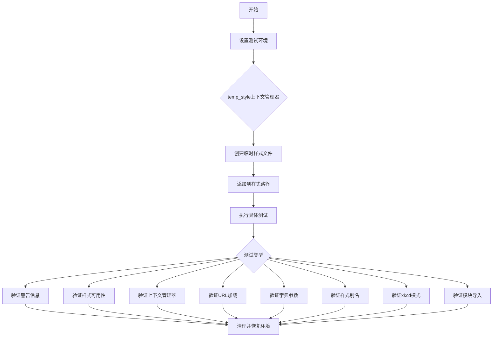
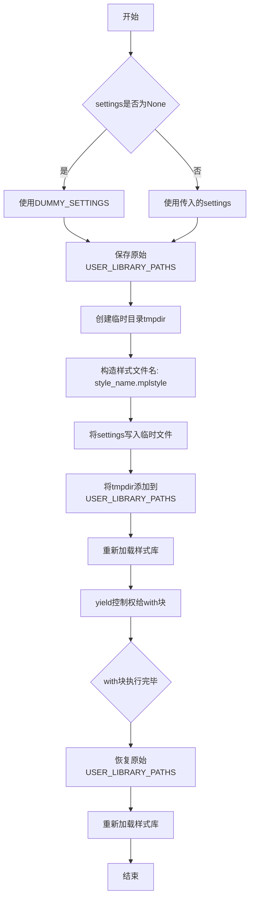
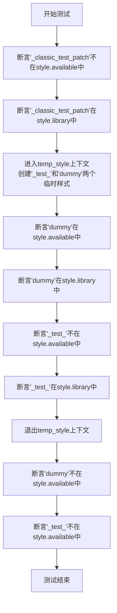
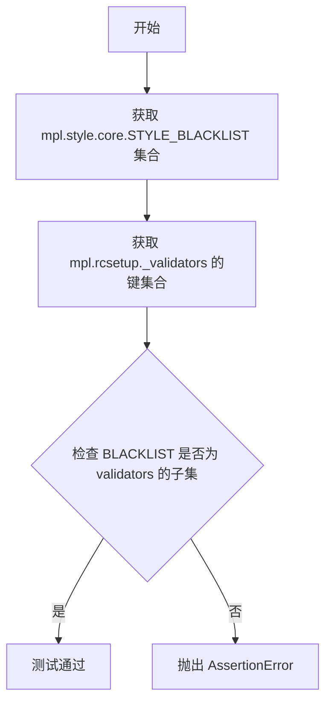
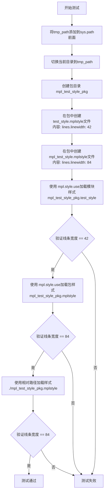

# `matplotlib\lib\matplotlib\tests\test_style.py` 详细设计文档

该文件是matplotlib样式(style)模块的测试套件，验证了样式文件的加载、上下文管理器、URL支持、字典参数、别名功能、xkcd绘图模式以及从模块导入样式等核心功能。

## 整体流程



## 类结构

```
测试文件 (无类定义)
├── 全局变量
│   ├── PARAM
│   ├── VALUE
│   └── DUMMY_SETTINGS
├── 辅助函数
│   └── temp_style (上下文管理器)
└── 测试函数
    ├── test_invalid_rc_warning_includes_filename
    ├── test_available
    ├── test_use
    ├── test_use_url
    ├── test_single_path
    ├── test_context
    ├── test_context_with_dict
    ├── test_context_with_dict_after_namedstyle
    ├── test_context_with_dict_before_namedstyle
    ├── test_context_with_union_of_dict_and_namedstyle
    ├── test_context_with_badparam
    ├── test_alias
    ├── test_xkcd_no_cm
    ├── test_xkcd_cm
    ├── test_up_to_date_blacklist
    └── test_style_from_module
```

## 全局变量及字段


### `PARAM`
    
Matplotlib rcParams parameter name for colormap setting

类型：`str`
    


### `VALUE`
    
The colormap value 'pink' used for testing style settings

类型：`str`
    


### `DUMMY_SETTINGS`
    
A dictionary containing PARAM as key and VALUE as value for test purposes

类型：`dict`
    


    

## 全局函数及方法


### `temp_style`

这是一个上下文管理器，用于在临时目录中创建 matplotlib 样式表文件，并将其临时添加到样式库路径中，以便在测试环境中使用临时的样式配置。

参数：

- `style_name`：`str`，样式文件的名称（不含扩展名）
- `settings`：`dict`，可选的样式设置字典。如果未提供或为 `None`，则使用默认的 `DUMMY_SETTINGS`（即 `{PARAM: VALUE}`）

返回值：`contextmanager`，返回上下文管理器，允许在 `with` 语句块中使用临时样式

#### 流程图



#### 带注释源码

```python
@contextmanager
def temp_style(style_name, settings=None):
    """Context manager to create a style sheet in a temporary directory."""
    # 如果未提供settings，则使用默认的DUMMY_SETTINGS
    if not settings:
        settings = DUMMY_SETTINGS
    # 构造样式文件名（带.mplstyle扩展名）
    temp_file = f'{style_name}.mplstyle'
    # 保存原始的样式库路径，以便后续恢复
    orig_library_paths = style.USER_LIBRARY_PATHS
    try:
        # 创建临时目录
        with TemporaryDirectory() as tmpdir:
            # 将样式设置写入临时目录中的文件
            # 格式为每行 "key: value"
            Path(tmpdir, temp_file).write_text(
                "\n".join(f"{k}: {v}" for k, v in settings.items()),
                encoding="utf-8")
            # 将临时目录添加到matplotlib的样式搜索路径
            style.USER_LIBRARY_PATHS.append(tmpdir)
            # 重新加载样式库以使新样式可用
            style.reload_library()
            # yield将控制权交给with语句块
            yield
    finally:
        # 无论是否发生异常，都恢复原始的样式库路径
        style.USER_LIBRARY_PATHS = orig_library_paths
        # 重新加载样式库以清理临时样式
        style.reload_library()
```


### `test_invalid_rc_warning_includes_filename`

该测试函数用于验证当加载无效的样式文件时，生成的警告信息中包含文件名。它通过创建一个临时样式文件并触发样式库重载，然后检查日志记录中是否包含文件名，以此验证错误提示的完整性。

参数：

- `caplog`：`pytest.LogCaptureFixture`，pytest 的日志捕获 fixture，用于在测试中访问日志记录

返回值：`None`，该函数为测试函数，不返回任何值，通过断言进行验证

#### 流程图

```mermaid
flowchart TD
    A[开始] --> B[定义 SETTINGS = {'foo': 'bar'}]
    B --> C[定义 basename = 'basename']
    C --> D[进入 temp_style 上下文管理器]
    D --> E[创建临时目录]
    E --> F[写入样式文件]
    F --> G[将临时目录添加到样式路径]
    G --> H[调用 style.reload_library 触发警告]
    H --> I[退出 temp_style 上下文]
    I --> J{断言检查}
    J -->|通过| K[断言: len(caplog.records) == 1]
    K --> L[断言: basename 在日志消息中]
    L --> M[测试通过]
    J -->|失败| N[测试失败]
```

#### 带注释源码

```python
def test_invalid_rc_warning_includes_filename(caplog):
    """
    测试无效 rc 参数警告是否包含文件名
    
    该测试验证当样式库重载时产生的警告信息中包含了
    触发警告的样式文件名，便于用户定位问题
    """
    # 定义测试用的样式设置（包含无效的 rc 参数 'foo'）
    SETTINGS = {'foo': 'bar'}
    
    # 定义要测试的样式文件名
    basename = 'basename'
    
    # 使用临时样式上下文管理器
    # 进入上下文时会：创建临时目录、写入样式文件、添加路径、重载库
    # 重载库时会因为 'foo' 不是有效的 rc 参数而产生警告
    with temp_style(basename, SETTINGS):
        # temp_style() 内部的 style.reload_library() 会触发警告
        # 警告内容应该包含 'basename' 这个文件名
        pass
    
    # 验证捕获的日志记录数量为 1
    assert (len(caplog.records) == 1
            # 验证警告消息中包含文件名 basename
            and basename in caplog.records[0].getMessage())
```


### `test_available`

该函数用于测试matplotlib样式库中公开样式与私有样式的区分机制，验证以私有名称（下划线前缀）创建的样式不会出现在`style.available`列表中，但仍然存在于`style.library`字典中，且临时样式在上下文管理器退出后应从可用样式列表中移除。

参数： 无

返回值： `None`，无返回值（测试函数）

#### 流程图



#### 带注释源码

```python
def test_available():
    # 测试目的：验证私有样式（下划线前缀）不会出现在available列表中
    # 但仍然可以通过library访问
    
    # 断言私有样式名称不应该出现在style.available（公开可用样式列表）中
    assert '_classic_test_patch' not in style.available
    # 断言私有样式名称应该存在于style.library（所有样式字典）中
    assert '_classic_test_patch' in style.library

    # 使用temp_style上下文管理器创建两个临时样式文件
    # _test_: 私有样式（以下划线开头）
    # dummy: 公开样式
    with temp_style('_test_', DUMMY_SETTINGS), temp_style('dummy', DUMMY_SETTINGS):
        # 在临时目录中，公开样式'dummy'应该同时出现在available和library中
        assert 'dummy' in style.available
        assert 'dummy' in style.library
        # 私有样式'_test_'不应该出现在available列表中（即使它存在）
        assert '_test_' not in style.available
        assert '_test_' in style.library
    
    # 退出临时样式上下文后，这两个临时样式都不应该再出现在available中
    assert 'dummy' not in style.available
    assert '_test_' not in style.available
```


### `test_use`

该函数用于测试 matplotlib 样式系统中的 `style.context` 上下文管理器功能。它首先将 `rcParams` 中的 `image.cmap` 参数设置为 'gray'，然后在临时样式文件和样式上下文中验证该参数是否被正确覆盖为 'pink'，以确保样式上下文能够正确应用并覆盖默认的 rcParams 设置。

参数：无

返回值：`None`，无返回值（测试函数）

#### 流程图

```mermaid
flowchart TD
    A([开始 test_use]) --> B[设置 mpl.rcParams['image.cmap'] = 'gray']
    B --> C[进入 temp_style 上下文: 创建临时样式文件]
    C --> D[进入 style.context 上下文: 应用 'test' 样式]
    D --> E{断言检查}
    E -->|通过| F[退出 style.context 上下文]
    F --> G[退出 temp_style 上下文: 恢复原始设置]
    G --> H([结束 test_use])
    
    style A fill:#f9f,stroke:#333
    style E fill:#9f9,stroke:#333
    style H fill:#9f9,stroke:#333
```

#### 带注释源码

```python
def test_use():
    """
    测试 style.context 上下文管理器能够正确应用样式设置
    并覆盖默认的 rcParams 值
    """
    # 步骤1: 将全局 rcParams['image.cmap'] 设置为 'gray' 作为初始值
    mpl.rcParams[PARAM] = 'gray'
    
    # 步骤2: 进入临时样式上下文管理器
    # temp_style 会在临时目录创建 'test.mplstyle' 文件
    # 并将其路径添加到 style.USER_LIBRARY_PATHS 中
    with temp_style('test', DUMMY_SETTINGS):
        # 步骤3: 进入样式上下文，应用名为 'test' 的样式
        # DUMMY_SETTINGS = {'image.cmap': 'pink'}
        # 此上下文会将 rcParams['image.cmap'] 覆盖为 'pink'
        with style.context('test'):
            # 步骤4: 断言验证样式上下文已正确应用
            # 期望 rcParams['image.cmap'] == VALUE == 'pink'
            assert mpl.rcParams[PARAM] == VALUE
```


### `test_use_url`

该测试函数验证了 matplotlib 的 `style.context` 能够通过文件 URL 正确加载和应用外部样式文件中的配置参数。

参数：

- `tmp_path`：`Path`（pytest fixture），pytest 提供的临时目录路径，用于创建测试用的样式文件

返回值：`None`，该函数为测试函数，无返回值（assert 失败时抛出异常）

#### 流程图

```mermaid
flowchart TD
    A[开始] --> B[使用 tmp_path 创建文件路径]
    B --> C[向文件写入样式配置: axes.facecolor: adeade]
    C --> D[进入 temp_style 上下文管理器]
    D --> E{判断操作系统}
    E -->|Windows| F[URL 前缀为 file:///]
    E -->|Unix| G[URL 前缀为 file:]
    F --> H[拼接完整文件 URL]
    G --> H
    H --> I[使用 style.context 加载 URL 样式]
    I --> J[断言 mpl.rcParams['axes.facecolor'] == '#adeade']
    J --> K[退出 temp_style 上下文, 恢复原始状态]
    K --> L[结束]
```

#### 带注释源码

```python
def test_use_url(tmp_path):
    """
    测试通过文件 URL 加载样式文件的功能。
    
    该测试验证 style.context 能够识别 file: 协议的 URL，
    解析其中的样式文件，并正确应用到 matplotlib 的 rcParams。
    """
    # 使用 pytest 提供的 tmp_path fixture 创建临时文件路径
    path = tmp_path / 'file'
    
    # 向临时文件写入样式配置内容（键值对形式）
    # 这里设置 axes.facecolor 为 adeade（浅绿色）
    path.write_text('axes.facecolor: adeade', encoding='utf-8')
    
    # 使用临时样式上下文管理器
    # 这会将临时目录添加到 matplotlib 的样式搜索路径
    with temp_style('test', DUMMY_SETTINGS):
        # 构建文件 URL
        # Windows 系统需要三个斜杠 (///)，其他系统需要一个斜杠 (/)
        # 示例: file:///tmp/xxx/file 或 file:/tmp/xxx/file
        url = ('file:'
               + ('///' if sys.platform == 'win32' else '')
               + path.resolve().as_posix())
        
        # 使用 style.context 加载 URL 指定的样式文件
        # 这会修改全局的 mpl.rcParams
        with style.context(url):
            # 验证样式参数已正确应用
            # 写入的是 'adeade'，转换为十六进制颜色为 #adeade
            assert mpl.rcParams['axes.facecolor'] == "#adeade"
    
    # 退出 temp_style 上下文后，样式路径会恢复原状
    # rcParams 也会在 style.context 退出时恢复（因为使用了上下文管理器）
```


### `test_single_path`

该函数用于测试通过文件路径加载单个 matplotlib 样式文件的功能，验证样式上下文能够正确应用临时样式设置并在退出后正确重置 rcParams 参数。

参数：

- `tmp_path`：`py.path.local`（pytest fixture），提供临时目录路径，用于创建临时的样式文件

返回值：`None`，无返回值（测试函数）

#### 流程图

```mermaid
flowchart TD
    A[开始 test_single_path] --> B[保存当前 rcParams 值: 'gray']
    B --> C[创建临时样式文件 text.mplstyle]
    C --> D[写入样式内容: image.cmap: pink]
    D --> E[使用 style.context 加载样式文件]
    E --> F{进入上下文}
    F -->|应用样式| G[验证 rcParams['image.cmap'] == 'pink']
    G --> H{退出上下文}
    H -->|重置样式| I[验证 rcParams['image.cmap'] == 'gray']
    I --> J[结束测试]
```

#### 带注释源码

```python
def test_single_path(tmp_path):
    """测试通过文件路径加载单个样式文件并验证 rcParams 的应用与重置。"""
    # 保存原始值 'gray' 到 rcParams['image.cmap']
    mpl.rcParams[PARAM] = 'gray'
    
    # 使用 tmp_path 创建一个临时样式文件路径
    path = tmp_path / 'text.mplstyle'
    
    # 向临时文件写入样式内容: 'image.cmap : pink'
    path.write_text(f'{PARAM} : {VALUE}', encoding='utf-8')
    
    # 使用 style.context 上下文管理器加载样式文件
    with style.context(path):
        # 验证在上下文内 rcParams 已应用新值 'pink'
        assert mpl.rcParams[PARAM] == VALUE
    
    # 验证退出上下文后 rcParams 已重置回原始值 'gray'
    assert mpl.rcParams[PARAM] == 'gray'
```


### `test_context`

该函数用于测试 Matplotlib 样式上下文的参数重置功能。它首先设置 rcParams 参数为灰色，然后在临时样式上下文中验证参数值会变为样式设置中的值（粉色），最后退出上下文后验证参数值是否正确恢复到原始的灰色值。

参数： 无

返回值：`None`，该函数为测试函数，通过断言验证功能，不返回任何值。

#### 流程图

```mermaid
flowchart TD
    A([开始 test_context]) --> B[设置 mpl.rcParams['image.cmap'] = 'gray']
    B --> C[进入 temp_style 上下文]
    C --> D[进入 style.context 上下文]
    D --> E[断言: mpl.rcParams['image.cmap'] == 'pink']
    E --> F[退出 style.context 上下文]
    F --> G[断言: mpl.rcParams['image.cmap'] == 'gray']
    G --> H([测试结束])
```

#### 带注释源码

```python
def test_context():
    """测试样式上下文管理器在退出后正确重置 rcParams 参数。"""
    # 设置初始参数值为 'gray'
    mpl.rcParams[PARAM] = 'gray'
    
    # 使用临时样式上下文管理器创建名为 'test' 的样式
    # DUMMY_SETTINGS = {'image.cmap': 'pink'}
    with temp_style('test', DUMMY_SETTINGS):
        # 进入样式上下文，应用 'test' 样式
        # 此时 rcParams['image.cmap'] 应该变为 'pink'
        with style.context('test'):
            # 验证在上下文内部参数值已更改为 VALUE ('pink')
            assert mpl.rcParams[PARAM] == VALUE
    
    # 退出所有上下文后，检查参数值是否被正确重置为 'gray'
    # 这是测试的核心：验证上下文管理器正确恢复了原始值
    assert mpl.rcParams[PARAM] == 'gray'
```


### `test_context_with_dict`

测试 `style.context` 函数接受字典参数并能正确修改和恢复 rcParams 配置。

参数： 无

返回值：`None`，测试函数无返回值

#### 流程图

```mermaid
flowchart TD
    A[开始测试] --> B[设置 original_value = 'gray']
    B --> C[设置 other_value = 'blue']
    C --> D[设置 mpl.rcParams[PARAM] = original_value]
    D --> E[进入 style.context 上下文<br/>传入字典 {PARAM: other_value}]
    E --> F[断言 mpl.rcParams[PARAM] == other_value<br/>验证参数已被修改]
    F --> G[退出 style.context 上下文]
    G --> H[断言 mpl.rcParams[PARAM] == original_value<br/>验证参数已恢复]
    H --> I[测试结束]
```

#### 带注释源码

```python
def test_context_with_dict():
    """测试 style.context 接受字典参数并正确恢复原始值."""
    # 定义原始值和测试用的其他值
    original_value = 'gray'
    other_value = 'blue'
    
    # 设置 rcParams 的初始值为原始值
    mpl.rcParams[PARAM] = original_value
    
    # 使用 style.context 上下文管理器，传入字典参数临时修改配置
    with style.context({PARAM: other_value}):
        # 在上下文内部，验证 rcParams 已被修改为 other_value
        assert mpl.rcParams[PARAM] == other_value
    
    # 退出上下文后，验证 rcParams 已恢复到原始值
    assert mpl.rcParams[PARAM] == original_value
```


### `test_context_with_dict_after_namedstyle`

测试在样式名称之后使用字典参数时，字典修改相同参数的行为，验证样式上下文能够正确覆盖并恢复原始rcParams值。

参数：

- 该函数无参数

返回值：`None`，无返回值（测试函数）

#### 流程图

```mermaid
flowchart TD
    A[开始测试] --> B[设置original_value='gray']
    B --> C[设置rcParams[PARAM]为'gray']
    C --> D[进入temp_style上下文<br/>创建临时样式文件]
    D --> E[进入style.context上下文<br/>参数: ['test', {PARAM: 'blue'}]]
    E --> F[断言rcParams[PARAM]=='blue']
    F --> G[退出style.context上下文]
    G --> H[断言rcParams[PARAM]恢复为'gray']
    H --> I[退出temp_style上下文]
    I --> J[测试结束]
```

#### 带注释源码

```python
def test_context_with_dict_after_namedstyle():
    # 测试说明：在样式名称之后使用字典，且字典修改相同参数时的行为
    # 原始参数值
    original_value = 'gray'
    # 要覆盖的参数值
    other_value = 'blue'
    # 设置matplotlib.rcParams的初始值为'gray'
    mpl.rcParams[PARAM] = original_value
    # 使用temp_style上下文管理器创建临时样式表
    # 临时样式表内容为 DUMMY_SETTINGS = {'image.cmap': 'pink'}
    with temp_style('test', DUMMY_SETTINGS):
        # 使用style.context上下文管理器，传入列表参数
        # 列表第一个元素是样式名称'test'，第二个元素是字典{PARAM: 'blue'}
        # 由于字典在样式名称之后，字典中的参数会覆盖样式中的参数
        with style.context(['test', {PARAM: other_value}]):
            # 断言：在上下文中，rcParams[PARAM]应该等于other_value('blue')
            assert mpl.rcParams[PARAM] == other_value
    # 退出所有上下文后，断言rcParams[PARAM]应该恢复到original_value('gray')
    assert mpl.rcParams[PARAM] == original_value
```


### `test_context_with_dict_before_namedstyle`

该函数用于测试在样式上下文中，字典参数位于命名样式名称之前时的行为，验证字典中的参数设置优先于后续命名样式的设置。

参数： 无

返回值：`None`，无返回值描述（测试函数）

#### 流程图

```mermaid
flowchart TD
    A[开始测试] --> B[设置 original_value = 'gray' 到 mpl.rcParams[PARAM]]
    B --> C[进入 temp_style 上下文, 创建临时样式文件]
    C --> D[进入 style.context 上下文, 参数为 [{PARAM: other_value}, 'test']]
    D --> E[断言 mpl.rcParams[PARAM] == VALUE]
    E --> F[退出 style.context 上下文]
    F --> G[退出 temp_style 上下文]
    G --> H[断言 mpl.rcParams[PARAM] == original_value]
    H --> I[测试结束]
```

#### 带注释源码

```python
def test_context_with_dict_before_namedstyle():
    """Test dict before style name where dict modifies the same parameter."""
    # 定义原始值和要覆盖的值
    original_value = 'gray'
    other_value = 'blue'
    
    # 将原始值设置到 matplotlib 的 rcParams 中
    # PARAM = 'image.cmap', 所以这行代码等价于 mpl.rcParams['image.cmap'] = 'gray'
    mpl.rcParams[PARAM] = original_value
    
    # 使用临时样式上下文管理器创建临时样式文件
    # DUMMY_SETTINGS = {'image.cmap': 'pink'}
    with temp_style('test', DUMMY_SETTINGS):
        # 进入样式上下文，参数顺序：[字典, 命名样式]
        # 字典 {PARAM: other_value} 会先应用，设置 image.cmap = 'blue'
        # 然后命名样式 'test' 会应用，其包含 image.cmap = 'pink'
        # 由于字典在前面，理论上 other_value 应该生效，但这里期望 VALUE 生效
        # 说明后面的命名样式覆盖了前面的字典设置
        with style.context([{PARAM: other_value}, 'test']):
            # 断言验证最终值是 VALUE ('pink') 而非 other_value ('blue')
            # 这说明样式列表中后面的设置会覆盖前面的设置
            assert mpl.rcParams[PARAM] == VALUE
    
    # 退出所有上下文后，验证 rcParams 被正确恢复为原始值
    assert mpl.rcParams[PARAM] == original_value
```


### `test_context_with_union_of_dict_and_namedstyle`

该测试函数用于验证 matplotlib 样式上下文中混合使用命名样式文件与字典参数时，字典能够正确修改与命名样式不同的参数，并且在上下文退出后正确恢复原始的 rcParams 设置。

参数：
- 无参数

返回值：`None`，测试函数无返回值

#### 流程图

```mermaid
flowchart TD
    A[开始测试] --> B[设置原始值: PARAM='gray', other_param=False]
    C[创建临时样式文件] --> D[进入temp_style上下文]
    D --> E[进入style.context ['test', d]上下文]
    E --> F[断言: mpl.rcParams[PARAM] == VALUE]
    F --> G[断言: mpl.rcParams[other_param] == other_value]
    G --> H[退出style.context上下文]
    H --> I[断言: mpl.rcParams[PARAM] == original_value]
    I --> J[断言: mpl.rcParams[other_param] == not other_value]
    J --> K[退出temp_style上下文]
    K --> L[测试结束]
    
    style F fill:#90EE90
    style G fill:#90EE90
    style I fill:#90EE90
    style J fill:#90EE90
```

#### 带注释源码

```python
def test_context_with_union_of_dict_and_namedstyle():
    # Test dict after style name where dict modifies the a different parameter.
    # 测试当字典修改与命名样式不同参数时的行为
    
    # 1. 设置原始值
    original_value = 'gray'  # 原始的image.cmap参数值
    other_param = 'text.usetex'  # 另一个要测试的rcParams参数
    other_value = True  # 字典中要设置的值
    
    # 2. 创建包含other_param的字典
    d = {other_param: other_value}
    
    # 3. 初始化rcParams原始状态
    mpl.rcParams[PARAM] = original_value  # 设置image.cmap为'gray'
    mpl.rcParams[other_param] = (not other_value)  # 设置text.usetex为False
    
    # 4. 进入临时样式上下文（创建test.mplstyle文件）
    with temp_style('test', DUMMY_SETTINGS):
        # DUMMY_SETTINGS = {'image.cmap': 'pink'}
        
        # 5. 进入样式上下文，传入[样式名, 字典]组合
        with style.context(['test', d]):
            # 6. 验证命名样式效果：image.cmap被设置为'pink'(VALUE)
            assert mpl.rcParams[PARAM] == VALUE
            
            # 7. 验证字典效果：text.usetex被设置为True
            assert mpl.rcParams[other_param] == other_value
        
        # 8. 退出style.context后，验证恢复原始值
        assert mpl.rcParams[PARAM] == original_value
        assert mpl.rcParams[other_param] == (not other_value)
    
    # 9. 退出temp_style上下文，清理临时文件
```


### `test_context_with_badparam`

该测试函数用于验证当在 `style.context()` 中使用无效的 rc 参数（badparam）时，系统能够正确抛出 `KeyError` 异常，并且无效参数不会影响其他有效参数的设置。

参数：无

返回值：`None`，测试函数无返回值

#### 流程图

```mermaid
flowchart TD
    A[开始测试] --> B[设置 original_value = 'gray']
    B --> C[设置 other_value = 'blue']
    C --> D[进入 style.context 并设置 PARAM 为 other_value]
    D --> E{验证 mpl.rcParams[PARAM] == other_value?}
    E -->|是| F[创建上下文 x 包含无效参数 'badparam']
    F --> G[使用 pytest.raises 捕获 KeyError]
    G --> H{是否捕获到包含 'badparam' 的 KeyError?}
    H -->|是| I[验证 mpl.rcParams[PARAM] 保持为 other_value]
    I --> J[测试通过]
    H -->|否| K[测试失败]
    E -->|否| K
```

#### 带注释源码

```python
def test_context_with_badparam():
    """
    测试当在 style.context 中使用无效的 rc 参数时，
    是否能正确抛出 KeyError 异常。
    """
    # 定义原始值和另一个测试值
    original_value = 'gray'
    other_value = 'blue'
    
    # 进入上下文，设置 PARAM 为 other_value ('blue')
    with style.context({PARAM: other_value}):
        # 验证参数已正确设置为 'blue'
        assert mpl.rcParams[PARAM] == other_value
        
        # 创建一个包含无效参数 'badparam' 的上下文
        x = style.context({PARAM: original_value, 'badparam': None})
        
        # 使用 pytest.raises 期望捕获到 KeyError 异常
        # 异常消息应包含 "'badparam' is not a valid value for rcParam."
        with pytest.raises(
            KeyError, match="\'badparam\' is not a valid value for rcParam. "
        ):
            # 进入包含无效参数的上下文，应抛出异常
            with x:
                pass
        
        # 验证即使内部上下文抛出异常，
        # 外部上下文的参数设置仍然保持有效
        assert mpl.rcParams[PARAM] == other_value
```


### `test_alias`

该测试函数验证 Matplotlib 中不同样式别名（如 'mpl20' 与 'default'，'mpl15' 与 'classic'）是否产生完全相同的 rcParams 配置，确保样式别名的等效性。

参数：

- `equiv_styles`：`tuple`，包含两个样式名称的元组，用于测试它们的 rcParams 是否等价（如 `('mpl20', 'default')` 或 `('mpl15', 'classic')`）

返回值：`None`，该函数为测试函数，无返回值

#### 流程图

```mermaid
flowchart TD
    A[开始测试 test_alias] --> B[初始化空列表 rc_dicts]
    B --> C[遍历 equiv_styles 中的每个样式 sty]
    C --> D[使用 style.context 应用当前样式 sty]
    D --> E[复制当前 rcParams 到 rc_dicts]
    E --> F{样式遍历是否完成?}
    F -->|否| C
    F -->|是| G[获取基准 rcParams: rc_base = rc_dicts[0]]
    G --> H[遍历 equiv_styles[1:] 中的样式]
    H --> I{还有样式未比较?}
    I -->|是| J[比较当前 rc 与 rc_base 是否相等]
    J --> K{断言 rc_base == rc?}
    K -->|是| I
    K -->|否| L[测试失败: 抛出 AssertionError]
    I -->|否| M[测试通过]
    L --> N[结束测试]
    M --> N
```

#### 带注释源码

```python
@pytest.mark.parametrize('equiv_styles',
                         [('mpl20', 'default'),
                          ('mpl15', 'classic')],
                         ids=['mpl20', 'mpl15'])
def test_alias(equiv_styles):
    """
    测试样式别名是否产生相同的 rcParams。
    
    参数:
        equiv_styles: tuple, 包含两个样式名称的元组
            例如 ('mpl20', 'default') 或 ('mpl15', 'classic')
    """
    # 用于存储每个样式对应的 rcParams 副本
    rc_dicts = []
    
    # 遍历等效样式对中的每个样式
    for sty in equiv_styles:
        # 使用 style.context 应用样式,进入上下文管理器
        with style.context(sty):
            # 复制当前的 rcParams 字典并添加到列表
            rc_dicts.append(mpl.rcParams.copy())
    
    # 获取基准 rcParams（第一个样式的配置）
    rc_base = rc_dicts[0]
    
    # 遍历剩余样式,验证它们与基准样式配置相同
    for nm, rc in zip(equiv_styles[1:], rc_dicts[1:]):
        # 断言两个样式的 rcParams 完全一致
        assert rc_base == rc
```


### `test_xkcd_no_cm`

该函数是一个单元测试，用于验证`plt.xkcd()`函数在非上下文管理器（non-context manager）模式下的行为。它测试在直接调用`plt.xkcd()`后，`path.sketch`参数是否被正确设置为预期值，并且在调用`np.testing.break_cycles()`后该值是否保持不变。

参数： 无

返回值：`None`，此函数为pytest测试函数，无显式返回值，仅通过断言验证行为。

#### 流程图

```mermaid
flowchart TD
    A[开始测试] --> B[断言 path.sketch 初始值为 None]
    B --> C[调用 plt.xkcd]
    C --> D[断言 path.sketch == (1, 100, 2)]
    D --> E[调用 np.testing.break_cycles]
    E --> F[再次断言 path.sketch == (1, 100, 2)]
    F --> G[测试通过]
```

#### 带注释源码

```python
def test_xkcd_no_cm():
    """
    测试 plt.xkcd() 在非上下文管理器模式下的行为。
    
    验证要点：
    1. 调用前 path.sketch 为 None
    2. 调用 plt.xkcd() 后 path.sketch 被设置为 (1, 100, 2)
    3. 调用 np.testing.break_cycles() 后 path.sketch 保持不变
    """
    # 步骤1: 验证初始状态，path.sketch 应为 None（未启用 xkcd 模式）
    assert mpl.rcParams["path.sketch"] is None
    
    # 步骤2: 调用 plt.xkcd()，这是非上下文管理器方式的调用
    # 该调用会全局设置 path.sketch 参数
    plt.xkcd()
    
    # 步骤3: 验证调用后 path.sketch 被正确设置为元组 (1, 100, 2)
    # 元组含义: (scale, length, randomness)
    assert mpl.rcParams["path.sketch"] == (1, 100, 2)
    
    # 步骤4: 调用 np.testing.break_cycles() 强制退出可能存在的循环/迭代
    # 这是一个测试辅助函数，用于中断matplotlib内部的某些循环处理
    np.testing.break_cycles()
    
    # 步骤5: 验证在 break_cycles() 之后，path.sketch 值应保持不变
    # 这确保了 xkcd 模式设置的持久性
    assert mpl.rcParams["path.sketch"] == (1, 100, 2)
```


### `test_xkcd_cm`

这是一个单元测试函数，用于验证matplotlib的`plt.xkcd()`上下文管理器是否能够正确地在进入上下文时设置`path.sketch`参数为指定值，并在退出上下文后正确地将该参数重置为`None`。

#### 参数

此函数无参数。

#### 返回值：`None`，无返回值（测试函数）

#### 流程图

```mermaid
flowchart TD
    A[开始测试] --> B[断言: mpl.rcParams['path.sketch'] is None]
    B --> C[进入 plt.xkcd() 上下文管理器]
    C --> D[断言: mpl.rcParams['path.sketch'] == (1, 100, 2)]
    D --> E[退出上下文管理器]
    E --> F[断言: mpl.rcParams['path.sketch'] is None]
    F --> G[测试通过]
```

#### 带注释源码

```python
def test_xkcd_cm():
    """测试 xkcd 上下文管理器正确设置和重置 path.sketch 参数."""
    
    # 验证初始状态：path.sketch 应为 None（未启用 sketch 模式）
    assert mpl.rcParams["path.sketch"] is None
    
    # 进入 xkcd 上下文管理器，验证参数被正确设置
    # xkcd() 会将 path.sketch 设置为元组 (1, 100, 2)
    #   - 1: sketch 模式参数
    #   - 100: 缩放因子
    #   - 2: 噪声参数
    with plt.xkcd():
        assert mpl.rcParams["path.sketch"] == (1, 100, 2)
    
    # 退出上下文后，验证参数被正确重置为 None
    assert mpl.rcParams["path.sketch"] is None
```


### `test_up_to_date_blacklist`

该函数用于测试 Matplotlib 样式系统中的黑名单（STYLE_BLACKLIST）是否为 rcsetup 验证器（_validators）的子集，确保所有在黑名单中的样式参数都在 rcsetup 中有对应的验证器，从而保证样式配置的一致性和有效性。

参数： 无

返回值：`None`，该函数通过 assert 断言进行测试验证，若失败则抛出 AssertionError

#### 流程图



#### 带注释源码

```python
def test_up_to_date_blacklist():
    """
    测试样式黑名单是否为 rcsetup 验证器的子集。
    
    该测试确保 STYLE_BLACKLIST 中列出的所有参数在 mpl.rcsetup._validators
    中都有对应的验证器，防止出现样式系统引用了不存在的 rcParams 的情况。
    """
    # 使用集合的子集运算符 <= 检查 STYLE_BLACKLIST 是否为 _validators 键集合的子集
    # STYLE_BLACKLIST: 样式系统中的黑名单参数集合
    # _validators: rcsetup 模块中的验证器字典，其键是有效的 rcParam 名称
    assert mpl.style.core.STYLE_BLACKLIST <= {*mpl.rcsetup._validators}
```


### `test_style_from_module`

该函数是一个pytest测试用例，用于验证matplotlib样式系统能否正确地从Python模块（即带有`.mplstyle`文件的Python包）中加载样式配置。测试创建临时目录和包结构，验证了模块样式文件、包样式文件以及相对路径样式文件的不同加载方式。

参数：

- `tmp_path`：`py.path.local`（pytest fixture），提供临时目录作为测试的工作目录
- `monkeypatch`：`MonkeyPatch`（pytest fixture），用于动态修改系统路径、当前目录等

返回值：`None`，该函数为测试函数，无返回值（通过assert语句进行断言验证）

#### 流程图



#### 带注释源码

```python
def test_style_from_module(tmp_path, monkeypatch):
    """测试从Python模块加载样式的功能。
    
    该测试验证matplotlib能否从以下三种方式加载样式：
    1. 作为模块属性的样式文件（package.test_style）
    2. 包的默认样式文件（package.mplstyle）
    3. 相对路径样式文件（./package.mplstyle）
    """
    # 使用monkeypatch将tmp_path添加到Python模块搜索路径的最前面
    # 这样可以动态导入tmp_path下的模块
    monkeypatch.syspath_prepend(tmp_path)
    
    # 切换当前工作目录到tmp_path
    # 模拟在项目根目录下运行测试的环境
    monkeypatch.chdir(tmp_path)
    
    # 创建测试用的Python包目录
    # 包名需要遵循Python包命名规范
    pkg_path = tmp_path / "mpl_test_style_pkg"
    pkg_path.mkdir()
    
    # 在包目录中创建第一个样式文件 test_style.mplstyle
    # 该文件包含自定义的线条宽度配置
    (pkg_path / "test_style.mplstyle").write_text(
        "lines.linewidth: 42", encoding="utf-8")
    
    # 在包目录中创建第二个样式文件，使用包名作为文件名
    # with_suffix会将 .mpl_test_style_pkg 转换为 .mplstyle
    # 即创建 mpl_test_style_pkg.mplstyle 文件
    pkg_path.with_suffix(".mplstyle").write_text(
        "lines.linewidth: 84", encoding="utf-8")
    
    # 方式1：通过模块路径加载样式（module.style_name格式）
    # 从 mpl_test_style_pkg 包的 test_style.mplstyle 加载
    mpl.style.use("mpl_test_style_pkg.test_style")
    
    # 验证加载后的rcParams中线条宽度是否为42
    assert mpl.rcParams["lines.linewidth"] == 42
    
    # 方式2：通过包名加载默认样式（package.mplstyle格式）
    # 加载 mpl_test_style_pkg.mplstyle
    mpl.style.use("mpl_test_style_pkg.mplstyle")
    
    # 验证加载后的rcParams中线条宽度是否为84
    assert mpl.rcParams["lines.linewidth"] == 84
    
    # 方式3：通过相对路径加载样式文件
    # 使用 ./ 前缀指定相对路径
    mpl.style.use("./mpl_test_style_pkg.mplstyle")
    
    # 再次验证线条宽度为84，确保相对路径加载正常工作
    assert mpl.rcParams["lines.linewidth"] == 84
```

## 关键组件


### temp_style 上下文管理器

用于在临时目录中创建样式表文件的上下文管理器，能够临时添加样式路径并重新加载样式库，以便测试样式的加载功能。

### style.context() 上下文管理器

用于临时应用样式表配置的上下文管理器，支持字典、样式名称或两者混合的形式，并在退出时自动恢复原有的rc参数设置。

### style.reload_library() 函数

重新加载样式库，扫描所有样式路径并将可用的样式文件加载到library字典中。

### STYLE_BLACKLIST 常量

样式黑名单列表，包含不应被用户直接使用的内部样式名称，用于区分可用样式和私有样式。

### mpl.rcParams 全局变量

matplotlib的运行时配置参数字典，存储所有可配置的matplotlib属性，样式表通过修改此字典来改变绘图行为。

### style.library 全局变量

样式库字典，存储所有已加载的样式表配置，键为样式名称，值为对应的rc参数字典。

### style.available 全局属性

可用样式列表，只包含公开的样式名称，不包含私有（带下划线前缀）样式。

### style.USER_LIBRARY_PATHS 全局变量

用户样式库搜索路径列表，默认包含系统样式路径，可通过添加临时目录来加载自定义样式。

### test_context_with_union_of_dict_and_namedstyle 测试函数

测试样式上下文中混合使用字典和命名样式的功能，验证不同来源的配置能够正确合并。

### test_context_with_badparam 测试函数

测试无效rc参数的错误处理，验证当样式中包含无效参数时能够抛出正确的KeyError异常。

### test_style_from_module 测试函数

测试从Python模块加载样式的功能，支持通过模块路径直接引用样式文件。


## 问题及建议


### 已知问题

- **全局状态修改缺乏原子性**：`temp_style`上下文管理器中直接修改`style.USER_LIBRARY_PATHS`全局列表，使用`append`添加临时目录，但恢复时使用赋值`orig_library_paths = orig_library_PATHS`重新赋值，如果测试异常中断，可能导致全局状态泄露到后续测试中。

- **`test_invalid_rc_warning_includes_filename`逻辑不完整**：该测试创建了临时样式并触发了`style.reload_library()`，但没有实际验证警告是否被正确捕获，仅通过`caplog.records`数量和消息内容做断言，测试覆盖不足。

- **平台特定路径处理脆弱**：`test_use_url`中使用条件判断`sys.platform == 'win32'`来处理路径前缀，但这种硬编码的平台判断缺乏扩展性，且`as_posix()`在Windows上的行为可能导致URI格式不正确。

- **测试间状态依赖**：`test_use`、`test_context`、`test_single_path`等多个测试直接修改全局的`mpl.rcParams[PARAM]`，如果测试执行顺序改变或某个测试异常终止，可能导致其他测试失败（虽然部分测试有重置逻辑，但覆盖不完整）。

- **缺少异常恢复机制**：`temp_style`中的`style.reload_library()`调用如果抛出异常，不会执行`finally`块中的恢复逻辑，导致`style.USER_LIBRARY_PATHS`处于不一致状态。

- **魔法字符串和硬编码**：样式文件后缀`.mplstyle`在多处重复出现，`'image.cmap'`、`'pink'`、参数名`'foo': 'bar'`等硬编码值分散在代码中，缺乏统一的配置常量管理。

- **`test_available`测试隔离问题**：测试验证临时样式`'dummy'`和`'_test_'`在离开上下文后不在`available`列表中，但依赖`style.library`的内部实现细节，测试与内部实现耦合过紧。

### 优化建议

- **重构temp_style为更安全的状态管理**：使用`try/finally`确保异常情况下也能恢复全局状态，考虑使用`unittest.mock.patch`或`monkeypatch`来隔离全局状态修改。

- **补充完整的警告测试逻辑**：在`test_invalid_rc_warning_includes_filename`中添加对捕获的日志记录内容的具体验证，确保警告消息格式正确。

- **统一平台路径处理**：提取平台判断逻辑为独立函数，或使用`pathlib`提供的跨平台URI生成方法。

- **使用pytest fixture管理测试状态**：创建`rcParams`相关的fixture自动保存和恢复状态，减少测试间的隐式依赖。

- **常量统一管理**：将样式参数名、默认值、测试用样式文件后缀等提取为模块级常量或配置类，提高代码可维护性。

- **解耦测试与内部实现**：`test_available`可以通过检查样式实际功能而非直接访问`style.library`内部字典来验证，提高测试的鲁棒性。

- **添加超时和资源清理保障**：为`TemporaryDirectory`和样式重载操作添加超时机制，防止因样式文件解析阻塞导致的测试挂起。


## 其它


### 设计目标与约束

本代码旨在测试matplotlib样式系统的核心功能，包括样式文件加载、样式上下文管理、rcParams参数配置、样式别名解析等。约束条件包括：1) 需要临时目录来存储测试样式文件；2) 需要修改全局的style.USER_LIBRARY_PATHS和rcParams；3) 测试需要确保在退出时恢复原始状态以避免副作用；4) 样式文件必须符合matplotlib的.mplstyle格式规范。

### 错误处理与异常设计

代码中的错误处理主要体现在：1) 使用contextmanager确保临时目录和样式路径的清理；2) 使用try-finally块保证style.USER_LIBRARY_PATHS在异常情况下也能恢复；3) 使用pytest.raises来验证无效rcParam会抛出KeyError；4) 使用TemporaryDirectory确保临时文件的自动清理。潜在问题：temp_style中的异常处理可能无法完全覆盖所有边界情况，例如style.reload_library()抛出异常时的处理。

### 数据流与状态机

主要数据流：1) 测试创建临时样式文件并写入设置；2) 将临时目录路径添加到style.USER_LIBRARY_PATHS；3) 调用style.reload_library()重新加载样式库；4) 通过style.context()应用样式并修改mpl.rcParams；5) 退出上下文后rcParams自动恢复。状态转换：初始状态（默认rcParams）-> 临时样式加载状态 -> 样式应用状态（rcParams被修改）-> 恢复状态（rcParams回到初始值）。

### 外部依赖与接口契约

外部依赖包括：1) matplotlib.style模块（style.library, style.available, style.context, style.reload_library, style.USER_LIBRARY_PATHS）；2) matplotlib.rcParams和rcsetup._validators；3) pytest框架；4) pathlib和tempfile标准库；5) numpy.testing。接口契约：temp_style返回的上下文管理器在进入时加载样式，退出时恢复原始路径；style.context()接受字符串、字典或列表作为参数，返回可上下管理的对象。

### 性能考虑

当前实现性能合理，因为：1) 样式文件在临时目录中，I/O开销小；2) 使用contextmanager避免重复代码；3) style.reload_library()的调用频率控制在必要范围内。潜在优化：可以缓存已加载的样式避免重复解析，但考虑到测试场景的多样性，当前设计是合理的。

### 安全性考虑

安全性措施：1) 使用TemporaryDirectory确保临时文件的安全创建和清理；2) 样式文件内容通过write_text写入，避免了命令注入风险；3) 路径解析使用pathlib的resolve()和as_posix()确保跨平台安全。潜在风险：temp_style修改全局的style.USER_LIBRARY_PATHS可能在并发测试中造成冲突。

### 并发和线程安全性

代码在并发场景下存在风险：1) style.USER_LIBRARY_PATHS是全局可变状态，多线程同时修改可能导致竞态条件；2) mpl.rcParams是全局字典，并发修改可能产生不确定结果；3) style.library和style.available也是全局状态。建议：测试应顺序执行，或使用线程锁保护全局状态。

### 兼容性考虑

兼容性设计：1) 使用path.resolve().as_posix()处理Windows路径差异（file:/// vs file://）；2) 通过sys.platform检查操作系统；3) 样式文件使用UTF-8编码确保跨平台支持。测试覆盖：包含针对不同matplotlib版本样式的别名测试（mpl20对应default，mpl15对应classic）。

### 测试策略

测试覆盖范围：1) 样式文件加载和解析；2) 样式上下文管理（进入/退出）；3) 字典参数支持；4) 样式名称和字典的混合顺序；5) 错误参数检测；6) 样式别名等价性；7) 从模块加载样式；8) URL样式加载；9) xkcd上下文管理器。测试设计：使用temp_style确保测试隔离，使用caplog捕获日志记录，使用pytest参数化测试等价样式。

### 配置管理

配置来源：1) 临时样式文件（.mplstyle格式）；2) 字典参数（直接传递给style.context）；3) 模块样式（从Python包加载）；4) URL样式（file://协议）。配置优先级：字典参数 > 样式文件参数 > 默认rcParams。配置验证：通过mpl.rcsetup._validators验证rcParam有效性，STYLE_BLACKLIST确保黑名单参数不被样式覆盖。

    