# `matplotlib\lib\matplotlib\tests\test_subplots.py` 详细设计文档

This code is a collection of tests for the Matplotlib library, focusing on subplot functionality, including sharing axes, label visibility, and grid specifications.

## 整体流程

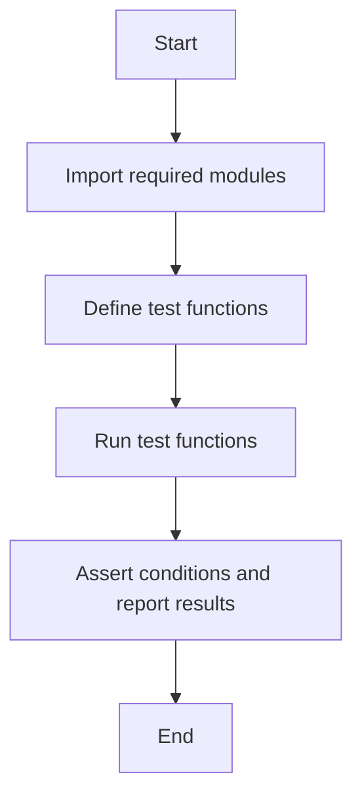

## 类结构

```
MatplotlibTests (主测试类)
├── check_shared
│   ├── check_ticklabel_visible
│   ├── check_tick1_visible
│   └── ...
├── test_shared
│   ├── test_label_outer
│   ├── test_label_outer_span
│   ├── test_label_outer_non_gridspec
│   ├── test_shared_and_moved
│   └── test_exceptions
├── test_subplots_offsettext
├── test_subplots_hide_ticklabels
├── test_subplots_hide_axislabels
├── test_get_gridspec
├── test_dont_mutate_kwargs
├── test_width_and_height_ratios
├── test_width_and_height_ratios_mosaic
└── test_ratio_overlapping_kws
```

## 全局变量及字段


### `plt`
    
matplotlib.pyplot module

类型：`module`
    


### `Axes`
    
matplotlib.axes.Axes class

类型：`class`
    


### `SubplotBase`
    
matplotlib.axes.SubplotBase class

类型：`class`
    


### `check_figures_equal`
    
matplotlib.testing.decorators.check_figures_equal decorator

类型：`function`
    


### `image_comparison`
    
matplotlib.testing.decorators.image_comparison decorator

类型：`function`
    


### `pytest`
    
pytest module

类型：`module`
    


### `np`
    
numpy module

类型：`module`
    


### `mpl`
    
matplotlib module

类型：`module`
    


### `itertools`
    
itertools module

类型：`module`
    


### `platform`
    
platform module

类型：`module`
    


    

## 全局函数及方法

### check_shared

该函数用于检查共享轴配置是否正确。

参数：

- `axs`：`Axes`对象列表，表示子图轴。
- `x_shared`：`n x n`布尔矩阵，表示x轴共享配置。
- `y_shared`：`n x n`布尔矩阵，表示y轴共享配置。

返回值：无

#### 流程图

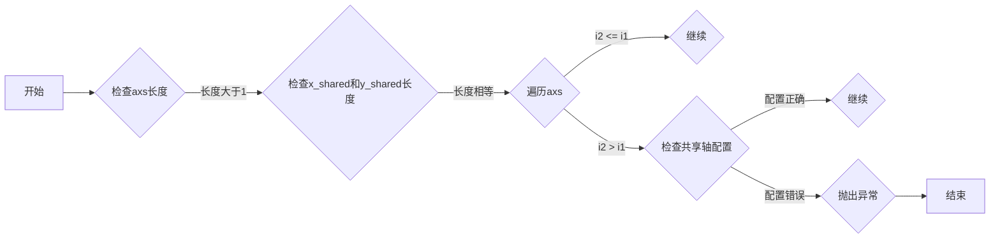

#### 带注释源码

```python
def check_shared(axs, x_shared, y_shared):
    """
    x_shared and y_shared are n x n boolean matrices; entry (i, j) indicates
    whether the x (or y) axes of subplots i and j should be shared.
    """
    for (i1, ax1), (i2, ax2), (i3, (name, shared)) in itertools.product(
            enumerate(axs),
            enumerate(axs),
            enumerate(zip("xy", [x_shared, y_shared]))):
        if i2 <= i1:
            continue
        assert axs[0]._shared_axes[name].joined(ax1, ax2) == shared[i1, i2], \
            "axes %i and %i incorrectly %ssharing %s axis" % (
                i1, i2, "not " if shared[i1, i2] else "", name)
```

### check_ticklabel_visible

**描述**

该函数用于检查指定子图的x轴和y轴的刻度标签是否可见。

**参数**

- `axs`：`Axes`对象列表，表示要检查的子图。
- `x_visible`：布尔值列表，表示x轴刻度标签的可见性。
- `y_visible`：布尔值列表，表示y轴刻度标签的可见性。

**返回值**

无

#### 流程图

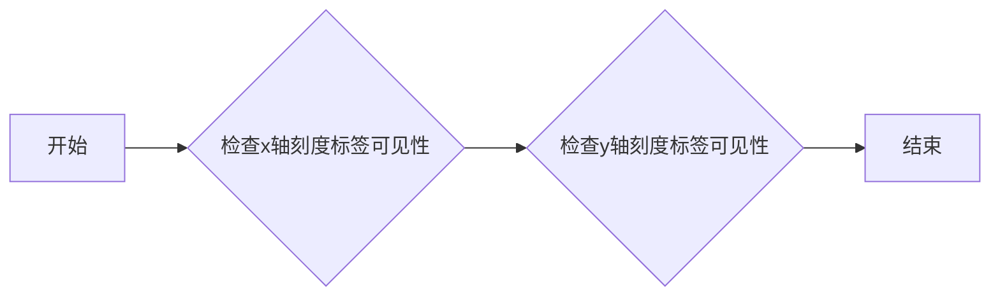

#### 带注释源码

```python
def check_ticklabel_visible(axs, x_visible, y_visible):
    """Check that the x and y ticklabel visibility is as specified."""
    for i, (ax, vx, vy) in enumerate(zip(axs, x_visible, y_visible)):
        for l in ax.get_xticklabels() + [ax.xaxis.offsetText]:
            assert l.get_visible() == vx, \
                    f"Visibility of x axis #{i} is incorrectly {vx}"
        for l in ax.get_yticklabels() + [ax.yaxis.offsetText]:
            assert l.get_visible() == vy, \
                    f"Visibility of y axis #{i} is incorrectly {vy}"
        # axis label "visibility" is toggled by label_outer by resetting the
        # label to empty, but it can also be empty to start with.
        if not vx:
            assert ax.get_xlabel() == ""
        if not vy:
            assert ax.get_ylabel() == ""
```

### check_tick1_visible

This function checks that the visibility of the first tick line (tick1line) for both x and y axes is as specified.

参数：

- `axs`：`Axes`，The list of axes to check.
- `x_visible`：`bool`，The visibility of the x-axis tick lines.
- `y_visible`：`bool`，The visibility of the y-axis tick lines.

返回值：`None`，This function does not return any value.

#### 流程图

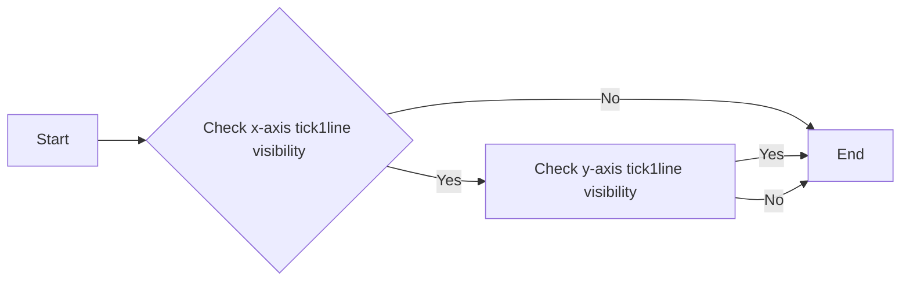

#### 带注释源码

```python
def check_tick1_visible(axs, x_visible, y_visible):
    """
    Check that the x and y tick visibility is as specified.

    Note: This only checks the tick1line, i.e. bottom / left ticks.
    """
    for ax, visible, in zip(axs, x_visible):
        for tick in ax.xaxis.get_major_ticks():
            assert tick.tick1line.get_visible() == visible
    for ax, y_visible, in zip(axs, y_visible):
        for tick in ax.yaxis.get_major_ticks():
            assert tick.tick1line.get_visible() == visible
```

### test_shared

该函数用于测试共享坐标轴的配置是否正确。

参数：

- `axs`：`Axes`对象列表，表示子图轴。
- `x_shared`：`np.ndarray`，布尔矩阵，表示x轴共享配置。
- `y_shared`：`np.ndarray`，布尔矩阵，表示y轴共享配置。

返回值：无

#### 流程图

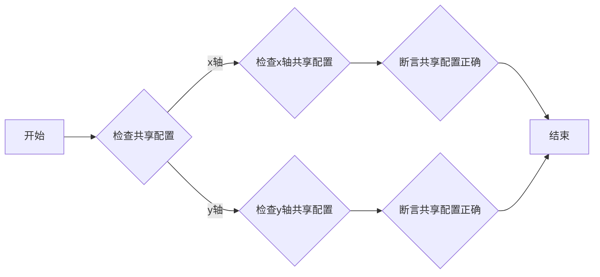

#### 带注释源码

```python
def check_shared(axs, x_shared, y_shared):
    """
    x_shared and y_shared are n x n boolean matrices; entry (i, j) indicates
    whether the x (or y) axes of subplots i and j should be shared.
    """
    for (i1, ax1), (i2, ax2), (i3, (name, shared)) in itertools.product(
            enumerate(axs),
            enumerate(axs),
            enumerate(zip("xy", [x_shared, y_shared]))):
        if i2 <= i1:
            continue
        assert axs[0]._shared_axes[name].joined(ax1, ax2) == shared[i1, i2], \
            "axes %i and %i incorrectly %ssharing %s axis" % (
                i1, i2, "not " if shared[i1, i2] else "", name)
```

### test_label_outer

This function tests the `label_outer` method of Matplotlib's axes object, which is used to hide the tick labels of the axes while keeping the axis labels visible.

参数：

- `remove_ticks`：`bool`，Determines whether to remove the ticks from the axes. It can be `True` or `False`.
- `layout_engine`：`str`，The layout engine to use for the figure. It can be `'none'`, `'tight'`, or `'constrained'`.
- `with_colorbar`：`bool`，Determines whether to add a colorbar to the axes. It can be `True` or `False`.

返回值：`None`，This function does not return any value.

#### 流程图

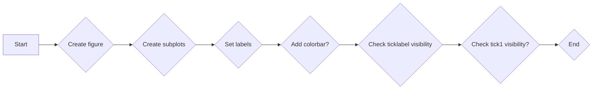

#### 带注释源码

```python
@pytest.mark.parametrize('remove_ticks', [True, False])
@pytest.mark.parametrize('layout_engine', ['none', 'tight', 'constrained'])
@pytest.mark.parametrize('with_colorbar', [True, False])
def test_label_outer(remove_ticks, layout_engine, with_colorbar):
    fig = plt.figure(layout=layout_engine)
    axs = fig.subplots(2, 2, sharex=True, sharey=True)
    for ax in axs.flat:
        ax.set(xlabel="foo", ylabel="bar")
        if with_colorbar:
            fig.colorbar(mpl.cm.ScalarMappable(), ax=ax)
        ax.label_outer(remove_inner_ticks=remove_ticks)
    check_ticklabel_visible(
        axs.flat, [False, False, True, True], [True, False, True, False])
    if remove_ticks:
        check_tick1_visible(
            axs.flat, [False, False, True, True], [True, False, True, False])
    else:
        check_tick1_visible(
            axs.flat, [True, True, True, True], [True, True, True, True])
```

### test_label_outer_span

This function tests the `label_outer()` method on a figure with a custom grid specification using `GridSpec`.

参数：

- 无

返回值：无

#### 流程图

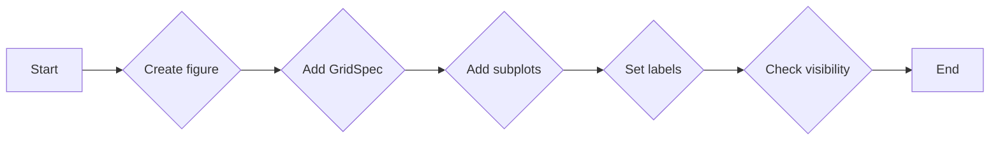

#### 带注释源码

```python
def test_label_outer_span():
    fig = plt.figure()
    gs = fig.add_gridspec(3, 3)
    # +---+---+---+
    # |   1   |   |
    # +---+---+---+
    # |   |   | 3 |
    # + 2 +---+---+
    # |   | 4 |   |
    # +---+---+---+
    a1 = fig.add_subplot(gs[0, 0:2])
    a2 = fig.add_subplot(gs[1:3, 0])
    a3 = fig.add_subplot(gs[1, 2])
    a4 = fig.add_subplot(gs[2, 1])
    for ax in fig.axes:
        ax.label_outer()
    check_ticklabel_visible(
        fig.axes, [False, True, False, True], [True, True, False, False])
```

### test_label_outer_non_gridspec

This function tests the behavior of the `label_outer()` method when applied to an axes object that is not part of a GridSpec layout.

参数：

- `ax`：`Axes`，The axes object to which `label_outer()` is applied.

返回值：无

#### 流程图

```mermaid
graph LR
A[Start] --> B{Is ax part of GridSpec layout?}
B -- Yes --> C[Apply label_outer()]
B -- No --> D[Do nothing]
C --> E[End]
D --> E
```

#### 带注释源码

```python
def test_label_outer_non_gridspec():
    ax = plt.axes((0, 0, 1, 1))
    ax.label_outer()  # Does nothing.
    check_ticklabel_visible([ax], [True], [True])
```

### test_shared_and_moved

This function tests the behavior of the `label_outer()` method in Matplotlib when `sharey` is set to `True` and then `yaxis.tick_left()` is called. It also tests the behavior when `sharex` is set to `True` and then `xaxis.tick_bottom()` is called.

参数：

- 无

返回值：无

#### 流程图

```mermaid
graph LR
A[Start] --> B{Check sharey and yaxis.tick_left()}
B --> C{Check visibility of y-axis labels}
C --> D{Check sharex and xaxis.tick_bottom()}
D --> E{Check visibility of x-axis labels}
E --> F[End]
```

#### 带注释源码

```python
def test_shared_and_moved():
    # test if sharey is on, but then tick_left is called that labels don't
    # re-appear.  Seaborn does this just to be sure yaxis is on left...
    f, (a1, a2) = plt.subplots(1, 2, sharey=True)
    check_ticklabel_visible([a2], [True], [False])
    a2.yaxis.tick_left()
    check_ticklabel_visible([a2], [True], [False])

    f, (a1, a2) = plt.subplots(2, 1, sharex=True)
    check_ticklabel_visible([a1], [False], [True])
    a2.xaxis.tick_bottom()
    check_ticklabel_visible([a1], [False], [True])
```

### test_exceptions

This function tests the exceptions raised when invalid parameters are passed to the `subplots` function.

参数：

- `None`：`None`，No parameters are passed to this function. It relies on the `subplots` function to raise exceptions when invalid parameters are provided.

返回值：`None`，This function does not return any value. It only tests for exceptions.

#### 流程图

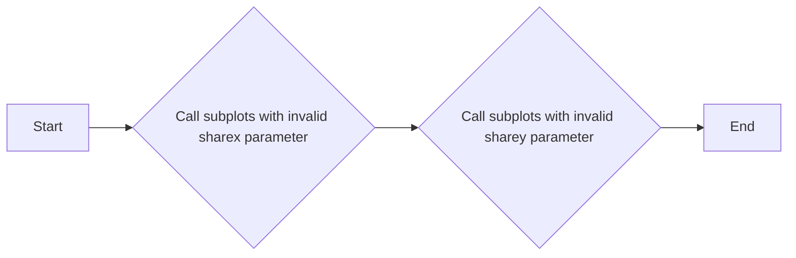

#### 带注释源码

```python
def test_exceptions():
    # TODO should this test more options?
    with pytest.raises(ValueError):
        plt.subplots(2, 2, sharex='blah')
    with pytest.raises(ValueError):
        plt.subplots(2, 2, sharey='blah')
```

### test_subplots_offsettext

This function tests the offset text visibility in subplots. It creates a figure with four subplots and plots some data on each subplot. It then checks the visibility of the offset text for the x and y axes.

参数：

- `x`：`numpy.ndarray`，The x-axis data for the plots.
- `y`：`numpy.ndarray`，The y-axis data for the plots.

返回值：`None`，This function does not return any value.

#### 流程图

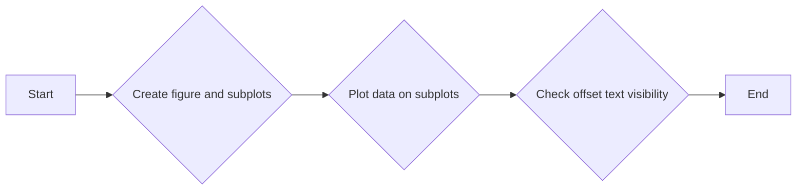

#### 带注释源码

```python
@image_comparison(['subplots_offset_text.png'],
                  tol=0 if platform.machine() == 'x86_64' else 0.028)
def test_subplots_offsettext():
    x = np.arange(0, 1e10, 1e9)
    y = np.arange(0, 100, 10)+1e4
    fig, axs = plt.subplots(2, 2, sharex='col', sharey='all')
    axs[0, 0].plot(x, x)
    axs[1, 0].plot(x, x)
    axs[0, 1].plot(y, x)
    axs[1, 1].plot(y, x)
```

### test_subplots_hide_ticklabels

This function tests the visibility of tick labels in subplots when using the `label_outer` method of an axis object. It checks whether the tick labels are visible or hidden based on the specified positions (top, bottom, left, right).

参数：

- `top`：`bool`，Determines whether the x-axis tick labels are visible at the top of the subplot.
- `bottom`：`bool`，Determines whether the x-axis tick labels are visible at the bottom of the subplot.
- `left`：`bool`，Determines whether the y-axis tick labels are visible at the left of the subplot.
- `right`：`bool`，Determines whether the y-axis tick labels are visible at the right of the subplot.

返回值：`None`，This function does not return any value.

#### 流程图

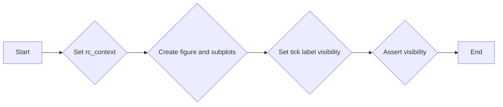

#### 带注释源码

```python
def test_subplots_hide_ticklabels(top, bottom, left, right):
    # Ideally, we would also test offset-text visibility (and remove
    # test_subplots_offsettext), but currently, setting rcParams fails to move
    # the offset texts as well.
    with plt.rc_context({"xtick.labeltop": top, "xtick.labelbottom": bottom,
                         "ytick.labelleft": left, "ytick.labelright": right}):
        axs = plt.figure().subplots(3, 3, sharex=True, sharey=True)
    for (i, j), ax in np.ndenumerate(axs):
        xtop = ax.xaxis._major_tick_kw["label2On"]
        xbottom = ax.xaxis._major_tick_kw["label1On"]
        yleft = ax.yaxis._major_tick_kw["label1On"]
        yright = ax.yaxis._major_tick_kw["label2On"]
        assert xtop == (top and i == 0)
        assert xbottom == (bottom and i == 2)
        assert yleft == (left and j == 0)
        assert yright == (right and j == 2)
```

### test_subplots_hide_axislabels

This function tests the visibility of axis labels in subplots when using the `label_outer()` method.

参数：

- `xlabel_position`：`str`，The position of the x-axis label ("bottom" or "top").
- `ylabel_position`：`str`，The position of the y-axis label ("left" or "right").

返回值：`None`，This function does not return any value.

#### 流程图

```mermaid
graph LR
A[Start] --> B{Set up subplots}
B --> C{Set x-axis label position}
C --> D{Set y-axis label position}
D --> E{Call label_outer()}
E --> F{Check label visibility}
F --> G[End]
```

#### 带注释源码

```python
def test_subplots_hide_axislabels(xlabel_position, ylabel_position):
    axs = plt.figure().subplots(3, 3, sharex=True, sharey=True)
    for (i, j), ax in np.ndenumerate(axs):
        ax.set(xlabel="foo", ylabel="bar")
        ax.xaxis.set_label_position(xlabel_position)
        ax.yaxis.set_label_position(ylabel_position)
        ax.label_outer()
        assert bool(ax.get_xlabel()) == (
            xlabel_position == "bottom" and i == 2
            or xlabel_position == "top" and i == 0)
        assert bool(ax.get_ylabel()) == (
            ylabel_position == "left" and j == 0
            or ylabel_position == "right" and j == 2)
```

### test_get_gridspec

该函数用于测试matplotlib中`Axes`对象的`get_gridspec`方法是否正确返回其对应的`GridSpec`对象。

参数：

- 无

返回值：`GridSpec`对象，表示`Axes`对象的网格布局

#### 流程图

```mermaid
graph LR
A[开始] --> B{调用get_gridspec()}
B --> C{返回GridSpec对象?}
C -- 是 --> D[结束]
C -- 否 --> E[错误处理]
```

#### 带注释源码

```python
def test_get_gridspec():
    # ahem, pretty trivial, but...
    fig, ax = plt.subplots()
    assert ax.get_subplotspec().get_gridspec() == ax.get_gridspec()
```

### test_dont_mutate_kwargs

该函数用于测试在创建子图时，传入的 `subplot_kw` 和 `gridspec_kw` 参数是否被正确地保留，即没有被修改。

参数：

- `subplot_kw`：`dict`，用于创建子图时的关键字参数。
- `gridspec_kw`：`dict`，用于创建子图时 GridSpec 的关键字参数。

返回值：无

#### 流程图

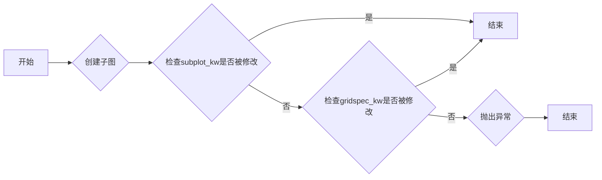

#### 带注释源码

```python
def test_dont_mutate_kwargs():
    subplot_kw = {'sharex': 'all'}
    gridspec_kw = {'width_ratios': [1, 2]}
    fig, ax = plt.subplots(1, 2, subplot_kw=subplot_kw,
                           gridspec_kw=gridspec_kw)
    assert subplot_kw == {'sharex': 'all'}
    assert gridspec_kw == {'width_ratios': [1, 2]}
```

### test_width_and_height_ratios

This function tests the functionality of setting width_ratios and height_ratios when creating subplots using `subplots` and `subplot_mosaic` methods. It ensures that the specified ratios are applied correctly to the subplots.

参数：

- `fig_test`：`matplotlib.figure.Figure`，用于测试的Figure对象
- `fig_ref`：`matplotlib.figure.Figure`，用于参考的Figure对象
- `height_ratios`：`list`，指定子图的高度比例，默认为`None`
- `width_ratios`：`list`，指定子图的宽度比例，默认为`None`

返回值：无

#### 流程图

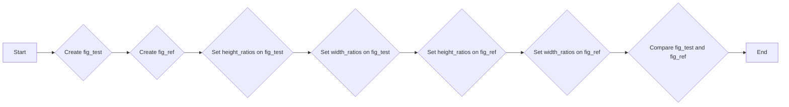

#### 带注释源码

```python
@pytest.mark.parametrize("width_ratios", [None, [1, 3, 2]])
@pytest.mark.parametrize("height_ratios", [None, [1, 2]])
@check_figures_equal()
def test_width_and_height_ratios(fig_test, fig_ref,
                                 height_ratios, width_ratios):
    fig_test.subplots(2, 3, height_ratios=height_ratios,
                      width_ratios=width_ratios)
    fig_ref.subplots(2, 3, gridspec_kw={
                     'height_ratios': height_ratios,
                     'width_ratios': width_ratios})
```

### test_width_and_height_ratios_mosaic

This function tests the `subplot_mosaic` method of the `matplotlib.pyplot` module, which creates a mosaic of subplots with specified width and height ratios.

参数：

- `fig_test`：`matplotlib.figure.Figure`，用于测试的Figure对象。
- `fig_ref`：`matplotlib.figure.Figure`，用于参考的Figure对象。
- `height_ratios`：`list`，指定每个子图的高度比例。
- `width_ratios`：`list`，指定每个子图的宽度比例。

返回值：无

#### 流程图

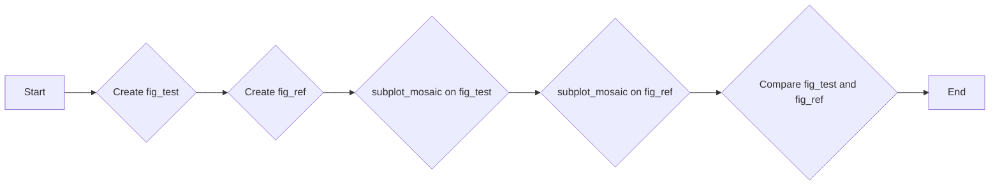

#### 带注释源码

```python
@pytest.mark.parametrize("width_ratios", [None, [1, 3, 2]])
@pytest.mark.parametrize("height_ratios", [None, [1, 2]])
@check_figures_equal()
def test_width_and_height_ratios_mosaic(fig_test, fig_ref,
                                        height_ratios, width_ratios):
    mosaic_spec = [['A', 'B', 'B'], ['A', 'C', 'D']]
    fig_test.subplot_mosaic(mosaic_spec, height_ratios=height_ratios,
                            width_ratios=width_ratios)
    fig_ref.subplot_mosaic(mosaic_spec, gridspec_kw={
                           'height_ratios': height_ratios,
                           'width_ratios': width_ratios})
```

### test_ratio_overlapping_kws

This function tests the behavior of the `subplots` and `subplot_mosaic` methods when provided with overlapping `height_ratios` or `width_ratios` arguments.

参数：

- `method`：`str`，指定要测试的方法，可以是 "subplots" 或 "subplot_mosaic"。
- `args`：`tuple`，传递给指定方法的参数。

返回值：无

#### 流程图

```mermaid
graph LR
A[Start] --> B{Is method "subplots"?}
B -- Yes --> C{Are height_ratios and gridspec_kw overlapping?}
C -- Yes --> D[Raises ValueError]
C -- No --> E[End]
B -- No --> F{Is method "subplot_mosaic"?}
F -- Yes --> G{Are width_ratios and gridspec_kw overlapping?}
G -- Yes --> H[Raises ValueError]
G -- No --> I[End]
```

#### 带注释源码

```python
@pytest.mark.parametrize('method,args', [
    ('subplots', (2, 3)),
    ('subplot_mosaic', ('abc;def', ))
    ]
)
def test_ratio_overlapping_kws(method, args):
    with pytest.raises(ValueError, match='height_ratios'):
        getattr(plt, method)(*args, height_ratios=[1, 2],
                             gridspec_kw={'height_ratios': [1, 2]})
    with pytest.raises(ValueError, match='width_ratios'):
        getattr(plt, method)(*args, width_ratios=[1, 2, 3],
                             gridspec_kw={'width_ratios': [1, 2, 3]})
```

### check_shared

该函数用于检查共享轴配置是否正确。

参数：

- `axs`：`Axes`对象列表，表示子图轴。
- `x_shared`：`n x n`布尔矩阵，表示x轴共享配置。
- `y_shared`：`n x n`布尔矩阵，表示y轴共享配置。

返回值：无

#### 流程图


#### 带注释源码

```python
def check_shared(axs, x_shared, y_shared):
    """
    x_shared and y_shared are n x n boolean matrices; entry (i, j) indicates
    whether the x (or y) axes of subplots i and j should be shared.
    """
    for (i1, ax1), (i2, ax2), (i3, (name, shared)) in itertools.product(
            enumerate(axs),
            enumerate(axs),
            enumerate(zip("xy", [x_shared, y_shared]))):
        if i2 <= i1:
            continue
        assert axs[0]._shared_axes[name].joined(ax1, ax2) == shared[i1, i2], \
            "axes %i and %i incorrectly %ssharing %s axis" % (
                i1, i2, "not " if shared[i1, i2] else "", name)
```

### test_shared

This function tests the sharing of axes in Matplotlib subplots based on boolean matrices indicating whether the x or y axes of subplots should be shared.

参数：

- `axs`：`Axes`，A list of axes objects to be checked.
- `x_shared`：`np.ndarray`，A boolean matrix indicating whether the x axes of subplots should be shared.
- `y_shared`：`np.ndarray`，A boolean matrix indicating whether the y axes of subplots should be shared.

返回值：`None`，This function does not return any value.

#### 流程图

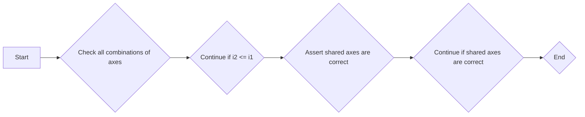

#### 带注释源码

```python
def check_shared(axs, x_shared, y_shared):
    """
    x_shared and y_shared are n x n boolean matrices; entry (i, j) indicates
    whether the x (or y) axes of subplots i and j should be shared.
    """
    for (i1, ax1), (i2, ax2), (i3, (name, shared)) in itertools.product(
            enumerate(axs),
            enumerate(axs),
            enumerate(zip("xy", [x_shared, y_shared]))):
        if i2 <= i1:
            continue
        assert axs[0]._shared_axes[name].joined(ax1, ax2) == shared[i1, i2], \
            "axes %i and %i incorrectly %ssharing %s axis" % (
                i1, i2, "not " if shared[i1, i2] else "", name)
```

### test_subplots_offsettext

This function tests the offset text functionality in subplots. It creates a figure with four subplots and plots some data in each subplot. It then checks if the offset text is displayed correctly.

参数：

- `remove_ticks`: `bool`，Determines whether to remove ticks. Defaults to `False`.
- `layout_engine`: `str`，Determines the layout engine to use. Defaults to `'none'`.
- `with_colorbar`: `bool`，Determines whether to include a colorbar. Defaults to `False`.

返回值：`None`，This function does not return any value.

#### 流程图

```mermaid
graph LR
A[Start] --> B[Create figure and subplots]
B --> C[Plot data in subplots]
C --> D[Check offset text visibility]
D --> E[End]
```

#### 带注释源码

```python
@image_comparison(['subplots_offset_text.png'],
                  tol=0 if platform.machine() == 'x86_64' else 0.028)
def test_subplots_offsettext():
    x = np.arange(0, 1e10, 1e9)
    y = np.arange(0, 100, 10)+1e4
    fig, axs = plt.subplots(2, 2, sharex='col', sharey='all')
    axs[0, 0].plot(x, x)
    axs[1, 0].plot(x, x)
    axs[0, 1].plot(y, x)
    axs[1, 1].plot(y, x)
```

### test_subplots_hide_ticklabels

This function tests the visibility of tick labels in subplots based on the specified positions (top, bottom, left, right).

参数：

- `top`：`bool`，Determines whether the x-axis tick labels are visible at the top.
- `bottom`：`bool`，Determines whether the x-axis tick labels are visible at the bottom.
- `left`：`bool`，Determines whether the y-axis tick labels are visible at the left.
- `right`：`bool`，Determines whether the y-axis tick labels are visible at the right.

返回值：`None`，This function does not return any value.

#### 流程图

```mermaid
graph LR
A[Start] --> B{Create figure and subplots}
B --> C{Set tick label visibility}
C --> D{Check tick label visibility}
D --> E{Assert visibility}
E --> F[End]
```

#### 带注释源码

```python
def test_subplots_hide_ticklabels(top, bottom, left, right):
    # Ideally, we would also test offset-text visibility (and remove
    # test_subplots_offsettext), but currently, setting rcParams fails to move
    # the offset texts as well.
    with plt.rc_context({"xtick.labeltop": top, "xtick.labelbottom": bottom,
                         "ytick.labelleft": left, "ytick.labelright": right}):
        axs = plt.figure().subplots(3, 3, sharex=True, sharey=True)
    for (i, j), ax in np.ndenumerate(axs):
        xtop = ax.xaxis._major_tick_kw["label2On"]
        xbottom = ax.xaxis._major_tick_kw["label1On"]
        yleft = ax.yaxis._major_tick_kw["label1On"]
        yright = ax.yaxis._major_tick_kw["label2On"]
        assert xtop == (top and i == 0)
        assert xbottom == (bottom and i == 2)
        assert yleft == (left and j == 0)
        assert yright == (right and j == 2)
```

### test_subplots_hide_axislabels

This function tests the visibility of axis labels in subplots when using the `label_outer()` method.

参数：

- `xlabel_position`：`str`，The position of the x-axis label ("bottom" or "top").
- `ylabel_position`：`str`，The position of the y-axis label ("left" or "right").

返回值：`None`，This function does not return any value.

#### 流程图

```mermaid
graph LR
A[Start] --> B{Create subplots}
B --> C{Set x-axis label position}
C --> D{Set y-axis label position}
D --> E{Call label_outer()}
E --> F{Check axis label visibility}
F --> G[End]
```

#### 带注释源码

```python
@pytest.mark.parametrize("xlabel_position", ["bottom", "top"])
@pytest.mark.parametrize("ylabel_position", ["left", "right"])
def test_subplots_hide_axislabels(xlabel_position, ylabel_position):
    axs = plt.figure().subplots(3, 3, sharex=True, sharey=True)
    for (i, j), ax in np.ndenumerate(axs):
        ax.set(xlabel="foo", ylabel="bar")
        ax.xaxis.set_label_position(xlabel_position)
        ax.yaxis.set_label_position(ylabel_position)
        ax.label_outer()
        assert bool(ax.get_xlabel()) == (
            xlabel_position == "bottom" and i == 2
            or xlabel_position == "top" and i == 0)
        assert bool(ax.get_ylabel()) == (
            ylabel_position == "left" and j == 0
            or ylabel_position == "right" and j == 2)
```

### test_get_gridspec

This function tests the `get_gridspec()` method of an Axes object to ensure it returns the correct GridSpec object.

参数：

- 无

返回值：`GridSpec`，返回当前Axes对象的GridSpec对象

#### 流程图

```mermaid
graph LR
A[Start] --> B{Call get_gridspec()}
B --> C{Is GridSpec returned?}
C -- Yes --> D[End]
C -- No --> E[Error]
```

#### 带注释源码

```python
def test_get_gridspec():
    # ahem, pretty trivial, but...
    fig, ax = plt.subplots()
    assert ax.get_subplotspec().get_gridspec() == ax.get_gridspec()
```

### test_dont_mutate_kwargs

This function tests that the `subplot_kw` and `gridspec_kw` arguments passed to `plt.subplots` do not mutate the original dictionaries.

参数：

- `subplot_kw`：`dict`，A dictionary of keyword arguments to be passed to `plt.subplots`.
- `gridspec_kw`：`dict`，A dictionary of keyword arguments to be passed to `gridspec_kw` of `plt.subplots`.

返回值：`None`，This function does not return any value.

#### 流程图

```mermaid
graph LR
A[Start] --> B{Check subplot_kw}
B -->|No mutation| C[Check gridspec_kw]
C -->|No mutation| D[End]
```

#### 带注释源码

```python
def test_dont_mutate_kwargs():
    subplot_kw = {'sharex': 'all'}
    gridspec_kw = {'width_ratios': [1, 2]}
    fig, ax = plt.subplots(1, 2, subplot_kw=subplot_kw,
                           gridspec_kw=gridspec_kw)
    assert subplot_kw == {'sharex': 'all'}
    assert gridspec_kw == {'width_ratios': [1, 2]}
```

### test_width_and_height_ratios

This function tests the width and height ratios of subplots created using `fig.subplots` and `fig.subplot_mosaic`. It ensures that the specified ratios are applied correctly to the subplots.

参数：

- `fig_test`：`matplotlib.figure.Figure`，用于测试的Figure对象
- `fig_ref`：`matplotlib.figure.Figure`，用于参考的Figure对象
- `height_ratios`：`list`，指定子图的高度比例
- `width_ratios`：`list`，指定子图的宽度比例

返回值：无

#### 流程图

```mermaid
graph LR
A[Start] --> B{Create fig_test}
B --> C{Create fig_ref}
C --> D{Set height_ratios on fig_test}
D --> E{Set width_ratios on fig_test}
E --> F{Set height_ratios on fig_ref}
F --> G{Set width_ratios on fig_ref}
G --> H{Compare fig_test and fig_ref}
H --> I[End]
```

#### 带注释源码

```python
@pytest.mark.parametrize("width_ratios", [None, [1, 3, 2]])
@pytest.mark.parametrize("height_ratios", [None, [1, 2]])
@check_figures_equal()
def test_width_and_height_ratios(fig_test, fig_ref,
                                 height_ratios, width_ratios):
    fig_test.subplots(2, 3, height_ratios=height_ratios,
                      width_ratios=width_ratios)
    fig_ref.subplots(2, 3, gridspec_kw={
                     'height_ratios': height_ratios,
                     'width_ratios': width_ratios})
```

### test_width_and_height_ratios_mosaic

This function tests the `subplot_mosaic` method of Matplotlib, which creates a mosaic of subplots with specified width and height ratios.

参数：

- `fig_test`：`matplotlib.figure.Figure`，The test figure object.
- `fig_ref`：`matplotlib.figure.Figure`，The reference figure object.
- `height_ratios`：`list`，The height ratios for the subplots in the mosaic.
- `width_ratios`：`list`，The width ratios for the subplots in the mosaic.

返回值：`None`，This function does not return any value.

#### 流程图

```mermaid
graph LR
A[Start] --> B{Create test figure}
B --> C{Create reference figure}
C --> D{Create mosaic subplots}
D --> E{Compare figures}
E --> F[End]
```

#### 带注释源码

```python
@pytest.mark.parametrize("width_ratios", [None, [1, 3, 2]])
@pytest.mark.parametrize("height_ratios", [None, [1, 2]])
@check_figures_equal()
def test_width_and_height_ratios_mosaic(fig_test, fig_ref,
                                        height_ratios, width_ratios):
    mosaic_spec = [['A', 'B', 'B'], ['A', 'C', 'D']]
    fig_test.subplot_mosaic(mosaic_spec, height_ratios=height_ratios,
                            width_ratios=width_ratios)
    fig_ref.subplot_mosaic(mosaic_spec, gridspec_kw={
                           'height_ratios': height_ratios,
                           'width_ratios': width_ratios})
```

### test_ratio_overlapping_kws

This function tests the behavior of the `subplots` and `subplot_mosaic` methods when overlapping `height_ratios` and `width_ratios` are provided through both the function arguments and the `gridspec_kw` argument.

参数：

- `method`：`str`，指定要测试的方法，可以是 'subplots' 或 'subplot_mosaic'。
- `args`：`tuple`，指定要传递给指定方法的参数。

返回值：无

#### 流程图

```mermaid
graph LR
A[Start] --> B{Is method 'subplots'?}
B -- Yes --> C[Pass args to subplots]
B -- No --> D{Is method 'subplot_mosaic'?}
D -- Yes --> E[Pass args to subplot_mosaic]
D -- No --> F[Error: Invalid method]
C --> G{Is height_ratios in args?}
G -- Yes --> H{Is height_ratios in gridspec_kw?}
H -- Yes --> I[Error: Overlapping height_ratios]
H -- No --> J[Pass args to subplots]
G -- No --> J
E --> K{Is width_ratios in args?}
K -- Yes --> L{Is width_ratios in gridspec_kw?}
L -- Yes --> M[Error: Overlapping width_ratios]
L -- No --> N[Pass args to subplot_mosaic]
J --> O[End]
N --> O
I --> O
M --> O
F --> O
```

#### 带注释源码

```python
@pytest.mark.parametrize('method,args', [
    ('subplots', (2, 3)),
    ('subplot_mosaic', ('abc;def', ))
    ]
)
def test_ratio_overlapping_kws(method, args):
    with pytest.raises(ValueError, match='height_ratios'):
        getattr(plt, method)(*args, height_ratios=[1, 2],
                             gridspec_kw={'height_ratios': [1, 2]})
    with pytest.raises(ValueError, match='width_ratios'):
        getattr(plt, method)(*args, width_ratios=[1, 2, 3],
                             gridspec_kw={'width_ratios': [1, 2, 3]})
```

### check_ticklabel_visible

#### 描述

`check_ticklabel_visible` 函数用于检查指定子图的 x 和 y 轴标签的可见性是否符合预期。

#### 参数

- `axs`：`Axes` 对象列表，包含要检查的子图。
- `x_visible`：布尔值列表，指定每个子图的 x 轴标签是否可见。
- `y_visible`：布尔值列表，指定每个子图的 y 轴标签是否可见。

#### 返回值

无返回值。

#### 流程图

```mermaid
graph LR
A[Start] --> B{Check x_visible}
B -->|Yes| C{Check y_visible}
C -->|Yes| D[End]
C -->|No| E[Error: y_visible mismatch]
B -->|No| F[Error: x_visible mismatch]
```

#### 带注释源码

```python
def check_ticklabel_visible(axs, x_visible, y_visible):
    """Check that the x and y ticklabel visibility is as specified."""
    for i, (ax, vx, vy) in enumerate(zip(axs, x_visible, y_visible)):
        for l in ax.get_xticklabels() + [ax.xaxis.offsetText]:
            assert l.get_visible() == vx, \
                    f"Visibility of x axis #{i} is incorrectly {vx}"
        for l in ax.get_yticklabels() + [ax.yaxis.offsetText]:
            assert l.get_visible() == vy, \
                    f"Visibility of y axis #{i} is incorrectly {vy}"
        # axis label "visibility" is toggled by label_outer by resetting the
        # label to empty, but it can also be empty to start with.
        if not vx:
            assert ax.get_xlabel() == ""
        if not vy:
            assert ax.get_ylabel() == ""
```

### check_tick1_visible

This function checks that the visibility of the first tick line (tick1line) for each axis in the provided axes list matches the specified visibility for x and y ticks.

参数：

- `axs`：`Axes`，The list of axes to check.
- `x_visible`：`bool`，The visibility of the x ticks.
- `y_visible`：`bool`，The visibility of the y ticks.

返回值：`None`，This function does not return any value.

#### 流程图

```mermaid
graph LR
A[Start] --> B{Check x_visible}
B -->|Yes| C[Check all x tick1lines visible]
B -->|No| D[End]
C --> E{Check y_visible}
E -->|Yes| F[Check all y tick1lines visible]
E -->|No| G[End]
F --> H[End]
```

#### 带注释源码

```python
def check_tick1_visible(axs, x_visible, y_visible):
    """
    Check that the x and y tick visibility is as specified.

    Note: This only checks the tick1line, i.e. bottom / left ticks.
    """
    for ax, visible, in zip(axs, x_visible):
        for tick in ax.xaxis.get_major_ticks():
            assert tick.tick1line.get_visible() == visible
    for ax, y_visible, in zip(axs, y_visible):
        for tick in ax.yaxis.get_major_ticks():
            assert tick.tick1line.get_visible() == visible
```

### test_shared

This function tests the sharing of axes in subplots based on boolean matrices indicating whether the x or y axes of subplots should be shared.

参数：

- `axs`：`Axes`，The list of axes objects to be checked.
- `x_shared`：`np.ndarray`，A boolean matrix indicating whether the x axes of subplots should be shared.
- `y_shared`：`np.ndarray`，A boolean matrix indicating whether the y axes of subplots should be shared.

返回值：无

#### 流程图

```mermaid
graph LR
A[Start] --> B{Check all pairs of axes}
B --> C{Continue if i2 <= i1}
C --> D{Assert shared axes match}
D --> E{Continue if shared axes match}
E --> F{End}
```

#### 带注释源码

```python
def check_shared(axs, x_shared, y_shared):
    """
    x_shared and y_shared are n x n boolean matrices; entry (i, j) indicates
    whether the x (or y) axes of subplots i and j should be shared.
    """
    for (i1, ax1), (i2, ax2), (i3, (name, shared)) in itertools.product(
            enumerate(axs),
            enumerate(axs),
            enumerate(zip("xy", [x_shared, y_shared]))):
        if i2 <= i1:
            continue
        assert axs[0]._shared_axes[name].joined(ax1, ax2) == shared[i1, i2], \
            "axes %i and %i incorrectly %ssharing %s axis" % (
                i1, i2, "not " if shared[i1, i2] else "", name)
```

### test_label_outer_span

This function tests the behavior of the `label_outer()` method when applied to a figure with a non-GridSpec layout.

参数：

- 无

返回值：无

#### 流程图

```mermaid
graph LR
A[Start] --> B{Create figure}
B --> C{Add gridspec}
C --> D{Add subplots}
D --> E{Apply label_outer()}
E --> F{Check ticklabel visibility}
F --> G{End}
```

#### 带注释源码

```python
def test_label_outer_span():
    fig = plt.figure()
    gs = fig.add_gridspec(3, 3)
    # +---+---+---+
    # |   1   |   |
    # +---+---+---+
    # |   |   | 3 |
    # + 2 +---+---+
    # |   | 4 |   |
    # +---+---+---+
    a1 = fig.add_subplot(gs[0, 0:2])
    a2 = fig.add_subplot(gs[1:3, 0])
    a3 = fig.add_subplot(gs[1, 2])
    a4 = fig.add_subplot(gs[2, 1])
    for ax in fig.axes:
        ax.label_outer()
    check_ticklabel_visible(
        fig.axes, [False, True, False, True], [True, True, False, False])
```

### test_label_outer_non_gridspec

This function tests the behavior of the `label_outer()` method when applied to an axes object that is not part of a GridSpec layout.

参数：

- 无

返回值：无

#### 流程图

```mermaid
graph LR
A[Start] --> B{Is the axes object part of a GridSpec layout?}
B -- Yes --> C[Apply label_outer()]
B -- No --> D[Do nothing]
C --> E[End]
D --> E
```

#### 带注释源码

```python
def test_label_outer_non_gridspec():
    ax = plt.axes((0, 0, 1, 1))
    ax.label_outer()  # Does nothing.
    check_ticklabel_visible([ax], [True], [True])
```

### test_shared_and_moved

This function tests the behavior of the `label_outer()` method when `sharey` is enabled but then `yaxis.tick_left()` is called, which should not cause the y-axis labels to reappear. It also tests the behavior when `sharex` is enabled and `xaxis.tick_bottom()` is called.

参数：

- 无

返回值：无

#### 流程图

```mermaid
graph LR
A[Start] --> B{Check sharey and yaxis.tick_left()}
B --> C{Check sharex and xaxis.tick_bottom()}
C --> D[End]
```

#### 带注释源码

```python
def test_shared_and_moved():
    # test if sharey is on, but then tick_left is called that labels don't
    # re-appear.  Seaborn does this just to be sure yaxis is on left...
    f, (a1, a2) = plt.subplots(1, 2, sharey=True)
    check_ticklabel_visible([a2], [True], [False])
    a2.yaxis.tick_left()
    check_ticklabel_visible([a2], [True], [False])

    f, (a1, a2) = plt.subplots(2, 1, sharex=True)
    check_ticklabel_visible([a1], [False], [True])
    a2.xaxis.tick_bottom()
    check_ticklabel_visible([a1], [False], [True])
```

### test_exceptions

This function tests the behavior of the `subplots` function when invalid share parameters are provided.

参数：

- 无

返回值：无

#### 流程图

```mermaid
graph LR
A[Start] --> B{Call plt.subplots with invalid sharex parameter}
B --> C{Raise ValueError}
C --> D[End]
```

#### 带注释源码

```python
def test_exceptions():
    # TODO should this test more options?
    with pytest.raises(ValueError):
        plt.subplots(2, 2, sharex='blah')
    with pytest.raises(ValueError):
        plt.subplots(2, 2, sharey='blah')
```

## 关键组件


### 张量索引与惰性加载

张量索引与惰性加载是代码中用于高效处理大型数据集的关键组件，它允许在需要时才计算数据，从而节省内存和提高性能。

### 反量化支持

反量化支持是代码中用于处理量化数据的关键组件，它允许在量化与反量化之间进行转换，确保数据的准确性和效率。

### 量化策略

量化策略是代码中用于优化数据表示和计算的关键组件，它通过减少数据精度来降低内存使用和计算成本，同时保持足够的精度以满足应用需求。


## 问题及建议


### 已知问题

-   **代码重复**：在多个测试函数中，存在重复的代码用于创建子图和设置共享轴。这可能导致维护困难，如果需要修改创建子图的方式。
-   **测试覆盖不足**：虽然代码中包含多个测试用例，但可能存在一些边缘情况或特定配置没有被覆盖。
-   **异常处理**：在测试异常抛出时，只检查了特定的错误消息，但没有检查异常类型是否正确。
-   **性能问题**：使用 `plt.subplots` 和 `fig.colorbar` 可能会引入性能问题，特别是在处理大量数据时。

### 优化建议

-   **代码重构**：将创建子图和设置共享轴的代码提取到单独的函数中，以减少重复代码并提高可维护性。
-   **增加测试用例**：增加更多的测试用例来覆盖更多的边缘情况和配置，确保代码的健壮性。
-   **改进异常处理**：在测试异常时，除了检查错误消息外，还应检查抛出的异常类型是否符合预期。
-   **性能优化**：考虑使用更高效的数据结构和算法来处理大量数据，或者优化现有的代码以减少不必要的计算和内存使用。
-   **代码注释**：增加代码注释，特别是对于复杂的逻辑和算法，以提高代码的可读性和可维护性。
-   **文档更新**：更新文档以反映代码的更改和优化，确保其他开发者能够理解代码的功能和用法。


## 其它


### 设计目标与约束

- 设计目标：
  - 确保matplotlib的subplot共享功能正确实现。
  - 提供对subplot共享和标签可见性的全面测试。
  - 确保matplotlib的subplot兼容性。
- 约束：
  - 必须使用matplotlib库进行测试。
  - 测试必须覆盖所有subplot共享和标签可见性的配置选项。

### 错误处理与异常设计

- 错误处理：
  - 使用pytest的`raises`装饰器来测试预期的异常。
  - 对于不正确的参数，抛出`ValueError`。
- 异常设计：
  - 异常信息应明确指出错误的原因，例如错误的参数值。

### 数据流与状态机

- 数据流：
  - 测试数据包括共享矩阵、可见性矩阵和subplot配置。
  - 测试结果包括对共享和标签可见性的断言。
- 状态机：
  - 没有明确的状态机，但测试流程遵循subplot配置和共享规则。

### 外部依赖与接口契约

- 外部依赖：
  - matplotlib库。
  - pytest库。
- 接口契约：
  - matplotlib的subplot接口。
  - pytest的测试框架接口。


    