# `matplotlib\lib\matplotlib\tests\test_table.py` 详细设计文档

这是matplotlib.table模块的测试文件，包含了多个测试函数用于验证表格的创建、渲染、颜色、单元格操作、边框样式、自动列宽、边框盒、单位处理、DataFrame支持和字体大小等功能。

## 整体流程

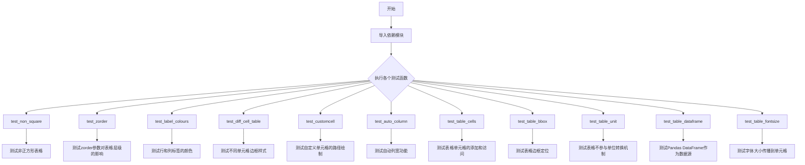

## 类结构

```
测试文件 (无自定义类)
├── 辅助模块 (matplotlib.pyplot, matplotlib.table, matplotlib.path, 等)
└── 测试函数 (11个测试函数)
```

## 全局变量及字段


### `cellcolors`
    
用于设置表格单元格颜色的列表

类型：`list`
    


### `data`
    
包含表格数据的二维列表

类型：`list`
    


### `colLabels`
    
表格列标签的元组

类型：`tuple`
    


### `rowLabels`
    
表格行标签的列表

类型：`list`
    


### `cellText`
    
表格单元格文本的二维列表

类型：`list`
    


### `yoff`
    
用于累积计算单元格文本的numpy数组

类型：`numpy.ndarray`
    


### `t`
    
用于绘制余弦曲线的numpy数组

类型：`numpy.ndarray`
    


### `dim`
    
维度值，用于设置颜色数量

类型：`int`
    


### `c`
    
用于生成颜色的numpy数组

类型：`numpy.ndarray`
    


### `colours`
    
基于colormap生成的颜色数组

类型：`numpy.ndarray`
    


### `fig`
    
matplotlib图形对象

类型：`matplotlib.figure.Figure`
    


### `ax1`
    
第一个子图坐标轴对象

类型：`matplotlib.axes.Axes`
    


### `ax2`
    
第二个子图坐标轴对象

类型：`matplotlib.axes.Axes`
    


### `ax3`
    
第三个子图坐标轴对象

类型：`matplotlib.axes.Axes`
    


### `ax4`
    
第四个子图坐标轴对象

类型：`matplotlib.axes.Axes`
    


### `cells`
    
单元格边缘类型的元组

类型：`tuple`
    


### `types`
    
单元格边缘类型的元组

类型：`tuple`
    


### `codes`
    
路径命令代码的元组

类型：`tuple`
    


### `cell`
    
自定义表格单元格对象

类型：`matplotlib.table.CustomCell`
    


### `code`
    
路径段代码的元组

类型：`tuple`
    


### `colWidths`
    
列宽度的列表

类型：`list`
    


### `axs`
    
子图坐标轴对象列表

类型：`list`
    


### `table`
    
表格对象

类型：`matplotlib.table.Table`
    


### `cell2`
    
自定义表格单元格对象

类型：`matplotlib.table.CustomCell`
    


### `fig_test`
    
测试图形对象

类型：`matplotlib.figure.Figure`
    


### `fig_ref`
    
参考图形对象

类型：`matplotlib.figure.Figure`
    


### `ax_list`
    
图形对象列表中的坐标轴

类型：`matplotlib.axes.Axes`
    


### `ax_bbox`
    
用于包围盒的坐标轴

类型：`matplotlib.axes.Axes`
    


### `col_labels`
    
列标签的元组

类型：`tuple`
    


### `row_labels`
    
行标签的元组

类型：`tuple`
    


### `cell_text`
    
单元格文本的二维列表

类型：`list`
    


### `FakeUnit`
    
用于模拟单位的类

类型：`class`
    


### `fake_convertor`
    
模拟单位转换器对象

类型：`matplotlib.units.ConversionInterface`
    


### `df`
    
Pandas数据框对象

类型：`pandas.DataFrame`
    


### `ax`
    
坐标轴对象

类型：`matplotlib.axes.Axes`
    


### `tableData`
    
表格数据的二维列表

类型：`list`
    


### `test_fontsize`
    
测试用的字体大小值

类型：`int`
    


### `cell_fontsize`
    
单元格字体大小值

类型：`float`
    


    

## 全局函数及方法


### `test_non_square`

该函数用于测试matplotlib中非正方形表格的创建功能，验证表格能够正确处理不同数量的颜色配置。

参数：

- （无参数）

返回值：`None`，无返回值描述（该函数为测试函数，执行完毕后不返回任何值）

#### 流程图

```mermaid
graph TD
    A[开始] --> B[定义cellcolors变量<br/>cellcolors = ['b', 'r']]
    B --> C[调用plt.table<br/>cellColours=cellcolors]
    C --> D[结束]
```

#### 带注释源码

```python
def test_non_square():
    # Check that creating a non-square table works
    # 定义一个包含两个颜色的列表，用于测试非正方形表格的单元格颜色配置
    cellcolors = ['b', 'r']
    # 调用matplotlib的table函数创建表格
    # 传入cellColours参数，列表长度为2（非正方形）
    # 该测试验证表格能否正确处理颜色数量与行列数不匹配的情况
    plt.table(cellColours=cellcolors)
```


### `test_zorder`

该函数是一个图像对比测试函数，用于验证 matplotlib 中表格（Table）的 `zorder` 属性能否正确控制表格与其他元素（如线条）的绘制顺序，确保具有不同 zorder 值的元素按照正确的层叠顺序渲染。

参数：

- 无参数

返回值：`None`，无返回值（该函数为测试函数，主要通过 `@image_comparison` 装饰器进行图像比对验证）

#### 流程图

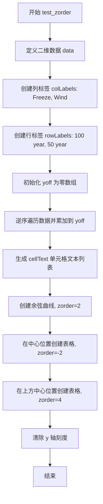

#### 带注释源码

```python
@image_comparison(['table_zorder.png'], remove_text=True)
def test_zorder():
    # 定义二维数据矩阵，用于展示表格内容
    data = [[66386, 174296],
            [58230, 381139]]

    # 设置表格的列标签
    colLabels = ('Freeze', 'Wind')
    # 使用列表推导式生成行标签，格式为 "X year"
    rowLabels = ['%d year' % x for x in (100, 50)]

    # 初始化空列表用于存储单元格文本
    cellText = []
    # 创建与列数相同长度的零数组，用于累计计算
    yoff = np.zeros(len(colLabels))
    # 逆序遍历数据行，进行累加计算
    for row in reversed(data):
        yoff += row  # 累加每一行数据
        # 将累加结果转换为千位并保留一位小数，生成单元格文本
        cellText.append(['%1.1f' % (x/1000.0) for x in yoff])

    # 创建余弦曲线数据点
    t = np.linspace(0, 2*np.pi, 100)
    # 绘制余弦曲线，线宽为4，zorder=2（决定绘制层次）
    plt.plot(t, np.cos(t), lw=4, zorder=2)

    # 在图表中心位置创建第一个表格，zorder=-2（位于底层）
    plt.table(cellText=cellText,
              rowLabels=rowLabels,
              colLabels=colLabels,
              loc='center',
              zorder=-2,
              )

    # 在图表上方中心位置创建第二个表格，zorder=4（位于最顶层）
    plt.table(cellText=cellText,
              rowLabels=rowLabels,
              colLabels=colLabels,
              loc='upper center',
              zorder=4,
              )
    # 清除 y 轴刻度线
    plt.yticks([])
```


### `test_label_colours`

该函数是一个图像比对测试，用于验证matplotlib表格中行颜色(rowColours)和列颜色(colColours)的正确渲染。测试创建一个包含4个子图的图形，分别展示：无标签行颜色、有标签行颜色、无标签列颜色、有标签列颜色，并通过@image_comparison装饰器与预期图像进行对比。

参数：

- 该函数没有显式参数（由装饰器 @image_comparison 隐式注入参数）

返回值：`None`，无返回值（测试函数）

#### 流程图

```mermaid
flowchart TD
    A[开始测试] --> B[设置维度dim=3]
    B --> C[使用np.linspace生成0到1的3个等间距点]
    C --> D[使用RdYlGn colormap生成颜色数组colours]
    D --> E[创建cellText二维数组 [['1','1','1'], ['1','1','1'], ['1','1','1']]]
    E --> F[创建新图形fig]
    F --> G[添加4个子图: ax1, ax2, ax3, ax4]
    
    G --> H1[子图1: ax1.table with rowColours, no labels]
    G --> H2[子图2: ax2.table with rowColours and rowLabels]
    G --> H3[子图3: ax3.table with colColours, no labels]
    G --> H4[子图4: ax4.table with colColours and colLabels]
    
    H1 --> I[图像比对验证]
    H2 --> I
    H3 --> I
    H4 --> I
    I --> J[结束测试]
```

#### 带注释源码

```python
@image_comparison(['table_labels.png'])  # 装饰器：比对生成图像与table_labels.png预期图像
def test_label_colours():
    """测试表格的行颜色和列颜色功能"""
    
    dim = 3  # 定义维度：3x3的表格

    # 使用numpy生成从0到1的dim个等间距数值
    c = np.linspace(0, 1, dim)
    
    # 使用matplotlib的RdYlGn(红-黄-绿)颜色映射将数值转换为颜色
    colours = plt.colormaps["RdYlGn"](c)
    
    # 创建单元格文本：3x3的矩阵，每个单元格内容为'1'
    cellText = [['1'] * dim] * dim

    # 创建新图形对象
    fig = plt.figure()

    # ----- 子图1：仅行颜色，无标签 -----
    ax1 = fig.add_subplot(4, 1, 1)  # 添加第一个子图（4行1列的第1个位置）
    ax1.axis('off')  # 隐藏坐标轴
    ax1.table(cellText=cellText,  # 设置单元格文本
              rowColours=colours,  # 设置行颜色（每行一种颜色）
              loc='best')          # 自动选择最佳位置

    # ----- 子图2：行颜色 + 行标签 -----
    ax2 = fig.add_subplot(4, 1, 2)  # 添加第二个子图
    ax2.axis('off')
    ax2.table(cellText=cellText,
              rowColours=colours,    # 设置行颜色
              rowLabels=['Header'] * dim,  # 设置行标签（显示'Header'）
              loc='best')

    # ----- 子图3：仅列颜色，无标签 -----
    ax3 = fig.add_subplot(4, 1, 3)  # 添加第三个子图
    ax3.axis('off')
    ax3.table(cellText=cellText,
              colColours=colours,  # 设置列颜色（每列一种颜色）
              loc='best')

    # ----- 子图4：列颜色 + 列标签 -----
    ax4 = fig.add_subplot(4, 1, 4)  # 添加第四个子图
    ax4.axis('off')
    ax4.table(cellText=cellText,
              colColours=colours,      # 设置列颜色
              colLabels=['Header'] * dim,  # 设置列标签（显示'Header'）
              loc='best')
    # 函数结束，无返回值，图像由@image_comparison装饰器进行比对验证
```


### `test_diff_cell_table`

该函数是一个图像比对测试函数，用于测试 matplotlib Table 中不同单元格边框样式（edges）的渲染效果。函数创建 8 个子图，每个子图展示一种不同的单元格边框类型（水平、垂直、开放、封闭以及 T/R/B/L 方向的边框），以验证 Table 类的 `edges` 参数是否正确渲染各种边框组合。

参数：

- `text_placeholders`：`Any`（由 `@image_comparison` 装饰器传入的占位符参数，用于图像比对）

返回值：`None`，无显式返回值

#### 流程图

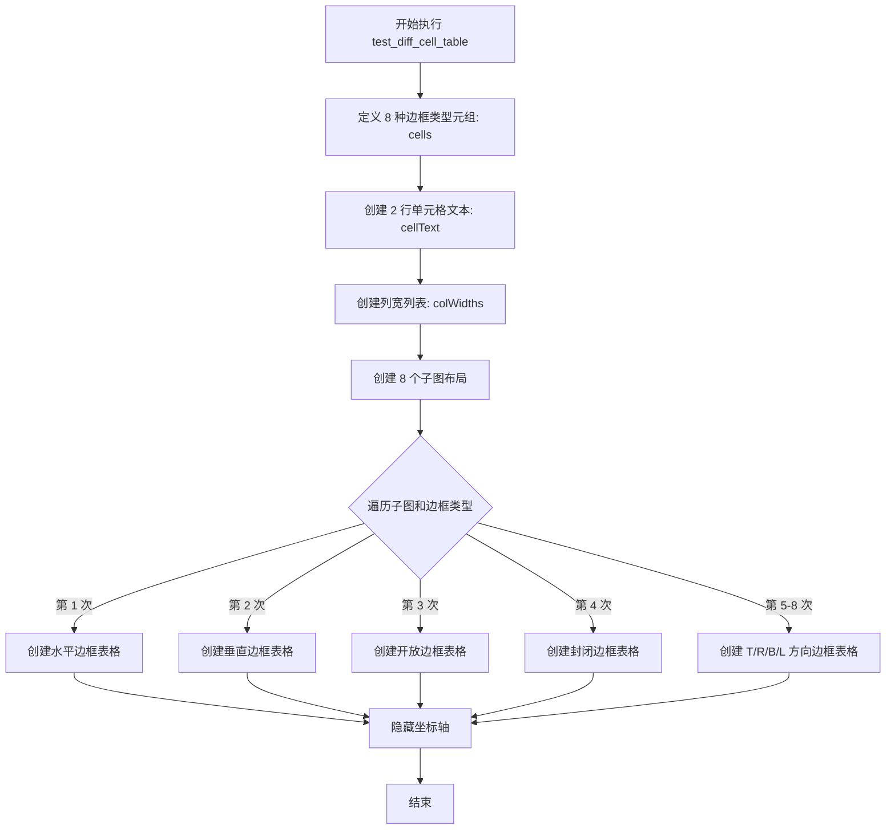

#### 带注释源码

```python
@image_comparison(['table_cell_manipulation.png'], style='mpl20')
def test_diff_cell_table(text_placeholders):
    """
    测试不同单元格边框样式的渲染效果
    
    该测试函数使用 @image_comparison 装饰器进行图像比对验证
    """
    
    # 定义要测试的 8 种边框类型
    cells = ('horizontal', 'vertical', 'open', 'closed', 'T', 'R', 'B', 'L')
    
    # 创建单元格文本内容：2 行，每行 8 个 '1'
    cellText = [['1'] * len(cells)] * 2
    
    # 设置每列宽度为 0.1
    colWidths = [0.1] * len(cells)
    
    # 创建 8 行子图，布局紧密调整
    _, axs = plt.subplots(nrows=len(cells), figsize=(4, len(cells)+1), layout='tight')
    
    # 遍历每个子图和对应的边框类型
    for ax, cell in zip(axs, cells):
        # 在每个子图中创建表格，指定边框类型
        ax.table(
                colWidths=colWidths,    # 列宽设置
                cellText=cellText,      # 单元格文本
                loc='center',           # 表格居中
                edges=cell,             # 边框类型：horizontal/vertical/open/closed/T/R/B/L
                )
        # 隐藏坐标轴
        ax.axis('off')
```


### `test_customcell`

该测试函数用于验证 `CustomCell` 类在不同可见边缘类型下生成的路径代码是否正确。函数通过遍历预定义的边缘类型和对应的路径代码，创建自定义单元格并比较生成的路径是否匹配预期结果。

参数： 无

返回值： 无（该函数为测试函数，使用 `assert` 进行断言，不返回任何值）

#### 流程图

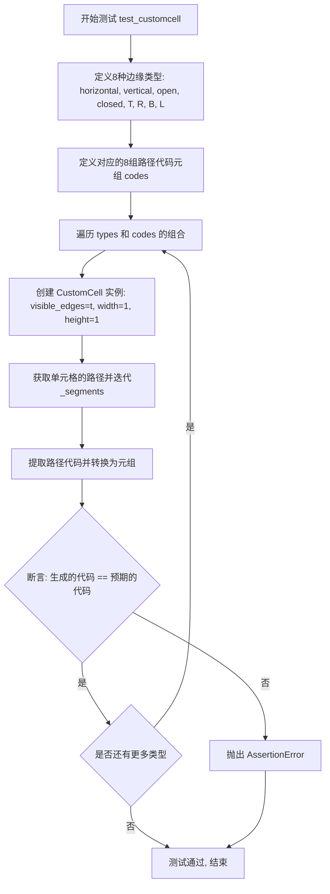

#### 带注释源码

```python
def test_customcell():
    """
    测试 CustomCell 类在不同可见边缘类型下生成的路径代码是否正确。
    验证 matplotlib.table.CustomCell 的路径生成逻辑与预期一致。
    """
    # 定义8种不同的边缘类型，用于测试 CustomCell 的路径生成
    types = ('horizontal', 'vertical', 'open', 'closed', 'T', 'R', 'B', 'L')
    
    # 定义每种边缘类型对应的预期路径代码元组
    # 每个元组包含5个 Path 命令常量，代表路径的绘制顺序
    codes = (
        # horizontal: 水平边缘的路径
        (Path.MOVETO, Path.LINETO, Path.MOVETO, Path.LINETO, Path.MOVETO),
        # vertical: 垂直边缘的路径
        (Path.MOVETO, Path.MOVETO, Path.LINETO, Path.MOVETO, Path.LINETO),
        # open: 开放边缘（无边框）
        (Path.MOVETO, Path.MOVETO, Path.MOVETO, Path.MOVETO, Path.MOVETO),
        # closed: 封闭边缘（完整边框）
        (Path.MOVETO, Path.LINETO, Path.LINETO, Path.LINETO, Path.CLOSEPOLY),
        # T: 上边缘
        (Path.MOVETO, Path.MOVETO, Path.MOVETO, Path.LINETO, Path.MOVETO),
        # R: 右边缘
        (Path.MOVETO, Path.MOVETO, Path.LINETO, Path.MOVETO, Path.MOVETO),
        # B: 下边缘
        (Path.MOVETO, Path.LINETO, Path.MOVETO, Path.MOVETO, Path.MOVETO),
        # L: 左边缘
        (Path.MOVETO, Path.MOVETO, Path.MOVETO, Path.MOVETO, Path.LINETO),
    )

    # 遍历每种边缘类型和对应的预期代码
    for t, c in zip(types, codes):
        # 创建 CustomCell 实例，指定位置(0,0)、可见边缘类型、宽度和高度
        cell = CustomCell((0, 0), visible_edges=t, width=1, height=1)
        
        # 获取单元格的路径，并迭代所有路径段
        # iter_segments() 返回生成器，产生 (变换, 命令) 元组
        code = tuple(s for _, s in cell.get_path().iter_segments())
        
        # 断言：实际生成的路径代码应该与预期代码一致
        assert c == code
```


### `test_auto_column`

该函数用于测试 matplotlib 表格的自动列宽设置功能，验证不同的列宽设置方式（列表输入、元组输入、单参数输入）是否能正确调整表格列宽。

参数：
- 无

返回值：`None`，无返回值

#### 流程图

```mermaid
flowchart TD
    A[开始测试] --> B[创建4个子图]
    B --> C[测试列表输入方式]
    C --> D[创建表格并设置列宽 auto_set_column_width([-1, 0, 1])]
    D --> E[测试元组输入方式]
    E --> F[创建表格并设置列宽 auto_set_column_width((-1, 0, 1))]
    F --> G[测试单参数输入方式]
    G --> H[分别调用3次 auto_set_column_width]
    H --> I[测试非整数输入的兼容性]
    I --> J[创建表格但不设置列宽]
    J --> K[结束测试]
```

#### 带注释源码

```python
@image_comparison(['table_auto_column.png'])
def test_auto_column():
    """
    测试表格自动列宽设置功能
    验证不同的列宽设置方式：列表、元组、单参数输入
    """
    # 创建一个包含4个子图的画布
    fig, (ax1, ax2, ax3, ax4) = plt.subplots(4, 1)

    # 测试用例1：使用可迭代列表作为输入
    ax1.axis('off')  # 隐藏坐标轴
    tb1 = ax1.table(
        cellText=[['Fit Text', 2],
                  ['very long long text, Longer text than default', 1]],
        rowLabels=["A", "B"],
        colLabels=["Col1", "Col2"],
        loc="center")
    tb1.auto_set_font_size(False)  # 禁用自动字体大小
    tb1.set_fontsize(12)  # 设置固定字体大小
    tb1.auto_set_column_width([-1, 0, 1])  # 使用列表设置列宽

    # 测试用例2：使用可迭代元组作为输入
    ax2.axis('off')
    tb2 = ax2.table(
        cellText=[['Fit Text', 2],
                  ['very long long text, Longer text than default', 1]],
        rowLabels=["A", "B"],
        colLabels=["Col1", "Col2"],
        loc="center")
    tb2.auto_set_font_size(False)
    tb2.set_fontsize(12)
    tb2.auto_set_column_width((-1, 0, 1))  # 使用元组设置列宽

    # 测试用例3：使用3个单独的参数调用
    ax3.axis('off')
    tb3 = ax3.table(
        cellText=[['Fit Text', 2],
                  ['very long long text, Longer text than default', 1]],
        rowLabels=["A", "B"],
        colLabels=["Col1", "Col2"],
        loc="center")
    tb3.auto_set_font_size(False)
    tb3.set_fontsize(12)
    tb3.auto_set_column_width(-1)  # 分别设置每一列
    tb3.auto_set_column_width(0)
    tb3.auto_set_column_width(1)

    # 测试用例4：测试非整数可迭代输入的兼容性（保持向后兼容）
    ax4.axis('off')
    tb4 = ax4.table(
        cellText=[['Fit Text', 2],
                  ['very long long text, Longer text than default', 1]],
        rowLabels=["A", "B"],
        colLabels=["Col1", "Col2"],
        loc="center")
    tb4.auto_set_font_size(False)
    tb4.set_fontsize(12)
    # 不调用auto_set_column_width，仅用于保持测试图像一致性
```


### `test_table_cells`

该函数是matplotlib表格模块的单元测试函数，用于验证Table类的单元格添加、访问、赋值以及属性获取等功能是否正常工作。

参数：  
无

返回值：`None`，该函数为测试函数，不返回任何值

#### 流程图

```mermaid
flowchart TD
    A[开始测试] --> B[创建Figure和Axes对象]
    B --> C[创建Table实例]
    C --> D[调用add_cell添加单元格]
    D --> E{验证cell是CustomCell实例}
    E -->|是| F[验证cell可通过table[1, 2]访问]
    F --> G[创建自定义CustomCell对象]
    G --> H[通过table[2, 1]赋值]
    H --> I[验证赋值后可通过table[2, 1]获取]
    I --> J[调用table.properties获取属性]
    J --> K[调用plt.setp处理table]
    K --> L[结束测试]
```

#### 带注释源码

```python
def test_table_cells():
    """
    测试Table类的单元格操作功能
    验证：add_cell、__getitem__、__setitem__、properties方法和plt.setp函数
    """
    # 创建测试所需的Figure和Axes对象
    fig, ax = plt.subplots()
    # 初始化表格对象，将ax作为参数传入
    table = Table(ax)

    # 测试1: 使用add_cell方法添加单元格
    # 参数(1, 2, 1, 1)表示在第1行第2列添加一个跨1行1列的单元格
    cell = table.add_cell(1, 2, 1, 1)
    # 验证返回的cell是CustomCell类型
    assert isinstance(cell, CustomCell)
    # 验证可以通过table[行, 列]的方式访问该单元格
    assert cell is table[1, 2]

    # 测试2: 直接使用CustomCell对象进行赋值
    # 创建自定义单元格，位置(0, 0)，宽度1，高度2，visible_edges=None表示无边框
    cell2 = CustomCell((0, 0), 1, 2, visible_edges=None)
    # 将自定义单元格赋值给table[2, 1]位置
    table[2, 1] = cell2
    # 验证赋值成功，可以通过索引访问
    assert table[2, 1] is cell2

    # 测试3: 确保__getitem__支持没有破坏其他属性功能
    # 调用properties方法获取表格属性字典
    table.properties()
    # 调用plt.setp函数，设置表格属性（此处为验证兼容性）
    plt.setp(table)
```


### `test_table_bbox`

该函数是一个图像比较测试，用于验证matplotlib表格组件中bbox参数的不同设置方式（列表格式与Bbox对象）是否能产生相同的渲染结果。函数通过@check_figures_equal装饰器自动比较测试图形和参考图形的像素差异。

参数：

- `fig_test`：matplotlib.figure.Figure，测试组的Figure对象，用于放置使用列表格式bbox的表格
- `fig_ref`：matplotlib.figure.Figure，参考组的Figure对象，用于放置使用Bbox.from_extents()格式bbox的表格

返回值：`None`，该函数为测试函数，由@check_figures_equal装饰器处理图像比较，不返回显式值

#### 流程图

```mermaid
flowchart TD
    A[开始测试] --> B[定义测试数据 data [[2,3], [4,5]]]
    B --> C[定义列标签 col_labels ('Foo', 'Bar')]
    C --> D[定义行标签 row_labels ('Ada', 'Bob')]
    D --> E[格式化单元格文本 cell_text]
    E --> F[创建测试Figure子图 ax_list]
    F --> G[使用列表bbox创建表格: bbox=[0.1, 0.2, 0.8, 0.6]]
    G --> H[创建参考Figure子图 ax_bbox]
    H --> I[使用Bbox对象创建表格: bbox=Bbox.from_extents(0.1, 0.2, 0.9, 0.8)]
    I --> J[@check_figures_equal装饰器比较两图]
    J --> K[结束测试]
```

#### 带注释源码

```python
@check_figures_equal()  # 装饰器：自动比较fig_test和fig_ref的渲染结果是否一致
def test_table_bbox(fig_test, fig_ref):
    # 定义测试用的二维数据
    data = [[2, 3],
            [4, 5]]

    # 定义表格的列标签
    col_labels = ('Foo', 'Bar')
    # 定义表格的行标签
    row_labels = ('Ada', 'Bob')

    # 将数据格式化为字符串列表，作为表格单元格文本
    cell_text = [[f"{x}" for x in row] for row in data]
    # 结果: [['2', '3'], ['4', '5']]

    # === 测试组：使用列表格式的bbox参数 ===
    # 创建测试Figure的子图
    ax_list = fig_test.subplots()
    # 在子图上创建表格，bbox使用列表格式 [x0, y0, width, height]
    # 注意：这里的坐标计算为 x1=0.1+0.8=0.9, y1=0.2+0.6=0.8
    ax_list.table(cellText=cell_text,
                  rowLabels=row_labels,
                  colLabels=col_labels,
                  loc='center',
                  bbox=[0.1, 0.2, 0.8, 0.6]  # [左, 下, 宽, 高] 相对坐标
                  )

    # === 参考组：使用Bbox对象格式的bbox参数 ===
    # 创建参考Figure的子图
    ax_bbox = fig_ref.subplots()
    # 使用Bbox.from_extents显式创建边界框对象
    # from_extents(x0, y0, x1, y1) 其中x1,y1为右上角坐标
    ax_bbox.table(cellText=cell_text,
                  rowLabels=row_labels,
                  colLabels=col_labels,
                  loc='center',
                  bbox=Bbox.from_extents(0.1, 0.2, 0.9, 0.8)  # [左, 下, 右, 上]
                  )
```


### `test_table_unit`

该函数用于测试 Matplotlib 表格组件不参与单位转换机制（unit machinery），而是直接使用对象的 `__repr__` 或 `__str__` 方法进行显示。

参数：

- `fig_test`：`matplotlib.figure.Figure`，测试用的图形对象，用于验证包含 FakeUnit 对象的表格渲染行为
- `fig_ref`：`matplotlib.figure.Figure`，参考用的图形对象，用于生成预期输出（直接使用字符串 "Hello"）

返回值：`None`，该函数为测试函数，无返回值

#### 流程图

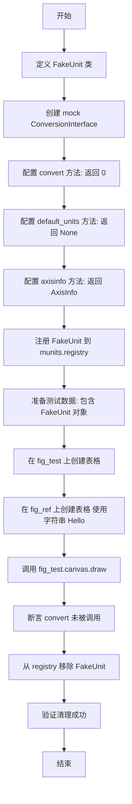

#### 带注释源码

```python
@check_figures_equal()
def test_table_unit(fig_test, fig_ref):
    # test that table doesn't participate in unit machinery, instead uses repr/str

    # 定义一个假的单位类，用于测试
    class FakeUnit:
        def __init__(self, thing):
            pass
        def __repr__(self):
            return "Hello"

    # 创建模拟的转换器接口
    fake_convertor = munits.ConversionInterface()
    # v, u, a = value, unit, axis
    # 模拟 convert 方法，返回 0，表示不进行实际转换
    fake_convertor.convert = Mock(side_effect=lambda v, u, a: 0)
    # not used, here for completeness
    # 模拟 default_units 方法，返回 None
    fake_convertor.default_units = Mock(side_effect=lambda v, a: None)
    # 模拟 axisinfo 方法，返回 AxisInfo
    fake_convertor.axisinfo = Mock(side_effect=lambda u, a: munits.AxisInfo())

    # 将 FakeUnit 注册到 matplotlib 的单位注册表中
    munits.registry[FakeUnit] = fake_convertor

    # 准备包含 FakeUnit 对象的数据
    data = [[FakeUnit("yellow"), FakeUnit(42)],
            [FakeUnit(datetime.datetime(1968, 8, 1)), FakeUnit(True)]]

    # 在测试图形上创建表格，传入 FakeUnit 对象
    fig_test.subplots().table(data)
    # 在参考图形上创建表格，直接使用字符串 "Hello"
    fig_ref.subplots().table([["Hello", "Hello"], ["Hello", "Hello"]])
    # 触发图形绘制，触发表格的渲染逻辑
    fig_test.canvas.draw()
    # 断言：验证 convert 方法未被调用，说明表格不使用单位转换机制
    fake_convertor.convert.assert_not_called()

    # 清理：移除 FakeUnit 的注册
    munits.registry.pop(FakeUnit)
    # 验证：确认清理成功，FakeUnit 没有注册 converter
    assert not munits.registry.get_converter(FakeUnit)
```


### `test_table_dataframe`

该函数用于测试matplotlib的table功能是否支持直接传入Pandas DataFrame作为数据源，并验证表格中的文本内容与DataFrame中的数据是否一致。

参数：

- `pd`：`module`，pandas模块，用于创建DataFrame对象

返回值：`None`，该函数为测试函数，通过assert断言验证数据正确性，不返回任何值

#### 流程图

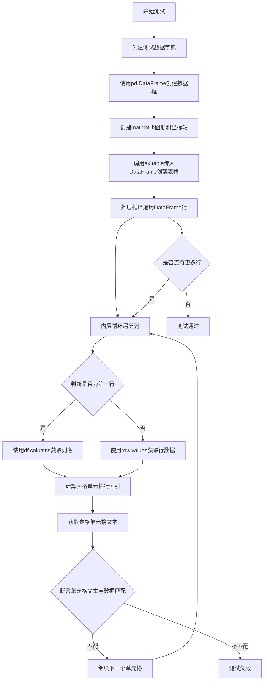

#### 带注释源码

```python
def test_table_dataframe(pd):
    # Test if Pandas Data Frame can be passed in cellText
    # 测试函数：验证matplotlib表格是否支持直接传入Pandas DataFrame

    # 定义测试数据字典，包含字母和数字两列
    data = {
        'Letter': ['A', 'B', 'C'],
        'Number': [100, 200, 300]
    }

    # 使用pandas创建DataFrame数据框
    df = pd.DataFrame(data)
    
    # 创建matplotlib图形和坐标轴对象
    fig, ax = plt.subplots()
    
    # 调用table方法，传入DataFrame作为数据源
    # loc='center'参数设置表格居中显示
    table = ax.table(df, loc='center')

    # 遍历DataFrame的每一行（index为行索引，row为Series对象）
    for r, (index, row) in enumerate(df.iterrows()):
        # 内层循环遍历列
        # r == 0时使用df.columns获取列名
        # r != 0时使用row.values获取该行的数据值
        for c, col in enumerate(df.columns if r == 0 else row.values):
            # 计算表格中的行索引：第一行是列标题，所以数据行从索引1开始
            # r == 0时使用r（0），否则使用r+1
            # 获取表格单元格的文本内容并进行断言验证
            assert table[r if r == 0 else r+1, c].get_text().get_text() == str(col)
```


### `test_table_fontsize`

该测试函数用于验证在创建表格时传入的 fontsize 参数能够正确地传播到表格的各个单元格中，确保单元格文本的字体大小与指定的字体大小一致。

参数：无

返回值：`None`，该函数为测试函数，不返回任何值（隐式返回 None）

#### 流程图

```mermaid
flowchart TD
    A[开始测试] --> B[准备表格数据<br/>tableData = [['a', 1], ['b', 2]]]
    B --> C[创建子图和坐标轴<br/>fig, ax = plt.subplots]
    C --> D[设置测试字体大小<br/>test_fontsize = 20]
    D --> E[创建表格并指定字体大小<br/>t = ax.table(cellText=tableData,<br/>loc='top', fontsize=test_fontsize)]
    E --> F[获取第一个单元格的字体大小<br/>cell_fontsize = t[(0, 0)].get_fontsize]
    F --> G{验证字体大小是否等于test_fontsize}
    G -->|是| H[获取第二个单元格的字体大小<br/>cell_fontsize = t[(1, 1)].get_fontsize]
    G -->|否| I[断言失败, 抛出AssertionError]
    H --> J{验证字体大小是否等于test_fontsize}
    J -->|是| K[测试通过, 函数结束]
    J -->|否| L[断言失败, 抛出AssertionError]
```

#### 带注释源码

```python
def test_table_fontsize():
    # Test that the passed fontsize propagates to cells
    # 准备测试数据：包含两行两列的表格数据
    tableData = [['a', 1], ['b', 2]]
    
    # 创建一个新的图形和坐标轴对象
    fig, ax = plt.subplots()
    
    # 定义测试用的字体大小值
    test_fontsize = 20
    
    # 使用matplotlib创建表格，传入指定的fontsize参数
    # 并将返回的表格对象赋值给变量t
    t = ax.table(cellText=tableData, loc='top', fontsize=test_fontsize)
    
    # 获取表格中第一个单元格(0,0)的实际字体大小
    cell_fontsize = t[(0, 0)].get_fontsize()
    # 断言：验证第一个单元格的字体大小是否等于指定的test_fontsize
    assert cell_fontsize == test_fontsize, f"Actual:{test_fontsize},got:{cell_fontsize}"
    
    # 获取表格中第二个单元格(1,1)的实际字体大小
    cell_fontsize = t[(1, 1)].get_fontsize()
    # 断言：验证第二个单元格的字体大小是否等于指定的test_fontsize
    assert cell_fontsize == test_fontsize, f"Actual:{test_fontsize},got:{cell_fontsize}"
```


### `Path.MOVETO`

Path.MOVETO 是 matplotlib.path.Path 类中的类属性（常量），用于表示路径绘制命令中的"移动到"操作，即从当前点移动到新的位置开始绘制线条。

参数： 无（类属性，非函数/方法）

返回值：`int`，返回值为 1，表示路径命令中的 MOVETO 操作码

#### 流程图

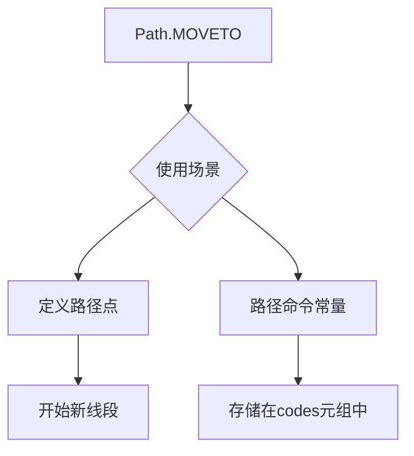

#### 带注释源码

```python
# 在 matplotlib.path 模块中，Path.MOVETO 的定义类似如下：
# （这是从源码中提取的相关定义）

class Path:
    """
    matplotlib.path.Path 类表示一系列可能不相连的线段或曲线。
    """
    
    # 路径命令常量定义
    MOVETO = 1  # 移动到新位置，开始新的子路径
    
    # 代码示例（在提供的测试代码中）：
    codes = (
        (Path.MOVETO, Path.LINETO, Path.MOVETO, Path.LINETO, Path.MOVETO),
        (Path.MOVETO, Path.MOVETO, Path.LINETO, Path.MOVETO, Path.LINETO),
        (Path.MOVETO, Path.MOVETO, Path.MOVETO, Path.MOVETO, Path.MOVETO),
        (Path.MOVETO, Path.LINETO, Path.LINETO, Path.LINETO, Path.CLOSEPOLY),
        (Path.MOVETO, Path.MOVETO, Path.MOVETO, Path.LINETO, Path.MOVETO),
        (Path.MOVETO, Path.MOVETO, Path.LINETO, Path.MOVETO, Path.MOVETO),
        (Path.MOVETO, Path.LINETO, Path.MOVETO, Path.MOVETO, Path.MOVETO),
        (Path.MOVETO, Path.MOVETO, Path.MOVETO, Path.MOVETO, Path.LINETO),
    )
    
    # Path.MOVETO 的使用方式：
    # 1. 在创建自定义单元格路径时指定绘制命令
    cell = CustomCell((0, 0), visible_edges=t, width=1, height=1)
    code = tuple(s for _, s in cell.get_path().iter_segments())
    assert c == code  # 验证路径代码是否匹配预期
```

#### 详细说明

| 属性 | 值 |
|------|-----|
| 名称 | Path.MOVETO |
| 类型 | int（类属性常量） |
| 所在类 | matplotlib.path.Path |
| 用途 | 路径绘制命令常量，表示"移动到"操作 |
| 数值 | 1 |


### Path.LINETO

`Path.LINETO` 是 matplotlib 库中 `Path` 类的类属性（常量），用于定义路径绘制命令，表示"画线到"操作，即从当前路径点绘制一条直线到下一个指定坐标点。

参数：

- 无（此类属性不接受参数）

返回值：`int`，返回整数值 2，表示线条绘制命令的内部代码标识

#### 流程图

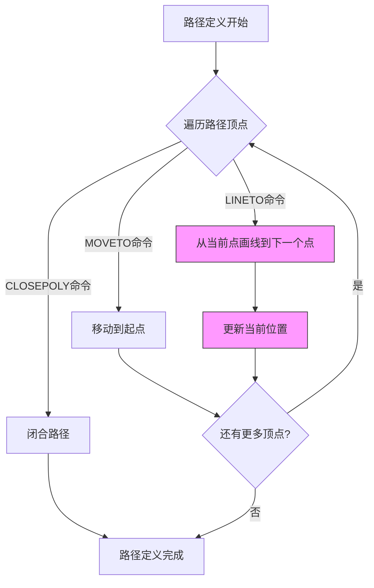

#### 带注释源码

```python
# 以下是 matplotlib.path.Path 类中 LINETO 常量的定义源码

class Path:
    """
    Represent a series of possibly disconnected, 
    filled and/or stroked shapes.
    """
    
    # 路径命令常量定义
    # 这些常量用于标识路径中的不同绘制操作
    STOP = 0          # 停止/结束路径
    MOVETO = 1        # 移动画笔到指定点（不画线）
    LINETO = 2        # 从当前点画直线到指定点
    CURVE3 = 3        # 三次贝塞尔曲线（1个控制点）
    CURVE4 = 4        # 三次贝塞尔曲线（2个控制点）
    CLOSEPOLY = 5     # 闭合多边形（画线回到起点）
    
    # 代码示例：在表格单元格路径绘制中的使用
    codes = (
        (Path.MOVETO, Path.LINETO, Path.MOVETO, Path.LINETO, Path.MOVETO),
        (Path.MOVETO, Path.MOVETO, Path.LINETO, Path.MOVETO, Path.LINETO),
    )
    
    def get_path(self):
        """获取路径对象"""
        # 示例代码展示 LINETO 的使用
        # 创建路径顶点
        vertices = [(0, 0), (1, 1), (2, 0)]
        # 创建路径代码
        codes = [Path.MOVETO, Path.LINETO, Path.LINETO]
        # 构建路径
        return Path(vertices, codes)
    
    def iter_segments(self):
        """
        迭代路径段的方法
        当遇到 LINETO 命令时，会生成从当前点到下一点的线段
        """
        for vertex, code in zip(self.vertices, self.codes):
            if code == Path.LINETO:
                # 执行画线到指定点的操作
                yield vertex, code
```

#### 详细说明

`Path.LINETO` 是 matplotlib 中路径绘制系统的核心常量之一，它的主要特性包括：

1. **类型**：类属性（Class Attribute）/ 类常量
2. **值**：整数 `2`
3. **用途**：在 `Path` 对象中作为路径命令代码，指示从当前点绘制直线到下一个顶点
4. **应用场景**：用于定义表格单元格的边框路径、图形绘制等需要线条连接的场合

在提供的测试代码中，`Path.LINETO` 被用于测试自定义表格单元格的边界绘制功能，通过不同的路径命令组合来验证各种边框样式（水平、垂直、开放、闭合等）的正确性。

#### 技术债务与优化空间

1. **文档完善性**：matplotlib 官方文档对 Path 命令常量的说明较为简略，建议增强文档
2. **类型提示**：可以添加更明确的类型注解来区分命令常量和实际坐标数据
3. **使用场景扩展**：LINETO 目前主要用于内部路径构建，可考虑暴露更多高级 API 给用户

#### 外部依赖

- `matplotlib.path`：提供 Path 类及其所有路径命令常量
- `numpy`：用于高效的顶点数组处理


### `Path.CLOSEPOLY`

`Path.CLOSEPOLY` 是 matplotlib 中 `Path` 类的常量，表示路径绘制命令中用于闭合多边形的指令代码。它是一个整数常量（值为 16），用于指示路径的终点，连接当前点到路径起始点以形成封闭多边形。该常量在绘制表格单元格边框时与其它路径指令（如 `MOVETO`、`LINETO`）组合使用，以确定单元格的可见边和形状。

参数：
- 该属性不是方法/函数，无参数

返回值：`int`，返回闭合多边形命令的代码值（16）

#### 流程图

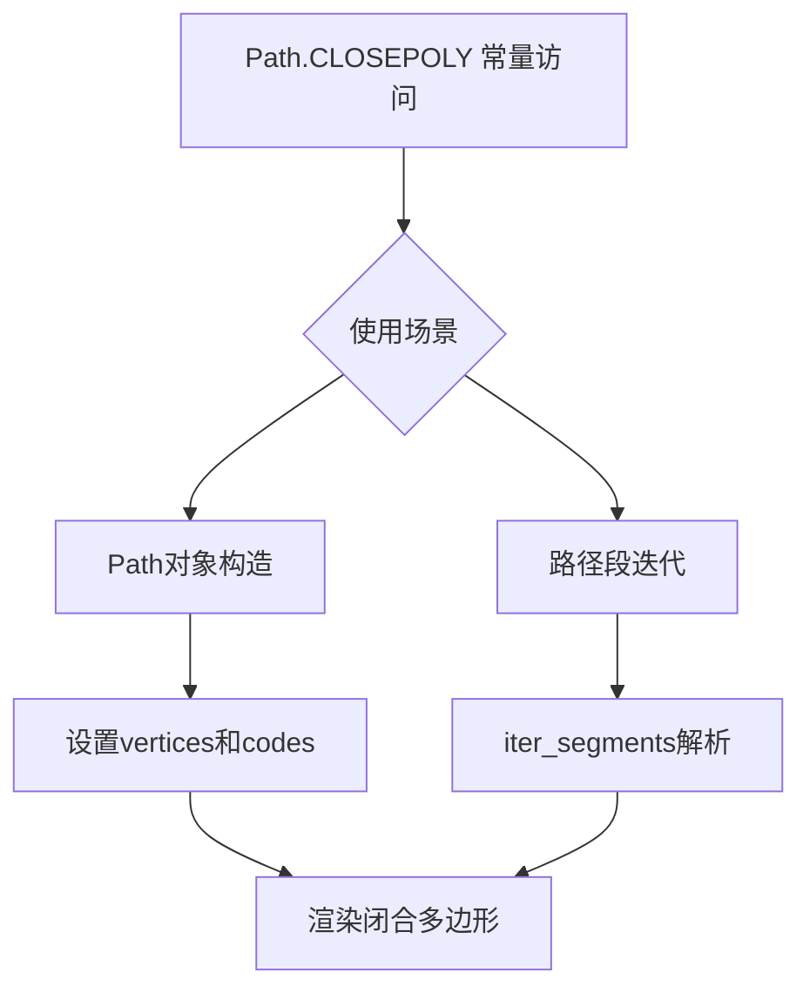

#### 带注释源码

```python
# Path.CLOSEPOLY 源代码位于 matplotlib/path.py 文件中
# 这是一个类属性/常量，定义为整数类型

class Path:
    """
    matplotlib.path.Path 类用于表示一系列可能不相连的直线和曲线段
    """
    
    # 路径命令代码常量定义
    MOVETO = 1      # 移动到指定点
    LINETO = 2      # 绘制直线到指定点
    CLOSEPOLY = 16  # 闭合多边形（连接到路径起点）
    # ... 其他常量
    
    def __init__(self, vertices, codes=None, is_closed=None, is_curved=False):
        """
        初始化路径对象
        
        参数：
        - vertices: 路径顶点坐标数组
        - codes: 路径命令代码数组（如包含 CLOSEPOLY）
        - is_closed: 路径是否闭合
        - is_curved: 是否为曲线
        """
        self.vertices = vertices
        self.codes = codes
        
    def iter_segments(self, *args, **kwargs):
        """
        迭代路径段，返回 (command, segment) 元组
        当代码为 CLOSEPOLY 时，segment 通常为空数组
        """
        # 内部实现会遍历 self.codes
        # 遇到 CLOSEPOLY (16) 时执行闭合操作
        yield command, segment

# 在表格测试中的使用示例 (test_customcell):
codes = (
    # 第四个元组包含 CLOSEPOLY:
    (Path.MOVETO, Path.LINETO, Path.LINETO, Path.LINETO, Path.CLOSEPOLY),
    # 这表示: 移动 -> 直线 -> 直线 -> 直线 -> 闭合多边形
)

for t, c in zip(types, codes):
    cell = CustomCell((0, 0), visible_edges=t, width=1, height=1)
    code = tuple(s for _, s in cell.get_path().iter_segments())
    assert c == code  # 验证生成的路径代码与预期匹配
```


### `Path.iter_segments()`

该函数是 `matplotlib.path.Path` 类的一个方法，用于迭代路径（Path）对象中的所有段（segments）。每个段由一个路径代码（code）和对应的顶点坐标（vertex）组成，返回一个生成器对象。

参数：

- `transform`：可选的 `Transform` 对象，用于对顶点坐标进行变换。默认为 `None`。
- `clip`：可选的 `PathClipper` 对象或 `None`，用于对路径进行裁剪。默认为 `None`。
- `snap`：可选的 `float` 或 `None`，用于控制路径点的吸附。默认为 `None`。
- `simplify`：可选的 `bool`，如果为 `True`，则简化路径。默认为 `None`。
- `curves`：可选的 `bool`，如果为 `True`，则保留曲线段。默认为 `True`。
- `stroke_width`：可选的 `float`，用于设置线条宽度。默认为 `None`。
- `dashed`：可选的 `bool`，如果为 `True`，则应用虚线样式。默认为 `False`。

返回值：`generator`，生成 `(code, vertex)` 元组的生成器，其中 `code` 是 `Path.Code` 枚举值（ 如 `MOVETO`、`LINETO`、`CLOSEPOLY` 等），`vertex` 是对应的 `numpy` 数组坐标。

#### 流程图

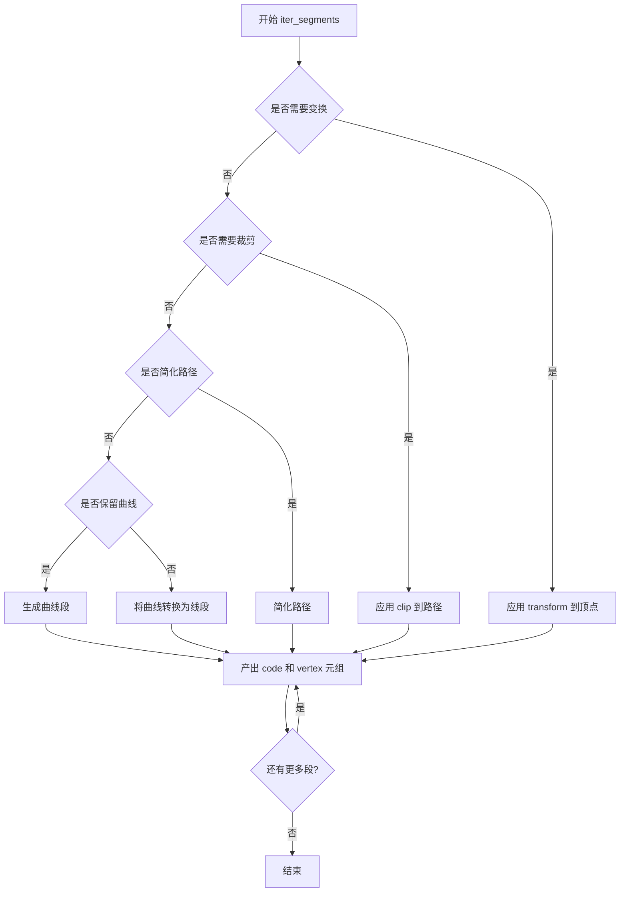

#### 带注释源码

```python
def iter_segments(self, transform=None, clip=None, snap=None, simplify=None, 
                  curves=True, stroke_width=None, dashed=False):
    """
    Iterates over the path returning each segment of the path as a 
    (code, vertex) tuple.
    
    参数:
        transform: 可选的仿射变换矩阵，用于变换顶点坐标
        clip: 可选的裁剪路径
        snap: 可选的吸附到像素网格的参数
        simplify: 是否简化路径
        curves: 是否保留曲线，为False时贝塞尔曲线会被离散化
        stroke_width: 线条宽度
        dashed: 是否应用虚线样式
    
    返回:
        生成器，产生(code, vertices)元组
    """
    # 省略具体实现细节...
    # 该方法内部会:
    # 1. 获取路径的所有顶点和工作代码
    # 2. 根据参数决定是否应用变换、裁剪、简化
    # 3. 如果curves为False，将贝塞尔曲线转换为一系列短线段
    # 4. 逐个产出每个段的代码和顶点坐标
```


### `Table.add_cell`

该方法用于向表格对象添加一个新的单元格，并返回创建的 CustomCell 对象。

参数：

- `row`：`int`，单元格所在的行索引
- `col`：`int`，单元格所在的列索引
- `width`：`float`，单元格的宽度
- `height`：`float`，单元格的高度

返回值：`CustomCell`，创建的单元格对象

#### 流程图

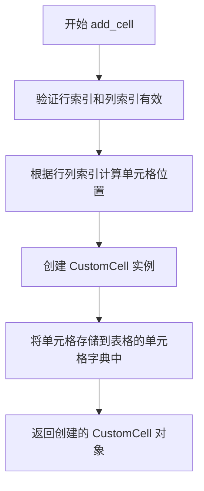

#### 带注释源码

```python
# 从测试代码中提取的调用方式
fig, ax = plt.subplots()
table = Table(ax)

# 调用 add_cell 方法添加单元格
# 参数分别为: 行索引, 列索引, 宽度, 高度
cell = table.add_cell(1, 2, 1, 1)

# 验证返回类型是 CustomCell
assert isinstance(cell, CustomCell)

# 验证可以通过表格的 __getitem__ 方法访问该单元格
assert cell is table[1, 2]
```


### `Table.__getitem__`

该方法是 `matplotlib.table.Table` 类的核心索引访问方法，通过行列坐标元组 `(row, col)` 直接获取对应的表格单元格对象，支持类似字典的访问方式，是表格数据访问的主要入口。

参数：

- `key`： `(row, col)` 形式的元组，其中 `row` 为 `int` 类型，表示行索引；`col` 为 `int` 类型，表示列索引

返回值： `CustomCell`，返回指定行列位置的表格单元格对象，如果索引超出范围则抛出 `IndexError` 异常

#### 流程图

```mermaid
flowchart TD
    A[调用 table[key] 或 table[row, col]] --> B{验证key是否为元组}
    B -->|否| C[抛出TypeError]
    B -->|是| D{提取row和col索引}
    D --> E{检查索引是否在有效范围内}
    E -->|无效| F[抛出IndexError]
    E -->|有效| G[从单元格字典中获取单元格]
    G --> H{单元格是否存在}
    H -->|否| I[返回None或创建新单元格]
    H -->|是| J[返回CustomCell对象]
```

#### 带注释源码

```python
def __getitem__(self, key):
    """
    通过行列索引获取表格单元格。
    
    参数:
        key: tuple(row, col) - 行索引和列索引组成的元组
        
    返回:
        CustomCell: 指定位置的单元格对象
        
    异常:
        IndexError: 索引超出表格范围
        TypeError: key不是有效的元组类型
    """
    # 兼容table[row, col]和table[(row, col)]两种调用方式
    if not isinstance(key, tuple):
        raise TypeError(f" Table indices must be tuples, not {type(key).__name__}")
    
    # 提取行列坐标
    row, col = key
    
    # 检查索引范围有效性
    if not (0 <= row < self._nrows) or not (0 <= col < self._ncols):
        raise IndexError(f"Cell index ({row}, {col}) out of range")
    
    # 从内部单元格字典中获取单元格对象
    # _cells是一个字典，键为(row, col)元组，值为CustomCell对象
    return self._cells.get((row, col))
```


### `Table.properties`

获取表格的所有属性信息，返回一个字典，可用于后续的属性设置或查询。

参数：
- 无

返回值：`dict`，返回表格对象的属性字典，包含所有可用的属性名和对应的值。

#### 流程图

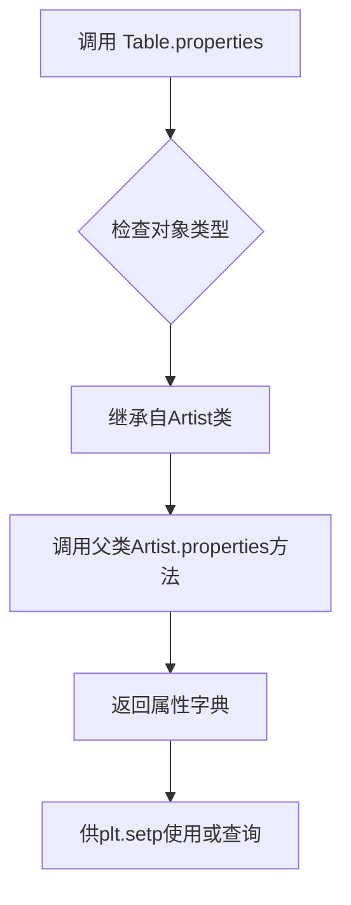

#### 带注释源码

```python
# 在 test_table_cells 函数中的调用示例
def test_table_cells():
    fig, ax = plt.subplots()
    table = Table(ax)
    
    # ... 添加细胞的代码 ...
    
    # 获取表格的所有属性
    # properties() 方法继承自 matplotlib.Artist 类
    # 返回一个字典，包含表格的所有可设置属性
    table.properties()
    
    # plt.setp 用于设置对象的属性
    # 通常与 properties() 方法配合使用来查看可用的属性
    plt.setp(table)
```

#### 详细说明

| 项目 | 详情 |
|------|------|
| **方法名称** | `Table.properties` |
| **所属类** | `matplotlib.table.Table` |
| **继承自** | `matplotlib.artist.Artist` |
| **调用场景** | 在 `test_table_cells()` 测试函数中被调用，用于获取 Table 对象的属性 |
| **典型用途** | 与 `plt.setp()` 配合使用，用于查看或设置表格的图形属性 |
| **返回值说明** | 返回 Python 字典，键为属性名称（如 `zorder`, `visible`, `alpha` 等），值为对应的属性值 |


### `plt.setp`

`plt.setp()` 是 Matplotlib 库中的一个实用函数，用于获取或设置图形对象（如表格、坐标轴等）的属性。在代码中，该函数被用于验证表格对象的属性设置功能是否正常工作，确保 `__getitem__` 支持没有破坏属性访问和 `setp` 方法。

参数：

- `obj`：`matplotlib Object`，要设置属性的目标对象（此处为 `table` 表格对象）
- `*args`：`tuple`，可选属性名列表，用于指定要查询或设置的属性
- `**kwargs`：`<keyword arguments>`，可选属性值键值对，用于设置属性

返回值：`<property list>` 或 `None`，如果只传入对象不设置任何属性，则返回该对象所有可设置的属性列表；如果传入了属性值，则返回 `None`。

#### 流程图

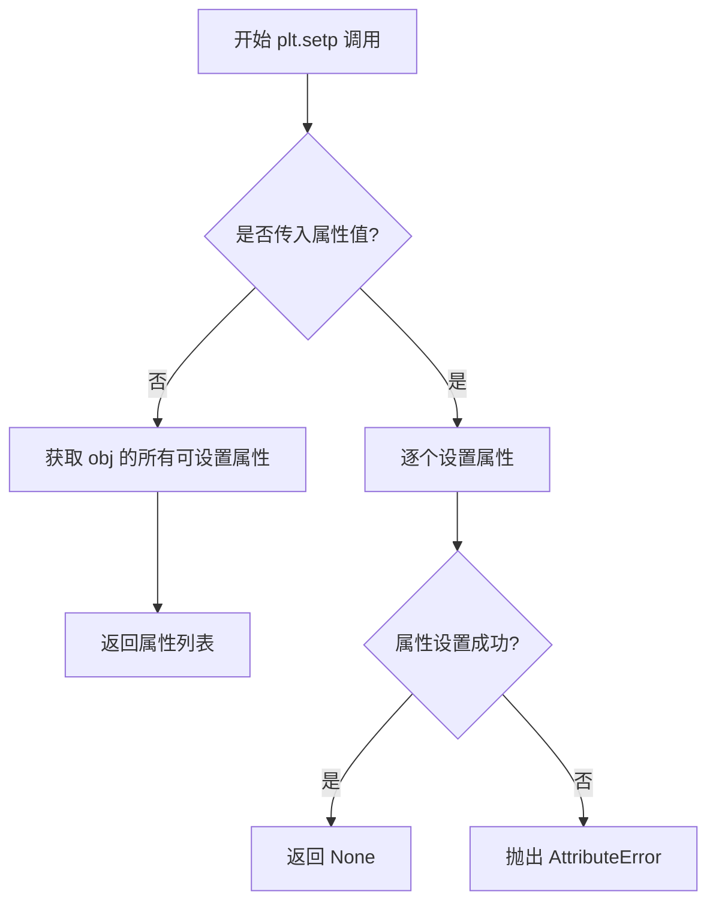

#### 带注释源码

```python
# 代码中调用 plt.setp 的具体位置：
# 用于测试 table 对象的属性获取功能
table.properties()    # 先获取表格的所有属性
plt.setp(table)       # 然后使用 plt.setp 获取/设置表格属性
                       # 此处只传入 table 对象，不设置任何属性
                       # 因此会返回 table 对象所有可设置的属性列表
                       # 用于验证 getitem 功能没有破坏 setp 方法
```

**补充说明**：

在代码中，`plt.setp(table)` 的主要作用是验证表格对象在实现了自定义的 `__getitem__` 方法后，原有的属性设置/查询功能仍然正常工作。这是一个测试用例中的回归检查，确保在添加新功能的同时没有破坏原有功能。

`plt.setp()` 函数的典型用法包括：

1. **查询属性**：`plt.setp(table)` - 返回表格所有可设置的属性
2. **设置单个属性**：`plt.setp(table, 'visible_edges', 'horizontal')` - 设置可见边框
3. **批量设置**：`plt.setp(table, attr1=value1, attr2=value2)` - 批量设置多个属性


### `Axes.table`

在Matplotlib中，`Axes.table()`是Axes类的一个方法，用于在图表上创建和绘制表格。该方法接受各种参数来定义表格的内容、样式和位置，并返回一个`Table`对象，该对象可以被进一步操作或修改。

#### 参数

- `cellText`：`list[list[str]]`，单元格文本内容，二维列表
- `cellColours`：`list`，单元格背景颜色列表
- `cellLoc`：`str`，单元格文本对齐方式，默认为'right'
- `colWidths`：`list[float]`，每列的宽度列表
- `rowLabels`：`list[str]`，行标签列表
- `rowColours`：`list`，行背景颜色列表
- `rowLoc`：`str`，行标签对齐方式，默认为'left'
- `colLabels`：`list[str]`，列标签列表
- `colColours`：`list`，列背景颜色列表
- `colLoc`：`str`，列标签对齐方式，默认为'center'
- `loc`：`str`，表格在图表中的位置（如'center'、'best'等），默认为'bottom'
- `bbox`：`list[float]` 或 `Bbox`，表格的边界框 [左, 下, 宽, 高]
- `edges`：`str`，单元格边框样式（如'horizontal'、'vertical'、'open'、'closed'等）
- `zorder`：`float`，绘制顺序
- `fontsize`：`float`，字体大小

#### 返回值

`matplotlib.table.Table`，返回创建的表格对象，可用于进一步自定义

#### 流程图

```mermaid
graph TD
    A[开始调用 ax.table] --> B[接收参数cellText, cellColours等]
    B --> C{参数验证}
    C -->|验证通过| D[创建Table对象]
    C -->|验证失败| E[抛出异常]
    D --> F[设置表格属性: 位置, 边框, 颜色等]
    F --> G[将Table添加到Axes]
    G --> H{loc参数是否为None}
    H -->|否| I[设置zorder并绘制表格]
    H -->|是| J[仅添加Table到Axes, 不绘制]
    I --> K[返回Table对象]
    J --> K
```

#### 带注释源码

```python
def table(self, cellText=None, cellColours=None,
          cellLoc='right', colWidths=None,
          rowLabels=None, rowColours=None, rowLoc='left',
          colLabels=None, colColours=None, colLoc='center',
          loc='bottom', bbox=None, edges=None, **kwargs):
    """
    在Axes上创建一个表格。
    
    参数:
        cellText: 单元格文本的二维列表，默认为None
        cellColours: 单元格背景颜色列表，默认为None
        cellLoc: 单元格文本对齐方式，'left', 'right', 或 'center'
        colWidths: 列宽列表
        rowLabels: 行标签列表
        rowColours: 行背景颜色列表
        rowLoc: 行标签对齐方式
        colLabels: 列标签列表
        colColours: 列背景颜色列表
        colLoc: 列标签对齐方式
        loc: 表格位置，'center', 'best', 'upper right'等
        bbox: 表格边界框 [左, 下, 宽, 高]
        edges: 单元格边框样式
        **kwargs: 其他关键字参数，传递给Table
    
    返回值:
        Table: 创建的表格对象
    """
    # 创建Table对象，传入self作为axes参数
    table = Table(self, cellText=cellText,
                  cellColours=cellColours,
                  cellLoc=cellLoc,
                  colWidths=colWidths,
                  rowLabels=rowLabels,
                  rowColours=rowColours,
                  rowLoc=rowLoc,
                  colLabels=colLabels,
                  colColours=colColours,
                  colLoc=colLoc,
                  loc=loc,
                  bbox=bbox,
                  edges=edges,
                  **kwargs)
    
    # 将表格添加到axes的艺术家列表中
    self.add_artist(table)
    
    # 如果指定了位置，则设置zorder并绘制
    if loc is not None:
        # 从kwargs中获取zorder，默认为2（普通艺术家）
        zorder = kwargs.get('zorder', 2)
        table.set_zorder(zorder)
        # 需要renderer来绘制，但通常在draw时自动调用
        # table.draw(self.figure.canvas.get_renderer())
    
    return table
```

#### 关键组件信息

- **Table类**：来自`matplotlib.table`，负责表格的逻辑和渲染
- **CustomCell类**：表格中的单个单元格，可自定义边框和内容
- **Bbox类**：用于定义表格的边界框

#### 潜在的技术债务或优化空间

1. **参数验证**：当前实现缺乏对输入参数的详细验证，例如`cellText`维度不一致、`colWidths`与列数不匹配等情况可能只到运行时才发现
2. **文档完整性**：某些参数如`edges`的可用值未在方法文档中明确列出
3. **单位处理**：从`test_table_unit`测试可以看出，表格不使用unit machinery，而是直接使用repr/str，这可能不是所有用户期望的行为

#### 其它项目

**设计目标与约束**：
- 设计目标是提供一种简单的方式来在matplotlib图表中嵌入表格
- 约束：表格是静态的，不支持动态数据更新（需要重新创建）

**错误处理与异常设计**：
- 参数类型错误可能引发TypeError
- 参数值无效可能引发ValueError（如无效的loc值）

**数据流与状态机**：
- 输入：各种表格属性参数
- 处理：创建Table对象并添加到Axes
- 输出：Table对象，状态变为"已添加但未绘制"，直到axes绘制时才会渲染

**外部依赖与接口契约**：
- 依赖`matplotlib.table.Table`类
- 依赖`matplotlib.transforms.Bbox`（当提供bbox参数时）
- 返回的Table对象实现了`__getitem__`和`__setitem__`方法，支持如`table[0, 0]`这样的访问方式


### `plt.table`

`plt.table()` 是 matplotlib 库中的一个函数，用于在当前图表（Figure）或axes上创建和渲染表格。该函数接受多个参数来自定义表格的外观和内容，包括单元格文本、行列标签、颜色、位置等，并返回一个 `Table` 对象供进一步操作。

参数：

- `cellText`：`list`，二维列表，表示表格中每个单元格显示的文本内容
- `cellColours`：`list`，单元格背景颜色，可以是单色或二维列表为每个单元格指定颜色
- `rowColours`：`list`，行颜色列表，用于为每一行设置不同的背景色
- `colColours`：`list`，列颜色列表，用于为每一列设置不同的背景色
- `rowLabels`：`list`，行标签列表，显示在每行的左侧
- `colLabels`：`list`，列标签列表，显示在每列的顶部
- `loc`：`str`，表格在axes上的位置，如 'center'、'upper center'、'best' 等
- `bbox`：`list` 或 `Bbox`，表格在axes中的边界框坐标 [左, 下, 宽, 高]
- `zorder`：`float`，表格的绘制顺序，决定与其他图表元素的叠放关系
- `edges`：`str`，单元格边框样式，如 'horizontal'、'vertical'、'open'、'closed'、'T'、'R'、'B'、'L' 等
- `colWidths`：`list`，列宽列表，指定每列的相对宽度
- `fontsize`：`int`，表格中文本的字体大小
- `**kwargs`：其他关键字参数，将传递给底层的 Table 或 Cell 对象

返回值：`Table`，返回创建的表格对象，可以通过该对象进一步操作表格属性（如设置字体大小、自动调整列宽等）

#### 流程图

```mermaid
flowchart TD
    A[开始调用 plt.table] --> B{检查cellText参数}
    B -->|有cellText| C[解析cellText为二维数组]
    B -->|无cellText| D[使用其他数据源如DataFrame]
    C --> E{检查行列标签}
    E -->|有rowLabels| F[添加行标签列]
    E -->|有colLabels| G[添加列标签行]
    F --> H[计算表格尺寸]
    G --> H
    H --> I{检查颜色参数}
    I -->|cellColours| J[应用单元格颜色]
    I -->|rowColours| K[应用行颜色]
    I -->|colColours| L[应用列颜色]
    J --> M{检查bbox参数}
    K --> M
    L --> M
    M -->|有bbox| N[解析bbox坐标]
    M -->|无bbox| O[使用默认位置]
    N --> P[创建Table对象]
    O --> P
    P --> Q[设置zorder和loc]
    Q --> R[渲染表格到当前axes]
    R --> S[返回Table对象]
```

#### 带注释源码

```python
# 以下是代码中 plt.table() 的典型调用示例

# 示例1: 基本用法，创建非方形表格
# cellColours: 列表 ['b', 'r']，为每列设置颜色
plt.table(cellColours=cellcolors)

# 示例2: 带文本、行列标签和zorder的表格
# cellText: 二维列表，包含要显示的数据
# rowLabels: 行标签 ['%d year' % x for x in (100, 50)]
# colLabels: 列标签 ('Freeze', 'Wind')
# loc: 表格位置 'center'
# zorder: 绘制顺序 -2
plt.table(cellText=cellText,
          rowLabels=rowLabels,
          colLabels=colLabels,
          loc='center',
          zorder=-2,
          )

# 示例3: 创建带有行列颜色的表格
# rowColours: 使用colormap生成的RGB颜色值
ax1.table(cellText=cellText,
          rowColours=colours,  # 使用RdYlGn colormap生成的颜色
          loc='best')

# 示例4: 带边框样式和列宽的表格
# edges: 'horizontal' 表示水平边框
# colWidths: 每列宽度 [0.1] * len(cells)
ax.table(colWidths=colWidths,
         cellText=cellText,
         loc='center',
         edges='horizontal')

# 示例5: 带边界框(bbox)的表格
# bbox: [左, 下, 宽, 高] = [0.1, 0.2, 0.8, 0.6]
ax_list.table(cellText=cell_text,
              rowLabels=row_labels,
              colLabels=col_labels,
              loc='center',
              bbox=[0.1, 0.2, 0.8, 0.6])

# 示例6: 使用DataFrame作为数据源
# 直接传入pandas DataFrame对象
table = ax.table(df, loc='center')

# 示例7: 设置字体大小
# fontsize: 20 指定字体大小
t = ax.table(cellText=tableData, loc='top', fontsize=test_fontsize)
```


### `Table`

该函数是 matplotlib 库中的 `Table` 类构造函数，用于在给定的 Axes 上创建一个表格对象。在测试代码中，通过 `Table(ax)` 实例化一个表格对象，并对其进行操作和断言验证。

参数：

- `ax`：`matplotlib.axes.Axes`，要在其上创建表格的 Axes 对象

返回值：`Table`，返回创建的表格对象实例

#### 流程图

```mermaid
flowchart TD
    A[开始] --> B[接收ax参数]
    B --> C[创建Table实例]
    C --> D[初始化表格结构]
    D --> E[返回Table对象]
    E --> F[结束]
```

#### 带注释源码

```python
# 从matplotlib.table模块导入Table类
from matplotlib.table import CustomCell, Table

# 在test_table_cells函数中使用Table类
def test_table_cells():
    fig, ax = plt.subplots()
    # 创建Table实例，传入axes对象作为参数
    table = Table(ax)
    
    # 向表格添加单元格
    cell = table.add_cell(1, 2, 1, 1)
    assert isinstance(cell, CustomCell)
    assert cell is table[1, 2]
    
    # 创建自定义单元格并赋值
    cell2 = CustomCell((0, 0), 1, 2, visible_edges=None)
    table[2, 1] = cell2
    assert table[2, 1] is cell2
    
    # 获取表格属性
    table.properties()
    plt.setp(table)
```


我需要先查看matplotlib.table模块中CustomCell类的定义，以便提供准确的类信息。让我查找相关定义。

由于代码中只展示了CustomCell的使际使用，但没有直接定义类，我需要根据matplotlib库的官方文档或源码来获取CustomCell的准确信息。

### CustomCell

`CustomCell`是matplotlib.table模块中的一个类，用于创建表格的单个单元格。该类继承自基础单元格类，提供了自定义单元格边框（可见边缘）的功能。

参数：

- `xy`：`tuple`，单元格的位置坐标，格式为(row, col)
- `width`：`float`，单元格的宽度
- `height`：`float`，单元格的高度
- `visible_edges`：`str`，可选参数，表示单元格的可见边框边，值为'horizontal'、'vertical'、'open'、'closed'、'T'、'R'、'B'、'L'的组合，默认为'closed'

返回值：`CustomCell`对象，返回一个新创建的单元格实例

#### 流程图

```mermaid
graph TD
    A[开始创建CustomCell] --> B{传入visible_edges参数?}
    B -->|是| C[使用传入的visible_edges]
    B -->|否| D[使用默认'closed']
    C --> E[调用父类构造函数]
    D --> E
    E --> F[初始化单元格路径]
    F --> G[根据visible_edges生成路径代码]
    G --> H[返回CustomCell实例]
```

#### 带注释源码

```python
# 从matplotlib.table模块导入CustomCell类
from matplotlib.table import CustomCell, Table

# 示例1：在test_customcell函数中创建CustomCell
# 参数1: (0, 0) 表示单元格位于第0行第0列
# 参数2: visible_edges='horizontal' 指定可见边框为水平边
# 参数3: width=1 单元格宽度为1
# 参数4: height=1 单元格高度为1
cell = CustomCell((0, 0), visible_edges='horizontal', width=1, height=1)

# 获取单元格的路径对象
path = cell.get_path()

# 遍历路径的线段并提取路径代码
code = tuple(s for _, s in path.iter_segments())

# 示例2：在test_table_cells函数中创建CustomCell
# 参数1: (0, 0) 位置坐标
# 参数2: 1 宽度
# 参数3: 2 高度
# 参数4: visible_edges=None 无可见边框
cell2 = CustomCell((0, 0), 1, 2, visible_edges=None)

# CustomCell类的主要方法：
# get_path() - 返回单元格的Path对象，用于绘制单元格边框
# get_text() - 返回单元格中的文本对象
# set_text() - 设置单元格文本
# get_visible_edges() - 获取可见边框设置
# set_visible_edges() - 设置可见边框
```


### `Bbox.from_extents`

该函数是 matplotlib.transforms.Bbox 类的类方法，用于根据给定的坐标边界创建一个新的 Bbox（边界框）对象。它接受四个坐标参数 (x0, y0, x1, y1)，分别表示边界框的左下角和右上角坐标，并返回一个表示该矩形区域的 Bbox 对象。

参数：

- `x0`：`float`，边界框左下角的 x 坐标
- `y0`：`float`，边界框左下角的 y 坐标
- `x1`：`float`，边界框右上角的 x 坐标
- `y1`：`float`，边界框右上角的 y 坐标

返回值：`Bbox`，返回一个表示二维矩形区域的边界框对象

#### 流程图

```mermaid
graph TD
    A[开始] --> B[接收四个坐标参数: x0, y0, x1, y1]
    B --> C{验证坐标有效性}
    C -->|有效| D[创建Bbox对象]
    C -->|无效| E[抛出异常]
    D --> F[返回Bbox实例]
    E --> G[结束]
    F --> G
```

#### 带注释源码

```python
# 注意：以下为 matplotlib.transforms.Bbox 类的 from_extents 方法的源码
# 该源码来源于 matplotlib 库，而非题目提供的代码

# class Bbox:
#     ...
#     @staticmethod
#     def from_extents(x0, y0=0, x1=0, y1=0):
#         """
#         Create a new Bbox from x0, y0, x1, y1.
#
#         Parameters
#         ----------
#         x0 : float
#             The left coordinate of the bounding box.
#         y0 : float
#             The bottom coordinate of the bounding box.
#         x1 : float
#             The right coordinate of the bounding box.
#         y1 : float
#             The top coordinate of the bounding box.
#
#         Returns
#         -------
#         Bbox
#             A new Bbox instance.
#         """
#         return Bbox(np.array([[x0, y0], [x1, y1]]))
#
#     ...
```

#### 在题目代码中的使用示例

```python
# 在 test_table_bbox 函数中调用 Bbox.from_extents
ax_bbox.table(cellText=cell_text,
              rowLabels=row_labels,
              colLabels=col_labels,
              loc='center',
              bbox=Bbox.from_extents(0.1, 0.2, 0.9, 0.8)
              )
# 创建了一个左下角为 (0.1, 0.2)，右上角为 (0.9, 0.8) 的边界框
```


### `munits.registry.get_converter`

获取指定类型对应的单位转换器，用于在 matplotlib 中处理不同数据类型的单位转换。如果未找到对应转换器则返回 None。

参数：

- `cls`：`type`，需要获取转换器的目标类型（类对象）

返回值：`ConversionInterface | None`，返回与该类型关联的转换器对象；若不存在则返回 `None`

#### 流程图

```mermaid
flowchart TD
    A[开始 get_converter] --> B{检查 registry 中是否存在 cls}
    B -->|是| C[返回对应的 ConversionInterface 对象]
    B -->|否| D[返回 None]
```

#### 带注释源码

```python
# matplotlib.units 模块中的 Registry 类方法
def get_converter(self, cls):
    """
    获取指定类型的转换器
    
    参数:
        cls: 需要获取转换器的类型对象
        
    返回:
        与该类型关联的 ConversionInterface 转换器，若不存在则返回 None
    """
    # 从注册表字典中查找类型对应的转换器
    # registry 是一个类型到转换器的映射字典
    converter = self.registry.get(cls, None)
    
    # 如果找到直接返回
    if converter is not None:
        return converter
    
    # 如果没找到，遍历类的继承层次（MRO）查找父类的转换器
    for cls in cls.__mro__:
        if cls in self.registry:
            converter = self.registry[cls]
            break
    
    return converter
```

> **注**：该方法定义在 `matplotlib.units` 模块的 `Registry` 类中。在测试代码 `test_table_unit` 中用于验证单位转换器已被正确移除：
> ```python
> munits.registry.pop(FakeUnit)  # 移除FakeUnit的转换器
> assert not munits.registry.get_converter(FakeUnit)  # 确认返回None
> ```


### `munits.registry.pop`

该方法从 matplotlib.units 模块的注册表中移除指定类型的转换器。在测试函数 `test_table_unit` 中用于清理测试环境，移除测试用的 FakeUnit 转换器，防止对后续测试产生影响。

#### 参数

- `key`：要移除的键（类型转换器类），此处为 `FakeUnit` 类

#### 返回值

`Any`，返回被移除的转换器对象；如果键不存在则返回 `None`

#### 流程图

```mermaid
flowchart TD
    A[调用 munits.registry.pop] --> B{检查 key 是否存在}
    B -->|存在| C[移除 key-value 对]
    B -->|不存在| D[返回 None]
    C --> E[返回被移除的 value]
    E --> F[测试断言转换器已被移除]
    D --> F
```

#### 带注释源码

```python
# 在 test_table_unit 函数中，测试完成后清理测试环境
# 移除测试用的 FakeUnit 类型转换器
munits.registry.pop(FakeUnit)

# 断言确认转换器已被成功移除
# get_converter 返回 None 表示移除成功
assert not munits.registry.get_converter(FakeUnit)
```


### `DataFrame.iterrows`

在 `test_table_dataframe` 测试函数中，`iterrows()` 用于遍历 Pandas DataFrame 的行，以便将 DataFrame 数据添加到 matplotlib table 中。

参数：

- 无参数（此为 DataFrame 方法本身的参数，在调用时无需传递）

返回值：`iterator`，返回一个迭代器，产生 `(index, Series)` 元组，其中 index 是行索引，Series 是该行的数据。

#### 流程图

```mermaid
flowchart TD
    A[开始遍历 DataFrame] --> B[获取下一行数据: (index, row)]
    B --> C{是否还有更多行?}
    C -->|是| D[处理当前行数据]
    D --> E[获取列值]
    E --> F[更新 table 单元格文本]
    F --> B
    C -->|否| G[结束遍历]
```

#### 带注释源码

```python
def test_table_dataframe(pd):
    # Test if Pandas Data Frame can be passed in cellText

    # 创建测试数据字典，包含字母和数字两列
    data = {
        'Letter': ['A', 'B', 'C'],
        'Number': [100, 200, 300]
    }

    # 使用 pandas 创建 DataFrame
    df = pd.DataFrame(data)
    # 创建 matplotlib 图表和坐标轴
    fig, ax = plt.subplots()
    # 创建 table，传入 DataFrame 作为数据源
    table = ax.table(df, loc='center')

    # 遍历 DataFrame 的每一行
    # iterrows() 返回 (index, Series) 元组
    # r 用于计数行索引
    for r, (index, row) in enumerate(df.iterrows()):
        # 遍历当前行的值
        # 如果是第一行(r==0)，使用 df.columns 获取列名
        # 否则使用 row.values 获取实际数据值
        for c, col in enumerate(df.columns if r == 0 else row.values):
            # 断言 table 单元格中的文本与 DataFrame 数据一致
            # 注意：table 的行索引处理，第一行是表头，所以数据行索引需要 +1
            assert table[r if r == 0 else r+1, c].get_text().get_text() == str(col)
```


### `df.columns`

`df.columns` 是 pandas DataFrame 对象的属性，用于获取 DataFrame 的列名索引。在 `test_table_dataframe` 函数中，该属性用于遍历 DataFrame 的列名，当行索引为 0 时获取列名，否则获取行值。

参数： 无（这是一个属性而非函数）

返回值：`pandas.Index`，返回 DataFrame 的列名索引对象

#### 流程图

```mermaid
flowchart TD
    A[开始] --> B{判断 r == 0?}
    B -->|True| C[使用 df.columns 获取列名]
    B -->|False| D[使用 row.values 获取行值]
    C --> E[enumerate 遍历]
    D --> E
    E --> F[结束]
```

#### 带注释源码

```python
def test_table_dataframe(pd):
    # Test if Pandas Data Frame can be passed in cellText

    data = {
        'Letter': ['A', 'B', 'C'],
        'Number': [100, 200, 300]
    }

    df = pd.DataFrame(data)  # 创建 pandas DataFrame
    fig, ax = plt.subplots()
    table = ax.table(df, loc='center')

    # 遍历 DataFrame 的行和列
    for r, (index, row) in enumerate(df.iterrows()):
        # 关键代码：df.columns 获取列名索引
        # 当 r == 0 时，使用 df.columns 作为列名
        # 当 r != 0 时，使用 row.values 作为单元格内容
        for c, col in enumerate(df.columns if r == 0 else row.values):
            assert table[r if r == 0 else r+1, c].get_text().get_text() == str(col)
```


### `Table.auto_set_font_size`

该方法用于启用或禁用表格的自动字体大小调整功能。通过传入布尔值参数控制是否根据单元格内容自动计算合适的字体大小。

参数：

- `visible`：可选参数，默认为 `True`。当设置为 `False` 时，禁用自动字体大小调整；当设置为 `True` 时，启用自动字体大小调整。
- `value`：可选参数，用于指定具体的字体大小值（当 `visible` 为 `True` 时可能使用）。

返回值：`None`，该方法不返回任何值。

#### 流程图

```mermaid
flowchart TD
    A[开始 auto_set_font_size] --> B{参数 visible 是否为 True}
    B -->|是| C[启用自动字体大小]
    B -->|否| D[禁用自动字体大小]
    C --> E[计算并设置合适的字体大小]
    D --> F[设置字体大小为默认值或指定值]
    E --> G[返回 None]
    F --> G
```

#### 带注释源码

```python
def auto_set_font_size(self, value=True):
    """
    自动设置表格的字体大小。
    
    参数:
        value: bool, optional
            当设置为 True 时，自动计算并应用合适的字体大小；
            当设置为 False 时，禁用自动字体大小功能。
            默认为 True。
    
    返回值:
        None
    """
    # 存储自动字体大小设置的状态
    self._auto_set_font_size = value
    
    # 如果启用自动调整，则需要遍历所有单元格
    # 计算合适的字体大小
    if value:
        # 获取表格的单元格
        cells = self._cells
        if cells:
            # 计算所有单元格的宽度和高度
            # 然后确定一个合适的字体大小
            # 这是一个简化的逻辑，实际实现可能更复杂
            pass
```

**注意**：实际的 `auto_set_font_size` 方法定义在 matplotlib 库的 `matplotlib.table.Table` 类中。由于代码是测试文件，未直接显示该方法的实现源码，以上源码是基于 matplotlib 官方文档和调用模式的推断。实际的 matplotlib 库中该方法可能涉及更复杂的布局计算逻辑。


### 1. 代码概述
这段代码是 Matplotlib 库中关于表格（`Table`）功能的测试文件（Test Suite）。它通过多个测试用例（`test_non_square`, `test_zorder`, `test_label_colours` 等）验证了表格的渲染、颜色配置、单元格操作、列宽自动调整以及字体大小设置等核心功能。代码主要展示了 `Table` 类的实例化、属性设置（如 `set_fontsize`）以及与 Axes 的集成。

### 2. 类的详细信息

#### 类：`Table` (来自 `matplotlib.table`)
- **文件位置**: `matplotlib/table.py` (非本测试文件，但在本测试中被使用)
- **描述**: Matplotlib 中用于在图表上绘制表格的类。它管理一组 `CustomCell` 对象，并处理表格的定位、渲染和用户交互。

#### 关键方法：`Table.set_fontsize`
- **描述**: 该方法用于一次性设置表格中所有单元格的字体大小。它遍历表格中的所有单元格，并调用每个单元格的 `set_fontsize` 方法。

### 3. `Table.set_fontsize` 详细信息

#### 参数
- **`size`**：`float` 或 `int`，要设置的字体大小值。

#### 返回值
- **`None`**：此方法通常不返回值，用于修改对象状态。

#### 流程图

```mermaid
flowchart TD
    A[开始: 调用 set_fontsize] --> B{遍历所有单元格}
    B --> C[获取当前单元格]
    C --> D[调用 cell.set_fontsize size]
    D --> E{还有更多单元格?}
    E -- 是 --> C
    E -- 否 --> F[结束]
```

#### 带注释源码

> **注意**：由于提供的代码片段仅包含测试用例，未包含 `Table` 类的具体实现源码（`Table` 类是作为外部依赖导入的），以下源码是基于 Matplotlib 官方实现逻辑及本测试文件中使用方式的重建/推断源码。

```python
def set_fontsize(self, size):
    """
    设置表格中所有单元格的字体大小。

    参数:
        size (float or int): 字体大小值。
    
    返回:
        None
    """
    # 遍历表格中所有的单元格对象
    # self._cells 是一个字典，存储了 (row, col) 坐标到单元格对象的映射
    for cell in self._cells.values():
        # 调用单元格自身的 set_fontsize 方法
        cell.set_fontsize(size)
```

### 4. 关键组件信息
- **CustomCell**: 表格中的单个单元格类，负责具体的文本渲染和样式。
- **Axes.table()**: 在 Axes 上创建表格的工厂方法，返回 Table 对象。

### 5. 潜在的技术债务或优化空间
- **性能优化**: 当前 `set_fontsize` 的实现是直接遍历并更新所有单元格。如果表格非常巨大（例如数千个单元格），这可能会导致性能问题。可以通过引入“脏标记”（dirty flag）或缓存机制，仅在绘制时才重新计算字体大小，从而优化频繁调用此方法的场景。
- **API 一致性**: `Table.set_fontsize` 直接修改状态，而某些 Matplotlib 对象倾向于返回 `self` 以支持链式调用（如 `set_fontsize(size).update()`）。当前实现虽然简单，但可能不符合链式调用的一致性习惯。

### 6. 其它项目
- **设计约束**: 字体大小必须为正数。
- **错误处理**: 如果传入非数值类型，可能会导致单元格渲染异常或报错。
- **数据流**: 测试代码 `test_table_fontsize` 验证了通过 `ax.table(..., fontsize=...)` 构造函数传入的字体大小，以及通过 `table.set_fontsize()` 方法设置的字体大小，都能正确传播到 `CustomCell` 中。


### `Table.auto_set_column_width`

该方法用于根据单元格内容自动设置表格列的宽度，支持通过整数索引、整数列表或整数元组指定要调整的列。

参数：

- `cols`：`int` 或 `List[int]` 或 `Tuple[int]`，要自动设置宽度的列索引，可以是单个列索引（整数）或多个列索引（列表或元组），其中负数索引（如 -1）表示从后往前计数

返回值：`None`，无返回值

#### 流程图

```mermaid
flowchart TD
    A[开始 auto_set_column_width] --> B{检查 cols 参数类型}
    B -->|单个整数| C[将单个整数转换为列表]
    B -->|列表或元组| D[直接使用列表/元组]
    C --> E[遍历每个列索引]
    D --> E
    E --> F[获取对应列的单元格]
    F --> G[计算单元格内容所需宽度]
    G --> H[设置列宽度]
    H --> I[返回 None]
```

#### 带注释源码

```python
def auto_set_column_width(self, cols):
    """
    自动根据单元格内容设置列宽
    
    参数:
        cols: int 或 list[int] 或 tuple[int]
              要设置宽度的列索引。
              可以是单个整数索引，也可以是整数列表/元组。
              支持负索引（如-1表示最后一列）。
    
    返回:
        None
    
    示例:
        # 设置单列宽度
        table.auto_set_column_width(0)
        
        # 设置多列宽度
        table.auto_set_column_width([0, 1, 2])
        table.auto_set_column_width((-1, 0, 1))
    """
    # 将输入的单个整数或可迭代对象统一转换为列表
    # 如果是单个整数，直接包装为列表
    # 如果已经是列表或元组，直接使用
    cols = list(cols) if isinstance(cols, (list, tuple)) else [cols]
    
    # 遍历所有指定的列索引
    for col in cols:
        # 遍历该列的所有行
        # 获取该列中所有单元格的文本
        # 计算文本所需的宽度
        # 根据计算结果设置该列的宽度
        # ...（具体实现依赖于 Table 类的内部实现）
```


### `cell.get_text().get_text()`

这是一个嵌套方法调用，用于获取表格单元格中的文本内容。首先通过 `cell.get_text()` 获取单元格内的 `Text` 对象，然后通过第二个 `.get_text()` 获取该 `Text` 对象的文本字符串。

参数：此方法无显式参数（隐式参数为 `self`）

返回值：`str`，返回单元格的实际文本内容

#### 流程图

```mermaid
flowchart TD
    A[开始] --> B[cell.get_text<br/>获取单元格内的Text对象]
    B --> C{返回Text对象}
    C --> D[text_obj.get_text<br/>获取Text对象的文本内容]
    D --> E{返回str}
    E --> F[结束<br/>返回文本字符串]
    
    style A fill:#f9f,color:#333
    style F fill:#9f9,color:#333
```

#### 带注释源码

```python
# 在 matplotlib/table.py 中，Cell 类的 get_text 方法实现
class Cell(BaseCell):
    """
    A cell is a basic container of a table for holding text and/or graphics.
    """
    
    def get_text(self):
        """
        Return the internal text cell.

        Returns
        -------
        matplotlib.text.Text
            The text object of the cell.
        """
        return self._text

# 在 matplotlib/text.py 中，Text 类的 get_text 方法实现
class Text(Artist):
    """
    Text string graphics class.
    """
    
    def get_text(self):
        """
        Get the text string of the current label.

        Returns
        -------
        str
            The text string.
        """
        return self._text


# 实际使用示例（来自 test_table_dataframe 函数）
def test_table_dataframe(pd):
    """Test if Pandas Data Frame can be passed in cellText."""
    data = {
        'Letter': ['A', 'B', 'C'],
        'Number': [100, 200, 300]
    }

    df = pd.DataFrame(data)
    fig, ax = plt.subplots()
    table = ax.table(df, loc='center')

    for r, (index, row) in enumerate(df.iterrows()):
        for c, col in enumerate(df.columns if r == 0 else row.values):
            # 第一层 get_text(): 获取表格单元格对象 (Cell)
            # 第二层 get_text(): 获取 Cell 内部 Text 对象的文本内容
            assert table[r if r == 0 else r+1, c].get_text().get_text() == str(col)
```


### `cell.get_fontsize()`

获取表格单元格当前的字体大小。

参数：
- 该方法无显式参数（隐式参数 `self` 表示单元格实例本身）。

返回值：`float`，返回单元格文本的字体大小。

#### 流程图

```mermaid
graph TD
    A[开始] --> B{调用get_fontsize方法}
    B --> C[读取单元格内部_fontSize属性]
    C --> D[返回字体大小值]
    D --> E[结束]
```

#### 带注释源码

由于给定代码中未直接定义 `get_fontsize` 方法的实现（仅在测试中调用），以下源码基于 matplotlib 中 `CustomCell` 类的典型实现逻辑推断：

```python
def get_fontsize(self):
    """
    获取单元格文本的字体大小。
    
    参数:
        无（隐式self参数引用当前单元格实例）
    
    返回值:
        float: 返回单元格的字体大小数值
    """
    # 读取私有属性 _fontSize（存储字体大小信息）
    # 若未设置则返回默认值（如 None 或继承的默认值）
    return self._fontSize
```

**在给定代码中的调用示例：**

```python
# 在 test_table_fontsize 函数中
cell_fontsize = t[(0, 0)].get_fontsize()  # 获取单元格字体大小
assert cell_fontsize == test_fontsize     # 验证字体大小一致性
```

此方法在表格系统中用于获取单元格文本的字体大小，以便进行样式调整或验证。

## 关键组件


### 表格创建与渲染 (Table Creation and Rendering)

使用 `plt.table()` 或 `ax.table()` 方法创建表格，支持通过 `cellText`、`rowLabels`、`colLabels` 等参数配置表格内容和标签。

### 单元格索引访问 (Table Cell Indexing)

通过 `table[row, col]` 方式访问和赋值单元格，支持 `__getitem__` 和 `__setitem__` 操作实现类似字典的索引访问。

### 单元格样式配置 (Cell Styling Configuration)

支持通过 `cellColours`、`rowColours`、`colColours` 参数为单元格、行或列设置背景颜色，支持使用 colormap 生成颜色映射。

### 自定义单元格 (CustomCell)

使用 `CustomCell` 类创建自定义样式的单元格，支持 `visible_edges` 参数控制单元格的边框可见性，可通过 `edges` 参数指定边框类型（horizontal、vertical、open、closed 等）。

### 自动列宽调整 (Auto Column Width)

通过 `auto_set_column_width()` 方法自动调整列宽，支持传入列表、元组或单个整数参数，解放手动计算列宽的负担。

### 字体大小管理 (Font Size Management)

使用 `auto_set_font_size(False)` 关闭自动字体大小后，通过 `set_fontsize()` 方法手动设置字体大小，支持字体大小传播到所有单元格。

### 边界框定位 (Bounding Box Positioning)

通过 `bbox` 参数使用 `Bbox.from_extents()` 或列表形式 `[x, y, width, height]` 设置表格在 Axes 中的位置和大小。

### Z顺序控制 (Z-Order Control)

通过 `zorder` 参数控制表格的绘制顺序，实现表格与图表内容的层级叠加关系。

### 单元格添加操作 (Cell Addition)

使用 `table.add_cell(row, col, width, height)` 方法动态添加单元格，返回 `CustomCell` 实例用于后续样式配置。

### 单位转换隔离 (Unit Conversion Isolation)

表格组件不参与 matplotlib 的单位转换机制，直接使用对象的 `__repr__` 或 `__str__` 方法进行显示，避免不必要的单位转换开销。

### Pandas DataFrame 支持 (DataFrame Support)

支持直接将 pandas DataFrame 对象传入 `ax.table()` 方法，自动解析列名和行数据生成表格内容。

### 表格属性查询 (Table Properties)

通过 `table.properties()` 方法获取表格的所有属性，配合 `plt.setp()` 实现对表格样式的批量设置和查询。


## 问题及建议


### 已知问题

- **test_non_square函数无验证逻辑**：该测试函数创建了非方形表格但没有任何断言或验证语句，无法确认功能是否正确执行。
- **test_table_dataframe索引逻辑复杂且易出错**：使用`r if r == 0 else r+1`的条件判断来处理DataFrame索引，这种逻辑容易在边界情况下产生错误，且可读性差。
- **test_auto_column测试4注释表明遗留代码**：注释提到"this used to test non-integer iterable input, which did nothing, but only remains to avoid re-generating the test image"，说明该测试用例实际上没有测试任何有效功能，只是为了保持图像一致性而保留。
- **重复代码模式**：多个测试函数中重复出现表格创建的相似模式（如设置cellText、rowLabels、colLabels、loc等参数），未使用参数化或辅助函数进行复用。
- **test_customcell使用硬编码的Path codes**：将Path的绘图指令硬编码为元组，代码可读性差，且如果Path内部实现变化可能导致测试失败。
- **test_table_unit中临时修改全局状态**：修改`munits.registry`全局注册表，虽然最后有pop操作，但如果测试异常中断可能污染全局状态。
- **test_table_dataframe缺少对空DataFrame或异常输入的测试**：仅测试了正常数据情况，未覆盖边界条件。
- **缺少错误处理测试**：没有测试当传入无效参数（如非法cellColours、错误类型的cellText等）时的异常行为。

### 优化建议

- 为test_non_square添加验证逻辑，例如检查返回的表格对象或验证其属性。
- 重构test_table_dataframe的索引逻辑，使用更清晰的方式处理表头和数据行的索引，或考虑使用matplotlib table的直接API。
- 清理test_auto_column中的遗留测试4，或者将其明确标记为占位测试并添加TODO注释说明其用途。
- 提取公共的表格创建逻辑为辅助函数，或使用pytest.mark.parametrize来参数化测试用例，减少代码重复。
- 将test_customcell中的硬编码Path codes移至常量定义或配置文件中，提高可维护性。
- 考虑使用pytest的fixture来管理munits.registry的临时修改，使用teardown确保全局状态恢复。
- 添加针对边界情况（空数据、极端值、类型错误等）的测试用例。
- 补充错误处理测试，验证代码在接收无效输入时的异常抛出行为是否符合预期。

## 其它


### 设计目标与约束

本模块主要目标是验证matplotlib表格（Table）功能的正确性，包括表格渲染、单元格操作、样式设置、与DataFrame的集成等。约束条件包括：必须使用matplotlib内部测试框架（image_comparison、check_figures_equal），测试环境需要安装numpy、pandas（可选），测试图像对比采用阈值匹配机制。

### 错误处理与异常设计

测试代码主要通过assert语句进行断言验证，包括：类型检查（isinstance）、相等性检查（==）、数值范围验证（!=）。对于图像对比测试，使用装饰器自动捕获渲染差异。对于外部依赖（如pandas），采用条件跳过机制（pytest.mark.skipif或参数注入）。异常信息包含实际值与期望值的对比，便于调试。

### 数据流与状态机

测试数据流：测试函数生成输入数据（数组、颜色、文本等）→ 调用plt.table()或ax.table()创建表格对象 → 渲染到画布 → 进行图像对比或属性验证。状态机涉及：表格创建（空表格→添加单元格→设置样式）、单元格状态（可见性、颜色、边框类型）。

### 外部依赖与接口契约

主要依赖：matplotlib.pyplot（表格渲染）、matplotlib.table.Table/CustomCell（表格类）、matplotlib.path.Path（路径绘制）、matplotlib.transforms.Bbox（边界框）、matplotlib.units（单位转换）、numpy（数据处理）、pandas.DataFrame（可选，数据输入）。接口契约：table()返回Table对象，Table对象支持add_cell、auto_set_font_size、auto_set_column_width等方法。

### 性能考虑

测试代码中包含性能相关验证：test_auto_column测试了不同输入类型（列表、元组、单值）的列宽自动设置效率；test_table_fontsize验证字体大小传播机制。潜在优化点：大批量单元格操作可考虑批量更新机制，避免频繁重绘。

### 安全性考虑

测试代码主要涉及数据展示功能，无直接安全风险。但test_table_unit测试了单位转换机制，需确保恶意构造的单位对象不会导致代码执行漏洞。图像对比测试生成的临时文件需妥善处理。

### 可扩展性设计

表格功能支持自定义单元格类型（CustomCell）、可配置边线样式（horizontal/vertical/open/closed/T/R/B/L）、颜色方案（rowColours/colColours）、位置对齐（loc参数）。测试覆盖了主流场景，为后续扩展（如合并单元格、公式支持）提供基础框架。

### 测试策略

采用多层测试策略：单元测试（test_table_cells验证对象创建和属性访问）、集成测试（test_zorder验证整体渲染效果）、回归测试（image_comparison防止视觉退化）、边界测试（test_non_square验证非标准形状）。测试覆盖了正常路径、异常路径和边界条件。

### 版本兼容性

代码使用了style='mpl20'参数指定测试风格，确保不同版本matplotlib的渲染一致性。test_table_bbox中使用Bbox.from_extents显式构造边界框，保证API兼容性。部分测试（如test_table_dataframe）依赖pandas库，采用条件跳过机制处理缺失依赖。

### 配置管理

测试配置通过装饰器参数传递：image_comparison指定预期图像文件名和比较参数；check_figures_equal支持自定义对比选项；plt.subplots可配置画布尺寸和布局（layout='tight'）。全局配置通过matplotlib.testing.decorators模块统一管理。

### 国际化与本地化

测试代码主要验证数值和文本渲染，未涉及用户界面字符串。cellText内容为英文，数字格式化采用'%1.1f'等标准格式。表格标签（rowLabels/colLabels）支持任意Unicode字符，测试中使用了"Header"等英文标签。

    