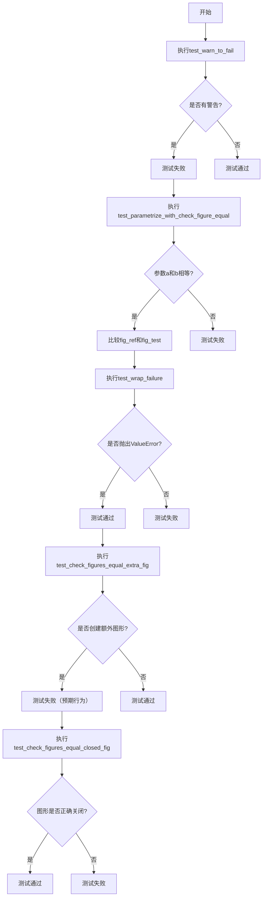
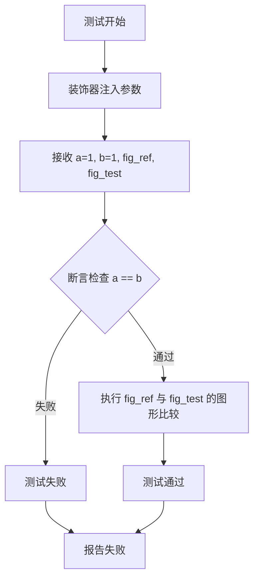
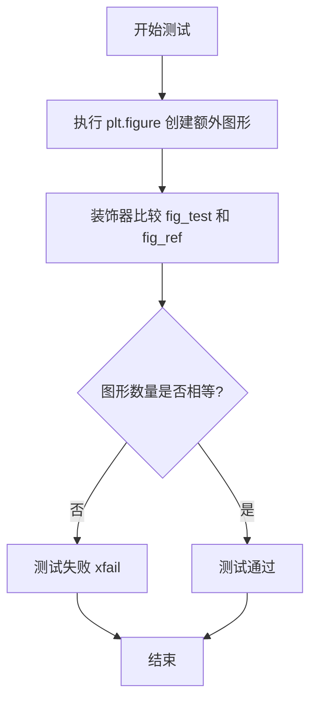
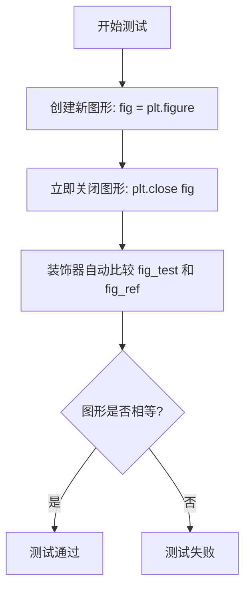

# `matplotlib\lib\matplotlib\tests\test_testing.py` 详细设计文档

这是一个pytest测试文件，用于测试matplotlib的check_figures_equal装饰器的功能，包括警告处理测试、参数化测试、图形比较、额外图形创建以及图形关闭等场景。

## 整体流程



## 类结构

```
无类定义（纯测试模块）
```

## 全局变量及字段


### `a`
    
pytest parametrize参数，用于测试参数化

类型：`int`
    


### `b`
    
pytest parametrize参数，用于测试参数化

类型：`int`
    


### `fig_ref`
    
check_figures_equal装饰器提供的参考figure fixture

类型：`matplotlib.figure.Figure`
    


### `fig_test`
    
check_figures_equal装饰器提供的测试figure fixture

类型：`matplotlib.figure.Figure`
    


### `test`
    
test_wrap_failure中用于测试的函数参数

类型：`Any`
    


### `ref`
    
test_wrap_failure中用于测试的函数参数

类型：`Any`
    


### `fig`
    
test_check_figures_equal_closed_fig中创建的figure局部变量

类型：`matplotlib.figure.Figure`
    


    

## 全局函数及方法


### `test_warn_to_fail`

该函数是一个pytest测试函数，使用 `@pytest.mark.xfail` 装饰器标记为预期失败（strict=True），用于验证当测试中发出警告时是否会触发测试失败。

参数：

- 无参数

返回值：`None`，无返回值

#### 流程图

```mermaid
graph TD
    A[测试开始] --> B{执行warnings.warn}
    B --> C[发出警告: 'This should fail the test']
    C --> D[xfail 装饰器检测到非预期行为]
    D --> E[测试被标记为 xfail (预期失败)]
    E --> F[由于 strict=True, 测试状态为 'xfailed']
    F --> G[测试结束]
```

#### 带注释源码

```python
# 导入warnings模块用于发出警告
import warnings

# 导入pytest用于测试框架
import pytest


# 使用pytest.mark.xfail装饰器标记该测试为预期失败
# strict=True 表示如果测试没有失败，则视为错误
# reason 描述了测试的目的：验证警告会导致测试失败
@pytest.mark.xfail(
    strict=True, reason="testing that warnings fail tests"
)
def test_warn_to_fail():
    """
    测试函数：验证warnings.warn会导致测试失败
    
    该测试设计为预期失败，因为：
    1. 使用了 strict=True 的 xfail 标记
    2. 函数内部发出警告 warnings.warn()
    3. pytest 会将警告视为测试失败
    """
    # 发出一个警告消息
    # 这会触发 xfail 机制，使测试被标记为预期失败
    warnings.warn("This should fail the test")
```


### `test_parametrize_with_check_figure_equal`

该函数是一个 pytest 测试函数，用于验证参数化后的测试用例中两个参数相等，同时使用 `check_figures_equal` 装饰器来比较生成的图形是否一致。

参数：

- `a`：`int`，由 `@pytest.mark.parametrize` 装饰器注入的第一个参数，值为 1
- `fig_ref`：`<class 'matplotlib.figure.Figure'>`，由 `@check_figures_equal()` 装饰器注入的参考图形对象，用于与测试图形进行视觉对比
- `b`：`int`，由 `@pytest.mark.parametrize` 装饰器注入的第二个参数，值为 1
- `fig_test`：`<class 'matplotlib.figure.Figure'>`，由 `@check_figures_equal()` 装饰器注入的测试图形对象，将与参考图形进行比较

返回值：`None`，该函数为测试函数，不返回任何值，通过断言进行验证

#### 流程图



#### 带注释源码

```python
# 导入必要的库
import warnings

import pytest

import matplotlib.pyplot as plt
from matplotlib.testing.decorators import check_figures_equal


# 定义一个预期失败的测试，用于测试警告是否会导致测试失败
@pytest.mark.xfail(
    strict=True, reason="testing that warnings fail tests"
)
def test_warn_to_fail():
    warnings.warn("This should fail the test")


# 参数化装饰器：为测试函数注入参数 a，值为 [1]
@pytest.mark.parametrize("a", [1])
# check_figures_equal 装饰器：自动比较 fig_ref 和 fig_test 两个图形是否相等
# 该装饰器会注入 fig_ref（参考图形）和 fig_test（测试图形）两个参数
@check_figures_equal()
# 参数化装饰器：为测试函数注入参数 b，值为 [1]
@pytest.mark.parametrize("b", [1])
def test_parametrize_with_check_figure_equal(a, fig_ref, b, fig_test):
    """
    测试参数化与图形比较装饰器的组合使用
    
    参数:
        a: 第一个参数化参数
        fig_ref: 参考图形（由装饰器注入）
        b: 第二个参数化参数
        fig_test: 测试图形（由装饰器注入）
    
    注意:
        - 装饰器的执行顺序从下到上：先执行 parametrize(b)，再执行 check_figures_equal，
          最后执行 parametrize(a)
        - 图形比较由 check_figures_equal 装饰器自动完成，无需在函数体内显式调用
    """
    # 断言 a 和 b 相等，由于两者都是 1，此处断言通过
    assert a == b
    # 注意：fig_ref 和 fig_test 的比较由 @check_figures_equal() 装饰器自动完成
    # 装饰器会在测试函数执行完毕后比较这两个图形对象


def test_wrap_failure():
    """测试 check_figures_equal 装饰器在错误参数下的失败行为"""
    with pytest.raises(ValueError, match="^The decorated function"):
        @check_figures_equal()
        def should_fail(test, ref):
            pass


@pytest.mark.xfail(raises=RuntimeError, strict=True,
                   reason='Test for check_figures_equal test creating '
                          'new figures')
@check_figures_equal()
def test_check_figures_equal_extra_fig(fig_test, fig_ref):
    """测试当测试函数创建额外图形时的行为"""
    plt.figure()


@check_figures_equal()
def test_check_figures_equal_closed_fig(fig_test, fig_ref):
    """测试当测试函数关闭图形时的行为"""
    fig = plt.figure()
    plt.close(fig)
```


### `test_wrap_failure`

该测试函数用于验证 `check_figures_equal` 装饰器在处理缺少必要参数（`fig_test` 和 `fig_ref`）的函数时，是否能够正确抛出 `ValueError` 异常，并确保错误消息符合预期的正则表达式格式。

参数： 无

返回值： `None`，该函数为测试函数，不返回任何值

#### 流程图

```mermaid
flowchart TD
    A[开始测试 test_wrap_failure] --> B[进入 pytest.raises 上下文管理器]
    B --> C[尝试使用 check_figures_equal 装饰器装饰函数 should_fail]
    C --> D{是否抛出 ValueError?}
    D -->|是| E{错误消息是否匹配 "^The decorated function"}
    E -->|是| F[测试通过]
    E -->|否| G[测试失败 - 错误消息不匹配]
    D -->|否| H[测试失败 - 未抛出异常]
    
    style F fill:#90EE90
    style G fill:#FFB6C1
    style H fill:#FFB6C1
```

#### 带注释源码

```python
def test_wrap_failure():
    """
    测试 check_figures_equal 装饰器的参数验证功能。
    
    该测试验证当被装饰的函数缺少必要的 pytest fixture 参数
    (fig_test 和 fig_ref) 时，装饰器能否正确抛出 ValueError。
    """
    # 使用 pytest.raises 上下文管理器捕获期望的异常
    # match 参数使用正则表达式匹配错误消息的开头
    with pytest.raises(ValueError, match="^The decorated function"):
        # 尝试使用 check_figures_equal 装饰一个不符合要求的函数
        # 正确签名应该是: def should_fail(test, fig_ref, fig_test)
        # 但这里缺少了 fig_ref 和 fig_test 参数
        @check_figures_equal()
        def should_fail(test, ref):
            pass
```

#### 补充说明

- **错误处理设计**：该测试确保装饰器能够验证被装饰函数的参数完整性，如果参数不符合 pytest fixture 的要求，将抛出明确说明问题的 `ValueError`
- **正则表达式**：`"^The decorated function"` 匹配以 "The decorated function" 开头的错误消息
- **测试目的**：验证 `check_figures_equal` 装饰器能够正确识别并报告函数签名错误，而不是默默地产生难以调试的问题


### `test_check_figures_equal_extra_fig`

该测试函数用于验证 `check_figures_equal` 装饰器能够正确检测被测函数是否创建了额外的图形。当被装饰的函数创建了额外的图形时，测试应该失败（标记为 `@pytest.mark.xfail`）。

参数：

- `fig_test`：matplotlib.figure.Figure，由装饰器自动注入的测试用图形对象
- `fig_ref`：matplotlib.figure.Figure，由装饰器自动注入的参考/基准图形对象

返回值：`None`，无明确返回值

#### 流程图



#### 带注释源码

```python
@pytest.mark.xfail(raises=RuntimeError, strict=True,
                   reason='Test for check_figures_equal test creating '
                          'new figures')
@check_figures_equal()
def test_check_figures_equal_extra_fig(fig_test, fig_ref):
    """
    测试 check_figures_equal 装饰器能否检测额外创建的图形。
    
    该测试函数故意创建一个额外的图形（通过 plt.figure()），
    期望装饰器检测到图形数量不匹配并导致测试失败。
    
    参数:
        fig_test: 由 check_figures_equal 装饰器注入的测试图形对象
        fig_ref: 由 check_figures_equal 装饰器注入的参考图形对象
    """
    plt.figure()  # 创建一个额外的空白图形，导致图形数量不匹配
```


### `test_check_figures_equal_closed_fig`

该函数是一个使用 `@check_figures_equal()` 装饰器修饰的 pytest 测试用例，用于测试当创建新图形后立即关闭时，测试图形与参考图形的比较逻辑。

参数：

- `fig_test`：`<class 'matplotlib.figure.Figure'>`，pytest-mpl 提供的测试图形 fixture，代表测试函数生成的图形
- `fig_ref`：`<class 'matplotlib.figure.Figure'>`，pytest-mpl 提供的参考图形 fixture，代表期望的图形输出

返回值：`None`，该测试函数没有显式返回值，通过装饰器内部逻辑进行图形比较

#### 流程图



#### 带注释源码

```python
@check_figures_equal()  # 装饰器：比较测试函数生成的图形与参考图形是否完全一致
def test_check_figures_equal_closed_fig(fig_test, fig_ref):
    """
    测试用例：验证 check_figures_equal 装饰器在处理已关闭图形时的行为
    
    参数:
        fig_test: 测试函数生成的图形对象（由装饰器提供）
        fig_ref: 参考图形对象（由装饰器提供）
    """
    
    fig = plt.figure()  # 创建一个新的空白图形
    plt.close(fig)      # 立即关闭该图形，不进行任何绘制操作
    
    # 装饰器会自动比较:
    # - fig_test: 当前函数生成的图形（即刚创建又被关闭的空白图形）
    # - fig_ref: 期望的参考图形
    # 由于两个图形都是空白的，装饰器会比较它们是否相等
```

## 关键组件


### test_warn_to_fail

使用 `pytest.mark.xfail` 标记的测试函数，用于验证警告会导致测试失败。

### test_parametrize_with_check_figure_equal

测试参数化装饰器与 `check_figures_equal` 装饰器组合使用的测试函数，验证两个装饰器可以正确配合工作。

### test_wrap_failure

测试 `check_figures_equal` 装饰器在函数参数不匹配时是否会正确抛出 ValueError 异常。

### test_check_figures_equal_extra_fig

使用 `pytest.mark.xfail` 标记的测试，验证当测试函数创建额外 figure 时 `check_figures_equal` 的行为。

### test_check_figures_equal_closed_fig

测试当测试函数关闭 figure 时 `check_figures_equal` 的处理行为。

### check_figures_equal 装饰器

核心组件，用于比较两个 figure 是否相等的装饰器，通过对比参考图像和测试图像来验证绘图结果的一致性。

### pytest.mark.xfail

pytest 标记，用于标记预期失败的测试用例，可以设置 strict 参数控制严格模式。

### pytest.mark.parametrize

pytest 参数化装饰器，允许在同一测试函数上使用多组参数进行测试。

### plt.figure 和 plt.close

matplotlib 的图形创建和关闭函数，用于管理图形生命周期。


## 问题及建议


### 已知问题

-   **装饰器顺序错误**：`test_parametrize_with_check_figure_equal` 函数中 `@check_figures_equal()` 装饰器位于 `@pytest.mark.parametrize("a", [1])` 之后，导致参数化可能无法正确传递给测试函数，测试参数 a 和 b 实际上未被使用
-   **断言逻辑无效**：该测试中的 `assert a == b` 仅验证参数值相等，并未真正测试图形比较功能，违背了使用 `@check_figures_equal()` 的初衷
-   **正则表达式匹配问题**：`test_wrap_failure` 中 `match="^The decorated function"` 的正则表达式可能与实际抛出的异常信息不匹配，需要验证异常消息格式
-   **xfail 过度使用**：多个测试使用 `strict=True` 的 `@pytest.mark.xfail`，这会使测试套件变得脆弱，任何意外通过或失败都会导致测试失败
-   **硬编码参数值**：`@pytest.mark.parametrize("a", [1])` 和 `@pytest.mark.parametrize("b", [1])` 仅使用单一值 1，无法有效测试参数化功能

### 优化建议

-   **修正装饰器顺序**：将 `@check_figures_equal()` 移到最外层，确保参数化装饰器先应用
-   **增强测试覆盖**：为 `test_parametrize_with_check_figure_equal` 添加多个不同的参数值（如 [1, 2, 3]），真正测试参数化与图形比较的组合效果
-   **验证异常消息**：检查 `check_figures_equal` 装饰器实际抛出的异常消息，调整正则表达式以匹配真实格式
-   **移除不必要的 xfail**：如果 `test_warn_to_fail` 的行为已被充分测试，考虑移除 xfail 标记或改为 conditional xfail
-   **添加测试文档**：为每个测试函数添加 docstring 说明测试目的和预期行为
-   **考虑使用 fixture**：将重复的图形创建逻辑提取为 fixture，提高代码复用性

## 其它


### 设计目标与约束

本代码文件的设计目标是验证`matplotlib.testing.decorators.check_figures_equal`装饰器的功能和行为，确保其在不同场景下（参数化测试、额外figure创建、figure关闭等）能正确执行图像比较功能。约束条件包括：使用pytest框架、依赖matplotlib库、测试函数命名规范遵循pytest约定。

### 错误处理与异常设计

测试用例通过`pytest.raises`预期特定异常：`test_wrap_failure`预期`ValueError`异常，验证装饰器对不符合签名的函数抛出正确异常。`test_warn_to_fail`使用`xfail`标记预期警告导致测试失败。异常信息使用正则表达式`"^The decorated function"`进行匹配验证。

### 数据流与状态机

测试数据流主要包括：参数化输入（a、b参数）→测试函数执行→figure对象创建/关闭→`check_figures_equal`装饰器比较ref和test两个figure。状态机涉及：figure创建状态、figure比较状态、figure关闭状态。`test_check_figures_equal_extra_fig`和`test_check_figures_equal_closed_fig`验证了装饰器对figure生命周期的正确处理。

### 外部依赖与接口契约

外部依赖包括：pytest框架（测试运行器）、matplotlib库（绘图和测试装饰器）、warnings模块（警告处理）。核心接口契约：`check_figures_equal`装饰器要求被装饰函数必须接受`fig_ref`和`fig_test`两个figure参数，否则抛出`ValueError`异常。

### 配置信息

测试配置通过pytest标记实现：`@pytest.mark.xfail`标记预期失败的测试、`@pytest.mark.parametrize`实现参数化测试、`@check_figures_equal()`装饰器启用图像比较功能。fixture参数`fig_ref`和`fig_test`由matplotlib testing框架自动注入。

### 性能考虑

当前测试代码性能开销较小，主要资源消耗在于figure对象的创建和渲染。参数化测试使用最小数据集（参数值为1）以减少测试执行时间。建议：如需大规模图像比较测试，考虑使用图像缓存机制。

### 安全性考虑

测试代码不涉及用户输入处理、文件系统访问或网络通信，安全性风险较低。唯一潜在风险是matplotlib.pyplot的全局状态可能影响其他测试，建议每个测试函数独立管理figure生命周期。

### 测试覆盖率分析

当前测试覆盖了以下场景：
- 装饰器基本功能验证（`test_check_figures_equal_extra_fig`、`test_check_figures_equal_closed_fig`）
- 装饰器参数签名验证（`test_wrap_failure`）
- 参数化测试与装饰器兼容性（`test_parametrize_with_check_figure_equal`）
- 警告与xfail机制结合（`test_warn_to_fail`）

覆盖率缺口：未测试多个figure比较、图像差异阈值设置、自定义比较函数等场景。

### 部署和集成说明

本测试文件作为matplotlib测试套件的一部分，可通过`pytest`命令独立运行：`pytest test_file.py -v`。集成到CI/CD流程时需确保matplotlib testing依赖已安装，建议使用与代码库匹配的matplotlib版本。

### 版本历史和变更记录

本测试文件为演示代码，主要用于验证`check_figures_equal`装饰器的预期行为。原始版本创建目的为测试matplotlib测试工具的鲁棒性，后续可根据需要添加更多边界条件测试用例。

    